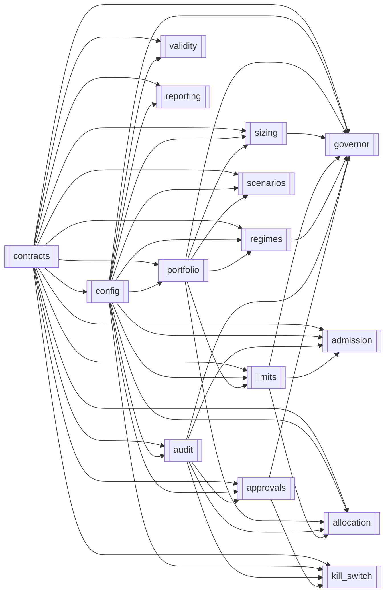

# Risk

> **Package:** `app/services/risk`
> **Status:** `Partial` — approved Trading Cockpit Phase 0 findings folded in; the 15 registered features remain implemented, but 17 work packages (`TC-IMP-RISK-01`..`TC-IMP-RISK-17`) add target behavior that is not yet implemented. See `### Trading Cockpit Phase 0 reconciliation`.

> **API-BE-003 runtime seam:** Allocation and governor composition bind their
> durable state, approval-token state, and audit ports for `FR-RISK-030` and
> `FR-RISK-041`;
> UI/API receives operation callables and never owns Risk decisions or state.
> **Last updated:** `2026-08-03`

> This README is the package's **single source of truth** for requirements, final structure, implementation sequence, progress, usage examples, and tests.
> Update this file before changing the code.

---

## 1. Purpose and Boundary

### Purpose

Risk is HaruQuantAI's independent, deterministic master gate for risk-increasing actions. It converts immutable point-in-time evidence and policy into reproducible portfolio measurements, sizing recommendations, risk decisions, approval-token results, kill-switch state, scenarios, audit records, and focused explanations. Missing, stale, invalid, or unverifiable safety evidence fails closed; Risk never executes a trade.

### Owns

- Interception and deterministic review of every `create_trade_intent_value` before execution.
- Final approved or capped position size, safety limits, exposure, concentration, drawdown, margin, leverage, historical VaR/CVaR, and correlation-impact evaluation.
- Risk policy/profile validation, stable configuration hashes, fixed decision precedence, and canonical reason/error codes.
- Canonical `RiskDecision` production through the concrete `RiskDecisionPackage` v1 schema.
- Kill-switch policy, `global > portfolio > strategy > symbol` hierarchy, canonical active state,
  block-state evaluation, clearance, and recovery eligibility.
- Approval-attestation validation, action-policy verdicts, approval-token issuance,
  validation, revocation, scope binding, expiry, and atomic durable single-use reservation.
- Strategy operational-eligibility decisions for exact registered versions/scopes, without owning technical registration.
- Allocation approval/capping/rejection, authoritative portfolio risk-budget projections, and budget activation, without constructing or executing allocations.
- Deterministic regime assessment, advisory scenario/what-if analysis, risk summaries, and risk-owned audit-chain records.

### Does not own

- Market, broker, account, position, pending-order, calendar, session, liquidity, or execution-state acquisition.
- Strategy signal generation or registry mutation; Portfolio-owned construction, allocation versioning, drift detection, or rebalance planning; portfolio execution, broker submission, fills, reconciliation, or emergency execution mutation.
- MT5 connections, provider SDK objects, broker credentials, database connection/locking infrastructure, broad performance reporting, cost reporting, incident management, or enterprise audit services.
- Full replay/timeline/cockpit infrastructure, ranked recommendation engines,
  parametric VaR, exit-liquidity stress, or a separate persisted graduated
  step-down subsystem in the initial build.
- Live approval from unverified text or any override of deterministic policy or kill-switch state.

Drawdown-aware tightening is already owned by `FEAT-RISK-07`: its equal-or-stricter
regime modifiers cap the final requested size in `FEAT-RISK-12`. The excluded legacy
step-down subsystem is not required to obtain that safety outcome.

### Shared contracts

Contract names, versions, and owners follow `docs/PROJECT.md`. The package path is `app/services/risk`, matching the top-level registry.

**Owned by this domain** — defined authoritatively here:
| Status | Contract | Version | Counterparty | Purpose |
|---|---|---|---|---|
| Completed | `RiskDecision`, represented by `RiskDecisionPackage` | `v1` | Trading, UI/API, Simulation | Return an independent verdict, approved size, reasons, evidence/config provenance, expiry, and optional approval token. |
| Completed | `ActionPolicyVerdict` | `v1` | Trading, UI/API | Return a Risk-owned allowed/denied action classification bound to approval, policy version, scope, and expiry. |
| Completed | `create_kill_switch_command` | `v1` | UI/API | Request authorized activation or clearance of Risk's canonical kill-switch state. |
| Completed | `create_kill_switch_state` | `v1` | Trading, UI/API | Publish canonical active/inactive state, scope, reason, version, and update time. |
| Completed | `create_approval_attestation` | `v1` | UI/API | Authenticated human approval evidence containing action/scope, policy reference/version, issue/expiry times, principal, and trace IDs. |
| Completed | `create_strategy_operational_eligibility_request` | `v1` | UI/API, Portfolio submit; Risk receives | Request deterministic operational review of an exact registered strategy version and scope. |
| Completed | `StrategyOperationalEligibilityDecision` | `v1` | Portfolio, Trading, UI/API | Publish scoped approval, conditions, suspension, expiry, or rejection without altering Strategy registration. |
| Completed | `create_allocation_review_request` | `v1` | Portfolio submits; Risk receives | Request independent review of a Portfolio construction result or rebalance plan. |
| Completed | `AllocationRiskDecision` | `v1` | Portfolio, Trading, UI/API | Publish approval/caps/conditions/rejection and the authoritative risk-budget projection. |
| Completed | `PortfolioBudgetExecutionVerdict` | `v1` | Trading | Publish a current Risk-owned allow/block verdict bound to one portfolio allocation, rebalance plan/hash, budget unit, and expiry without delegating calculation to Trading. |
| Completed | `create_allocation_budget_activation_request` | `v1` | Portfolio submits; Risk receives | Activate the Risk-owned budget projection for one approved immutable allocation version. |
| Completed | `ScenarioResult` | `v1` | UI/API, Research | Publish a bounded deterministic advisory comparison that cannot grant execution approval. |

Each registered Risk contract carries `contract_version="v1"` and a separate
stable `risk.<contract_name>.v1` `schema_id`, including the eligibility,
allocation-review, and budget-activation family above. Compatibility is evaluated
only from `contract_version`.

**Consumed from other domains** — referenced only:

| Contract | Version | Owner | Used for |
|---|---|---|---|
| `create_trade_intent_value` | `v1` | Strategy | Embedded unchanged inside the Risk-owned `ProposedTrade` receiver contract; Risk validates the complete public Strategy contract plus additional valuation and stop evidence. |
| `build_account_state_snapshot` | `v1` | Data | Read-only account, position, margin, and snapshot-time evidence. |
| `build_market_context_evidence` | `v1` | Data | Normalized session, calendar, spread, liquidity, volatility, correlation, crisis, freshness, provenance, and missingness evidence. |
| `build_fx_conversion_evidence` | `v1` | Data | Fresh Data-owned conversion path/rate evidence; Risk never synthesizes rates. |
| Strategy registry reference | `v1` | Strategy | Verify exact immutable technical registration before operational eligibility review. |
| `PortfolioAllocationEvidence` | `v1` | Analytics | Consume non-binding performance/dependence/concentration evidence without delegating policy. Referenced by ID/hash inside `create_allocation_review_request`; Risk does not import the Analytics contract object, so allocation review does not require the Analytics implementation to be present. |
| `create_auth_context` | `v1` | Utils | Authenticated principal, roles/scopes, workflow, request, and correlation context. |
| `AuditEvent` | `v1` | Utils | Redacted common envelope through which Risk submits audit payloads to Data's durable audit storage. |

No raw DataFrame, provider object, socket, database session, or broker client may cross the Risk boundary.

### Persisted state

Data owns database connections, locking, and migration execution. Risk owns the following schemas and is their only semantic writer; concrete persistence occurs through injected narrow interfaces.

All Risk relational CRUD is centralized in the private support package
`app/services/risk/persistence/`, whose sole boundary is `persistence/__init__.py`.
Its implementation is divided consistently into `create.py`, `read.py`,
`update.py`, and `delete.py`; feature runtime adapters contain policy and
coordination only. Risk records are stored in the seven Risk-owned tables rather
than Data's generic `data_runtime_records`; Data remains responsible for connection,
locking, and transaction execution. This support directory is not a separately
registered feature.

Application composition initializes those tables through `run_risk_migrations`, which
submits Risk's immutable manifest to Data's public migration executor.

| Status | State / Store | Read access (via contract) | Migration definitions |
|---|---|---|---|
| Completed | Risk policy versions and configuration hashes | Risk; UI/API through approved policy views | `app/services/risk/migrations/definitions.py` |
| Completed | Canonical kill-switch state | Trading and UI/API through `create_kill_switch_state` v1 | `app/services/risk/migrations/definitions.py` |
| Completed | Approval-token issuance, revocation, nonce, and atomic reservation/consumption state | Risk validation only; validation result returned to caller | `app/services/risk/migrations/definitions.py` |
| Completed | Decision audit chain, including `previous_hash` and `record_hash` | Trading/UI/API through `RiskDecision` and audit views through `AuditEvent` | `app/services/risk/migrations/definitions.py` |
| Completed | Operational-eligibility decisions and suspension/expiry history | Portfolio, Trading, UI/API through `StrategyOperationalEligibilityDecision` | `app/services/risk/migrations/definitions.py` |
| Completed | Allocation decisions and active authoritative risk-budget projections | Portfolio, Trading, UI/API through `AllocationRiskDecision` and approved Risk views | `app/services/risk/migrations/definitions.py` |
| Completed | Optional decision/snapshot records enabled by an approved profile | Callers through Risk-owned result contracts only | `app/services/risk/migrations/definitions.py` |

### Trading Cockpit Phase 0 reconciliation

This subsection folds the approved Trading Cockpit Phase 0 audit (`TC-IMP-RISK-01`..`TC-IMP-RISK-17`) into this authoritative README so that it is self-contained. Phase 0 classified the seventeen Risk work packages as **two `CREATE`, twelve `EXTEND`, one `REFACTOR`, and two `DEFERRED_INTEGRATION`**. New target work is `Missing`; extended existing features become `Partial`.

Cross-domain contract transport is settled per the Utils domain: versioned cross-domain contracts travel as **validated JSON-safe mappings behind `build_*`/`parse_*` function pairs** exported from the package root, preserving the function-only public-API rule in `AGENTS.md` §1.

**Reused existing assets (no duplication):**

| Cockpit capability | Existing Risk asset reused | Phase 0 gap |
| --- | --- | --- |
| Risk policy profiles & stable config | `config/` (`FEAT-RISK-02`), `risk_policy_versions` | `TC-IMP-RISK-01` |
| Portfolio risk snapshot & market-context evidence | `portfolio/` (`FEAT-RISK-03`); `PortfolioState` (`contracts/evidence.py:240`) | `TC-IMP-RISK-09` |
| Position sizing | `sizing/` (`FEAT-RISK-04`) | `TC-IMP-RISK-05` |
| Limits & regime tightening | `limits/` (`FEAT-RISK-06`), `regimes/` (`FEAT-RISK-07`) | `TC-IMP-RISK-09`, `TC-IMP-RISK-11` |
| Durable kill switch (CAS) + approval tokens | `kill_switch/` (`FEAT-RISK-13`), `approvals/` (`FEAT-RISK-10`), `risk_kill_switch_states` | `TC-IMP-RISK-14` |
| Canonical risk governor | `governor/` (`FEAT-RISK-12`) | `TC-IMP-RISK-13` |
| Advisory scenario analysis | `scenarios/` (`FEAT-RISK-14`), `ScenarioDefinition` (`contracts/requests.py`) | `TC-IMP-RISK-12` |
| Risk decision summaries | `reporting/` (`FEAT-RISK-15`), `RiskDecisionPackage` | `TC-IMP-RISK-16` |

**Target contracts/features to add or extend:**

| Status | Target | Reuses / extends | Phase 0 gap |
| --- | --- | --- | --- |
| Partial | `TradingPolicyProfile v1` additions | Extends `FEAT-RISK-02`. Adds drawdown, emergency, and assessment rule groups. | `TC-IMP-RISK-01` |
| Partial | Effective-rule resolver | Extends `FEAT-RISK-06`/`FEAT-RISK-07`. Combines scenario, account, venue/instrument, strategy, simulator defaults via strictest-wins; fail-closed. | `TC-IMP-RISK-02` |
| Partial | Trade readiness gate | Extends `FEAT-RISK-12`. Re-evaluates session/news/lock/entry/stop/exit/strategy/broker/data/margin/correlation/stress at submit; fail-closed. | `TC-IMP-RISK-03` |
| Partial | Planned risk and net reward | Extends `FEAT-RISK-04`. Includes stop distance, contract value, qty, fees, spread, estimated slippage; fail-closed. | `TC-IMP-RISK-04` |
| Partial | Position sizing additions | Extends `FEAT-RISK-04`. Min of risk/margin/symbol/portfolio/liquidity/strategy/stress caps; round down to venue step. Adds a property test that size never exceeds any cap. | `TC-IMP-RISK-05` |
| Missing | Stop-loss validator | **New feature** — see Feature Registry `FEAT-RISK-16`. Side, tick validity, invalidation, noise/venue distance, projected loss, widening permissions; fail-closed. | `TC-IMP-RISK-06` |
| Deferred | RR / expectancy gate | Applies min RR unless a current approved exactly-matched expectancy profile is eligible. **Deferred to Research `TC-IMP-RES-03`/`TC-IMP-RES-04`** (Phase 11). Fails closed to the normal risk-to-reward gate until then; never returns an inferred approval. | `TC-IMP-RISK-07` |
| Partial | Drawdown engine | Extends `FEAT-RISK-06`. Static/trailing, realized/unrealized, daily/total reference; `NORMAL`/`CAUTION`/`RESTRICTED`/`CRITICAL`/`LOCKED` state machine; fail-closed. | `TC-IMP-RISK-08` |
| Partial | Exposure and correlation gates | Extends `FEAT-RISK-06`. Symbol/strategy/currency/directional/gross/correlated-cluster limits via Portfolio view; fail-closed. **Depends on `TC-IMP-PORT-09`/`TC-IMP-PORT-17`** (Phase 12 authoritative portfolio view). | `TC-IMP-RISK-09` |
| Deferred | Margin and leverage gates | Pre-trade projected margin, reserve, leverage, maintenance, liquidation proximity; fail-closed. **Deferred to Portfolio `TC-IMP-PORT-07`** (Phase 12 margin and buying power). | `TC-IMP-RISK-10` |
| Partial | Market restrictions | Extends `FEAT-RISK-07`/`FEAT-RISK-08`. Session, news blackout, quote freshness, spread, liquidity, weekend, overnight, venue-state; fail-closed. | `TC-IMP-RISK-11` |
| Partial (REFACTOR) | Stress-loss and gap-risk model | Extends `FEAT-RISK-14`. Nominal, liquidity-adjusted, gap, event, margin-liquidation, portfolio stress layers. **Open Decision OD-RISK-01:** Risk's `ScenarioDefinition` (`contracts/requests.py`) is explicitly advisory and cannot block; the cockpit requires a blocking stress model. Paired with Simulator `OD-SIM-02`. The refactor migrates callers and resolves the name collision with Simulator's blocking `ScenarioDefinition`; it is documented here and in the Simulator README, not executed in this documentation task. | `TC-IMP-RISK-12` |
| Partial | Emergency risk governor | Extends `FEAT-RISK-12`. Flash crash, data/connectivity failure, margin emergency, drawdown breach, unknown state, recovery lock; fail-closed. | `TC-IMP-RISK-13` |
| Partial | Account lock and cooldown | Extends `FEAT-RISK-13` + `risk_kill_switch_states` (CAS). Durable lockout, close-only/reduction-only permissions, cooldown timer, explicit re-arming, review. **Phase 0 finding S-3:** the kill switch is a single boolean today and cannot separate the new-exposure lock from cancel/protection/reduction/closure (required by acceptance criterion 12 and steps `FLASH_002`/`DD_002`). | `TC-IMP-RISK-14` |
| Partial | Continuous monitoring | **LOW confidence — re-investigate before implementing (`TC-IMP-RISK-15`).** Recalculate risk after market events, fills, cancellations, position/valuation/policy changes. Only revalidation-on-reuse is currently evidenced; an event-driven recalc loop is unconfirmed. | `TC-IMP-RISK-15` |
| Partial | Explainable risk decision | Extends `FEAT-RISK-15` (`RiskDecisionPackage`). Structured allow/block/resize/restrict result, failed rules, inputs, effective limits, source versions, corrective actions. Adds `RESIZE`/`RESTRICT` outcomes. | `TC-IMP-RISK-16` |
| Missing | No-trade success state | **New feature** — see Feature Registry `FEAT-RISK-17`. Distinguishes a safe stand-down from failed gameplay when mandatory gates reject a setup; a correctly identified no-trade day is a passing outcome. | `TC-IMP-RISK-17` |

**Boundary clarifications folded in:** Risk owns policies, validation gates, risk decisions, sizing authority, drawdown restrictions, lockouts, stress gates, and emergency risk governance. It consumes evidence and portfolio views but does not own broker execution or the financial ledger. Risk's `PortfolioState` (`contracts/evidence.py:240`) is a Risk-owned **input** contract carrying normalized portfolio evidence; the authoritative account/equity/drawdown state is owned by Portfolio (`TC-IMP-PORT-17`, Open Decision OD-PORT-02) — Risk does not redefine the authoritative ledger.

### Four-level structure

| Code level | Represents |
|---|---|
| **Package** | Risk domain |
| **Module folder** | One Risk feature/capability |
| **File** | One use case or focused responsibility |
| **Class / function / method** | Observable functional requirement |

```text
Risk package
└── Capability module
    └── Focused file
        └── Public class / function / method / constant
```

### Package capability map


```mermaid
flowchart TD
    RISK[[Risk Package]]
    RISK --> CONTRACTS[[contracts]]
    RISK --> CONFIG[[config]]
    RISK --> PORTFOLIO[[portfolio]]
    RISK --> SIZING[[sizing]]
    RISK --> AUDIT[[audit]]
    RISK --> LIMITS[[limits]]
    RISK --> REGIMES[[regimes]]
    RISK --> ADMISSION[[admission]]
    RISK --> ALLOCATION[[allocation]]
    RISK --> APPROVALS[[approvals]]
    RISK --> VALIDITY[[validity]]
    RISK --> GOVERNOR[[governor]]
    RISK --> KILLSWITCH[[kill_switch]]
    RISK --> SCENARIOS[[scenarios]]
    RISK --> REPORTING[[reporting]]

    CONTRACTS --> CFILES[Enums, errors, evidence, requests, results]
    CONFIG --> CFGFILES[Profiles and config hashes]
    PORTFOLIO --> PFILES[Evidence normalization and snapshot]
    SIZING --> SFILES[Position sizing]
    AUDIT --> AFILES[Hash chain, persistence interface, migrations]
    LIMITS --> LFILES[Portfolio and market-context limit evaluation]
    REGIMES --> RFILES[Regime assessment]
    ADMISSION --> ADFILES[Strategy operational eligibility]
    ALLOCATION --> ALFILES[Allocation review and budget activation]
    APPROVALS --> APFILES[Token lifecycle and state interface]
    VALIDITY --> VFILES[Decision reuse revalidation]
    GOVERNOR --> GFILES[Pre-trade and current-state orchestration]
    KILLSWITCH --> KFILES[Kill-switch authority and block state]
    SCENARIOS --> SCFILES[Scenario and what-if analysis]
    REPORTING --> RPFILES[Markdown and JSON summaries]
```

---

## 2. Final Package Structure

Modules and files are ordered from lowest dependency to highest dependency. Private helpers may be added inside the listed focused files; they are not public requirements.

### Feature Registry

| Status | Feature | Owning module | Public API and contracts | Requirements | Usage evidence |
|---|---|---|---|---|---|
| Completed | `FEAT-RISK-01` Versioned Contracts and Deterministic Errors | `contracts/` | Exact declarations and contract fields: Section 4.1 | Section 4.1 functional requirements | `tests/risk/usage/features/01_contracts.py` |
| Completed | `FEAT-RISK-02` Risk Profiles and Stable Configuration | `config/` | Exact declarations: Section 4.2; secret-free `build_development_risk_config` research manifest with external signing-key reference | Section 4.2 functional requirements | `tests/risk/usage/features/02_config.py` |
| Completed | `FEAT-RISK-03` Portfolio Risk Snapshot | `portfolio/` | Exact declarations and snapshot contracts: Section 4.3 | Section 4.3 functional requirements | `tests/risk/usage/features/03_portfolio.py` |
| Completed | `FEAT-RISK-04` Position Sizing Recommendations | `sizing/` | Exact declarations: Section 4.4 | Section 4.4 functional requirements | `tests/risk/usage/features/04_sizing.py` |
| Completed | `FEAT-RISK-05` Tamper-Evident Risk Audit | `audit/` | Exact declarations and audit contracts: Section 4.5; durable stable-scope kill-switch CAS/read adapter | Section 4.5 functional requirements | `tests/risk/usage/features/05_audit.py` |
| Completed | `FEAT-RISK-06` Portfolio and Market-Context Limits | `limits/` | Exact declarations: Section 4.6 | Section 4.6 functional requirements | `tests/risk/usage/features/06_limits.py` |
| Completed | `FEAT-RISK-07` Regime Assessment and Limit Tightening | `regimes/` | Exact declarations: Section 4.7 | Section 4.7 functional requirements | `tests/risk/usage/features/07_regimes.py` |
| Completed | `FEAT-RISK-08` Strategy Operational Eligibility | `admission/` | Exact declarations: Section 4.8 | Section 4.8 functional requirements | `tests/risk/usage/features/08_admission.py` |
| Completed | `FEAT-RISK-09` Allocation Review and Budget Activation | `allocation/` | Exact declarations: Section 4.9 | Section 4.9 functional requirements | `tests/risk/usage/features/09_allocation.py` |
| Completed | `FEAT-RISK-10` Durable Approval-Token Lifecycle | `approvals/` | Exact declarations and token contracts: Section 4.10 | Section 4.10 functional requirements | `tests/risk/usage/features/10_approvals.py` |
| Completed | `FEAT-RISK-11` Decision Reuse Revalidation | `validity/` | Exact declarations: Section 4.11 | Section 4.11 functional requirements | `tests/risk/usage/features/11_validity.py` |
| Completed | `FEAT-RISK-12` Canonical Risk Governor | `governor/` | Exact declarations and decision contracts: Section 4.12 | Section 4.12 functional requirements | `tests/risk/usage/features/12_governor.py` |
| Completed | `FEAT-RISK-13` Kill-Switch Authority and Block State | `kill_switch/` | Exact declarations and state contracts: Section 4.13 | Section 4.13 functional requirements | `tests/risk/usage/features/13_kill_switch.py` |
| Completed | `FEAT-RISK-14` Advisory Scenario Analysis | `scenarios/` | Exact declarations: Section 4.14 | Section 4.14 functional requirements | `tests/risk/usage/features/14_scenarios.py` |
| Completed | `FEAT-RISK-15` Risk Decision Summaries | `reporting/` | Exact declarations and report contracts: Section 4.15 | Section 4.15 functional requirements | `tests/risk/usage/features/15_reporting.py` |
| Missing | `FEAT-RISK-16` Stop-Loss Validator | `stop_validation/` *(planned)* | Trading Cockpit Phase 0 reconciliation (§1); `build_stop_validation`/`parse_stop_validation` side, tick validity, invalidation, noise/venue distance, projected loss, widening permissions | `FR-RISK-082`..`FR-RISK-084` *(planned)* | `tests/risk/usage/features/16_stop_validation.py` *(planned)* |
| Missing | `FEAT-RISK-17` No-Trade Success State | `no_trade_state/` *(planned)* | Trading Cockpit Phase 0 reconciliation (§1); `build_no_trade_outcome`/`parse_no_trade_outcome` distinguishing safe stand-down from failed gameplay when mandatory gates reject a setup | `FR-RISK-085`..`FR-RISK-087` *(planned)* | `tests/risk/usage/features/17_no_trade_state.py` *(planned)* |

```text
risk/
├── __init__.py                         # Strict domain-level exports
├── README.md
├── contracts/                          # Versioned public contracts and errors
│   ├── __init__.py
│   ├── enums.py
│   ├── errors.py
│   ├── evidence.py
│   ├── factories.py
│   ├── requests.py
│   └── results.py
├── config/                             # Validated profiles and stable hashes
│   ├── __init__.py
│   ├── factories.py
│   ├── mandates.py
│   └── profiles.py
├── portfolio/                          # Evidence normalization and risk snapshot
│   ├── __init__.py
│   └── snapshot.py
├── sizing/                             # Position sizing recommendations
│   ├── __init__.py
│   └── calculator.py
├── audit/                              # Risk audit chain and persistence boundary
│   ├── __init__.py
│   ├── chain.py
│   ├── storage.py
│   ├── migrations.py
│   └── runtime.py
├── limits/                             # Portfolio and market-context limit evaluation
│   ├── __init__.py
│   └── evaluation.py
├── regimes/                            # Regime assessment and tightening
│   ├── __init__.py
│   └── assessment.py
├── admission/                          # Strategy operational eligibility
│   ├── __init__.py
│   └── eligibility.py
├── allocation/                         # Allocation review and budget activation
│   ├── __init__.py
│   └── budget.py
├── approvals/                          # Approval-token lifecycle
│   ├── __init__.py
│   ├── state.py
│   ├── tokens.py
│   └── runtime.py
├── persistence/                        # Private shared Risk CRUD support
│   ├── __init__.py
│   ├── create.py
│   ├── read.py
│   ├── update.py
│   └── delete.py
├── validity/                           # Decision reuse revalidation
│   ├── __init__.py
│   └── revalidation.py
├── governor/                           # Canonical pre-trade and current-state decisions
│   ├── __init__.py
│   └── orchestration.py
├── kill_switch/                        # Kill-switch authority and block state
│   ├── __init__.py
│   └── authority.py
├── scenarios/                          # Advisory scenario and what-if analysis
│   ├── __init__.py
│   └── analysis.py
└── reporting/                          # Focused Risk summaries
    ├── __init__.py
    └── reports.py
```

### Module dependency diagram

Arrows point from a required module to its consumer.


```mermaid
flowchart LR
    C[[contracts]] --> CFG[[config]]
    C --> P[[portfolio]]
    CFG --> P
    C --> S[[sizing]]
    CFG --> S
    P --> S
    C --> A[[audit]]
    CFG --> A
    C --> L[[limits]]
    CFG --> L
    P --> L
    C --> R[[regimes]]
    CFG --> R
    P --> R
    C --> AD[[admission]]
    CFG --> AD
    A --> AD
    L --> AD
    C --> AL[[allocation]]
    CFG --> AL
    P --> AL
    A --> AL
    L --> AL
    C --> AP[[approvals]]
    CFG --> AP
    A --> AP
    C --> V[[validity]]
    CFG --> V
    C --> G[[governor]]
    CFG --> G
    P --> G
    S --> G
    L --> G
    R --> G
    A --> G
    AP --> G
    C --> K[[kill_switch]]
    CFG --> K
    A --> K
    AP --> K
    C --> SC[[scenarios]]
    CFG --> SC
    P --> SC
    C --> REP[[reporting]]
    CFG --> REP
```

### Structure rules

- Package and feature `__init__.py` files contain explicit imports and `__all__` only.
- Root `__all__` is the sole public boundary and contains only standalone
  functions. Contract classes, enum classes, constants, calculators, persistence
  backends, signers, repositories, and provider objects remain private.
- Stateful `RiskGovernor`, `ApprovalTokenService`, and `RiskAuditChain`
  implementations are private. Their public factory and operation functions
  validate opaque coordinator identity before delegating.
- `core/`, `api/`, `models/`, `simulation/`, `safety/`, generic `storage/`, generic `validators/`, and `workflows/` compatibility layers are not part of the target.
- No module imports Trading, MT5, a broker adapter, Data internals, or another domain's persistence implementation.
- Usage examples live only under `tests/risk/usage/`.
- Section 2 dependency order governs implementation sequencing; Appendix P delivery phases do not override intra-module dependency order. A type or constructor is never implemented after its methods or consumers (e.g., `RiskConfig` precedes `load_risk_config`; `RiskAuditChain`/`ApprovalTokenService` constructors precede their methods). When only a phase slice is built, each prerequisite requirement is pulled into the same slice as its dependents.
- Section 4 Files tables are exhaustive only for production files below `app/services/risk/`. The exact Section 7 Risk test manifest, test-package `__init__.py` files, this README, `docs/CHANGELOG.md`, `pyproject.toml`, and `uv.lock` are approved supporting files.

---

## 3. Workflows

> **Workflow usage evidence:** Each of the fifteen active workflows has one
> standalone input-to-output program with README-aligned stages. Programs mutate only
> isolated injected Risk stores and never execution/broker state. Run all programs
> with `python tests/risk/usage/workflows/run_all.py`. This satisfies
> `NFR-RISK-010`; retired `WF-RISK-013` has no program.

### Pipeline

Risk is the independent gate between a Strategy signal and Trading execution. It never executes the trade itself. Its final output is an immutable decision: approve, needs approval, block, or reject.

#### End-to-end Risk pipeline

1. Receive a Strategy signal
  ↓
2. Construct immutable trade intent lineage
  ↓
3. Construct the Risk-owned proposed trade
  ↓
4. Collect virtual account, position and pending-order evidence
  ↓
5. Build the immutable portfolio snapshot
  ↓
6. Select and hash the active Risk policy
  ↓
7. Validate identities, environment, lineage and timestamps
  ↓
8. Assemble the complete kill-switch hierarchy
  ↓
9. Validate evidence freshness
  ↓
10. Assess the supplied market regime
  ↓
11. Evaluate portfolio limits in fixed precedence
  ↓
12. Evaluate market and execution-context limits
  ↓
13. Calculate or disclose the regime-capped requested size
  ↓
14. Project post-trade gross exposure
  ↓
15. Apply concurrent-capacity protection
  ↓
16. Determine authenticated approval requirements
  ↓
17. Invoke the canonical review_trade_risk() governor
  ↓
18. Inspect every ordered RiskLimitResult
  ↓
19. Inspect the final RiskDecisionPackage
  ↓
20. Inspect the scoped approval token when approved
  ↓
21. Verify the tamper-evident audit entry
  ↓
22. Illustrate the Trading revalidation and token-consumption handoff
  ↓
23. Illustrate post-trade evidence refresh using a virtual closed trade
  ↓
24. Illustrate continuing monitoring and kill-switch remediation

#### 1. Receive a Strategy signal

A Strategy identifies a potential trade, for example:

EURUSD
BUY
entry around 1.1000
stop loss 1.0950
take profit 1.1100
strategy: trend-following-v3

A signal is only an analytical result. It has no authority to place an order.

#### 2. Construct immutable trade intent lineage

Strategy converts the signal into an immutable trade intent containing:

- Intent ID
- Strategy ID and version
- Symbol
- OPEN, INCREASE, REDUCE, or CLOSE
- Buy or sell direction
- Proposed entry, stop and target
- Requested size, if Strategy supplies one
- Account and portfolio identity
- Request, workflow and correlation IDs
- Creation and expiration timestamps

Risk retains the complete Strategy intent for lineage.

#### 3. Construct the Risk-owned proposed trade

The system packages the intent into a Risk-owned ProposedTrade.

The proposal adds facts required to evaluate risk:

- Account ID
- Risk profile
- Current market price
- Market observation time
- Requested size
- Stop-loss distance
- Proposal expiry
- Authenticated request identity
- Strategy intent lineage

Conflicting duplicated facts are rejected. For example, if the Strategy intent says EURUSD but the market evidence says GBPUSD, Risk fails closed.

#### 4. Collect current account, position and pending-order evidence

Risk requires point-in-time evidence rather than reading or inventing values itself.

The input set normally includes:

- Account balance, equity and available margin
- Existing portfolio positions and exposures
- Pending-order exposure
- Daily and cumulative loss
- Current drawdown
- Symbol, currency and correlated exposure
- Effective leverage
- Historical VaR and CVaR evidence
- Current spread and market state
- Volatility and correlation regime evidence
- Applicable firm mandate
- Kill-switch states
- Authenticated principal and permissions
- Current policy configuration

Evidence carries timestamps and provenance references. Missing required evidence does not become zero.

#### 5. Build the immutable portfolio snapshot

Risk normalizes the supplied account and portfolio facts into an immutable PortfolioRiskSnapshot.

It calculates or records:

- Balance and equity
- Daily and total loss
- Portfolio drawdown
- Gross and net exposure
- Exposure by symbol
- Exposure by currency or another dimension
- Margin utilization
- Free-margin evidence
- Effective leverage
- Portfolio correlation
- Historical VaR and CVaR
- Existing strategy and position exposure
- Evidence timestamps and references

The snapshot is bound to:

- Account
- Request and workflow
- Observation time
- Risk configuration hash
- Source evidence

#### 6. Select and hash the active Risk policy

The appropriate Risk policy is selected, such as:

- personal-account-default-v1
- prop-firm-default-v1
- A later account-specific policy
- A verified firm-specific mandate

Risk computes the canonical SHA-256 configuration hash. The proposal, snapshot and eventual decision must all reference the same configuration.

A policy mismatch blocks the request.

The two defaults currently stored are paper-route policies; neither grants live-trading permission.

#### 7. Validate identities, environment, lineage , timestamps and request boundaries

Before evaluating limits, Risk validates:

- Contract and schema versions
- Request, workflow and correlation IDs
- Account identity
- Strategy and intent identity
- Symbol identity
- Risk profile and execution environment
- Proposal expiration
- UTC timestamps and clock skew
- Snapshot configuration hash
- Market observation binding
- Authenticated caller identity and environment
- Firm-mandate verification, when applicable

Any inconsistency fails closed.

#### 8. Assemble the complete kill-switch hierarchy

Kill switches are evaluated before ordinary limits.

The complete applicable hierarchy can include:

1. Global kill switch
2. Portfolio kill switch
3. Strategy kill switch
4. Symbol kill switch

If any applicable state is active, the proposed risk increase is blocked.

For live-sensitive processing, an incomplete or unknown kill-switch hierarchy also blocks. No caller can override it.

#### 9. Validate evidence freshness

Risk checks each evidence timestamp against the active policy's maximum age.

Examples:

- Portfolio evidence must be no older than its configured limit.
- Market evidence must be no older than its configured limit.
- The decision clock must remain within the permitted clock-skew tolerance.
- Proposal and mandate evidence must still be valid.

Missing, stale or future-dated evidence produces a blocking result rather than a substituted value.

#### 10. Assess the supplied market regime

Risk classifies the supplied market environment using evidence such as:

- Volatility
- Correlation
- Drawdown state
- Crisis-window evidence

The regime might be normal, elevated, high-risk, crisis, or unknown.

A regime modifier may reduce permitted size. For example:

Requested size: 1.00 lot
High-risk modifier: 0.50
Regime-capped size: 0.50 lot

Unknown required regime evidence blocks live-sensitive decisions.

#### 11. Evaluate portfolio limits in fixed precedence

Risk produces an ordered RiskLimitResult for every applicable check.

The existing portfolio evaluator checks:

1. Portfolio evidence freshness
2. Snapshot consistency
3. Daily loss
4. Total loss
5. Portfolio drawdown
6. Symbol concentration
7. Other configured concentration dimensions
8. Margin utilization
9. Effective leverage
10. Historical VaR
11. Historical CVaR
12. Portfolio correlation

A verified prop-firm mandate can replace generic daily-loss and drawdown limits with the firm's actual rules.

The first failure becomes primary_failure_limit. All failures are retained as ordered composite_breach_flags.

#### 12. Evaluate market and execution-context limits

Market-context checks evaluate applicable conditions such as:

- Spread
- Trading session
- Calendar/news blackout
- Market-context freshness
- Required market evidence

The new policies also contain:

- Maximum and preferred risk per trade
- Daily, weekly and monthly loss limits
- Portfolio, strategy and symbol drawdown limits
- Symbol, currency-cluster and correlated exposure limits
- Total, gross and net exposure limits
- Leverage and margin limits
- Position, order, strategy and trade-count ceilings
- Consecutive-loss limit
- Spread, slippage, commission and swap limits
- Kill-switch loss and drawdown thresholds

Important distinction: a configured limit is evaluated only when trustworthy evidence for it is supplied. Missing required evidence must block; it must not be treated as passing.

#### 13. Calculate pozition size and / or disclose the regime-capped requested size

Position sizing is deterministic and cannot approve a trade on its own.

Inputs can include:

- Account equity
- Preferred and maximum risk per trade
- Entry price
- Stop-loss price or distance
- Instrument point/tick value
- Contract size
- Minimum and maximum volume
- Volume step
- Existing exposure
- Volatility or correlation adjustment
- Regime modifier
- Margin constraints

Conceptually:

risk capital = equity * permitted risk percentage

raw size = risk capital / loss per unit at stop

approved size = floor raw size to broker volume step

Risk then caps the result using:

- Maximum trade risk
- Symbol and portfolio exposure
- Available margin
- Leverage
- Strategy allocation
- Regime modifier
- Broker volume constraints

If the stop or instrument valuation evidence is absent, Risk cannot safely calculate size.

#### 14. Project post-trade gross exposure

Risk evaluates the portfolio as it would look after the proposed trade.

The current governor explicitly calculates:

projected gross exposure
    = current gross exposure
    + abs(regime-capped size * current price)

The proposal must not pass merely because the current portfolio is within limits. The projected portfolio must remain acceptable too.

Pending orders must be included according to the configured policy or the operation blocks if their exposure cannot be established.

#### 15. Apply concurrent-capacity protection

Two individually valid trades might become unsafe if approved simultaneously.

For a risk-increasing action, Risk therefore performs a concurrency or capacity gate:

- Derive an identity from the intent, configuration hash and size.
- Reserve account/strategy/symbol capacity.
- Bind the reservation to an expiry.
- Treat an exact existing reservation as idempotent.
- Block if capacity is unavailable.
- Fail closed if the capacity dependency is unavailable.

Where no external capacity guard is configured, atomic approval-token consumption provides the double-spend protection.

Risk-reducing actions do not need a risk-increase capacity reservation.

#### 16. Determine authenticated approval requirements

After the safety checks:

- A blocked limit produces BLOCK or REJECT.
- A safe risk-reducing action may proceed according to policy.
- A safe risk-increasing action without the required attestation becomes NEEDS_APPROVAL.
- A valid authenticated attestation allows approval processing to continue.

The attestation must match:

- Decision
- Workflow
- Action
- Scope
- Authenticated principal
- Risk configuration
- Validity period

#### 17. Invoke the canonical review_trade_risk() governor

Risk executes the single canonical `review_trade_risk()` governor function to evaluate all inputs, checks, sizing, concurrency, attestation, and audit persistence in fixed precedence.

#### 18. Inspect every ordered RiskLimitResult

The governor returns an ordered sequence of typed `RiskLimitResult` items, recording each evaluated limit, its precedence, pass/fail status, and reason code.

#### 19. Inspect the final RiskDecisionPackage

Risk creates an immutable RiskDecisionPackage containing:

- Decision ID
- Intent ID
- Requested size
- Approved size, if approved
- Final state (APPROVE, NEEDS_APPROVAL, BLOCK, or REJECT)
- Every ordered check
- Primary failure limit
- Composite breach flags
- Evidence references
- Configuration hash
- Concurrency disclosure
- Recommendations
- Issue and expiration times
- Request, workflow and correlation IDs
- Optional approval token

approved_size is absent unless the decision is approved.

#### 20. Inspect the scoped approval token when approved

For an approved risk-increasing action, Risk issues a short-lived approval token.

The token is bound to:

- Decision ID
- Intent and action
- Account and scope
- Approved size
- Workflow identity
- Configuration hash
- Expiration
- Authenticated attestation

The token does not grant general trading authority. It authorizes only the exact approved action.

#### 21. Verify the tamper-evident audit entry

Before returning the decision, Risk appends an audit record containing:

- Decision and event identity
- Ordered results
- Evidence references
- Configuration hash
- Request and correlation IDs
- Timestamp
- Previous audit-record hash
- Current record hash

If mandatory audit persistence fails, approval fails closed.

The decision is also eligible for durable storage in risk_decision_snapshots, while policy versions, approval state and kill-switch state use their respective Risk tables.

#### 22. Illustrate the Trading revalidation and token-consumption handoff

Risk returns the decision to the workflow coordinator. Risk does not send the order to the broker.

Outcomes:

- BLOCK or REJECT: stop the workflow.
- NEEDS_APPROVAL: obtain a valid human attestation and repeat the controlled approval stage.
- APPROVE: forward the exact decision, approved size and token to Trading.

Before execution, Trading verifies:

- Decision has not expired.
- Intent, account, symbol and action match.
- Approved size has not been increased.
- Configuration hash matches.
- Risk decision and token refer to one another.
- Environment and route match.
- Kill-switch state has not invalidated execution.
- Required market and account evidence remains current.

A changed order must return to Risk. Trading cannot enlarge the size or alter the risk-bearing terms.

Immediately before the risk-increasing side effect, the approval token is:

1. Validated
2. Reserved
3. Atomically consumed
4. Audited

A consumed token cannot be reused. Concurrent attempts result in only one valid consumer. Unknown token state or persistence failure blocks execution.

#### 23. Illustrate post-trade evidence refresh using a virtual closed trade

Trading may submit the approved order to simulation, paper or live execution. The order remains governed by:

- Exact approved size
- Exact account and symbol
- Approved order action
- Environment boundary
- Idempotency controls

A broker rejection or uncertain execution outcome does not cause Risk or Trading to invent a fill.

After broker authority evidence arrives:

- Trading records authoritative events.
- Reduce exposure
- Close positions
- Pause a strategy
- Require review

Trading owns execution of those actions. Risk owns the decision and non-bypassable block state.

#### 24. Illustrate continuing monitoring and kill-switch remediation

Risk continues active monitoring of portfolio states. If a global, portfolio, strategy, or symbol kill switch is activated, all subsequent proposed risk increases are immediately blocked with non-bypassable enforcement.

The essential rule is:

> A signal becomes executable only after its identity, evidence, policy, kill-switch state, limits, size, concurrency, approval and audit trail all agree. Any uncertainty blocks the risk increase.

### Workflow rank values

| Rank | Identifier | Meaning |
|---|---|---|
| **Primary** | `WF-RISK-PRI` | The workflow this domain exists to serve. |
| **Secondary** | `WF-RISK-SEC` | The next most load-bearing workflow. |
| **Tertiary** | `WF-RISK-TER` | The third-ranked workflow. |
| **Supporting** | `WF-RISK-0NN` | Every remaining registered workflow. |

### Retired identifiers

`WF-RISK-004`, `WF-RISK-009`, and `WF-RISK-002` were absorbed into `WF-RISK-PRI`,
`WF-RISK-SEC`, and `WF-RISK-TER` respectively. Absorbed numbers are retired and are
never reused. `WF-RISK-013` remains retired from design consolidation. New workflows
continue from `WF-RISK-015`.

| Workflow | Standalone program |
|---|---|
| `WF-RISK-PRI` | `tests/risk/usage/workflows/wf_risk_pri_review_proposed_trade_risk.py` |
| `WF-RISK-SEC` | `tests/risk/usage/workflows/wf_risk_sec_apply_check_kill_switch_state.py` |
| `WF-RISK-TER` | `tests/risk/usage/workflows/wf_risk_ter_calculate_position_size.py` |
| `WF-RISK-001` | `tests/risk/usage/workflows/wf_risk_001_build_portfolio_risk_snapshot.py` |
| `WF-RISK-003` | `tests/risk/usage/workflows/wf_risk_003_assess_risk_regime.py` |
| `WF-RISK-005` | `tests/risk/usage/workflows/wf_risk_005_run_current_portfolio_governor.py` |
| `WF-RISK-006` | `tests/risk/usage/workflows/wf_risk_006_review_strategy_operational_eligibility.py` |
| `WF-RISK-007` | `tests/risk/usage/workflows/wf_risk_007_review_activate_allocation_risk.py` |
| `WF-RISK-008` | `tests/risk/usage/workflows/wf_risk_008_validate_approval_token.py` |
| `WF-RISK-010` | `tests/risk/usage/workflows/wf_risk_010_run_scenario_what_if_analysis.py` |
| `WF-RISK-011` | `tests/risk/usage/workflows/wf_risk_011_generate_risk_decision_summary.py` |
| `WF-RISK-012` | `tests/risk/usage/workflows/wf_risk_012_persist_risk_audit_token_state.py` |
| `WF-RISK-014` | `tests/risk/usage/workflows/wf_risk_014_revalidate_decision_evidence_before_reuse.py` |
| `WF-RISK-015` | `tests/risk/usage/workflows/wf_risk_015_firm_mandate_single_day_profit_share.py` |
| `WF-RISK-016` | `tests/risk/usage/workflows/wf_risk_016_compute_pin_risk_config_hash.py` |

### Status values

| Status | Meaning |
|---|---|
| **Missing** | Not implemented, incompatible with the target, or not verified. |
| **Partial** | Useful V1 behavior exists but contracts, relocation, validation, persistence, or tests remain. |
| **Completed** | Target behavior, location, callers, tests, and boundaries are all verified. |

### Workflow scope values

| Scope | Meaning |
|---|---|
| **Internal** | Complete inside Risk. |
| **Cross-domain** | Risk receives or returns a documented cross-domain contract. |

| Status | Rank | Workflow ID | Scope | Workflow | Trigger / Input boundary | Final outcome / Output boundary | Requirement sequence |
|---|---|---|---|---|---|---|---|
| Completed | Primary | `WF-RISK-PRI` | Cross-domain | Review proposed trade risk | Risk-owned `ProposedTrade` embedding exact `create_trade_intent_value v1`, fresh evidence, config, governance state | `RiskDecision` v1 / `RiskDecisionPackage` | `FR-RISK-006 → FR-RISK-027 → FR-RISK-031 → FR-RISK-040` |
| Completed | Secondary | `WF-RISK-SEC` | Cross-domain | Apply/check kill-switch state | Authorized command or current state and scope | Canonical state or block/recovery decision | `FR-RISK-016 → FR-RISK-043 → FR-RISK-017 → FR-RISK-044` |
| Completed | Tertiary | `WF-RISK-TER` | Cross-domain | Calculate position size | Sizing request plus portfolio/symbol evidence | `PositionSizingResult`; never approval | `FR-RISK-007 → FR-RISK-008 → FR-RISK-026` |
| Completed | Supporting | `WF-RISK-001` | Internal with Data input | Build portfolio risk snapshot | Data/account and bounded market evidence | Risk-internal immutable `PortfolioRiskSnapshot` | `FR-RISK-004 → FR-RISK-005 → FR-RISK-025` |
| Completed | Supporting | `WF-RISK-003` | Cross-domain | Assess risk regime | Bounded external market/context evidence | `RegimeAssessment` and limit modifiers | `FR-RISK-011 → FR-RISK-031` |
| Completed | Supporting | `WF-RISK-005` | Cross-domain | Run current portfolio governor | Current snapshot, config, kill-switch evidence | Current-state `RiskDecisionPackage`; caller remediates | `FR-RISK-005 → FR-RISK-044 → FR-RISK-041` |
| Completed | Supporting | `WF-RISK-006` | Cross-domain | Review strategy operational eligibility | Exact registered strategy/version, evidence, policy, route/profile, approval context | `StrategyOperationalEligibilityDecision v1` | `FR-RISK-010 → FR-RISK-029` |
| Completed | Supporting | `WF-RISK-007` | Cross-domain | Review/activate allocation risk | Portfolio construction/rebalance reference plus fresh evidence and approval context | `AllocationRiskDecision v1` and budget activation result | `FR-RISK-009 → FR-RISK-030 → FR-RISK-051` |
| Completed | Supporting | `WF-RISK-008` | Cross-domain | Validate approval token | Token, expected scope/action/config, injected time | Durable validation/consumption result | `FR-RISK-015 → FR-RISK-020 → FR-RISK-037` |
| Completed | Supporting | `WF-RISK-010` | Cross-domain | Run scenario or what-if analysis | Immutable snapshot and scenario definitions | Advisory `ScenarioResult` | `FR-RISK-012 → FR-RISK-013 → FR-RISK-045` |
| Completed | Supporting | `WF-RISK-011` | Internal/Cross-domain | Generate risk decision summary | Snapshot, decision, or scenario result | Markdown/JSON `RiskReport` | `FR-RISK-019 → FR-RISK-046` |
| Completed | Supporting | `WF-RISK-012` | Cross-domain | Persist risk audit and token state | Material decision/token event | Durable hash-chain/token state or fail-closed result | `FR-RISK-018 → FR-RISK-033 → FR-RISK-037` |
| Completed | Supporting | `WF-RISK-014` | Cross-domain | Revalidate decision/evidence before reuse | Prior decision/token plus current evidence/config/time | Reuse validity result; refresh or block | `FR-RISK-042 → FR-RISK-037` |
| Completed | Supporting | `WF-RISK-015` | Internal | Load firm mandate and evaluate single-day profit share | Firm mandate configuration plus a closed-trade or intraday profit series | Mandate-bound single-day profit-share verdict feeding limit evaluation | `FR-RISK-063 → FR-RISK-068 → FR-RISK-032 → FR-RISK-046` |
| Completed | Supporting | `WF-RISK-016` | Internal | Compute and pin risk configuration hash | Loaded risk profile and firm mandate configuration | Canonical config hash pinned into every decision and audit record | `FR-RISK-023 → FR-RISK-024 → FR-RISK-018 → FR-RISK-033` |

There are fifteen active workflows. The identifier `WF-RISK-013` was retired during
design consolidation and is intentionally not reused.

### Workflow details

#### `WF-RISK-001` — Build portfolio risk snapshot

**System workflow:** Internal contribution to `SYS-WF-001` and `SYS-WF-002`.
**Input boundary:** `build_account_state_snapshot` v1 plus explicit position, pending-order, symbol, return-history, FX-conversion, and provenance evidence supplied by owning domains.
**Output boundary:** immutable `PortfolioRiskSnapshot` retained inside Risk for sizing,
limits, regime assessment, decision synthesis, scenarios, and reporting. Cross-domain
callers receive registered `RiskDecision` contracts or UI/API-owned views, never the
snapshot directly.

1. Validate contract versions, timestamps, numeric finiteness, and profile/config
   hash — `risk.load_risk_config()`, `risk.compute_config_hash()`.
2. Acquire the account and market evidence supplied by owning domains —
   `data.get_account_state_snapshot()`, `data.get_market_context_evidence()`.
3. Normalize evidence without inventing missing values or mutating inputs —
   `risk.validate_market_context_evidence()`.
4. Include pending exposure and calculate base-currency exposure, drawdown,
   margin/leverage, historical VaR/CVaR, correlation, and contributions where
   evidence is sufficient — `risk.build_portfolio_risk_snapshot()`,
   `data.get_fx_conversion_evidence()`.
5. Return calculations, assumptions, coverage, missing-evidence markers, and
   provenance — `risk.build_portfolio_risk_snapshot()`.

**Failure behaviour:** invalid input raises `RiskDomainError(INVALID_PORTFOLIO_STATE)`; missing material conversion/metadata remains explicit and blocks live-sensitive consumers; calculation failure never creates a synthetic safe value.
**Integration test:** `tests/risk/integration/test_build_portfolio_snapshot.py::test_build_portfolio_snapshot_from_external_evidence()`

#### `WF-RISK-TER` — Calculate position size

**System workflow:** Internal contribution to `SYS-WF-001` and `SYS-WF-002`.
**Input boundary:** `PositionSizingRequest` (a Risk-internal type, not a registered cross-domain contract) plus portfolio, symbol, stop, broker-constraint, volatility/correlation, and performance evidence.
**Output boundary:** `PositionSizingResult` only (Risk-internal; cross-domain consumers receive sizing outcomes only inside `RiskDecision v1`).

1. Load the applicable risk profile and firm mandate for the requested scope —
   `risk.load_risk_config()`, `risk.load_firm_mandate()`.
2. Resolve the current portfolio snapshot and symbol evidence —
   `risk.build_portfolio_risk_snapshot()`.
3. Apply the requested sizing method and clamp or reject against supplied broker
   constraints — `risk.calculate_position_size()`.
4. Return a sizing result that never carries approval authority —
   `risk.calculate_position_size()`.

The calculator supports fixed-lot, fixed-risk, milestone, fractional-Kelly, volatility, and fixed-fractional methods; it clamps or rejects against supplied constraints and never returns the V1 `0.1`-lot failure fallback. Missing stop distance, zero equity, insufficient volatility/Kelly evidence, or unapproved full Kelly produces a deterministic failure or an explicitly configured fixed-risk fallback.

**Integration test:** `tests/risk/integration/test_position_sizing.py::test_position_sizing_uses_current_portfolio_snapshot()`

#### `WF-RISK-003` — Assess risk regime

**System workflow:** `SYS-WF-001`, `SYS-WF-002`
**Input boundary:** external volatility, liquidity, correlation, drawdown, crisis, news, and session evidence.
**Output boundary:** `RegimeAssessment` with transition evidence and configured tightening modifiers.

1. Receive `build_market_context_evidence v1` from Data without fetching it —
   `data.get_market_context_evidence()`.
2. Validate the evidence envelope, freshness, and coverage —
   `risk.validate_market_context_evidence()`, `risk.evaluate_market_context()`.
3. Classify the regime and derive configured tightening modifiers —
   `risk.assess_risk_regime()`.

Unknown or required-missing regime evidence fails closed for live-sensitive workflows. Risk profiles interpret the evidence using a default stressed lookback of 252 trading days and named UTC crisis windows, without fetching or extrapolating evidence.

**Integration test:** `tests/risk/integration/test_regime_assessment.py::test_regime_assessment_workflow_end_to_end()`

#### `WF-RISK-PRI` — Review proposed trade risk

**System workflow:** `SYS-WF-001`, `SYS-WF-002`
**Input boundary:** Risk-owned `ProposedTrade` containing the exact immutable
Strategy `create_trade_intent_value v1`, additional current valuation and stop evidence, Data
`build_account_state_snapshot`, external market/governance evidence, `create_auth_context`, and
validated config, plus the complete applicable typed `create_kill_switch_state` hierarchy.
Risk rejects a version mismatch or conflicting duplicated fact;
the complete embedded `create_trade_intent_value` is retained for lineage.
**Output boundary:** `RiskDecision` v1, concretely serialized as `RiskDecisionPackage`.


```mermaid
flowchart LR
    I[create_trade_intent_value + evidence] --> V["Validate request, state, config"]
    V --> K["Kill-switch and freshness"]
    K --> R["Regime and ordered limits"]
    R --> C["Concurrent-capacity gate"]
    C --> A["Approval-token eligibility"]
    A --> D["RiskDecisionPackage"]
    D --> H["Audit-chain write"]
    H --> O[Trading or Simulation boundary]
```

1. Validate the request, embedded `create_trade_intent_value v1`, state, and pinned configuration —
   `risk.load_risk_config()`, `risk.compute_config_hash()`.
2. Check the complete applicable kill-switch hierarchy before any limit work —
   `risk.check_risk_kill_switch()`.
3. Reject missing or stale evidence rather than substituting a default —
   `risk.validate_market_context_evidence()`, `utils.is_fresh()`.
4. Assess the regime, then evaluate ordered hard limits and policy restrictions —
   `risk.assess_risk_regime()`, `risk.evaluate_portfolio_limits()`,
   `risk.evaluate_single_day_profit_share()`.
5. Size the approved action inside the decision —
   `risk.calculate_position_size()`.
6. Resolve approval-token eligibility for live-sensitive routes —
   `risk.review_strategy_admission()`.
7. Synthesize the final verdict as one decision package —
   `risk.generate_risk_report()`.
8. Write the tamper-evident audit chain entry before returning —
   `utils.create_audit_event()`, `data.persist_audit_event()`.

The fixed precedence is validation/config → kill switch → missing/stale evidence → hard limits → policy restrictions → approval requirement → final verdict. Every material result includes `primary_failure_limit` and ordered `composite_breach_flags`. No forced/manual override is accepted.

**Failure behaviour:** any unknown safety state, unavailable mandatory audit/token state, or unresolved live double-spend protection blocks approval.
**Integration test:** `tests/risk/integration/test_trade_review.py::test_trade_review_uses_fixed_precedence_and_fails_closed()`

#### `WF-RISK-005` — Run current portfolio governor

**System workflow:** `SYS-WF-001`, `SYS-WF-002`, `SYS-WF-005`
**Input boundary:** current snapshot, config, regime, complete applicable typed
`create_kill_switch_state` hierarchy, and governance evidence.
**Output boundary:** current-state compliance `RiskDecisionPackage`; Trading/UI/API owns remediation.

1. Read the current snapshot, configuration, and regime —
   `risk.build_portfolio_risk_snapshot()`, `risk.assess_risk_regime()`.
2. Read the complete applicable kill-switch hierarchy —
   `risk.check_risk_kill_switch()`.
3. Evaluate current-state limits and detect breaches —
   `risk.evaluate_portfolio_limits()`, `risk.evaluate_single_day_profit_share()`.
4. Recommend block, reduction, or review as a decision package —
   `risk.generate_risk_report()`.
5. Trading, not Risk, performs any remediation —
   `trading.reduce_exposure()`, `trading.close_all_positions()`.

Risk detects breaches and recommends block/reduction/review without cancelling orders, closing positions, or changing execution controls.

**Integration test:** `tests/risk/integration/test_portfolio_governor.py::test_portfolio_governor_has_no_execution_side_effect()`

#### `WF-RISK-006` — Review strategy admission

**System workflow:** `SYS-WF-006`
**Input boundary:** `create_strategy_operational_eligibility_request v1`, exact Strategy
registration reference, required Data evidence, policy, route/profile, and approval
context.
**Output boundary:** `StrategyOperationalEligibilityDecision v1`.

1. Resolve the exact Strategy registration reference without mutating it —
   `strategy.validate_strategy_ref()`, `strategy.list_strategy_versions()`.
2. Load the applicable policy, route, and profile —
   `risk.load_risk_config()`, `risk.load_firm_mandate()`.
3. Validate the required Data evidence and its freshness —
   `risk.validate_market_context_evidence()`.
4. Approve, condition, expire, suspend, or reject operational use —
   `risk.review_strategy_admission()`.
5. Persist the decision to the audit chain —
   `utils.create_audit_event()`, `data.persist_audit_event()`.

Risk approves, conditions, expires, suspends, or rejects operational use without
altering Strategy's registry. Registration alone never authorizes allocation or
execution; missing or stale evidence fails closed.

**Integration test:** `tests/risk/integration/test_strategy_admission.py::test_strategy_operational_eligibility_end_to_end()`

#### `WF-RISK-007` — Review allocation proposal

**System workflows:** `SYS-WF-007`, `SYS-WF-008`
**Input boundary:** `create_allocation_review_request v1` carries a self-contained
Risk-owned projection of the immutable candidate or rebalance plan plus current
eligibility, account, market, FX, Analytics, policy, and approval evidence. The
projection contains only scalar values, ordered components, identifiers, versions,
references, and hashes; it never embeds or imports a Portfolio-owned contract.
**Output boundary:** `AllocationRiskDecision v1` and, after a valid
`create_allocation_budget_activation_request v1`, the active authoritative risk-budget
projection.

1. Receive the Risk-owned projection of the immutable Portfolio candidate or
   rebalance plan — `portfolio.assess_common_mode_exposure()`.
2. Validate eligibility, account, market, FX, Analytics, policy, and approval
   evidence — `risk.validate_market_context_evidence()`,
   `data.get_fx_conversion_evidence()`.
3. Approve, cap, condition, expire, or reject the proposal —
   `risk.review_allocation_proposal()`.
4. Activate the authoritative risk-budget projection only after a valid activation
   request — `risk.activate_allocation_budget()`.
5. Record the decision and activation in the audit chain —
   `utils.create_audit_event()`, `data.persist_audit_event()`.

Risk may approve, cap, condition, expire, or reject. It never constructs Portfolio
weights, activates Portfolio state, or executes a rebalance. Capital weights remain
Portfolio metadata; the Risk budget projection is the binding control.

**Integration test:** `tests/risk/integration/test_allocation_review.py::test_allocation_review_and_activation_end_to_end()`

#### `WF-RISK-008` — Validate approval token

**System workflow:** `SYS-WF-002`
**Input boundary:** token plus expected decision, action, account, strategy, symbol,
config, Risk-owned and UI/API-produced `create_approval_attestation`, audit requirement, and injected time.
**Output boundary:** `ApprovalValidationResult`; caller proceeds only when valid and durably consumed.

1. Pin the expected configuration so the token binding cannot drift —
   `risk.compute_config_hash()`.
2. Check schema, signature, scope, decision binding, expiry, revocation, nonce, and
   single use atomically — `risk.revalidate_risk_decision()`.
3. Reserve token, workflow, action scope, and expiry before any live-success path —
   `trading.reserve_idempotency()`.
4. Write the mandatory audit record as part of the same atomic result —
   `utils.create_audit_event()`, `data.persist_audit_event()`.

Concurrent or conflicting reservation fails closed.

**Integration test:** `tests/risk/integration/test_approval_tokens.py::test_live_token_is_consumed_once_durably()`

#### `WF-RISK-SEC` — Apply or check kill-switch state

**System workflow:** `SYS-WF-005`
**Input boundary:** UI/API `create_kill_switch_command` with explicit scope level
(`global`, `portfolio`, `strategy`, or `symbol`) and applicable identifiers, plus a
separate `create_auth_context`. Clearance also requires a matching current
`create_approval_attestation` from a different authorized principal; activation does not.
**Output boundary:** canonical `create_kill_switch_state` and deterministic block/recovery decision consumed by Trading/UI/API.

1. Authenticate the command principal separately from the attestation principal —
   `utils.create_auth_context()`.
2. Apply the authorized activation or clearance command —
   `risk.apply_kill_switch_command()`.
3. Read the resolved canonical state across the whole scope hierarchy —
   `risk.check_risk_kill_switch()`.
4. Revoke approvals invalidated by the new state —
   `risk.revalidate_risk_decision()`.
5. Persist canonical state to the tamper-evident chain —
   `utils.create_audit_event()`, `data.persist_audit_event()`.
6. Trading alone mutates execution controls in response —
   `trading.trigger_kill_switch()`, `trading.clear_kill_switch()`.
7. UI/API delivers the critical operational alert —
   `api.build_kill_switch_activation_alert()`, `api.deliver_critical_alert()`.

Active or unknown state blocks live risk increase. `global` state overrides
`portfolio`, which overrides `strategy`, which overrides `symbol`; an inactive child cannot override an active
parent. Clearance requires a valid Risk-owned, UI/API-produced
`create_approval_attestation` whose principal differs from the commanding `create_auth_context`.
Same-principal clearance fails deterministically with no state change. Trading
resumes only after all applicable scopes are inactive and reconciliation succeeds.

**Integration test:** `tests/risk/integration/test_kill_switch.py::test_kill_switch_command_blocks_trading_without_execution_mutation()`

#### `WF-RISK-010` — Run scenario or what-if analysis

**System workflow:** Cross-domain advisory result; no execution workflow is registered.
**Input boundary:** immutable snapshot plus bounded `ScenarioDefinition` values.
**Output boundary:** registered `ScenarioResult v1` advisory baseline/projected comparison.

1. Take an immutable snapshot as the scenario baseline —
   `risk.build_portfolio_risk_snapshot()`.
2. Apply bounded scenario definitions deterministically —
   `risk.run_risk_scenario_analysis()`.
3. Return an advisory baseline/projected comparison that claims no approval —
   `risk.generate_risk_report()`.

No live state changes. Scenario output must pass through the canonical governor before any action.

**Integration test:** `tests/risk/integration/test_scenario_analysis.py::test_scenario_analysis_is_deterministic_and_advisory()`

#### `WF-RISK-011` — Generate risk decision summary

**System workflow:** `SYS-WF-001`, `SYS-WF-002`, `SYS-WF-005`
**Input boundary:** completed snapshot, decision, or scenario result.
**Output boundary:** focused Markdown/JSON `RiskReport`.

1. Accept a completed snapshot, decision, or scenario result as input —
   `risk.build_portfolio_risk_snapshot()`, `risk.run_risk_scenario_analysis()`.
2. Render the focused Markdown or JSON summary —
   `risk.generate_risk_report()`.
3. Redact any sensitive field before the summary leaves the domain —
   `utils.redact_mapping_value()`.

Evidence, calculations, assumptions, warnings, decisions, and recommendations are separated. Rejections/blocks identify the primary failure first. Live approval is claimed only when a valid decision and token are present.

**Integration test:** `tests/risk/integration/test_risk_reporting.py::test_report_separates_evidence_and_decision()`

#### `WF-RISK-012` — Persist risk audit and token state

**System workflow:** `SYS-WF-002`, `SYS-WF-005`
**Input boundary:** material decision, kill-switch, audit, or token event.
**Output boundary:** Risk-owned record persisted through Data-owned infrastructure or a fail-closed live result.

1. Canonicalize the record so the hash is byte-stable across processes —
   `utils.canonical_json()`, `utils.canonical_digest()`.
2. Bind the record to `previous_hash` and construct the audit envelope —
   `utils.create_audit_event()`.
3. Persist through Data-owned infrastructure under the write lock —
   `data.persist_audit_event()`, `data.acquire_write_lock()`,
   `data.execute_transaction()`.
4. Read back the chain for verification —
   `data.query_audit_events()`.

Genesis defaults to 64 zeroes unless deployment config specifies another constant. Partial writes, tamper, or mandatory-store unavailability block live-sensitive success.

**Integration test:** `tests/risk/integration/test_risk_persistence.py::test_audit_and_token_state_fail_closed_atomically()`

#### `WF-RISK-014` — Revalidate decision/evidence before reuse

**System workflow:** `SYS-WF-001`, `SYS-WF-002`
**Input boundary:** prior decision/token plus current proposal, evidence, config, and injected time.
**Output boundary:** reusable/refresh-required/blocked validation result.

1. Re-pin the current configuration and compare it to the decision's binding —
   `risk.compute_config_hash()`, `risk.load_risk_config()`.
2. Re-check evidence freshness against injected time —
   `utils.is_fresh()`, `utils.age_seconds()`.
3. Evaluate reuse validity and return reusable, refresh-required, or blocked —
   `risk.revalidate_risk_decision()`.
4. Re-check the applicable kill-switch hierarchy before permitting reuse —
   `risk.check_risk_kill_switch()`.

Material scope change, expiry, clock skew, stale evidence, config mismatch, in-flight reconciliation expiry, revoked token, or consumed token invalidates reuse.

**Integration test:** `tests/risk/integration/test_decision_revalidation.py::test_material_change_requires_new_decision()`

#### `WF-RISK-015` — Load firm mandate and evaluate single-day profit share

**System workflow:** Internal contribution to `SYS-WF-002` and `SYS-WF-005`.
**Input boundary:** the firm mandate configuration plus a closed-trade or intraday
profit series for the evaluated account and window.
**Output boundary:** a mandate-bound single-day profit-share verdict consumed by
limit evaluation; never an approval on its own.

1. Load the firm mandate that governs the account and its concentration rules —
   `risk.load_firm_mandate()`.
2. Pin the mandate and profile configuration into a canonical hash —
   `risk.compute_config_hash()`.
3. Evaluate what share of the window's profit came from a single day —
   `risk.evaluate_single_day_profit_share()`.
4. Feed the verdict into ordered portfolio limit evaluation —
   `risk.evaluate_portfolio_limits()`.
5. Record the evaluation in the decision summary —
   `risk.generate_risk_report()`.

**Failure behaviour:** a missing mandate, an unbounded window, or an incomplete
profit series fails closed rather than assuming an unconcentrated distribution.

**Usage evidence:** `tests/risk/usage/workflows/wf_risk_015_firm_mandate_single_day_profit_share.py`

#### `WF-RISK-016` — Compute and pin risk configuration hash

**System workflow:** Internal contribution to every Risk decision workflow.
**Input boundary:** the loaded risk profile and firm mandate configuration.
**Output boundary:** one canonical configuration hash pinned into every decision,
approval token binding, and audit record produced in the same operation.

1. Load the applicable risk profile — `risk.load_risk_config()`.
2. Load the firm mandate that constrains it — `risk.load_firm_mandate()`.
3. Canonicalize both so the hash is byte-stable across processes —
   `utils.canonical_json()`.
4. Compute the pinned configuration hash — `risk.compute_config_hash()`.
5. Bind the hash into the decision and its audit record —
   `utils.create_audit_event()`, `data.persist_audit_event()`.

**Failure behaviour:** a decision is never emitted without a pinned hash. A hash
mismatch discovered at reuse time invalidates the decision through `WF-RISK-014`
rather than being silently refreshed.

**Usage evidence:** `tests/risk/usage/workflows/wf_risk_016_compute_pin_risk_config_hash.py`

---

## 4. Module and Requirement Specifications

Requirements are ordered by implementation dependency. Each public symbol appears in exactly one `FR-RISK-*` row.
Manifest identifiers are configuration fields or private implementation constants unless a file's `Key exports` explicitly lists them; they do not create additional public symbols.
Each capability's usage evidence is one standalone numbered program under
`tests/risk/usage/` (for example `06_limits.py`), which defines `main()` under an
`if __name__ == "__main__"` guard, is excluded from pytest collection by
`tests/risk/usage/conftest.py`, and is executed directly (and by
`tests/risk/integration/test_usage_scripts.py`). Unit references in the `Usage / Test`
column are pytest nodes under `tests/risk/unit/`. Shortened unit references are
relative to the module's documented unit file.

The build dependency sequence is `contracts → config → portfolio → sizing →
audit → limits → regimes → admission → allocation → approvals → validity →
governor → kill_switch → scenarios → reporting`. Audit precedes the persistent
policy gates (`admission`, `allocation`, `kill_switch`) so those gates can use
Risk-owned audit semantics while all concrete database infrastructure remains
injected and Data-owned. Section numbers below follow physical position; where a
later-numbered module (`audit`) is consumed by an earlier-numbered gate the
dependency direction still holds because construction order follows the sequence
above, not the section number. Each capability is exactly one focused module folder
with one usage-example program under `tests/risk/usage/`.

### 4.1 `contracts/` — Versioned Contracts and Deterministic Errors

**Purpose:** Define strict Pydantic V2 contracts, exact Decimal serialization, canonical enums, one coded domain exception, and the public response boundary without business I/O.

The response boundary is implemented by `catalog.py` (the immutable
`RISK_ERROR_CATALOG`) and `responses.py` (`guard_risk_boundary` and
`unwrap_risk_response`). These files are infrastructure for the domain's
public response contract; they do not add a second feature implementation.

**Module flow:** `untrusted mapping → strict contract/version/finite-value validation → immutable typed value or coded error`

#### Files

| Status | File | Responsibility | Key exports | Dependencies |
|---|---|---|---|---|
| Completed | `enums.py` | Canonical stable enum values | `DecisionState`, `LimitStatus`, `RiskErrorCode` | **Standard library:** enum<br>**Required third-party:** None<br>**Local:** None |
| Completed | `errors.py` | Coded domain exception | `RiskDomainError` | **Standard library:** re<br>**Required third-party:** None<br>**Local:** `enums.py → RiskErrorCode`; `app.utils → HaruQuantError, is_sensitive_key, logger, redact_text_value` |
| Completed | `evidence.py` | Immutable normalized portfolio evidence and compatibility validation for Data-owned account, FX-conversion, and market-context evidence | `PortfolioState`, `PortfolioRiskSnapshot`, `validate_market_context_evidence` | **Standard library:** collections.abc, datetime, decimal, types, typing<br>**Required third-party:** pydantic 2.13.4<br>**Local:** `enums.py → LimitStatus`; `app.services.data → build_account_state_snapshot, build_fx_conversion_evidence, build_market_context_evidence`; `app.utils → ValidationError, logger, validate_id` |
| Completed | `requests.py` | Versioned Risk-owned request contracts | `ProposedTrade`, `PositionSizingRequest`, `create_allocation_review_request`, `create_allocation_budget_activation_request`, `create_strategy_operational_eligibility_request`, `create_approval_attestation`, `ScenarioDefinition`, `create_kill_switch_command` | **Standard library:** collections.abc, datetime, decimal, typing<br>**Required third-party:** pydantic 2.13.4<br>**Local:** `app.services.strategy → create_trade_intent_value`; `app.utils → ValidationError, logger, validate_id` |
| Completed | `results.py` | Versioned Risk-owned result/state contracts | `RiskLimitResult`, `PositionSizingResult`, `RegimeAssessment`, `ScenarioResult`, `RiskDecisionPackage`, `ActionPolicyVerdict`, `RiskApprovalToken`, `create_kill_switch_state`, `RiskAuditRecord`, `RiskReport`, `ApprovalValidationResult`, `DecisionReuseValidationResult`, `StrategyOperationalEligibilityDecision`, `AllocationRiskDecision`, `PortfolioBudgetExecutionVerdict` | **Standard library:** collections.abc, datetime, decimal, typing<br>**Required third-party:** pydantic 2.13.4<br>**Local:** `enums.py`; `app.utils → ValidationError, is_sensitive_key, logger, validate_id` |
| Completed | `__init__.py` | Expose the approved contract API | All symbols above | **Standard library:** None<br>**Required third-party:** None<br>**Local:** files above |

#### Configuration and Limits Manifest

| Status | Setting / Limit | Type | Default | Required | Used by | Description |
|---|---|---|---|---|---|---|
| Completed | `SCHEMA_VERSION` | `str` | `v1` | Yes | Every public model | Reject unsupported breaking contract versions. |
| Completed | `DECIMAL_ROUNDING` | rounding mode | `ROUND_HALF_EVEN` | Yes | Monetary/sizing validators | Different mode requires an approved profile. |
| Completed | `ALLOW_INF_NAN` | `bool` | `False` | Yes | Every public model | Non-finite values are rejected. |

#### Functional requirements

| Status | Requirement ID | Responsibility | Class / Function / Method | Side Effects | Raises | Usage / Test |
|---|---|---|---|---|---|---|
| Completed | `FR-RISK-001` | Define `approve`, `warn`, `needs_approval`, `needs_more_evidence`, `reject`, `block`, and `error` exactly. | `DecisionState` | None | None | **Usage:** `tests/risk/usage/features/01_contracts.py::fr_risk_001()`<br>**Unit:** `tests/risk/unit/test_enums.py::test_decision_state_values_are_stable()` |
| Completed | `FR-RISK-002` | Define `pass`, `warn`, `needs_more_evidence`, `fail`, and `blocked` exactly. | `LimitStatus` | None | None | **Usage:** `tests/risk/usage/features/01_contracts.py::fr_risk_002()`<br>**Unit:** `test_enums.py::test_limit_status_values_are_stable()` |
| Completed | `FR-RISK-003` | Define exactly `INVALID_INPUT`, `VALIDATION_FAILED`, `INVALID_PORTFOLIO_STATE`, `INVALID_RISK_CONFIG`, `MISSING_EVIDENCE`, `STALE_EVIDENCE`, `LIMIT_FAILED`, `POLICY_BLOCKED`, `PERMISSION_DENIED`, `KILL_SWITCH_ACTIVE`, `KILL_SWITCH_UNKNOWN`, `APPROVAL_REQUIRED`, `APPROVAL_TOKEN_INVALID`, `APPROVAL_TOKEN_EXPIRED`, `APPROVAL_TOKEN_REVOKED`, `APPROVAL_TOKEN_CONSUMED`, `CONFIG_VERSION_MISMATCH`, `PENDING_APPROVAL_DOUBLE_SPEND_BLOCKED`, `PAYLOAD_TOO_LARGE`, `MISSING_STOP_LOSS`, `INSUFFICIENT_VOLATILITY_EVIDENCE`, `INSUFFICIENT_K_EVIDENCE`, `LIVE_STATE_STALE`, `IN_FLIGHT_TOLERANCE_EXCEEDED`, `IN_FLIGHT_RECONCILIATION_EXPIRED`, `AUDIT_CHAIN_TAMPER_DETECTED`, `CALCULATION_FAILED`, `SNAPSHOT_BUILD_FAILED`, `GOVERNOR_DECISION_FAILED`, `REPORT_GENERATION_FAILED`, `STORAGE_ERROR`, `TOOL_EXECUTION_FAILED`, and `UNKNOWN_ERROR`; historical VaR/CVaR is the sole supported VaR method. | `RiskErrorCode` | None | None | **Usage:** `tests/risk/usage/features/01_contracts.py::fr_risk_003()`<br>**Unit:** `test_errors.py::test_error_code_catalog()` |
| Completed | `FR-RISK-004` | Carry exact immutable Data-owned `build_account_state_snapshot v1` and `build_fx_conversion_evidence v1` values plus peak/day-start/inception equity, symbol mark prices, contract sizes, quote currencies, exposure dimensions, aligned timestamped per-symbol return histories, explicit pair correlations, UTC `as_of`, provenance, missingness, and schema version. Open `build_account_order.quantity` is the full remaining pending quantity for Risk exposure. | `PortfolioState` | None | `ValidationError`: invalid version, naive or unaligned time, non-finite Decimal, missing valuation/FX metadata, malformed correlation key, or malformed evidence | **Usage:** `tests/risk/usage/features/01_contracts.py::fr_risk_004()`<br>**Unit:** `test_evidence.py::test_portfolio_state_preserves_missingness()` |
| Completed | `FR-RISK-005` | Carry reproducible base-currency equity, daily/total loss, exposure, drawdown, margin/leverage, historical tail-risk, volatility/correlation/contribution metrics, limit results, assumptions, coverage, regime, request/workflow IDs, evidence refs, and config hash. | `PortfolioRiskSnapshot` | None | `ValidationError`: invalid or non-finite result | **Usage:** `tests/risk/usage/features/01_contracts.py::fr_risk_005()`<br>**Unit:** `test_evidence.py::test_snapshot_serializes_decimal_exactly()` |
| Completed | `FR-RISK-058` | Validate the consumed Data-owned `build_market_context_evidence v1` version, UTC freshness, provenance, bounded values, and explicit missingness without redefining or fetching it. | `validate_market_context_evidence(evidence: build_market_context_evidence, *, now: datetime) -> None` | None | `RiskDomainError(MISSING_EVIDENCE, STALE_EVIDENCE, VALIDATION_FAILED)`: incompatible, stale, or malformed evidence | **Usage:** `tests/risk/usage/features/01_contracts.py::fr_risk_058()`<br>**Unit:** `test_evidence.py::test_market_context_uses_data_owned_contract()` |
| Completed | `FR-RISK-059` | Return `ActionPolicyVerdict v1` bound to action, scope, policy version, approval attestation, decision, reservation, expiry, reasons, and trace IDs. | `ActionPolicyVerdict` | None | `ValidationError`: inconsistent, unbound, or non-UTC verdict | **Usage:** `tests/risk/usage/features/01_contracts.py::fr_risk_059()`<br>**Unit:** `test_results.py::test_action_policy_verdict_requires_reservation()` |
| Completed | `FR-RISK-060` | Carry one ordered limit result with status, observed/threshold values, reason code, evidence refs, and precedence without granting approval. | `RiskLimitResult` | None | `ValidationError`: inconsistent status/reason or non-finite value | **Usage:** `tests/risk/usage/features/01_contracts.py::fr_risk_060()`<br>**Unit:** `test_results.py::test_limit_result_invariants()` |
| Completed | `FR-RISK-006` | Define the Risk-owned receiver contract for one non-executable review. It embeds the complete immutable Strategy `create_trade_intent_value v1` unchanged and adds current valuation, stop-distance, account/portfolio scope, evidence timestamps, provenance references/hashes, and requested Risk profile. Risk rejects an incompatible intent version, conflicting duplicated fact, invalid scope/size, or absent required stop evidence. | `ProposedTrade` | None | `ValidationError`: incompatible intent, conflicting evidence, invalid size/scope, or required stop evidence absent | **Usage:** `tests/risk/usage/features/01_contracts.py::fr_risk_006()`<br>**Unit:** `test_requests.py::test_proposed_trade_requires_fixed_risk_stop()` |
| Completed | `FR-RISK-007` | Represent one of six sizing methods and its complete evidence/config references. | `PositionSizingRequest` | None | `ValidationError`: unknown method or incomplete method evidence | **Usage:** `tests/risk/usage/features/01_contracts.py::fr_risk_007()`<br>**Unit:** `test_requests.py::test_sizing_request_is_method_strict()` |
| Completed | `FR-RISK-008` | Return exact requested/normalized size, constraints applied, evidence gaps, fallback disclosure, and no approval claim. | `PositionSizingResult` | None | `ValidationError`: non-finite result | **Usage:** `tests/risk/usage/features/01_contracts.py::fr_risk_008()`<br>**Unit:** `test_results.py::test_sizing_result_cannot_claim_approval()` |
| Completed | `FR-RISK-009` | Define `create_allocation_review_request v1` carrying a self-contained Risk-owned projection (projection kind, portfolio/result/plan IDs and versions, ordered weights or actions, eligibility decisions, account/market/FX evidence references and hashes, runtime scope, approval references); it never embeds or imports a Portfolio-owned contract. | `create_allocation_review_request` | None | `ValidationError`: non-self-contained, incompatible, or non-UTC request | **Usage:** `tests/risk/usage/features/01_contracts.py::fr_risk_009()`<br>**Unit:** `test_requests.py::test_allocation_review_request_is_self_contained()` |
| Completed | `FR-RISK-010` | Define `create_strategy_operational_eligibility_request v1` for an exact registered strategy/version and scope (strategy/version, runtime profile, route, policy/evidence/approval references, requested scope). | `create_strategy_operational_eligibility_request` | None | `ValidationError`: incompatible scope, missing references, or non-UTC request | **Usage:** `tests/risk/usage/features/01_contracts.py::fr_risk_010()`<br>**Unit:** `test_requests.py::test_strategy_eligibility_request_binds_exact_version()` |
| Completed | `FR-RISK-011` | Return classified volatility/liquidity/correlation/drawdown/crisis/news/session states, transition evidence, modifiers, and missingness. | `RegimeAssessment` | None | `ValidationError`: invalid regime value | **Usage:** `tests/risk/usage/features/01_contracts.py::fr_risk_011()`<br>**Unit:** `test_results.py::test_regime_assessment_carries_transition()` |
| Completed | `FR-RISK-012` | Define a bounded immutable advisory scenario with deterministic shocks and optional explicit seed. | `ScenarioDefinition` | None | `ValidationError`: unsupported/non-finite shock or unseeded randomness | **Usage:** `tests/risk/usage/features/01_contracts.py::fr_risk_012()`<br>**Unit:** `test_requests.py::test_scenario_requires_seed_if_randomized()` |
| Completed | `FR-RISK-013` | Return baseline/projected risk comparison and state that the output is advisory and not approved. | `ScenarioResult` | None | `ValidationError`: invalid projection | **Usage:** `tests/risk/usage/features/01_contracts.py::fr_risk_013()`<br>**Unit:** `test_results.py::test_scenario_result_is_advisory()` |
| Completed | `FR-RISK-014` | Implement `RiskDecision` v1 with verdict, trade-only approved size, ordered checks, primary/composite reasons, provenance, expiry, concurrency disclosure, and optional token. A current-state compliance approval has no intent and no invented trade size. | `RiskDecisionPackage` | None | `ValidationError`: inconsistent verdict/token or missing provenance | **Usage:** `tests/risk/usage/features/01_contracts.py::fr_risk_014()`<br>**Unit:** `test_results.py::test_decision_package_invariants()` |
| Completed | `FR-RISK-015` | Carry signed token scope, decision/config hashes, approver, expiry, nonce, schema version, and no secret key. | `RiskApprovalToken` | None | `ValidationError`: incomplete or non-UTC token | **Usage:** `tests/risk/usage/features/01_contracts.py::fr_risk_015()`<br>**Unit:** `test_results.py::test_token_contract_has_required_bindings()` |
| Completed | `FR-RISK-016` | Implement `create_kill_switch_command v1` with action, explicit scope level, applicable portfolio/strategy/symbol identifiers, reason, UTC timestamp, request/workflow/correlation IDs, and schema identity. Principal authorization remains in the separate `create_auth_context`; clearance requires a separate matching current `create_approval_attestation`. | `create_kill_switch_command` | None | `ValidationError`: invalid action, scope, identifiers, time, or trace identity | **Usage:** `tests/risk/usage/features/01_contracts.py::fr_risk_016()`<br>**Unit:** `test_requests.py::test_kill_switch_command_requires_scope_and_reason()` |
| Completed | `FR-RISK-017` | Implement `create_kill_switch_state` v1 with scope, active/unknown state, reason, version, and UTC update time. | `create_kill_switch_state` | None | `ValidationError`: invalid transition data | **Usage:** `tests/risk/usage/features/01_contracts.py::fr_risk_017()`<br>**Unit:** `test_results.py::test_kill_switch_unknown_is_representable()` |
| Completed | `FR-RISK-018` | Carry canonical redacted audit payload and evidence/config/decision provenance in either an explicitly unsealed append input (`sealed=False`, null sequence/hashes) or a sealed result (`sealed=True`, complete sequence, previous hash, and record hash). Persisted or cross-domain audit results must be sealed. | `RiskAuditRecord` | None | `ValidationError`: secret-like field, invalid sealed/unsealed state, invalid hash, or incomplete provenance | **Usage:** `tests/risk/usage/features/01_contracts.py::fr_risk_018()`<br>**Unit:** `test_results.py::test_audit_record_redacts_secrets()` |
| Completed | `FR-RISK-019` | Carry Markdown or exact JSON summary with separated evidence, assumptions, warnings, decision, and recommendations. | `RiskReport` | None | `ValidationError`: invalid format or false approval state | **Usage:** `tests/risk/usage/features/01_contracts.py::fr_risk_019()`<br>**Unit:** `test_results.py::test_report_contract_separates_sections()` |
| Completed | `FR-RISK-020` | Return token validity, consumption state, reason code, audit reference, and an optional `ActionPolicyVerdict`; the verdict is present and allowed only after successful atomic reservation/consumption and is absent on every failure, without exposing secrets. | `ApprovalValidationResult` | None | `ValidationError`: inconsistent valid/reason/verdict state | **Usage:** `tests/risk/usage/features/01_contracts.py::fr_risk_020()`<br>**Unit:** `test_results.py::test_validation_result_invariants()` |
| Completed | `FR-RISK-021` | Raise one redacted domain exception carrying a `RiskErrorCode` and safe details for boundary mapping. | `RiskDomainError(code: RiskErrorCode, details: str)` | None | None | **Usage:** `tests/risk/usage/features/01_contracts.py::fr_risk_021()`<br>**Unit:** `test_errors.py::test_domain_error_redacts_details()` |
| Completed | `FR-RISK-047` | Define `create_approval_attestation v1` authenticated human approval evidence (principal, action, scope, policy reference/version, issue/expiry times, trace IDs); it carries no secret and is never execution authority by itself. | `create_approval_attestation` | None | `ValidationError`: missing binding, non-UTC time, or secret-like field | **Usage:** `tests/risk/usage/features/01_contracts.py::fr_risk_047()`<br>**Unit:** `test_requests.py::test_approval_attestation_requires_scope_and_expiry()` |
| Completed | `FR-RISK-048` | Define `create_allocation_budget_activation_request v1` (allocation and decision references, scope, effective time, predecessor, trace IDs) to activate the Risk-owned budget projection for one approved allocation version. | `create_allocation_budget_activation_request` | None | `ValidationError`: missing references, invalid scope, or non-UTC time | **Usage:** `tests/risk/usage/features/01_contracts.py::fr_risk_048()`<br>**Unit:** `test_requests.py::test_budget_activation_request_binds_decision_and_version()` |
| Completed | `FR-RISK-049` | Define `StrategyOperationalEligibilityDecision v1` (decision ID, strategy/version, scope, verdict, conditions, policy version, issue/expiry times, evidence lineage) without altering Strategy registration. | `StrategyOperationalEligibilityDecision` | None | `ValidationError`: inconsistent verdict/scope or non-UTC time | **Usage:** `tests/risk/usage/features/01_contracts.py::fr_risk_049()`<br>**Unit:** `test_results.py::test_strategy_eligibility_decision_invariants()` |
| Completed | `FR-RISK-050` | Define `AllocationRiskDecision v1` (decision ID, reviewed version, verdict, capped weights, authoritative risk-budget projection, conditions, issue/expiry times, policy/evidence lineage). | `AllocationRiskDecision` | None | `ValidationError`: inconsistent verdict or non-finite projection | **Usage:** `tests/risk/usage/features/01_contracts.py::fr_risk_050()`<br>**Unit:** `test_results.py::test_allocation_risk_decision_invariants()` |
| Completed | `FR-RISK-061` | Define `PortfolioBudgetExecutionVerdict v1` as the sole execution-time budget result: it binds the current allocation decision, portfolio/allocation version, plan ID/hash, budget unit, allowed state, reasons, and UTC validity. Trading validates this result and never calculates budget consumption. | `PortfolioBudgetExecutionVerdict` | None | `ValidationError`: incomplete binding, inconsistent verdict, or invalid UTC lifetime | **Usage:** `tests/risk/usage/features/01_contracts.py::fr_risk_061()`<br>**Unit:** `tests/risk/unit/test_results.py::test_budget_execution_verdict_requires_exact_plan_binding()` |

**Rules and implementation notes:**

- Pydantic models use strict mode, `extra="forbid"`, `allow_inf_nan=False`, UTC-aware timestamps, immutable public results, and exact Decimal-to-string JSON serialization.
- Define contract semantics from this specification; merge any duplicate model types into one canonical type; no compatibility namespace is canonical.
- The `FR-RISK-003` list is the exhaustive V1 error-code catalog; no alias or unlisted code is accepted.
- `PortfolioState.return_timestamps` is strictly increasing. Every `return_history`
  series has exactly the same length and index alignment. Correlation keys are
  canonical lexical pairs in the exact form `SYMBOL_A|SYMBOL_B`, where
  `SYMBOL_A < SYMBOL_B`; values are in `[-1, 1]`. Each symbol referenced by an
  account position, open order, return history, or correlation has an exact mark
  price, contract size, quote currency, and exposure-dimension entry. Quote-to-base
  conversion uses one matching unexpired Data-owned `build_fx_conversion_evidence v1`,
  except when quote currency already equals the account base currency.

**Usage file:** `tests/risk/usage/features/01_contracts.py`

### 4.2 `config/` — Risk Profiles and Stable Configuration

**Purpose:** Load, validate, select, and hash profile-driven Risk configuration without inventing trading thresholds.

**Module flow:** `configs/risk/*.yaml → strict RiskConfig → canonical JSON → config hash`

| Status | File | Responsibility | Key exports | Dependencies |
|---|---|---|---|---|
| Completed | `profiles.py` | Profile contract, load/validation, and hashing | `RiskConfig`, `load_risk_config`, `compute_config_hash` | **Standard library:** datetime, decimal, hashlib, json, pathlib<br>**Required third-party:** pydantic 2.13.4; PyYAML 6.0.3<br>**Local:** `contracts`; `app.utils → logger` |
| Completed | `__init__.py` | Expose config API | symbols above | **Standard library:** None<br>**Required third-party:** None<br>**Local:** `profiles.py` |

#### Configuration and Limits Manifest

| Status | Setting / Limit | Type | Default | Required | Used by | Description |
|---|---|---|---|---|---|---|
| Completed | `RISK_PROFILE` | `str` | `research` | Yes | `load_risk_config()` | Selects an approved profile; missing live profile fails closed. |
| Completed | `CONFIG_ROOT` | `Path` | `configs/risk` | Yes | `load_risk_config()` | Path is bounded and may not escape the approved root. |
| Completed | `PENDING_ORDER_EXPOSURE_POLICY` | enum | None | Live: Yes | snapshot/governor | Missing policy with pending orders blocks review. |
| Completed | `EVIDENCE_MAX_AGE_SECONDS` | mapping | None | Live: Yes | snapshot/governor/token validity | No default is invented; stale evidence fails closed. |
| Completed | `CLOCK_SKEW_TOLERANCE_SECONDS` | `Decimal` | None | Live: Yes | validity/token checks | Exceeding tolerance invalidates evidence/token. |
| Completed | `AUDIT_PERSISTENCE_REQUIRED` | `bool` | `True` for live | Yes | governor/audit/token | Mandatory-store failure blocks live success. |

#### Normative `RiskConfig v1` field schema

`RiskConfig` is one frozen strict Pydantic model. Names below are the exact Python
field names and YAML keys. Mapping keys are non-empty trimmed strings; every Decimal
is finite; ratios are in `[0, 1]` unless the row states otherwise. A conditional
field may be `None` only when its enforcing capability is disabled or inapplicable.
No environment variable, hidden value, or unlisted field participates in policy.

| Field | Type | Default | Required / invariant |
|---|---|---|---|
| `schema_version` | `Literal["v1"]` | `v1` | Always. |
| `profile` | `Literal["research", "simulation", "paper", "live"]` | None | Always; must match `execution_route`. |
| `execution_route` | `Literal["none", "sim", "paper", "live"]` | None | Always; exact system profile/route matrix. |
| `policy_version` | `str` | None | Always; non-empty immutable policy identity. |
| `base_currency` | `str` | None | Always. |
| `decimal_rounding` | `Literal["ROUND_HALF_EVEN"]` | `ROUND_HALF_EVEN` | V1 supports no other mode. |
| `pending_order_exposure_policy` | `Literal["include_full_remaining_exposure", "block"]` | None | Always; unverifiable remaining exposure blocks. |
| `evidence_max_age_seconds` | `Mapping[str, int]` | None | Non-empty; each value positive; every consumed evidence kind must have a key. |
| `clock_skew_tolerance_seconds` | `Decimal` | None | Non-negative; live required. |
| `audit_persistence_required` | `bool` | `True` | Must be `True` for live. |
| `var_method` | `Literal["historical"]` | `historical` | V1 supports no parametric method. |
| `var_confidence` | `Decimal` | `0.95` | Strictly between zero and one. |
| `var_min_observations` | `int` | None | Positive; live required. |
| `var_lookback` | `int` | None | Positive and not below `var_min_observations`. |
| `max_correlation` | `Decimal` | `0.50` | Between zero and one. |
| `psd_policy` | `Literal["reject"]` | `reject` | V1 rejects non-PSD input; sanitization is deferred. |
| `min_kelly_trades` | `int` | `30` | Positive. |
| `fractional_kelly_multiplier` | `Decimal` | None | Required when fractional Kelly is used; `(0, 1]`. |
| `allow_full_kelly` | `bool` | `False` | `True` requires an approved profile. |
| `kelly_insufficient_evidence_mode` | `Literal["reject", "fixed_risk_fallback"]` | None | Required when Kelly is allowed; fallback also requires complete fixed-risk inputs. |
| `correlation_size_penalty` | `Decimal | None` | None | When set, `(0, 1]`; missing correlation then blocks its use. |
| `max_daily_loss` | `Decimal` | `0.05` | Positive ratio. |
| `max_total_loss` | `Decimal` | `0.10` | Positive ratio and not below `max_daily_loss`. |
| `max_drawdown` | `Decimal` | `0.10` | Positive ratio; configurable operational baseline. |
| `max_historical_var_ratio` | `Decimal` | `0.02` | Positive equity ratio; configurable operational baseline. |
| `max_historical_cvar_ratio` | `Decimal` | `0.03` | Positive equity ratio and not below the VaR ratio; configurable operational baseline. |
| `max_symbol_concentration` | `Decimal` | `0.10` | Maximum absolute symbol exposure divided by gross exposure. |
| `max_dimension_concentration` | `Decimal` | `0.25` | Maximum absolute non-symbol exposure dimension divided by gross exposure. |
| `monthly_target` | `Decimal | None` | `0.10` | Advisory only; excluded from public snapshot and production limits. |
| `max_margin_utilization` | `Decimal | None` | `0.50` | Configurable operational baseline; `(0, 1]`; `None` disables only outside live. |
| `max_effective_leverage` | `Decimal | None` | `10` | Conservative cross-asset operational baseline; positive and may exceed one. |
| `max_spread` | `Mapping[str, Decimal]` | empty | Keys are exact `<symbol>@<unit>` or `*@<unit>`; no unit conversion. Empty disables spread caps. |
| `news_blackout_before_minutes` | `int` | `10` | Non-negative. |
| `news_blackout_after_minutes` | `int` | `10` | Non-negative. |
| `missing_calendar_mode` | `Literal["ignore", "warn", "needs_more_evidence", "block"]` | None | Live required when calendar rules are enabled. |
| `session_timezone` | `str | None` | None | Valid IANA name when session rules are enabled. |
| `allowed_session_states` | `tuple[str, ...]` | `("open",)` | Exact normalized states allowed when session policy is enabled. |
| `blocked_calendar_states` | `tuple[str, ...]` | `("blackout_before", "event", "blackout_after")` | Exact normalized calendar states that block. |
| `allocation_caps` | `Mapping[str, Decimal]` | empty | Allocation review requires explicit applicable `portfolio`, `strategy`, `symbol`, and `cluster` keys; positive ratios. |
| `regime_assessment_enabled` | `bool` | None | Always explicit. |
| `regime_thresholds` | `Mapping[str, Decimal]` | volatility `0.02/0.04`, correlation `0.50/0.75`, drawdown `0.05/0.10` | Exactly `<dimension>_elevated/high` for those three dimensions; ordered and configurable. |
| `regime_modifiers` | `Mapping[str, Decimal]` | elevated `0.75`, high `0.50` | Exact state keys; `(0, 1]`; high cannot be looser than elevated. |
| `stressed_lookback_days` | `int | None` | None | Crisis-live required and positive. |
| `crisis_windows_utc` | `Mapping[str, tuple[datetime, datetime]]` | empty | Crisis-live required; aware UTC ordered windows. |
| `audit_hash_algorithm` | `Literal["sha256"]` | `sha256` | V1 minimum. |
| `audit_genesis_hash` | `str` | 64 zeroes | Exactly 64 lowercase hexadecimal characters. |
| `audit_timeout_seconds` | `Decimal | None` | None | Live required and positive. |
| `audit_retry_attempts` | `int` | `0` | Non-negative; only idempotent append may retry. |
| `approval_token_ttl_seconds` | `Decimal` | None | Positive. |
| `approval_signing_key_ref` | `str` | None | Required secret reference; never resolved or serialized into a result. |
| `approval_signing_algorithm` | `Literal["hmac-sha256"]` | `hmac-sha256` | No weaker algorithm. |
| `token_state_timeout_seconds` | `Decimal | None` | None | Live required and positive. |
| `compatible_config_hashes` | `Mapping[str, tuple[str, ...]]` | empty | Exact current-hash to approved-hash pairs only; default deny. |
| `decision_ttl_seconds` | `Decimal` | None | Positive. |
| `in_flight_tolerance` | `Decimal | None` | None | Live required when in-flight capacity is used; non-negative. |
| `in_flight_grace_seconds` | `Decimal | None` | None | Live required when in-flight capacity is used; positive. |
| `double_spend_owner` | `Literal["risk_store", "capacity_guard"] | None` | None | Live required. |
| `kill_switch_activation_permissions` | `tuple[str, ...]` | None | Non-empty. |
| `kill_switch_clearance_permissions` | `tuple[str, ...]` | None | Non-empty. |
| `max_scenarios_per_run` | `int` | `100` | Positive and at most 100. |
| `max_positions_per_scenario_run` | `int` | `500` | Positive and at most 500. |
| `risk_report_format` | `Literal["markdown", "json"]` | `markdown` | Always. |
| `report_timeout_seconds` | `Decimal` | None | Positive. |
| `dependency_timeouts_seconds` | `Mapping[str, Decimal]` | empty | Every configured value positive; live requires every invoked dependency. |

No production profile YAML is shipped by this domain build. The composition root
supplies an approved bounded `config_root`; tests use temporary roots. The model
defaults are documented functional baselines and every figure remains overridable
by the selected profile. Missing paper/live configuration still fails closed.

| Status | Requirement ID | Responsibility | Class / Function / Method | Side Effects | Raises | Usage / Test |
|---|---|---|---|---|---|---|
| Completed | `FR-RISK-022` | Define strict profile fields, thresholds, modes, freshness, rounding, concurrency, audit, and dependency timeouts with stable schema version. | `RiskConfig` | None | `ValidationError`: missing/invalid values | **Usage:** `tests/risk/usage/features/02_config.py::fr_risk_022()`<br>**Unit:** `tests/risk/unit/test_profiles.py::test_live_profile_requires_all_safety_values()` |
| Completed | `FR-RISK-023` | Load only the selected YAML profile from the bounded root and fail closed on missing/invalid live configuration. | `load_risk_config(profile: str, config_root: Path) -> RiskConfig` | Read-only | `RiskDomainError(INVALID_RISK_CONFIG)`: file/schema/path failure | **Usage:** `tests/risk/usage/features/02_config.py::fr_risk_023()`<br>**Unit:** `test_profiles.py::test_missing_live_profile_fails_closed()` |
| Completed | `FR-RISK-024` | Hash canonical exact serialization so any material config change changes the SHA-256 hash. | `compute_config_hash(config: RiskConfig) -> str` | None | `RiskDomainError(INVALID_RISK_CONFIG)`: canonicalization failure | **Usage:** `tests/risk/usage/features/02_config.py::fr_risk_024()`<br>**Unit:** `test_profiles.py::test_config_hash_is_stable_and_sensitive()` |
| Completed | `FR-RISK-063` | Define an immutable per-account firm mandate record carrying firm identity, product model, phase, initial balance, the archived terms URL, access date and terms content hash, and an explicit `verified` flag. | `create_firm_mandate` | None | `ValidationError`: missing terms provenance or unknown drawdown mode | **Usage:** `tests/risk/usage/features/02_config.py::fr_risk_063()`<br>**Unit:** `tests/risk/unit/test_mandate.py::test_mandate_requires_terms_hash()` |
| Completed | `FR-RISK-064` | Refuse every limit evaluation for an account whose mandate is unverified or whose archived terms hash no longer matches, failing closed rather than falling back to a profile default. | `load_firm_mandate(account_id: str, config_root: Path) -> create_firm_mandate` | Read-only | `RiskDomainError(INVALID_RISK_CONFIG)`: unverified mandate or terms hash mismatch | **Usage:** `tests/risk/usage/features/02_config.py::fr_risk_064()`<br>**Unit:** `tests/risk/unit/test_mandate.py::test_unverified_mandate_blocks_evaluation()` |
| Completed | `FR-RISK-065` | Expose the drawdown mode, its reference basis, whether it trails unrealised equity, whether a ratchet ceiling applies, and any end-of-day snapshot time and timezone as required configuration. | `DrawdownMode`, `RiskConfig.drawdown_mode` | None | `ValidationError`: mode absent, or `trailing_eod` without a snapshot time and timezone | **Usage:** `tests/risk/usage/features/02_config.py::fr_risk_065()`<br>**Unit:** `tests/risk/unit/test_profiles.py::test_trailing_eod_requires_snapshot_time()` |
| Completed | `FR-RISK-076` | Register durable Risk policy version by canonical configuration hash and effective timestamp. | `register_risk_policy(config: RiskConfig, *, effective_at: datetime, request_id: str, correlation_id: str) -> StandardResponse[str]` | Insert row into `risk_policy_versions` | `RiskDomainError(INVALID_RISK_CONFIG, VALIDATION_FAILED)` | **Unit:** `tests/risk/unit/test_runtime_policy.py::test_register_and_get_risk_policy_end_to_end()` |
| Completed | `FR-RISK-077` | Retrieve registered durable Risk policy version by canonical configuration hash. | `get_risk_policy(config_hash: str) -> StandardResponse[RiskConfig]` | Read row from `risk_policy_versions` | `RiskDomainError(VALIDATION_FAILED, MISSING_EVIDENCE, INVALID_RISK_CONFIG)` | **Unit:** `tests/risk/unit/test_runtime_policy.py::test_register_and_get_risk_policy_end_to_end()` |
| Completed | `FR-RISK-078` | Construct the personal-account paper default with every registered operational limit represented as exact validated policy data. | `build_personal_account_risk_config()` | None | `ValidationError`: contradictory limit | **Usage:** `tests/risk/usage/features/02_config.py::fr_risk_078()` **Unit:** `tests/risk/unit/test_default_policies.py::test_default_policies_contain_every_registered_operational_limit()` |
| Completed | `FR-RISK-079` | Construct the stricter generic prop-firm paper default without claiming firm-specific terms. | `build_prop_firm_risk_config()` | None | `ValidationError`: contradictory limit | **Usage:** `tests/risk/usage/features/02_config.py::fr_risk_079()` **Unit:** `tests/risk/unit/test_default_policies.py::test_default_policies_contain_every_registered_operational_limit()` |
| Completed | `FR-RISK-080` | Register both defaults idempotently through the immutable policy-version boundary. | `register_default_risk_policies(*, effective_at, request_id, correlation_id)` | Insert two `risk_policy_versions` rows | Standard Risk persistence errors | **Usage:** `tests/risk/usage/features/02_config.py::fr_risk_080()` **Unit:** `tests/risk/unit/test_default_policies.py::test_default_policy_registration_round_trips_idempotently()` |
| Completed | `FR-RISK-081` | Validate preferred/maximum risk, ordered losses, kill-switch ordering, count ceilings, and legacy field aliases, failing closed on contradictions. | `RiskConfig` validation | None | `ValidationError`: invalid relationship | **Usage:** `tests/risk/usage/features/02_config.py::fr_risk_081()` **Unit:** `tests/risk/unit/test_profiles.py` |

**Rules and implementation notes:**

- The registered operational keys are `max_risk_per_trade_pct`, `preferred_risk_per_trade_pct`, `max_daily_loss_pct`, `max_weekly_loss_pct`, `max_monthly_loss_pct`, `max_portfolio_drawdown_pct`, `max_strategy_drawdown_pct`, `max_symbol_drawdown_pct`, `max_symbol_exposure_pct`, `max_currency_cluster_exposure_pct`, `max_correlated_exposure_pct`, `max_total_exposure_pct`, `max_gross_exposure_pct`, `max_net_exposure_pct`, `max_leverage`, `max_total_margin_usage_pct`, `min_free_margin_pct`, `min_margin_level_pct`, `max_open_positions`, `max_pending_orders`, `max_live_strategies`, `max_trades_per_day`, `max_trades_per_strategy_per_day`, `max_consecutive_losses`, `max_spread_pips_default`, `max_slippage_pips_default`, `max_commission_burden_pct`, `max_swap_burden_pct`, `approval_token_ttl_seconds`, `kill_switch_daily_loss_pct`, and `kill_switch_portfolio_drawdown_pct`.
- `personal-account-default-v1` and `prop-firm-default-v1` are paper-route defaults. They are not account assignments, live authorization, or substitutes for a verified firm mandate.

- Implement threshold/hash logic from this specification; use no hidden defaults and no direct environment/provider reads.
- Numeric risk limits are owner policy. The defaults are configurable starting
  points for functional validation, not promises of suitability or regulatory
  compliance. The 5% daily/10% total-loss guardrails reflect common proprietary
  trading practice; leverage, tail-risk, and concentration baselines are deliberately
  conservative operational values informed by ESMA leverage controls, Basel tail-risk
  principles, and SEC diversification limits.

**Usage file:** `tests/risk/usage/features/02_config.py`

### 4.3 `portfolio/` — Evidence Normalization and Portfolio Risk Snapshot

**Purpose:** Produce one immutable, reproducible snapshot from supplied evidence using private deterministic calculators.

**Module flow:** `PortfolioState + RiskConfig → validate/normalize → exposure/drawdown/margin/historical tail risk/correlation → PortfolioRiskSnapshot`

| Status | File | Responsibility | Key exports | Dependencies |
|---|---|---|---|---|
| Completed | `snapshot.py` | Normalize evidence and calculate the canonical snapshot | `build_portfolio_risk_snapshot` | **Standard library:** collections, collections.abc, datetime, decimal, hashlib<br>**Required third-party:** None<br>**Local:** `contracts`, `config`; `app.utils → logger` |
| Completed | `__init__.py` | Expose snapshot API | `build_portfolio_risk_snapshot` | **Standard library:** None<br>**Required third-party:** None<br>**Local:** `snapshot.py` |

#### Configuration and Limits Manifest

| Status | Setting / Limit | Type | Default | Required | Used by | Description |
|---|---|---|---|---|---|---|
| Completed | `VAR_METHOD` | enum | `historical` | Yes | `build_portfolio_risk_snapshot()` | Parametric methods are excluded initially. |
| Completed | `VAR_CONFIDENCE` | `Decimal` | `0.95` | Yes | snapshot | Outside (0,1) is invalid. |
| Completed | `VAR_MIN_OBSERVATIONS` | `int` | None | Live: Yes | snapshot | Insufficient data returns missing evidence; missing live config is invalid. |
| Completed | `VAR_LOOKBACK` | `int` | None | Yes | snapshot | Must be documented in assumptions/coverage. |
| Completed | `MAX_CORRELATION` | `Decimal` | `0.50` FX baseline | Yes | snapshot/policy | Breach becomes an ordered limit result. |
| Completed | `PSD_POLICY` | enum | None | Yes | snapshot | Deterministically sanitize or reject a non-PSD matrix. |

| Status | Requirement ID | Responsibility | Class / Function / Method | Side Effects | Raises | Usage / Test |
|---|---|---|---|---|---|---|
| Completed | `FR-RISK-025` | Build an immutable snapshot containing pending-order-aware gross/net exposure by dimension, account-currency conversions, drawdown/loss state, margin/leverage, volatility, historical VaR/CVaR, pair/portfolio correlation, incremental contribution, assumptions, coverage, and explicit gaps. | `build_portfolio_risk_snapshot(state: PortfolioState, config: RiskConfig, *, now: datetime) -> PortfolioRiskSnapshot` | None | `RiskDomainError(INVALID_PORTFOLIO_STATE, MISSING_EVIDENCE, SNAPSHOT_BUILD_FAILED)`: corresponding condition | **Usage:** `tests/risk/usage/features/03_portfolio.py::fr_risk_025()`<br>**Unit:** `tests/risk/unit/test_snapshot.py::test_snapshot_includes_pending_and_conversion_evidence()` |

**Rules and implementation notes:**

- Implement state normalization, exposure, drawdown, margin, historical VaR/CVaR, covariance, contribution math, and decision-relevant metric/score aggregation from this specification using Decimal; merge scores into snapshot/decision summaries without a public registry or recommendation engine.
- Never fetch broker/market data, infer contract size/pip value/conversion rates, return infinity, or mutate source evidence.
- Monthly-target fields are excluded from the public Risk contract; stressed crisis calculations fail closed rather than using ordinary lookbacks.
- For each position or pending order, signed base-currency exposure is side sign
  (`LONG`/`BUY` = `+1`, `SHORT`/`SELL` = `-1`) × quantity × mark price × contract
  size × the exact quote-to-base composite FX rate. With
  `include_full_remaining_exposure`, every open `build_account_order.quantity` is included
  in full; with `block`, any open order yields `MISSING_EVIDENCE`.
- Gross exposure is the sum of absolute signed item exposure; net exposure is the
  signed sum. `exposure_by_dimension` sums absolute base-currency exposure for
  `symbol:<symbol>`, `currency:<quote_currency>`, and every explicitly supplied
  dimension label. Daily and total loss are `max(0, reference_equity - current_equity)`
  using explicit day-start and inception equity. Drawdown is
  `max(0, peak_equity - current_equity) / peak_equity`; margin utilization is
  `margin_used / equity`; effective leverage is `gross_exposure / equity`.
- Symbol portfolio weights are signed symbol exposure divided by gross exposure.
  Aligned portfolio returns are the sum of each symbol return times its signed
  weight. Historical loss observations are `-portfolio_return × equity`. Historical
  VaR is the ascending-loss nearest-rank observation at
  `ceil(var_confidence × n) - 1`; historical CVaR is the arithmetic mean of all
  loss observations greater than or equal to VaR. V1 volatility is the sample
  standard deviation of aligned portfolio returns.
- Pair covariance uses the sample denominator `n - 1`. When portfolio variance is
  positive, each symbol contribution is
  `weight × covariance(symbol, portfolio) / portfolio_variance`; otherwise the
  contribution is explicitly unavailable. `portfolio_correlation` is the maximum
  absolute value among supplied canonical pair correlations. Non-PSD correlation
  evidence is rejected under the V1 `psd_policy="reject"`; no sanitization occurs.
  To preserve the O(n²) pre-trade bound, V1 certifies PSD using symmetric unit
  diagonal plus weak diagonal dominance (`sum(abs(off_diagonal_row)) <= 1`) in
  O(n²). A complete matrix that cannot satisfy this sufficient certificate is
  rejected fail-closed even if a more expensive decomposition might accept it.

**Usage file:** `tests/risk/usage/features/03_portfolio.py`

### 4.4 `sizing/` — Position Sizing Recommendations

**Purpose:** Calculate deterministic, evidence-driven position sizing without granting trade approval.

**Module flow:** `PositionSizingRequest + snapshot + constraints → method calculation → normalization/caps → PositionSizingResult`

| Status | File | Responsibility | Key exports | Dependencies |
|---|---|---|---|---|
| Completed | `calculator.py` | Execute the six approved sizing methods | `calculate_position_size` | **Standard library:** decimal<br>**Required third-party:** None<br>**Local:** `contracts`, `config`, `portfolio`; `app.utils → logger` |
| Completed | `__init__.py` | Expose sizing API | `calculate_position_size` | **Standard library:** None<br>**Required third-party:** None<br>**Local:** `calculator.py` |

#### Configuration and Limits Manifest

| Status | Setting / Limit | Type | Default | Required | Used by | Description |
|---|---|---|---|---|---|---|
| Completed | `MIN_KELLY_TRADES` | `int` | `30` | Kelly: Yes | `calculate_position_size()` | Fewer observations emit `INSUFFICIENT_K_EVIDENCE`. |
| Completed | `FRACTIONAL_KELLY_MULTIPLIER` | `Decimal` | None | Kelly: Yes | calculator | Every approved profile must provide an explicit value; no system default exists. |
| Completed | `ALLOW_FULL_KELLY` | `bool` | `False` | Yes | calculator | Full Kelly requires a documented waiver. |
| Completed | `KELLY_INSUFFICIENT_EVIDENCE_MODE` | enum | None | Kelly: Yes | calculator | Either reject or explicit fixed-risk fallback. |
| Completed | `CORRELATION_SIZE_PENALTY` | enum/config | None | If enabled | calculator | Missing correlation evidence cannot silently apply no penalty. |

| Status | Requirement ID | Responsibility | Class / Function / Method | Side Effects | Raises | Usage / Test |
|---|---|---|---|---|---|---|
| Completed | `FR-RISK-026` | Calculate fixed-lot, fixed-risk, milestone, fractional-Kelly, volatility, or fixed-fractional size using the retained migration-evidenced formulas; enforce stop/equity/evidence rules; disclose fallback/correlation adjustment; normalize against explicit broker and risk constraints; return no non-zero failure fallback and no approval. | `calculate_position_size(request: PositionSizingRequest, snapshot: PortfolioRiskSnapshot, config: RiskConfig) -> PositionSizingResult` | None | `RiskDomainError(MISSING_STOP_LOSS, MISSING_EVIDENCE, INSUFFICIENT_VOLATILITY_EVIDENCE, INSUFFICIENT_K_EVIDENCE, CALCULATION_FAILED)`: corresponding condition | **Usage:** `tests/risk/usage/features/04_sizing.py::fr_risk_026()`<br>**Unit:** `tests/risk/unit/test_calculator.py::test_all_six_methods_and_no_point_one_fallback()` |

**Implementation notes:** The retained formulas are migration-evidenced by the
owner-supplied V1 `sizing/calculators.py` and `sizing/normalization.py`; unsafe V1
defaults, compatibility routing, inferred provider metadata, and advisory/live
aliases are not retained.

- `fixed_lot`: raw size is the explicit `fixed_lot`.
- `fixed_risk`: raw size is explicit monetary `risk_amount /
  (stop_distance × unit_value)`; no risk amount is inferred.
- `fixed_fractional`: raw size is `snapshot.equity × risk_fraction /
  (stop_distance × unit_value)`.
- `milestone`: raw size is explicit `fixed_lot × milestone_multiplier`; Risk does
  not determine milestone eligibility or invent a schedule.
- `fractional_kelly`: full Kelly is
  `max(0, win_rate - (1 - win_rate) / payoff_ratio)`, multiplied by the explicit
  configured `fractional_kelly_multiplier`, then converted to size as
  `snapshot.equity × applied_fraction / (stop_distance × unit_value)`. Full Kelly
  is forbidden unless `allow_full_kelly=True`. Insufficient trade evidence either
  raises `INSUFFICIENT_K_EVIDENCE` or uses the configured fixed-risk fallback only
  when complete `risk_amount`, stop, and unit-value evidence is present.
- `volatility`: volatility stop distance is `asset_volatility ×
  volatility_multiplier`; raw size is `snapshot.equity × risk_fraction /
  (volatility_stop_distance × unit_value)`. Missing or non-positive volatility
  evidence raises `INSUFFICIENT_VOLATILITY_EVIDENCE`.
- When `correlation_size_penalty` is configured and portfolio correlation exceeds
  `max_correlation`, multiply raw size by that explicit penalty and disclose it.
  Missing correlation evidence blocks this configured adjustment.
- Cap raw size at the explicit broker maximum, then floor to an exact integer
  multiple of `broker_size_step`, matching the migrated normalizer. A normalized
  size below `broker_min_size` returns exact zero with `below_broker_minimum`; it
  never returns the legacy catch-all `0.1`. Every result remains a recommendation
  with `approved=False` and performs no provider read.

**Usage file:** `tests/risk/usage/features/04_sizing.py`

### 4.5 `audit/` — Tamper-Evident Risk Audit Boundary

**Purpose:** Canonically serialize, hash-chain, verify, and persist Risk-owned records through Data-owned infrastructure.

**Module flow:** `material Risk event → redaction/canonical JSON → previous-hash chain → durable append/verification`

| Status | File | Responsibility | Key exports | Dependencies |
|---|---|---|---|---|
| Completed | `storage.py` | Private injected Risk persistence Protocols for audit, eligibility, allocation-budget, and kill-switch state; no public export | None | **Standard library:** decimal, typing<br>**Required third-party:** None<br>**Local:** `contracts`; `app.utils → logger` |
| Completed | `runtime.py` | Private audit, eligibility, allocation-budget, and kill-switch adapter delegating record CRUD to `risk/persistence` | None | **Standard library:** decimal, typing<br>**Required third-party:** pydantic<br>**Local:** `contracts`, `risk.persistence`, `app.utils` |
| Completed | `chain.py` | Stateful audit-chain coordination, including atomic kill-switch state/audit transitions | `RiskAuditChain`, `RiskAuditChain.append`, `RiskAuditChain.append_kill_switch_transition`, `RiskAuditChain.verify` | **Standard library:** collections.abc, datetime, decimal, hashlib, threading<br>**Required third-party:** None<br>**Local:** `contracts`, `config`, private storage port; `app.utils → redaction` |
| Completed | `migrations.py` | Risk-owned table/index migration definitions for execution by Data infrastructure | None | **Standard library:** hashlib<br>**Required third-party:** None<br>**Local:** `app.services.data → MigrationStep`; `app.utils → logger` |
| Completed | `__init__.py` | Expose audit coordinator only | `RiskAuditChain` | **Standard library:** None<br>**Required third-party:** None<br>**Local:** `chain.py` |

#### Configuration and Limits Manifest

| Status | Setting / Limit | Type | Default | Required | Used by | Description |
|---|---|---|---|---|---|---|
| Completed | `AUDIT_HASH_ALGORITHM` | `str` | `sha256` | Yes | `RiskAuditChain` | Must be SHA-256 or stronger. |
| Completed | `AUDIT_GENESIS_HASH` | `str` | 64 zeroes | Yes | chain | Deterministic deployment constant. |
| Completed | `AUDIT_TIMEOUT_SECONDS` | `Decimal` | None | Live: Yes | append/verify | Timeout blocks mandatory live persistence. |
| Completed | `AUDIT_RETRY_POLICY` | config | None | Yes | append | Only idempotent writes retry; exhaustion is surfaced. |

| Status | Requirement ID | Responsibility | Class / Function / Method | Side Effects | Raises | Usage / Test |
|---|---|---|---|---|---|---|
| Completed | `FR-RISK-032` | Own injected canonical serializer, clock, storage port, and deterministic chain configuration without owning database infrastructure. | `RiskAuditChain(config: RiskConfig, store: _RiskAuditStore, clock: Callable[[], datetime], serializer: Callable[[object], str])` | Local state mutation | `RiskDomainError(INVALID_RISK_CONFIG)` | **Usage:** `tests/risk/usage/features/05_audit.py::fr_risk_032()`<br>**Unit:** `tests/risk/unit/test_chain.py::test_chain_requires_deterministic_genesis()` |
| Completed | `FR-RISK-033` | Accept only an unsealed record, redact, canonicalize, assign sequence/previous hash, calculate the record hash, and durably append the resulting sealed record with previous-hash continuity. | `RiskAuditChain.append(record: RiskAuditRecord) -> RiskAuditRecord` | Persistence write | `RiskDomainError(STORAGE_ERROR)`: sealed input, partial/unavailable/permission failure | **Usage:** `tests/risk/usage/features/05_audit.py::fr_risk_033()`<br>**Unit:** `test_chain.py::test_append_hashes_and_fails_closed()` |
| Completed | `FR-RISK-034` | Verify genesis, sequence, previous hash, and record hash; identify tamper deterministically. | `RiskAuditChain.verify(records: Sequence[RiskAuditRecord]) -> bool` | Read-only | `RiskDomainError(AUDIT_CHAIN_TAMPER_DETECTED, STORAGE_ERROR)` | **Usage:** `tests/risk/usage/features/05_audit.py::fr_risk_034()`<br>**Unit:** `test_chain.py::test_verify_detects_tamper()` |

**Implementation notes:** Implement focused audit/signature behavior from this specification (no V1 artifact exists in the repository); include no generic repository hierarchy and no broad audit/report ownership.

The private runtime adapter delegates record CRUD to `risk/persistence`. Audit
appends remain immutable, allocation activation remains revision-guarded, and a
kill-switch state change plus its audit record remains one indivisible Data-owned
transaction.

The private persistence ports are exact and synchronous. `timeout_seconds` is the
configured positive `Decimal` or `None` only where the selected non-live profile
permits it. A returned `False` or `"conflict"` means an atomic compare-and-swap
conflict. An exception means unavailable, permission, timeout, or storage failure
and maps to `RiskDomainError(STORAGE_ERROR)`; callers never infer success.

- `_RiskAuditStore.read_head(*, timeout_seconds) -> RiskAuditRecord | None` returns
  the latest sealed record.
- `_RiskAuditStore.append_atomic(record, *, expected_sequence,
  expected_previous_hash, timeout_seconds) -> Literal["appended",
  "already_appended", "conflict"]` atomically enforces sequence, previous hash,
  and record-ID idempotency. `already_appended` is successful only when the current
  head has the same record ID and hash. Conflict may be retried up to
  `audit_retry_attempts`; exhaustion fails closed.
- `_RiskAuditStore.read_all(*, timeout_seconds) -> tuple[RiskAuditRecord, ...]`
  returns sealed records in ascending sequence order.
- `_EligibilityDecisionStore.save_if_absent(decision, *, timeout_seconds) -> bool`
  is idempotent only for the exact decision ID and value.
- `_AllocationDecisionStore.save_review_if_absent(decision, *, timeout_seconds)
  -> bool`, `get_active(portfolio_id, *, timeout_seconds) -> AllocationRiskDecision
  | None`, and `activate_compare_and_swap(decision, *, expected_predecessor_version,
  timeout_seconds) -> bool` own exact allocation-version concurrency.
- `_create_kill_switch_stateStore.compare_and_swap_with_audit(state, record, *,
  expected_version, expected_sequence, expected_previous_hash, timeout_seconds)
  -> Literal["committed", "already_committed", "conflict"]` atomically commits the
  canonical kill-switch state and its sealed audit record in one receiver-owned
  transaction. State or audit failure commits neither value.
- `_TokenStateStore.save_issued(token, *, timeout_seconds) -> Literal["saved",
  "already_saved", "conflict"]` durably creates one exact signed token;
  `already_saved` succeeds only for the identical token ID and value.
- `_TokenStateStore.consume_if_active(token_id, *, expected_signature,
  reservation_id, workflow_id, action, scope, now, timeout_seconds) ->
  Literal["consumed", "missing", "expired", "revoked", "already_consumed",
  "conflict"]` atomically binds and consumes one active token. Exactly one
  concurrent reservation may return `consumed`; all competing reservations
  return `already_consumed` or `conflict` and fail closed.
- `_TokenStateStore.revoke_intersecting(scope, *, reason, revoked_at,
  timeout_seconds) -> int` atomically revokes every unconsumed token whose
  global/portfolio/strategy/symbol scope intersects the supplied scope.

**Usage file:** `tests/risk/usage/features/05_audit.py`

### 4.6 `limits/` — Portfolio and Market-Context Limit Evaluation

**Purpose:** Evaluate deterministic configured portfolio and market-context constraints and return ordered results without execution or lifecycle authority.

**Module flow:** `snapshot/market evidence + config → ordered focused checks → ordered limit results`

| Status | File | Responsibility | Key exports | Dependencies |
|---|---|---|---|---|
| Completed | `evaluation.py` | Portfolio and external market-context limit evaluation | `evaluate_portfolio_limits`, `evaluate_market_context` | **Standard library:** datetime, decimal<br>**Required third-party:** None<br>**Local:** `contracts`, `config`, `portfolio`; `app.utils → logger` |
| Completed | `__init__.py` | Expose limits API | symbols above | **Standard library:** None<br>**Required third-party:** None<br>**Local:** `evaluation.py` |

#### Configuration and Limits Manifest

| Status | Setting / Limit | Type | Default | Required | Used by | Description |
|---|---|---|---|---|---|---|
| Completed | `MAX_DAILY_LOSS` | `Decimal` | `0.05` baseline | Yes | portfolio limits | Equity base must be explicit; breach fails. |
| Completed | `MAX_TOTAL_LOSS` | `Decimal` | `0.10` baseline | Yes | portfolio limits | Breach fails/blocks by profile. |
| Completed | `MAX_DRAWDOWN` | `Decimal` | `0.10` baseline | Yes | portfolio limits | Peak-to-current equity ratio; breach fails. |
| Completed | `MAX_HISTORICAL_VAR_RATIO` / `CVAR_RATIO` | `Decimal` | `0.02` / `0.03` baseline | Yes | portfolio limits | Historical loss divided by current equity; missing measurement needs evidence. |
| Completed | `MAX_SYMBOL_CONCENTRATION` / `DIMENSION_CONCENTRATION` | `Decimal` | `0.10` / `0.25` baseline | Yes | portfolio limits | Absolute exposure divided by gross exposure; exact `allocation_caps` keys override the applicable baseline. |
| Completed | `MONTHLY_TARGET` | `Decimal` | `0.10` baseline | Optional | portfolio limits | Non-production until reset/accounting semantics resolve. |
| Completed | `MAX_MARGIN_UTILIZATION` | `Decimal` | `0.50` baseline | Live: Yes | portfolio limits | Missing metadata/config blocks live review. |
| Completed | `MAX_EFFECTIVE_LEVERAGE` | `Decimal` | `10` baseline | Live: Yes | portfolio limits | Breach fails. |
| Completed | `MAX_SPREAD` | mapping | empty | Profile-defined | market context | Exact `<symbol>@<unit>` or `*@<unit>` cap; no conversion. |
| Completed | `NEWS_BLACKOUT_BEFORE_MINUTES` / `AFTER` | `int` | `10` / `10` baseline | If enabled | market context | Applies only to supplied calendar evidence. |
| Completed | `MISSING_CALENDAR_MODE` | enum | None | Live if rule enabled | market context | `ignore`, `warn`, `needs_more_evidence`, or `block`. |
| Completed | `SESSION_TIMEZONE` | IANA timezone | None | If enabled | market context | Conversion failure blocks live review. |
| Completed | `ALLOWED_SESSION_STATES` | text tuple | `open` | If enabled | market context | Any other supplied state blocks; unknown/missing needs evidence. |
| Completed | `BLOCKED_CALENDAR_STATES` | text tuple | `blackout_before`, `event`, `blackout_after` | If enabled | market context | Matching supplied state blocks. |

| Status | Requirement ID | Responsibility | Class / Function / Method | Side Effects | Raises | Usage / Test |
|---|---|---|---|---|---|---|
| Completed | `FR-RISK-027` | Evaluate daily/total loss, drawdown state, consistency, exposure/concentration, margin/leverage, historical tail risk, correlation, and freshness in deterministic precedence, returning primary and composite failures. | `evaluate_portfolio_limits(snapshot: PortfolioRiskSnapshot, config: RiskConfig, *, now: datetime) -> tuple[RiskLimitResult, ...]` | None | `RiskDomainError(INVALID_RISK_CONFIG, MISSING_EVIDENCE, LIMIT_FAILED)` | **Usage:** `tests/risk/usage/features/06_limits.py::fr_risk_027()`<br>**Unit:** `tests/risk/unit/test_limits.py::test_limit_order_and_composite_failures()` |
| Completed | `FR-RISK-028` | Evaluate supplied spread, liquidity availability, session, and normalized calendar state without external fetches, hidden unit conversion, or naive/aware datetime comparison. Slippage is excluded because `build_market_context_evidence v1` does not carry it and execution slippage is receiver-owned post-trade evidence. | `evaluate_market_context(evidence: build_market_context_evidence, config: RiskConfig, *, now: datetime) -> tuple[RiskLimitResult, ...]` | None | `RiskDomainError(MISSING_EVIDENCE, STALE_EVIDENCE, POLICY_BLOCKED)` | **Usage:** `tests/risk/usage/features/06_limits.py::fr_risk_028()`<br>**Unit:** `test_limits.py::test_timezone_failure_blocks_live()` |
| Completed | `FR-RISK-062` | Consume only Data-normalized calendar state and exact blackout provenance, block configured release states, pass authoritative open evidence, and apply `missing_calendar_mode` to unavailable evidence; Risk remains the sole news-trading policy authority. | `evaluate_market_context(evidence: build_market_context_evidence, config: RiskConfig, *, now: datetime) -> tuple[RiskLimitResult, ...]` | None | `RiskDomainError(MISSING_EVIDENCE, STALE_EVIDENCE, POLICY_BLOCKED)` | **Unit:** `tests/risk/unit/test_limits.py::test_calendar_limit_consumes_data_derived_event_and_open_evidence()`<br>**System:** `tests/system/integration/test_economic_news_restriction.py` |
| Completed | `FR-RISK-066` | Evaluate the drawdown floor under the configured mode: `static` from a fixed reference, `trailing_eod` from the highest end-of-day balance with an optional ratchet ceiling at the initial balance, or `trailing_intraday` from peak equity including unrealised gains. Report remaining headroom as an absolute amount in account currency, not only as a ratio of peak. | `evaluate_portfolio_limits` | None | `RiskDomainError(INVALID_RISK_CONFIG, MISSING_EVIDENCE)`: unknown mode or absent reference equity | **Usage:** `tests/risk/usage/features/06_limits.py::fr_risk_066()`<br>**Unit:** `tests/risk/unit/test_limits.py::test_each_drawdown_mode_produces_distinct_floor()` |
| Completed | `FR-RISK-067` | Evaluate daily and total loss against a configurable reference basis, supporting a fixed initial balance in addition to the existing day-start and inception equity bases, and record which basis was applied. | `evaluate_portfolio_limits` | None | `RiskDomainError(INVALID_RISK_CONFIG)`: unknown loss basis | **Usage:** `tests/risk/usage/features/06_limits.py::fr_risk_067()`<br>**Unit:** `tests/risk/unit/test_limits.py::test_initial_balance_basis_differs_from_day_start()` |
| Completed | `FR-RISK-068` | Project the share of cumulative profit a single trading day would represent if the account were settled now, and fail or constrain when a proposal's best case would exceed the configured maximum single-day share. This is a forward projection, distinct from the existing snapshot-integrity consistency check. | `evaluate_single_day_profit_share(snapshot: PortfolioRiskSnapshot, mandate: create_firm_mandate, *, now: datetime) -> RiskLimitResult` | None | `RiskDomainError(MISSING_EVIDENCE)`: cumulative profit history absent | **Usage:** `tests/risk/usage/features/06_limits.py::fr_risk_068()`<br>**Unit:** `tests/risk/unit/test_limits.py::test_projected_day_share_constrains_before_settlement()` |
| Completed | `FR-RISK-069` | Risk migration definitions shall reside in `app/services/risk/migrations/`, keeping schema evolution outside the private CRUD package. Risk owns exactly one checksummed step covering all seven durable Risk tables and exposes a package-root runner that delegates application to Data. | `run_risk_migrations` | Schema migration | `DataError`: ledger, lock, checksum, or statement failure | **Usage:** `tests/risk/usage/features/06_limits.py::fr_risk_069()`<br>**Unit:** `tests/risk/unit/test_migrations.py::test_migration_definition_is_stable_and_complete()` |
| Completed | `FR-RISK-070` | Every Risk table shall be declared `STRICT`, so a value of the wrong storage class is rejected at write time rather than silently coerced. A coerced decision hash or expiry timestamp would be undetectable downstream. | Schema definition only | None | `DataError`: type violation on write | **Usage:** `tests/risk/usage/features/06_limits.py::fr_risk_070()`<br>**Unit:** `tests/risk/unit/test_migrations.py::test_every_risk_table_is_strict_and_audited()` |
| Completed | `FR-RISK-071` | Every Risk table shall carry `created_at`, `request_id`, and `correlation_id`, and every mutable Risk table shall additionally carry `updated_at`, so each decision, policy version, token, and snapshot is traceable to the operation that produced it. | Schema definition only | None | None | **Usage:** `tests/risk/usage/features/06_limits.py::fr_risk_071()`<br>**Unit:** `tests/risk/unit/test_migrations.py::test_every_risk_table_is_strict_and_audited()` |
| Completed | `FR-RISK-072` | Risk schema evolution shall remain additive: the migration definition shall contain no `DROP`, `DELETE`, or `ALTER` statement. | Schema definition only | None | None | **Usage:** `tests/risk/usage/features/06_limits.py::fr_risk_072()`<br>**Unit:** `tests/risk/unit/test_migrations.py::test_migration_defines_no_destructive_statement()` |
| Completed | `FR-RISK-073` | Persist complete immutable `RiskDecisionPackage v1` records under their decision IDs, expose bounded newest-first reads, and expose exact-scope kill-switch reads through package-root functions; audit records are never relabelled as decisions. | `persist_risk_decision`, `list_risk_decisions`, `get_kill_switch_state` | Persistence read/write | `ValueError`: invalid bound or identity conflict | **Usage:** `tests/risk/usage/features/06_limits.py::fr_risk_073()`<br>**Unit:** `tests/risk/unit/test_runtime_decisions.py` |
| Completed | `FR-RISK-074` | Persist Risk runtime state directly in the seven Risk-owned relational tables while delegating connection, lock, statement-plan, and transaction execution to Data's public boundary; Risk persistence shall not read or write `data_runtime_records`. | Private `app.services.risk.persistence` functions | Persistence read/write | `DataError`: relational constraint, migration, or transaction failure | **Usage:** `tests/risk/usage/features/06_limits.py::fr_risk_074()`<br>**Integration:** `tests/risk/integration/test_runtime_state.py`<br>**Unit:** `tests/risk/unit/test_public_api.py::test_risk_persistence_no_longer_uses_generic_runtime_records()` |
| Completed | `FR-RISK-075` | Approval issuance/consumption, allocation activation, and kill-switch-plus-audit transitions shall use guarded atomic relational writes. A stale revision, predecessor, chain head, or conflicting identity fails closed without a partial state change. | Private Risk state adapters | Persistence read/write | Conflict result or `ValueError`: stale or conflicting transition | **Usage:** `tests/risk/usage/features/06_limits.py::fr_risk_075()`<br>**Integration:** `tests/risk/integration/test_runtime_state.py`<br>**Unit:** `tests/risk/unit/test_public_api.py::test_compound_persistence_writes_remain_single_transitions()` |

**Implementation notes:** Implement limit calculations from this specification; introduce no root check wrappers, forced decisions, or policy-manager layers.

Portfolio checks use this exact precedence: freshness, snapshot consistency, daily
loss, total loss, drawdown, symbol concentration, other-dimension concentration,
margin utilization, effective leverage, historical VaR, historical CVaR, and
correlation. The first non-pass/non-warn result is the primary failure; every such
result is a composite breach. Daily loss ratio is `daily_loss / (equity +
daily_loss)` and total loss ratio is `total_loss / (equity + total_loss)`, preserving
the explicit day-start and inception bases embedded by snapshot construction.
Historical VaR/CVaR ratios use current equity. Concentration uses absolute dimension
exposure divided by gross exposure; `symbol:*` uses the symbol baseline, all other
dimensions use the dimension baseline, and an exact `allocation_caps` key overrides
that baseline. Zero gross exposure yields zero concentration. Freshness uses the
required `evidence_max_age_seconds["portfolio"]` key and rejects future snapshots.
Snapshot gaps and precomputed failed/blocked statuses produce the consistency
failure; missing optional measurements produce `needs_more_evidence` rather than a
fabricated pass.

Market checks use this exact precedence: freshness, timezone/session, calendar,
spread, then liquidity availability. Session policy is enabled only when
`session_timezone` is configured; the evidence timezone must match it and the state
must be in `allowed_session_states`. Calendar policy is enabled only when
`missing_calendar_mode` is configured. Its normalized state is compared with
`blocked_calendar_states`; the evidence provenance values
`blackout_before_minutes` and `blackout_after_minutes` must exactly match config.
Missing/unknown calendar evidence follows the configured `ignore`, `warn`,
`needs_more_evidence`, or `block` mode. Spread caps match `<symbol>@<spread_unit>`
then `*@<spread_unit>` and never convert units. Because V1 liquidity has no unit,
Risk validates only explicit availability and non-negative bounded evidence; no
numeric liquidity trading rule is invented.

Baseline rationale is informational: [FTMO trading objectives](https://ftmo.com/en/trading-objectives/)
demonstrate common 5% daily and 10% total-loss guardrails; [ESMA CFD controls](https://www.esma.europa.eu/press-news/esma-news/esma-renew-restriction-cfds-further-three-months)
use asset-dependent leverage limits; the [Basel market-risk framework](https://www.bis.org/basel_framework/chapter/MAR/33.htm)
emphasizes daily expected-shortfall tail-risk measurement; and the [SEC diversification
report](https://www.sec.gov/files/staff-report-threshold-limits-diversified-funds.pdf)
provides conservative concentration context. These sources do not make the chosen
cross-asset defaults universally suitable.

**Usage file:** `tests/risk/usage/features/06_limits.py`

### 4.7 `regimes/` — Regime Assessment and Limit Tightening

**Purpose:** Classify supplied market/risk context and derive deterministic stricter limit modifiers.

**Module flow:** `PortfolioRiskSnapshot + build_market_context_evidence + RiskConfig → classify/transition → RegimeAssessment`

| Status | File | Responsibility | Key exports | Dependencies |
|---|---|---|---|---|
| Completed | `assessment.py` | Regime classification, transitions, and modifiers | `assess_risk_regime` | **Standard library:** datetime, decimal<br>**Required third-party:** None<br>**Local:** `contracts`, `config`, `portfolio`; `app.utils → canonical_json, logger` |
| Completed | `__init__.py` | Expose regime API | `assess_risk_regime` | **Standard library:** None<br>**Required third-party:** None<br>**Local:** `assessment.py` |

#### Configuration and Limits Manifest

| Status | Setting / Limit | Type | Default | Required | Used by | Description |
|---|---|---|---|---|---|---|
| Completed | `REGIME_ASSESSMENT_ENABLED` | `bool` | Profile-defined | Yes | `assess_risk_regime()` | Disabled state is explicit. |
| Completed | Regime thresholds/modifiers | mapping | Documented baselines | If enabled | assessment | High-risk modifiers may only tighten limits. |
| Completed | Stressed evidence/lookback policy | contract/config | No shared default | Crisis live: Yes | Every crisis-live profile must supply and validate an explicit stressed evidence/lookback policy; omission blocks assessment. |

| Status | Requirement ID | Responsibility | Class / Function / Method | Side Effects | Raises | Usage / Test |
|---|---|---|---|---|---|---|
| Completed | `FR-RISK-031` | Classify volatility, liquidity, correlation, drawdown, crisis, news, and session regimes; record deterministic transitions/evidence; return only equal-or-stricter modifiers; fail closed on required missing/unknown live evidence. | `assess_risk_regime(snapshot: PortfolioRiskSnapshot, evidence: build_market_context_evidence, config: RiskConfig, *, now: datetime) -> RegimeAssessment` | None | `RiskDomainError(MISSING_EVIDENCE, STALE_EVIDENCE, CALCULATION_FAILED)` | **Usage:** `tests/risk/usage/features/07_regimes.py::fr_risk_031()`<br>**Unit:** `tests/risk/unit/test_assessment.py::test_high_risk_modifiers_only_tighten()` |

**Implementation notes:** Implement regime detectors/transition logic from this specification; do not silently use ordinary lookbacks where stressed evidence is required.

Enabled V1 policy uses exact threshold keys `volatility_elevated/high`,
`correlation_elevated/high`, and `drawdown_elevated/high`; comparisons are
`normal < elevated threshold`, `elevated < high threshold`, otherwise `high`.
Volatility is the maximum available supplied portfolio/market volatility and
correlation is the maximum absolute supplied portfolio/market correlation.
Liquidity is `unknown` when missing, `high` at exact zero, otherwise `normal`
because V1 supplies no liquidity unit. Any crisis flag or configured current crisis
window is `high`; normalized blocked calendar states make news `high`; allowed
session states are `normal`, other supplied states `high`, and missing/unknown values
remain `unknown`. Previous per-dimension state is `unknown` because V1 accepts no
prior assessment; transitions explicitly record `dimension:unknown->state`.
Each elevated/high dimension receives the matching configured modifier. Disabled
assessment returns all dimensions `unknown`, no modifiers, and explicit
`assessment_disabled`. Unknown required evidence blocks live assessment; live
enabled policy also requires explicit stressed lookback and crisis windows.

**Usage file:** `tests/risk/usage/features/07_regimes.py`

### 4.8 `admission/` — Strategy Operational Eligibility

**Purpose:** Decide operational eligibility for an exact registered Strategy version and scope without owning technical registration or mutating Strategy state.

**Module flow:** `eligibility request + registration + market evidence + config → deterministic verdict → persisted decision + audit record`

| Status | File | Responsibility | Key exports | Dependencies |
|---|---|---|---|---|
| Completed | `eligibility.py` | Strategy admission/demotion risk gate | `review_strategy_admission` | **Standard library:** datetime, time<br>**Required third-party:** None<br>**Local:** `contracts`, `config`, `audit`, `limits`; `app.services.strategy → StrategyEnvironment, StrategyLifecycleStatus, create_validated_strategy_ref`; `app.utils → canonical_json, logger` |
| Completed | `__init__.py` | Expose admission API | `review_strategy_admission` | **Standard library:** None<br>**Required third-party:** None<br>**Local:** `eligibility.py` |

#### Configuration and Limits Manifest

| Status | Setting / Limit | Type | Default | Required | Used by | Description |
|---|---|---|---|---|---|---|
| Completed | `EVIDENCE_MAX_AGE_SECONDS["market"]` | mapping value | None | Live: Yes | admission | Stale or missing market evidence fails closed. |
| Completed | `MISSING_CALENDAR_MODE` | enum | None | Live if rule enabled | admission (via limits) | Reused market-context policy governs blocking. |

| Status | Requirement ID | Responsibility | Class / Function / Method | Side Effects | Raises | Usage / Test |
|---|---|---|---|---|---|---|
| Completed | `FR-RISK-029` | Validate a public Strategy `create_validated_strategy_ref` against the exact request, produce and atomically persist `StrategyOperationalEligibilityDecision v1` with scope, conditions, evidence/policy lineage, issue/expiry, and suspension semantics, then append its Risk audit record; never mutate Strategy state. | `review_strategy_admission(request: create_strategy_operational_eligibility_request, registration: create_validated_strategy_ref, market: build_market_context_evidence, config: RiskConfig, store: _EligibilityDecisionStore, audit: RiskAuditChain, *, now: datetime) -> StrategyOperationalEligibilityDecision` | Risk decision/audit stores | `RiskDomainError(MISSING_EVIDENCE, POLICY_BLOCKED, STORAGE_ERROR)`: registration/evidence/policy/persistence failure | **Usage:** `tests/risk/usage/features/08_admission.py::fr_risk_029()`<br>**Unit:** `tests/risk/unit/test_admission.py::test_admission_never_mutates_strategy_state()` |

**Implementation notes:** Implement admission from this specification; introduce no lifecycle mutation of Strategy state, forced decisions, or registry writes. Admission validates the public `create_validated_strategy_ref` against the exact request, reuses `evaluate_market_context` for freshness/session/calendar gating, and atomically persists one `StrategyOperationalEligibilityDecision v1` plus its Risk audit record. Registration alone never authorizes allocation or execution; missing or stale evidence fails closed.

**Usage file:** `tests/risk/usage/features/08_admission.py`

### 4.9 `allocation/` — Allocation Review and Budget Activation

**Purpose:** Review a self-contained Portfolio projection, enforce caps, and activate the authoritative Risk-budget projection without constructing or executing an allocation.

**Module flow:** `self-contained review request + snapshot/market + config → capped decision → compare-and-swap budget activation + audit record`

| Status | File | Responsibility | Key exports | Dependencies |
|---|---|---|---|---|
| Completed | `budget.py` | Allocation constraint review and budget activation | `review_allocation_proposal`, `activate_allocation_budget` | **Standard library:** collections.abc, datetime, decimal, time<br>**Required third-party:** None<br>**Local:** `contracts`, `config`, `audit`, `limits`; `app.utils → canonical_json, logger` |
| Completed | `__init__.py` | Expose allocation API | symbols above | **Standard library:** None<br>**Required third-party:** None<br>**Local:** `budget.py` |

#### Configuration and Limits Manifest

| Status | Setting / Limit | Type | Default | Required | Used by | Description |
|---|---|---|---|---|---|---|
| Completed | Allocation/strategy/symbol/cluster caps (`allocation_caps`) | `Decimal` mappings | empty | Allocation review: Yes | allocation | Configured or documented baseline caps apply deterministically. |
| Completed | `MAX_SYMBOL_CONCENTRATION` / `DIMENSION_CONCENTRATION` | `Decimal` | `0.10` / `0.25` baseline | Yes | allocation | Absent explicit caps fall back to these baselines. |

| Status | Requirement ID | Responsibility | Class / Function / Method | Side Effects | Raises | Usage / Test |
|---|---|---|---|---|---|---|
| Completed | `FR-RISK-030` | Produce and atomically persist `AllocationRiskDecision v1`, enforce caps for the exact reviewed Portfolio version, and append its Risk audit record without constructing or applying a Portfolio allocation. | `review_allocation_proposal(request: create_allocation_review_request, snapshot: PortfolioRiskSnapshot, market: build_market_context_evidence, config: RiskConfig, store: _AllocationDecisionStore, audit: RiskAuditChain, *, now: datetime) -> AllocationRiskDecision` | Risk decision/audit stores | `RiskDomainError(MISSING_EVIDENCE, POLICY_BLOCKED, STORAGE_ERROR)`: missing/stale/incompatible evidence or persistence failure | **Usage:** `tests/risk/usage/features/09_allocation.py::fr_risk_030()`<br>**Unit:** `tests/risk/unit/test_allocation.py::test_allocation_review_enforces_caps()` |
| Completed | `FR-RISK-051` | Atomically compare-and-swap the authoritative risk-budget projection only for the exact approved allocation version and predecessor; version, expiry, active/unknown kill-switch, or concurrency conflict blocks activation, and success is audit-chained. | `activate_allocation_budget(request: create_allocation_budget_activation_request, decision: AllocationRiskDecision, kill_switch_states: Sequence[create_kill_switch_state], config: RiskConfig, store: _AllocationDecisionStore, audit: RiskAuditChain, *, now: datetime) -> AllocationRiskDecision` | Risk budget/audit stores | `RiskDomainError(POLICY_BLOCKED, STORAGE_ERROR)`: version/expiry/kill-switch/concurrency conflict | **Usage:** `tests/risk/usage/features/09_allocation.py::fr_risk_051()`<br>**Unit:** `tests/risk/unit/test_allocation.py::test_budget_activation_is_version_exact_and_atomic()` |

**Implementation notes:** Implement allocation review from this specification; introduce no `AllocationService`, Portfolio-weight construction, lifecycle mutation, or policy-manager layers.

Allocation `ordered_components` use exactly `{"component_id": <text>,
"dimension": "<kind>:<identity>", "weight": <canonical decimal text>}` where
`kind` is `portfolio`, `strategy`, `symbol`, or `cluster`. Component IDs and
dimensions are unique and requested weights are non-negative with a total not above
one. Caps use the exact dimension key; absent `symbol:*` caps use
`max_symbol_concentration`, absent strategy/cluster caps use
`max_dimension_concentration`, and a portfolio component defaults to one. A cap
breach rejects the reviewed proposal and records the safely capped projection; Risk
never constructs or applies the Portfolio allocation. Activation accepts only an
unexpired approved decision whose decision/portfolio/reviewed/predecessor bindings
exactly match the request and durable active version. Any applicable active or
unknown kill-switch state blocks. The durable compare-and-swap is the activation
authority; an audit append follows successful persistence and any failure is surfaced.

**Usage file:** `tests/risk/usage/features/09_allocation.py`

### 4.10 `approvals/` — Durable Approval-Token Lifecycle

**Purpose:** Issue, validate, consume, revoke, and invalidate signed scoped tokens through durable state.

**Module flow:** `eligible decision + authenticated approver → signed/scoped token → durable state/audit → atomic validation/consumption or revocation`

| Status | File | Responsibility | Key exports | Dependencies |
|---|---|---|---|---|
| Completed | `state.py` | Private durable token-state Protocol; no public export | None | **Standard library:** typing<br>**Required third-party:** None<br>**Local:** `contracts` |
| Completed | `runtime.py` | Private durable token-state adapter delegating record CRUD to `risk/persistence` | None | **Standard library:** datetime, decimal, typing<br>**Required third-party:** None<br>**Local:** `contracts`, `risk.persistence`, `app.utils` |
| Completed | `tokens.py` | Coordinated signing and durable lifecycle | `ApprovalTokenService` and its public methods | **Standard library:** collections.abc, datetime, hashlib, hmac, secrets, time<br>**Required third-party:** None<br>**Local:** `contracts`, `config`, `audit`, private state port |
| Completed | `__init__.py` | Expose token coordinator | `ApprovalTokenService` | **Standard library:** None<br>**Required third-party:** None<br>**Local:** `tokens.py` |

#### Configuration and Limits Manifest

| Status | Setting / Limit | Type | Default | Required | Used by | Description |
|---|---|---|---|---|---|---|
| Completed | `APPROVAL_TOKEN_TTL_SECONDS` | `Decimal` | None | Yes | issue/validate | Expired tokens fail deterministically. |
| Completed | `APPROVAL_SIGNING_KEY_REF` | secret reference | None | Yes | issue/validate | Secret value is never logged or serialized. |
| Completed | `APPROVAL_SIGNING_ALGORITHM` | `str` | HMAC-SHA-256 minimum | Yes | service | Weaker algorithms are invalid. |
| Completed | `TOKEN_STATE_TIMEOUT_SECONDS` | `Decimal` | None | Live: Yes | validate/revoke | Unavailable backend fails closed. |
| Completed | Config compatibility policy | exact hash-pair/scope/expiry rules | deny | Yes | validate | Unapproved config mismatch fails closed. |

| Status | Requirement ID | Responsibility | Class / Function / Method | Side Effects | Raises | Usage / Test |
|---|---|---|---|---|---|---|
| Completed | `FR-RISK-035` | Own internal HMAC signing plus an injected secret resolver, clock, durable state port, authorization verifier, and audit chain. | `ApprovalTokenService(config: RiskConfig, state: _TokenStateStore, audit: RiskAuditChain, clock: Callable[[], datetime], secret_resolver: Callable[[str], bytes], authorization_verifier: Callable[[create_approval_attestation], bool])` | Local state mutation | `RiskDomainError(INVALID_RISK_CONFIG, STORAGE_ERROR)` | **Usage:** `tests/risk/usage/features/10_approvals.py::fr_risk_035()`<br>**Unit:** `tests/risk/unit/test_tokens.py::test_service_never_exposes_key()` |
| Completed | `FR-RISK-036` | Validate Risk-owned, UI/API-produced `create_approval_attestation v1`, then issue a tamper-evident token only for an eligible decision, binding request/workflow/action/account/strategy/symbol/config/decision/approver/expiry/nonce and writing audit/state durably. | `ApprovalTokenService.issue(decision: RiskDecisionPackage, attestation: create_approval_attestation, *, now: datetime) -> RiskApprovalToken` | Persistence write | `RiskDomainError(APPROVAL_REQUIRED, PERMISSION_DENIED, STORAGE_ERROR)` | **Usage:** `tests/risk/usage/features/10_approvals.py::fr_risk_036()`<br>**Unit:** `test_tokens.py::test_issue_requires_valid_ui_approval_attestation()` |
| Completed | `FR-RISK-037` | Atomically verify schema/signature/scope/hashes/attestation/time/revocation/nonce, reserve token + workflow + action scope + expiry, persist single-use consumption before live success, create the allowed `ActionPolicyVerdict`, include it in `ApprovalValidationResult`, and audit the result. No failed validation contains an allowed verdict. | `ApprovalTokenService.validate_reserve_and_consume(token: RiskApprovalToken, attestation: create_approval_attestation, expected: Mapping[str, str], *, now: datetime) -> ApprovalValidationResult` | Persistence write | `RiskDomainError(APPROVAL_TOKEN_INVALID, APPROVAL_TOKEN_EXPIRED, APPROVAL_TOKEN_REVOKED, APPROVAL_TOKEN_CONSUMED, PENDING_APPROVAL_DOUBLE_SPEND_BLOCKED, CONFIG_VERSION_MISMATCH, STORAGE_ERROR)` | **Usage:** `tests/risk/usage/features/10_approvals.py::fr_risk_037()`<br>**Unit:** `test_tokens.py::test_concurrent_reservation_succeeds_once()` |
| Completed | `FR-RISK-038` | Revoke every outstanding token intersecting an activated global/portfolio/strategy/symbol scope and write a material audit event. | `ApprovalTokenService.revoke_scope(scope: Mapping[str, str], reason: str, *, now: datetime) -> int` | Persistence write | `RiskDomainError(STORAGE_ERROR, PERMISSION_DENIED)` | **Usage:** `tests/risk/usage/features/10_approvals.py::fr_risk_038()`<br>**Unit:** `test_tokens.py::test_kill_switch_revokes_affected_scope()` |

**Implementation notes:** Implement signing/material-change/expiry logic from this
specification; use no hard-coded identity or process-global replay sets. UI/API owns approval attestation;
Risk owns validation, token issuance, reservation, consumption, and action-policy
verdicts under the registered market-context, approval-attestation, reservation, and execution-governance contracts.
Approval issuance persists state and its enumerable index in one transaction;
consumption and revocation retain revision-based compare-and-swap authority.
The exact signed material is the canonical JSON representation of every token
field except `signature`, plus `attestation_id` and `policy_ref`. The attestation
must match the decision request/workflow/correlation IDs, current policy version,
decision config hash, action, and scope. Validation `expected` contains exactly
`action`, `decision_id`, `config_hash`, `request_id`, `workflow_id`,
`correlation_id`, and every token-scope key/value. A current config hash accepts
only itself or an explicitly listed prior hash in
`compatible_config_hashes[current_hash]`. Revocation callers are trusted Risk
policy coordinators; empty scope or reason is denied.

**Usage file:** `tests/risk/usage/features/10_approvals.py`

### 4.11 `validity/` — Decision Reuse Revalidation

**Purpose:** Determine whether a prior canonical decision remains reusable, without granting any new action authority.

**Module flow:** `prior decision + current proposal/snapshot/config/time → reusable/refresh/blocked result`

| Status | File | Responsibility | Key exports | Dependencies |
|---|---|---|---|---|
| Completed | `revalidation.py` | Decision/evidence/config reuse checks | `revalidate_risk_decision` | **Standard library:** datetime, time<br>**Required third-party:** None<br>**Local:** `contracts`, `config`; `app.utils → logger` |
| Completed | `__init__.py` | Expose validity API | `revalidate_risk_decision` | **Standard library:** None<br>**Required third-party:** None<br>**Local:** `revalidation.py` |

#### Configuration and Limits Manifest

| Status | Setting / Limit | Type | Default | Required | Used by | Description |
|---|---|---|---|---|---|---|
| Completed | `DECISION_TTL_SECONDS` | `Decimal` | None | Yes | validity | Expired decisions require refresh. |
| Completed | `IN_FLIGHT_GRACE_SECONDS` | `Decimal` | None | Live if used | validity | Expiry forces state refresh. |
| Completed | `CLOCK_SKEW_TOLERANCE_SECONDS` | `Decimal` | None | Live: Yes | validity | Exceeding tolerance invalidates evidence reuse. |

| Status | Requirement ID | Responsibility | Class / Function / Method | Side Effects | Raises | Usage / Test |
|---|---|---|---|---|---|---|
| Completed | `FR-RISK-042` | Compare proposal/evidence/config/time with a prior decision and invalidate material changes, expiry, skew, stale state, config mismatch, or reconciliation expiry without granting action authority. | `revalidate_risk_decision(decision: RiskDecisionPackage, proposal: ProposedTrade, snapshot: PortfolioRiskSnapshot, config: RiskConfig, *, now: datetime) -> DecisionReuseValidationResult` | None | `RiskDomainError(STALE_EVIDENCE, CONFIG_VERSION_MISMATCH, IN_FLIGHT_RECONCILIATION_EXPIRED)` | **Usage:** `tests/risk/usage/features/11_validity.py::fr_risk_042()`<br>**Unit:** `tests/risk/unit/test_validity.py::test_material_change_invalidates()` |

**Implementation notes:** `DecisionReuseValidationResult v1` is the non-authorizing
reuse result: it carries reusable/refresh state, reason, evidence, config, decision,
time, and trace IDs, and deliberately has no token-consumption or
action-policy-verdict fields. Material scope change, expiry, clock skew, stale
evidence, config mismatch, in-flight reconciliation expiry, revoked token, or consumed
token invalidates reuse.

**Usage file:** `tests/risk/usage/features/11_validity.py`

### 4.12 `governor/` — Canonical Pre-Trade and Current-State Decisions

**Purpose:** Produce one fixed-order decision path for a proposed trade and for the current portfolio state.

**Module flow:** `proposal/current state + config/evidence → validity/kill switch/regime/limits/capacity/approval → audited RiskDecisionPackage`

| Status | File | Responsibility | Key exports | Dependencies |
|---|---|---|---|---|
| Completed | `orchestration.py` | Pre-trade and current-state decision orchestration | `RiskGovernor`, `RiskGovernor.review_trade_risk`, `RiskGovernor.run_portfolio_risk_governor` | **Standard library:** collections.abc, datetime, time<br>**Required third-party:** None<br>**Local:** `contracts`, `config`, `portfolio`, `sizing`, `limits`, `regimes`, `audit`, `approvals`; `app.utils → create_auth_context, canonical_json, logger` |
| Completed | `__init__.py` | Expose governor API | `RiskGovernor` | **Standard library:** None<br>**Required third-party:** None<br>**Local:** `orchestration.py` |

#### Configuration and Limits Manifest

| Status | Setting / Limit | Type | Default | Required | Used by | Description |
|---|---|---|---|---|---|---|
| Completed | `DECISION_TTL_SECONDS` | `Decimal` | None | Yes | governor | Expired decisions require refresh. |
| Completed | `IN_FLIGHT_TOLERANCE` | config | None | Live if used | governor | Exceeding buffer blocks; use is disclosed. |
| Completed | `DOUBLE_SPEND_OWNER` | enum | None | Live: Yes | governor | No owner causes `PENDING_APPROVAL_DOUBLE_SPEND_BLOCKED`. |

| Status | Requirement ID | Responsibility | Class / Function / Method | Side Effects | Raises | Usage / Test |
|---|---|---|---|---|---|---|
| Completed | `FR-RISK-039` | Own immutable config plus injected token, audit, clock, and optional configured concurrency protection dependencies. | `RiskGovernor(config: RiskConfig, approvals: ApprovalTokenService, audit: RiskAuditChain, clock: Callable[[], datetime], capacity_guard: _CapacityGuard | None = None)` | Local state mutation | `RiskDomainError(INVALID_RISK_CONFIG)` | **Usage:** `tests/risk/usage/features/12_governor.py::fr_risk_039()`<br>**Unit:** `tests/risk/unit/test_governor.py::test_governor_requires_live_dependencies()` |
| Completed | `FR-RISK-040` | Validate and review one proposed trade in fixed precedence, include regime/projected risks/final capped size/concurrency disclosure, attach a token only when eligible and a valid optional attestation is supplied, and audit the decision. Missing attestation yields `needs_approval`, never synthetic approval. | `RiskGovernor.review_trade_risk(proposal: ProposedTrade, snapshot: PortfolioRiskSnapshot, market: build_market_context_evidence, regime: RegimeAssessment, kill_switch_states: Sequence[create_kill_switch_state], auth: create_auth_context, *, attestation: create_approval_attestation | None = None, now: datetime) -> RiskDecisionPackage` | Persistence write | `RiskDomainError(GOVERNOR_DECISION_FAILED, STORAGE_ERROR)` | **Usage:** `tests/risk/usage/features/12_governor.py::fr_risk_040()`<br>**Unit:** `test_governor.py::test_trade_review_truth_table_and_precedence()` |
| Completed | `FR-RISK-041` | Evaluate current portfolio compliance and return a remediation recommendation without changing execution state. | `RiskGovernor.run_portfolio_risk_governor(snapshot: PortfolioRiskSnapshot, market: build_market_context_evidence, regime: RegimeAssessment, kill_switch_states: Sequence[create_kill_switch_state], auth: create_auth_context, *, now: datetime) -> RiskDecisionPackage` | Persistence write | `RiskDomainError(GOVERNOR_DECISION_FAILED, STORAGE_ERROR)` | **Usage:** `tests/risk/usage/features/12_governor.py::fr_risk_041()`<br>**Unit:** `test_governor.py::test_portfolio_governor_no_execution_mutation()` |

**Implementation notes:** Implement the governor from this specification (no V1 `GovernanceEngine`/`RiskGovernor` artifact exists in the repository); enforce validity and entry-block logic, and allow no forced/manual decisions, broker reads, synthetic approvals, or execution-control mutation. The fixed precedence is validation/config → kill switch → missing/stale evidence → hard limits → policy restrictions → approval requirement → final verdict.

**Usage file:** `tests/risk/usage/features/12_governor.py`

### 4.13 `kill_switch/` — Kill-Switch Authority and Block State

**Purpose:** Apply authorized kill-switch commands and evaluate canonical block/recovery state under the `global > portfolio > strategy > symbol` hierarchy.

**Module flow:** `authorized command or current state + scope → compare-and-swap canonical state / deterministic block-recovery decision`

| Status | File | Responsibility | Key exports | Dependencies |
|---|---|---|---|---|
| Completed | `authority.py` | Apply authorized commands and evaluate block/recovery state, including distinct-principal clearance | `apply_kill_switch_command`, `check_risk_kill_switch` | **Standard library:** collections.abc, datetime, time<br>**Required third-party:** None<br>**Local:** `contracts`, `config`, `audit`, `approvals`, `audit.storage → _create_kill_switch_stateStore`; `app.utils → create_auth_context, canonical_json, logger` |
| Completed | `__init__.py` | Expose kill-switch API | symbols above | **Standard library:** None<br>**Required third-party:** None<br>**Local:** `authority.py` |

#### Configuration and Limits Manifest

| Status | Setting / Limit | Type | Default | Required | Used by | Description |
|---|---|---|---|---|---|---|
| Completed | `KILL_SWITCH_ACTIVATION_PERMISSIONS` | text tuple | None | Yes | kill-switch | Non-empty; activation requires an authorized `create_auth_context`. |
| Completed | `KILL_SWITCH_CLEARANCE_PERMISSIONS` | text tuple | None | Yes | kill-switch | Non-empty; clearance also requires a matching `create_approval_attestation`. |

| Status | Requirement ID | Responsibility | Class / Function / Method | Side Effects | Raises | Usage / Test |
|---|---|---|---|---|---|---|
| Completed | `FR-RISK-043` | Apply an authorized, version-checked activation/clearance under `global > portfolio > strategy > symbol` precedence, atomically compare-and-swap canonical state with its Risk audit record in the injected store, revoke affected approvals on activation, and never mutate execution controls. Activation requires one authorized `create_auth_context` and remains immediate and unilateral. Clearance additionally requires a matching current `create_approval_attestation v1` from a different authorized principal; same-principal clearance leaves the active state unchanged and fails deterministically. Active config is explicit so permission, timeout, policy reference, and audit hashing never use implicit state. | `apply_kill_switch_command(command: create_kill_switch_command, current: create_kill_switch_state, auth: create_auth_context, approvals: ApprovalTokenService, audit: RiskAuditChain, store: _create_kill_switch_stateStore, config: RiskConfig, *, attestation: create_approval_attestation | None = None, now: datetime) -> create_kill_switch_state` | Persistence write | `RiskDomainError(PERMISSION_DENIED, POLICY_BLOCKED, STORAGE_ERROR)` | **Usage:** `tests/risk/usage/features/13_kill_switch.py::fr_risk_043()`<br>**Unit:** `tests/risk/unit/test_kill_switch.py::test_clearance_requires_distinct_principal()`; `tests/risk/integration/test_risk_persistence.py::test_kill_switch_transition_is_atomic_when_audit_storage_fails()` |
| Completed | `FR-RISK-044` | Return deterministic block/recovery eligibility; active or unknown applicable state blocks live risk increase, and recovery requires all applicable scopes inactive plus Trading reconciliation. Config and authenticated trace context are required so the returned canonical decision contains no invented policy or trace identity. | `check_risk_kill_switch(states: Sequence[create_kill_switch_state], scope: Mapping[str, str], config: RiskConfig, auth: create_auth_context, *, reconciled: bool, now: datetime) -> RiskDecisionPackage` | None | `RiskDomainError(KILL_SWITCH_ACTIVE, KILL_SWITCH_UNKNOWN, POLICY_BLOCKED)` | **Usage:** `tests/risk/usage/features/13_kill_switch.py::fr_risk_044()`<br>**Unit:** `test_kill_switch.py::test_recovery_requires_clear_hierarchy_and_reconciliation()` |

**Implementation notes:** Implement kill-switch authority from this specification;
allow no caller override or bypass. `global` state overrides `portfolio`, which
overrides `strategy`, which overrides `symbol`; an inactive child cannot override an
active parent. Active or unknown state blocks live risk increase. Activation must
never wait for a second principal. Clearance must verify that the authenticated
command principal and attestation principal are distinct before persistence. Only
Trading mutates execution controls; Risk persists canonical state and revokes
affected approvals on activation.

**Usage file:** `tests/risk/usage/features/13_kill_switch.py`

### 4.14 `scenarios/` — Advisory Scenario and What-If Analysis

**Purpose:** Project bounded immutable scenarios without live mutation or approval authority.

**Module flow:** `immutable snapshot + bounded scenario definitions → projected snapshot metrics → advisory comparisons`

| Status | File | Responsibility | Key exports | Dependencies |
|---|---|---|---|---|
| Completed | `analysis.py` | Baseline/projected scenario comparison | `run_risk_scenario_analysis` | **Standard library:** datetime<br>**Required third-party:** None<br>**Local:** `contracts`, `config`, `portfolio` |
| Completed | `__init__.py` | Expose scenario API | `run_risk_scenario_analysis` | **Standard library:** None<br>**Required third-party:** None<br>**Local:** `analysis.py` |

#### Configuration and Limits Manifest

| Status | Setting / Limit | Type | Default | Required | Used by | Description |
|---|---|---|---|---|---|---|
| Completed | `MAX_SCENARIOS_PER_RUN` | `int` | `100` supported baseline | Yes | scenario analysis | Excess is rejected before calculation. |
| Completed | `MAX_POSITIONS_PER_SCENARIO_RUN` | `int` | `500` supported baseline | Yes | scenario analysis | Excess is rejected or bounded. |

| Status | Requirement ID | Responsibility | Class / Function / Method | Side Effects | Raises | Usage / Test |
|---|---|---|---|---|---|---|
| Completed | `FR-RISK-045` | Deterministically apply bounded scenarios to immutable snapshot evidence, return baseline/projected risk differences, preserve explicit seed, and mark every result advisory. | `run_risk_scenario_analysis(snapshot: PortfolioRiskSnapshot, scenarios: Sequence[ScenarioDefinition], config: RiskConfig, *, now: datetime) -> tuple[ScenarioResult, ...]` | None | `RiskDomainError(PAYLOAD_TOO_LARGE, CALCULATION_FAILED)` | **Usage:** `tests/risk/usage/features/14_scenarios.py::fr_risk_045()`<br>**Unit:** `tests/risk/unit/test_analysis.py::test_analysis_is_immutable_and_deterministic()` |

**Implementation notes:** Implement scenario/what-if behavior from this specification (no V1 `WhatIfEngine` artifact exists in the repository); exclude replay clock/timeline/cockpit/recommendation infrastructure.
V1 scenario shock keys are exactly `equity`, `gross_exposure`, `net_exposure`,
`historical_var`, `historical_cvar`, `drawdown`, `margin_utilization`,
`volatility`, and `portfolio_correlation`. Monetary/exposure/tail values use a
relative delta (`baseline * (1 + shock)`); bounded ratio values use an absolute
delta and are clamped to `[0, 1]`. A randomized definition still applies its
declared bounded shocks exactly and preserves its required seed as provenance;
Risk does not invent an unstated distribution or synthetic path.

**Usage file:** `tests/risk/usage/features/14_scenarios.py`

### 4.15 `reporting/` — Focused Risk Decision Summaries

**Purpose:** Render Risk-owned Markdown/JSON explanations, not broad portfolio performance reports.

**Module flow:** `snapshot/decision/scenario result → deterministic sectioned renderer → RiskReport`

| Status | File | Responsibility | Key exports | Dependencies |
|---|---|---|---|---|
| Completed | `reports.py` | Focused deterministic summary rendering | `generate_risk_report` | **Standard library:** collections.abc, datetime, json, time, typing<br>**Required third-party:** None<br>**Local:** `contracts`, `config`; `app.utils → logger` |
| Completed | `__init__.py` | Expose reporting API | `generate_risk_report` | **Standard library:** None<br>**Required third-party:** None<br>**Local:** `reports.py` |

#### Configuration and Limits Manifest

| Status | Setting / Limit | Type | Default | Required | Used by | Description |
|---|---|---|---|---|---|---|
| Completed | `RISK_REPORT_FORMAT` | enum | `markdown` | Yes | `generate_risk_report()` | Supported: Markdown or exact JSON. |
| Completed | `REPORT_TIMEOUT_SECONDS` | `Decimal` | None | Yes | report generation | Failure is surfaced and never hides the decision. |

| Status | Requirement ID | Responsibility | Class / Function / Method | Side Effects | Raises | Usage / Test |
|---|---|---|---|---|---|---|
| Completed | `FR-RISK-046` | Render evidence, calculations, assumptions, warnings, decision, and recommendations separately; show primary failure first; never claim live approval without valid decision/token evidence. Active config and explicit time are required so format/timeout policy and generated time are deterministic. | `generate_risk_report(source: PortfolioRiskSnapshot | RiskDecisionPackage | Sequence[ScenarioResult], format: Literal["markdown", "json"], config: RiskConfig, *, now: datetime) -> RiskReport` | None | `RiskDomainError(REPORT_GENERATION_FAILED)` | **Usage:** `tests/risk/usage/features/15_reporting.py::fr_risk_046()`<br>**Unit:** `tests/risk/unit/test_reports.py::test_report_has_no_false_approval_claim()` |

**Implementation notes:** Implement focused Markdown/JSON renderers from this specification; include no filesystem saving and no broad performance/reporting infrastructure in Risk.

**Usage file:** `tests/risk/usage/features/15_reporting.py`

### 4.16 Public Risk API

Risk exposes only the typed domain operations defined by the owning capability
modules. Every qualifying public operation returns `StandardResponse[T]` from
`app.utils`, with the raw Risk DTO or scalar result directly in `data` on success.
The response envelope has exactly five fields: `status`, `message`, `data`,
`error`, and `metadata`. Domain decisions such as `approve`, `warn`, `reject`,
and `block` remain inside the raw DTO in `data`; they are not converted into
transport success or failure statuses.

The Risk boundary maps `RiskDomainError` through the immutable
`RISK_ERROR_CATALOG` in `app/services/risk/contracts/catalog.py`, and maps
unexpected failures to the catalogued `UNKNOWN_ERROR` code. Response metadata
identifies `domain="risk"` and declares the operation's read/mutation and
network/trading side-effect posture. Risk operations never place trades,
open broker connections, or bypass the kill switch.

Public response signatures:

| Operation | Return type |
|---|---|
| `load_risk_config` | `StandardResponse[RiskConfig]` |
| `compute_config_hash` | `StandardResponse[str]` |
| `validate_market_context_evidence` | `StandardResponse[None]` |
| `build_portfolio_risk_snapshot` | `StandardResponse[PortfolioRiskSnapshot]` |
| `calculate_position_size` | `StandardResponse[PositionSizingResult]` |
| `evaluate_portfolio_limits` | `StandardResponse[tuple[RiskLimitResult, ...]]` |
| `evaluate_market_context` | `StandardResponse[tuple[RiskLimitResult, ...]]` |
| `assess_risk_regime` | `StandardResponse[RegimeAssessment]` |
| `review_strategy_admission` | `StandardResponse[StrategyOperationalEligibilityDecision]` |
| `review_allocation_proposal` | `StandardResponse[AllocationRiskDecision]` |
| `activate_allocation_budget` | `StandardResponse[AllocationRiskDecision]` |
| `RiskAuditChain.append` | `StandardResponse[RiskAuditRecord]` |
| `RiskAuditChain.append_kill_switch_transition` | `StandardResponse[RiskAuditRecord]` |
| `RiskAuditChain.verify` | `StandardResponse[bool]` |
| `ApprovalTokenService.issue` | `StandardResponse[RiskApprovalToken]` |
| `ApprovalTokenService.validate_reserve_and_consume` | `StandardResponse[ApprovalValidationResult]` |
| `ApprovalTokenService.revoke_scope` | `StandardResponse[int]` |
| `revalidate_risk_decision` | `StandardResponse[DecisionReuseValidationResult]` |
| `RiskGovernor.review_trade_risk` | `StandardResponse[RiskDecisionPackage]` |
| `RiskGovernor.run_portfolio_risk_governor` | `StandardResponse[RiskDecisionPackage]` |
| `apply_kill_switch_command` | `StandardResponse[create_kill_switch_state]` |
| `check_risk_kill_switch` | `StandardResponse[RiskDecisionPackage]` |
| `run_risk_scenario_analysis` | `StandardResponse[tuple[ScenarioResult, ...]]` |
| `generate_risk_report` | `StandardResponse[RiskReport]` |
---

## 5. Package-Wide Requirements and Shared Configuration

### Persistence - Database

This section is the canonical current-state and target database specification for this domain. Executable schema remains owned by the domain migration manifest; applied migration-ledger steps describe the live database when they differ from this target. The domain-owned table namespace is `risk_`.

Risk is the mandatory admission gate. All decision tables are append-only;
`risk_audit_records` is hash-chained.

> **This domain follows the live implementation, not an independent design (B1).**
> An earlier draft of this model proposed `risk_policies`, `risk_kill_switches`, and a
> single `risk_admission_decisions` table. The shipped Risk domain splits admission
> into *eligibility* (may this strategy trade at all?) and *allocation* (how much
> budget does this portfolio get?), which are answered by different authorities on
> different cadences. Collapsing them loses a real distinction, so the model adopts the
> live names and the live split. Three tables below — `risk_limits`,
> `risk_limit_checks`, `risk_exposure_snapshots` — have no live counterpart and remain
> target-only.

#### `risk_policy_versions`

```sql
CREATE TABLE risk_policy_versions (
    config_hash      TEXT    PRIMARY KEY,
    policy_version   TEXT    NOT NULL,
    profile          TEXT    NOT NULL CHECK (profile IN ('research','simulation','paper','live')),
    payload_json     TEXT    NOT NULL CHECK (json_valid(payload_json)),
    effective_at     TEXT    NOT NULL,
    request_id       TEXT    NOT NULL,
    correlation_id   TEXT    NOT NULL,
    created_at       TEXT    NOT NULL,
    updated_at       TEXT    NOT NULL
) STRICT;

CREATE INDEX idx_risk_policy_profile ON risk_policy_versions(profile, effective_at DESC);
```

Keyed by `config_hash`, so an identical policy cannot be registered twice under two
versions. `payload_json` carries the rule tree; per the hybrid rule (D9) only `profile`
is normalised, because it is the sole field filtered on.

#### `risk_eligibility_decisions`

May this strategy trade at all?

```sql
CREATE TABLE risk_eligibility_decisions (
    decision_id      TEXT    PRIMARY KEY,
    strategy_id      TEXT    NOT NULL,
    strategy_version TEXT    NOT NULL,
    payload_json     TEXT    NOT NULL CHECK (json_valid(payload_json)),
    expires_at       TEXT    NOT NULL,
    request_id       TEXT    NOT NULL,
    correlation_id   TEXT    NOT NULL,
    created_at       TEXT    NOT NULL
) STRICT;

CREATE INDEX idx_risk_eligibility_strategy ON risk_eligibility_decisions(strategy_id, strategy_version);
CREATE INDEX idx_risk_eligibility_expiry   ON risk_eligibility_decisions(expires_at);
```

`expires_at` is `NOT NULL`: an eligibility decision is time-bounded, so a stale
approval cannot be replayed against a strategy whose behaviour has since changed.

#### `risk_allocation_decisions`

How much budget does this portfolio get?

```sql
CREATE TABLE risk_allocation_decisions (
    decision_id      TEXT    PRIMARY KEY,
    portfolio_id     TEXT    NOT NULL,
    reviewed_version TEXT    NOT NULL,
    active           INTEGER NOT NULL CHECK (active IN (0, 1)),
    predecessor_version TEXT,
    payload_json     TEXT    NOT NULL CHECK (json_valid(payload_json)),
    request_id       TEXT    NOT NULL,
    correlation_id   TEXT    NOT NULL,
    created_at       TEXT    NOT NULL,
    UNIQUE (portfolio_id, reviewed_version)
) STRICT;

CREATE UNIQUE INDEX idx_risk_allocation_active
    ON risk_allocation_decisions(portfolio_id) WHERE active = 1;
```

The partial unique index guarantees **at most one active allocation per portfolio**.
Two simultaneously-active allocations is the failure mode where each sizing check
passes under a different budget.

`predecessor_version` makes a rollback legible rather than looking like an unexplained
reallocation.

#### `risk_kill_switch_states`

```sql
CREATE TABLE risk_kill_switch_states (
    state_id         TEXT    PRIMARY KEY,
    scope_level      TEXT    NOT NULL CHECK (scope_level IN ('global','portfolio','strategy','symbol')),
    scope_json       TEXT    NOT NULL CHECK (json_valid(scope_json)),
    state            TEXT    NOT NULL CHECK (state IN ('active','inactive')),
    version          INTEGER NOT NULL,
    payload_json     TEXT    NOT NULL CHECK (json_valid(payload_json)),
    request_id       TEXT    NOT NULL,
    correlation_id   TEXT    NOT NULL,
    created_at       TEXT    NOT NULL,
    updated_at       TEXT    NOT NULL
) STRICT;

CREATE INDEX idx_risk_kill_tripped ON risk_kill_switch_states(scope_level)
    WHERE state = 'active';
```

`version` is the optimistic-concurrency guard: a reset passes its expected version and
fails rather than racing a concurrent trip.

The partial index is **empty in normal operation**, so the kill-switch check that runs
before every order costs an empty-B-tree probe. The safety check that runs most often
should cost least when nothing is wrong.

Trip and reset attestations live in `payload_json`; per `AGENTS.md` §3 a kill switch is
deterministic and no caller can bypass it.

#### `risk_approval_tokens`

```sql
CREATE TABLE risk_approval_tokens (
    token_id         TEXT    PRIMARY KEY,
    decision_id      TEXT    NOT NULL,
    scope_json       TEXT    NOT NULL CHECK (json_valid(scope_json)),
    state            TEXT    NOT NULL CHECK (state IN ('issued','reserved','consumed','expired','revoked')),
    reservation_id   TEXT,
    expires_at       TEXT    NOT NULL,
    payload_json     TEXT    NOT NULL CHECK (json_valid(payload_json)),
    request_id       TEXT    NOT NULL,
    correlation_id   TEXT    NOT NULL,
    created_at       TEXT    NOT NULL,
    updated_at       TEXT    NOT NULL
) STRICT;

CREATE INDEX idx_risk_tokens_open ON risk_approval_tokens(expires_at)
    WHERE state IN ('issued','reserved');
CREATE INDEX idx_risk_tokens_decision ON risk_approval_tokens(decision_id);
```

`state` plus `reservation_id` make an approval **single-use and atomically reservable**:
the reservation is taken before execution, so the same token cannot authorise two
orders.

#### `risk_decision_snapshots`

```sql
CREATE TABLE risk_decision_snapshots (
    record_id        TEXT    PRIMARY KEY,
    record_type      TEXT    NOT NULL,
    config_hash      TEXT    NOT NULL,
    payload_json     TEXT    NOT NULL CHECK (json_valid(payload_json)),
    occurred_at      TEXT    NOT NULL,
    request_id       TEXT    NOT NULL,
    correlation_id   TEXT    NOT NULL,
    created_at       TEXT    NOT NULL
) STRICT;

CREATE INDEX idx_risk_snapshots_config ON risk_decision_snapshots(config_hash, occurred_at DESC);
```

`config_hash` binds every snapshot to the exact policy version that produced it, so a
decision can be re-evaluated against the rules that actually applied at the time rather
than against today's.

#### `risk_audit_records`

Hash-chained, append-only. The tamper-evident spine of the domain.

```sql
CREATE TABLE risk_audit_records (
    record_id        TEXT    PRIMARY KEY,
    sequence         INTEGER NOT NULL UNIQUE,
    event_type       TEXT    NOT NULL,
    payload_json     TEXT    NOT NULL CHECK (json_valid(payload_json)),
    evidence_refs_json TEXT  NOT NULL CHECK (json_valid(evidence_refs_json)),
    config_hash      TEXT    NOT NULL,
    decision_id      TEXT,
    occurred_at      TEXT    NOT NULL,
    previous_hash    TEXT    NOT NULL,
    record_hash      TEXT    NOT NULL UNIQUE,
    request_id       TEXT    NOT NULL,
    correlation_id   TEXT    NOT NULL,
    created_at       TEXT    NOT NULL
) STRICT;

CREATE INDEX idx_risk_audit_decision ON risk_audit_records(decision_id) WHERE decision_id IS NOT NULL;
CREATE INDEX idx_risk_audit_seq      ON risk_audit_records(sequence DESC);
```

`previous_hash` → `record_hash` chains every record, so a deleted or edited decision
breaks the chain and is detectable. `sequence` is `UNIQUE`, so a gap is visible too.

---

#### Target-only tables

The following have **no live counterpart** and are not built. They are Tier B work and
carry no conformance obligation until a feature requires them.

##### `risk_limits`

```sql
CREATE TABLE risk_limits (
    limit_id         TEXT    PRIMARY KEY,
    config_hash      TEXT    NOT NULL REFERENCES risk_policy_versions(config_hash) ON DELETE RESTRICT,
    limit_type       TEXT    NOT NULL CHECK (limit_type IN (
                        'max_position_size','max_notional','max_leverage','max_open_positions',
                        'max_daily_loss','max_drawdown','max_concentration','max_slippage_bps',
                        'max_order_rate','max_correlation','min_free_margin')),
    scope_key        TEXT    NOT NULL DEFAULT '',
    threshold_decimal TEXT   NOT NULL,
    threshold_unit   TEXT    NOT NULL CHECK (threshold_unit IN ('absolute','percent','bps','count','ratio')),
    breach_action    TEXT    NOT NULL CHECK (breach_action IN ('reject','reduce','halt','kill_switch','warn')),
    enabled          INTEGER NOT NULL DEFAULT 1 CHECK (enabled IN (0,1)),
    created_at       TEXT    NOT NULL,
    updated_at       TEXT    NOT NULL,
    UNIQUE (config_hash, limit_type, scope_key)
) STRICT;

CREATE INDEX idx_risk_limits_policy ON risk_limits(config_hash, limit_type) WHERE enabled = 1;
```

Normalises individual rules out of `risk_policy_versions.payload_json` so limits can be
queried and reported on. Until this exists, limit inspection means parsing JSON.

##### `risk_limit_checks`

```sql
CREATE TABLE risk_limit_checks (
    check_seq        INTEGER PRIMARY KEY,
    decision_id      TEXT    NOT NULL,
    limit_id         TEXT,
    limit_type       TEXT    NOT NULL,
    observed_decimal TEXT    NOT NULL,
    threshold_decimal TEXT   NOT NULL,
    passed           INTEGER NOT NULL CHECK (passed IN (0,1)),
    headroom_decimal TEXT,
    evaluated_at     TEXT    NOT NULL,
    correlation_id   TEXT    NOT NULL,
    created_at       TEXT    NOT NULL
) STRICT;

CREATE INDEX idx_risk_checks_decision ON risk_limit_checks(decision_id);
CREATE INDEX idx_risk_checks_breach   ON risk_limit_checks(limit_type, evaluated_at DESC) WHERE passed = 0;
```

One row per limit evaluated per decision — the evidence trail behind a verdict.
`decision_id` is a soft reference because it may name either an eligibility or an
allocation decision.

##### `risk_exposure_snapshots`

```sql
CREATE TABLE risk_exposure_snapshots (
    snapshot_id      TEXT    PRIMARY KEY,
    scope_level      TEXT    NOT NULL CHECK (scope_level IN ('account','portfolio','strategy','symbol','asset_class')),
    scope_key        TEXT    NOT NULL,
    gross_notional_decimal TEXT NOT NULL,
    net_notional_decimal   TEXT NOT NULL,
    open_positions   INTEGER NOT NULL DEFAULT 0,
    used_margin_decimal    TEXT NOT NULL,
    free_margin_decimal    TEXT NOT NULL,
    unrealized_pnl_decimal TEXT NOT NULL,
    peak_equity_decimal    TEXT NOT NULL,
    current_drawdown_decimal TEXT NOT NULL,
    breakdown_json   TEXT    NOT NULL DEFAULT '{}' CHECK (json_valid(breakdown_json)),
    is_current       INTEGER NOT NULL DEFAULT 1 CHECK (is_current IN (0,1)),
    observed_at      TEXT    NOT NULL,
    created_at       TEXT    NOT NULL
) STRICT;

CREATE UNIQUE INDEX idx_risk_exposure_current
    ON risk_exposure_snapshots(scope_level, scope_key) WHERE is_current = 1;
CREATE INDEX idx_risk_exposure_history
    ON risk_exposure_snapshots(scope_level, scope_key, observed_at DESC);
```

### Shared configuration

| Status | Setting / Limit | Type | Default | Required | Used by | Description |
|---|---|---|---|---|---|---|
| Completed | `RUNTIME_PROFILE` | enum | `research` | Yes | config, governor, public API | Consumed from Utils; live requires complete safety configuration. |
| Completed | `EXECUTION_ROUTE` | enum | `none` | Yes | governor | Consumed from Trading; incompatible profile/route fails closed. |
| Completed | `DATABASE_URL` / `DATA_DIR` | `str` / path | System configuration | Yes | audit, approval, and Risk state persistence | Data owns connection, locking, and migration execution infrastructure; Risk owns its schemas and records. |
| Completed | UTC-first time policy | policy | ISO 8601 `Z` | Yes | all time-sensitive symbols | Naive time is invalid. |
| Completed | Decimal precision | context | ≥28 digits | Yes | all financial calculations | Exact Decimal, documented quantization, half-even default. |
| Completed | Correlation/trace IDs | policy | prefixed UUID4 | Yes | all material workflows | Propagated into decisions, logs, audits, and public results. |
| Completed | Secret redaction | policy | denylist-first, case-insensitive | Yes | all outputs | Applied before logs, errors, metrics, reports, and audit persistence. |

### Non-functional requirements

| Status | Requirement ID | Type | Responsibility | Verification |
|---|---|---|---|---|
| Completed | `NFR-RISK-001` | API boundary | Cross-domain callers use only documented versioned contracts; root `__all__` is explicit and contains only approved contracts and public operations. | Import/API tests |
| Completed | `NFR-RISK-002` | Determinism | Identical inputs, config hash, explicit time, seed, and dependency versions produce identical exact results and decision packages. | Reproduction tests |
| Completed | `NFR-RISK-003` | Precision | All broker-critical money/size/exposure/tail-risk fields use strict finite Decimal and exact JSON serialization. | Contract/property tests |
| Completed | `NFR-RISK-004` | Reliability | Invalid input, missing/stale mandatory evidence, unknown approval/kill-switch state, calculation failure, or mandatory persistence failure never yields approval. | Failure-path tests |
| Completed | `NFR-RISK-005` | Concurrency | Stateless calculations are thread-safe; shared token/audit/capacity state is synchronized and tested; concurrent requests cannot collectively overspend stale capacity. | Concurrent integration tests |
| Completed | `NFR-RISK-006` | Security | HMAC-or-stronger signing, least privilege, scope binding, payload guards, and redaction prevent prompt/token/payload bypass and secret exposure. | Security tests |
| Completed | `NFR-RISK-007` | Observability | Every material decision logs request/workflow/correlation IDs, verdict, reason codes, latency, evidence/config refs, and emits a serializable redacted audit record. | Log/audit inspection |
| Completed | `NFR-RISK-008` | Performance | Support 500 positions, 100 strategies, 5,000 return points, and 100 scenarios; normal pre-trade work is no worse than O(n²). Exact p95 gates remain proposed until baselined. | Representative benchmarks |
| Completed | `NFR-RISK-009` | Maintainability | Python ≥3.14, Google-style module/public docstrings, explicit type hints, focused files, no generic layer without demonstrated need, and project logging/result conventions. | Ruff/mypy/structure review |
| Completed | `NFR-RISK-010` | Testing | Every public symbol has one usage example and unit coverage; every collaborative workflow has an integration test; package coverage is at least 80%. | Test/traceability audit |
| Completed | `NFR-RISK-011` | Persistence | Risk owns schemas/semantics while Data owns connection/locking/migration execution; retries are idempotent and exhaustion is surfaced. | Persistence contract tests |
| Completed | `NFR-RISK-012` | Safety | Risk operations never place or close trades, mutate broker state, or override execution controls; only deterministic approved commands can authorize live actions or clear the kill switch. | Permission/side-effect tests |

The V2 timing observations—100 ms pre-trade, 250 ms snapshot, 50 ms prepared governor, 25 ms sizing, 50 ms correlation sizing, 5 s scenario, 1 s report, and 2 s/10,000-record chain verification—are diagnostic benchmark references, not acceptance gates. Benchmarks must record hardware, Python/dependency versions, data shape, cache state, and variance.

---

## 6. Open Decisions

These are unresolved owner choices raised by the approved Trading Cockpit Phase 0 audit. They are recorded here, not resolved by this documentation task.

- **OD-RISK-01 — `ScenarioDefinition` name collision with Simulator.** Risk's `ScenarioDefinition` (`contracts/requests.py`, `FEAT-RISK-14`) is an explicitly **advisory** scenario request. The cockpit requires a **blocking** `ScenarioDefinition` owned by Simulator with incompatible semantics (Phase 0 collision C-2, work package `TC-IMP-SIM-11`). The owner must decide whether Simulator takes the name and Risk migrates callers, or Simulator uses a distinct name (e.g. `MissionDefinition`). This README records Risk's advisory model as retained and namespaced; the relocation/rename is paired with Simulator `OD-SIM-02` and is not executed here.
- **OD-RISK-02 — `PortfolioState` boundary with Portfolio.** Risk defines a `PortfolioState` input contract at `contracts/evidence.py:240`. The authoritative account/equity/drawdown state is owned by Portfolio (`TC-IMP-PORT-17`). Paired with Portfolio `OD-PORT-02`. Until decided, Risk documents its input contract and does not redefine the authoritative ledger.
- **OD-RISK-03 — Kill-switch granularity.** The kill switch is a single boolean today (finding S-3); acceptance criterion 12 and steps `FLASH_002`/`DD_002` require risk-reducing actions (cancel, protection, reduction, closure) to stay available while new exposure is locked. The granularity split between Risk policy (`TC-IMP-RISK-14`) and the Trading master enable (`TC-IMP-TRD-09`) is approved; the concrete schema/state-machine shape is an implementation-phase decision.

---

## 7. Tests and Definition of Done

### Test and usage locations

```text
tests/risk/
├── unit/
├── integration/
└── usage/
```

The approved supporting-file manifest is exact:

```text
tests/risk/__init__.py
tests/risk/unit/__init__.py
tests/risk/unit/test_enums.py
tests/risk/unit/test_errors.py
tests/risk/unit/test_evidence.py
tests/risk/unit/test_requests.py
tests/risk/unit/test_results.py
tests/risk/unit/test_profiles.py
tests/risk/unit/test_snapshot.py
tests/risk/unit/test_calculator.py
tests/risk/unit/test_chain.py
tests/risk/unit/test_migrations.py
tests/risk/unit/test_limits.py
tests/risk/unit/test_admission.py
tests/risk/unit/test_allocation.py
tests/risk/unit/test_assessment.py
tests/risk/unit/test_tokens.py
tests/risk/unit/test_governor.py
tests/risk/unit/test_validity.py
tests/risk/unit/test_kill_switch.py
tests/risk/unit/test_analysis.py
tests/risk/unit/test_reports.py
tests/risk/unit/test_public_api.py
tests/risk/integration/__init__.py
tests/risk/integration/test_contract_compatibility.py
tests/risk/integration/test_import_boundaries.py
tests/risk/integration/test_security.py
tests/risk/integration/test_performance.py
tests/risk/integration/test_build_portfolio_snapshot.py
tests/risk/integration/test_position_sizing.py
tests/risk/integration/test_regime_assessment.py
tests/risk/integration/test_trade_review.py
tests/risk/integration/test_portfolio_governor.py
tests/risk/integration/test_strategy_admission.py
tests/risk/integration/test_allocation_review.py
tests/risk/integration/test_approval_tokens.py
tests/risk/integration/test_kill_switch.py
tests/risk/integration/test_scenario_analysis.py
tests/risk/integration/test_risk_reporting.py
tests/risk/integration/test_risk_persistence.py
tests/risk/integration/test_decision_revalidation.py
tests/risk/integration/test_usage_scripts.py
tests/risk/_support.py
tests/risk/usage/__init__.py
tests/risk/usage/conftest.py
tests/risk/usage/features/01_contracts.py
tests/risk/usage/features/02_config.py
tests/risk/usage/features/03_portfolio.py
tests/risk/usage/features/04_sizing.py
tests/risk/usage/features/05_audit.py
tests/risk/usage/features/06_limits.py
tests/risk/usage/features/07_regimes.py
tests/risk/usage/features/08_admission.py
tests/risk/usage/features/09_allocation.py
tests/risk/usage/features/10_approvals.py
tests/risk/usage/features/11_validity.py
tests/risk/usage/features/12_governor.py
tests/risk/usage/features/13_kill_switch.py
tests/risk/usage/features/14_scenarios.py
tests/risk/usage/features/15_reporting.py
```

### Commands

```bash
uv run ruff check app/services/risk tests/risk
uv run ruff format --check app/services/risk tests/risk
uv run mypy app/services/risk

uv run pytest tests/risk/unit
uv run pytest tests/risk/integration

# Usage programs are standalone and excluded from pytest collection; the
# integration runner executes each one in an isolated process.
uv run pytest tests/risk/integration/test_usage_scripts.py

uv run pytest tests/risk --cov=app/services/risk --cov-fail-under=80
```

During iterative implementation, run only the specific changed test files. Run the complete Risk package command at the verification milestone.

### Required test levels

- **Unit:** success, validation, exact errors, side effects, boundaries, retained V1 math, concurrency primitives, and all `FR-RISK-*` rows.
- **Integration:** all fifteen `WF-RISK-*` workflows, persistence failure, producer/consumer compatibility, and no broker/execution side effects.
- **Usage:** one standalone numbered program per capability under `tests/risk/usage/`, exercising every public operation and constructor of that feature through the documented public API and verified by direct execution.
- **Security:** payload limits, secret redaction, prompt/argument bypass, token tamper/replay/scope, and kill-switch non-bypass.
- **Performance:** representative baselines before any proposed p95 value becomes a hard gate.

### Package completion checklist

- [X] The actual package tree matches Section 2 in dependency order. Evidence: `app/services/risk/__init__.py:1`.
- [X] Every module is one coherent capability and every file one focused responsibility. Evidence: `app/services/risk/audit/chain.py:58`.
- [X] Every workflow and every `FR-RISK-*` / `NFR-RISK-*` row is `Completed` with mapped tests. Evidence: `tests/risk/integration/test_trade_review.py:9`.
- [X] Every public export is a standalone function, appears in the owning requirement row, and root `__all__` is exact. Evidence: `tests/risk/unit/test_public_api.py:7`.
- [X] Owned/consumed contracts match PROJECT names, versions, and ownership. Evidence: `tests/risk/integration/test_contract_compatibility.py:13`.
- [X] Risk-owned persisted state uses Data-owned infrastructure through narrow interfaces. Evidence: `app/services/risk/audit/storage.py:19`.
- [X] Every setting/limit has an owner, enforcement symbol, and exceeded behavior. Evidence: `app/services/risk/config/profiles.py:203`.
- [X] No broker/provider/database-session object crosses the boundary. Evidence: `tests/risk/integration/test_import_boundaries.py:9`.
- [X] No removed or rejected capability appears in the architecture or implementation. Evidence: `tests/risk/integration/test_import_boundaries.py:32`.
- [X] No unresolved decision affects a completed requirement. Evidence: `app/services/risk/README.md:1332`.
- [X] Google style, types, docstrings, and logging conventions hold; focused
  `ruff check`, `ruff format --check`, and `mypy` pass. Evidence:
  `app/services/risk/governor/orchestration.py:1`.
- [X] Focused Risk validation passes with 187 tests, 85.4% total branch-aware
  coverage, and every production file above 80%. Evidence:
  `tests/risk/unit/test_function_facades.py:1`.
- [X] All fifteen numbered usage programs and all fifteen active workflow
  programs execute directly and emit bounded calculated evidence. Evidence:
  `tests/risk/integration/test_usage_scripts.py:1`.

### README specification validation

- [X] Domain boundary and system contracts were reconciled against PROJECT. Evidence: `tests/risk/integration/test_contract_compatibility.py:13`.
- [X] All approved reconciliation capabilities have a destination. Evidence: `app/services/risk/__init__.py:56`.
- [X] All thirteen approved workflows are represented. Evidence: `tests/risk/integration/test_build_portfolio_snapshot.py:8`.
- [X] Removed or rejected behavior is absent from the architecture. Evidence: `tests/risk/integration/test_import_boundaries.py:9`.
- [X] Every intended public symbol has one typed functional-requirement row. Evidence: `tests/risk/unit/test_public_api.py:6`.
- [X] Every functional requirement maps to usage and unit-test locations. Evidence: `tests/risk/usage/features/01_contracts.py:1`, `tests/risk/integration/test_usage_scripts.py:26`.
- [X] Every collaborative workflow maps to an integration-test location. Evidence: `tests/risk/integration/test_trade_review.py:9`.
- [X] Diagrams, tree, module order, and dependency direction agree. Evidence: `app/services/risk/__init__.py:1`.
- [X] No unresolved specification conflict remains; the configurable Policy
  baselines and V1 market-context semantics are authoritative. Evidence: `app/services/risk/config/profiles.py:203`.

---

## 8. Change Process

For every future change:

```text
1. Update this README first.
2. Update the workflow and cross-domain contract when behavior changes.
3. Resolve or record decisions that would otherwise require guessing.
4. Add or change exactly one functional requirement per public symbol.
5. Update key exports, dependencies, configuration, side effects, and errors.
6. Reorder modules/files if dependency order changes.
7. Implement the smallest approved change.
8. Add or update the usage example and targeted tests.
9. Run targeted verification, then the Risk package quality gate.
10. Mark Completed only after implementation, callers, tests, and boundaries are verified.
```

This keeps Risk's requirements, implementation sequence, contracts, safety boundary, examples, tests, and evidence-based status aligned.


---

## Appendix P — Provisional Component Requirements (roadmap-promoted)

These IDs were minted by the agile delivery roadmap (`docs/dev/AGILE_ROADMAP.md`) and are promoted here to authoritative status. Each `P-RISK-NNN` authorizes establishment of the named package seam under `app/services/risk/` — its public port, package `__init__`, and error/DTO surface — as a stable component that hosts the same-named module and its `FR-RISK-*` behavior defined in §4 (Module and Requirement Specifications). Acceptance = the named package exists with its public seam fixed, typed, logged, tested, and passing the domain quality gates. "First phase" is the delivery phase in the roadmap; the seam is defined no later than that phase and deepened behind it.

| Requirement ID | Component / package | First phase | Hosts |
|---|---|---|---|
| `P-RISK-001` | `app/services/risk/contracts/` | 1 | `contracts` module + its `FR-RISK-*` behavior (§4) |
| `P-RISK-002` | `app/services/risk/config/` | 1 | `config` module + its `FR-RISK-*` behavior (§4) |
| `P-RISK-004` | `app/services/risk/sizing/` | 1 | `sizing` module + its `FR-RISK-*` behavior (§4) |
| `P-RISK-005` | `app/services/risk/limits/` | 1 | `limits` module + its `FR-RISK-*` behavior (§4) |
| `P-RISK-007` | `app/services/risk/audit/` | 1 | `audit` module + its `FR-RISK-*` behavior (§4) |
| `P-RISK-008` | `app/services/risk/approvals/` | 1 | `approvals` module + its `FR-RISK-*` behavior (§4) |
| `P-RISK-009` | `app/services/risk/governor/` | 1 | `governor` module + its `FR-RISK-*` behavior (§4) |
| `P-RISK-012` | `app/services/risk/admission/` | 1 | `admission` module + its `FR-RISK-*` behavior (§4) |
| `P-RISK-013` | `app/services/risk/allocation/` | 1 | `allocation` module + its `FR-RISK-*` behavior (§4) |
| `P-RISK-014` | `app/services/risk/validity/` | 1 | `validity` module + its `FR-RISK-*` behavior (§4) |
| `P-RISK-015` | `app/services/risk/kill_switch/` | 1 | `kill_switch` module + its `FR-RISK-*` behavior (§4) |
| `P-RISK-003` | `app/services/risk/portfolio/` | 4 | `portfolio` module + its `FR-RISK-*` behavior (§4) |
| `P-RISK-006` | `app/services/risk/regimes/` | 4 | `regimes` module + its `FR-RISK-*` behavior (§4) |
| `P-RISK-010` | `app/services/risk/scenarios/` | 4 | `scenarios` module + its `FR-RISK-*` behavior (§4) |
| `P-RISK-011` | `app/services/risk/reporting/` | 4 | `reporting` module + its `FR-RISK-*` behavior (§4) |
