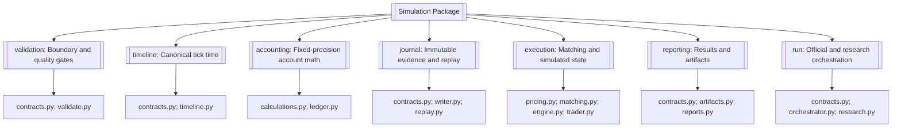
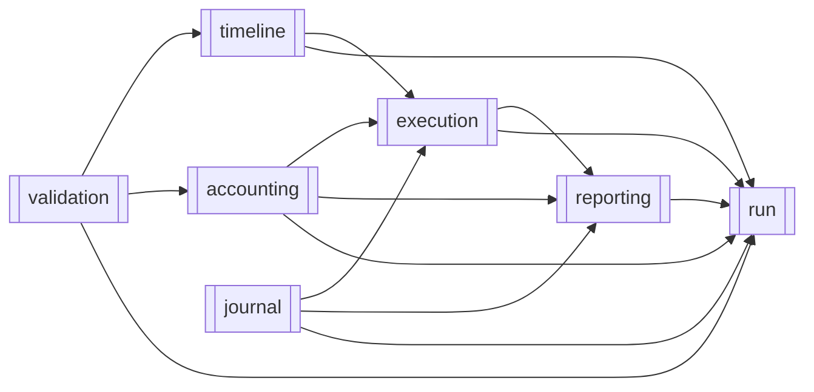
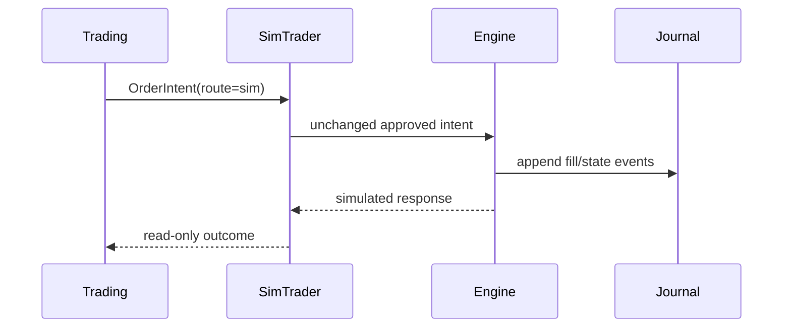
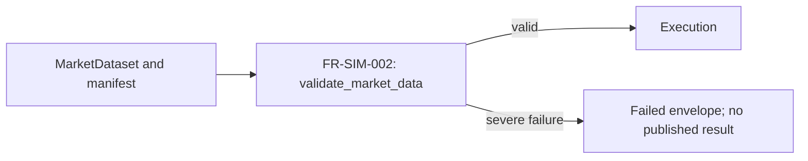
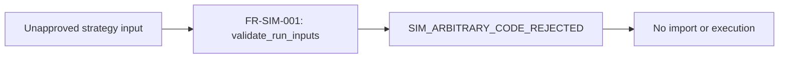
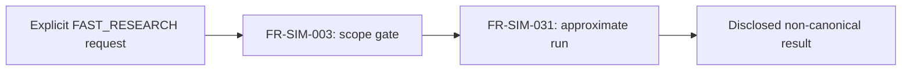

# Simulation

> **Package:** `app/services/simulator`
> **Status:** `Missing`
> **Last updated:** `2026-07-13`

> This README is the package's **single source of truth** for requirements, final structure, implementation sequence, progress, usage examples, and tests.
> Update this file before changing the code.

---

## 1. Purpose and Boundary

### Purpose

Simulation orchestrates deterministic historical backtests through the governed system path and owns the simulated execution environment for Trading's `sim` route. It replays approved FX order intents over historical market data, maintains simulated execution and account state, and produces immutable journals, reproducible `SimulationResult` records, artifact manifests, and execution reports. It must fail closed when required evidence, configuration, timing, persistence, or state cannot be verified.

The current flat, bar-based implementation provides useful research behavior but does not match the approved final tick-based structure or contracts; the package is therefore `Partial`.

### Owns

- Historical backtest orchestration across Data, Indicators, Strategy, Risk, and Trading's `sim` route.
- Deterministic bid/ask tick replay for the approved Phase 1 FX scope.
- Simulated fills and all simulated orders, positions, pending orders, account state, and execution timestamps.
- Application of the final volume already approved by Risk and packed by Trading; Simulation does not resize approved orders.
- Simulation-specific validation of inbound manifests and execution-critical market-data conditions.
- Fixed-precision execution accounting, configured costs, margin, and currency conversion only when fresh Data-owned `FXConversionEvidence v1` is supplied.
- Append-only simulation journals, deterministic replay, run idempotency evidence, and incomplete-run isolation.
- `SimulationResult`, `PortfolioSimulationResult`, execution reports, artifact manifests, and Simulation-owned persistence schemas and migration definitions.
- An explicitly non-canonical fast-research mode that cannot produce official fills or promotion evidence.

### Does not own

- Market-data acquisition, normalization, provider selection, caches, vendor governance, or complete lineage; Data owns them.
- Indicator formulas or indicator availability rules; Indicators owns them.
- Strategy code, strategy registration, signal logic, or arbitrary Python code execution; Strategy owns vetted strategy behavior.
- Risk policy, final sizing approval, exposure limits, or kill-switch state; Risk owns them.
- `OrderIntent`, route selection, live/paper execution, or reconciliation; Trading owns them. Broker connections/adapters; Brokers owns them. Broker secret resolution; the Utils settings layer owns it. All as defined in `docs/PROJECT.md`.
- Performance metric formulas, scorecards, or advisory conclusions; Analytics owns them.
- Optimization search algorithms, ranking, walk-forward policy, Monte Carlo/bootstrap analysis, workers, or checkpoints; Optimization owns them.
- Portfolio construction methods, allocation activation/versioning, drift detection, or rebalance planning; Portfolio owns them.
- Live broker mutations, live adapter imports, paper execution, or any network access on the simulation execution path.
- Phase 1 support for equities, ETFs, futures, perpetuals, options, corporate actions, borrow fees, regulatory engines, distributed workers, external report distribution, or production-promotion automation.

### Shared contracts

Contract definitions must match the name, version, and owner recorded in `docs/PROJECT.md`.

**Owned by this domain** — defined authoritatively here:

| Status | Contract | Version | Counterparty | Purpose |
|---|---|---|---|---|
| Missing | `SimulationBacktestRequestV1` | `v1` | UI/API; Optimization submits via its internal backtest-adapter port | Receive the exact reference-based synchronous request defined in `docs/PROJECT.md` §5. Simulation supplies the production implementation of Optimization's internal `BacktestExecutionAdapter` port, which submits this contract and returns `SimulationResult v1`. |
| Missing | `SimulationResult` | `v1` | Analytics, Optimization, UI/API | Publish a deterministic completed backtest outcome containing run/config/data/engine identities, simulated fills, journal and artifact references, accounting totals, diagnostics, and realism disclosures. Incomplete runs are never published. |
| Missing | `PortfolioBacktestRequestV1` | `v1` | Portfolio submits; Simulation receives | Receive one reference-only deterministic backtest request for an immutable Portfolio construction result. |
| Missing | `PortfolioSimulationResult` | `v1` | Portfolio, Analytics, UI/API | Publish complete component and aggregate journals, risk-budget history, metrics/artifact references, and reproducibility identity. |

**Consumed from other domains** — referenced only, never redefined:

| Contract | Version | Owner | Used for |
|---|---|---|---|
| `MarketDataset` | `v1` | Data | Receive normalized historical bars or ticks, availability metadata, and provenance. |
| `FXConversionEvidence` | `v1` | Data | Apply fresh direct/synthesized conversion evidence without choosing or synthesizing a rate path. |
| `PortfolioConstructionResult` | `v1` | Portfolio | Bind a portfolio backtest to one immutable candidate and its complete lineage. |
| `OrderIntent` | `v1` | Trading | Receive deterministic, idempotent, Risk-approved executable requests for the `sim` route. |
| `AuthContext` | `v1` | Utils | Authenticate and trace governed `run_backtest` calls. |
| `AuditEvent` common envelope | `v1` | Utils | Emit redacted governed-action evidence for durable storage through Data. |

`SimulationBacktestRequestV1` contains exactly `contract_version="v1"`,
`schema_id="simulation.backtest_request.v1"`, request/correlation IDs,
strategy/data references and versions, bounded JSON-safe parameter values, symbols,
timeframe, ordered UTC range, positive `Decimal` initial balance, execution-config and
Risk-policy references/versions, `runtime_profile="simulation"`,
`execution_route="sim"`, and a SHA-256 config hash. `AuthContext` is supplied
separately. Inline data, DataFrames, provider objects, code, secrets, and unknown
fields are forbidden.

`SimulationResult v1` contains `contract_version="v1"` and
`schema_id="simulation.result.v1"` separately from its run/config/data/engine
identities. Compatibility is evaluated only from `contract_version`.

`IndicatorSeries v1`, `TradeIntent v1`, `RiskDecision v1`, `OrderIntent v1`, and
`MarketDataset v1` participate in orchestration, but Simulation does not redefine or
mutate them. Compatibility is checked from `contract_version`, never by parsing
`schema_id`, as specified in `docs/PROJECT.md` §5.

### Persisted state

Data owns the shared connection, locking, and migration execution infrastructure. Simulation owns only the following schemas, artifacts, and migration definitions, and only Simulation may write them.

| Status | State / Store | Read access (via contract) | Migration definitions |
|---|---|---|---|
| Missing | Completed simulation result records | Analytics, Optimization, UI/API via `SimulationResult`; Portfolio, Analytics, UI/API via `PortfolioSimulationResult` | `app/services/simulator/state/migrations.py` |
| Missing | Append-only versioned JSONL journal and replay metadata | Simulation replay; consumers through `SimulationResult` references | Artifact schema under `journal/`; canonical JSONL-only durability |
| Missing | Canonical JSON and Markdown execution reports | Analytics, Optimization, Portfolio, UI/API through applicable `SimulationResult` / `PortfolioSimulationResult` artifact references | Artifact schema under `reporting/` |
| Missing | Artifact manifest and checksums | Analytics, Optimization, Portfolio, UI/API through the applicable `SimulationResult` / `PortfolioSimulationResult` | Artifact schema under `reporting/` |

Incomplete, failed, or diagnostic-failed runs may retain bounded diagnostic evidence but must not be published as completed `SimulationResult` records.

### Four-level structure

| Code level | Represents |
|---|---|
| **Package** | Simulation domain |
| **Module folder** | Feature / capability |
| **File** | Use case or focused responsibility |
| **Class / function / method** | Functional requirement behavior |

```text
Simulation package
└── Feature module
    └── Focused file
        └── Public class / function / method
```

### Package capability map



---

## 2. Final Package Structure

Module folders and files are ordered from lowest dependency to highest dependency.

```text
simulator/
├── __init__.py                         # Domain API: request, result, run_backtest, run_fast_research
├── README.md
├── validation/                         # Inbound contracts, scope, and data-quality gates
│   ├── __init__.py
│   ├── contracts.py                    # Validation result contracts
│   └── validate.py                     # Request, reference, scope, and data validation
├── timeline/                           # Canonical FX tick time and no-lookahead
│   ├── __init__.py
│   ├── contracts.py                    # Tick contract
│   └── timeline.py                     # Tick construction and timing enforcement
├── accounting/                         # Fixed-precision volume, costs, margin, same-currency PnL
│   ├── __init__.py
│   ├── calculations.py                 # Stateless accounting calculations
│   └── ledger.py                       # Stateful account ledger and invariants
├── journal/                            # Append-only evidence, persistence, replay, idempotency
│   ├── __init__.py
│   ├── contracts.py                    # Versioned journal event contract
│   ├── writer.py                       # Streaming hash-chained persistence
│   └── replay.py                       # Validation, reconstruction, and request-id resolution
├── execution/                          # Matching, order lifecycle, engine state, simulated Trader
│   ├── __init__.py
│   ├── pricing.py                      # Bid/ask price and configured realism models
│   ├── matching.py                     # Deterministic order matching and fill policy
│   ├── engine.py                       # Canonical tick engine and authoritative state
│   └── trader.py                       # Simulation-scoped order and query facade
├── reporting/                          # SimulationResult and canonical artifacts
│   ├── __init__.py
│   ├── contracts.py                    # Result and artifact manifest contracts
│   ├── artifacts.py                    # Checksummed artifact manifest assembly
│   └── reports.py                      # Canonical JSON and Markdown reports
└── run/                                # Typed public contract and orchestration
    ├── __init__.py
    ├── contracts.py                    # Versioned request contract
    ├── orchestrator.py                 # Official synchronous run_backtest path
    └── research.py                     # Explicit non-canonical fast-research path
```

The existing flat `contracts.py`, `engine.py`, `errors.py`, and `models.py` are migration evidence, not the final structure. They must not be deleted or relocated until replacement behavior and caller migration are approved and verified.

### Module dependency diagram

Dependencies point from the required module to the consuming module.



`journal` remains independent of `execution`: replay accepts an injected pure reducer and does not import the execution engine. This prevents a journal/execution cycle.

### Structure rules

- The package root contains only `README.md`, `__init__.py`, and approved feature folders after migration.
- Every official run uses one deterministic tick clock; vectorization is limited to indicator and signal generation outside the execution loop.
- Public cross-domain imports use only package or feature `__init__.py` exports.
- Private helpers receive no requirement IDs unless independently required.
- The engine, ledger, writer, and simulation-scoped Trader may be classes because they own state or lifecycle; other behavior is a function by default.
- No manager, repository, adapter, factory, scheduler, worker, queue, or provider layer is added without a separately approved requirement.
- Usage examples live under `tests/simulator/usage/`.

---

## 3. Workflows

### Status values

| Status | Meaning |
|---|---|
| **Missing** | Not implemented or not verified |
| **Missing** | Partly implemented or tests are incomplete |
| **Missing** | Implemented, tested, and verified |

### Workflow scope values

| Scope | Meaning |
|---|---|
| **Internal** | The complete workflow occurs within Simulation. |
| **Cross-domain** | Simulation receives input from or returns output to another domain. |

| Status | Workflow ID | Scope | Workflow | Trigger / Input boundary | Final outcome / Output boundary | Requirement sequence |
|---|---|---|---|---|---|---|
| Missing | `WF-SIM-001` | Cross-domain | Official FX backtest | Approved request plus Data/Strategy references | Persisted `SimulationResult`; Analytics-ready evidence | `FR-SIM-029 → FR-SIM-001 → FR-SIM-002 → FR-SIM-003 → FR-SIM-005 → FR-SIM-006 → FR-SIM-020 → FR-SIM-024 → FR-SIM-026 → FR-SIM-027 → FR-SIM-028 → FR-SIM-030` |
| Missing | `WF-SIM-002` | Cross-domain | Simulation Trader operations | Trading-owned `OrderIntent` with route=`sim` | Journaled simulated fill/state response | `FR-SIM-018 → FR-SIM-019 → FR-SIM-021 → FR-SIM-022/023 → FR-SIM-014` |
| Missing | `WF-SIM-003` | Cross-domain | Optimization candidate execution | Optimization-owned candidate and canonical request | Immutable result/provenance; no ranking by Simulation | `FR-SIM-030 → FR-SIM-024 → FR-SIM-026` |
| Missing | `WF-SIM-004` | Cross-domain | Severe data-quality blocked run | Data-owned manifest and normalized dataset | Failed envelope; no execution or published result | `FR-SIM-002 → FR-SIM-030` |
| Missing | `WF-SIM-005` | Internal | Deterministic replay | Journal plus matching identity hashes | Reconstructed state equal to stored result | `FR-SIM-016` |
| Missing | `WF-SIM-006` | Cross-domain | Registered-strategy security rejection | Raw code or unapproved registry reference | `SIM_ARBITRARY_CODE_REJECTED`; no import/execution | `FR-SIM-001 → FR-SIM-030` |
| Missing | `WF-SIM-007` | Internal | Non-canonical fast research | Approved research-mode request | Disclosed approximate result with no official claims | `FR-SIM-003 → FR-SIM-031` |
| Missing | `WF-SIM-009` | Cross-domain | Portfolio backtest | `PortfolioBacktestRequestV1` plus referenced strategies/data/FX/policy | `PortfolioSimulationResult v1` | `FR-SIM-029 → FR-SIM-010 → FR-SIM-030` |

### `WF-SIM-001` — Official FX Backtest

**Scope:** Cross-domain
**System workflow:** `SYS-WF-001`

**Input boundary:** `SimulationBacktestRequestV1`, `AuthContext`, Data-owned market evidence, and vetted registry references.
**Output boundary:** A completed `SimulationResult` for Analytics, Optimization, or UI/API; artifacts are persisted by Simulation through Data-owned infrastructure.

1. `run_backtest()` validates authentication, request structure, approved references, profile/route compatibility, and Phase 1 scope.
2. `validate_market_data()` blocks execution-critical data failures before state is created.
3. `build_tick_timeline()` constructs the deterministic bid/ask tick sequence.
4. Strategy, Risk, and Trading produce approved `OrderIntent` values through their public boundaries; Simulation does not reproduce their internal logic.
5. `EventDrivenExecutionEngine.execute_tick()` processes each tick, applies accounting, and appends journal events.
6. Reporting functions persist canonical artifacts and return `SimulationResult`.

**Failure behavior:** Invalid or missing evidence returns a structured `SIM_*` error; risk rejection is journaled and the run continues; persistence or invariant failure aborts the run and prevents result publication.

**Integration test:**
`tests/simulator/integration/test_official_backtest.py::test_official_backtest_produces_reproducible_result()`


### `WF-SIM-002` — Simulation Trader Operations

**Scope:** Cross-domain
**System workflow:** `SYS-WF-001`; Trading owns `OrderIntent`, while Simulation owns all simulated fills and state.

**Input boundary:** Trading-owned `OrderIntent` with `route=sim` and final Risk-approved volume.
**Output boundary:** A journaled simulated response and read-only state snapshot inside the active run.

1. `SimTrader.submit_order()` verifies the route and forwards the unchanged approved intent.
2. Pricing and matching functions evaluate it against the current canonical tick.
3. The engine and ledger mutate only simulated state and append typed journal events.
4. `SimTrader.snapshot()` exposes an immutable read-only view.

**Failure behavior:** A non-sim route, changed volume, missing state, unsupported order type, or any live-adapter dependency fails closed before mutation.

**Integration test:**
`tests/simulator/integration/test_sim_trader.py::test_sim_trader_executes_only_approved_sim_intent()`



### `WF-SIM-003` — Optimization Candidate Execution

**Scope:** Cross-domain
**System workflow:** `SYS-WF-003`

**Input boundary:** Optimization supplies a bounded candidate through `SimulationBacktestRequestV1`.
**Output boundary:** Simulation returns one immutable canonical result and provenance; Optimization owns ranking, diagnostics, and checkpoints.

**Failure behavior:** Invalid candidate parameters fail before execution; Simulation never schedules workers, ranks candidates, or promotes a strategy.

**Integration test:**
`tests/simulator/integration/test_optimization_boundary.py::test_optimization_receives_canonical_single_run_result()`


### `WF-SIM-004` — Severe Data-Quality Block

**Scope:** Cross-domain
**System workflow:** `SYS-WF-001`

**Input boundary:** Data-owned manifest and normalized dataset.
**Output boundary:** Structured failed response and bounded redacted diagnostics; no engine state or completed result.

**Failure behavior:** Empty, non-monotonic, duplicate, invalid-OHLC, negative-spread, stale, checksum-mismatched, or lookahead-tainted input fails before execution.

**Integration test:**
`tests/simulator/integration/test_data_quality_gate.py::test_severe_data_failure_prevents_execution()`



### `WF-SIM-005` — Deterministic Replay

**Scope:** Internal
**System workflow:** None

**Input boundary:** Canonical journal with matching config, data, engine, and schema identities.
**Output boundary:** Reconstructed state and result identity comparison.

**Failure behavior:** Sequence gaps, hash-chain breaks, incompatible identities, unknown event versions, or invariant failures abort replay deterministically.

**Integration test:**
`tests/simulator/integration/test_replay.py::test_replay_reconstructs_identical_result()`


### `WF-SIM-006` — Registered-Strategy Security Rejection

**Scope:** Cross-domain
**System workflow:** `SYS-WF-001`

**Input boundary:** Raw code, a filesystem path, or an unapproved strategy reference reaches the public boundary.
**Output boundary:** `SIM_ARBITRARY_CODE_REJECTED` in a redacted standard response; no import, network call, or engine creation.

**Integration test:**
`tests/simulator/integration/test_strategy_security.py::test_raw_strategy_code_is_rejected_before_import()`



### `WF-SIM-007` — Non-Canonical Fast Research

**Scope:** Internal
**System workflow:** None

**Input boundary:** Authenticated request explicitly selecting `FAST_RESEARCH`.
**Output boundary:** Approximate result labelled `canonical=false`, with assumptions and prohibited-claim metadata.

**Failure behavior:** An omitted mode, attempt to emit official fills, promotion evidence, or canonical reports, or unsupported data fails closed.

**Integration test:**
`tests/simulator/integration/test_fast_research.py::test_fast_research_cannot_emit_canonical_evidence()`



No asynchronous queue, worker, quota, cancellation service, health-probe, or
distributed-lock capability exists in the Simulation architecture.

### `WF-SIM-009` — Portfolio Backtest

**Scope:** Cross-domain
**System workflow:** `SYS-WF-007`
**Input boundary:** `PortfolioBacktestRequestV1` referencing one immutable
`PortfolioConstructionResult`, exact Strategy/Data/FX/execution/Risk versions,
bounded UTC range, explicit seed, and config hash.
**Output boundary:** `PortfolioSimulationResult v1`.

Simulation executes every component through the ordinary deterministic simulation
path, maintains aggregate account/risk-budget history, and publishes only when all
component and aggregate journals reconcile. It does not approve, activate, rank, or
modify the allocation. Missing/stale FX or incomplete results fail closed.

**Integration test:** `tests/simulator/integration/test_portfolio_backtest.py::test_portfolio_result_is_complete_and_reproducible()`

---

## 4. Module and Requirement Specifications

Modules, files, and requirements below are in implementation order. All final symbols are currently `Missing`; similarly named flat V1 symbols do not satisfy these contracts.

### Approved capability traceability

| Reconciliation capability | Final destination |
|---|---|
| `CAP-SIM-001` — Typed public API and versioned contracts | `run/`: `FR-SIM-029`, `FR-SIM-030` |
| `CAP-SIM-002` — Validation, orchestration, and lifecycle | `validation/`, `journal/`, `run/`: `FR-SIM-001`, `FR-SIM-003`, `FR-SIM-017`, `FR-SIM-030` |
| `CAP-SIM-003` — Signal timing, tick construction, no-lookahead | `timeline/`: `FR-SIM-004`–`FR-SIM-006` |
| `CAP-SIM-004` — Canonical FX execution, matching, realism | `timeline/`, `execution/`: `FR-SIM-005`, `FR-SIM-018`–`FR-SIM-020` |
| `CAP-SIM-005` — Simulated Trader and authoritative state | `execution/`: `FR-SIM-021`–`FR-SIM-023` |
| `CAP-SIM-006` — Sizing application, accounting, costs, margin, FX | `accounting/`: `FR-SIM-007`–`FR-SIM-012` |
| `CAP-SIM-007` — Journal, replay, persistence, idempotency | `journal/`: `FR-SIM-013`–`FR-SIM-017` |
| `CAP-SIM-008` — Results, artifacts, Analytics boundary | `reporting/`: `FR-SIM-024`–`FR-SIM-028` |
| `CAP-SIM-009` — Data authority and quality gate | `validation/`: `FR-SIM-002` |
| `CAP-SIM-010` — Strategy and Indicator boundary | `validation/`, `timeline/`, `run/`: `FR-SIM-001`, `FR-SIM-006`, `FR-SIM-029`, `FR-SIM-030` |
| `CAP-SIM-011` — Determinism, precision, reliability, security | `NFR-SIM-001`–`NFR-SIM-012` and the approved Phase 1 error surface |
| `CAP-SIM-012` — Explicit fast-research mode | `run/`: `FR-SIM-031` |
| `CAP-SIM-013` — Optimization/robustness execution boundary | `run/`, `reporting/`: `FR-SIM-024`, `FR-SIM-026`, `FR-SIM-030`; search/ranking remain outside Simulation |

### 4.1 `validation/` — Boundary and Quality Gates

**Purpose:** Fail closed before execution when the request, scope, external references, or execution-critical data cannot be proven valid.

**Module flow:** `raw request/data → validate_run_inputs() → validate_phase_one_scope() → validate_market_data() → accepted evidence or structured failure`

### Files

| Status | File | Responsibility | Key exports | Dependencies |
|---|---|---|---|---|
| Missing | `contracts.py` | Define immutable validation evidence used internally by the final package. | None; validation evidence remains private until an external contract requires it. | **Standard library:** `typing`<br>**Required third-party:** `pydantic>=2.13.4`<br>**Local:** Utils public API → canonical serialization |
| Missing | `validate.py` | Validate request shape, approved references, Phase 1 scope, and market-data evidence before execution. | `validate_run_inputs`, `validate_phase_one_scope`, `validate_market_data` | **Standard library:** `collections.abc`, `datetime`<br>**Required third-party:** None<br>**Local:** Data public API → `MarketDataset`; Utils public API → redaction/error mapping |
| Missing | `__init__.py` | Expose the supported validation API. | `validate_run_inputs`, `validate_phase_one_scope`, `validate_market_data` | **Standard library:** None<br>**Required third-party:** None<br>**Local:** `validate.py` → all exports |

### Configuration and Limits Manifest

| Status | Setting / Limit | Type | Default | Required | Used by | Description |
|---|---|---|---|---|---|---|
| Missing | `SUPPORTED_ASSET_CLASSES` | `tuple[str, ...]` | `("FX",)` | Yes | `validate_phase_one_scope()` | Rejects non-FX official runs with deterministic unsupported-scope behavior. |
| Removed | `MAX_REQUEST_BYTES` | — | — | No | — | The request is reference-based; UI/API owns its HTTP body ceiling. Simulation rejects inline datasets/objects structurally rather than inventing a second byte limit. |
| Removed | `MAX_DATE_RANGE_DAYS` | — | — | No | — | The contract requires an ordered finite UTC range. Data availability and the caller's measured runtime policy govern feasibility; no unsupported fixed day limit is invented. |
| Removed | `MAX_DIAGNOSTIC_BYTES` | — | — | No | — | Cross-domain results carry bounded diagnostics and artifact references, never inline unbounded diagnostic artifacts. |

#### `validate.py` — Boundary and Quality Validation

| Status | Requirement ID | Responsibility | Class / Function / Method | Side Effects | Raises | Usage / Test |
|---|---|---|---|---|---|---|
| Missing | `FR-SIM-001` | The system shall validate authentication-relevant request structure, registered strategy references, Data references, broker-profile references, trace identifiers, and deterministic serialization before any import or execution. | `validate_run_inputs(payload: Mapping[str, object]) -> None` | Read-only | `SimulationError`: `SIM_INVALID_CONFIG` for malformed evidence; `SIM_ARBITRARY_CODE_REJECTED` for raw code/path input | **Usage:** `tests/simulator/usage/test_usage_validation.py::test_usage_validate_run_inputs()`<br>**Unit:** `tests/simulator/unit/test_validate.py::test_validate_run_inputs_rejects_raw_code()` |
| Missing | `FR-SIM-002` | The system shall verify manifest checksum, required schema, UTC monotonic timestamps, uniqueness, OHLC consistency, bid/ask spread, staleness, availability metadata, and requested coverage, blocking severe failures before execution. | `validate_market_data(dataset: MarketDataset) -> None` | Read-only | `SimulationError`: exact `SIM_DATA_*` code for the detected severe condition | **Usage:** `tests/simulator/usage/test_usage_validation.py::test_usage_validate_market_data()`<br>**Unit:** `tests/simulator/unit/test_validate.py::test_validate_market_data_blocks_invalid_ohlc()` |
| Missing | `FR-SIM-003` | The system shall permit only approved FX scope or explicit `FAST_RESEARCH`, rejecting unsupported assets, features, service mode, and canonical claims from approximation. | `validate_phase_one_scope(payload: Mapping[str, object]) -> None` | Read-only | `SimulationError`: `UNSUPPORTED_OPERATION` or the specific approved `SIM_UNSUPPORTED_*` code | **Usage:** `tests/simulator/usage/test_usage_validation.py::test_usage_validate_phase_one_scope()`<br>**Unit:** `tests/simulator/unit/test_validate.py::test_validate_phase_one_scope_rejects_unsupported_asset()` |

**Rules:** Validation occurs before engine, ledger, journal writer, strategy import, or artifact creation. Raw provider objects and DataFrames never cross the boundary.

**Implementation notes:** Reuse redaction and canonical-serialization primitives from Utils. Do not reuse the current oversized error-code catalog blindly; retain only approved Phase 1 and shared taxonomy codes.

### Feature usage examples

`tests/simulator/usage/test_usage_validation.py` contains one independently runnable `test_usage_*` example for each requirement above.

---

### 4.2 `timeline/` — Canonical Tick Time and No-Lookahead

**Purpose:** Construct the official deterministic FX bid/ask tick sequence and enforce point-in-time visibility.

**Module flow:** `validated MarketDataset → build_tick_timeline() → validate_intent_timing() → ordered Tick stream`

### Files

| Status | File | Responsibility | Key exports | Dependencies |
|---|---|---|---|---|
| Missing | `contracts.py` | Define the immutable canonical tick. | `Tick` | **Standard library:** `datetime`, `decimal`<br>**Required third-party:** `pydantic>=2.13.4`<br>**Local:** None |
| Missing | `timeline.py` | Build deterministic tick streams and enforce no-lookahead timing. | `build_tick_timeline`, `validate_intent_timing` | **Standard library:** `datetime`<br>**Required third-party:** None<br>**Local:** Data public API → `MarketDataset`; `contracts.py` → `Tick` |
| Missing | `__init__.py` | Expose the supported timeline API. | `Tick`, `build_tick_timeline`, `validate_intent_timing` | **Standard library:** None<br>**Required third-party:** None<br>**Local:** feature files → all exports |

### Configuration and Limits Manifest

| Status | Setting / Limit | Type | Default | Required | Used by | Description |
|---|---|---|---|---|---|---|
| Missing | `SIGNAL_TIMING` | `str` | `previous_closed_bar` | Yes | `validate_intent_timing()` | Prevents a bar-open decision from using the current incomplete bar. |
| Missing | `TICK_MODEL` | `str` | `real_tick_m1_fallback` | Yes | `build_tick_timeline()` | Selects real bid/ask ticks with M1-bar fallback; synthetic/approximation models are research-only and unsupported here. |
| Missing | `RANDOM_SEED` | `int | None` | `None` | Conditional | `build_tick_timeline()` | Required for synthetic research ticks; randomness is locally reproducible per symbol/bar and never global-only. |

#### `contracts.py` — Canonical Tick Contract

| Status | Requirement ID | Responsibility | Class / Function / Method | Side Effects | Raises | Usage / Test |
|---|---|---|---|---|---|---|
| Missing | `FR-SIM-004` | The system shall expose an immutable UTC tick containing symbol, timestamp, bid, ask, source identity, sequence, and availability metadata with finite positive prices and `ask >= bid`. | `Tick(symbol: str, timestamp: datetime, bid: Decimal, ask: Decimal, source_id: str, sequence: int, available_at: datetime)` | None | `ValueError`: invalid timestamp, price, spread, sequence, or metadata | **Usage:** `tests/simulator/usage/test_usage_timeline.py::test_usage_tick_contract()`<br>**Unit:** `tests/simulator/unit/test_timeline_contracts.py::test_tick_rejects_negative_spread()` |

#### `timeline.py` — Tick Construction and Timing

| Status | Requirement ID | Responsibility | Class / Function / Method | Side Effects | Raises | Usage / Test |
|---|---|---|---|---|---|---|
| Missing | `FR-SIM-005` | The system shall transform approved FX bars or real ticks into a stable, strictly ordered bid/ask tick tuple whose identity is reproducible from data, model, and seed. | `build_tick_timeline(dataset: MarketDataset, model: str, seed: int | None) -> tuple[Tick, ...]` | Read-only | `SimulationError`: `SIM_SYNTHETIC_TICK_GENERATION_FAILED`, `SIM_SPREAD_MISSING`, or `SIM_UNSUPPORTED_TICK_MODEL` | **Usage:** `tests/simulator/usage/test_usage_timeline.py::test_usage_build_tick_timeline()`<br>**Unit:** `tests/simulator/unit/test_timeline.py::test_build_tick_timeline_is_deterministic()` |
| Missing | `FR-SIM-006` | The system shall reject a strategy intent whose evidence became available after its execution time and enforce previous-closed-bar visibility by default. | `validate_intent_timing(intent_available_at: datetime, execution_time: datetime) -> None` | None | `SimulationError`: `SIM_LOOKAHEAD_DETECTED` or `SIM_FEATURE_LOOKAHEAD_DETECTED` | **Usage:** `tests/simulator/usage/test_usage_timeline.py::test_usage_validate_intent_timing()`<br>**Unit:** `tests/simulator/unit/test_timeline.py::test_validate_intent_timing_blocks_lookahead()` |

**Rules:** Official execution advances one tick at a time. Tick batching is excluded until a later correctness proof demonstrates that no execution, accounting, risk, session, or journal boundary can be skipped.

**Implementation notes:** The current bar-by-bar engine is not reusable as the official clock; it may inform `FAST_RESEARCH` fixtures only.

### Feature usage examples

`tests/simulator/usage/test_usage_timeline.py`

---

### 4.3 `accounting/` — Fixed-Precision Account Math

**Purpose:** Apply the unchanged Risk-approved volume and maintain deterministic cost, margin, balance, equity, and same-currency PnL invariants.

**Module flow:** `approved volume/fill → pure calculations → AccountLedger.apply_fill() → immutable account snapshot`

### Files

| Status | File | Responsibility | Key exports | Dependencies |
|---|---|---|---|---|
| Missing | `calculations.py` | Normalize volume and calculate costs and margin without state. | `normalize_volume`, `calculate_execution_costs`, `calculate_margin` | **Standard library:** `decimal`, `collections.abc`<br>**Required third-party:** None<br>**Local:** Data-provided symbol evidence by public contract |
| Missing | `ledger.py` | Own simulated account balances and enforce accounting invariants. | `AccountLedger` (`apply_fill`, `snapshot`) | **Standard library:** `decimal`, `collections.abc`<br>**Required third-party:** None<br>**Local:** `calculations.py` → accounting functions; Journal event sink protocol |
| Missing | `__init__.py` | Expose the supported accounting API. | All public symbols above | **Standard library:** None<br>**Required third-party:** None<br>**Local:** feature files → exports |

### Configuration and Limits Manifest

| Status | Setting / Limit | Type | Default | Required | Used by | Description |
|---|---|---|---|---|---|---|
| Missing | Decimal context precision | `int` | `28` minimum | Yes | All accounting symbols | Rejects non-finite values and performs broker-critical math with `Decimal`. |
| Missing | Price/volume quantization | `Decimal` | Data/broker-profile evidence | Yes | `normalize_volume()`, ledger | Values not aligned to approved symbol precision fail before mutation. |
| Missing | FX freshness limit | `int` | Supplied in `FXConversionEvidence v1` | Yes for cross-currency runs | `convert_fx_amount()` | Simulation validates the Data-owned rate/path/freshness evidence and never selects, refreshes, or synthesizes a rate. |

#### `calculations.py` — Stateless Accounting Calculations

| Status | Requirement ID | Responsibility | Class / Function / Method | Side Effects | Raises | Usage / Test |
|---|---|---|---|---|---|---|
| Missing | `FR-SIM-007` | The system shall verify that the final approved volume is finite, positive, and within symbol min/max/step constraints without increasing, decreasing, or otherwise re-sizing it. | `normalize_volume(volume: Decimal, specification: Mapping[str, Decimal]) -> Decimal` | None | `SimulationError`: `SIM_INVALID_VOLUME`, `SIM_VOLUME_BELOW_MIN`, `SIM_VOLUME_ABOVE_MAX`, or `SIM_VOLUME_STEP_MISMATCH` | **Usage:** `tests/simulator/usage/test_usage_accounting.py::test_usage_normalize_volume()`<br>**Unit:** `tests/simulator/unit/test_accounting.py::test_normalize_volume_preserves_approved_size()` |
| Missing | `FR-SIM-008` | The system shall calculate configured Phase 1 commission and swap deterministically and return an itemized fixed-precision cost mapping. | `calculate_execution_costs(fill: Mapping[str, object], model: Mapping[str, object]) -> Mapping[str, Decimal]` | None | `SimulationError`: `SIM_COMMISSION_CALCULATION_FAILED`, `SIM_SWAP_CALCULATION_FAILED`, or unsupported model code | **Usage:** `tests/simulator/usage/test_usage_accounting.py::test_usage_calculate_execution_costs()`<br>**Unit:** `tests/simulator/unit/test_accounting.py::test_calculate_execution_costs_is_exact()` |
| Missing | `FR-SIM-009` | The system shall calculate required FX margin from approved symbol evidence, price, volume, and leverage, rejecting insufficient free margin before a fill. | `calculate_margin(volume: Decimal, price: Decimal, contract_size: Decimal, leverage: Decimal) -> Decimal` | None | `SimulationError`: `SIM_INVALID_CONFIG` or `SIM_INSUFFICIENT_MARGIN` | **Usage:** `tests/simulator/usage/test_usage_accounting.py::test_usage_calculate_margin()`<br>**Unit:** `tests/simulator/unit/test_accounting.py::test_calculate_margin_rejects_zero_leverage()` |
| Missing | `FR-SIM-010` | Apply only supplied fresh `FXConversionEvidence v1` to conversion-dependent accounting; never choose/synthesize a path or fetch a rate. | `validate_fx_evidence`, accounting conversion helper | None | `SimulationError`: `SIM_FX_EVIDENCE_UNAVAILABLE` / stale/incompatible evidence | **Verification:** `tests/simulator/unit/test_validate.py::test_cross_currency_run_requires_fresh_registered_evidence()` |

#### `ledger.py` — Authoritative Account Ledger

| Status | Requirement ID | Responsibility | Class / Function / Method | Side Effects | Raises | Usage / Test |
|---|---|---|---|---|---|---|
| Missing | `FR-SIM-011` | The system shall atomically apply a simulated fill, realized PnL, commission, swap, and margin effect while preserving balance/equity/free-margin invariants and emitting journal evidence. | `AccountLedger.apply_fill(fill: Mapping[str, object]) -> None` | Local state mutation; event publication | `SimulationError`: `SIM_ACCOUNT_INVARIANT_BROKEN` or `SIM_INSUFFICIENT_MARGIN` | **Usage:** `tests/simulator/usage/test_usage_accounting.py::test_usage_ledger_apply_fill()`<br>**Unit:** `tests/simulator/unit/test_ledger.py::test_apply_fill_preserves_account_invariants()` |
| Missing | `FR-SIM-012` | The system shall return an immutable read-only fixed-precision account snapshot without exposing mutable engine state. | `AccountLedger.snapshot() -> Mapping[str, Decimal]` | Read-only | `SimulationError`: `SIM_ACCOUNT_INVARIANT_BROKEN` when current state is inconsistent | **Usage:** `tests/simulator/usage/test_usage_accounting.py::test_usage_ledger_snapshot()`<br>**Unit:** `tests/simulator/unit/test_ledger.py::test_snapshot_is_immutable()` |

**Rules:** Balance changes only from documented realized execution/accounting events. Float-based V1 models are not used for official monetary math.

**Implementation notes:** Existing V1 PnL and equity tests may become characterization fixtures, but expected values must be recomputed under `Decimal` and approved cost semantics.

### Feature usage examples

`tests/simulator/usage/test_usage_accounting.py`

---

### 4.4 `journal/` — Immutable Evidence, Replay, and Idempotency

**Purpose:** Persist the canonical event source incrementally, prove continuity, reconstruct state deterministically, and prevent request-ID ambiguity.

**Module flow:** `typed event → JournalWriter.append() → hash-chained JSONL → replay_journal()/resolve_idempotent_run()`

### Files

| Status | File | Responsibility | Key exports | Dependencies |
|---|---|---|---|---|
| Missing | `contracts.py` | Define the versioned immutable journal event. | `JournalEvent` | **Standard library:** `datetime`, `typing`<br>**Required third-party:** `pydantic>=2.13.4`<br>**Local:** Utils public API → canonical JSON, IDs, redaction |
| Missing | `writer.py` | Stream events to append-only JSONL with sequence and hash continuity. | `JournalWriter` (`append`, `finalize`) | **Standard library:** `hashlib`, `pathlib`<br>**Required third-party:** None<br>**Local:** `contracts.py` → `JournalEvent`; Data public persistence/locking infrastructure |
| Missing | `replay.py` | Validate and replay journals and resolve request-id reuse. | `replay_journal`, `resolve_idempotent_run` | **Standard library:** `collections.abc`, `pathlib`<br>**Required third-party:** None<br>**Local:** `contracts.py` → `JournalEvent`; Utils canonical JSON |
| Missing | `__init__.py` | Expose the supported journal API. | All public symbols above | **Standard library:** None<br>**Required third-party:** None<br>**Local:** feature files → exports |

### Configuration and Limits Manifest

| Status | Setting / Limit | Type | Default | Required | Used by | Description |
|---|---|---|---|---|---|---|
| Missing | `JOURNAL_FORMAT` | `str` | `jsonl-v1` | Yes | `JournalWriter` | Only versioned append-only canonical JSONL is accepted initially. |
| Missing | `JOURNAL_FSYNC_INTERVAL` | `int` | `100` events; fsync at run completion | Yes | `JournalWriter.append()` | Bounds unflushed events; persistence failure aborts production/canonical runs. |
| Missing | `JOURNAL_SIDECAR_MODE` | `str` | `disabled` | Yes | `JournalWriter` | SQLite indexing is outside the initial implementation. |

#### `contracts.py` — Journal Event Contract

| Status | Requirement ID | Responsibility | Class / Function / Method | Side Effects | Raises | Usage / Test |
|---|---|---|---|---|---|---|
| Missing | `FR-SIM-013` | The system shall expose an immutable versioned journal event containing run, sequence, UTC time, event type, redacted payload, previous hash, event hash, correlation, and causation identities. | `JournalEvent(run_id: str, sequence: int, occurred_at: datetime, event_type: str, payload: Mapping[str, object], previous_hash: str, event_hash: str, correlation_id: str, causation_id: str | None, schema_version: str = "v1")` | None | `ValueError`: missing identity, invalid sequence/hash, non-UTC time, unsafe payload, or unsupported version | **Usage:** `tests/simulator/usage/test_usage_journal.py::test_usage_journal_event()`<br>**Unit:** `tests/simulator/unit/test_journal_contracts.py::test_journal_event_rejects_secret_payload()` |

#### `writer.py` — Streaming Journal Persistence

| Status | Requirement ID | Responsibility | Class / Function / Method | Side Effects | Raises | Usage / Test |
|---|---|---|---|---|---|---|
| Missing | `FR-SIM-014` | The system shall append one event with the next monotonic sequence and hash-chain link before the corresponding governed state transition is considered durable. | `JournalWriter.append(event: JournalEvent) -> None` | Persistence write | `SimulationError`: `SIM_PERSISTENCE_FAILED` on write, flush, lock, or continuity failure | **Usage:** `tests/simulator/usage/test_usage_journal.py::test_usage_journal_append()`<br>**Unit:** `tests/simulator/unit/test_journal_writer.py::test_append_fails_closed_on_write_error()` |
| Missing | `FR-SIM-015` | The system shall finalize a completed journal atomically and return its checksum without publishing incomplete temporary artifacts. | `JournalWriter.finalize() -> str` | Persistence write | `SimulationError`: `SIM_PERSISTENCE_FAILED` on flush, checksum, or atomic-finalization failure | **Usage:** `tests/simulator/usage/test_usage_journal.py::test_usage_journal_finalize()`<br>**Unit:** `tests/simulator/unit/test_journal_writer.py::test_finalize_is_atomic()` |

#### `replay.py` — Replay and Idempotency

| Status | Requirement ID | Responsibility | Class / Function / Method | Side Effects | Raises | Usage / Test |
|---|---|---|---|---|---|---|
| Missing | `FR-SIM-016` | The system shall validate schema, sequence, hash chain, config/data/engine identities, and invariants while reconstructing state through an injected deterministic reducer. | `replay_journal(path: Path, reducer: Callable[[Mapping[str, object], JournalEvent], Mapping[str, object]]) -> Mapping[str, object]` | Read-only | `SimulationError`: `SIM_CHECKPOINT_INCOMPATIBLE`, `SIM_PERSISTENCE_FAILED`, or `SIM_ACCOUNT_INVARIANT_BROKEN` | **Usage:** `tests/simulator/usage/test_usage_journal.py::test_usage_replay_journal()`<br>**Unit:** `tests/simulator/unit/test_replay.py::test_replay_rejects_hash_break()` |
| Missing | `FR-SIM-017` | The system shall return the existing completed run for the same request ID and hash, and reject the same request ID with a different hash. | `resolve_idempotent_run(request_id: str, request_hash: str, lookup: Callable[[str], Mapping[str, str] | None]) -> str | None` | Read-only | `SimulationError`: `SIM_RUN_ID_CONFLICT` when an existing request hash differs | **Usage:** `tests/simulator/usage/test_usage_journal.py::test_usage_resolve_idempotent_run()`<br>**Unit:** `tests/simulator/unit/test_replay.py::test_request_id_conflict_fails_closed()` |

**Rules:** Risk rejections, IOC remainder cancellation, lifecycle transitions, validation failures, and all state mutations are typed journal events. No separate compliance-record subsystem is created.

**Implementation notes:** JSONL is canonical. SQLite indexing is outside the initial implementation and may be proposed later only with profiling evidence.

### Feature usage examples

`tests/simulator/usage/test_usage_journal.py`

---

### 4.5 `execution/` — Matching and Simulated State

**Purpose:** Execute Trading-owned sim-route intents against the canonical tick stream while owning all simulated fills and state and making no live calls.

**Module flow:** `OrderIntent + Tick → price_order() → match_order() → engine state/ledger/journal → SimTrader response/snapshot`

### Files

| Status | File | Responsibility | Key exports | Dependencies |
|---|---|---|---|---|
| Missing | `pricing.py` | Apply bid/ask, spread, slippage, and configured Phase 1 pricing realism. | `price_order` | **Standard library:** `decimal`, `collections.abc`<br>**Required third-party:** None<br>**Local:** Trading public API → `OrderIntent`; `timeline.contracts` → `Tick` |
| Missing | `matching.py` | Resolve supported order triggers, liquidity, fill policy, gaps, and same-tick priority deterministically. | `match_order` | **Standard library:** `collections.abc`<br>**Required third-party:** None<br>**Local:** Trading public API → `OrderIntent`; `timeline.contracts` → `Tick`; `pricing.py` → `price_order` |
| Missing | `engine.py` | Own the canonical tick lifecycle and authoritative simulated execution state. | `EventDrivenExecutionEngine` (`execute_tick`) | **Standard library:** `collections.abc`<br>**Required third-party:** None<br>**Local:** timeline, accounting, journal, `matching.py` public APIs |
| Missing | `trader.py` | Provide the explicit simulation-scoped order/query facade for an active engine. | `SimTrader` (`submit_order`, `close_position`, `snapshot`) | **Standard library:** `decimal`, `collections.abc`<br>**Required third-party:** None<br>**Local:** Trading public API → `OrderIntent`; `engine.py` → `EventDrivenExecutionEngine` |
| Missing | `__init__.py` | Expose the supported execution API. | All public symbols above | **Standard library:** None<br>**Required third-party:** None<br>**Local:** feature files → exports |

### Configuration and Limits Manifest

| Status | Setting / Limit | Type | Default | Required | Used by | Description |
|---|---|---|---|---|---|---|
| Missing | `SUPPORTED_FILL_POLICIES` | `tuple[str, ...]` | `("FOK", "IOC")` | Yes | `match_order()` | Unsupported policies fail with `SIM_UNSUPPORTED_FILL_POLICY`; `RETURN` is outside Phase 1. |
| Missing | `SAME_TICK_PRIORITY` | `tuple[str, ...]` | `("STOP_LOSS", "TAKE_PROFIT", "PENDING_ACTIVATION")` | Yes | `match_order()` | Resolves all same-tick conflicts deterministically and journals the selected outcome. |
| Missing | `EXECUTION_ROUTE` | `str` | `sim` under simulation profile | Yes | `SimTrader.submit_order()` | Any non-`sim` intent fails before mutation. |

#### `pricing.py` — Execution Pricing

| Status | Requirement ID | Responsibility | Class / Function / Method | Side Effects | Raises | Usage / Test |
|---|---|---|---|---|---|---|
| Missing | `FR-SIM-018` | The system shall derive an executable bid/ask price from the current tick and approved spread/slippage model without using future ticks. | `price_order(intent: OrderIntent, tick: Tick, model: Mapping[str, object]) -> Decimal` | None | `SimulationError`: `SIM_INVALID_PRICE`, `SIM_SPREAD_MISSING`, `SIM_SLIPPAGE_EXCEEDED`, or unsupported model code | **Usage:** `tests/simulator/usage/test_usage_execution.py::test_usage_price_order()`<br>**Unit:** `tests/simulator/unit/test_pricing.py::test_price_order_uses_side_correct_bid_ask()` |

#### `matching.py` — Order Matching

| Status | Requirement ID | Responsibility | Class / Function / Method | Side Effects | Raises | Usage / Test |
|---|---|---|---|---|---|---|
| Missing | `FR-SIM-019` | The system shall deterministically match supported FX market and pending intents using configured trigger, gap, liquidity, FOK/IOC, and same-tick priority rules, explicitly recording partial or cancelled remainder outcomes. | `match_order(intent: OrderIntent, tick: Tick, state: Mapping[str, object]) -> Mapping[str, object]` | None | `SimulationError`: specific matching, liquidity, gap, market-hours, or fill-policy `SIM_*` code | **Usage:** `tests/simulator/usage/test_usage_execution.py::test_usage_match_order()`<br>**Unit:** `tests/simulator/unit/test_matching.py::test_match_order_journals_ioc_remainder()` |

#### `engine.py` — Canonical Tick Engine

| Status | Requirement ID | Responsibility | Class / Function / Method | Side Effects | Raises | Usage / Test |
|---|---|---|---|---|---|---|
| Missing | `FR-SIM-020` | The system shall process one canonical tick at a time, enforce timing and state transitions, apply fills through the ledger, append journal events, and return immutable execution outcomes. | `EventDrivenExecutionEngine.execute_tick(tick: Tick) -> tuple[Mapping[str, object], ...]` | Local state mutation; event publication; persistence write | `SimulationError`: exact validation, execution, accounting, invariant, or persistence code | **Usage:** `tests/simulator/usage/test_usage_execution.py::test_usage_engine_execute_tick()`<br>**Unit:** `tests/simulator/unit/test_engine.py::test_execute_tick_is_deterministic()` |

#### `trader.py` — Simulation-Scoped Trader Facade

| Status | Requirement ID | Responsibility | Class / Function / Method | Side Effects | Raises | Usage / Test |
|---|---|---|---|---|---|---|
| Missing | `FR-SIM-021` | The system shall accept only a Trading-owned `OrderIntent` for route `sim`, preserve its final approved volume, and submit it to the active simulation engine without any broker call. | `SimTrader.submit_order(intent: OrderIntent) -> Mapping[str, object]` | Local state mutation; event publication; persistence write | `SimulationError`: `SIM_INVALID_CONFIG`, `SIM_INVALID_VOLUME`, or matching/accounting code | **Usage:** `tests/simulator/usage/test_usage_execution.py::test_usage_sim_trader_submit_order()`<br>**Unit:** `tests/simulator/unit/test_trader.py::test_submit_order_never_calls_live_adapter()` |
| Missing | `FR-SIM-022` | The system shall close an existing simulated position by approved quantity using the current canonical tick and journal the resulting fill. | `SimTrader.close_position(position_id: str, quantity: Decimal) -> Mapping[str, object]` | Local state mutation; event publication; persistence write | `SimulationError`: `SIM_POSITION_NOT_FOUND` or `SIM_INVALID_VOLUME` | **Usage:** `tests/simulator/usage/test_usage_execution.py::test_usage_sim_trader_close_position()`<br>**Unit:** `tests/simulator/unit/test_trader.py::test_close_position_rejects_unknown_position()` |
| Missing | `FR-SIM-023` | The system shall expose immutable read-only orders, positions, pending orders, deals, and account state for the current run without leaking mutable engine objects. | `SimTrader.snapshot() -> Mapping[str, object]` | Read-only | `SimulationError`: `SIM_ACCOUNT_INVARIANT_BROKEN` when state cannot be verified | **Usage:** `tests/simulator/usage/test_usage_execution.py::test_usage_sim_trader_snapshot()`<br>**Unit:** `tests/simulator/unit/test_trader.py::test_snapshot_cannot_mutate_engine_state()` |

**Rules:** Simulation is the broker analogue only for the `sim` route. It must not import live adapters, broker SDKs, credentials, or any Brokers `BrokerAdapter` capability.

**Implementation notes:** Preserve compatible pending/protective/time-exit expectations from current tests only after the exact Phase 1 order set is approved. The current `SimpleBacktestEngine` may become fast-research evidence but cannot back official results.

### Feature usage examples

`tests/simulator/usage/test_usage_execution.py`

---

### 4.6 `reporting/` — Results and Canonical Artifacts

**Purpose:** Define the Simulation-owned result and assemble checksummed execution evidence without taking ownership of Analytics formulas.

**Module flow:** `completed engine/ledger/journal evidence → artifact manifest → JSON/Markdown execution reports → SimulationResult`

### Files

| Status | File | Responsibility | Key exports | Dependencies |
|---|---|---|---|---|
| Missing | `contracts.py` | Define `SimulationResult` and `ArtifactManifest`. | `SimulationResult`, `ArtifactManifest` | **Standard library:** `datetime`, `decimal`, `typing`<br>**Required third-party:** `pydantic>=2.13.4`<br>**Local:** Utils canonical serialization |
| Missing | `artifacts.py` | Verify canonical artifacts and assemble their manifest. | `build_artifact_manifest` | **Standard library:** `hashlib`, `pathlib`, `collections.abc`<br>**Required third-party:** None<br>**Local:** `contracts.py` → `ArtifactManifest` |
| Missing | `reports.py` | Build deterministic JSON and Markdown execution reports. | `build_json_report`, `build_markdown_report` | **Standard library:** `json`<br>**Required third-party:** None<br>**Local:** `contracts.py` → `SimulationResult` |
| Missing | `__init__.py` | Expose the supported reporting API. | All public symbols above | **Standard library:** None<br>**Required third-party:** None<br>**Local:** feature files → exports |

### Configuration and Limits Manifest

| Status | Setting / Limit | Type | Default | Required | Used by | Description |
|---|---|---|---|---|---|---|
| Missing | `CANONICAL_ARTIFACT_TYPES` | `tuple[str, ...]` | `("journal.jsonl", "result.json", "report.md", "manifest.json")` | Yes | Reporting symbols | Excludes visual/debug/notebook/external-distribution artifacts from the canonical Phase 1 surface. |
| Missing | `REPORT_SCHEMA_VERSION` | `str` | `v1` | Yes | `SimulationResult`, report builders | Unsupported versions fail validation rather than being silently coerced. |

#### `contracts.py` — Result Contracts

| Status | Requirement ID | Responsibility | Class / Function / Method | Side Effects | Raises | Usage / Test |
|---|---|---|---|---|---|---|
| Missing | `FR-SIM-024` | The system shall expose `SimulationResult` v1 with separate compatibility/schema identity, reproducibility identities, completed status, fills/journal/artifact references, fixed-precision accounting totals, diagnostics, and realism disclosures, and shall reject incomplete publication. | `SimulationResult(contract_version: Literal["v1"], schema_id: Literal["simulation.result.v1"], run_id: str, request_hash: str, config_hash: str, data_hash: str, engine_version: str, status: Literal["completed"], journal_ref: str, artifact_manifest: ArtifactManifest, fills: tuple[Mapping[str, object], ...], accounting: Mapping[str, Decimal], diagnostics: tuple[str, ...], realism: Mapping[str, object])` | None | `ValueError`: missing identity/artifact, non-final status, unsafe metadata, or invalid monetary value | **Usage:** `tests/simulator/usage/test_usage_reporting.py::test_usage_simulation_result()`<br>**Unit:** `tests/simulator/unit/test_reporting_contracts.py::test_result_rejects_incomplete_status()` |
| Missing | `FR-SIM-025` | The system shall expose a versioned manifest entry for every canonical artifact with relative path, media type, size, SHA-256 checksum, schema version, and creation time. | `ArtifactManifest(artifacts: tuple[Mapping[str, object], ...], created_at: datetime, schema_version: str = "v1")` | None | `ValueError`: absolute/unsafe path, invalid checksum, missing canonical artifact, or unsupported version | **Usage:** `tests/simulator/usage/test_usage_reporting.py::test_usage_artifact_manifest()`<br>**Unit:** `tests/simulator/unit/test_reporting_contracts.py::test_manifest_rejects_unsafe_path()` |

#### `artifacts.py` — Artifact Manifest Assembly

| Status | Requirement ID | Responsibility | Class / Function / Method | Side Effects | Raises | Usage / Test |
|---|---|---|---|---|---|---|
| Missing | `FR-SIM-026` | The system shall read completed canonical artifacts, verify containment and size, calculate checksums, and return a stable manifest without publishing temporary files. | `build_artifact_manifest(artifact_root: Path, paths: Sequence[Path]) -> ArtifactManifest` | Read-only | `SimulationError`: `SIM_PERSISTENCE_FAILED` for missing, unsafe, unreadable, or changed artifacts | **Usage:** `tests/simulator/usage/test_usage_reporting.py::test_usage_build_artifact_manifest()`<br>**Unit:** `tests/simulator/unit/test_artifacts.py::test_manifest_rejects_path_escape()` |

#### `reports.py` — Canonical Reports

| Status | Requirement ID | Responsibility | Class / Function / Method | Side Effects | Raises | Usage / Test |
|---|---|---|---|---|---|---|
| Missing | `FR-SIM-027` | The system shall serialize a `SimulationResult` to deterministic canonical JSON with execution/accounting diagnostics and realism/data-quality disclosures, excluding Analytics-owned metric formulas. | `build_json_report(result: SimulationResult) -> str` | None | `SimulationError`: `SIM_INTERNAL_ERROR` if canonical serialization fails | **Usage:** `tests/simulator/usage/test_usage_reporting.py::test_usage_build_json_report()`<br>**Unit:** `tests/simulator/unit/test_reports.py::test_json_report_is_deterministic()` |
| Missing | `FR-SIM-028` | The system shall render a deterministic Markdown execution report with assumptions, limitations, costs, fills, rejections, data quality, and artifact identities, excluding external distribution claims. | `build_markdown_report(result: SimulationResult) -> str` | None | `SimulationError`: `SIM_INTERNAL_ERROR` when required evidence is absent | **Usage:** `tests/simulator/usage/test_usage_reporting.py::test_usage_build_markdown_report()`<br>**Unit:** `tests/simulator/unit/test_reports.py::test_markdown_report_discloses_shortcuts()` |

**Rules:** Simulation reports execution evidence and accounting totals. Analytics consumes `SimulationResult` and owns performance metrics, scorecards, benchmark analysis, and caveats.

**Implementation notes:** The current `BacktestResult.to_dict()` and Pydantic hashing logic may inform deterministic serialization, but their fields and float math do not satisfy `SimulationResult` v1.

### Feature usage examples

`tests/simulator/usage/test_usage_reporting.py`

---

### 4.7 `run/` — Official and Research Orchestration

**Purpose:** Expose one governed typed public boundary and one isolated non-canonical research boundary while sequencing lower modules without duplicating their logic.

**Module flow:** `request/auth → run_backtest() or run_fast_research() → lower capabilities → SimulationResult`

### Files

| Status | File | Responsibility | Key exports | Dependencies |
|---|---|---|---|---|
| Missing | `contracts.py` | Define the versioned request received by Simulation. | `SimulationBacktestRequestV1` | **Standard library:** `datetime`, `decimal`, `typing`<br>**Required third-party:** `pydantic>=2.13.4`<br>**Local:** Utils public API → canonical serialization and trace IDs |
| Missing | `orchestrator.py` | Validate and execute one synchronous canonical run. | `run_backtest` | **Standard library:** `time`<br>**Required third-party:** None<br>**Local:** all lower feature APIs; Utils → `AuthContext` |
| Missing | `research.py` | Execute an explicit non-canonical approximation with prohibited-claim controls. | `run_fast_research` | **Standard library:** None<br>**Required third-party:** None<br>**Local:** validation, reporting; current bar engine only after isolation review |
| Missing | `__init__.py` | Expose the supported run API. | `SimulationBacktestRequestV1`, `run_backtest`, `run_fast_research` | **Standard library:** None<br>**Required third-party:** None<br>**Local:** feature files → exports |

### Configuration and Limits Manifest

| Status | Setting / Limit | Type | Default | Required | Used by | Description |
|---|---|---|---|---|---|---|
| Missing | `initial_balance` | `Decimal` | No default; request required | Yes | `SimulationBacktestRequestV1` | Must be finite and strictly positive. |
| Missing | `RUNTIME_PROFILE` | `str` | `simulation` for official runs | Yes | `run_backtest()` | Incompatible profile fails initialization. |
| Missing | `EXECUTION_ROUTE` | `str` | `sim` for official runs | Yes | `run_backtest()` | Incompatible route fails before execution. |
| Missing | `FAST_RESEARCH_ENABLED` | `bool` | `false` | No | `run_fast_research()` | Disabled mode fails closed; enabling it never grants canonical status. |
| Missing | Public run status | contract behavior | terminal `success` or structured `error` | Yes | `run_backtest()` | The initial public operation has no queued/running/cancelling/cancelled state; only a completed `SimulationResult v1` is published. |
| Missing | `ARTIFACT_ROOT` | safe configured path | No implicit default | Yes | journal/report persistence | Must resolve beneath the configured approved artifact root; it is not caller-controlled request material. |

#### `contracts.py` — Backtest Request Contract

| Status | Requirement ID | Responsibility | Class / Function / Method | Side Effects | Raises | Usage / Test |
|---|---|---|---|---|---|---|
| Missing | `FR-SIM-029` | The system shall expose the exact `docs/PROJECT.md` §5 request for one synchronous bounded FX run, with separate contract version/schema ID, immutable Strategy/Data/Simulation/Risk references, JSON-safe parameters, symbol/timeframe/UTC range, positive initial balance, trace IDs, simulation profile/route, config hash, and no raw code/provider objects/inline data. | `SimulationBacktestRequestV1` | None | `ValueError`: missing/unknown field, invalid range/balance/mode/reference/version, non-deterministic value, or unsafe metadata | **Usage:** `tests/simulator/usage/test_usage_run.py::test_usage_backtest_request()`<br>**Unit:** `tests/simulator/unit/test_run_contracts.py::test_request_matches_adr_0014_exactly()` |

#### `orchestrator.py` — Official Backtest

| Status | Requirement ID | Responsibility | Class / Function / Method | Side Effects | Raises | Usage / Test |
|---|---|---|---|---|---|---|
| Missing | `FR-SIM-030` | The system shall authenticate, deduplicate, validate, execute, journal, report, persist, and return one deterministic canonical FX run, never publishing a partial completed result. | `run_backtest(request: SimulationBacktestRequestV1, auth_context: AuthContext, request_id: str | None = None) -> SimulationResult` | Read-only external-domain calls; local state mutation; persistence write; event publication | `SimulationError`: controlled validation, execution, journal, reporting, or persistence failure | **Usage:** `tests/simulator/usage/test_usage_run.py::test_usage_run_backtest()`<br>**Unit:** `tests/simulator/unit/test_orchestrator.py::test_run_backtest_maps_internal_failure()` |

#### `research.py` — Fast Research Approximation

| Status | Requirement ID | Responsibility | Class / Function / Method | Side Effects | Raises | Usage / Test |
|---|---|---|---|---|---|---|
| Missing | `FR-SIM-031` | The system shall run an explicitly requested approximation only when enabled, mark every output `canonical=false`, disclose assumptions, and prohibit canonical fills, promotion evidence, and reports. | `run_fast_research(request: SimulationBacktestRequestV1, auth_context: AuthContext, request_id: str | None = None) -> SimulationResult` | Read-only; optional local diagnostic artifact write | `SimulationError`: controlled failure | **Usage:** `tests/simulator/usage/test_usage_run.py::test_usage_run_fast_research()`<br>**Unit:** `tests/simulator/unit/test_research.py::test_fast_research_cannot_claim_canonical()` |

**Rules:** `run_backtest` and `run_fast_research` are the only package-root public operations; protocol types and internal helpers are not exported automatically.

**Implementation notes:** `docs/PROJECT.md` §5 fixes the exact request schema and synchronous
terminal behavior. Existing `contracts.py` canonical hashing may be reused only if it
matches the separate `contract_version`/`schema_id` rule. Existing
`SimpleBacktestEngine` may be considered only for the isolated research path after
its dependencies and claims are constrained.

### Feature usage examples

`tests/simulator/usage/test_usage_run.py`

---

## 5. Package-Wide Requirements and Shared Configuration

| Status | Requirement ID | Type | Responsibility | Verification |
|---|---|---|---|---|
| Missing | `NFR-SIM-001` | Determinism | Identical approved inputs, versions, configuration, and seeds shall produce byte-identical canonical reports and journal identities. | Golden and replay tests |
| Missing | `NFR-SIM-002` | Precision | Prices, volumes, costs, margin, balances, equity, and PnL shall use finite `Decimal` values with context precision at least 28 and documented quantization. | Unit/property tests |
| Missing | `NFR-SIM-003` | No lookahead | Official execution shall use only evidence whose `available_at` is not later than the current execution time. | Timing boundary tests |
| Missing | `NFR-SIM-004` | Safety | Importing or running Simulation shall perform no broker mutation, live-adapter import, credential resolution, network request, or unrequested filesystem write. | Import-safety and spy tests |
| Missing | `NFR-SIM-005` | API boundary | Package and feature `__init__.py` files shall expose only documented public symbols; the current flat package exports additional V1 symbols and Data helpers. | Import-surface test |
| Missing | `NFR-SIM-006` | Security | Official requests shall reject arbitrary code and paths, redact secrets, bound payloads/diagnostics, and use vetted references only. | Security tests |
| Missing | `NFR-SIM-007` | Reliability | Missing evidence, persistence failure, invariant failure, unknown state, or unsupported scope shall fail closed with a deterministic code and no published completed result. | Fault-injection tests |
| Missing | `NFR-SIM-008` | Auditability | Every governed transition and rejection shall be traceable through correlation/causation IDs and the canonical hash-chained journal. | Journal audit test |
| Missing | `NFR-SIM-009` | Maintainability | Modules/files shall match Sections 2 and 4, remain acyclic, and contain Google-style typed public APIs without speculative layers. | Structure, Ruff, mypy review |
| Missing | `NFR-SIM-010` | Testing | Every public functional requirement shall have one usage example, at least one unit test, and collaborative workflow coverage, with package coverage at least 80%. | Traceability and coverage gate |
| Missing | `NFR-SIM-011` | Performance | Phase 1 shall record non-blocking deterministic runtime and memory baselines; no blocking numeric gate applies until measured evidence supports a separately approved domain limit. | Benchmark report |
| Missing | `NFR-SIM-012` | Compatibility | `SimulationResult` and owned request contracts shall be versioned; breaking changes require a new version and coordinated consumer migration. | Producer-consumer contract tests |

### Shared Configuration Manifest

| Status | Setting / Limit | Type | Default | Required | Used by | Description |
|---|---|---|---|---|---|---|
| Missing | `RUNTIME_PROFILE` | `str` | `research` system default; `simulation` required for official runs | Yes | validation, execution, run | Inherited from Utils; incompatible profile/route fails closed. |
| Missing | `EXECUTION_ROUTE` | `str` | `none` system default; `sim` required for official runs | Yes | validation, execution, run | Trading-owned shared setting; Simulation never permits paper/live routes. |
| Missing | `DATABASE_URL` / `DATA_DIR` | `str` | System configuration | Yes | journal, reporting, run | Data owns infrastructure; Simulation owns only its records and artifacts. |
| Missing | UTC-first time policy | policy | `Z`-suffixed ISO 8601 | Yes | all modules | Non-UTC cross-domain timestamps fail validation. |
| Missing | Correlation/trace ID format | policy | prefixed UUID4 | Yes | journal, run, reporting | Every cross-domain call and event carries request/correlation/causation IDs. |
| Missing | Secret redaction policy | policy | denylist-first, case-insensitive | Yes | validation, journal, reporting, run | Secrets never appear in responses, logs, events, artifacts, or diagnostics. |

### Approved Phase 1 Error Surface

The final implementation exposes only taxonomy codes needed by the approved
Simulation behavior. Unsupported capability codes are not public promises merely
because they appear in the current `errors.py`.

Approved groups are: request/scope (`SIM_INVALID_CONFIG`, `SIM_INVALID_DATE_RANGE`, `SIM_MISSING_SYMBOL`, `SIM_ARBITRARY_CODE_REJECTED`, approved `SIM_UNSUPPORTED_*`); data/timing (`SIM_DATA_*`, `SIM_LOOKAHEAD_DETECTED`, `SIM_FEATURE_LOOKAHEAD_DETECTED`); execution/accounting (`SIM_INVALID_PRICE`, volume, stops, spread, slippage, liquidity, fill, gap, market-hours, margin, cost, FX, position/order, event-priority, and invariant codes); persistence/replay (`SIM_PERSISTENCE_FAILED`, `SIM_CHECKPOINT_INCOMPATIBLE`, `SIM_RUN_ID_CONFLICT`); and safe fallback (`SIM_INTERNAL_ERROR`). Exact enumeration is finalized with the affected contracts and tests before implementation.

---

## 6. Open Decisions

No open decisions.

### Explicit Exclusions

The following are excluded from the initial implementation and must not appear as active files, exports, or completed requirements: asynchronous queues/workers/service scheduling; optimization algorithms and Monte Carlo/bootstrap analysis; Analytics formula catalogs; Data caches/vendor governance/full lineage; Risk policy/VaR/correlation/concentration; mandatory SQLite sidecars; tick batching; equities/ETFs/corporate actions/borrow fees; futures/perpetuals/options; regulatory engines; feature stores/alternative data; visual/debug/notebook artifacts; external report distribution; canaries/synthetic probes; and production-promotion automation.

---

## 7. Tests and Definition of Done

### Test and usage locations

```text
tests/simulator/
├── unit/                         # Each public symbol and failure path
├── integration/                  # WF-SIM-* module/domain collaboration
└── usage/                        # One runnable test_usage_* example per FR-SIM-*
```

### Commands

```bash
uv run ruff check app/services/simulator
uv run ruff format --check app/services/simulator
uv run mypy app/services/simulator

uv run pytest tests/simulator/unit
uv run pytest tests/simulator/integration
uv run pytest tests/simulator/usage

uv run pytest tests/simulator --cov=app/services/simulator --cov-fail-under=80
```

During iterative implementation, run only the specific files associated with the changed feature. Run the complete domain command only at the final domain gate.

### Required test levels

- **Unit:** Successful behavior, validation, exact documented errors, side effects, boundaries, fixed-precision properties, and retained V1 characterization for each `FR-SIM-*`.
- **Contract:** Producer/consumer compatibility for the registered `v1` contracts `SimulationBacktestRequestV1`, `SimulationResult`, `MarketDataset`, and `OrderIntent`; the request must match `docs/PROJECT.md` §5 exactly.
- **Golden/replay:** Controlled FX fixture, byte-stable artifacts, hash-chain integrity, identity mismatch, and deterministic reconstruction.
- **Integration:** Every registered `WF-SIM-*`, including no-live-side-effect spies and persistence-failure injection.
- **Usage:** Every mapped `test_usage_*` function imports only documented public feature APIs and is collected by pytest.
- **Coverage:** At least 80% statement coverage for the final package, with important safety branches explicitly tested.

### Package completion checklist

- [x] The package path is `app/services/simulator`; no path migration or compatibility alias is required.
- [ ] Exact external contracts and Phase 1 specifications are implemented and verified before their requirements become `Completed`.
- [ ] The actual package tree matches Section 2 in dependency order without cycles.
- [ ] Every module folder represents one coherent capability and every file one focused responsibility.
- [ ] Every requirement and workflow has status `Completed` with mapped verification.
- [ ] Every public export appears in exactly one functional requirement row and under `Key exports`.
- [ ] Owned/consumed contracts match `docs/PROJECT.md` name, version, owner, and failure behavior.
- [ ] Simulation writes only its result/journal/artifact state through Data-owned infrastructure.
- [ ] Official execution is tick-based, deterministic, no-lookahead, fixed-precision, and fail-closed.
- [ ] No raw code, live adapter, broker SDK, credential resolution, network call, or live mutation is reachable.
- [ ] Every `FR-SIM-*` has one usage example and at least one unit test; every workflow has an integration test.
- [ ] Golden, replay, persistence-failure, security, boundary, and import-safety tests pass.
- [ ] Ruff, formatting, mypy, targeted pytest, and 80% coverage gates pass.
- [ ] Rejected behavior is absent from the architecture and active package surface.
- [ ] Current flat V1 files/tests/callers are migrated only after replacement equivalence is proven.

Current checklist status: `Partial`. The existing bar engine and tests are evidence for migration, but the final package structure, contracts, workflows, and verification are not implemented.

---

## 8. Change Process

For every future change:

```text
1. Update this README first.
2. Confirm the change is approved Phase 1 scope and identify its owner.
3. Resolve or record any decision that would otherwise require guessing.
4. Add or update the workflow and exact functional requirement, including side effects and errors.
5. Update key exports, dependencies, configuration, persisted state, and diagrams.
6. Implement the smallest change in dependency order.
7. Add or update the mapped usage example, unit test, and integration test.
8. Run targeted Ruff, mypy, pytest, and coverage verification.
9. Update affected active system documentation and ADRs when boundaries change.
10. Change status to Completed only when implementation and evidence match exactly.
```

This keeps requirements, boundary ownership, implementation, tests, and evidence aligned without restoring removed V1 structure or unsupported V2 scope.
