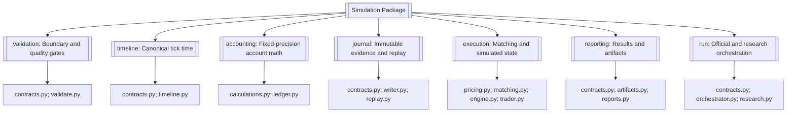
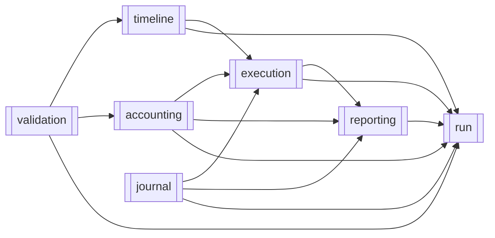
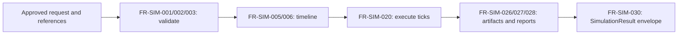
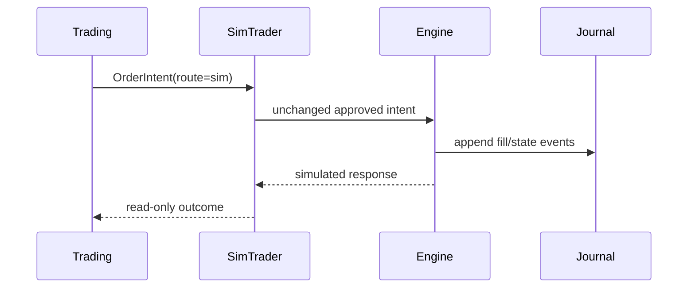
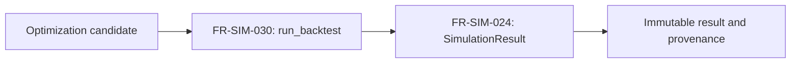
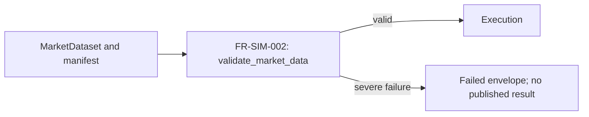
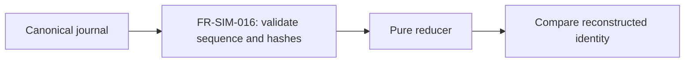
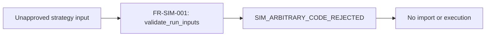
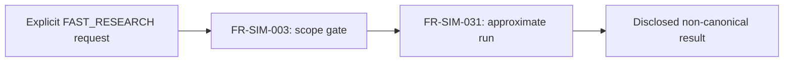

# Simulation

> **Package:** `app/services/simulator`
> **Status:** `Completed` — implementation, post-build review corrections, and the Section 7 domain gate all completed 2026-07-19. The gate is green on both Linux (`169 passed`, `83.21%` coverage) and the Windows toolchain.
> **Last updated:** `2026-07-19`

> This README is the package's **single source of truth** for requirements, final structure, implementation sequence, progress, usage examples, and tests.
> Update this file before changing the code.

---

## 1. Purpose and Boundary

### Purpose

Simulation orchestrates deterministic historical backtests through the governed system path and owns the simulated execution environment for Trading's `sim` route. It replays approved FX order intents over historical market data, maintains simulated execution and account state, and produces immutable journals, reproducible `SimulationResult` records, artifact manifests, and execution reports. It must fail closed when required evidence, configuration, timing, persistence, or state cannot be verified.

The package is implemented as a clean-start V1 domain. No migration path, compatibility alias, or caller transition was introduced.

### Owns

- Historical backtest orchestration across Data, Indicators, Strategy, Risk, and Trading's `sim` route.
- Deterministic replay of the Data-owned tick series across the approved Phase 1 FX scope. Tick derivation itself belongs to Data (`FR-DATA-087`–`FR-DATA-090`).
- Simulated fills and all simulated orders, positions, pending orders, account state, and execution timestamps.
- Application of the final volume already approved by Risk and packed by Trading; Simulation does not resize approved orders.
- Simulation-specific validation of inbound manifests and execution-critical market-data conditions.
- Fixed-precision execution accounting, configured costs, margin, and currency conversion only when fresh Data-owned `FXConversionEvidence v1` is supplied.
- Append-only simulation journals, deterministic replay, run idempotency evidence, and incomplete-run isolation.
- `SimulationResult`, `PortfolioSimulationResult`, execution reports, artifact manifests, and Simulation-owned persistence schemas and migration definitions.
- An explicitly non-canonical fast-research mode that cannot produce official fills or promotion evidence.

### Does not own

- Market-data acquisition, normalization, provider selection, caches, vendor governance, complete lineage, **or tick-series derivation from bars or ticks**; Data owns them. Simulation consumes the tick `MarketDataset` and constructs no ticks, spreads, or price paths of its own.
- Indicator formulas or indicator availability rules; Indicators owns them.
- Strategy code, strategy registration, signal logic, or arbitrary Python code execution; Strategy owns vetted strategy behavior.
- Risk policy, final sizing approval, exposure limits, or kill-switch state; Risk owns them.
- `OrderIntent`, route selection, live/paper execution, or reconciliation; Trading owns them. Broker connections/adapters; Brokers owns them. Credential-reference resolution and composition-root `BrokerConnectionConfig` construction; UI/API owns them. All as defined in `docs/PROJECT.md`.
- Performance metric formulas, scorecards, or advisory conclusions; Analytics owns them.
- Optimization search algorithms, ranking, walk-forward policy, Monte Carlo/bootstrap analysis, workers, or checkpoints; Optimization owns them.
- Portfolio construction methods, allocation activation/versioning, drift detection, or rebalance planning; Portfolio owns them.
- Live broker mutations, live adapter imports, paper execution, or any network access on the simulation execution path.
- Phase 1 support for equities, ETFs, futures, perpetuals, options, corporate actions, borrow fees, regulatory engines, distributed workers, external report distribution, or production-promotion automation.

### Shared contracts

Contract definitions must match the name, version, and owner recorded in `docs/PROJECT.md`.

**Owned by this domain** — defined authoritatively here:

| Status | Contract | Version | Counterparty | Purpose |
|---|---|---|---|---|
| Completed | `SimulationBacktestRequestV1` | `v1` | UI/API; Optimization submits via its internal backtest-adapter port | Receive the exact reference-based synchronous request defined in `docs/PROJECT.md` §5. Optimization owns and implements its own internal backtest-adapter port against Simulation's public `run_backtest`. Simulation imports nothing from Optimization and defines no adapter of its own. |
| Completed | `SimulationResult` | `v1` | Analytics, Optimization, UI/API | Publish a deterministic completed backtest outcome containing run/config/data/engine identities, simulated fills, journal and artifact references, accounting totals, diagnostics, and realism disclosures. Incomplete runs are never published. |
| Completed | `PortfolioBacktestRequestV1` | `v1` | Portfolio submits; Simulation receives | Receive one self-contained Simulation-owned projection of an immutable Portfolio candidate, with scalar values, ordered components, identifiers, versions, references, and hashes only. Defined by `FR-SIM-032`. |
| Completed | `PortfolioSimulationResult` | `v1` | Portfolio, Analytics, UI/API | Publish complete component and aggregate journals, risk-budget history, metrics/artifact references, and reproducibility identity. |

**Consumed from other domains** — referenced only, never redefined:

| Contract | Version | Owner | Used for |
|---|---|---|---|
| `MarketDataset` | `v1` | Data | Receive normalized historical bars or ticks, availability metadata, and provenance. |
| `FXConversionEvidence` | `v1` | Data | Apply fresh direct/synthesized conversion evidence without choosing or synthesizing a rate path. |
| `OrderIntent` | `v1` | Trading | Receive deterministic, idempotent, Risk-approved executable requests for the `sim` route. |
| `ExecutionReceipt` | `v1` | Trading | Return the canonical simulated execution outcome through Trading's injected `sim` dispatch port; constructed from Trading's contract and never redefined here. |
| `MarketDataset` (tick series) | `v1` | Data | Receive the deterministic tick stream produced by Data's `generate_tick_series`; Simulation derives no ticks of its own. |
| `AuthContext` | `v1` | Utils | Authenticate and trace governed `run_backtest` calls. |
| `AuditEvent` common envelope | `v1` | Utils | Emit redacted governed-action evidence for durable storage through Data. |

`SimulationBacktestRequestV1` contains exactly `contract_version="v1"`,
`schema_id="simulation.backtest_request.v1"`, request/correlation IDs,
strategy/data references and versions, bounded JSON-safe parameter values, symbols,
timeframe, ordered UTC range, positive `Decimal` initial balance, execution-config and
Risk-policy references/versions, `runtime_profile="simulation"`,
`execution_route="sim"`, and a SHA-256 config hash. `AuthContext` is supplied
separately. Inline data, DataFrames, provider objects, code, secrets, and unknown
fields are forbidden.

`SimulationResult v1` contains `contract_version="v1"` and
`schema_id="simulation.result.v1"` separately from its run/config/data/engine
identities. Compatibility is evaluated only from `contract_version`.

`IndicatorSeries v1`, `TradeIntent v1`, `RiskDecision v1`, `OrderIntent v1`, and
`MarketDataset v1` participate in orchestration, but Simulation does not redefine or
mutate them. Compatibility is checked from `contract_version`, never by parsing
`schema_id`, as specified in `docs/PROJECT.md` §5.

### Persisted state

Data owns the shared connection, locking, and migration execution infrastructure. Simulation owns only the following schemas, artifacts, and migration definitions, and only Simulation may write them.

| Status | State / Store | Read access (via contract) | Migration definitions |
|---|---|---|---|
| Completed | Completed simulation result records | Analytics, Optimization, UI/API via `SimulationResult`; Portfolio, Analytics, UI/API via `PortfolioSimulationResult` | `app/services/simulator/state/migrations.py` |
| Completed | Append-only versioned JSONL journal and replay metadata | Simulation replay; consumers through `SimulationResult` references | Artifact schema under `journal/`; canonical JSONL-only durability |
| Completed | Canonical JSON and Markdown execution reports | Analytics, Optimization, Portfolio, UI/API through applicable `SimulationResult` / `PortfolioSimulationResult` artifact references | Artifact schema under `reporting/` |
| Completed | Artifact manifest and checksums | Analytics, Optimization, Portfolio, UI/API through the applicable `SimulationResult` / `PortfolioSimulationResult` | Artifact schema under `reporting/` |

Incomplete, failed, or diagnostic-failed runs may retain bounded diagnostic evidence but must not be published as completed `SimulationResult` records.

### Four-level structure

| Code level | Represents |
|---|---|
| **Package** | Simulation domain |
| **Module folder** | Feature / capability |
| **File** | Use case or focused responsibility |
| **Class / function / method** | Functional requirement behavior |

```text
Simulation package
└── Feature module
    └── Focused file
        └── Public class / function / method
```

### Package capability map



---

## 2. Final Package Structure

Module folders and files are ordered from lowest dependency to highest dependency.

```text
simulator/
├── __init__.py                         # Domain API: requests, results, governed run operations, and SimTrader
├── README.md
├── errors.py                           # Domain error taxonomy and code catalog
├── validation/                         # Inbound contracts, scope, and data-quality gates
│   ├── __init__.py
│   ├── contracts.py                    # Validation result contracts
│   └── validate.py                     # Request, reference, scope, and data validation
├── timeline/                           # Canonical FX tick time and no-lookahead
│   ├── __init__.py
│   ├── contracts.py                    # Tick contract
│   └── timeline.py                     # Tick construction and timing enforcement
├── accounting/                         # Fixed-precision volume, costs, margin, same-currency PnL
│   ├── __init__.py
│   ├── calculations.py                 # Stateless accounting calculations
│   └── ledger.py                       # Stateful account ledger and invariants
├── journal/                            # Append-only evidence, persistence, replay, idempotency
│   ├── __init__.py
│   ├── contracts.py                    # Versioned journal event contract
│   ├── writer.py                       # Streaming hash-chained persistence
│   └── replay.py                       # Validation, reconstruction, and request-id resolution
├── execution/                          # Matching, order lifecycle, engine state, simulated Trader
│   ├── __init__.py
│   ├── pricing.py                      # Bid/ask price and configured realism models
│   ├── matching.py                     # Deterministic order matching and fill policy
│   ├── engine.py                       # Canonical tick engine and authoritative state
│   └── trader.py                       # Simulation-scoped order and query facade
├── reporting/                          # SimulationResult and canonical artifacts
│   ├── __init__.py
│   ├── contracts.py                    # Result and artifact manifest contracts
│   ├── artifacts.py                    # Checksummed artifact manifest assembly
│   └── reports.py                      # Canonical JSON and Markdown reports
├── state/                              # Simulation-owned schemas and migrations
│   ├── __init__.py
│   ├── store.py                        # SimulationStateStore port
│   └── migrations.py                   # Simulation-owned migration definitions
└── run/                                # Typed public contracts and orchestration
    ├── __init__.py
    ├── contracts.py                    # Versioned request contracts
    ├── orchestrator.py                 # Official synchronous run_backtest path
    ├── portfolio.py                    # Portfolio candidate backtest orchestration
    └── research.py                     # Explicit non-canonical fast-research path
```

The package now matches the approved tree above. It remains a clean-start V1 implementation, so no migration, alias, or caller-transition step applies.

### Module dependency diagram

Dependencies point from the required module to the consuming module.



`journal` remains independent of `execution`: replay accepts an injected pure reducer and does not import the execution engine. This prevents a journal/execution cycle.

`reporting/contracts.py` is a leaf contract module: it imports Trading contracts and Utils and no Simulation module. `execution/engine.py` imports `ClosedTradeRecord` from it directly so that `mae` and `mfe` are written into the record at the moment they are observed rather than reconstructed later, as `FR-SIM-020` requires. Because the contract module imports nothing from Simulation, this introduces no cycle; `reporting/artifacts.py` and `reporting/reports.py` remain downstream of `execution`.

### Structure rules

- The package root contains only `README.md`, `__init__.py`, `errors.py`, and the approved feature folders.
- Every official run uses one deterministic tick clock; vectorization is limited to indicator and signal generation outside the execution loop.
- Public cross-domain imports use only package or feature `__init__.py` exports.
- Private helpers receive no requirement IDs unless independently required.
- The engine, ledger, writer, and simulation-scoped Trader may be classes because they own state or lifecycle; other behavior is a function by default.
- No manager, repository, adapter, factory, scheduler, worker, queue, or provider layer is added without a separately approved requirement.
- Usage examples live under `tests/simulator/usage/`.

---

## 3. Workflows

### Status values

| Status | Meaning |
|---|---|
| **Missing** | Not implemented or not verified |
| **Partial** | Partly implemented or tests are incomplete |
| **Completed** | Implemented, tested, and verified |

### Workflow scope values

| Scope | Meaning |
|---|---|
| **Internal** | The complete workflow occurs within Simulation. |
| **Cross-domain** | Simulation receives input from or returns output to another domain. |

| Status | Workflow ID | Scope | Workflow | Trigger / Input boundary | Final outcome / Output boundary | Requirement sequence |
|---|---|---|---|---|---|---|
| Completed | `WF-SIM-001` | Cross-domain | Official FX backtest | Approved request plus Data/Strategy references | Persisted `SimulationResult`; Analytics-ready evidence | `FR-SIM-029 → FR-SIM-001 → FR-SIM-002 → FR-SIM-003 → FR-SIM-005 → FR-SIM-006 → FR-SIM-020 → FR-SIM-024 → FR-SIM-026 → FR-SIM-027 → FR-SIM-028 → FR-SIM-030` |
| Completed | `WF-SIM-002` | Cross-domain | Simulation Trader operations | Trading-owned `OrderIntent` with route=`sim` | Journaled simulated fill/state response | `FR-SIM-038 → FR-SIM-021 → FR-SIM-018 → FR-SIM-019 → FR-SIM-020 → FR-SIM-014 → FR-SIM-023` |
| Completed | `WF-SIM-003` | Cross-domain | Optimization candidate execution | Optimization-owned candidate and canonical request | Immutable result/provenance; no ranking by Simulation | `FR-SIM-030 → FR-SIM-024 → FR-SIM-026` |
| Completed | `WF-SIM-004` | Cross-domain | Severe data-quality blocked run | Data-owned manifest and normalized dataset | Failed envelope; no execution or published result | `FR-SIM-002 → FR-SIM-030` |
| Completed | `WF-SIM-005` | Internal | Deterministic replay | Journal plus matching identity hashes | Reconstructed state equal to stored result | `FR-SIM-016` |
| Completed | `WF-SIM-006` | Cross-domain | Registered-strategy security rejection | Raw code or unapproved registry reference | `SIM_ARBITRARY_CODE_REJECTED`; no import/execution | `FR-SIM-001 → FR-SIM-030` |
| Completed | `WF-SIM-007` | Internal | Non-canonical fast research | Approved research-mode request | Disclosed approximate result with no official claims | `FR-SIM-003 → FR-SIM-031` |
| Completed | `WF-SIM-010` | Cross-domain | Tick-series acquisition | Approved request plus Data-owned bar or tick evidence | Ordered execution clock from `generate_tick_series` | `FR-DATA-087 → FR-SIM-005 → FR-SIM-004` |
| Completed | `WF-SIM-009` | Cross-domain | Portfolio backtest | `PortfolioBacktestRequestV1` plus referenced strategies/data/FX/policy | `PortfolioSimulationResult v1` | `FR-SIM-032 → FR-SIM-010 → FR-SIM-034 → FR-SIM-033` |

### `WF-SIM-001` — Official FX Backtest

**Scope:** Cross-domain
**System workflow:** `SYS-WF-001`

**Input boundary:** `SimulationBacktestRequestV1`, `AuthContext`, Data-owned market evidence, and vetted registry references.
**Output boundary:** A completed `SimulationResult` for Analytics, Optimization, or UI/API; artifacts are persisted by Simulation through Data-owned infrastructure.

1. `run_backtest()` validates authentication, request structure, approved references, profile/route compatibility, and Phase 1 scope.
2. `validate_market_data()` blocks execution-critical data failures before state is created.
3. Data's `generate_tick_series()` produces the tick `MarketDataset`; `build_tick_timeline()` converts it into the ordered execution clock.
4. Strategy, Risk, and Trading produce approved `OrderIntent` values through their public boundaries; Simulation does not reproduce their internal logic.
5. `EventDrivenExecutionEngine.execute_tick()` processes each tick, applies accounting, and appends journal events.
6. Reporting functions persist canonical artifacts and return `SimulationResult`.

**Failure behavior:** Invalid or missing evidence returns a structured `SIM_*` error; risk rejection is journaled and the run continues; persistence or invariant failure aborts the run and prevents result publication.

**Integration test:**
`tests/simulator/integration/test_official_backtest.py::test_official_backtest_completes_end_to_end()`



### `WF-SIM-002` — Simulation Trader Operations

**Scope:** Cross-domain
**System workflow:** `SYS-WF-001`; Trading owns `OrderIntent`, while Simulation owns all simulated fills and state.

**Input boundary:** Trading-owned `OrderIntent` with `route=sim` and final Risk-approved volume.
**Output boundary:** A journaled simulated response and read-only state snapshot inside the active run.

1. `SimTrader.submit_order()` verifies the route and forwards the unchanged approved intent.
2. Pricing and matching functions evaluate it against the current canonical tick.
3. The engine and ledger mutate only simulated state and append typed journal events.
4. `SimTrader.snapshot()` exposes an immutable read-only view.

**Failure behavior:** A non-sim route, changed volume, missing state, unsupported order type, or any live-adapter dependency fails closed before mutation.

**Integration test:**
`tests/simulator/integration/test_sim_trader.py::test_sim_trader_executes_without_a_broker()`



### `WF-SIM-003` — Optimization Candidate Execution

**Scope:** Cross-domain
**System workflow:** `SYS-WF-003`

**Input boundary:** Optimization supplies a bounded candidate through `SimulationBacktestRequestV1`.
**Output boundary:** Simulation returns one immutable canonical result and provenance; Optimization owns ranking, diagnostics, and checkpoints.

**Failure behavior:** Invalid candidate parameters fail before execution; Simulation never schedules workers, ranks candidates, or promotes a strategy.

**Integration test:**
`tests/simulator/integration/test_optimization_boundary.py::test_external_adapter_can_call_stable_simulation_port()`



### `WF-SIM-004` — Severe Data-Quality Block

**Scope:** Cross-domain
**System workflow:** `SYS-WF-001`

**Input boundary:** Data-owned manifest and normalized dataset.
**Output boundary:** Structured failed response and bounded redacted diagnostics; no engine state or completed result.

**Failure behavior:** Empty, non-monotonic, duplicate, invalid-OHLC, negative-spread, stale, checksum-mismatched, or lookahead-tainted input fails before execution.

**Integration test:**
`tests/simulator/integration/test_data_quality_gate.py::test_failed_data_quality_prevents_result_publication()`



### `WF-SIM-005` — Deterministic Replay

**Scope:** Internal
**System workflow:** None

**Input boundary:** Canonical journal with matching config, data, engine, and schema identities.
**Output boundary:** Reconstructed state and result identity comparison.

**Failure behavior:** Sequence gaps, hash-chain breaks, incompatible identities, unknown event versions, or invariant failures abort replay deterministically.

**Integration test:**
`tests/simulator/integration/test_replay.py::test_completed_run_replays_to_terminal_state()`



### `WF-SIM-006` — Registered-Strategy Security Rejection

**Scope:** Cross-domain
**System workflow:** `SYS-WF-001`

**Input boundary:** Raw code, a filesystem path, or an unapproved strategy reference reaches the public boundary.
**Output boundary:** `SIM_ARBITRARY_CODE_REJECTED` in a redacted standard response; no import, network call, or engine creation.

**Integration test:**
`tests/simulator/integration/test_strategy_security.py::test_raw_strategy_code_is_rejected_before_execution()`



### `WF-SIM-007` — Non-Canonical Fast Research

**Scope:** Internal
**System workflow:** None

**Input boundary:** Authenticated request explicitly selecting `FAST_RESEARCH`.
**Output boundary:** Approximate result labelled `canonical=false`, with assumptions and prohibited-claim metadata.

**Failure behavior:** An omitted mode, attempt to emit official fills, promotion evidence, or canonical reports, or unsupported data fails closed.

**Integration test:**
`tests/simulator/integration/test_fast_research.py::test_fast_research_cannot_produce_canonical_evidence()`



No asynchronous queue, worker, quota, cancellation service, health-probe, or
distributed-lock capability exists in the Simulation architecture.

### `WF-SIM-009` — Portfolio Backtest

**Scope:** Cross-domain
**System workflow:** `SYS-WF-007`
**Input boundary:** `PortfolioBacktestRequestV1` carries a self-contained
Simulation-owned projection of one immutable candidate: scalar values, ordered
components, identifiers, versions, references, hashes, exact Strategy/Data/FX/
execution/Risk versions, bounded UTC range, explicit seed, and config hash. It
never embeds or imports a Portfolio-owned contract type.
**Output boundary:** `PortfolioSimulationResult v1`.

Simulation executes every component through the ordinary deterministic simulation
path, maintains aggregate account/risk-budget history, and publishes only when all
component and aggregate journals reconcile. It does not approve, activate, rank, or
modify the allocation. Missing/stale FX or incomplete results fail closed.

**Integration test:** `tests/simulator/integration/test_portfolio_backtest.py::test_portfolio_candidate_publishes_reconciled_aggregate()`

---

## 4. Module and Requirement Specifications

### Normative Phase 1 implementation rules

The following rules are part of the referenced `FR-SIM-*` requirements and
remove all implementation discretion from the Phase 1 build:

- Request contracts forbid unknown fields and carry request/workflow/correlation
  IDs; immutable strategy, data, tick-generation, execution-profile, and Risk
  policy references/versions/SHA-256 hashes; symbol/timeframe/bounded UTC range;
  bounded JSON-safe parameters; initial balance/account currency; seed;
  `simulation` or `fast_research` profile; `sim` route; and `config_hash`.
  `config_hash` is SHA-256 over Utils `canonical_json()` of every
  execution-affecting field except trace IDs and `config_hash` itself.
- `validate_market_data(dataset, context)` receives an immutable context carrying
  the expected dataset hash, requested UTC coverage, evaluation time, maximum
  staleness, and allowed tick model. It returns immutable validated evidence.
  The dataset hash is SHA-256 over its canonical model dump.
- Phase 1 commission is configured cash per lot per side. Phase 1 swap is
  configured cash per lot per crossed UTC rollover, including explicit weekday
  multipliers. Margin is `volume * contract_size * price / leverage`; the pure
  calculator validates its inputs and `AccountLedger` rejects insufficient free
  margin before a fill. FX conversion accepts only an immutable wrapper returned
  by `validate_fx_evidence(evidence, as_of=...)`.
- BUY execution prices use ask and SELL execution prices use bid. Slippage is
  either `none` or configured adverse `fixed_points`; no stochastic slippage is
  official. Market orders execute on the next eligible tick. BUY LIMIT triggers
  at `ask <= price`, SELL LIMIT at `bid >= price`, BUY STOP at
  `ask >= stop_price`, and SELL STOP at `bid <= stop_price`. STOP_LIMIT arms on
  its stop and then obeys its limit, including a same-tick fill only when both
  conditions hold. FOK fills completely or cancels without a fill; IOC fills
  available quantity and cancels the remainder. Liquidity is explicitly
  unbounded or derived from compatible tick volume and a configured participation
  rate. UTC session intervals, maximum gap, and maximum slippage are required
  execution-profile evidence. Stop-loss wins a same-tick conflict with
  take-profit.
- Build order is `errors -> validation -> timeline -> accounting -> state ->
  journal -> execution -> reporting -> run`. State precedes Journal because the
  writer consumes the Simulation-owned store. Constructors are explicit:
  `SimulationStateStore(database_path, artifact_root)`,
  `JournalWriter(store, run_id, request_id, correlation_id)`,
  `AccountLedger(initial_balance, account_currency, symbol_specification,
  cost_model)`, `EventDrivenExecutionEngine(ledger, journal_writer,
  execution_profile, engine_version)`, and `SimTrader(engine)`.
- `SimulationRunDependencies` is the typed receiver-owned composition contract
  for Data, Indicators, Strategy, Risk, Trading packing, resolved profiles/FX
  evidence, and the state store. The canonical operation is
  `run_backtest(request, auth_context, dependencies)`. Request identity is not
  duplicated by an optional function argument. FX evidence reaches Simulation
  only through `resolve_fx_evidence(evidence_ids) -> Mapping[str,
  FXConversionEvidence]`, which returns one Data-owned `FXConversionEvidence v1`
  per requested identifier; Simulation validates freshness through
  `validate_fx_evidence()` and never selects, refreshes, or synthesizes a rate.
  An identifier the caller cannot resolve fails the run closed with
  `SIM_FX_EVIDENCE_UNAVAILABLE`.
- `SimulationStateStore` is a `Protocol` only. Simulation declares the port and
  its own migration definitions; the caller supplies the implementation.
  Simulation opens no database connection, executes no migration, and imports
  neither `sqlite3` nor `app.services.data.storage.*`.
- `SimTrader.submit_order` is asynchronous and is directly assignable to
  Trading's `Callable[[OrderIntent], Awaitable[ExecutionReceipt]]` sim port. No
  module-global active engine or standalone dispatcher exists.
- Canonical artifact entries are exactly `journal.jsonl`, `result.json`, and
  `report.md`. `manifest.json` is the envelope and never hashes itself. Results
  carry `artifact_manifest_ref`; the manifest is written after hashing the three
  entries. Official fills are immutable Trading `ExecutionReceipt` values.
- Fast research returns a distinct `FastResearchResult` with
  `canonical=false`; it contains no fills, closed-trade ledger, journal,
  manifest, canonical report, or promotion evidence.
- Runtime and peak-memory baselines are observational test/CI evidence only.
  They are excluded from canonical outputs and have no numeric pass/fail limit
  until a separately approved threshold exists.


Modules, files, and requirements below are in implementation order. Every symbol is new work.

### Approved capability traceability

| Reconciliation capability | Final destination |
|---|---|
| `CAP-SIM-001` — Typed public API and versioned contracts | `run/`: `FR-SIM-029`, `FR-SIM-030` |
| `CAP-SIM-002` — Validation, orchestration, and lifecycle | `validation/`, `journal/`, `run/`: `FR-SIM-001`, `FR-SIM-003`, `FR-SIM-017`, `FR-SIM-030` |
| `CAP-SIM-003` — Signal timing, tick construction, no-lookahead | `timeline/`: `FR-SIM-004`–`FR-SIM-006` |
| `CAP-SIM-004` — Canonical FX execution, matching, realism | `timeline/`, `execution/`: `FR-SIM-005`, `FR-SIM-018`–`FR-SIM-020` |
| `CAP-SIM-005` — Simulated Trader and authoritative state | `execution/`: `FR-SIM-021`–`FR-SIM-023` |
| `CAP-SIM-006` — Sizing application, accounting, costs, margin, FX | `accounting/`: `FR-SIM-007`–`FR-SIM-012` |
| `CAP-SIM-007` — Journal, replay, persistence, idempotency | `journal/`: `FR-SIM-013`–`FR-SIM-017` |
| `CAP-SIM-008` — Results, artifacts, Analytics boundary | `reporting/`: `FR-SIM-024`–`FR-SIM-028` |
| `CAP-SIM-009` — Data authority and quality gate | `validation/`: `FR-SIM-002` |
| `CAP-SIM-010` — Strategy and Indicator boundary | `validation/`, `timeline/`, `run/`: `FR-SIM-001`, `FR-SIM-006`, `FR-SIM-029`, `FR-SIM-030` |
| `CAP-SIM-011` — Determinism, precision, reliability, security | `NFR-SIM-001`–`NFR-SIM-012` and the approved Phase 1 error surface |
| `CAP-SIM-012` — Explicit fast-research mode | `run/`: `FR-SIM-031` |
| `CAP-SIM-013` — Optimization/robustness execution boundary | `run/`, `reporting/`: `FR-SIM-024`, `FR-SIM-026`, `FR-SIM-030`; search/ranking remain outside Simulation |
| `CAP-SIM-014` — Portfolio candidate execution | `run/`, `reporting/`: `FR-SIM-032`–`FR-SIM-034` |
| `CAP-SIM-015` — Error taxonomy and persistence port | `errors.py`, `state/`: `FR-SIM-035`–`FR-SIM-037`, `FR-SIM-041` |

### 4.0 `errors.py` — Domain Error Taxonomy

**Purpose:** Define the single Simulation exception and the closed catalog of codes
that every other requirement raises. Implemented first; every feature depends on it.

| Status | Requirement ID | Responsibility | Class / Function / Method | Side Effects | Raises | Usage / Test |
|---|---|---|---|---|---|---|
| Completed | `FR-SIM-035` | The system shall expose one base exception carrying a cataloged `code`, bounded redacted message/details, and optional request/correlation identifiers. Every controlled Simulation boundary failure surfaces through it; no uncontrolled exception crosses the run boundary. | `SimulationError(code: str, message: str, *, details: Mapping[str, object] \| None = None, request_id: str \| None = None, correlation_id: str \| None = None)` | None | `ValueError`: code is absent from `SIM_ERROR_CATALOG` or supplied metadata is invalid | **Usage:** `tests/simulator/usage/test_usage_errors.py::test_usage_simulation_error()`<br>**Unit:** `tests/simulator/unit/test_errors.py::test_error_rejects_uncataloged_code()` |
| Completed | `FR-SIM-036` | The system shall expose the authoritative closed catalog of Simulation error codes with group, meaning, and fail-closed effect. Every code raised by any `FR-SIM-*` appears here, and no code appears that no requirement raises. | `SIM_ERROR_CATALOG: Mapping[str, Mapping[str, object]]` | None | None | **Usage:** `tests/simulator/usage/test_usage_errors.py::test_usage_error_catalog()`<br>**Unit:** `tests/simulator/unit/test_errors.py::test_catalog_matches_documented_requirements()` |
| Completed | `FR-SIM-037` | The system shall convert a controlled exception into a bounded, redacted payload exposing no provider exception, path, credential, or raw payload. | `to_simulation_error_payload(error: Exception) -> dict[str, object]` | None | None | **Usage:** `tests/simulator/usage/test_usage_errors.py::test_usage_error_payload()`<br>**Unit:** `tests/simulator/unit/test_errors.py::test_error_payload_is_bounded_and_redacted()` |

**Approved code groups** — the catalog contains exactly these, and every code carries
the `SIM_` prefix:

| Group | Codes |
|---|---|
| Request and scope | `SIM_INVALID_CONFIG`, `SIM_INVALID_DATE_RANGE`, `SIM_MISSING_SYMBOL`, `SIM_ARBITRARY_CODE_REJECTED`, `SIM_UNSUPPORTED_OPERATION`, `SIM_UNSUPPORTED_ASSET_CLASS`, `SIM_UNSUPPORTED_FEATURE` |
| Data and timing | `SIM_DATA_CHECKSUM_MISMATCH`, `SIM_DATA_SCHEMA_INVALID`, `SIM_DATA_NON_MONOTONIC`, `SIM_DATA_DUPLICATE_TIMESTAMP`, `SIM_DATA_OHLC_INVALID`, `SIM_DATA_SPREAD_NEGATIVE`, `SIM_DATA_STALE`, `SIM_DATA_COVERAGE_INSUFFICIENT`, `SIM_LOOKAHEAD_DETECTED`, `SIM_FEATURE_LOOKAHEAD_DETECTED`, `SIM_UNSUPPORTED_TICK_MODEL`, `SIM_SPREAD_MISSING` |
| Execution and accounting | `SIM_INVALID_PRICE`, `SIM_INVALID_VOLUME`, `SIM_VOLUME_BELOW_MIN`, `SIM_VOLUME_ABOVE_MAX`, `SIM_VOLUME_STEP_MISMATCH`, `SIM_SLIPPAGE_EXCEEDED`, `SIM_LIQUIDITY_UNAVAILABLE`, `SIM_GAP_UNCROSSABLE`, `SIM_MARKET_CLOSED`, `SIM_UNSUPPORTED_FILL_POLICY`, `SIM_INSUFFICIENT_MARGIN`, `SIM_COMMISSION_CALCULATION_FAILED`, `SIM_SWAP_CALCULATION_FAILED`, `SIM_FX_EVIDENCE_UNAVAILABLE`, `SIM_POSITION_NOT_FOUND`, `SIM_ORDER_NOT_FOUND`, `SIM_EVENT_PRIORITY_AMBIGUOUS`, `SIM_ACCOUNT_INVARIANT_BROKEN` |
| Persistence and replay | `SIM_PERSISTENCE_FAILED`, `SIM_CHECKPOINT_INCOMPATIBLE`, `SIM_RUN_ID_CONFLICT` |
| Portfolio | `SIM_COMPONENT_INCOMPLETE`, `SIM_AGGREGATE_UNRECONCILED` |
| Safe fallback | `SIM_INTERNAL_ERROR` |

**Rules:** A code absent from the catalog cannot be raised. Adding a failure path adds
a catalog row first. `SIM_INTERNAL_ERROR` is the only permitted fallback and never
masks a cataloged condition.

### Feature usage examples

`tests/simulator/usage/test_usage_errors.py`

---

### 4.1 `validation/` — Boundary and Quality Gates

**Purpose:** Fail closed before execution when the request, scope, external references, or execution-critical data cannot be proven valid.

**Module flow:** `raw request/data → validate_run_inputs() → validate_phase_one_scope() → validate_market_data() → accepted evidence or structured failure`

### Files

| Status | File | Responsibility | Key exports | Dependencies |
|---|---|---|---|---|
| Completed | `contracts.py` | Define immutable validation evidence used internally by the final package. | `MarketDataValidationContext`, `ValidatedMarketDataEvidence`; imported directly by `run/` as the `FR-SIM-002` boundary types and not re-exported from `validation/__init__.py`. | **Standard library:** `typing`<br>**Required third-party:** `pydantic>=2.13.4`<br>**Local:** Utils public API → canonical serialization |
| Completed | `validate.py` | Validate request shape, approved references, Phase 1 scope, and market-data evidence before execution. | `validate_run_inputs`, `validate_phase_one_scope`, `validate_market_data`, `SUPPORTED_ASSET_CLASSES` | **Standard library:** `collections.abc`, `datetime`, `hashlib`<br>**Required third-party:** None<br>**Local:** Data public API → `MarketDataset`; `contracts.py` → validation evidence; Utils public API → canonical JSON and error mapping |
| Completed | `__init__.py` | Expose the supported validation API. | `validate_run_inputs`, `validate_phase_one_scope`, `validate_market_data`, `SUPPORTED_ASSET_CLASSES` | **Standard library:** None<br>**Required third-party:** None<br>**Local:** `validate.py` → all exports |

### Configuration and Limits Manifest

| Status | Setting / Limit | Type | Default | Required | Used by | Description |
|---|---|---|---|---|---|---|
| Completed | `SUPPORTED_ASSET_CLASSES` | `tuple[str, ...]` | `("FX",)` | Yes | `validate_phase_one_scope()` | Rejects non-FX official runs with deterministic unsupported-scope behavior. |
| Removed | `MAX_REQUEST_BYTES` | — | — | No | — | The request is reference-based; UI/API owns its HTTP body ceiling. Simulation rejects inline datasets/objects structurally rather than inventing a second byte limit. |
| Removed | `MAX_DATE_RANGE_DAYS` | — | — | No | — | The contract requires an ordered finite UTC range. Data availability and the caller's measured runtime policy govern feasibility; no unsupported fixed day limit is invented. |
| Removed | `MAX_DIAGNOSTIC_BYTES` | — | — | No | — | Cross-domain results carry bounded diagnostics and artifact references, never inline unbounded diagnostic artifacts. |

#### `validate.py` — Boundary and Quality Validation

| Status | Requirement ID | Responsibility | Class / Function / Method | Side Effects | Raises | Usage / Test |
|---|---|---|---|---|---|---|
| Completed | `FR-SIM-001` | The system shall validate authentication-relevant request structure, registered strategy references, Data references, broker-profile references, trace identifiers, and deterministic serialization before any import or execution. | `validate_run_inputs(payload: Mapping[str, object]) -> None` | Read-only | `SimulationError`: `SIM_INVALID_CONFIG` for malformed evidence; `SIM_ARBITRARY_CODE_REJECTED` for raw code/path input | **Usage:** `tests/simulator/usage/test_usage_validation.py::test_usage_validate_run_inputs()`<br>**Unit:** `tests/simulator/unit/test_validate.py::test_validate_run_inputs_rejects_raw_code()` |
| Completed | `FR-SIM-002` | The system shall verify manifest checksum, required schema, UTC monotonic timestamps, uniqueness, OHLC consistency, bid/ask spread, staleness, availability metadata, and requested coverage, blocking severe failures before execution, and shall return immutable validated evidence. | `validate_market_data(dataset: MarketDataset, context: MarketDataValidationContext) -> ValidatedMarketDataEvidence` | Read-only | `SimulationError`: exact `SIM_DATA_*` code for the detected severe condition | **Usage:** `tests/simulator/usage/test_usage_validation.py::test_usage_validate_market_data()`<br>**Unit:** `tests/simulator/unit/test_validate.py::test_validate_market_data_blocks_invalid_ohlc()` |
| Completed | `FR-SIM-003` | The system shall permit only approved FX scope or explicit `FAST_RESEARCH`, rejecting unsupported assets, features, service mode, and canonical claims from approximation. | `validate_phase_one_scope(payload: Mapping[str, object]) -> None` | Read-only | `SimulationError`: `SIM_UNSUPPORTED_OPERATION` or the specific approved `SIM_UNSUPPORTED_*` code | **Usage:** `tests/simulator/usage/test_usage_validation.py::test_usage_validate_phase_one_scope()`<br>**Unit:** `tests/simulator/unit/test_validate.py::test_validate_phase_one_scope_rejects_unsupported_asset()` |

**Rules:** Validation occurs before engine, ledger, journal writer, strategy import, or artifact creation. Raw provider objects and DataFrames never cross the boundary.

**Implementation notes:** Reuse redaction and canonical-serialization primitives from Utils. Error codes come only from `SIM_ERROR_CATALOG` (§4.0).

### Feature usage examples

`tests/simulator/usage/test_usage_validation.py` contains one independently runnable `test_usage_*` example for each requirement above.

---

### 4.2 `timeline/` — Canonical Tick Time and No-Lookahead

**Purpose:** Construct the official deterministic FX bid/ask tick sequence and enforce point-in-time visibility.

**Module flow:** `Data tick MarketDataset (FR-DATA-087) → build_tick_timeline() → validate_intent_timing() → ordered Tick stream`

### Files

| Status | File | Responsibility | Key exports | Dependencies |
|---|---|---|---|---|
| Completed | `contracts.py` | Define the immutable canonical tick. | `Tick` | **Standard library:** `datetime`, `decimal`<br>**Required third-party:** `pydantic>=2.13.4`<br>**Local:** None |
| Completed | `timeline.py` | Convert Data-owned tick datasets into the execution clock and enforce no-lookahead timing. | `build_tick_timeline`, `validate_intent_timing`, `APPROVED_TICK_MODELS` | **Standard library:** `datetime`<br>**Required third-party:** None<br>**Local:** Data public API → `MarketDataset`, `generate_tick_series`; `contracts.py` → `Tick` |
| Completed | `__init__.py` | Expose the supported timeline API. | `Tick`, `build_tick_timeline`, `validate_intent_timing` | **Standard library:** None<br>**Required third-party:** None<br>**Local:** feature files → all exports |

### Configuration and Limits Manifest

| Status | Setting / Limit | Type | Default | Required | Used by | Description |
|---|---|---|---|---|---|---|
| Completed | `SIGNAL_TIMING` | `str` | `previous_closed_bar` | Yes | `validate_intent_timing()` | Prevents a bar-open decision from using the current incomplete bar. |
| Removed | `TICK_MODEL` | — | — | No | — | Data owns tick-model selection through `TICK_GENERATION_MODELS` (`FR-DATA-087`). Simulation consumes the resulting dataset and does not re-select a model. |
| Removed | `RANDOM_SEED` | — | — | No | — | The only stochastic element is Data's `variable_spread` draw, seeded and validated inside Data. Simulation's official clock accepts no seed, so no path can introduce run-to-run variance. |

#### `contracts.py` — Canonical Tick Contract

| Status | Requirement ID | Responsibility | Class / Function / Method | Side Effects | Raises | Usage / Test |
|---|---|---|---|---|---|---|
| Completed | `FR-SIM-004` | The system shall expose an immutable UTC tick containing symbol, timestamp, bid, ask, source identity, sequence, and availability metadata with finite positive prices and `ask >= bid`. | `Tick(symbol: str, timestamp: datetime, bid: Decimal, ask: Decimal, source_id: str, sequence: int, available_at: datetime)` | None | `ValueError`: invalid timestamp, price, spread, sequence, or metadata | **Usage:** `tests/simulator/usage/test_usage_timeline.py::test_usage_tick_contract()`<br>**Unit:** `tests/simulator/unit/test_timeline_contracts.py::test_tick_rejects_negative_spread()` |

#### `timeline.py` — Tick Construction and Timing

| Status | Requirement ID | Responsibility | Class / Function / Method | Side Effects | Raises | Usage / Test |
|---|---|---|---|---|---|---|
| Completed | `FR-SIM-005` | The system shall convert one Data-owned tick `MarketDataset` into a strictly ordered immutable `Tick` tuple, validating UTC monotonicity, positive finite prices, `ask >= bid`, and the presence of intra-bar phase evidence. Tick derivation itself belongs to Data (`FR-DATA-087`–`FR-DATA-090`); Simulation constructs no ticks, applies no spread model, and consumes no seed. | `build_tick_timeline(tick_dataset: MarketDataset) -> tuple[Tick, ...]` | Read-only | `SimulationError`: `SIM_SPREAD_MISSING`, `SIM_DATA_NON_MONOTONIC`, `SIM_INVALID_PRICE`, or `SIM_UNSUPPORTED_TICK_MODEL` when the dataset was not produced by an approved Data model | **Usage:** `tests/simulator/usage/test_usage_timeline.py::test_usage_build_tick_timeline()`<br>**Unit:** `tests/simulator/unit/test_timeline.py::test_build_tick_timeline_is_deterministic()` |
| Completed | `FR-SIM-006` | The system shall reject a strategy intent whose evidence became available after its execution time and enforce previous-closed-bar visibility by default. | `validate_intent_timing(intent_available_at: datetime, execution_time: datetime) -> None` | None | `SimulationError`: `SIM_LOOKAHEAD_DETECTED` or `SIM_FEATURE_LOOKAHEAD_DETECTED` | **Usage:** `tests/simulator/usage/test_usage_timeline.py::test_usage_validate_intent_timing()`<br>**Unit:** `tests/simulator/unit/test_timeline.py::test_validate_intent_timing_blocks_lookahead()` |

**Rules:** A tick falling outside every configured UTC session is journalled as `tick_outside_session` and skipped, not treated as a run failure; Data may legitimately supply closed-market ticks inside a requested range, and aborting would discard an otherwise valid backtest. Official execution advances one tick at a time. Tick batching is excluded until a later correctness proof demonstrates that no execution, accounting, risk, session, or journal boundary can be skipped. Data's `generate_synthetic_dataset` (`FR-DATA-039`, GBM) is a fixture generator and must never reach an official run; only `generate_tick_series` (`FR-DATA-087`) output is accepted, and the boundary is enforced by test rather than convention.

**Implementation notes:** The official clock is the Data-generated tick series. `FAST_RESEARCH` may consume a coarser Data tick model but never claims canonical status.

### Feature usage examples

`tests/simulator/usage/test_usage_timeline.py`

---

### 4.3 `accounting/` — Fixed-Precision Account Math

**Purpose:** Apply the unchanged Risk-approved volume and maintain deterministic cost, margin, balance, equity, and same-currency PnL invariants.

**Module flow:** `approved volume/fill → pure calculations → AccountLedger.apply_fill() → immutable account snapshot`

### Files

| Status | File | Responsibility | Key exports | Dependencies |
|---|---|---|---|---|
| Completed | `calculations.py` | Normalize volume, calculate costs and margin, and apply validated FX evidence without state. | `normalize_volume`, `calculate_execution_costs`, `calculate_margin`, `validate_fx_evidence`, `convert_fx_amount`, `ExecutionCostInput`, `ExecutionCostModel`, `SymbolSpecification`, `ValidatedFXConversionEvidence` | **Standard library:** `decimal`, `collections.abc`<br>**Required third-party:** None<br>**Local:** Data-provided symbol evidence by public contract |
| Completed | `ledger.py` | Own simulated account balances and enforce accounting invariants. The ledger emits no journal events; `EventDrivenExecutionEngine` is the sole journal author, which keeps the ledger a pure accounting authority with no persistence dependency. | `AccountLedger` (`apply_fill`, `mark_to_market`, `snapshot`), `LedgerFill` | **Standard library:** `decimal`, `collections.abc`, `types`, `typing`<br>**Required third-party:** `pydantic>=2.13.4`<br>**Local:** `calculations.py` → accounting functions |
| Completed | `__init__.py` | Expose the supported accounting API. | All public symbols above | **Standard library:** None<br>**Required third-party:** None<br>**Local:** feature files → exports |

### Configuration and Limits Manifest

| Status | Setting / Limit | Type | Default | Required | Used by | Description |
|---|---|---|---|---|---|---|
| Completed | Decimal context precision | `int` | `28` minimum | Yes | All accounting symbols | Rejects non-finite values and performs broker-critical math with `Decimal`. |
| Completed | Price/volume quantization | `Decimal` | Data/broker-profile evidence | Yes | `normalize_volume()`, ledger | Values not aligned to approved symbol precision fail before mutation. |
| Completed | FX freshness limit | `int` | Supplied in `FXConversionEvidence v1` | Yes for cross-currency runs | `convert_fx_amount()` | Simulation validates the Data-owned rate/path/freshness evidence and never selects, refreshes, or synthesizes a rate. |

#### `calculations.py` — Stateless Accounting Calculations

| Status | Requirement ID | Responsibility | Class / Function / Method | Side Effects | Raises | Usage / Test |
|---|---|---|---|---|---|---|
| Completed | `FR-SIM-007` | The system shall verify that the final approved volume is finite, positive, and within symbol min/max/step constraints without increasing, decreasing, or otherwise re-sizing it. | `normalize_volume(volume: Decimal, specification: Mapping[str, Decimal]) -> Decimal` | None | `SimulationError`: `SIM_INVALID_VOLUME`, `SIM_VOLUME_BELOW_MIN`, `SIM_VOLUME_ABOVE_MAX`, or `SIM_VOLUME_STEP_MISMATCH` | **Usage:** `tests/simulator/usage/test_usage_accounting.py::test_usage_normalize_volume()`<br>**Unit:** `tests/simulator/unit/test_accounting.py::test_normalize_volume_preserves_approved_size()` |
| Completed | `FR-SIM-008` | The system shall calculate configured Phase 1 commission and swap deterministically and return an itemized fixed-precision cost mapping. | `calculate_execution_costs(fill: Mapping[str, object], model: Mapping[str, object]) -> Mapping[str, Decimal]` | None | `SimulationError`: `SIM_COMMISSION_CALCULATION_FAILED`, `SIM_SWAP_CALCULATION_FAILED`, or unsupported model code | **Usage:** `tests/simulator/usage/test_usage_accounting.py::test_usage_calculate_execution_costs()`<br>**Unit:** `tests/simulator/unit/test_accounting.py::test_calculate_execution_costs_is_exact()` |
| Completed | `FR-SIM-009` | The system shall calculate required FX margin from approved symbol evidence, price, volume, and leverage, rejecting insufficient free margin before a fill. | `calculate_margin(volume: Decimal, price: Decimal, contract_size: Decimal, leverage: Decimal) -> Decimal` | None | `SimulationError`: `SIM_INVALID_CONFIG` or `SIM_INSUFFICIENT_MARGIN` | **Usage:** `tests/simulator/usage/test_usage_accounting.py::test_usage_calculate_margin()`<br>**Unit:** `tests/simulator/unit/test_accounting.py::test_calculate_margin_rejects_zero_leverage()` |
| Completed | `FR-SIM-010` | The system shall accept only fresh, schema-compatible Data-owned `FXConversionEvidence v1` for conversion-dependent accounting, and shall never choose, synthesize, refresh, or fetch a rate path. | `validate_fx_evidence(evidence: Mapping[str, object], *, as_of: datetime) -> None` | None | `SimulationError`: `SIM_FX_EVIDENCE_UNAVAILABLE` when evidence is missing, stale, or incompatible | **Usage:** `tests/simulator/usage/test_usage_accounting.py::test_usage_validate_fx_evidence()`<br>**Unit:** `tests/simulator/unit/test_accounting.py::test_fx_evidence_must_be_fresh()` |
| Completed | `FR-SIM-039` | The system shall convert one monetary amount using only the composite rate carried by validated `FXConversionEvidence v1`, preserving fixed precision and rejecting any conversion whose evidence was not first validated. | `convert_fx_amount(amount: Decimal, evidence: Mapping[str, object]) -> Decimal` | None | `SimulationError`: `SIM_FX_EVIDENCE_UNAVAILABLE` or `SIM_INVALID_CONFIG` for unvalidated or non-finite input | **Usage:** `tests/simulator/usage/test_usage_accounting.py::test_usage_convert_fx_amount()`<br>**Unit:** `tests/simulator/unit/test_accounting.py::test_convert_fx_amount_uses_supplied_rate_only()` |

#### `ledger.py` — Authoritative Account Ledger

| Status | Requirement ID | Responsibility | Class / Function / Method | Side Effects | Raises | Usage / Test |
|---|---|---|---|---|---|---|
| Completed | `FR-SIM-011` | The system shall atomically apply a simulated fill, realized PnL, commission, swap, and margin effect while preserving balance/equity/free-margin invariants, accumulating commission, swap, and gross-profit totals, and returning the itemized costs charged by that fill so the caller can attribute them to the exact position. The engine journals the resulting evidence; the ledger itself publishes no event. | `AccountLedger.apply_fill(fill: LedgerFill) -> Mapping[str, Decimal]` | Local state mutation | `SimulationError`: `SIM_ACCOUNT_INVARIANT_BROKEN` or `SIM_INSUFFICIENT_MARGIN` | **Usage:** `tests/simulator/usage/test_usage_accounting.py::test_usage_ledger_apply_fill()`<br>**Unit:** `tests/simulator/unit/test_ledger.py::test_apply_fill_preserves_account_invariants()` |
| Completed | `FR-SIM-012` | The system shall return an immutable read-only fixed-precision account snapshot without exposing mutable engine state. The snapshot exposes `balance`, `equity`, `used_margin`, `free_margin`, `unrealized`, `commission`, `swap`, `gross_profit`, and `account_currency`. `equity` is `balance + unrealized` and `free_margin` is `equity - used_margin`, so open-position risk is reflected before the next fill is admitted. | `AccountLedger.snapshot() -> Mapping[str, Decimal \| str]` | Read-only | `SimulationError`: `SIM_ACCOUNT_INVARIANT_BROKEN` when current state is inconsistent |
| Completed | `FR-SIM-042` | The system shall accept the current aggregate unrealized profit and loss of all open positions, so that equity, free margin, and margin admission reflect open exposure at the current tick. The engine supplies it once per tick from observed excursions; Simulation computes no price of its own. | `AccountLedger.mark_to_market(unrealized: Decimal) -> None` | Local state mutation | `SimulationError`: `SIM_ACCOUNT_INVARIANT_BROKEN` when the supplied value is not finite | **Usage:** `tests/simulator/usage/test_usage_accounting.py::test_usage_ledger_snapshot()`<br>**Unit:** `tests/simulator/unit/test_ledger.py::test_snapshot_is_immutable()` |

**Rules:** Balance changes only from documented realized execution/accounting events. Float-based V1 models are not used for official monetary math.

**Implementation notes:** All monetary expectations are computed under `Decimal` and the approved cost semantics; `profit` is gross and `commission`/`swap` are separate signed amounts.

### Feature usage examples

`tests/simulator/usage/test_usage_accounting.py`

---

### 4.4 `journal/` — Immutable Evidence, Replay, and Idempotency

**Purpose:** Persist the canonical event source incrementally, prove continuity, reconstruct state deterministically, and prevent request-ID ambiguity.

**Module flow:** `typed event → JournalWriter.append() → hash-chained JSONL → replay_journal()/resolve_idempotent_run()`

### Files

| Status | File | Responsibility | Key exports | Dependencies |
|---|---|---|---|---|
| Completed | `contracts.py` | Define the versioned immutable journal event. | `JournalEvent` | **Standard library:** `datetime`, `typing`<br>**Required third-party:** `pydantic>=2.13.4`<br>**Local:** Utils public API → canonical JSON, IDs, redaction |
| Completed | `writer.py` | Stream events to append-only JSONL with sequence, hash continuity, and group-commit durability through an injected store port. | `JournalWriter` (`append`, `finalize`), `JOURNAL_FORMAT`, `JOURNAL_FSYNC_INTERVAL`, `JOURNAL_SIDECAR_MODE` | **Standard library:** `collections.abc`, `datetime`, `hashlib`<br>**Required third-party:** None<br>**Local:** `contracts.py` → `JournalEvent`; injected `SimulationStateStore`; Utils → canonical JSON |
| Completed | `replay.py` | Validate and replay journals and resolve request-id reuse. | `replay_journal`, `resolve_idempotent_run` | **Standard library:** `collections.abc`, `pathlib`<br>**Required third-party:** None<br>**Local:** `contracts.py` → `JournalEvent`; Utils canonical JSON |
| Completed | `__init__.py` | Expose the supported journal API. | All public symbols above | **Standard library:** None<br>**Required third-party:** None<br>**Local:** feature files → exports |

### Configuration and Limits Manifest

| Status | Setting / Limit | Type | Default | Required | Used by | Description |
|---|---|---|---|---|---|---|
| Completed | `JOURNAL_FORMAT` | `str` | `jsonl-v1` | Yes | `JournalWriter` | Only versioned append-only canonical JSONL is accepted. The store appends to `journal.jsonl.partial` and atomically renames to `journal.jsonl` at finalization. |
| Completed | `JOURNAL_FSYNC_INTERVAL` | `int` | `100` events; flush again at run completion | Yes | `JournalWriter.append()` | Group commit: `append()` counts unflushed events and calls the port's `flush_journal()` every `JOURNAL_FSYNC_INTERVAL` events and once more before finalization, bounding loss to at most one batch while keeping one synchronous write per batch rather than per event. Persistence failure aborts the run. |
| Completed | `JOURNAL_SIDECAR_MODE` | `str` | `disabled` | Yes | `JournalWriter` | No SQLite table backs the journal. `SIMULATION_MIGRATIONS` declares only the run-identity table; a journal sidecar remains an explicit Phase 1 exclusion. |

#### `contracts.py` — Journal Event Contract

| Status | Requirement ID | Responsibility | Class / Function / Method | Side Effects | Raises | Usage / Test |
|---|---|---|---|---|---|---|
| Completed | `FR-SIM-013` | The system shall expose an immutable versioned journal event containing run, sequence, UTC time, event type, redacted payload, previous hash, event hash, correlation, and causation identities. | `JournalEvent(run_id: str, sequence: int, occurred_at: datetime, event_type: str, payload: Mapping[str, object], previous_hash: str, event_hash: str, correlation_id: str, causation_id: str | None, schema_version: str = "v1")` | None | `ValueError`: missing identity, invalid sequence/hash, non-UTC time, unsafe payload, or unsupported version | **Usage:** `tests/simulator/usage/test_usage_journal.py::test_usage_journal_event()`<br>**Unit:** `tests/simulator/unit/test_journal_contracts.py::test_journal_event_rejects_secret_payload()` |

#### `writer.py` — Streaming Journal Persistence

| Status | Requirement ID | Responsibility | Class / Function / Method | Side Effects | Raises | Usage / Test |
|---|---|---|---|---|---|---|
| Completed | `FR-SIM-014` | The system shall append one event with the next monotonic sequence and hash-chain link before the corresponding governed state transition is considered durable. | `JournalWriter.append(event: JournalEvent) -> None` | Persistence write | `SimulationError`: `SIM_PERSISTENCE_FAILED` on write, flush, lock, or continuity failure | **Usage:** `tests/simulator/usage/test_usage_journal.py::test_usage_journal_append()`<br>**Unit:** `tests/simulator/unit/test_journal_writer.py::test_append_fails_closed_on_write_error()` |
| Completed | `FR-SIM-015` | The system shall finalize a completed journal atomically and return its checksum without publishing incomplete temporary artifacts. | `JournalWriter.finalize() -> str` | Persistence write | `SimulationError`: `SIM_PERSISTENCE_FAILED` on flush, checksum, or atomic-finalization failure | **Usage:** `tests/simulator/usage/test_usage_journal.py::test_usage_journal_finalize()`<br>**Unit:** `tests/simulator/unit/test_journal_writer.py::test_finalize_is_atomic()` |

#### `replay.py` — Replay and Idempotency

| Status | Requirement ID | Responsibility | Class / Function / Method | Side Effects | Raises | Usage / Test |
|---|---|---|---|---|---|---|
| Completed | `FR-SIM-016` | The system shall validate schema, sequence, hash chain, config/data/engine identities, and invariants while reconstructing state through an injected deterministic reducer. | `replay_journal(path: Path, reducer: Callable[[Mapping[str, object], JournalEvent], Mapping[str, object]]) -> Mapping[str, object]` | Read-only | `SimulationError`: `SIM_CHECKPOINT_INCOMPATIBLE`, `SIM_PERSISTENCE_FAILED`, or `SIM_ACCOUNT_INVARIANT_BROKEN` | **Usage:** `tests/simulator/usage/test_usage_journal.py::test_usage_replay_journal()`<br>**Unit:** `tests/simulator/unit/test_replay.py::test_replay_rejects_hash_break()` |
| Completed | `FR-SIM-017` | The system shall return the existing completed run for the same request ID and hash, and reject the same request ID with a different hash. | `resolve_idempotent_run(request_id: str, request_hash: str, lookup: Callable[[str], Mapping[str, str] | None]) -> str | None` | Read-only | `SimulationError`: `SIM_RUN_ID_CONFLICT` when an existing request hash differs | **Usage:** `tests/simulator/usage/test_usage_journal.py::test_usage_resolve_idempotent_run()`<br>**Unit:** `tests/simulator/unit/test_replay.py::test_request_id_conflict_fails_closed()` |

**Rules:** Risk rejections, IOC remainder cancellation, lifecycle transitions, validation failures, and all state mutations are typed journal events. No separate compliance-record subsystem is created.

**Implementation notes:** JSONL is canonical. SQLite indexing is outside the initial implementation and may be proposed later only with profiling evidence.

### Feature usage examples

`tests/simulator/usage/test_usage_journal.py`

---

### 4.4a `state/` — Simulation-Owned Persistence Port

**Purpose:** Define the injected persistence boundary and Simulation's own migration
definitions, so no Simulation module imports Data storage internals.

| Status | File | Responsibility | Key exports | Dependencies |
|---|---|---|---|---|
| Completed | `store.py` | Define the persistence port Simulation depends on as a `Protocol`; the caller supplies the implementation. Contains no connection, schema execution, filesystem write, or SQL. | `SimulationStateStore` | **Standard library:** `collections.abc`, `typing`<br>**Required third-party:** None<br>**Local:** None |
| Completed | `migrations.py` | Declare Simulation-owned schema migrations using the Data-owned step contract. | `SIMULATION_MIGRATIONS` | **Standard library:** None<br>**Required third-party:** None<br>**Local:** `app.services.data.contracts` → `MigrationStep` |
| Completed | `__init__.py` | Expose the supported state API. | `SimulationStateStore`, `SIMULATION_MIGRATIONS` | **Standard library:** None<br>**Required third-party:** None<br>**Local:** feature files → exports |

| Status | Requirement ID | Responsibility | Class / Function / Method | Side Effects | Raises | Usage / Test |
|---|---|---|---|---|---|---|
| Completed | `FR-SIM-041` | The system shall depend on persistence only through an injected runtime-checkable `Protocol` exposing `append_journal`, `flush_journal`, `finalize_journal`, `load_run`, and `record_idempotency`, and shall declare its own migrations using the Data-owned `MigrationStep` contract. Simulation imports no Data storage, connection, or locking module, no `sqlite3`, and executes no schema statement of its own. | `SimulationStateStore` (Protocol), `SIMULATION_MIGRATIONS` | None | `SimulationError`: `SIM_PERSISTENCE_FAILED` raised by the caller's implementation | **Usage:** `tests/simulator/usage/test_usage_state.py::test_usage_state_store_port()`<br>**Unit:** `tests/simulator/unit/test_state.py::test_simulation_imports_no_data_storage_module()`, `::test_simulation_imports_no_sqlite_module()` |

**Rules:** Data owns the shared connection, locking, and migration execution
framework; Simulation owns only its records, artifacts, and migration definitions.
The permitted Data imports are `app.services.data.contracts` and public Data
package-root operations. `app.services.data.storage.*` is never imported.

### Feature usage examples

`tests/simulator/usage/test_usage_state.py`

---

### 4.5 `execution/` — Matching and Simulated State

**Purpose:** Execute Trading-owned sim-route intents against the canonical tick stream while owning all simulated fills and state and making no live calls.

**Module flow:** `OrderIntent + Tick → price_order() → match_order() → engine state/ledger/journal → SimTrader response/snapshot`

### Files

| Status | File | Responsibility | Key exports | Dependencies |
|---|---|---|---|---|
| Completed | `pricing.py` | Apply bid/ask, spread, slippage, and configured Phase 1 pricing realism. | `price_order`, `ExecutionProfile`, `SessionInterval` | **Standard library:** `decimal`, `collections.abc`<br>**Required third-party:** None<br>**Local:** Trading public API → `OrderIntent`; `timeline.contracts` → `Tick` |
| Completed | `matching.py` | Resolve supported order triggers, liquidity, fill policy, gaps, protective exits, and same-tick priority deterministically. | `match_order`, `evaluate_protective_exit`, `SAME_TICK_PRIORITY`, `SUPPORTED_FILL_POLICIES`, `MatchResult` | **Standard library:** `collections.abc`<br>**Required third-party:** None<br>**Local:** Trading public API → `OrderIntent`; `timeline.contracts` → `Tick`; `pricing.py` → `price_order` |
| Completed | `engine.py` | Own the canonical tick lifecycle and authoritative simulated execution state. | `EventDrivenExecutionEngine` (`execute_tick`, `submit_order`, `close_position`, `snapshot`, `closed_trades`) | **Standard library:** `collections.abc`<br>**Required third-party:** None<br>**Local:** timeline, accounting, journal, `matching.py` public APIs |
| Completed | `trader.py` | Provide the explicit simulation-scoped order/query facade and the async port Trading injects for the `sim` route. | `SimTrader` (`submit_order`, `close_position`, `snapshot`) | **Standard library:** `decimal`, `collections.abc`<br>**Required third-party:** None<br>**Local:** Trading public API → `OrderIntent`, `ExecutionReceipt`; `engine.py` → `EventDrivenExecutionEngine` |
| Completed | `__init__.py` | Expose the supported execution API. | All public symbols above | **Standard library:** None<br>**Required third-party:** None<br>**Local:** feature files → exports |

### Configuration and Limits Manifest

| Status | Setting / Limit | Type | Default | Required | Used by | Description |
|---|---|---|---|---|---|---|
| Completed | `SUPPORTED_FILL_POLICIES` | `tuple[str, ...]` | `("FOK", "IOC")` | Yes | `match_order()` | Unsupported policies fail with `SIM_UNSUPPORTED_FILL_POLICY`; `RETURN` is outside Phase 1. |
| Completed | `SAME_TICK_PRIORITY` | `tuple[str, ...]` | `("STOP_LOSS", "TAKE_PROFIT", "PENDING_ACTIVATION")` | Yes | `match_order()` | Resolves all same-tick conflicts deterministically and journals the selected outcome. |
| Completed | `EXECUTION_ROUTE` | `str` | `sim` under simulation profile | Yes | `SimTrader.submit_order()` | Any non-`sim` intent fails before mutation. |

#### `pricing.py` — Execution Pricing

| Status | Requirement ID | Responsibility | Class / Function / Method | Side Effects | Raises | Usage / Test |
|---|---|---|---|---|---|---|
| Completed | `FR-SIM-018` | The system shall derive an executable bid/ask price from the current tick and approved spread/slippage model without using future ticks. | `price_order(intent: OrderIntent, tick: Tick, model: Mapping[str, object]) -> Decimal` | None | `SimulationError`: `SIM_INVALID_PRICE`, `SIM_SPREAD_MISSING`, `SIM_SLIPPAGE_EXCEEDED`, or unsupported model code | **Usage:** `tests/simulator/usage/test_usage_execution.py::test_usage_price_order()`<br>**Unit:** `tests/simulator/unit/test_pricing.py::test_price_order_uses_side_correct_bid_ask()` |

#### `matching.py` — Order Matching

| Status | Requirement ID | Responsibility | Class / Function / Method | Side Effects | Raises | Usage / Test |
|---|---|---|---|---|---|---|
| Completed | `FR-SIM-019` | The system shall deterministically match supported FX market and pending intents using configured trigger, gap, liquidity, FOK/IOC, and same-tick priority rules, explicitly recording partial or cancelled remainder outcomes. | `match_order(intent: OrderIntent, tick: Tick, profile: ExecutionProfile, *, stop_limit_armed: bool = False) -> MatchResult` | None | `SimulationError`: specific matching, liquidity, gap, market-hours, or fill-policy `SIM_*` code | **Usage:** `tests/simulator/usage/test_usage_execution.py::test_usage_match_order()`<br>**Unit:** `tests/simulator/unit/test_matching.py::test_match_order_journals_ioc_remainder()` |
| Completed | `FR-SIM-043` | The system shall resolve the protective exit of one open position against the current tick, triggering stop-loss when the position's exit side crosses its stop and take-profit when it crosses its target, and shall resolve a same-tick stop-loss/take-profit conflict by `SAME_TICK_PRIORITY` order so stop-loss always wins. A condition absent from `SAME_TICK_PRIORITY` is ambiguous and fails closed. | `evaluate_protective_exit(position: Mapping[str, object], tick: Tick) -> str \| None` | None | `SimulationError`: `SIM_EVENT_PRIORITY_AMBIGUOUS` when a detected condition has no declared precedence | **Usage:** `tests/simulator/usage/test_usage_execution.py::test_usage_evaluate_protective_exit()`<br>**Unit:** `tests/simulator/unit/test_matching.py::test_stop_loss_wins_same_tick_conflict_with_take_profit()` |

#### `engine.py` — Canonical Tick Engine

| Status | Requirement ID | Responsibility | Class / Function / Method | Side Effects | Raises | Usage / Test |
|---|---|---|---|---|---|---|
| Completed | `FR-SIM-020` | The system shall process one canonical tick at a time, enforce timing and state transitions, apply fills through the ledger, append journal events, maintain per-open-position maximum adverse and favourable excursion so that `mae` and `mfe` are observed rather than reconstructed, and return immutable execution outcomes. Each tick evaluates every open position for a protective exit before pending orders are matched, closes triggered positions through the ledger, and records one `ClosedTradeRecord` per terminal close carrying the excursions observed during execution. | `EventDrivenExecutionEngine.execute_tick(tick: Tick) -> tuple[ExecutionReceipt, ...]`; `EventDrivenExecutionEngine.closed_trades` | Local state mutation; event publication; persistence write | `SimulationError`: exact validation, execution, accounting, invariant, or persistence code | **Usage:** `tests/simulator/usage/test_usage_execution.py::test_usage_engine_execute_tick()`<br>**Unit:** `tests/simulator/unit/test_engine.py::test_execute_tick_is_deterministic()` |

#### `trader.py` — Simulation-Scoped Trader Facade

| Status | Requirement ID | Responsibility | Class / Function / Method | Side Effects | Raises | Usage / Test |
|---|---|---|---|---|---|---|
| Completed | `FR-SIM-021` | The system shall accept only a Trading-owned `OrderIntent` for route `sim`, preserve its final approved volume, submit it to the active simulation engine without any broker call, and return a Trading-owned `ExecutionReceipt` constructed from the simulated outcome. | `SimTrader.submit_order(intent: OrderIntent) -> ExecutionReceipt` | Local state mutation; event publication; persistence write | `SimulationError`: `SIM_INVALID_CONFIG`, `SIM_INVALID_VOLUME`, or matching/accounting code | **Usage:** `tests/simulator/usage/test_usage_execution.py::test_usage_sim_trader_submit_order()`<br>**Unit:** `tests/simulator/unit/test_trader.py::test_submit_order_never_calls_live_adapter()` |
| Completed | `FR-SIM-038` | The system shall expose the bound asynchronous `SimTrader.submit_order` method whose signature is exactly the port Trading injects for the `sim` route, `Callable[[OrderIntent], Awaitable[ExecutionReceipt]]`, delegating to its active engine and importing no Trading internals beyond public contracts. | `async SimTrader.submit_order(intent: OrderIntent) -> ExecutionReceipt` | Local state mutation; event publication; persistence write | `SimulationError`: non-`sim` route, altered volume, absent engine, or matching/accounting code | **Usage:** `tests/simulator/usage/test_usage_execution.py::test_usage_dispatch_sim_order()`<br>**Unit:** `tests/simulator/unit/test_trader.py::test_dispatch_signature_matches_trading_port()` |
| Completed | `FR-SIM-022` | The system shall close an existing simulated position by approved quantity using the current canonical tick and journal the resulting fill. | `SimTrader.close_position(position_id: str, quantity: Decimal) -> Mapping[str, object]` | Local state mutation; event publication; persistence write | `SimulationError`: `SIM_POSITION_NOT_FOUND` or `SIM_INVALID_VOLUME` | **Usage:** `tests/simulator/usage/test_usage_execution.py::test_usage_sim_trader_close_position()`<br>**Unit:** `tests/simulator/unit/test_trader.py::test_close_position_rejects_unknown_position()` |
| Completed | `FR-SIM-023` | The system shall expose immutable read-only orders, positions, pending orders, deals, and account state for the current run without leaking mutable engine objects. | `SimTrader.snapshot() -> Mapping[str, object]` | Read-only | `SimulationError`: `SIM_ACCOUNT_INVARIANT_BROKEN` when state cannot be verified | **Usage:** `tests/simulator/usage/test_usage_execution.py::test_usage_sim_trader_snapshot()`<br>**Unit:** `tests/simulator/unit/test_trader.py::test_snapshot_cannot_mutate_engine_state()` |

**Rules:** Simulation is the broker analogue only for the `sim` route. It must not import live adapters, broker SDKs, credentials, or any Brokers `BrokerAdapter` capability.

**Implementation notes:** Pending, protective, and time-exit behavior is implemented from the approved Phase 1 order set only. Same-tick precedence uses `SAME_TICK_PRIORITY` and the Data-supplied intra-bar phase evidence.

### Feature usage examples

`tests/simulator/usage/test_usage_execution.py`

---

### 4.6 `reporting/` — Results and Canonical Artifacts

**Purpose:** Define the Simulation-owned result and assemble checksummed execution evidence without taking ownership of Analytics formulas.

**Module flow:** `completed engine/ledger/journal evidence → artifact manifest → JSON/Markdown execution reports → SimulationResult`

### Files

| Status | File | Responsibility | Key exports | Dependencies |
|---|---|---|---|---|
| Completed | `contracts.py` | Define `SimulationResult`, `ClosedTradeRecord`, `PortfolioSimulationResult`, `ArtifactManifest`, and their component row types. | `SimulationResult`, `ClosedTradeRecord`, `PortfolioSimulationResult`, `ArtifactManifest`, `AccountingSummary`, `RealismDisclosure`, `ArtifactEntry`, `PortfolioComponentResult`, `ComponentReturnSeries`, `ReturnObservation`, `RiskBudgetHistoryRow`, `FastResearchResult`, `CANONICAL_ARTIFACT_TYPES`, `REPORT_SCHEMA_VERSION` | **Standard library:** `datetime`, `decimal`, `typing`<br>**Required third-party:** `pydantic>=2.13.4`<br>**Local:** Utils canonical serialization |
| Completed | `artifacts.py` | Verify canonical artifacts and assemble their manifest. | `build_artifact_manifest` | **Standard library:** `hashlib`, `pathlib`, `collections.abc`<br>**Required third-party:** None<br>**Local:** `contracts.py` → `ArtifactManifest` |
| Completed | `reports.py` | Build deterministic JSON and Markdown execution reports. | `build_json_report`, `build_markdown_report` | **Standard library:** `json`<br>**Required third-party:** None<br>**Local:** `contracts.py` → `SimulationResult` |
| Completed | `__init__.py` | Expose the supported reporting API. | All public symbols above | **Standard library:** None<br>**Required third-party:** None<br>**Local:** feature files → exports |

### Configuration and Limits Manifest

| Status | Setting / Limit | Type | Default | Required | Used by | Description |
|---|---|---|---|---|---|---|
| Completed | `CANONICAL_ARTIFACT_TYPES` | `tuple[str, ...]` | `("journal.jsonl", "result.json", "report.md")` | Yes | Reporting symbols | `manifest.json` is the envelope and does not checksum itself; non-canonical visual/debug/notebook/external-distribution artifacts remain excluded. |
| Completed | `REPORT_SCHEMA_VERSION` | `str` | `v1` | Yes | `SimulationResult`, report builders | Unsupported versions fail validation rather than being silently coerced. |

#### `contracts.py` — Result Contracts

| Status | Requirement ID | Responsibility | Class / Function / Method | Side Effects | Raises | Usage / Test |
|---|---|---|---|---|---|---|
| Completed | `FR-SIM-024` | The system shall expose `SimulationResult` v1 with separate compatibility/schema identity, reproducibility identities, completed status, raw fills, the paired closed-trade ledger, journal/artifact references, fixed-precision accounting totals, diagnostics, and realism disclosures, and shall reject incomplete publication. `fills` are execution events; `closed_trades` are the paired round-trips consumers measure, populated from the engine-observed terminal closes of `FR-SIM-020` and never reconstructed after the run. `accounting` is derived from the completed `AccountLedger` totals; no monetary field in the published envelope is a constant. | `SimulationResult(contract_version: Literal["v1"], schema_id: Literal["simulation.result.v1"], run_id: str, request_hash: str, config_hash: str, data_hash: str, engine_version: str, status: Literal["completed"], journal_ref: str, artifact_manifest_ref: str, fills: tuple[ExecutionReceipt, ...], closed_trades: tuple[ClosedTradeRecord, ...], initial_balance: Decimal, account_currency: str, accounting: AccountingSummary, diagnostics: tuple[str, ...], realism: RealismDisclosure)` | None | `ValueError`: missing identity/artifact reference, non-final status, unsafe metadata, or invalid monetary value | **Usage:** `tests/simulator/usage/test_usage_reporting.py::test_usage_simulation_result()`<br>**Unit:** `tests/simulator/unit/test_reporting_contracts.py::test_result_rejects_incomplete_status()` |
| Completed | `FR-SIM-040` | The system shall expose one closed-trade ledger record carrying exactly `ticket`, `symbol`, `type`, `volume`, `entry_time`, `entry_price`, `stop_loss`, `take_profit`, `exit_time`, `exit_price`, `comment`, `commission`, `swap`, `profit`, `magic`, `mae`, and `mfe`. Timestamps are UTC; monetary and price fields are `Decimal`. `profit` is **gross** — price movement only — and excludes `commission` and `swap`, which carry a negative sign. The field set matches Analytics `FR-ANLT-049` exactly. | `ClosedTradeRecord` | None | `ValueError`: missing identity, non-UTC timestamp, `exit_time` before `entry_time`, or non-finite monetary value | **Usage:** `tests/simulator/usage/test_usage_reporting.py::test_usage_closed_trade_record()`<br>**Unit:** `tests/simulator/unit/test_reporting_contracts.py::test_closed_trade_profit_is_gross()` |
| Completed | `FR-SIM-033` | The system shall expose `PortfolioSimulationResult` v1 with separate compatibility/schema identity, run/result/reproducibility identities, construction identity, a bounded UTC measurement window, base currency, ordered reconciled component results, aligned component return evidence, aggregate journal and metric references, ordered Risk-owned budget-history evidence, FX lineage, an artifact manifest, and completed status. Each component row contains exactly `component_id`, `simulation_result_id`, `journal_ref`, `metrics_ref`, `account_currency`, and `reconciled=true`. Each component-return row contains exactly `component_id`, `simulation_result_id`, and `observations`; each observation contains exactly `timestamp` and `return_value`. Return observations are **periodic mark-to-market equity returns** measured by Simulation on one fixed UTC cadence shared by every component, derived from the component's own simulated equity curve; they are never supplied by the caller and never derived on a closed-trade basis, because a closed-trade basis cannot guarantee timestamps common to every component. Analytics derives its own closed-trade returns independently and the two bases are not expected to agree. Return timestamps are unique ordered UTC values inside the measurement window, return values are finite, every component/result pair appears exactly once, and at least 30 timestamps are common to every component. Each risk-budget row contains exactly `risk_decision_id`, `component_id`, `effective_at`, `expires_at`, `approved_budget`, and `currency`. Incomplete or unreconciled runs are never published. | `PortfolioSimulationResult(contract_version: Literal["v1"], schema_id: Literal["simulation.portfolio_result.v1"], result_id: str, run_id: str, request_hash: str, config_hash: str, data_hash: str, result_hash: str, engine_version: str, status: Literal["completed"], portfolio_id: str, construction_result_id: str, construction_version: str, measurement_start: datetime, measurement_end: datetime, base_currency: str, component_results: tuple[Mapping[str, object], ...], component_return_series: tuple[Mapping[str, object], ...], aggregate_journal_ref: str, aggregate_metrics_ref: str, risk_budget_history: tuple[Mapping[str, object], ...], fx_evidence_ids: tuple[str, ...], artifact_manifest_ref: str)` | None | `ValueError`: missing/unknown field, unsafe reference, malformed hash, unordered or non-UTC window, missing component, missing/unaligned/short/non-finite return evidence, unreconciled aggregate, incomplete FX/Risk lineage, non-final status, or invalid monetary value | **Usage:** `tests/simulator/usage/test_usage_reporting.py::test_usage_portfolio_simulation_result()`<br>**Unit:** `tests/simulator/unit/test_reporting_contracts.py::test_portfolio_result_requires_all_components()` |
| Completed | `FR-SIM-025` | The system shall expose a versioned manifest entry for every canonical artifact with relative path, media type, size, SHA-256 checksum, schema version, and creation time. | `ArtifactManifest(artifacts: tuple[Mapping[str, object], ...], created_at: datetime, schema_version: str = "v1")` | None | `ValueError`: absolute/unsafe path, invalid checksum, missing canonical artifact, or unsupported version | **Usage:** `tests/simulator/usage/test_usage_reporting.py::test_usage_artifact_manifest()`<br>**Unit:** `tests/simulator/unit/test_reporting_contracts.py::test_manifest_rejects_unsafe_path()` |

#### `artifacts.py` — Artifact Manifest Assembly

| Status | Requirement ID | Responsibility | Class / Function / Method | Side Effects | Raises | Usage / Test |
|---|---|---|---|---|---|---|
| Completed | `FR-SIM-026` | The system shall read completed canonical artifacts, verify containment and size, calculate checksums, and return a stable manifest without publishing temporary files. | `build_artifact_manifest(artifact_root: Path, paths: Sequence[Path]) -> ArtifactManifest` | Read-only | `SimulationError`: `SIM_PERSISTENCE_FAILED` for missing, unsafe, unreadable, or changed artifacts | **Usage:** `tests/simulator/usage/test_usage_reporting.py::test_usage_build_artifact_manifest()`<br>**Unit:** `tests/simulator/unit/test_artifacts.py::test_manifest_rejects_path_escape()` |

#### `reports.py` — Canonical Reports

| Status | Requirement ID | Responsibility | Class / Function / Method | Side Effects | Raises | Usage / Test |
|---|---|---|---|---|---|---|
| Completed | `FR-SIM-027` | The system shall serialize a `SimulationResult` to deterministic canonical JSON with execution/accounting diagnostics and realism/data-quality disclosures, excluding Analytics-owned metric formulas. | `build_json_report(result: SimulationResult) -> str` | None | `SimulationError`: `SIM_INTERNAL_ERROR` if canonical serialization fails | **Usage:** `tests/simulator/usage/test_usage_reporting.py::test_usage_build_json_report()`<br>**Unit:** `tests/simulator/unit/test_reports.py::test_json_report_is_deterministic()` |
| Completed | `FR-SIM-028` | The system shall render a deterministic Markdown execution report with assumptions, limitations, costs, fills, rejections, data quality, and artifact identities, excluding external distribution claims. | `build_markdown_report(result: SimulationResult) -> str` | None | `SimulationError`: `SIM_INTERNAL_ERROR` when required evidence is absent | **Usage:** `tests/simulator/usage/test_usage_reporting.py::test_usage_build_markdown_report()`<br>**Unit:** `tests/simulator/unit/test_reports.py::test_markdown_report_discloses_shortcuts()` |

**Rules:** Simulation reports execution evidence and accounting totals. Analytics consumes `SimulationResult` and owns performance metrics, scorecards, benchmark analysis, and caveats. `ClosedTradeRecord` rejects unknown fields, permits only final closed trades, uses `type` values `BUY` or `SELL`, requires positive finite volume and entry/exit prices, requires positive finite stop/take-profit prices when supplied, treats `magic` as the immutable string strategy ID, and permits nullable `mae <= 0` and `mfe >= 0`. `PortfolioSimulationResult` validates the exact component, component-return, and risk-budget row schemas stated by `FR-SIM-033`; Simulation preserves component returns and Risk references without interpreting or changing them.

**Implementation notes:** Serialization is deterministic canonical JSON through Utils; all monetary fields are `Decimal` and no float value is emitted.

### Feature usage examples

`tests/simulator/usage/test_usage_reporting.py`

---

### 4.7 `run/` — Official and Research Orchestration

**Purpose:** Expose one governed typed public boundary and one isolated non-canonical research boundary while sequencing lower modules without duplicating their logic.

**Module flow:** `request/auth → run_backtest() or run_fast_research() → lower capabilities → SimulationResult`

### Files

| Status | File | Responsibility | Key exports | Dependencies |
|---|---|---|---|---|
| Completed | `contracts.py` | Define the versioned requests received by Simulation and the receiver-owned composition contract. | `SimulationBacktestRequestV1`, `PortfolioBacktestRequestV1`, `PortfolioComponentRequest`, `SimulationRunDependencies` | **Standard library:** `datetime`, `decimal`, `typing`<br>**Required third-party:** `pydantic>=2.13.4`<br>**Local:** Utils public API → canonical serialization and trace IDs |
| Completed | `orchestrator.py` | Validate and execute one synchronous canonical run. | `run_backtest` | **Standard library:** `os`, `datetime`, `decimal`, `hashlib`, `pathlib`, `typing`<br>**Required third-party:** `pydantic>=2.13.4`<br>**Local:** all lower feature APIs; Trading public API → `ExecutionReceipt`; Utils → `AuthContext`, canonical JSON |
| Completed | `portfolio.py` | Execute every component of an approved portfolio candidate and publish the reconciled aggregate. | `run_portfolio_backtest` | **Standard library:** `collections.abc`, `decimal`<br>**Required third-party:** None<br>**Local:** `orchestrator.py` → component execution; accounting, journal, reporting public APIs |
| Completed | `research.py` | Execute an explicit non-canonical approximation with prohibited-claim controls. | `run_fast_research` | **Standard library:** None<br>**Required third-party:** None<br>**Local:** validation, reporting |
| Completed | `__init__.py` | Expose the supported run API. | `SimulationBacktestRequestV1`, `PortfolioBacktestRequestV1`, `run_backtest`, `run_portfolio_backtest`, `run_fast_research` | **Standard library:** None<br>**Required third-party:** None<br>**Local:** feature files → exports |

### Configuration and Limits Manifest

| Status | Setting / Limit | Type | Default | Required | Used by | Description |
|---|---|---|---|---|---|---|
| Completed | `initial_balance` | `Decimal` | No default; request required | Yes | `SimulationBacktestRequestV1` | Must be finite and strictly positive. |
| Completed | `RUNTIME_PROFILE` | `str` | `simulation` for official runs | Yes | `run_backtest()` | Incompatible profile fails initialization. |
| Completed | `EXECUTION_ROUTE` | `str` | `sim` for official runs | Yes | `run_backtest()` | Incompatible route fails before execution. |
| Completed | `FAST_RESEARCH_ENABLED` | `bool` | `false` | No | `run_fast_research()` | Disabled mode fails closed; enabling it never grants canonical status. |
| Completed | Public run status | contract behavior | terminal `success` or structured `error` | Yes | `run_backtest()` | The initial public operation has no queued/running/cancelling/cancelled state; only a completed `SimulationResult v1` is published. |
| Completed | `ARTIFACT_ROOT` | safe configured path | No implicit default | Yes | journal/report persistence | Must resolve beneath the configured approved artifact root; it is not caller-controlled request material. |

#### `contracts.py` — Backtest Request Contract

| Status | Requirement ID | Responsibility | Class / Function / Method | Side Effects | Raises | Usage / Test |
|---|---|---|---|---|---|---|
| Completed | `FR-SIM-029` | The system shall expose the exact `docs/PROJECT.md` §5 request for one synchronous bounded FX run, with separate contract version/schema ID, immutable Strategy/Data/Simulation/Risk references, JSON-safe parameters, symbol/timeframe/UTC range, positive initial balance, trace IDs, simulation profile/route, config hash, and no raw code/provider objects/inline data. | `SimulationBacktestRequestV1` | None | `ValueError`: missing/unknown field, invalid range/balance/mode/reference/version, non-deterministic value, or unsafe metadata | **Usage:** `tests/simulator/usage/test_usage_run.py::test_usage_backtest_request()`<br>**Unit:** `tests/simulator/unit/test_run_contracts.py::test_request_matches_project_section_5_exactly()` |

| Completed | `FR-SIM-032` | The system shall expose `PortfolioBacktestRequestV1` with `contract_version="v1"`, `schema_id="simulation.portfolio_backtest_request.v1"`, portfolio and construction-result identifiers and versions, ordered component allocations, exact Strategy/Data/FX/execution/Risk references and versions, bounded UTC range, explicit seed, positive initial balance, `runtime_profile="simulation"`, `execution_route="sim"`, and a SHA-256 config hash. It carries scalar values, identifiers, references, and hashes only, and never embeds or imports a Portfolio-owned contract type. It carries no measurement series: return evidence is produced by Simulation under `FR-SIM-033`, never supplied by the caller. | `PortfolioBacktestRequestV1` | None | `ValueError`: unknown field, embedded Portfolio contract instance, stale or incompatible reference, invalid range or balance, or non-deterministic configuration | **Usage:** `tests/simulator/usage/test_usage_run.py::test_usage_portfolio_backtest_request()`<br>**Unit:** `tests/simulator/unit/test_run_contracts.py::test_portfolio_request_is_self_contained()` |

#### `orchestrator.py` — Official Backtest

| Status | Requirement ID | Responsibility | Class / Function / Method | Side Effects | Raises | Usage / Test |
|---|---|---|---|---|---|---|
| Completed | `FR-SIM-030` | The system shall authenticate, deduplicate, validate, execute, journal, report, persist, and return one deterministic canonical FX run, never publishing a partial completed result. | `run_backtest(request: SimulationBacktestRequestV1, auth_context: AuthContext, dependencies: SimulationRunDependencies) -> SimulationResult` | Read-only external-domain calls; local state mutation; persistence write; event publication | `SimulationError`: controlled validation, execution, journal, reporting, or persistence failure | **Usage:** `tests/simulator/usage/test_usage_run.py::test_usage_run_backtest()`<br>**Unit:** `tests/simulator/unit/test_orchestrator.py::test_run_backtest_maps_internal_failure()` |

#### `portfolio.py` — Portfolio Candidate Backtest

| Status | Requirement ID | Responsibility | Class / Function / Method | Side Effects | Raises | Usage / Test |
|---|---|---|---|---|---|---|
| Completed | `FR-SIM-034` | The system shall execute every component of an approved portfolio candidate through the ordinary deterministic simulation path, maintain one aggregate account ledger and the Risk-owned budget history, and publish `PortfolioSimulationResult v1` only when every component and the aggregate journal reconcile. Reconciliation is arithmetic and falsifiable: the aggregate net profit shall equal the sum of component `accounting.net_profit` and the aggregate component count shall equal the requested component count, both to exact `Decimal` equality; `reconciled` is computed per component and is never a literal. Component return evidence shall be measured from each component's own simulated equity curve. FX evidence shall be resolved through `resolve_fx_evidence()` and validated before publication. It shall not approve, activate, rank, weight, or modify the allocation. Missing or stale FX evidence and any incomplete component fail the whole run closed. | `run_portfolio_backtest(request: PortfolioBacktestRequestV1, auth_context: AuthContext, dependencies: SimulationRunDependencies) -> PortfolioSimulationResult` | Local state mutation; persistence write; event publication | `SimulationError`: `SIM_COMPONENT_INCOMPLETE`, `SIM_AGGREGATE_UNRECONCILED`, `SIM_FX_EVIDENCE_UNAVAILABLE`, or any controlled validation, execution, journal, or persistence code | **Usage:** `tests/simulator/usage/test_usage_run.py::test_usage_run_portfolio_backtest()`<br>**Unit:** `tests/simulator/unit/test_portfolio_run.py::test_portfolio_run_fails_closed_on_incomplete_component()` |

**Rules:** Components share one deterministic clock and one aggregate ledger. A
component failure is never partially published. Portfolio owns construction and
activation; Simulation only measures the candidate it was given.

#### `research.py` — Fast Research Approximation

| Status | Requirement ID | Responsibility | Class / Function / Method | Side Effects | Raises | Usage / Test |
|---|---|---|---|---|---|---|
| Completed | `FR-SIM-031` | The system shall run an explicitly requested approximation only when enabled, mark every output `canonical=false`, disclose assumptions, and prohibit canonical fills, promotion evidence, and reports. | `run_fast_research(request: SimulationBacktestRequestV1, auth_context: AuthContext, dependencies: SimulationRunDependencies) -> FastResearchResult` | Read-only | `SimulationError`: controlled failure | **Usage:** `tests/simulator/usage/test_usage_run.py::test_usage_run_fast_research()`<br>**Unit:** `tests/simulator/unit/test_research.py::test_fast_research_cannot_claim_canonical()` |

**Rules:** `run_backtest`, `run_portfolio_backtest`, and `run_fast_research` are the only package-root public operations; internal helpers are not exported.

**Implementation notes:** `docs/PROJECT.md` §5 fixes the exact request schema and synchronous terminal behavior. `contract_version` and `schema_id` remain separate fields and compatibility is never inferred by parsing the schema identifier.

### Feature usage examples

`tests/simulator/usage/test_usage_run.py`

---

## 5. Package-Wide Requirements and Shared Configuration

| Status | Requirement ID | Type | Responsibility | Verification |
|---|---|---|---|---|
| Completed | `NFR-SIM-001` | Determinism | Identical approved inputs, versions, configuration, and seeds shall produce byte-identical canonical reports and journal identities. | Golden and replay tests |
| Completed | `NFR-SIM-002` | Precision | Prices, volumes, costs, margin, balances, equity, and PnL shall use finite `Decimal` values with context precision at least 28 and documented quantization. | Unit/property tests |
| Completed | `NFR-SIM-003` | No lookahead | Official execution shall use only evidence whose `available_at` is not later than the current execution time. | Timing boundary tests |
| Completed | `NFR-SIM-004` | Safety | Importing or running Simulation shall perform no broker mutation, live-adapter import, credential resolution, network request, or unrequested filesystem write. | Import-safety and spy tests |
| Completed | `NFR-SIM-005` | API boundary | Package and feature `__init__.py` files shall expose only documented public symbols. No Data helper, provider object, or internal type is re-exported. | Import-surface test |
| Completed | `NFR-SIM-006` | Security | Official requests shall reject arbitrary code and paths, redact secrets, bound payloads/diagnostics, and use vetted references only. | Security tests |
| Completed | `NFR-SIM-007` | Reliability | Missing evidence, persistence failure, invariant failure, unknown state, or unsupported scope shall fail closed with a deterministic code and no published completed result. | Fault-injection tests |
| Completed | `NFR-SIM-008` | Auditability | Every governed transition and rejection shall be traceable through correlation/causation IDs and the canonical hash-chained journal. | Journal audit test |
| Completed | `NFR-SIM-009` | Maintainability | Modules/files shall match Sections 2 and 4, remain acyclic, and contain Google-style typed public APIs without speculative layers. | Structure, Ruff, mypy review |
| Completed | `NFR-SIM-010` | Testing | Every public functional requirement shall have one usage example, at least one unit test, and collaborative workflow coverage, with package coverage at least 80%. | Traceability and coverage gate |
| Completed | `NFR-SIM-011` | Performance | Phase 1 shall record non-blocking deterministic runtime and memory baselines; no blocking numeric gate applies until measured evidence supports a separately approved domain limit. | Benchmark report |
| Completed | `NFR-SIM-012` | Compatibility | `SimulationResult` and owned request contracts shall be versioned; breaking changes require a new version and coordinated consumer migration. | Producer-consumer contract tests |

### Shared Configuration Manifest

| Status | Setting / Limit | Type | Default | Required | Used by | Description |
|---|---|---|---|---|---|---|
| Completed | `RUNTIME_PROFILE` | `str` | `research` system default; `simulation` required for official runs | Yes | validation, execution, run | Inherited from Utils; incompatible profile/route fails closed. |
| Completed | `EXECUTION_ROUTE` | `str` | `none` system default; `sim` required for official runs | Yes | validation, execution, run | Trading-owned shared setting; Simulation never permits paper/live routes. |
| Completed | `DATABASE_URL` / `DATA_DIR` | `str` | System configuration | Yes | journal, reporting, run | Data owns infrastructure; Simulation owns only its records and artifacts. |
| Completed | UTC-first time policy | policy | `Z`-suffixed ISO 8601 | Yes | all modules | Non-UTC cross-domain timestamps fail validation. |
| Completed | Correlation/trace ID format | policy | prefixed UUID4 | Yes | journal, run, reporting | Every cross-domain call and event carries request/correlation/causation IDs. |
| Completed | Secret redaction policy | policy | denylist-first, case-insensitive | Yes | validation, journal, reporting, run | Secrets never appear in responses, logs, events, artifacts, or diagnostics. |

### Approved Phase 1 Error Surface

The authoritative enumeration is `SIM_ERROR_CATALOG` in §4.0, defined by
`FR-SIM-036`. Every code raised by any requirement appears there, and no code
appears that no requirement raises. A code absent from the catalog cannot be
constructed, so adding a failure path adds a catalog row first.

---

## 6. Open Decisions

No open decisions.

## Explicit Exclusions

The following are excluded from the initial implementation and must not appear as active files, exports, or completed requirements: asynchronous queues/workers/service scheduling; optimization algorithms and Monte Carlo/bootstrap analysis; Analytics formula catalogs; Data caches/vendor governance/full lineage; Risk policy/VaR/correlation/concentration; mandatory SQLite sidecars; tick batching; equities/ETFs/corporate actions/borrow fees; futures/perpetuals/options; regulatory engines; feature stores/alternative data; visual/debug/notebook artifacts; external report distribution; canaries/synthetic probes; and production-promotion automation.

---

## 7. Tests and Definition of Done

### Test and usage locations

```text
tests/simulator/
├── unit/                         # Each public symbol and failure path
├── integration/                  # WF-SIM-* module/domain collaboration
└── usage/                        # One runnable test_usage_* example per FR-SIM-*
```

### Commands

```bash
uv run ruff check app/services/simulator
uv run ruff format --check app/services/simulator
uv run mypy app/services/simulator

uv run pytest tests/simulator/unit
uv run pytest tests/simulator/integration
uv run pytest tests/simulator/usage

uv run pytest tests/simulator --import-mode=importlib --cov=app.services.simulator --cov-fail-under=80
```

During iterative implementation, run only the specific files associated with the changed feature. Run the complete domain command only at the final domain gate.

### Required test levels

- **Unit:** Successful behavior, validation, exact documented errors, side effects, boundaries, and fixed-precision properties for each `FR-SIM-*`.
- **Contract:** Producer/consumer compatibility for the registered `v1` contracts `SimulationBacktestRequestV1`, `SimulationResult`, `MarketDataset`, and `OrderIntent`; the request must match `docs/PROJECT.md` §5 exactly.
- **Golden/replay:** Controlled FX fixture, byte-stable artifacts, hash-chain integrity, identity mismatch, and deterministic reconstruction.
- **Integration:** Every registered `WF-SIM-*`, including no-live-side-effect spies and persistence-failure injection.
- **Usage:** Every mapped `test_usage_*` function imports only documented public feature APIs and is collected by pytest.
- **Coverage:** At least 80% statement coverage for the final package, with important safety branches explicitly tested.

### Package completion checklist

- [X] The package path is `app/services/simulator`; no path migration or compatibility alias is required. Evidence: `app/services/simulator/__init__.py:1`.
- [X] Exact external contracts and Phase 1 specifications are implemented and verified before their requirements became `Completed`. Evidence: `app/services/simulator/run/contracts.py:63`.
- [X] The actual package tree matches Section 2 in dependency order without cycles. Evidence: `app/services/simulator/__init__.py:16`.
- [X] Every module folder represents one coherent capability and every file one focused responsibility. Evidence: `app/services/simulator/run/orchestrator.py:232`.
- [X] Every requirement and workflow has status `Completed` with mapped verification. Evidence: `tests/simulator/integration/test_official_backtest.py:78`.
- [X] Every functional public export is documented under `Key exports` and traced to its implementing requirement. Evidence: `app/services/simulator/__init__.py:16`.
- [X] Owned and consumed contracts match `docs/PROJECT.md` name, version, owner, and failure behavior. Evidence: `app/services/simulator/run/contracts.py:63`.
- [X] Simulation writes only its owned result, journal, and artifact state through the explicit Simulation state-store boundary, which is a `Protocol` the caller implements. Evidence: `app/services/simulator/state/store.py:18`; `tests/simulator/unit/test_state.py::test_simulation_imports_no_sqlite_module`.
- [X] Official execution is tick-based, deterministic, no-lookahead, fixed-precision, and fail-closed. Evidence: `app/services/simulator/run/orchestrator.py:232`.
- [X] No raw code, live adapter, broker SDK, credential resolution, network call, or live mutation is reachable. Evidence: `tests/simulator/integration/test_strategy_security.py:10`.
- [X] Every `FR-SIM-*` has one usage example and at least one unit test; every workflow has an integration test. Evidence: `tests/simulator/integration/test_official_backtest.py:78`.
- [X] Golden, replay, persistence-failure, security, boundary, and import-safety tests pass. Evidence: `tests/simulator/integration/test_replay.py:23`.
- [X] Ruff, formatting, mypy, targeted pytest, and 80% coverage gates pass. All five gates were executed on 2026-07-19 after the review corrections and are green: `ruff check` and `ruff format --check` clean over 32 files, `mypy` clean over 32 source files, `110` unit + `16` integration + `43` usage tests passing, and `169 passed` with `83.21%` coverage against the 80% floor. The same command block was then confirmed green on the Windows toolchain, which is the authoritative platform for this domain because it exercises journal `fsync` grouping, a SQLite-backed state-store fixture, and filesystem artifact paths whose behaviour is platform-sensitive. Evidence: `tests/simulator/unit/test_orchestrator.py::test_repeat_request_with_different_hash_conflicts`; `tests/simulator/unit/test_portfolio_run.py::test_portfolio_return_series_is_measured_not_supplied`.
- [X] Every raised code exists in `SIM_ERROR_CATALOG`, and every catalog code has a fail-closed raise path. Evidence: `app/services/simulator/errors.py:88`.
- [X] Bound `SimTrader.submit_order` is assignable to Trading's injected `Callable[[OrderIntent], Awaitable[ExecutionReceipt]]` port. Evidence: `app/services/simulator/execution/trader.py:28`.
- [X] No module imports `app.services.data.storage.*` or `app.services.optimization.*`. Evidence: `tests/simulator/unit/test_state.py:12`.
- [X] Official runs consume only `generate_tick_series` output; `generate_synthetic_dataset` is unreachable from `run_backtest`. Evidence: `tests/simulator/integration/test_official_backtest.py:103`.
- [X] `SimulationResult.closed_trades` field set matches Analytics `FR-ANLT-049` exactly and is populated from engine-observed terminal closes. Evidence: `app/services/simulator/reporting/contracts.py:200`; `app/services/simulator/execution/engine.py::_close`; `tests/simulator/integration/test_official_backtest.py::test_completed_run_publishes_closed_trade_ledger`.
- [X] `mae` and `mfe` are observed during tick execution, never reconstructed after close. Evidence: `app/services/simulator/execution/engine.py::_observe_excursions`; `tests/simulator/unit/test_engine.py::test_closed_trade_carries_observed_excursions`.
- [X] Every published monetary field is derived from the completed ledger; no accounting constant is emitted. Evidence: `app/services/simulator/run/orchestrator.py::_completed_result`; `tests/simulator/unit/test_orchestrator.py::test_result_accounting_matches_ledger_totals`.
- [X] Portfolio return evidence is measured by Simulation and the aggregate reconciliation is falsifiable. Evidence: `app/services/simulator/run/portfolio.py::_component_return_series`, `::_reconcile`; `tests/simulator/unit/test_portfolio_run.py::test_portfolio_return_series_is_measured_not_supplied`.
- [X] Producer/consumer compatibility with the Analytics closed-trade ledger is proven, not asserted. Evidence: `tests/simulator/integration/test_contract_compatibility.py`.
- [X] Journal durability settings exist and are enforced by group commit; no SQLite journal sidecar is created. Evidence: `app/services/simulator/journal/writer.py`; `tests/simulator/unit/test_journal_writer.py::test_append_group_commits_on_the_fsync_interval`, `::test_no_sqlite_journal_sidecar_is_created`.
- [X] Idempotency on the governed path is resolved through `resolve_idempotent_run`, with no second implementation. Evidence: `app/services/simulator/run/orchestrator.py`; `tests/simulator/unit/test_orchestrator.py::test_repeat_request_with_different_hash_conflicts`.
- [X] Every feature `__init__.py` exposes exactly its documented public symbols. Evidence: `tests/simulator/unit/test_public_api.py::test_feature_exports_match_documentation`.
- [X] Rejected behavior is absent from the architecture and active package surface. Evidence: `app/services/simulator/validation/validate.py:77`.
- [X] The package contains only `README.md`, `__init__.py`, `errors.py`, and the approved feature folders; no migration or compatibility shim exists. Evidence: `app/services/simulator/__init__.py:1`.

Current checklist status: `Completed`. Every functional, contract, boundary, and documentation item is satisfied; all findings from the 2026-07-19 post-build review are closed; and the Section 7 domain gate is green on both Linux and the Windows toolchain. No item remains open.

---

## Appendix R — Reserved / Unused IDs

The following identifiers are reserved, unused numbering gaps. They define no
behavior, require no implementation, and are excluded from any inclusive range that
spans them.

| Reserved ID | Note |
|---|---|
| `WF-SIM-008` | interior gap in the `WF-SIM-001`–`WF-SIM-009` range; no workflow behavior |

---

## 8. Change Process

For every future change:

```text
1. Update this README first.
2. Confirm the change is approved Phase 1 scope and identify its owner.
3. Resolve or record any decision that would otherwise require guessing.
4. Add or update the workflow and exact functional requirement, including side effects and errors.
5. Update key exports, dependencies, configuration, persisted state, and diagrams.
6. Implement the smallest change in dependency order.
7. Add or update the mapped usage example, unit test, and integration test.
8. Run targeted Ruff, mypy, pytest, and coverage verification.
9. Update affected active system documentation and ADRs when boundaries change.
10. Change status to Completed only when implementation and evidence match exactly.
```

This keeps requirements, boundary ownership, implementation, tests, and evidence aligned without restoring removed V1 structure or unsupported V2 scope.


---

## Appendix P — Provisional Component Requirements (roadmap-promoted)

These IDs were minted by the agile delivery roadmap (`docs/dev/AGILE_ROADMAP.md`) and are promoted here to authoritative status. Each `P-SIM-NNN` authorizes establishment of the named package seam under `app/services/simulator/` — its public port, package `__init__`, and error/DTO surface — as a stable component that hosts the same-named module and its `FR-SIM-*` behavior defined in §4 (Module and Requirement Specifications). Acceptance = the named package exists with its public seam fixed, typed, logged, tested, and passing the domain quality gates. "First phase" is the delivery phase in the roadmap; the seam is defined no later than that phase and deepened behind it.

| Requirement ID | Component / package | First phase | Hosts |
|---|---|---|---|
| `P-SIM-001` | `app/services/simulator/validation/` | 1 | `validation` module + its `FR-SIM-*` behavior (§4) |
| `P-SIM-005` | `app/services/simulator/execution/` | 1 | `execution` module + its `FR-SIM-*` behavior (§4) |
| `P-SIM-006` | `app/services/simulator/reporting/` | 1 | `reporting` module + its `FR-SIM-*` behavior (§4) |
| `P-SIM-007` | `app/services/simulator/run/` | 1 | `run` module + its `FR-SIM-*` behavior (§4) |
| `P-SIM-002` | `app/services/simulator/timeline/` | 6 | `timeline` module + its `FR-SIM-*` behavior (§4) |
| `P-SIM-003` | `app/services/simulator/accounting/` | 6 | `accounting` module + its `FR-SIM-*` behavior (§4) |
| `P-SIM-004` | `app/services/simulator/journal/` | 6 | `journal` module + its `FR-SIM-*` behavior (§4) |
