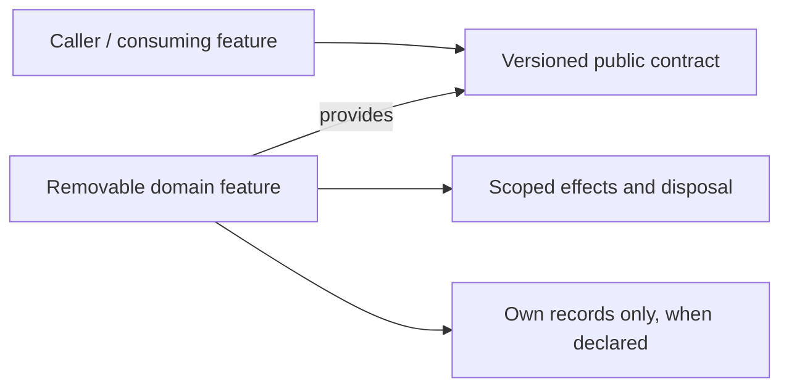

# Simulator

> **Package:** `app/services/simulator/`
> **Status:** `Partial` — documentary target; runtime acceptance is **NOT_REVALIDATED**.
> **Last updated:** `2026-09-06`
> **Domain ID:** `D-SIM`

> This README is the domain target registry for boundaries, composable feature capabilities, requirements, ownership, workflows, acceptance, and removal. Update it before changing the affected implementation. It does not certify that a target package, contract, test, usage demonstration or provider is already implemented.

**Selected scope:** 7 features · 23 owned functional requirements · 8 feature-local non-functional requirements. All original feature and requirement IDs are retained. These selected workbench obligations do **not** delete unrelated existing domain behavior. This document must be merged with current evidence and any out-of-scope entries before replacing an existing domain registry.

**Sources:** [Unified Specification](../../../docs/dev/evidence/specification-drift.md) · [Feature–Requirement Traceability Register](../../../docs/dev/Feature_Requirement_Traceability_Register.md) · [Phased Feature Implementation Plan](../../../docs/dev/Phased_Feature_Implementation_Plan.md) · [README template](../../../docs/templates/README.md). Source fingerprints and Phase 0 bindings are recorded in §6 and §9. The feature cards below reproduce owned requirements and acceptance oracles; their scoped shared-NFR, catalogue, original-ID and operation-gate tables remain binding through the linked source card.

---

## Code-Aligned Implementation Convention

This domain README defines target behavior; `PROJECT.md` retains system scope, cross-domain policy, system NFRs and release gates, and `ARCHITECTURE.md` retains universal package/runtime constraints. Feature-local READMEs, manifests, contracts, migrations and evidence mirror rather than silently redefine this target. For focused work, load §1, the affected §4 card, applicable §5 and §9 rules, and §7. Follow the [Feature Implementation Pipeline](../../../docs/dev/feature_implementation_pipeline.md).

Implement one feature directly in its selected owner folder and discover it through the `haruquantai.features` Python entry-point group. Declare one immutable `SPEC = FeatureSpec(...)` in `manifest.py`; do not introduce a domain registry or YAML manifest. The feature contains pure `__init__.py`, a runtime-validated `README.md`, strict `config.py` with `.from_dict()`, lifecycle `feature.py`, focused logic modules and required `_usage.py`. Add `_persistence.py` only when the feature performs database operations. Effects and dependencies flow through `FeatureContext` and `FeatureScope`; durable state is declared by `FeatureSpec.state`. Existing compatible public contracts and owners are reused, not copied into a parallel implementation.

Each core logic module documents its public API. Every service feature has one required `_usage.py` containing its bounded offline `if __name__ == "__main__":` scenarios; production logic modules do not contain demonstrations. Optional `_persistence.py` owns all feature-local database operations when durable state is required. The paths below are documentary targets pending current-code reconciliation, not claims of executable files. Tests verify the scenarios independently.

FR and acceptance IDs are trace identities, not runtime registrations. Required-provider keys below reproduce the register’s required graph. Optional providers are operation-gated: they must be declared and tested without making an absent future extension a universal startup dependency. The plan’s P1–P16 execution phases are distinct from specification U0–U13 release milestones; a U label is not proof of readiness or a new feature task.

## 1. Purpose and Boundary

### Purpose

Evaluate every accepted backtest through one deterministic chronological tick-execution contract. Preserve fill, accounting, causal strategy and result-publication semantics across ordinary runs, retests, optimization and portfolio consumers.

### Owns

Explicit engine/run configuration; recorded/generated tick methods; native tick execution; committed result publication; exact evaluation reuse; input/execution perturbation; stock-selection simulation on as-of universes.

### Does not own

Market-data publication, strategy authoring, indicator definitions, Trading/Risk policy ownership, research qualification and UI calculations. Output sampling never changes execution fidelity.

### Shared Contracts

**Owned by this domain.** Status is an evidence state. Contract modules are selected public boundaries; an unbound symbol/DTO must be reconciled before implementing its production consumer. Do not infer a callable signature from the English title.

| Evidence | Capability | Protocol / DTO / contract target | Major | Purpose |
| --- | --- | --- | --- | --- |
| DOCUMENTARY_BOUND | `simulator.configure-engine@1` | Selected public operation/DTO surface; exact existing symbols are inventoried in the Phase 0 contract-binding projection.<br>[`app/contracts/simulator/configure_engine.py`](../../contracts/simulator/configure_engine.py) | 1 | Validate immutable simulation profiles |
| DOCUMENTARY_BOUND | `simulator.tick-methods@1` | Selected public operation/DTO surface; exact existing symbols are inventoried in the Phase 0 contract-binding projection.<br>[`app/contracts/simulator/ticks.py`](../../contracts/simulator/ticks.py) | 1 | Produce ordered recorded or generated execution ticks |
| DOCUMENTARY_BOUND | `simulator.execute-ticks@1` | Selected public operation/DTO surface; exact existing symbols are inventoried in the Phase 0 contract-binding projection.<br>[`app/contracts/simulator/native_execution.py`](../../contracts/simulator/native_execution.py) | 1 | Execute the native chronological backtest |
| DOCUMENTARY_BOUND | `simulator.commit-results@1` | Selected public operation/DTO surface; exact existing symbols are inventoried in the Phase 0 contract-binding projection.<br>[`app/contracts/simulator/commit_results.py`](../../contracts/simulator/commit_results.py) | 1 | Publish complete simulation result evidence |
| DOCUMENTARY_BOUND | `simulator.cache-evaluations@1` | Selected public operation/DTO surface; exact existing symbols are inventoried in the Phase 0 contract-binding projection.<br>[`app/contracts/simulator/cache_evaluations.py`](../../contracts/simulator/cache_evaluations.py) | 1 | Reuse exact evaluations without creating false evidence |
| DOCUMENTARY_BOUND | `simulator.perturb-inputs@1` | Selected public operation/DTO surface; exact existing symbols are inventoried in the Phase 0 contract-binding projection.<br>[`app/contracts/simulator/perturb_inputs.py`](../../contracts/simulator/perturb_inputs.py) | 1 | Evaluate explicitly modeled execution perturbations |
| DOCUMENTARY_BOUND | `simulator.simulate-stockpickers@1` | Selected public operation/DTO surface; exact existing symbols are inventoried in the Phase 0 contract-binding projection.<br>[`app/contracts/simulator/simulate_stockpickers.py`](../../contracts/simulator/simulate_stockpickers.py) | 1 | Evaluate universe-based stock-selection strategies |

**Consumed from other domains — required providers.** Runtime resolution is through the exact key; the provider’s implementation folder is not an import target. Same-domain edges are listed in the owning feature card.

| Capability | Owner | Binding | Consuming feature | Used for |
| --- | --- | --- | --- | --- |
| `strategy.compile-strategies@1` | Strategy | Required | [`FEAT-SIM-CONFIGURE_ENGINE`](#feat-sim-configure-engine) | Compile HSL to reusable target-neutral execution plans |
| `data.bind-run-data@1` | Data | Required | [`FEAT-SIM-CONFIGURE_ENGINE`](#feat-sim-configure-engine) | Bind exact eligible inputs to a run |
| `catalogue.define-trading-rules@1` | Catalogue | Required | [`FEAT-SIM-CONFIGURE_ENGINE`](#feat-sim-configure-engine) | Version trading costs and venue constraints |
| `risk.size-positions@1` | Risk | Required | [`FEAT-SIM-CONFIGURE_ENGINE`](#feat-sim-configure-engine) | Calculate legal size from a pinned risk basis |
| `trading.execution-policies@1` | Trading | Required | [`FEAT-SIM-CONFIGURE_ENGINE`](#feat-sim-configure-engine) | Provide pure shared execution-policy descriptors |
| `data.normalize-ticks@1` | Data | Required | [`FEAT-SIM-MODEL_TICKS`](#feat-sim-model-ticks) | Normalize recorded ticks while retaining source evidence |
| `data.bind-run-data@1` | Data | Required | [`FEAT-SIM-MODEL_TICKS`](#feat-sim-model-ticks) | Bind exact eligible inputs to a run |
| `catalogue.define-sessions@1` | Catalogue | Required | [`FEAT-SIM-MODEL_TICKS`](#feat-sim-model-ticks) | Define market sessions and calendar availability |
| `orchestration.local-workers@1` | Orchestration | Required | [`FEAT-SIM-EXECUTE_TICKS`](#feat-sim-execute-ticks) | Execute isolated spawn-safe local work units |
| `risk.size-positions@1` | Risk | Required | [`FEAT-SIM-EXECUTE_TICKS`](#feat-sim-execute-ticks) | Calculate legal size from a pinned risk basis |
| `trading.execution-policies@1` | Trading | Required | [`FEAT-SIM-EXECUTE_TICKS`](#feat-sim-execute-ticks) | Provide pure shared execution-policy descriptors |
| `catalogue.convert-currencies@1` | Catalogue | Required | [`FEAT-SIM-EXECUTE_TICKS`](#feat-sim-execute-ticks) | Resolve causal currency conversion paths |
| `workspace.artifacts@1` | Workspace | Required | [`FEAT-SIM-COMMIT_RESULTS`](#feat-sim-commit-results) | Publish and retain immutable artifact bytes |
| `orchestration.manage-jobs@1` | Orchestration | Required | [`FEAT-SIM-COMMIT_RESULTS`](#feat-sim-commit-results) | Persist and control shared jobs and attempts |
| `workspace.manage-accounts@1` | Workspace | Required | [`FEAT-SIM-CACHE_EVALUATIONS`](#feat-sim-cache-evaluations) | Verify accounts, principals and sessions |
| `orchestration.resource-admission@1` | Orchestration | Required | [`FEAT-SIM-CACHE_EVALUATIONS`](#feat-sim-cache-evaluations) | Admit finite work under one resource ledger |
| `orchestration.resource-admission@1` | Orchestration | Required | [`FEAT-SIM-PERTURB_INPUTS`](#feat-sim-perturb-inputs) | Admit finite work under one resource ledger |
| `catalogue.manage-universes@1` | Catalogue | Required | [`FEAT-SIM-SIMULATE_STOCKPICKERS`](#feat-sim-simulate-stockpickers) | Version instrument groups and equity universes |

**Operation-gated providers.** For each §4 feature, its linked source card’s complete “Operation-gated providers” table defines applicability, exact provider identity and absence behavior. This is scoped incorporation, not permission to treat all 233 register-wide operation edges as optional for every feature. Resolve those provider IDs to their primary capability keys in the corresponding domain README; bind actual operations in the acceptance record. An omitted local duplicate table does not waive a source dependency.

### Persisted State Ownership

Pinned run profiles and immutable input identities; complete resumable engine/checkpoint state; execution/result manifests and publication receipts; authorized exact cache references. Partial state is never accepted qualification evidence.

| Evidence | Owning feature | Partition / ownership class | Driver binding | Retention / read boundary |
| --- | --- | --- | --- | --- |
| PHASE0_BOUND | [`FEAT-SIM-CONFIGURE_ENGINE`](#feat-sim-configure-engine) | Feature-owned semantic state | Existing declared driver; no new database selected. | Retain committed evidence across deactivate/reactivate; purge only through explicit authorization, dependency/reference checks and recorded disposition. |
| PHASE0_BOUND | [`FEAT-SIM-MODEL_TICKS`](#feat-sim-model-ticks) | Feature-owned semantic state | Existing declared driver; no new database selected. | Retain committed evidence across deactivate/reactivate; purge only through explicit authorization, dependency/reference checks and recorded disposition. |
| PHASE0_BOUND | [`FEAT-SIM-EXECUTE_TICKS`](#feat-sim-execute-ticks) | Feature-owned semantic state | Existing declared driver; no new database selected. | Retain committed evidence across deactivate/reactivate; purge only through explicit authorization, dependency/reference checks and recorded disposition. |
| PHASE0_BOUND | [`FEAT-SIM-COMMIT_RESULTS`](#feat-sim-commit-results) | Feature-owned semantic state | Existing declared driver; no new database selected. | Retain committed evidence across deactivate/reactivate; purge only through explicit authorization, dependency/reference checks and recorded disposition. |
| PHASE0_BOUND | [`FEAT-SIM-CACHE_EVALUATIONS`](#feat-sim-cache-evaluations) | Feature-owned semantic state | Existing declared driver; no new database selected. | Retain committed evidence across deactivate/reactivate; purge only through explicit authorization, dependency/reference checks and recorded disposition. |
| PHASE0_BOUND | [`FEAT-SIM-PERTURB_INPUTS`](#feat-sim-perturb-inputs) | Feature-owned semantic state | Existing declared driver; no new database selected. | Retain committed evidence across deactivate/reactivate; purge only through explicit authorization, dependency/reference checks and recorded disposition. |
| PHASE0_BOUND | [`FEAT-SIM-SIMULATE_STOCKPICKERS`](#feat-sim-simulate-stockpickers) | Feature-owned semantic state | Existing declared driver; no new database selected. | Retain committed evidence across deactivate/reactivate; purge only through explicit authorization, dependency/reference checks and recorded disposition. |

A feature’s exact durable namespace, schema version and migrations are taken from its reconciled manifest and contract, not guessed from its folder name. External consumers access semantic state only through the owner capability. Workspace persistence/artifact custody never acquires that semantic ownership.

### Four-Level Structural Hierarchy

| Code level | Represents | Domain example |
| --- | --- | --- |
| Package | Domain boundary | `app/services/simulator/` |
| Module folder | Composable feature owner | `app/services/simulator/configure_engine/` — [`FEAT-SIM-CONFIGURE_ENGINE`](#feat-sim-configure-engine) |
| File | Manifest, strict configuration, lifecycle or focused use case | `manifest.py`, `config.py`, `feature.py`, focused logic module |
| Class / function / method | One or more traced requirement behaviors | `FR-TRC-SIM-CONFIGURE_ENGINE-001` and its acceptance oracle |

### Domain Capability Map

The table in §2 is the complete domain capability map. Edges below illustrate dependency direction, not a new orchestrator or private import relationship.


```mermaid
flowchart LR
    Caller["Caller / consuming feature"] --> Contract["Versioned public contract"]
    Provider["Removable domain feature"] -->|provides| Contract
    Provider --> Scope["Scoped effects and disposal"]
    Provider --> State["Own records only, when declared"]
```

## 2. Final Package Structure and Feature Independence

Feature owners are independent and physically removable. The selected package is a target binding: reconcile known current aliases and preserve compatible existing identities before creating a folder. Folder absence does not prove behavior absence. Removing a feature withdraws its contributions; it does not delete another feature’s source or retained evidence.

| Feature | Delivered value | Selected owner package | First U gate | FRs | Local NFRs | Evidence |
| --- | --- | --- | --- | --- | --- | --- |
| [`FEAT-SIM-CONFIGURE_ENGINE`](#feat-sim-configure-engine) | Validate immutable simulation profiles | `app/services/simulator/configure_engine/` | U2 | 3 | 1 | NOT_REVALIDATED |
| [`FEAT-SIM-MODEL_TICKS`](#feat-sim-model-ticks) | Produce ordered recorded or generated execution ticks | `app/services/simulator/model_ticks/` | U2 | 4 | 1 | NOT_REVALIDATED |
| [`FEAT-SIM-EXECUTE_TICKS`](#feat-sim-execute-ticks) | Execute the native chronological backtest | `app/services/simulator/execute_ticks/` | U2 | 5 | 2 | NOT_REVALIDATED |
| [`FEAT-SIM-COMMIT_RESULTS`](#feat-sim-commit-results) | Publish complete simulation result evidence | `app/services/simulator/commit_results/` | U2 | 3 | 1 | NOT_REVALIDATED |
| [`FEAT-SIM-CACHE_EVALUATIONS`](#feat-sim-cache-evaluations) | Reuse exact evaluations without creating false evidence | `app/services/simulator/cache_evaluations/` | U2 | 3 | 1 | NOT_REVALIDATED |
| [`FEAT-SIM-PERTURB_INPUTS`](#feat-sim-perturb-inputs) | Evaluate explicitly modeled execution perturbations | `app/services/simulator/perturb_inputs/` | U4 | 3 | 1 | NOT_REVALIDATED |
| [`FEAT-SIM-SIMULATE_STOCKPICKERS`](#feat-sim-simulate-stockpickers) | Evaluate universe-based stock-selection strategies | `app/services/simulator/simulate_stockpickers/` | U10 | 2 | 1 | NOT_REVALIDATED |

```text
app/services/simulator/
├── README.md  # this domain target registry
├── __init__.py  # docstring only
├── configure_engine/  # FEAT-SIM-CONFIGURE_ENGINE
├── model_ticks/  # FEAT-SIM-MODEL_TICKS
├── execute_ticks/  # FEAT-SIM-EXECUTE_TICKS
├── commit_results/  # FEAT-SIM-COMMIT_RESULTS
├── cache_evaluations/  # FEAT-SIM-CACHE_EVALUATIONS
├── perturb_inputs/  # FEAT-SIM-PERTURB_INPUTS
└── simulate_stockpickers/  # FEAT-SIM-SIMULATE_STOCKPICKERS
```

Every feature folder contains `README.md`, docstring-only `__init__.py`, `manifest.py`, `config.py`, `feature.py` and its focused logic modules. Shared contract definitions live outside those removable packages. The primary logic-module designation in §4 is a target for usage ownership; adapt a compatible existing module rather than duplicate its service.

### Feature Capability Dependency Direction

A required edge means “consumer requires the provider’s public capability.” It never means “import the provider package.” Optional operation closure is resolved by the composition/runtime boundary and rechecked at invocation. Physical removal must cause the declared unavailable or blocked state while unrelated capabilities remain usable.

## 3. Workflows

Workflows connect existing features; they do not create additional feature owners. “Internal” means all participating behavior is domain-local. “Cross-Domain” means collaboration through public contracts. Participant lists below are **not** a substitute for the plan’s execution schedule or the workflow’s validated operation graph.

### Domain-local reading sequence — Execute and commit a tick backtest

**Input boundary:** Compiled strategy, exact eligible data, selected tick method, account/cost policies, seed and admitted budget.

**Output boundary:** A complete immutable result with reconciled counts and provenance, or a typed incomplete/failed/cancelled outcome.

**Capabilities to inspect:** [`FEAT-SIM-CONFIGURE_ENGINE`](#feat-sim-configure-engine) → [`FEAT-SIM-MODEL_TICKS`](#feat-sim-model-ticks) → [`FEAT-SIM-EXECUTE_TICKS`](#feat-sim-execute-ticks) → [`FEAT-SIM-COMMIT_RESULTS`](#feat-sim-commit-results).

This is a domain-oriented explanation, not an additional canonical `WF-*` identity. Apply every FR of the participating operation, not only its first validation step. Validate scope and immutable references, resolve admitted providers, perform owner work, verify the owner receipt, and then expose the result. Invalid input, provider absence, stale revision and cancellation retain separate typed outcomes.

| Evidence | Workflow | Scope | Lead | First U gate | Acceptance |
| --- | --- | --- | --- | --- | --- |
| PENDING | [`WF-WB-GENERATE_QUALIFY`](#wf-wb-generate-qualify) | Cross-Domain | [`FEAT-RES-RUN_RESEARCH`](../research/README.md#feat-res-run-research) | U5 | `ATW-WB-GENERATE_QUALIFY` |
| PENDING | [`WF-WB-RETEST`](#wf-wb-retest) | Cross-Domain | [`FEAT-RES-TEST_ROBUSTNESS`](../research/README.md#feat-res-test-robustness) | U4 | `ATW-WB-RETEST` |
| PENDING | [`WF-WB-OPTIMIZE_PROMOTE`](#wf-wb-optimize-promote) | Cross-Domain | [`FEAT-OPT-SEARCH_PARAMETERS`](../optimization/README.md#feat-opt-search-parameters) | U6 | `ATW-WB-OPTIMIZE_PROMOTE` |
| PENDING | [`WF-WB-IDEA_TO_STRATEGY`](#wf-wb-idea-to-strategy) | Cross-Domain | [`FEAT-AGT-COMPOSE_STRATEGY_SPECS`](../agentic/README.md#feat-agt-compose-strategy-specs) | U3 | `ATW-WB-IDEA_TO_STRATEGY` |

<a id="wf-wb-generate-qualify"></a>
### `WF-WB-GENERATE_QUALIFY` — Generate and qualify strategies

**Lead owner:** [`FEAT-RES-RUN_RESEARCH`](../research/README.md#feat-res-run-research). **Release gate:** U5. **State:** PENDING.

**Participants:** [`FEAT-RES-RUN_RESEARCH`](../research/README.md#feat-res-run-research), [`FEAT-UI-01`](../../ui/README.md#feat-ui-01), [`FEAT-DATA-BIND_RUN_DATA`](../data/README.md#feat-data-bind-run-data), [`FEAT-STRAT-DEFINE_SEARCH_SPACES`](../strategy/README.md#feat-strat-define-search-spaces), [`FEAT-RES-GENERATE_STRATEGIES`](../research/README.md#feat-res-generate-strategies), [`FEAT-RES-EVOLVE_STRATEGIES`](../research/README.md#feat-res-evolve-strategies), [`FEAT-SIM-EXECUTE_TICKS`](#feat-sim-execute-ticks), [`FEAT-ANA-COMPUTE_METRICS`](../analytics/README.md#feat-ana-compute-metrics), [`FEAT-RES-TEST_ROBUSTNESS`](../research/README.md#feat-res-test-robustness), [`FEAT-RES-QUALIFY_RESEARCH`](../research/README.md#feat-res-qualify-research), [`FEAT-ANA-DATABANK_MEMBERSHIP`](../analytics/README.md#feat-ana-databank-membership), [`FEAT-UI-32`](../../ui/README.md#feat-ui-32).

**This domain contributes:** [`FEAT-SIM-EXECUTE_TICKS`](#feat-sim-execute-ticks). Every participating feature’s scoped FR/local-NFR obligations remain binding.

**Input/output and acceptance contract:** `ATW-WB-GENERATE_QUALIFY` — Pinned source/space/seed; one accepted research run; each candidate has actual simulation, filters and stage history; only qualified committed result references enter the destination databank.

**Failure boundary:** required evidence or provider absence yields the declared refusal/unavailable/partial result; it never implies a pass, silently substitutes a provider or grants live authority. [Canonical workflow definition](../../../docs/dev/Feature_Requirement_Traceability_Register.md#wf-wb-generate-qualify).

<a id="wf-wb-retest"></a>
### `WF-WB-RETEST` — Retest robustness

**Lead owner:** [`FEAT-RES-TEST_ROBUSTNESS`](../research/README.md#feat-res-test-robustness). **Release gate:** U4. **State:** PENDING.

**Participants:** [`FEAT-RES-TEST_ROBUSTNESS`](../research/README.md#feat-res-test-robustness), [`FEAT-RES-RUN_RESEARCH`](../research/README.md#feat-res-run-research), [`FEAT-SIM-PERTURB_INPUTS`](#feat-sim-perturb-inputs), [`FEAT-SIM-CONFIGURE_ENGINE`](#feat-sim-configure-engine), [`FEAT-SIM-EXECUTE_TICKS`](#feat-sim-execute-ticks), [`FEAT-ANA-COMPARE_RESULTS`](../analytics/README.md#feat-ana-compare-results), [`FEAT-ANA-DATABANK_MEMBERSHIP`](../analytics/README.md#feat-ana-databank-membership), [`FEAT-UI-STRATEGY_RETESTER`](../../ui/README.md#feat-ui-strategy-retester).

**This domain contributes:** [`FEAT-SIM-PERTURB_INPUTS`](#feat-sim-perturb-inputs), [`FEAT-SIM-CONFIGURE_ENGINE`](#feat-sim-configure-engine), [`FEAT-SIM-EXECUTE_TICKS`](#feat-sim-execute-ticks). Every participating feature’s scoped FR/local-NFR obligations remain binding.

**Input/output and acceptance contract:** `ATW-WB-RETEST` — Resolve immutable strategies and baseline; retain source hashes; ordered explicit scenarios, paired metric deltas and typed cancellation; atomic membership has complete passed/failed reasons.

**Failure boundary:** required evidence or provider absence yields the declared refusal/unavailable/partial result; it never implies a pass, silently substitutes a provider or grants live authority. [Canonical workflow definition](../../../docs/dev/Feature_Requirement_Traceability_Register.md#wf-wb-retest).

<a id="wf-wb-optimize-promote"></a>
### `WF-WB-OPTIMIZE_PROMOTE` — Optimize and explicitly promote

**Lead owner:** [`FEAT-OPT-SEARCH_PARAMETERS`](../optimization/README.md#feat-opt-search-parameters). **Release gate:** U6. **State:** PENDING.

**Participants:** [`FEAT-OPT-SEARCH_PARAMETERS`](../optimization/README.md#feat-opt-search-parameters), [`FEAT-OPT-VALIDATE_WALK_FORWARD`](../optimization/README.md#feat-opt-validate-walk-forward), [`FEAT-OPT-PERMUTE_PARAMETERS`](../optimization/README.md#feat-opt-permute-parameters), [`FEAT-RES-GOVERN_HOLDOUTS`](../research/README.md#feat-res-govern-holdouts), [`FEAT-RES-QUALIFY_RESEARCH`](../research/README.md#feat-res-qualify-research), [`FEAT-SIM-EXECUTE_TICKS`](#feat-sim-execute-ticks), [`FEAT-ANA-QUERY_RESULTS`](../analytics/README.md#feat-ana-query-results), [`FEAT-STRAT-VERSION_STRATEGIES`](../strategy/README.md#feat-strat-version-strategies), [`FEAT-UI-PARAMETER_OPTIMIZER`](../../ui/README.md#feat-ui-parameter-optimizer).

**This domain contributes:** [`FEAT-SIM-EXECUTE_TICKS`](#feat-sim-execute-ticks). Every participating feature’s scoped FR/local-NFR obligations remain binding.

**Input/output and acceptance contract:** `ATW-WB-OPTIMIZE_PROMOTE` — Finite legal parameter lattice/folds and all trial outcomes; untouched holdout protected; promotion creates a new revision only after exact review; base remains unchanged.

**Failure boundary:** required evidence or provider absence yields the declared refusal/unavailable/partial result; it never implies a pass, silently substitutes a provider or grants live authority. [Canonical workflow definition](../../../docs/dev/Feature_Requirement_Traceability_Register.md#wf-wb-optimize-promote).

<a id="wf-wb-idea-to-strategy"></a>
### `WF-WB-IDEA_TO_STRATEGY` — Research idea to reviewed strategy

**Lead owner:** [`FEAT-AGT-COMPOSE_STRATEGY_SPECS`](../agentic/README.md#feat-agt-compose-strategy-specs). **Release gate:** U3. **State:** PENDING.

**Participants:** [`FEAT-AGT-COMPOSE_STRATEGY_SPECS`](../agentic/README.md#feat-agt-compose-strategy-specs), [`FEAT-AGT-ASSIST_OPERATOR`](../agentic/README.md#feat-agt-assist-operator), [`FEAT-AGT-DESIGN_RESEARCH`](../agentic/README.md#feat-agt-design-research), [`FEAT-RES-GOVERN_CAMPAIGNS`](../research/README.md#feat-res-govern-campaigns), [`FEAT-RES-DEFINE_PROTOCOLS`](../research/README.md#feat-res-define-protocols), [`FEAT-STRAT-DEFINE_AST`](../strategy/README.md#feat-strat-define-ast), [`FEAT-STRAT-CATALOG_BLOCKS`](../strategy/README.md#feat-strat-catalog-blocks), [`FEAT-STRAT-VERSION_STRATEGIES`](../strategy/README.md#feat-strat-version-strategies), [`FEAT-IFACE-AGENTIC_GATEWAY`](../interfaces/README.md#feat-iface-agentic-gateway), [`FEAT-UI-CHAT_BOT`](../../ui/README.md#feat-ui-chat-bot), [`FEAT-UI-STRATEGY_STUDIO`](../../ui/README.md#feat-ui-strategy-studio), [`FEAT-SIM-EXECUTE_TICKS`](#feat-sim-execute-ticks).

**This domain contributes:** [`FEAT-SIM-EXECUTE_TICKS`](#feat-sim-execute-ticks). Every participating feature’s scoped FR/local-NFR obligations remain binding.

**Input/output and acceptance contract:** `ATW-WB-IDEA_TO_STRATEGY` — Draft with explicit unvalidated assumptions; validate, bounded repair, exact patch closure review and CAS acceptance; separately authorize a bounded tick backtest; no save/holdout/live authority implied by prose.

**Failure boundary:** required evidence or provider absence yields the declared refusal/unavailable/partial result; it never implies a pass, silently substitutes a provider or grants live authority. [Canonical workflow definition](../../../docs/dev/Feature_Requirement_Traceability_Register.md#wf-wb-idea-to-strategy).

## 4. Composable Feature Specifications

Each card is one permanent feature/task slot. Its owned FRs, local NFRs and expected acceptance outcomes are reproduced below. All acceptance states are PENDING / NOT_REVALIDATED. Contract targets and intended tests do not prove runtime support. `Binding pending` prohibits executor invention: resolve the exact compatible contract, configuration, state and fixture before production use. The plan’s one-feature task rule includes all registered variants; future-provider qualification is not permission to leave owned adapter behavior unimplemented.

<a id="feat-sim-configure-engine"></a>
### 4.1 `configure_engine/` — `FEAT-SIM-CONFIGURE_ENGINE`

> **Feature ID:** `FEAT-SIM-CONFIGURE_ENGINE`
> **Domain:** `simulator`
> **Status:** `Partial` — target documented; full-scope implementation evidence **NOT_REVALIDATED**.
> **Selected owner:** `app/services/simulator/configure_engine/`
> **First release milestone:** `U2`; execution order remains in the [Phased Feature Implementation Plan](../../../docs/dev/Phased_Feature_Implementation_Plan.md).

#### Purpose

Validate immutable simulation profiles. Deliver the bounded behaviors in the FR table through this feature’s declared public capability; retain the domain boundary in §1.

#### Capability Declarations

**Provides:** `simulator.configure-engine@1`.

**Required capabilities:**

`strategy.compile-strategies@1` — [`FEAT-STRAT-COMPILE_STRATEGIES`](../strategy/README.md#feat-strat-compile-strategies)<br>`data.bind-run-data@1` — [`FEAT-DATA-BIND_RUN_DATA`](../data/README.md#feat-data-bind-run-data)<br>`catalogue.define-trading-rules@1` — [`FEAT-CAT-DEFINE_TRADING_RULES`](../catalogue/README.md#feat-cat-define-trading-rules)<br>`risk.size-positions@1` — [`FEAT-RSK-SIZE_POSITIONS`](../risk/README.md#feat-rsk-size-positions)<br>`trading.execution-policies@1` — [`FEAT-TRD-MODEL_EXECUTION_POLICIES`](../trading/README.md#feat-trd-model-execution-policies).

**Optional / operation-gated capabilities:** the complete scoped provider table in the [source feature card](../../../docs/dev/Feature_Requirement_Traceability_Register.md#feat-sim-configure-engine) is normative. Declare each applicable key separately from required startup dependencies. Absence must affect only the operations requiring it, with the exact recorded denial/unavailable behavior.

**Public contract target:** [`app/contracts/simulator/configure_engine.py`](../../contracts/simulator/configure_engine.py). **Literal protocol/DTO/operation symbols:** the selected target, operation scope, request/result union and typed failure semantics in this card are frozen; exact existing symbols are inventoried in `docs/dev/evidence/contract-bindings.json`, and a planned contract retains this binding without claiming runtime certification.

**Input boundary:** validated typed operation data, current authenticated scope where applicable, and immutable owner references; numerical operations accept validated bounded buffers. **Output boundary:** the owned FRs and acceptance oracles below. Preserve typed invalid, denied, unavailable, stale/conflict, partial, cancelled and failed outcomes wherever the selected contract defines them; do not create a second generic error vocabulary.

#### Feature Configuration & Limits Manifest

| Binding state | Setting / limit source | Type / default | Required | Validation / ownership |
| --- | --- | --- | --- | --- |
| PHASE0_BOUND | Existing registered `FeatureSpec.config_keys`, or no feature configuration for a planned owner unless this card explicitly declares a key. | Exact selected types/defaults only; request and profile fields are not implicit feature configuration. | As declared by the owner card. | Unknown keys and invalid values fail closed; implementation records manifest/config/README parity before COMPLETE. |
| NORMATIVE | Operation parameters, immutable profile references and policy limits in the FRs below | Use the selected request/profile schema; no implicit coercion or default substitution. | All prerequisites of the selected operation. | Do not confuse a request parameter, historical profile value or user-visible setting with a new feature config key. |
| NORMATIVE | Resource, security, retention and version requirements in local/shared NFRs | Finite admitted values; stricter applicable owner policy wins. | Before the affected operation. | Pin effective values/revisions in evidence; never alter a historical run by editing current settings. |

**Feature-specific parameter/limit obligations:** `FR-TRC-SIM-CONFIGURE_ENGINE-002`, `FR-TRC-SIM-CONFIGURE_ENGINE-003`, `NFR-TRC-SIM-CONFIGURE_ENGINE-001`. Their full text and test oracles below are binding; this list is an index, not a reduced schema.

#### Runtime Effects & Scope Disposal

| Effect | Owner | Disposal mechanism |
| --- | --- | --- |
| Capability binding `simulator.configure-engine@1` | FEAT-SIM-CONFIGURE_ENGINE | Unregister when the reconciler closes the feature scope. |
| Tasks, listeners, requests, workers, leases or buffers actually created by this feature | FEAT-SIM-CONFIGURE_ENGINE | Register exact disposers; cancel/await/release on failure or removal. A pure provider must not create unnecessary effects. |
| Accepted owner work and committed records | Their declared semantic owner | Observation cleanup does not secretly cancel accepted work or purge committed evidence; use explicit owner commands. |

Teardown is idempotent. Failed mount unwinds partial effects. Dependency replacement/removal must not leave stale registrations, jobs, subscriptions, source buffers or credential references usable by the removed scope.

#### Persistent State Ownership

**Ownership class:** Feature-owned semantic state.

**Records:** Only records/artifact references required by the functional requirements below; Pinned run profiles and immutable input identities; complete resumable engine/checkpoint state; execution/result manifests and publication receipts; authorized exact cache references. Partial state is never accepted qualification evidence.

**Retention and deletion:** Retain committed evidence across deactivate/reactivate; purge only through explicit authorization, dependency/reference checks and recorded disposition.

**Namespace / schema / driver binding:** Literal namespace, existing schema version, migrations and driver binding must be reconciled with the current feature manifest. No table ownership is transferred to Workspace merely because it executes persistence. A missing literal binding is an explicit §6 precondition, not permission to choose a schema version or table name during execution.

#### Feature Package Structure & Files

| Target file within owner package | Responsibility | Exports / dependency boundary |
| --- | --- | --- |
| __init__.py | Pure package description | Docstring only. |
| README.md | Runtime-validated mirror of this feature scope | Document exact keys, paths and evidence. |
| manifest.py | Immutable identity, capabilities, config keys and optional state declaration | SPEC : FeatureSpec; metadata only. |
| config.py | Strict typed configuration with unknown-key validation | Compatible FeatureConfig.from_dict() binding; no invented accepted keys. |
| feature.py | Scoped mount adapter and zero-argument factory | create_feature(); mount through FeatureContext/FeatureScope. |
| configure_engine.py | Focused production domain-logic module | Compatible contract operation binding. |
| _persistence.py | Optional owner of all feature-local database operations when durable state is required | Declared storage operations through public Workspace persistence contracts; no raw connection, policy, authorization or orchestration. |
| _usage.py | Required bounded offline usage scenarios and executable __main__ harness | _run_usage_example(); scenarios map to every applicable FR without owning business logic. |

These are documentary ownership targets, not a claim that files or symbols already exist. Reconcile a compatible existing filename/symbol once in the feature’s path-binding receipt rather than creating duplicate logic. Public contract files remain outside the removable backend owner.

#### Functional Requirements (FR)

| Status | Requirement ID | Responsibility / required behavior | Acceptance ID | Expected result |
| --- | --- | --- | --- | --- |
| PENDING | `FR-TRC-SIM-CONFIGURE_ENGINE-001` | Require a registered recorded/generated tick method or an explicitly selected saved profile that supplies it. | `AT-SIM-CONFIGURE_ENGINE-001` | Omitting the method is a validation error; M1/H1 chart timeframes never silently choose a bar-only engine. |
| PENDING | `FR-TRC-SIM-CONFIGURE_ENGINE-002` | Pin Strategy plan, Data binding, instrument/calendar/cost/risk/account/numerical/runtime versions, seed and initial state. | `AT-SIM-CONFIGURE_ENGINE-002` | A later data/profile/provider change is reported as a different evaluation identity and cannot modify an accepted run. |
| PENDING | `FR-TRC-SIM-CONFIGURE_ENGINE-003` | Validate output retention against required metrics/qualification evidence and estimate finite work, memory, disk and cancellation boundaries. | `AT-SIM-CONFIGURE_ENGINE-003` | A summary profile missing required MAE/MFE evidence is rejected or produces an explicitly authorized linked replay plan, never fabricated metrics. |

**Implementing-symbol and side-effect binding:** bind each requirement to the actual operation in the selected public contract and its focused implementation module before acceptance. For each FR, the acceptance receipt records actual symbol, side effects, typed error/exception branch, usage scenario and test location. Do not replace a specified typed failure with a guessed `ValueError`, or treat its absence from this summary as success.

#### Non-Functional Requirements (Local)

| Status | Requirement ID | Quality / removal constraint | Acceptance ID | Expected result |
| --- | --- | --- | --- | --- |
| PENDING | `NFR-TRC-SIM-CONFIGURE_ENGINE-001` | Removing FEAT-SIM-CONFIGURE_ENGINE withdraws only its declared contribution; no dependent operation may silently select a substitute provider. | `ATN-SIM-CONFIGURE_ENGINE-001` | Disable and physically remove configure_engine; its operation is unavailable, unrelated capabilities remain usable, and retained source objects are unchanged. |

#### Applicable Shared NFRs, Catalogue and Source Bindings

[source feature card](../../../docs/dev/Feature_Requirement_Traceability_Register.md#feat-sim-configure-engine): the exact “Applicable shared NFRs,” “Detailed catalogue families,” “Catalogue entries, algorithms and controls delivered,” “Source scope / Original source IDs,” and operation-gated provider sections are incorporated for **this feature only**. These sections remain normative; an acceptance manifest must enumerate the actual linked IDs/entries and evidence, not just cite this paragraph. No source algorithm, control, permission or release condition is weakened by this domain projection.

#### Acceptance Tests and Evidence

| Acceptance family | Intended test owner | Required evidence state |
| --- | --- | --- |
| Every AT ID in this card | `tests/services/simulator/configure_engine/test_traceability.py` | PENDING: bind an actual named test and assertion to each oracle. |
| Every ATN ID in this card | `tests/services/simulator/configure_engine/test_lifecycle.py` | PENDING: lifecycle/resource/numerical evidence as applicable. |
| Contract → provider → composition → Interfaces → UI → end-to-end | `docs/dev/SQX/evidence/features/FEAT-SIM-CONFIGURE_ENGINE/acceptance.json` | All six stages NOT_REVALIDATED; justify each genuinely inapplicable stage. |

Intended test paths may be mapped to a compatible current test owner; they are not assertions of existing files. Full oracle coverage, shared requirements, catalogue entries, original source mappings and actual-provider operation qualification must be included in the final acceptance record. A contract fixture cannot certify actual provider integration.

#### Feature Usage Examples

**Required `_usage.py` command - planned, not executed:**

```powershell
uv run --frozen python -m app.services.simulator.configure_engine._usage
```

`_usage.py` uses bounded deterministic offline inputs and composes production behavior through public contracts or this feature's focused modules. It demonstrates a useful accepted operation, the appropriate invalid/unavailable/refusal case, and exact cleanup without owning business logic. Map each FR above to a named scenario; the expected observations are its acceptance oracles, not invented console output. Do not import sibling implementations, require live credentials/network by default, or put the public example under tests. Before marking it runnable, bind concrete fixture values and record its actual command, output and exit code.

#### Removal Behaviour

Disable and physically remove the actual reconciled owner of `FEAT-SIM-CONFIGURE_ENGINE`. Withdraw `simulator.configure-engine@1` and all its scoped contributions. Required dependents become BLOCKED/unavailable through their declared contract; operation-gated consumers disable only affected operations. Retain committed source objects and evidence; no cross-provider substitute or implicit purge is permitted. Exercise the local ATN oracles and §7 gates before restoring the feature.

---

<a id="feat-sim-model-ticks"></a>
### 4.2 `model_ticks/` — `FEAT-SIM-MODEL_TICKS`

> **Feature ID:** `FEAT-SIM-MODEL_TICKS`
> **Domain:** `simulator`
> **Status:** `Partial` — target documented; full-scope implementation evidence **NOT_REVALIDATED**.
> **Selected owner:** `app/services/simulator/model_ticks/`
> **First release milestone:** `U2`; execution order remains in the [Phased Feature Implementation Plan](../../../docs/dev/Phased_Feature_Implementation_Plan.md).

#### Purpose

Produce ordered recorded or generated execution ticks. Deliver the bounded behaviors in the FR table through this feature’s declared public capability; retain the domain boundary in §1.

#### Capability Declarations

**Provides:** `simulator.tick-methods@1`.

**Required capabilities:**

`data.normalize-ticks@1` — [`FEAT-DATA-NORMALIZE_TICKS`](../data/README.md#feat-data-normalize-ticks)<br>`data.bind-run-data@1` — [`FEAT-DATA-BIND_RUN_DATA`](../data/README.md#feat-data-bind-run-data)<br>`catalogue.define-sessions@1` — [`FEAT-CAT-DEFINE_SESSIONS`](../catalogue/README.md#feat-cat-define-sessions).

**Optional / operation-gated capabilities:** the complete scoped provider table in the [source feature card](../../../docs/dev/Feature_Requirement_Traceability_Register.md#feat-sim-model-ticks) is normative. Declare each applicable key separately from required startup dependencies. Absence must affect only the operations requiring it, with the exact recorded denial/unavailable behavior.

**Public contract target:** [`app/contracts/simulator/ticks.py`](../../contracts/simulator/ticks.py). **Literal protocol/DTO/operation symbols:** the selected target, operation scope, request/result union and typed failure semantics in this card are frozen; exact existing symbols are inventoried in `docs/dev/evidence/contract-bindings.json`, and a planned contract retains this binding without claiming runtime certification.

**Input boundary:** validated typed operation data, current authenticated scope where applicable, and immutable owner references; numerical operations accept validated bounded buffers. **Output boundary:** the owned FRs and acceptance oracles below. Preserve typed invalid, denied, unavailable, stale/conflict, partial, cancelled and failed outcomes wherever the selected contract defines them; do not create a second generic error vocabulary.

#### Feature Configuration & Limits Manifest

| Binding state | Setting / limit source | Type / default | Required | Validation / ownership |
| --- | --- | --- | --- | --- |
| PHASE0_BOUND | Existing registered `FeatureSpec.config_keys`, or no feature configuration for a planned owner unless this card explicitly declares a key. | Exact selected types/defaults only; request and profile fields are not implicit feature configuration. | As declared by the owner card. | Unknown keys and invalid values fail closed; implementation records manifest/config/README parity before COMPLETE. |
| NORMATIVE | Operation parameters, immutable profile references and policy limits in the FRs below | Use the selected request/profile schema; no implicit coercion or default substitution. | All prerequisites of the selected operation. | Do not confuse a request parameter, historical profile value or user-visible setting with a new feature config key. |
| NORMATIVE | Resource, security, retention and version requirements in local/shared NFRs | Finite admitted values; stricter applicable owner policy wins. | Before the affected operation. | Pin effective values/revisions in evidence; never alter a historical run by editing current settings. |

**Feature-specific parameter/limit obligations:** `FR-TRC-SIM-MODEL_TICKS-001`, `NFR-TRC-SIM-MODEL_TICKS-001`. Their full text and test oracles below are binding; this list is an index, not a reduced schema.

#### Runtime Effects & Scope Disposal

| Effect | Owner | Disposal mechanism |
| --- | --- | --- |
| Capability binding `simulator.tick-methods@1` | FEAT-SIM-MODEL_TICKS | Unregister when the reconciler closes the feature scope. |
| Tasks, listeners, requests, workers, leases or buffers actually created by this feature | FEAT-SIM-MODEL_TICKS | Register exact disposers; cancel/await/release on failure or removal. A pure provider must not create unnecessary effects. |
| Accepted owner work and committed records | Their declared semantic owner | Observation cleanup does not secretly cancel accepted work or purge committed evidence; use explicit owner commands. |

Teardown is idempotent. Failed mount unwinds partial effects. Dependency replacement/removal must not leave stale registrations, jobs, subscriptions, source buffers or credential references usable by the removed scope.

#### Persistent State Ownership

**Ownership class:** Feature-owned semantic state.

**Records:** Only records/artifact references required by the functional requirements below; Pinned run profiles and immutable input identities; complete resumable engine/checkpoint state; execution/result manifests and publication receipts; authorized exact cache references. Partial state is never accepted qualification evidence.

**Retention and deletion:** Retain committed evidence across deactivate/reactivate; purge only through explicit authorization, dependency/reference checks and recorded disposition.

**Namespace / schema / driver binding:** Literal namespace, existing schema version, migrations and driver binding must be reconciled with the current feature manifest. No table ownership is transferred to Workspace merely because it executes persistence. A missing literal binding is an explicit §6 precondition, not permission to choose a schema version or table name during execution.

#### Feature Package Structure & Files

| Target file within owner package | Responsibility | Exports / dependency boundary |
| --- | --- | --- |
| __init__.py | Pure package description | Docstring only. |
| README.md | Runtime-validated mirror of this feature scope | Document exact keys, paths and evidence. |
| manifest.py | Immutable identity, capabilities, config keys and optional state declaration | SPEC : FeatureSpec; metadata only. |
| config.py | Strict typed configuration with unknown-key validation | Compatible FeatureConfig.from_dict() binding; no invented accepted keys. |
| feature.py | Scoped mount adapter and zero-argument factory | create_feature(); mount through FeatureContext/FeatureScope. |
| model_ticks.py | Focused production domain-logic module | Compatible contract operation binding. |
| _persistence.py | Optional owner of all feature-local database operations when durable state is required | Declared storage operations through public Workspace persistence contracts; no raw connection, policy, authorization or orchestration. |
| _usage.py | Required bounded offline usage scenarios and executable __main__ harness | _run_usage_example(); scenarios map to every applicable FR without owning business logic. |

These are documentary ownership targets, not a claim that files or symbols already exist. Reconcile a compatible existing filename/symbol once in the feature’s path-binding receipt rather than creating duplicate logic. Public contract files remain outside the removable backend owner.

#### Functional Requirements (FR)

| Status | Requirement ID | Responsibility / required behavior | Acceptance ID | Expected result |
| --- | --- | --- | --- | --- |
| PENDING | `FR-TRC-SIM-MODEL_TICKS-001` | Implement recorded replay and generated replay as registered methods with versioned algorithm/configuration, source, seed, density/timing/path/spread/gap/quantization policy. | `AT-SIM-MODEL_TICKS-001` | Generated methods cannot activate without a complete algorithm artifact and goldens; no unrequested method is selected by default. |
| PENDING | `FR-TRC-SIM-MODEL_TICKS-002` | Preserve source sequence and use a pinned equal-time cross-source/timer ordering; finalize half-open bars before the next interval’s observations. | `AT-SIM-MODEL_TICKS-002` | Equal-time groups split across chunks and multi-timeframe close boundaries produce identical event order and available-bar snapshots. |
| PENDING | `FR-TRC-SIM-MODEL_TICKS-003` | Count/hash actual emitted and consumed observations and expose partial coverage on cancellation. | `AT-SIM-MODEL_TICKS-003` | Source/emitted/consumed counters reconcile; thinning ticks, shortening history or substituting an OHLC collision rule fails acceptance. |
| PENDING | `FR-TRC-SIM-MODEL_TICKS-004` | Expose only the generated path prefix to strategy state and reject recorded-microstructure nodes on incompatible methods. | `AT-SIM-MODEL_TICKS-004` | A strategy cannot read the future source bar’s final high/low before simulated closure; last-only feeds never gain fabricated bid/ask evidence. |

**Implementing-symbol and side-effect binding:** bind each requirement to the actual operation in the selected public contract and its focused implementation module before acceptance. For each FR, the acceptance receipt records actual symbol, side effects, typed error/exception branch, usage scenario and test location. Do not replace a specified typed failure with a guessed `ValueError`, or treat its absence from this summary as success.

#### Non-Functional Requirements (Local)

| Status | Requirement ID | Quality / removal constraint | Acceptance ID | Expected result |
| --- | --- | --- | --- | --- |
| PENDING | `NFR-TRC-SIM-MODEL_TICKS-001` | Streams are bounded by event, byte and time limits and carry complete cursor/PRNG/event-subphase state. | `ATN-SIM-MODEL_TICKS-001` | Chunk sizes 1,17,65,536 and output-buffer exhaustion produce identical order/count/hash with no event loss or duplication. |

#### Applicable Shared NFRs, Catalogue and Source Bindings

[source feature card](../../../docs/dev/Feature_Requirement_Traceability_Register.md#feat-sim-model-ticks): the exact “Applicable shared NFRs,” “Detailed catalogue families,” “Catalogue entries, algorithms and controls delivered,” “Source scope / Original source IDs,” and operation-gated provider sections are incorporated for **this feature only**. These sections remain normative; an acceptance manifest must enumerate the actual linked IDs/entries and evidence, not just cite this paragraph. No source algorithm, control, permission or release condition is weakened by this domain projection.

#### Acceptance Tests and Evidence

| Acceptance family | Intended test owner | Required evidence state |
| --- | --- | --- |
| Every AT ID in this card | `tests/services/simulator/model_ticks/test_traceability.py` | PENDING: bind an actual named test and assertion to each oracle. |
| Every ATN ID in this card | `tests/services/simulator/model_ticks/test_lifecycle.py` | PENDING: lifecycle/resource/numerical evidence as applicable. |
| Contract → provider → composition → Interfaces → UI → end-to-end | `docs/dev/SQX/evidence/features/FEAT-SIM-MODEL_TICKS/acceptance.json` | All six stages NOT_REVALIDATED; justify each genuinely inapplicable stage. |

Intended test paths may be mapped to a compatible current test owner; they are not assertions of existing files. Full oracle coverage, shared requirements, catalogue entries, original source mappings and actual-provider operation qualification must be included in the final acceptance record. A contract fixture cannot certify actual provider integration.

#### Feature Usage Examples

**Required `_usage.py` command - planned, not executed:**

```powershell
uv run --frozen python -m app.services.simulator.model_ticks._usage
```

`_usage.py` uses bounded deterministic offline inputs and composes production behavior through public contracts or this feature's focused modules. It demonstrates a useful accepted operation, the appropriate invalid/unavailable/refusal case, and exact cleanup without owning business logic. Map each FR above to a named scenario; the expected observations are its acceptance oracles, not invented console output. Do not import sibling implementations, require live credentials/network by default, or put the public example under tests. Before marking it runnable, bind concrete fixture values and record its actual command, output and exit code.

#### Removal Behaviour

Disable and physically remove the actual reconciled owner of `FEAT-SIM-MODEL_TICKS`. Withdraw `simulator.tick-methods@1` and all its scoped contributions. Required dependents become BLOCKED/unavailable through their declared contract; operation-gated consumers disable only affected operations. Retain committed source objects and evidence; no cross-provider substitute or implicit purge is permitted. Exercise the local ATN oracles and §7 gates before restoring the feature.

---

<a id="feat-sim-execute-ticks"></a>
### 4.3 `execute_ticks/` — `FEAT-SIM-EXECUTE_TICKS`

> **Feature ID:** `FEAT-SIM-EXECUTE_TICKS`
> **Domain:** `simulator`
> **Status:** `Partial` — target documented; full-scope implementation evidence **NOT_REVALIDATED**.
> **Selected owner:** `app/services/simulator/execute_ticks/`
> **First release milestone:** `U2`; execution order remains in the [Phased Feature Implementation Plan](../../../docs/dev/Phased_Feature_Implementation_Plan.md).

#### Purpose

Execute the native chronological backtest. Deliver the bounded behaviors in the FR table through this feature’s declared public capability; retain the domain boundary in §1.

#### Capability Declarations

**Provides:** `simulator.execute-ticks@1`.

**Required capabilities:**

`simulator.configure-engine@1` — [`FEAT-SIM-CONFIGURE_ENGINE`](#feat-sim-configure-engine)<br>`simulator.tick-methods@1` — [`FEAT-SIM-MODEL_TICKS`](#feat-sim-model-ticks)<br>`orchestration.local-workers@1` — [`FEAT-ORCH-EXECUTE_LOCAL_WORK`](../orchestration/README.md#feat-orch-execute-local-work)<br>`risk.size-positions@1` — [`FEAT-RSK-SIZE_POSITIONS`](../risk/README.md#feat-rsk-size-positions)<br>`trading.execution-policies@1` — [`FEAT-TRD-MODEL_EXECUTION_POLICIES`](../trading/README.md#feat-trd-model-execution-policies)<br>`catalogue.convert-currencies@1` — [`FEAT-CAT-CONVERT_CURRENCIES`](../catalogue/README.md#feat-cat-convert-currencies).

**Optional / operation-gated capabilities:** the complete scoped provider table in the [source feature card](../../../docs/dev/Feature_Requirement_Traceability_Register.md#feat-sim-execute-ticks) is normative. Declare each applicable key separately from required startup dependencies. Absence must affect only the operations requiring it, with the exact recorded denial/unavailable behavior.

**Public contract target:** [`app/contracts/simulator/native_execution.py`](../../contracts/simulator/native_execution.py). **Literal protocol/DTO/operation symbols:** the selected target, operation scope, request/result union and typed failure semantics in this card are frozen; exact existing symbols are inventoried in `docs/dev/evidence/contract-bindings.json`, and a planned contract retains this binding without claiming runtime certification.

**Input boundary:** validated typed operation data, current authenticated scope where applicable, and immutable owner references; numerical operations accept validated bounded buffers. **Output boundary:** the owned FRs and acceptance oracles below. Preserve typed invalid, denied, unavailable, stale/conflict, partial, cancelled and failed outcomes wherever the selected contract defines them; do not create a second generic error vocabulary.

#### Feature Configuration & Limits Manifest

| Binding state | Setting / limit source | Type / default | Required | Validation / ownership |
| --- | --- | --- | --- | --- |
| PHASE0_BOUND | Existing registered `FeatureSpec.config_keys`, or no feature configuration for a planned owner unless this card explicitly declares a key. | Exact selected types/defaults only; request and profile fields are not implicit feature configuration. | As declared by the owner card. | Unknown keys and invalid values fail closed; implementation records manifest/config/README parity before COMPLETE. |
| NORMATIVE | Operation parameters, immutable profile references and policy limits in the FRs below | Use the selected request/profile schema; no implicit coercion or default substitution. | All prerequisites of the selected operation. | Do not confuse a request parameter, historical profile value or user-visible setting with a new feature config key. |
| NORMATIVE | Resource, security, retention and version requirements in local/shared NFRs | Finite admitted values; stricter applicable owner policy wins. | Before the affected operation. | Pin effective values/revisions in evidence; never alter a historical run by editing current settings. |

**Feature-specific parameter/limit obligations:** `FR-TRC-SIM-EXECUTE_TICKS-001`, `FR-TRC-SIM-EXECUTE_TICKS-005`, `NFR-TRC-SIM-EXECUTE_TICKS-001`. Their full text and test oracles below are binding; this list is an index, not a reduced schema.

#### Runtime Effects & Scope Disposal

| Effect | Owner | Disposal mechanism |
| --- | --- | --- |
| Capability binding `simulator.execute-ticks@1` | FEAT-SIM-EXECUTE_TICKS | Unregister when the reconciler closes the feature scope. |
| Tasks, listeners, requests, workers, leases or buffers actually created by this feature | FEAT-SIM-EXECUTE_TICKS | Register exact disposers; cancel/await/release on failure or removal. A pure provider must not create unnecessary effects. |
| Accepted owner work and committed records | Their declared semantic owner | Observation cleanup does not secretly cancel accepted work or purge committed evidence; use explicit owner commands. |

Teardown is idempotent. Failed mount unwinds partial effects. Dependency replacement/removal must not leave stale registrations, jobs, subscriptions, source buffers or credential references usable by the removed scope.

#### Persistent State Ownership

**Ownership class:** Feature-owned semantic state.

**Records:** Only records/artifact references required by the functional requirements below; Pinned run profiles and immutable input identities; complete resumable engine/checkpoint state; execution/result manifests and publication receipts; authorized exact cache references. Partial state is never accepted qualification evidence.

**Retention and deletion:** Retain committed evidence across deactivate/reactivate; purge only through explicit authorization, dependency/reference checks and recorded disposition.

**Namespace / schema / driver binding:** Literal namespace, existing schema version, migrations and driver binding must be reconciled with the current feature manifest. No table ownership is transferred to Workspace merely because it executes persistence. A missing literal binding is an explicit §6 precondition, not permission to choose a schema version or table name during execution.

#### Feature Package Structure & Files

| Target file within owner package | Responsibility | Exports / dependency boundary |
| --- | --- | --- |
| __init__.py | Pure package description | Docstring only. |
| README.md | Runtime-validated mirror of this feature scope | Document exact keys, paths and evidence. |
| manifest.py | Immutable identity, capabilities, config keys and optional state declaration | SPEC : FeatureSpec; metadata only. |
| config.py | Strict typed configuration with unknown-key validation | Compatible FeatureConfig.from_dict() binding; no invented accepted keys. |
| feature.py | Scoped mount adapter and zero-argument factory | create_feature(); mount through FeatureContext/FeatureScope. |
| execute_ticks.py | Focused production domain-logic module | Compatible contract operation binding. |
| _persistence.py | Optional owner of all feature-local database operations when durable state is required | Declared storage operations through public Workspace persistence contracts; no raw connection, policy, authorization or orchestration. |
| _usage.py | Required bounded offline usage scenarios and executable __main__ harness | _run_usage_example(); scenarios map to every applicable FR without owning business logic. |

These are documentary ownership targets, not a claim that files or symbols already exist. Reconcile a compatible existing filename/symbol once in the feature’s path-binding receipt rather than creating duplicate logic. Public contract files remain outside the removable backend owner.

#### Functional Requirements (FR)

| Status | Requirement ID | Responsibility / required behavior | Acceptance ID | Expected result |
| --- | --- | --- | --- | --- |
| PENDING | `FR-TRC-SIM-EXECUTE_TICKS-001` | Lower the target-neutral plan into typed instruction/operand/parameter/state buffers and execute all eligible events in a compiled nopython loop. | `AT-SIM-EXECUTE_TICKS-001` | Compiled-signature/profile checks show no per-tick Pydantic, dictionary traversal, pandas row iteration, capability resolution, SQL, SSE or model call. |
| PENDING | `FR-TRC-SIM-EXECUTE_TICKS-002` | Process quote update → previously active orders/exits → accounting/causal indicators → subscribed rules → future eligible intents in the pinned order. | `AT-SIM-EXECUTE_TICKS-002` | A new intent cannot fill on its decision tick; market/stop gaps/limit-or-better/pending expiry/replace/netting/hedging/trailing/time-exit fixtures match the reference. |
| PENDING | `FR-TRC-SIM-EXECUTE_TICKS-003` | Preserve exact money/quantity atoms, checked intermediates and declared Float64 tolerances with fastmath=False. | `AT-SIM-EXECUTE_TICKS-003` | Overflow and nonrepresentable scales produce typed diagnostics or preselected qualified wider arithmetic; no wrapping or binary-float money fallback occurs. |
| PENDING | `FR-TRC-SIM-EXECUTE_TICKS-004` | Carry full positions/orders/cash/exposure/rolling bars/quotes/timers/callbacks/PRNG/cursors/subphase and committed output parts across slices/checkpoints. | `AT-SIM-EXECUTE_TICKS-004` | Restart and OUTPUT_FULL replay neither duplicate fills nor warm up/reset the strategy per chunk; incompatible hashes/runtime checkpoints fail. |
| PENDING | `FR-TRC-SIM-EXECUTE_TICKS-005` | Execute all single/Builder/Retester/parameter/WF/portfolio/AI simulation callers through this same selected-method contract. | `AT-SIM-EXECUTE_TICKS-005` | Caller integration fixtures expose no separate reduced-fidelity engine, private sibling import or unaccounted trial. |

**Implementing-symbol and side-effect binding:** bind each requirement to the actual operation in the selected public contract and its focused implementation module before acceptance. For each FR, the acceptance receipt records actual symbol, side effects, typed error/exception branch, usage scenario and test location. Do not replace a specified typed failure with a guessed `ValueError`, or treat its absence from this summary as success.

#### Non-Functional Requirements (Local)

| Status | Requirement ID | Quality / removal constraint | Acceptance ID | Expected result |
| --- | --- | --- | --- | --- |
| PENDING | `NFR-TRC-SIM-EXECUTE_TICKS-001` | Use at most 65,536 events per native slice, further bounded by bytes and adaptation toward a 100 ms slice budget. | `ATN-SIM-EXECUTE_TICKS-001` | Complex-plan cancellation reaches quiescence p95 ≤2 s and retains the exact next event/subphase. |
| PENDING | `NFR-TRC-SIM-EXECUTE_TICKS-002` | Meet qualified native comparator and scale gates without changing workload or output obligations. | `ATN-SIM-EXECUTE_TICKS-002` | PERF-G01–G04: exact/tolerance equivalence; warm compute ≤1.5× and same-harness full run ≤2× C++ comparator; 10× fixed-state input costs ≤12× compute; every 20-year method meets its pre-frozen absolute budget. |

#### Applicable Shared NFRs, Catalogue and Source Bindings

[source feature card](../../../docs/dev/Feature_Requirement_Traceability_Register.md#feat-sim-execute-ticks): the exact “Applicable shared NFRs,” “Detailed catalogue families,” “Catalogue entries, algorithms and controls delivered,” “Source scope / Original source IDs,” and operation-gated provider sections are incorporated for **this feature only**. These sections remain normative; an acceptance manifest must enumerate the actual linked IDs/entries and evidence, not just cite this paragraph. No source algorithm, control, permission or release condition is weakened by this domain projection.

#### Acceptance Tests and Evidence

| Acceptance family | Intended test owner | Required evidence state |
| --- | --- | --- |
| Every AT ID in this card | `tests/services/simulator/execute_ticks/test_traceability.py` | PENDING: bind an actual named test and assertion to each oracle. |
| Every ATN ID in this card | `tests/services/simulator/execute_ticks/test_lifecycle.py` | PENDING: lifecycle/resource/numerical evidence as applicable. |
| Contract → provider → composition → Interfaces → UI → end-to-end | `docs/dev/SQX/evidence/features/FEAT-SIM-EXECUTE_TICKS/acceptance.json` | All six stages NOT_REVALIDATED; justify each genuinely inapplicable stage. |

Intended test paths may be mapped to a compatible current test owner; they are not assertions of existing files. Full oracle coverage, shared requirements, catalogue entries, original source mappings and actual-provider operation qualification must be included in the final acceptance record. A contract fixture cannot certify actual provider integration.

#### Feature Usage Examples

**Required `_usage.py` command - planned, not executed:**

```powershell
uv run --frozen python -m app.services.simulator.execute_ticks._usage
```

`_usage.py` uses bounded deterministic offline inputs and composes production behavior through public contracts or this feature's focused modules. It demonstrates a useful accepted operation, the appropriate invalid/unavailable/refusal case, and exact cleanup without owning business logic. Map each FR above to a named scenario; the expected observations are its acceptance oracles, not invented console output. Do not import sibling implementations, require live credentials/network by default, or put the public example under tests. Before marking it runnable, bind concrete fixture values and record its actual command, output and exit code.

#### Removal Behaviour

Disable and physically remove the actual reconciled owner of `FEAT-SIM-EXECUTE_TICKS`. Withdraw `simulator.execute-ticks@1` and all its scoped contributions. Required dependents become BLOCKED/unavailable through their declared contract; operation-gated consumers disable only affected operations. Retain committed source objects and evidence; no cross-provider substitute or implicit purge is permitted. Exercise the local ATN oracles and §7 gates before restoring the feature.

---

<a id="feat-sim-commit-results"></a>
### 4.4 `commit_results/` — `FEAT-SIM-COMMIT_RESULTS`

> **Feature ID:** `FEAT-SIM-COMMIT_RESULTS`
> **Domain:** `simulator`
> **Status:** `Partial` — target documented; full-scope implementation evidence **NOT_REVALIDATED**.
> **Selected owner:** `app/services/simulator/commit_results/`
> **First release milestone:** `U2`; execution order remains in the [Phased Feature Implementation Plan](../../../docs/dev/Phased_Feature_Implementation_Plan.md).

#### Purpose

Publish complete simulation result evidence. Deliver the bounded behaviors in the FR table through this feature’s declared public capability; retain the domain boundary in §1.

#### Capability Declarations

**Provides:** `simulator.commit-results@1`.

**Required capabilities:**

`workspace.artifacts@1` — [`FEAT-WS-MANAGE_ARTIFACTS`](../workspace/README.md#feat-ws-manage-artifacts)<br>`orchestration.manage-jobs@1` — [`FEAT-ORCH-MANAGE_JOBS`](../orchestration/README.md#feat-orch-manage-jobs).

**Optional / operation-gated capabilities:** the complete scoped provider table in the [source feature card](../../../docs/dev/Feature_Requirement_Traceability_Register.md#feat-sim-commit-results) is normative. Declare each applicable key separately from required startup dependencies. Absence must affect only the operations requiring it, with the exact recorded denial/unavailable behavior.

**Public contract target:** [`app/contracts/simulator/commit_results.py`](../../contracts/simulator/commit_results.py). **Literal protocol/DTO/operation symbols:** the selected target, operation scope, request/result union and typed failure semantics in this card are frozen; exact existing symbols are inventoried in `docs/dev/evidence/contract-bindings.json`, and a planned contract retains this binding without claiming runtime certification.

**Input boundary:** validated typed operation data, current authenticated scope where applicable, and immutable owner references; numerical operations accept validated bounded buffers. **Output boundary:** the owned FRs and acceptance oracles below. Preserve typed invalid, denied, unavailable, stale/conflict, partial, cancelled and failed outcomes wherever the selected contract defines them; do not create a second generic error vocabulary.

#### Feature Configuration & Limits Manifest

| Binding state | Setting / limit source | Type / default | Required | Validation / ownership |
| --- | --- | --- | --- | --- |
| PHASE0_BOUND | Existing registered `FeatureSpec.config_keys`, or no feature configuration for a planned owner unless this card explicitly declares a key. | Exact selected types/defaults only; request and profile fields are not implicit feature configuration. | As declared by the owner card. | Unknown keys and invalid values fail closed; implementation records manifest/config/README parity before COMPLETE. |
| NORMATIVE | Operation parameters, immutable profile references and policy limits in the FRs below | Use the selected request/profile schema; no implicit coercion or default substitution. | All prerequisites of the selected operation. | Do not confuse a request parameter, historical profile value or user-visible setting with a new feature config key. |
| NORMATIVE | Resource, security, retention and version requirements in local/shared NFRs | Finite admitted values; stricter applicable owner policy wins. | Before the affected operation. | Pin effective values/revisions in evidence; never alter a historical run by editing current settings. |

**Feature-specific parameter/limit obligations:** `FR-TRC-SIM-COMMIT_RESULTS-001`, `FR-TRC-SIM-COMMIT_RESULTS-003`. Their full text and test oracles below are binding; this list is an index, not a reduced schema.

#### Runtime Effects & Scope Disposal

| Effect | Owner | Disposal mechanism |
| --- | --- | --- |
| Capability binding `simulator.commit-results@1` | FEAT-SIM-COMMIT_RESULTS | Unregister when the reconciler closes the feature scope. |
| Tasks, listeners, requests, workers, leases or buffers actually created by this feature | FEAT-SIM-COMMIT_RESULTS | Register exact disposers; cancel/await/release on failure or removal. A pure provider must not create unnecessary effects. |
| Accepted owner work and committed records | Their declared semantic owner | Observation cleanup does not secretly cancel accepted work or purge committed evidence; use explicit owner commands. |

Teardown is idempotent. Failed mount unwinds partial effects. Dependency replacement/removal must not leave stale registrations, jobs, subscriptions, source buffers or credential references usable by the removed scope.

#### Persistent State Ownership

**Ownership class:** Feature-owned semantic state.

**Records:** Only records/artifact references required by the functional requirements below; Pinned run profiles and immutable input identities; complete resumable engine/checkpoint state; execution/result manifests and publication receipts; authorized exact cache references. Partial state is never accepted qualification evidence.

**Retention and deletion:** Retain committed evidence across deactivate/reactivate; purge only through explicit authorization, dependency/reference checks and recorded disposition.

**Namespace / schema / driver binding:** Literal namespace, existing schema version, migrations and driver binding must be reconciled with the current feature manifest. No table ownership is transferred to Workspace merely because it executes persistence. A missing literal binding is an explicit §6 precondition, not permission to choose a schema version or table name during execution.

#### Feature Package Structure & Files

| Target file within owner package | Responsibility | Exports / dependency boundary |
| --- | --- | --- |
| __init__.py | Pure package description | Docstring only. |
| README.md | Runtime-validated mirror of this feature scope | Document exact keys, paths and evidence. |
| manifest.py | Immutable identity, capabilities, config keys and optional state declaration | SPEC : FeatureSpec; metadata only. |
| config.py | Strict typed configuration with unknown-key validation | Compatible FeatureConfig.from_dict() binding; no invented accepted keys. |
| feature.py | Scoped mount adapter and zero-argument factory | create_feature(); mount through FeatureContext/FeatureScope. |
| commit_results.py | Focused production domain-logic module | Compatible contract operation binding. |
| _persistence.py | Optional owner of all feature-local database operations when durable state is required | Declared storage operations through public Workspace persistence contracts; no raw connection, policy, authorization or orchestration. |
| _usage.py | Required bounded offline usage scenarios and executable __main__ harness | _run_usage_example(); scenarios map to every applicable FR without owning business logic. |

These are documentary ownership targets, not a claim that files or symbols already exist. Reconcile a compatible existing filename/symbol once in the feature’s path-binding receipt rather than creating duplicate logic. Public contract files remain outside the removable backend owner.

#### Functional Requirements (FR)

| Status | Requirement ID | Responsibility / required behavior | Acceptance ID | Expected result |
| --- | --- | --- | --- | --- |
| PENDING | `FR-TRC-SIM-COMMIT_RESULTS-001` | Stream required ledgers/series/reducers into staged immutable parts and verify schema/count/hash before result metadata commitment. | `AT-SIM-COMMIT_RESULTS-001` | Failure after byte promotion but before metadata commit leaves a reconcilable orphan, never an active result pointing at partial bytes. |
| PENDING | `FR-TRC-SIM-COMMIT_RESULTS-002` | Publish research-summary/review/diagnostic output profiles with retained/derivable/unavailable fields and exact consumed work counts. | `AT-SIM-COMMIT_RESULTS-002` | Summary mode does not change fills or required metrics; absent excursion/series data is unavailable, not zero. |
| PENDING | `FR-TRC-SIM-COMMIT_RESULTS-003` | Keep source Strategy/Data/config/seed/provider hashes, completeness, warnings, event and trade counts and owner metric versions in every result. | `AT-SIM-COMMIT_RESULTS-003` | A cancelled/fenced attempt cannot publish an accepted final result; partial outputs remain explicitly separate from final qualification. |

**Implementing-symbol and side-effect binding:** bind each requirement to the actual operation in the selected public contract and its focused implementation module before acceptance. For each FR, the acceptance receipt records actual symbol, side effects, typed error/exception branch, usage scenario and test location. Do not replace a specified typed failure with a guessed `ValueError`, or treat its absence from this summary as success.

#### Non-Functional Requirements (Local)

| Status | Requirement ID | Quality / removal constraint | Acceptance ID | Expected result |
| --- | --- | --- | --- | --- |
| PENDING | `NFR-TRC-SIM-COMMIT_RESULTS-001` | Removing FEAT-SIM-COMMIT_RESULTS withdraws only its declared contribution; no dependent operation may silently select a substitute provider. | `ATN-SIM-COMMIT_RESULTS-001` | Disable and physically remove commit_results; its operation is unavailable, unrelated capabilities remain usable, and retained source objects are unchanged. |

#### Applicable Shared NFRs, Catalogue and Source Bindings

[source feature card](../../../docs/dev/Feature_Requirement_Traceability_Register.md#feat-sim-commit-results): the exact “Applicable shared NFRs,” “Detailed catalogue families,” “Catalogue entries, algorithms and controls delivered,” “Source scope / Original source IDs,” and operation-gated provider sections are incorporated for **this feature only**. These sections remain normative; an acceptance manifest must enumerate the actual linked IDs/entries and evidence, not just cite this paragraph. No source algorithm, control, permission or release condition is weakened by this domain projection.

#### Acceptance Tests and Evidence

| Acceptance family | Intended test owner | Required evidence state |
| --- | --- | --- |
| Every AT ID in this card | `tests/services/simulator/commit_results/test_traceability.py` | PENDING: bind an actual named test and assertion to each oracle. |
| Every ATN ID in this card | `tests/services/simulator/commit_results/test_lifecycle.py` | PENDING: lifecycle/resource/numerical evidence as applicable. |
| Contract → provider → composition → Interfaces → UI → end-to-end | `docs/dev/SQX/evidence/features/FEAT-SIM-COMMIT_RESULTS/acceptance.json` | All six stages NOT_REVALIDATED; justify each genuinely inapplicable stage. |

Intended test paths may be mapped to a compatible current test owner; they are not assertions of existing files. Full oracle coverage, shared requirements, catalogue entries, original source mappings and actual-provider operation qualification must be included in the final acceptance record. A contract fixture cannot certify actual provider integration.

#### Feature Usage Examples

**Required `_usage.py` command - planned, not executed:**

```powershell
uv run --frozen python -m app.services.simulator.commit_results._usage
```

`_usage.py` uses bounded deterministic offline inputs and composes production behavior through public contracts or this feature's focused modules. It demonstrates a useful accepted operation, the appropriate invalid/unavailable/refusal case, and exact cleanup without owning business logic. Map each FR above to a named scenario; the expected observations are its acceptance oracles, not invented console output. Do not import sibling implementations, require live credentials/network by default, or put the public example under tests. Before marking it runnable, bind concrete fixture values and record its actual command, output and exit code.

#### Removal Behaviour

Disable and physically remove the actual reconciled owner of `FEAT-SIM-COMMIT_RESULTS`. Withdraw `simulator.commit-results@1` and all its scoped contributions. Required dependents become BLOCKED/unavailable through their declared contract; operation-gated consumers disable only affected operations. Retain committed source objects and evidence; no cross-provider substitute or implicit purge is permitted. Exercise the local ATN oracles and §7 gates before restoring the feature.

---

<a id="feat-sim-cache-evaluations"></a>
### 4.5 `cache_evaluations/` — `FEAT-SIM-CACHE_EVALUATIONS`

> **Feature ID:** `FEAT-SIM-CACHE_EVALUATIONS`
> **Domain:** `simulator`
> **Status:** `Partial` — target documented; full-scope implementation evidence **NOT_REVALIDATED**.
> **Selected owner:** `app/services/simulator/cache_evaluations/`
> **First release milestone:** `U2`; execution order remains in the [Phased Feature Implementation Plan](../../../docs/dev/Phased_Feature_Implementation_Plan.md).

#### Purpose

Reuse exact evaluations without creating false evidence. Deliver the bounded behaviors in the FR table through this feature’s declared public capability; retain the domain boundary in §1.

#### Capability Declarations

**Provides:** `simulator.cache-evaluations@1`.

**Required capabilities:**

`simulator.commit-results@1` — [`FEAT-SIM-COMMIT_RESULTS`](#feat-sim-commit-results)<br>`workspace.manage-accounts@1` — [`FEAT-WS-MANAGE_ACCOUNTS`](../workspace/README.md#feat-ws-manage-accounts)<br>`orchestration.resource-admission@1` — [`FEAT-ORCH-RESERVE_RESOURCES`](../orchestration/README.md#feat-orch-reserve-resources).

**Optional / operation-gated capabilities:** the complete scoped provider table in the [source feature card](../../../docs/dev/Feature_Requirement_Traceability_Register.md#feat-sim-cache-evaluations) is normative. Declare each applicable key separately from required startup dependencies. Absence must affect only the operations requiring it, with the exact recorded denial/unavailable behavior.

**Public contract target:** [`app/contracts/simulator/cache_evaluations.py`](../../contracts/simulator/cache_evaluations.py). **Literal protocol/DTO/operation symbols:** the selected target, operation scope, request/result union and typed failure semantics in this card are frozen; exact existing symbols are inventoried in `docs/dev/evidence/contract-bindings.json`, and a planned contract retains this binding without claiming runtime certification.

**Input boundary:** validated typed operation data, current authenticated scope where applicable, and immutable owner references; numerical operations accept validated bounded buffers. **Output boundary:** the owned FRs and acceptance oracles below. Preserve typed invalid, denied, unavailable, stale/conflict, partial, cancelled and failed outcomes wherever the selected contract defines them; do not create a second generic error vocabulary.

#### Feature Configuration & Limits Manifest

| Binding state | Setting / limit source | Type / default | Required | Validation / ownership |
| --- | --- | --- | --- | --- |
| PHASE0_BOUND | Existing registered `FeatureSpec.config_keys`, or no feature configuration for a planned owner unless this card explicitly declares a key. | Exact selected types/defaults only; request and profile fields are not implicit feature configuration. | As declared by the owner card. | Unknown keys and invalid values fail closed; implementation records manifest/config/README parity before COMPLETE. |
| NORMATIVE | Operation parameters, immutable profile references and policy limits in the FRs below | Use the selected request/profile schema; no implicit coercion or default substitution. | All prerequisites of the selected operation. | Do not confuse a request parameter, historical profile value or user-visible setting with a new feature config key. |
| NORMATIVE | Resource, security, retention and version requirements in local/shared NFRs | Finite admitted values; stricter applicable owner policy wins. | Before the affected operation. | Pin effective values/revisions in evidence; never alter a historical run by editing current settings. |

**Feature-specific parameter/limit obligations:** `FR-TRC-SIM-CACHE_EVALUATIONS-001`, `FR-TRC-SIM-CACHE_EVALUATIONS-003`. Their full text and test oracles below are binding; this list is an index, not a reduced schema.

#### Runtime Effects & Scope Disposal

| Effect | Owner | Disposal mechanism |
| --- | --- | --- |
| Capability binding `simulator.cache-evaluations@1` | FEAT-SIM-CACHE_EVALUATIONS | Unregister when the reconciler closes the feature scope. |
| Tasks, listeners, requests, workers, leases or buffers actually created by this feature | FEAT-SIM-CACHE_EVALUATIONS | Register exact disposers; cancel/await/release on failure or removal. A pure provider must not create unnecessary effects. |
| Accepted owner work and committed records | Their declared semantic owner | Observation cleanup does not secretly cancel accepted work or purge committed evidence; use explicit owner commands. |

Teardown is idempotent. Failed mount unwinds partial effects. Dependency replacement/removal must not leave stale registrations, jobs, subscriptions, source buffers or credential references usable by the removed scope.

#### Persistent State Ownership

**Ownership class:** Feature-owned semantic state.

**Records:** Only records/artifact references required by the functional requirements below; Pinned run profiles and immutable input identities; complete resumable engine/checkpoint state; execution/result manifests and publication receipts; authorized exact cache references. Partial state is never accepted qualification evidence.

**Retention and deletion:** Retain committed evidence across deactivate/reactivate; purge only through explicit authorization, dependency/reference checks and recorded disposition.

**Namespace / schema / driver binding:** Literal namespace, existing schema version, migrations and driver binding must be reconciled with the current feature manifest. No table ownership is transferred to Workspace merely because it executes persistence. A missing literal binding is an explicit §6 precondition, not permission to choose a schema version or table name during execution.

#### Feature Package Structure & Files

| Target file within owner package | Responsibility | Exports / dependency boundary |
| --- | --- | --- |
| __init__.py | Pure package description | Docstring only. |
| README.md | Runtime-validated mirror of this feature scope | Document exact keys, paths and evidence. |
| manifest.py | Immutable identity, capabilities, config keys and optional state declaration | SPEC : FeatureSpec; metadata only. |
| config.py | Strict typed configuration with unknown-key validation | Compatible FeatureConfig.from_dict() binding; no invented accepted keys. |
| feature.py | Scoped mount adapter and zero-argument factory | create_feature(); mount through FeatureContext/FeatureScope. |
| cache_evaluations.py | Focused production domain-logic module | Compatible contract operation binding. |
| _persistence.py | Optional owner of all feature-local database operations when durable state is required | Declared storage operations through public Workspace persistence contracts; no raw connection, policy, authorization or orchestration. |
| _usage.py | Required bounded offline usage scenarios and executable __main__ harness | _run_usage_example(); scenarios map to every applicable FR without owning business logic. |

These are documentary ownership targets, not a claim that files or symbols already exist. Reconcile a compatible existing filename/symbol once in the feature’s path-binding receipt rather than creating duplicate logic. Public contract files remain outside the removable backend owner.

#### Functional Requirements (FR)

| Status | Requirement ID | Responsibility / required behavior | Acceptance ID | Expected result |
| --- | --- | --- | --- | --- |
| PENDING | `FR-TRC-SIM-CACHE_EVALUATIONS-001` | Key cached results by strategy semantics/effective parameters, data/tick method/configuration/seed, costs, initial state, numerical/runtime, metrics and output profile. | `AT-SIM-CACHE_EVALUATIONS-001` | Changing any semantic field misses the cache; unrelated display metadata does not falsely create independent evidence. |
| PENDING | `FR-TRC-SIM-CACHE_EVALUATIONS-002` | Reauthorize cache reads and record cache-hit accounting separately from fresh computation and holdout access. | `AT-SIM-CACHE_EVALUATIONS-002` | A cached result from another account or withdrawn data license is denied; a hit cannot reset a campaign or become a new completed simulation. |
| PENDING | `FR-TRC-SIM-CACHE_EVALUATIONS-003` | Evict only unpinned entries under finite byte/count limits and generation-aware invalidation. | `AT-SIM-CACHE_EVALUATIONS-003` | An active result reader remains valid during eviction; corrupt/incompatible entries are rejected and safely recomputed only under fresh admission. |

**Implementing-symbol and side-effect binding:** bind each requirement to the actual operation in the selected public contract and its focused implementation module before acceptance. For each FR, the acceptance receipt records actual symbol, side effects, typed error/exception branch, usage scenario and test location. Do not replace a specified typed failure with a guessed `ValueError`, or treat its absence from this summary as success.

#### Non-Functional Requirements (Local)

| Status | Requirement ID | Quality / removal constraint | Acceptance ID | Expected result |
| --- | --- | --- | --- | --- |
| PENDING | `NFR-TRC-SIM-CACHE_EVALUATIONS-001` | Removing FEAT-SIM-CACHE_EVALUATIONS withdraws only its declared contribution; no dependent operation may silently select a substitute provider. | `ATN-SIM-CACHE_EVALUATIONS-001` | Disable and physically remove cache_evaluations; its operation is unavailable, unrelated capabilities remain usable, and retained source objects are unchanged. |

#### Applicable Shared NFRs, Catalogue and Source Bindings

[source feature card](../../../docs/dev/Feature_Requirement_Traceability_Register.md#feat-sim-cache-evaluations): the exact “Applicable shared NFRs,” “Detailed catalogue families,” “Catalogue entries, algorithms and controls delivered,” “Source scope / Original source IDs,” and operation-gated provider sections are incorporated for **this feature only**. These sections remain normative; an acceptance manifest must enumerate the actual linked IDs/entries and evidence, not just cite this paragraph. No source algorithm, control, permission or release condition is weakened by this domain projection.

#### Acceptance Tests and Evidence

| Acceptance family | Intended test owner | Required evidence state |
| --- | --- | --- |
| Every AT ID in this card | `tests/services/simulator/cache_evaluations/test_traceability.py` | PENDING: bind an actual named test and assertion to each oracle. |
| Every ATN ID in this card | `tests/services/simulator/cache_evaluations/test_lifecycle.py` | PENDING: lifecycle/resource/numerical evidence as applicable. |
| Contract → provider → composition → Interfaces → UI → end-to-end | `docs/dev/SQX/evidence/features/FEAT-SIM-CACHE_EVALUATIONS/acceptance.json` | All six stages NOT_REVALIDATED; justify each genuinely inapplicable stage. |

Intended test paths may be mapped to a compatible current test owner; they are not assertions of existing files. Full oracle coverage, shared requirements, catalogue entries, original source mappings and actual-provider operation qualification must be included in the final acceptance record. A contract fixture cannot certify actual provider integration.

#### Feature Usage Examples

**Required `_usage.py` command - planned, not executed:**

```powershell
uv run --frozen python -m app.services.simulator.cache_evaluations._usage
```

`_usage.py` uses bounded deterministic offline inputs and composes production behavior through public contracts or this feature's focused modules. It demonstrates a useful accepted operation, the appropriate invalid/unavailable/refusal case, and exact cleanup without owning business logic. Map each FR above to a named scenario; the expected observations are its acceptance oracles, not invented console output. Do not import sibling implementations, require live credentials/network by default, or put the public example under tests. Before marking it runnable, bind concrete fixture values and record its actual command, output and exit code.

#### Removal Behaviour

Disable and physically remove the actual reconciled owner of `FEAT-SIM-CACHE_EVALUATIONS`. Withdraw `simulator.cache-evaluations@1` and all its scoped contributions. Required dependents become BLOCKED/unavailable through their declared contract; operation-gated consumers disable only affected operations. Retain committed source objects and evidence; no cross-provider substitute or implicit purge is permitted. Exercise the local ATN oracles and §7 gates before restoring the feature.

---

<a id="feat-sim-perturb-inputs"></a>
### 4.6 `perturb_inputs/` — `FEAT-SIM-PERTURB_INPUTS`

> **Feature ID:** `FEAT-SIM-PERTURB_INPUTS`
> **Domain:** `simulator`
> **Status:** `Partial` — target documented; full-scope implementation evidence **NOT_REVALIDATED**.
> **Selected owner:** `app/services/simulator/perturb_inputs/`
> **First release milestone:** `U4`; execution order remains in the [Phased Feature Implementation Plan](../../../docs/dev/Phased_Feature_Implementation_Plan.md).

#### Purpose

Evaluate explicitly modeled execution perturbations. Deliver the bounded behaviors in the FR table through this feature’s declared public capability; retain the domain boundary in §1.

#### Capability Declarations

**Provides:** `simulator.perturb-inputs@1`.

**Required capabilities:**

`simulator.execute-ticks@1` — [`FEAT-SIM-EXECUTE_TICKS`](#feat-sim-execute-ticks)<br>`simulator.commit-results@1` — [`FEAT-SIM-COMMIT_RESULTS`](#feat-sim-commit-results)<br>`orchestration.resource-admission@1` — [`FEAT-ORCH-RESERVE_RESOURCES`](../orchestration/README.md#feat-orch-reserve-resources).

**Optional / operation-gated capabilities:** the complete scoped provider table in the [source feature card](../../../docs/dev/Feature_Requirement_Traceability_Register.md#feat-sim-perturb-inputs) is normative. Declare each applicable key separately from required startup dependencies. Absence must affect only the operations requiring it, with the exact recorded denial/unavailable behavior.

**Public contract target:** [`app/contracts/simulator/perturb_inputs.py`](../../contracts/simulator/perturb_inputs.py). **Literal protocol/DTO/operation symbols:** the selected target, operation scope, request/result union and typed failure semantics in this card are frozen; exact existing symbols are inventoried in `docs/dev/evidence/contract-bindings.json`, and a planned contract retains this binding without claiming runtime certification.

**Input boundary:** validated typed operation data, current authenticated scope where applicable, and immutable owner references; numerical operations accept validated bounded buffers. **Output boundary:** the owned FRs and acceptance oracles below. Preserve typed invalid, denied, unavailable, stale/conflict, partial, cancelled and failed outcomes wherever the selected contract defines them; do not create a second generic error vocabulary.

#### Feature Configuration & Limits Manifest

| Binding state | Setting / limit source | Type / default | Required | Validation / ownership |
| --- | --- | --- | --- | --- |
| PHASE0_BOUND | Existing registered `FeatureSpec.config_keys`, or no feature configuration for a planned owner unless this card explicitly declares a key. | Exact selected types/defaults only; request and profile fields are not implicit feature configuration. | As declared by the owner card. | Unknown keys and invalid values fail closed; implementation records manifest/config/README parity before COMPLETE. |
| NORMATIVE | Operation parameters, immutable profile references and policy limits in the FRs below | Use the selected request/profile schema; no implicit coercion or default substitution. | All prerequisites of the selected operation. | Do not confuse a request parameter, historical profile value or user-visible setting with a new feature config key. |
| NORMATIVE | Resource, security, retention and version requirements in local/shared NFRs | Finite admitted values; stricter applicable owner policy wins. | Before the affected operation. | Pin effective values/revisions in evidence; never alter a historical run by editing current settings. |

**Feature-specific parameter/limit obligations:** `FR-TRC-SIM-PERTURB_INPUTS-001`, `FR-TRC-SIM-PERTURB_INPUTS-003`. Their full text and test oracles below are binding; this list is an index, not a reduced schema.

#### Runtime Effects & Scope Disposal

| Effect | Owner | Disposal mechanism |
| --- | --- | --- |
| Capability binding `simulator.perturb-inputs@1` | FEAT-SIM-PERTURB_INPUTS | Unregister when the reconciler closes the feature scope. |
| Tasks, listeners, requests, workers, leases or buffers actually created by this feature | FEAT-SIM-PERTURB_INPUTS | Register exact disposers; cancel/await/release on failure or removal. A pure provider must not create unnecessary effects. |
| Accepted owner work and committed records | Their declared semantic owner | Observation cleanup does not secretly cancel accepted work or purge committed evidence; use explicit owner commands. |

Teardown is idempotent. Failed mount unwinds partial effects. Dependency replacement/removal must not leave stale registrations, jobs, subscriptions, source buffers or credential references usable by the removed scope.

#### Persistent State Ownership

**Ownership class:** Feature-owned semantic state.

**Records:** Only records/artifact references required by the functional requirements below; Pinned run profiles and immutable input identities; complete resumable engine/checkpoint state; execution/result manifests and publication receipts; authorized exact cache references. Partial state is never accepted qualification evidence.

**Retention and deletion:** Retain committed evidence across deactivate/reactivate; purge only through explicit authorization, dependency/reference checks and recorded disposition.

**Namespace / schema / driver binding:** Literal namespace, existing schema version, migrations and driver binding must be reconciled with the current feature manifest. No table ownership is transferred to Workspace merely because it executes persistence. A missing literal binding is an explicit §6 precondition, not permission to choose a schema version or table name during execution.

#### Feature Package Structure & Files

| Target file within owner package | Responsibility | Exports / dependency boundary |
| --- | --- | --- |
| __init__.py | Pure package description | Docstring only. |
| README.md | Runtime-validated mirror of this feature scope | Document exact keys, paths and evidence. |
| manifest.py | Immutable identity, capabilities, config keys and optional state declaration | SPEC : FeatureSpec; metadata only. |
| config.py | Strict typed configuration with unknown-key validation | Compatible FeatureConfig.from_dict() binding; no invented accepted keys. |
| feature.py | Scoped mount adapter and zero-argument factory | create_feature(); mount through FeatureContext/FeatureScope. |
| perturb_inputs.py | Focused production domain-logic module | Compatible contract operation binding. |
| _persistence.py | Optional owner of all feature-local database operations when durable state is required | Declared storage operations through public Workspace persistence contracts; no raw connection, policy, authorization or orchestration. |
| _usage.py | Required bounded offline usage scenarios and executable __main__ harness | _run_usage_example(); scenarios map to every applicable FR without owning business logic. |

These are documentary ownership targets, not a claim that files or symbols already exist. Reconcile a compatible existing filename/symbol once in the feature’s path-binding receipt rather than creating duplicate logic. Public contract files remain outside the removable backend owner.

#### Functional Requirements (FR)

| Status | Requirement ID | Responsibility / required behavior | Acceptance ID | Expected result |
| --- | --- | --- | --- | --- |
| PENDING | `FR-TRC-SIM-PERTURB_INPUTS-001` | Version parameter jitter, price/data perturbation, spread/slippage stress, skipped/degraded execution and alternate-method contexts with explicit seed and units. | `AT-SIM-PERTURB_INPUTS-001` | A changed perturbation or tick method produces a distinct evaluation identity and cannot overwrite the baseline. |
| PENDING | `FR-TRC-SIM-PERTURB_INPUTS-002` | Execute each rerun through the selected tick engine with the same no-lookahead/accounting obligations. | `AT-SIM-PERTURB_INPUTS-002` | A statistical ledger operation is never reported as a new tick backtest; a rerun cannot thin events to fit its budget. |
| PENDING | `FR-TRC-SIM-PERTURB_INPUTS-003` | Return bounded scenario outcomes, failures, counts and exact baseline/perturbation references. | `AT-SIM-PERTURB_INPUTS-003` | Cancelled/invalid/null scenarios remain accounted for; only complete eligible outcomes enter qualification. |

**Implementing-symbol and side-effect binding:** bind each requirement to the actual operation in the selected public contract and its focused implementation module before acceptance. For each FR, the acceptance receipt records actual symbol, side effects, typed error/exception branch, usage scenario and test location. Do not replace a specified typed failure with a guessed `ValueError`, or treat its absence from this summary as success.

#### Non-Functional Requirements (Local)

| Status | Requirement ID | Quality / removal constraint | Acceptance ID | Expected result |
| --- | --- | --- | --- | --- |
| PENDING | `NFR-TRC-SIM-PERTURB_INPUTS-001` | Removing FEAT-SIM-PERTURB_INPUTS withdraws only its declared contribution; no dependent operation may silently select a substitute provider. | `ATN-SIM-PERTURB_INPUTS-001` | Disable and physically remove perturb_inputs; its operation is unavailable, unrelated capabilities remain usable, and retained source objects are unchanged. |

#### Applicable Shared NFRs, Catalogue and Source Bindings

[source feature card](../../../docs/dev/Feature_Requirement_Traceability_Register.md#feat-sim-perturb-inputs): the exact “Applicable shared NFRs,” “Detailed catalogue families,” “Catalogue entries, algorithms and controls delivered,” “Source scope / Original source IDs,” and operation-gated provider sections are incorporated for **this feature only**. These sections remain normative; an acceptance manifest must enumerate the actual linked IDs/entries and evidence, not just cite this paragraph. No source algorithm, control, permission or release condition is weakened by this domain projection.

#### Acceptance Tests and Evidence

| Acceptance family | Intended test owner | Required evidence state |
| --- | --- | --- |
| Every AT ID in this card | `tests/services/simulator/perturb_inputs/test_traceability.py` | PENDING: bind an actual named test and assertion to each oracle. |
| Every ATN ID in this card | `tests/services/simulator/perturb_inputs/test_lifecycle.py` | PENDING: lifecycle/resource/numerical evidence as applicable. |
| Contract → provider → composition → Interfaces → UI → end-to-end | `docs/dev/SQX/evidence/features/FEAT-SIM-PERTURB_INPUTS/acceptance.json` | All six stages NOT_REVALIDATED; justify each genuinely inapplicable stage. |

Intended test paths may be mapped to a compatible current test owner; they are not assertions of existing files. Full oracle coverage, shared requirements, catalogue entries, original source mappings and actual-provider operation qualification must be included in the final acceptance record. A contract fixture cannot certify actual provider integration.

#### Feature Usage Examples

**Required `_usage.py` command - planned, not executed:**

```powershell
uv run --frozen python -m app.services.simulator.perturb_inputs._usage
```

`_usage.py` uses bounded deterministic offline inputs and composes production behavior through public contracts or this feature's focused modules. It demonstrates a useful accepted operation, the appropriate invalid/unavailable/refusal case, and exact cleanup without owning business logic. Map each FR above to a named scenario; the expected observations are its acceptance oracles, not invented console output. Do not import sibling implementations, require live credentials/network by default, or put the public example under tests. Before marking it runnable, bind concrete fixture values and record its actual command, output and exit code.

#### Removal Behaviour

Disable and physically remove the actual reconciled owner of `FEAT-SIM-PERTURB_INPUTS`. Withdraw `simulator.perturb-inputs@1` and all its scoped contributions. Required dependents become BLOCKED/unavailable through their declared contract; operation-gated consumers disable only affected operations. Retain committed source objects and evidence; no cross-provider substitute or implicit purge is permitted. Exercise the local ATN oracles and §7 gates before restoring the feature.

---

<a id="feat-sim-simulate-stockpickers"></a>
### 4.7 `simulate_stockpickers/` — `FEAT-SIM-SIMULATE_STOCKPICKERS`

> **Feature ID:** `FEAT-SIM-SIMULATE_STOCKPICKERS`
> **Domain:** `simulator`
> **Status:** `Partial` — target documented; full-scope implementation evidence **NOT_REVALIDATED**.
> **Selected owner:** `app/services/simulator/simulate_stockpickers/`
> **First release milestone:** `U10`; execution order remains in the [Phased Feature Implementation Plan](../../../docs/dev/Phased_Feature_Implementation_Plan.md).

#### Purpose

Evaluate universe-based stock-selection strategies. Deliver the bounded behaviors in the FR table through this feature’s declared public capability; retain the domain boundary in §1.

#### Capability Declarations

**Provides:** `simulator.simulate-stockpickers@1`.

**Required capabilities:**

`simulator.execute-ticks@1` — [`FEAT-SIM-EXECUTE_TICKS`](#feat-sim-execute-ticks)<br>`catalogue.manage-universes@1` — [`FEAT-CAT-MANAGE_UNIVERSES`](../catalogue/README.md#feat-cat-manage-universes)<br>`simulator.commit-results@1` — [`FEAT-SIM-COMMIT_RESULTS`](#feat-sim-commit-results).

**Optional / operation-gated capabilities:** the complete scoped provider table in the [source feature card](../../../docs/dev/Feature_Requirement_Traceability_Register.md#feat-sim-simulate-stockpickers) is normative. Declare each applicable key separately from required startup dependencies. Absence must affect only the operations requiring it, with the exact recorded denial/unavailable behavior.

**Public contract target:** [`app/contracts/simulator/simulate_stockpickers.py`](../../contracts/simulator/simulate_stockpickers.py). **Literal protocol/DTO/operation symbols:** the selected target, operation scope, request/result union and typed failure semantics in this card are frozen; exact existing symbols are inventoried in `docs/dev/evidence/contract-bindings.json`, and a planned contract retains this binding without claiming runtime certification.

**Input boundary:** validated typed operation data, current authenticated scope where applicable, and immutable owner references; numerical operations accept validated bounded buffers. **Output boundary:** the owned FRs and acceptance oracles below. Preserve typed invalid, denied, unavailable, stale/conflict, partial, cancelled and failed outcomes wherever the selected contract defines them; do not create a second generic error vocabulary.

#### Feature Configuration & Limits Manifest

| Binding state | Setting / limit source | Type / default | Required | Validation / ownership |
| --- | --- | --- | --- | --- |
| PHASE0_BOUND | Existing registered `FeatureSpec.config_keys`, or no feature configuration for a planned owner unless this card explicitly declares a key. | Exact selected types/defaults only; request and profile fields are not implicit feature configuration. | As declared by the owner card. | Unknown keys and invalid values fail closed; implementation records manifest/config/README parity before COMPLETE. |
| NORMATIVE | Operation parameters, immutable profile references and policy limits in the FRs below | Use the selected request/profile schema; no implicit coercion or default substitution. | All prerequisites of the selected operation. | Do not confuse a request parameter, historical profile value or user-visible setting with a new feature config key. |
| NORMATIVE | Resource, security, retention and version requirements in local/shared NFRs | Finite admitted values; stricter applicable owner policy wins. | Before the affected operation. | Pin effective values/revisions in evidence; never alter a historical run by editing current settings. |

#### Runtime Effects & Scope Disposal

| Effect | Owner | Disposal mechanism |
| --- | --- | --- |
| Capability binding `simulator.simulate-stockpickers@1` | FEAT-SIM-SIMULATE_STOCKPICKERS | Unregister when the reconciler closes the feature scope. |
| Tasks, listeners, requests, workers, leases or buffers actually created by this feature | FEAT-SIM-SIMULATE_STOCKPICKERS | Register exact disposers; cancel/await/release on failure or removal. A pure provider must not create unnecessary effects. |
| Accepted owner work and committed records | Their declared semantic owner | Observation cleanup does not secretly cancel accepted work or purge committed evidence; use explicit owner commands. |

Teardown is idempotent. Failed mount unwinds partial effects. Dependency replacement/removal must not leave stale registrations, jobs, subscriptions, source buffers or credential references usable by the removed scope.

#### Persistent State Ownership

**Ownership class:** Feature-owned semantic state.

**Records:** Only records/artifact references required by the functional requirements below; Pinned run profiles and immutable input identities; complete resumable engine/checkpoint state; execution/result manifests and publication receipts; authorized exact cache references. Partial state is never accepted qualification evidence.

**Retention and deletion:** Retain committed evidence across deactivate/reactivate; purge only through explicit authorization, dependency/reference checks and recorded disposition.

**Namespace / schema / driver binding:** Literal namespace, existing schema version, migrations and driver binding must be reconciled with the current feature manifest. No table ownership is transferred to Workspace merely because it executes persistence. A missing literal binding is an explicit §6 precondition, not permission to choose a schema version or table name during execution.

#### Feature Package Structure & Files

| Target file within owner package | Responsibility | Exports / dependency boundary |
| --- | --- | --- |
| __init__.py | Pure package description | Docstring only. |
| README.md | Runtime-validated mirror of this feature scope | Document exact keys, paths and evidence. |
| manifest.py | Immutable identity, capabilities, config keys and optional state declaration | SPEC : FeatureSpec; metadata only. |
| config.py | Strict typed configuration with unknown-key validation | Compatible FeatureConfig.from_dict() binding; no invented accepted keys. |
| feature.py | Scoped mount adapter and zero-argument factory | create_feature(); mount through FeatureContext/FeatureScope. |
| simulate_stockpickers.py | Focused production domain-logic module | Compatible contract operation binding. |
| _persistence.py | Optional owner of all feature-local database operations when durable state is required | Declared storage operations through public Workspace persistence contracts; no raw connection, policy, authorization or orchestration. |
| _usage.py | Required bounded offline usage scenarios and executable __main__ harness | _run_usage_example(); scenarios map to every applicable FR without owning business logic. |

These are documentary ownership targets, not a claim that files or symbols already exist. Reconcile a compatible existing filename/symbol once in the feature’s path-binding receipt rather than creating duplicate logic. Public contract files remain outside the removable backend owner.

#### Functional Requirements (FR)

| Status | Requirement ID | Responsibility / required behavior | Acceptance ID | Expected result |
| --- | --- | --- | --- | --- |
| PENDING | `FR-TRC-SIM-SIMULATE_STOCKPICKERS-001` | Bind the observable universe, corporate/adjustment policy, rebalance clock, selection/ranking rules and capital constraints. | `AT-SIM-SIMULATE_STOCKPICKERS-001` | A future-added or unavailable instrument cannot enter a historical selection silently; coverage exclusions are explicit. |
| PENDING | `FR-TRC-SIM-SIMULATE_STOCKPICKERS-002` | Execute interacting capital, cross-symbol signals and order state in one chronological tick run. | `AT-SIM-SIMULATE_STOCKPICKERS-002` | Independent-symbol summation is rejected when shared cash/risk/positions alter execution; constituent and combined lineage is retained. |

**Implementing-symbol and side-effect binding:** bind each requirement to the actual operation in the selected public contract and its focused implementation module before acceptance. For each FR, the acceptance receipt records actual symbol, side effects, typed error/exception branch, usage scenario and test location. Do not replace a specified typed failure with a guessed `ValueError`, or treat its absence from this summary as success.

#### Non-Functional Requirements (Local)

| Status | Requirement ID | Quality / removal constraint | Acceptance ID | Expected result |
| --- | --- | --- | --- | --- |
| PENDING | `NFR-TRC-SIM-SIMULATE_STOCKPICKERS-001` | Removing FEAT-SIM-SIMULATE_STOCKPICKERS withdraws only its declared contribution; no dependent operation may silently select a substitute provider. | `ATN-SIM-SIMULATE_STOCKPICKERS-001` | Disable and physically remove simulate_stockpickers; its operation is unavailable, unrelated capabilities remain usable, and retained source objects are unchanged. |

#### Applicable Shared NFRs, Catalogue and Source Bindings

[source feature card](../../../docs/dev/Feature_Requirement_Traceability_Register.md#feat-sim-simulate-stockpickers): the exact “Applicable shared NFRs,” “Detailed catalogue families,” “Catalogue entries, algorithms and controls delivered,” “Source scope / Original source IDs,” and operation-gated provider sections are incorporated for **this feature only**. These sections remain normative; an acceptance manifest must enumerate the actual linked IDs/entries and evidence, not just cite this paragraph. No source algorithm, control, permission or release condition is weakened by this domain projection.

#### Acceptance Tests and Evidence

| Acceptance family | Intended test owner | Required evidence state |
| --- | --- | --- |
| Every AT ID in this card | `tests/services/simulator/simulate_stockpickers/test_traceability.py` | PENDING: bind an actual named test and assertion to each oracle. |
| Every ATN ID in this card | `tests/services/simulator/simulate_stockpickers/test_lifecycle.py` | PENDING: lifecycle/resource/numerical evidence as applicable. |
| Contract → provider → composition → Interfaces → UI → end-to-end | `docs/dev/SQX/evidence/features/FEAT-SIM-SIMULATE_STOCKPICKERS/acceptance.json` | All six stages NOT_REVALIDATED; justify each genuinely inapplicable stage. |

Intended test paths may be mapped to a compatible current test owner; they are not assertions of existing files. Full oracle coverage, shared requirements, catalogue entries, original source mappings and actual-provider operation qualification must be included in the final acceptance record. A contract fixture cannot certify actual provider integration.

#### Feature Usage Examples

**Required `_usage.py` command - planned, not executed:**

```powershell
uv run --frozen python -m app.services.simulator.simulate_stockpickers._usage
```

`_usage.py` uses bounded deterministic offline inputs and composes production behavior through public contracts or this feature's focused modules. It demonstrates a useful accepted operation, the appropriate invalid/unavailable/refusal case, and exact cleanup without owning business logic. Map each FR above to a named scenario; the expected observations are its acceptance oracles, not invented console output. Do not import sibling implementations, require live credentials/network by default, or put the public example under tests. Before marking it runnable, bind concrete fixture values and record its actual command, output and exit code.

#### Removal Behaviour

Disable and physically remove the actual reconciled owner of `FEAT-SIM-SIMULATE_STOCKPICKERS`. Withdraw `simulator.simulate-stockpickers@1` and all its scoped contributions. Required dependents become BLOCKED/unavailable through their declared contract; operation-gated consumers disable only affected operations. Retain committed source objects and evidence; no cross-provider substitute or implicit purge is permitted. Exercise the local ATN oracles and §7 gates before restoring the feature.

---

## 5. Package-Wide Requirements, Configuration, and Architecture Invariants

| ID | Category | Rule / architectural constraint | Verification |
| --- | --- | --- | --- |
| ARCH-001 | Init purity | All backend __init__.py files contain only docstrings; no imports, registration or I/O. | Architecture check and AST review. |
| ARCH-002 | Managed tasks | Spawn asynchronous service work through FeatureContext.spawn(); own all effects in FeatureScope. | Architecture check; lifecycle, failure and cancellation tests. |
| ARCH-003 | Logging hygiene | No root logging.basicConfig() in service packages; preserve scoped structured redaction. | Static checks and secret/redaction fixtures. |
| ARCH-004 | Contract purity | Public backend contracts live in app/contracts/ and depend on no removable service implementation. | The repository AST architecture check. |
| ARCH-005 | Interfaces purity | Gateways use contracts and declared capabilities; no service imports, business computations or business persistence. | Import/architecture checks and real-owner parity tests. |
| ARCH-006 | Feature independence | A feature never imports another feature’s implementation, including siblings in the same domain. | The repository AST architecture check, physical removal and startup tests. |

| Policy | Binding requirement | Verification |
| --- | --- | --- |
| Focused responsibility | Each file has one focused responsibility; feature identity is not split by algorithm variant, workflow, role or test. | Review and module/ownership checks. |
| Type safety | Follow the template’s Python 3.14 strict-typing target and reconcile the actual repository/lockfile runtime in Phase 0; no type-ignore bypasses. UI follows the existing strict TypeScript build. | mypy / TypeScript checks against the ratified environment. |
| Coverage | At least 80% line and branch coverage, retaining any stronger applicable repository or owner floor. | Actual coverage reports at the approved quality boundary. |
| Configuration parity | Exact accepted keys agree between strict config, manifest and feature-local README; request/profile controls do not become implicit feature settings. | Positive/negative parsing and parity fixtures. |
| Numerical / resource truth | Use the domain-specific §9 rules, exact source algorithms, finite admission and explicit measurement fixtures. Targets are not measurements. | Golden, causal, overflow, bounded-memory and native/reference evidence where applicable. |
| Scope and authority | Identity, environment, account, dataset, approval and receiver boundaries are rechecked by their actual owners. | Wrong-scope, stale, refusal, idempotency and removal tests. |
| Shared NFR applicability | Apply only the exact shared-NFR bindings of each source feature card; all applicable requirements remain mandatory. | Expanded per-feature acceptance mapping, not a blanket global pass. |

## 6. Open Decisions

The following are explicit documentary/implementation-entry gaps, not deferred permission to invent a design. Resolve the affected binding before production use. This documentation delivery does not close Preparation 0.03 or certify Phase 1 entry.

| State | Decision / evidence label | Required resolution | Constraints | Impact |
| --- | --- | --- | --- | --- |
| OPEN | SOURCE-RECONCILIATION | Reconcile clause-level differences among the register’s source specification, the plan’s inspected specification and the current fetched specification. | Retain the supplied 205-feature identity set unless explicitly changed; differing hashes are not a semantic diff. | All source-dependent behavior. |
| OPEN | EVD-CONTRACT-01 | Bind exact current protocol/DTO symbols, callable signatures, error branches, accepted config keys/defaults and literal state namespace/schema/driver. | Reuse compatible existing public contracts; no duplicate owner or invented field. Source-selected capability keys and target modules are retained here. | Each affected feature before its production consumer. |
| OPEN | CURRENT-OWNER-BINDING | Reconcile selected target paths, compatible existing aliases, unrelated domain scope and actual implementation progress. | No automatic rename, overwrite of unrelated README entries or assumption that a missing target folder means missing behavior. | All target owners; especially legacy semantic folders and permanent UI IDs. |
| OPEN | FIXTURE-AND-USAGE-BINDING | Pin concrete deterministic request/response fixtures, intended test symbols and runnable `_usage.py` or UI examples. | Use every existing acceptance oracle; a planned command or path is not a passing example. | Every feature acceptance bundle. |
| OPEN | NUMERICAL-AND-EXTERNAL-EVIDENCE | Ratify exact algorithm/version, golden fixture, supported format/provider/target and runtime/toolchain evidence for the affected operation. | Do not invent production generated-tick paths, donor binary formats, licenses, toolchain results or numerical pass measurements. | Only the affected numerical/external operation; retain release gates. |
| OPEN | OPERATION-QUALIFICATION | Expand applicable shared-NFR/catalogue/source/operation tables into the actual per-feature evidence manifest and qualify real providers. | Complete registered adapter behavior once; an absent later provider gates only affected operations. Contract stubs are not real-provider evidence. | Applicable later-operation and release claims. |
| CLOSED — documentary scope | IDENTITY-AND-BOUNDARY | Use the register feature/FR/local-NFR identities and exact primary-capability / required-provider bindings. | No additional feature for roles, algorithms, workflows, tests, performance or later UI integration. | The selected features in §2. |

## 7. Tests and Definition of Done

### Test Suite Structure

Focused feature tests live at the intended owners named in §4. Add config, manifest, lifecycle, failure, boundary, numerical and replay coverage where applicable. Cross-feature contract, composition, Interfaces, browser, accessibility, physical-removal and leak evidence remains independent of feature unit tests. Do not mislabel an offline fixture as production integration.

### Commands

The following are target verification recipes. Bind actual paths and runner scripts before use; none is reported as executed by this documentation delivery.

```powershell
uv run --frozen pytest --no-cov tests/services/simulator/configure_engine
uv run --frozen ruff format --check .
uv run --frozen ruff check .
uv run --frozen mypy
uv run --frozen python scripts/architecture_check.py
uv run --frozen python scripts/validate_feature_docs.py
uv run --frozen python scripts/verify_feature_removal.py --feature FEAT-SIM-CONFIGURE_ENGINE --report removal-report.json
```

The first test/removal command illustrates this domain’s first feature; use the affected feature’s exact owner path and ID for other cards. The full `scripts/ci_check.py` and coverage gate run at the approved pre-commit/CI/release boundary, not as a substitute for focused iterative checks.

### Acceptance evidence model

For each feature, retain `docs/dev/SQX/evidence/features/<FEAT-ID>/acceptance.json` with source/README hashes, actual tested tree/commit, paths and symbols, FR/local/shared-NFR/catalogue/source/acceptance mappings, fixture hashes, environment, exact commands and exit codes, reports, usage transcript or browser trace, operation-qualification state, lifecycle/removal results and independent review. No credentials or private raw data enter this evidence. The final accepted commit is recorded after creation to avoid a self-referential hash.

| Stage | Current README evidence state | What closes it |
| --- | --- | --- |
| Contract | NOT_REVALIDATED | Exact compatible schema, operation, config and error bindings plus contract tests. |
| Provider | NOT_REVALIDATED | Actual implementation satisfies every owned FR/local NFR and applicable numerical/resource rule. |
| Composition | NOT_REVALIDATED | Real registration, dependency closure, mount rollback and physical removal. |
| Interfaces | NOT_REVALIDATED | Typed authenticated owner routing and parity; justify genuine nonapplicability. |
| UI | NOT_REVALIDATED | Reachable truthful interaction, accessibility, cleanup and owner outcome. |
| End-to-end | NOT_REVALIDATED | Real-provider workflow with canonical receipts and complete acceptance oracles. |

### Feature Definition of Done Checklist

- [ ] 1. Stable feature ID: retain the registered identity, including permanent numeric UI IDs.
- [ ] 2. Single domain ownership: each feature has exactly one semantic owner and one implementation task.
- [ ] 3. Cohesive capability: implement the complete registered behavior, not merely an adapter-shaped stub.
- [ ] 4. External contracts: reuse compatible public contracts outside removable implementation packages; UI contribution contracts consume the generated wire boundary.
- [ ] 5. Declared dependencies: manifest provides/requires/optional keys agree with the resolved public contracts and operation gates.
- [ ] 6. Zero private feature imports: use public contracts and context-resolved capabilities only.
- [ ] 7. Zero import-time I/O or registration: initialization remains pure.
- [ ] 8. Scoped runtime effects: bindings, tasks, listeners, requests, workers and buffers have exact owners and disposers.
- [ ] 9. Mount rollback: injected mount failure releases every partial contribution.
- [ ] 10. Idempotent teardown: repeated scope closure is safe and leaves no orphan runtime effect.
- [ ] 11. Required-dependency loss: absent/removed required providers block only dependent behavior and yield the declared failure state.
- [ ] 12. Optional-dependency loss: affected operations fail explicitly; no substitute provider, fabricated data or silently reduced semantics.
- [ ] 13. Persistent state: literal namespace/schema/driver/retention/purge and migrations are bound where state is owned; otherwise explicitly none.
- [ ] 14. Irreversible-action safety: exact scope, idempotency, receiver reconciliation and retained audit are tested.
- [ ] 15. Starts feature-absent: deleting the feature physically does not break unrelated startup and capabilities.
- [ ] 16. Interfaces/UI degradation: typed unavailable/denied/partial states remain usable and truthful.
- [ ] 17. README parity: feature-local documentation, this domain entry, manifests, configuration and contracts agree.
- [ ] 18. Module usage: focused capability modules document public Python/API or interactive UI use and failure cases.
- [ ] 19. Usage evidence: every backend feature has one required `_usage.py` with the bounded offline `__main__` scenarios; UI has real interaction evidence instead.
- [ ] 20. Quality and acceptance: mapped FR/local/shared NFR, catalogue, source, workflow, removal and actual-provider evidence passes all applicable gates; no target is reported as a measurement.

The ordinary ≥80% coverage floor is not proof of semantic completeness. Repeated enable/disable, failed mount, dependency loss/replacement and physical removal must demonstrate exact cleanup; use 100-cycle tests where specified. Stronger owner-specific limits and evaluation thresholds take precedence. Missing mandatory evidence prevents acceptance; a future optional provider must remain explicitly OPERATION_NOT_QUALIFIED.

## 8. Change Process

Update this domain card first, then reconcile the contract and source scope. A breaking public change bumps the capability major rather than shadowing an existing contract. Keep manifest declarations, strict configuration, feature-local README and state migrations aligned. Implement only the selected feature’s cohesive behavior, update its required `_usage.py` scenarios or UI workflow, and add the exact acceptance and failure assertions. Verify dependency/removal behavior and actual provider integration, then run the approved quality gates and independent review.

Maintain one feature task and its accepted implementation commit in the existing Planner → Executor → Reviewer workflow. A verified existing feature keeps its slot and evidence; do not force a rewrite or empty commit. The phase’s last feature owns its cross-feature checkpoint, not a new feature. Later providers add real integration evidence to the already complete consumer adapter; they do not authorize unnoticed extra implementation scope. Record progress in the tracker and receipts, never by declaring all targets Implemented in this README. Preserve unrelated current domain entries when merging this selected scope.

## 9. Normative Domain Specification

The following domain-specific rules explain the source requirements and ownership boundaries. Stable labels here are navigation labels, **not newly counted FR/NFR or feature IDs**. The feature FR/local-NFR tables and exact linked source semantics remain binding; these explanations never replace an algorithm definition, contract schema, catalogue entry or release qualification gate.

<a id="sim-one-engine"></a>
### 9.1 SIM-ONE-ENGINE

Every backtest consumes the explicitly selected recorded or generated tick stream. An OHLC shortcut, hidden tick-method substitution or approximate fill path cannot replace the selected semantics. Resolve the production generated-tick algorithm and pinned fixture evidence before its acceptance gate.

<a id="sim-order"></a>
### 9.2 SIM-ORDER

Preserve chronological event ordering and the specified subphases: current quote; previously eligible orders/protective exits; accounting and causal indicator updates; subscribed strategy decisions; intents for later eligible execution. A newly created intent cannot receive an earlier or same-event fill contrary to the policy.

<a id="sim-numerics"></a>
### 9.3 SIM-NUMERICS

Use exact/scaled money and legal price/quantity lattices with checked overflow. Preserve gap, cost, spread, slippage, ownership and netting/hedging behavior from their real policy owners. Indicator and strategy clocks cannot read future data.

<a id="sim-checkpoint"></a>
### 9.4 SIM-CHECKPOINT

Persist the event cursor, subphase, PRNG state, positions, orders, account values, indicator/strategy state and publication identity necessary for exact continuation. Restart and chunk boundaries must not alter results or allow duplicate receipt acceptance.

<a id="sim-bounds"></a>
### 9.5 SIM-BOUNDS

Preserve the specified maximum 65,536-event/adaptive 100 ms work-slice limits where applicable. Benchmark against the matched C++ reference with separately reported compute-only and full-output stages; the ≤1.5× compute and ≤2× full targets, and 10× input/≤12× time scale target, require actual comparable measurements.

<a id="sim-evidence"></a>
### 9.6 SIM-EVIDENCE

Output profiles alter retained output detail, not execution rules. Reconcile source/emitted/consumed ticks, tick-strategy evaluations, orders/trades and artifact hashes. Partial results stay partial. Exact result-cache hits require full identity and authorization checks and are excluded from claimed execution throughput.

<a id="sim-populations"></a>
### 9.7 SIM-POPULATIONS

Perturbations retain the exact method/seed and baseline identities. Stock-picking uses as-of universe membership and shared capital; independent-symbol runs or survivorship-biased membership cannot be labelled equivalent to interacting execution.

### Normative source and acceptance binding

Each §4 source-card link incorporates only that feature’s shared NFR applicability, operation-gated dependencies, detailed catalogue entries, original source-ID relationships and source clauses. Open the linked entry, not a similarly named legacy feature. The register-wide inventories contain 66 shared NFRs, 646 catalogue entries, 389 original requirement-ID mappings and 233 operation-time dependency edges. Those inventories are **retained by scoped reference**, not reproduced or independently expanded in this delivery. The actual acceptance manifest must enumerate their applicable members before scope can be signed off.

### Source fingerprint record

| Source | Git blob identity | Role |
| --- | --- | --- |
| [`docs/dev/evidence/specification-drift.md`](../../../docs/dev/evidence/specification-drift.md) | `f805dff20c0f7bb00ed897f112a73e853ccf91a3` | Product and domain semantics; current fetched identity; differences from the register baseline remain unresolved. |
| [`docs/dev/Feature_Requirement_Traceability_Register.md`](../../../docs/dev/Feature_Requirement_Traceability_Register.md) | `402c3cfa45ee77146789b6136bbe713c74773e00` | Selected feature identities, owned FRs/local NFRs, capability and dependency targets, catalogues, source mappings, and workflow scope. |
| [`docs/dev/Phased_Feature_Implementation_Plan.md`](../../../docs/dev/Phased_Feature_Implementation_Plan.md) | `03cd112418df0368003ed5fcd5f301d9fa2dd7c3` | One task per feature; execution phases, evidence states, readiness and acceptance procedure. |
| [`docs/templates/README.md`](../../../docs/templates/README.md) | `8d6fb9075784113e95857555c17f7182996f7cc3` | README structure and code-aligned conventions. |

The historical specification blobs and their clause-level disposition are reconciled in `docs/dev/evidence/specification-drift.md`; the normalized 205-feature register and complete dependency graph are hash-pinned by `docs/dev/evidence/baseline-manifest.json`. Documentary binding does not claim runtime acceptance for an unimplemented feature.

### Delivery evidence boundary

This is a documentation projection and proposed domain-registry update. Generated-document checks may establish identity/count/graph/anchor consistency; they do not establish current code parity, external-provider licensing/support, native throughput, model eligibility, browser behavior, successful live connectivity or Phase 0 completion. No application suite or live operation was executed as part of authoring this README.
