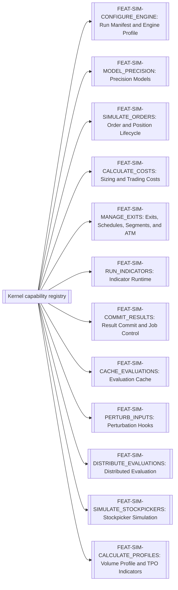
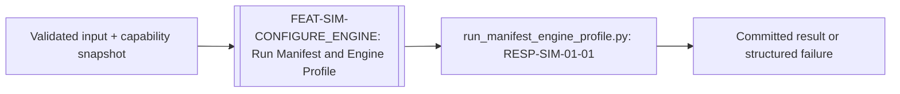

# Simulator

> **Package:** `app/services/simulator/`
> **Status:** `Missing`
> **Last updated:** `2026-08-23`
> **Domain ID:** `D-SIM`

> This README is the domain package's **single source of truth** for domain boundaries, composable feature capabilities, architecture invariants, implementation sequence, progress, usage examples, and tests.
> Update this document before modifying or adding code.

---

## Code-Aligned Implementation Convention

This README is the sole current target registry for this domain's feature IDs and statuses, functional requirements, domain-local workflows, semantic contract ownership, persisted-state model, acceptance evidence, and deletion behavior. `PROJECT.md` owns system scope, cross-domain behavior, system NFRs, and release gates; `ARCHITECTURE.md` owns universal package and runtime constraints. Feature-local READMEs, manifests, contract definitions, migrations, and tests provide current implementation evidence without silently changing this target registry.

Implementation uses the repository's existing feature substrate: each feature lives directly at `app/services/<domain>/<feature>/`, is discovered through the `haruquantai.features` Python entry-point group, and declares one immutable `FeatureSpec` in `manifest.py`. There are no domain or feature YAML manifests.

Every implemented feature also contains a mandatory runtime-validated `README.md`, pure `__init__.py`, strict `config.py`, lifecycle `feature.py`, and focused implementation modules. Dependencies and effects flow through `FeatureContext`/`FeatureScope`; cross-feature implementation imports are forbidden. Persistent state is declared by `FeatureSpec.state`; any migrations and storage adapters remain with the owning feature. Capability keys use `<domain>.<name>@<major>`. FR IDs remain product, acceptance, and test-trace identities rather than one runtime registration per FR. A requirement `Depends` cell expresses product sequencing, traceability, or acceptance evidence only; runtime dependencies are declared separately with exact keys in `FeatureSpec.requires` or `FeatureSpec.optional`.

Feature-level automated tests live at `tests/services/simulator/<feature>/`. Usage examples never live under `tests/`; they belong to each feature's designated primary domain-logic module. Broader automated verification retains its documented architecture, composition, API, integration, or system test location. The code-backed procedure is the [Feature Implementation Pipeline](../../../docs/dev/feature_implementation_pipeline.md).

## 1. Purpose and Boundary

### Purpose

The Simulator domain delivers deterministic simulation, engine profiles, event scheduling, indicator runtime state, orders, fills, positions, costs, exits, checkpoints, and differential comparison. Its public feature capabilities are registered and remain independent of package-import order. Removing the domain produces the degradation defined below rather than preventing the shared substrate or unrelated domains from starting.

### Owns

- `FEAT-SIM-CONFIGURE_ENGINE` — Run Manifest and Engine Profile.
- `FEAT-SIM-MODEL_PRECISION` — Precision Models.
- `FEAT-SIM-SIMULATE_ORDERS` — Order and Position Lifecycle.
- `FEAT-SIM-CALCULATE_COSTS` — Sizing and Trading Costs.
- `FEAT-SIM-MANAGE_EXITS` — Exits, Schedules, Segments, and ATM.
- `FEAT-SIM-RUN_INDICATORS` — Indicator Runtime.
- `FEAT-SIM-COMMIT_RESULTS` — Result Commit and Job Control.
- `FEAT-SIM-CACHE_EVALUATIONS` — Evaluation Cache.
- `FEAT-SIM-PERTURB_INPUTS` — Perturbation Hooks.
- `FEAT-SIM-DISTRIBUTE_EVALUATIONS` — Distributed Evaluation.
- `FEAT-SIM-SIMULATE_STOCKPICKERS` — Stockpicker Simulation.
- `FEAT-SIM-CALCULATE_PROFILES` — Volume Profile and TPO Indicators.

### Does not own

- Strategy authoring, data import, result browsing, research search policy, or generated-source ownership.
- Catalogue owns instrument constraints and cost-model definitions; Data owns profile source preparation; Strategy owns typed profile references; Runtime Risk owns paper/demo/live sizing and admission authority. Simulator applies pinned versions of those inputs only inside deterministic simulations.
- Composition lifecycle, dependency resolution, effect reversal, and transactional replacement; those belong to the non-domain shared substrate (`app/contracts/`, `app/kernel/`, and `app/composition/`).
- **Deletion boundary:** deleting `app/services/simulator/` means native simulation, runtime indicator evaluation, and result production disappear; strategies, data, and existing results remain manageable. The kernel and unrelated domains shall remain healthy.

### Shared Contracts

This domain semantically owns the contracts listed below, but their sole physical definitions live in `app/contracts/simulator/` and wire schemas in `app/contracts/simulator/wire/`. `app/services/simulator/` contains implementations only and shall not define or re-export substitute public contract types. Contract versions and semantic owners must agree with `PROJECT.md` and this README. Feature IDs and FR IDs are documentation, lifecycle, acceptance, and traceability identities; runtime bindings use exact versioned `CapabilityKey` declarations in contracts and `FeatureSpec`. The exact public records and capability bundles are listed in the [Shared Contracts README](../../contracts/README.md#45-appcontractssimulator).

Rows labelled `FEAT-* capability surface` describe planned semantic contract bundles, not literal runtime capability keys. A listed counterparty may produce, consume, or observe the bundle and does not establish package-import or runtime dependency direction.

**Owned by this domain**

| Status | Contract | Version | Counterparty | Purpose |
|---|---|---|---|---|
| Missing | `FEAT-SIM-CONFIGURE_ENGINE` capability surface | `v1` | Catalogue, Data, Research, Strategy, Workspace | Run Manifest and Engine Profile. |
| Missing | `FEAT-SIM-MODEL_PRECISION` capability surface | `v1` | Catalogue, Data, Research, Strategy, Workspace | Precision Models. |
| Missing | `FEAT-SIM-SIMULATE_ORDERS` capability surface | `v1` | Catalogue, Data, Research, Strategy, Workspace | Order and Position Lifecycle. |
| Missing | `FEAT-SIM-CALCULATE_COSTS` capability surface | `v1` | Catalogue, Data, Research, Strategy, Workspace | Sizing and Trading Costs. |
| Missing | `FEAT-SIM-MANAGE_EXITS` capability surface | `v1` | Catalogue, Data, Research, Strategy, Workspace | Exits, Schedules, Segments, and ATM. |
| Missing | `FEAT-SIM-RUN_INDICATORS` capability surface | `v1` | Catalogue, Data, Research, Strategy, Workspace | Indicator Runtime. |
| Missing | `FEAT-SIM-COMMIT_RESULTS` capability surface | `v1` | Catalogue, Data, Research, Strategy, Workspace | Result Commit and Job Control. |
| Missing | `FEAT-SIM-CACHE_EVALUATIONS` capability surface | `v1` | Catalogue, Data, Research, Strategy, Workspace | Evaluation Cache. |
| Missing | `FEAT-SIM-PERTURB_INPUTS` capability surface | `v1` | Catalogue, Data, Research, Strategy, Workspace | Perturbation Hooks. |
| Missing | `FEAT-SIM-DISTRIBUTE_EVALUATIONS` capability surface | `v1` | Catalogue, Data, Research, Strategy, Workspace | Distributed Evaluation. |
| Missing | `FEAT-SIM-SIMULATE_STOCKPICKERS` capability surface | `v1` | Catalogue, Data, Research, Strategy, Workspace | Stockpicker Simulation. |
| Missing | `FEAT-SIM-CALCULATE_PROFILES` capability surface | `v1` | Catalogue, Data, Research, Strategy, Workspace | Volume Profile and TPO Indicators. |

**Cross-domain requirement references (not runtime dependencies)**

The rows below summarize foreign owner tokens found in FR `Depends` cells. They express product sequencing, traceability, or acceptance-evidence relationships only. Actual runtime consumption must name an exact versioned capability key in the consuming feature's `FeatureSpec.requires` or `FeatureSpec.optional` and must follow the dependency direction in `PROJECT.md` and `ARCHITECTURE.md`.

| Referenced domain set | Documentation version | Owner | Meaning |
|---|---|---|---|
| `D-CAT` public capability set | `v1` | Catalogue | Requirements whose `Depends` cell names `CAT-*`. |
| `D-DATA` public capability set | `v1` | Data | Requirements whose `Depends` cell names `DATA-*`. |
| `D-RES` public capability set | `v1` | Research | Requirements whose `Depends` cell names `RES-*`. |
| `D-STRAT` public capability set | `v1` | Strategy | Requirements whose `Depends` cell names `STRAT-*`. |
| `D-WS` public capability set | `v1` | Workspace | Requirements whose `Depends` cell names `WS-*`. |

#### Ratified v1 public records (23)

Deterministic identity rule: event/run/result identities are pinned by content hashes and monotonic simulation sequences; repeated runs on one manifest emit identical canonical artifacts; jobs/worker leases persist in the Simulator table group while their wire records (`WorkerLease`) remain Workspace-owned.

| # | Record | Exact wire fields | FRs / rules |
|---|---|---|---|
| R1 | `RunManifest` | `manifest_id: Uuid7`; `job_id: Uuid7`; `capability_snapshot_id: Uuid7`; `snapshot_hash: ContentHash`; `behavior_providers: nonempty tuple[ProviderPin, ...]` where `ProviderPin(capability_key: CapabilityIdentifier, version: int >= 1, implementation_hash: ContentHash)`; `engine_profile_id: Uuid7`; `engine_profile_version: int >= 1`; `strategy_version_id: Uuid7`; `strategy_hash: ContentHash`; `settings_hash: ContentHash`; `data_binding_id: Uuid7`; `catalogue_version_ids: tuple[Uuid7, ...] = ()`; `block_version_hashes: tuple[ContentHash, ...] = ()`; `seed_root: nonempty hex str`; `seed_streams: tuple[nonempty str, ...] = ()` (§15.5 stream names); `environment: nonempty str`; `segments: tuple[ResultSegment, ...] = ()`; `output_artifact_ids: tuple[Uuid7, ...] = ()`; `state: Literal[VALIDATING,COMMITTED]`; `content_hash: ContentHash`; `schema_version: Literal[1] = 1`. Immutable after commit; created atomically with the queued job after validation; manifest comparison reports every material input difference. | FR-SIM-BUILD_RUN_MANIFEST, PIN_RUN_INPUTS, DEFINE_RESULT_SEGMENTS. |
| R2 | `EngineProfileVersion` | `profile_id: Uuid7`; `version: int >= 1`; `target_runtime: Literal[MT5,MT4,TRADESTATION,MULTICHARTS,JFOREX]`; `target_version_range: nonempty str`; `signal_evaluation_timing: nonempty str`; `order_activation_timing: nonempty str`; `same_bar_policy: nonempty str`; `gap_policy: nonempty str`; `fill_priority: nonempty str`; `position_model: Literal[ONE_POSITION,HEDGING,NETTING]`; `rounding_policy: nonempty str`; `session_policy: nonempty str`; `collision_policy: nonempty str`; `cost_policy: nonempty str`; `capability_matrix: tuple[CapabilityIdentifier, ...] = ()`; `content_hash: ContentHash`; `schema_version: Literal[1] = 1`. A run cannot start when any declared semantic is absent. | FR-SIM-DEFINE_ENGINE_SEMANTICS, VERSION_ENGINE_PROFILES. |
| R3 | `PrecisionModel` | `precision: Literal[SELECTED_TIMEFRAME,M1_SIMULATION,REAL_TICK_CUSTOM_SPREAD,REAL_TICK_RECORDED_SPREAD]`; `intrabar_path_policy: nonempty str` (§18.2); `spread_policy: Literal[OHLC_CONSTRUCTED,CUSTOM,RECORDED]`; `missing_side_policy: Literal[REJECT,SYNTHESIZE_FORBIDDEN] = "REJECT"`; `schema_version: Literal[1] = 1`. Recorded-spread mode never synthesizes the ask side. | FR-SIM-MODEL_INTRABAR_PATH, SIMULATE_FROM_M1, APPLY_CUSTOM_SPREAD, APPLY_RECORDED_SPREAD. |
| R4 | `SimulationRequest` | `request_id: Uuid7`; `strategy_version_id: Uuid7`; `engine_profile_id: Uuid7`; `settings: JsonObject`; `data_binding_id: Uuid7`; `seed_root: nonempty hex str`; `seed_streams: tuple[nonempty str, ...] = ()`; `idempotency_key: nonempty str`; `priority: int >= 0 = 0`; `schema_version: Literal[1] = 1`. Same idempotency key returns the original job; §22.5 job-action payload shape. | FR-SIM-BUILD_RUN_MANIFEST. |
| R5 | `SimulationRunRef` | `run_id: Uuid7`; `job_id: Uuid7`; `manifest_id: Uuid7`; `state: Literal[QUEUED,LEASED,RUNNING,PAUSING,PAUSED,RESUMING,STOPPING,STOPPED,COMPLETED,FAILED,CANCELLED]`; `progress: DecimalValue in [0,1] = "0"`; `schema_version: Literal[1] = 1`. §5.1 transitions; terminal states immutable; repeated commands return the effective state. | §5.1 job lifecycle. |
| R6 | `SimulationEvent` | `DomainEvent` envelope with `event_type: "simulation.event"`; payload `sequence: int >= 0` (monotonic simulation sequence), `kind: Literal[SIGNAL,ORDER_SUBMITTED,ORDER_FILLED,ORDER_CANCELLED,STOP_UPDATE,FORCED_EXIT,ERROR]`, `node_id: Uuid7 | None = None`, `values: JsonObject`, `schema_version: Literal[1] = 1`. First-divergence tooling identifies the earliest divergent event. | FR-SIM-JOURNAL_SIMULATION_EVENTS, PROCESS_EVENT_STREAM. |
| R7 | `SimOrder` | `order_id: Uuid7`; `result_id: Uuid7`; `order_sequence: int >= 0`; `entry_id: Uuid7 | None = None`; `order_group_id: Uuid7 | None = None`; `magic_number: int >= 0 | None = None`; `symbol: nonempty str`; `order_type: Literal[MARKET,STOP,LIMIT,STOP_LIMIT]`; `side: Literal[BUY,SELL]`; `requested_quantity: DecimalValue > 0`; `requested_price: DecimalValue | None = None`; `stop_price: DecimalValue | None = None`; `limit_price: DecimalValue | None = None`; `protection_owner_id: Uuid7 | None = None`; `activation: UtcTimestamp | None = None`; `expiry: UtcTimestamp | None = None`; `state: Literal[CREATED,ACCEPTED,REJECTED,PENDING,PARTIALLY_FILLED,FILLED,CANCELLED,EXPIRED]`; `filled_quantity: DecimalValue >= 0 = "0"`; `reason: str = ""`; `schema_version: Literal[1] = 1`. Filled quantity monotonic and ≤ requested; stop-limit keeps distinct trigger and limit phases; §18.1/§18.2 rules. | FR-SIM-VALIDATE_MARKET_ORDERS, PROCESS_PENDING_ORDERS, PROCESS_STOP_LIMITS, TRACK_ENTRY_IDENTITIES. |
| R8 | `SimFill` | `fill_id: Uuid7`; `order_id: Uuid7`; `fill_sequence: int >= 0`; `timestamp: UtcTimestamp`; `side: Literal[BUY,SELL]`; `quantity: DecimalValue > 0`; `base_price: DecimalValue`; `spread_price: DecimalValue`; `slippage: DecimalValue`; `final_price: DecimalValue`; `slippage_seed: str | None = None`; `source_event_id: Uuid7`; `schema_version: Literal[1] = 1`. Seeded randomized slippage reproduces identically. | FR-SIM-APPLY_SLIPPAGE, APPLY_SPREAD. |
| R9 | `SimPosition` | `position_id: Uuid7`; `result_id: Uuid7`; `symbol: nonempty str`; `direction: Literal[LONG,SHORT]`; `opened_at: UtcTimestamp | None = None`; `closed_at: UtcTimestamp | None = None`; `max_size: DecimalValue >= 0`; `current_size: DecimalValue >= 0`; `state: Literal[OPEN,CLOSED]`; `realized_pl: Money`; `unrealized_pl: Money | None = None`; `schema_version: Literal[1] = 1`. Derived from fills; no independent position mutation bypasses the order/fill ledger. | FR-SIM-MODEL_POSITION_ACCOUNTING. |
| R10 | `SimTrade` | `trade_id: Uuid7`; `result_id: Uuid7`; `position_id: Uuid7`; `segment: Literal[FULL,IS,VALIDATION,OOS,NO_TRADE]`; `direction: Literal[LONG,SHORT]`; `size: DecimalValue > 0`; `open_price/close_price: DecimalValue`; `opened_at/closed_at: UtcTimestamp`; `gross_pl: Money`; `costs: CostBreakdown`; `net_pl: Money`; `pips: DecimalValue`; `close_reason: Literal[STOP,TARGET,TRAILING,BREAKEVEN,BARS,RULE,EOD,FRIDAY,SIGNAL,END_OF_DATA,CANCELLED]`; `mae: DecimalValue | None = None`; `mfe: DecimalValue | None = None`; `schema_version: Literal[1] = 1`. | FR-SIM-ALLOCATE_PARTIAL_EXITS. |
| R11 | `SizingDecision` | `decision_id: Uuid7`; `method: nonempty str` (§18.5); `method_version: int >= 1`; `computed_size: DecimalValue | None = None`; `normalized_size: DecimalValue | None = None`; `rejected_reason: nonempty str | None = None`; `order_id: Uuid7 | None = None`; `schema_version: Literal[1] = 1`. Missing risk inputs or below-minimum size reject the order; no implicit minimum-size trade. | FR-SIM-CALCULATE_POSITION_SIZE, REJECT_INVALID_SIZE. |
| R12 | `CostBreakdown` | `price_pl: Money`; `spread_effect: Money`; `slippage_effect: Money`; `commission: Money`; `swap: Money`; `conversion_adjustment: Money`; `net_pl: Money`; `schema_version: Literal[1] = 1`. Components sum exactly to `net_pl`; §18.4 commission/swap/rollover/day-count/triple-swap rules. | FR-SIM-APPLY_COMMISSION, APPLY_SWAP_FINANCING, RECONCILE_TRADING_COSTS. |
| R13 | `ExitSchedule` | `exit_id: Uuid7`; `kind: Literal[STOP,TARGET,TRAILING,BREAKEVEN,BARS,RULE,EOD,FRIDAY]`; `level: DecimalValue | None = None`; `activation: JsonObject = {}`; `collision_priority: int >= 0`; `considered_conditions: tuple[nonempty str, ...] = ()`; `schema_version: Literal[1] = 1`. Same-event collisions resolve through the versioned path/priority policy with all considered conditions recorded; trading schedule boundaries use the configured session timezone. | FR-SIM-APPLY_STOP_TARGET, APPLY_DYNAMIC_EXITS, RESOLVE_EXIT_COLLISIONS, ENFORCE_TRADING_SCHEDULE. |
| R14 | `ResultSegment` | `segment_id: Uuid7`; `result_id: Uuid7`; `segment: Literal[FULL,IS,VALIDATION,OOS,NO_TRADE]`; `from_at: UtcTimestamp`; `to_at: UtcTimestamp` (`>` `from_at`, half-open); `entry_policy: nonempty str`; `exit_policy: nonempty str`; `schema_version: Literal[1] = 1`. Nonoverlapping except `FULL`; boundary events belong to exactly one segment; no-trade zones prohibit new/scale-in exposure while exits stay active (`CANCEL_ON_ZONE_ENTRY` optional). | FR-SIM-DEFINE_RESULT_SEGMENTS, ENFORCE_TRADE_RESTRICTIONS. |
| R15 | `IndicatorRuntimeSpec` | `instance_id: Uuid7`; `indicator_id: nonempty str`; `indicator_version: int >= 1`; `chart_ordinal: int >= 0`; `warmup_bars: int >= 0 = 0`; `missing_value_policy: Literal[BLOCK,NULL_VALUE]`; `state_scope: Literal[STRATEGY_INSTANCE,CHART]`; `schema_version: Literal[1] = 1`. State isolated per strategy instance/chart; parallel strategies cannot alter one another; insufficient warm-up blocks or yields declared nulls. | FR-SIM-ISOLATE_INDICATOR_STATE. |
| R16 | `SimulationResult` | `result_id: Uuid7`; `strategy_version_id: Uuid7`; `manifest_id: Uuid7`; `state: Literal[STAGED,VALIDATING,COMMITTED,REJECTED,CORRUPT]`; `completion: Literal[COMPLETE,INCOMPLETE]`; `metric_value_ids: tuple[Uuid7, ...] = ()` (Analytics-owned values by reference); `order_artifact_id: Uuid7 | None = None`; `trade_artifact_id: Uuid7 | None = None`; `equity_artifact_id: Uuid7 | None = None`; `diagnostic_artifact_id: Uuid7 | None = None`; `created_at: UtcTimestamp`; `committed_at: UtcTimestamp | None = None`; `content_hash: ContentHash`; `schema_version: Literal[1] = 1`. Committed only after order/trade/equity reconciliation, schema validation, and artifact checksums; stopped/cancelled partial outputs stay explicitly `INCOMPLETE` and cannot be promoted/exported as complete. Uniqueness `(manifest_id)` one result per manifest. | FR-SIM-COMMIT_SIMULATION_RESULT, PRESERVE_PARTIAL_RESULTS. |
| R17 | `ResultCommitReceipt` | `receipt_id: Uuid7`; `result_id: Uuid7`; `manifest_id: Uuid7`; `reconciliation_passed: Literal[True]`; `schema_validation_passed: Literal[True]`; `artifact_checksums: dict[nonempty str, ContentHash]`; `committed_at: UtcTimestamp`; `schema_version: Literal[1] = 1`. Replaying the commit never creates a second logical result. | FR-SIM-COMMIT_SIMULATION_RESULT, §23.12. |
| R18 | `EvaluationCacheKey` | `cache_key: ContentHash`; `strategy_hash: ContentHash`; `engine_hash: ContentHash`; `data_binding_hash: ContentHash`; `partition_hash: ContentHash`; `cost_hash: ContentHash`; `metric_hook_hash: ContentHash`; `seed_hash: ContentHash`; `result_id: Uuid7 | None = None`; `schema_version: Literal[1] = 1`. Compatible repeats reuse one result; any semantic input change causes a cache miss. | FR-SIM-CACHE_EVALUATIONS. |
| R19 | `PerturbationSpec` | `perturbation_id: Uuid7`; `kind: Literal[COST,DATA,PARAMETER,EXECUTION_DELAY,TRADE_SEQUENCE]`; `parameters: JsonObject`; `content_hash: ContentHash`; `schema_version: Literal[1] = 1`. Zero-perturbation run hash equals the baseline hash; baseline semantics unchanged. | FR-SIM-PERTURB_SIMULATION. |
| R20 | `DistributedEvaluationPlan` | `plan_id: Uuid7`; `manifest_id: Uuid7`; `partition_ids: nonempty tuple[Uuid7, ...]`; `worker_requirements: tuple[CapabilityIdentifier, ...] = ()`; `locality_hints: tuple[ContentHash, ...] = ()`; `schema_version: Literal[1] = 1`. Independent of worker identity, machine locale, scheduling order, and artifact locality; local and remote golden runs produce identical canonical artifacts; checkpoint/resume discards or resumes staged work per policy on worker loss. | FR-SIM-DISTRIBUTE_SIMULATION, STREAM_BATCH_PROGRESS. |
| R21 | `StockpickerSimulationSpec` | `spec_id: Uuid7`; `universe: UniverseRef`; `universe_version: int >= 1`; `ranking_timestamp: UtcTimestamp`; `rebalance_schedule: nonempty str`; `allocation_policy: JsonObject`; `turnover_cost_policy: JsonObject`; `delisting_policy: nonempty str`; `missing_data_policy: nonempty str`; `evaluation_timing: Literal[BEFORE_OPEN,ON_OPEN,ON_CLOSE]`; `daily_strict_profile: bool = False` (daily OHLC only, pessimistic ambiguity rules, next-session protection activation); `content_hash: ContentHash`; `schema_version: Literal[1] = 1`. | FR-SIM-SIMULATE_STOCKPICKER, DEFINE_STOCKPICKER_TIMING, ENFORCE_DAILY_STOCKPICKER. |
| R22 | `VolumeProfileResult` | `profile_id: Uuid7`; `source_id: Uuid7` (Data `VolumeProfileSource`); `session_version_ids: tuple[Uuid7, ...] = ()`; `value_area_percent: DecimalValue in (0,100] = "70"`; `poc_price: DecimalValue`; `value_area_high/value_area_low: DecimalValue`; `bins_artifact_id: Uuid7`; `is_incomplete_source: bool`; `content_hash: ContentHash`; `schema_version: Literal[1] = 1`. Experimental; §21.7/§23.11 semantics. | FR-SIM-CALCULATE_VOLUME_PROFILES. |
| R23 | `TpoProfileResult` | `tpo_id: Uuid7`; `source_id: Uuid7`; `session_version_ids: tuple[Uuid7, ...] = ()`; `poc_price: DecimalValue`; `tpo_counts_artifact_id: Uuid7`; `is_incomplete_source: bool`; `content_hash: ContentHash`; `schema_version: Literal[1] = 1`. Experimental; independent of volume calculations. | FR-SIM-CALCULATE_VOLUME_PROFILES. |

Cross-owner references used by these records (never copied): `UniverseRef` (Catalogue); `RunDataBinding` (Data); `VolumeProfileSource` (Data); `IndicatorDefinition` (Strategy); metric values (Analytics); `WorkerLease` remains Workspace-owned; job-state enum from `app/contracts/README.md` §4.3. No subscriptions.

#### Ratified v1 capabilities and operation envelopes

All new (universal rule; shared `SimulatorFailure` with `code: Literal[SIM_VALIDATION_FAILED,SIM_ENGINE_PROFILE_REQUIRED,SIM_SEGMENT_INVALID,SIM_ORDER_REJECTED,SIM_RECONCILIATION_FAILED,SIM_COST_UNRECONCILED,CHECKPOINT_INCOMPATIBLE,SIM_DISTRIBUTION_INCOMPATIBLE,CAPABILITY_UNAVAILABLE]`; no subscriptions — batch progress is bounded observational event publication):

1. `simulator.configure-engine@1` / `ConfigureEngineCapability` / `configure_engine` — ops `DEFINE_PROFILE, LIST_PROFILES`. Success: `profile: EngineProfileVersion | None`; `profiles: tuple[EngineProfileVersion, ...] = ()`. FRs: DEFINE_ENGINE_SEMANTICS, VERSION_ENGINE_PROFILES.
2. `simulator.model-precision@1` / `ModelPrecisionCapability` / `model_precision` — ops `DEFINE_MODEL, VALIDATE_INPUTS`. Success: `model: PrecisionModel | None`. FRs: MODEL_INTRABAR_PATH, SIMULATE_FROM_M1, APPLY_CUSTOM_SPREAD, APPLY_RECORDED_SPREAD.
3. `simulator.simulate-orders@1` / `SimulateOrdersCapability` / `simulate_orders` — ops `SUBMIT, PAUSE, RESUME, STOP, CANCEL, INSPECT, COMPARE` (checkpoint only at declared safe boundaries; resume without duplication; differential comparison reports the earliest mismatch). Success: `run: SimulationRunRef | None`; `manifest: RunManifest | None`; `order: SimOrder | None`; `comparison: tuple[ValidationIssue, ...] = ()`. Events: `simulation.event` observational. FRs: PROCESS_EVENT_STREAM, ENFORCE_CLOSED_INPUTS, JOURNAL_SIMULATION_EVENTS, VALIDATE_MARKET_ORDERS, PROCESS_PENDING_ORDERS, PROCESS_STOP_LIMITS, MODEL_POSITION_ACCOUNTING, TRACK_ENTRY_IDENTITIES, CHECKPOINT_SIMULATION, PRESERVE_PARTIAL_RESULTS, COMPARE_EXECUTION_RESULTS.
4. `simulator.calculate-costs@1` / `CalculateCostsCapability` / `calculate_costs` — ops `SIZE_POSITION, APPLY_COSTS`. Success: `sizing: SizingDecision | None`; `costs: CostBreakdown | None`. FRs: CALCULATE_POSITION_SIZE, REJECT_INVALID_SIZE, APPLY_SPREAD, APPLY_SLIPPAGE, APPLY_COMMISSION, APPLY_SWAP_FINANCING, RECONCILE_TRADING_COSTS.
5. `simulator.manage-exits@1` / `ManageExitsCapability` / `manage_exits` — ops `SCHEDULE_EXIT, RESOLVE_COLLISION, EXECUTE_ATM, ALLOCATE_PARTIAL`. Success: `schedule: ExitSchedule | None`; `allocations: tuple[ValidationIssue, ...] = ()`. FRs: APPLY_STOP_TARGET, APPLY_DYNAMIC_EXITS, RESOLVE_EXIT_COLLISIONS, ENFORCE_TRADING_SCHEDULE, EXECUTE_ATM_STATE, ALLOCATE_PARTIAL_EXITS, GENERATE_ATM_SCENARIOS.
6. `simulator.run-indicators@1` / `RunIndicatorsCapability` / `run_indicators` — ops `PREPARE_SPEC, EVALUATE`. Success: `spec: IndicatorRuntimeSpec | None`; `findings: tuple[ValidationIssue, ...] = ()`. FRs: ISOLATE_INDICATOR_STATE.
7. `simulator.commit-results@1` / `CommitResultsCapability` / `commit_results` — ops `VALIDATE, COMMIT`. Success: `result: SimulationResult | None`; `receipt: ResultCommitReceipt | None`. FRs: COMMIT_SIMULATION_RESULT, PRESERVE_PARTIAL_RESULTS.
8. `simulator.cache-evaluations@1` / `CacheEvaluationsCapability` / `cache_evaluations` — ops `LOOKUP, STORE`. Success: `cache_key: EvaluationCacheKey | None`. FRs: CACHE_EVALUATIONS.
9. `simulator.calculate-profiles@1` / `CalculateProfilesCapability` / `calculate_profiles` — ops `CALCULATE_VOLUME_PROFILE, CALCULATE_TPO` (Experimental gating). Success: `volume_profile: VolumeProfileResult | None`; `tpo_profile: TpoProfileResult | None`. FRs: CALCULATE_VOLUME_PROFILES.
10. `simulator.perturb-inputs@1` / `PerturbInputsCapability` / `perturb_inputs` — ops `DEFINE_PERTURBATION`. Success: `spec: PerturbationSpec | None`. FRs: PERTURB_SIMULATION.
11. `simulator.distribute-evaluations@1` / `DistributeEvaluationsCapability` / `distribute_evaluations` — ops `PLAN, STREAM_PROGRESS` (bounded intermediate summaries; no partial final commits). Success: `plan: DistributedEvaluationPlan | None`; `progress: tuple[ValidationIssue, ...] = ()`. FRs: DISTRIBUTE_SIMULATION, STREAM_BATCH_PROGRESS.
12. `simulator.simulate-stockpickers@1` / `SimulateStockpickersCapability` / `simulate_stockpickers` — ops `DEFINE_SPEC, SIMULATE`. Success: `spec: StockpickerSimulationSpec | None`; `result_id: Uuid7 | None = None`. FRs: SIMULATE_STOCKPICKER, DEFINE_STOCKPICKER_TIMING, ENFORCE_DAILY_STOCKPICKER.

### Persisted State Ownership

| Status | State / Store | Read access (via contract) | Migration definitions |
|---|---|---|---|
| Missing | run_manifests, results, result_segments, orders, fills, positions, trades | Other domains through `D-SIM` public capabilities only | The owning feature's `StateDeclaration` and migration/storage adapter |

### Four-Level Structural Hierarchy

| Code level | Represents | This package |
|---|---|---|
| **Package** | Domain | `app/services/simulator/` / `D-SIM` |
| **Module folder** | Feature / capability | One folder for each of: Run Manifest and Engine Profile, Precision Models, Order and Position Lifecycle, Sizing and Trading Costs, Exits, Schedules, Segments, and ATM, Indicator Runtime, Result Commit and Job Control, Evaluation Cache, Perturbation Hooks, Distributed Evaluation, Stockpicker Simulation, Volume Profile and TPO Indicators |
| **File** | Use case or focused responsibility | Exactly the responsibility file named in each module specification |
| **Class / function / method** | Functional requirement behavior | Exactly one registered `fr_*` behavior per `FR-*` row |

```text
Package (Domain)
└── Module folder (Feature)
    └── File (Responsibility)
        └── Registered function (Functional requirement behavior)
```

### Domain Capability Map


```mermaid
flowchart TD
    DOMAIN[[D-SIM: Simulator]]
    DOMAIN --> FEAT_SIM_CONFIGURE_ENGINE[[FEAT-SIM-CONFIGURE_ENGINE: Run Manifest and Engine Profile]]
    FEAT_SIM_CONFIGURE_ENGINE --> FEAT_SIM_CONFIGURE_ENGINE_FILE[run_manifest_engine_profile.py: RESP-SIM-01-01]
    DOMAIN --> FEAT_SIM_MODEL_PRECISION[[FEAT-SIM-MODEL_PRECISION: Precision Models]]
    FEAT_SIM_MODEL_PRECISION --> FEAT_SIM_MODEL_PRECISION_FILE[precision_models.py: RESP-SIM-02-01]
    DOMAIN --> FEAT_SIM_SIMULATE_ORDERS[[FEAT-SIM-SIMULATE_ORDERS: Order and Position Lifecycle]]
    FEAT_SIM_SIMULATE_ORDERS --> FEAT_SIM_SIMULATE_ORDERS_FILE[order_position_lifecycle.py: RESP-SIM-03-01]
    DOMAIN --> FEAT_SIM_CALCULATE_COSTS[[FEAT-SIM-CALCULATE_COSTS: Sizing and Trading Costs]]
    FEAT_SIM_CALCULATE_COSTS --> FEAT_SIM_CALCULATE_COSTS_FILE[sizing_trading_costs.py: RESP-SIM-04-01]
    DOMAIN --> FEAT_SIM_MANAGE_EXITS[[FEAT-SIM-MANAGE_EXITS: Exits, Schedules, Segments, and ATM]]
    FEAT_SIM_MANAGE_EXITS --> FEAT_SIM_MANAGE_EXITS_FILE[exit_schedule_atm.py: RESP-SIM-05-01]
    DOMAIN --> FEAT_SIM_RUN_INDICATORS[[FEAT-SIM-RUN_INDICATORS: Indicator Runtime]]
    FEAT_SIM_RUN_INDICATORS --> FEAT_SIM_RUN_INDICATORS_FILE[indicator_runtime.py: RESP-SIM-06-01]
    DOMAIN --> FEAT_SIM_COMMIT_RESULTS[[FEAT-SIM-COMMIT_RESULTS: Result Commit and Job Control]]
    FEAT_SIM_COMMIT_RESULTS --> FEAT_SIM_COMMIT_RESULTS_FILE[result_commit_job_control.py: RESP-SIM-07-01]
    DOMAIN --> FEAT_SIM_CACHE_EVALUATIONS[[FEAT-SIM-CACHE_EVALUATIONS: Evaluation Cache]]
    FEAT_SIM_CACHE_EVALUATIONS --> FEAT_SIM_CACHE_EVALUATIONS_FILE[evaluation_cache.py: RESP-SIM-08-01]
    DOMAIN --> FEAT_SIM_PERTURB_INPUTS[[FEAT-SIM-PERTURB_INPUTS: Perturbation Hooks]]
    FEAT_SIM_PERTURB_INPUTS --> FEAT_SIM_PERTURB_INPUTS_FILE[perturbation_hooks.py: RESP-SIM-09-01]
    DOMAIN --> FEAT_SIM_DISTRIBUTE_EVALUATIONS[[FEAT-SIM-DISTRIBUTE_EVALUATIONS: Distributed Evaluation]]
    FEAT_SIM_DISTRIBUTE_EVALUATIONS --> FEAT_SIM_DISTRIBUTE_EVALUATIONS_FILE[distributed_evaluation.py: RESP-SIM-10-01]
    DOMAIN --> FEAT_SIM_SIMULATE_STOCKPICKERS[[FEAT-SIM-SIMULATE_STOCKPICKERS: Stockpicker Simulation]]
    FEAT_SIM_SIMULATE_STOCKPICKERS --> FEAT_SIM_SIMULATE_STOCKPICKERS_FILE[stockpicker_simulation.py: RESP-SIM-11-01]
    DOMAIN --> FEAT_SIM_CALCULATE_PROFILES[[FEAT-SIM-CALCULATE_PROFILES: Volume Profile and TPO Indicators]]
    FEAT_SIM_CALCULATE_PROFILES --> FEAT_SIM_CALCULATE_PROFILES_FILE[volume_profile_tpo.py: RESP-SIM-12-01]
```

---

## 2. Final Package Structure and Feature Independence

```text
simulator/
├── README.md
├── __init__.py
├── run_manifest_engine_profile/                    # FEAT-SIM-CONFIGURE_ENGINE: Run Manifest and Engine Profile
│   ├── README.md
│   ├── __init__.py
│   ├── manifest.py
│   ├── config.py
│   ├── feature.py
│   └── run_manifest_engine_profile.py              # RESP-SIM-01-01
├── precision_models/                    # FEAT-SIM-MODEL_PRECISION: Precision Models
│   ├── README.md
│   ├── __init__.py
│   ├── manifest.py
│   ├── config.py
│   ├── feature.py
│   └── precision_models.py              # RESP-SIM-02-01
├── order_position_lifecycle/                    # FEAT-SIM-SIMULATE_ORDERS: Order and Position Lifecycle
│   ├── README.md
│   ├── __init__.py
│   ├── manifest.py
│   ├── config.py
│   ├── feature.py
│   └── order_position_lifecycle.py              # RESP-SIM-03-01
├── sizing_trading_costs/                    # FEAT-SIM-CALCULATE_COSTS: Sizing and Trading Costs
│   ├── README.md
│   ├── __init__.py
│   ├── manifest.py
│   ├── config.py
│   ├── feature.py
│   └── sizing_trading_costs.py              # RESP-SIM-04-01
├── exit_schedule_atm/                    # FEAT-SIM-MANAGE_EXITS: Exits, Schedules, Segments, and ATM
│   ├── README.md
│   ├── __init__.py
│   ├── manifest.py
│   ├── config.py
│   ├── feature.py
│   └── exit_schedule_atm.py              # RESP-SIM-05-01
├── indicator_runtime/                    # FEAT-SIM-RUN_INDICATORS: Indicator Runtime
│   ├── README.md
│   ├── __init__.py
│   ├── manifest.py
│   ├── config.py
│   ├── feature.py
│   └── indicator_runtime.py              # RESP-SIM-06-01
├── result_commit_job_control/                    # FEAT-SIM-COMMIT_RESULTS: Result Commit and Job Control
│   ├── README.md
│   ├── __init__.py
│   ├── manifest.py
│   ├── config.py
│   ├── feature.py
│   └── result_commit_job_control.py              # RESP-SIM-07-01
├── evaluation_cache/                    # FEAT-SIM-CACHE_EVALUATIONS: Evaluation Cache
│   ├── README.md
│   ├── __init__.py
│   ├── manifest.py
│   ├── config.py
│   ├── feature.py
│   └── evaluation_cache.py              # RESP-SIM-08-01
├── perturbation_hooks/                    # FEAT-SIM-PERTURB_INPUTS: Perturbation Hooks
│   ├── README.md
│   ├── __init__.py
│   ├── manifest.py
│   ├── config.py
│   ├── feature.py
│   └── perturbation_hooks.py              # RESP-SIM-09-01
├── distributed_evaluation/                    # FEAT-SIM-DISTRIBUTE_EVALUATIONS: Distributed Evaluation
│   ├── README.md
│   ├── __init__.py
│   ├── manifest.py
│   ├── config.py
│   ├── feature.py
│   └── distributed_evaluation.py              # RESP-SIM-10-01
├── stockpicker_simulation/                    # FEAT-SIM-SIMULATE_STOCKPICKERS: Stockpicker Simulation
│   ├── README.md
│   ├── __init__.py
│   ├── manifest.py
│   ├── config.py
│   ├── feature.py
│   └── stockpicker_simulation.py              # RESP-SIM-11-01
└── volume_profile_tpo/                    # FEAT-SIM-CALCULATE_PROFILES: Volume Profile and TPO Indicators
    ├── README.md
    ├── __init__.py
    ├── manifest.py
    ├── config.py
    ├── feature.py
    └── volume_profile_tpo.py              # RESP-SIM-12-01
```

### Module dependency diagram

Feature modules do not import one another's private files. Runtime dependencies resolve through kernel capabilities obtained from `FeatureContext`; composition selects providers and reconciles changes, so reciprocal workflow participation cannot create a package-import cycle.


```mermaid
flowchart LR
    K[[Kernel capability registry]]
    K --> FEAT_SIM_CONFIGURE_ENGINE[[FEAT-SIM-CONFIGURE_ENGINE: Run Manifest and Engine Profile]]
    K --> FEAT_SIM_MODEL_PRECISION[[FEAT-SIM-MODEL_PRECISION: Precision Models]]
    K --> FEAT_SIM_SIMULATE_ORDERS[[FEAT-SIM-SIMULATE_ORDERS: Order and Position Lifecycle]]
    K --> FEAT_SIM_CALCULATE_COSTS[[FEAT-SIM-CALCULATE_COSTS: Sizing and Trading Costs]]
    K --> FEAT_SIM_MANAGE_EXITS[[FEAT-SIM-MANAGE_EXITS: Exits, Schedules, Segments, and ATM]]
    K --> FEAT_SIM_RUN_INDICATORS[[FEAT-SIM-RUN_INDICATORS: Indicator Runtime]]
    K --> FEAT_SIM_COMMIT_RESULTS[[FEAT-SIM-COMMIT_RESULTS: Result Commit and Job Control]]
    K --> FEAT_SIM_CACHE_EVALUATIONS[[FEAT-SIM-CACHE_EVALUATIONS: Evaluation Cache]]
    K --> FEAT_SIM_PERTURB_INPUTS[[FEAT-SIM-PERTURB_INPUTS: Perturbation Hooks]]
    K --> FEAT_SIM_DISTRIBUTE_EVALUATIONS[[FEAT-SIM-DISTRIBUTE_EVALUATIONS: Distributed Evaluation]]
    K --> FEAT_SIM_SIMULATE_STOCKPICKERS[[FEAT-SIM-SIMULATE_STOCKPICKERS: Stockpicker Simulation]]
    K --> FEAT_SIM_CALCULATE_PROFILES[[FEAT-SIM-CALCULATE_PROFILES: Volume Profile and TPO Indicators]]
```

### Structure rules

- The package root contains `README.md`, import-pure `__init__.py`, and one direct folder per feature; discovery uses the `haruquantai.features` entry-point group.
- Each feature folder contains mandatory `README.md`, pure `__init__.py`, `manifest.py`, `config.py`, `feature.py`, and focused responsibility modules.
- `FR-*`/`fr_*` names provide product, implementation, and test traceability inside the feature; they are not separate runtime registrations or capability keys.
- Cross-feature and cross-domain behavior is injected by capability key. Direct private-file imports are prohibited.
- Every core capability module documents Python and CLI usage; exactly one designated primary domain-logic module owns the feature's executable `__main__` demonstration. Usage examples never live under `tests/`.

---

## 3. Workflows

| Status | Workflow ID | Scope | Workflow | Trigger / Input boundary | Final outcome / Output boundary | Requirement sequence |
|---|---|---|---|---|---|---|
| Missing | `WF-SIM-001` | Cross-domain | Run Manifest and Engine Profile | Validated command/query and required capability bindings | Requirement-defined result, artifact, event, or degradation | `FR-SIM-BUILD_RUN_MANIFEST` → `FR-SIM-PIN_RUN_INPUTS` → `FR-SIM-PROCESS_EVENT_STREAM` → `FR-SIM-ENFORCE_CLOSED_INPUTS` → `FR-SIM-DEFINE_ENGINE_SEMANTICS` → `FR-SIM-VERSION_ENGINE_PROFILES` |
| Missing | `WF-SIM-002` | Cross-domain | Precision Models | Validated command/query and required capability bindings | Requirement-defined result, artifact, event, or degradation | `FR-SIM-MODEL_INTRABAR_PATH` → `FR-SIM-SIMULATE_FROM_M1` → `FR-SIM-APPLY_CUSTOM_SPREAD` → `FR-SIM-APPLY_RECORDED_SPREAD` |
| Missing | `WF-SIM-003` | Cross-domain | Order and Position Lifecycle | Validated command/query and required capability bindings | Requirement-defined result, artifact, event, or degradation | `FR-SIM-JOURNAL_SIMULATION_EVENTS` → `FR-SIM-VALIDATE_MARKET_ORDERS` → `FR-SIM-PROCESS_PENDING_ORDERS` → `FR-SIM-PROCESS_STOP_LIMITS` → `FR-SIM-MODEL_POSITION_ACCOUNTING` → `FR-SIM-TRACK_ENTRY_IDENTITIES` |
| Missing | `WF-SIM-004` | Cross-domain | Sizing and Trading Costs | Validated command/query and required capability bindings | Requirement-defined result, artifact, event, or degradation | `FR-SIM-CALCULATE_POSITION_SIZE` → `FR-SIM-REJECT_INVALID_SIZE` → `FR-SIM-APPLY_SPREAD` → `FR-SIM-APPLY_SLIPPAGE` → `FR-SIM-APPLY_COMMISSION` → `FR-SIM-APPLY_SWAP_FINANCING` → `FR-SIM-RECONCILE_TRADING_COSTS` |
| Missing | `WF-SIM-005` | Cross-domain | Exits, Schedules, Segments, and ATM | Validated command/query and required capability bindings | Requirement-defined result, artifact, event, or degradation | `FR-SIM-APPLY_STOP_TARGET` → `FR-SIM-APPLY_DYNAMIC_EXITS` → `FR-SIM-RESOLVE_EXIT_COLLISIONS` → `FR-SIM-ENFORCE_TRADING_SCHEDULE` → `FR-SIM-DEFINE_RESULT_SEGMENTS` → `FR-SIM-ENFORCE_TRADE_RESTRICTIONS` → `FR-SIM-EXECUTE_ATM_STATE` → `FR-SIM-ALLOCATE_PARTIAL_EXITS` → `FR-SIM-GENERATE_ATM_SCENARIOS` |
| Missing | `WF-SIM-006` | Cross-domain | Indicator Runtime | Validated command/query and required capability bindings | Requirement-defined result, artifact, event, or degradation | `FR-SIM-ISOLATE_INDICATOR_STATE` |
| Missing | `WF-SIM-007` | Cross-domain | Result Commit and Job Control | Validated command/query and required capability bindings | Requirement-defined result, artifact, event, or degradation | `FR-SIM-COMMIT_SIMULATION_RESULT` → `FR-SIM-CHECKPOINT_SIMULATION` → `FR-SIM-PRESERVE_PARTIAL_RESULTS` → `FR-SIM-COMPARE_EXECUTION_RESULTS` → `FR-SIM-STREAM_BATCH_PROGRESS` |
| Missing | `WF-SIM-008` | Cross-domain | Evaluation Cache | Validated command/query and required capability bindings | Requirement-defined result, artifact, event, or degradation | `FR-SIM-CACHE_EVALUATIONS` |
| Missing | `WF-SIM-009` | Internal | Perturbation Hooks | Validated command/query and required capability bindings | Requirement-defined result, artifact, event, or degradation | `FR-SIM-PERTURB_SIMULATION` |
| Missing | `WF-SIM-010` | Cross-domain | Distributed Evaluation | Validated command/query and required capability bindings | Requirement-defined result, artifact, event, or degradation | `FR-SIM-DISTRIBUTE_SIMULATION` |
| Missing | `WF-SIM-011` | Cross-domain | Stockpicker Simulation | Validated command/query and required capability bindings | Requirement-defined result, artifact, event, or degradation | `FR-SIM-SIMULATE_STOCKPICKER` → `FR-SIM-DEFINE_STOCKPICKER_TIMING` → `FR-SIM-ENFORCE_DAILY_STOCKPICKER` |
| Missing | `WF-SIM-012` | Cross-domain | Volume Profile and TPO Indicators | Validated command/query and required capability bindings | Requirement-defined result, artifact, event, or degradation | `FR-SIM-CALCULATE_VOLUME_PROFILES` |

### `WF-SIM-001` — Run Manifest and Engine Profile

**Scope:** `Cross-domain` when the request requires another domain capability; otherwise `Internal`.

**System workflow:** `SYS-WF-004, SYS-WF-006, SYS-WF-007`

**Input boundary:** A validated request/query plus an immutable capability snapshot and provider bindings.

**Output boundary:** The result/artifact/event defined by the participating `FR-*` rows, or their exact structured failure/degradation outcome.

1. `Feature.mount()` resolves its declared required capabilities through `FeatureContext`.
2. `run_manifest_engine_profile.py` executes `fr_sim_build_run_manifest`, `fr_sim_pin_run_inputs`, `fr_sim_process_event_stream`, `fr_sim_enforce_closed_inputs`, `fr_sim_define_engine_semantics`, `fr_sim_version_engine_profiles` in the requirement-defined order.
3. Scoped effects are committed or reversed under `FR-KERN-DEFINE_REQUIREMENT_BEHAVIOR, FR-KERN-DEFINE_LIFECYCLE_CONTEXT, FR-KERN-DECLARE_BEHAVIOR_DEPENDENCIES, FR-KERN-REGISTER_FEATURE_MODULES, FR-KERN-DEFINE_RESPONSIBILITY_FILES, FR-KERN-IMPLEMENT_REQUIREMENT_FUNCTIONS, FR-KERN-DEPEND_PUBLIC_PORTS, FR-KERN-NAMESPACE_CAPABILITY_KEYS, FR-KERN-DECLARE_DEPENDENCY_RULES, FR-KERN-REEVALUATE_DEPENDENCIES, FR-KERN-DEFINE_SCOPE_HIERARCHY, FR-KERN-PASS_EFFECT_SCOPES, FR-KERN-REGISTER_EFFECT_REVERSALS, FR-KERN-REVERSE_EFFECTS_LIFO, FR-KERN-ROLLBACK_FAILED_ACTIVATION, FR-KERN-MANAGE_COMPONENT_LIFECYCLE, FR-KERN-COMMIT_CAPABILITY_SWAP, FR-KERN-QUIESCE_DEPENDENT_WORK, FR-KERN-REMOVE_DEPENDENT_COMPONENTS, FR-KERN-ISOLATE_DISPOSAL_FAILURES, FR-KERN-RECONCILE_DESIRED_STATE, FR-KERN-REPLACE_COMPONENTS_TRANSACTIONALLY, FR-KERN-PROVIDE_SCOPED_REGISTRARS, FR-KERN-DRAIN_REMOVED_BEHAVIORS, FR-KERN-CLASSIFY_COMPONENT_EFFECTS, FR-KERN-NAMESPACE_COMPONENT_STATE, FR-KERN-REGISTER_EXTENSION_POINTS, FR-KERN-EMIT_CAUSAL_EVENTS, FR-KERN-REJECT_DEPENDENCY_CYCLES, FR-KERN-PIN_CAPABILITY_SNAPSHOTS, FR-KERN-TEST_COMPONENT_REMOVAL, FR-KERN-VERIFY_EXACT_REMOVAL, FR-KERN-ROUTE_MULTIPLE_PROVIDERS`.
4. The feature returns or publishes only the documented output boundary.

**Failure behaviour:**

- Feature unavailable → new simulations are unavailable; existing manifests remain reproducible records. Requests requiring a removed feature capability return `CAPABILITY_UNAVAILABLE`; the domain continues loading.
- Missing/incompatible required capability → `CAPABILITY_UNAVAILABLE` or `CAPABILITY_INCOMPATIBLE`; no partial mutation.

**Integration test:**
`tests/services/simulator/integration/test_run_manifest_engine_profile.py::test_run_manifest_engine_profile_workflow()`


```mermaid
flowchart LR
    INPUT[Validated input + capability snapshot]
    FEATURE[[FEAT-SIM-CONFIGURE_ENGINE: Run Manifest and Engine Profile]]
    FILE[run_manifest_engine_profile.py: RESP-SIM-01-01]
    OUTPUT[Committed result or structured failure]
    INPUT --> FEATURE --> FILE --> OUTPUT
```

---

## 4. Composable Feature Specifications

Implement module sections from top to bottom. Requirement `Depends` cells define product and implementation ordering; runtime capability dependencies must be declared separately in the owning `FeatureSpec`.

---

### 4.1 `run_manifest_engine_profile/` — Run Manifest and Engine Profile

**Feature ID:** `FEAT-SIM-CONFIGURE_ENGINE`

**Purpose:** Admit runs, pin inputs, order events, and select target semantics.

**Deletion contract:** new simulations are unavailable; existing manifests remain reproducible records. Requests requiring a removed feature capability return `CAPABILITY_UNAVAILABLE`; the domain continues loading.

**Module flow:**

```text
validated input and capability bindings
  → run_manifest_engine_profile.py
  → fr_sim_build_run_manifest, fr_sim_pin_run_inputs, fr_sim_process_event_stream, fr_sim_enforce_closed_inputs, fr_sim_define_engine_semantics, fr_sim_version_engine_profiles
  → requirement-defined output or structured failure
```

#### Files

| Status | File | Responsibility | Key exports | Dependencies |
|---|---|---|---|---|
| Missing | `run_manifest_engine_profile.py` | Admit runs, pin inputs, order events, and select target semantics | `fr_sim_build_run_manifest`, `fr_sim_pin_run_inputs`, `fr_sim_process_event_stream`, `fr_sim_enforce_closed_inputs`, `fr_sim_define_engine_semantics`, `fr_sim_version_engine_profiles` | **Standard library:** selected per implementation and recorded before code<br>**Required third-party:** only libraries mandated by `PROJECT.md` or the requirement boundary<br>**Local:** capabilities declared by the owning `FeatureSpec`; no private cross-feature import |
| Missing | `feature.py` | Mount `FEAT-SIM-CONFIGURE_ENGINE` through `FeatureContext` and stage its declared providers/effects | `FEAT-SIM-CONFIGURE_ENGINE` `Feature.mount` | **Standard library:** None<br>**Required third-party:** None<br>**Local:** `manifest.py`, `config.py`, and focused responsibility modules |
| Missing | `manifest.py` | Define the immutable `FEAT-SIM-CONFIGURE_ENGINE` `FeatureSpec`: identity, domain, provided/required/optional capabilities, conflicts, state, and configuration keys | `FEAT-SIM-CONFIGURE_ENGINE` `FeatureSpec` | **Standard library:** None<br>**Required third-party:** None<br>**Local:** `app.kernel.feature.FeatureSpec` |

#### Configuration and Limits Manifest

| Status | Setting / Limit | Type | Default | Required | Used by | Description |
|---|---|---|---|---|---|---|
| Missing | `FEAT-SIM-CONFIGURE_ENGINE.configuration` | Versioned schema | No implicit defaults | Yes when referenced | `run_manifest_engine_profile.py` | Exact fields, defaults, limits, and failure rules are those stated by the requirements and the normative technical appendices in `PROJECT.md`; unspecified values are rejected under Project §6. |

#### `run_manifest_engine_profile.py` — Admit runs, pin inputs, order events, and select target semantics

**File responsibility:** Admit runs, pin inputs, order events, and select target semantics.

| Status | Requirement ID | Class | Pri | Responsibility | Class / Function / Method | Side Effects | Raises / failure | Depends | Source / confidence | Usage / Test |
|---|---|---|---|---|---|---|---|---|---|---|
| Missing | `FR-SIM-BUILD_RUN_MANIFEST` | Target | P0 | A backtest request shall atomically create an immutable run manifest and durable queued job after all inputs validate. | `fr_sim_build_run_manifest` implementation trace | Persistence write | Repeating with the same idempotency key returns the original job; no duplicate is queued. | WS, CAT, DATA, STRAT | `BD-08`, `BD-09`; Target | **Usage:** `app/services/simulator/run_manifest_engine_profile/run_manifest_engine_profile.py::__main__` scenario `FR-SIM-BUILD_RUN_MANIFEST`<br>**Unit:** `tests/services/simulator/run_manifest_engine_profile/test_run_manifest_engine_profile.py::test_sim_build_run_manifest()` |
| Missing | `FR-SIM-PIN_RUN_INPUTS` | Target | P0 | The manifest shall pin engine/profile version, strategy version/hash, settings/hash, data versions, catalogue versions, block versions, and seed set. | `fr_sim_pin_run_inputs` implementation trace | None | Comparing two manifests reports every material input difference. | FR-SIM-BUILD_RUN_MANIFEST | `BD-08`; Target | **Usage:** `app/services/simulator/run_manifest_engine_profile/run_manifest_engine_profile.py::__main__` scenario `FR-SIM-PIN_RUN_INPUTS`<br>**Unit:** `tests/services/simulator/run_manifest_engine_profile/test_run_manifest_engine_profile.py::test_sim_pin_run_inputs()` |
| Missing | `FR-SIM-PROCESS_EVENT_STREAM` | Target | P0 | The engine shall process a deterministic ordered event stream in deterministic mode. | `fr_sim_process_event_stream` implementation trace | Event publication | Repeated runs on the same manifest emit identical canonical order/fill/trade artifacts. | FR-SIM-PIN_RUN_INPUTS, DET-001 | Baseline §12; Target | **Usage:** `app/services/simulator/run_manifest_engine_profile/run_manifest_engine_profile.py::__main__` scenario `FR-SIM-PROCESS_EVENT_STREAM`<br>**Unit:** `tests/services/simulator/run_manifest_engine_profile/test_run_manifest_engine_profile.py::test_sim_process_event_stream()` |
| Missing | `FR-SIM-ENFORCE_CLOSED_INPUTS` | Parity | P0 | The multi-chart scheduler shall expose only closed/observable data and use the timestamp/chart-ordinal tie rules in §§17.3 and 18.1. | `fr_sim_enforce_closed_inputs` implementation trace | Read-only | Simultaneous H1/D1 and missing-bar fixtures match those exact rules. | FR-DATA-AGGREGATE_TIMEFRAMES, FR-STRAT-DEFINE_SERIES_SHIFTS | Specified §§17.3, 18.1 | **Usage:** `app/services/simulator/run_manifest_engine_profile/run_manifest_engine_profile.py::__main__` scenario `FR-SIM-ENFORCE_CLOSED_INPUTS`<br>**Unit:** `tests/services/simulator/run_manifest_engine_profile/test_run_manifest_engine_profile.py::test_sim_enforce_closed_inputs()` |
| Missing | `FR-SIM-DEFINE_ENGINE_SEMANTICS` | Target | P0 | Every engine profile shall declare signal evaluation timing, order activation timing, same-bar policy, gap policy, fill priority, hedging/netting model, and rounding policy. | `fr_sim_define_engine_semantics` implementation trace | Read-only | A run cannot start when any required policy is unspecified. | FR-SIM-PIN_RUN_INPUTS | `BD-15`; Target | **Usage:** `app/services/simulator/run_manifest_engine_profile/run_manifest_engine_profile.py::__main__` scenario `FR-SIM-DEFINE_ENGINE_SEMANTICS`<br>**Unit:** `tests/services/simulator/run_manifest_engine_profile/test_run_manifest_engine_profile.py::test_sim_define_engine_semantics()` |
| Missing | `FR-SIM-VERSION_ENGINE_PROFILES` | Parity | P0 | The engine registry shall provide separately versioned semantic profiles for every advertised target runtime, with `MT5` entering in Phase 1 and `MT4`, `TRADESTATION`, `MULTICHARTS`, and `JFOREX` entering with their Phase 3 code targets; each profile shall define evaluation/activation timing, order/position model, same-bar and gap behavior, session handling, rounding, costs, and unsupported features. | `fr_sim_version_engine_profiles` implementation trace | Read-only | Selecting a named profile changes only declared semantics; profile-specific golden tests and target-platform differential tests pass before the profile is advertised. | FR-SIM-DEFINE_ENGINE_SEMANTICS, FR-SIM-MODEL_POSITION_ACCOUNTING, FR-STRAT-REGISTER_CODE_TARGETS | [Backtesting engines](https://strategyquant.com/doc/strategyquant/backtesting-engines-metatrader-4metatrader-5-tradestation-%C2%B7-ninjatrader/); Verified documentation with target validation required | **Usage:** `app/services/simulator/run_manifest_engine_profile/run_manifest_engine_profile.py::__main__` scenario `FR-SIM-VERSION_ENGINE_PROFILES`<br>**Unit:** `tests/services/simulator/run_manifest_engine_profile/test_run_manifest_engine_profile.py::test_sim_version_engine_profiles()` |

**Rules:**

- new simulations are unavailable; existing manifests remain reproducible records. Requests requiring a removed feature capability return `CAPABILITY_UNAVAILABLE`; the domain continues loading.
- no business-domain dependency is resolved at package import; the owning `FeatureSpec` declares runtime dependencies once and this behavior consumes only that committed feature context.
- Each `FR-*` row maps to focused implementation and acceptance evidence inside this feature; removal occurs at feature-package granularity.
- Every effect must be scoped and classified under `FR-KERN-CLASSIFY_COMPONENT_EFFECTS`; the inferred table label must be corrected before implementation if the concrete adapter requires a narrower or additional effect class.

**Implementation notes:**

- Preserve the requirement statement, acceptance/failure behavior, dependencies, and source confidence as one indivisible implementation contract.
- Reuse public capability contracts; never copy another feature's or domain's business logic.
- Add private helpers only when needed by these public behaviors; helpers do not become new requirements.

#### Feature usage examples

The primary domain-logic module `app/services/simulator/run_manifest_engine_profile/run_manifest_engine_profile.py` owns the executable `__main__` usage harness, with one named scenario per requirement listed above.

---

### 4.2 `precision_models/` — Precision Models

**Feature ID:** `FEAT-SIM-MODEL_PRECISION`

**Purpose:** Simulate selected-timeframe, m1, and real-tick modes.

**Deletion contract:** removed precision modes are not selectable; other installed modes remain. Requests requiring a removed feature capability return `CAPABILITY_UNAVAILABLE`; the domain continues loading.

**Module flow:**

```text
validated input and capability bindings
  → precision_models.py
  → fr_sim_model_intrabar_path, fr_sim_simulate_from_m1, fr_sim_apply_custom_spread, fr_sim_apply_recorded_spread
  → requirement-defined output or structured failure
```

#### Files

| Status | File | Responsibility | Key exports | Dependencies |
|---|---|---|---|---|
| Missing | `precision_models.py` | Simulate selected-timeframe, m1, and real-tick modes | `fr_sim_model_intrabar_path`, `fr_sim_simulate_from_m1`, `fr_sim_apply_custom_spread`, `fr_sim_apply_recorded_spread` | **Standard library:** selected per implementation and recorded before code<br>**Required third-party:** only libraries mandated by `PROJECT.md` or the requirement boundary<br>**Local:** capabilities declared by the owning `FeatureSpec`; no private cross-feature import |
| Missing | `feature.py` | Mount `FEAT-SIM-MODEL_PRECISION` through `FeatureContext` and stage its declared providers/effects | `FEAT-SIM-MODEL_PRECISION` `Feature.mount` | **Standard library:** None<br>**Required third-party:** None<br>**Local:** `manifest.py`, `config.py`, and focused responsibility modules |
| Missing | `manifest.py` | Define the immutable `FEAT-SIM-MODEL_PRECISION` `FeatureSpec`: identity, domain, provided/required/optional capabilities, conflicts, state, and configuration keys | `FEAT-SIM-MODEL_PRECISION` `FeatureSpec` | **Standard library:** None<br>**Required third-party:** None<br>**Local:** `app.kernel.feature.FeatureSpec` |

#### Configuration and Limits Manifest

| Status | Setting / Limit | Type | Default | Required | Used by | Description |
|---|---|---|---|---|---|---|
| Missing | `FEAT-SIM-MODEL_PRECISION.configuration` | Versioned schema | No implicit defaults | Yes when referenced | `precision_models.py` | Exact fields, defaults, limits, and failure rules are those stated by the requirements and the normative technical appendices in `PROJECT.md`; unspecified values are rejected under Project §6. |

#### `precision_models.py` — Simulate selected-timeframe, m1, and real-tick modes

**File responsibility:** Simulate selected-timeframe, m1, and real-tick modes.

| Status | Requirement ID | Class | Pri | Responsibility | Class / Function / Method | Side Effects | Raises / failure | Depends | Source / confidence | Usage / Test |
|---|---|---|---|---|---|---|---|---|---|---|
| Missing | `FR-SIM-MODEL_INTRABAR_PATH` | Parity | P0 | `SELECTED_TIMEFRAME` shall construct deterministic intrabar events from OHLC exactly as §18.2. | `fr_sim_model_intrabar_path` implementation trace | None | Bullish, bearish, doji, gap, stop/target collision fixtures identify exact event order. | FR-SIM-DEFINE_ENGINE_SEMANTICS | Specified §18.2 | **Usage:** `app/services/simulator/precision_models/precision_models.py::__main__` scenario `FR-SIM-MODEL_INTRABAR_PATH`<br>**Unit:** `tests/services/simulator/precision_models/test_precision_models.py::test_sim_model_intrabar_path()` |
| Missing | `FR-SIM-SIMULATE_FROM_M1` | Parity | P0 | `M1_SIMULATION` shall simulate a strategy bar from ordered underlying M1 bars and the same declared per-M1 path policy. | `fr_sim_simulate_from_m1` implementation trace | Read-only | H1 results reconcile to the M1 fixture event stream; missing M1 coverage follows §16.4 policy. | FR-DATA-AGGREGATE_TIMEFRAMES, FR-SIM-MODEL_INTRABAR_PATH | Specified §§16.4–16.5, 18.2 | **Usage:** `app/services/simulator/precision_models/precision_models.py::__main__` scenario `FR-SIM-SIMULATE_FROM_M1`<br>**Unit:** `tests/services/simulator/precision_models/test_precision_models.py::test_sim_simulate_from_m1()` |
| Missing | `FR-SIM-APPLY_CUSTOM_SPREAD` | Parity | P0 | `REAL_TICK_CUSTOM_SPREAD` shall use canonical bid ticks and derive ask using the configured spread at each event. | `fr_sim_apply_custom_spread` implementation trace | None | Bid/ask fills in the fixture match §18.2. | FR-DATA-VALIDATE_PRECISION_INPUTS, FR-SIM-DEFINE_ENGINE_SEMANTICS | Specified §18.2 | **Usage:** `app/services/simulator/precision_models/precision_models.py::__main__` scenario `FR-SIM-APPLY_CUSTOM_SPREAD`<br>**Unit:** `tests/services/simulator/precision_models/test_precision_models.py::test_sim_apply_custom_spread()` |
| Missing | `FR-SIM-APPLY_RECORDED_SPREAD` | Parity | P0 | `REAL_TICK_RECORDED_SPREAD` shall use recorded bid and ask values and reject source data that lacks the required side. | `fr_sim_apply_recorded_spread` implementation trace | Persistence write | The engine does not synthesize ask in recorded-spread mode. | FR-DATA-VALIDATE_PRECISION_INPUTS, FR-SIM-DEFINE_ENGINE_SEMANTICS | Specified §18.2 | **Usage:** `app/services/simulator/precision_models/precision_models.py::__main__` scenario `FR-SIM-APPLY_RECORDED_SPREAD`<br>**Unit:** `tests/services/simulator/precision_models/test_precision_models.py::test_sim_apply_recorded_spread()` |

**Rules:**

- removed precision modes are not selectable; other installed modes remain. Requests requiring a removed feature capability return `CAPABILITY_UNAVAILABLE`; the domain continues loading.
- no business-domain dependency is resolved at package import; the owning `FeatureSpec` declares runtime dependencies once and this behavior consumes only that committed feature context.
- Each `FR-*` row maps to focused implementation and acceptance evidence inside this feature; removal occurs at feature-package granularity.
- Every effect must be scoped and classified under `FR-KERN-CLASSIFY_COMPONENT_EFFECTS`; the inferred table label must be corrected before implementation if the concrete adapter requires a narrower or additional effect class.

**Implementation notes:**

- Preserve the requirement statement, acceptance/failure behavior, dependencies, and source confidence as one indivisible implementation contract.
- Reuse public capability contracts; never copy another feature's or domain's business logic.
- Add private helpers only when needed by these public behaviors; helpers do not become new requirements.

#### Feature usage examples

The primary domain-logic module `app/services/simulator/precision_models/precision_models.py` owns the executable `__main__` usage harness, with one named scenario per requirement listed above.

---

### 4.3 `order_position_lifecycle/` — Order and Position Lifecycle

**Feature ID:** `FEAT-SIM-SIMULATE_ORDERS`

**Purpose:** Record events and execute market, pending, stop-limit, hedging/netting, and entry identities.

**Deletion contract:** affected order models are rejected at validation; remaining models continue. Requests requiring a removed feature capability return `CAPABILITY_UNAVAILABLE`; the domain continues loading.

**Module flow:**

```text
validated input and capability bindings
  → order_position_lifecycle.py
  → fr_sim_journal_simulation_events, fr_sim_validate_market_orders, fr_sim_process_pending_orders, fr_sim_process_stop_limits, fr_sim_model_position_accounting, fr_sim_track_entry_identities
  → requirement-defined output or structured failure
```

#### Files

| Status | File | Responsibility | Key exports | Dependencies |
|---|---|---|---|---|
| Missing | `order_position_lifecycle.py` | Record events and execute market, pending, stop-limit, hedging/netting, and entry identities | `fr_sim_journal_simulation_events`, `fr_sim_validate_market_orders`, `fr_sim_process_pending_orders`, `fr_sim_process_stop_limits`, `fr_sim_model_position_accounting`, `fr_sim_track_entry_identities` | **Standard library:** selected per implementation and recorded before code<br>**Required third-party:** only libraries mandated by `PROJECT.md` or the requirement boundary<br>**Local:** capabilities declared by the owning `FeatureSpec`; no private cross-feature import |
| Missing | `feature.py` | Mount `FEAT-SIM-SIMULATE_ORDERS` through `FeatureContext` and stage its declared providers/effects | `FEAT-SIM-SIMULATE_ORDERS` `Feature.mount` | **Standard library:** None<br>**Required third-party:** None<br>**Local:** `manifest.py`, `config.py`, and focused responsibility modules |
| Missing | `manifest.py` | Define the immutable `FEAT-SIM-SIMULATE_ORDERS` `FeatureSpec`: identity, domain, provided/required/optional capabilities, conflicts, state, and configuration keys | `FEAT-SIM-SIMULATE_ORDERS` `FeatureSpec` | **Standard library:** None<br>**Required third-party:** None<br>**Local:** `app.kernel.feature.FeatureSpec` |

#### Configuration and Limits Manifest

| Status | Setting / Limit | Type | Default | Required | Used by | Description |
|---|---|---|---|---|---|---|
| Missing | `FEAT-SIM-SIMULATE_ORDERS.configuration` | Versioned schema | No implicit defaults | Yes when referenced | `order_position_lifecycle.py` | Exact fields, defaults, limits, and failure rules are those stated by the requirements and the normative technical appendices in `PROJECT.md`; unspecified values are rejected under Project §6. |

#### `order_position_lifecycle.py` — Record events and execute market, pending, stop-limit, hedging/netting, and entry identities

**File responsibility:** Record events and execute market, pending, stop-limit, hedging/netting, and entry identities.

| Status | Requirement ID | Class | Pri | Responsibility | Class / Function / Method | Side Effects | Raises / failure | Depends | Source / confidence | Usage / Test |
|---|---|---|---|---|---|---|---|---|---|---|
| Missing | `FR-SIM-JOURNAL_SIMULATION_EVENTS` | Target | P0 | Signals, orders, fills, cancellations, stop updates, and forced exits shall be recorded as typed events with monotonic simulation sequence. | `fr_sim_journal_simulation_events` implementation trace | Persistence write | First-divergence tooling can identify the earliest differing event without parsing logs. | FR-SIM-PROCESS_EVENT_STREAM | Diagnostics baseline; Target | **Usage:** `app/services/simulator/order_position_lifecycle/order_position_lifecycle.py::__main__` scenario `FR-SIM-JOURNAL_SIMULATION_EVENTS`<br>**Unit:** `tests/services/simulator/order_position_lifecycle/test_order_position_lifecycle.py::test_sim_journal_simulation_events()` |
| Missing | `FR-SIM-VALIDATE_MARKET_ORDERS` | Parity | P0 | Market orders shall validate size, session, time window, trade-count limits, distance constraints, and profile capabilities before activation/fill. | `fr_sim_validate_market_orders` implementation trace | Read-only | Each rejection fixture produces no fill and stores one classified reason. | CAT, FR-STRAT-SUPPORT_STRATEGY_NODES, FR-SIM-DEFINE_ENGINE_SEMANTICS | Specified §§18.2, 18.5–18.6 | **Usage:** `app/services/simulator/order_position_lifecycle/order_position_lifecycle.py::__main__` scenario `FR-SIM-VALIDATE_MARKET_ORDERS`<br>**Unit:** `tests/services/simulator/order_position_lifecycle/test_order_position_lifecycle.py::test_sim_validate_market_orders()` |
| Missing | `FR-SIM-PROCESS_PENDING_ORDERS` | Parity | P0 | Stop and limit orders shall become eligible and fill/cancel according to §18.2 path, gap, slippage, partial-fill, and time-in-force rules. | `fr_sim_process_pending_orders` implementation trace | None | A pending order cannot fill at an earlier event or exceed requested size. | FR-SIM-DEFINE_ENGINE_SEMANTICS, FR-SIM-MODEL_INTRABAR_PATH, FR-SIM-SIMULATE_FROM_M1, FR-SIM-APPLY_CUSTOM_SPREAD, FR-SIM-APPLY_RECORDED_SPREAD, FR-SIM-JOURNAL_SIMULATION_EVENTS | Specified §18.2 | **Usage:** `app/services/simulator/order_position_lifecycle/order_position_lifecycle.py::__main__` scenario `FR-SIM-PROCESS_PENDING_ORDERS`<br>**Unit:** `tests/services/simulator/order_position_lifecycle/test_order_position_lifecycle.py::test_sim_process_pending_orders()` |
| Missing | `FR-SIM-PROCESS_STOP_LIMITS` | Target | P0 | Stop-limit orders shall maintain distinct trigger and limit phases in the order ledger. | `fr_sim_process_stop_limits` implementation trace | None | Trigger without eligible limit price remains pending; both phases are visible. | FR-SIM-PROCESS_PENDING_ORDERS | Target | **Usage:** `app/services/simulator/order_position_lifecycle/order_position_lifecycle.py::__main__` scenario `FR-SIM-PROCESS_STOP_LIMITS`<br>**Unit:** `tests/services/simulator/order_position_lifecycle/test_order_position_lifecycle.py::test_sim_process_stop_limits()` |
| Missing | `FR-SIM-MODEL_POSITION_ACCOUNTING` | Target | P0 | Phase 1 shall support one-position, hedging, and netting engine profiles as separately versioned semantics where selected target parity requires them. | `fr_sim_model_position_accounting` implementation trace | Read-only | Opposite-side order fixtures produce §18.3 behavior. | FR-SIM-DEFINE_ENGINE_SEMANTICS | Specified §§18.3, 18.9 | **Usage:** `app/services/simulator/order_position_lifecycle/order_position_lifecycle.py::__main__` scenario `FR-SIM-MODEL_POSITION_ACCOUNTING`<br>**Unit:** `tests/services/simulator/order_position_lifecycle/test_order_position_lifecycle.py::test_sim_model_position_accounting()` |
| Missing | `FR-SIM-TRACK_ENTRY_IDENTITIES` | Parity | P0 | Where the selected profile permits multiple same-direction entries, each entry shall have a stable entry/order identity, independent size and protection ownership, and deterministic aggregate-position accounting; profiles that cannot manage independent exits shall reject or explicitly lower the strategy before execution. | `fr_sim_track_entry_identities` implementation trace | None | Scaling-in fixtures reconcile entries, exits, costs, position totals, and target identities; no target silently merges protections or reuses an identity. | FR-SIM-JOURNAL_SIMULATION_EVENTS, FR-SIM-MODEL_POSITION_ACCOUNTING, FR-SIM-ALLOCATE_PARTIAL_EXITS | [Multiple same-direction orders](https://strategyquant.com/doc/strategyquant/multi-orders-to-same-direction/); Verified documentation | **Usage:** `app/services/simulator/order_position_lifecycle/order_position_lifecycle.py::__main__` scenario `FR-SIM-TRACK_ENTRY_IDENTITIES`<br>**Unit:** `tests/services/simulator/order_position_lifecycle/test_order_position_lifecycle.py::test_sim_track_entry_identities()` |

**Rules:**

- affected order models are rejected at validation; remaining models continue. Requests requiring a removed feature capability return `CAPABILITY_UNAVAILABLE`; the domain continues loading.
- no business-domain dependency is resolved at package import; the owning `FeatureSpec` declares runtime dependencies once and this behavior consumes only that committed feature context.
- Each `FR-*` row maps to focused implementation and acceptance evidence inside this feature; removal occurs at feature-package granularity.
- Every effect must be scoped and classified under `FR-KERN-CLASSIFY_COMPONENT_EFFECTS`; the inferred table label must be corrected before implementation if the concrete adapter requires a narrower or additional effect class.

**Implementation notes:**

- Preserve the requirement statement, acceptance/failure behavior, dependencies, and source confidence as one indivisible implementation contract.
- Reuse public capability contracts; never copy another feature's or domain's business logic.
- Add private helpers only when needed by these public behaviors; helpers do not become new requirements.

#### Feature usage examples

The primary domain-logic module `app/services/simulator/order_position_lifecycle/order_position_lifecycle.py` owns the executable `__main__` usage harness, with one named scenario per requirement listed above.

---

### 4.4 `sizing_trading_costs/` — Sizing and Trading Costs

**Feature ID:** `FEAT-SIM-CALCULATE_COSTS`

**Purpose:** Apply pinned sizing and trading-cost models inside a deterministic simulation. The result is simulation evidence and never grants paper/demo/live sizing or dispatch authority.

**Deletion contract:** runs needing missing sizing/cost behavior are rejected; no zero-cost fallback is inferred. Requests requiring a removed feature capability return `CAPABILITY_UNAVAILABLE`; the domain continues loading.

**Module flow:**

```text
validated input and capability bindings
  → sizing_trading_costs.py
  → fr_sim_calculate_position_size, fr_sim_reject_invalid_size, fr_sim_apply_spread, fr_sim_apply_slippage, fr_sim_apply_commission, fr_sim_apply_swap_financing, fr_sim_reconcile_trading_costs
  → requirement-defined output or structured failure
```

#### Files

| Status | File | Responsibility | Key exports | Dependencies |
|---|---|---|---|---|
| Missing | `sizing_trading_costs.py` | Calculate size, spread, slippage, commission, financing, and reconciliation | `fr_sim_calculate_position_size`, `fr_sim_reject_invalid_size`, `fr_sim_apply_spread`, `fr_sim_apply_slippage`, `fr_sim_apply_commission`, `fr_sim_apply_swap_financing`, `fr_sim_reconcile_trading_costs` | **Standard library:** selected per implementation and recorded before code<br>**Required third-party:** only libraries mandated by `PROJECT.md` or the requirement boundary<br>**Local:** capabilities declared by the owning `FeatureSpec`; no private cross-feature import |
| Missing | `feature.py` | Mount `FEAT-SIM-CALCULATE_COSTS` through `FeatureContext` and stage its declared providers/effects | `FEAT-SIM-CALCULATE_COSTS` `Feature.mount` | **Standard library:** None<br>**Required third-party:** None<br>**Local:** `manifest.py`, `config.py`, and focused responsibility modules |
| Missing | `manifest.py` | Define the immutable `FEAT-SIM-CALCULATE_COSTS` `FeatureSpec`: identity, domain, provided/required/optional capabilities, conflicts, state, and configuration keys | `FEAT-SIM-CALCULATE_COSTS` `FeatureSpec` | **Standard library:** None<br>**Required third-party:** None<br>**Local:** `app.kernel.feature.FeatureSpec` |

#### Configuration and Limits Manifest

| Status | Setting / Limit | Type | Default | Required | Used by | Description |
|---|---|---|---|---|---|---|
| Missing | `FEAT-SIM-CALCULATE_COSTS.configuration` | Versioned schema | No implicit defaults | Yes when referenced | `sizing_trading_costs.py` | Exact fields, defaults, limits, and failure rules are those stated by the requirements and the normative technical appendices in `PROJECT.md`; unspecified values are rejected under Project §6. |

#### `sizing_trading_costs.py` — Calculate size, spread, slippage, commission, financing, and reconciliation

**File responsibility:** Calculate size, spread, slippage, commission, financing, and reconciliation.

| Status | Requirement ID | Class | Pri | Responsibility | Class / Function / Method | Side Effects | Raises / failure | Depends | Source / confidence | Usage / Test |
|---|---|---|---|---|---|---|---|---|---|---|
| Missing | `FR-SIM-CALCULATE_POSITION_SIZE` | Parity | P0 | Position size shall be calculated by a versioned method and rounded/clamped through instrument rules before order acceptance. | `fr_sim_calculate_position_size` implementation trace | Read-only | Every §18.5 method and §23.5 fixture reconciles exactly. | FR-CAT-ROUND_ORDER_VALUES, FR-STRAT-SUPPORT_STRATEGY_NODES | Specified §18.5 | **Usage:** `app/services/simulator/sizing_trading_costs/sizing_trading_costs.py::__main__` scenario `FR-SIM-CALCULATE_POSITION_SIZE`<br>**Unit:** `tests/services/simulator/sizing_trading_costs/test_sizing_trading_costs.py::test_sim_calculate_position_size()` |
| Missing | `FR-SIM-REJECT_INVALID_SIZE` | Target | P0 | If required risk inputs are unavailable or computed size is below minimum, the order shall be rejected unless the selected method explicitly defines another policy. | `fr_sim_reject_invalid_size` implementation trace | None | No implicit minimum-size trade is created. | FR-SIM-CALCULATE_POSITION_SIZE | Target clarity | **Usage:** `app/services/simulator/sizing_trading_costs/sizing_trading_costs.py::__main__` scenario `FR-SIM-REJECT_INVALID_SIZE`<br>**Unit:** `tests/services/simulator/sizing_trading_costs/test_sizing_trading_costs.py::test_sim_reject_invalid_size()` |
| Missing | `FR-SIM-APPLY_SPREAD` | Parity | P0 | Spread shall be applied on the correct bid/ask side using the selected precision/profile. | `fr_sim_apply_spread` implementation trace | None | Long and short entry/exit fixtures reconcile §18.2. | FR-SIM-APPLY_CUSTOM_SPREAD, FR-SIM-APPLY_RECORDED_SPREAD | Specified §18.2 | **Usage:** `app/services/simulator/sizing_trading_costs/sizing_trading_costs.py::__main__` scenario `FR-SIM-APPLY_SPREAD`<br>**Unit:** `tests/services/simulator/sizing_trading_costs/test_sizing_trading_costs.py::test_sim_apply_spread()` |
| Missing | `FR-SIM-APPLY_SLIPPAGE` | Parity | P0 | Slippage shall use a named versioned model and store pre-slippage price, slippage value, final price, and random seed where applicable. | `fr_sim_apply_slippage` implementation trace | Persistence write | Repeated seeded randomized slippage produces identical fills. | FR-SIM-PIN_RUN_INPUTS, FR-SIM-JOURNAL_SIMULATION_EVENTS | Specified §§15.5, 18.2 | **Usage:** `app/services/simulator/sizing_trading_costs/sizing_trading_costs.py::__main__` scenario `FR-SIM-APPLY_SLIPPAGE`<br>**Unit:** `tests/services/simulator/sizing_trading_costs/test_sizing_trading_costs.py::test_sim_apply_slippage()` |
| Missing | `FR-SIM-APPLY_COMMISSION` | Parity | P0 | Commission shall support every §18.4 model with explicit timing and currency. | `fr_sim_apply_commission` implementation trace | Read-only | Component charges reconcile to result net profit. | FR-CAT-RESOLVE_TRADING_COSTS | Specified §18.4 | **Usage:** `app/services/simulator/sizing_trading_costs/sizing_trading_costs.py::__main__` scenario `FR-SIM-APPLY_COMMISSION`<br>**Unit:** `tests/services/simulator/sizing_trading_costs/test_sizing_trading_costs.py::test_sim_apply_commission()` |
| Missing | `FR-SIM-APPLY_SWAP_FINANCING` | Parity | P0 | Swap/financing shall use the side-specific rate, rollover, day-count, multiplier, and conversion rules in §18.4. | `fr_sim_apply_swap_financing` implementation trace | None | Triple-swap and holiday fixtures match the pinned calendar/profile. | FR-CAT-DEFINE_MARKET_CALENDARS, FR-CAT-RESOLVE_TRADING_COSTS | Specified §18.4 | **Usage:** `app/services/simulator/sizing_trading_costs/sizing_trading_costs.py::__main__` scenario `FR-SIM-APPLY_SWAP_FINANCING`<br>**Unit:** `tests/services/simulator/sizing_trading_costs/test_sizing_trading_costs.py::test_sim_apply_swap_financing()` |
| Missing | `FR-SIM-RECONCILE_TRADING_COSTS` | Target | P0 | Every cost component shall be separately persisted and reconcile gross P/L to net P/L. | `fr_sim_reconcile_trading_costs` implementation trace | Persistence write | Sum of price P/L, spread effect, slippage, commission, swap, and conversion adjustment equals net P/L within currency tolerance. | FR-SIM-APPLY_SPREAD, FR-SIM-APPLY_SLIPPAGE, FR-SIM-APPLY_COMMISSION, FR-SIM-APPLY_SWAP_FINANCING | Target | **Usage:** `app/services/simulator/sizing_trading_costs/sizing_trading_costs.py::__main__` scenario `FR-SIM-RECONCILE_TRADING_COSTS`<br>**Unit:** `tests/services/simulator/sizing_trading_costs/test_sizing_trading_costs.py::test_sim_reconcile_trading_costs()` |

**Rules:**

- runs needing missing sizing/cost behavior are rejected; no zero-cost fallback is inferred. Requests requiring a removed feature capability return `CAPABILITY_UNAVAILABLE`; the domain continues loading.
- no business-domain dependency is resolved at package import; the owning `FeatureSpec` declares runtime dependencies once and this behavior consumes only that committed feature context.
- Each `FR-*` row maps to focused implementation and acceptance evidence inside this feature; removal occurs at feature-package granularity.
- Every effect must be scoped and classified under `FR-KERN-CLASSIFY_COMPONENT_EFFECTS`; the inferred table label must be corrected before implementation if the concrete adapter requires a narrower or additional effect class.

**Implementation notes:**

- Preserve the requirement statement, acceptance/failure behavior, dependencies, and source confidence as one indivisible implementation contract.
- Reuse public capability contracts; never copy another feature's or domain's business logic.
- Add private helpers only when needed by these public behaviors; helpers do not become new requirements.

#### Feature usage examples

The primary domain-logic module `app/services/simulator/sizing_trading_costs/sizing_trading_costs.py` owns the executable `__main__` usage harness, with one named scenario per requirement listed above.

---

### 4.5 `exit_schedule_atm/` — Exits, Schedules, Segments, and ATM

**Feature ID:** `FEAT-SIM-MANAGE_EXITS`

**Purpose:** Execute protections, exits, schedules, partitions, atm, and partial exits.

**Deletion contract:** removed exit/ATM behaviors cannot validate; other exit behaviors remain. Requests requiring a removed feature capability return `CAPABILITY_UNAVAILABLE`; the domain continues loading.

**Module flow:**

```text
validated input and capability bindings
  → exit_schedule_atm.py
  → fr_sim_apply_stop_target, fr_sim_apply_dynamic_exits, fr_sim_resolve_exit_collisions, fr_sim_enforce_trading_schedule, fr_sim_define_result_segments, fr_sim_enforce_trade_restrictions, fr_sim_execute_atm_state, fr_sim_allocate_partial_exits, fr_sim_generate_atm_scenarios
  → requirement-defined output or structured failure
```

#### Files

| Status | File | Responsibility | Key exports | Dependencies |
|---|---|---|---|---|
| Missing | `exit_schedule_atm.py` | Execute protections, exits, schedules, partitions, atm, and partial exits | `fr_sim_apply_stop_target`, `fr_sim_apply_dynamic_exits`, `fr_sim_resolve_exit_collisions`, `fr_sim_enforce_trading_schedule`, `fr_sim_define_result_segments`, `fr_sim_enforce_trade_restrictions`, `fr_sim_execute_atm_state`, `fr_sim_allocate_partial_exits`, `fr_sim_generate_atm_scenarios` | **Standard library:** selected per implementation and recorded before code<br>**Required third-party:** only libraries mandated by `PROJECT.md` or the requirement boundary<br>**Local:** capabilities declared by the owning `FeatureSpec`; no private cross-feature import |
| Missing | `feature.py` | Mount `FEAT-SIM-MANAGE_EXITS` through `FeatureContext` and stage its declared providers/effects | `FEAT-SIM-MANAGE_EXITS` `Feature.mount` | **Standard library:** None<br>**Required third-party:** None<br>**Local:** `manifest.py`, `config.py`, and focused responsibility modules |
| Missing | `manifest.py` | Define the immutable `FEAT-SIM-MANAGE_EXITS` `FeatureSpec`: identity, domain, provided/required/optional capabilities, conflicts, state, and configuration keys | `FEAT-SIM-MANAGE_EXITS` `FeatureSpec` | **Standard library:** None<br>**Required third-party:** None<br>**Local:** `app.kernel.feature.FeatureSpec` |

#### Configuration and Limits Manifest

| Status | Setting / Limit | Type | Default | Required | Used by | Description |
|---|---|---|---|---|---|---|
| Missing | `FEAT-SIM-MANAGE_EXITS.configuration` | Versioned schema | No implicit defaults | Yes when referenced | `exit_schedule_atm.py` | Exact fields, defaults, limits, and failure rules are those stated by the requirements and the normative technical appendices in `PROJECT.md`; unspecified values are rejected under Project §6. |

#### `exit_schedule_atm.py` — Execute protections, exits, schedules, partitions, atm, and partial exits

**File responsibility:** Execute protections, exits, schedules, partitions, atm, and partial exits.

| Status | Requirement ID | Class | Pri | Responsibility | Class / Function / Method | Side Effects | Raises / failure | Depends | Source / confidence | Usage / Test |
|---|---|---|---|---|---|---|---|---|---|---|
| Missing | `FR-SIM-APPLY_STOP_TARGET` | Parity | P0 | Phase 1 shall support stop loss and profit target through every typed distance/expression in §18.6. | `fr_sim_apply_stop_target` implementation trace | Read-only | Long/short §23 fixtures place levels on correct sides and enforce minimum distance. | FR-STRAT-SUPPORT_STRATEGY_NODES, FR-SIM-VALIDATE_MARKET_ORDERS | Specified §18.6 | **Usage:** `app/services/simulator/exit_schedule_atm/exit_schedule_atm.py::__main__` scenario `FR-SIM-APPLY_STOP_TARGET`<br>**Unit:** `tests/services/simulator/exit_schedule_atm/test_exit_schedule_atm.py::test_sim_apply_stop_target()` |
| Missing | `FR-SIM-APPLY_DYNAMIC_EXITS` | Parity | P1 | Phase 1 shall support trailing-stop activation/update, move-to-breakeven with offset, exit-after-bars, rule exit, end-of-day exit, and Friday exit under §18.6. | `fr_sim_apply_dynamic_exits` implementation trace | Persistence write | Each mechanism records a distinct close reason and follows §18.6 precedence. | FR-SIM-DEFINE_ENGINE_SEMANTICS, FR-SIM-APPLY_STOP_TARGET | Specified §18.6 | **Usage:** `app/services/simulator/exit_schedule_atm/exit_schedule_atm.py::__main__` scenario `FR-SIM-APPLY_DYNAMIC_EXITS`<br>**Unit:** `tests/services/simulator/exit_schedule_atm/test_exit_schedule_atm.py::test_sim_apply_dynamic_exits()` |
| Missing | `FR-SIM-RESOLVE_EXIT_COLLISIONS` | Target | P0 | If multiple exit conditions become eligible at the same event, the engine shall resolve them through the versioned path/priority policy and record all considered conditions. | `fr_sim_resolve_exit_collisions` implementation trace | Persistence write | Collision fixtures explain the winner and rejected alternatives. | FR-SIM-DEFINE_ENGINE_SEMANTICS, FR-SIM-JOURNAL_SIMULATION_EVENTS | Test backlog P0; Target mechanism | **Usage:** `app/services/simulator/exit_schedule_atm/exit_schedule_atm.py::__main__` scenario `FR-SIM-RESOLVE_EXIT_COLLISIONS`<br>**Unit:** `tests/services/simulator/exit_schedule_atm/test_exit_schedule_atm.py::test_sim_resolve_exit_collisions()` |
| Missing | `FR-SIM-ENFORCE_TRADING_SCHEDULE` | Parity | P1 | Trading schedule controls shall support every option and boundary rule in §18.6. | `fr_sim_enforce_trading_schedule` implementation trace | Read-only | Session/date-boundary fixtures use the configured session timezone, not machine timezone. | FR-CAT-DEFINE_TRADING_SESSIONS, FR-CAT-DEFINE_MARKET_CALENDARS, FR-CAT-PREVIEW_TRADING_INTERVALS | Specified §18.6 | **Usage:** `app/services/simulator/exit_schedule_atm/exit_schedule_atm.py::__main__` scenario `FR-SIM-ENFORCE_TRADING_SCHEDULE`<br>**Unit:** `tests/services/simulator/exit_schedule_atm/test_exit_schedule_atm.py::test_sim_enforce_trading_schedule()` |
| Missing | `FR-SIM-DEFINE_RESULT_SEGMENTS` | Target | P0 | IS, validation, OOS, and no-trade intervals shall be explicit nonambiguous half-open ranges in the run manifest. | `fr_sim_define_result_segments` implementation trace | None | Boundary events are assigned to exactly one segment. | FR-SIM-PIN_RUN_INPUTS | Specified §§15.4, 19.9 | **Usage:** `app/services/simulator/exit_schedule_atm/exit_schedule_atm.py::__main__` scenario `FR-SIM-DEFINE_RESULT_SEGMENTS`<br>**Unit:** `tests/services/simulator/exit_schedule_atm/test_exit_schedule_atm.py::test_sim_define_result_segments()` |
| Missing | `FR-SIM-ENFORCE_TRADE_RESTRICTIONS` | Parity | P0 | No-trade intervals are half-open ranges that prohibit new/scale-in exposure while exits remain active; pending entries are retained unless `CANCEL_ON_ZONE_ENTRY` is explicitly selected. | `fr_sim_enforce_trade_restrictions` implementation trace | None | Signals occur but no prohibited entry fill is created; every retained/cancelled pending order is journalled. | FR-SIM-DEFINE_RESULT_SEGMENTS | Explicit target policy | **Usage:** `app/services/simulator/exit_schedule_atm/exit_schedule_atm.py::__main__` scenario `FR-SIM-ENFORCE_TRADE_RESTRICTIONS`<br>**Unit:** `tests/services/simulator/exit_schedule_atm/test_exit_schedule_atm.py::test_sim_enforce_no_trade_zones()` |
| Missing | `FR-SIM-EXECUTE_ATM_STATE` | Parity | P1 | ATM execution shall use the complete state machine, seven split scenarios, level types, transition order, protection, and cancellation rules in §18.7. | `fr_sim_execute_atm_state` implementation trace | None | Collision, gap, expiry, rounding, and all §23.6 fixtures pass. | FR-SIM-APPLY_RECORDED_SPREAD, FR-SIM-PROCESS_STOP_LIMITS | Phase 2; specified §18.7 | **Usage:** `app/services/simulator/exit_schedule_atm/exit_schedule_atm.py::__main__` scenario `FR-SIM-EXECUTE_ATM_STATE`<br>**Unit:** `tests/services/simulator/exit_schedule_atm/test_exit_schedule_atm.py::test_sim_execute_atm_state()` |
| Missing | `FR-SIM-ALLOCATE_PARTIAL_EXITS` | Parity | P1 | Partial exits shall allocate fill quantity, costs, realized P/L, residual protection, and trade accounting by §§18.3 and 18.7. | `fr_sim_allocate_partial_exits` implementation trace | None | Multi-exit fixtures reconcile fills, positions, trades, and money exactly. | FR-SIM-JOURNAL_SIMULATION_EVENTS, FR-SIM-MODEL_POSITION_ACCOUNTING | Phase 2; specified §§18.3, 18.7 | **Usage:** `app/services/simulator/exit_schedule_atm/exit_schedule_atm.py::__main__` scenario `FR-SIM-ALLOCATE_PARTIAL_EXITS`<br>**Unit:** `tests/services/simulator/exit_schedule_atm/test_exit_schedule_atm.py::test_sim_allocate_partial_exits()` |
| Missing | `FR-SIM-GENERATE_ATM_SCENARIOS` | Parity | P1 | ATM generation shall use the seven IDs, raw weights, exit types, parameters, and state rules in §18.7; a fixed ATM configuration applies unchanged during Builder generation or Retester execution. | `fr_sim_generate_atm_scenarios` implementation trace | None | Scenario selection and exit generation reproduce from the seed; invalid combinations fail admission; §23.6 covers all seven scenarios. | FR-SIM-EXECUTE_ATM_STATE, FR-SIM-ALLOCATE_PARTIAL_EXITS, FR-STRAT-MODEL_ATM_EXITS | [Multiple exits/ATM](https://strategyquant.com/doc/strategyquant/multiple-exits-generation-scale-out-atm/); specified §§18.7, 23.6 | **Usage:** `app/services/simulator/exit_schedule_atm/exit_schedule_atm.py::__main__` scenario `FR-SIM-GENERATE_ATM_SCENARIOS`<br>**Unit:** `tests/services/simulator/exit_schedule_atm/test_exit_schedule_atm.py::test_sim_generate_atm_scenarios()` |

**Rules:**

- removed exit/ATM behaviors cannot validate; other exit behaviors remain. Requests requiring a removed feature capability return `CAPABILITY_UNAVAILABLE`; the domain continues loading.
- no business-domain dependency is resolved at package import; the owning `FeatureSpec` declares runtime dependencies once and this behavior consumes only that committed feature context.
- Each `FR-*` row maps to focused implementation and acceptance evidence inside this feature; removal occurs at feature-package granularity.
- Every effect must be scoped and classified under `FR-KERN-CLASSIFY_COMPONENT_EFFECTS`; the inferred table label must be corrected before implementation if the concrete adapter requires a narrower or additional effect class.

**Implementation notes:**

- Preserve the requirement statement, acceptance/failure behavior, dependencies, and source confidence as one indivisible implementation contract.
- Reuse public capability contracts; never copy another feature's or domain's business logic.
- Add private helpers only when needed by these public behaviors; helpers do not become new requirements.

#### Feature usage examples

The primary domain-logic module `app/services/simulator/exit_schedule_atm/exit_schedule_atm.py` owns the executable `__main__` usage harness, with one named scenario per requirement listed above.

---

### 4.6 `indicator_runtime/` — Indicator Runtime

**Feature ID:** `FEAT-SIM-RUN_INDICATORS`

**Purpose:** Isolate and warm indicator state.

**Deletion contract:** indicator-dependent strategies are unavailable; price/action-only simulations may remain. Requests requiring a removed feature capability return `CAPABILITY_UNAVAILABLE`; the domain continues loading.

**Module flow:**

```text
validated input and capability bindings
  → indicator_runtime.py
  → fr_sim_isolate_indicator_state
  → requirement-defined output or structured failure
```

#### Files

| Status | File | Responsibility | Key exports | Dependencies |
|---|---|---|---|---|
| Missing | `indicator_runtime.py` | Isolate and warm indicator state | `fr_sim_isolate_indicator_state` | **Standard library:** selected per implementation and recorded before code<br>**Required third-party:** only libraries mandated by `PROJECT.md` or the requirement boundary<br>**Local:** capabilities declared by the owning `FeatureSpec`; no private cross-feature import |
| Missing | `feature.py` | Mount `FEAT-SIM-RUN_INDICATORS` through `FeatureContext` and stage its declared providers/effects | `FEAT-SIM-RUN_INDICATORS` `Feature.mount` | **Standard library:** None<br>**Required third-party:** None<br>**Local:** `manifest.py`, `config.py`, and focused responsibility modules |
| Missing | `manifest.py` | Define the immutable `FEAT-SIM-RUN_INDICATORS` `FeatureSpec`: identity, domain, provided/required/optional capabilities, conflicts, state, and configuration keys | `FEAT-SIM-RUN_INDICATORS` `FeatureSpec` | **Standard library:** None<br>**Required third-party:** None<br>**Local:** `app.kernel.feature.FeatureSpec` |

#### Configuration and Limits Manifest

| Status | Setting / Limit | Type | Default | Required | Used by | Description |
|---|---|---|---|---|---|---|
| Missing | `FEAT-SIM-RUN_INDICATORS.configuration` | Versioned schema | No implicit defaults | Yes when referenced | `indicator_runtime.py` | Exact fields, defaults, limits, and failure rules are those stated by the requirements and the normative technical appendices in `PROJECT.md`; unspecified values are rejected under Project §6. |

#### `indicator_runtime.py` — Isolate and warm indicator state

**File responsibility:** Isolate and warm indicator state.

| Status | Requirement ID | Class | Pri | Responsibility | Class / Function / Method | Side Effects | Raises / failure | Depends | Source / confidence | Usage / Test |
|---|---|---|---|---|---|---|---|---|---|---|
| Missing | `FR-SIM-ISOLATE_INDICATOR_STATE` | Target | P0 | Indicator state shall be isolated per strategy instance/chart and shall use declared warm-up and missing-value policies. | `fr_sim_isolate_indicator_state` implementation trace | Read-only | Parallel strategies cannot alter one another; insufficient warm-up blocks or yields declared null behavior. | FR-STRAT-CATALOG_BUILTIN_BLOCKS, FR-SIM-ENFORCE_CLOSED_INPUTS | Target/parity harness | **Usage:** `app/services/simulator/indicator_runtime/indicator_runtime.py::__main__` scenario `FR-SIM-ISOLATE_INDICATOR_STATE`<br>**Unit:** `tests/services/simulator/indicator_runtime/test_indicator_runtime.py::test_sim_isolate_indicator_state()` |

**Rules:**

- indicator-dependent strategies are unavailable; price/action-only simulations may remain. Requests requiring a removed feature capability return `CAPABILITY_UNAVAILABLE`; the domain continues loading.
- no business-domain dependency is resolved at package import; the owning `FeatureSpec` declares runtime dependencies once and this behavior consumes only that committed feature context.
- Each `FR-*` row maps to focused implementation and acceptance evidence inside this feature; removal occurs at feature-package granularity.
- Every effect must be scoped and classified under `FR-KERN-CLASSIFY_COMPONENT_EFFECTS`; the inferred table label must be corrected before implementation if the concrete adapter requires a narrower or additional effect class.

**Implementation notes:**

- Preserve the requirement statement, acceptance/failure behavior, dependencies, and source confidence as one indivisible implementation contract.
- Reuse public capability contracts; never copy another feature's or domain's business logic.
- Add private helpers only when needed by these public behaviors; helpers do not become new requirements.

#### Feature usage examples

The primary domain-logic module `app/services/simulator/indicator_runtime/indicator_runtime.py` owns the executable `__main__` usage harness, with one named scenario per requirement listed above.

---

### 4.7 `result_commit_job_control/` — Result Commit and Job Control

**Feature ID:** `FEAT-SIM-COMMIT_RESULTS`

**Purpose:** Commit reconciled results, checkpoint, stop, and compare execution.

**Deletion contract:** new result commit/control is unavailable; committed results remain. Requests requiring a removed feature capability return `CAPABILITY_UNAVAILABLE`; the domain continues loading.

**Module flow:**

```text
validated input and capability bindings
  → result_commit_job_control.py
  → fr_sim_commit_simulation_result, fr_sim_checkpoint_simulation, fr_sim_preserve_partial_results, fr_sim_compare_execution_results, fr_sim_stream_batch_progress
  → requirement-defined output or structured failure
```

#### Files

| Status | File | Responsibility | Key exports | Dependencies |
|---|---|---|---|---|
| Missing | `result_commit_job_control.py` | Commit reconciled results, checkpoint, stop, and compare execution | `fr_sim_commit_simulation_result`, `fr_sim_checkpoint_simulation`, `fr_sim_preserve_partial_results`, `fr_sim_compare_execution_results`, `fr_sim_stream_batch_progress` | **Standard library:** selected per implementation and recorded before code<br>**Required third-party:** only libraries mandated by `PROJECT.md` or the requirement boundary<br>**Local:** capabilities declared by the owning `FeatureSpec`; no private cross-feature import |
| Missing | `feature.py` | Mount `FEAT-SIM-COMMIT_RESULTS` through `FeatureContext` and stage its declared providers/effects | `FEAT-SIM-COMMIT_RESULTS` `Feature.mount` | **Standard library:** None<br>**Required third-party:** None<br>**Local:** `manifest.py`, `config.py`, and focused responsibility modules |
| Missing | `manifest.py` | Define the immutable `FEAT-SIM-COMMIT_RESULTS` `FeatureSpec`: identity, domain, provided/required/optional capabilities, conflicts, state, and configuration keys | `FEAT-SIM-COMMIT_RESULTS` `FeatureSpec` | **Standard library:** None<br>**Required third-party:** None<br>**Local:** `app.kernel.feature.FeatureSpec` |

#### Configuration and Limits Manifest

| Status | Setting / Limit | Type | Default | Required | Used by | Description |
|---|---|---|---|---|---|---|
| Missing | `FEAT-SIM-COMMIT_RESULTS.configuration` | Versioned schema | No implicit defaults | Yes when referenced | `result_commit_job_control.py` | Exact fields, defaults, limits, and failure rules are those stated by the requirements and the normative technical appendices in `PROJECT.md`; unspecified values are rejected under Project §6. |

#### `result_commit_job_control.py` — Commit reconciled results, checkpoint, stop, and compare execution

**File responsibility:** Commit reconciled results, checkpoint, stop, and compare execution.

| Status | Requirement ID | Class | Pri | Responsibility | Class / Function / Method | Side Effects | Raises / failure | Depends | Source / confidence | Usage / Test |
|---|---|---|---|---|---|---|---|---|---|---|
| Missing | `FR-SIM-COMMIT_SIMULATION_RESULT` | Target | P0 | The engine shall emit a raw committed result only after order/trade/equity reconciliation, schema validation, and artifact checksums succeed. | `fr_sim_commit_simulation_result` implementation trace | Event publication; Persistence write | Forced failure at validation publishes no selectable result. | FR-WS-RECOVER_WORKSPACE_STATE, FR-SIM-JOURNAL_SIMULATION_EVENTS | `BD-09`; Target | **Usage:** `app/services/simulator/result_commit_job_control/result_commit_job_control.py::__main__` scenario `FR-SIM-COMMIT_SIMULATION_RESULT`<br>**Unit:** `tests/services/simulator/result_commit_job_control/test_result_commit_job_control.py::test_sim_commit_simulation_result()` |
| Missing | `FR-SIM-CHECKPOINT_SIMULATION` | Target | P0 | Pause shall checkpoint only at declared safe boundaries and resume shall continue after the last committed work/event without duplication. | `fr_sim_checkpoint_simulation` implementation trace | Persistence write | Pause/resume output equals uninterrupted output in deterministic mode. | Job lifecycle, FR-SIM-PROCESS_EVENT_STREAM | Durability baseline; Target | **Usage:** `app/services/simulator/result_commit_job_control/result_commit_job_control.py::__main__` scenario `FR-SIM-CHECKPOINT_SIMULATION`<br>**Unit:** `tests/services/simulator/result_commit_job_control/test_result_commit_job_control.py::test_sim_checkpoint_simulation()` |
| Missing | `FR-SIM-PRESERVE_PARTIAL_RESULTS` | Target | P0 | Stop/cancel shall preserve committed partial outputs as explicitly marked incomplete artifacts while preventing them from being treated as complete results. | `fr_sim_preserve_partial_results` implementation trace | Persistence write | UI cannot promote/export an incomplete result as completed. | FR-SIM-COMMIT_SIMULATION_RESULT | Target | **Usage:** `app/services/simulator/result_commit_job_control/result_commit_job_control.py::__main__` scenario `FR-SIM-PRESERVE_PARTIAL_RESULTS`<br>**Unit:** `tests/services/simulator/result_commit_job_control/test_result_commit_job_control.py::test_sim_preserve_partial_results()` |
| Missing | `FR-SIM-COMPARE_EXECUTION_RESULTS` | Target | P0 | A differential comparison shall align native and reference orders/trades and report the earliest mismatch in event, time, type, side, price, size, cost, or close reason. | `fr_sim_compare_execution_results` implementation trace | None | A one-tick injected mismatch produces one first-divergence record and context. | FR-SIM-JOURNAL_SIMULATION_EVENTS | Phase 0 harness | **Usage:** `app/services/simulator/result_commit_job_control/result_commit_job_control.py::__main__` scenario `FR-SIM-COMPARE_EXECUTION_RESULTS`<br>**Unit:** `tests/services/simulator/result_commit_job_control/test_result_commit_job_control.py::test_sim_compare_execution_results()` |
| Missing | `FR-SIM-STREAM_BATCH_PROGRESS` | Target | P1 | Long batch evaluations shall emit bounded intermediate summaries without committing partial final results. | `fr_sim_stream_batch_progress` implementation trace | Event publication; Persistence write | Worker loss discards or resumes staged work according to the checkpoint contract. | FR-SIM-ISOLATE_INDICATOR_STATE, FR-RES-UPGRADE_RETEST_PRECISION | Phase 2 durability | **Usage:** `app/services/simulator/result_commit_job_control/result_commit_job_control.py::__main__` scenario `FR-SIM-STREAM_BATCH_PROGRESS`<br>**Unit:** `tests/services/simulator/result_commit_job_control/test_result_commit_job_control.py::test_sim_stream_batch_progress()` |

**Rules:**

- new result commit/control is unavailable; committed results remain. Requests requiring a removed feature capability return `CAPABILITY_UNAVAILABLE`; the domain continues loading.
- no business-domain dependency is resolved at package import; the owning `FeatureSpec` declares runtime dependencies once and this behavior consumes only that committed feature context.
- Each `FR-*` row maps to focused implementation and acceptance evidence inside this feature; removal occurs at feature-package granularity.
- Every effect must be scoped and classified under `FR-KERN-CLASSIFY_COMPONENT_EFFECTS`; the inferred table label must be corrected before implementation if the concrete adapter requires a narrower or additional effect class.

**Implementation notes:**

- Preserve the requirement statement, acceptance/failure behavior, dependencies, and source confidence as one indivisible implementation contract.
- Reuse public capability contracts; never copy another feature's or domain's business logic.
- Add private helpers only when needed by these public behaviors; helpers do not become new requirements.

#### Feature usage examples

The primary domain-logic module `app/services/simulator/result_commit_job_control/result_commit_job_control.py` owns the executable `__main__` usage harness, with one named scenario per requirement listed above.

---

### 4.8 `evaluation_cache/` — Evaluation Cache

**Feature ID:** `FEAT-SIM-CACHE_EVALUATIONS`

**Purpose:** Cache simulation outputs by complete semantic identity.

**Deletion contract:** execution continues without caching. Requests requiring a removed feature capability return `CAPABILITY_UNAVAILABLE`; the domain continues loading.

**Module flow:**

```text
validated input and capability bindings
  → evaluation_cache.py
  → fr_sim_cache_evaluations
  → requirement-defined output or structured failure
```

#### Files

| Status | File | Responsibility | Key exports | Dependencies |
|---|---|---|---|---|
| Missing | `evaluation_cache.py` | Cache simulation outputs by complete semantic identity | `fr_sim_cache_evaluations` | **Standard library:** selected per implementation and recorded before code<br>**Required third-party:** only libraries mandated by `PROJECT.md` or the requirement boundary<br>**Local:** capabilities declared by the owning `FeatureSpec`; no private cross-feature import |
| Missing | `feature.py` | Mount `FEAT-SIM-CACHE_EVALUATIONS` through `FeatureContext` and stage its declared providers/effects | `FEAT-SIM-CACHE_EVALUATIONS` `Feature.mount` | **Standard library:** None<br>**Required third-party:** None<br>**Local:** `manifest.py`, `config.py`, and focused responsibility modules |
| Missing | `manifest.py` | Define the immutable `FEAT-SIM-CACHE_EVALUATIONS` `FeatureSpec`: identity, domain, provided/required/optional capabilities, conflicts, state, and configuration keys | `FEAT-SIM-CACHE_EVALUATIONS` `FeatureSpec` | **Standard library:** None<br>**Required third-party:** None<br>**Local:** `app.kernel.feature.FeatureSpec` |

#### Configuration and Limits Manifest

| Status | Setting / Limit | Type | Default | Required | Used by | Description |
|---|---|---|---|---|---|---|
| Missing | `FEAT-SIM-CACHE_EVALUATIONS.configuration` | Versioned schema | No implicit defaults | Yes when referenced | `evaluation_cache.py` | Exact fields, defaults, limits, and failure rules are those stated by the requirements and the normative technical appendices in `PROJECT.md`; unspecified values are rejected under Project §6. |

#### `evaluation_cache.py` — Cache simulation outputs by complete semantic identity

**File responsibility:** Cache simulation outputs by complete semantic identity.

| Status | Requirement ID | Class | Pri | Responsibility | Class / Function / Method | Side Effects | Raises / failure | Depends | Source / confidence | Usage / Test |
|---|---|---|---|---|---|---|---|---|---|---|
| Missing | `FR-SIM-CACHE_EVALUATIONS` | Target | P0 | Evaluation caching shall key results by normalized strategy, engine, data, partition, cost, metric-hook, and seed manifests. | `fr_sim_cache_evaluations` implementation trace | None | Compatible repeats reuse one result; any semantic input change causes a cache miss. | FR-SIM-PIN_RUN_INPUTS, FR-STRAT-DEFINE_SERIES_SHIFTS | Phase 2 baseline | **Usage:** `app/services/simulator/evaluation_cache/evaluation_cache.py::__main__` scenario `FR-SIM-CACHE_EVALUATIONS`<br>**Unit:** `tests/services/simulator/evaluation_cache/test_evaluation_cache.py::test_sim_cache_evaluations()` |

**Rules:**

- execution continues without caching. Requests requiring a removed feature capability return `CAPABILITY_UNAVAILABLE`; the domain continues loading.
- no business-domain dependency is resolved at package import; the owning `FeatureSpec` declares runtime dependencies once and this behavior consumes only that committed feature context.
- Each `FR-*` row maps to focused implementation and acceptance evidence inside this feature; removal occurs at feature-package granularity.
- Every effect must be scoped and classified under `FR-KERN-CLASSIFY_COMPONENT_EFFECTS`; the inferred table label must be corrected before implementation if the concrete adapter requires a narrower or additional effect class.

**Implementation notes:**

- Preserve the requirement statement, acceptance/failure behavior, dependencies, and source confidence as one indivisible implementation contract.
- Reuse public capability contracts; never copy another feature's or domain's business logic.
- Add private helpers only when needed by these public behaviors; helpers do not become new requirements.

#### Feature usage examples

The primary domain-logic module `app/services/simulator/evaluation_cache/evaluation_cache.py` owns the executable `__main__` usage harness, with one named scenario per requirement listed above.

---

### 4.9 `perturbation_hooks/` — Perturbation Hooks

**Feature ID:** `FEAT-SIM-PERTURB_INPUTS`

**Purpose:** Expose deterministic research perturbations.

**Deletion contract:** robustness methods needing hooks are disabled; baseline simulation remains. Requests requiring a removed feature capability return `CAPABILITY_UNAVAILABLE`; the domain continues loading.

**Module flow:**

```text
validated input and capability bindings
  → perturbation_hooks.py
  → fr_sim_perturb_simulation
  → requirement-defined output or structured failure
```

#### Files

| Status | File | Responsibility | Key exports | Dependencies |
|---|---|---|---|---|
| Missing | `perturbation_hooks.py` | Expose deterministic research perturbations | `fr_sim_perturb_simulation` | **Standard library:** selected per implementation and recorded before code<br>**Required third-party:** only libraries mandated by `PROJECT.md` or the requirement boundary<br>**Local:** capabilities declared by the owning `FeatureSpec`; no private cross-feature import |
| Missing | `feature.py` | Mount `FEAT-SIM-PERTURB_INPUTS` through `FeatureContext` and stage its declared providers/effects | `FEAT-SIM-PERTURB_INPUTS` `Feature.mount` | **Standard library:** None<br>**Required third-party:** None<br>**Local:** `manifest.py`, `config.py`, and focused responsibility modules |
| Missing | `manifest.py` | Define the immutable `FEAT-SIM-PERTURB_INPUTS` `FeatureSpec`: identity, domain, provided/required/optional capabilities, conflicts, state, and configuration keys | `FEAT-SIM-PERTURB_INPUTS` `FeatureSpec` | **Standard library:** None<br>**Required third-party:** None<br>**Local:** `app.kernel.feature.FeatureSpec` |

#### Configuration and Limits Manifest

| Status | Setting / Limit | Type | Default | Required | Used by | Description |
|---|---|---|---|---|---|---|
| Missing | `FEAT-SIM-PERTURB_INPUTS.configuration` | Versioned schema | No implicit defaults | Yes when referenced | `perturbation_hooks.py` | Exact fields, defaults, limits, and failure rules are those stated by the requirements and the normative technical appendices in `PROJECT.md`; unspecified values are rejected under Project §6. |

#### `perturbation_hooks.py` — Expose deterministic research perturbations

**File responsibility:** Expose deterministic research perturbations.

| Status | Requirement ID | Class | Pri | Responsibility | Class / Function / Method | Side Effects | Raises / failure | Depends | Source / confidence | Usage / Test |
|---|---|---|---|---|---|---|---|---|---|---|
| Missing | `FR-SIM-PERTURB_SIMULATION` | Target | P0 | The engine shall expose deterministic perturbation hooks for costs, data, parameters, execution delay, and trade-sequence simulations without changing baseline semantics. | `fr_sim_perturb_simulation` implementation trace | Read-only | A zero-perturbation simulation hashes to the baseline result. | FR-SIM-PIN_RUN_INPUTS, FR-SIM-PRESERVE_PARTIAL_RESULTS | Robustness baseline | **Usage:** `app/services/simulator/perturbation_hooks/perturbation_hooks.py::__main__` scenario `FR-SIM-PERTURB_SIMULATION`<br>**Unit:** `tests/services/simulator/perturbation_hooks/test_perturbation_hooks.py::test_sim_perturb_simulation()` |

**Rules:**

- robustness methods needing hooks are disabled; baseline simulation remains. Requests requiring a removed feature capability return `CAPABILITY_UNAVAILABLE`; the domain continues loading.
- no business-domain dependency is resolved at package import; the owning `FeatureSpec` declares runtime dependencies once and this behavior consumes only that committed feature context.
- Each `FR-*` row maps to focused implementation and acceptance evidence inside this feature; removal occurs at feature-package granularity.
- Every effect must be scoped and classified under `FR-KERN-CLASSIFY_COMPONENT_EFFECTS`; the inferred table label must be corrected before implementation if the concrete adapter requires a narrower or additional effect class.

**Implementation notes:**

- Preserve the requirement statement, acceptance/failure behavior, dependencies, and source confidence as one indivisible implementation contract.
- Reuse public capability contracts; never copy another feature's or domain's business logic.
- Add private helpers only when needed by these public behaviors; helpers do not become new requirements.

#### Feature usage examples

The primary domain-logic module `app/services/simulator/perturbation_hooks/perturbation_hooks.py` owns the executable `__main__` usage harness, with one named scenario per requirement listed above.

---

### 4.10 `distributed_evaluation/` — Distributed Evaluation

**Feature ID:** `FEAT-SIM-DISTRIBUTE_EVALUATIONS`

**Purpose:** Preserve semantics across workers.

**Deletion contract:** remote execution is unavailable; local execution remains. Requests requiring a removed feature capability return `CAPABILITY_UNAVAILABLE`; the domain continues loading.

**Module flow:**

```text
validated input and capability bindings
  → distributed_evaluation.py
  → fr_sim_distribute_simulation
  → requirement-defined output or structured failure
```

#### Files

| Status | File | Responsibility | Key exports | Dependencies |
|---|---|---|---|---|
| Missing | `distributed_evaluation.py` | Preserve semantics across workers | `fr_sim_distribute_simulation` | **Standard library:** selected per implementation and recorded before code<br>**Required third-party:** only libraries mandated by `PROJECT.md` or the requirement boundary<br>**Local:** capabilities declared by the owning `FeatureSpec`; no private cross-feature import |
| Missing | `feature.py` | Mount `FEAT-SIM-DISTRIBUTE_EVALUATIONS` through `FeatureContext` and stage its declared providers/effects | `FEAT-SIM-DISTRIBUTE_EVALUATIONS` `Feature.mount` | **Standard library:** None<br>**Required third-party:** None<br>**Local:** `manifest.py`, `config.py`, and focused responsibility modules |
| Missing | `manifest.py` | Define the immutable `FEAT-SIM-DISTRIBUTE_EVALUATIONS` `FeatureSpec`: identity, domain, provided/required/optional capabilities, conflicts, state, and configuration keys | `FEAT-SIM-DISTRIBUTE_EVALUATIONS` `FeatureSpec` | **Standard library:** None<br>**Required third-party:** None<br>**Local:** `app.kernel.feature.FeatureSpec` |

#### Configuration and Limits Manifest

| Status | Setting / Limit | Type | Default | Required | Used by | Description |
|---|---|---|---|---|---|---|
| Missing | `FEAT-SIM-DISTRIBUTE_EVALUATIONS.configuration` | Versioned schema | No implicit defaults | Yes when referenced | `distributed_evaluation.py` | Exact fields, defaults, limits, and failure rules are those stated by the requirements and the normative technical appendices in `PROJECT.md`; unspecified values are rejected under Project §6. |

#### `distributed_evaluation.py` — Preserve semantics across workers

**File responsibility:** Preserve semantics across workers.

| Status | Requirement ID | Class | Pri | Responsibility | Class / Function / Method | Side Effects | Raises / failure | Depends | Source / confidence | Usage / Test |
|---|---|---|---|---|---|---|---|---|---|---|
| Missing | `FR-SIM-DISTRIBUTE_SIMULATION` | Target | P1 | Phase 4 distributed evaluation shall be independent of worker identity, machine locale, scheduling order, and artifact locality. | `fr_sim_distribute_simulation` implementation trace | None | Local and remote golden runs produce identical canonical artifacts. | FR-SIM-PIN_RUN_INPUTS, FR-WS-SECURE_REMOTE_WORKERS | Distributed baseline | **Usage:** `app/services/simulator/distributed_evaluation/distributed_evaluation.py::__main__` scenario `FR-SIM-DISTRIBUTE_SIMULATION`<br>**Unit:** `tests/services/simulator/distributed_evaluation/test_distributed_evaluation.py::test_sim_distribute_simulation()` |

**Rules:**

- remote execution is unavailable; local execution remains. Requests requiring a removed feature capability return `CAPABILITY_UNAVAILABLE`; the domain continues loading.
- no business-domain dependency is resolved at package import; the owning `FeatureSpec` declares runtime dependencies once and this behavior consumes only that committed feature context.
- Each `FR-*` row maps to focused implementation and acceptance evidence inside this feature; removal occurs at feature-package granularity.
- Every effect must be scoped and classified under `FR-KERN-CLASSIFY_COMPONENT_EFFECTS`; the inferred table label must be corrected before implementation if the concrete adapter requires a narrower or additional effect class.

**Implementation notes:**

- Preserve the requirement statement, acceptance/failure behavior, dependencies, and source confidence as one indivisible implementation contract.
- Reuse public capability contracts; never copy another feature's or domain's business logic.
- Add private helpers only when needed by these public behaviors; helpers do not become new requirements.

#### Feature usage examples

The primary domain-logic module `app/services/simulator/distributed_evaluation/distributed_evaluation.py` owns the executable `__main__` usage harness, with one named scenario per requirement listed above.

---

### 4.11 `stockpicker_simulation/` — Stockpicker Simulation

**Feature ID:** `FEAT-SIM-SIMULATE_STOCKPICKERS`

**Purpose:** Simulate historical-universe ranking and daily ambiguity profiles.

**Deletion contract:** Stockpicker is unavailable; ordinary backtests remain. Requests requiring a removed feature capability return `CAPABILITY_UNAVAILABLE`; the domain continues loading.

**Module flow:**

```text
validated input and capability bindings
  → stockpicker_simulation.py
  → fr_sim_simulate_stockpicker, fr_sim_define_stockpicker_timing, fr_sim_enforce_daily_stockpicker
  → requirement-defined output or structured failure
```

#### Files

| Status | File | Responsibility | Key exports | Dependencies |
|---|---|---|---|---|
| Missing | `stockpicker_simulation.py` | Simulate historical-universe ranking and daily ambiguity profiles | `fr_sim_simulate_stockpicker`, `fr_sim_define_stockpicker_timing`, `fr_sim_enforce_daily_stockpicker` | **Standard library:** selected per implementation and recorded before code<br>**Required third-party:** only libraries mandated by `PROJECT.md` or the requirement boundary<br>**Local:** capabilities declared by the owning `FeatureSpec`; no private cross-feature import |
| Missing | `feature.py` | Mount `FEAT-SIM-SIMULATE_STOCKPICKERS` through `FeatureContext` and stage its declared providers/effects | `FEAT-SIM-SIMULATE_STOCKPICKERS` `Feature.mount` | **Standard library:** None<br>**Required third-party:** None<br>**Local:** `manifest.py`, `config.py`, and focused responsibility modules |
| Missing | `manifest.py` | Define the immutable `FEAT-SIM-SIMULATE_STOCKPICKERS` `FeatureSpec`: identity, domain, provided/required/optional capabilities, conflicts, state, and configuration keys | `FEAT-SIM-SIMULATE_STOCKPICKERS` `FeatureSpec` | **Standard library:** None<br>**Required third-party:** None<br>**Local:** `app.kernel.feature.FeatureSpec` |

#### Configuration and Limits Manifest

| Status | Setting / Limit | Type | Default | Required | Used by | Description |
|---|---|---|---|---|---|---|
| Missing | `FEAT-SIM-SIMULATE_STOCKPICKERS.configuration` | Versioned schema | No implicit defaults | Yes when referenced | `stockpicker_simulation.py` | Exact fields, defaults, limits, and failure rules are those stated by the requirements and the normative technical appendices in `PROJECT.md`; unspecified values are rejected under Project §6. |

#### `stockpicker_simulation.py` — Simulate historical-universe ranking and daily ambiguity profiles

**File responsibility:** Simulate historical-universe ranking and daily ambiguity profiles.

| Status | Requirement ID | Class | Pri | Responsibility | Class / Function / Method | Side Effects | Raises / failure | Depends | Source / confidence | Usage / Test |
|---|---|---|---|---|---|---|---|---|---|---|
| Missing | `FR-SIM-SIMULATE_STOCKPICKER` | Target | P1 | A Stockpicker simulation shall evaluate a versioned universe, ranking timestamp, rebalance schedule, allocation policy, turnover costs, and delisting/missing-data policy. | `fr_sim_simulate_stockpicker` implementation trace | Read-only | Hand-worked rotation fixtures reconcile constituents, fills, cash, and equity. | FR-CAT-TIMEBOUND_UNIVERSE_MEMBERS, FR-DATA-VERSION_DATA_TRANSFORMS | Phase 4 specialized engine | **Usage:** `app/services/simulator/stockpicker_simulation/stockpicker_simulation.py::__main__` scenario `FR-SIM-SIMULATE_STOCKPICKER`<br>**Unit:** `tests/services/simulator/stockpicker_simulation/test_stockpicker_simulation.py::test_sim_simulate_stockpicker()` |
| Missing | `FR-SIM-DEFINE_STOCKPICKER_TIMING` | Parity | P0 | Phase 4 Stockpicker evaluation timing shall be one of `BEFORE_OPEN`, `ON_OPEN`, or `ON_CLOSE`; each timing profile shall define which current-day open/high/low/close values and shifted series are observable when ranking, selecting, entering, and exiting. | `fr_sim_define_stockpicker_timing` implementation trace | None | Sentinel values placed in fields not observable at an event cannot alter selection or orders; every decision records its evaluation timestamp and visible-data frontier. | FR-SIM-ENFORCE_CLOSED_INPUTS, FR-SIM-SIMULATE_STOCKPICKER, FR-STRAT-DEFINE_SERIES_SHIFTS | [Stockpicker backtest limitations](https://strategyquant.com/doc/strategyquant/sp-backtest-limitations/); Verified documentation | **Usage:** `app/services/simulator/stockpicker_simulation/stockpicker_simulation.py::__main__` scenario `FR-SIM-DEFINE_STOCKPICKER_TIMING`<br>**Unit:** `tests/services/simulator/stockpicker_simulation/test_stockpicker_simulation.py::test_sim_define_stockpicker_timing()` |
| Missing | `FR-SIM-ENFORCE_DAILY_STOCKPICKER` | Parity | P0 | The Phase 4 documented Stockpicker daily-bar profile shall accept only daily OHLC input and shall encode pessimistic ambiguity rules, including next-session activation of entry protection where required and stop-loss precedence when stop and profit target are both reachable in one unresolved daily bar. | `fr_sim_enforce_daily_stockpicker` implementation trace | None | Same-day stop/target, gap, and protection-activation fixtures produce the documented conservative outcome and record the ambiguity rule used. | FR-SIM-MODEL_INTRABAR_PATH, FR-SIM-RESOLVE_EXIT_COLLISIONS, FR-SIM-DEFINE_STOCKPICKER_TIMING | [Stockpicker backtest limitations](https://strategyquant.com/doc/strategyquant/sp-backtest-limitations/); Verified documentation | **Usage:** `app/services/simulator/stockpicker_simulation/stockpicker_simulation.py::__main__` scenario `FR-SIM-ENFORCE_DAILY_STOCKPICKER`<br>**Unit:** `tests/services/simulator/stockpicker_simulation/test_stockpicker_simulation.py::test_sim_enforce_daily_stockpicker()` |

**Rules:**

- Stockpicker is unavailable; ordinary backtests remain. Requests requiring a removed feature capability return `CAPABILITY_UNAVAILABLE`; the domain continues loading.
- no business-domain dependency is resolved at package import; the owning `FeatureSpec` declares runtime dependencies once and this behavior consumes only that committed feature context.
- Each `FR-*` row maps to focused implementation and acceptance evidence inside this feature; removal occurs at feature-package granularity.
- Every effect must be scoped and classified under `FR-KERN-CLASSIFY_COMPONENT_EFFECTS`; the inferred table label must be corrected before implementation if the concrete adapter requires a narrower or additional effect class.

**Implementation notes:**

- Preserve the requirement statement, acceptance/failure behavior, dependencies, and source confidence as one indivisible implementation contract.
- Reuse public capability contracts; never copy another feature's or domain's business logic.
- Add private helpers only when needed by these public behaviors; helpers do not become new requirements.

#### Feature usage examples

The primary domain-logic module `app/services/simulator/stockpicker_simulation/stockpicker_simulation.py` owns the executable `__main__` usage harness, with one named scenario per requirement listed above.

---

### 4.12 `volume_profile_tpo/` — Volume Profile and TPO Indicators

**Feature ID:** `FEAT-SIM-CALCULATE_PROFILES`

**Purpose:** Calculate deterministic profile indicators from Data-owned validated source inputs for simulation/runtime evaluation; Strategy owns only the typed nodes that reference these calculations.

**Deletion contract:** profile strategies are unavailable; other indicators remain. Requests requiring a removed feature capability return `CAPABILITY_UNAVAILABLE`; the domain continues loading.

**Module flow:**

```text
validated input and capability bindings
  → volume_profile_tpo.py
  → fr_sim_calculate_volume_profiles
  → requirement-defined output or structured failure
```

#### Files

| Status | File | Responsibility | Key exports | Dependencies |
|---|---|---|---|---|
| Missing | `volume_profile_tpo.py` | Calculate deterministic profile indicators | `fr_sim_calculate_volume_profiles` | **Standard library:** selected per implementation and recorded before code<br>**Required third-party:** only libraries mandated by `PROJECT.md` or the requirement boundary<br>**Local:** capabilities declared by the owning `FeatureSpec`; no private cross-feature import |
| Missing | `feature.py` | Mount `FEAT-SIM-CALCULATE_PROFILES` through `FeatureContext` and stage its declared providers/effects | `FEAT-SIM-CALCULATE_PROFILES` `Feature.mount` | **Standard library:** None<br>**Required third-party:** None<br>**Local:** `manifest.py`, `config.py`, and focused responsibility modules |
| Missing | `manifest.py` | Define the immutable `FEAT-SIM-CALCULATE_PROFILES` `FeatureSpec`: identity, domain, provided/required/optional capabilities, conflicts, state, and configuration keys | `FEAT-SIM-CALCULATE_PROFILES` `FeatureSpec` | **Standard library:** None<br>**Required third-party:** None<br>**Local:** `app.kernel.feature.FeatureSpec` |

#### Configuration and Limits Manifest

| Status | Setting / Limit | Type | Default | Required | Used by | Description |
|---|---|---|---|---|---|---|
| Missing | `FEAT-SIM-CALCULATE_PROFILES.configuration` | Versioned schema | No implicit defaults | Yes when referenced | `volume_profile_tpo.py` | Exact fields, defaults, limits, and failure rules are those stated by the requirements and the normative technical appendices in `PROJECT.md`; unspecified values are rejected under Project §6. |

#### `volume_profile_tpo.py` — Calculate deterministic profile indicators

**File responsibility:** Calculate deterministic profile indicators.

| Status | Requirement ID | Class | Pri | Responsibility | Class / Function / Method | Side Effects | Raises / failure | Depends | Source / confidence | Usage / Test |
|---|---|---|---|---|---|---|---|---|---|---|
| Missing | `FR-SIM-CALCULATE_VOLUME_PROFILES` | Experimental | P1 | Volume Profile/TPO calculations shall be separate deterministic indicators implementing §21.7. | `fr_sim_calculate_volume_profiles` implementation trace | None | §23.11 passes before strategy nodes can use the indicators. | FR-DATA-VALIDATE_PROFILE_SOURCE | Phase 4; specified §21.7 | **Usage:** `app/services/simulator/volume_profile_tpo/volume_profile_tpo.py::__main__` scenario `FR-SIM-CALCULATE_VOLUME_PROFILES`<br>**Unit:** `tests/services/simulator/volume_profile_tpo/test_volume_profile_tpo.py::test_sim_calculate_volume_profiles()` |

**Rules:**

- profile strategies are unavailable; other indicators remain. Requests requiring a removed feature capability return `CAPABILITY_UNAVAILABLE`; the domain continues loading.
- no business-domain dependency is resolved at package import; the owning `FeatureSpec` declares runtime dependencies once and this behavior consumes only that committed feature context.
- Each `FR-*` row maps to focused implementation and acceptance evidence inside this feature; removal occurs at feature-package granularity.
- Every effect must be scoped and classified under `FR-KERN-CLASSIFY_COMPONENT_EFFECTS`; the inferred table label must be corrected before implementation if the concrete adapter requires a narrower or additional effect class.

**Implementation notes:**

- Preserve the requirement statement, acceptance/failure behavior, dependencies, and source confidence as one indivisible implementation contract.
- Reuse public capability contracts; never copy another feature's or domain's business logic.
- Add private helpers only when needed by these public behaviors; helpers do not become new requirements.

#### Feature usage examples

The primary domain-logic module `app/services/simulator/volume_profile_tpo/volume_profile_tpo.py` owns the executable `__main__` usage harness, with one named scenario per requirement listed above.

---

## 5. Package-Wide Requirements, Configuration, and Architecture Invariants

### Persistence - Database

The domain-owned table namespace is `simulator_`. The authoritative logical entities are: run_manifests, results, result_segments, orders, fills, positions, trades. Universal representation and persistence rules are owned by `app/contracts/README.md` §§15 and 23.12; Simulator-specific storage semantics remain here.

Migration definitions shall live in The owning feature's `StateDeclaration` and migration/storage adapter. Only this domain may write its tables; other domains use the public capability contracts in Section 1.

### Shared Configuration

| Status | Setting / Limit | Type | Default | Required | Used by | Description |
|---|---|---|---|---|---|---|
| Missing | `[features.FEAT-*].config` | Strict TOML feature configuration | Feature-owned defaults only | Per feature | The owning feature | Accepted keys match `FeatureSpec.config_keys` and `config.py`; provider choice belongs in `[providers]`. |

### Non-Functional Requirements

No domain-private NFR IDs are introduced. The following project-owned requirements apply without duplication:

| Status | Requirement ID | Type | Responsibility | Verification |
|---|---|---|---|---|
| Missing | `FR-KERN-DEFINE_REQUIREMENT_BEHAVIOR, FR-KERN-DEFINE_LIFECYCLE_CONTEXT, FR-KERN-DECLARE_BEHAVIOR_DEPENDENCIES, FR-KERN-REGISTER_FEATURE_MODULES, FR-KERN-DEFINE_RESPONSIBILITY_FILES, FR-KERN-IMPLEMENT_REQUIREMENT_FUNCTIONS, FR-KERN-DEPEND_PUBLIC_PORTS, FR-KERN-NAMESPACE_CAPABILITY_KEYS, FR-KERN-DECLARE_DEPENDENCY_RULES, FR-KERN-REEVALUATE_DEPENDENCIES, FR-KERN-DEFINE_SCOPE_HIERARCHY, FR-KERN-PASS_EFFECT_SCOPES, FR-KERN-REGISTER_EFFECT_REVERSALS, FR-KERN-REVERSE_EFFECTS_LIFO, FR-KERN-ROLLBACK_FAILED_ACTIVATION, FR-KERN-MANAGE_COMPONENT_LIFECYCLE, FR-KERN-COMMIT_CAPABILITY_SWAP, FR-KERN-QUIESCE_DEPENDENT_WORK, FR-KERN-REMOVE_DEPENDENT_COMPONENTS, FR-KERN-ISOLATE_DISPOSAL_FAILURES, FR-KERN-RECONCILE_DESIRED_STATE, FR-KERN-REPLACE_COMPONENTS_TRANSACTIONALLY, FR-KERN-PROVIDE_SCOPED_REGISTRARS, FR-KERN-DRAIN_REMOVED_BEHAVIORS, FR-KERN-CLASSIFY_COMPONENT_EFFECTS, FR-KERN-NAMESPACE_COMPONENT_STATE, FR-KERN-REGISTER_EXTENSION_POINTS, FR-KERN-EMIT_CAUSAL_EVENTS, FR-KERN-REJECT_DEPENDENCY_CYCLES, FR-KERN-PIN_CAPABILITY_SNAPSHOTS, FR-KERN-TEST_COMPONENT_REMOVAL, FR-KERN-VERIFY_EXACT_REMOVAL, FR-KERN-ROUTE_MULTIPLE_PROVIDERS` | Architecture | Spatiotemporal composition, deletion, lifecycle, dependency, HMR, effect, and fixture guarantees. | Composition/deletion matrix |
| Missing | `NFR-DET-*` | Determinism | Applicable deterministic behavior reproduces under pinned inputs and versions. | Determinism corpus |
| Missing | `NFR-DUR-*` | Durability | Committed state, recovery, leases, checkpoints, and retained metadata follow system rules. | Fault/recovery corpus |
| Missing | `NFR-PERF-*` | Performance | Applicable latency, throughput, memory, and benchmark gates pass. | Named performance corpus |
| Missing | `NFR-ISO-*` | Isolation | Processes, permissions, paths, secrets, and workspace boundaries remain isolated. | Security/isolation corpus |
| Missing | `NFR-OBS-*` | Observability | Operations emit causal, redacted logs/events/metrics/traces. | Lineage reconstruction |
| Missing | `NFR-COMP-*` | Compatibility | Public contracts, schemas, packages, and providers evolve through declared compatibility rules. | Compatibility corpus |

---

## 6. Open Decisions

None. Any behavior not specified by this README and the normative project appendices is unsupported and must fail capability validation rather than be guessed.

---

## 7. Tests and Definition of Done

### Test and usage locations

```text
tests/services/simulator/
└── <feature>/                 # feature automated verification
```

### Commands

```bash
uv run ruff check app/services/simulator
uv run ruff format --check app/services/simulator
uv run mypy app/services/simulator
uv run pytest tests/services/simulator/<feature>/
uv run pytest tests/simulator --cov=app/services/simulator --cov-fail-under=80
```

### Required test levels

- **Unit:** Verify every `FR-*` behavior and every failure path.
- **Integration:** Verify internal feature workflows, capability binding, disable/re-enable, physical removal, replacement where applicable, and leak freedom.
- **Usage:** Execute each feature's designated primary domain-logic module and verify every named FR scenario.

### Package completion checklist

- [ ] The actual package tree matches Section 2.
- [ ] Modules and files remain arranged in documented implementation order.
- [ ] Every module represents one feature and every file one focused responsibility.
- [ ] Every requirement, workflow, manifest, configuration, and test row is `Implemented`.
- [ ] Every public export, dependency, effect, error, owned state, and contract is documented.
- [ ] Every requirement maps to a named scenario in the primary module's executable usage harness and has focused automated verification; collaborating behaviors have integration tests where applicable.
- [ ] Feature disable/re-enable, physical removal, failed activation/cleanup, transactional replacement where applicable, and leak tests pass.
- [ ] No private cross-feature/domain import or duplicated business logic exists.
- [ ] No unresolved decision affects implementation.
- [ ] All quality, security, determinism, durability, performance, observability, and compatibility gates pass.

---

## 8. Change Process

```text
1. Update this README first.
2. Update owned/consumed contracts and affected project workflows.
3. Resolve or record any decision that would otherwise require guessing.
4. Add or change the functional requirement row, effect, failure behavior, and dependency.
5. Update files, exports, manifests, configuration, and implementation order.
6. Implement the smallest code change through public capability boundaries.
7. Update and execute the primary-module usage harness; add or update unit, integration, deletion, and fault tests.
8. Change status to `Implemented` only after every relevant gate passes.
```

This keeps documentation, composition boundaries, implementation, usage examples, and verification aligned.

---

## 9. Normative Domain Specification

The stable `§x.y` labels below are preserved for cross-document references. They are authoritative here and no longer identify sections in `docs/PROJECT.md`.

### §18 — Complete execution, order, cost, sizing, exit, and ATM semantics

### §18.1 — Event pipeline and account ledger

For every instrument timestamp, the engine SHALL process these phases atomically and in this order: (1) ingest and validate market data; (2) advance the instrument clock and session state; (3) post scheduled deposits/withdrawals and financing whose effective time is now; (4) expire time-in-force and validity-bar orders; (5) process pre-existing market, stop, limit, stop-limit, SL, PT, and trailing triggers using §18.2; (6) post fills, commission, realized P/L, and position mutations; (7) run `OnTrade` callbacks in fill-ID order; (8) update indicators and mark-to-market; (9) run the strategy event for the completed decision sample; (10) validate and enqueue actions in AST preorder; (11) execute actions eligible for this same event; (12) update balance, equity, margin, drawdown, and statistics; (13) emit an immutable event journal record. An order created in phase 10 cannot participate in an earlier phase. At equal timestamp, instruments are processed by ascending canonical instrument ID and strategies by ascending strategy UUID.

The ledger SHALL use double-entry records. `balance = initial_deposit + deposits - withdrawals + sum(realized_gross_pl) + sum(swap) - sum(commission) - sum(other_fees)`. `equity = balance + sum(unrealized_pl)`. Every fill, fee, financing, deposit, and withdrawal has a unique ledger-entry ID and an effective UTC timestamp. A rejected/cancelled order has no financial ledger entry. Values displayed in account currency are converted by the most recent conversion quote at or before the valuation time; a missing conversion path makes the valuation null and blocks new risk-sized entries.

### §18.2 — Intrabar path, triggers, gaps, and fills

The selected-timeframe deterministic path is:

- bullish or flat candle (`close >= open`): `open → low → high → close`;
- bearish candle: `open → high → low → close`.

Each segment is traversed monotonically. All trigger prices lying on a segment are processed in travel order; equal-price triggers use ascending order creation sequence, except protective exits precede entries and stop-loss precedes profit-target. On tick data, `(timestamp, source_sequence)` order replaces the synthetic path. Bid/ask streams are used directly when present; otherwise `bid = mid-spread/2`, `ask = mid+spread/2`, with spread taken from the instrument version or spread model.

| Order/condition | Buy trigger/fill | Sell trigger/fill |
| --- | --- | --- |
| Market | next eligible ask; same-event only for an explicitly same-event management action | next eligible bid |
| Stop | triggers when ask reaches/exceeds stop; fills at `max(stop,ask_at_trigger)` | triggers when bid reaches/falls below stop; fills at `min(stop,bid_at_trigger)` |
| Limit | fills when ask reaches/falls below limit, at `min(limit,ask_at_trigger)` | fills when bid reaches/exceeds limit, at `max(limit,bid_at_trigger)` |
| Stop-limit | stop creates a limit order at its limit price without changing creation sequence; that limit may fill only on the current or a later remaining path segment | symmetric |
| Long SL / short PT | bid crossing downward; gap fill is current bid | ask crossing upward; gap fill is current ask |
| Long PT / short SL | bid crossing upward; a favorable gap fills at current bid | ask crossing downward; a favorable gap fills at current ask |

Configured slippage is then applied adversely: add to buy fills and subtract from sell fills. Fixed slippage is `ticks*tick_size`; random slippage samples the configured distribution through §15.5, is clipped to `[min,max]`, and is journalled. Final prices are rounded to the instrument tick using §15.3. A fill outside a configured exchange price band is rejected. Market orders fill all-or-none unless the profile enables partial fills; volume-based partial fills consume no more than `participation_rate * eligible_tick_or_bar_volume`, with residual quantity retaining its order identity.

Supported time-in-force values are `GTC`, `DAY`, `IOC`, and `FOK`. `DAY` expires at the instrument-session close; `IOC` cancels residual quantity after its first eligible event; `FOK` fills only if all quantity is available. `validityBars=N` means the creation bar plus the next `N-1` decision bars and expires before trigger processing on the following bar; zero means GTC. Orders are rejected for nonpositive quantity, nonfinite price, invalid tick/size precision, insufficient margin, a closed session, a disabled direction, duplicate-policy violation, or a trading-option violation. Every rejection carries a stable reason code.

### §18.3 — Position identity and matching

Canonical modes are `HEDGED`, `NETTED`, and `ONE_POSITION_PER_DIRECTION`.

- In `HEDGED`, every entry fill creates or enlarges the position identified by `(account,instrument,strategy_id,entry_id,direction)`. Opposite fills do not offset unless the action is close/reverse.
- In `NETTED`, there is one signed quantity per `(account,instrument)`. Same-direction fills update the volume-weighted entry price; opposite fills realize FIFO P/L up to the existing quantity and any residual opens at the fill price. Strategy attribution is maintained as FIFO virtual lots.
- In `ONE_POSITION_PER_DIRECTION`, at most one long and one short position exist for `(instrument,strategy_id,entry_id)`; same-direction entries add only when `allow_add=true`, otherwise they are ignored with reason `DUPLICATE_POSITION`.

Pending-order duplicate policies are `ALLOW`, `REPLACE`, `IGNORE`, and `REJECT`. Identity comparison includes instrument, strategy ID, entry ID, direction, and order type. `REPLACE` cancels all matching pending orders before creating the new order. Closing quantity greater than the selected open quantity is clipped, never reverses implicitly. FIFO is the default close allocation; LIFO and explicit-lot-ID are selectable and journalled.

Gross P/L in settlement currency before conversion is `direction_sign * (exit_price-entry_price) * quantity * point_value * contract_multiplier`, summed per matched lot. `tick_value_per_unit=tick_size*point_value*contract_multiplier`; P/L in ticks is signed price movement divided by tick size, while money P/L multiplies that tick count by quantity and tick value. Mark-to-market uses bid for longs and ask for shorts. Notional for margin/turnover is `abs(price*quantity*contract_multiplier)` in quote currency; margin is converted notional/leverage. Free margin is `equity-margin_used`; an order whose projected free margin is negative is rejected. Liquidation behavior is profile-specific and disabled unless explicitly configured.

### §18.4 — Costs and financing

Commission models are: `NONE`; `PER_ORDER`; `PER_FILL`; `PER_UNIT`; `PER_LOT`; `PERCENT_NOTIONAL`; and tiered variants of the latter three. Per-unit multiplies fill quantity; per-lot multiplies `quantity` for LOT instruments or `quantity/units_per_lot` otherwise; percent-notional uses §18.3 notional. A side-specific commission is computed on each fill, converted at fill time, rounded to account currency precision, and debited immediately; `PER_ORDER` is charged once on the first fill. Minimum and maximum commission apply after tier summation. Spread is already represented in bid/ask and SHALL NOT be charged again.

Swap is posted at the instrument rollover instant for positions open immediately before rollover. `POINTS` swap is `quantity*swap_points*tick_value_per_unit`; `MONEY_PER_LOT` is `lots*rate`; `ANNUAL_PERCENT` is `notional*rate/100/day_count`. Apply the direction-specific rate, configured day-count basis, and rollover multiplier (normally 3 on the configured triple-swap weekday). No swap is posted on an absent calendar day; the multiplier accounts for it. Costs are individually journalled so gross P/L, each cost class, and net P/L remain independently reproducible.

### §18.5 — Money-management catalogue

Sizing is evaluated from a pre-trade account snapshot, before commission and slippage. The raw result is floored to the quantity step, then clamped to `[min_quantity,max_quantity]`; a positive raw quantity below minimum rejects the order rather than rounding up. Risk methods require a finite positive protective-stop distance. `risk_per_unit = abs(entry-stop)/tick_size * tick_value_per_unit + estimated_exit_cost_per_unit` after currency conversion.

| Stable ID | Parameters/defaults | Raw quantity |
| --- | --- | --- |
| `FixedSize` | `size=1` | `size` |
| `FixedAmount` | `amount` in account currency | `amount / abs(entry*contract_multiplier*conversion_rate)` |
| `RiskFixedBalancePct` | `percent=1` | `(balance*percent/100)/risk_per_unit` |
| `RiskFixedPctOfAccount` | `percent=1` | `(equity*percent/100)/risk_per_unit` |
| `ATRRiskBasedSizing` | `percent=1, atr_period=14, atr_multiplier=2` | equity risk divided by the risk per unit at stop distance `ATR*multiplier`; an attached wider stop prevails |
| `StocksSizeByPrice` | `cash_amount` | `cash_amount/(entry*contract_multiplier)`; integer shares unless fractional shares enabled |
| `CryptoSizeByPrice` | `cash_amount` | `cash_amount/(entry*contract_multiplier)` |
| `CryptoFixedBalancePct` | `percent=1` | `(balance*percent/100)/(entry*contract_multiplier)` |
| `CryptoFixedAmount` | `amount` | `amount/(entry*contract_multiplier)` |
| `PickerFixedAmount` | `portfolio_amount, max_positions` | `portfolio_amount/max_positions/entry`; optional rank weights are normalized before allocation |
| `PickerRiskFixedPctOfAccount` | `percent=1` | portfolio equity risk divided by stop risk for the selected symbol |
| `SimpleMartingaleMM` | `base_size, multiplier=2, max_steps=3, reset=ON_WIN` | `base_size*multiplier^step`; step increments after a net losing closed trade, resets after a win or configured reset, and is capped |

When a requested quantity would exceed configured portfolio exposure, symbol exposure, leverage, or margin limits, `CLIP` floors it to the largest permissible step and `REJECT` rejects it; the selected policy is mandatory in the project. No hidden fallback to fixed size is allowed.

### §18.6 — Protective exits and trading options

`StopLoss` and `ProfitTarget` distances support ticks, absolute price, ATR multiple, percentage of entry, and money risk/reward. Long SL/PT are below/above entry and short levels are symmetric. Invalid-side levels reject the attachment. `TrailingStop` begins immediately or after an activation profit; on each eligible price update its candidate is best favorable price minus/plus the distance, and it can only tighten. `MoveSL2BE` fires once at its trigger profit and sets SL to entry plus the signed lock-in offset, but never loosens an existing SL. `ExitAfterBars(N)` closes at the first market event after exactly N completed strategy-timeframe bars since the entry bar; partial entry fills share the first-fill bar unless configured per lot. Exit-method precedence is: liquidation, explicit close/reverse, stop-loss, profit-target, trailing/BE mutation, time exit. Each decision is recorded even if a prior phase makes it moot.

Trading options have these exact meanings:

- `DontTradeOnWeekends`: blocks new entries from configured Friday cutoff through configured Monday open; management and exits remain active.
- `ExitAtEndOfDay`: closes at the last tradable quote at or before `session_close-offset`; if none exists, closes at the first subsequent quote and records `DELAYED_SESSION_EXIT`.
- `ExitOnFriday`: same mechanism using the last configured weekly trading session.
- `LimitTimeRange`: permits entry only inside one or more local-time half-open intervals `[start,end)`; overnight intervals wrap midnight.
- `MaxDistanceFromMarket`: rejects a pending order when its requested trigger/limit is farther than the configured ticks from the current executable side.
- `MaxTradesPerDay`: counts entry orders that receive any fill by instrument-session trading date; scale-ins count when `count_scale_ins=true`.
- `MinMaxSLPT`: rejects or clamps attached SL/PT distances outside configured inclusive bounds according to its explicit policy.
- `UseInitialSLPT`: preserves the entry-time absolute SL/PT through later strategy recalculation until an explicit management action changes it.

### §18.7 — ATM exit state machine

An ATM template contains an entry rule, initial SL, and exactly two or three exit legs. Built-in quantity scenarios are closed to these seven IDs and raw weights: `exit5050` = 50/50; `exit3366` = 33/66; `exit6633` = 66/33; `exit333333` = 33/33/33; `exit502525` = 50/25/25; `exit255025` = 25/50/25; `exit252550` = 25/25/50. Raw weights need not sum to 100 because they encode approximate thirds. Each nonfinal weight is applied to filled quantity as its displayed percent and floored to quantity step; the final leg receives the exact residual, ensuring no quantity is lost. A zero-sized leg is omitted.

Each leg has an ordered list of exit levels. Level types are `MultipleOfOriginalSL`, `MultipleOfOriginalPT`, `FixedProfit`, `TrailingStop`, and `None`; parameters are `Multiplicator`, `LimitExitAfterBars`, `MaxBars`, `Type`, `FixedPips`, `AtrMultiplicator`, and `AtrPeriod`. `Type=1` means fixed ticks/pips and `Type=2` means ATR-based distance. `MultipleOfOriginalSL/PT` freezes the original entry-to-level distance and multiplies it; later SL/PT changes do not alter that distance. `FixedProfit` is an entry-relative favorable distance. `TrailingStop` uses §18.6. `None` disables the level. `LimitExitAfterBars=true` activates the level only through `MaxBars` completed bars; afterward the state advances to the next configured level.

Leg states are `PENDING_FILL → ACTIVE_LEVEL_i → EXIT_PENDING → CLOSED`, with `CANCELLED` terminal for unfilled residual entry quantity. On entry fill, leg quantities and original distances are frozen. At each event: apply protective stop to the whole remaining position; then evaluate active leg triggers in leg order; fill triggered quantities; advance any expired level; recalculate only quantity residuals, never historical prices. When one leg closes, optional break-even or trailing actions on remaining legs run after the close fill. A global close cancels all leg orders atomically. Custom scenario percentages must total 100 exactly; the three built-in approximate-third IDs above are the only 99-total exception and always use final-leg residual. Validation also rejects missing original SL/PT needed by a level, negative distances, or ambiguous duplicate level ordering.

### §18.8 — Stock-picker timing

Stock-picker ranking occurs once per configured rebalance trading date. `BEFORE_OPEN` ranks after all prior-session closes and before the current session; no current-session OHLC is visible and orders execute at current open. `ON_OPEN` exposes only current open and prior closed values, ranks in canonical-symbol order at the shared open event, and executes at that open after ranking plus configured costs. `ON_CLOSE` exposes the completed current OHLC, ranks after close, and executes at the next eligible session open. A symbol whose required event is missing is excluded; the engine never substitutes a later field into the ranking event.

The documented daily profile accepts daily OHLC only. New-entry SL/PT protection becomes eligible on the next session unless the timing/profile explicitly says `SAME_EVENT_PROTECTION`; if an unresolved daily bar can hit both active SL and PT, the stop-loss wins regardless of candle direction and the event records `PESSIMISTIC_DAILY_COLLISION`. Existing exits are evaluated before new entries. Sort is descending score unless specified, with ties by canonical instrument ID. Portfolio cash is reserved in rank order, and rejected higher-ranked entries release their reservation to the next candidate. Delisted/unavailable symbols are liquidated only at an explicitly supplied executable delisting price; otherwise the position remains unavailable and the result is incomplete.


### §23.4 — Intrabar, gaps, order identity, and position modes

Use zero spread/slippage/cost, tick size 1, multiplier 1, quantity step 1. A long position entered earlier at 100 has SL 95 and PT 105. On bullish bar `O=100,H=106,L=94,C=104`, path is `100→94→106→104`, so SL fills at 95, close reason is STOP_LOSS, gross/net P/L -5, and the later PT is cancelled. On bearish bar `O=100,H=106,L=94,C=96`, PT fills first at 105 for +5. If the next bar opens at 90 while long SL is 95, exit fills at 90 for -10. With fixed adverse slippage 2 ticks, that sell exit fills at 88 for -12.

A buy limit 98 submitted before bullish bar `100/105/95/104` fills at 98 on the opening-to-low segment. An attached SL 96 then fills at 96 on the same segment before the high, producing -2. A buy stop 102 on bearish bar `100/105/95/96` fills 102; attached PT 104 then fills 104 on the same rising segment, producing +2.

In NETTED mode, buy 3 at 100, buy 1 at 104, then sell 2 at 110 produces open long 2 at weighted price 101, realizes FIFO `2*(110-100)=20`, and retains virtual lots 1@100 and 1@104. In HEDGED mode the same sell is a new short 2 unless explicitly marked close. In `ONE_POSITION_PER_DIRECTION` with `allow_add=false`, the second buy is ignored as `DUPLICATE_POSITION`.

### §23.5 — Costs, currency, margin, and sizing

With initial balance/equity 10,000, entry 100, stop 98, tick size/value per unit 1, no estimated exit cost, `RiskFixedPctOfAccount(percent=1)` returns raw/final quantity 50. With quantity step 3 it floors to 48. If minimum quantity is 60, it rejects `QUANTITY_BELOW_MINIMUM`. `RiskFixedBalancePct` uses balance even when equity is 9,000 and still returns 50; equity-based returns 45.

For buy 10 at ask 100 and sell 10 at bid 105, multiplier 1, commission `PER_UNIT=0.10` on each side, gross P/L is 50, total commission 2, net P/L 48, final balance 10,048. At leverage 10, entry notional is 1,000 and margin is 100. A quote-currency P/L of 50 with latest quote-to-account rate 1.2 becomes 60 account currency; no prior rate blocks risk sizing.

### §23.6 — ATM splits and state

For filled quantity 11 and step 1, the seven scenarios allocate:

| Scenario | Leg quantities |
| --- | --- |
| `exit5050` | `[5,6]` |
| `exit3366` | `[3,8]` |
| `exit6633` | `[7,4]` |
| `exit333333` | `[3,3,5]` |
| `exit502525` | `[5,2,4]` |
| `exit255025` | `[2,5,4]` |
| `exit252550` | `[2,2,7]` |

For long entry 100, original SL 90, original PT 120, a leg `MultipleOfOriginalSL(Multiplicator=1.5)` exits at favorable price 115; `MultipleOfOriginalPT(.5)` exits at 110. Later moving SL to 100 does not alter either. A level limited through 3 bars is active on entry bar and two following completed bars, expires before the fourth bar's triggers, and advances to the next level. A global SL that triggers at the same price/time as a leg exit closes the entire remaining position once and cancels every leg order.
