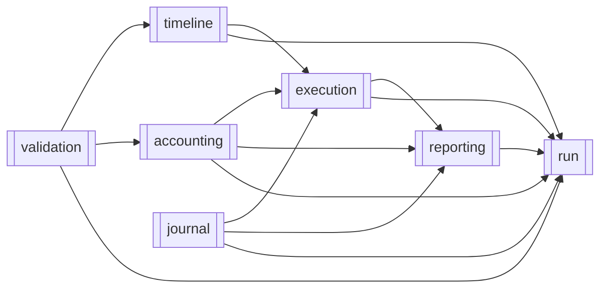
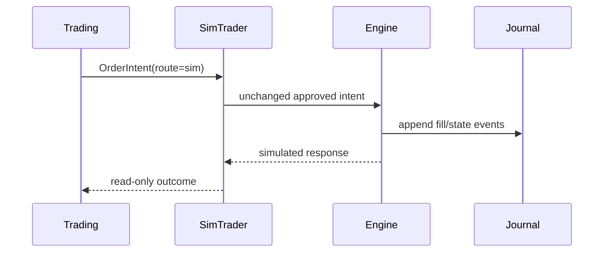
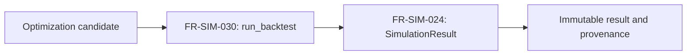
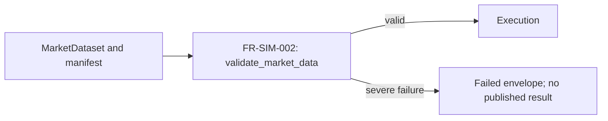
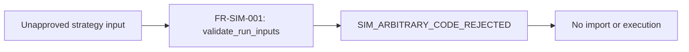
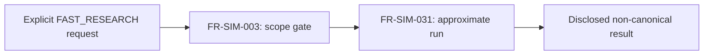

# Simulation

The Simulation error catalogue uses only the Utils-owned `TRANSIENT`,
`PERMANENT`, `INTEGRITY`, `POLICY`, `DATA_STALE`, and `UNKNOWN_STATE`
categories. An unconfirmed persistence result is non-retryable.

> **Package:** `app/services/simulator`
> **Status:** `Completed` for `FEAT-SIM-01`..`18`.
> **Last updated:** `2026-08-16`

> This README is the package's **single source of truth** for requirements, final structure, implementation sequence, progress, usage examples, and tests.
> Update this file before changing the code.

---

## 1. Purpose and Boundary

### Purpose

Simulation orchestrates deterministic historical backtests through the governed system path and owns the simulated execution environment for Trading's `sim` route. It replays approved FX order intents over historical market data, maintains simulated execution and account state, and produces immutable journals, reproducible `SimulationResult` records, artifact manifests, and execution reports. It must fail closed when required evidence, configuration, timing, persistence, or state cannot be verified.

The package is implemented as a clean-start V1 domain. No migration path, compatibility alias, or caller transition was introduced.

### Owns

- Historical backtest orchestration across Data, Indicators, Strategy, Risk, and Trading's `sim` route.
- Deterministic replay of the Data-owned tick series across the approved Phase 1 FX scope. Tick derivation itself belongs to Data (`FR-DATA-087`–`FR-DATA-090`).
- Simulated fills and all simulated orders, positions, pending orders, account state, and execution timestamps.
- Application of the final volume already approved by Risk and packed by Trading; Simulation does not resize approved orders.
- Simulation-specific validation of inbound manifests and execution-critical market-data conditions.
- Fixed-precision execution accounting, configured costs, margin, and currency conversion only when fresh Data-owned `FXConversionEvidence v1` is supplied.
- Append-only simulation journals, deterministic replay, run idempotency evidence, and incomplete-run isolation.
- `SimulationResult`, `PortfolioSimulationResult`, execution reports, artifact manifests, and Simulation-owned persistence schemas and migration definitions.
- An explicitly non-canonical fast-research mode that cannot produce official fills or promotion evidence.
- Deterministic simulation checklists, assistance modes, mission completion, scenarios, execution-realism evidence, secured-session recovery, and simulated alert lifecycle.

### Does not own

- Market-data acquisition, normalization, provider selection, caches, vendor governance, complete lineage, **or tick-series derivation from bars or ticks**; Data owns them. Simulation consumes the tick `MarketDataset` and constructs no ticks, spreads, or price paths of its own.
- Indicator formulas or indicator availability rules; Indicators owns them.
- Strategy code, strategy registration, signal logic, or arbitrary Python code execution; Strategy owns vetted strategy behavior.
- Risk policy, final sizing approval, exposure limits, or kill-switch state; Risk owns them.
- `OrderIntent`, route selection, live/demo execution, or reconciliation; Trading owns them. Broker connections/adapters; Brokers owns them. Credential-reference resolution and composition-root `BrokerConnectionConfig` construction; UI/API owns them. All as defined in `docs/PROJECT.md`.
- Performance metric formulas, scorecards, or advisory conclusions; Analytics owns them.
- Optimization search algorithms, ranking, walk-forward policy, Monte Carlo/bootstrap analysis, workers, or checkpoints; Optimization owns them.
- Portfolio construction methods, allocation activation/versioning, drift detection, or rebalance planning; Portfolio owns them.
- Live broker mutations, live adapter imports, demo execution, or any network access on the simulation execution path.
- Phase 1 support for equities, ETFs, futures, perpetuals, options, corporate actions, borrow fees, regulatory engines, distributed workers, external report distribution, or production-promotion automation.

### Shared contracts

Contract definitions must match the name, version, and owner recorded in `docs/PROJECT.md`.

**Owned by this domain** — defined authoritatively here:

| Status    | Contract                        | Version | Counterparty                                                        | Purpose                                                                                                                                                                                                                                                                                        |
| --------- | ------------------------------- | ------- | ------------------------------------------------------------------- | ---------------------------------------------------------------------------------------------------------------------------------------------------------------------------------------------------------------------------------------------------------------------------------------------- |
| Completed | `FastResearchRequest` | `v1`  | UI/API | Receive explicitly non-canonical bounded research approximations through `run_fast_research`; this contract cannot claim canonical execution or promotion evidence. |
| Completed | `SimulationBacktestRequest` | `v2`  | UI/API; Optimization via its internal backtest-adapter port | Sole canonical parity request with complete bound execution identity. Its config hash covers every execution-affecting field and excludes trace IDs and itself; execution is asynchronous through `run_backtest_async`, with no synchronous compatibility bridge. |
| Completed | `SimulationResult`            | `v1`  | Analytics, Optimization, UI/API                                     | Publish a deterministic completed backtest outcome containing run/config/data/engine identities, simulated fills, journal and artifact references, accounting totals, diagnostics, and realism disclosures. Incomplete runs are never published.                                               |
| Completed | `PortfolioBacktestRequest`  | `v1`  | Portfolio submits; Simulation receives                              | Receive one self-contained Simulation-owned projection of an immutable Portfolio candidate, with scalar values, ordered components, identifiers, versions, references, and hashes only. Defined by `FR-SIM-032`.                                                                              |
| Completed | `PortfolioSimulationResult`   | `v1`  | Portfolio, Analytics, UI/API                                        | Publish complete component and aggregate journals, risk-budget history, metrics/artifact references, and reproducibility identity.                                                                                                                                                             |
| Completed | `MissionDefinition` | `v1` | Optimization, Research, UI/API | Define Simulator-owned blocking missions, deterministic triggers, injected events, difficulty, and evidence identity without colliding with Risk's advisory scenario contract. |
| Completed | `ReplayIdentity` | `v1` | Strategy, Optimization, UI/API | Publish canonical run/scenario/data/execution-profile/rules/seed/branch identity; Strategy retains its strategy-specific replay manifest and consumes this mapping as lineage. |
| Completed | `AlertEvent` | `v1` | Analytics, UI/API | Publish simulated-session alert state and timing evidence; UI/API remains the external operational-alert delivery owner. |

**Consumed from other domains** — referenced only, never redefined:

| Contract                        | Version | Owner   | Used for                                                                                                                                                        |
| ------------------------------- | ------- | ------- | --------------------------------------------------------------------------------------------------------------------------------------------------------------- |
| `MarketDataset`               | `v1`  | Data    | Receive normalized historical bars or ticks, availability metadata, and provenance.                                                                             |
| `FXConversionEvidence`        | `v1`  | Data    | Apply fresh direct/synthesized conversion evidence without choosing or synthesizing a rate path.                                                                |
| `OrderIntent`                 | `v1`  | Trading | Receive deterministic, idempotent, Risk-approved executable requests for the `sim` route.                                                                      |
| `ExecutionReceipt`            | `v1`  | Trading | Return the canonical simulated execution outcome through Trading's injected `sim` dispatch port; constructed from Trading's contract and never redefined here. |
| `MarketDataset` (tick series) | `v1`  | Data    | Receive the deterministic tick stream produced by Data's `generate_tick_series`; Simulation derives no ticks of its own.                                       |
| `AuthContext`                 | `v1`  | Utils   | Authenticate and trace governed `run_backtest` calls.                                                                                                          |
| `AuditEvent` common envelope  | `v1`  | Utils   | Emit redacted governed-action evidence for durable storage through Data.                                                                                        |

`FastResearchRequest` contains `contract_version="v1"`,
`schema_id="simulation.backtest_request.v1"`, request/correlation IDs,
strategy/data references and versions, bounded JSON-safe parameter values, symbols,
timeframe, ordered UTC range, positive `Decimal` initial balance, execution-config and
Risk-policy references/versions, `runtime_profile="simulation"`,
`execution_route="sim"`, and a SHA-256 config hash. `AuthContext` is supplied
separately. Inline data, DataFrames, provider objects, code, secrets, and unknown
fields are forbidden.

`SimulationResult v1` contains `contract_version="v1"` and
`schema_id="simulation.result.v1"` separately from its run/config/data/engine
identities. Compatibility is evaluated only from `contract_version`.

`IndicatorSeries v1`, `TradeIntent v1`, `RiskDecision v1`, `OrderIntent v1`, and
`MarketDataset v1` participate in orchestration, but Simulation does not redefine or
mutate them. Compatibility is checked from `contract_version`, never by parsing
`schema_id`, as specified in `docs/PROJECT.md` §5.

### Persisted state

Data owns the shared connection, locking, and migration execution infrastructure. Simulation owns only the following schemas, artifacts, and migration definitions, and only Simulation may write them.

All Simulator relational CRUD is centralized in the private support package
`app/services/simulator/persistence/`, whose sole boundary is
`persistence/__init__.py`. Its implementation uses the standard `create.py`,
`read.py`, `update.py`, and `delete.py` layout. The state adapter retains
lifecycle policy, journal validation, error translation, and filesystem artifact
publication. This support directory is not a separately registered feature.

| Status    | State / Store                                                                   | Read access (via contract)                                                                                                            | Migration definitions                                                                                                                       |
| --------- | ------------------------------------------------------------------------------- | ------------------------------------------------------------------------------------------------------------------------------------- | ------------------------------------------------------------------------------------------------------------------------------------------- |
| Completed | Run identity, lifecycle, and completed simulation result records in `sim_runs` | Analytics, Optimization, UI/API via `SimulationResult`; Portfolio, Analytics, UI/API via `PortfolioSimulationResult` | `app/services/simulator/migrations/definitions.py` |
| Completed | Completed-run playback session lifecycle and monotonic cursor in `sim_sessions` | UI/API through package-root session create/read/frame functions | `app/services/simulator/migrations/definitions.py` |
| Completed | Secured-session aggregate state and immutable hash-linked checkpoints in `sim_sessions` and `sim_session_checkpoints` | Simulator recovery through package-root secure/checkpoint/load/restore/rearm functions | `app/services/simulator/migrations/definitions.py`, additive step `003_simulator_secured_sessions_v1` |
| Completed | Append-only versioned JSONL journal and replay metadata                         | Simulation replay; consumers through `SimulationResult` references                                                                   | Partial JSONL staging, group-commit `fsync`, and atomic publication under the approved artifact root; no database journal records or table |
| Completed | Canonical JSON and Markdown execution reports                                   | Analytics, Optimization, Portfolio, UI/API through applicable `SimulationResult` / `PortfolioSimulationResult` artifact references | Artifact schema under `reporting/`                                                                                                         |
| Completed | Artifact manifest and checksums                                                 | Analytics, Optimization, Portfolio, UI/API through the applicable `SimulationResult` / `PortfolioSimulationResult`                 | Artifact schema under `reporting/`                                                                                                         |

Incomplete, failed, or diagnostic-failed runs may retain bounded diagnostic evidence but must not be published as completed `SimulationResult` records.

### Sim, demo, and live parity contract

The completed parity programme converges `sim`, `demo`, and `live` on one Trading
orchestration with an injected
authority boundary. Dependency direction is `Simulation → Trading → Brokers` plus
`Simulation → Brokers` (read/factory through the Brokers-owned simulation authority
port); Brokers imports no Simulation symbol, and Simulation keeps matching, accounting,
scheduling, calibration, and journals.

- **Maturity ladder.** No implementation phase may claim parity. The programme proves
  **L1** mutation-path convergence, **L2** evaluation-path convergence, **L3**
  account/order semantics, and **L4** execution realism in order; only a completed
  **L5 certificate** recorded in an immutable **Parity Envelope** may make a bounded
  parity claim. The system-level ladder lives in `docs/PROJECT.md` §3.
- **L5-MT5-Operational is one bounded certificate.** Verified demo evidence certifies
  only the deterministic MT5 contracts shared by demo and live credential routes;
  empirical observations and calibration remain route- and provenance-scoped.
- **Published certificate.** `l5-mt5-operational-btcusd-20260816-04` was issued from
  an independently collected MT5 demo `BTCUSD` operational trace on 2026-08-16 and
  is valid through 2027-08-14 unless a registered trigger invalidates it. Its ignored,
  nine-member evidence bundle is rooted at
  `artifacts/sim_live_parity/mt5-operational/v2/l5-mt5-operational-btcusd-20260816-04`;
  the certificate transfers no empirical demo observation to live.
- **Engine comparability.** Simulation enters Trading through its public approved-request
  builder and public mutation verbs and never constructs `OrderIntent` directly; the
  deterministic execution scheduler (`FEAT-SIM-15`) owns the only simulated clock and
  event pump; the effective-dated calculation model (`FEAT-SIM-16`) makes canonical
  execution provider-call-free; every stochastic component must be calibrated from
  eligible evidence (`FEAT-SIM-17`) or is excluded from canonical execution.
- **Evidence eligibility.** Canonical execution rejects approximation, fallback,
  staleness, uncovered specification intervals, and envelope-external modes. Genuine
  bid/ask tick evidence is mandatory for path-sensitive parity; derived OHLC paths are
  research-only unless a registered invariant is proven path-independent; required
  clock edges that are unobserved exclude the affected latency claims rather than
  collapsing timestamps.
- **Certificate invalidation.** A parity certificate is a revocable lease bound to the
  complete initial authority state (balances, margin, positions, orders, protections,
  ownership, transaction watermark, accrued costs) and expires or invalidates on build,
  contract, code/config identity, specification, source/tick model, calibration-validity,
  or detected-drift changes. The comparator (`FEAT-SIM-18`) enforces this.
- **Superseded numerical results.** Every pre-programme runtime, peak-memory, or other
  numerical performance result recorded in this README or its tests is **superseded** by
  the programme's published one-year M1 and bounded multi-symbol incremental performance
  and memory budgets (`FR-SIM-241`) and is not canonical performance evidence.

### Declared deterministic execution model (programme Phase 3c)

This section records the implemented execution model. `FR-SIM-194`–`199` are
completed with their owning-phase tests and usage evidence.

**Scheduler ownership — `FR-SIM-194` (implemented in Phase 5).** `FEAT-SIM-15`
owns the only simulated clock and event pump. The async run owns exactly one
scheduler pump task; evaluation tasks enqueue commands and await futures; the
pump selects the next deterministic event, advances simulated time, invokes
the bounded handler, and resolves or faults the future. There is a real
coroutine `await` but no wall-clock sleep and no provider wait; a
deterministic `run_until_complete` path supports the retained synchronous
bridge.

**Internal deterministic event order — `FR-SIM-199` (implemented in Phase 5).**
The fixed stage order within one simulated instant is:

```text
command arrival → tick arrival → rollover accrual/posting → mark-to-market
→ protective-trigger evaluation → match evaluation → stop-out evaluation → response delivery
```

This extends today's per-tick order (session gate, excursions, protective
exits, pending sweep; see the canonical pipeline walkthrough) with command
arrival, rollover, and stop-out stages owned by Phases 5, 7, and 16.
Identical-timestamp ordering uses **event-priority → canonical symbol order →
source sequence → stable monotonic scheduler sequence**. This is Simulation's
reproducibility rule, not presumed MT5 truth.

**Provider causal-order precedence.** Provider-observed causal edges override
comparison assumptions; the parity comparator's ambiguous same-timestamp
groups and causal-edge invariants are the comparison counterpart.
Cancel-vs-fill, modify-vs-fill, protection-vs-close, disconnect-vs-response,
and simultaneous cross-symbol margin races require evidenced ordering or
remain outside the envelope — never an invented provider sequence.

**Async orchestration — `FR-SIM-195` (implemented in Phase 14b).** The run
orchestrator is natively async (`run_backtest_async`, owned by Phase 4c) and
awaits approved requests through the injected public Trading action seam. Five
v2-only composition ports carry approved-request construction, mutation,
terminal liquidation, initial authority state, and account activity evidence;
v1 retains the documented eleven-port compatibility shape.

**Request v2 identity — `FR-SIM-196` (implemented in Phase 4c).** Bound by the
`SimulationBacktestRequest` registration in the Shared Contracts table
(execution-model/config hash, source/tick lineage hashes, complete
initial-authority-state hash, certification target, explicit
`close_open_positions_at_end`).

**Terminal-close policy — `FR-SIM-197` (implemented in Phase 14b).**
End-of-run liquidation becomes the explicit `close_open_positions_at_end`
hashed request policy routed through Trading's public verbs; today's
unconditional close-at-final-tick remains the disclosed V1 limitation until
then.

**Journal finalization — `FR-SIM-198` (implemented in Phase 14b).** The
hash-chained journal gains the new event categories (authority deals,
protection triggers, terminal liquidation, foreign-activity replay) with
unchanged genesis and verification rules; the vocabulary extension is
additive.

**Status handoff.** `FR-SIM-196` was completed in Phase 4c;
`FR-SIM-194`/`199` in Phase 5; and `FR-SIM-195`, `197`, and `198` in Phase 14b.

**Binding test specifications (created by the owning phases, not here).**
Phase 5 creates `tests/simulator/unit/test_scheduler_queue.py`,
`test_scheduler_clock.py`, `test_scheduler_pump.py`, `test_scheduler_state.py`,
`tests/simulator/integration/test_scheduler_total_order.py` (standing
regression `test_scheduler_total_order_is_cross_process_stable`),
`tests/simulator/integration/test_scheduler_resume.py` (standing regression
`test_scheduler_resume_preserves_event_and_result_order`), and
`tests/simulator/usage/features/15_scheduler.py`; Phase 4c creates
`tests/simulator/unit/test_run_request_v2.py`; Phase 14b creates
`tests/simulator/integration/test_trading_cutover.py`,
`test_initial_authority_state.py` (standing regression
`test_initial_authority_hash_binds_both_routes`),
`test_terminal_liquidation_policy.py`, and `test_foreign_activity_guard.py`
(standing regression `test_missing_external_activity_blocks_certification`).

### Four-level structure

| Code level                          | Represents                         |
| ----------------------------------- | ---------------------------------- |
| **Package**                   | Simulation domain                  |
| **Module folder**             | Feature / capability               |
| **File**                      | Use case or focused responsibility |
| **Class / function / method** | Functional requirement behavior    |

```text
Simulation package
└── Feature module
    └── Focused file
        └── Public class / function / method
```

### Package capability map


```mermaid
flowchart TD
    SIM[[Simulation Package]]

    SIM --> VAL[[validation: Boundary and quality gates]]
    SIM --> TIME[[timeline: Canonical tick time]]
    SIM --> ACC[[accounting: Fixed-precision account math]]
    SIM --> JRN[[journal: Immutable evidence and replay]]
    SIM --> EXE[[execution: Matching and simulated state]]
    SIM --> REP[[reporting: Results and artifacts]]
    SIM --> RUN[[run: Official and research orchestration]]
    SIM --> ERR[[errors: Domain error taxonomy]]
    SIM --> STA[[state: Owned persistence contracts]]
    SIM --> CHK[[checklists: Checklists, modes, and missions]]
    SIM --> SCN[[scenarios: Mission scenarios and injected events]]
    SIM --> RLS[[realism: Execution realism]]
    SIM --> RCV[[recovery: Secured-session recovery]]
    SIM --> ALT[[alerts: Simulated alert lifecycle]]

    VAL --> VALF[contracts.py; validate.py]
    TIME --> TIMEF[contracts.py; timeline.py]
    ACC --> ACCF[calculations.py; ledger.py]
    JRN --> JRNF[contracts.py; writer.py; replay.py; playback.py]
    EXE --> EXEF[pricing.py; matching.py; engine.py; trader.py]
    REP --> REPF[contracts.py; artifacts.py; reports.py]
    RUN --> RUNF[contracts.py; aggregate.py; audit.py; orchestrator.py; portfolio.py; research.py]
    ERR --> ERRF[catalog.py; exception.py; payload.py]
    STA --> STAF[store.py; runtime.py; sessions.py]
    STA --> MIG[migrations/definitions.py]
    CHK --> CHKF[contracts.py; runtime.py; policies.py; missions.py]
    SCN --> SCNF[contracts.py; triggers.py; catalog.py; providers.py]
    RLS --> RLSF[contracts.py; latency.py; queue.py; pricing.py; races.py; views.py; providers.py]
    RCV --> RCVF[contracts.py; checkpoints.py; lifecycle.py; service.py]
    ALT --> ALTF[contracts.py; lifecycle.py; grouping.py; controls.py]
```

---

## 2. Final Package Structure

Module folders and files are ordered from lowest dependency to highest dependency.

### Feature Registry

| Status    | Feature                                             | Owning module   | Public API and contracts                                 | Requirements                         | Usage evidence                                      |
| --------- | --------------------------------------------------- | --------------- | -------------------------------------------------------- | ------------------------------------ | --------------------------------------------------- |
| Completed | `FEAT-SIM-01` Boundary and Quality Validation     | `validation/` | Exact declarations plus independent source/tick lineage, evidence class, clock coverage, and decision-time eligibility: Section 4.1 | Section 4.1 requirements including `FR-SIM-136`, `FR-SIM-209` | `tests/simulator/usage/features/01_validation.py` |
| Completed | `FEAT-SIM-02` Simulation-Owned State              | `state/`      | Exact declarations and state contracts: Section 4.4a     | Section 4.4a functional requirements | `tests/simulator/usage/features/02_state.py`      |
| Completed | `FEAT-SIM-03` Canonical Tick Timeline             | `timeline/`   | Exact declarations and tick contracts: Section 4.2       | Section 4.2 functional requirements  | `tests/simulator/usage/features/03_timeline.py`   |
| Completed | `FEAT-SIM-04` Fixed-Precision Account Math        | `accounting/` | Exact declarations, signed transaction ledger, deterministic restore: Section 4.3 | Section 4.3 requirements including `FR-SIM-179`, `FR-SIM-180`, `FR-SIM-240` | `tests/simulator/usage/features/04_accounting.py` |
| Completed | `FEAT-SIM-05` Matching and Simulated State        | `execution/`  | Exact declarations, execution contracts, evidenced rollover/swap, and self-sufficient Trading authority events: Section 4.5 | Section 4.5 requirements including `FR-SIM-134`, `FR-SIM-135`, `FR-SIM-205`–`FR-SIM-208`, `FR-SIM-223` | `tests/simulator/usage/features/05_execution.py`  |
| Completed | `FEAT-SIM-06` Immutable Journal and Replay        | `journal/`    | Exact declarations and journal contracts: Section 4.4    | Section 4.4 functional requirements  | `tests/simulator/usage/features/06_journal.py`    |
| Completed | `FEAT-SIM-07` Official and Research Orchestration | `run/`        | Exact declarations and run contracts: Section 4.7        | Section 4.7 functional requirements  | `tests/simulator/usage/features/07_run.py`        |
| Completed | `FEAT-SIM-08` Domain Error Taxonomy               | `errors/`     | Exact declarations: Section 4.0                          | Section 4.0 functional requirements  | `tests/simulator/usage/features/08_errors.py`     |
| Completed | `FEAT-SIM-09` Results and Canonical Artifacts     | `reporting/`  | Exact declarations and result contracts: Section 4.6     | Section 4.6 functional requirements  | `tests/simulator/usage/features/09_reporting.py`  |
| Completed | `FEAT-SIM-10` Simulation Checklists, Modes, and Missions | `checklists/` | checklist definition/runtime, actual-state binding, mode policy, simulation-route isolation, Risk-owned no-trade mission completion | `FR-SIM-104`..`FR-SIM-110` | `tests/simulator/usage/features/10_checklists.py` |
| Completed | `FEAT-SIM-11` Scenario Engine | `scenarios/` | `MissionDefinition v1`, deterministic triggers, emergency/abnormal templates, event priority, `InjectedEvent`, Research/Optimization providers | `FR-SIM-111`..`FR-SIM-117` | `tests/simulator/usage/features/11_scenarios.py` |
| Completed | `FEAT-SIM-12` Execution Realism Models | `realism/` | latency profile, queue model, slippage and market impact, cancel/replace race, calibrated deterministic streams, seeded faults, and crash recovery | `FR-SIM-118`..`FR-SIM-123`, `FR-SIM-171`..`FR-SIM-178`, `FR-SIM-228`..`FR-SIM-230`, `FR-SIM-241` | `tests/simulator/usage/features/12_realism.py` |
| Completed | `FEAT-SIM-13` Session Recovery | `recovery/` | canonical replay identity, recovery state machine, durable checkpoints, practice branching, scored anti-rewind, integrity failure and explicit rearm | `FR-SIM-124`..`FR-SIM-128` | `tests/simulator/usage/features/13_recovery.py` |
| Completed | `FEAT-SIM-14` Alert Lifecycle | `alerts/` | `AlertEvent v1`, latched lifecycle, root-cause grouping, perception timestamp, emergency-control availability | `FR-SIM-129`..`FR-SIM-133` | `tests/simulator/usage/features/14_alerts.py` |
| Completed | `FEAT-SIM-15` Deterministic Execution Scheduler | `scheduler/` | Scheduler creation, calibrated-realism event scheduling, cancellation, bounded state inspection, pumping, and exact stream-aware serialize/restore | `FR-SIM-194`, `FR-SIM-199`–`FR-SIM-204`, `FR-SIM-230`, `FR-SIM-242` | `tests/simulator/usage/features/15_scheduler.py` |
| Completed | `FEAT-SIM-16` Effective-Dated Calculation Model | `calculations/` | Exact-Decimal FX conversion, profit and margin calculation over effective-dated specification revisions, offline conformance artifacts, model identity | `FR-SIM-137`–`FR-SIM-145`, `FR-SIM-210`–`FR-SIM-214` | `tests/simulator/usage/features/16_calculations.py` |
| Completed | `FEAT-SIM-17` Empirical Execution Calibration | `calibration/` | Immutable evidence partitioning, M1 spread and evidenced execution-component fits, artifact validation, temporal eligibility | `FR-SIM-181`–`FR-SIM-186`, `FR-SIM-224`–`FR-SIM-227` | `tests/simulator/usage/features/17_calibration.py` |
| Completed | `FEAT-SIM-18` Parity Comparison | `parity/` | `get_parity_envelope`, `get_parity_maturity_ladder`, `normalize_parity_evidence`, `compare_parity_evidence` | `FR-SIM-187`–`FR-SIM-193`, `FR-SIM-236`–`FR-SIM-239` | `tests/simulator/usage/features/18_parity.py` |

All registered Simulator features are completed. The sim⇄live parity programme completed its
bounded L5-MT5-Operational certification gate on 2026-08-16; continuing validity remains governed
by Envelope v2 invalidation triggers. The registration of `FEAT-SIM-15` is the separately
approved requirement that admits the `scheduler/` module folder under the structure
rules in Section 2. `FEAT-SIM-18` is **Completed** as of programme Phase 2 (2026-08-14):
see `app/services/simulator/parity/README.md` for the feature registration, evidence
schema, envelope v1 content, and the six standing-regression test node IDs.

The Simulation feature IDs follow the numbered standalone usage programs.

```text
simulator/
├── __init__.py                         # Domain API: requests, results, governed run operations, and SimTrader
├── README.md
├── errors/                            # Domain error taxonomy
│   ├── __init__.py
│   ├── catalog.py                     # Closed Simulation error catalog
│   ├── exception.py                   # Controlled SimulationError
│   └── payload.py                     # Bounded public error payload
├── validation/                         # Inbound contracts, scope, and data-quality gates
│   ├── __init__.py
│   ├── contracts.py                    # Validation result contracts
│   └── validate.py                     # Request, reference, scope, and data validation
├── timeline/                           # Canonical FX tick time and no-lookahead
│   ├── __init__.py
│   ├── contracts.py                    # Tick contract
│   └── timeline.py                     # Tick construction and timing enforcement
├── accounting/                         # Fixed-precision volume, costs, margin, same-currency PnL
│   ├── __init__.py
│   ├── calculations.py                 # Stateless accounting calculations
│   └── ledger.py                       # Stateful account ledger and invariants
├── journal/                            # Append-only evidence, persistence, replay, idempotency
│   ├── __init__.py
│   ├── contracts.py                    # Versioned journal event contract
│   ├── writer.py                       # Streaming hash-chained persistence
│   ├── replay.py                       # Validation, reconstruction, and request-id resolution
│   └── playback.py                     # Two-pass validated frame production
├── execution/                          # Matching, order lifecycle, engine state, simulated Trader
│   ├── __init__.py
│   ├── pricing.py                      # Bid/ask price and configured realism models
│   ├── matching.py                     # Deterministic order matching and fill policy
│   ├── engine.py                       # Canonical tick engine and authoritative state
│   └── trader.py                       # Simulation-scoped order and query facade
├── reporting/                          # SimulationResult and canonical artifacts
│   ├── __init__.py
│   ├── contracts.py                    # Result and artifact manifest contracts
│   ├── artifacts.py                    # Checksummed artifact manifest assembly
│   └── reports.py                      # Canonical JSON and Markdown reports
├── migrations/                         # Simulation-owned immutable schema definitions
│   ├── __init__.py
│   └── definitions.py
├── state/                              # Simulation persistence protocol and runtime
│   ├── __init__.py
│   ├── store.py                        # SimulationStateStore port
│   ├── runtime.py                      # Durable state and artifact coordination
│   └── sessions.py                     # Completed-run playback session lifecycle
├── persistence/                        # Private shared Simulator CRUD support
│   ├── __init__.py
│   ├── create.py
│   ├── read.py
│   ├── update.py
│   └── delete.py
└── run/                                # Typed public contracts and orchestration
    ├── __init__.py
    ├── contracts.py                    # Versioned request contracts
    ├── aggregate.py                    # Portfolio aggregate account ledger
    ├── audit.py                        # Governed AuditEvent persistence
    ├── orchestrator.py                 # Official asynchronous run_backtest path
    ├── portfolio.py                    # Portfolio candidate backtest orchestration
    └── research.py                     # Explicit non-canonical fast-research path
```

The package now matches the approved tree above. It remains a clean-start V1 implementation, so no migration, alias, or caller-transition step applies.

### Module dependency diagram

Dependencies point from the required module to the consuming module.


```mermaid
flowchart LR
    VAL[[validation]]
    TIME[[timeline]]
    ACC[[accounting]]
    JRN[[journal]]
    EXE[[execution]]
    REP[[reporting]]
    RUN[[run]]

    VAL --> TIME
    VAL --> ACC
    TIME --> EXE
    ACC --> EXE
    JRN --> EXE
    ACC --> REP
    JRN --> REP
    EXE --> REP
    VAL --> RUN
    TIME --> RUN
    ACC --> RUN
    JRN --> RUN
    EXE --> RUN
    REP --> RUN
```

`journal` remains independent of `execution`: replay accepts an injected pure reducer and does not import the execution engine. This prevents a journal/execution cycle.

`reporting/contracts.py` is a leaf contract module: it imports Trading contracts and Utils and no Simulation module. `execution/engine.py` imports `ClosedTradeRecord` from it directly so that `mae` and `mfe` are written into the record at the moment they are observed rather than reconstructed later, as `FR-SIM-020` requires. Because the contract module imports nothing from Simulation, this introduces no cycle; `reporting/artifacts.py` and `reporting/reports.py` remain downstream of `execution`.

### Structure rules

- The package root contains only `README.md`, `__init__.py`, and the approved feature folders.
- Every official run uses one deterministic tick clock; vectorization is limited to indicator and signal generation outside the execution loop.
- Public cross-domain imports use only `app.services.simulator`.
- Private helpers receive no requirement IDs unless independently required.
- Stateful engines, ledgers, writers, and the simulation-scoped Trader remain internal; standalone functions construct and operate opaque handles.
- No manager, repository, adapter, factory, scheduler, worker, queue, or provider layer is added without a separately approved requirement.
- Usage examples live under `tests/simulator/usage/`.

### Package-root public API

`app/services/simulator/__init__.py` is the sole public import boundary. Its
explicit `__all__` contains standalone functions only:

- Construction and inspection: `create_simulation_value`,
  `create_simulation_handle`, `execute_simulation_handle_operation`,
  `get_simulation_value_field`, `get_simulation_value_fields`,
  `is_simulation_value`, and `dump_simulation_value`.
- Policy getters: `get_approved_tick_models`,
  `get_canonical_artifact_types`, `get_journal_policy`,
  `get_report_schema_version`, `get_same_tick_priority`,
  `get_simulation_error_catalog`, `get_simulation_migrations`, `run_simulator_migrations`,
  `get_supported_asset_classes`, and `get_supported_fill_policies`.
- Validation, timeline, accounting, execution, journal, and reports:
  `validate_run_inputs`, `validate_phase_one_scope`, `validate_market_data`,
  `validate_intent_timing`, `validate_fx_evidence`, `build_tick_timeline`,
  `calculate_execution_costs`, `calculate_margin`, `convert_fx_amount`,
  `normalize_volume`, `evaluate_protective_exit`, `match_order`,
  `price_order`, `replay_journal`, `resolve_idempotent_run`,
  `build_artifact_manifest`, `build_json_report`, and
  `build_markdown_report`.
- Runs, hashes, and errors: `calculate_simulation_backtest_config_hash`,
  `calculate_portfolio_backtest_config_hash`, `run_backtest`,
  `run_fast_research`, `run_portfolio_backtest`,
  `to_simulation_error_payload`, and `unwrap_simulation_response`.
- Completed-run playback: `create_simulation_session`,
  `read_simulation_session`, and `stream_simulation_session_frames`.
- Checklists, modes, and missions: `build_checklist_definition`,
  `start_simulation_checklist`, `evaluate_simulation_checklist`,
  `bypass_simulation_checklist_step`, `get_simulation_mode_policy`, and
  `complete_simulation_mission`.
- Scenarios and execution realism: `build_mission_definition`,
  `build_injected_event`, `evaluate_scenario_triggers`,
  `order_injected_events`, `get_scenario_templates`,
  `build_scenario_provider`, `build_scenario_evidence_provider`,
  `build_latency_profile`, `build_queue_model`,
  `project_latency_timestamps`, `simulate_queue_fill`,
  `price_realistic_execution`, `resolve_cancel_replace_race`,
  `project_execution_views`, `build_fill_model_provider`,
  `create_realism_stream`, `sample_realism_stream`,
  `serialize_realism_stream`, `restore_realism_stream`,
  `get_realism_stream_identity`, `get_realism_performance_budgets`,
  `admit_calibrated_realism`, `sample_calibrated_realism`,
  `schedule_calibrated_realism_event`, `build_seeded_fault_event`,
  `get_simulation_crash_points`, `create_simulation_recovery_state`, and
  `recover_simulation_unknown_outcome`.
- Secured recovery and alerts: `build_replay_identity`,
  `create_recovery_checkpoint`, `verify_recovery_checkpoints`,
  `branch_recovery_checkpoint`, `secure_simulation_session`,
  `persist_recovery_checkpoint`, `load_recovery_checkpoints`,
  `persist_recovery_state`, `restore_simulation_session`,
  `explicitly_rearm_simulation_session`, `build_simulation_alert`,
  `transition_simulation_alert`, `group_simulation_alerts`, and
  `evaluate_emergency_controls`.

Every external consumer and standalone usage program imports these names through
`from app.services.simulator import ...`. Feature subpackages remain internal
implementation organization and do not create additional cross-domain import
paths. Simulation consumes Trading-owned values through standalone functions
imported from `app.services.trading`. Internal feature modules are resolved
lazily, so importing the Simulation boundary activates no execution dependency.

### StandardResponse public signatures

Every bounded operation below returns `StandardResponse[T]`; the raw `T` is stored
directly in `data`, successful value-free operations use `data=None`, and failures
use the catalogued `error` branch. `metadata.places_trade` is always `False` for
Simulation. The package root is the supported response boundary; feature
subpackages remain internal implementation ports.

- Validation: `validate_phase_one_scope -> StandardResponse[None]`,
  `validate_run_inputs -> StandardResponse[None]`, and
  `validate_market_data -> StandardResponse[ValidatedMarketDataEvidence]`.
- Timeline: `build_tick_timeline -> StandardResponse[tuple[Tick, ...]]` and
  `validate_intent_timing -> StandardResponse[None]`.
- Accounting: `calculate_execution_costs -> StandardResponse[Mapping[str, Decimal]]`,
  `calculate_margin -> StandardResponse[Decimal]`,
  `convert_fx_amount -> StandardResponse[Decimal]`,
  `normalize_volume -> StandardResponse[Decimal]`, and
  `validate_fx_evidence -> StandardResponse[None]`.
- Execution: `evaluate_protective_exit -> StandardResponse[str | None]`,
  `match_order -> StandardResponse[MatchResult]`,
  `price_order -> StandardResponse[Decimal]`, and
  `EventDrivenExecutionEngine.submit_order`, `execute_tick`, `close_position`,
  and `snapshot` return `StandardResponse[T]` for their documented payloads.
- Journal and state: `replay_journal -> StandardResponse[T]`,
  `resolve_idempotent_run -> StandardResponse[T]`,
  `JournalWriter.append -> StandardResponse[JournalEvent]`,
  `JournalWriter.finalize -> StandardResponse[str]`,
  `SimulationStateStore.append_journal`, `flush_journal`, `finalize_journal`,
  `load_run`, and `record_idempotency` return `StandardResponse[T]`.
- Reporting: `build_artifact_manifest -> StandardResponse[ArtifactManifest]`,
  `build_json_report -> StandardResponse[str]`, and
  `build_markdown_report -> StandardResponse[str]`.
- Runs: `run_backtest -> StandardResponse[SimulationResult]`,
  `run_fast_research -> StandardResponse[FastResearchResult]`, and
  `run_portfolio_backtest -> StandardResponse[PortfolioSimulationResult]`.
- Contracts and errors: `SimulationBacktestRequest.calculate_config_hash` and
  `PortfolioBacktestRequest.calculate_config_hash` return
  `StandardResponse[str]`; `to_simulation_error_payload` returns
  `StandardResponse[Mapping[str, object]]`.
- Dependency seams: `SimulationRunDependencies.persist_audit_event`,
  `load_market_data`, `generate_tick_series`, `calculate_indicators`,
  `evaluate_strategy`, `review_risk`, `build_order_intents`,
  `resolve_execution_profile`, `resolve_symbol_specification`, `resolve_cost_model`,
  `resolve_fx_evidence`, `validate_market_data`, `build_tick_timeline`, and
  `validate_fx_evidence` return `StandardResponse[T]`.
- Stateful lifecycle behavior remains internal. Callers create opaque handles with
  the package-root factories and invoke ledger, execution-engine, and simulated
  trader operations through `execute_simulation_handle_operation()`, which returns
  `StandardResponse[T]`.

Consumers that need the raw producer-owned value use
`unwrap_simulation_response(response, operation=...)`, which raises the original
catalogued `SimulationError` with preserved safe trace evidence on the error branch.

The requirement evidence tables below retain raw core implementation signatures
to describe feature behavior; the package-root signatures above are the supported
public API and are the signatures callers must consume.

The FEAT-SIM-10 through FEAT-SIM-14 package-root operations are typed pure or
bounded persistence operations and return their documented immutable values
directly. They do not mutate execution authority, and they are not part of the
`StandardResponse` run-orchestration boundary listed above.

---

## 3. Workflows

> **Workflow Usage Evidence**: Each active workflow has one standalone program in
> `tests/simulator/usage/workflows/`; `run_all.py` executes them in registry order.

### Workflow rank values

| Rank                 | Identifier     | Meaning                                   |
| -------------------- | -------------- | ----------------------------------------- |
| **Primary**    | `WF-SIM-PRI` | The workflow this domain exists to serve. |
| **Secondary**  | `WF-SIM-SEC` | The next most load-bearing workflow.      |
| **Tertiary**   | `WF-SIM-TER` | The third-ranked workflow.                |
| **Supporting** | `WF-SIM-0NN` | Every remaining registered workflow.      |

### Retired identifiers

`WF-SIM-001`, `WF-SIM-009`, and `WF-SIM-003` were absorbed into `WF-SIM-PRI`,
`WF-SIM-SEC`, and `WF-SIM-TER` respectively. Absorbed numbers are retired and are
never reused. `WF-SIM-008` remains retired. New workflows continue from
`WF-SIM-011`.

Evidence programs:

- `WF-SIM-PRI`: `tests/simulator/usage/workflows/wf_sim_pri_official_fx_backtest.py`
- `WF-SIM-SEC`: `tests/simulator/usage/workflows/wf_sim_sec_portfolio_backtest.py`
- `WF-SIM-TER`: `tests/simulator/usage/workflows/wf_sim_ter_optimization_candidate_execution.py`
- `WF-SIM-002`: `tests/simulator/usage/workflows/wf_sim_002_simulation_trader_operations.py`
- `WF-SIM-004`: `tests/simulator/usage/workflows/wf_sim_004_severe_data_quality_blocked_run.py`
- `WF-SIM-005`: `tests/simulator/usage/workflows/wf_sim_005_deterministic_replay.py`
- `WF-SIM-006`: `tests/simulator/usage/workflows/wf_sim_006_registered_strategy_security_rejection.py`
- `WF-SIM-007`: `tests/simulator/usage/workflows/wf_sim_007_non_canonical_fast_research.py`
- `WF-SIM-010`: `tests/simulator/usage/workflows/wf_sim_010_tick_series_acquisition.py`
- `WF-SIM-011`: `tests/simulator/usage/workflows/wf_sim_011_reports_and_artifact_manifest.py`
- `WF-SIM-012`: `tests/simulator/usage/workflows/wf_sim_012_fx_margin_and_execution_costs.py`

### Status values

| Status              | Meaning                                    |
| ------------------- | ------------------------------------------ |
| **Missing**   | Not implemented or not verified            |
| **Partial**   | Partly implemented or tests are incomplete |
| **Completed** | Implemented, tested, and verified          |

### Workflow scope values

| Scope                  | Meaning                                                             |
| ---------------------- | ------------------------------------------------------------------- |
| **Internal**     | The complete workflow occurs within Simulation.                     |
| **Cross-domain** | Simulation receives input from or returns output to another domain. |

| Status    | Rank       | Workflow ID    | Scope        | Workflow                                                      | Trigger / Input boundary                                                            | Final outcome / Output boundary                                            | Requirement sequence                                                                                                                                                     |
| --------- | ---------- | -------------- | ------------ | ------------------------------------------------------------- | ----------------------------------------------------------------------------------- | -------------------------------------------------------------------------- | ------------------------------------------------------------------------------------------------------------------------------------------------------------------------ |
| Completed | Primary    | `WF-SIM-PRI` | Cross-domain | Official FX backtest                                          | Approved request plus Data/Strategy references                                      | Persisted `SimulationResult`; Analytics-ready evidence                    | `FR-SIM-029 → FR-SIM-001 → FR-SIM-002 → FR-SIM-003 → FR-SIM-005 → FR-SIM-006 → FR-SIM-020 → FR-SIM-024 → FR-SIM-026 → FR-SIM-027 → FR-SIM-028 → FR-SIM-030` |
| Completed | Secondary  | `WF-SIM-SEC` | Cross-domain | Portfolio backtest                                            | `PortfolioBacktestRequest` plus referenced strategies/data/FX/policy            | `PortfolioSimulationResult v1`                                           | `FR-SIM-032 → FR-SIM-010 → FR-SIM-034 → FR-SIM-033`                                                                                                                 |
| Completed | Tertiary   | `WF-SIM-TER` | Cross-domain | Optimization candidate execution                              | Optimization-owned candidate and canonical request                                  | Immutable result/provenance; no ranking by Simulation                      | `FR-SIM-030 → FR-SIM-024 → FR-SIM-026`                                                                                                                               |
| Completed | Supporting | `WF-SIM-002` | Cross-domain | Simulation Trader operations                                  | Trading-owned `OrderIntent` with route=`sim`                                     | Journaled simulated fill/state response                                    | `FR-SIM-038 → FR-SIM-021 → FR-SIM-018 → FR-SIM-019 → FR-SIM-020 → FR-SIM-014 → FR-SIM-023`                                                                       |
| Completed | Supporting | `WF-SIM-004` | Cross-domain | Severe data-quality blocked run                               | Data-owned manifest and normalized dataset                                          | Failed envelope; no execution or published result                          | `FR-SIM-002 → FR-SIM-030`                                                                                                                                             |
| Completed | Supporting | `WF-SIM-005` | Internal     | Deterministic replay                                          | Journal plus matching identity hashes                                               | Reconstructed state equal to stored result                                 | `FR-SIM-016`                                                                                                                                                           |
| Completed | Supporting | `WF-SIM-006` | Cross-domain | Registered-strategy security rejection                        | Raw code or unapproved registry reference                                           | `SIM_ARBITRARY_CODE_REJECTED`; no import/execution                       | `FR-SIM-001 → FR-SIM-030`                                                                                                                                             |
| Completed | Supporting | `WF-SIM-007` | Internal     | Non-canonical fast research                                   | Approved research-mode request                                                      | Disclosed approximate result with no official claims                       | `FR-SIM-003 → FR-SIM-031`                                                                                                                                             |
| Completed | Supporting | `WF-SIM-010` | Cross-domain | Tick-series acquisition                                       | Approved request plus Data-owned bar or tick evidence                               | Ordered execution clock from `generate_tick_series`                       | `FR-DATA-087 → FR-SIM-005 → FR-SIM-004`                                                                                                                              |
| Completed | Supporting | `WF-SIM-011` | Internal     | Build simulation reports and artifact manifest                | Completed immutable run state and its canonical journal                             | JSON and Markdown reports plus a hash-bound artifact manifest              | `FR-SIM-024 → FR-SIM-026 → FR-SIM-027 → FR-SIM-028`                                                                                                                 |
| Completed | Supporting | `WF-SIM-012` | Cross-domain | Validate FX evidence and calculate margin and execution costs | Data-owned `FXConversionEvidence v1`, symbol contract terms, and an approved order | Base-currency margin requirement and execution cost applied inside the run | `FR-SIM-010 → FR-SIM-008 → FR-SIM-009 → FR-SIM-039`                                                                                                                 |

### `WF-SIM-PRI` — Official FX Backtest

**Scope:** Cross-domain
**System workflow:** `SYS-WF-001`

**Input boundary:** `SimulationBacktestRequest`, `AuthContext`, Data-owned market evidence, and vetted registry references.
**Output boundary:** A completed `SimulationResult` for Analytics, Optimization, or UI/API; artifacts are persisted by Simulation through Data-owned infrastructure.

1. Validate authentication, request structure, approved references, profile/route
   compatibility, and Phase 1 scope — `simulator.run_backtest_async()`,
   `simulator.validate_run_inputs()`, `simulator.validate_phase_one_scope()`.
2. Block execution-critical data failures before state is created —
   `simulator.validate_market_data()`.
3. Resolve idempotency so a repeated request cannot double-publish —
   `simulator.resolve_idempotent_run()`.
4. Acquire canonical evidence and convert it into the ordered execution clock —
   `data.get_market_data()`, `data.generate_tick_series()`,
   `simulator.build_tick_timeline()`.
5. Strategy, Risk, and Trading produce approved intents through their public
   boundaries — `strategy.run_vectorized_strategy_signals()`,
   `risk.calculate_position_size()`, `trading.build_execution_plan()`.
6. Process each tick, price and match orders, apply accounting, and append journal
   events — `simulator.price_order()`, `simulator.match_order()`,
   `simulator.normalize_volume()`, `simulator.calculate_margin()`,
   `simulator.calculate_execution_costs()`, `simulator.evaluate_protective_exit()`,
   `simulator.validate_intent_timing()`.
7. Persist canonical artifacts and return the result envelope —
   `simulator.build_artifact_manifest()`, `simulator.build_json_report()`,
   `simulator.build_markdown_report()`, `simulator.unwrap_simulation_response()`.

**Failure behavior:** Invalid or missing evidence returns a structured `SIM_*` error; risk rejection is journaled and the run continues; persistence or invariant failure aborts the run and prevents result publication.

**Integration test:**
`tests/simulator/integration/test_official_backtest.py::test_official_backtest_completes_end_to_end()`


```mermaid
flowchart LR
    IN[Approved request and references] --> V["FR-SIM-001/002/003: validate"]
    V --> T["FR-SIM-005/006: timeline"]
    T --> E["FR-SIM-020: execute ticks"]
    E --> A["FR-SIM-026/027/028: artifacts and reports"]
    A --> R["FR-SIM-030: SimulationResult envelope"]
```

### `WF-SIM-002` — Simulation Trader Operations

**Scope:** Cross-domain
**System workflow:** `SYS-WF-001`; Trading owns `OrderIntent`, while Simulation owns all simulated fills and state.

**Input boundary:** Trading-owned `OrderIntent` with `route=sim` and final Risk-approved volume.
**Output boundary:** A journaled simulated response and read-only state snapshot inside the active run.

1. Verify the route and forward the unchanged approved intent —
   `trading.dispatch_order_intent()`, `simulator.validate_intent_timing()`.
2. Normalize volume against contract terms without changing approved risk —
   `simulator.normalize_volume()`.
3. Price and match the intent against the current canonical tick —
   `simulator.price_order()`, `simulator.match_order()`.
4. Apply margin and cost accounting to simulated state only —
   `simulator.calculate_margin()`, `simulator.calculate_execution_costs()`.
5. Append typed journal events for every state transition —
   `simulator.replay_journal()`.
6. Expose an immutable read-only view to the caller —
   `simulator.unwrap_simulation_response()`.

**Failure behavior:** A non-sim route, changed volume, missing state, unsupported order type, or any live-adapter dependency fails closed before mutation.

**Integration test:**
`tests/simulator/integration/test_sim_trader.py::test_sim_trader_executes_without_a_broker()`


```mermaid
sequenceDiagram
    participant Trading
    participant SimTrader
    participant Engine
    participant Journal
    Trading->>SimTrader: OrderIntent(route=sim)
    SimTrader->>Engine: unchanged approved intent
    Engine->>Journal: append fill/state events
    Engine-->>SimTrader: simulated response
    SimTrader-->>Trading: read-only outcome
```

### `WF-SIM-TER` — Optimization Candidate Execution

**Scope:** Cross-domain
**System workflow:** `SYS-WF-003`

**Input boundary:** Optimization supplies a bounded candidate through `SimulationBacktestRequest`.
**Output boundary:** Simulation returns one immutable canonical result and provenance; Optimization owns ranking, diagnostics, and checkpoints.

1. Optimization packages one bounded candidate as a canonical request —
   `optimization.run_parameter_sweep()`.
2. Simulation validates the candidate before any execution —
   `simulator.validate_run_inputs()`, `simulator.validate_phase_one_scope()`.
3. Resolve idempotency so a repeated candidate reuses its prior result —
   `simulator.resolve_idempotent_run()`.
4. Execute through the ordinary deterministic path — `simulator.run_backtest_async()`.
5. Return one immutable result and provenance; Optimization alone ranks —
   `optimization.rank_parameter_sets()`, `optimization.detect_overfit_parameters()`.

**Failure behavior:** Invalid candidate parameters fail before execution; Simulation never schedules workers, ranks candidates, or promotes a strategy.

**Integration test:**
`tests/simulator/integration/test_optimization_boundary.py::test_external_adapter_can_call_stable_simulation_port()`


```mermaid
flowchart LR
    O[Optimization candidate] --> R["FR-SIM-030: run_backtest"]
    R --> S["FR-SIM-024: SimulationResult"]
    S --> P[Immutable result and provenance]
```

### `WF-SIM-004` — Severe Data-Quality Block

**Scope:** Cross-domain
**System workflow:** `SYS-WF-001`

**Input boundary:** Data-owned manifest and normalized dataset.
**Output boundary:** Structured failed response and bounded redacted diagnostics; no engine state or completed result.

1. Read the Data-owned quality report attached to the dataset —
   `data.inspect_dataset_quality()`.
2. Apply the Simulation-owned execution-critical gate —
   `simulator.validate_market_data()`.
3. Return a structured failed envelope and bounded redacted diagnostics —
   `simulator.to_simulation_error_payload()`, `utils.redact_mapping_value()`.

**Failure behavior:** Empty, non-monotonic, duplicate, invalid-OHLC, negative-spread, stale, checksum-mismatched, or lookahead-tainted input fails before execution.

**Integration test:**
`tests/simulator/integration/test_data_quality_gate.py::test_failed_data_quality_prevents_result_publication()`


```mermaid
flowchart LR
    D[MarketDataset and manifest] --> V["FR-SIM-002: validate_market_data"]
    V -->|valid| E[Execution]
    V -->|severe failure| F[Failed envelope; no published result]
```

### `WF-SIM-005` — Deterministic Replay

**Scope:** Internal
**System workflow:** None

**Input boundary:** Canonical journal with matching config, data, engine, and schema identities.
**Output boundary:** Reconstructed state and result identity comparison.

1. Resolve the stored run identity for the supplied journal —
   `simulator.resolve_idempotent_run()`.
2. Validate sequence continuity and the journal hash chain —
   `simulator.replay_journal()`, `utils.canonical_digest()`.
3. Reconstruct terminal state with the pure reducer —
   `simulator.replay_journal()`.
4. Compare the reconstructed identity to the stored result —
   `simulator.build_artifact_manifest()`.

**Failure behavior:** Sequence gaps, hash-chain breaks, incompatible identities, unknown event versions, or invariant failures abort replay deterministically.

**Integration test:**
`tests/simulator/integration/test_replay.py::test_completed_run_replays_to_terminal_state()`


```mermaid
flowchart LR
    J[Canonical journal] --> V["FR-SIM-016: validate sequence and hashes"]
    V --> R[Pure reducer]
    R --> C[Compare reconstructed identity]
```

### `WF-SIM-006` — Registered-Strategy Security Rejection

**Scope:** Cross-domain
**System workflow:** `SYS-WF-001`

**Input boundary:** Raw code, a filesystem path, or an unapproved strategy reference reaches the public boundary.
**Output boundary:** `SIM_ARBITRARY_CODE_REJECTED` in a redacted standard response; no import, network call, or engine creation.

1. Reject raw code, filesystem paths, and unapproved references at the boundary —
   `simulator.validate_run_inputs()`.
2. Confirm the reference resolves to a registered immutable Strategy version —
   `strategy.validate_strategy_ref()`.
3. Return the canonical rejection with the body withheld —
   `simulator.to_simulation_error_payload()`, `utils.redact_mapping_value()`.

**Integration test:**
`tests/simulator/integration/test_strategy_security.py::test_raw_strategy_code_is_rejected_before_execution()`


```mermaid
flowchart LR
    U[Unapproved strategy input] --> V["FR-SIM-001: validate_run_inputs"]
    V --> X[SIM_ARBITRARY_CODE_REJECTED]
    X --> N[No import or execution]
```

### `WF-SIM-007` — Non-Canonical Fast Research

**Scope:** Internal
**System workflow:** None

**Input boundary:** Authenticated request explicitly selecting `FAST_RESEARCH`.
**Output boundary:** Approximate result labelled `canonical=false`, with assumptions and prohibited-claim metadata.

1. Gate on the explicitly selected research mode —
   `simulator.validate_phase_one_scope()`.
2. Run the approximate path — `simulator.run_fast_research()`.
3. Label the result `canonical=false` with assumptions and prohibited-claim
   metadata — `simulator.build_json_report()`.

**Failure behavior:** An omitted mode, attempt to emit official fills, promotion evidence, or canonical reports, or unsupported data fails closed.

**Integration test:**
`tests/simulator/integration/test_fast_research.py::test_fast_research_cannot_produce_canonical_evidence()`


```mermaid
flowchart LR
    Q[Explicit FAST_RESEARCH request] --> V["FR-SIM-003: scope gate"]
    V --> F["FR-SIM-031: approximate run"]
    F --> D[Disclosed non-canonical result]
```

No asynchronous queue, worker, quota, cancellation service, health-probe, or
distributed-lock capability exists in the Simulation architecture.

### `WF-SIM-SEC` — Portfolio Backtest

**Scope:** Cross-domain
**System workflow:** `SYS-WF-007`
**Input boundary:** `PortfolioBacktestRequest` carries a self-contained
Simulation-owned projection of one immutable candidate: scalar values, ordered
components, identifiers, versions, references, hashes, exact Strategy/Data/FX/
execution/Risk versions, bounded UTC range, explicit seed, and config hash. It
never embeds or imports a Portfolio-owned contract type.
**Output boundary:** `PortfolioSimulationResult v1`.

1. Validate the self-contained Simulation-owned projection and its hashes —
   `simulator.validate_run_inputs()`.
2. Validate the supplied FX evidence before any base-currency aggregation —
   `simulator.validate_fx_evidence()`, `data.get_fx_conversion_evidence()`.
3. Execute every component through the ordinary deterministic path —
   `simulator.run_portfolio_backtest()`, `simulator.run_backtest_async()`.
4. Convert component results into the account currency —
   `simulator.convert_fx_amount()`.
5. Maintain aggregate account and risk-budget history across components —
   `simulator.calculate_margin()`.
6. Publish only when all component and aggregate journals reconcile —
   `simulator.replay_journal()`, `simulator.build_artifact_manifest()`.

Simulation does not approve, activate, rank, or modify the allocation. Missing/stale
FX or incomplete results fail closed.

**Integration test:** `tests/simulator/integration/test_portfolio_backtest.py::test_portfolio_candidate_publishes_reconciled_aggregate()`

### `WF-SIM-010` — Tick-Series Acquisition

**Scope:** Cross-domain
**System workflow:** `SYS-WF-001`

**Input boundary:** An approved Data `MarketDataRequest` for bounded MT5 bar
evidence, plus an explicit Simulation tick-generation model.
**Output boundary:** A canonical ordered tick `MarketDataset` and the ordered
Simulation execution clock.

1. Retrieve bounded genuine MT5 bar evidence — `data.get_market_data()`.
2. Apply the approved deterministic tick and spread model —
   `data.generate_tick_series()`.
3. Validate ordering and convert the Data-owned tick records into the execution
   clock — `simulator.build_tick_timeline()`.
4. Confirm the resulting clock satisfies the run's timing contract —
   `simulator.validate_intent_timing()`.

**Failure behavior:** Missing provider readiness, empty or failed-quality evidence,
unsupported generation settings, or non-monotonic ticks returns the owning
domain's typed failure; Simulation never invents substitute observations.

**Integration test:**
`tests/simulator/integration/test_contract_compatibility.py`

### `WF-SIM-011` — Build Simulation Reports and Artifact Manifest

**Scope:** Internal
**System workflow:** `SYS-WF-001`, `SYS-WF-003`

**Input boundary:** Completed immutable run state and its canonical journal.
**Output boundary:** A canonical JSON report, a human-readable Markdown report, and
a hash-bound artifact manifest persisted through Data-owned infrastructure.

1. Confirm the run reached terminal state and its journal reconciles —
   `simulator.replay_journal()`.
2. Serialize the canonical machine-readable report —
   `simulator.build_json_report()`, `utils.canonical_json()`.
3. Render the bounded human-readable summary —
   `simulator.build_markdown_report()`.
4. Bind every emitted artifact to a content hash —
   `simulator.build_artifact_manifest()`, `utils.canonical_digest()`.
5. Commit the artifacts and manifest atomically —
   `data.save_dataset()`, `data.execute_transaction()`.

**Failure behavior:** Reports are never produced for an incomplete or unreconciled
run. A manifest hash mismatch aborts publication rather than emitting an artifact
whose provenance cannot be proven.

**Integration test:**
`tests/simulator/unit/test_workflow_usage_parity.py::test_simulator_workflow_registry_has_one_complete_program_each()`

### `WF-SIM-012` — Validate FX Evidence and Calculate Margin and Execution Costs

**Scope:** Cross-domain
**System workflow:** `SYS-WF-001`, `SYS-WF-007`

**Input boundary:** Data-owned `FXConversionEvidence v1`, symbol contract terms, and
one approved order.
**Output boundary:** A base-currency margin requirement and execution cost applied
inside the active run; never a standalone claim of broker truth.

1. Acquire bounded conversion evidence for the account currency —
   `data.get_fx_conversion_evidence()`.
2. Validate the evidence envelope, path, and freshness before use —
   `simulator.validate_fx_evidence()`.
3. Convert notional and profit amounts into the account currency —
   `simulator.convert_fx_amount()`.
4. Normalize order volume against contract terms —
   `simulator.normalize_volume()`.
5. Calculate the margin requirement for the resulting exposure —
   `simulator.calculate_margin()`.
6. Calculate spread, commission, and swap costs for the fill —
   `simulator.calculate_execution_costs()`.

**Failure behavior:** Missing, stale, or path-invalid FX evidence fails closed. No
synthetic or default rate is substituted, and a margin figure is never published
outside the run that produced it.

**Integration test:**
`tests/simulator/unit/test_workflow_usage_parity.py::test_simulator_workflow_registry_has_one_complete_program_each()`

### Canonical backtest pipeline walkthrough

Folded from `docs/dev/simulator-backtest-pipeline.md` (deleted 2026-08-14); the
implementation owner is `run/orchestrator.py` with the feature modules below.

**Composition — eleven compatibility ports plus five canonical-v2 ports.**
`build_simulation_run_dependencies` requires these eleven callable compatibility ports:
`audit` (Data audit persistence), `market_data` (source `MarketDataset`),
`tick_series` (Data-owned tick `MarketDataset`), `indicators` (`IndicatorSeries`),
`strategy` (`TradeIntent` tuple), `risk` (`RiskDecision` tuple), `order_intents`
(Trading `OrderIntent` tuple), `execution_profile`, `symbol_specification`,
`cost_model`, and `fx_evidence` (`FXConversionEvidence`). Nothing on the run path
imports Data, Indicators, Strategy, or Risk directly. Canonical v2 additionally
requires `approved_requests`, `trading_action`, `terminal_action`,
`initial_authority_state`, and `account_activity`; they bind public Trading
operations and complete authority evidence without exposing private domain data.

**Preparation (`prepare_run_context`), strict order.** Load market data → generate
tick series → validate market data (zero staleness tolerance, approved tick models,
checksum/coverage/lookahead/monotonic/OHLC/spread gates returning
`ValidatedMarketDataEvidence`) → build the tick timeline (every record a real
bid/ask tick; derived ticks must carry `source_bar_time`, `tick_index_in_bar`,
`bar_phase`; monotonic sequences) → reject an empty timeline → create the
`JournalWriter` and write `run_started` with `{config_hash, data_hash,
engine_version}` → resolve specification, cost model, and execution profile →
construct `AccountLedger` and `EventDrivenExecutionEngine` → run the signal chain
through the injected ports → for v2 validate one complete authority snapshot and
exclusive/replayed activity interval, then sort approved Trading requests by
`(system_time, request_id)`; v1 sorts compatibility intents by
`(created_at, client_order_id)`. The
signal chain reads the **source bar dataset** while execution runs against the
**tick timeline**; the data view and the execution view are deliberately separate.

**Per-tick execution order (`execute_tick`), fixed.** 1. monotonicity guard on
timestamp and sequence; 2. session gate (a tick outside every session interval is
journalled `tick_outside_session` and skipped, not fatal); 3. pre-fill excursion
observation and mark-to-market; 4. protective exits — exit price is `bid` for BUY
and `ask` for SELL, and a same-tick SL/TP conflict resolves by
`SAME_TICK_PRIORITY = ("STOP_LOSS", "TAKE_PROFIT", "PENDING_ACTIVATION")` so
stop-loss wins; 5. pending-order sweep (timing validation rejects lookahead,
expired intents cancel, `match_order` evaluates trigger/price/gap/liquidity/fill
policy without ever resizing an approved volume); 6. post-fill excursion
re-observation; 7. equity observation appended; 8. the tick's receipts returned.
`advance_run_timeline(..., start_index=, max_ticks=)` drives the identical engine
in bounded increments — a run completed in N calls is byte-identical to a
single-call run, which is what live what-if sessions use.

**Ledger application (`AccountLedger.apply_fill`).** Volumes normalize against
min/max/step; costs are debits (commission per lot per side, swap per crossed
rollover with weekday multipliers); OPEN requires the margin delta to fit free
margin else `SIM_INSUFFICIENT_MARGIN`; CLOSE requires the released margin to fit
the used margin else `SIM_ACCOUNT_INVARIANT_BROKEN`; the completed result asserts
`net_profit == final_balance − initial_balance`.

**Journal vocabulary and verification.** Event types include `run_started`,
`order_accepted`, `tick_outside_session`, `fill_proposed`, `order_outcome`,
`position_close_proposed`, `protection_trigger`, `authority_deal`, and
`run_completed`. Every append canonicalizes, hashes
(`previous_hash` chain, genesis = 64 zeros), and validates contiguity; group
commit fsyncs every 100 events; `finalize()` re-reads and re-validates every line
and atomically renames `journal.jsonl.partial` to `journal.jsonl`. `replay_journal`
verifies sequence continuity, hash linkage, and the genesis `run_started` payload;
any break is `SIM_CHECKPOINT_INCOMPATIBLE`.

**Terminal liquidation and artifacts.** V2 preserves open positions unless the
hashed `close_open_positions_at_end` policy is true, then routes every close
through the public Trading terminal-action seam. V1 retains unconditional final
tick liquidation as an explicit compatibility limitation. Artifacts
(`journal.jsonl`, `result.json`, `report.md`, `manifest.json`) publish under
`<artifact_root>/<run_id>/` with tmp-write + fsync + atomic rename, and the
manifest `created_at` is the final tick timestamp — never wall clock.

**Determinism guarantees.** The same `request_hash` reproduces the same run
because `run_id` derives from the request hash; intents are deterministically
sorted; receipt IDs are `sha256({intent_id, status, sequence})`; artifact
timestamps are the final tick; `canonical_json`/`canonical_digest` and
`Decimal` with `ROUND_HALF_EVEN` are used throughout; there is no network, wall
clock, or RNG on the execution path; Data owns tick derivation; and the journal
hash chain makes any divergence detectable by replay.

**Variant paths.** `run_fast_research` computes only mid-quote returns (no
ledger, engine, journal, fills, artifacts, or promotion evidence);
`run_portfolio_backtest` runs N components through the same single-run path and
reconciles them in `PortfolioAggregateLedger`; Optimization injects
`run_backtest` itself as its internal backtest-adapter port. A failed or
incomplete run is never published as a `SimulationResult`; partial journals are
never promoted.

---

## 4. Module and Requirement Specifications

The `Key exports` and `Class / Function / Method` columns below document internal
feature ownership and implementation contracts. They do not create public import
paths. Cross-domain callers use only the standalone functions listed in the
package-root public API section; internal classes and constants are reached through
opaque value/handle functions and public getters.

### Normative Phase 1 implementation rules

The following rules are part of the referenced `FR-SIM-*` requirements and
remove all implementation discretion from the Phase 1 build:

- Request contracts forbid unknown fields and carry request/workflow/correlation
  IDs; immutable strategy, data, tick-generation, execution-profile, and Risk
  policy references/versions/SHA-256 hashes; symbol/timeframe/bounded UTC range;
  bounded JSON-safe parameters; initial balance/account currency; seed;
  `simulation` or `fast_research` profile; `sim` route; and `config_hash`.
  `config_hash` is SHA-256 over Utils `canonical_json()` of every
  execution-affecting field except trace IDs and `config_hash` itself.
- `validate_market_data(dataset, context)` receives an immutable context carrying
  the expected dataset hash, requested UTC coverage, evaluation time, maximum
  staleness, and allowed tick model. It returns immutable validated evidence.
  The dataset hash is SHA-256 over its canonical model dump.
- Phase 1 commission is configured cash per lot per side. Phase 1 swap is
  configured cash per lot per crossed UTC rollover, including explicit weekday
  multipliers. Margin is `volume * contract_size * price / leverage`; the pure
  calculator validates its inputs and `AccountLedger` rejects insufficient free
  margin before a fill. FX conversion accepts only an immutable wrapper returned
  by `validate_fx_evidence(evidence, as_of=...)`.
- BUY execution prices use ask and SELL execution prices use bid. Slippage is
  either `none` or configured adverse `fixed_points`; no stochastic slippage is
  official. Market orders execute on the next eligible tick. BUY LIMIT triggers
  at `ask <= price`, SELL LIMIT at `bid >= price`, BUY STOP at
  `ask >= stop_price`, and SELL STOP at `bid <= stop_price`. STOP_LIMIT arms on
  its stop and then obeys its limit, including a same-tick fill only when both
  conditions hold. FOK fills completely or cancels without a fill; IOC fills
  available quantity and cancels the remainder. Liquidity is explicitly
  unbounded or derived from compatible tick volume and a configured participation
  rate. UTC session intervals, maximum gap, and maximum slippage are required
  execution-profile evidence. Stop-loss wins a same-tick conflict with
  take-profit.
- Build order is `errors -> validation -> timeline -> accounting -> state -> journal -> execution -> reporting -> run`. State precedes Journal because the
  writer consumes the Simulation-owned store. Constructors are explicit:
  `SimulationStateStore(database_path, artifact_root)`,
  `JournalWriter(store, run_id, request_id, correlation_id)`,
  `AccountLedger(initial_balance, account_currency, symbol_specification, cost_model)`, `EventDrivenExecutionEngine(ledger, journal_writer, execution_profile, engine_version)`, and `SimTrader(engine)`.
- `SimulationRunDependencies` is the typed receiver-owned composition contract
  for Data, Indicators, Strategy, Risk, Trading packing, resolved profiles/FX
  evidence, audit persistence, and the state store. The canonical operation is
  `run_backtest_async(request, auth_context, dependencies)`. Request identity is not
  duplicated by an optional function argument. FX evidence reaches Simulation
  only through `resolve_fx_evidence(evidence_ids) -> StandardResponse[Mapping[str, FXConversionEvidence]]`, which returns one
  Data-owned `FXConversionEvidence v1` in `data` per requested identifier;
  Simulation validates freshness through `validate_fx_evidence()` and never
  selects, refreshes, or synthesizes a rate.
  An identifier the caller cannot resolve fails the run closed with
  `SIM_FX_EVIDENCE_UNAVAILABLE`. Governed run transitions are persisted only
  through `persist_audit_event(event: AuditEvent) -> StandardResponse[None]`;
  unavailable audit
  persistence fails the governed operation closed.
- `SimulationStateStore` is a `Protocol` only. Simulation declares the port and
  its own migration definitions; the caller supplies the implementation.
  Simulation opens no database connection, executes no migration, and imports
  neither `sqlite3` nor `app.services.data.storage.*`.
- `SimTrader.submit_order` is asynchronous and is directly assignable to
  Trading's `Callable[[OrderIntent], Awaitable[StandardResponse[ExecutionReceipt]]]`
  sim port. No
  module-global active engine or standalone dispatcher exists.
- Canonical artifact entries are exactly `journal.jsonl`, `result.json`, and
  `report.md`. `manifest.json` is the envelope and never hashes itself. Results
  carry `artifact_manifest_ref`; the manifest is written after hashing the three
  entries. Official fills are immutable Trading `ExecutionReceipt` values.
- Fast research returns a distinct `FastResearchResult` with
  `canonical=false`; it contains no fills, closed-trade ledger, journal,
  manifest, canonical report, or promotion evidence.
- Runtime and peak-memory baselines are observational test/CI evidence only.
  They are excluded from canonical outputs and have no numeric pass/fail limit
  until a separately approved threshold exists.

Modules, files, and requirements below are in implementation order. Every symbol is new work.

### Approved capability traceability

| Reconciliation capability                                            | Final destination                                                                                                  |
| -------------------------------------------------------------------- | ------------------------------------------------------------------------------------------------------------------ |
| `CAP-SIM-001` — Typed public API and versioned contracts          | `run/`: `FR-SIM-029`, `FR-SIM-030`                                                                           |
| `CAP-SIM-002` — Validation, orchestration, and lifecycle          | `validation/`, `journal/`, `run/`: `FR-SIM-001`, `FR-SIM-003`, `FR-SIM-017`, `FR-SIM-030`            |
| `CAP-SIM-003` — Signal timing, tick construction, no-lookahead    | `timeline/`: `FR-SIM-004`–`FR-SIM-006`                                                                      |
| `CAP-SIM-004` — Canonical FX execution, matching, realism         | `timeline/`, `execution/`: `FR-SIM-005`, `FR-SIM-018`–`FR-SIM-020`                                      |
| `CAP-SIM-005` — Simulated Trader and authoritative state          | `execution/`: `FR-SIM-021`–`FR-SIM-023`                                                                     |
| `CAP-SIM-006` — Sizing application, accounting, costs, margin, FX | `accounting/`: `FR-SIM-007`–`FR-SIM-012`                                                                    |
| `CAP-SIM-007` — Journal, replay, persistence, idempotency         | `journal/`: `FR-SIM-013`–`FR-SIM-017`                                                                       |
| `CAP-SIM-008` — Results, artifacts, Analytics boundary            | `reporting/`: `FR-SIM-024`–`FR-SIM-028`                                                                     |
| `CAP-SIM-009` — Data authority and quality gate                   | `validation/`: `FR-SIM-002`                                                                                    |
| `CAP-SIM-010` — Strategy and Indicator boundary                   | `validation/`, `timeline/`, `run/`: `FR-SIM-001`, `FR-SIM-006`, `FR-SIM-029`, `FR-SIM-030`           |
| `CAP-SIM-011` — Determinism, precision, reliability, security     | `NFR-SIM-001`–`NFR-SIM-012` and the approved Phase 1 error surface                                            |
| `CAP-SIM-012` — Explicit fast-research mode                       | `run/`: `FR-SIM-031`                                                                                           |
| `CAP-SIM-013` — Optimization/robustness execution boundary        | `run/`, `reporting/`: `FR-SIM-024`, `FR-SIM-026`, `FR-SIM-030`; search/ranking remain outside Simulation |
| `CAP-SIM-014` — Portfolio candidate execution                     | `run/`, `reporting/`: `FR-SIM-032`–`FR-SIM-034`                                                           |
| `CAP-SIM-015` — Error taxonomy and persistence port               | `errors/`, `state/`: `FR-SIM-035`–`FR-SIM-037`, `FR-SIM-041`                                            |

### 4.0 `errors/` — Domain Error Taxonomy

**Purpose:** Define the single Simulation exception and the closed catalog of codes
that every other requirement raises. Implemented first; every feature depends on it.

### Files

| Status    | File             | Responsibility                                                            | Key exports                                                                               | Dependencies                                                                                                                                   |
| --------- | ---------------- | ------------------------------------------------------------------------- | ----------------------------------------------------------------------------------------- | ---------------------------------------------------------------------------------------------------------------------------------------------- |
| Completed | `catalog.py`   | Define the immutable closed Simulation error catalog.                     | Internal `SIM_ERROR_CATALOG`; public `get_simulation_error_catalog()` delegates to it. | **Standard library:** `types`**Required third-party:** None**Local:** None                                                 |
| Completed | `exception.py` | Validate, redact, and carry controlled Simulation failures.               | Internal `SimulationError`                                                               | **Standard library:** `collections.abc`**Required third-party:** None**Local:** `catalog.py`; Utils public redaction API |
| Completed | `payload.py`   | Convert controlled or unexpected exceptions into bounded public payloads. | Internal payload conversion used by package-root `to_simulation_error_payload()`         | **Standard library:** None**Required third-party:** None**Local:** `exception.py`                                          |
| Completed | `__init__.py`  | Aggregate the internal error feature for use inside Simulation.           | Internal symbols only; no cross-domain import boundary.                                   | **Standard library:** None**Required third-party:** None**Local:** feature files                                             |

| Status    | Requirement ID | Responsibility                                                                                                                                                                                                                                                                 | Class / Function / Method                                                                                                                                      | Side Effects | Raises                                                                                    | Usage / Test                                                                                                                                                                          |
| --------- | -------------- | ------------------------------------------------------------------------------------------------------------------------------------------------------------------------------------------------------------------------------------------------------------------------------ | -------------------------------------------------------------------------------------------------------------------------------------------------------------- | ------------ | ----------------------------------------------------------------------------------------- | ------------------------------------------------------------------------------------------------------------------------------------------------------------------------------------- |
| Completed | `FR-SIM-035` | The system shall expose one base exception carrying a cataloged `code`, bounded redacted message/details, and optional request/correlation identifiers. Every controlled Simulation boundary failure surfaces through it; no uncontrolled exception crosses the run boundary. | `SimulationError(code: str, message: str, *, details: Mapping[str, object] \| None = None, request_id: str \| None = None, correlation_id: str \| None = None)` | None         | `ValueError`: code is absent from `SIM_ERROR_CATALOG` or supplied metadata is invalid | **Usage:** `tests/simulator/usage/features/08_errors.py::fr_sim_035()`**Unit:** `tests/simulator/unit/test_errors.py::test_error_rejects_uncataloged_code()`          |
| Completed | `FR-SIM-036` | The system shall expose the authoritative closed catalog of Simulation error codes with group, meaning, and fail-closed effect. Every code raised by any `FR-SIM-*` appears here, and no code appears that no requirement raises.                                             | `SIM_ERROR_CATALOG: Mapping[str, Mapping[str, object]]`                                                                                                      | None         | None                                                                                      | **Usage:** `tests/simulator/usage/features/08_errors.py::fr_sim_036()`**Unit:** `tests/simulator/unit/test_errors.py::test_catalog_matches_documented_requirements()` |
| Completed | `FR-SIM-037` | The system shall convert a controlled exception into a bounded, redacted payload exposing no provider exception, path, credential, or raw payload.                                                                                                                             | `to_simulation_error_payload(error: Exception) -> dict[str, object]`                                                                                         | None         | None                                                                                      | **Usage:** `tests/simulator/usage/features/08_errors.py::fr_sim_037()`**Unit:** `tests/simulator/unit/test_errors.py::test_error_payload_is_bounded_and_redacted()`   |

**Approved code groups** — the catalog contains exactly these, and every code carries
the `SIM_` prefix:

| Group                    | Codes                                                                                                                                                                                                                                                                                                                                                                                                                                                                                                                                     |
| ------------------------ | ----------------------------------------------------------------------------------------------------------------------------------------------------------------------------------------------------------------------------------------------------------------------------------------------------------------------------------------------------------------------------------------------------------------------------------------------------------------------------------------------------------------------------------------- |
| Request and scope        | `SIM_INVALID_CONFIG`, `SIM_INVALID_DATE_RANGE`, `SIM_MISSING_SYMBOL`, `SIM_ARBITRARY_CODE_REJECTED`, `SIM_UNSUPPORTED_OPERATION`, `SIM_UNSUPPORTED_ASSET_CLASS`, `SIM_UNSUPPORTED_FEATURE`                                                                                                                                                                                                                                                                                                                                  |
| Data and timing          | `SIM_DATA_CHECKSUM_MISMATCH`, `SIM_DATA_SCHEMA_INVALID`, `SIM_DATA_NON_MONOTONIC`, `SIM_DATA_DUPLICATE_TIMESTAMP`, `SIM_DATA_OHLC_INVALID`, `SIM_DATA_SPREAD_NEGATIVE`, `SIM_DATA_STALE`, `SIM_DATA_COVERAGE_INSUFFICIENT`, `SIM_LOOKAHEAD_DETECTED`, `SIM_FEATURE_LOOKAHEAD_DETECTED`, `SIM_UNSUPPORTED_TICK_MODEL`, `SIM_SPREAD_MISSING`                                                                                                                                                                        |
| Execution and accounting | `SIM_INVALID_PRICE`, `SIM_INVALID_VOLUME`, `SIM_VOLUME_BELOW_MIN`, `SIM_VOLUME_ABOVE_MAX`, `SIM_VOLUME_STEP_MISMATCH`, `SIM_SLIPPAGE_EXCEEDED`, `SIM_LIQUIDITY_UNAVAILABLE`, `SIM_GAP_UNCROSSABLE`, `SIM_MARKET_CLOSED`, `SIM_UNSUPPORTED_FILL_POLICY`, `SIM_INSUFFICIENT_MARGIN`, `SIM_COMMISSION_CALCULATION_FAILED`, `SIM_SWAP_CALCULATION_FAILED`, `SIM_FX_EVIDENCE_UNAVAILABLE`, `SIM_POSITION_NOT_FOUND`, `SIM_ORDER_NOT_FOUND`, `SIM_EVENT_PRIORITY_AMBIGUOUS`, `SIM_ACCOUNT_INVARIANT_BROKEN` |
| Persistence and replay   | `SIM_PERSISTENCE_FAILED`, `SIM_CHECKPOINT_INCOMPATIBLE`, `SIM_RUN_ID_CONFLICT`, `SIM_SESSION_NOT_FOUND`, `SIM_SESSION_EXPIRED`, `SIM_PLAYBACK_CURSOR_INVALID` |
| Portfolio                | `SIM_COMPONENT_INCOMPLETE`, `SIM_AGGREGATE_UNRECONCILED`                                                                                                                                                                                                                                                                                                                                                                                                                                                                              |
| Safe fallback            | `SIM_INTERNAL_ERROR`                                                                                                                                                                                                                                                                                                                                                                                                                                                                                                                    |

**Rules:** A code absent from the catalog cannot be raised. Adding a failure path adds
a catalog row first. `SIM_INTERNAL_ERROR` is the only permitted fallback and never
masks a cataloged condition.

### Feature usage examples

`tests/simulator/usage/features/08_errors.py`

---

### 4.1 `validation/` — Boundary and Quality Gates

**Purpose:** Fail closed before execution when the request, scope, external references, or execution-critical data cannot be proven valid.

**Module flow:** `raw request/data → validate_run_inputs() → validate_phase_one_scope() → validate_market_data() → accepted evidence or structured failure`

### Files

| Status    | File             | Responsibility                                                                                         | Key exports                                                                                                                                                                               | Dependencies                                                                                                                                                                                                                                                       |
| --------- | ---------------- | ------------------------------------------------------------------------------------------------------ | ----------------------------------------------------------------------------------------------------------------------------------------------------------------------------------------- | ------------------------------------------------------------------------------------------------------------------------------------------------------------------------------------------------------------------------------------------------------------------ |
| Completed | `contracts.py` | Define immutable validation and lineage evidence used internally by the final package. | `MarketDataValidationContext`, `ValidatedMarketDataEvidence`, `MarketEvidenceLineage` | **Standard library:** `typing`; **Required third-party:** `pydantic>=2.13.4`; **Local:** Utils canonical serialization |
| Completed | `validate.py`  | Validate request shape, scope, source/tick integrity, independent hashes, evidence class, clock coverage, and decision-time availability before execution. | `validate_run_inputs`, `validate_phase_one_scope`, `validate_market_data`, `validate_market_evidence_lineage`, `SUPPORTED_ASSET_CLASSES` | **Standard library:** `collections.abc`, `datetime`, `decimal`; **Local:** Data package-root contracts; validation evidence; Utils canonical identity/error mapping |
| Completed | `__init__.py`  | Expose the supported validation API. | Validation operations and supported asset classes | **Local:** `validate.py` exports |

### Configuration and Limits Manifest

| Status    | Setting / Limit             | Type                | Default     | Required | Used by                        | Description                                                                                                                                                                   |
| --------- | --------------------------- | ------------------- | ----------- | -------- | ------------------------------ | ----------------------------------------------------------------------------------------------------------------------------------------------------------------------------- |
| Completed | `SUPPORTED_ASSET_CLASSES` | `tuple[str, ...]` | `("FX",)` | Yes      | `validate_phase_one_scope()` | Rejects non-FX official runs with deterministic unsupported-scope behavior.                                                                                                   |
| Removed   | `MAX_REQUEST_BYTES`       | —                  | —          | No       | —                             | The request is reference-based; UI/API owns its HTTP body ceiling. Simulation rejects inline datasets/objects structurally rather than inventing a second byte limit.         |
| Removed   | `MAX_DATE_RANGE_DAYS`     | —                  | —          | No       | —                             | The contract requires an ordered finite UTC range. Data availability and the caller's measured runtime policy govern feasibility; no unsupported fixed day limit is invented. |
| Removed   | `MAX_DIAGNOSTIC_BYTES`    | —                  | —          | No       | —                             | Cross-domain results carry bounded diagnostics and artifact references, never inline unbounded diagnostic artifacts.                                                          |

#### `validate.py` — Boundary and Quality Validation

| Status    | Requirement ID | Responsibility                                                                                                                                                                                                                                                                          | Class / Function / Method                                                                                             | Side Effects | Raises                                                                                                                      | Usage / Test                                                                                                                                                                                           |
| --------- | -------------- | --------------------------------------------------------------------------------------------------------------------------------------------------------------------------------------------------------------------------------------------------------------------------------------- | --------------------------------------------------------------------------------------------------------------------- | ------------ | --------------------------------------------------------------------------------------------------------------------------- | ------------------------------------------------------------------------------------------------------------------------------------------------------------------------------------------------------ |
| Completed | `FR-SIM-001` | The system shall validate authentication-relevant request structure, registered strategy references, Data references, broker-profile references, trace identifiers, and deterministic serialization before any import or execution.                                                     | `validate_run_inputs(payload: Mapping[str, object]) -> None`                                                        | Read-only    | `SimulationError`: `SIM_INVALID_CONFIG` for malformed evidence; `SIM_ARBITRARY_CODE_REJECTED` for raw code/path input | **Usage:** `tests/simulator/usage/features/01_validation.py::fr_sim_001()`**Unit:** `tests/simulator/unit/test_validate.py::test_validate_run_inputs_rejects_raw_code()`               |
| Completed | `FR-SIM-002` | The system shall verify manifest checksum, required schema, UTC monotonic timestamps, uniqueness, OHLC consistency, bid/ask spread, staleness, availability metadata, and requested coverage, blocking severe failures before execution, and shall return immutable validated evidence. | `validate_market_data(dataset: MarketDataset, context: MarketDataValidationContext) -> ValidatedMarketDataEvidence` | Read-only    | `SimulationError`: exact `SIM_DATA_*` code for the detected severe condition                                            | **Usage:** `tests/simulator/usage/features/01_validation.py::fr_sim_002()`**Unit:** `tests/simulator/unit/test_validate.py::test_validate_market_data_blocks_invalid_ohlc()`           |
| Completed | `FR-SIM-003` | The system shall permit only approved FX scope or explicit `FAST_RESEARCH`, rejecting unsupported assets, features, service mode, and canonical claims from approximation.                                                                                                             | `validate_phase_one_scope(payload: Mapping[str, object]) -> None`                                                   | Read-only    | `SimulationError`: `SIM_UNSUPPORTED_OPERATION` or the specific approved `SIM_UNSUPPORTED_*` code                      | **Usage:** `tests/simulator/usage/features/01_validation.py::fr_sim_003()`**Unit:** `tests/simulator/unit/test_validate.py::test_validate_phase_one_scope_rejects_unsupported_asset()` |
| Completed | `FR-SIM-136` | Validate source records before derivation and tick records afterward, rejecting ordering, duplication, count, UTC, finite-Decimal, OHLC, spread, and availability defects while computing separate canonical SHA-256 identities. | `validate_market_evidence_lineage` | Read-only | Exact `SIM_DATA_*`, spread, lookahead, or tick-model error | **Usage:** `tests/simulator/usage/features/01_validation.py::fr_sim_136()` **Unit:** `tests/simulator/unit/test_market_evidence_lineage.py` |
| Completed | `FR-SIM-209` | Bind source/tick hashes, exact market-evidence class, decision policy, evidenced/missing required clock edges, and eligibility into canonical execution identity; derived bars cannot enter path-sensitive canonical scope. | `MarketEvidenceLineage`; `SimulationBacktestRequest` | Read-only | `SIM_LOOKAHEAD_DETECTED`, `SIM_UNSUPPORTED_TICK_MODEL`, or request validation failure | **Usage:** `tests/simulator/usage/features/01_validation.py::fr_sim_209()` **Integration:** `tests/simulator/integration/test_decision_instant_eligibility.py` |
| Completed | `FR-SIM-137` | Calculate exact FX profit from side, volume, contract size, and evidenced prices. | `calculate_fx_profit` | Read-only | Invalid exact inputs fail closed | **Usage:** `tests/simulator/usage/features/16_calculations.py:63` **Unit:** `tests/simulator/unit/calculations/test_profit.py:84` |
| Completed | `FR-SIM-138` | Preserve contract, point, tick-size, and tick-value distinctions without inferred formulas. | `calculate_fx_profit` | Read-only | Unsupported formulas fail closed | **Usage:** `tests/simulator/usage/features/16_calculations.py:68` **Unit:** `tests/simulator/unit/calculations/test_profit.py:84` |
| Completed | `FR-SIM-139` | Convert account currency only from fresh Data-owned evidence, including evidenced two-leg paths. | `convert_account_currency` | Read-only | Missing, stale, or mismatched evidence fails closed | **Usage:** `tests/simulator/usage/features/16_calculations.py:73` **Unit:** `tests/simulator/unit/calculations/test_fx_conversion.py:28` |
| Completed | `FR-SIM-140` | Calculate total margin over existing netting exposure. | `calculate_total_margin` | Read-only | Invalid exposure fails closed | **Usage:** `tests/simulator/usage/features/16_calculations.py:78` **Unit:** `tests/simulator/unit/calculations/test_margin.py:32` |
| Completed | `FR-SIM-141` | Calculate non-negative incremental planned margin against current exposure. | `calculate_planned_margin` | Read-only | Invalid planned volume fails closed | **Usage:** `tests/simulator/usage/features/16_calculations.py:83` **Unit:** `tests/simulator/unit/calculations/test_margin.py:32` |
| Completed | `FR-SIM-142` | Apply explicit hedged-margin rules and position mode. | `calculate_total_margin` | Read-only | Unsupported position mode fails closed | **Usage:** `tests/simulator/usage/features/16_calculations.py:88` **Unit:** `tests/simulator/unit/calculations/test_margin.py:38` |
| Completed | `FR-SIM-143` | Apply provider-declared account-currency digits and rounding using exact Decimal arithmetic. | calculation functions | Read-only | Unsupported rounding fails closed | **Usage:** `tests/simulator/usage/features/16_calculations.py:93` **Unit:** `tests/simulator/unit/calculations/test_rounding.py:10` |
| Completed | `FR-SIM-144` | Admit only the verified MT5 `FOREX` calculation mode. | `get_supported_calculation_modes` | Read-only | Unsupported modes fail closed | **Usage:** `tests/simulator/usage/features/16_calculations.py:98` **Integration:** `tests/simulator/integration/test_calculation_effective_revisions.py:34` |
| Completed | `FR-SIM-145` | Select exactly one complete effective-dated provider specification revision at the calculation instant. | calculation functions | Read-only | Missing, gapped, or overlapping coverage fails closed | **Usage:** `tests/simulator/usage/features/16_calculations.py:103` **Integration:** `tests/simulator/integration/test_calculation_effective_revisions.py:11` |
| Completed | `FR-SIM-210` | Publish stable calculation-model identity and bind it into canonical request configuration identity. | `get_calculation_model_identity`; `SimulationBacktestRequest` | Read-only | Malformed digest rejected | **Usage:** `tests/simulator/usage/features/16_calculations.py:108` **Unit:** `tests/simulator/unit/test_run_request_v2.py` |
| Completed | `FR-SIM-211` | Load only versioned, checksummed, model-bound offline conformance artifacts. | `load_calculation_conformance_artifact` | Read-only | Schema, checksum, or model mismatch fails closed | **Usage:** `tests/simulator/usage/features/16_calculations.py:113` **Integration:** `tests/simulator/integration/test_calculation_conformance.py:41` |
| Completed | `FR-SIM-212` | Run cold exact-equality conformance without provider calls. | `run_offline_calculation_conformance` | Read-only | Any fixture mismatch fails admission | **Usage:** `tests/simulator/usage/features/16_calculations.py:118` **Integration:** `tests/simulator/integration/test_calculation_conformance.py:28` |
| Completed | `FR-SIM-213` | Report model identity, artifact checksum, case count, and exact mismatches. | `run_offline_calculation_conformance` | Read-only | Non-artifact input rejected | **Usage:** `tests/simulator/usage/features/16_calculations.py:123` **Integration:** `tests/simulator/integration/test_calculation_conformance.py:28` |
| Completed | `FR-SIM-214` | Bind calculation-model and conformance-artifact digests into canonical execution identity. | `SimulationBacktestRequest` | Read-only | Missing or malformed digest rejected | **Usage:** `tests/simulator/usage/features/16_calculations.py:128` **Unit:** `tests/simulator/unit/test_run_request_v2.py` |

**Rules:** Validation occurs before engine, ledger, journal writer, strategy import, or artifact creation. Raw provider objects and DataFrames never cross the boundary.

**Implementation notes:** Reuse redaction and canonical-serialization primitives from Utils. Error codes come only from `SIM_ERROR_CATALOG` (§4.0).

### Feature usage examples

`tests/simulator/usage/features/01_validation.py` contains one directly runnable `fr_sim_*` demonstration for each requirement above.

---

### 4.2 `timeline/` — Canonical Tick Time and No-Lookahead

**Purpose:** Construct the official deterministic FX bid/ask tick sequence and enforce point-in-time visibility.

**Module flow:** `Data tick MarketDataset (FR-DATA-087) → build_tick_timeline() → validate_intent_timing() → ordered Tick stream`

### Files

| Status    | File             | Responsibility                                                                             | Key exports                                                                   | Dependencies                                                                                                                                                                              |
| --------- | ---------------- | ------------------------------------------------------------------------------------------ | ----------------------------------------------------------------------------- | ----------------------------------------------------------------------------------------------------------------------------------------------------------------------------------------- |
| Completed | `contracts.py` | Define the immutable canonical tick.                                                       | `Tick`                                                                      | **Standard library:** `datetime`, `decimal`**Required third-party:** `pydantic>=2.13.4`**Local:** None                                                            |
| Completed | `timeline.py`  | Convert Data-owned tick datasets into the execution clock and enforce no-lookahead timing. | `build_tick_timeline`, `validate_intent_timing`, `APPROVED_TICK_MODELS` | **Standard library:** `datetime`**Required third-party:** None**Local:** Data public API → `MarketDataset`, `generate_tick_series`; `contracts.py` → `Tick` |
| Completed | `__init__.py`  | Expose the supported timeline API.                                                         | `Tick`, `build_tick_timeline`, `validate_intent_timing`                 | **Standard library:** None**Required third-party:** None**Local:** feature files → all exports                                                                         |

### Configuration and Limits Manifest

| Status    | Setting / Limit   | Type    | Default                 | Required | Used by                      | Description                                                                                                                                                                                 |
| --------- | ----------------- | ------- | ----------------------- | -------- | ---------------------------- | ------------------------------------------------------------------------------------------------------------------------------------------------------------------------------------------- |
| Completed | `SIGNAL_TIMING` | `str` | `previous_closed_bar` | Yes      | `validate_intent_timing()` | Prevents a bar-open decision from using the current incomplete bar.                                                                                                                         |
| Removed   | `TICK_MODEL`    | —      | —                      | No       | —                           | Data owns tick-model selection through `TICK_GENERATION_MODELS` (`FR-DATA-087`). Simulation consumes the resulting dataset and does not re-select a model.                               |
| Removed   | `RANDOM_SEED`   | —      | —                      | No       | —                           | The only stochastic element is Data's `variable_spread` draw, seeded and validated inside Data. Simulation's official clock accepts no seed, so no path can introduce run-to-run variance. |

#### `contracts.py` — Canonical Tick Contract

| Status    | Requirement ID | Responsibility                                                                                                                                                                            | Class / Function / Method                                                                                                     | Side Effects | Raises                                                                  | Usage / Test                                                                                                                                                                             |
| --------- | -------------- | ----------------------------------------------------------------------------------------------------------------------------------------------------------------------------------------- | ----------------------------------------------------------------------------------------------------------------------------- | ------------ | ----------------------------------------------------------------------- | ---------------------------------------------------------------------------------------------------------------------------------------------------------------------------------------- |
| Completed | `FR-SIM-004` | The system shall expose an immutable UTC tick containing symbol, timestamp, bid, ask, source identity, sequence, and availability metadata with finite positive prices and `ask >= bid`. | `Tick(symbol: str, timestamp: datetime, bid: Decimal, ask: Decimal, source_id: str, sequence: int, available_at: datetime)` | None         | `ValueError`: invalid timestamp, price, spread, sequence, or metadata | **Usage:** `tests/simulator/usage/features/03_timeline.py::fr_sim_004()`**Unit:** `tests/simulator/unit/test_timeline_contracts.py::test_tick_rejects_negative_spread()` |

#### `timeline.py` — Tick Construction and Timing

| Status    | Requirement ID | Responsibility                                                                                                                                                                                                                                                                                                                                                                              | Class / Function / Method                                                                   | Side Effects | Raises                                                                                                                                                                                        | Usage / Test                                                                                                                                                                              |
| --------- | -------------- | ------------------------------------------------------------------------------------------------------------------------------------------------------------------------------------------------------------------------------------------------------------------------------------------------------------------------------------------------------------------------------------------- | ------------------------------------------------------------------------------------------- | ------------ | --------------------------------------------------------------------------------------------------------------------------------------------------------------------------------------------- | ----------------------------------------------------------------------------------------------------------------------------------------------------------------------------------------- |
| Completed | `FR-SIM-005` | The system shall convert one Data-owned tick `MarketDataset` into a strictly ordered immutable `Tick` tuple, validating UTC monotonicity, positive finite prices, `ask >= bid`, and the presence of intra-bar phase evidence. Tick derivation itself belongs to Data (`FR-DATA-087`-`FR-DATA-090`); Simulation constructs no ticks, applies no spread model, and consumes no seed. | `build_tick_timeline(tick_dataset: MarketDataset) -> tuple[Tick, ...]`                    | Read-only    | `SimulationError`: `SIM_SPREAD_MISSING`, `SIM_DATA_NON_MONOTONIC`, `SIM_INVALID_PRICE`, or `SIM_UNSUPPORTED_TICK_MODEL` when the dataset was not produced by an approved Data model | **Usage:** `tests/simulator/usage/features/03_timeline.py::fr_sim_005()`**Unit:** `tests/simulator/unit/test_timeline.py::test_build_tick_timeline_is_deterministic()`    |
| Completed | `FR-SIM-006` | The system shall reject a strategy intent whose evidence became available after its execution time and enforce previous-closed-bar visibility by default.                                                                                                                                                                                                                                   | `validate_intent_timing(intent_available_at: datetime, execution_time: datetime) -> None` | None         | `SimulationError`: `SIM_LOOKAHEAD_DETECTED` or `SIM_FEATURE_LOOKAHEAD_DETECTED`                                                                                                         | **Usage:** `tests/simulator/usage/features/03_timeline.py::fr_sim_006()`**Unit:** `tests/simulator/unit/test_timeline.py::test_validate_intent_timing_blocks_lookahead()` |

**Rules:** A tick falling outside every configured UTC session is journalled as `tick_outside_session` and skipped, not treated as a run failure; Data may legitimately supply closed-market ticks inside a requested range, and aborting would discard an otherwise valid backtest. Official execution advances one tick at a time. Tick batching is excluded until a later correctness proof demonstrates that no execution, accounting, risk, session, or journal boundary can be skipped. Data's `generate_synthetic_dataset` (`FR-DATA-039`, GBM) is a fixture generator and must never reach an official run; only `generate_tick_series` (`FR-DATA-087`) output is accepted, and the boundary is enforced by test rather than convention.

**Implementation notes:** The official clock is the Data-generated tick series. `FAST_RESEARCH` may consume a coarser Data tick model but never claims canonical status.

### Feature usage examples

`tests/simulator/usage/features/03_timeline.py`

---

### 4.3 `accounting/` — Fixed-Precision Account Math

**Purpose:** Apply the unchanged Risk-approved volume and maintain deterministic cost, margin, balance, equity, and same-currency PnL invariants.

**Module flow:** `approved volume/fill → pure calculations → AccountLedger.apply_fill() → immutable account snapshot`

### Files

| Status    | File                | Responsibility                                                                                                                                                                                                                                     | Key exports                                                                                                                                                                                                                            | Dependencies                                                                                                                                                                                        |
| --------- | ------------------- | -------------------------------------------------------------------------------------------------------------------------------------------------------------------------------------------------------------------------------------------------- | -------------------------------------------------------------------------------------------------------------------------------------------------------------------------------------------------------------------------------------- | --------------------------------------------------------------------------------------------------------------------------------------------------------------------------------------------------- |
| Completed | `calculations.py` | Normalize volume, calculate costs and margin, and apply validated FX evidence without state.                                                                                                                                                       | `normalize_volume`, `calculate_execution_costs`, `calculate_margin`, `validate_fx_evidence`, `convert_fx_amount`, `ExecutionCostInput`, `ExecutionCostModel`, `SymbolSpecification`, `ValidatedFXConversionEvidence` | **Standard library:** `decimal`, `collections.abc`**Required third-party:** None**Local:** Data-provided symbol evidence by public contract                                   |
| Completed | `ledger.py`       | Own simulated account balances and enforce accounting invariants. The ledger emits no journal events;`EventDrivenExecutionEngine` is the sole journal author, which keeps the ledger a pure accounting authority with no persistence dependency. | `AccountLedger` (`apply_fill`, `mark_to_market`, `snapshot`), `LedgerFill`                                                                                                                                                   | **Standard library:** `decimal`, `collections.abc`, `types`, `typing`**Required third-party:** `pydantic>=2.13.4`**Local:** `calculations.py` → accounting functions |
| Completed | `transactions.py` | Own immutable evidence-backed signed postings, atomic admission, equal-and-opposite audit entries, and deterministic cold restore. | Root transaction-ledger operations | **Standard library:** `datetime`, `decimal`, `typing`; **Required third-party:** `pydantic>=2.13.4`; **Local:** Utils canonical digest |
| Completed | `swap.py` | Schedule broker-server rollover and calculate exact evidenced swap accrual, balance-posting, and REOPEN outcomes. | `calculate_swap_rollover`, `schedule_rollover` | **Standard library:** `datetime`, `decimal`, `zoneinfo`; **Local:** Utils canonical digest |
| Completed | `__init__.py`     | Expose the supported accounting API.                                                                                                                                                                                                               | All public symbols above                                                                                                                                                                                                               | **Standard library:** None**Required third-party:** None**Local:** feature files → exports                                                                                       |

### Configuration and Limits Manifest

| Status    | Setting / Limit           | Type        | Default                                | Required                    | Used by                        | Description                                                                                                           |
| --------- | ------------------------- | ----------- | -------------------------------------- | --------------------------- | ------------------------------ | --------------------------------------------------------------------------------------------------------------------- |
| Completed | Decimal context precision | `int`     | `28` minimum                         | Yes                         | All accounting symbols         | Rejects non-finite values and performs broker-critical math with `Decimal`.                                          |
| Completed | Price/volume quantization | `Decimal` | Data/broker-profile evidence           | Yes                         | `normalize_volume()`, ledger | Values not aligned to approved symbol precision fail before mutation.                                                 |
| Completed | FX freshness limit        | `int`     | Supplied in `FXConversionEvidence v1` | Yes for cross-currency runs | `convert_fx_amount()`        | Simulation validates the Data-owned rate/path/freshness evidence and never selects, refreshes, or synthesizes a rate. |

#### `calculations.py` — Stateless Accounting Calculations

| Status    | Requirement ID | Responsibility                                                                                                                                                                                                              | Class / Function / Method                                                                                       | Side Effects | Raises                                                                                                                           | Usage / Test                                                                                                                                                                                    |
| --------- | -------------- | --------------------------------------------------------------------------------------------------------------------------------------------------------------------------------------------------------------------------- | --------------------------------------------------------------------------------------------------------------- | ------------ | -------------------------------------------------------------------------------------------------------------------------------- | ----------------------------------------------------------------------------------------------------------------------------------------------------------------------------------------------- |
| Completed | `FR-SIM-007` | The system shall verify that the final approved volume is finite, positive, and within symbol min/max/step constraints without increasing, decreasing, or otherwise re-sizing it.                                           | `normalize_volume(volume: Decimal, specification: Mapping[str, Decimal]) -> Decimal`                          | None         | `SimulationError`: `SIM_INVALID_VOLUME`, `SIM_VOLUME_BELOW_MIN`, `SIM_VOLUME_ABOVE_MAX`, or `SIM_VOLUME_STEP_MISMATCH` | **Usage:** `tests/simulator/usage/features/04_accounting.py::fr_sim_007()`**Unit:** `tests/simulator/unit/test_accounting.py::test_normalize_volume_preserves_approved_size()`  |
| Completed | `FR-SIM-008` | The system shall calculate configured Phase 1 commission and swap deterministically and return an itemized fixed-precision cost mapping.                                                                                    | `calculate_execution_costs(fill: Mapping[str, object], model: Mapping[str, object]) -> Mapping[str, Decimal]` | None         | `SimulationError`: `SIM_COMMISSION_CALCULATION_FAILED`, `SIM_SWAP_CALCULATION_FAILED`, or unsupported model code           | **Usage:** `tests/simulator/usage/features/04_accounting.py::fr_sim_008()`**Unit:** `tests/simulator/unit/test_accounting.py::test_calculate_execution_costs_is_exact()`        |
| Completed | `FR-SIM-009` | The system shall calculate required FX margin from approved symbol evidence, price, volume, and leverage, rejecting insufficient free margin before a fill.                                                                 | `calculate_margin(volume: Decimal, price: Decimal, contract_size: Decimal, leverage: Decimal) -> Decimal`     | None         | `SimulationError`: `SIM_INVALID_CONFIG` or `SIM_INSUFFICIENT_MARGIN`                                                       | **Usage:** `tests/simulator/usage/features/04_accounting.py::fr_sim_009()`**Unit:** `tests/simulator/unit/test_accounting.py::test_calculate_margin_rejects_zero_leverage()`    |
| Completed | `FR-SIM-010` | The system shall accept only fresh, schema-compatible Data-owned `FXConversionEvidence v1` for conversion-dependent accounting, and shall never choose, synthesize, refresh, or fetch a rate path.                         | `validate_fx_evidence(evidence: Mapping[str, object], *, as_of: datetime) -> None`                            | None         | `SimulationError`: `SIM_FX_EVIDENCE_UNAVAILABLE` when evidence is missing, stale, or incompatible                            | **Usage:** `tests/simulator/usage/features/04_accounting.py::fr_sim_010()`**Unit:** `tests/simulator/unit/test_accounting.py::test_fx_evidence_must_be_fresh()`                 |
| Completed | `FR-SIM-039` | The system shall convert one monetary amount using only the composite rate carried by validated `FXConversionEvidence v1`, preserving fixed precision and rejecting any conversion whose evidence was not first validated. | `convert_fx_amount(amount: Decimal, evidence: Mapping[str, object]) -> Decimal`                               | None         | `SimulationError`: `SIM_FX_EVIDENCE_UNAVAILABLE` or `SIM_INVALID_CONFIG` for unvalidated or non-finite input               | **Usage:** `tests/simulator/usage/features/04_accounting.py::fr_sim_039()`**Unit:** `tests/simulator/unit/test_accounting.py::test_convert_fx_amount_uses_supplied_rate_only()` |

#### `ledger.py` — Authoritative Account Ledger

| Status    | Requirement ID | Responsibility                                                                                                                                                                                                                                                                                                                                                                                                                                           | Class / Function / Method                                               | Side Effects         | Raises                                                                                      | Usage / Test                                                                                                                                                                              |
| --------- | -------------- | -------------------------------------------------------------------------------------------------------------------------------------------------------------------------------------------------------------------------------------------------------------------------------------------------------------------------------------------------------------------------------------------------------------------------------------------------------- | ----------------------------------------------------------------------- | -------------------- | ------------------------------------------------------------------------------------------- | ----------------------------------------------------------------------------------------------------------------------------------------------------------------------------------------- |
| Completed | `FR-SIM-011` | The system shall atomically apply a simulated fill, realized PnL, commission, swap, and margin effect while preserving balance/equity/free-margin invariants, accumulating commission, swap, and gross-profit totals, and returning the itemized costs charged by that fill so the caller can attribute them to the exact position. The engine journals the resulting evidence; the ledger itself publishes no event.                                    | `AccountLedger.apply_fill(fill: LedgerFill) -> Mapping[str, Decimal]` | Local state mutation | `SimulationError`: `SIM_ACCOUNT_INVARIANT_BROKEN` or `SIM_INSUFFICIENT_MARGIN`        | **Usage:** `tests/simulator/usage/features/04_accounting.py::fr_sim_011()`**Unit:** `tests/simulator/unit/test_ledger.py::test_apply_fill_preserves_account_invariants()` |
| Completed | `FR-SIM-012` | The system shall return an immutable read-only fixed-precision account snapshot without exposing mutable engine state. The snapshot exposes `balance`, `equity`, `used_margin`, `free_margin`, `unrealized`, `commission`, `swap`, `gross_profit`, and `account_currency`. `equity` is `balance + unrealized` and `free_margin` is `equity - used_margin`, so open-position risk is reflected before the next fill is admitted. | `AccountLedger.snapshot() -> Mapping[str, Decimal \| str]`             | Read-only            | `SimulationError`: `SIM_ACCOUNT_INVARIANT_BROKEN` when current state is inconsistent    | **Usage:** `tests/simulator/usage/features/04_accounting.py::fr_sim_012()`**Unit:** `tests/simulator/unit/test_ledger.py::test_snapshot_is_immutable()`                   |
| Completed | `FR-SIM-157` | Apply netting add/reduce/reverse semantics from the effective account mode. | `project_account_mode` | None | Invalid mode/side/volume fails closed | **Usage:** `tests/simulator/usage/features/04_accounting.py::fr_sim_157()` **Integration:** `tests/simulator/integration/test_account_modes.py` |
| Completed | `FR-SIM-158` | Preserve distinct same-symbol position identities in hedging mode. | `project_account_mode` | None | Invalid mode/side/volume fails closed | **Usage:** `tests/simulator/usage/features/04_accounting.py::fr_sim_158()` **Integration:** `tests/simulator/integration/test_account_modes.py` |
| Completed | `FR-SIM-159` | Classify exact percent-mode margin call and stop-out boundaries. | `get_margin_state` | None | Invalid threshold evidence fails closed | **Usage:** `tests/simulator/usage/features/04_accounting.py::fr_sim_159()` **Unit:** `tests/simulator/unit/test_stop_out.py` |
| Completed | `FR-SIM-160` | Classify exact money-mode margin call and stop-out boundaries. | `get_margin_state` | None | Unsupported threshold mode fails closed | **Usage:** `tests/simulator/usage/features/04_accounting.py::fr_sim_160()` **Unit:** `tests/simulator/unit/test_stop_out.py` |
| Completed | `FR-SIM-161` | Admit canonical stop-out liquidation ordering only with target-broker evidence. | `plan_stop_out_liquidation` | Position liquidation plan | Missing/unsupported target evidence fails closed | **Usage:** `tests/simulator/usage/features/04_accounting.py::fr_sim_161()` **Integration:** `tests/simulator/integration/test_post_swap_stop_out.py` |
| Completed | `FR-SIM-162` | Evaluate stop-out after evidenced swap posting and preserve account conservation. | `get_margin_state`, `plan_stop_out_liquidation` | Liquidation plan after swap | Missing evidence fails closed | **Usage:** `tests/simulator/usage/features/04_accounting.py::fr_sim_162()` **Integration:** `tests/simulator/integration/test_post_swap_stop_out.py` |
| Completed | `FR-SIM-042` | The system shall accept the current aggregate unrealized profit and loss of all open positions, so that equity, free margin, and margin admission reflect open exposure at the current tick. The engine supplies it once per tick from observed excursions; Simulation computes no price of its own.                                                                                                                                                     | `AccountLedger.mark_to_market(unrealized: Decimal) -> None`           | Local state mutation | `SimulationError`: `SIM_ACCOUNT_INVARIANT_BROKEN` when the supplied value is not finite | **Usage:** `tests/simulator/usage/features/04_accounting.py::fr_sim_042()`**Unit:** `tests/simulator/unit/test_ledger.py::test_snapshot_is_immutable()`                   |

#### `transactions.py` — Signed Transaction Ledger

| Status | Requirement ID | Responsibility | Public operations | Evidence |
| --- | --- | --- | --- | --- |
| Completed | `FR-SIM-179` | Maintain named account-currency transactions for profit, commission, fees, swap, tax, rebates, deposits, withdrawals, credits, and corrections. | `build_transaction_posting`, `create_transaction_ledger`, `post_transaction` | `tests/simulator/usage/features/04_accounting.py::fr_sim_179()`; `tests/simulator/unit/test_transaction_ledger.py` |
| Completed | `FR-SIM-180` | Admit dynamic costs only with an explicit deal, fee-estimate, or owner-supplied schedule evidence reference. | `build_transaction_posting`, `post_transaction` | `tests/simulator/usage/features/04_accounting.py::fr_sim_180()`; `tests/simulator/unit/test_transaction_ledger.py` |
| Completed | `FR-SIM-240` | Enforce canonical posting signs and zero-sum audit conservation after every posting and cold restore. | `serialize_transaction_ledger`, `restore_transaction_ledger` | `tests/simulator/usage/features/04_accounting.py::fr_sim_240()`; `tests/simulator/integration/test_ledger_conservation.py` |

**Rules:** Balance changes only from documented realized execution/accounting events. Float-based V1 models are not used for official monetary math.

**Implementation notes:** All monetary expectations are computed under `Decimal` and the approved cost semantics; `profit` is gross and `commission`/`swap` are separate signed amounts.

### Feature usage examples

`tests/simulator/usage/features/04_accounting.py`

---

### 4.4 `journal/` — Immutable Evidence, Replay, and Idempotency

**Purpose:** Persist the canonical event source incrementally, prove continuity, reconstruct state deterministically, and prevent request-ID ambiguity.

**Module flow:** `typed event → JournalWriter.append() → hash-chained JSONL → replay_journal()/resolve_idempotent_run()`

### Files

| Status    | File             | Responsibility                                                                                                                 | Key exports                                                                                                            | Dependencies                                                                                                                                                                                                                    |
| --------- | ---------------- | ------------------------------------------------------------------------------------------------------------------------------ | ---------------------------------------------------------------------------------------------------------------------- | ------------------------------------------------------------------------------------------------------------------------------------------------------------------------------------------------------------------------------- |
| Completed | `contracts.py` | Define the versioned immutable journal event.                                                                                  | `JournalEvent`                                                                                                       | **Standard library:** `datetime`, `typing`**Required third-party:** `pydantic>=2.13.4`**Local:** Utils public API → canonical JSON, IDs, redaction                                                     |
| Completed | `writer.py`    | Stream events to append-only JSONL with sequence, hash continuity, and group-commit durability through an injected store port. | `JournalWriter` (`append`, `finalize`), `JOURNAL_FORMAT`, `JOURNAL_FSYNC_INTERVAL`, `JOURNAL_SIDECAR_MODE` | **Standard library:** `collections.abc`, `datetime`, `hashlib`**Required third-party:** None**Local:** `contracts.py` → `JournalEvent`; injected `SimulationStateStore`; Utils → canonical JSON |
| Completed | `replay.py`    | Validate and replay journals and resolve request-id reuse.                                                                     | `replay_journal`, `resolve_idempotent_run`                                                                         | **Standard library:** `collections.abc`, `pathlib`**Required third-party:** None**Local:** `contracts.py` → `JournalEvent`; Utils canonical JSON                                                     |
| Completed | `playback.py` | Validate a finalized journal completely, then stream events after a sequence cursor without materializing the file. | `stream_journal_events` | **Standard library:** `collections.abc`, `pathlib`**Required third-party:** None**Local:** `contracts.py`, `replay.py` validation primitives |
| Completed | `__init__.py`  | Expose the supported journal API.                                                                                              | All public symbols above                                                                                               | **Standard library:** None**Required third-party:** None**Local:** feature files → exports                                                                                                                   |

### Configuration and Limits Manifest

| Status    | Setting / Limit            | Type    | Default                                       | Required | Used by                    | Description                                                                                                                                                                                                                                                                                                       |
| --------- | -------------------------- | ------- | --------------------------------------------- | -------- | -------------------------- | ----------------------------------------------------------------------------------------------------------------------------------------------------------------------------------------------------------------------------------------------------------------------------------------------------------------- |
| Completed | `JOURNAL_FORMAT`         | `str` | `jsonl-v1`                                  | Yes      | `JournalWriter`          | Only versioned append-only canonical JSONL is accepted. The store appends to `journal.jsonl.partial` and atomically renames to `journal.jsonl` at finalization.                                                                                                                                                |
| Completed | `JOURNAL_FSYNC_INTERVAL` | `int` | `100` events; flush again at run completion | Yes      | `JournalWriter.append()` | Group commit:`append()` counts unflushed events and calls the port's `flush_journal()` every `JOURNAL_FSYNC_INTERVAL` events and once more before finalization, bounding loss to at most one batch while keeping one synchronous write per batch rather than per event. Persistence failure aborts the run. |
| Completed | `JOURNAL_SIDECAR_MODE`   | `str` | `disabled`                                  | Yes      | `JournalWriter`          | No dedicated Simulation-owned SQLite journal table is migrated. Data's generic runtime-record table transactionally stages events before canonical JSONL publication; a separate journal sidecar remains excluded.                                                                                                |

#### `contracts.py` — Journal Event Contract

| Status    | Requirement ID | Responsibility                                                                                                                                                                                   | Class / Function / Method                                                                                                                                                                    | Side Effects                       | Raises | Usage / Test                                                                                                  |
| --------- | -------------- | ------------------------------------------------------------------------------------------------------------------------------------------------------------------------------------------------ | -------------------------------------------------------------------------------------------------------------------------------------------------------------------------------------------- | ---------------------------------- | ------ | ------------------------------------------------------------------------------------------------------------- |
| Completed | `FR-SIM-013` | The system shall expose an immutable versioned journal event containing run, sequence, UTC time, event type, redacted payload, previous hash, event hash, correlation, and causation identities. | `JournalEvent(run_id: str, sequence: int, occurred_at: datetime, event_type: str, payload: Mapping[str, object], previous_hash: str, event_hash: str, correlation_id: str, causation_id: str | None, schema_version: str = "v1")` | None   | `ValueError`: missing identity, invalid sequence/hash, non-UTC time, unsafe payload, or unsupported version |

#### `writer.py` — Streaming Journal Persistence

| Status    | Requirement ID | Responsibility                                                                                                                                                   | Class / Function / Method                             | Side Effects      | Raises                                                                                             | Usage / Test                                                                                                                                                                              |
| --------- | -------------- | ---------------------------------------------------------------------------------------------------------------------------------------------------------------- | ----------------------------------------------------- | ----------------- | -------------------------------------------------------------------------------------------------- | ----------------------------------------------------------------------------------------------------------------------------------------------------------------------------------------- |
| Completed | `FR-SIM-014` | The system shall append one event with the next monotonic sequence and hash-chain link before the corresponding governed state transition is considered durable. | `JournalWriter.append(event: JournalEvent) -> None` | Persistence write | `SimulationError`: `SIM_PERSISTENCE_FAILED` on write, flush, lock, or continuity failure       | **Usage:** `tests/simulator/usage/features/06_journal.py::fr_sim_014()`**Component:** `tests/simulator/component/test_journal_writer.py::test_append_fails_closed_on_write_error()` |
| Completed | `FR-SIM-015` | The system shall finalize a completed journal atomically and return its checksum without publishing incomplete temporary artifacts.                              | `JournalWriter.finalize() -> str`                   | Persistence write | `SimulationError`: `SIM_PERSISTENCE_FAILED` on flush, checksum, or atomic-finalization failure | **Usage:** `tests/simulator/usage/features/06_journal.py::fr_sim_015()`**Component:** `tests/simulator/component/test_journal_writer.py::test_finalize_is_atomic()`                 |

#### `replay.py` — Replay and Idempotency

| Status    | Requirement ID | Responsibility                                                                                                                                                              | Class / Function / Method                                                                                                             | Side Effects  | Raises                                                                                                                | Usage / Test                                                                                                                                                             |
| --------- | -------------- | --------------------------------------------------------------------------------------------------------------------------------------------------------------------------- | ------------------------------------------------------------------------------------------------------------------------------------- | ------------- | --------------------------------------------------------------------------------------------------------------------- | ------------------------------------------------------------------------------------------------------------------------------------------------------------------------ |
| Completed | `FR-SIM-016` | The system shall validate schema, sequence, hash chain, config/data/engine identities, and invariants while reconstructing state through an injected deterministic reducer. | `replay_journal(path: Path, reducer: Callable[[Mapping[str, object], JournalEvent], Mapping[str, object]]) -> Mapping[str, object]` | Read-only     | `SimulationError`: `SIM_CHECKPOINT_INCOMPATIBLE`, `SIM_PERSISTENCE_FAILED`, or `SIM_ACCOUNT_INVARIANT_BROKEN` | **Usage:** `tests/simulator/usage/features/06_journal.py::fr_sim_016()`**Unit:** `tests/simulator/unit/test_replay.py::test_replay_rejects_hash_break()` |
| Completed | `FR-SIM-017` | The system shall return the existing completed run for the same request ID and hash, and reject the same request ID with a different hash.                                  | `resolve_idempotent_run(request_id: str, request_hash: str, lookup: Callable[[str], Mapping[str, str]                                 | None]) -> str | None`                                                                                                                 | Read-only                                                                                                                                                                |

**Rules:** Risk rejections, IOC remainder cancellation, lifecycle transitions, validation failures, and all state mutations are typed journal events. No separate compliance-record subsystem is created.

**Implementation notes:** JSONL is canonical. Data's generic runtime-record
infrastructure stages append-only events for transactional reconstruction before
finalization; Simulation owns no dedicated journal table or SQLite sidecar.
Playback performs two sequential O(1)-memory passes: the first validates the complete
hash chain before any frame is exposed, and the second yields events after the resume
cursor. Frames contain raw journal events (equity-gap Option A); account/equity
reconstruction is a future enhancement. Domain-specific SQLite journal indexing
remains outside the initial implementation.

### Feature usage examples

`tests/simulator/usage/features/06_journal.py`

---

### 4.4a `state/` — Simulation-Owned Persistence Port

**Purpose:** Define the injected persistence boundary and Simulation's own migration
definitions, so no Simulation module imports Data storage internals.

| Status    | File                             | Responsibility                                                                                                                                                                                        | Key exports                                                            | Dependencies                                                                                                                                                |
| --------- | -------------------------------- | ----------------------------------------------------------------------------------------------------------------------------------------------------------------------------------------------------- | ---------------------------------------------------------------------- | ----------------------------------------------------------------------------------------------------------------------------------------------------------- |
| Completed | `store.py`                     | Define the persistence port Simulation depends on as a `Protocol`; the caller supplies the implementation. Contains no connection, schema execution, filesystem write, or SQL.                       | `SimulationStateStore`                                               | **Standard library:** `collections.abc`, `typing`**Required third-party:** None**Local:** None                                        |
| Completed | `../migrations/definitions.py` | Declare Simulation-owned schema migrations and execute the complete immutable manifest through Data's public migration boundary.                                                                       | Private manifest consumed by package-root `get_simulation_migrations`; `run_simulator_migrations` | **Standard library:** hashlib**Required third-party:** None**Local:** `app.services.data` package root; Utils logger                     |
| Completed | `runtime.py`                   | Coordinate partial-JSONL staging, group-commit durability, atomic journal publication, and monotonic run-idempotency lifecycle while delegating direct `sim_runs` CRUD to `simulator/persistence`. | `build_simulation_state_store`                                       | **Standard library:** hashlib, json, os, pathlib, typing**Required third-party:** None**Local:** errors, `simulator.persistence`, Utils |
| Completed | `sessions.py` | Create/read one-hour completed-run playback sessions and advance a monotonic journal cursor while streaming validated frames. | `create_simulation_session`, `read_simulation_session`, `stream_simulation_session_frames` | **Standard library:** datetime, pathlib**Required third-party:** None**Local:** journal playback, persistence, Utils |
| Completed | `__init__.py`                  | Expose the supported state API.                                                                                                                                                                       | `SimulationStateStore`, `SIMULATION_MIGRATIONS`                    | **Standard library:** None**Required third-party:** None**Local:** feature files → exports                                               |

| Status    | Requirement ID | Responsibility                                                                                                                                                                                                                                                                                                                                                                                                                      | Class / Function / Method                                      | Side Effects             | Raises                                                                                | Usage / Test                                                                                                                                                                                                                            |
| --------- | -------------- | ----------------------------------------------------------------------------------------------------------------------------------------------------------------------------------------------------------------------------------------------------------------------------------------------------------------------------------------------------------------------------------------------------------------------------------- | -------------------------------------------------------------- | ------------------------ | ------------------------------------------------------------------------------------- | --------------------------------------------------------------------------------------------------------------------------------------------------------------------------------------------------------------------------------------- |
| Completed | `FR-SIM-041` | The system shall depend on persistence only through an injected runtime-checkable `Protocol` exposing `append_journal`, `flush_journal`, `finalize_journal`, `load_run`, and `record_idempotency`, and shall declare its own migrations using the Data-owned `MigrationStep` contract. Simulation imports no Data storage, connection, or locking module, no `sqlite3`, and executes no schema statement of its own. | `SimulationStateStore` (Protocol), `SIMULATION_MIGRATIONS` | None                     | `SimulationError`: `SIM_PERSISTENCE_FAILED` raised by the caller's implementation | **Usage:** `tests/simulator/usage/features/02_state.py::fr_sim_041()`**Unit:** `tests/simulator/unit/test_state.py::test_simulation_imports_no_data_storage_module()`, `::test_simulation_imports_no_sqlite_module()` |
| Completed | `FR-SIM-094` | Simulator shall persist run identity, lifecycle state, and validated completed single-run or portfolio-result payloads directly in `sim_runs` through Data's public statement-plan and transaction boundary. Unknown and incomplete runs return no result and never synthesize one.                                                                                                                                                | `build_simulation_state_store`, `get_simulation_result`    | Relational read/write    | `SimulationError`: `SIM_PERSISTENCE_FAILED` for malformed or unavailable state    | **Usage:** `tests/simulator/usage/features/02_state.py::fr_sim_094()`**Integration:** `tests/simulator/integration/test_runtime_state.py`                                                                               |
| Completed | `FR-SIM-095` | Lifecycle changes shall compare the persisted request hash, run identity, prior status, and prior result material. Identical replays are idempotent; identity conflicts, stale changes, backward transitions, and terminal-result mutation fail closed without a partial update.                                                                                                                                                    | `record_idempotency`                                         | Atomic relational update | `SimulationError`: `SIM_RUN_ID_CONFLICT` or `SIM_PERSISTENCE_FAILED`            | **Usage:** `tests/simulator/usage/features/02_state.py::fr_sim_095()`**Unit:** `tests/simulator/unit/test_relational_persistence_branches.py`                                                                           |
| Completed | `FR-SIM-096` | Journal events shall stage in a partial canonical JSONL artifact, recover contiguous sequence state after adapter reconstruction, become durable through group-commit `fsync`, and publish by atomic rename only after exact event-count and tail-hash validation. No database journal staging or journal table is permitted.                                                                                                      | `append_journal`, `flush_journal`, `finalize_journal`    | Filesystem write         | `SimulationError`: `SIM_PERSISTENCE_FAILED`                                       | **Usage:** `tests/simulator/usage/features/02_state.py::fr_sim_096()`**Integration:** `tests/simulator/integration/test_runtime_state.py`                                                                               |
| Completed | `FR-SIM-097` | Simulator shall open one bounded in-process live what-if session over a prepared run context, positioned before the first tick. Session identity is derived from the request, so a repeated open re-attaches to the same session rather than starting a second engine over the same work. Live sessions are explicitly non-durable and are lost on restart; official runs remain fully durable. | `create_live_simulation_session` | In-process registry write | `SimulationError`: `SIM_UNSUPPORTED_OPERATION` when the registry is at capacity | **Usage:** `tests/simulator/usage/features/02_state.py::fr_sim_097()`**Unit:** `tests/simulator/unit/test_live_sessions.py` |
| Completed | `FR-SIM-098` | Simulator shall advance one live session by a bounded positive tick count using the same per-tick order the official run executes, so a session stepped to completion produces the same receipts as an uninterrupted run. A non-positive or oversized step never reaches the engine. | `step_live_simulation` | Engine state mutation | `SimulationError`: `SIM_INVALID_CONFIG` for an unbounded step size | **Usage:** `tests/simulator/usage/features/02_state.py::fr_sim_098()`**Unit:** `tests/simulator/unit/test_live_sessions.py` |
| Completed | `FR-SIM-099` | Simulator shall expose an immutable non-secret projection of one live session carrying cursor, tick count, completion, receipt and pending-intent counts, branch lineage, and an explicit advisory marker. An unknown or expired session fails closed rather than being silently recreated. | `read_live_simulation_state` | Read-only | `SimulationError`: `SIM_UNSUPPORTED_OPERATION` for an unknown or expired session | **Usage:** `tests/simulator/usage/features/02_state.py::fr_sim_099()`**Unit:** `tests/simulator/unit/test_live_sessions.py` |
| Completed | `FR-SIM-100` | Simulator shall fork one live session into an independent what-if branch by replaying the parent's deterministic inputs to the divergence point and continuing under the overridden request. The branch never shares or mutates the parent's engine, journals under its own run identity, and is reproducible from its recorded lineage. Overrides that cannot produce a valid request open no branch. | `branch_live_simulation` | In-process registry write; branch journal write | `SimulationError`: `SIM_INVALID_CONFIG` for invalid overrides, `SIM_UNSUPPORTED_OPERATION` at capacity | **Usage:** `tests/simulator/usage/features/02_state.py::fr_sim_100()`**Unit:** `tests/simulator/unit/test_live_sessions.py` |
| Completed | `FR-SIM-101` | Simulator shall close one live session, release its engine, and return the session's final projection. A closed session identity is not resolvable afterwards. | `close_live_simulation_session` | In-process registry delete | `SimulationError`: `SIM_UNSUPPORTED_OPERATION` for an unknown or expired session | **Usage:** `tests/simulator/usage/features/02_state.py::fr_sim_101()`**Unit:** `tests/simulator/unit/test_live_sessions.py` |
| Completed | `FR-SIM-102` | Simulator shall bound live-session memory by capping concurrent sessions and expiring idle ones, and shall expose a deterministic registry reset so an abandoned exploration cannot pin engine state beyond its window. | `reset_live_simulation_sessions` | In-process registry clear | None | **Usage:** `tests/simulator/usage/features/02_state.py::fr_sim_102()`**Unit:** `tests/simulator/unit/test_live_sessions.py` |
| Completed | `FR-SIM-103` | Simulator shall expose one authoritative package-root migration runner that submits the complete immutable Simulator migration manifest through Data's public migration executor. Ledger mismatch, checksum mismatch, write-lock failure, or transactional execution failure shall return Data's failed standard response and prevent Simulator-backed API readiness. | `run_simulator_migrations` | Relational schema migration through Data | Data-owned structured migration failure | **Usage:** `tests/simulator/usage/features/02_state.py::fr_sim_103()`**Unit:** `tests/simulator/unit/test_state.py`**Integration:** `tests/simulator/integration/test_runtime_state.py`; `tests/api/unit/test_application.py` |

**Rules:** Data owns the shared connection, locking, and migration execution
framework; Simulation owns only its records, artifacts, and migration definitions.
The permitted Data imports are `app.services.data.contracts` and public Data
package-root operations. `app.services.data.storage.*` is never imported.
Database record creation, reads, and prior-state-guarded updates are implemented only
behind `simulator/persistence`. Existing run lifecycle replacement remains a
compare-and-swap operation. JSONL validation and atomic filesystem publication
remain responsibilities of the state runtime adapter.

### Feature usage examples

`tests/simulator/usage/features/02_state.py`

---

### 4.5 `execution/` — Matching and Simulated State

**Purpose:** Execute Trading-owned sim-route intents against the canonical tick stream while owning all simulated fills and state and making no live calls.

**Module flow:** `OrderIntent + Tick → price_order() → match_order() → engine state/ledger/journal → SimTrader response/snapshot`

### Files

| Status    | File            | Responsibility                                                                                                              | Key exports                                                                                                              | Dependencies                                                                                                                                                                                                                  |
| --------- | --------------- | --------------------------------------------------------------------------------------------------------------------------- | ------------------------------------------------------------------------------------------------------------------------ | ----------------------------------------------------------------------------------------------------------------------------------------------------------------------------------------------------------------------------- |
| Completed | `pricing.py`  | Apply bid/ask, spread, slippage, and configured Phase 1 pricing realism.                                                    | `price_order`, `ExecutionProfile`, `SessionInterval`                                                               | **Standard library:** `decimal`, `collections.abc`**Required third-party:** None**Local:** Trading public API → `OrderIntent`; `timeline.contracts` → `Tick`                                    |
| Completed | `matching.py` | Resolve supported order triggers, liquidity, fill policy, gaps, protective exits, and same-tick priority deterministically. | `match_order`, `evaluate_protective_exit`, `SAME_TICK_PRIORITY`, `SUPPORTED_FILL_POLICIES`, `MatchResult`      | **Standard library:** `collections.abc`**Required third-party:** None**Local:** Trading public API → `OrderIntent`; `timeline.contracts` → `Tick`; `pricing.py` → `price_order`              |
| Completed | `engine.py`   | Own the canonical tick lifecycle and authoritative simulated execution state.                                               | `EventDrivenExecutionEngine` (`execute_tick`, `submit_order`, `close_position`, `snapshot`, `closed_trades`) | **Standard library:** `collections.abc`**Required third-party:** None**Local:** timeline, accounting, journal, `matching.py` public APIs                                                                |
| Completed | `trader.py`   | Provide the explicit simulation-scoped order/query facade and the async port Trading injects for the `sim` route.          | `SimTrader` (`submit_order`, `close_position`, `snapshot`)                                                       | **Standard library:** `decimal`, `collections.abc`**Required third-party:** None**Local:** Trading public API → `OrderIntent`, `ExecutionReceipt`; `engine.py` → `EventDrivenExecutionEngine` |
| Completed | `__init__.py` | Expose the supported execution API.                                                                                         | All public symbols above                                                                                                 | **Standard library:** None**Required third-party:** None**Local:** feature files → exports                                                                                                                 |

### Configuration and Limits Manifest

| Status    | Setting / Limit             | Type                | Default                                                | Required | Used by                      | Description                                                                                   |
| --------- | --------------------------- | ------------------- | ------------------------------------------------------ | -------- | ---------------------------- | --------------------------------------------------------------------------------------------- |
| Completed | `SUPPORTED_FILL_POLICIES` | `tuple[str, ...]` | `("FOK", "IOC")`                                     | Yes      | `match_order()`            | Unsupported policies fail with `SIM_UNSUPPORTED_FILL_POLICY`; `RETURN` is outside Phase 1. |
| Completed | `SAME_TICK_PRIORITY`      | `tuple[str, ...]` | `("STOP_LOSS", "TAKE_PROFIT", "PENDING_ACTIVATION")` | Yes      | `match_order()`            | Resolves all same-tick conflicts deterministically and journals the selected outcome.         |
| Completed | `EXECUTION_ROUTE`         | `str`             | `sim` under simulation profile                       | Yes      | `SimTrader.submit_order()` | Any non-`sim` intent fails before mutation.                                                 |

#### `pricing.py` — Execution Pricing

| Status    | Requirement ID | Responsibility                                                                                                                           | Class / Function / Method                                                                | Side Effects | Raises                                                                                                                   | Usage / Test                                                                                                                                                                            |
| --------- | -------------- | ---------------------------------------------------------------------------------------------------------------------------------------- | ---------------------------------------------------------------------------------------- | ------------ | ------------------------------------------------------------------------------------------------------------------------ | --------------------------------------------------------------------------------------------------------------------------------------------------------------------------------------- |
| Completed | `FR-SIM-018` | The system shall derive an executable bid/ask price from the current tick and approved spread/slippage model without using future ticks. | `price_order(intent: OrderIntent, tick: Tick, model: Mapping[str, object]) -> Decimal` | None         | `SimulationError`: `SIM_INVALID_PRICE`, `SIM_SPREAD_MISSING`, `SIM_SLIPPAGE_EXCEEDED`, or unsupported model code | **Usage:** `tests/simulator/usage/features/05_execution.py::fr_sim_018()`**Unit:** `tests/simulator/unit/test_pricing.py::test_price_order_uses_side_correct_bid_ask()` |

#### `matching.py` — Order Matching

| Status    | Requirement ID | Responsibility                                                                                                                                                                                                                                                                                                                                                                                                  | Class / Function / Method                                                                                                     | Side Effects | Raises                                                                                                     | Usage / Test                                                                                                                                                                                          |
| --------- | -------------- | --------------------------------------------------------------------------------------------------------------------------------------------------------------------------------------------------------------------------------------------------------------------------------------------------------------------------------------------------------------------------------------------------------------- | ----------------------------------------------------------------------------------------------------------------------------- | ------------ | ---------------------------------------------------------------------------------------------------------- | ----------------------------------------------------------------------------------------------------------------------------------------------------------------------------------------------------- |
| Completed | `FR-SIM-019` | The system shall deterministically match supported FX market and pending intents using configured trigger, gap, liquidity, FOK/IOC, and same-tick priority rules, explicitly recording partial or cancelled remainder outcomes.                                                                                                                                                                                 | `match_order(intent: OrderIntent, tick: Tick, profile: ExecutionProfile, *, stop_limit_armed: bool = False) -> MatchResult` | None         | `SimulationError`: specific matching, liquidity, gap, market-hours, or fill-policy `SIM_*` code        | **Usage:** `tests/simulator/usage/features/05_execution.py::fr_sim_019()`**Unit:** `tests/simulator/unit/test_matching.py::test_match_order_journals_ioc_remainder()`                 |
| Completed | `FR-SIM-043` | The system shall resolve the protective exit of one open position against the current tick, triggering stop-loss when the position's exit side crosses its stop and take-profit when it crosses its target, and shall resolve a same-tick stop-loss/take-profit conflict by `SAME_TICK_PRIORITY` order so stop-loss always wins. A condition absent from `SAME_TICK_PRIORITY` is ambiguous and fails closed. | `evaluate_protective_exit(position: Mapping[str, object], tick: Tick) -> str \| None`                                        | None         | `SimulationError`: `SIM_EVENT_PRIORITY_AMBIGUOUS` when a detected condition has no declared precedence | **Usage:** `tests/simulator/usage/features/05_execution.py::fr_sim_043()`**Unit:** `tests/simulator/unit/test_matching.py::test_stop_loss_wins_same_tick_conflict_with_take_profit()` |

#### `engine.py` — Canonical Tick Engine

| Status    | Requirement ID | Responsibility                                                                                                                                                                                                                                                                                                                                                                                                                                                                                                                                                                                                                                        | Class / Function / Method                                                                                                                                                                 | Side Effects                                               | Raises                                                                                       | Usage / Test                                                                                                                                                                   |
| --------- | -------------- | ----------------------------------------------------------------------------------------------------------------------------------------------------------------------------------------------------------------------------------------------------------------------------------------------------------------------------------------------------------------------------------------------------------------------------------------------------------------------------------------------------------------------------------------------------------------------------------------------------------------------------------------------------- | ----------------------------------------------------------------------------------------------------------------------------------------------------------------------------------------- | ---------------------------------------------------------- | -------------------------------------------------------------------------------------------- | ------------------------------------------------------------------------------------------------------------------------------------------------------------------------------ |
| Completed | `FR-SIM-020` | The system shall process one canonical tick at a time, enforce timing and state transitions, apply fills through the ledger, append journal events, maintain per-open-position maximum adverse and favourable excursion so that `mae` and `mfe` are observed rather than reconstructed, and retain immutable end-of-tick mark-to-market equity observations for portfolio measurement. Each tick evaluates every open position for a protective exit before pending orders are matched, closes triggered positions through the ledger, and records one `ClosedTradeRecord` per terminal close carrying the excursions observed during execution. | `EventDrivenExecutionEngine.execute_tick(tick: Tick) -> tuple[ExecutionReceipt, ...]`; `EventDrivenExecutionEngine.closed_trades`; `EventDrivenExecutionEngine.equity_observations` | Local state mutation; event publication; persistence write | `SimulationError`: exact validation, execution, accounting, invariant, or persistence code | **Usage:** `tests/simulator/usage/features/05_execution.py::fr_sim_020()`**Component:** `tests/simulator/component/test_engine.py::test_execute_tick_is_deterministic()` |

#### `trader.py` — Simulation-Scoped Trader Facade

| Status    | Requirement ID | Responsibility                                                                                                                                                                                                                                                                                                   | Class / Function / Method                                                                 | Side Effects                                               | Raises                                                                                             | Usage / Test                                                                                                                                                                             |
| --------- | -------------- | ---------------------------------------------------------------------------------------------------------------------------------------------------------------------------------------------------------------------------------------------------------------------------------------------------------------- | ----------------------------------------------------------------------------------------- | ---------------------------------------------------------- | -------------------------------------------------------------------------------------------------- | ---------------------------------------------------------------------------------------------------------------------------------------------------------------------------------------- |
| Completed | `FR-SIM-021` | The system shall accept only a Trading-owned `OrderIntent` for route `sim`, preserve its final approved volume, submit it to the active simulation engine without any broker call, and return a Trading-owned `ExecutionReceipt` constructed from the simulated outcome.                                    | `SimTrader.submit_order(intent: OrderIntent) -> ExecutionReceipt`                       | Local state mutation; event publication; persistence write | `SimulationError`: `SIM_INVALID_CONFIG`, `SIM_INVALID_VOLUME`, or matching/accounting code   | **Usage:** `tests/simulator/usage/features/05_execution.py::fr_sim_021()`**Unit:** `tests/simulator/unit/test_trader.py::test_submit_order_never_calls_live_adapter()`   |
| Completed | `FR-SIM-038` | The system shall expose the bound asynchronous `SimTrader.submit_order` method whose signature is exactly the port Trading injects for the `sim` route, `Callable[[OrderIntent], Awaitable[ExecutionReceipt]]`, delegating to its active engine and importing no Trading internals beyond public contracts. | `async SimTrader.submit_order(intent: OrderIntent) -> ExecutionReceipt`                 | Local state mutation; event publication; persistence write | `SimulationError`: non-`sim` route, altered volume, absent engine, or matching/accounting code | **Usage:** `tests/simulator/usage/features/05_execution.py::fr_sim_038()`**Unit:** `tests/simulator/unit/test_trader.py::test_dispatch_signature_matches_trading_port()` |
| Completed | `FR-SIM-022` | The system shall close an existing simulated position by approved quantity using the current canonical tick and journal the resulting fill.                                                                                                                                                                      | `SimTrader.close_position(position_id: str, quantity: Decimal) -> Mapping[str, object]` | Local state mutation; event publication; persistence write | `SimulationError`: `SIM_POSITION_NOT_FOUND` or `SIM_INVALID_VOLUME`                          | **Usage:** `tests/simulator/usage/features/05_execution.py::fr_sim_022()`**Unit:** `tests/simulator/unit/test_trader.py::test_close_position_rejects_unknown_position()` |
| Completed | `FR-SIM-023` | The system shall expose immutable read-only orders, positions, pending orders, deals, and account state for the current run without leaking mutable engine objects.                                                                                                                                              | `SimTrader.snapshot() -> Mapping[str, object]`                                          | Read-only                                                  | `SimulationError`: `SIM_ACCOUNT_INVARIANT_BROKEN` when state cannot be verified                | **Usage:** `tests/simulator/usage/features/05_execution.py::fr_sim_023()`**Unit:** `tests/simulator/unit/test_trader.py::test_snapshot_cannot_mutate_engine_state()`     |
| Completed | `FR-SIM-151` | Enforce effective stops and freeze levels from complete Data-returned provider revisions. | `validate_provider_order` | None | Uncovered revision or boundary violation fails closed | **Usage:** `tests/simulator/usage/features/05_execution.py::fr_sim_151()` **Unit:** `tests/simulator/unit/test_provider_semantics.py` |
| Completed | `FR-SIM-152` | Enforce only the effective execution and filling modes admitted by the provider revision. | `validate_provider_order` | None | Unsupported mode fails closed | **Usage:** `tests/simulator/usage/features/05_execution.py::fr_sim_152()` **Unit:** `tests/simulator/unit/test_provider_semantics.py` |
| Completed | `FR-SIM-153` | Enforce directional volume limits over positions plus same-direction pending orders. | `validate_provider_order` | None | Directional limit breach fails closed | **Usage:** `tests/simulator/usage/features/05_execution.py::fr_sim_153()` **Unit:** `tests/simulator/unit/test_provider_semantics.py` |
| Completed | `FR-SIM-154` | Enforce disabled, close-only, and full provider trade modes exactly. | `validate_provider_order` | None | Trade-mode violation fails closed | **Usage:** `tests/simulator/usage/features/05_execution.py::fr_sim_154()` **Unit:** `tests/simulator/unit/test_provider_semantics.py` |
| Completed | `FR-SIM-155` | Combine effective weekly sessions with verified dated closure and maintenance exceptions. | `is_provider_session_open` | None | Invalid session evidence fails closed | **Usage:** `tests/simulator/usage/features/05_execution.py::fr_sim_155()` **Integration:** `tests/simulator/integration/test_session_semantics.py` |
| Completed | `FR-SIM-156` | Classify any potentially exceptional interval without dated coverage as noncanonical. | `is_provider_session_open` | None | Missing dated coverage fails closed | **Usage:** `tests/simulator/usage/features/05_execution.py::fr_sim_156()` **Integration:** `tests/simulator/integration/test_session_semantics.py` |
| Completed | `FR-SIM-163` | Resolve GTC, DAY, SPECIFIED, and SPECIFIED_DAY expiration only from exact UTC and provider-session close evidence. | `resolve_order_expiration` | Expiration instant or GTC absence | Missing or conflicting session evidence fails closed | **Usage:** `tests/simulator/usage/features/05_execution.py::fr_sim_163()` **Unit:** `tests/simulator/unit/test_order_lifecycle.py` |
| Completed | `FR-SIM-164` | Apply FOK, IOC, RETURN, and BOC immediate-fill and cancellation semantics deterministically. | `resolve_fill_remainder`, `match_order` | Fill/cancel/remainder projection | Unsupported policy or invalid quantity fails closed | **Usage:** `tests/simulator/usage/features/05_execution.py::fr_sim_164()` **Unit:** `tests/simulator/unit/test_order_lifecycle.py` |
| Completed | `FR-SIM-165` | Keep a partial RETURN remainder pending only when exact provider remainder evidence is present. | `resolve_fill_remainder` | Evidenced residual quantity | Unevidenced residual fails closed | **Usage:** `tests/simulator/usage/features/05_execution.py::fr_sim_165()` **Unit:** `tests/simulator/unit/test_order_lifecycle.py` |
| Completed | `FR-SIM-166` | Emit deterministic order/deal/position tickets with `DEAL_ENTRY_*`, reason, timestamp, sequence, and fee linkage. | `deterministic_lifecycle_ticket`, `build_lifecycle_deal` | Provider-shaped deal mapping | Incomplete linkage or random/process identity fails closed | **Usage:** `tests/simulator/usage/features/05_execution.py::fr_sim_166()` **Unit:** `tests/simulator/unit/test_deal_lifecycle.py` |
| Completed | `FR-SIM-167` | Represent SL/TP as internal position protection with resulting deal and OCO sibling cancellation, never an ordinary pending order without provider evidence. | `build_protection_projection` | Protection/OCO projection | Invalid trigger vocabulary fails closed | **Usage:** `tests/simulator/usage/features/05_execution.py::fr_sim_167()` **Unit:** `tests/simulator/unit/test_protection_lifecycle.py` |
| Completed | `FR-SIM-168` | Carry causal fee and signed account-transaction evidence linked to order, deal, and position identities, including replayed foreign activity under nonexclusive ownership. | `build_lifecycle_deal`, `build_transaction_posting` | Linked economic evidence | Missing causal/evidence identity fails closed | **Usage:** `tests/simulator/usage/features/05_execution.py::fr_sim_168()` **Unit:** `tests/simulator/unit/test_deal_lifecycle.py` |
| Completed | `FR-SIM-169` | Represent cancel/fill, modify/fill, protection/close, and disconnect/response races as evidenced causal edges or explicit concurrency. | `describe_lifecycle_race` | Partial-order race mapping | Conflicting evidence fails closed; no provider sequence is invented | **Usage:** `tests/simulator/usage/features/05_execution.py::fr_sim_169()` **Integration:** `tests/simulator/integration/test_lifecycle_races.py` |
| Completed | `FR-SIM-170` | Preserve complete lifecycle mappings and deterministic identities across every durable recovery boundary. | `deterministic_lifecycle_ticket` plus generic recovery checkpoints | Verified restored lifecycle state | Checkpoint/hash mismatch fails closed | **Usage:** `tests/simulator/usage/features/05_execution.py::fr_sim_170()` **Integration:** `tests/simulator/integration/test_lifecycle_resume.py` |
| Completed | `FR-SIM-223` | Every exposure-changing simulated deal shall carry exact order/deal/position identity, a monotonic Simulation authority sequence, economic and availability time, complete post-event position/account authority, deterministic ledger reference, and a Trading-compatible public authority event. | `build_lifecycle_deal`; engine open/close/protection/liquidation paths | Immutable deal, snapshot, journal, checkpoint, and report evidence | Missing or receipt-reconstructed authority evidence fails closed | **Usage:** `tests/simulator/usage/features/05_execution.py::fr_sim_223()` **Integration:** `tests/simulator/integration/test_trading_authority_evidence.py`, `tests/simulator/integration/test_l3_position_parity.py` |

#### `swap.py` — Broker-Server Rollover

| Status | Requirement ID | Responsibility | Public operations | Evidence |
| --- | --- | --- | --- | --- |
| Completed | `FR-SIM-134` | Schedule rollover from an explicit broker-server timezone and local clock, including DST. | `schedule_simulation_rollover` | `tests/simulator/usage/features/05_execution.py::fr_sim_134()`; `tests/simulator/unit/test_swap_rollover.py` |
| Completed | `FR-SIM-135` | Calculate signed per-position rollover accrual with exact `Decimal` inputs. | `calculate_rollover_swap` | `tests/simulator/usage/features/05_execution.py::fr_sim_135()`; `tests/simulator/integration/test_rollover_accounting.py` |
| Completed | `FR-SIM-205` | Select a complete effective weekday multiplier in server time. | `calculate_rollover_swap` | `tests/simulator/usage/features/05_execution.py::fr_sim_205()`; `tests/simulator/unit/test_swap_rollover.py` |
| Completed | `FR-SIM-206` | Convert account-currency, points, and profit-currency units only from explicit evidence. | `calculate_rollover_swap` | `tests/simulator/usage/features/05_execution.py::fr_sim_206()`; `tests/simulator/unit/test_swap_rollover.py` |
| Completed | `FR-SIM-207` | Enable balance/deal posting only with target-provider evidence. | `calculate_rollover_swap` | `tests/simulator/usage/features/05_execution.py::fr_sim_207()`; `tests/simulator/unit/test_swap_rollover.py` |
| Completed | `FR-SIM-208` | Model evidenced REOPEN with distinct close/open deals and a new position identity. | `calculate_rollover_swap` | `tests/simulator/usage/features/05_execution.py::fr_sim_208()`; `tests/simulator/unit/test_swap_rollover.py` |

**Rules:** Simulation is the broker analogue only for the `sim` route. It must not import live adapters, broker SDKs, credentials, or any Brokers `BrokerAdapter` capability.

**Implementation notes:** Pending, protective, and time-exit behavior is implemented from the approved Phase 1 order set only. Same-tick precedence uses `SAME_TICK_PRIORITY` and the Data-supplied intra-bar phase evidence.

**Phase 7/16 bounded blocker resolution:** legacy fill records still do not carry the authority evidence and source sequence required by `FR-SIM-180`, so the signed ledger and rollover calculator remain explicit root operations rather than inventing fields. Phase 16 completed the previously deferred post-swap threshold and target-evidenced liquidation ordering through `get_margin_state` and `plan_stop_out_liquidation`. Canonical v2 provider order/session enforcement now occurs inside the execution engine from request-bound, Data-returned effective revisions; existing generic journal and recovery contracts preserve those engine events without a provider-specific duplicate state model.

### Feature usage examples

`tests/simulator/usage/features/05_execution.py`

---

### 4.6 `reporting/` — Results and Canonical Artifacts

**Purpose:** Define the Simulation-owned result and assemble checksummed execution evidence without taking ownership of Analytics formulas.

**Module flow:** `completed engine/ledger/journal evidence → artifact manifest → JSON/Markdown execution reports → SimulationResult`

### Files

| Status    | File             | Responsibility                                                                                                                         | Key exports                                                                                                                                                                                                                                                                                                                                                  | Dependencies                                                                                                                                                           |
| --------- | ---------------- | -------------------------------------------------------------------------------------------------------------------------------------- | ------------------------------------------------------------------------------------------------------------------------------------------------------------------------------------------------------------------------------------------------------------------------------------------------------------------------------------------------------------ | ---------------------------------------------------------------------------------------------------------------------------------------------------------------------- |
| Completed | `contracts.py` | Define `SimulationResult`, `ClosedTradeRecord`, `PortfolioSimulationResult`, `ArtifactManifest`, and their component row types. | `SimulationResult`, `ClosedTradeRecord`, `PortfolioSimulationResult`, `ArtifactManifest`, `AccountingSummary`, `RealismDisclosure`, `ArtifactEntry`, `PortfolioComponentResult`, `ComponentReturnSeries`, `ReturnObservation`, `RiskBudgetHistoryRow`, `FastResearchResult`, `CANONICAL_ARTIFACT_TYPES`, `REPORT_SCHEMA_VERSION` | **Standard library:** `datetime`, `decimal`, `typing`**Required third-party:** `pydantic>=2.13.4`**Local:** Utils canonical serialization    |
| Completed | `artifacts.py` | Verify canonical artifacts and assemble their manifest.                                                                                | `build_artifact_manifest`                                                                                                                                                                                                                                                                                                                                  | **Standard library:** `hashlib`, `pathlib`, `collections.abc`**Required third-party:** None**Local:** `contracts.py` → `ArtifactManifest` |
| Completed | `reports.py`   | Build deterministic JSON and Markdown execution reports.                                                                               | `build_json_report`, `build_markdown_report`                                                                                                                                                                                                                                                                                                             | **Standard library:** `json`**Required third-party:** None**Local:** `contracts.py` → `SimulationResult`                                      |
| Completed | `__init__.py`  | Expose the supported reporting API.                                                                                                    | All public symbols above                                                                                                                                                                                                                                                                                                                                     | **Standard library:** None**Required third-party:** None**Local:** feature files → exports                                                          |

### Configuration and Limits Manifest

| Status    | Setting / Limit              | Type                | Default                                           | Required | Used by                               | Description                                                                                                                                          |
| --------- | ---------------------------- | ------------------- | ------------------------------------------------- | -------- | ------------------------------------- | ---------------------------------------------------------------------------------------------------------------------------------------------------- |
| Completed | `CANONICAL_ARTIFACT_TYPES` | `tuple[str, ...]` | `("journal.jsonl", "result.json", "report.md")` | Yes      | Reporting symbols                     | `manifest.json` is the envelope and does not checksum itself; non-canonical visual/debug/notebook/external-distribution artifacts remain excluded. |
| Completed | `REPORT_SCHEMA_VERSION`    | `str`             | `v1`                                            | Yes      | `SimulationResult`, report builders | Unsupported versions fail validation rather than being silently coerced.                                                                             |

#### `contracts.py` — Result Contracts

| Status    | Requirement ID | Responsibility                                                                                                                                                                                                                                                                                                                                                                                                                                                                                                                                                                                                                                                                                                                                                                                                                                                                                                                                                                                                                                                                                                                                                                                                                                                                                                                                                                                                                                                                                                               | Class / Function / Method                                                                                                                                                                                                                                                                                                                                                                                                                                                                                                                                                                                                                                                                                                            | Side Effects | Raises                                                                                                                                                                                                                                                                       | Usage / Test                                                                                                                                                                                           |
| --------- | -------------- | ---------------------------------------------------------------------------------------------------------------------------------------------------------------------------------------------------------------------------------------------------------------------------------------------------------------------------------------------------------------------------------------------------------------------------------------------------------------------------------------------------------------------------------------------------------------------------------------------------------------------------------------------------------------------------------------------------------------------------------------------------------------------------------------------------------------------------------------------------------------------------------------------------------------------------------------------------------------------------------------------------------------------------------------------------------------------------------------------------------------------------------------------------------------------------------------------------------------------------------------------------------------------------------------------------------------------------------------------------------------------------------------------------------------------------------------------------------------------------------------------------------------------------- | ------------------------------------------------------------------------------------------------------------------------------------------------------------------------------------------------------------------------------------------------------------------------------------------------------------------------------------------------------------------------------------------------------------------------------------------------------------------------------------------------------------------------------------------------------------------------------------------------------------------------------------------------------------------------------------------------------------------------------------ | ------------ | ---------------------------------------------------------------------------------------------------------------------------------------------------------------------------------------------------------------------------------------------------------------------------- | ------------------------------------------------------------------------------------------------------------------------------------------------------------------------------------------------------ |
| Completed | `FR-SIM-024` | The system shall expose `SimulationResult` v1 with separate compatibility/schema identity, reproducibility identities, completed status, raw fills, the paired closed-trade ledger, journal/artifact references, fixed-precision accounting totals, diagnostics, and realism disclosures, and shall reject incomplete publication. `fills` are execution events; `closed_trades` are the paired round-trips consumers measure, populated from the engine-observed terminal closes of `FR-SIM-020` and never reconstructed after the run. `accounting` is derived from the completed `AccountLedger` totals; no monetary field in the published envelope is a constant.                                                                                                                                                                                                                                                                                                                                                                                                                                                                                                                                                                                                                                                                                                                                                                                                                                            | `SimulationResult(contract_version: Literal["v1"], schema_id: Literal["simulation.result.v1"], run_id: str, request_hash: str, config_hash: str, data_hash: str, engine_version: str, status: Literal["completed"], journal_ref: str, artifact_manifest_ref: str, fills: tuple[ExecutionReceipt, ...], closed_trades: tuple[ClosedTradeRecord, ...], initial_balance: Decimal, account_currency: str, accounting: AccountingSummary, diagnostics: tuple[str, ...], realism: RealismDisclosure)`                                                                                                                                                                                                                                    | None         | `ValueError`: missing identity/artifact reference, non-final status, unsafe metadata, or invalid monetary value                                                                                                                                                            | **Usage:** `tests/simulator/usage/features/09_reporting.py::fr_sim_024()`**Unit:** `tests/simulator/unit/test_reporting_contracts.py::test_result_rejects_incomplete_status()`         |
| Completed | `FR-SIM-040` | The system shall expose one closed-trade ledger record carrying exactly `ticket`, `symbol`, `type`, `volume`, `entry_time`, `entry_price`, `stop_loss`, `take_profit`, `exit_time`, `exit_price`, `comment`, `commission`, `swap`, `profit`, `magic`, `mae`, and `mfe`. Timestamps are UTC; monetary and price fields are `Decimal`. `profit` is **gross** — price movement only — and excludes `commission` and `swap`, which carry a negative sign. The field set matches Analytics `FR-ANLT-049` exactly.                                                                                                                                                                                                                                                                                                                                                                                                                                                                                                                                                                                                                                                                                                                                                                                                                                                                                                                                                              | `ClosedTradeRecord`                                                                                                                                                                                                                                                                                                                                                                                                                                                                                                                                                                                                                                                                                                                | None         | `ValueError`: missing identity, non-UTC timestamp, `exit_time` before `entry_time`, or non-finite monetary value                                                                                                                                                       | **Usage:** `tests/simulator/usage/features/09_reporting.py::fr_sim_040()`**Unit:** `tests/simulator/unit/test_reporting_contracts.py::test_closed_trade_profit_is_gross()`             |
| Completed | `FR-SIM-033` | The system shall expose `PortfolioSimulationResult` v1 with separate compatibility/schema identity, run/result/reproducibility identities, construction identity, a bounded UTC measurement window, base currency, ordered reconciled component results, aligned component return evidence, aggregate journal and metric references, ordered Risk-owned budget-history evidence, FX lineage, an artifact manifest, and completed status. Each component row contains exactly `component_id`, `simulation_result_id`, `journal_ref`, `metrics_ref`, `account_currency`, and `reconciled=true`. Each component-return row contains exactly `component_id`, `simulation_result_id`, and `observations`; each observation contains exactly `timestamp` and `return_value`. Return observations are **periodic mark-to-market equity returns** measured by Simulation on one fixed UTC cadence shared by every component, derived from the component's own simulated equity curve; they are never supplied by the caller and never derived on a closed-trade basis. Return timestamps are unique ordered UTC values inside the measurement window, return values are finite, every component/result pair appears exactly once, and at least 30 timestamps are common to every component. Each risk-budget row contains exactly `risk_decision_id`, `component_id`, `effective_at`, `expires_at`, `approved_budget`, and `currency`. Incomplete or unreconciled runs are never published. | `PortfolioSimulationResult(contract_version: Literal["v1"], schema_id: Literal["simulation.portfolio_result.v1"], result_id: str, run_id: str, request_hash: str, config_hash: str, data_hash: str, result_hash: str, engine_version: str, status: Literal["completed"], portfolio_id: str, construction_result_id: str, construction_version: str, measurement_start: datetime, measurement_end: datetime, base_currency: str, component_results: tuple[PortfolioComponentResult, ...], component_return_series: tuple[ComponentReturnSeries, ...], aggregate_journal_ref: str, aggregate_metrics_ref: str, risk_budget_history: tuple[RiskBudgetHistoryRow, ...], fx_evidence_ids: tuple[str, ...], artifact_manifest_ref: str)` | None         | `ValueError`: missing/unknown field, unsafe reference, malformed hash, unordered or non-UTC window, missing component, missing/unaligned/short/non-finite return evidence, unreconciled aggregate, incomplete FX/Risk lineage, non-final status, or invalid monetary value | **Usage:** `tests/simulator/usage/features/09_reporting.py::fr_sim_033()`**Unit:** `tests/simulator/unit/test_reporting_contracts.py::test_portfolio_result_requires_all_components()` |
| Completed | `FR-SIM-025` | The system shall expose a versioned manifest entry for every canonical artifact with relative path, media type, size, SHA-256 checksum, schema version, and creation time.                                                                                                                                                                                                                                                                                                                                                                                                                                                                                                                                                                                                                                                                                                                                                                                                                                                                                                                                                                                                                                                                                                                                                                                                                                                                                                                                                   | `ArtifactManifest(artifacts: tuple[Mapping[str, object], ...], created_at: datetime, schema_version: str = "v1")`                                                                                                                                                                                                                                                                                                                                                                                                                                                                                                                                                                                                                  | None         | `ValueError`: absolute/unsafe path, invalid checksum, missing canonical artifact, or unsupported version                                                                                                                                                                   | **Usage:** `tests/simulator/usage/features/09_reporting.py::fr_sim_025()`**Unit:** `tests/simulator/unit/test_reporting_contracts.py::test_manifest_rejects_unsafe_path()`             |

#### `artifacts.py` — Artifact Manifest Assembly

| Status    | Requirement ID | Responsibility                                                                                                                                                          | Class / Function / Method                                                                   | Side Effects | Raises                                                                                                | Usage / Test                                                                                                                                                                     |
| --------- | -------------- | ----------------------------------------------------------------------------------------------------------------------------------------------------------------------- | ------------------------------------------------------------------------------------------- | ------------ | ----------------------------------------------------------------------------------------------------- | -------------------------------------------------------------------------------------------------------------------------------------------------------------------------------- |
| Completed | `FR-SIM-026` | The system shall read completed canonical artifacts, verify containment and size, calculate checksums, and return a stable manifest without publishing temporary files. | `build_artifact_manifest(artifact_root: Path, paths: Sequence[Path]) -> ArtifactManifest` | Read-only    | `SimulationError`: `SIM_PERSISTENCE_FAILED` for missing, unsafe, unreadable, or changed artifacts | **Usage:** `tests/simulator/usage/features/09_reporting.py::fr_sim_026()`**Unit:** `tests/simulator/unit/test_artifacts.py::test_manifest_rejects_path_escape()` |

#### `reports.py` — Canonical Reports

| Status    | Requirement ID | Responsibility                                                                                                                                                                                            | Class / Function / Method                                  | Side Effects | Raises                                                                       | Usage / Test                                                                                                                                                                          |
| --------- | -------------- | --------------------------------------------------------------------------------------------------------------------------------------------------------------------------------------------------------- | ---------------------------------------------------------- | ------------ | ---------------------------------------------------------------------------- | ------------------------------------------------------------------------------------------------------------------------------------------------------------------------------------- |
| Completed | `FR-SIM-027` | The system shall serialize a `SimulationResult` to deterministic canonical JSON with execution/accounting diagnostics and realism/data-quality disclosures, excluding Analytics-owned metric formulas.   | `build_json_report(result: SimulationResult) -> str`     | None         | `SimulationError`: `SIM_INTERNAL_ERROR` if canonical serialization fails | **Usage:** `tests/simulator/usage/features/09_reporting.py::fr_sim_027()`**Unit:** `tests/simulator/unit/test_reports.py::test_json_report_is_deterministic()`        |
| Completed | `FR-SIM-028` | The system shall render a deterministic Markdown execution report with assumptions, limitations, costs, fills, rejections, data quality, and artifact identities, excluding external distribution claims. | `build_markdown_report(result: SimulationResult) -> str` | None         | `SimulationError`: `SIM_INTERNAL_ERROR` when required evidence is absent | **Usage:** `tests/simulator/usage/features/09_reporting.py::fr_sim_028()`**Unit:** `tests/simulator/unit/test_reports.py::test_markdown_report_discloses_shortcuts()` |

**Rules:** Simulation reports execution evidence and accounting totals. Analytics consumes `SimulationResult` and owns performance metrics, scorecards, benchmark analysis, and caveats. `ClosedTradeRecord` rejects unknown fields, permits only final closed trades, uses `type` values `BUY` or `SELL`, requires positive finite volume and entry/exit prices, requires positive finite stop/take-profit prices when supplied, treats `magic` as the immutable string strategy ID, and permits nullable `mae <= 0` and `mfe >= 0`. `PortfolioSimulationResult` validates the exact component, component-return, and risk-budget row schemas stated by `FR-SIM-033`; Simulation preserves component returns and Risk references without interpreting or changing them.

**Implementation notes:** Serialization is deterministic canonical JSON through Utils; all monetary fields are `Decimal` and no float value is emitted.

### Feature usage examples

`tests/simulator/usage/features/09_reporting.py`

---

### 4.7 `run/` — Official and Research Orchestration

**Purpose:** Expose one governed typed public boundary and one isolated non-canonical research boundary while sequencing lower modules without duplicating their logic.

**Module flow:** `request/auth → run_backtest_async() or run_fast_research() → lower capabilities → SimulationResult`

### Files

| Status    | File                | Responsibility                                                                                                                                                       | Key exports                                                                                                                          | Dependencies                                                                                                                                                                                                                                                                                     |
| --------- | ------------------- | -------------------------------------------------------------------------------------------------------------------------------------------------------------------- | ------------------------------------------------------------------------------------------------------------------------------------ | ------------------------------------------------------------------------------------------------------------------------------------------------------------------------------------------------------------------------------------------------------------------------------------------------ |
| Completed | `contracts.py`    | Define the canonical and research requests received by Simulation and the receiver-owned composition contract.                                                        | `SimulationBacktestRequest`, `FastResearchRequest`, `PortfolioBacktestRequest`, `PortfolioComponentRequest`, `SimulationRunDependencies` | **Standard library:** `datetime`, `decimal`, `typing`**Required third-party:** `pydantic>=2.13.4`**Local:** Utils public API → canonical serialization and trace IDs                                                                                                  |
| Completed | `aggregate.py`    | Maintain exact portfolio opening-capital allocation and component net-profit attribution.                                                                            | Internal `PortfolioAggregateLedger`                                                                                                 | **Standard library:** `decimal`, `types`, `typing`**Required third-party:** None**Local:** errors; reporting result contract                                                                                                                                             |
| Completed | `audit.py`        | Construct bounded Utils-owned `AuditEvent v1` records and persist them through the injected Data-owned composition seam.                                            | Internal `emit_simulation_audit`                                                                                                    | **Standard library:** `collections.abc`, `datetime`, `typing`**Required third-party:** None**Local:** errors; Utils public `AuditEvent`, `AuthContext`, identity and logger APIs                                                                                     |
| Completed | `orchestrator.py` | Validate and execute native-async canonical v2 runs through approved Trading requests/actions; retain the v1 sync compatibility bridge and internal equity observations. | `run_backtest`, `run_backtest_async` | **Standard library:** `asyncio`, `os`, `datetime`, `decimal`, `hashlib`, `pathlib`, `typing`**Required third-party:** `pydantic>=2.13.4`**Local:** all lower feature APIs; Trading approved contracts/actions; Utils `AuthContext` and canonical JSON |
| Completed | `portfolio.py`    | Validate immutable FX identity bindings, execute every approved component, sample mark-to-market equity on one shared cadence, and publish the reconciled aggregate. | `run_portfolio_backtest`                                                                                                           | **Standard library:** `collections.abc`, `datetime`, `decimal`**Required third-party:** None**Local:** `orchestrator.py` → component execution; `aggregate.py`; accounting, journal, reporting public APIs                                                          |
| Completed | `research.py`     | Execute an explicit non-canonical approximation with prohibited-claim controls.                                                                                      | `run_fast_research`                                                                                                                | **Standard library:** None**Required third-party:** None**Local:** validation, reporting                                                                                                                                                                                       |
| Completed | `__init__.py`     | Expose the supported run API.                                                                                                                                        | `SimulationBacktestRequest`, `FastResearchRequest`, `PortfolioBacktestRequest`, `run_backtest_async`, `run_portfolio_backtest`, `run_fast_research` | **Standard library:** None**Required third-party:** None**Local:** feature files → exports                                                                                                                                                                                    |

### Configuration and Limits Manifest

| Status    | Setting / Limit           | Type                 | Default                                     | Required | Used by                         | Description                                                                                                                          |
| --------- | ------------------------- | -------------------- | ------------------------------------------- | -------- | ------------------------------- | ------------------------------------------------------------------------------------------------------------------------------------ |
| Completed | `initial_balance`       | `Decimal`          | No default; request required                | Yes      | `SimulationBacktestRequest` | Must be finite and strictly positive.                                                                                                |
| Completed | `RUNTIME_PROFILE`       | `str`              | `simulation` for official runs            | Yes      | `run_backtest_async()`        | Incompatible profile fails initialization.                                                                                           |
| Completed | `EXECUTION_ROUTE`       | `str`              | `sim` for official runs                   | Yes      | `run_backtest_async()`        | Incompatible route fails before execution.                                                                                           |
| Completed | `FAST_RESEARCH_ENABLED` | `bool`             | `false`                                   | No       | `run_fast_research()`         | Disabled mode fails closed; enabling it never grants canonical status.                                                               |
| Completed | Public run status         | contract behavior    | terminal `success` or structured `error` | Yes      | `run_backtest_async()`        | The public operation has no queued/running/cancelling/cancelled state; only a completed `SimulationResult v1` is published. |
| Completed | `ARTIFACT_ROOT`         | safe configured path | No implicit default                         | Yes      | journal/report persistence      | Must resolve beneath the configured approved artifact root; it is not caller-controlled request material.                            |

#### `contracts.py` — Backtest Request Contract

| Status    | Requirement ID | Responsibility                                                                                                                                                                                                                                                                                                                                                                 | Class / Function / Method       | Side Effects | Raises                                                                                                                           | Usage / Test                                                                                                                                                                                |
| --------- | -------------- | ------------------------------------------------------------------------------------------------------------------------------------------------------------------------------------------------------------------------------------------------------------------------------------------------------------------------------------------------------------------------------ | ------------------------------- | ------------ | -------------------------------------------------------------------------------------------------------------------------------- | ------------------------------------------------------------------------------------------------------------------------------------------------------------------------------------------- |
| Completed | `FR-SIM-029` | The system shall expose the canonical bounded FX request, with contract version/schema ID, immutable Strategy/Data/Simulation/Risk references, complete execution identity, JSON-safe parameters, symbol/timeframe/UTC range, positive initial balance, trace IDs, simulation profile/route, config hash, and no raw code/provider objects/inline data. | `SimulationBacktestRequest` | None         | `ValueError`: missing/unknown field, invalid range/balance/mode/reference/version, non-deterministic value, or unsafe metadata | **Usage:** `tests/simulator/usage/features/07_run.py::fr_sim_029()`**Unit:** `tests/simulator/unit/test_run_contracts.py::test_request_matches_project_section_5_exactly()` |
| Completed | `FR-SIM-196` | Bind every Phase 4c execution-identity field, provider revision interval, initial authority state, certificate target, and terminal-close policy into immutable canonical request configuration and run identity. | `SimulationBacktestRequest`, `run_backtest_async(...)` | None | `ValueError` or structured `SIM_*` failure for incomplete, conflicting, or relabelled identity | **Usage:** `tests/simulator/usage/features/07_run.py::fr_sim_196()` **Unit:** `tests/simulator/unit/test_run_request_v2.py::test_fr_sim_196_v2_binds_complete_execution_identity()` |
| Completed | `FR-SIM-231` | Expose the complete frozen canonical request with provider-revision ordering and continuous effective coverage; trace IDs are excluded from config identity. | `SimulationBacktestRequest` | None | `ValueError`: missing field, gap, overlap, duplicate, non-canonical order, or unproved backdating | **Usage:** `tests/simulator/usage/features/07_run.py::fr_sim_231()` **Unit:** `tests/simulator/unit/test_run_request_v2.py` |
| Completed | `FR-SIM-232` | Bind the execution-model reference/hash and complete initial-authority-state hash into configuration identity. | `calculate_simulation_backtest_v2_config_hash(...)` | None | `ValueError`: missing or malformed SHA-256 identity | **Usage:** `tests/simulator/usage/features/07_run.py::fr_sim_232()` **Unit:** `tests/simulator/unit/test_run_request_v2.py` |
| Completed | `FR-SIM-233` | Bind distinct source/tick lineage hashes, the declared market-evidence class, and point-in-time availability policy without claiming Phase 9 eligibility. | `SimulationBacktestRequest` | None | `ValueError`: unsupported evidence class/policy or malformed lineage | **Usage:** `tests/simulator/usage/features/07_run.py::fr_sim_233()` **Unit:** `tests/simulator/unit/test_run_request_v2.py` |
| Completed | `FR-SIM-234` | Bind explicit terminal-close policy and demo/live certificate target; every provider revision must match the target so demo evidence cannot be relabelled live. | `SimulationBacktestRequest` | None | `ValueError`: target mismatch or incomplete revision coverage | **Usage:** `tests/simulator/usage/features/07_run.py::fr_sim_234()` **Unit:** `tests/simulator/unit/test_run_request_v2.py::test_fr_sim_234_demo_evidence_cannot_claim_live_target()` |
| Completed | `FR-SIM-235` | Expose `run_backtest_async` as the only canonical single-asset execution operation; V1 request and synchronous bridge compatibility are removed before release. | `run_backtest_async(...)` | Run lifecycle side effects | `ValueError` or structured `SIM_*` failure for non-canonical request types | **Usage:** `tests/simulator/usage/features/07_run.py::fr_sim_235()` **Unit:** `tests/simulator/unit/test_run_request_v2.py` |

| Completed | `FR-SIM-032` | The system shall expose `PortfolioBacktestRequest` with `contract_version="v1"`, `schema_id="simulation.portfolio_backtest_request.v1"`, portfolio and construction-result identifiers and versions, ordered canonical component requests, exact Strategy/Data/FX/execution/Risk references and versions, bounded UTC range, explicit seed, positive initial balance, `runtime_profile="simulation"`, `execution_route="sim"`, and a SHA-256 config hash. Every FX evidence ID is positionally bound to an explicit `v1` compatibility version and lowercase canonical SHA-256 evidence hash. Each child request's initial balance equals the portfolio balance multiplied by its exact capital weight and its account currency equals the portfolio base currency. It carries scalar values, identifiers, references, and hashes only, never embeds a Portfolio-owned contract type, and carries no caller-supplied measurement series. | `PortfolioBacktestRequest(..., fx_evidence_ids: tuple[str, ...], fx_evidence_versions: tuple[str, ...], fx_evidence_hashes: tuple[str, ...], ...)` | None | `ValueError`: unknown field, embedded Portfolio contract instance, missing/misaligned/malformed FX binding, incompatible child capital/currency, invalid range or balance, or non-deterministic configuration | **Usage:** `tests/simulator/usage/features/07_run.py::fr_sim_032()`**Unit:** `tests/simulator/unit/test_run_contracts.py::test_portfolio_request_is_self_contained()` |

#### `orchestrator.py` — Official Backtest

| Status    | Requirement ID | Responsibility                                                                                                                                                                                                                                                                                                                                                                                                                                                | Class / Function / Method                                                                                                                      | Side Effects                                                                                                  | Raises                                                                                                   | Usage / Test                                                                                                                                                                        |
| --------- | -------------- | ------------------------------------------------------------------------------------------------------------------------------------------------------------------------------------------------------------------------------------------------------------------------------------------------------------------------------------------------------------------------------------------------------------------------------------------------------------- | ---------------------------------------------------------------------------------------------------------------------------------------------- | ------------------------------------------------------------------------------------------------------------- | -------------------------------------------------------------------------------------------------------- | ----------------------------------------------------------------------------------------------------------------------------------------------------------------------------------- |
| Completed | `FR-SIM-030` | The system shall authenticate, deduplicate, validate, execute, journal, report, persist, and return one deterministic canonical FX run, never publishing a partial completed result. It persists bounded `simulation.run_started`, `simulation.run_completed`, `simulation.run_replayed`, or `simulation.run_failed` `AuditEvent v1` evidence through `SimulationRunDependencies.persist_audit_event`; unavailable audit persistence fails closed. | `run_backtest_async(request: SimulationBacktestRequest, auth_context: AuthContext, dependencies: SimulationRunDependencies) -> SimulationResult` | Read-only external-domain calls; local state mutation; persistence write; audit and journal event publication | `SimulationError`: controlled validation, execution, audit, journal, reporting, or persistence failure | **Usage:** `tests/simulator/usage/features/07_run.py::fr_sim_030()`**Component:** `tests/simulator/component/test_orchestrator.py::test_run_backtest_maps_internal_failure()` |
| Completed | `FR-SIM-146` | Canonical v2 execution shall consume public Trading approved requests and actions, never construct `OrderIntent` in Simulation. | `prepare_run_context`, `advance_trading_timeline` | Trading/Brokers simulation mutation | Missing public composition fails closed | **Usage:** `tests/simulator/usage/features/07_run.py::fr_sim_146()` **Integration:** `tests/simulator/integration/test_trading_cutover.py` |
| Completed | `FR-SIM-147` | Preserve exact Strategy/Risk lineage, approved size, and provider policies through the opaque Trading request. | `build_approved_requests` composition | None before Trading action | Lineage or policy mismatch fails closed | **Usage:** `tests/simulator/usage/features/07_run.py::fr_sim_147()` **Integration:** `tests/simulator/integration/test_trading_cutover.py` |
| Completed | `FR-SIM-148` | Keep Trading mutation/idempotency state run-scoped and prevent duplicate submission. | async Trading action seam | Run-local mutation/state | Cancellation or duplicate remains explicit | **Usage:** `tests/simulator/usage/features/07_run.py::fr_sim_148()` **Integration:** `tests/simulator/integration/test_trading_cutover.py` |
| Completed | `FR-SIM-149` | Emit engine protection effects as provider-shaped authority deals and state changes, never client-submit events. | `EventDrivenExecutionEngine._apply_protective_exits` | Journal and authority state | Invalid protection close fails closed | **Usage:** `tests/simulator/usage/features/07_run.py::fr_sim_149()` **Component:** `tests/simulator/component/test_engine.py` |
| Completed | `FR-SIM-150` | Execute every canonical mutation exactly once through the async Trading action path. | `advance_trading_timeline` | One selected authority mutation | Error/cancellation propagates without retry | **Usage:** `tests/simulator/usage/features/07_run.py::fr_sim_150()` **Integration:** `tests/simulator/integration/test_trading_cutover.py` |
| Completed | `FR-SIM-195` | Make the canonical v2 operation genuinely async while retaining the declared sync bridge outside active loops. | `run_backtest_async`, `run_backtest` | Run lifecycle | Active-loop sync invocation fails closed | **Usage:** `tests/simulator/usage/features/07_run.py::fr_sim_195()` **Integration:** `tests/simulator/integration/test_trading_cutover.py` |
| Completed | `FR-SIM-197` | Apply terminal liquidation only when the hashed v2 policy enables it and route enabled closes through Trading. | `finalize_open_positions` | Trading terminal mutation | Missing terminal authority fails closed | **Usage:** `tests/simulator/usage/features/07_run.py::fr_sim_197()` **Integration:** `tests/simulator/integration/test_terminal_liquidation_policy.py` |
| Completed | `FR-SIM-198` | Finalize the hash-chained journal after protection, authority-deal, terminal, and replay evidence. | `JournalWriter.finalize` and run orchestration | Durable journal finalization | Incomplete/hash-invalid journal fails closed | **Usage:** `tests/simulator/usage/features/07_run.py::fr_sim_198()` **Integration:** `tests/simulator/integration/test_terminal_liquidation_policy.py` |
| Completed | `FR-SIM-215` | Initialize Trading and Simulation from one complete request-hashed authority snapshot. | `validate_initial_authority_state` | Read-only state initialization | Missing, different, or incomplete snapshot fails closed | **Usage:** `tests/simulator/usage/features/07_run.py::fr_sim_215()` **Integration:** `tests/simulator/integration/test_initial_authority_state.py` |
| Completed | `FR-SIM-216` | Require a verified exclusive account interval or a complete ordered foreign/manual activity replay. | `validate_account_activity_ownership` | Read-only admission | Unknown ownership or missing replay fails closed | **Usage:** `tests/simulator/usage/features/07_run.py::fr_sim_216()` **Integration:** `tests/simulator/integration/test_foreign_activity_guard.py` |
| Completed | `FR-SIM-217` | Reject unknown, conflicting, missing, or gapped foreign account activity before execution. | `validate_account_activity_ownership` | None | Structured Simulation failure | **Usage:** `tests/simulator/usage/features/07_run.py::fr_sim_217()` **Integration:** `tests/simulator/integration/test_foreign_activity_guard.py` |
| Completed | `FR-SIM-218` | Every canonical v2 decision shall consume only market records whose event and availability timestamps are at or before its scheduler instant. | `build_point_in_time_dataset` | Read-only Data contract construction | Missing visible evidence produces no decision; invalid evidence fails closed | **Usage:** `tests/simulator/usage/features/07_run.py::fr_sim_218()` **Unit:** `tests/simulator/unit/test_point_in_time_evaluation.py` |
| Completed | `FR-SIM-219` | Canonical v2 shall evaluate after each authority tick through the injected shared Trading-cycle composition instead of precomputing whole-run decisions. | incremental run loop | Shared Trading-cycle mutation/evidence | Upstream or Trading cycle failure | **Usage:** `tests/simulator/usage/features/07_run.py::fr_sim_219()` **Integration:** `tests/simulator/integration/test_incremental_trading_cycle.py` |
| Completed | `FR-SIM-220` | Future market, indicator, Strategy, Risk, account, position, and margin evidence shall be structurally excluded from a decision boundary. | `run_point_in_time_evaluation` | Read-only owner ports | Future-evidence rejection | **Usage:** `tests/simulator/usage/features/07_run.py::fr_sim_220()` **Integration:** `tests/simulator/integration/test_no_future_reads.py` |
| Completed | `FR-SIM-221` | Evaluation timing shall use scheduler clock edges and the Trading deadline injected by composition, never ambient wall time. | `build_evaluation_latency`, point-in-time cycle port | None | Scheduler/Trading timeout | **Usage:** `tests/simulator/usage/features/07_run.py::fr_sim_221()` **Integration:** `tests/simulator/integration/test_latency_clock_edges.py` |
| Completed | `FR-SIM-222` | Latency shall be omitted when either scheduler clock edge is absent rather than invented as zero. | `build_evaluation_latency` | None | Reversed complete edges fail closed | **Usage:** `tests/simulator/usage/features/07_run.py::fr_sim_222()` **Integration:** `tests/simulator/integration/test_latency_clock_edges.py` |

#### `portfolio.py` — Portfolio Candidate Backtest

| Status    | Requirement ID | Responsibility                                                                                                                                                                                                                                                                                                                                                                                                                                                                                                                                                                                                                                                                                                                                                                                                                                                                                                                                                                                | Class / Function / Method                                                                                                                                        | Side Effects                                                                 | Raises                                                                                                                                                                                           | Usage / Test                                                                                                                                                                                         |
| --------- | -------------- | --------------------------------------------------------------------------------------------------------------------------------------------------------------------------------------------------------------------------------------------------------------------------------------------------------------------------------------------------------------------------------------------------------------------------------------------------------------------------------------------------------------------------------------------------------------------------------------------------------------------------------------------------------------------------------------------------------------------------------------------------------------------------------------------------------------------------------------------------------------------------------------------------------------------------------------------------------------------------------------------- | ---------------------------------------------------------------------------------------------------------------------------------------------------------------- | ---------------------------------------------------------------------------- | ------------------------------------------------------------------------------------------------------------------------------------------------------------------------------------------------ | ---------------------------------------------------------------------------------------------------------------------------------------------------------------------------------------------------- |
| Completed | `FR-SIM-034` | The system shall asynchronously execute every component of an approved portfolio candidate through the ordinary deterministic simulation path, maintain one aggregate account ledger and the Risk-owned budget history, and publish `PortfolioSimulationResult v1` only when every component and the aggregate journal reconcile. Reconciliation is arithmetic and falsifiable: exact allocated opening capital equals portfolio opening capital, aggregate net profit equals the exact sum of component net profit, and aggregate component count equals the request. Component returns are sampled from each engine's actual end-of-tick mark-to-market equity observations on one shared 30-point UTC cadence; open-position price movement is included and closed-trade reconstruction is forbidden. Every resolved FX evidence object must match its request-bound version and canonical hash before freshness validation. The run persists bounded portfolio start/completion/failure audit evidence. | `run_portfolio_backtest(request: PortfolioBacktestRequest, auth_context: AuthContext, dependencies: SimulationRunDependencies) -> PortfolioSimulationResult` | Local state mutation; persistence write; audit and journal event publication | `SimulationError`: `SIM_COMPONENT_INCOMPLETE`, `SIM_AGGREGATE_UNRECONCILED`, `SIM_FX_EVIDENCE_UNAVAILABLE`, or any controlled validation, execution, audit, journal, or persistence code | **Usage:** `tests/simulator/usage/features/07_run.py::fr_sim_034()`**Component:** `tests/simulator/component/test_portfolio_run.py::test_portfolio_run_fails_closed_on_incomplete_component()` |

**Rules:** Components share one deterministic clock and one aggregate ledger. A
component failure is never partially published. Portfolio owns construction and
activation; Simulation only measures the candidate it was given.

#### `research.py` — Fast Research Approximation

| Status    | Requirement ID | Responsibility                                                                                                                                                                                                                                                                                                                            | Class / Function / Method                                                                                                                             | Side Effects            | Raises                                                                 | Usage / Test                                                                                                                                                                      |
| --------- | -------------- | ----------------------------------------------------------------------------------------------------------------------------------------------------------------------------------------------------------------------------------------------------------------------------------------------------------------------------------------- | ----------------------------------------------------------------------------------------------------------------------------------------------------- | ----------------------- | ---------------------------------------------------------------------- | --------------------------------------------------------------------------------------------------------------------------------------------------------------------------------- |
| Completed | `FR-SIM-031` | The system shall run an explicitly requested approximation only when enabled, mark every output `canonical=false`, disclose assumptions, prohibit canonical fills, promotion evidence, and reports, and persist bounded research start/completion/failure audit evidence.                                                                | `run_fast_research(request: FastResearchRequest, auth_context: AuthContext, dependencies: SimulationRunDependencies) -> FastResearchResult` | Audit event publication | `SimulationError`: controlled validation, audit, or research failure | **Usage:** `tests/simulator/usage/features/07_run.py::fr_sim_031()`**Unit:** `tests/simulator/unit/test_research.py::test_fast_research_cannot_claim_canonical()` |
| Completed | `FR-SIM-091` | Simulator migration definitions shall reside in `app/services/simulator/migrations/`, keeping schema evolution outside the private persistence layer. Simulator persists run identity only; the canonical journal remains append-only JSONL with no backing table.                                                                       | `SIMULATION_MIGRATIONS`                                                                                                                             | None                    | None                                                                   | **Unit:** `tests/simulator/unit/test_state.py`                                                                                                                            |
| Completed | `FR-SIM-092` | The run-identity table shall be named `sim_runs` under the ratified `sim_` namespace, be declared `STRICT`, and carry `correlation_id`, `created_at`, and `updated_at`. `request_id` remains the primary key and `run_id` separately unique, so a replayed request returns the original run rather than starting a second. | `SIMULATION_MIGRATIONS`                                                                                                                             | None                    | None                                                                   | **Unit:** `tests/simulator/unit/test_state.py`                                                                                                                            |
| Completed | `FR-SIM-093` | Persist every completed single or portfolio result as its validated owner contract under the canonical `run_id`, retain request-ID idempotency independently, and expose bounded result retrieval through `get_simulation_result`; unknown or incomplete runs return no result and never synthesize one.                               | `get_simulation_result`                                                                                                                             | Persistence read/write  | `SimulationError`: malformed or conflicting result state             | **Unit:** `tests/simulator/unit/test_runtime_state.py`                                                                                                                    |

**Rules:** `run_backtest`, `run_portfolio_backtest`, and `run_fast_research` are
the only public operations owned by the run feature; internal run helpers are not
exported.

**Implementation notes:** `docs/PROJECT.md` §5 fixes the exact request schema and synchronous terminal behavior. `contract_version` and `schema_id` remain separate fields and compatibility is never inferred by parsing the schema identifier.

### Feature usage examples

`tests/simulator/usage/features/07_run.py`

---

## 5. Package-Wide Requirements and Shared Configuration

### Persistence - Database

This section is the canonical current-state and target database specification for this domain. Executable schema remains owned by the domain migration manifest; applied migration-ledger steps describe the live database when they differ from this target. The domain-owned table namespace is `sim_`.

> **This target domain model follows the current migration manifest.** The inspected
> non-production database currently has `sim_runs` from step 001 but has not yet
> applied step 002 for `sim_sessions`; API startup invokes the complete manifest and
> fails closed until both steps verify. Simulator persists **run identity and
> completed-run playback session cursors**. Its canonical journal is append-only JSONL and its results are published as
> file artifacts; neither is backed by a table. The mirrored `sim_orders` /
> `sim_fills` / `sim_positions` design an earlier draft proposed is target-only and is
> not implied by this schema.

#### `sim_runs`

```sql
CREATE TABLE sim_runs (
    request_id       TEXT    PRIMARY KEY,
    request_hash     TEXT    NOT NULL,
    run_id           TEXT    NOT NULL UNIQUE,
    status           TEXT    NOT NULL,
    result_payload   TEXT,
    correlation_id   TEXT    NOT NULL DEFAULT '',
    created_at       TEXT    NOT NULL,
    updated_at       TEXT    NOT NULL
) STRICT;

CREATE INDEX idx_sim_runs_status ON sim_runs(status);
```

Renamed from `simulation_runs` under the ratified `sim_` namespace (D2). The step was
never applied, so this was a definition edit rather than a rename migration.

`request_id` is the primary key and `run_id` is separately `UNIQUE`: one request maps
to exactly one run, and a replayed request returns the original run instead of starting
a second. `request_hash` makes a replay with changed material fail rather than silently
reusing the prior run.

`result_payload` is nullable — an incomplete run has no result, and per
`AGENTS.md` §3 "No Invented Data" an absent result must read as absent rather than as
an empty one.

#### `sim_sessions`

```sql
CREATE TABLE sim_sessions (
    session_id TEXT    PRIMARY KEY,
    run_id     TEXT    NOT NULL,
    status     TEXT    NOT NULL CHECK(status IN ('active', 'completed', 'expired')),
    cursor     INTEGER NOT NULL CHECK(cursor >= -1),
    created_at TEXT    NOT NULL,
    expires_at TEXT    NOT NULL,
    FOREIGN KEY(run_id) REFERENCES sim_runs(run_id)
) STRICT;

CREATE INDEX idx_sim_sessions_run ON sim_sessions(run_id);
CREATE INDEX idx_sim_sessions_expiry ON sim_sessions(status, expires_at);

-- Additive migration 003 adds secured-session projections.
ALTER TABLE sim_sessions ADD COLUMN session_kind TEXT NOT NULL DEFAULT 'playback';
ALTER TABLE sim_sessions ADD COLUMN mode TEXT NOT NULL DEFAULT 'Standard';
ALTER TABLE sim_sessions ADD COLUMN recovery_state TEXT NOT NULL DEFAULT 'RUNNING';
ALTER TABLE sim_sessions ADD COLUMN secured_at TEXT;
-- Migration 003 also adds validated JSON columns for clock, scenario, replay
-- identity, checklist, alert, emergency, counter, and branch-lineage state.

CREATE TABLE sim_session_checkpoints (
    session_id           TEXT    NOT NULL,
    sequence             INTEGER NOT NULL CHECK(sequence >= 0),
    checkpoint_hash      TEXT    NOT NULL UNIQUE,
    previous_hash        TEXT,
    replay_identity_json TEXT    NOT NULL CHECK(json_valid(replay_identity_json)),
    state_payload_json   TEXT    NOT NULL CHECK(json_valid(state_payload_json)),
    created_at           TEXT    NOT NULL,
    PRIMARY KEY(session_id, sequence),
    FOREIGN KEY(session_id) REFERENCES sim_sessions(session_id)
) STRICT;
```

An ordinary `session_kind='playback'` row remains a one-hour stateless cursor over an
already-finalized journal. A caller must explicitly secure a row before recovery state
may be written. Secured aggregate JSON remains a projection; immutable checkpoints are
the recovery evidence. Their composite key and previous-hash chain prevent sequence
replacement, missing-sequence acceptance, and cross-session replay.

#### Why there is no journal table

`app/services/simulator/state/migrations.py` recorded the position before this model
existed: the canonical journal is append-only JSONL (`JOURNAL_FORMAT = "jsonl-v1"`) and
*"no table backs it, because a SQLite journal sidecar is an explicit Phase 1
exclusion."* The model defers to that.

A journal is written once, read sequentially, and never queried by predicate — the
access pattern JSONL serves and SQLite does not. It is written to a temp path, renamed
atomically, then hashed, the same integrity discipline used for Parquet partitions
([00](00_domain_relationship_map.md) §0). Discarding a backtest costs a file delete
rather than millions of row deletes and a `VACUUM`.

---

#### Target-only tables

No live counterpart; not built. They would mirror the `trading_*` execution tables so
Analytics could compute performance from one shape across live and backtest results.
Until they exist, Analytics reads simulator results from published artifacts.

`sim_execution_models` · `sim_orders` · `sim_fills` · `sim_positions` ·
`sim_order_transitions`

Their column definitions are omitted here rather than carried as unbuilt DDL; the
`trading_*` tables in Domain 7 are the shape they would take, plus `run_id`.

---

### 4.10 `checklists/` — Simulation Checklists, Modes, and Missions

| Status | Requirement ID | Responsibility | Public operations | Side effects | Failure | Verification |
| --- | --- | --- | --- | --- | --- | --- |
| Completed | `FR-SIM-104` | Simulator shall validate immutable checklist definitions with ordered unique steps, prerequisites, actual-state evidence keys, allowlisted comparators, expected values, and mandatory declarations. | `build_checklist_definition` | None | Validation error | **Usage:** `tests/simulator/usage/features/10_checklists.py::fr_sim_104()` **Unit:** `tests/simulator/unit/test_checklists.py` |
| Completed | `FR-SIM-105` | Simulator shall maintain deterministic `LOCKED`, `AVAILABLE`, `ACTIVE`, `SATISFIED`, `FAILED`, `BLOCKED`, `BYPASSED`, and `REGRESSED` checklist step states. | `start_simulation_checklist`, `evaluate_simulation_checklist` | None | `SIM_CHECKLIST_INVALID` | **Usage:** `tests/simulator/usage/features/10_checklists.py::fr_sim_105()` **Unit:** `tests/simulator/unit/test_checklists.py` |
| Completed | `FR-SIM-106` | Simulator shall satisfy checklist steps only from validated actual-domain-state evidence; no caller may directly assert step satisfaction. | `evaluate_simulation_checklist` | None | `SIM_CHECKLIST_INVALID` | **Usage:** `tests/simulator/usage/features/10_checklists.py::fr_sim_106()` **Unit:** `tests/simulator/unit/test_checklists.py` |
| Completed | `FR-SIM-107` | Simulator shall define deterministic `Guided`, `Standard`, `Expert`, and `Challenge` hint, sequencing, optional-bypass, scoring, and rewind policy. | `get_simulation_mode_policy` | None | Unsupported mode | **Usage:** `tests/simulator/usage/features/10_checklists.py::fr_sim_107()` **Unit:** `tests/simulator/unit/test_checklists.py` |
| Completed | `FR-SIM-108` | Simulator shall deny mandatory-step bypass, empty bypass reasons, unsupported mode overrides, and any optional bypass that mode policy does not permit. | `bypass_simulation_checklist_step` | None | `SIM_CHECKLIST_BYPASS_DENIED` | **Usage:** `tests/simulator/usage/features/10_checklists.py::fr_sim_108()` **Unit:** `tests/simulator/unit/test_checklists.py` |
| Completed | `FR-SIM-109` | Simulator shall complete a no-trade mission only when mandatory checklist steps are satisfied and a validated Risk-owned `NoTradeOutcome v1` classifies the outcome as a safe stand-down. | `complete_simulation_mission` | None | Incomplete or failed outcome | **Usage:** `tests/simulator/usage/features/10_checklists.py::fr_sim_109()` **Unit:** `tests/simulator/unit/test_checklists.py` |
| Completed | `FR-SIM-110` | Every simulation mode shall expose `route="sim"`, deny live-route authority, and remain compatible with Trading's existing simulation-dispatch isolation guard. | `get_simulation_mode_policy` | None | Fail closed | **Usage:** `tests/simulator/usage/features/10_checklists.py::fr_sim_110()` **Integration:** `tests/simulator/integration/test_mode_route_isolation.py` |

### 4.11 `scenarios/` — Scenario Engine

| Status | Requirement ID | Responsibility | Public operations | Side effects | Failure | Verification |
| --- | --- | --- | --- | --- | --- | --- |
| Completed | `FR-SIM-111` | Simulator shall define immutable `MissionDefinition v1` separately from Risk's advisory scenario contract, with explicit identity, data reference, difficulty, seed, triggers, events, and competence tags. | `build_mission_definition` | None | Validation error | **Usage:** `tests/simulator/usage/features/11_scenarios.py::fr_sim_111()` **Unit:** `tests/simulator/unit/test_scenarios.py` |
| Completed | `FR-SIM-112` | Simulator shall evaluate time, price, volatility, liquidity, player-action, checklist, account-state, compound, and seeded probabilistic triggers deterministically. | `evaluate_scenario_triggers` | None | Validation error | **Usage:** `tests/simulator/usage/features/11_scenarios.py::fr_sim_112()` **Unit:** `tests/simulator/unit/test_scenarios.py` |
| Completed | `FR-SIM-113` | Simulator shall expose validated emergency scenario templates for flash crashes, API failure, drawdown breach, margin survival, and recovery failure. | `get_scenario_templates` | None | None | **Usage:** `tests/simulator/usage/features/11_scenarios.py::fr_sim_113()` **Unit:** `tests/simulator/unit/test_scenarios.py` |
| Completed | `FR-SIM-114` | Simulator shall expose abnormal-operation templates for bad ticks, feed disagreement, market halts and gaps, margin changes, rejection, cancel-fill races, clock drift, and process failure. | `get_scenario_templates` | None | None | **Usage:** `tests/simulator/usage/features/11_scenarios.py::fr_sim_114()` **Unit:** `tests/simulator/unit/test_scenarios.py` |
| Completed | `FR-SIM-115` | Simulator shall define immutable `InjectedEvent` values with causative, effective, venue, and perception timestamps that preserve causal order. | `build_injected_event` | None | Validation error | **Usage:** `tests/simulator/usage/features/11_scenarios.py::fr_sim_115()` **Unit:** `tests/simulator/unit/test_scenarios.py` |
| Completed | `FR-SIM-116` | Simulator shall apply a total effective-time and priority order to injected events, suspend incompatible normal transitions, and fail closed on ambiguous priority. | `order_injected_events` | None | `SIM_EVENT_PRIORITY_AMBIGUOUS` | **Usage:** `tests/simulator/usage/features/11_scenarios.py::fr_sim_116()` **Unit:** `tests/simulator/unit/test_scenarios.py` |
| Completed | `FR-SIM-117` | Simulator shall provide bounded scenario evidence, difficulty calibration, and holdout-mask adapters for the Research and Optimization consumer ports. | `build_scenario_provider`, `build_scenario_evidence_provider` | None | Provider absence remains fail closed | **Usage:** `tests/simulator/usage/features/11_scenarios.py::fr_sim_117()` **Integration:** `tests/simulator/integration/test_scenario_consumers.py` |

### 4.12 `realism/` — Execution Realism Models

| Status | Requirement ID | Responsibility | Public operations | Side effects | Failure | Verification |
| --- | --- | --- | --- | --- | --- | --- |
| Completed | `FR-SIM-118` | Simulator shall validate non-negative deterministic market, client, network, broker, venue, report, and processing latency and project their complete causal timestamp chain. | `build_latency_profile`, `project_latency_timestamps` | None | Validation error | **Usage:** `tests/simulator/usage/features/12_realism.py::fr_sim_118()` **Unit:** `tests/simulator/unit/test_realism.py` |
| Completed | `FR-SIM-119` | Simulator shall model price level, order quantity, quantity ahead, cancellation rate, traded volume, remaining queue position, and bounded fill probability. | `build_queue_model`, `simulate_queue_fill` | None | Validation error | **Usage:** `tests/simulator/usage/features/12_realism.py::fr_sim_119()` **Unit:** `tests/simulator/unit/test_realism.py` |
| Completed | `FR-SIM-120` | Simulator shall calculate finite Decimal adverse slippage and linear market impact within an explicit maximum movement ceiling. | `price_realistic_execution` | None | `SIM_INVALID_PRICE`, `SIM_SLIPPAGE_EXCEEDED` | **Usage:** `tests/simulator/usage/features/12_realism.py::fr_sim_120()` **Unit:** `tests/simulator/unit/test_realism.py` |
| Completed | `FR-SIM-121` | Simulator shall resolve cancel, replace, and fill races by aware venue timestamps with an explicit fill-before-cancel-before-replace tie priority. | `resolve_cancel_replace_race` | None | Invalid timing evidence | **Usage:** `tests/simulator/usage/features/12_realism.py::fr_sim_121()` **Unit:** `tests/simulator/unit/test_realism.py` |
| Completed | `FR-SIM-122` | Simulator shall separate venue-effective state from player-perceived state and expose no event before its perception timestamp. | `project_execution_views` | None | Invalid timing evidence | **Usage:** `tests/simulator/usage/features/12_realism.py::fr_sim_122()` **Unit:** `tests/simulator/unit/test_realism.py` |
| Completed | `FR-SIM-123` | Simulator shall provide explicit instrument and market-data-bound fill-model calibration evidence to Optimization without inferred defaults. | `build_fill_model_provider` | None | Provider absence remains fail closed | **Usage:** `tests/simulator/usage/features/12_realism.py::fr_sim_123()` **Integration:** `tests/simulator/integration/test_scenario_consumers.py` |
| Completed | `FR-SIM-171` | Canonical latency shall use an exact applicable calibration artifact and concern-isolated deterministic stream. | `admit_calibrated_realism`, `sample_calibrated_realism` | Counter advance | Missing/inapplicable calibration fails closed | **Usage:** `tests/simulator/usage/features/12_realism.py::fr_sim_171()` **Unit:** `tests/simulator/unit/test_calibrated_realism.py` |
| Completed | `FR-SIM-172` | Canonical spread shall use the admitted provider-M1 lower-bound spread artifact. | `admit_calibrated_realism`, `sample_calibrated_realism` | Counter advance | Missing/inapplicable calibration fails closed | **Usage:** `tests/simulator/usage/features/12_realism.py::fr_sim_172()` **Unit:** `tests/simulator/unit/test_calibrated_realism.py` |
| Completed | `FR-SIM-173` | Canonical slippage shall use admitted execution evidence. | `admit_calibrated_realism`, `sample_calibrated_realism` | Counter advance | Unevidenced component fails closed | **Usage:** `tests/simulator/usage/features/12_realism.py::fr_sim_173()` **Unit:** `tests/simulator/unit/test_calibrated_realism.py` |
| Completed | `FR-SIM-174` | Queue and partial-fill outcomes shall be trace-calibrated; pathwise queue remains forbidden without Level-2 evidence. | `admit_calibrated_realism`, `sample_calibrated_realism` | Counter advance | Pathwise queue fails closed | **Usage:** `tests/simulator/usage/features/12_realism.py::fr_sim_174()` **Unit:** `tests/simulator/unit/test_calibrated_realism.py` |
| Completed | `FR-SIM-175` | Canonical requotes shall use admitted execution evidence. | `admit_calibrated_realism`, `sample_calibrated_realism` | Counter advance | Unevidenced component fails closed | **Usage:** `tests/simulator/usage/features/12_realism.py::fr_sim_175()` **Unit:** `tests/simulator/unit/test_calibrated_realism.py` |
| Completed | `FR-SIM-176` | Concern streams shall derive from SHA-256 canonical economic configuration under pinned `sha256-counter-u256-v1`; trace fields never change economic identity. | `create_realism_stream`, `get_realism_stream_identity` | None | Invalid concern/configuration fails closed | **Usage:** `tests/simulator/usage/features/12_realism.py::fr_sim_176()` **Unit:** `tests/simulator/unit/test_random_streams.py` |
| Completed | `FR-SIM-177` | Only temporally and exactly applicable calibration may enter canonical runs; exploratory priors remain research-only. | `admit_calibrated_realism` | None | Tamper, expiry, scope, or exploratory label fails closed | **Usage:** `tests/simulator/usage/features/12_realism.py::fr_sim_177()` **Unit:** `tests/simulator/unit/test_calibrated_realism.py` |
| Completed | `FR-SIM-178` | Every calibrated sample shall disclose component, artifact checksum, stream draw, value, and journal identity before scheduling. | `sample_calibrated_realism`, `schedule_calibrated_realism_event` | Scheduler admission | Incomplete/noncanonical evidence rejected | **Usage:** `tests/simulator/usage/features/12_realism.py::fr_sim_178()` **Unit:** `tests/simulator/unit/test_calibrated_realism.py` |
| Completed | `FR-SIM-228` | Canonical execution realism shall admit only validated, unexpired, exact-scope calibrated components. | `admit_calibrated_realism` | None | Missing/excluded component fails closed | **Usage:** `tests/simulator/usage/features/12_realism.py::fr_sim_228()` **Unit:** `tests/simulator/unit/test_calibrated_realism.py` |
| Completed | `FR-SIM-229` | Only the scenario engine shall create seeded response, transport, delivery, and connection-lifecycle faults with journal evidence. | `build_seeded_fault_event` | Fault-stream advance | Unknown fault/probability/checksum rejected | **Usage:** `tests/simulator/usage/features/12_realism.py::fr_sim_229()` **Unit:** `tests/simulator/unit/test_seeded_faults.py` |
| Completed | `FR-SIM-230` | Every durable crash boundary and unknown outcome shall converge through authority query without duplicate mutation; an in-flight kill switch remains blocking. | `get_simulation_crash_points`, `create_simulation_recovery_state`, `recover_simulation_unknown_outcome` | Authority read for unknown outcome | Unresolved authority stays blocked | **Usage:** `tests/simulator/usage/features/15_scheduler.py::fr_sim_230()` **Integration:** `tests/simulator/integration/test_crash_boundary_recovery.py`, `tests/simulator/integration/test_unknown_outcome_recovery.py` |
| Completed | `FR-SIM-241` | Annual 370,000-event M1 sampling shall finish within 5.0 seconds and 64 MiB RSS growth; ten-symbol 100,000-event sampling shall finish within 2.0 seconds and the same memory bound. | `get_realism_performance_budgets` | None | Performance gate fails | **Usage:** `tests/simulator/usage/features/12_realism.py::fr_sim_241()` **Performance:** `tests/simulator/performance/test_annual_m1_budget.py::test_annual_m1_incremental_budget()` |

### 4.13 `recovery/` — Session Recovery

| Status | Requirement ID | Responsibility | Public operations | Side effects | Failure | Verification |
| --- | --- | --- | --- | --- | --- | --- |
| Completed | `FR-SIM-124` | Simulator shall own canonical `ReplayIdentity v1` across exact run, scenario, dataset, execution-profile, rules, seed, parent, and branch-point identity. | `build_replay_identity` | None | Validation error | **Usage:** `tests/simulator/usage/features/13_recovery.py::fr_sim_124()` **Unit:** `tests/simulator/unit/test_recovery.py` |
| Completed | `FR-SIM-125` | Secured-session recovery shall follow `STARTING` through lock, restore, reconciliation, verification, explicit rearm, and running without undeclared or regressive transitions. | `restore_simulation_session`, `explicitly_rearm_simulation_session` | In-memory projection | `SIM_RECOVERY_STATE_INVALID` | **Usage:** `tests/simulator/usage/features/13_recovery.py::fr_sim_125()` **Unit:** `tests/simulator/unit/test_recovery.py` |
| Completed | `FR-SIM-126` | Simulator shall persist and restore immutable hash-linked checkpoints containing complete bounded orders, fills, positions, protection, portfolio-reference, lockout, cooldown, alert, checklist, counter, and score-event state. | `secure_simulation_session`, `persist_recovery_checkpoint`, `load_recovery_checkpoints` | Relational write/read through Data | `SIM_PERSISTENCE_FAILED` | **Usage:** `tests/simulator/usage/features/13_recovery.py::fr_sim_126()` **Integration:** `tests/simulator/integration/test_recovery_persistence.py` |
| Completed | `FR-SIM-127` | Simulator shall isolate practice branches under child replay identity and prohibit scored-session branch or rewind. | `branch_recovery_checkpoint` | None | `SIM_RECOVERY_REWIND_DENIED` | **Usage:** `tests/simulator/usage/features/13_recovery.py::fr_sim_127()` **Unit:** `tests/simulator/unit/test_recovery.py` |
| Completed | `FR-SIM-128` | Checksum mismatch, missing sequence, broken hash linkage, or replay-identity mismatch shall enter integrity failure and leave exposure blocked until a complete verified chain receives explicit rearm. | `verify_recovery_checkpoints`, `restore_simulation_session`, `explicitly_rearm_simulation_session` | None | `SIM_INTEGRITY_FAILURE` | **Usage:** `tests/simulator/usage/features/13_recovery.py::fr_sim_128()` **Unit:** `tests/simulator/unit/test_recovery.py` |

### 4.14 `alerts/` — Alert Lifecycle

| Status | Requirement ID | Responsibility | Public operations | Side effects | Failure | Verification |
| --- | --- | --- | --- | --- | --- | --- |
| Completed | `FR-SIM-129` | Simulator shall define immutable `AlertEvent v1` identity, severity, source, root cause, observation, perception, acknowledgement, resolution, clearing, latching, and bounded detail evidence. | `build_simulation_alert` | None | Validation error | **Usage:** `tests/simulator/usage/features/14_alerts.py::fr_sim_129()` **Unit:** `tests/simulator/unit/test_alerts.py` |
| Completed | `FR-SIM-130` | Simulator shall enforce `INACTIVE`, `ACTIVE_UNACKNOWLEDGED`, `ACTIVE_ACKNOWLEDGED`, `RESOLVED`, and `CLEARED` alert transitions with resolution-before-clear latching. | `transition_simulation_alert` | None | `SIM_ALERT_TRANSITION_INVALID` | **Usage:** `tests/simulator/usage/features/14_alerts.py::fr_sim_130()` **Unit:** `tests/simulator/unit/test_alerts.py` |
| Completed | `FR-SIM-131` | Simulator shall group derivative alert symptoms under deterministic root-cause incidents with stable severity, observation-time, and identity ordering. | `group_simulation_alerts` | None | None | **Usage:** `tests/simulator/usage/features/14_alerts.py::fr_sim_131()` **Unit:** `tests/simulator/unit/test_alerts.py` |
| Completed | `FR-SIM-132` | Simulator shall preserve the first player perception timestamp separately from causal and venue timing for fair response-time scoring. | `build_simulation_alert` | None | Validation error | **Usage:** `tests/simulator/usage/features/14_alerts.py::fr_sim_132()` **Unit:** `tests/simulator/unit/test_alerts.py` |
| Completed | `FR-SIM-133` | Simulator shall keep cancel, close, reduce, and kill-switch controls available during lock states while blocking risk-increasing and unknown actions. | `evaluate_emergency_controls` | None | Fail closed | **Usage:** `tests/simulator/usage/features/14_alerts.py::fr_sim_133()` **Unit:** `tests/simulator/unit/test_alerts.py` |

### 4.17 `calibration/` — Empirical Execution Calibration

The feature accepts only sanitized, checksummed offline evidence. It partitions evidence before
fitting, never exposes certification records through its public API, and binds every artifact into
`SimulationBacktestRequest` through `calibration_artifact_checksum`.

| Status | Requirement ID | Responsibility | Public operations | Side effects | Failure | Verification |
| --- | --- | --- | --- | --- | --- | --- |
| Completed | `FR-SIM-181` | Fit provider-M1 spread distributions and label them as end-of-minute lower bounds. | `fit_spread_calibration` | None | Insufficient evidence fails closed | **Usage:** `tests/simulator/usage/features/17_calibration.py::fr_sim_181()` **Unit:** `tests/simulator/unit/calibration/test_spread_fit.py` |
| Completed | `FR-SIM-182` | Partition spread evidence by canonical scheduled-event metadata only. | `fit_spread_calibration` | None | Unsupported regime fails closed | **Usage:** `tests/simulator/usage/features/17_calibration.py::fr_sim_182()` **Unit:** `tests/simulator/unit/calibration/test_spread_fit.py` |
| Completed | `FR-SIM-183` | Fit latency, slippage, queue, partial-fill, requote, and fault components only from sufficient execution-trace evidence. | `fit_execution_calibration` | None | No sufficiently evidenced component fails closed | **Usage:** `tests/simulator/usage/features/17_calibration.py::fr_sim_183()` **Unit:** `tests/simulator/unit/calibration/test_execution_fit.py` |
| Completed | `FR-SIM-184` | Publish exact symbol/source/scope applicability and explicit insufficient-evidence exclusions. | `get_calibration_applicability` | None | Invalid artifact type fails closed | **Usage:** `tests/simulator/usage/features/17_calibration.py::fr_sim_184()` **Unit:** `tests/simulator/unit/calibration/test_execution_fit.py` |
| Completed | `FR-SIM-185` | Validate against predeclared statistical tolerance, confidence, coverage, and aggregate economic-error budget. | `validate_calibration_artifact` | None | Absent validation coverage or excessive error invalidates | **Usage:** `tests/simulator/usage/features/17_calibration.py::fr_sim_185()` **Integration:** `tests/simulator/integration/test_calibration_holdout_isolation.py` |
| Completed | `FR-SIM-186` | Keep demo and live applicability distinct and prohibit scope relabelling. | `fit_spread_calibration`, `fit_execution_calibration` | None | Evidence/artifact identity mismatch fails closed | **Usage:** `tests/simulator/usage/features/17_calibration.py::fr_sim_186()` **Integration:** `tests/simulator/integration/test_calibration_artifact.py` |
| Completed | `FR-SIM-224` | Serialize and load immutable versioned artifacts with complete provenance, estimator identity, parameters, policy, and checksum. | `dump_calibration_artifact`, `load_calibration_artifact` | None | Tamper or schema mismatch fails closed | **Usage:** `tests/simulator/usage/features/17_calibration.py::fr_sim_224()` **Integration:** `tests/simulator/integration/test_calibration_artifact.py` |
| Completed | `FR-SIM-225` | Require source availability and training end no later than prospective evaluation/effective start with matching source identity. | `partition_calibration_evidence` | None | Late availability, source mismatch, or lookahead fails closed | **Usage:** `tests/simulator/usage/features/17_calibration.py::fr_sim_225()` **Unit:** `tests/simulator/unit/calibration/test_temporal_eligibility.py` |
| Completed | `FR-SIM-226` | Create order-independent disjoint calibration, validation, and certification partitions with immutable hashes before fitting. | `partition_calibration_evidence` | None | Duplicate identities or empty holdout fails closed | **Usage:** `tests/simulator/usage/features/17_calibration.py::fr_sim_226()` **Unit:** `tests/simulator/unit/calibration/test_partition.py` |
| Completed | `FR-SIM-227` | Bind predeclared thresholds, applicability, validity interval, and detected-drift invalidation into the artifact checksum. | `validate_calibration_artifact`, `get_calibration_applicability` | None | Expiry or detected drift invalidates | **Usage:** `tests/simulator/usage/features/17_calibration.py::fr_sim_227()` **Integration:** `tests/simulator/integration/test_calibration_holdout_isolation.py` |

### 4.18 `parity/` — Parity Comparison (programme Phase 2)

Requirement rows, evidence schema, envelope v1 content, and evidence paths are
authoritative in `app/services/simulator/parity/README.md`.

| Status | Requirement ID | Responsibility | Public operations | Side effects | Failure | Verification |
| --- | --- | --- | --- | --- | --- | --- |
| Completed | `FR-SIM-187` | Typed invariant groups (exact structural, bounded numeric, distributional) with metric, unit, tolerance/statistical test, minimum coverage, and aggregation rule. | `get_parity_envelope` | None | `SIM_INVALID_CONFIG` | **Usage:** `tests/simulator/usage/features/18_parity.py::fr_sim_187()` **Unit:** `tests/simulator/unit/test_parity_envelope.py` |
| Completed | `FR-SIM-188` | Versioned normalizer registry: ignored fields are explicit envelope entries; unknown fields fail closed. | `normalize_parity_evidence` | None | `SIM_INVALID_CONFIG` | **Usage:** `::fr_sim_188()` **Unit:** `tests/simulator/unit/test_parity_normalizer.py` |
| Completed | `FR-SIM-189` | Cold re-execution from fresh stores/artifact roots is identical through canonical normalization digests. | `normalize_parity_evidence` | None | `SIM_INVALID_CONFIG` | **Usage:** `::fr_sim_189()` **Integration:** `tests/simulator/integration/test_cold_determinism.py::test_cold_runs_from_fresh_roots_are_identical` |
| Completed | `FR-SIM-190` | Execution identity and complete initial-authority-state hash bind into run identity; changes invalidate the certificate. | `compare_parity_evidence` | None | `SIM_INTEGRITY_FAILURE` | **Usage:** `::fr_sim_190()` **Integration:** `tests/simulator/integration/test_parity_envelope_rejection.py::test_certificate_invalidates_when_bound_identity_changes` |
| Completed | `FR-SIM-191` | Approximation, fallback, staleness, and uncovered behavior are rejected for canonical parity comparison. | `compare_parity_evidence` | None | Fail closed | **Usage:** `::fr_sim_191()` **Unit:** `tests/simulator/unit/test_parity_compare.py` |
| Completed | `FR-SIM-192` | Signed ledger conservation is asserted against the posting equation on every comparison. | `compare_parity_evidence` | None | Fail closed | **Usage:** `::fr_sim_192()` **Unit:** `tests/simulator/unit/test_parity_compare.py::test_ledger_conservation_violation_fails` |
| Completed | `FR-SIM-193` | The L1–L5-MT5-Operational maturity ladder publishes one demo-evidenced, asset-neutral certificate for only the deterministic MT5 semantics shared by demo/live credential routes. | `get_parity_maturity_ladder` | None | None | **Usage:** `::fr_sim_193()` **Unit:** `tests/simulator/unit/test_parity_envelope.py::test_maturity_ladder_publishes_one_operational_certificate` |
| Completed | `FR-SIM-236` | The versioned envelope matrix publishes v1's MT5-FX empirical scope separately from v2's multi-asset operational-contract scope, evidence class, thresholds, and validity interval. | `get_parity_envelope` | None | `SIM_INVALID_CONFIG` | **Usage:** `::fr_sim_236()` **Unit:** `tests/simulator/unit/test_parity_envelope.py` |
| Completed | `FR-SIM-237` | Work outside the envelope is rejected and stale certificates invalidate. | `compare_parity_evidence` | None | `SIM_INVALID_CONFIG` | **Usage:** `::fr_sim_237()` **Integration:** `tests/simulator/integration/test_parity_envelope_rejection.py::test_demo_evidence_cannot_claim_live_scope` |
| Completed | `FR-SIM-238` | Identifier cardinality, foreign keys, and causal edges are preserved under alpha-renaming. | `normalize_parity_evidence` | None | `SIM_INTEGRITY_FAILURE` | **Usage:** `::fr_sim_238()` **Integration:** `tests/simulator/integration/test_parity_relationships.py::test_relationship_mutation_fails_parity` |
| Completed | `FR-SIM-239` | Economic time, evidenced partial order, and duration semantics are preserved and drift is detected. | `normalize_parity_evidence` | None | `SIM_INVALID_CONFIG` | **Usage:** `::fr_sim_239()` **Unit:** `tests/simulator/unit/test_parity_normalizer.py` |

---

| Status    | Requirement ID  | Type            | Responsibility                                                                                                                                                                                                                                                                                                       | Verification                                                                                                   |
| --------- | --------------- | --------------- | -------------------------------------------------------------------------------------------------------------------------------------------------------------------------------------------------------------------------------------------------------------------------------------------------------------------- | -------------------------------------------------------------------------------------------------------------- |
| Completed | `NFR-SIM-001` | Determinism     | Identical approved inputs, versions, configuration, and seeds shall produce byte-identical canonical reports and journal identities.                                                                                                                                                                                 | Golden and replay tests                                                                                        |
| Completed | `NFR-SIM-002` | Precision       | Prices, volumes, costs, margin, balances, equity, and PnL shall use finite `Decimal` values with context precision at least 28 and documented quantization.                                                                                                                                                         | Unit/property tests                                                                                            |
| Completed | `NFR-SIM-003` | No lookahead    | Official execution shall use only evidence whose `available_at` is not later than the current execution time.                                                                                                                                                                                                       | Timing boundary tests                                                                                          |
| Completed | `NFR-SIM-004` | Safety          | Importing or running Simulation shall perform no broker mutation, live-adapter import, credential resolution, network request, or unrequested filesystem write.                                                                                                                                                      | Import-safety and spy tests                                                                                    |
| Completed | `NFR-SIM-005` | API boundary    | Package and feature `__init__.py` files shall expose only documented public symbols. No Data helper, provider object, or internal type is re-exported.                                                                                                                                                              | Import-surface test                                                                                            |
| Completed | `NFR-SIM-006` | Security        | Official requests shall reject arbitrary code and paths, redact secrets, bound payloads/diagnostics, and use vetted references only.                                                                                                                                                                                 | Security tests                                                                                                 |
| Completed | `NFR-SIM-007` | Reliability     | Missing evidence, persistence failure, invariant failure, unknown state, or unsupported scope shall fail closed with a deterministic code and no published completed result.                                                                                                                                         | Fault-injection tests                                                                                          |
| Completed | `NFR-SIM-008` | Auditability    | Every governed transition and rejection shall be traceable through correlation/causation IDs. Execution evidence remains in the canonical hash-chained journal, while bounded run lifecycle evidence is persisted as Utils-owned `AuditEvent v1` records through `SimulationRunDependencies.persist_audit_event`. | Journal and run-audit tests                                                                                    |
| Completed | `NFR-SIM-009` | Maintainability | Modules/files shall match Sections 2 and 4, remain acyclic, and contain Google-style typed public APIs without speculative layers.                                                                                                                                                                                   | Structure, Ruff, mypy review                                                                                   |
| Completed | `NFR-SIM-010` | Testing         | Every public functional requirement shall have one usage example and focused automated coverage at the lowest appropriate level; internal filesystem durability and complete engine-loop white-box checks are component tests, public-boundary and cross-domain collaborations are integration tests, and pure contracts and transformations remain unit tests. Every individual unit test shall complete within 100 ms. Every active workflow shall have one standalone README-aligned usage program and collaborative workflow coverage; every production file and the aggregate package shall have at least 80% branch coverage. | `tests/simulator/unit/test_workflow_usage_parity.py`, direct workflow runner, traceability, timing, and per-file coverage gates |
| Completed | `NFR-SIM-011` | Performance     | Phase 1 shall record non-blocking deterministic runtime and memory baselines; no blocking numeric gate applies until measured evidence supports a separately approved domain limit.                                                                                                                                  | Benchmark report                                                                                               |
| Completed | `NFR-SIM-012` | Compatibility   | `SimulationResult` and owned request contracts shall be versioned; breaking changes require a new version and coordinated consumer migration.                                                                                                                                                                      | Producer-consumer contract tests                                                                               |

### Shared Configuration Manifest

| Status    | Setting / Limit                 | Type    | Default                                                                | Required | Used by                             | Description                                                                  |
| --------- | ------------------------------- | ------- | ---------------------------------------------------------------------- | -------- | ----------------------------------- | ---------------------------------------------------------------------------- |
| Completed | `RUNTIME_PROFILE`             | `str` | `research` system default; `simulation` required for official runs | Yes      | validation, execution, run          | Inherited from Utils; incompatible profile/route fails closed.               |
| Completed | `EXECUTION_ROUTE`             | `str` | `none` system default; `sim` required for official runs            | Yes      | validation, execution, run          | Trading-owned shared setting; Simulation never permits demo/live routes.    |
| Completed | `DATABASE_URL` / `DATA_DIR` | `str` | System configuration                                                   | Yes      | journal, reporting, run             | Data owns infrastructure; Simulation owns only its records and artifacts.    |
| Completed | UTC-first time policy           | policy  | `Z`-suffixed ISO 8601                                                | Yes      | all modules                         | Non-UTC cross-domain timestamps fail validation.                             |
| Completed | Correlation/trace ID format     | policy  | prefixed UUID4                                                         | Yes      | journal, run, reporting             | Every cross-domain call and event carries request/correlation/causation IDs. |
| Completed | Secret redaction policy         | policy  | denylist-first, case-insensitive                                       | Yes      | validation, journal, reporting, run | Secrets never appear in responses, logs, events, artifacts, or diagnostics.  |

### Approved Phase 1 Error Surface

The authoritative enumeration is `SIM_ERROR_CATALOG` in §4.0, defined by
`FR-SIM-036`. Every code raised by any requirement appears there, and no code
appears that no requirement raises. A code absent from the catalog cannot be
constructed, so adding a failure path adds a catalog row first.

---

## 6. Completed scheduler requirements

### Deterministic execution scheduler requirements

| Status | Requirement | Contract | Evidence |
| --- | --- | --- | --- |
| Completed | `FR-SIM-194` Simulator shall own one deterministic scheduler authority and simulated clock per run. | Opaque scheduler creation and shutdown through the package root. | `app/services/simulator/scheduler/pump.py`; `tests/simulator/unit/test_scheduler_pump.py`; `tests/simulator/usage/features/15_scheduler.py::fr_sim_194()` |
| Completed | `FR-SIM-199` Simulator shall apply the declared internal event-stage order without claiming provider order. | Stable priority precedes symbol and source sequence. | `app/services/simulator/scheduler/contracts.py`; `tests/simulator/unit/test_scheduler_queue.py`; `tests/simulator/usage/features/15_scheduler.py::fr_sim_199()` |
| Completed | `FR-SIM-200` Simulator shall reject unknown priority and duplicate identity and order queued events by the canonical total-order key. | Heap queue with monotonic scheduler sequence. | `app/services/simulator/scheduler/queue.py`; `tests/simulator/unit/test_scheduler_queue.py`; `tests/simulator/usage/features/15_scheduler.py::fr_sim_200()` |
| Completed | `FR-SIM-201` Simulator shall advance only an explicit aware-UTC simulated clock and never read ambient time. | Monotonic explicit clock advancement. | `app/services/simulator/scheduler/clock.py`; `tests/simulator/unit/test_scheduler_clock.py`; `tests/simulator/usage/features/15_scheduler.py::fr_sim_201()` |
| Completed | `FR-SIM-202` Scheduled synchronous or asynchronous handlers shall resolve awaited results through the single event pump. | Awaitable handler resolution without wall-clock waits. | `app/services/simulator/scheduler/pump.py`; `tests/simulator/unit/test_scheduler_pump.py`; `tests/simulator/usage/features/15_scheduler.py::fr_sim_202()` |
| Completed | `FR-SIM-203` The bounded pump shall define deterministic cancellation, handler failure, empty-queue, nested-submission, and shutdown behavior. | Single-event and selected-result pumping. | `app/services/simulator/scheduler/pump.py`; `tests/simulator/unit/test_scheduler_pump.py`; `tests/simulator/usage/features/15_scheduler.py::fr_sim_203()` |
| Completed | `FR-SIM-204` Scheduler state shall serialize without live runtime objects and restore pending event identity through injected handlers. | JSON-safe state codec and resume. | `app/services/simulator/scheduler/state.py`; `tests/simulator/integration/test_scheduler_resume.py`; `tests/simulator/usage/features/15_scheduler.py::fr_sim_204()` |
| Completed | `FR-SIM-242` Scheduler checkpoints shall restore every bound realism stream identity and exact counter without reordering pending events. | Stream-aware scheduler state codec. | `app/services/simulator/scheduler/state.py`; `tests/simulator/integration/test_realism_resume.py::test_rng_counter_resume_preserves_next_draw_and_scheduler_order()`; `tests/simulator/usage/features/15_scheduler.py::fr_sim_242()` |

No unresolved Simulator owner decisions remain. Simulator owns `ReplayIdentity v1`;
Strategy consumes it as lineage while retaining its strategy-specific manifest. All
four mode policies are complete and simulation-only, resolving the former sequencing
choice without a temporary mode marker.


## Explicit Exclusions

The following are excluded from the initial implementation and must not appear as active files, exports, or completed requirements: asynchronous queues/workers/service scheduling; optimization algorithms and Monte Carlo/bootstrap analysis; Analytics formula catalogs; Data caches/vendor governance/full lineage; Risk policy/VaR/correlation/concentration; mandatory SQLite sidecars; tick batching; equities/ETFs/corporate actions/borrow fees; futures/perpetuals/options; regulatory engines; feature stores/alternative data; visual/debug/notebook artifacts; external report distribution; canaries/synthetic probes; and production-promotion automation.

---

## 7. Tests and Definition of Done

### Test and usage locations

```text
tests/simulator/
├── unit/                         # Each public symbol and failure path
├── integration/                  # WF-SIM-* module/domain collaboration
└── usage/                        # Fourteen numbered standalone feature programs
```

### Commands

```bash
uv run ruff check app/services/simulator
uv run ruff format --check app/services/simulator
uv run mypy app/services/simulator

uv run pytest tests/simulator/unit
uv run pytest tests/simulator/component
uv run pytest tests/simulator/integration
python tests/simulator/usage/NN_feature.py

uv run pytest tests/simulator --import-mode=importlib --cov=app.services.simulator --cov-fail-under=80
```

During iterative implementation, run only the specific files associated with the changed feature. Run the complete domain command only at the final domain gate.

### Required test levels

- **Unit:** Successful behavior, validation, exact documented errors, side effects, boundaries, and fixed-precision properties for each `FR-SIM-*`.
- **Contract:** Producer/consumer compatibility for `SimulationBacktestRequest v2`, `FastResearchRequest v1`, `SimulationResult v1`, `MarketDataset v1`, and `OrderIntent v1`.
- **Golden/replay:** Controlled FX fixture, byte-stable artifacts, hash-chain integrity, identity mismatch, and deterministic reconstruction.
- **Integration:** Every registered `WF-SIM-*`, including no-live-side-effect spies and persistence-failure injection.
- **Usage:** Every mapped `fr_sim_NNN()` function imports the domain-root public
  API, is called by its feature program's `main()`, and is verified by direct
  Python execution rather than pytest collection.
- **Coverage:** At least 80% statement coverage for the final package, with important safety branches explicitly tested.

### Package completion checklist

- [X] The package path is `app/services/simulator`; no path migration or compatibility alias is required. Evidence: `app/services/simulator/__init__.py:1`.
- [X] Exact external contracts and Phase 1 specifications are implemented and verified before their requirements became `Completed`. Evidence: `app/services/simulator/run/contracts.py:63`.
- [X] The actual package tree matches Section 2 in dependency order without cycles. Evidence: `app/services/simulator/__init__.py:16`.
- [X] Every module folder represents one coherent capability and every file one focused responsibility. Evidence: `app/services/simulator/run/orchestrator.py:232`.
- [X] Every requirement and workflow has status `Completed` with mapped verification. Evidence: `tests/simulator/integration/test_official_backtest.py:78`.
- [X] Every functional public export is documented under `Key exports` and traced to its implementing requirement. Evidence: `app/services/simulator/__init__.py:16`.
- [X] Owned and consumed contracts match `docs/PROJECT.md` name, version, owner, and failure behavior. Evidence: `app/services/simulator/run/contracts.py:63`.
- [X] Simulation writes run lifecycle and completed-result state directly to `sim_runs` through Data's public transaction boundary, keeps journals as canonical JSONL artifacts, and isolates database CRUD behind private persistence functions. Evidence: `app/services/simulator/state/runtime.py:209`; `app/services/simulator/persistence/create.py:131`; `tests/simulator/integration/test_runtime_state.py:28`.
- [X] Official execution is tick-based, deterministic, no-lookahead, fixed-precision, and fail-closed. Evidence: `app/services/simulator/run/orchestrator.py:232`.
- [X] No raw code, live adapter, broker SDK, credential resolution, network call, or live mutation is reachable. Evidence: `tests/simulator/integration/test_strategy_security.py:10`.
- [X] Every `FR-SIM-*` has one usage example and at least one unit test; every workflow has an integration test. Evidence: `tests/simulator/integration/test_official_backtest.py:78`.
- [X] Golden, replay, persistence-failure, security, boundary, and import-safety tests pass. Evidence: `tests/simulator/integration/test_replay.py:23`.
- [X] Simulator tests, fifteen standalone feature programs, and all 11 registered workflows pass; each production file and the aggregate package meet the required coverage gate, and every unit test remains below 100 ms. Evidence: `tests/simulator/integration/test_usage_scripts.py`; `tests/simulator/unit/conftest.py`.
- [X] Every raised code exists in `SIM_ERROR_CATALOG`, and every catalog code has a fail-closed raise path. Evidence: `app/services/simulator/errors/catalog.py`.
- [X] Bound `SimTrader.submit_order` is assignable to Trading's injected `Callable[[OrderIntent], Awaitable[ExecutionReceipt]]` port. Evidence: `app/services/simulator/execution/trader.py:28`.
- [X] No module imports `app.services.data.storage.*` or `app.services.optimization.*`. Evidence: `tests/simulator/unit/test_state.py:12`.
- [X] Official runs consume only `generate_tick_series` output; `generate_synthetic_dataset` is unreachable from `run_backtest`. Evidence: `tests/simulator/integration/test_official_backtest.py:103`.
- [X] `SimulationResult.closed_trades` field set matches Analytics `FR-ANLT-049` exactly and is populated from engine-observed terminal closes. Evidence: `app/services/simulator/reporting/contracts.py:200`; `app/services/simulator/execution/engine.py::_close`; `tests/simulator/integration/test_official_backtest.py::test_completed_run_publishes_closed_trade_ledger`.
- [X] `mae` and `mfe` are observed during tick execution, never reconstructed after close. Evidence: `app/services/simulator/execution/engine.py::_observe_excursions`; `tests/simulator/component/test_engine.py::test_closed_trade_carries_observed_excursions`.
- [X] Every published monetary field is derived from the completed ledger; no accounting constant is emitted. Evidence: `app/services/simulator/run/orchestrator.py::_completed_result`; `tests/simulator/component/test_orchestrator.py::test_result_accounting_matches_ledger_totals`.
- [X] Portfolio return evidence is measured by Simulation and the aggregate reconciliation is falsifiable. Evidence: `app/services/simulator/run/portfolio.py::_component_return_series`, `::_reconcile`; `tests/simulator/component/test_portfolio_run.py::test_portfolio_return_series_is_measured_not_supplied`.
- [X] Producer/consumer compatibility with the Analytics closed-trade ledger is proven, not asserted. Evidence: `tests/simulator/integration/test_contract_compatibility.py`.
- [X] Journal durability settings exist and are enforced by group commit; no SQLite journal sidecar is created. Evidence: `app/services/simulator/journal/writer.py`; `tests/simulator/component/test_journal_writer.py::test_append_group_commits_on_the_fsync_interval`, `::test_no_sqlite_journal_sidecar_is_created`.
- [X] Idempotency on the governed path is resolved through `resolve_idempotent_run`, with no second implementation. Evidence: `app/services/simulator/run/orchestrator.py`; `tests/simulator/component/test_orchestrator.py::test_repeat_request_with_different_hash_conflicts`.
- [X] Every feature `__init__.py` exposes exactly its documented public symbols. Evidence: `tests/simulator/unit/test_public_api.py::test_feature_exports_match_documentation`.
- [X] Rejected behavior is absent from the architecture and active package surface. Evidence: `app/services/simulator/validation/validate.py:77`.
- [X] The package contains only `README.md`, `__init__.py`, the approved feature folders, and the documented private `persistence/` support directory; no compatibility shim exists. Evidence: `app/services/simulator/__init__.py:1`; `app/services/simulator/persistence/__init__.py:1`.

Current checklist status: `Completed`. All implementation, contract, boundary,
documentation, behavioral, standalone usage, typing, formatting, and coverage
gates pass on the current correction tree.

---

## Appendix R — Reserved / Unused IDs

The following identifiers are reserved, unused numbering gaps. They define no
behavior, require no implementation, and are excluded from any inclusive range that
spans them.

| Reserved ID    | Note                                                                          |
| -------------- | ----------------------------------------------------------------------------- |
| `WF-SIM-008` | interior gap in the `WF-SIM-001`–`WF-SIM-009` range; no workflow behavior |

---

## 8. Change Process

For every future change:

```text
1. Update this README first.
2. Confirm the change is approved Phase 1 scope and identify its owner.
3. Resolve or record any decision that would otherwise require guessing.
4. Add or update the workflow and exact functional requirement, including side effects and errors.
5. Update key exports, dependencies, configuration, persisted state, and diagrams.
6. Implement the smallest change in dependency order.
7. Add or update the mapped usage example, unit test, and integration test.
8. Run targeted Ruff, mypy, pytest, and coverage verification.
9. Update affected active system documentation and ADRs when boundaries change.
10. Change status to Completed only when implementation and evidence match exactly.
```

This keeps requirements, boundary ownership, implementation, tests, and evidence aligned without restoring removed V1 structure or unsupported V2 scope.

---

## Appendix P — Provisional Component Requirements (roadmap-promoted)

These IDs were minted by the agile delivery roadmap (`docs/dev/AGILE_ROADMAP.md`) and are promoted here to authoritative status. Each `P-SIM-NNN` authorizes establishment of the named package seam under `app/services/simulator/` — its public port, package `__init__`, and error/DTO surface — as a stable component that hosts the same-named module and its `FR-SIM-*` behavior defined in §4 (Module and Requirement Specifications). Acceptance = the named package exists with its public seam fixed, typed, logged, tested, and passing the domain quality gates. "First phase" is the delivery phase in the roadmap; the seam is defined no later than that phase and deepened behind it.

| Requirement ID | Component / package                    | First phase | Hosts                                                   |
| -------------- | -------------------------------------- | ----------- | ------------------------------------------------------- |
| `P-SIM-001`  | `app/services/simulator/validation/` | 1           | `validation` module + its `FR-SIM-*` behavior (§4) |
| `P-SIM-005`  | `app/services/simulator/execution/`  | 1           | `execution` module + its `FR-SIM-*` behavior (§4)  |
| `P-SIM-006`  | `app/services/simulator/reporting/`  | 1           | `reporting` module + its `FR-SIM-*` behavior (§4)  |
| `P-SIM-007`  | `app/services/simulator/run/`        | 1           | `run` module + its `FR-SIM-*` behavior (§4)        |
| `P-SIM-002`  | `app/services/simulator/timeline/`   | 6           | `timeline` module + its `FR-SIM-*` behavior (§4)   |
| `P-SIM-003`  | `app/services/simulator/accounting/` | 6           | `accounting` module + its `FR-SIM-*` behavior (§4) |
| `P-SIM-004`  | `app/services/simulator/journal/`    | 6           | `journal` module + its `FR-SIM-*` behavior (§4)    |
