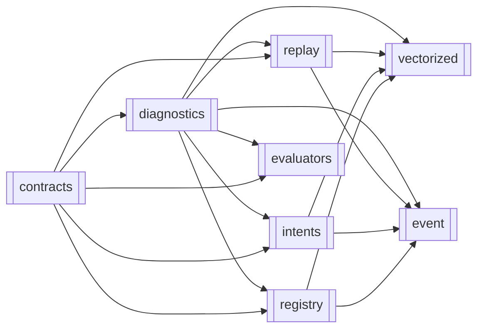

# Strategy

> **Package:** `app/services/strategy`
> **Status:** `Implemented`
> **Last updated:** `2026-07-18`

> This README is the package's **single source of truth** for final requirements, structure, implementation sequence, workflows, public contracts, configuration, limits, progress, usage examples, and tests.
> Update this file before changing Strategy code.

---

## 1. Purpose and Boundary

### Purpose

Strategy turns normalized market state, point-in-time indicator values, validated strategy configuration, and immutable read-only snapshots into deterministic strategy decisions and canonical `TradeIntent` proposals. It supports atomic vectorized evaluation and stateful event evaluation while preserving replay metadata, structured diagnostics, and bounded strategy-local state. Strategy never approves risk or performs official execution.

### Owns

- Immutable strategy registry entries, strategy version resolution, parameter schemas, and registry lifecycle metadata.
- Deterministic configuration validation and manifest-declared environment applicability checks; Risk separately owns operational eligibility.
- Vectorized and event-driven strategy decision evaluation.
- Canonical strategy signals, `TradeIntent` proposals, deterministic intent identity, idempotency, sequence, and lineage.
- Strategy manifests, replay manifests, and bounded strategy-local checkpoints.
- Strategy-domain diagnostics and deterministic error mapping.
- Strategy-owned registry records, parameter-schema records, checkpoint schemas, and migration definitions.

### Does not own

- Market-data acquisition, normalization, source failover, or account truth; Data owns these responsibilities.
- Indicator calculations; Indicators owns formulas, parameter validation, and `IndicatorSeries`.
- Live or paper runtime orchestration; Trading owns those workflows.
- Operational eligibility, Risk approval, final approved size, allocation/risk budgets, exposure limits, kill-switch policy, or approval tokens; Risk owns them.
- Multi-strategy construction, allocation versions, drift detection, or rebalance planning; Portfolio owns them and consumes immutable Strategy registry references.
- Official orders, fills, reconciliation, broker mutation, or execution records; Trading owns them for paper/live and Simulation owns simulated fills/state behind the Trading `sim` route.
- Optimization, performance analytics, research validation, compliance enforcement, deployment, or operational runbooks.
- Arbitrary Python source, archive, or filesystem-path execution. A sandbox is not part of the initial package.
- External artifact build, signing, vulnerability scanning, or approval workflows. Strategy stores and validates their immutable references only.

### Shared contracts

Contract names, versions, and owners match `docs/PROJECT.md`. Commands and requests are owned by their receiver; events and results are owned by their producer. `contract_version` is the compatibility value (for example, `v1`) and `schema_id` is the stable namespaced wire identifier (for example, `strategy.trade_intent.v1`). Consumers evaluate compatibility only from `contract_version` and never parse `schema_id`.

**Owned by this domain** — defined authoritatively here:

| Status  | Contract                           | Version | Counterparty                                                             | Purpose                                                                                                      |
| ------- | ---------------------------------- | ------- | ------------------------------------------------------------------------ | ------------------------------------------------------------------------------------------------------------ |
| Completed | `StrategyRegistrationRequest`    | `v1`  | UI/API submits; Strategy receives                                        | Request registration of a reviewed strategy candidate as one immutable version.                              |
| Completed | `StrategyParameterUpdateRequest` | `v1`  | UI/API submits; Strategy receives                                        | Request validation and registration of an approved parameter set for a compatible strategy version.          |
| Completed | `StrategyMutationResult`         | `v1`  | UI/API, Risk, Portfolio                                                  | Publish the deterministic accepted/idempotent/rejected result of a registration or parameter-version mutation. |
| Completed | `TradeIntent`                    | `v1`  | Risk consumes; Trading and Simulation receive only after Risk governance | Represent a non-executable strategy proposal with deterministic identity, timing, sizing hints, and lineage. |

**Internal composition-root input:** `StrategyValidationPolicy v1` is supplied
by the runtime composition root to `validate_strategy_ref` and
`register_strategy_version`. It is not an emitted cross-domain event, command, or
result and therefore is not listed in the `docs/PROJECT.md` contract registry.

`StrategyRegistrationRequest v1` fields:

| Field                | Type                                            | Required | Meaning                                                                         |
| -------------------- | ----------------------------------------------- | -------: | ------------------------------------------------------------------------------- |
| `contract_version` | `Literal["v1"]`                              |      Yes | Compatibility version.                                                          |
| `schema_id`        | `Literal["strategy.registration_request.v1"]` |      Yes | Stable namespaced schema identifier.                                             |
| `command_id`       | `str`                                         |      Yes | Idempotent receiver-command identifier.                                          |
| `strategy_id`      | `str`                                         |      Yes | Stable non-empty strategy identifier.                                           |
| `strategy_version` | `str`                                         |      Yes | Immutable semantic version.                                                     |
| `module_path`      | `str`                                         |      Yes | Approved importable module identifier; never a user filesystem path.            |
| `manifest`         | `StrategyManifest`                            |      Yes | Data, indicator, timing, environment, resource, and applicability declarations. |
| `config_schema`    | `Mapping[str, JsonValue]`                     |      Yes | Declarative schema; no executable values.                                       |
| `source_hash`      | `str`                                         |      Yes | Approved source commit/content hash.                                            |
| `artifact_hash`    | `str`                                         |      Yes | Approved immutable artifact hash.                                               |
| `dependency_hash`  | `str`                                         |      Yes | Dependency-lock hash used for replay compatibility.                             |
| `provenance_refs`  | `tuple[str, ...]`                             |      Yes | Build, validation, and approval artifact references.                            |
| `principal_id`     | `str`                                         |      Yes | Authenticated submitter from`AuthContext`.                                    |
| `reason`           | `str`                                         |      Yes | Human-readable registration reason.                                             |
| `lifecycle_status` | `StrategyLifecycleStatus`                     |      Yes | Initial lifecycle status for the immutable version.                              |
| `authorization_ref`| `str`                                         |      Yes | Reference to the approved authorization decision.                                |
| `requested_at`     | `datetime`                                    |      Yes | UTC command timestamp.                                                           |
| `request_id`       | `str`                                         |      Yes | Trace identifier.                                                               |
| `correlation_id`   | `str`                                         |      Yes | Cross-domain correlation identifier.                                            |

`StrategyParameterUpdateRequest v1` fields:

| Field                       | Type                                                | Required | Meaning                                      |
| --------------------------- | --------------------------------------------------- | -------: | -------------------------------------------- |
| `contract_version`        | `Literal["v1"]`                                      |      Yes | Compatibility version.                     |
| `schema_id`               | `Literal["strategy.parameter_update_request.v1"]`    |      Yes | Stable namespaced schema identifier.        |
| `command_id`              | `str`                                                |      Yes | Idempotent receiver-command identifier.     |
| `strategy_id`             | `str`                                             |      Yes | Existing strategy identifier.                |
| `strategy_version`        | `str`                                             |      Yes | Exact compatible immutable version.          |
| `parameters`              | `Mapping[str, JsonValue]`                         |      Yes | Proposed declarative parameter values.       |
| `optimization_result_ref` | `str                                                |    None` | Conditional                                  |
| `expected_config_hash`    | `str                                                |    None` | No                                           |
| `principal_id`            | `str`                                             |      Yes | Authenticated submitter from`AuthContext`. |
| `reason`                  | `str`                                             |      Yes | Selection and approval rationale.            |
| `ref`                     | `StrategyRef`                                     |      Yes | Exact approved immutable strategy reference. |
| `config`                  | `StrategyConfig`                                  |      Yes | Exact approved base configuration.           |
| `authorization_ref`       | `str`                                             |      Yes | Reference to the approved authorization decision. |
| `requested_at`            | `datetime`                                        |      Yes | UTC command timestamp.                       |
| `request_id`              | `str`                                             |      Yes | Trace identifier.                            |
| `correlation_id`          | `str`                                             |      Yes | Cross-domain correlation identifier.         |

`StrategyMutationResult v1` contains `contract_version`, `schema_id`, mutation
ID/type/status, exact strategy ID/version, immutable registry/config record
references and hashes when accepted, idempotency outcome, bounded reason codes,
request/workflow/correlation IDs, UTC completion time, and audit-event reference.
It never embeds registry persistence objects or executable strategy content.

`TradeIntent v1` fields:

| Field                                         | Type                                                                   | Required | Meaning                                                               |
| --------------------------------------------- | ---------------------------------------------------------------------- | -------: | --------------------------------------------------------------------- |
| `contract_version`                          | `Literal["v1"]`                                                      |      Yes | Compatibility version.                                                |
| `schema_id`                                 | `Literal["strategy.trade_intent.v1"]`                                |      Yes | Stable namespaced schema identifier.                                   |
| `intent_id`                                 | `str`                                                                |      Yes | Deterministic identifier derived from canonical decision inputs.      |
| `decision_id`                               | `str`                                                                |      Yes | Strategy decision event that produced the intent.                     |
| `idempotency_key`                           | `str`                                                                |      Yes | Stable duplicate-detection key.                                       |
| `strategy_id` / `strategy_version`        | `str`                                                                |      Yes | Exact strategy identity.                                              |
| `strategy_sequence`                         | `int`                                                                |      Yes | Monotonically increasing per-instance sequence.                       |
| `symbol`                                    | `str`                                                                |      Yes | Canonical instrument identifier.                                      |
| `side`                                      | `Literal["BUY", "SELL"]`                                             |      Yes | Proposed direction. Neutral decisions produce no intent.              |
| `intent_type`                               | `Literal["OPEN", "CLOSE", "REDUCE", "INCREASE", "MODIFY", "CANCEL"]` |      Yes | Requested action category; it is not an order type.                   |
| `order_type`                                | `Literal["MARKET", "LIMIT", "STOP", "STOP_LIMIT"]`                    |      Yes | Explicit proposed execution instruction preserved for Risk lineage.  |
| `limit_price` / `stop_price`                | `Decimal | None`                                                             | Conditional | Exact entry instructions required by the selected order type.        |
| `time_in_force`                             | `Literal["GTC", "IOC", "FOK", "GTD", "DAY"] | None`                   |       No | Explicit proposed duration instruction; never inferred downstream.   |
| `requested_sizing_mode`                     | `str                                                                   |    None` | No                                                                    |
| `quantity_hint`                             | `Decimal                                                               |    None` | No                                                                    |
| `signal_timestamp` / `decision_timestamp` | `datetime`                                                           |      Yes | UTC point-in-time signal and decision timestamps.                     |
| `parent_intent_id`                          | `str                                                                   |    None` | Conditional                                                           |
| `stop_loss` / `take_profit`               | `Decimal                                                               |    None` | No                                                                    |
| `expiration`                                | `datetime                                                              |    None` | No                                                                    |
| `allow_partial_fills`                       | `bool`                                                               |      Yes | Downstream partial-fill preference.                                   |
| `min_fill_size`                             | `Decimal                                                               |    None` | Conditional                                                           |
| `rationale_ref`                             | `str                                                                   |    None` | No                                                                    |
| `lineage`                                   | `Mapping[str, str]`                                                  |      Yes | Config, data, indicator, manifest, and predecessor hashes/references. |

**Consumed from other domains** — referenced only, never redefined:

| Contract                 | Version | Owner      | Used for                                                                     |
| ------------------------ | ------- | ---------- | ---------------------------------------------------------------------------- |
| `MarketDataset`        | `v1`  | Data       | Normalized, point-in-time market records and provenance.                     |
| `AccountStateSnapshot` | `v1`  | Data       | Immutable read-only account context for strategy evaluation.                 |
| `IndicatorSeries`      | `v1`  | Indicators | Precomputed indicator values and`available_at` readiness metadata.         |
| `AuthContext`          | `v1`  | Utils      | Authenticated principal and trace context for governed registry commands.    |
| `AuditEvent`           | `v1`  | Utils      | Common redacted audit envelope; Strategy owns only its event payload fields. |

> **Documentation reference only:** `RiskDecision v1` (Risk) appears in wider
> workflow descriptions that mention Strategy, but it is **not** a Strategy
> dependency — Strategy never imports, consumes, creates, or redefines it, so no
> Strategy → Risk dependency exists.

### Persisted state

Data provides shared connection, locking, and migration execution infrastructure. Strategy alone owns and writes the following state; consumers use Strategy's public contracts rather than direct storage access.

| Status  | State / Store                                                           | Read access (via contract)                                              | Migration definitions                 |
| ------- | ----------------------------------------------------------------------- | ----------------------------------------------------------------------- | ------------------------------------- |
| Completed | Immutable strategy registry entries and lifecycle/provenance references | Trading, Simulation, Optimization, Portfolio, UI/API via exact registry resolution | `app/services/strategy/registry/migrations.py` |
| Completed | Versioned parameter schemas and approved configuration hashes           | Trading, Simulation, Optimization, Portfolio via validated references              | `app/services/strategy/registry/migrations.py` |
| Completed | Bounded strategy-local checkpoints and replay links                     | Simulation and Trading through checkpoint/replay contracts              | `app/services/strategy/registry/migrations.py` |

No strategy source code, broker state, official positions, orders, fills, analytics reports, or secrets may be stored in these records.

### Four-level structure

| Code level                                     | Represents                             |
| ---------------------------------------------- | -------------------------------------- |
| **Package**                              | Strategy domain                        |
| **Module folder**                        | One approved strategy capability       |
| **File**                                 | One use case or focused responsibility |
| **Class / function / method / constant** | One functional requirement behavior    |

```text
Package
└── Module folder
    └── File
        └── Class / Function / Method / Constant
```

### Package capability map

```mermaid
flowchart TD
    STR[[Strategy Package]]
    STR --> CON[[contracts: Versioned domain contracts]]
    STR --> DIA[[diagnostics: Errors and safe diagnostics]]
    STR --> REG[[registry: Immutable references and configuration]]
    STR --> INT[[intents: TradeIntent identity and lineage]]
    STR --> REP[[replay: Manifests and checkpoints]]
    STR --> VEC[[vectorized: Atomic batch decisions]]
    STR --> EVT[[event: Stateful event decisions]]
    STR --> EVAL[[evaluators: Recovered concrete signal parity]]

    CON --> CONF[models.py: Public schemas]
    CON --> OUT[outcomes.py: Structured outcomes]
    DIA --> DM[models.py: Diagnostics contract]
    DIA --> ERR[errors.py: Accepted error catalogue]
    DIA --> EXP[export.py: Redacted diagnostics]
    REG --> CAT[catalog.py: Immutable registry mutations and reads]
    REG --> VAL[validation.py: Reference and config validation]
    INT --> IM[intent.py: TradeIntent contract]
    INT --> IB[builder.py: Deterministic intent builder]
    REP --> RM[models.py: Replay and checkpoint schemas]
    REP --> MAN[manifests.py: Replay manifest creation]
    REP --> CHK[checkpoints.py: Checkpoint creation and validation]
    VEC --> VR[runner.py: Vectorized execution]
    EVT --> ER[runner.py: Event-hook execution]
    EVAL --> EV[evaluate.py: Concrete signal boundary]
    EVAL --> CE[Concrete evaluator modules: Recovered signal rules]
```



---

## 2. Final Package Structure

Folders and files are ordered from lowest dependency to highest dependency. This is also the implementation sequence.

```text
app/services/strategy/
├── __init__.py                         # Approved domain-level API only
├── README.md
├── contracts/                          # Feature: versioned strategy contracts
│   ├── __init__.py
│   ├── models.py                       # Strategy inputs, manifests, contexts, decisions
│   └── outcomes.py                     # Structured success/error outcomes
├── diagnostics/                        # Feature: deterministic safe diagnostics
│   ├── __init__.py
│   ├── models.py                       # Structured diagnostics contract
│   ├── errors.py                       # Reduced accepted error catalogue
│   └── export.py                       # Bounded redaction and diagnostics export
├── registry/                           # Feature: immutable registry and configuration
│   ├── __init__.py
│   ├── migrations.py                   # Strategy-owned migration definitions
│   ├── catalog.py                      # Register, update, and list immutable versions
│   └── validation.py                   # Resolve refs and validate declarative config
├── intents/                            # Feature: canonical strategy proposals
│   ├── __init__.py
│   ├── intent.py                       # TradeIntent v1 contract
│   └── builder.py                      # Deterministic identity, sequence, and lineage
├── replay/                             # Feature: deterministic replay and local state
│   ├── __init__.py
│   ├── models.py                       # Replay manifest and checkpoint contracts
│   ├── manifests.py                    # Replay manifest creation
│   └── checkpoints.py                  # Bounded checkpoint creation/validation
├── vectorized/                         # Feature: atomic vectorized strategy evaluation
│   ├── __init__.py
│   └── runner.py                       # Readiness, no-lookahead, decision, intent batch
├── event/                              # Feature: stateful event strategy evaluation
│   ├── __init__.py
│   └── runner.py                       # Deterministic typed hook invocation
└── evaluators/                         # Feature: recovered concrete signal parity
    ├── __init__.py
    ├── _shared.py                      # Private deterministic signal mechanics
    ├── naive_ma_trend.py               # MA crossover and trend-filter signals
    ├── decomposing_trade.py            # Recovered RSI crossing signals
    ├── harriet_hedging.py              # Point-in-time MTF structure signals
    ├── market_structure.py             # Provenance-bound ZigZag structure signals
    ├── random_walk.py                  # Flat-state basket trigger signals
    ├── sqx_breakout_atr_trailing.py    # Channel breakout and ATR facts
    ├── white_fairy.py                  # Recovered RSI crossing signals
    └── evaluate.py                     # Hash-bound concrete signal boundary
```

Usage and test artifacts live outside the production package:

```text
tests/strategy/
├── unit/
├── integration/
└── usage/
```

### Module dependency diagram

An arrow points from a required module to its consumer.



No dependency points from Strategy into Risk, Trading, Simulation internals, Optimization, Analytics, or UI/API. Cross-domain values are consumed only through their owners' public contracts.

### Structure rules

- Package and feature `__init__.py` files re-export only symbols listed in this README.
- Private validation, hashing, redaction, and strategy implementation helpers begin with `_` and are not requirement-bearing exports.
- Strategy implementations are approved modules referenced by immutable registry entries; they are not dynamically loaded from user paths.
- The current flat files and `pybots/` tree are migration evidence, not the target structure.
- Examples never live in the production package.

---

## 3. Workflows

### Status values

| Status              | Meaning                                                                                                       |
| ------------------- | ------------------------------------------------------------------------------------------------------------- |
| **Missing**   | Not implemented, incompatible with the final contract, or insufficiently tested. |
| **Partial**   | Reusable behavior exists but needs contract, structure, validation, or test work.                             |
| **Completed** | Final behavior, structure, runtime use, and tests are verified.                                               |

| Status  | Workflow ID    | Scope        | Workflow                              | Trigger / Input boundary                                 | Final outcome / Output boundary                                | Requirement sequence                           |
| ------- | -------------- | ------------ | ------------------------------------- | -------------------------------------------------------- | -------------------------------------------------------------- | ---------------------------------------------- |
| Completed | `WF-STR-001` | Internal     | Validate reference and configuration  | Registry ref and declarative config                      | Exact validated immutable version/config or structured failure | `FR-STR-023 → FR-STR-024`                   |
| Completed | `WF-STR-002` | Cross-domain | Generate vectorized decisions         | Data`MarketDataset` + Indicators `IndicatorSeries`   | Ordered`TradeIntent` batch to Risk/runtime boundary          | `FR-STR-023 → FR-STR-024 → FR-STR-032`     |
| Completed | `WF-STR-003` | Cross-domain | Run stateful event hook               | Typed event + immutable snapshots                        | Intents, diagnostics, and atomic local-state update            | `FR-STR-023 → FR-STR-024 → FR-STR-033`     |
| Completed | `WF-STR-004` | Cross-domain | Build and hand off TradeIntent        | Validated strategy decision metadata                     | Canonical proposal to Risk; no execution                       | `FR-STR-026`                                 |
| Completed | `WF-STR-005` | Cross-domain | Create replay manifest and checkpoint | Identity/config/input hashes + optional local state      | Manifest/checkpoint reference to runtime                       | `FR-STR-029 → FR-STR-030 → FR-STR-031`     |
| Completed | `WF-STR-006` | Cross-domain | Export structured diagnostics         | Context + bounded diagnostic details                     | Redacted diagnostics to caller/audit boundary                  | `FR-STR-019`                                 |
| Completed | `WF-STR-007` | Cross-domain | Supply paper/live decisions           | Trading invokes Strategy with prepared inputs            | `TradeIntent` to Risk/Trading workflow                       | `FR-STR-023 → FR-STR-024 → FR-STR-032/033` |
| Completed | `WF-STR-008` | Cross-domain | Register immutable strategy version   | UI/API-approved registration or parameter update command | Immutable registry/config record                               | `FR-STR-020 → FR-STR-021`                   |
| Completed | `WF-STR-009` | Cross-domain | Reject arbitrary strategy code        | Raw code/path/archive at command boundary                | Redacted`STRATEGY_ARBITRARY_CODE_REJECTED`; no import        | `FR-STR-018 → FR-STR-020/021/023/024`       |
| Completed | `WF-STR-010` | Cross-domain | Evaluate recovered concrete signals | Registry-bound evaluator + point-in-time Data/Indicators evidence | Atomic ordered immutable signal tuple or structured failure | `FR-STR-038 → FR-STR-039 → FR-STR-040/046 → FR-STR-047` |

### `WF-STR-001` — Validate Strategy Reference and Configuration

**Scope:** Internal
**System workflow:** `SYS-WF-007` when Portfolio resolves registered immutable strategy versions; otherwise internal.

1. `validate_strategy_ref()` rejects empty, unknown, ambiguous, deprecated, revoked, unapproved, hash-mismatched, or environment-ineligible references.
2. It resolves exactly one immutable `ValidatedStrategyRef`.
3. `validate_strategy_config()` applies the entry's declarative schema, explicit defaults, unknown-field policy, bounds, and payload limits.
4. Validation returns a canonical configuration hash without importing or executing strategy code.

**Failure behavior:** Every expected failure returns `StrategyOutcome(status="error")` with one `StrategyErrorCode`; no raw validation, database, or import exception crosses the boundary.

**Integration test:** `tests/strategy/integration/test_registry_validation.py::test_registry_validation_workflow()`

### `WF-STR-002` — Generate Vectorized Strategy Decisions

**Scope:** Cross-domain
**System workflows:** `SYS-WF-001`, `SYS-WF-002`

```text
Data MarketDataset + Indicators IndicatorSeries
→ fixed StrategyExecutionContext
→ atomic readiness and no-lookahead validation
→ approved vectorized signal logic
→ deterministic TradeIntent batch + diagnostics
→ Risk/runtime boundary
```

The decision clock remains fixed at `decision_timestamp`. Any lookahead, clock-drift, required-field, indicator-readiness, sequence, or identity failure discards the whole batch. A neutral decision emits no intent.

**Integration test:** `tests/strategy/integration/test_vectorized_workflow.py::test_vectorized_workflow()`

### `WF-STR-003` — Run Stateful Event Strategy Hook

**Scope:** Cross-domain
**System workflows:** `SYS-WF-001`, `SYS-WF-002`

The runtime supplies a typed event, fixed context, Data-owned account snapshot, and provider-owned immutable execution-state evidence where applicable. Strategy invokes one declared hook in stable order and returns intents, diagnostics, and a candidate local-state update. The update commits only when the complete hook result validates.

The initial typed hook set is `on_init`, `on_bar`, `on_tick`, `on_fill`, and `on_stop`, evaluated in that priority order. Undeclared hooks fail deterministically; current advanced strategy logic is reusable only when it conforms to this contract.

**Integration test:** `tests/strategy/integration/test_event_workflow.py::test_event_workflow()`

### `WF-STR-004` — Build and Hand Off TradeIntent

**Scope:** Cross-domain
**System workflows:** `SYS-WF-001`, `SYS-WF-002`

`build_trade_intent()` canonicalizes approved decision metadata, validates advisory sizing/protection fields, creates stable IDs and lineage, and returns `TradeIntent`. Strategy does not create a `RiskDecision`, `OrderIntent`, fill, or official position mutation.

**Integration test:** `tests/strategy/integration/test_intent_handoff.py::test_intent_handoff_workflow()`

### `WF-STR-005` — Create Replay Manifest and Checkpoint

**Scope:** Cross-domain
**System workflows:** `SYS-WF-001`, `SYS-WF-003`

`create_strategy_replay_manifest()` binds the exact strategy/interface/config/data/indicator/simulation/seed inputs. Stateful execution may create a bounded checkpoint containing serializable local decision state only. Validation checks identity, versions, hashes, schema, checksum, authorization reference, and size before restore.

**Integration test:** `tests/strategy/integration/test_replay_workflow.py::test_replay_workflow()`

### `WF-STR-006` — Export Structured Diagnostics

**Scope:** Cross-domain
**System workflows:** `SYS-WF-001`, `SYS-WF-002`

`export_strategy_diagnostics()` accepts safe facts, recursively redacts denied fields, enforces the registry-declared payload bound, and emits schema-valid diagnostics with request/correlation IDs and dependency status. Strategy may create an `AuditEvent` payload but does not persist or route the common envelope.

**Integration test:** `tests/strategy/integration/test_diagnostics_workflow.py::test_diagnostics_workflow()`

### `WF-STR-007` — Supply Paper/Live Decisions

**Scope:** Cross-domain
**System workflow:** `SYS-WF-002`

Trading owns the live/paper loop and supplies prepared public-contract inputs. Strategy returns no action or `TradeIntent`; Risk independently governs every proposal. Trading begins execution only after an approved `RiskDecision` and executes exactly the approved size.

**Integration test:** `tests/strategy/integration/test_runtime_boundary.py::test_runtime_boundary_emits_proposals_only()`

### `WF-STR-008` — Register Immutable Strategy Version

**Scope:** Cross-domain
**System workflows:** `SYS-WF-003`, `SYS-WF-004`, and registration-truth evidence for `SYS-WF-006`.

UI/API submits an authenticated Strategy-owned request after external review. For
`SYS-WF-003`, the request references the selected `OptimizationResult` and carries
explicit user approval; Optimization cannot submit it. Strategy validates schema,
module allowlisting, immutable hashes, lifecycle/environment evidence references, and
uniqueness, then writes its registry state through Data's persistence infrastructure.
Parameter updates create a new hash-addressed configuration record and never mutate an
approved record in place.

**Output boundary:** `StrategyMutationResult v1` records accepted, idempotent, or
rejected mutation truth for UI/API and supplies the immutable registration reference
used by Risk and Portfolio; storage objects never cross the boundary.

Successful registration proves technical validity and immutable identity only. It
does not confer operational eligibility, capital allocation, or execution authority.
Those require the separate Risk-owned `SYS-WF-006` decision before Portfolio
or Trading may use the registered version.

**Integration test:** `tests/strategy/integration/test_registration_workflow.py::test_registration_workflow()`

### `WF-STR-009` — Reject Arbitrary Strategy Code

**Scope:** Cross-domain
**System workflows:** `SYS-WF-001`, `SYS-WF-003`, `SYS-WF-004`

Raw Python, archives, executable configuration, import strings, and user filesystem paths are rejected before import or execution. Diagnostics contain hashes and safe reason metadata, never the full rejected body. Audit persistence is performed by Data through the common `AuditEvent` contract.

**Integration test:** `tests/strategy/integration/test_registered_only_security.py::test_unregistered_evaluator_hash_fails_closed()`

### `WF-STR-010` — Evaluate Recovered Concrete Signals

**Scope:** Cross-domain
**System workflows:** Research and simulation signal verification only.

The caller supplies one exact approved registry reference, its validated immutable
configuration, Data-owned point-in-time market evidence, optional Indicators-owned
results, and one injected hash-bound concrete evaluator. Strategy validates identity,
hashes, evidence availability, indicator alignment, and output identity atomically;
any failure returns a structured error and no partial signal tuple.

This workflow verifies recovered signal parity only. It does not load legacy code or
perform basket management, risk approval, sizing, order construction, execution,
fills, or broker/account mutation.

**Integration test:** `tests/strategy/integration/test_concrete_signal_workflow.py::test_concrete_signal_workflow()`

---

## 4. Module and Requirement Specifications

Requirements below define the intended public surface. Expected domain failures are returned in `StrategyOutcome`; `Raises` is `None` unless a caller violates Python's own invocation semantics before the function body runs.

### 4.1 `contracts/` — Versioned Strategy Contracts

**Purpose:** Define the typed, versioned, serialization-safe contracts shared by all Strategy features.

**Module flow:**

```text
untrusted boundary payload
→ models.py schema validation
→ outcomes.py structured success/error representation
→ consuming Strategy feature
```

### Files

| Status  | File            | Responsibility                                                                           | Key exports                                                                                                                                                                                                                                                                                                                                                               | Dependencies                                                                                                                                 |
| ------- | --------------- | ---------------------------------------------------------------------------------------- | ------------------------------------------------------------------------------------------------------------------------------------------------------------------------------------------------------------------------------------------------------------------------------------------------------------------------------------------------------------------------- | -------------------------------------------------------------------------------------------------------------------------------------------- |
| Completed | `models.py`   | Define Strategy-owned inputs, manifests, contexts, events, decisions, signals, signal evidence, results, and validation policy.       | `StrategyEnvironment`, `StrategyTimingPolicy`, `StrategyLifecycleStatus`, `StrategyRef`, `ValidatedStrategyRef`, `StrategyConfig`, `ValidatedStrategyConfig`, `StrategyManifest`, `StrategyRegistrationRequest`, `StrategyParameterUpdateRequest`, `StrategyValidationPolicy`, `StrategyExecutionContext`, `StrategyEvent`, `StrategyDecision`, `StrategySignal`, `StrategySignalEvidence`, `StrategyExecutionResult` | **Standard library:** `datetime`, `decimal`, `enum`, `typing`**Required third-party:** `pydantic`**Local:** Data public `MarketDataset` |
| Completed | `outcomes.py` | Represent every public operation as a typed success or deterministic structured failure. | `StrategyError`, `StrategyOutcome`, `StrategyMutationResult`                                                                                                                                                                                                                                                                                                                                    | **Standard library:** `typing`**Required third-party:** `pydantic`**Local:** `models.py → StrategyExecutionResult`  |
| Completed | `__init__.py` | Expose the supported contract API.                                                       | All key exports above                                                                                                                                                                                                                                                                                                                                                     | **Standard library:** None**Required third-party:** None**Local:** `models.py`, `outcomes.py` approved exports         |

### Configuration and Limits Manifest

| Status  | Setting / Limit            | Type    | Default                    | Required | Used by                                         | Description                                                                                                              |
| ------- | -------------------------- | ------- | -------------------------- | -------- | ----------------------------------------------- | ------------------------------------------------------------------------------------------------------------------------ |
| Completed | Contract `contract_version` | `str` | Per-contract `v1` literal | Yes | All registered contract models | Breaking field or semantic changes require a new compatibility version; additive optional fields with safe defaults remain compatible. |
| Completed | Contract `schema_id` | `str` | Per-contract namespaced literal | Yes | All registered contract models | Stable identity is validated independently and is never parsed to infer compatibility. |
| Completed | Decimal validation policy  | policy  | Finite values only         | Yes      | `StrategyDecision`, `TradeIntent` consumers | Reject NaN/infinity; Strategy does not perform downstream execution quantization.                                        |
| Completed | UTC timestamp policy       | policy  | Aware UTC                  | Yes      | Context, event, intent, diagnostics, replay     | Naive or inconsistent timestamps return a validation error.                                                              |

#### `models.py` — Public Contract Models

| Status  | Requirement ID | Responsibility                                                                                                                                                                           | Class / Function / Method          | Side Effects | Raises | Usage / Test                                                                                                                                                                                                            |
| ------- | -------------- | ---------------------------------------------------------------------------------------------------------------------------------------------------------------------------------------- | ---------------------------------- | ------------ | ------ | ----------------------------------------------------------------------------------------------------------------------------------------------------------------------------------------------------------------------- |
| Completed | `FR-STR-001` | The system shall enumerate only approved Strategy runtime profiles and reject unsupported values.                                                                                        | `StrategyEnvironment`            | None         | None   | **Usage:** `tests/strategy/usage/01_contracts.py`**Unit:** `tests/strategy/unit/test_models.py::test_strategy_environment_rejects_shadow_initially()` |
| Completed | `FR-STR-002` | The system shall identify the decision timing policy used for every evaluation.                                                                                                          | `StrategyTimingPolicy`           | None         | None   | **Usage:** `tests/strategy/usage/01_contracts.py`**Unit:** `tests/strategy/unit/test_models.py::test_timing_policy_serializes_stably()`             |
| Completed | `FR-STR-003` | The system shall represent immutable registry lifecycle eligibility without granting governance approval itself.                                                                         | `StrategyLifecycleStatus`        | None         | None   | **Usage:** `tests/strategy/usage/01_contracts.py`**Unit:** `tests/strategy/unit/test_models.py::test_revoked_status_is_never_executable()`                |
| Completed | `FR-STR-004` | The system shall accept a non-empty strategy id, exact version or version constraint, environment, and trace identifiers for resolution.                                                 | `StrategyRef`                    | None         | None   | **Usage:** `tests/strategy/usage/01_contracts.py`**Unit:** `tests/strategy/unit/test_models.py::test_strategy_ref_requires_exactly_one_version_selector()`    |
| Completed | `FR-STR-005` | The system shall expose the single immutable registry entry selected for execution, including hashes and compatibility metadata.                                                         | `ValidatedStrategyRef`           | None         | None   | **Usage:** `tests/strategy/usage/01_contracts.py`**Unit:** `tests/strategy/unit/test_models.py::test_validated_ref_is_immutable()`                           |
| Completed | `FR-STR-006` | The system shall represent declarative JSON-compatible strategy configuration without executable values.                                                                                 | `StrategyConfig`                 | None         | None   | **Usage:** `tests/strategy/usage/01_contracts.py`**Unit:** `tests/strategy/unit/test_models.py::test_strategy_config_rejects_executable_values()`          |
| Completed | `FR-STR-007` | The system shall expose normalized defaults, schema version, and canonical configuration hash after validation.                                                                          | `ValidatedStrategyConfig`        | None         | None   | **Usage:** `tests/strategy/usage/01_contracts.py`**Unit:** `tests/strategy/unit/test_models.py::test_validated_config_hash_is_canonical()`                |
| Completed | `FR-STR-008` | The system shall define one applicability-aware manifest for identity, data, indicators, timing, environments, resources, local risk assumptions, execution preferences, and provenance. | `StrategyManifest`               | None         | None   | **Usage:** `tests/strategy/usage/01_contracts.py`**Unit:** `tests/strategy/unit/test_models.py::test_manifest_requires_only_applicable_declarations()`   |
| Completed | `FR-STR-009` | The system shall define the complete`StrategyRegistrationRequest v1` receiver-owned command described in Section 1.                                                                    | `StrategyRegistrationRequest`    | None         | None   | **Usage:** `tests/strategy/usage/01_contracts.py`**Unit:** `tests/strategy/unit/test_models.py::test_registration_request_rejects_user_file_path()`   |
| Completed | `FR-STR-010` | The system shall define the complete`StrategyParameterUpdateRequest v1` receiver-owned command described in Section 1.                                                                 | `StrategyParameterUpdateRequest` | None         | None   | **Usage:** `tests/strategy/usage/01_contracts.py`**Unit:** `tests/strategy/unit/test_models.py::test_parameter_update_requires_exact_version()`   |
| Completed | `FR-STR-011` | The system shall fix environment, decision timestamp, timing policy, seed, trace identifiers, dependency status, and immutable snapshot references for one evaluation.                   | `StrategyExecutionContext`       | None         | None   | **Usage:** `tests/strategy/usage/01_contracts.py`**Unit:** `tests/strategy/unit/test_models.py::test_execution_context_rejects_naive_time()`             |
| Completed | `FR-STR-012` | The system shall represent one typed event without granting mutable access to official external state.                                                                                   | `StrategyEvent`                  | None         | None   | **Usage:** `tests/strategy/usage/01_contracts.py`**Unit:** `tests/strategy/unit/test_models.py::test_strategy_event_payload_is_immutable()`                 |
| Completed | `FR-STR-013` | The system shall represent a neutral decision or proposed actions, rationale references, diagnostics facts, and candidate local-state update.                                            | `StrategyDecision`               | None         | None   | **Usage:** `tests/strategy/usage/01_contracts.py`**Unit:** `tests/strategy/unit/test_models.py::test_neutral_decision_contains_no_intent()`              |
| Completed | `FR-STR-014` | The system shall return ordered intents, diagnostics, replay metadata, and an optional validated local-state update as one atomic result.                                                | `StrategyExecutionResult`        | None         | None   | **Usage:** `tests/strategy/usage/01_contracts.py`**Unit:** `tests/strategy/unit/test_models.py::test_execution_result_rejects_partial_failed_batch()`     |
| Completed | `FR-STR-035` | The system shall represent an immutable explicit policy version, approved module roots, and positive configuration payload, nesting, string, and collection limits with no hidden defaults. | `StrategyValidationPolicy` | None | None | **Usage:** `tests/strategy/usage/01_contracts.py`**Unit:** `tests/strategy/unit/test_models.py::test_validation_policy_requires_explicit_positive_bounds()` |
| Completed | `FR-STR-038` | The system shall represent each recovered concrete signal as an immutable deterministic identity, strategy/version, symbol, UTC timestamp, named signal, optional side, active state, lineage, and bounded facts. | `StrategySignal` | None | None | **Usage:** `tests/strategy/usage/08_naive_ma_trend.py`**Unit:** `tests/strategy/unit/test_naive_ma_trend_evaluator.py::test_naive_ma_signals_are_deterministic()` |
| Completed | `FR-STR-039` | The system shall provide immutable point-in-time signal evidence containing one primary market dataset, named related datasets, provenance-bound feature values, explicit point size, and active owned-position tags without mutable provider objects. | `StrategySignalEvidence` | None | None | **Usage:** `tests/strategy/usage/08_naive_ma_trend.py`**Unit:** `tests/strategy/unit/test_market_structure_evaluator.py::test_feature_evidence_must_be_provenance_complete()` |

`StrategyManifest` required core fields are: `contract_version`, `schema_id`, `strategy_id`, `strategy_version`, `module_path`, `owner_ref`, `interface_version`, `config_schema_version`, `required_data`, `required_indicators`, `timing_policy`, `permitted_environments`, `concurrency_model="SYNC_BLOCKING"`, `source_hash`, `artifact_hash`, `dependency_hash`, and `provenance_refs`. Optional applicability sections cover local state, recovery depth, maximum intent frequency, spread/data-gap suppression, corporate-action price mode, halt/closure behavior, execution assumptions, and resource-budget declarations. Optional declarations remain advisory to their owning downstream domains.

#### `outcomes.py` — Structured Operation Outcomes

| Status  | Requirement ID | Responsibility                                                                                                                                  | Class / Function / Method | Side Effects | Raises | Usage / Test                                                                                                                                                                                                      |
| ------- | -------------- | ----------------------------------------------------------------------------------------------------------------------------------------------- | ------------------------- | ------------ | ------ | ----------------------------------------------------------------------------------------------------------------------------------------------------------------------------------------------------------------- |
| Completed | `FR-STR-015` | The system shall represent a stable Strategy error code, safe message, redacted details, and trace identifiers without exposing raw exceptions. | `StrategyError`         | None         | None   | **Usage:** `tests/strategy/usage/01_contracts.py`**Unit:** `tests/strategy/unit/test_outcomes.py::test_strategy_error_rejects_unredacted_details()` |
| Completed | `FR-STR-016` | The system shall return exactly one typed success value or one structured error for every public operation.                                     | `StrategyOutcome[T]`    | None         | None   | **Usage:** `tests/strategy/usage/01_contracts.py`**Unit:** `tests/strategy/unit/test_outcomes.py::test_outcome_exclusive_data_or_error()`         |
| Completed | `FR-STR-017` | The system shall return a versioned immutable mutation result for every registration or parameter-version command, including exact record references/hashes, idempotency outcome, reason codes, trace IDs, completion time, and audit reference. | `StrategyMutationResult` | None | None | **Usage:** `tests/strategy/usage/01_contracts.py`**Unit:** `tests/strategy/unit/test_outcomes.py::test_mutation_result_has_immutable_registration_truth()` |

**Rules:**

- Contract objects are immutable after validation and serialize canonically.
- Unknown fields are rejected unless the owning schema explicitly declares `IGNORE` for backward compatibility.
- Raw DataFrames, provider SDK objects, DB sessions, sockets, functions, classes, and exceptions cannot cross the boundary.
- `StrategyMutationResult` is the direct public `WF-STR-008` output. Accepted and idempotent results may embed the immutable `ValidatedStrategyRef` or `ValidatedStrategyConfig`; rejected commands return a bounded `StrategyMutationResult(status="REJECTED")`. Infrastructure failures alone use `StrategyOutcome(status="error")`. Registry/config state and publication state commit atomically; an idempotent retry completes a missing Data-owned audit publication without duplicating the mutation. Storage objects never cross the boundary.

**Implementation notes:**

- Refactor reusable validation and model semantics from current `contracts.py`, `config.py`, `state.py`, and `strategy-config.schema.json`.
- Replace current `float` price/quantity fields with finite `Decimal` where the value is monetary or quantity-bearing.
- Do not preserve the current oversized configuration shape where reconciliation excluded or rejected the behavior.

### Feature usage examples

`tests/strategy/usage/01_contracts.py` is a directly runnable package-root example
covering the immutable contracts and structured outcomes in `FR-STR-001` through
`FR-STR-017`. It is teaching code, not a pytest test.

---

### 4.2 `diagnostics/` — Deterministic Safe Diagnostics

**Purpose:** Maintain the reduced accepted error catalogue and export bounded, redacted diagnostics.

### Files

| Status  | File            | Responsibility                                                        | Key exports                                                                     | Dependencies                                                                                                                                                                                                                                                                                                                                        |
| ------- | --------------- | --------------------------------------------------------------------- | ------------------------------------------------------------------------------- | --------------------------------------------------------------------------------------------------------------------------------------------------------------------------------------------------------------------------------------------------------------------------------------------------------------------------------------------------- |
| Completed | `models.py`   | Define the bounded structured diagnostics schema.                     | `StrategyDiagnostics`                                                         | **Standard library:** `datetime`, `typing`**Required third-party:** `pydantic`**Local:** `contracts.models.py → StrategyExecutionContext`                                                                                                                                                                                |
| Completed | `errors.py`   | Define only error codes reachable from approved initial capabilities. | `StrategyErrorCode`                                                           | **Standard library:** `enum`**Required third-party:** None**Local:** `contracts.outcomes.py → StrategyError`                                                                                                                                                                                                                 |
| Completed | `export.py`   | Normalize, redact, bound, and serialize Strategy diagnostics.         | `export_strategy_diagnostics`                                                 | **Standard library:** `collections.abc`**Required third-party:** None**Local:** `contracts.models.py → StrategyExecutionContext`; `contracts.outcomes.py → StrategyOutcome`; `models.py → StrategyDiagnostics`; `errors.py → StrategyErrorCode`; `app.utils → redaction and canonical serialization public APIs` |
| Completed | `__init__.py` | Expose the supported diagnostics API.                                 | `StrategyDiagnostics`, `StrategyErrorCode`, `export_strategy_diagnostics` | **Standard library:** None**Required third-party:** None**Local:** Approved exports from `models.py`, `errors.py`, `export.py`                                                                                                                                                                                              |

### Configuration and Limits Manifest

| Status  | Setting / Limit                                   | Type     | Default   | Required | Used by                           | Description                                                                                                                         |
| ------- | ------------------------------------------------- | -------- | --------- | -------- | --------------------------------- | ----------------------------------------------------------------------------------------------------------------------------------- |
| Completed | `manifest.resource_budget.max_diagnostic_bytes` | `int`  | None      | Yes before diagnostic export | `export_strategy_diagnostics()` | The profile must provide an explicit positive limit; there is no system default. Exceeding it returns `STRATEGY_RESOURCE_LIMIT_EXCEEDED`. |
| Completed | `diagnostics_debug_enabled`                     | `bool` | `False` | No       | `export_strategy_diagnostics()` | Allows additional safe facts but never secrets, source bodies, or unbounded market data.                                            |

#### Functional requirements

| Status  | Requirement ID | Responsibility                                                                                                                                                                                                                 | Class / Function / Method                                                                                                                  | Side Effects | Raises                                                                           | Usage / Test                                                                                                                                                                                                                           |
| ------- | -------------- | ------------------------------------------------------------------------------------------------------------------------------------------------------------------------------------------------------------------------------ | ------------------------------------------------------------------------------------------------------------------------------------------ | ------------ | -------------------------------------------------------------------------------- | -------------------------------------------------------------------------------------------------------------------------------------------------------------------------------------------------------------------------------------- |
| Completed | `FR-STR-034` | The system shall represent status, strategy/config/data identity, trace IDs, relevant timestamps, accepted error code, bounded safe details, dependency health, metrics, and redaction status in a versioned immutable schema. | `StrategyDiagnostics`                                                                                                                    | None         | None                                                                             | **Usage:** `tests/strategy/usage/02_diagnostics.py`**Unit:** `tests/strategy/unit/test_diagnostics_models.py::test_diagnostics_require_trace_and_redaction_status()` |
| Completed | `FR-STR-018` | The system shall expose only the accepted deterministic codes listed below, including`STRATEGY_ARBITRARY_CODE_REJECTED` instead of the cross-domain `SIM_*` name.                                                          | `StrategyErrorCode`                                                                                                                      | None         | None                                                                             | **Usage:** `tests/strategy/usage/02_diagnostics.py`**Unit:** `tests/strategy/unit/test_errors.py::test_error_catalogue_excludes_deferred_codes()`                     |
| Completed | `FR-STR-019` | The system shall export schema-valid diagnostics after recursive redaction and payload-size enforcement.                                                                                                                       | `export_strategy_diagnostics(context: StrategyExecutionContext, facts: Mapping[str, JsonValue]) -> StrategyOutcome[StrategyDiagnostics]` | None         | None; returns`STRATEGY_RESOURCE_LIMIT_EXCEEDED` or `STRATEGY_INTERNAL_ERROR` | **Usage:** `tests/strategy/usage/02_diagnostics.py`**Unit:** `tests/strategy/unit/test_export.py::test_export_diagnostics_redacts_and_bounds()`                      |

Accepted initial codes:

```text
STRATEGY_INVALID_CONFIG
STRATEGY_NOT_FOUND
STRATEGY_VERSION_CONSTRAINT_UNSATISFIABLE
STRATEGY_DEPRECATED
STRATEGY_UNAPPROVED_MODULE
STRATEGY_SCHEMA_VALIDATION_FAILED
STRATEGY_UNSUPPORTED_TIMING_POLICY
STRATEGY_LOOKAHEAD_DETECTED
STRATEGY_ARBITRARY_CODE_REJECTED
STRATEGY_INTERNAL_ERROR
STRATEGY_LIFECYCLE_NOT_APPROVED
STRATEGY_ENVIRONMENT_NOT_PERMITTED
STRATEGY_ARTIFACT_HASH_MISMATCH
STRATEGY_DEPENDENCY_HASH_MISMATCH
INDICATOR_MODULE_ERROR
STRATEGY_CHECKPOINT_INVALID
STRATEGY_CHECKPOINT_INCOMPATIBLE
STRATEGY_DATA_NOT_READY
STRATEGY_INDICATOR_NOT_READY
STRATEGY_MISSING_REQUIRED_DATA
STRATEGY_STALE_DATA
STRATEGY_DUPLICATE_INTENT
STRATEGY_RESOURCE_LIMIT_EXCEEDED
STRATEGY_TIMEOUT
STRATEGY_VALIDATION_ARTIFACT_REQUIRED
STRATEGY_RISK_PROFILE_REQUIRED
STRATEGY_POSITION_LIMIT_EXCEEDED
STRATEGY_DATA_QUALITY_GATE_FAILED
STRATEGY_HARD_KILLED
```

The three conditional codes apply only when the selected manifest/lifecycle requires the corresponding validation artifact, risk declaration, or strategy-local limit. `STRATEGY_HARD_KILLED` is emitted by the host when it force-stops evaluation; strategy code does not self-terminate external work.

**Implementation notes:** Refactor the useful mapping behavior from current `errors.py`, but remove rejected or excluded regulatory, performance, drift, sandbox, volume-participation, market-access, and circuit-breaker codes from the initial public catalogue.

---

### 4.3 `registry/` — Immutable Registry and Configuration

**Purpose:** Register immutable versions, resolve exactly one approved reference, and validate declarative configuration before execution.

### Files

| Status  | File              | Responsibility                                                                   | Key exports                                                                               | Dependencies                                                                                                                                                                                    |
| ------- | ----------------- | -------------------------------------------------------------------------------- | ----------------------------------------------------------------------------------------- | ----------------------------------------------------------------------------------------------------------------------------------------------------------------------------------------------- |
| Completed | `migrations.py` | Define ordered Strategy-owned registry, configuration, checkpoint, mutation-result, and publication-state migrations for Data's shared runner. | None; internal migration definitions only | **Standard library:** None**Required third-party:** None**Local:** Data public migration contracts |
| Completed | `catalog.py`    | Perform Strategy-owned immutable registry writes and reads.                      | `register_strategy_version`, `update_strategy_parameters`, `list_strategy_versions` | **Standard library:** `collections.abc`**Required third-party:** None**Local:** contract models/outcomes; diagnostics; Data public persistence/migration execution contract |
| Completed | `validation.py` | Resolve references and validate configuration, eligibility, schemas, and hashes. | `validate_strategy_ref`, `validate_strategy_config`                                   | **Standard library:** `collections.abc`**Required third-party:** `pydantic`**Local:** contract models/outcomes; diagnostics                                               |
| Completed | `__init__.py`   | Expose the registry API.                                                         | Five functions above                                                                      | **Standard library:** None**Required third-party:** None**Local:** Approved exports from `catalog.py`, `validation.py`                                                    |

### Configuration and Limits Manifest

| Status  | Setting / Limit                         | Type                | Default | Required | Used by                                                      | Description                                                                           |
| ------- | --------------------------------------- | ------------------- | ------- | -------- | ------------------------------------------------------------ | ------------------------------------------------------------------------------------- |
| Completed | `config_limits.max_payload_bytes`     | `int`             | None    | Yes      | `validate_strategy_config()`                               | Reject larger payloads with`STRATEGY_RESOURCE_LIMIT_EXCEEDED`; baseline is open.    |
| Completed | `config_limits.max_nesting_depth`     | `int`             | None    | Yes      | `validate_strategy_config()`                               | Reject excessive nesting before full schema traversal.                                |
| Completed | `config_limits.max_string_length`     | `int`             | None    | Yes      | `validate_strategy_config()`                               | Reject oversized strings, including executable-looking payload carriers.              |
| Completed | `config_limits.max_collection_length` | `int`             | None    | Yes      | `validate_strategy_config()`                               | Reject oversized mappings/lists.                                                      |
| Completed | Approved module roots                   | `tuple[str, ...]` | None    | Yes      | `register_strategy_version()`, `validate_strategy_ref()` | Only immutable approved import paths are accepted; user filesystem paths always fail. |

#### Functional requirements

| Status  | Requirement ID | Responsibility                                                                                                                                                                  | Class / Function / Method                                                                                                              | Side Effects                                                       | Raises                                                                                             | Usage / Test                                                                                                                                                                                                              |
| ------- | -------------- | ------------------------------------------------------------------------------------------------------------------------------------------------------------------------------- | -------------------------------------------------------------------------------------------------------------------------------------- | ------------------------------------------------------------------ | -------------------------------------------------------------------------------------------------- | ------------------------------------------------------------------------------------------------------------------------------------------------------------------------------------------------------------------------- |
| Completed | `FR-STR-020` | The system shall register one unique immutable strategy version only after command, schema, module, hash, provenance, lifecycle-reference, and explicit validation-policy checks. | `register_strategy_version(request: StrategyRegistrationRequest, auth: AuthContext, policy: StrategyValidationPolicy) -> StrategyOutcome[StrategyMutationResult]` | Persistence write; event publication | None; returns deterministic mutation result or infrastructure error | **Usage:** `tests/strategy/usage/03_registry.py`**Unit:** `tests/strategy/unit/test_catalog.py::test_registration_is_immutable()` |
| Completed | `FR-STR-021` | The system shall validate and record a parameter update as a new canonical configuration hash without mutating an approved prior record. | `update_strategy_parameters(request: StrategyParameterUpdateRequest, auth: AuthContext) -> StrategyOutcome[StrategyMutationResult]` | Persistence write; event publication | None; returns deterministic mutation result or infrastructure error | **Usage:** `tests/strategy/usage/03_registry.py`**Unit:** `tests/strategy/unit/test_catalog.py::test_parameter_update_preserves_prior_hash()` |
| Completed | `FR-STR-022` | The system shall return immutable registry entries in deterministic strategy-id/version order without exposing persistence objects. | `list_strategy_versions(strategy_id: str | None = None) -> StrategyOutcome[tuple[ValidatedStrategyRef, ...]]` | Read-only | None; returns `STRATEGY_NOT_FOUND` only for an explicit missing id | **Usage:** `tests/strategy/usage/03_registry.py`**Unit:** `tests/strategy/unit/test_catalog.py::test_list_versions_is_deterministically_ordered()` |
| Completed | `FR-STR-023` | The system shall resolve exactly one approved immutable version and fail before execution for invalid identity, lifecycle, environment, module, policy, or hashes. | `validate_strategy_ref(ref: StrategyRef, policy: StrategyValidationPolicy) -> StrategyOutcome[ValidatedStrategyRef]` | Read-only | None; returns registry/lifecycle/policy/hash error | **Usage:** `tests/strategy/usage/03_registry.py`**Unit:** `tests/strategy/unit/test_validation.py::test_version_constraint_resolves_exactly_one()` |
| Completed | `FR-STR-024` | The system shall validate declarative configuration, explicit defaults, unknown fields, types, enums, bounds, and resource limits, producing a canonical hash before execution. | `validate_strategy_config(ref: ValidatedStrategyRef, config: StrategyConfig) -> StrategyOutcome[ValidatedStrategyConfig]`            | None                                                               | None; returns`STRATEGY_INVALID_CONFIG`, `STRATEGY_SCHEMA_VALIDATION_FAILED`, or resource error | **Usage:** `tests/strategy/usage/03_registry.py`**Unit:** `tests/strategy/unit/test_validation.py::test_config_rejects_executable_injection()`  |

**Implementation notes:** Reuse current JSON configuration validation and bundled-strategy discovery only as migration input. Replace mutable/bundled class lookup with versioned immutable entries; remove physical deletion, archive import, arbitrary path loading, and in-place approval mutation.

---

### 4.4 `intents/` — Canonical TradeIntent Proposals

**Purpose:** Define and build the single Strategy-to-Risk proposal contract.

### Files

| Status  | File            | Responsibility                                                                             | Key exports                             | Dependencies                                                                                                                                                                                         |
| ------- | --------------- | ------------------------------------------------------------------------------------------ | --------------------------------------- | ---------------------------------------------------------------------------------------------------------------------------------------------------------------------------------------------------- |
| Completed | `intent.py`   | Define the complete`TradeIntent v1` schema from Section 1.                               | `TradeIntent`                         | **Standard library:** `datetime`, `decimal`, `typing`**Required third-party:** `pydantic`**Local:** contracts                                                              |
| Completed | `builder.py`  | Validate proposal fields and derive deterministic IDs, sequence, idempotency, and lineage. | `build_trade_intent`                  | **Standard library:** `hashlib`**Required third-party:** None**Local:** contracts/outcomes; diagnostics; `intent.py → TradeIntent`; Utils canonical serialization and ID APIs |
| Completed | `__init__.py` | Expose the intent API.                                                                     | `TradeIntent`, `build_trade_intent` | **Standard library:** None**Required third-party:** None**Local:** Approved intent exports                                                                                         |

### Configuration and Limits Manifest

No feature-specific numeric default is approved. Precision and UTC policies come from `contracts/`; Risk and Trading own final size, price quantization, and execution limits.

#### Functional requirements

| Status  | Requirement ID | Responsibility                                                                                                                                               | Class / Function / Method                                                                                                            | Side Effects | Raises                                      | Usage / Test                                                                                                                                                                                                       |
| ------- | -------------- | ------------------------------------------------------------------------------------------------------------------------------------------------------------ | ------------------------------------------------------------------------------------------------------------------------------------ | ------------ | ------------------------------------------- | ------------------------------------------------------------------------------------------------------------------------------------------------------------------------------------------------------------------ |
| Completed | `FR-STR-025` | The system shall define and validate every field of the canonical `TradeIntent v1` contract described in Section 1, including explicit `MARKET`/`LIMIT`/`STOP`/`STOP_LIMIT` order type and applicable limit/stop/TIF material. | `TradeIntent` | None | None | **Usage:** `tests/strategy/usage/04_intents.py` **Unit:** `tests/strategy/unit/test_intent.py::test_trade_intent_rejects_invalid_partial_fill_contract()` |
| Completed | `FR-STR-026` | The system shall build a schema-valid intent with deterministic IDs, monotonic sequence, canonical idempotency key, and preserved parent/lineage references. | `build_trade_intent(decision: StrategyDecision, context: StrategyExecutionContext, sequence: int) -> StrategyOutcome[TradeIntent]` | None         | None; returns config/schema/duplicate error | **Usage:** `tests/strategy/usage/04_intents.py`**Unit:** `tests/strategy/unit/test_builder.py::test_intent_identity_is_stable()`                  |

**Rules:**

- `HOLD`/neutral decisions emit no `TradeIntent`.
- Sizing and protection values are advisory and cannot be represented as Risk approval.
- Duplicated ID/key or non-monotonic sequence fails deterministically.
- Superseded, replaced, scale, recovery, and decomposition intents retain parent lineage.

**Implementation notes:** Reuse reason/setup/group semantics and deterministic intent ideas from current `TradeIntent`/`BaseStrategy`, but replace random UUID creation and `float` monetary fields.

---

### 4.5 `replay/` — Replay Manifests and Local Checkpoints

**Purpose:** Make exact Strategy decisions reproducible and stateful recovery safe without persisting official trading state.

### Files

| Status  | File               | Responsibility                                               | Key exports                                                      | Dependencies                                                                                                                                                                        |
| ------- | ------------------ | ------------------------------------------------------------ | ---------------------------------------------------------------- | ----------------------------------------------------------------------------------------------------------------------------------------------------------------------------------- |
| Completed | `models.py`      | Define replay and checkpoint schemas.                        | `StrategyReplayManifest`, `StrategyCheckpoint`               | **Standard library:** `datetime`, `typing`**Required third-party:** `pydantic`**Local:** contracts                                                          |
| Completed | `manifests.py`   | Create hash-linked deterministic replay manifests.           | `create_strategy_replay_manifest`                              | **Standard library:** `hashlib`**Required third-party:** None**Local:** contracts/outcomes; diagnostics; `models.py`                                          |
| Completed | `checkpoints.py` | Create bounded checkpoints and validate them before restore. | `create_strategy_checkpoint`, `validate_strategy_checkpoint` | **Standard library:** `hashlib`**Required third-party:** None**Local:** contracts/outcomes; diagnostics; `models.py`; Utils canonical serialization/redaction |
| Completed | `__init__.py`    | Expose replay API.                                           | Five exports above                                               | **Standard library:** None**Required third-party:** None**Local:** Approved replay exports                                                                        |

### Configuration and Limits Manifest

| Status  | Setting / Limit                                   | Type                             | Default | Required    | Used by                | Description                                                                                                            |
| ------- | ------------------------------------------------- | -------------------------------- | ------- | ----------- | ---------------------- | ---------------------------------------------------------------------------------------------------------------------- |
| Completed | `manifest.resource_budget.max_checkpoint_bytes` | `int`                          | None    | Conditional | Checkpoint functions   | Required for stateful strategies; oversized state returns`STRATEGY_RESOURCE_LIMIT_EXCEEDED`. Exact baseline is open. |
| Completed | `manifest.state.max_tolerable_state_loss`       | strategy-defined duration/events | None    | Conditional | `StrategyCheckpoint` | Required for stateful strategies; host cadence must not exceed it.                                                     |

#### Functional requirements

| Status  | Requirement ID | Responsibility                                                                                                                                   | Class / Function / Method                                                                                                                                                                                     | Side Effects                                      | Raises                                              | Usage / Test                                                                                                                                                                                                                           |
| ------- | -------------- | ------------------------------------------------------------------------------------------------------------------------------------------------ | ------------------------------------------------------------------------------------------------------------------------------------------------------------------------------------------------------------- | ------------------------------------------------- | --------------------------------------------------- | -------------------------------------------------------------------------------------------------------------------------------------------------------------------------------------------------------------------------------------- |
| Completed | `FR-STR-027` | The system shall bind strategy/interface/config/data/indicator/simulation/seed/timing identity for deterministic replay.                         | `StrategyReplayManifest`                                                                                                                                                                                    | None                                              | None                                                | **Usage:** `tests/strategy/usage/05_replay.py`**Unit:** `tests/strategy/unit/test_replay_models.py::test_manifest_requires_complete_lineage()`                   |
| Completed | `FR-STR-028` | The system shall contain only serializable, redacted, bounded strategy-local state with identity, schema, checksum, and authorization reference. | `StrategyCheckpoint`                                                                                                                                                                                        | None                                              | None                                                | **Usage:** `tests/strategy/usage/05_replay.py`**Unit:** `tests/strategy/unit/test_replay_models.py::test_checkpoint_rejects_official_state()`                         |
| Completed | `FR-STR-029` | The system shall create a deterministic replay manifest from exact validated identities and input hashes. | `create_strategy_replay_manifest(ref: ValidatedStrategyRef, config: ValidatedStrategyConfig, context: StrategyExecutionContext, data_checksum: str, indicator_manifest_hash: str, simulation_config_hash: str | None = None) -> StrategyOutcome[StrategyReplayManifest]` | None | None; returns artifact/dependency/internal error | **Usage:** `tests/strategy/usage/05_replay.py`**Unit:** `tests/strategy/unit/test_manifests.py::test_replay_manifest_is_deterministic()` |
| Completed | `FR-STR-030` | The system shall serialize, checksum, and persist candidate local decision state only after redaction and size validation. | `create_strategy_checkpoint(ref: ValidatedStrategyRef, config: ValidatedStrategyConfig, state: Mapping[str, JsonValue], authorization_ref: str, auth: AuthContext) -> StrategyOutcome[StrategyCheckpoint]` | Persistence write | None; returns checkpoint/resource/redaction/storage error | **Usage:** `tests/strategy/usage/05_replay.py`**Unit:** `tests/strategy/unit/test_checkpoints.py::test_checkpoint_is_bounded_redacted_and_persisted()` |
| Completed | `FR-STR-031` | The system shall load and reject corrupt, incompatible, mismatched, unauthorized, unknown, or oversized checkpoints before evaluation. | `validate_strategy_checkpoint(checkpoint: StrategyCheckpoint, ref: ValidatedStrategyRef, config: ValidatedStrategyConfig, auth: AuthContext) -> StrategyOutcome[Mapping[str, JsonValue]]` | Persistence read | None; returns checkpoint incompatible/invalid error | **Usage:** `tests/strategy/usage/05_replay.py`**Unit:** `tests/strategy/unit/test_checkpoints.py::test_checkpoint_hash_mismatch_fails_before_restore()` |

**Implementation notes:** Reuse current `StrategyState` field concepts only after removing official-order bindings and validating custom values recursively. Checkpoint creation and validation persist/read Strategy-owned checkpoint records through Data infrastructure; replay-manifest construction remains pure.

---

### 4.6 `vectorized/` — Atomic Vectorized Strategy Evaluation

**Purpose:** Run approved synchronous vectorized strategy logic over normalized data and precomputed indicators without lookahead.

### Files

| Status  | File            | Responsibility                                                                                    | Key exports                         | Dependencies                                                                                                                                                                                                                              |
| ------- | --------------- | ------------------------------------------------------------------------------------------------- | ----------------------------------- | ----------------------------------------------------------------------------------------------------------------------------------------------------------------------------------------------------------------------------------------- |
| Completed | `runner.py`   | Validate readiness/timing, verify and invoke one injected hash-bound evaluator, and return an atomic ordered result. | `VectorizedStrategyEvaluator`, `run_vectorized_strategy_signals` | **Standard library:** `collections.abc`, `typing`**Required third-party:** None at public boundary**Local:** contracts/outcomes; diagnostics; registry; intents; replay; Data `MarketDataset`; Indicators `IndicatorSeries` |
| Completed | `__init__.py` | Expose vectorized API.                                                                            | `run_vectorized_strategy_signals` | **Standard library:** None**Required third-party:** None**Local:** `runner.py` export                                                                                                                                 |

### Configuration and Limits Manifest

| Status  | Setting / Limit                                | Type          | Default | Required | Used by              | Description                                                   |
| ------- | ---------------------------------------------- | ------------- | ------- | -------- | -------------------- | ------------------------------------------------------------- |
| Completed | `manifest.max_data_latency_tolerance`        | `timedelta    | None`   | None     | Conditional          | Runner                                                        |
| Completed | `manifest.resource_budget.max_batch_records` | `int`       | None    | Yes      | Runner               | Oversized batches return`STRATEGY_RESOURCE_LIMIT_EXCEEDED`. |
| Completed | `manifest.resource_budget.decision_timeout`  | `timedelta` | None    | Yes      | Host/runner boundary | Host returns`STRATEGY_TIMEOUT`; target value is open.       |

#### Functional requirements

| Status  | Requirement ID | Responsibility                                                                                                                                                                                                                              | Class / Function / Method                                                                                                                                                                                                                      | Side Effects | Raises                                                                       | Usage / Test                                                                                                                                                                                                                         |
| ------- | -------------- | ------------------------------------------------------------------------------------------------------------------------------------------------------------------------------------------------------------------------------------------- | ---------------------------------------------------------------------------------------------------------------------------------------------------------------------------------------------------------------------------------------------- | ------------ | ---------------------------------------------------------------------------- | ------------------------------------------------------------------------------------------------------------------------------------------------------------------------------------------------------------------------------------ |
| Completed | `FR-STR-032` | The system shall validate normalized data, indicator readiness, previous-close timing, fixed decision clock, environment, config, deterministic ordering, and resource bounds before returning one atomic intent batch and replay metadata. | `run_vectorized_strategy_signals(ref: ValidatedStrategyRef, config: ValidatedStrategyConfig, market: MarketDataset, indicators: tuple[IndicatorResult, ...], context: StrategyExecutionContext, evaluator: VectorizedStrategyEvaluator, account_snapshot: AccountStateSnapshot | None = None) -> StrategyOutcome[StrategyExecutionResult]` | None         | None; returns data/indicator/lookahead/stale/timeout/resource/internal error | **Usage:** `tests/strategy/usage/06_vectorized.py`**Unit:** `tests/strategy/unit/test_vectorized_runner.py::test_any_lookahead_discards_entire_batch()` |
| Completed | `FR-STR-036` | The system shall accept only an injected vectorized evaluator whose immutable identity and source/artifact/dependency hashes match the validated registry reference before invoking it. | `VectorizedStrategyEvaluator` | None | None | **Usage:** `tests/strategy/usage/06_vectorized.py`**Unit:** `tests/strategy/unit/test_vectorized_runner.py::test_evaluator_identity_must_match_registry_ref()` |

**Rules:**

- Default bar timing is `BAR_OPEN_PREVIOUS_CLOSE`: bar `N` decisions use only fully closed bar `N-1` and indicators available by the decision timestamp.
- Higher-timeframe inputs are usable only after their bars are fully closed.
- Strategy consumes indicator outputs; it never calculates indicator formulas.
- Input order, duplicate/late/revised handling, and floating tolerance are explicit and deterministic.
- Batch output is eager and ordered, never an iterator or stream.

**Implementation notes:** Refactor proven signal logic from current `BaseStrategy` and approved bundled strategies. Do not carry forward mutable signal columns, pandas as a cross-domain contract, current-bar calculations, or direct execution-shaped objects.

---

### 4.7 `event/` — Stateful Event Strategy Evaluation

**Purpose:** Invoke declared stateful strategy hooks in stable order using immutable external snapshots and atomic local-state updates.

### Files

| Status  | File            | Responsibility                                                                         | Key exports                 | Dependencies                                                                                                                                                                                                                   |
| ------- | --------------- | -------------------------------------------------------------------------------------- | --------------------------- | ------------------------------------------------------------------------------------------------------------------------------------------------------------------------------------------------------------------------------ |
| Completed | `runner.py`   | Validate and invoke one supported typed hook on an injected hash-bound evaluator and atomically validate its result/state. | `EventStrategyEvaluator`, `run_event_strategy_hook` | **Standard library:** `collections.abc`, `typing`**Required third-party:** None**Local:** contracts/outcomes; diagnostics; registry; intents; replay; consumed Data/account and receiver-owned event evidence contracts |
| Completed | `__init__.py` | Expose event API.                                                                      | `run_event_strategy_hook` | **Standard library:** None**Required third-party:** None**Local:** `runner.py` export                                                                                                                      |

### Configuration and Limits Manifest

| Status  | Setting / Limit                                    | Type                | Default | Required    | Used by              | Description                                                                                                                                                 |
| ------- | -------------------------------------------------- | ------------------- | ------- | ----------- | -------------------- | ----------------------------------------------------------------------------------------------------------------------------------------------------------- |
| Completed | `manifest.supported_hooks`                       | `tuple[str, ...]` | `("on_init", "on_bar", "on_tick", "on_fill", "on_stop")` | Yes | Runner | Hooks execute in the listed priority order; undeclared hooks return `STRATEGY_UNSUPPORTED_TIMING_POLICY`. |
| Completed | `manifest.resource_budget.max_local_state_bytes` | `int`             | None    | Conditional | Runner/checkpoints   | Required for stateful strategies; candidate updates exceeding it are rejected atomically.                                                                   |
| Completed | `manifest.resource_budget.decision_timeout`      | `timedelta`       | No shared default | Yes      | Host/runner boundary | Every registered strategy declares an exact positive host-enforced synchronous call budget; omission fails manifest validation.                              |

#### Functional requirements

| Status  | Requirement ID | Responsibility                                                                                                                                                                                                                                        | Class / Function / Method                                                                                                                                                          | Side Effects                                              | Raises                                                     | Usage / Test                                                                         |
| ------- | -------------- | ----------------------------------------------------------------------------------------------------------------------------------------------------------------------------------------------------------------------------------------------------- | ---------------------------------------------------------------------------------------------------------------------------------------------------------------------------------- | --------------------------------------------------------- | ---------------------------------------------------------- | ------------------------------------------------------------------------------------ |
| Completed | `FR-STR-033` | The system shall invoke one declared typed event hook in deterministic order using immutable receiver-owned external evidence and an optional Data-owned account snapshot, and shall atomically return intents, diagnostics, replay metadata, and validated local-state update without mutating official state. | `run_event_strategy_hook(ref: ValidatedStrategyRef, config: ValidatedStrategyConfig, event: StrategyEvent, context: StrategyExecutionContext, evaluator: EventStrategyEvaluator, local_state: Mapping[str, JsonValue] | None = None, account_snapshot: AccountStateSnapshot | None = None) -> StrategyOutcome[StrategyExecutionResult]` | Local state mutation only after complete result validation | None; returns unsupported/data/indicator/duplicate/timeout/checkpoint/internal error | **Usage:** `tests/strategy/usage/07_event.py`**Unit:** `tests/strategy/unit/test_event_runner.py::test_event_result_commits_state_atomically()` |
| Completed | `FR-STR-037` | The system shall accept only an injected event evaluator whose immutable identity and source/artifact/dependency hashes match the validated registry reference and whose supported hook set contains the requested hook. | `EventStrategyEvaluator` | None | None | **Usage:** `tests/strategy/usage/07_event.py`**Unit:** `tests/strategy/unit/test_event_runner.py::test_event_evaluator_identity_and_hook_are_verified()` |

**Rules:**

- External state is immutable and carries snapshot identity, timestamp, source, and consistency evidence from its owner.
- Concurrent instances never share mutable local state.
- Simultaneous events use timestamp, approved hook priority, then deterministic sequence.
- Host cancellation is checked between hook invocations. The host discards unaccepted output on hard kill.
- Partial-fill progression relies on confirmed fill/read-only state evidence, never submitted requests.

**Implementation notes:** Reuse pure basket, midpoint, recovery, decomposition, pyramid, and fill-response decision logic from current advanced strategies. Move RSI/SMA and other indicator calculations to Indicators. The complete hook vocabulary is exactly `on_init`, `on_bar`, `on_tick`, `on_fill`, and `on_stop`; local fill-state updates occur only from confirmed fill evidence supplied to `on_fill`.

---

### 4.8 `evaluators/` — Recovered Concrete Signal Parity

**Purpose:** Replace the deleted bundled strategy signal sources with concrete, immutable, hash-bound evaluators whose signal rules can be tested without restoring legacy loading, execution, or mutable DataFrame behavior.

### Files

| Status | File | Responsibility | Key exports | Dependencies |
| --- | --- | --- | --- | --- |
| Completed | `_shared.py` | Provide private deterministic identity, configuration, indicator lookup, feature, bar, and signal-construction mechanics. | None | **Standard library:** `dataclasses`, `decimal`, `hashlib`, `math`, `typing` **Required third-party:** None **Local:** contracts; Data and Indicators public contracts; Utils canonical serialization/logger |
| Completed | `naive_ma_trend.py` | Preserve 20/50 crossover, configurable periods, trend-filter, and crossover exit signals. | `NaiveMATrendEvaluator` | `_shared.py` |
| Completed | `decomposing_trade.py` | Preserve the four recovered RSI entry/opposing-cross signals without basket execution behavior. | `DecomposingTradeEvaluator` | `_shared.py` |
| Completed | `harriet_hedging.py` | Preserve point-in-time lower/higher-timeframe higher-low and lower-high confirmation signals. | `HarrietHedgingEvaluator` | `_shared.py`; named Data market evidence |
| Completed | `market_structure.py` | Preserve recovered structure-break signals over externally supplied provenance-bound ZigZag extremes. | `MarketStructureEvaluator` | `_shared.py`; typed Strategy feature evidence |
| Completed | `random_walk.py` | Preserve the source's flat-state long/short basket triggers and explicitly emit no random market-direction signal. | `RandomWalkEvaluator` | `_shared.py`; owned-position tags |
| Completed | `sqx_breakout_atr_trailing.py` | Preserve completed-bar channel-breakout signals and expose supplied ATR protection facts. | `SQXBreakoutAtrTrailingEvaluator` | `_shared.py`; Indicators ATR results |
| Completed | `white_fairy.py` | Preserve recovered RSI long/short entry-cross signals without averaging or pyramiding execution behavior. | `WhiteFairyEvaluator` | `_shared.py` |
| Completed | `evaluate.py` | Validate identity/hashes, point-in-time evidence, output identity/order, and execute one concrete evaluator atomically. | `evaluate_strategy_signals` | contracts/outcomes; diagnostics; `_shared.py` |
| Completed | `__init__.py` | Expose only concrete evaluator classes and the signal boundary after implementation. | Approved exports above | Evaluator modules |

#### Functional requirements

| Status | Requirement ID | Responsibility | Class / Function / Method | Side Effects | Raises | Usage / Test |
| --- | --- | --- | --- | --- | --- | --- |
| Completed | `FR-STR-040` | Preserve Naive MA Trend long/short crossover entries and exits with the configured slow/trend filter using supplied SMA results only. | `NaiveMATrendEvaluator` | None | None; boundary returns config/indicator error | **Usage:** `tests/strategy/usage/08_naive_ma_trend.py` **Unit:** `tests/strategy/unit/test_naive_ma_trend_evaluator.py` |
| Completed | `FR-STR-041` | Preserve Decomposing Trade long-entry, short-entry, oppose-buy, and oppose-sell RSI threshold crossings using supplied RSI results only. | `DecomposingTradeEvaluator` | None | None; boundary returns config/indicator error | **Usage:** `tests/strategy/usage/09_decomposing_trade.py` **Unit:** `tests/strategy/unit/test_decomposing_trade_evaluator.py` |
| Completed | `FR-STR-042` | Preserve Harriet Hedging higher-low/lower-high confirmation across explicit lower and higher timeframe datasets with point-in-time higher-bar availability. | `HarrietHedgingEvaluator` | None | None; boundary returns data/config error | **Usage:** `tests/strategy/usage/10_harriet_hedging.py` **Unit:** `tests/strategy/unit/test_harriet_hedging_evaluator.py` |
| Completed | `FR-STR-043` | Preserve Market Structure bullish/bearish break rules using exactly eight externally supplied ZigZag extremes whose reference, hash, and availability are explicit. | `MarketStructureEvaluator` | None | None; boundary returns feature/data error | **Usage:** `tests/strategy/usage/11_market_structure.py` **Unit:** `tests/strategy/unit/test_market_structure_evaluator.py` |
| Completed | `FR-STR-044` | Preserve RandomWalk's non-random flat-state long/short basket triggers using configured magic-number ownership tags. | `RandomWalkEvaluator` | None | None; boundary returns config error | **Usage:** `tests/strategy/usage/12_random_walk.py` **Unit:** `tests/strategy/unit/test_random_walk_evaluator.py` |
| Completed | `FR-STR-045` | Preserve SQX prior-channel opening breakout signals and attach supplied ATR stop, trailing, and activation distances as non-executable facts. | `SQXBreakoutAtrTrailingEvaluator` | None | None; boundary returns config/indicator error | **Usage:** `tests/strategy/usage/13_sqx_breakout_atr_trailing.py` **Unit:** `tests/strategy/unit/test_sqx_breakout_atr_trailing_evaluator.py` |
| Completed | `FR-STR-046` | Preserve White Fairy long/short RSI entry crossings using supplied RSI results only. | `WhiteFairyEvaluator` | None | None; boundary returns config/indicator error | **Usage:** `tests/strategy/usage/14_white_fairy.py` **Unit:** `tests/strategy/unit/test_white_fairy_evaluator.py` |
| Completed | `FR-STR-047` | Execute one concrete signal evaluator only when registry identity/hashes and point-in-time evidence match, returning an atomic ordered signal tuple or a structured failure. | `evaluate_strategy_signals` | None | None; returns hash/lookahead/data/indicator/config/internal error | **Usage:** `tests/strategy/usage/08_naive_ma_trend.py` **Integration:** `tests/strategy/integration/test_concrete_signal_workflow.py` |

**Rules:**

- This feature preserves signal parity only. It does not claim parity for basket management, pending orders, partial closes, trailing amendments, fills, or broker execution.
- Indicator values are supplied through official `IndicatorResult` contracts; evaluators do not calculate indicators.
- ZigZag values are supplied as immutable evidence and are never calculated or retrospectively revised by Strategy.
- RandomWalk is represented truthfully as deterministic flat-state triggers; the recovered source contains no random or directional market signal.
- Every inactive signal remains explicit and deterministic so golden tests can distinguish false from missing/unready evidence.

---

## 5. Package-Wide Requirements and Shared Configuration

### Shared configuration

| Status  | Setting / Limit             | Type    | Default                          | Required | Owner                              | Used by                                | Description                                                                                                     |
| ------- | --------------------------- | ------- | -------------------------------- | -------- | ---------------------------------- | -------------------------------------- | --------------------------------------------------------------------------------------------------------------- |
| Completed | `RUNTIME_PROFILE`         | `str` | `research`                     | Yes      | Utils                              | Registry, vectorized, event            | Consumed exactly as defined by`docs/PROJECT.md`; Strategy validates eligibility but does not own the setting. |
| Completed | `DATABASE_URL` / `DATA_DIR` | `str` / path | System configuration | Yes | Data | Registry and checkpoint persistence | Data owns connection, locking, and migration execution infrastructure; Strategy owns its schemas and records. |
| Completed | Correlation/trace ID policy | policy  | Prefixed UUID4                   | Yes      | Utils                              | All public operations                  | Every governed boundary includes request and correlation IDs.                                                   |
| Completed | Secret redaction policy     | policy  | Denylist-first, case-insensitive | Yes      | Utils                              | Diagnostics, registry, replay          | Applied before any result, event, checkpoint, log, or persistence write.                                        |
| Completed | Strategy resource baseline  | policy  | No shared default                | Yes      | Strategy manifest + execution host | Registry, diagnostics, replay, runners | Every registered strategy declares exact CPU, memory, latency, payload, checkpoint, symbol, and concurrency limits; omission fails validation. |

### Non-functional requirements

| Status  | Requirement ID  | Type            | Responsibility                                                                                                                                                   | Verification                     |
| ------- | --------------- | --------------- | ---------------------------------------------------------------------------------------------------------------------------------------------------------------- | -------------------------------- |
| Completed | `NFR-STR-001` | Architecture    | Other domains shall use only documented package/feature exports; Strategy shall import no other domain internals.                                                | Import-boundary tests            |
| Completed | `NFR-STR-002` | Determinism     | Identical strategy version, config, data, indicators, context, seed, and interface version shall produce identical decisions and intents.                        | Golden and property replay tests |
| Completed | `NFR-STR-003` | Safety          | Strategy shall emit proposals only and shall never approve risk, create official orders/fills, mutate broker/account state, or bypass runtime gates.             | Boundary tests                   |
| Completed | `NFR-STR-004` | Security        | Strategy imports and evaluation shall perform no direct network, broker, filesystem, subprocess, environment, secret, wall-clock, or unseeded-random decision access. Calls to the Utils-owned system logger are the sole infrastructure-observability exception and do not grant Strategy direct sink access. | Import/security tests |
| Completed | `NFR-STR-005` | Reliability     | Validation, lookahead, clock-drift, hash, checkpoint, and safety failures shall fail closed before any intent or state commit.                                   | Failure-path tests               |
| Completed | `NFR-STR-006` | Error handling  | Every expected failure shall return one accepted stable code and redacted structured details; raw exceptions shall not cross the public boundary.                | Error catalogue tests            |
| Completed | `NFR-STR-007` | Precision       | Price and quantity values shall use finite`Decimal`; tolerance rules shall be explicit; downstream domains own final execution quantization.                   | Contract/property tests          |
| Completed | `NFR-STR-008` | Time            | All timestamps shall be aware UTC and point-in-time safe; previous-close is the default bar policy.                                                              | DST/session/lookahead tests      |
| Completed | `NFR-STR-009` | Compatibility   | Public contracts shall remain backward compatible within a major version; breaking changes require version bumps, migration guidance, and compatibility tests.   | Contract compatibility tests     |
| Completed | `NFR-STR-010` | Maintainability | Public Python signatures shall be typed; modules/classes/functions shall have Google-style docstrings; private helpers shall begin with`_`.                    | Ruff/mypy/API review             |
| Completed | `NFR-STR-011` | Testing         | Every public requirement shall have a unit test and usage example; collaborative workflows shall have integration tests; package coverage shall be at least 80%. | Traceability and coverage audit  |
| Completed | `NFR-STR-012` | Performance     | Reference hardware, OS, Python/dependency versions, dataset, strategy type, method, and workload shall be recorded before numerical budgets become CI gates.     | Approved benchmark report        |

### Package public API

`app.services.strategy.__init__` exposes only:

```python
StrategyConfig
StrategyDecision
StrategyDiagnostics
StrategyEnvironment
StrategyError
StrategyErrorCode
StrategyEvent
StrategyExecutionContext
StrategyExecutionResult
StrategyLifecycleStatus
StrategyManifest
StrategyMutationResult
StrategyOutcome
StrategyParameterUpdateRequest
StrategyCheckpoint
StrategyRef
StrategyRegistrationRequest
StrategyReplayManifest
StrategySignal
StrategySignalEvidence
StrategyTimingPolicy
StrategyValidationPolicy
TradeIntent
ValidatedStrategyConfig
ValidatedStrategyRef
EventStrategyEvaluator
VectorizedStrategyEvaluator
DecomposingTradeEvaluator
HarrietHedgingEvaluator
MarketStructureEvaluator
NaiveMATrendEvaluator
RandomWalkEvaluator
SQXBreakoutAtrTrailingEvaluator
WhiteFairyEvaluator
build_trade_intent
create_strategy_checkpoint
create_strategy_replay_manifest
evaluate_strategy_signals
export_strategy_diagnostics
list_strategy_versions
register_strategy_version
run_event_strategy_hook
run_vectorized_strategy_signals
update_strategy_parameters
validate_strategy_checkpoint
validate_strategy_config
validate_strategy_ref
```

These are re-exports of the requirement-bearing symbols above, not additional public behavior.

### Initial limitations and deferrals

- Raw or sandboxed arbitrary code, archives, and user paths are not supported.
- Async and multiprocess strategy profiles are excluded; execution is bounded and synchronous.
- Shadow mode is not part of the system runtime-profile matrix and is excluded from the initial contract.
- ML/model registry, feature-store, drift, L2/L3/order-book, alternative venue, dark pool, queue position, and execution-algorithm behavior are excluded.
- Production runbooks, disaster recovery, regulatory declarations, compliance enforcement, deployment progression, performance attribution, A/B testing, and strategy retirement are outside Strategy's scope.
- Strategy does not calculate indicators, cost models, fills, risk decisions, portfolio allocations, analytics, or optimization artifacts.

---

## 6. Open Decisions

No open decisions.

---

## 7. Tests and Definition of Done

### Test and usage locations

```text
tests/strategy/
├── unit/                         # Every FR and focused failure path
├── integration/                  # Workflows plus standalone-script verification
└── usage/                        # Numbered, directly runnable public examples
```

### Commands

```bash
uv run ruff check app/services/strategy tests/strategy
uv run ruff format --check app/services/strategy tests/strategy
uv run mypy app/services/strategy tests/strategy

uv run pytest tests/strategy/unit
uv run pytest tests/strategy/integration

uv run python tests/strategy/usage/08_naive_ma_trend.py
uv run pytest tests/strategy/integration/test_usage_scripts.py

uv run pytest tests/strategy --cov-reset --cov=app/services/strategy --cov-fail-under=80
```

During iterative implementation, run only the test file associated with the changed file. Run the grouped commands above for final verification.

### Required test levels

- **Unit:** Every `FR-STR-*`, accepted error, validation branch, boundary, and side-effect claim.
- **Integration:** Every `WF-STR-*`, public-contract compatibility, immutable persistence operation, and cross-module collaboration.
- **Usage:** Every documented public class, enum, and function through its supported feature API.
- **Property/golden:** No-lookahead, deterministic identity, event ordering, canonical hashing, replay, checkpoint integrity, and decimal tolerance.
- **Security:** Import side effects, raw-code rejection, config injection, secret redaction, oversized structures, and prohibited access.

Usage scripts are intentionally excluded from pytest collection. Scripts `06` through
`14` request real MT5 data through the Data package; they print the evaluated bar,
latest close, and signal activity where the required evidence is available. Exit code
`3` means the real connection or receiver-owned evidence is unavailable, never that
synthetic evidence was substituted. `03_registry.py` additionally requires
`RUN_STRATEGY_STATEFUL_USAGE=1` because it opens the configured Data-owned registry.
The Market Structure and RandomWalk examples fail closed until an exported real
ZigZag-evidence provider and an exported Data-owned account-position-tag source,
respectively, are available. Harriet Hedging likewise fails closed when the provider
cannot supply higher-timeframe bars whose availability predates the lower-timeframe
decision bar.

### Package completion checklist

- [X] The actual package tree matches Section 2. `app/services/strategy/__init__.py:49`
- [X] Module sections and files remain in dependency/implementation order. `app/services/strategy/contracts/models.py:239`
- [X] Every module folder represents one coherent approved capability. `app/services/strategy/diagnostics/models.py:16`
- [X] Every file has one focused responsibility. `app/services/strategy/registry/catalog.py:37`
- [X] Every functional and non-functional requirement is `Completed` with evidence. `tests/strategy/unit/test_public_api.py:7`
- [X] Every workflow is `Completed` with its integration test passing. `tests/strategy/integration/test_registry_validation.py:19`
- [X] Every package and feature export matches the documented API exactly. `app/services/strategy/__init__.py:49`
- [X] Owned and consumed contracts match `docs/PROJECT.md` names, versions, and owners. `app/services/strategy/contracts/models.py:239`
- [X] Strategy-owned registry, configuration, checkpoint, and migration state follows the system data-ownership rule. `app/services/strategy/registry/migrations.py:45`
- [X] Every dependency is documented in standard-library, third-party, local order. `app/services/strategy/README.md:440`
- [X] Every public symbol has exactly one functional requirement, usage example, and unit test. `tests/strategy/usage/01_contracts.py:1`
- [X] No raw provider object, DataFrame, DB session, socket, or exception crosses the public boundary. `tests/strategy/integration/test_runtime_boundary.py:9`
- [X] No arbitrary code, secret, network/filesystem/process access, broker mutation, or official state mutation is possible. `tests/strategy/unit/test_import_security.py:9`
- [X] No removed, rejected, or excluded capability appears in the public API. `tests/strategy/unit/test_public_api.py:7`
- [X] Every retained V1 behavior has a tested final destination or an explicit migration decision. `tests/strategy/integration/test_registration_workflow.py:14`
- [X] No open decision remains in this specification.
- [X] Ruff, format, prescribed mypy, targeted tests, usage tests, integration tests, and 80% coverage pass. `app/services/strategy/contracts/models.py:1`

Current evidence is `Implemented`: all 47 Strategy requirements, files, usage
examples, ten workflows, and prescribed validation gates pass. The current suite
collects 79 domain cases: 75 pass, while four standalone-script checks explicitly
skip when approved real external evidence is unavailable; domain coverage is
81.11%.

---

## 8. Change Process

For every future Strategy change:

```text
1. Update this README first.
2. Update the affected workflow and cross-domain boundary.
3. Resolve or record any decision that would otherwise require guessing.
4. Add or change exactly one functional requirement per public symbol.
5. Update typed signature, side effects, deterministic errors, dependencies, and limits.
6. Reorder modules/files if dependency order changes.
7. Implement the smallest code change.
8. Add or update the usage example and targeted unit/integration tests.
9. Run targeted validation, then the final package gates.
10. Mark status `Completed` only with implementation, runtime-use, and passing-test evidence.
```

This keeps requirements, dependency order, implementation, usage examples, tests, and documentation aligned.


---

## Appendix P — Provisional Component Requirements (roadmap-promoted)

These IDs were minted by the agile delivery roadmap (`docs/dev/AGILE_ROADMAP.md`) and are promoted here to authoritative status. Each `P-STR-NNN` authorizes establishment of the named package seam under `app/services/strategy/` — its public port, package `__init__`, and error/DTO surface — as a stable component that hosts the same-named module and its `FR-STR-*` behavior defined in §4 (Module and Requirement Specifications). Acceptance = the named package exists with its public seam fixed, typed, logged, tested, and passing the domain quality gates. "First phase" is the delivery phase in the roadmap; the seam is defined no later than that phase and deepened behind it.

> **Implementation-order precedence:** The `First phase` column authorizes *seam establishment* (package directory, typed public port, `__init__`, and error/DTO surface) only; it does not define the code-completion sequence and does not override dependency order. The authoritative implementation order for full `FR-STR-*` behavior is the dependency order in Section 2 and the module dependency diagram: `contracts → diagnostics → registry → intents → replay → vectorized → event`. A seam may be established in its listed phase, but its dependent `FR-STR-*` behavior is completed only after all upstream features it consumes are complete.

| Requirement ID | Component / package | First phase | Hosts |
|---|---|---|---|
| `P-STR-001` | `app/services/strategy/contracts/` | 1 | `contracts` module + its `FR-STR-*` behavior (§4) |
| `P-STR-004` | `app/services/strategy/intents/` | 1 | `intents` module + its `FR-STR-*` behavior (§4) |
| `P-STR-006` | `app/services/strategy/vectorized/` | 1 | `vectorized` module + its `FR-STR-*` behavior (§4) |
| `P-STR-002` | `app/services/strategy/diagnostics/` | 2 | `diagnostics` module + its `FR-STR-*` behavior (§4) |
| `P-STR-003` | `app/services/strategy/registry/` | 3 | `registry` module + its `FR-STR-*` behavior (§4) |
| `P-STR-007` | `app/services/strategy/event/` | 3 | `event` module + its `FR-STR-*` behavior (§4) |
| `P-STR-005` | `app/services/strategy/replay/` | 6 | `replay` module + its `FR-STR-*` behavior (§4) |
