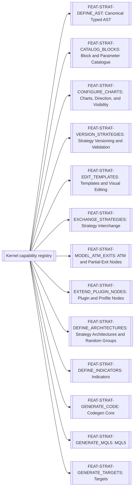

# Strategy

> **Package:** `app/services/strategy/`
> **Status:** `Missing`
> **Last updated:** `2026-08-23`
> **Domain ID:** `D-STRAT`

> This README is the domain package's **single source of truth** for domain boundaries, composable feature capabilities, architecture invariants, implementation sequence, progress, usage examples, and tests.
> Update this document before modifying or adding code.

---

## Code-Aligned Implementation Convention

This README is the sole current target registry for this domain's feature IDs and statuses, functional requirements, domain-local workflows, semantic contract ownership, persisted-state model, acceptance evidence, and deletion behavior. `PROJECT.md` owns system scope, cross-domain behavior, system NFRs, and release gates; `ARCHITECTURE.md` owns universal package and runtime constraints. Feature-local READMEs, manifests, contract definitions, migrations, and tests provide current implementation evidence without silently changing this target registry.

Implementation uses the repository's existing feature substrate: each feature lives directly at `app/services/<domain>/<feature>/`, is discovered through the `haruquantai.features` Python entry-point group, and declares one immutable `FeatureSpec` in `manifest.py`. There are no domain or feature YAML manifests.

Every implemented feature also contains a mandatory runtime-validated `README.md`, pure `__init__.py`, strict `config.py`, lifecycle `feature.py`, and focused implementation modules. Dependencies and effects flow through `FeatureContext`/`FeatureScope`; cross-feature implementation imports are forbidden. Persistent state is declared by `FeatureSpec.state`; any migrations and storage adapters remain with the owning feature. Capability keys use `<domain>.<name>@<major>`. FR IDs remain product, acceptance, and test-trace identities rather than one runtime registration per FR. A requirement `Depends` cell expresses product sequencing, traceability, or acceptance evidence only; runtime dependencies are declared separately with exact keys in `FeatureSpec.requires` or `FeatureSpec.optional`.

Feature-level automated tests live at `tests/services/strategy/<feature>/`. Usage examples never live under `tests/`; they belong to each feature's designated primary domain-logic module. Broader automated verification retains its documented architecture, composition, API, integration, or system test location. The code-backed procedure is the [Feature Implementation Pipeline](../../../docs/dev/feature_implementation_pipeline.md).

## 1. Purpose and Boundary

### Purpose

The Strategy domain delivers canonical typed strategy representation, blocks, indicators, validation, templates, editing, interchange, code generation, target lowering, compiler/tester adapters, and deployment packages. Its public feature capabilities are registered and remain independent of package-import order. Removing the domain produces the degradation defined below rather than preventing the shared substrate or unrelated domains from starting.

### Owns

- `FEAT-STRAT-DEFINE_AST` — Canonical Typed AST.
- `FEAT-STRAT-CATALOG_BLOCKS` — Block and Parameter Catalogue.
- `FEAT-STRAT-CONFIGURE_CHARTS` — Charts, Direction, and Visibility.
- `FEAT-STRAT-VERSION_STRATEGIES` — Strategy Versioning and Validation.
- `FEAT-STRAT-EDIT_TEMPLATES` — Templates and Visual Editing.
- `FEAT-STRAT-EXCHANGE_STRATEGIES` — Strategy Interchange.
- `FEAT-STRAT-MODEL_ATM_EXITS` — ATM and Partial-Exit Nodes.
- `FEAT-STRAT-EXTEND_PLUGIN_NODES` — Plugin and Profile Nodes.
- `FEAT-STRAT-DEFINE_ARCHITECTURES` — Strategy Architectures and Random Groups.
- `FEAT-STRAT-DEFINE_INDICATORS` — Indicators.
- `FEAT-STRAT-GENERATE_CODE` — Codegen Core.
- `FEAT-STRAT-GENERATE_MQL5` — MQL5.
- `FEAT-STRAT-GENERATE_TARGETS` — Targets.

### Does not own

- Historical-series storage, native execution, result analysis, research scheduling, or third-party package lifecycle.
- Volume Profile/TPO source preparation or calculation; Data owns validated inputs, Simulator owns deterministic calculation, and Strategy owns typed nodes that reference the resulting capability.
- Composition lifecycle, dependency resolution, effect reversal, and transactional replacement; those belong to the non-domain shared substrate (`app/contracts/`, `app/kernel/`, and `app/composition/`).
- **Deletion boundary:** deleting `app/services/strategy/` means strategy authoring, interpretation, indicator definitions, interchange, and code generation disappear; stored strategy and generated-code containers remain retained and other domains reject unresolved strategy capabilities cleanly. Data ingestion, workspace operation, and unrelated domains shall remain healthy.

### Shared Contracts

This domain semantically owns the contracts listed below, but their sole physical definitions live in `app/contracts/strategy/` and wire schemas in `app/contracts/strategy/wire/`. `app/services/strategy/` contains implementations only and shall not define or re-export substitute public contract types. Contract versions and semantic owners must agree with `PROJECT.md` and this README. Feature IDs and FR IDs are documentation, lifecycle, acceptance, and traceability identities; runtime bindings use exact versioned `CapabilityKey` declarations in contracts and `FeatureSpec`. The exact public records and capability bundles are listed in the [Shared Contracts README](../../contracts/README.md#44-appcontractsstrategy).

Rows labelled `FEAT-* capability surface` describe planned semantic contract bundles, not literal runtime capability keys. A listed counterparty may produce, consume, or observe the bundle and does not establish package-import or runtime dependency direction.

**Owned by this domain**

| Status | Contract | Version | Counterparty | Purpose |
|---|---|---|---|---|
| Missing | `FEAT-STRAT-DEFINE_AST` capability surface | `v1` | Analytics, Data, Plugins, Simulator, Workspace | Canonical Typed AST. |
| Missing | `FEAT-STRAT-CATALOG_BLOCKS` capability surface | `v1` | Analytics, Data, Plugins, Simulator, Workspace | Block and Parameter Catalogue. |
| Missing | `FEAT-STRAT-CONFIGURE_CHARTS` capability surface | `v1` | Analytics, Data, Plugins, Simulator, Workspace | Charts, Direction, and Visibility. |
| Missing | `FEAT-STRAT-VERSION_STRATEGIES` capability surface | `v1` | Analytics, Data, Plugins, Simulator, Workspace | Strategy Versioning and Validation. |
| Missing | `FEAT-STRAT-EDIT_TEMPLATES` capability surface | `v1` | Analytics, Data, Plugins, Simulator, Workspace | Templates and Visual Editing. |
| Missing | `FEAT-STRAT-EXCHANGE_STRATEGIES` capability surface | `v1` | Analytics, Data, Plugins, Simulator, Workspace | Strategy Interchange. |
| Missing | `FEAT-STRAT-MODEL_ATM_EXITS` capability surface | `v1` | Analytics, Data, Plugins, Simulator, Workspace | ATM and Partial-Exit Nodes. |
| Missing | `FEAT-STRAT-EXTEND_PLUGIN_NODES` capability surface | `v1` | Analytics, Data, Plugins, Simulator, Workspace | Plugin and Profile Nodes. |
| Missing | `FEAT-STRAT-DEFINE_ARCHITECTURES` capability surface | `v1` | Analytics, Data, Plugins, Simulator, Workspace | Strategy Architectures and Random Groups. |
| Missing | `FEAT-STRAT-DEFINE_INDICATORS` capability surface | `v1` | Analytics, Data, Plugins, Simulator, Workspace | Indicators. |
| Missing | `FEAT-STRAT-GENERATE_CODE` capability surface | `v1` | Analytics, Data, Plugins, Simulator, Workspace | Codegen Core. |
| Missing | `FEAT-STRAT-GENERATE_MQL5` capability surface | `v1` | Analytics, Data, Plugins, Simulator, Workspace | MQL5. |
| Missing | `FEAT-STRAT-GENERATE_TARGETS` capability surface | `v1` | Analytics, Data, Plugins, Simulator, Workspace | Targets. |

**Cross-domain requirement references (not runtime dependencies)**

The rows below summarize foreign owner tokens found in FR `Depends` cells. They express product sequencing, traceability, or acceptance-evidence relationships only. Actual runtime consumption must name an exact versioned capability key in the consuming feature's `FeatureSpec.requires` or `FeatureSpec.optional` and must follow the dependency direction in `PROJECT.md` and `ARCHITECTURE.md`.

| Referenced domain set | Documentation version | Owner | Meaning |
|---|---|---|---|
| `D-ANA` public capability set | `v1` | Analytics | Requirements whose `Depends` cell names `ANA-*`. |
| `D-DATA` public capability set | `v1` | Data | Requirements whose `Depends` cell names `DATA-*`. |
| `D-PLUG` public capability set | `v1` | Plugins | Requirements whose `Depends` cell names `PLUG-*`. |
| `D-SIM` public capability set | `v1` | Simulator | Requirements whose `Depends` cell names `SIM-*`. |
| `D-WS` public capability set | `v1` | Workspace | Requirements whose `Depends` cell names `WS-*`. |

### Persisted State Ownership

| Status | State / Store | Read access (via contract) | Migration definitions |
|---|---|---|---|
| Missing | strategies, strategy_versions, strategy_charts, block_definitions, external_indicator_definitions, external_indicator_definition_versions, random_group_versions, opposite_map_versions, engine_profile_versions, codegen_runs, deployment_packages | Other domains through `D-STRAT` public capabilities only | The owning feature's `StateDeclaration` and migration/storage adapter |

### Four-Level Structural Hierarchy

| Code level | Represents | This package |
|---|---|---|
| **Package** | Domain | `app/services/strategy/` / `D-STRAT` |
| **Module folder** | Feature / capability | One folder for each of: Canonical Typed AST, Block and Parameter Catalogue, Charts, Direction, and Visibility, Strategy Versioning and Validation, Templates and Visual Editing, Strategy Interchange, ATM and Partial-Exit Nodes, Plugin and Profile Nodes, Strategy Architectures and Random Groups, Indicators, Codegen Core, MQL5, Targets |
| **File** | Use case or focused responsibility | Exactly the responsibility file named in each module specification |
| **Class / function / method** | Functional requirement behavior | Exactly one registered `fr_*` behavior per `FR-*` row |

```text
Package (Domain)
└── Module folder (Feature)
    └── File (Responsibility)
        └── Registered function (Functional requirement behavior)
```

### Domain Capability Map


```mermaid
flowchart TD
    DOMAIN[[D-STRAT: Strategy]]
    DOMAIN --> FEAT_STRAT_DEFINE_AST[[FEAT-STRAT-DEFINE_AST: Canonical Typed AST]]
    FEAT_STRAT_DEFINE_AST --> FEAT_STRAT_DEFINE_AST_FILE[canonical_ast.py: RESP-STRAT-01-01]
    DOMAIN --> FEAT_STRAT_CATALOG_BLOCKS[[FEAT-STRAT-CATALOG_BLOCKS: Block and Parameter Catalogue]]
    FEAT_STRAT_CATALOG_BLOCKS --> FEAT_STRAT_CATALOG_BLOCKS_FILE[block_parameter_catalogue.py: RESP-STRAT-02-01]
    DOMAIN --> FEAT_STRAT_CONFIGURE_CHARTS[[FEAT-STRAT-CONFIGURE_CHARTS: Charts, Direction, and Visibility]]
    FEAT_STRAT_CONFIGURE_CHARTS --> FEAT_STRAT_CONFIGURE_CHARTS_FILE[strategy_chart_visibility.py: RESP-STRAT-03-01]
    DOMAIN --> FEAT_STRAT_VERSION_STRATEGIES[[FEAT-STRAT-VERSION_STRATEGIES: Strategy Versioning and Validation]]
    FEAT_STRAT_VERSION_STRATEGIES --> FEAT_STRAT_VERSION_STRATEGIES_FILE[strategy_version_validation.py: RESP-STRAT-04-01]
    DOMAIN --> FEAT_STRAT_EDIT_TEMPLATES[[FEAT-STRAT-EDIT_TEMPLATES: Templates and Visual Editing]]
    FEAT_STRAT_EDIT_TEMPLATES --> FEAT_STRAT_EDIT_TEMPLATES_FILE[template_visual_editing.py: RESP-STRAT-05-01]
    DOMAIN --> FEAT_STRAT_EXCHANGE_STRATEGIES[[FEAT-STRAT-EXCHANGE_STRATEGIES: Strategy Interchange]]
    FEAT_STRAT_EXCHANGE_STRATEGIES --> FEAT_STRAT_EXCHANGE_STRATEGIES_FILE[strategy_interchange.py: RESP-STRAT-06-01]
    DOMAIN --> FEAT_STRAT_MODEL_ATM_EXITS[[FEAT-STRAT-MODEL_ATM_EXITS: ATM and Partial-Exit Nodes]]
    FEAT_STRAT_MODEL_ATM_EXITS --> FEAT_STRAT_MODEL_ATM_EXITS_FILE[atm_partial_exit_nodes.py: RESP-STRAT-07-01]
    DOMAIN --> FEAT_STRAT_EXTEND_PLUGIN_NODES[[FEAT-STRAT-EXTEND_PLUGIN_NODES: Plugin and Profile Nodes]]
    FEAT_STRAT_EXTEND_PLUGIN_NODES --> FEAT_STRAT_EXTEND_PLUGIN_NODES_FILE[plugin_profile_nodes.py: RESP-STRAT-08-01]
    DOMAIN --> FEAT_STRAT_DEFINE_ARCHITECTURES[[FEAT-STRAT-DEFINE_ARCHITECTURES: Strategy Architectures and Random Groups]]
    FEAT_STRAT_DEFINE_ARCHITECTURES --> FEAT_STRAT_DEFINE_ARCHITECTURES_FILE[strategy_architectures.py: RESP-STRAT-09-01]
    DOMAIN --> FEAT_STRAT_DEFINE_INDICATORS[[FEAT-STRAT-DEFINE_INDICATORS: Indicators]]
    FEAT_STRAT_DEFINE_INDICATORS --> FEAT_STRAT_DEFINE_INDICATORS_FILE[indicator_definitions.py: RESP-STRAT-10-01]
    DOMAIN --> FEAT_STRAT_GENERATE_CODE[[FEAT-STRAT-GENERATE_CODE: Codegen Core]]
    FEAT_STRAT_GENERATE_CODE --> FEAT_STRAT_GENERATE_CODE_FILE[codegen_core.py: RESP-STRAT-11-01]
    DOMAIN --> FEAT_STRAT_GENERATE_MQL5[[FEAT-STRAT-GENERATE_MQL5: MQL5]]
    FEAT_STRAT_GENERATE_MQL5 --> FEAT_STRAT_GENERATE_MQL5_FILE[mql5_toolchain.py: RESP-STRAT-12-01]
    DOMAIN --> FEAT_STRAT_GENERATE_TARGETS[[FEAT-STRAT-GENERATE_TARGETS: Targets]]
    FEAT_STRAT_GENERATE_TARGETS --> FEAT_STRAT_GENERATE_TARGETS_FILE[additional_targets.py: RESP-STRAT-13-01]
```

---

## 2. Final Package Structure and Feature Independence

```text
strategy/
├── README.md
├── __init__.py
├── canonical_ast/                    # FEAT-STRAT-DEFINE_AST: Canonical Typed AST
│   ├── README.md
│   ├── __init__.py
│   ├── manifest.py
│   ├── config.py
│   ├── feature.py
│   └── canonical_ast.py              # RESP-STRAT-01-01
├── block_parameter_catalogue/                    # FEAT-STRAT-CATALOG_BLOCKS: Block and Parameter Catalogue
│   ├── README.md
│   ├── __init__.py
│   ├── manifest.py
│   ├── config.py
│   ├── feature.py
│   └── block_parameter_catalogue.py              # RESP-STRAT-02-01
├── strategy_chart_visibility/                    # FEAT-STRAT-CONFIGURE_CHARTS: Charts, Direction, and Visibility
│   ├── README.md
│   ├── __init__.py
│   ├── manifest.py
│   ├── config.py
│   ├── feature.py
│   └── strategy_chart_visibility.py              # RESP-STRAT-03-01
├── strategy_version_validation/                    # FEAT-STRAT-VERSION_STRATEGIES: Strategy Versioning and Validation
│   ├── README.md
│   ├── __init__.py
│   ├── manifest.py
│   ├── config.py
│   ├── feature.py
│   └── strategy_version_validation.py              # RESP-STRAT-04-01
├── template_visual_editing/                    # FEAT-STRAT-EDIT_TEMPLATES: Templates and Visual Editing
│   ├── README.md
│   ├── __init__.py
│   ├── manifest.py
│   ├── config.py
│   ├── feature.py
│   └── template_visual_editing.py              # RESP-STRAT-05-01
├── strategy_interchange/                    # FEAT-STRAT-EXCHANGE_STRATEGIES: Strategy Interchange
│   ├── README.md
│   ├── __init__.py
│   ├── manifest.py
│   ├── config.py
│   ├── feature.py
│   └── strategy_interchange.py              # RESP-STRAT-06-01
├── atm_partial_exit_nodes/                    # FEAT-STRAT-MODEL_ATM_EXITS: ATM and Partial-Exit Nodes
│   ├── README.md
│   ├── __init__.py
│   ├── manifest.py
│   ├── config.py
│   ├── feature.py
│   └── atm_partial_exit_nodes.py              # RESP-STRAT-07-01
├── plugin_profile_nodes/                    # FEAT-STRAT-EXTEND_PLUGIN_NODES: Plugin and Profile Nodes
│   ├── README.md
│   ├── __init__.py
│   ├── manifest.py
│   ├── config.py
│   ├── feature.py
│   └── plugin_profile_nodes.py              # RESP-STRAT-08-01
├── strategy_architectures/                    # FEAT-STRAT-DEFINE_ARCHITECTURES: Strategy Architectures and Random Groups
│   ├── README.md
│   ├── __init__.py
│   ├── manifest.py
│   ├── config.py
│   ├── feature.py
│   └── strategy_architectures.py              # RESP-STRAT-09-01
├── indicators/                    # FEAT-STRAT-DEFINE_INDICATORS: Indicators
│   ├── README.md
│   ├── __init__.py
│   ├── manifest.py
│   ├── config.py
│   ├── feature.py
│   └── indicator_definitions.py              # RESP-STRAT-10-01
├── codegen/                    # FEAT-STRAT-GENERATE_CODE: Codegen Core
│   ├── README.md
│   ├── __init__.py
│   ├── manifest.py
│   ├── config.py
│   ├── feature.py
│   └── codegen_core.py              # RESP-STRAT-11-01
├── mql5/                    # FEAT-STRAT-GENERATE_MQL5: MQL5
│   ├── README.md
│   ├── __init__.py
│   ├── manifest.py
│   ├── config.py
│   ├── feature.py
│   └── mql5_toolchain.py              # RESP-STRAT-12-01
└── targets/                    # FEAT-STRAT-GENERATE_TARGETS: Targets
    ├── README.md
    ├── __init__.py
    ├── manifest.py
    ├── config.py
    ├── feature.py
    └── additional_targets.py              # RESP-STRAT-13-01
```

### Module dependency diagram

Feature modules do not import one another's private files. Runtime dependencies resolve through kernel capabilities obtained from `FeatureContext`; composition selects providers and reconciles changes, so reciprocal workflow participation cannot create a package-import cycle.


```mermaid
flowchart LR
    K[[Kernel capability registry]]
    K --> FEAT_STRAT_DEFINE_AST[[FEAT-STRAT-DEFINE_AST: Canonical Typed AST]]
    K --> FEAT_STRAT_CATALOG_BLOCKS[[FEAT-STRAT-CATALOG_BLOCKS: Block and Parameter Catalogue]]
    K --> FEAT_STRAT_CONFIGURE_CHARTS[[FEAT-STRAT-CONFIGURE_CHARTS: Charts, Direction, and Visibility]]
    K --> FEAT_STRAT_VERSION_STRATEGIES[[FEAT-STRAT-VERSION_STRATEGIES: Strategy Versioning and Validation]]
    K --> FEAT_STRAT_EDIT_TEMPLATES[[FEAT-STRAT-EDIT_TEMPLATES: Templates and Visual Editing]]
    K --> FEAT_STRAT_EXCHANGE_STRATEGIES[[FEAT-STRAT-EXCHANGE_STRATEGIES: Strategy Interchange]]
    K --> FEAT_STRAT_MODEL_ATM_EXITS[[FEAT-STRAT-MODEL_ATM_EXITS: ATM and Partial-Exit Nodes]]
    K --> FEAT_STRAT_EXTEND_PLUGIN_NODES[[FEAT-STRAT-EXTEND_PLUGIN_NODES: Plugin and Profile Nodes]]
    K --> FEAT_STRAT_DEFINE_ARCHITECTURES[[FEAT-STRAT-DEFINE_ARCHITECTURES: Strategy Architectures and Random Groups]]
    K --> FEAT_STRAT_DEFINE_INDICATORS[[FEAT-STRAT-DEFINE_INDICATORS: Indicators]]
    K --> FEAT_STRAT_GENERATE_CODE[[FEAT-STRAT-GENERATE_CODE: Codegen Core]]
    K --> FEAT_STRAT_GENERATE_MQL5[[FEAT-STRAT-GENERATE_MQL5: MQL5]]
    K --> FEAT_STRAT_GENERATE_TARGETS[[FEAT-STRAT-GENERATE_TARGETS: Targets]]
```

### Structure rules

- The package root contains `README.md`, import-pure `__init__.py`, and one direct folder per feature; discovery uses the `haruquantai.features` entry-point group.
- Each feature folder contains mandatory `README.md`, pure `__init__.py`, `manifest.py`, `config.py`, `feature.py`, and focused responsibility modules.
- `FR-*`/`fr_*` names provide product, implementation, and test traceability inside the feature; they are not separate runtime registrations or capability keys.
- Cross-feature and cross-domain behavior is injected by capability key. Direct private-file imports are prohibited.
- Every core capability module documents Python and CLI usage; exactly one designated primary domain-logic module owns the feature's executable `__main__` demonstration. Usage examples never live under `tests/`.

---

## 3. Workflows

| Status | Workflow ID | Scope | Workflow | Trigger / Input boundary | Final outcome / Output boundary | Requirement sequence |
|---|---|---|---|---|---|---|
| Missing | `WF-STRAT-001` | Cross-domain | Canonical Typed AST | Validated command/query and required capability bindings | Requirement-defined result, artifact, event, or degradation | `FR-STRAT-REPRESENT_TYPED_AST` → `FR-STRAT-DEFINE_AST_NODES` → `FR-STRAT-DEFINE_AST_TYPES` → `FR-STRAT-DESCRIBE_BLOCKS` |
| Missing | `WF-STRAT-002` | Internal | Block and Parameter Catalogue | Validated command/query and required capability bindings | Requirement-defined result, artifact, event, or degradation | `FR-STRAT-SUPPORT_STRATEGY_NODES` → `FR-STRAT-DEFINE_PARAMETER_DOMAINS` → `FR-STRAT-CATALOG_REFERENCE_BLOCKS` |
| Missing | `WF-STRAT-003` | Cross-domain | Charts, Direction, and Visibility | Validated command/query and required capability bindings | Requirement-defined result, artifact, event, or degradation | `FR-STRAT-CATALOG_BUILTIN_BLOCKS` → `FR-STRAT-CONFIGURE_TRADE_DIRECTIONS` → `FR-STRAT-DEFINE_SERIES_SHIFTS` |
| Missing | `WF-STRAT-004` | Internal | Strategy Versioning and Validation | Validated command/query and required capability bindings | Requirement-defined result, artifact, event, or degradation | `FR-STRAT-VERSION_STRATEGY_DRAFTS` → `FR-STRAT-NORMALIZE_STRATEGY_AST` → `FR-STRAT-VALIDATE_STRATEGIES` |
| Missing | `WF-STRAT-005` | Cross-domain | Templates and Visual Editing | Validated command/query and required capability bindings | Requirement-defined result, artifact, event, or degradation | `FR-STRAT-DEFINE_STRATEGY_TEMPLATES` → `FR-STRAT-EDIT_STRATEGIES_VISUALLY` → `FR-STRAT-FILTER_COMPATIBLE_BLOCKS` → `FR-STRAT-SNAPSHOT_BACKTEST_DRAFT` → `FR-STRAT-DEFINE_SEARCH_PARAMETERS` → `FR-STRAT-CONSTRAIN_TEMPLATE_GRAMMAR` |
| Missing | `WF-STRAT-006` | Cross-domain | Strategy Interchange | Validated command/query and required capability bindings | Requirement-defined result, artifact, event, or degradation | `FR-STRAT-EXCHANGE_NATIVE_STRATEGIES` → `FR-STRAT-ISOLATE_LEGACY_IMPORTS` → `FR-STRAT-IMPORT_LEGACY_STRATEGIES` |
| Missing | `WF-STRAT-007` | Cross-domain | ATM and Partial-Exit Nodes | Validated command/query and required capability bindings | Requirement-defined result, artifact, event, or degradation | `FR-STRAT-MODEL_ATM_EXITS` |
| Missing | `WF-STRAT-008` | Cross-domain | Plugin and Profile Nodes | Validated command/query and required capability bindings | Requirement-defined result, artifact, event, or degradation | `FR-STRAT-IDENTIFY_PLUGIN_NODES` → `FR-STRAT-CALCULATE_VOLUME_PROFILES` |
| Missing | `WF-STRAT-009` | Cross-domain | Strategy Architectures and Random Groups | Validated command/query and required capability bindings | Requirement-defined result, artifact, event, or degradation | `FR-STRAT-DEFINE_STRATEGY_ARCHITECTURES` → `FR-STRAT-DEFINE_RANDOM_GROUPS` → `FR-STRAT-MAP_OPPOSITE_BLOCKS` |
| Missing | `WF-STRAT-010` | Cross-domain | Indicators | Validated command/query and required capability bindings | Requirement-defined result, artifact, event, or degradation | `FR-STRAT-DEFINE_EXTERNAL_INDICATORS` |
| Missing | `WF-STRAT-011` | Cross-domain | Codegen Core | Validated command/query and required capability bindings | Requirement-defined result, artifact, event, or degradation | `FR-STRAT-REGISTER_CODE_TARGETS` → `FR-STRAT-GENERATE_CODE_DETERMINISTICALLY` → `FR-STRAT-EMBED_CODE_MANIFEST` → `FR-STRAT-LOWER_TYPED_VALUES` → `FR-STRAT-DESCRIBE_EMITTER_CAPABILITIES` → `FR-STRAT-SHARE_TARGET_SEMANTICS` → `FR-STRAT-GENERATE_PSEUDOCODE` → `FR-STRAT-ADVERTISE_COMPATIBLE_TARGETS` |
| Missing | `WF-STRAT-012` | Cross-domain | MQL5 | Validated command/query and required capability bindings | Requirement-defined result, artifact, event, or degradation | `FR-STRAT-GENERATE_MQL5_TARGET` → `FR-STRAT-INVOKE_METAEDITOR` → `FR-STRAT-PARSE_COMPILER_DIAGNOSTICS` → `FR-STRAT-VERIFY_MQL5_COMPILE` → `FR-STRAT-COMPARE_MQL5_RESULTS` → `FR-STRAT-STORE_CODE_ARTIFACTS` → `FR-STRAT-PACKAGE_TARGET_CODE` → `FR-STRAT-MAP_ORDER_IDENTITIES` → `FR-STRAT-ISOLATE_INDICATOR_FRAGMENTS` |
| Missing | `WF-STRAT-013` | Internal | Targets | Validated command/query and required capability bindings | Requirement-defined result, artifact, event, or degradation | `FR-STRAT-IMPLEMENT_CODE_TARGETS` |

### `WF-STRAT-001` — Canonical Typed AST

**Scope:** `Cross-domain` when the request requires another domain capability; otherwise `Internal`.

**System workflow:** `SYS-WF-003, SYS-WF-005`

**Input boundary:** A validated request/query plus an immutable capability snapshot and provider bindings.

**Output boundary:** The result/artifact/event defined by the participating `FR-*` rows, or their exact structured failure/degradation outcome.

1. `Feature.mount()` resolves its declared required capabilities through `FeatureContext`.
2. `canonical_ast.py` executes `fr_strat_represent_typed_ast`, `fr_strat_define_ast_nodes`, `fr_strat_define_ast_types`, `fr_strat_describe_blocks` in the requirement-defined order.
3. Scoped effects are committed or reversed under `FR-KERN-DEFINE_REQUIREMENT_BEHAVIOR, FR-KERN-DEFINE_LIFECYCLE_CONTEXT, FR-KERN-DECLARE_BEHAVIOR_DEPENDENCIES, FR-KERN-REGISTER_FEATURE_MODULES, FR-KERN-DEFINE_RESPONSIBILITY_FILES, FR-KERN-IMPLEMENT_REQUIREMENT_FUNCTIONS, FR-KERN-DEPEND_PUBLIC_PORTS, FR-KERN-NAMESPACE_CAPABILITY_KEYS, FR-KERN-DECLARE_DEPENDENCY_RULES, FR-KERN-REEVALUATE_DEPENDENCIES, FR-KERN-DEFINE_SCOPE_HIERARCHY, FR-KERN-PASS_EFFECT_SCOPES, FR-KERN-REGISTER_EFFECT_REVERSALS, FR-KERN-REVERSE_EFFECTS_LIFO, FR-KERN-ROLLBACK_FAILED_ACTIVATION, FR-KERN-MANAGE_COMPONENT_LIFECYCLE, FR-KERN-COMMIT_CAPABILITY_SWAP, FR-KERN-QUIESCE_DEPENDENT_WORK, FR-KERN-REMOVE_DEPENDENT_COMPONENTS, FR-KERN-ISOLATE_DISPOSAL_FAILURES, FR-KERN-RECONCILE_DESIRED_STATE, FR-KERN-REPLACE_COMPONENTS_TRANSACTIONALLY, FR-KERN-PROVIDE_SCOPED_REGISTRARS, FR-KERN-DRAIN_REMOVED_BEHAVIORS, FR-KERN-CLASSIFY_COMPONENT_EFFECTS, FR-KERN-NAMESPACE_COMPONENT_STATE, FR-KERN-REGISTER_EXTENSION_POINTS, FR-KERN-EMIT_CAUSAL_EVENTS, FR-KERN-REJECT_DEPENDENCY_CYCLES, FR-KERN-PIN_CAPABILITY_SNAPSHOTS, FR-KERN-TEST_COMPONENT_REMOVAL, FR-KERN-VERIFY_EXACT_REMOVAL, FR-KERN-ROUTE_MULTIPLE_PROVIDERS`.
4. The feature returns or publishes only the documented output boundary.

**Failure behaviour:**

- Feature unavailable → no strategy can be created or interpreted; unrelated domains continue. Requests requiring a removed feature capability return `CAPABILITY_UNAVAILABLE`; the domain continues loading.
- Missing/incompatible required capability → `CAPABILITY_UNAVAILABLE` or `CAPABILITY_INCOMPATIBLE`; no partial mutation.

**Integration test:**
`tests/services/strategy/integration/test_canonical_ast.py::test_canonical_ast_workflow()`


```mermaid
flowchart LR
    INPUT[Validated input + capability snapshot]
    FEATURE[[FEAT-STRAT-DEFINE_AST: Canonical Typed AST]]
    FILE[canonical_ast.py: RESP-STRAT-01-01]
    OUTPUT[Committed result or structured failure]
    INPUT --> FEATURE --> FILE --> OUTPUT
```

---

## 4. Composable Feature Specifications

Implement module sections from top to bottom. Requirement `Depends` cells define product and implementation ordering; runtime capability dependencies must be declared separately in the owning `FeatureSpec`.

---

### 4.1 `canonical_ast/` — Canonical Typed AST

**Feature ID:** `FEAT-STRAT-DEFINE_AST`

**Purpose:** Define the versioned ast, node identity, types, and block registry.

**Deletion contract:** no strategy can be created or interpreted; unrelated domains continue. Requests requiring a removed feature capability return `CAPABILITY_UNAVAILABLE`; the domain continues loading.

**Module flow:**

```text
validated input and capability bindings
  → canonical_ast.py
  → fr_strat_represent_typed_ast, fr_strat_define_ast_nodes, fr_strat_define_ast_types, fr_strat_describe_blocks
  → requirement-defined output or structured failure
```

#### Files

| Status | File | Responsibility | Key exports | Dependencies |
|---|---|---|---|---|
| Missing | `canonical_ast.py` | Define the versioned ast, node identity, types, and block registry | `fr_strat_represent_typed_ast`, `fr_strat_define_ast_nodes`, `fr_strat_define_ast_types`, `fr_strat_describe_blocks` | **Standard library:** selected per implementation and recorded before code<br>**Required third-party:** only libraries mandated by `PROJECT.md` or the requirement boundary<br>**Local:** capabilities declared by the owning `FeatureSpec`; no private cross-feature import |
| Missing | `feature.py` | Mount `FEAT-STRAT-DEFINE_AST` through `FeatureContext` and stage its declared providers/effects | `FEAT-STRAT-DEFINE_AST` `Feature.mount` | **Standard library:** None<br>**Required third-party:** None<br>**Local:** `manifest.py`, `config.py`, and focused responsibility modules |
| Missing | `manifest.py` | Define the immutable `FEAT-STRAT-DEFINE_AST` `FeatureSpec`: identity, domain, provided/required/optional capabilities, conflicts, state, and configuration keys | `FEAT-STRAT-DEFINE_AST` `FeatureSpec` | **Standard library:** None<br>**Required third-party:** None<br>**Local:** `app.kernel.feature.FeatureSpec` |

#### Configuration and Limits Manifest

| Status | Setting / Limit | Type | Default | Required | Used by | Description |
|---|---|---|---|---|---|---|
| Missing | `FEAT-STRAT-DEFINE_AST.configuration` | Versioned schema | No implicit defaults | Yes when referenced | `canonical_ast.py` | Exact fields, defaults, limits, and failure rules are those stated by the requirements and the normative technical appendices in `PROJECT.md`; unspecified values are rejected under Project §6. |

#### `canonical_ast.py` — Define the versioned ast, node identity, types, and block registry

**File responsibility:** Define the versioned ast, node identity, types, and block registry.

| Status | Requirement ID | Class | Pri | Responsibility | Class / Function / Method | Side Effects | Raises / failure | Depends | Source / confidence | Usage / Test |
|---|---|---|---|---|---|---|---|---|---|---|
| Missing | `FR-STRAT-REPRESENT_TYPED_AST` | Target | P0 | The system shall represent every strategy as a versioned typed AST independent of UI and source target. | `fr_strat_represent_typed_ast` implementation trace | Read-only | Serialize→deserialize→normalize retains AST hash and behavior. | FR-WS-MIGRATE_WORKSPACE_SCHEMA | `BD-07`; Verified concept | **Usage:** `app/services/strategy/canonical_ast/canonical_ast.py::__main__` scenario `FR-STRAT-REPRESENT_TYPED_AST`<br>**Unit:** `tests/services/strategy/canonical_ast/test_canonical_ast.py::test_strat_represent_typed_ast()` |
| Missing | `FR-STRAT-DEFINE_AST_NODES` | Target | P0 | AST nodes shall carry stable node ID, kind, block-definition ID/version, typed inputs, parameters, and ordered children where order is semantic. | `fr_strat_define_ast_nodes` implementation trace | None | Validation reports the exact node for every malformed fixture. | FR-STRAT-REPRESENT_TYPED_AST | Target | **Usage:** `app/services/strategy/canonical_ast/canonical_ast.py::__main__` scenario `FR-STRAT-DEFINE_AST_NODES`<br>**Unit:** `tests/services/strategy/canonical_ast/test_canonical_ast.py::test_strat_define_ast_nodes()` |
| Missing | `FR-STRAT-DEFINE_AST_TYPES` | Target | P0 | The type system shall include boolean, integer, decimal, price, quantity, percentage, duration, timeframe, instrument, enum, scalar series, and event/action types. | `fr_strat_define_ast_types` implementation trace | None | Invalid series→boolean or price→duration connections are rejected before save. | FR-STRAT-REPRESENT_TYPED_AST | Reference typed blocks; Verified concept | **Usage:** `app/services/strategy/canonical_ast/canonical_ast.py::__main__` scenario `FR-STRAT-DEFINE_AST_TYPES`<br>**Unit:** `tests/services/strategy/canonical_ast/test_canonical_ast.py::test_strat_define_ast_types()` |
| Missing | `FR-STRAT-DESCRIBE_BLOCKS` | Target | P0 | The block registry shall expose stable ID/version, category, input/output types, parameter schema, chart/data requirements, supported events, and target capabilities. | `fr_strat_describe_blocks` implementation trace | Read-only | Removing or changing a referenced block version cannot silently alter an existing strategy version. | FR-STRAT-DEFINE_AST_TYPES | Reference snippets; Verified concept | **Usage:** `app/services/strategy/canonical_ast/canonical_ast.py::__main__` scenario `FR-STRAT-DESCRIBE_BLOCKS`<br>**Unit:** `tests/services/strategy/canonical_ast/test_canonical_ast.py::test_strat_describe_blocks()` |

**Rules:**

- no strategy can be created or interpreted; unrelated domains continue. Requests requiring a removed feature capability return `CAPABILITY_UNAVAILABLE`; the domain continues loading.
- no business-domain dependency is resolved at package import; the owning `FeatureSpec` declares runtime dependencies once and this behavior consumes only that committed feature context.
- Each `FR-*` row maps to focused implementation and acceptance evidence inside this feature; removal occurs at feature-package granularity.
- Every effect must be scoped and classified under `FR-KERN-CLASSIFY_COMPONENT_EFFECTS`; the inferred table label must be corrected before implementation if the concrete adapter requires a narrower or additional effect class.

**Implementation notes:**

- Preserve the requirement statement, acceptance/failure behavior, dependencies, and source confidence as one indivisible implementation contract.
- Reuse public capability contracts; never copy another feature's or domain's business logic.
- Add private helpers only when needed by these public behaviors; helpers do not become new requirements.

#### Feature usage examples

The primary domain-logic module `app/services/strategy/canonical_ast/canonical_ast.py` owns the executable `__main__` usage harness, with one named scenario per requirement listed above.

---

### 4.2 `block_parameter_catalogue/` — Block and Parameter Catalogue

**Feature ID:** `FEAT-STRAT-CATALOG_BLOCKS`

**Purpose:** Define built-in blocks, parameter domains, and complete block metadata.

**Deletion contract:** affected blocks cannot validate or advertise; strategies using remaining blocks continue. Requests requiring a removed feature capability return `CAPABILITY_UNAVAILABLE`; the domain continues loading.

**Module flow:**

```text
validated input and capability bindings
  → block_parameter_catalogue.py
  → fr_strat_support_strategy_nodes, fr_strat_define_parameter_domains, fr_strat_catalog_reference_blocks
  → requirement-defined output or structured failure
```

#### Files

| Status | File | Responsibility | Key exports | Dependencies |
|---|---|---|---|---|
| Missing | `block_parameter_catalogue.py` | Define built-in blocks, parameter domains, and complete block metadata | `fr_strat_support_strategy_nodes`, `fr_strat_define_parameter_domains`, `fr_strat_catalog_reference_blocks` | **Standard library:** selected per implementation and recorded before code<br>**Required third-party:** only libraries mandated by `PROJECT.md` or the requirement boundary<br>**Local:** capabilities declared by the owning `FeatureSpec`; no private cross-feature import |
| Missing | `feature.py` | Mount `FEAT-STRAT-CATALOG_BLOCKS` through `FeatureContext` and stage its declared providers/effects | `FEAT-STRAT-CATALOG_BLOCKS` `Feature.mount` | **Standard library:** None<br>**Required third-party:** None<br>**Local:** `manifest.py`, `config.py`, and focused responsibility modules |
| Missing | `manifest.py` | Define the immutable `FEAT-STRAT-CATALOG_BLOCKS` `FeatureSpec`: identity, domain, provided/required/optional capabilities, conflicts, state, and configuration keys | `FEAT-STRAT-CATALOG_BLOCKS` `FeatureSpec` | **Standard library:** None<br>**Required third-party:** None<br>**Local:** `app.kernel.feature.FeatureSpec` |

#### Configuration and Limits Manifest

| Status | Setting / Limit | Type | Default | Required | Used by | Description |
|---|---|---|---|---|---|---|
| Missing | `FEAT-STRAT-CATALOG_BLOCKS.configuration` | Versioned schema | No implicit defaults | Yes when referenced | `block_parameter_catalogue.py` | Exact fields, defaults, limits, and failure rules are those stated by the requirements and the normative technical appendices in `PROJECT.md`; unspecified values are rejected under Project §6. |

#### `block_parameter_catalogue.py` — Define built-in blocks, parameter domains, and complete block metadata

**File responsibility:** Define built-in blocks, parameter domains, and complete block metadata.

| Status | Requirement ID | Class | Pri | Responsibility | Class / Function / Method | Side Effects | Raises / failure | Depends | Source / confidence | Usage / Test |
|---|---|---|---|---|---|---|---|---|---|---|
| Missing | `FR-STRAT-SUPPORT_STRATEGY_NODES` | Parity | P1 | Phase 1 shall support every event, condition, Boolean, comparison, cross, arithmetic, price-series, indicator, variable, and order/exit action node in §17. | `fr_strat_support_strategy_nodes` implementation trace | Read-only | Every applicable §23 fixture can be authored visually, validated, serialized, and backtested. | FR-STRAT-DESCRIBE_BLOCKS | Specified §17 | **Usage:** `app/services/strategy/block_parameter_catalogue/block_parameter_catalogue.py::__main__` scenario `FR-STRAT-SUPPORT_STRATEGY_NODES`<br>**Unit:** `tests/services/strategy/block_parameter_catalogue/test_block_parameter_catalogue.py::test_strat_support_strategy_nodes()` |
| Missing | `FR-STRAT-DEFINE_PARAMETER_DOMAINS` | Target | P0 | Parameters shall support fixed value, discrete set, range/step, and typed default; Phase 1 executes fixed values while preserving domains for later search. | `fr_strat_define_parameter_domains` implementation trace | Read-only | Integer 5–15 step 5 enumerates exactly 5, 10, 15. | FR-STRAT-DESCRIBE_BLOCKS | Reference blocks; Verified concept | **Usage:** `app/services/strategy/block_parameter_catalogue/block_parameter_catalogue.py::__main__` scenario `FR-STRAT-DEFINE_PARAMETER_DOMAINS`<br>**Unit:** `tests/services/strategy/block_parameter_catalogue/test_block_parameter_catalogue.py::test_strat_define_parameter_domains()` |
| Missing | `FR-STRAT-CATALOG_REFERENCE_BLOCKS` | Parity | P0 | The release shall include a normative, versioned catalogue of every supported built-in event, condition, value, indicator, action, sizing, entry, exit, and money-management block, including parameter domains, defaults, typing, lookback, evaluation event, target support, and at least one independent fixture. | `fr_strat_catalog_reference_blocks` implementation trace | Read-only | A block cannot be advertised or selected by Builder/editor unless its catalogue record, implementation, serialization, deterministic fixture, and capability checks all pass. | FR-STRAT-DEFINE_AST_TYPES, FR-STRAT-DESCRIBE_BLOCKS, FR-STRAT-SUPPORT_STRATEGY_NODES, FR-STRAT-REGISTER_CODE_TARGETS | [How StrategyQuant works](https://strategyquant.com/doc/strategyquant/how-does-strategyquant-work/); Documentation alignment | **Usage:** `app/services/strategy/block_parameter_catalogue/block_parameter_catalogue.py::__main__` scenario `FR-STRAT-CATALOG_REFERENCE_BLOCKS`<br>**Unit:** `tests/services/strategy/block_parameter_catalogue/test_block_parameter_catalogue.py::test_strat_catalog_reference_blocks()` |

**Rules:**

- affected blocks cannot validate or advertise; strategies using remaining blocks continue. Requests requiring a removed feature capability return `CAPABILITY_UNAVAILABLE`; the domain continues loading.
- no business-domain dependency is resolved at package import; the owning `FeatureSpec` declares runtime dependencies once and this behavior consumes only that committed feature context.
- Each `FR-*` row maps to focused implementation and acceptance evidence inside this feature; removal occurs at feature-package granularity.
- Every effect must be scoped and classified under `FR-KERN-CLASSIFY_COMPONENT_EFFECTS`; the inferred table label must be corrected before implementation if the concrete adapter requires a narrower or additional effect class.

**Implementation notes:**

- Preserve the requirement statement, acceptance/failure behavior, dependencies, and source confidence as one indivisible implementation contract.
- Reuse public capability contracts; never copy another feature's or domain's business logic.
- Add private helpers only when needed by these public behaviors; helpers do not become new requirements.

#### Feature usage examples

The primary domain-logic module `app/services/strategy/block_parameter_catalogue/block_parameter_catalogue.py` owns the executable `__main__` usage harness, with one named scenario per requirement listed above.

---

### 4.3 `strategy_chart_visibility/` — Charts, Direction, and Visibility

**Feature ID:** `FEAT-STRAT-CONFIGURE_CHARTS`

**Purpose:** Bind charts, direction symmetry, and observable series shifts.

**Deletion contract:** multi-chart/direction features are unavailable without corrupting stored ASTs. Requests requiring a removed feature capability return `CAPABILITY_UNAVAILABLE`; the domain continues loading.

**Module flow:**

```text
validated input and capability bindings
  → strategy_chart_visibility.py
  → fr_strat_catalog_builtin_blocks, fr_strat_configure_trade_directions, fr_strat_define_series_shifts
  → requirement-defined output or structured failure
```

#### Files

| Status | File | Responsibility | Key exports | Dependencies |
|---|---|---|---|---|
| Missing | `strategy_chart_visibility.py` | Bind charts, direction symmetry, and observable series shifts | `fr_strat_catalog_builtin_blocks`, `fr_strat_configure_trade_directions`, `fr_strat_define_series_shifts` | **Standard library:** selected per implementation and recorded before code<br>**Required third-party:** only libraries mandated by `PROJECT.md` or the requirement boundary<br>**Local:** capabilities declared by the owning `FeatureSpec`; no private cross-feature import |
| Missing | `feature.py` | Mount `FEAT-STRAT-CONFIGURE_CHARTS` through `FeatureContext` and stage its declared providers/effects | `FEAT-STRAT-CONFIGURE_CHARTS` `Feature.mount` | **Standard library:** None<br>**Required third-party:** None<br>**Local:** `manifest.py`, `config.py`, and focused responsibility modules |
| Missing | `manifest.py` | Define the immutable `FEAT-STRAT-CONFIGURE_CHARTS` `FeatureSpec`: identity, domain, provided/required/optional capabilities, conflicts, state, and configuration keys | `FEAT-STRAT-CONFIGURE_CHARTS` `FeatureSpec` | **Standard library:** None<br>**Required third-party:** None<br>**Local:** `app.kernel.feature.FeatureSpec` |

#### Configuration and Limits Manifest

| Status | Setting / Limit | Type | Default | Required | Used by | Description |
|---|---|---|---|---|---|---|
| Missing | `FEAT-STRAT-CONFIGURE_CHARTS.configuration` | Versioned schema | No implicit defaults | Yes when referenced | `strategy_chart_visibility.py` | Exact fields, defaults, limits, and failure rules are those stated by the requirements and the normative technical appendices in `PROJECT.md`; unspecified values are rejected under Project §6. |

#### `strategy_chart_visibility.py` — Bind charts, direction symmetry, and observable series shifts

**File responsibility:** Bind charts, direction symmetry, and observable series shifts.

| Status | Requirement ID | Class | Pri | Responsibility | Class / Function / Method | Side Effects | Raises / failure | Depends | Source / confidence | Usage / Test |
|---|---|---|---|---|---|---|---|---|---|---|
| Missing | `FR-STRAT-CATALOG_BUILTIN_BLOCKS` | Parity | P0 | A strategy shall declare one primary chart and zero or more ordered additional charts using instrument/timeframe references and warm-up requirements. | `fr_strat_catalog_builtin_blocks` implementation trace | Read-only | Missing chart data blocks execution and identifies every unresolved chart. | FR-DATA-BIND_COMMITTED_DATA, FR-STRAT-REPRESENT_TYPED_AST | Multi-chart reference; Verified | **Usage:** `app/services/strategy/strategy_chart_visibility/strategy_chart_visibility.py::__main__` scenario `FR-STRAT-CATALOG_BUILTIN_BLOCKS`<br>**Unit:** `tests/services/strategy/strategy_chart_visibility/test_strategy_chart_visibility.py::test_strat_catalog_builtin_blocks()` |
| Missing | `FR-STRAT-CONFIGURE_TRADE_DIRECTIONS` | Parity | P1 | A strategy shall support `LONG`, `SHORT`, or `BOTH`, with explicit independent or derived symmetry for entry and exit logic. | `fr_strat_configure_trade_directions` implementation trace | Read-only | Derived short logic is stored visibly and can be detached without mutating the long subtree. | FR-STRAT-REPRESENT_TYPED_AST | Reference direction/symmetry; Verified | **Usage:** `app/services/strategy/strategy_chart_visibility/strategy_chart_visibility.py::__main__` scenario `FR-STRAT-CONFIGURE_TRADE_DIRECTIONS`<br>**Unit:** `tests/services/strategy/strategy_chart_visibility/test_strategy_chart_visibility.py::test_strat_configure_trade_directions()` |
| Missing | `FR-STRAT-DEFINE_SERIES_SHIFTS` | Parity | P0 | Series references shall declare chart and nonnegative shift; shift 0 exposes only the value observable at the current event under §§15.4 and 17.3. | `fr_strat_define_series_shifts` implementation trace | Read-only | Higher-timeframe future-close fixtures cannot influence lower-timeframe decisions. | FR-STRAT-CATALOG_BUILTIN_BLOCKS, observability contract §§15.4 and 17.3 | Specified §§15.4, 17.3 | **Usage:** `app/services/strategy/strategy_chart_visibility/strategy_chart_visibility.py::__main__` scenario `FR-STRAT-DEFINE_SERIES_SHIFTS`<br>**Unit:** `tests/services/strategy/strategy_chart_visibility/test_strategy_chart_visibility.py::test_strat_define_series_shifts()` |

**Rules:**

- multi-chart/direction features are unavailable without corrupting stored ASTs. Requests requiring a removed feature capability return `CAPABILITY_UNAVAILABLE`; the domain continues loading.
- no business-domain dependency is resolved at package import; the owning `FeatureSpec` declares runtime dependencies once and this behavior consumes only that committed feature context.
- Each `FR-*` row maps to focused implementation and acceptance evidence inside this feature; removal occurs at feature-package granularity.
- Every effect must be scoped and classified under `FR-KERN-CLASSIFY_COMPONENT_EFFECTS`; the inferred table label must be corrected before implementation if the concrete adapter requires a narrower or additional effect class.

**Implementation notes:**

- Preserve the requirement statement, acceptance/failure behavior, dependencies, and source confidence as one indivisible implementation contract.
- Reuse public capability contracts; never copy another feature's or domain's business logic.
- Add private helpers only when needed by these public behaviors; helpers do not become new requirements.

#### Feature usage examples

The primary domain-logic module `app/services/strategy/strategy_chart_visibility/strategy_chart_visibility.py` owns the executable `__main__` usage harness, with one named scenario per requirement listed above.

---

### 4.4 `strategy_version_validation/` — Strategy Versioning and Validation

**Feature ID:** `FEAT-STRAT-VERSION_STRATEGIES`

**Purpose:** Commit, normalize, hash, and validate strategies.

**Deletion contract:** drafts cannot be promoted; immutable prior versions remain. Requests requiring a removed feature capability return `CAPABILITY_UNAVAILABLE`; the domain continues loading.

**Module flow:**

```text
validated input and capability bindings
  → strategy_version_validation.py
  → fr_strat_version_strategy_drafts, fr_strat_normalize_strategy_ast, fr_strat_validate_strategies
  → requirement-defined output or structured failure
```

#### Files

| Status | File | Responsibility | Key exports | Dependencies |
|---|---|---|---|---|
| Missing | `strategy_version_validation.py` | Commit, normalize, hash, and validate strategies | `fr_strat_version_strategy_drafts`, `fr_strat_normalize_strategy_ast`, `fr_strat_validate_strategies` | **Standard library:** selected per implementation and recorded before code<br>**Required third-party:** only libraries mandated by `PROJECT.md` or the requirement boundary<br>**Local:** capabilities declared by the owning `FeatureSpec`; no private cross-feature import |
| Missing | `feature.py` | Mount `FEAT-STRAT-VERSION_STRATEGIES` through `FeatureContext` and stage its declared providers/effects | `FEAT-STRAT-VERSION_STRATEGIES` `Feature.mount` | **Standard library:** None<br>**Required third-party:** None<br>**Local:** `manifest.py`, `config.py`, and focused responsibility modules |
| Missing | `manifest.py` | Define the immutable `FEAT-STRAT-VERSION_STRATEGIES` `FeatureSpec`: identity, domain, provided/required/optional capabilities, conflicts, state, and configuration keys | `FEAT-STRAT-VERSION_STRATEGIES` `FeatureSpec` | **Standard library:** None<br>**Required third-party:** None<br>**Local:** `app.kernel.feature.FeatureSpec` |

#### Configuration and Limits Manifest

| Status | Setting / Limit | Type | Default | Required | Used by | Description |
|---|---|---|---|---|---|---|
| Missing | `FEAT-STRAT-VERSION_STRATEGIES.configuration` | Versioned schema | No implicit defaults | Yes when referenced | `strategy_version_validation.py` | Exact fields, defaults, limits, and failure rules are those stated by the requirements and the normative technical appendices in `PROJECT.md`; unspecified values are rejected under Project §6. |

#### `strategy_version_validation.py` — Commit, normalize, hash, and validate strategies

**File responsibility:** Commit, normalize, hash, and validate strategies.

| Status | Requirement ID | Class | Pri | Responsibility | Class / Function / Method | Side Effects | Raises / failure | Depends | Source / confidence | Usage / Test |
|---|---|---|---|---|---|---|---|---|---|---|
| Missing | `FR-STRAT-VERSION_STRATEGY_DRAFTS` | Target | P1 | A strategy edit shall create a draft; committing the draft creates a new immutable `StrategyVersion` with parent and normalized diff. | `fr_strat_version_strategy_drafts` implementation trace | Persistence write; Local state mutation | Results created from the parent remain linked to the parent after edits. | FR-STRAT-REPRESENT_TYPED_AST | `BD-08`; Target | **Usage:** `app/services/strategy/strategy_version_validation/strategy_version_validation.py::__main__` scenario `FR-STRAT-VERSION_STRATEGY_DRAFTS`<br>**Unit:** `tests/services/strategy/strategy_version_validation/test_strategy_version_validation.py::test_strat_version_strategy_drafts()` |
| Missing | `FR-STRAT-NORMALIZE_STRATEGY_AST` | Target | P0 | Normalization shall canonicalize nonsemantic ordering, numeric representation, and default values before semantic hashing. | `fr_strat_normalize_strategy_ast` implementation trace | Read-only | Commutatively reordered AND operands hash equally; ordered action sequences do not. | FR-STRAT-REPRESENT_TYPED_AST | Duplicate baseline; Target | **Usage:** `app/services/strategy/strategy_version_validation/strategy_version_validation.py::__main__` scenario `FR-STRAT-NORMALIZE_STRATEGY_AST`<br>**Unit:** `tests/services/strategy/strategy_version_validation/test_strategy_version_validation.py::test_strat_normalize_strategy_ast()` |
| Missing | `FR-STRAT-VALIDATE_STRATEGIES` | Target | P0 | Validation shall cover structure, types, block versions, parameter domains, charts, instruments, sessions, data precision, order lifecycle, sizing, exits, and selected code target. | `fr_strat_validate_strategies` implementation trace | None | A validation response contains all discoverable independent errors with stable paths. | CAT, DATA, FR-STRAT-DESCRIBE_BLOCKS | Baseline §11; Target | **Usage:** `app/services/strategy/strategy_version_validation/strategy_version_validation.py::__main__` scenario `FR-STRAT-VALIDATE_STRATEGIES`<br>**Unit:** `tests/services/strategy/strategy_version_validation/test_strategy_version_validation.py::test_strat_validate_strategies()` |

**Rules:**

- drafts cannot be promoted; immutable prior versions remain. Requests requiring a removed feature capability return `CAPABILITY_UNAVAILABLE`; the domain continues loading.
- no business-domain dependency is resolved at package import; the owning `FeatureSpec` declares runtime dependencies once and this behavior consumes only that committed feature context.
- Each `FR-*` row maps to focused implementation and acceptance evidence inside this feature; removal occurs at feature-package granularity.
- Every effect must be scoped and classified under `FR-KERN-CLASSIFY_COMPONENT_EFFECTS`; the inferred table label must be corrected before implementation if the concrete adapter requires a narrower or additional effect class.

**Implementation notes:**

- Preserve the requirement statement, acceptance/failure behavior, dependencies, and source confidence as one indivisible implementation contract.
- Reuse public capability contracts; never copy another feature's or domain's business logic.
- Add private helpers only when needed by these public behaviors; helpers do not become new requirements.

#### Feature usage examples

The primary domain-logic module `app/services/strategy/strategy_version_validation/strategy_version_validation.py` owns the executable `__main__` usage harness, with one named scenario per requirement listed above.

---

### 4.5 `template_visual_editing/` — Templates and Visual Editing

**Feature ID:** `FEAT-STRAT-EDIT_TEMPLATES`

**Purpose:** Instantiate templates, edit asts, bind drafts, and expose search domains.

**Deletion contract:** visual/template workflows disappear; canonical programmatic AST APIs may remain. Requests requiring a removed feature capability return `CAPABILITY_UNAVAILABLE`; the domain continues loading.

**Module flow:**

```text
validated input and capability bindings
  → template_visual_editing.py
  → fr_strat_define_strategy_templates, fr_strat_edit_strategies_visually, fr_strat_filter_compatible_blocks, fr_strat_snapshot_backtest_draft, fr_strat_define_search_parameters, fr_strat_constrain_template_grammar
  → requirement-defined output or structured failure
```

#### Files

| Status | File | Responsibility | Key exports | Dependencies |
|---|---|---|---|---|
| Missing | `template_visual_editing.py` | Instantiate templates, edit asts, bind drafts, and expose search domains | `fr_strat_define_strategy_templates`, `fr_strat_edit_strategies_visually`, `fr_strat_filter_compatible_blocks`, `fr_strat_snapshot_backtest_draft`, `fr_strat_define_search_parameters`, `fr_strat_constrain_template_grammar` | **Standard library:** selected per implementation and recorded before code<br>**Required third-party:** only libraries mandated by `PROJECT.md` or the requirement boundary<br>**Local:** capabilities declared by the owning `FeatureSpec`; no private cross-feature import |
| Missing | `feature.py` | Mount `FEAT-STRAT-EDIT_TEMPLATES` through `FeatureContext` and stage its declared providers/effects | `FEAT-STRAT-EDIT_TEMPLATES` `Feature.mount` | **Standard library:** None<br>**Required third-party:** None<br>**Local:** `manifest.py`, `config.py`, and focused responsibility modules |
| Missing | `manifest.py` | Define the immutable `FEAT-STRAT-EDIT_TEMPLATES` `FeatureSpec`: identity, domain, provided/required/optional capabilities, conflicts, state, and configuration keys | `FEAT-STRAT-EDIT_TEMPLATES` `FeatureSpec` | **Standard library:** None<br>**Required third-party:** None<br>**Local:** `app.kernel.feature.FeatureSpec` |

#### Configuration and Limits Manifest

| Status | Setting / Limit | Type | Default | Required | Used by | Description |
|---|---|---|---|---|---|---|
| Missing | `FEAT-STRAT-EDIT_TEMPLATES.configuration` | Versioned schema | No implicit defaults | Yes when referenced | `template_visual_editing.py` | Exact fields, defaults, limits, and failure rules are those stated by the requirements and the normative technical appendices in `PROJECT.md`; unspecified values are rejected under Project §6. |

#### `template_visual_editing.py` — Instantiate templates, edit asts, bind drafts, and expose search domains

**File responsibility:** Instantiate templates, edit asts, bind drafts, and expose search domains.

| Status | Requirement ID | Class | Pri | Responsibility | Class / Function / Method | Side Effects | Raises / failure | Depends | Source / confidence | Usage / Test |
|---|---|---|---|---|---|---|---|---|---|---|
| Missing | `FR-STRAT-DEFINE_STRATEGY_TEMPLATES` | Target | P1 | Templates shall be immutable strategy versions containing typed placeholders with required/optional and allowed-domain constraints. | `fr_strat_define_strategy_templates` implementation trace | None | Instantiation with missing required or out-of-domain values fails without creating a strategy version. | FR-STRAT-REPRESENT_TYPED_AST, FR-STRAT-DEFINE_PARAMETER_DOMAINS | Specified §§17.1–17.2, 19.1 | **Usage:** `app/services/strategy/template_visual_editing/template_visual_editing.py::__main__` scenario `FR-STRAT-DEFINE_STRATEGY_TEMPLATES`<br>**Unit:** `tests/services/strategy/template_visual_editing/test_template_visual_editing.py::test_strat_define_strategy_templates()` |
| Missing | `FR-STRAT-EDIT_STRATEGIES_VISUALLY` | Target | P1 | The visual editor shall support create, insert, replace, remove, move, group, negate, parameter edit, undo, redo, validation, and save. | `fr_strat_edit_strategies_visually` implementation trace | Persistence write; Local state mutation | Undo after a compound edit returns the exact prior AST hash and selection state. | FR-STRAT-REPRESENT_TYPED_AST, FR-STRAT-DEFINE_AST_NODES, FR-STRAT-DEFINE_AST_TYPES, FR-STRAT-DESCRIBE_BLOCKS, FR-STRAT-SUPPORT_STRATEGY_NODES, FR-STRAT-DEFINE_PARAMETER_DOMAINS | Specified §§17, 22.6 | **Usage:** `app/services/strategy/template_visual_editing/template_visual_editing.py::__main__` scenario `FR-STRAT-EDIT_STRATEGIES_VISUALLY`<br>**Unit:** `tests/services/strategy/template_visual_editing/test_template_visual_editing.py::test_strat_edit_strategies_visually()` |
| Missing | `FR-STRAT-FILTER_COMPATIBLE_BLOCKS` | Target | P1 | Editor operations shall be schema-aware and shall present only blocks compatible with the selected insertion point and strategy capabilities. | `fr_strat_filter_compatible_blocks` implementation trace | Local state mutation | A numeric-only slot never offers boolean action blocks. | FR-STRAT-DESCRIBE_BLOCKS, FR-STRAT-EDIT_STRATEGIES_VISUALLY | Target | **Usage:** `app/services/strategy/template_visual_editing/template_visual_editing.py::__main__` scenario `FR-STRAT-FILTER_COMPATIBLE_BLOCKS`<br>**Unit:** `tests/services/strategy/template_visual_editing/test_template_visual_editing.py::test_strat_filter_compatible_blocks()` |
| Missing | `FR-STRAT-SNAPSHOT_BACKTEST_DRAFT` | Target | P1 | Starting a backtest from an editor draft shall commit or snapshot the exact draft and bind the run to it. | `fr_strat_snapshot_backtest_draft` implementation trace | Persistence write; Local state mutation | Continued editing cannot change a queued/running result's AST hash. | FR-STRAT-VERSION_STRATEGY_DRAFTS, FR-SIM-BUILD_RUN_MANIFEST | Reference loop; Target | **Usage:** `app/services/strategy/template_visual_editing/template_visual_editing.py::__main__` scenario `FR-STRAT-SNAPSHOT_BACKTEST_DRAFT`<br>**Unit:** `tests/services/strategy/template_visual_editing/test_template_visual_editing.py::test_strat_snapshot_backtest_draft()` |
| Missing | `FR-STRAT-DEFINE_SEARCH_PARAMETERS` | Target | P0 | Strategy parameters shall declare search eligibility, typed domain, step or distribution, mutation behavior, and optimization visibility. | `fr_strat_define_search_parameters` implementation trace | Read-only | Invalid or empty domains fail before a search job is queued. | FR-STRAT-DESCRIBE_BLOCKS, FR-STRAT-CATALOG_BUILTIN_BLOCKS | Phase 2 baseline | **Usage:** `app/services/strategy/template_visual_editing/template_visual_editing.py::__main__` scenario `FR-STRAT-DEFINE_SEARCH_PARAMETERS`<br>**Unit:** `tests/services/strategy/template_visual_editing/test_template_visual_editing.py::test_strat_define_search_parameters()` |
| Missing | `FR-STRAT-CONSTRAIN_TEMPLATE_GRAMMAR` | Target | P0 | Templates may contain typed placeholders and grammar-constrained subtrees with cardinality, compatibility, and complexity limits. | `fr_strat_constrain_template_grammar` implementation trace | None | Materialization always produces a type-valid AST or a structured rejection. | FR-STRAT-DEFINE_AST_NODES, FR-STRAT-DEFINE_SEARCH_PARAMETERS | Builder baseline | **Usage:** `app/services/strategy/template_visual_editing/template_visual_editing.py::__main__` scenario `FR-STRAT-CONSTRAIN_TEMPLATE_GRAMMAR`<br>**Unit:** `tests/services/strategy/template_visual_editing/test_template_visual_editing.py::test_strat_constrain_template_grammar()` |

**Rules:**

- visual/template workflows disappear; canonical programmatic AST APIs may remain. Requests requiring a removed feature capability return `CAPABILITY_UNAVAILABLE`; the domain continues loading.
- no business-domain dependency is resolved at package import; the owning `FeatureSpec` declares runtime dependencies once and this behavior consumes only that committed feature context.
- Each `FR-*` row maps to focused implementation and acceptance evidence inside this feature; removal occurs at feature-package granularity.
- Every effect must be scoped and classified under `FR-KERN-CLASSIFY_COMPONENT_EFFECTS`; the inferred table label must be corrected before implementation if the concrete adapter requires a narrower or additional effect class.

**Implementation notes:**

- Preserve the requirement statement, acceptance/failure behavior, dependencies, and source confidence as one indivisible implementation contract.
- Reuse public capability contracts; never copy another feature's or domain's business logic.
- Add private helpers only when needed by these public behaviors; helpers do not become new requirements.

#### Feature usage examples

The primary domain-logic module `app/services/strategy/template_visual_editing/template_visual_editing.py` owns the executable `__main__` usage harness, with one named scenario per requirement listed above.

---

### 4.6 `strategy_interchange/` — Strategy Interchange

**Feature ID:** `FEAT-STRAT-EXCHANGE_STRATEGIES`

**Purpose:** Import and export native or isolated legacy strategy containers.

**Deletion contract:** interchange is unavailable; stored strategies remain. Requests requiring a removed feature capability return `CAPABILITY_UNAVAILABLE`; the domain continues loading.

**Module flow:**

```text
validated input and capability bindings
  → strategy_interchange.py
  → fr_strat_exchange_native_strategies, fr_strat_isolate_legacy_imports, fr_strat_import_legacy_strategies
  → requirement-defined output or structured failure
```

#### Files

| Status | File | Responsibility | Key exports | Dependencies |
|---|---|---|---|---|
| Missing | `strategy_interchange.py` | Import and export native or isolated legacy strategy containers | `fr_strat_exchange_native_strategies`, `fr_strat_isolate_legacy_imports`, `fr_strat_import_legacy_strategies` | **Standard library:** selected per implementation and recorded before code<br>**Required third-party:** only libraries mandated by `PROJECT.md` or the requirement boundary<br>**Local:** capabilities declared by the owning `FeatureSpec`; no private cross-feature import |
| Missing | `feature.py` | Mount `FEAT-STRAT-EXCHANGE_STRATEGIES` through `FeatureContext` and stage its declared providers/effects | `FEAT-STRAT-EXCHANGE_STRATEGIES` `Feature.mount` | **Standard library:** None<br>**Required third-party:** None<br>**Local:** `manifest.py`, `config.py`, and focused responsibility modules |
| Missing | `manifest.py` | Define the immutable `FEAT-STRAT-EXCHANGE_STRATEGIES` `FeatureSpec`: identity, domain, provided/required/optional capabilities, conflicts, state, and configuration keys | `FEAT-STRAT-EXCHANGE_STRATEGIES` `FeatureSpec` | **Standard library:** None<br>**Required third-party:** None<br>**Local:** `app.kernel.feature.FeatureSpec` |

#### Configuration and Limits Manifest

| Status | Setting / Limit | Type | Default | Required | Used by | Description |
|---|---|---|---|---|---|---|
| Missing | `FEAT-STRAT-EXCHANGE_STRATEGIES.configuration` | Versioned schema | No implicit defaults | Yes when referenced | `strategy_interchange.py` | Exact fields, defaults, limits, and failure rules are those stated by the requirements and the normative technical appendices in `PROJECT.md`; unspecified values are rejected under Project §6. |

#### `strategy_interchange.py` — Import and export native or isolated legacy strategy containers

**File responsibility:** Import and export native or isolated legacy strategy containers.

| Status | Requirement ID | Class | Pri | Responsibility | Class / Function / Method | Side Effects | Raises / failure | Depends | Source / confidence | Usage / Test |
|---|---|---|---|---|---|---|---|---|---|---|
| Missing | `FR-STRAT-EXCHANGE_NATIVE_STRATEGIES` | Adapter | P1 | The system shall export/import the native container in §22.3 with AST, dependencies, metadata, optional settings/results, and checksums. | `fr_strat_exchange_native_strategies` implementation trace | Persistence write | Round-trip preserves AST and included artifact hashes; unsupported future schema opens read-only or fails safely. | FR-STRAT-REPRESENT_TYPED_AST, FR-WS-MIGRATE_WORKSPACE_SCHEMA | Specified §22.3 | **Usage:** `app/services/strategy/strategy_interchange/strategy_interchange.py::__main__` scenario `FR-STRAT-EXCHANGE_NATIVE_STRATEGIES`<br>**Unit:** `tests/services/strategy/strategy_interchange/test_strategy_interchange.py::test_strat_exchange_native_strategies()` |
| Missing | `FR-STRAT-ISOLATE_LEGACY_IMPORTS` | Adapter | P2 | The proprietary legacy `.sqx` format is not a built-in interchange contract; it may be supported only by an isolated importer plugin that maps into §17 without adopting legacy storage. | `fr_strat_isolate_legacy_imports` implementation trace | Persistence write | Every unmapped block/member is reported and no StrategyVersion is created unless the complete mapped AST validates; importing an incomplete strategy is unsupported. | FR-STRAT-VALIDATE_STRATEGIES, FR-STRAT-EXCHANGE_NATIVE_STRATEGIES | Explicit adapter boundary | **Usage:** `app/services/strategy/strategy_interchange/strategy_interchange.py::__main__` scenario `FR-STRAT-ISOLATE_LEGACY_IMPORTS`<br>**Unit:** `tests/services/strategy/strategy_interchange/test_strategy_interchange.py::test_strat_isolate_legacy_imports()` |
| Missing | `FR-STRAT-IMPORT_LEGACY_STRATEGIES` | Adapter | P1 | Legacy SQ3/SQ4 strategy importers shall normalize through versioned adapters and preserve unmapped source fields in a namespaced attachment. | `fr_strat_import_legacy_strategies` implementation trace | Persistence write | An import never silently invents missing semantics, reports every compatibility gap, and creates no StrategyVersion unless the complete mapped AST validates. | FR-STRAT-VALIDATE_STRATEGIES, FR-STRAT-EXCHANGE_NATIVE_STRATEGIES, FR-PLUG-REGISTER_PLUGIN_CONTRIBUTIONS | Phase 4 compatibility; Strategy owns normalization while Plugins supplies isolated importer providers | **Usage:** `app/services/strategy/strategy_interchange/strategy_interchange.py::__main__` scenario `FR-STRAT-IMPORT_LEGACY_STRATEGIES`<br>**Unit:** `tests/services/strategy/strategy_interchange/test_strategy_interchange.py::test_strat_import_legacy_strategies()` |

**Rules:**

- interchange is unavailable; stored strategies remain. Requests requiring a removed feature capability return `CAPABILITY_UNAVAILABLE`; the domain continues loading.
- no business-domain dependency is resolved at package import; the owning `FeatureSpec` declares runtime dependencies once and this behavior consumes only that committed feature context.
- Each `FR-*` row maps to focused implementation and acceptance evidence inside this feature; removal occurs at feature-package granularity.
- Every effect must be scoped and classified under `FR-KERN-CLASSIFY_COMPONENT_EFFECTS`; the inferred table label must be corrected before implementation if the concrete adapter requires a narrower or additional effect class.

**Implementation notes:**

- Preserve the requirement statement, acceptance/failure behavior, dependencies, and source confidence as one indivisible implementation contract.
- Reuse public capability contracts; never copy another feature's or domain's business logic.
- Add private helpers only when needed by these public behaviors; helpers do not become new requirements.

#### Feature usage examples

The primary domain-logic module `app/services/strategy/strategy_interchange/strategy_interchange.py` owns the executable `__main__` usage harness, with one named scenario per requirement listed above.

---

### 4.7 `atm_partial_exit_nodes/` — ATM and Partial-Exit Nodes

**Feature ID:** `FEAT-STRAT-MODEL_ATM_EXITS`

**Purpose:** Represent atm and partial-exit semantics.

**Deletion contract:** ATM/partial-exit strategies fail capability validation; ordinary exits remain. Requests requiring a removed feature capability return `CAPABILITY_UNAVAILABLE`; the domain continues loading.

**Module flow:**

```text
validated input and capability bindings
  → atm_partial_exit_nodes.py
  → fr_strat_model_atm_exits
  → requirement-defined output or structured failure
```

#### Files

| Status | File | Responsibility | Key exports | Dependencies |
|---|---|---|---|---|
| Missing | `atm_partial_exit_nodes.py` | Represent atm and partial-exit semantics | `fr_strat_model_atm_exits` | **Standard library:** selected per implementation and recorded before code<br>**Required third-party:** only libraries mandated by `PROJECT.md` or the requirement boundary<br>**Local:** capabilities declared by the owning `FeatureSpec`; no private cross-feature import |
| Missing | `feature.py` | Mount `FEAT-STRAT-MODEL_ATM_EXITS` through `FeatureContext` and stage its declared providers/effects | `FEAT-STRAT-MODEL_ATM_EXITS` `Feature.mount` | **Standard library:** None<br>**Required third-party:** None<br>**Local:** `manifest.py`, `config.py`, and focused responsibility modules |
| Missing | `manifest.py` | Define the immutable `FEAT-STRAT-MODEL_ATM_EXITS` `FeatureSpec`: identity, domain, provided/required/optional capabilities, conflicts, state, and configuration keys | `FEAT-STRAT-MODEL_ATM_EXITS` `FeatureSpec` | **Standard library:** None<br>**Required third-party:** None<br>**Local:** `app.kernel.feature.FeatureSpec` |

#### Configuration and Limits Manifest

| Status | Setting / Limit | Type | Default | Required | Used by | Description |
|---|---|---|---|---|---|---|
| Missing | `FEAT-STRAT-MODEL_ATM_EXITS.configuration` | Versioned schema | No implicit defaults | Yes when referenced | `atm_partial_exit_nodes.py` | Exact fields, defaults, limits, and failure rules are those stated by the requirements and the normative technical appendices in `PROJECT.md`; unspecified values are rejected under Project §6. |

#### `atm_partial_exit_nodes.py` — Represent atm and partial-exit semantics

**File responsibility:** Represent atm and partial-exit semantics.

| Status | Requirement ID | Class | Pri | Responsibility | Class / Function / Method | Side Effects | Raises / failure | Depends | Source / confidence | Usage / Test |
|---|---|---|---|---|---|---|---|---|---|---|
| Missing | `FR-STRAT-MODEL_ATM_EXITS` | Parity | P1 | ATM and partial-exit nodes shall implement the sizing, protection, residual-position, collision, and state semantics in §§18.6–18.7. | `fr_strat_model_atm_exits` implementation trace | None | Every scenario and state transition in §§23.4 and 23.6 passes before the nodes are advertised. | FR-SIM-EXECUTE_ATM_STATE, FR-SIM-ALLOCATE_PARTIAL_EXITS | Phase 2; specified §§18.6–18.7 | **Usage:** `app/services/strategy/atm_partial_exit_nodes/atm_partial_exit_nodes.py::__main__` scenario `FR-STRAT-MODEL_ATM_EXITS`<br>**Unit:** `tests/services/strategy/atm_partial_exit_nodes/test_atm_partial_exit_nodes.py::test_strat_model_atm_exits()` |

**Rules:**

- ATM/partial-exit strategies fail capability validation; ordinary exits remain. Requests requiring a removed feature capability return `CAPABILITY_UNAVAILABLE`; the domain continues loading.
- no business-domain dependency is resolved at package import; the owning `FeatureSpec` declares runtime dependencies once and this behavior consumes only that committed feature context.
- Each `FR-*` row maps to focused implementation and acceptance evidence inside this feature; removal occurs at feature-package granularity.
- Every effect must be scoped and classified under `FR-KERN-CLASSIFY_COMPONENT_EFFECTS`; the inferred table label must be corrected before implementation if the concrete adapter requires a narrower or additional effect class.

**Implementation notes:**

- Preserve the requirement statement, acceptance/failure behavior, dependencies, and source confidence as one indivisible implementation contract.
- Reuse public capability contracts; never copy another feature's or domain's business logic.
- Add private helpers only when needed by these public behaviors; helpers do not become new requirements.

#### Feature usage examples

The primary domain-logic module `app/services/strategy/atm_partial_exit_nodes/atm_partial_exit_nodes.py` owns the executable `__main__` usage harness, with one named scenario per requirement listed above.

---

### 4.8 `plugin_profile_nodes/` — Plugin and Profile Nodes

**Feature ID:** `FEAT-STRAT-EXTEND_PLUGIN_NODES`

**Purpose:** Host plugin ast nodes and volume profile/tpo nodes.

**Deletion contract:** plugin/profile nodes are unavailable and affected strategies remain inspectable but non-executable. Requests requiring a removed feature capability return `CAPABILITY_UNAVAILABLE`; the domain continues loading.

**Module flow:**

```text
validated input and capability bindings
  → plugin_profile_nodes.py
  → fr_strat_identify_plugin_nodes, fr_strat_calculate_volume_profiles
  → requirement-defined output or structured failure
```

#### Files

| Status | File | Responsibility | Key exports | Dependencies |
|---|---|---|---|---|
| Missing | `plugin_profile_nodes.py` | Host plugin ast nodes and volume profile/tpo nodes | `fr_strat_identify_plugin_nodes`, `fr_strat_calculate_volume_profiles` | **Standard library:** selected per implementation and recorded before code<br>**Required third-party:** only libraries mandated by `PROJECT.md` or the requirement boundary<br>**Local:** capabilities declared by the owning `FeatureSpec`; no private cross-feature import |
| Missing | `feature.py` | Mount `FEAT-STRAT-EXTEND_PLUGIN_NODES` through `FeatureContext` and stage its declared providers/effects | `FEAT-STRAT-EXTEND_PLUGIN_NODES` `Feature.mount` | **Standard library:** None<br>**Required third-party:** None<br>**Local:** `manifest.py`, `config.py`, and focused responsibility modules |
| Missing | `manifest.py` | Define the immutable `FEAT-STRAT-EXTEND_PLUGIN_NODES` `FeatureSpec`: identity, domain, provided/required/optional capabilities, conflicts, state, and configuration keys | `FEAT-STRAT-EXTEND_PLUGIN_NODES` `FeatureSpec` | **Standard library:** None<br>**Required third-party:** None<br>**Local:** `app.kernel.feature.FeatureSpec` |

#### Configuration and Limits Manifest

| Status | Setting / Limit | Type | Default | Required | Used by | Description |
|---|---|---|---|---|---|---|
| Missing | `FEAT-STRAT-EXTEND_PLUGIN_NODES.configuration` | Versioned schema | No implicit defaults | Yes when referenced | `plugin_profile_nodes.py` | Exact fields, defaults, limits, and failure rules are those stated by the requirements and the normative technical appendices in `PROJECT.md`; unspecified values are rejected under Project §6. |

#### `plugin_profile_nodes.py` — Host plugin ast nodes and volume profile/tpo nodes

**File responsibility:** Host plugin ast nodes and volume profile/tpo nodes.

| Status | Requirement ID | Class | Pri | Responsibility | Class / Function / Method | Side Effects | Raises / failure | Depends | Source / confidence | Usage / Test |
|---|---|---|---|---|---|---|---|---|---|---|
| Missing | `FR-STRAT-IDENTIFY_PLUGIN_NODES` | Target | P1 | Plugin-owned AST nodes shall include plugin identity, API version, schema, capabilities, and deterministic migration hooks. | `fr_strat_identify_plugin_nodes` implementation trace | None | A missing plugin or migration produces a diagnosable unavailable strategy, not silent node loss. | FR-STRAT-VALIDATE_STRATEGIES, FR-PLUG-REGISTER_PLUGIN_CONTRIBUTIONS | Phase 3 plugins | **Usage:** `app/services/strategy/plugin_profile_nodes/plugin_profile_nodes.py::__main__` scenario `FR-STRAT-IDENTIFY_PLUGIN_NODES`<br>**Unit:** `tests/services/strategy/plugin_profile_nodes/test_plugin_profile_nodes.py::test_strat_identify_plugin_nodes()` |
| Missing | `FR-STRAT-CALCULATE_VOLUME_PROFILES` | Experimental | P1 | Phase 4 Volume Profile/TPO nodes shall use the input granularity, session, price-bin, value-area, POC, TPO, tie, and incomplete-source semantics in §21.7. | `fr_strat_calculate_volume_profiles` implementation trace | None | §23.11 and target capability checks pass before the feature flag is enabled. | FR-DATA-VALIDATE_PROFILE_SOURCE, FR-SIM-CALCULATE_VOLUME_PROFILES | Specialized module; specified §21.7 | **Usage:** `app/services/strategy/plugin_profile_nodes/plugin_profile_nodes.py::__main__` scenario `FR-STRAT-CALCULATE_VOLUME_PROFILES`<br>**Unit:** `tests/services/strategy/plugin_profile_nodes/test_plugin_profile_nodes.py::test_strat_calculate_volume_profiles()` |

**Rules:**

- plugin/profile nodes are unavailable and affected strategies remain inspectable but non-executable. Requests requiring a removed feature capability return `CAPABILITY_UNAVAILABLE`; the domain continues loading.
- no business-domain dependency is resolved at package import; the owning `FeatureSpec` declares runtime dependencies once and this behavior consumes only that committed feature context.
- Each `FR-*` row maps to focused implementation and acceptance evidence inside this feature; removal occurs at feature-package granularity.
- Every effect must be scoped and classified under `FR-KERN-CLASSIFY_COMPONENT_EFFECTS`; the inferred table label must be corrected before implementation if the concrete adapter requires a narrower or additional effect class.

**Implementation notes:**

- Preserve the requirement statement, acceptance/failure behavior, dependencies, and source confidence as one indivisible implementation contract.
- Reuse public capability contracts; never copy another feature's or domain's business logic.
- Add private helpers only when needed by these public behaviors; helpers do not become new requirements.

#### Feature usage examples

The primary domain-logic module `app/services/strategy/plugin_profile_nodes/plugin_profile_nodes.py` owns the executable `__main__` usage harness, with one named scenario per requirement listed above.

---

### 4.9 `strategy_architectures/` — Strategy Architectures and Random Groups

**Feature ID:** `FEAT-STRAT-DEFINE_ARCHITECTURES`

**Purpose:** Define styles, grammar groups, and opposite-block derivation.

**Deletion contract:** affected generation/style options disappear; classic explicitly authored ASTs remain. Requests requiring a removed feature capability return `CAPABILITY_UNAVAILABLE`; the domain continues loading.

**Module flow:**

```text
validated input and capability bindings
  → strategy_architectures.py
  → fr_strat_define_strategy_architectures, fr_strat_define_random_groups, fr_strat_map_opposite_blocks
  → requirement-defined output or structured failure
```

#### Files

| Status | File | Responsibility | Key exports | Dependencies |
|---|---|---|---|---|
| Missing | `strategy_architectures.py` | Define styles, grammar groups, and opposite-block derivation | `fr_strat_define_strategy_architectures`, `fr_strat_define_random_groups`, `fr_strat_map_opposite_blocks` | **Standard library:** selected per implementation and recorded before code<br>**Required third-party:** only libraries mandated by `PROJECT.md` or the requirement boundary<br>**Local:** capabilities declared by the owning `FeatureSpec`; no private cross-feature import |
| Missing | `feature.py` | Mount `FEAT-STRAT-DEFINE_ARCHITECTURES` through `FeatureContext` and stage its declared providers/effects | `FEAT-STRAT-DEFINE_ARCHITECTURES` `Feature.mount` | **Standard library:** None<br>**Required third-party:** None<br>**Local:** `manifest.py`, `config.py`, and focused responsibility modules |
| Missing | `manifest.py` | Define the immutable `FEAT-STRAT-DEFINE_ARCHITECTURES` `FeatureSpec`: identity, domain, provided/required/optional capabilities, conflicts, state, and configuration keys | `FEAT-STRAT-DEFINE_ARCHITECTURES` `FeatureSpec` | **Standard library:** None<br>**Required third-party:** None<br>**Local:** `app.kernel.feature.FeatureSpec` |

#### Configuration and Limits Manifest

| Status | Setting / Limit | Type | Default | Required | Used by | Description |
|---|---|---|---|---|---|---|
| Missing | `FEAT-STRAT-DEFINE_ARCHITECTURES.configuration` | Versioned schema | No implicit defaults | Yes when referenced | `strategy_architectures.py` | Exact fields, defaults, limits, and failure rules are those stated by the requirements and the normative technical appendices in `PROJECT.md`; unspecified values are rejected under Project §6. |

#### `strategy_architectures.py` — Define styles, grammar groups, and opposite-block derivation

**File responsibility:** Define styles, grammar groups, and opposite-block derivation.

| Status | Requirement ID | Class | Pri | Responsibility | Class / Function / Method | Side Effects | Raises / failure | Depends | Source / confidence | Usage / Test |
|---|---|---|---|---|---|---|---|---|---|---|
| Missing | `FR-STRAT-DEFINE_STRATEGY_ARCHITECTURES` | Parity | P0 | A strategy/template shall declare a versioned architecture style: `CLASSIC_RULES`, `SIGNAL_GATED`, `FUZZY_VOTING`, or a custom typed template. Signal-gated evaluation shall prevent conflicting entry/exit signals according to its stored truth table; fuzzy voting shall evaluate every unweighted condition and require `ceil(threshold_pct * condition_count / 100)` true conditions under a stored threshold. | `fr_strat_define_strategy_architectures` implementation trace | Persistence write | Reference fixtures cover simultaneous long/short and entry/exit signals and fuzzy threshold boundaries, including 70% of four requiring three; style conversion creates a new version and never silently changes behavior. | FR-STRAT-REPRESENT_TYPED_AST, FR-STRAT-DEFINE_STRATEGY_TEMPLATES, FR-SIM-DEFINE_ENGINE_SEMANTICS | [Strategy styles](https://strategyquant.com/doc/strategyquant/strategy-style/); Verified documentation | **Usage:** `app/services/strategy/strategy_architectures/strategy_architectures.py::__main__` scenario `FR-STRAT-DEFINE_STRATEGY_ARCHITECTURES`<br>**Unit:** `tests/services/strategy/strategy_architectures/test_strategy_architectures.py::test_strat_define_strategy_architectures()` |
| Missing | `FR-STRAT-DEFINE_RANDOM_GROUPS` | Parity | P0 | A typed template placeholder may reference a versioned Random Group of compatible `CONDITION`, `VALUE`, or `ACTION` blocks; the group shall declare block weights, fixed/random parameter policies, and applicability. Placeholder-group settings shall take precedence over global block-selection settings. | `fr_strat_define_random_groups` implementation trace | Read-only | Materialization selects only type-compatible group members and records group/version and sampled parameters; precedence fixtures reproduce the same AST from the same seed. | FR-STRAT-DEFINE_STRATEGY_TEMPLATES, FR-STRAT-DEFINE_SEARCH_PARAMETERS, FR-STRAT-CONSTRAIN_TEMPLATE_GRAMMAR | [Random Groups](https://strategyquant.com/doc/strategyquant/random-groups/); Verified documentation | **Usage:** `app/services/strategy/strategy_architectures/strategy_architectures.py::__main__` scenario `FR-STRAT-DEFINE_RANDOM_GROUPS`<br>**Unit:** `tests/services/strategy/strategy_architectures/test_strategy_architectures.py::test_strat_define_random_groups()` |
| Missing | `FR-STRAT-MAP_OPPOSITE_BLOCKS` | Parity | P1 | Long/short derivation shall use a versioned configurable opposite-block mapping that can map, preserve, or reject each condition, comparison, price relation, indicator relation, and action. | `fr_strat_map_opposite_blocks` implementation trace | None | Negating a fixture applies the configured mapping exactly; missing/ambiguous mappings block derived symmetry and identify the node. | FR-STRAT-CONFIGURE_TRADE_DIRECTIONS, FR-STRAT-NORMALIZE_STRATEGY_AST | [OppositeBlocks](https://strategyquant.com/doc/strategyquant/use-oppositeblocks-configuration-to-control-the-negation/); Verified documentation | **Usage:** `app/services/strategy/strategy_architectures/strategy_architectures.py::__main__` scenario `FR-STRAT-MAP_OPPOSITE_BLOCKS`<br>**Unit:** `tests/services/strategy/strategy_architectures/test_strategy_architectures.py::test_strat_map_opposite_blocks()` |

**Rules:**

- affected generation/style options disappear; classic explicitly authored ASTs remain. Requests requiring a removed feature capability return `CAPABILITY_UNAVAILABLE`; the domain continues loading.
- no business-domain dependency is resolved at package import; the owning `FeatureSpec` declares runtime dependencies once and this behavior consumes only that committed feature context.
- Each `FR-*` row maps to focused implementation and acceptance evidence inside this feature; removal occurs at feature-package granularity.
- Every effect must be scoped and classified under `FR-KERN-CLASSIFY_COMPONENT_EFFECTS`; the inferred table label must be corrected before implementation if the concrete adapter requires a narrower or additional effect class.

**Implementation notes:**

- Preserve the requirement statement, acceptance/failure behavior, dependencies, and source confidence as one indivisible implementation contract.
- Reuse public capability contracts; never copy another feature's or domain's business logic.
- Add private helpers only when needed by these public behaviors; helpers do not become new requirements.

#### Feature usage examples

The primary domain-logic module `app/services/strategy/strategy_architectures/strategy_architectures.py` owns the executable `__main__` usage harness, with one named scenario per requirement listed above.

---

### 4.10 `indicators/` — Indicators

**Feature ID:** `FEAT-STRAT-DEFINE_INDICATORS`

**Purpose:** Define versioned built-in, external, and plugin-provided indicators.

**Deletion contract:** indicator definitions and their strategy blocks disappear; raw/imported data remains, and strategies requiring an unavailable indicator remain inspectable but cannot validate, simulate, or generate code. Requests requiring a removed feature capability return `CAPABILITY_UNAVAILABLE`; the domain continues loading.

**Module flow:**

```text
validated input and capability bindings
  → indicator_definitions.py
  → fr_strat_define_external_indicators
  → requirement-defined output or structured failure
```

#### Files

| Status | File | Responsibility | Key exports | Dependencies |
|---|---|---|---|---|
| Missing | `indicator_definitions.py` | Define versioned built-in, external, and plugin-provided indicators | `fr_strat_define_external_indicators` | **Standard library:** selected per implementation and recorded before code<br>**Required third-party:** only libraries mandated by `PROJECT.md` or the requirement boundary<br>**Local:** capabilities declared by the owning `FeatureSpec`; no private cross-feature import |
| Missing | `feature.py` | Mount `FEAT-STRAT-DEFINE_INDICATORS` through `FeatureContext` and stage its declared providers/effects | `FEAT-STRAT-DEFINE_INDICATORS` `Feature.mount` | **Standard library:** None<br>**Required third-party:** None<br>**Local:** `manifest.py`, `config.py`, and focused responsibility modules |
| Missing | `manifest.py` | Define the immutable `FEAT-STRAT-DEFINE_INDICATORS` `FeatureSpec`: identity, domain, provided/required/optional capabilities, conflicts, state, and configuration keys | `FEAT-STRAT-DEFINE_INDICATORS` `FeatureSpec` | **Standard library:** None<br>**Required third-party:** None<br>**Local:** `app.kernel.feature.FeatureSpec` |

#### Configuration and Limits Manifest

| Status | Setting / Limit | Type | Default | Required | Used by | Description |
|---|---|---|---|---|---|---|
| Missing | `FEAT-STRAT-DEFINE_INDICATORS.configuration` | Versioned schema | No implicit defaults | Yes when referenced | `indicator_definitions.py` | Exact fields, defaults, limits, and failure rules are those stated by the requirements and the normative technical appendices in `PROJECT.md`; unspecified values are rejected under Project §6. |

#### `indicator_definitions.py` — Define versioned built-in, external, and plugin-provided indicators

**File responsibility:** Define versioned built-in, external, and plugin-provided indicators.

| Status | Requirement ID | Class | Pri | Responsibility | Class / Function / Method | Side Effects | Raises / failure | Depends | Source / confidence | Usage / Test |
|---|---|---|---|---|---|---|---|---|---|---|
| Missing | `FR-STRAT-DEFINE_EXTERNAL_INDICATORS` | Adapter | P0 | An external-indicator definition shall be versioned and declare value kind (`NUMBER`, `PRICE`, `PRICE_RANGE`, or `SIGNAL`), one or more typed output lines, parameter schema, source platform/version, symbol, timeframe, timezone, warm-up, shift semantics, and target capabilities. | `fr_strat_define_external_indicators` implementation trace | Read-only | Definitions with duplicate lines, incompatible types, negative shifts, or unresolved symbol/timeframe bindings fail before import or strategy use. | FR-DATA-PIN_DATA_PROVENANCE, FR-STRAT-DESCRIBE_BLOCKS | [External indicators](https://strategyquant.com/doc/strategyquant/external-indicators/); Verified documentation | **Usage:** `app/services/strategy/indicators/indicators.py::__main__` scenario `FR-STRAT-DEFINE_EXTERNAL_INDICATORS`<br>**Unit:** `tests/services/strategy/unit/test_indicator_definitions.py::test_strat_define_external_indicators()` |

**Rules:**

- indicator definitions and their strategy blocks disappear; raw/imported data remains, and strategies requiring an unavailable indicator remain inspectable but cannot validate, simulate, or generate code. Requests requiring a removed feature capability return `CAPABILITY_UNAVAILABLE`; the domain continues loading.
- no business-domain dependency is resolved at package import; the owning `FeatureSpec` declares runtime dependencies once and this behavior consumes only that committed feature context.
- Each `FR-*` row maps to focused implementation and acceptance evidence inside this feature; removal occurs at feature-package granularity.
- Every effect must be scoped and classified under `FR-KERN-CLASSIFY_COMPONENT_EFFECTS`; the inferred table label must be corrected before implementation if the concrete adapter requires a narrower or additional effect class.

**Implementation notes:**

- Preserve the requirement statement, acceptance/failure behavior, dependencies, and source confidence as one indivisible implementation contract.
- Reuse public capability contracts; never copy another feature's or domain's business logic.
- Add private helpers only when needed by these public behaviors; helpers do not become new requirements.

#### Feature usage examples

The primary domain-logic module `app/services/strategy/indicators/indicators.py` owns the executable `__main__` usage harness, with one named scenario per requirement listed above.

---

### 4.11 `codegen/` — Codegen Core

**Feature ID:** `FEAT-STRAT-GENERATE_CODE`

**Purpose:** Register targets, lower strategies, emit deterministic source, and enforce compatibility.

**Deletion contract:** every built-in source-generation target and pseudocode export disappears; strategy authoring, validation, storage, and native simulation remain available. Requests requiring a removed feature capability return `CAPABILITY_UNAVAILABLE`; the domain continues loading.

**Module flow:**

```text
validated input and capability bindings
  → codegen_core.py
  → fr_strat_register_code_targets, fr_strat_generate_code_deterministically, fr_strat_embed_code_manifest, fr_strat_lower_typed_values, fr_strat_describe_emitter_capabilities, fr_strat_share_target_semantics, fr_strat_generate_pseudocode, fr_strat_advertise_compatible_targets
  → requirement-defined output or structured failure
```

#### Files

| Status | File | Responsibility | Key exports | Dependencies |
|---|---|---|---|---|
| Missing | `codegen_core.py` | Register targets, lower strategies, emit deterministic source, and enforce compatibility | `fr_strat_register_code_targets`, `fr_strat_generate_code_deterministically`, `fr_strat_embed_code_manifest`, `fr_strat_lower_typed_values`, `fr_strat_describe_emitter_capabilities`, `fr_strat_share_target_semantics`, `fr_strat_generate_pseudocode`, `fr_strat_advertise_compatible_targets` | **Standard library:** selected per implementation and recorded before code<br>**Required third-party:** only libraries mandated by `PROJECT.md` or the requirement boundary<br>**Local:** capabilities declared by the owning `FeatureSpec`; no private cross-feature import |
| Missing | `feature.py` | Mount `FEAT-STRAT-GENERATE_CODE` through `FeatureContext` and stage its declared providers/effects | `FEAT-STRAT-GENERATE_CODE` `Feature.mount` | **Standard library:** None<br>**Required third-party:** None<br>**Local:** `manifest.py`, `config.py`, and focused responsibility modules |
| Missing | `manifest.py` | Define the immutable `FEAT-STRAT-GENERATE_CODE` `FeatureSpec`: identity, domain, provided/required/optional capabilities, conflicts, state, and configuration keys | `FEAT-STRAT-GENERATE_CODE` `FeatureSpec` | **Standard library:** None<br>**Required third-party:** None<br>**Local:** `app.kernel.feature.FeatureSpec` |

#### Configuration and Limits Manifest

| Status | Setting / Limit | Type | Default | Required | Used by | Description |
|---|---|---|---|---|---|---|
| Missing | `FEAT-STRAT-GENERATE_CODE.configuration` | Versioned schema | No implicit defaults | Yes when referenced | `codegen_core.py` | Exact fields, defaults, limits, and failure rules are those stated by the requirements and the normative technical appendices in `PROJECT.md`; unspecified values are rejected under Project §6. |

#### `codegen_core.py` — Register targets, lower strategies, emit deterministic source, and enforce compatibility

**File responsibility:** Register targets, lower strategies, emit deterministic source, and enforce compatibility.

| Status | Requirement ID | Class | Pri | Responsibility | Class / Function / Method | Side Effects | Raises / failure | Depends | Source / confidence | Usage / Test |
|---|---|---|---|---|---|---|---|---|---|---|
| Missing | `FR-STRAT-REGISTER_CODE_TARGETS` | Target | P0 | The system shall register code targets with ID/version, supported AST capabilities, engine profile, emitter version, formatter, compiler adapter, and packaging rules. | `fr_strat_register_code_targets` implementation trace | External API call; Event publication | Unsupported AST capabilities block generation and identify nodes/features. | FR-STRAT-DESCRIBE_BLOCKS, FR-STRAT-VALIDATE_STRATEGIES | `BD-11`; Target | **Usage:** `app/services/strategy/codegen/codegen.py::__main__` scenario `FR-STRAT-REGISTER_CODE_TARGETS`<br>**Unit:** `tests/services/strategy/unit/test_codegen_core.py::test_strat_register_code_targets()` |
| Missing | `FR-STRAT-GENERATE_CODE_DETERMINISTICALLY` | Target | P0 | Code generation shall be deterministic for identical AST, settings, target, and emitter version. | `fr_strat_generate_code_deterministically` implementation trace | Event publication | Repeated emission has identical normalized source hash. | FR-STRAT-NORMALIZE_STRATEGY_AST | Target | **Usage:** `app/services/strategy/codegen/codegen.py::__main__` scenario `FR-STRAT-GENERATE_CODE_DETERMINISTICALLY`<br>**Unit:** `tests/services/strategy/unit/test_codegen_core.py::test_strat_generate_code_deterministically()` |
| Missing | `FR-STRAT-EMBED_CODE_MANIFEST` | Target | P0 | Generated source shall embed or accompany a machine-readable manifest reference identifying strategy, generator, engine profile, and settings hash. | `fr_strat_embed_code_manifest` implementation trace | None | Source artifact can be traced to exactly one strategy version and generation request. | FR-SIM-PIN_RUN_INPUTS | Provenance baseline | **Usage:** `app/services/strategy/codegen/codegen.py::__main__` scenario `FR-STRAT-EMBED_CODE_MANIFEST`<br>**Unit:** `tests/services/strategy/unit/test_codegen_core.py::test_strat_embed_code_manifest()` |
| Missing | `FR-STRAT-LOWER_TYPED_VALUES` | Target | P0 | The generator shall map typed prices, sizes, timeframes, shifts, order actions, costs assumptions, and direction behavior through explicit target adapters. | `fr_strat_lower_typed_values` implementation trace | None | Golden source tests cover every Phase 1 AST node and engine-profile feature. | STRAT, SIM | Target | **Usage:** `app/services/strategy/codegen/codegen.py::__main__` scenario `FR-STRAT-LOWER_TYPED_VALUES`<br>**Unit:** `tests/services/strategy/unit/test_codegen_core.py::test_strat_lower_typed_values()` |
| Missing | `FR-STRAT-DESCRIBE_EMITTER_CAPABILITIES` | Target | P0 | A source-emitter capability descriptor shall list target/version, AST nodes, indicators, order types, sizing, exits, data modes, and unsupported semantic differences. | `fr_strat_describe_emitter_capabilities` implementation trace | Event publication | Code generation fails before emission when required capabilities are absent. | FR-STRAT-REGISTER_CODE_TARGETS, FR-STRAT-CATALOG_BUILTIN_BLOCKS | Plugin-capability baseline | **Usage:** `app/services/strategy/codegen/codegen.py::__main__` scenario `FR-STRAT-DESCRIBE_EMITTER_CAPABILITIES`<br>**Unit:** `tests/services/strategy/unit/test_codegen_core.py::test_strat_describe_emitter_capabilities()` |
| Missing | `FR-STRAT-SHARE_TARGET_SEMANTICS` | Adapter | P1 | Target emitters shall share the canonical AST and engine-profile semantics but may use separate target-lowering intermediate representations. | `fr_strat_share_target_semantics` implementation trace | Event publication | No target-specific source fragment is persisted in the canonical strategy. | FR-STRAT-REPRESENT_TYPED_AST, FR-STRAT-IMPLEMENT_CODE_TARGETS | Architecture decision | **Usage:** `app/services/strategy/codegen/codegen.py::__main__` scenario `FR-STRAT-SHARE_TARGET_SEMANTICS`<br>**Unit:** `tests/services/strategy/unit/test_codegen_core.py::test_strat_share_target_semantics()` |
| Missing | `FR-STRAT-GENERATE_PSEUDOCODE` | Target | P1 | The system shall provide a deterministic human-readable `PSEUDOCODE` target that renders strategy architecture, charts, signals, conditions, sizing, orders, exits, ATM stages, and unsupported semantics from the canonical AST without becoming an executable authority. | `fr_strat_generate_pseudocode` implementation trace | Read-only | Golden text fixtures are stable for an emitter version, cover every advertised block, and link each rendered rule to its AST node; unsupported nodes are identified rather than omitted. | FR-STRAT-REPRESENT_TYPED_AST, FR-STRAT-CATALOG_REFERENCE_BLOCKS, FR-STRAT-GENERATE_CODE_DETERMINISTICALLY | [Backtesting engines/source targets](https://strategyquant.com/doc/strategyquant/backtesting-engines-metatrader-4metatrader-5-tradestation-%C2%B7-ninjatrader/); Documentation alignment | **Usage:** `app/services/strategy/codegen/codegen.py::__main__` scenario `FR-STRAT-GENERATE_PSEUDOCODE`<br>**Unit:** `tests/services/strategy/unit/test_codegen_core.py::test_strat_generate_pseudocode()` |
| Missing | `FR-STRAT-ADVERTISE_COMPATIBLE_TARGETS` | Target | P0 | A code target or engine profile shall be advertised only from a versioned compatibility record backed by compiler/runtime versions, capability tests, and §23.13 parity fixtures. The built-in targets are exactly those in §18.9; any other target, including NinjaTrader, is unsupported unless installed as a conforming source-emitter plugin. | `fr_strat_advertise_compatible_targets` implementation trace | External API call; Event publication; Persistence write | The UI/API cannot select or export an unsupported target, and a compatibility record without its required evidence fails release validation. | FR-STRAT-DESCRIBE_EMITTER_CAPABILITIES, NFR-COMP-007 | Explicit closed target catalogue | **Usage:** `app/services/strategy/codegen/codegen.py::__main__` scenario `FR-STRAT-ADVERTISE_COMPATIBLE_TARGETS`<br>**Unit:** `tests/services/strategy/unit/test_codegen_core.py::test_strat_advertise_compatible_targets()` |

**Rules:**

- every built-in source-generation target and pseudocode export disappears; strategy authoring, validation, storage, and native simulation remain available. Requests requiring a removed feature capability return `CAPABILITY_UNAVAILABLE`; the domain continues loading.
- no business-domain dependency is resolved at package import; the owning `FeatureSpec` declares runtime dependencies once and this behavior consumes only that committed feature context.
- Each `FR-*` row maps to focused implementation and acceptance evidence inside this feature; removal occurs at feature-package granularity.
- Every effect must be scoped and classified under `FR-KERN-CLASSIFY_COMPONENT_EFFECTS`; the inferred table label must be corrected before implementation if the concrete adapter requires a narrower or additional effect class.

**Implementation notes:**

- Preserve the requirement statement, acceptance/failure behavior, dependencies, and source confidence as one indivisible implementation contract.
- Reuse public capability contracts; never copy another feature's or domain's business logic.
- Add private helpers only when needed by these public behaviors; helpers do not become new requirements.

#### Feature usage examples

The primary domain-logic module `app/services/strategy/codegen/codegen.py` owns the executable `__main__` usage harness, with one named scenario per requirement listed above.

---

### 4.12 `mql5/` — MQL5

**Feature ID:** `FEAT-STRAT-GENERATE_MQL5`

**Purpose:** Emit, compile, test, compare, package, and map MQL5 identities and indicators.

**Deletion contract:** MQL5 emission, compilation, tester comparison, and packaging disappear; other code targets and native simulation remain available. Requests requiring a removed feature capability return `CAPABILITY_UNAVAILABLE`; the domain continues loading.

**Module flow:**

```text
validated input and capability bindings
  → mql5_toolchain.py
  → fr_strat_generate_mql5_target, fr_strat_invoke_metaeditor, fr_strat_parse_compiler_diagnostics, fr_strat_verify_mql5_compile, fr_strat_compare_mql5_results, fr_strat_store_code_artifacts, fr_strat_package_target_code, fr_strat_map_order_identities, fr_strat_isolate_indicator_fragments
  → requirement-defined output or structured failure
```

#### Files

| Status | File | Responsibility | Key exports | Dependencies |
|---|---|---|---|---|
| Missing | `mql5_toolchain.py` | Emit, compile, test, compare, package, and map MQL5 identities and indicators | `fr_strat_generate_mql5_target`, `fr_strat_invoke_metaeditor`, `fr_strat_parse_compiler_diagnostics`, `fr_strat_verify_mql5_compile`, `fr_strat_compare_mql5_results`, `fr_strat_store_code_artifacts`, `fr_strat_package_target_code`, `fr_strat_map_order_identities`, `fr_strat_isolate_indicator_fragments` | **Standard library:** selected per implementation and recorded before code<br>**Required third-party:** only libraries mandated by `PROJECT.md` or the requirement boundary<br>**Local:** capabilities declared by the owning `FeatureSpec`; no private cross-feature import |
| Missing | `feature.py` | Mount `FEAT-STRAT-GENERATE_MQL5` through `FeatureContext` and stage its declared providers/effects | `FEAT-STRAT-GENERATE_MQL5` `Feature.mount` | **Standard library:** None<br>**Required third-party:** None<br>**Local:** `manifest.py`, `config.py`, and focused responsibility modules |
| Missing | `manifest.py` | Define the immutable `FEAT-STRAT-GENERATE_MQL5` `FeatureSpec`: identity, domain, provided/required/optional capabilities, conflicts, state, and configuration keys | `FEAT-STRAT-GENERATE_MQL5` `FeatureSpec` | **Standard library:** None<br>**Required third-party:** None<br>**Local:** `app.kernel.feature.FeatureSpec` |

#### Configuration and Limits Manifest

| Status | Setting / Limit | Type | Default | Required | Used by | Description |
|---|---|---|---|---|---|---|
| Missing | `FEAT-STRAT-GENERATE_MQL5.configuration` | Versioned schema | No implicit defaults | Yes when referenced | `mql5_toolchain.py` | Exact fields, defaults, limits, and failure rules are those stated by the requirements and the normative technical appendices in `PROJECT.md`; unspecified values are rejected under Project §6. |

#### `mql5_toolchain.py` — Emit, compile, test, compare, package, and map MQL5 identities and indicators

**File responsibility:** Emit, compile, test, compare, package, and map MQL5 identities and indicators.

| Status | Requirement ID | Class | Pri | Responsibility | Class / Function / Method | Side Effects | Raises / failure | Depends | Source / confidence | Usage / Test |
|---|---|---|---|---|---|---|---|---|---|---|
| Missing | `FR-STRAT-GENERATE_MQL5_TARGET` | Adapter | P0 | Phase 1 shall provide an MQL5 target for MetaEditor 5.0.0.5836 using independently authored typed AST visitors. | `fr_strat_generate_mql5_target` implementation trace | External API call; Local state mutation | Approved strategies emit syntactically complete source without unresolved placeholders. | FR-STRAT-REGISTER_CODE_TARGETS | First target decision | **Usage:** `app/services/strategy/mql5/mql5.py::__main__` scenario `FR-STRAT-GENERATE_MQL5_TARGET`<br>**Unit:** `tests/services/strategy/unit/test_mql5_toolchain.py::test_strat_generate_mql5_target()` |
| Missing | `FR-STRAT-INVOKE_METAEDITOR` | Adapter | P0 | The system shall invoke MetaEditor in an isolated worker with timeout, explicit working directory, controlled environment, and captured exit status/stdout/stderr/log. | `fr_strat_invoke_metaeditor` implementation trace | External API call; Local state mutation | Hung compiler is terminated; secrets and unrelated environment values are absent. | FR-WS-CONFIGURE_WORKSPACE | Isolation baseline | **Usage:** `app/services/strategy/mql5/mql5.py::__main__` scenario `FR-STRAT-INVOKE_METAEDITOR`<br>**Unit:** `tests/services/strategy/unit/test_mql5_toolchain.py::test_strat_invoke_metaeditor()` |
| Missing | `FR-STRAT-PARSE_COMPILER_DIAGNOSTICS` | Adapter | P0 | Compiler diagnostics shall be parsed into stable severity, code, file, line, column, and message records linked to AST nodes where mapping exists. | `fr_strat_parse_compiler_diagnostics` implementation trace | External API call; Persistence write | A deliberate generated error highlights the originating node or names missing mapping. | FR-STRAT-INVOKE_METAEDITOR | Target | **Usage:** `app/services/strategy/mql5/mql5.py::__main__` scenario `FR-STRAT-PARSE_COMPILER_DIAGNOSTICS`<br>**Unit:** `tests/services/strategy/unit/test_mql5_toolchain.py::test_strat_parse_compiler_diagnostics()` |
| Missing | `FR-STRAT-VERIFY_MQL5_COMPILE` | Target | P0 | A code artifact shall not receive `compile_status=passed` unless MetaEditor 5.0.0.5836 returns success and the expected output artifact exists. | `fr_strat_verify_mql5_compile` implementation trace | External API call; Event publication; Local state mutation | Exit-success without output and output-with-error both fail validation. | FR-STRAT-INVOKE_METAEDITOR | Target | **Usage:** `app/services/strategy/mql5/mql5.py::__main__` scenario `FR-STRAT-VERIFY_MQL5_COMPILE`<br>**Unit:** `tests/services/strategy/unit/test_mql5_toolchain.py::test_strat_verify_mql5_compile()` |
| Missing | `FR-STRAT-COMPARE_MQL5_RESULTS` | Parity | P0 | The system shall run the pinned MQL5 tester adapter or ingest its normalized report/trades and compare them event-first under §§10 and 23.13. | `fr_strat_compare_mql5_results` implementation trace | Read-only | Release fixtures meet §10 tolerances and produce no unexplained first divergence. | FR-SIM-COMPARE_EXECUTION_RESULTS, FR-STRAT-VERIFY_MQL5_COMPILE | Specified §§10, 23.13 | **Usage:** `app/services/strategy/mql5/mql5.py::__main__` scenario `FR-STRAT-COMPARE_MQL5_RESULTS`<br>**Unit:** `tests/services/strategy/unit/test_mql5_toolchain.py::test_strat_compare_mql5_results()` |
| Missing | `FR-STRAT-STORE_CODE_ARTIFACTS` | Target | P1 | Generated source and compile/parity reports shall be immutable artifacts downloadable from the result source panel. | `fr_strat_store_code_artifacts` implementation trace | None | Deleting a temporary compiler directory does not affect committed artifacts. | FR-STRAT-VERIFY_MQL5_COMPILE, FR-ANA-PACKAGE_RESULT_ARTIFACTS | Target | **Usage:** `app/services/strategy/mql5/mql5.py::__main__` scenario `FR-STRAT-STORE_CODE_ARTIFACTS`<br>**Unit:** `tests/services/strategy/unit/test_mql5_toolchain.py::test_strat_store_code_artifacts()` |
| Missing | `FR-STRAT-PACKAGE_TARGET_CODE` | Adapter | P0 | Beginning with the Phase 1 MQL5 target, a target-code export shall produce a versioned deployment package containing generated strategy source/binary where available, manifest, required custom indicators/functions/libraries, checksums, target paths, and machine-readable installation/dependency instructions. | `fr_strat_package_target_code` implementation trace | Persistence write | A clean target-runtime fixture either installs/validates the package and compiles successfully or reports every missing/incompatible dependency before test execution. | FR-STRAT-REGISTER_CODE_TARGETS, FR-STRAT-VERIFY_MQL5_COMPILE | [Indicator installation](https://strategyquant.com/doc/strategyquant/installation/); Target packaging contract | **Usage:** `app/services/strategy/mql5/mql5.py::__main__` scenario `FR-STRAT-PACKAGE_TARGET_CODE`<br>**Unit:** `tests/services/strategy/unit/test_mql5_toolchain.py::test_strat_package_target_code()` |
| Missing | `FR-STRAT-MAP_ORDER_IDENTITIES` | Adapter | P0 | When multiple same-direction entries are enabled for a target, lowering shall map stable strategy/order/entry identities to target identifiers, including unique MetaTrader Magic Numbers for independently managed entries, and shall declare targets such as TradeStation/MultiCharts that cannot preserve independent exit management. | `fr_strat_map_order_identities` implementation trace | Persistence write | Identifier mapping is collision-free and reproducible; a strategy requiring unsupported independent exits is rejected before source emission rather than silently flattened. | FR-SIM-TRACK_ENTRY_IDENTITIES, FR-STRAT-DESCRIBE_EMITTER_CAPABILITIES, FR-STRAT-SHARE_TARGET_SEMANTICS | [Multiple same-direction orders](https://strategyquant.com/doc/strategyquant/multi-orders-to-same-direction/); Verified documentation | **Usage:** `app/services/strategy/mql5/mql5.py::__main__` scenario `FR-STRAT-MAP_ORDER_IDENTITIES`<br>**Unit:** `tests/services/strategy/unit/test_mql5_toolchain.py::test_strat_map_order_identities()` |
| Missing | `FR-STRAT-ISOLATE_INDICATOR_FRAGMENTS` | Adapter | P1 | An external-indicator definition may include versioned target-specific calculation/access fragments per supported runtime, including output-line/buffer mapping and shift substitution; fragments shall be isolated from the canonical strategy and covered by target capability and compile tests. | `fr_strat_isolate_indicator_fragments` implementation trace | Read-only | The same external-indicator AST reference lowers through the selected target fragment; missing line, shift, or target fragment blocks generation with a precise diagnostic. | FR-STRAT-DEFINE_EXTERNAL_INDICATORS, FR-STRAT-DESCRIBE_BLOCKS, FR-STRAT-DESCRIBE_EMITTER_CAPABILITIES | [External indicators](https://strategyquant.com/doc/strategyquant/external-indicators/); Verified documentation | **Usage:** `app/services/strategy/mql5/mql5.py::__main__` scenario `FR-STRAT-ISOLATE_INDICATOR_FRAGMENTS`<br>**Unit:** `tests/services/strategy/unit/test_mql5_toolchain.py::test_strat_isolate_indicator_fragments()` |

**Rules:**

- MQL5 emission, compilation, tester comparison, and packaging disappear; other code targets and native simulation remain available. Requests requiring a removed feature capability return `CAPABILITY_UNAVAILABLE`; the domain continues loading.
- no business-domain dependency is resolved at package import; the owning `FeatureSpec` declares runtime dependencies once and this behavior consumes only that committed feature context.
- Each `FR-*` row maps to focused implementation and acceptance evidence inside this feature; removal occurs at feature-package granularity.
- Every effect must be scoped and classified under `FR-KERN-CLASSIFY_COMPONENT_EFFECTS`; the inferred table label must be corrected before implementation if the concrete adapter requires a narrower or additional effect class.

**Implementation notes:**

- Preserve the requirement statement, acceptance/failure behavior, dependencies, and source confidence as one indivisible implementation contract.
- Reuse public capability contracts; never copy another feature's or domain's business logic.
- Add private helpers only when needed by these public behaviors; helpers do not become new requirements.

#### Feature usage examples

The primary domain-logic module `app/services/strategy/mql5/mql5.py` owns the executable `__main__` usage harness, with one named scenario per requirement listed above.

---

### 4.13 `targets/` — Targets

**Feature ID:** `FEAT-STRAT-GENERATE_TARGETS`

**Purpose:** Provide additional target-specific emitters and validation adapters.

**Deletion contract:** MQL4, EasyLanguage/MultiCharts, and JForex targets disappear; MQL5 and pseudocode remain if their own features are installed. Requests requiring a removed feature capability return `CAPABILITY_UNAVAILABLE`; the domain continues loading.

**Module flow:**

```text
validated input and capability bindings
  → additional_targets.py
  → fr_strat_implement_code_targets
  → requirement-defined output or structured failure
```

#### Files

| Status | File | Responsibility | Key exports | Dependencies |
|---|---|---|---|---|
| Missing | `additional_targets.py` | Provide additional target-specific emitters and validation adapters | `fr_strat_implement_code_targets` | **Standard library:** selected per implementation and recorded before code<br>**Required third-party:** only libraries mandated by `PROJECT.md` or the requirement boundary<br>**Local:** capabilities declared by the owning `FeatureSpec`; no private cross-feature import |
| Missing | `feature.py` | Mount `FEAT-STRAT-GENERATE_TARGETS` through `FeatureContext` and stage its declared providers/effects | `FEAT-STRAT-GENERATE_TARGETS` `Feature.mount` | **Standard library:** None<br>**Required third-party:** None<br>**Local:** `manifest.py`, `config.py`, and focused responsibility modules |
| Missing | `manifest.py` | Define the immutable `FEAT-STRAT-GENERATE_TARGETS` `FeatureSpec`: identity, domain, provided/required/optional capabilities, conflicts, state, and configuration keys | `FEAT-STRAT-GENERATE_TARGETS` `FeatureSpec` | **Standard library:** None<br>**Required third-party:** None<br>**Local:** `app.kernel.feature.FeatureSpec` |

#### Configuration and Limits Manifest

| Status | Setting / Limit | Type | Default | Required | Used by | Description |
|---|---|---|---|---|---|---|
| Missing | `FEAT-STRAT-GENERATE_TARGETS.configuration` | Versioned schema | No implicit defaults | Yes when referenced | `additional_targets.py` | Exact fields, defaults, limits, and failure rules are those stated by the requirements and the normative technical appendices in `PROJECT.md`; unspecified values are rejected under Project §6. |

#### `additional_targets.py` — Provide additional target-specific emitters and validation adapters

**File responsibility:** Provide additional target-specific emitters and validation adapters.

| Status | Requirement ID | Class | Pri | Responsibility | Class / Function / Method | Side Effects | Raises / failure | Depends | Source / confidence | Usage / Test |
|---|---|---|---|---|---|---|---|---|---|---|
| Missing | `FR-STRAT-IMPLEMENT_CODE_TARGETS` | Adapter | P0 | MQL4, EasyLanguage/MultiCharts, and JForex emitters shall each implement target-specific capability checks, formatting, compile/validation adapters where available, and parity-report schemas. | `fr_strat_implement_code_targets` implementation trace | Event publication | Unsupported nodes fail explicitly; release fixtures meet target-specific gates. | FR-STRAT-DESCRIBE_EMITTER_CAPABILITIES | Phase 3 code targets | **Usage:** `app/services/strategy/targets/targets.py::__main__` scenario `FR-STRAT-IMPLEMENT_CODE_TARGETS`<br>**Unit:** `tests/services/strategy/unit/test_additional_targets.py::test_strat_implement_code_targets()` |

**Rules:**

- MQL4, EasyLanguage/MultiCharts, and JForex targets disappear; MQL5 and pseudocode remain if their own features are installed. Requests requiring a removed feature capability return `CAPABILITY_UNAVAILABLE`; the domain continues loading.
- no business-domain dependency is resolved at package import; the owning `FeatureSpec` declares runtime dependencies once and this behavior consumes only that committed feature context.
- Each `FR-*` row maps to focused implementation and acceptance evidence inside this feature; removal occurs at feature-package granularity.
- Every effect must be scoped and classified under `FR-KERN-CLASSIFY_COMPONENT_EFFECTS`; the inferred table label must be corrected before implementation if the concrete adapter requires a narrower or additional effect class.

**Implementation notes:**

- Preserve the requirement statement, acceptance/failure behavior, dependencies, and source confidence as one indivisible implementation contract.
- Reuse public capability contracts; never copy another feature's or domain's business logic.
- Add private helpers only when needed by these public behaviors; helpers do not become new requirements.

#### Feature usage examples

The primary domain-logic module `app/services/strategy/targets/targets.py` owns the executable `__main__` usage harness, with one named scenario per requirement listed above.

---

## 5. Package-Wide Requirements, Configuration, and Architecture Invariants

### Persistence - Database

The domain-owned table namespace is `strategy_`. The authoritative logical entities are: strategies, strategy_versions, strategy_charts, block_definitions, external_indicator_definitions, external_indicator_definition_versions, random_group_versions, opposite_map_versions, engine_profile_versions, codegen_runs, deployment_packages. Universal representation and persistence rules are owned by `app/contracts/README.md` §§15 and 23.12; Strategy-specific storage semantics remain here.

Migration definitions shall live in The owning feature's `StateDeclaration` and migration/storage adapter. Only this domain may write its tables; other domains use the public capability contracts in Section 1.

### Shared Configuration

| Status | Setting / Limit | Type | Default | Required | Used by | Description |
|---|---|---|---|---|---|---|
| Missing | `[features.FEAT-*].config` | Strict TOML feature configuration | Feature-owned defaults only | Per feature | The owning feature | Accepted keys match `FeatureSpec.config_keys` and `config.py`; provider choice belongs in `[providers]`. |

### Non-Functional Requirements

No domain-private NFR IDs are introduced. The following project-owned requirements apply without duplication:

| Status | Requirement ID | Type | Responsibility | Verification |
|---|---|---|---|---|
| Missing | `FR-KERN-DEFINE_REQUIREMENT_BEHAVIOR, FR-KERN-DEFINE_LIFECYCLE_CONTEXT, FR-KERN-DECLARE_BEHAVIOR_DEPENDENCIES, FR-KERN-REGISTER_FEATURE_MODULES, FR-KERN-DEFINE_RESPONSIBILITY_FILES, FR-KERN-IMPLEMENT_REQUIREMENT_FUNCTIONS, FR-KERN-DEPEND_PUBLIC_PORTS, FR-KERN-NAMESPACE_CAPABILITY_KEYS, FR-KERN-DECLARE_DEPENDENCY_RULES, FR-KERN-REEVALUATE_DEPENDENCIES, FR-KERN-DEFINE_SCOPE_HIERARCHY, FR-KERN-PASS_EFFECT_SCOPES, FR-KERN-REGISTER_EFFECT_REVERSALS, FR-KERN-REVERSE_EFFECTS_LIFO, FR-KERN-ROLLBACK_FAILED_ACTIVATION, FR-KERN-MANAGE_COMPONENT_LIFECYCLE, FR-KERN-COMMIT_CAPABILITY_SWAP, FR-KERN-QUIESCE_DEPENDENT_WORK, FR-KERN-REMOVE_DEPENDENT_COMPONENTS, FR-KERN-ISOLATE_DISPOSAL_FAILURES, FR-KERN-RECONCILE_DESIRED_STATE, FR-KERN-REPLACE_COMPONENTS_TRANSACTIONALLY, FR-KERN-PROVIDE_SCOPED_REGISTRARS, FR-KERN-DRAIN_REMOVED_BEHAVIORS, FR-KERN-CLASSIFY_COMPONENT_EFFECTS, FR-KERN-NAMESPACE_COMPONENT_STATE, FR-KERN-REGISTER_EXTENSION_POINTS, FR-KERN-EMIT_CAUSAL_EVENTS, FR-KERN-REJECT_DEPENDENCY_CYCLES, FR-KERN-PIN_CAPABILITY_SNAPSHOTS, FR-KERN-TEST_COMPONENT_REMOVAL, FR-KERN-VERIFY_EXACT_REMOVAL, FR-KERN-ROUTE_MULTIPLE_PROVIDERS` | Architecture | Spatiotemporal composition, deletion, lifecycle, dependency, HMR, effect, and fixture guarantees. | Composition/deletion matrix |
| Missing | `NFR-DET-*` | Determinism | Applicable deterministic behavior reproduces under pinned inputs and versions. | Determinism corpus |
| Missing | `NFR-DUR-*` | Durability | Committed state, recovery, leases, checkpoints, and retained metadata follow system rules. | Fault/recovery corpus |
| Missing | `NFR-PERF-*` | Performance | Applicable latency, throughput, memory, and benchmark gates pass. | Named performance corpus |
| Missing | `NFR-ISO-*` | Isolation | Processes, permissions, paths, secrets, and workspace boundaries remain isolated. | Security/isolation corpus |
| Missing | `NFR-OBS-*` | Observability | Operations emit causal, redacted logs/events/metrics/traces. | Lineage reconstruction |
| Missing | `NFR-COMP-*` | Compatibility | Public contracts, schemas, packages, and providers evolve through declared compatibility rules. | Compatibility corpus |

---

## 6. Open Decisions

None. Any behavior not specified by this README and the normative project appendices is unsupported and must fail capability validation rather than be guessed.

---

## 7. Tests and Definition of Done

### Test and usage locations

```text
tests/services/strategy/
└── <feature>/                 # feature automated verification
```

### Commands

```bash
uv run ruff check app/services/strategy
uv run ruff format --check app/services/strategy
uv run mypy app/services/strategy
uv run pytest tests/services/strategy/<feature>/
uv run pytest tests/strategy --cov=app/services/strategy --cov-fail-under=80
```

### Required test levels

- **Unit:** Verify every `FR-*` behavior and every failure path.
- **Integration:** Verify internal feature workflows, capability binding, disable/re-enable, physical removal, replacement where applicable, and leak freedom.
- **Usage:** Execute each feature's designated primary domain-logic module and verify every named FR scenario.

### Package completion checklist

- [ ] The actual package tree matches Section 2.
- [ ] Modules and files remain arranged in documented implementation order.
- [ ] Every module represents one feature and every file one focused responsibility.
- [ ] Every requirement, workflow, manifest, configuration, and test row is `Implemented`.
- [ ] Every public export, dependency, effect, error, owned state, and contract is documented.
- [ ] Every requirement maps to a named scenario in the primary module's executable usage harness and has focused automated verification; collaborating behaviors have integration tests where applicable.
- [ ] Feature disable/re-enable, physical removal, failed activation/cleanup, transactional replacement where applicable, and leak tests pass.
- [ ] No private cross-feature/domain import or duplicated business logic exists.
- [ ] No unresolved decision affects implementation.
- [ ] All quality, security, determinism, durability, performance, observability, and compatibility gates pass.

---

## 8. Change Process

```text
1. Update this README first.
2. Update owned/consumed contracts and affected project workflows.
3. Resolve or record any decision that would otherwise require guessing.
4. Add or change the functional requirement row, effect, failure behavior, and dependency.
5. Update files, exports, manifests, configuration, and implementation order.
6. Implement the smallest code change through public capability boundaries.
7. Update and execute the primary-module usage harness; add or update unit, integration, deletion, and fault tests.
8. Change status to `Implemented` only after every relevant gate passes.
```

This keeps documentation, composition boundaries, implementation, usage examples, and verification aligned.

---

## 9. Normative Domain Specification

The stable `§x.y` labels below are preserved for cross-document references. They are authoritative here and no longer identify sections in `docs/PROJECT.md`.

### §10.2 — MQL5 parity release gate

For every approved Phase 1 golden strategy/data fixture:

- generated source compiles with zero errors in MetaEditor 5.0.0.5836;
- trade direction, order type, and trade count are exact;
- open/close timestamps differ by no more than one source tick in tick mode or one simulated event in bar/M1 mode, with every difference explained;
- prices differ by no more than one instrument tick unless the target tester applies a documented spread/slippage rule;
- quantities differ by no more than one order-size step;
- total net profit differs by no more than the greater of one result-currency minor unit per trade or `0.01%` of absolute gross profit;
- no unexplained first-divergence report remains.


### §17 — Complete strategy language and built-in block catalogue

### §17.1 — Canonical AST grammar

The canonical strategy is the following closed grammar. No implementation-specific object or source fragment may appear in it.

```text
Strategy := {
  schema_version, name, architecture_style, charts[1..16], variables[0..256],
  rules[1..64], money_management, exit_methods[0..16], atm?, trading_options,
  opposite_map_version, metadata
}
Chart := {chart_id, ordinal, instrument_version_id, broker_profile_version_id?,
          timeframe, role: PRIMARY|SECONDARY|ORDER_TARGET, warmup_bars:0..100000}
Variable := {variable_id, name, type:BOOL|INT|DECIMAL|PRICE|QUANTITY|STRING,
             scope:STRATEGY|POSITION|EVENT, initial_value}
Rule := {rule_id, event, direction:LONG|SHORT|BOTH|NONE, body:Statement[]}
Statement := If | IfElse | SignalAssign | Action | VariableAssign | ForEachPosition
If := {kind:IF, condition:BoolExpr, then:Statement[]}
IfElse := {kind:IF_ELSE, condition:BoolExpr, then:Statement[], else:Statement[]}
SignalAssign := {kind:SIGNAL, signal:LONG_ENTRY|SHORT_ENTRY|LONG_EXIT|SHORT_EXIT,
                 expression:BoolExpr|FuzzyExpr}
ForEachPosition := {kind:FOR_EACH_POSITION, selector, body:Statement[]}
Action := OpenMarket|OpenStop|OpenLimit|ReverseMarket|ClosePosition|CloseAllPositions|
          CloseBest|CloseWorst|CancelOrder|CancelAllOrders|SetStop|SetTarget|Log|Annotate
BoolExpr := BoolLiteral|BoolVariable|Not|And|Or|Compare|Cross|CandlePattern|PositionPredicate
NumExpr := DecimalLiteral|IntLiteral|Variable|PriceSeries|IndicatorOutput|Arithmetic|Function|
           PositionValue|AccountValue|TimeValue|ExternalIndicatorOutput
FuzzyExpr := {conditions:BoolExpr[1..64], threshold_pct:decimal[0,100]}
```

Maximum AST depth is 64; maximum nodes are 10,000 for authored strategies and the Builder's configured lower complexity limit for generated strategies. Node IDs are stable UUIDv7 values and ordered arrays are semantic. Names are Unicode NFC, 1–128 characters, unique case-insensitively inside their scope, and cannot begin with `_sys_`.

### §17.2 — Parameter schema

Every block parameter record contains `id`, type, required flag, default, domain, search policy, and display metadata. Domains are:

- `BOOL`: `{false,true}`.
- `INT`: inclusive `min`, `max`, positive `step`; valid when `(value-min) mod step=0`.
- `DECIMAL`, `PRICE`, `QUANTITY`, `PERCENT`: inclusive decimal range and positive decimal step, normalized using §15.3.
- `ENUM`: nonempty ordered list of stable value IDs.
- `STRING`: maximum length and optional regular expression; never executable code.
- `SERIES`: chart ID, source/output ID, shift domain, and value type.
- `FORMULA`: a typed `NumExpr`, not source text.
- `BLOCK`: one typed AST child.
- `BLOCK_LIST`: typed children with minimum/maximum cardinality.

Search policy is `FIXED(value)`, `SET(values[])`, `RANGE(min,max,step)`, or `DISTRIBUTION(kind,args)`. Supported distributions are uniform integer/decimal, log-uniform positive decimal, categorical weighted choice, and truncated normal using Box–Muller with rejection outside bounds. Fixed Random-Group parameters override global search domains.

### §17.3 — Events and statement order

Supported events are:

| Event | Invocation |
| --- | --- |
| `ON_INIT` | Once after validation and indicator allocation, before the first market event. Orders are forbidden. |
| `ON_BAR_OPEN` | Once per primary-chart bar after all charts closing at or before that instant have committed closed values. |
| `ON_TICK` | Once per canonical primary-symbol tick in tick-decision profiles. |
| `ON_POSITION_OPENED` | Immediately after an entry fill and position update. Recursive entry actions are forbidden. |
| `ON_POSITION_CLOSED` | Immediately after final position quantity reaches zero. Recursive close is a no-op. |
| `ON_DEINIT` | Once after final forced exits and reconciliation. Orders are forbidden. |

Statements execute in stored order. `AND` and `OR` short-circuit left to right; `NOT(NULL)=NULL`; `AND(false,NULL)=false`; `AND(true,NULL)=NULL`; `OR(true,NULL)=true`; `OR(false,NULL)=NULL`. An `IF` executes only when condition is exactly true. Arithmetic with null yields null. Equality on decimals is exact after normalization.

Architecture styles are:

- `CLASSIC_RULES`: rules execute in order `LONG_EXIT`, `SHORT_EXIT`, `LONG_ENTRY`, `SHORT_ENTRY`. An exit may close a current position and a later entry may open a new one in the same decision event if the engine profile permits.
- `SIGNAL_GATED`: evaluate and freeze all four signals before actions. Long entry is permitted only when `LE && !SE && !LX`; short entry only when `SE && !LE && !SX`; long exit only when `LX && !LE`; short exit only when `SX && !SE`. Exit actions precede entry actions. Simultaneous long and short entries produce no entry.
- `FUZZY_VOTING`: each signal is true when the number of true child conditions is at least `ceil(threshold_pct*n/100)`. Null counts as false. The frozen signals then use the signal-gated truth table.

### §17.4 — Common series kernels

All periods are integers `>=1`; output is null until required lookback is available unless stated otherwise. Index `t` is the current observable sample.

| Kernel | Exact definition |
| --- | --- |
| `SMA(x,n)` | `Σ_{i=0..n-1} x[t-i] / n`. |
| `EMA(x,n)` | Seed with `SMA(x,n)` at `t=n-1`; thereafter `α*x[t]+(1-α)*EMA[t-1]`, `α=2/(n+1)`. |
| `RMA(x,n)` | Seed with `SMA(x,n)`; thereafter `(RMA[t-1]*(n-1)+x[t])/n`. |
| `WMA(x,n)` | `Σ_{i=0..n-1}(n-i)*x[t-i] / (n*(n+1)/2)`. |
| `SMMA(x,n)` | Identical to `RMA`. |
| `TEMA(x,n)` | `3*EMA1-3*EMA2+EMA3`, where each EMA is applied to the preceding series. |
| `STD(x,n)` | Population deviation `sqrt(Σ(x-mean)^2/n)`. |
| `MAD(x,n)` | `Σ abs(x-SMA(x,n))/n`. |
| `HHV/LLV(x,n)` | Maximum/minimum of the inclusive trailing `n` samples; ties choose the most recent index. |
| `TR` | `max(high-low, abs(high-prev_close), abs(low-prev_close))`; first valid bar uses `high-low`. |
| `CROSS_ABOVE(a,b)` | `a[t]>b[t] && a[t-1]<=b[t-1]`; all operands must be nonnull. |
| `CROSS_BELOW(a,b)` | `a[t]<b[t] && a[t-1]>=b[t-1]`. |
| `RISING(x,k)` | `x[t]>x[t-k]`; `FALLING` uses `<`; default `k=1`. |
| `CHANGES_UP(x)` | `x[t]>x[t-1] && x[t-1]<=x[t-2]`; down is the symmetric relation. |
| `LINEAR_REGRESSION(x,n)` | Least-squares fitted value at index `n-1` for points `(0,x[t-n+1])..(n-1,x[t])`. |

### §17.5 — Base indicator catalogue

`Input` defaults to close, `Shift` defaults to 1 for decision rules, and a price-derived output has type `PRICE`; oscillators have type `NUMBER`. The displayed default periods below are normative defaults; Builder domains are period 2–100 step 1 unless a row specifies another domain.

| Stable ID | Parameters/defaults | Outputs and exact computation |
| --- | --- | --- |
| `ADX` | period 14 | Compute `+DM=max(high_t-high_prev,0)` only when greater than downward move, `-DM` symmetrically; smooth TR/+DM/-DM with RMA; `+DI=100*RMA(+DM)/ATR`, `-DI=100*RMA(-DM)/ATR`, `DX=100*abs(+DI--DI)/(+DI+-DI)`, `ADX=RMA(DX,period)`. |
| `ANCHORED_VWAP` | source typical, anchor SESSION | From anchor through `t`, `Σ(source*volume)/Σvolume`; zero cumulative volume yields null. Anchors: SESSION, DAY, WEEK, MONTH, or explicit UTC timestamp. |
| `AROON` | period 14 | `up=100*(period-bars_since_HHV(high,period+1))/period`; `down` uses LLV; most recent tie wins. |
| `ATR` | period 14 | `RMA(TR,period)`. |
| `AVG_VOLUME` | period 14 | `SMA(volume,period)`. |
| `AWESOME_OSCILLATOR` | fast 5, slow 34 | `SMA((high+low)/2,fast)-SMA((high+low)/2,slow)`. |
| `BAR_RANGE` | none | `high-low`; pips output divides by instrument tick size. |
| `BEARS_POWER` | period 13 | `low-EMA(close,period)`. |
| `BOLLINGER_BANDS` | period 20, deviation 2 | middle `SMA(input,n)`; upper/lower `middle ± deviation*STD(input,n)`; width ratio `(upper-lower)/abs(middle)` or null at zero. |
| `BULLS_POWER` | period 13 | `high-EMA(close,period)`. |
| `CCI` | period 14, constant 0.015 | typical `(H+L+C)/3`; `(typical-SMA)/ (constant*MAD)`; null when MAD zero. |
| `DEMARKER` | period 14 | `DeMax=max(high-high_prev,0)`, `DeMin=max(low_prev-low,0)`; `SMA(DeMax)/(SMA(DeMax)+SMA(DeMin))`; null at zero denominator. |
| `DIRECTIONAL_INDEX` | period 14 | `+DI` and `-DI` from ADX calculation. |
| `FIBONACCI_RANGE` | lookback 20, level enum | Let `lo=LLV(low,n)`, `hi=HHV(high,n)`; levels are `lo+(hi-lo)*r`, `r∈{0,0.236,0.382,0.5,0.618,0.786,1}`. |
| `FRACTAL` | wing 2 | Bullish fractal at center `c` when `low[c]` is strictly lower than both wing lows; bearish uses strictly higher high. It becomes observable only after the right wing closes. |
| `GANN_HILO` | period 10 | `high_sma=SMA(high,n)`, `low_sma=SMA(low,n)`; state becomes up when close>prior high_sma, down when close<prior low_sma, otherwise carries; line is prior low_sma in up state and prior high_sma in down state. |
| `HEIKEN_ASHI` | none | `HA_close=(O+H+L+C)/4`; first `HA_open=(O+C)/2`, then `(prev_HA_open+prev_HA_close)/2`; `HA_high=max(H,HA_open,HA_close)`; `HA_low=min(L,HA_open,HA_close)`. |
| `HIGHEST_LOWEST` | period 14 | HHV/LLV and most-recent zero-based bars-since index. |
| `HULL_MA` | period 16 | `WMA(2*WMA(input,floor(n/2))-WMA(input,n),floor(sqrt(n)))`. |
| `ICHIMOKU` | tenkan 9, kijun 26, spanB 52, displacement 26 | Tenkan `(HHV9+LLV9)/2`; Kijun `(HHV26+LLV26)/2`; Span A `(Tenkan+Kijun)/2` plotted +26; Span B `(HHV52+LLV52)/2` plotted +26; Chikou is close plotted -26. Decisions use unshifted calculation timestamps, never future plotted positions. |
| `KAMA` | ER period 10, fast 2, slow 30 | `ER=abs(x_t-x_{t-n})/Σabs(diff)`; `SC=(ER*(2/(fast+1)-2/(slow+1))+2/(slow+1))^2`; seed SMA(n); `KAMA=prev+SC*(x-prev)`. |
| `KAUFMAN_ER` | period 10 | The `ER` term from KAMA; zero when volatility sum is zero. |
| `KELTNER_CHANNEL` | EMA 20, ATR 10, multiplier 2 | middle `EMA(typical,20)`; upper/lower `middle ± multiplier*ATR(10)`. |
| `LAGUERRE_RSI` | gamma 0.7 | `L0=(1-g)*price+g*L0prev`; `L1=-g*L0+L0prev+g*L1prev`; `L2=-g*L1+L1prev+g*L2prev`; `L3=-g*L2+L2prev+g*L3prev`; accumulate CU/CD from adjacent L values; output `CU/(CU+CD)` or 0 at zero. |
| `LINEAR_REGRESSION` | period 14 | `LINEAR_REGRESSION(input,period)`. |
| `MACD` | fast 12, slow 26, signal 9 | main `EMA(input,fast)-EMA(input,slow)`; signal `EMA(main,signal)`; histogram `main-signal`. Fast must be < slow. |
| `MOMENTUM` | period 14 | `input[t]-input[t-period]`. |
| `MOVING_AVERAGE` | period 14, method SMA | SMA, EMA, SMMA/RMA, WMA, or TEMA exactly as §17.4. |
| `MTATR` | period 14 | MetaTrader compatibility ATR: at first bar `H-L`; thereafter arithmetic mean of TR over `min(period,current_bar_index)` most recent bars that have a previous close. It emits during warm-up rather than waiting for period bars. |
| `MTKELTNER_CHANNEL` | period 20, deviation 1.5 | middle=`SMA(close,period)`; offset=`deviation*SMA(high-low,period)`; upper/lower=`middle±offset`; null until both SMAs are valid. |
| `OSMA` | 12,26,9 | MACD histogram. |
| `PARABOLIC_SAR` | step 0.02, max 0.2 | Initialize trend from first two closes, SAR to opposite extreme, EP to trend extreme, AF=step. Next SAR=`prevSAR+AF*(EP-prevSAR)`, clamped beyond prior two lows in uptrend or highs in downtrend. New EP increments AF up to max. Penetrating SAR reverses trend, sets SAR to prior EP, EP to current opposite extreme, AF=step. |
| `PIVOTS` | method STANDARD | Prior session: `P=(H+L+C)/3`; `R1=2P-L`, `S1=2P-H`, `R2=P+(H-L)`, `S2=P-(H-L)`, `R3=H+2(P-L)`, `S3=L-2(H-P)`. |
| `QQE` | RSI 14, smoothing 5, factor 4.236 | Smooth RSI with EMA; compute Wilder-smoothed absolute RSI change twice over `2*n-1`; trailing distance=factor*smoothed change. Long/short bands trail without moving against their direction; trend flips on a crossing of the active band. Outputs smoothed RSI and active trailing line. |
| `REFLEX` | period 20 | Apply a two-pole SuperSmoother to price; compute line slope between current and `n` bars back, average detrended deviation across `n`, then normalize by EMA of squared deviation. Zero variance yields zero. Coefficients use `a=exp(-sqrt(2)*pi/n)`, `b=2*a*cos(sqrt(2)*pi/n)`, `c2=b`, `c3=-a^2`, `c1=1-c2-c3`. |
| `ROC` | period 14 | `100*(input[t]/input[t-period]-1)`; null when denominator zero. |
| `RSI` | period 14 | Changes split into gain/loss; Wilder RMA; `100` when average loss zero and gain positive, `0` when gain zero and loss positive, `50` when both zero, else `100-100/(1+avgGain/avgLoss)`. |
| `SCHAFF_TREND_CYCLE` | fast 23, slow 50, cycle 10, factor 0.5 | MACD; stochastic-normalize MACD over cycle, exponentially smooth by factor; stochastic-normalize the smoothed series again and smooth. Zero range carries previous value; output bounded 0–100. |
| `SR_PERCENT_RANK` | period 20 | `100 * count(input[t-i] <= input[t], i=1..period) / period`. |
| `STDDEV` | period 14 | `STD(input,period)`. |
| `STOCHASTIC` | K 14, D 3, slowing 3 | raw K=`100*(close-LLV(low,K))/(HHV(high,K)-LLV(low,K))`; zero range carries previous K or 50 initially; slow K=`SMA(rawK,slowing)`; slow D=`SMA(slowK,D)`. |
| `SUPER_TREND` | ATR 10, multiplier 3 | basic upper/lower=`(H+L)/2 ± m*ATR`; final upper carries prior unless basic is lower or prior close exceeded prior upper; final lower symmetrically. Trend is down after close below final lower, up after close above final upper, otherwise carries; line is the opposite band. |
| `TRUE_RANGE` | none | `TR` from §17.4. |
| `ULCER_INDEX` | period 14 | Percentage drawdown `100*(close-HHV(close,n))/HHV`; output `sqrt(SMA(drawdown^2,n))`; null when peak nonpositive. |
| `VOLUME_PROFILE` | §21.7 profile settings | Produces point of control, value-area high/low, total volume, and per-bin volume by §21.7. |
| `TPO_PROFILE` | §21.7 profile settings | Produces TPO point of control, value area, and per-bin TPO counts by §21.7. |
| `VORTEX` | period 14 | `VM+=abs(high_t-low_prev)`, `VM-=abs(low_t-high_prev)`; `VI+=ΣVM+/ΣTR`, `VI-=ΣVM-/ΣTR`; null at zero TR sum. |
| `VWAP` | anchor SESSION | Same as anchored VWAP with session anchor and typical price default. |
| `WAVE_TREND` | channel 10, average 21, signal 4, constant 0.015 | `ap=(H+L+C)/3`; `esa=EMA(ap,channel)`; `d=EMA(abs(ap-esa),channel)`; main=`EMA((ap-esa)/(constant*d),average)`; signal=`SMA(main,signal)`; null at zero d. |
| `WILLIAMS_PR` | period 14 | `-100*(HHV(high,n)-close)/(HHV-LLV)`; zero range carries previous or -50 initially. |

Compatibility family aliases are `HullMovingAverage`→`HULL_MA`, `KaufmanEfficiencyRatio`→`KAUFMAN_ER`, `LinReg`→`LINEAR_REGRESSION`, `Fibo`→`FIBONACCI_RANGE`, `MTKeltnerChannel`→`MTKELTNER_CHANNEL`, and `WilliamsPR`→`WILLIAMS_PR`; serialization always writes the canonical ID on the right.

### §17.6 — Derived condition, price, control, and action blocks

Every indicator output automatically supports these condition constructors when types permit: `HIGHER(a,b)`, `LOWER`, `>=`, `<=`, exact equal/not-equal, `CROSS_ABOVE`, `CROSS_BELOW`, `RISING(k)`, `FALLING(k)`, `CHANGES_UP`, `CHANGES_DOWN`, price opens/closes above/below output, and fast-output above/below slow-output. They use §17.4 and require all referenced samples to be nonnull.

Built-in nonindicator blocks are closed to the following catalogue:

- **Boolean/comparison:** AND, OR, NOT, equals/not-equals, greater/lower and inclusive variants, crosses, rising/falling, count of true children, and percentile comparison. Count comparison evaluates a stored child list and integer threshold; percentile uses nearest-rank `ceil(p*n/100)` after ascending sort.
- **Arithmetic:** plus, minus, multiplication, division, absolute, minimum, maximum, square root, natural logarithm, exponential, round-half-even, convert price distance to ticks, and convert ticks to price distance. Division/root/log invalid domains return null.
- **Price:** bid, ask, spread, spread in ticks, open/high/low/close/volume by chart and shift; current session O/H/L/C; daily, weekly, and monthly O/H/L/C; Heiken-Ashi O/H/L/C.
- **Time:** UTC/current and bar date/time, hour, minute, ISO weekday, day of month, month, week of month, first/last week, first/last trading day of month, current bar number, and bar-open predicate. Comparisons use the chart/session timezone selected by the block.
- **Candle patterns:** Doji when `abs(C-O)<=0.1*(H-L)`; Hammer when lower shadow `>=2*body`, upper shadow `<=body`, body in upper third; Shooting Star is symmetric; bullish/bearish engulfing requires opposite prior body and current real body strictly contains prior body; Piercing Line requires bearish prior, bullish current opening below prior low and closing above prior body midpoint but below prior open; Dark Cloud is symmetric. Zero-range bars match only Doji.
- **Strategy control:** account balance/equity; market position enum/flat/long/short; open-position count/size; bars since selected order opened/closed; open and closed P/L in money/ticks; order open/SL/PT; pending-order existence; last-order type; and trade-recently-closed within a nonnegative bar count. A selector is symbol, direction, magic/entry identity, and newest/oldest/all policy.
- **Entry actions:** enter market, stop, limit, or reverse at market with symbol, direction, size formula, unique entry identity, comment, duplicate policy, validity bars, and attached exits. Reverse closes opposite exposure first, then opens residual requested exposure after costs at the same event if allowed.
- **Management actions:** set stop or target, close selected/all/best/worst position, and cancel selected/all pending orders. Best/worst uses current net unrealized P/L and ties by oldest entry then identity.
- **Other actions:** assign typed variable; structured journal/file log; chart up/down arrow or vertical line. Email/notification delegates to the notification adapter and is a no-op with a recorded warning when no adapter is configured. Custom source-code actions are unsupported; plugins must register a typed isolated action.

The following compatibility registry IDs are exact aliases, not separate algorithms. Bar/time IDs are `AlwaysFalse`, `AlwaysTrue`, `BarDate`, `BarDayOfMonth`, `BarDayOfWeek`, `BarDayOfWeekIs`, `BarDayOfWeekIsNot`, `BarHour`, `BarHourIs`, `BarHourIsBigger`, `BarHourIsSmaller`, `BarMinute`, `BarMinuteIs`, `BarMonth`, `BarMonthIs`, `BarMonthIsNot`, `BarTime`, `BarTimeIs`, `BarWeekOfMonth`, `CurrentBar`, `CurrentDate`, `CurrentDayOfWeek`, `CurrentDayOfWeekIs`, `CurrentHour`, `CurrentHourIs`, `CurrentMinute`, `CurrentMinuteIs`, `CurrentMonth`, `CurrentMonthIs`, `CurrentTime`, `CurrentTimeIs`, `CurrentWeekOfMonth`, `FirstWeekOfMonth`, `LastWeekOfMonth`, `IsBarOpen`, `IsMonthFirstTradingDay`, and `IsMonthLastTradingDay`. `Bar*` reads the selected bar/shift; `Current*` reads the current event/session clock; `*Is*`, Bigger/Smaller, first/last predicates apply the obvious exact/inclusive relation to §15.4 values.

Candle IDs are `Doji`, `Hammer`, `ShootingStar`, `BullishEngulfing`, `BearishEngulfing`, `PiercingLine`, and `DarkCloud` and use the formulas above. Comparison IDs are `CrossesAbove`, `CrossesBelow`, `IsGreater`, `IsGreaterOrEqual`, `IsLower`, `IsLowerOrEqual`, `Equals`, `NotEquals`, `IsRising`, `IsFalling`, `IsGreaterCount`, `IsLowerCount`, `IsGreaterPercentil`, `IsLowerPercentil`, `IndicatorAboveMA`, `IndicatorBelowMA`, `IndicatorCrossesAboveMA`, and `IndicatorCrossesBelowMA`; MA variants compare/cross the input with `SMA(input,period)`, and count/percentile variants use the rules above. Names ending `Abstract` are implementation base classes and are not selectable block IDs.

Function IDs are `Abs`, `Plus`, `Minus`, `Multiplication`, `Division`, `Minimum`, `Maximum`, `SquareRoot`, `Logarithm`, `Exponential`, `Round`, `ConvertToPips`, `ConvertToRealPips`, `IndicatorHighest`, `IndicatorLowest`, `GetDate`, and `GetTime`; they map to §17.4/§17.6. `CustomFunction` and `CustomAction` require §21.4 plugins and have no built-in executable body. Variable IDs `BooleanVariable`, `IntVariable`, `DoubleVariable`, and `AssignVariable` use declared AST types. Drawing/logging/action IDs are `DrawDownArrow`, `DrawUpArrow`, `DrawVerticalLine`, `LogToFile`, `LogToJournal`, and `SendEmail` and use the action semantics above.

Price aliases are exactly `Open`, `High`, `Low`, `Close`, `Volume`, `OpenD`, `HighD`, `LowD`, `CloseD`, `OpenW`, `HighW`, `LowW`, `CloseW`, `OpenM`, `HighM`, `LowM`, `CloseM`, `Bid`, `Ask`, `Spread`, `SpreadInPips`, `SessionOpen`, `SessionHigh`, `SessionLow`, `SessionClose`, `HeikenAshiOpen`, `HeikenAshiHigh`, `HeikenAshiLow`, and `HeikenAshiClose`. Strategy-control IDs are exactly `AccountBalance`, `AccountEquity`, `BarsSinceOrderClosed`, `BarsSinceOrderOpen`, `ClosedPLInMoney`, `ClosedPLInPips`, `LastOrderWas`, `LastOrderWasNot`, `MarketPosition`, `MarketPositionIsFlat`, `MarketPositionIsLong`, `MarketPositionIsShort`, `MarketPositionIsNotLong`, `MarketPositionIsNotShort`, `MarketPositionSize`, `MarketPositionsCount`, `NoTradeRecentlyClosed`, `OpenPLInMoney`, `OpenPLInPips`, `OrderOpenPrice`, `OrderPT`, `OrderSL`, `PendingOrderExists`, `PendingOrderDoesntExist`, and `TradeRecentlyClosed` and use the selector rules above.

The nonselectable comparison base classes retained only as compatibility metadata are `CountComparisonBlockAbstract`, `CountComparisonBlockAbstractPercentile`, `IndicatorMAComparisonBlockAbstract`, `IsOneComparisonBlockAbstract`, `IsOneComparisonBlockAbstractPercentil`, and `LeftRightComparisonBlockAbstract`; validators reject them as AST nodes.

Order/action IDs are `EnterAtMarket`, `EnterAtStop`, `EnterAtLimit`, `EnterReverseAtMarket`, `ClosePosition`, `CloseAllPositions`, `CloseBestPosition`, `CloseWorstPosition`, `ClosePendingOrder`, `CloseAllPendingOrders`, `SetStopLoss`, and `SetProfitTarget`. Trend conditions are `IsUptrend` = `close[1]>SMA(close,200)[1]` and `IsDowntrend` = `<`; equality matches neither. `DataLoggingIndy` and `SessionOHLCCalculator` are internal helpers, not selectable blocks; their user-visible values/actions are already represented by the canonical price and logging nodes.

### §17.7 — Opposite mapping

The built-in opposite map is fixed: long↔short, buy↔sell, above/greater/rising/cross-above↔below/lower/falling/cross-below, highest↔lowest, bullish↔bearish patterns, close-best↔close-worst, `AND`↔`OR` only when the node explicitly requests De Morgan negation, and constants/absolute/time/account values preserve. Equality/not-equality preserve. An indicator without a declared directional opposite preserves its numeric expression while the surrounding comparison is inverted. Missing action mappings reject derived symmetry.


### §18.9 — Platform execution profiles

| Profile | Position model | Native precision/input | Entry/exit mapping constraints |
| --- | --- | --- | --- |
| `MT4` | hedged tickets | binary64, broker digits/lot step | no native net-position assumption; magic number and comment carry strategy/entry identity |
| `MT5_HEDGED` | hedged positions/deals | binary64, symbol tick/volume step | ticket/deal IDs preserve partial-fill lineage |
| `MT5_NETTED` | one net position per symbol | binary64, symbol tick/volume step | virtual lots provide strategy attribution; generated code must reconcile external deals |
| `TRADESTATION` | platform position, normally netted | binary64, bars/ticks supplied by platform | evaluate on declared bar status; next-bar orders follow EasyLanguage semantics selected in export manifest |
| `MULTICHARTS` | platform position, normally netted | binary64, declared data streams | order labels are deterministic and unique within platform limits |
| `JFOREX` | labelled orders, hedging subject to account | binary64, amount step | label carries stable entry identity and is truncated only with hash suffix |
| `GENERIC_BACKTEST` | project-selected §18.3 mode | decimal market inputs, binary64 indicator kernel | full normative behavior in §§15–18 |

Generated strategies SHALL include a manifest naming the profile, timezone, session calendar, precision, cost model, unsupported blocks, and any deliberately selected compatibility option. Export is rejected when a used AST node lacks an exact target mapping; silent approximation is forbidden.


### §21.5 — Source generation and deployment packages

Generation pipeline is `canonical AST → validated target-neutral IR → profile-specific IR → deterministic source files → formatter → optional compiler → package → parity report`. IR contains explicit event, shift, type, rounding, identity, sizing, order, and exit operations; no source fragment is stored in the strategy. Node emission order is AST preorder and helper order is stable-ID ascending. Identifiers are sanitized ASCII, begin with a letter, and append the first eight lowercase hex characters of node UUID hash to avoid collisions. Source uses LF and UTF-8 without BOM unless the target compiler mandates otherwise.

Deployment package contains `manifest.json`, source, compiled binary when produced, required indicator/function/library files, installation map, checksums, compiler diagnostics, capability report, and parity test instructions. Manifest pins strategy/AST/profile/emitter/compiler versions and all dependency hashes. Magic numbers are the low positive 31 bits of SHA-256(strategy UUID + entry UUID), with deterministic increment/re-hash collision resolution recorded in the manifest. Targets unable to manage required independent entries/exits reject generation. `PSEUDOCODE` renders every node, resolved chart/shift, and execution semantic and marks unsupported nodes; it is never executable.


### §23.3 — Indicator kernels

For input closes `[1,2,3,4,5]`, period 3: `SMA=[null,null,2,3,4]`; EMA seeds at the third point and is `[null,null,2,3,4]`; WMA weights 1,2,3 and is `[null,null,14/6,20/6,26/6]`; population STD is `[null,null,sqrt(2/3),sqrt(2/3),sqrt(2/3)]`; HHV is `[null,null,3,4,5]` and LLV `[null,null,1,2,3]`.

For RSI period 3 on `[1,2,3,2,4]`, outputs are `[null,null,null,66.66666666666667,83.33333333333333]`. For bars `(H,L,C)` equal `(10,8,9)`, `(12,9,11)`, `(11,7,8)`, true ranges are `[2,3,4]` where the first has no prior close. ATR period 3 first becomes 3 at the third bar. `CROSS_ABOVE([1,2,2,4],[2,2,3,3])` is true only at index 3; equality on the previous sample qualifies.

Heiken-Ashi for bars `(O,H,L,C)=(10,12,9,11)` then `(11,13,10,12)` is first `(10.5,12,9,10.5)` and second `(10.5,13,10,11.5)`. A wing-1 bearish fractal in highs `[1,3,2]` is not observable at center time and becomes true only when the third bar closes.


### §23.13 — Code-target parity

Every advertised target executes a corpus containing: long/short market entry, stop/limit gap, SL-before-PT and PT-before-SL bars, trailing and BE, time exit, all supported sizing modes, costs, multiple identities, cross conditions, warm-up/null behavior, and one instance of every advertised block. Compare ordered signals, orders, fills, close reasons, quantities, and prices before aggregate metrics. Exact event identity/order is required; price tolerance is half target tick; quantity tolerance is half target step; money tolerance is one account-currency minor unit per trade and `max(1 minor unit,0.01% of gross profit)` aggregate. Any missing event, different close reason, unsupported silent lowering, or tolerance breach fails the profile compatibility record.
