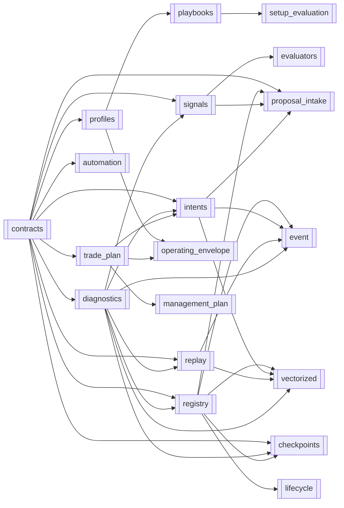

# Strategy

> **Package:** `app/services/strategy`
> **Status:** `Completed` — all 19 registered features and consumer ports are implemented and verified. Operational-planning capabilities (profiles, playbooks, setup evaluation, trade plans, management plans, automation, lifecycle) are organized into focused feature modules. Research `FEAT-RES-14` now supplies the injectable exact-version expectancy provider; absence, failure, or mismatch still fails closed.
> **Last updated:** `2026-08-10`

> This README is the package's **single source of truth** for final requirements, structure, implementation sequence, workflows, public contracts, configuration, limits, progress, usage examples, and tests.
> Update this file before changing Strategy code.

---

## 1. Purpose and Boundary

### Purpose

Strategy turns normalized market state, point-in-time indicator values, validated strategy configuration, and immutable read-only snapshots into deterministic strategy decisions and canonical `TradeIntent` proposals. It supports atomic vectorized evaluation and stateful event evaluation while preserving replay metadata, structured diagnostics, and bounded strategy-local state. Strategy never approves risk or performs official execution.

### Owns

- Immutable strategy registry entries, strategy version resolution, parameter schemas, and registry lifecycle metadata.
- Deterministic configuration validation and manifest-declared environment applicability checks; Risk separately owns operational eligibility.
- Vectorized and event-driven strategy decision evaluation.
- Canonical strategy signals, `TradeIntent` proposals, deterministic intent identity, idempotency, sequence, and lineage.
- Strategy manifests, replay manifests, and bounded strategy-local checkpoints.
- Strategy-domain diagnostics and deterministic error mapping.
- Strategy-owned registry records, parameter-schema records, checkpoint schemas, and migration definitions.

### Does not own

- Market-data acquisition, normalization, source failover, or account truth; Data owns these responsibilities.
- Indicator calculations; Indicators owns formulas, parameter validation, and `IndicatorSeries`.
- Live or demo runtime orchestration; Trading owns those workflows.
- Operational eligibility, Risk approval, final approved size, allocation/risk budgets, exposure limits, kill-switch policy, or approval tokens; Risk owns them.
- Multi-strategy construction, allocation versions, drift detection, or rebalance planning; Portfolio owns them and consumes immutable Strategy registry references.
- Official orders, fills, reconciliation, broker mutation, or execution records; Trading owns them for demo/live and Simulation owns simulated fills/state behind the Trading `sim` route.
- Optimization, performance analytics, research validation, compliance enforcement, deployment, or operational runbooks.
- Arbitrary Python source, archive, or filesystem-path execution. A sandbox is not part of the initial package.
- External artifact build, signing, vulnerability scanning, or approval workflows. Strategy stores and validates their immutable references only.

### Shared contracts

Contract names, versions, and owners match `docs/PROJECT.md`. Commands and requests are owned by their receiver; events and results are owned by their producer. `contract_version` is the compatibility value (for example, `v1`) and `schema_id` is the stable namespaced wire identifier (for example, `strategy.trade_intent.v1`). Consumers evaluate compatibility only from `contract_version` and never parse `schema_id`.

**Owned by this domain** — defined authoritatively here:

| Status    | Contract                              | Version | Counterparty                                                             | Purpose                                                                                                        |
| --------- | ------------------------------------- | ------- | ------------------------------------------------------------------------ | -------------------------------------------------------------------------------------------------------------- |
| Completed | `StrategyRegistrationRequest`       | `v1`  | UI/API submits; Strategy receives                                        | Request registration of a reviewed strategy candidate as one immutable version.                                |
| Completed | `StrategyParameterUpdateRequest`    | `v1`  | UI/API submits; Strategy receives                                        | Request validation and registration of an approved parameter set for a compatible strategy version.            |
| Completed | `StrategyMutationResult`            | `v1`  | UI/API, Risk, Portfolio                                                  | Publish the deterministic accepted/idempotent/rejected result of a registration or parameter-version mutation. |
| Completed | `TradeIntent`                       | `v1`  | Risk consumes; Trading and Simulation receive only after Risk governance | Represent a non-executable strategy proposal with deterministic identity, timing, sizing hints, and lineage.   |
| Completed | `StrategyProposalEvaluationRequest` | `v1`  | Agentic or another authenticated source submits; Strategy receives       | Bind an untrusted proposal to exact source, principal, trace, strategy, scope, evidence, and expiry fields.    |
| Completed | `StrategyProposalEvaluationResult`  | `v1`  | Agentic/UI/API consume; Strategy produces                                | Publish accepted, rejected, expired, or no-signal evidence with optional canonical`TradeIntent`.             |

**Internal composition-root input:** `StrategyValidationPolicy v1` is supplied
by the runtime composition root to `validate_strategy_ref` and
`register_strategy_version`. It is not an emitted cross-domain event, command, or
result and therefore is not listed in the `docs/PROJECT.md` contract registry.

`StrategyRegistrationRequest v1` fields:

| Field                 | Type                                            | Required | Meaning                                                                         |
| --------------------- | ----------------------------------------------- | -------: | ------------------------------------------------------------------------------- |
| `contract_version`  | `Literal["v1"]`                               |      Yes | Compatibility version.                                                          |
| `schema_id`         | `Literal["strategy.registration_request.v1"]` |      Yes | Stable namespaced schema identifier.                                            |
| `command_id`        | `str`                                         |      Yes | Idempotent receiver-command identifier.                                         |
| `strategy_id`       | `str`                                         |      Yes | Stable non-empty strategy identifier.                                           |
| `strategy_version`  | `str`                                         |      Yes | Immutable semantic version.                                                     |
| `module_path`       | `str`                                         |      Yes | Approved importable module identifier; never a user filesystem path.            |
| `manifest`          | `StrategyManifest`                            |      Yes | Data, indicator, timing, environment, resource, and applicability declarations. |
| `config_schema`     | `Mapping[str, JsonValue]`                     |      Yes | Declarative schema; no executable values.                                       |
| `source_hash`       | `str`                                         |      Yes | Approved source commit/content hash.                                            |
| `artifact_hash`     | `str`                                         |      Yes | Approved immutable artifact hash.                                               |
| `dependency_hash`   | `str`                                         |      Yes | Dependency-lock hash used for replay compatibility.                             |
| `provenance_refs`   | `tuple[str, ...]`                             |      Yes | Build, validation, and approval artifact references.                            |
| `principal_id`      | `str`                                         |      Yes | Authenticated submitter from`AuthContext`.                                    |
| `reason`            | `str`                                         |      Yes | Human-readable registration reason.                                             |
| `lifecycle_status`  | `StrategyLifecycleStatus`                     |      Yes | Initial lifecycle status for the immutable version.                             |
| `authorization_ref` | `str`                                         |      Yes | Reference to the approved authorization decision.                               |
| `requested_at`      | `datetime`                                    |      Yes | UTC command timestamp.                                                          |
| `request_id`        | `str`                                         |      Yes | Trace identifier.                                                               |
| `correlation_id`    | `str`                                         |      Yes | Cross-domain correlation identifier.                                            |

`StrategyParameterUpdateRequest v1` fields:

| Field                       | Type                                                |    Required | Meaning                                                                                      |
| --------------------------- | --------------------------------------------------- | ----------: | -------------------------------------------------------------------------------------------- |
| `contract_version`        | `Literal["v1"]`                                   |         Yes | Compatibility version.                                                                       |
| `schema_id`               | `Literal["strategy.parameter_update_request.v1"]` |         Yes | Stable namespaced schema identifier.                                                         |
| `command_id`              | `str`                                             |         Yes | Idempotent receiver-command identifier.                                                      |
| `strategy_id`             | `str`                                             |         Yes | Existing strategy identifier.                                                                |
| `strategy_version`        | `str`                                             |         Yes | Exact compatible immutable version.                                                          |
| `parameters`              | `Mapping[str, JsonValue]`                         |         Yes | Proposed declarative parameter values.                                                       |
| `optimization_result_ref` | `str \| None`                                      | Conditional | Reference to the selected optimization result when the update originates from`SYS-WF-003`. |
| `expected_config_hash`    | `str \| None`                                      |          No | Optimistic-concurrency guard against the caller's expected prior configuration hash.         |
| `principal_id`            | `str`                                             |         Yes | Authenticated submitter from`AuthContext`.                                                 |
| `reason`                  | `str`                                             |         Yes | Selection and approval rationale.                                                            |
| `ref`                     | `StrategyRef`                                     |         Yes | Exact approved immutable strategy reference.                                                 |
| `config`                  | `StrategyConfig`                                  |         Yes | Exact approved base configuration.                                                           |
| `authorization_ref`       | `str`                                             |         Yes | Reference to the approved authorization decision.                                            |
| `requested_at`            | `datetime`                                        |         Yes | UTC command timestamp.                                                                       |
| `request_id`              | `str`                                             |         Yes | Trace identifier.                                                                            |
| `correlation_id`          | `str`                                             |         Yes | Cross-domain correlation identifier.                                                         |

`StrategyMutationResult v1` contains `contract_version`, `schema_id`, mutation
ID/type/status, exact strategy ID/version, immutable registry/config record
references and hashes when accepted, idempotency outcome, bounded reason codes,
request/workflow/correlation IDs, UTC completion time, and audit-event reference.
It never embeds registry persistence objects or executable strategy content.

`TradeIntent v1` fields:

| Field                                         | Type                                                                   |    Required | Meaning                                                                           |
| --------------------------------------------- | ---------------------------------------------------------------------- | ----------: | --------------------------------------------------------------------------------- |
| `contract_version`                          | `Literal["v1"]`                                                      |         Yes | Compatibility version.                                                            |
| `schema_id`                                 | `Literal["strategy.trade_intent.v1"]`                                |         Yes | Stable namespaced schema identifier.                                              |
| `intent_id`                                 | `str`                                                                |         Yes | Deterministic identifier derived from canonical decision inputs.                  |
| `decision_id`                               | `str`                                                                |         Yes | Strategy decision event that produced the intent.                                 |
| `idempotency_key`                           | `str`                                                                |         Yes | Stable duplicate-detection key.                                                   |
| `strategy_id` / `strategy_version`        | `str`                                                                |         Yes | Exact strategy identity.                                                          |
| `strategy_sequence`                         | `int`                                                                |         Yes | Monotonically increasing per-instance sequence.                                   |
| `symbol`                                    | `str`                                                                |         Yes | Canonical instrument identifier.                                                  |
| `side`                                      | `Literal["BUY", "SELL"]`                                             |         Yes | Proposed direction. Neutral decisions produce no intent.                          |
| `intent_type`                               | `Literal["OPEN", "CLOSE", "REDUCE", "INCREASE", "MODIFY", "CANCEL"]` |         Yes | Requested action category; it is not an order type.                               |
| `order_type`                                | `Literal["MARKET", "LIMIT", "STOP", "STOP_LIMIT"]`                   |         Yes | Explicit proposed execution instruction preserved for Risk lineage.               |
| `limit_price` / `stop_price`              | `Decimal \| None`                                                     | Conditional | Exact entry instructions required by the selected order type.                     |
| `time_in_force`                             | `Literal["GTC", "IOC", "FOK", "GTD", "DAY"] \| None`                  |          No | Explicit proposed duration instruction; never inferred downstream.                |
| `requested_sizing_mode`                     | `str \| None`                                                         |          No | Advisory sizing mode; Risk owns final size.                                       |
| `quantity_hint`                             | `Decimal \| None`                                                     |          No | Advisory quantity; never an approved size.                                        |
| `signal_timestamp` / `decision_timestamp` | `datetime`                                                           |         Yes | UTC point-in-time signal and decision timestamps.                                 |
| `parent_intent_id`                          | `str \| None`                                                         | Conditional | Predecessor intent for superseded, scaled, recovery, and decomposition proposals. |
| `stop_loss` / `take_profit`               | `Decimal \| None`                                                     |          No | Advisory protection levels; Trading owns final placement.                         |
| `expiration`                                | `datetime \| None`                                                    |          No | Optional UTC proposal expiry.                                                     |
| `allow_partial_fills`                       | `bool`                                                               |         Yes | Downstream partial-fill preference.                                               |
| `min_fill_size`                             | `Decimal \| None`                                                     | Conditional | Required when partial fills are allowed.                                          |
| `rationale_ref`                             | `str \| None`                                                         |          No | Reference to the bounded decision rationale record.                               |
| `lineage`                                   | `Mapping[str, str]`                                                  |         Yes | Config, data, indicator, manifest, and predecessor hashes/references.             |

**Consumed from other domains** — referenced only, never redefined:

| Contract                 | Version | Owner      | Used for                                                                     |
| ------------------------ | ------- | ---------- | ---------------------------------------------------------------------------- |
| `MarketDataset`        | `v1`  | Data       | Normalized, point-in-time market records and provenance.                     |
| `AccountStateSnapshot` | `v1`  | Data       | Immutable read-only account context for strategy evaluation.                 |
| `IndicatorSeries`      | `v1`  | Indicators | Precomputed indicator values and`available_at` readiness metadata.         |
| `AuthContext`          | `v1`  | Utils      | Authenticated principal and trace context for governed registry commands.    |
| `AuditEvent`           | `v1`  | Utils      | Common redacted audit envelope; Strategy owns only its event payload fields. |

> **Documentation reference only:** `RiskDecision v1` (Risk) appears in wider
> workflow descriptions that mention Strategy, but it is **not** a Strategy
> dependency — Strategy never imports, consumes, creates, or redefines it, so no
> Strategy → Risk dependency exists.

### Persisted state

Data provides shared connection, locking, and migration execution infrastructure. Strategy alone owns and writes the following state; consumers use Strategy's public contracts rather than direct storage access.

| Status    | State / Store                                                           | Read access (via contract)                                                         | Migration definitions                               |
| --------- | ----------------------------------------------------------------------- | ---------------------------------------------------------------------------------- | --------------------------------------------------- |
| Completed | Immutable strategy registry entries and lifecycle/provenance references | Trading, Simulation, Optimization, Portfolio, UI/API via exact registry resolution | `app/services/strategy/migrations/definitions.py` |
| Completed | Versioned parameter schemas and approved configuration hashes           | Trading, Simulation, Optimization, Portfolio via validated references              | `app/services/strategy/migrations/definitions.py` |
| Completed | Bounded strategy-local checkpoints and replay links                     | Simulation and Trading through checkpoint/replay contracts                         | `app/services/strategy/migrations/definitions.py` |
| Completed | Versioned strategy profiles and exact expectancy references             | Internal operational-planning features via profile contracts                        | `app/services/strategy/migrations/definitions.py` |
| Completed | Versioned playbooks and append-only setup evaluations                   | Internal operational-planning features via playbook/setup-evaluation contracts     | `app/services/strategy/migrations/definitions.py` |
| Completed | Canonical trade plans, versions, and amendments                         | Internal operational-planning features via `trade_plan/` contracts                 | `app/services/strategy/migrations/definitions.py` |
| Completed | Versioned automation policy and append-only lifecycle governance        | Internal operational-planning features via automation/lifecycle contracts          | `app/services/strategy/migrations/definitions.py` |

No strategy source code, broker state, official positions, orders, fills, analytics reports, or secrets may be stored in these records.

### Four-level structure

| Code level                                     | Represents                             |
| ---------------------------------------------- | -------------------------------------- |
| **Package**                              | Strategy domain                        |
| **Module folder**                        | One approved strategy capability       |
| **File**                                 | One use case or focused responsibility |
| **Class / function / method / constant** | One functional requirement behavior    |

```text
Package
└── Module folder
    └── File
        └── Class / Function / Method / Constant
```

### Package capability map


```mermaid
flowchart TD
    STR[[Strategy Package]]
    STR --> CON[[contracts: Versioned domain contracts]]
    STR --> DIA[[diagnostics: Errors and safe diagnostics]]
    STR --> REG[[registry: Immutable references and configuration]]
    STR --> INT[[intents: TradeIntent identity and lineage]]
    STR --> REP[[replay: Deterministic replay identity]]
    STR --> CHK[[checkpoints: Bounded persisted local state]]
    STR --> VEC[[vectorized: Atomic batch decisions]]
    STR --> EVT[[event: Stateful event decisions]]
    STR --> SIG[[signals: Concrete signal execution boundary]]
    STR --> EVAL[[evaluators: The strategy signal library]]
    STR --> PROP[[proposal_intake: External proposal evaluation]]
    STR --> OENV[[operating_envelope: Operating envelope]]
    STR --> PROF[[profiles: Profiles and expectancy references]]
    STR --> PLAY[[playbooks: Strategy playbooks]]
    STR --> SEVAL[[setup_evaluation: Setup evaluation]]
    STR --> TPLAN[[trade_plan: Canonical trade plans and lifecycle]]
    STR --> MPLAN[[management_plan: Exit and management plan]]
    STR --> AUTO[[automation: Automation mode policy]]
    STR --> LIFEC[[lifecycle: Strategy lifecycle governance]]
    STR --> MIG[[migrations: Non-feature persistence support]]

    CON --> CONF[enums / policy / manifest / references / requests / execution / signals]
    CON --> OUT[outcomes.py: Structured outcomes]
    DIA --> DM[models.py: Diagnostics contract]
    DIA --> ERR[errors.py: Accepted error catalogue]
    DIA --> EXP[export.py: Redacted diagnostics]
    REG --> RG[registration.py / parameters.py: Immutable mutations]
    REG --> RS[resolution.py / configuration.py / listing.py: Reads]
    INT --> IM[intent.py: TradeIntent contract]
    INT --> IB[builder.py: Deterministic intent builder]
    REP --> RM[models.py: Replay manifest schema]
    REP --> MAN[manifests.py: Replay manifest creation]
    CHK --> CM[models.py: Checkpoint schema]
    CHK --> CS[store.py: Checkpoint create and validate]
    VEC --> VR[runner.py: Vectorized execution]
    EVT --> ER[runner.py: Event-hook execution]
    SIG --> SP[protocol.py: SignalEvaluator contract]
    SIG --> SB[boundary.py: Hash-bound atomic execution]
    EVAL --> CE[Strategy modules: One file per strategy]
    PROP --> PR[requests.py / results.py: Receiver-owned contracts]
    PROP --> PV[validation.py / evaluation.py: Fail-closed evaluation]
    PROP --> PL[lineage.py: Lineage-only source binding]
    OENV --> OE[models.py / evaluation.py: Envelope contract and evaluation]
    PROF --> PF[models.py / expectancy.py: Profile and expectancy reference]
    PLAY --> PB[models.py: Playbook contract]
    SEVAL --> SE[models.py: Setup evaluation contract]
    TPLAN --> TP[models.py / lifecycle.py / transport.py / manual.py: Plan lifecycle]
    MPLAN --> MP[models.py / handoff.py: Plan and handoff]
    AUTO --> AU[policy.py: Automation mode]
    LIFEC --> LC[governance.py: Lifecycle governance]
    MIG --> MD[definitions.py: Strategy-owned schema definitions]
```

---

## 2. Final Package Structure

Folders and files are ordered from lowest dependency to highest dependency. This is also the implementation sequence.

### Feature Registry

| Status    | Feature                                               | Owning module        | Public API and contracts                                                                                                                                                                   | Requirements                         | Usage evidence                                           |
| --------- | ----------------------------------------------------- | -------------------- | ------------------------------------------------------------------------------------------------------------------------------------------------------------------------------------------ | ------------------------------------ | -------------------------------------------------------- |
| Completed | `FEAT-STR-01` Versioned Strategy Contracts          | `contracts/`       | Exact declarations and contract fields: Section 4.1                                                                                                                                        | Section 4.1 functional requirements  | `tests/strategy/usage/features/01_contracts.py`        |
| Completed | `FEAT-STR-02` Deterministic Safe Diagnostics        | `diagnostics/`     | Exact declarations and diagnostic contracts: Section 4.2                                                                                                                                   | Section 4.2 functional requirements  | `tests/strategy/usage/features/02_diagnostics.py`      |
| Completed | `FEAT-STR-03` Immutable Registry and Configuration  | `registry/`        | Exact declarations: Section 4.3; secret-free`build_development_strategy_validation_policy` composition manifest                                                                          | Section 4.3 functional requirements  | `tests/strategy/usage/features/03_registry.py`         |
| Completed | `FEAT-STR-04` Canonical TradeIntent Proposals       | `intents/`         | Exact declarations and intent contract: Section 4.4                                                                                                                                        | Section 4.4 functional requirements  | `tests/strategy/usage/features/04_intents.py`          |
| Completed | `FEAT-STR-05` Deterministic Replay Manifests        | `replay/`          | Exact declarations and replay contracts: Section 4.5                                                                                                                                       | Section 4.5 functional requirements  | `tests/strategy/usage/features/05_replay.py`           |
| Completed | `FEAT-STR-06` Bounded Persisted Local State         | `checkpoints/`     | Exact declarations and checkpoint contracts: Section 4.6                                                                                                                                   | Section 4.6 functional requirements  | `tests/strategy/usage/features/06_checkpoints.py`      |
| Completed | `FEAT-STR-07` Atomic Vectorized Evaluation          | `vectorized/`      | Exact declarations: Section 4.7                                                                                                                                                            | Section 4.7 functional requirements  | `tests/strategy/usage/features/07_vectorized.py`       |
| Completed | `FEAT-STR-08` Stateful Event Evaluation             | `event/`           | Exact declarations: Section 4.8                                                                                                                                                            | Section 4.8 functional requirements  | `tests/strategy/usage/features/08_event.py`            |
| Completed | `FEAT-STR-09` Concrete Signal Execution Boundary    | `signals/`         | Exact declarations and signal contracts: Section 4.9                                                                                                                                       | Section 4.9 functional requirements  | `tests/strategy/usage/features/09_signals.py`          |
| Completed | `FEAT-STR-10` Strategy Signal Library               | `evaluators/`      | Exact declarations: Section 4.10                                                                                                                                                           | Section 4.10 functional requirements | `tests/strategy/usage/features/10_strategy_library.py` |
| Completed | `FEAT-STR-11` External Research Proposal Evaluation | `proposal_intake/` | `create_strategy_proposal_evaluation_request`, `create_strategy_proposal_evaluation_result`, `validate_strategy_proposal`, `evaluate_strategy_proposal`, `bind_proposal_lineage` | `FR-STR-049`–`053`              | `tests/strategy/usage/features/11_proposal_intake.py`  |
| Completed | `FEAT-STR-12` Operating Envelope | `operating_envelope/` | `build_operating_envelope`, `parse_operating_envelope`, `evaluate_operating_envelope` | `FR-STR-054`–`FR-STR-056` | `tests/strategy/usage/features/12_operating_envelope.py` |
| Completed | `FEAT-STR-13` Strategy Profiles and Expectancy References | `profiles/` | `build_strategy_profile`, `parse_strategy_profile`, `build_expectancy_reference`, `parse_expectancy_reference`, `evaluate_expectancy_reference` | `FR-STR-063`–`065`, `FR-STR-076`–`077` | `tests/strategy/usage/features/13_profiles.py` |
| Completed | `FEAT-STR-14` Strategy Playbooks | `playbooks/` | `build_strategy_playbook`, `parse_strategy_playbook` | `FR-STR-066`–`068` | `tests/strategy/usage/features/14_playbooks.py` |
| Completed | `FEAT-STR-15` Setup Evaluation | `setup_evaluation/` | `build_setup_evaluation`, `parse_setup_evaluation` | `FR-STR-069`–`071` | `tests/strategy/usage/features/15_setup_evaluation.py` |
| Completed | `FEAT-STR-16` Canonical Trade Plans and Lifecycle | `trade_plan/` | `build_trade_plan`, `parse_trade_plan`, `transition_trade_plan`, `amend_trade_plan`, `validate_trade_plan_for_intent`, `build_manual_trade_plan`, `validate_manual_trade_plan` | `FR-STR-060`–`062`, `FR-STR-072`–`075` | `tests/strategy/usage/features/16_trade_plan.py` |
| Completed | `FEAT-STR-17` Exit and Management Plan | `management_plan/` | `build_exit_plan`, `parse_exit_plan`, `build_exit_plan_handoff` | `FR-STR-057`–`059` | `tests/strategy/usage/features/17_management_plan.py` |
| Completed | `FEAT-STR-18` Automation Mode Policy | `automation/` | `evaluate_automation_mode` | `FR-STR-078`–`079` | `tests/strategy/usage/features/18_automation.py` |
| Completed | `FEAT-STR-19` Strategy Lifecycle Governance | `lifecycle/` | `govern_strategy_lifecycle` | `FR-STR-080`–`082` | `tests/strategy/usage/features/19_lifecycle.py` |
| Completed | `FEAT-STR-20` Discretionary Manual Order Identity | `discretionary/` | Registered Strategy identity so a human-initiated order can carry a genuine `TradeIntent`; `register_discretionary_strategy`, `get_discretionary_strategy_id`, `strategy_version_for` | `FR-STR-083`–`085` | `tests/strategy/usage/features/20_discretionary.py` |

```text
app/services/strategy/
├── __init__.py                         # Approved domain-level API only
├── README.md
├── contracts/                          # Feature: versioned strategy contracts
│   ├── __init__.py
│   ├── README.md
│   ├── _base.py                        # Private validation, coercion, base model
│   ├── enums.py                        # Environment, timing, lifecycle enums
│   ├── policy.py                       # Explicit host validation policy
│   ├── manifest.py                     # Identity, capability, resource manifest
│   ├── references.py                   # Refs and configs before/after validation
│   ├── requests.py                     # Receiver-owned governed commands
│   ├── execution.py                    # Context, events, decisions, results
│   ├── signals.py                      # Signal and signal-evidence contracts
│   └── outcomes.py                     # Structured success/error outcomes
├── diagnostics/                        # Feature: deterministic safe diagnostics
│   ├── __init__.py
│   ├── README.md
│   ├── models.py                       # Structured diagnostics contract
│   ├── errors.py                       # Reduced accepted error catalogue
│   └── export.py                       # Bounded redaction and diagnostics export
├── registry/                           # Feature: immutable registry and configuration
│   ├── __init__.py
│   ├── README.md
│   ├── _mutations.py                   # Private mutation load/publish mechanics
│   ├── resolution.py                   # Resolve exactly one approved reference
│   ├── configuration.py                # Validate declarative config and hash it
│   ├── listing.py                      # Deterministic immutable listing
│   ├── registration.py                 # Register one immutable version
│   ├── parameters.py                   # Record one immutable parameter version
│   └── optimization.py                 # Validate and adopt an approved handoff
├── intents/                            # Feature: canonical strategy proposals
│   ├── __init__.py
│   ├── README.md
│   ├── intent.py                       # TradeIntent v1 contract
│   └── builder.py                      # Deterministic identity, sequence, lineage
├── replay/                             # Feature: deterministic replay identity (pure)
│   ├── __init__.py
│   ├── README.md
│   ├── models.py                       # Replay manifest contract
│   └── manifests.py                    # Replay manifest creation
├── checkpoints/                        # Feature: bounded persisted local state
│   ├── __init__.py
│   ├── README.md
│   ├── models.py                       # Checkpoint contract
│   └── store.py                        # Bounded checkpoint create/validate
├── vectorized/                         # Feature: atomic vectorized evaluation
│   ├── __init__.py
│   ├── README.md
│   └── runner.py                       # Readiness, no-lookahead, decision, intents
├── event/                              # Feature: stateful event evaluation
│   ├── __init__.py
│   ├── README.md
│   └── runner.py                       # Deterministic typed hook invocation
├── signals/                            # Feature: concrete signal execution boundary
│   ├── __init__.py
│   ├── README.md
│   ├── protocol.py                     # SignalEvaluator structural contract
│   ├── _mechanics.py                   # Private deterministic signal mechanics
│   └── boundary.py                     # Hash-bound atomic evaluation boundary
├── evaluators/                         # Feature: the strategy signal library
│   ├── __init__.py
│   ├── README.md
│   ├── naive_ma_trend.py               # MA crossover and trend-filter signals
│   ├── decomposing_trade.py            # Recovered RSI crossing signals
│   ├── harriet_hedging.py              # Point-in-time MTF structure signals
│   ├── market_structure.py             # Provenance-bound ZigZag structure signals
│   ├── random_walk.py                  # Flat-state basket trigger signals
│   ├── sqx_breakout_atr_trailing.py    # Channel breakout and ATR facts
│   └── white_fairy.py                  # Recovered RSI crossing signals
├── proposal_intake/                    # FEAT-STR-11 external proposal evaluation
│   ├── __init__.py
│   ├── README.md
│   ├── requests.py
│   ├── results.py
│   ├── factories.py
│   ├── validation.py
│   ├── evaluation.py
│   └── lineage.py
├── operating_envelope/                 # FEAT-STR-12 strategy operating envelope
│   ├── __init__.py
│   ├── README.md
│   ├── models.py                       # OperatingEnvelope v1 contract
│   └── evaluation.py                   # Point-in-time envelope evaluation
├── profiles/                           # FEAT-STR-13 profiles and expectancy references
│   ├── __init__.py
│   ├── README.md
│   ├── models.py                       # StrategyProfile v1 contract
│   └── expectancy.py                   # Exact expectancy reference port
├── playbooks/                          # FEAT-STR-14 strategy playbooks
│   ├── __init__.py
│   ├── README.md
│   └── models.py                       # StrategyPlaybook v1 contract
├── setup_evaluation/                   # FEAT-STR-15 setup evaluation
│   ├── __init__.py
│   ├── README.md
│   └── models.py                       # SetupEvaluation v1 contract
├── trade_plan/                         # FEAT-STR-16 canonical trade plans and lifecycle
│   ├── __init__.py
│   ├── README.md
│   ├── models.py                       # TradePlan v1 contract
│   ├── lifecycle.py                    # Plan transitions and amendments
│   ├── transport.py                    # Plan-to-intent projection guards
│   └── manual.py                       # Player-authored plan construction
├── management_plan/                    # FEAT-STR-17 exit and management plan
│   ├── __init__.py
│   ├── README.md
│   ├── models.py                       # Exit and management plan contract
│   └── handoff.py                      # Approved ownership handoff
├── automation/                         # FEAT-STR-18 automation mode policy
│   ├── __init__.py
│   ├── README.md
│   └── policy.py                       # OFF/ADVISORY/SUPERVISED/AUTOMATED
├── lifecycle/                          # FEAT-STR-19 strategy lifecycle governance
│   ├── __init__.py
│   ├── README.md
├── discretionary/                      # FEAT-STR-20 discretionary manual order identity
│   ├── __init__.py
│   ├── module.py                       # No signal generation; identity target only
│   └── registration.py                 # register_discretionary_strategy
│   └── governance.py                   # Draft/test/approve/suspend/retire
├── persistence/                        # Private non-feature CRUD support
│   ├── __init__.py                     # Internal CRUD export boundary
│   ├── create.py                       # Version and checkpoint inserts
│   ├── read.py                         # Registry, mutation, policy, checkpoint reads
│   ├── update.py                       # Configuration and publication updates
│   └── delete.py                       # Explicitly empty; records are immutable
└── migrations/                         # Documented non-feature schema support
    ├── __init__.py
    ├── README.md
    └── definitions.py                  # Strategy-owned schema definitions
```

Usage and test artifacts live outside the production package:

```text
tests/strategy/
├── unit/
├── integration/
└── usage/
```

### Module dependency diagram

An arrow points from a required module to its consumer.


```mermaid
flowchart LR
    CON[[contracts]]
    DIA[[diagnostics]]
    REG[[registry]]
    INT[[intents]]
    REP[[replay]]
    CHK[[checkpoints]]
    VEC[[vectorized]]
    EVT[[event]]
    SIG[[signals]]
    EVAL[[evaluators]]
    PROP[[proposal_intake]]
    OENV[[operating_envelope]]
    PROF[[profiles]]
    PLAY[[playbooks]]
    SEVAL[[setup_evaluation]]
    TPLAN[[trade_plan]]
    MPLAN[[management_plan]]
    AUTO[[automation]]
    LIFEC[[lifecycle]]

    CON --> DIA
    CON --> REG
    DIA --> REG
    CON --> INT
    CON --> PROP
    REG --> PROP
    SIG --> PROP
    INT --> PROP
    DIA --> INT
    CON --> REP
    DIA --> REP
    CON --> CHK
    DIA --> CHK
    REG --> CHK
    REG --> VEC
    INT --> VEC
    REP --> VEC
    DIA --> VEC
    REG --> EVT
    INT --> EVT
    REP --> EVT
    DIA --> EVT
    CON --> SIG
    DIA --> SIG
    SIG --> EVAL
    CON --> PROF
    PROF --> PLAY
    PLAY --> SEVAL
    PROF --> OENV
    TPLAN --> MPLAN
    TPLAN --> OENV
    TPLAN --> INT
    CON --> TPLAN
    CON --> AUTO
    REG --> LIFEC
```

No dependency points from Strategy into Risk, Trading, Simulation internals, Optimization, Analytics, or UI/API. Cross-domain values are consumed only through their owners' public contracts.

### Structure rules

- Package and feature `__init__.py` files re-export only symbols listed in this README.
- Private validation, hashing, redaction, and strategy implementation helpers begin with `_` and are not requirement-bearing exports.
- Strategy implementations are approved modules referenced by immutable registry entries; they are not dynamically loaded from user paths.
- The current flat files and `pybots/` tree are migration evidence, not the target structure.
- Examples never live in the production package.

---

## 3. Workflows

> **Workflow usage evidence:** Each completed workflow has one standalone
> input-to-output program with README-aligned stages. Market-dependent programs read
> genuine MT5 demo evidence through Data. Run all programs with
> `python tests/strategy/usage/workflows/run_all.py`. This satisfies `NFR-STR-011`
> and complements feature-level usage evidence.

### Workflow rank values

| Rank                 | Identifier     | Meaning                                   |
| -------------------- | -------------- | ----------------------------------------- |
| **Primary**    | `WF-STR-PRI` | The workflow this domain exists to serve. |
| **Secondary**  | `WF-STR-SEC` | The next most load-bearing workflow.      |
| **Tertiary**   | `WF-STR-TER` | The third-ranked workflow.                |
| **Supporting** | `WF-STR-0NN` | Every remaining registered workflow.      |

### Retired identifiers

`WF-STR-002`, `WF-STR-004`, and `WF-STR-008` were absorbed into `WF-STR-PRI`,
`WF-STR-SEC`, and `WF-STR-TER` respectively. Absorbed numbers are retired and are
never reused. New workflows continue from `WF-STR-011`.

| Workflow       | Standalone program                                                                      |
| -------------- | --------------------------------------------------------------------------------------- |
| `WF-STR-PRI` | `tests/strategy/usage/workflows/wf_str_pri_generate_vectorized_decisions.py`          |
| `WF-STR-SEC` | `tests/strategy/usage/workflows/wf_str_sec_build_hand_off_trade_intent.py`            |
| `WF-STR-TER` | `tests/strategy/usage/workflows/wf_str_ter_register_immutable_strategy_version.py`    |
| `WF-STR-001` | `tests/strategy/usage/workflows/wf_str_001_validate_reference_configuration.py`       |
| `WF-STR-003` | `tests/strategy/usage/workflows/wf_str_003_run_stateful_event_hook.py`                |
| `WF-STR-005` | `tests/strategy/usage/workflows/wf_str_005_create_replay_manifest_checkpoint.py`      |
| `WF-STR-006` | `tests/strategy/usage/workflows/wf_str_006_export_structured_diagnostics.py`          |
| `WF-STR-007` | `tests/strategy/usage/workflows/wf_str_007_supply_demo_live_decisions.py`            |
| `WF-STR-009` | `tests/strategy/usage/workflows/wf_str_009_reject_arbitrary_strategy_code.py`         |
| `WF-STR-010` | `tests/strategy/usage/workflows/wf_str_010_evaluate_recovered_concrete_signals.py`    |
| `WF-STR-011` | `tests/strategy/usage/workflows/wf_str_011_adopt_approved_optimization_parameters.py` |
| `WF-STR-012` | `tests/strategy/usage/workflows/wf_str_012_evaluate_signals_for_research.py`          |

### Status values

| Status              | Meaning                                                                           |
| ------------------- | --------------------------------------------------------------------------------- |
| **Missing**   | Not implemented, incompatible with the final contract, or insufficiently tested.  |
| **Partial**   | Reusable behavior exists but needs contract, structure, validation, or test work. |
| **Completed** | Final behavior, structure, runtime use, and tests are verified.                   |

| Status    | Rank       | Workflow ID    | Scope        | Workflow                               | Trigger / Input boundary                                                                           | Final outcome / Output boundary                                                         | Requirement sequence                                         |
| --------- | ---------- | -------------- | ------------ | -------------------------------------- | -------------------------------------------------------------------------------------------------- | --------------------------------------------------------------------------------------- | ------------------------------------------------------------ |
| Completed | Primary    | `WF-STR-PRI` | Cross-domain | Generate vectorized decisions          | Data`MarketDataset` + Indicators `IndicatorSeries`                                             | Ordered`TradeIntent` batch to Risk/runtime boundary                                   | `FR-STR-023 → FR-STR-024 → FR-STR-032`                   |
| Completed | Secondary  | `WF-STR-SEC` | Cross-domain | Build and hand off TradeIntent         | Validated strategy decision metadata                                                               | Canonical proposal to Risk; no execution                                                | `FR-STR-026`                                               |
| Completed | Tertiary   | `WF-STR-TER` | Cross-domain | Register immutable strategy version    | UI/API-approved registration or parameter update command                                           | Immutable registry/config record                                                        | `FR-STR-020 → FR-STR-021`                                 |
| Completed | Supporting | `WF-STR-001` | Internal     | Validate reference and configuration   | Registry ref and declarative config                                                                | Exact validated immutable version/config or structured failure                          | `FR-STR-023 → FR-STR-024`                                 |
| Completed | Supporting | `WF-STR-003` | Cross-domain | Run stateful event hook                | Typed event + immutable snapshots                                                                  | Intents, diagnostics, and atomic local-state update                                     | `FR-STR-023 → FR-STR-024 → FR-STR-033`                   |
| Completed | Supporting | `WF-STR-005` | Cross-domain | Create replay manifest and checkpoint  | Identity/config/input hashes + optional local state                                                | Manifest/checkpoint reference to runtime                                                | `FR-STR-029 → FR-STR-030 → FR-STR-031`                   |
| Completed | Supporting | `WF-STR-006` | Cross-domain | Export structured diagnostics          | Context + bounded diagnostic details                                                               | Redacted diagnostics to caller/audit boundary                                           | `FR-STR-019`                                               |
| Completed | Supporting | `WF-STR-007` | Cross-domain | Supply demo/live decisions            | Trading invokes Strategy with prepared inputs                                                      | `TradeIntent` to Risk/Trading workflow                                                | `FR-STR-023 → FR-STR-024 → FR-STR-032/033`               |
| Completed | Supporting | `WF-STR-009` | Cross-domain | Reject arbitrary strategy code         | Raw code/path/archive at command boundary                                                          | Redacted`STRATEGY_ARBITRARY_CODE_REJECTED`; no import                                 | `FR-STR-018 → FR-STR-020/021/023/024`                     |
| Completed | Supporting | `WF-STR-010` | Cross-domain | Evaluate recovered concrete signals    | Registry-bound evaluator + point-in-time Data/Indicators evidence                                  | Atomic ordered immutable signal tuple or structured failure                             | `FR-STR-038 → FR-STR-039 → FR-STR-040/046 → FR-STR-047` |
| Completed | Supporting | `WF-STR-011` | Cross-domain | Adopt approved optimization parameters | Explicitly approved`OptimizationResult`-compatible reference plus authenticated adoption command | New hash-addressed immutable configuration record; the approved record is never mutated | `FR-STR-021`                                               |
| Completed | Supporting | `WF-STR-012` | Cross-domain | Evaluate signals for research          | Registered strategy version plus point-in-time Data and Indicators evidence                        | Ordered signal evidence for Research and Optimization; never a`TradeIntent`           | `FR-STR-047`                                               |

### `WF-STR-001` — Validate Strategy Reference and Configuration

**Scope:** Internal
**System workflow:** `SYS-WF-007` when Portfolio resolves registered immutable strategy versions; otherwise internal.

1. Reject empty, unknown, ambiguous, deprecated, revoked, unapproved,
   hash-mismatched, or environment-ineligible references —
   `strategy.validate_strategy_ref()`.
2. Resolve exactly one immutable `ValidatedStrategyRef` from the registry —
   `strategy.list_strategy_versions()`.
3. Apply the entry's declarative schema, explicit defaults, unknown-field policy,
   bounds, and payload limits — `strategy.validate_strategy_config()`.
4. Return a canonical configuration hash without importing or executing strategy
   code — `utils.canonical_digest()`.

**Failure behavior:** Every expected failure returns `StandardResponse(status="error")` with one Strategy-owned `StrategyErrorCode` and Utils-owned `StandardError`; no raw validation, database, or import exception crosses the boundary.

**Integration test:** `tests/strategy/integration/test_registry_validation.py::test_registry_validation_workflow()`

### `WF-STR-PRI` — Generate Vectorized Strategy Decisions

**Scope:** Cross-domain
**System workflows:** `SYS-WF-001`, `SYS-WF-002`

```text
Data MarketDataset + Indicators IndicatorSeries
→ fixed StrategyExecutionContext
→ atomic readiness and no-lookahead validation
→ approved vectorized signal logic
→ deterministic TradeIntent batch + diagnostics
→ Risk/runtime boundary
```

1. Obtain normalized market evidence and calculated indicator series —
   `data.get_market_data()`, `indicators.validate_indicator()`.
2. Resolve and validate the registered strategy version and its configuration —
   `strategy.validate_strategy_ref()`, `strategy.validate_strategy_config()`.
3. Run atomic readiness and no-lookahead validation against the fixed
   `decision_timestamp` — `strategy.evaluate_strategy_signals()`.
4. Execute the approved vectorized signal logic in canonical row order —
   `strategy.run_vectorized_strategy_signals()`.
5. Canonicalize each surviving decision into an ordered proposal batch —
   `strategy.build_trade_intent()`.
6. Emit redacted diagnostics alongside the batch —
   `strategy.export_strategy_diagnostics()`.

The decision clock remains fixed at `decision_timestamp`. Any lookahead, clock-drift, required-field, indicator-readiness, sequence, or identity failure discards the whole batch. A neutral decision emits no intent.

**Integration test:** `tests/strategy/integration/test_vectorized_workflow.py::test_vectorized_workflow()`

### `WF-STR-003` — Run Stateful Event Strategy Hook

**Scope:** Cross-domain
**System workflows:** `SYS-WF-001`, `SYS-WF-002`

1. The runtime supplies a typed event, fixed context, Data-owned account snapshot,
   and provider-owned immutable execution-state evidence where applicable —
   `data.get_account_state_snapshot()`.
2. Strategy validates the reference and configuration before dispatching —
   `strategy.validate_strategy_ref()`, `strategy.validate_strategy_config()`.
3. Strategy invokes one declared hook in stable order —
   `strategy.run_event_strategy_hook()`.
4. Resulting proposals are canonicalized — `strategy.build_trade_intent()`.
5. The candidate local-state update commits only when the complete hook result
   validates — `strategy.create_strategy_checkpoint()`,
   `strategy.validate_strategy_checkpoint()`.

The initial typed hook set is `on_init`, `on_bar`, `on_tick`, `on_fill`, and `on_stop`, evaluated in that priority order. Undeclared hooks fail deterministically; current advanced strategy logic is reusable only when it conforms to this contract.

**Integration test:** `tests/strategy/integration/test_event_workflow.py::test_event_workflow()`

### `WF-STR-SEC` — Build and Hand Off TradeIntent

**Scope:** Cross-domain
**System workflows:** `SYS-WF-001`, `SYS-WF-002`

1. Canonicalize approved decision metadata and validate advisory sizing and
   protection fields — `strategy.build_trade_intent()`.
2. Create stable identifiers and lineage for the proposal —
   `utils.generate_id()`, `utils.derive_stable_id()`.
3. Hand the canonical `TradeIntent` to Risk, which alone decides —
   `risk.calculate_position_size()`, `risk.review_strategy_admission()`.
4. Trading executes only after Risk approves, and only the approved size —
   `trading.create_trading_action_draft()`.

Strategy does not create a `RiskDecision`, `OrderIntent`, fill, or official position mutation.

**Integration test:** `tests/strategy/integration/test_intent_handoff.py::test_intent_handoff_workflow()`

### `WF-STR-005` — Create Replay Manifest and Checkpoint

**Scope:** Cross-domain
**System workflows:** `SYS-WF-001`, `SYS-WF-003`

1. Bind the exact strategy, interface, config, data, indicator, simulation, and seed
   inputs into one manifest — `strategy.create_strategy_replay_manifest()`.
2. Create a bounded checkpoint containing serializable local decision state only —
   `strategy.create_strategy_checkpoint()`.
3. Check identity, versions, hashes, schema, checksum, authorization reference, and
   size before restore — `strategy.validate_strategy_checkpoint()`.
4. Hand the manifest reference to the replaying runtime —
   `simulator.replay_journal()`, `simulator.resolve_idempotent_run()`.

**Integration test:** `tests/strategy/integration/test_replay_workflow.py::test_replay_workflow()`

### `WF-STR-006` — Export Structured Diagnostics

**Scope:** Cross-domain
**System workflows:** `SYS-WF-001`, `SYS-WF-002`

1. Accept safe facts and recursively redact denied fields —
   `strategy.export_strategy_diagnostics()`, `utils.redact_mapping_value()`.
2. Enforce the registry-declared payload bound before emission —
   `strategy.export_strategy_diagnostics()`.
3. Emit schema-valid diagnostics carrying request and correlation identifiers plus
   dependency status — `utils.generate_id()`.
4. Create an `AuditEvent` payload where the caller requires one —
   `utils.create_audit_event()`.
5. Data persists the envelope; Strategy neither persists nor routes it —
   `data.persist_audit_event()`.

**Integration test:** `tests/strategy/integration/test_diagnostics_workflow.py::test_diagnostics_workflow()`

### `WF-STR-007` — Supply Demo/Live Decisions

**Scope:** Cross-domain
**System workflow:** `SYS-WF-002`

1. Trading owns the live/demo loop and supplies prepared public-contract inputs —
   `trading.run_live_evaluation_cycle()`.
2. Strategy validates the reference and evaluates the prepared inputs —
   `strategy.validate_strategy_ref()`, `strategy.run_event_strategy_hook()`.
3. Strategy returns no action or one canonical proposal —
   `strategy.build_trade_intent()`.
4. Risk independently governs every proposal —
   `risk.calculate_position_size()`, `risk.revalidate_risk_decision()`.
5. Trading begins execution only after an approved decision and executes exactly the
   approved size — `trading.evaluate_live_gate()`, `trading.dispatch_order_intent()`.

**Integration test:** `tests/strategy/integration/test_runtime_boundary.py::test_runtime_boundary_emits_proposals_only()`

### `WF-STR-TER` — Register Immutable Strategy Version

**Scope:** Cross-domain
**System workflows:** `SYS-WF-003`, `SYS-WF-004`, and registration-truth evidence for `SYS-WF-006`.

1. UI/API submits an authenticated Strategy-owned request after external review —
   `utils.create_auth_context()`.
2. Strategy validates schema, module allowlisting, immutable hashes,
   lifecycle/environment evidence references, and uniqueness —
   `strategy.validate_strategy_config()`, `strategy.list_strategy_versions()`.
3. Strategy writes its registry state through Data's persistence infrastructure —
   `strategy.register_strategy_version()`, `data.execute_transaction()`.
4. Parameter updates create a new hash-addressed configuration record and never
   mutate an approved record in place — `strategy.update_strategy_parameters()`.
5. One audit event records the registration —
   `utils.create_audit_event()`, `data.persist_audit_event()`.

For `SYS-WF-003`, the request references the selected `OptimizationResult` and carries
explicit user approval; Optimization cannot submit it.

**Output boundary:** `StrategyMutationResult v1` records accepted, idempotent, or
rejected mutation truth for UI/API and supplies the immutable registration reference
used by Risk and Portfolio; storage objects never cross the boundary.

Successful registration proves technical validity and immutable identity only. It
does not confer operational eligibility, capital allocation, or execution authority.
Those require the separate Risk-owned `SYS-WF-006` decision before Portfolio
or Trading may use the registered version.

**Integration test:** `tests/strategy/integration/test_registration_workflow.py::test_registration_workflow()`

### `WF-STR-009` — Reject Arbitrary Strategy Code

**Scope:** Cross-domain
**System workflows:** `SYS-WF-001`, `SYS-WF-003`, `SYS-WF-004`

1. Raw Python, archives, executable configuration, import strings, and user
   filesystem paths are rejected before import or execution —
   `strategy.validate_strategy_ref()`.
2. The rejection is expressed as a canonical Strategy error, never a raw exception —
   `utils.normalize_error_code()`, `utils.require_error_definition()`.
3. Diagnostics carry hashes and safe reason metadata, never the full rejected body —
   `strategy.export_strategy_diagnostics()`, `utils.canonical_digest()`.
4. Data persists the audit trail through the common `AuditEvent` contract —
   `utils.create_audit_event()`, `data.persist_audit_event()`.

**Integration test:** `tests/strategy/integration/test_registered_only_security.py::test_unregistered_evaluator_hash_fails_closed()`

### `WF-STR-010` — Evaluate Recovered Concrete Signals

**Scope:** Cross-domain
**System workflows:** Research and simulation signal verification only.

The caller supplies one exact approved registry reference, its validated immutable
configuration, Data-owned point-in-time market evidence, optional Indicators-owned
results, and one injected hash-bound concrete evaluator. Strategy validates identity,
hashes, evidence availability, indicator alignment, and output identity atomically;
any failure returns a structured error and no partial signal tuple.

1. Validate the exact approved registry reference and its immutable configuration —
   `strategy.validate_strategy_ref()`, `strategy.validate_strategy_config()`.
2. Supply Data-owned point-in-time market evidence and optional Indicators results —
   `data.get_market_data()`, `indicators.validate_indicator()`.
3. Evaluate the injected hash-bound concrete evaluator atomically —
   `strategy.evaluate_strategy_signals()`.
4. Verify identity, hashes, evidence availability, indicator alignment, and output
   identity — `utils.canonical_digest()`.

This workflow verifies recovered signal parity only. It does not load legacy code or
perform basket management, risk approval, sizing, order construction, execution,
fills, or broker/account mutation.

**Integration test:** `tests/strategy/integration/test_concrete_signal_workflow.py::test_concrete_signal_workflow()`

### `WF-STR-011` — Adopt Approved Optimization Parameters

**Scope:** Cross-domain
**System workflow:** `SYS-WF-003`

**Input boundary:** an explicitly approved `OptimizationResult` reference plus an
authenticated adoption command submitted through UI/API.
**Output boundary:** one new hash-addressed immutable configuration record; the
previously approved record is never mutated.

1. UI/API supplies the authenticated adoption command and explicit user approval;
   Optimization cannot submit it — `utils.create_auth_context()`.
2. Accept the selected candidate through the published `OptimizationResult v1`
   projection, without importing or executing Optimization —
   `strategy.adopt_approved_optimization_parameters()`.
3. Validate the proposed parameters against the registered version's declarative
   schema and bounds — `strategy.validate_strategy_ref()`,
   `strategy.validate_strategy_config()`.
4. Write a new hash-addressed configuration record through the existing immutable
   update path — `strategy.adopt_approved_optimization_parameters()`.
5. Record the adoption in the audit trail —
   `utils.create_audit_event()`, `data.persist_audit_event()`.

**Failure behavior:** a missing or forged approval, a stale optimization reference,
or an out-of-bounds parameter returns a structured Strategy error and writes nothing.
Adoption confers no operational eligibility; that remains the Risk-owned `SYS-WF-006`
decision.

**Integration test:** `tests/strategy/integration/test_optimization_adoption_workflow.py::test_compatible_handoff_creates_real_immutable_strategy_config`

### `WF-STR-012` — Evaluate Signals for Research

**Scope:** Cross-domain
**System workflow:** `SYS-WF-004`

**Input boundary:** a registered strategy version plus point-in-time Data and
Indicators evidence supplied by Research or Optimization.
**Output boundary:** ordered signal evidence for analysis only; never a
`TradeIntent`, sizing decision, or execution instruction.

1. Validate the registered reference and configuration —
   `strategy.validate_strategy_ref()`, `strategy.validate_strategy_config()`.
2. Accept the caller-prepared bounded research dataset and optional official
   Indicator results — `data.get_market_data()`.
3. Evaluate signals over the prepared evidence —
   `strategy.evaluate_strategy_signals()`.
4. Export bounded redacted diagnostics alongside the signal evidence —
   `strategy.export_strategy_diagnostics()`.

**Failure behavior:** this workflow never constructs a proposal. Any attempt to
convert its output into an executable action must re-enter `WF-STR-SEC` and the
Risk-owned decision that follows it.

**Executable evidence:** `tests/strategy/usage/workflows/wf_str_012_evaluate_signals_for_research.py`

---

## 4. Module and Requirement Specifications

Requirements below define the intended public surface. Every public operation returns `StandardResponse[T]`, with the raw domain value directly in `data`; `Raises` is `None` unless a caller violates Python's own invocation semantics before the function body runs.

### 4.1 `contracts/` — Versioned Strategy Contracts

**Purpose:** Define the typed, versioned, serialization-safe contracts shared by all Strategy features.

**Module flow:**

```text
untrusted boundary payload
→ typed model schema validation
→ Utils `StandardResponse[T]` structured success/error representation
→ consuming Strategy feature
```

### Files

| Status    | File              | Responsibility                                                                                                                                                                                                                                               | Key exports                                                                                        | Dependencies                                                                                                                                                                                                                                   |
| --------- | ----------------- | ------------------------------------------------------------------------------------------------------------------------------------------------------------------------------------------------------------------------------------------------------------ | -------------------------------------------------------------------------------------------------- | ---------------------------------------------------------------------------------------------------------------------------------------------------------------------------------------------------------------------------------------------- |
| Completed | `_base.py`      | Provide private validation, coercion, JSON freezing, and the frozen base model.                                                                                                                                                                              | None;`JsonValue` type alias                                                                      | **Standard library:** `collections.abc`, `datetime`, `decimal`, `math`, `types`, `typing` **Required third-party:** `pydantic` **Local:** Utils logger                                                         |
| Completed | `enums.py`      | Enumerate approved runtime, timing, and lifecycle values.                                                                                                                                                                                                    | `StrategyEnvironment`, `StrategyTimingPolicy`, `StrategyLifecycleStatus`                     | **Standard library:** `enum` **Required third-party:** None **Local:** None                                                                                                                                                |
| Completed | `policy.py`     | Define the explicit host-owned validation policy.                                                                                                                                                                                                            | `StrategyValidationPolicy`                                                                       | **Standard library:** `typing` **Required third-party:** `pydantic` **Local:** `_base.py`                                                                                                                              |
| Completed | `manifest.py`   | Define the immutable identity, capability, and resource manifest.                                                                                                                                                                                            | `StrategyManifest`                                                                               | **Standard library:** `collections.abc`, `typing` **Required third-party:** `pydantic` **Local:** `_base.py`, `enums.py`                                                                                           |
| Completed | `references.py` | Define references and configurations before and after validation.                                                                                                                                                                                            | `StrategyRef`, `ValidatedStrategyRef`, `StrategyConfig`, `ValidatedStrategyConfig`         | **Standard library:** `collections.abc`, `typing` **Required third-party:** `pydantic` **Local:** `_base.py`, `enums.py`, `manifest.py`, `policy.py`                                                           |
| Completed | `requests.py`   | Define the receiver-owned governed mutation commands.                                                                                                                                                                                                        | `StrategyRegistrationRequest`, `StrategyParameterUpdateRequest`                                | **Standard library:** `collections.abc`, `datetime`, `typing` **Required third-party:** `pydantic` **Local:** `_base.py`, `enums.py`, `manifest.py`, `references.py`                                         |
| Completed | `execution.py`  | Define the fixed evaluation context, typed events, decisions, and atomic results.                                                                                                                                                                            | `StrategyExecutionContext`, `StrategyEvent`, `StrategyDecision`, `StrategyExecutionResult` | **Standard library:** `collections.abc`, `datetime`, `decimal`, `typing` **Required third-party:** `pydantic` **Local:** `_base.py`, `enums.py`                                                                |
| Completed | `signals.py`    | Define the concrete signal and point-in-time signal-evidence contracts.                                                                                                                                                                                      | `StrategySignal`, `StrategySignalEvidence`                                                     | **Standard library:** `collections.abc`, `datetime`, `decimal`, `types`, `typing` **Required third-party:** `pydantic` **Local:** `_base.py`; Data public `MarketDataset`                                    |
| Completed | `outcomes.py`   | Represent mutation business outcomes and provide internal failure propagation for the Utils response boundary. Module-level`success`, `failure`, and `propagate_failure` are internal constructors excluded from `__all__` and from the feature API. | `StrategyMutationResult`                                                                         | **Standard library:** `typing`**Required third-party:** `pydantic`**Local:** `references.py`, `app.utils.StandardResponse`                                                                                           |
| Completed | `__init__.py`   | Expose the supported contract API.                                                                                                                                                                                                                           | All key exports above                                                                              | **Standard library:** None**Required third-party:** None**Local:** Approved exports from `enums.py`, `policy.py`, `manifest.py`, `references.py`, `requests.py`, `execution.py`, `signals.py`, `outcomes.py` |

### Configuration and Limits Manifest

| Status    | Setting / Limit              | Type    | Default                         | Required | Used by                                         | Description                                                                                                                            |
| --------- | ---------------------------- | ------- | ------------------------------- | -------- | ----------------------------------------------- | -------------------------------------------------------------------------------------------------------------------------------------- |
| Completed | Contract`contract_version` | `str` | Per-contract`v1` literal      | Yes      | All registered contract models                  | Breaking field or semantic changes require a new compatibility version; additive optional fields with safe defaults remain compatible. |
| Completed | Contract`schema_id`        | `str` | Per-contract namespaced literal | Yes      | All registered contract models                  | Stable identity is validated independently and is never parsed to infer compatibility.                                                 |
| Completed | Decimal validation policy    | policy  | Finite values only              | Yes      | `StrategyDecision`, `TradeIntent` consumers | Reject NaN/infinity; Strategy does not perform downstream execution quantization.                                                      |
| Completed | UTC timestamp policy         | policy  | Aware UTC                       | Yes      | Context, event, intent, diagnostics, replay     | Naive or inconsistent timestamps return a validation error.                                                                            |

#### Public contract models (`enums.py`, `policy.py`, `manifest.py`, `references.py`, `requests.py`, `execution.py`, `signals.py`)

| Status    | Requirement ID | Responsibility                                                                                                                                                                                                                                                       | Class / Function / Method          | Side Effects | Raises           | Usage / Test                                                                                                                                                                                            |
| --------- | -------------- | -------------------------------------------------------------------------------------------------------------------------------------------------------------------------------------------------------------------------------------------------------------------- | ---------------------------------- | ------------ | ---------------- | ------------------------------------------------------------------------------------------------------------------------------------------------------------------------------------------------------- |
| Completed | `FR-STR-001` | The system shall enumerate only approved Strategy runtime profiles and reject unsupported values.                                                                                                                                                                    | `StrategyEnvironment`            | None         | None             | **Usage:** `tests/strategy/usage/features/01_contracts.py`<br>**Unit:** `tests/strategy/unit/test_models.py::test_strategy_environment_rejects_shadow_initially()`                                   |
| Completed | `FR-STR-002` | The system shall identify the decision timing policy used for every evaluation.                                                                                                                                                                                      | `StrategyTimingPolicy`           | None         | None             | **Usage:** `tests/strategy/usage/features/01_contracts.py`<br>**Unit:** `tests/strategy/unit/test_models.py::test_timing_policy_serializes_stably()`                                                 |
| Completed | `FR-STR-003` | The system shall represent immutable registry lifecycle eligibility without granting governance approval itself.                                                                                                                                                     | `StrategyLifecycleStatus`        | None         | None             | **Usage:** `tests/strategy/usage/features/01_contracts.py`<br>**Unit:** `tests/strategy/unit/test_models.py::test_revoked_status_is_never_executable()`                                              |
| Completed | `FR-STR-004` | The system shall accept a non-empty strategy id, exact version or version constraint, environment, and trace identifiers for resolution.                                                                                                                             | `StrategyRef`                    | None         | None             | **Usage:** `tests/strategy/usage/features/01_contracts.py`<br>**Unit:** `tests/strategy/unit/test_models.py::test_strategy_ref_requires_exactly_one_version_selector()`                              |
| Completed | `FR-STR-005` | The system shall expose the single immutable registry entry selected for execution, including hashes and compatibility metadata.                                                                                                                                     | `ValidatedStrategyRef`           | None         | None             | **Usage:** `tests/strategy/usage/features/01_contracts.py`<br>**Unit:** `tests/strategy/unit/test_models.py::test_validated_ref_is_immutable()`                                                      |
| Completed | `FR-STR-006` | The system shall represent declarative JSON-compatible strategy configuration without executable values.                                                                                                                                                             | `StrategyConfig`                 | None         | None             | **Usage:** `tests/strategy/usage/features/01_contracts.py`<br>**Unit:** `tests/strategy/unit/test_models.py::test_strategy_config_rejects_executable_values()`                                       |
| Completed | `FR-STR-007` | The system shall expose normalized defaults, schema version, and canonical configuration hash after validation.                                                                                                                                                      | `ValidatedStrategyConfig`        | None         | None             | **Usage:** `tests/strategy/usage/features/01_contracts.py`<br>**Unit:** `tests/strategy/unit/test_models.py::test_validated_config_hash_is_canonical()`                                              |
| Completed | `FR-STR-008` | The system shall define one applicability-aware manifest for identity, data, indicators, timing, environments, resources, local risk assumptions, execution preferences, and provenance.                                                                             | `StrategyManifest`               | None         | None             | **Usage:** `tests/strategy/usage/features/01_contracts.py`<br>**Unit:** `tests/strategy/unit/test_models.py::test_manifest_requires_only_applicable_declarations()`                                  |
| Completed | `FR-STR-009` | The system shall define the complete`StrategyRegistrationRequest v1` receiver-owned command described in Section 1.                                                                                                                                                | `StrategyRegistrationRequest`    | None         | None             | **Usage:** `tests/strategy/usage/features/01_contracts.py`<br>**Unit:** `tests/strategy/unit/test_models.py::test_registration_request_rejects_user_file_path()`                                     |
| Completed | `FR-STR-010` | The system shall define the complete`StrategyParameterUpdateRequest v1` receiver-owned command described in Section 1.                                                                                                                                             | `StrategyParameterUpdateRequest` | None         | None             | **Usage:** `tests/strategy/usage/features/01_contracts.py`<br>**Unit:** `tests/strategy/unit/test_models.py::test_parameter_update_requires_exact_version()`                                         |
| Completed | `FR-STR-011` | The system shall fix environment, decision timestamp, timing policy, seed, trace identifiers, dependency status, and immutable snapshot references for one evaluation.                                                                                               | `StrategyExecutionContext`       | None         | None             | **Usage:** `tests/strategy/usage/features/01_contracts.py`<br>**Unit:** `tests/strategy/unit/test_models.py::test_execution_context_rejects_naive_time()`                                            |
| Completed | `FR-STR-012` | The system shall represent one typed event without granting mutable access to official external state.                                                                                                                                                               | `StrategyEvent`                  | None         | None             | **Usage:** `tests/strategy/usage/features/01_contracts.py`<br>**Unit:** `tests/strategy/unit/test_models.py::test_strategy_event_payload_is_immutable()`                                             |
| Completed | `FR-STR-013` | The system shall represent a neutral decision or proposed actions, rationale references, diagnostics facts, and candidate local-state update.                                                                                                                        | `StrategyDecision`               | None         | None             | **Usage:** `tests/strategy/usage/features/01_contracts.py`<br>**Unit:** `tests/strategy/unit/test_models.py::test_neutral_decision_contains_no_intent()`                                             |
| Completed | `FR-STR-014` | The system shall return exact`TradeIntent`, `StrategyDiagnostics`, and `StrategyReplayManifest` contracts plus an optional recursively immutable validated local-state update as one atomic ordered result; serialization shall reconstruct those exact types. | `StrategyExecutionResult`        | None         | Validation error | **Usage:** `tests/strategy/usage/features/01_contracts.py::fr_str_014()`<br>**Unit:** `tests/strategy/unit/test_execution_contracts.py`                                                             |
| Completed | `FR-STR-035` | The system shall represent an immutable explicit policy version, approved module roots, and positive configuration payload, nesting, string, and collection limits with no hidden defaults.                                                                          | `StrategyValidationPolicy`       | None         | None             | **Usage:** `tests/strategy/usage/features/01_contracts.py`<br>**Unit:** `tests/strategy/unit/test_models.py::test_validation_policy_requires_explicit_positive_bounds()`                             |
| Completed | `FR-STR-038` | The system shall represent each recovered concrete signal as an immutable deterministic identity, strategy/version, symbol, UTC timestamp, named signal, optional side, active state, lineage, and bounded facts.                                                    | `StrategySignal`                 | None         | None             | **Usage:** `tests/strategy/usage/features/01_contracts.py::fr_str_038()`<br>**Unit:** `tests/strategy/unit/test_naive_ma_trend_evaluator.py::test_naive_ma_signals_are_deterministic()`             |
| Completed | `FR-STR-039` | The system shall provide immutable point-in-time signal evidence containing one primary market dataset, named related datasets, provenance-bound feature values, explicit point size, and active owned-position tags without mutable provider objects.               | `StrategySignalEvidence`         | None         | None             | **Usage:** `tests/strategy/usage/features/01_contracts.py::fr_str_039()`<br>**Unit:** `tests/strategy/unit/test_market_structure_evaluator.py::test_feature_evidence_must_be_provenance_complete()` |

`StrategyManifest` required core fields are: `contract_version`, `schema_id`, `strategy_id`, `strategy_version`, `module_path`, `owner_ref`, `interface_version`, `config_schema_version`, `required_data`, `required_indicators`, `timing_policy`, `permitted_environments`, `concurrency_model="SYNC_BLOCKING"`, `source_hash`, `artifact_hash`, `dependency_hash`, and `provenance_refs`. Optional applicability sections cover local state, recovery depth, maximum intent frequency, spread/data-gap suppression, corporate-action price mode, halt/closure behavior, execution assumptions, and resource-budget declarations. Optional declarations remain advisory to their owning downstream domains.

#### `outcomes.py` — Structured Operation Outcomes

| Status    | Requirement ID | Responsibility                                                                                                                                                                                                                                   | Class / Function / Method  | Side Effects | Raises | Usage / Test                                                                                                                                                               |
| --------- | -------------- | ------------------------------------------------------------------------------------------------------------------------------------------------------------------------------------------------------------------------------------------------ | -------------------------- | ------------ | ------ | -------------------------------------------------------------------------------------------------------------------------------------------------------------------------- |
| Completed | `FR-STR-015` | The system shall represent a stable Strategy error code through Utils`StandardError`, with a safe message, redacted details, and trace identifiers in `StandardResponse.metadata`.                                                           | `StandardError`          | None         | None   | **Usage:** `tests/strategy/usage/features/01_contracts.py`<br>**Unit:** `tests/strategy/unit/test_outcomes.py::test_strategy_error_rejects_unredacted_details()`        |
| Completed | `FR-STR-016` | The system shall return exactly one Utils-owned`StandardResponse[T]` with the raw typed success value directly in `data` or one structured error for every public operation.                                                                 | `StandardResponse[T]`    | None         | None   | **Usage:** `tests/strategy/usage/features/01_contracts.py`<br>**Unit:** `tests/strategy/unit/test_outcomes.py::test_outcome_exclusive_data_or_error()`                  |
| Completed | `FR-STR-017` | The system shall return a versioned immutable mutation result for every registration or parameter-version command, including exact record references/hashes, idempotency outcome, reason codes, trace IDs, completion time, and audit reference. | `StrategyMutationResult` | None         | None   | **Usage:** `tests/strategy/usage/features/01_contracts.py`<br>**Unit:** `tests/strategy/unit/test_outcomes.py::test_mutation_result_has_immutable_registration_truth()` |

**Rules:**

- Contract objects are immutable after validation and serialize canonically.
- Unknown fields are rejected unless the owning schema explicitly declares `IGNORE` for backward compatibility.
- Raw DataFrames, provider SDK objects, DB sessions, sockets, functions, classes, and exceptions cannot cross the boundary.
- `StrategyMutationResult` is the raw `data` value of the public `WF-STR-008` `StandardResponse`. Accepted and idempotent results may embed the immutable `ValidatedStrategyRef` or `ValidatedStrategyConfig`; rejected commands return a bounded `StrategyMutationResult(status="REJECTED")`. Infrastructure failures return a `StandardResponse(status="error")`. Registry/config state and publication state commit atomically; an idempotent retry completes a missing Data-owned audit publication without duplicating the mutation. Storage objects never cross the boundary.

**Implementation notes:**

- Refactor reusable validation and model semantics from current `contracts.py`, `config.py`, `state.py`, and `strategy-config.schema.json`.
- Replace current `float` price/quantity fields with finite `Decimal` where the value is monetary or quantity-bearing.
- Do not preserve the current oversized configuration shape where reconciliation excluded or rejected the behavior.

### Feature usage examples

`tests/strategy/usage/features/01_contracts.py` is a directly runnable package-root example
covering the immutable contracts and structured outcomes in `FR-STR-001` through
`FR-STR-017`. It is teaching code, not a pytest test.

---

### 4.2 `diagnostics/` — Deterministic Safe Diagnostics

**Purpose:** Maintain the reduced accepted error catalogue and export bounded, redacted diagnostics.

### Files

| Status    | File            | Responsibility                                                                                                                       | Key exports                                                                                                     | Dependencies                                                                                                                                                                                                                                                                                                             |
| --------- | --------------- | ------------------------------------------------------------------------------------------------------------------------------------ | --------------------------------------------------------------------------------------------------------------- | ------------------------------------------------------------------------------------------------------------------------------------------------------------------------------------------------------------------------------------------------------------------------------------------------------------------------ |
| Completed | `models.py`   | Define the bounded structured diagnostics schema.                                                                                    | `StrategyDiagnostics`                                                                                         | **Standard library:** `datetime`, `typing`**Required third-party:** `pydantic`**Local:** `contracts.models.py → StrategyExecutionContext`                                                                                                                                                     |
| Completed | `errors.py`   | Define only error codes reachable from approved initial capabilities and expose the immutable Strategy`ErrorDefinition` catalogue. | `StrategyErrorCode`, `STRATEGY_ERROR_CATALOG`, `get_strategy_error_catalog`                               | **Standard library:** `enum`, `types`**Required third-party:** None**Local:** `app.utils.ErrorDefinition`, `app.utils.validate_error_catalog`                                                                                                                                                  |
| Completed | `export.py`   | Normalize, redact, bound, and serialize Strategy diagnostics.                                                                        | `export_strategy_diagnostics`                                                                                 | **Standard library:** `collections.abc`**Required third-party:** None**Local:** `contracts.models.py → StrategyExecutionContext`; `models.py → StrategyDiagnostics`; `errors.py → StrategyErrorCode`; `app.utils → StandardResponse, redaction, and canonical serialization public APIs` |
| Completed | `__init__.py` | Expose the supported diagnostics API.                                                                                                | `StrategyDiagnostics`, `StrategyErrorCode`, `export_strategy_diagnostics`, `get_strategy_error_catalog` | **Standard library:** None**Required third-party:** None**Local:** Approved exports from `models.py`, `errors.py`, `export.py`                                                                                                                                                                   |

### Configuration and Limits Manifest

| Status    | Setting / Limit                                   | Type     | Default   | Required                     | Used by                           | Description                                                                                                                                                                                                                                                       |
| --------- | ------------------------------------------------- | -------- | --------- | ---------------------------- | --------------------------------- | ----------------------------------------------------------------------------------------------------------------------------------------------------------------------------------------------------------------------------------------------------------------- |
| Completed | `StrategyExecutionContext.max_diagnostic_bytes` | `int`  | None      | Yes before diagnostic export | `export_strategy_diagnostics()` | The caller must supply an explicit positive limit on the fixed evaluation context; there is no system default. Exceeding it returns`STRATEGY_RESOURCE_LIMIT_EXCEEDED`. `StrategyManifest.max_diagnostic_bytes` declares the registered strategy's own budget. |
| Completed | `diagnostics_debug_enabled`                     | `bool` | `False` | No                           | `export_strategy_diagnostics()` | Allows additional safe facts but never secrets, source bodies, or unbounded market data.                                                                                                                                                                          |

#### Functional requirements

| Status    | Requirement ID | Responsibility                                                                                                                                                                                                                 | Class / Function / Method                                                                                                                   | Side Effects | Raises                                                                           | Usage / Test                                                                                                                                                                         |
| --------- | -------------- | ------------------------------------------------------------------------------------------------------------------------------------------------------------------------------------------------------------------------------ | ------------------------------------------------------------------------------------------------------------------------------------------- | ------------ | -------------------------------------------------------------------------------- | ------------------------------------------------------------------------------------------------------------------------------------------------------------------------------------ |
| Completed | `FR-STR-034` | The system shall represent status, strategy/config/data identity, trace IDs, relevant timestamps, accepted error code, bounded safe details, dependency health, metrics, and redaction status in a versioned immutable schema. | `StrategyDiagnostics`                                                                                                                     | None         | None                                                                             | **Usage:** `tests/strategy/usage/features/02_diagnostics.py`<br>**Unit:** `tests/strategy/unit/test_diagnostics_models.py::test_diagnostics_require_trace_and_redaction_status()` |
| Completed | `FR-STR-018` | The system shall expose only the accepted deterministic codes listed below, including`STRATEGY_ARBITRARY_CODE_REJECTED` instead of the cross-domain `SIM_*` name.                                                          | `StrategyErrorCode`                                                                                                                       | None         | None                                                                             | **Usage:** `tests/strategy/usage/features/02_diagnostics.py`<br>**Unit:** `tests/strategy/unit/test_errors.py::test_error_catalogue_excludes_deferred_codes()`                    |
| Completed | `FR-STR-019` | The system shall export schema-valid diagnostics after recursive redaction and payload-size enforcement.                                                                                                                       | `export_strategy_diagnostics(context: StrategyExecutionContext, facts: Mapping[str, JsonValue]) -> StandardResponse[StrategyDiagnostics]` | None         | None; returns`STRATEGY_RESOURCE_LIMIT_EXCEEDED` or `STRATEGY_INTERNAL_ERROR` | **Usage:** `tests/strategy/usage/features/02_diagnostics.py`<br>**Unit:** `tests/strategy/unit/test_export.py::test_export_diagnostics_redacts_and_bounds()`                      |

Accepted initial codes:

```text
STRATEGY_INVALID_CONFIG
STRATEGY_NOT_FOUND
STRATEGY_VERSION_CONSTRAINT_UNSATISFIABLE
STRATEGY_DEPRECATED
STRATEGY_UNAPPROVED_MODULE
STRATEGY_SCHEMA_VALIDATION_FAILED
STRATEGY_UNSUPPORTED_TIMING_POLICY
STRATEGY_LOOKAHEAD_DETECTED
STRATEGY_ARBITRARY_CODE_REJECTED
STRATEGY_INTERNAL_ERROR
STRATEGY_LIFECYCLE_NOT_APPROVED
STRATEGY_ENVIRONMENT_NOT_PERMITTED
STRATEGY_ARTIFACT_HASH_MISMATCH
STRATEGY_DEPENDENCY_HASH_MISMATCH
INDICATOR_MODULE_ERROR
STRATEGY_CHECKPOINT_INVALID
STRATEGY_CHECKPOINT_INCOMPATIBLE
STRATEGY_DATA_NOT_READY
STRATEGY_INDICATOR_NOT_READY
STRATEGY_MISSING_REQUIRED_DATA
STRATEGY_STALE_DATA
STRATEGY_DUPLICATE_INTENT
STRATEGY_RESOURCE_LIMIT_EXCEEDED
STRATEGY_TIMEOUT
STRATEGY_VALIDATION_ARTIFACT_REQUIRED
STRATEGY_RISK_PROFILE_REQUIRED
STRATEGY_POSITION_LIMIT_EXCEEDED
STRATEGY_DATA_QUALITY_GATE_FAILED
STRATEGY_HARD_KILLED
```

The three conditional codes apply only when the selected manifest/lifecycle requires the corresponding validation artifact, risk declaration, or strategy-local limit. `STRATEGY_HARD_KILLED` is emitted by the host when it force-stops evaluation; strategy code does not self-terminate external work.

**Implementation notes:** Refactor the useful mapping behavior from current `errors.py`, but remove rejected or excluded regulatory, performance, drift, sandbox, volume-participation, market-access, and circuit-breaker codes from the initial public catalogue.

---

### 4.3 `registry/` — Immutable Registry and Configuration

**Purpose:** Register immutable versions, resolve exactly one approved reference, and validate declarative configuration before execution.

### Files

| Status    | File                 | Responsibility                                                                     | Key exports                    | Dependencies                                                                                                                                                                                                   |
| --------- | -------------------- | ---------------------------------------------------------------------------------- | ------------------------------ | -------------------------------------------------------------------------------------------------------------------------------------------------------------------------------------------------------------- |
| Completed | `_mutations.py`    | Provide private mutation load, policy load, publication, and identity mechanics.   | None                           | **Standard library:** `hashlib` **Required third-party:** None **Local:** contracts; Data audit/persistence                                                                                |
| Completed | `registration.py`  | Register one unique immutable strategy version.                                    | `register_strategy_version`  | **Standard library:** `hashlib` **Required third-party:** None **Local:** contracts/outcomes; diagnostics; `_mutations.py`; migrations support                                           |
| Completed | `parameters.py`    | Record one immutable parameter version as a new configuration hash.                | `update_strategy_parameters` | **Standard library:** None **Required third-party:** None **Local:** contracts/outcomes; diagnostics; `_mutations.py`; `resolution.py`; `configuration.py`                             |
| Completed | `listing.py`       | Return immutable registry entries in deterministic order without hidden migration. | `list_strategy_versions`     | **Standard library:** None **Required third-party:** None **Local:** contracts/outcomes; diagnostics; Data public persistence contracts                                                      |
| Completed | `resolution.py`    | Resolve exactly one approved immutable version without hidden migration.           | `validate_strategy_ref`      | **Standard library:** None **Required third-party:** None **Local:** contracts/outcomes; diagnostics; Data public persistence contracts                                                      |
| Completed | `configuration.py` | Validate declarative configuration and derive its canonical hash.                  | `validate_strategy_config`   | **Standard library:** `hashlib` **Required third-party:** None **Local:** contracts/outcomes; diagnostics                                                                                  |
| Completed | `__init__.py`      | Expose the registry API.                                                           | Five functions above           | **Standard library:** None**Required third-party:** None**Local:** Approved exports from `configuration.py`, `listing.py`, `parameters.py`, `registration.py`, and `resolution.py` |

### Configuration and Limits Manifest

| Status    | Setting / Limit                         | Type                | Default | Required | Used by                                                      | Description                                                                           |
| --------- | --------------------------------------- | ------------------- | ------- | -------- | ------------------------------------------------------------ | ------------------------------------------------------------------------------------- |
| Completed | `config_limits.max_payload_bytes`     | `int`             | None    | Yes      | `validate_strategy_config()`                               | Reject larger payloads with`STRATEGY_RESOURCE_LIMIT_EXCEEDED`; baseline is open.    |
| Completed | `config_limits.max_nesting_depth`     | `int`             | None    | Yes      | `validate_strategy_config()`                               | Reject excessive nesting before full schema traversal.                                |
| Completed | `config_limits.max_string_length`     | `int`             | None    | Yes      | `validate_strategy_config()`                               | Reject oversized strings, including executable-looking payload carriers.              |
| Completed | `config_limits.max_collection_length` | `int`             | None    | Yes      | `validate_strategy_config()`                               | Reject oversized mappings/lists.                                                      |
| Completed | Approved module roots                   | `tuple[str, ...]` | None    | Yes      | `register_strategy_version()`, `validate_strategy_ref()` | Only immutable approved import paths are accepted; user filesystem paths always fail. |

#### Functional requirements

| Status    | Requirement ID | Responsibility                                                                                                                                                                    | Class / Function / Method                                                                                                                                            | Side Effects                                                        | Raises                                                                                             | Usage / Test                                                                                                                                                                            |
| --------- | -------------- | --------------------------------------------------------------------------------------------------------------------------------------------------------------------------------- | -------------------------------------------------------------------------------------------------------------------------------------------------------------------- | ------------------------------------------------------------------- | -------------------------------------------------------------------------------------------------- | --------------------------------------------------------------------------------------------------------------------------------------------------------------------------------------- |
| Completed | `FR-STR-020` | The system shall register one unique immutable strategy version only after command, schema, module, hash, provenance, lifecycle-reference, and explicit validation-policy checks. | `register_strategy_version(request: StrategyRegistrationRequest, auth: AuthContext, policy: StrategyValidationPolicy) -> StandardResponse[StrategyMutationResult]` | Persistence write; event publication                                | None; returns deterministic mutation result or infrastructure error                                | **Usage:** `tests/strategy/usage/features/03_registry.py`<br>**Integration:** `tests/strategy/integration/test_catalog_persistence.py::test_registration_is_immutable()`             |
| Completed | `FR-STR-021` | The system shall validate and record a parameter update as a new canonical configuration hash without mutating an approved prior record.                                          | `update_strategy_parameters(request: StrategyParameterUpdateRequest, auth: AuthContext) -> StandardResponse[StrategyMutationResult]`                               | Persistence write; event publication                                | None; returns deterministic mutation result or infrastructure error                                | **Usage:** `tests/strategy/usage/features/03_registry.py`<br>**Integration:** `tests/strategy/integration/test_catalog_persistence.py::test_parameter_update_preserves_prior_hash()` |
| Completed | `FR-STR-022` | The system shall return immutable registry entries in deterministic strategy-id/version order without exposing persistence objects.                                               | `list_strategy_versions(strategy_id: str                                                                                                                             | None = None) -> StandardResponse[tuple[ValidatedStrategyRef, ...]]` | Read-only                                                                                          | None; returns`STRATEGY_NOT_FOUND` only for an explicit missing id                                                                                                                     |
| Completed | `FR-STR-023` | The system shall resolve exactly one approved immutable version and fail before execution for invalid identity, lifecycle, environment, module, policy, or hashes.                | `validate_strategy_ref(ref: StrategyRef, policy: StrategyValidationPolicy) -> StandardResponse[ValidatedStrategyRef]`                                              | Read-only                                                           | None; returns registry/lifecycle/policy/hash error                                                 | **Usage:** `tests/strategy/usage/features/03_registry.py`<br>**Unit:** `tests/strategy/unit/test_validation.py::test_version_constraint_resolves_exactly_one()`                      |
| Completed | `FR-STR-024` | The system shall validate declarative configuration, explicit defaults, unknown fields, types, enums, bounds, and resource limits, producing a canonical hash before execution.   | `validate_strategy_config(ref: ValidatedStrategyRef, config: StrategyConfig) -> StandardResponse[ValidatedStrategyConfig]`                                         | None                                                                | None; returns`STRATEGY_INVALID_CONFIG`, `STRATEGY_SCHEMA_VALIDATION_FAILED`, or resource error | **Usage:** `tests/strategy/usage/features/03_registry.py`<br>**Unit:** `tests/strategy/unit/test_validation.py::test_config_rejects_executable_injection()`                          |

**Implementation notes:** Reuse current JSON configuration validation and bundled-strategy discovery only as migration input. Replace mutable/bundled class lookup with versioned immutable entries; remove physical deletion, archive import, arbitrary path loading, and in-place approval mutation.

The documented non-feature support directories split responsibilities cleanly.
`app/services/strategy/persistence/` owns only Strategy CRUD statement construction,
Data transaction delegation, and normalized row handoff. Registry and checkpoint
features retain authorization, validation, hashing, model construction, audit
publication, and public response behavior. `app/services/strategy/migrations/` owns
Strategy's private immutable migration definitions. Mutating registry and checkpoint
entry points initialize the schema through Data's public migration runner; registry
and checkpoint reads never invoke migration execution.

#### `persistence/` — Non-feature CRUD support

| Status    | File            | Responsibility                                                                                     | Key exports                                                                                                                                | Dependencies                                                                                                                                                      |
| --------- | --------------- | -------------------------------------------------------------------------------------------------- | ------------------------------------------------------------------------------------------------------------------------------------------ | ----------------------------------------------------------------------------------------------------------------------------------------------------------------- |
| Completed | `create.py`   | Execute atomic creation of immutable version/mutation pairs and checkpoint records.                | `create_strategy_version_record`, `create_strategy_checkpoint_record`                                                                  | **Standard library:** None **Required third-party:** None **Local:** Data public transaction builders/executor; Strategy record contracts       |
| Completed | `read.py`     | Execute bounded registry, mutation, policy, and checkpoint reads and return normalized rows.       | `read_strategy_version_records`, `read_strategy_mutation_record`, `read_strategy_policy_record`, `read_strategy_checkpoint_record` | **Standard library:** `collections.abc` **Required third-party:** None **Local:** Data public transaction builders/executor                   |
| Completed | `update.py`   | Execute the atomic immutable configuration transition and mutation-publication update.             | `update_strategy_configuration_record`, `update_strategy_mutation_publication`                                                         | **Standard library:** `typing` **Required third-party:** None **Local:** Data public transaction builders/executor; Strategy record contracts |
| Completed | `delete.py`   | Declare that Strategy persistence exposes no delete operation because owned records are immutable. | None                                                                                                                                       | None                                                                                                                                                              |
| Completed | `__init__.py` | Provide the private Strategy-internal CRUD function boundary.                                      | The eight standalone CRUD functions above                                                                                                  | **Local:** CRUD modules                                                                                                                                     |

#### `migrations/` — Non-feature persistence support

| Status    | File               | Responsibility                                                                                                                                 | Key exports                                                                                             | Dependencies                                                                                                           |
| --------- | ------------------ | ---------------------------------------------------------------------------------------------------------------------------------------------- | ------------------------------------------------------------------------------------------------------- | ---------------------------------------------------------------------------------------------------------------------- |
| Completed | `definitions.py` | Define the ordered Strategy-owned registry, configuration, checkpoint, mutation-result, and publication-state schema for Data's shared runner. | None;`_strategy_migration_steps` and `_ensure_strategy_storage` are private domain-internal helpers | **Standard library:** None **Required third-party:** None **Local:** Data public migration contracts |
| Completed | `__init__.py`    | Mark the directory as private package support without adding a public domain export.                                                           | None                                                                                                    | None                                                                                                                   |

---

### 4.4 `intents/` — Canonical TradeIntent Proposals

**Purpose:** Define and build the single Strategy-to-Risk proposal contract.

### Files

| Status    | File            | Responsibility                                                                             | Key exports                             | Dependencies                                                                                                                                                                                         |
| --------- | --------------- | ------------------------------------------------------------------------------------------ | --------------------------------------- | ---------------------------------------------------------------------------------------------------------------------------------------------------------------------------------------------------- |
| Completed | `intent.py`   | Define the complete`TradeIntent v1` schema from Section 1.                               | `TradeIntent`                         | **Standard library:** `datetime`, `decimal`, `typing`**Required third-party:** `pydantic`**Local:** contracts                                                              |
| Completed | `builder.py`  | Validate proposal fields and derive deterministic IDs, sequence, idempotency, and lineage. | `build_trade_intent`                  | **Standard library:** `hashlib`**Required third-party:** None**Local:** contracts/outcomes; diagnostics; `intent.py → TradeIntent`; Utils canonical serialization and ID APIs |
| Completed | `__init__.py` | Expose the intent API.                                                                     | `TradeIntent`, `build_trade_intent` | **Standard library:** None**Required third-party:** None**Local:** Approved intent exports                                                                                         |

### Configuration and Limits Manifest

No feature-specific numeric default is approved. Precision and UTC policies come from `contracts/`; Risk and Trading own final size, price quantization, and execution limits.

#### Functional requirements

| Status    | Requirement ID | Responsibility                                                                                                                                                                                                                          | Class / Function / Method                                                                                                             | Side Effects | Raises                                      | Usage / Test                                                                                                                                                              |
| --------- | -------------- | --------------------------------------------------------------------------------------------------------------------------------------------------------------------------------------------------------------------------------------- | ------------------------------------------------------------------------------------------------------------------------------------- | ------------ | ------------------------------------------- | ------------------------------------------------------------------------------------------------------------------------------------------------------------------------- |
| Completed | `FR-STR-025` | The system shall define and validate every field of the canonical`TradeIntent v1` contract described in Section 1, including explicit `MARKET`/`LIMIT`/`STOP`/`STOP_LIMIT` order type and applicable limit/stop/TIF material. | `TradeIntent`                                                                                                                       | None         | None                                        | **Usage:** `tests/strategy/usage/features/04_intents.py`<br>**Unit:** `tests/strategy/unit/test_intent.py::test_trade_intent_rejects_invalid_partial_fill_contract()` |
| Completed | `FR-STR-026` | The system shall build a schema-valid intent with deterministic IDs, monotonic sequence, canonical idempotency key, and preserved parent/lineage references.                                                                            | `build_trade_intent(decision: StrategyDecision, context: StrategyExecutionContext, sequence: int) -> StandardResponse[TradeIntent]` | None         | None; returns config/schema/duplicate error | **Usage:** `tests/strategy/usage/features/04_intents.py`<br>**Unit:** `tests/strategy/unit/test_builder.py::test_intent_identity_is_stable()`                          |

**Rules:**

- `HOLD`/neutral decisions emit no `TradeIntent`.
- Sizing and protection values are advisory and cannot be represented as Risk approval.
- Duplicated ID/key or non-monotonic sequence fails deterministically.
- Superseded, replaced, scale, recovery, and decomposition intents retain parent lineage.

**Implementation notes:** Reuse reason/setup/group semantics and deterministic intent ideas from current `TradeIntent`/`BaseStrategy`, but replace random UUID creation and `float` monetary fields.

---

### 4.5 `replay/` — Deterministic Replay Manifests

**Purpose:** Make exact Strategy decisions reproducible. This feature is pure and persists nothing.

### Files

| Status    | File             | Responsibility                                     | Key exports                         | Dependencies                                                                                                                                 |
| --------- | ---------------- | -------------------------------------------------- | ----------------------------------- | -------------------------------------------------------------------------------------------------------------------------------------------- |
| Completed | `models.py`    | Define the replay-manifest schema.                 | `StrategyReplayManifest`          | **Standard library:** `datetime`, `typing` **Required third-party:** `pydantic` **Local:** Utils logger              |
| Completed | `manifests.py` | Create hash-linked deterministic replay manifests. | `create_strategy_replay_manifest` | **Standard library:** `hashlib` **Required third-party:** None **Local:** contracts/outcomes; diagnostics; `models.py` |
| Completed | `__init__.py`  | Expose the replay API.                             | Two exports above                   | **Standard library:** None **Required third-party:** None **Local:** Approved replay exports                               |

#### Functional requirements

| Status    | Requirement ID | Responsibility                                                                                                           | Class / Function / Method                                                                                                                                                                                                                                                   | Side Effects | Raises                                           | Usage / Test                                                                                                                                                    |
| --------- | -------------- | ------------------------------------------------------------------------------------------------------------------------ | --------------------------------------------------------------------------------------------------------------------------------------------------------------------------------------------------------------------------------------------------------------------------- | ------------ | ------------------------------------------------ | --------------------------------------------------------------------------------------------------------------------------------------------------------------- |
| Completed | `FR-STR-027` | The system shall bind strategy/interface/config/data/indicator/simulation/seed/timing identity for deterministic replay. | `StrategyReplayManifest`                                                                                                                                                                                                                                                  | None         | None                                             | **Usage:** `tests/strategy/usage/features/05_replay.py`<br>**Unit:** `tests/strategy/unit/test_replay_models.py::test_manifest_requires_complete_lineage()` |
| Completed | `FR-STR-029` | The system shall create a deterministic replay manifest from exact validated identities and input hashes.                | `create_strategy_replay_manifest(ref: ValidatedStrategyRef, config: ValidatedStrategyConfig, context: StrategyExecutionContext, data_checksum: str, indicator_manifest_hash: str, simulation_config_hash: str \| None = None) -> StandardResponse[StrategyReplayManifest]` | None         | None; returns artifact/dependency/internal error | **Usage:** `tests/strategy/usage/features/05_replay.py`<br>**Unit:** `tests/strategy/unit/test_manifests.py::test_replay_manifest_is_deterministic()`       |

**Implementation notes:** Replay-manifest construction is pure; persistence belongs to `checkpoints/`.

---

### 4.6 `checkpoints/` — Bounded Persisted Local State

**Purpose:** Make stateful recovery safe without persisting official trading state. This feature owns Strategy's only local-state persistence.

### Files

| Status    | File            | Responsibility                                               | Key exports                                                      | Dependencies                                                                                                                                                                                         |
| --------- | --------------- | ------------------------------------------------------------ | ---------------------------------------------------------------- | ---------------------------------------------------------------------------------------------------------------------------------------------------------------------------------------------------- |
| Completed | `models.py`   | Define the bounded checkpoint schema.                        | `StrategyCheckpoint`                                           | **Standard library:** `collections.abc`, `datetime`, `types`, `typing` **Required third-party:** `pydantic` **Local:** `contracts._base`                               |
| Completed | `store.py`    | Create bounded checkpoints and validate them before restore. | `create_strategy_checkpoint`, `validate_strategy_checkpoint` | **Standard library:** `hashlib` **Required third-party:** None **Local:** contracts/outcomes; diagnostics; registry migrations; `models.py`; Data persistence; Utils redaction |
| Completed | `__init__.py` | Expose the checkpoint API.                                   | Three exports above                                              | **Standard library:** None **Required third-party:** None **Local:** Approved checkpoint exports                                                                                   |

### Configuration and Limits Manifest

| Status    | Setting / Limit                           | Type    | Default | Required | Used by              | Description                                                                                                                             |
| --------- | ----------------------------------------- | ------- | ------- | -------- | -------------------- | --------------------------------------------------------------------------------------------------------------------------------------- |
| Completed | `StrategyManifest.max_checkpoint_bytes` | `int` | None    | Yes      | Checkpoint functions | Every registered manifest declares an explicit positive checkpoint budget; oversized state returns`STRATEGY_RESOURCE_LIMIT_EXCEEDED`. |

#### Functional requirements

| Status    | Requirement ID | Responsibility                                                                                                                                   | Class / Function / Method                                                                                                                                                                                     | Side Effects      | Raises                                                    | Usage / Test                                                                                                                                                                  |
| --------- | -------------- | ------------------------------------------------------------------------------------------------------------------------------------------------ | ------------------------------------------------------------------------------------------------------------------------------------------------------------------------------------------------------------- | ----------------- | --------------------------------------------------------- | ----------------------------------------------------------------------------------------------------------------------------------------------------------------------------- |
| Completed | `FR-STR-028` | The system shall contain only serializable, redacted, bounded strategy-local state with identity, schema, checksum, and authorization reference. | `StrategyCheckpoint`                                                                                                                                                                                        | None              | None                                                      | **Usage:** `tests/strategy/usage/features/06_checkpoints.py`<br>**Unit:** `tests/strategy/unit/test_replay_models.py::test_checkpoint_rejects_official_state()`           |
| Completed | `FR-STR-030` | The system shall serialize, checksum, and persist candidate local decision state only after redaction and size validation.                       | `create_strategy_checkpoint(ref: ValidatedStrategyRef, config: ValidatedStrategyConfig, state: Mapping[str, JsonValue], authorization_ref: str, auth: AuthContext) -> StandardResponse[StrategyCheckpoint]` | Persistence write | None; returns checkpoint/resource/redaction/storage error | **Usage:** `tests/strategy/usage/features/06_checkpoints.py`<br>**Unit:** `tests/strategy/unit/test_checkpoints.py::test_checkpoint_is_bounded_redacted_and_persisted()`  |
| Completed | `FR-STR-031` | The system shall load and reject corrupt, incompatible, mismatched, unauthorized, unknown, or oversized checkpoints before evaluation.           | `validate_strategy_checkpoint(checkpoint: StrategyCheckpoint, ref: ValidatedStrategyRef, config: ValidatedStrategyConfig, auth: AuthContext) -> StandardResponse[Mapping[str, JsonValue]]`                  | Persistence read  | None; returns checkpoint incompatible/invalid error       | **Usage:** `tests/strategy/usage/features/06_checkpoints.py`<br>**Unit:** `tests/strategy/unit/test_checkpoints.py::test_checkpoint_hash_mismatch_fails_before_restore()` |

**Implementation notes:** Reuse current `StrategyState` field concepts only after removing official-order bindings and validating custom values recursively.

---

### 4.7 `vectorized/` — Atomic Vectorized Strategy Evaluation

**Purpose:** Run approved synchronous vectorized strategy logic over normalized data and precomputed indicators without lookahead.

### Files

| Status    | File            | Responsibility                                                                                                       | Key exports                                                          | Dependencies                                                                                                                                                                                                                                          |
| --------- | --------------- | -------------------------------------------------------------------------------------------------------------------- | -------------------------------------------------------------------- | ----------------------------------------------------------------------------------------------------------------------------------------------------------------------------------------------------------------------------------------------------- |
| Completed | `runner.py`   | Validate readiness/timing, verify and invoke one injected hash-bound evaluator, and return an atomic ordered result. | `VectorizedStrategyEvaluator`, `run_vectorized_strategy_signals` | **Standard library:** `collections.abc`, `typing`**Required third-party:** None at public boundary**Local:** contracts/outcomes; diagnostics; registry; intents; replay; Data `MarketDataset`; Indicators `IndicatorSeries` |
| Completed | `__init__.py` | Expose vectorized API.                                                                                               | `VectorizedStrategyEvaluator`, `run_vectorized_strategy_signals` | **Standard library:** None**Required third-party:** None**Local:** `runner.py` export                                                                                                                                             |

### Configuration and Limits Manifest

| Status    | Setting / Limit                               | Type    | Default | Required | Used by              | Description                                                                                   |
| --------- | --------------------------------------------- | ------- | ------- | -------- | -------------------- | --------------------------------------------------------------------------------------------- |
| Completed | `StrategyManifest.max_batch_records`        | `int` | None    | Yes      | Runner               | Oversized batches return`STRATEGY_RESOURCE_LIMIT_EXCEEDED`.                                 |
| Completed | `StrategyManifest.decision_timeout_seconds` | `int` | None    | Yes      | Host/runner boundary | Explicit positive whole-second synchronous call budget; the host returns`STRATEGY_TIMEOUT`. |

#### Functional requirements

| Status    | Requirement ID | Responsibility                                                                                                                                                                                                                              | Class / Function / Method                                                                                                                                                                                                                                                      | Side Effects                                               | Raises | Usage / Test                                                                                                                                                                   |
| --------- | -------------- | ------------------------------------------------------------------------------------------------------------------------------------------------------------------------------------------------------------------------------------------- | ------------------------------------------------------------------------------------------------------------------------------------------------------------------------------------------------------------------------------------------------------------------------------ | ---------------------------------------------------------- | ------ | ------------------------------------------------------------------------------------------------------------------------------------------------------------------------------ |
| Completed | `FR-STR-032` | The system shall validate normalized data, indicator readiness, previous-close timing, fixed decision clock, environment, config, deterministic ordering, and resource bounds before returning one atomic intent batch and replay metadata. | `run_vectorized_strategy_signals(ref: ValidatedStrategyRef, config: ValidatedStrategyConfig, market: MarketDataset, indicators: tuple[IndicatorResult, ...], context: StrategyExecutionContext, evaluator: VectorizedStrategyEvaluator, account_snapshot: AccountStateSnapshot | None = None) -> StandardResponse[StrategyExecutionResult]` | None   | None; returns data/indicator/lookahead/stale/timeout/resource/internal error                                                                                                   |
| Completed | `FR-STR-036` | The system shall accept only an injected vectorized evaluator whose immutable identity and source/artifact/dependency hashes match the validated registry reference before invoking it.                                                     | `VectorizedStrategyEvaluator`                                                                                                                                                                                                                                                | None                                                       | None   | **Usage:** `tests/strategy/usage/features/07_vectorized.py`<br>**Unit:** `tests/strategy/unit/test_vectorized_runner.py::test_evaluator_identity_must_match_registry_ref()` |

**Rules:**

- Default bar timing is `BAR_OPEN_PREVIOUS_CLOSE`: bar `N` decisions use only fully closed bar `N-1` and indicators available by the decision timestamp.
- Higher-timeframe inputs are usable only after their bars are fully closed.
- Strategy consumes indicator outputs; it never calculates indicator formulas.
- Input order, duplicate/late/revised handling, and floating tolerance are explicit and deterministic.
- Batch output is eager and ordered, never an iterator or stream.

**Implementation notes:** Refactor proven signal logic from current `BaseStrategy` and approved bundled strategies. Do not carry forward mutable signal columns, pandas as a cross-domain contract, current-bar calculations, or direct execution-shaped objects.

---

### 4.8 `event/` — Stateful Event Strategy Evaluation

**Purpose:** Invoke declared stateful strategy hooks in stable order using immutable external snapshots and atomic local-state updates.

### Files

| Status    | File            | Responsibility                                                                                                             | Key exports                                             | Dependencies                                                                                                                                                                                                                                  |
| --------- | --------------- | -------------------------------------------------------------------------------------------------------------------------- | ------------------------------------------------------- | --------------------------------------------------------------------------------------------------------------------------------------------------------------------------------------------------------------------------------------------- |
| Completed | `runner.py`   | Validate and invoke one supported typed hook on an injected hash-bound evaluator and atomically validate its result/state. | `EventStrategyEvaluator`, `run_event_strategy_hook` | **Standard library:** `collections.abc`, `typing`**Required third-party:** None**Local:** contracts/outcomes; diagnostics; registry; intents; replay; consumed Data/account and receiver-owned event evidence contracts |
| Completed | `__init__.py` | Expose event API.                                                                                                          | `EventStrategyEvaluator`, `run_event_strategy_hook` | **Standard library:** None**Required third-party:** None**Local:** `runner.py` export                                                                                                                                     |

### Configuration and Limits Manifest

| Status    | Setting / Limit                                | Type                | Default           | Required | Used by              | Description                                                                                                                                                                    |
| --------- | ---------------------------------------------- | ------------------- | ----------------- | -------- | -------------------- | ------------------------------------------------------------------------------------------------------------------------------------------------------------------------------ |
| Completed | `StrategyManifest.supported_hooks`           | `tuple[str, ...]` | None              | Yes      | Runner               | Declared subset of`("on_init", "on_bar", "on_tick", "on_fill", "on_stop")`, executed in that priority order; undeclared hooks return `STRATEGY_UNSUPPORTED_TIMING_POLICY`. |
| Completed | `StrategyManifest.max_local_state_bytes`     | `int`             | None              | Yes      | Runner/checkpoints   | Explicit positive budget; candidate updates exceeding it are rejected atomically.                                                                                              |
| Completed | `StrategyManifest.decision_timeout_seconds`  | `int`             | No shared default | Yes      | Host/runner boundary | Every registered strategy declares an exact positive host-enforced synchronous call budget in whole seconds; omission fails manifest validation.                               |
| Completed | `StrategyManifest.requires_account_snapshot` | `bool`            | None              | Yes      | Runner               | When true, evaluation without a Data-owned account snapshot fails closed.                                                                                                      |

#### Functional requirements

| Status    | Requirement ID | Responsibility                                                                                                                                                                                                                                                                                                  | Class / Function / Method                                                                                                                                                                                             | Side Effects                                        | Raises                                                     | Usage / Test                                                                                                                                                             |
| --------- | -------------- | --------------------------------------------------------------------------------------------------------------------------------------------------------------------------------------------------------------------------------------------------------------------------------------------------------------- | --------------------------------------------------------------------------------------------------------------------------------------------------------------------------------------------------------------------- | --------------------------------------------------- | ---------------------------------------------------------- | ------------------------------------------------------------------------------------------------------------------------------------------------------------------------ |
| Completed | `FR-STR-033` | The system shall invoke one declared typed event hook in deterministic order using immutable receiver-owned external evidence and an optional Data-owned account snapshot, and shall atomically return intents, diagnostics, replay metadata, and validated local-state update without mutating official state. | `run_event_strategy_hook(ref: ValidatedStrategyRef, config: ValidatedStrategyConfig, event: StrategyEvent, context: StrategyExecutionContext, evaluator: EventStrategyEvaluator, local_state: Mapping[str, JsonValue] | None = None, account_snapshot: AccountStateSnapshot | None = None) -> StandardResponse[StrategyExecutionResult]` | Local state mutation only after complete result validation                                                                                                               |
| Completed | `FR-STR-037` | The system shall accept only an injected event evaluator whose immutable identity and source/artifact/dependency hashes match the validated registry reference and whose supported hook set contains the requested hook.                                                                                        | `EventStrategyEvaluator`                                                                                                                                                                                            | None                                                | None                                                       | **Usage:** `tests/strategy/usage/features/08_event.py`<br>**Unit:** `tests/strategy/unit/test_event_runner.py::test_event_evaluator_identity_and_hook_are_verified()` |

**Rules:**

- External state is immutable and carries snapshot identity, timestamp, source, and consistency evidence from its owner.
- Concurrent instances never share mutable local state.
- Simultaneous events use timestamp, approved hook priority, then deterministic sequence.
- Host cancellation is checked between hook invocations. The host discards unaccepted output on hard kill.
- Partial-fill progression relies on confirmed fill/read-only state evidence, never submitted requests.

**Implementation notes:** Reuse pure basket, midpoint, recovery, decomposition, pyramid, and fill-response decision logic from current advanced strategies. Move RSI/SMA and other indicator calculations to Indicators. The complete hook vocabulary is exactly `on_init`, `on_bar`, `on_tick`, `on_fill`, and `on_stop`; local fill-state updates occur only from confirmed fill evidence supplied to `on_fill`.

---

### 4.9 `signals/` — Concrete Signal Execution Boundary

**Purpose:** Provide the mechanism that executes catalogue content: the structural evaluator contract and the hash-bound atomic boundary. This feature holds no strategy rules.

### Files

| Status    | File              | Responsibility                                                                                                            | Key exports                   | Dependencies                                                                                                                                                                                                                            |
| --------- | ----------------- | ------------------------------------------------------------------------------------------------------------------------- | ----------------------------- | --------------------------------------------------------------------------------------------------------------------------------------------------------------------------------------------------------------------------------------- |
| Completed | `protocol.py`   | Declare the structural contract every concrete evaluator satisfies.                                                       | `SignalEvaluator`           | **Standard library:** `typing` **Required third-party:** None **Local:** contracts; Utils logger                                                                                                                    |
| Completed | `_mechanics.py` | Provide private deterministic identity, configuration, indicator lookup, feature, bar, and signal-construction mechanics. | None                          | **Standard library:** `dataclasses`, `decimal`, `hashlib`, `math`, `typing` **Required third-party:** None **Local:** contracts; Data and Indicators public contracts; Utils canonical serialization/logger |
| Completed | `boundary.py`   | Validate identity/hashes, point-in-time evidence, and output identity/order, then execute one evaluator atomically.       | `evaluate_strategy_signals` | **Standard library:** None **Required third-party:** None **Local:** contracts/outcomes; diagnostics; `protocol.py`; `_mechanics.py`                                                                              |
| Completed | `__init__.py`   | Expose the signal-boundary API.                                                                                           | Two exports above             | **Standard library:** None **Required third-party:** None **Local:** Approved signal exports                                                                                                                          |

#### Functional requirements

| Status    | Requirement ID | Responsibility                                                                                                                                                                             | Class / Function / Method                                                                                                                                                                                                                                                           | Side Effects | Raises                                                            | Usage / Test                                                                                                                                                       |
| --------- | -------------- | ------------------------------------------------------------------------------------------------------------------------------------------------------------------------------------------ | ----------------------------------------------------------------------------------------------------------------------------------------------------------------------------------------------------------------------------------------------------------------------------------- | ------------ | ----------------------------------------------------------------- | ------------------------------------------------------------------------------------------------------------------------------------------------------------------ |
| Completed | `FR-STR-047` | Execute one concrete signal evaluator only when registry identity/hashes and point-in-time evidence match, returning an atomic ordered signal tuple or a structured failure.               | `evaluate_strategy_signals(ref: ValidatedStrategyRef, config: ValidatedStrategyConfig, evidence: StrategySignalEvidence, indicators: tuple[IndicatorResult, ...], context: StrategyExecutionContext, evaluator: SignalEvaluator) -> StandardResponse[tuple[StrategySignal, ...]]` | None         | None; returns hash/lookahead/data/indicator/config/internal error | **Usage:** `tests/strategy/usage/features/09_signals.py::fr_str_047()`<br>**Integration:** `tests/strategy/integration/test_concrete_signal_workflow.py`       |
| Completed | `FR-STR-048` | The system shall expose the structural contract every concrete signal evaluator satisfies, comprising immutable identity/hash attributes and one deterministic`evaluate_signals` method. | `SignalEvaluator`                                                                                                                                                                                                                                                                 | None         | None                                                              | **Usage:** `tests/strategy/usage/features/09_signals.py::fr_str_048()`<br>**Unit:** `tests/strategy/unit/test_public_api.py::test_feature_exports_are_exact()` |

---

### 4.10 `evaluators/` — The Strategy Signal Library

**Purpose:** Replace the deleted bundled strategy signal sources with concrete, immutable, hash-bound evaluators whose signal rules can be tested without restoring legacy loading, execution, or mutable DataFrame behavior.

> **A strategy is catalogue content, not a Strategy feature.** This module folder
> is one capability — the strategy signal library — in the same way
> `indicators.trend` is one capability that hosts many moving-average formulas.
> Adding a strategy adds one file, one `__all__` entry, one `FR-STR-*` row, and
> one `example_NN_*` function inside the single feature usage program; it never
> adds a module folder, a `FEAT-STR-*` heading, or a usage program. The library
> is expected to grow to many tens of strategies without restructuring.
>
> `SignalEvaluator` and `evaluate_strategy_signals` are the *mechanism* that
> executes catalogue content and are registered as a separate feature in
> `docs/CHANGELOG.md`.

### Files

| Status    | File                             | Responsibility                                                                                                     | Key exports                         | Dependencies                                               |
| --------- | -------------------------------- | ------------------------------------------------------------------------------------------------------------------ | ----------------------------------- | ---------------------------------------------------------- |
| Completed | `naive_ma_trend.py`            | Preserve 20/50 crossover, configurable periods, trend-filter, and crossover exit signals.                          | `NaiveMATrendEvaluator`           | `signals/_mechanics.py`                                  |
| Completed | `decomposing_trade.py`         | Preserve the four recovered RSI entry/opposing-cross signals without basket execution behavior.                    | `DecomposingTradeEvaluator`       | `signals/_mechanics.py`                                  |
| Completed | `harriet_hedging.py`           | Preserve point-in-time lower/higher-timeframe higher-low and lower-high confirmation signals.                      | `HarrietHedgingEvaluator`         | `signals/_mechanics.py`; named Data market evidence      |
| Completed | `market_structure.py`          | Preserve recovered structure-break signals over externally supplied provenance-bound ZigZag extremes.              | `MarketStructureEvaluator`        | `signals/_mechanics.py`; typed Strategy feature evidence |
| Completed | `random_walk.py`               | Preserve the source's flat-state long/short basket triggers and explicitly emit no random market-direction signal. | `RandomWalkEvaluator`             | `signals/_mechanics.py`; owned-position tags             |
| Completed | `sqx_breakout_atr_trailing.py` | Preserve completed-bar channel-breakout signals and expose supplied ATR protection facts.                          | `SQXBreakoutAtrTrailingEvaluator` | `signals/_mechanics.py`; Indicators ATR results          |
| Completed | `white_fairy.py`               | Preserve recovered RSI long/short entry-cross signals without averaging or pyramiding execution behavior.          | `WhiteFairyEvaluator`             | `signals/_mechanics.py`                                  |
| Completed | `__init__.py`                  | Expose only the concrete strategy classes in the library.                                                          | Approved exports above              | Strategy modules                                           |

#### Functional requirements

| Status    | Requirement ID | Responsibility                                                                                                                                                                                        | Class / Function / Method           | Side Effects                                           | Raises                                                                                    | Usage / Test                                                                                                                                         |
| --------- | -------------- | ----------------------------------------------------------------------------------------------------------------------------------------------------------------------------------------------------- | ----------------------------------- | ------------------------------------------------------ | ----------------------------------------------------------------------------------------- | ---------------------------------------------------------------------------------------------------------------------------------------------------- |
| Completed | `FR-STR-040` | Preserve Naive MA Trend long/short crossover entries and exits with the configured slow/trend filter using supplied SMA results only.                                                                 | `NaiveMATrendEvaluator`           | None                                                   | None; boundary returns config/indicator error                                             | **Usage:** `tests/strategy/usage/features/10_strategy_library.py`<br>**Unit:** `tests/strategy/unit/test_naive_ma_trend_evaluator.py`            |
| Completed | `FR-STR-041` | Preserve Decomposing Trade long-entry, short-entry, oppose-buy, and oppose-sell RSI threshold crossings using supplied RSI results only.                                                              | `DecomposingTradeEvaluator`       | None                                                   | None; boundary returns config/indicator error                                             | **Usage:** `tests/strategy/usage/features/10_strategy_library.py`<br>**Unit:** `tests/strategy/unit/test_decomposing_trade_evaluator.py`         |
| Completed | `FR-STR-042` | Preserve Harriet Hedging higher-low/lower-high confirmation across explicit lower and higher timeframe datasets with point-in-time higher-bar availability.                                           | `HarrietHedgingEvaluator`         | None                                                   | None; boundary returns data/config error                                                  | **Usage:** `tests/strategy/usage/features/10_strategy_library.py`<br>**Unit:** `tests/strategy/unit/test_harriet_hedging_evaluator.py`           |
| Completed | `FR-STR-043` | Preserve Market Structure bullish/bearish break rules using exactly eight finite values from one official causal ZigZag`IndicatorResult` whose manifest checksum and row availability are explicit. | `MarketStructureEvaluator`        | None                                                   | None; boundary returns indicator/data error                                               | **Usage:** `tests/strategy/usage/features/10_strategy_library.py`<br>**Unit:** `tests/strategy/unit/test_market_structure_evaluator.py`          |
| Completed | `FR-STR-044` | Preserve RandomWalk's non-random flat-state long/short basket triggers using configured magic-number ownership tags derived only from fresh Data-owned account-position evidence.                     | `RandomWalkEvaluator`             | Read-only demo account snapshot in usage evidence only | None; boundary returns config error and usage fails closed without verified demo evidence | **Usage:** `tests/strategy/usage/features/10_strategy_library.py`<br>**Unit:** `tests/strategy/unit/test_random_walk_evaluator.py`               |
| Completed | `FR-STR-045` | Preserve SQX prior-channel opening breakout signals and attach supplied ATR stop, trailing, and activation distances as non-executable facts.                                                         | `SQXBreakoutAtrTrailingEvaluator` | None                                                   | None; boundary returns config/indicator error                                             | **Usage:** `tests/strategy/usage/features/10_strategy_library.py`<br>**Unit:** `tests/strategy/unit/test_sqx_breakout_atr_trailing_evaluator.py` |
| Completed | `FR-STR-046` | Preserve White Fairy long/short RSI entry crossings using supplied RSI results only.                                                                                                                  | `WhiteFairyEvaluator`             | None                                                   | None; boundary returns config/indicator error                                             | **Usage:** `tests/strategy/usage/features/10_strategy_library.py`<br>**Unit:** `tests/strategy/unit/test_white_fairy_evaluator.py`               |

**Rules:**

- This feature preserves signal parity only. It does not claim parity for basket management, pending orders, partial closes, trailing amendments, fills, or broker execution.
- Indicator values are supplied through official `IndicatorResult` contracts; evaluators do not calculate indicators.
- ZigZag values are supplied as immutable evidence and are never calculated or retrospectively revised by Strategy.
- RandomWalk is represented truthfully as deterministic flat-state triggers; the recovered source contains no random or directional market signal.
- Every inactive signal remains explicit and deterministic so golden tests can distinguish false from missing/unready evidence.

---

### 4.11 `proposal_intake/` — External Research Proposal Evaluation

**Status:** `Completed`

This receiver-owned boundary lets Agentic or another authorized external researcher
submit a typed thesis for deterministic evaluation. It does not accept executable
code, broker fields, risk approval, or authoritative size. A proposal can produce a
canonical `TradeIntent` only when an exact registered strategy/version and current
deterministic signal evidence independently support it.

| Status    | Requirement ID | Responsibility                                                                                                                                                                                                                                                                                | Class / Function / Method                                                                 | Side Effects                       | Raises                                                                                       | Usage / Test                                                    |
| --------- | -------------- | --------------------------------------------------------------------------------------------------------------------------------------------------------------------------------------------------------------------------------------------------------------------------------------------- | ----------------------------------------------------------------------------------------- | ---------------------------------- | -------------------------------------------------------------------------------------------- | --------------------------------------------------------------- |
| Completed | `FR-STR-049` | Define the receiver-owned proposal-evaluation request with principal/trace identity, source proposal/task/hash, exact strategy/version, instrument, direction, horizon, thesis/invalidation evidence references, requested evaluation scope, expiry, and no broker-native or approval fields. | `StrategyProposalEvaluationRequest`                                                     | None                               | `ValidationError`: source, scope, strategy, evidence, time, or prohibited field is invalid | **Usage:** `tests/strategy/usage/features/11_proposal_intake.py` |
| Completed | `FR-STR-050` | Define a result that records accepted-for-evaluation, rejected, expired, or no-signal status; deterministic reasons; source binding; evaluated strategy/signal evidence; and optional canonical`TradeIntent`.                                                                               | `StrategyProposalEvaluationResult`                                                      | None                               | `ValidationError`: status, evidence, or intent binding is inconsistent                     | **Usage:** `tests/strategy/usage/features/11_proposal_intake.py` |
| Completed | `FR-STR-051` | Validate authorization, idempotency, expiry, exact registered strategy identity/hashes, point-in-time Data/Indicators evidence, and evaluator compatibility before evaluation.                                                                                                                | `validate_strategy_proposal(...)`                                                       | Read-only registry/evidence access | None; returns typed rejection                                                                | **Usage:** `tests/strategy/usage/features/11_proposal_intake.py` |
| Completed | `FR-STR-052` | Evaluate the registered deterministic strategy normally and emit a`TradeIntent` only when its current canonical decision agrees with the requested instrument/direction and all Strategy invariants.                                                                                        | `evaluate_strategy_proposal(...) -> StandardResponse[StrategyProposalEvaluationResult]` | Audit event publication            | None; returns deterministic rejection/failure                                                | **Usage:** `tests/strategy/usage/features/11_proposal_intake.py` |
| Completed | `FR-STR-053` | Preserve the Agentic proposal only as lineage and never let its confidence, consensus, rationale, size, approval language, or free text alter deterministic signals or`TradeIntent` fields.                                                                                                 | `bind_proposal_lineage(...)`                                                            | None                               | `ValidationError`: proposal attempts deterministic-field influence                         | **Usage:** `tests/strategy/usage/features/11_proposal_intake.py` |

## 5. Package-Wide Requirements and Shared Configuration

### Persistence - Database

This section is the canonical current-state and target database specification for this domain. Executable schema remains owned by the domain migration manifest; applied migration-ledger steps describe the live database when they differ from this target. The domain-owned table namespace is `strategy_`.

#### `strategy_definitions`

The stable identity of a strategy across all its versions.

```sql
CREATE TABLE strategy_definitions (
    strategy_id      TEXT    PRIMARY KEY,
    strategy_code    TEXT    NOT NULL UNIQUE,
    display_name     TEXT    NOT NULL,
    strategy_class   TEXT    NOT NULL CHECK (strategy_class IN ('trend','mean_reversion','breakout','arbitrage','market_making','ml','composite')),
    asset_classes_json TEXT  NOT NULL DEFAULT '[]' CHECK (json_valid(asset_classes_json)),
    owner            TEXT    NOT NULL DEFAULT '',
    description      TEXT    NOT NULL DEFAULT '',
    created_at       TEXT    NOT NULL,
    updated_at       TEXT    NOT NULL,
    deleted_at       TEXT
) STRICT;
```

#### `strategy_versions`

Immutable code versions. Never updated after `state` leaves `draft`.

```sql
CREATE TABLE strategy_versions (
    version_id       TEXT    PRIMARY KEY,
    strategy_id      TEXT    NOT NULL REFERENCES strategy_definitions(strategy_id) ON DELETE RESTRICT,
    semver           TEXT    NOT NULL,
    code_hash        TEXT    NOT NULL,
    indicator_deps_json TEXT NOT NULL DEFAULT '[]' CHECK (json_valid(indicator_deps_json)),
    param_schema_json TEXT   NOT NULL CHECK (json_valid(param_schema_json)),
    warmup_bars      INTEGER NOT NULL DEFAULT 0,
    state            TEXT    NOT NULL CHECK (state IN ('draft','validated','approved','active','paused','deprecated','retired')),
    approved_by      TEXT,
    approved_at      TEXT,
    policy_json      TEXT    NOT NULL DEFAULT '{}' CHECK (json_valid(policy_json)),
    record_hash      TEXT    NOT NULL,
    request_id       TEXT    NOT NULL,
    correlation_id   TEXT    NOT NULL,
    created_at       TEXT    NOT NULL,
    updated_at       TEXT    NOT NULL,
    UNIQUE (strategy_id, semver),
    UNIQUE (strategy_id, code_hash),
    CHECK (state NOT IN ('approved','active') OR (approved_by IS NOT NULL AND approved_at IS NOT NULL))
) STRICT;

CREATE INDEX idx_strategy_versions_active ON strategy_versions(strategy_id) WHERE state = 'active';
```

The final `CHECK` makes an unapproved strategy structurally unable to reach `active`.
`indicator_deps_json` pins exact indicator formula identifiers and parameter hashes, so a strategy version is reproducible: change an indicator formula and the dependency no longer resolves rather than silently producing different signals.

#### `strategy_configs`

Parameter bindings. Many configs per version.

```sql
CREATE TABLE strategy_configs (
    config_id        TEXT    PRIMARY KEY,
    version_id       TEXT    NOT NULL REFERENCES strategy_versions(version_id) ON DELETE RESTRICT,
    config_name      TEXT    NOT NULL,
    inputs_json      TEXT    NOT NULL CHECK (json_valid(inputs_json)),
    inputs_hash      TEXT    NOT NULL,
    symbol_id        TEXT    NOT NULL,
    timeframe        TEXT    NOT NULL,
    runtime_profile  TEXT    NOT NULL CHECK (runtime_profile IN ('research','simulation','demo','live')),
    risk_budget_decimal TEXT NOT NULL DEFAULT '0',
    state            TEXT    NOT NULL CHECK (state IN ('draft','active','paused','archived')),
    policy_version   TEXT    NOT NULL DEFAULT '',
    request_id       TEXT    NOT NULL,
    correlation_id   TEXT    NOT NULL,
    created_at       TEXT    NOT NULL,
    updated_at       TEXT    NOT NULL,
    UNIQUE (version_id, inputs_hash, symbol_id, timeframe, runtime_profile)
) STRICT;

CREATE INDEX idx_strategy_configs_live ON strategy_configs(symbol_id, timeframe)
    WHERE state = 'active' AND runtime_profile = 'live';
```

#### `strategy_state`

Current runtime state per active config. Mutable, one row per config.

```sql
CREATE TABLE strategy_state (
    config_id        TEXT    PRIMARY KEY REFERENCES strategy_configs(config_id) ON DELETE RESTRICT,
    lifecycle_state  TEXT    NOT NULL CHECK (lifecycle_state IN ('stopped','warming_up','ready','running','halted','error')),
    state_version    INTEGER NOT NULL DEFAULT 0,
    bars_processed   INTEGER NOT NULL DEFAULT 0,
    last_bar_ts_utc  INTEGER,
    last_signal_id   TEXT,
    context_json     TEXT    NOT NULL DEFAULT '{}' CHECK (json_valid(context_json)),
    halt_reason      TEXT,
    created_at       TEXT    NOT NULL,
    updated_at       TEXT    NOT NULL
) STRICT;

CREATE INDEX idx_strategy_state_running ON strategy_state(config_id) WHERE lifecycle_state = 'running';
```

`state_version` is an optimistic-concurrency guard: writers pass their expected
version and the update fails rather than clobbering a concurrent change.

#### `strategy_checkpoints`

Point-in-time snapshots for restart and replay.

```sql
CREATE TABLE strategy_checkpoints (
    checkpoint_id    TEXT    PRIMARY KEY,
    config_id        TEXT    NOT NULL REFERENCES strategy_configs(config_id) ON DELETE RESTRICT,
    sequence         INTEGER NOT NULL,
    bar_ts_utc       INTEGER NOT NULL,
    state_snapshot_json TEXT NOT NULL CHECK (json_valid(state_snapshot_json)),
    snapshot_hash    TEXT    NOT NULL,
    request_id       TEXT    NOT NULL,
    correlation_id   TEXT    NOT NULL,
    authorization_ref TEXT,
    created_at       TEXT    NOT NULL,
    UNIQUE (config_id, sequence)
) STRICT;

CREATE INDEX idx_strategy_ckpt_latest ON strategy_checkpoints(config_id, sequence DESC);
```

#### `strategy_signals`

Generated trade intents. Append-only. The input to Risk.

```sql
CREATE TABLE strategy_signals (
    signal_id        TEXT    PRIMARY KEY,
    config_id        TEXT    NOT NULL REFERENCES strategy_configs(config_id) ON DELETE RESTRICT,
    sequence         INTEGER NOT NULL,
    symbol_id        TEXT    NOT NULL,
    direction        TEXT    NOT NULL CHECK (direction IN ('long','short','flat','close')),
    signal_strength  TEXT    NOT NULL DEFAULT '1',
    intent_kind      TEXT    NOT NULL CHECK (intent_kind IN ('entry','exit','scale_in','scale_out','reverse')),
    suggested_size_decimal TEXT,
    stop_loss_decimal      TEXT,
    take_profit_decimal    TEXT,
    bar_ts_utc       INTEGER NOT NULL,
    evidence_json    TEXT    NOT NULL DEFAULT '{}' CHECK (json_valid(evidence_json)),
    state            TEXT    NOT NULL CHECK (state IN ('generated','submitted','approved','rejected','expired','executed')),
    expires_at       TEXT,
    request_id       TEXT    NOT NULL,
    correlation_id   TEXT    NOT NULL,
    created_at       TEXT    NOT NULL,
    updated_at       TEXT    NOT NULL,
    UNIQUE (config_id, sequence)
) STRICT;

CREATE INDEX idx_strategy_signals_pending ON strategy_signals(created_at)
    WHERE state IN ('generated','submitted');
CREATE INDEX idx_strategy_signals_symbol  ON strategy_signals(symbol_id, bar_ts_utc DESC);
```

A signal carries a *suggested* size. Risk owns the final size. Naming this
`suggested_size_decimal` rather than `size` is deliberate — it keeps the ownership
boundary legible in the schema itself.

---

#### `strategy_mutations`

```sql
CREATE TABLE strategy_mutations (
    command_id TEXT PRIMARY KEY,
    mutation_json TEXT NOT NULL,
    publication_pending INTEGER NOT NULL
) STRICT;
```

`publication_pending` gates whether a mutation command has been announced downstream,
so a command that was accepted but not yet published is distinguishable from one that
was fully processed.

#### `strategy_profiles`

Versioned strategy profiles with exact links to approved expectancy profiles.

```sql
CREATE TABLE strategy_profiles (
    profile_id TEXT PRIMARY KEY,
    strategy_id TEXT NOT NULL,
    strategy_version TEXT NOT NULL,
    profile_json TEXT NOT NULL CHECK (json_valid(profile_json)),
    expectancy_profile_ref TEXT,
    expectancy_exact_version TEXT,
    record_hash TEXT NOT NULL,
    request_id TEXT NOT NULL,
    correlation_id TEXT NOT NULL,
    created_at TEXT NOT NULL,
    UNIQUE (strategy_id, strategy_version),
    CHECK (length(record_hash) = 64)
) STRICT;
```

#### `strategy_playbooks`

Versioned playbook definitions.

```sql
CREATE TABLE strategy_playbooks (
    playbook_id TEXT PRIMARY KEY,
    playbook_version INTEGER NOT NULL CHECK (playbook_version >= 1),
    strategy_profile_ref TEXT NOT NULL,
    playbook_json TEXT NOT NULL CHECK (json_valid(playbook_json)),
    record_hash TEXT NOT NULL,
    request_id TEXT NOT NULL,
    correlation_id TEXT NOT NULL,
    created_at TEXT NOT NULL,
    UNIQUE (playbook_id, playbook_version),
    CHECK (length(record_hash) = 64)
) STRICT;
```

#### `strategy_setup_evaluations`

Append-only setup evaluation evidence.

```sql
CREATE TABLE strategy_setup_evaluations (
    evaluation_id TEXT PRIMARY KEY,
    playbook_ref TEXT NOT NULL,
    outcome TEXT NOT NULL CHECK (
        outcome IN ('MATCH','NO_MATCH','STALE','REGIME_MISMATCH','INSUFFICIENT_EVIDENCE')
    ),
    source_snapshot_json TEXT NOT NULL CHECK (json_valid(source_snapshot_json)),
    reason_code_json TEXT NOT NULL CHECK (json_valid(reason_code_json)),
    record_hash TEXT NOT NULL,
    request_id TEXT NOT NULL,
    correlation_id TEXT NOT NULL,
    created_at TEXT NOT NULL,
    CHECK (length(record_hash) = 64)
) STRICT;
```

#### `strategy_plans`

Canonical trade plans with immutable release and versioned amendments.

```sql
CREATE TABLE strategy_plans (
    plan_id TEXT PRIMARY KEY,
    plan_version INTEGER NOT NULL CHECK (plan_version >= 1),
    status TEXT NOT NULL CHECK (
        status IN ('DRAFT','READY_FOR_RISK','APPROVED','REJECTED','RELEASED','MANAGED','CLOSED','ABORTED')
    ),
    strategy_id TEXT NOT NULL,
    strategy_version TEXT NOT NULL,
    plan_json TEXT NOT NULL CHECK (json_valid(plan_json)),
    parent_plan_id TEXT,
    record_hash TEXT NOT NULL,
    request_id TEXT NOT NULL,
    correlation_id TEXT NOT NULL,
    created_at TEXT NOT NULL,
    UNIQUE (plan_id, plan_version),
    CHECK (length(record_hash) = 64)
) STRICT;
```

#### `strategy_automation_policy`

Versioned automation policy.

```sql
CREATE TABLE strategy_automation_policy (
    policy_id TEXT PRIMARY KEY,
    strategy_id TEXT NOT NULL,
    strategy_version TEXT NOT NULL,
    policy_version INTEGER NOT NULL CHECK (policy_version >= 1),
    mode TEXT NOT NULL CHECK (mode IN ('OFF','ADVISORY','SUPERVISED','AUTOMATED')),
    policy_json TEXT NOT NULL CHECK (json_valid(policy_json)),
    record_hash TEXT NOT NULL,
    request_id TEXT NOT NULL,
    correlation_id TEXT NOT NULL,
    created_at TEXT NOT NULL,
    UNIQUE (strategy_id, strategy_version, policy_version),
    CHECK (length(record_hash) = 64)
) STRICT;
```

#### `strategy_lifecycle`

Append-only lifecycle decisions and approvals preserving replay meaning.

```sql
CREATE TABLE strategy_lifecycle (
    lifecycle_id INTEGER PRIMARY KEY AUTOINCREMENT,
    strategy_id TEXT NOT NULL,
    strategy_version TEXT NOT NULL,
    from_status TEXT NOT NULL,
    to_status TEXT NOT NULL,
    reason TEXT NOT NULL,
    decision_json TEXT NOT NULL CHECK (json_valid(decision_json)),
    request_id TEXT NOT NULL,
    correlation_id TEXT NOT NULL,
    created_at TEXT NOT NULL
) STRICT;
```

> **Reconciliation recorded.** The seven Strategy runtime tables — `strategy_definitions`,
> `strategy_versions`, `strategy_configs`, `strategy_state`, `strategy_checkpoints`,
> `strategy_signals`, and `strategy_mutations` — are shipped, populated in
> `data/database/haruquant-dev.db`, and backed by applied migrations `0001_strategy_domain`
> and `0002_strategy_seven_table_runtime`. The operational-planning tables
> (`strategy_profiles`, `strategy_playbooks`, `strategy_setup_evaluations`,
> `strategy_plans`, `strategy_automation_policy`, `strategy_lifecycle`) are defined by
> additive migration `0003_strategy_operational_planning`.

---

### Shared configuration

| Status    | Setting / Limit                 | Type           | Default                          | Required | Owner                              | Used by                                | Description                                                                                                                                                                                                                                                                                                                                  |
| --------- | ------------------------------- | -------------- | -------------------------------- | -------- | ---------------------------------- | -------------------------------------- | -------------------------------------------------------------------------------------------------------------------------------------------------------------------------------------------------------------------------------------------------------------------------------------------------------------------------------------------- |
| Completed | `RUNTIME_PROFILE`             | `str`        | `research`                     | Yes      | Utils                              | Registry, vectorized, event            | Consumed exactly as defined by`docs/PROJECT.md`; Strategy validates eligibility but does not own the setting.                                                                                                                                                                                                                              |
| Completed | `DATABASE_URL` / `DATA_DIR` | `str` / path | System configuration             | Yes      | Data                               | Registry and checkpoint persistence    | Data owns connection, locking, and migration execution infrastructure; Strategy owns its schemas and records.                                                                                                                                                                                                                                |
| Completed | Correlation/trace ID policy     | policy         | Prefixed UUID4                   | Yes      | Utils                              | All public operations                  | Every governed boundary includes request and correlation IDs.                                                                                                                                                                                                                                                                                |
| Completed | Secret redaction policy         | policy         | Denylist-first, case-insensitive | Yes      | Utils                              | Diagnostics, registry, replay          | Applied before any result, event, checkpoint, log, or persistence write.                                                                                                                                                                                                                                                                     |
| Completed | Strategy resource baseline      | policy         | No shared default                | Yes      | Strategy manifest + execution host | Registry, diagnostics, replay, runners | Every registered strategy declares exact positive`max_batch_records`, `max_diagnostic_bytes`, `max_checkpoint_bytes`, `max_local_state_bytes`, and `decision_timeout_seconds` values; omission fails manifest validation. CPU, memory, symbol-count, and concurrency budgets are deferred (see Initial limitations and deferrals). |

### Non-functional requirements

| Status    | Requirement ID  | Type            | Responsibility                                                                                                                                                                                                                                                                                                 | Verification                                                                           |
| --------- | --------------- | --------------- | -------------------------------------------------------------------------------------------------------------------------------------------------------------------------------------------------------------------------------------------------------------------------------------------------------------- | -------------------------------------------------------------------------------------- |
| Completed | `NFR-STR-001` | Architecture    | Other domains shall use only documented package/feature exports; Strategy shall import no other domain internals.                                                                                                                                                                                              | Import-boundary tests                                                                  |
| Completed | `NFR-STR-002` | Determinism     | Identical strategy version, config, data, indicators, context, seed, and interface version shall produce identical decisions and intents.                                                                                                                                                                      | Golden and property replay tests                                                       |
| Completed | `NFR-STR-003` | Safety          | Strategy shall emit proposals only and shall never approve risk, create official orders/fills, mutate broker/account state, or bypass runtime gates.                                                                                                                                                           | Boundary tests                                                                         |
| Completed | `NFR-STR-004` | Security        | Strategy imports and evaluation shall perform no direct network, broker, filesystem, subprocess, environment, secret, wall-clock, or unseeded-random decision access. Calls to the Utils-owned system logger are the sole infrastructure-observability exception and do not grant Strategy direct sink access. | Import/security tests                                                                  |
| Completed | `NFR-STR-005` | Reliability     | Validation, lookahead, clock-drift, hash, checkpoint, and safety failures shall fail closed before any intent or state commit.                                                                                                                                                                                 | Failure-path tests                                                                     |
| Completed | `NFR-STR-006` | Error handling  | Every expected failure shall return one accepted stable code and redacted structured details; raw exceptions shall not cross the public boundary. Reproducibility digests are chunked so large datasets and batches never raise a serialization error across the boundary.                                     | Error catalogue tests;`tests/strategy/integration/test_large_input.py`               |
| Completed | `NFR-STR-007` | Precision       | Price and quantity values shall use finite`Decimal`; tolerance rules shall be explicit; downstream domains own final execution quantization.                                                                                                                                                                 | Contract/property tests                                                                |
| Completed | `NFR-STR-008` | Time            | All timestamps shall be aware UTC and point-in-time safe; previous-close is the default bar policy.                                                                                                                                                                                                            | DST/session/lookahead tests                                                            |
| Completed | `NFR-STR-009` | Compatibility   | Public contracts shall remain backward compatible within a major version; breaking changes require version bumps, migration guidance, and compatibility tests.                                                                                                                                                 | `tests/strategy/integration/test_contract_compatibility.py`                          |
| Completed | `NFR-STR-010` | Maintainability | Public Python signatures shall be typed; modules/classes/functions shall have Google-style docstrings; private helpers shall begin with`_`.                                                                                                                                                                  | Ruff/mypy/API review                                                                   |
| Completed | `NFR-STR-011` | Testing         | Every public requirement shall have a unit test and usage example; collaborative workflows shall have integration tests; package coverage shall be at least 80%. Resource bounds are proven near their limit, not merely declared.                                                                             | Traceability and coverage audit;`tests/strategy/integration/test_large_input.py`     |
| Completed | `NFR-STR-012` | Performance     | Reference hardware, OS, Python/dependency versions, dataset, strategy type, method, and workload shall be recorded before numerical budgets become CI gates.                                                                                                                                                   | `docs/benchmarks/strategy_baseline.md`; no numerical performance budget is a CI gate |

### Package public API

`app.services.strategy.__init__` exposes only standalone functions:

```python
adopt_approved_optimization_parameters
bind_proposal_lineage
build_trade_intent
create_strategy_checkpoint
create_strategy_checkpoint_value
create_strategy_config
create_strategy_decision
create_strategy_diagnostics
create_strategy_evaluator
create_strategy_event
create_strategy_execution_context
create_strategy_execution_result
create_strategy_manifest
create_strategy_mutation_result
create_strategy_parameter_update_request
create_strategy_proposal_evaluation_request
create_strategy_proposal_evaluation_result
create_strategy_ref
create_strategy_registration_request
create_strategy_replay_manifest
create_strategy_replay_manifest_value
create_strategy_signal
create_strategy_signal_evidence
create_strategy_validation_policy
create_trade_intent_value
create_validated_strategy_config
create_validated_strategy_ref
evaluate_strategy_proposal
evaluate_strategy_signals
export_strategy_diagnostics
get_strategy_environment
get_strategy_error_catalog
get_strategy_error_code
get_strategy_lifecycle_status
get_strategy_timing_policy
list_strategy_versions
register_strategy_version
run_event_strategy_hook
run_vectorized_strategy_signals
update_strategy_parameters
validate_strategy_checkpoint
validate_strategy_config
validate_strategy_proposal
validate_strategy_ref
```

Contract classes, enums, evaluator classes, and raw constants are internal. The
factory and getter functions above are the only supported way for external
consumers, usage evidence, workflows, and integration tests to obtain Strategy
values. Deep imports from Strategy feature packages are not supported.

### the capability specification functional requirements

| Status | Requirement | Responsibility | Evidence |
| --- | --- | --- | --- |
| Completed | `FR-STR-054` | Build strict JSON-safe `OperatingEnvelope v1`. | `app/services/strategy/operating_envelope/models.py`; `tests/strategy/unit/test_operational_contracts.py` |
| Completed | `FR-STR-055` | Parse and reject incompatible operating-envelope mappings. | `app/services/strategy/operating_envelope/models.py`; `tests/strategy/usage/features/12_operating_envelope.py` |
| Completed | `FR-STR-056` | Return `PERMITTED` only when all required point-in-time evidence satisfies the envelope; missing evidence is `RESTRICTED`. | `app/services/strategy/operating_envelope/evaluation.py`; `tests/strategy/unit/test_operational_contracts.py` |
| Completed | `FR-STR-057` | Build strict JSON-safe `ExitPlan v1`. | `app/services/strategy/management_plan/models.py`; `tests/strategy/usage/features/17_management_plan.py` |
| Completed | `FR-STR-058` | Validate protection, partial-exit, trailing, time-stop, and invalidation relationships. | `app/services/strategy/management_plan/models.py`; `tests/strategy/unit/test_operational_contracts.py` |
| Completed | `FR-STR-059` | Build a non-executable exit-plan handoff subordinate to Risk/Trading interlocks and sim-only routing. | `app/services/strategy/management_plan/handoff.py`; `tests/strategy/usage/features/17_management_plan.py` |
| Completed | `FR-STR-060` | Build player-authored plans through the canonical `TradePlan v1` builder. | `app/services/strategy/trade_plan/manual.py`; `tests/strategy/usage/features/16_trade_plan.py` |
| Completed | `FR-STR-061` | Validate manual and deterministic plans through the same immutable contract. | `app/services/strategy/trade_plan/manual.py`; `tests/strategy/unit/test_operational_contracts.py` |
| Completed | `FR-STR-062` | Preserve player identity as lineage only, never authority. | `app/services/strategy/trade_plan/manual.py`; `tests/strategy/usage/features/16_trade_plan.py` |
| Completed | `FR-STR-063`–`FR-STR-065` | Build/parse `StrategyProfile v1` and enforce closed automation permissions. | `app/services/strategy/profiles/models.py`; `tests/strategy/unit/test_operational_contracts.py` |
| Completed | `FR-STR-066`–`FR-STR-068` | Build/parse human-readable and machine-evaluable playbooks. | `app/services/strategy/playbooks/models.py`; `tests/strategy/usage/features/14_playbooks.py` |
| Completed | `FR-STR-069`–`FR-STR-071` | Build/parse `SetupEvaluation v1` with explicit source snapshots and fail-closed outcomes. | `app/services/strategy/setup_evaluation/models.py`; `tests/strategy/unit/test_operational_contracts.py` |
| Completed | `FR-STR-072`–`FR-STR-075` | Build/parse distinct `TradePlan v1`, enforce lifecycle transitions, sim-only intent eligibility, and versioned amendments. | `app/services/strategy/trade_plan/`; `tests/strategy/unit/test_operational_contracts.py` |
| Completed | `FR-STR-076`–`FR-STR-077` | Hold a version-exact expectancy reference; absent, failed, or mismatched Research provider returns `NOT_ELIGIBLE`. | `app/services/strategy/profiles/expectancy.py`; `tests/strategy/unit/test_operational_contracts.py` |
| Completed | `FR-STR-078`–`FR-STR-079` | Validate automation modes subordinate to Risk/Trading interlocks and sim-only routing. | `app/services/strategy/automation/policy.py`; `tests/strategy/unit/test_operational_contracts.py` |
| Completed | `FR-STR-080`–`FR-STR-082` | Validate lifecycle transitions and produce append-only mutation evidence without changing historical version identity. | `app/services/strategy/lifecycle/governance.py`; `tests/strategy/usage/features/19_lifecycle.py` |
| Completed | `FR-STR-083` | Register one immutable Discretionary Manual Order strategy version per Trading-reachable route environment (`PAPER`, `LIVE`), idempotently, through the standard `register_strategy_version` registry gate — no bypass of registration, lifecycle-approval, or module-root checks. | `app/services/strategy/discretionary/registration.py`; `tests/strategy/usage/features/20_discretionary.py` |
| Completed | `FR-STR-084` | Own no signal-generation code and declare no `supported_hooks`; the registered identity module documents that the trading decision is made by the authenticated human operator, never by Strategy computation. | `app/services/strategy/discretionary/module.py`; `tests/strategy/usage/features/20_discretionary.py` |
| Completed | `FR-STR-085` | Expose the registered strategy identity and its exact per-environment version through function-only public accessors. | `get_discretionary_strategy_id`; `strategy_version_for`; `tests/strategy/usage/features/20_discretionary.py` |

### Initial limitations and deferrals

- Raw or sandboxed arbitrary code, archives, and user paths are not supported.
- Async and multiprocess strategy profiles are excluded; execution is bounded and synchronous.
- Shadow mode is not part of the system runtime-profile matrix and is excluded from the initial contract.
- ML/model registry, feature-store, drift, L2/L3/order-book, alternative venue, dark pool, queue position, and execution-algorithm behavior are excluded.
- Production runbooks, disaster recovery, regulatory declarations, compliance enforcement, deployment progression, performance attribution, A/B testing, and strategy retirement are outside Strategy's scope.
- Strategy does not calculate indicators, cost models, fills, risk decisions, portfolio allocations, analytics, or optimization artifacts.
- CPU, memory, symbol-count, and concurrency resource budgets are deferred. The initial manifest enforces batch-record, diagnostic-byte, checkpoint-byte, local-state-byte, and decision-timeout budgets only.
- Data-latency tolerance (`max_data_latency_tolerance`) and maximum tolerable state loss (`max_tolerable_state_loss`) are deferred; freshness is enforced by the fixed decision clock and point-in-time availability checks instead.
- UI/API and frontend workstation exposure is owned by the UI/API domain. Strategy publishes function-only JSON-safe read contracts and does not own routes, read models, or panels.

---

## 6. Open Decisions

None.

---

## 7. Tests and Definition of Done

### Test and usage locations

```text
tests/strategy/
├── unit/                         # Every FR and focused failure path
├── integration/                  # Workflows plus standalone-script verification
└── usage/                        # Numbered, directly runnable public examples
```

### Commands

```bash
uv run ruff check app/services/strategy tests/strategy
uv run ruff format --check app/services/strategy tests/strategy
uv run mypy app/services/strategy tests/strategy

uv run pytest tests/strategy/unit
uv run pytest tests/strategy/integration

uv run python tests/strategy/usage/features/10_strategy_library.py
uv run pytest tests/strategy/integration/test_usage_scripts.py

uv run pytest tests/strategy --cov-reset --cov=app/services/strategy --cov-fail-under=80
```

During iterative implementation, run only the test file associated with the changed file. Run the grouped commands above for final verification.

### Required test levels

- **Unit:** Every `FR-STR-*`, accepted error, validation branch, boundary, and side-effect claim.
- **Integration:** Every `WF-STR-*`, public-contract compatibility, immutable persistence operation, and cross-module collaboration.
- **Usage:** Every documented public class, enum, and function through its supported feature API.
- **Property/golden:** No-lookahead, deterministic identity, event ordering, canonical hashing, replay, checkpoint integrity, and decimal tolerance.
- **Security:** Import side effects, raw-code rejection, config injection, secret redaction, oversized structures, and prohibited access.

There are exactly eleven numbered usage programs — one per feature. Each defines
`main()`, ends with an `if __name__ == "__main__"` guard, is excluded from pytest
collection, and is verified by direct Python execution. Exit code `3` means the
real connection or receiver-owned evidence is unavailable, never that synthetic
evidence was substituted.

`10_strategy_library.py` is the single usage program for the whole strategy
library; each strategy is one `example_NN_*` function inside it, not a separate
program. Programs `07`, `08`, `09`, `10`, and `11` request real MT5 data through the Data
package. `03_registry.py` and `06_checkpoints.py` additionally
require `RUN_STRATEGY_STATEFUL_USAGE=1` because they open the configured
Data-owned store; `05_replay.py` is pure and always runs.

Within `10_strategy_library.py`, Market Structure calculates the public causal
`zigzag` indicator from real Data-owned market evidence and fails closed until
eight confirmed pivots exist. RandomWalk reads a fresh MT5 demo account snapshot
through Data and derives ownership tags only from the provider-backed
`AccountPosition.ownership_ref`; it fails closed unless the environment is
`dev`/`test`, the configured server identifies a demo target, and credentials
are available. Harriet Hedging likewise fails closed when the provider cannot
supply higher-timeframe bars whose closing-time availability does not follow the
lower-timeframe evidence availability. Provider retrieval time remains separate
dataset provenance and does not rewrite historical record availability.

### Package completion checklist

- [X] The actual package tree matches Section 2. `tests/strategy/unit/test_usage_coverage.py:125`
- [X] Module sections and files remain in dependency/implementation order. `app/services/strategy/contracts/execution.py:424`
- [X] Every module folder represents one coherent approved capability. `tests/strategy/unit/test_usage_coverage.py:125`
- [X] Every file has one focused responsibility. `tests/strategy/unit/test_usage_coverage.py:58`
- [X] Every requirement owned by `FEAT-STR-01` through `FEAT-STR-11` is `Completed` with evidence. `tests/strategy/unit/test_usage_coverage.py:66`
- [X] `FEAT-STR-12` operating-envelope construction and fail-closed evaluation are complete. `app/services/strategy/operating_envelope/models.py:54`
- [X] `FEAT-STR-13` strategy profiles and exact expectancy references are complete. `app/services/strategy/profiles/models.py:53`
- [X] `FEAT-STR-14` strategy playbooks and deterministic setup evaluation are complete. `app/services/strategy/playbooks/models.py:53`
- [X] `FEAT-STR-15` build/parse `SetupEvaluation v1` with fail-closed outcomes and source snapshots. `app/services/strategy/setup_evaluation/models.py:51`
- [X] `FEAT-STR-16` canonical trade plans use the versioned `TradePlan v1` lifecycle and manual-plan path. `app/services/strategy/trade_plan/manual.py:15`
- [X] `FEAT-STR-17` exit and management plans and non-executable handoff are complete. `app/services/strategy/management_plan/models.py:53`
- [X] `FEAT-STR-18` automation mode policy is subordinate to Risk/Trading interlocks. `app/services/strategy/automation/policy.py`
- [X] `FEAT-STR-19` strategy lifecycle governance produces append-only evidence. `app/services/strategy/lifecycle/governance.py`
- [X] `TradePlan v1`, expectancy fallback, automation policy, and lifecycle governance are sim-only and fail closed. `tests/strategy/unit/test_operational_contracts.py:93`
- [X] `FEAT-STR-11` and `FR-STR-049` through `FR-STR-053` have direct genuine-MT5 proposal-intake evidence. `tests/strategy/usage/features/11_proposal_intake.py:75`
- [X] Every registered workflow has executable evidence and passing integration or parity coverage. `tests/strategy/unit/test_workflow_usage_parity.py:39`
- [X] `WF-STR-011` and `WF-STR-012` execute without importing or modifying Optimization, Simulator, Analytics, or Research. `tests/strategy/usage/workflows/run_all.py:13`
- [X] Every package and feature export matches the documented API exactly. `tests/strategy/unit/test_public_api.py:64`
- [X] Owned and consumed contracts match `docs/PROJECT.md` names, versions, and owners. `tests/strategy/integration/test_contract_compatibility.py:75`
- [X] Strategy-owned registry, configuration, checkpoint, and migration state follows the system data-ownership rule. `app/services/strategy/migrations/definitions.py:48`
- [X] Strategy's private persistence support package has the exact `__init__.py` plus create/read/update/delete layout and standalone-function boundary. `tests/strategy/unit/test_persistence_layout.py:29`
- [X] Strategy CRUD SQL and Data transaction execution are confined to the private persistence package while schema evolution remains in migrations. `tests/strategy/unit/test_persistence_layout.py:45`
- [X] Every dependency is documented in standard-library, third-party, local order. `tests/strategy/unit/test_import_security.py:9`
- [X] Every public symbol has exactly one functional requirement, usage example, and unit test. `tests/strategy/unit/test_usage_coverage.py:43`
- [X] Every usage program is a standalone `main()` program behind a `__main__` guard, one per feature. `tests/strategy/unit/test_usage_coverage.py:105`
- [X] No raw provider object, DataFrame, DB session, socket, or exception crosses the public boundary. `tests/strategy/integration/test_registration_workflow.py:70`
- [X] No arbitrary code, secret, network/filesystem/process access, broker mutation, or official state mutation is possible. `tests/strategy/unit/test_import_security.py:9`
- [X] No removed, rejected, or excluded capability appears in the public API. `tests/strategy/unit/test_public_api.py:9`
- [X] No hidden fallback or guessed default remains at a governed boundary. `tests/strategy/integration/test_catalog_persistence.py:51`
- [X] Every retained V1 behavior has a tested final destination or an explicit migration decision. `tests/strategy/integration/test_registration_workflow.py:17`
- [X] No open decision remains in this specification.
- [X] Ruff, format, prescribed mypy, targeted tests, usage tests, integration tests, and 80% coverage pass. `tests/strategy/integration/test_usage_scripts.py:27`

Current implemented-baseline evidence and package status are `Completed`. The
baseline has eleven feature module folders and eleven numbered usage programs. The focused
Strategy suite passes 247 cases with 93% branch-aware package coverage and every
individual production file above 80% (minimum 81%). Direct development execution passes all
eleven numbered usages and all twelve active workflows; the Strategy Signal
Library evaluates all seven registered evaluators against bounded MT5 demo
market evidence. Focused Ruff lint, Ruff format verification, and prescribed
mypy pass. The public causal ZigZag provider and the provider-derived Data-owned
position ownership path pass deterministic and real non-production validation.
`NFR-STR-012` is completed by the non-gating baseline in
`docs/benchmarks/strategy_baseline.md`.

### Seven-Table Production Persistence & Reachability Evidence

- **Migrations Applied**: `0001_strategy_domain` (`391606017e24dba817a51fefc519fb7e97f06abc68b57d25bf00042b1413e810`) and `0002_strategy_seven_table_runtime` (`7ebca337ad9396ce7ddde85cae5eaefa04437bf5d068ced1c49a1b1dd65296ae`).
- **Live Database Row Counts (`data/database/haruquant-dev.db`)**:
  - `strategy_definitions`: 7 rows
  - `strategy_versions`: 7 rows
  - `strategy_configs`: 14 rows
  - `strategy_state`: 14 rows
  - `strategy_checkpoints`: 7 rows
  - `strategy_signals`: 18 rows
  - `strategy_mutations`: 21 rows
- **Table Reachability & Public Operation Mapping**:
  - `strategy_definitions`: Reached via `list_strategy_definitions`, `bootstrap_builtin_strategies`.
  - `strategy_versions`: Reached via `list_strategy_versions`, `bootstrap_builtin_strategies`.
  - `strategy_configs`: Reached via `create_strategy_config`, `list_strategy_configs`, `update_strategy_parameters`.
  - `strategy_state`: Reached via `load_strategy_runtime_state`, `evaluate_and_record_strategy_signals`.
  - `strategy_checkpoints`: Reached via `create_strategy_checkpoint`, `list_strategy_checkpoints`.
  - `strategy_signals`: Reached via `evaluate_and_record_strategy_signals`.
  - `strategy_mutations`: Reached via `bootstrap_builtin_strategies`, `update_strategy_parameters`.
- **Evaluator Population & Bootstrap Behavior**: All 7 built-in strategies (`naive-ma-trend`, `decomposing-trade`, `harriet-hedging`, `market-structure`, `random-walk`, `sqx-breakout-atr-trailing`, `white-fairy`) are bootstrapped with release-pinned source digests and parameter definitions in the development database.

---

## 8. Change Process

For every future Strategy change:

```text
1. Update this README first.
2. Update the affected workflow and cross-domain boundary.
3. Resolve or record any decision that would otherwise require guessing.
4. Add or change exactly one functional requirement per public symbol.
5. Update typed signature, side effects, deterministic errors, dependencies, and limits.
6. Reorder modules/files if dependency order changes.
7. Implement the smallest code change.
8. Add or update the usage example and targeted unit/integration tests.
9. Run targeted validation, then the final package gates.
10. Mark status `Completed` only with implementation, runtime-use, and passing-test evidence.
```

This keeps requirements, dependency order, implementation, usage examples, tests, and documentation aligned.

---

## Appendix P — Provisional Component Requirements (roadmap-promoted)

These historical component identifiers are defined canonically by the table
below; they do not depend on an external roadmap file. Each `P-STR-NNN`
authorizes establishment of the named package seam under
`app/services/strategy/` and hosts the same-named module and its `FR-STR-*`
behavior defined in Section 4.

> **Implementation-order precedence:** The `First phase` column authorizes *seam establishment* (package directory, typed public port, `__init__`, and error/DTO surface) only; it does not define the code-completion sequence and does not override dependency order. The authoritative implementation order for full `FR-STR-*` behavior is the dependency order in Section 2 and the module dependency diagram: `contracts → diagnostics → registry → intents → replay → checkpoints → vectorized → event → signals → evaluators`. A seam may be established in its listed phase, but its dependent `FR-STR-*` behavior is completed only after all upstream features it consumes are complete.

| Requirement ID | Component / package                    | First phase | Hosts                                                    |
| -------------- | -------------------------------------- | ----------- | -------------------------------------------------------- |
| `P-STR-001`  | `app/services/strategy/contracts/`   | 1           | `contracts` module + its `FR-STR-*` behavior (§4)   |
| `P-STR-004`  | `app/services/strategy/intents/`     | 1           | `intents` module + its `FR-STR-*` behavior (§4)     |
| `P-STR-006`  | `app/services/strategy/vectorized/`  | 1           | `vectorized` module + its `FR-STR-*` behavior (§4)  |
| `P-STR-002`  | `app/services/strategy/diagnostics/` | 2           | `diagnostics` module + its `FR-STR-*` behavior (§4) |
| `P-STR-003`  | `app/services/strategy/registry/`    | 3           | `registry` module + its `FR-STR-*` behavior (§4)    |
| `P-STR-007`  | `app/services/strategy/event/`       | 3           | `event` module + its `FR-STR-*` behavior (§4)       |
| `P-STR-005`  | `app/services/strategy/replay/`      | 6           | `replay` module + its `FR-STR-*` behavior (§4)      |
| `P-STR-008`  | `app/services/strategy/checkpoints/` | 6           | `checkpoints` module + its `FR-STR-*` behavior (§4) |
| `P-STR-009`  | `app/services/strategy/signals/`     | 3           | `signals` module + its `FR-STR-*` behavior (§4)     |
| `P-STR-010`  | `app/services/strategy/evaluators/`  | 3           | the strategy signal library (§4.10)                     |
