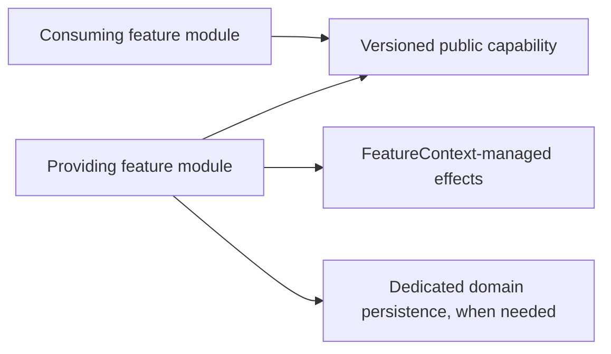

# Strategy

> **Package:** `app/services/strategy/`
> **Status:** `Missing`
> **Last updated:** `2026-09-18`
> **Domain ID:** `D-STRATEGY`

This README is the domain's single source of truth for its boundary, feature and FR registry,
domain-local workflows, semantic contract ownership, persisted-state model, acceptance evidence,
and deletion behavior. Update it before changing the affected implementation.

`PROJECT.md` owns system scope and cross-domain behavior. `ARCHITECTURE.md` owns universal
structure and runtime constraints. `AGENTS.md` owns contributor workflow. The
[Feature Implementation Pipeline](../dev/feature_implementation_pipeline.md) owns the complete
single-file feature delivery checklist.

## Code-aligned implementation convention

Backend features use the simplified modular-monolith layout:

```text
app/services/strategy/
|-- README.md
|-- __init__.py
|-- [feature_1].py
`-- [feature_2].py

app/contracts/strategy.py
app/services/persistence/strategy.py   # only when the domain persists state
tests/services/strategy/[feature_1]/
tests/examples/[domain_number]_strategy.py
```

Each `app/services/strategy/[feature].py` module is one cohesive feature and physical removal unit.
It follows the pipeline's single-file configuration, service, lifecycle, immutable `SPEC`, factory,
documentation, and logging standards. Features are registered explicitly in `app/registry.py`; no
entry-point discovery, directory scanning, YAML manifest, package-local manifest, or import-time
registration is used.

Cross-boundary DTOs, protocols, events, errors, and capability keys live in the domain's single
`app/contracts/strategy.py` module. Feature modules never import sibling implementations. They
declare exact dependencies and resolve providers through `FeatureContext`.

All schema, parameterized SQL, and transactional database operations for this domain are
consolidated in `app/services/persistence/strategy.py`. Feature modules consume focused persistence
interfaces and never execute ad-hoc SQL or accept unrestricted connections.

Every completed feature contributes one `example_<NN>_<feature_slug>` function to
`tests/examples/[domain_number]_strategy.py`. Examples are realistic, offline, deterministic,
secret-safe, and directly executable. Production feature modules contain no usage harness.

For `D-UI`, follow `app/ui/README.md`; Python single-file service and persistence rules do not
replace its explicitly documented widget structure.

---

## 1. Purpose and boundary

### Purpose

The canonical trading idea: events, rules, conditions, parameters, templates, generation, evolution, export configuration, visual authoring.

### Owns

- The canonical trading idea definition: events, entry/exit rules, conditions, and parameters.
- Strategy templates, algorithmic building block assembly, and visual authoring (AlgoWizard).
- Automated strategy generation, genetic evolution, and mutation pipelines.
- Code generation and export configurations for external platforms (MT4/5, NinjaTrader, etc.).

### Does not own

- Backtesting simulation or order fill matching (owned by D-SIMULATOR).
- Position size calculations or portfolio capital allocation (owned by D-RISK and D-PORTFOLIO).

### Shared contracts

The domain's public boundary is `app/contracts/strategy.py`. A counterparty may be a producer,
consumer, or observer; that relationship does not authorize a private implementation import.

| Status | Capability or event | Protocol / DTO symbol | Version | Purpose |
| --- | --- | --- | --- | --- |
| Missing | `strategy.[capability-name]@1` | `[ProtocolName]` | `1` | [Purpose] |

### Persisted-state ownership

Semantic state remains owned by its feature even though database mechanics are consolidated in the
domain persistence module. Other domains access it only through public capabilities.

| Status | Namespace | Owning feature | Driver | Retention | Public read boundary |
| --- | --- | --- | --- | --- | --- |
| Missing | `strategy.[feature_partition]` | `FEAT-STRATEGY-[ACTION_OBJECT]` | `sqlite` | `retain` | `[capability]` |

---

## 2. Feature registry and dependency direction

| Feature | Delivered value | Owner module | Provides | Required capabilities | Status |
| --- | --- | --- | --- | --- | --- |
| `FEAT-STRATEGY-[ACTION_OBJECT]` | [Value] | `app/services/strategy/[feature].py` | `strategy.[capability]@1` | [Keys or `None`] | Missing |

Dependencies point to public contracts, never implementation modules:


```mermaid
flowchart LR
    Consumer["Consuming feature module"] --> Contract["Versioned public capability"]
    Provider["Providing feature module"] --> Contract
    Provider --> Context["FeatureContext-managed effects"]
    Provider --> Persistence["Dedicated domain persistence, when needed"]
```

Removal of one feature module and its registry entry withdraws only its capabilities. Required
consumers become attributed `BLOCKED`; operation-gated consumers refuse or degrade only the named
operation; unrelated features remain usable. Removal does not implicitly purge retained state.

---

## 3. Domain workflows

### `[WF-ID]` — [Workflow name]

- **Lead owner:** `FEAT-STRATEGY-[ACTION_OBJECT]`
- **Participants:** [Feature IDs and public capability handoffs]
- **Input boundary:** [Validated inputs]
- **Output boundary:** [Typed result or receipt]
- **Failure boundary:** [Invalid, unavailable, cancellation, and recovery outcomes]
- **Acceptance:** `[ATW-ID]`

---

## 4. Feature specifications

Copy this card once for each registered feature.

### `[feature].py` — `FEAT-STRATEGY-[ACTION_OBJECT]`

> **Feature ID:** `FEAT-STRATEGY-[ACTION_OBJECT]`
> **Status:** `[Missing | Partial | Completed]`
> **Owner module:** `app/services/strategy/[feature].py`

#### Purpose

[Describe the one cohesive capability and business outcome.]

#### Capability declarations

- **Provides:** `strategy.[capability]@1`
- **Requires:** `[other-domain].[capability]@1` or `None`
- **Optional / operation-gated:** [Key plus exact absence behavior, or `None`]

#### Configuration and limits

Configuration is represented by `[Feature]Config` in the owner module.

| Status | Setting | Type / unit | Default | Validation and failure |
| --- | --- | --- | --- | --- |
| Missing | `[setting]` | `[type]` | `[value]` | [Rule] |

#### Runtime effects and cleanup

| Effect | Acquisition | Cleanup / failure behavior |
| --- | --- | --- |
| Capability publication | `FeatureContext.provide(...)` | Withdrawn with the feature scope |
| [Task, subscription, resource] | [Managed context API] | [Exact cancellation/close behavior] |

#### Persistent state

- **Domain persistence module:** `app/services/persistence/strategy.py` or `None`
- **Namespace:** `strategy.[feature]` or `None`
- **Schema version:** `[version]` or `None`
- **Retention and purge:** [Explicit policy]

#### Single-file structure and symbols

| Status | Owner | Responsibility | Symbols |
| --- | --- | --- | --- |
| Missing | `[feature].py` | Configuration, service behavior, lifecycle wiring, immutable spec, and factory | `[Feature]Config`, `[Feature]Service`, `SPEC`, `[Feature]Feature`, `feature()` |
| Optional | `app/services/persistence/strategy.py` | Domain schema, SQL, and transactions required by this feature | [Focused repository/store symbols] |
| Missing | `tests/examples/[domain_number]_strategy.py` | Realistic offline primary-purpose example | `example_<NN>_<feature_slug>()` |

#### Functional requirements

| Status | Requirement ID | Observable behavior | Implementing symbol | Side effects | Failure | Evidence |
| --- | --- | --- | --- | --- | --- | --- |
| Missing | `FR-[DOM]-[ACTION]` | [Requirement] | `[Feature]Service.[method]` | [None or bounded effect] | [Typed/stable failure] | [Test and example function] |

#### Removal behavior

[Describe capability withdrawal, affected consumer behavior, cleanup, retained state, reinstall,
and physical-removal evidence.]

---

## 5. Domain-wide requirements and invariants

| Status | Requirement ID | Rule | Verification |
| --- | --- | --- | --- |
| Missing | `ARCH-001` | `__init__.py` is docstring-only. | `scripts/architecture_check.py` |
| Missing | `ARCH-002` | Tasks and resources are managed through `FeatureContext`. | Architecture and lifecycle tests |
| Missing | `ARCH-003` | Logging uses `app.kernel.logging`; services configure no handlers. | Architecture check and logging tests |
| Missing | `ARCH-004` | Public contracts live in `app/contracts/strategy.py`. | Import/contract checks |
| Missing | `ARCH-005` | Feature modules never import sibling implementations. | Import checks |
| Missing | `ARCH-006` | SQL and schema operations live in `app/services/persistence/strategy.py`. | Architecture and schema checks |

---

## 6. Decisions and open evidence

| Status | Decision ID | Decision or missing evidence | Scope | Required closure |
| --- | --- | --- | --- | --- |
| Open | `DEC-[DOM]-001` | [Question] | [Features/operations] | [Evidence or owner decision] |

Do not invent a contract, provider behavior, schema, result, or readiness claim to close a missing
evidence row.

---

## 7. Tests and definition of done

```text
tests/services/strategy/[feature]/
|-- test_config.py
|-- test_[feature].py
|-- test_lifecycle.py
`-- test_persistence.py       # only when applicable

tests/examples/[domain_number]_strategy.py
```

Editing uses explicit, affected paths with `--no-cov`. Candidate integration, review, pre-commit,
pre-push, and CI cadence follow `AGENTS.md`; this README must not define a competing broad-test loop.

- [ ] Stable feature ID and one domain owner.
- [ ] One cohesive `app/services/strategy/[feature].py` implementation.
- [ ] Public contracts in `app/contracts/strategy.py`.
- [ ] Exact `FeatureSpec` dependencies and providers.
- [ ] Explicit `app/registry.py` registration.
- [ ] Zero sibling-feature imports and zero import-time effects.
- [ ] Lifecycle-managed tasks, resources, subscriptions, and capability publications.
- [ ] Domain persistence used for all database operations, when applicable.
- [ ] Required happy, invalid, unavailable, boundary, lifecycle, persistence, and removal tests.
- [ ] One passing `example_<NN>_<feature_slug>` function in the consolidated domain example.
- [ ] Domain README status and evidence mappings reflect observed truth.
- [ ] Applicable quality and independent-review gates pass.

---

## 8. Change process

1. Update this domain README and identify the exact feature/FR scope.
2. Update `app/contracts/strategy.py` first when the public boundary changes.
3. Update the cohesive feature module and its immutable `SPEC`.
4. Update `app/services/persistence/strategy.py` only when database operations change.
5. Update explicit registration in `app/registry.py` when feature discovery changes.
6. Update the consolidated domain example function.
7. Add or update focused owner and affected-consumer tests.
8. Validate according to `AGENTS.md` and the Feature Implementation Pipeline.

---

## 9. Normative domain specification

Use this section for exact domain-owned algorithms, formulas, constants, fixtures, schemas, state
machines, parity rules, and failure/recovery behavior that do not belong in `PROJECT.md` or
`ARCHITECTURE.md`. Every rule maps to one or more Section 4 features/FRs and Section 7 evidence.
