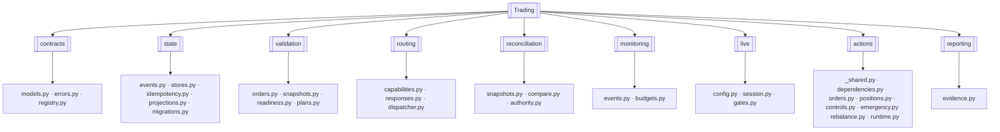
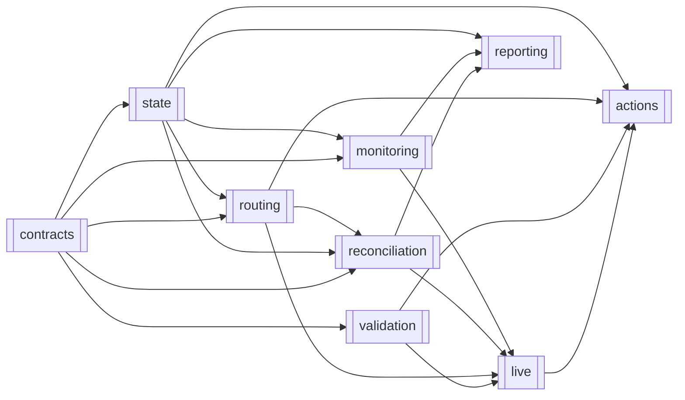
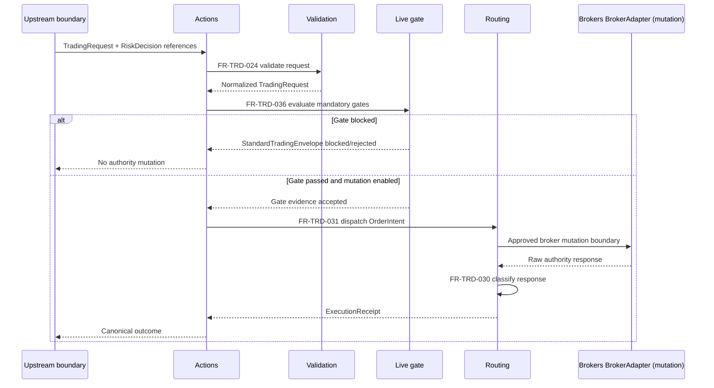

# Trading

> **Package:** `app/services/trading`
> **Status:** `Completed`
> **Last updated:** `2026-07-19`

> This README is the package's **single source of truth** for requirements, final structure, implementation sequence, progress, usage examples, and tests.
> Update this file before changing the code.

---

## 1. Purpose and Boundary

### Purpose

Trading orchestrates live and paper evaluation, converts independently approved risk decisions into deterministic order intents, and executes those intents through the selected `sim`, `paper`, or `live` route. It owns execution safety, receipts, reconciliation, monitoring evidence, and emergency controls after Risk approval. It fails closed whenever route authority, policy, state, or evidence cannot be proven.

### Owns

- Live and paper runtime orchestration through public Data, Indicators, Strategy, and Risk APIs.
- Canonical route-aware requests, `OrderIntent`, `ExecutionReceipt`, and `TradeRecord` contracts.
- Receiver-owned `PortfolioRebalanceExecutionRequest v1` validation and Trading-owned resolution of component exposure reductions into ordinary governed order intents.
- Order and position action formulation using exactly the size approved by Risk.
- One broker/simulator authority dispatch boundary, client-order identity, idempotency, and concurrency enforcement.
- Live enablement, startup reconciliation, deterministic gates, session recovery, and safe shutdown.
- Orders, fills, execution state, logical schemas, artifact schemas, and migration definitions.
- Reconciliation authority, unknown-outcome retry blocking, monitoring evidence, and emergency execution controls.

### Does not own

- Market data or account truth; Data owns these. Broker/provider connections, adapters, and session lifecycle; Brokers owns these. UI/API composition resolves credential references and constructs the Brokers-owned `BrokerConnectionConfig`; Trading never resolves credentials.
- Indicator formulas, strategy signal generation, strategy promotion, or raw signal translation.
- Risk policy, final approved position size, approval-token issuance, or canonical kill-switch policy/state.
- Strategy operational eligibility, Portfolio construction/allocation versions, drift detection, rebalance planning, or authoritative Risk budgets.
- Simulation fills, simulated account state, backtest orchestration, or simulator monitoring.
- Broker-side matching, settlement, custody, or provider SDK implementations.
- Analytics metrics, transaction-cost analysis, or performance comparison.
- API authentication, UI behavior, operator presentation, or infrastructure persistence engines.
- Shadow comparison, performance snapshot caches, or generalized automatic compensation in the initial build.

### Shared contracts

Contract definitions match `docs/PROJECT.md`. Commands are owned by their receiver; results by their producer.

**Owned by this domain** — defined authoritatively here:

| Status | Contract | Version | Counterparty | Purpose |
|---|---|---|---|---|
| Completed | `OrderIntent` | `v1` | Simulation (`sim`); Brokers via `BrokerAdapter` mutation operations (`paper`/`live`) | Complete deterministic executable request containing `contract_version="v1"`, `schema_id="trading.order_intent.v1"`, `client_order_id`, trace IDs, route, provider/account/strategy references, symbol, action, side, Risk-approved `Decimal` volume, approved `order_type`, validated instrument `quantity_unit`, optional limit/stop/TIF/expiration material, Trading-state broker order/position targets, idempotency material, approval/risk references, and UTC validity timestamps. Connection environment/account material remains in injected `BrokerConnectionConfig`; no provider SDK object crosses this contract and executable size never exceeds Risk approval. |
| Completed | `ExecutionReceipt` | `v1` | Analytics; Portfolio; UI/API | Immutable authority response containing intent reference, provider identifiers, finite status, requested/filled quantities, average price, authority timestamps, response classification, retry safety, reconciliation requirement, and trace IDs. Unknown or malformed success remains `unknown_outcome`. |
| Completed | `TradeRecord` | `v1` | Analytics; Portfolio; UI/API | Official execution record containing the receipt, fills, factual commission/spread/slippage/cost inputs, authority and reconciliation state, warnings/incidents, and trace chain. Unreconciled records remain explicitly flagged. |
| Completed | `PortfolioRebalanceExecutionRequest` | `v1` | Portfolio submits; Trading receives | Request idempotent execution of one Risk-authorized immutable rebalance plan; contains plan/allocation/decision references, ordered actions, reduce-only flags, route, approval token, validity, and canonical hash. |
| Completed | `OperationalEvent` | `v1` | UI/API; composition-root audit adapter | Publish bounded redacted health, dependency, staleness, timeout, latency, cost, and incident evidence with severity, UTC time, trace IDs, and source references. |
| Completed | `ExecutionEvidenceReport` | `v1` | Analytics; Portfolio; UI/API | Immutable stored execution, readiness, reconciliation, incident, warning, and unresolved-action evidence carrying `contract_version="v1"` and `schema_id="trading.execution_evidence_report.v1"`; missing or inconsistent stored evidence fails closed. |

`ExecutionReceipt` and `TradeRecord` likewise carry `contract_version="v1"` plus
`schema_id="trading.execution_receipt.v1"` and
`schema_id="trading.trade_record.v1"` respectively. Compatibility is never inferred
from a schema identifier.

`OperationalEvent v1` carries `contract_version="v1"`,
`schema_id="trading.operational_event.v1"`, event ID/type/severity, UTC occurrence
time, request/workflow/correlation/causation IDs, bounded redacted facts, and source
references. UI/API may present it; the composition root maps governed occurrences
to Utils-owned `AuditEvent v1` for Data persistence without redefining either type.

**Consumed from other domains** — referenced only, never redefined:

| Contract | Version | Owner | Used for |
|---|---|---|---|
| `AuthContext`, `AuditEvent` | `v1` | Utils | Principal/trace context and redacted governed-action evidence. |
| `MarketDataset`, `AccountStateSnapshot`, `MarketContextEvidence` | `v1` | Data | Runtime market/account/context evidence; Trading never creates Risk policy from it. `MarketContextEvidence` is carried to Risk as orchestrator only — Risk is its sole interpreting consumer. |
| `BrokerAdapter` (mutation + execution-read traits) | `v1` | Brokers | Sole paper/live mutation boundary (`TradeExecutionProvider`) plus execution-state and account reads needed for dispatch and reconciliation; mutation operations are Trading-only. |
| `BrokerResult` / `BrokerError` | `v1` | Brokers | Canonical authority response envelope; `BROKER_UNKNOWN_OUTCOME` maps to `unknown_outcome` and freezes execution. |
| `BrokerConnectionConfig` | `v1` | Brokers | UI/API-composed provider/account/environment configuration with already-resolved in-memory credentials; paper and live differ only by its environment/credentials. |
| `IndicatorSeries` | `v1` | Indicators | Current deterministic indicator evidence during live/paper orchestration. |
| `TradeIntent` | `v1` | Strategy | Proposal lineage; Trading never executes it before Risk approval. |
| `RiskDecision`, `ActionPolicyVerdict`, `KillSwitchState` | `v1` | Risk | Independent approved size/token or rejection, Risk-owned action permission, and canonical execution-blocking state/hierarchy. `ActionPolicyVerdict.scope` carries exact request scope plus canonical `mutable_fields` and `max_children` strings when those controls apply. |
| `StrategyOperationalEligibilityDecision`, `AllocationRiskDecision` | `v1` | Risk | Prove current scoped eligibility and authoritative allocation/rebalance authorization; Trading never infers them. |
| `PortfolioBudgetExecutionVerdict` | `v1` | Risk | Prove current execution-time budget authority for the exact allocation, plan, canonical plan hash, and budget unit; Trading never calculates consumption. |
| Portfolio allocation/plan identifiers and hashes carried inside `PortfolioRebalanceExecutionRequest v1` | `v1` | Portfolio | Bind the Trading-owned execution request to one immutable target and plan without consuming or importing Portfolio contracts or internals. |

`StandardTradingEnvelope` is an internal Trading result type. UI/API adapts it to
the external `ApiResponse` family; no other domain consumes or redefines the envelope.

**Consumed-symbol name reconciliation** (contract name → concrete public import, to avoid importing non-existent symbols):

- `IndicatorSeries v1` → class `IndicatorResult` (`from app.services.indicators import IndicatorResult`).
- `RiskDecision v1` → class `RiskDecisionPackage` (`from app.services.risk.contracts import RiskDecisionPackage`); `ActionPolicyVerdict`, `KillSwitchState`, `StrategyOperationalEligibilityDecision`, and `AllocationRiskDecision` use their own names.
- The "Simulation" domain is the package `app.services.simulator`. Trading imports no Simulation internals; the `sim` route is dispatched through an injected async callback `Callable[[OrderIntent], Awaitable[ExecutionReceipt]]`.

### Persisted state

Trading owns logical schemas and migration definitions; Data owns connection, locking, and migration execution infrastructure. Concrete stores are injected. Trading does not implement a custom JSONL persistence architecture in the final design.

| Status | State / Store | Read access (via contract) | Migration definitions |
|---|---|---|---|
| Completed | Orders, fills, receipts, and execution projections | Analytics, Portfolio, and UI/API via `TradeRecord` / `ExecutionReceipt` | `state/migrations.py` |
| Completed | Idempotency reservations and canonical-material versions | Trading only | `state/migrations.py` |
| Completed | Reconciliation runs, authority transitions, and incidents | UI/API via `TradeRecord`; Risk via audit evidence where required | `state/migrations.py` |

### Four-level structure

| Code level | Represents |
|---|---|
| **Package** | Trading domain |
| **Module folder** | Feature / capability |
| **File** | Use case or focused responsibility |
| **Class / function / method** | Functional requirement behavior |

```text
Package
└── Module folder
    └── File
        └── Public Class / Function / Method / Constant
```

### Package capability map



### Initial limitations

- Production live mutation remains blocked by `ALLOW_LIVE_MUTATIONS=false` until explicitly enabled after implementation and verification.
- Shadow execution/comparison and generalized compensation are not part of the Trading architecture.
- Performance snapshot caches and Trading-owned rate-limit policy are excluded.

---

## 2. Final Package Structure

Modules and files are ordered from lowest dependency to highest dependency.

### Feature Registry

| Status | Feature | Owning module | Public API and contracts | Requirements | Usage evidence |
|---|---|---|---|---|---|
| Completed | `FEAT-TRD-01` Canonical Contracts and Registries | `contracts/` | Exact declarations, signatures, and contract fields: Section 4.1 | Section 4.1 functional requirements | `tests/trading/usage/01_contracts.py` |
| Completed | `FEAT-TRD-02` State and Deterministic Projections | `state/` | Exact declarations and state contracts: Section 4.2 | Section 4.2 functional requirements | `tests/trading/usage/02_state.py` |
| Completed | `FEAT-TRD-03` Validation, Readiness, and Plans | `validation/` | Exact declarations: Section 4.3 | Section 4.3 functional requirements | `tests/trading/usage/03_validation.py` |
| Completed | `FEAT-TRD-04` Authority Selection and Dispatch | `routing/` | Exact declarations: Section 4.4 | Section 4.4 functional requirements | `tests/trading/usage/04_routing.py` |
| Completed | `FEAT-TRD-05` Reconciliation and Retry Guard | `reconciliation/` | Exact declarations and reconciliation contracts: Section 4.5 | Section 4.5 functional requirements | `tests/trading/usage/05_reconciliation.py` |
| Completed | `FEAT-TRD-06` Operational and Budget Evidence | `monitoring/` | Exact declarations: Section 4.6 | Section 4.6 functional requirements | `tests/trading/usage/06_monitoring.py` |
| Completed | `FEAT-TRD-07` Live and Paper Session Lifecycle | `live/` | Exact declarations and configuration contracts: Section 4.7 | Section 4.7 functional requirements | `tests/trading/usage/07_live.py` |
| Completed | `FEAT-TRD-08` Route-Aware Public Actions | `actions/` | Exact async declarations and dependency contracts: Section 4.8 | Section 4.8 functional requirements | `tests/trading/usage/08_actions.py` |
| Completed | `FEAT-TRD-09` Immutable Execution Evidence | `reporting/` | Exact declarations and report contracts: Section 4.9 | Section 4.9 functional requirements | `tests/trading/usage/09_reporting.py` |

```text
trading/
├── __init__.py                         # Approved domain-level Python API only
├── README.md
├── contracts/                          # Canonical contracts and registries
│   ├── __init__.py
│   ├── models.py                       # Route/request/result contracts
│   ├── errors.py                       # Error taxonomy, mapping, redaction
│   └── registry.py                     # Explicit typed Python public API
├── state/                              # State contracts and deterministic projections
│   ├── __init__.py
│   ├── events.py                       # Versioned Trading events
│   ├── stores.py                       # Minimal injected store protocols
│   ├── idempotency.py                  # Caller-key reservation and conflict checks
│   ├── projections.py                  # Receipt/fill/order/position projections
│   └── migrations.py                   # Trading-owned migration definitions
├── validation/                         # Validation, snapshots, readiness, plans
│   ├── __init__.py
│   ├── orders.py                       # Aggregate order validation
│   ├── snapshots.py                    # Structured route facts
│   ├── readiness.py                    # Aggregate execution readiness
│   └── plans.py                        # Deterministic execution-plan construction
├── routing/                            # Authority selection and dispatch boundary
│   ├── __init__.py
│   ├── capabilities.py                 # Adapter contract validation
│   ├── responses.py                    # Authority-response classification
│   └── dispatcher.py                   # Sole simulator/broker dispatch boundary
├── reconciliation/                     # Authority comparison and retry guard
│   ├── __init__.py
│   ├── snapshots.py                    # Normalized authority snapshots
│   ├── compare.py                      # Missing/extra/mismatched/stale comparison
│   └── authority.py                    # Unknown-outcome resolution and retry lock
├── monitoring/                         # Operational, budget, and incident evidence
│   ├── __init__.py
│   ├── events.py                       # Focused runtime event emission
│   └── budgets.py                      # External budget-verdict enforcement
├── live/                               # Live/paper session lifecycle and gates
│   ├── __init__.py
│   ├── config.py                       # Immutable enablement/security configuration
│   ├── session.py                      # Startup, status, recovery, shutdown
│   └── gates.py                        # Canonical fail-fast gate sequence
├── actions/                            # Route-aware public action verbs
│   ├── __init__.py
│   ├── _shared.py                      # Private action identity helpers
│   ├── dependencies.py                 # Injected route/state/runtime dependencies
│   ├── orders.py                       # Submit, modify, cancel
│   ├── positions.py                    # Close, modify, reduce
│   ├── controls.py                     # Pause, resume, synchronize, kill switch
│   ├── emergency.py                    # Gated mass cancel and close
│   ├── rebalance.py                    # Authorized rebalance execution adaptation
│   └── runtime.py                      # Live/paper evaluation-cycle orchestration
└── reporting/                          # Immutable evidence packaging
    ├── __init__.py
    └── evidence.py                     # Execution/reconciliation report evidence
```

### Module dependency diagram



### Structure rules

- The package root contains only `README.md`, `__init__.py`, and capability modules.
- Cross-domain imports use documented public APIs only; provider SDK objects never cross the boundary.
- Stateless validation, packaging, comparison, and classification use functions.
- `LiveSession` is a class because it owns lifecycle and injected runtime dependencies.
- Store types are protocols; Data supplies shared persistence infrastructure and route channels.
- No lazy package attributes, generic service/manager/engine layers, or duplicate low-level order APIs.
- Usage examples live under `tests/trading/usage/`.

---

## 3. Workflows

### Status values

| Status | Meaning |
|---|---|
| **Missing** | Not implemented, conflicting, or not verified |
| **Partial** | Useful implementation exists but final behavior/tests are incomplete |
| **Completed** | Final behavior is implemented, tested, and verified |

### Workflow scope values

| Scope | Meaning |
|---|---|
| **Internal** | Complete inside Trading |
| **Cross-domain** | Trading participates through defined input/output boundaries |

| Status | Workflow ID | Scope | Workflow | Trigger / Input boundary | Final outcome / Output boundary | Requirement sequence |
|---|---|---|---|---|---|---|
| Completed | `WF-TRD-001` | Internal | Validate and package a route-aware action | Canonical `TradingRequest` | Validated package or structured rejection | `FR-TRD-024 → FR-TRD-027 → FR-TRD-028` |
| Completed | `WF-TRD-002` | Cross-domain | Execute a simulation-route action | Approved sim request | `OrderIntent` to Simulation; canonical receipt returned | `FR-TRD-013 → FR-TRD-031` |
| Completed | `WF-TRD-003` | Cross-domain | Start and enable a live session | Approved config and Data session/channel | Package-only or mutation-enabled session | `FR-TRD-033 → FR-TRD-034` |
| Completed | `WF-TRD-004` | Cross-domain | Gate and dispatch a live action | Canonical request plus external verdicts | One broker dispatch or fail-closed outcome | `FR-TRD-036 → FR-TRD-013 → FR-TRD-031` |
| Completed | `WF-TRD-005` | Cross-domain | Resolve an unknown route outcome | Timeout/malformed authority response | Retry locked until authority resolution | `FR-TRD-030 → FR-TRD-044 → FR-TRD-045` |
| Completed | `WF-TRD-006` | Cross-domain | Read route facts and aggregate readiness | Data/Simulation read evidence | Fresh structured readiness assessment | `FR-TRD-026 → FR-TRD-027` |
| Completed | `WF-TRD-007` | Cross-domain | Enforce kill switch and emergency controls | Risk state and approved control request | New actions blocked; gated cancel/close result | `FR-TRD-021 → FR-TRD-023`, `FR-TRD-050` |
| Completed | `WF-TRD-008` | Cross-domain | Persist evidence and recover state | Trading events and injected stores | Reconstructed projections and unresolved attempts | `FR-TRD-037 → FR-TRD-042`, `FR-TRD-051 → FR-TRD-055` |
| Completed | `WF-TRD-009` | Cross-domain | Perform safe live shutdown | Operator/runtime stop request | Admission stopped and unresolved-work report | `FR-TRD-035` |
| Completed | `WF-TRD-010` | Cross-domain | Emit monitoring, cost, and incident evidence | Runtime observation | Trading-owned `OperationalEvent`; durable audit evidence through Data and operator presentation through UI/API | `FR-TRD-046 → FR-TRD-048` |
| Completed | `WF-TRD-011` | Cross-domain | Build execution/reconciliation evidence | Receipts, readiness, incidents | Immutable report to Analytics/Portfolio/UI/API | `FR-TRD-049` |
| Completed | `WF-TRD-012` | Cross-domain | Accept governed upstream request | Approved `RiskDecision` and immutable lineage | Validated Trading request; no raw signal translation | `FR-TRD-003 → FR-TRD-024` |
| Completed | `WF-TRD-013` | Cross-domain | Execute authorized portfolio rebalance | `PortfolioRebalanceExecutionRequest v1` plus current Risk decisions | Idempotent order outcomes and reconciliation evidence | `FR-TRD-063 → FR-TRD-064 → FR-TRD-024 → FR-TRD-036 → FR-TRD-039` |
| Completed | `WF-TRD-014` | Cross-domain | Run a live/paper evaluation cycle | Live/paper market update or scheduled evaluation trigger | Neutral signal ends the cycle, or an approved `RiskDecision` enters the validate/gate/dispatch path | `FR-TRD-065 → FR-TRD-012 → FR-TRD-036` |

### `WF-TRD-001` — Validate and package a route-aware action

**Scope:** `Internal`
**System workflow:** None
**Input boundary:** A canonical request already carrying immutable route, intent, Risk, approval, and trace references.
**Output boundary:** A validated request/package or structured rejection.

1. `validate_order_request()` validates Decimal values and operation preconditions.
2. `build_execution_plan()` constructs deterministic intent material.
3. The action returns `packaged` when no mutation authority is enabled; route selection never bypasses validation.

**Failure behavior:** invalid or incomplete evidence produces a redacted `TradingError`; no authority call occurs.
**Integration test:** `tests/trading/integration/test_validate_and_package.py::test_validate_and_package_fails_closed()`

### `WF-TRD-002` — Execute a simulation-route action

**Scope:** `Cross-domain`
**System workflow:** `SYS-WF-001`
**Input boundary:** An approved `route="sim"` request.
**Output boundary:** `OrderIntent` to Simulation; canonical simulated `ExecutionReceipt` returned.

1. Trading validates and builds the intent.
2. `dispatch_order_intent()` selects Simulation authority.
3. Simulation alone mutates simulated state and returns receipt evidence.

**Failure behavior:** missing Simulation authority or incompatible contract returns `SERVICE_UNAVAILABLE`; no local fill is invented.
**Integration test:** `tests/trading/integration/test_sim_dispatch.py::test_sim_dispatch_uses_simulation_authority()`

### `WF-TRD-003` — Start and enable a live session

**Scope:** `Cross-domain`
**System workflow:** `SYS-WF-002`
**Input boundary:** Approved configuration, injected `BrokerConnectionConfig`, a Brokers adapter session created via `create_broker_adapter()`, provider capability/security evidence (`BrokerFeatureFlags`), and Risk kill-switch state.
**Output boundary:** Package-only or mutation-enabled `LiveSession` status.

1. `LiveSession.start()` validates configuration without resolving raw secrets.
2. Adapter capability/security and readiness are checked.
3. Startup reconciliation completes before mutation admission.

**Failure behavior:** any missing or stale evidence leaves the session package-only and returns a structured reason.
**Integration test:** `tests/trading/integration/test_live_startup.py::test_live_startup_requires_reconciliation()`

### `WF-TRD-004` — Gate and dispatch a live action

**Scope:** `Cross-domain`
**System workflow:** `SYS-WF-002`
**Input boundary:** Canonical request, valid `RiskDecision`, approval/action-policy verdicts, `KillSwitchState`, and current Data evidence.
**Output boundary:** One dispatch through Brokers' `BrokerAdapter` mutation operations, or an audited fail-closed result.

1. `evaluate_live_gate()` executes schema → enablement/session → action policy/approval → Risk verdict → kill switch → readiness/staleness → idempotency → concurrency → reconciliation authority → pre-audit → adapter permission.
2. Pre-audit failure blocks dispatch.
3. `dispatch_order_intent()` is invoked at most once after every mandatory gate passes.

**Failure behavior:** no passthrough risk gate; expiry is rechecked immediately before send; unknown state is never retried blindly.
**Integration test:** `tests/trading/integration/test_live_dispatch.py::test_live_dispatch_completes_single_broker_mutation()`

#### End-to-end live workflow diagram



### `WF-TRD-005` — Resolve an unknown route outcome

**Scope:** `Cross-domain`
**System workflow:** `SYS-WF-002`
**Input boundary:** Timeout, malformed success, or ambiguous authority response.
**Output boundary:** Persisted incident and retry lock until authority truth resolves.

1. `classify_authority_response()` emits `unknown_outcome` conservatively.
2. `resolve_unknown_outcome()` locks the conflict scope and obtains authority snapshots.
3. Broker truth wins for paper/live; Simulation truth wins for sim.

**Failure behavior:** unresolved comparison stays blocked and visible; no failure status implies safe retry.
**Integration test:** `tests/trading/integration/test_unknown_outcome.py::test_unknown_outcome_blocks_retry()`

### `WF-TRD-006` — Read route facts and aggregate readiness

**Scope:** `Cross-domain`
**System workflow:** `SYS-WF-001`, `SYS-WF-002`, `SYS-WF-008`
**Input boundary:** Data or Simulation route facts.
**Output boundary:** Timestamped snapshot and bounded readiness failures.

`get_route_snapshot()` returns explicit unavailable/stale evidence; `assess_execution_readiness()` aggregates required checks without exposing many public validators.

**Failure behavior:** missing facts never become neutral zero/empty values.
**Integration test:** `tests/trading/integration/test_readiness.py::test_unavailable_route_fact_fails_readiness()`

### `WF-TRD-007` — Activate/enforce kill switch and emergency controls

**Scope:** `Cross-domain`
**System workflow:** `SYS-WF-005`
**Input boundary:** Risk-owned `KillSwitchState`, `ActionPolicyVerdict`, and approval-token reservation evidence.
**Output boundary:** Durable state/evidence, blocked new actions, and optional gated mass actions.

Risk owns `global > portfolio > strategy > symbol` state and clearance. Trading blocks new
dispatches, attempts cancellation only for pending/cancellable work, reports every
uncertain result, and never blindly closes already-filled positions. Trigger, clear,
cancel-all, and close-all pass the same policy, approval, idempotency, audit, and live
gates as other mutations. Emergency classification never comes from request text;
resume requires all applicable Risk scopes inactive plus successful reconciliation.

**Failure behavior:** partial child outcomes remain explicit; clearance without required authority is rejected.
**Integration test:** `tests/trading/integration/test_kill_switch.py::test_kill_switch_blocks_and_reports_partial_emergency_results()`

### `WF-TRD-008` — Persist execution evidence and recover state

**Scope:** `Cross-domain`
**System workflow:** `SYS-WF-001`, `SYS-WF-002`
**Input boundary:** Versioned Trading events.
**Output boundary:** Data infrastructure persists Trading-owned schemas; projections reconstruct without hidden side effects.

**Failure behavior:** required idempotency/pre-audit write failure blocks send; recovery uncertainty keeps mutation disabled.
**Integration test:** `tests/trading/integration/test_state_recovery.py::test_recovery_preserves_unresolved_attempt()`

### `WF-TRD-009` — Perform safe live shutdown

**Scope:** `Cross-domain`
**System workflow:** `SYS-WF-002`, `SYS-WF-005`
**Input boundary:** Operator or runtime stop request.
**Output boundary:** Structured shutdown result with unresolved work.

`LiveSession.stop()` stops admission, marks/drains in-flight work within an approved budget, flushes evidence, attempts reconciliation, and reports every incomplete step.

**Failure behavior:** flush/reconciliation failures are returned, not silently logged.
**Integration test:** `tests/trading/integration/test_live_shutdown.py::test_shutdown_reports_unresolved_work()`

### `WF-TRD-010` — Emit monitoring, cost, and incident evidence

**Scope:** `Cross-domain`
**System workflow:** `SYS-WF-002`, `SYS-WF-005`
**Input boundary:** Runtime health, staleness, timeout, latency, cost, and incident
facts. Risk owns the registered portfolio budget verdicts and execution-governance state.
**Output boundary:** Redacted Trading-owned `OperationalEvent` values. The composition
root submits required `AuditEvent` evidence to Data and exposes authorized operator
views through UI/API; Trading imports neither Data nor UI/API implementation details.

**Failure behavior:** pre-send budget breach blocks; post-send breach becomes an
incident; event-delivery failure is surfaced and never hides execution state.
**Integration test:** `tests/trading/integration/test_monitoring.py::test_budget_and_event_delivery_failures_emit_incidents()`

### `WF-TRD-011` — Build execution and reconciliation evidence

**Scope:** `Cross-domain`
**System workflow:** `SYS-WF-001`, `SYS-WF-002`, `SYS-WF-008`
**Input boundary:** Trading-owned receipts, readiness, reconciliation, warning, and incident facts.
**Output boundary:** Immutable evidence report to Analytics, Portfolio, and UI/API.

**Failure behavior:** Trading never derives performance/TCA metrics or fabricates missing fills.
**Integration test:** `tests/trading/integration/test_reporting.py::test_report_contains_only_execution_evidence()`

### `WF-TRD-012` — Accept a governed upstream request

**Scope:** `Cross-domain`
**System workflow:** `SYS-WF-002`, `SYS-WF-006`
**Input boundary:** An approved `RiskDecision` with immutable Strategy intent lineage — produced within `WF-TRD-014` (`FR-TRD-065`) when Trading drives the loop, or supplied by an external governed caller.
**Output boundary:** Canonical Trading request accepted for validation.

**Failure behavior:** raw signal dictionaries, missing approval lineage, and size changes are rejected.
**Integration test:** `tests/trading/integration/test_upstream_request.py::test_raw_signal_translation_is_rejected()`

### `WF-TRD-014` — Run a live/paper evaluation cycle

**Scope:** `Cross-domain`
**System workflow:** `SYS-WF-002`
**Input boundary:** A live/paper market update or scheduled strategy evaluation under an authenticated principal.
**Output boundary:** Either a neutral-signal termination, or an approved `RiskDecision` handed into the validate/gate/dispatch path.

`run_live_evaluation_cycle()` owns the runtime loop defined in `docs/PROJECT.md` `SYS-WF-002` step 1: it requests `MarketDataset`/`AccountStateSnapshot` from Data, `IndicatorSeries` from Indicators, invokes Strategy for a `TradeIntent`, ends the cycle on a neutral signal, submits the `TradeIntent` to Risk, and forwards any approved `RiskDecision` into `WF-TRD-012`. Trading never computes indicators, generates signals, or sizes/approves.

**Failure behavior:** upstream unavailable/stale evidence fails closed; neutral signals end the cycle without mutation.
**Integration test:** `tests/trading/integration/test_live_cycle.py::test_cycle_submits_intent_and_never_sizes()`

### `WF-TRD-013` — Execute an Authorized Portfolio Rebalance

**Scope:** `Cross-domain`
**System workflow:** `SYS-WF-008`
**Input boundary:** Trading-owned `PortfolioRebalanceExecutionRequest v1`
referencing one immutable allocation/plan, current eligibility and
`AllocationRiskDecision`, approval token, route, and canonical hash.
**Output boundary:** ordinary `ExecutionReceipt` / `TradeRecord` outcomes.

Trading revalidates eligibility, Risk budget/decision, kill switch, route, token,
target version, idempotency, and current execution state before dispatch. Each
approved action follows the existing order/reconciliation path through Brokers.
Trading never recalculates target weights. Existing over-budget correction remains
reduce-only unless Risk separately authorizes an increase; no order opens solely to
match a target weight.

**Integration test:** `tests/trading/integration/test_portfolio_rebalance.py::test_rebalance_cannot_bypass_risk_or_open_to_match_weight()`

---

## 4. Module and Requirement Specifications

This section is the implementation plan. Modules, files, and requirements are in dependency order.

### 4.1 `contracts/` — Canonical contracts and registries

**Purpose:** Define the one JSON-safe, Decimal-safe, UTC contract family, finite error taxonomy, and typed Python public API.

**Module flow:** `input → models.py → errors.py/redaction → registry.py → public contract`

### Files

| Status | File | Responsibility | Key exports | Dependencies |
|---|---|---|---|---|
| Completed | `models.py` | Define routes, requests, intents, receipts, records, and envelopes | `TradingRoute`, `TradingRequest`, `StandardTradingEnvelope`, `OrderIntent`, `ExecutionReceipt`, `TradeRecord`, `PortfolioRebalanceExecutionRequest` | **Standard library:** `collections.abc`, `datetime`, `decimal`, `enum`, `hashlib`, `types`, `typing`<br>**Required third-party:** `pydantic>=2.13.4`<br>**Local:** Utils canonicalization/redaction/serialization/logger APIs |
| Completed | `errors.py` | Define/map finite errors and redact boundary payloads | `TradingError`, `map_trading_error`, `redact_trading_payload` | **Standard library:** `collections.abc`, `re`<br>**Required third-party:** `pydantic>=2.13.4`<br>**Local:** `models.py → StandardTradingEnvelope`; Utils public error/redaction APIs |
| Completed | `registry.py` | Expose the exact typed Python public API | `get_public_contracts` | **Standard library:** `collections.abc`, `types`<br>**Required third-party:** `pydantic>=2.13.4`<br>**Local:** `models.py`; `errors.py`; Utils serialization APIs |
| Completed | `__init__.py` | Expose the approved contract API | All exports above | **Standard library:** None<br>**Required third-party:** None<br>**Local:** files above |

### Configuration and Limits Manifest

| Status | Setting / Limit | Type | Default | Required | Used by | Description |
|---|---|---|---|---|---|---|
| Completed | `TRADING_CONTRACT_VERSION` | `str` | `v1` | Yes | All contract types | Breaking semantic/schema changes require a new version and coordinated consumer migration. |
| Completed | Decimal context | policy | precision at least 28; `ROUND_HALF_EVEN`; instrument/provider quantization | Yes | `TradingRequest`, `OrderIntent`, `TradeRecord` | Reject float, NaN, Infinity, locale-dependent, or unquantizable broker-critical material. |

**Canonical field rules:**

- `TradingRequest` contains separate `contract_version` and `schema_id`, request/correlation IDs, route, provider/account/portfolio/strategy/intent references, action, symbol/side, approved `order_type`, validated instrument `quantity_unit`, Decimal quantity, optional limit/stop/TIF/expiration material, nullable Trading-state broker order/position targets, optional kill-switch `scope_level` and `control_reason`, approval and `RiskDecision` references, caller idempotency key, canonical-material version, system and broker time evidence, and redaction metadata.
- `OrderIntent` preserves that approved executable material exactly. It never derives `order_type` or `quantity_unit`, never carries connection credentials/environment, and receives modify/cancel/close target IDs only from Trading state.
- Every `PortfolioRebalanceExecutionRequest.actions` row contains exactly `action_id`, `component_id`, `eligibility_decision_id`, canonical `action="reduce_exposure"`, `reduce_only=true`, `current_exposure`, `target_exposure`, and exact `reduction_amount`. Trading owns resolution of symbol, side, order type, volume, price, position, and provider references and revalidates the resolved child request against the immutable parent plan before ordinary gates run.
- `StandardTradingEnvelope` contains exactly `status`, `message`, `data`, `errors`, `warnings`, and `audit_metadata`. Status is one of `success`, `rejected`, `blocked`, `pending_approval`, `packaged`, `sent`, `partial`, `filled`, `cancelled`, `unknown_outcome`, or `error` where applicable.
- Each error contains `code`, `message`, optional `field_path`, `severity`, `retryable`, route/provider, and request/correlation IDs. Each warning contains `code`, `message`, `severity`, and optional affected context.
- Audit metadata contains operation name, request/correlation IDs, route/provider, approval and Risk references, risk/side-effect classifications, idempotency key, payload version, UTC creation time, and redaction status.

#### `models.py` — Canonical contract family

| Status | Requirement ID | Responsibility | Class / Function / Method | Side Effects | Raises | Usage / Test |
|---|---|---|---|---|---|---|
| Completed | `FR-TRD-001` | The system shall expose only `sim`, `paper`, and `live` action routes; package-only is a side-effect mode, not a route. | `TradingRoute: type[StrEnum]` | None | `TradingError`: unknown route | **Usage:** `tests/trading/usage/test_usage_contracts.py::test_usage_models_trading_route()`<br>**Unit:** `tests/trading/unit/contracts/test_models.py::test_trading_route_rejects_unknown()` |
| Completed | `FR-TRD-002` | The system shall validate one immutable canonical request with route, action, trace, authority, approval, Risk, idempotency, UTC evidence, approved `order_type`, validated instrument `quantity_unit`, optional stop/TIF/expiration material, and nullable Trading-state broker target identities. | `TradingRequest` | None | `TradingError`: invalid/missing field or unsafe numeric/time value | **Usage:** `tests/trading/usage/test_usage_contracts.py::test_usage_models_trading_request()`<br>**Unit:** `tests/trading/unit/contracts/test_models.py::test_trading_request_requires_governed_evidence()` |
| Completed | `FR-TRD-003` | The system shall return one finite JSON-safe envelope distinguishing packaging, rejection, block, send, fill, cancellation, unknown outcome, and error. | `StandardTradingEnvelope` | None | `TradingError`: nonconforming envelope | **Usage:** `tests/trading/usage/test_usage_contracts.py::test_usage_models_standard_envelope()`<br>**Unit:** `tests/trading/unit/contracts/test_models.py::test_standard_envelope_status_contract()` |
| Completed | `FR-TRD-004` | The system shall expose complete deterministic `OrderIntent v1` exactly as defined in Section 1, preserving Risk-approved size, approved order type, validated quantity unit, optional order instructions, and Trading-state broker target identities without connection material. | `OrderIntent` | None | `TradingError`: size, lineage, order-shape, or target mismatch | **Usage:** `tests/trading/usage/test_usage_contracts.py::test_usage_models_order_intent()`<br>**Unit:** `tests/trading/unit/contracts/test_models.py::test_order_intent_cannot_exceed_risk_size()` |
| Completed | `FR-TRD-005` | The system shall expose immutable `ExecutionReceipt v1` with authority, status, fill, retry, and reconciliation evidence. | `ExecutionReceipt` | None | `TradingError`: malformed receipt | **Usage:** `tests/trading/usage/test_usage_contracts.py::test_usage_models_execution_receipt()`<br>**Unit:** `tests/trading/unit/contracts/test_models.py::test_receipt_requires_authority_evidence()` |
| Completed | `FR-TRD-006` | The system shall expose `TradeRecord v1` without deriving Analytics metrics or hiding unreconciled state. | `TradeRecord` | None | `TradingError`: inconsistent fill/authority state | **Usage:** `tests/trading/usage/test_usage_contracts.py::test_usage_models_trade_record()`<br>**Unit:** `tests/trading/unit/contracts/test_models.py::test_trade_record_flags_unreconciled_state()` |
| Completed | `FR-TRD-066` | The system shall expose one canonical `TRADING_CONTRACT_VERSION="v1"` constant used by every Trading-owned versioned contract and report schema. `FR-TRD-011` remains retired with `CAP-TRD-022` and is not reused. | `TRADING_CONTRACT_VERSION: Final[str]` | None | None | **Usage:** `tests/trading/usage/test_usage_contracts.py::test_usage_contract_version()`<br>**Unit:** `tests/trading/unit/contracts/test_models.py::test_contract_version_is_canonical()` |
| Completed | `FR-TRD-063` | The system shall expose `PortfolioRebalanceExecutionRequest v1` exactly as defined in §1 (plan/allocation/decision references, ordered actions, reduce-only flags, route, approval token, validity, canonical hash) carrying `contract_version="v1"` and `schema_id="trading.portfolio_rebalance_execution_request.v1"`. | `PortfolioRebalanceExecutionRequest` | None | `TradingError`: invalid/duplicate hash, missing authorization, or non-canonical material | **Usage:** `tests/trading/usage/test_usage_contracts.py::test_usage_models_portfolio_rebalance_request()`<br>**Unit:** `tests/trading/unit/contracts/test_models.py::test_rebalance_request_requires_canonical_hash()` |

#### `errors.py` — Error taxonomy and redaction

| Status | Requirement ID | Responsibility | Class / Function / Method | Side Effects | Raises | Usage / Test |
|---|---|---|---|---|---|---|
| Completed | `FR-TRD-007` | The system shall expose one finite Trading exception carrying a registered code and redacted trace context. | `TradingError` | None | None | **Usage:** `tests/trading/usage/test_usage_contracts.py::test_usage_errors_trading_error()`<br>**Unit:** `tests/trading/unit/contracts/test_errors.py::test_trading_error_rejects_unknown_code()` |
| Completed | `FR-TRD-008` | The system shall map validation, permission, persistence, timeout, provider, and unknown failures into the canonical envelope without raw exceptions. | `map_trading_error(error: Exception, context: Mapping[str, JsonValue]) -> StandardTradingEnvelope` | None | None | **Usage:** `tests/trading/usage/test_usage_contracts.py::test_usage_errors_map_trading_error()`<br>**Unit:** `tests/trading/unit/contracts/test_errors.py::test_map_trading_error_redacts_provider_exception()` |
| Completed | `FR-TRD-009` | The system shall recursively redact secrets before any log, error, event, metric, or returned payload. | `redact_trading_payload(payload: JsonValue) -> JsonValue` | None | `TradingError`: payload is not JSON-safe | **Usage:** `tests/trading/usage/test_usage_contracts.py::test_usage_errors_redact_trading_payload()`<br>**Unit:** `tests/trading/unit/contracts/test_errors.py::test_redaction_is_recursive_and_case_insensitive()` |

#### `registry.py` — Public API catalog

| Status | Requirement ID | Responsibility | Class / Function / Method | Side Effects | Raises | Usage / Test |
|---|---|---|---|---|---|---|
| Completed | `FR-TRD-010` | The system shall return the exact stable Python API with routes, schemas, side effects, approvals, idempotency, statuses, errors, and stability metadata. | `get_public_contracts() -> tuple[Mapping[str, JsonValue], ...]` | None | `TradingError`: catalog conflicts with exports | **Usage:** `tests/trading/usage/test_usage_contracts.py::test_usage_registry_get_public_contracts()`<br>**Unit:** `tests/trading/unit/contracts/test_registry.py::test_public_catalog_matches_exports()` |
| Completed | `FR-TRD-012` | The system shall create a non-executable action draft that cannot call a route authority. | `create_trading_action_draft(request: Mapping[str, JsonValue]) -> StandardTradingEnvelope` | None | `TradingError`: invalid draft | **Usage:** `tests/trading/usage/test_usage_contracts.py::test_usage_registry_create_draft()`<br>**Unit:** `tests/trading/unit/contracts/test_registry.py::test_create_draft_has_no_side_effect()` |

**Rules:** Imports have no network, database, broker, worker, simulator, or clock side effects.
**Implementation notes:** Define one contract/error family with no duplicate types; implement validated Decimal/serialization logic only.
**Feature usage example:** `python tests/trading/usage/01_contracts.py`

---

### 4.2 `state/` — State contracts and deterministic projections

**Purpose:** Define versioned Trading events, minimal store ports, caller-controlled idempotency, deterministic projections, and Trading-owned migration definitions.

**Module flow:** `TradingEvent → store/idempotency → projection → recovery evidence`

### Files

| Status | File | Responsibility | Key exports | Dependencies |
|---|---|---|---|---|
| Completed | `events.py` | Define versioned attempt/receipt/fill/reconciliation/incident events | `TradingEvent` | **Standard library:** `collections.abc`, `datetime`, `types`, `typing`<br>**Required third-party:** `pydantic>=2.13.4`<br>**Local:** `contracts.models`; Utils serialization/logger APIs |
| Completed | `stores.py` | Define minimal injected state operations | `TradingStateStore` and its six public operations | **Standard library:** `collections.abc`, `datetime`, `typing`<br>**Required third-party:** None<br>**Local:** `events.py`; `contracts.models` |
| Completed | `idempotency.py` | Reserve caller keys and detect material conflicts | `IdempotencyReservation`, `reserve_idempotency` | **Standard library:** `datetime`, `decimal`, `hashlib`, `typing`<br>**Required third-party:** `pydantic>=2.13.4`<br>**Local:** contracts, `stores.py`; Utils canonical JSON/logger APIs |
| Completed | `projections.py` | Apply ordered events with optimistic versions | `TradingProjection`, `apply_execution_event` | **Standard library:** `collections.abc`, `datetime`, `types`, `typing`<br>**Required third-party:** `pydantic>=2.13.4`<br>**Local:** contracts, `events.py`, `stores.py`; Utils serialization/logger APIs |
| Completed | `migrations.py` | Declare Trading-owned schema version and migrations | `TRADING_SCHEMA_VERSION`, `get_trading_migrations` | **Standard library:** `hashlib`<br>**Required third-party:** None<br>**Local:** Data `MigrationStep`; Utils logger |
| Completed | `__init__.py` | Expose state API | All exports above | **Standard library:** None<br>**Required third-party:** None<br>**Local:** files above |

### Configuration and Limits Manifest

| Status | Setting / Limit | Type | Default | Required | Used by | Description |
|---|---|---|---|---|---|---|
| Completed | `IDEMPOTENCY_RETENTION_SECONDS` | `int` | No shared default | Yes | `reserve_idempotency()` | Every runtime profile declares an exact positive retention window; omission blocks governed mutation, same-material reuse within the window returns the existing reservation/receipt, and different-material reuse conflicts. |
| Completed | `CONCURRENCY_LOCK_TIMEOUT_SECONDS` | `Decimal` | No shared default | Yes | State reservation/dispatch | Every runtime profile declares an exact positive timeout. A duplicate-active reservation at or below the bound remains locked; one older than the bound fails with `TRADING_CONCURRENCY_CONFLICT` and remains locked until reconciliation—Trading never auto-releases or retries it. |

#### State requirements

| Status | Requirement ID | Responsibility | Class / Function / Method | Side Effects | Raises | Usage / Test |
|---|---|---|---|---|---|---|
| Completed | `FR-TRD-037` | The system shall represent send attempts, receipts, fills, reconciliation transitions, and incidents as versioned, redacted events. | `TradingEvent` | None | `TradingError`: invalid event/version | **Usage:** `tests/trading/usage/test_usage_state.py::test_usage_events_trading_event()`<br>**Unit:** `tests/trading/unit/state/test_events.py::test_event_requires_trace_and_utc_time()` |
| Completed | `FR-TRD-038` | The system shall expose only minimal injected operations for idempotency, append, projection reads/writes, and reconciliation evidence. | `TradingStateStore` | Read-only; persistence write | `TradingError`: store failure | **Usage:** `tests/trading/usage/test_usage_state.py::test_usage_stores_trading_state_store()`<br>**Unit:** `tests/trading/unit/state/test_stores.py::test_store_contract_failure_is_visible()` |
| Completed | `FR-TRD-039` | The system shall reserve a caller-supplied key against versioned canonical SHA-256 material at an injected time for the required positive retention window, reject different-material reuse, and keep stale duplicate-active work locked for reconciliation. | `reserve_idempotency(request: TradingRequest, store: TradingStateStore, *, reservation_time: datetime, retention_seconds: int, concurrency_lock_timeout_seconds: Decimal) -> IdempotencyReservation` | Persistence write | `TradingError`: missing/invalid policy, conflict, stale active lock, or write failure | **Usage:** `tests/trading/usage/test_usage_state.py::test_usage_idempotency_reserve()`<br>**Unit:** `tests/trading/unit/state/test_idempotency.py::test_same_key_different_material_rejected()` |
| Completed | `FR-TRD-040` | The system shall apply deduplicated authority events in logical order with optimistic version checks. | `apply_execution_event(event: TradingEvent, store: TradingStateStore) -> TradingProjection` | Persistence write | `TradingError`: duplicate conflict or stale version | **Usage:** `tests/trading/usage/test_usage_state.py::test_usage_projections_apply_event()`<br>**Unit:** `tests/trading/unit/state/test_projections.py::test_apply_event_rejects_stale_version()` |
| Completed | `FR-TRD-041` | The system shall expose the current Trading schema version. | `TRADING_SCHEMA_VERSION: str` | None | None | **Usage:** `tests/trading/usage/test_usage_state.py::test_usage_migrations_schema_version()`<br>**Unit:** `tests/trading/unit/state/test_migrations.py::test_schema_version_matches_events()` |
| Completed | `FR-TRD-042` | The system shall provide additive Trading migration definitions for execution-owned state without opening a database. | `get_trading_migrations() -> tuple[MigrationStep, ...]` | None | `TradingError`: invalid/non-additive definition | **Usage:** `tests/trading/usage/test_usage_state.py::test_usage_migrations_get_migrations()`<br>**Unit:** `tests/trading/unit/state/test_migrations.py::test_migrations_are_additive_and_ordered()` |
| Completed | `FR-TRD-051` | The store shall atomically reserve one caller key against canonical material and its injected reservation/expiry timestamps, returning the existing/new/conflict decision. | `TradingStateStore.reserve_idempotency(key: str, material_hash: str, material_version: str, reserved_at: datetime, expires_at: datetime) -> IdempotencyReservation` | Persistence write | `TradingError`: conflict or write failure | **Usage:** `tests/trading/usage/test_usage_state.py::test_usage_stores_reserve_idempotency()`<br>**Unit:** `tests/trading/unit/state/test_stores.py::test_reserve_idempotency_is_atomic()` |
| Completed | `FR-TRD-052` | The store shall append one versioned event without rewriting prior events. | `TradingStateStore.append_event(event: TradingEvent) -> None` | Persistence write | `TradingError`: append/version failure | **Usage:** `tests/trading/usage/test_usage_state.py::test_usage_stores_append_event()`<br>**Unit:** `tests/trading/unit/state/test_stores.py::test_append_event_is_append_only()` |
| Completed | `FR-TRD-053` | The store shall load the latest projection for an exact route/tenant/authority scope. | `TradingStateStore.load_projection(scope: tuple[TradingRoute, str, str]) -> TradingProjection \| None` | Read-only | `TradingError`: read or schema failure | **Usage:** `tests/trading/usage/test_usage_state.py::test_usage_stores_load_projection()`<br>**Unit:** `tests/trading/unit/state/test_stores.py::test_load_projection_is_scope_isolated()` |
| Completed | `FR-TRD-054` | The store shall save a projection only when the expected optimistic version matches. | `TradingStateStore.save_projection(projection: TradingProjection, expected_version: int) -> None` | Persistence write | `TradingError`: stale version or write failure | **Usage:** `tests/trading/usage/test_usage_state.py::test_usage_stores_save_projection()`<br>**Unit:** `tests/trading/unit/state/test_stores.py::test_save_projection_rejects_stale_version()` |
| Completed | `FR-TRD-055` | The store shall return every unresolved send attempt for an exact authority/conflict scope. | `TradingStateStore.load_unresolved_attempts(scope: tuple[TradingRoute, str, str]) -> tuple[TradingEvent, ...]` | Read-only | `TradingError`: read or schema failure | **Usage:** `tests/trading/usage/test_usage_state.py::test_usage_stores_load_unresolved_attempts()`<br>**Unit:** `tests/trading/unit/state/test_stores.py::test_unresolved_attempts_are_scope_isolated()` |
| Completed | `FR-TRD-067` | The store shall return exact stored JSON-safe report evidence for one route/tenant/authority scope without computing or enriching it. | `TradingStateStore.load_report_evidence(scope: tuple[TradingRoute, str, str]) -> Mapping[str, JsonValue]` | Read-only | `TradingError`: read or schema failure | **Usage:** `tests/trading/usage/test_usage_state.py::test_usage_stores_load_report_evidence()`<br>**Unit:** `tests/trading/unit/state/test_stores.py::test_report_evidence_is_scope_isolated()` |
| Completed | `FR-TRD-057` | The system shall expose an immutable reservation result distinguishing new, duplicate-completed, duplicate-active, conflict, and reconciliation-required states. | `IdempotencyReservation` | None | `TradingError`: invalid reservation state | **Usage:** `tests/trading/usage/test_usage_state.py::test_usage_idempotency_reservation()`<br>**Unit:** `tests/trading/unit/state/test_idempotency.py::test_reservation_states_are_finite()` |
| Completed | `FR-TRD-058` | The system shall expose a route/tenant-scoped order, position, fill, receipt, and authority projection with optimistic version. | `TradingProjection` | None | `TradingError`: invalid projection/version | **Usage:** `tests/trading/usage/test_usage_state.py::test_usage_projections_trading_projection()`<br>**Unit:** `tests/trading/unit/state/test_projections.py::test_projection_requires_scope_and_version()` |

**Rules:** A required persistence failure blocks broker mutation; import creates no store.
**Implementation notes:** Depend on injected store ports and Data-executed Trading migrations; do not build a custom JSONL persistence engine. Implement deterministic hashing, deduplication, optimistic versioning, and projection math.
**Feature usage example:** `python tests/trading/usage/02_state.py`

---

### 4.3 `validation/` — Validation, route facts, readiness, and plans

**Purpose:** Validate requests once, return explicit route facts, aggregate readiness, and build deterministic execution plans.

**Module flow:** `request/evidence → validate_order_request → get_route_snapshot → assess_execution_readiness → build_execution_plan`

### Files

| Status | File | Responsibility | Key exports | Dependencies |
|---|---|---|---|---|
| Completed | `orders.py` | Aggregate Decimal/order/operation validation | `validate_order_request` | **Standard library:** `collections.abc`, `decimal`<br>**Required third-party:** None<br>**Local:** contracts; Data account evidence; Utils logger |
| Completed | `snapshots.py` | Return explicit route facts without neutral fallback | `RouteSnapshot`, `get_route_snapshot` | **Standard library:** `collections.abc`, `datetime`, `types`, `typing`<br>**Required third-party:** `pydantic>=2.13.4`<br>**Local:** contracts; Utils serialization/logger APIs |
| Completed | `readiness.py` | Aggregate required freshness, capability, permission, and policy checks | `ReadinessAssessment`, `assess_execution_readiness` | **Standard library:** `collections.abc`, `datetime`, `decimal`, `types`, `typing`<br>**Required third-party:** `pydantic>=2.13.4`<br>**Local:** Risk contracts, Trading contracts, `snapshots.py`; Utils serialization/logger APIs |
| Completed | `plans.py` | Build deterministic intent material from validated input | `build_execution_plan` | **Standard library:** `hashlib`<br>**Required third-party:** None<br>**Local:** `contracts.models`; `readiness.py`; Utils canonical JSON |
| Completed | `__init__.py` | Expose validation API | All exports above | **Standard library:** None<br>**Required third-party:** None<br>**Local:** files above |

### Configuration and Limits Manifest

| Status | Setting / Limit | Type | Default | Required | Used by | Description |
|---|---|---|---|---|---|---|
| Completed | `MAX_STALENESS_SECONDS` | `Mapping[str, Decimal]` | No shared default | Yes | `assess_execution_readiness()`, `evaluate_live_gate()` | Every runtime profile declares exact positive `route_snapshot`, `risk_decision`, and `kill_switch` freshness bounds; omission or an age greater than its class bound fails closed even when caller-declared expiry remains in the future. Kill-switch evidence older than its bound is unproven governance state: readiness reports `KILL_SWITCH_STALE` and the live gate blocks, so an inactive-but-stale scope can never authorize mutation. |
| Completed | Instrument/provider precision | contract evidence | None | Yes | `validate_order_request()` | Enforces volume/price/stops; missing metadata rejects the request. |

#### Validation requirements

| Status | Requirement ID | Responsibility | Class / Function / Method | Side Effects | Raises | Usage / Test |
|---|---|---|---|---|---|---|
| Completed | `FR-TRD-024` | The system shall validate symbol, action, approved order type, required order-shape fields, instrument-provided quantity unit, Decimal volume/price/stops, instrument limits, margin evidence, tickets, and operation preconditions before route selection. | `validate_order_request(request: TradingRequest, account_state: AccountStateSnapshot, symbol_capability: Mapping[str, JsonValue]) -> TradingRequest` | None | `TradingError`: validation failure or unsupported order type/unit | **Usage:** `tests/trading/usage/test_usage_validation.py::test_usage_orders_validate_order_request()`<br>**Unit:** `tests/trading/unit/validation/test_orders.py::test_invalid_order_never_reaches_authority()` |
| Completed | `FR-TRD-026` | The system shall return timestamped account/symbol/quote/permission/authority facts or explicit unavailable/stale failures. | `get_route_snapshot(request: TradingRequest, source: Callable[[TradingRoute, str \| None], Mapping[str, JsonValue]]) -> RouteSnapshot` | Read-only | `TradingError`: unavailable, stale, or malformed source | **Usage:** `tests/trading/usage/test_usage_validation.py::test_usage_snapshots_get_route_snapshot()`<br>**Unit:** `tests/trading/unit/validation/test_snapshots.py::test_snapshot_never_substitutes_neutral_defaults()` |
| Completed | `FR-TRD-027` | The system shall aggregate all required checks, enforce caller-declared expiry and configured `route_snapshot`, `risk_decision`, and `kill_switch` age bounds, and return a bounded pass/fail assessment with evidence references. Kill-switch evidence older than its bound fails with `KILL_SWITCH_STALE` independently of its reported `inactive` state. | `assess_execution_readiness(request: TradingRequest, snapshot: RouteSnapshot, risk_decision: RiskDecision, kill_switch_state: KillSwitchState, action_policy: Mapping[str, JsonValue], max_staleness_seconds: Mapping[str, Decimal]) -> ReadinessAssessment` | None | `TradingError`: missing/invalid required policy threshold | **Usage:** `tests/trading/usage/test_usage_validation.py::test_usage_readiness_assess()`<br>**Unit:** `tests/trading/unit/validation/test_readiness.py::test_readiness_fails_on_stale_kill_switch_evidence()` |
| Completed | `FR-TRD-028` | The system shall construct a deterministic plan and canonical idempotency material without side effects, preserving approved order type, validated quantity unit, optional order instructions, and Trading-state target identities exactly. | `build_execution_plan(request: TradingRequest, readiness: ReadinessAssessment) -> OrderIntent` | None | `TradingError`: readiness failed or material noncanonical | **Usage:** `tests/trading/usage/test_usage_validation.py::test_usage_plans_build_execution_plan()`<br>**Unit:** `tests/trading/unit/validation/test_plans.py::test_plan_is_deterministic()` |
| Completed | `FR-TRD-059` | The system shall expose one immutable snapshot containing explicit fact values, source, authority, UTC timestamps, freshness, availability, and capability evidence. | `RouteSnapshot` | None | `TradingError`: invalid snapshot | **Usage:** `tests/trading/usage/test_usage_validation.py::test_usage_snapshots_route_snapshot()`<br>**Unit:** `tests/trading/unit/validation/test_snapshots.py::test_route_snapshot_requires_provenance()` |
| Completed | `FR-TRD-060` | The system shall expose a bounded passed/failed readiness result with failed check codes and evidence references. | `ReadinessAssessment` | None | `TradingError`: invalid assessment | **Usage:** `tests/trading/usage/test_usage_validation.py::test_usage_readiness_assessment()`<br>**Unit:** `tests/trading/unit/validation/test_readiness.py::test_readiness_assessment_is_bounded()` |

**Rules:** Private focused validators implement individual rules; only the aggregate validator/readiness surface is public.
**Implementation notes:** Implement Decimal/geometry checks; use no silent defaults, hard-coded market heuristics, or stubbed dealing-mode behavior.
**Feature usage example:** `python tests/trading/usage/03_validation.py`

---

### 4.4 `routing/` — Authority selection and dispatch

**Purpose:** Validate authority contracts, classify responses conservatively, and provide the sole mutation boundary.

**Module flow:** `OrderIntent → validate_adapter_capability → dispatch_order_intent → classify_authority_response`

### Files

| Status | File | Responsibility | Key exports | Dependencies |
|---|---|---|---|---|
| Completed | `capabilities.py` | Validate provider/schema/security/action/timeout/retry contracts | `validate_adapter_capability` | **Standard library:** `collections.abc`, `decimal`<br>**Required third-party:** None<br>**Local:** `contracts.models`; Utils logger |
| Completed | `responses.py` | Normalize and classify authority responses | `classify_authority_response` | **Standard library:** `collections.abc`, `datetime`, `decimal`<br>**Required third-party:** None<br>**Local:** contracts; Utils logger |
| Completed | `dispatcher.py` | Select sim or broker authority, adapt complete intent material into receiver-owned Brokers DTOs, and make the sole dispatch | `dispatch_order_intent` | **Standard library:** `asyncio`, `collections.abc`, `datetime`, `decimal`, `hashlib`<br>**Required third-party:** None<br>**Local:** contracts, `responses.py`; Brokers contracts; Utils canonical JSON/logger APIs |
| Completed | `__init__.py` | Expose routing API | All exports above | **Standard library:** None<br>**Required third-party:** None<br>**Local:** files above |

### Configuration and Limits Manifest

| Status | Setting / Limit | Type | Default | Required | Used by | Description |
|---|---|---|---|---|---|---|
| Completed | `BROKER_OPERATION_TIMEOUT_SECONDS` | `Decimal` | `10` (ratified) | Yes | `dispatch_order_intent()` | The validated runtime value is injected into dispatch; timeout produces a deterministic `unknown_outcome`, never confirmed failure or blind retry. |
| Completed | Approved provider/security matrix | contract | Brokers README owns the `BrokerAdapter`/`BrokerFeatureFlags` contract | Yes for paper/live | `validate_adapter_capability()` | Missing API/schema/security capability blocks mutation. |

#### Routing requirements

| Status | Requirement ID | Responsibility | Class / Function / Method | Side Effects | Raises | Usage / Test |
|---|---|---|---|---|---|---|
| Completed | `FR-TRD-029` | The system shall reject adapters lacking approved provider, API/schema, action, intent order-type, security, timeout, malformed-response, rate-limit, retry, and redaction declarations. | `validate_adapter_capability(intent: OrderIntent, capability: Mapping[str, JsonValue]) -> None` | None | `TradingError`: incompatible/unsafe adapter or unsupported order type | **Usage:** `tests/trading/usage/test_usage_routing.py::test_usage_capabilities_validate()`<br>**Unit:** `tests/trading/unit/routing/test_capabilities.py::test_missing_security_contract_blocks()` |
| Completed | `FR-TRD-030` | The system shall classify malformed success, timeout, and ambiguous/rate-limited mutation conservatively with retry delay/safety evidence. | `classify_authority_response(raw: JsonValue, capability: Mapping[str, JsonValue]) -> ExecutionReceipt` | None | `TradingError`: response cannot be safely represented | **Usage:** `tests/trading/usage/test_usage_routing.py::test_usage_responses_classify()`<br>**Unit:** `tests/trading/unit/routing/test_responses.py::test_malformed_success_is_unknown_outcome()` |
| Completed | `FR-TRD-031` | The system shall dispatch exactly one approved intent to Simulation for sim or adapt it into the matching receiver-owned Brokers mutation DTO for paper/live. Broker environment/account reference come only from injected `BrokerConnectionConfig`; order type/unit/instructions come only from `OrderIntent`; target order/position identities come only from Trading state carried by the intent; timeout and receipt time come from validated injected policy/clock dependencies. | `async dispatch_order_intent(intent: OrderIntent, connection: BrokerConnectionConfig \| None, broker_adapter: BrokerAdapter \| None, simulation_dispatch: Callable[[OrderIntent], Awaitable[ExecutionReceipt]] \| None, *, operation_timeout_seconds: Decimal, clock: Callable[[], datetime]) -> ExecutionReceipt` | Broker mutation or external Simulation mutation | `TradingError`: authority unavailable, connection/target absent, gate absent, timeout, or unsafe response | **Usage:** `tests/trading/usage/test_usage_routing.py::test_usage_dispatcher_dispatch()`<br>**Unit:** `tests/trading/unit/routing/test_dispatcher.py::test_dispatch_has_single_mutation_boundary()` |

**Rules:** No provider SDK import; paper and live share this path and differ only by the environment/credentials carried in the injected `BrokerConnectionConfig` whose credential references were resolved by UI/API composition. The dispatch path is `async`: both the Brokers `BrokerAdapter` mutation operations and the injected simulation callback are awaited. No synchronous bridge (e.g., `asyncio.run`) is permitted inside a live event loop.
**Implementation notes:** Implement a single broker mutation boundary and response classification; obtain the broker via the injected Brokers `BrokerAdapter` (mutation traits) — no broker resolver access — and provide Simulation dispatch through an injected callable.
**Feature usage example:** `python tests/trading/usage/04_routing.py`

---

### 4.5 `reconciliation/` — Authority comparison and retry guard

**Purpose:** Normalize authority truth, compare it with Trading projections, and resolve unknown outcomes before retry.

**Module flow:** `authority facts → AuthoritySnapshot → compare_authority_state → resolve_unknown_outcome`

### Files

| Status | File | Responsibility | Key exports | Dependencies |
|---|---|---|---|---|
| Completed | `snapshots.py` | Normalize route authority facts | `AuthoritySnapshot` | **Standard library:** `collections.abc`, `datetime`, `types`, `typing`<br>**Required third-party:** `pydantic>=2.13.4`<br>**Local:** contracts; Utils serialization/logger APIs |
| Completed | `compare.py` | Detect missing, extra, mismatched, and stale records | `ReconciliationReport`, `compare_authority_state` | **Standard library:** `collections.abc`, `hashlib`, `types`, `typing`<br>**Required third-party:** `pydantic>=2.13.4`<br>**Local:** `snapshots.py`, state; Utils canonicalization/serialization/logger APIs |
| Completed | `authority.py` | Persist incidents/transitions and control retry lock | `AuthorityResolution`, `resolve_unknown_outcome` | **Standard library:** `collections.abc`, `hashlib`, `typing`<br>**Required third-party:** `pydantic>=2.13.4`<br>**Local:** contracts, `compare.py`, `snapshots.py`, state; Utils canonical JSON/logger APIs |
| Completed | `__init__.py` | Expose reconciliation API | All exports above | **Standard library:** None<br>**Required third-party:** None<br>**Local:** files above |

### Configuration and Limits Manifest

| Status | Setting / Limit | Type | Default | Required | Used by | Description |
|---|---|---|---|---|---|---|
| Completed | Authority transition policy | versioned policy | Fail closed | Yes | `resolve_unknown_outcome()` | Mutation resumes only after route-authority truth, successful reconciliation, and every required Risk/operator approval prove an explicit transition; otherwise the scope remains blocked. |

#### Reconciliation requirements

| Status | Requirement ID | Responsibility | Class / Function / Method | Side Effects | Raises | Usage / Test |
|---|---|---|---|---|---|---|
| Completed | `FR-TRD-043` | The system shall expose normalized account/order/position/time authority evidence without provider objects. | `AuthoritySnapshot` | None | `TradingError`: unavailable/malformed snapshot | **Usage:** `tests/trading/usage/test_usage_reconciliation.py::test_usage_snapshots_authority_snapshot()`<br>**Unit:** `tests/trading/unit/reconciliation/test_snapshots.py::test_snapshot_is_json_safe()` |
| Completed | `FR-TRD-044` | The system shall deterministically report missing, extra, mismatched, and stale records without claiming resolution. | `compare_authority_state(authority: AuthoritySnapshot, internal: TradingProjection) -> ReconciliationReport` | None | `TradingError`: incompatible evidence/version | **Usage:** `tests/trading/usage/test_usage_reconciliation.py::test_usage_compare_authority_state()`<br>**Unit:** `tests/trading/unit/reconciliation/test_compare.py::test_unresolved_mismatch_stays_unresolved()` |
| Completed | `FR-TRD-045` | The system shall lock retry, persist evidence, prefer route authority truth, and release only after an approved transition resolves. | `resolve_unknown_outcome(receipt: ExecutionReceipt, store: TradingStateStore, snapshot_source: Callable[[TradingRoute], AuthoritySnapshot]) -> AuthorityResolution` | Read-only; persistence write | `TradingError`: persistence, snapshot, or unresolved authority failure | **Usage:** `tests/trading/usage/test_usage_reconciliation.py::test_usage_authority_resolve_unknown()`<br>**Unit:** `tests/trading/unit/reconciliation/test_authority.py::test_unknown_outcome_cannot_blind_retry()` |
| Completed | `FR-TRD-061` | The system shall expose a deterministic comparison result with discrepancy classes, severity, evidence references, and unresolved status. | `ReconciliationReport` | None | `TradingError`: invalid report | **Usage:** `tests/trading/usage/test_usage_reconciliation.py::test_usage_compare_reconciliation_report()`<br>**Unit:** `tests/trading/unit/reconciliation/test_compare.py::test_report_cannot_claim_false_resolution()` |
| Completed | `FR-TRD-062` | The system shall expose the approved authority transition, retry decision, incident reference, and remaining unresolved scope. | `AuthorityResolution` | None | `TradingError`: invalid/unapproved transition | **Usage:** `tests/trading/usage/test_usage_reconciliation.py::test_usage_authority_resolution()`<br>**Unit:** `tests/trading/unit/reconciliation/test_authority.py::test_resolution_requires_approved_transition()` |

**Rules:** Live/paper prefer broker truth; sim prefers Simulation truth; comparison alone never mutates broker/simulator state.
**Implementation notes:** Implement comparison and retry-guard logic; represent resolution with an approved transition model rather than a premature `is_reconciled` success flag.
**Feature usage example:** `python tests/trading/usage/05_reconciliation.py`

---

### 4.6 `monitoring/` — Operational, budget, and incident evidence

**Purpose:** Emit a minimal runtime event set without owning observability transport
or any locally invented budget policy.

**Module flow:** `runtime fact/verdict → OperationalEvent → redaction → injected composition sink`

### Files

| Status | File | Responsibility | Key exports | Dependencies |
|---|---|---|---|---|
| Completed | `events.py` | Define and emit health/staleness/timeout/latency/cost/incident evidence | `OperationalEvent`, `emit_runtime_event` | **Standard library:** `collections.abc`, `datetime`, `types`, `typing`<br>**Required third-party:** `pydantic>=2.13.4`<br>**Local:** contracts; Utils redaction/serialization/logger APIs |
| Completed | `budgets.py` | Validate current Risk-owned `AllocationRiskDecision` and authoritative budget projection without recalculation. | `BudgetGate` | **Standard library:** `datetime`<br>**Required third-party:** None<br>**Local:** Trading contracts; Risk public contracts; Utils logger |
| Completed | `__init__.py` | Expose monitoring API | All exports above | **Standard library:** None<br>**Required third-party:** None<br>**Local:** files above |

### Configuration and Limits Manifest

| Status | Setting / Limit | Type | Default | Required | Used by | Description |
|---|---|---|---|---|---|---|
| Completed | `LIVE_WORKFLOW_TIMEOUT_SECONDS` | `Decimal` | No shared default | Yes | `LiveSession.start`, `run_live_evaluation_cycle` | Every runtime profile declares an exact positive workflow bound; omission fails configuration and an exceeded workflow emits `WORKFLOW_TIMEOUT`. `emit_runtime_event` only publishes the resulting event. The bound is not mutation-safety approval by itself. |

#### Monitoring requirements

| Status | Requirement ID | Responsibility | Class / Function / Method | Side Effects | Raises | Usage / Test |
|---|---|---|---|---|---|---|
| Completed | `FR-TRD-046` | The system shall represent focused health, dependency, staleness, timeout, latency, cost, and incident evidence in a Trading-owned contract. | `OperationalEvent` | None | `TradingError`: invalid/unredacted event | **Usage:** `tests/trading/usage/test_usage_monitoring.py::test_usage_events_operational_event()`<br>**Unit:** `tests/trading/unit/monitoring/test_events.py::test_event_has_trace_and_severity()` |
| Completed | `FR-TRD-047` | Enforce the current Risk-owned `AllocationRiskDecision v1` together with a current `PortfolioBudgetExecutionVerdict v1` for the exact portfolio, allocation version, plan ID/hash, and budget unit; never calculate or modify the budget. | `BudgetGate.validate(request: PortfolioRebalanceExecutionRequest, allocation: AllocationRiskDecision, verdict: PortfolioBudgetExecutionVerdict, *, now: datetime) -> None` | None | Missing, stale, expired, inactive, mismatched, or Risk-blocked budget authority blocks dispatch | **Usage:** `tests/trading/usage/test_usage_monitoring.py::test_usage_budgets_budget_gate()`<br>**Unit:** `tests/trading/unit/monitoring/test_budgets.py::test_budget_gate_requires_exact_plan_binding()` |
| Completed | `FR-TRD-048` | The system shall publish redacted runtime evidence through an injected composition sink without importing Data or UI/API and without hiding delivery failure. | `emit_runtime_event(event: OperationalEvent, sink: Callable[[OperationalEvent], None]) -> None` | Event publication | `TradingError`: sink failure | **Usage:** `tests/trading/usage/test_usage_monitoring.py::test_usage_events_emit_runtime_event()`<br>**Unit:** `tests/trading/unit/monitoring/test_events.py::test_event_delivery_failure_is_incident()` |

**Rules:** Snapshot caches and policy-setting counters are excluded; monitoring never changes execution authority.
**Implementation notes:** Emit runtime evidence through focused events only; add no generic managers and no snapshot-cache breadth.
**Feature usage example:** `python tests/trading/usage/06_monitoring.py`

---

### 4.7 `live/` — Session lifecycle and canonical gates

**Purpose:** Own live/paper enablement, startup, recovery, deterministic gating,
status, and safe shutdown while consuming Risk-owned action policy and injected
secret/session providers.

**Module flow:** `config + external evidence → LiveSession.start → evaluate_live_gate → status/stop`

### Files

| Status | File | Responsibility | Key exports | Dependencies |
|---|---|---|---|---|
| Completed | `config.py` | Validate immutable enablement/security settings and secret references | No package-level export | **Standard library:** `collections.abc`, `decimal`, `types`, `typing`<br>**Required third-party:** `pydantic>=2.13.4`<br>**Local:** contracts, routing timeout policy, Utils redaction/logger APIs |
| Completed | `session.py` | Own live/paper lifecycle and injected dependencies | `LiveSession`, `LiveSession.start`, `LiveSession.status`, `LiveSession.stop` | **Standard library:** `collections.abc`, `datetime`, `decimal`, `hashlib`, `typing`<br>**Required third-party:** None<br>**Local:** Brokers/Risk contracts; Trading contracts, config, monitoring, validation; Utils canonical JSON/logger APIs |
| Completed | `gates.py` | Enforce one mandatory fail-fast gate sequence | `evaluate_live_gate` | **Standard library:** `collections.abc`, `datetime`<br>**Required third-party:** None<br>**Local:** Risk contracts; Trading contracts, session, routing, state, validation; Utils logger |
| Completed | `__init__.py` | Expose live lifecycle/gate API | Exports above | **Standard library:** None<br>**Required third-party:** None<br>**Local:** files above |

### Configuration and Limits Manifest

| Status | Setting / Limit | Type | Default | Required | Used by | Description |
|---|---|---|---|---|---|---|
| Completed | `ALLOW_LIVE_MUTATIONS` | `bool` | `false` | Yes | `LiveSession.start`, `evaluate_live_gate` | `false` permits packaging only and forbids broker mutation regardless of other verdicts. |
| Completed | `RUNTIME_PROFILE` / `EXECUTION_ROUTE` compatibility | policy | PROJECT matrix | Yes | `LiveSession.start` | Incompatible profile/route fails initialization. |
| Completed | `SHUTDOWN_BUDGET_SECONDS` | `Decimal` | No shared default | Yes | `LiveSession.stop` | Every runtime profile declares an exact positive budget; omission fails configuration, and an exceeded budget is reported as unresolved work without declaring state safe. |

#### Live requirements

| Status | Requirement ID | Responsibility | Class / Function / Method | Side Effects | Raises | Usage / Test |
|---|---|---|---|---|---|---|
| Completed | `FR-TRD-032` | The system shall use one stateful lifecycle object for admission, startup evidence, recovery lock, in-flight work, and shutdown. | `LiveSession` | Local state mutation | `TradingError`: invalid construction/evidence | **Usage:** `tests/trading/usage/test_usage_live.py::test_usage_session_live_session()`<br>**Unit:** `tests/trading/unit/live/test_session.py::test_session_starts_package_only()` |
| Completed | `FR-TRD-033` | The system shall validate config/security, bind opaque Data authority, and complete startup reconciliation before enabling mutation. | `async LiveSession.start(config: Mapping[str, JsonValue], evidence: Mapping[str, JsonValue]) -> StandardTradingEnvelope` | Read-only; local state mutation; persistence write | `TradingError`: invalid config, unsafe adapter, reconciliation failure | **Usage:** `tests/trading/usage/test_usage_live.py::test_usage_session_start()`<br>**Unit:** `tests/trading/unit/live/test_session.py::test_start_never_enables_before_reconciliation()` |
| Completed | `FR-TRD-034` | The system shall return the actual session mode, admission, authority, health, reconciliation, and unresolved-work state. | `LiveSession.status() -> StandardTradingEnvelope` | Read-only | None | **Usage:** `tests/trading/usage/test_usage_live.py::test_usage_session_status()`<br>**Unit:** `tests/trading/unit/live/test_session.py::test_status_never_overstates_readiness()` |
| Completed | `FR-TRD-035` | The system shall stop admission, drain/mark work, flush evidence, reconcile, and report every incomplete shutdown step. | `async LiveSession.stop() -> StandardTradingEnvelope` | Local state mutation; persistence write | `TradingError`: shutdown dependency failure | **Usage:** `tests/trading/usage/test_usage_live.py::test_usage_session_stop()`<br>**Unit:** `tests/trading/unit/live/test_session.py::test_stop_reports_flush_and_reconciliation_failure()` |
| Completed | `FR-TRD-036` | The system shall enforce the canonical mandatory gate order using typed authority sources owned by the injected session and prohibit passthrough Risk or caller-declared emergency authority. JSON evidence carries facts/references only. | `async evaluate_live_gate(request: TradingRequest, evidence: Mapping[str, JsonValue], session: LiveSession) -> StandardTradingEnvelope` | Read-only; persistence write; event publication | `TradingError`: first failed mandatory gate or audit-write failure | **Usage:** `tests/trading/usage/test_usage_live.py::test_usage_gates_evaluate_live_gate()`<br>**Unit:** `tests/trading/unit/live/test_gates.py::test_real_risk_decision_is_mandatory()` |
**Rules:** Every governed verdict is rechecked immediately before send; kill switch and unknown authority fail closed. Kill-switch hierarchy evidence is proven fresh against the configured `kill_switch` bound at gate time; absent, active, unknown, or stale evidence blocks mutation.
**Implementation notes:** Implement config/gates/runtime lifecycle in this module; include no risk passthrough, no internal promotion ownership, and no duplicate policy creation.
**Feature usage example:** `python tests/trading/usage/07_live.py`

---

### 4.8 `actions/` — Route-aware public action verbs

**Purpose:** Provide one canonical verb family for order, position, control, synchronization, kill-switch, and explicit emergency workflows.

**Module flow:** `canonical request → validation/plan → live gate when required → routing → envelope`

### Files

| Status | File | Responsibility | Key exports | Dependencies |
|---|---|---|---|---|
| Completed | `_shared.py` | Hold private action identity and exact-action checks without creating public API | None | **Standard library:** None<br>**Required third-party:** None<br>**Local:** Trading contracts; Utils logger |
| Completed | `dependencies.py` | Hold injected store, Brokers `BrokerConnectionConfig`/`BrokerAdapter`, normalized symbol-capability source, Trading-owned rebalance action resolver, Simulation dispatcher, live session, clock, runtime bounds, event sinks, exact Data/Indicators/Strategy/Risk evaluation ports, Risk kill-switch transition port, per-child Risk decision port, and current `KillSwitchState`, `AllocationRiskDecision`, `PortfolioBudgetExecutionVerdict`, and `StrategyOperationalEligibilityDecision` sources | `TradingDependencies` | **Standard library:** `collections.abc`, `dataclasses`, `datetime`, `decimal`<br>**Required third-party:** None<br>**Local:** contracts, state, reconciliation; Brokers/Data/Indicators/Strategy/Risk public contracts |
| Completed | `orders.py` | Submit, modify, and cancel route-aware orders | `submit_order`, `modify_order`, `cancel_order` | **Standard library:** `collections.abc`, `hashlib`, `typing`<br>**Required third-party:** None<br>**Local:** `_shared.py`, contracts, live, routing, state, validation; Utils canonical JSON/logger APIs |
| Completed | `positions.py` | Close/modify positions and reduce approved exposure | `close_position`, `modify_position`, `reduce_exposure` | **Standard library:** `decimal`, `typing`<br>**Required third-party:** None<br>**Local:** `_shared.py`, `orders.py`, contracts; Utils logger |
| Completed | `controls.py` | Pause/resume, synchronize, and trigger/clear scoped switches | `pause_strategy`, `resume_strategy`, `sync_positions`, `trigger_kill_switch`, `clear_kill_switch` | **Standard library:** `hashlib`, `typing`<br>**Required third-party:** None<br>**Local:** Risk contracts; `_shared.py`, Trading contracts, reconciliation, state; Utils canonical JSON/logger APIs |
| Completed | `emergency.py` | Execute explicit gated mass cancellation/closure | `cancel_all_orders`, `close_all_positions` | **Standard library:** `collections.abc`, `typing`<br>**Required third-party:** `pydantic>=2.13.4`<br>**Local:** Risk contracts; `_shared.py`, orders, positions, Trading contracts; Utils logger |
| Completed | `rebalance.py` | Validate an authorized `PortfolioRebalanceExecutionRequest`, resolve each component exposure reduction through the injected Trading-owned resolver, revalidate its parent bindings, and dispatch it through ordinary order gates | `execute_portfolio_rebalance` | **Standard library:** `datetime`, `typing`<br>**Required third-party:** None<br>**Local:** Risk contracts; positions, Trading contracts, monitoring; Utils logger |
| Completed | `runtime.py` | Drive one live/paper evaluation cycle strictly through public Data/Indicators/Strategy/Risk APIs | `run_live_evaluation_cycle` | **Standard library:** `collections.abc`, `datetime`, `hashlib`, `typing`<br>**Required third-party:** `pydantic>=2.13.4`<br>**Local:** Risk contracts; orders, Trading contracts, monitoring; Utils canonical JSON/logger APIs |
| Completed | `__init__.py` | Expose canonical action API | All exports above | **Standard library:** None<br>**Required third-party:** None<br>**Local:** files above |

### Configuration and Limits Manifest

No action-specific numerical default is approved. Action permissions, approval,
emergency eligibility, and side-effect ceilings come from Risk-owned
`ActionPolicyVerdict v1`; execution idempotency remains Trading-owned. The verdict
scope uses canonical `mutable_fields` as a comma-separated ordered subset of
`stop_loss,take_profit` and positive base-10 `max_children` for bulk actions.
Missing or malformed scope material blocks. Only provider states `PENDING`,
`ACCEPTED`, and `PARTIALLY_FILLED` are cancellable; every other state is skipped
and reported without a cancellation claim.

#### Action requirements

| Status | Requirement ID | Responsibility | Class / Function / Method | Side Effects | Raises | Usage / Test |
|---|---|---|---|---|---|---|
| Completed | `FR-TRD-013` | The system shall submit one validated Risk-approved order through the selected route. | `async submit_order(request: TradingRequest, deps: TradingDependencies) -> StandardTradingEnvelope` | External Simulation mutation or broker mutation; persistence write | `TradingError`: validation, gate, authority, or response failure | **Usage:** `tests/trading/usage/test_usage_actions.py::test_usage_orders_submit_order()`<br>**Unit:** `tests/trading/unit/actions/test_orders.py::test_submit_order_route_parity()` |
| Completed | `FR-TRD-014` | The system shall modify only the approved identity/scope with optimistic version and caller idempotency. | `async modify_order(request: TradingRequest, deps: TradingDependencies) -> StandardTradingEnvelope` | External Simulation mutation or broker mutation; persistence write | `TradingError`: stale version/scope/gate failure | **Usage:** `tests/trading/usage/test_usage_actions.py::test_usage_orders_modify_order()`<br>**Unit:** `tests/trading/unit/actions/test_orders.py::test_modify_order_rejects_stale_version()` |
| Completed | `FR-TRD-015` | The system shall cancel one pending order after normal gates. | `async cancel_order(request: TradingRequest, deps: TradingDependencies) -> StandardTradingEnvelope` | External Simulation mutation or broker mutation; persistence write | `TradingError`: order/gate/authority failure | **Usage:** `tests/trading/usage/test_usage_actions.py::test_usage_orders_cancel_order()`<br>**Unit:** `tests/trading/unit/actions/test_orders.py::test_cancel_order_is_idempotent()` |
| Completed | `FR-TRD-016` | The system shall close a position fully or partially with correct netting/hedging identity. | `async close_position(request: TradingRequest, deps: TradingDependencies) -> StandardTradingEnvelope` | External Simulation mutation or broker mutation; persistence write | `TradingError`: identity/volume/gate failure | **Usage:** `tests/trading/usage/test_usage_actions.py::test_usage_positions_close_position()`<br>**Unit:** `tests/trading/unit/actions/test_positions.py::test_partial_close_preserves_position_identity()` |
| Completed | `FR-TRD-017` | The system shall modify only approved stop-loss/take-profit scope. | `async modify_position(request: TradingRequest, deps: TradingDependencies) -> StandardTradingEnvelope` | External Simulation mutation or broker mutation; persistence write | `TradingError`: stop geometry/scope/gate failure | **Usage:** `tests/trading/usage/test_usage_actions.py::test_usage_positions_modify_position()`<br>**Unit:** `tests/trading/unit/actions/test_positions.py::test_modify_position_rejects_unapproved_field()` |
| Completed | `FR-TRD-018` | The system shall reduce, never increase, exposure and execute exactly the Risk-approved reduction. | `async reduce_exposure(request: TradingRequest, deps: TradingDependencies) -> StandardTradingEnvelope` | External Simulation mutation or broker mutation; persistence write | `TradingError`: increase/scope/gate failure | **Usage:** `tests/trading/usage/test_usage_actions.py::test_usage_positions_reduce_exposure()`<br>**Unit:** `tests/trading/unit/actions/test_positions.py::test_reduce_exposure_cannot_increase()` |
| Completed | `FR-TRD-019` | The system shall pause runtime admission without changing strategy lifecycle governance. | `async pause_strategy(request: TradingRequest, deps: TradingDependencies) -> StandardTradingEnvelope` | Local state mutation; persistence write | `TradingError`: policy/approval failure | **Usage:** `tests/trading/usage/test_usage_actions.py::test_usage_controls_pause_strategy()`<br>**Unit:** `tests/trading/unit/actions/test_controls.py::test_pause_does_not_promote_strategy()` |
| Completed | `FR-TRD-020` | The system shall resume only after a valid Risk-owned `ActionPolicyVerdict`, all applicable `global > portfolio > strategy > symbol` kill-switch scopes are inactive, and reconciliation is ready. | `async resume_strategy(request: TradingRequest, deps: TradingDependencies) -> StandardTradingEnvelope` | Local state mutation; persistence write | `TradingError`: blocking state, invalid verdict, or reconciliation failure | **Usage:** `tests/trading/usage/test_usage_actions.py::test_usage_controls_resume_strategy()`<br>**Unit:** `tests/trading/unit/actions/test_controls.py::test_resume_requires_cleared_hierarchy_and_reconciliation()` |
| Completed | `FR-TRD-025` | The system shall synchronize projections from route truth without mutating route orders or positions. | `async sync_positions(request: TradingRequest, deps: TradingDependencies) -> StandardTradingEnvelope` | Read-only; persistence write | `TradingError`: source/persistence failure | **Usage:** `tests/trading/usage/test_usage_actions.py::test_usage_controls_sync_positions()`<br>**Unit:** `tests/trading/unit/actions/test_controls.py::test_sync_is_route_read_only()` |
| Completed | `FR-TRD-021` | The system shall request a scoped Risk-owned kill-switch transition only with a compatible `ActionPolicyVerdict`; request text cannot create emergency authority. | `async trigger_kill_switch(request: TradingRequest, deps: TradingDependencies) -> StandardTradingEnvelope` | Persistence write; event publication | `TradingError`: policy/approval/state failure | **Usage:** `tests/trading/usage/test_usage_actions.py::test_usage_controls_trigger_kill_switch()`<br>**Unit:** `tests/trading/unit/actions/test_controls.py::test_request_text_cannot_self_classify_emergency()` |
| Completed | `FR-TRD-022` | The system shall clear a switch only through Risk-authorized clearance; an inactive child cannot override an active parent, and resume requires reconciliation readiness. | `async clear_kill_switch(request: TradingRequest, deps: TradingDependencies) -> StandardTradingEnvelope` | Persistence write; event publication | `TradingError`: clearance/approval/hierarchy/readiness failure | **Usage:** `tests/trading/usage/test_usage_actions.py::test_usage_controls_clear_kill_switch()`<br>**Unit:** `tests/trading/unit/actions/test_controls.py::test_clear_cannot_override_active_parent()` |
| Completed | `FR-TRD-023` | The system shall mass-cancel pending or otherwise cancellable orders through normal gates, bind each paper/live child to its own current Risk decision/token and action-policy verdict, validate every derived child, return every child result, and never claim cancellation for uncertain or already-filled work. | `async cancel_all_orders(request: TradingRequest, deps: TradingDependencies) -> StandardTradingEnvelope` | External Simulation mutation or broker mutation; persistence write | `TradingError`: child authority, validation, gate, or route failure; partial/uncertain results retained | **Usage:** `tests/trading/usage/test_usage_actions.py::test_usage_emergency_cancel_all()`<br>**Unit:** `tests/trading/unit/actions/test_emergency.py::test_cancel_all_preserves_uncertain_results()` |
| Completed | `FR-TRD-050` | The system shall mass-close positions through normal gates, bind each paper/live child to its own current Risk decision/token and action-policy verdict, validate every derived child, and return every child result. | `async close_all_positions(request: TradingRequest, deps: TradingDependencies) -> StandardTradingEnvelope` | External Simulation mutation or broker mutation; persistence write | `TradingError`: child authority, validation, gate, or route failure; partial results retained | **Usage:** `tests/trading/usage/test_usage_actions.py::test_usage_emergency_close_all()`<br>**Unit:** `tests/trading/unit/actions/test_emergency.py::test_close_all_reports_partial_completion()` |
| Completed | `FR-TRD-056` | The system shall expose one immutable injected dependency container carrying every exact authority/read port and required runtime bound listed in the `dependencies.py` Files row, without resolving secrets or creating route/store dependencies at import time. Evaluation ports return public typed domain contracts; the normalized symbol-capability port returns exact `supported_order_types` and Brokers `BrokerSymbolInfo`, never interpreted provider-native flag names. | `TradingDependencies` | None | `TradingError`: required dependency or runtime bound missing/invalid | **Usage:** `tests/trading/usage/test_usage_actions.py::test_usage_dependencies_trading_dependencies()`<br>**Unit:** `tests/trading/unit/actions/test_dependencies.py::test_dependencies_have_no_import_side_effect()` |
| Completed | `FR-TRD-064` | The system shall validate the receiver-owned `PortfolioRebalanceExecutionRequest` (hash, approval token, route, target version), revalidate eligibility, `AllocationRiskDecision`, `PortfolioBudgetExecutionVerdict`, kill switch, and idempotency, resolve each approved component exposure reduction into an executable order through the injected Trading-owned resolver, and revalidate the child request's immutable parent bindings before the existing order/reconciliation path; it never recalculates target weights and keeps correction actions canonical `reduce_exposure`. | `async execute_portfolio_rebalance(request: PortfolioRebalanceExecutionRequest, deps: TradingDependencies) -> StandardTradingEnvelope` | External Simulation mutation or broker mutation; persistence write | `TradingError`: invalid authorization/version/hash, resolver conflict, gate failure, or weight-recalculation attempt | **Usage:** `tests/trading/usage/test_usage_actions.py::test_usage_rebalance_execute_portfolio_rebalance()`<br>**Unit:** `tests/trading/unit/actions/test_rebalance.py::test_rebalance_cannot_open_to_match_weight()` |
| Completed | `FR-TRD-065` | The system shall drive one live/paper evaluation cycle strictly through public domain APIs: request `MarketDataset` + `AccountStateSnapshot` from Data, `IndicatorSeries` from Indicators, invoke Strategy for a `TradeIntent`, and — when a non-neutral `TradeIntent` is produced — submit it to Risk and pass any approved `RiskDecision` into the existing validate/gate/dispatch path. A neutral signal returns a normal no-mutation `StandardTradingEnvelope` (no-action) and ends the cycle. Trading never computes indicators, generates signals, or sizes/approves. | `async run_live_evaluation_cycle(deps: TradingDependencies, evidence: Mapping[str, JsonValue]) -> StandardTradingEnvelope` | Read-only cross-domain reads; persistence write; broker/simulation mutation via the dispatch path | `TradingError`: upstream unavailable/stale, or gate/authority failure | **Usage:** `tests/trading/usage/test_usage_actions.py::test_usage_runtime_run_live_evaluation_cycle()`<br>**Unit:** `tests/trading/unit/actions/test_runtime.py::test_cycle_never_generates_or_sizes_signals()` |

**Rules:** Neutral signals never call actions; action functions do not size, approve, promote, or translate signals. Bulk policy `max_children` bounds every inspected authority child consistently for orders and positions. Paper/live bulk children require exact per-child Risk decisions/tokens and action-policy verdicts; no cancellation or reduce-only size exemption exists. Every mutation-capable verb (`FR-TRD-013`–`FR-TRD-018`, `FR-TRD-021`–`FR-TRD-023`, `FR-TRD-050`) is `async` and awaits the dispatch path; `pause_strategy`/`resume_strategy`/`sync_positions` are `async` where they touch route authority or persistence. No synchronous broker bridge is permitted.
**Implementation notes:** Implement one canonical verb family; include validated position addressing and explicit partial-completion behavior.
**Feature usage example:** `python tests/trading/usage/08_actions.py`

---

### 4.9 `reporting/` — Immutable execution evidence

**Purpose:** Package Trading-owned facts for Analytics and UI/API without deriving performance.

**Module flow:** `receipts + projections + reconciliation + incidents → build_trading_report → immutable evidence`

### Files

| Status | File | Responsibility | Key exports | Dependencies |
|---|---|---|---|---|
| Completed | `evidence.py` | Build immutable execution/reconciliation evidence | `build_trading_report` | **Standard library:** `typing`<br>**Required third-party:** None<br>**Local:** contracts; state store protocol; Utils serialization/logger APIs |
| Completed | `__init__.py` | Expose reporting API | `build_trading_report` | **Standard library:** None<br>**Required third-party:** None<br>**Local:** `evidence.py` |

### Configuration and Limits Manifest

No feature-specific setting. Report schema version follows `TRADING_CONTRACT_VERSION`.

#### `evidence.py` — Execution and reconciliation evidence

| Status | Requirement ID | Responsibility | Class / Function / Method | Side Effects | Raises | Usage / Test |
|---|---|---|---|---|---|---|
| Completed | `FR-TRD-049` | The system shall emit registered `ExecutionEvidenceReport v1` by packaging officially stored receipts, `TradeRecord` factual costs, readiness, reconciliation, incidents, warnings, and unresolved actions without calculating performance/TCA. `TradingStateStore.load_report_evidence` is the sole report query and returns exact stored JSON-safe facts for one scope. | `build_trading_report(request: TradingRequest, store: TradingStateStore) -> StandardTradingEnvelope` | Read-only | `TradingError`: missing/inconsistent evidence | **Usage:** `tests/trading/usage/test_usage_reporting.py::test_usage_evidence_build_trading_report()`<br>**Unit:** `tests/trading/unit/reporting/test_evidence.py::test_report_does_not_compute_analytics_metrics()` |

**Rules:** Missing evidence is explicit; externally caused events retain attribution metadata.
**Implementation notes:** Package evidence from official stored contracts only; compute no Analytics/TCA metric aggregation.
**Feature usage example:** `python tests/trading/usage/09_reporting.py`

---

## 5. Package-Wide Requirements and Shared Configuration

| Status | Requirement ID | Type | Responsibility | Verification |
|---|---|---|---|---|
| Completed | `NFR-TRD-001` | Safety | Missing/unverifiable policy, context, authority, or state shall block mutation. | Failure-path integration tests |
| Completed | `NFR-TRD-002` | Determinism | Canonical JSON, Decimal material, IDs, projections, and comparisons shall be deterministic. | Replay/hash tests |
| Completed | `NFR-TRD-003` | Security | No secret/provider object shall cross or leak from the boundary; production broker transport must satisfy an approved security profile. | Redaction/adapter security tests |
| Completed | `NFR-TRD-004` | Reliability | Unknown outcomes shall freeze the conflict scope until reconciliation; blind retries are forbidden. | Timeout/reconciliation tests |
| Completed | `NFR-TRD-005` | API boundary | Consumers shall use documented public exports; package import shall have no runtime side effect. | Import/catalog tests |
| Completed | `NFR-TRD-006` | Observability | Every governed action shall carry trace IDs and emit redacted pre/post evidence; pre-audit failure blocks send. | Audit/trace tests |
| Completed | `NFR-TRD-007` | Testing | Every `FR-TRD-*` shall have a usage example and unit test; collaborative workflows shall have integration tests; coverage shall be at least 80%. | Traceability/coverage audit |
| Completed | `NFR-TRD-008` | Performance | Only owner-approved provider/workload limits shall become enforced SLOs; unapproved targets shall not be represented as approved. | Configuration review/benchmark |

### Shared configuration

| Status | Setting / Limit | Type | Default | Required | Used by | Description |
|---|---|---|---|---|---|---|
| Completed | `EXECUTION_ROUTE` | `str` | `none` | Conditional | validation, routing, live, actions | `none`, `sim`, `paper`, or `live`; action calls require sim/paper/live and compatible `RUNTIME_PROFILE`. |
| Completed | `ALLOW_LIVE_MUTATIONS` | `bool` | `false` | Yes | live, actions, routing | Master live enablement; false always blocks broker mutation. |
| Completed | `DATABASE_URL` / `DATA_DIR` | `str` / path | System configuration | Yes | Trading state, audit, idempotency, and reconciliation persistence | Data owns connection, locking, and migration execution infrastructure; Trading owns its schemas and records. |
| Completed | UTC time policy | policy | ISO 8601 `Z` | Yes | all modules | Naive/unproven broker time is rejected for governed operations. |
| Completed | Correlation/trace IDs | policy | Utils-defined prefixed UUID4 | Yes | all modules | Required on every cross-domain call, event, receipt, and incident. |
| Completed | Decimal precision | policy | precision at least 28; effective provider quantization | Yes | contracts, state, validation, routing, reporting | Effective rounding/scale is recorded when deterministic material changes. |

### Reconciliation decision coverage

| Capability | Decision | Final destination |
|---|---|---|
| `CAP-TRD-001` | Modify | `contracts/registry.py` — exact typed Python public API |
| `CAP-TRD-002` | Modify | `contracts/models.py` — one request/receipt/result family |
| `CAP-TRD-003` | Merge | `contracts/errors.py` — one taxonomy, mapper, and redaction boundary |
| `CAP-TRD-004` | Modify | `validation/orders.py`, `validation/readiness.py` |
| `CAP-TRD-005` | Modify | `actions/orders.py`, `actions/positions.py` |
| `CAP-TRD-006` | Add | `routing/dispatcher.py` — external Simulation authority |
| `CAP-TRD-007` | Modify | `validation/snapshots.py`, `validation/readiness.py` |
| `CAP-TRD-008` | Merge | `live/config.py`, `live/session.py` |
| `CAP-TRD-009` | Modify | `live/gates.py` — mandatory fail-fast sequence |
| `CAP-TRD-010` | Modify | `live/gates.py` — external verdict validation only |
| `CAP-TRD-011` | Modify | `state/idempotency.py`, injected coordination contract |
| `CAP-TRD-012` | Modify | `routing/capabilities.py`, `routing/dispatcher.py` |
| `CAP-TRD-013` | Modify | `state/events.py`, `state/projections.py` |
| `CAP-TRD-014` | Modify | `reconciliation/` |
| `CAP-TRD-015` | Modify | `actions/controls.py`, `actions/emergency.py` |
| `CAP-TRD-016` | Merge | `state/events.py`, `state/stores.py`, `state/migrations.py` |
| `CAP-TRD-017` | Modify | `monitoring/events.py` |
| `CAP-TRD-018` | Add | `actions/rebalance.py` (`FR-TRD-063`, `FR-TRD-064`) with `monitoring/budgets.py` (`FR-TRD-047`) — enforce registered Risk-owned portfolio budget decisions during authorized Portfolio rebalance execution |
| `CAP-TRD-019` | Modify | `reporting/evidence.py` |
| `CAP-TRD-022` | Remove | No raw signal translator; upstream supplies the canonical request |
| `CAP-TRD-023` | Merge | `routing/responses.py`; external rate verdicts, no local policy engine |
| `CAP-TRD-024` | Modify | `validation/readiness.py`, `live/gates.py`; consume promotion evidence only |
| `CAP-TRD-025` | Modify | `contracts/registry.py`; non-mutating governed drafts |

`FR-TRD-011` remains retired with `CAP-TRD-022`: Trading accepts canonical
upstream requests and does not expose a raw signal translator. New requirements do
not reuse that identifier.

---

## 6. Open Decisions

No open decisions.

---

## 7. Tests and Definition of Done

### Test and usage locations

```text
tests/trading/
├── conftest.py
├── unit/
├── integration/
└── usage/ (numbered standalone scripts plus mapped requirement tests)
```

### Commands

```bash
uv run ruff check app/services/trading
uv run ruff format --check app/services/trading
uv run mypy app/services/trading

uv run pytest tests/trading/unit
uv run pytest tests/trading/integration
uv run pytest tests/trading/usage

# Domain-scoped coverage gate. `-o addopts=""` clears the global
# `--cov=app --cov-fail-under=80` that pyproject.toml injects, so the
# percentage reflects Trading only. (The unit/integration/usage sub-runs above
# also need `-o addopts=""` whenever a Trading-only figure is required.)
uv run pytest tests/trading -o addopts="" --import-mode=importlib \
  --cov=app/services/trading --cov-report=term-missing --cov-fail-under=80
```

### Required test levels

- **Unit:** Every `FR-TRD-*`, validation/error path, side effect, and important boundary.
- **Integration:** Every collaborative `WF-TRD-*`, including real Risk verdict enforcement, Simulation dispatch, Brokers `BrokerAdapter` mutation-boundary compatibility, startup reconciliation, unknown outcomes, and audit failure.
- **Usage:** Every public requirement has mapped usage evidence, and each feature has a numbered standalone script executed by `tests/trading/integration/test_usage_scripts.py`.

### Package completion checklist

- [X] The actual package tree matches Section 2. `app/services/trading/__init__.py:1`
- [X] Modules/files remain in dependency order and have one coherent responsibility. `app/services/trading/README.md:151`
- [X] Every requirement and workflow is `Completed` with its mapped test passing. `tests/trading/integration/test_live_cycle.py:30`
- [X] The typed public API catalog is exact and import-side-effect free. `tests/trading/unit/contracts/test_registry.py:47`
- [X] Owned/consumed contracts match `docs/PROJECT.md` and compatibility tests pass. `tests/trading/integration/test_upstream_request.py:11`
- [X] Trading-owned schemas/migrations use Data's infrastructure and no foreign state is written. `app/services/trading/state/stores.py:20`
- [X] Every dependency is documented and no provider SDK crosses the package boundary. `app/services/trading/actions/dependencies.py:86`
- [X] Every public symbol has exactly one functional requirement, usage example, and unit test. `app/services/trading/contracts/registry.py:81`
- [X] Every collaborative workflow has an integration test. `tests/trading/integration/test_portfolio_rebalance.py:29`
- [X] No rejected capability appears in the architecture or public API. `app/services/trading/__init__.py:1`
- [X] No unresolved Open Decision affects a completed requirement. `app/services/trading/README.md:953`
- [X] Production live mutation is disabled by default and all safety gates fail closed. `app/services/trading/live/config.py:110`
- [X] Targeted lint, format, mypy, 188 tests, and 84.54% Trading coverage pass. `tests/trading/integration/test_live_dispatch.py:115`

---

## 8. Change Process

```text
1. Update this README first.
2. Update workflows and cross-domain contracts when behavior changes.
3. Resolve or record decisions that would otherwise require guessing.
4. Add or change the functional requirement, including side effects and errors.
5. Update key exports, dependencies, configuration, usage, and tests.
6. Reorder modules/files when dependency order changes.
7. Implement the smallest code change.
8. Run the mapped usage and targeted tests.
9. Change status to Completed only after verification passes.
10. Update docs/ARCHITECTURE.md or docs/CHANGELOG.md when their ownership rules apply.
```

This keeps requirements, boundary ownership, implementation, usage, tests, and documentation aligned in one authoritative Trading specification.


---

## Appendix P — Provisional Component Requirements (roadmap-promoted)

These IDs were minted by the agile delivery roadmap (`docs/dev/AGILE_ROADMAP.md`) and are promoted here to authoritative status. Each `P-TRD-NNN` authorizes establishment of the named package seam under `app/services/trading/` — its public port, package `__init__`, and error/DTO surface — as a stable component that hosts the same-named module and its `FR-TRD-*` behavior defined in §4 (Module and Requirement Specifications). Acceptance = the named package exists with its public seam fixed, typed, logged, tested, and passing the domain quality gates. "First phase" is the delivery phase in the roadmap; the seam is defined no later than that phase and deepened behind it.

| Requirement ID | Component / package | First phase | Hosts |
|---|---|---|---|
| `P-TRD-001` | `app/services/trading/contracts/` | 1 | `contracts` module + its `FR-TRD-*` behavior (§4) |
| `P-TRD-002` | `app/services/trading/state/` | 1 | `state` module + its `FR-TRD-*` behavior (§4) |
| `P-TRD-003` | `app/services/trading/validation/` | 1 | `validation` module + its `FR-TRD-*` behavior (§4) |
| `P-TRD-004` | `app/services/trading/routing/` | 1 | `routing` module + its `FR-TRD-*` behavior (§4) |
| `P-TRD-005` | `app/services/trading/reconciliation/` | 1 | `reconciliation` module + its `FR-TRD-*` behavior (§4) |
| `P-TRD-007` | `app/services/trading/live/` | 1 | `live` module + its `FR-TRD-*` behavior (§4) |
| `P-TRD-008` | `app/services/trading/actions/` | 1 | `actions` module + its `FR-TRD-*` behavior (§4) |
| `P-TRD-009` | `app/services/trading/reporting/` | 1 | `reporting` module + its `FR-TRD-*` behavior (§4) |
| `P-TRD-006` | `app/services/trading/monitoring/` | 1 | `monitoring` minimal seam (`OperationalEvent`, `emit_runtime_event`, `BudgetGate` — `FR-TRD-046`, `FR-TRD-047`, `FR-TRD-048`) + its `FR-TRD-*` behavior (§4) |

> **Monitoring phase note:** `monitoring` is a Phase 1 seam because the module dependency diagram (§2) routes `monitoring → live` and `monitoring → reporting`, and `live/session.py` and `reporting/evidence.py` declare `monitoring` as a local dependency. Only the *extended* monitoring breadth (additional event categories and cost analytics beyond the minimal seam above) is deferred to a later delivery phase; it is deepened behind the Phase 1 seam and never blocks `live/` or `reporting/`.
