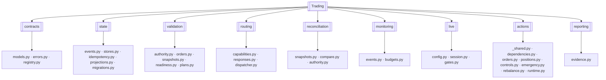
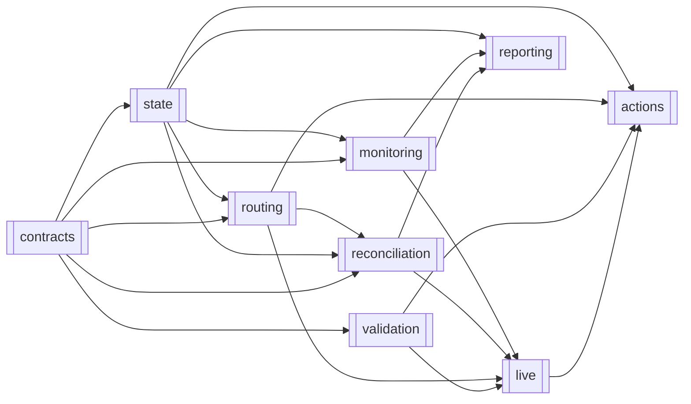
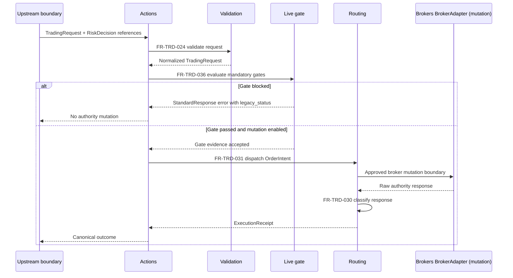

# Trading

> **Package:** `app/services/trading`
> **Status:** `Completed` — all 11 registered features (`FEAT-TRD-01`..`11`) are implemented with Trading-scoped verification and usage evidence.
> **Last updated:** `2026-08-07`

> This README is the package's **single source of truth** for requirements, final structure, implementation sequence, progress, usage examples, and tests.
> Update this file before changing the code.

---

## 1. Purpose and Boundary

### Purpose

Trading orchestrates live and paper evaluation, converts independently approved risk decisions into deterministic order intents, and executes those intents through the selected `sim`, `paper`, or `live` route. It owns execution safety, receipts, reconciliation, monitoring evidence, and emergency controls after Risk approval. It fails closed whenever route authority, policy, state, or evidence cannot be proven.

### Owns

- Live and paper runtime orchestration through public Data, Indicators, Strategy, and Risk APIs.
- Canonical route-aware requests, `OrderIntent`, `ExecutionReceipt`, and `TradeRecord` contracts.
- Receiver-owned `PortfolioRebalanceExecutionRequest v1` validation and Trading-owned resolution of component exposure reductions into ordinary governed order intents.
- Order and position action formulation using exactly the size approved by Risk.
- One broker/simulator authority dispatch boundary, client-order identity, idempotency, and concurrency enforcement.
- Live enablement, startup reconciliation, deterministic gates, session recovery, and safe shutdown.
- Broker-authoritative active order state, closed-position execution records, receipts, execution evidence, logical schemas, artifact schemas, and migration definitions.
- Reconciliation authority, unknown-outcome retry blocking, monitoring evidence,
  critical unknown-broker-state event production, and emergency execution controls.

### Does not own

- Market data or account truth; Data owns these. Broker/provider connections, adapters, and session lifecycle; Brokers owns these. UI/API composition resolves credential references and constructs the Brokers-owned `BrokerConnectionConfig`; Trading never resolves credentials.
- Indicator formulas, strategy signal generation, strategy promotion, or raw signal translation.
- Risk policy, final approved position size, approval-token issuance, or canonical kill-switch policy/state.
- Strategy operational eligibility, Portfolio construction/allocation versions, drift detection, rebalance planning, or authoritative Risk budgets.
- Simulation fills, simulated account state, backtest orchestration, or simulator monitoring.
- Broker-side matching, settlement, custody, or provider SDK implementations.
- Analytics metrics, transaction-cost analysis, or performance comparison.
- API authentication, UI behavior, operator presentation, or infrastructure persistence engines.
- Shadow comparison, performance snapshot caches, or generalized automatic compensation in the initial build.

### Shared contracts

Contract definitions match `docs/PROJECT.md`. Commands are owned by their receiver; results by their producer.

**Owned by this domain** — defined authoritatively here:

| Status    | Contract                               | Version | Counterparty                                                                                 | Purpose                                                                                                                                                                                                                                                                                                                                                                                                                                                                                                                                                                                                                                                                                    |
| --------- | -------------------------------------- | ------- | -------------------------------------------------------------------------------------------- | ------------------------------------------------------------------------------------------------------------------------------------------------------------------------------------------------------------------------------------------------------------------------------------------------------------------------------------------------------------------------------------------------------------------------------------------------------------------------------------------------------------------------------------------------------------------------------------------------------------------------------------------------------------------------------------------ |
| Completed | `OrderIntent`                        | `v1`  | Simulation (`sim`); Brokers via `BrokerAdapter` mutation operations (`paper`/`live`) | Complete deterministic executable request containing`contract_version="v1"`, `schema_id="trading.order_intent.v1"`, `client_order_id`, trace IDs, route, provider/account/strategy references, symbol, action, side, Risk-approved `Decimal` volume, approved `order_type`, validated instrument `quantity_unit`, optional limit/stop/TIF/expiration material, Trading-state broker order/position targets, idempotency material, approval/risk references, and UTC validity timestamps. Connection environment/account material remains in injected `BrokerConnectionConfig`; no provider SDK object crosses this contract and executable size never exceeds Risk approval. |
| Completed | `ExecutionReceipt`                   | `v1`  | Analytics; Portfolio; UI/API                                                                 | Immutable authority response containing intent reference, provider identifiers, finite status, requested/filled quantities, average price, authority timestamps, response classification, retry safety, reconciliation requirement, and trace IDs. Unknown or malformed success remains`unknown_outcome`.                                                                                                                                                                                                                                                                                                                                                                                |
| Completed | `TradeRecord`                        | `v1`  | Analytics; Portfolio; UI/API                                                                 | Official execution record containing the receipt, fills, factual commission/spread/slippage/cost inputs, authority and reconciliation state, warnings/incidents, and trace chain. Unreconciled records remain explicitly flagged.                                                                                                                                                                                                                                                                                                                                                                                                                                                          |
| Completed | `PortfolioRebalanceExecutionRequest` | `v1`  | Portfolio submits; Trading receives                                                          | Request idempotent execution of one Risk-authorized immutable rebalance plan; contains plan/allocation/decision references, ordered actions, reduce-only flags, route, approval token, validity, and canonical hash.                                                                                                                                                                                                                                                                                                                                                                                                                                                                       |
| Completed | `OperationalEvent`                   | `v1`  | UI/API; composition-root audit adapter                                                       | Publish bounded redacted health, dependency, staleness, timeout, latency, cost, and incident evidence with severity, UTC time, trace IDs, and source references, including critical retry-locked`BROKER_STATE_UNKNOWN` evidence.                                                                                                                                                                                                                                                                                                                                                                                                                                                         |
| Completed | `ExecutionEvidenceReport`            | `v1`  | Analytics; Portfolio; UI/API                                                                 | Immutable stored execution, readiness, reconciliation, incident, warning, and unresolved-action evidence carrying`contract_version="v1"` and `schema_id="trading.execution_evidence_report.v1"`; missing or inconsistent stored evidence fails closed.                                                                                                                                                                                                                                                                                                                                                                                                                                 |

`ExecutionReceipt` and `TradeRecord` likewise carry `contract_version="v1"` plus
`schema_id="trading.execution_receipt.v1"` and
`schema_id="trading.trade_record.v1"` respectively. Compatibility is never inferred
from a schema identifier.

`OperationalEvent v1` carries `contract_version="v1"`,
`schema_id="trading.operational_event.v1"`, event ID/type/severity, UTC occurrence
time, request/workflow/correlation/causation IDs, bounded redacted facts, and source
references. UI/API may present it; the composition root maps governed occurrences
to Utils-owned `AuditEvent v1` for Data persistence without redefining either type.
`BROKER_STATE_UNKNOWN` is the only event type that triggers the initial UI/API
critical-alert boundary. It must have `severity="critical"`, identify the immutable
unknown-outcome receipt and persisted incident, carry `retry_locked=true`, and expose
only bounded redacted unresolved-scope evidence.

**Consumed from other domains** — referenced only, never redefined:

| Contract                                                                                                 | Version | Owner      | Used for                                                                                                                                                                                                                                                                         |
| -------------------------------------------------------------------------------------------------------- | ------- | ---------- | -------------------------------------------------------------------------------------------------------------------------------------------------------------------------------------------------------------------------------------------------------------------------------- |
| `AuthContext`, `AuditEvent`                                                                          | `v1`  | Utils      | Principal/trace context and redacted governed-action evidence.                                                                                                                                                                                                                   |
| `MarketDataset`, `AccountStateSnapshot`, `MarketContextEvidence`                                   | `v1`  | Data       | Runtime market/account/context evidence; Trading never creates Risk policy from it.`MarketContextEvidence` is carried to Risk as orchestrator only — Risk is its sole interpreting consumer.                                                                                  |
| `BrokerAdapter` (mutation + execution-read traits)                                                     | `v1`  | Brokers    | Sole paper/live mutation boundary (`TradeExecutionProvider`) plus execution-state and account reads needed for dispatch and reconciliation; mutation operations are Trading-only.                                                                                              |
| `StandardResponse[T]`                                                                                  | `v1`  | Utils      | Shared bounded-operation envelope for Broker mutations; Trading consumes raw Broker acknowledgement DTOs from`data`.                                                                                                                                                           |
| Broker response extensions and error codes                                                               | `v1`  | Brokers    | Authority identity, environment, operation, completion timestamp, and failure semantics;`BROKER_UNKNOWN_OUTCOME` maps to `unknown_outcome` and freezes execution.                                                                                                            |
| `BrokerConnectionConfig`                                                                               | `v1`  | Brokers    | UI/API-composed provider/account/environment configuration with already-resolved in-memory credentials; paper and live differ only by its environment/credentials.                                                                                                               |
| `IndicatorSeries`                                                                                      | `v1`  | Indicators | Current deterministic indicator evidence during live/paper orchestration.                                                                                                                                                                                                        |
| `TradeIntent`                                                                                          | `v1`  | Strategy   | Proposal lineage; Trading never executes it before Risk approval.                                                                                                                                                                                                                |
| `RiskDecision`, `ActionPolicyVerdict`, `KillSwitchState`                                           | `v1`  | Risk       | Independent approved size/token or rejection, Risk-owned action permission, and canonical execution-blocking state/hierarchy.`ActionPolicyVerdict.scope` carries exact request scope plus canonical `mutable_fields` and `max_children` strings when those controls apply. |
| `StrategyOperationalEligibilityDecision`, `AllocationRiskDecision`                                   | `v1`  | Risk       | Prove current scoped eligibility and authoritative allocation/rebalance authorization; Trading never infers them.                                                                                                                                                                |
| `PortfolioBudgetExecutionVerdict`                                                                      | `v1`  | Risk       | Prove current execution-time budget authority for the exact allocation, plan, canonical plan hash, and budget unit; Trading never calculates consumption.                                                                                                                        |
| Portfolio allocation/plan identifiers and hashes carried inside`PortfolioRebalanceExecutionRequest v1` | `v1`  | Portfolio  | Bind the Trading-owned execution request to one immutable target and plan without consuming or importing Portfolio contracts or internals.                                                                                                                                       |

Trading exposes only standalone functions through `app.services.trading`; its
package-root `__all__` contains no classes or constants. Public operation functions
return the shared Utils `StandardResponse[T]`. Public `create_*` factories and
`get_*` accessors return immutable internal DTOs or scalar configuration values
without exposing their implementation classes for import. Successful responses
preserve the raw DTO directly in `data`; error responses set `data=None` and carry
only the canonical symbolic `error.code` plus redacted `error.details`. Former business outcomes such as
`sent`, `partial`, `packaged`, and `unknown_outcome` are preserved in
`metadata.extensions["legacy_status"]`. An unknown outcome is always
`status="error"`, `code="UNKNOWN_OUTCOME"`, with the raw receipt in
`error.details["receipt"]` and `legacy_status="unknown_outcome"`.

**Consumed-symbol name reconciliation** (contract name → package-root function,
without importing dependency classes):

- `IndicatorSeries v1` → values obtained through Indicators package-root functions
  such as `get_indicator_result_values()`.
- Risk-owned decision, policy, and kill-switch DTOs are created, queried, and
  validated only through functions exported by `app.services.risk`.
- The "Simulation" domain is the package `app.services.simulator`. Trading imports no Simulation internals; the `sim` route is dispatched through an injected async callback `Callable[[OrderIntent], Awaitable[ExecutionReceipt]]`.

### Persisted state

Trading owns logical schemas and migration definitions; Data owns connection, locking, and migration execution infrastructure. Concrete stores are injected. Trading does not implement a custom JSONL persistence architecture in the final design.

All Trading runtime-record CRUD is centralized in the private support package
`app/services/trading/persistence/`, whose sole boundary is
`persistence/__init__.py`. Its implementation uses the standard `create.py`,
`read.py`, `update.py`, and `delete.py` layout. State adapters retain Trading
policy, scope derivation, reconciliation interpretation, and unresolved-attempt
filtering. This support directory is not a separately registered feature.

| Status    | State / Store                                             | Read access (via contract)                                                 | Migration definitions   |
| --------- | --------------------------------------------------------- | -------------------------------------------------------------------------- | ----------------------- |
| Completed | Closed positions, receipts, and execution projections      | Analytics, Portfolio, and UI/API via `TradeRecord` / `ExecutionReceipt` | `migrations/definitions.py` |
| Completed | Idempotency reservations and canonical-material versions  | Trading only                                                             | `migrations/definitions.py` |
| Completed | Reconciliation runs, authority transitions, and incidents | UI/API via `TradeRecord`; Risk via audit evidence where required         | `migrations/definitions.py` |

### Four-level structure

| Code level                          | Represents                         |
| ----------------------------------- | ---------------------------------- |
| **Package**                   | Trading domain                     |
| **Module folder**             | Feature / capability               |
| **File**                      | Use case or focused responsibility |
| **Class / function / method** | Functional requirement behavior    |

```text
Package
└── Module folder
    └── File
        └── Public Class / Function / Method / Constant
```

### Package capability map


```mermaid
flowchart TD
    TRD[[Trading]]
    TRD --> CON[[contracts]]
    TRD --> STA[[state]]
    TRD --> VAL[[validation]]
    TRD --> ROU[[routing]]
    TRD --> REC[[reconciliation]]
    TRD --> MON[[monitoring]]
    TRD --> LIV[[live]]
    TRD --> ACT[[actions]]
    TRD --> REP[[reporting]]

    CON --> CONFILES[models.py · errors.py · registry.py]
    STA --> STAFILES[events.py · stores.py · idempotency.py · projections.py · migrations.py]
    VAL --> VALFILES[authority.py · orders.py · snapshots.py · readiness.py · plans.py]
    ROU --> ROUFILES[capabilities.py · responses.py · dispatcher.py]
    REC --> RECFILES[snapshots.py · compare.py · authority.py]
    MON --> MONFILES[events.py · budgets.py]
    LIV --> LIVFILES[config.py · session.py · gates.py]
    ACT --> ACTFILES[_shared.py · dependencies.py · orders.py · positions.py · controls.py · emergency.py · rebalance.py · runtime.py]
    REP --> REPFILES[evidence.py]
```

### Initial limitations

- Production live mutation remains blocked by `ALLOW_LIVE_MUTATIONS=false` until explicitly enabled after implementation and verification.
- Shadow execution/comparison and generalized compensation are not part of the Trading architecture.
- Performance snapshot caches and Trading-owned rate-limit policy are excluded.

---

## 2. Final Package Structure

Modules and files are ordered from lowest dependency to highest dependency.

### Feature Registry

| Status    | Feature                                             | Owning module       | Public API and contracts                                                                                                                                                                                                                                                                                                                                                                                                                                                                        | Requirements                        | Usage evidence                                        |
| --------- | --------------------------------------------------- | ------------------- | ----------------------------------------------------------------------------------------------------------------------------------------------------------------------------------------------------------------------------------------------------------------------------------------------------------------------------------------------------------------------------------------------------------------------------------------------------------------------------------------------- | ----------------------------------- | ----------------------------------------------------- |
| Completed | `FEAT-TRD-01` Canonical Contracts and Registries  | `contracts/`      | `build_order_intent`, `parse_order_intent`, `get_trading_contract_version`, `get_trading_route`, `create_trading_request`, `create_order_intent`, `create_execution_receipt`, `create_trade_record`, `create_portfolio_rebalance_execution_request`, `create_execution_evidence_report`, `create_trading_error`, `is_trading_error`, `is_execution_receipt`, `map_trading_error`, `redact_trading_payload`, `get_public_contracts`, `create_trading_action_draft`; exact declarations and fields: Section 4.1 | Section 4.1 functional requirements | `tests/trading/usage/features/01_contracts.py`      |
| Completed | `FEAT-TRD-02` State and Deterministic Projections | `state/`          | Existing state API plus `create_order_lifecycle`, `transition_order_lifecycle`, `create_fill_aggregate`, `apply_order_fill`, and `get_fill_residual`; exact declarations: Section 4.2 | Section 4.2 functional requirements | `tests/trading/usage/features/02_state.py` |
| Completed | `FEAT-TRD-03` Validation, Readiness, and Plans    | `validation/`     | `create_readiness_assessment`, `create_route_snapshot`, `assess_execution_readiness`, `build_execution_plan`, `get_route_snapshot`, `validate_order_request`; exact declarations: Section 4.3                                                                                                                                                                                                                                                                                       | Section 4.3 functional requirements | `tests/trading/usage/features/03_validation.py`     |
| Completed | `FEAT-TRD-04` Authority Selection and Dispatch    | `routing/`        | `classify_authority_response`, `dispatch_order_intent`, `validate_adapter_capability`; exact declarations: Section 4.4                                                                                                                                                                                                                                                                                                                                                                    | Section 4.4 functional requirements | `tests/trading/usage/features/04_routing.py`        |
| Completed | `FEAT-TRD-05` Reconciliation and Retry Guard      | `reconciliation/` | `create_authority_resolution`, `create_authority_snapshot`, `create_reconciliation_report`, `compare_authority_state`, `reconcile_execution_state`, `resolve_unknown_outcome`; exact declarations: Section 4.5 | Section 4.5 functional requirements | `tests/trading/usage/features/05_reconciliation.py` |
| Completed | `FEAT-TRD-06` Operational and Budget Evidence     | `monitoring/`     | Existing monitoring API plus `build_economic_execution_event` and `parse_economic_execution_event`; exact declarations: Section 4.6 | Section 4.6 functional requirements | `tests/trading/usage/features/06_monitoring.py`     |
| Completed | `FEAT-TRD-07` Live and Paper Session Lifecycle    | `live/`           | `create_live_session`, `start_live_session`, `stop_live_session`, `get_live_session_status`, `is_live_session_started`, `is_live_session_reconciliation_ready`, `is_live_session_admission_enabled`, `evaluate_live_gate`; exact declarations and configuration: Section 4.7                                                                                                                                                                                                    | Section 4.7 functional requirements | `tests/trading/usage/features/07_live.py`           |
| Completed | `FEAT-TRD-08` Route-Aware Public Actions          | `actions/`        | `create_trading_dependencies`, `submit_order`, `modify_order`, `cancel_order`, `close_position`, `modify_position`, `reduce_exposure`, `pause_strategy`, `resume_strategy`, `sync_positions`, `trigger_kill_switch`, `clear_kill_switch`, `cancel_all_orders`, `close_all_positions`, `execute_portfolio_rebalance`, `run_live_evaluation_cycle`; exact declarations: Section 4.8                                                                               | Section 4.8 functional requirements | `tests/trading/usage/features/08_actions.py`        |
| Completed | `FEAT-TRD-09` Immutable Execution Evidence        | `reporting/`      | `build_trading_report`, `build_execution_audit_record`, and `parse_execution_audit_record`; exact declarations: Section 4.9 | Section 4.9 functional requirements | `tests/trading/usage/features/09_reporting.py`      |
| Completed | `FEAT-TRD-10` Protective-Order Lifecycle | `protective_orders/` | Validated bracket/OCO plan transport, exact coverage proof, safe residual resizing, append-only persistence, orphan/reverse-exposure prevention | `FR-TRD-078`..`FR-TRD-080` | `tests/trading/usage/features/10_protective_orders.py` |
| Completed | `FEAT-TRD-11` Trade Ownership | `trade_ownership/` | Validated player / supervised-automation / automated ownership, append-only persistence, and fail-closed orphan detection | `FR-TRD-081`..`FR-TRD-083` | `tests/trading/usage/features/11_trade_ownership.py` |

```text
trading/
├── __init__.py                         # Approved domain-level Python API only
├── README.md
├── contracts/                          # Canonical contracts and registries
│   ├── __init__.py
│   ├── README.md
│   ├── models.py                       # Route/request/result contracts
│   ├── errors.py                       # Error taxonomy, mapping, redaction
│   └── registry.py                     # Explicit typed Python public API
├── state/                              # State contracts and deterministic projections
│   ├── __init__.py
│   ├── README.md
│   ├── events.py                       # Versioned Trading events
│   ├── stores.py                       # Minimal injected store protocols
│   ├── idempotency.py                  # Caller-key reservation and conflict checks
│   ├── projections.py                  # Receipt/fill/order/position projections
│   ├── materializations.py             # Event-to-relational projection normalization
│   ├── factories.py                    # Function-only contract construction
│   ├── migrations.py                   # Trading-owned migration definitions
│   └── runtime.py                      # Durable state coordination adapter
├── persistence/                        # Private shared Trading CRUD support
│   ├── __init__.py
│   ├── create.py
│   ├── read.py
│   ├── update.py
│   └── delete.py
├── validation/                         # Validation, snapshots, readiness, plans
│   ├── __init__.py
│   ├── README.md
│   ├── authority.py                    # Exact Risk policy/decision/switch validation
│   ├── orders.py                       # Aggregate order validation
│   ├── snapshots.py                    # Structured route facts
│   ├── readiness.py                    # Aggregate execution readiness
│   └── plans.py                        # Deterministic execution-plan construction
├── routing/                            # Authority selection and dispatch boundary
│   ├── __init__.py
│   ├── README.md
│   ├── capabilities.py                 # Adapter contract validation
│   ├── responses.py                    # Authority-response classification
│   └── dispatcher.py                   # Sole simulator/broker dispatch boundary
├── reconciliation/                     # Authority comparison and retry guard
│   ├── __init__.py
│   ├── README.md
│   ├── snapshots.py                    # Normalized authority snapshots
│   ├── compare.py                      # Missing/extra/mismatched/stale comparison
│   └── authority.py                    # Unknown-outcome resolution and retry lock
├── monitoring/                         # Operational, budget, and incident evidence
│   ├── __init__.py
│   ├── README.md
│   ├── events.py                       # Focused runtime event emission
│   └── budgets.py                      # External budget-verdict enforcement
├── live/                               # Live/paper session lifecycle and gates
│   ├── __init__.py
│   ├── README.md
│   ├── config.py                       # Immutable enablement/security configuration
│   ├── session.py                      # Startup, status, recovery, shutdown
│   └── gates.py                        # Canonical fail-fast gate sequence
├── actions/                            # Route-aware public action verbs
│   ├── __init__.py
│   ├── README.md
│   ├── _shared.py                      # Private action identity helpers
│   ├── dependencies.py                 # Injected route/state/runtime dependencies
│   ├── orders.py                       # Submit, modify, cancel
│   ├── positions.py                    # Close, modify, reduce
│   ├── controls.py                     # Pause, resume, synchronize, kill switch
│   ├── emergency.py                    # Gated mass cancel and close
│   ├── rebalance.py                    # Authorized rebalance execution adaptation
│   └── runtime.py                      # Live/paper evaluation-cycle orchestration
└── reporting/                          # Immutable evidence packaging
    ├── __init__.py
    ├── README.md
    └── evidence.py                     # Execution/reconciliation report evidence
```

### Module dependency diagram


```mermaid
flowchart LR
    CON[[contracts]] --> STA[[state]]
    CON --> VAL[[validation]]
    CON --> ROU[[routing]]
    STA --> ROU
    CON --> REC[[reconciliation]]
    STA --> REC
    ROU --> REC
    CON --> MON[[monitoring]]
    STA --> MON
    VAL --> LIV[[live]]
    ROU --> LIV
    REC --> LIV
    MON --> LIV
    LIV --> ACT[[actions]]
    VAL --> ACT
    ROU --> ACT
    STA --> ACT
    REC --> REP[[reporting]]
    MON --> REP
    STA --> REP
```

### Structure rules

- The package root contains only `README.md` and `__init__.py`; production behavior lives in its registered feature module.
- Cross-domain imports use documented public APIs only; provider SDK objects never cross the boundary.
- Stateless validation, packaging, comparison, and classification use functions.
- `LiveSession` is a class because it owns lifecycle and injected runtime dependencies.
- Store types are protocols; Data supplies shared persistence infrastructure and route channels.
- No lazy package attributes, generic service/manager/engine layers, or duplicate low-level order APIs.
- Usage examples live under `tests/trading/usage/`.

---

## 3. Workflows

> **Workflow usage evidence:** Each active workflow has one standalone
> input-to-output program with README-aligned stages. Broker-relevant connection/gate
> programs use injected virtual non-production sessions and transmit no real broker
> mutation. Run all programs with
> `python tests/trading/usage/workflows/run_all.py`. This satisfies `NFR-TRD-007`.

### Pipeline

The Trading pipeline begins only after Strategy and Risk have produced an
approved trade request. Trading does not create signals, determine strategy
intent, approve risk, mint approval authority, or infer missing evidence.

```text
Trading signal
    ↓
Strategy creates canonical TradeIntent
    ↓
Risk approves size and issues decision/token
    ↓
Trading receives TradingRequest
    ↓
Validation and readiness gates
    ↓
Route selection and capability verification
    ↓
Idempotency reservation and pre-dispatch audit
    ↓
Deterministic OrderIntent execution plan
    ↓
Broker or Simulation dispatch
    ↓
Receipt and outcome classification
    ↓
Persistence and projection update
    ↓
Reconciliation
    ↓
Monitoring and reporting
```

#### Full Trading pipeline

##### 1. Receive the approved request

Trading receives a canonical `TradingRequest` containing:

- Signal and intent lineage.
- Account and strategy identity.
- Requested action.
- Symbol, direction, order type, and quantity.
- Explicit route: `sim`, `paper`, or `live`.
- Risk decision ID.
- Action-policy verdict ID.
- Approval-token reference.
- Idempotency key and canonical-material version.
- System time and validity deadline.
- Request, workflow, correlation, and optional causation identifiers.

Trading rejects raw trading signals. Strategy must translate its analytical
signal into the canonical upstream trade intent before Trading is invoked.

##### 2. Load current evidence

Trading obtains current, timestamped evidence for the selected route:

- Broker or Simulation readiness.
- Account identity and permissions.
- Instrument capabilities and quantity constraints.
- Current authority-owned orders and open positions.
- Route availability.
- Market and session state.
- Current reconciliation status.

Missing, unavailable, stale, or mismatched evidence blocks execution. Empty or
zero values are never substituted for unavailable authority facts.

##### 3. Validate the request

Trading validates:

- Contract and schema versions.
- Request, workflow, correlation, strategy, and intent identities.
- Supported route and action.
- Account and environment compatibility.
- Symbol, side, order type, and time-in-force values.
- Positive quantity, minimum/maximum quantity, and quantity step.
- Price, stop-price, stop-loss, and take-profit constraints.
- Request validity and expiry.
- Mandatory Risk, policy, approval, and idempotency references.
- Canonical-material version.

A malformed, incomplete, mismatched, or expired request fails closed before any
execution authority is contacted.

##### 4. Verify the Risk decision

The referenced Risk decision must:

- Exist and be current.
- Match the request's intent and trace lineage.
- Be in the approved state.
- Approve the requested quantity.
- Carry valid policy and evidence provenance.
- Match the referenced decision ID.
- Remain within its issuance and expiry interval.

Trading executes no more than the approved size and cannot reinterpret or expand
Risk authority.

##### 5. Check the kill-switch hierarchy

Trading checks every applicable Risk-owned kill-switch scope:

- Global.
- Portfolio, when the request has a portfolio scope.
- Strategy.
- Symbol, when the request has a symbol scope.

Any active, unknown, missing, mismatched, or stale applicable state blocks new
execution. No caller, route, session, or emergency operation may bypass this
gate.

##### 6. Verify the action-policy verdict

The Risk-owned action-policy verdict must:

- Allow the exact requested action.
- Match the verdict ID carried by the request.
- Match the Risk decision and applicable scope.
- Be current and unexpired.
- Match the exact action, such as `submit_order`, `cancel_order`, or
  `close_position`.

A verdict for one action cannot authorize another action or a broader scope.

##### 7. Validate approval authority

For an action requiring explicit approval, Trading verifies:

- Approval-token reference.
- Authorized operation and scope.
- Approved account, strategy, symbol, and quantity.
- Token issuance and expiry interval.
- Prior reservation or consumption state.
- Required principal-separation evidence.

Trading cannot issue its own approval token or treat caller assertions as
approval authority.

##### 8. Assess execution readiness

`assess_execution_readiness()` combines:

- Route evidence.
- Risk decision.
- Kill-switch state.
- Action-policy verdict.
- Configured evidence-age limits.

It returns a deterministic readiness assessment containing:

- Pass or fail result.
- Ordered failure codes.
- Evidence references.
- Assessment timestamp.

Any mandatory failed check prevents plan execution or dispatch. Readiness is
reassessed from supplied evidence rather than inferred from prior success.

##### 9. Enforce route and safety configuration

The route is selected explicitly:

- `sim`: dispatch to the injected Simulation executor.
- `paper`: dispatch through the configured paper broker connection.
- `live`: dispatch through the configured live broker connection.

Live execution additionally requires:

- `ALLOW_LIVE_MUTATIONS=true`.
- Verified live configuration.
- Correct live account and environment.
- Valid injected credentials and provider readiness.
- Complete Risk and approval authority.
- Current adapter capability and security evidence.
- Clear reconciliation state.

Live action is disabled by default. Route selection cannot weaken validation,
Risk, approval, kill-switch, idempotency, audit, or reconciliation gates.

##### 10. Build the execution plan

Trading builds a deterministic, side-effect-free `OrderIntent` execution plan
containing:

- Exact action and route.
- Account and strategy identity.
- Instrument and direction.
- Approved quantity.
- Validated order parameters.
- Risk and approval references.
- Canonical request identity and trace lineage.

Plan construction does not contact a broker, mutate Simulation, or claim that
execution occurred.

##### 11. Reserve idempotency

Before dispatch, Trading reserves the caller's idempotency key against the hash
of the canonical request material.

Possible outcomes are:

- New key and material: reserve and continue.
- Same key and same completed material: return the prior terminal result.
- Same key and different material: reject as a conflict.
- Same key with active or unresolved execution: remain locked for
  reconciliation.

This prevents duplicate orders and blind retries. A caller cannot replace a
locked request merely by changing non-authoritative metadata.

##### 12. Record the pre-dispatch attempt

Trading writes the required redacted pre-mutation audit evidence before the
execution authority is contacted. The ordered live gate also verifies session
enablement, policy, Risk, kill-switch, readiness, concurrency, reconciliation,
and adapter permission at this boundary.

After plan admission, Trading records a versioned `send_attempted` execution
event before transport. Failure to write required audit or attempt evidence
blocks dispatch; failure is never silently ignored.

##### 13. Dispatch through the selected authority

Trading sends the exact approved request through one route:

- The injected Simulation callable for `sim`.
- A Brokers-owned adapter for `paper` or `live`.

Only Trading may invoke broker mutation operations. The Brokers adapter owns:

- Provider connection and session handling.
- Transport behavior.
- Provider-specific request translation.
- Credential use.
- Provider response normalization.

Trading dispatches at most once after all mandatory gates pass. It does not own
the broker connection implementation or Simulation's state mutation.

##### 14. Classify the execution outcome

An authority response is conservatively normalized into an
`ExecutionReceipt`, including outcomes such as:

- Accepted.
- Rejected.
- Cancelled.
- Closed.
- Partially completed.
- Failed before transmission.
- Broker or Simulation state unknown.

The receipt retains authority identity, quantities, timestamps, request lineage,
and reconciliation requirements. Trading never invents a receipt, broker order,
deal, position, or fill.

##### 15. Handle uncertain outcomes

If transmission may have occurred but confirmation is unavailable, Trading:

- Marks the outcome `unknown_outcome`.
- Preserves the idempotency and conflict-scope lock.
- Emits a critical operational event.
- Blocks blind retry.
- Requires authority reconciliation.

This prevents duplicate execution after a timeout, malformed success response,
transport interruption, or other ambiguous outcome. An unknown result is never
converted into success or safe retry merely because the authority is unavailable.

##### 16. Persist execution evidence

Trading persists durable, redacted evidence such as:

- Idempotency reservation.
- Send-attempt event.
- Execution receipt.
- Projection state.
- Reconciliation evidence.
- Operational incidents and retry locks.

Trading-owned persistence delegates database execution through Data's public
infrastructure. Tick-valued open positions remain broker or runtime state and
are not continually written to SQLite.

##### 17. Update the Trading projection

Ordered events update the durable Trading projection using logical ordering and
optimistic version checks. Projection updates retain canonical request,
authority, receipt, order, and reconciliation references.

Duplicate, stale, conflicting, or out-of-order transitions are rejected. A
projection is evidence of Trading's recorded state, not a substitute for broker
or Simulation authority truth.

##### 18. Reconcile against execution authority

Trading compares its projection with the authoritative broker or Simulation
state, including:

- Order identity and status.
- Position identity and quantity.
- Execution outcome.
- Broker ticket, order, deal, or position reference.
- Expected projection version.
- Applicable unresolved-attempt scope.

Broker truth wins for paper/live and Simulation truth wins for `sim`.
Divergence keeps unsafe mutations blocked until the discrepancy is resolved and
the authority transition is recorded.

##### 19. Persist a closed position

Once a position is conclusively closed, Trading records it in
`trading_positions` with:

- Ticket.
- Symbol and direction.
- Volume.
- Entry and exit times and prices.
- Stop loss and take profit.
- Exit reason.
- Commission, swap, and profit.
- MAE and MFE points.
- Slippage points.
- Strategy and magic number.
- Account and environment.
- Creation and update timestamps.

Only completed closed positions belong in this table. Open positions and their
tick-by-tick changing value remain authority/runtime state.

##### 20. Finalize idempotency

After a conclusive terminal outcome, Trading binds the final receipt and outcome
evidence to the idempotency reservation. A valid same-material replay can then
return the established terminal result without another authority mutation.

An unresolved or ambiguous broker outcome is not finalized as success. Its lock
remains active until reconciliation establishes authority truth.

##### 21. Emit monitoring, audit, and reporting evidence

Trading records structured, bounded, secret-safe evidence at:

- Public workflow and service boundaries.
- Safety and admission decisions.
- Dispatch attempts.
- Broker or Simulation interactions.
- State transitions and side effects.
- Idempotency and reconciliation decisions.
- Failures, retries, and uncertain outcomes.

It produces Trading-owned operational events and immutable execution evidence
for authorized consumers. Critical unresolved broker state can trigger the
UI/API operational-alert boundary. Logging or alert-delivery failure never
clears a Risk state, releases a retry lock, changes execution truth, or permits a
blocked mutation.

Logs and reports must not expose credentials, approval secrets, account
passwords, raw provider payloads, or other sensitive trading data.

##### 22. Return the canonical response

The caller receives a standard response containing one of:

- A successful canonical execution receipt.
- A deterministic rejection or failure.
- An unresolved-outcome response requiring reconciliation.

The response includes bounded request, workflow, correlation, operation, and
trace evidence without exposing credentials or unsafe provider details. No
failure status implies a fill, completed mutation, or safe retry unless
authority evidence proves it.

The executable walkthrough at
`tests/trading/usage/workflows/wf_trd_pri_gate_dispatch_live_action.py` labels all
22 stages as either actual Trading behavior or a virtual boundary. It executes
the typed live gate, plan builder, idempotency reservation, pre-audit, and
response classifier against in-memory dependencies. Its virtual positions,
authority responses, reconciliation state, and closed-position data are teaching
inputs—not broker observations, database records, fills, or performance claims.

### Workflow rank values

| Rank                 | Identifier     | Meaning                                   |
| -------------------- | -------------- | ----------------------------------------- |
| **Primary**    | `WF-TRD-PRI` | The workflow this domain exists to serve. |
| **Secondary**  | `WF-TRD-SEC` | The next most load-bearing workflow.      |
| **Tertiary**   | `WF-TRD-TER` | The third-ranked workflow.                |
| **Supporting** | `WF-TRD-0NN` | Every remaining registered workflow.      |

### Retired identifiers

`WF-TRD-004`, `WF-TRD-001`, and `WF-TRD-007` were absorbed into `WF-TRD-PRI`,
`WF-TRD-SEC`, and `WF-TRD-TER` respectively. Absorbed numbers are retired and are
never reused. New workflows continue sequentially after `WF-TRD-017`.

| Workflow       | Standalone program                                                                      |
| -------------- | --------------------------------------------------------------------------------------- |
| `WF-TRD-PRI` | `tests/trading/usage/workflows/wf_trd_pri_gate_dispatch_live_action.py`               |
| `WF-TRD-SEC` | `tests/trading/usage/workflows/wf_trd_sec_validate_package_route_action.py`           |
| `WF-TRD-TER` | `tests/trading/usage/workflows/wf_trd_ter_enforce_kill_switch_emergency_controls.py`  |
| `WF-TRD-002` | `tests/trading/usage/workflows/wf_trd_002_execute_simulation_route_action.py`         |
| `WF-TRD-003` | `tests/trading/usage/workflows/wf_trd_003_start_enable_live_session.py`               |
| `WF-TRD-005` | `tests/trading/usage/workflows/wf_trd_005_resolve_unknown_route_outcome.py`           |
| `WF-TRD-006` | `tests/trading/usage/workflows/wf_trd_006_read_route_facts_aggregate_readiness.py`    |
| `WF-TRD-008` | `tests/trading/usage/workflows/wf_trd_008_persist_evidence_recover_state.py`          |
| `WF-TRD-009` | `tests/trading/usage/workflows/wf_trd_009_perform_safe_live_shutdown.py`              |
| `WF-TRD-010` | `tests/trading/usage/workflows/wf_trd_010_emit_monitoring_cost_incident_evidence.py`  |
| `WF-TRD-011` | `tests/trading/usage/workflows/wf_trd_011_build_execution_reconciliation_evidence.py` |
| `WF-TRD-012` | `tests/trading/usage/workflows/wf_trd_012_accept_governed_upstream_request.py`        |
| `WF-TRD-013` | `tests/trading/usage/workflows/wf_trd_013_execute_authorized_portfolio_rebalance.py`  |
| `WF-TRD-014` | `tests/trading/usage/workflows/wf_trd_014_run_live_paper_evaluation_cycle.py`         |
| `WF-TRD-015` | `tests/trading/usage/workflows/wf_trd_015_pause_resume_strategy_route.py`             |
| `WF-TRD-016` | `tests/trading/usage/workflows/wf_trd_016_modify_working_order_or_open_position.py`   |
| `WF-TRD-017` | `tests/trading/usage/workflows/wf_trd_017_broker_agnostic_main_operations.py`        |

### Status values

| Status              | Meaning                                                              |
| ------------------- | -------------------------------------------------------------------- |
| **Missing**   | Not implemented, conflicting, or not verified                        |
| **Partial**   | Useful implementation exists but final behavior/tests are incomplete |
| **Completed** | Final behavior is implemented, tested, and verified                  |

### Workflow scope values

| Scope                  | Meaning                                                      |
| ---------------------- | ------------------------------------------------------------ |
| **Internal**     | Complete inside Trading                                      |
| **Cross-domain** | Trading participates through defined input/output boundaries |

| Status    | Rank       | Workflow ID    | Scope        | Workflow                                     | Trigger / Input boundary                                                 | Final outcome / Output boundary                                                                                                       | Requirement sequence                                                   |
| --------- | ---------- | -------------- | ------------ | -------------------------------------------- | ------------------------------------------------------------------------ | ------------------------------------------------------------------------------------------------------------------------------------- | ---------------------------------------------------------------------- |
| Completed | Primary    | `WF-TRD-PRI` | Cross-domain | Gate and dispatch a live action              | Canonical request plus external verdicts                                 | One broker dispatch or fail-closed outcome                                                                                            | `FR-TRD-036 → FR-TRD-013 → FR-TRD-031`                             |
| Completed | Secondary  | `WF-TRD-SEC` | Internal     | Validate and package a route-aware action    | Canonical`TradingRequest`                                              | Validated package or structured rejection                                                                                             | `FR-TRD-024 → FR-TRD-027 → FR-TRD-028`                             |
| Completed | Tertiary   | `WF-TRD-TER` | Cross-domain | Enforce kill switch and emergency controls   | Risk state and approved control request                                  | New actions blocked; gated cancel/close result                                                                                        | `FR-TRD-021 → FR-TRD-023`, `FR-TRD-050`                           |
| Completed | Supporting | `WF-TRD-002` | Cross-domain | Execute a simulation-route action            | Approved sim request                                                     | `OrderIntent` to Simulation; canonical receipt returned                                                                             | `FR-TRD-013 → FR-TRD-031`                                           |
| Completed | Supporting | `WF-TRD-003` | Cross-domain | Start and enable a live session              | Approved config and Data session/channel                                 | Package-only or mutation-enabled session                                                                                              | `FR-TRD-033 → FR-TRD-034`                                           |
| Completed | Supporting | `WF-TRD-005` | Cross-domain | Resolve an unknown route outcome             | Timeout/malformed authority response                                     | Retry locked until authority resolution; critical operational event emitted                                                           | `FR-TRD-030 → FR-TRD-044 → FR-TRD-045 → FR-TRD-068`               |
| Completed | Supporting | `WF-TRD-006` | Cross-domain | Read route facts and aggregate readiness     | Data/Simulation read evidence                                            | Fresh structured readiness assessment                                                                                                 | `FR-TRD-026 → FR-TRD-027`                                           |
| Completed | Supporting | `WF-TRD-008` | Cross-domain | Persist evidence and recover state           | Trading events and injected stores                                       | Reconstructed projections and unresolved attempts                                                                                     | `FR-TRD-037 → FR-TRD-042`, `FR-TRD-051 → FR-TRD-055`             |
| Completed | Supporting | `WF-TRD-009` | Cross-domain | Perform safe live shutdown                   | Operator/runtime stop request                                            | Admission stopped and unresolved-work report                                                                                          | `FR-TRD-035`                                                         |
| Completed | Supporting | `WF-TRD-010` | Cross-domain | Emit monitoring, cost, and incident evidence | Runtime observation                                                      | Trading-owned`OperationalEvent`; durable audit evidence through Data and operator presentation/critical-alert intake through UI/API | `FR-TRD-046 → FR-TRD-048 → FR-TRD-068`                             |
| Completed | Supporting | `WF-TRD-011` | Cross-domain | Build execution/reconciliation evidence      | Receipts, readiness, incidents                                           | Immutable report to Analytics/Portfolio/UI/API                                                                                        | `FR-TRD-049`                                                         |
| Completed | Supporting | `WF-TRD-012` | Cross-domain | Accept governed upstream request             | Approved`RiskDecision` and immutable lineage                           | Validated Trading request; no raw signal translation                                                                                  | `FR-TRD-003 → FR-TRD-024`                                           |
| Completed | Supporting | `WF-TRD-013` | Cross-domain | Execute authorized portfolio rebalance       | `PortfolioRebalanceExecutionRequest v1` plus current Risk decisions    | Idempotent order outcomes and reconciliation evidence                                                                                 | `FR-TRD-063 → FR-TRD-064 → FR-TRD-024 → FR-TRD-036 → FR-TRD-039` |
| Completed | Supporting | `WF-TRD-014` | Cross-domain | Run a live/paper evaluation cycle            | Live/paper market update or scheduled evaluation trigger                 | Neutral signal ends the cycle, or an approved`RiskDecision` enters the validate/gate/dispatch path                                  | `FR-TRD-065 → FR-TRD-012 → FR-TRD-036`                             |
| Completed | Supporting | `WF-TRD-015` | Cross-domain | Pause and resume a strategy route            | Authorized operator or governance command naming an exact strategy scope | Durable paused/resumed route state; no position or order mutation                                                                     | `FR-TRD-019 → FR-TRD-020`                                           |
| Completed | Supporting | `WF-TRD-016` | Cross-domain | Modify a working order or open position      | Approved modification request carrying current Risk authorization        | One broker modification or cancellation, or an audited fail-closed outcome                                                            | `FR-TRD-014 → FR-TRD-017`                                           |
| Completed | Supporting | `WF-TRD-017` | Cross-domain | Demonstrate broker-agnostic main operations  | Explicit `sim`, `mt5`, or `ctrader` target plus governed authority        | Canonical reads and governed mutation results, or an explicit fail-closed provider outcome                                             | `FR-TRD-024 → FR-TRD-031`, `FR-TRD-014 → FR-TRD-017`               |

### `WF-TRD-SEC` — Validate and package a route-aware action

**Scope:** `Internal`
**System workflow:** None
**Input boundary:** A canonical request already carrying immutable route, intent, Risk, approval, and trace references.
**Output boundary:** A validated request/package or structured rejection.

1. Create the canonical draft from the governed upstream request —
   `trading.create_trading_action_draft()`.
2. Validate Decimal values and operation preconditions —
   `trading.validate_order_request()`.
3. Confirm the selected adapter actually supports the requested operation —
   `trading.validate_adapter_capability()`.
4. Construct deterministic intent material —
   `trading.build_execution_plan()`.
5. Return `packaged` when no mutation authority is enabled; route selection never
   bypasses validation — `trading.get_route_snapshot()`.

**Failure behavior:** invalid or incomplete evidence produces a redacted `TradingError`; no authority call occurs.
**Integration test:** `tests/trading/integration/test_validate_and_package.py::test_validate_and_package_fails_closed()`

### `WF-TRD-002` — Execute a simulation-route action

**Scope:** `Cross-domain`
**System workflow:** `SYS-WF-001`
**Input boundary:** An approved `route="sim"` request.
**Output boundary:** `OrderIntent` to Simulation; canonical simulated `ExecutionReceipt` returned.

1. Trading validates and builds the intent —
   `trading.validate_order_request()`, `trading.build_execution_plan()`.
2. Dispatch selects the Simulation authority for `route="sim"` —
   `trading.dispatch_order_intent()`, `trading.submit_order()`.
3. Simulation alone mutates simulated state and returns receipt evidence —
   `simulator.match_order()`, `simulator.price_order()`.
4. Trading classifies the returned response into a canonical receipt —
   `trading.classify_authority_response()`, `trading.apply_execution_event()`.

**Failure behavior:** missing Simulation authority or incompatible contract returns `SERVICE_UNAVAILABLE`; no local fill is invented.
**Integration test:** `tests/trading/integration/test_sim_dispatch.py::test_sim_dispatch_uses_simulation_authority()`

### `WF-TRD-003` — Start and enable a live session

**Scope:** `Cross-domain`
**System workflow:** `SYS-WF-002`
**Input boundary:** Approved configuration, injected `BrokerConnectionConfig`, a Brokers adapter session created via `create_broker_adapter()`, provider capability/security evidence (`BrokerFeatureFlags`), and Risk kill-switch state.
**Output boundary:** Package-only or mutation-enabled `LiveSession` status.

1. Validate configuration without resolving raw secrets —
   `trading.get_public_contracts()`.
2. Create the provider session through the Brokers boundary —
   `brokers.create_broker_adapter()`.
3. Check adapter capability, security evidence, and readiness —
   `trading.validate_adapter_capability()`,
   `brokers.get_broker_capability_catalogue()`,
   `trading.assess_execution_readiness()`.
4. Confirm no applicable kill-switch scope is active —
   `risk.check_risk_kill_switch()`.
5. Complete startup reconciliation before mutation admission —
   `trading.sync_positions()`, `trading.compare_authority_state()`.

**Failure behavior:** any missing or stale evidence leaves the session package-only and returns a structured reason.
**Integration test:** `tests/trading/integration/test_live_startup.py::test_live_startup_requires_reconciliation()`

### `WF-TRD-PRI` — Gate and dispatch a live action

**Scope:** `Cross-domain`
**System workflow:** `SYS-WF-002`
**Input boundary:** Canonical request, valid `RiskDecision`, approval/action-policy verdicts, `KillSwitchState`, and current Data evidence.
**Output boundary:** One dispatch through Brokers' `BrokerAdapter` mutation operations, or an audited fail-closed result.

1. Execute the ordered mandatory gate chain: schema → enablement/session → action
   policy/approval → Risk verdict → kill switch → readiness/staleness → idempotency →
   concurrency → reconciliation authority → pre-audit → adapter permission —
   `trading.evaluate_live_gate()`.
2. Re-read the Risk verdict and kill-switch state immediately before send —
   `risk.revalidate_risk_decision()`, `risk.check_risk_kill_switch()`.
3. Confirm route readiness and evidence freshness —
   `trading.get_route_snapshot()`, `trading.assess_execution_readiness()`.
4. Reserve the idempotency key so a retry cannot double-send —
   `trading.reserve_idempotency()`.
5. Write the pre-audit record; failure here blocks dispatch —
   `utils.create_audit_event()`, `data.persist_audit_event()`.
6. Dispatch at most once after every mandatory gate passes —
   `trading.dispatch_order_intent()`, `trading.submit_order()`.
7. Classify the raw authority response into a canonical receipt —
   `trading.classify_authority_response()`, `trading.apply_execution_event()`.

**Failure behavior:** no passthrough risk gate; expiry is rechecked immediately before send; unknown state is never retried blindly.
**Integration test:** `tests/trading/integration/test_live_dispatch.py::test_live_dispatch_completes_single_broker_mutation()`

#### End-to-end live workflow diagram


```mermaid
sequenceDiagram
    participant U as Upstream boundary
    participant A as Actions
    participant V as Validation
    participant L as Live gate
    participant R as Routing
    participant B as Brokers BrokerAdapter (mutation)

    U->>A: TradingRequest + RiskDecision references
    A->>V: FR-TRD-024 validate request
    V-->>A: Normalized TradingRequest
    A->>L: FR-TRD-036 evaluate mandatory gates
    alt Gate blocked
        L-->>A: StandardResponse error with legacy_status
        A-->>U: No authority mutation
    else Gate passed and mutation enabled
        L-->>A: Gate evidence accepted
        A->>R: FR-TRD-031 dispatch OrderIntent
        R->>B: Approved broker mutation boundary
        B-->>R: Raw authority response
        R->>R: FR-TRD-030 classify response
        R-->>A: ExecutionReceipt
        A-->>U: Canonical outcome
    end
```

### `WF-TRD-005` — Resolve an unknown route outcome

**Scope:** `Cross-domain`
**System workflow:** `SYS-WF-002`
**Input boundary:** Timeout, malformed success, or ambiguous authority response.
**Output boundary:** Persisted incident and retry lock until authority truth resolves,
plus one critical `BROKER_STATE_UNKNOWN` `OperationalEvent` for the first locked
transition.

1. Classify the ambiguous response conservatively as `unknown_outcome` —
   `trading.classify_authority_response()`.
2. Lock the conflict scope and obtain authority snapshots —
   `trading.resolve_unknown_outcome()`, `trading.sync_positions()`.
3. Compare local projections against authority truth —
   `trading.compare_authority_state()`.
4. Persist the incident and retry lock —
   `trading.emit_runtime_event()`, `data.persist_audit_event()`.
5. Build and emit one critical `BROKER_STATE_UNKNOWN` event carrying the
   receipt/incident references and bounded unresolved scope —
   `trading.build_broker_state_unknown_event()`,
   `api.build_unknown_broker_state_alert()`, `api.deliver_critical_alert()`.
6. Broker truth wins for paper/live; Simulation truth wins for sim —
   `trading.apply_execution_event()`.

**Failure behavior:** unresolved comparison stays blocked and visible; no failure
status implies safe retry. Event construction or sink failure is surfaced but never
releases the retry lock or changes authority truth.
**Integration tests:** `tests/trading/integration/test_unknown_outcome.py::test_unknown_outcome_blocks_retry()`;
`tests/trading/integration/test_unknown_outcome.py::test_unknown_outcome_emits_critical_operational_event()`.

### `WF-TRD-006` — Read route facts and aggregate readiness

**Scope:** `Cross-domain`
**System workflow:** `SYS-WF-001`, `SYS-WF-002`, `SYS-WF-008`
**Input boundary:** Data or Simulation route facts.
**Output boundary:** Timestamped snapshot and bounded readiness failures.

1. Read Data-owned and Simulation-owned route facts —
   `data.get_account_state_snapshot()`, `data.get_market_hours()`.
2. Return a timestamped snapshot with explicit unavailable/stale evidence —
   `trading.get_route_snapshot()`.
3. Aggregate the required checks into one readiness assessment —
   `trading.assess_execution_readiness()`.
4. Evaluate freshness explicitly rather than defaulting to ready —
   `utils.is_fresh()`, `utils.age_seconds()`.

**Failure behavior:** missing facts never become neutral zero/empty values.
**Integration test:** `tests/trading/integration/test_readiness.py::test_unavailable_route_fact_fails_readiness()`

### `WF-TRD-TER` — Activate/enforce kill switch and emergency controls

**Scope:** `Cross-domain`
**System workflow:** `SYS-WF-005`
**Input boundary:** Risk-owned `KillSwitchState`, `ActionPolicyVerdict`, and approval-token reservation evidence.
**Output boundary:** Durable state/evidence, blocked new actions, and optional gated mass actions.

1. Read the Risk-owned canonical state; Risk alone owns
   `global > portfolio > strategy > symbol` and clearance —
   `risk.check_risk_kill_switch()`, `risk.apply_kill_switch_command()`.
2. Block new dispatches by engaging the Trading-side control —
   `trading.trigger_kill_switch()`.
3. Pass every mass action through the same policy, approval, idempotency, audit, and
   live gates as any other mutation — `trading.evaluate_live_gate()`,
   `trading.reserve_idempotency()`.
4. Attempt cancellation only for pending/cancellable work —
   `trading.cancel_all_orders()`, `trading.cancel_order()`.
5. Reduce or close exposure only where explicitly authorized —
   `trading.reduce_exposure()`, `trading.close_all_positions()`,
   `trading.close_position()`.
6. Report every uncertain child result rather than assuming success —
   `trading.emit_runtime_event()`, `trading.build_trading_report()`.
7. Resume only after all applicable Risk scopes are inactive and reconciliation
   succeeds — `trading.clear_kill_switch()`, `trading.sync_positions()`.

Trading never blindly closes already-filled positions, and emergency classification
never comes from request text.

**Failure behavior:** partial child outcomes remain explicit; clearance without required authority is rejected.
**Integration test:** `tests/trading/integration/test_kill_switch.py::test_kill_switch_blocks_and_reports_partial_emergency_results()`

### `WF-TRD-008` — Persist execution evidence and recover state

**Scope:** `Cross-domain`
**System workflow:** `SYS-WF-001`, `SYS-WF-002`
**Input boundary:** Versioned Trading events.
**Output boundary:** Data infrastructure persists Trading-owned schemas; projections reconstruct without hidden side effects.

1. Apply the Trading-owned schema migrations to the injected store —
   `trading.run_trading_migrations()`.
2. Redact each event payload before it is written —
   `trading.redact_trading_payload()`.
3. Persist versioned Trading events transactionally —
   `data.persist_audit_event()`, `data.execute_transaction()`.
4. Reconstruct projections from the recorded events —
   `trading.apply_execution_event()`.
5. Surface unresolved attempts rather than discarding them —
   `trading.resolve_unknown_outcome()`.

**Failure behavior:** required idempotency/pre-audit write failure blocks send; recovery uncertainty keeps mutation disabled.
**Integration test:** `tests/trading/integration/test_state_recovery.py::test_recovery_preserves_unresolved_attempt()`

### `WF-TRD-009` — Perform safe live shutdown

**Scope:** `Cross-domain`
**System workflow:** `SYS-WF-002`, `SYS-WF-005`
**Input boundary:** Operator or runtime stop request.
**Output boundary:** Structured shutdown result with unresolved work.

1. Stop admission of new actions — `trading.trigger_kill_switch()`.
2. Mark and drain in-flight work within an approved budget —
   `trading.resolve_unknown_outcome()`.
3. Flush evidence to durable storage —
   `data.persist_audit_event()`, `utils.flush_logging()`.
4. Attempt final reconciliation against authority truth —
   `trading.sync_positions()`, `trading.compare_authority_state()`.
5. Report every incomplete step in a structured result —
   `trading.build_trading_report()`.

**Failure behavior:** flush/reconciliation failures are returned, not silently logged.
**Integration test:** `tests/trading/integration/test_live_shutdown.py::test_shutdown_reports_unresolved_work()`

### `WF-TRD-010` — Emit monitoring, cost, and incident evidence

**Scope:** `Cross-domain`
**System workflow:** `SYS-WF-002`, `SYS-WF-005`
**Input boundary:** Runtime health, staleness, timeout, latency, cost, and incident
facts, including a persisted retry-locked unknown broker outcome. Risk owns the
registered portfolio budget verdicts and execution-governance state.
**Output boundary:** Redacted Trading-owned `OperationalEvent` values. The composition
root submits required `AuditEvent` evidence to Data and exposes authorized operator
views through UI/API; Trading imports neither Data nor UI/API implementation details.

1. Observe runtime health, staleness, timeout, latency, and cost facts —
   `trading.assess_execution_readiness()`, `trading.get_route_snapshot()`.
2. Construct the redacted Trading-owned operational event —
   `trading.emit_runtime_event()`, `trading.redact_trading_payload()`.
3. Map any underlying failure to a canonical code —
   `trading.map_trading_error()`, `utils.normalize_error_code()`.
4. The composition root submits required audit evidence to Data —
   `utils.create_audit_event()`, `data.persist_audit_event()`.
5. UI/API exposes authorized operator views and critical-alert intake —
   `api.deliver_critical_alert()`.

**Failure behavior:** pre-send budget breach blocks; post-send breach becomes an
incident; event-delivery failure is surfaced and never hides execution state, releases
an unknown-outcome retry lock, or implies safe retry.
**Integration test:** `tests/trading/integration/test_monitoring.py::test_budget_and_event_delivery_failures_emit_incidents()`

### `WF-TRD-011` — Build execution and reconciliation evidence

**Scope:** `Cross-domain`
**System workflow:** `SYS-WF-001`, `SYS-WF-002`, `SYS-WF-008`
**Input boundary:** Trading-owned receipts, readiness, reconciliation, warning, and incident facts.
**Output boundary:** Immutable evidence report to Analytics, Portfolio, and UI/API.

1. Collect receipts, readiness, reconciliation, warning, and incident facts —
   `trading.apply_execution_event()`, `trading.assess_execution_readiness()`.
2. Redact the assembled payload before publication —
   `trading.redact_trading_payload()`.
3. Build the immutable execution-evidence report —
   `trading.build_trading_report()`.
4. Analytics, not Trading, derives performance and cost metrics from it —
   `analytics.adapt_trading_result()`, `analytics.build_performance_report()`.

**Failure behavior:** Trading never derives performance/TCA metrics or fabricates missing fills.
**Integration test:** `tests/trading/integration/test_reporting.py::test_report_contains_only_execution_evidence()`

### `WF-TRD-012` — Accept a governed upstream request

**Scope:** `Cross-domain`
**System workflow:** `SYS-WF-002`, `SYS-WF-006`
**Input boundary:** An approved `RiskDecision` with immutable Strategy intent lineage — produced within `WF-TRD-014` (`FR-TRD-065`) when Trading drives the loop, or supplied by an external governed caller.
**Output boundary:** Canonical Trading request accepted for validation.

1. Require an approved decision carrying immutable Strategy intent lineage —
   `risk.revalidate_risk_decision()`.
2. Reject raw signal dictionaries and any request lacking approval lineage —
   `trading.create_trading_action_draft()`.
3. Confirm the requested size exactly matches the approved size —
   `trading.validate_order_request()`.
4. Hand the accepted canonical request into validation —
   `trading.build_execution_plan()`.

**Failure behavior:** raw signal dictionaries, missing approval lineage, and size changes are rejected.
**Integration test:** `tests/trading/integration/test_upstream_request.py::test_raw_signal_translation_is_rejected()`

### `WF-TRD-014` — Run a live/paper evaluation cycle

**Scope:** `Cross-domain`
**System workflow:** `SYS-WF-002`
**Input boundary:** A live/paper market update or scheduled strategy evaluation under an authenticated principal.
**Output boundary:** Either a neutral-signal termination, or an approved `RiskDecision` handed into the validate/gate/dispatch path.

1. Own the runtime loop defined in `docs/PROJECT.md` `SYS-WF-002` step 1 —
   `trading.run_live_evaluation_cycle()`.
2. Request market and account evidence from Data —
   `data.get_market_data()`, `data.get_account_state_snapshot()`.
3. Request calculated series from Indicators —
   `indicators.validate_indicator()`.
4. Invoke Strategy for a proposal and end the cycle on a neutral signal —
   `strategy.run_event_strategy_hook()`, `strategy.build_trade_intent()`.
5. Submit the proposal to Risk — `risk.calculate_position_size()`.
6. Forward any approved decision into `WF-TRD-012` —
   `trading.create_trading_action_draft()`.

Trading never computes indicators, generates signals, or sizes/approves.

**Failure behavior:** upstream unavailable/stale evidence fails closed; neutral signals end the cycle without mutation.
**Integration test:** `tests/trading/integration/test_live_cycle.py::test_cycle_submits_intent_and_never_sizes()`

### `WF-TRD-013` — Execute an Authorized Portfolio Rebalance

**Scope:** `Cross-domain`
**System workflow:** `SYS-WF-008`
**Input boundary:** Trading-owned `PortfolioRebalanceExecutionRequest v1`
referencing one immutable allocation/plan, current eligibility and
`AllocationRiskDecision`, approval token, route, and canonical hash.
**Output boundary:** ordinary `ExecutionReceipt` / `TradeRecord` outcomes.

1. Revalidate eligibility, Risk budget/decision, kill switch, route, token, and
   target version — `risk.revalidate_risk_decision()`,
   `risk.check_risk_kill_switch()`, `risk.activate_allocation_budget()`.
2. Reserve idempotency for the whole rebalance and each child action —
   `trading.reserve_idempotency()`.
3. Confirm current execution state before dispatch —
   `trading.sync_positions()`, `trading.assess_execution_readiness()`.
4. Execute each approved child action through the ordinary gated path —
   `trading.execute_portfolio_rebalance()`, `trading.evaluate_live_gate()`,
   `trading.dispatch_order_intent()`, `trading.reduce_exposure()`.
5. Build reconciliation evidence for the receiving domains —
   `trading.build_trading_report()`.
6. Analytics measures the reconciled execution; Trading does not —
   `analytics.build_portfolio_rebalance_measurement()`.

Trading never recalculates target weights. Existing over-budget correction remains
reduce-only unless Risk separately authorizes an increase; no order opens solely to
match a target weight.

**Integration test:** `tests/trading/integration/test_portfolio_rebalance.py::test_rebalance_cannot_bypass_risk_or_open_to_match_weight()`

### `WF-TRD-015` — Pause and resume a strategy route

**Scope:** `Cross-domain`
**System workflow:** `SYS-WF-005`
**Input boundary:** an authorized operator or governance command naming an exact
strategy scope, plus a separate `AuthContext`.
**Output boundary:** durable paused or resumed route state. No position is closed,
no working order is cancelled, and no broker mutation is issued.

1. Authenticate the commanding principal — `utils.create_auth_context()`.
2. Confirm the named strategy scope resolves to a registered version —
   `strategy.validate_strategy_ref()`.
3. Stop admitting new actions for that scope — `trading.pause_strategy()`.
4. Report what remains in flight without cancelling it —
   `trading.get_route_snapshot()`, `trading.build_trading_report()`.
5. Confirm no applicable Risk scope blocks resumption —
   `risk.check_risk_kill_switch()`.
6. Resume admission for the scope — `trading.resume_strategy()`.
7. Record both transitions in the audit trail —
   `utils.create_audit_event()`, `data.persist_audit_event()`.

**Failure behavior:** pausing never implies flattening; existing exposure and working
orders survive a pause untouched. Resume is refused while any applicable kill-switch
scope is active, and an unresolved reconciliation keeps the route paused.

**Integration test:** `tests/trading/integration/test_pause_resume.py::test_pause_resume_preserves_orders_and_positions`

### `WF-TRD-016` — Modify a working order or open position

**Scope:** `Cross-domain`
**System workflow:** `SYS-WF-002`
**Input boundary:** an approved modification request carrying current Risk
authorization for the resulting exposure.
**Output boundary:** one broker modification or cancellation, or an audited
fail-closed outcome.

1. Validate the modification request and its Decimal values —
   `trading.validate_order_request()`.
2. Confirm the adapter supports the requested modification —
   `trading.validate_adapter_capability()`.
3. Require current Risk authorization for the resulting exposure, not the original —
   `risk.revalidate_risk_decision()`, `risk.calculate_position_size()`.
4. Pass the full mandatory gate chain exactly as a new dispatch would —
   `trading.evaluate_live_gate()`, `trading.reserve_idempotency()`.
5. Issue at most one modification or cancellation —
   `trading.modify_order()`, `trading.modify_position()`,
   `trading.cancel_order()`.
6. Classify the authority response and update projections —
   `trading.classify_authority_response()`, `trading.apply_execution_event()`.

**Failure behavior:** a modification that increases risk without fresh Risk
authorization is rejected. An ambiguous authority response enters `WF-TRD-005` rather
than being retried.

**Integration test:** `tests/trading/integration/test_modifications.py::test_modifications_use_current_state_and_fresh_authority`

### `WF-TRD-017` — Demonstrate broker-agnostic main operations

**Scope:** `Cross-domain`
**System workflow:** `SYS-WF-001`, `SYS-WF-002`
**Input boundary:** One explicit `sim`, `mt5`, or `ctrader` execution-target
selection plus current provider configuration and governed Trading authority.
**Output boundary:** Seventeen canonical lifecycle, read, calculation, and
governed-mutation examples, or an explicit fail-closed result.

The standalone program defines one target-selection line:

```python
EXECUTION_TARGET: Target = "sim"
```

The same 17 example functions then demonstrate connection/readiness, platform,
account, symbol, position, order, bounded order/deal history, governed market
submission, margin/profit calculation, position modification, partial/full close,
pending-order submission/modification/cancellation, and deterministic shutdown.
Every example prints aligned, field-by-field canonical evidence for teaching and
operator inspection. Simulation uses visibly labelled virtual evidence through the
same renderers as MT5 and cTrader. Provider pages remain bounded to five records;
raw payloads, credentials, and provider metadata are never printed. Legacy
terminal-specific account fields such as account holder name, company, server,
leverage, margin mode, expert permission, and stop-out level are shown as
unavailable when the shared Brokers v1 contract does not expose them; the workflow
never invents provider facts.

- `sim` is the safe default and executes with deterministic in-memory evidence.
- `mt5` and `ctrader` resolve the real provider implementation exclusively through
  `app.services.brokers.create_broker_adapter()`.
- Provider reads use the canonical Brokers operations without SDK-specific code.
- Mutations enter through Trading public operations; the standalone program never
  invokes an adapter mutation directly.
- Provider mutations require the centralized application environment loaded by
  `app.utils.load_settings()` to be `dev`, the explicit process opt-in
  `TRADING_USAGE_ALLOW_PROVIDER_MUTATIONS=true`, verified non-production
  configuration, and an application-composed live session. Missing authority
  produces a bounded blocked result rather than a simulated fallback.
- Terminal-only MT5 fields are intentionally replaced by canonical platform
  information that is meaningful across MT5 and cTrader.

Each mutation example uses fresh Risk, policy, idempotency, and virtual authority
evidence. The examples are individually executable demonstrations rather than a
claim that their accepted virtual receipts form one continuous broker position
lifecycle.

**Failure behavior:** provider selection never falls back silently; missing
configuration, credentials, capability, Risk authority, session, or reconciliation
evidence fails closed. Cleanup runs in `finally`.

**Usage:** `tests/trading/usage/workflows/wf_trd_017_broker_agnostic_main_operations.py`
**Unit:** `tests/trading/unit/test_workflow_usage_parity.py::test_trading_workflow_registry_has_one_complete_program_per_workflow`

---

## 4. Module and Requirement Specifications

This section is the implementation plan. Modules, files, and requirements are in dependency order.

### 4.1 `contracts/` — Canonical contracts and registries

**Purpose:** Define the one JSON-safe, Decimal-safe, UTC contract family, finite error taxonomy, and typed Python public API.

**Module flow:** `input → models.py → errors.py/redaction → registry.py → public contract`

### Files

| Status    | File            | Responsibility                                                   | Key exports                                                                                                                                                       | Dependencies                                                                                                                                                                                                                                            |
| --------- | --------------- | ---------------------------------------------------------------- | ----------------------------------------------------------------------------------------------------------------------------------------------------------------- | ------------------------------------------------------------------------------------------------------------------------------------------------------------------------------------------------------------------------------------------------------- |
| Completed | `models.py`   | Define routes, requests, intents, receipts, records, and reports | `TradingRoute`, `TradingRequest`, `OrderIntent`, `ExecutionReceipt`, `TradeRecord`, `PortfolioRebalanceExecutionRequest`, `ExecutionEvidenceReport` | **Standard library:** `collections.abc`, `datetime`, `decimal`, `enum`, `hashlib`, `types`, `typing`**Required third-party:** `pydantic>=2.13.4`**Local:** Utils canonicalization/redaction/serialization/logger APIs |
| Completed | `errors.py`   | Define/map finite errors and redact boundary payloads            | `TradingError`, `map_trading_error`, `redact_trading_payload`                                                                                               | **Standard library:** `collections.abc`, `re`**Required third-party:** `pydantic>=2.13.4`**Local:** Utils `StandardResponse`; Utils public error/redaction APIs                                                               |
| Completed | `registry.py` | Expose the exact typed Python public API                         | `get_public_contracts`                                                                                                                                          | **Standard library:** `collections.abc`, `types`**Required third-party:** `pydantic>=2.13.4`**Local:** `models.py`; `errors.py`; Utils serialization APIs                                                                   |
| Completed | `__init__.py` | Expose the approved contract API                                 | All exports above                                                                                                                                                 | **Standard library:** None**Required third-party:** None**Local:** files above                                                                                                                                                        |

### Configuration and Limits Manifest

| Status    | Setting / Limit              | Type    | Default                                                                     | Required | Used by                                              | Description                                                                                |
| --------- | ---------------------------- | ------- | --------------------------------------------------------------------------- | -------- | ---------------------------------------------------- | ------------------------------------------------------------------------------------------ |
| Completed | `TRADING_CONTRACT_VERSION` | `str` | `v1`                                                                      | Yes      | All contract types                                   | Breaking semantic/schema changes require a new version and coordinated consumer migration. |
| Completed | Decimal context              | policy  | precision at least 28;`ROUND_HALF_EVEN`; instrument/provider quantization | Yes      | `TradingRequest`, `OrderIntent`, `TradeRecord` | Reject float, NaN, Infinity, locale-dependent, or unquantizable broker-critical material.  |

**Canonical field rules:**

- `TradingRequest` contains separate `contract_version` and `schema_id`, request/correlation IDs, route, provider/account/portfolio/strategy/intent references, action, symbol/side, approved `order_type`, validated instrument `quantity_unit`, Decimal quantity, optional limit/stop/TIF/expiration material, nullable Trading-state broker order/position targets, optional kill-switch `scope_level` and `control_reason`, approval and `RiskDecision` references, caller idempotency key, canonical-material version, system and broker time evidence, and redaction metadata.
- `OrderIntent` preserves that approved executable material exactly. It never derives `order_type` or `quantity_unit`, never carries connection credentials/environment, and receives modify/cancel/close target IDs only from Trading state.
- Every `PortfolioRebalanceExecutionRequest.actions` row contains exactly `action_id`, `component_id`, `eligibility_decision_id`, canonical `action="reduce_exposure"`, `reduce_only=true`, `current_exposure`, `target_exposure`, and exact `reduction_amount`. Trading owns resolution of symbol, side, order type, volume, price, position, and provider references and revalidates the resolved child request against the immutable parent plan before ordinary gates run.
- `ExecutionEvidenceReport` packages only exact stored receipts, trade records, readiness, reconciliation, incidents, warnings, and unresolved actions. It carries `contract_version="v1"` and `schema_id="trading.execution_evidence_report.v1"` and derives no Analytics metric.
- `StandardResponse[T]` contains `status`, `message`, raw `data`, optional `error`, and validated Utils `metadata`. `status` is only `success` or `error`; business outcomes are carried in `metadata.extensions["legacy_status"]`.
- `StandardError` contains only the canonical upper-snake-case `code` and redacted JSON-safe `details`. Error responses always have `data=None`.
- Unknown outcomes are fail-closed: `status="error"`, `code="UNKNOWN_OUTCOME"`, raw receipt evidence in `error.details["receipt"]`, and `metadata.extensions["legacy_status"]="unknown_outcome"`.

#### `models.py` — Canonical contract family

| Status    | Requirement ID | Responsibility                                                                                                                                                                                                                                                                                                                 | Class / Function / Method                | Side Effects | Raises                                                                                     | Usage / Test                                                                                                                                                                                      |
| --------- | -------------- | ------------------------------------------------------------------------------------------------------------------------------------------------------------------------------------------------------------------------------------------------------------------------------------------------------------------------------ | ---------------------------------------- | ------------ | ------------------------------------------------------------------------------------------ | ------------------------------------------------------------------------------------------------------------------------------------------------------------------------------------------------- |
| Completed | `FR-TRD-001` | The system shall expose only`sim`, `paper`, and `live` action routes; package-only is a side-effect mode, not a route.                                                                                                                                                                                                   | `TradingRoute: type[StrEnum]`          | None         | `TradingError`: unknown route                                                            | **Usage:** `tests/trading/usage/features/01_contracts.py::fr_trd_001()`**Unit:** `tests/trading/unit/contracts/test_models.py::test_trading_route_rejects_unknown()`              |
| Completed | `FR-TRD-002` | The system shall validate one immutable canonical request with route, action, trace, authority, approval, Risk, idempotency, UTC evidence, approved`order_type`, validated instrument `quantity_unit`, optional stop/TIF/expiration material, and nullable Trading-state broker target identities.                         | `TradingRequest`                       | None         | `TradingError`: invalid/missing field or unsafe numeric/time value                       | **Usage:** `tests/trading/usage/features/01_contracts.py::fr_trd_002()`**Unit:** `tests/trading/unit/contracts/test_models.py::test_trading_request_requires_governed_evidence()` |
| Completed | `FR-TRD-003` | The system shall return one validated Utils response preserving raw result data and distinguishing success from redacted error while retaining business status extensions.                                                                                                                                                     | `StandardResponse[T]`                  | None         | `TradingError`: nonconforming response                                                   | **Usage:** `tests/trading/usage/features/01_contracts.py::fr_trd_003()`**Unit:** `tests/trading/unit/contracts/test_models.py::test_standard_response_error_contract()`           |
| Completed | `FR-TRD-004` | The system shall expose complete deterministic`OrderIntent v1` exactly as defined in Section 1, preserving Risk-approved size, approved order type, validated quantity unit, optional order instructions, and Trading-state broker target identities without connection material.                                            | `OrderIntent`                          | None         | `TradingError`: size, lineage, order-shape, or target mismatch                           | **Usage:** `tests/trading/usage/features/01_contracts.py::fr_trd_004()`**Unit:** `tests/trading/unit/contracts/test_models.py::test_order_intent_cannot_exceed_risk_size()`       |
| Completed | `FR-TRD-005` | The system shall expose immutable`ExecutionReceipt v1` with authority, status, fill, retry, and reconciliation evidence.                                                                                                                                                                                                     | `ExecutionReceipt`                     | None         | `TradingError`: malformed receipt                                                        | **Usage:** `tests/trading/usage/features/01_contracts.py::fr_trd_005()`**Unit:** `tests/trading/unit/contracts/test_models.py::test_receipt_requires_authority_evidence()`        |
| Completed | `FR-TRD-006` | The system shall expose`TradeRecord v1` without deriving Analytics metrics or hiding unreconciled state.                                                                                                                                                                                                                     | `TradeRecord`                          | None         | `TradingError`: inconsistent fill/authority state                                        | **Usage:** `tests/trading/usage/features/01_contracts.py::fr_trd_006()`**Unit:** `tests/trading/unit/contracts/test_models.py::test_trade_record_flags_unreconciled_state()`      |
| Completed | `FR-TRD-066` | The system shall expose one canonical`TRADING_CONTRACT_VERSION="v1"` constant used by every Trading-owned versioned contract and report schema. `FR-TRD-011` remains retired with `CAP-TRD-022` and is not reused.                                                                                                       | `TRADING_CONTRACT_VERSION: Final[str]` | None         | None                                                                                       | **Usage:** `tests/trading/usage/features/01_contracts.py::fr_trd_066()`**Unit:** `tests/trading/unit/contracts/test_models.py::test_contract_version_is_canonical()`              |
| Completed | `FR-TRD-063` | The system shall expose`PortfolioRebalanceExecutionRequest v1` exactly as defined in §1 (plan/allocation/decision references, ordered actions, reduce-only flags, route, approval token, validity, canonical hash) carrying `contract_version="v1"` and `schema_id="trading.portfolio_rebalance_execution_request.v1"`. | `PortfolioRebalanceExecutionRequest`   | None         | `TradingError`: invalid/duplicate hash, missing authorization, or non-canonical material | **Usage:** `tests/trading/usage/features/01_contracts.py::fr_trd_063()`**Unit:** `tests/trading/unit/contracts/test_models.py::test_rebalance_request_requires_canonical_hash()`  |

#### `errors.py` — Error taxonomy and redaction

| Status    | Requirement ID | Responsibility                                                                                                                                              | Class / Function / Method                                                                        | Side Effects | Raises                                     | Usage / Test                                                                                                                                                                                        |
| --------- | -------------- | ----------------------------------------------------------------------------------------------------------------------------------------------------------- | ------------------------------------------------------------------------------------------------ | ------------ | ------------------------------------------ | --------------------------------------------------------------------------------------------------------------------------------------------------------------------------------------------------- |
| Completed | `FR-TRD-007` | The system shall expose one finite Trading exception carrying a registered code and redacted trace context.                                                 | `TradingError`                                                                                 | None         | None                                       | **Usage:** `tests/trading/usage/features/01_contracts.py::fr_trd_007()`**Unit:** `tests/trading/unit/contracts/test_errors.py::test_trading_error_rejects_unknown_code()`           |
| Completed | `FR-TRD-008` | The system shall map validation, permission, persistence, timeout, provider, and unknown failures into a canonical StandardResponse without raw exceptions. | `map_trading_error(error: Exception, context: Mapping[str, JsonValue]) -> StandardResponse[T]` | None         | None                                       | **Usage:** `tests/trading/usage/features/01_contracts.py::fr_trd_008()`**Unit:** `tests/trading/unit/contracts/test_errors.py::test_map_trading_error_redacts_provider_exception()` |
| Completed | `FR-TRD-009` | The system shall recursively redact secrets before any log, error, event, metric, or returned payload.                                                      | `redact_trading_payload(payload: JsonValue) -> StandardResponse[JsonValue]`                    | None         | `TradingError`: payload is not JSON-safe | **Usage:** `tests/trading/usage/features/01_contracts.py::fr_trd_009()`**Unit:** `tests/trading/unit/contracts/test_errors.py::test_redaction_is_recursive_and_case_insensitive()`  |

#### `registry.py` — Public API catalog

| Status    | Requirement ID | Responsibility                                                                                                                                            | Class / Function / Method                                                                             | Side Effects | Raises                                           | Usage / Test                                                                                                                                                                             |
| --------- | -------------- | --------------------------------------------------------------------------------------------------------------------------------------------------------- | ----------------------------------------------------------------------------------------------------- | ------------ | ------------------------------------------------ | ---------------------------------------------------------------------------------------------------------------------------------------------------------------------------------------- |
| Completed | `FR-TRD-010` | The system shall return the exact stable Python API with routes, schemas, side effects, approvals, idempotency, statuses, errors, and stability metadata. | `get_public_contracts() -> StandardResponse[tuple[Mapping[str, JsonValue], ...]]`                   | None         | `TradingError`: catalog conflicts with exports | **Usage:** `tests/trading/usage/features/01_contracts.py::fr_trd_010()`**Unit:** `tests/trading/unit/contracts/test_registry.py::test_public_catalog_matches_exports()`  |
| Completed | `FR-TRD-012` | The system shall create a non-executable action draft that cannot call a route authority.                                                                 | `create_trading_action_draft(request: Mapping[str, JsonValue]) -> StandardResponse[TradingRequest]` | None         | `TradingError`: invalid draft                  | **Usage:** `tests/trading/usage/features/01_contracts.py::fr_trd_012()`**Unit:** `tests/trading/unit/contracts/test_registry.py::test_create_draft_has_no_side_effect()` |

**Rules:** Imports have no network, database, broker, worker, simulator, or clock side effects.
**Implementation notes:** Define one contract/error family with no duplicate types; implement validated Decimal/serialization logic only.
**Feature usage example:** `python tests/trading/usage/features/01_contracts.py`

---

### 4.2 `state/` — State contracts and deterministic projections

**Purpose:** Define versioned Trading events, minimal store ports, caller-controlled idempotency, deterministic projections, and Trading-owned migration definitions.

**Module flow:** `TradingEvent → store/idempotency → projection → recovery evidence`

### Files

| Status    | File               | Responsibility                                                                                                                                                                    | Key exports                                                                                                                      | Dependencies                                                                                                                                                                                                                      |
| --------- | ------------------ | --------------------------------------------------------------------------------------------------------------------------------------------------------------------------------- | -------------------------------------------------------------------------------------------------------------------------------- | --------------------------------------------------------------------------------------------------------------------------------------------------------------------------------------------------------------------------------- |
| Completed | `events.py`      | Define versioned attempt/receipt/fill/reconciliation/incident events                                                                                                              | `TradingEvent`                                                                                                                 | **Standard library:** `collections.abc`, `datetime`, `types`, `typing`**Required third-party:** `pydantic>=2.13.4`**Local:** `contracts.models`; Utils serialization/logger APIs                    |
| Completed | `stores.py`      | Define minimal injected state operations                                                                                                                                          | `TradingStateStore` and its seven public operations, including terminal idempotency completion and exact report-evidence reads | **Standard library:** `collections.abc`, `datetime`, `typing`**Required third-party:** None**Local:** `events.py`; `contracts.models`                                                                 |
| Completed | `idempotency.py` | Reserve caller keys and detect material conflicts                                                                                                                                 | `IdempotencyReservation`, `reserve_idempotency`                                                                              | **Standard library:** `datetime`, `decimal`, `hashlib`, `typing`**Required third-party:** `pydantic>=2.13.4`**Local:** contracts, `stores.py`; Utils canonical JSON/logger APIs                     |
| Completed | `projections.py` | Apply ordered events with optimistic versions                                                                                                                                     | `TradingProjection`, `apply_execution_event`                                                                                 | **Standard library:** `collections.abc`, `datetime`, `types`, `typing`**Required third-party:** `pydantic>=2.13.4`**Local:** contracts, `events.py`, `stores.py`; Utils serialization/logger APIs |
| Completed | `execution_positions.py` | Maintain validated current execution positions in process memory and enforce the nine-state transition graph | Function-only memory-store, create/read/snapshot/set/transition facades | **Standard library:** `decimal`, `threading`, `typing` **Required third-party:** `pydantic>=2.13.4` **Local:** Trading errors; Utils logger |
| Completed | `runtime.py`     | Coordinate durable idempotency, append-only events, projections, reconciliation evidence, and unresolved-attempt views while delegating all record CRUD to`trading/persistence` | `build_trading_state_store`, `execute_trading_state_store_operation`                                                         | **Standard library:** collections.abc, datetime, typing**Required third-party:** `pydantic>=2.13.4`**Local:** contracts, state models, `trading.persistence`, Utils logger                                  |
| Completed | `migrations/definitions.py` | Declare the Trading schema version and immutable two-step manifest, and execute it through Data's authoritative complete-manifest runner | `get_trading_schema_version`, `get_trading_migrations`, `run_trading_migrations` | **Standard library:** `hashlib` **Required third-party:** None **Local:** public Data migration functions; Utils logger |
| Completed | `__init__.py`    | Expose state API                                                                                                                                                                  | All exports above                                                                                                                | **Standard library:** None**Required third-party:** None**Local:** files above                                                                                                                                  |

### Configuration and Limits Manifest

| Status    | Setting / Limit                      | Type        | Default           | Required | Used by                    | Description                                                                                                                                                                                                                                                                            |
| --------- | ------------------------------------ | ----------- | ----------------- | -------- | -------------------------- | -------------------------------------------------------------------------------------------------------------------------------------------------------------------------------------------------------------------------------------------------------------------------------------- |
| Completed | `IDEMPOTENCY_RETENTION_SECONDS`    | `int`     | No shared default | Yes      | `reserve_idempotency()`  | Every runtime profile declares an exact positive retention window; omission blocks governed mutation, same-material reuse within the window returns the existing reservation/receipt, and different-material reuse conflicts.                                                          |
| Completed | `CONCURRENCY_LOCK_TIMEOUT_SECONDS` | `Decimal` | No shared default | Yes      | State reservation/dispatch | Every runtime profile declares an exact positive timeout. A duplicate-active reservation at or below the bound remains locked; one older than the bound fails with`TRADING_CONCURRENCY_CONFLICT` and remains locked until reconciliation—Trading never auto-releases or retries it. |

#### State requirements

| Status    | Requirement ID | Responsibility                                                                                                                                                                                                                                                                                         | Class / Function / Method                                                                                                                                                                                                                                                                                                                                    | Side Effects                 | Raises                                                                                  | Usage / Test                                                                                                                                                                                                                                                                       |
| --------- | -------------- | ------------------------------------------------------------------------------------------------------------------------------------------------------------------------------------------------------------------------------------------------------------------------------------------------------ | ------------------------------------------------------------------------------------------------------------------------------------------------------------------------------------------------------------------------------------------------------------------------------------------------------------------------------------------------------------ | ---------------------------- | --------------------------------------------------------------------------------------- | ---------------------------------------------------------------------------------------------------------------------------------------------------------------------------------------------------------------------------------------------------------------------------------- |
| Completed | `FR-TRD-037` | The system shall represent send attempts, receipts, fills, reconciliation transitions, and incidents as versioned, redacted events.                                                                                                                                                                    | `TradingEvent`                                                                                                                                                                                                                                                                                                                                             | None                         | `TradingError`: invalid event/version                                                 | **Usage:** `tests/trading/usage/features/02_state.py::fr_trd_037()`**Unit:** `tests/trading/unit/state/test_events.py::test_event_requires_trace_and_utc_time()`                                                                                                   |
| Completed | `FR-TRD-038` | The system shall expose only minimal injected operations for idempotency, append, projection reads/writes, and reconciliation evidence.                                                                                                                                                                | `TradingStateStore`                                                                                                                                                                                                                                                                                                                                        | Read-only; persistence write | `TradingError`: store failure                                                         | **Usage:** `tests/trading/usage/features/02_state.py::fr_trd_038()`**Unit:** `tests/trading/unit/state/test_stores.py::test_store_contract_failure_is_visible()`                                                                                                   |
| Completed | `FR-TRD-039` | The system shall reserve a caller-supplied key against versioned canonical SHA-256 material at an injected time for the required positive retention window, reject different-material reuse, and keep stale duplicate-active work locked for reconciliation.                                           | `reserve_idempotency(request: TradingRequest, store: TradingStateStore, *, reservation_time: datetime, retention_seconds: int, concurrency_lock_timeout_seconds: Decimal) -> StandardResponse[IdempotencyReservation]`                                                                                                                                     | Persistence write            | `TradingError`: missing/invalid policy, conflict, stale active lock, or write failure | **Usage:** `tests/trading/usage/features/02_state.py::fr_trd_039()`**Unit:** `tests/trading/unit/state/test_idempotency.py::test_same_key_different_material_rejected()`                                                                                           |
| Completed | `FR-TRD-040` | The system shall apply deduplicated authority events in logical order with optimistic version checks.                                                                                                                                                                                                  | `apply_execution_event(event: TradingEvent, store: TradingStateStore) -> StandardResponse[TradingProjection]`                                                                                                                                                                                                                                              | Persistence write            | `TradingError`: duplicate conflict or stale version                                   | **Usage:** `tests/trading/usage/features/02_state.py::fr_trd_040()`**Unit:** `tests/trading/unit/state/test_projections.py::test_apply_event_rejects_stale_version()`                                                                                              |
| Completed | `FR-TRD-041` | The system shall expose the current Trading schema version through the function-only package boundary.                                                                                                                                                                                                 | `get_trading_schema_version() -> StandardResponse[str]`                                                                                                                                                                                                                                                                                                    | None                         | None                                                                                    | **Usage:** `tests/trading/usage/features/02_state.py::fr_trd_041()` **Unit:** `tests/trading/unit/state/test_migrations.py::test_schema_version_matches_events()`                                                                                                  |
| Completed | `FR-TRD-042` | The system shall provide immutable ordered Trading migration definitions without opening a database. Forward retirement is guarded and fails closed when deprecated tables contain rows. | `get_trading_migrations() -> StandardResponse[tuple[MigrationStep, ...]]` | None | `TradingError`: invalid definition or non-empty retirement target | **Usage:** `tests/trading/usage/features/02_state.py::fr_trd_042()` **Unit:** `tests/trading/unit/state/test_migrations.py::test_migrations_are_ordered_and_forward_only()` |
| Completed | `FR-TRD-051` | The store shall atomically reserve one caller key against canonical material and its injected reservation/expiry timestamps, returning the existing/new/conflict decision, and shall durably bind the exact receipt and terminal completed or reconciliation-required state after receipt persistence. | `TradingStateStore.reserve_idempotency(key: str, material_hash: str, material_version: str, reserved_at: datetime, expires_at: datetime) -> IdempotencyReservation`; `TradingStateStore.complete_idempotency(key: str, material_hash: str, receipt_id: str, completed_at: datetime, *, status: Literal["completed", "reconciliation_required"]) -> None` | Persistence write            | `TradingError`: conflict or write failure                                             | **Usage:** `tests/trading/usage/features/02_state.py::fr_trd_051()`**Unit:** `tests/trading/unit/state/test_stores.py::test_reserve_idempotency_is_atomic()`; `tests/trading/unit/actions/test_orders.py::test_completed_idempotency_replay_does_not_dispatch()` |
| Completed | `FR-TRD-052` | The store shall append one versioned event without rewriting prior events.                                                                                                                                                                                                                             | `TradingStateStore.append_event(event: TradingEvent) -> None`                                                                                                                                                                                                                                                                                              | Persistence write            | `TradingError`: append/version failure                                                | **Usage:** `tests/trading/usage/features/02_state.py::fr_trd_052()`**Unit:** `tests/trading/unit/state/test_stores.py::test_append_event_is_append_only()`                                                                                                         |
| Completed | `FR-TRD-053` | The store shall load the latest projection for an exact route/tenant/authority scope.                                                                                                                                                                                                                  | `TradingStateStore.load_projection(scope: tuple[TradingRoute, str, str]) -> TradingProjection \| None`                                                                                                                                                                                                                                                      | Read-only                    | `TradingError`: read or schema failure                                                | **Usage:** `tests/trading/usage/features/02_state.py::fr_trd_053()`**Unit:** `tests/trading/unit/state/test_stores.py::test_load_projection_is_scope_isolated()`                                                                                                   |
| Completed | `FR-TRD-054` | The store shall save a projection only when the expected optimistic version matches.                                                                                                                                                                                                                   | `TradingStateStore.save_projection(projection: TradingProjection, expected_version: int) -> None`                                                                                                                                                                                                                                                          | Persistence write            | `TradingError`: stale version or write failure                                        | **Usage:** `tests/trading/usage/features/02_state.py::fr_trd_054()`**Unit:** `tests/trading/unit/state/test_stores.py::test_save_projection_rejects_stale_version()`                                                                                               |
| Completed | `FR-TRD-055` | The store shall return every unresolved send attempt for an exact authority/conflict scope.                                                                                                                                                                                                            | `TradingStateStore.load_unresolved_attempts(scope: tuple[TradingRoute, str, str]) -> tuple[TradingEvent, ...]`                                                                                                                                                                                                                                             | Read-only                    | `TradingError`: read or schema failure                                                | **Usage:** `tests/trading/usage/features/02_state.py::fr_trd_055()`**Unit:** `tests/trading/unit/state/test_stores.py::test_unresolved_attempts_are_scope_isolated()`                                                                                              |
| Completed | `FR-TRD-067` | The store shall return exact stored JSON-safe report evidence for one route/tenant/authority scope without computing or enriching it.                                                                                                                                                                  | `TradingStateStore.load_report_evidence(scope: tuple[TradingRoute, str, str]) -> Mapping[str, JsonValue]`                                                                                                                                                                                                                                                  | Read-only                    | `TradingError`: read or schema failure                                                | **Usage:** `tests/trading/usage/features/02_state.py::fr_trd_067()`**Unit:** `tests/trading/unit/state/test_stores.py::test_report_evidence_is_scope_isolated()`                                                                                                   |
| Completed | `FR-TRD-057` | The system shall expose an immutable reservation result distinguishing new, duplicate-completed, duplicate-active, conflict, and reconciliation-required states.                                                                                                                                       | `IdempotencyReservation`                                                                                                                                                                                                                                                                                                                                   | None                         | `TradingError`: invalid reservation state                                             | **Usage:** `tests/trading/usage/features/02_state.py::fr_trd_057()`**Unit:** `tests/trading/unit/state/test_idempotency.py::test_reservation_states_are_finite()`                                                                                                  |
| Completed | `FR-TRD-058` | The system shall expose a route/tenant-scoped order, position, fill, receipt, and authority projection with optimistic version.                                                                                                                                                                        | `TradingProjection`                                                                                                                                                                                                                                                                                                                                        | None                         | `TradingError`: invalid projection/version                                            | **Usage:** `tests/trading/usage/features/02_state.py::fr_trd_058()`**Unit:** `tests/trading/unit/state/test_projections.py::test_projection_requires_scope_and_version()`                                                                                          |
| Completed | `FR-TRD-070` | Trading migration definitions shall reside in `app/services/trading/migrations/` and be re-exported through `state/`, keeping schema evolution outside the private CRUD package.                                                                                                                    | `get_trading_migrations`, `get_trading_schema_version`                                                                                                                                                                                                                                                                                                   | None                         | None                                                                                    | **Usage:** `tests/trading/usage/features/02_state.py::fr_trd_070()` **Unit:** `tests/trading/unit/state/test_migrations.py::test_migrations_are_additive_and_ordered()`                                                                                                                                                           |
| Completed | `FR-TRD-071` | The`trading_events` table shall carry a monotonic `event_seq`, a unique `event_id`, and a `UNIQUE (scope_key, aggregate_version)` constraint so that two concurrent writers computing the same next aggregate version collide at insert rather than double-appending.                          | Schema definition only                                                                                                                                                                                                                                                                                                                                       | None                         | `DataError`: constraint violation on concurrent append                                | **Unit:** `tests/trading/unit/state/test_migrations.py::test_migrations_are_additive_and_ordered()`                                                                                                                                                                        |
| Completed | `FR-TRD-072` | Every Trading table shall carry`created_at`, and every mutable Trading table shall additionally carry `updated_at`; `trading_events` and `trading_idempotency` shall carry `correlation_id` so that an appended event or reservation is traceable to the operation that produced it.         | Schema definition only                                                                                                                                                                                                                                                                                                                                       | None                         | None                                                                                    | **Unit:** `tests/trading/unit/state/test_migrations.py::test_migrations_are_additive_and_ordered()`                                                                                                                                                                        |
| Completed | `FR-TRD-073` | The`trading_projections` table shall record `last_event_seq`, the position to which the projection has consumed the event log, so a rebuild has a resume point and a reader can detect staleness.                                                                                                  | `TradingProjection`                                                                                                                                                                                                                                                                                                                                        | None                         | `TradingError`: invalid projection/version                                            | **Usage:** `tests/trading/usage/features/02_state.py::fr_trd_058()`                                                                                                                                                                                                        |
| Completed | `FR-TRD-074` | Expose one exact-scope aggregate projection read keyed by route, tenant, and authority through`get_trading_projection`; absent state remains absent and no account, position, or order fact is invented.                                                                                             | `get_trading_projection`                                                                                                                                                                                                                                                                                                                                   | Persistence read             | `ValueError`: incomplete or invalid scope                                             | **Unit:** `tests/trading/unit/state/test_runtime_projection_read.py`                                                                                                                                                                                                       |
| Completed | `FR-TRD-075` | Trading durable state shall persist directly to Trading-owned tables through Data's public transaction executor and shall not write Trading state to`data_runtime_records`.                                                                                                                          | `build_trading_state_store`, `apply_execution_event`                                                                                                                                                                                                                                                                                                     | Atomic persistence write     | `TradingError`: mapping, constraint, or transaction failure                           | **Integration:** `tests/trading/integration/test_runtime_state.py::test_atomic_event_application_materializes_trading_tables()`**Unit:** `tests/trading/unit/state/test_persistence_layout.py::test_trading_persistence_no_longer_uses_generic_runtime_records()`  |
| Completed | `FR-TRD-076` | Event append, optimistic aggregate projection replacement, and applicable order, fill, position, and transition materialization shall commit atomically;`trading_events` remains authoritative and materialized rows remain rebuildable without invented order defaults or authority timestamps.     | `apply_execution_event`                                                                                                                                                                                                                                                                                                                                    | Atomic persistence write     | `TradingError`: incomplete canonical evidence or stale version                        | **Integration:** `tests/trading/integration/test_runtime_state.py::test_atomic_event_application_materializes_trading_tables()`                                                                                                                                            |
| Completed | `FR-TRD-077` | Apply and verify the complete immutable Trading migration manifest through Data's ledger-verified, checksum-validating, write-locked transactional executor. | `run_trading_migrations` | Schema migration write | `DataError`: manifest, checksum, lock, or transaction failure | **Unit:** `tests/trading/unit/state/test_migrations.py` **Integration:** `tests/trading/integration/test_runtime_state.py` **Usage:** `tests/trading/usage/features/02_state.py::fr_trd_077()` |
| Completed | `FR-TRD-084` | Maintain active execution positions only in injected process memory through the nine-state machine; reject stale or invalid transitions, require explicit `UNKNOWN` evidence, prohibit exposure increases from `UNKNOWN`, and omit current-position bodies from durable Trading projections. | `create_execution_position_store`, `create_execution_position`, `set_execution_position`, `get_execution_position`, `get_execution_position_snapshot`, `transition_execution_position` | Process-local memory mutation; append-only transition evidence remains separately durable | `TradingError`: invalid state, stale sequence/version, absent state, or reconciliation required | **Usage:** `tests/trading/usage/features/02_state.py::fr_trd_084()` **Unit:** `tests/trading/unit/state/test_execution_positions.py` **Integration:** `tests/trading/integration/test_pause_resume.py` |
| Completed | `FR-TRD-078` | Create one validated protective stop/target bracket carrying exact quantity, OCO identity, Risk decision, and source sequence. | `create_protective_order_plan` | None | Validation failure | **Usage:** `tests/trading/usage/features/10_protective_orders.py::fr_trd_078()` **Unit:** `tests/trading/unit/test_cockpit_features.py` |
| Completed | `FR-TRD-079` | Transport protective-order plans as validated JSON-safe `v1` mappings through the package boundary. | `build_protective_order_plan`, `parse_protective_order_plan` | None | Invalid mapping | **Usage:** `tests/trading/usage/features/10_protective_orders.py::fr_trd_079()` **Unit:** `tests/trading/unit/test_cockpit_features.py` |
| Completed | `FR-TRD-080` | Prove acknowledged protection covers the exact open quantity and allow only newer residual reductions; uncertain coverage is `UNKNOWN` and exposure-increasing resize is rejected. | `verify_protective_order_coverage`, `resize_protective_orders` | None | `TradingError` | **Usage:** `tests/trading/usage/features/10_protective_orders.py::fr_trd_080()` **Unit:** `tests/trading/unit/test_cockpit_features.py` |
| Completed | `FR-TRD-081` | Build and parse validated `v1` ownership evidence for player, supervised-automation, or automated owners. | `build_trade_ownership`, `parse_trade_ownership` | None | Invalid mapping | **Usage:** `tests/trading/usage/features/11_trade_ownership.py::fr_trd_081()` **Unit:** `tests/trading/unit/test_cockpit_features.py` |
| Completed | `FR-TRD-082` | Assign one unambiguous active owner to an execution position and reject duplicate active assignment. | `create_trade_ownership_registry`, `assign_trade_ownership`, `get_trade_ownership` | Process-local ownership registry mutation | `TradingError` | **Usage:** `tests/trading/usage/features/11_trade_ownership.py::fr_trd_082()` **Unit:** `tests/trading/unit/test_cockpit_features.py` |
| Completed | `FR-TRD-083` | Treat missing or released ownership evidence as an orphaned trade and never infer an owner. | `detect_orphaned_trade` | None | None | **Usage:** `tests/trading/usage/features/11_trade_ownership.py::fr_trd_083()` **Unit:** `tests/trading/unit/test_cockpit_features.py` |

**Rules:** A required persistence failure blocks broker mutation; import creates no store.
**Implementation notes:** Depend on injected store ports and Data-executed Trading migrations; do not build a custom JSONL persistence engine. Implement deterministic hashing, deduplication, optimistic versioning, and projection math.
The private runtime adapter delegates every database operation to
`trading/persistence`. Idempotency completion and existing projection replacement
remain revision-based compare-and-swap operations; events remain append-only.
Reconciliation and unresolved-attempt durability continue to use the same scoped
event and projection records. Order, fill, position, and transition tables are atomic
read projections of that event stream, not a second write model. A missing TIF remains
SQL `NULL`; fill execution time comes from authority evidence rather than receipt time.
**Feature usage example:** `python tests/trading/usage/features/02_state.py`

---

### 4.3 `validation/` — Validation, route facts, readiness, and plans

**Purpose:** Validate requests once, return explicit route facts, aggregate readiness, and build deterministic execution plans.

**Module flow:** `request/evidence → validate_order_request → get_route_snapshot → assess_execution_readiness → build_execution_plan`

### Files

| Status    | File             | Responsibility                                                                              | Key exports                                             | Dependencies                                                                                                                                                                                                                                               |
| --------- | ---------------- | ------------------------------------------------------------------------------------------- | ------------------------------------------------------- | ---------------------------------------------------------------------------------------------------------------------------------------------------------------------------------------------------------------------------------------------------------- |
| Completed | `orders.py`    | Aggregate Decimal/order/operation validation                                                | `validate_order_request`                              | **Standard library:** `collections.abc`, `decimal`**Required third-party:** None**Local:** contracts; Data account evidence; Utils logger                                                                                            |
| Completed | `authority.py` | Validate exact Risk action policy, execution decision, and applicable kill-switch hierarchy | None (internal validation boundary)                     | **Standard library:** `collections.abc`, `datetime`, `decimal`, `typing`**Required third-party:** None**Local:** Risk public contracts; Trading contracts; Utils logger                                                          |
| Completed | `snapshots.py` | Return explicit route facts without neutral fallback                                        | `RouteSnapshot`, `get_route_snapshot`               | **Standard library:** `collections.abc`, `datetime`, `types`, `typing`**Required third-party:** `pydantic>=2.13.4`**Local:** contracts; Utils serialization/logger APIs                                                        |
| Completed | `readiness.py` | Aggregate required freshness, capability, permission, and policy checks                     | `ReadinessAssessment`, `assess_execution_readiness` | **Standard library:** `collections.abc`, `datetime`, `decimal`, `types`, `typing`**Required third-party:** `pydantic>=2.13.4`**Local:** Risk contracts, Trading contracts, `snapshots.py`; Utils serialization/logger APIs |
| Completed | `plans.py`     | Build deterministic intent material from validated input                                    | `build_execution_plan`                                | **Standard library:** `hashlib`**Required third-party:** None**Local:** `contracts.models`; `readiness.py`; Utils canonical JSON                                                                                                   |
| Completed | `__init__.py`  | Expose validation API                                                                       | All exports above                                       | **Standard library:** None**Required third-party:** None**Local:** files above                                                                                                                                                           |

### Configuration and Limits Manifest

| Status    | Setting / Limit               | Type                      | Default           | Required | Used by                                                    | Description                                                                                                                                                                                                                                                                                                                                                                                                                                           |
| --------- | ----------------------------- | ------------------------- | ----------------- | -------- | ---------------------------------------------------------- | ----------------------------------------------------------------------------------------------------------------------------------------------------------------------------------------------------------------------------------------------------------------------------------------------------------------------------------------------------------------------------------------------------------------------------------------------------- |
| Completed | `MAX_STALENESS_SECONDS`     | `Mapping[str, Decimal]` | No shared default | Yes      | `assess_execution_readiness()`, `evaluate_live_gate()` | Every runtime profile declares exact positive`route_snapshot`, `risk_decision`, and `kill_switch` freshness bounds; omission or an age greater than its class bound fails closed even when caller-declared expiry remains in the future. Kill-switch evidence older than its bound is unproven governance state: readiness reports `KILL_SWITCH_STALE` and the live gate blocks, so an inactive-but-stale scope can never authorize mutation. |
| Completed | Instrument/provider precision | contract evidence         | None              | Yes      | `validate_order_request()`                               | Enforces volume/price/stops; missing metadata rejects the request.                                                                                                                                                                                                                                                                                                                                                                                    |

#### Validation requirements

| Status    | Requirement ID | Responsibility                                                                                                                                                                                                                                                                                                                                                       | Class / Function / Method                                                                                                                                                                                                                                                               | Side Effects | Raises                                                              | Usage / Test                                                                                                                                                                                              |
| --------- | -------------- | -------------------------------------------------------------------------------------------------------------------------------------------------------------------------------------------------------------------------------------------------------------------------------------------------------------------------------------------------------------------- | --------------------------------------------------------------------------------------------------------------------------------------------------------------------------------------------------------------------------------------------------------------------------------------- | ------------ | ------------------------------------------------------------------- | --------------------------------------------------------------------------------------------------------------------------------------------------------------------------------------------------------- |
| Completed | `FR-TRD-024` | The system shall validate symbol, action, approved order type, required order-shape fields, instrument-provided quantity unit, Decimal volume/price/stops, instrument limits, margin evidence, tickets, and operation preconditions before route selection.                                                                                                          | `validate_order_request(request: TradingRequest, account_state: AccountStateSnapshot, symbol_capability: Mapping[str, JsonValue]) -> StandardResponse[TradingRequest]`                                                                                                                | None         | `TradingError`: validation failure or unsupported order type/unit | **Usage:** `tests/trading/usage/features/03_validation.py::fr_trd_024()`**Unit:** `tests/trading/unit/validation/test_orders.py::test_invalid_order_never_reaches_authority()`            |
| Completed | `FR-TRD-026` | The system shall return timestamped account/symbol/quote/permission/authority facts or explicit unavailable/stale failures.                                                                                                                                                                                                                                          | `get_route_snapshot(request: TradingRequest, source: Callable[[TradingRoute, str \| None], Mapping[str, JsonValue]]) -> StandardResponse[RouteSnapshot]`                                                                                                                               | Read-only    | `TradingError`: unavailable, stale, or malformed source           | **Usage:** `tests/trading/usage/features/03_validation.py::fr_trd_026()`**Unit:** `tests/trading/unit/validation/test_snapshots.py::test_snapshot_never_substitutes_neutral_defaults()`   |
| Completed | `FR-TRD-027` | The system shall aggregate all required checks, enforce caller-declared expiry and configured`route_snapshot`, `risk_decision`, and `kill_switch` age bounds, and return a bounded pass/fail assessment with evidence references. Kill-switch evidence older than its bound fails with `KILL_SWITCH_STALE` independently of its reported `inactive` state. | `assess_execution_readiness(request: TradingRequest, snapshot: RouteSnapshot, risk_decision: RiskDecisionPackage, kill_switch_state: KillSwitchState, action_policy: Mapping[str, JsonValue], max_staleness_seconds: Mapping[str, Decimal]) -> StandardResponse[ReadinessAssessment]` | None         | `TradingError`: missing/invalid required policy threshold         | **Usage:** `tests/trading/usage/features/03_validation.py::fr_trd_027()`**Unit:** `tests/trading/unit/validation/test_readiness.py::test_readiness_fails_on_stale_kill_switch_evidence()` |
| Completed | `FR-TRD-028` | The system shall construct a deterministic plan and canonical idempotency material without side effects, preserving approved order type, validated quantity unit, optional order instructions, and Trading-state target identities exactly.                                                                                                                          | `build_execution_plan(request: TradingRequest, readiness: ReadinessAssessment) -> StandardResponse[OrderIntent]`                                                                                                                                                                      | None         | `TradingError`: readiness failed or material noncanonical         | **Usage:** `tests/trading/usage/features/03_validation.py::fr_trd_028()`**Unit:** `tests/trading/unit/validation/test_plans.py::test_plan_is_deterministic()`                             |
| Completed | `FR-TRD-059` | The system shall expose one immutable snapshot containing explicit fact values, source, authority, UTC timestamps, freshness, availability, and capability evidence.                                                                                                                                                                                                 | `RouteSnapshot`                                                                                                                                                                                                                                                                       | None         | `TradingError`: invalid snapshot                                  | **Usage:** `tests/trading/usage/features/03_validation.py::fr_trd_059()`**Unit:** `tests/trading/unit/validation/test_snapshots.py::test_route_snapshot_requires_provenance()`            |
| Completed | `FR-TRD-060` | The system shall expose a bounded passed/failed readiness result with failed check codes and evidence references.                                                                                                                                                                                                                                                    | `ReadinessAssessment`                                                                                                                                                                                                                                                                 | None         | `TradingError`: invalid assessment                                | **Usage:** `tests/trading/usage/features/03_validation.py::fr_trd_060()`**Unit:** `tests/trading/unit/validation/test_readiness.py::test_readiness_assessment_is_bounded()`               |

**Rules:** Private focused validators implement individual rules; only the aggregate validator/readiness surface is public.
**Implementation notes:** Implement Decimal/geometry checks; use no silent defaults, hard-coded market heuristics, or stubbed dealing-mode behavior.
**Feature usage example:** `python tests/trading/usage/features/03_validation.py`

---

### 4.4 `routing/` — Authority selection and dispatch

**Purpose:** Validate authority contracts, classify responses conservatively, and provide the sole mutation boundary.

**Module flow:** `OrderIntent → validate_adapter_capability → dispatch_order_intent → classify_authority_response`

### Files

| Status    | File                | Responsibility                                                                                                              | Key exports                     | Dependencies                                                                                                                                                                                                                              |
| --------- | ------------------- | --------------------------------------------------------------------------------------------------------------------------- | ------------------------------- | ----------------------------------------------------------------------------------------------------------------------------------------------------------------------------------------------------------------------------------------- |
| Completed | `capabilities.py` | Validate provider/schema/security/action/timeout/retry contracts                                                            | `validate_adapter_capability` | **Standard library:** `collections.abc`, `decimal`**Required third-party:** None**Local:** `contracts.models`; Utils logger                                                                                       |
| Completed | `responses.py`    | Normalize and classify authority responses                                                                                  | `classify_authority_response` | **Standard library:** `collections.abc`, `datetime`, `decimal`**Required third-party:** None**Local:** contracts; Utils logger                                                                                    |
| Completed | `dispatcher.py`   | Select sim or broker authority, adapt complete intent material into receiver-owned Brokers DTOs, and make the sole dispatch | `dispatch_order_intent`       | **Standard library:** `asyncio`, `collections.abc`, `datetime`, `decimal`, `hashlib`**Required third-party:** None**Local:** contracts, `responses.py`; Brokers contracts; Utils canonical JSON/logger APIs |
| Completed | `__init__.py`     | Expose routing API                                                                                                          | All exports above               | **Standard library:** None**Required third-party:** None**Local:** files above                                                                                                                                          |

### Configuration and Limits Manifest

| Status    | Setting / Limit                      | Type        | Default                                                                  | Required           | Used by                           | Description                                                                                                                                         |
| --------- | ------------------------------------ | ----------- | ------------------------------------------------------------------------ | ------------------ | --------------------------------- | --------------------------------------------------------------------------------------------------------------------------------------------------- |
| Completed | `BROKER_OPERATION_TIMEOUT_SECONDS` | `Decimal` | `10` (ratified)                                                        | Yes                | `dispatch_order_intent()`       | The validated runtime value is injected into dispatch; timeout produces a deterministic`unknown_outcome`, never confirmed failure or blind retry. |
| Completed | Approved provider/security matrix    | contract    | Brokers README owns the`BrokerAdapter`/`BrokerFeatureFlags` contract | Yes for paper/live | `validate_adapter_capability()` | Missing API/schema/security capability blocks mutation.                                                                                             |

#### Routing requirements

| Status    | Requirement ID | Responsibility                                                                                                                                                                                                                                                                                                                                                                                                                                                                           | Class / Function / Method                                                                                                                                                                                                                                                                                                           | Side Effects                                    | Raises                                                                                                      | Usage / Test                                                                                                                                                                                 |
| --------- | -------------- | ---------------------------------------------------------------------------------------------------------------------------------------------------------------------------------------------------------------------------------------------------------------------------------------------------------------------------------------------------------------------------------------------------------------------------------------------------------------------------------------- | ----------------------------------------------------------------------------------------------------------------------------------------------------------------------------------------------------------------------------------------------------------------------------------------------------------------------------------- | ----------------------------------------------- | ----------------------------------------------------------------------------------------------------------- | -------------------------------------------------------------------------------------------------------------------------------------------------------------------------------------------- |
| Completed | `FR-TRD-029` | The system shall reject adapters lacking approved provider, API/schema, action, intent order-type, security, timeout, malformed-response, rate-limit, retry, and redaction declarations.                                                                                                                                                                                                                                                                                                 | `validate_adapter_capability(intent: OrderIntent, capability: Mapping[str, JsonValue]) -> StandardResponse[None]`                                                                                                                                                                                                                 | None                                            | `TradingError`: incompatible/unsafe adapter or unsupported order type                                     | **Usage:** `tests/trading/usage/features/04_routing.py::fr_trd_029()`**Unit:** `tests/trading/unit/routing/test_capabilities.py::test_missing_security_contract_blocks()`    |
| Completed | `FR-TRD-030` | The system shall classify malformed success, timeout, and ambiguous/rate-limited mutation conservatively with retry delay/safety evidence.                                                                                                                                                                                                                                                                                                                                               | `classify_authority_response(raw: JsonValue, capability: Mapping[str, JsonValue]) -> StandardResponse[ExecutionReceipt]`                                                                                                                                                                                                          | None                                            | `TradingError`: response cannot be safely represented                                                     | **Usage:** `tests/trading/usage/features/04_routing.py::fr_trd_030()`**Unit:** `tests/trading/unit/routing/test_responses.py::test_malformed_success_is_unknown_outcome()`   |
| Completed | `FR-TRD-031` | The system shall dispatch exactly one approved intent to Simulation for sim or adapt it into the matching receiver-owned Brokers mutation DTO for paper/live. Broker environment/account reference come only from injected`BrokerConnectionConfig`; order type/unit/instructions come only from `OrderIntent`; target order/position identities come only from Trading state carried by the intent; timeout and receipt time come from validated injected policy/clock dependencies. | `async dispatch_order_intent(intent: OrderIntent, connection: BrokerConnectionConfig \| None, broker_adapter: BrokerAdapter \| None, simulation_dispatch: Callable[[OrderIntent], Awaitable[ExecutionReceipt]] \| None, *, operation_timeout_seconds: Decimal, clock: Callable[[], datetime]) -> StandardResponse[ExecutionReceipt]` | Broker mutation or external Simulation mutation | `TradingError`: authority unavailable, connection/target absent, gate absent, timeout, or unsafe response | **Usage:** `tests/trading/usage/features/04_routing.py::fr_trd_031()`**Unit:** `tests/trading/unit/routing/test_dispatcher.py::test_dispatch_has_single_mutation_boundary()` |

**Rules:** No provider SDK or Broker class import; paper and live share this path and differ only by facts read through Broker root getter functions. The dispatch path is `async`: Broker root mutation functions and the injected simulation callback are awaited. No synchronous bridge (e.g., `asyncio.run`) is permitted inside a live event loop.
**Implementation notes:** Implement a single broker mutation boundary and response classification; obtain the broker via the injected Brokers `BrokerAdapter` (mutation traits) — no broker resolver access — and provide Simulation dispatch through an injected callable.
**Feature usage example:** `python tests/trading/usage/features/04_routing.py`

---

### 4.5 `reconciliation/` — Authority comparison and retry guard

**Purpose:** Normalize authority truth, compare it with Trading projections, and resolve unknown outcomes before retry.

**Module flow:** `authority facts → AuthoritySnapshot → compare_authority_state → resolve_unknown_outcome`

### Files

| Status    | File             | Responsibility                                       | Key exports                                           | Dependencies                                                                                                                                                                                                                      |
| --------- | ---------------- | ---------------------------------------------------- | ----------------------------------------------------- | --------------------------------------------------------------------------------------------------------------------------------------------------------------------------------------------------------------------------------- |
| Completed | `snapshots.py` | Normalize route authority facts                      | `AuthoritySnapshot`                                 | **Standard library:** `collections.abc`, `datetime`, `types`, `typing`**Required third-party:** `pydantic>=2.13.4`**Local:** contracts; Utils serialization/logger APIs                               |
| Completed | `compare.py`   | Detect missing, extra, mismatched, and stale records | `ReconciliationReport`, `compare_authority_state` | **Standard library:** `collections.abc`, `hashlib`, `types`, `typing`**Required third-party:** `pydantic>=2.13.4`**Local:** `snapshots.py`, state; Utils canonicalization/serialization/logger APIs |
| Completed | `authority.py` | Persist incidents/transitions and control retry lock | `AuthorityResolution`, `resolve_unknown_outcome`  | **Standard library:** `collections.abc`, `hashlib`, `typing`**Required third-party:** `pydantic>=2.13.4`**Local:** contracts, `compare.py`, `snapshots.py`, state; Utils canonical JSON/logger APIs |
| Completed | `__init__.py`  | Expose reconciliation API                            | All exports above                                     | **Standard library:** None**Required third-party:** None**Local:** files above                                                                                                                                  |

### Configuration and Limits Manifest

| Status    | Setting / Limit             | Type             | Default     | Required | Used by                       | Description                                                                                                                                                                                |
| --------- | --------------------------- | ---------------- | ----------- | -------- | ----------------------------- | ------------------------------------------------------------------------------------------------------------------------------------------------------------------------------------------ |
| Completed | Authority transition policy | versioned policy | Fail closed | Yes      | `resolve_unknown_outcome()` | Mutation resumes only after route-authority truth, successful reconciliation, and every required Risk/operator approval prove an explicit transition; otherwise the scope remains blocked. |

#### Reconciliation requirements

| Status    | Requirement ID | Responsibility                                                                                                                            | Class / Function / Method                                                                                                                                                               | Side Effects                 | Raises                                                                   | Usage / Test                                                                                                                                                                                                |
| --------- | -------------- | ----------------------------------------------------------------------------------------------------------------------------------------- | --------------------------------------------------------------------------------------------------------------------------------------------------------------------------------------- | ---------------------------- | ------------------------------------------------------------------------ | ----------------------------------------------------------------------------------------------------------------------------------------------------------------------------------------------------------- |
| Completed | `FR-TRD-043` | The system shall expose normalized account/order/position/time authority evidence without provider objects.                               | `AuthoritySnapshot`                                                                                                                                                                   | None                         | `TradingError`: unavailable/malformed snapshot                         | **Usage:** `tests/trading/usage/features/05_reconciliation.py::fr_trd_043()`**Unit:** `tests/trading/unit/reconciliation/test_snapshots.py::test_snapshot_is_json_safe()`                   |
| Completed | `FR-TRD-044` | The system shall deterministically report missing, extra, mismatched, and stale records without claiming resolution.                      | `compare_authority_state(authority: AuthoritySnapshot, internal: TradingProjection) -> StandardResponse[ReconciliationReport]`                                                        | None                         | `TradingError`: incompatible evidence/version                          | **Usage:** `tests/trading/usage/features/05_reconciliation.py::fr_trd_044()`**Unit:** `tests/trading/unit/reconciliation/test_compare.py::test_unresolved_mismatch_stays_unresolved()`      |
| Completed | `FR-TRD-045` | The system shall lock retry, persist evidence, prefer route authority truth, and release only after an approved transition resolves.      | `resolve_unknown_outcome(receipt: ExecutionReceipt, store: TradingStateStore, snapshot_source: Callable[[TradingRoute], AuthoritySnapshot]) -> StandardResponse[AuthorityResolution]` | Read-only; persistence write | `TradingError`: persistence, snapshot, or unresolved authority failure | **Usage:** `tests/trading/usage/features/05_reconciliation.py::fr_trd_045()`**Unit:** `tests/trading/unit/reconciliation/test_authority.py::test_unknown_outcome_cannot_blind_retry()`      |
| Completed | `FR-TRD-061` | The system shall expose a deterministic comparison result with discrepancy classes, severity, evidence references, and unresolved status. | `ReconciliationReport`                                                                                                                                                                | None                         | `TradingError`: invalid report                                         | **Usage:** `tests/trading/usage/features/05_reconciliation.py::fr_trd_061()`**Unit:** `tests/trading/unit/reconciliation/test_compare.py::test_report_cannot_claim_false_resolution()`      |
| Completed | `FR-TRD-062` | The system shall expose the approved authority transition, retry decision, incident reference, and remaining unresolved scope.            | `AuthorityResolution`                                                                                                                                                                 | None                         | `TradingError`: invalid/unapproved transition                          | **Usage:** `tests/trading/usage/features/05_reconciliation.py::fr_trd_062()`**Unit:** `tests/trading/unit/reconciliation/test_authority.py::test_resolution_requires_approved_transition()` |

**Rules:** Live/paper prefer broker truth; sim prefers Simulation truth; comparison alone never mutates broker/simulator state.
**Implementation notes:** Implement comparison and retry-guard logic; represent resolution with an approved transition model rather than a premature `is_reconciled` success flag.
**Feature usage example:** `python tests/trading/usage/features/05_reconciliation.py`

---

### 4.6 `monitoring/` — Operational, budget, and incident evidence

**Purpose:** Emit a minimal runtime event set without owning observability transport
or any locally invented budget policy.

**Module flow:** `runtime fact/verdict → OperationalEvent → redaction → injected composition sink`

### Files

| Status    | File            | Responsibility                                                                                                                     | Key exports                                                                        | Dependencies                                                                                                                                                                                                                                                      |
| --------- | --------------- | ---------------------------------------------------------------------------------------------------------------------------------- | ---------------------------------------------------------------------------------- | ----------------------------------------------------------------------------------------------------------------------------------------------------------------------------------------------------------------------------------------------------------------- |
| Completed | `events.py`   | Define and emit health/staleness/timeout/latency/cost/incident evidence, including the critical unknown-broker-state event builder | `OperationalEvent`, `build_broker_state_unknown_event`, `emit_runtime_event` | **Standard library:** `collections.abc`, `datetime`, `hashlib`, `types`, `typing`**Required third-party:** `pydantic>=2.13.4`**Local:** contracts; Utils canonical serialization, identifier validation, redaction, and logger APIs |
| Completed | `budgets.py`  | Validate current Risk-owned`AllocationRiskDecision` and authoritative budget projection without recalculation.                   | `BudgetGate`                                                                     | **Standard library:** `datetime`**Required third-party:** None**Local:** Trading contracts; Risk public contracts; Utils logger                                                                                                               |
| Completed | `__init__.py` | Expose monitoring API                                                                                                              | All exports above                                                                  | **Standard library:** None**Required third-party:** None**Local:** files above                                                                                                                                                                  |

### Configuration and Limits Manifest

| Status    | Setting / Limit                   | Type        | Default           | Required | Used by                                              | Description                                                                                                                                                                                                                                                       |
| --------- | --------------------------------- | ----------- | ----------------- | -------- | ---------------------------------------------------- | ----------------------------------------------------------------------------------------------------------------------------------------------------------------------------------------------------------------------------------------------------------------- |
| Completed | `LIVE_WORKFLOW_TIMEOUT_SECONDS` | `Decimal` | No shared default | Yes      | `LiveSession.start`, `run_live_evaluation_cycle` | Every runtime profile declares an exact positive workflow bound; omission fails configuration and an exceeded workflow emits`WORKFLOW_TIMEOUT`. `emit_runtime_event` only publishes the resulting event. The bound is not mutation-safety approval by itself. |

#### Monitoring requirements

| Status    | Requirement ID | Responsibility                                                                                                                                                                                                                                                                                                                                                                                                                                                                                              | Class / Function / Method                                                                                                                                                                            | Side Effects                                           | Raises                                                                                                                                      | Usage / Test                                                                                                                                                                                                                                                                                                                                       |
| --------- | -------------- | ----------------------------------------------------------------------------------------------------------------------------------------------------------------------------------------------------------------------------------------------------------------------------------------------------------------------------------------------------------------------------------------------------------------------------------------------------------------------------------------------------------- | ---------------------------------------------------------------------------------------------------------------------------------------------------------------------------------------------------- | ------------------------------------------------------ | ------------------------------------------------------------------------------------------------------------------------------------------- | -------------------------------------------------------------------------------------------------------------------------------------------------------------------------------------------------------------------------------------------------------------------------------------------------------------------------------------------------- |
| Completed | `FR-TRD-046` | The system shall represent focused health, dependency, staleness, timeout, latency, cost, and incident evidence in a Trading-owned contract.                                                                                                                                                                                                                                                                                                                                                                | `OperationalEvent`                                                                                                                                                                                 | None                                                   | `TradingError`: invalid/unredacted event                                                                                                  | **Usage:** `tests/trading/usage/features/06_monitoring.py::fr_trd_046()`**Unit:** `tests/trading/unit/monitoring/test_events.py::test_event_has_trace_and_severity()`                                                                                                                                                              |
| Completed | `FR-TRD-047` | Enforce the current Risk-owned`AllocationRiskDecision v1` together with a current `PortfolioBudgetExecutionVerdict v1` for the exact portfolio, allocation version, plan ID/hash, and budget unit; never calculate or modify the budget.                                                                                                                                                                                                                                                                | `BudgetGate.validate(request: PortfolioRebalanceExecutionRequest, allocation: AllocationRiskDecision, verdict: PortfolioBudgetExecutionVerdict, *, now: datetime) -> StandardResponse[None]`       | None                                                   | Missing, stale, expired, inactive, mismatched, or Risk-blocked budget authority blocks dispatch                                             | **Usage:** `tests/trading/usage/features/06_monitoring.py::fr_trd_047()`**Unit:** `tests/trading/unit/monitoring/test_budgets.py::test_budget_gate_requires_exact_plan_binding()`                                                                                                                                                  |
| Completed | `FR-TRD-048` | The system shall publish redacted runtime evidence through an injected composition sink without importing Data or UI/API and without hiding delivery failure.                                                                                                                                                                                                                                                                                                                                               | `emit_runtime_event(event: OperationalEvent, sink: Callable[[OperationalEvent], None]) -> StandardResponse[None]`                                                                                  | Event publication                                      | `TradingError`: sink failure                                                                                                              | **Usage:** `tests/trading/usage/features/06_monitoring.py::fr_trd_048()`**Unit:** `tests/trading/unit/monitoring/test_events.py::test_event_delivery_failure_is_incident()`                                                                                                                                                        |
| Completed | `FR-TRD-068` | After the first persisted transition of a conflict scope into retry-locked`unknown_outcome`, build one `BROKER_STATE_UNKNOWN` `OperationalEvent` with `severity="critical"`, deterministic identity, receipt/incident references, `retry_locked=true`, and bounded redacted unresolved-scope facts. Emit it through the existing injected composition sink after persistence; construction or delivery failure is surfaced and never changes the lock, reconciliation result, or execution truth. | `build_broker_state_unknown_event(receipt: ExecutionReceipt, *, incident_id: str, unresolved_scope: Sequence[str], occurred_at: datetime, workflow_id: str) -> StandardResponse[OperationalEvent]` | None; publication occurs through`emit_runtime_event` | `TradingError`: source is not a retry-locked unknown outcome, source identity/time is invalid, or facts cannot be safely bounded/redacted | **Usage:** `tests/trading/usage/features/06_monitoring.py::fr_trd_068()`**Unit:** `tests/trading/unit/monitoring/test_events.py::test_unknown_broker_state_event_is_critical_and_traceable()`**Integration:** `tests/trading/integration/test_unknown_outcome.py::test_unknown_outcome_emits_critical_operational_event()` |

**Rules:** Snapshot caches and policy-setting counters are excluded; monitoring never changes execution authority.
**Implementation notes:** Emit runtime evidence through focused events only; add no generic managers and no snapshot-cache breadth.
**Feature usage example:** `python tests/trading/usage/features/06_monitoring.py`

---

### 4.7 `live/` — Session lifecycle and canonical gates

**Purpose:** Own live/paper enablement, startup, recovery, deterministic gating,
status, and safe shutdown while consuming Risk-owned action policy and injected
secret/session providers.

**Module flow:** `config + external evidence → LiveSession.start → evaluate_live_gate → status/stop`

### Files

| Status    | File            | Responsibility                                                        | Key exports                                                                          | Dependencies                                                                                                                                                                                                                                                        |
| --------- | --------------- | --------------------------------------------------------------------- | ------------------------------------------------------------------------------------ | ------------------------------------------------------------------------------------------------------------------------------------------------------------------------------------------------------------------------------------------------------------------- |
| Completed | `config.py`   | Validate immutable enablement/security settings and secret references | No package-level export                                                              | **Standard library:** `collections.abc`, `decimal`, `types`, `typing`**Required third-party:** `pydantic>=2.13.4`**Local:** contracts, routing timeout policy, Utils redaction/logger APIs                                              |
| Completed | `session.py`  | Own live/paper lifecycle and injected dependencies                    | `LiveSession`, `LiveSession.start`, `LiveSession.status`, `LiveSession.stop` | **Standard library:** `collections.abc`, `datetime`, `decimal`, `hashlib`, `typing`**Required third-party:** None**Local:** Brokers/Risk contracts; Trading contracts, config, monitoring, validation; Utils canonical JSON/logger APIs |
| Completed | `gates.py`    | Enforce one mandatory fail-fast gate sequence                         | `evaluate_live_gate`                                                               | **Standard library:** `collections.abc`, `datetime`**Required third-party:** None**Local:** Risk contracts; Trading contracts, session, routing, state, validation; Utils logger                                                              |
| Completed | `__init__.py` | Expose live lifecycle/gate API                                        | Exports above                                                                        | **Standard library:** None**Required third-party:** None**Local:** files above                                                                                                                                                                    |

### Configuration and Limits Manifest

| Status    | Setting / Limit                                         | Type        | Default           | Required | Used by                                       | Description                                                                                                                                                                |
| --------- | ------------------------------------------------------- | ----------- | ----------------- | -------- | --------------------------------------------- | -------------------------------------------------------------------------------------------------------------------------------------------------------------------------- |
| Completed | `ALLOW_LIVE_MUTATIONS`                                | `bool`    | `false`         | Yes      | `LiveSession.start`, `evaluate_live_gate` | `false` permits packaging only and forbids broker mutation regardless of other verdicts.                                                                                 |
| Completed | `RUNTIME_PROFILE` / `EXECUTION_ROUTE` compatibility | policy      | PROJECT matrix    | Yes      | `LiveSession.start`                         | Incompatible profile/route fails initialization.                                                                                                                           |
| Completed | `SHUTDOWN_BUDGET_SECONDS`                             | `Decimal` | No shared default | Yes      | `LiveSession.stop`                          | Every runtime profile declares an exact positive budget; omission fails configuration, and an exceeded budget is reported as unresolved work without declaring state safe. |

#### Live requirements

| Status                                                                                                                                                                                                                                                                                             | Requirement ID | Responsibility                                                                                                                                                                                                                             | Class / Function / Method                                                                                                                                   | Side Effects                                       | Raises                                                                   | Usage / Test                                                                                                                                                                                |
| -------------------------------------------------------------------------------------------------------------------------------------------------------------------------------------------------------------------------------------------------------------------------------------------------- | -------------- | ------------------------------------------------------------------------------------------------------------------------------------------------------------------------------------------------------------------------------------------ | ----------------------------------------------------------------------------------------------------------------------------------------------------------- | -------------------------------------------------- | ------------------------------------------------------------------------ | ------------------------------------------------------------------------------------------------------------------------------------------------------------------------------------------- |
| Completed                                                                                                                                                                                                                                                                                          | `FR-TRD-032` | The system shall use one stateful lifecycle object for admission, startup evidence, recovery lock, in-flight work, and shutdown.                                                                                                           | `LiveSession`                                                                                                                                             | Local state mutation                               | `TradingError`: invalid construction/evidence                          | **Usage:** `tests/trading/usage/features/07_live.py::fr_trd_032()`**Unit:** `tests/trading/unit/live/test_session.py::test_session_starts_package_only()`                   |
| Completed                                                                                                                                                                                                                                                                                          | `FR-TRD-033` | The system shall validate config/security, bind opaque Data authority, and complete startup reconciliation before enabling mutation.                                                                                                       | `async LiveSession.start(config: Mapping[str, JsonValue], evidence: Mapping[str, JsonValue]) -> StandardResponse[Mapping[str, JsonValue]]`                | Read-only; local state mutation; persistence write | `TradingError`: invalid config, unsafe adapter, reconciliation failure | **Usage:** `tests/trading/usage/features/07_live.py::fr_trd_033()`**Unit:** `tests/trading/unit/live/test_session.py::test_start_never_enables_before_reconciliation()`     |
| Completed                                                                                                                                                                                                                                                                                          | `FR-TRD-034` | The system shall return the actual session mode, admission, authority, health, reconciliation, and unresolved-work state.                                                                                                                  | `LiveSession.status() -> StandardResponse[Mapping[str, JsonValue]]`                                                                                       | Read-only                                          | None                                                                     | **Usage:** `tests/trading/usage/features/07_live.py::fr_trd_034()`**Unit:** `tests/trading/unit/live/test_session.py::test_status_never_overstates_readiness()`             |
| Completed                                                                                                                                                                                                                                                                                          | `FR-TRD-035` | The system shall stop admission, drain/mark work, flush evidence, reconcile, and report every incomplete shutdown step.                                                                                                                    | `async LiveSession.stop() -> StandardResponse[Mapping[str, JsonValue]]`                                                                                   | Local state mutation; persistence write            | `TradingError`: shutdown dependency failure                            | **Usage:** `tests/trading/usage/features/07_live.py::fr_trd_035()`**Unit:** `tests/trading/unit/live/test_session.py::test_stop_reports_flush_and_reconciliation_failure()` |
| Completed                                                                                                                                                                                                                                                                                          | `FR-TRD-036` | The system shall enforce the canonical mandatory gate order using typed authority sources owned by the injected session and prohibit passthrough Risk or caller-declared emergency authority. JSON evidence carries facts/references only. | `async evaluate_live_gate(request: TradingRequest, evidence: Mapping[str, JsonValue], session: LiveSession) -> StandardResponse[Mapping[str, JsonValue]]` | Read-only; persistence write; event publication    | `TradingError`: first failed mandatory gate or audit-write failure     | **Usage:** `tests/trading/usage/features/07_live.py::fr_trd_036()`**Unit:** `tests/trading/unit/live/test_gates.py::test_real_risk_decision_is_mandatory()`                 |
| **Rules:** Every governed verdict is rechecked immediately before send; kill switch and unknown authority fail closed. Kill-switch hierarchy evidence is proven fresh against the configured `kill_switch` bound at gate time; absent, active, unknown, or stale evidence blocks mutation. |                |                                                                                                                                                                                                                                            |                                                                                                                                                             |                                                    |                                                                          |                                                                                                                                                                                             |
| **Implementation notes:** Implement config/gates/runtime lifecycle in this module; include no risk passthrough, no internal promotion ownership, and no duplicate policy creation.                                                                                                           |                |                                                                                                                                                                                                                                            |                                                                                                                                                             |                                                    |                                                                          |                                                                                                                                                                                             |
| **Feature usage example:** `python tests/trading/usage/features/07_live.py`                                                                                                                                                                                                                |                |                                                                                                                                                                                                                                            |                                                                                                                                                             |                                                    |                                                                          |                                                                                                                                                                                             |

---

### 4.8 `actions/` — Route-aware public action verbs

**Purpose:** Provide one canonical verb family for order, position, control, synchronization, kill-switch, and explicit emergency workflows.

**Module flow:** `canonical request → validation/plan → live gate when required → routing → envelope`

### Files

| Status    | File                | Responsibility                                                                                                                                                                                                                                                                                                                                                                                                                                                                                                                                                                                                                          | Key exports                                                                                                 | Dependencies                                                                                                                                                                                                                                       |
| --------- | ------------------- | --------------------------------------------------------------------------------------------------------------------------------------------------------------------------------------------------------------------------------------------------------------------------------------------------------------------------------------------------------------------------------------------------------------------------------------------------------------------------------------------------------------------------------------------------------------------------------------------------------------------------------------- | ----------------------------------------------------------------------------------------------------------- | -------------------------------------------------------------------------------------------------------------------------------------------------------------------------------------------------------------------------------------------------- |
| Completed | `_shared.py`      | Hold private action identity and exact-action checks without creating public API                                                                                                                                                                                                                                                                                                                                                                                                                                                                                                                                                        | None                                                                                                        | **Standard library:** None**Required third-party:** None**Local:** Trading contracts; Utils logger                                                                                                                               |
| Completed | `dependencies.py` | Hold injected store, Brokers`BrokerConnectionConfig`/`BrokerAdapter`, normalized symbol-capability source, Trading-owned rebalance action resolver, Simulation dispatcher, live session, clock, runtime bounds, event sinks, exact Data `MarketDataset`/`AccountStateSnapshot`/`MarketContextEvidence`, Indicators, Strategy, and Risk evaluation ports, current per-action `RiskDecisionPackage`, Risk kill-switch transition port, per-child Risk decision port, and current `KillSwitchState`, `AllocationRiskDecision`, `PortfolioBudgetExecutionVerdict`, and `StrategyOperationalEligibilityDecision` sources | `TradingDependencies`                                                                                     | **Standard library:** `collections.abc`, `dataclasses`, `datetime`, `decimal`**Required third-party:** None**Local:** contracts, state, reconciliation; Brokers/Data/Indicators/Strategy/Risk public contracts           |
| Completed | `orders.py`       | Submit, modify, and cancel route-aware orders                                                                                                                                                                                                                                                                                                                                                                                                                                                                                                                                                                                           | `submit_order`, `modify_order`, `cancel_order`                                                        | **Standard library:** `collections.abc`, `hashlib`, `typing`**Required third-party:** None**Local:** `_shared.py`, contracts, live, routing, state, validation; Utils canonical JSON/logger APIs                         |
| Completed | `positions.py`    | Close/modify positions and reduce approved exposure                                                                                                                                                                                                                                                                                                                                                                                                                                                                                                                                                                                     | `close_position`, `modify_position`, `reduce_exposure`                                                | **Standard library:** `decimal`, `typing`**Required third-party:** None**Local:** `_shared.py`, `orders.py`, contracts; Utils logger                                                                                     |
| Completed | `controls.py`     | Pause/resume, synchronize, and trigger/clear scoped switches                                                                                                                                                                                                                                                                                                                                                                                                                                                                                                                                                                            | `pause_strategy`, `resume_strategy`, `sync_positions`, `trigger_kill_switch`, `clear_kill_switch` | **Standard library:** `hashlib`, `typing`**Required third-party:** None**Local:** Risk contracts; `_shared.py`, Trading contracts, reconciliation, state; Utils canonical JSON/logger APIs                                 |
| Completed | `emergency.py`    | Execute explicit gated mass cancellation/closure                                                                                                                                                                                                                                                                                                                                                                                                                                                                                                                                                                                        | `cancel_all_orders`, `close_all_positions`                                                              | **Standard library:** `collections.abc`, `typing`**Required third-party:** `pydantic>=2.13.4`**Local:** Risk contracts; `_shared.py`, orders, positions, Trading contracts; Utils logger                                 |
| Completed | `rebalance.py`    | Validate an authorized`PortfolioRebalanceExecutionRequest`, resolve each component exposure reduction through the injected Trading-owned resolver, revalidate its parent bindings, and dispatch it through ordinary order gates                                                                                                                                                                                                                                                                                                                                                                                                       | `execute_portfolio_rebalance`                                                                             | **Standard library:** `datetime`, `typing`**Required third-party:** None**Local:** Risk contracts; positions, Trading contracts, monitoring; Utils logger                                                                    |
| Completed | `runtime.py`      | Drive one live/paper evaluation cycle strictly through public Data/Indicators/Strategy/Risk APIs                                                                                                                                                                                                                                                                                                                                                                                                                                                                                                                                        | `run_live_evaluation_cycle`                                                                               | **Standard library:** `collections.abc`, `datetime`, `hashlib`, `typing`**Required third-party:** `pydantic>=2.13.4`**Local:** Risk contracts; orders, Trading contracts, monitoring; Utils canonical JSON/logger APIs |
| Completed | `__init__.py`     | Expose canonical action API                                                                                                                                                                                                                                                                                                                                                                                                                                                                                                                                                                                                             | All exports above                                                                                           | **Standard library:** None**Required third-party:** None**Local:** files above                                                                                                                                                   |

### Configuration and Limits Manifest

No action-specific numerical default is approved. Action permissions, approval,
emergency eligibility, and side-effect ceilings come from Risk-owned
`ActionPolicyVerdict v1`; execution idempotency remains Trading-owned. The verdict
scope uses canonical `mutable_fields` as a comma-separated ordered subset of
`stop_loss,take_profit` and positive base-10 `max_children` for bulk actions.
Missing or malformed scope material blocks. Only provider states `PENDING`,
`ACCEPTED`, and `PARTIALLY_FILLED` are cancellable; every other state is skipped
and reported without a cancellation claim.

#### Action requirements

| Status    | Requirement ID | Responsibility                                                                                                                                                                                                                                                                                                                                                                                                                                                                                                                                                                                                     | Class / Function / Method                                                                                                                                  | Side Effects                                                                                      | Raises                                                                                                                 | Usage / Test                                                                                                                                                                                              |
| --------- | -------------- | ------------------------------------------------------------------------------------------------------------------------------------------------------------------------------------------------------------------------------------------------------------------------------------------------------------------------------------------------------------------------------------------------------------------------------------------------------------------------------------------------------------------------------------------------------------------------------------------------------------------ | ---------------------------------------------------------------------------------------------------------------------------------------------------------- | ------------------------------------------------------------------------------------------------- | ---------------------------------------------------------------------------------------------------------------------- | --------------------------------------------------------------------------------------------------------------------------------------------------------------------------------------------------------- |
| Completed | `FR-TRD-013` | The system shall submit one validated Risk-approved order through the selected route.                                                                                                                                                                                                                                                                                                                                                                                                                                                                                                                              | `async submit_order(request: TradingRequest, deps: TradingDependencies) -> StandardResponse[object]`                                                     | External Simulation mutation or broker mutation; persistence write                                | `TradingError`: validation, gate, authority, or response failure                                                     | **Usage:** `tests/trading/usage/features/08_actions.py::fr_trd_013()`**Unit:** `tests/trading/unit/actions/test_orders.py::test_submit_order_route_parity()`                              |
| Completed | `FR-TRD-014` | The system shall modify only the approved identity/scope with optimistic version and caller idempotency.                                                                                                                                                                                                                                                                                                                                                                                                                                                                                                           | `async modify_order(request: TradingRequest, deps: TradingDependencies) -> StandardResponse[object]`                                                     | External Simulation mutation or broker mutation; persistence write                                | `TradingError`: stale version/scope/gate failure                                                                     | **Usage:** `tests/trading/usage/features/08_actions.py::fr_trd_014()`**Unit:** `tests/trading/unit/actions/test_orders.py::test_modify_order_rejects_stale_version()`                     |
| Completed | `FR-TRD-015` | The system shall cancel one pending order after normal gates.                                                                                                                                                                                                                                                                                                                                                                                                                                                                                                                                                      | `async cancel_order(request: TradingRequest, deps: TradingDependencies) -> StandardResponse[object]`                                                     | External Simulation mutation or broker mutation; persistence write                                | `TradingError`: order/gate/authority failure                                                                         | **Usage:** `tests/trading/usage/features/08_actions.py::fr_trd_015()`**Unit:** `tests/trading/unit/actions/test_orders.py::test_cancel_order_is_idempotent()`                             |
| Completed | `FR-TRD-016` | The system shall close a position fully or partially with correct netting/hedging identity.                                                                                                                                                                                                                                                                                                                                                                                                                                                                                                                        | `async close_position(request: TradingRequest, deps: TradingDependencies) -> StandardResponse[object]`                                                   | External Simulation mutation or broker mutation; persistence write                                | `TradingError`: identity/volume/gate failure                                                                         | **Usage:** `tests/trading/usage/features/08_actions.py::fr_trd_016()`**Unit:** `tests/trading/unit/actions/test_positions.py::test_partial_close_preserves_position_identity()`           |
| Completed | `FR-TRD-017` | The system shall modify only approved stop-loss/take-profit scope.                                                                                                                                                                                                                                                                                                                                                                                                                                                                                                                                                 | `async modify_position(request: TradingRequest, deps: TradingDependencies) -> StandardResponse[object]`                                                  | External Simulation mutation or broker mutation; persistence write                                | `TradingError`: stop geometry/scope/gate failure                                                                     | **Usage:** `tests/trading/usage/features/08_actions.py::fr_trd_017()`**Unit:** `tests/trading/unit/actions/test_positions.py::test_modify_position_rejects_unapproved_field()`            |
| Completed | `FR-TRD-018` | The system shall reduce, never increase, exposure and execute exactly the Risk-approved reduction.                                                                                                                                                                                                                                                                                                                                                                                                                                                                                                                 | `async reduce_exposure(request: TradingRequest, deps: TradingDependencies) -> StandardResponse[object]`                                                  | External Simulation mutation or broker mutation; persistence write                                | `TradingError`: increase/scope/gate failure                                                                          | **Usage:** `tests/trading/usage/features/08_actions.py::fr_trd_018()`**Unit:** `tests/trading/unit/actions/test_positions.py::test_reduce_exposure_cannot_increase()`                     |
| Completed | `FR-TRD-019` | The system shall pause runtime admission without changing strategy lifecycle governance.                                                                                                                                                                                                                                                                                                                                                                                                                                                                                                                           | `async pause_strategy(request: TradingRequest, deps: TradingDependencies) -> StandardResponse[object]`                                                   | Local state mutation; persistence write                                                           | `TradingError`: policy/approval failure                                                                              | **Usage:** `tests/trading/usage/features/08_actions.py::fr_trd_019()`**Unit:** `tests/trading/unit/actions/test_controls.py::test_pause_does_not_promote_strategy()`                      |
| Completed | `FR-TRD-020` | The system shall resume only after a valid Risk-owned`ActionPolicyVerdict`, all applicable `global > portfolio > strategy > symbol` kill-switch scopes are inactive, and reconciliation is ready.                                                                                                                                                                                                                                                                                                                                                                                                              | `async resume_strategy(request: TradingRequest, deps: TradingDependencies) -> StandardResponse[object]`                                                  | Local state mutation; persistence write                                                           | `TradingError`: blocking state, invalid verdict, or reconciliation failure                                           | **Usage:** `tests/trading/usage/features/08_actions.py::fr_trd_020()`**Unit:** `tests/trading/unit/actions/test_controls.py::test_resume_requires_cleared_hierarchy_and_reconciliation()` |
| Completed | `FR-TRD-025` | The system shall synchronize projections from route truth without mutating route orders or positions.                                                                                                                                                                                                                                                                                                                                                                                                                                                                                                              | `async sync_positions(request: TradingRequest, deps: TradingDependencies) -> StandardResponse[object]`                                                   | Read-only; persistence write                                                                      | `TradingError`: source/persistence failure                                                                           | **Usage:** `tests/trading/usage/features/08_actions.py::fr_trd_025()`**Unit:** `tests/trading/unit/actions/test_controls.py::test_sync_is_route_read_only()`                              |
| Completed | `FR-TRD-021` | The system shall request a scoped Risk-owned kill-switch transition only with a compatible`ActionPolicyVerdict`; request text cannot create emergency authority.                                                                                                                                                                                                                                                                                                                                                                                                                                                 | `async trigger_kill_switch(request: TradingRequest, deps: TradingDependencies) -> StandardResponse[object]`                                              | Persistence write; event publication                                                              | `TradingError`: policy/approval/state failure                                                                        | **Usage:** `tests/trading/usage/features/08_actions.py::fr_trd_021()`**Unit:** `tests/trading/unit/actions/test_controls.py::test_request_text_cannot_self_classify_emergency()`          |
| Completed | `FR-TRD-022` | The system shall clear a switch only through Risk-authorized clearance; an inactive child cannot override an active parent, and resume requires reconciliation readiness.                                                                                                                                                                                                                                                                                                                                                                                                                                          | `async clear_kill_switch(request: TradingRequest, deps: TradingDependencies) -> StandardResponse[object]`                                                | Persistence write; event publication                                                              | `TradingError`: clearance/approval/hierarchy/readiness failure                                                       | **Usage:** `tests/trading/usage/features/08_actions.py::fr_trd_022()`**Unit:** `tests/trading/unit/actions/test_controls.py::test_clear_cannot_override_active_parent()`                  |
| Completed | `FR-TRD-023` | The system shall mass-cancel pending or otherwise cancellable orders through normal gates, bind each paper/live child to its own current Risk decision/token and action-policy verdict, validate every derived child, return every child result, and never claim cancellation for uncertain or already-filled work.                                                                                                                                                                                                                                                                                                | `async cancel_all_orders(request: TradingRequest, deps: TradingDependencies) -> StandardResponse[Mapping[str, JsonValue]]`                               | External Simulation mutation or broker mutation; persistence write                                | `TradingError`: child authority, validation, gate, or route failure; partial/uncertain results retained              | **Usage:** `tests/trading/usage/features/08_actions.py::fr_trd_023()`**Unit:** `tests/trading/unit/actions/test_emergency.py::test_cancel_all_preserves_uncertain_results()`              |
| Completed | `FR-TRD-050` | The system shall mass-close positions through normal gates, bind each paper/live child to its own current Risk decision/token and action-policy verdict, validate every derived child, and return every child result.                                                                                                                                                                                                                                                                                                                                                                                              | `async close_all_positions(request: TradingRequest, deps: TradingDependencies) -> StandardResponse[Mapping[str, JsonValue]]`                             | External Simulation mutation or broker mutation; persistence write                                | `TradingError`: child authority, validation, gate, or route failure; partial results retained                        | **Usage:** `tests/trading/usage/features/08_actions.py::fr_trd_050()`**Unit:** `tests/trading/unit/actions/test_emergency.py::test_close_all_reports_partial_completion()`                |
| Completed | `FR-TRD-056` | The system shall expose one immutable injected dependency container carrying every exact authority/read port and required runtime bound listed in the`dependencies.py` Files row, without resolving secrets or creating route/store dependencies at import time. Evaluation ports return public typed domain contracts; the normalized symbol-capability port returns exact `supported_order_types` and Brokers `BrokerSymbolInfo`, never interpreted provider-native flag names.                                                                                                                            | `TradingDependencies`                                                                                                                                    | None                                                                                              | `TradingError`: required dependency or runtime bound missing/invalid                                                 | **Usage:** `tests/trading/usage/features/08_actions.py::fr_trd_056()`**Unit:** `tests/trading/unit/actions/test_dependencies.py::test_dependencies_have_no_import_side_effect()`          |
| Completed | `FR-TRD-064` | The system shall validate the receiver-owned`PortfolioRebalanceExecutionRequest` (hash, approval token, route, target version), revalidate eligibility, `AllocationRiskDecision`, `PortfolioBudgetExecutionVerdict`, kill switch, and idempotency, resolve each approved component exposure reduction into an executable order through the injected Trading-owned resolver, and revalidate the child request's immutable parent bindings before the existing order/reconciliation path; it never recalculates target weights and keeps correction actions canonical `reduce_exposure`.                     | `async execute_portfolio_rebalance(request: PortfolioRebalanceExecutionRequest, deps: TradingDependencies) -> StandardResponse[Mapping[str, JsonValue]]` | External Simulation mutation or broker mutation; persistence write                                | `TradingError`: invalid authorization/version/hash, resolver conflict, gate failure, or weight-recalculation attempt | **Usage:** `tests/trading/usage/features/08_actions.py::fr_trd_064()`**Unit:** `tests/trading/unit/actions/test_rebalance.py::test_rebalance_cannot_open_to_match_weight()`               |
| Completed | `FR-TRD-065` | The system shall drive one live/paper evaluation cycle strictly through public domain APIs: request`MarketDataset` + `AccountStateSnapshot` from Data, `IndicatorSeries` from Indicators, invoke Strategy for a `TradeIntent`, and — when a non-neutral `TradeIntent` is produced — submit it to Risk and pass any approved `RiskDecision` into the existing validate/gate/dispatch path. A neutral signal returns a normal no-mutation `StandardResponse[object]` with `legacy_status="no_action"` and ends the cycle. Trading never computes indicators, generates signals, or sizes/approves. | `async run_live_evaluation_cycle(deps: TradingDependencies, evidence: Mapping[str, JsonValue]) -> StandardResponse[object]`                              | Read-only cross-domain reads; persistence write; broker/simulation mutation via the dispatch path | `TradingError`: upstream unavailable/stale, or gate/authority failure                                                | **Usage:** `tests/trading/usage/features/08_actions.py::fr_trd_065()`**Unit:** `tests/trading/unit/actions/test_runtime.py::test_cycle_never_generates_or_sizes_signals()`                |
| Completed | `FR-TRD-069` | Trading shall never query or interpret economic-calendar events independently; it accepts execution only from a current approving Risk decision, so a Risk calendar rejection fails readiness before any route mutation.                                                                                                                                                                                                                                                                                                                                                                                           | `assess_execution_readiness`, governed action gates                                                                                                      | None before approval; mutation remains behind existing gates                                      | `TradingError[GATE_BLOCKED]` or failed readiness with `RISK_NOT_APPROVED`                                          | **System:** `tests/system/integration/test_economic_news_restriction.py::test_high_impact_event_blocks_risk_and_trading_readiness()`                                                              |

**Rules:** Neutral signals never call actions; action functions do not size, approve, promote, or translate signals. Bulk policy `max_children` bounds every inspected authority child consistently for orders and positions. Paper/live bulk children require exact per-child Risk decisions/tokens and action-policy verdicts; no cancellation or reduce-only size exemption exists. Every mutation-capable verb (`FR-TRD-013`–`FR-TRD-018`, `FR-TRD-021`–`FR-TRD-023`, `FR-TRD-050`) is `async` and awaits the dispatch path; `pause_strategy`/`resume_strategy`/`sync_positions` are `async` where they touch route authority or persistence. No synchronous broker bridge is permitted.
**Implementation notes:** Implement one canonical verb family; include validated position addressing and explicit partial-completion behavior.
**Feature usage example:** `python tests/trading/usage/features/08_actions.py`

---

### 4.9 `reporting/` — Immutable execution evidence

**Purpose:** Package Trading-owned facts for Analytics and UI/API without deriving performance.

**Module flow:** `receipts + projections + reconciliation + incidents → build_trading_report → immutable evidence`

### Files

| Status    | File            | Responsibility                                               | Key exports                                                                             | Dependencies                                                                                                                                                |
| --------- | --------------- | ------------------------------------------------------------ | --------------------------------------------------------------------------------------- | ----------------------------------------------------------------------------------------------------------------------------------------------------------- |
| Completed | `evidence.py` | Build registered immutable execution/reconciliation evidence | `build_trading_report` returning `ExecutionEvidenceReport` in the standard envelope | **Standard library:** `typing`**Required third-party:** None**Local:** contracts; state store protocol; Utils serialization/logger APIs |
| Completed | `__init__.py` | Expose reporting API                                         | `build_trading_report`                                                                | **Standard library:** None**Required third-party:** None**Local:** `evidence.py`                                                        |

### Configuration and Limits Manifest

No feature-specific setting. Report schema version follows `TRADING_CONTRACT_VERSION`.

#### `evidence.py` — Execution and reconciliation evidence

| Status    | Requirement ID | Responsibility                                                                                                                                                                                                                                                                                                                                                                 | Class / Function / Method                                                                                                | Side Effects | Raises                                          | Usage / Test                                                                                                                                                                                       |
| --------- | -------------- | ------------------------------------------------------------------------------------------------------------------------------------------------------------------------------------------------------------------------------------------------------------------------------------------------------------------------------------------------------------------------------ | ------------------------------------------------------------------------------------------------------------------------ | ------------ | ----------------------------------------------- | -------------------------------------------------------------------------------------------------------------------------------------------------------------------------------------------------- |
| Completed | `FR-TRD-049` | The system shall emit registered`ExecutionEvidenceReport v1` by packaging officially stored receipts, `TradeRecord` factual costs, readiness, reconciliation, incidents, warnings, and unresolved actions without calculating performance/TCA. `TradingStateStore.load_report_evidence` is the sole report query and returns exact stored JSON-safe facts for one scope. | `build_trading_report(request: TradingRequest, store: TradingStateStore) -> StandardResponse[ExecutionEvidenceReport]` | Read-only    | `TradingError`: missing/inconsistent evidence | **Usage:** `tests/trading/usage/features/09_reporting.py::fr_trd_049()`**Unit:** `tests/trading/unit/reporting/test_evidence.py::test_report_does_not_compute_analytics_metrics()` |

**Rules:** Missing evidence is explicit; externally caused events retain attribution metadata.
**Implementation notes:** Package evidence from official stored contracts only; compute no Analytics/TCA metric aggregation.
**Feature usage example:** `python tests/trading/usage/features/09_reporting.py`

---

## 5. Package-Wide Requirements and Shared Configuration

### Persistence - Database

This section is the canonical current-state and target database specification for this domain. Executable schema remains owned by the domain migration manifest; applied migration-ledger steps describe the live database when they differ from this target. The domain-owned table namespace is `trading_`.

Event-sourced: `trading_events` is the write model and `trading_orders` is its
order-state projection. `trading_positions` is an insert-only ledger of complete
closed trades. Open positions and tick-valued unrealized state are deliberately
excluded from relational persistence.

#### `trading_events`

The append-only write model. Source of truth.

```sql
CREATE TABLE trading_events (
    event_seq        INTEGER PRIMARY KEY,
    event_id         TEXT    NOT NULL UNIQUE,
    event_type       TEXT    NOT NULL,
    event_version    TEXT    NOT NULL,
    scope_key        TEXT    NOT NULL,                   -- aggregate identity
    aggregate_version INTEGER NOT NULL,
    payload_json     TEXT    NOT NULL CHECK (json_valid(payload_json)),
    occurred_at      TEXT    NOT NULL,
    correlation_id   TEXT    NOT NULL,
    causation_id     TEXT,
    bucket_year      TEXT    NOT NULL,
    created_at       TEXT    NOT NULL,
    UNIQUE (scope_key, aggregate_version)
) STRICT;

CREATE INDEX idx_trading_events_scope ON trading_events(scope_key, aggregate_version);
CREATE INDEX idx_trading_events_time  ON trading_events(occurred_at DESC);
CREATE INDEX idx_trading_events_corr  ON trading_events(correlation_id);
```

`UNIQUE (scope_key, aggregate_version)` is the optimistic-concurrency control:
two concurrent writers computing the same next version collide at insert. One wins,
one retries. Without it, a double-submitted order silently doubles the position.

#### `trading_idempotency`

```sql
CREATE TABLE trading_idempotency (
    idempotency_key  TEXT    PRIMARY KEY,
    material_hash    TEXT    NOT NULL,
    material_version TEXT    NOT NULL,
    status           TEXT    NOT NULL CHECK (status IN ('in_flight','succeeded','failed')),
    receipt_id       TEXT,
    expires_at       TEXT    NOT NULL,
    request_id       TEXT    NOT NULL,
    correlation_id   TEXT    NOT NULL,
    created_at       TEXT    NOT NULL,
    updated_at       TEXT    NOT NULL
) STRICT;

CREATE INDEX idx_trading_idem_expiry ON trading_idempotency(expires_at);
```

`material_hash` guards against key reuse with different payloads — a replayed key
carrying changed contents must fail, not silently return the prior receipt.

#### `trading_orders`

```sql
CREATE TABLE trading_orders (
    order_id         TEXT    PRIMARY KEY,
    client_order_id  TEXT    NOT NULL UNIQUE,
    broker_order_id  TEXT,
    account_id       TEXT    NOT NULL,                   -- opaque broker account id; no table (D10)
    symbol_id        TEXT    NOT NULL,
    strategy_version_id TEXT,                            -- soft ref
    config_id        TEXT,                               -- soft ref
    signal_id        TEXT,                               -- soft ref
    risk_decision_id TEXT    NOT NULL,                   -- soft ref -> risk_eligibility_decisions; NOT NULL = mandatory gate
    side             TEXT    NOT NULL CHECK (side IN ('buy','sell')),
    order_type       TEXT    NOT NULL CHECK (order_type IN ('market','limit','stop','stop_limit','trailing_stop')),
    time_in_force    TEXT    CHECK (time_in_force IN ('gtc','ioc','fok','day','gtd')),
    quantity_decimal TEXT    NOT NULL,
    filled_qty_decimal TEXT  NOT NULL DEFAULT '0',
    limit_price_decimal TEXT,
    stop_price_decimal  TEXT,
    avg_fill_price_decimal TEXT,
    stop_loss_decimal   TEXT,
    take_profit_decimal TEXT,
    state            TEXT    NOT NULL CHECK (state IN (
                        'CREATED','STAGED','SENT','ACKNOWLEDGED',
                        'PARTIALLY_FILLED','FILLED','CANCEL_PENDING','CANCELLED',
                        'REPLACE_PENDING','REPLACED','REJECTED','EXPIRED',
                        'UNKNOWN','RECONCILED')),
    reject_reason    TEXT,
    runtime_profile  TEXT    NOT NULL CHECK (runtime_profile IN ('research','simulation','paper','live')),
    submitted_at     TEXT,
    terminal_at      TEXT,
    correlation_id   TEXT    NOT NULL,
    created_at       TEXT    NOT NULL,
    updated_at       TEXT    NOT NULL,
    CHECK (order_type NOT IN ('limit','stop_limit') OR limit_price_decimal IS NOT NULL),
    CHECK (order_type NOT IN ('stop','stop_limit','trailing_stop') OR stop_price_decimal IS NOT NULL),
    CHECK (state <> 'rejected' OR reject_reason IS NOT NULL)
) STRICT;

CREATE INDEX idx_trading_orders_open    ON trading_orders(account_id, symbol_id)
    WHERE state IN ('CREATED','STAGED','SENT','ACKNOWLEDGED','PARTIALLY_FILLED',
                    'CANCEL_PENDING','REPLACE_PENDING','UNKNOWN','RECONCILED');
CREATE INDEX idx_trading_orders_broker  ON trading_orders(broker_order_id) WHERE broker_order_id IS NOT NULL;
CREATE INDEX idx_trading_orders_history ON trading_orders(account_id, created_at DESC);
CREATE INDEX idx_trading_orders_risk    ON trading_orders(risk_decision_id);
```

`risk_decision_id TEXT NOT NULL` is the load-bearing constraint of the whole design.
An order row cannot physically exist without naming a risk decision.

`time_in_force` is nullable because the shipped Trading contract permits an authority
to apply its documented order-type default. Persistence must retain absence and must
not invent a broker instruction that was not present in the governed intent.

Migration `002_closed_position_ledger` retired the empty `trading_fills` and
`trading_order_transitions` projections and replaced the empty migration-`001`
open-position projection. Historical executable DDL remains immutable in code;
only the current target is specified below.

#### `trading_positions`

Completed closed trades only. Monetary and quantity values are canonical decimal
text. Rows are insert-only and never track tick-valued open state.

```sql
CREATE TABLE trading_positions (
    ticket TEXT PRIMARY KEY,
    symbol TEXT NOT NULL,
    type TEXT NOT NULL CHECK (type IN ('buy','sell')),
    volume TEXT NOT NULL,
    entry_time TEXT NOT NULL,
    entry_price TEXT NOT NULL,
    stop_loss TEXT,
    take_profit TEXT,
    exit_time TEXT NOT NULL,
    exit_price TEXT NOT NULL,
    exit_reason TEXT NOT NULL,
    commission TEXT NOT NULL,
    swap TEXT NOT NULL,
    profit TEXT NOT NULL,
    mae_points INTEGER NOT NULL CHECK (mae_points >= 0),
    mfe_points INTEGER NOT NULL CHECK (mfe_points >= 0),
    slippage_points INTEGER NOT NULL CHECK (slippage_points >= 0),
    magic TEXT NOT NULL,
    strategy TEXT NOT NULL,
    account TEXT NOT NULL,
    environment TEXT NOT NULL CHECK (environment IN ('demo','paper','sim','live')),
    request_id TEXT NOT NULL,
    correlation_id TEXT NOT NULL,
    evidence_hash TEXT NOT NULL UNIQUE,
    created_at TEXT NOT NULL,
    updated_at TEXT NOT NULL,
    CHECK (exit_time >= entry_time)
) STRICT;

CREATE INDEX idx_trading_positions_account_exit ON trading_positions(account, exit_time DESC);
CREATE INDEX idx_trading_positions_strategy_exit ON trading_positions(account, strategy, exit_time DESC);
CREATE INDEX idx_trading_positions_symbol_exit ON trading_positions(account, symbol, exit_time DESC);
CREATE INDEX idx_trading_positions_magic_exit ON trading_positions(account, magic, exit_time DESC);
```

Migration `003_execution_lifecycle` restores append-only `trading_fills` and
`trading_order_transitions` evidence and introduces `trading_protective_orders` and
`trading_trade_ownership`. These records retain execution evidence for the life of
the account; corrections append newer source-sequenced facts and never rewrite
financial history. Current open-position bodies remain process-local and are never
stored in these tables. Atomic execution-event materialization reaches transitions
and fills; `persist_protective_order_plan` and `persist_trade_ownership` reach the
protection and ownership tables through Data's transactional public boundary.

```sql
CREATE TABLE trading_order_transitions (
    transition_id TEXT PRIMARY KEY,
    order_id TEXT NOT NULL REFERENCES trading_orders(order_id) ON DELETE RESTRICT,
    from_state TEXT,
    to_state TEXT NOT NULL,
    source_sequence INTEGER NOT NULL,
    reason_code TEXT NOT NULL,
    occurred_at TEXT NOT NULL,
    correlation_id TEXT NOT NULL,
    causation_id TEXT,
    created_at TEXT NOT NULL,
    UNIQUE (order_id, source_sequence)
) STRICT;

CREATE TABLE trading_fills (
    fill_id TEXT PRIMARY KEY,
    order_id TEXT NOT NULL REFERENCES trading_orders(order_id) ON DELETE RESTRICT,
    broker_fill_id TEXT UNIQUE,
    source_sequence INTEGER NOT NULL,
    quantity_decimal TEXT NOT NULL,
    price_decimal TEXT NOT NULL,
    fee_estimate_decimal TEXT,
    executed_at TEXT NOT NULL,
    correlation_id TEXT NOT NULL,
    created_at TEXT NOT NULL,
    UNIQUE (order_id, source_sequence)
) STRICT;

CREATE TABLE trading_protective_orders (
    protective_order_id TEXT PRIMARY KEY,
    position_id TEXT NOT NULL,
    order_id TEXT NOT NULL,
    protection_type TEXT NOT NULL CHECK (protection_type IN ('stop','target')),
    quantity_decimal TEXT NOT NULL,
    price_decimal TEXT NOT NULL,
    state TEXT NOT NULL CHECK (state IN ('pending','acknowledged','unknown','cancelled')),
    oco_group_id TEXT NOT NULL,
    source_sequence INTEGER NOT NULL,
    correlation_id TEXT NOT NULL,
    created_at TEXT NOT NULL,
    updated_at TEXT NOT NULL,
    UNIQUE (position_id, protection_type, source_sequence)
) STRICT;

CREATE TABLE trading_trade_ownership (
    ownership_id TEXT PRIMARY KEY,
    position_id TEXT NOT NULL,
    owner_type TEXT NOT NULL CHECK (
        owner_type IN ('player','supervised_automation','automated')
    ),
    owner_id TEXT NOT NULL,
    trade_plan_id TEXT NOT NULL,
    session_id TEXT NOT NULL,
    source_sequence INTEGER NOT NULL,
    released INTEGER NOT NULL DEFAULT 0 CHECK (released IN (0,1)),
    correlation_id TEXT NOT NULL,
    created_at TEXT NOT NULL,
    UNIQUE (position_id, source_sequence)
) STRICT;
```

#### `trading_projections`

```sql
CREATE TABLE trading_projections (
    scope_key        TEXT    PRIMARY KEY,
    projection_version INTEGER NOT NULL,
    last_event_seq   INTEGER NOT NULL,
    projection_json  TEXT    NOT NULL CHECK (json_valid(projection_json)),
    created_at       TEXT    NOT NULL,
    updated_at       TEXT    NOT NULL
) STRICT;
```

`last_event_seq` records how far the projection has consumed the event log — the
resume point for rebuilds and the staleness check for readers.

---

| Status    | Requirement ID  | Type          | Responsibility                                                                                                                                                                                                         | Verification                                                            |
| --------- | --------------- | ------------- | ---------------------------------------------------------------------------------------------------------------------------------------------------------------------------------------------------------------------- | ----------------------------------------------------------------------- |
| Completed | `NFR-TRD-001` | Safety        | Missing/unverifiable policy, context, authority, or state shall block mutation.                                                                                                                                        | Failure-path integration tests                                          |
| Completed | `NFR-TRD-002` | Determinism   | Canonical JSON, Decimal material, IDs, projections, and comparisons shall be deterministic.                                                                                                                            | Replay/hash tests                                                       |
| Completed | `NFR-TRD-003` | Security      | No secret/provider object shall cross or leak from the boundary; production broker transport must satisfy an approved security profile.                                                                                | Redaction/adapter security tests                                        |
| Completed | `NFR-TRD-004` | Reliability   | Unknown outcomes shall freeze the conflict scope until reconciliation; blind retries are forbidden.                                                                                                                    | Timeout/reconciliation tests                                            |
| Completed | `NFR-TRD-005` | API boundary  | Consumers shall use documented public exports; package import shall have no runtime side effect.                                                                                                                       | Import/catalog tests                                                    |
| Completed | `NFR-TRD-006` | Observability | Every governed action shall carry trace IDs and emit redacted pre/post evidence; pre-audit failure blocks send. A retry-locked unknown broker outcome additionally emits the critical event required by`FR-TRD-068`. | Audit/trace tests and unknown-state critical-event integration coverage |
| Completed | `NFR-TRD-007` | Testing       | Every`FR-TRD-*` shall have a usage example and unit test; collaborative workflows shall have integration tests; coverage shall be at least 80%.                                                                      | Traceability/coverage audit                                             |
| Completed | `NFR-TRD-008` | Performance   | Only owner-approved provider/workload limits shall become enforced SLOs; unapproved targets shall not be represented as approved.                                                                                      | Configuration review/benchmark                                          |

### Shared configuration

| Status    | Setting / Limit                 | Type           | Default                                                | Required    | Used by                                                           | Description                                                                                                        |
| --------- | ------------------------------- | -------------- | ------------------------------------------------------ | ----------- | ----------------------------------------------------------------- | ------------------------------------------------------------------------------------------------------------------ |
| Completed | `EXECUTION_ROUTE`             | `str`        | `none`                                               | Conditional | validation, routing, live, actions                                | `none`, `sim`, `paper`, or `live`; action calls require sim/paper/live and compatible `RUNTIME_PROFILE`. |
| Completed | `ALLOW_LIVE_MUTATIONS`        | `bool`       | `false`                                              | Yes         | live, actions, routing                                            | Master live enablement; false always blocks broker mutation.                                                       |
| Completed | `DATABASE_URL` / `DATA_DIR` | `str` / path | System configuration                                   | Yes         | Trading state, audit, idempotency, and reconciliation persistence | Data owns connection, locking, and migration execution infrastructure; Trading owns its schemas and records.       |
| Completed | UTC time policy                 | policy         | ISO 8601`Z`                                          | Yes         | all modules                                                       | Naive/unproven broker time is rejected for governed operations.                                                    |
| Completed | Correlation/trace IDs           | policy         | Utils-defined prefixed UUID4                           | Yes         | all modules                                                       | Required on every cross-domain call, event, receipt, and incident.                                                 |
| Completed | Decimal precision               | policy         | precision at least 28; effective provider quantization | Yes         | contracts, state, validation, routing, reporting                  | Effective rounding/scale is recorded when deterministic material changes.                                          |

### Reconciliation decision coverage

| Capability      | Decision | Final destination                                                                                                                                                                                                     |
| --------------- | -------- | --------------------------------------------------------------------------------------------------------------------------------------------------------------------------------------------------------------------- |
| `CAP-TRD-001` | Modify   | `contracts/registry.py` — exact typed Python public API                                                                                                                                                            |
| `CAP-TRD-002` | Modify   | `contracts/models.py` — one request/receipt/result family                                                                                                                                                          |
| `CAP-TRD-003` | Merge    | `contracts/errors.py` — one taxonomy, mapper, and redaction boundary                                                                                                                                               |
| `CAP-TRD-004` | Modify   | `validation/orders.py`, `validation/readiness.py`                                                                                                                                                                 |
| `CAP-TRD-005` | Modify   | `actions/orders.py`, `actions/positions.py`                                                                                                                                                                       |
| `CAP-TRD-006` | Add      | `routing/dispatcher.py` — external Simulation authority                                                                                                                                                            |
| `CAP-TRD-007` | Modify   | `validation/snapshots.py`, `validation/readiness.py`                                                                                                                                                              |
| `CAP-TRD-008` | Merge    | `live/config.py`, `live/session.py`                                                                                                                                                                               |
| `CAP-TRD-009` | Modify   | `live/gates.py` — mandatory fail-fast sequence                                                                                                                                                                     |
| `CAP-TRD-010` | Modify   | `live/gates.py` — external verdict validation only                                                                                                                                                                 |
| `CAP-TRD-011` | Modify   | `state/idempotency.py`, injected coordination contract                                                                                                                                                              |
| `CAP-TRD-012` | Modify   | `routing/capabilities.py`, `routing/dispatcher.py`                                                                                                                                                                |
| `CAP-TRD-013` | Modify   | `state/events.py`, `state/projections.py`                                                                                                                                                                         |
| `CAP-TRD-014` | Modify   | `reconciliation/`                                                                                                                                                                                                   |
| `CAP-TRD-015` | Modify   | `actions/controls.py`, `actions/emergency.py`                                                                                                                                                                     |
| `CAP-TRD-016` | Merge    | `state/events.py`, `state/stores.py`, `migrations/definitions.py`                                                                                                                                               |
| `CAP-TRD-017` | Modify   | `monitoring/events.py`                                                                                                                                                                                              |
| `CAP-TRD-018` | Add      | `actions/rebalance.py` (`FR-TRD-063`, `FR-TRD-064`) with `monitoring/budgets.py` (`FR-TRD-047`) — enforce registered Risk-owned portfolio budget decisions during authorized Portfolio rebalance execution |
| `CAP-TRD-019` | Modify   | `reporting/evidence.py`                                                                                                                                                                                             |
| `CAP-TRD-022` | Remove   | No raw signal translator; upstream supplies the canonical request                                                                                                                                                     |
| `CAP-TRD-023` | Merge    | `routing/responses.py`; external rate verdicts, no local policy engine                                                                                                                                              |
| `CAP-TRD-024` | Modify   | `validation/readiness.py`, `live/gates.py`; consume promotion evidence only                                                                                                                                       |
| `CAP-TRD-025` | Modify   | `contracts/registry.py`; non-mutating governed drafts                                                                                                                                                               |

`FR-TRD-011` remains retired with `CAP-TRD-022`: Trading accepts canonical
upstream requests and does not expose a raw signal translator. New requirements do
not reuse that identifier.

---

## 6. Open Decisions

None.

### Deferred integrations

- Simulator owns removal of its local `OrderIntent = Any` consumer aliases. Trading's authoritative `build_order_intent`/`parse_order_intent` `v1` contract is complete and fail-closed.
- Portfolio owns later ingestion of Trading economic execution events under ; Trading never posts Portfolio ledger business logic.
- UI-API owns cockpit routes, read models, and frontend panels. Trading intentionally contains no UI or HTTP behavior.

---

## 7. Tests and Definition of Done

### Test and usage locations

```text
tests/trading/
├── conftest.py
├── unit/
├── integration/
└── usage/ (numbered standalone scripts plus mapped requirement tests)
```

### Commands

```bash
uv run ruff check app/services/trading
uv run ruff format --check app/services/trading
uv run mypy app/services/trading

uv run pytest tests/trading/unit
uv run pytest tests/trading/integration
uv run pytest tests/trading/usage

# Domain-scoped coverage gate. `-o addopts=""` clears the global
# `--cov=app --cov-fail-under=80` that pyproject.toml injects, so the
# percentage reflects Trading only. (The unit/integration/usage sub-runs above
# also need `-o addopts=""` whenever a Trading-only figure is required.)
uv run pytest tests/trading -o addopts="" --import-mode=importlib \
  --cov=app/services/trading --cov-report=term-missing --cov-fail-under=80
```

### Required test levels

- **Unit:** Every `FR-TRD-*`, validation/error path, side effect, and important boundary.
- **Integration:** Every collaborative `WF-TRD-*`, including real Risk verdict enforcement, Simulation dispatch, Brokers `BrokerAdapter` mutation-boundary compatibility, startup reconciliation, unknown outcomes, and audit failure.
- **Usage:** Every public requirement has mapped usage evidence, and each feature has a numbered standalone script executed by `tests/trading/integration/test_usage_scripts.py`.

### Package completion checklist

- [X] The actual package tree matches Section 2. `app/services/trading/__init__.py:1`
- [X] Modules/files remain in dependency order and have one coherent responsibility. `app/services/trading/README.md:151`
- [X] Every requirement and workflow is `Completed` with its mapped test passing. `tests/trading/integration/test_live_cycle.py:30`
- [X] The typed public API catalog is exact and import-side-effect free. `tests/trading/unit/contracts/test_registry.py:47`
- [X] Owned/consumed contracts match `docs/PROJECT.md` and compatibility tests pass. `tests/trading/integration/test_upstream_request.py:11`
- [X] Trading-owned schemas/migrations use Data's infrastructure and no foreign state is written. `app/services/trading/persistence/create.py:17`
- [X] Every dependency is documented and no provider SDK crosses the package boundary. `app/services/trading/actions/dependencies.py:86`
- [X] Every public symbol has exactly one functional requirement, usage example, and unit test. `app/services/trading/contracts/registry.py:81`
- [X] Every collaborative workflow has an integration test. `tests/trading/integration/test_portfolio_rebalance.py:29`
- [X] No rejected capability appears in the architecture or public API. `app/services/trading/__init__.py:1`
- [X] No unresolved Open Decision affects a completed requirement. `app/services/trading/README.md:953`
- [X] Production live mutation is disabled by default and all safety gates fail closed. `app/services/trading/live/config.py:110`
- [X] Eleven numbered usage programs exactly match the eleven registered features; every active requirement emits explicit success and produced-data evidence, and retired `FR-TRD-011` remains absent. `tests/trading/integration/test_usage_scripts.py:32`
- [X] Current Risk decision, kill-switch, and action-policy contracts pass through the real Trading readiness consumer, while non-authorizing state fails closed. `tests/trading/integration/test_risk_contract_compatibility.py:142`
- [X] The workspace-mounted Trading panel exposes complete governed submit, cancel, and close inputs, defaults to paper, requires explicit authority references, and re-locks after each attempt. `app/ui/src/components/workflow/trading.tsx:121`
- [X] Ruff, Trading mypy, unit/integration tests, workflow execution, per-file 80% branch coverage, and the individual 100 ms unit-test ceiling are recorded in the dated audit evidence. `docs/dev/trading_domain_audit_remediation_plan.md:10`

---

## 8. Change Process

```text
1. Update this README first.
2. Update workflows and cross-domain contracts when behavior changes.
3. Resolve or record decisions that would otherwise require guessing.
4. Add or change the functional requirement, including side effects and errors.
5. Update key exports, dependencies, configuration, usage, and tests.
6. Reorder modules/files when dependency order changes.
7. Implement the smallest code change.
8. Run the mapped usage and targeted tests.
9. Change status to Completed only after verification passes.
10. Update docs/ARCHITECTURE.md or docs/CHANGELOG.md when their ownership rules apply.
```

This keeps requirements, boundary ownership, implementation, usage, tests, and documentation aligned in one authoritative Trading specification.

---

## Appendix P — Provisional Component Requirements (roadmap-promoted)

These IDs were minted by the agile delivery roadmap (`docs/dev/AGILE_ROADMAP.md`) and are promoted here to authoritative status. Each `P-TRD-NNN` authorizes establishment of the named package seam under `app/services/trading/` — its public port, package `__init__`, and error/DTO surface — as a stable component that hosts the same-named module and its `FR-TRD-*` behavior defined in §4 (Module and Requirement Specifications). Acceptance = the named package exists with its public seam fixed, typed, logged, tested, and passing the domain quality gates. "First phase" is the delivery phase in the roadmap; the seam is defined no later than that phase and deepened behind it.

| Requirement ID | Component / package                      | First phase | Hosts                                                                                                                                                                                                                        |
| -------------- | ---------------------------------------- | ----------- | ---------------------------------------------------------------------------------------------------------------------------------------------------------------------------------------------------------------------------- |
| `P-TRD-001`  | `app/services/trading/contracts/`      | 1           | `contracts` module + its `FR-TRD-*` behavior (§4)                                                                                                                                                                       |
| `P-TRD-002`  | `app/services/trading/state/`          | 1           | `state` module + its `FR-TRD-*` behavior (§4)                                                                                                                                                                           |
| `P-TRD-003`  | `app/services/trading/validation/`     | 1           | `validation` module + its `FR-TRD-*` behavior (§4)                                                                                                                                                                      |
| `P-TRD-004`  | `app/services/trading/routing/`        | 1           | `routing` module + its `FR-TRD-*` behavior (§4)                                                                                                                                                                         |
| `P-TRD-005`  | `app/services/trading/reconciliation/` | 1           | `reconciliation` module + its `FR-TRD-*` behavior (§4)                                                                                                                                                                  |
| `P-TRD-007`  | `app/services/trading/live/`           | 1           | `live` module + its `FR-TRD-*` behavior (§4)                                                                                                                                                                            |
| `P-TRD-008`  | `app/services/trading/actions/`        | 1           | `actions` module + its `FR-TRD-*` behavior (§4)                                                                                                                                                                         |
| `P-TRD-009`  | `app/services/trading/reporting/`      | 1           | `reporting` module + its `FR-TRD-*` behavior (§4)                                                                                                                                                                       |
| `P-TRD-006`  | `app/services/trading/monitoring/`     | 1           | `monitoring` seam (`OperationalEvent`, `build_broker_state_unknown_event`, `emit_runtime_event`, `BudgetGate` — `FR-TRD-046`, `FR-TRD-047`, `FR-TRD-048`, `FR-TRD-068`) + its `FR-TRD-*` behavior (§4) |

> **Monitoring phase note:** `monitoring` is a Phase 1 seam because the module dependency diagram (§2) routes `monitoring → live` and `monitoring → reporting`, and `live/session.py` and `reporting/evidence.py` declare `monitoring` as a local dependency. Only the *extended* monitoring breadth (additional event categories and cost analytics beyond the minimal seam above) is deferred to a later delivery phase; it is deepened behind the Phase 1 seam and never blocks `live/` or `reporting/`.
