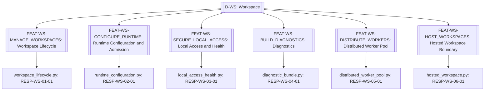
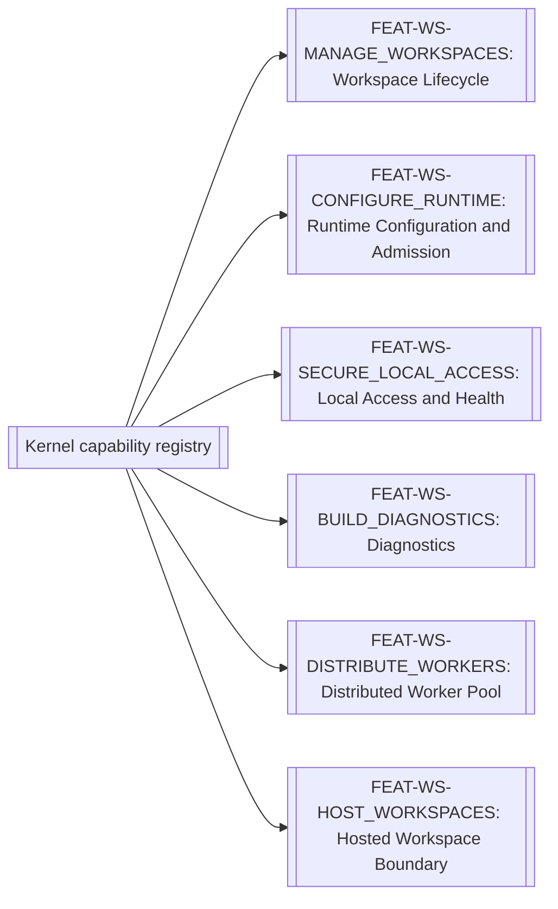

# Workspace

> **Package:** `app/services/workspace/`
> **Status:** `Missing`
> **Last updated:** `2026-08-24`
> **Domain ID:** `D-WS`

> This README is the domain package's **single source of truth** for domain boundaries, composable feature capabilities, architecture invariants, implementation sequence, progress, usage examples, and tests.
> Update this document before modifying or adding code.

---

## Code-Aligned Implementation Convention

This README is the sole current target registry for this domain's feature IDs and statuses, functional requirements, domain-local workflows, semantic contract ownership, persisted-state model, acceptance evidence, and deletion behavior. `PROJECT.md` owns system scope, cross-domain behavior, system NFRs, and release gates; `ARCHITECTURE.md` owns universal package and runtime constraints. Feature-local READMEs, manifests, contract definitions, migrations, and tests provide current implementation evidence without silently changing this target registry.

Implementation uses the repository's existing feature substrate: each feature lives directly at `app/services/<domain>/<feature>/`, is discovered through the `haruquantai.features` Python entry-point group, and declares one immutable `FeatureSpec` in `manifest.py`. There are no domain or feature YAML manifests.

Every implemented feature also contains a mandatory runtime-validated `README.md`, pure `__init__.py`, strict `config.py`, lifecycle `feature.py`, and focused implementation modules. Dependencies and effects flow through `FeatureContext`/`FeatureScope`; cross-feature implementation imports are forbidden. Persistent state is declared by `FeatureSpec.state`; any migrations and storage adapters remain with the owning feature. Capability keys use `<domain>.<name>@<major>`. FR IDs remain product, acceptance, and test-trace identities rather than one runtime registration per FR. A requirement `Depends` cell expresses product sequencing, traceability, or acceptance evidence only; runtime dependencies are declared separately with exact keys in `FeatureSpec.requires` or `FeatureSpec.optional`.

Feature-level automated tests live at `tests/services/workspace/<feature>/`. Usage examples never live under `tests/`; they belong to each feature's designated primary domain-logic module. Broader automated verification retains its documented architecture, composition, API, integration, or system test location. The code-backed procedure is the [Feature Implementation Pipeline](../../../docs/dev/feature_implementation_pipeline.md).

## 1. Purpose and Boundary

### Purpose

The Workspace domain delivers workspace lifecycle, runtime configuration, local/hosted access, worker pools, backup, and diagnostics. Its public feature capabilities are registered and remain independent of package-import order. Removing the domain produces the degradation defined below rather than preventing the shared substrate or unrelated domains from starting.

### Owns

- `FEAT-WS-MANAGE_WORKSPACES` — Workspace Lifecycle.
- `FEAT-WS-CONFIGURE_RUNTIME` — Runtime Configuration and Admission.
- `FEAT-WS-SECURE_LOCAL_ACCESS` — Local Access and Health.
- `FEAT-WS-BUILD_DIAGNOSTICS` — Diagnostics.
- `FEAT-WS-DISTRIBUTE_WORKERS` — Distributed Worker Pool.
- `FEAT-WS-HOST_WORKSPACES` — Hosted Workspace Boundary.

### Does not own

- Trading, strategy, simulation, analytics, and research policy; it supplies runtime, persistence, worker, recovery, and security capabilities only.
- Generic application TOML parsing, feature discovery, provider selection, deployment-profile readiness, and lifecycle reconciliation; `app/composition/` owns that substrate. Workspace owns product workspace settings, admission records, secrets, jobs, workers, artifacts, and hosted/local operational boundaries exposed through capabilities.
- Composition lifecycle, dependency resolution, effect reversal, and transactional replacement; those belong to the non-domain shared substrate (`app/contracts/`, `app/kernel/`, and `app/composition/`).
- **Deletion boundary:** deleting `app/services/workspace/` means the shell starts in diagnostic/no-workspace mode; trading domains remain discoverable but workflows needing persistence or workers are unavailable. The kernel and unrelated domains shall remain healthy.

### Shared Contracts

This domain semantically owns the contracts listed below, but their sole physical definitions live in `app/contracts/workspace/` and wire schemas in `app/contracts/workspace/wire/`. `app/services/workspace/` contains implementations only and shall not define or re-export substitute public contract types. Contract versions and semantic owners must agree with `PROJECT.md` and this README. Feature IDs and FR IDs are documentation, lifecycle, acceptance, and traceability identities; runtime bindings use exact versioned `CapabilityKey` declarations in contracts and `FeatureSpec`. The exact public records and capability bundles are listed in the [Shared Contracts README](../../contracts/README.md#41-appcontractsworkspace).

Rows labelled `FEAT-* capability surface` describe planned semantic contract bundles, not literal runtime capability keys. A listed counterparty may produce, consume, or observe the bundle and does not establish package-import or runtime dependency direction.

**Owned by this domain**

| Status | Contract | Version | Counterparty | Purpose |
|---|---|---|---|---|
| Implemented | `FEAT-WS-MANAGE_WORKSPACES` capability surface | `v1` | Interfaces, Orchestration, Simulator | Workspace Lifecycle. |
| Implemented | `FEAT-WS-CONFIGURE_RUNTIME` capability surface | `v1` | Interfaces, Orchestration, Simulator | Runtime Configuration and Admission. |
| Implemented | `FEAT-WS-SECURE_LOCAL_ACCESS` capability surface | `v1` | Interfaces, Orchestration, Simulator | Local Access and Health. |
| Implemented | `FEAT-WS-BUILD_DIAGNOSTICS` capability surface | `v1` | Interfaces, Orchestration, Simulator | Diagnostics. |
| Missing | `FEAT-WS-DISTRIBUTE_WORKERS` capability surface | `v1` | Interfaces, Orchestration, Simulator | Distributed Worker Pool. |
| Missing | `FEAT-WS-HOST_WORKSPACES` capability surface | `v1` | Interfaces, Orchestration, Simulator | Hosted Workspace Boundary. |

**Cross-domain requirement references (not runtime dependencies)**

The rows below summarize foreign owner tokens found in FR `Depends` cells. They express product sequencing, traceability, or acceptance-evidence relationships only. Actual runtime consumption must name an exact versioned capability key in the consuming feature's `FeatureSpec.requires` or `FeatureSpec.optional` and must follow the dependency direction in `PROJECT.md` and `ARCHITECTURE.md`.

| Referenced domain set | Documentation version | Owner | Meaning |
|---|---|---|---|
| `D-IFACE` public capability set | `v1` | Interfaces | Requirements whose `Depends` cell names `IFACE-*`. |
| `D-ORCH` public capability set | `v1` | Orchestration | Requirements whose `Depends` cell names `ORCH-*`. |
| `D-SIM` public capability set | `v1` | Simulator | Requirements whose `Depends` cell names `SIM-*`. |

#### Ratified v1 public records (23)

Physical-layer reconciliation rules (apply to every record below):

1. Frozen v1 Python classes stay unchanged as process contracts with their exact constructors, defaults, and sync methods; frozen ports keep raising the existing `WorkspaceError` family with stable `error_code` strings.
2. Each mapped record gains an additive strict frozen Pydantic v2 wire projection named `<Record>Wire` in `app/contracts/workspace/models.py` (new classes; no v1 renames). Generated JSON Schema and TypeScript emit the inventory name `<Record>`. Wire-native new records (R6, R10, R11, R17–R23) are Pydantic models named exactly as inventoried; they carry no `Wire` suffix.
3. Wire projections keep v1 field names and normalize types only: IDs → `Uuid7`, timestamps → `UtcTimestamp`, SHA-256 strings → `ContentHash`. V1 empty-string defaults (`WorkspaceRef.created_at`, `WorkspaceBackupManifest.manifest_checksum`) are process-local construction conveniences; the wire form requires the canonical value.
4. Process-local exclusions: `Path` fields (`WorkspaceRef.root_path`, `WorkspaceRestorePlan.backup_manifest_path/target_path`, `DiagnosticBundleRef.archive_path`) and secret token fields (`WorkspaceWriterFence.lock_token`, `LocalSession.token`, scoped job credentials) never enter wire schemas or generated UI types.
5. Domain-`schema_version` collision exception: `WorkspaceVersion`, `WorkspaceBackupManifest`, `SystemReadiness`, and `DiagnosticBundleManifest` keep `schema_version` as the workspace database schema number (`int >= 0`, nullable where v1 is nullable) because the frozen constructor owns that name. These four records carry no record-level `Literal[1]` field; their wire-schema identity is the workspace namespace v1. Every other Workspace record carries `schema_version: Literal[1] = 1`.

| # | Record | Exact wire fields (defaults in `=`) | Producer → consumers | FRs / lifecycle |
|---|---|---|---|---|
| R1 | `WorkspaceRef` (`WorkspaceRefWire`) | `workspace_id: Uuid7`; `name: str 1..160`; `status: Literal[UNINITIALIZED,READY,MIGRATING,LOCKED,RECOVERING,CORRUPTED] = "READY"`; `created_at: UtcTimestamp`; `schema_version: Literal[1] = 1`. `status` mirrors the v1 `WorkspaceStatus` states. | Manage Workspaces → Interfaces, Orchestration, Simulator, UI | FR-WS-INITIALIZE_WORKSPACE, FR-WS-BACKUP_WORKSPACE (restore result). Immutable identity description; `root_path` process-local only. |
| R2 | `WorkspaceVersion` (`WorkspaceVersionWire`) | `schema_version: int >= 0` (workspace DB schema number); `app_version: nonempty str`; `applied_at: UtcTimestamp`; `database_engine: nonempty str = "sqlite3"`. Collision exception applies. | Manage Workspaces → Interfaces, Orchestration, Simulator | FR-WS-MIGRATE_WORKSPACE_SCHEMA. Result of ordered transactional migrations; reopening up-to-date performs no mutation. |
| R3 | `WorkspaceConfiguration` (`WorkspaceConfigurationWire`) | `workspace_id: Uuid7`; `version: int >= 1`; `settings: WorkspaceSettingsWire`; `created_at: UtcTimestamp`; `schema_version: Literal[1] = 1`. Nested `WorkspaceSettingsWire` = v1 `WorkspaceSettings` fields exactly: `timezone: IANA name`, `locale: BCP 47 tag`, `worker_count: int >= 1`, `worker_memory_mb: int >= 1`, `max_artifact_size_mb: int >= 1`, `max_total_artifact_gb: int >= 1`, `artifacts_dir = "artifacts"`, `logs_dir = "logs"`, `cache_dir = "cache"`, `exports_dir = "exports"`, `log_level: Literal[DEBUG,INFO,WARNING,ERROR,CRITICAL] = "INFO"`, `log_retention_days: int >= 1 = 30`, `retention_days: int >= 1 = 365`; directories are workspace-relative, no `..`, no absolute paths, mutually distinct. | Configure Runtime → Interfaces, Orchestration, Simulator, UI | FR-WS-CONFIGURE_WORKSPACE. Immutable versioned settings (`workspace_setting_versions(workspace_id,version UNIQUE)`); invalid values never increment the version. |
| R4 | `RuntimeConfiguration` (`RuntimeConfigurationWire`) | `settings: ServerRuntimeSettingsWire`; `validation: ServerRuntimeValidationWire`; `schema_version: Literal[1] = 1`. Nested settings = v1 fields: `port: int 1..65535`, `bind_address: IP literal = "127.0.0.1"`, `headless: bool = False`, `authentication_mode: Literal[LOCAL_SESSION,NONLOCAL_TOKEN] = "LOCAL_SESSION"`, `allow_non_loopback: bool = False`, `worker_cpu_percent: int 1..100 = 100`, `global_cpu_percent: int 1..100 = 100`, `worker_memory_mb: int >= 1 = 1024`, `global_memory_mb: int >= 1 = 4096`; cross-field: `allow_non_loopback=True` requires `authentication_mode="NONLOCAL_TOKEN"`. Nested validation = v1 fields: `valid: bool`, `errors: tuple[nonempty str, ...] = ()`, `port_available: bool = True`; cross-field: `valid=False` iff `errors` nonempty or `port_available=False`. | Configure Runtime → Interfaces, UI (launcher) | FR-WS-CONFIGURE_SERVER_RUNTIME. Pre-launch validation outcome; invalid/unavailable port fails before UI launch. |
| R5 | `StorageGuardPolicy` (`StorageGuardPolicyWire`) | `min_free_space_mb: int >= 1 = 512`; `max_artifact_size_mb: int >= 1 = 4096`; `schema_version: Literal[1] = 1`. | Configure Runtime → Simulator, Orchestration (job admission) | FR-WS-ENFORCE_STORAGE_GUARDS. Policy carries limits only; the admission `StorageGuardDecision` remains the distinct frozen v1 port result. |
| R6 | `WorkspaceWriterLease` (wire-native) | `lease_id: Uuid7`; `workspace_id: Uuid7`; `holder_pid: int >= 1`; `acquired_at: UtcTimestamp`; `expires_at: UtcTimestamp`; `is_read_only: bool = False`; `schema_version: Literal[1] = 1`. Constraint: `expires_at > acquired_at`. | Manage Workspaces → Manage Workspaces (recovery), Interfaces | FR-WS-FENCE_WORKSPACE_WRITERS, FR-WS-RECOVER_WORKSPACE_STATE. At most one active writer lease per workspace; expired leases are reclaimed at startup. The secret `lock_token` of the paired fence is process-local and excluded. |
| R7 | `WorkspaceWriterFence` (`WorkspaceWriterFenceWire`) | `workspace_id: Uuid7`; `holder_pid: int >= 1`; `acquired_at: UtcTimestamp`; `is_write_locked: bool = True`; `is_read_only: bool = False`; `schema_version: Literal[1] = 1`. Cross-field: exactly one of `is_write_locked`/`is_read_only` is `True`. | Manage Workspaces → Interfaces, UI | FR-WS-FENCE_WORKSPACE_WRITERS. Result of fence acquisition; second writer fails `WORKSPACE_ALREADY_OPEN`. |
| R8 | `WorkspaceBackupManifest` (`WorkspaceBackupManifestWire`) | `backup_id: Uuid7`; `workspace_id: Uuid7`; `schema_version: int >= 0` (workspace DB schema at backup; collision exception); `created_at: UtcTimestamp`; `file_count: int >= 0`; `total_bytes: int >= 0`; `files: tuple[BackupFileRecordWire, ...] = ()` where each record is `relative_path: workspace-relative POSIX path`, `sha256_hash: ContentHash`, `size_bytes: int >= 0`; `manifest_checksum: ContentHash`. Constraints: `file_count == len(files)`; `total_bytes == sum(size_bytes)`. | Manage Workspaces → Interfaces, Diagnostics | FR-WS-BACKUP_WORKSPACE, FR-WS-RECOVER_WORKSPACE_STATE. Consistent snapshot per §22.7; retention 30 daily / 12 monthly unless compliance holds. |
| R9 | `WorkspaceRestorePlan` (`WorkspaceRestorePlanWire`) | `backup_id: Uuid7`; `verify_checksums: bool = True`; `schema_version: Literal[1] = 1`. | Interfaces/UI (future transport) → Manage Workspaces | FR-WS-BACKUP_WORKSPACE acceptance (restore path). Wire plan references the backup by identity; v1 `Path`-based plan remains the process contract. Restore always targets empty staging per §22.7. |
| R10 | `SecretRef` (wire-native) | `secret_id: Uuid7`; `workspace_id: Uuid7`; `name: str 1..160 matching ^[A-Za-z0-9][A-Za-z0-9._-]*$`; `created_at: UtcTimestamp`; `updated_at: UtcTimestamp`; `row_version: int >= 1 = 1`; `schema_version: Literal[1] = 1`. Uniqueness `(workspace_id, name)`. | Secure Local Access / Host Workspaces store → Broker, Trading, Data (opaque credential IDs) | FR-WS-SECURE_REMOTE_WORKERS (short-lived job credentials), FR-WS-ISOLATE_HOSTED_WORKSPACES (per-workspace credentials), FR-WS-BUILD_DIAGNOSTIC_BUNDLE (values never disclosed). Secret values are never wire fields, never in manifests/logs (`secret_refs(workspace_id,name UNIQUE)`). |
| R11 | `PrincipalRef` (wire-native) | `principal_id: Uuid7`; `auth_provider: nonempty str`; `schema_version: Literal[1] = 1`. | Host Workspaces → Interfaces (authorization boundary), audit records | FR-WS-AUTHORIZE_HOSTED_WORKSPACES. Pluggable authenticated principal replacing the local-session token in hosted mode; the authority discriminator is the provider identity. |
| R12 | `LocalSession` (`LocalSessionWire`) | `session_id: Uuid7`; `client_id: nonempty str`; `client_host: IP literal`; `issued_at: UtcTimestamp`; `expires_at: UtcTimestamp`; `is_loopback: bool = True`; `is_launcher_connected: bool = True`; `schema_version: Literal[1] = 1`. Constraint: `expires_at > issued_at`. | Secure Local Access → Interfaces, UI | FR-WS-ISSUE_LOCAL_SESSION. Ephemeral per-launch session; the secret `token` is process-local and must never appear in wire schemas or generated UI types. |
| R13 | `SystemHealth` (`SystemHealthWire`) | `status: Literal[HEALTHY,DEGRADED,UNHEALTHY] = "HEALTHY"`; `healthy: bool = True`; `checked_at: UtcTimestamp`; `components: dict[nonempty str, Literal[HEALTHY,DEGRADED,UNHEALTHY]] = {}`; `schema_version: Literal[1] = 1`. Cross-field: `healthy == (status == "HEALTHY")`. | Secure Local Access → Interfaces, UI | FR-WS-REPORT_SYSTEM_READINESS. Functional before full readiness. |
| R14 | `SystemReadiness` (`SystemReadinessWire`) | `ready: bool`; `healthy: bool`; `build_version: nonempty str`; `build_commit: nonempty str`; `schema_version: int >= 0 | None` (workspace DB schema if open; collision exception); `migrations_current: bool`; `state_recovered: bool`; `worker_capacity: int >= 0`; `active_workers: int >= 0`; `checked_at: UtcTimestamp`; `reasons: tuple[nonempty str, ...] = ()`. Constraint: `active_workers <= worker_capacity`; `ready=True` only when `migrations_current` and `state_recovered`. | Secure Local Access → Interfaces, UI, Composition readiness | FR-WS-REPORT_SYSTEM_READINESS. Never discloses secrets or absolute user paths. |
| R15 | `DiagnosticBundleRef` (`DiagnosticBundleRefWire`) | `bundle_id: Uuid7`; `checksum_sha256: ContentHash`; `file_size_bytes: int >= 0`; `manifest: DiagnosticBundleManifestWire`; `schema_version: Literal[1] = 1`. | Build Diagnostics → Interfaces, UI | FR-WS-BUILD_DIAGNOSTIC_BUNDLE. `archive_path` is process-local and excluded. |
| R16 | `DiagnosticBundleManifest` (`DiagnosticBundleManifestWire`) | `bundle_id: Uuid7`; `created_at: UtcTimestamp`; `build_version: nonempty str`; `build_commit: nonempty str`; `schema_version: int >= 0 | None` (collision exception); `workspace_id: Uuid7 | None`; `log_entries_count: int >= 0`; `job_records_count: int >= 0`; `integrity_findings: tuple[nonempty str, ...] = ()`; `redaction_summary: dict[nonempty str, int >= 0] = {}`; record-level `schema_version` omitted per collision exception. | Build Diagnostics → Interfaces, UI | FR-WS-BUILD_DIAGNOSTIC_BUNDLE. Redacted bundle: no session tokens, connection secrets, or unredacted secret values (acceptance scan). |
| R17 | `WorkerCapabilityDescriptor` (wire-native) | `capabilities: nonempty tuple[CapabilityIdentifier, ...]` (supported task/profile/plugin capability versions); `build_hash: ContentHash`; `os_family: nonempty uppercase token`; `architecture: nonempty uppercase token`; `cpu_cores: int >= 1`; `memory_mb: int >= 1`; `artifact_locality: tuple[ContentHash, ...] = ()` (artifact content hashes present locally); `heartbeat_interval_seconds: int >= 1`; `schema_version: Literal[1] = 1`. | FEAT-WS-DISTRIBUTE_WORKERS → Orchestration (scheduler), Simulator | FR-WS-REGISTER_WORKER_CAPABILITIES, §21.6 registration facts. Registration alone confers no trust. |
| R18 | `WorkerRegistration` (wire-native) | `worker_id: Uuid7`; `descriptor: WorkerCapabilityDescriptor`; `endpoint: nonempty URI str` (authenticated channel); `registered_at: UtcTimestamp`; `last_heartbeat_at: UtcTimestamp`; `heartbeat_expires_at: UtcTimestamp`; `trusted: bool = False`; `schema_version: Literal[1] = 1`. Constraints: `last_heartbeat_at >= registered_at`; `heartbeat_expires_at > last_heartbeat_at`; stale (`heartbeat_expires_at` passed) workers expire and receive no assignments; `trusted=False` workers receive no assignments. | FEAT-WS-DISTRIBUTE_WORKERS → Orchestration, Simulator | FR-WS-REGISTER_WORKER_CAPABILITIES, FR-WS-SECURE_REMOTE_WORKERS. Trust requires channel authentication, not registration. |
| R19 | `WorkerLease` (wire-native) | `job_id: Uuid7`; `attempt_no: int >= 1`; `worker_id: Uuid7`; `worker_build_hash: ContentHash`; `fencing_token: int >= 1` (monotonically increasing per job); `acquired_at: UtcTimestamp`; `last_heartbeat_at: UtcTimestamp`; `expires_at: UtcTimestamp`; `heartbeat_interval_seconds: int >= 1`; `state: Literal[ACTIVE,RELEASED,EXPIRED,SUPERSEDED]`; `schema_version: Literal[1] = 1`. Constraints: `expires_at > acquired_at`; `last_heartbeat_at >= acquired_at`; uniqueness `(job_id,attempt_no,fencing_token)`; a commit is accepted only for the current token before expiry (`worker_leases(job_id,attempt_no,fencing_token UNIQUE)`). Scoped short-lived job credentials are `SecretRef` identities, never values. | FEAT-WS-DISTRIBUTE_WORKERS → Simulator, Orchestration | FR-WS-SECURE_REMOTE_WORKERS, FR-ORCH-FENCE_TASK_LEASES (cross-reference). |
| R20 | `WorkerTaskEnvelope` (wire-native) | `envelope_id: Uuid7`; `task_run_id: Uuid7`; `job_id: Uuid7`; `attempt_no: int >= 1`; `fencing_token: int >= 1`; `assigned_worker_id: Uuid7`; `assigned_at: UtcTimestamp`; `input_hashes: tuple[ContentHash, ...] = ()` (ordered content-addressed inputs incl. seed-bearing manifests); `locality_hints: tuple[ContentHash, ...] = ()`; `schema_version: Literal[1] = 1`. Constraint: reassignment to another compatible worker changes only `envelope_id`/`assigned_worker_id`/`assigned_at`; input hashes are invariant so seeds and canonical output are unchanged. | FEAT-WS-DISTRIBUTE_WORKERS → Simulator, Orchestration | FR-WS-SCHEDULE_DATA_LOCALITY; §21.6 scheduler order: capability → locality score → available resources → current load → worker ID. |
| R21 | `ArtifactManifest` (wire-native) | `artifact_id: Uuid7`; `kind: nonempty str`; `content_hash: ContentHash`; `size_bytes: int >= 0`; `media_type: nonempty str`; `artifact_schema_version: int >= 1` (artifact payload schema per §22.3); `state: Literal[STAGED,VALIDATING,COMMITTED,REJECTED,CORRUPT]`; `chunks: tuple[ArtifactChunk, ...] = ()` where `ArtifactChunk(index: int >= 0, offset_bytes: int >= 0, size_bytes: int >= 1, chunk_hash: ContentHash)`; `created_at: UtcTimestamp`; `committed_at: UtcTimestamp | None = None`; `schema_version: Literal[1] = 1`. Constraints: chunks sorted by `index` starting at 0 and contiguous from `offset_bytes 0`; commit requires concatenating chunk bytes to reproduce `content_hash` and `size_bytes`; corruption/interruption never yields `COMMITTED` (§23.12); `committed_at` present iff `state="COMMITTED"`. | FEAT-WS-DISTRIBUTE_WORKERS → remote workers, artifact store, Simulator | FR-WS-VERIFY_ARTIFACT_TRANSFER, §5.2 artifact states. |
| R22 | `HostedWorkspaceContext` (wire-native) | `workspace_id: Uuid7`; `deployment_mode: Literal[DESKTOP,HOSTED]`; `metadata_scope: nonempty str`; `artifact_scope: nonempty str`; `queue_scope: nonempty str`; `credential_scope: nonempty str`; `quota_scope: nonempty str`; `plugin_permission_scope: nonempty str`; `schema_version: Literal[1] = 1`. Constraint: no two hosted contexts share a value of the same scope kind; the six scopes map one-to-one to the isolated concerns of the FR. | FEAT-WS-HOST_WORKSPACES → Interfaces, all hosted consumers | FR-WS-ISOLATE_HOSTED_WORKSPACES, NFR-ISO-006. Hosted substitutes PostgreSQL 16+ / object store per §22.1 while preserving repository/API behavior. |
| R23 | `WorkspaceAuthorizationDecision` (wire-native) | `decision_id: Uuid7`; `principal: PrincipalRef`; `workspace_id: Uuid7`; `action: nonempty str`; `outcome: Literal[ALLOW,DENY]`; `reason: str = ""` (empty iff `outcome="ALLOW"`); `decided_at: UtcTimestamp`; `expires_at: UtcTimestamp | None = None`; `schema_version: Literal[1] = 1`. Constraint: missing evidence or policy uncertainty yields `DENY` (fail-closed). | FEAT-WS-HOST_WORKSPACES → Interfaces gateways, audit | FR-WS-AUTHORIZE_HOSTED_WORKSPACES. Local and hosted contract suites differ only at this adapter; domain services are unchanged. |

Cross-owner references used by these records (never copied): `CapabilityIdentifier`, `ProblemDetails`, `DomainEvent`, and common aliases from `app/contracts/common/`; job/task identities as `Uuid7` with Orchestration/Simulator ownership noted.

#### Ratified v1 capabilities and operation envelopes

Frozen v1 bundles (compatibility rule: exact current method sets and sync/async behavior; no new-port reshaping; Python failures remain the `WorkspaceError` family with stable `error_code` strings; no subscription methods):

| Key / port | Frozen method set | Provider → consumers | FRs |
|---|---|---|---|
| `workspace.manage-workspaces@1` / `ManageWorkspacesCapability` | `initialize_workspace`, `migrate_workspace_schema`, `fence_workspace_writers`, `release_writer_fence`, `recover_workspace_state`, `backup_workspace`, `restore_workspace` (all synchronous) | FEAT-WS-MANAGE_WORKSPACES → Interfaces, Orchestration, Simulator, UI | FR-WS-INITIALIZE_WORKSPACE, FR-WS-MIGRATE_WORKSPACE_SCHEMA, FR-WS-FENCE_WORKSPACE_WRITERS, FR-WS-RECOVER_WORKSPACE_STATE, FR-WS-BACKUP_WORKSPACE |
| `workspace.configure-runtime@1` / `ConfigureRuntimeCapability` | `configure_workspace`, `get_workspace_settings`, `enforce_storage_guards`, `configure_server_runtime`, `publish_runtime_support` (all synchronous) | FEAT-WS-CONFIGURE_RUNTIME → Interfaces, Orchestration, Simulator, UI | FR-WS-CONFIGURE_WORKSPACE, FR-WS-ENFORCE_STORAGE_GUARDS, FR-WS-CONFIGURE_SERVER_RUNTIME, FR-WS-PUBLISH_RUNTIME_SUPPORT (observational runtime-support Kernel event, PUBLISH mode; no subscription) |
| `workspace.secure-local-access@1` / `SecureLocalAccessCapability` | `issue_local_session`, `verify_local_session`, `revoke_local_session`, `check_system_health`, `report_system_readiness` (all synchronous) | FEAT-WS-SECURE_LOCAL_ACCESS → Interfaces, UI | FR-WS-ISSUE_LOCAL_SESSION, FR-WS-REPORT_SYSTEM_READINESS |
| `workspace.build-diagnostics@1` / `BuildDiagnosticsCapability` | `build_diagnostic_bundle` (synchronous) | FEAT-WS-BUILD_DIAGNOSTICS → Interfaces, UI | FR-WS-BUILD_DIAGNOSTIC_BUNDLE |

New bundles (universal new-port rule: `@runtime_checkable` async protocol, exactly one capability-named request method over a closed operation-discriminated union; no subscription — no owner FR requires live/stream/replay):

**`workspace.distribute-workers@1` / `DistributeWorkersCapability`** — `async def distribute_workers(request: DistributeWorkersRequest) -> DistributeWorkersSuccess | WorkspaceFailure`. Provider: FEAT-WS-DISTRIBUTE_WORKERS. Consumers: Orchestration, Simulator, Interfaces. FRs: FR-WS-REGISTER_WORKER_CAPABILITIES, FR-WS-SECURE_REMOTE_WORKERS, FR-WS-SCHEDULE_DATA_LOCALITY, FR-WS-VERIFY_ARTIFACT_TRANSFER.

- `DistributeWorkersRequest`: `request_id: Uuid7`; `capability_snapshot_id: Uuid7`; `operation: Literal[REGISTER,AUTHENTICATE,HEARTBEAT,ACQUIRE_LEASE,RELEASE_LEASE,ASSIGN_TASK,PREPARE_TRANSFER,COMMIT_TRANSFER]`; `descriptor: WorkerCapabilityDescriptor | None = None`; `endpoint: URI str | None = None`; `worker_id: Uuid7 | None = None`; `job_id: Uuid7 | None = None`; `attempt_no: int >= 1 | None = None`; `fencing_token: int >= 1 | None = None`; `task_run_id: Uuid7 | None = None`; `required_capabilities: tuple[CapabilityIdentifier, ...] = ()`; `locality_hints: tuple[ContentHash, ...] = ()`; `artifact: ArtifactManifest | None = None`; `artifact_id: Uuid7 | None = None`; `schema_version: Literal[1] = 1`.
- Operation presence matrix: `REGISTER` requires `descriptor`,`endpoint`, forbids the rest. `AUTHENTICATE` and `HEARTBEAT` require `worker_id` only. `ACQUIRE_LEASE` requires `worker_id`,`job_id`,`attempt_no`. `RELEASE_LEASE` requires `worker_id`,`job_id`,`attempt_no`,`fencing_token`. `ASSIGN_TASK` requires `job_id`,`attempt_no`,`task_run_id` (`required_capabilities`/`locality_hints` optional; scheduler selects the worker). `PREPARE_TRANSFER` requires `artifact` (STAGED manifest with chunk plan). `COMMIT_TRANSFER` requires `artifact_id`,`job_id`,`attempt_no`,`fencing_token` (commit accepted only for the current token before expiry).
- `DistributeWorkersSuccess`: `outcome: Literal["SUCCESS"] = "SUCCESS"`; `request_id: Uuid7`; `result_version: Literal[1] = 1`; `registration: WorkerRegistration | None = None` (REGISTER/AUTHENTICATE/HEARTBEAT); `lease: WorkerLease | None = None` (ACQUIRE_LEASE); `envelope: WorkerTaskEnvelope | None = None` (ASSIGN_TASK); `artifact: ArtifactManifest | None = None` (PREPARE_TRANSFER returns the STAGED chunk plan; COMMIT_TRANSFER returns the COMMITTED manifest); `schema_version: Literal[1] = 1`.
- `WorkspaceFailure` (shared by both new Workspace capabilities): `outcome: Literal["FAILURE"] = "FAILURE"`; `request_id: Uuid7`; `code: Literal[WORKSPACE_VALIDATION_FAILED,WORKSPACE_NOT_FOUND,WORKSPACE_ALREADY_OPEN,WORKER_UNKNOWN,WORKER_UNTRUSTED,WORKER_EXPIRED,LEASE_UNAVAILABLE,LEASE_TOKEN_STALE,TRANSFER_INVALID,TRANSFER_INCOMPLETE,ISOLATION_CONFLICT,CAPABILITY_UNAVAILABLE]`; `problem: ProblemDetails`; `schema_version: Literal[1] = 1`. Mapping: `WORKER_UNTRUSTED` for assignments/leases by untrusted workers; `LEASE_TOKEN_STALE` for commits under a superseded token; `TRANSFER_INVALID` for hash/size/schema mismatch; `TRANSFER_INCOMPLETE` for missing chunks; `CAPABILITY_UNAVAILABLE` performs no mutation.
- Event union: empty in v1. Worker/lease/transfer facts are observational Kernel `PUBLISH` events at implementation time (FR-WS-SECURE_REMOTE_WORKERS effect column) and are not port stream contracts.

**`workspace.host-workspaces@1` / `HostWorkspacesCapability`** — `async def host_workspaces(request: HostWorkspacesRequest) -> HostWorkspacesSuccess | WorkspaceFailure`. Provider: FEAT-WS-HOST_WORKSPACES. Consumers: Interfaces, hosted principals. FRs: FR-WS-ISOLATE_HOSTED_WORKSPACES, FR-WS-AUTHORIZE_HOSTED_WORKSPACES.

- `HostWorkspacesRequest`: `request_id: Uuid7`; `capability_snapshot_id: Uuid7`; `operation: Literal[PROVISION,DESCRIBE,AUTHORIZE]`; `context: HostedWorkspaceContext | None = None` (PROVISION); `workspace_id: Uuid7 | None = None` (DESCRIBE, AUTHORIZE); `principal: PrincipalRef | None = None` (AUTHORIZE); `action: nonempty str | None = None` (AUTHORIZE); `schema_version: Literal[1] = 1`.
- `HostWorkspacesSuccess`: `outcome: Literal["SUCCESS"] = "SUCCESS"`; `request_id: Uuid7`; `result_version: Literal[1] = 1`; `context: HostedWorkspaceContext | None = None` (PROVISION/DESCRIBE); `decision: WorkspaceAuthorizationDecision | None = None` (AUTHORIZE; `DENY` is a typed success outcome, never a failure); `schema_version: Literal[1] = 1`.
- Event union: empty; no subscription. `ISOLATION_CONFLICT` covers scope collisions at PROVISION.

### Persisted State Ownership

| Status | State / Store | Read access (via contract) | Migration definitions |
|---|---|---|---|
| Missing | workspace, workspace_setting_versions, secret_refs, audit_events, jobs, job_commands, worker_leases, artifacts, artifact_refs, events, tombstones | Other domains through `D-WS` public capabilities only | The owning feature's `StateDeclaration` and migration/storage adapter |

### Four-Level Structural Hierarchy

| Code level | Represents | This package |
|---|---|---|
| **Package** | Domain | `app/services/workspace/` / `D-WS` |
| **Module folder** | Feature / capability | One folder for each of: Workspace Lifecycle, Runtime Configuration and Admission, Local Access and Health, Diagnostics, Distributed Worker Pool, Hosted Workspace Boundary |
| **File** | Use case or focused responsibility | Exactly the responsibility file named in each module specification |
| **Class / function / method** | Functional requirement behavior | Exactly one registered `fr_*` behavior per `FR-*` row |

```text
Package (Domain)
└── Module folder (Feature)
    └── File (Responsibility)
        └── Registered function (Functional requirement behavior)
```

### Domain Capability Map



---

## 2. Final Package Structure and Feature Independence

```text
workspace/
├── README.md
├── __init__.py
├── workspace_lifecycle/                    # FEAT-WS-MANAGE_WORKSPACES: Workspace Lifecycle
│   ├── README.md
│   ├── __init__.py
│   ├── manifest.py
│   ├── config.py
│   ├── feature.py
│   └── workspace_lifecycle.py              # RESP-WS-01-01
├── runtime_configuration/                    # FEAT-WS-CONFIGURE_RUNTIME: Runtime Configuration and Admission
│   ├── README.md
│   ├── __init__.py
│   ├── manifest.py
│   ├── config.py
│   ├── feature.py
│   └── runtime_configuration.py              # RESP-WS-02-01
├── local_access_health/                    # FEAT-WS-SECURE_LOCAL_ACCESS: Local Access and Health
│   ├── README.md
│   ├── __init__.py
│   ├── manifest.py
│   ├── config.py
│   ├── feature.py
│   └── local_access_health.py              # RESP-WS-03-01
├── diagnostic_bundle/                    # FEAT-WS-BUILD_DIAGNOSTICS: Diagnostics
│   ├── README.md
│   ├── __init__.py
│   ├── manifest.py
│   ├── config.py
│   ├── feature.py
│   └── diagnostic_bundle.py              # RESP-WS-04-01
├── distributed_worker_pool/                    # FEAT-WS-DISTRIBUTE_WORKERS: Distributed Worker Pool
│   ├── README.md
│   ├── __init__.py
│   ├── manifest.py
│   ├── config.py
│   ├── feature.py
│   └── distributed_worker_pool.py              # RESP-WS-05-01
└── hosted_workspace/                    # FEAT-WS-HOST_WORKSPACES: Hosted Workspace Boundary
    ├── README.md
    ├── __init__.py
    ├── manifest.py
    ├── config.py
    ├── feature.py
    └── hosted_workspace.py              # RESP-WS-06-01
```

### Module dependency diagram

Feature modules do not import one another's private files. Runtime dependencies resolve through kernel capabilities obtained from `FeatureContext`; composition selects providers and reconciles changes, so reciprocal workflow participation cannot create a package-import cycle.



### Structure rules

- The package root contains `README.md`, import-pure `__init__.py`, and one direct folder per feature; discovery uses the `haruquantai.features` entry-point group.
- Each feature folder contains mandatory `README.md`, pure `__init__.py`, `manifest.py`, `config.py`, `feature.py`, and focused responsibility modules.
- `FR-*`/`fr_*` names provide product, implementation, and test traceability inside the feature; they are not separate runtime registrations or capability keys.
- Cross-feature and cross-domain behavior is injected by capability key. Direct private-file imports are prohibited.
- Every core capability module documents Python and CLI usage; exactly one designated primary domain-logic module owns the feature's executable `__main__` demonstration. Usage examples never live under `tests/`.

---

## 3. Workflows

| Status | Workflow ID | Scope | Workflow | Trigger / Input boundary | Final outcome / Output boundary | Requirement sequence |
|---|---|---|---|---|---|---|
| Implemented | `WF-WS-001` | Cross-domain | Workspace Lifecycle | Validated command/query and required capability bindings | Requirement-defined result, artifact, event, or degradation | `FR-WS-INITIALIZE_WORKSPACE` → `FR-WS-MIGRATE_WORKSPACE_SCHEMA` → `FR-WS-FENCE_WORKSPACE_WRITERS` → `FR-WS-RECOVER_WORKSPACE_STATE` → `FR-WS-BACKUP_WORKSPACE` |
| Implemented | `WF-WS-002` | Internal | Runtime Configuration and Admission | Validated command/query and required capability bindings | Requirement-defined result, artifact, event, or degradation | `FR-WS-CONFIGURE_WORKSPACE` → `FR-WS-ENFORCE_STORAGE_GUARDS` → `FR-WS-CONFIGURE_SERVER_RUNTIME` → `FR-WS-PUBLISH_RUNTIME_SUPPORT` |
| Implemented | `WF-WS-003` | Internal | Local Access and Health | Validated command/query and required capability bindings | Requirement-defined result, artifact, event, or degradation | `FR-WS-ISSUE_LOCAL_SESSION` → `FR-WS-REPORT_SYSTEM_READINESS` |
| Implemented | `WF-WS-004` | Internal | Diagnostics | Validated command/query and required capability bindings | Requirement-defined result, artifact, event, or degradation | `FR-WS-BUILD_DIAGNOSTIC_BUNDLE` |
| Missing | `WF-WS-005` | Cross-domain | Distributed Worker Pool | Validated command/query and required capability bindings | Requirement-defined result, artifact, event, or degradation | `FR-WS-REGISTER_WORKER_CAPABILITIES` → `FR-WS-SECURE_REMOTE_WORKERS` → `FR-WS-SCHEDULE_DATA_LOCALITY` → `FR-WS-VERIFY_ARTIFACT_TRANSFER` |
| Missing | `WF-WS-006` | Cross-domain | Hosted Workspace Boundary | Validated command/query and required capability bindings | Requirement-defined result, artifact, event, or degradation | `FR-WS-ISOLATE_HOSTED_WORKSPACES` → `FR-WS-AUTHORIZE_HOSTED_WORKSPACES` |

### `WF-WS-001` — Workspace Lifecycle

**Scope:** `Cross-domain` when the request requires another domain capability; otherwise `Internal`.

**System workflow:** `SYS-WF-001`

**Input boundary:** A validated request/query plus an immutable capability snapshot and provider bindings.

**Output boundary:** The result/artifact/event defined by the participating `FR-*` rows, or their exact structured failure/degradation outcome.

1. `Feature.mount()` resolves its declared required capabilities through `FeatureContext`.
2. `workspace_lifecycle.py` executes `fr_ws_initialize_workspace`, `fr_ws_migrate_workspace_schema`, `fr_ws_fence_workspace_writers`, `fr_ws_recover_workspace_state`, `fr_ws_backup_workspace` in the requirement-defined order.
3. Scoped effects are committed or reversed under `FR-KERN-DEFINE_REQUIREMENT_BEHAVIOR, FR-KERN-DEFINE_LIFECYCLE_CONTEXT, FR-KERN-DECLARE_BEHAVIOR_DEPENDENCIES, FR-KERN-REGISTER_FEATURE_MODULES, FR-KERN-DEFINE_RESPONSIBILITY_FILES, FR-KERN-IMPLEMENT_REQUIREMENT_FUNCTIONS, FR-KERN-DEPEND_PUBLIC_PORTS, FR-KERN-NAMESPACE_CAPABILITY_KEYS, FR-KERN-DECLARE_DEPENDENCY_RULES, FR-KERN-REEVALUATE_DEPENDENCIES, FR-KERN-DEFINE_SCOPE_HIERARCHY, FR-KERN-PASS_EFFECT_SCOPES, FR-KERN-REGISTER_EFFECT_REVERSALS, FR-KERN-REVERSE_EFFECTS_LIFO, FR-KERN-ROLLBACK_FAILED_ACTIVATION, FR-KERN-MANAGE_COMPONENT_LIFECYCLE, FR-KERN-COMMIT_CAPABILITY_SWAP, FR-KERN-QUIESCE_DEPENDENT_WORK, FR-KERN-REMOVE_DEPENDENT_COMPONENTS, FR-KERN-ISOLATE_DISPOSAL_FAILURES, FR-KERN-RECONCILE_DESIRED_STATE, FR-KERN-REPLACE_COMPONENTS_TRANSACTIONALLY, FR-KERN-PROVIDE_SCOPED_REGISTRARS, FR-KERN-DRAIN_REMOVED_BEHAVIORS, FR-KERN-CLASSIFY_COMPONENT_EFFECTS, FR-KERN-NAMESPACE_COMPONENT_STATE, FR-KERN-REGISTER_EXTENSION_POINTS, FR-KERN-EMIT_CAUSAL_EVENTS, FR-KERN-REJECT_DEPENDENCY_CYCLES, FR-KERN-PIN_CAPABILITY_SNAPSHOTS, FR-KERN-TEST_COMPONENT_REMOVAL, FR-KERN-VERIFY_EXACT_REMOVAL, FR-KERN-ROUTE_MULTIPLE_PROVIDERS`.
4. The feature returns or publishes only the documented output boundary.

**Failure behaviour:**

- Feature unavailable → workspace creation/open/recovery/backup is unavailable; an existing workspace is not mutated. Requests requiring a removed feature capability return `CAPABILITY_UNAVAILABLE`; the domain continues loading.
- Missing/incompatible required capability → `CAPABILITY_UNAVAILABLE` or `CAPABILITY_INCOMPATIBLE`; no partial mutation.

**Integration test:**
`tests/services/workspace/integration/test_workspace_lifecycle.py::test_workspace_lifecycle_workflow()`


---

## 4. Composable Feature Specifications

Implement module sections from top to bottom. Requirement `Depends` cells define product and implementation ordering; runtime capability dependencies must be declared separately in the owning `FeatureSpec`.

---

### 4.1 `workspace_lifecycle/` — Workspace Lifecycle

**Feature ID:** `FEAT-WS-MANAGE_WORKSPACES`

**Purpose:** Initialize, migrate, lock, recover, and back up a workspace.

**Deletion contract:** workspace creation/open/recovery/backup is unavailable; an existing workspace is not mutated. Requests requiring a removed feature capability return `CAPABILITY_UNAVAILABLE`; the domain continues loading.

**Module flow:**

```text
validated input and capability bindings
  → workspace_lifecycle.py
  → fr_ws_initialize_workspace, fr_ws_migrate_workspace_schema, fr_ws_fence_workspace_writers, fr_ws_recover_workspace_state, fr_ws_backup_workspace
  → requirement-defined output or structured failure
```

#### Files

| Status | File | Responsibility | Key exports | Dependencies |
|---|---|---|---|---|
| Implemented | `workspace_lifecycle.py` | Initialize, migrate, lock, recover, and back up a workspace | `fr_ws_initialize_workspace`, `fr_ws_migrate_workspace_schema`, `fr_ws_fence_workspace_writers`, `fr_ws_recover_workspace_state`, `fr_ws_backup_workspace` | **Standard library:** `pathlib`, `sqlite3`, `hashlib`, `json`, `uuid`, `shutil`, `os`, `sys`, `time`, `dataclasses`, `enum`, `typing`, `contextlib`<br>**Required third-party:** None<br>**Local:** `app.contracts.workspace`, `app.kernel.capability`, `app.kernel.feature`<br>no private cross-feature import |
| Implemented | `feature.py` | Mount `FEAT-WS-MANAGE_WORKSPACES` through `FeatureContext` and stage its declared providers/effects | `FEAT-WS-MANAGE_WORKSPACES` `Feature.mount`, `feature` | **Standard library:** `typing`<br>**Required third-party:** None<br>**Local:** `manifest.py`, `config.py`, and `workspace_lifecycle.py` |
| Implemented | `manifest.py` | Define the immutable `FEAT-WS-MANAGE_WORKSPACES` `FeatureSpec`: identity, domain, provided/required/optional capabilities, conflicts, state, and configuration keys | `FEAT-WS-MANAGE_WORKSPACES` `FeatureSpec`, `SPEC` | **Standard library:** None<br>**Required third-party:** None<br>**Local:** `app.kernel.feature.FeatureSpec`, `app.contracts.workspace.capabilities` |

#### Configuration and Limits Manifest

| Status | Setting / Limit | Type | Default | Required | Used by | Description |
|---|---|---|---|---|---|---|
| Missing | `FEAT-WS-MANAGE_WORKSPACES.configuration` | Versioned schema | No implicit defaults | Yes when referenced | `workspace_lifecycle.py` | Exact fields, defaults, limits, and failure rules are those stated by the requirements and the normative technical appendices in `PROJECT.md`; unspecified values are rejected under Project §6. |

#### `workspace_lifecycle.py` — Initialize, migrate, lock, recover, and back up a workspace

**File responsibility:** Initialize, migrate, lock, recover, and back up a workspace.

| Status | Requirement ID | Class | Pri | Responsibility | Class / Function / Method | Side Effects | Raises / failure | Depends | Source / confidence | Usage / Test |
|---|---|---|---|---|---|---|---|---|---|---|
| Implemented | `FR-WS-INITIALIZE_WORKSPACE` | Target | P0 | The system shall initialize a workspace atomically at an explicit writable path with metadata, artifacts, logs, cache, exports, and temporary subdirectories. | `fr_ws_initialize_workspace` implementation trace | Persistence write | Killing initialization at any filesystem operation leaves either no workspace or a workspace that can resume initialization without loss. | — | `BD-01`, `BD-09`; Verified concept | **Usage:** `app/services/workspace/workspace_lifecycle/workspace_lifecycle.py::__main__` scenario `FR-WS-INITIALIZE_WORKSPACE`<br>**Unit:** `tests/services/workspace/workspace_lifecycle/test_workspace_lifecycle.py::test_ws_initialize_workspace()` |
| Implemented | `FR-WS-MIGRATE_WORKSPACE_SCHEMA` | Target | P0 | The system shall record workspace and database schema versions and apply ordered, transactional migrations. | `fr_ws_migrate_workspace_schema` implementation trace | Persistence write | Opening an older supported fixture migrates once; reopening performs no further mutation. Failed migration restores the previous usable schema. | FR-WS-INITIALIZE_WORKSPACE | Baseline §8; Target | **Usage:** `app/services/workspace/workspace_lifecycle/workspace_lifecycle.py::__main__` scenario `FR-WS-MIGRATE_WORKSPACE_SCHEMA`<br>**Unit:** `tests/services/workspace/workspace_lifecycle/test_workspace_lifecycle.py::test_ws_migrate_workspace_schema()` |
| Implemented | `FR-WS-FENCE_WORKSPACE_WRITERS` | Target | P0 | The system shall prevent concurrent writers from opening the same local workspace while permitting a read-only diagnostic open. | `fr_ws_fence_workspace_writers` implementation trace | Persistence write | A second writer receives `WORKSPACE_ALREADY_OPEN`; no second job supervisor starts. | FR-WS-INITIALIZE_WORKSPACE | Specified §22.1 | **Usage:** `app/services/workspace/workspace_lifecycle/workspace_lifecycle.py::__main__` scenario `FR-WS-FENCE_WORKSPACE_WRITERS`<br>**Unit:** `tests/services/workspace/workspace_lifecycle/test_workspace_lifecycle.py::test_ws_fence_workspace_writers()` |
| Implemented | `FR-WS-RECOVER_WORKSPACE_STATE` | Target | P0 | The system shall recover staged artifacts, expired leases, and nonterminal jobs during startup. | `fr_ws_recover_workspace_state` implementation trace | None | Fault-injection fixtures produce no duplicate committed result and classify every orphan. | FR-WS-MIGRATE_WORKSPACE_SCHEMA, DUR-001 | `BD-09`; Target | **Usage:** `app/services/workspace/workspace_lifecycle/workspace_lifecycle.py::__main__` scenario `FR-WS-RECOVER_WORKSPACE_STATE`<br>**Unit:** `tests/services/workspace/workspace_lifecycle/test_workspace_lifecycle.py::test_ws_recover_workspace_state()` |
| Implemented | `FR-WS-BACKUP_WORKSPACE` | Target | P1 | The system shall create a consistent backup snapshot of metadata plus referenced committed artifacts. | `fr_ws_backup_workspace` implementation trace | Persistence write | Restore into an empty path passes all checksums and referential-integrity checks. | FR-WS-MIGRATE_WORKSPACE_SCHEMA, FR-WS-RECOVER_WORKSPACE_STATE | Baseline §16.2; Target | **Usage:** `app/services/workspace/workspace_lifecycle/workspace_lifecycle.py::__main__` scenario `FR-WS-BACKUP_WORKSPACE`<br>**Unit:** `tests/services/workspace/workspace_lifecycle/test_workspace_lifecycle.py::test_ws_backup_workspace()` |

**Rules:**

- workspace creation/open/recovery/backup is unavailable; an existing workspace is not mutated. Requests requiring a removed feature capability return `CAPABILITY_UNAVAILABLE`; the domain continues loading.
- no business-domain dependency is resolved at package import; the owning `FeatureSpec` declares runtime dependencies once and this behavior consumes only that committed feature context.
- Each `FR-*` row maps to focused implementation and acceptance evidence inside this feature; removal occurs at feature-package granularity.
- Every effect must be scoped and classified under `FR-KERN-CLASSIFY_COMPONENT_EFFECTS`; the inferred table label must be corrected before implementation if the concrete adapter requires a narrower or additional effect class.

**Implementation notes:**

- Preserve the requirement statement, acceptance/failure behavior, dependencies, and source confidence as one indivisible implementation contract.
- Reuse public capability contracts; never copy another feature's or domain's business logic.
- Add private helpers only when needed by these public behaviors; helpers do not become new requirements.

#### Feature usage examples

The primary domain-logic module `app/services/workspace/workspace_lifecycle/workspace_lifecycle.py` owns the executable `__main__` usage harness, with one named scenario per requirement listed above.

---

### 4.2 `runtime_configuration/` — Runtime Configuration and Admission

**Feature ID:** `FEAT-WS-CONFIGURE_RUNTIME`

**Purpose:** Validate settings, resource guards, launcher settings, and support profiles.

**Deletion contract:** defaults remain readable but configuration changes and guarded job admission are unavailable. Requests requiring a removed feature capability return `CAPABILITY_UNAVAILABLE`; the domain continues loading.

**Module flow:**

```text
validated input and capability bindings
  → runtime_configuration.py
  → fr_ws_configure_workspace, fr_ws_enforce_storage_guards, fr_ws_configure_server_runtime, fr_ws_publish_runtime_support
  → requirement-defined output or structured failure
```

#### Files

| Status | File | Responsibility | Key exports | Dependencies |
|---|---|---|---|---|
| Implemented | `runtime_configuration.py` | Validate settings, resource guards, launcher settings, and support profiles | `fr_ws_configure_workspace`, `fr_ws_enforce_storage_guards`, `fr_ws_configure_server_runtime`, `fr_ws_publish_runtime_support` | **Standard library:** selected per implementation and recorded before code<br>**Required third-party:** only libraries mandated by `PROJECT.md` or the requirement boundary<br>**Local:** capabilities declared by the owning `FeatureSpec`; no private cross-feature import |
| Implemented | `feature.py` | Mount `FEAT-WS-CONFIGURE_RUNTIME` through `FeatureContext` and stage its declared providers/effects | `FEAT-WS-CONFIGURE_RUNTIME` `Feature.mount` | **Standard library:** None<br>**Required third-party:** None<br>**Local:** `manifest.py`, `config.py`, and focused responsibility modules |
| Implemented | `manifest.py` | Define the immutable `FEAT-WS-CONFIGURE_RUNTIME` `FeatureSpec`: identity, domain, provided/required/optional capabilities, conflicts, state, and configuration keys | `FEAT-WS-CONFIGURE_RUNTIME` `FeatureSpec` | **Standard library:** None<br>**Required third-party:** None<br>**Local:** `app.kernel.feature.FeatureSpec` |

#### Configuration and Limits Manifest

| Status | Setting / Limit | Type | Default | Required | Used by | Description |
|---|---|---|---|---|---|---|
| Implemented | `FEAT-WS-CONFIGURE_RUNTIME.configuration` | Versioned schema | No implicit defaults | Yes when referenced | `runtime_configuration.py` | Exact fields, defaults, limits, and failure rules are those stated by the requirements and the normative technical appendices in `PROJECT.md`; unspecified values are rejected under Project §6. |

#### `runtime_configuration.py` — Validate settings, resource guards, launcher settings, and support profiles

**File responsibility:** Validate settings, resource guards, launcher settings, and support profiles.

| Status | Requirement ID | Class | Pri | Responsibility | Class / Function / Method | Side Effects | Raises / failure | Depends | Source / confidence | Usage / Test |
|---|---|---|---|---|---|---|---|---|---|---|
| Implemented | `FR-WS-CONFIGURE_WORKSPACE` | Target | P1 | The system shall persist validated settings for timezone, locale, worker count, worker memory, artifact limits, paths, logging, and retention. | `fr_ws_configure_workspace` implementation trace | Persistence write | Invalid memory/count/path values return field errors and do not increment configuration version. | FR-WS-INITIALIZE_WORKSPACE | Baseline `WS`; Target | **Usage:** `app/services/workspace/runtime_configuration/runtime_configuration.py::__main__` scenario `FR-WS-CONFIGURE_WORKSPACE`<br>**Unit:** `tests/services/workspace/runtime_configuration/test_runtime_configuration.py::test_ws_configure_workspace()` |
| Implemented | `FR-WS-ENFORCE_STORAGE_GUARDS` | Target | P1 | The system shall enforce configurable workspace free-space and artifact-size guards before admitting data import, backtest, and code-generation jobs. | `fr_ws_enforce_storage_guards` implementation trace | Persistence write | A projected over-limit job remains unqueued and reports required versus available storage. | FR-WS-CONFIGURE_WORKSPACE | Specified §§19.2, 22.1 | **Usage:** `app/services/workspace/runtime_configuration/runtime_configuration.py::__main__` scenario `FR-WS-ENFORCE_STORAGE_GUARDS`<br>**Unit:** `tests/services/workspace/runtime_configuration/test_runtime_configuration.py::test_ws_enforce_storage_guards()` |
| Implemented | `FR-WS-CONFIGURE_SERVER_RUNTIME` | Target | P1 | The launcher/server shall expose validated bind address, TCP port, headless mode, authentication mode, and per-worker/global CPU and memory limits; loopback shall remain the default and non-loopback binding shall require explicit opt-in plus nonlocal authentication. | `fr_ws_configure_server_runtime` implementation trace | Read-only | An invalid or unavailable port fails before UI launch; headless readiness is observable without a browser; a non-loopback unauthenticated configuration is rejected. | FR-WS-CONFIGURE_WORKSPACE, FR-WS-ISSUE_LOCAL_SESSION, FR-WS-REPORT_SYSTEM_READINESS | [Internal web-server port](https://strategyquant.com/doc/strategyquant/manually-configure-internal-web-server-port/); Target security adaptation | **Usage:** `app/services/workspace/runtime_configuration/runtime_configuration.py::__main__` scenario `FR-WS-CONFIGURE_SERVER_RUNTIME`<br>**Unit:** `tests/services/workspace/runtime_configuration/test_runtime_configuration.py::test_ws_configure_server_runtime()` |
| Implemented | `FR-WS-PUBLISH_RUNTIME_SUPPORT` | Target | P1 | Each release shall publish a versioned runtime support profile naming supported OS/architecture, minimum and recommended CPU, memory, free storage, filesystem, browser, and required external compiler versions. | `fr_ws_publish_runtime_support` implementation trace | External API call; Event publication | Startup rejects unsupported architecture/filesystem semantics and reports below-recommended resources without inventing a capability; admitted jobs still obey resource guards. | FR-WS-REPORT_SYSTEM_READINESS, FR-WS-ENFORCE_STORAGE_GUARDS, NFR-COMP-005 | [System requirements](https://strategyquant.com/doc/strategyquant/system-requirements/); Target adaptation | **Usage:** `app/services/workspace/runtime_configuration/runtime_configuration.py::__main__` scenario `FR-WS-PUBLISH_RUNTIME_SUPPORT`<br>**Unit:** `tests/services/workspace/runtime_configuration/test_runtime_configuration.py::test_ws_publish_runtime_support()` |

**Rules:**

- defaults remain readable but configuration changes and guarded job admission are unavailable. Requests requiring a removed feature capability return `CAPABILITY_UNAVAILABLE`; the domain continues loading.
- no business-domain dependency is resolved at package import; the owning `FeatureSpec` declares runtime dependencies once and this behavior consumes only that committed feature context.
- Each `FR-*` row maps to focused implementation and acceptance evidence inside this feature; removal occurs at feature-package granularity.
- Every effect must be scoped and classified under `FR-KERN-CLASSIFY_COMPONENT_EFFECTS`; the inferred table label must be corrected before implementation if the concrete adapter requires a narrower or additional effect class.

**Implementation notes:**

- Preserve the requirement statement, acceptance/failure behavior, dependencies, and source confidence as one indivisible implementation contract.
- Reuse public capability contracts; never copy another feature's or domain's business logic.
- Add private helpers only when needed by these public behaviors; helpers do not become new requirements.

#### Feature usage examples

The primary domain-logic module `app/services/workspace/runtime_configuration/runtime_configuration.py` owns the executable `__main__` usage harness, with one named scenario per requirement listed above.

---

### 4.3 `local_access_health/` — Local Access and Health

**Feature ID:** `FEAT-WS-SECURE_LOCAL_ACCESS`

**Purpose:** Issue local credentials and report health/readiness.

**Deletion contract:** the local interactive endpoint is not advertised; offline domain libraries remain usable. Requests requiring a removed feature capability return `CAPABILITY_UNAVAILABLE`; the domain continues loading.

**Module flow:**

```text
validated input and capability bindings
  → local_access_health.py
  → fr_ws_issue_local_session, fr_ws_report_system_readiness
  → requirement-defined output or structured failure
```

#### Files

| Status | File | Responsibility | Key exports | Dependencies |
|---|---|---|---|---|
| Implemented | `local_access_health.py` | Issue local credentials and report health/readiness | `fr_ws_issue_local_session`, `fr_ws_report_system_readiness` | **Standard library:** selected per implementation and recorded before code<br>**Required third-party:** only libraries mandated by `PROJECT.md` or the requirement boundary<br>**Local:** capabilities declared by the owning `FeatureSpec`; no private cross-feature import |
| Implemented | `feature.py` | Mount `FEAT-WS-SECURE_LOCAL_ACCESS` through `FeatureContext` and stage its declared providers/effects | `FEAT-WS-SECURE_LOCAL_ACCESS` `Feature.mount` | **Standard library:** None<br>**Required third-party:** None<br>**Local:** `manifest.py`, `config.py`, and focused responsibility modules |
| Implemented | `manifest.py` | Define the immutable `FEAT-WS-SECURE_LOCAL_ACCESS` `FeatureSpec`: identity, domain, provided/required/optional capabilities, conflicts, state, and configuration keys | `FEAT-WS-SECURE_LOCAL_ACCESS` `FeatureSpec` | **Standard library:** None<br>**Required third-party:** None<br>**Local:** `app.kernel.feature.FeatureSpec` |

#### Configuration and Limits Manifest

| Status | Setting / Limit | Type | Default | Required | Used by | Description |
|---|---|---|---|---|---|---|
| Implemented | `FEAT-WS-SECURE_LOCAL_ACCESS.configuration` | Versioned schema | No implicit defaults | Yes when referenced | `local_access_health.py` | Exact fields, defaults, limits, and failure rules are those stated by the requirements and the normative technical appendices in `PROJECT.md`; unspecified values are rejected under Project §6. |

#### `local_access_health.py` — Issue local credentials and report health/readiness

**File responsibility:** Issue local credentials and report health/readiness.

| Status | Requirement ID | Class | Pri | Responsibility | Class / Function / Method | Side Effects | Raises / failure | Depends | Source / confidence | Usage / Test |
|---|---|---|---|---|---|---|---|---|---|---|
| Implemented | `FR-WS-ISSUE_LOCAL_SESSION` | Target | P0 | The system shall issue an ephemeral local-session token only to a launcher-connected client and shall bind the API to loopback by default. | `fr_ws_issue_local_session` implementation trace | Local state mutation | A request without the token or from a non-loopback source is denied before application service execution. | FR-WS-INITIALIZE_WORKSPACE | `BD-01`; Target | **Usage:** `app/services/workspace/local_access_health/local_access_health.py::__main__` scenario `FR-WS-ISSUE_LOCAL_SESSION`<br>**Unit:** `tests/services/workspace/local_access_health/test_local_access_health.py::test_ws_issue_local_session()` |
| Implemented | `FR-WS-REPORT_SYSTEM_READINESS` | Target | P1 | The system shall expose health, readiness, build, schema, and worker-capacity status without disclosing secrets or absolute user paths. | `fr_ws_report_system_readiness` implementation trace | Read-only | Health works before full readiness; readiness becomes true only after migrations and job recovery. | FR-WS-MIGRATE_WORKSPACE_SCHEMA | Baseline §15; Target | **Usage:** `app/services/workspace/local_access_health/local_access_health.py::__main__` scenario `FR-WS-REPORT_SYSTEM_READINESS`<br>**Unit:** `tests/services/workspace/local_access_health/test_local_access_health.py::test_ws_report_system_readiness()` |

**Rules:**

- the local interactive endpoint is not advertised; offline domain libraries remain usable. Requests requiring a removed feature capability return `CAPABILITY_UNAVAILABLE`; the domain continues loading.
- no business-domain dependency is resolved at package import; the owning `FeatureSpec` declares runtime dependencies once and this behavior consumes only that committed feature context.
- Each `FR-*` row maps to focused implementation and acceptance evidence inside this feature; removal occurs at feature-package granularity.
- Every effect must be scoped and classified under `FR-KERN-CLASSIFY_COMPONENT_EFFECTS`; the inferred table label must be corrected before implementation if the concrete adapter requires a narrower or additional effect class.

**Implementation notes:**

- Preserve the requirement statement, acceptance/failure behavior, dependencies, and source confidence as one indivisible implementation contract.
- Reuse public capability contracts; never copy another feature's or domain's business logic.
- Add private helpers only when needed by these public behaviors; helpers do not become new requirements.

#### Feature usage examples

The primary domain-logic module `app/services/workspace/local_access_health/local_access_health.py` owns the executable `__main__` usage harness, with one named scenario per requirement listed above.

---

### 4.4 `diagnostic_bundle/` — Diagnostics

**Feature ID:** `FEAT-WS-BUILD_DIAGNOSTICS`

**Purpose:** Produce a redacted diagnostic bundle.

**Deletion contract:** diagnostic export is unavailable; normal execution continues. Requests requiring a removed feature capability return `CAPABILITY_UNAVAILABLE`; the domain continues loading.

**Module flow:**

```text
validated input and capability bindings
  → diagnostic_bundle.py
  → fr_ws_build_diagnostic_bundle
  → requirement-defined output or structured failure
```

#### Files

| Status | File | Responsibility | Key exports | Dependencies |
|---|---|---|---|---|
| Implemented | `diagnostic_bundle.py` | Produce a redacted diagnostic bundle | `fr_ws_build_diagnostic_bundle` | **Standard library:** selected per implementation and recorded before code<br>**Required third-party:** only libraries mandated by `PROJECT.md` or the requirement boundary<br>**Local:** capabilities declared by the owning `FeatureSpec`; no private cross-feature import |
| Implemented | `feature.py` | Mount `FEAT-WS-BUILD_DIAGNOSTICS` through `FeatureContext` and stage its declared providers/effects | `FEAT-WS-BUILD_DIAGNOSTICS` `Feature.mount` | **Standard library:** None<br>**Required third-party:** None<br>**Local:** `manifest.py`, `config.py`, and focused responsibility modules |
| Implemented | `manifest.py` | Define the immutable `FEAT-WS-BUILD_DIAGNOSTICS` `FeatureSpec`: identity, domain, provided/required/optional capabilities, conflicts, state, and configuration keys | `FEAT-WS-BUILD_DIAGNOSTICS` `FeatureSpec` | **Standard library:** None<br>**Required third-party:** None<br>**Local:** `app.kernel.feature.FeatureSpec` |

#### Configuration and Limits Manifest

| Status | Setting / Limit | Type | Default | Required | Used by | Description |
|---|---|---|---|---|---|---|
| Implemented | `FEAT-WS-BUILD_DIAGNOSTICS.configuration` | Versioned schema | No implicit defaults | Yes when referenced | `diagnostic_bundle.py` | Exact fields, defaults, limits, and failure rules are those stated by the requirements and the normative technical appendices in `PROJECT.md`; unspecified values are rejected under Project §6. |

#### `diagnostic_bundle.py` — Produce a redacted diagnostic bundle

**File responsibility:** Produce a redacted diagnostic bundle.

| Status | Requirement ID | Class | Pri | Responsibility | Class / Function / Method | Side Effects | Raises / failure | Depends | Source / confidence | Usage / Test |
|---|---|---|---|---|---|---|---|---|---|---|
| Implemented | `FR-WS-BUILD_DIAGNOSTIC_BUNDLE` | Target | P1 | The system shall produce a redacted diagnostic bundle containing versions, configuration shape, recent structured logs, job states, and integrity findings. | `fr_ws_build_diagnostic_bundle` implementation trace | None | Bundle scanning finds no session token, connection secret, or unredacted configured secret value. | FR-WS-CONFIGURE_WORKSPACE | Baseline §16.5; Target | **Usage:** `app/services/workspace/diagnostic_bundle/diagnostic_bundle.py::__main__` scenario `FR-WS-BUILD_DIAGNOSTIC_BUNDLE`<br>**Unit:** `tests/services/workspace/diagnostic_bundle/test_diagnostic_bundle.py::test_ws_build_diagnostic_bundle()` |

**Rules:**

- diagnostic export is unavailable; normal execution continues. Requests requiring a removed feature capability return `CAPABILITY_UNAVAILABLE`; the domain continues loading.
- no business-domain dependency is resolved at package import; the owning `FeatureSpec` declares runtime dependencies once and this behavior consumes only that committed feature context.
- Each `FR-*` row maps to focused implementation and acceptance evidence inside this feature; removal occurs at feature-package granularity.
- Every effect must be scoped and classified under `FR-KERN-CLASSIFY_COMPONENT_EFFECTS`; the inferred table label must be corrected before implementation if the concrete adapter requires a narrower or additional effect class.

**Implementation notes:**

- Preserve the requirement statement, acceptance/failure behavior, dependencies, and source confidence as one indivisible implementation contract.
- Reuse public capability contracts; never copy another feature's or domain's business logic.
- Add private helpers only when needed by these public behaviors; helpers do not become new requirements.

#### Feature usage examples

The primary domain-logic module `app/services/workspace/diagnostic_bundle/diagnostic_bundle.py` owns the executable `__main__` usage harness, with one named scenario per requirement listed above.

---

### 4.5 `distributed_worker_pool/` — Distributed Worker Pool

**Feature ID:** `FEAT-WS-DISTRIBUTE_WORKERS`

**Purpose:** Register, authenticate, schedule, and transfer artifacts to remote workers.

**Deletion contract:** only compatible local workers remain eligible. Requests requiring a removed feature capability return `CAPABILITY_UNAVAILABLE`; the domain continues loading.

**Module flow:**

```text
validated input and capability bindings
  → distributed_worker_pool.py
  → fr_ws_register_worker_capabilities, fr_ws_secure_remote_workers, fr_ws_schedule_data_locality, fr_ws_verify_artifact_transfer
  → requirement-defined output or structured failure
```

#### Files

| Status | File | Responsibility | Key exports | Dependencies |
|---|---|---|---|---|
| Missing | `distributed_worker_pool.py` | Register, authenticate, schedule, and transfer artifacts to remote workers | `fr_ws_register_worker_capabilities`, `fr_ws_secure_remote_workers`, `fr_ws_schedule_data_locality`, `fr_ws_verify_artifact_transfer` | **Standard library:** selected per implementation and recorded before code<br>**Required third-party:** only libraries mandated by `PROJECT.md` or the requirement boundary<br>**Local:** capabilities declared by the owning `FeatureSpec`; no private cross-feature import |
| Missing | `feature.py` | Mount `FEAT-WS-DISTRIBUTE_WORKERS` through `FeatureContext` and stage its declared providers/effects | `FEAT-WS-DISTRIBUTE_WORKERS` `Feature.mount` | **Standard library:** None<br>**Required third-party:** None<br>**Local:** `manifest.py`, `config.py`, and focused responsibility modules |
| Missing | `manifest.py` | Define the immutable `FEAT-WS-DISTRIBUTE_WORKERS` `FeatureSpec`: identity, domain, provided/required/optional capabilities, conflicts, state, and configuration keys | `FEAT-WS-DISTRIBUTE_WORKERS` `FeatureSpec` | **Standard library:** None<br>**Required third-party:** None<br>**Local:** `app.kernel.feature.FeatureSpec` |

#### Configuration and Limits Manifest

| Status | Setting / Limit | Type | Default | Required | Used by | Description |
|---|---|---|---|---|---|---|
| Missing | `FEAT-WS-DISTRIBUTE_WORKERS.configuration` | Versioned schema | No implicit defaults | Yes when referenced | `distributed_worker_pool.py` | Exact fields, defaults, limits, and failure rules are those stated by the requirements and the normative technical appendices in `PROJECT.md`; unspecified values are rejected under Project §6. |

#### `distributed_worker_pool.py` — Register, authenticate, schedule, and transfer artifacts to remote workers

**File responsibility:** Register, authenticate, schedule, and transfer artifacts to remote workers.

| Status | Requirement ID | Class | Pri | Responsibility | Class / Function / Method | Side Effects | Raises / failure | Depends | Source / confidence | Usage / Test |
|---|---|---|---|---|---|---|---|---|---|---|
| Missing | `FR-WS-REGISTER_WORKER_CAPABILITIES` | Target | P0 | Phase 4 worker pools shall register capability, implementation/build identity, platform, resources, and heartbeat without becoming trusted merely by registration. | `fr_ws_register_worker_capabilities` implementation trace | None | Scheduler assigns only compatible work and expires stale workers. | FR-ORCH-FENCE_TASK_LEASES | Distributed baseline | **Usage:** `app/services/workspace/distributed_worker_pool/distributed_worker_pool.py::__main__` scenario `FR-WS-REGISTER_WORKER_CAPABILITIES`<br>**Unit:** `tests/services/workspace/distributed_worker_pool/test_distributed_worker_pool.py::test_ws_register_worker_capabilities()` |
| Missing | `FR-WS-SECURE_REMOTE_WORKERS` | Target | P0 | Remote workers shall use authenticated, encrypted channels, short-lived job credentials, fenced leases, and content-addressed artifact transfer. | `fr_ws_secure_remote_workers` implementation trace | External API call; Event publication | A worker cannot access artifacts or commit outputs outside its active lease. | FR-WS-REGISTER_WORKER_CAPABILITIES, FR-ORCH-FENCE_TASK_LEASES | Distributed baseline | **Usage:** `app/services/workspace/distributed_worker_pool/distributed_worker_pool.py::__main__` scenario `FR-WS-SECURE_REMOTE_WORKERS`<br>**Unit:** `tests/services/workspace/distributed_worker_pool/test_distributed_worker_pool.py::test_ws_secure_remote_workers()` |
| Missing | `FR-WS-SCHEDULE_DATA_LOCALITY` | Target | P0 | Distributed scheduling shall support data/artifact locality hints without changing deterministic task semantics. | `fr_ws_schedule_data_locality` implementation trace | Read-only | Moving a task between compatible workers leaves canonical output unchanged. | FR-WS-SECURE_REMOTE_WORKERS, FR-SIM-DISTRIBUTE_SIMULATION | Distributed baseline | **Usage:** `app/services/workspace/distributed_worker_pool/distributed_worker_pool.py::__main__` scenario `FR-WS-SCHEDULE_DATA_LOCALITY`<br>**Unit:** `tests/services/workspace/distributed_worker_pool/test_distributed_worker_pool.py::test_ws_schedule_data_locality()` |
| Missing | `FR-WS-VERIFY_ARTIFACT_TRANSFER` | Target | P1 | Remote artifact transfer shall verify hash, size, schema, resumable chunks, and final commit state. | `fr_ws_verify_artifact_transfer` implementation trace | External API call; Persistence write | Corruption/interruption never creates a committed invalid artifact. | FR-WS-SECURE_REMOTE_WORKERS, FR-WS-REPORT_SYSTEM_READINESS | Distributed durability | **Usage:** `app/services/workspace/distributed_worker_pool/distributed_worker_pool.py::__main__` scenario `FR-WS-VERIFY_ARTIFACT_TRANSFER`<br>**Unit:** `tests/services/workspace/distributed_worker_pool/test_distributed_worker_pool.py::test_ws_verify_artifact_transfer()` |

**Rules:**

- only compatible local workers remain eligible. Requests requiring a removed feature capability return `CAPABILITY_UNAVAILABLE`; the domain continues loading.
- no business-domain dependency is resolved at package import; the owning `FeatureSpec` declares runtime dependencies once and this behavior consumes only that committed feature context.
- Each `FR-*` row maps to focused implementation and acceptance evidence inside this feature; removal occurs at feature-package granularity.
- Every effect must be scoped and classified under `FR-KERN-CLASSIFY_COMPONENT_EFFECTS`; the inferred table label must be corrected before implementation if the concrete adapter requires a narrower or additional effect class.

**Implementation notes:**

- Preserve the requirement statement, acceptance/failure behavior, dependencies, and source confidence as one indivisible implementation contract.
- Reuse public capability contracts; never copy another feature's or domain's business logic.
- Add private helpers only when needed by these public behaviors; helpers do not become new requirements.

#### Feature usage examples

The primary domain-logic module `app/services/workspace/distributed_worker_pool/distributed_worker_pool.py` owns the executable `__main__` usage harness, with one named scenario per requirement listed above.

---

### 4.6 `hosted_workspace/` — Hosted Workspace Boundary

**Feature ID:** `FEAT-WS-HOST_WORKSPACES`

**Purpose:** Isolate hosted workspaces and authorize principals.

**Deletion contract:** hosted mode is unavailable; local workspace mode remains. Requests requiring a removed feature capability return `CAPABILITY_UNAVAILABLE`; the domain continues loading.

**Module flow:**

```text
validated input and capability bindings
  → hosted_workspace.py
  → fr_ws_isolate_hosted_workspaces, fr_ws_authorize_hosted_workspaces
  → requirement-defined output or structured failure
```

#### Files

| Status | File | Responsibility | Key exports | Dependencies |
|---|---|---|---|---|
| Missing | `hosted_workspace.py` | Isolate hosted workspaces and authorize principals | `fr_ws_isolate_hosted_workspaces`, `fr_ws_authorize_hosted_workspaces` | **Standard library:** selected per implementation and recorded before code<br>**Required third-party:** only libraries mandated by `PROJECT.md` or the requirement boundary<br>**Local:** capabilities declared by the owning `FeatureSpec`; no private cross-feature import |
| Missing | `feature.py` | Mount `FEAT-WS-HOST_WORKSPACES` through `FeatureContext` and stage its declared providers/effects | `FEAT-WS-HOST_WORKSPACES` `Feature.mount` | **Standard library:** None<br>**Required third-party:** None<br>**Local:** `manifest.py`, `config.py`, and focused responsibility modules |
| Missing | `manifest.py` | Define the immutable `FEAT-WS-HOST_WORKSPACES` `FeatureSpec`: identity, domain, provided/required/optional capabilities, conflicts, state, and configuration keys | `FEAT-WS-HOST_WORKSPACES` `FeatureSpec` | **Standard library:** None<br>**Required third-party:** None<br>**Local:** `app.kernel.feature.FeatureSpec` |

#### Configuration and Limits Manifest

| Status | Setting / Limit | Type | Default | Required | Used by | Description |
|---|---|---|---|---|---|---|
| Missing | `FEAT-WS-HOST_WORKSPACES.configuration` | Versioned schema | No implicit defaults | Yes when referenced | `hosted_workspace.py` | Exact fields, defaults, limits, and failure rules are those stated by the requirements and the normative technical appendices in `PROJECT.md`; unspecified values are rejected under Project §6. |

#### `hosted_workspace.py` — Isolate hosted workspaces and authorize principals

**File responsibility:** Isolate hosted workspaces and authorize principals.

| Status | Requirement ID | Class | Pri | Responsibility | Class / Function / Method | Side Effects | Raises / failure | Depends | Source / confidence | Usage / Test |
|---|---|---|---|---|---|---|---|---|---|---|
| Missing | `FR-WS-ISOLATE_HOSTED_WORKSPACES` | Target | P1 | Optional hosted multi-workspace deployment shall isolate metadata, artifacts, queues, credentials, quotas, and plugin permissions by workspace. | `fr_ws_isolate_hosted_workspaces` implementation trace | Persistence write | Cross-workspace identifier/path/queue tests cannot disclose or mutate another workspace. | NFR-ISO-006, FR-WS-SECURE_REMOTE_WORKERS | Phase 4 optional deployment | **Usage:** `app/services/workspace/hosted_workspace/hosted_workspace.py::__main__` scenario `FR-WS-ISOLATE_HOSTED_WORKSPACES`<br>**Unit:** `tests/services/workspace/hosted_workspace/test_hosted_workspace.py::test_ws_isolate_hosted_workspaces()` |
| Missing | `FR-WS-AUTHORIZE_HOSTED_WORKSPACES` | Target | P1 | Hosted deployment shall replace the local-session token with a pluggable authenticated principal and workspace authorization boundary without changing domain services. | `fr_ws_authorize_hosted_workspaces` implementation trace | None | Local and hosted contract suites differ only at the authentication/authorization adapter. | FR-IFACE-SERVE_VERSIONED_API, FR-WS-ISOLATE_HOSTED_WORKSPACES | Phase 4 optional deployment | **Usage:** `app/services/workspace/hosted_workspace/hosted_workspace.py::__main__` scenario `FR-WS-AUTHORIZE_HOSTED_WORKSPACES`<br>**Unit:** `tests/services/workspace/hosted_workspace/test_hosted_workspace.py::test_ws_authorize_hosted_workspaces()` |

**Rules:**

- hosted mode is unavailable; local workspace mode remains. Requests requiring a removed feature capability return `CAPABILITY_UNAVAILABLE`; the domain continues loading.
- no business-domain dependency is resolved at package import; the owning `FeatureSpec` declares runtime dependencies once and this behavior consumes only that committed feature context.
- Each `FR-*` row maps to focused implementation and acceptance evidence inside this feature; removal occurs at feature-package granularity.
- Every effect must be scoped and classified under `FR-KERN-CLASSIFY_COMPONENT_EFFECTS`; the inferred table label must be corrected before implementation if the concrete adapter requires a narrower or additional effect class.

**Implementation notes:**

- Preserve the requirement statement, acceptance/failure behavior, dependencies, and source confidence as one indivisible implementation contract.
- Reuse public capability contracts; never copy another feature's or domain's business logic.
- Add private helpers only when needed by these public behaviors; helpers do not become new requirements.

#### Feature usage examples

The primary domain-logic module `app/services/workspace/hosted_workspace/hosted_workspace.py` owns the executable `__main__` usage harness, with one named scenario per requirement listed above.

---

## 5. Package-Wide Requirements, Configuration, and Architecture Invariants

### Persistence - Database

The domain-owned table namespace is `workspace_`. The authoritative logical entities are: workspace, workspace_setting_versions, secret_refs, audit_events, jobs, job_commands, worker_leases, artifacts, artifact_refs, events, tombstones. Universal representation and persistence rules are owned by `app/contracts/README.md` §§15 and 23.12; this README's §22 labels define Workspace-specific storage semantics.

Migration definitions shall live in The owning feature's `StateDeclaration` and migration/storage adapter. Only this domain may write its tables; other domains use the public capability contracts in Section 1.

### Shared Configuration

| Status | Setting / Limit | Type | Default | Required | Used by | Description |
|---|---|---|---|---|---|---|
| Missing | `[features.FEAT-*].config` | Strict TOML feature configuration | Feature-owned defaults only | Per feature | The owning feature | Accepted keys match `FeatureSpec.config_keys` and `config.py`; provider choice belongs in `[providers]`. |

### Non-Functional Requirements

No domain-private NFR IDs are introduced. The following project-owned requirements apply without duplication:

| Status | Requirement ID | Type | Responsibility | Verification |
|---|---|---|---|---|
| Missing | `FR-KERN-DEFINE_REQUIREMENT_BEHAVIOR, FR-KERN-DEFINE_LIFECYCLE_CONTEXT, FR-KERN-DECLARE_BEHAVIOR_DEPENDENCIES, FR-KERN-REGISTER_FEATURE_MODULES, FR-KERN-DEFINE_RESPONSIBILITY_FILES, FR-KERN-IMPLEMENT_REQUIREMENT_FUNCTIONS, FR-KERN-DEPEND_PUBLIC_PORTS, FR-KERN-NAMESPACE_CAPABILITY_KEYS, FR-KERN-DECLARE_DEPENDENCY_RULES, FR-KERN-REEVALUATE_DEPENDENCIES, FR-KERN-DEFINE_SCOPE_HIERARCHY, FR-KERN-PASS_EFFECT_SCOPES, FR-KERN-REGISTER_EFFECT_REVERSALS, FR-KERN-REVERSE_EFFECTS_LIFO, FR-KERN-ROLLBACK_FAILED_ACTIVATION, FR-KERN-MANAGE_COMPONENT_LIFECYCLE, FR-KERN-COMMIT_CAPABILITY_SWAP, FR-KERN-QUIESCE_DEPENDENT_WORK, FR-KERN-REMOVE_DEPENDENT_COMPONENTS, FR-KERN-ISOLATE_DISPOSAL_FAILURES, FR-KERN-RECONCILE_DESIRED_STATE, FR-KERN-REPLACE_COMPONENTS_TRANSACTIONALLY, FR-KERN-PROVIDE_SCOPED_REGISTRARS, FR-KERN-DRAIN_REMOVED_BEHAVIORS, FR-KERN-CLASSIFY_COMPONENT_EFFECTS, FR-KERN-NAMESPACE_COMPONENT_STATE, FR-KERN-REGISTER_EXTENSION_POINTS, FR-KERN-EMIT_CAUSAL_EVENTS, FR-KERN-REJECT_DEPENDENCY_CYCLES, FR-KERN-PIN_CAPABILITY_SNAPSHOTS, FR-KERN-TEST_COMPONENT_REMOVAL, FR-KERN-VERIFY_EXACT_REMOVAL, FR-KERN-ROUTE_MULTIPLE_PROVIDERS` | Architecture | Spatiotemporal composition, deletion, lifecycle, dependency, HMR, effect, and fixture guarantees. | Composition/deletion matrix |
| Missing | `NFR-DET-*` | Determinism | Applicable deterministic behavior reproduces under pinned inputs and versions. | Determinism corpus |
| Missing | `NFR-DUR-*` | Durability | Committed state, recovery, leases, checkpoints, and retained metadata follow system rules. | Fault/recovery corpus |
| Missing | `NFR-PERF-*` | Performance | Applicable latency, throughput, memory, and benchmark gates pass. | Named performance corpus |
| Missing | `NFR-ISO-*` | Isolation | Processes, permissions, paths, secrets, and workspace boundaries remain isolated. | Security/isolation corpus |
| Missing | `NFR-OBS-*` | Observability | Operations emit causal, redacted logs/events/metrics/traces. | Lineage reconstruction |
| Missing | `NFR-COMP-*` | Compatibility | Public contracts, schemas, packages, and providers evolve through declared compatibility rules. | Compatibility corpus |

---

## 6. Open Decisions

None. Any behavior not specified by this README and the normative project appendices is unsupported and must fail capability validation rather than be guessed.

---

## 7. Tests and Definition of Done

### Test and usage locations

```text
tests/services/workspace/
└── <feature>/                 # feature automated verification
```

### Commands

```bash
uv run ruff check app/services/workspace
uv run ruff format --check app/services/workspace
uv run mypy app/services/workspace
uv run pytest tests/services/workspace/<feature>/
uv run pytest tests/workspace --cov=app/services/workspace --cov-fail-under=80
```

### Required test levels

- **Unit:** Verify every `FR-*` behavior and every failure path.
- **Integration:** Verify internal feature workflows, capability binding, disable/re-enable, physical removal, replacement where applicable, and leak freedom.
- **Usage:** Execute each feature's designated primary domain-logic module and verify every named FR scenario.

### Package completion checklist

- [ ] The actual package tree matches Section 2.
- [ ] Modules and files remain arranged in documented implementation order.
- [ ] Every module represents one feature and every file one focused responsibility.
- [ ] Every requirement, workflow, manifest, configuration, and test row is `Implemented`.
- [ ] Every public export, dependency, effect, error, owned state, and contract is documented.
- [ ] Every requirement maps to a named scenario in the primary module's executable usage harness and has focused automated verification; collaborating behaviors have integration tests where applicable.
- [ ] Feature disable/re-enable, physical removal, failed activation/cleanup, transactional replacement where applicable, and leak tests pass.
- [ ] No private cross-feature/domain import or duplicated business logic exists.
- [ ] No unresolved decision affects implementation.
- [ ] All quality, security, determinism, durability, performance, observability, and compatibility gates pass.

---

## 8. Change Process

```text
1. Update this README first.
2. Update owned/consumed contracts and affected project workflows.
3. Resolve or record any decision that would otherwise require guessing.
4. Add or change the functional requirement row, effect, failure behavior, and dependency.
5. Update files, exports, manifests, configuration, and implementation order.
6. Implement the smallest code change through public capability boundaries.
7. Update and execute the primary-module usage harness; add or update unit, integration, deletion, and fault tests.
8. Change status to `Implemented` only after every relevant gate passes.
```

This keeps documentation, composition boundaries, implementation, usage examples, and verification aligned.

---

## 9. Normative Domain Specification

The stable `§x.y` labels below are preserved for cross-document references. They are authoritative here and no longer identify sections in `docs/PROJECT.md`.

### §22.3 — Canonical artifact schemas

Columnar datasets use Parquet with Zstandard, UTC microsecond timestamps, stable column order below, no dictionary encoding for decimals, and file metadata containing schema ID/version/content inputs. Journals use UTF-8 JSON Lines, one canonical JSON object per LF-terminated line. Multi-file artifacts have a canonical `index.json` listing ordered relative file paths, hashes, row counts, min/max timestamp, and schema version.

| Schema ID | Ordered columns/records |
| --- | --- |
| `sqx.bar.v1` | `timestamp_utc:int64_us`, `open:decimal_string`, `high`, `low`, `close`, `volume`, `spread_ticks nullable`, `source_sequence:int64`, `flags:uint32` |
| `sqx.tick.v1` | `timestamp_utc`, `bid`, `ask`, `last nullable`, `volume nullable`, `source_sequence`, `flags` |
| `sqx.external-line.v1` | `timestamp_utc`, then output lines in definition ordinal as nullable binary64, `source_sequence`, `flags` |
| `sqx.order.v1` | order fields from §8 plus `sequence`, `created_event_id`, `terminal_event_id nullable`; enum strings, decimal strings |
| `sqx.fill.v1` | `fill_id,order_id,sequence,timestamp_utc,side,quantity,base_price,spread_price,slippage_price,final_price,commission,conversion_rate,source_event_id` |
| `sqx.trade.v1` | fields in §8 plus `initial_risk,mfe,mae,entry_fill_ids[],exit_fill_ids[]` |
| `sqx.equity.v1` | `timestamp_utc,sequence,balance,equity,margin,free_margin,unrealized_pl,external_cash_flow` |
| `sqx.trace.v1` | JSONL record `eventId,timestamp,phase,instrument,strategy,nodeId,eventType,payload`; payload schema depends on eventType and is always versioned |
| `sqx.metric.v1` | `result_id,segment,direction,metric_id,metric_version,value_decimal nullable,unit,null_reason nullable` |
| `sqx.rng-state.v1` | canonical JSON object of sorted stream name to algorithm/state/inc/draw_count |

Parquet decimal-string fields are stored as BYTE_ARRAY UTF-8 canonical decimal text to prevent reader-specific scale changes. `flags` bits are: 0 synthetic, 1 corrected, 2 duplicate-resolved, 3 gap-adjacent, 4 incomplete-source, 5 session-boundary; other bits must be zero in v1. Import/export round trips preserve values, timestamps, ordering, nulls, and flags exactly.

The native strategy container has media type `application/vnd.sqx-strategy+zip` and file extension `.sqxs`. It is a deterministic ZIP64 archive with UTF-8 normalized relative paths, no encryption, no extra fields/comments, DOS timestamp `1980-01-01 00:00:00`, and entries sorted by path. Required entries are `manifest.json` and `strategy.json`; optional entries are `settings/simulation.json`, `results/index.json` plus referenced result files, and `dependencies/<sha256>`. `manifest.json` contains container/schema version, strategy/version IDs, AST hash, created timestamp, ordered dependency records `(role,path,mediaType,size,sha256)`, and optional result/settings hashes. The manifest itself is excluded from its dependency list. On import, every size/hash/path/schema is validated before any object is committed; unknown optional entries are preserved as namespaced attachments, while an unknown required role rejects import. Export→import must reproduce the StrategyVersion AST/content hash. The proprietary vendor `.sqx` file extension is deliberately distinct and has no built-in binary grammar.

The same deterministic ZIP rules define `.sqxp` (`application/vnd.sqx-project+zip`) with required `manifest.json`, `project.json`, and every pinned referenced version under `dependencies/`; `.sqxr` result containers with required manifest, strategy reference/content, settings, orders, fills, trades, equity, metrics, and journal indexes; and `.sqxpf` portfolio containers with portfolio definition, constituents, policies, and optional result artifacts. Import never resolves a same-named local object in place of packaged hash content. Identity collision with different content creates a new local ID plus an import mapping; identical hash is reused.

CSV export is UTF-8 without BOM, RFC 4180 quoting, comma delimiter, CRLF rows, one header row of stable field IDs, empty field for null, canonical decimals, and UTC timestamps unless an explicit export timezone adds a separate offset-bearing display column. XLSX has no macros/external links/formulas; sheet names are stable (`Summary`, `Metrics`, `Trades`, `Orders`, `Fills`, `Equity`, `Manifest`), truncated with hash suffix only if needed; machine decimals are numeric cells when exactly representable at declared scale and otherwise text with an adjacent unit/format descriptor. A hidden `_schema` sheet records schema/version, query/selector, units, full field IDs, hashes, and export timestamp. Visible filtering never changes exported membership unless the pinned query is supplied.


### §22.7 — Backup, restore, retention, and audit

A backup captures a consistent metadata snapshot, every reachable artifact hash, schema/build version, and `backup.json` index with per-file hashes. It is written to staging, verified by reopening metadata and hashing all files, then atomically published. Restore always targets an empty staging workspace, verifies every hash/schema/migration path, then atomically switches the workspace pointer; it never overlays a live workspace. Default retention is 30 daily and 12 monthly backups, but referenced compliance holds override deletion.

Audit events are append-only and include sequence, UTC time, principal, action, object type/ID/version, request/idempotency/trace IDs, before/after hashes where applicable, outcome, and redacted details. Secret values, raw credentials, and unredacted AI payloads are forbidden. Log rotation cannot remove audit records before retention. Integrity verification recomputes the per-record hash chain `H_i=SHA256(H_(i-1)||canonical_event_i)` from an all-zero genesis hash.

The following universal storage labels are authoritative here; Architecture retains only their boundary summary.

### §22.1 — Deployment and storage architecture

The reference desktop implementation is one control-plane service, one or more isolated workers, SQLite 3 in WAL mode for metadata, and a filesystem content-addressed artifact store. The hosted implementation substitutes PostgreSQL 16+ and an object store but preserves repository/API behavior. Strategy evaluation never executes inside the HTTP/control-plane process. On desktop, only loopback TCP is bound by default and every mutating request requires the per-launch 256-bit session token held in memory and a protected runtime file.

SQLite requirements are `foreign_keys=ON`, `journal_mode=WAL`, `synchronous=FULL`, busy timeout 5 seconds, and one application writer transaction at a time. PostgreSQL uses `READ COMMITTED` plus row-version compare-and-swap; admission/commit operations use `SERIALIZABLE`. All schema changes are numbered forward-only migrations executed transactionally where the engine permits. Startup refuses a database newer than the binary. A failed migration restores the pre-migration backup and leaves readiness false.

Artifacts are addressed by lowercase SHA-256 of bytes and stored under `objects/aa/bb/<remaining-hash>`. A staging file has a random name under a dedicated `staging` directory, is written and flushed, hash/size/schema validated, atomically renamed into CAS, then referenced and marked committed in one database transaction. Existing identical blobs are reused. Relative paths are constructed from validated hashes only. Garbage collection marks every committed/transitive reference from live metadata and retained backups, then moves unmarked blobs older than the grace period to quarantine before deletion. Default quarantine is 30 days.

### §22.2 — Relational conventions and tables

Every mutable metadata table has `id TEXT PRIMARY KEY`, `created_at TEXT NOT NULL`, `updated_at TEXT NOT NULL`, and `row_version INTEGER NOT NULL DEFAULT 1`; timestamps obey §15.2. Immutable version tables omit update operations and contain `content_hash TEXT NOT NULL UNIQUE` plus `schema_version INTEGER NOT NULL`. Foreign keys are restrictive unless the relation explicitly uses a tombstone. Enum columns have CHECK constraints matching §4.3 and §§15–21. Decimal values are canonical decimal TEXT plus optional generated/index numeric projections; hashes never use projections. JSON columns contain canonical JSON and are schema-validated before commit.

The required tables and uniqueness constraints are:

| Table group | Tables and mandatory keys |
| --- | --- |
| Composition | `component_definitions(component_id,version UNIQUE)`, `component_instances(instance_id UNIQUE)`, `capability_registrations(capability_key,realm,registration_generation UNIQUE)`, `dependency_bindings(consumer_instance_id,behavior_id,capability_key UNIQUE)`, `effect_ledger(scope_id,acquisition_ordinal UNIQUE)`, `capability_snapshots(content_hash UNIQUE)`, `reconciliation_transactions(id UNIQUE)` |
| Workspace/security | `workspace(singleton_key UNIQUE)`, `workspace_setting_versions(workspace_id,version UNIQUE)`, `secret_refs(workspace_id,name UNIQUE)`, `audit_events(sequence UNIQUE)` |
| Catalogue | `instruments(canonical_symbol UNIQUE)`, `instrument_versions(instrument_id,version UNIQUE)`, `brokers(name UNIQUE)`, `broker_versions(broker_id,version UNIQUE)`, `sessions(name UNIQUE)`, `session_versions(session_id,version UNIQUE)`, `calendars(name UNIQUE)`, `calendar_versions(calendar_id,version UNIQUE)` |
| Data | `data_series(instrument_id,broker_id,timeframe,tick_type UNIQUE)`, `data_series_versions(series_id,version UNIQUE)`, `quality_findings(data_version_id,rule_code,start_ts,end_ts)`, `external_indicator_series_versions(definition_version_id,series_id,version UNIQUE)`, `economic_news_observation_versions(source_id,provider_item_id,observed_at,revision UNIQUE)`, `recorded_market_event_versions(manifest_hash UNIQUE)` |
| Strategy | `strategies(name_normalized UNIQUE)`, `strategy_versions(strategy_id,version UNIQUE)`, `strategy_charts(strategy_version_id,ordinal UNIQUE)`, `block_definitions(stable_id,version UNIQUE)`, `external_indicator_definitions(stable_id UNIQUE)`, `external_indicator_definition_versions(definition_id,version UNIQUE)`, `random_group_versions(group_id,version UNIQUE)`, `opposite_map_versions(map_id,version UNIQUE)`, `engine_profile_versions(profile_id,version UNIQUE)`, `codegen_runs(manifest_id UNIQUE)`, `deployment_packages(codegen_run_id,package_hash UNIQUE)` |
| Simulator | `jobs(idempotency_scope,idempotency_key UNIQUE)`, `job_commands(job_id,command_id UNIQUE)`, `worker_leases(job_id,attempt_no,fencing_token UNIQUE)`, `run_manifests(content_hash UNIQUE)`, `results(manifest_id UNIQUE)`, `result_segments(result_id,name UNIQUE)`, `orders(result_id,order_sequence UNIQUE)`, `fills(order_id,fill_sequence UNIQUE)`, `positions(result_id,position_id UNIQUE)`, `trades(result_id,trade_id UNIQUE)`, `metric_definitions(stable_id,version UNIQUE)`, `metric_values(result_id,segment,direction,definition_id UNIQUE)` |
| Research | `research_runs(manifest_id UNIQUE)`, `simulations(research_run_id,ordinal UNIQUE)`, `optimization_variants(research_run_id,combination_index UNIQUE)`, `wf_windows(research_run_id,ordinal UNIQUE)`, `checkpoints(research_run_id,sequence UNIQUE)` |
| Analytics | `databanks(project_id,name_normalized UNIQUE)`, `databank_items(databank_id,strategy_version_id,result_id UNIQUE)`, `databank_decisions(databank_id,sequence UNIQUE)`, `analysis_artifacts(result_id,type,settings_hash UNIQUE)`, `benchmark_comparisons(result_id,settings_hash UNIQUE)`, `operational_journal_artifacts(source_set_hash,policy_hash UNIQUE)`, `qualification_profile_versions(profile_id,version UNIQUE)` |
| Portfolio | `portfolios(name_normalized UNIQUE)`, `portfolio_versions(portfolio_id,version UNIQUE)`, `portfolio_results(manifest_id UNIQUE)`, `correlation_matrices(candidate_set_hash,settings_hash UNIQUE)`, `portfolio_search_artifacts(research_run_id UNIQUE)` |
| Orchestration | `projects(name_normalized UNIQUE)`, `project_versions(project_id,version UNIQUE)`, `project_runs(project_version_id,run_number UNIQUE)`, `task_runs(project_run_id,task_key,logical_iteration UNIQUE)`, `task_attempts(task_run_id,attempt_no UNIQUE)`, `variable_assignments(project_run_id,name,sequence UNIQUE)` |
| Plugins/specialized | `plugins(stable_id UNIQUE)`, `plugin_versions(plugin_id,version UNIQUE)`, `plugin_activations(plugin_id,workspace_id UNIQUE)`, `ai_proposals(input_hash,provider_request_id UNIQUE)` |
| Broker Connectivity | `broker_adapter_profiles(stable_id UNIQUE)`, `broker_adapter_profile_versions(profile_id,version UNIQUE)`, `broker_sessions(session_ref,generation UNIQUE)`, `broker_session_transitions(session_id,sequence UNIQUE)`, `broker_operation_receipts(operation_id,attempt_no UNIQUE)`, `broker_capability_certifications(profile_version_id,capability_id,certification_version UNIQUE)` |
| Runtime Risk | `risk_profiles(stable_id UNIQUE)`, `risk_profile_versions(profile_id,version UNIQUE)`, `firm_mandate_versions(stable_id,version UNIQUE)`, `risk_decisions(decision_id UNIQUE)`, `risk_limit_results(decision_id,precedence UNIQUE)`, `risk_approval_tokens(token_id UNIQUE)`, `risk_token_events(token_id,sequence UNIQUE)`, `risk_capacity_reservations(reservation_id UNIQUE)`, `risk_capacity_events(reservation_id,sequence UNIQUE)`, `risk_kill_switch_state(scope_hash UNIQUE)`, `risk_kill_switch_events(scope_hash,version UNIQUE)`, `risk_audit_records(sequence UNIQUE,record_hash UNIQUE)` |
| Trading | `trading_sessions(session_id UNIQUE)`, `trading_session_events(session_id,sequence UNIQUE)`, `trading_operations(operation_id UNIQUE,idempotency_scope,idempotency_key UNIQUE)`, `trading_operation_events(operation_id,sequence UNIQUE)`, `trading_orders(session_id,authority_order_id UNIQUE)`, `trading_deals(session_id,authority_deal_id UNIQUE)`, `trading_position_projections(session_id,position_identity UNIQUE)`, `trading_protection_sets(owner_identity,version UNIQUE)`, `trading_journal_records(session_id,sequence UNIQUE,record_hash UNIQUE)`, `operational_accounts(session_id,account_ref UNIQUE)`, `operational_ledger_entries(account_id,sequence UNIQUE,record_hash UNIQUE)`, `operational_valuations(account_id,as_of,valuation_version UNIQUE)`, `trading_reconciliation_runs(session_id,run_sequence UNIQUE)`, `trading_reconciliation_findings(run_id,finding_key UNIQUE)` |
| Artifact/event | `artifacts(content_hash UNIQUE)`, `artifact_refs(owner_type,owner_id,role,artifact_id UNIQUE)`, `events(sequence INTEGER UNIQUE,event_id UNIQUE)`, `tombstones(entity_type,entity_id UNIQUE)` |

Every foreign-key target needed to reproduce a result is immutable or version-pinned. Deleting a logical entity creates a tombstone and removes it from ordinary queries but does not cascade into versions/results/artifacts. A transaction that updates mutable metadata uses `WHERE id=? AND row_version=?`, increments row version, and returns conflict if zero rows changed.
