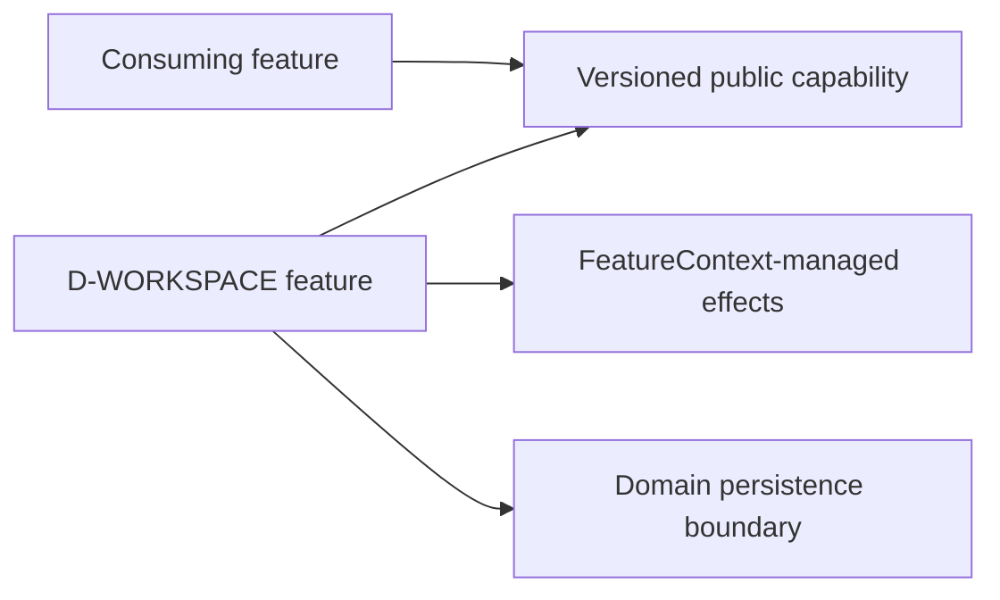

# Workspace

> **Package:** `app/services/workspace/`
> **Status:** `Missing`
> **Last updated:** `2026-09-18`
> **Domain ID:** `D-WORKSPACE`

This README is the domain's single source of truth for its boundary, feature and FR registry,
domain-local workflows, semantic contract ownership, persisted-state model, acceptance evidence,
and deletion behavior. Reference-product evidence is a requirement source, never implementation
evidence.

`PROJECT.md` owns system scope and cross-domain behavior. `ARCHITECTURE.md` owns universal
structure and runtime constraints. `AGENTS.md` owns contributor workflow. The
[Feature Implementation Pipeline](../../../docs/dev/feature_implementation_pipeline.md) owns the
complete single-file feature delivery checklist.

## Code-aligned implementation convention

Backend features use the simplified modular-monolith layout:

```text
app/services/workspace/
|-- README.md
|-- __init__.py
|-- settings.py
|-- jobs.py
|-- scheduler.py
|-- notifications.py
`-- diagnostics.py

app/contracts/workspace.py
app/services/persistence/workspace.py
tests/services/workspace/<feature>/
tests/examples/01_workspace.py
```

Each feature module is one cohesive physical removal unit. It contains typed configuration,
service behavior, lifecycle wiring, immutable `SPEC`, and a zero-argument factory. Registration
is explicit in `app/registry.py`; import-time discovery and ambient singletons are forbidden.
Cross-boundary DTOs, protocols, events, errors, and capability keys live in
`app/contracts/workspace.py`. Features resolve dependencies through `FeatureContext` and
never import sibling implementations.

All schema, parameterized SQL, and transactions for this domain live in
`app/services/persistence/workspace.py`. A feature may be stateless, but it never accepts an
unrestricted database connection. Every completed feature contributes a deterministic, offline,
secret-safe example to `tests/examples/01_workspace.py`.

---

## 1. Purpose and boundary

### Purpose

Own application settings, durable job lifecycle, scheduling, recovery, logs, notifications, and operational diagnostics.

### Owns

- Typed settings with scope, provenance, and migration.
- Durable job/attempt state, progress, pause/resume/cancel, and restart recovery.
- Bounded scheduling, worker supervision, logs, health, and notification dispatch.

### Does not own

- Research task meaning or quantitative algorithms.
- Gateway transport or broker/provider behavior.

### Shared contracts

The public boundary is `app/contracts/workspace.py`. Counterparty status never authorizes a
private implementation import.

| Status | Capability or event | Protocol / DTO symbol | Version | Purpose |
| --- | --- | --- | --- | --- |
| Missing | `workspace.settings@1` | `SettingsService` | `1` | Scoped settings and snapshots |
| Missing | `workspace.jobs@1` | `JobService` | `1` | Durable job and attempt lifecycle |
| Missing | `workspace.scheduler@1` | `SchedulerService` | `1` | Bounded dispatch and worker supervision |
| Missing | `workspace.notifications@1` | `NotificationService` | `1` | Best-effort user notifications |
| Missing | `workspace.diagnostics@1` | `DiagnosticsService` | `1` | Health, version, and redacted logs |

### Persisted-state ownership

Semantic state remains feature-owned although database mechanics are centralized.

| Status | Namespace | Owning feature | Driver | Retention | Public read boundary |
| --- | --- | --- | --- | --- | --- |
| Missing | `workspace.v1` | `FEAT-WORKSPACE-SETTINGS` and registry peers | `sqlite` | Retain versioned records until explicit policy permits purge | `workspace.settings@1` |

---

## 2. Feature registry and dependency direction

| Feature | Delivered value | Owner module | Provides | Required capabilities | Status |
| --- | --- | --- | --- | --- | --- |
| `FEAT-WORKSPACE-SETTINGS` | Scoped settings and snapshots | `app/services/workspace/settings.py` | `workspace.settings@1` | None | Missing |
| `FEAT-WORKSPACE-JOBS` | Durable job and attempt lifecycle | `app/services/workspace/jobs.py` | `workspace.jobs@1` | `persistence.workspace@1` | Missing |
| `FEAT-WORKSPACE-SCHEDULER` | Bounded dispatch and worker supervision | `app/services/workspace/scheduler.py` | `workspace.scheduler@1` | `workspace.jobs@1` | Missing |
| `FEAT-WORKSPACE-NOTIFICATIONS` | Best-effort user notifications | `app/services/workspace/notifications.py` | `workspace.notifications@1` | None | Missing |
| `FEAT-WORKSPACE-DIAGNOSTICS` | Health, version, and redacted logs | `app/services/workspace/diagnostics.py` | `workspace.diagnostics@1` | None | Missing |

Dependencies point to public contracts, never implementation modules:



Removing one module and registry entry withdraws only its capability. Required consumers become
attributed `BLOCKED`; operation-gated consumers refuse only the affected operation. Retained
state is never purged implicitly.

---

## 3. Domain workflows

### `WF-WORKSPACE-JOB` — Submit, control, and recover a job

- **Lead owner:** `FEAT-WORKSPACE-JOBS`
- **Participants:** Scheduler and Persistence capabilities; a domain worker selected by resource class.
- **Input boundary:** Validated immutable work envelope, limits, priority, code/config hash, and optional seed.
- **Output boundary:** Job/attempt receipt, ordered progress, truthful terminal result, and artifact references.
- **Failure boundary:** Invalid transitions conflict; worker loss becomes interrupted; partial output is staged, never successful.
- **Acceptance:** `ATW-WORKSPACE-JOB-001`

---

## 4. Feature specifications

The following contract applies to every registered feature; domain-specific semantics are in
Section 9.

### `settings.py` — `FEAT-WORKSPACE-SETTINGS`

> **Feature ID:** `FEAT-WORKSPACE-SETTINGS` (representative registry entry)
> **Status:** `Missing`
> **Owner module:** `app/services/workspace/settings.py`

#### Purpose

Provide scoped settings and snapshots. Other registry entries follow the same lifecycle and
evidence obligations without merging their responsibilities into this module.

#### Capability declarations

- **Provides:** `workspace.settings@1`
- **Requires:** None
- **Optional / operation-gated:** only capabilities explicitly declared by the feature; absence
  returns a typed unavailable result and does not silently substitute behavior.

#### Configuration and limits

Each owner module defines a slotted immutable `<Feature>Config`. No reference sample value is
promoted to a default without product approval.

| Status | Setting | Type / unit | Default | Validation and failure |
| --- | --- | --- | --- | --- |
| Missing | `schema_version` | positive integer | `1` | Reject unknown/incompatible versions |
| Missing | `operation_timeout_s` | finite seconds | operation-specific | Must be positive and bounded |
| Missing | `resource_limit` | positive integer | deployment-specific | Reject nonpositive/unbounded values |

#### Runtime effects and cleanup

| Effect | Acquisition | Cleanup / failure behavior |
| --- | --- | --- |
| Capability publication | `FeatureContext.provide(...)` | Withdrawn with feature scope |
| Tasks/subscriptions/resources | Managed `FeatureContext` API | Cancel/close in reverse order; failed start unwinds all effects |
| Durable mutation | Focused persistence protocol | Transaction rollback; partial output remains unpublished |

#### Persistent state

- **Domain persistence module:** `app/services/persistence/workspace.py`
- **Namespace:** `workspace.v1`
- **Schema version:** `1` initially; forward migrations only
- **Retention and purge:** retain lineage-bearing records; purge only by explicit, reference-safe policy

#### Single-file structure and symbols

| Status | Owner | Responsibility | Symbols |
| --- | --- | --- | --- |
| Missing | `settings.py` | Scoped settings and snapshots; config, service, lifecycle, `SPEC`, factory | `SettingsService` |
| Missing | `jobs.py` | Durable job and attempt lifecycle; config, service, lifecycle, `SPEC`, factory | `JobService` |
| Missing | `scheduler.py` | Bounded dispatch and worker supervision; config, service, lifecycle, `SPEC`, factory | `SchedulerService` |
| Missing | `notifications.py` | Best-effort user notifications; config, service, lifecycle, `SPEC`, factory | `NotificationService` |
| Missing | `diagnostics.py` | Health, version, and redacted logs; config, service, lifecycle, `SPEC`, factory | `DiagnosticsService` |
| Missing | `tests/examples/01_workspace.py` | Offline primary-purpose evidence | one `example_<NN>_<feature_slug>()` per completed feature |

#### Functional requirements

| Status | Requirement ID | Observable behavior | Evidence |
| --- | --- | --- | --- |
| Missing | `FR-WORKSPACE-001` | State machine is queued/running/pausing/paused/cancelling/cancelled/succeeded/failed/interrupted with compare-and-swap transitions. | Exhaustive transition test |
| Missing | `FR-WORKSPACE-002` | Pause/cancel are cooperative and bounded; resume uses a validated checkpoint or a new attempt. | Worker fault fixture |
| Missing | `FR-WORKSPACE-003` | Restart marks orphan attempts interrupted and never fabricates completion. | Coordinator restart test |
| Missing | `FR-WORKSPACE-004` | Notification failure cannot change job outcome and all messages are secret-safe. | Failure/redaction tests |

#### Removal behavior

Physical removal withdraws the feature's capability and cancels its managed effects. Stored
artifacts remain readable by schema-aware tooling; operations requiring the missing capability
return an attributed unavailable result. Reinstall may resume only after schema and version checks.

---

## 5. Domain-wide requirements and invariants

| Status | Requirement ID | Rule | Verification |
| --- | --- | --- | --- |
| Missing | `ARCH-001` | `__init__.py` is docstring-only. | `scripts/architecture_check.py` |
| Missing | `ARCH-002` | Tasks and resources are managed through `FeatureContext`. | Lifecycle tests |
| Missing | `ARCH-003` | Logging uses `app.kernel.logging`; no service configures handlers. | Architecture/logging tests |
| Missing | `ARCH-004` | Public contracts live in `app/contracts/workspace.py`. | Import/contract checks |
| Missing | `ARCH-005` | Feature modules never import sibling implementations. | Import checks |
| Missing | `ARCH-006` | SQL/schema operations live in `app/services/persistence/workspace.py`. | Architecture/schema checks |

---

## 6. Decisions and open evidence

| Status | Decision ID | Decision or missing evidence | Scope | Required closure |
| --- | --- | --- | --- | --- |
| Accepted | `DEC-WORKSPACE-001` | Initial coordination uses bounded in-memory queues plus process IPC and a SQLite job ledger. | All jobs | Owner-ratified E-T01 |
| Open | `DEC-WORKSPACE-002` | Exact reference pause checkpoint granularity is unverified. | Parity profile | Controlled long-task observation |

Evidence IDs resolve through `docs/PROJECT.md`. Unknowns remain explicit; a filename, bundled
sample value, or third-party function name is not proof of runtime semantics.

---

## 7. Tests and definition of done

```text
tests/services/workspace/<feature>/
|-- test_config.py
|-- test_<feature>.py
|-- test_lifecycle.py
|-- test_removal.py
`-- test_persistence.py       # when applicable

tests/examples/01_workspace.py
```

Editing uses explicit affected paths with `--no-cov`; the full candidate gate remains
`uv run python scripts/ci_check.py`.

- [ ] Stable feature and requirement IDs have one owner.
- [ ] Public contracts and exact `FeatureSpec` dependencies exist.
- [ ] Registration is explicit; imports have no runtime effects.
- [ ] Happy, invalid, boundary, unavailable, lifecycle, persistence, and removal tests pass.
- [ ] Numerical or stateful behavior has deterministic golden/fault fixtures.
- [ ] One offline usage example exists per completed feature.
- [ ] Domain status reflects repository evidence, not reference-product evidence.
- [ ] Architecture and full qualification gates pass.

---

## 8. Change process

1. Update this README and identify the exact feature/requirement scope.
2. Update `app/contracts/workspace.py` first when the public boundary changes.
3. Implement one cohesive owner module and immutable `SPEC`.
4. Change `app/services/persistence/workspace.py` only for database mechanics.
5. Update explicit registry, consolidated examples, and focused tests.
6. Verify feature removal and affected consumers.
7. Run the repository-prescribed candidate gate and record actual results.

---

## 9. Normative domain specification

A job freezes operation, validated input identities, owner, priority, resource class, configuration/code versions, and seed. Attempts carry worker identity, progress sequence, heartbeat, checkpoint, and terminal reason. Every transition appends one audit event. Scheduler fairness and concurrency are explicit settings. Settings resolve run > project > workspace > application with provenance; secrets are references, never values. Evidence: official program/task-manager surfaces and exact-version task plugins/XML (E-O01, E-O08, E-L01, E-L03). Bundled task values are examples, not defaults.
