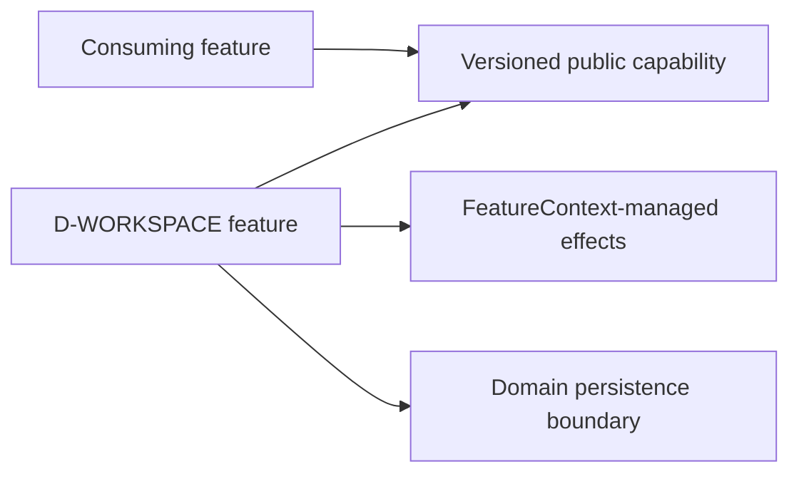

# Workspace

> **Package:** `app/services/workspace/`
> **Status:** `Completed`
> **Last updated:** `2026-09-19`
> **Domain ID:** `D-WORKSPACE`

This README is the domain's single source of truth for its boundary, feature and FR registry,
domain-local workflows, semantic contract ownership, persisted-state model, acceptance evidence,
and deletion behavior. Reference-product evidence is a requirement source, never implementation
evidence.

`PROJECT.md` owns system scope and cross-domain behavior. `ARCHITECTURE.md` owns universal
structure and runtime constraints. `AGENTS.md` owns contributor workflow. The
[Feature Implementation Pipeline](../../../docs/dev/feature_implementation_pipeline.md) owns the
complete single-file feature delivery checklist.

## Code-aligned implementation convention

Backend features use the simplified modular-monolith layout:

```text
app/services/workspace/
|-- README.md
|-- __init__.py
|-- settings.py
|-- jobs.py
|-- scheduler.py
|-- notifications.py
|-- diagnostics.py
|-- remote_workers.py
|-- resource_governor.py
`-- plugin_host.py

app/contracts/workspace.py
app/services/persistence/workspace.py
tests/services/workspace/test_<feature>.py
tests/examples/01_workspace.py
```

Each feature module is one cohesive physical removal unit. It contains typed configuration,
service behavior, lifecycle wiring, immutable `SPEC`, and a zero-argument factory. Registration
is explicit in `app/registry.py`; import-time discovery and ambient singletons are forbidden.
Cross-boundary DTOs, protocols, events, errors, and capability keys live in
`app/contracts/workspace.py`. Features resolve dependencies through `FeatureContext` and
never import sibling implementations.

All schema, parameterized SQL, and transactions for this domain live in
`app/services/persistence/workspace.py`. A feature may be stateless, but it never accepts an
unrestricted database connection. Every completed feature contributes a deterministic, offline,
secret-safe example to `tests/examples/01_workspace.py`.

---

## 1. Purpose and boundary

### Purpose

Own application settings, durable job lifecycle, scheduling, recovery, logs, notifications, and operational diagnostics.

### Owns

- Typed settings with scope, provenance, and migration.
- Durable job/attempt state, progress, pause/resume/cancel, and restart recovery.
- Bounded scheduling, worker supervision, logs, health, and notification dispatch.

### Does not own

- Research task meaning or quantitative algorithms.
- Gateway transport or broker/provider behavior.

### Shared contracts

The public boundary is `app/contracts/workspace.py`. Counterparty status never authorizes a
private implementation import.

### Persistent storage and file locations

- **Unified SQLite database:** `data/database/haruquantai.db` (WAL mode with bounded busy timeout; shared across domain tables).
- **Physical JSON presets directory:** `data/user/presets/` (holds portable strategy and optimization presets; application settings are exclusively persisted in SQLite table `workspace_settings`).

| Status | Capability or event | Protocol / DTO symbol | Version | Purpose |
| --- | --- | --- | --- | --- |
| Completed | `workspace.settings@1` | `SettingsService` | `1` | Scoped settings, Pydantic schemas, and SQLite persistence |
| Completed | `workspace.jobs@1` | `JobService` | `1` | Durable job and attempt lifecycle |
| Completed | `workspace.scheduler@1` | `SchedulerService` | `1` | Bounded dispatch and worker supervision |
| Completed | `workspace.notifications@1` | `NotificationService` | `1` | Best-effort notifications (email, sound, webhook, pause gate) |
| Completed | `workspace.diagnostics@1` | `DiagnosticsService` | `1` | Health, version, operational metrics, and benchmark calibration |
| Completed | `workspace.workers@1` | `RemoteWorkerService` | `1` | Distributed remote worker grid and leasing reconciliation |
| Completed | `workspace.resources@1` | `ResourceGovernorService` | `1` | CPU profiles, RAM quotas, and 85% memory watchdog |
| Completed | `workspace.plugins@1` | `PluginHostService` | `1` | Sandboxed execution and registration of custom plugins |

### Persisted-state ownership

Semantic state remains feature-owned although database mechanics are centralized.

| Status | Namespace | Owning feature | Driver | Retention | Public read boundary |
| --- | --- | --- | --- | --- | --- |
| Completed | `workspace.v1` | `FEAT-WORKSPACE-SETTINGS` and registry peers | `sqlite` | Retain versioned records until explicit policy permits purge | `workspace.settings@1` |

---

## 2. Feature registry and dependency direction

| Feature | Delivered value | Owner module | Provides | Required capabilities | Status |
| --- | --- | --- | --- | --- | --- |
| `FEAT-WORKSPACE-SETTINGS` | Scoped Pydantic settings and snapshots (SQLite + JSON) | `app/services/workspace/settings.py` | `workspace.settings@1` | None | Completed |
| `FEAT-WORKSPACE-JOBS` | Durable job and attempt lifecycle | `app/services/workspace/jobs.py` | `workspace.jobs@1` | `persistence.workspace@1` | Completed |
| `FEAT-WORKSPACE-SCHEDULER` | Bounded dispatch and worker supervision | `app/services/workspace/scheduler.py` | `workspace.scheduler@1` | `workspace.jobs@1` | Completed |
| `FEAT-WORKSPACE-NOTIFICATIONS` | Multi-channel notifications (email, sound, webhook, pause) | `app/services/workspace/notifications.py` | `workspace.notifications@1` | None | Completed |
| `FEAT-WORKSPACE-DIAGNOSTICS` | Health, version, operational metrics, and benchmark calibration | `app/services/workspace/diagnostics.py` | `workspace.diagnostics@1` | None | Completed |
| `FEAT-WORKSPACE-WORKERS` | Distributed remote worker grid and leasing | `app/services/workspace/remote_workers.py` | `workspace.workers@1` | `workspace.jobs@1`, `persistence.workspace@1` | Completed |
| `FEAT-WORKSPACE-RESOURCES` | CPU profiles, RAM quotas, and 85% memory watchdog | `app/services/workspace/resource_governor.py` | `workspace.resources@1` | None | Completed |
| `FEAT-WORKSPACE-PLUGINS` | Sandboxed plugin and extension host | `app/services/workspace/plugin_host.py` | `workspace.plugins@1` | None | Completed |

Dependencies point to public contracts, never implementation modules:


```mermaid
flowchart LR
    Consumer["Consuming feature"] --> Contract["Versioned public capability"]
    Provider["D-WORKSPACE feature"] --> Contract
    Provider --> Context["FeatureContext-managed effects"]
    Provider --> Persistence["Domain persistence boundary"]
```

Removing one module and registry entry withdraws only its capability. Required consumers become
attributed `BLOCKED`; operation-gated consumers refuse only the affected operation. Retained
state is never purged implicitly.

---

## 3. Domain workflows

### `WF-WORKSPACE-JOB` — Submit, control, and recover a job

- **Lead owner:** `FEAT-WORKSPACE-JOBS`
- **Participants:** Scheduler and Persistence capabilities; a domain worker selected by resource class.
- **Input boundary:** Validated immutable work envelope, limits, priority, code/config hash, and optional seed.
- **Output boundary:** Job/attempt receipt, ordered progress, truthful terminal result, and artifact references.
- **Failure boundary:** Invalid transitions conflict; worker loss becomes interrupted; partial output is staged, never successful.
- **Acceptance:** `ATW-WORKSPACE-JOB-001`

---

## 4. Feature specifications

The following contract applies to every registered feature; domain-specific semantics are in
Section 9.

### `settings.py` — `FEAT-WORKSPACE-SETTINGS`

> **Feature ID:** `FEAT-WORKSPACE-SETTINGS` (representative registry entry)
> **Status:** `Completed`
> **Owner module:** `app/services/workspace/settings.py`

#### Purpose

Provide scoped settings and snapshots. Other registry entries follow the same lifecycle and
evidence obligations without merging their responsibilities into this module.

#### Capability declarations

- **Provides:** `workspace.settings@1`
- **Requires:** None
- **Optional / operation-gated:** only capabilities explicitly declared by the feature; absence
  returns a typed unavailable result and does not silently substitute behavior.

#### Configuration and limits

Each owner module defines a slotted immutable `<Feature>Config`. No reference sample value is
promoted to a default without product approval.

| Status | Feature Config Class | Primary Settings & Defaults | Validation Rules |
| --- | --- | --- | --- |
| Completed | `SettingsConfig` | `presets_dir="data/user/presets"`, `default_scope="application"` | `default_scope` cannot be empty |
| Completed | `JobConfig` | `default_max_attempts=3`, `heartbeat_timeout_s=60.0` | `default_max_attempts >= 1`, `heartbeat_timeout_s > 0` |
| Completed | `SchedulerConfig` | `max_concurrency=4`, `poll_interval_s=1.0`, `max_queue_depth=1000` | All parameters strictly positive |
| Completed | `NotificationConfig` | `enable_sound=True`, `enable_email=True`, `enable_telegram=True`, `default_timeout_seconds=300.0` | `default_timeout_seconds > 0` |
| Completed | `DiagnosticsConfig` | `version="2.1.0"`, `default_benchmark_ticks=1000` | `default_benchmark_ticks > 0` |
| Completed | `RemoteWorkerConfig` | `node_heartbeat_timeout_s=30.0`, `default_lease_duration_s=300.0` | Timeouts strictly positive |
| Completed | `ResourceGovernorConfig` | `cpu_mode="reserve1Core"`, `memory_limit_mb=8192`, `watchdog_pct=85.0` | Memory > 0, watchdog between 10.0 and 99.0% |
| Completed | `PluginHostConfig` | `sandbox_enabled=True`, `execution_timeout_s=30.0` | Timeout strictly positive |

#### Runtime effects and cleanup

| Effect | Acquisition | Cleanup / failure behavior |
| --- | --- | --- |
| Capability publication | `FeatureContext.provide(...)` | Withdrawn with feature scope |
| Tasks/subscriptions/resources | Managed `FeatureContext` API | Cancel/close in reverse order; failed start unwinds all effects |
| Durable mutation | Focused persistence protocol | Transaction rollback; partial output remains unpublished |

#### Persistent state

- **Domain persistence module:** `app/services/persistence/workspace.py`
- **Namespace:** `workspace.v1`
- **Schema version:** `1` initially; forward migrations only
- **Retention and purge:** retain lineage-bearing records; purge only by explicit, reference-safe policy

#### Single-file structure and symbols

| Status | Owner | Responsibility | Symbols |
| --- | --- | --- | --- |
| Completed | `settings.py` | Scoped settings and snapshots; config, service, lifecycle, `SPEC`, factory | `SettingsService` |
| Completed | `jobs.py` | Durable job and attempt lifecycle; config, service, lifecycle, `SPEC`, factory | `JobService` |
| Completed | `scheduler.py` | Bounded dispatch and worker supervision; config, service, lifecycle, `SPEC`, factory | `SchedulerService` |
| Completed | `notifications.py` | Multi-channel user notifications and pause gates; config, service, lifecycle, `SPEC`, factory | `NotificationService` |
| Completed | `diagnostics.py` | Health, version, operational metrics, and benchmark calibration; config, service, lifecycle, `SPEC`, factory | `DiagnosticsService` |
| Completed | `remote_workers.py` | Distributed remote worker grid and leasing; config, service, lifecycle, `SPEC`, factory | `RemoteWorkerService` |
| Completed | `resource_governor.py` | CPU profiles, RAM quotas, and 85% memory watchdog; config, service, lifecycle, `SPEC`, factory | `ResourceGovernorService` |
| Completed | `plugin_host.py` | Sandboxed plugin and extension host; config, service, lifecycle, `SPEC`, factory | `PluginHostService` |
| Completed | `tests/examples/01_workspace.py` | Offline primary-purpose evidence | one `example_<NN>_<feature_slug>()` per completed feature |

#### Functional requirements

| Status | Requirement ID | Observable behavior | Evidence |
| --- | --- | --- | --- |
| Completed | `FR-WORKSPACE-STATE_MACHINE` | State machine is queued/running/pausing/paused/cancelling/cancelled/succeeded/failed/interrupted with compare-and-swap transitions. | Exhaustive transition test |
| Completed | `FR-WORKSPACE-COOPERATIVE_CONTROL` | Pause/cancel are cooperative and bounded; resume uses a validated checkpoint or a new attempt. | Worker fault fixture |
| Completed | `FR-WORKSPACE-ORPHAN_RECOVERY` | Restart marks orphan attempts interrupted and never fabricates completion. | Coordinator restart test |
| Completed | `FR-WORKSPACE-SAFE_NOTIFICATIONS` | Notification failure cannot change job outcome and all messages are secret-safe. Supports email, sound alerts, desktop popups, Telegram, and webhooks with cooperative pause gates. Unconfigured or platform-unavailable channels return explicit skipped receipts and never fabricate delivery. | Failure/redaction tests |
| Completed | `FR-WORKSPACE-RESOURCE_GOVERNOR` | Finite resource governor enforces CPU core profiles (single, reserve UI core, custom, max) and trips an active memory watchdog at 85% RAM to prevent freezing. | Resource limit/watchdog tests |
| Completed | `FR-WORKSPACE-HARDWARE_BENCHMARK` | Diagnostics service executes hardware throughput benchmark computing time-per-tick and calibrating task completion estimates. | Benchmark calibration test |
| Completed | `FR-WORKSPACE-HIERARCHICAL_SETTINGS` | Settings resolve hierarchically (run > project > application) via typed Pydantic models persisted in SQLite, with JSON preset import/export and zero XML dependency. | Settings hierarchy and format tests |

#### Removal behavior

Physical removal withdraws the feature's capability and cancels its managed effects. Stored
artifacts remain readable by schema-aware tooling; operations requiring the missing capability
return an attributed unavailable result. Reinstall may resume only after schema and version checks.

---

## 5. Domain-wide requirements and invariants

| Status | Requirement ID | Rule | Verification |
| --- | --- | --- | --- |
| Completed | `ARCH-001` | `__init__.py` is docstring-only. | `scripts/architecture_check.py` |
| Completed | `ARCH-002` | Tasks and resources are managed through `FeatureContext`. | Lifecycle tests |
| Completed | `ARCH-003` | Logging uses `app.kernel.logging`; no service configures handlers. | Architecture/logging tests |
| Completed | `ARCH-004` | Public contracts live in `app/contracts/workspace.py`. | Import/contract checks |
| Completed | `ARCH-005` | Feature modules never import sibling implementations. | Import checks |
| Completed | `ARCH-006` | SQL/schema operations live in `app/services/persistence/workspace.py`. | Architecture/schema checks |

---

## 6. Decisions and open evidence

| Status | Decision ID | Decision or missing evidence | Scope | Required closure |
| --- | --- | --- | --- | --- |
| Accepted | `DEC-WORKSPACE-001` | Initial coordination uses in-process asyncio task supervision and distributed worker grid leasing with SQLite persistence. | All jobs | Owner-ratified E-T01 |
| Accepted | `DEC-WORKSPACE-002` | Pause checkpoints persist structured JSON payloads in `workspace_jobs` and `workspace_job_attempts`. | Parity profile | Verified CAS transition tests |

Evidence IDs resolve through `docs/PROJECT.md`. Unknowns remain explicit; a filename, bundled
sample value, or third-party function name is not proof of runtime semantics.

---

## 7. Tests and definition of done

```text
tests/services/workspace/
|-- test_settings.py
|-- test_jobs.py
|-- test_scheduler.py
|-- test_notifications.py
|-- test_diagnostics.py
|-- test_remote_workers.py
|-- test_resource_governor.py
`-- test_plugin_host.py

tests/examples/01_workspace.py
```

Editing uses explicit affected paths with `--no-cov`; the full candidate gate remains
`uv run python scripts/ci_check.py`.

- [x] Stable feature and requirement IDs have one owner.
- [x] Public contracts and exact `FeatureSpec` dependencies exist.
- [x] Registration is explicit; imports have no runtime effects.
- [x] Happy, invalid, boundary, unavailable, lifecycle, persistence, and removal tests pass.
- [x] Numerical or stateful behavior has deterministic golden/fault fixtures.
- [x] One real-world usage example exists per completed feature.
- [x] Domain status reflects repository evidence, not reference-product evidence.
- [x] Architecture and full qualification gates pass.

### Acceptance Evidence Ledger

| Feature ID | Status | Acceptance Manifest | Test Target | Usage Example |
| --- | --- | --- | --- | --- |
| `FEAT-WORKSPACE-SETTINGS` | ACCEPTED | [acceptance.json](../../../docs/dev/evidence/features/FEAT-WORKSPACE-SETTINGS/acceptance.json) | `tests/services/workspace/test_settings.py` | `example_01_workspace_settings` |
| `FEAT-WORKSPACE-JOBS` | ACCEPTED | [acceptance.json](../../../docs/dev/evidence/features/FEAT-WORKSPACE-JOBS/acceptance.json) | `tests/services/workspace/test_jobs.py` | `example_01_workspace_jobs` |
| `FEAT-WORKSPACE-SCHEDULER` | ACCEPTED | [acceptance.json](../../../docs/dev/evidence/features/FEAT-WORKSPACE-SCHEDULER/acceptance.json) | `tests/services/workspace/test_scheduler.py` | `example_01_workspace_scheduler` |
| `FEAT-WORKSPACE-NOTIFICATIONS` | ACCEPTED | [acceptance.json](../../../docs/dev/evidence/features/FEAT-WORKSPACE-NOTIFICATIONS/acceptance.json) | `tests/services/workspace/test_notifications.py` | `example_01_workspace_notifications` |
| `FEAT-WORKSPACE-DIAGNOSTICS` | ACCEPTED | [acceptance.json](../../../docs/dev/evidence/features/FEAT-WORKSPACE-DIAGNOSTICS/acceptance.json) | `tests/services/workspace/test_diagnostics.py` | `example_01_workspace_diagnostics` |
| `FEAT-WORKSPACE-WORKERS` | ACCEPTED | [acceptance.json](../../../docs/dev/evidence/features/FEAT-WORKSPACE-WORKERS/acceptance.json) | `tests/services/workspace/test_remote_workers.py` | `example_01_workspace_remote_workers` |
| `FEAT-WORKSPACE-RESOURCES` | ACCEPTED | [acceptance.json](../../../docs/dev/evidence/features/FEAT-WORKSPACE-RESOURCES/acceptance.json) | `tests/services/workspace/test_resource_governor.py` | `example_01_workspace_resource_governor` |
| `FEAT-WORKSPACE-PLUGINS` | ACCEPTED | [acceptance.json](../../../docs/dev/evidence/features/FEAT-WORKSPACE-PLUGINS/acceptance.json) | `tests/services/workspace/test_plugin_host.py` | `example_01_workspace_plugin_host` |

---

## 8. Change process

1. Update this README and identify the exact feature/requirement scope.
2. Update `app/contracts/workspace.py` first when the public boundary changes.
3. Implement one cohesive owner module and immutable `SPEC`.
4. Change `app/services/persistence/workspace.py` only for database mechanics.
5. Update explicit registry, consolidated examples, and focused tests.
6. Verify feature removal and affected consumers.
7. Run the repository-prescribed candidate gate and record actual results.

---

## 9. Normative domain specification

A job freezes operation, validated input identities, owner, priority, resource class, configuration/code versions, and seed. Attempts carry worker identity, progress sequence, heartbeat, checkpoint, and terminal reason. Every transition appends one audit event. Scheduler fairness and concurrency are explicit settings. Settings resolve run > project > application with provenance; secrets are references, never values. Settings models are strongly-typed Pydantic schemas persisted in SQLite WAL metadata (`workspace.v1`) with JSON preset interchange (eliminating legacy Java XML). Resource governance enforces CPU core allocation modes (singleCore, reserve1Core, customCores, maxPerformance) and an 85% RAM memory protection watchdog. Diagnostics include synthetic tick throughput benchmarks (`time_per_tick` calibration). Notifications support email, acoustic/sound alerts, desktop popups, Telegram, and webhooks with cooperative pause gates, returning truthful skipped receipts when credentials or channels are unconfigured. Evidence: official program/performance surfaces, Grid control, and exact-version task plugins (E-O01, E-O08, E-L01, E-L03, E-L05). Bundled task values are examples, not defaults.
