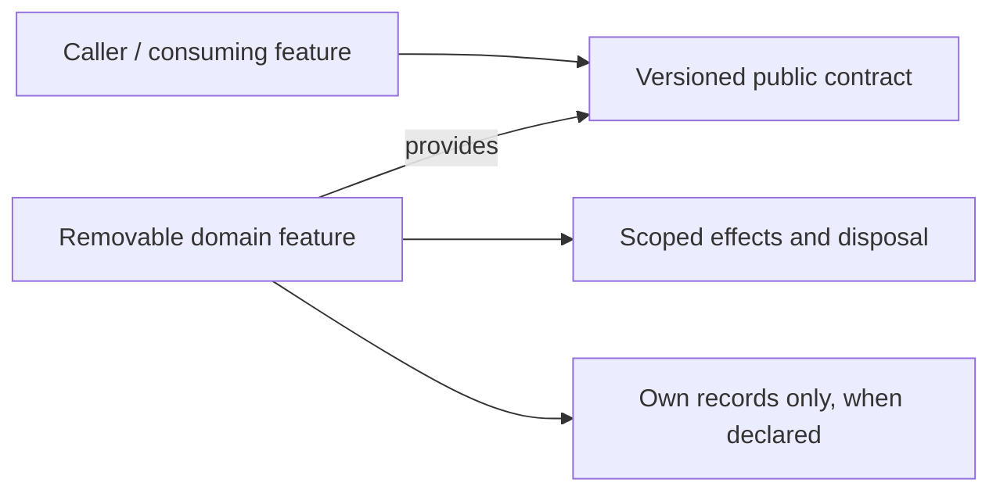

# Ui

> **Package:** `app/ui/`
> **Status:** `Partial` — documentary target; runtime acceptance is **NOT_REVALIDATED**.
> **Last updated:** `2026-09-06`
> **Domain ID:** `D-UI`

> This README is the domain target registry for boundaries, composable feature capabilities, requirements, ownership, workflows, acceptance, and removal. Update it before changing the affected implementation. It does not certify that a target package, contract, test, usage demonstration or provider is already implemented.

**Selected scope:** 38 features · 89 owned functional requirements · 64 feature-local non-functional requirements. All original feature and requirement IDs are retained. These selected workbench obligations do **not** delete unrelated existing domain behavior. This document must be merged with current evidence and any out-of-scope entries before replacing an existing domain registry.

**Sources:** [Unified Specification](../../docs/dev/evidence/specification-drift.md) · [Feature–Requirement Traceability Register](../../docs/dev/Feature_Requirement_Traceability_Register.md) · [Phased Feature Implementation Plan](../../docs/dev/Phased_Feature_Implementation_Plan.md) · [README template](../../docs/templates/README.md). Source fingerprints and Phase 0 bindings are recorded in §6 and §9. The feature cards below reproduce owned requirements and acceptance oracles; their scoped shared-NFR, catalogue, original-ID and operation-gate tables remain binding through the linked source card.

---

## Code-Aligned Implementation Convention

This domain README defines target behavior; `PROJECT.md` retains system scope, cross-domain policy, system NFRs and release gates, and `ARCHITECTURE.md` retains universal package/runtime constraints. Feature-local READMEs, manifests, contracts, migrations and evidence mirror rather than silently redefine this target. For focused work, load §1, the affected §4 card, applicable §5 and §9 rules, and §7. Follow the [Feature Implementation Pipeline](../../docs/dev/feature_implementation_pipeline.md).

Keep the existing single-page workstation and typed client. A `FEAT-UI-*` is the capability, acceptance and removal owner, not a new Python service. Visual contributions use a typed `manifest.ts`, strict configuration, lifecycle/render adapter, public `index.ts`, focused components and an owning workflow README. Register each contribution once; one feature may contribute multiple widgets. Retain the exact selected paths in §2, including existing nonvisual owners. No Python entry point or Python `__main__` harness is introduced for UI features. Backend wire contracts remain under `app/contracts/ui/` and other public owner contract namespaces; generated TypeScript wire DTOs are not hand-edited. A local `contracts.ts` listed below is a contribution/view boundary, not a competing server schema.

FR and acceptance IDs are trace identities, not runtime registrations. Required-provider keys below reproduce the register’s required graph. Optional providers are operation-gated: they must be declared and tested without making an absent future extension a universal startup dependency. The plan’s P1–P16 execution phases are distinct from specification U0–U13 release milestones; a U label is not proof of readiness or a new feature task.

## 1. Purpose and Boundary

### Purpose

Deliver a single composable research workstation in which independently removable tools expose real backend capabilities. Present accurate owner state and evidence while keeping interaction, layout and rendering separate from business authority.

### Owns

Workspace/docking and lazy contributions; typed clients; per-turn context capture; navigation/access presentation; settings/data workflows; reusable grids and draft review; charts; strategy/research/simulation/result/optimization/portfolio/project tools; code/indicator tools; run monitoring; Chat Bot and Agentic inspection; advanced/neural/packaging/performance views.

### Does not own

Market parsing, authoritative storage, indicator/metric calculations, training or inference truth, research orchestration, permissions, Risk approval and trading execution. A widget’s visibility or display data cannot become business authority.

### Shared Contracts

**Owned by this domain.** Status is an evidence state. Contract modules are selected public boundaries; an unbound symbol/DTO must be reconciled before implementing its production consumer. Do not infer a callable signature from the English title.

| Evidence | Capability | Protocol / DTO / contract target | Major | Purpose |
| --- | --- | --- | --- | --- |
| DOCUMENTARY_BOUND | `ui.workspace-layout@1` | Selected public operation/DTO surface; exact existing symbols are inventoried in the Phase 0 contract-binding projection.<br>[`app/ui/src/widgets/workspaces/contracts.ts`](src/widgets/workspaces/contracts.ts) | 1 | Compose and restore the research workspace |
| DOCUMENTARY_BOUND | `ui.typed-backend@1` | Selected public operation/DTO surface; exact existing symbols are inventoried in the Phase 0 contract-binding projection.<br>[`app/ui/src/clients/contracts.ts`](src/clients/contracts.ts) | 1 | Call the typed backend and resume observation |
| DOCUMENTARY_BOUND | `ui.chat-context@1` | Selected public operation/DTO surface; exact existing symbols are inventoried in the Phase 0 contract-binding projection.<br>[`app/ui/src/context/contracts.ts`](src/context/contracts.ts) | 1 | Capture current authorized widget context |
| DOCUMENTARY_BOUND | `ui.shell-navigation@1` | Selected public operation/DTO surface; exact existing symbols are inventoried in the Phase 0 contract-binding projection.<br>[`app/ui/src/components/layout/contracts.ts`](src/components/layout/contracts.ts) | 1 | Navigate capabilities and explain workspace controls |
| DOCUMENTARY_BOUND | `ui.access-gate@1` | Selected public operation/DTO surface; exact existing symbols are inventoried in the Phase 0 contract-binding projection.<br>[`app/ui/src/app/contracts.ts`](src/app/contracts.ts) | 1 | Present session access and scope changes |
| DOCUMENTARY_BOUND | `ui.system-settings@1` | Selected public operation/DTO surface; exact existing symbols are inventoried in the Phase 0 contract-binding projection.<br>[`app/ui/src/widgets/system-settings/contracts.ts`](src/widgets/system-settings/contracts.ts) | 1 | Review effective settings and safe configuration changes |
| DOCUMENTARY_BOUND | `ui.data-workflow@1` | Selected public operation/DTO surface; exact existing symbols are inventoried in the Phase 0 contract-binding projection.<br>[`app/ui/src/components/workflow/contracts.ts`](src/components/workflow/contracts.ts) | 1 | Operate the Data Manager workspace |
| DOCUMENTARY_BOUND | `ui.collection-grid@1` | Selected public operation/DTO surface; exact existing symbols are inventoried in the Phase 0 contract-binding projection.<br>[`app/ui/src/widgets/collection-grid/contracts.ts`](src/widgets/collection-grid/contracts.ts) | 1 | Navigate large typed collections accessibly |
| DOCUMENTARY_BOUND | `ui.draft-review@1` | Selected public operation/DTO surface; exact existing symbols are inventoried in the Phase 0 contract-binding projection.<br>[`app/ui/src/widgets/draft-review/contracts.ts`](src/widgets/draft-review/contracts.ts) | 1 | Review typed edits and consequential action scope |
| DOCUMENTARY_BOUND | `ui.market-chart@1` | Selected public operation/DTO surface; exact existing symbols are inventoried in the Phase 0 contract-binding projection.<br>[`app/ui/src/widgets/chart/contracts.ts`](src/widgets/chart/contracts.ts) | 1 | Inspect market charts and typed overlays |
| DOCUMENTARY_BOUND | `ui.canonical-backtest@1` | Selected public operation/DTO surface; exact existing symbols are inventoried in the Phase 0 contract-binding projection.<br>[`app/ui/src/widgets/simulator/contracts.ts`](src/widgets/simulator/contracts.ts) | 1 | Configure and observe a canonical backtest |
| DOCUMENTARY_BOUND | `ui.research-workbench@1` | Selected public operation/DTO surface; exact existing symbols are inventoried in the Phase 0 contract-binding projection.<br>[`app/ui/src/widgets/research/contracts.ts`](src/widgets/research/contracts.ts) | 1 | Inspect research campaigns, protocols and evidence |
| DOCUMENTARY_BOUND | `ui.results-workbench@1` | Selected public operation/DTO surface; exact existing symbols are inventoried in the Phase 0 contract-binding projection.<br>[`app/ui/src/widgets/analytics/contracts.ts`](src/widgets/analytics/contracts.ts) | 1 | Compose the result inspection workspace |
| DOCUMENTARY_BOUND | `ui.strategy-editor@1` | Selected public operation/DTO surface; exact existing symbols are inventoried in the Phase 0 contract-binding projection.<br>[`app/ui/src/widgets/strategy-editor/contracts.ts`](src/widgets/strategy-editor/contracts.ts) | 1 | Edit and review a strategy |
| DOCUMENTARY_BOUND | `ui.strategy-search-space@1` | Selected public operation/DTO surface; exact existing symbols are inventoried in the Phase 0 contract-binding projection.<br>[`app/ui/src/widgets/strategy-search-space/contracts.ts`](src/widgets/strategy-search-space/contracts.ts) | 1 | Configure and run strategy generation |
| DOCUMENTARY_BOUND | `ui.research-settings@1` | Selected public operation/DTO surface; exact existing symbols are inventoried in the Phase 0 contract-binding projection.<br>[`app/ui/src/widgets/research-settings/contracts.ts`](src/widgets/research-settings/contracts.ts) | 1 | Retest a fixed strategy population |
| DOCUMENTARY_BOUND | `ui.optimization-settings@1` | Selected public operation/DTO surface; exact existing symbols are inventoried in the Phase 0 contract-binding projection.<br>[`app/ui/src/widgets/optimization-settings/contracts.ts`](src/widgets/optimization-settings/contracts.ts) | 1 | Plan and inspect parameter optimization |
| DOCUMENTARY_BOUND | `ui.databank-grid@1` | Selected public operation/DTO surface; exact existing symbols are inventoried in the Phase 0 contract-binding projection.<br>[`app/ui/src/widgets/databank-grid/contracts.ts`](src/widgets/databank-grid/contracts.ts) | 1 | Organize and act on a databank |
| DOCUMENTARY_BOUND | `ui.result-overview@1` | Selected public operation/DTO surface; exact existing symbols are inventoried in the Phase 0 contract-binding projection.<br>[`app/ui/src/widgets/result-overview/contracts.ts`](src/widgets/result-overview/contracts.ts) | 1 | Read a provenance-rich result summary |
| DOCUMENTARY_BOUND | `ui.trade-list@1` | Selected public operation/DTO surface; exact existing symbols are inventoried in the Phase 0 contract-binding projection.<br>[`app/ui/src/widgets/trade-list/contracts.ts`](src/widgets/trade-list/contracts.ts) | 1 | Inspect and select individual trades |
| DOCUMENTARY_BOUND | `ui.equity-chart@1` | Selected public operation/DTO surface; exact existing symbols are inventoried in the Phase 0 contract-binding projection.<br>[`app/ui/src/widgets/equity-chart/contracts.ts`](src/widgets/equity-chart/contracts.ts) | 1 | Inspect equity, drawdown and benchmark paths |
| DOCUMENTARY_BOUND | `ui.trade-analysis@1` | Selected public operation/DTO surface; exact existing symbols are inventoried in the Phase 0 contract-binding projection.<br>[`app/ui/src/widgets/trade-analysis/contracts.ts`](src/widgets/trade-analysis/contracts.ts) | 1 | Compare trade behavior across dimensions |
| DOCUMENTARY_BOUND | `ui.trades-on-chart@1` | Selected public operation/DTO surface; exact existing symbols are inventoried in the Phase 0 contract-binding projection.<br>[`app/ui/src/widgets/trades-on-chart/contracts.ts`](src/widgets/trades-on-chart/contracts.ts) | 1 | Inspect fills against their actual market context |
| DOCUMENTARY_BOUND | `ui.robustness-results@1` | Selected public operation/DTO surface; exact existing symbols are inventoried in the Phase 0 contract-binding projection.<br>[`app/ui/src/widgets/robustness-results/contracts.ts`](src/widgets/robustness-results/contracts.ts) | 1 | Inspect robustness and scenario evidence |
| DOCUMENTARY_BOUND | `ui.optimization-results@1` | Selected public operation/DTO surface; exact existing symbols are inventoried in the Phase 0 contract-binding projection.<br>[`app/ui/src/widgets/optimization-results/contracts.ts`](src/widgets/optimization-results/contracts.ts) | 1 | Inspect parameter surfaces and walk-forward evidence |
| DOCUMENTARY_BOUND | `ui.portfolio-composer@1` | Selected public operation/DTO surface; exact existing symbols are inventoried in the Phase 0 contract-binding projection.<br>[`app/ui/src/widgets/portfolio-composer/contracts.ts`](src/widgets/portfolio-composer/contracts.ts) | 1 | Compose and compare a portfolio |
| DOCUMENTARY_BOUND | `ui.portfolio-builder@1` | Selected public operation/DTO surface; exact existing symbols are inventoried in the Phase 0 contract-binding projection.<br>[`app/ui/src/widgets/portfolio-builder/contracts.ts`](src/widgets/portfolio-builder/contracts.ts) | 1 | Search a bounded portfolio universe |
| DOCUMENTARY_BOUND | `ui.project-editor@1` | Selected public operation/DTO surface; exact existing symbols are inventoried in the Phase 0 contract-binding projection.<br>[`app/ui/src/widgets/project-editor/contracts.ts`](src/widgets/project-editor/contracts.ts) | 1 | Compose and control a research project |
| DOCUMENTARY_BOUND | `ui.code-editor@1` | Selected public operation/DTO surface; exact existing symbols are inventoried in the Phase 0 contract-binding projection.<br>[`app/ui/src/widgets/code-editor/contracts.ts`](src/widgets/code-editor/contracts.ts) | 1 | Edit scoped code and inspect build evidence |
| DOCUMENTARY_BOUND | `ui.indicator-tester@1` | Selected public operation/DTO surface; exact existing symbols are inventoried in the Phase 0 contract-binding projection.<br>[`app/ui/src/widgets/indicator-tester/contracts.ts`](src/widgets/indicator-tester/contracts.ts) | 1 | Compare indicator providers and previews |
| DOCUMENTARY_BOUND | `ui.run-monitor@1` | Selected public operation/DTO surface; exact existing symbols are inventoried in the Phase 0 contract-binding projection.<br>[`app/ui/src/widgets/run-monitor/contracts.ts`](src/widgets/run-monitor/contracts.ts) | 1 | Inspect and control jobs and workers |
| DOCUMENTARY_BOUND | `ui.debug-console@1` | Selected public operation/DTO surface; exact existing symbols are inventoried in the Phase 0 contract-binding projection.<br>[`app/ui/src/widgets/debug-console/contracts.ts`](src/widgets/debug-console/contracts.ts) | 1 | Inspect bounded redacted diagnostic logs |
| DOCUMENTARY_BOUND | `ui.chat-bot@1` | Selected public operation/DTO surface; exact existing symbols are inventoried in the Phase 0 contract-binding projection.<br>[`app/ui/src/widgets/chat-bot/contracts.ts`](src/widgets/chat-bot/contracts.ts) | 1 | Ask context-aware questions and review specialist output |
| DOCUMENTARY_BOUND | `ui.agentic-run-inspector@1` | Selected public operation/DTO surface; exact existing symbols are inventoried in the Phase 0 contract-binding projection.<br>[`app/ui/src/widgets/agentic-run-inspector/contracts.ts`](src/widgets/agentic-run-inspector/contracts.ts) | 1 | Inspect Agentic evidence and governed work |
| DOCUMENTARY_BOUND | `ui.neural-research@1` | Selected public operation/DTO surface; exact existing symbols are inventoried in the Phase 0 contract-binding projection.<br>[`app/ui/src/widgets/neural-research/contracts.ts`](src/widgets/neural-research/contracts.ts) | 1 | Design, train and validate neural research |
| DOCUMENTARY_BOUND | `ui.strategy-packager@1` | Selected public operation/DTO surface; exact existing symbols are inventoried in the Phase 0 contract-binding projection.<br>[`app/ui/src/widgets/strategy-packager/contracts.ts`](src/widgets/strategy-packager/contracts.ts) | 1 | Review and build strategy distribution packages |
| DOCUMENTARY_BOUND | `ui.advanced-analysis@1` | Selected public operation/DTO surface; exact existing symbols are inventoried in the Phase 0 contract-binding projection.<br>[`app/ui/src/widgets/advanced-analysis/contracts.ts`](src/widgets/advanced-analysis/contracts.ts) | 1 | Explore advanced statistical and profile visualizations |
| DOCUMENTARY_BOUND | `ui.performance-lab@1` | Selected public operation/DTO surface; exact existing symbols are inventoried in the Phase 0 contract-binding projection.<br>[`app/ui/src/widgets/performance-lab/contracts.ts`](src/widgets/performance-lab/contracts.ts) | 1 | Inspect reproducible performance and lifecycle evidence |

**Consumed from other domains — required providers.** Runtime resolution is through the exact key; the provider’s implementation folder is not an import target. Same-domain edges are listed in the owning feature card.

There are no cross-domain required-provider edges in this selected register slice.

**Operation-gated providers.** For each §4 feature, its linked source card’s complete “Operation-gated providers” table defines applicability, exact provider identity and absence behavior. This is scoped incorporation, not permission to treat all 233 register-wide operation edges as optional for every feature. Resolve those provider IDs to their primary capability keys in the corresponding domain README; bind actual operations in the acceptance record. An omitted local duplicate table does not waive a source dependency.

### Persisted State Ownership

Versioned non-authoritative display/layout preferences and bounded transient drafts, selections, viewport/context and subscription state. Store stable resource IDs, never secret values, strategy truth, raw populations or provider instances in layouts.

| Evidence | Owning feature | Partition / ownership class | Driver binding | Retention / read boundary |
| --- | --- | --- | --- | --- |
| PRESENTATION_ONLY | [`FEAT-UI-COMPOSE_WORKSPACE`](#feat-ui-compose-workspace) | Presentation-only state | No new business driver. | No business database or authority. Clear scoped selections and observations on account change/removal. |
| PRESENTATION_ONLY | [`FEAT-UI-TYPED_BACKEND`](#feat-ui-typed-backend) | Presentation-only state | No new business driver. | No business database or authority. Clear scoped selections and observations on account change/removal. |
| PRESENTATION_ONLY | [`FEAT-UI-SESSION_CONTEXT`](#feat-ui-session-context) | Presentation-only state | No new business driver. | No business database or authority. Clear scoped selections and observations on account change/removal. |
| PRESENTATION_ONLY | [`FEAT-UI-WORKSPACE_NAVIGATION`](#feat-ui-workspace-navigation) | Presentation-only state | No new business driver. | No business database or authority. Clear scoped selections and observations on account change/removal. |
| PRESENTATION_ONLY | [`FEAT-UI-SESSION_ACCESS`](#feat-ui-session-access) | Presentation-only state | No new business driver. | No business database or authority. Clear scoped selections and observations on account change/removal. |
| PRESENTATION_ONLY | [`FEAT-UI-SYSTEM_SETTINGS`](#feat-ui-system-settings) | Presentation-only state | No new business driver. | No business database or authority. Clear scoped selections and observations on account change/removal. |
| PRESENTATION_ONLY | [`FEAT-UI-DATA_MANAGER`](#feat-ui-data-manager) | Presentation-only state | No new business driver. | No business database or authority. Clear scoped selections and observations on account change/removal. |
| PRESENTATION_ONLY | [`FEAT-UI-VIEW_COLLECTIONS`](#feat-ui-view-collections) | Presentation-only state | No new business driver. | No business database or authority. Clear scoped selections and observations on account change/removal. |
| PRESENTATION_ONLY | [`FEAT-UI-REVIEW_DRAFTS`](#feat-ui-review-drafts) | Presentation-only state | No new business driver. | No business database or authority. Clear scoped selections and observations on account change/removal. |
| PRESENTATION_ONLY | [`FEAT-UI-MARKET_CHARTS`](#feat-ui-market-charts) | Presentation-only state | No new business driver. | No business database or authority. Clear scoped selections and observations on account change/removal. |
| PRESENTATION_ONLY | [`FEAT-UI-RUN_BACKTEST`](#feat-ui-run-backtest) | Presentation-only state | No new business driver. | No business database or authority. Clear scoped selections and observations on account change/removal. |
| PRESENTATION_ONLY | [`FEAT-UI-EXECUTE_ORDERS`](#feat-ui-execute-orders) | Presentation-only state | No new business driver. | No business database or authority. Clear scoped selections and observations on account change/removal. |
| PRESENTATION_ONLY | [`FEAT-UI-RESEARCH_WORKBENCH`](#feat-ui-research-workbench) | Presentation-only state | No new business driver. | No business database or authority. Clear scoped selections and observations on account change/removal. |
| PRESENTATION_ONLY | [`FEAT-UI-STRATEGY_STUDIO`](#feat-ui-strategy-studio) | Presentation-only state | No new business driver. | No business database or authority. Clear scoped selections and observations on account change/removal. |
| PRESENTATION_ONLY | [`FEAT-UI-STRATEGY_BUILDER`](#feat-ui-strategy-builder) | Presentation-only state | No new business driver. | No business database or authority. Clear scoped selections and observations on account change/removal. |
| PRESENTATION_ONLY | [`FEAT-UI-STRATEGY_RETESTER`](#feat-ui-strategy-retester) | Presentation-only state | No new business driver. | No business database or authority. Clear scoped selections and observations on account change/removal. |
| PRESENTATION_ONLY | [`FEAT-UI-PARAMETER_OPTIMIZER`](#feat-ui-parameter-optimizer) | Presentation-only state | No new business driver. | No business database or authority. Clear scoped selections and observations on account change/removal. |
| PRESENTATION_ONLY | [`FEAT-UI-DATABANK_GRID`](#feat-ui-databank-grid) | Presentation-only state | No new business driver. | No business database or authority. Clear scoped selections and observations on account change/removal. |
| PRESENTATION_ONLY | [`FEAT-UI-RESULT_OVERVIEW`](#feat-ui-result-overview) | Presentation-only state | No new business driver. | No business database or authority. Clear scoped selections and observations on account change/removal. |
| PRESENTATION_ONLY | [`FEAT-UI-TRADE_LIST`](#feat-ui-trade-list) | Presentation-only state | No new business driver. | No business database or authority. Clear scoped selections and observations on account change/removal. |
| PRESENTATION_ONLY | [`FEAT-UI-EQUITY_CHART`](#feat-ui-equity-chart) | Presentation-only state | No new business driver. | No business database or authority. Clear scoped selections and observations on account change/removal. |
| PRESENTATION_ONLY | [`FEAT-UI-TRADE_ANALYSIS`](#feat-ui-trade-analysis) | Presentation-only state | No new business driver. | No business database or authority. Clear scoped selections and observations on account change/removal. |
| PRESENTATION_ONLY | [`FEAT-UI-TRADES_ON_CHART`](#feat-ui-trades-on-chart) | Presentation-only state | No new business driver. | No business database or authority. Clear scoped selections and observations on account change/removal. |
| PRESENTATION_ONLY | [`FEAT-UI-ROBUSTNESS_RESULTS`](#feat-ui-robustness-results) | Presentation-only state | No new business driver. | No business database or authority. Clear scoped selections and observations on account change/removal. |
| PRESENTATION_ONLY | [`FEAT-UI-OPTIMIZATION_RESULTS`](#feat-ui-optimization-results) | Presentation-only state | No new business driver. | No business database or authority. Clear scoped selections and observations on account change/removal. |
| PRESENTATION_ONLY | [`FEAT-UI-PORTFOLIO_COMPOSER`](#feat-ui-portfolio-composer) | Presentation-only state | No new business driver. | No business database or authority. Clear scoped selections and observations on account change/removal. |
| PRESENTATION_ONLY | [`FEAT-UI-PORTFOLIO_BUILDER`](#feat-ui-portfolio-builder) | Presentation-only state | No new business driver. | No business database or authority. Clear scoped selections and observations on account change/removal. |
| PRESENTATION_ONLY | [`FEAT-UI-PROJECT_EDITOR`](#feat-ui-project-editor) | Presentation-only state | No new business driver. | No business database or authority. Clear scoped selections and observations on account change/removal. |
| PRESENTATION_ONLY | [`FEAT-UI-CODE_EDITOR`](#feat-ui-code-editor) | Presentation-only state | No new business driver. | No business database or authority. Clear scoped selections and observations on account change/removal. |
| PRESENTATION_ONLY | [`FEAT-UI-INDICATOR_TESTER`](#feat-ui-indicator-tester) | Presentation-only state | No new business driver. | No business database or authority. Clear scoped selections and observations on account change/removal. |
| PRESENTATION_ONLY | [`FEAT-UI-RUN_MONITOR`](#feat-ui-run-monitor) | Presentation-only state | No new business driver. | No business database or authority. Clear scoped selections and observations on account change/removal. |
| PRESENTATION_ONLY | [`FEAT-UI-DEBUG_CONSOLE`](#feat-ui-debug-console) | Presentation-only state | No new business driver. | No business database or authority. Clear scoped selections and observations on account change/removal. |
| PRESENTATION_ONLY | [`FEAT-UI-CHAT_BOT`](#feat-ui-chat-bot) | Presentation-only state | No new business driver. | No business database or authority. Clear scoped selections and observations on account change/removal. |
| PRESENTATION_ONLY | [`FEAT-UI-AGENTIC_RUN_INSPECTOR`](#feat-ui-agentic-run-inspector) | Presentation-only state | No new business driver. | No business database or authority. Clear scoped selections and observations on account change/removal. |
| PRESENTATION_ONLY | [`FEAT-UI-NEURAL_RESEARCH`](#feat-ui-neural-research) | Presentation-only state | No new business driver. | No business database or authority. Clear scoped selections and observations on account change/removal. |
| PRESENTATION_ONLY | [`FEAT-UI-STRATEGY_PACKAGER`](#feat-ui-strategy-packager) | Presentation-only state | No new business driver. | No business database or authority. Clear scoped selections and observations on account change/removal. |
| PRESENTATION_ONLY | [`FEAT-UI-ADVANCED_ANALYSIS`](#feat-ui-advanced-analysis) | Presentation-only state | No new business driver. | No business database or authority. Clear scoped selections and observations on account change/removal. |
| PRESENTATION_ONLY | [`FEAT-UI-PERFORMANCE_LAB`](#feat-ui-performance-lab) | Presentation-only state | No new business driver. | No business database or authority. Clear scoped selections and observations on account change/removal. |

A feature’s exact durable namespace, schema version and migrations are taken from its reconciled manifest and contract, not guessed from its folder name. External consumers access semantic state only through the owner capability. Workspace persistence/artifact custody never acquires that semantic ownership.

### Four-Level Structural Hierarchy

| Code level | Represents | Domain example |
| --- | --- | --- |
| Package | Domain boundary | `app/ui/` |
| Module folder | Composable feature owner | `app/ui/src/widgets/workspaces/` — [`FEAT-UI-COMPOSE_WORKSPACE`](#feat-ui-compose-workspace) |
| File | Manifest, strict configuration, lifecycle or focused use case | `manifest.ts`, `index.ts`, focused component |
| Class / function / method | One or more traced requirement behaviors | `FR-TRC-UI-COMPOSE_WORKSPACE-001` and its acceptance oracle |

### Domain Capability Map

The table in §2 is the complete domain capability map. Edges below illustrate dependency direction, not a new orchestrator or private import relationship.



## 2. Final Package Structure and Feature Independence

Feature owners are independent and physically removable. The selected package is a target binding: reconcile known current aliases and preserve compatible existing identities before creating a folder. Folder absence does not prove behavior absence. Removing a feature withdraws its contributions; it does not delete another feature’s source or retained evidence.

| Feature | Delivered value | Selected owner package | First U gate | FRs | Local NFRs | Evidence |
| --- | --- | --- | --- | --- | --- | --- |
| [`FEAT-UI-COMPOSE_WORKSPACE`](#feat-ui-compose-workspace) | Compose and restore the research workspace | `app/ui/src/widgets/workspaces/` | U1 | 4 | 1 | NOT_REVALIDATED |
| [`FEAT-UI-TYPED_BACKEND`](#feat-ui-typed-backend) | Call the typed backend and resume observation | `app/ui/src/clients/` | U1 | 2 | 1 | PROVED_COMPLETE |
| [`FEAT-UI-SESSION_CONTEXT`](#feat-ui-session-context) | Capture current authorized widget context | `app/ui/src/context/` | U2 | 3 | 1 | NOT_REVALIDATED |
| [`FEAT-UI-WORKSPACE_NAVIGATION`](#feat-ui-workspace-navigation) | Navigate capabilities and explain workspace controls | `app/ui/src/components/layout/` | U1 | 3 | 1 | NOT_REVALIDATED |
| [`FEAT-UI-SESSION_ACCESS`](#feat-ui-session-access) | Present session access and scope changes | `app/ui/src/app/` | U1 | 2 | 1 | NOT_REVALIDATED |
| [`FEAT-UI-SYSTEM_SETTINGS`](#feat-ui-system-settings) | Review effective settings and safe configuration changes | `app/ui/src/widgets/system-settings/` | U1 | 3 | 1 | NOT_REVALIDATED |
| [`FEAT-UI-DATA_MANAGER`](#feat-ui-data-manager) | Operate the Data Manager workspace | `app/ui/src/components/workflow/` | U1 | 3 | 1 | NOT_REVALIDATED |
| [`FEAT-UI-VIEW_COLLECTIONS`](#feat-ui-view-collections) | Navigate large typed collections accessibly | `app/ui/src/widgets/collection-grid/` | U1 | 3 | 2 | NOT_REVALIDATED |
| [`FEAT-UI-REVIEW_DRAFTS`](#feat-ui-review-drafts) | Review typed edits and consequential action scope | `app/ui/src/widgets/draft-review/` | U1 | 3 | 1 | NOT_REVALIDATED |
| [`FEAT-UI-MARKET_CHARTS`](#feat-ui-market-charts) | Inspect market charts and typed overlays | `app/ui/src/widgets/chart/` | U2 | 3 | 1 | NOT_REVALIDATED |
| [`FEAT-UI-RUN_BACKTEST`](#feat-ui-run-backtest) | Configure and observe a canonical backtest | `app/ui/src/widgets/simulator/` | U2 | 3 | 1 | NOT_REVALIDATED |
| [`FEAT-UI-EXECUTE_ORDERS`](#feat-ui-execute-orders) | Inspect research campaigns, protocols and evidence | `app/ui/src/widgets/research/` | U3 | 3 | 1 | NOT_REVALIDATED |
| [`FEAT-UI-RESEARCH_WORKBENCH`](#feat-ui-research-workbench) | Compose the result inspection workspace | `app/ui/src/widgets/analytics/` | U2 | 3 | 1 | NOT_REVALIDATED |
| [`FEAT-UI-STRATEGY_STUDIO`](#feat-ui-strategy-studio) | Edit and review a strategy | `app/ui/src/widgets/strategy-editor/` | U2 | 2 | 2 | NOT_REVALIDATED |
| [`FEAT-UI-STRATEGY_BUILDER`](#feat-ui-strategy-builder) | Configure and run strategy generation | `app/ui/src/widgets/strategy-search-space/` | U5 | 2 | 2 | NOT_REVALIDATED |
| [`FEAT-UI-STRATEGY_RETESTER`](#feat-ui-strategy-retester) | Retest a fixed strategy population | `app/ui/src/widgets/research-settings/` | U4 | 2 | 2 | NOT_REVALIDATED |
| [`FEAT-UI-PARAMETER_OPTIMIZER`](#feat-ui-parameter-optimizer) | Plan and inspect parameter optimization | `app/ui/src/widgets/optimization-settings/` | U6 | 2 | 2 | NOT_REVALIDATED |
| [`FEAT-UI-DATABANK_GRID`](#feat-ui-databank-grid) | Organize and act on a databank | `app/ui/src/widgets/databank-grid/` | U2 | 2 | 2 | NOT_REVALIDATED |
| [`FEAT-UI-RESULT_OVERVIEW`](#feat-ui-result-overview) | Read a provenance-rich result summary | `app/ui/src/widgets/result-overview/` | U2 | 2 | 2 | NOT_REVALIDATED |
| [`FEAT-UI-TRADE_LIST`](#feat-ui-trade-list) | Inspect and select individual trades | `app/ui/src/widgets/trade-list/` | U2 | 2 | 2 | NOT_REVALIDATED |
| [`FEAT-UI-EQUITY_CHART`](#feat-ui-equity-chart) | Inspect equity, drawdown and benchmark paths | `app/ui/src/widgets/equity-chart/` | U2 | 2 | 2 | NOT_REVALIDATED |
| [`FEAT-UI-TRADE_ANALYSIS`](#feat-ui-trade-analysis) | Compare trade behavior across dimensions | `app/ui/src/widgets/trade-analysis/` | U2 | 2 | 2 | NOT_REVALIDATED |
| [`FEAT-UI-TRADES_ON_CHART`](#feat-ui-trades-on-chart) | Inspect fills against their actual market context | `app/ui/src/widgets/trades-on-chart/` | U2 | 2 | 2 | NOT_REVALIDATED |
| [`FEAT-UI-ROBUSTNESS_RESULTS`](#feat-ui-robustness-results) | Inspect robustness and scenario evidence | `app/ui/src/widgets/robustness-results/` | U4 | 2 | 2 | NOT_REVALIDATED |
| [`FEAT-UI-OPTIMIZATION_RESULTS`](#feat-ui-optimization-results) | Inspect parameter surfaces and walk-forward evidence | `app/ui/src/widgets/optimization-results/` | U6 | 2 | 2 | NOT_REVALIDATED |
| [`FEAT-UI-PORTFOLIO_COMPOSER`](#feat-ui-portfolio-composer) | Compose and compare a portfolio | `app/ui/src/widgets/portfolio-composer/` | U7 | 2 | 2 | NOT_REVALIDATED |
| [`FEAT-UI-PORTFOLIO_BUILDER`](#feat-ui-portfolio-builder) | Search a bounded portfolio universe | `app/ui/src/widgets/portfolio-builder/` | U7 | 2 | 2 | NOT_REVALIDATED |
| [`FEAT-UI-PROJECT_EDITOR`](#feat-ui-project-editor) | Compose and control a research project | `app/ui/src/widgets/project-editor/` | U8 | 2 | 2 | NOT_REVALIDATED |
| [`FEAT-UI-CODE_EDITOR`](#feat-ui-code-editor) | Edit scoped code and inspect build evidence | `app/ui/src/widgets/code-editor/` | U9 | 2 | 2 | NOT_REVALIDATED |
| [`FEAT-UI-INDICATOR_TESTER`](#feat-ui-indicator-tester) | Compare indicator providers and previews | `app/ui/src/widgets/indicator-tester/` | U9 | 2 | 2 | NOT_REVALIDATED |
| [`FEAT-UI-RUN_MONITOR`](#feat-ui-run-monitor) | Inspect and control jobs and workers | `app/ui/src/widgets/run-monitor/` | U1 | 2 | 2 | NOT_REVALIDATED |
| [`FEAT-UI-DEBUG_CONSOLE`](#feat-ui-debug-console) | Inspect bounded redacted diagnostic logs | `app/ui/src/widgets/debug-console/` | U1 | 2 | 2 | NOT_REVALIDATED |
| [`FEAT-UI-CHAT_BOT`](#feat-ui-chat-bot) | Ask context-aware questions and review specialist output | `app/ui/src/widgets/chat-bot/` | U2 | 3 | 2 | NOT_REVALIDATED |
| [`FEAT-UI-AGENTIC_RUN_INSPECTOR`](#feat-ui-agentic-run-inspector) | Inspect Agentic evidence and governed work | `app/ui/src/widgets/agentic-run-inspector/` | U2 | 2 | 2 | NOT_REVALIDATED |
| [`FEAT-UI-NEURAL_RESEARCH`](#feat-ui-neural-research) | Design, train and validate neural research | `app/ui/src/widgets/neural-research/` | U11 | 2 | 2 | NOT_REVALIDATED |
| [`FEAT-UI-STRATEGY_PACKAGER`](#feat-ui-strategy-packager) | Review and build strategy distribution packages | `app/ui/src/widgets/strategy-packager/` | U13 | 2 | 2 | NOT_REVALIDATED |
| [`FEAT-UI-ADVANCED_ANALYSIS`](#feat-ui-advanced-analysis) | Explore advanced statistical and profile visualizations | `app/ui/src/widgets/advanced-analysis/` | U10 | 2 | 2 | NOT_REVALIDATED |
| [`FEAT-UI-PERFORMANCE_LAB`](#feat-ui-performance-lab) | Inspect reproducible performance and lifecycle evidence | `app/ui/src/widgets/performance-lab/` | U10 | 2 | 2 | NOT_REVALIDATED |

```text
app/ui/
├── README.md  # this domain target registry
├── src/widgets/workspaces/  # FEAT-UI-COMPOSE_WORKSPACE
├── src/clients/  # FEAT-UI-TYPED_BACKEND
├── src/context/  # FEAT-UI-SESSION_CONTEXT
├── src/components/layout/  # FEAT-UI-WORKSPACE_NAVIGATION
├── src/app/  # FEAT-UI-SESSION_ACCESS
├── src/widgets/system-settings/  # FEAT-UI-SYSTEM_SETTINGS
├── src/components/workflow/  # FEAT-UI-DATA_MANAGER
├── src/widgets/collection-grid/  # FEAT-UI-VIEW_COLLECTIONS
├── src/widgets/draft-review/  # FEAT-UI-REVIEW_DRAFTS
├── src/widgets/chart/  # FEAT-UI-MARKET_CHARTS
├── src/widgets/simulator/  # FEAT-UI-RUN_BACKTEST
├── src/widgets/research/  # FEAT-UI-EXECUTE_ORDERS
├── src/widgets/analytics/  # FEAT-UI-RESEARCH_WORKBENCH
├── src/widgets/strategy-editor/  # FEAT-UI-STRATEGY_STUDIO
├── src/widgets/strategy-search-space/  # FEAT-UI-STRATEGY_BUILDER
├── src/widgets/research-settings/  # FEAT-UI-STRATEGY_RETESTER
├── src/widgets/optimization-settings/  # FEAT-UI-PARAMETER_OPTIMIZER
├── src/widgets/databank-grid/  # FEAT-UI-DATABANK_GRID
├── src/widgets/result-overview/  # FEAT-UI-RESULT_OVERVIEW
├── src/widgets/trade-list/  # FEAT-UI-TRADE_LIST
├── src/widgets/equity-chart/  # FEAT-UI-EQUITY_CHART
├── src/widgets/trade-analysis/  # FEAT-UI-TRADE_ANALYSIS
├── src/widgets/trades-on-chart/  # FEAT-UI-TRADES_ON_CHART
├── src/widgets/robustness-results/  # FEAT-UI-ROBUSTNESS_RESULTS
├── src/widgets/optimization-results/  # FEAT-UI-OPTIMIZATION_RESULTS
├── src/widgets/portfolio-composer/  # FEAT-UI-PORTFOLIO_COMPOSER
├── src/widgets/portfolio-builder/  # FEAT-UI-PORTFOLIO_BUILDER
├── src/widgets/project-editor/  # FEAT-UI-PROJECT_EDITOR
├── src/widgets/code-editor/  # FEAT-UI-CODE_EDITOR
├── src/widgets/indicator-tester/  # FEAT-UI-INDICATOR_TESTER
├── src/widgets/run-monitor/  # FEAT-UI-RUN_MONITOR
├── src/widgets/debug-console/  # FEAT-UI-DEBUG_CONSOLE
├── src/widgets/chat-bot/  # FEAT-UI-CHAT_BOT
├── src/widgets/agentic-run-inspector/  # FEAT-UI-AGENTIC_RUN_INSPECTOR
├── src/widgets/neural-research/  # FEAT-UI-NEURAL_RESEARCH
├── src/widgets/strategy-packager/  # FEAT-UI-STRATEGY_PACKAGER
├── src/widgets/advanced-analysis/  # FEAT-UI-ADVANCED_ANALYSIS
└── src/widgets/performance-lab/  # FEAT-UI-PERFORMANCE_LAB
```

The template’s generic UI support-folder convention and the register’s retained `src/components/layout`, `src/app`, `src/components/workflow`, `src/clients` and `src/context` bindings are explicitly reconciled as existing-owner exceptions for this scope. Preserve permanent numeric feature IDs. Product labels such as Strategy Studio, Builder or Retester do not authorize duplicate widgets or new owners. Any future relocation needs a reviewed path binding, unchanged ownership and removal/regression evidence.

### Feature Capability Dependency Direction

A required edge means “consumer requires the provider’s public capability.” It never means “import the provider package.” Optional operation closure is resolved by the composition/runtime boundary and rechecked at invocation. Physical removal must cause the declared unavailable or blocked state while unrelated capabilities remain usable.

## 3. Workflows

Workflows connect existing features; they do not create additional feature owners. “Internal” means all participating behavior is domain-local. “Cross-Domain” means collaboration through public contracts. Participant lists below are **not** a substitute for the plan’s execution schedule or the workflow’s validated operation graph.

### Domain-local reading sequence — Open and close a research tool safely

**Input boundary:** Authorized capability discovery and selected stable resource IDs in the current workspace.

**Output boundary:** Accurate accessible views and receipt-backed actions; closing an observer releases effects without cancelling unrelated accepted work.

**Capabilities to inspect:** [`FEAT-UI-COMPOSE_WORKSPACE`](#feat-ui-compose-workspace) → [`FEAT-UI-TYPED_BACKEND`](#feat-ui-typed-backend) → [`FEAT-UI-SESSION_CONTEXT`](#feat-ui-session-context) → [`FEAT-UI-RUN_BACKTEST`](#feat-ui-run-backtest) → [`FEAT-UI-RESEARCH_WORKBENCH`](#feat-ui-research-workbench) → [`FEAT-UI-CHAT_BOT`](#feat-ui-chat-bot).

This is a domain-oriented explanation, not an additional canonical `WF-*` identity. Apply every FR of the participating operation, not only its first validation step. Validate scope and immutable references, resolve admitted providers, perform owner work, verify the owner receipt, and then expose the result. Invalid input, provider absence, stale revision and cancellation retain separate typed outcomes.

| Evidence | Workflow | Scope | Lead | First U gate | Acceptance |
| --- | --- | --- | --- | --- | --- |
| PENDING | [`WF-WB-GENERATE_QUALIFY`](#wf-wb-generate-qualify) | Cross-Domain | [`FEAT-RES-RUN_RESEARCH`](../services/research/README.md#feat-res-run-research) | U5 | `ATW-WB-GENERATE_QUALIFY` |
| PENDING | [`WF-WB-RETEST`](#wf-wb-retest) | Cross-Domain | [`FEAT-RES-TEST_ROBUSTNESS`](../services/research/README.md#feat-res-test-robustness) | U4 | `ATW-WB-RETEST` |
| PENDING | [`WF-WB-OPTIMIZE_PROMOTE`](#wf-wb-optimize-promote) | Cross-Domain | [`FEAT-OPT-SEARCH_PARAMETERS`](../services/optimization/README.md#feat-opt-search-parameters) | U6 | `ATW-WB-OPTIMIZE_PROMOTE` |
| PENDING | [`WF-WB-PORTFOLIO`](#wf-wb-portfolio) | Cross-Domain | [`FEAT-POR-COMPOSE_PORTFOLIOS`](../services/portfolio/README.md#feat-por-compose-portfolios) | U7 | `ATW-WB-PORTFOLIO` |
| PENDING | [`WF-WB-PROJECT`](#wf-wb-project) | Cross-Domain | [`FEAT-ORCH-RUN_PROJECTS`](../services/orchestration/README.md#feat-orch-run-projects) | U8 | `ATW-WB-PROJECT` |
| PENDING | [`WF-WB-EXTEND_ANALYSIS`](#wf-wb-extend-analysis) | Cross-Domain | [`FEAT-PLUG-MANAGE_LIFECYCLE`](../services/plugins/README.md#feat-plug-manage-lifecycle) | U9 | `ATW-WB-EXTEND_ANALYSIS` |
| PENDING | [`WF-WB-CHAT_REVIEW`](#wf-wb-chat-review) | Cross-Domain | [`FEAT-AGT-ASSIST_OPERATOR`](../services/agentic/README.md#feat-agt-assist-operator) | U2 | `ATW-WB-CHAT_REVIEW` |
| PENDING | [`WF-WB-IDEA_TO_STRATEGY`](#wf-wb-idea-to-strategy) | Cross-Domain | [`FEAT-AGT-COMPOSE_STRATEGY_SPECS`](../services/agentic/README.md#feat-agt-compose-strategy-specs) | U3 | `ATW-WB-IDEA_TO_STRATEGY` |
| PENDING | [`WF-AGT-ASSIST_OPERATOR`](#wf-agt-assist-operator) | Cross-Domain | [`FEAT-AGT-ASSIST_OPERATOR`](../services/agentic/README.md#feat-agt-assist-operator) | U2 | `ATW-AGT-ASSIST_OPERATOR` |

<a id="wf-wb-generate-qualify"></a>
### `WF-WB-GENERATE_QUALIFY` — Generate and qualify strategies

**Lead owner:** [`FEAT-RES-RUN_RESEARCH`](../services/research/README.md#feat-res-run-research). **Release gate:** U5. **State:** PENDING.

**Participants:** [`FEAT-RES-RUN_RESEARCH`](../services/research/README.md#feat-res-run-research), [`FEAT-UI-COMPOSE_WORKSPACE`](#feat-ui-compose-workspace), [`FEAT-DATA-BIND_RUN_DATA`](../services/data/README.md#feat-data-bind-run-data), [`FEAT-STRAT-DEFINE_SEARCH_SPACES`](../services/strategy/README.md#feat-strat-define-search-spaces), [`FEAT-RES-GENERATE_STRATEGIES`](../services/research/README.md#feat-res-generate-strategies), [`FEAT-RES-EVOLVE_STRATEGIES`](../services/research/README.md#feat-res-evolve-strategies), [`FEAT-SIM-EXECUTE_TICKS`](../services/simulator/README.md#feat-sim-execute-ticks), [`FEAT-ANA-COMPUTE_METRICS`](../services/analytics/README.md#feat-ana-compute-metrics), [`FEAT-RES-TEST_ROBUSTNESS`](../services/research/README.md#feat-res-test-robustness), [`FEAT-RES-QUALIFY_RESEARCH`](../services/research/README.md#feat-res-qualify-research), [`FEAT-ANA-DATABANK_MEMBERSHIP`](../services/analytics/README.md#feat-ana-databank-membership), [`FEAT-UI-RESEARCH_WORKBENCH`](#feat-ui-research-workbench).

**This domain contributes:** [`FEAT-UI-COMPOSE_WORKSPACE`](#feat-ui-compose-workspace), [`FEAT-UI-RESEARCH_WORKBENCH`](#feat-ui-research-workbench). Every participating feature’s scoped FR/local-NFR obligations remain binding.

**Input/output and acceptance contract:** `ATW-WB-GENERATE_QUALIFY` — Pinned source/space/seed; one accepted research run; each candidate has actual simulation, filters and stage history; only qualified committed result references enter the destination databank.

**Failure boundary:** required evidence or provider absence yields the declared refusal/unavailable/partial result; it never implies a pass, silently substitutes a provider or grants live authority. [Canonical workflow definition](../../docs/dev/Feature_Requirement_Traceability_Register.md#wf-wb-generate-qualify).

<a id="wf-wb-retest"></a>
### `WF-WB-RETEST` — Retest robustness

**Lead owner:** [`FEAT-RES-TEST_ROBUSTNESS`](../services/research/README.md#feat-res-test-robustness). **Release gate:** U4. **State:** PENDING.

**Participants:** [`FEAT-RES-TEST_ROBUSTNESS`](../services/research/README.md#feat-res-test-robustness), [`FEAT-RES-RUN_RESEARCH`](../services/research/README.md#feat-res-run-research), [`FEAT-SIM-PERTURB_INPUTS`](../services/simulator/README.md#feat-sim-perturb-inputs), [`FEAT-SIM-CONFIGURE_ENGINE`](../services/simulator/README.md#feat-sim-configure-engine), [`FEAT-SIM-EXECUTE_TICKS`](../services/simulator/README.md#feat-sim-execute-ticks), [`FEAT-ANA-COMPARE_RESULTS`](../services/analytics/README.md#feat-ana-compare-results), [`FEAT-ANA-DATABANK_MEMBERSHIP`](../services/analytics/README.md#feat-ana-databank-membership), [`FEAT-UI-STRATEGY_RETESTER`](#feat-ui-strategy-retester).

**This domain contributes:** [`FEAT-UI-STRATEGY_RETESTER`](#feat-ui-strategy-retester). Every participating feature’s scoped FR/local-NFR obligations remain binding.

**Input/output and acceptance contract:** `ATW-WB-RETEST` — Resolve immutable strategies and baseline; retain source hashes; ordered explicit scenarios, paired metric deltas and typed cancellation; atomic membership has complete passed/failed reasons.

**Failure boundary:** required evidence or provider absence yields the declared refusal/unavailable/partial result; it never implies a pass, silently substitutes a provider or grants live authority. [Canonical workflow definition](../../docs/dev/Feature_Requirement_Traceability_Register.md#wf-wb-retest).

<a id="wf-wb-optimize-promote"></a>
### `WF-WB-OPTIMIZE_PROMOTE` — Optimize and explicitly promote

**Lead owner:** [`FEAT-OPT-SEARCH_PARAMETERS`](../services/optimization/README.md#feat-opt-search-parameters). **Release gate:** U6. **State:** PENDING.

**Participants:** [`FEAT-OPT-SEARCH_PARAMETERS`](../services/optimization/README.md#feat-opt-search-parameters), [`FEAT-OPT-VALIDATE_WALK_FORWARD`](../services/optimization/README.md#feat-opt-validate-walk-forward), [`FEAT-OPT-PERMUTE_PARAMETERS`](../services/optimization/README.md#feat-opt-permute-parameters), [`FEAT-RES-GOVERN_HOLDOUTS`](../services/research/README.md#feat-res-govern-holdouts), [`FEAT-RES-QUALIFY_RESEARCH`](../services/research/README.md#feat-res-qualify-research), [`FEAT-SIM-EXECUTE_TICKS`](../services/simulator/README.md#feat-sim-execute-ticks), [`FEAT-ANA-QUERY_RESULTS`](../services/analytics/README.md#feat-ana-query-results), [`FEAT-STRAT-VERSION_STRATEGIES`](../services/strategy/README.md#feat-strat-version-strategies), [`FEAT-UI-PARAMETER_OPTIMIZER`](#feat-ui-parameter-optimizer).

**This domain contributes:** [`FEAT-UI-PARAMETER_OPTIMIZER`](#feat-ui-parameter-optimizer). Every participating feature’s scoped FR/local-NFR obligations remain binding.

**Input/output and acceptance contract:** `ATW-WB-OPTIMIZE_PROMOTE` — Finite legal parameter lattice/folds and all trial outcomes; untouched holdout protected; promotion creates a new revision only after exact review; base remains unchanged.

**Failure boundary:** required evidence or provider absence yields the declared refusal/unavailable/partial result; it never implies a pass, silently substitutes a provider or grants live authority. [Canonical workflow definition](../../docs/dev/Feature_Requirement_Traceability_Register.md#wf-wb-optimize-promote).

<a id="wf-wb-portfolio"></a>
### `WF-WB-PORTFOLIO` — Compose and evaluate a portfolio

**Lead owner:** [`FEAT-POR-COMPOSE_PORTFOLIOS`](../services/portfolio/README.md#feat-por-compose-portfolios). **Release gate:** U7. **State:** PENDING.

**Participants:** [`FEAT-POR-COMPOSE_PORTFOLIOS`](../services/portfolio/README.md#feat-por-compose-portfolios), [`FEAT-POR-ANALYZE_CORRELATION`](../services/portfolio/README.md#feat-por-analyze-correlation), [`FEAT-POR-OPTIMIZE_WEIGHTS`](../services/portfolio/README.md#feat-por-optimize-weights), [`FEAT-POR-SEARCH_PORTFOLIOS`](../services/portfolio/README.md#feat-por-search-portfolios), [`FEAT-POR-SIMULATE_PORTFOLIOS`](../services/portfolio/README.md#feat-por-simulate-portfolios), [`FEAT-POR-ANALYZE_PORTFOLIO_RISK`](../services/portfolio/README.md#feat-por-analyze-portfolio-risk), [`FEAT-UI-PORTFOLIO_COMPOSER`](#feat-ui-portfolio-composer), [`FEAT-UI-PORTFOLIO_BUILDER`](#feat-ui-portfolio-builder), [`FEAT-ANA-DATABANK_MEMBERSHIP`](../services/analytics/README.md#feat-ana-databank-membership).

**This domain contributes:** [`FEAT-UI-PORTFOLIO_COMPOSER`](#feat-ui-portfolio-composer), [`FEAT-UI-PORTFOLIO_BUILDER`](#feat-ui-portfolio-builder). Every participating feature’s scoped FR/local-NFR obligations remain binding.

**Input/output and acceptance contract:** `ATW-WB-PORTFOLIO` — Resolve cash/calendar/currency/sample/size compatibility; manual/qualified weights; shared-capital interactions use ordered ticks; save exact constituents, weights, result and benchmark provenance.

**Failure boundary:** required evidence or provider absence yields the declared refusal/unavailable/partial result; it never implies a pass, silently substitutes a provider or grants live authority. [Canonical workflow definition](../../docs/dev/Feature_Requirement_Traceability_Register.md#wf-wb-portfolio).

<a id="wf-wb-project"></a>
### `WF-WB-PROJECT` — Automate a research project

**Lead owner:** [`FEAT-ORCH-RUN_PROJECTS`](../services/orchestration/README.md#feat-orch-run-projects). **Release gate:** U8. **State:** PENDING.

**Participants:** [`FEAT-ORCH-RUN_PROJECTS`](../services/orchestration/README.md#feat-orch-run-projects), [`FEAT-ORCH-DEFINE_PROJECTS`](../services/orchestration/README.md#feat-orch-define-projects), [`FEAT-ORCH-MANAGE_JOBS`](../services/orchestration/README.md#feat-orch-manage-jobs), [`FEAT-ORCH-EXECUTE_UTILITIES`](../services/orchestration/README.md#feat-orch-execute-utilities), [`FEAT-ORCH-DELIVER_NOTIFICATIONS`](../services/orchestration/README.md#feat-orch-deliver-notifications), [`FEAT-RES-RUN_RESEARCH`](../services/research/README.md#feat-res-run-research), [`FEAT-OPT-SEARCH_PARAMETERS`](../services/optimization/README.md#feat-opt-search-parameters), [`FEAT-POR-SIMULATE_PORTFOLIOS`](../services/portfolio/README.md#feat-por-simulate-portfolios), [`FEAT-UI-PROJECT_EDITOR`](#feat-ui-project-editor).

**This domain contributes:** [`FEAT-UI-PROJECT_EDITOR`](#feat-ui-project-editor). Every participating feature’s scoped FR/local-NFR obligations remain binding.

**Input/output and acceptance contract:** `ATW-WB-PROJECT` — Validate bounded typed graph; whole/from-here/only preview; crash after child commit reconciles one receipt; retries append attempts and lineage navigates both directions.

**Failure boundary:** required evidence or provider absence yields the declared refusal/unavailable/partial result; it never implies a pass, silently substitutes a provider or grants live authority. [Canonical workflow definition](../../docs/dev/Feature_Requirement_Traceability_Register.md#wf-wb-project).

<a id="wf-wb-extend-analysis"></a>
### `WF-WB-EXTEND_ANALYSIS` — Develop and install analysis safely

**Lead owner:** [`FEAT-PLUG-MANAGE_LIFECYCLE`](../services/plugins/README.md#feat-plug-manage-lifecycle). **Release gate:** U9. **State:** PENDING.

**Participants:** [`FEAT-PLUG-MANAGE_LIFECYCLE`](../services/plugins/README.md#feat-plug-manage-lifecycle), [`FEAT-PLUG-AUTHOR_PACKAGES`](../services/plugins/README.md#feat-plug-author-packages), [`FEAT-PLUG-DECLARE_MANIFESTS`](../services/plugins/README.md#feat-plug-declare-manifests), [`FEAT-PLUG-SANDBOX_PERMISSIONS`](../services/plugins/README.md#feat-plug-sandbox-permissions), [`FEAT-PLUG-ISOLATE_ANALYSIS`](../services/plugins/README.md#feat-plug-isolate-analysis), [`FEAT-PLUG-RENDER_RESULT_PANELS`](../services/plugins/README.md#feat-plug-render-result-panels), [`FEAT-ANA-PROVIDE_CUSTOM_ANALYSIS`](../services/analytics/README.md#feat-ana-provide-custom-analysis), [`FEAT-UI-CODE_EDITOR`](#feat-ui-code-editor).

**This domain contributes:** [`FEAT-UI-CODE_EDITOR`](#feat-ui-code-editor). Every participating feature’s scoped FR/local-NFR obligations remain binding.

**Input/output and acceptance contract:** `ATW-WB-EXTEND_ANALYSIS` — Fork/edit/build/test in isolation; compile success does not install; separate reviewed activation; hostile panel/uninstall removes only its contribution and preserves canonical results.

**Failure boundary:** required evidence or provider absence yields the declared refusal/unavailable/partial result; it never implies a pass, silently substitutes a provider or grants live authority. [Canonical workflow definition](../../docs/dev/Feature_Requirement_Traceability_Register.md#wf-wb-extend-analysis).

<a id="wf-wb-chat-review"></a>
### `WF-WB-CHAT_REVIEW` — Review a real result through Chat Bot

**Lead owner:** [`FEAT-AGT-ASSIST_OPERATOR`](../services/agentic/README.md#feat-agt-assist-operator). **Release gate:** U2. **State:** PENDING.

**Participants:** [`FEAT-AGT-ASSIST_OPERATOR`](../services/agentic/README.md#feat-agt-assist-operator), [`FEAT-UI-RESEARCH_WORKBENCH`](#feat-ui-research-workbench), [`FEAT-UI-SESSION_CONTEXT`](#feat-ui-session-context), [`FEAT-UI-CHAT_BOT`](#feat-ui-chat-bot), [`FEAT-IFACE-AGENTIC_GATEWAY`](../services/interfaces/README.md#feat-iface-agentic-gateway), [`FEAT-AGT-ASSEMBLE_CONTEXT`](../services/agentic/README.md#feat-agt-assemble-context), [`FEAT-AGT-MANAGE_CLAIMS`](../services/agentic/README.md#feat-agt-manage-claims), [`FEAT-AGT-SYNTHESIZE_RESEARCH`](../services/agentic/README.md#feat-agt-synthesize-research), [`FEAT-ANA-QUERY_RESULTS`](../services/analytics/README.md#feat-ana-query-results), [`FEAT-WS-MANAGE_CONVERSATIONS`](../services/workspace/README.md#feat-ws-manage-conversations).

**This domain contributes:** [`FEAT-UI-RESEARCH_WORKBENCH`](#feat-ui-research-workbench), [`FEAT-UI-SESSION_CONTEXT`](#feat-ui-session-context), [`FEAT-UI-CHAT_BOT`](#feat-ui-chat-bot). Every participating feature’s scoped FR/local-NFR obligations remain binding.

**Input/output and acceptance contract:** `ATW-WB-CHAT_REVIEW` — Change the browser-displayed metric to an incorrect value: answer refreshes owner truth and cites exact evidence, same-conversation specialist attribution; stale or denied evidence cannot produce a claimed fact.

**Failure boundary:** required evidence or provider absence yields the declared refusal/unavailable/partial result; it never implies a pass, silently substitutes a provider or grants live authority. [Canonical workflow definition](../../docs/dev/Feature_Requirement_Traceability_Register.md#wf-wb-chat-review).

<a id="wf-wb-idea-to-strategy"></a>
### `WF-WB-IDEA_TO_STRATEGY` — Research idea to reviewed strategy

**Lead owner:** [`FEAT-AGT-COMPOSE_STRATEGY_SPECS`](../services/agentic/README.md#feat-agt-compose-strategy-specs). **Release gate:** U3. **State:** PENDING.

**Participants:** [`FEAT-AGT-COMPOSE_STRATEGY_SPECS`](../services/agentic/README.md#feat-agt-compose-strategy-specs), [`FEAT-AGT-ASSIST_OPERATOR`](../services/agentic/README.md#feat-agt-assist-operator), [`FEAT-AGT-DESIGN_RESEARCH`](../services/agentic/README.md#feat-agt-design-research), [`FEAT-RES-GOVERN_CAMPAIGNS`](../services/research/README.md#feat-res-govern-campaigns), [`FEAT-RES-DEFINE_PROTOCOLS`](../services/research/README.md#feat-res-define-protocols), [`FEAT-STRAT-DEFINE_AST`](../services/strategy/README.md#feat-strat-define-ast), [`FEAT-STRAT-CATALOG_BLOCKS`](../services/strategy/README.md#feat-strat-catalog-blocks), [`FEAT-STRAT-VERSION_STRATEGIES`](../services/strategy/README.md#feat-strat-version-strategies), [`FEAT-IFACE-AGENTIC_GATEWAY`](../services/interfaces/README.md#feat-iface-agentic-gateway), [`FEAT-UI-CHAT_BOT`](#feat-ui-chat-bot), [`FEAT-UI-STRATEGY_STUDIO`](#feat-ui-strategy-studio), [`FEAT-SIM-EXECUTE_TICKS`](../services/simulator/README.md#feat-sim-execute-ticks).

**This domain contributes:** [`FEAT-UI-CHAT_BOT`](#feat-ui-chat-bot), [`FEAT-UI-STRATEGY_STUDIO`](#feat-ui-strategy-studio). Every participating feature’s scoped FR/local-NFR obligations remain binding.

**Input/output and acceptance contract:** `ATW-WB-IDEA_TO_STRATEGY` — Draft with explicit unvalidated assumptions; validate, bounded repair, exact patch closure review and CAS acceptance; separately authorize a bounded tick backtest; no save/holdout/live authority implied by prose.

**Failure boundary:** required evidence or provider absence yields the declared refusal/unavailable/partial result; it never implies a pass, silently substitutes a provider or grants live authority. [Canonical workflow definition](../../docs/dev/Feature_Requirement_Traceability_Register.md#wf-wb-idea-to-strategy).

<a id="wf-agt-assist-operator"></a>
### `WF-AGT-ASSIST_OPERATOR` — Context-Aware Chat Bot

**Lead owner:** [`FEAT-AGT-ASSIST_OPERATOR`](../services/agentic/README.md#feat-agt-assist-operator). **Release gate:** U2. **State:** PENDING.

**Participants:** [`FEAT-AGT-ASSIST_OPERATOR`](../services/agentic/README.md#feat-agt-assist-operator), [`FEAT-AGT-ENFORCE_MANDATE`](../services/agentic/README.md#feat-agt-enforce-mandate), [`FEAT-AGT-RUN_WORKFLOWS`](../services/agentic/README.md#feat-agt-run-workflows), [`FEAT-AGT-ASSEMBLE_CONTEXT`](../services/agentic/README.md#feat-agt-assemble-context), [`FEAT-AGT-REGISTER_ROLES`](../services/agentic/README.md#feat-agt-register-roles), [`FEAT-AGT-INVOKE_MODELS`](../services/agentic/README.md#feat-agt-invoke-models), [`FEAT-UI-SESSION_CONTEXT`](#feat-ui-session-context), [`FEAT-IFACE-AGENTIC_GATEWAY`](../services/interfaces/README.md#feat-iface-agentic-gateway), [`FEAT-WS-MANAGE_CONVERSATIONS`](../services/workspace/README.md#feat-ws-manage-conversations).

**This domain contributes:** [`FEAT-UI-SESSION_CONTEXT`](#feat-ui-session-context). Every participating feature’s scoped FR/local-NFR obligations remain binding.

**Input/output and acceptance contract:** `ATW-AGT-ASSIST_OPERATOR` — Fresh verified scope and deterministic direct/specialist route; reply preserves attribution, refusals and evidence; no prose-triggered mutation.

**Failure boundary:** required evidence or provider absence yields the declared refusal/unavailable/partial result; it never implies a pass, silently substitutes a provider or grants live authority. [Canonical workflow definition](../../docs/dev/Feature_Requirement_Traceability_Register.md#wf-agt-assist-operator).

## 4. Composable Feature Specifications

Each card is one permanent feature/task slot. Its owned FRs, local NFRs and expected acceptance outcomes are reproduced below. Acceptance states remain PENDING / NOT_REVALIDATED unless a card records newer evidence explicitly. Contract targets and intended tests do not prove runtime support. `Binding pending` prohibits executor invention: resolve the exact compatible contract, configuration, state and fixture before production use. The plan’s one-feature task rule includes all registered variants; future-provider qualification is not permission to leave owned adapter behavior unimplemented.

<a id="feat-ui-compose-workspace"></a>
### 4.1 `workspaces/` — `FEAT-UI-COMPOSE_WORKSPACE`

> **Feature ID:** `FEAT-UI-COMPOSE_WORKSPACE`
> **Domain:** `ui`
> **Status:** `Implemented — terminal evidence ready for final review` — focused implementation, lifecycle, usage, typecheck, build, and prior independent-review evidence is recorded in `docs/dev/evidence/features/FEAT-UI-COMPOSE_WORKSPACE/acceptance.json`; Reviewer 5 remains the final commit-gate authority.
> **Selected owner:** `app/ui/src/widgets/workspaces/`
> **First release milestone:** `U1`; execution order remains in the [Phased Feature Implementation Plan](../../docs/dev/Phased_Feature_Implementation_Plan.md).

#### Purpose

Compose and restore the research workspace. Present and interact with authoritative owner results; no numerical or economic policy is reimplemented in the browser.

#### Capability Declarations

**Provides:** `ui.workspace-layout@1`.

**Required capabilities:**

None (root with respect to the register’s required-provider graph)..

**Optional / operation-gated capabilities:** the complete scoped provider table in the [source feature card](../../docs/dev/Feature_Requirement_Traceability_Register.md#feat-ui-compose-workspace) is normative. Declare each applicable key separately from required startup dependencies. Absence must affect only the operations requiring it, with the exact recorded denial/unavailable behavior.

**Public contract target:** [`app/ui/src/widgets/workspaces/contracts.ts`](src/widgets/workspaces/contracts.ts). **Literal protocol/DTO/operation symbols:** the selected target, operation scope, request/result union and typed failure semantics in this card are frozen; exact existing symbols are inventoried in `docs/dev/evidence/contract-bindings.json`, and a planned contract retains this binding without claiming runtime certification.

**Input boundary:** validated typed operation data, current authenticated scope where applicable, and immutable owner references; numerical operations accept validated bounded buffers. **Output boundary:** the owned FRs and acceptance oracles below. Preserve typed invalid, denied, unavailable, stale/conflict, partial, cancelled and failed outcomes wherever the selected contract defines them; do not create a second generic error vocabulary.

#### Feature Configuration & Limits Manifest

| Binding state | Setting / limit source | Type / default | Required | Validation / ownership |
| --- | --- | --- | --- | --- |
| PHASE0_BOUND | Existing registered `FeatureSpec.config_keys`, or no feature configuration for a planned owner unless this card explicitly declares a key. | Exact selected types/defaults only; request and profile fields are not implicit feature configuration. | As declared by the owner card. | Unknown keys and invalid values fail closed; implementation records manifest/config/README parity before COMPLETE. |
| NORMATIVE | Operation parameters, immutable profile references and policy limits in the FRs below | Use the selected request/profile schema; no implicit coercion or default substitution. | All prerequisites of the selected operation. | Do not confuse a request parameter, historical profile value or user-visible setting with a new feature config key. |
| NORMATIVE | Resource, security, retention and version requirements in local/shared NFRs | Finite admitted values; stricter applicable owner policy wins. | Before the affected operation. | Pin effective values/revisions in evidence; never alter a historical run by editing current settings. |

**Feature-specific parameter/limit obligations:** `FR-TRC-UI-COMPOSE_WORKSPACE-001`. Their full text and test oracles below are binding; this list is an index, not a reduced schema.

#### Runtime Effects & Scope Disposal

| Effect | Owner | Disposal mechanism |
| --- | --- | --- |
| Contribution and view registration | FEAT-UI-COMPOSE_WORKSPACE | Unregister exact type/version/generation contribution; preserve unrelated panels. |
| Requests, streams, timers, listeners and workers | FEAT-UI-COMPOSE_WORKSPACE | Abort/unsubscribe/cancel and await where applicable on unmount or scope change. |
| Viewport, selection, DOM/GPU/decoding buffers | FEAT-UI-COMPOSE_WORKSPACE | Release buffers/observers; remove stale context contributions; restore valid focus. |

Teardown is idempotent. Failed mount unwinds partial effects. Dependency replacement/removal must not leave stale registrations, jobs, subscriptions, source buffers or credential references usable by the removed scope.

#### Persistent State Ownership

**Ownership class:** Presentation-only state.

**Records:** Scoped component/request state; explicitly safe layout preferences may be persisted by the existing UI owner.

**Retention and deletion:** No business database or authority. Clear scoped selections and observations on account change/removal.

**Namespace / schema / driver binding:** No backend StateDeclaration is created for a widget. Preserve existing layout schema/version bindings. A missing literal binding is an explicit §6 precondition, not permission to choose a schema version or table name during execution.

The layout persistence boundary reconstructs only bounded Dockview
split/tab/in-window-floating topology for widget IDs already owned by the
workspace. It rejects popouts, arbitrary panel params, provider/credential
objects, unknown nested fields, non-finite geometry and excessive depth/count;
contradictory optional minimum/maximum constraints are omitted and floating
groups with negative or over-limit anchors are dropped. One invalid panel does
not discard valid siblings. Saves use an
implementation-owned 250 ms debounce, not a configurable policy value.

#### Feature Package Structure & Files

| Target file within owner package | Responsibility | Exports / dependency boundary |
| --- | --- | --- |
| README.md | Owning workflow, scope, usage and evidence mirror | Documentation only. |
| manifest.ts | Typed feature/contribution identity, provides/requires/optional and disposer ownership | Existing typed registration contract; no second registry. |
| config.ts | Strict contribution configuration and migrations | Reconcile actual current symbols before editing. |
| index.ts | Public contribution exports | Do not expose private backend objects. |
| Focused lifecycle/render and component modules | Bounded interaction, rendering, subscription and cleanup | Preserve current owner and component names; no backend logic. |
| contracts.ts | Selected local view/contribution boundary | Consumes authoritative generated wire DTOs; not a second wire-schema owner. |

The workspace catalogue separates component availability from feature
acceptance. Existing manifests whose numeric IDs are absent from the ratified
V3 plan are retained as explicit legacy/unqualified provenance, later ratified
owners remain planned/unqualified until their own Task closes, and surfaces
without an owning manifest are labelled as such. The catalogue never
synthesizes empty capabilities, commands, subscriptions or effects as if they
were owner declarations.

These are documentary ownership targets, not a claim that files or symbols already exist. Reconcile a compatible existing filename/symbol once in the feature’s path-binding receipt rather than creating duplicate logic. Public contract files remain outside the removable backend owner.

#### Functional Requirements (FR)

| Status | Requirement ID | Responsibility / required behavior | Acceptance ID | Expected result |
| --- | --- | --- | --- | --- |
| PROVED_COMPLETE | `FR-TRC-UI-COMPOSE_WORKSPACE-001` | Register widget type/version, feature/capabilities, placement/dimensions, commands, subscriptions, config migration and exact disposer in one lazy registry. | `AT-UI-COMPOSE_WORKSPACE-001` | Host/sidebar/type validation/templates all consume the same registry; a removed widget cannot be rediscovered by a stale static mapping. |
| PROVED_COMPLETE | `FR-TRC-UI-COMPOSE_WORKSPACE-002` | Serialize safe stable resource IDs and display preferences only; restore layout topology with per-panel unknown/unavailable recovery. | `AT-UI-COMPOSE_WORKSPACE-002` | One invalid/missing widget does not discard valid siblings; secrets, strategies, raw rows and provider objects never enter saved layout. |
| PROVED_COMPLETE | `FR-TRC-UI-COMPOSE_WORKSPACE-003` | Deliver research and existing workspace templates, tab/split/float/tear-off/reposition controls, empty state and keyboard focus recovery. | `AT-UI-COMPOSE_WORKSPACE-003` | Persist/restore round-trips panel topology and stable identity; unsupported cross-window behavior is explicitly disabled rather than falsely advertised. |
| PROVED_COMPLETE | `FR-TRC-UI-COMPOSE_WORKSPACE-004` | Keep closing an observer distinct from cancelling its accepted owner job. | `AT-UI-COMPOSE_WORKSPACE-004` | Unmount releases timers/listeners/workers/requests but a running backtest continues unless the explicit owner cancellation command is issued. |

**Implementing-symbol and side-effect binding:** the focused UI interaction/lifecycle modules above implement presentation behavior only. For each FR, the acceptance receipt records actual symbol, side effects, typed error/exception branch, usage scenario and test location. Do not replace a specified typed failure with a guessed `ValueError`, or treat its absence from this summary as success.

#### Non-Functional Requirements (Local)

| Status | Requirement ID | Quality / removal constraint | Acceptance ID | Expected result |
| --- | --- | --- | --- | --- |
| PROVED_COMPLETE | `NFR-TRC-UI-COMPOSE_WORKSPACE-001` | Each widget and registration proves exact cleanup and isolated layout failure. | `ATN-UI-COMPOSE_WORKSPACE-001` | 100 enable/disable cycles, physical widget removal and partially corrupt persisted layouts leave no leaked effect or lost valid sibling. |

#### Applicable Shared NFRs, Catalogue and Source Bindings

[source feature card](../../docs/dev/Feature_Requirement_Traceability_Register.md#feat-ui-compose-workspace): the exact “Applicable shared NFRs,” “Detailed catalogue families,” “Catalogue entries, algorithms and controls delivered,” “Source scope / Original source IDs,” and operation-gated provider sections are incorporated for **this feature only**. These sections remain normative; an acceptance manifest must enumerate the actual linked IDs/entries and evidence, not just cite this paragraph. No source algorithm, control, permission or release condition is weakened by this domain projection.

#### Acceptance Tests and Evidence

| Acceptance family | Intended test owner | Required evidence state |
| --- | --- | --- |
| Every AT ID in this card | `app/ui/src/widgets/workspaces/__tests__/traceability.test.tsx` | PROVED_COMPLETE: four named tests bind the four oracles. |
| Every ATN ID in this card | `app/ui/src/widgets/workspaces/__tests__/lifecycle.test.tsx` | PROVED_COMPLETE: 100-cycle, physical-removal, cleanup, and isolated-recovery evidence. |
| Contract → provider → composition → Interfaces → UI → end-to-end | `docs/dev/evidence/features/FEAT-UI-COMPOSE_WORKSPACE/acceptance.json` | Pre-review results recorded; final independent verdict remains pending. |

Intended test paths may be mapped to a compatible current test owner; they are not assertions of existing files. Full oracle coverage, shared requirements, catalogue entries, original source mappings and actual-provider operation qualification must be included in the final acceptance record. A contract fixture cannot certify actual provider integration.

#### Feature Usage Examples

**Interactive scenario:** open an authenticated workspace, add or reach this feature through its actual registered contribution, and exercise the useful action described in the first FR. Verify the first acceptance oracle against a real owner response; then exercise an unavailable/denied or invalid-input case and the removal/cleanup oracle. Use every additional FR as a named scenario in the owning workflow README. Browser state must not manufacture the owner outcome. Record interaction assertions, accessible focus/error behavior and cleanup evidence; screenshots alone do not pass this scenario.

#### Removal Behaviour

Disable and physically remove the actual reconciled owner of `FEAT-UI-COMPOSE_WORKSPACE`. Withdraw `ui.workspace-layout@1` and all its scoped contributions. Required dependents become BLOCKED/unavailable through their declared contract; operation-gated consumers disable only affected operations. Valid sibling panels/layout survive; unmount removes context contributions and observers but does not cancel accepted owner jobs. Exercise the local ATN oracles and §7 gates before restoring the feature.

---

<a id="feat-ui-typed-backend"></a>
### 4.2 `clients/` — `FEAT-UI-TYPED_BACKEND`

> **Feature ID:** `FEAT-UI-TYPED_BACKEND`
> **Domain:** `ui`
> **Status:** `Complete` — typed wire validation, scoped request/stream lifecycle, removal, usage and acceptance evidence **PROVED_COMPLETE**.
> **Selected owner:** `app/ui/src/clients/`
> **First release milestone:** `U1`; execution order remains in the [Phased Feature Implementation Plan](../../docs/dev/Phased_Feature_Implementation_Plan.md).

#### Purpose

Call the typed backend and resume observation. Present and interact with authoritative owner results; no numerical or economic policy is reimplemented in the browser.

#### Capability Declarations

**Provides:** `ui.typed-backend@1`.

**Required capabilities:**

None (root with respect to the register’s required-provider graph)..

**Optional / operation-gated capabilities:** the complete scoped provider table in the [source feature card](../../docs/dev/Feature_Requirement_Traceability_Register.md#feat-ui-typed-backend) is normative. Declare each applicable key separately from required startup dependencies. Absence must affect only the operations requiring it, with the exact recorded denial/unavailable behavior.

**Public contract target:** [`app/ui/src/clients/contracts.ts`](src/clients/contracts.ts). **Literal protocol/DTO/operation symbols:** the selected target, operation scope, request/result union and typed failure semantics in this card are frozen; exact existing symbols are inventoried in `docs/dev/evidence/contract-bindings.json`, and a planned contract retains this binding without claiming runtime certification.

**Input boundary:** validated typed operation data, current authenticated scope where applicable, and immutable owner references; numerical operations accept validated bounded buffers. **Output boundary:** the owned FRs and acceptance oracles below. Preserve typed invalid, denied, unavailable, stale/conflict, partial, cancelled and failed outcomes wherever the selected contract defines them; do not create a second generic error vocabulary.

#### Feature Configuration & Limits Manifest

| Binding state | Setting / limit source | Type / default | Required | Validation / ownership |
| --- | --- | --- | --- | --- |
| PHASE0_BOUND | Existing registered `FeatureSpec.config_keys`, or no feature configuration for a planned owner unless this card explicitly declares a key. | Exact selected types/defaults only; request and profile fields are not implicit feature configuration. | As declared by the owner card. | Unknown keys and invalid values fail closed; implementation records manifest/config/README parity before COMPLETE. |
| NORMATIVE | Operation parameters, immutable profile references and policy limits in the FRs below | Use the selected request/profile schema; no implicit coercion or default substitution. | All prerequisites of the selected operation. | Do not confuse a request parameter, historical profile value or user-visible setting with a new feature config key. |
| NORMATIVE | Resource, security, retention and version requirements in local/shared NFRs | Finite admitted values; stricter applicable owner policy wins. | Before the affected operation. | Pin effective values/revisions in evidence; never alter a historical run by editing current settings. |

**Feature-specific parameter/limit obligations:** `FR-TRC-UI-TYPED_BACKEND-002`. Their full text and test oracles below are binding; this list is an index, not a reduced schema.

#### Runtime Effects & Scope Disposal

| Effect | Owner | Disposal mechanism |
| --- | --- | --- |
| Contribution and view registration | FEAT-UI-TYPED_BACKEND | Unregister exact type/version/generation contribution; preserve unrelated panels. |
| Requests, streams, timers, listeners and workers | FEAT-UI-TYPED_BACKEND | Abort/unsubscribe/cancel and await where applicable on unmount or scope change. |
| Viewport, selection, DOM/GPU/decoding buffers | FEAT-UI-TYPED_BACKEND | Release buffers/observers; remove stale context contributions; restore valid focus. |

Teardown is idempotent. Failed mount unwinds partial effects. Dependency replacement/removal must not leave stale registrations, jobs, subscriptions, source buffers or credential references usable by the removed scope.

#### Persistent State Ownership

**Ownership class:** Presentation-only state.

**Records:** Scoped component/request state; explicitly safe layout preferences may be persisted by the existing UI owner.

**Retention and deletion:** No business database or authority. Clear scoped selections and observations on account change/removal.

**Namespace / schema / driver binding:** No backend StateDeclaration is created for a widget. Preserve existing layout schema/version bindings. A missing literal binding is an explicit §6 precondition, not permission to choose a schema version or table name during execution.

#### Feature Package Structure & Files

| Target file within owner package | Responsibility | Exports / dependency boundary |
| --- | --- | --- |
| README.md | Owning workflow, scope, usage and evidence mirror | Documentation only. |
| manifest.ts | Typed feature/contribution identity, provides/requires/optional and disposer ownership | Existing typed registration contract; no second registry. |
| config.ts | Strict contribution configuration and migrations | Reconcile actual current symbols before editing. |
| index.ts | Public contribution exports | Do not expose private backend objects. |
| Focused lifecycle/render and component modules | Bounded interaction, rendering, subscription and cleanup | Preserve current owner and component names; no backend logic. |
| contracts.ts | Selected local view/contribution boundary | Consumes authoritative generated wire DTOs; not a second wire-schema owner. |

These are documentary ownership targets, not a claim that files or symbols already exist. Reconcile a compatible existing filename/symbol once in the feature’s path-binding receipt rather than creating duplicate logic. Public contract files remain outside the removable backend owner.

#### Functional Requirements (FR)

| Status | Requirement ID | Responsibility / required behavior | Acceptance ID | Expected result |
| --- | --- | --- | --- | --- |
| PROVED_COMPLETE | `FR-TRC-UI-TYPED_BACKEND-001` | Validate generated/approved wire DTOs and preserve existing ApiResponse/ApiError/ApiMetadata/StreamEvent contracts. | `AT-UI-TYPED_BACKEND-001` | Strict Zod mirrors reject unknown envelope fields, wrong versions/branches and invalid owner payloads; stream error objects are validated before safe-message projection. |
| PROVED_COMPLETE | `FR-TRC-UI-TYPED_BACKEND-002` | Manage cookie/CSRF headers, bounded safe-read retries, stream cursors, abort, stale request cancellation and deduplicated subscriptions. | `AT-UI-TYPED_BACKEND-002` | One request identity survives the sole safe-read retry, mutations never enter the generic retry path, abort prevents a stale retry, and one keyed observation resumes once from its last validated sequence. |

**Implementing-symbol and side-effect binding:** the focused UI interaction/lifecycle modules above implement presentation behavior only. For each FR, the acceptance receipt records actual symbol, side effects, typed error/exception branch, usage scenario and test location. Do not replace a specified typed failure with a guessed `ValueError`, or treat its absence from this summary as success.

#### Non-Functional Requirements (Local)

| Status | Requirement ID | Quality / removal constraint | Acceptance ID | Expected result |
| --- | --- | --- | --- | --- |
| PROVED_COMPLETE | `NFR-TRC-UI-TYPED_BACKEND-001` | Removing FEAT-UI-TYPED_BACKEND withdraws only its declared contribution; no dependent operation may silently select a substitute provider. | `ATN-UI-TYPED_BACKEND-001` | Exact-key withdrawal disposes owned requests/streams, reports `DEPENDENCY_UNAVAILABLE`, and preserves an unrelated capability object without fallback selection. |

#### Applicable Shared NFRs, Catalogue and Source Bindings

[source feature card](../../docs/dev/Feature_Requirement_Traceability_Register.md#feat-ui-typed-backend): the exact “Applicable shared NFRs,” “Detailed catalogue families,” “Catalogue entries, algorithms and controls delivered,” “Source scope / Original source IDs,” and operation-gated provider sections are incorporated for **this feature only**. These sections remain normative; an acceptance manifest must enumerate the actual linked IDs/entries and evidence, not just cite this paragraph. No source algorithm, control, permission or release condition is weakened by this domain projection.

#### Acceptance Tests and Evidence

| Acceptance family | Intended test owner | Required evidence state |
| --- | --- | --- |
| Every AT ID in this card | `app/ui/src/clients/__tests__/traceability.test.ts`; `app/ui/src/clients/__tests__/lifecycle.test.ts`; retained focused transport tests | PROVED_COMPLETE: `test_trc_call_typed_backend_001` and `test_trc_call_typed_backend_002` bind strict schema and complete transport-lifecycle oracles. |
| Every ATN ID in this card | `app/ui/src/clients/__tests__/lifecycle.test.ts` | PROVED_COMPLETE: `test_trc_call_typed_backend_nfr_001` binds exact withdrawal, unavailable behavior, unrelated-object preservation and cleanup. |
| Contract → provider → composition → Interfaces → UI → end-to-end | `docs/dev/evidence/features/FEAT-UI-TYPED_BACKEND/acceptance.json` | ACCEPTED evidence records actual contract, composition, Interfaces and UI gates; backend provider and browser E2E are correctly not applicable to this presentation transport feature. |

Intended test paths may be mapped to a compatible current test owner; they are not assertions of existing files. Full oracle coverage, shared requirements, catalogue entries, original source mappings and actual-provider operation qualification must be included in the final acceptance record. A contract fixture cannot certify actual provider integration.

#### Feature Usage Examples

**Interactive scenario:** open an authenticated workspace, add or reach this feature through its actual registered contribution, and exercise the useful action described in the first FR. Verify the first acceptance oracle against a real owner response; then exercise an unavailable/denied or invalid-input case and the removal/cleanup oracle. Use every additional FR as a named scenario in the owning workflow README. Browser state must not manufacture the owner outcome. Record interaction assertions, accessible focus/error behavior and cleanup evidence; screenshots alone do not pass this scenario.

The executable owner is `app/ui/src/clients/_usage.tsx`; it runs offline with injected transports, validates a typed owner envelope, rejects drift, supersedes a stale request, shares and cursor-resumes one observation, withdraws the exact capability, preserves an unrelated object and awaits cleanup. See `app/ui/src/clients/README.md` for public operations and limits.

#### Removal Behaviour

Disable and physically remove the actual reconciled owner of `FEAT-UI-TYPED_BACKEND`. Withdraw `ui.typed-backend@1` and all its scoped contributions. Required dependents become BLOCKED/unavailable through their declared contract; operation-gated consumers disable only affected operations. Valid sibling panels/layout survive; unmount removes context contributions and observers but does not cancel accepted owner jobs. Exercise the local ATN oracles and §7 gates before restoring the feature.

---

<a id="feat-ui-session-context"></a>
### 4.3 `context/` — `FEAT-UI-SESSION_CONTEXT`

> **Feature ID:** `FEAT-UI-SESSION_CONTEXT`
> **Domain:** `ui`
> **Status:** `Partial` — target documented; full-scope implementation evidence **NOT_REVALIDATED**.
> **Selected owner:** `app/ui/src/context/`
> **First release milestone:** `U2`; execution order remains in the [Phased Feature Implementation Plan](../../docs/dev/Phased_Feature_Implementation_Plan.md).

#### Purpose

Capture current authorized widget context. Present and interact with authoritative owner results; no numerical or economic policy is reimplemented in the browser.

#### Capability Declarations

**Provides:** `ui.chat-context@1`.

**Required capabilities:**

`ui.workspace-layout@1` — [`FEAT-UI-COMPOSE_WORKSPACE`](#feat-ui-compose-workspace)<br>`ui.typed-backend@1` — [`FEAT-UI-TYPED_BACKEND`](#feat-ui-typed-backend).

**Optional / operation-gated capabilities:** the complete scoped provider table in the [source feature card](../../docs/dev/Feature_Requirement_Traceability_Register.md#feat-ui-session-context) is normative. Declare each applicable key separately from required startup dependencies. Absence must affect only the operations requiring it, with the exact recorded denial/unavailable behavior.

**Public contract target:** [`app/ui/src/context/contracts.ts`](src/context/contracts.ts). **Literal protocol/DTO/operation symbols:** the selected target, operation scope, request/result union and typed failure semantics in this card are frozen; exact existing symbols are inventoried in `docs/dev/evidence/contract-bindings.json`, and a planned contract retains this binding without claiming runtime certification.

**Input boundary:** validated typed operation data, current authenticated scope where applicable, and immutable owner references; numerical operations accept validated bounded buffers. **Output boundary:** the owned FRs and acceptance oracles below. Preserve typed invalid, denied, unavailable, stale/conflict, partial, cancelled and failed outcomes wherever the selected contract defines them; do not create a second generic error vocabulary.

#### Feature Configuration & Limits Manifest

| Binding state | Setting / limit source | Type / default | Required | Validation / ownership |
| --- | --- | --- | --- | --- |
| PHASE0_BOUND | Existing registered `FeatureSpec.config_keys`, or no feature configuration for a planned owner unless this card explicitly declares a key. | Exact selected types/defaults only; request and profile fields are not implicit feature configuration. | As declared by the owner card. | Unknown keys and invalid values fail closed; implementation records manifest/config/README parity before COMPLETE. |
| NORMATIVE | Operation parameters, immutable profile references and policy limits in the FRs below | Use the selected request/profile schema; no implicit coercion or default substitution. | All prerequisites of the selected operation. | Do not confuse a request parameter, historical profile value or user-visible setting with a new feature config key. |
| NORMATIVE | Resource, security, retention and version requirements in local/shared NFRs | Finite admitted values; stricter applicable owner policy wins. | Before the affected operation. | Pin effective values/revisions in evidence; never alter a historical run by editing current settings. |

**Feature-specific parameter/limit obligations:** `FR-TRC-UI-SESSION_CONTEXT-001`, `FR-TRC-UI-SESSION_CONTEXT-002`. Their full text and test oracles below are binding; this list is an index, not a reduced schema.

#### Runtime Effects & Scope Disposal

| Effect | Owner | Disposal mechanism |
| --- | --- | --- |
| Contribution and view registration | FEAT-UI-SESSION_CONTEXT | Unregister exact type/version/generation contribution; preserve unrelated panels. |
| Requests, streams, timers, listeners and workers | FEAT-UI-SESSION_CONTEXT | Abort/unsubscribe/cancel and await where applicable on unmount or scope change. |
| Viewport, selection, DOM/GPU/decoding buffers | FEAT-UI-SESSION_CONTEXT | Release buffers/observers; remove stale context contributions; restore valid focus. |

Teardown is idempotent. Failed mount unwinds partial effects. Dependency replacement/removal must not leave stale registrations, jobs, subscriptions, source buffers or credential references usable by the removed scope.

#### Persistent State Ownership

**Ownership class:** Presentation-only state.

**Records:** Scoped component/request state; explicitly safe layout preferences may be persisted by the existing UI owner.

**Retention and deletion:** No business database or authority. Clear scoped selections and observations on account change/removal.

**Namespace / schema / driver binding:** No backend StateDeclaration is created for a widget. Preserve existing layout schema/version bindings. A missing literal binding is an explicit §6 precondition, not permission to choose a schema version or table name during execution.

#### Feature Package Structure & Files

| Target file within owner package | Responsibility | Exports / dependency boundary |
| --- | --- | --- |
| README.md | Owning workflow, scope, usage and evidence mirror | Documentation only. |
| manifest.ts | Typed feature/contribution identity, provides/requires/optional and disposer ownership | Existing typed registration contract; no second registry. |
| config.ts | Strict contribution configuration and migrations | Reconcile actual current symbols before editing. |
| index.ts | Public contribution exports | Do not expose private backend objects. |
| Focused lifecycle/render and component modules | Bounded interaction, rendering, subscription and cleanup | Preserve current owner and component names; no backend logic. |
| contracts.ts | Selected local view/contribution boundary | Consumes authoritative generated wire DTOs; not a second wire-schema owner. |

These are documentary ownership targets, not a claim that files or symbols already exist. Reconcile a compatible existing filename/symbol once in the feature’s path-binding receipt rather than creating duplicate logic. Public contract files remain outside the removable backend owner.

#### Functional Requirements (FR)

| Status | Requirement ID | Responsibility / required behavior | Acceptance ID | Expected result |
| --- | --- | --- | --- | --- |
| PENDING | `FR-TRC-UI-SESSION_CONTEXT-001` | Register exact widget/version/generation contributions containing stable public refs, selection, filters, safe labels/errors, focus, capture/expiry/hash and schema. | `AT-UI-SESSION_CONTEXT-001` | Raw DOM, screenshots, credentials, private state and executable instruction fields are rejected. |
| PENDING | `FR-TRC-UI-SESSION_CONTEXT-002` | Capture a new bounded WorkspaceContextSnapshot for every message and drop unmounted/expired contributions. | `AT-UI-SESSION_CONTEXT-002` | A removed widget never contributes to the next turn; navigation cannot rewrite a turn’s already-pinned snapshot. |
| PENDING | `FR-TRC-UI-SESSION_CONTEXT-003` | Keep account/permission projection and stable typed cross-widget selection distinct from authoritative market/result facts. | `AT-UI-SESSION_CONTEXT-003` | A manipulated browser metric cannot override an owner-refreshed value; cross-account context is denied. |

**Implementing-symbol and side-effect binding:** the focused UI interaction/lifecycle modules above implement presentation behavior only. For each FR, the acceptance receipt records actual symbol, side effects, typed error/exception branch, usage scenario and test location. Do not replace a specified typed failure with a guessed `ValueError`, or treat its absence from this summary as success.

#### Non-Functional Requirements (Local)

| Status | Requirement ID | Quality / removal constraint | Acceptance ID | Expected result |
| --- | --- | --- | --- | --- |
| PENDING | `NFR-TRC-UI-SESSION_CONTEXT-001` | Removing FEAT-UI-SESSION_CONTEXT withdraws only its declared contribution; no dependent operation may silently select a substitute provider. | `ATN-UI-SESSION_CONTEXT-001` | Disable and physically remove context; its operation is unavailable, unrelated capabilities remain usable, and retained source objects are unchanged. |

#### Applicable Shared NFRs, Catalogue and Source Bindings

[source feature card](../../docs/dev/Feature_Requirement_Traceability_Register.md#feat-ui-session-context): the exact “Applicable shared NFRs,” “Detailed catalogue families,” “Catalogue entries, algorithms and controls delivered,” “Source scope / Original source IDs,” and operation-gated provider sections are incorporated for **this feature only**. These sections remain normative; an acceptance manifest must enumerate the actual linked IDs/entries and evidence, not just cite this paragraph. No source algorithm, control, permission or release condition is weakened by this domain projection.

#### Acceptance Tests and Evidence

| Acceptance family | Intended test owner | Required evidence state |
| --- | --- | --- |
| Every AT ID in this card | `tests/ui/context/traceability.test.ts` | PENDING: bind an actual named test and assertion to each oracle. |
| Every ATN ID in this card | `tests/ui/context/lifecycle.test.ts` | PENDING: lifecycle/resource/numerical evidence as applicable. |
| Contract → provider → composition → Interfaces → UI → end-to-end | `docs/dev/SQX/evidence/features/FEAT-UI-SESSION_CONTEXT/acceptance.json` | All six stages NOT_REVALIDATED; justify each genuinely inapplicable stage. |

Intended test paths may be mapped to a compatible current test owner; they are not assertions of existing files. Full oracle coverage, shared requirements, catalogue entries, original source mappings and actual-provider operation qualification must be included in the final acceptance record. A contract fixture cannot certify actual provider integration.

#### Feature Usage Examples

**Interactive scenario:** open an authenticated workspace, add or reach this feature through its actual registered contribution, and exercise the useful action described in the first FR. Verify the first acceptance oracle against a real owner response; then exercise an unavailable/denied or invalid-input case and the removal/cleanup oracle. Use every additional FR as a named scenario in the owning workflow README. Browser state must not manufacture the owner outcome. Record interaction assertions, accessible focus/error behavior and cleanup evidence; screenshots alone do not pass this scenario.

#### Removal Behaviour

Disable and physically remove the actual reconciled owner of `FEAT-UI-SESSION_CONTEXT`. Withdraw `ui.chat-context@1` and all its scoped contributions. Required dependents become BLOCKED/unavailable through their declared contract; operation-gated consumers disable only affected operations. Valid sibling panels/layout survive; unmount removes context contributions and observers but does not cancel accepted owner jobs. Exercise the local ATN oracles and §7 gates before restoring the feature.

---

<a id="feat-ui-workspace-navigation"></a>
### 4.4 `layout/` — `FEAT-UI-WORKSPACE_NAVIGATION`

> **Feature ID:** `FEAT-UI-WORKSPACE_NAVIGATION`
> **Domain:** `ui`
> **Status:** `Partial` — target documented; full-scope implementation evidence **NOT_REVALIDATED**.
> **Selected owner:** `app/ui/src/components/layout/`
> **First release milestone:** `U1`; execution order remains in the [Phased Feature Implementation Plan](../../docs/dev/Phased_Feature_Implementation_Plan.md).

#### Purpose

Navigate capabilities and explain workspace controls. Present and interact with authoritative owner results; no numerical or economic policy is reimplemented in the browser.

#### Capability Declarations

**Provides:** `ui.shell-navigation@1`.

**Required capabilities:**

`ui.workspace-layout@1` — [`FEAT-UI-COMPOSE_WORKSPACE`](#feat-ui-compose-workspace)<br>`ui.typed-backend@1` — [`FEAT-UI-TYPED_BACKEND`](#feat-ui-typed-backend).

**Optional / operation-gated capabilities:** the complete scoped provider table in the [source feature card](../../docs/dev/Feature_Requirement_Traceability_Register.md#feat-ui-workspace-navigation) is normative. Declare each applicable key separately from required startup dependencies. Absence must affect only the operations requiring it, with the exact recorded denial/unavailable behavior.

**Public contract target:** [`app/ui/src/components/layout/contracts.ts`](src/components/layout/contracts.ts). **Literal protocol/DTO/operation symbols:** the selected target, operation scope, request/result union and typed failure semantics in this card are frozen; exact existing symbols are inventoried in `docs/dev/evidence/contract-bindings.json`, and a planned contract retains this binding without claiming runtime certification.

**Input boundary:** validated typed operation data, current authenticated scope where applicable, and immutable owner references; numerical operations accept validated bounded buffers. **Output boundary:** the owned FRs and acceptance oracles below. Preserve typed invalid, denied, unavailable, stale/conflict, partial, cancelled and failed outcomes wherever the selected contract defines them; do not create a second generic error vocabulary.

#### Feature Configuration & Limits Manifest

| Binding state | Setting / limit source | Type / default | Required | Validation / ownership |
| --- | --- | --- | --- | --- |
| PHASE0_BOUND | Existing registered `FeatureSpec.config_keys`, or no feature configuration for a planned owner unless this card explicitly declares a key. | Exact selected types/defaults only; request and profile fields are not implicit feature configuration. | As declared by the owner card. | Unknown keys and invalid values fail closed; implementation records manifest/config/README parity before COMPLETE. |
| NORMATIVE | Operation parameters, immutable profile references and policy limits in the FRs below | Use the selected request/profile schema; no implicit coercion or default substitution. | All prerequisites of the selected operation. | Do not confuse a request parameter, historical profile value or user-visible setting with a new feature config key. |
| NORMATIVE | Resource, security, retention and version requirements in local/shared NFRs | Finite admitted values; stricter applicable owner policy wins. | Before the affected operation. | Pin effective values/revisions in evidence; never alter a historical run by editing current settings. |

**Feature-specific parameter/limit obligations:** `FR-TRC-UI-WORKSPACE_NAVIGATION-002`. Their full text and test oracles below are binding; this list is an index, not a reduced schema.

#### Runtime Effects & Scope Disposal

| Effect | Owner | Disposal mechanism |
| --- | --- | --- |
| Contribution and view registration | FEAT-UI-WORKSPACE_NAVIGATION | Unregister exact type/version/generation contribution; preserve unrelated panels. |
| Requests, streams, timers, listeners and workers | FEAT-UI-WORKSPACE_NAVIGATION | Abort/unsubscribe/cancel and await where applicable on unmount or scope change. |
| Viewport, selection, DOM/GPU/decoding buffers | FEAT-UI-WORKSPACE_NAVIGATION | Release buffers/observers; remove stale context contributions; restore valid focus. |

Teardown is idempotent. Failed mount unwinds partial effects. Dependency replacement/removal must not leave stale registrations, jobs, subscriptions, source buffers or credential references usable by the removed scope.

#### Persistent State Ownership

**Ownership class:** Presentation-only state.

**Records:** Scoped component/request state; explicitly safe layout preferences may be persisted by the existing UI owner.

**Retention and deletion:** No business database or authority. Clear scoped selections and observations on account change/removal.

**Namespace / schema / driver binding:** No backend StateDeclaration is created for a widget. Preserve existing layout schema/version bindings. A missing literal binding is an explicit §6 precondition, not permission to choose a schema version or table name during execution.

#### Feature Package Structure & Files

| Target file within owner package | Responsibility | Exports / dependency boundary |
| --- | --- | --- |
| README.md | Owning workflow, scope, usage and evidence mirror | Documentation only. |
| manifest.ts | Typed feature/contribution identity, provides/requires/optional and disposer ownership | Existing typed registration contract; no second registry. |
| config.ts | Strict contribution configuration and migrations | Reconcile actual current symbols before editing. |
| index.ts | Public contribution exports | Do not expose private backend objects. |
| Focused lifecycle/render and component modules | Bounded interaction, rendering, subscription and cleanup | Preserve current owner and component names; no backend logic. |
| contracts.ts | Selected local view/contribution boundary | Consumes authoritative generated wire DTOs; not a second wire-schema owner. |

These are documentary ownership targets, not a claim that files or symbols already exist. Reconcile a compatible existing filename/symbol once in the feature’s path-binding receipt rather than creating duplicate logic. Public contract files remain outside the removable backend owner.

#### Functional Requirements (FR)

| Status | Requirement ID | Responsibility / required behavior | Acceptance ID | Expected result |
| --- | --- | --- | --- | --- |
| PENDING | `FR-TRC-UI-WORKSPACE_NAVIGATION-001` | Present compact research navigation, global job indicators, recent items and commands from actual registered capability/widget metadata. | `AT-UI-WORKSPACE_NAVIGATION-001` | Missing providers disable only affected actions with a reason; no menu item is declared operational from documentation alone. |
| PENDING | `FR-TRC-UI-WORKSPACE_NAVIGATION-002` | Provide contextual control help, readiness checklist, original examples and links to authorized reports/settings. | `AT-UI-WORKSPACE_NAVIGATION-002` | Help describes declared semantics and never invents a live value or qualification state. |
| PENDING | `FR-TRC-UI-WORKSPACE_NAVIGATION-003` | Preserve keyboard navigation, selected workspace/account orientation and safe focus after panel changes. | `AT-UI-WORKSPACE_NAVIGATION-003` | Keyboard-only flows reach every available command and restore focus to a valid visible control. |

**Implementing-symbol and side-effect binding:** the focused UI interaction/lifecycle modules above implement presentation behavior only. For each FR, the acceptance receipt records actual symbol, side effects, typed error/exception branch, usage scenario and test location. Do not replace a specified typed failure with a guessed `ValueError`, or treat its absence from this summary as success.

#### Non-Functional Requirements (Local)

| Status | Requirement ID | Quality / removal constraint | Acceptance ID | Expected result |
| --- | --- | --- | --- | --- |
| PENDING | `NFR-TRC-UI-WORKSPACE_NAVIGATION-001` | Removing FEAT-UI-WORKSPACE_NAVIGATION withdraws only its declared contribution; no dependent operation may silently select a substitute provider. | `ATN-UI-WORKSPACE_NAVIGATION-001` | Disable and physically remove layout; its operation is unavailable, unrelated capabilities remain usable, and retained source objects are unchanged. |

#### Applicable Shared NFRs, Catalogue and Source Bindings

[source feature card](../../docs/dev/Feature_Requirement_Traceability_Register.md#feat-ui-workspace-navigation): the exact “Applicable shared NFRs,” “Detailed catalogue families,” “Catalogue entries, algorithms and controls delivered,” “Source scope / Original source IDs,” and operation-gated provider sections are incorporated for **this feature only**. These sections remain normative; an acceptance manifest must enumerate the actual linked IDs/entries and evidence, not just cite this paragraph. No source algorithm, control, permission or release condition is weakened by this domain projection.

#### Acceptance Tests and Evidence

| Acceptance family | Intended test owner | Required evidence state |
| --- | --- | --- |
| Every AT ID in this card | `tests/ui/components/layout/traceability.test.ts` | PENDING: bind an actual named test and assertion to each oracle. |
| Every ATN ID in this card | `tests/ui/components/layout/lifecycle.test.ts` | PENDING: lifecycle/resource/numerical evidence as applicable. |
| Contract → provider → composition → Interfaces → UI → end-to-end | `docs/dev/SQX/evidence/features/FEAT-UI-WORKSPACE_NAVIGATION/acceptance.json` | All six stages NOT_REVALIDATED; justify each genuinely inapplicable stage. |

Intended test paths may be mapped to a compatible current test owner; they are not assertions of existing files. Full oracle coverage, shared requirements, catalogue entries, original source mappings and actual-provider operation qualification must be included in the final acceptance record. A contract fixture cannot certify actual provider integration.

#### Feature Usage Examples

**Interactive scenario:** open an authenticated workspace, add or reach this feature through its actual registered contribution, and exercise the useful action described in the first FR. Verify the first acceptance oracle against a real owner response; then exercise an unavailable/denied or invalid-input case and the removal/cleanup oracle. Use every additional FR as a named scenario in the owning workflow README. Browser state must not manufacture the owner outcome. Record interaction assertions, accessible focus/error behavior and cleanup evidence; screenshots alone do not pass this scenario.

#### Removal Behaviour

Disable and physically remove the actual reconciled owner of `FEAT-UI-WORKSPACE_NAVIGATION`. Withdraw `ui.shell-navigation@1` and all its scoped contributions. Required dependents become BLOCKED/unavailable through their declared contract; operation-gated consumers disable only affected operations. Valid sibling panels/layout survive; unmount removes context contributions and observers but does not cancel accepted owner jobs. Exercise the local ATN oracles and §7 gates before restoring the feature.

---

<a id="feat-ui-session-access"></a>
### 4.5 `app/` — `FEAT-UI-SESSION_ACCESS`

> **Feature ID:** `FEAT-UI-SESSION_ACCESS`
> **Domain:** `ui`
> **Status:** `Partial` — target documented; full-scope implementation evidence **NOT_REVALIDATED**.
> **Selected owner:** `app/ui/src/app/`
> **First release milestone:** `U1`; execution order remains in the [Phased Feature Implementation Plan](../../docs/dev/Phased_Feature_Implementation_Plan.md).

#### Purpose

Present session access and scope changes. Present and interact with authoritative owner results; no numerical or economic policy is reimplemented in the browser.

#### Capability Declarations

**Provides:** `ui.access-gate@1`.

**Required capabilities:**

`ui.typed-backend@1` — [`FEAT-UI-TYPED_BACKEND`](#feat-ui-typed-backend).

**Optional / operation-gated capabilities:** the complete scoped provider table in the [source feature card](../../docs/dev/Feature_Requirement_Traceability_Register.md#feat-ui-session-access) is normative. Declare each applicable key separately from required startup dependencies. Absence must affect only the operations requiring it, with the exact recorded denial/unavailable behavior.

**Public contract target:** [`app/ui/src/app/contracts.ts`](src/app/contracts.ts). **Literal protocol/DTO/operation symbols:** the selected target, operation scope, request/result union and typed failure semantics in this card are frozen; exact existing symbols are inventoried in `docs/dev/evidence/contract-bindings.json`, and a planned contract retains this binding without claiming runtime certification.

**Input boundary:** validated typed operation data, current authenticated scope where applicable, and immutable owner references; numerical operations accept validated bounded buffers. **Output boundary:** the owned FRs and acceptance oracles below. Preserve typed invalid, denied, unavailable, stale/conflict, partial, cancelled and failed outcomes wherever the selected contract defines them; do not create a second generic error vocabulary.

#### Feature Configuration & Limits Manifest

| Binding state | Setting / limit source | Type / default | Required | Validation / ownership |
| --- | --- | --- | --- | --- |
| PHASE0_BOUND | Existing registered `FeatureSpec.config_keys`, or no feature configuration for a planned owner unless this card explicitly declares a key. | Exact selected types/defaults only; request and profile fields are not implicit feature configuration. | As declared by the owner card. | Unknown keys and invalid values fail closed; implementation records manifest/config/README parity before COMPLETE. |
| NORMATIVE | Operation parameters, immutable profile references and policy limits in the FRs below | Use the selected request/profile schema; no implicit coercion or default substitution. | All prerequisites of the selected operation. | Do not confuse a request parameter, historical profile value or user-visible setting with a new feature config key. |
| NORMATIVE | Resource, security, retention and version requirements in local/shared NFRs | Finite admitted values; stricter applicable owner policy wins. | Before the affected operation. | Pin effective values/revisions in evidence; never alter a historical run by editing current settings. |

#### Runtime Effects & Scope Disposal

| Effect | Owner | Disposal mechanism |
| --- | --- | --- |
| Contribution and view registration | FEAT-UI-SESSION_ACCESS | Unregister exact type/version/generation contribution; preserve unrelated panels. |
| Requests, streams, timers, listeners and workers | FEAT-UI-SESSION_ACCESS | Abort/unsubscribe/cancel and await where applicable on unmount or scope change. |
| Viewport, selection, DOM/GPU/decoding buffers | FEAT-UI-SESSION_ACCESS | Release buffers/observers; remove stale context contributions; restore valid focus. |

Teardown is idempotent. Failed mount unwinds partial effects. Dependency replacement/removal must not leave stale registrations, jobs, subscriptions, source buffers or credential references usable by the removed scope.

#### Persistent State Ownership

**Ownership class:** Presentation-only state.

**Records:** Scoped component/request state; explicitly safe layout preferences may be persisted by the existing UI owner.

**Retention and deletion:** No business database or authority. Clear scoped selections and observations on account change/removal.

**Namespace / schema / driver binding:** No backend StateDeclaration is created for a widget. Preserve existing layout schema/version bindings. A missing literal binding is an explicit §6 precondition, not permission to choose a schema version or table name during execution.

#### Feature Package Structure & Files

| Target file within owner package | Responsibility | Exports / dependency boundary |
| --- | --- | --- |
| README.md | Owning workflow, scope, usage and evidence mirror | Documentation only. |
| manifest.ts | Typed feature/contribution identity, provides/requires/optional and disposer ownership | Existing typed registration contract; no second registry. |
| config.ts | Strict contribution configuration and migrations | Reconcile actual current symbols before editing. |
| index.ts | Public contribution exports | Do not expose private backend objects. |
| Focused lifecycle/render and component modules | Bounded interaction, rendering, subscription and cleanup | Preserve current owner and component names; no backend logic. |
| contracts.ts | Selected local view/contribution boundary | Consumes authoritative generated wire DTOs; not a second wire-schema owner. |

These are documentary ownership targets, not a claim that files or symbols already exist. Reconcile a compatible existing filename/symbol once in the feature’s path-binding receipt rather than creating duplicate logic. Public contract files remain outside the removable backend owner.

#### Functional Requirements (FR)

| Status | Requirement ID | Responsibility / required behavior | Acceptance ID | Expected result |
| --- | --- | --- | --- | --- |
| PENDING | `FR-TRC-UI-SESSION_ACCESS-001` | Load verified identity/scope before presenting protected workspace resources and clear stale projections on logout/account change. | `AT-UI-SESSION_ACCESS-001` | Cross-account cached selections and requests are cleared/aborted; unauthorized content is not briefly displayed. |
| PENDING | `FR-TRC-UI-SESSION_ACCESS-002` | Represent unauthenticated, unauthorized, expired and unavailable states separately and route through the existing application framework. | `AT-UI-SESSION_ACCESS-002` | A browser toggle cannot authorize a server request; no replacement SPA/authentication system is introduced. |

**Implementing-symbol and side-effect binding:** the focused UI interaction/lifecycle modules above implement presentation behavior only. For each FR, the acceptance receipt records actual symbol, side effects, typed error/exception branch, usage scenario and test location. Do not replace a specified typed failure with a guessed `ValueError`, or treat its absence from this summary as success.

#### Non-Functional Requirements (Local)

| Status | Requirement ID | Quality / removal constraint | Acceptance ID | Expected result |
| --- | --- | --- | --- | --- |
| PENDING | `NFR-TRC-UI-SESSION_ACCESS-001` | Removing FEAT-UI-SESSION_ACCESS withdraws only its declared contribution; no dependent operation may silently select a substitute provider. | `ATN-UI-SESSION_ACCESS-001` | Disable and physically remove app; its operation is unavailable, unrelated capabilities remain usable, and retained source objects are unchanged. |

#### Applicable Shared NFRs, Catalogue and Source Bindings

[source feature card](../../docs/dev/Feature_Requirement_Traceability_Register.md#feat-ui-session-access): the exact “Applicable shared NFRs,” “Detailed catalogue families,” “Catalogue entries, algorithms and controls delivered,” “Source scope / Original source IDs,” and operation-gated provider sections are incorporated for **this feature only**. These sections remain normative; an acceptance manifest must enumerate the actual linked IDs/entries and evidence, not just cite this paragraph. No source algorithm, control, permission or release condition is weakened by this domain projection.

#### Acceptance Tests and Evidence

| Acceptance family | Intended test owner | Required evidence state |
| --- | --- | --- |
| Every AT ID in this card | `tests/ui/app/traceability.test.ts` | PENDING: bind an actual named test and assertion to each oracle. |
| Every ATN ID in this card | `tests/ui/app/lifecycle.test.ts` | PENDING: lifecycle/resource/numerical evidence as applicable. |
| Contract → provider → composition → Interfaces → UI → end-to-end | `docs/dev/SQX/evidence/features/FEAT-UI-SESSION_ACCESS/acceptance.json` | All six stages NOT_REVALIDATED; justify each genuinely inapplicable stage. |

Intended test paths may be mapped to a compatible current test owner; they are not assertions of existing files. Full oracle coverage, shared requirements, catalogue entries, original source mappings and actual-provider operation qualification must be included in the final acceptance record. A contract fixture cannot certify actual provider integration.

#### Feature Usage Examples

**Interactive scenario:** open an authenticated workspace, add or reach this feature through its actual registered contribution, and exercise the useful action described in the first FR. Verify the first acceptance oracle against a real owner response; then exercise an unavailable/denied or invalid-input case and the removal/cleanup oracle. Use every additional FR as a named scenario in the owning workflow README. Browser state must not manufacture the owner outcome. Record interaction assertions, accessible focus/error behavior and cleanup evidence; screenshots alone do not pass this scenario.

#### Removal Behaviour

Disable and physically remove the actual reconciled owner of `FEAT-UI-SESSION_ACCESS`. Withdraw `ui.access-gate@1` and all its scoped contributions. Required dependents become BLOCKED/unavailable through their declared contract; operation-gated consumers disable only affected operations. Valid sibling panels/layout survive; unmount removes context contributions and observers but does not cancel accepted owner jobs. Exercise the local ATN oracles and §7 gates before restoring the feature.

---

<a id="feat-ui-system-settings"></a>
### 4.6 `system-settings/` — `FEAT-UI-SYSTEM_SETTINGS`

> **Feature ID:** `FEAT-UI-SYSTEM_SETTINGS`
> **Domain:** `ui`
> **Status:** `Partial` — target documented; full-scope implementation evidence **NOT_REVALIDATED**.
> **Selected owner:** `app/ui/src/widgets/system-settings/`
> **First release milestone:** `U1`; execution order remains in the [Phased Feature Implementation Plan](../../docs/dev/Phased_Feature_Implementation_Plan.md).

#### Purpose

Review effective settings and safe configuration changes. Present and interact with authoritative owner results; no numerical or economic policy is reimplemented in the browser.

#### Capability Declarations

**Provides:** `ui.system-settings@1`.

**Required capabilities:**

`ui.workspace-layout@1` — [`FEAT-UI-COMPOSE_WORKSPACE`](#feat-ui-compose-workspace)<br>`ui.typed-backend@1` — [`FEAT-UI-TYPED_BACKEND`](#feat-ui-typed-backend).

**Optional / operation-gated capabilities:** the complete scoped provider table in the [source feature card](../../docs/dev/Feature_Requirement_Traceability_Register.md#feat-ui-system-settings) is normative. Declare each applicable key separately from required startup dependencies. Absence must affect only the operations requiring it, with the exact recorded denial/unavailable behavior.

**Public contract target:** [`app/ui/src/widgets/system-settings/contracts.ts`](src/widgets/system-settings/contracts.ts). **Literal protocol/DTO/operation symbols:** the selected target, operation scope, request/result union and typed failure semantics in this card are frozen; exact existing symbols are inventoried in `docs/dev/evidence/contract-bindings.json`, and a planned contract retains this binding without claiming runtime certification.

**Input boundary:** validated typed operation data, current authenticated scope where applicable, and immutable owner references; numerical operations accept validated bounded buffers. **Output boundary:** the owned FRs and acceptance oracles below. Preserve typed invalid, denied, unavailable, stale/conflict, partial, cancelled and failed outcomes wherever the selected contract defines them; do not create a second generic error vocabulary.

#### Feature Configuration & Limits Manifest

| Binding state | Setting / limit source | Type / default | Required | Validation / ownership |
| --- | --- | --- | --- | --- |
| PHASE0_BOUND | Existing registered `FeatureSpec.config_keys`, or no feature configuration for a planned owner unless this card explicitly declares a key. | Exact selected types/defaults only; request and profile fields are not implicit feature configuration. | As declared by the owner card. | Unknown keys and invalid values fail closed; implementation records manifest/config/README parity before COMPLETE. |
| NORMATIVE | Operation parameters, immutable profile references and policy limits in the FRs below | Use the selected request/profile schema; no implicit coercion or default substitution. | All prerequisites of the selected operation. | Do not confuse a request parameter, historical profile value or user-visible setting with a new feature config key. |
| NORMATIVE | Resource, security, retention and version requirements in local/shared NFRs | Finite admitted values; stricter applicable owner policy wins. | Before the affected operation. | Pin effective values/revisions in evidence; never alter a historical run by editing current settings. |

**Feature-specific parameter/limit obligations:** `FR-TRC-UI-SYSTEM_SETTINGS-001`. Their full text and test oracles below are binding; this list is an index, not a reduced schema.

#### Runtime Effects & Scope Disposal

| Effect | Owner | Disposal mechanism |
| --- | --- | --- |
| Contribution and view registration | FEAT-UI-SYSTEM_SETTINGS | Unregister exact type/version/generation contribution; preserve unrelated panels. |
| Requests, streams, timers, listeners and workers | FEAT-UI-SYSTEM_SETTINGS | Abort/unsubscribe/cancel and await where applicable on unmount or scope change. |
| Viewport, selection, DOM/GPU/decoding buffers | FEAT-UI-SYSTEM_SETTINGS | Release buffers/observers; remove stale context contributions; restore valid focus. |

Teardown is idempotent. Failed mount unwinds partial effects. Dependency replacement/removal must not leave stale registrations, jobs, subscriptions, source buffers or credential references usable by the removed scope.

#### Persistent State Ownership

**Ownership class:** Presentation-only state.

**Records:** Scoped component/request state; explicitly safe layout preferences may be persisted by the existing UI owner.

**Retention and deletion:** No business database or authority. Clear scoped selections and observations on account change/removal.

**Namespace / schema / driver binding:** No backend StateDeclaration is created for a widget. Preserve existing layout schema/version bindings. A missing literal binding is an explicit §6 precondition, not permission to choose a schema version or table name during execution.

#### Feature Package Structure & Files

| Target file within owner package | Responsibility | Exports / dependency boundary |
| --- | --- | --- |
| README.md | Owning workflow, scope, usage and evidence mirror | Documentation only. |
| manifest.ts | Typed feature/contribution identity, provides/requires/optional and disposer ownership | Existing typed registration contract; no second registry. |
| config.ts | Strict contribution configuration and migrations | Reconcile actual current symbols before editing. |
| index.ts | Public contribution exports | Do not expose private backend objects. |
| Focused lifecycle/render and component modules | Bounded interaction, rendering, subscription and cleanup | Preserve current owner and component names; no backend logic. |
| contracts.ts | Selected local view/contribution boundary | Consumes authoritative generated wire DTOs; not a second wire-schema owner. |

These are documentary ownership targets, not a claim that files or symbols already exist. Reconcile a compatible existing filename/symbol once in the feature’s path-binding receipt rather than creating duplicate logic. Public contract files remain outside the removable backend owner.

#### Functional Requirements (FR)

| Status | Requirement ID | Responsibility / required behavior | Acceptance ID | Expected result |
| --- | --- | --- | --- | --- |
| PENDING | `FR-TRC-UI-SYSTEM_SETTINGS-001` | Render all CAT-SETTINGS categories, effective defaults/overrides, narrower policy, supported values and restart/remount impact. | `AT-UI-SYSTEM_SETTINGS-001` | A CPU/memory/tick setting cannot silently change historical runs or override a stricter owner policy. |
| PENDING | `FR-TRC-UI-SYSTEM_SETTINGS-002` | Support load/save/reset/diff/presets with dirty-state protection and field/summary owner errors. | `AT-UI-SYSTEM_SETTINGS-002` | A failed update leaves the prior configuration intact; stale expected revisions require explicit conflict handling. |
| PENDING | `FR-TRC-UI-SYSTEM_SETTINGS-003` | Render SMTP test and remote/MCP status through permission-gated typed actions with no credential values. | `AT-UI-SYSTEM_SETTINGS-003` | Test send names recipient/scope and has its own action; an unconfigured service remains unavailable. |

**Implementing-symbol and side-effect binding:** the focused UI interaction/lifecycle modules above implement presentation behavior only. For each FR, the acceptance receipt records actual symbol, side effects, typed error/exception branch, usage scenario and test location. Do not replace a specified typed failure with a guessed `ValueError`, or treat its absence from this summary as success.

#### Non-Functional Requirements (Local)

| Status | Requirement ID | Quality / removal constraint | Acceptance ID | Expected result |
| --- | --- | --- | --- | --- |
| PENDING | `NFR-TRC-UI-SYSTEM_SETTINGS-001` | Removing FEAT-UI-SYSTEM_SETTINGS withdraws only its declared contribution; no dependent operation may silently select a substitute provider. | `ATN-UI-SYSTEM_SETTINGS-001` | Disable and physically remove system-settings; its operation is unavailable, unrelated capabilities remain usable, and retained source objects are unchanged. |

#### Applicable Shared NFRs, Catalogue and Source Bindings

[source feature card](../../docs/dev/Feature_Requirement_Traceability_Register.md#feat-ui-system-settings): the exact “Applicable shared NFRs,” “Detailed catalogue families,” “Catalogue entries, algorithms and controls delivered,” “Source scope / Original source IDs,” and operation-gated provider sections are incorporated for **this feature only**. These sections remain normative; an acceptance manifest must enumerate the actual linked IDs/entries and evidence, not just cite this paragraph. No source algorithm, control, permission or release condition is weakened by this domain projection.

#### Acceptance Tests and Evidence

| Acceptance family | Intended test owner | Required evidence state |
| --- | --- | --- |
| Every AT ID in this card | `tests/ui/widgets/system-settings/traceability.test.ts` | PENDING: bind an actual named test and assertion to each oracle. |
| Every ATN ID in this card | `tests/ui/widgets/system-settings/lifecycle.test.ts` | PENDING: lifecycle/resource/numerical evidence as applicable. |
| Contract → provider → composition → Interfaces → UI → end-to-end | `docs/dev/SQX/evidence/features/FEAT-UI-SYSTEM_SETTINGS/acceptance.json` | All six stages NOT_REVALIDATED; justify each genuinely inapplicable stage. |

Intended test paths may be mapped to a compatible current test owner; they are not assertions of existing files. Full oracle coverage, shared requirements, catalogue entries, original source mappings and actual-provider operation qualification must be included in the final acceptance record. A contract fixture cannot certify actual provider integration.

#### Feature Usage Examples

**Interactive scenario:** open an authenticated workspace, add or reach this feature through its actual registered contribution, and exercise the useful action described in the first FR. Verify the first acceptance oracle against a real owner response; then exercise an unavailable/denied or invalid-input case and the removal/cleanup oracle. Use every additional FR as a named scenario in the owning workflow README. Browser state must not manufacture the owner outcome. Record interaction assertions, accessible focus/error behavior and cleanup evidence; screenshots alone do not pass this scenario.

#### Removal Behaviour

Disable and physically remove the actual reconciled owner of `FEAT-UI-SYSTEM_SETTINGS`. Withdraw `ui.system-settings@1` and all its scoped contributions. Required dependents become BLOCKED/unavailable through their declared contract; operation-gated consumers disable only affected operations. Valid sibling panels/layout survive; unmount removes context contributions and observers but does not cancel accepted owner jobs. Exercise the local ATN oracles and §7 gates before restoring the feature.

---

<a id="feat-ui-data-manager"></a>
### 4.7 `workflow/` — `FEAT-UI-DATA_MANAGER`

> **Feature ID:** `FEAT-UI-DATA_MANAGER`
> **Domain:** `ui`
> **Status:** `Partial` — target documented; full-scope implementation evidence **NOT_REVALIDATED**.
> **Selected owner:** `app/ui/src/components/workflow/`
> **First release milestone:** `U1`; execution order remains in the [Phased Feature Implementation Plan](../../docs/dev/Phased_Feature_Implementation_Plan.md).

#### Purpose

Operate the Data Manager workspace. Present and interact with authoritative owner results; no numerical or economic policy is reimplemented in the browser.

#### Capability Declarations

**Provides:** `ui.data-workflow@1`.

**Required capabilities:**

`ui.workspace-layout@1` — [`FEAT-UI-COMPOSE_WORKSPACE`](#feat-ui-compose-workspace)<br>`ui.typed-backend@1` — [`FEAT-UI-TYPED_BACKEND`](#feat-ui-typed-backend)<br>`ui.collection-grid@1` — [`FEAT-UI-VIEW_COLLECTIONS`](#feat-ui-view-collections).

**Optional / operation-gated capabilities:** the complete scoped provider table in the [source feature card](../../docs/dev/Feature_Requirement_Traceability_Register.md#feat-ui-data-manager) is normative. Declare each applicable key separately from required startup dependencies. Absence must affect only the operations requiring it, with the exact recorded denial/unavailable behavior.

**Public contract target:** [`app/ui/src/components/workflow/contracts.ts`](src/components/workflow/contracts.ts). **Literal protocol/DTO/operation symbols:** the selected target, operation scope, request/result union and typed failure semantics in this card are frozen; exact existing symbols are inventoried in `docs/dev/evidence/contract-bindings.json`, and a planned contract retains this binding without claiming runtime certification.

**Input boundary:** validated typed operation data, current authenticated scope where applicable, and immutable owner references; numerical operations accept validated bounded buffers. **Output boundary:** the owned FRs and acceptance oracles below. Preserve typed invalid, denied, unavailable, stale/conflict, partial, cancelled and failed outcomes wherever the selected contract defines them; do not create a second generic error vocabulary.

#### Feature Configuration & Limits Manifest

| Binding state | Setting / limit source | Type / default | Required | Validation / ownership |
| --- | --- | --- | --- | --- |
| PHASE0_BOUND | Existing registered `FeatureSpec.config_keys`, or no feature configuration for a planned owner unless this card explicitly declares a key. | Exact selected types/defaults only; request and profile fields are not implicit feature configuration. | As declared by the owner card. | Unknown keys and invalid values fail closed; implementation records manifest/config/README parity before COMPLETE. |
| NORMATIVE | Operation parameters, immutable profile references and policy limits in the FRs below | Use the selected request/profile schema; no implicit coercion or default substitution. | All prerequisites of the selected operation. | Do not confuse a request parameter, historical profile value or user-visible setting with a new feature config key. |
| NORMATIVE | Resource, security, retention and version requirements in local/shared NFRs | Finite admitted values; stricter applicable owner policy wins. | Before the affected operation. | Pin effective values/revisions in evidence; never alter a historical run by editing current settings. |

**Feature-specific parameter/limit obligations:** `FR-TRC-UI-DATA_MANAGER-003`. Their full text and test oracles below are binding; this list is an index, not a reduced schema.

#### Runtime Effects & Scope Disposal

| Effect | Owner | Disposal mechanism |
| --- | --- | --- |
| Contribution and view registration | FEAT-UI-DATA_MANAGER | Unregister exact type/version/generation contribution; preserve unrelated panels. |
| Requests, streams, timers, listeners and workers | FEAT-UI-DATA_MANAGER | Abort/unsubscribe/cancel and await where applicable on unmount or scope change. |
| Viewport, selection, DOM/GPU/decoding buffers | FEAT-UI-DATA_MANAGER | Release buffers/observers; remove stale context contributions; restore valid focus. |

Teardown is idempotent. Failed mount unwinds partial effects. Dependency replacement/removal must not leave stale registrations, jobs, subscriptions, source buffers or credential references usable by the removed scope.

#### Persistent State Ownership

**Ownership class:** Presentation-only state.

**Records:** Scoped component/request state; explicitly safe layout preferences may be persisted by the existing UI owner.

**Retention and deletion:** No business database or authority. Clear scoped selections and observations on account change/removal.

**Namespace / schema / driver binding:** No backend StateDeclaration is created for a widget. Preserve existing layout schema/version bindings. A missing literal binding is an explicit §6 precondition, not permission to choose a schema version or table name during execution.

#### Feature Package Structure & Files

| Target file within owner package | Responsibility | Exports / dependency boundary |
| --- | --- | --- |
| README.md | Owning workflow, scope, usage and evidence mirror | Documentation only. |
| manifest.ts | Typed feature/contribution identity, provides/requires/optional and disposer ownership | Existing typed registration contract; no second registry. |
| config.ts | Strict contribution configuration and migrations | Reconcile actual current symbols before editing. |
| index.ts | Public contribution exports | Do not expose private backend objects. |
| Focused lifecycle/render and component modules | Bounded interaction, rendering, subscription and cleanup | Preserve current owner and component names; no backend logic. |
| contracts.ts | Selected local view/contribution boundary | Consumes authoritative generated wire DTOs; not a second wire-schema owner. |

These are documentary ownership targets, not a claim that files or symbols already exist. Reconcile a compatible existing filename/symbol once in the feature’s path-binding receipt rather than creating duplicate logic. Public contract files remain outside the removable backend owner.

#### Functional Requirements (FR)

| Status | Requirement ID | Responsibility / required behavior | Acceptance ID | Expected result |
| --- | --- | --- | --- | --- |
| PENDING | `FR-TRC-UI-DATA_MANAGER-001` | Render series/reference grids with all CAT-DATA fields and supported source/profile/instrument/session/group/external-series controls. | `AT-UI-DATA_MANAGER-001` | Filtering/selection/batch actions preserve stable IDs; missing capabilities are explicit and system/protected items cannot be edited locally. |
| PENDING | `FR-TRC-UI-DATA_MANAGER-002` | Preview owner import mappings/counts, quality findings/repairs, timezone clone/merge/export and dependency-aware deletion. | `AT-UI-DATA_MANAGER-002` | A confirmation names exact object/count/dependencies/reversibility/retained artifacts; browser previews never imply backend success. |
| PENDING | `FR-TRC-UI-DATA_MANAGER-003` | Observe download/import/update jobs with supported pause/resume/stop and authorized bounded raw-data/chart previews. | `AT-UI-DATA_MANAGER-003` | Closing the Data view leaves accepted downloads running; explicit cancellation uses the owner and incomplete coverage stays labelled. |

**Implementing-symbol and side-effect binding:** the focused UI interaction/lifecycle modules above implement presentation behavior only. For each FR, the acceptance receipt records actual symbol, side effects, typed error/exception branch, usage scenario and test location. Do not replace a specified typed failure with a guessed `ValueError`, or treat its absence from this summary as success.

#### Non-Functional Requirements (Local)

| Status | Requirement ID | Quality / removal constraint | Acceptance ID | Expected result |
| --- | --- | --- | --- | --- |
| PENDING | `NFR-TRC-UI-DATA_MANAGER-001` | Removing FEAT-UI-DATA_MANAGER withdraws only its declared contribution; no dependent operation may silently select a substitute provider. | `ATN-UI-DATA_MANAGER-001` | Disable and physically remove workflow; its operation is unavailable, unrelated capabilities remain usable, and retained source objects are unchanged. |

#### Applicable Shared NFRs, Catalogue and Source Bindings

[source feature card](../../docs/dev/Feature_Requirement_Traceability_Register.md#feat-ui-data-manager): the exact “Applicable shared NFRs,” “Detailed catalogue families,” “Catalogue entries, algorithms and controls delivered,” “Source scope / Original source IDs,” and operation-gated provider sections are incorporated for **this feature only**. These sections remain normative; an acceptance manifest must enumerate the actual linked IDs/entries and evidence, not just cite this paragraph. No source algorithm, control, permission or release condition is weakened by this domain projection.

#### Acceptance Tests and Evidence

| Acceptance family | Intended test owner | Required evidence state |
| --- | --- | --- |
| Every AT ID in this card | `tests/ui/components/workflow/traceability.test.ts` | PENDING: bind an actual named test and assertion to each oracle. |
| Every ATN ID in this card | `tests/ui/components/workflow/lifecycle.test.ts` | PENDING: lifecycle/resource/numerical evidence as applicable. |
| Contract → provider → composition → Interfaces → UI → end-to-end | `docs/dev/SQX/evidence/features/FEAT-UI-DATA_MANAGER/acceptance.json` | All six stages NOT_REVALIDATED; justify each genuinely inapplicable stage. |

Intended test paths may be mapped to a compatible current test owner; they are not assertions of existing files. Full oracle coverage, shared requirements, catalogue entries, original source mappings and actual-provider operation qualification must be included in the final acceptance record. A contract fixture cannot certify actual provider integration.

#### Feature Usage Examples

**Interactive scenario:** open an authenticated workspace, add or reach this feature through its actual registered contribution, and exercise the useful action described in the first FR. Verify the first acceptance oracle against a real owner response; then exercise an unavailable/denied or invalid-input case and the removal/cleanup oracle. Use every additional FR as a named scenario in the owning workflow README. Browser state must not manufacture the owner outcome. Record interaction assertions, accessible focus/error behavior and cleanup evidence; screenshots alone do not pass this scenario.

#### Removal Behaviour

Disable and physically remove the actual reconciled owner of `FEAT-UI-DATA_MANAGER`. Withdraw `ui.data-workflow@1` and all its scoped contributions. Required dependents become BLOCKED/unavailable through their declared contract; operation-gated consumers disable only affected operations. Valid sibling panels/layout survive; unmount removes context contributions and observers but does not cancel accepted owner jobs. Exercise the local ATN oracles and §7 gates before restoring the feature.

---

<a id="feat-ui-view-collections"></a>
### 4.8 `collection-grid/` — `FEAT-UI-VIEW_COLLECTIONS`

> **Feature ID:** `FEAT-UI-VIEW_COLLECTIONS`
> **Domain:** `ui`
> **Status:** `Complete` — ratified V3 owner implemented, verified, and accepted.
> **Selected owner:** `app/ui/src/widgets/collection-grid/`
> **First release milestone:** `U1`; execution order remains in the [Phased Feature Implementation Plan](../../docs/dev/Phased_Feature_Implementation_Plan.md).

#### Purpose

Navigate large typed collections accessibly. Present and interact with authoritative owner results; no numerical or economic policy is reimplemented in the browser.

#### Capability Declarations

**Provides:** `ui.collection-grid@1`.

**Required capabilities:**

`ui.workspace-layout@1` — [`FEAT-UI-COMPOSE_WORKSPACE`](#feat-ui-compose-workspace)<br>`ui.typed-backend@1` — [`FEAT-UI-TYPED_BACKEND`](#feat-ui-typed-backend).

**Optional / operation-gated capabilities:** the complete scoped provider table in the [source feature card](../../docs/dev/Feature_Requirement_Traceability_Register.md#feat-ui-view-collections) is normative. Declare each applicable key separately from required startup dependencies. Absence must affect only the operations requiring it, with the exact recorded denial/unavailable behavior.

**Public contract target:** [`app/ui/src/widgets/collection-grid/contracts.ts`](src/widgets/collection-grid/contracts.ts). **Literal protocol/DTO/operation symbols:** the selected target, operation scope, request/result union and typed failure semantics in this card are frozen; exact existing symbols are inventoried in `docs/dev/evidence/contract-bindings.json`, and a planned contract retains this binding without claiming runtime certification.

**Input boundary:** validated typed operation data, current authenticated scope where applicable, and immutable owner references; numerical operations accept validated bounded buffers. **Output boundary:** the owned FRs and acceptance oracles below. Preserve typed invalid, denied, unavailable, stale/conflict, partial, cancelled and failed outcomes wherever the selected contract defines them; do not create a second generic error vocabulary.

#### Feature Configuration & Limits Manifest

| Binding state | Setting / limit source | Type / default | Required | Validation / ownership |
| --- | --- | --- | --- | --- |
| PHASE0_BOUND | Existing registered `FeatureSpec.config_keys`, or no feature configuration for a planned owner unless this card explicitly declares a key. | Exact selected types/defaults only; request and profile fields are not implicit feature configuration. | As declared by the owner card. | Unknown keys and invalid values fail closed; implementation records manifest/config/README parity before COMPLETE. |
| NORMATIVE | Operation parameters, immutable profile references and policy limits in the FRs below | Use the selected request/profile schema; no implicit coercion or default substitution. | All prerequisites of the selected operation. | Do not confuse a request parameter, historical profile value or user-visible setting with a new feature config key. |
| NORMATIVE | Resource, security, retention and version requirements in local/shared NFRs | Finite admitted values; stricter applicable owner policy wins. | Before the affected operation. | Pin effective values/revisions in evidence; never alter a historical run by editing current settings. |

**Feature-specific parameter/limit obligations:** `FR-TRC-UI-VIEW_COLLECTIONS-003`, `NFR-TRC-UI-VIEW_COLLECTIONS-001`. Their full text and test oracles below are binding; this list is an index, not a reduced schema.

#### Runtime Effects & Scope Disposal

| Effect | Owner | Disposal mechanism |
| --- | --- | --- |
| Contribution and view registration | FEAT-UI-VIEW_COLLECTIONS | Unregister exact type/version/generation contribution; preserve unrelated panels. |
| Requests, streams, timers, listeners and workers | FEAT-UI-VIEW_COLLECTIONS | Abort/unsubscribe/cancel and await where applicable on unmount or scope change. |
| Viewport, selection, DOM/GPU/decoding buffers | FEAT-UI-VIEW_COLLECTIONS | Release buffers/observers; remove stale context contributions; restore valid focus. |

Teardown is idempotent. Failed mount unwinds partial effects. Dependency replacement/removal must not leave stale registrations, jobs, subscriptions, source buffers or credential references usable by the removed scope.

#### Persistent State Ownership

**Ownership class:** Presentation-only state.

**Records:** Scoped component/request state; explicitly safe layout preferences may be persisted by the existing UI owner.

**Retention and deletion:** No business database or authority. Clear scoped selections and observations on account change/removal.

**Namespace / schema / driver binding:** No backend StateDeclaration is created for a widget. Preserve existing layout schema/version bindings. A missing literal binding is an explicit §6 precondition, not permission to choose a schema version or table name during execution.

#### Feature Package Structure & Files

| Target file within owner package | Responsibility | Exports / dependency boundary |
| --- | --- | --- |
| README.md | Owning workflow, scope, usage and evidence mirror | Documentation only. |
| manifest.ts | Typed feature/contribution identity, provides/requires/optional and disposer ownership | Existing typed registration contract; no second registry. |
| config.ts | Strict contribution configuration and migrations | Reconcile actual current symbols before editing. |
| index.ts | Public contribution exports | Do not expose private backend objects. |
| Focused lifecycle/render and component modules | Bounded interaction, rendering, subscription and cleanup | Preserve current owner and component names; no backend logic. |
| contracts.ts | Selected local view/contribution boundary | Consumes authoritative generated wire DTOs; not a second wire-schema owner. |

These are documentary ownership targets, not a claim that files or symbols already exist. Reconcile a compatible existing filename/symbol once in the feature’s path-binding receipt rather than creating duplicate logic. Public contract files remain outside the removable backend owner.

#### Functional Requirements (FR)

| Status | Requirement ID | Responsibility / required behavior | Acceptance ID | Expected result |
| --- | --- | --- | --- | --- |
| COMPLETE | `FR-TRC-UI-VIEW_COLLECTIONS-001` | Render stable-ID typed columns with server-side cursor sorting/filtering, pin/reorder/resize/hide/group and explicit null/undefined states. | `AT-UI-VIEW_COLLECTIONS-001` | Numeric/date/null sorts preserve owner semantics; unknown/missing plugin columns have a recoverable unavailable state. |
| COMPLETE | `FR-TRC-UI-VIEW_COLLECTIONS-002` | Support single/range/toggle/select-all-except snapshot selection, context menus, keyboard focus and query-backed bulk previews. | `AT-UI-VIEW_COLLECTIONS-002` | Selecting 1M logical rows retains a bounded token/window, not a million browser objects. |
| COMPLETE | `FR-TRC-UI-VIEW_COLLECTIONS-003` | Deliver loading/empty/partial/stale/error/denied states and bounded update coalescing for every CAT-GRIDS family. | `AT-UI-VIEW_COLLECTIONS-003` | First useful page p95 ≤1 s, indexed filter p95 ≤750 ms, typical scrolling 55+ FPS and ≤10 visual batches/s on the pinned fixture/hardware. |

**Implementing-symbol and side-effect binding:** the focused UI interaction/lifecycle modules above implement presentation behavior only. For each FR, the acceptance receipt records actual symbol, side effects, typed error/exception branch, usage scenario and test location. Do not replace a specified typed failure with a guessed `ValueError`, or treat its absence from this summary as success.

#### Non-Functional Requirements (Local)

| Status | Requirement ID | Quality / removal constraint | Acceptance ID | Expected result |
| --- | --- | --- | --- | --- |
| COMPLETE | `NFR-TRC-UI-VIEW_COLLECTIONS-001` | The grid holds only the virtualized window and bounded selection/query metadata. | `ATN-UI-VIEW_COLLECTIONS-001` | 10k/100k/1M logical-row fixtures prove resident-row/DOM/memory bounds and selection correctness during churn. |
| COMPLETE | `NFR-TRC-UI-VIEW_COLLECTIONS-002` | Unmount cancels all timers/listeners/observers/queries and releases workers/buffers. | `ATN-UI-VIEW_COLLECTIONS-002` | Repeated mount/unmount plus heap/native/browser profiles show no continuing growth beyond declared caches. |

#### Applicable Shared NFRs, Catalogue and Source Bindings

[source feature card](../../docs/dev/Feature_Requirement_Traceability_Register.md#feat-ui-view-collections): the exact “Applicable shared NFRs,” “Detailed catalogue families,” “Catalogue entries, algorithms and controls delivered,” “Source scope / Original source IDs,” and operation-gated provider sections are incorporated for **this feature only**. These sections remain normative; an acceptance manifest must enumerate the actual linked IDs/entries and evidence, not just cite this paragraph. No source algorithm, control, permission or release condition is weakened by this domain projection.

#### Acceptance Tests and Evidence

| Acceptance family | Intended test owner | Required evidence state |
| --- | --- | --- |
| Every AT ID in this card | `app/ui/src/widgets/collection-grid/__tests__/traceability.test.tsx` | PASS: verified via Vitest. |
| Every ATN ID in this card | `app/ui/src/widgets/collection-grid/__tests__/lifecycle.test.tsx` | PASS: verified via Vitest. |
| Contract → provider → composition → Interfaces → UI → end-to-end | `docs/dev/evidence/features/FEAT-UI-VIEW_COLLECTIONS/acceptance.json` | ACCEPTED: all applicable stages verified. |

Intended test paths may be mapped to a compatible current test owner; they are not assertions of existing files. Full oracle coverage, shared requirements, catalogue entries, original source mappings and actual-provider operation qualification must be included in the final acceptance record. A contract fixture cannot certify actual provider integration.

#### Feature Usage Examples

**Interactive scenario:** open an authenticated workspace, add or reach this feature through its actual registered contribution, and exercise the useful action described in the first FR. Verify the first acceptance oracle against a real owner response; then exercise an unavailable/denied or invalid-input case and the removal/cleanup oracle. Use every additional FR as a named scenario in the owning workflow README. Browser state must not manufacture the owner outcome. Record interaction assertions, accessible focus/error behavior and cleanup evidence; screenshots alone do not pass this scenario.

#### Removal Behaviour

Disable and physically remove the actual reconciled owner of `FEAT-UI-VIEW_COLLECTIONS`. Withdraw `ui.collection-grid@1` and all its scoped contributions. Required dependents become BLOCKED/unavailable through their declared contract; operation-gated consumers disable only affected operations. Valid sibling panels/layout survive; unmount removes context contributions and observers but does not cancel accepted owner jobs. Exercise the local ATN oracles and §7 gates before restoring the feature.

---

<a id="feat-ui-review-drafts"></a>
### 4.9 `draft-review/` — `FEAT-UI-REVIEW_DRAFTS`

> **Feature ID:** `FEAT-UI-REVIEW_DRAFTS`
> **Domain:** `ui`
> **Status:** `Partial` — target documented; full-scope implementation evidence **NOT_REVALIDATED**.
> **Selected owner:** `app/ui/src/widgets/draft-review/`
> **First release milestone:** `U1`; execution order remains in the [Phased Feature Implementation Plan](../../docs/dev/Phased_Feature_Implementation_Plan.md).

#### Purpose

Review typed edits and consequential action scope. Present and interact with authoritative owner results; no numerical or economic policy is reimplemented in the browser.

#### Capability Declarations

**Provides:** `ui.draft-review@1`.

**Required capabilities:**

`ui.workspace-layout@1` — [`FEAT-UI-COMPOSE_WORKSPACE`](#feat-ui-compose-workspace).

**Optional / operation-gated capabilities:** the complete scoped provider table in the [source feature card](../../docs/dev/Feature_Requirement_Traceability_Register.md#feat-ui-review-drafts) is normative. Declare each applicable key separately from required startup dependencies. Absence must affect only the operations requiring it, with the exact recorded denial/unavailable behavior.

**Public contract target:** [`app/ui/src/widgets/draft-review/contracts.ts`](src/widgets/draft-review/contracts.ts). **Literal protocol/DTO/operation symbols:** the selected target, operation scope, request/result union and typed failure semantics in this card are frozen; exact existing symbols are inventoried in `docs/dev/evidence/contract-bindings.json`, and a planned contract retains this binding without claiming runtime certification.

**Input boundary:** validated typed operation data, current authenticated scope where applicable, and immutable owner references; numerical operations accept validated bounded buffers. **Output boundary:** the owned FRs and acceptance oracles below. Preserve typed invalid, denied, unavailable, stale/conflict, partial, cancelled and failed outcomes wherever the selected contract defines them; do not create a second generic error vocabulary.

#### Feature Configuration & Limits Manifest

| Binding state | Setting / limit source | Type / default | Required | Validation / ownership |
| --- | --- | --- | --- | --- |
| PHASE0_BOUND | Existing registered `FeatureSpec.config_keys`, or no feature configuration for a planned owner unless this card explicitly declares a key. | Exact selected types/defaults only; request and profile fields are not implicit feature configuration. | As declared by the owner card. | Unknown keys and invalid values fail closed; implementation records manifest/config/README parity before COMPLETE. |
| NORMATIVE | Operation parameters, immutable profile references and policy limits in the FRs below | Use the selected request/profile schema; no implicit coercion or default substitution. | All prerequisites of the selected operation. | Do not confuse a request parameter, historical profile value or user-visible setting with a new feature config key. |
| NORMATIVE | Resource, security, retention and version requirements in local/shared NFRs | Finite admitted values; stricter applicable owner policy wins. | Before the affected operation. | Pin effective values/revisions in evidence; never alter a historical run by editing current settings. |

#### Runtime Effects & Scope Disposal

| Effect | Owner | Disposal mechanism |
| --- | --- | --- |
| Contribution and view registration | FEAT-UI-REVIEW_DRAFTS | Unregister exact type/version/generation contribution; preserve unrelated panels. |
| Requests, streams, timers, listeners and workers | FEAT-UI-REVIEW_DRAFTS | Abort/unsubscribe/cancel and await where applicable on unmount or scope change. |
| Viewport, selection, DOM/GPU/decoding buffers | FEAT-UI-REVIEW_DRAFTS | Release buffers/observers; remove stale context contributions; restore valid focus. |

Teardown is idempotent. Failed mount unwinds partial effects. Dependency replacement/removal must not leave stale registrations, jobs, subscriptions, source buffers or credential references usable by the removed scope.

#### Persistent State Ownership

**Ownership class:** Presentation-only state.

**Records:** Scoped component/request state; explicitly safe layout preferences may be persisted by the existing UI owner.

**Retention and deletion:** No business database or authority. Clear scoped selections and observations on account change/removal.

**Namespace / schema / driver binding:** No backend StateDeclaration is created for a widget. Preserve existing layout schema/version bindings. A missing literal binding is an explicit §6 precondition, not permission to choose a schema version or table name during execution.

#### Feature Package Structure & Files

| Target file within owner package | Responsibility | Exports / dependency boundary |
| --- | --- | --- |
| README.md | Owning workflow, scope, usage and evidence mirror | Documentation only. |
| manifest.ts | Typed feature/contribution identity, provides/requires/optional and disposer ownership | Existing typed registration contract; no second registry. |
| config.ts | Strict contribution configuration and migrations | Reconcile actual current symbols before editing. |
| index.ts | Public contribution exports | Do not expose private backend objects. |
| Focused lifecycle/render and component modules | Bounded interaction, rendering, subscription and cleanup | Preserve current owner and component names; no backend logic. |
| contracts.ts | Selected local view/contribution boundary | Consumes authoritative generated wire DTOs; not a second wire-schema owner. |

These are documentary ownership targets, not a claim that files or symbols already exist. Reconcile a compatible existing filename/symbol once in the feature’s path-binding receipt rather than creating duplicate logic. Public contract files remain outside the removable backend owner.

#### Functional Requirements (FR)

| Status | Requirement ID | Responsibility / required behavior | Acceptance ID | Expected result |
| --- | --- | --- | --- | --- |
| PENDING | `FR-TRC-UI-REVIEW_DRAFTS-001` | Provide one accessible overlay foundation with focus trap/restore, labelled title/description, escape/scroll policy and restrained announcements. | `AT-UI-REVIEW_DRAFTS-001` | Keyboard/screen-reader fixtures reach confirm/cancel and restore focus; nested-modal traps are replaced with drawer/route/back navigation. |
| PENDING | `FR-TRC-UI-REVIEW_DRAFTS-002` | Preserve typed dirty draft state and show both client hints and authoritative field/summary errors. | `AT-UI-REVIEW_DRAFTS-002` | Cancelling a harmless chooser discards no unrelated draft; abandoning a destructive/long form warns on unsaved changes. |
| PENDING | `FR-TRC-UI-REVIEW_DRAFTS-003` | Bind confirmation/review to exact object, count, dependencies, reversibility, retained state, candidate hash and expected revision. | `AT-UI-REVIEW_DRAFTS-003` | A changed scope/hash invalidates the review; model prose cannot manufacture a clickable server action. |

**Implementing-symbol and side-effect binding:** the focused UI interaction/lifecycle modules above implement presentation behavior only. For each FR, the acceptance receipt records actual symbol, side effects, typed error/exception branch, usage scenario and test location. Do not replace a specified typed failure with a guessed `ValueError`, or treat its absence from this summary as success.

#### Non-Functional Requirements (Local)

| Status | Requirement ID | Quality / removal constraint | Acceptance ID | Expected result |
| --- | --- | --- | --- | --- |
| PENDING | `NFR-TRC-UI-REVIEW_DRAFTS-001` | Removing FEAT-UI-REVIEW_DRAFTS withdraws only its declared contribution; no dependent operation may silently select a substitute provider. | `ATN-UI-REVIEW_DRAFTS-001` | Disable and physically remove draft-review; its operation is unavailable, unrelated capabilities remain usable, and retained source objects are unchanged. |

#### Applicable Shared NFRs, Catalogue and Source Bindings

[source feature card](../../docs/dev/Feature_Requirement_Traceability_Register.md#feat-ui-review-drafts): the exact “Applicable shared NFRs,” “Detailed catalogue families,” “Catalogue entries, algorithms and controls delivered,” “Source scope / Original source IDs,” and operation-gated provider sections are incorporated for **this feature only**. These sections remain normative; an acceptance manifest must enumerate the actual linked IDs/entries and evidence, not just cite this paragraph. No source algorithm, control, permission or release condition is weakened by this domain projection.

#### Acceptance Tests and Evidence

| Acceptance family | Intended test owner | Required evidence state |
| --- | --- | --- |
| Every AT ID in this card | `tests/ui/widgets/draft-review/traceability.test.ts` | PENDING: bind an actual named test and assertion to each oracle. |
| Every ATN ID in this card | `tests/ui/widgets/draft-review/lifecycle.test.ts` | PENDING: lifecycle/resource/numerical evidence as applicable. |
| Contract → provider → composition → Interfaces → UI → end-to-end | `docs/dev/SQX/evidence/features/FEAT-UI-REVIEW_DRAFTS/acceptance.json` | All six stages NOT_REVALIDATED; justify each genuinely inapplicable stage. |

Intended test paths may be mapped to a compatible current test owner; they are not assertions of existing files. Full oracle coverage, shared requirements, catalogue entries, original source mappings and actual-provider operation qualification must be included in the final acceptance record. A contract fixture cannot certify actual provider integration.

#### Feature Usage Examples

**Interactive scenario:** open an authenticated workspace, add or reach this feature through its actual registered contribution, and exercise the useful action described in the first FR. Verify the first acceptance oracle against a real owner response; then exercise an unavailable/denied or invalid-input case and the removal/cleanup oracle. Use every additional FR as a named scenario in the owning workflow README. Browser state must not manufacture the owner outcome. Record interaction assertions, accessible focus/error behavior and cleanup evidence; screenshots alone do not pass this scenario.

#### Removal Behaviour

Disable and physically remove the actual reconciled owner of `FEAT-UI-REVIEW_DRAFTS`. Withdraw `ui.draft-review@1` and all its scoped contributions. Required dependents become BLOCKED/unavailable through their declared contract; operation-gated consumers disable only affected operations. Valid sibling panels/layout survive; unmount removes context contributions and observers but does not cancel accepted owner jobs. Exercise the local ATN oracles and §7 gates before restoring the feature.

---

<a id="feat-ui-market-charts"></a>
### 4.10 `chart/` — `FEAT-UI-MARKET_CHARTS`

> **Feature ID:** `FEAT-UI-MARKET_CHARTS`
> **Domain:** `ui`
> **Status:** `Partial` — target documented; full-scope implementation evidence **NOT_REVALIDATED**.
> **Selected owner:** `app/ui/src/widgets/chart/`
> **First release milestone:** `U2`; execution order remains in the [Phased Feature Implementation Plan](../../docs/dev/Phased_Feature_Implementation_Plan.md).

#### Purpose

Inspect market charts and typed overlays. Present and interact with authoritative owner results; no numerical or economic policy is reimplemented in the browser.

#### Capability Declarations

**Provides:** `ui.market-chart@1`.

**Required capabilities:**

`ui.workspace-layout@1` — [`FEAT-UI-COMPOSE_WORKSPACE`](#feat-ui-compose-workspace)<br>`ui.typed-backend@1` — [`FEAT-UI-TYPED_BACKEND`](#feat-ui-typed-backend).

**Optional / operation-gated capabilities:** the complete scoped provider table in the [source feature card](../../docs/dev/Feature_Requirement_Traceability_Register.md#feat-ui-market-charts) is normative. Declare each applicable key separately from required startup dependencies. Absence must affect only the operations requiring it, with the exact recorded denial/unavailable behavior.

**Public contract target:** [`app/ui/src/widgets/chart/contracts.ts`](src/widgets/chart/contracts.ts). **Literal protocol/DTO/operation symbols:** the selected target, operation scope, request/result union and typed failure semantics in this card are frozen; exact existing symbols are inventoried in `docs/dev/evidence/contract-bindings.json`, and a planned contract retains this binding without claiming runtime certification.

**Input boundary:** validated typed operation data, current authenticated scope where applicable, and immutable owner references; numerical operations accept validated bounded buffers. **Output boundary:** the owned FRs and acceptance oracles below. Preserve typed invalid, denied, unavailable, stale/conflict, partial, cancelled and failed outcomes wherever the selected contract defines them; do not create a second generic error vocabulary.

#### Feature Configuration & Limits Manifest

| Binding state | Setting / limit source | Type / default | Required | Validation / ownership |
| --- | --- | --- | --- | --- |
| PHASE0_BOUND | Existing registered `FeatureSpec.config_keys`, or no feature configuration for a planned owner unless this card explicitly declares a key. | Exact selected types/defaults only; request and profile fields are not implicit feature configuration. | As declared by the owner card. | Unknown keys and invalid values fail closed; implementation records manifest/config/README parity before COMPLETE. |
| NORMATIVE | Operation parameters, immutable profile references and policy limits in the FRs below | Use the selected request/profile schema; no implicit coercion or default substitution. | All prerequisites of the selected operation. | Do not confuse a request parameter, historical profile value or user-visible setting with a new feature config key. |
| NORMATIVE | Resource, security, retention and version requirements in local/shared NFRs | Finite admitted values; stricter applicable owner policy wins. | Before the affected operation. | Pin effective values/revisions in evidence; never alter a historical run by editing current settings. |

**Feature-specific parameter/limit obligations:** `FR-TRC-UI-MARKET_CHARTS-002`. Their full text and test oracles below are binding; this list is an index, not a reduced schema.

#### Runtime Effects & Scope Disposal

| Effect | Owner | Disposal mechanism |
| --- | --- | --- |
| Contribution and view registration | FEAT-UI-MARKET_CHARTS | Unregister exact type/version/generation contribution; preserve unrelated panels. |
| Requests, streams, timers, listeners and workers | FEAT-UI-MARKET_CHARTS | Abort/unsubscribe/cancel and await where applicable on unmount or scope change. |
| Viewport, selection, DOM/GPU/decoding buffers | FEAT-UI-MARKET_CHARTS | Release buffers/observers; remove stale context contributions; restore valid focus. |

Teardown is idempotent. Failed mount unwinds partial effects. Dependency replacement/removal must not leave stale registrations, jobs, subscriptions, source buffers or credential references usable by the removed scope.

#### Persistent State Ownership

**Ownership class:** Presentation-only state.

**Records:** Scoped component/request state; explicitly safe layout preferences may be persisted by the existing UI owner.

**Retention and deletion:** No business database or authority. Clear scoped selections and observations on account change/removal.

**Namespace / schema / driver binding:** No backend StateDeclaration is created for a widget. Preserve existing layout schema/version bindings. A missing literal binding is an explicit §6 precondition, not permission to choose a schema version or table name during execution.

#### Feature Package Structure & Files

| Target file within owner package | Responsibility | Exports / dependency boundary |
| --- | --- | --- |
| README.md | Owning workflow, scope, usage and evidence mirror | Documentation only. |
| manifest.ts | Typed feature/contribution identity, provides/requires/optional and disposer ownership | Existing typed registration contract; no second registry. |
| config.ts | Strict contribution configuration and migrations | Reconcile actual current symbols before editing. |
| index.ts | Public contribution exports | Do not expose private backend objects. |
| Focused lifecycle/render and component modules | Bounded interaction, rendering, subscription and cleanup | Preserve current owner and component names; no backend logic. |
| contracts.ts | Selected local view/contribution boundary | Consumes authoritative generated wire DTOs; not a second wire-schema owner. |

These are documentary ownership targets, not a claim that files or symbols already exist. Reconcile a compatible existing filename/symbol once in the feature’s path-binding receipt rather than creating duplicate logic. Public contract files remain outside the removable backend owner.

#### Functional Requirements (FR)

| Status | Requirement ID | Responsibility / required behavior | Acceptance ID | Expected result |
| --- | --- | --- | --- | --- |
| PENDING | `FR-TRC-UI-MARKET_CHARTS-001` | Render declared market-series windows, price/volume/layer units, timezone/calendar, gaps and indicator/entry/exit overlays. | `AT-UI-MARKET_CHARTS-001` | Unavailable/wrong-series market data is not substituted; source version and synthetic/recorded labels remain visible. |
| PENDING | `FR-TRC-UI-MARKET_CHARTS-002` | Support crosshair/zoom/selection with typed timestamps/series/trade references and bounded LOD/decoding. | `AT-UI-MARKET_CHARTS-002` | Changing zoom changes display sampling only; numeric calculations remain unchanged and past selections retain their identity. |
| PENDING | `FR-TRC-UI-MARKET_CHARTS-003` | Offer keyboard/table equivalents and no-WebGL fallback where applicable. | `AT-UI-MARKET_CHARTS-003` | GPU-off and color-blind/keyboard fixtures preserve access to equivalent values and labels. |

**Implementing-symbol and side-effect binding:** the focused UI interaction/lifecycle modules above implement presentation behavior only. For each FR, the acceptance receipt records actual symbol, side effects, typed error/exception branch, usage scenario and test location. Do not replace a specified typed failure with a guessed `ValueError`, or treat its absence from this summary as success.

#### Non-Functional Requirements (Local)

| Status | Requirement ID | Quality / removal constraint | Acceptance ID | Expected result |
| --- | --- | --- | --- | --- |
| PENDING | `NFR-TRC-UI-MARKET_CHARTS-001` | Removing FEAT-UI-MARKET_CHARTS withdraws only its declared contribution; no dependent operation may silently select a substitute provider. | `ATN-UI-MARKET_CHARTS-001` | Disable and physically remove chart; its operation is unavailable, unrelated capabilities remain usable, and retained source objects are unchanged. |

#### Applicable Shared NFRs, Catalogue and Source Bindings

[source feature card](../../docs/dev/Feature_Requirement_Traceability_Register.md#feat-ui-market-charts): the exact “Applicable shared NFRs,” “Detailed catalogue families,” “Catalogue entries, algorithms and controls delivered,” “Source scope / Original source IDs,” and operation-gated provider sections are incorporated for **this feature only**. These sections remain normative; an acceptance manifest must enumerate the actual linked IDs/entries and evidence, not just cite this paragraph. No source algorithm, control, permission or release condition is weakened by this domain projection.

#### Acceptance Tests and Evidence

| Acceptance family | Intended test owner | Required evidence state |
| --- | --- | --- |
| Every AT ID in this card | `tests/ui/widgets/chart/traceability.test.ts` | PENDING: bind an actual named test and assertion to each oracle. |
| Every ATN ID in this card | `tests/ui/widgets/chart/lifecycle.test.ts` | PENDING: lifecycle/resource/numerical evidence as applicable. |
| Contract → provider → composition → Interfaces → UI → end-to-end | `docs/dev/SQX/evidence/features/FEAT-UI-MARKET_CHARTS/acceptance.json` | All six stages NOT_REVALIDATED; justify each genuinely inapplicable stage. |

Intended test paths may be mapped to a compatible current test owner; they are not assertions of existing files. Full oracle coverage, shared requirements, catalogue entries, original source mappings and actual-provider operation qualification must be included in the final acceptance record. A contract fixture cannot certify actual provider integration.

#### Feature Usage Examples

**Interactive scenario:** open an authenticated workspace, add or reach this feature through its actual registered contribution, and exercise the useful action described in the first FR. Verify the first acceptance oracle against a real owner response; then exercise an unavailable/denied or invalid-input case and the removal/cleanup oracle. Use every additional FR as a named scenario in the owning workflow README. Browser state must not manufacture the owner outcome. Record interaction assertions, accessible focus/error behavior and cleanup evidence; screenshots alone do not pass this scenario.

#### Removal Behaviour

Disable and physically remove the actual reconciled owner of `FEAT-UI-MARKET_CHARTS`. Withdraw `ui.market-chart@1` and all its scoped contributions. Required dependents become BLOCKED/unavailable through their declared contract; operation-gated consumers disable only affected operations. Valid sibling panels/layout survive; unmount removes context contributions and observers but does not cancel accepted owner jobs. Exercise the local ATN oracles and §7 gates before restoring the feature.

---

<a id="feat-ui-run-backtest"></a>
### 4.11 `simulator/` — `FEAT-UI-RUN_BACKTEST`

> **Feature ID:** `FEAT-UI-RUN_BACKTEST`
> **Domain:** `ui`
> **Status:** `Partial` — target documented; full-scope implementation evidence **NOT_REVALIDATED**.
> **Selected owner:** `app/ui/src/widgets/simulator/`
> **First release milestone:** `U2`; execution order remains in the [Phased Feature Implementation Plan](../../docs/dev/Phased_Feature_Implementation_Plan.md).

#### Purpose

Configure and observe a canonical backtest. Present and interact with authoritative owner results; no numerical or economic policy is reimplemented in the browser.

#### Capability Declarations

**Provides:** `ui.canonical-backtest@1`.

**Required capabilities:**

`ui.workspace-layout@1` — [`FEAT-UI-COMPOSE_WORKSPACE`](#feat-ui-compose-workspace)<br>`ui.typed-backend@1` — [`FEAT-UI-TYPED_BACKEND`](#feat-ui-typed-backend)<br>`ui.draft-review@1` — [`FEAT-UI-REVIEW_DRAFTS`](#feat-ui-review-drafts).

**Optional / operation-gated capabilities:** the complete scoped provider table in the [source feature card](../../docs/dev/Feature_Requirement_Traceability_Register.md#feat-ui-run-backtest) is normative. Declare each applicable key separately from required startup dependencies. Absence must affect only the operations requiring it, with the exact recorded denial/unavailable behavior.

**Public contract target:** [`app/ui/src/widgets/simulator/contracts.ts`](src/widgets/simulator/contracts.ts). **Literal protocol/DTO/operation symbols:** the selected target, operation scope, request/result union and typed failure semantics in this card are frozen; exact existing symbols are inventoried in `docs/dev/evidence/contract-bindings.json`, and a planned contract retains this binding without claiming runtime certification.

**Input boundary:** validated typed operation data, current authenticated scope where applicable, and immutable owner references; numerical operations accept validated bounded buffers. **Output boundary:** the owned FRs and acceptance oracles below. Preserve typed invalid, denied, unavailable, stale/conflict, partial, cancelled and failed outcomes wherever the selected contract defines them; do not create a second generic error vocabulary.

#### Feature Configuration & Limits Manifest

| Binding state | Setting / limit source | Type / default | Required | Validation / ownership |
| --- | --- | --- | --- | --- |
| PHASE0_BOUND | Existing registered `FeatureSpec.config_keys`, or no feature configuration for a planned owner unless this card explicitly declares a key. | Exact selected types/defaults only; request and profile fields are not implicit feature configuration. | As declared by the owner card. | Unknown keys and invalid values fail closed; implementation records manifest/config/README parity before COMPLETE. |
| NORMATIVE | Operation parameters, immutable profile references and policy limits in the FRs below | Use the selected request/profile schema; no implicit coercion or default substitution. | All prerequisites of the selected operation. | Do not confuse a request parameter, historical profile value or user-visible setting with a new feature config key. |
| NORMATIVE | Resource, security, retention and version requirements in local/shared NFRs | Finite admitted values; stricter applicable owner policy wins. | Before the affected operation. | Pin effective values/revisions in evidence; never alter a historical run by editing current settings. |

**Feature-specific parameter/limit obligations:** `FR-TRC-UI-RUN_BACKTEST-001`. Their full text and test oracles below are binding; this list is an index, not a reduced schema.

#### Runtime Effects & Scope Disposal

| Effect | Owner | Disposal mechanism |
| --- | --- | --- |
| Contribution and view registration | FEAT-UI-RUN_BACKTEST | Unregister exact type/version/generation contribution; preserve unrelated panels. |
| Requests, streams, timers, listeners and workers | FEAT-UI-RUN_BACKTEST | Abort/unsubscribe/cancel and await where applicable on unmount or scope change. |
| Viewport, selection, DOM/GPU/decoding buffers | FEAT-UI-RUN_BACKTEST | Release buffers/observers; remove stale context contributions; restore valid focus. |

Teardown is idempotent. Failed mount unwinds partial effects. Dependency replacement/removal must not leave stale registrations, jobs, subscriptions, source buffers or credential references usable by the removed scope.

#### Persistent State Ownership

**Ownership class:** Presentation-only state.

**Records:** Scoped component/request state; explicitly safe layout preferences may be persisted by the existing UI owner.

**Retention and deletion:** No business database or authority. Clear scoped selections and observations on account change/removal.

**Namespace / schema / driver binding:** No backend StateDeclaration is created for a widget. Preserve existing layout schema/version bindings. A missing literal binding is an explicit §6 precondition, not permission to choose a schema version or table name during execution.

#### Feature Package Structure & Files

| Target file within owner package | Responsibility | Exports / dependency boundary |
| --- | --- | --- |
| README.md | Owning workflow, scope, usage and evidence mirror | Documentation only. |
| manifest.ts | Typed feature/contribution identity, provides/requires/optional and disposer ownership | Existing typed registration contract; no second registry. |
| config.ts | Strict contribution configuration and migrations | Reconcile actual current symbols before editing. |
| index.ts | Public contribution exports | Do not expose private backend objects. |
| Focused lifecycle/render and component modules | Bounded interaction, rendering, subscription and cleanup | Preserve current owner and component names; no backend logic. |
| contracts.ts | Selected local view/contribution boundary | Consumes authoritative generated wire DTOs; not a second wire-schema owner. |

These are documentary ownership targets, not a claim that files or symbols already exist. Reconcile a compatible existing filename/symbol once in the feature’s path-binding receipt rather than creating duplicate logic. Public contract files remain outside the removable backend owner.

#### Functional Requirements (FR)

| Status | Requirement ID | Responsibility / required behavior | Acceptance ID | Expected result |
| --- | --- | --- | --- | --- |
| PENDING | `FR-TRC-UI-RUN_BACKTEST-001` | Present strategy revision/parameters, primary/additional data, tick-method evidence class/coverage, costs, account, sample, output and resource preview. | `AT-UI-RUN_BACKTEST-001` | No method is silently selected; actual source/emitted/estimated tick counts are labelled correctly. |
| PENDING | `FR-TRC-UI-RUN_BACKTEST-002` | Submit one governed owner request, observe progress/log/warnings and expose supported cancel/pause/retry. | `AT-UI-RUN_BACKTEST-002` | Double-click Start returns one run; pause waits for acknowledgement/checkpoint; retry creates the owner’s linked identity. |
| PENDING | `FR-TRC-UI-RUN_BACKTEST-003` | Open the committed Analytics result by stable ID and retain partial/unavailable/failed states. | `AT-UI-RUN_BACKTEST-003` | A browser timeout or closed panel cannot be relabelled a failed/completed simulation without owner evidence. |

**Implementing-symbol and side-effect binding:** the focused UI interaction/lifecycle modules above implement presentation behavior only. For each FR, the acceptance receipt records actual symbol, side effects, typed error/exception branch, usage scenario and test location. Do not replace a specified typed failure with a guessed `ValueError`, or treat its absence from this summary as success.

#### Non-Functional Requirements (Local)

| Status | Requirement ID | Quality / removal constraint | Acceptance ID | Expected result |
| --- | --- | --- | --- | --- |
| PENDING | `NFR-TRC-UI-RUN_BACKTEST-001` | Removing FEAT-UI-RUN_BACKTEST withdraws only its declared contribution; no dependent operation may silently select a substitute provider. | `ATN-UI-RUN_BACKTEST-001` | Disable and physically remove simulator; its operation is unavailable, unrelated capabilities remain usable, and retained source objects are unchanged. |

#### Applicable Shared NFRs, Catalogue and Source Bindings

[source feature card](../../docs/dev/Feature_Requirement_Traceability_Register.md#feat-ui-run-backtest): the exact “Applicable shared NFRs,” “Detailed catalogue families,” “Catalogue entries, algorithms and controls delivered,” “Source scope / Original source IDs,” and operation-gated provider sections are incorporated for **this feature only**. These sections remain normative; an acceptance manifest must enumerate the actual linked IDs/entries and evidence, not just cite this paragraph. No source algorithm, control, permission or release condition is weakened by this domain projection.

#### Acceptance Tests and Evidence

| Acceptance family | Intended test owner | Required evidence state |
| --- | --- | --- |
| Every AT ID in this card | `tests/ui/widgets/simulator/traceability.test.ts` | PENDING: bind an actual named test and assertion to each oracle. |
| Every ATN ID in this card | `tests/ui/widgets/simulator/lifecycle.test.ts` | PENDING: lifecycle/resource/numerical evidence as applicable. |
| Contract → provider → composition → Interfaces → UI → end-to-end | `docs/dev/SQX/evidence/features/FEAT-UI-RUN_BACKTEST/acceptance.json` | All six stages NOT_REVALIDATED; justify each genuinely inapplicable stage. |

Intended test paths may be mapped to a compatible current test owner; they are not assertions of existing files. Full oracle coverage, shared requirements, catalogue entries, original source mappings and actual-provider operation qualification must be included in the final acceptance record. A contract fixture cannot certify actual provider integration.

#### Feature Usage Examples

**Interactive scenario:** open an authenticated workspace, add or reach this feature through its actual registered contribution, and exercise the useful action described in the first FR. Verify the first acceptance oracle against a real owner response; then exercise an unavailable/denied or invalid-input case and the removal/cleanup oracle. Use every additional FR as a named scenario in the owning workflow README. Browser state must not manufacture the owner outcome. Record interaction assertions, accessible focus/error behavior and cleanup evidence; screenshots alone do not pass this scenario.

#### Removal Behaviour

Disable and physically remove the actual reconciled owner of `FEAT-UI-RUN_BACKTEST`. Withdraw `ui.canonical-backtest@1` and all its scoped contributions. Required dependents become BLOCKED/unavailable through their declared contract; operation-gated consumers disable only affected operations. Valid sibling panels/layout survive; unmount removes context contributions and observers but does not cancel accepted owner jobs. Exercise the local ATN oracles and §7 gates before restoring the feature.

---

<a id="feat-ui-execute-orders"></a>
### 4.12 `research/` — `FEAT-UI-EXECUTE_ORDERS`

> **Feature ID:** `FEAT-UI-EXECUTE_ORDERS`
> **Domain:** `ui`
> **Status:** `Partial` — target documented; full-scope implementation evidence **NOT_REVALIDATED**.
> **Selected owner:** `app/ui/src/widgets/research/`
> **First release milestone:** `U3`; execution order remains in the [Phased Feature Implementation Plan](../../docs/dev/Phased_Feature_Implementation_Plan.md).

#### Purpose

Inspect research campaigns, protocols and evidence. Present and interact with authoritative owner results; no numerical or economic policy is reimplemented in the browser.

#### Capability Declarations

**Provides:** `ui.research-workbench@1`.

**Required capabilities:**

`ui.workspace-layout@1` — [`FEAT-UI-COMPOSE_WORKSPACE`](#feat-ui-compose-workspace)<br>`ui.typed-backend@1` — [`FEAT-UI-TYPED_BACKEND`](#feat-ui-typed-backend)<br>`ui.collection-grid@1` — [`FEAT-UI-VIEW_COLLECTIONS`](#feat-ui-view-collections).

**Optional / operation-gated capabilities:** the complete scoped provider table in the [source feature card](../../docs/dev/Feature_Requirement_Traceability_Register.md#feat-ui-execute-orders) is normative. Declare each applicable key separately from required startup dependencies. Absence must affect only the operations requiring it, with the exact recorded denial/unavailable behavior.

**Public contract target:** [`app/ui/src/widgets/research/contracts.ts`](src/widgets/research/contracts.ts). **Literal protocol/DTO/operation symbols:** the selected target, operation scope, request/result union and typed failure semantics in this card are frozen; exact existing symbols are inventoried in `docs/dev/evidence/contract-bindings.json`, and a planned contract retains this binding without claiming runtime certification.

**Input boundary:** validated typed operation data, current authenticated scope where applicable, and immutable owner references; numerical operations accept validated bounded buffers. **Output boundary:** the owned FRs and acceptance oracles below. Preserve typed invalid, denied, unavailable, stale/conflict, partial, cancelled and failed outcomes wherever the selected contract defines them; do not create a second generic error vocabulary.

#### Feature Configuration & Limits Manifest

| Binding state | Setting / limit source | Type / default | Required | Validation / ownership |
| --- | --- | --- | --- | --- |
| PHASE0_BOUND | Existing registered `FeatureSpec.config_keys`, or no feature configuration for a planned owner unless this card explicitly declares a key. | Exact selected types/defaults only; request and profile fields are not implicit feature configuration. | As declared by the owner card. | Unknown keys and invalid values fail closed; implementation records manifest/config/README parity before COMPLETE. |
| NORMATIVE | Operation parameters, immutable profile references and policy limits in the FRs below | Use the selected request/profile schema; no implicit coercion or default substitution. | All prerequisites of the selected operation. | Do not confuse a request parameter, historical profile value or user-visible setting with a new feature config key. |
| NORMATIVE | Resource, security, retention and version requirements in local/shared NFRs | Finite admitted values; stricter applicable owner policy wins. | Before the affected operation. | Pin effective values/revisions in evidence; never alter a historical run by editing current settings. |

**Feature-specific parameter/limit obligations:** `FR-TRC-UI-EXECUTE_ORDERS-001`, `FR-TRC-UI-EXECUTE_ORDERS-002`. Their full text and test oracles below are binding; this list is an index, not a reduced schema.

#### Runtime Effects & Scope Disposal

| Effect | Owner | Disposal mechanism |
| --- | --- | --- |
| Contribution and view registration | FEAT-UI-EXECUTE_ORDERS | Unregister exact type/version/generation contribution; preserve unrelated panels. |
| Requests, streams, timers, listeners and workers | FEAT-UI-EXECUTE_ORDERS | Abort/unsubscribe/cancel and await where applicable on unmount or scope change. |
| Viewport, selection, DOM/GPU/decoding buffers | FEAT-UI-EXECUTE_ORDERS | Release buffers/observers; remove stale context contributions; restore valid focus. |

Teardown is idempotent. Failed mount unwinds partial effects. Dependency replacement/removal must not leave stale registrations, jobs, subscriptions, source buffers or credential references usable by the removed scope.

#### Persistent State Ownership

**Ownership class:** Presentation-only state.

**Records:** Scoped component/request state; explicitly safe layout preferences may be persisted by the existing UI owner.

**Retention and deletion:** No business database or authority. Clear scoped selections and observations on account change/removal.

**Namespace / schema / driver binding:** No backend StateDeclaration is created for a widget. Preserve existing layout schema/version bindings. A missing literal binding is an explicit §6 precondition, not permission to choose a schema version or table name during execution.

#### Feature Package Structure & Files

| Target file within owner package | Responsibility | Exports / dependency boundary |
| --- | --- | --- |
| README.md | Owning workflow, scope, usage and evidence mirror | Documentation only. |
| manifest.ts | Typed feature/contribution identity, provides/requires/optional and disposer ownership | Existing typed registration contract; no second registry. |
| config.ts | Strict contribution configuration and migrations | Reconcile actual current symbols before editing. |
| index.ts | Public contribution exports | Do not expose private backend objects. |
| Focused lifecycle/render and component modules | Bounded interaction, rendering, subscription and cleanup | Preserve current owner and component names; no backend logic. |
| contracts.ts | Selected local view/contribution boundary | Consumes authoritative generated wire DTOs; not a second wire-schema owner. |

These are documentary ownership targets, not a claim that files or symbols already exist. Reconcile a compatible existing filename/symbol once in the feature’s path-binding receipt rather than creating duplicate logic. Public contract files remain outside the removable backend owner.

#### Functional Requirements (FR)

| Status | Requirement ID | Responsibility / required behavior | Acceptance ID | Expected result |
| --- | --- | --- | --- | --- |
| PENDING | `FR-TRC-UI-EXECUTE_ORDERS-001` | Display canonical campaign/family/protocol/sample/budget/holdout identities, attempt conservation and receiver lineage. | `AT-UI-EXECUTE_ORDERS-001` | Failed/null/refused/invalid/pruned and cache-hit evidence is not hidden by winner-only filters. |
| PENDING | `FR-TRC-UI-EXECUTE_ORDERS-002` | Present research draft, supported evidence and qualified outcomes as different states, with exact owner reasons and limitations. | `AT-UI-EXECUTE_ORDERS-002` | A draft or successful worker job cannot look like research qualification or live approval. |
| PENDING | `FR-TRC-UI-EXECUTE_ORDERS-003` | Expose compatible research navigation, comparison and immutable artifact history through registered contributions. | `AT-UI-EXECUTE_ORDERS-003` | Removing Builder/Retester or Agentic leaves the Research evidence browser usable for existing records. |

**Implementing-symbol and side-effect binding:** the focused UI interaction/lifecycle modules above implement presentation behavior only. For each FR, the acceptance receipt records actual symbol, side effects, typed error/exception branch, usage scenario and test location. Do not replace a specified typed failure with a guessed `ValueError`, or treat its absence from this summary as success.

#### Non-Functional Requirements (Local)

| Status | Requirement ID | Quality / removal constraint | Acceptance ID | Expected result |
| --- | --- | --- | --- | --- |
| PENDING | `NFR-TRC-UI-EXECUTE_ORDERS-001` | Removing FEAT-UI-EXECUTE_ORDERS withdraws only its declared contribution; no dependent operation may silently select a substitute provider. | `ATN-UI-EXECUTE_ORDERS-001` | Disable and physically remove research; its operation is unavailable, unrelated capabilities remain usable, and retained source objects are unchanged. |

#### Applicable Shared NFRs, Catalogue and Source Bindings

[source feature card](../../docs/dev/Feature_Requirement_Traceability_Register.md#feat-ui-execute-orders): the exact “Applicable shared NFRs,” “Detailed catalogue families,” “Catalogue entries, algorithms and controls delivered,” “Source scope / Original source IDs,” and operation-gated provider sections are incorporated for **this feature only**. These sections remain normative; an acceptance manifest must enumerate the actual linked IDs/entries and evidence, not just cite this paragraph. No source algorithm, control, permission or release condition is weakened by this domain projection.

#### Acceptance Tests and Evidence

| Acceptance family | Intended test owner | Required evidence state |
| --- | --- | --- |
| Every AT ID in this card | `tests/ui/widgets/research/traceability.test.ts` | PENDING: bind an actual named test and assertion to each oracle. |
| Every ATN ID in this card | `tests/ui/widgets/research/lifecycle.test.ts` | PENDING: lifecycle/resource/numerical evidence as applicable. |
| Contract → provider → composition → Interfaces → UI → end-to-end | `docs/dev/SQX/evidence/features/FEAT-UI-EXECUTE_ORDERS/acceptance.json` | All six stages NOT_REVALIDATED; justify each genuinely inapplicable stage. |

Intended test paths may be mapped to a compatible current test owner; they are not assertions of existing files. Full oracle coverage, shared requirements, catalogue entries, original source mappings and actual-provider operation qualification must be included in the final acceptance record. A contract fixture cannot certify actual provider integration.

#### Feature Usage Examples

**Interactive scenario:** open an authenticated workspace, add or reach this feature through its actual registered contribution, and exercise the useful action described in the first FR. Verify the first acceptance oracle against a real owner response; then exercise an unavailable/denied or invalid-input case and the removal/cleanup oracle. Use every additional FR as a named scenario in the owning workflow README. Browser state must not manufacture the owner outcome. Record interaction assertions, accessible focus/error behavior and cleanup evidence; screenshots alone do not pass this scenario.

#### Removal Behaviour

Disable and physically remove the actual reconciled owner of `FEAT-UI-EXECUTE_ORDERS`. Withdraw `ui.research-workbench@1` and all its scoped contributions. Required dependents become BLOCKED/unavailable through their declared contract; operation-gated consumers disable only affected operations. Valid sibling panels/layout survive; unmount removes context contributions and observers but does not cancel accepted owner jobs. Exercise the local ATN oracles and §7 gates before restoring the feature.

---

<a id="feat-ui-research-workbench"></a>
### 4.13 `analytics/` — `FEAT-UI-RESEARCH_WORKBENCH`

> **Feature ID:** `FEAT-UI-RESEARCH_WORKBENCH`
> **Domain:** `ui`
> **Status:** `Partial` — target documented; full-scope implementation evidence **NOT_REVALIDATED**.
> **Selected owner:** `app/ui/src/widgets/analytics/`
> **First release milestone:** `U2`; execution order remains in the [Phased Feature Implementation Plan](../../docs/dev/Phased_Feature_Implementation_Plan.md).

#### Purpose

Compose the result inspection workspace. Present and interact with authoritative owner results; no numerical or economic policy is reimplemented in the browser.

#### Capability Declarations

**Provides:** `ui.results-workbench@1`.

**Required capabilities:**

`ui.workspace-layout@1` — [`FEAT-UI-COMPOSE_WORKSPACE`](#feat-ui-compose-workspace)<br>`ui.typed-backend@1` — [`FEAT-UI-TYPED_BACKEND`](#feat-ui-typed-backend).

**Optional / operation-gated capabilities:** the complete scoped provider table in the [source feature card](../../docs/dev/Feature_Requirement_Traceability_Register.md#feat-ui-research-workbench) is normative. Declare each applicable key separately from required startup dependencies. Absence must affect only the operations requiring it, with the exact recorded denial/unavailable behavior.

**Public contract target:** [`app/ui/src/widgets/analytics/contracts.ts`](src/widgets/analytics/contracts.ts). **Literal protocol/DTO/operation symbols:** the selected target, operation scope, request/result union and typed failure semantics in this card are frozen; exact existing symbols are inventoried in `docs/dev/evidence/contract-bindings.json`, and a planned contract retains this binding without claiming runtime certification.

**Input boundary:** validated typed operation data, current authenticated scope where applicable, and immutable owner references; numerical operations accept validated bounded buffers. **Output boundary:** the owned FRs and acceptance oracles below. Preserve typed invalid, denied, unavailable, stale/conflict, partial, cancelled and failed outcomes wherever the selected contract defines them; do not create a second generic error vocabulary.

#### Feature Configuration & Limits Manifest

| Binding state | Setting / limit source | Type / default | Required | Validation / ownership |
| --- | --- | --- | --- | --- |
| PHASE0_BOUND | Existing registered `FeatureSpec.config_keys`, or no feature configuration for a planned owner unless this card explicitly declares a key. | Exact selected types/defaults only; request and profile fields are not implicit feature configuration. | As declared by the owner card. | Unknown keys and invalid values fail closed; implementation records manifest/config/README parity before COMPLETE. |
| NORMATIVE | Operation parameters, immutable profile references and policy limits in the FRs below | Use the selected request/profile schema; no implicit coercion or default substitution. | All prerequisites of the selected operation. | Do not confuse a request parameter, historical profile value or user-visible setting with a new feature config key. |
| NORMATIVE | Resource, security, retention and version requirements in local/shared NFRs | Finite admitted values; stricter applicable owner policy wins. | Before the affected operation. | Pin effective values/revisions in evidence; never alter a historical run by editing current settings. |

**Feature-specific parameter/limit obligations:** `FR-TRC-UI-RESEARCH_WORKBENCH-001`, `FR-TRC-UI-RESEARCH_WORKBENCH-002`. Their full text and test oracles below are binding; this list is an index, not a reduced schema.

#### Runtime Effects & Scope Disposal

| Effect | Owner | Disposal mechanism |
| --- | --- | --- |
| Contribution and view registration | FEAT-UI-RESEARCH_WORKBENCH | Unregister exact type/version/generation contribution; preserve unrelated panels. |
| Requests, streams, timers, listeners and workers | FEAT-UI-RESEARCH_WORKBENCH | Abort/unsubscribe/cancel and await where applicable on unmount or scope change. |
| Viewport, selection, DOM/GPU/decoding buffers | FEAT-UI-RESEARCH_WORKBENCH | Release buffers/observers; remove stale context contributions; restore valid focus. |

Teardown is idempotent. Failed mount unwinds partial effects. Dependency replacement/removal must not leave stale registrations, jobs, subscriptions, source buffers or credential references usable by the removed scope.

#### Persistent State Ownership

**Ownership class:** Presentation-only state.

**Records:** Scoped component/request state; explicitly safe layout preferences may be persisted by the existing UI owner.

**Retention and deletion:** No business database or authority. Clear scoped selections and observations on account change/removal.

**Namespace / schema / driver binding:** No backend StateDeclaration is created for a widget. Preserve existing layout schema/version bindings. A missing literal binding is an explicit §6 precondition, not permission to choose a schema version or table name during execution.

#### Feature Package Structure & Files

| Target file within owner package | Responsibility | Exports / dependency boundary |
| --- | --- | --- |
| README.md | Owning workflow, scope, usage and evidence mirror | Documentation only. |
| manifest.ts | Typed feature/contribution identity, provides/requires/optional and disposer ownership | Existing typed registration contract; no second registry. |
| config.ts | Strict contribution configuration and migrations | Reconcile actual current symbols before editing. |
| index.ts | Public contribution exports | Do not expose private backend objects. |
| Focused lifecycle/render and component modules | Bounded interaction, rendering, subscription and cleanup | Preserve current owner and component names; no backend logic. |
| contracts.ts | Selected local view/contribution boundary | Consumes authoritative generated wire DTOs; not a second wire-schema owner. |

These are documentary ownership targets, not a claim that files or symbols already exist. Reconcile a compatible existing filename/symbol once in the feature’s path-binding receipt rather than creating duplicate logic. Public contract files remain outside the removable backend owner.

#### Functional Requirements (FR)

| Status | Requirement ID | Responsibility / required behavior | Acceptance ID | Expected result |
| --- | --- | --- | --- | --- |
| PENDING | `FR-TRC-UI-RESEARCH_WORKBENCH-001` | Discover compatible result views by result kind/schema/capability and restore safe per-view layout/selection. | `AT-UI-RESEARCH_WORKBENCH-001` | Removing one panel/provider produces a named unavailable view without breaking other result views. |
| PENDING | `FR-TRC-UI-RESEARCH_WORKBENCH-002` | Expose result/config/data/metric/method/sample/precision/partial/imported provenance and deep links. | `AT-UI-RESEARCH_WORKBENCH-002` | Current Strategy settings cannot silently replace the run-time snapshot; imported results keep source attribution. |
| PENDING | `FR-TRC-UI-RESEARCH_WORKBENCH-003` | Coordinate typed stable selections among independent panels without shared mutable domain state. | `AT-UI-RESEARCH_WORKBENCH-003` | A trade/result/window selection retains the same owner identity across views and is cleared safely when inaccessible. |

**Implementing-symbol and side-effect binding:** the focused UI interaction/lifecycle modules above implement presentation behavior only. For each FR, the acceptance receipt records actual symbol, side effects, typed error/exception branch, usage scenario and test location. Do not replace a specified typed failure with a guessed `ValueError`, or treat its absence from this summary as success.

#### Non-Functional Requirements (Local)

| Status | Requirement ID | Quality / removal constraint | Acceptance ID | Expected result |
| --- | --- | --- | --- | --- |
| PENDING | `NFR-TRC-UI-RESEARCH_WORKBENCH-001` | Removing FEAT-UI-RESEARCH_WORKBENCH withdraws only its declared contribution; no dependent operation may silently select a substitute provider. | `ATN-UI-RESEARCH_WORKBENCH-001` | Disable and physically remove analytics; its operation is unavailable, unrelated capabilities remain usable, and retained source objects are unchanged. |

#### Applicable Shared NFRs, Catalogue and Source Bindings

[source feature card](../../docs/dev/Feature_Requirement_Traceability_Register.md#feat-ui-research-workbench): the exact “Applicable shared NFRs,” “Detailed catalogue families,” “Catalogue entries, algorithms and controls delivered,” “Source scope / Original source IDs,” and operation-gated provider sections are incorporated for **this feature only**. These sections remain normative; an acceptance manifest must enumerate the actual linked IDs/entries and evidence, not just cite this paragraph. No source algorithm, control, permission or release condition is weakened by this domain projection.

#### Acceptance Tests and Evidence

| Acceptance family | Intended test owner | Required evidence state |
| --- | --- | --- |
| Every AT ID in this card | `tests/ui/widgets/analytics/traceability.test.ts` | PENDING: bind an actual named test and assertion to each oracle. |
| Every ATN ID in this card | `tests/ui/widgets/analytics/lifecycle.test.ts` | PENDING: lifecycle/resource/numerical evidence as applicable. |
| Contract → provider → composition → Interfaces → UI → end-to-end | `docs/dev/SQX/evidence/features/FEAT-UI-RESEARCH_WORKBENCH/acceptance.json` | All six stages NOT_REVALIDATED; justify each genuinely inapplicable stage. |

Intended test paths may be mapped to a compatible current test owner; they are not assertions of existing files. Full oracle coverage, shared requirements, catalogue entries, original source mappings and actual-provider operation qualification must be included in the final acceptance record. A contract fixture cannot certify actual provider integration.

#### Feature Usage Examples

**Interactive scenario:** open an authenticated workspace, add or reach this feature through its actual registered contribution, and exercise the useful action described in the first FR. Verify the first acceptance oracle against a real owner response; then exercise an unavailable/denied or invalid-input case and the removal/cleanup oracle. Use every additional FR as a named scenario in the owning workflow README. Browser state must not manufacture the owner outcome. Record interaction assertions, accessible focus/error behavior and cleanup evidence; screenshots alone do not pass this scenario.

#### Removal Behaviour

Disable and physically remove the actual reconciled owner of `FEAT-UI-RESEARCH_WORKBENCH`. Withdraw `ui.results-workbench@1` and all its scoped contributions. Required dependents become BLOCKED/unavailable through their declared contract; operation-gated consumers disable only affected operations. Valid sibling panels/layout survive; unmount removes context contributions and observers but does not cancel accepted owner jobs. Exercise the local ATN oracles and §7 gates before restoring the feature.

---

<a id="feat-ui-strategy-studio"></a>
### 4.14 `strategy-editor/` — `FEAT-UI-STRATEGY_STUDIO`

> **Feature ID:** `FEAT-UI-STRATEGY_STUDIO`
> **Domain:** `ui`
> **Status:** `Partial` — target documented; full-scope implementation evidence **NOT_REVALIDATED**.
> **Selected owner:** `app/ui/src/widgets/strategy-editor/`
> **First release milestone:** `U2`; execution order remains in the [Phased Feature Implementation Plan](../../docs/dev/Phased_Feature_Implementation_Plan.md).

#### Purpose

Edit and review a strategy. Present and interact with authoritative owner results; no numerical or economic policy is reimplemented in the browser.

#### Capability Declarations

**Provides:** `ui.strategy-editor@1`.

**Required capabilities:**

`ui.workspace-layout@1` — [`FEAT-UI-COMPOSE_WORKSPACE`](#feat-ui-compose-workspace)<br>`ui.typed-backend@1` — [`FEAT-UI-TYPED_BACKEND`](#feat-ui-typed-backend).

**Optional / operation-gated capabilities:** the complete scoped provider table in the [source feature card](../../docs/dev/Feature_Requirement_Traceability_Register.md#feat-ui-strategy-studio) is normative. Declare each applicable key separately from required startup dependencies. Absence must affect only the operations requiring it, with the exact recorded denial/unavailable behavior.

**Public contract target:** [`app/ui/src/widgets/strategy-editor/contracts.ts`](src/widgets/strategy-editor/contracts.ts). **Literal protocol/DTO/operation symbols:** the selected target, operation scope, request/result union and typed failure semantics in this card are frozen; exact existing symbols are inventoried in `docs/dev/evidence/contract-bindings.json`, and a planned contract retains this binding without claiming runtime certification.

**Input boundary:** validated typed operation data, current authenticated scope where applicable, and immutable owner references; numerical operations accept validated bounded buffers. **Output boundary:** the owned FRs and acceptance oracles below. Preserve typed invalid, denied, unavailable, stale/conflict, partial, cancelled and failed outcomes wherever the selected contract defines them; do not create a second generic error vocabulary.

#### Feature Configuration & Limits Manifest

| Binding state | Setting / limit source | Type / default | Required | Validation / ownership |
| --- | --- | --- | --- | --- |
| PHASE0_BOUND | Existing registered `FeatureSpec.config_keys`, or no feature configuration for a planned owner unless this card explicitly declares a key. | Exact selected types/defaults only; request and profile fields are not implicit feature configuration. | As declared by the owner card. | Unknown keys and invalid values fail closed; implementation records manifest/config/README parity before COMPLETE. |
| NORMATIVE | Operation parameters, immutable profile references and policy limits in the FRs below | Use the selected request/profile schema; no implicit coercion or default substitution. | All prerequisites of the selected operation. | Do not confuse a request parameter, historical profile value or user-visible setting with a new feature config key. |
| NORMATIVE | Resource, security, retention and version requirements in local/shared NFRs | Finite admitted values; stricter applicable owner policy wins. | Before the affected operation. | Pin effective values/revisions in evidence; never alter a historical run by editing current settings. |

**Feature-specific parameter/limit obligations:** `FR-TRC-UI-STRATEGY_STUDIO-002`, `NFR-TRC-UI-STRATEGY_STUDIO-002`. Their full text and test oracles below are binding; this list is an index, not a reduced schema.

#### Runtime Effects & Scope Disposal

| Effect | Owner | Disposal mechanism |
| --- | --- | --- |
| Contribution and view registration | FEAT-UI-STRATEGY_STUDIO | Unregister exact type/version/generation contribution; preserve unrelated panels. |
| Requests, streams, timers, listeners and workers | FEAT-UI-STRATEGY_STUDIO | Abort/unsubscribe/cancel and await where applicable on unmount or scope change. |
| Viewport, selection, DOM/GPU/decoding buffers | FEAT-UI-STRATEGY_STUDIO | Release buffers/observers; remove stale context contributions; restore valid focus. |

Teardown is idempotent. Failed mount unwinds partial effects. Dependency replacement/removal must not leave stale registrations, jobs, subscriptions, source buffers or credential references usable by the removed scope.

#### Persistent State Ownership

**Ownership class:** Presentation-only state.

**Records:** Scoped component/request state; explicitly safe layout preferences may be persisted by the existing UI owner.

**Retention and deletion:** No business database or authority. Clear scoped selections and observations on account change/removal.

**Namespace / schema / driver binding:** No backend StateDeclaration is created for a widget. Preserve existing layout schema/version bindings. A missing literal binding is an explicit §6 precondition, not permission to choose a schema version or table name during execution.

#### Feature Package Structure & Files

| Target file within owner package | Responsibility | Exports / dependency boundary |
| --- | --- | --- |
| README.md | Owning workflow, scope, usage and evidence mirror | Documentation only. |
| manifest.ts | Typed feature/contribution identity, provides/requires/optional and disposer ownership | Existing typed registration contract; no second registry. |
| config.ts | Strict contribution configuration and migrations | Reconcile actual current symbols before editing. |
| index.ts | Public contribution exports | Do not expose private backend objects. |
| Focused lifecycle/render and component modules | Bounded interaction, rendering, subscription and cleanup | Preserve current owner and component names; no backend logic. |
| contracts.ts | Selected local view/contribution boundary | Consumes authoritative generated wire DTOs; not a second wire-schema owner. |

These are documentary ownership targets, not a claim that files or symbols already exist. Reconcile a compatible existing filename/symbol once in the feature’s path-binding receipt rather than creating duplicate logic. Public contract files remain outside the removable backend owner.

#### Functional Requirements (FR)

| Status | Requirement ID | Responsibility / required behavior | Acceptance ID | Expected result |
| --- | --- | --- | --- | --- |
| PENDING | `FR-TRC-UI-STRATEGY_STUDIO-001` | Keep canvas, keyboard tree/forms and HSL projections semantically equivalent with stable node IDs and incremental path diagnostics. | `AT-UI-STRATEGY_STUDIO-001` | Round-trip edits and undo/redo preserve all supported nodes, order, parameters and bindings; invalid/unknown nodes remain inspectable but unrunnable. |
| PENDING | `FR-TRC-UI-STRATEGY_STUDIO-002` | Preview new definitions and base-bound granular AI patches with assumptions, affected paths, diagnostics, hashes and compatible operation closure. | `AT-UI-STRATEGY_STUDIO-002` | A stale revision or changed selection requires new review; accepting a draft saves only after the Strategy receipt, without starting a run. |

**Implementing-symbol and side-effect binding:** the focused UI interaction/lifecycle modules above implement presentation behavior only. For each FR, the acceptance receipt records actual symbol, side effects, typed error/exception branch, usage scenario and test location. Do not replace a specified typed failure with a guessed `ValueError`, or treat its absence from this summary as success.

#### Non-Functional Requirements (Local)

| Status | Requirement ID | Quality / removal constraint | Acceptance ID | Expected result |
| --- | --- | --- | --- | --- |
| PENDING | `NFR-TRC-UI-STRATEGY_STUDIO-001` | Support keyboard/focus/labelled error/empty/partial/stale/unavailable/denied states and scoped removal without cancelling unrelated accepted work. | `ATN-UI-STRATEGY_STUDIO-001` | Component/Playwright accessibility and lifecycle fixtures exercise provider absence, reconnect, cancellation, navigation and physical widget deletion. |
| PENDING | `NFR-TRC-UI-STRATEGY_STUDIO-002` | Keep view state, event queues and render buffers bounded and label exact versus sampled/derived content. | `ATN-UI-STRATEGY_STUDIO-002` | Large-data/mixed-load fixtures use only viewport/projection windows, preserve §18.3 targets and release observers/workers/buffers on unmount. |

#### Applicable Shared NFRs, Catalogue and Source Bindings

[source feature card](../../docs/dev/Feature_Requirement_Traceability_Register.md#feat-ui-strategy-studio): the exact “Applicable shared NFRs,” “Detailed catalogue families,” “Catalogue entries, algorithms and controls delivered,” “Source scope / Original source IDs,” and operation-gated provider sections are incorporated for **this feature only**. These sections remain normative; an acceptance manifest must enumerate the actual linked IDs/entries and evidence, not just cite this paragraph. No source algorithm, control, permission or release condition is weakened by this domain projection.

#### Acceptance Tests and Evidence

| Acceptance family | Intended test owner | Required evidence state |
| --- | --- | --- |
| Every AT ID in this card | `tests/ui/widgets/strategy-editor/traceability.test.ts` | PENDING: bind an actual named test and assertion to each oracle. |
| Every ATN ID in this card | `tests/ui/widgets/strategy-editor/lifecycle.test.ts` | PENDING: lifecycle/resource/numerical evidence as applicable. |
| Contract → provider → composition → Interfaces → UI → end-to-end | `docs/dev/SQX/evidence/features/FEAT-UI-STRATEGY_STUDIO/acceptance.json` | All six stages NOT_REVALIDATED; justify each genuinely inapplicable stage. |

Intended test paths may be mapped to a compatible current test owner; they are not assertions of existing files. Full oracle coverage, shared requirements, catalogue entries, original source mappings and actual-provider operation qualification must be included in the final acceptance record. A contract fixture cannot certify actual provider integration.

#### Feature Usage Examples

**Interactive scenario:** open an authenticated workspace, add or reach this feature through its actual registered contribution, and exercise the useful action described in the first FR. Verify the first acceptance oracle against a real owner response; then exercise an unavailable/denied or invalid-input case and the removal/cleanup oracle. Use every additional FR as a named scenario in the owning workflow README. Browser state must not manufacture the owner outcome. Record interaction assertions, accessible focus/error behavior and cleanup evidence; screenshots alone do not pass this scenario.

#### Removal Behaviour

Disable and physically remove the actual reconciled owner of `FEAT-UI-STRATEGY_STUDIO`. Withdraw `ui.strategy-editor@1` and all its scoped contributions. Required dependents become BLOCKED/unavailable through their declared contract; operation-gated consumers disable only affected operations. Valid sibling panels/layout survive; unmount removes context contributions and observers but does not cancel accepted owner jobs. Exercise the local ATN oracles and §7 gates before restoring the feature.

---

<a id="feat-ui-strategy-builder"></a>
### 4.15 `strategy-search-space/` — `FEAT-UI-STRATEGY_BUILDER`

> **Feature ID:** `FEAT-UI-STRATEGY_BUILDER`
> **Domain:** `ui`
> **Status:** `Partial` — target documented; full-scope implementation evidence **NOT_REVALIDATED**.
> **Selected owner:** `app/ui/src/widgets/strategy-search-space/`
> **First release milestone:** `U5`; execution order remains in the [Phased Feature Implementation Plan](../../docs/dev/Phased_Feature_Implementation_Plan.md).

#### Purpose

Configure and run strategy generation. Present and interact with authoritative owner results; no numerical or economic policy is reimplemented in the browser.

#### Capability Declarations

**Provides:** `ui.strategy-search-space@1`.

**Required capabilities:**

`ui.workspace-layout@1` — [`FEAT-UI-COMPOSE_WORKSPACE`](#feat-ui-compose-workspace)<br>`ui.typed-backend@1` — [`FEAT-UI-TYPED_BACKEND`](#feat-ui-typed-backend).

**Optional / operation-gated capabilities:** the complete scoped provider table in the [source feature card](../../docs/dev/Feature_Requirement_Traceability_Register.md#feat-ui-strategy-builder) is normative. Declare each applicable key separately from required startup dependencies. Absence must affect only the operations requiring it, with the exact recorded denial/unavailable behavior.

**Public contract target:** [`app/ui/src/widgets/strategy-search-space/contracts.ts`](src/widgets/strategy-search-space/contracts.ts). **Literal protocol/DTO/operation symbols:** the selected target, operation scope, request/result union and typed failure semantics in this card are frozen; exact existing symbols are inventoried in `docs/dev/evidence/contract-bindings.json`, and a planned contract retains this binding without claiming runtime certification.

**Input boundary:** validated typed operation data, current authenticated scope where applicable, and immutable owner references; numerical operations accept validated bounded buffers. **Output boundary:** the owned FRs and acceptance oracles below. Preserve typed invalid, denied, unavailable, stale/conflict, partial, cancelled and failed outcomes wherever the selected contract defines them; do not create a second generic error vocabulary.

#### Feature Configuration & Limits Manifest

| Binding state | Setting / limit source | Type / default | Required | Validation / ownership |
| --- | --- | --- | --- | --- |
| PHASE0_BOUND | Existing registered `FeatureSpec.config_keys`, or no feature configuration for a planned owner unless this card explicitly declares a key. | Exact selected types/defaults only; request and profile fields are not implicit feature configuration. | As declared by the owner card. | Unknown keys and invalid values fail closed; implementation records manifest/config/README parity before COMPLETE. |
| NORMATIVE | Operation parameters, immutable profile references and policy limits in the FRs below | Use the selected request/profile schema; no implicit coercion or default substitution. | All prerequisites of the selected operation. | Do not confuse a request parameter, historical profile value or user-visible setting with a new feature config key. |
| NORMATIVE | Resource, security, retention and version requirements in local/shared NFRs | Finite admitted values; stricter applicable owner policy wins. | Before the affected operation. | Pin effective values/revisions in evidence; never alter a historical run by editing current settings. |

**Feature-specific parameter/limit obligations:** `FR-TRC-UI-STRATEGY_BUILDER-001`, `NFR-TRC-UI-STRATEGY_BUILDER-002`. Their full text and test oracles below are binding; this list is an index, not a reduced schema.

#### Runtime Effects & Scope Disposal

| Effect | Owner | Disposal mechanism |
| --- | --- | --- |
| Contribution and view registration | FEAT-UI-STRATEGY_BUILDER | Unregister exact type/version/generation contribution; preserve unrelated panels. |
| Requests, streams, timers, listeners and workers | FEAT-UI-STRATEGY_BUILDER | Abort/unsubscribe/cancel and await where applicable on unmount or scope change. |
| Viewport, selection, DOM/GPU/decoding buffers | FEAT-UI-STRATEGY_BUILDER | Release buffers/observers; remove stale context contributions; restore valid focus. |

Teardown is idempotent. Failed mount unwinds partial effects. Dependency replacement/removal must not leave stale registrations, jobs, subscriptions, source buffers or credential references usable by the removed scope.

#### Persistent State Ownership

**Ownership class:** Presentation-only state.

**Records:** Scoped component/request state; explicitly safe layout preferences may be persisted by the existing UI owner.

**Retention and deletion:** No business database or authority. Clear scoped selections and observations on account change/removal.

**Namespace / schema / driver binding:** No backend StateDeclaration is created for a widget. Preserve existing layout schema/version bindings. A missing literal binding is an explicit §6 precondition, not permission to choose a schema version or table name during execution.

#### Feature Package Structure & Files

| Target file within owner package | Responsibility | Exports / dependency boundary |
| --- | --- | --- |
| README.md | Owning workflow, scope, usage and evidence mirror | Documentation only. |
| manifest.ts | Typed feature/contribution identity, provides/requires/optional and disposer ownership | Existing typed registration contract; no second registry. |
| config.ts | Strict contribution configuration and migrations | Reconcile actual current symbols before editing. |
| index.ts | Public contribution exports | Do not expose private backend objects. |
| Focused lifecycle/render and component modules | Bounded interaction, rendering, subscription and cleanup | Preserve current owner and component names; no backend logic. |
| contracts.ts | Selected local view/contribution boundary | Consumes authoritative generated wire DTOs; not a second wire-schema owner. |

These are documentary ownership targets, not a claim that files or symbols already exist. Reconcile a compatible existing filename/symbol once in the feature’s path-binding receipt rather than creating duplicate logic. Public contract files remain outside the removable backend owner.

#### Functional Requirements (FR)

| Status | Requirement ID | Responsibility / required behavior | Acceptance ID | Expected result |
| --- | --- | --- | --- | --- |
| PENDING | `FR-TRC-UI-STRATEGY_BUILDER-001` | Render every CAT-BUILDER control from owner schemas, showing effective overrides, scale, compatibility and finite budgets before start. | `AT-UI-STRATEGY_BUILDER-001` | Impossible constraints, missing blocks and denied resource estimates remain visible; UI never creates executable strategy source or private sampling logic. |
| PENDING | `FR-TRC-UI-STRATEGY_BUILDER-002` | Save/load/clone/diff/preset plans and observe actual generation/island/evaluation/rejection/progress/results. | `AT-UI-STRATEGY_BUILDER-002` | Counter meanings distinguish AST attempts, evaluated candidates and committed results; pause/stop follows owner acknowledgement. |

**Implementing-symbol and side-effect binding:** the focused UI interaction/lifecycle modules above implement presentation behavior only. For each FR, the acceptance receipt records actual symbol, side effects, typed error/exception branch, usage scenario and test location. Do not replace a specified typed failure with a guessed `ValueError`, or treat its absence from this summary as success.

#### Non-Functional Requirements (Local)

| Status | Requirement ID | Quality / removal constraint | Acceptance ID | Expected result |
| --- | --- | --- | --- | --- |
| PENDING | `NFR-TRC-UI-STRATEGY_BUILDER-001` | Support keyboard/focus/labelled error/empty/partial/stale/unavailable/denied states and scoped removal without cancelling unrelated accepted work. | `ATN-UI-STRATEGY_BUILDER-001` | Component/Playwright accessibility and lifecycle fixtures exercise provider absence, reconnect, cancellation, navigation and physical widget deletion. |
| PENDING | `NFR-TRC-UI-STRATEGY_BUILDER-002` | Keep view state, event queues and render buffers bounded and label exact versus sampled/derived content. | `ATN-UI-STRATEGY_BUILDER-002` | Large-data/mixed-load fixtures use only viewport/projection windows, preserve §18.3 targets and release observers/workers/buffers on unmount. |

#### Applicable Shared NFRs, Catalogue and Source Bindings

[source feature card](../../docs/dev/Feature_Requirement_Traceability_Register.md#feat-ui-strategy-builder): the exact “Applicable shared NFRs,” “Detailed catalogue families,” “Catalogue entries, algorithms and controls delivered,” “Source scope / Original source IDs,” and operation-gated provider sections are incorporated for **this feature only**. These sections remain normative; an acceptance manifest must enumerate the actual linked IDs/entries and evidence, not just cite this paragraph. No source algorithm, control, permission or release condition is weakened by this domain projection.

#### Acceptance Tests and Evidence

| Acceptance family | Intended test owner | Required evidence state |
| --- | --- | --- |
| Every AT ID in this card | `tests/ui/widgets/strategy-search-space/traceability.test.ts` | PENDING: bind an actual named test and assertion to each oracle. |
| Every ATN ID in this card | `tests/ui/widgets/strategy-search-space/lifecycle.test.ts` | PENDING: lifecycle/resource/numerical evidence as applicable. |
| Contract → provider → composition → Interfaces → UI → end-to-end | `docs/dev/SQX/evidence/features/FEAT-UI-STRATEGY_BUILDER/acceptance.json` | All six stages NOT_REVALIDATED; justify each genuinely inapplicable stage. |

Intended test paths may be mapped to a compatible current test owner; they are not assertions of existing files. Full oracle coverage, shared requirements, catalogue entries, original source mappings and actual-provider operation qualification must be included in the final acceptance record. A contract fixture cannot certify actual provider integration.

#### Feature Usage Examples

**Interactive scenario:** open an authenticated workspace, add or reach this feature through its actual registered contribution, and exercise the useful action described in the first FR. Verify the first acceptance oracle against a real owner response; then exercise an unavailable/denied or invalid-input case and the removal/cleanup oracle. Use every additional FR as a named scenario in the owning workflow README. Browser state must not manufacture the owner outcome. Record interaction assertions, accessible focus/error behavior and cleanup evidence; screenshots alone do not pass this scenario.

#### Removal Behaviour

Disable and physically remove the actual reconciled owner of `FEAT-UI-STRATEGY_BUILDER`. Withdraw `ui.strategy-search-space@1` and all its scoped contributions. Required dependents become BLOCKED/unavailable through their declared contract; operation-gated consumers disable only affected operations. Valid sibling panels/layout survive; unmount removes context contributions and observers but does not cancel accepted owner jobs. Exercise the local ATN oracles and §7 gates before restoring the feature.

---

<a id="feat-ui-strategy-retester"></a>
### 4.16 `research-settings/` — `FEAT-UI-STRATEGY_RETESTER`

> **Feature ID:** `FEAT-UI-STRATEGY_RETESTER`
> **Domain:** `ui`
> **Status:** `Partial` — target documented; full-scope implementation evidence **NOT_REVALIDATED**.
> **Selected owner:** `app/ui/src/widgets/research-settings/`
> **First release milestone:** `U4`; execution order remains in the [Phased Feature Implementation Plan](../../docs/dev/Phased_Feature_Implementation_Plan.md).

#### Purpose

Retest a fixed strategy population. Present and interact with authoritative owner results; no numerical or economic policy is reimplemented in the browser.

#### Capability Declarations

**Provides:** `ui.research-settings@1`.

**Required capabilities:**

`ui.workspace-layout@1` — [`FEAT-UI-COMPOSE_WORKSPACE`](#feat-ui-compose-workspace)<br>`ui.typed-backend@1` — [`FEAT-UI-TYPED_BACKEND`](#feat-ui-typed-backend).

**Optional / operation-gated capabilities:** the complete scoped provider table in the [source feature card](../../docs/dev/Feature_Requirement_Traceability_Register.md#feat-ui-strategy-retester) is normative. Declare each applicable key separately from required startup dependencies. Absence must affect only the operations requiring it, with the exact recorded denial/unavailable behavior.

**Public contract target:** [`app/ui/src/widgets/research-settings/contracts.ts`](src/widgets/research-settings/contracts.ts). **Literal protocol/DTO/operation symbols:** the selected target, operation scope, request/result union and typed failure semantics in this card are frozen; exact existing symbols are inventoried in `docs/dev/evidence/contract-bindings.json`, and a planned contract retains this binding without claiming runtime certification.

**Input boundary:** validated typed operation data, current authenticated scope where applicable, and immutable owner references; numerical operations accept validated bounded buffers. **Output boundary:** the owned FRs and acceptance oracles below. Preserve typed invalid, denied, unavailable, stale/conflict, partial, cancelled and failed outcomes wherever the selected contract defines them; do not create a second generic error vocabulary.

#### Feature Configuration & Limits Manifest

| Binding state | Setting / limit source | Type / default | Required | Validation / ownership |
| --- | --- | --- | --- | --- |
| PHASE0_BOUND | Existing registered `FeatureSpec.config_keys`, or no feature configuration for a planned owner unless this card explicitly declares a key. | Exact selected types/defaults only; request and profile fields are not implicit feature configuration. | As declared by the owner card. | Unknown keys and invalid values fail closed; implementation records manifest/config/README parity before COMPLETE. |
| NORMATIVE | Operation parameters, immutable profile references and policy limits in the FRs below | Use the selected request/profile schema; no implicit coercion or default substitution. | All prerequisites of the selected operation. | Do not confuse a request parameter, historical profile value or user-visible setting with a new feature config key. |
| NORMATIVE | Resource, security, retention and version requirements in local/shared NFRs | Finite admitted values; stricter applicable owner policy wins. | Before the affected operation. | Pin effective values/revisions in evidence; never alter a historical run by editing current settings. |

**Feature-specific parameter/limit obligations:** `NFR-TRC-UI-STRATEGY_RETESTER-002`. Their full text and test oracles below are binding; this list is an index, not a reduced schema.

#### Runtime Effects & Scope Disposal

| Effect | Owner | Disposal mechanism |
| --- | --- | --- |
| Contribution and view registration | FEAT-UI-STRATEGY_RETESTER | Unregister exact type/version/generation contribution; preserve unrelated panels. |
| Requests, streams, timers, listeners and workers | FEAT-UI-STRATEGY_RETESTER | Abort/unsubscribe/cancel and await where applicable on unmount or scope change. |
| Viewport, selection, DOM/GPU/decoding buffers | FEAT-UI-STRATEGY_RETESTER | Release buffers/observers; remove stale context contributions; restore valid focus. |

Teardown is idempotent. Failed mount unwinds partial effects. Dependency replacement/removal must not leave stale registrations, jobs, subscriptions, source buffers or credential references usable by the removed scope.

#### Persistent State Ownership

**Ownership class:** Presentation-only state.

**Records:** Scoped component/request state; explicitly safe layout preferences may be persisted by the existing UI owner.

**Retention and deletion:** No business database or authority. Clear scoped selections and observations on account change/removal.

**Namespace / schema / driver binding:** No backend StateDeclaration is created for a widget. Preserve existing layout schema/version bindings. A missing literal binding is an explicit §6 precondition, not permission to choose a schema version or table name during execution.

#### Feature Package Structure & Files

| Target file within owner package | Responsibility | Exports / dependency boundary |
| --- | --- | --- |
| README.md | Owning workflow, scope, usage and evidence mirror | Documentation only. |
| manifest.ts | Typed feature/contribution identity, provides/requires/optional and disposer ownership | Existing typed registration contract; no second registry. |
| config.ts | Strict contribution configuration and migrations | Reconcile actual current symbols before editing. |
| index.ts | Public contribution exports | Do not expose private backend objects. |
| Focused lifecycle/render and component modules | Bounded interaction, rendering, subscription and cleanup | Preserve current owner and component names; no backend logic. |
| contracts.ts | Selected local view/contribution boundary | Consumes authoritative generated wire DTOs; not a second wire-schema owner. |

These are documentary ownership targets, not a claim that files or symbols already exist. Reconcile a compatible existing filename/symbol once in the feature’s path-binding receipt rather than creating duplicate logic. Public contract files remain outside the removable backend owner.

#### Functional Requirements (FR)

| Status | Requirement ID | Responsibility / required behavior | Acceptance ID | Expected result |
| --- | --- | --- | --- | --- |
| PENDING | `FR-TRC-UI-STRATEGY_RETESTER-001` | Resolve and preview the exact immutable population and effective override diff, warning about source and method/sample incompatibility. | `AT-UI-STRATEGY_RETESTER-001` | A query changing later cannot alter an active retest set; originals remain unchanged. |
| PENDING | `FR-TRC-UI-STRATEGY_RETESTER-002` | Show per-stage results/failures/partial states and typed baseline deltas with atomic output routing preview. | `AT-UI-STRATEGY_RETESTER-002` | Unexecuted stages are not passed; a ledger statistic cannot be labelled a new backtest. |

**Implementing-symbol and side-effect binding:** the focused UI interaction/lifecycle modules above implement presentation behavior only. For each FR, the acceptance receipt records actual symbol, side effects, typed error/exception branch, usage scenario and test location. Do not replace a specified typed failure with a guessed `ValueError`, or treat its absence from this summary as success.

#### Non-Functional Requirements (Local)

| Status | Requirement ID | Quality / removal constraint | Acceptance ID | Expected result |
| --- | --- | --- | --- | --- |
| PENDING | `NFR-TRC-UI-STRATEGY_RETESTER-001` | Support keyboard/focus/labelled error/empty/partial/stale/unavailable/denied states and scoped removal without cancelling unrelated accepted work. | `ATN-UI-STRATEGY_RETESTER-001` | Component/Playwright accessibility and lifecycle fixtures exercise provider absence, reconnect, cancellation, navigation and physical widget deletion. |
| PENDING | `NFR-TRC-UI-STRATEGY_RETESTER-002` | Keep view state, event queues and render buffers bounded and label exact versus sampled/derived content. | `ATN-UI-STRATEGY_RETESTER-002` | Large-data/mixed-load fixtures use only viewport/projection windows, preserve §18.3 targets and release observers/workers/buffers on unmount. |

#### Applicable Shared NFRs, Catalogue and Source Bindings

[source feature card](../../docs/dev/Feature_Requirement_Traceability_Register.md#feat-ui-strategy-retester): the exact “Applicable shared NFRs,” “Detailed catalogue families,” “Catalogue entries, algorithms and controls delivered,” “Source scope / Original source IDs,” and operation-gated provider sections are incorporated for **this feature only**. These sections remain normative; an acceptance manifest must enumerate the actual linked IDs/entries and evidence, not just cite this paragraph. No source algorithm, control, permission or release condition is weakened by this domain projection.

#### Acceptance Tests and Evidence

| Acceptance family | Intended test owner | Required evidence state |
| --- | --- | --- |
| Every AT ID in this card | `tests/ui/widgets/research-settings/traceability.test.ts` | PENDING: bind an actual named test and assertion to each oracle. |
| Every ATN ID in this card | `tests/ui/widgets/research-settings/lifecycle.test.ts` | PENDING: lifecycle/resource/numerical evidence as applicable. |
| Contract → provider → composition → Interfaces → UI → end-to-end | `docs/dev/SQX/evidence/features/FEAT-UI-STRATEGY_RETESTER/acceptance.json` | All six stages NOT_REVALIDATED; justify each genuinely inapplicable stage. |

Intended test paths may be mapped to a compatible current test owner; they are not assertions of existing files. Full oracle coverage, shared requirements, catalogue entries, original source mappings and actual-provider operation qualification must be included in the final acceptance record. A contract fixture cannot certify actual provider integration.

#### Feature Usage Examples

**Interactive scenario:** open an authenticated workspace, add or reach this feature through its actual registered contribution, and exercise the useful action described in the first FR. Verify the first acceptance oracle against a real owner response; then exercise an unavailable/denied or invalid-input case and the removal/cleanup oracle. Use every additional FR as a named scenario in the owning workflow README. Browser state must not manufacture the owner outcome. Record interaction assertions, accessible focus/error behavior and cleanup evidence; screenshots alone do not pass this scenario.

#### Removal Behaviour

Disable and physically remove the actual reconciled owner of `FEAT-UI-STRATEGY_RETESTER`. Withdraw `ui.research-settings@1` and all its scoped contributions. Required dependents become BLOCKED/unavailable through their declared contract; operation-gated consumers disable only affected operations. Valid sibling panels/layout survive; unmount removes context contributions and observers but does not cancel accepted owner jobs. Exercise the local ATN oracles and §7 gates before restoring the feature.

---

<a id="feat-ui-parameter-optimizer"></a>
### 4.17 `optimization-settings/` — `FEAT-UI-PARAMETER_OPTIMIZER`

> **Feature ID:** `FEAT-UI-PARAMETER_OPTIMIZER`
> **Domain:** `ui`
> **Status:** `Partial` — target documented; full-scope implementation evidence **NOT_REVALIDATED**.
> **Selected owner:** `app/ui/src/widgets/optimization-settings/`
> **First release milestone:** `U6`; execution order remains in the [Phased Feature Implementation Plan](../../docs/dev/Phased_Feature_Implementation_Plan.md).

#### Purpose

Plan and inspect parameter optimization. Present and interact with authoritative owner results; no numerical or economic policy is reimplemented in the browser.

#### Capability Declarations

**Provides:** `ui.optimization-settings@1`.

**Required capabilities:**

`ui.workspace-layout@1` — [`FEAT-UI-COMPOSE_WORKSPACE`](#feat-ui-compose-workspace)<br>`ui.typed-backend@1` — [`FEAT-UI-TYPED_BACKEND`](#feat-ui-typed-backend)<br>`ui.collection-grid@1` — [`FEAT-UI-VIEW_COLLECTIONS`](#feat-ui-view-collections).

**Optional / operation-gated capabilities:** the complete scoped provider table in the [source feature card](../../docs/dev/Feature_Requirement_Traceability_Register.md#feat-ui-parameter-optimizer) is normative. Declare each applicable key separately from required startup dependencies. Absence must affect only the operations requiring it, with the exact recorded denial/unavailable behavior.

**Public contract target:** [`app/ui/src/widgets/optimization-settings/contracts.ts`](src/widgets/optimization-settings/contracts.ts). **Literal protocol/DTO/operation symbols:** the selected target, operation scope, request/result union and typed failure semantics in this card are frozen; exact existing symbols are inventoried in `docs/dev/evidence/contract-bindings.json`, and a planned contract retains this binding without claiming runtime certification.

**Input boundary:** validated typed operation data, current authenticated scope where applicable, and immutable owner references; numerical operations accept validated bounded buffers. **Output boundary:** the owned FRs and acceptance oracles below. Preserve typed invalid, denied, unavailable, stale/conflict, partial, cancelled and failed outcomes wherever the selected contract defines them; do not create a second generic error vocabulary.

#### Feature Configuration & Limits Manifest

| Binding state | Setting / limit source | Type / default | Required | Validation / ownership |
| --- | --- | --- | --- | --- |
| PHASE0_BOUND | Existing registered `FeatureSpec.config_keys`, or no feature configuration for a planned owner unless this card explicitly declares a key. | Exact selected types/defaults only; request and profile fields are not implicit feature configuration. | As declared by the owner card. | Unknown keys and invalid values fail closed; implementation records manifest/config/README parity before COMPLETE. |
| NORMATIVE | Operation parameters, immutable profile references and policy limits in the FRs below | Use the selected request/profile schema; no implicit coercion or default substitution. | All prerequisites of the selected operation. | Do not confuse a request parameter, historical profile value or user-visible setting with a new feature config key. |
| NORMATIVE | Resource, security, retention and version requirements in local/shared NFRs | Finite admitted values; stricter applicable owner policy wins. | Before the affected operation. | Pin effective values/revisions in evidence; never alter a historical run by editing current settings. |

**Feature-specific parameter/limit obligations:** `FR-TRC-UI-PARAMETER_OPTIMIZER-001`, `NFR-TRC-UI-PARAMETER_OPTIMIZER-002`. Their full text and test oracles below are binding; this list is an index, not a reduced schema.

#### Runtime Effects & Scope Disposal

| Effect | Owner | Disposal mechanism |
| --- | --- | --- |
| Contribution and view registration | FEAT-UI-PARAMETER_OPTIMIZER | Unregister exact type/version/generation contribution; preserve unrelated panels. |
| Requests, streams, timers, listeners and workers | FEAT-UI-PARAMETER_OPTIMIZER | Abort/unsubscribe/cancel and await where applicable on unmount or scope change. |
| Viewport, selection, DOM/GPU/decoding buffers | FEAT-UI-PARAMETER_OPTIMIZER | Release buffers/observers; remove stale context contributions; restore valid focus. |

Teardown is idempotent. Failed mount unwinds partial effects. Dependency replacement/removal must not leave stale registrations, jobs, subscriptions, source buffers or credential references usable by the removed scope.

#### Persistent State Ownership

**Ownership class:** Presentation-only state.

**Records:** Scoped component/request state; explicitly safe layout preferences may be persisted by the existing UI owner.

**Retention and deletion:** No business database or authority. Clear scoped selections and observations on account change/removal.

**Namespace / schema / driver binding:** No backend StateDeclaration is created for a widget. Preserve existing layout schema/version bindings. A missing literal binding is an explicit §6 precondition, not permission to choose a schema version or table name during execution.

#### Feature Package Structure & Files

| Target file within owner package | Responsibility | Exports / dependency boundary |
| --- | --- | --- |
| README.md | Owning workflow, scope, usage and evidence mirror | Documentation only. |
| manifest.ts | Typed feature/contribution identity, provides/requires/optional and disposer ownership | Existing typed registration contract; no second registry. |
| config.ts | Strict contribution configuration and migrations | Reconcile actual current symbols before editing. |
| index.ts | Public contribution exports | Do not expose private backend objects. |
| Focused lifecycle/render and component modules | Bounded interaction, rendering, subscription and cleanup | Preserve current owner and component names; no backend logic. |
| contracts.ts | Selected local view/contribution boundary | Consumes authoritative generated wire DTOs; not a second wire-schema owner. |

These are documentary ownership targets, not a claim that files or symbols already exist. Reconcile a compatible existing filename/symbol once in the feature’s path-binding receipt rather than creating duplicate logic. Public contract files remain outside the removable backend owner.

#### Functional Requirements (FR)

| Status | Requirement ID | Responsibility / required behavior | Acceptance ID | Expected result |
| --- | --- | --- | --- | --- |
| PENDING | `FR-TRC-UI-PARAMETER_OPTIMIZER-001` | Display legal parameter domains, exact Cartesian count, constraints, method/seed/resource/output estimates and validation diagnostics. | `AT-UI-PARAMETER_OPTIMIZER-001` | No hidden parameter coercion, full browser Cartesian expansion or gateway-side optimization occurs. |
| PENDING | `FR-TRC-UI-PARAMETER_OPTIMIZER-002` | Inspect trials, best/selected point, stability and OOS evidence and hand off a selected tuple for a reviewed new Strategy revision. | `AT-UI-PARAMETER_OPTIMIZER-002` | Selecting a point does not mutate the original; failed/undefined/pruned trials and sampled surfaces remain labelled. |

**Implementing-symbol and side-effect binding:** the focused UI interaction/lifecycle modules above implement presentation behavior only. For each FR, the acceptance receipt records actual symbol, side effects, typed error/exception branch, usage scenario and test location. Do not replace a specified typed failure with a guessed `ValueError`, or treat its absence from this summary as success.

#### Non-Functional Requirements (Local)

| Status | Requirement ID | Quality / removal constraint | Acceptance ID | Expected result |
| --- | --- | --- | --- | --- |
| PENDING | `NFR-TRC-UI-PARAMETER_OPTIMIZER-001` | Support keyboard/focus/labelled error/empty/partial/stale/unavailable/denied states and scoped removal without cancelling unrelated accepted work. | `ATN-UI-PARAMETER_OPTIMIZER-001` | Component/Playwright accessibility and lifecycle fixtures exercise provider absence, reconnect, cancellation, navigation and physical widget deletion. |
| PENDING | `NFR-TRC-UI-PARAMETER_OPTIMIZER-002` | Keep view state, event queues and render buffers bounded and label exact versus sampled/derived content. | `ATN-UI-PARAMETER_OPTIMIZER-002` | Large-data/mixed-load fixtures use only viewport/projection windows, preserve §18.3 targets and release observers/workers/buffers on unmount. |

#### Applicable Shared NFRs, Catalogue and Source Bindings

[source feature card](../../docs/dev/Feature_Requirement_Traceability_Register.md#feat-ui-parameter-optimizer): the exact “Applicable shared NFRs,” “Detailed catalogue families,” “Catalogue entries, algorithms and controls delivered,” “Source scope / Original source IDs,” and operation-gated provider sections are incorporated for **this feature only**. These sections remain normative; an acceptance manifest must enumerate the actual linked IDs/entries and evidence, not just cite this paragraph. No source algorithm, control, permission or release condition is weakened by this domain projection.

#### Acceptance Tests and Evidence

| Acceptance family | Intended test owner | Required evidence state |
| --- | --- | --- |
| Every AT ID in this card | `tests/ui/widgets/optimization-settings/traceability.test.ts` | PENDING: bind an actual named test and assertion to each oracle. |
| Every ATN ID in this card | `tests/ui/widgets/optimization-settings/lifecycle.test.ts` | PENDING: lifecycle/resource/numerical evidence as applicable. |
| Contract → provider → composition → Interfaces → UI → end-to-end | `docs/dev/SQX/evidence/features/FEAT-UI-PARAMETER_OPTIMIZER/acceptance.json` | All six stages NOT_REVALIDATED; justify each genuinely inapplicable stage. |

Intended test paths may be mapped to a compatible current test owner; they are not assertions of existing files. Full oracle coverage, shared requirements, catalogue entries, original source mappings and actual-provider operation qualification must be included in the final acceptance record. A contract fixture cannot certify actual provider integration.

#### Feature Usage Examples

**Interactive scenario:** open an authenticated workspace, add or reach this feature through its actual registered contribution, and exercise the useful action described in the first FR. Verify the first acceptance oracle against a real owner response; then exercise an unavailable/denied or invalid-input case and the removal/cleanup oracle. Use every additional FR as a named scenario in the owning workflow README. Browser state must not manufacture the owner outcome. Record interaction assertions, accessible focus/error behavior and cleanup evidence; screenshots alone do not pass this scenario.

#### Removal Behaviour

Disable and physically remove the actual reconciled owner of `FEAT-UI-PARAMETER_OPTIMIZER`. Withdraw `ui.optimization-settings@1` and all its scoped contributions. Required dependents become BLOCKED/unavailable through their declared contract; operation-gated consumers disable only affected operations. Valid sibling panels/layout survive; unmount removes context contributions and observers but does not cancel accepted owner jobs. Exercise the local ATN oracles and §7 gates before restoring the feature.

---

<a id="feat-ui-databank-grid"></a>
### 4.18 `databank-grid/` — `FEAT-UI-DATABANK_GRID`

> **Feature ID:** `FEAT-UI-DATABANK_GRID`
> **Domain:** `ui`
> **Status:** `Partial` — target documented; full-scope implementation evidence **NOT_REVALIDATED**.
> **Selected owner:** `app/ui/src/widgets/databank-grid/`
> **First release milestone:** `U2`; execution order remains in the [Phased Feature Implementation Plan](../../docs/dev/Phased_Feature_Implementation_Plan.md).

#### Purpose

Organize and act on a databank. Present and interact with authoritative owner results; no numerical or economic policy is reimplemented in the browser.

#### Capability Declarations

**Provides:** `ui.databank-grid@1`.

**Required capabilities:**

`ui.workspace-layout@1` — [`FEAT-UI-COMPOSE_WORKSPACE`](#feat-ui-compose-workspace)<br>`ui.typed-backend@1` — [`FEAT-UI-TYPED_BACKEND`](#feat-ui-typed-backend)<br>`ui.collection-grid@1` — [`FEAT-UI-VIEW_COLLECTIONS`](#feat-ui-view-collections).

**Optional / operation-gated capabilities:** the complete scoped provider table in the [source feature card](../../docs/dev/Feature_Requirement_Traceability_Register.md#feat-ui-databank-grid) is normative. Declare each applicable key separately from required startup dependencies. Absence must affect only the operations requiring it, with the exact recorded denial/unavailable behavior.

**Public contract target:** [`app/ui/src/widgets/databank-grid/contracts.ts`](src/widgets/databank-grid/contracts.ts). **Literal protocol/DTO/operation symbols:** the selected target, operation scope, request/result union and typed failure semantics in this card are frozen; exact existing symbols are inventoried in `docs/dev/evidence/contract-bindings.json`, and a planned contract retains this binding without claiming runtime certification.

**Input boundary:** validated typed operation data, current authenticated scope where applicable, and immutable owner references; numerical operations accept validated bounded buffers. **Output boundary:** the owned FRs and acceptance oracles below. Preserve typed invalid, denied, unavailable, stale/conflict, partial, cancelled and failed outcomes wherever the selected contract defines them; do not create a second generic error vocabulary.

#### Feature Configuration & Limits Manifest

| Binding state | Setting / limit source | Type / default | Required | Validation / ownership |
| --- | --- | --- | --- | --- |
| PHASE0_BOUND | Existing registered `FeatureSpec.config_keys`, or no feature configuration for a planned owner unless this card explicitly declares a key. | Exact selected types/defaults only; request and profile fields are not implicit feature configuration. | As declared by the owner card. | Unknown keys and invalid values fail closed; implementation records manifest/config/README parity before COMPLETE. |
| NORMATIVE | Operation parameters, immutable profile references and policy limits in the FRs below | Use the selected request/profile schema; no implicit coercion or default substitution. | All prerequisites of the selected operation. | Do not confuse a request parameter, historical profile value or user-visible setting with a new feature config key. |
| NORMATIVE | Resource, security, retention and version requirements in local/shared NFRs | Finite admitted values; stricter applicable owner policy wins. | Before the affected operation. | Pin effective values/revisions in evidence; never alter a historical run by editing current settings. |

**Feature-specific parameter/limit obligations:** `NFR-TRC-UI-DATABANK_GRID-002`. Their full text and test oracles below are binding; this list is an index, not a reduced schema.

#### Runtime Effects & Scope Disposal

| Effect | Owner | Disposal mechanism |
| --- | --- | --- |
| Contribution and view registration | FEAT-UI-DATABANK_GRID | Unregister exact type/version/generation contribution; preserve unrelated panels. |
| Requests, streams, timers, listeners and workers | FEAT-UI-DATABANK_GRID | Abort/unsubscribe/cancel and await where applicable on unmount or scope change. |
| Viewport, selection, DOM/GPU/decoding buffers | FEAT-UI-DATABANK_GRID | Release buffers/observers; remove stale context contributions; restore valid focus. |

Teardown is idempotent. Failed mount unwinds partial effects. Dependency replacement/removal must not leave stale registrations, jobs, subscriptions, source buffers or credential references usable by the removed scope.

#### Persistent State Ownership

**Ownership class:** Presentation-only state.

**Records:** Scoped component/request state; explicitly safe layout preferences may be persisted by the existing UI owner.

**Retention and deletion:** No business database or authority. Clear scoped selections and observations on account change/removal.

**Namespace / schema / driver binding:** No backend StateDeclaration is created for a widget. Preserve existing layout schema/version bindings. A missing literal binding is an explicit §6 precondition, not permission to choose a schema version or table name during execution.

#### Feature Package Structure & Files

| Target file within owner package | Responsibility | Exports / dependency boundary |
| --- | --- | --- |
| README.md | Owning workflow, scope, usage and evidence mirror | Documentation only. |
| manifest.ts | Typed feature/contribution identity, provides/requires/optional and disposer ownership | Existing typed registration contract; no second registry. |
| config.ts | Strict contribution configuration and migrations | Reconcile actual current symbols before editing. |
| index.ts | Public contribution exports | Do not expose private backend objects. |
| Focused lifecycle/render and component modules | Bounded interaction, rendering, subscription and cleanup | Preserve current owner and component names; no backend logic. |
| contracts.ts | Selected local view/contribution boundary | Consumes authoritative generated wire DTOs; not a second wire-schema owner. |

These are documentary ownership targets, not a claim that files or symbols already exist. Reconcile a compatible existing filename/symbol once in the feature’s path-binding receipt rather than creating duplicate logic. Public contract files remain outside the removable backend owner.

#### Functional Requirements (FR)

| Status | Requirement ID | Responsibility / required behavior | Acceptance ID | Expected result |
| --- | --- | --- | --- | --- |
| PENDING | `FR-TRC-UI-DATABANK_GRID-001` | Render the typed metric/metadata catalogue and persisted views with server query tokens and all supported ribbon/context-menu controls. | `AT-UI-DATABANK_GRID-001` | Removing a contributed column does not discard other view settings or change data; visible-row count is never substituted for selected population count. |
| PENDING | `FR-TRC-UI-DATABANK_GRID-002` | Preview bulk object/count/conflict/atomicity/dependency effects and bind confirmation to the exact resolved population. | `AT-UI-DATABANK_GRID-002` | A move is atomic per item and default transaction-wide policy is preserved; row removal is not underlying result deletion. |

**Implementing-symbol and side-effect binding:** the focused UI interaction/lifecycle modules above implement presentation behavior only. For each FR, the acceptance receipt records actual symbol, side effects, typed error/exception branch, usage scenario and test location. Do not replace a specified typed failure with a guessed `ValueError`, or treat its absence from this summary as success.

#### Non-Functional Requirements (Local)

| Status | Requirement ID | Quality / removal constraint | Acceptance ID | Expected result |
| --- | --- | --- | --- | --- |
| PENDING | `NFR-TRC-UI-DATABANK_GRID-001` | Support keyboard/focus/labelled error/empty/partial/stale/unavailable/denied states and scoped removal without cancelling unrelated accepted work. | `ATN-UI-DATABANK_GRID-001` | Component/Playwright accessibility and lifecycle fixtures exercise provider absence, reconnect, cancellation, navigation and physical widget deletion. |
| PENDING | `NFR-TRC-UI-DATABANK_GRID-002` | Keep view state, event queues and render buffers bounded and label exact versus sampled/derived content. | `ATN-UI-DATABANK_GRID-002` | Large-data/mixed-load fixtures use only viewport/projection windows, preserve §18.3 targets and release observers/workers/buffers on unmount. |

#### Applicable Shared NFRs, Catalogue and Source Bindings

[source feature card](../../docs/dev/Feature_Requirement_Traceability_Register.md#feat-ui-databank-grid): the exact “Applicable shared NFRs,” “Detailed catalogue families,” “Catalogue entries, algorithms and controls delivered,” “Source scope / Original source IDs,” and operation-gated provider sections are incorporated for **this feature only**. These sections remain normative; an acceptance manifest must enumerate the actual linked IDs/entries and evidence, not just cite this paragraph. No source algorithm, control, permission or release condition is weakened by this domain projection.

#### Acceptance Tests and Evidence

| Acceptance family | Intended test owner | Required evidence state |
| --- | --- | --- |
| Every AT ID in this card | `tests/ui/widgets/databank-grid/traceability.test.ts` | PENDING: bind an actual named test and assertion to each oracle. |
| Every ATN ID in this card | `tests/ui/widgets/databank-grid/lifecycle.test.ts` | PENDING: lifecycle/resource/numerical evidence as applicable. |
| Contract → provider → composition → Interfaces → UI → end-to-end | `docs/dev/SQX/evidence/features/FEAT-UI-DATABANK_GRID/acceptance.json` | All six stages NOT_REVALIDATED; justify each genuinely inapplicable stage. |

Intended test paths may be mapped to a compatible current test owner; they are not assertions of existing files. Full oracle coverage, shared requirements, catalogue entries, original source mappings and actual-provider operation qualification must be included in the final acceptance record. A contract fixture cannot certify actual provider integration.

#### Feature Usage Examples

**Interactive scenario:** open an authenticated workspace, add or reach this feature through its actual registered contribution, and exercise the useful action described in the first FR. Verify the first acceptance oracle against a real owner response; then exercise an unavailable/denied or invalid-input case and the removal/cleanup oracle. Use every additional FR as a named scenario in the owning workflow README. Browser state must not manufacture the owner outcome. Record interaction assertions, accessible focus/error behavior and cleanup evidence; screenshots alone do not pass this scenario.

#### Removal Behaviour

Disable and physically remove the actual reconciled owner of `FEAT-UI-DATABANK_GRID`. Withdraw `ui.databank-grid@1` and all its scoped contributions. Required dependents become BLOCKED/unavailable through their declared contract; operation-gated consumers disable only affected operations. Valid sibling panels/layout survive; unmount removes context contributions and observers but does not cancel accepted owner jobs. Exercise the local ATN oracles and §7 gates before restoring the feature.

---

<a id="feat-ui-result-overview"></a>
### 4.19 `result-overview/` — `FEAT-UI-RESULT_OVERVIEW`

> **Feature ID:** `FEAT-UI-RESULT_OVERVIEW`
> **Domain:** `ui`
> **Status:** `Partial` — target documented; full-scope implementation evidence **NOT_REVALIDATED**.
> **Selected owner:** `app/ui/src/widgets/result-overview/`
> **First release milestone:** `U2`; execution order remains in the [Phased Feature Implementation Plan](../../docs/dev/Phased_Feature_Implementation_Plan.md).

#### Purpose

Read a provenance-rich result summary. Present and interact with authoritative owner results; no numerical or economic policy is reimplemented in the browser.

#### Capability Declarations

**Provides:** `ui.result-overview@1`.

**Required capabilities:**

`ui.workspace-layout@1` — [`FEAT-UI-COMPOSE_WORKSPACE`](#feat-ui-compose-workspace)<br>`ui.typed-backend@1` — [`FEAT-UI-TYPED_BACKEND`](#feat-ui-typed-backend).

**Optional / operation-gated capabilities:** the complete scoped provider table in the [source feature card](../../docs/dev/Feature_Requirement_Traceability_Register.md#feat-ui-result-overview) is normative. Declare each applicable key separately from required startup dependencies. Absence must affect only the operations requiring it, with the exact recorded denial/unavailable behavior.

**Public contract target:** [`app/ui/src/widgets/result-overview/contracts.ts`](src/widgets/result-overview/contracts.ts). **Literal protocol/DTO/operation symbols:** the selected target, operation scope, request/result union and typed failure semantics in this card are frozen; exact existing symbols are inventoried in `docs/dev/evidence/contract-bindings.json`, and a planned contract retains this binding without claiming runtime certification.

**Input boundary:** validated typed operation data, current authenticated scope where applicable, and immutable owner references; numerical operations accept validated bounded buffers. **Output boundary:** the owned FRs and acceptance oracles below. Preserve typed invalid, denied, unavailable, stale/conflict, partial, cancelled and failed outcomes wherever the selected contract defines them; do not create a second generic error vocabulary.

#### Feature Configuration & Limits Manifest

| Binding state | Setting / limit source | Type / default | Required | Validation / ownership |
| --- | --- | --- | --- | --- |
| PHASE0_BOUND | Existing registered `FeatureSpec.config_keys`, or no feature configuration for a planned owner unless this card explicitly declares a key. | Exact selected types/defaults only; request and profile fields are not implicit feature configuration. | As declared by the owner card. | Unknown keys and invalid values fail closed; implementation records manifest/config/README parity before COMPLETE. |
| NORMATIVE | Operation parameters, immutable profile references and policy limits in the FRs below | Use the selected request/profile schema; no implicit coercion or default substitution. | All prerequisites of the selected operation. | Do not confuse a request parameter, historical profile value or user-visible setting with a new feature config key. |
| NORMATIVE | Resource, security, retention and version requirements in local/shared NFRs | Finite admitted values; stricter applicable owner policy wins. | Before the affected operation. | Pin effective values/revisions in evidence; never alter a historical run by editing current settings. |

**Feature-specific parameter/limit obligations:** `FR-TRC-UI-RESULT_OVERVIEW-001`, `FR-TRC-UI-RESULT_OVERVIEW-002`, `NFR-TRC-UI-RESULT_OVERVIEW-002`. Their full text and test oracles below are binding; this list is an index, not a reduced schema.

#### Runtime Effects & Scope Disposal

| Effect | Owner | Disposal mechanism |
| --- | --- | --- |
| Contribution and view registration | FEAT-UI-RESULT_OVERVIEW | Unregister exact type/version/generation contribution; preserve unrelated panels. |
| Requests, streams, timers, listeners and workers | FEAT-UI-RESULT_OVERVIEW | Abort/unsubscribe/cancel and await where applicable on unmount or scope change. |
| Viewport, selection, DOM/GPU/decoding buffers | FEAT-UI-RESULT_OVERVIEW | Release buffers/observers; remove stale context contributions; restore valid focus. |

Teardown is idempotent. Failed mount unwinds partial effects. Dependency replacement/removal must not leave stale registrations, jobs, subscriptions, source buffers or credential references usable by the removed scope.

#### Persistent State Ownership

**Ownership class:** Presentation-only state.

**Records:** Scoped component/request state; explicitly safe layout preferences may be persisted by the existing UI owner.

**Retention and deletion:** No business database or authority. Clear scoped selections and observations on account change/removal.

**Namespace / schema / driver binding:** No backend StateDeclaration is created for a widget. Preserve existing layout schema/version bindings. A missing literal binding is an explicit §6 precondition, not permission to choose a schema version or table name during execution.

#### Feature Package Structure & Files

| Target file within owner package | Responsibility | Exports / dependency boundary |
| --- | --- | --- |
| README.md | Owning workflow, scope, usage and evidence mirror | Documentation only. |
| manifest.ts | Typed feature/contribution identity, provides/requires/optional and disposer ownership | Existing typed registration contract; no second registry. |
| config.ts | Strict contribution configuration and migrations | Reconcile actual current symbols before editing. |
| index.ts | Public contribution exports | Do not expose private backend objects. |
| Focused lifecycle/render and component modules | Bounded interaction, rendering, subscription and cleanup | Preserve current owner and component names; no backend logic. |
| contracts.ts | Selected local view/contribution boundary | Consumes authoritative generated wire DTOs; not a second wire-schema owner. |

These are documentary ownership targets, not a claim that files or symbols already exist. Reconcile a compatible existing filename/symbol once in the feature’s path-binding receipt rather than creating duplicate logic. Public contract files remain outside the removable backend owner.

#### Functional Requirements (FR)

| Status | Requirement ID | Responsibility / required behavior | Acceptance ID | Expected result |
| --- | --- | --- | --- | --- |
| PENDING | `FR-TRC-UI-RESULT_OVERVIEW-001` | Render canonical/derived/presentation-only fields distinctly with source definition/version, units, precision and null reasons. | `AT-UI-RESULT_OVERVIEW-001` | No-loss Profit Factor and undefined Sharpe remain unavailable; imported or incomplete data cannot appear natively qualified. |
| PENDING | `FR-TRC-UI-RESULT_OVERVIEW-002` | Select versioned report/view templates and preserve a safe built-in fallback. | `AT-UI-RESULT_OVERVIEW-002` | A missing template/provider changes presentation availability only, not the result’s values or hash. |

**Implementing-symbol and side-effect binding:** the focused UI interaction/lifecycle modules above implement presentation behavior only. For each FR, the acceptance receipt records actual symbol, side effects, typed error/exception branch, usage scenario and test location. Do not replace a specified typed failure with a guessed `ValueError`, or treat its absence from this summary as success.

#### Non-Functional Requirements (Local)

| Status | Requirement ID | Quality / removal constraint | Acceptance ID | Expected result |
| --- | --- | --- | --- | --- |
| PENDING | `NFR-TRC-UI-RESULT_OVERVIEW-001` | Support keyboard/focus/labelled error/empty/partial/stale/unavailable/denied states and scoped removal without cancelling unrelated accepted work. | `ATN-UI-RESULT_OVERVIEW-001` | Component/Playwright accessibility and lifecycle fixtures exercise provider absence, reconnect, cancellation, navigation and physical widget deletion. |
| PENDING | `NFR-TRC-UI-RESULT_OVERVIEW-002` | Keep view state, event queues and render buffers bounded and label exact versus sampled/derived content. | `ATN-UI-RESULT_OVERVIEW-002` | Large-data/mixed-load fixtures use only viewport/projection windows, preserve §18.3 targets and release observers/workers/buffers on unmount. |

#### Applicable Shared NFRs, Catalogue and Source Bindings

[source feature card](../../docs/dev/Feature_Requirement_Traceability_Register.md#feat-ui-result-overview): the exact “Applicable shared NFRs,” “Detailed catalogue families,” “Catalogue entries, algorithms and controls delivered,” “Source scope / Original source IDs,” and operation-gated provider sections are incorporated for **this feature only**. These sections remain normative; an acceptance manifest must enumerate the actual linked IDs/entries and evidence, not just cite this paragraph. No source algorithm, control, permission or release condition is weakened by this domain projection.

#### Acceptance Tests and Evidence

| Acceptance family | Intended test owner | Required evidence state |
| --- | --- | --- |
| Every AT ID in this card | `tests/ui/widgets/result-overview/traceability.test.ts` | PENDING: bind an actual named test and assertion to each oracle. |
| Every ATN ID in this card | `tests/ui/widgets/result-overview/lifecycle.test.ts` | PENDING: lifecycle/resource/numerical evidence as applicable. |
| Contract → provider → composition → Interfaces → UI → end-to-end | `docs/dev/SQX/evidence/features/FEAT-UI-RESULT_OVERVIEW/acceptance.json` | All six stages NOT_REVALIDATED; justify each genuinely inapplicable stage. |

Intended test paths may be mapped to a compatible current test owner; they are not assertions of existing files. Full oracle coverage, shared requirements, catalogue entries, original source mappings and actual-provider operation qualification must be included in the final acceptance record. A contract fixture cannot certify actual provider integration.

#### Feature Usage Examples

**Interactive scenario:** open an authenticated workspace, add or reach this feature through its actual registered contribution, and exercise the useful action described in the first FR. Verify the first acceptance oracle against a real owner response; then exercise an unavailable/denied or invalid-input case and the removal/cleanup oracle. Use every additional FR as a named scenario in the owning workflow README. Browser state must not manufacture the owner outcome. Record interaction assertions, accessible focus/error behavior and cleanup evidence; screenshots alone do not pass this scenario.

#### Removal Behaviour

Disable and physically remove the actual reconciled owner of `FEAT-UI-RESULT_OVERVIEW`. Withdraw `ui.result-overview@1` and all its scoped contributions. Required dependents become BLOCKED/unavailable through their declared contract; operation-gated consumers disable only affected operations. Valid sibling panels/layout survive; unmount removes context contributions and observers but does not cancel accepted owner jobs. Exercise the local ATN oracles and §7 gates before restoring the feature.

---

<a id="feat-ui-trade-list"></a>
### 4.20 `trade-list/` — `FEAT-UI-TRADE_LIST`

> **Feature ID:** `FEAT-UI-TRADE_LIST`
> **Domain:** `ui`
> **Status:** `Partial` — target documented; full-scope implementation evidence **NOT_REVALIDATED**.
> **Selected owner:** `app/ui/src/widgets/trade-list/`
> **First release milestone:** `U2`; execution order remains in the [Phased Feature Implementation Plan](../../docs/dev/Phased_Feature_Implementation_Plan.md).

#### Purpose

Inspect and select individual trades. Present and interact with authoritative owner results; no numerical or economic policy is reimplemented in the browser.

#### Capability Declarations

**Provides:** `ui.trade-list@1`.

**Required capabilities:**

`ui.workspace-layout@1` — [`FEAT-UI-COMPOSE_WORKSPACE`](#feat-ui-compose-workspace)<br>`ui.typed-backend@1` — [`FEAT-UI-TYPED_BACKEND`](#feat-ui-typed-backend)<br>`ui.collection-grid@1` — [`FEAT-UI-VIEW_COLLECTIONS`](#feat-ui-view-collections).

**Optional / operation-gated capabilities:** the complete scoped provider table in the [source feature card](../../docs/dev/Feature_Requirement_Traceability_Register.md#feat-ui-trade-list) is normative. Declare each applicable key separately from required startup dependencies. Absence must affect only the operations requiring it, with the exact recorded denial/unavailable behavior.

**Public contract target:** [`app/ui/src/widgets/trade-list/contracts.ts`](src/widgets/trade-list/contracts.ts). **Literal protocol/DTO/operation symbols:** the selected target, operation scope, request/result union and typed failure semantics in this card are frozen; exact existing symbols are inventoried in `docs/dev/evidence/contract-bindings.json`, and a planned contract retains this binding without claiming runtime certification.

**Input boundary:** validated typed operation data, current authenticated scope where applicable, and immutable owner references; numerical operations accept validated bounded buffers. **Output boundary:** the owned FRs and acceptance oracles below. Preserve typed invalid, denied, unavailable, stale/conflict, partial, cancelled and failed outcomes wherever the selected contract defines them; do not create a second generic error vocabulary.

#### Feature Configuration & Limits Manifest

| Binding state | Setting / limit source | Type / default | Required | Validation / ownership |
| --- | --- | --- | --- | --- |
| PHASE0_BOUND | Existing registered `FeatureSpec.config_keys`, or no feature configuration for a planned owner unless this card explicitly declares a key. | Exact selected types/defaults only; request and profile fields are not implicit feature configuration. | As declared by the owner card. | Unknown keys and invalid values fail closed; implementation records manifest/config/README parity before COMPLETE. |
| NORMATIVE | Operation parameters, immutable profile references and policy limits in the FRs below | Use the selected request/profile schema; no implicit coercion or default substitution. | All prerequisites of the selected operation. | Do not confuse a request parameter, historical profile value or user-visible setting with a new feature config key. |
| NORMATIVE | Resource, security, retention and version requirements in local/shared NFRs | Finite admitted values; stricter applicable owner policy wins. | Before the affected operation. | Pin effective values/revisions in evidence; never alter a historical run by editing current settings. |

**Feature-specific parameter/limit obligations:** `FR-TRC-UI-TRADE_LIST-001`, `NFR-TRC-UI-TRADE_LIST-002`. Their full text and test oracles below are binding; this list is an index, not a reduced schema.

#### Runtime Effects & Scope Disposal

| Effect | Owner | Disposal mechanism |
| --- | --- | --- |
| Contribution and view registration | FEAT-UI-TRADE_LIST | Unregister exact type/version/generation contribution; preserve unrelated panels. |
| Requests, streams, timers, listeners and workers | FEAT-UI-TRADE_LIST | Abort/unsubscribe/cancel and await where applicable on unmount or scope change. |
| Viewport, selection, DOM/GPU/decoding buffers | FEAT-UI-TRADE_LIST | Release buffers/observers; remove stale context contributions; restore valid focus. |

Teardown is idempotent. Failed mount unwinds partial effects. Dependency replacement/removal must not leave stale registrations, jobs, subscriptions, source buffers or credential references usable by the removed scope.

#### Persistent State Ownership

**Ownership class:** Presentation-only state.

**Records:** Scoped component/request state; explicitly safe layout preferences may be persisted by the existing UI owner.

**Retention and deletion:** No business database or authority. Clear scoped selections and observations on account change/removal.

**Namespace / schema / driver binding:** No backend StateDeclaration is created for a widget. Preserve existing layout schema/version bindings. A missing literal binding is an explicit §6 precondition, not permission to choose a schema version or table name during execution.

#### Feature Package Structure & Files

| Target file within owner package | Responsibility | Exports / dependency boundary |
| --- | --- | --- |
| README.md | Owning workflow, scope, usage and evidence mirror | Documentation only. |
| manifest.ts | Typed feature/contribution identity, provides/requires/optional and disposer ownership | Existing typed registration contract; no second registry. |
| config.ts | Strict contribution configuration and migrations | Reconcile actual current symbols before editing. |
| index.ts | Public contribution exports | Do not expose private backend objects. |
| Focused lifecycle/render and component modules | Bounded interaction, rendering, subscription and cleanup | Preserve current owner and component names; no backend logic. |
| contracts.ts | Selected local view/contribution boundary | Consumes authoritative generated wire DTOs; not a second wire-schema owner. |

These are documentary ownership targets, not a claim that files or symbols already exist. Reconcile a compatible existing filename/symbol once in the feature’s path-binding receipt rather than creating duplicate logic. Public contract files remain outside the removable backend owner.

#### Functional Requirements (FR)

| Status | Requirement ID | Responsibility / required behavior | Acceptance ID | Expected result |
| --- | --- | --- | --- | --- |
| PENDING | `FR-TRC-UI-TRADE_LIST-001` | Use stable trade IDs and typed sample/time/column filters with bounded paging. | `AT-UI-TRADE_LIST-001` | Cross-page selection opens the exact ticket; missing R/MAE/MFE is not displayed as zero. |
| PENDING | `FR-TRC-UI-TRADE_LIST-002` | Publish typed selections and export the server-resolved projection, not just visible rows. | `AT-UI-TRADE_LIST-002` | Linked panels receive the same trade identity; CSV output respects formula-injection protection and manifest counts. |

**Implementing-symbol and side-effect binding:** the focused UI interaction/lifecycle modules above implement presentation behavior only. For each FR, the acceptance receipt records actual symbol, side effects, typed error/exception branch, usage scenario and test location. Do not replace a specified typed failure with a guessed `ValueError`, or treat its absence from this summary as success.

#### Non-Functional Requirements (Local)

| Status | Requirement ID | Quality / removal constraint | Acceptance ID | Expected result |
| --- | --- | --- | --- | --- |
| PENDING | `NFR-TRC-UI-TRADE_LIST-001` | Support keyboard/focus/labelled error/empty/partial/stale/unavailable/denied states and scoped removal without cancelling unrelated accepted work. | `ATN-UI-TRADE_LIST-001` | Component/Playwright accessibility and lifecycle fixtures exercise provider absence, reconnect, cancellation, navigation and physical widget deletion. |
| PENDING | `NFR-TRC-UI-TRADE_LIST-002` | Keep view state, event queues and render buffers bounded and label exact versus sampled/derived content. | `ATN-UI-TRADE_LIST-002` | Large-data/mixed-load fixtures use only viewport/projection windows, preserve §18.3 targets and release observers/workers/buffers on unmount. |

#### Applicable Shared NFRs, Catalogue and Source Bindings

[source feature card](../../docs/dev/Feature_Requirement_Traceability_Register.md#feat-ui-trade-list): the exact “Applicable shared NFRs,” “Detailed catalogue families,” “Catalogue entries, algorithms and controls delivered,” “Source scope / Original source IDs,” and operation-gated provider sections are incorporated for **this feature only**. These sections remain normative; an acceptance manifest must enumerate the actual linked IDs/entries and evidence, not just cite this paragraph. No source algorithm, control, permission or release condition is weakened by this domain projection.

#### Acceptance Tests and Evidence

| Acceptance family | Intended test owner | Required evidence state |
| --- | --- | --- |
| Every AT ID in this card | `tests/ui/widgets/trade-list/traceability.test.ts` | PENDING: bind an actual named test and assertion to each oracle. |
| Every ATN ID in this card | `tests/ui/widgets/trade-list/lifecycle.test.ts` | PENDING: lifecycle/resource/numerical evidence as applicable. |
| Contract → provider → composition → Interfaces → UI → end-to-end | `docs/dev/SQX/evidence/features/FEAT-UI-TRADE_LIST/acceptance.json` | All six stages NOT_REVALIDATED; justify each genuinely inapplicable stage. |

Intended test paths may be mapped to a compatible current test owner; they are not assertions of existing files. Full oracle coverage, shared requirements, catalogue entries, original source mappings and actual-provider operation qualification must be included in the final acceptance record. A contract fixture cannot certify actual provider integration.

#### Feature Usage Examples

**Interactive scenario:** open an authenticated workspace, add or reach this feature through its actual registered contribution, and exercise the useful action described in the first FR. Verify the first acceptance oracle against a real owner response; then exercise an unavailable/denied or invalid-input case and the removal/cleanup oracle. Use every additional FR as a named scenario in the owning workflow README. Browser state must not manufacture the owner outcome. Record interaction assertions, accessible focus/error behavior and cleanup evidence; screenshots alone do not pass this scenario.

#### Removal Behaviour

Disable and physically remove the actual reconciled owner of `FEAT-UI-TRADE_LIST`. Withdraw `ui.trade-list@1` and all its scoped contributions. Required dependents become BLOCKED/unavailable through their declared contract; operation-gated consumers disable only affected operations. Valid sibling panels/layout survive; unmount removes context contributions and observers but does not cancel accepted owner jobs. Exercise the local ATN oracles and §7 gates before restoring the feature.

---

<a id="feat-ui-equity-chart"></a>
### 4.21 `equity-chart/` — `FEAT-UI-EQUITY_CHART`

> **Feature ID:** `FEAT-UI-EQUITY_CHART`
> **Domain:** `ui`
> **Status:** `Partial` — target documented; full-scope implementation evidence **NOT_REVALIDATED**.
> **Selected owner:** `app/ui/src/widgets/equity-chart/`
> **First release milestone:** `U2`; execution order remains in the [Phased Feature Implementation Plan](../../docs/dev/Phased_Feature_Implementation_Plan.md).

#### Purpose

Inspect equity, drawdown and benchmark paths. Present and interact with authoritative owner results; no numerical or economic policy is reimplemented in the browser.

#### Capability Declarations

**Provides:** `ui.equity-chart@1`.

**Required capabilities:**

`ui.workspace-layout@1` — [`FEAT-UI-COMPOSE_WORKSPACE`](#feat-ui-compose-workspace)<br>`ui.typed-backend@1` — [`FEAT-UI-TYPED_BACKEND`](#feat-ui-typed-backend).

**Optional / operation-gated capabilities:** the complete scoped provider table in the [source feature card](../../docs/dev/Feature_Requirement_Traceability_Register.md#feat-ui-equity-chart) is normative. Declare each applicable key separately from required startup dependencies. Absence must affect only the operations requiring it, with the exact recorded denial/unavailable behavior.

**Public contract target:** [`app/ui/src/widgets/equity-chart/contracts.ts`](src/widgets/equity-chart/contracts.ts). **Literal protocol/DTO/operation symbols:** the selected target, operation scope, request/result union and typed failure semantics in this card are frozen; exact existing symbols are inventoried in `docs/dev/evidence/contract-bindings.json`, and a planned contract retains this binding without claiming runtime certification.

**Input boundary:** validated typed operation data, current authenticated scope where applicable, and immutable owner references; numerical operations accept validated bounded buffers. **Output boundary:** the owned FRs and acceptance oracles below. Preserve typed invalid, denied, unavailable, stale/conflict, partial, cancelled and failed outcomes wherever the selected contract defines them; do not create a second generic error vocabulary.

#### Feature Configuration & Limits Manifest

| Binding state | Setting / limit source | Type / default | Required | Validation / ownership |
| --- | --- | --- | --- | --- |
| PHASE0_BOUND | Existing registered `FeatureSpec.config_keys`, or no feature configuration for a planned owner unless this card explicitly declares a key. | Exact selected types/defaults only; request and profile fields are not implicit feature configuration. | As declared by the owner card. | Unknown keys and invalid values fail closed; implementation records manifest/config/README parity before COMPLETE. |
| NORMATIVE | Operation parameters, immutable profile references and policy limits in the FRs below | Use the selected request/profile schema; no implicit coercion or default substitution. | All prerequisites of the selected operation. | Do not confuse a request parameter, historical profile value or user-visible setting with a new feature config key. |
| NORMATIVE | Resource, security, retention and version requirements in local/shared NFRs | Finite admitted values; stricter applicable owner policy wins. | Before the affected operation. | Pin effective values/revisions in evidence; never alter a historical run by editing current settings. |

**Feature-specific parameter/limit obligations:** `FR-TRC-UI-EQUITY_CHART-001`, `FR-TRC-UI-EQUITY_CHART-002`, `NFR-TRC-UI-EQUITY_CHART-002`. Their full text and test oracles below are binding; this list is an index, not a reduced schema.

#### Runtime Effects & Scope Disposal

| Effect | Owner | Disposal mechanism |
| --- | --- | --- |
| Contribution and view registration | FEAT-UI-EQUITY_CHART | Unregister exact type/version/generation contribution; preserve unrelated panels. |
| Requests, streams, timers, listeners and workers | FEAT-UI-EQUITY_CHART | Abort/unsubscribe/cancel and await where applicable on unmount or scope change. |
| Viewport, selection, DOM/GPU/decoding buffers | FEAT-UI-EQUITY_CHART | Release buffers/observers; remove stale context contributions; restore valid focus. |

Teardown is idempotent. Failed mount unwinds partial effects. Dependency replacement/removal must not leave stale registrations, jobs, subscriptions, source buffers or credential references usable by the removed scope.

#### Persistent State Ownership

**Ownership class:** Presentation-only state.

**Records:** Scoped component/request state; explicitly safe layout preferences may be persisted by the existing UI owner.

**Retention and deletion:** No business database or authority. Clear scoped selections and observations on account change/removal.

**Namespace / schema / driver binding:** No backend StateDeclaration is created for a widget. Preserve existing layout schema/version bindings. A missing literal binding is an explicit §6 precondition, not permission to choose a schema version or table name during execution.

#### Feature Package Structure & Files

| Target file within owner package | Responsibility | Exports / dependency boundary |
| --- | --- | --- |
| README.md | Owning workflow, scope, usage and evidence mirror | Documentation only. |
| manifest.ts | Typed feature/contribution identity, provides/requires/optional and disposer ownership | Existing typed registration contract; no second registry. |
| config.ts | Strict contribution configuration and migrations | Reconcile actual current symbols before editing. |
| index.ts | Public contribution exports | Do not expose private backend objects. |
| Focused lifecycle/render and component modules | Bounded interaction, rendering, subscription and cleanup | Preserve current owner and component names; no backend logic. |
| contracts.ts | Selected local view/contribution boundary | Consumes authoritative generated wire DTOs; not a second wire-schema owner. |

These are documentary ownership targets, not a claim that files or symbols already exist. Reconcile a compatible existing filename/symbol once in the feature’s path-binding receipt rather than creating duplicate logic. Public contract files remain outside the removable backend owner.

#### Functional Requirements (FR)

| Status | Requirement ID | Responsibility / required behavior | Acceptance ID | Expected result |
| --- | --- | --- | --- | --- |
| PENDING | `FR-TRC-UI-EQUITY_CHART-001` | Render owner-projected equity/balance/benchmark/drawdown/volume layers with source/sampling/precision labels. | `AT-UI-EQUITY_CHART-001` | Zoom/downsampling cannot alter risk metrics; time and trade-index axes are not silently interchanged. |
| PENDING | `FR-TRC-UI-EQUITY_CHART-002` | Synchronize cursor/range/trade selections with bounded buffers and accessible equivalent table. | `AT-UI-EQUITY_CHART-002` | Keyboard and non-GPU paths expose the same selected values; unmount releases decoding workers and listeners. |

**Implementing-symbol and side-effect binding:** the focused UI interaction/lifecycle modules above implement presentation behavior only. For each FR, the acceptance receipt records actual symbol, side effects, typed error/exception branch, usage scenario and test location. Do not replace a specified typed failure with a guessed `ValueError`, or treat its absence from this summary as success.

#### Non-Functional Requirements (Local)

| Status | Requirement ID | Quality / removal constraint | Acceptance ID | Expected result |
| --- | --- | --- | --- | --- |
| PENDING | `NFR-TRC-UI-EQUITY_CHART-001` | Support keyboard/focus/labelled error/empty/partial/stale/unavailable/denied states and scoped removal without cancelling unrelated accepted work. | `ATN-UI-EQUITY_CHART-001` | Component/Playwright accessibility and lifecycle fixtures exercise provider absence, reconnect, cancellation, navigation and physical widget deletion. |
| PENDING | `NFR-TRC-UI-EQUITY_CHART-002` | Keep view state, event queues and render buffers bounded and label exact versus sampled/derived content. | `ATN-UI-EQUITY_CHART-002` | Large-data/mixed-load fixtures use only viewport/projection windows, preserve §18.3 targets and release observers/workers/buffers on unmount. |

#### Applicable Shared NFRs, Catalogue and Source Bindings

[source feature card](../../docs/dev/Feature_Requirement_Traceability_Register.md#feat-ui-equity-chart): the exact “Applicable shared NFRs,” “Detailed catalogue families,” “Catalogue entries, algorithms and controls delivered,” “Source scope / Original source IDs,” and operation-gated provider sections are incorporated for **this feature only**. These sections remain normative; an acceptance manifest must enumerate the actual linked IDs/entries and evidence, not just cite this paragraph. No source algorithm, control, permission or release condition is weakened by this domain projection.

#### Acceptance Tests and Evidence

| Acceptance family | Intended test owner | Required evidence state |
| --- | --- | --- |
| Every AT ID in this card | `tests/ui/widgets/equity-chart/traceability.test.ts` | PENDING: bind an actual named test and assertion to each oracle. |
| Every ATN ID in this card | `tests/ui/widgets/equity-chart/lifecycle.test.ts` | PENDING: lifecycle/resource/numerical evidence as applicable. |
| Contract → provider → composition → Interfaces → UI → end-to-end | `docs/dev/SQX/evidence/features/FEAT-UI-EQUITY_CHART/acceptance.json` | All six stages NOT_REVALIDATED; justify each genuinely inapplicable stage. |

Intended test paths may be mapped to a compatible current test owner; they are not assertions of existing files. Full oracle coverage, shared requirements, catalogue entries, original source mappings and actual-provider operation qualification must be included in the final acceptance record. A contract fixture cannot certify actual provider integration.

#### Feature Usage Examples

**Interactive scenario:** open an authenticated workspace, add or reach this feature through its actual registered contribution, and exercise the useful action described in the first FR. Verify the first acceptance oracle against a real owner response; then exercise an unavailable/denied or invalid-input case and the removal/cleanup oracle. Use every additional FR as a named scenario in the owning workflow README. Browser state must not manufacture the owner outcome. Record interaction assertions, accessible focus/error behavior and cleanup evidence; screenshots alone do not pass this scenario.

#### Removal Behaviour

Disable and physically remove the actual reconciled owner of `FEAT-UI-EQUITY_CHART`. Withdraw `ui.equity-chart@1` and all its scoped contributions. Required dependents become BLOCKED/unavailable through their declared contract; operation-gated consumers disable only affected operations. Valid sibling panels/layout survive; unmount removes context contributions and observers but does not cancel accepted owner jobs. Exercise the local ATN oracles and §7 gates before restoring the feature.

---

<a id="feat-ui-trade-analysis"></a>
### 4.22 `trade-analysis/` — `FEAT-UI-TRADE_ANALYSIS`

> **Feature ID:** `FEAT-UI-TRADE_ANALYSIS`
> **Domain:** `ui`
> **Status:** `Partial` — target documented; full-scope implementation evidence **NOT_REVALIDATED**.
> **Selected owner:** `app/ui/src/widgets/trade-analysis/`
> **First release milestone:** `U2`; execution order remains in the [Phased Feature Implementation Plan](../../docs/dev/Phased_Feature_Implementation_Plan.md).

#### Purpose

Compare trade behavior across dimensions. Present and interact with authoritative owner results; no numerical or economic policy is reimplemented in the browser.

#### Capability Declarations

**Provides:** `ui.trade-analysis@1`.

**Required capabilities:**

`ui.workspace-layout@1` — [`FEAT-UI-COMPOSE_WORKSPACE`](#feat-ui-compose-workspace)<br>`ui.typed-backend@1` — [`FEAT-UI-TYPED_BACKEND`](#feat-ui-typed-backend).

**Optional / operation-gated capabilities:** the complete scoped provider table in the [source feature card](../../docs/dev/Feature_Requirement_Traceability_Register.md#feat-ui-trade-analysis) is normative. Declare each applicable key separately from required startup dependencies. Absence must affect only the operations requiring it, with the exact recorded denial/unavailable behavior.

**Public contract target:** [`app/ui/src/widgets/trade-analysis/contracts.ts`](src/widgets/trade-analysis/contracts.ts). **Literal protocol/DTO/operation symbols:** the selected target, operation scope, request/result union and typed failure semantics in this card are frozen; exact existing symbols are inventoried in `docs/dev/evidence/contract-bindings.json`, and a planned contract retains this binding without claiming runtime certification.

**Input boundary:** validated typed operation data, current authenticated scope where applicable, and immutable owner references; numerical operations accept validated bounded buffers. **Output boundary:** the owned FRs and acceptance oracles below. Preserve typed invalid, denied, unavailable, stale/conflict, partial, cancelled and failed outcomes wherever the selected contract defines them; do not create a second generic error vocabulary.

#### Feature Configuration & Limits Manifest

| Binding state | Setting / limit source | Type / default | Required | Validation / ownership |
| --- | --- | --- | --- | --- |
| PHASE0_BOUND | Existing registered `FeatureSpec.config_keys`, or no feature configuration for a planned owner unless this card explicitly declares a key. | Exact selected types/defaults only; request and profile fields are not implicit feature configuration. | As declared by the owner card. | Unknown keys and invalid values fail closed; implementation records manifest/config/README parity before COMPLETE. |
| NORMATIVE | Operation parameters, immutable profile references and policy limits in the FRs below | Use the selected request/profile schema; no implicit coercion or default substitution. | All prerequisites of the selected operation. | Do not confuse a request parameter, historical profile value or user-visible setting with a new feature config key. |
| NORMATIVE | Resource, security, retention and version requirements in local/shared NFRs | Finite admitted values; stricter applicable owner policy wins. | Before the affected operation. | Pin effective values/revisions in evidence; never alter a historical run by editing current settings. |

**Feature-specific parameter/limit obligations:** `FR-TRC-UI-TRADE_ANALYSIS-001`, `NFR-TRC-UI-TRADE_ANALYSIS-002`. Their full text and test oracles below are binding; this list is an index, not a reduced schema.

#### Runtime Effects & Scope Disposal

| Effect | Owner | Disposal mechanism |
| --- | --- | --- |
| Contribution and view registration | FEAT-UI-TRADE_ANALYSIS | Unregister exact type/version/generation contribution; preserve unrelated panels. |
| Requests, streams, timers, listeners and workers | FEAT-UI-TRADE_ANALYSIS | Abort/unsubscribe/cancel and await where applicable on unmount or scope change. |
| Viewport, selection, DOM/GPU/decoding buffers | FEAT-UI-TRADE_ANALYSIS | Release buffers/observers; remove stale context contributions; restore valid focus. |

Teardown is idempotent. Failed mount unwinds partial effects. Dependency replacement/removal must not leave stale registrations, jobs, subscriptions, source buffers or credential references usable by the removed scope.

#### Persistent State Ownership

**Ownership class:** Presentation-only state.

**Records:** Scoped component/request state; explicitly safe layout preferences may be persisted by the existing UI owner.

**Retention and deletion:** No business database or authority. Clear scoped selections and observations on account change/removal.

**Namespace / schema / driver binding:** No backend StateDeclaration is created for a widget. Preserve existing layout schema/version bindings. A missing literal binding is an explicit §6 precondition, not permission to choose a schema version or table name during execution.

#### Feature Package Structure & Files

| Target file within owner package | Responsibility | Exports / dependency boundary |
| --- | --- | --- |
| README.md | Owning workflow, scope, usage and evidence mirror | Documentation only. |
| manifest.ts | Typed feature/contribution identity, provides/requires/optional and disposer ownership | Existing typed registration contract; no second registry. |
| config.ts | Strict contribution configuration and migrations | Reconcile actual current symbols before editing. |
| index.ts | Public contribution exports | Do not expose private backend objects. |
| Focused lifecycle/render and component modules | Bounded interaction, rendering, subscription and cleanup | Preserve current owner and component names; no backend logic. |
| contracts.ts | Selected local view/contribution boundary | Consumes authoritative generated wire DTOs; not a second wire-schema owner. |

These are documentary ownership targets, not a claim that files or symbols already exist. Reconcile a compatible existing filename/symbol once in the feature’s path-binding receipt rather than creating duplicate logic. Public contract files remain outside the removable backend owner.

#### Functional Requirements (FR)

| Status | Requirement ID | Responsibility / required behavior | Acceptance ID | Expected result |
| --- | --- | --- | --- | --- |
| PENDING | `FR-TRC-UI-TRADE_ANALYSIS-001` | Configure bounded analysis slots from compatible owner dimensions/metrics, showing selected sample/currency/calendar/time basis. | `AT-UI-TRADE_ANALYSIS-001` | Open/close-time changes request a new projection and do not move source trades; missing categories are explicit. |
| PENDING | `FR-TRC-UI-TRADE_ANALYSIS-002` | Drill through a group to its exact trade population and compare period/distribution panels. | `AT-UI-TRADE_ANALYSIS-002` | A group selection resolves the same server snapshot; display sorting does not recompute the statistic. |

**Implementing-symbol and side-effect binding:** the focused UI interaction/lifecycle modules above implement presentation behavior only. For each FR, the acceptance receipt records actual symbol, side effects, typed error/exception branch, usage scenario and test location. Do not replace a specified typed failure with a guessed `ValueError`, or treat its absence from this summary as success.

#### Non-Functional Requirements (Local)

| Status | Requirement ID | Quality / removal constraint | Acceptance ID | Expected result |
| --- | --- | --- | --- | --- |
| PENDING | `NFR-TRC-UI-TRADE_ANALYSIS-001` | Support keyboard/focus/labelled error/empty/partial/stale/unavailable/denied states and scoped removal without cancelling unrelated accepted work. | `ATN-UI-TRADE_ANALYSIS-001` | Component/Playwright accessibility and lifecycle fixtures exercise provider absence, reconnect, cancellation, navigation and physical widget deletion. |
| PENDING | `NFR-TRC-UI-TRADE_ANALYSIS-002` | Keep view state, event queues and render buffers bounded and label exact versus sampled/derived content. | `ATN-UI-TRADE_ANALYSIS-002` | Large-data/mixed-load fixtures use only viewport/projection windows, preserve §18.3 targets and release observers/workers/buffers on unmount. |

#### Applicable Shared NFRs, Catalogue and Source Bindings

[source feature card](../../docs/dev/Feature_Requirement_Traceability_Register.md#feat-ui-trade-analysis): the exact “Applicable shared NFRs,” “Detailed catalogue families,” “Catalogue entries, algorithms and controls delivered,” “Source scope / Original source IDs,” and operation-gated provider sections are incorporated for **this feature only**. These sections remain normative; an acceptance manifest must enumerate the actual linked IDs/entries and evidence, not just cite this paragraph. No source algorithm, control, permission or release condition is weakened by this domain projection.

#### Acceptance Tests and Evidence

| Acceptance family | Intended test owner | Required evidence state |
| --- | --- | --- |
| Every AT ID in this card | `tests/ui/widgets/trade-analysis/traceability.test.ts` | PENDING: bind an actual named test and assertion to each oracle. |
| Every ATN ID in this card | `tests/ui/widgets/trade-analysis/lifecycle.test.ts` | PENDING: lifecycle/resource/numerical evidence as applicable. |
| Contract → provider → composition → Interfaces → UI → end-to-end | `docs/dev/SQX/evidence/features/FEAT-UI-TRADE_ANALYSIS/acceptance.json` | All six stages NOT_REVALIDATED; justify each genuinely inapplicable stage. |

Intended test paths may be mapped to a compatible current test owner; they are not assertions of existing files. Full oracle coverage, shared requirements, catalogue entries, original source mappings and actual-provider operation qualification must be included in the final acceptance record. A contract fixture cannot certify actual provider integration.

#### Feature Usage Examples

**Interactive scenario:** open an authenticated workspace, add or reach this feature through its actual registered contribution, and exercise the useful action described in the first FR. Verify the first acceptance oracle against a real owner response; then exercise an unavailable/denied or invalid-input case and the removal/cleanup oracle. Use every additional FR as a named scenario in the owning workflow README. Browser state must not manufacture the owner outcome. Record interaction assertions, accessible focus/error behavior and cleanup evidence; screenshots alone do not pass this scenario.

#### Removal Behaviour

Disable and physically remove the actual reconciled owner of `FEAT-UI-TRADE_ANALYSIS`. Withdraw `ui.trade-analysis@1` and all its scoped contributions. Required dependents become BLOCKED/unavailable through their declared contract; operation-gated consumers disable only affected operations. Valid sibling panels/layout survive; unmount removes context contributions and observers but does not cancel accepted owner jobs. Exercise the local ATN oracles and §7 gates before restoring the feature.

---

<a id="feat-ui-trades-on-chart"></a>
### 4.23 `trades-on-chart/` — `FEAT-UI-TRADES_ON_CHART`

> **Feature ID:** `FEAT-UI-TRADES_ON_CHART`
> **Domain:** `ui`
> **Status:** `Partial` — target documented; full-scope implementation evidence **NOT_REVALIDATED**.
> **Selected owner:** `app/ui/src/widgets/trades-on-chart/`
> **First release milestone:** `U2`; execution order remains in the [Phased Feature Implementation Plan](../../docs/dev/Phased_Feature_Implementation_Plan.md).

#### Purpose

Inspect fills against their actual market context. Present and interact with authoritative owner results; no numerical or economic policy is reimplemented in the browser.

#### Capability Declarations

**Provides:** `ui.trades-on-chart@1`.

**Required capabilities:**

`ui.workspace-layout@1` — [`FEAT-UI-COMPOSE_WORKSPACE`](#feat-ui-compose-workspace)<br>`ui.typed-backend@1` — [`FEAT-UI-TYPED_BACKEND`](#feat-ui-typed-backend).

**Optional / operation-gated capabilities:** the complete scoped provider table in the [source feature card](../../docs/dev/Feature_Requirement_Traceability_Register.md#feat-ui-trades-on-chart) is normative. Declare each applicable key separately from required startup dependencies. Absence must affect only the operations requiring it, with the exact recorded denial/unavailable behavior.

**Public contract target:** [`app/ui/src/widgets/trades-on-chart/contracts.ts`](src/widgets/trades-on-chart/contracts.ts). **Literal protocol/DTO/operation symbols:** the selected target, operation scope, request/result union and typed failure semantics in this card are frozen; exact existing symbols are inventoried in `docs/dev/evidence/contract-bindings.json`, and a planned contract retains this binding without claiming runtime certification.

**Input boundary:** validated typed operation data, current authenticated scope where applicable, and immutable owner references; numerical operations accept validated bounded buffers. **Output boundary:** the owned FRs and acceptance oracles below. Preserve typed invalid, denied, unavailable, stale/conflict, partial, cancelled and failed outcomes wherever the selected contract defines them; do not create a second generic error vocabulary.

#### Feature Configuration & Limits Manifest

| Binding state | Setting / limit source | Type / default | Required | Validation / ownership |
| --- | --- | --- | --- | --- |
| PHASE0_BOUND | Existing registered `FeatureSpec.config_keys`, or no feature configuration for a planned owner unless this card explicitly declares a key. | Exact selected types/defaults only; request and profile fields are not implicit feature configuration. | As declared by the owner card. | Unknown keys and invalid values fail closed; implementation records manifest/config/README parity before COMPLETE. |
| NORMATIVE | Operation parameters, immutable profile references and policy limits in the FRs below | Use the selected request/profile schema; no implicit coercion or default substitution. | All prerequisites of the selected operation. | Do not confuse a request parameter, historical profile value or user-visible setting with a new feature config key. |
| NORMATIVE | Resource, security, retention and version requirements in local/shared NFRs | Finite admitted values; stricter applicable owner policy wins. | Before the affected operation. | Pin effective values/revisions in evidence; never alter a historical run by editing current settings. |

**Feature-specific parameter/limit obligations:** `FR-TRC-UI-TRADES_ON_CHART-001`, `NFR-TRC-UI-TRADES_ON_CHART-002`. Their full text and test oracles below are binding; this list is an index, not a reduced schema.

#### Runtime Effects & Scope Disposal

| Effect | Owner | Disposal mechanism |
| --- | --- | --- |
| Contribution and view registration | FEAT-UI-TRADES_ON_CHART | Unregister exact type/version/generation contribution; preserve unrelated panels. |
| Requests, streams, timers, listeners and workers | FEAT-UI-TRADES_ON_CHART | Abort/unsubscribe/cancel and await where applicable on unmount or scope change. |
| Viewport, selection, DOM/GPU/decoding buffers | FEAT-UI-TRADES_ON_CHART | Release buffers/observers; remove stale context contributions; restore valid focus. |

Teardown is idempotent. Failed mount unwinds partial effects. Dependency replacement/removal must not leave stale registrations, jobs, subscriptions, source buffers or credential references usable by the removed scope.

#### Persistent State Ownership

**Ownership class:** Presentation-only state.

**Records:** Scoped component/request state; explicitly safe layout preferences may be persisted by the existing UI owner.

**Retention and deletion:** No business database or authority. Clear scoped selections and observations on account change/removal.

**Namespace / schema / driver binding:** No backend StateDeclaration is created for a widget. Preserve existing layout schema/version bindings. A missing literal binding is an explicit §6 precondition, not permission to choose a schema version or table name during execution.

#### Feature Package Structure & Files

| Target file within owner package | Responsibility | Exports / dependency boundary |
| --- | --- | --- |
| README.md | Owning workflow, scope, usage and evidence mirror | Documentation only. |
| manifest.ts | Typed feature/contribution identity, provides/requires/optional and disposer ownership | Existing typed registration contract; no second registry. |
| config.ts | Strict contribution configuration and migrations | Reconcile actual current symbols before editing. |
| index.ts | Public contribution exports | Do not expose private backend objects. |
| Focused lifecycle/render and component modules | Bounded interaction, rendering, subscription and cleanup | Preserve current owner and component names; no backend logic. |
| contracts.ts | Selected local view/contribution boundary | Consumes authoritative generated wire DTOs; not a second wire-schema owner. |

These are documentary ownership targets, not a claim that files or symbols already exist. Reconcile a compatible existing filename/symbol once in the feature’s path-binding receipt rather than creating duplicate logic. Public contract files remain outside the removable backend owner.

#### Functional Requirements (FR)

| Status | Requirement ID | Responsibility / required behavior | Acceptance ID | Expected result |
| --- | --- | --- | --- | --- |
| PENDING | `FR-TRC-UI-TRADES_ON_CHART-001` | Resolve the exact run-bound market series and selected trade/position references before rendering overlays. | `AT-UI-TRADES_ON_CHART-001` | Missing data produces an authorized resolution action; a similarly named series is never substituted. |
| PENDING | `FR-TRC-UI-TRADES_ON_CHART-002` | Display generated/recorded method evidence and supported overlays without browser execution reconstruction. | `AT-UI-TRADES_ON_CHART-002` | A generated path stays labelled modeled evidence; unretained excursions remain unavailable. |

**Implementing-symbol and side-effect binding:** the focused UI interaction/lifecycle modules above implement presentation behavior only. For each FR, the acceptance receipt records actual symbol, side effects, typed error/exception branch, usage scenario and test location. Do not replace a specified typed failure with a guessed `ValueError`, or treat its absence from this summary as success.

#### Non-Functional Requirements (Local)

| Status | Requirement ID | Quality / removal constraint | Acceptance ID | Expected result |
| --- | --- | --- | --- | --- |
| PENDING | `NFR-TRC-UI-TRADES_ON_CHART-001` | Support keyboard/focus/labelled error/empty/partial/stale/unavailable/denied states and scoped removal without cancelling unrelated accepted work. | `ATN-UI-TRADES_ON_CHART-001` | Component/Playwright accessibility and lifecycle fixtures exercise provider absence, reconnect, cancellation, navigation and physical widget deletion. |
| PENDING | `NFR-TRC-UI-TRADES_ON_CHART-002` | Keep view state, event queues and render buffers bounded and label exact versus sampled/derived content. | `ATN-UI-TRADES_ON_CHART-002` | Large-data/mixed-load fixtures use only viewport/projection windows, preserve §18.3 targets and release observers/workers/buffers on unmount. |

#### Applicable Shared NFRs, Catalogue and Source Bindings

[source feature card](../../docs/dev/Feature_Requirement_Traceability_Register.md#feat-ui-trades-on-chart): the exact “Applicable shared NFRs,” “Detailed catalogue families,” “Catalogue entries, algorithms and controls delivered,” “Source scope / Original source IDs,” and operation-gated provider sections are incorporated for **this feature only**. These sections remain normative; an acceptance manifest must enumerate the actual linked IDs/entries and evidence, not just cite this paragraph. No source algorithm, control, permission or release condition is weakened by this domain projection.

#### Acceptance Tests and Evidence

| Acceptance family | Intended test owner | Required evidence state |
| --- | --- | --- |
| Every AT ID in this card | `tests/ui/widgets/trades-on-chart/traceability.test.ts` | PENDING: bind an actual named test and assertion to each oracle. |
| Every ATN ID in this card | `tests/ui/widgets/trades-on-chart/lifecycle.test.ts` | PENDING: lifecycle/resource/numerical evidence as applicable. |
| Contract → provider → composition → Interfaces → UI → end-to-end | `docs/dev/SQX/evidence/features/FEAT-UI-TRADES_ON_CHART/acceptance.json` | All six stages NOT_REVALIDATED; justify each genuinely inapplicable stage. |

Intended test paths may be mapped to a compatible current test owner; they are not assertions of existing files. Full oracle coverage, shared requirements, catalogue entries, original source mappings and actual-provider operation qualification must be included in the final acceptance record. A contract fixture cannot certify actual provider integration.

#### Feature Usage Examples

**Interactive scenario:** open an authenticated workspace, add or reach this feature through its actual registered contribution, and exercise the useful action described in the first FR. Verify the first acceptance oracle against a real owner response; then exercise an unavailable/denied or invalid-input case and the removal/cleanup oracle. Use every additional FR as a named scenario in the owning workflow README. Browser state must not manufacture the owner outcome. Record interaction assertions, accessible focus/error behavior and cleanup evidence; screenshots alone do not pass this scenario.

#### Removal Behaviour

Disable and physically remove the actual reconciled owner of `FEAT-UI-TRADES_ON_CHART`. Withdraw `ui.trades-on-chart@1` and all its scoped contributions. Required dependents become BLOCKED/unavailable through their declared contract; operation-gated consumers disable only affected operations. Valid sibling panels/layout survive; unmount removes context contributions and observers but does not cancel accepted owner jobs. Exercise the local ATN oracles and §7 gates before restoring the feature.

---

<a id="feat-ui-robustness-results"></a>
### 4.24 `robustness-results/` — `FEAT-UI-ROBUSTNESS_RESULTS`

> **Feature ID:** `FEAT-UI-ROBUSTNESS_RESULTS`
> **Domain:** `ui`
> **Status:** `Partial` — target documented; full-scope implementation evidence **NOT_REVALIDATED**.
> **Selected owner:** `app/ui/src/widgets/robustness-results/`
> **First release milestone:** `U4`; execution order remains in the [Phased Feature Implementation Plan](../../docs/dev/Phased_Feature_Implementation_Plan.md).

#### Purpose

Inspect robustness and scenario evidence. Present and interact with authoritative owner results; no numerical or economic policy is reimplemented in the browser.

#### Capability Declarations

**Provides:** `ui.robustness-results@1`.

**Required capabilities:**

`ui.workspace-layout@1` — [`FEAT-UI-COMPOSE_WORKSPACE`](#feat-ui-compose-workspace)<br>`ui.typed-backend@1` — [`FEAT-UI-TYPED_BACKEND`](#feat-ui-typed-backend).

**Optional / operation-gated capabilities:** the complete scoped provider table in the [source feature card](../../docs/dev/Feature_Requirement_Traceability_Register.md#feat-ui-robustness-results) is normative. Declare each applicable key separately from required startup dependencies. Absence must affect only the operations requiring it, with the exact recorded denial/unavailable behavior.

**Public contract target:** [`app/ui/src/widgets/robustness-results/contracts.ts`](src/widgets/robustness-results/contracts.ts). **Literal protocol/DTO/operation symbols:** the selected target, operation scope, request/result union and typed failure semantics in this card are frozen; exact existing symbols are inventoried in `docs/dev/evidence/contract-bindings.json`, and a planned contract retains this binding without claiming runtime certification.

**Input boundary:** validated typed operation data, current authenticated scope where applicable, and immutable owner references; numerical operations accept validated bounded buffers. **Output boundary:** the owned FRs and acceptance oracles below. Preserve typed invalid, denied, unavailable, stale/conflict, partial, cancelled and failed outcomes wherever the selected contract defines them; do not create a second generic error vocabulary.

#### Feature Configuration & Limits Manifest

| Binding state | Setting / limit source | Type / default | Required | Validation / ownership |
| --- | --- | --- | --- | --- |
| PHASE0_BOUND | Existing registered `FeatureSpec.config_keys`, or no feature configuration for a planned owner unless this card explicitly declares a key. | Exact selected types/defaults only; request and profile fields are not implicit feature configuration. | As declared by the owner card. | Unknown keys and invalid values fail closed; implementation records manifest/config/README parity before COMPLETE. |
| NORMATIVE | Operation parameters, immutable profile references and policy limits in the FRs below | Use the selected request/profile schema; no implicit coercion or default substitution. | All prerequisites of the selected operation. | Do not confuse a request parameter, historical profile value or user-visible setting with a new feature config key. |
| NORMATIVE | Resource, security, retention and version requirements in local/shared NFRs | Finite admitted values; stricter applicable owner policy wins. | Before the affected operation. | Pin effective values/revisions in evidence; never alter a historical run by editing current settings. |

**Feature-specific parameter/limit obligations:** `FR-TRC-UI-ROBUSTNESS_RESULTS-001`, `NFR-TRC-UI-ROBUSTNESS_RESULTS-002`. Their full text and test oracles below are binding; this list is an index, not a reduced schema.

#### Runtime Effects & Scope Disposal

| Effect | Owner | Disposal mechanism |
| --- | --- | --- |
| Contribution and view registration | FEAT-UI-ROBUSTNESS_RESULTS | Unregister exact type/version/generation contribution; preserve unrelated panels. |
| Requests, streams, timers, listeners and workers | FEAT-UI-ROBUSTNESS_RESULTS | Abort/unsubscribe/cancel and await where applicable on unmount or scope change. |
| Viewport, selection, DOM/GPU/decoding buffers | FEAT-UI-ROBUSTNESS_RESULTS | Release buffers/observers; remove stale context contributions; restore valid focus. |

Teardown is idempotent. Failed mount unwinds partial effects. Dependency replacement/removal must not leave stale registrations, jobs, subscriptions, source buffers or credential references usable by the removed scope.

#### Persistent State Ownership

**Ownership class:** Presentation-only state.

**Records:** Scoped component/request state; explicitly safe layout preferences may be persisted by the existing UI owner.

**Retention and deletion:** No business database or authority. Clear scoped selections and observations on account change/removal.

**Namespace / schema / driver binding:** No backend StateDeclaration is created for a widget. Preserve existing layout schema/version bindings. A missing literal binding is an explicit §6 precondition, not permission to choose a schema version or table name during execution.

#### Feature Package Structure & Files

| Target file within owner package | Responsibility | Exports / dependency boundary |
| --- | --- | --- |
| README.md | Owning workflow, scope, usage and evidence mirror | Documentation only. |
| manifest.ts | Typed feature/contribution identity, provides/requires/optional and disposer ownership | Existing typed registration contract; no second registry. |
| config.ts | Strict contribution configuration and migrations | Reconcile actual current symbols before editing. |
| index.ts | Public contribution exports | Do not expose private backend objects. |
| Focused lifecycle/render and component modules | Bounded interaction, rendering, subscription and cleanup | Preserve current owner and component names; no backend logic. |
| contracts.ts | Selected local view/contribution boundary | Consumes authoritative generated wire DTOs; not a second wire-schema owner. |

These are documentary ownership targets, not a claim that files or symbols already exist. Reconcile a compatible existing filename/symbol once in the feature’s path-binding receipt rather than creating duplicate logic. Public contract files remain outside the removable backend owner.

#### Functional Requirements (FR)

| Status | Requirement ID | Responsibility / required behavior | Acceptance ID | Expected result |
| --- | --- | --- | --- | --- |
| PENDING | `FR-TRC-UI-ROBUSTNESS_RESULTS-001` | Render each stage’s method, evidence class, seed/count/sample, pass rule and partial/failure status. | `AT-UI-ROBUSTNESS_RESULTS-001` | A reshuffled ledger is labelled statistical and a cancelled stage cannot appear passed. |
| PENDING | `FR-TRC-UI-ROBUSTNESS_RESULTS-002` | Show percentile direction, assumptions and compatible distribution/scenario drilldowns. | `AT-UI-ROBUSTNESS_RESULTS-002` | The UI never assumes a high percentile is conservative or invents a missing distribution. |

**Implementing-symbol and side-effect binding:** the focused UI interaction/lifecycle modules above implement presentation behavior only. For each FR, the acceptance receipt records actual symbol, side effects, typed error/exception branch, usage scenario and test location. Do not replace a specified typed failure with a guessed `ValueError`, or treat its absence from this summary as success.

#### Non-Functional Requirements (Local)

| Status | Requirement ID | Quality / removal constraint | Acceptance ID | Expected result |
| --- | --- | --- | --- | --- |
| PENDING | `NFR-TRC-UI-ROBUSTNESS_RESULTS-001` | Support keyboard/focus/labelled error/empty/partial/stale/unavailable/denied states and scoped removal without cancelling unrelated accepted work. | `ATN-UI-ROBUSTNESS_RESULTS-001` | Component/Playwright accessibility and lifecycle fixtures exercise provider absence, reconnect, cancellation, navigation and physical widget deletion. |
| PENDING | `NFR-TRC-UI-ROBUSTNESS_RESULTS-002` | Keep view state, event queues and render buffers bounded and label exact versus sampled/derived content. | `ATN-UI-ROBUSTNESS_RESULTS-002` | Large-data/mixed-load fixtures use only viewport/projection windows, preserve §18.3 targets and release observers/workers/buffers on unmount. |

#### Applicable Shared NFRs, Catalogue and Source Bindings

[source feature card](../../docs/dev/Feature_Requirement_Traceability_Register.md#feat-ui-robustness-results): the exact “Applicable shared NFRs,” “Detailed catalogue families,” “Catalogue entries, algorithms and controls delivered,” “Source scope / Original source IDs,” and operation-gated provider sections are incorporated for **this feature only**. These sections remain normative; an acceptance manifest must enumerate the actual linked IDs/entries and evidence, not just cite this paragraph. No source algorithm, control, permission or release condition is weakened by this domain projection.

#### Acceptance Tests and Evidence

| Acceptance family | Intended test owner | Required evidence state |
| --- | --- | --- |
| Every AT ID in this card | `tests/ui/widgets/robustness-results/traceability.test.ts` | PENDING: bind an actual named test and assertion to each oracle. |
| Every ATN ID in this card | `tests/ui/widgets/robustness-results/lifecycle.test.ts` | PENDING: lifecycle/resource/numerical evidence as applicable. |
| Contract → provider → composition → Interfaces → UI → end-to-end | `docs/dev/SQX/evidence/features/FEAT-UI-ROBUSTNESS_RESULTS/acceptance.json` | All six stages NOT_REVALIDATED; justify each genuinely inapplicable stage. |

Intended test paths may be mapped to a compatible current test owner; they are not assertions of existing files. Full oracle coverage, shared requirements, catalogue entries, original source mappings and actual-provider operation qualification must be included in the final acceptance record. A contract fixture cannot certify actual provider integration.

#### Feature Usage Examples

**Interactive scenario:** open an authenticated workspace, add or reach this feature through its actual registered contribution, and exercise the useful action described in the first FR. Verify the first acceptance oracle against a real owner response; then exercise an unavailable/denied or invalid-input case and the removal/cleanup oracle. Use every additional FR as a named scenario in the owning workflow README. Browser state must not manufacture the owner outcome. Record interaction assertions, accessible focus/error behavior and cleanup evidence; screenshots alone do not pass this scenario.

#### Removal Behaviour

Disable and physically remove the actual reconciled owner of `FEAT-UI-ROBUSTNESS_RESULTS`. Withdraw `ui.robustness-results@1` and all its scoped contributions. Required dependents become BLOCKED/unavailable through their declared contract; operation-gated consumers disable only affected operations. Valid sibling panels/layout survive; unmount removes context contributions and observers but does not cancel accepted owner jobs. Exercise the local ATN oracles and §7 gates before restoring the feature.

---

<a id="feat-ui-optimization-results"></a>
### 4.25 `optimization-results/` — `FEAT-UI-OPTIMIZATION_RESULTS`

> **Feature ID:** `FEAT-UI-OPTIMIZATION_RESULTS`
> **Domain:** `ui`
> **Status:** `Partial` — target documented; full-scope implementation evidence **NOT_REVALIDATED**.
> **Selected owner:** `app/ui/src/widgets/optimization-results/`
> **First release milestone:** `U6`; execution order remains in the [Phased Feature Implementation Plan](../../docs/dev/Phased_Feature_Implementation_Plan.md).

#### Purpose

Inspect parameter surfaces and walk-forward evidence. Present and interact with authoritative owner results; no numerical or economic policy is reimplemented in the browser.

#### Capability Declarations

**Provides:** `ui.optimization-results@1`.

**Required capabilities:**

`ui.workspace-layout@1` — [`FEAT-UI-COMPOSE_WORKSPACE`](#feat-ui-compose-workspace)<br>`ui.typed-backend@1` — [`FEAT-UI-TYPED_BACKEND`](#feat-ui-typed-backend)<br>`ui.collection-grid@1` — [`FEAT-UI-VIEW_COLLECTIONS`](#feat-ui-view-collections).

**Optional / operation-gated capabilities:** the complete scoped provider table in the [source feature card](../../docs/dev/Feature_Requirement_Traceability_Register.md#feat-ui-optimization-results) is normative. Declare each applicable key separately from required startup dependencies. Absence must affect only the operations requiring it, with the exact recorded denial/unavailable behavior.

**Public contract target:** [`app/ui/src/widgets/optimization-results/contracts.ts`](src/widgets/optimization-results/contracts.ts). **Literal protocol/DTO/operation symbols:** the selected target, operation scope, request/result union and typed failure semantics in this card are frozen; exact existing symbols are inventoried in `docs/dev/evidence/contract-bindings.json`, and a planned contract retains this binding without claiming runtime certification.

**Input boundary:** validated typed operation data, current authenticated scope where applicable, and immutable owner references; numerical operations accept validated bounded buffers. **Output boundary:** the owned FRs and acceptance oracles below. Preserve typed invalid, denied, unavailable, stale/conflict, partial, cancelled and failed outcomes wherever the selected contract defines them; do not create a second generic error vocabulary.

#### Feature Configuration & Limits Manifest

| Binding state | Setting / limit source | Type / default | Required | Validation / ownership |
| --- | --- | --- | --- | --- |
| PHASE0_BOUND | Existing registered `FeatureSpec.config_keys`, or no feature configuration for a planned owner unless this card explicitly declares a key. | Exact selected types/defaults only; request and profile fields are not implicit feature configuration. | As declared by the owner card. | Unknown keys and invalid values fail closed; implementation records manifest/config/README parity before COMPLETE. |
| NORMATIVE | Operation parameters, immutable profile references and policy limits in the FRs below | Use the selected request/profile schema; no implicit coercion or default substitution. | All prerequisites of the selected operation. | Do not confuse a request parameter, historical profile value or user-visible setting with a new feature config key. |
| NORMATIVE | Resource, security, retention and version requirements in local/shared NFRs | Finite admitted values; stricter applicable owner policy wins. | Before the affected operation. | Pin effective values/revisions in evidence; never alter a historical run by editing current settings. |

**Feature-specific parameter/limit obligations:** `FR-TRC-UI-OPTIMIZATION_RESULTS-001`, `NFR-TRC-UI-OPTIMIZATION_RESULTS-002`. Their full text and test oracles below are binding; this list is an index, not a reduced schema.

#### Runtime Effects & Scope Disposal

| Effect | Owner | Disposal mechanism |
| --- | --- | --- |
| Contribution and view registration | FEAT-UI-OPTIMIZATION_RESULTS | Unregister exact type/version/generation contribution; preserve unrelated panels. |
| Requests, streams, timers, listeners and workers | FEAT-UI-OPTIMIZATION_RESULTS | Abort/unsubscribe/cancel and await where applicable on unmount or scope change. |
| Viewport, selection, DOM/GPU/decoding buffers | FEAT-UI-OPTIMIZATION_RESULTS | Release buffers/observers; remove stale context contributions; restore valid focus. |

Teardown is idempotent. Failed mount unwinds partial effects. Dependency replacement/removal must not leave stale registrations, jobs, subscriptions, source buffers or credential references usable by the removed scope.

#### Persistent State Ownership

**Ownership class:** Presentation-only state.

**Records:** Scoped component/request state; explicitly safe layout preferences may be persisted by the existing UI owner.

**Retention and deletion:** No business database or authority. Clear scoped selections and observations on account change/removal.

**Namespace / schema / driver binding:** No backend StateDeclaration is created for a widget. Preserve existing layout schema/version bindings. A missing literal binding is an explicit §6 precondition, not permission to choose a schema version or table name during execution.

#### Feature Package Structure & Files

| Target file within owner package | Responsibility | Exports / dependency boundary |
| --- | --- | --- |
| README.md | Owning workflow, scope, usage and evidence mirror | Documentation only. |
| manifest.ts | Typed feature/contribution identity, provides/requires/optional and disposer ownership | Existing typed registration contract; no second registry. |
| config.ts | Strict contribution configuration and migrations | Reconcile actual current symbols before editing. |
| index.ts | Public contribution exports | Do not expose private backend objects. |
| Focused lifecycle/render and component modules | Bounded interaction, rendering, subscription and cleanup | Preserve current owner and component names; no backend logic. |
| contracts.ts | Selected local view/contribution boundary | Consumes authoritative generated wire DTOs; not a second wire-schema owner. |

These are documentary ownership targets, not a claim that files or symbols already exist. Reconcile a compatible existing filename/symbol once in the feature’s path-binding receipt rather than creating duplicate logic. Public contract files remain outside the removable backend owner.

#### Functional Requirements (FR)

| Status | Requirement ID | Responsibility / required behavior | Acceptance ID | Expected result |
| --- | --- | --- | --- | --- |
| PENDING | `FR-TRC-UI-OPTIMIZATION_RESULTS-001` | Render typed parameter/fold/window coordinates, all failures/undefined values and exact-versus-sampled surface coverage. | `AT-UI-OPTIMIZATION_RESULTS-001` | An omitted cell is not zero; selecting a point retains exact parameter and result IDs. |
| PENDING | `FR-TRC-UI-OPTIMIZATION_RESULTS-002` | Expose stability/plateau and OOS evidence as owner projections and route promotion to Strategy review. | `AT-UI-OPTIMIZATION_RESULTS-002` | A visible plateau is not a qualification decision; U10 3D is optional with equivalent 2D/table access. |

**Implementing-symbol and side-effect binding:** the focused UI interaction/lifecycle modules above implement presentation behavior only. For each FR, the acceptance receipt records actual symbol, side effects, typed error/exception branch, usage scenario and test location. Do not replace a specified typed failure with a guessed `ValueError`, or treat its absence from this summary as success.

#### Non-Functional Requirements (Local)

| Status | Requirement ID | Quality / removal constraint | Acceptance ID | Expected result |
| --- | --- | --- | --- | --- |
| PENDING | `NFR-TRC-UI-OPTIMIZATION_RESULTS-001` | Support keyboard/focus/labelled error/empty/partial/stale/unavailable/denied states and scoped removal without cancelling unrelated accepted work. | `ATN-UI-OPTIMIZATION_RESULTS-001` | Component/Playwright accessibility and lifecycle fixtures exercise provider absence, reconnect, cancellation, navigation and physical widget deletion. |
| PENDING | `NFR-TRC-UI-OPTIMIZATION_RESULTS-002` | Keep view state, event queues and render buffers bounded and label exact versus sampled/derived content. | `ATN-UI-OPTIMIZATION_RESULTS-002` | Large-data/mixed-load fixtures use only viewport/projection windows, preserve §18.3 targets and release observers/workers/buffers on unmount. |

#### Applicable Shared NFRs, Catalogue and Source Bindings

[source feature card](../../docs/dev/Feature_Requirement_Traceability_Register.md#feat-ui-optimization-results): the exact “Applicable shared NFRs,” “Detailed catalogue families,” “Catalogue entries, algorithms and controls delivered,” “Source scope / Original source IDs,” and operation-gated provider sections are incorporated for **this feature only**. These sections remain normative; an acceptance manifest must enumerate the actual linked IDs/entries and evidence, not just cite this paragraph. No source algorithm, control, permission or release condition is weakened by this domain projection.

#### Acceptance Tests and Evidence

| Acceptance family | Intended test owner | Required evidence state |
| --- | --- | --- |
| Every AT ID in this card | `tests/ui/widgets/optimization-results/traceability.test.ts` | PENDING: bind an actual named test and assertion to each oracle. |
| Every ATN ID in this card | `tests/ui/widgets/optimization-results/lifecycle.test.ts` | PENDING: lifecycle/resource/numerical evidence as applicable. |
| Contract → provider → composition → Interfaces → UI → end-to-end | `docs/dev/SQX/evidence/features/FEAT-UI-OPTIMIZATION_RESULTS/acceptance.json` | All six stages NOT_REVALIDATED; justify each genuinely inapplicable stage. |

Intended test paths may be mapped to a compatible current test owner; they are not assertions of existing files. Full oracle coverage, shared requirements, catalogue entries, original source mappings and actual-provider operation qualification must be included in the final acceptance record. A contract fixture cannot certify actual provider integration.

#### Feature Usage Examples

**Interactive scenario:** open an authenticated workspace, add or reach this feature through its actual registered contribution, and exercise the useful action described in the first FR. Verify the first acceptance oracle against a real owner response; then exercise an unavailable/denied or invalid-input case and the removal/cleanup oracle. Use every additional FR as a named scenario in the owning workflow README. Browser state must not manufacture the owner outcome. Record interaction assertions, accessible focus/error behavior and cleanup evidence; screenshots alone do not pass this scenario.

#### Removal Behaviour

Disable and physically remove the actual reconciled owner of `FEAT-UI-OPTIMIZATION_RESULTS`. Withdraw `ui.optimization-results@1` and all its scoped contributions. Required dependents become BLOCKED/unavailable through their declared contract; operation-gated consumers disable only affected operations. Valid sibling panels/layout survive; unmount removes context contributions and observers but does not cancel accepted owner jobs. Exercise the local ATN oracles and §7 gates before restoring the feature.

---

<a id="feat-ui-portfolio-composer"></a>
### 4.26 `portfolio-composer/` — `FEAT-UI-PORTFOLIO_COMPOSER`

> **Feature ID:** `FEAT-UI-PORTFOLIO_COMPOSER`
> **Domain:** `ui`
> **Status:** `Partial` — target documented; full-scope implementation evidence **NOT_REVALIDATED**.
> **Selected owner:** `app/ui/src/widgets/portfolio-composer/`
> **First release milestone:** `U7`; execution order remains in the [Phased Feature Implementation Plan](../../docs/dev/Phased_Feature_Implementation_Plan.md).

#### Purpose

Compose and compare a portfolio. Present and interact with authoritative owner results; no numerical or economic policy is reimplemented in the browser.

#### Capability Declarations

**Provides:** `ui.portfolio-composer@1`.

**Required capabilities:**

`ui.workspace-layout@1` — [`FEAT-UI-COMPOSE_WORKSPACE`](#feat-ui-compose-workspace)<br>`ui.typed-backend@1` — [`FEAT-UI-TYPED_BACKEND`](#feat-ui-typed-backend)<br>`ui.collection-grid@1` — [`FEAT-UI-VIEW_COLLECTIONS`](#feat-ui-view-collections).

**Optional / operation-gated capabilities:** the complete scoped provider table in the [source feature card](../../docs/dev/Feature_Requirement_Traceability_Register.md#feat-ui-portfolio-composer) is normative. Declare each applicable key separately from required startup dependencies. Absence must affect only the operations requiring it, with the exact recorded denial/unavailable behavior.

**Public contract target:** [`app/ui/src/widgets/portfolio-composer/contracts.ts`](src/widgets/portfolio-composer/contracts.ts). **Literal protocol/DTO/operation symbols:** the selected target, operation scope, request/result union and typed failure semantics in this card are frozen; exact existing symbols are inventoried in `docs/dev/evidence/contract-bindings.json`, and a planned contract retains this binding without claiming runtime certification.

**Input boundary:** validated typed operation data, current authenticated scope where applicable, and immutable owner references; numerical operations accept validated bounded buffers. **Output boundary:** the owned FRs and acceptance oracles below. Preserve typed invalid, denied, unavailable, stale/conflict, partial, cancelled and failed outcomes wherever the selected contract defines them; do not create a second generic error vocabulary.

#### Feature Configuration & Limits Manifest

| Binding state | Setting / limit source | Type / default | Required | Validation / ownership |
| --- | --- | --- | --- | --- |
| PHASE0_BOUND | Existing registered `FeatureSpec.config_keys`, or no feature configuration for a planned owner unless this card explicitly declares a key. | Exact selected types/defaults only; request and profile fields are not implicit feature configuration. | As declared by the owner card. | Unknown keys and invalid values fail closed; implementation records manifest/config/README parity before COMPLETE. |
| NORMATIVE | Operation parameters, immutable profile references and policy limits in the FRs below | Use the selected request/profile schema; no implicit coercion or default substitution. | All prerequisites of the selected operation. | Do not confuse a request parameter, historical profile value or user-visible setting with a new feature config key. |
| NORMATIVE | Resource, security, retention and version requirements in local/shared NFRs | Finite admitted values; stricter applicable owner policy wins. | Before the affected operation. | Pin effective values/revisions in evidence; never alter a historical run by editing current settings. |

**Feature-specific parameter/limit obligations:** `NFR-TRC-UI-PORTFOLIO_COMPOSER-002`. Their full text and test oracles below are binding; this list is an index, not a reduced schema.

#### Runtime Effects & Scope Disposal

| Effect | Owner | Disposal mechanism |
| --- | --- | --- |
| Contribution and view registration | FEAT-UI-PORTFOLIO_COMPOSER | Unregister exact type/version/generation contribution; preserve unrelated panels. |
| Requests, streams, timers, listeners and workers | FEAT-UI-PORTFOLIO_COMPOSER | Abort/unsubscribe/cancel and await where applicable on unmount or scope change. |
| Viewport, selection, DOM/GPU/decoding buffers | FEAT-UI-PORTFOLIO_COMPOSER | Release buffers/observers; remove stale context contributions; restore valid focus. |

Teardown is idempotent. Failed mount unwinds partial effects. Dependency replacement/removal must not leave stale registrations, jobs, subscriptions, source buffers or credential references usable by the removed scope.

#### Persistent State Ownership

**Ownership class:** Presentation-only state.

**Records:** Scoped component/request state; explicitly safe layout preferences may be persisted by the existing UI owner.

**Retention and deletion:** No business database or authority. Clear scoped selections and observations on account change/removal.

**Namespace / schema / driver binding:** No backend StateDeclaration is created for a widget. Preserve existing layout schema/version bindings. A missing literal binding is an explicit §6 precondition, not permission to choose a schema version or table name during execution.

#### Feature Package Structure & Files

| Target file within owner package | Responsibility | Exports / dependency boundary |
| --- | --- | --- |
| README.md | Owning workflow, scope, usage and evidence mirror | Documentation only. |
| manifest.ts | Typed feature/contribution identity, provides/requires/optional and disposer ownership | Existing typed registration contract; no second registry. |
| config.ts | Strict contribution configuration and migrations | Reconcile actual current symbols before editing. |
| index.ts | Public contribution exports | Do not expose private backend objects. |
| Focused lifecycle/render and component modules | Bounded interaction, rendering, subscription and cleanup | Preserve current owner and component names; no backend logic. |
| contracts.ts | Selected local view/contribution boundary | Consumes authoritative generated wire DTOs; not a second wire-schema owner. |

These are documentary ownership targets, not a claim that files or symbols already exist. Reconcile a compatible existing filename/symbol once in the feature’s path-binding receipt rather than creating duplicate logic. Public contract files remain outside the removable backend owner.

#### Functional Requirements (FR)

| Status | Requirement ID | Responsibility / required behavior | Acceptance ID | Expected result |
| --- | --- | --- | --- | --- |
| PENDING | `FR-TRC-UI-PORTFOLIO_COMPOSER-001` | Display exact constituent sources, compatibility issues and weight/capital policy, including solver infeasibility. | `AT-UI-PORTFOLIO_COMPOSER-001` | No silent weight normalization, constraint relaxation or hidden Buy & Hold series occurs. |
| PENDING | `FR-TRC-UI-PORTFOLIO_COMPOSER-002` | Save definitions and request ledger aggregation or interacting tick simulation as separate owner actions. | `AT-UI-PORTFOLIO_COMPOSER-002` | Closing/reordering the widget does not change business results; accepted output includes real run receipts. |

**Implementing-symbol and side-effect binding:** the focused UI interaction/lifecycle modules above implement presentation behavior only. For each FR, the acceptance receipt records actual symbol, side effects, typed error/exception branch, usage scenario and test location. Do not replace a specified typed failure with a guessed `ValueError`, or treat its absence from this summary as success.

#### Non-Functional Requirements (Local)

| Status | Requirement ID | Quality / removal constraint | Acceptance ID | Expected result |
| --- | --- | --- | --- | --- |
| PENDING | `NFR-TRC-UI-PORTFOLIO_COMPOSER-001` | Support keyboard/focus/labelled error/empty/partial/stale/unavailable/denied states and scoped removal without cancelling unrelated accepted work. | `ATN-UI-PORTFOLIO_COMPOSER-001` | Component/Playwright accessibility and lifecycle fixtures exercise provider absence, reconnect, cancellation, navigation and physical widget deletion. |
| PENDING | `NFR-TRC-UI-PORTFOLIO_COMPOSER-002` | Keep view state, event queues and render buffers bounded and label exact versus sampled/derived content. | `ATN-UI-PORTFOLIO_COMPOSER-002` | Large-data/mixed-load fixtures use only viewport/projection windows, preserve §18.3 targets and release observers/workers/buffers on unmount. |

#### Applicable Shared NFRs, Catalogue and Source Bindings

[source feature card](../../docs/dev/Feature_Requirement_Traceability_Register.md#feat-ui-portfolio-composer): the exact “Applicable shared NFRs,” “Detailed catalogue families,” “Catalogue entries, algorithms and controls delivered,” “Source scope / Original source IDs,” and operation-gated provider sections are incorporated for **this feature only**. These sections remain normative; an acceptance manifest must enumerate the actual linked IDs/entries and evidence, not just cite this paragraph. No source algorithm, control, permission or release condition is weakened by this domain projection.

#### Acceptance Tests and Evidence

| Acceptance family | Intended test owner | Required evidence state |
| --- | --- | --- |
| Every AT ID in this card | `tests/ui/widgets/portfolio-composer/traceability.test.ts` | PENDING: bind an actual named test and assertion to each oracle. |
| Every ATN ID in this card | `tests/ui/widgets/portfolio-composer/lifecycle.test.ts` | PENDING: lifecycle/resource/numerical evidence as applicable. |
| Contract → provider → composition → Interfaces → UI → end-to-end | `docs/dev/SQX/evidence/features/FEAT-UI-PORTFOLIO_COMPOSER/acceptance.json` | All six stages NOT_REVALIDATED; justify each genuinely inapplicable stage. |

Intended test paths may be mapped to a compatible current test owner; they are not assertions of existing files. Full oracle coverage, shared requirements, catalogue entries, original source mappings and actual-provider operation qualification must be included in the final acceptance record. A contract fixture cannot certify actual provider integration.

#### Feature Usage Examples

**Interactive scenario:** open an authenticated workspace, add or reach this feature through its actual registered contribution, and exercise the useful action described in the first FR. Verify the first acceptance oracle against a real owner response; then exercise an unavailable/denied or invalid-input case and the removal/cleanup oracle. Use every additional FR as a named scenario in the owning workflow README. Browser state must not manufacture the owner outcome. Record interaction assertions, accessible focus/error behavior and cleanup evidence; screenshots alone do not pass this scenario.

#### Removal Behaviour

Disable and physically remove the actual reconciled owner of `FEAT-UI-PORTFOLIO_COMPOSER`. Withdraw `ui.portfolio-composer@1` and all its scoped contributions. Required dependents become BLOCKED/unavailable through their declared contract; operation-gated consumers disable only affected operations. Valid sibling panels/layout survive; unmount removes context contributions and observers but does not cancel accepted owner jobs. Exercise the local ATN oracles and §7 gates before restoring the feature.

---

<a id="feat-ui-portfolio-builder"></a>
### 4.27 `portfolio-builder/` — `FEAT-UI-PORTFOLIO_BUILDER`

> **Feature ID:** `FEAT-UI-PORTFOLIO_BUILDER`
> **Domain:** `ui`
> **Status:** `Partial` — target documented; full-scope implementation evidence **NOT_REVALIDATED**.
> **Selected owner:** `app/ui/src/widgets/portfolio-builder/`
> **First release milestone:** `U7`; execution order remains in the [Phased Feature Implementation Plan](../../docs/dev/Phased_Feature_Implementation_Plan.md).

#### Purpose

Search a bounded portfolio universe. Present and interact with authoritative owner results; no numerical or economic policy is reimplemented in the browser.

#### Capability Declarations

**Provides:** `ui.portfolio-builder@1`.

**Required capabilities:**

`ui.workspace-layout@1` — [`FEAT-UI-COMPOSE_WORKSPACE`](#feat-ui-compose-workspace)<br>`ui.typed-backend@1` — [`FEAT-UI-TYPED_BACKEND`](#feat-ui-typed-backend)<br>`ui.collection-grid@1` — [`FEAT-UI-VIEW_COLLECTIONS`](#feat-ui-view-collections).

**Optional / operation-gated capabilities:** the complete scoped provider table in the [source feature card](../../docs/dev/Feature_Requirement_Traceability_Register.md#feat-ui-portfolio-builder) is normative. Declare each applicable key separately from required startup dependencies. Absence must affect only the operations requiring it, with the exact recorded denial/unavailable behavior.

**Public contract target:** [`app/ui/src/widgets/portfolio-builder/contracts.ts`](src/widgets/portfolio-builder/contracts.ts). **Literal protocol/DTO/operation symbols:** the selected target, operation scope, request/result union and typed failure semantics in this card are frozen; exact existing symbols are inventoried in `docs/dev/evidence/contract-bindings.json`, and a planned contract retains this binding without claiming runtime certification.

**Input boundary:** validated typed operation data, current authenticated scope where applicable, and immutable owner references; numerical operations accept validated bounded buffers. **Output boundary:** the owned FRs and acceptance oracles below. Preserve typed invalid, denied, unavailable, stale/conflict, partial, cancelled and failed outcomes wherever the selected contract defines them; do not create a second generic error vocabulary.

#### Feature Configuration & Limits Manifest

| Binding state | Setting / limit source | Type / default | Required | Validation / ownership |
| --- | --- | --- | --- | --- |
| PHASE0_BOUND | Existing registered `FeatureSpec.config_keys`, or no feature configuration for a planned owner unless this card explicitly declares a key. | Exact selected types/defaults only; request and profile fields are not implicit feature configuration. | As declared by the owner card. | Unknown keys and invalid values fail closed; implementation records manifest/config/README parity before COMPLETE. |
| NORMATIVE | Operation parameters, immutable profile references and policy limits in the FRs below | Use the selected request/profile schema; no implicit coercion or default substitution. | All prerequisites of the selected operation. | Do not confuse a request parameter, historical profile value or user-visible setting with a new feature config key. |
| NORMATIVE | Resource, security, retention and version requirements in local/shared NFRs | Finite admitted values; stricter applicable owner policy wins. | Before the affected operation. | Pin effective values/revisions in evidence; never alter a historical run by editing current settings. |

**Feature-specific parameter/limit obligations:** `FR-TRC-UI-PORTFOLIO_BUILDER-001`, `NFR-TRC-UI-PORTFOLIO_BUILDER-002`. Their full text and test oracles below are binding; this list is an index, not a reduced schema.

#### Runtime Effects & Scope Disposal

| Effect | Owner | Disposal mechanism |
| --- | --- | --- |
| Contribution and view registration | FEAT-UI-PORTFOLIO_BUILDER | Unregister exact type/version/generation contribution; preserve unrelated panels. |
| Requests, streams, timers, listeners and workers | FEAT-UI-PORTFOLIO_BUILDER | Abort/unsubscribe/cancel and await where applicable on unmount or scope change. |
| Viewport, selection, DOM/GPU/decoding buffers | FEAT-UI-PORTFOLIO_BUILDER | Release buffers/observers; remove stale context contributions; restore valid focus. |

Teardown is idempotent. Failed mount unwinds partial effects. Dependency replacement/removal must not leave stale registrations, jobs, subscriptions, source buffers or credential references usable by the removed scope.

#### Persistent State Ownership

**Ownership class:** Presentation-only state.

**Records:** Scoped component/request state; explicitly safe layout preferences may be persisted by the existing UI owner.

**Retention and deletion:** No business database or authority. Clear scoped selections and observations on account change/removal.

**Namespace / schema / driver binding:** No backend StateDeclaration is created for a widget. Preserve existing layout schema/version bindings. A missing literal binding is an explicit §6 precondition, not permission to choose a schema version or table name during execution.

#### Feature Package Structure & Files

| Target file within owner package | Responsibility | Exports / dependency boundary |
| --- | --- | --- |
| README.md | Owning workflow, scope, usage and evidence mirror | Documentation only. |
| manifest.ts | Typed feature/contribution identity, provides/requires/optional and disposer ownership | Existing typed registration contract; no second registry. |
| config.ts | Strict contribution configuration and migrations | Reconcile actual current symbols before editing. |
| index.ts | Public contribution exports | Do not expose private backend objects. |
| Focused lifecycle/render and component modules | Bounded interaction, rendering, subscription and cleanup | Preserve current owner and component names; no backend logic. |
| contracts.ts | Selected local view/contribution boundary | Consumes authoritative generated wire DTOs; not a second wire-schema owner. |

These are documentary ownership targets, not a claim that files or symbols already exist. Reconcile a compatible existing filename/symbol once in the feature’s path-binding receipt rather than creating duplicate logic. Public contract files remain outside the removable backend owner.

#### Functional Requirements (FR)

| Status | Requirement ID | Responsibility / required behavior | Acceptance ID | Expected result |
| --- | --- | --- | --- | --- |
| PENDING | `FR-TRC-UI-PORTFOLIO_BUILDER-001` | Preview the resolved population, combination estimate and finite work/retention constraints. | `AT-UI-PORTFOLIO_BUILDER-001` | The browser does not materialize a power set or calculate correlation. |
| PENDING | `FR-TRC-UI-PORTFOLIO_BUILDER-002` | Observe candidate/attempt progress and preview atomic selected membership publication. | `AT-UI-PORTFOLIO_BUILDER-002` | Intermediate results are not confused with committed portfolios; every candidate retains constituent lineage. |

**Implementing-symbol and side-effect binding:** the focused UI interaction/lifecycle modules above implement presentation behavior only. For each FR, the acceptance receipt records actual symbol, side effects, typed error/exception branch, usage scenario and test location. Do not replace a specified typed failure with a guessed `ValueError`, or treat its absence from this summary as success.

#### Non-Functional Requirements (Local)

| Status | Requirement ID | Quality / removal constraint | Acceptance ID | Expected result |
| --- | --- | --- | --- | --- |
| PENDING | `NFR-TRC-UI-PORTFOLIO_BUILDER-001` | Support keyboard/focus/labelled error/empty/partial/stale/unavailable/denied states and scoped removal without cancelling unrelated accepted work. | `ATN-UI-PORTFOLIO_BUILDER-001` | Component/Playwright accessibility and lifecycle fixtures exercise provider absence, reconnect, cancellation, navigation and physical widget deletion. |
| PENDING | `NFR-TRC-UI-PORTFOLIO_BUILDER-002` | Keep view state, event queues and render buffers bounded and label exact versus sampled/derived content. | `ATN-UI-PORTFOLIO_BUILDER-002` | Large-data/mixed-load fixtures use only viewport/projection windows, preserve §18.3 targets and release observers/workers/buffers on unmount. |

#### Applicable Shared NFRs, Catalogue and Source Bindings

[source feature card](../../docs/dev/Feature_Requirement_Traceability_Register.md#feat-ui-portfolio-builder): the exact “Applicable shared NFRs,” “Detailed catalogue families,” “Catalogue entries, algorithms and controls delivered,” “Source scope / Original source IDs,” and operation-gated provider sections are incorporated for **this feature only**. These sections remain normative; an acceptance manifest must enumerate the actual linked IDs/entries and evidence, not just cite this paragraph. No source algorithm, control, permission or release condition is weakened by this domain projection.

#### Acceptance Tests and Evidence

| Acceptance family | Intended test owner | Required evidence state |
| --- | --- | --- |
| Every AT ID in this card | `tests/ui/widgets/portfolio-builder/traceability.test.ts` | PENDING: bind an actual named test and assertion to each oracle. |
| Every ATN ID in this card | `tests/ui/widgets/portfolio-builder/lifecycle.test.ts` | PENDING: lifecycle/resource/numerical evidence as applicable. |
| Contract → provider → composition → Interfaces → UI → end-to-end | `docs/dev/SQX/evidence/features/FEAT-UI-PORTFOLIO_BUILDER/acceptance.json` | All six stages NOT_REVALIDATED; justify each genuinely inapplicable stage. |

Intended test paths may be mapped to a compatible current test owner; they are not assertions of existing files. Full oracle coverage, shared requirements, catalogue entries, original source mappings and actual-provider operation qualification must be included in the final acceptance record. A contract fixture cannot certify actual provider integration.

#### Feature Usage Examples

**Interactive scenario:** open an authenticated workspace, add or reach this feature through its actual registered contribution, and exercise the useful action described in the first FR. Verify the first acceptance oracle against a real owner response; then exercise an unavailable/denied or invalid-input case and the removal/cleanup oracle. Use every additional FR as a named scenario in the owning workflow README. Browser state must not manufacture the owner outcome. Record interaction assertions, accessible focus/error behavior and cleanup evidence; screenshots alone do not pass this scenario.

#### Removal Behaviour

Disable and physically remove the actual reconciled owner of `FEAT-UI-PORTFOLIO_BUILDER`. Withdraw `ui.portfolio-builder@1` and all its scoped contributions. Required dependents become BLOCKED/unavailable through their declared contract; operation-gated consumers disable only affected operations. Valid sibling panels/layout survive; unmount removes context contributions and observers but does not cancel accepted owner jobs. Exercise the local ATN oracles and §7 gates before restoring the feature.

---

<a id="feat-ui-project-editor"></a>
### 4.28 `project-editor/` — `FEAT-UI-PROJECT_EDITOR`

> **Feature ID:** `FEAT-UI-PROJECT_EDITOR`
> **Domain:** `ui`
> **Status:** `Partial` — target documented; full-scope implementation evidence **NOT_REVALIDATED**.
> **Selected owner:** `app/ui/src/widgets/project-editor/`
> **First release milestone:** `U8`; execution order remains in the [Phased Feature Implementation Plan](../../docs/dev/Phased_Feature_Implementation_Plan.md).

#### Purpose

Compose and control a research project. Present and interact with authoritative owner results; no numerical or economic policy is reimplemented in the browser.

#### Capability Declarations

**Provides:** `ui.project-editor@1`.

**Required capabilities:**

`ui.workspace-layout@1` — [`FEAT-UI-COMPOSE_WORKSPACE`](#feat-ui-compose-workspace)<br>`ui.typed-backend@1` — [`FEAT-UI-TYPED_BACKEND`](#feat-ui-typed-backend)<br>`ui.collection-grid@1` — [`FEAT-UI-VIEW_COLLECTIONS`](#feat-ui-view-collections).

**Optional / operation-gated capabilities:** the complete scoped provider table in the [source feature card](../../docs/dev/Feature_Requirement_Traceability_Register.md#feat-ui-project-editor) is normative. Declare each applicable key separately from required startup dependencies. Absence must affect only the operations requiring it, with the exact recorded denial/unavailable behavior.

**Public contract target:** [`app/ui/src/widgets/project-editor/contracts.ts`](src/widgets/project-editor/contracts.ts). **Literal protocol/DTO/operation symbols:** the selected target, operation scope, request/result union and typed failure semantics in this card are frozen; exact existing symbols are inventoried in `docs/dev/evidence/contract-bindings.json`, and a planned contract retains this binding without claiming runtime certification.

**Input boundary:** validated typed operation data, current authenticated scope where applicable, and immutable owner references; numerical operations accept validated bounded buffers. **Output boundary:** the owned FRs and acceptance oracles below. Preserve typed invalid, denied, unavailable, stale/conflict, partial, cancelled and failed outcomes wherever the selected contract defines them; do not create a second generic error vocabulary.

#### Feature Configuration & Limits Manifest

| Binding state | Setting / limit source | Type / default | Required | Validation / ownership |
| --- | --- | --- | --- | --- |
| PHASE0_BOUND | Existing registered `FeatureSpec.config_keys`, or no feature configuration for a planned owner unless this card explicitly declares a key. | Exact selected types/defaults only; request and profile fields are not implicit feature configuration. | As declared by the owner card. | Unknown keys and invalid values fail closed; implementation records manifest/config/README parity before COMPLETE. |
| NORMATIVE | Operation parameters, immutable profile references and policy limits in the FRs below | Use the selected request/profile schema; no implicit coercion or default substitution. | All prerequisites of the selected operation. | Do not confuse a request parameter, historical profile value or user-visible setting with a new feature config key. |
| NORMATIVE | Resource, security, retention and version requirements in local/shared NFRs | Finite admitted values; stricter applicable owner policy wins. | Before the affected operation. | Pin effective values/revisions in evidence; never alter a historical run by editing current settings. |

**Feature-specific parameter/limit obligations:** `NFR-TRC-UI-PROJECT_EDITOR-002`. Their full text and test oracles below are binding; this list is an index, not a reduced schema.

#### Runtime Effects & Scope Disposal

| Effect | Owner | Disposal mechanism |
| --- | --- | --- |
| Contribution and view registration | FEAT-UI-PROJECT_EDITOR | Unregister exact type/version/generation contribution; preserve unrelated panels. |
| Requests, streams, timers, listeners and workers | FEAT-UI-PROJECT_EDITOR | Abort/unsubscribe/cancel and await where applicable on unmount or scope change. |
| Viewport, selection, DOM/GPU/decoding buffers | FEAT-UI-PROJECT_EDITOR | Release buffers/observers; remove stale context contributions; restore valid focus. |

Teardown is idempotent. Failed mount unwinds partial effects. Dependency replacement/removal must not leave stale registrations, jobs, subscriptions, source buffers or credential references usable by the removed scope.

#### Persistent State Ownership

**Ownership class:** Presentation-only state.

**Records:** Scoped component/request state; explicitly safe layout preferences may be persisted by the existing UI owner.

**Retention and deletion:** No business database or authority. Clear scoped selections and observations on account change/removal.

**Namespace / schema / driver binding:** No backend StateDeclaration is created for a widget. Preserve existing layout schema/version bindings. A missing literal binding is an explicit §6 precondition, not permission to choose a schema version or table name during execution.

#### Feature Package Structure & Files

| Target file within owner package | Responsibility | Exports / dependency boundary |
| --- | --- | --- |
| README.md | Owning workflow, scope, usage and evidence mirror | Documentation only. |
| manifest.ts | Typed feature/contribution identity, provides/requires/optional and disposer ownership | Existing typed registration contract; no second registry. |
| config.ts | Strict contribution configuration and migrations | Reconcile actual current symbols before editing. |
| index.ts | Public contribution exports | Do not expose private backend objects. |
| Focused lifecycle/render and component modules | Bounded interaction, rendering, subscription and cleanup | Preserve current owner and component names; no backend logic. |
| contracts.ts | Selected local view/contribution boundary | Consumes authoritative generated wire DTOs; not a second wire-schema owner. |

These are documentary ownership targets, not a claim that files or symbols already exist. Reconcile a compatible existing filename/symbol once in the feature’s path-binding receipt rather than creating duplicate logic. Public contract files remain outside the removable backend owner.

#### Functional Requirements (FR)

| Status | Requirement ID | Responsibility / required behavior | Acceptance ID | Expected result |
| --- | --- | --- | --- | --- |
| PENDING | `FR-TRC-UI-PROJECT_EDITOR-001` | Render graph and accessible ordered-list forms with owner diagnostics and separate layout coordinates. | `AT-UI-PROJECT_EDITOR-001` | Graph cycles/unbounded loops/incompatible inputs are owner errors; dragging a node cannot alter a running graph revision. |
| PENDING | `FR-TRC-UI-PROJECT_EDITOR-002` | Preview reused inputs/skips/exact selected nodes and display condition/attempt/receiver/artifact lineage. | `AT-UI-PROJECT_EDITOR-002` | Retry/pause/stop follows owner state; UI never privately calls a sequence of domain commands. |

**Implementing-symbol and side-effect binding:** the focused UI interaction/lifecycle modules above implement presentation behavior only. For each FR, the acceptance receipt records actual symbol, side effects, typed error/exception branch, usage scenario and test location. Do not replace a specified typed failure with a guessed `ValueError`, or treat its absence from this summary as success.

#### Non-Functional Requirements (Local)

| Status | Requirement ID | Quality / removal constraint | Acceptance ID | Expected result |
| --- | --- | --- | --- | --- |
| PENDING | `NFR-TRC-UI-PROJECT_EDITOR-001` | Support keyboard/focus/labelled error/empty/partial/stale/unavailable/denied states and scoped removal without cancelling unrelated accepted work. | `ATN-UI-PROJECT_EDITOR-001` | Component/Playwright accessibility and lifecycle fixtures exercise provider absence, reconnect, cancellation, navigation and physical widget deletion. |
| PENDING | `NFR-TRC-UI-PROJECT_EDITOR-002` | Keep view state, event queues and render buffers bounded and label exact versus sampled/derived content. | `ATN-UI-PROJECT_EDITOR-002` | Large-data/mixed-load fixtures use only viewport/projection windows, preserve §18.3 targets and release observers/workers/buffers on unmount. |

#### Applicable Shared NFRs, Catalogue and Source Bindings

[source feature card](../../docs/dev/Feature_Requirement_Traceability_Register.md#feat-ui-project-editor): the exact “Applicable shared NFRs,” “Detailed catalogue families,” “Catalogue entries, algorithms and controls delivered,” “Source scope / Original source IDs,” and operation-gated provider sections are incorporated for **this feature only**. These sections remain normative; an acceptance manifest must enumerate the actual linked IDs/entries and evidence, not just cite this paragraph. No source algorithm, control, permission or release condition is weakened by this domain projection.

#### Acceptance Tests and Evidence

| Acceptance family | Intended test owner | Required evidence state |
| --- | --- | --- |
| Every AT ID in this card | `tests/ui/widgets/project-editor/traceability.test.ts` | PENDING: bind an actual named test and assertion to each oracle. |
| Every ATN ID in this card | `tests/ui/widgets/project-editor/lifecycle.test.ts` | PENDING: lifecycle/resource/numerical evidence as applicable. |
| Contract → provider → composition → Interfaces → UI → end-to-end | `docs/dev/SQX/evidence/features/FEAT-UI-PROJECT_EDITOR/acceptance.json` | All six stages NOT_REVALIDATED; justify each genuinely inapplicable stage. |

Intended test paths may be mapped to a compatible current test owner; they are not assertions of existing files. Full oracle coverage, shared requirements, catalogue entries, original source mappings and actual-provider operation qualification must be included in the final acceptance record. A contract fixture cannot certify actual provider integration.

#### Feature Usage Examples

**Interactive scenario:** open an authenticated workspace, add or reach this feature through its actual registered contribution, and exercise the useful action described in the first FR. Verify the first acceptance oracle against a real owner response; then exercise an unavailable/denied or invalid-input case and the removal/cleanup oracle. Use every additional FR as a named scenario in the owning workflow README. Browser state must not manufacture the owner outcome. Record interaction assertions, accessible focus/error behavior and cleanup evidence; screenshots alone do not pass this scenario.

#### Removal Behaviour

Disable and physically remove the actual reconciled owner of `FEAT-UI-PROJECT_EDITOR`. Withdraw `ui.project-editor@1` and all its scoped contributions. Required dependents become BLOCKED/unavailable through their declared contract; operation-gated consumers disable only affected operations. Valid sibling panels/layout survive; unmount removes context contributions and observers but does not cancel accepted owner jobs. Exercise the local ATN oracles and §7 gates before restoring the feature.

---

<a id="feat-ui-code-editor"></a>
### 4.29 `code-editor/` — `FEAT-UI-CODE_EDITOR`

> **Feature ID:** `FEAT-UI-CODE_EDITOR`
> **Domain:** `ui`
> **Status:** `Partial` — target documented; full-scope implementation evidence **NOT_REVALIDATED**.
> **Selected owner:** `app/ui/src/widgets/code-editor/`
> **First release milestone:** `U9`; execution order remains in the [Phased Feature Implementation Plan](../../docs/dev/Phased_Feature_Implementation_Plan.md).

#### Purpose

Edit scoped code and inspect build evidence. Present and interact with authoritative owner results; no numerical or economic policy is reimplemented in the browser.

#### Capability Declarations

**Provides:** `ui.code-editor@1`.

**Required capabilities:**

`ui.workspace-layout@1` — [`FEAT-UI-COMPOSE_WORKSPACE`](#feat-ui-compose-workspace)<br>`ui.typed-backend@1` — [`FEAT-UI-TYPED_BACKEND`](#feat-ui-typed-backend).

**Optional / operation-gated capabilities:** the complete scoped provider table in the [source feature card](../../docs/dev/Feature_Requirement_Traceability_Register.md#feat-ui-code-editor) is normative. Declare each applicable key separately from required startup dependencies. Absence must affect only the operations requiring it, with the exact recorded denial/unavailable behavior.

**Public contract target:** [`app/ui/src/widgets/code-editor/contracts.ts`](src/widgets/code-editor/contracts.ts). **Literal protocol/DTO/operation symbols:** the selected target, operation scope, request/result union and typed failure semantics in this card are frozen; exact existing symbols are inventoried in `docs/dev/evidence/contract-bindings.json`, and a planned contract retains this binding without claiming runtime certification.

**Input boundary:** validated typed operation data, current authenticated scope where applicable, and immutable owner references; numerical operations accept validated bounded buffers. **Output boundary:** the owned FRs and acceptance oracles below. Preserve typed invalid, denied, unavailable, stale/conflict, partial, cancelled and failed outcomes wherever the selected contract defines them; do not create a second generic error vocabulary.

#### Feature Configuration & Limits Manifest

| Binding state | Setting / limit source | Type / default | Required | Validation / ownership |
| --- | --- | --- | --- | --- |
| PHASE0_BOUND | Existing registered `FeatureSpec.config_keys`, or no feature configuration for a planned owner unless this card explicitly declares a key. | Exact selected types/defaults only; request and profile fields are not implicit feature configuration. | As declared by the owner card. | Unknown keys and invalid values fail closed; implementation records manifest/config/README parity before COMPLETE. |
| NORMATIVE | Operation parameters, immutable profile references and policy limits in the FRs below | Use the selected request/profile schema; no implicit coercion or default substitution. | All prerequisites of the selected operation. | Do not confuse a request parameter, historical profile value or user-visible setting with a new feature config key. |
| NORMATIVE | Resource, security, retention and version requirements in local/shared NFRs | Finite admitted values; stricter applicable owner policy wins. | Before the affected operation. | Pin effective values/revisions in evidence; never alter a historical run by editing current settings. |

**Feature-specific parameter/limit obligations:** `FR-TRC-UI-CODE_EDITOR-002`, `NFR-TRC-UI-CODE_EDITOR-002`. Their full text and test oracles below are binding; this list is an index, not a reduced schema.

#### Runtime Effects & Scope Disposal

| Effect | Owner | Disposal mechanism |
| --- | --- | --- |
| Contribution and view registration | FEAT-UI-CODE_EDITOR | Unregister exact type/version/generation contribution; preserve unrelated panels. |
| Requests, streams, timers, listeners and workers | FEAT-UI-CODE_EDITOR | Abort/unsubscribe/cancel and await where applicable on unmount or scope change. |
| Viewport, selection, DOM/GPU/decoding buffers | FEAT-UI-CODE_EDITOR | Release buffers/observers; remove stale context contributions; restore valid focus. |

Teardown is idempotent. Failed mount unwinds partial effects. Dependency replacement/removal must not leave stale registrations, jobs, subscriptions, source buffers or credential references usable by the removed scope.

#### Persistent State Ownership

**Ownership class:** Presentation-only state.

**Records:** Scoped component/request state; explicitly safe layout preferences may be persisted by the existing UI owner.

**Retention and deletion:** No business database or authority. Clear scoped selections and observations on account change/removal.

**Namespace / schema / driver binding:** No backend StateDeclaration is created for a widget. Preserve existing layout schema/version bindings. A missing literal binding is an explicit §6 precondition, not permission to choose a schema version or table name during execution.

#### Feature Package Structure & Files

| Target file within owner package | Responsibility | Exports / dependency boundary |
| --- | --- | --- |
| README.md | Owning workflow, scope, usage and evidence mirror | Documentation only. |
| manifest.ts | Typed feature/contribution identity, provides/requires/optional and disposer ownership | Existing typed registration contract; no second registry. |
| config.ts | Strict contribution configuration and migrations | Reconcile actual current symbols before editing. |
| index.ts | Public contribution exports | Do not expose private backend objects. |
| Focused lifecycle/render and component modules | Bounded interaction, rendering, subscription and cleanup | Preserve current owner and component names; no backend logic. |
| contracts.ts | Selected local view/contribution boundary | Consumes authoritative generated wire DTOs; not a second wire-schema owner. |

These are documentary ownership targets, not a claim that files or symbols already exist. Reconcile a compatible existing filename/symbol once in the feature’s path-binding receipt rather than creating duplicate logic. Public contract files remain outside the removable backend owner.

#### Functional Requirements (FR)

| Status | Requirement ID | Responsibility / required behavior | Acceptance ID | Expected result |
| --- | --- | --- | --- | --- |
| PENDING | `FR-TRC-UI-CODE_EDITOR-001` | Edit only authorized package resource IDs and show dirty/protected/fork/three-way revision conflict states. | `AT-UI-CODE_EDITOR-001` | Builtin source is not overwritten; unsaved edits survive failed compile/save and conflicting revisions require review. |
| PENDING | `FR-TRC-UI-CODE_EDITOR-002` | Submit bounded build/test requests and show exact file/range/code diagnostics with sanitized logs. | `AT-UI-CODE_EDITOR-002` | No generated/imported code executes in the browser/app process; compile success does not install or deploy it. |

**Implementing-symbol and side-effect binding:** the focused UI interaction/lifecycle modules above implement presentation behavior only. For each FR, the acceptance receipt records actual symbol, side effects, typed error/exception branch, usage scenario and test location. Do not replace a specified typed failure with a guessed `ValueError`, or treat its absence from this summary as success.

#### Non-Functional Requirements (Local)

| Status | Requirement ID | Quality / removal constraint | Acceptance ID | Expected result |
| --- | --- | --- | --- | --- |
| PENDING | `NFR-TRC-UI-CODE_EDITOR-001` | Support keyboard/focus/labelled error/empty/partial/stale/unavailable/denied states and scoped removal without cancelling unrelated accepted work. | `ATN-UI-CODE_EDITOR-001` | Component/Playwright accessibility and lifecycle fixtures exercise provider absence, reconnect, cancellation, navigation and physical widget deletion. |
| PENDING | `NFR-TRC-UI-CODE_EDITOR-002` | Keep view state, event queues and render buffers bounded and label exact versus sampled/derived content. | `ATN-UI-CODE_EDITOR-002` | Large-data/mixed-load fixtures use only viewport/projection windows, preserve §18.3 targets and release observers/workers/buffers on unmount. |

#### Applicable Shared NFRs, Catalogue and Source Bindings

[source feature card](../../docs/dev/Feature_Requirement_Traceability_Register.md#feat-ui-code-editor): the exact “Applicable shared NFRs,” “Detailed catalogue families,” “Catalogue entries, algorithms and controls delivered,” “Source scope / Original source IDs,” and operation-gated provider sections are incorporated for **this feature only**. These sections remain normative; an acceptance manifest must enumerate the actual linked IDs/entries and evidence, not just cite this paragraph. No source algorithm, control, permission or release condition is weakened by this domain projection.

#### Acceptance Tests and Evidence

| Acceptance family | Intended test owner | Required evidence state |
| --- | --- | --- |
| Every AT ID in this card | `tests/ui/widgets/code-editor/traceability.test.ts` | PENDING: bind an actual named test and assertion to each oracle. |
| Every ATN ID in this card | `tests/ui/widgets/code-editor/lifecycle.test.ts` | PENDING: lifecycle/resource/numerical evidence as applicable. |
| Contract → provider → composition → Interfaces → UI → end-to-end | `docs/dev/SQX/evidence/features/FEAT-UI-CODE_EDITOR/acceptance.json` | All six stages NOT_REVALIDATED; justify each genuinely inapplicable stage. |

Intended test paths may be mapped to a compatible current test owner; they are not assertions of existing files. Full oracle coverage, shared requirements, catalogue entries, original source mappings and actual-provider operation qualification must be included in the final acceptance record. A contract fixture cannot certify actual provider integration.

#### Feature Usage Examples

**Interactive scenario:** open an authenticated workspace, add or reach this feature through its actual registered contribution, and exercise the useful action described in the first FR. Verify the first acceptance oracle against a real owner response; then exercise an unavailable/denied or invalid-input case and the removal/cleanup oracle. Use every additional FR as a named scenario in the owning workflow README. Browser state must not manufacture the owner outcome. Record interaction assertions, accessible focus/error behavior and cleanup evidence; screenshots alone do not pass this scenario.

#### Removal Behaviour

Disable and physically remove the actual reconciled owner of `FEAT-UI-CODE_EDITOR`. Withdraw `ui.code-editor@1` and all its scoped contributions. Required dependents become BLOCKED/unavailable through their declared contract; operation-gated consumers disable only affected operations. Valid sibling panels/layout survive; unmount removes context contributions and observers but does not cancel accepted owner jobs. Exercise the local ATN oracles and §7 gates before restoring the feature.

---

<a id="feat-ui-indicator-tester"></a>
### 4.30 `indicator-tester/` — `FEAT-UI-INDICATOR_TESTER`

> **Feature ID:** `FEAT-UI-INDICATOR_TESTER`
> **Domain:** `ui`
> **Status:** `Partial` — target documented; full-scope implementation evidence **NOT_REVALIDATED**.
> **Selected owner:** `app/ui/src/widgets/indicator-tester/`
> **First release milestone:** `U9`; execution order remains in the [Phased Feature Implementation Plan](../../docs/dev/Phased_Feature_Implementation_Plan.md).

#### Purpose

Compare indicator providers and previews. Present and interact with authoritative owner results; no numerical or economic policy is reimplemented in the browser.

#### Capability Declarations

**Provides:** `ui.indicator-tester@1`.

**Required capabilities:**

`ui.workspace-layout@1` — [`FEAT-UI-COMPOSE_WORKSPACE`](#feat-ui-compose-workspace)<br>`ui.typed-backend@1` — [`FEAT-UI-TYPED_BACKEND`](#feat-ui-typed-backend)<br>`ui.collection-grid@1` — [`FEAT-UI-VIEW_COLLECTIONS`](#feat-ui-view-collections).

**Optional / operation-gated capabilities:** the complete scoped provider table in the [source feature card](../../docs/dev/Feature_Requirement_Traceability_Register.md#feat-ui-indicator-tester) is normative. Declare each applicable key separately from required startup dependencies. Absence must affect only the operations requiring it, with the exact recorded denial/unavailable behavior.

**Public contract target:** [`app/ui/src/widgets/indicator-tester/contracts.ts`](src/widgets/indicator-tester/contracts.ts). **Literal protocol/DTO/operation symbols:** the selected target, operation scope, request/result union and typed failure semantics in this card are frozen; exact existing symbols are inventoried in `docs/dev/evidence/contract-bindings.json`, and a planned contract retains this binding without claiming runtime certification.

**Input boundary:** validated typed operation data, current authenticated scope where applicable, and immutable owner references; numerical operations accept validated bounded buffers. **Output boundary:** the owned FRs and acceptance oracles below. Preserve typed invalid, denied, unavailable, stale/conflict, partial, cancelled and failed outcomes wherever the selected contract defines them; do not create a second generic error vocabulary.

#### Feature Configuration & Limits Manifest

| Binding state | Setting / limit source | Type / default | Required | Validation / ownership |
| --- | --- | --- | --- | --- |
| PHASE0_BOUND | Existing registered `FeatureSpec.config_keys`, or no feature configuration for a planned owner unless this card explicitly declares a key. | Exact selected types/defaults only; request and profile fields are not implicit feature configuration. | As declared by the owner card. | Unknown keys and invalid values fail closed; implementation records manifest/config/README parity before COMPLETE. |
| NORMATIVE | Operation parameters, immutable profile references and policy limits in the FRs below | Use the selected request/profile schema; no implicit coercion or default substitution. | All prerequisites of the selected operation. | Do not confuse a request parameter, historical profile value or user-visible setting with a new feature config key. |
| NORMATIVE | Resource, security, retention and version requirements in local/shared NFRs | Finite admitted values; stricter applicable owner policy wins. | Before the affected operation. | Pin effective values/revisions in evidence; never alter a historical run by editing current settings. |

**Feature-specific parameter/limit obligations:** `FR-TRC-UI-INDICATOR_TESTER-001`, `NFR-TRC-UI-INDICATOR_TESTER-002`. Their full text and test oracles below are binding; this list is an index, not a reduced schema.

#### Runtime Effects & Scope Disposal

| Effect | Owner | Disposal mechanism |
| --- | --- | --- |
| Contribution and view registration | FEAT-UI-INDICATOR_TESTER | Unregister exact type/version/generation contribution; preserve unrelated panels. |
| Requests, streams, timers, listeners and workers | FEAT-UI-INDICATOR_TESTER | Abort/unsubscribe/cancel and await where applicable on unmount or scope change. |
| Viewport, selection, DOM/GPU/decoding buffers | FEAT-UI-INDICATOR_TESTER | Release buffers/observers; remove stale context contributions; restore valid focus. |

Teardown is idempotent. Failed mount unwinds partial effects. Dependency replacement/removal must not leave stale registrations, jobs, subscriptions, source buffers or credential references usable by the removed scope.

#### Persistent State Ownership

**Ownership class:** Presentation-only state.

**Records:** Scoped component/request state; explicitly safe layout preferences may be persisted by the existing UI owner.

**Retention and deletion:** No business database or authority. Clear scoped selections and observations on account change/removal.

**Namespace / schema / driver binding:** No backend StateDeclaration is created for a widget. Preserve existing layout schema/version bindings. A missing literal binding is an explicit §6 precondition, not permission to choose a schema version or table name during execution.

#### Feature Package Structure & Files

| Target file within owner package | Responsibility | Exports / dependency boundary |
| --- | --- | --- |
| README.md | Owning workflow, scope, usage and evidence mirror | Documentation only. |
| manifest.ts | Typed feature/contribution identity, provides/requires/optional and disposer ownership | Existing typed registration contract; no second registry. |
| config.ts | Strict contribution configuration and migrations | Reconcile actual current symbols before editing. |
| index.ts | Public contribution exports | Do not expose private backend objects. |
| Focused lifecycle/render and component modules | Bounded interaction, rendering, subscription and cleanup | Preserve current owner and component names; no backend logic. |
| contracts.ts | Selected local view/contribution boundary | Consumes authoritative generated wire DTOs; not a second wire-schema owner. |

These are documentary ownership targets, not a claim that files or symbols already exist. Reconcile a compatible existing filename/symbol once in the feature’s path-binding receipt rather than creating duplicate logic. Public contract files remain outside the removable backend owner.

#### Functional Requirements (FR)

| Status | Requirement ID | Responsibility / required behavior | Acceptance ID | Expected result |
| --- | --- | --- | --- | --- |
| PENDING | `FR-TRC-UI-INDICATOR_TESTER-001` | Configure explicit source data, provider/version/parameters, reference and numerical tolerance and show per-case results. | `AT-UI-INDICATOR_TESTER-001` | A missing file/provider or unsupported reference is unavailable; the UI does not compute the indicator itself. |
| PENDING | `FR-TRC-UI-INDICATOR_TESTER-002` | Run tests/preview only in the declared isolated owner runtime and release it on cancellation/removal. | `AT-UI-INDICATOR_TESTER-002` | Expected/actual boundary and constant-series results remain visible; replay/live preview cannot inherit production credentials. |

**Implementing-symbol and side-effect binding:** the focused UI interaction/lifecycle modules above implement presentation behavior only. For each FR, the acceptance receipt records actual symbol, side effects, typed error/exception branch, usage scenario and test location. Do not replace a specified typed failure with a guessed `ValueError`, or treat its absence from this summary as success.

#### Non-Functional Requirements (Local)

| Status | Requirement ID | Quality / removal constraint | Acceptance ID | Expected result |
| --- | --- | --- | --- | --- |
| PENDING | `NFR-TRC-UI-INDICATOR_TESTER-001` | Support keyboard/focus/labelled error/empty/partial/stale/unavailable/denied states and scoped removal without cancelling unrelated accepted work. | `ATN-UI-INDICATOR_TESTER-001` | Component/Playwright accessibility and lifecycle fixtures exercise provider absence, reconnect, cancellation, navigation and physical widget deletion. |
| PENDING | `NFR-TRC-UI-INDICATOR_TESTER-002` | Keep view state, event queues and render buffers bounded and label exact versus sampled/derived content. | `ATN-UI-INDICATOR_TESTER-002` | Large-data/mixed-load fixtures use only viewport/projection windows, preserve §18.3 targets and release observers/workers/buffers on unmount. |

#### Applicable Shared NFRs, Catalogue and Source Bindings

[source feature card](../../docs/dev/Feature_Requirement_Traceability_Register.md#feat-ui-indicator-tester): the exact “Applicable shared NFRs,” “Detailed catalogue families,” “Catalogue entries, algorithms and controls delivered,” “Source scope / Original source IDs,” and operation-gated provider sections are incorporated for **this feature only**. These sections remain normative; an acceptance manifest must enumerate the actual linked IDs/entries and evidence, not just cite this paragraph. No source algorithm, control, permission or release condition is weakened by this domain projection.

#### Acceptance Tests and Evidence

| Acceptance family | Intended test owner | Required evidence state |
| --- | --- | --- |
| Every AT ID in this card | `tests/ui/widgets/indicator-tester/traceability.test.ts` | PENDING: bind an actual named test and assertion to each oracle. |
| Every ATN ID in this card | `tests/ui/widgets/indicator-tester/lifecycle.test.ts` | PENDING: lifecycle/resource/numerical evidence as applicable. |
| Contract → provider → composition → Interfaces → UI → end-to-end | `docs/dev/SQX/evidence/features/FEAT-UI-INDICATOR_TESTER/acceptance.json` | All six stages NOT_REVALIDATED; justify each genuinely inapplicable stage. |

Intended test paths may be mapped to a compatible current test owner; they are not assertions of existing files. Full oracle coverage, shared requirements, catalogue entries, original source mappings and actual-provider operation qualification must be included in the final acceptance record. A contract fixture cannot certify actual provider integration.

#### Feature Usage Examples

**Interactive scenario:** open an authenticated workspace, add or reach this feature through its actual registered contribution, and exercise the useful action described in the first FR. Verify the first acceptance oracle against a real owner response; then exercise an unavailable/denied or invalid-input case and the removal/cleanup oracle. Use every additional FR as a named scenario in the owning workflow README. Browser state must not manufacture the owner outcome. Record interaction assertions, accessible focus/error behavior and cleanup evidence; screenshots alone do not pass this scenario.

#### Removal Behaviour

Disable and physically remove the actual reconciled owner of `FEAT-UI-INDICATOR_TESTER`. Withdraw `ui.indicator-tester@1` and all its scoped contributions. Required dependents become BLOCKED/unavailable through their declared contract; operation-gated consumers disable only affected operations. Valid sibling panels/layout survive; unmount removes context contributions and observers but does not cancel accepted owner jobs. Exercise the local ATN oracles and §7 gates before restoring the feature.

---

<a id="feat-ui-run-monitor"></a>
### 4.31 `run-monitor/` — `FEAT-UI-RUN_MONITOR`

> **Feature ID:** `FEAT-UI-RUN_MONITOR`
> **Domain:** `ui`
> **Status:** `Partial` — target documented; full-scope implementation evidence **NOT_REVALIDATED**.
> **Selected owner:** `app/ui/src/widgets/run-monitor/`
> **First release milestone:** `U1`; execution order remains in the [Phased Feature Implementation Plan](../../docs/dev/Phased_Feature_Implementation_Plan.md).

#### Purpose

Inspect and control jobs and workers. Present and interact with authoritative owner results; no numerical or economic policy is reimplemented in the browser.

#### Capability Declarations

**Provides:** `ui.run-monitor@1`.

**Required capabilities:**

`ui.workspace-layout@1` — [`FEAT-UI-COMPOSE_WORKSPACE`](#feat-ui-compose-workspace)<br>`ui.typed-backend@1` — [`FEAT-UI-TYPED_BACKEND`](#feat-ui-typed-backend)<br>`ui.collection-grid@1` — [`FEAT-UI-VIEW_COLLECTIONS`](#feat-ui-view-collections).

**Optional / operation-gated capabilities:** the complete scoped provider table in the [source feature card](../../docs/dev/Feature_Requirement_Traceability_Register.md#feat-ui-run-monitor) is normative. Declare each applicable key separately from required startup dependencies. Absence must affect only the operations requiring it, with the exact recorded denial/unavailable behavior.

**Public contract target:** [`app/ui/src/widgets/run-monitor/contracts.ts`](src/widgets/run-monitor/contracts.ts). **Literal protocol/DTO/operation symbols:** the selected target, operation scope, request/result union and typed failure semantics in this card are frozen; exact existing symbols are inventoried in `docs/dev/evidence/contract-bindings.json`, and a planned contract retains this binding without claiming runtime certification.

**Input boundary:** validated typed operation data, current authenticated scope where applicable, and immutable owner references; numerical operations accept validated bounded buffers. **Output boundary:** the owned FRs and acceptance oracles below. Preserve typed invalid, denied, unavailable, stale/conflict, partial, cancelled and failed outcomes wherever the selected contract defines them; do not create a second generic error vocabulary.

#### Feature Configuration & Limits Manifest

| Binding state | Setting / limit source | Type / default | Required | Validation / ownership |
| --- | --- | --- | --- | --- |
| PHASE0_BOUND | Existing registered `FeatureSpec.config_keys`, or no feature configuration for a planned owner unless this card explicitly declares a key. | Exact selected types/defaults only; request and profile fields are not implicit feature configuration. | As declared by the owner card. | Unknown keys and invalid values fail closed; implementation records manifest/config/README parity before COMPLETE. |
| NORMATIVE | Operation parameters, immutable profile references and policy limits in the FRs below | Use the selected request/profile schema; no implicit coercion or default substitution. | All prerequisites of the selected operation. | Do not confuse a request parameter, historical profile value or user-visible setting with a new feature config key. |
| NORMATIVE | Resource, security, retention and version requirements in local/shared NFRs | Finite admitted values; stricter applicable owner policy wins. | Before the affected operation. | Pin effective values/revisions in evidence; never alter a historical run by editing current settings. |

**Feature-specific parameter/limit obligations:** `NFR-TRC-UI-RUN_MONITOR-002`. Their full text and test oracles below are binding; this list is an index, not a reduced schema.

#### Runtime Effects & Scope Disposal

| Effect | Owner | Disposal mechanism |
| --- | --- | --- |
| Contribution and view registration | FEAT-UI-RUN_MONITOR | Unregister exact type/version/generation contribution; preserve unrelated panels. |
| Requests, streams, timers, listeners and workers | FEAT-UI-RUN_MONITOR | Abort/unsubscribe/cancel and await where applicable on unmount or scope change. |
| Viewport, selection, DOM/GPU/decoding buffers | FEAT-UI-RUN_MONITOR | Release buffers/observers; remove stale context contributions; restore valid focus. |

Teardown is idempotent. Failed mount unwinds partial effects. Dependency replacement/removal must not leave stale registrations, jobs, subscriptions, source buffers or credential references usable by the removed scope.

#### Persistent State Ownership

**Ownership class:** Presentation-only state.

**Records:** Scoped component/request state; explicitly safe layout preferences may be persisted by the existing UI owner.

**Retention and deletion:** No business database or authority. Clear scoped selections and observations on account change/removal.

**Namespace / schema / driver binding:** No backend StateDeclaration is created for a widget. Preserve existing layout schema/version bindings. A missing literal binding is an explicit §6 precondition, not permission to choose a schema version or table name during execution.

#### Feature Package Structure & Files

| Target file within owner package | Responsibility | Exports / dependency boundary |
| --- | --- | --- |
| README.md | Owning workflow, scope, usage and evidence mirror | Documentation only. |
| manifest.ts | Typed feature/contribution identity, provides/requires/optional and disposer ownership | Existing typed registration contract; no second registry. |
| config.ts | Strict contribution configuration and migrations | Reconcile actual current symbols before editing. |
| index.ts | Public contribution exports | Do not expose private backend objects. |
| Focused lifecycle/render and component modules | Bounded interaction, rendering, subscription and cleanup | Preserve current owner and component names; no backend logic. |
| contracts.ts | Selected local view/contribution boundary | Consumes authoritative generated wire DTOs; not a second wire-schema owner. |

These are documentary ownership targets, not a claim that files or symbols already exist. Reconcile a compatible existing filename/symbol once in the feature’s path-binding receipt rather than creating duplicate logic. Public contract files remain outside the removable backend owner.

#### Functional Requirements (FR)

| Status | Requirement ID | Responsibility / required behavior | Acceptance ID | Expected result |
| --- | --- | --- | --- | --- |
| PENDING | `FR-TRC-UI-RUN_MONITOR-001` | Render unknown totals distinctly, domain outcome separately from infrastructure status and desired control separately from acknowledgement. | `AT-UI-RUN_MONITOR-001` | A correctly produced refusal is not a successful research badge; waiting for a person holds no fabricated worker slot. |
| PENDING | `FR-TRC-UI-RUN_MONITOR-002` | Issue only permission-gated supported controls and follow actual terminal/result receipts. | `AT-UI-RUN_MONITOR-002` | Unsupported pause and stale control revisions fail visibly; a late fenced result is not shown as accepted. |

**Implementing-symbol and side-effect binding:** the focused UI interaction/lifecycle modules above implement presentation behavior only. For each FR, the acceptance receipt records actual symbol, side effects, typed error/exception branch, usage scenario and test location. Do not replace a specified typed failure with a guessed `ValueError`, or treat its absence from this summary as success.

#### Non-Functional Requirements (Local)

| Status | Requirement ID | Quality / removal constraint | Acceptance ID | Expected result |
| --- | --- | --- | --- | --- |
| PENDING | `NFR-TRC-UI-RUN_MONITOR-001` | Support keyboard/focus/labelled error/empty/partial/stale/unavailable/denied states and scoped removal without cancelling unrelated accepted work. | `ATN-UI-RUN_MONITOR-001` | Component/Playwright accessibility and lifecycle fixtures exercise provider absence, reconnect, cancellation, navigation and physical widget deletion. |
| PENDING | `NFR-TRC-UI-RUN_MONITOR-002` | Keep view state, event queues and render buffers bounded and label exact versus sampled/derived content. | `ATN-UI-RUN_MONITOR-002` | Large-data/mixed-load fixtures use only viewport/projection windows, preserve §18.3 targets and release observers/workers/buffers on unmount. |

#### Applicable Shared NFRs, Catalogue and Source Bindings

[source feature card](../../docs/dev/Feature_Requirement_Traceability_Register.md#feat-ui-run-monitor): the exact “Applicable shared NFRs,” “Detailed catalogue families,” “Catalogue entries, algorithms and controls delivered,” “Source scope / Original source IDs,” and operation-gated provider sections are incorporated for **this feature only**. These sections remain normative; an acceptance manifest must enumerate the actual linked IDs/entries and evidence, not just cite this paragraph. No source algorithm, control, permission or release condition is weakened by this domain projection.

#### Acceptance Tests and Evidence

| Acceptance family | Intended test owner | Required evidence state |
| --- | --- | --- |
| Every AT ID in this card | `tests/ui/widgets/run-monitor/traceability.test.ts` | PENDING: bind an actual named test and assertion to each oracle. |
| Every ATN ID in this card | `tests/ui/widgets/run-monitor/lifecycle.test.ts` | PENDING: lifecycle/resource/numerical evidence as applicable. |
| Contract → provider → composition → Interfaces → UI → end-to-end | `docs/dev/SQX/evidence/features/FEAT-UI-RUN_MONITOR/acceptance.json` | All six stages NOT_REVALIDATED; justify each genuinely inapplicable stage. |

Intended test paths may be mapped to a compatible current test owner; they are not assertions of existing files. Full oracle coverage, shared requirements, catalogue entries, original source mappings and actual-provider operation qualification must be included in the final acceptance record. A contract fixture cannot certify actual provider integration.

#### Feature Usage Examples

**Interactive scenario:** open an authenticated workspace, add or reach this feature through its actual registered contribution, and exercise the useful action described in the first FR. Verify the first acceptance oracle against a real owner response; then exercise an unavailable/denied or invalid-input case and the removal/cleanup oracle. Use every additional FR as a named scenario in the owning workflow README. Browser state must not manufacture the owner outcome. Record interaction assertions, accessible focus/error behavior and cleanup evidence; screenshots alone do not pass this scenario.

#### Removal Behaviour

Disable and physically remove the actual reconciled owner of `FEAT-UI-RUN_MONITOR`. Withdraw `ui.run-monitor@1` and all its scoped contributions. Required dependents become BLOCKED/unavailable through their declared contract; operation-gated consumers disable only affected operations. Valid sibling panels/layout survive; unmount removes context contributions and observers but does not cancel accepted owner jobs. Exercise the local ATN oracles and §7 gates before restoring the feature.

---

<a id="feat-ui-debug-console"></a>
### 4.32 `debug-console/` — `FEAT-UI-DEBUG_CONSOLE`

> **Feature ID:** `FEAT-UI-DEBUG_CONSOLE`
> **Domain:** `ui`
> **Status:** `Partial` — target documented; full-scope implementation evidence **NOT_REVALIDATED**.
> **Selected owner:** `app/ui/src/widgets/debug-console/`
> **First release milestone:** `U1`; execution order remains in the [Phased Feature Implementation Plan](../../docs/dev/Phased_Feature_Implementation_Plan.md).

#### Purpose

Inspect bounded redacted diagnostic logs. Present and interact with authoritative owner results; no numerical or economic policy is reimplemented in the browser.

#### Capability Declarations

**Provides:** `ui.debug-console@1`.

**Required capabilities:**

`ui.workspace-layout@1` — [`FEAT-UI-COMPOSE_WORKSPACE`](#feat-ui-compose-workspace)<br>`ui.typed-backend@1` — [`FEAT-UI-TYPED_BACKEND`](#feat-ui-typed-backend).

**Optional / operation-gated capabilities:** the complete scoped provider table in the [source feature card](../../docs/dev/Feature_Requirement_Traceability_Register.md#feat-ui-debug-console) is normative. Declare each applicable key separately from required startup dependencies. Absence must affect only the operations requiring it, with the exact recorded denial/unavailable behavior.

**Public contract target:** [`app/ui/src/widgets/debug-console/contracts.ts`](src/widgets/debug-console/contracts.ts). **Literal protocol/DTO/operation symbols:** the selected target, operation scope, request/result union and typed failure semantics in this card are frozen; exact existing symbols are inventoried in `docs/dev/evidence/contract-bindings.json`, and a planned contract retains this binding without claiming runtime certification.

**Input boundary:** validated typed operation data, current authenticated scope where applicable, and immutable owner references; numerical operations accept validated bounded buffers. **Output boundary:** the owned FRs and acceptance oracles below. Preserve typed invalid, denied, unavailable, stale/conflict, partial, cancelled and failed outcomes wherever the selected contract defines them; do not create a second generic error vocabulary.

#### Feature Configuration & Limits Manifest

| Binding state | Setting / limit source | Type / default | Required | Validation / ownership |
| --- | --- | --- | --- | --- |
| PHASE0_BOUND | Existing registered `FeatureSpec.config_keys`, or no feature configuration for a planned owner unless this card explicitly declares a key. | Exact selected types/defaults only; request and profile fields are not implicit feature configuration. | As declared by the owner card. | Unknown keys and invalid values fail closed; implementation records manifest/config/README parity before COMPLETE. |
| NORMATIVE | Operation parameters, immutable profile references and policy limits in the FRs below | Use the selected request/profile schema; no implicit coercion or default substitution. | All prerequisites of the selected operation. | Do not confuse a request parameter, historical profile value or user-visible setting with a new feature config key. |
| NORMATIVE | Resource, security, retention and version requirements in local/shared NFRs | Finite admitted values; stricter applicable owner policy wins. | Before the affected operation. | Pin effective values/revisions in evidence; never alter a historical run by editing current settings. |

**Feature-specific parameter/limit obligations:** `NFR-TRC-UI-DEBUG_CONSOLE-002`. Their full text and test oracles below are binding; this list is an index, not a reduced schema.

#### Runtime Effects & Scope Disposal

| Effect | Owner | Disposal mechanism |
| --- | --- | --- |
| Contribution and view registration | FEAT-UI-DEBUG_CONSOLE | Unregister exact type/version/generation contribution; preserve unrelated panels. |
| Requests, streams, timers, listeners and workers | FEAT-UI-DEBUG_CONSOLE | Abort/unsubscribe/cancel and await where applicable on unmount or scope change. |
| Viewport, selection, DOM/GPU/decoding buffers | FEAT-UI-DEBUG_CONSOLE | Release buffers/observers; remove stale context contributions; restore valid focus. |

Teardown is idempotent. Failed mount unwinds partial effects. Dependency replacement/removal must not leave stale registrations, jobs, subscriptions, source buffers or credential references usable by the removed scope.

#### Persistent State Ownership

**Ownership class:** Presentation-only state.

**Records:** Scoped component/request state; explicitly safe layout preferences may be persisted by the existing UI owner.

**Retention and deletion:** No business database or authority. Clear scoped selections and observations on account change/removal.

**Namespace / schema / driver binding:** No backend StateDeclaration is created for a widget. Preserve existing layout schema/version bindings. A missing literal binding is an explicit §6 precondition, not permission to choose a schema version or table name during execution.

#### Feature Package Structure & Files

| Target file within owner package | Responsibility | Exports / dependency boundary |
| --- | --- | --- |
| README.md | Owning workflow, scope, usage and evidence mirror | Documentation only. |
| manifest.ts | Typed feature/contribution identity, provides/requires/optional and disposer ownership | Existing typed registration contract; no second registry. |
| config.ts | Strict contribution configuration and migrations | Reconcile actual current symbols before editing. |
| index.ts | Public contribution exports | Do not expose private backend objects. |
| Focused lifecycle/render and component modules | Bounded interaction, rendering, subscription and cleanup | Preserve current owner and component names; no backend logic. |
| contracts.ts | Selected local view/contribution boundary | Consumes authoritative generated wire DTOs; not a second wire-schema owner. |

These are documentary ownership targets, not a claim that files or symbols already exist. Reconcile a compatible existing filename/symbol once in the feature’s path-binding receipt rather than creating duplicate logic. Public contract files remain outside the removable backend owner.

#### Functional Requirements (FR)

| Status | Requirement ID | Responsibility / required behavior | Acceptance ID | Expected result |
| --- | --- | --- | --- | --- |
| PENDING | `FR-TRC-UI-DEBUG_CONSOLE-001` | Display paged/redacted structured logs with exact timestamps/identity and explicit truncated-window indicators. | `AT-UI-DEBUG_CONSOLE-001` | Clear display does not delete retained audit; attacker-controlled log text cannot execute markup. |
| PENDING | `FR-TRC-UI-DEBUG_CONSOLE-002` | Show developer diagnostics only under the declared permission/enablement policy and dispose subscriptions on close. | `AT-UI-DEBUG_CONSOLE-002` | A disabled/unauthorized console receives no sensitive payload and leaves no observer behind. |

**Implementing-symbol and side-effect binding:** the focused UI interaction/lifecycle modules above implement presentation behavior only. For each FR, the acceptance receipt records actual symbol, side effects, typed error/exception branch, usage scenario and test location. Do not replace a specified typed failure with a guessed `ValueError`, or treat its absence from this summary as success.

#### Non-Functional Requirements (Local)

| Status | Requirement ID | Quality / removal constraint | Acceptance ID | Expected result |
| --- | --- | --- | --- | --- |
| PENDING | `NFR-TRC-UI-DEBUG_CONSOLE-001` | Support keyboard/focus/labelled error/empty/partial/stale/unavailable/denied states and scoped removal without cancelling unrelated accepted work. | `ATN-UI-DEBUG_CONSOLE-001` | Component/Playwright accessibility and lifecycle fixtures exercise provider absence, reconnect, cancellation, navigation and physical widget deletion. |
| PENDING | `NFR-TRC-UI-DEBUG_CONSOLE-002` | Keep view state, event queues and render buffers bounded and label exact versus sampled/derived content. | `ATN-UI-DEBUG_CONSOLE-002` | Large-data/mixed-load fixtures use only viewport/projection windows, preserve §18.3 targets and release observers/workers/buffers on unmount. |

#### Applicable Shared NFRs, Catalogue and Source Bindings

[source feature card](../../docs/dev/Feature_Requirement_Traceability_Register.md#feat-ui-debug-console): the exact “Applicable shared NFRs,” “Detailed catalogue families,” “Catalogue entries, algorithms and controls delivered,” “Source scope / Original source IDs,” and operation-gated provider sections are incorporated for **this feature only**. These sections remain normative; an acceptance manifest must enumerate the actual linked IDs/entries and evidence, not just cite this paragraph. No source algorithm, control, permission or release condition is weakened by this domain projection.

#### Acceptance Tests and Evidence

| Acceptance family | Intended test owner | Required evidence state |
| --- | --- | --- |
| Every AT ID in this card | `tests/ui/widgets/debug-console/traceability.test.ts` | PENDING: bind an actual named test and assertion to each oracle. |
| Every ATN ID in this card | `tests/ui/widgets/debug-console/lifecycle.test.ts` | PENDING: lifecycle/resource/numerical evidence as applicable. |
| Contract → provider → composition → Interfaces → UI → end-to-end | `docs/dev/SQX/evidence/features/FEAT-UI-DEBUG_CONSOLE/acceptance.json` | All six stages NOT_REVALIDATED; justify each genuinely inapplicable stage. |

Intended test paths may be mapped to a compatible current test owner; they are not assertions of existing files. Full oracle coverage, shared requirements, catalogue entries, original source mappings and actual-provider operation qualification must be included in the final acceptance record. A contract fixture cannot certify actual provider integration.

#### Feature Usage Examples

**Interactive scenario:** open an authenticated workspace, add or reach this feature through its actual registered contribution, and exercise the useful action described in the first FR. Verify the first acceptance oracle against a real owner response; then exercise an unavailable/denied or invalid-input case and the removal/cleanup oracle. Use every additional FR as a named scenario in the owning workflow README. Browser state must not manufacture the owner outcome. Record interaction assertions, accessible focus/error behavior and cleanup evidence; screenshots alone do not pass this scenario.

#### Removal Behaviour

Disable and physically remove the actual reconciled owner of `FEAT-UI-DEBUG_CONSOLE`. Withdraw `ui.debug-console@1` and all its scoped contributions. Required dependents become BLOCKED/unavailable through their declared contract; operation-gated consumers disable only affected operations. Valid sibling panels/layout survive; unmount removes context contributions and observers but does not cancel accepted owner jobs. Exercise the local ATN oracles and §7 gates before restoring the feature.

---

<a id="feat-ui-chat-bot"></a>
### 4.33 `chat-bot/` — `FEAT-UI-CHAT_BOT`

> **Feature ID:** `FEAT-UI-CHAT_BOT`
> **Domain:** `ui`
> **Status:** `Partial` — target documented; full-scope implementation evidence **NOT_REVALIDATED**.
> **Selected owner:** `app/ui/src/widgets/chat-bot/`
> **First release milestone:** `U2`; execution order remains in the [Phased Feature Implementation Plan](../../docs/dev/Phased_Feature_Implementation_Plan.md).

#### Purpose

Ask context-aware questions and review specialist output. Present and interact with authoritative owner results; no numerical or economic policy is reimplemented in the browser.

#### Capability Declarations

**Provides:** `ui.chat-bot@1`.

**Required capabilities:**

`ui.workspace-layout@1` — [`FEAT-UI-COMPOSE_WORKSPACE`](#feat-ui-compose-workspace)<br>`ui.typed-backend@1` — [`FEAT-UI-TYPED_BACKEND`](#feat-ui-typed-backend)<br>`ui.chat-context@1` — [`FEAT-UI-SESSION_CONTEXT`](#feat-ui-session-context)<br>`ui.draft-review@1` — [`FEAT-UI-REVIEW_DRAFTS`](#feat-ui-review-drafts).

**Optional / operation-gated capabilities:** the complete scoped provider table in the [source feature card](../../docs/dev/Feature_Requirement_Traceability_Register.md#feat-ui-chat-bot) is normative. Declare each applicable key separately from required startup dependencies. Absence must affect only the operations requiring it, with the exact recorded denial/unavailable behavior.

**Public contract target:** [`app/ui/src/widgets/chat-bot/contracts.ts`](src/widgets/chat-bot/contracts.ts). **Literal protocol/DTO/operation symbols:** the selected target, operation scope, request/result union and typed failure semantics in this card are frozen; exact existing symbols are inventoried in `docs/dev/evidence/contract-bindings.json`, and a planned contract retains this binding without claiming runtime certification.

**Input boundary:** validated typed operation data, current authenticated scope where applicable, and immutable owner references; numerical operations accept validated bounded buffers. **Output boundary:** the owned FRs and acceptance oracles below. Preserve typed invalid, denied, unavailable, stale/conflict, partial, cancelled and failed outcomes wherever the selected contract defines them; do not create a second generic error vocabulary.

#### Feature Configuration & Limits Manifest

| Binding state | Setting / limit source | Type / default | Required | Validation / ownership |
| --- | --- | --- | --- | --- |
| PHASE0_BOUND | Existing registered `FeatureSpec.config_keys`, or no feature configuration for a planned owner unless this card explicitly declares a key. | Exact selected types/defaults only; request and profile fields are not implicit feature configuration. | As declared by the owner card. | Unknown keys and invalid values fail closed; implementation records manifest/config/README parity before COMPLETE. |
| NORMATIVE | Operation parameters, immutable profile references and policy limits in the FRs below | Use the selected request/profile schema; no implicit coercion or default substitution. | All prerequisites of the selected operation. | Do not confuse a request parameter, historical profile value or user-visible setting with a new feature config key. |
| NORMATIVE | Resource, security, retention and version requirements in local/shared NFRs | Finite admitted values; stricter applicable owner policy wins. | Before the affected operation. | Pin effective values/revisions in evidence; never alter a historical run by editing current settings. |

**Feature-specific parameter/limit obligations:** `NFR-TRC-UI-CHAT_BOT-002`. Their full text and test oracles below are binding; this list is an index, not a reduced schema.

#### Runtime Effects & Scope Disposal

| Effect | Owner | Disposal mechanism |
| --- | --- | --- |
| Contribution and view registration | FEAT-UI-CHAT_BOT | Unregister exact type/version/generation contribution; preserve unrelated panels. |
| Requests, streams, timers, listeners and workers | FEAT-UI-CHAT_BOT | Abort/unsubscribe/cancel and await where applicable on unmount or scope change. |
| Viewport, selection, DOM/GPU/decoding buffers | FEAT-UI-CHAT_BOT | Release buffers/observers; remove stale context contributions; restore valid focus. |

Teardown is idempotent. Failed mount unwinds partial effects. Dependency replacement/removal must not leave stale registrations, jobs, subscriptions, source buffers or credential references usable by the removed scope.

#### Persistent State Ownership

**Ownership class:** Presentation-only state.

**Records:** Scoped component/request state; explicitly safe layout preferences may be persisted by the existing UI owner.

**Retention and deletion:** No business database or authority. Clear scoped selections and observations on account change/removal.

**Namespace / schema / driver binding:** No backend StateDeclaration is created for a widget. Preserve existing layout schema/version bindings. A missing literal binding is an explicit §6 precondition, not permission to choose a schema version or table name during execution.

#### Feature Package Structure & Files

| Target file within owner package | Responsibility | Exports / dependency boundary |
| --- | --- | --- |
| README.md | Owning workflow, scope, usage and evidence mirror | Documentation only. |
| manifest.ts | Typed feature/contribution identity, provides/requires/optional and disposer ownership | Existing typed registration contract; no second registry. |
| config.ts | Strict contribution configuration and migrations | Reconcile actual current symbols before editing. |
| index.ts | Public contribution exports | Do not expose private backend objects. |
| Focused lifecycle/render and component modules | Bounded interaction, rendering, subscription and cleanup | Preserve current owner and component names; no backend logic. |
| contracts.ts | Selected local view/contribution boundary | Consumes authoritative generated wire DTOs; not a second wire-schema owner. |

These are documentary ownership targets, not a claim that files or symbols already exist. Reconcile a compatible existing filename/symbol once in the feature’s path-binding receipt rather than creating duplicate logic. Public contract files remain outside the removable backend owner.

#### Functional Requirements (FR)

| Status | Requirement ID | Responsibility / required behavior | Acceptance ID | Expected result |
| --- | --- | --- | --- | --- |
| PENDING | `FR-TRC-UI-CHAT_BOT-001` | Capture fresh typed context for each turn and render all idle/submitting/validating/routing/queued/working/waiting/streaming/partial/completed/refused/unavailable/unauthorized/stale/cancelled/failed states. | `AT-UI-CHAT_BOT-001` | Removed widgets do not appear next turn; provisional deltas cannot trigger commands or become canonical artifacts. |
| PENDING | `FR-TRC-UI-CHAT_BOT-002` | Render exact role/evidence/uncertainty/dissent and receipt-backed Draft ready/Draft saved/Backtest queued/completed states. | `AT-UI-CHAT_BOT-002` | A changed patch selection/base requires new review; saving and backtesting remain separate authorized actions. |
| PENDING | `FR-TRC-UI-CHAT_BOT-003` | Use accessible keyboard composer and restrained live announcements, sanitize Markdown/links and resume streams or fetch snapshots. | `AT-UI-CHAT_BOT-003` | Screen readers are not flooded per token; evidence links reauthorize on open; closing the widget only closes its observers. |

**Implementing-symbol and side-effect binding:** the focused UI interaction/lifecycle modules above implement presentation behavior only. For each FR, the acceptance receipt records actual symbol, side effects, typed error/exception branch, usage scenario and test location. Do not replace a specified typed failure with a guessed `ValueError`, or treat its absence from this summary as success.

#### Non-Functional Requirements (Local)

| Status | Requirement ID | Quality / removal constraint | Acceptance ID | Expected result |
| --- | --- | --- | --- | --- |
| PENDING | `NFR-TRC-UI-CHAT_BOT-001` | Support keyboard/focus/labelled error/empty/partial/stale/unavailable/denied states and scoped removal without cancelling unrelated accepted work. | `ATN-UI-CHAT_BOT-001` | Component/Playwright accessibility and lifecycle fixtures exercise provider absence, reconnect, cancellation, navigation and physical widget deletion. |
| PENDING | `NFR-TRC-UI-CHAT_BOT-002` | Keep view state, event queues and render buffers bounded and label exact versus sampled/derived content. | `ATN-UI-CHAT_BOT-002` | Large-data/mixed-load fixtures use only viewport/projection windows, preserve §18.3 targets and release observers/workers/buffers on unmount. |

#### Applicable Shared NFRs, Catalogue and Source Bindings

[source feature card](../../docs/dev/Feature_Requirement_Traceability_Register.md#feat-ui-chat-bot): the exact “Applicable shared NFRs,” “Detailed catalogue families,” “Catalogue entries, algorithms and controls delivered,” “Source scope / Original source IDs,” and operation-gated provider sections are incorporated for **this feature only**. These sections remain normative; an acceptance manifest must enumerate the actual linked IDs/entries and evidence, not just cite this paragraph. No source algorithm, control, permission or release condition is weakened by this domain projection.

#### Acceptance Tests and Evidence

| Acceptance family | Intended test owner | Required evidence state |
| --- | --- | --- |
| Every AT ID in this card | `tests/ui/widgets/chat-bot/traceability.test.ts` | PENDING: bind an actual named test and assertion to each oracle. |
| Every ATN ID in this card | `tests/ui/widgets/chat-bot/lifecycle.test.ts` | PENDING: lifecycle/resource/numerical evidence as applicable. |
| Contract → provider → composition → Interfaces → UI → end-to-end | `docs/dev/SQX/evidence/features/FEAT-UI-CHAT_BOT/acceptance.json` | All six stages NOT_REVALIDATED; justify each genuinely inapplicable stage. |

Intended test paths may be mapped to a compatible current test owner; they are not assertions of existing files. Full oracle coverage, shared requirements, catalogue entries, original source mappings and actual-provider operation qualification must be included in the final acceptance record. A contract fixture cannot certify actual provider integration.

#### Feature Usage Examples

**Interactive scenario:** open an authenticated workspace, add or reach this feature through its actual registered contribution, and exercise the useful action described in the first FR. Verify the first acceptance oracle against a real owner response; then exercise an unavailable/denied or invalid-input case and the removal/cleanup oracle. Use every additional FR as a named scenario in the owning workflow README. Browser state must not manufacture the owner outcome. Record interaction assertions, accessible focus/error behavior and cleanup evidence; screenshots alone do not pass this scenario.

#### Removal Behaviour

Disable and physically remove the actual reconciled owner of `FEAT-UI-CHAT_BOT`. Withdraw `ui.chat-bot@1` and all its scoped contributions. Required dependents become BLOCKED/unavailable through their declared contract; operation-gated consumers disable only affected operations. Valid sibling panels/layout survive; unmount removes context contributions and observers but does not cancel accepted owner jobs. Exercise the local ATN oracles and §7 gates before restoring the feature.

---

<a id="feat-ui-agentic-run-inspector"></a>
### 4.34 `agentic-run-inspector/` — `FEAT-UI-AGENTIC_RUN_INSPECTOR`

> **Feature ID:** `FEAT-UI-AGENTIC_RUN_INSPECTOR`
> **Domain:** `ui`
> **Status:** `Partial` — target documented; full-scope implementation evidence **NOT_REVALIDATED**.
> **Selected owner:** `app/ui/src/widgets/agentic-run-inspector/`
> **First release milestone:** `U2`; execution order remains in the [Phased Feature Implementation Plan](../../docs/dev/Phased_Feature_Implementation_Plan.md).

#### Purpose

Inspect Agentic evidence and governed work. Present and interact with authoritative owner results; no numerical or economic policy is reimplemented in the browser.

#### Capability Declarations

**Provides:** `ui.agentic-run-inspector@1`.

**Required capabilities:**

`ui.workspace-layout@1` — [`FEAT-UI-COMPOSE_WORKSPACE`](#feat-ui-compose-workspace)<br>`ui.typed-backend@1` — [`FEAT-UI-TYPED_BACKEND`](#feat-ui-typed-backend)<br>`ui.collection-grid@1` — [`FEAT-UI-VIEW_COLLECTIONS`](#feat-ui-view-collections).

**Optional / operation-gated capabilities:** the complete scoped provider table in the [source feature card](../../docs/dev/Feature_Requirement_Traceability_Register.md#feat-ui-agentic-run-inspector) is normative. Declare each applicable key separately from required startup dependencies. Absence must affect only the operations requiring it, with the exact recorded denial/unavailable behavior.

**Public contract target:** [`app/ui/src/widgets/agentic-run-inspector/contracts.ts`](src/widgets/agentic-run-inspector/contracts.ts). **Literal protocol/DTO/operation symbols:** the selected target, operation scope, request/result union and typed failure semantics in this card are frozen; exact existing symbols are inventoried in `docs/dev/evidence/contract-bindings.json`, and a planned contract retains this binding without claiming runtime certification.

**Input boundary:** validated typed operation data, current authenticated scope where applicable, and immutable owner references; numerical operations accept validated bounded buffers. **Output boundary:** the owned FRs and acceptance oracles below. Preserve typed invalid, denied, unavailable, stale/conflict, partial, cancelled and failed outcomes wherever the selected contract defines them; do not create a second generic error vocabulary.

#### Feature Configuration & Limits Manifest

| Binding state | Setting / limit source | Type / default | Required | Validation / ownership |
| --- | --- | --- | --- | --- |
| PHASE0_BOUND | Existing registered `FeatureSpec.config_keys`, or no feature configuration for a planned owner unless this card explicitly declares a key. | Exact selected types/defaults only; request and profile fields are not implicit feature configuration. | As declared by the owner card. | Unknown keys and invalid values fail closed; implementation records manifest/config/README parity before COMPLETE. |
| NORMATIVE | Operation parameters, immutable profile references and policy limits in the FRs below | Use the selected request/profile schema; no implicit coercion or default substitution. | All prerequisites of the selected operation. | Do not confuse a request parameter, historical profile value or user-visible setting with a new feature config key. |
| NORMATIVE | Resource, security, retention and version requirements in local/shared NFRs | Finite admitted values; stricter applicable owner policy wins. | Before the affected operation. | Pin effective values/revisions in evidence; never alter a historical run by editing current settings. |

**Feature-specific parameter/limit obligations:** `FR-TRC-UI-AGENTIC_RUN_INSPECTOR-002`, `NFR-TRC-UI-AGENTIC_RUN_INSPECTOR-002`. Their full text and test oracles below are binding; this list is an index, not a reduced schema.

#### Runtime Effects & Scope Disposal

| Effect | Owner | Disposal mechanism |
| --- | --- | --- |
| Contribution and view registration | FEAT-UI-AGENTIC_RUN_INSPECTOR | Unregister exact type/version/generation contribution; preserve unrelated panels. |
| Requests, streams, timers, listeners and workers | FEAT-UI-AGENTIC_RUN_INSPECTOR | Abort/unsubscribe/cancel and await where applicable on unmount or scope change. |
| Viewport, selection, DOM/GPU/decoding buffers | FEAT-UI-AGENTIC_RUN_INSPECTOR | Release buffers/observers; remove stale context contributions; restore valid focus. |

Teardown is idempotent. Failed mount unwinds partial effects. Dependency replacement/removal must not leave stale registrations, jobs, subscriptions, source buffers or credential references usable by the removed scope.

#### Persistent State Ownership

**Ownership class:** Presentation-only state.

**Records:** Scoped component/request state; explicitly safe layout preferences may be persisted by the existing UI owner.

**Retention and deletion:** No business database or authority. Clear scoped selections and observations on account change/removal.

**Namespace / schema / driver binding:** No backend StateDeclaration is created for a widget. Preserve existing layout schema/version bindings. A missing literal binding is an explicit §6 precondition, not permission to choose a schema version or table name during execution.

#### Feature Package Structure & Files

| Target file within owner package | Responsibility | Exports / dependency boundary |
| --- | --- | --- |
| README.md | Owning workflow, scope, usage and evidence mirror | Documentation only. |
| manifest.ts | Typed feature/contribution identity, provides/requires/optional and disposer ownership | Existing typed registration contract; no second registry. |
| config.ts | Strict contribution configuration and migrations | Reconcile actual current symbols before editing. |
| index.ts | Public contribution exports | Do not expose private backend objects. |
| Focused lifecycle/render and component modules | Bounded interaction, rendering, subscription and cleanup | Preserve current owner and component names; no backend logic. |
| contracts.ts | Selected local view/contribution boundary | Consumes authoritative generated wire DTOs; not a second wire-schema owner. |

These are documentary ownership targets, not a claim that files or symbols already exist. Reconcile a compatible existing filename/symbol once in the feature’s path-binding receipt rather than creating duplicate logic. Public contract files remain outside the removable backend owner.

#### Functional Requirements (FR)

| Status | Requirement ID | Responsibility / required behavior | Acceptance ID | Expected result |
| --- | --- | --- | --- | --- |
| PENDING | `FR-TRC-UI-AGENTIC_RUN_INSPECTOR-001` | Render canonical graph/status/history and separate semantic outcome/job infrastructure with exact evidence references. | `AT-UI-AGENTIC_RUN_INSPECTOR-001` | A transcript or model confidence never replaces claim/evidence truth; status changes preserve immutable content identity. |
| PENDING | `FR-TRC-UI-AGENTIC_RUN_INSPECTOR-002` | Expose permitted inspect/cancel/human-action/evidence-export controls bound to exact owner actions. | `AT-UI-AGENTIC_RUN_INSPECTOR-002` | Hidden chain-of-thought and secrets are not displayed; replay validation never replays receiver side effects. |

**Implementing-symbol and side-effect binding:** the focused UI interaction/lifecycle modules above implement presentation behavior only. For each FR, the acceptance receipt records actual symbol, side effects, typed error/exception branch, usage scenario and test location. Do not replace a specified typed failure with a guessed `ValueError`, or treat its absence from this summary as success.

#### Non-Functional Requirements (Local)

| Status | Requirement ID | Quality / removal constraint | Acceptance ID | Expected result |
| --- | --- | --- | --- | --- |
| PENDING | `NFR-TRC-UI-AGENTIC_RUN_INSPECTOR-001` | Support keyboard/focus/labelled error/empty/partial/stale/unavailable/denied states and scoped removal without cancelling unrelated accepted work. | `ATN-UI-AGENTIC_RUN_INSPECTOR-001` | Component/Playwright accessibility and lifecycle fixtures exercise provider absence, reconnect, cancellation, navigation and physical widget deletion. |
| PENDING | `NFR-TRC-UI-AGENTIC_RUN_INSPECTOR-002` | Keep view state, event queues and render buffers bounded and label exact versus sampled/derived content. | `ATN-UI-AGENTIC_RUN_INSPECTOR-002` | Large-data/mixed-load fixtures use only viewport/projection windows, preserve §18.3 targets and release observers/workers/buffers on unmount. |

#### Applicable Shared NFRs, Catalogue and Source Bindings

[source feature card](../../docs/dev/Feature_Requirement_Traceability_Register.md#feat-ui-agentic-run-inspector): the exact “Applicable shared NFRs,” “Detailed catalogue families,” “Catalogue entries, algorithms and controls delivered,” “Source scope / Original source IDs,” and operation-gated provider sections are incorporated for **this feature only**. These sections remain normative; an acceptance manifest must enumerate the actual linked IDs/entries and evidence, not just cite this paragraph. No source algorithm, control, permission or release condition is weakened by this domain projection.

#### Acceptance Tests and Evidence

| Acceptance family | Intended test owner | Required evidence state |
| --- | --- | --- |
| Every AT ID in this card | `tests/ui/widgets/agentic-run-inspector/traceability.test.ts` | PENDING: bind an actual named test and assertion to each oracle. |
| Every ATN ID in this card | `tests/ui/widgets/agentic-run-inspector/lifecycle.test.ts` | PENDING: lifecycle/resource/numerical evidence as applicable. |
| Contract → provider → composition → Interfaces → UI → end-to-end | `docs/dev/SQX/evidence/features/FEAT-UI-AGENTIC_RUN_INSPECTOR/acceptance.json` | All six stages NOT_REVALIDATED; justify each genuinely inapplicable stage. |

Intended test paths may be mapped to a compatible current test owner; they are not assertions of existing files. Full oracle coverage, shared requirements, catalogue entries, original source mappings and actual-provider operation qualification must be included in the final acceptance record. A contract fixture cannot certify actual provider integration.

#### Feature Usage Examples

**Interactive scenario:** open an authenticated workspace, add or reach this feature through its actual registered contribution, and exercise the useful action described in the first FR. Verify the first acceptance oracle against a real owner response; then exercise an unavailable/denied or invalid-input case and the removal/cleanup oracle. Use every additional FR as a named scenario in the owning workflow README. Browser state must not manufacture the owner outcome. Record interaction assertions, accessible focus/error behavior and cleanup evidence; screenshots alone do not pass this scenario.

#### Removal Behaviour

Disable and physically remove the actual reconciled owner of `FEAT-UI-AGENTIC_RUN_INSPECTOR`. Withdraw `ui.agentic-run-inspector@1` and all its scoped contributions. Required dependents become BLOCKED/unavailable through their declared contract; operation-gated consumers disable only affected operations. Valid sibling panels/layout survive; unmount removes context contributions and observers but does not cancel accepted owner jobs. Exercise the local ATN oracles and §7 gates before restoring the feature.

---

<a id="feat-ui-neural-research"></a>
### 4.35 `neural-research/` — `FEAT-UI-NEURAL_RESEARCH`

> **Feature ID:** `FEAT-UI-NEURAL_RESEARCH`
> **Domain:** `ui`
> **Status:** `Partial` — target documented; full-scope implementation evidence **NOT_REVALIDATED**.
> **Selected owner:** `app/ui/src/widgets/neural-research/`
> **First release milestone:** `U11`; execution order remains in the [Phased Feature Implementation Plan](../../docs/dev/Phased_Feature_Implementation_Plan.md).

#### Purpose

Design, train and validate neural research. Present and interact with authoritative owner results; no numerical or economic policy is reimplemented in the browser.

#### Capability Declarations

**Provides:** `ui.neural-research@1`.

**Required capabilities:**

`ui.workspace-layout@1` — [`FEAT-UI-COMPOSE_WORKSPACE`](#feat-ui-compose-workspace)<br>`ui.typed-backend@1` — [`FEAT-UI-TYPED_BACKEND`](#feat-ui-typed-backend).

**Optional / operation-gated capabilities:** the complete scoped provider table in the [source feature card](../../docs/dev/Feature_Requirement_Traceability_Register.md#feat-ui-neural-research) is normative. Declare each applicable key separately from required startup dependencies. Absence must affect only the operations requiring it, with the exact recorded denial/unavailable behavior.

**Public contract target:** [`app/ui/src/widgets/neural-research/contracts.ts`](src/widgets/neural-research/contracts.ts). **Literal protocol/DTO/operation symbols:** the selected target, operation scope, request/result union and typed failure semantics in this card are frozen; exact existing symbols are inventoried in `docs/dev/evidence/contract-bindings.json`, and a planned contract retains this binding without claiming runtime certification.

**Input boundary:** validated typed operation data, current authenticated scope where applicable, and immutable owner references; numerical operations accept validated bounded buffers. **Output boundary:** the owned FRs and acceptance oracles below. Preserve typed invalid, denied, unavailable, stale/conflict, partial, cancelled and failed outcomes wherever the selected contract defines them; do not create a second generic error vocabulary.

#### Feature Configuration & Limits Manifest

| Binding state | Setting / limit source | Type / default | Required | Validation / ownership |
| --- | --- | --- | --- | --- |
| PHASE0_BOUND | Existing registered `FeatureSpec.config_keys`, or no feature configuration for a planned owner unless this card explicitly declares a key. | Exact selected types/defaults only; request and profile fields are not implicit feature configuration. | As declared by the owner card. | Unknown keys and invalid values fail closed; implementation records manifest/config/README parity before COMPLETE. |
| NORMATIVE | Operation parameters, immutable profile references and policy limits in the FRs below | Use the selected request/profile schema; no implicit coercion or default substitution. | All prerequisites of the selected operation. | Do not confuse a request parameter, historical profile value or user-visible setting with a new feature config key. |
| NORMATIVE | Resource, security, retention and version requirements in local/shared NFRs | Finite admitted values; stricter applicable owner policy wins. | Before the affected operation. | Pin effective values/revisions in evidence; never alter a historical run by editing current settings. |

**Feature-specific parameter/limit obligations:** `FR-TRC-UI-NEURAL_RESEARCH-001`, `FR-TRC-UI-NEURAL_RESEARCH-002`, `NFR-TRC-UI-NEURAL_RESEARCH-002`. Their full text and test oracles below are binding; this list is an index, not a reduced schema.

#### Runtime Effects & Scope Disposal

| Effect | Owner | Disposal mechanism |
| --- | --- | --- |
| Contribution and view registration | FEAT-UI-NEURAL_RESEARCH | Unregister exact type/version/generation contribution; preserve unrelated panels. |
| Requests, streams, timers, listeners and workers | FEAT-UI-NEURAL_RESEARCH | Abort/unsubscribe/cancel and await where applicable on unmount or scope change. |
| Viewport, selection, DOM/GPU/decoding buffers | FEAT-UI-NEURAL_RESEARCH | Release buffers/observers; remove stale context contributions; restore valid focus. |

Teardown is idempotent. Failed mount unwinds partial effects. Dependency replacement/removal must not leave stale registrations, jobs, subscriptions, source buffers or credential references usable by the removed scope.

#### Persistent State Ownership

**Ownership class:** Presentation-only state.

**Records:** Scoped component/request state; explicitly safe layout preferences may be persisted by the existing UI owner.

**Retention and deletion:** No business database or authority. Clear scoped selections and observations on account change/removal.

**Namespace / schema / driver binding:** No backend StateDeclaration is created for a widget. Preserve existing layout schema/version bindings. A missing literal binding is an explicit §6 precondition, not permission to choose a schema version or table name during execution.

#### Feature Package Structure & Files

| Target file within owner package | Responsibility | Exports / dependency boundary |
| --- | --- | --- |
| README.md | Owning workflow, scope, usage and evidence mirror | Documentation only. |
| manifest.ts | Typed feature/contribution identity, provides/requires/optional and disposer ownership | Existing typed registration contract; no second registry. |
| config.ts | Strict contribution configuration and migrations | Reconcile actual current symbols before editing. |
| index.ts | Public contribution exports | Do not expose private backend objects. |
| Focused lifecycle/render and component modules | Bounded interaction, rendering, subscription and cleanup | Preserve current owner and component names; no backend logic. |
| contracts.ts | Selected local view/contribution boundary | Consumes authoritative generated wire DTOs; not a second wire-schema owner. |

These are documentary ownership targets, not a claim that files or symbols already exist. Reconcile a compatible existing filename/symbol once in the feature’s path-binding receipt rather than creating duplicate logic. Public contract files remain outside the removable backend owner.

#### Functional Requirements (FR)

| Status | Requirement ID | Responsibility / required behavior | Acceptance ID | Expected result |
| --- | --- | --- | --- | --- |
| PENDING | `FR-TRC-UI-NEURAL_RESEARCH-001` | Render explicit fit windows, label ambiguity/missing counts, model shapes/causality, budgets and provider support. | `AT-UI-NEURAL_RESEARCH-001` | A preprocessing fit cannot use final OOS; unsupported class/metric/model/target states remain unavailable. |
| PENDING | `FR-TRC-UI-NEURAL_RESEARCH-002` | Display prediction metrics separately from net strategy performance and show repeatability/limitations/model-card provenance. | `AT-UI-NEURAL_RESEARCH-002` | Training success cannot become strategy qualification; browser graphics do not run authoritative training or inference. |

**Implementing-symbol and side-effect binding:** the focused UI interaction/lifecycle modules above implement presentation behavior only. For each FR, the acceptance receipt records actual symbol, side effects, typed error/exception branch, usage scenario and test location. Do not replace a specified typed failure with a guessed `ValueError`, or treat its absence from this summary as success.

#### Non-Functional Requirements (Local)

| Status | Requirement ID | Quality / removal constraint | Acceptance ID | Expected result |
| --- | --- | --- | --- | --- |
| PENDING | `NFR-TRC-UI-NEURAL_RESEARCH-001` | Support keyboard/focus/labelled error/empty/partial/stale/unavailable/denied states and scoped removal without cancelling unrelated accepted work. | `ATN-UI-NEURAL_RESEARCH-001` | Component/Playwright accessibility and lifecycle fixtures exercise provider absence, reconnect, cancellation, navigation and physical widget deletion. |
| PENDING | `NFR-TRC-UI-NEURAL_RESEARCH-002` | Keep view state, event queues and render buffers bounded and label exact versus sampled/derived content. | `ATN-UI-NEURAL_RESEARCH-002` | Large-data/mixed-load fixtures use only viewport/projection windows, preserve §18.3 targets and release observers/workers/buffers on unmount. |

#### Applicable Shared NFRs, Catalogue and Source Bindings

[source feature card](../../docs/dev/Feature_Requirement_Traceability_Register.md#feat-ui-neural-research): the exact “Applicable shared NFRs,” “Detailed catalogue families,” “Catalogue entries, algorithms and controls delivered,” “Source scope / Original source IDs,” and operation-gated provider sections are incorporated for **this feature only**. These sections remain normative; an acceptance manifest must enumerate the actual linked IDs/entries and evidence, not just cite this paragraph. No source algorithm, control, permission or release condition is weakened by this domain projection.

#### Acceptance Tests and Evidence

| Acceptance family | Intended test owner | Required evidence state |
| --- | --- | --- |
| Every AT ID in this card | `tests/ui/widgets/neural-research/traceability.test.ts` | PENDING: bind an actual named test and assertion to each oracle. |
| Every ATN ID in this card | `tests/ui/widgets/neural-research/lifecycle.test.ts` | PENDING: lifecycle/resource/numerical evidence as applicable. |
| Contract → provider → composition → Interfaces → UI → end-to-end | `docs/dev/SQX/evidence/features/FEAT-UI-NEURAL_RESEARCH/acceptance.json` | All six stages NOT_REVALIDATED; justify each genuinely inapplicable stage. |

Intended test paths may be mapped to a compatible current test owner; they are not assertions of existing files. Full oracle coverage, shared requirements, catalogue entries, original source mappings and actual-provider operation qualification must be included in the final acceptance record. A contract fixture cannot certify actual provider integration.

#### Feature Usage Examples

**Interactive scenario:** open an authenticated workspace, add or reach this feature through its actual registered contribution, and exercise the useful action described in the first FR. Verify the first acceptance oracle against a real owner response; then exercise an unavailable/denied or invalid-input case and the removal/cleanup oracle. Use every additional FR as a named scenario in the owning workflow README. Browser state must not manufacture the owner outcome. Record interaction assertions, accessible focus/error behavior and cleanup evidence; screenshots alone do not pass this scenario.

#### Removal Behaviour

Disable and physically remove the actual reconciled owner of `FEAT-UI-NEURAL_RESEARCH`. Withdraw `ui.neural-research@1` and all its scoped contributions. Required dependents become BLOCKED/unavailable through their declared contract; operation-gated consumers disable only affected operations. Valid sibling panels/layout survive; unmount removes context contributions and observers but does not cancel accepted owner jobs. Exercise the local ATN oracles and §7 gates before restoring the feature.

---

<a id="feat-ui-strategy-packager"></a>
### 4.36 `strategy-packager/` — `FEAT-UI-STRATEGY_PACKAGER`

> **Feature ID:** `FEAT-UI-STRATEGY_PACKAGER`
> **Domain:** `ui`
> **Status:** `Partial` — target documented; full-scope implementation evidence **NOT_REVALIDATED**.
> **Selected owner:** `app/ui/src/widgets/strategy-packager/`
> **First release milestone:** `U13`; execution order remains in the [Phased Feature Implementation Plan](../../docs/dev/Phased_Feature_Implementation_Plan.md).

#### Purpose

Review and build strategy distribution packages. Present and interact with authoritative owner results; no numerical or economic policy is reimplemented in the browser.

#### Capability Declarations

**Provides:** `ui.strategy-packager@1`.

**Required capabilities:**

`ui.workspace-layout@1` — [`FEAT-UI-COMPOSE_WORKSPACE`](#feat-ui-compose-workspace)<br>`ui.typed-backend@1` — [`FEAT-UI-TYPED_BACKEND`](#feat-ui-typed-backend).

**Optional / operation-gated capabilities:** the complete scoped provider table in the [source feature card](../../docs/dev/Feature_Requirement_Traceability_Register.md#feat-ui-strategy-packager) is normative. Declare each applicable key separately from required startup dependencies. Absence must affect only the operations requiring it, with the exact recorded denial/unavailable behavior.

**Public contract target:** [`app/ui/src/widgets/strategy-packager/contracts.ts`](src/widgets/strategy-packager/contracts.ts). **Literal protocol/DTO/operation symbols:** the selected target, operation scope, request/result union and typed failure semantics in this card are frozen; exact existing symbols are inventoried in `docs/dev/evidence/contract-bindings.json`, and a planned contract retains this binding without claiming runtime certification.

**Input boundary:** validated typed operation data, current authenticated scope where applicable, and immutable owner references; numerical operations accept validated bounded buffers. **Output boundary:** the owned FRs and acceptance oracles below. Preserve typed invalid, denied, unavailable, stale/conflict, partial, cancelled and failed outcomes wherever the selected contract defines them; do not create a second generic error vocabulary.

#### Feature Configuration & Limits Manifest

| Binding state | Setting / limit source | Type / default | Required | Validation / ownership |
| --- | --- | --- | --- | --- |
| PHASE0_BOUND | Existing registered `FeatureSpec.config_keys`, or no feature configuration for a planned owner unless this card explicitly declares a key. | Exact selected types/defaults only; request and profile fields are not implicit feature configuration. | As declared by the owner card. | Unknown keys and invalid values fail closed; implementation records manifest/config/README parity before COMPLETE. |
| NORMATIVE | Operation parameters, immutable profile references and policy limits in the FRs below | Use the selected request/profile schema; no implicit coercion or default substitution. | All prerequisites of the selected operation. | Do not confuse a request parameter, historical profile value or user-visible setting with a new feature config key. |
| NORMATIVE | Resource, security, retention and version requirements in local/shared NFRs | Finite admitted values; stricter applicable owner policy wins. | Before the affected operation. | Pin effective values/revisions in evidence; never alter a historical run by editing current settings. |

**Feature-specific parameter/limit obligations:** `FR-TRC-UI-STRATEGY_PACKAGER-001`, `FR-TRC-UI-STRATEGY_PACKAGER-002`, `NFR-TRC-UI-STRATEGY_PACKAGER-002`. Their full text and test oracles below are binding; this list is an index, not a reduced schema.

#### Runtime Effects & Scope Disposal

| Effect | Owner | Disposal mechanism |
| --- | --- | --- |
| Contribution and view registration | FEAT-UI-STRATEGY_PACKAGER | Unregister exact type/version/generation contribution; preserve unrelated panels. |
| Requests, streams, timers, listeners and workers | FEAT-UI-STRATEGY_PACKAGER | Abort/unsubscribe/cancel and await where applicable on unmount or scope change. |
| Viewport, selection, DOM/GPU/decoding buffers | FEAT-UI-STRATEGY_PACKAGER | Release buffers/observers; remove stale context contributions; restore valid focus. |

Teardown is idempotent. Failed mount unwinds partial effects. Dependency replacement/removal must not leave stale registrations, jobs, subscriptions, source buffers or credential references usable by the removed scope.

#### Persistent State Ownership

**Ownership class:** Presentation-only state.

**Records:** Scoped component/request state; explicitly safe layout preferences may be persisted by the existing UI owner.

**Retention and deletion:** No business database or authority. Clear scoped selections and observations on account change/removal.

**Namespace / schema / driver binding:** No backend StateDeclaration is created for a widget. Preserve existing layout schema/version bindings. A missing literal binding is an explicit §6 precondition, not permission to choose a schema version or table name during execution.

#### Feature Package Structure & Files

| Target file within owner package | Responsibility | Exports / dependency boundary |
| --- | --- | --- |
| README.md | Owning workflow, scope, usage and evidence mirror | Documentation only. |
| manifest.ts | Typed feature/contribution identity, provides/requires/optional and disposer ownership | Existing typed registration contract; no second registry. |
| config.ts | Strict contribution configuration and migrations | Reconcile actual current symbols before editing. |
| index.ts | Public contribution exports | Do not expose private backend objects. |
| Focused lifecycle/render and component modules | Bounded interaction, rendering, subscription and cleanup | Preserve current owner and component names; no backend logic. |
| contracts.ts | Selected local view/contribution boundary | Consumes authoritative generated wire DTOs; not a second wire-schema owner. |

These are documentary ownership targets, not a claim that files or symbols already exist. Reconcile a compatible existing filename/symbol once in the feature’s path-binding receipt rather than creating duplicate logic. Public contract files remain outside the removable backend owner.

#### Functional Requirements (FR)

| Status | Requirement ID | Responsibility / required behavior | Acceptance ID | Expected result |
| --- | --- | --- | --- | --- |
| PENDING | `FR-TRC-UI-STRATEGY_PACKAGER-001` | Render target-supported package/restriction schemas and compatibility diagnostics before build. | `AT-UI-STRATEGY_PACKAGER-001` | Hidden parameters are not described as secrecy; unsupported restriction combinations remain unavailable. |
| PENDING | `FR-TRC-UI-STRATEGY_PACKAGER-002` | Observe bounded isolated build and receipt-backed output/signature verification. | `AT-UI-STRATEGY_PACKAGER-002` | No secret enters UI/logs and no package action installs or activates a live strategy. |

**Implementing-symbol and side-effect binding:** the focused UI interaction/lifecycle modules above implement presentation behavior only. For each FR, the acceptance receipt records actual symbol, side effects, typed error/exception branch, usage scenario and test location. Do not replace a specified typed failure with a guessed `ValueError`, or treat its absence from this summary as success.

#### Non-Functional Requirements (Local)

| Status | Requirement ID | Quality / removal constraint | Acceptance ID | Expected result |
| --- | --- | --- | --- | --- |
| PENDING | `NFR-TRC-UI-STRATEGY_PACKAGER-001` | Support keyboard/focus/labelled error/empty/partial/stale/unavailable/denied states and scoped removal without cancelling unrelated accepted work. | `ATN-UI-STRATEGY_PACKAGER-001` | Component/Playwright accessibility and lifecycle fixtures exercise provider absence, reconnect, cancellation, navigation and physical widget deletion. |
| PENDING | `NFR-TRC-UI-STRATEGY_PACKAGER-002` | Keep view state, event queues and render buffers bounded and label exact versus sampled/derived content. | `ATN-UI-STRATEGY_PACKAGER-002` | Large-data/mixed-load fixtures use only viewport/projection windows, preserve §18.3 targets and release observers/workers/buffers on unmount. |

#### Applicable Shared NFRs, Catalogue and Source Bindings

[source feature card](../../docs/dev/Feature_Requirement_Traceability_Register.md#feat-ui-strategy-packager): the exact “Applicable shared NFRs,” “Detailed catalogue families,” “Catalogue entries, algorithms and controls delivered,” “Source scope / Original source IDs,” and operation-gated provider sections are incorporated for **this feature only**. These sections remain normative; an acceptance manifest must enumerate the actual linked IDs/entries and evidence, not just cite this paragraph. No source algorithm, control, permission or release condition is weakened by this domain projection.

#### Acceptance Tests and Evidence

| Acceptance family | Intended test owner | Required evidence state |
| --- | --- | --- |
| Every AT ID in this card | `tests/ui/widgets/strategy-packager/traceability.test.ts` | PENDING: bind an actual named test and assertion to each oracle. |
| Every ATN ID in this card | `tests/ui/widgets/strategy-packager/lifecycle.test.ts` | PENDING: lifecycle/resource/numerical evidence as applicable. |
| Contract → provider → composition → Interfaces → UI → end-to-end | `docs/dev/SQX/evidence/features/FEAT-UI-STRATEGY_PACKAGER/acceptance.json` | All six stages NOT_REVALIDATED; justify each genuinely inapplicable stage. |

Intended test paths may be mapped to a compatible current test owner; they are not assertions of existing files. Full oracle coverage, shared requirements, catalogue entries, original source mappings and actual-provider operation qualification must be included in the final acceptance record. A contract fixture cannot certify actual provider integration.

#### Feature Usage Examples

**Interactive scenario:** open an authenticated workspace, add or reach this feature through its actual registered contribution, and exercise the useful action described in the first FR. Verify the first acceptance oracle against a real owner response; then exercise an unavailable/denied or invalid-input case and the removal/cleanup oracle. Use every additional FR as a named scenario in the owning workflow README. Browser state must not manufacture the owner outcome. Record interaction assertions, accessible focus/error behavior and cleanup evidence; screenshots alone do not pass this scenario.

#### Removal Behaviour

Disable and physically remove the actual reconciled owner of `FEAT-UI-STRATEGY_PACKAGER`. Withdraw `ui.strategy-packager@1` and all its scoped contributions. Required dependents become BLOCKED/unavailable through their declared contract; operation-gated consumers disable only affected operations. Valid sibling panels/layout survive; unmount removes context contributions and observers but does not cancel accepted owner jobs. Exercise the local ATN oracles and §7 gates before restoring the feature.

---

<a id="feat-ui-advanced-analysis"></a>
### 4.37 `advanced-analysis/` — `FEAT-UI-ADVANCED_ANALYSIS`

> **Feature ID:** `FEAT-UI-ADVANCED_ANALYSIS`
> **Domain:** `ui`
> **Status:** `Partial` — target documented; full-scope implementation evidence **NOT_REVALIDATED**.
> **Selected owner:** `app/ui/src/widgets/advanced-analysis/`
> **First release milestone:** `U10`; execution order remains in the [Phased Feature Implementation Plan](../../docs/dev/Phased_Feature_Implementation_Plan.md).

#### Purpose

Explore advanced statistical and profile visualizations. Present and interact with authoritative owner results; no numerical or economic policy is reimplemented in the browser.

#### Capability Declarations

**Provides:** `ui.advanced-analysis@1`.

**Required capabilities:**

`ui.workspace-layout@1` — [`FEAT-UI-COMPOSE_WORKSPACE`](#feat-ui-compose-workspace)<br>`ui.typed-backend@1` — [`FEAT-UI-TYPED_BACKEND`](#feat-ui-typed-backend).

**Optional / operation-gated capabilities:** the complete scoped provider table in the [source feature card](../../docs/dev/Feature_Requirement_Traceability_Register.md#feat-ui-advanced-analysis) is normative. Declare each applicable key separately from required startup dependencies. Absence must affect only the operations requiring it, with the exact recorded denial/unavailable behavior.

**Public contract target:** [`app/ui/src/widgets/advanced-analysis/contracts.ts`](src/widgets/advanced-analysis/contracts.ts). **Literal protocol/DTO/operation symbols:** the selected target, operation scope, request/result union and typed failure semantics in this card are frozen; exact existing symbols are inventoried in `docs/dev/evidence/contract-bindings.json`, and a planned contract retains this binding without claiming runtime certification.

**Input boundary:** validated typed operation data, current authenticated scope where applicable, and immutable owner references; numerical operations accept validated bounded buffers. **Output boundary:** the owned FRs and acceptance oracles below. Preserve typed invalid, denied, unavailable, stale/conflict, partial, cancelled and failed outcomes wherever the selected contract defines them; do not create a second generic error vocabulary.

#### Feature Configuration & Limits Manifest

| Binding state | Setting / limit source | Type / default | Required | Validation / ownership |
| --- | --- | --- | --- | --- |
| PHASE0_BOUND | Existing registered `FeatureSpec.config_keys`, or no feature configuration for a planned owner unless this card explicitly declares a key. | Exact selected types/defaults only; request and profile fields are not implicit feature configuration. | As declared by the owner card. | Unknown keys and invalid values fail closed; implementation records manifest/config/README parity before COMPLETE. |
| NORMATIVE | Operation parameters, immutable profile references and policy limits in the FRs below | Use the selected request/profile schema; no implicit coercion or default substitution. | All prerequisites of the selected operation. | Do not confuse a request parameter, historical profile value or user-visible setting with a new feature config key. |
| NORMATIVE | Resource, security, retention and version requirements in local/shared NFRs | Finite admitted values; stricter applicable owner policy wins. | Before the affected operation. | Pin effective values/revisions in evidence; never alter a historical run by editing current settings. |

**Feature-specific parameter/limit obligations:** `FR-TRC-UI-ADVANCED_ANALYSIS-002`, `NFR-TRC-UI-ADVANCED_ANALYSIS-002`. Their full text and test oracles below are binding; this list is an index, not a reduced schema.

#### Runtime Effects & Scope Disposal

| Effect | Owner | Disposal mechanism |
| --- | --- | --- |
| Contribution and view registration | FEAT-UI-ADVANCED_ANALYSIS | Unregister exact type/version/generation contribution; preserve unrelated panels. |
| Requests, streams, timers, listeners and workers | FEAT-UI-ADVANCED_ANALYSIS | Abort/unsubscribe/cancel and await where applicable on unmount or scope change. |
| Viewport, selection, DOM/GPU/decoding buffers | FEAT-UI-ADVANCED_ANALYSIS | Release buffers/observers; remove stale context contributions; restore valid focus. |

Teardown is idempotent. Failed mount unwinds partial effects. Dependency replacement/removal must not leave stale registrations, jobs, subscriptions, source buffers or credential references usable by the removed scope.

#### Persistent State Ownership

**Ownership class:** Presentation-only state.

**Records:** Scoped component/request state; explicitly safe layout preferences may be persisted by the existing UI owner.

**Retention and deletion:** No business database or authority. Clear scoped selections and observations on account change/removal.

**Namespace / schema / driver binding:** No backend StateDeclaration is created for a widget. Preserve existing layout schema/version bindings. A missing literal binding is an explicit §6 precondition, not permission to choose a schema version or table name during execution.

#### Feature Package Structure & Files

| Target file within owner package | Responsibility | Exports / dependency boundary |
| --- | --- | --- |
| README.md | Owning workflow, scope, usage and evidence mirror | Documentation only. |
| manifest.ts | Typed feature/contribution identity, provides/requires/optional and disposer ownership | Existing typed registration contract; no second registry. |
| config.ts | Strict contribution configuration and migrations | Reconcile actual current symbols before editing. |
| index.ts | Public contribution exports | Do not expose private backend objects. |
| Focused lifecycle/render and component modules | Bounded interaction, rendering, subscription and cleanup | Preserve current owner and component names; no backend logic. |
| contracts.ts | Selected local view/contribution boundary | Consumes authoritative generated wire DTOs; not a second wire-schema owner. |

These are documentary ownership targets, not a claim that files or symbols already exist. Reconcile a compatible existing filename/symbol once in the feature’s path-binding receipt rather than creating duplicate logic. Public contract files remain outside the removable backend owner.

#### Functional Requirements (FR)

| Status | Requirement ID | Responsibility / required behavior | Acceptance ID | Expected result |
| --- | --- | --- | --- | --- |
| PENDING | `FR-TRC-UI-ADVANCED_ANALYSIS-001` | Render only owner-projected statistical/3D/profile data with exact/aggregated/sampled/partial labels and units. | `AT-UI-ADVANCED_ANALYSIS-001` | GPU-off and unsupported WebGL paths expose complete 2D/table values; the visual engine computes no trading metric. |
| PENDING | `FR-TRC-UI-ADVANCED_ANALYSIS-002` | Bound GPU buffers, decoding and panel memory and release all resources when closed. | `AT-UI-ADVANCED_ANALYSIS-002` | Large surfaces use admitted/tiled/LOD data; repeated mount/unmount returns buffers/listeners/workers to baseline. |

**Implementing-symbol and side-effect binding:** the focused UI interaction/lifecycle modules above implement presentation behavior only. For each FR, the acceptance receipt records actual symbol, side effects, typed error/exception branch, usage scenario and test location. Do not replace a specified typed failure with a guessed `ValueError`, or treat its absence from this summary as success.

#### Non-Functional Requirements (Local)

| Status | Requirement ID | Quality / removal constraint | Acceptance ID | Expected result |
| --- | --- | --- | --- | --- |
| PENDING | `NFR-TRC-UI-ADVANCED_ANALYSIS-001` | Support keyboard/focus/labelled error/empty/partial/stale/unavailable/denied states and scoped removal without cancelling unrelated accepted work. | `ATN-UI-ADVANCED_ANALYSIS-001` | Component/Playwright accessibility and lifecycle fixtures exercise provider absence, reconnect, cancellation, navigation and physical widget deletion. |
| PENDING | `NFR-TRC-UI-ADVANCED_ANALYSIS-002` | Keep view state, event queues and render buffers bounded and label exact versus sampled/derived content. | `ATN-UI-ADVANCED_ANALYSIS-002` | Large-data/mixed-load fixtures use only viewport/projection windows, preserve §18.3 targets and release observers/workers/buffers on unmount. |

#### Applicable Shared NFRs, Catalogue and Source Bindings

[source feature card](../../docs/dev/Feature_Requirement_Traceability_Register.md#feat-ui-advanced-analysis): the exact “Applicable shared NFRs,” “Detailed catalogue families,” “Catalogue entries, algorithms and controls delivered,” “Source scope / Original source IDs,” and operation-gated provider sections are incorporated for **this feature only**. These sections remain normative; an acceptance manifest must enumerate the actual linked IDs/entries and evidence, not just cite this paragraph. No source algorithm, control, permission or release condition is weakened by this domain projection.

#### Acceptance Tests and Evidence

| Acceptance family | Intended test owner | Required evidence state |
| --- | --- | --- |
| Every AT ID in this card | `tests/ui/widgets/advanced-analysis/traceability.test.ts` | PENDING: bind an actual named test and assertion to each oracle. |
| Every ATN ID in this card | `tests/ui/widgets/advanced-analysis/lifecycle.test.ts` | PENDING: lifecycle/resource/numerical evidence as applicable. |
| Contract → provider → composition → Interfaces → UI → end-to-end | `docs/dev/SQX/evidence/features/FEAT-UI-ADVANCED_ANALYSIS/acceptance.json` | All six stages NOT_REVALIDATED; justify each genuinely inapplicable stage. |

Intended test paths may be mapped to a compatible current test owner; they are not assertions of existing files. Full oracle coverage, shared requirements, catalogue entries, original source mappings and actual-provider operation qualification must be included in the final acceptance record. A contract fixture cannot certify actual provider integration.

#### Feature Usage Examples

**Interactive scenario:** open an authenticated workspace, add or reach this feature through its actual registered contribution, and exercise the useful action described in the first FR. Verify the first acceptance oracle against a real owner response; then exercise an unavailable/denied or invalid-input case and the removal/cleanup oracle. Use every additional FR as a named scenario in the owning workflow README. Browser state must not manufacture the owner outcome. Record interaction assertions, accessible focus/error behavior and cleanup evidence; screenshots alone do not pass this scenario.

#### Removal Behaviour

Disable and physically remove the actual reconciled owner of `FEAT-UI-ADVANCED_ANALYSIS`. Withdraw `ui.advanced-analysis@1` and all its scoped contributions. Required dependents become BLOCKED/unavailable through their declared contract; operation-gated consumers disable only affected operations. Valid sibling panels/layout survive; unmount removes context contributions and observers but does not cancel accepted owner jobs. Exercise the local ATN oracles and §7 gates before restoring the feature.

---

<a id="feat-ui-performance-lab"></a>
### 4.38 `performance-lab/` — `FEAT-UI-PERFORMANCE_LAB`

> **Feature ID:** `FEAT-UI-PERFORMANCE_LAB`
> **Domain:** `ui`
> **Status:** `Partial` — target documented; full-scope implementation evidence **NOT_REVALIDATED**.
> **Selected owner:** `app/ui/src/widgets/performance-lab/`
> **First release milestone:** `U10`; execution order remains in the [Phased Feature Implementation Plan](../../docs/dev/Phased_Feature_Implementation_Plan.md).

#### Purpose

Inspect reproducible performance and lifecycle evidence. Present and interact with authoritative owner results; no numerical or economic policy is reimplemented in the browser.

#### Capability Declarations

**Provides:** `ui.performance-lab@1`.

**Required capabilities:**

`ui.workspace-layout@1` — [`FEAT-UI-COMPOSE_WORKSPACE`](#feat-ui-compose-workspace)<br>`ui.typed-backend@1` — [`FEAT-UI-TYPED_BACKEND`](#feat-ui-typed-backend).

**Optional / operation-gated capabilities:** the complete scoped provider table in the [source feature card](../../docs/dev/Feature_Requirement_Traceability_Register.md#feat-ui-performance-lab) is normative. Declare each applicable key separately from required startup dependencies. Absence must affect only the operations requiring it, with the exact recorded denial/unavailable behavior.

**Public contract target:** [`app/ui/src/widgets/performance-lab/contracts.ts`](src/widgets/performance-lab/contracts.ts). **Literal protocol/DTO/operation symbols:** the selected target, operation scope, request/result union and typed failure semantics in this card are frozen; exact existing symbols are inventoried in `docs/dev/evidence/contract-bindings.json`, and a planned contract retains this binding without claiming runtime certification.

**Input boundary:** validated typed operation data, current authenticated scope where applicable, and immutable owner references; numerical operations accept validated bounded buffers. **Output boundary:** the owned FRs and acceptance oracles below. Preserve typed invalid, denied, unavailable, stale/conflict, partial, cancelled and failed outcomes wherever the selected contract defines them; do not create a second generic error vocabulary.

#### Feature Configuration & Limits Manifest

| Binding state | Setting / limit source | Type / default | Required | Validation / ownership |
| --- | --- | --- | --- | --- |
| PHASE0_BOUND | Existing registered `FeatureSpec.config_keys`, or no feature configuration for a planned owner unless this card explicitly declares a key. | Exact selected types/defaults only; request and profile fields are not implicit feature configuration. | As declared by the owner card. | Unknown keys and invalid values fail closed; implementation records manifest/config/README parity before COMPLETE. |
| NORMATIVE | Operation parameters, immutable profile references and policy limits in the FRs below | Use the selected request/profile schema; no implicit coercion or default substitution. | All prerequisites of the selected operation. | Do not confuse a request parameter, historical profile value or user-visible setting with a new feature config key. |
| NORMATIVE | Resource, security, retention and version requirements in local/shared NFRs | Finite admitted values; stricter applicable owner policy wins. | Before the affected operation. | Pin effective values/revisions in evidence; never alter a historical run by editing current settings. |

**Feature-specific parameter/limit obligations:** `NFR-TRC-UI-PERFORMANCE_LAB-002`. Their full text and test oracles below are binding; this list is an index, not a reduced schema.

#### Runtime Effects & Scope Disposal

| Effect | Owner | Disposal mechanism |
| --- | --- | --- |
| Contribution and view registration | FEAT-UI-PERFORMANCE_LAB | Unregister exact type/version/generation contribution; preserve unrelated panels. |
| Requests, streams, timers, listeners and workers | FEAT-UI-PERFORMANCE_LAB | Abort/unsubscribe/cancel and await where applicable on unmount or scope change. |
| Viewport, selection, DOM/GPU/decoding buffers | FEAT-UI-PERFORMANCE_LAB | Release buffers/observers; remove stale context contributions; restore valid focus. |

Teardown is idempotent. Failed mount unwinds partial effects. Dependency replacement/removal must not leave stale registrations, jobs, subscriptions, source buffers or credential references usable by the removed scope.

#### Persistent State Ownership

**Ownership class:** Presentation-only state.

**Records:** Scoped component/request state; explicitly safe layout preferences may be persisted by the existing UI owner.

**Retention and deletion:** No business database or authority. Clear scoped selections and observations on account change/removal.

**Namespace / schema / driver binding:** No backend StateDeclaration is created for a widget. Preserve existing layout schema/version bindings. A missing literal binding is an explicit §6 precondition, not permission to choose a schema version or table name during execution.

#### Feature Package Structure & Files

| Target file within owner package | Responsibility | Exports / dependency boundary |
| --- | --- | --- |
| README.md | Owning workflow, scope, usage and evidence mirror | Documentation only. |
| manifest.ts | Typed feature/contribution identity, provides/requires/optional and disposer ownership | Existing typed registration contract; no second registry. |
| config.ts | Strict contribution configuration and migrations | Reconcile actual current symbols before editing. |
| index.ts | Public contribution exports | Do not expose private backend objects. |
| Focused lifecycle/render and component modules | Bounded interaction, rendering, subscription and cleanup | Preserve current owner and component names; no backend logic. |
| contracts.ts | Selected local view/contribution boundary | Consumes authoritative generated wire DTOs; not a second wire-schema owner. |

These are documentary ownership targets, not a claim that files or symbols already exist. Reconcile a compatible existing filename/symbol once in the feature’s path-binding receipt rather than creating duplicate logic. Public contract files remain outside the removable backend owner.

#### Functional Requirements (FR)

| Status | Requirement ID | Responsibility / required behavior | Acceptance ID | Expected result |
| --- | --- | --- | --- | --- |
| PENDING | `FR-TRC-UI-PERFORMANCE_LAB-001` | Run the developer-only deterministic grid operation stream with insert 20 ms/remove 30 ms/update 40 ms and at most ten visual batches per second. | `AT-UI-PERFORMANCE_LAB-001` | Simulated-clock replay gives identical selection/operation order; stop/unmount leaves no timer/listener/worker/request. |
| PENDING | `FR-TRC-UI-PERFORMANCE_LAB-002` | Inspect matched benchmark reports with source/emitted/consumed ticks, tick-strategy evaluations, outputs, cache/cold/warm and stage time/memory/copy/I/O distinctions. | `AT-UI-PERFORMANCE_LAB-002` | A target without a measurement or a mismatched fixture cannot be marked passed; throughput excludes exact result-cache hits. |

**Implementing-symbol and side-effect binding:** the focused UI interaction/lifecycle modules above implement presentation behavior only. For each FR, the acceptance receipt records actual symbol, side effects, typed error/exception branch, usage scenario and test location. Do not replace a specified typed failure with a guessed `ValueError`, or treat its absence from this summary as success.

#### Non-Functional Requirements (Local)

| Status | Requirement ID | Quality / removal constraint | Acceptance ID | Expected result |
| --- | --- | --- | --- | --- |
| PENDING | `NFR-TRC-UI-PERFORMANCE_LAB-001` | Support keyboard/focus/labelled error/empty/partial/stale/unavailable/denied states and scoped removal without cancelling unrelated accepted work. | `ATN-UI-PERFORMANCE_LAB-001` | Component/Playwright accessibility and lifecycle fixtures exercise provider absence, reconnect, cancellation, navigation and physical widget deletion. |
| PENDING | `NFR-TRC-UI-PERFORMANCE_LAB-002` | Keep view state, event queues and render buffers bounded and label exact versus sampled/derived content. | `ATN-UI-PERFORMANCE_LAB-002` | Large-data/mixed-load fixtures use only viewport/projection windows, preserve §18.3 targets and release observers/workers/buffers on unmount. |

#### Applicable Shared NFRs, Catalogue and Source Bindings

[source feature card](../../docs/dev/Feature_Requirement_Traceability_Register.md#feat-ui-performance-lab): the exact “Applicable shared NFRs,” “Detailed catalogue families,” “Catalogue entries, algorithms and controls delivered,” “Source scope / Original source IDs,” and operation-gated provider sections are incorporated for **this feature only**. These sections remain normative; an acceptance manifest must enumerate the actual linked IDs/entries and evidence, not just cite this paragraph. No source algorithm, control, permission or release condition is weakened by this domain projection.

#### Acceptance Tests and Evidence

| Acceptance family | Intended test owner | Required evidence state |
| --- | --- | --- |
| Every AT ID in this card | `tests/ui/widgets/performance-lab/traceability.test.ts` | PENDING: bind an actual named test and assertion to each oracle. |
| Every ATN ID in this card | `tests/ui/widgets/performance-lab/lifecycle.test.ts` | PENDING: lifecycle/resource/numerical evidence as applicable. |
| Contract → provider → composition → Interfaces → UI → end-to-end | `docs/dev/SQX/evidence/features/FEAT-UI-PERFORMANCE_LAB/acceptance.json` | All six stages NOT_REVALIDATED; justify each genuinely inapplicable stage. |

Intended test paths may be mapped to a compatible current test owner; they are not assertions of existing files. Full oracle coverage, shared requirements, catalogue entries, original source mappings and actual-provider operation qualification must be included in the final acceptance record. A contract fixture cannot certify actual provider integration.

#### Feature Usage Examples

**Interactive scenario:** open an authenticated workspace, add or reach this feature through its actual registered contribution, and exercise the useful action described in the first FR. Verify the first acceptance oracle against a real owner response; then exercise an unavailable/denied or invalid-input case and the removal/cleanup oracle. Use every additional FR as a named scenario in the owning workflow README. Browser state must not manufacture the owner outcome. Record interaction assertions, accessible focus/error behavior and cleanup evidence; screenshots alone do not pass this scenario.

#### Removal Behaviour

Disable and physically remove the actual reconciled owner of `FEAT-UI-PERFORMANCE_LAB`. Withdraw `ui.performance-lab@1` and all its scoped contributions. Required dependents become BLOCKED/unavailable through their declared contract; operation-gated consumers disable only affected operations. Valid sibling panels/layout survive; unmount removes context contributions and observers but does not cancel accepted owner jobs. Exercise the local ATN oracles and §7 gates before restoring the feature.

---

## 5. Package-Wide Requirements, Configuration, and Architecture Invariants

| ID | Category | Rule / architectural constraint | Verification |
| --- | --- | --- | --- |
| ARCH-001 | Init purity | All backend __init__.py files contain only docstrings; no imports, registration or I/O. | Architecture check and AST review. |
| ARCH-002 | Managed tasks | Spawn asynchronous service work through FeatureContext.spawn(); own all effects in FeatureScope. | Architecture check; lifecycle, failure and cancellation tests. |
| ARCH-003 | Logging hygiene | No root logging.basicConfig() in service packages; preserve scoped structured redaction. | Static checks and secret/redaction fixtures. |
| ARCH-004 | Contract purity | Public backend contracts live in app/contracts/ and depend on no removable service implementation. | The repository AST architecture check. |
| ARCH-005 | Interfaces purity | Gateways use contracts and declared capabilities; no service imports, business computations or business persistence. | Import/architecture checks and real-owner parity tests. |
| ARCH-006 | Feature independence | A feature never imports another feature’s implementation, including siblings in the same domain. | The repository AST architecture check, physical removal and startup tests. |

| Policy | Binding requirement | Verification |
| --- | --- | --- |
| Focused responsibility | Each file has one focused responsibility; feature identity is not split by algorithm variant, workflow, role or test. | Review and module/ownership checks. |
| Type safety | Follow the template’s Python 3.14 strict-typing target and reconcile the actual repository/lockfile runtime in Phase 0; no type-ignore bypasses. UI follows the existing strict TypeScript build. | mypy / TypeScript checks against the ratified environment. |
| Coverage | At least 80% line and branch coverage, retaining any stronger applicable repository or owner floor. | Actual coverage reports at the approved quality boundary. |
| Configuration parity | Exact accepted keys agree between strict config, manifest and feature-local README; request/profile controls do not become implicit feature settings. | Positive/negative parsing and parity fixtures. |
| Numerical / resource truth | Use the domain-specific §9 rules, exact source algorithms, finite admission and explicit measurement fixtures. Targets are not measurements. | Golden, causal, overflow, bounded-memory and native/reference evidence where applicable. |
| Scope and authority | Identity, environment, account, dataset, approval and receiver boundaries are rechecked by their actual owners. | Wrong-scope, stale, refusal, idempotency and removal tests. |
| Shared NFR applicability | Apply only the exact shared-NFR bindings of each source feature card; all applicable requirements remain mandatory. | Expanded per-feature acceptance mapping, not a blanket global pass. |

## 6. Open Decisions

The following are explicit documentary/implementation-entry gaps, not deferred permission to invent a design. Resolve the affected binding before production use. This documentation delivery does not close Preparation 0.03 or certify Phase 1 entry.

| State | Decision / evidence label | Required resolution | Constraints | Impact |
| --- | --- | --- | --- | --- |
| OPEN | SOURCE-RECONCILIATION | Reconcile clause-level differences among the register’s source specification, the plan’s inspected specification and the current fetched specification. | Retain the supplied 205-feature identity set unless explicitly changed; differing hashes are not a semantic diff. | All source-dependent behavior. |
| OPEN | EVD-CONTRACT-01 | Bind exact current protocol/DTO symbols, callable signatures, error branches, accepted config keys/defaults and literal state namespace/schema/driver. | Reuse compatible existing public contracts; no duplicate owner or invented field. Source-selected capability keys and target modules are retained here. | Each affected feature before its production consumer. |
| OPEN | CURRENT-OWNER-BINDING | Reconcile selected target paths, compatible existing aliases, unrelated domain scope and actual implementation progress. | No automatic rename, overwrite of unrelated README entries or assumption that a missing target folder means missing behavior. | All target owners; especially legacy semantic folders and permanent UI IDs. |
| OPEN | FIXTURE-AND-USAGE-BINDING | Pin concrete deterministic request/response fixtures, intended test symbols and runnable `_usage.py` or UI examples. | Use every existing acceptance oracle; a planned command or path is not a passing example. | Every feature acceptance bundle. |
| OPEN | OPERATION-QUALIFICATION | Expand applicable shared-NFR/catalogue/source/operation tables into the actual per-feature evidence manifest and qualify real providers. | Complete registered adapter behavior once; an absent later provider gates only affected operations. Contract stubs are not real-provider evidence. | Applicable later-operation and release claims. |
| CLOSED — documentary scope | IDENTITY-AND-BOUNDARY | Use the register feature/FR/local-NFR identities and exact primary-capability / required-provider bindings. | No additional feature for roles, algorithms, workflows, tests, performance or later UI integration. | The selected features in §2. |

## 7. Tests and Definition of Done

### Test Suite Structure

Focused feature tests live at the intended owners named in §4. Add config, manifest, lifecycle, failure, boundary, numerical and replay coverage where applicable. Cross-feature contract, composition, Interfaces, browser, accessibility, physical-removal and leak evidence remains independent of feature unit tests. Do not mislabel an offline fixture as production integration.

### Commands

The following are target verification recipes. Bind actual paths and runner scripts before use; none is reported as executed by this documentation delivery.

```powershell
Set-Location app/ui
npm run test -- <selected-test-path>
npm run typecheck
npm run build
npm run e2e -- <selected-browser-test-path>
```

Use the existing UI removal and leak harness, not the Python entry-point remover. Reconcile the package manager and scripts against the existing lockfile/package.json; do not introduce a replacement runner.

### Acceptance evidence model

For each feature, retain `docs/dev/SQX/evidence/features/<FEAT-ID>/acceptance.json` with source/README hashes, actual tested tree/commit, paths and symbols, FR/local/shared-NFR/catalogue/source/acceptance mappings, fixture hashes, environment, exact commands and exit codes, reports, usage transcript or browser trace, operation-qualification state, lifecycle/removal results and independent review. No credentials or private raw data enter this evidence. The final accepted commit is recorded after creation to avoid a self-referential hash.

| Stage | Current README evidence state | What closes it |
| --- | --- | --- |
| Contract | NOT_REVALIDATED | Exact compatible schema, operation, config and error bindings plus contract tests. |
| Provider | NOT_REVALIDATED | Actual implementation satisfies every owned FR/local NFR and applicable numerical/resource rule. |
| Composition | NOT_REVALIDATED | Real registration, dependency closure, mount rollback and physical removal. |
| Interfaces | NOT_REVALIDATED | Typed authenticated owner routing and parity; justify genuine nonapplicability. |
| UI | NOT_REVALIDATED | Reachable truthful interaction, accessibility, cleanup and owner outcome. |
| End-to-end | NOT_REVALIDATED | Real-provider workflow with canonical receipts and complete acceptance oracles. |

### Feature Definition of Done Checklist

- [ ] 1. Stable feature ID: retain the registered identity, including permanent numeric UI IDs.
- [ ] 2. Single domain ownership: each feature has exactly one semantic owner and one implementation task.
- [ ] 3. Cohesive capability: implement the complete registered behavior, not merely an adapter-shaped stub.
- [ ] 4. External contracts: reuse compatible public contracts outside removable implementation packages; UI contribution contracts consume the generated wire boundary.
- [ ] 5. Declared dependencies: manifest provides/requires/optional keys agree with the resolved public contracts and operation gates.
- [ ] 6. Zero private feature imports: use public contracts and context-resolved capabilities only.
- [ ] 7. Zero import-time I/O or registration: initialization remains pure.
- [ ] 8. Scoped runtime effects: bindings, tasks, listeners, requests, workers and buffers have exact owners and disposers.
- [ ] 9. Mount rollback: injected mount failure releases every partial contribution.
- [ ] 10. Idempotent teardown: repeated scope closure is safe and leaves no orphan runtime effect.
- [ ] 11. Required-dependency loss: absent/removed required providers block only dependent behavior and yield the declared failure state.
- [ ] 12. Optional-dependency loss: affected operations fail explicitly; no substitute provider, fabricated data or silently reduced semantics.
- [ ] 13. Persistent state: literal namespace/schema/driver/retention/purge and migrations are bound where state is owned; otherwise explicitly none.
- [ ] 14. Irreversible-action safety: exact scope, idempotency, receiver reconciliation and retained audit are tested.
- [ ] 15. Starts feature-absent: deleting the feature physically does not break unrelated startup and capabilities.
- [ ] 16. Interfaces/UI degradation: typed unavailable/denied/partial states remain usable and truthful.
- [ ] 17. README parity: feature-local documentation, this domain entry, manifests, configuration and contracts agree.
- [ ] 18. Module usage: focused capability modules document public Python/API or interactive UI use and failure cases.
- [ ] 19. Usage evidence: every backend feature has one required `_usage.py` with bounded offline `__main__` scenarios; UI has real interaction evidence instead.
- [ ] 20. Quality and acceptance: mapped FR/local/shared NFR, catalogue, source, workflow, removal and actual-provider evidence passes all applicable gates; no target is reported as a measurement.

The ordinary ≥80% coverage floor is not proof of semantic completeness. Repeated enable/disable, failed mount, dependency loss/replacement and physical removal must demonstrate exact cleanup; use 100-cycle tests where specified. Stronger owner-specific limits and evaluation thresholds take precedence. Missing mandatory evidence prevents acceptance; a future optional provider must remain explicitly OPERATION_NOT_QUALIFIED.

## 8. Change Process

Update this domain card first, then reconcile the contract and source scope. A breaking public change bumps the capability major rather than shadowing an existing contract. Keep manifest declarations, strict configuration, feature-local README and state migrations aligned. Implement only the selected feature’s cohesive behavior, update its required `_usage.py` scenarios or UI workflow, and add the exact acceptance and failure assertions. Verify dependency/removal behavior and actual provider integration, then run the approved quality gates and independent review.

Maintain one feature task and its accepted implementation commit in the existing Planner → Executor → Reviewer workflow. A verified existing feature keeps its slot and evidence; do not force a rewrite or empty commit. The phase’s last feature owns its cross-feature checkpoint, not a new feature. Later providers add real integration evidence to the already complete consumer adapter; they do not authorize unnoticed extra implementation scope. Record progress in the tracker and receipts, never by declaring all targets Implemented in this README. Preserve unrelated current domain entries when merging this selected scope.

## 9. Normative Domain Specification

The following domain-specific rules explain the source requirements and ownership boundaries. Stable labels here are navigation labels, **not newly counted FR/NFR or feature IDs**. The feature FR/local-NFR tables and exact linked source semantics remain binding; these explanations never replace an algorithm definition, contract schema, catalogue entry or release qualification gate.

<a id="ui-identity-paths"></a>
### 9.1 UI-IDENTITY-PATHS

Preserve permanent numeric feature IDs and the selected register paths. FEAT-UI-COMPOSE_WORKSPACE owns widgets/workspaces; FEAT-UI-TYPED_BACKEND owns clients; FEAT-UI-SESSION_CONTEXT owns context; FEAT-UI-WORKSPACE_NAVIGATION and FEAT-UI-DATA_MANAGER retain components/layout and components/workflow; FEAT-UI-SESSION_ACCESS retains app. These are documented legacy bindings, not permission to add a second registry or duplicate features.

<a id="ui-contracts"></a>
### 9.2 UI-CONTRACTS

Backend public UI/wire contracts remain outside widgets under app/contracts/ui/ and the relevant owner contracts; generated TypeScript is not hand-edited. The register’s feature-local contracts.ts targets describe typed UI contribution/view boundaries. They must consume generated owner DTOs, not redefine backend business schemas.

<a id="ui-composition"></a>
### 9.3 UI-COMPOSITION

One lazy widget registry supplies host, navigation, templates and type validation. Typed manifests declare owner ID, version, capability needs, placement, commands, config migration, subscriptions and disposer. A feature may contribute multiple widgets, but each widget has exactly one owner.

<a id="ui-state-lifecycle"></a>
### 9.4 UI-STATE-LIFECYCLE

Restore valid siblings even when one saved widget is missing or invalid. Unmount releases timers, listeners, observers, workers, streams, pending requests and GPU resources. Keep closing an observer separate from an explicit authorized cancel command for accepted work.

<a id="ui-bounds"></a>
### 9.5 UI-BOUNDS

Use server queries and viewport virtualization; large collection data never becomes a full browser array. Preserve the selected page-size and stream/batch limits. UI latency/FPS targets require matched real measurements, not screenshots. Sampled or level-of-detail visuals remain labelled and do not replace exact metrics.

<a id="ui-accessibility"></a>
### 9.6 UI-ACCESSIBILITY

Every affected view provides keyboard navigation, focus recovery, labels and distinct empty/loading/partial/stale/unavailable/denied/error states. GPU-off and unsupported-WebGL paths retain complete accessible 2D/table meaning. Screen readers are not flooded with per-token chat announcements.

<a id="ui-review"></a>
### 9.7 UI-REVIEW

Draft forms preserve unsaved work across failed validation/builds. Destructive actions show exact scoped impact, protected references and revision conflicts. Base/patch-selection changes invalidate review. Owner receipts alone distinguish saved, queued, completed, qualified and refused states.

<a id="ui-chat"></a>
### 9.8 UI-CHAT

The operator-visible name is Chat Bot. Capture fresh typed contributions each turn, not DOM scraping or retained private component state. Show specialist attribution, evidence, uncertainty, dissent and provisional streaming states; neither a delta nor a model sentence can issue a command.

<a id="ui-developer-tools"></a>
### 9.9 UI-DEVELOPER-TOOLS

Code editing uses authorized package resource IDs and isolated owner build/test actions, never browser or app-process execution of generated code. The developer-only Performance Lab preserves the deterministic 20 ms insert / 30 ms remove / 40 ms update stream and at most ten visual batches per second; stop/unmount leaves no effect.

<a id="ui-preservation"></a>
### 9.10 UI-PRESERVATION

Only the selected Data/QDM behavior of FEAT-UI-DATA_MANAGER is normalized here; its unrelated existing workflow-view behavior is not deleted or renumbered. Retain the existing Next/React/Dockview workstation and compatible donor UI; do not create a replacement SPA merely to align a folder spelling.

### Normative source and acceptance binding

Each §4 source-card link incorporates only that feature’s shared NFR applicability, operation-gated dependencies, detailed catalogue entries, original source-ID relationships and source clauses. Open the linked entry, not a similarly named legacy feature. The register-wide inventories contain 66 shared NFRs, 646 catalogue entries, 389 original requirement-ID mappings and 233 operation-time dependency edges. Those inventories are **retained by scoped reference**, not reproduced or independently expanded in this delivery. The actual acceptance manifest must enumerate their applicable members before scope can be signed off.

### Source fingerprint record

| Source | Git blob identity | Role |
| --- | --- | --- |
| [`docs/dev/evidence/specification-drift.md`](../../docs/dev/evidence/specification-drift.md) | `f805dff20c0f7bb00ed897f112a73e853ccf91a3` | Product and domain semantics; current fetched identity; differences from the register baseline remain unresolved. |
| [`docs/dev/Feature_Requirement_Traceability_Register.md`](../../docs/dev/Feature_Requirement_Traceability_Register.md) | `402c3cfa45ee77146789b6136bbe713c74773e00` | Selected feature identities, owned FRs/local NFRs, capability and dependency targets, catalogues, source mappings, and workflow scope. |
| [`docs/dev/Phased_Feature_Implementation_Plan.md`](../../docs/dev/Phased_Feature_Implementation_Plan.md) | `03cd112418df0368003ed5fcd5f301d9fa2dd7c3` | One task per feature; execution phases, evidence states, readiness and acceptance procedure. |
| [`docs/templates/README.md`](../../docs/templates/README.md) | `8d6fb9075784113e95857555c17f7182996f7cc3` | README structure and code-aligned conventions. |

The historical specification blobs and their clause-level disposition are reconciled in `docs/dev/evidence/specification-drift.md`; the normalized 205-feature register and complete dependency graph are hash-pinned by `docs/dev/evidence/baseline-manifest.json`. Documentary binding does not claim runtime acceptance for an unimplemented feature.

### Delivery evidence boundary

This is a documentation projection and proposed domain-registry update. Generated-document checks may establish identity/count/graph/anchor consistency; they do not establish current code parity, external-provider licensing/support, native throughput, model eligibility, browser behavior, successful live connectivity or Phase 0 completion. No application suite or live operation was executed as part of authoring this README.
