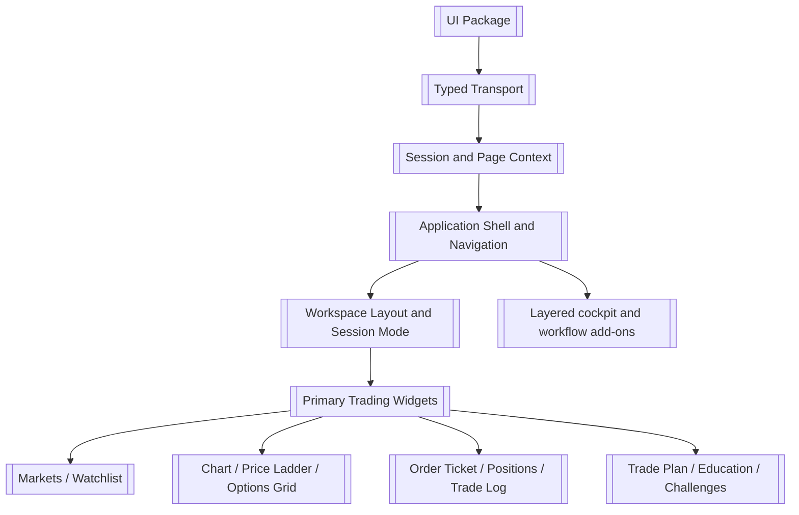
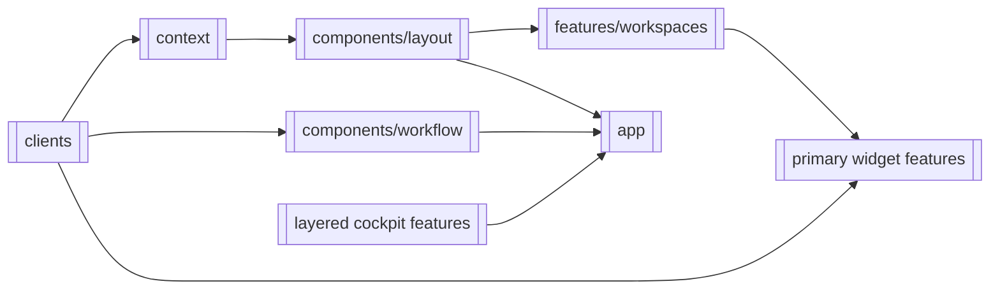
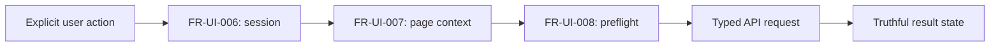

# UI

> **Package:** `app/ui/`
> **Status:** `In Progress` — 24 registered UI features; 8 `Completed` and 16 `Pending`
> requirement coverage or focused-folder ownership.
> **Last updated:** `2026-08-12`

> This README is the package's **single source of truth** for requirements, final
> structure, implementation sequence, progress, verification evidence, and tests.
> Update this file before changing UI code.

---

## 1. Purpose and Boundary

### Purpose

UI is HaruQuantAI's independently governed Next.js presentation domain. It presents
typed API evidence, manages bounded interaction state, and submits explicit user
actions without becoming a business, policy, persistence, or broker authority.

### Owns

- Accessible pages, widgets, workflow presentation, navigation, and interaction state.
- Typed API clients and frontend validation kept in route-contract parity with API.
- Truthful loading, stale, empty, unavailable, unknown, and error presentation.
- Browser-session recovery and non-authoritative governed-action preflight.

### Does not own

- Trading, Risk, Strategy, Data, Indicators, Simulation, Analytics, Optimization,
  Research, Portfolio, or Agentic calculations and decisions.
- Authentication or authorization authority, durable state, credential resolution,
  provider readiness, broker sessions, or direct MT5 access.
- Invented quotes, fills, performance, readiness, recovery, or successful mutations.

### Shared contracts

Contract names, versions, and owners match `docs/PROJECT.md` and the API registry.

**Owned by this domain** — UI-only view and interaction contracts:

| Status | Contract | Version | Counterparty | Purpose |
|---|---|---|---|---|
| Completed | `InstrumentValue` | `v1` | UI features | Labelled value with explicit freshness. |
| Completed | `WarningItem` | `v1` | UI features | Bounded warning presentation state. |
| Completed | `WorkflowStage` | `v1` | UI routes | State-gated workstation stage. |
| Completed | `EmergencyStep` | `v1` | UI routes | Emergency checklist presentation. |
| Completed | `Alarm` | `v1` | UI routes | Priority, root, and lifecycle presentation. |
| Completed | `QualificationView` | `v1` | UI routes | Qualification and remediation presentation. |

**Consumed from other domains** — referenced and validated, never redefined as owner
truth:

| Contract | Version | Owner | Used for |
|---|---|---|---|
| `ApiResponse`, `ApiError`, `ApiMetadata`, `StreamEvent`, `RouteContract` | `v1` | API | Typed HTTP and stream transport. |
| `GovernedRequestContext`, `PageContext` | `v1` | API | Bounded route and governed-action context. |
| Registered domain response DTOs | Registered versions | Owning service domains through API | Truthful workflow and widget presentation. |

### Persisted state

UI owns no durable state and no migration manifest. Browser `sessionStorage` and
component/store state are non-authoritative display state; the API remains the source
of session and domain truth.

### Four-level structure

| Code level | Represents |
|---|---|
| **Package** | UI domain |
| **Module folder** | UI feature or documented support capability |
| **File** | Page, component, client, contract, or focused interaction |
| **Component / function / type** | Functional requirement behaviour or UI contract |

```text
app/ui
└── src/features/<feature>
    └── <focused-file>.tsx
        └── Component / Function / Type
```

### Leading document

`docs/dev/documentation.pdf` is the leading source for UI features. The trading
workspace and its widgets are the primary UI and are registered first
(`FEAT-UI-01`–`FEAT-UI-13`). Foundation modules (`FEAT-UI-14`–`FEAT-UI-17`) exist to
enable that primary UI. Every other surface, including the trading-cockpit features
traced in `docs/dev/trading-cockpit/`, is registered as an additive layer on top
(`FEAT-UI-18`–`FEAT-UI-24`) and never as the owner of a primary widget.

### Package capability map



---

## 2. Final Package Structure

The tree records the target focused ownership of all registered UI features.
Entries marked *(target)* are registered destinations whose code has not yet moved.

```text
app/ui/
├── README.md
├── package.json
└── src/
    ├── features/workspaces/              # FEAT-UI-01 (target; currently src/store/)
    ├── features/markets/                 # FEAT-UI-02
    ├── features/watchlists/              # FEAT-UI-03
    ├── features/chart/                   # FEAT-UI-04 (target)
    ├── features/price-ladder/            # FEAT-UI-05 (target)
    ├── features/order-ticket/            # FEAT-UI-06 (target)
    ├── features/options-grid/            # FEAT-UI-07 (target)
    ├── features/trade-log/               # FEAT-UI-08 (target)
    ├── features/positions/               # FEAT-UI-09 (target)
    ├── features/trade-plan/              # FEAT-UI-10 (target)
    ├── features/education/               # FEAT-UI-11 (target)
    ├── features/challenges/              # FEAT-UI-12 (target)
    ├── features/system-settings/         # FEAT-UI-13 (target)
    ├── clients/                          # FEAT-UI-14
    ├── context/                          # FEAT-UI-15
    ├── components/layout/                # FEAT-UI-16
    ├── app/                              # FEAT-UI-17  framework routes
    ├── components/workflow/              # FEAT-UI-18
    ├── features/instrument-panels/       # FEAT-UI-19
    ├── features/planning/                # FEAT-UI-20
    ├── features/workflow-pages/          # FEAT-UI-21
    ├── features/emergency-ux/            # FEAT-UI-22
    ├── features/human-factors/           # FEAT-UI-23
    ├── features/training-ux/             # FEAT-UI-24
    ├── types/                            # support: shared types
    ├── utils/                            # support: shared helpers
    └── mock/                             # support: test-only fixtures
```

### Feature Registry

| Status | Feature | Owning module | Public surface | Requirements | Verification evidence |
|---|---|---|---|---|---|
| Pending | `FEAT-UI-01` Workspace Layout and Session Mode | Target: `src/features/workspaces/`; current: `src/store/` | Workspace and widget layout state, confirmation mode, account mode | `FR-UI-001`–`FR-UI-029` | Pending evidence |
| Pending | `FEAT-UI-02` Markets Widget | `src/features/markets/` | `MarketsWidget` through the feature barrel | `FR-UI-030`–`FR-UI-037` | `src/features/markets/MarketsWidget.test.tsx`; further evidence pending |
| Pending | `FEAT-UI-03` Watchlist Widget | `src/features/watchlists/` | `WatchlistWidget` through the feature barrel | `FR-UI-038`–`FR-UI-045` | `src/features/watchlists/WatchlistWidget.test.tsx`; further evidence pending |
| Pending | `FEAT-UI-04` Charting Tools Widget | Target: `src/features/chart/`; current: `src/features/instrument-panels/ChartWidget.tsx` | `ChartWidget` | `FR-UI-046`–`FR-UI-054` | Pending evidence |
| Pending | `FEAT-UI-05` Price Ladder Widget | Target: `src/features/price-ladder/`; current: `src/features/instrument-panels/PriceLadderWidget.tsx` | `PriceLadderWidget` | `FR-UI-055`–`FR-UI-062` | Pending evidence |
| Pending | `FEAT-UI-06` Order Ticket | Target: `src/features/order-ticket/`; current: `src/components/workflow/OrderTicketModal.tsx` | `OrderTicketModal` (futures and options tabs) | `FR-UI-063`–`FR-UI-079` | Pending evidence |
| Pending | `FEAT-UI-07` Options Grid Widget | Target: `src/features/options-grid/`; current: `src/features/instrument-panels/OptionsGridWidget.tsx` | `OptionsGridWidget` | `FR-UI-080`–`FR-UI-084` | Pending evidence; blocked on an owning backend domain |
| Pending | `FEAT-UI-08` Trade Log Widget | Target: `src/features/trade-log/`; current: `src/components/workflow/TradeLogWidget.tsx` | `TradeLogWidget` | `FR-UI-085`–`FR-UI-089` | Pending evidence |
| Pending | `FEAT-UI-09` Positions and Orders Widgets | Target: `src/features/positions/`; current: `src/components/workflow/PositionsWidget.tsx` | `PositionsWidget`, orders presentation | `FR-UI-090`–`FR-UI-098` | Pending evidence |
| Pending | `FEAT-UI-10` Trade Plan Widget | Target: `src/features/trade-plan/`; current: `src/features/planning/TradePlanWidget.tsx` | `TradePlanWidget` | `FR-UI-099`–`FR-UI-104` | Pending evidence |
| Pending | `FEAT-UI-11` Education Resources Widget | Target: `src/features/education/`; current: `src/features/training-ux/EducationWidget.tsx` | `EducationWidget` | `FR-UI-105`–`FR-UI-108` | Pending evidence; blocked on an owning backend domain |
| Pending | `FEAT-UI-12` Challenges and Challenge Dashboard | Target: `src/features/challenges/`; current: `src/features/training-ux/ChallengesWidget.tsx` | `ChallengesWidget` | `FR-UI-109`–`FR-UI-116` | Pending evidence; blocked on an owning backend domain |
| Pending | `FEAT-UI-13` System Settings | Target: `src/features/system-settings/`; current: `src/app/workstation/settings/SystemSettingsModal.tsx` | `SystemSettingsModal` | `FR-UI-117`–`FR-UI-121` | `system-settings-modal.test.tsx`; further evidence pending |
| Completed | `FEAT-UI-14` Typed Backend Transport | `src/clients/` | `request`, `unwrapData`, `ApiClientError`, `openStream`, `apiClients` | `FR-UI-122`–`FR-UI-126` | `src/clients/request.test.ts`; `clients.test.ts`; `clients.contract.test.ts` |
| Pending | `FEAT-UI-15` Session and Page Context | `src/context/` | Auth, page, governed-preflight, and stream context | `FR-UI-127`–`FR-UI-131` | `src/context/{auth,page,governed,streams}.test.ts(x)`; further evidence pending |
| Pending | `FEAT-UI-16` Application Shell and Navigation | `src/components/layout/` | `Header`, `Sidebar`, `WorkspaceGrid`, session clock | `FR-UI-132`–`FR-UI-137` | `src/components/layout/clock.test.ts`; further evidence pending |
| Pending | `FEAT-UI-17` Protected Routing and Access Gate | `src/app/` | `AuthenticationPage`, `ProtectedLayout`, `WorkflowPage` | `FR-UI-138`–`FR-UI-141` | `src/app/{authentication-page,protected-layout,pages.contract}.test.ts(x)`; further evidence pending |
| Completed | `FEAT-UI-18` Domain Workflow Views | `src/components/workflow/` | `AppShell` and focused domain workflow views | `FR-UI-142`–`FR-UI-150` | `src/components/workflow/*.test.tsx` |
| Completed | `FEAT-UI-19` Instrument Panels | `src/features/instrument-panels/` | `InstrumentPanels`, `InstrumentValue` | `FR-UI-151`–`FR-UI-156` | `src/features/instrument-panels/components.test.tsx` |
| Completed | `FEAT-UI-20` Navigation, Planning, and Warning Panels | `src/features/planning/` | `PlanningPanels`, `WarningItem` | `FR-UI-157`–`FR-UI-161` | `src/features/planning/components.test.tsx` |
| Completed | `FEAT-UI-21` Workflow Stage Pages | `src/features/workflow-pages/`, `src/app/workstation/` | `WorkflowStages`, `WorkflowStage`, workstation routes | `FR-UI-162`–`FR-UI-168` | `src/features/workflow-pages/components.test.tsx` |
| Completed | `FEAT-UI-22` Emergency and Recovery UX | `src/features/emergency-ux/` | `EmergencyPanel`, `EmergencyStep` | `FR-UI-169`–`FR-UI-173` | `src/features/emergency-ux/components.test.tsx` |
| Completed | `FEAT-UI-23` Human-Factors and Alarm Model | `src/features/human-factors/` | `AlarmModel`, `Alarm` | `FR-UI-174`–`FR-UI-179` | `src/features/human-factors/components.test.tsx` |
| Completed | `FEAT-UI-24` Training, Replay, and Qualification UX | `src/features/training-ux/` | `TrainingPanel`, `QualificationView` | `FR-UI-180`–`FR-UI-185` | `src/features/training-ux/components.test.tsx` |

**Primary UI.** `FEAT-UI-01`–`FEAT-UI-13` are the trading workspace and widgets
specified by `docs/dev/documentation.pdf`. `FEAT-UI-14`–`FEAT-UI-17` are the foundation
that enables them. `FEAT-UI-18`–`FEAT-UI-24` are additive layers and own no primary widget.

`FEAT-UI-02` consumes backend `FEAT-API-12` Markets orchestration and `FEAT-UI-03`
consumes backend `FEAT-API-11` Account Watchlists. UI feature identity remains
independent from the API's `FEAT-API-*` registry.

**Blocked features.** `FEAT-UI-07`, `FEAT-UI-11`, and `FEAT-UI-12`, and the options
group of `FEAT-UI-06`, have no owning backend domain; see Section 6.

**Non-feature support directories.** `src/types/` and `src/utils/` are documented
shared type and helper directories owning no feature behaviour. `src/mock/` is
test-only fixture data; production modules must not import it (see `NFR-UI-007`).
These directories are excluded from feature-count reconciliation.

### Module dependency diagram



### Structure rules

- Each registered feature owns one focused production module folder; framework route
  entries may remain in `src/app/` and delegate to their owning feature.
- Each file owns one focused page, component, contract, transport, or interaction.
- UI imports service capabilities only through typed API contracts.
- Shared `src/components/widgets/` ownership is prohibited; widgets reside in their
  registered feature folder.
- `FEAT-UI-*` features use the UI verification-evidence exception: they do not require
  separate numbered standalone usage programs. Production rendering is not evidence.

---

## 3. Workflows

### Status values

| Status | Meaning |
|---|---|
| **Pending** | Not implemented, not verified, or awaiting structural reconciliation. |
| **Partial** | Some behavior exists but required evidence is incomplete. |
| **Completed** | Implemented and verified by the required UI evidence. |

### Workflow scope values

| Scope | Meaning |
|---|---|
| **Internal** | The workflow remains within UI. |
| **Cross-domain** | UI exchanges typed boundary data with API. |

| Status | Workflow ID | Scope | Workflow | Trigger / Input boundary | Final outcome / Output boundary | Requirement sequence |
|---|---|---|---|---|---|---|
| Completed | `WF-UI-001` | Cross-domain | Governed user action | Explicit user action | API result, warning, or preflight block | `FR-UI-006 → FR-UI-007 → FR-UI-008 → FR-UI-021` |
| Completed | `WF-UI-002` | Cross-domain | Ordered stream consumption | Authenticated API stream | Validated events or authoritative refresh | `FR-UI-005 → FR-UI-009 → FR-UI-010` |

### `WF-UI-001` — Governed User Action

**Scope:** `Cross-domain`

**System workflow:** Any registered `SYS-WF-*` requiring an operator action.

**Input boundary:** An authenticated user explicitly initiates an action in UI.

**Output boundary:** API receives one typed request, or UI displays a bounded preflight
block without claiming backend authorization.

1. `AuthProvider` recovers current session truth from API.
2. `PageContextProvider` supplies bounded, redacted route/action context.
3. `buildGovernedOptions` rejects incomplete or stale context.
4. The focused typed client submits the action and the owning view presents its result.

**Failure behaviour:** Expired session redirects to access; stale context blocks the
request; API rejection remains visible and is never converted into success.

**Integration test:** `src/context/auth.test.tsx`, `governed.test.ts`, and focused
workflow component tests.



### `WF-UI-002` — Ordered Stream Consumption

**Scope:** `Cross-domain`

**System workflow:** Any registered streaming workflow.

**Input boundary:** Authenticated API stream events.

**Output boundary:** Ordered UI events or an explicit gap/error followed by
authoritative state refresh.

1. `openStream` opens the typed transport.
2. `consumeStream` validates ordering and filters heartbeat frames.
3. Gaps and terminal events surface explicitly and trigger the registered recovery.
4. Disconnect aborts transport and releases UI resources.

**Integration test:** `src/clients/stream.test.ts` and
`src/context/streams.test.ts`.

---

---

## 4. Module and Requirement Specifications

Modules are ordered primary UI first, then foundation, then layered add-ons. The
`Usage / Test` column records UI verification evidence; the approved UI exception
replaces standalone usage programs with focused unit/component and appropriate
integration, contract, or browser evidence.

### 4.1 `src/features/workspaces/` — Workspace Layout and Session Mode

**Purpose:** Own non-authoritative workspace layout preference, order-confirmation mode, and account-mode presentation.

**Target location:** `src/features/workspaces/`. Behaviour currently resides in
`src/store/useTradingStore.ts` and `src/types/widget.ts`; the focused-folder move is
approved separately and is not performed by this registration.

### Files

| Status | File | Responsibility | Key exports | Dependencies |
|---|---|---|---|---|
| Pending | `contracts.ts` | Workspace and widget layout contracts | `Workspace`, `Widget`, `WidgetType` | **Standard library:** None<br>**Required third-party:** None<br>**Local:** None |
| Pending | `store.ts` | Bounded layout, confirmation-mode, and account-mode state | workspace and mode actions | **Standard library:** localStorage<br>**Required third-party:** Zustand<br>**Local:** clients/settings |
| Pending | `index.ts` | Sole public surface for the feature | feature barrel | **Standard library:** None<br>**Required third-party:** None<br>**Local:** store and contracts |

| Status | Requirement ID | Responsibility | Component / Function / Type | Side Effects | Failure presentation | Usage / Test |
|---|---|---|---|---|---|---|
| Pending | `FR-UI-001` | Provide a default workspace on first authenticated load containing the registered default widget set. | `Workspace` | Local persistence | Default restored | Pending evidence |
| Pending | `FR-UI-002` | Allow creation of named workspaces up to a bounded maximum, rejecting creation beyond the limit explicitly. | workspace actions | Local persistence | Limit message shown | Pending evidence |
| Pending | `FR-UI-003` | Default an unnamed new workspace to a deterministic incrementing name. | workspace actions | Local persistence | Deterministic naming | Pending evidence |
| Pending | `FR-UI-004` | Allow renaming, duplicating, and deleting a workspace; deleting the last remaining workspace is rejected. | workspace actions | Local persistence | Rejection explicit | Pending evidence |
| Pending | `FR-UI-005` | Allow a workspace to be designated the default opened on next session start. | workspace actions | Local persistence | Default visible | Pending evidence |
| Pending | `FR-UI-006` | Support relocating a widget within the grid by pointer drag, showing the target region before release. | `Widget` | Local persistence | Drop target visible | Pending evidence |
| Pending | `FR-UI-007` | Provide an equivalent keyboard-operable path for every drag-and-drop layout action. | `Widget` | Local persistence | Keyboard path preserved | Pending evidence |
| Pending | `FR-UI-008` | Support expanding one widget to fill the workspace and restoring it to its prior rectangle. | `Workspace` | Local persistence | Prior rectangle retained | Pending evidence |
| Pending | `FR-UI-009` | Persist layout to browser-local storage only; layout is a client preference and never system state. | store | Local persistence | Non-authoritative | Pending evidence |
| Pending | `FR-UI-010` | Restore a corrupt or unreadable persisted layout to the default workspace rather than failing to render. | store | Local persistence | Default restored | Pending evidence |
| Pending | `FR-UI-011` | Provide an order-confirmation toggle that, when disabled, submits without the client-side confirmation dialog. | mode actions | Local state mutation | Mode always visible | Pending evidence |
| Pending | `FR-UI-012` | Default the toggle to confirmation-required on every new session; the setting is never inherited silently. | mode actions | Local state mutation | Safe default | Pending evidence |
| Pending | `FR-UI-013` | Present the active confirmation mode persistently in the shell. | mode actions | None | Mode always visible | Pending evidence |
| Pending | `FR-UI-014` | Treat the toggle as presentation only; it never suppresses or pre-satisfies API authorization, approval, idempotency, governance, or kill-switch enforcement. | mode actions | None | API authority unchanged | Pending evidence |
| Pending | `FR-UI-015` | Apply the toggle identically in simulation and live; the difference between modes is the environment switch, not a different order path. | mode actions | None | One order path | Pending evidence |
| Pending | `FR-UI-016` | Present the active account mode — simulation or live — persistently and unambiguously. | mode actions | None | Mode always visible | Pending evidence |
| Pending | `FR-UI-017` | Derive the mode from API-authoritative environment configuration; UI never elects the mode. | mode actions | External API call | No client election | Pending evidence |
| Pending | `FR-UI-018` | Require an explicit confirmed action to change mode and re-establish session context afterwards. | mode actions | External API call | Confirmation required | Pending evidence |
| Pending | `FR-UI-019` | Present simulated and live balances distinctly and never combine them in one total. | mode actions | None | No combined total | Pending evidence |
| Pending | `FR-UI-020` | Offer a balance reset action in simulation mode only, with explicit confirmation. | mode actions | External API call | Absent in live mode | Pending evidence |
| Pending | `FR-UI-021` | Fail closed when mode is unknown: present as unknown and disable order entry until resolved. | mode actions | None | Order entry disabled | Pending evidence |
| Pending | `FR-UI-022` | Present the market-data delay applicable to the active mode where the API declares one. | mode actions | External API call | Unknown remains explicit | Pending evidence |
| Pending | `FR-UI-023` | Present widget type and title from the registered widget-type set only. | `WidgetType` | None | Unknown type rejected | Pending evidence |
| Pending | `FR-UI-024` | Reject a layout rectangle that would place a widget outside the bounded grid. | `Widget` | Local persistence | Rejection explicit | Pending evidence |
| Pending | `FR-UI-025` | Preserve widget identity across reorder, duplicate, and restore operations. | `Widget` | Local persistence | Stable identity | Pending evidence |
| Pending | `FR-UI-026` | Present an empty workspace explicitly rather than as a failed render. | `Workspace` | None | Empty state truthful | Pending evidence |
| Pending | `FR-UI-027` | Never persist account, credential, or order state to browser-local storage. | store | Local persistence | Layout keys only | Pending evidence |
| Pending | `FR-UI-028` | Expose workspace and mode state only through the feature barrel. | `index.ts` | None | No deep import | Pending evidence |
| Pending | `FR-UI-029` | Import no fixture data; every displayed value is API-sourced or a labelled client preference. | store | None | No fixture import | Pending evidence |

### Configuration and Limits Manifest

| Status | Setting / Limit | Type | Default | Required | Used by | Description |
|---|---|---|---|---|---|---|
| Pending | `MAX_CUSTOM_WORKSPACES` | `number` | `10` | Yes | workspace actions | Bounded custom workspace count. |

### 4.2 `src/features/markets/` — Markets Widget

**Purpose:** Present the tradable instrument directory for the configured runtime source.

### Files

| Status | File | Responsibility | Key exports | Dependencies |
|---|---|---|---|---|
| Completed | `MarketsWidget.tsx` | Bounded progressive market presentation | `MarketsWidget` | **Standard library:** browser APIs<br>**Required third-party:** React<br>**Local:** clients/data and watchlists |
| Completed | `index.ts` | Sole public surface for the feature | `MarketsWidget` | **Standard library:** None<br>**Required third-party:** None<br>**Local:** `MarketsWidget.tsx` |

| Status | Requirement ID | Responsibility | Component / Function / Type | Side Effects | Failure presentation | Usage / Test |
|---|---|---|---|---|---|---|
| Completed | `FR-UI-030` | Present typed API market evidence without calculation. | `MarketsWidget` | External API call | Unavailable remains unavailable | `src/features/markets/MarketsWidget.test.tsx` |
| Completed | `FR-UI-031` | Use bounded batch reads and progressive rendering. | `MarketsWidget` | External API call; local state mutation | Completed batches remain visible | `src/features/markets/MarketsWidget.test.tsx` |
| Completed | `FR-UI-032` | Show explicit loading, error, formatting, and sort states. | `MarketsWidget` | Local state mutation | Em dash for unavailable legs | `src/features/markets/MarketsWidget.test.tsx` |
| Pending | `FR-UI-033` | Present the tradable instrument directory for the configured runtime source only. | `MarketsWidget` | External API call | Non-tradable absent | Pending evidence |
| Pending | `FR-UI-034` | Offer filtering of the directory by asset class. | `MarketsWidget` | Local state mutation | Empty filter truthful | Pending evidence |
| Pending | `FR-UI-035` | Offer sorting by symbol, change, and volume with a stable tiebreak. | `MarketsWidget` | Local state mutation | Deterministic ordering | Pending evidence |
| Pending | `FR-UI-036` | Offer a direct trade action per row that opens the order ticket pre-filled with that instrument. | `MarketsWidget` | Local state mutation | Ticket authority unchanged | Pending evidence |
| Pending | `FR-UI-037` | Offer per-row actions targeting the chart, price ladder, and options surfaces at the selected instrument. | `MarketsWidget` | Navigation | Unavailable target disabled | Pending evidence |

### Configuration and Limits Manifest

The current bounded batch size is four symbols; the focused-folder migration must
retain this limit and its tests without moving calculation into UI.

### 4.3 `src/features/watchlists/` — Watchlist Widget

**Purpose:** Present watchlist selection and explicit CRUD interaction.

### Files

| Status | File | Responsibility | Key exports | Dependencies |
|---|---|---|---|---|
| Completed | `WatchlistWidget.tsx` | Account watchlist interaction | `WatchlistWidget` | **Standard library:** browser APIs<br>**Required third-party:** React<br>**Local:** clients/watchlists |
| Completed | `index.ts` | Sole public surface for the feature | `WatchlistWidget` | **Standard library:** None<br>**Required third-party:** None<br>**Local:** `WatchlistWidget.tsx` |

| Status | Requirement ID | Responsibility | Component / Function / Type | Side Effects | Failure presentation | Usage / Test |
|---|---|---|---|---|---|---|
| Completed | `FR-UI-038` | Present lists and explicit default/current selection. | `WatchlistWidget` | External API call; local state mutation | Empty/error state | `src/features/watchlists/WatchlistWidget.test.tsx` |
| Completed | `FR-UI-039` | Submit CRUD/item actions only after explicit user intent. | `WatchlistWidget` | External API call | API rejection visible | `src/features/watchlists/WatchlistWidget.test.tsx` |
| Completed | `FR-UI-040` | Surface validation, authorization, conflict, and unavailable outcomes. | `WatchlistWidget` | None | Never invent success | `src/features/watchlists/WatchlistWidget.test.tsx` |
| Pending | `FR-UI-041` | Allow selecting an entire asset class to add all of its available instruments in one action. | `WatchlistWidget` | External API call | Partial add reported | Pending evidence |
| Pending | `FR-UI-042` | Permit membership beyond the tradable set and mark non-tradable entries as not tradable. | `WatchlistWidget` | None | Non-tradable labelled | Pending evidence |
| Pending | `FR-UI-043` | Rename, reorder, and delete lists and add or remove symbols through registered operations only. | `WatchlistWidget` | External API call | API rejection visible | Pending evidence |
| Pending | `FR-UI-044` | Sort rows by any displayed column with a stable tiebreak. | `WatchlistWidget` | Local state mutation | Deterministic ordering | Pending evidence |
| Pending | `FR-UI-045` | Present quote columns with freshness and an explicit unknown state. | `WatchlistWidget` | External API call | Unknown remains explicit | Pending evidence |

### Configuration and Limits Manifest

None; API contracts own mutation and idempotency limits.

### 4.4 `src/features/chart/` — Charting Tools Widget

**Purpose:** Present price charts with Indicators-owned overlays and drawing tools.

**Target location:** `src/features/chart/`. `ChartWidget.tsx` currently resides inside
`src/features/instrument-panels/`; the move is approved separately.

### Files

| Status | File | Responsibility | Key exports | Dependencies |
|---|---|---|---|---|
| Pending | `ChartWidget.tsx` | Price chart, timeframe selection, indicator overlays, and drawing tools | `ChartWidget` | **Standard library:** browser APIs<br>**Required third-party:** React<br>**Local:** clients/data and clients/indicators |
| Pending | `index.ts` | Sole public surface for the feature | `ChartWidget` | **Standard library:** None<br>**Required third-party:** None<br>**Local:** `ChartWidget.tsx` |

| Status | Requirement ID | Responsibility | Component / Function / Type | Side Effects | Failure presentation | Usage / Test |
|---|---|---|---|---|---|---|
| Pending | `FR-UI-046` | Present a price chart for a selected instrument and timeframe from Data-owned bars. | `ChartWidget` | External API call | Unavailable series explicit | Pending evidence |
| Pending | `FR-UI-047` | Offer the registered timeframe set and preserve the selection per widget instance. | `ChartWidget` | Local state mutation | Unsupported timeframe absent | Pending evidence |
| Pending | `FR-UI-048` | Overlay Indicators-owned values only; the widget performs no indicator arithmetic. | `ChartWidget` | External API call | No derived series | Pending evidence |
| Pending | `FR-UI-049` | Present each overlay with the parameters used to compute it. | `ChartWidget` | None | Parameters visible | Pending evidence |
| Pending | `FR-UI-050` | Present an indicator as unavailable when history is insufficient rather than rendering a partial series as complete. | `ChartWidget` | None | Warm-up gap explicit | Pending evidence |
| Pending | `FR-UI-051` | Provide drawing tools whose annotations persist per instrument as a client-side preference. | `ChartWidget` | Local persistence | Annotations non-authoritative | Pending evidence |
| Pending | `FR-UI-052` | Provide chart appearance controls that never alter underlying data. | `ChartWidget` | Local state mutation | Data unchanged | Pending evidence |
| Pending | `FR-UI-053` | Present a gap or missing-bar region explicitly rather than interpolating across it. | `ChartWidget` | None | No interpolation | Pending evidence |
| Pending | `FR-UI-054` | Remain responsive at the registered maximum bar count, degrading detail rather than dropping the latest bar. | `ChartWidget` | None | Latest bar retained | Pending evidence |

### Configuration and Limits Manifest

None; chart limits follow the registered Data and Indicators contracts.

### 4.5 `src/features/price-ladder/` — Price Ladder Widget

**Purpose:** Present depth of market and ladder-initiated order interaction.

**Target location:** `src/features/price-ladder/`. The widget currently resides inside
`src/features/instrument-panels/`; the move is approved separately.

### Files

| Status | File | Responsibility | Key exports | Dependencies |
|---|---|---|---|---|
| Pending | `PriceLadderWidget.tsx` | Depth-of-market presentation and ladder order interaction | `PriceLadderWidget` | **Standard library:** browser APIs<br>**Required third-party:** React<br>**Local:** clients/data and clients/trading |
| Pending | `index.ts` | Sole public surface for the feature | `PriceLadderWidget` | **Standard library:** None<br>**Required third-party:** None<br>**Local:** `PriceLadderWidget.tsx` |

| Status | Requirement ID | Responsibility | Component / Function / Type | Side Effects | Failure presentation | Usage / Test |
|---|---|---|---|---|---|---|
| Pending | `FR-UI-055` | Present bid and ask price levels with resting quantity for the selected instrument. | `PriceLadderWidget` | External API call | Unavailable depth explicit | Pending evidence |
| Pending | `FR-UI-056` | Present depth from the market-data feed only; aggregate nothing the feed does not provide. | `PriceLadderWidget` | None | No synthesized levels | Pending evidence |
| Pending | `FR-UI-057` | Provide a configurable default order quantity and order type for ladder-initiated orders. | `PriceLadderWidget` | Local state mutation | Defaults visible | Pending evidence |
| Pending | `FR-UI-058` | Open an order ticket pre-filled with the price level activated by the operator. | `PriceLadderWidget` | Local state mutation | Ticket authority unchanged | Pending evidence |
| Pending | `FR-UI-059` | Present the operator's working orders against their price levels. | `PriceLadderWidget` | External API call | Unknown remains explicit | Pending evidence |
| Pending | `FR-UI-060` | Offer cancellation of an individual working order at a level and a separate bounded cancel-all action. | `PriceLadderWidget` | External API call | API rejection visible | Pending evidence |
| Pending | `FR-UI-061` | Require explicit confirmation for cancel-all regardless of the active confirmation mode. | `PriceLadderWidget` | External API call | Confirmation always required | Pending evidence |
| Pending | `FR-UI-062` | Provide a re-center action reachable by both keyboard and pointer. | `PriceLadderWidget` | Local state mutation | Keyboard path preserved | Pending evidence |

### Configuration and Limits Manifest

None; order limits follow the registered Trading contracts.

### 4.6 `src/features/order-ticket/` — Order Ticket

**Purpose:** Capture and submit explicit futures and options orders through registered Trading operations.

**Target location:** `src/features/order-ticket/`. One modal owns both tabs
(`OrderTicketModal.tsx:17` toggles `'futures' | 'options'`), so one feature owns both
requirement groups. The options group is blocked on an owning backend domain.

### Files

| Status | File | Responsibility | Key exports | Dependencies |
|---|---|---|---|---|
| Pending | `OrderTicketModal.tsx` | Futures and options order capture and submission | `OrderTicketModal` | **Standard library:** browser APIs<br>**Required third-party:** React<br>**Local:** clients/trading and context/governed |
| Pending | `index.ts` | Sole public surface for the feature | `OrderTicketModal` | **Standard library:** None<br>**Required third-party:** None<br>**Local:** `OrderTicketModal.tsx` |

| Status | Requirement ID | Responsibility | Component / Function / Type | Side Effects | Failure presentation | Usage / Test |
|---|---|---|---|---|---|---|
| Pending | `FR-UI-063` | Present the current market for the selected instrument at ticket open, with freshness. | order ticket | External API call | Stale market marked stale | Pending evidence |
| Pending | `FR-UI-064` | Require an explicit buy or sell side; no side is preselected. | order ticket | None | Submission blocked | Pending evidence |
| Pending | `FR-UI-065` | Offer the registered order types: market, limit, stop, and stop-limit. | order ticket | None | Unsupported type absent | Pending evidence |
| Pending | `FR-UI-066` | Enable and require exactly the price fields the selected order type needs, and disable the rest. | order ticket | Local state mutation | Inapplicable field disabled | Pending evidence |
| Pending | `FR-UI-067` | Enforce a minimum quantity of one and reject non-positive or non-integer quantities before submission. | order ticket | None | Validation message shown | Pending evidence |
| Pending | `FR-UI-068` | Offer the registered time-in-force values and require an explicit selection. | order ticket | None | Submission blocked | Pending evidence |
| Pending | `FR-UI-069` | Validate the ticket for completeness only; the API remains the sole authority on acceptance. | order ticket | None | API rejection visible | Pending evidence |
| Pending | `FR-UI-070` | Submit through the registered Trading operation with an idempotency key and never retry automatically. | order ticket | External API call | No silent resubmission | Pending evidence |
| Pending | `FR-UI-071` | Present the submission outcome with reason and retryability; an ambiguous outcome presents as unknown. | order ticket | None | Never invent success | Pending evidence |
| Pending | `FR-UI-072` | Present the confirmation step per the active confirmation mode, showing the fully resolved order. | order ticket | Local state mutation | Confirmation retained | Pending evidence |
| Pending (blocked) | `FR-UI-073` | Toggle between the futures and options ticket for the selected underlying. | `OrderTicketModal` | Local state mutation | No owning API contract | Pending evidence |
| Pending (blocked) | `FR-UI-074` | Require an explicit contract expiration selection. | `OrderTicketModal` | Local state mutation | Submission blocked | Pending evidence |
| Pending (blocked) | `FR-UI-075` | Require an explicit put or call selection. | `OrderTicketModal` | Local state mutation | Submission blocked | Pending evidence |
| Pending (blocked) | `FR-UI-076` | Present a bounded strike range centred on the at-the-money strike. | `OrderTicketModal` | External API call | Absent chain explicit | Pending evidence |
| Pending (blocked) | `FR-UI-077` | Present the current market for the specific option side selected. | `OrderTicketModal` | External API call | Unknown remains explicit | Pending evidence |
| Pending (blocked) | `FR-UI-078` | Apply the same order-type, quantity, time-in-force, and submission rules as the futures ticket. | `OrderTicketModal` | External API call | API rejection visible | Pending evidence |
| Pending (blocked) | `FR-UI-079` | Fail closed when no options chain is available for the underlying. | `OrderTicketModal` | None | Never invent a chain | Pending evidence |

### Configuration and Limits Manifest

None; idempotency and authority limits are owned by the registered Trading contracts.

### 4.7 `src/features/options-grid/` — Options Grid Widget

**Purpose:** Present an options chain grid and hand off to the order ticket.

**Target location:** `src/features/options-grid/`. Blocked: no service domain owns
options chains, and the widget currently reads fixture data from `src/mock/`.

### Files

| Status | File | Responsibility | Key exports | Dependencies |
|---|---|---|---|---|
| Pending | `OptionsGridWidget.tsx` | Options chain presentation and ticket hand-off | `OptionsGridWidget` | **Standard library:** browser APIs<br>**Required third-party:** React<br>**Local:** fixture data pending an owning API contract |
| Pending | `index.ts` | Sole public surface for the feature | `OptionsGridWidget` | **Standard library:** None<br>**Required third-party:** None<br>**Local:** `OptionsGridWidget.tsx` |

| Status | Requirement ID | Responsibility | Component / Function / Type | Side Effects | Failure presentation | Usage / Test |
|---|---|---|---|---|---|---|
| Pending (blocked) | `FR-UI-080` | Present an options chain grid for a selected underlying and expiration. | `OptionsGridWidget` | External API call | No owning API contract | Pending evidence |
| Pending (blocked) | `FR-UI-081` | Allow adding and removing underlyings from the grid. | `OptionsGridWidget` | Local state mutation | Empty grid truthful | Pending evidence |
| Pending (blocked) | `FR-UI-082` | Present call and put sides against a shared strike axis. | `OptionsGridWidget` | None | Missing strike explicit | Pending evidence |
| Pending (blocked) | `FR-UI-083` | Open an order ticket pre-filled from an activated bid or offer cell. | `OptionsGridWidget` | Local state mutation | Ticket authority unchanged | Pending evidence |
| Pending (blocked) | `FR-UI-084` | Present an absent quote as explicitly absent. | `OptionsGridWidget` | None | Never invent a quote | Pending evidence |

### Configuration and Limits Manifest

None.

### 4.8 `src/features/trade-log/` — Trade Log Widget

**Purpose:** Present executed orders for the current session with operator notes.

**Target location:** `src/features/trade-log/`; the widget currently resides in
`src/components/workflow/`.

### Files

| Status | File | Responsibility | Key exports | Dependencies |
|---|---|---|---|---|
| Pending | `TradeLogWidget.tsx` | Executed-order log and note capture | `TradeLogWidget` | **Standard library:** browser APIs<br>**Required third-party:** React<br>**Local:** clients/trading |
| Pending | `index.ts` | Sole public surface for the feature | `TradeLogWidget` | **Standard library:** None<br>**Required third-party:** None<br>**Local:** `TradeLogWidget.tsx` |

| Status | Requirement ID | Responsibility | Component / Function / Type | Side Effects | Failure presentation | Usage / Test |
|---|---|---|---|---|---|---|
| Pending | `FR-UI-085` | Present executed orders for the current session in reverse chronological order. | `TradeLogWidget` | External API call | Empty state truthful | Pending evidence |
| Pending | `FR-UI-086` | Exclude cancelled orders from the executed log while keeping them visible in orders presentation. | `TradeLogWidget` | None | No double counting | Pending evidence |
| Pending | `FR-UI-087` | Present each entry's instrument, side, quantity, price, and execution time. | `TradeLogWidget` | None | Missing field explicit | Pending evidence |
| Pending | `FR-UI-088` | Allow an operator note to be attached to a log entry. | `TradeLogWidget` | External API call | Rejection visible | Pending evidence |
| Pending | `FR-UI-089` | State the log's retention boundary so an empty log is not read as no activity. | `TradeLogWidget` | None | Boundary stated | Pending evidence |

### Configuration and Limits Manifest

None; retention is owned by the registered Trading contracts.

### 4.9 `src/features/positions/` — Positions and Orders Widgets

**Purpose:** Present open positions and order lifecycle without computing profit and loss.

**Target location:** `src/features/positions/`; the widget currently resides in
`src/components/workflow/`.

### Files

| Status | File | Responsibility | Key exports | Dependencies |
|---|---|---|---|---|
| Pending | `PositionsWidget.tsx` | Position and order presentation, filtering, and amendment hand-off | `PositionsWidget` | **Standard library:** browser APIs<br>**Required third-party:** React<br>**Local:** clients/trading and clients/portfolio |
| Pending | `index.ts` | Sole public surface for the feature | `PositionsWidget` | **Standard library:** None<br>**Required third-party:** None<br>**Local:** `PositionsWidget.tsx` |

| Status | Requirement ID | Responsibility | Component / Function / Type | Side Effects | Failure presentation | Usage / Test |
|---|---|---|---|---|---|---|
| Pending | `FR-UI-090` | Present open positions with instrument, quantity, average price, and current price. | `PositionsWidget` | External API call | Empty state truthful | Pending evidence |
| Pending | `FR-UI-091` | Present API-supplied unrealized profit and loss per position and an account total. | `PositionsWidget` | External API call | Unknown remains explicit | Pending evidence |
| Pending | `FR-UI-092` | Compute no profit-and-loss value in UI; an unsupplied value presents as unknown. | `PositionsWidget` | None | No derived arithmetic | Pending evidence |
| Pending | `FR-UI-093` | Offer filtering and sorting over positions with a stable tiebreak. | `PositionsWidget` | Local state mutation | Deterministic ordering | Pending evidence |
| Pending | `FR-UI-094` | Present orders with their lifecycle status. | orders presentation | External API call | Unknown status explicit | Pending evidence |
| Pending | `FR-UI-095` | Offer filtering of orders by working, filled, and cancelled, defaulting to all. | orders presentation | Local state mutation | Empty filter truthful | Pending evidence |
| Pending | `FR-UI-096` | Offer amendment of a working order through the order ticket, pre-filled with current terms. | orders presentation | External API call | API rejection visible | Pending evidence |
| Pending | `FR-UI-097` | Offer cancellation of a working order with an explicit confirmation. | orders presentation | External API call | Confirmation required | Pending evidence |
| Pending | `FR-UI-098` | Present positions and orders with freshness and mark them stale past declared tolerance. | positions/orders | None | Stale marked stale | Pending evidence |

### Configuration and Limits Manifest

None; profit and loss is supplied by the owning domains through API.

### 4.10 `src/features/trade-plan/` — Trade Plan Widget

**Purpose:** Capture operator risk limits and objectives and present adherence without enforcing.

**Target location:** `src/features/trade-plan/`; the widget currently resides inside
`src/features/planning/`.

### Files

| Status | File | Responsibility | Key exports | Dependencies |
|---|---|---|---|---|
| Pending | `TradePlanWidget.tsx` | Risk limit and objective capture and adherence presentation | `TradePlanWidget` | **Standard library:** browser APIs<br>**Required third-party:** React<br>**Local:** clients/risk |
| Pending | `index.ts` | Sole public surface for the feature | `TradePlanWidget` | **Standard library:** None<br>**Required third-party:** None<br>**Local:** `TradePlanWidget.tsx` |

| Status | Requirement ID | Responsibility | Component / Function / Type | Side Effects | Failure presentation | Usage / Test |
|---|---|---|---|---|---|---|
| Pending | `FR-UI-099` | Capture an operator-defined risk limit and trading objective for the session. | `TradePlanWidget` | External API call | Rejection visible | Pending evidence |
| Pending | `FR-UI-100` | Present the active plan against observed session activity. | `TradePlanWidget` | External API call | Absent activity explicit | Pending evidence |
| Pending | `FR-UI-101` | Allow the plan to be revised, retaining the prior version for review. | `TradePlanWidget` | External API call | No silent overwrite | Pending evidence |
| Pending | `FR-UI-102` | Present plan adherence as comparison only; the widget enforces no limit and blocks no order. | `TradePlanWidget` | None | No enforcement claimed | Pending evidence |
| Pending | `FR-UI-103` | Direct all enforcement to Risk and present Risk's verdict rather than deriving one. | `TradePlanWidget` | External API call | No derived verdict | Pending evidence |
| Pending | `FR-UI-104` | Present an absent plan as absent rather than as an empty satisfied plan. | `TradePlanWidget` | None | Never infer compliance | Pending evidence |

### Configuration and Limits Manifest

None; enforcement is owned by Risk.

### 4.11 `src/features/education/` — Education Resources Widget

**Purpose:** Present a catalogue of learning resources.

**Target location:** `src/features/education/`. Blocked: no service domain owns
learning content, and the widget currently reads fixture data from `src/mock/`.

### Files

| Status | File | Responsibility | Key exports | Dependencies |
|---|---|---|---|---|
| Pending | `EducationWidget.tsx` | Learning-resource catalogue presentation | `EducationWidget` | **Standard library:** browser APIs<br>**Required third-party:** React<br>**Local:** fixture data pending an owning API contract |
| Pending | `index.ts` | Sole public surface for the feature | `EducationWidget` | **Standard library:** None<br>**Required third-party:** None<br>**Local:** `EducationWidget.tsx` |

| Status | Requirement ID | Responsibility | Component / Function / Type | Side Effects | Failure presentation | Usage / Test |
|---|---|---|---|---|---|---|
| Pending (blocked) | `FR-UI-105` | Present a catalogue of learning resources grouped by topic. | `EducationWidget` | External API call | No owning API contract | Pending evidence |
| Pending (blocked) | `FR-UI-106` | Open a selected resource without leaving the authenticated session unprotected. | `EducationWidget` | Navigation | Session gate retained | Pending evidence |
| Pending (blocked) | `FR-UI-107` | Present per-resource completion state where the owning source supplies it. | `EducationWidget` | None | Unknown remains explicit | Pending evidence |
| Pending (blocked) | `FR-UI-108` | Present an unavailable catalogue explicitly rather than as an empty catalogue. | `EducationWidget` | None | Never infer emptiness | Pending evidence |

### Configuration and Limits Manifest

None.

### 4.12 `src/features/challenges/` — Challenges and Challenge Dashboard

**Purpose:** Present challenge discovery, entry, and challenge-mode state.

**Target location:** `src/features/challenges/`. Blocked: no service domain owns
multi-participant challenges.

### Files

| Status | File | Responsibility | Key exports | Dependencies |
|---|---|---|---|---|
| Pending | `ChallengesWidget.tsx` | Challenge discovery, entry, and mode presentation | `ChallengesWidget` | **Standard library:** browser APIs<br>**Required third-party:** React<br>**Local:** none pending an owning API contract |
| Pending | `index.ts` | Sole public surface for the feature | `ChallengesWidget` | **Standard library:** None<br>**Required third-party:** None<br>**Local:** `ChallengesWidget.tsx` |

| Status | Requirement ID | Responsibility | Component / Function / Type | Side Effects | Failure presentation | Usage / Test |
|---|---|---|---|---|---|---|
| Pending (blocked) | `FR-UI-109` | Present available public challenges with schedule and status. | `ChallengesWidget` | External API call | No owning API contract | Pending evidence |
| Pending (blocked) | `FR-UI-110` | Join a public challenge with an operator-supplied display name. | `ChallengesWidget` | External API call | Rejection visible | Pending evidence |
| Pending (blocked) | `FR-UI-111` | Join a private challenge with a supplied access code and explicit terms acceptance. | `ChallengesWidget` | External API call | Invalid code explicit | Pending evidence |
| Pending (blocked) | `FR-UI-112` | Present a challenge dashboard with entry requirements and standing. | `ChallengesWidget` | External API call | Unknown standing explicit | Pending evidence |
| Pending (blocked) | `FR-UI-113` | Present challenge mode unambiguously and persistently in the shell. | `ChallengesWidget` | None | Mode always visible | Pending evidence |
| Pending (blocked) | `FR-UI-114` | Present challenge funds distinctly from practice funds and never combine them in one total. | `ChallengesWidget` | None | No combined total | Pending evidence |
| Pending (blocked) | `FR-UI-115` | Switch between challenge and practice modes only through an explicit confirmed action. | `ChallengesWidget` | Local state mutation | Confirmation required | Pending evidence |
| Pending (blocked) | `FR-UI-116` | Restrict the tradable instrument set to the challenge's defined set while challenge mode is active. | `ChallengesWidget` | None | Out-of-scope instrument absent | Pending evidence |

### Configuration and Limits Manifest

None.

### 4.13 `src/features/system-settings/` — System Settings

**Purpose:** Present user and administrator-scoped settings derived from API authority.

**Target location:** `src/features/system-settings/`; the modal currently resides under
`src/app/workstation/settings/`.

### Files

| Status | File | Responsibility | Key exports | Dependencies |
|---|---|---|---|---|
| Pending | `SystemSettingsModal.tsx` | Scoped settings presentation and submission | `SystemSettingsModal` | **Standard library:** browser APIs<br>**Required third-party:** React<br>**Local:** clients/settings |
| Pending | `index.ts` | Sole public surface for the feature | `SystemSettingsModal` | **Standard library:** None<br>**Required third-party:** None<br>**Local:** `SystemSettingsModal.tsx` |

| Status | Requirement ID | Responsibility | Component / Function / Type | Side Effects | Failure presentation | Usage / Test |
|---|---|---|---|---|---|---|
| Pending | `FR-UI-117` | Present user-scoped settings and, for authorized administrators only, system-scoped settings. | settings presentation | External API call | Unauthorized section absent | Pending evidence |
| Pending | `FR-UI-118` | Derive the editable set from API authority, never from a client-side role guess. | settings presentation | External API call | Read-only fallback | Pending evidence |
| Pending | `FR-UI-119` | Submit changes through the single registered settings operation. | settings presentation | External API call | API rejection visible | Pending evidence |
| Pending | `FR-UI-120` | Present a rejected change with its reason and leave the prior value displayed. | settings presentation | None | Never invent success | Pending evidence |
| Pending | `FR-UI-121` | Never render a credential, secret, or key value. | settings presentation | None | Redacted placeholder | Pending evidence |

### Configuration and Limits Manifest

None; scope and authority are owned by the registered settings operation.

### 4.14 `src/clients/` — Typed Backend Transport

**Purpose:** Provide one typed API transport and operation catalogue.

### Files

| Status | File | Responsibility | Key exports | Dependencies |
|---|---|---|---|---|
| Completed | `contracts.ts`, `routes.ts` | Validate envelopes and register API operations | schemas, `RouteContract` types | **Standard library:** browser APIs<br>**Required third-party:** Zod<br>**Local:** None |
| Completed | `request.ts`, `stream.ts` | HTTP and SSE transport | `request`, `unwrapData`, `ApiClientError`, `openStream` | **Standard library:** fetch, crypto<br>**Required third-party:** Zod<br>**Local:** contracts and routes |
| Completed | focused client files, `index.ts` | Map each API family and expose one catalogue | `apiClients` | **Standard library:** None<br>**Required third-party:** Zod<br>**Local:** request and routes |

| Status | Requirement ID | Responsibility | Component / Function / Type | Side Effects | Failure presentation | Usage / Test |
|---|---|---|---|---|---|---|
| Completed | `FR-UI-122` | Send validated typed requests with traceable IDs and bounded retry. | `request` | External API call | `ApiClientError` | `request.test.ts` |
| Completed | `FR-UI-123` | Return data only from successful envelopes. | `unwrapData` | None | `ApiClientError` | `request.test.ts` |
| Completed | `FR-UI-124` | Preserve bounded transport/contract failure evidence. | `ApiClientError` | None | None | `request.test.ts` |
| Completed | `FR-UI-125` | Expose one typed catalogue for registered API operations. | `apiClients` | External API call | `ApiClientError` | `clients.test.ts` |
| Completed | `FR-UI-126` | Enforce API route and Data-capability contract parity. | route catalogue | None | Contract test failure | `clients.contract.test.ts` |

### Configuration and Limits Manifest

| Status | Setting / Limit | Type | Default | Required | Used by | Description |
|---|---|---|---|---|---|---|
| Completed | `NEXT_PUBLIC_API_URL` | `string` | Same origin | Production deployment | request transport | Canonical API origin. |
| Completed | `BACKEND_URL` | `string` | `http://127.0.0.1:8000` | Development only | Next rewrite | Local proxy target; not a broker endpoint. |

### 4.15 `src/context/` — Session and Page Context

**Purpose:** Coordinate non-authoritative browser session, page, preflight, and stream state.

### Files

| Status | File | Responsibility | Key exports | Dependencies |
|---|---|---|---|---|
| Completed | `auth.tsx` | Recover and expose session state | `AuthProvider`, `useAuth` | **Standard library:** sessionStorage<br>**Required third-party:** React<br>**Local:** clients/auth |
| Completed | `page.tsx`, `governed.ts` | Bound context and preflight writes | page hooks, `buildGovernedOptions` | **Standard library:** crypto<br>**Required third-party:** React<br>**Local:** API contracts |
| Completed | `streams.ts`, `errors.ts` | Ordered consumption and errors | `consumeStream`, context errors | **Standard library:** fetch streams<br>**Required third-party:** Zod<br>**Local:** clients/stream |

| Status | Requirement ID | Responsibility | Component / Function / Type | Side Effects | Failure presentation | Usage / Test |
|---|---|---|---|---|---|---|
| Completed | `FR-UI-127` | Recover session and clear/redirect expired identity. | `AuthProvider` | External API call; local state mutation | `ApiClientError` | `auth.test.tsx` |
| Completed | `FR-UI-128` | Register bounded redacted page/action context. | `PageContextProvider` | Local state mutation | `PageContextError` | `page.test.ts` |
| Completed | `FR-UI-129` | Block incomplete or stale governed submissions. | `buildGovernedOptions` | None | `GovernedPreflightError` | `governed.test.ts` |
| Completed | `FR-UI-130` | Validate ordering, gaps, recovery, and cleanup. | `consumeStream` | External API call; local state mutation | `StreamGapError` | `streams.test.ts` |
| Pending | `FR-UI-131` | Surface a typed context, preflight, or stream-gap error rather than degrading silently. | context errors | None | Typed error propagated | Pending evidence |

### Configuration and Limits Manifest

| Status | Setting / Limit | Type | Default | Required | Used by | Description |
|---|---|---|---|---|---|---|
| Completed | `PREFLIGHT_WARNING_TTL_SECONDS` | `number` | `30` | Yes | `buildGovernedOptions` | Expiry blocks governed submission until refresh. |

### 4.16 `src/components/layout/` — Application Shell and Navigation

**Purpose:** Present the persistent shell, navigation, session clock, and layout host.

### Files

| Status | File | Responsibility | Key exports | Dependencies |
|---|---|---|---|---|
| Pending | `Header.tsx` | Shell header, mode and confirmation indicators | `Header` | **Standard library:** browser APIs<br>**Required third-party:** React<br>**Local:** context |
| Pending | `Sidebar.tsx` | Permitted-route navigation | `Sidebar` | **Standard library:** None<br>**Required third-party:** React, Next<br>**Local:** context |
| Pending | `WorkspaceGrid.tsx` | Bounded responsive widget grid host | `WorkspaceGrid` | **Standard library:** browser APIs<br>**Required third-party:** React<br>**Local:** workspace state |
| Completed | `clock.ts`, `clock.test.ts` | Session clock and drift presentation | clock helpers | **Standard library:** Date<br>**Required third-party:** None<br>**Local:** clients/health |

| Status | Requirement ID | Responsibility | Component / Function / Type | Side Effects | Failure presentation | Usage / Test |
|---|---|---|---|---|---|---|
| Pending | `FR-UI-132` | Present an accessible shell with skip-to-content, landmark regions, and a visible focus order. | `Header` | None | Semantics preserved | Pending evidence |
| Pending | `FR-UI-133` | Present navigation listing only routes the authenticated principal may reach. | `Sidebar` | Navigation | Disallowed route absent | Pending evidence |
| Completed | `FR-UI-134` | Present a session clock with active market timezone and an explicit drift indicator from the API readiness probe. | clock helpers | External API call | Unknown drift explicit | `clock.test.ts` |
| Pending | `FR-UI-135` | Present offline, stale, and service-unavailable states without hiding governed controls. | `Header` | None | Controls remain visible | Pending evidence |
| Pending | `FR-UI-136` | Present the widget grid as a bounded responsive layout that reflows without loss of content. | `WorkspaceGrid` | None | No content dropped | Pending evidence |
| Pending | `FR-UI-137` | Provide one error boundary reporting a correlation identifier and offering recovery without full reload. | `Header` | Local state mutation | Correlation ID shown | Pending evidence |

### Configuration and Limits Manifest

None.

### 4.17 `src/app/` — Protected Routing and Access Gate

**Purpose:** Compose access and protected workspace routes from UI public surfaces.

### Files

| Status | File | Responsibility | Key exports | Dependencies |
|---|---|---|---|---|
| Completed | `authentication-page.tsx`, `protected-layout.tsx`, `workflow-page.tsx` | Access, session gate, and workspace composition | named page components | **Standard library:** None<br>**Required third-party:** Next, React<br>**Local:** clients, context, workflow |
| Completed | `page.tsx`, `login/page.tsx`, `workstation/*` | Framework route entries | default route exports | **Standard library:** None<br>**Required third-party:** Next<br>**Local:** owning UI features |

| Status | Requirement ID | Responsibility | Component / Function / Type | Side Effects | Failure presentation | Usage / Test |
|---|---|---|---|---|---|---|
| Completed | `FR-UI-138` | Render login/register and recover invalid sessions. | `AuthenticationPage` | External API call; local state mutation | Visible auth error | `authentication-page.test.tsx` |
| Completed | `FR-UI-139` | Redirect unauthenticated users from protected routes. | `ProtectedLayout` | Navigation | Access route | `protected-layout.test.tsx` |
| Completed | `FR-UI-140` | Compose routes only from UI public clients/context/features. | `WorkflowPage` | External API call | Typed boundary state | `pages.contract.test.ts` |
| Pending | `FR-UI-141` | Never render a protected surface before session recovery resolves; show a determinate loading state. | `ProtectedLayout` | None | No premature render | Pending evidence |

### Configuration and Limits Manifest

None.

### 4.18 `src/components/workflow/` — Domain Workflow Views

**Purpose:** Present API-authored workflow evidence without creating business truth.

### Files

| Status | File | Responsibility | Key exports | Dependencies |
|---|---|---|---|---|
| Completed | `shell.tsx`, domain view files, `playback.tsx`, `whatIf.tsx` | Accessible shell and focused workflow views | workflow component barrel | **Standard library:** browser APIs<br>**Required third-party:** React<br>**Local:** clients and context |

| Status | Requirement ID | Responsibility | Component / Function / Type | Side Effects | Failure presentation | Usage / Test |
|---|---|---|---|---|---|---|
| Completed | `FR-UI-142` | Render accessible shell and explicit unavailable states. | `AppShell` | Local state mutation | Visible boundary state | `shell.test.tsx` |
| Completed | `FR-UI-143` | Present dashboard evidence with freshness. | `DashboardView` | None | Visible stale/error state | `dashboard.test.tsx` |
| Completed | `FR-UI-144` | Present registered Strategy catalogue/version evidence. | `StrategyWorkspace` | External API call | Typed error state | `strategies.test.tsx` |
| Completed | `FR-UI-145` | Present Simulation requests/results without invented metrics. | `SimulationView` | External API call | Typed error state | `simulation.test.tsx` |
| Completed | `FR-UI-146` | Present read-only canonical Risk state. | `RiskView` | External API call | Explicit unknown/error state | `risk.test.tsx` |
| Completed | `FR-UI-147` | Present governed Trading actions requiring explicit authority. | `TradingView` | External API call | Preflight/API rejection | `trading.test.tsx` |
| Completed | `FR-UI-148` | Present registered Research evidence only. | `ResearchWorkspace` | External API call | Typed error state | `research.test.tsx` |
| Completed | `FR-UI-149` | Present every Data capability in explicit UI states. | `DataWorkspace` | External API call | Loading/error/empty state | `data.test.tsx` |
| Completed | `FR-UI-150` | Never fabricate provider readiness or market evidence. | workflow views | None | Unavailable remains unavailable | workflow NFR tests |

### Configuration and Limits Manifest

None; workflow views consume typed client/context policy.

### 4.19 `src/features/instrument-panels/` — Instrument Panels

**Purpose:** Present bounded instrument values with explicit freshness.

### Files

| Status | File | Responsibility | Key exports | Dependencies |
|---|---|---|---|---|
| Completed | `contracts.ts`, `components.tsx`, `index.ts` | Value contract and accessible presentation | `InstrumentValue`, `InstrumentPanels` | **Standard library:** None<br>**Required third-party:** React<br>**Local:** None |

| Status | Requirement ID | Responsibility | Component / Function / Type | Side Effects | Failure presentation | Usage / Test |
|---|---|---|---|---|---|---|
| Completed | `FR-UI-151` | Present market instrument values. | `InstrumentPanels` | None | Unknown remains explicit | component test |
| Completed | `FR-UI-152` | Present portfolio instrument values. | `InstrumentPanels` | None | Unknown remains explicit | component test |
| Completed | `FR-UI-153` | Present trade instrument values. | `InstrumentPanels` | None | Unknown remains explicit | component test |
| Completed | `FR-UI-154` | Display current, stale, or unknown freshness. | `InstrumentValue` | None | No inferred freshness | component test |
| Completed | `FR-UI-155` | Never invent absent values. | `InstrumentPanels` | None | Placeholder state | component test |
| Completed | `FR-UI-156` | Keep instruments accessible and responsive. | `InstrumentPanels` | None | Semantic list preserved | component test |

### Configuration and Limits Manifest

None.

### 4.20 `src/features/planning/` — Navigation, Planning, and Warning Panels

**Purpose:** Present operating mode, plans, warnings, and acknowledgement state.

### Files

| Status | File | Responsibility | Key exports | Dependencies |
|---|---|---|---|---|
| Completed | `contracts.ts`, `components.tsx`, `index.ts` | Warning contract and panels | `WarningItem`, `PlanningPanels` | **Standard library:** None<br>**Required third-party:** React<br>**Local:** None |

| Status | Requirement ID | Responsibility | Component / Function / Type | Side Effects | Failure presentation | Usage / Test |
|---|---|---|---|---|---|---|
| Completed | `FR-UI-157` | Present active operating mode. | `PlanningPanels` | None | Unknown text remains explicit | component test |
| Completed | `FR-UI-158` | Present planning information. | `PlanningPanels` | None | Empty state | component test |
| Completed | `FR-UI-159` | Present severity-qualified warnings. | `WarningItem` | None | Invalid input rejected by typing | component test |
| Completed | `FR-UI-160` | Present acknowledgement state without granting authority. | `PlanningPanels` | None | Active remains active | component test |
| Completed | `FR-UI-161` | Expose critical warnings through accessible alert semantics. | `PlanningPanels` | None | Visible alert | component test |

### Configuration and Limits Manifest

None.

### 4.21 `src/features/workflow-pages/` — Workflow Stage Pages

**Purpose:** Gate and present the workstation's ordered trading stages.

### Files

| Status | File | Responsibility | Key exports | Dependencies |
|---|---|---|---|---|
| Completed | `contracts.ts`, `components.tsx`, `index.ts`; `src/app/workstation/` entries | Stage contract, navigation, and routes | `WorkflowStage`, `WorkflowStages` | **Standard library:** None<br>**Required third-party:** React, Next<br>**Local:** focused UI features |

| Status | Requirement ID | Responsibility | Component / Function / Type | Side Effects | Failure presentation | Usage / Test |
|---|---|---|---|---|---|---|
| Completed | `FR-UI-162` | Present pre-market stage. | `WorkflowStages` | Navigation | Disabled when disallowed | component test |
| Completed | `FR-UI-163` | Present trade-planning stage. | `WorkflowStages` | Navigation | Disabled when disallowed | component test |
| Completed | `FR-UI-164` | Present execution stage. | `WorkflowStages` | Navigation | Disabled when disallowed | component test |
| Completed | `FR-UI-165` | Present management stage. | `WorkflowStages` | Navigation | Disabled when disallowed | component test |
| Completed | `FR-UI-166` | Present post-market stage. | `WorkflowStages` | Navigation | Disabled when disallowed | component test |
| Completed | `FR-UI-167` | Mark the current stage accessibly. | `WorkflowStages` | None | No false current stage | component test |
| Completed | `FR-UI-168` | Gate navigation using supplied authoritative eligibility. | `WorkflowStages` | None | Disallowed stage disabled | component test |

### Configuration and Limits Manifest

None.

### 4.22 `src/features/emergency-ux/` — Emergency and Recovery UX

**Purpose:** Present emergency state, checklist progress, and guarded acknowledgement.

### Files

| Status | File | Responsibility | Key exports | Dependencies |
|---|---|---|---|---|
| Completed | `contracts.ts`, `components.tsx`, `index.ts` | Emergency steps and panel | `EmergencyStep`, `EmergencyPanel` | **Standard library:** None<br>**Required third-party:** React<br>**Local:** None |

| Status | Requirement ID | Responsibility | Component / Function / Type | Side Effects | Failure presentation | Usage / Test |
|---|---|---|---|---|---|---|
| Completed | `FR-UI-169` | Present whether emergency mode is active. | `EmergencyPanel` | None | Inactive remains explicit | component test |
| Completed | `FR-UI-170` | Present ordered emergency checklist steps. | `EmergencyStep` | None | Incomplete remains explicit | component test |
| Completed | `FR-UI-171` | Enable acknowledgement only during active emergency. | `EmergencyPanel` | Local state mutation | Disabled control | component test |
| Completed | `FR-UI-172` | Never claim recovery before supplied completion evidence. | `EmergencyPanel` | None | Incomplete state retained | component test |
| Completed | `FR-UI-173` | Keep emergency controls keyboard accessible. | `EmergencyPanel` | None | Native button semantics | component test |

### Configuration and Limits Manifest

None.

### 4.23 `src/features/human-factors/` — Human-Factors and Alarm Model

**Purpose:** Reduce alarm noise while preserving priority and lifecycle truth.

### Files

| Status | File | Responsibility | Key exports | Dependencies |
|---|---|---|---|---|
| Completed | `contracts.ts`, `components.tsx`, `index.ts` | Alarm contract and root-grouped view | `Alarm`, `AlarmModel` | **Standard library:** Map<br>**Required third-party:** React<br>**Local:** None |

| Status | Requirement ID | Responsibility | Component / Function / Type | Side Effects | Failure presentation | Usage / Test |
|---|---|---|---|---|---|---|
| Completed | `FR-UI-174` | Order alarms by priority. | `AlarmModel` | None | Deterministic ordering | component test |
| Completed | `FR-UI-175` | Group alarms by root cause. | `AlarmModel` | None | One root presentation | component test |
| Completed | `FR-UI-176` | Present active, acknowledged, and resolved lifecycle. | `Alarm` | None | State remains explicit | component test |
| Completed | `FR-UI-177` | Use accessible alert/status semantics. | `AlarmModel` | None | Visible semantic state | component test |
| Completed | `FR-UI-178` | Preserve freshness/unknown presentation at consuming views. | `AlarmModel` | None | No inferred state | component/NFR tests |
| Completed | `FR-UI-179` | Prevent presentation flooding and duplicate submission cues. | `AlarmModel` | None | Root grouping retained | component/NFR tests |

### Configuration and Limits Manifest

None.

### 4.24 `src/features/training-ux/` — Training, Replay, and Qualification UX

**Purpose:** Present curriculum, replay/debrief, remediation, and qualification state.

### Files

| Status | File | Responsibility | Key exports | Dependencies |
|---|---|---|---|---|
| Completed | `contracts.ts`, `components.tsx`, `index.ts` | Qualification contract and training panel | `QualificationView`, `TrainingPanel` | **Standard library:** None<br>**Required third-party:** React<br>**Local:** None |

| Status | Requirement ID | Responsibility | Component / Function / Type | Side Effects | Failure presentation | Usage / Test |
|---|---|---|---|---|---|---|
| Completed | `FR-UI-180` | Present curriculum version. | `TrainingPanel` | None | Unknown explicit | component test |
| Completed | `FR-UI-181` | Present training mode. | `TrainingPanel` | None | No inferred mode | component test |
| Completed | `FR-UI-182` | Present scenario/replay access through registered routes. | workstation routes | Navigation | Protected route | route/component tests |
| Completed | `FR-UI-183` | Present debrief evidence without recalculation. | `TrainingPanel` | None | Missing remains explicit | component test |
| Completed | `FR-UI-184` | Present required remediation actions. | `TrainingPanel` | None | Empty list truthful | component test |
| Completed | `FR-UI-185` | Fail closed for ineligible, expired, or unknown qualification. | `QualificationView` | None | Non-qualified state | component test |

### Configuration and Limits Manifest

None.

---

## 5. Package-Wide Requirements and Shared Configuration

| Status | Requirement ID | Type | Responsibility | Verification |
|---|---|---|---|---|
| Completed | `NFR-UI-001` | Freshness | Stale, unavailable, and unknown evidence is explicit and cannot be presented as current governed evidence. | `src/context/nfr.test.ts` |
| Completed | `NFR-UI-002` | Accessibility | Core workflows target WCAG 2.1 AA and keep critical controls keyboard reachable. | `src/components/workflow/nfr.test.tsx` |
| Completed | `NFR-UI-003` | Testing | Completed features have focused unit/component evidence; typed clients have API contract-parity evidence; cross-boundary workflows add integration/browser evidence where necessary. | Vitest suite and structural tests |
| Completed | `NFR-UI-004` | Quality | Format, typecheck, tests, contract checks, and production build are runnable in CI. | TypeScript, Vitest, Next build |
| Completed | `NFR-UI-005` | Security | UI never exposes credentials, opens broker sessions, or directly connects to MT5. | Boundary review and secret scan |
| Completed | `NFR-UI-006` | Architecture | UI contains presentation and interaction behavior only; API and service domains remain authoritative. | Registry and import review |
| Pending | `NFR-UI-007` | Data provenance | No production module imports fixture data from `src/mock/`. | Import review; currently violated by four modules (see Section 6) |
| Pending | `NFR-UI-008` | Data provenance | Every displayed value traces to a registered API operation or is labelled a client-side preference. | Registry and component review |

### UI verification-evidence exception

Unlike service domains, `FEAT-UI-*` features do not require separate numbered
standalone usage programs. Production UI is not verification evidence. Completion
requires focused unit/component tests and integration, contract, or browser evidence
where a workflow crosses boundaries. This exception supersedes only the template's
usage-program rows and checklist items; every non-UI domain retains the repository-wide
standalone usage rule.

---

---

## 6. Open Decisions

Widget ownership is resolved in the Feature Registry and module sections. The
following owner choices remain unresolved.

| Decision | Detail |
|---|---|
| No owning backend domain for four surfaces | Options chains (`FEAT-UI-07`, and the options group `FR-UI-073`–`FR-UI-079` of `FEAT-UI-06`), learning content (`FEAT-UI-11`), and multi-participant challenges (`FEAT-UI-12`) have no owning service domain. `docs/PROJECT.md` retired documentation file I/O on the same ground. Each stays blocked until an owner is named or the scope is recorded as withdrawn. |
| Fixture data reaches production modules | `src/mock/` is imported by `OptionsGridWidget.tsx`, `MarketsWidget.tsx`, `EducationWidget.tsx`, and `store/useTradingStore.ts`. Those surfaces can display values with no API origin, against `NFR-UI-007` and `AGENTS.md` §3 "No Invented Data". Blocks the affected features from reaching `Completed`. |
| Order-confirmation governance basis | Per owner decision the confirmation control behaves identically in simulation and live, differing only by environment switch. Recorded basis: the dialog is a client-side convenience, not a safety control, and `AGENTS.md` names backend Python as the sole policy-enforcement authority. Owner confirmation of this basis is outstanding. |
| Two overlapping presentation paradigms | The primary widget workspace (`FEAT-UI-01`–`FEAT-UI-13`) and the layered cockpit features (`FEAT-UI-18`–`FEAT-UI-24`) both present market state and trading actions. The widget model is primary by owner decision; whether the cockpit layer converges into it or remains distinct is undecided. |
| Ten registered folders do not yet exist | `FEAT-UI-01` and `FEAT-UI-04`–`FEAT-UI-13` register target paths whose code still resides in its previous location. Until the moves land, those features do not satisfy the one-feature-one-folder structure rule. |

---

## 7. Tests and Definition of Done

### Test and usage locations

```text
app/ui/src/**/*.test.ts(x)             # Unit, component, NFR, and contract evidence
tests/ui/structural/                    # Repository ownership/registry evidence
```

There is intentionally no `tests/ui/usage/` directory under the approved UI evidence
exception.

### Commands

```powershell
Set-Location app/ui
npm test -- --run
npm run typecheck
npm run build

Set-Location ../..
uv run pytest -o addopts='' tests/ui/structural/test_feature_registry.py -q
uv run ruff check tests/ui/structural/test_feature_registry.py
uv run ruff format --check tests/ui/structural/test_feature_registry.py
```

### Required test levels

- **Unit/component:** Verify each completed `FR-UI-*` behavior and failure state.
- **Contract:** Verify typed API operation parity in both directions.
- **Integration/browser:** Required where route, session, stream, or governed-action
  collaboration cannot be established adequately by a focused component test.
- **Usage:** Exempt for UI only; production rendering is not evidence.

### Package completion checklist

- [ ] The final package tree matches Section 2. `FEAT-UI-14` still resides in `src/store/`.
- [x] Completed module sections are arranged in dependency order.
- [ ] Every registered feature owns one focused folder. Pending the `src/store/` move.
- [x] Every completed functional requirement has focused automated evidence.
- [ ] Every registered functional requirement has focused automated evidence. 116 requirements remain `Pending`.
- [ ] No production module imports fixture data (`NFR-UI-007`).
- [x] Typed API clients have route-contract parity evidence.
- [x] UI owns no durable state, business calculation, authorization, or broker connection.
- [x] No UI usage program is required under the documented exception.
- [x] Widget-classification decisions are resolved in the owning feature descriptions.
- [x] Tests, typecheck, production build, structural reconciliation, and secret scan pass.

---

## 8. Change Process

For every future UI change:

```text
1. Update this README first.
2. Resolve or record any owner decision that would otherwise require guessing.
3. Add or change the workflow and FR-UI requirement.
4. Update the focused module, file responsibilities, exports, and dependencies.
5. Implement the smallest presentation or interaction change.
6. Add focused unit/component evidence and contract/integration/browser evidence as needed.
7. Run UI tests, typecheck, build, structural checks, and secret scan.
8. Mark a feature Completed only after structure and evidence both pass.
```

UI changes never authorize direct provider access, MT5 connections, service-domain
calculations, or unverified success presentation.
