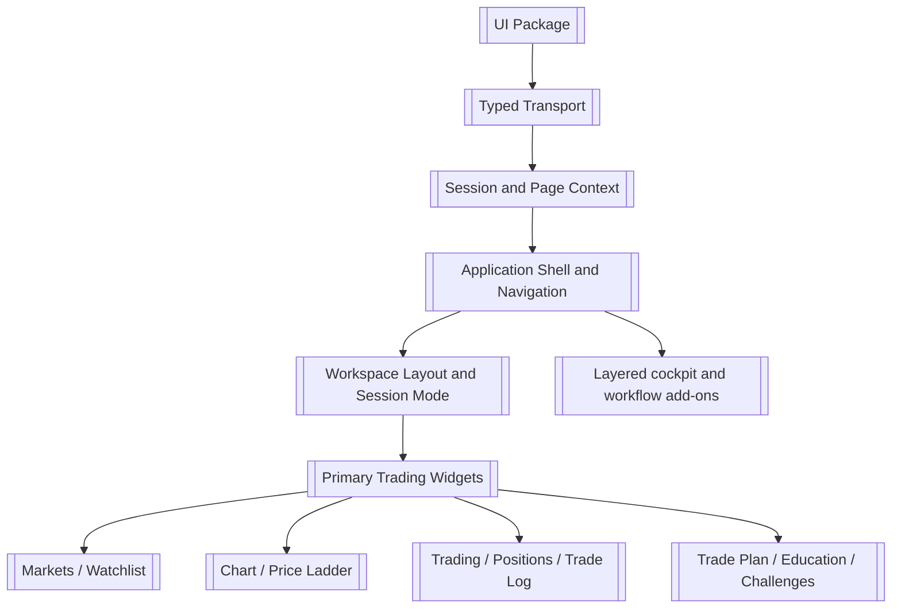
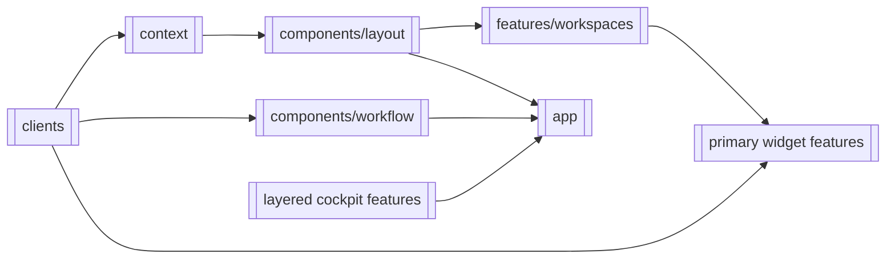
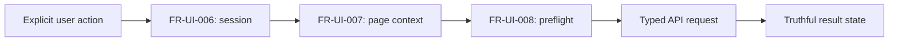

# UI

> **Package:** `app/ui/`
> **Status:** `In Progress` — 24 registered UI features; 14 `Completed`, 9 `Pending`,
> and 1 `Partial` requirement coverage or focused-folder ownership.
> **Last updated:** `2026-08-17`

> This README is the package's **single source of truth** for requirements, final
> structure, implementation sequence, progress, verification evidence, and tests.
> Update this file before changing UI code.

---

## 1. Purpose and Boundary

### Purpose

UI is HaruQuantAI's independently governed Next.js presentation domain. It presents
typed API evidence, manages bounded interaction state, and submits explicit user
actions without becoming a business, policy, persistence, or broker authority.

### Owns

- Accessible pages, widgets, workflow presentation, navigation, and interaction state.
- Typed API clients and frontend validation kept in route-contract parity with API.
- Truthful loading, stale, empty, unavailable, unknown, and error presentation.
- Browser-session recovery and non-authoritative governed-action preflight.

### Does not own

- Trading, Risk, Strategy, Data, Indicators, Simulation, Analytics, Optimization,
  Research, Portfolio, or Agentic calculations and decisions.
- Authentication or authorization authority, durable state, credential resolution,
  provider readiness, broker sessions, or direct MT5 access.
- Invented quotes, fills, performance, readiness, recovery, or successful mutations.

### Shared contracts

Contract names, versions, and owners match `docs/PROJECT.md` and the API registry.

**Owned by this domain** — UI-only view and interaction contracts:

| Status    | Contract              | Version | Counterparty | Purpose                                     |
| --------- | --------------------- | ------- | ------------ | ------------------------------------------- |
| Completed | `InstrumentValue`   | `v1`  | UI features  | Labelled value with explicit freshness.     |
| Completed | `WarningItem`       | `v1`  | UI features  | Bounded warning presentation state.         |
| Completed | `WorkflowStage`     | `v1`  | UI routes    | State-gated workstation stage.              |
| Completed | `EmergencyStep`     | `v1`  | UI routes    | Emergency checklist presentation.           |
| Completed | `Alarm`             | `v1`  | UI routes    | Priority, root, and lifecycle presentation. |
| Completed | `QualificationView` | `v1`  | UI routes    | Qualification and remediation presentation. |

**Consumed from other domains** — referenced and validated, never redefined as owner
truth:

| Contract                                                                           | Version             | Owner                              | Used for                                   |
| ---------------------------------------------------------------------------------- | ------------------- | ---------------------------------- | ------------------------------------------ |
| `ApiResponse`, `ApiError`, `ApiMetadata`, `StreamEvent`, `RouteContract` | `v1`              | API                                | Typed HTTP and stream transport.           |
| `GovernedRequestContext`, `PageContext`                                        | `v1`              | API                                | Bounded route and governed-action context. |
| Registered domain response DTOs                                                    | Registered versions | Owning service domains through API | Truthful workflow and widget presentation. |

### Persisted state

UI owns no durable state and no migration manifest. Browser `sessionStorage` and
component/store state are non-authoritative display state; the API remains the source
of session and domain truth.

### Four-level structure

| Code level                            | Represents                                                |
| ------------------------------------- | --------------------------------------------------------- |
| **Package**                     | UI domain                                                 |
| **Module folder**               | UI feature or documented support capability               |
| **File**                        | Page, component, client, contract, or focused interaction |
| **Component / function / type** | Functional requirement behaviour or UI contract           |

```text
app/ui
└── src/features/<feature>
    └── <focused-file>.tsx
        └── Component / Function / Type
```

### Leading document

`docs/dev/documentation.pdf` is the leading source for UI features. The trading
workspace and its widgets are the primary UI and are registered first
(`FEAT-UI-01`–`FEAT-UI-13`). Foundation modules (`FEAT-UI-14`–`FEAT-UI-17`) exist to
enable that primary UI. Every other surface, including the trading-cockpit features
traced in `docs/dev/trading-cockpit/`, is registered as an additive layer on top
(`FEAT-UI-18`–`FEAT-UI-24`) and never as the owner of a primary widget. The
focused `FEAT-UI-25` diagnostic widget isolates the MT5 snapshot presentation
path without replacing any primary widget.

### Package capability map



---

## 2. Final Package Structure

The tree records the target focused ownership of all registered UI features.
Entries marked *(target)* are registered destinations whose code has not yet moved.

```text
app/ui/
├── README.md
├── package.json
└── src/
    ├── features/workspaces/              # FEAT-UI-01
    ├── features/markets/                 # FEAT-UI-02
    ├── features/watchlists/              # FEAT-UI-03
    ├── features/chart/                   # FEAT-UI-04
    ├── features/price-ladder/            # FEAT-UI-05
    ├── features/trading/                 # FEAT-UI-06 (target)
    ├── features/trade-log/               # FEAT-UI-08 (target)
    ├── features/positions/               # FEAT-UI-09 (target)
    ├── features/trade-plan/              # FEAT-UI-10 (target)
    ├── features/education/               # FEAT-UI-11 (target)
    ├── features/challenges/              # FEAT-UI-12 (target)
    ├── features/system-settings/         # FEAT-UI-13 (target)
    ├── clients/                          # FEAT-UI-14
    ├── context/                          # FEAT-UI-15
    ├── components/layout/                # FEAT-UI-16
    ├── app/                              # FEAT-UI-17  framework routes
    ├── components/workflow/              # FEAT-UI-18
    ├── features/instrument-panels/       # FEAT-UI-19
    ├── features/planning/                # FEAT-UI-20
    ├── features/workflow-pages/          # FEAT-UI-21
    ├── features/emergency-ux/            # FEAT-UI-22
    ├── features/human-factors/           # FEAT-UI-23
    ├── features/training-ux/             # FEAT-UI-24
    ├── features/market-ticks/            # FEAT-UI-25
    ├── features/session-registry/        # FEAT-UI-26
    ├── types/                            # support: shared types
    ├── utils/                            # support: shared helpers
    └── mock/                             # support: test-only fixtures
```

### Feature Registry

| Status | Feature | Owning module | Public surface | Requirements | Verification evidence |
|---|---|---|---|---|---|
| Completed | `FEAT-UI-01` Workspace Layout and Session Mode | `src/features/workspaces/` | Workspace and widget layout state, workspace templates, docking layout trees, confirmation mode, account mode, provider-mode compatibility gate | `FR-UI-001`–`FR-UI-029`; `FR-UI-195`–`FR-UI-199`; `FR-UI-200`–`FR-UI-205`; `FR-UI-208` | `src/features/workspaces/store.test.ts`; `dockLayout.test.ts`; `TemplatePicker.test.tsx`; `WorkspaceEmptyState.test.tsx`; `src/components/layout/DockingWorkspace.test.tsx`; `Header.test.tsx`; focused Trading control tests |
| Completed | `FEAT-UI-02` Markets Widget | `src/features/markets/` | `MarketsWidget` through the feature barrel | `FR-UI-030`–`FR-UI-037`; `FR-UI-192`–`FR-UI-193` | `src/features/markets/MarketsWidget.test.tsx` |
| Completed | `FEAT-UI-03` Watchlist Widget | `src/features/watchlists/` | `WatchlistWidget` through the feature barrel | `FR-UI-038`–`FR-UI-045`; `FR-UI-192` | `src/features/watchlists/WatchlistWidget.test.tsx` |
| Completed | `FEAT-UI-04` Charting Tools Widget | `src/features/chart/` | `ChartWidget` | `FR-UI-046`–`FR-UI-054`; `FR-UI-194` | `src/features/chart/ChartWidget.test.tsx` |
| Completed | `FEAT-UI-05` Price Ladder Widget | `src/features/price-ladder/` | `PriceLadderWidget` | `FR-UI-055`–`FR-UI-062` | `src/features/price-ladder/PriceLadderWidget.test.tsx`; `useDepthStream.test.tsx` |
| Partial | `FEAT-UI-06` Trading Widget | Target: `src/features/trading/`; current: `src/components/workflow/trading.tsx` and `OrderTicketModal.tsx` | `TradingWidget` through the feature barrel | `FR-UI-063`–`FR-UI-072`; `FR-UI-147`; `FR-UI-225` | `src/components/workflow/trading.test.tsx`; order-entry and focused-folder evidence pending |
| Pending | `FEAT-UI-08` Trade Log Widget | Target: `src/features/trade-log/`; current: `src/components/workflow/TradeLogWidget.tsx` | `TradeLogWidget` | `FR-UI-085`–`FR-UI-089` | Pending evidence |
| Pending | `FEAT-UI-09` Positions and Orders Widgets | Target: `src/features/positions/`; current: `src/components/workflow/PositionsWidget.tsx` | `PositionsWidget`, orders presentation | `FR-UI-090`–`FR-UI-098` | Pending evidence |
| Pending | `FEAT-UI-10` Trade Plan Widget | Target: `src/features/trade-plan/`; current: `src/features/planning/TradePlanWidget.tsx` | `TradePlanWidget` | `FR-UI-099`–`FR-UI-104` | Pending evidence |
| Pending | `FEAT-UI-11` Education Resources Widget | Target: `src/features/education/`; current: `src/features/training-ux/EducationWidget.tsx` | `EducationWidget` | `FR-UI-105`–`FR-UI-108` | Pending evidence; blocked on an owning backend domain |
| Pending | `FEAT-UI-12` Challenges and Challenge Dashboard | Target: `src/features/challenges/`; current: `src/features/training-ux/ChallengesWidget.tsx` | `ChallengesWidget` | `FR-UI-109`–`FR-UI-116` | Pending evidence; blocked on an owning backend domain |
| Pending | `FEAT-UI-13` System Settings | Target: `src/features/system-settings/`; current: `src/app/workstation/settings/SystemSettingsModal.tsx` | `SystemSettingsModal` | `FR-UI-117`–`FR-UI-121` | `system-settings-modal.test.tsx`; further evidence pending |
| Completed | `FEAT-UI-14` Typed Backend Transport | `src/clients/` | `request`, `unwrapData`, `ApiClientError`, `openStream`, `apiClients` | `FR-UI-122`–`FR-UI-126` | `src/clients/request.test.ts`; `clients.test.ts`; `clients.contract.test.ts` |
| Pending | `FEAT-UI-15` Session and Page Context | `src/context/` | Auth, page, governed-preflight, and stream context | `FR-UI-127`–`FR-UI-131` | `src/context/{auth,page,governed,streams}.test.ts(x)`; further evidence pending |
| Pending | `FEAT-UI-16` Application Shell and Navigation | `src/components/layout/` | `Header`, `Sidebar`, `WorkspaceGrid`, session clock, account metrics settings | `FR-UI-132`–`FR-UI-137`; `FR-UI-207`; `FR-UI-209`–`FR-UI-211` | `src/components/layout/clock.test.ts`; `TimeCorrectionDialog.test.tsx`; `AccountMetricsMenu.test.tsx`; `Header.test.tsx`; `src/app/workstation/settings/system-settings-modal.test.tsx`; further evidence pending |
| Pending | `FEAT-UI-17` Protected Routing and Access Gate | `src/app/` | `AuthenticationPage`, `ProtectedLayout`, `WorkflowPage` | `FR-UI-138`–`FR-UI-141` | `src/app/{authentication-page,protected-layout,pages.contract}.test.ts(x)`; further evidence pending |
| Completed | `FEAT-UI-18` Domain Workflow Views                    | `src/components/workflow/`                                                                                | `AppShell` and non-Trading focused domain workflow views                      | `FR-UI-142`–`FR-UI-146`; `FR-UI-148`–`FR-UI-150` | Focused non-Trading `src/components/workflow/*.test.tsx`                                                |
| Completed | `FEAT-UI-19` Instrument Panels                        | `src/features/instrument-panels/`                                                                         | `InstrumentPanels`, `InstrumentValue`                                       | `FR-UI-151`–`FR-UI-156` | `src/features/instrument-panels/components.test.tsx`                                                 |
| Completed | `FEAT-UI-20` Navigation, Planning, and Warning Panels | `src/features/planning/`                                                                                  | `PlanningPanels`, `WarningItem`                                             | `FR-UI-157`–`FR-UI-161` | `src/features/planning/components.test.tsx`                                                          |
| Completed | `FEAT-UI-21` Workflow Stage Pages                     | `src/features/workflow-pages/`, `src/app/workstation/`                                                  | `WorkflowStages`, `WorkflowStage`, workstation routes                       | `FR-UI-162`–`FR-UI-168` | `src/features/workflow-pages/components.test.tsx`                                                    |
| Completed | `FEAT-UI-22` Emergency and Recovery UX                | `src/features/emergency-ux/`                                                                              | `EmergencyPanel`, `EmergencyStep`                                           | `FR-UI-169`–`FR-UI-173` | `src/features/emergency-ux/components.test.tsx`                                                      |
| Completed | `FEAT-UI-23` Human-Factors and Alarm Model            | `src/features/human-factors/`                                                                             | `AlarmModel`, `Alarm`                                                       | `FR-UI-174`–`FR-UI-179` | `src/features/human-factors/components.test.tsx`                                                     |
| Completed | `FEAT-UI-24` Training, Replay, and Qualification UX   | `src/features/training-ux/`                                                                               | `TrainingPanel`, `QualificationView`                                        | `FR-UI-180`–`FR-UI-185` | `src/features/training-ux/components.test.tsx`                                                       |
| Completed | `FEAT-UI-25` MT5 Market Ticks Diagnostic Widget       | `src/features/market-ticks/`                                                                              | `MarketTicksTableWidget`                                                     | `FR-UI-186`–`FR-UI-191`; `FR-UI-193` | `src/features/market-ticks/MarketTicksTableWidget.test.tsx`, `useMarketSnapshots.test.tsx`           |
| Completed | `FEAT-UI-26` Trading Session Registry Widget | `src/features/session-registry/` | `SessionRegistryWidget`; typed create/list/default/start/stop/archive controls, SIM opening-account and verified-dataset configuration, stopped-only legacy completion, metadata inspection, durable lifecycle history, and safe live activity console | `FR-UI-212`–`FR-UI-224` | `src/features/session-registry/SessionRegistryWidget.test.tsx`; typed client and backend integration tests |

**Primary UI.** `FEAT-UI-01`–`FEAT-UI-06` and `FEAT-UI-08`–`FEAT-UI-13` are the trading workspace and widgets
specified by `docs/dev/documentation.pdf`. `FEAT-UI-14`–`FEAT-UI-17` are the foundation
that enables them. `FEAT-UI-18`–`FEAT-UI-24` are additive layers and own no primary widget.

`FEAT-UI-02` consumes backend `FEAT-API-12` Markets orchestration and `FEAT-UI-03`
consumes backend `FEAT-API-11` Account Watchlists. UI feature identity remains
independent from the API's `FEAT-API-*` registry.

**Blocked features.** `FEAT-UI-11` and `FEAT-UI-12` have no owning backend domain;
see Section 6. Listed-options and options-chain UI scope is withdrawn because the
owner trades CFDs, primarily forex through MT5; the retired identifiers are not reused.

**Non-feature support directories.** `src/types/` and `src/utils/` are documented
shared type and helper directories owning no feature behaviour. `src/mock/` is
test-only fixture data; production modules must not import it (see `NFR-UI-007`).
These directories are excluded from feature-count reconciliation.

### Module dependency diagram



### Structure rules

- Each registered feature owns one focused production module folder; framework route
  entries may remain in `src/app/` and delegate to their owning feature.
- Each file owns one focused page, component, contract, transport, or interaction.
- UI imports service capabilities only through typed API contracts.
- Shared `src/components/widgets/` ownership is prohibited; widgets reside in their
  registered feature folder.
- `FEAT-UI-*` features use the UI verification-evidence exception: they do not require
  separate numbered standalone usage programs. Production rendering is not evidence.

---

## 3. Workflows

### Status values

| Status              | Meaning                                                               |
| ------------------- | --------------------------------------------------------------------- |
| **Pending**   | Not implemented, not verified, or awaiting structural reconciliation. |
| **Partial**   | Some behavior exists but required evidence is incomplete.             |
| **Completed** | Implemented and verified by the required UI evidence.                 |

### Workflow scope values

| Scope                  | Meaning                                    |
| ---------------------- | ------------------------------------------ |
| **Internal**     | The workflow remains within UI.            |
| **Cross-domain** | UI exchanges typed boundary data with API. |

| Status    | Workflow ID   | Scope        | Workflow                   | Trigger / Input boundary | Final outcome / Output boundary           | Requirement sequence                                 |
| --------- | ------------- | ------------ | -------------------------- | ------------------------ | ----------------------------------------- | ---------------------------------------------------- |
| Completed | `WF-UI-001` | Cross-domain | Governed user action       | Explicit user action     | API result, warning, or preflight block   | `FR-UI-006 → FR-UI-007 → FR-UI-008 → FR-UI-021` |
| Completed | `WF-UI-002` | Cross-domain | Ordered stream consumption | Authenticated API stream | Validated events or authoritative refresh | `FR-UI-005 → FR-UI-009 → FR-UI-010`              |

### `WF-UI-001` — Governed User Action

**Scope:** `Cross-domain`

**System workflow:** Any registered `SYS-WF-*` requiring an operator action.

**Input boundary:** An authenticated user explicitly initiates an action in UI.

**Output boundary:** API receives one typed request, or UI displays a bounded preflight
block without claiming backend authorization.

1. `AuthProvider` recovers current session truth from API.
2. `PageContextProvider` supplies bounded, redacted route/action context.
3. `buildGovernedOptions` rejects incomplete or stale context.
4. The focused typed client submits the action and the owning view presents its result.

**Failure behaviour:** Expired session redirects to access; stale context blocks the
request; API rejection remains visible and is never converted into success.

**Integration test:** `src/context/auth.test.tsx`, `governed.test.ts`, and focused
workflow component tests.



### `WF-UI-002` — Ordered Stream Consumption

**Scope:** `Cross-domain`

**System workflow:** Any registered streaming workflow.

**Input boundary:** Authenticated API stream events.

**Output boundary:** Ordered UI events or an explicit gap/error followed by
authoritative state refresh.

1. `openStream` opens the typed transport.
2. `consumeStream` validates ordering and filters heartbeat frames.
3. Gaps and terminal events surface explicitly and trigger the registered recovery.
4. Disconnect aborts transport and releases UI resources.

**Integration test:** `src/clients/stream.test.ts` and
`src/context/streams.test.ts`.

---

---

## 4. Module and Requirement Specifications

Modules are ordered primary UI first, then foundation, then layered add-ons. The
`Usage / Test` column records UI verification evidence; the approved UI exception
replaces standalone usage programs with focused unit/component and appropriate
integration, contract, or browser evidence.

### 4.1 `src/features/workspaces/` — Workspace Layout and Session Mode

**Purpose:** Own non-authoritative workspace layout preference, order-confirmation mode, and account-mode presentation.

**Location:** `src/features/workspaces/`. Migrated from the former
`src/store/useTradingStore.ts` (trimmed to only the unrelated trading-engine
state - orders, positions, trade log, practice/challenge balances - which
remains out of this feature's scope) and `src/types/widget.ts` (deleted; its
contents moved into `contracts.ts`). `accountMode` is derived exclusively from
the authenticated identity's `runtime_profile` (`src/context/auth.tsx`) rather
than through `clients/settings`, which has no
workspace-related field; see the feature's own `README.md` for that gap.

### Files

| Status    | File             | Responsibility                                            | Key exports                                                                             | Dependencies                                                                                                                |
| --------- | ---------------- | --------------------------------------------------------- | --------------------------------------------------------------------------------------- | --------------------------------------------------------------------------------------------------------------------------- |
| Completed | `contracts.ts` | Workspace and widget layout contracts                     | `Workspace`, `Widget`, `WidgetType`, `AccountMode`                              | **Standard library:** None**Required third-party:** Zod**Local:** None                                    |
| Completed | `templates.ts` | Workspace template catalog (FR-UI-195–FR-UI-197)          | `WORKSPACE_TEMPLATES`, `WorkspaceTemplate`, `findWorkspaceTemplate`            | **Standard library:** None**Required third-party:** None**Local:** contracts                              |
| Completed | `dockLayout.ts` | Docking layout tree factory and legacy migration (FR-UI-201) | `buildDockLayout`                                                              | **Standard library:** None**Required third-party:** dockview-react (types only)**Local:** contracts        |
| Completed | `store.ts`     | Bounded layout, confirmation-mode, and account-mode state | `useWorkspaceStore`, `selectOrderEntryDisabled`, `mapRuntimeProfileToAccountMode` | **Standard library:** localStorage**Required third-party:** Zustand**Local:** contracts, templates, dockLayout |
| Completed | `TemplatePicker.tsx` | New-workspace template picker screen (FR-UI-195/196/198) | `TemplatePicker` through the feature barrel                                  | **Standard library:** None**Required third-party:** None**Local:** store, templates                       |
| Completed | `WorkspaceEmptyState.tsx` | Explicit empty-workspace prompt (FR-UI-026/197)    | `WorkspaceEmptyState` through the feature barrel                              | **Standard library:** None**Required third-party:** None**Local:** None                                   |
| Completed | `index.ts`     | Sole public surface for the feature                       | feature barrel                                                                          | **Standard library:** None**Required third-party:** None**Local:** store and contracts                    |

| Status    | Requirement ID | Responsibility                                                                                                                                                | Component / Function / Type | Side Effects         | Failure presentation     | Usage / Test                                                                                             |
| --------- | -------------- | ------------------------------------------------------------------------------------------------------------------------------------------------------------- | --------------------------- | -------------------- | ------------------------ | -------------------------------------------------------------------------------------------------------- |
| Completed | `FR-UI-001`  | Provide a default workspace on first authenticated load containing the registered default widget set.                                                         | `Workspace`               | Local persistence    | Default restored         | `store.test.ts`                                                                                        |
| Completed | `FR-UI-002`  | Allow creation of named workspaces up to a bounded maximum, rejecting creation beyond the limit explicitly.                                                   | workspace actions           | Local persistence    | Limit message shown      | `store.test.ts`                                                                                        |
| Completed | `FR-UI-003`  | Default an unnamed new workspace to a deterministic incrementing name.                                                                                        | workspace actions           | Local persistence    | Deterministic naming     | `store.test.ts`                                                                                        |
| Completed | `FR-UI-004`  | Allow renaming, duplicating, and deleting a workspace; deleting the last remaining workspace is rejected.                                                     | workspace actions           | Local persistence    | Rejection explicit       | `store.test.ts`                                                                                        |
| Completed | `FR-UI-005`  | Allow a workspace to be designated the default opened on next session start.                                                                                  | workspace actions           | Local persistence    | Default visible          | `store.test.ts`                                                                                        |
| Completed | `FR-UI-006`  | Support moving a widget by dragging its tab: dropping on a panel's centre docks it as a tab in that group, dropping on an edge splits the region in that direction, and the layout always fills the workspace with no gaps or overlaps. | `DockingWorkspace`  | Local persistence    | Drop overlay visible      | `DockingWorkspace.test.tsx`; live docking evidence                                                        |
| Completed | `FR-UI-007`  | Provide a keyboard-operable path for layout moves: focused tabs switch with arrow keys and Alt+Arrow moves the active panel left/right/above/below; splitter pixel-resizing remains pointer-only and tracked as a follow-up. | `DockingWorkspace`  | Local persistence    | Keyboard path preserved   | `DockingWorkspace.test.tsx`                                                                             |
| Completed | `FR-UI-008`  | Support expanding a widget's group to fill the workspace (double-click its tab) and restoring the prior layout (double-click again or select another tab).        | `DockingWorkspace`  | Local persistence    | Prior layout retained     | `store.test.ts` (expand/contract state)                                                                  |
| Completed | `FR-UI-009`  | Persist layout to browser-local storage only; layout is a client preference and never system state.                                                           | store                       | Local persistence    | Non-authoritative        | `store.test.ts`                                                                                        |
| Completed | `FR-UI-010`  | Restore a corrupt or unreadable persisted layout to the default workspace rather than failing to render.                                                      | store                       | Local persistence    | Default restored         | `store.test.ts`                                                                                        |
| Completed | `FR-UI-011`  | Provide an order-confirmation toggle that, when disabled, submits without the client-side confirmation dialog.                                                | mode actions                | Local state mutation | Mode always visible      | `store.test.ts`                                                                                        |
| Completed | `FR-UI-012`  | Default the toggle to confirmation-required on every new session; the setting is never inherited silently.                                                    | mode actions                | Local state mutation | Safe default             | `store.test.ts`                                                                                        |
| Completed | `FR-UI-013`  | Present the active confirmation mode persistently in the shell.                                                                                               | mode actions                | None                 | Mode always visible      | `Header.tsx` confirmation-mode toggle; `Header.test.tsx`                                               |
| Completed | `FR-UI-014`  | Treat the toggle as presentation only; it never suppresses or pre-satisfies API authorization, approval, idempotency, governance, or kill-switch enforcement. | mode actions                | None                 | API authority unchanged  | `store.test.ts`                                                                                        |
| Completed | `FR-UI-015`  | Apply the toggle identically in simulation and live; the difference between modes is the environment switch, not a different order path.                      | mode actions                | None                 | One order path           | `store.test.ts`                                                                                        |
| Completed | `FR-UI-016`  | Present the active account mode — sim, demo, or live — persistently, unambiguously, and colour-coded.                                                        | mode actions                | None                 | Mode always visible      | `Header.test.tsx` badge tests                                                                          |
| Completed | `FR-UI-017`  | Elect the mode from the profile dropdown and persist it as the `ACCOUNT_MODE` system setting; the backend setting is authoritative for every session. Supersedes the previous never-client-elected rule by owner decision (2026-08-17). | mode actions                | External API call    | Selection persisted      | `Header.test.tsx`; `store.test.ts`                                                                   |
| Completed | `FR-UI-018`  | Require an explicit operator action to change mode, apply it only once the backend has accepted it, and revert on refusal.                                    | mode actions                | External API call    | Explicit action required | `Header.test.tsx` (selection, persistence, and revert-on-refusal)                                      |
| Completed | `FR-UI-019`  | Present simulated and live balances distinctly and never combine them in one total.                                                                           | mode actions                | None                 | No combined total        | `Header.tsx` (single balance figure per active mode)                                                   |
| Completed | `FR-UI-203`  | Persist the elected account mode as the complete system-settings document under its observed version, so a mode change never erases another setting and a concurrent edit is refused. | mode actions | External API call | Full-document write | `Header.test.tsx` (full-document write assertion)                                              |
| Completed | `FR-UI-204`  | Route every governed order, cancellation, and account-state read on the active mode's route, and refuse to act at all while the mode is unresolved.            | mode actions                | External API call    | Route follows mode       | `PriceLadderWidget.tsx` route resolution; `store.test.ts`                                              |
| Completed | `FR-UI-205`  | Colour-code the account mode identically in the profile dropdown and the header badge: sim green, demo amber, live red.                                        | mode actions                | None                 | One palette, both places | `Header.test.tsx`; `index.css` account-mode palette                                                    |
| Completed | `FR-UI-206`  | Display the active provider account name above its authoritative environment in the Header. DEMO/LIVE consume MT5-authored account-profile evidence—including MT5's actual environment when it differs from the elected execution mode—while SIM consumes the explicit Simulator identity. Loading and unavailable states are visible, and the app-login username is never substituted for broker identity. | `Header` | External API call | Loading/unavailable explicit | `Header.test.tsx`; `clients/trading.test.ts` |
| Completed | `FR-UI-208`  | Disable every Trading mutation control and handler unless fresh provider-authored account mode exactly matches the selected system mode (`SIMULATION`/sim, `DEMO`/demo, `REAL`/live); unknown, unavailable, malformed, contest, or mismatched evidence fails closed while read-only presentation remains available. | mode compatibility state; Trading controls | Local state mutation | Persistent mismatch warning; actions disabled | `store.test.ts`; `Header.test.tsx`; `trading.test.tsx`; `PriceLadderWidget.test.tsx` |
| Completed | `FR-UI-209`  | Display the active account's provider-authored Balance, Profit, Margin, Free Margin, Margin Level, Leverage, and Equity in that order; unavailable values render as an explicit dash and never fall back to mock trading-store figures. | `Header` | External API call | Loading and unavailable metrics remain explicit | `Header.test.tsx`; `clients/trading.test.ts` |
| Completed | `FR-UI-210`  | Open an accessible account-metrics settings menu from the Header caret. Switch Profit between provider-currency Money and an internally calculated floating-return Percent (`profit / balance * 100`); zero, missing, or invalid balance renders unavailable. The preference is session-local. | `AccountMetricsMenu`; `Header` | Local presentation state | Escape/outside close; safe zero-balance handling | `AccountMetricsMenu.test.tsx`; `Header.test.tsx` |
| Completed | `FR-UI-211`  | Present MT5 leverage as provider-owned and read-only. SIM leverage remains unavailable without an active simulation-session contract, and the Header cannot mutate a global or invented leverage value. | `AccountMetricsMenu`; `Header` | None | Mode-specific explanation; control disabled | `AccountMetricsMenu.test.tsx`; `Header.test.tsx` |
| Completed | `FR-UI-217`  | When creating a SIM session, require an initial account balance and leverage and accept a three-letter currency defaulting to USD. Hide and omit these controls for DEMO/LIVE because MT5 owns those values. | `SessionRegistryWidget`; typed Trading client | External API call | Client validation and API rejection remain visible | `SessionRegistryWidget.test.tsx`; `clients/trading.test.ts` |
| Completed | `FR-UI-218`  | Display persisted SIM opening balance and leverage in session details and use the scoped active/default SIM account profile for Header metrics across reloads. Legacy unconfigured sessions remain explicitly unavailable. | `SessionRegistryWidget`; `Header` | External API read | Unconfigured values render unavailable | `SessionRegistryWidget.test.tsx`; `Header.test.tsx` |
| Completed | `FR-UI-219`  | Display the selected system mode and its active/default session name together as `MODE : SESSION`; when no scoped session exists, display `NO SESSION` without inventing an identity. Backend session-start admission remains authoritative and cannot be bypassed by the client. | `Header` | External API read | Loading, no-session, and mismatch states explicit | `Header.test.tsx`; `clients/trading.test.ts` |
| Completed | `FR-UI-220`  | Require selection of a Data-verified dataset when creating SIM sessions, persist its exact lineage, and visibly mark the bound dataset active. DEMO/LIVE omit dataset configuration. | `SessionRegistryWidget`; typed Data/Trading clients | External API read/write | Empty catalogue blocks SIM creation visibly | `SessionRegistryWidget.test.tsx`; `clients.contract.test.ts` |
| Completed | `FR-UI-221`  | Label the provider identity as Account Name and display the immutable SIM logical identity separately in `username_N` format; unavailable legacy values remain explicit. | `SessionRegistryWidget` | External API read | No invented fallback identity | `SessionRegistryWidget.test.tsx`; Trading integration tests |
| Completed | `FR-UI-222`  | Present durable lifecycle events separately from a bounded live activity console with connection state, pause/resume, clear, and accessible log semantics. Explain that streamed redacted file logs are not duplicated in the database. | `SessionRegistryWidget`; typed SSE client | External stream | Stream failure is visible without hiding lifecycle history | `SessionRegistryWidget.test.tsx`; `test_session_activity_stream.py` |
| Completed | `FR-UI-223`  | Detect legacy SIM sessions missing Account Name, Simulation ID, or dataset lineage; direct the user to stop a running session, require explicit verified-dataset selection, and complete all three fields through one visible action. | `SessionRegistryWidget`; typed Trading client | External API read/write | Running/incomplete/empty-catalogue states remain explicit and blocked | `SessionRegistryWidget.test.tsx`; Trading integration tests |
| Completed | `FR-UI-224`  | Present the authenticated username as the SIM Account Name in the Header and session details, the immutable `username_N` value as Simulation ID, and the independently editable registry label only as Session Name. | `Header`; `SessionRegistryWidget` | External API read | Missing identity remains explicit and trading stays blocked | `Header.test.tsx`; `SessionRegistryWidget.test.tsx`; Trading integration tests |
| Completed | `FR-UI-225`  | Present the existing governed Trading controls as a responsive execution cockpit with a Sessions-style hero, account/position/order evidence cards, grouped execution/order/authority/target fields, explicit loading/error/disabled/result states, and a dedicated command bar without changing any mutation or validation behavior. | `TradingView` | Existing Trading client only | All safety gates and disabled conditions remain authoritative | `src/components/workflow/trading.test.tsx`; TypeScript typecheck |
| Removed   | `FR-UI-020`  | Balance reset control removed by owner decision (2026-08-16): no reset action is offered in the shell; the requirement is retired.                              | none                        | None                 | No reset offered         | Owner decision; `docs/CHANGELOG.md` [Unreleased]                                                       |
| Completed | `FR-UI-021`  | Fail closed when mode is unknown: present as unknown, disable order entry, and name no route until resolved.                                                  | mode actions                | None                 | Order entry disabled     | `store.test.ts`; `Header.test.tsx`; `OrderTicketModal.tsx`                                           |
| Completed | `FR-UI-022`  | Present the market-data delay applicable to the active mode where the API declares one.                                                                       | mode actions                | External API call    | Unknown remains explicit | `marketDataDelaySeconds` field, undefined until the API supplies one                                   |
| Completed | `FR-UI-023`  | Present widget type and title from the registered widget-type set only.                                                                                       | `WidgetType`              | None                 | Unknown type rejected    | `store.test.ts`                                                                                        |
| Completed | `FR-UI-024`  | Keep every widget inside the workspace bounds inherently: the docking layout always fills the container and cannot express out-of-bounds or overlapping regions. | `DockingWorkspace`  | Local persistence    | No out-of-bounds state    | `dockLayout.test.ts`                                                                                     |
| Completed | `FR-UI-025`  | Preserve widget identity across docking moves, duplication, and restore operations: panel ids equal widget ids and never change.                              | `DockingWorkspace`  | Local persistence    | Stable identity          | `dockLayout.test.ts`; `store.test.ts`                                                                    |
| Completed | `FR-UI-026`  | Present an empty workspace explicitly rather than as a failed render.                                                                                         | `Workspace`               | None                 | Empty state truthful     | `store.test.ts`                                                                                        |
| Completed | `FR-UI-027`  | Never persist account, credential, or order state to browser-local storage.                                                                                   | store                       | Local persistence    | Layout keys only         | `store.test.ts`                                                                                        |
| Completed | `FR-UI-028`  | Expose workspace and mode state only through the feature barrel.                                                                                              | `index.ts`                | None                 | No deep import           | Consumer files import only from`features/workspaces`                                                   |
| Completed | `FR-UI-029`  | Import no fixture data; every displayed value is API-sourced or a labelled client preference.                                                                 | store                       | None                 | No fixture import        | `store.test.ts`                                                                                        |
| Completed | `FR-UI-195`  | Create a new workspace as pending its template choice: deterministically named, widget-free, and rendered as the template picker instead of the widget grid; creation stays bounded by FR-UI-002. | `addWorkspace`, `TemplatePicker` | Local persistence | Bounded creation kept    | `store.test.ts`; `TemplatePicker.test.tsx`                                                            |
| Completed | `FR-UI-196`  | Apply a content template to the active pending workspace by seeding the template's registered-widget preset, whose rectangle set reproduces the reference thumbnail's exact panel orientation (`public/templates/`, Dark/Light), and renaming the workspace to the template name. | `applyWorkspaceTemplate`  | Local persistence    | Unknown template rejected | `store.test.ts`; `TemplatePicker.test.tsx`; `dockLayout.test.ts`                                         |
| Completed | `FR-UI-197`  | Apply the Blank template by leaving the workspace empty under its deterministic name and presenting the explicit empty-workspace prompt. | `applyWorkspaceTemplate`, `WorkspaceEmptyState` | Local persistence | Empty state truthful       | `store.test.ts`; `WorkspaceEmptyState.test.tsx`                                                       |
| Completed | `FR-UI-198`  | Present every template as a labeled card control operable by pointer and keyboard.                                                                          | `TemplatePicker`          | None                 | Full keyboard path        | `TemplatePicker.test.tsx`                                                                              |
| Completed | `FR-UI-199`  | Reject an unregistered template id without any state change.                                                                                                 | `applyWorkspaceTemplate`  | None                 | No state change           | `store.test.ts`                                                                                        |
| Completed | `FR-UI-200`  | Support fluid pixel-level resizing of adjacent layout regions by dragging the splitter between them, with the drop landing at the exact pointer position.      | `DockingWorkspace`  | Local persistence    | Continuous resize         | Live docking evidence; `DockingWorkspace.test.tsx`                                                       |
| Completed | `FR-UI-201`  | Persist the serialized docking layout per workspace, restore it on reload, and deterministically convert grid-rectangle layouts (and template presets) into proportional docking trees by a column-cluster then row-band partition, so side-by-side columns keep independent vertical splits. | `dockLayout.ts`, `setWorkspaceDockLayout` | Local persistence | Legacy layouts convert or fall back | `dockLayout.test.ts`; `store.test.ts`                                                    |
| Completed | `FR-UI-202`  | Collapse layout regions vacated by a moved or closed widget and expand the remaining regions to refill the workspace automatically.                            | `DockingWorkspace`  | Local persistence    | No gaps or dead regions   | Live docking evidence                                                                                    |

### Configuration and Limits Manifest

| Status    | Setting / Limit           | Type       | Default | Required | Used by           | Description                     |
| --------- | ------------------------- | ---------- | ------- | -------- | ----------------- | ------------------------------- |
| Completed | `MAX_CUSTOM_WORKSPACES` | `number` | `10`  | Yes      | workspace actions | Bounded custom workspace count. |

### 4.2 `src/features/markets/` — Markets Widget

**Purpose:** Present the tradable instrument directory for the configured runtime source.

### Files

| Status    | File                  | Responsibility                                                                       | Key exports       | Dependencies                                                                                                                                                               |
| --------- | --------------------- | ------------------------------------------------------------------------------------ | ----------------- | -------------------------------------------------------------------------------------------------------------------------------------------------------------------------- |
| Completed | `MarketsWidget.tsx` | Bounded progressive market-directory presentation, with an optional watchlist filter | `MarketsWidget` | **Standard library:** browser APIs**Required third-party:** React**Local:** clients/data, clients/watchlists, features/workspaces, store/useTradingStore |
| Completed | `index.ts`          | Sole public surface for the feature                                                  | `MarketsWidget` | **Standard library:** None**Required third-party:** None**Local:** `MarketsWidget.tsx`                                                                 |

| Status    | Requirement ID | Responsibility                                                                                                                                                               | Component / Function / Type | Side Effects                            | Failure presentation             | Usage / Test                                    |
| --------- | -------------- | ---------------------------------------------------------------------------------------------------------------------------------------------------------------------------- | --------------------------- | --------------------------------------- | -------------------------------- | ----------------------------------------------- |
| Completed | `FR-UI-030`  | Present typed API market evidence without market calculation; format every populated symbol's annualized volatility as a percentage, ADR in pips, and range as a percentage of ADR, then present owner-supplied Bid as Last Price, convert raw spread into integer MT5 points using provider precision, show per-symbol whole-second Age from genuine TCP quote time, and preserve explicit live, stale, or not-live evidence from one authenticated snapshot stream. All sequential HTTP history/calculation batches must finish before a visible 10-second settling interval begins; streaming starts only after that interval and may update quote-only fields without replacing initialized technical evidence. Initial HTTP rows and invalid quote times retain unavailable Age. | `MarketsWidget`           | Sequential external API calls followed by one stream | Unavailable remains unavailable | `src/features/markets/MarketsWidget.test.tsx` |
| Completed | `FR-UI-031`  | Use bounded batch reads and progressive rendering.                                                                                                                           | `MarketsWidget`           | External API call; local state mutation | Completed batches remain visible | `src/features/markets/MarketsWidget.test.tsx` |
| Completed | `FR-UI-032`  | Show explicit loading, error, formatting, and sort states.                                                                                                                   | `MarketsWidget`           | Local state mutation                    | Em dash for unavailable legs     | `src/features/markets/MarketsWidget.test.tsx` |
| Completed | `FR-UI-033`  | Present the tradable instrument directory for the configured runtime source only.                                                                                            | `MarketsWidget`           | External API call                       | Non-tradable absent              | `src/features/markets/MarketsWidget.test.tsx` |
| Completed | `FR-UI-034`  | Offer filtering of the directory by asset class.                                                                                                                             | `MarketsWidget`           | Local state mutation                    | Empty filter truthful            | `src/features/markets/MarketsWidget.test.tsx` |
| Completed | `FR-UI-035`  | Offer sorting by symbol, change, and volume with a stable tiebreak.                                                                                                          | `MarketsWidget`           | Local state mutation                    | Deterministic ordering           | `src/features/markets/MarketsWidget.test.tsx` |
| Completed | `FR-UI-036`  | Offer a direct trade action per row that opens the order ticket pre-filled with that instrument while its text and accessible label present green live, yellow stale, or red not-live quote status without changing trading authority. | `MarketsWidget`           | Local state mutation                    | Ticket authority unchanged       | `src/features/markets/MarketsWidget.test.tsx` |
| Completed | `FR-UI-037`  | Offer per-row actions targeting the chart and price ladder surfaces at the selected instrument.                                                                              | `MarketsWidget`           | Navigation                              | Unavailable target disabled      | `src/features/markets/MarketsWidget.test.tsx` |

### Configuration and Limits Manifest

| Status    | Setting / Limit       | Type       | Default | Required | Used by         | Description                                                                                                         |
| --------- | --------------------- | ---------- | ------- | -------- | --------------- | ------------------------------------------------------------------------------------------------------------------- |
| Completed | `MARKETS_PAGE_SIZE` | `number` | `50`  | Yes      | directory fetch | Rows requested per page; matches the API's own default page size.                                                   |
| Completed | `MARKETS_MAX_PAGES` | `number` | `4`   | Yes      | directory fetch | Bounded page count (200 rows max) so the widget never walks the full broker catalogue regardless of`next_cursor`. |

### 4.3 `src/features/watchlists/` — Watchlist Widget

**Purpose:** Present watchlist selection and explicit CRUD interaction.

### Files

| Status    | File                    | Responsibility                                                                                                                   | Key exports                                                                                 | Dependencies                                                                                                                                                                               |
| --------- | ----------------------- | -------------------------------------------------------------------------------------------------------------------------------- | ------------------------------------------------------------------------------------------- | ------------------------------------------------------------------------------------------------------------------------------------------------------------------------------------------ |
| Completed | `WatchlistWidget.tsx` | Account watchlist interaction with source-backed symbol selection                                                                | `WatchlistWidget`                                                                         | **Standard library:** browser APIs**Required third-party:** React**Local:** clients/watchlists, clients/data, features/workspaces, store/useTradingStore, symbolUniverse |
| Completed | `symbolUniverse.ts`   | Load the complete provider symbol directory once into memory, rank bounded suggestions, and resolve exact provider-native values | `loadSymbolUniverse`, `resetSymbolUniverse`, `filterSymbols`, `resolveSourceSymbol` | **Standard library:** browser runtime**Required third-party:** None**Local:** clients/data                                                                               |
| Completed | `index.ts`            | Sole public surface for the feature                                                                                              | `WatchlistWidget`                                                                         | **Standard library:** None**Required third-party:** None**Local:** `WatchlistWidget.tsx`                                                                               |

| Status    | Requirement ID | Responsibility                                                                                                                                                                                                                                                                                                                                          | Component / Function / Type                                                             | Side Effects                             | Failure presentation                                                      | Usage / Test                                                                          |
| --------- | -------------- | ------------------------------------------------------------------------------------------------------------------------------------------------------------------------------------------------------------------------------------------------------------------------------------------------------------------------------------------------------- | --------------------------------------------------------------------------------------- | ---------------------------------------- | ------------------------------------------------------------------------- | ------------------------------------------------------------------------------------- |
| Completed | `FR-UI-038`  | Present lists and explicit default/current selection.                                                                                                                                                                                                                                                                                                   | `WatchlistWidget`                                                                     | External API call; local state mutation  | Empty/error state                                                         | `src/features/watchlists/WatchlistWidget.test.tsx`                                  |
| Completed | `FR-UI-039`  | Submit CRUD/item actions only after explicit user intent.                                                                                                                                                                                                                                                                                               | `WatchlistWidget`                                                                     | External API call                        | API rejection visible                                                     | `src/features/watchlists/WatchlistWidget.test.tsx`                                  |
| Completed | `FR-UI-040`  | Surface validation, authorization, conflict, and unavailable outcomes.                                                                                                                                                                                                                                                                                  | `WatchlistWidget`                                                                     | None                                     | Never invent success                                                      | `src/features/watchlists/WatchlistWidget.test.tsx`                                  |
| Completed | `FR-UI-041`  | Remove manual asset-class controls and display the backend-persisted class automatically derived from the selected connected-source symbol metadata.                                                                                                                                                                                                    | `WatchlistWidget`                                                                     | External API response                    | Missing class remains explicit as unavailable                             | `src/features/watchlists/WatchlistWidget.test.tsx`; `src/clients/clients.test.ts` |
| Completed | `FR-UI-042`  | Permit membership beyond the tradable set and mark an entry non-tradable only when its exact provider-native symbol is absent from the complete connected-source universe already held in memory.                                                                                                                                                       | `WatchlistWidget`                                                                     | In-memory source-universe read           | Loading or unavailable universe never produces a false non-tradable label | `src/features/watchlists/WatchlistWidget.test.tsx`                                  |
| Completed | `FR-UI-043`  | Rename, reorder, and delete lists and add or remove symbols through registered operations only. Symbol addition shall preload the connected source's complete symbol directory, offer prefix-first and substring suggestions, preserve the exact provider-native value, and fail closed unless the candidate uniquely matches that in-memory directory. | `WatchlistWidget`, `loadSymbolUniverse`, `filterSymbols`, `resolveSourceSymbol` | External API call; local in-memory cache | API rejection or unavailable symbol evidence visible                      | `src/features/watchlists/WatchlistWidget.test.tsx`                                  |
| Completed | `FR-UI-044`  | Sort rows by any displayed column with a stable tiebreak.                                                                                                                                                                                                                                                                                               | `WatchlistWidget`                                                                     | Local state mutation                     | Deterministic ordering                                                    | `src/features/watchlists/WatchlistWidget.test.tsx`                                  |
| Completed | `FR-UI-045`  | Present quote columns with freshness and an explicit unknown state.                                                                                                                                                                                                                                                                                     | `WatchlistWidget`                                                                     | External API call                        | Unknown remains explicit                                                  | `src/features/watchlists/WatchlistWidget.test.tsx`                                  |

### Configuration and Limits Manifest

| Status    | Setting / Limit                                   | Type       | Default           | Required | Used by                         | Description                                                                                                                                                       |
| --------- | ------------------------------------------------- | ---------- | ----------------- | -------- | ------------------------------- | ----------------------------------------------------------------------------------------------------------------------------------------------------------------- |
| Completed | `DIRECTORY_PAGE_SIZE` / `DIRECTORY_MAX_PAGES` | `number` | `50` / `4`    | Yes      | tradability + bulk-add-by-class | Same bounded/capped directory read as`MarketsWidget` (§4.2); never walks the full broker catalogue.                                                            |
| Completed | `QUOTE_STALE_AFTER_SECONDS`                     | `number` | `30`            | Yes      | freshness display               | Age past which a fetched quote renders`stale` rather than `current`.                                                                                          |
| Completed | `PAGE_SIZE` / `MAX_PAGES`                     | `number` | `200` / `100` | Yes      | source symbol preload           | Walk at most 20,000 source symbols through the existing bounded cursor route, sharing one in-flight load and retaining the completed directory in browser memory. |
| Completed | `MAX_SUGGESTIONS`                               | `number` | `50`            | Yes      | symbol autocomplete             | Bound the rendered prefix-first and substring-match suggestion list.                                                                                              |

Mutation and idempotency limits otherwise remain owned by the API contracts.

### 4.4 `src/features/chart/` — Charting Tools Widget

**Purpose:** Present price charts with Indicators-owned overlays and drawing tools.

### Files

| Status   | File                | Responsibility                                                          | Key exports     | Dependencies                                                                                                                      |
| -------- | ------------------- | ----------------------------------------------------------------------- | --------------- | --------------------------------------------------------------------------------------------------------------------------------- |
| Complete | `ChartWidget.tsx` | Price chart, timeframe selection, indicator overlays, and drawing tools | `ChartWidget` | **Standard library:** browser APIs**Required third-party:** React**Local:** clients/data and clients/indicators |
| Complete | `index.ts`        | Sole public surface for the feature                                     | `ChartWidget` | **Standard library:** None**Required third-party:** None**Local:** `ChartWidget.tsx`                          |

| Status  | Requirement ID | Responsibility                                                                                                       | Component / Function / Type | Side Effects         | Failure presentation          | Usage / Test     |
| ------- | -------------- | -------------------------------------------------------------------------------------------------------------------- | --------------------------- | -------------------- | ----------------------------- | ---------------- |
| Completed | `FR-UI-046`  | Present a price chart for a selected instrument and timeframe from Data-owned bars read through `GET /api/v1/data/bars`; after authoritative initialization, one-symbol MT5 TCP Bid ticks may update only the current bar's High, Low, and Close. Open, volume, timestamp, prior bars, and new-bar creation remain Data-owned. | `ChartWidget`, `apiClients.data.bars`, `apiClients.data.snapshotStream` | External API call and stream | Unavailable history explicit; live disconnect preserves history | `src/features/chart/ChartWidget.test.tsx` |
| Completed | `FR-UI-047`  | Offer exactly Data's canonical timeframe manifest (`M1`–`MN1`) and preserve the selection per widget instance; a timeframe the broker cannot serve is never offered. | `ChartWidget`, `BAR_TIMEFRAMES` | Local state mutation | Unsupported timeframe absent  | `src/features/chart/ChartWidget.test.tsx` |
| Completed | `FR-UI-048`  | Discover indicators from the authenticated Indicators catalogue and overlay only Indicators-owned values; the widget performs no indicator arithmetic. EMA and RSI are chart-enabled, RSI panel timestamps share the chart's pan/zoom viewport, and other registered indicators remain visibly unavailable until they gain a series contract. | `ChartWidget`, `apiClients.indicators.catalogue`, `apiClients.indicators.series` | External API call | No derived or mock series | `src/features/chart/ChartWidget.test.tsx` |
| Completed | `FR-UI-049`  | Present each overlay with the parameters used to compute it.                                                         | `ChartWidget`             | None                 | Parameters visible            | `src/features/chart/ChartWidget.test.tsx` |
| Completed | `FR-UI-050`  | Present an indicator as unavailable when history is insufficient rather than rendering a partial series as complete. | `ChartWidget`             | None                 | Warm-up gap explicit          | `src/features/chart/ChartWidget.test.tsx` |
| Completed | `FR-UI-051`  | Provide drawing tools whose annotations persist per instrument as a validated, versioned client-side preference. | `ChartWidget` | Local persistence | Malformed or unavailable browser storage fails open with empty non-authoritative annotations | `src/features/chart/ChartWidget.test.tsx` |
| Completed | `FR-UI-052`  | Provide chart appearance controls that mutate rendering state without refetching or replacing underlying Data-owned bars. | `ChartWidget` | Local state mutation | Data unchanged | `src/features/chart/ChartWidget.test.tsx` |
| Completed | `FR-UI-053`  | Detect invalid slots and timeframe discontinuities, present the missing-bar count and visible gap region, and break continuous price and indicator paths rather than interpolating across it. | `ChartWidget`, `toChartBars` | None | No interpolation | `src/features/chart/ChartWidget.test.tsx` |
| Completed | `FR-UI-054`  | Remain responsive at the registered 1,000,000-bar maximum by indexing owner series once and degrading every render loop to the clipped viewport without dropping the latest bar. | `ChartWidget`, `visibleBarRange` | None | Latest bar retained | `src/features/chart/ChartWidget.test.tsx` |
| Completed | `FR-UI-194`  | Complete every initial or configuration-driven bar read before a visible 10-second settling interval and live subscription. At a canonical timeframe boundary, after a hidden-page missed boundary, or upon a newer-bucket tick, abort live projection and resume only after the authoritative read contains the target bucket; while MT5 still returns the prior bucket, keep SSE closed and use bounded delayed bar retries without synthesizing a candle or repeating the initial delay. | `ChartWidget`, `barBucketStart`, `nextBarBoundary`, `applyTickToCurrentBar` | Timers, external API calls, and one SSE stream | Historical bars remain visible; delayed or failed rollover is explicit | `src/features/chart/ChartWidget.test.tsx` |

### Configuration and Limits Manifest

| Status | Key | Type | Default | Operator Configurable | Used By | Notes |
| --- | --- | --- | --- | --- | --- | --- |
| Completed | `haruquantai.chart.drawings.v1:{symbol}` | browser-local JSON array | `[]` | Yes | drawing annotations | Versioned, instrument-scoped, validated client preference; never market-data or execution authority. |

Chart bar-count limits follow the registered Data contract; the current maximum is 1,000,000 bars.

### 4.5 `src/features/price-ladder/` — Price Ladder Widget

**Purpose:** Present real Depth-of-Market and ladder-initiated order interaction.

**Files:**

| Status    | File                      | Responsibility                                            | Key exports           | Dependencies                                                                                                                   |
| --------- | ------------------------- | --------------------------------------------------------- | --------------------- | ------------------------------------------------------------------------------------------------------------------------------ |
| Completed | `PriceLadderWidget.tsx` | Real depth presentation, real order submission/cancellation, and ladder order interaction | `PriceLadderWidget` | **Standard library:** browser APIs**Required third-party:** React, lucide-react**Local:** `clients` (data/trading), `context` (governed), `workspaces`, `useDepthStream.ts` |
| Completed | `useDepthStream.ts`     | Real authenticated SSE Depth-of-Market consumption for one symbol | `useDepthStream`, `DepthBookView`, `DepthLevel` | **Standard library:** browser APIs**Required third-party:** React**Local:** `clients` |
| Completed | `index.ts`              | Sole public surface for the feature                       | `PriceLadderWidget` | **Standard library:** None**Required third-party:** None**Local:** `PriceLadderWidget.tsx`                 |

| Status    | Requirement ID | Responsibility                                                                                         | Component / Function / Type | Side Effects         | Failure presentation         | Usage / Test     |
| --------- | -------------- | ------------------------------------------------------------------------------------------------------ | --------------------------- | -------------------- | ---------------------------- | ---------------- |
| Completed | `FR-UI-055`  | Present bid and ask price levels with resting quantity for the selected instrument, sourced from the real `api.data.depth_stream` SSE feed. | `PriceLadderWidget`; `useDepthStream` | External API call    | Unavailable depth explicit (connecting/disconnected/unavailable status; per-symbol book error surfaced, never a blank row) | `PriceLadderWidget.test.tsx`; `useDepthStream.test.tsx` |
| Completed | `FR-UI-056`  | Present depth from the market-data feed only; the ladder row set is the real union of the book's own bid/ask price levels — nothing the feed does not provide is synthesized. | `PriceLadderWidget`       | None                 | No synthesized levels        | `PriceLadderWidget.test.tsx` |
| Completed | `FR-UI-057`  | Provide a configurable default order quantity and order type (MARKET/LIMIT) for ladder-initiated orders. | `PriceLadderWidget`       | Local state mutation | Defaults visible             | `PriceLadderWidget.test.tsx` |
| Completed | `FR-UI-058`  | Open an order ticket pre-filled with the price level activated by the operator, handed off to the host via `onOpenTicket`; the ladder owns no ticket UI itself. | `PriceLadderWidget`       | Local state mutation | Ticket authority unchanged   | `PriceLadderWidget.test.tsx` |
| Completed | `FR-UI-059`  | Present the operator's real working orders (from `TradingProjection.orders`) against their price levels. | `PriceLadderWidget`       | External API call    | Unknown remains explicit (a refresh failure keeps the last known real orders rather than clearing to an invented empty state) | `PriceLadderWidget.test.tsx` |
| Completed | `FR-UI-060`  | Offer cancellation of an individual working order (gated until the order carries a real `broker_order_id`) and a separate bounded cancel-all action, both authorized through Risk's real preflight gate before mutation. | `PriceLadderWidget`       | External API call    | API rejection visible; a declined preflight blocks the mutation call entirely | `PriceLadderWidget.test.tsx` |
| Completed | `FR-UI-061`  | Require explicit confirmation for cancel-all regardless of the active confirmation mode. | `PriceLadderWidget`       | External API call    | Confirmation always required | `PriceLadderWidget.test.tsx` |
| Completed | `FR-UI-062`  | Provide a re-center action reachable by both keyboard (Spacebar) and pointer (button). | `PriceLadderWidget`       | Local state mutation | Keyboard path preserved      | `PriceLadderWidget.test.tsx` |

**Real backend dependencies added to support this feature:** `GET /api/v1/data/depth-stream` (FR-API-129); `POST /api/v1/trading/orders/preflight` (FR-API-130); `POST /api/v1/trading/orders/{order_id}/preflight` (FR-API-133); `POST /api/v1/trading/orders/cancel-all/preflight` (FR-API-131); `POST /api/v1/trading/orders/cancel-all` (FR-API-132); Risk's `review_manual_order`/`review_cancel_authorization` (FR-RISK-093/095).

**Known gap:** the widget accepts an `accountId` prop (mirroring the existing per-widget `symbol` config); depth still renders without one, but every order/cancel action stays disabled until a real Trading account is configured for that widget instance. No app-wide "current account" concept exists yet.

### Configuration and Limits Manifest

None; order limits follow the registered Trading contracts.

### 4.6 `src/features/trading/` — Trading Widget

**Purpose:** Present the authoritative Trading session and capture explicit CFD
orders, primarily forex orders routed through MT5, without becoming the source of
market, Risk, account, order, position, or execution truth.

**Target location:** `src/features/trading/`. The focused feature will merge the
valid order-entry behavior from `src/components/workflow/OrderTicketModal.tsx` with
the existing API-backed session and governed-action behavior in
`src/components/workflow/trading.tsx`. The existing `trading` workspace type and
sidebar item remain its entry point; no separate page route is introduced.

Detailed position/order filtering and lifecycle presentation remains owned by
`FEAT-UI-09`. The Trading Widget may present a bounded session summary or compose
that feature through its public surface, but it must not create a second detailed
positions/orders implementation.

### Files

| Status  | File                | Responsibility                                                      | Key exports       | Dependencies                                                                                                                         |
| ------- | ------------------- | ------------------------------------------------------------------- | ----------------- | ------------------------------------------------------------------------------------------------------------------------------------ |
| Partial | `TradingWidget.tsx` | Trading session context and governed action composition             | `TradingWidget` | **Standard library:** browser APIs**Required third-party:** React**Local:** clients/trading, context/governed, positions public surface |
| Pending | `OrderTicket.tsx`   | CFD/forex order capture, confirmation, preflight, and submission     | Private component | **Standard library:** browser APIs**Required third-party:** React**Local:** clients/trading, typed market evidence                    |
| Pending | `index.ts`          | Sole public surface for the feature                                 | `TradingWidget` | **Standard library:** None**Required third-party:** None**Local:** `TradingWidget.tsx`                                                |

| Status    | Requirement ID | Responsibility                                                                                                                                                                   | Component / Function / Type | Side Effects         | Failure presentation                       | Usage / Test        |
| --------- | -------------- | -------------------------------------------------------------------------------------------------------------------------------------------------------------------------------- | --------------------------- | -------------------- | ------------------------------------------ | ------------------- |
| Pending   | `FR-UI-063`  | Present the API-sourced current bid/ask market and freshness for the selected provider-native CFD/forex symbol when the ticket opens.                                             | `OrderTicket`             | External API call    | Stale, unavailable, and unknown explicit   | Pending evidence    |
| Pending   | `FR-UI-064`  | Require an explicit BUY or SELL side; no side is preselected.                                                                                                                     | `OrderTicket`             | None                 | Submission blocked                         | Pending evidence    |
| Pending   | `FR-UI-065`  | Offer only the Trading contract's registered MARKET, LIMIT, STOP, and STOP_LIMIT order types that the active route and instrument support.                                        | `OrderTicket`             | None                 | Unsupported type absent                    | Pending evidence    |
| Pending   | `FR-UI-066`  | Enable and require exactly the execution-price fields the selected order type needs, while presenting optional stop-loss and take-profit fields only when the verified contract supports them. | `OrderTicket`             | Local state mutation | Inapplicable fields disabled               | Pending evidence    |
| Pending   | `FR-UI-067`  | Validate positive decimal quantity against the API-supplied quantity unit, minimum, maximum, and step; do not impose a futures-style integer quantity.                             | `OrderTicket`             | None                 | Contract limit or step error shown         | Pending evidence    |
| Pending   | `FR-UI-068`  | Offer only registered time-in-force values supported for the selected route, instrument, and order type; preserve an omitted value when the authority owns a documented default. | `OrderTicket`             | None                 | Unsupported instruction absent             | Pending evidence    |
| Pending   | `FR-UI-069`  | Validate ticket completeness and typed input only; API, Risk, Trading, and the execution authority remain solely responsible for acceptance.                                      | `OrderTicket`             | None                 | Authoritative rejection visible            | Pending evidence    |
| Pending   | `FR-UI-070`  | Obtain a real Risk preflight decision, then submit exactly once through the registered Trading operation with its idempotency key; never retry a mutation automatically.          | `OrderTicket`             | External API call    | No submit without approval; no silent retry | Pending evidence    |
| Pending   | `FR-UI-071`  | Present the authoritative submission outcome with reasons and retryability; ambiguous or timed-out authority outcomes remain unknown until reconciled.                            | `OrderTicket`             | None                 | Never invent success                       | Pending evidence    |
| Pending   | `FR-UI-072`  | Present the fully resolved order through the active confirmation mode while leaving all backend authorization, approval, idempotency, and kill-switch checks unchanged.           | `OrderTicket`             | Local state mutation | Confirmation retained when required        | Pending evidence    |
| Completed | `FR-UI-147`  | Present API-authored Trading account/session context and governed submit, cancel, and close actions requiring explicit authoritative evidence.                                    | `TradingWidget`           | External API call    | Loading, unavailable, preflight, and API rejection explicit | `src/components/workflow/trading.test.tsx` |

### Withdrawn scope

`FEAT-UI-07`, `FR-UI-073`–`FR-UI-079`, and `FR-UI-080`–`FR-UI-084` are retired
without reuse. They described futures/options ticket tabs and an options-chain grid,
which do not belong in the owner's CFD/forex MT5 workflow and have no authoritative
backend contract. The legacy `OptionsGridWidget`, options fixture, sidebar entry,
workspace type, template, and futures/options modal behavior remain implementation
cleanup for a separately approved coding task; they are not registered target scope.

### Configuration and Limits Manifest

- Mutation routes follow the configured gateway contract. `sim` binds every order
  to an explicit historical Simulation session and its replay cursor; `demo` uses
  current broker bars with virtual broker funds; `live` uses current broker bars
  and the real account selected by verified live MT5 credentials.
- Quantity unit, minimum, maximum, step, price tick, supported order types, and
  time-in-force values come from authoritative API/provider evidence.
- Position close remains unavailable unless authoritative governance references are
  supplied; the UI must not fabricate them because no dedicated close-position
  preflight route currently exists.
- Idempotency, approval lifetime, Risk policy, kill switch, and execution authority
  limits remain owned by their registered backend contracts.

### 4.8 `src/features/trade-log/` — Trade Log Widget

**Purpose:** Present executed orders for the current session with operator notes.

**Target location:** `src/features/trade-log/`; the widget currently resides in
`src/components/workflow/`.

### Files

| Status  | File                   | Responsibility                      | Key exports        | Dependencies                                                                                                  |
| ------- | ---------------------- | ----------------------------------- | ------------------ | ------------------------------------------------------------------------------------------------------------- |
| Pending | `TradeLogWidget.tsx` | Executed-order log and note capture | `TradeLogWidget` | **Standard library:** browser APIs**Required third-party:** React**Local:** clients/trading |
| Pending | `index.ts`           | Sole public surface for the feature | `TradeLogWidget` | **Standard library:** None**Required third-party:** None**Local:** `TradeLogWidget.tsx`   |

| Status  | Requirement ID | Responsibility                                                                                    | Component / Function / Type | Side Effects      | Failure presentation   | Usage / Test     |
| ------- | -------------- | ------------------------------------------------------------------------------------------------- | --------------------------- | ----------------- | ---------------------- | ---------------- |
| Pending | `FR-UI-085`  | Present executed orders for the current session in reverse chronological order.                   | `TradeLogWidget`          | External API call | Empty state truthful   | Pending evidence |
| Pending | `FR-UI-086`  | Exclude cancelled orders from the executed log while keeping them visible in orders presentation. | `TradeLogWidget`          | None              | No double counting     | Pending evidence |
| Pending | `FR-UI-087`  | Present each entry's instrument, side, quantity, price, and execution time.                       | `TradeLogWidget`          | None              | Missing field explicit | Pending evidence |
| Pending | `FR-UI-088`  | Allow an operator note to be attached to a log entry.                                             | `TradeLogWidget`          | External API call | Rejection visible      | Pending evidence |
| Pending | `FR-UI-089`  | State the log's retention boundary so an empty log is not read as no activity.                    | `TradeLogWidget`          | None              | Boundary stated        | Pending evidence |

### Configuration and Limits Manifest

None; retention is owned by the registered Trading contracts.

### 4.9 `src/features/positions/` — Positions and Orders Widgets

**Purpose:** Present open positions and order lifecycle without computing profit and loss.

**Target location:** `src/features/positions/`; the widget currently resides in
`src/components/workflow/`.

### Files

| Status  | File                    | Responsibility                                                     | Key exports         | Dependencies                                                                                                                        |
| ------- | ----------------------- | ------------------------------------------------------------------ | ------------------- | ----------------------------------------------------------------------------------------------------------------------------------- |
| Pending | `PositionsWidget.tsx` | Position and order presentation, filtering, and amendment hand-off | `PositionsWidget` | **Standard library:** browser APIs**Required third-party:** React**Local:** clients/trading and clients/portfolio |
| Pending | `index.ts`            | Sole public surface for the feature                                | `PositionsWidget` | **Standard library:** None**Required third-party:** None**Local:** `PositionsWidget.tsx`                        |

| Status  | Requirement ID | Responsibility                                                                              | Component / Function / Type | Side Effects         | Failure presentation     | Usage / Test     |
| ------- | -------------- | ------------------------------------------------------------------------------------------- | --------------------------- | -------------------- | ------------------------ | ---------------- |
| Pending | `FR-UI-090`  | Present open positions with instrument, quantity, average price, and current price.         | `PositionsWidget`         | External API call    | Empty state truthful     | Pending evidence |
| Pending | `FR-UI-091`  | Present API-supplied unrealized profit and loss per position and an account total.          | `PositionsWidget`         | External API call    | Unknown remains explicit | Pending evidence |
| Pending | `FR-UI-092`  | Compute no profit-and-loss value in UI; an unsupplied value presents as unknown.            | `PositionsWidget`         | None                 | No derived arithmetic    | Pending evidence |
| Pending | `FR-UI-093`  | Offer filtering and sorting over positions with a stable tiebreak.                          | `PositionsWidget`         | Local state mutation | Deterministic ordering   | Pending evidence |
| Pending | `FR-UI-094`  | Present orders with their lifecycle status.                                                 | orders presentation         | External API call    | Unknown status explicit  | Pending evidence |
| Pending | `FR-UI-095`  | Offer filtering of orders by working, filled, and cancelled, defaulting to all.             | orders presentation         | Local state mutation | Empty filter truthful    | Pending evidence |
| Pending | `FR-UI-096`  | Offer amendment of a working order through the order ticket, pre-filled with current terms. | orders presentation         | External API call    | API rejection visible    | Pending evidence |
| Pending | `FR-UI-097`  | Offer cancellation of a working order with an explicit confirmation.                        | orders presentation         | External API call    | Confirmation required    | Pending evidence |
| Pending | `FR-UI-098`  | Present positions and orders with freshness and mark them stale past declared tolerance.    | positions/orders            | None                 | Stale marked stale       | Pending evidence |

### Configuration and Limits Manifest

None; profit and loss is supplied by the owning domains through API.

### 4.10 `src/features/trade-plan/` — Trade Plan Widget

**Purpose:** Capture operator risk limits and objectives and present adherence without enforcing.

**Target location:** `src/features/trade-plan/`; the widget currently resides inside
`src/features/planning/`.

### Files

| Status  | File                    | Responsibility                                              | Key exports         | Dependencies                                                                                                 |
| ------- | ----------------------- | ----------------------------------------------------------- | ------------------- | ------------------------------------------------------------------------------------------------------------ |
| Pending | `TradePlanWidget.tsx` | Risk limit and objective capture and adherence presentation | `TradePlanWidget` | **Standard library:** browser APIs**Required third-party:** React**Local:** clients/risk   |
| Pending | `index.ts`            | Sole public surface for the feature                         | `TradePlanWidget` | **Standard library:** None**Required third-party:** None**Local:** `TradePlanWidget.tsx` |

| Status  | Requirement ID | Responsibility                                                                               | Component / Function / Type | Side Effects      | Failure presentation     | Usage / Test     |
| ------- | -------------- | -------------------------------------------------------------------------------------------- | --------------------------- | ----------------- | ------------------------ | ---------------- |
| Pending | `FR-UI-099`  | Capture an operator-defined risk limit and trading objective for the session.                | `TradePlanWidget`         | External API call | Rejection visible        | Pending evidence |
| Pending | `FR-UI-100`  | Present the active plan against observed session activity.                                   | `TradePlanWidget`         | External API call | Absent activity explicit | Pending evidence |
| Pending | `FR-UI-101`  | Allow the plan to be revised, retaining the prior version for review.                        | `TradePlanWidget`         | External API call | No silent overwrite      | Pending evidence |
| Pending | `FR-UI-102`  | Present plan adherence as comparison only; the widget enforces no limit and blocks no order. | `TradePlanWidget`         | None              | No enforcement claimed   | Pending evidence |
| Pending | `FR-UI-103`  | Direct all enforcement to Risk and present Risk's verdict rather than deriving one.          | `TradePlanWidget`         | External API call | No derived verdict       | Pending evidence |
| Pending | `FR-UI-104`  | Present an absent plan as absent rather than as an empty satisfied plan.                     | `TradePlanWidget`         | None              | Never infer compliance   | Pending evidence |

### Configuration and Limits Manifest

None; enforcement is owned by Risk.

### 4.11 `src/features/education/` — Education Resources Widget

**Purpose:** Present a catalogue of learning resources.

**Target location:** `src/features/education/`. Blocked: no service domain owns
learning content, and the widget currently reads fixture data from `src/mock/`.

### Files

| Status  | File                    | Responsibility                           | Key exports         | Dependencies                                                                                                                              |
| ------- | ----------------------- | ---------------------------------------- | ------------------- | ----------------------------------------------------------------------------------------------------------------------------------------- |
| Pending | `EducationWidget.tsx` | Learning-resource catalogue presentation | `EducationWidget` | **Standard library:** browser APIs**Required third-party:** React**Local:** fixture data pending an owning API contract |
| Pending | `index.ts`            | Sole public surface for the feature      | `EducationWidget` | **Standard library:** None**Required third-party:** None**Local:** `EducationWidget.tsx`                              |

| Status            | Requirement ID | Responsibility                                                                  | Component / Function / Type | Side Effects      | Failure presentation     | Usage / Test     |
| ----------------- | -------------- | ------------------------------------------------------------------------------- | --------------------------- | ----------------- | ------------------------ | ---------------- |
| Pending (blocked) | `FR-UI-105`  | Present a catalogue of learning resources grouped by topic.                     | `EducationWidget`         | External API call | No owning API contract   | Pending evidence |
| Pending (blocked) | `FR-UI-106`  | Open a selected resource without leaving the authenticated session unprotected. | `EducationWidget`         | Navigation        | Session gate retained    | Pending evidence |
| Pending (blocked) | `FR-UI-107`  | Present per-resource completion state where the owning source supplies it.      | `EducationWidget`         | None              | Unknown remains explicit | Pending evidence |
| Pending (blocked) | `FR-UI-108`  | Present an unavailable catalogue explicitly rather than as an empty catalogue.  | `EducationWidget`         | None              | Never infer emptiness    | Pending evidence |

### Configuration and Limits Manifest

None.

### 4.12 `src/features/challenges/` — Challenges and Challenge Dashboard

**Purpose:** Present challenge discovery, entry, and challenge-mode state.

**Target location:** `src/features/challenges/`. Blocked: no service domain owns
multi-participant challenges.

### Files

| Status  | File                     | Responsibility                                    | Key exports          | Dependencies                                                                                                                      |
| ------- | ------------------------ | ------------------------------------------------- | -------------------- | --------------------------------------------------------------------------------------------------------------------------------- |
| Pending | `ChallengesWidget.tsx` | Challenge discovery, entry, and mode presentation | `ChallengesWidget` | **Standard library:** browser APIs**Required third-party:** React**Local:** none pending an owning API contract |
| Pending | `index.ts`             | Sole public surface for the feature               | `ChallengesWidget` | **Standard library:** None**Required third-party:** None**Local:** `ChallengesWidget.tsx`                     |

| Status            | Requirement ID | Responsibility                                                                                      | Component / Function / Type | Side Effects         | Failure presentation           | Usage / Test     |
| ----------------- | -------------- | --------------------------------------------------------------------------------------------------- | --------------------------- | -------------------- | ------------------------------ | ---------------- |
| Pending (blocked) | `FR-UI-109`  | Present available public challenges with schedule and status.                                       | `ChallengesWidget`        | External API call    | No owning API contract         | Pending evidence |
| Pending (blocked) | `FR-UI-110`  | Join a public challenge with an operator-supplied display name.                                     | `ChallengesWidget`        | External API call    | Rejection visible              | Pending evidence |
| Pending (blocked) | `FR-UI-111`  | Join a private challenge with a supplied access code and explicit terms acceptance.                 | `ChallengesWidget`        | External API call    | Invalid code explicit          | Pending evidence |
| Pending (blocked) | `FR-UI-112`  | Present a challenge dashboard with entry requirements and standing.                                 | `ChallengesWidget`        | External API call    | Unknown standing explicit      | Pending evidence |
| Pending (blocked) | `FR-UI-113`  | Present challenge mode unambiguously and persistently in the shell.                                 | `ChallengesWidget`        | None                 | Mode always visible            | Pending evidence |
| Pending (blocked) | `FR-UI-114`  | Present challenge funds distinctly from practice funds and never combine them in one total.         | `ChallengesWidget`        | None                 | No combined total              | Pending evidence |
| Pending (blocked) | `FR-UI-115`  | Switch between challenge and practice modes only through an explicit confirmed action.              | `ChallengesWidget`        | Local state mutation | Confirmation required          | Pending evidence |
| Pending (blocked) | `FR-UI-116`  | Restrict the tradable instrument set to the challenge's defined set while challenge mode is active. | `ChallengesWidget`        | None                 | Out-of-scope instrument absent | Pending evidence |

### Configuration and Limits Manifest

None.

### 4.13 `src/features/system-settings/` — System Settings

**Purpose:** Present user and administrator-scoped settings derived from API authority.

**Target location:** `src/features/system-settings/`; the modal currently resides under
`src/app/workstation/settings/`.

### Files

| Status  | File                        | Responsibility                              | Key exports             | Dependencies                                                                                                     |
| ------- | --------------------------- | ------------------------------------------- | ----------------------- | ---------------------------------------------------------------------------------------------------------------- |
| Pending | `SystemSettingsModal.tsx` | Scoped settings presentation and submission | `SystemSettingsModal` | **Standard library:** browser APIs**Required third-party:** React**Local:** clients/settings   |
| Pending | `index.ts`                | Sole public surface for the feature         | `SystemSettingsModal` | **Standard library:** None**Required third-party:** None**Local:** `SystemSettingsModal.tsx` |

| Status  | Requirement ID | Responsibility                                                                                | Component / Function / Type | Side Effects      | Failure presentation        | Usage / Test     |
| ------- | -------------- | --------------------------------------------------------------------------------------------- | --------------------------- | ----------------- | --------------------------- | ---------------- |
| Pending | `FR-UI-117`  | Present user-scoped settings and, for authorized administrators only, system-scoped settings. | settings presentation       | External API call | Unauthorized section absent | Pending evidence |
| Pending | `FR-UI-118`  | Derive the editable set from API authority, never from a client-side role guess.              | settings presentation       | External API call | Read-only fallback          | Pending evidence |
| Pending | `FR-UI-119`  | Submit changes through the single registered settings operation.                              | settings presentation       | External API call | API rejection visible       | Pending evidence |
| Pending | `FR-UI-120`  | Present a rejected change with its reason and leave the prior value displayed.                | settings presentation       | None              | Never invent success        | Pending evidence |
| Pending | `FR-UI-121`  | Never render a credential, secret, or key value.                                              | settings presentation       | None              | Redacted placeholder        | Pending evidence |

### Configuration and Limits Manifest

None; scope and authority are owned by the registered settings operation.

### 4.14 `src/clients/` — Typed Backend Transport

**Purpose:** Provide one typed API transport and operation catalogue.

### Files

| Status    | File                              | Responsibility                                 | Key exports                                                     | Dependencies                                                                                                      |
| --------- | --------------------------------- | ---------------------------------------------- | --------------------------------------------------------------- | ----------------------------------------------------------------------------------------------------------------- |
| Completed | `contracts.ts`, `routes.ts`   | Validate envelopes and register API operations | schemas,`RouteContract` types                                 | **Standard library:** browser APIs**Required third-party:** Zod**Local:** None                  |
| Completed | `request.ts`, `stream.ts`     | HTTP and SSE transport                         | `request`, `unwrapData`, `ApiClientError`, `openStream` | **Standard library:** fetch, crypto**Required third-party:** Zod**Local:** contracts and routes |
| Completed | focused client files,`index.ts` | Map each API family and expose one catalogue   | `apiClients`                                                  | **Standard library:** None**Required third-party:** Zod**Local:** request and routes            |

| Status    | Requirement ID | Responsibility                                                      | Component / Function / Type | Side Effects      | Failure presentation  | Usage / Test                 |
| --------- | -------------- | ------------------------------------------------------------------- | --------------------------- | ----------------- | --------------------- | ---------------------------- |
| Completed | `FR-UI-122`  | Send validated typed requests with traceable IDs and bounded retry. | `request`                 | External API call | `ApiClientError`    | `request.test.ts`          |
| Completed | `FR-UI-123`  | Return data only from successful envelopes.                         | `unwrapData`              | None              | `ApiClientError`    | `request.test.ts`          |
| Completed | `FR-UI-124`  | Preserve bounded transport/contract failure evidence.               | `ApiClientError`          | None              | None                  | `request.test.ts`          |
| Completed | `FR-UI-125`  | Expose one typed catalogue for registered API operations.           | `apiClients`              | External API call | `ApiClientError`    | `clients.test.ts`          |
| Completed | `FR-UI-126`  | Enforce API route and Data-capability contract parity.              | route catalogue             | None              | Contract test failure | `clients.contract.test.ts` |

### Configuration and Limits Manifest

| Status    | Setting / Limit         | Type       | Default                   | Required              | Used by           | Description                                |
| --------- | ----------------------- | ---------- | ------------------------- | --------------------- | ----------------- | ------------------------------------------ |
| Completed | `NEXT_PUBLIC_API_URL` | `string` | Same origin               | Production deployment | request transport | Canonical API origin.                      |
| Completed | `BACKEND_URL`         | `string` | `http://127.0.0.1:8000` | Development only      | Next rewrite      | Local proxy target; not a broker endpoint. |

### 4.15 `src/context/` — Session and Page Context

**Purpose:** Coordinate non-authoritative browser session, page, preflight, and stream state.

### Files

| Status    | File                          | Responsibility                     | Key exports                         | Dependencies                                                                                                 |
| --------- | ----------------------------- | ---------------------------------- | ----------------------------------- | ------------------------------------------------------------------------------------------------------------ |
| Completed | `auth.tsx`                  | Recover and expose session state   | `AuthProvider`, `useAuth`       | **Standard library:** sessionStorage**Required third-party:** React**Local:** clients/auth |
| Completed | `page.tsx`, `governed.ts` | Bound context and preflight writes | page hooks,`buildGovernedOptions` | **Standard library:** crypto**Required third-party:** React**Local:** API contracts        |
| Completed | `streams.ts`, `errors.ts` | Ordered consumption and errors     | `consumeStream`, context errors   | **Standard library:** fetch streams**Required third-party:** Zod**Local:** clients/stream  |

| Status    | Requirement ID | Responsibility                                                                          | Component / Function / Type | Side Effects                            | Failure presentation       | Usage / Test         |
| --------- | -------------- | --------------------------------------------------------------------------------------- | --------------------------- | --------------------------------------- | -------------------------- | -------------------- |
| Completed | `FR-UI-127`  | Recover session and clear/redirect expired identity.                                    | `AuthProvider`            | External API call; local state mutation | `ApiClientError`         | `auth.test.tsx`    |
| Completed | `FR-UI-128`  | Register bounded redacted page/action context.                                          | `PageContextProvider`     | Local state mutation                    | `PageContextError`       | `page.test.ts`     |
| Completed | `FR-UI-129`  | Block incomplete or stale governed submissions.                                         | `buildGovernedOptions`    | None                                    | `GovernedPreflightError` | `governed.test.ts` |
| Completed | `FR-UI-130`  | Validate ordering, gaps, recovery, and cleanup.                                         | `consumeStream`           | External API call; local state mutation | `StreamGapError`         | `streams.test.ts`  |
| Pending   | `FR-UI-131`  | Surface a typed context, preflight, or stream-gap error rather than degrading silently. | context errors              | None                                    | Typed error propagated     | Pending evidence     |

### Configuration and Limits Manifest

| Status    | Setting / Limit                   | Type       | Default | Required | Used by                  | Description                                      |
| --------- | --------------------------------- | ---------- | ------- | -------- | ------------------------ | ------------------------------------------------ |
| Completed | `PREFLIGHT_WARNING_TTL_SECONDS` | `number` | `30`  | Yes      | `buildGovernedOptions` | Expiry blocks governed submission until refresh. |

### 4.16 `src/components/layout/` — Application Shell and Navigation

**Purpose:** Present the persistent shell, navigation, session clock, and layout host.

### Files

| Status    | File                            | Responsibility                                 | Key exports       | Dependencies                                                                                                  |
| --------- | ------------------------------- | ---------------------------------------------- | ----------------- | ------------------------------------------------------------------------------------------------------------- |
| Pending   | `Header.tsx`, `TimeCorrectionDialog.tsx` | Shell header, mode and confirmation indicators, interactive digital clock with session-local correction dialog, 1-Click switch, profile section with dropdown chevron | `Header`, `TimeCorrectionDialog` | **Standard library:** browser APIs**Required third-party:** React**Local:** clients, context, `ProfileDropdown`, features/workspaces, store |
| Pending   | `Sidebar.tsx`                 | Permitted-route navigation                     | `Sidebar`       | **Standard library:** None**Required third-party:** React, Next**Local:** context           |
| Pending   | `WorkspaceGrid.tsx`           | Workspace content router: template picker, empty state, or docking host | `WorkspaceGrid` | **Standard library:** browser APIs**Required third-party:** React**Local:** features/workspaces, `DockingWorkspace` |
| Completed | `DockingWorkspace.tsx`      | Dockview docking host: fluid splitters, tab docking, edge splits, maximize, Alt+Arrow keyboard moves, layout persistence (FR-UI-006/007/008/024/200/202) | `DockingWorkspace` | **Standard library:** browser APIs**Required third-party:** React, dockview-react, dockview-core**Local:** features/workspaces, `WidgetContentHost` |
| Completed | `WidgetContentHost.tsx`     | Widget-type to widget-component rendering switch shared by layout hosts | `WidgetContentHost` | **Standard library:** None**Required third-party:** React**Local:** widget features |
| Completed | `ProfileDropdown.tsx`, `Header.test.tsx` | Header profile menu: account-mode selection (SIM/DEMO/LIVE) and Settings/Logout actions (FR-UI-011/013) | `ProfileDropdown` | **Standard library:** browser APIs**Required third-party:** React**Local:** context, store |
| Completed | `clock.ts`, `clock.test.ts`, `TimeCorrectionDialog.test.tsx` | Session clock and drift presentation, digital-clock segment decomposition, and manual correction conversion | clock helpers | **Standard library:** Date**Required third-party:** React**Local:** clients/settings |

| Status    | Requirement ID | Responsibility                                                                                                    | Component / Function / Type | Side Effects         | Failure presentation    | Usage / Test      |
| --------- | -------------- | ----------------------------------------------------------------------------------------------------------------- | --------------------------- | -------------------- | ----------------------- | ----------------- |
| Pending   | `FR-UI-132`  | Present an accessible shell with skip-to-content, landmark regions, and a visible focus order.                    | `Header`                  | None                 | Semantics preserved     | Pending evidence  |
| Pending   | `FR-UI-133`  | Present navigation listing only routes the authenticated principal may reach.                                     | `Sidebar`                 | Navigation           | Disallowed route absent | Pending evidence  |
| Completed | `FR-UI-134`  | Present a session clock with active market timezone and an explicit drift indicator from the API readiness probe. | clock helpers               | External API call    | Unknown drift explicit  | `clock.test.ts` |
| Pending   | `FR-UI-135`  | Present offline, stale, and service-unavailable states without hiding governed controls.                          | `Header`                  | None                 | Controls remain visible | Pending evidence  |
| Pending   | `FR-UI-136`  | Present the widget grid as a bounded responsive layout that reflows without loss of content.                      | `WorkspaceGrid`           | None                 | No content dropped      | Pending evidence  |
| Pending   | `FR-UI-137`  | Provide one error boundary reporting a correlation identifier and offering recovery without full reload.          | `Header`                  | Local state mutation | Correlation ID shown    | Pending evidence  |
| Completed | `FR-UI-207`  | Allow pointer or keyboard activation of the session clock to correct its displayed date/time and fixed UTC offset; persist the timezone through the registered settings operation while retaining manual time correction only for the active UI session. The correction dialog retains active-control focus across clock ticks, and System Settings refreshes persisted values on every opening. | `Header`, `TimeCorrectionDialog`, clock helpers | External API call; local state mutation | Rejected persistence retains the prior display; invalid input remains unapplied | `Header.test.tsx`; `TimeCorrectionDialog.test.tsx`; `clock.test.ts`; `src/app/workstation/settings/system-settings-modal.test.tsx` |

### Configuration and Limits Manifest

None.

### 4.17 `src/app/` — Protected Routing and Access Gate

**Purpose:** Compose access and protected workspace routes from UI public surfaces.

### Files

| Status    | File                                                                         | Responsibility                                  | Key exports           | Dependencies                                                                                                           |
| --------- | ---------------------------------------------------------------------------- | ----------------------------------------------- | --------------------- | ---------------------------------------------------------------------------------------------------------------------- |
| Completed | `authentication-page.tsx`, `protected-layout.tsx`, `workflow-page.tsx` | Access, session gate, and workspace composition | named page components | **Standard library:** None**Required third-party:** Next, React**Local:** clients, context, workflow |
| Completed | `page.tsx`, `login/page.tsx`, `workstation/*`                          | Framework route entries                         | default route exports | **Standard library:** None**Required third-party:** Next**Local:** owning UI features                |

| Status    | Requirement ID | Responsibility                                                                                       | Component / Function / Type | Side Effects                            | Failure presentation | Usage / Test                     |
| --------- | -------------- | ---------------------------------------------------------------------------------------------------- | --------------------------- | --------------------------------------- | -------------------- | -------------------------------- |
| Completed | `FR-UI-138`  | Render login/register and recover invalid sessions.                                                  | `AuthenticationPage`      | External API call; local state mutation | Visible auth error   | `authentication-page.test.tsx` |
| Completed | `FR-UI-139`  | Redirect unauthenticated users from protected routes.                                                | `ProtectedLayout`         | Navigation                              | Access route         | `protected-layout.test.tsx`    |
| Completed | `FR-UI-140`  | Compose routes only from UI public clients/context/features.                                         | `WorkflowPage`            | External API call                       | Typed boundary state | `pages.contract.test.ts`       |
| Pending   | `FR-UI-141`  | Never render a protected surface before session recovery resolves; show a determinate loading state. | `ProtectedLayout`         | None                                    | No premature render  | Pending evidence                 |

### Configuration and Limits Manifest

None.

### 4.18 `src/components/workflow/` — Domain Workflow Views

**Purpose:** Present API-authored workflow evidence without creating business truth.

### Files

| Status    | File                                                               | Responsibility                              | Key exports               | Dependencies                                                                                                      |
| --------- | ------------------------------------------------------------------ | ------------------------------------------- | ------------------------- | ----------------------------------------------------------------------------------------------------------------- |
| Completed | `shell.tsx`, non-Trading domain view files, `playback.tsx`, `whatIf.tsx` | Accessible shell and focused non-Trading workflow views | workflow component barrel | **Standard library:** browser APIs**Required third-party:** React**Local:** clients and context |

| Status    | Requirement ID | Responsibility                                                 | Component / Function / Type | Side Effects         | Failure presentation            | Usage / Test            |
| --------- | -------------- | -------------------------------------------------------------- | --------------------------- | -------------------- | ------------------------------- | ----------------------- |
| Completed | `FR-UI-142`  | Render accessible shell and explicit unavailable states.       | `AppShell`                | Local state mutation | Visible boundary state          | `shell.test.tsx`      |
| Completed | `FR-UI-143`  | Present dashboard evidence with freshness.                     | `DashboardView`           | None                 | Visible stale/error state       | `dashboard.test.tsx`  |
| Completed | `FR-UI-144`  | Present registered Strategy catalogue/version evidence.        | `StrategyWorkspace`       | External API call    | Typed error state               | `strategies.test.tsx` |
| Completed | `FR-UI-145`  | Present Simulation requests/results without invented metrics.  | `SimulationView`          | External API call    | Typed error state               | `simulation.test.tsx` |
| Completed | `FR-UI-146`  | Present read-only canonical Risk state.                        | `RiskView`                | External API call    | Explicit unknown/error state    | `risk.test.tsx`       |
| Completed | `FR-UI-148`  | Present registered Research evidence only.                     | `ResearchWorkspace`       | External API call    | Typed error state               | `research.test.tsx`   |
| Completed | `FR-UI-149`  | Present every Data capability in explicit UI states.           | `DataWorkspace`           | External API call    | Loading/error/empty state       | `data.test.tsx`       |
| Completed | `FR-UI-150`  | Never fabricate provider readiness or market evidence.         | workflow views              | None                 | Unavailable remains unavailable | workflow NFR tests      |

### Configuration and Limits Manifest

None; workflow views consume typed client/context policy.

### 4.19 `src/features/instrument-panels/` — Instrument Panels

**Purpose:** Present bounded instrument values with explicit freshness.

### Files

| Status    | File                                               | Responsibility                             | Key exports                               | Dependencies                                                                               |
| --------- | -------------------------------------------------- | ------------------------------------------ | ----------------------------------------- | ------------------------------------------------------------------------------------------ |
| Completed | `contracts.ts`, `components.tsx`, `index.ts` | Value contract and accessible presentation | `InstrumentValue`, `InstrumentPanels` | **Standard library:** None**Required third-party:** React**Local:** None |

| Status    | Requirement ID | Responsibility                                | Component / Function / Type | Side Effects | Failure presentation     | Usage / Test   |
| --------- | -------------- | --------------------------------------------- | --------------------------- | ------------ | ------------------------ | -------------- |
| Completed | `FR-UI-151`  | Present market instrument values.             | `InstrumentPanels`        | None         | Unknown remains explicit | component test |
| Completed | `FR-UI-152`  | Present portfolio instrument values.          | `InstrumentPanels`        | None         | Unknown remains explicit | component test |
| Completed | `FR-UI-153`  | Present trade instrument values.              | `InstrumentPanels`        | None         | Unknown remains explicit | component test |
| Completed | `FR-UI-154`  | Display current, stale, or unknown freshness. | `InstrumentValue`         | None         | No inferred freshness    | component test |
| Completed | `FR-UI-155`  | Never invent absent values.                   | `InstrumentPanels`        | None         | Placeholder state        | component test |
| Completed | `FR-UI-156`  | Keep instruments accessible and responsive.   | `InstrumentPanels`        | None         | Semantic list preserved  | component test |

### Configuration and Limits Manifest

None.

### 4.20 `src/features/planning/` — Navigation, Planning, and Warning Panels

**Purpose:** Present operating mode, plans, warnings, and acknowledgement state.

### Files

| Status    | File                                               | Responsibility              | Key exports                         | Dependencies                                                                               |
| --------- | -------------------------------------------------- | --------------------------- | ----------------------------------- | ------------------------------------------------------------------------------------------ |
| Completed | `contracts.ts`, `components.tsx`, `index.ts` | Warning contract and panels | `WarningItem`, `PlanningPanels` | **Standard library:** None**Required third-party:** React**Local:** None |

| Status    | Requirement ID | Responsibility                                               | Component / Function / Type | Side Effects | Failure presentation             | Usage / Test   |
| --------- | -------------- | ------------------------------------------------------------ | --------------------------- | ------------ | -------------------------------- | -------------- |
| Completed | `FR-UI-157`  | Present active operating mode.                               | `PlanningPanels`          | None         | Unknown text remains explicit    | component test |
| Completed | `FR-UI-158`  | Present planning information.                                | `PlanningPanels`          | None         | Empty state                      | component test |
| Completed | `FR-UI-159`  | Present severity-qualified warnings.                         | `WarningItem`             | None         | Invalid input rejected by typing | component test |
| Completed | `FR-UI-160`  | Present acknowledgement state without granting authority.    | `PlanningPanels`          | None         | Active remains active            | component test |
| Completed | `FR-UI-161`  | Expose critical warnings through accessible alert semantics. | `PlanningPanels`          | None         | Visible alert                    | component test |

### Configuration and Limits Manifest

None.

### 4.21 `src/features/workflow-pages/` — Workflow Stage Pages

**Purpose:** Gate and present the workstation's ordered trading stages.

### Files

| Status    | File                                                                                 | Responsibility                         | Key exports                           | Dependencies                                                                                                    |
| --------- | ------------------------------------------------------------------------------------ | -------------------------------------- | ------------------------------------- | --------------------------------------------------------------------------------------------------------------- |
| Completed | `contracts.ts`, `components.tsx`, `index.ts`; `src/app/workstation/` entries | Stage contract, navigation, and routes | `WorkflowStage`, `WorkflowStages` | **Standard library:** None**Required third-party:** React, Next**Local:** focused UI features |

| Status    | Requirement ID | Responsibility                                            | Component / Function / Type | Side Effects | Failure presentation      | Usage / Test   |
| --------- | -------------- | --------------------------------------------------------- | --------------------------- | ------------ | ------------------------- | -------------- |
| Completed | `FR-UI-162`  | Present pre-market stage.                                 | `WorkflowStages`          | Navigation   | Disabled when disallowed  | component test |
| Completed | `FR-UI-163`  | Present trade-planning stage.                             | `WorkflowStages`          | Navigation   | Disabled when disallowed  | component test |
| Completed | `FR-UI-164`  | Present execution stage.                                  | `WorkflowStages`          | Navigation   | Disabled when disallowed  | component test |
| Completed | `FR-UI-165`  | Present management stage.                                 | `WorkflowStages`          | Navigation   | Disabled when disallowed  | component test |
| Completed | `FR-UI-166`  | Present post-market stage.                                | `WorkflowStages`          | Navigation   | Disabled when disallowed  | component test |
| Completed | `FR-UI-167`  | Mark the current stage accessibly.                        | `WorkflowStages`          | None         | No false current stage    | component test |
| Completed | `FR-UI-168`  | Gate navigation using supplied authoritative eligibility. | `WorkflowStages`          | None         | Disallowed stage disabled | component test |

### Configuration and Limits Manifest

None.

### 4.22 `src/features/emergency-ux/` — Emergency and Recovery UX

**Purpose:** Present emergency state, checklist progress, and guarded acknowledgement.

### Files

| Status    | File                                               | Responsibility            | Key exports                           | Dependencies                                                                               |
| --------- | -------------------------------------------------- | ------------------------- | ------------------------------------- | ------------------------------------------------------------------------------------------ |
| Completed | `contracts.ts`, `components.tsx`, `index.ts` | Emergency steps and panel | `EmergencyStep`, `EmergencyPanel` | **Standard library:** None**Required third-party:** React**Local:** None |

| Status    | Requirement ID | Responsibility                                            | Component / Function / Type | Side Effects         | Failure presentation        | Usage / Test   |
| --------- | -------------- | --------------------------------------------------------- | --------------------------- | -------------------- | --------------------------- | -------------- |
| Completed | `FR-UI-169`  | Present whether emergency mode is active.                 | `EmergencyPanel`          | None                 | Inactive remains explicit   | component test |
| Completed | `FR-UI-170`  | Present ordered emergency checklist steps.                | `EmergencyStep`           | None                 | Incomplete remains explicit | component test |
| Completed | `FR-UI-171`  | Enable acknowledgement only during active emergency.      | `EmergencyPanel`          | Local state mutation | Disabled control            | component test |
| Completed | `FR-UI-172`  | Never claim recovery before supplied completion evidence. | `EmergencyPanel`          | None                 | Incomplete state retained   | component test |
| Completed | `FR-UI-173`  | Keep emergency controls keyboard accessible.              | `EmergencyPanel`          | None                 | Native button semantics     | component test |

### Configuration and Limits Manifest

None.

### 4.23 `src/features/human-factors/` — Human-Factors and Alarm Model

**Purpose:** Reduce alarm noise while preserving priority and lifecycle truth.

### Files

| Status    | File                                               | Responsibility                       | Key exports               | Dependencies                                                                              |
| --------- | -------------------------------------------------- | ------------------------------------ | ------------------------- | ----------------------------------------------------------------------------------------- |
| Completed | `contracts.ts`, `components.tsx`, `index.ts` | Alarm contract and root-grouped view | `Alarm`, `AlarmModel` | **Standard library:** Map**Required third-party:** React**Local:** None |

| Status    | Requirement ID | Responsibility                                               | Component / Function / Type | Side Effects | Failure presentation   | Usage / Test        |
| --------- | -------------- | ------------------------------------------------------------ | --------------------------- | ------------ | ---------------------- | ------------------- |
| Completed | `FR-UI-174`  | Order alarms by priority.                                    | `AlarmModel`              | None         | Deterministic ordering | component test      |
| Completed | `FR-UI-175`  | Group alarms by root cause.                                  | `AlarmModel`              | None         | One root presentation  | component test      |
| Completed | `FR-UI-176`  | Present active, acknowledged, and resolved lifecycle.        | `Alarm`                   | None         | State remains explicit | component test      |
| Completed | `FR-UI-177`  | Use accessible alert/status semantics.                       | `AlarmModel`              | None         | Visible semantic state | component test      |
| Completed | `FR-UI-178`  | Preserve freshness/unknown presentation at consuming views.  | `AlarmModel`              | None         | No inferred state      | component/NFR tests |
| Completed | `FR-UI-179`  | Prevent presentation flooding and duplicate submission cues. | `AlarmModel`              | None         | Root grouping retained | component/NFR tests |

### Configuration and Limits Manifest

None.

### 4.24 `src/features/training-ux/` — Training, Replay, and Qualification UX

**Purpose:** Present curriculum, replay/debrief, remediation, and qualification state.

### Files

| Status    | File                                               | Responsibility                            | Key exports                              | Dependencies                                                                               |
| --------- | -------------------------------------------------- | ----------------------------------------- | ---------------------------------------- | ------------------------------------------------------------------------------------------ |
| Completed | `contracts.ts`, `components.tsx`, `index.ts` | Qualification contract and training panel | `QualificationView`, `TrainingPanel` | **Standard library:** None**Required third-party:** React**Local:** None |

| Status    | Requirement ID | Responsibility                                                 | Component / Function / Type | Side Effects | Failure presentation     | Usage / Test          |
| --------- | -------------- | -------------------------------------------------------------- | --------------------------- | ------------ | ------------------------ | --------------------- |
| Completed | `FR-UI-180`  | Present curriculum version.                                    | `TrainingPanel`           | None         | Unknown explicit         | component test        |
| Completed | `FR-UI-181`  | Present training mode.                                         | `TrainingPanel`           | None         | No inferred mode         | component test        |
| Completed | `FR-UI-182`  | Present scenario/replay access through registered routes.      | workstation routes          | Navigation   | Protected route          | route/component tests |
| Completed | `FR-UI-183`  | Present debrief evidence without recalculation.                | `TrainingPanel`           | None         | Missing remains explicit | component test        |
| Completed | `FR-UI-184`  | Present required remediation actions.                          | `TrainingPanel`           | None         | Empty list truthful      | component test        |
| Completed | `FR-UI-185`  | Fail closed for ineligible, expired, or unknown qualification. | `QualificationView`       | None         | Non-qualified state      | component test        |

### Configuration and Limits Manifest

None.

---

### 4.25 `src/features/market-ticks/` — MT5 Market Ticks Diagnostic Widget

**Purpose:** Isolate the complete MT5 TCP-to-browser presentation path with a
playground-equivalent table while retaining HaruQuantAI's authenticated typed SSE
boundary.

| Status | Requirement ID | Responsibility | Component / Function / Type | Side Effects | Failure presentation | Usage / Test |
| --- | --- | --- | --- | --- | --- | --- |
| Completed | `FR-UI-186` | Read broker-native symbols from `MT5_SNAPSHOT_SYMBOLS`. | `useMarketSnapshots` | Authenticated settings read | Missing configuration explicit | hook test |
| Completed | `FR-UI-187` | Consume only the typed authenticated snapshot stream and apply atomic events. | `useMarketSnapshots` | SSE read | Transport failure explicit | hook test |
| Completed | `FR-UI-188` | Present source, sequence, gaps, quote values, spread, broker time, age, and freshness. | `MarketTicksTableWidget` | None | Missing values remain unavailable | component test |
| Completed | `FR-UI-189` | Present connecting, connected, disconnected, stale, clock-skew, empty, and unavailable states. | `MarketTicksTableWidget` | None | Explicit badges and alert | component test |
| Completed | `FR-UI-190` | Reconnect with bounded exponential backoff and release streams and timers on unmount. | `useMarketSnapshots` | Timer and abort lifecycle | Disconnected state | hook test |
| Completed | `FR-UI-191` | Register the diagnostic as an optional workspace widget without changing defaults. | Workspace contracts, grid, sidebar | Workspace layout state | Registered-type validation | workspace/component tests |
| Completed | `FR-UI-192` | Notify independently mounted Markets widgets after successful watchlist mutations so they reload authoritative symbols and replace their snapshot demand without a page refresh. | `watchlistEvents.ts`; `WatchlistWidget`; `MarketsWidget` | Browser-local invalidation event without payload | Failed mutations emit no event | Markets and Watchlist component tests |
| Completed | `FR-UI-193` | Abort live MT5 snapshot streams when their widget unmounts or the browser document becomes hidden, and reconnect when visible without repeating Markets' initial historical-data phase. | `MarketsWidget`; `useMarketSnapshots` | SSE abort and visibility listener | Paused state remains explicit | Markets and Market Ticks hook tests |

### Configuration and Limits Manifest

- Symbol authority: persisted non-secret `MT5_SNAPSHOT_SYMBOLS` system setting.
- Initial retry: 1 second; maximum retry: 10 seconds.
- Stale presentation threshold: 5 seconds, aligned with the Data snapshot owner.

---

## 5. Package-Wide Requirements and Shared Configuration

| Status    | Requirement ID | Type            | Responsibility                                                                                                                                                                       | Verification                                                      |
| --------- | -------------- | --------------- | ------------------------------------------------------------------------------------------------------------------------------------------------------------------------------------ | ----------------------------------------------------------------- |
| Completed | `NFR-UI-001` | Freshness       | Stale, unavailable, and unknown evidence is explicit and cannot be presented as current governed evidence.                                                                           | `src/context/nfr.test.ts`                                       |
| Completed | `NFR-UI-002` | Accessibility   | Core workflows target WCAG 2.1 AA and keep critical controls keyboard reachable.                                                                                                     | `src/components/workflow/nfr.test.tsx`                          |
| Completed | `NFR-UI-003` | Testing         | Completed features have focused unit/component evidence; typed clients have API contract-parity evidence; cross-boundary workflows add integration/browser evidence where necessary. | Vitest suite and structural tests                                 |
| Completed | `NFR-UI-004` | Quality         | Format, typecheck, tests, contract checks, and production build are runnable in CI.                                                                                                  | TypeScript, Vitest, Next build                                    |
| Completed | `NFR-UI-005` | Security        | UI never exposes credentials, opens broker sessions, or directly connects to MT5.                                                                                                    | Boundary review and secret scan                                   |
| Completed | `NFR-UI-006` | Architecture    | UI contains presentation and interaction behavior only; API and service domains remain authoritative.                                                                                | Registry and import review                                        |
| Pending   | `NFR-UI-007` | Data provenance | No production module imports fixture data from`src/mock/`.                                                                                                                         | Import review; currently violated by four modules (see Section 6) |
| Pending   | `NFR-UI-008` | Data provenance | Every displayed value traces to a registered API operation or is labelled a client-side preference.                                                                                  | Registry and component review                                     |

### UI verification-evidence exception

Unlike service domains, `FEAT-UI-*` features do not require separate numbered
standalone usage programs. Production UI is not verification evidence. Completion
requires focused unit/component tests and integration, contract, or browser evidence
where a workflow crosses boundaries. This exception supersedes only the template's
usage-program rows and checklist items; every non-UI domain retains the repository-wide
standalone usage rule.

---

---

## 6. Open Decisions

Widget ownership is resolved in the Feature Registry and module sections. The
following owner choices remain unresolved.

| Decision                                   | Detail                                                                                                                                                                                                                                                                                                                                                                              |
| ------------------------------------------ | ----------------------------------------------------------------------------------------------------------------------------------------------------------------------------------------------------------------------------------------------------------------------------------------------------------------------------------------------------------------------------------- |
| No owning backend domain for two surfaces  | Learning content (`FEAT-UI-11`) and multi-participant challenges (`FEAT-UI-12`) have no owning service domain. `docs/PROJECT.md` retired documentation file I/O on the same ground. Each stays blocked until an owner is named or the scope is recorded as withdrawn. |
| Fixture data reaches production modules    | `src/mock/` is imported by the retired `OptionsGridWidget.tsx`, `EducationWidget.tsx`, and `store/useTradingStore.ts` (`MarketsWidget.tsx` no longer imports it as of `FEAT-UI-02`). Those legacy/registered surfaces can display values with no API origin, against `NFR-UI-007` and `AGENTS.md` §3 "No Invented Data". The retired options implementation requires separately approved cleanup, and affected registered features cannot become `Completed` while they consume fixtures. |
| Remaining overlapping presentation paradigms | The owner resolved Trading action ownership by consolidating the former order-ticket/options targets and `TradingView` into primary `FEAT-UI-06`. Other primary widgets and layered cockpit features (`FEAT-UI-18`–`FEAT-UI-24`) still overlap in market-state presentation; whether those remaining surfaces converge or stay distinct is undecided. |
| Seven registered folders do not yet exist  | `FEAT-UI-06` and `FEAT-UI-08`–`FEAT-UI-13` register target paths whose code still resides in previous locations. Until the moves land, those features do not satisfy the one-feature-one-folder structure rule. `FEAT-UI-01`–`FEAT-UI-05` completed their moves and are no longer in this set. |

---

## 7. Tests and Definition of Done

### Test and usage locations

```text
app/ui/src/**/*.test.ts(x)             # Unit, component, NFR, and contract evidence
tests/ui/structural/                    # Repository ownership/registry evidence
```

There is intentionally no `tests/ui/usage/` directory under the approved UI evidence
exception.

### Commands

```powershell
Set-Location app/ui
npm test -- --run
npm run typecheck
npm run build

Set-Location ../..
uv run pytest -o addopts='' tests/ui/structural/test_feature_registry.py -q
uv run ruff check tests/ui/structural/test_feature_registry.py
uv run ruff format --check tests/ui/structural/test_feature_registry.py
```

### Required test levels

- **Unit/component:** Verify each completed `FR-UI-*` behavior and failure state.
- **Contract:** Verify typed API operation parity in both directions.
- **Integration/browser:** Required where route, session, stream, or governed-action
  collaboration cannot be established adequately by a focused component test.
- **Usage:** Exempt for UI only; production rendering is not evidence.

### Package completion checklist

- [ ] The final package tree matches Section 2. `FEAT-UI-06` and `FEAT-UI-08`–`FEAT-UI-13` still reside in their previous locations.
- [X] Completed module sections are arranged in dependency order.
- [ ] Every registered feature owns one focused folder. Pending the `FEAT-UI-06` and `FEAT-UI-08`–`FEAT-UI-13` moves.
- [X] Every completed functional requirement has focused automated evidence.
- [ ] Every registered functional requirement has focused automated evidence. 54 requirements remain `Pending`.
- [ ] No production module imports fixture data (`NFR-UI-007`).
- [X] Typed API clients have route-contract parity evidence.
- [X] UI owns no durable state, business calculation, authorization, or broker connection.
- [X] No UI usage program is required under the documented exception.
- [X] Widget-classification decisions are resolved in the owning feature descriptions.
- [X] Tests, typecheck, production build, structural reconciliation, and secret scan pass.

---

## 8. Change Process

For every future UI change:

```text
1. Update this README first.
2. Resolve or record any owner decision that would otherwise require guessing.
3. Add or change the workflow and FR-UI requirement.
4. Update the focused module, file responsibilities, exports, and dependencies.
5. Implement the smallest presentation or interaction change.
6. Add focused unit/component evidence and contract/integration/browser evidence as needed.
7. Run UI tests, typecheck, build, structural checks, and secret scan.
8. Mark a feature Completed only after structure and evidence both pass.
```

UI changes never authorize direct provider access, MT5 connections, service-domain
calculations, or unverified success presentation.
