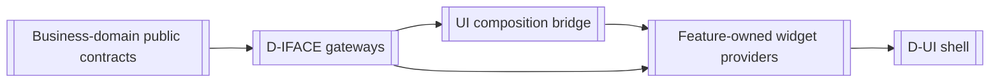

# User Interface

> **Package:** `app/ui/` (React + TypeScript)
> **Status:** `Missing`
> **Last updated:** `2026-08-25`
> **Domain ID:** `D-UI`

> This README is the package's single source of truth for UI requirements, final structure, implementation sequence, deletion behavior, and tests.

---

## Code-Aligned Implementation Convention

This README is the sole current target registry for the UI domain's feature IDs and statuses, functional requirements, UI-local workflows, semantic contract ownership, client-state model, acceptance evidence, and deletion behavior. `PROJECT.md` owns system scope and cross-domain workflows; `ARCHITECTURE.md` owns package, dependency, runtime, and deployment constraints. Feature-local READMEs, typed manifests, generated clients, implementation modules, and executable tests provide current implementation evidence without silently changing this registry.

D-UI is a Vite + React single-page workstation. A registered `FEAT-UI-*` is the independently selectable/removable capability and acceptance owner; a widget is a visual contribution owned by exactly one feature; a widget instance is one runtime placement with instance-scoped presentation state; and a workspace is a persisted spatial arrangement of widget instances. One feature may contribute multiple widgets. Visual modules target `app/ui/src/widgets/<widget>/`; the feature-to-widget map in this README is the sole canonical ownership map.

Documented `runtime/`, `workspaces/`, `clients/`, `context/`, `contracts/generated/`, and dev-only `mocks/` directories are non-feature support boundaries. They own shared registration, layout, generated-client, presentation-context, and development-fixture infrastructure only; they own no product registry, business policy, authoritative domain state, or second implementation of widget behavior. Widgets consume generated clients and public wire contracts, coordinate through typed contribution/context boundaries, and never import sibling or Python implementations. Focused component tests may be colocated; cross-widget, workspace, accessibility, browser, contract-parity, removal, and leak evidence lives under `tests/ui/`. Production UI code is not verification evidence by itself.

## 1. Purpose and Boundary

### Purpose

The UI domain is the React + TypeScript human-facing client of HaruQuantAI. It composes capability-aware workspaces, presents projections, collects and validates operator intent, and delegates commands and queries to the Python/FastAPI backend through generated public contracts. It shall make long-running quantitative workflows understandable and safe without acquiring Data, Strategy, Research, Portfolio, Trading, Risk, or orchestration policy.

The UI is a first-class product domain rather than an HTTP, CLI, or MCP adapter. `D-IFACE` owns presentation-neutral gateways and transport parity; `D-UI` owns human interaction and rendering over those gateways.

### Architectural Paradigm: Spatiotemporal Composability

The product presents one unified workstation canvas rather than isolated full-page tools. Browser routes select an authorized workstation or workspace entry point; they do not own separate copies of tool behavior. Blank workspaces and versioned templates compose feature-owned widgets at runtime.

- **Spatial composition:** through a HaruQuantAI-owned Dockview adapter, users and authorized presets may add, remove, dock, tab, split horizontally or vertically, resize, minimize, maximize, and restore widget instances. Layout restoration is actor/workspace/capability/schema scoped, dirty state is resolved before close, and a missing or incompatible widget yields an explicit diagnostic or the documented deterministic drop behavior.
- **Temporal composition:** widgets may observe independent live, delayed, historical, playback, simulation, and job-event time domains. Every update preserves source/clock identity, authoritative timestamp, monotonic sequence or cursor where supplied, and freshness/gap/resynchronization state. Rendering may coalesce bounded updates without reordering or inventing events. Incompatible time domains never silently mix, and removal disposes subscriptions, listeners, timers, commands, focus, and layout effects exactly once.
- **Plugin/widget lifecycle:** typed manifests declare feature and widget type/version identities, dependencies, configuration and state schema versions, placements and minimum dimensions, commands/subscriptions, accessibility metadata, presentation states, effects, replacement, and deletion outcomes. Runtime registries derive from those manifests and are not a second product registry.

### Feature Registry

| Status | Feature ID | Capability | FRs | Deletion outcome |
|---|---|---|---:|---|
| Implemented | `FEAT-UI-COMPOSE_SHELL` | Capability-aware application shell and navigation | 5 | The graphical shell disappears; non-UI clients remain available. |
| Partial (2 of 4; 2 mock-build pending 14.8) | `FEAT-UI-START_WORK` | Home, onboarding, recents, and launch shortcuts | 4 | Home disappears; direct authorized routes remain available. |
| Implemented | `FEAT-UI-MANAGE_LAYOUTS` | Tabs, panels, splitters, overlays, and saved view state | 5 | Custom layouts disappear; the shell uses its minimal outlet. |
| Partial (1 of 5; 4 mock-build pending 6.15) | `FEAT-UI-EDIT_INPUTS` | Forms, pickers, tables, validation, drafts, and confirmations | 5 | Generic editors disappear; read-only routes may remain. |
| Missing | `FEAT-UI-AUTHOR_STRATEGIES` | Visual strategy authoring and immediate inspection | 6 | Visual authoring disappears; Strategy contracts remain available. |
| Missing | `FEAT-UI-RUN_RESEARCH` | Builder, retester, optimizer, and trainer workspaces | 6 | Research workspaces disappear; admitted server work continues. |
| Missing | `FEAT-UI-EDIT_PROJECTS` | Project/task authoring, validation, progress, and results | 6 | Project editing disappears; Orchestration remains available. |
| Missing | `FEAT-UI-MANAGE_DATA` | Market-data onboarding and administration workspace | 7 | Data administration disappears; Data and Catalogue remain available. |
| Missing | `FEAT-UI-OPERATE_DATABANKS` | Strategy/result databank browsing and bulk actions | 6 | Databank views disappear; stored results remain queryable. |
| Missing | `FEAT-UI-EXPLORE_RESULTS` | Result details, charts, trades, reports, and robustness views | 8 | Rich result exploration disappears; result artifacts remain. |
| Missing | `FEAT-UI-COMPOSE_PORTFOLIOS` | Manual/automatic portfolio construction and comparison | 5 | Portfolio views disappear; Portfolio contracts remain available. |
| Missing | `FEAT-UI-EDIT_CODE` | Extension/source editor, navigation, diagnostics, and testing | 6 | Code editing disappears; codegen/compiler services remain available. |
| Partial (3 of 5; 2 mock-build pending 14.10) | `FEAT-UI-MONITOR_WORK` | Job progress, logs, notifications, failure, and recovery feedback | 5 | Dedicated monitors disappear; jobs continue server-side. |
| Missing | `FEAT-UI-ADMINISTER_SYSTEM` | Preferences, language, theme, updates, and capability administration | 6 | Settings and administration screens disappear. |
| Missing | `FEAT-UI-OPERATE_TRADING` | Governed operational trading views and controls | 8 | Operational views disappear; governed headless operations remain. |
| Missing | `FEAT-UI-ENSURE_ACCESS` | Keyboard, nonvisual, focus, scale, and safety accessibility | 6 | The UI becomes non-releasable. |
| Missing | `FEAT-UI-EXTEND_VIEWS` | Declarative, scoped, deletion-safe UI contributions | 5 | Extension views disappear; built-in fallback views remain. |

**Domain inventory:** 17 Features and 99 Functional Requirements.

### Canonical Feature-to-Widget Contribution Map

This table maps product ownership to target visual contributions; it is part of the feature registry above, not a second registry. Widget names are stable target module slugs, not additional `FEAT-*` identities. Nonvisual responsibilities remain in the named feature's support adapter and do not become fake widgets.

| Owning feature | Target widget contributions | Nonvisual/support responsibility |
|---|---|---|
| `FEAT-UI-COMPOSE_SHELL` | `system_status`, `workspace_switcher` | application chrome, authorized workspace entry, fallback routing |
| `FEAT-UI-START_WORK` | `home`, `recent_work`, `product_news` | launch-intent coordination |
| `FEAT-UI-MANAGE_LAYOUTS` | `widget_catalogue`, `workspace_templates` | Dockview adapter, layout persistence/restoration, instance lifecycle |
| `FEAT-UI-EDIT_INPUTS` | `schema_form`, `selection_table`, `confirmation` | draft/conflict coordination |
| `FEAT-UI-AUTHOR_STRATEGIES` | `strategy_tree`, `block_catalogue`, `strategy_inspector` | authoring selection context |
| `FEAT-UI-RUN_RESEARCH` | `research_builder`, `research_monitor`, `research_comparison` | research-run presentation context |
| `FEAT-UI-EDIT_PROJECTS` | `project_editor`, `task_graph`, `project_run` | project draft/context coordination |
| `FEAT-UI-MANAGE_DATA` | `datasets`, `instruments`, `sessions`, `data_quality` | data-selection context |
| `FEAT-UI-OPERATE_DATABANKS` | `databank_browser`, `databank_bulk_actions` | pinned-selection context |
| `FEAT-UI-EXPLORE_RESULTS` | `result_overview`, `result_charts`, `result_trades`, `result_robustness`, `result_provenance` | pinned-result/time context |
| `FEAT-UI-COMPOSE_PORTFOLIOS` | `portfolio_builder`, `portfolio_comparison`, `portfolio_results` | constituent-selection context |
| `FEAT-UI-EDIT_CODE` | `code_editor`, `diagnostics`, `test_output` | editor session/draft coordination |
| `FEAT-UI-MONITOR_WORK` | `job_progress`, `activity_log`, `notifications` | job-event cursor and resynchronization context |
| `FEAT-UI-ADMINISTER_SYSTEM` | `settings`, `capability_admin`, `updates` | preference/localization context |
| `FEAT-UI-OPERATE_TRADING` | `order_ticket`, `positions_orders`, `price_ladder`, `trading_session` | governed-operation and market-clock context |
| `FEAT-UI-ENSURE_ACCESS` | None; cross-cutting acceptance feature | keyboard, focus, semantics, reflow, nonvisual alternatives |
| `FEAT-UI-EXTEND_VIEWS` | `extension_catalogue` | widget manifest validation, scoped effects, replacement/removal |

### Does not own

- HTTP/SSE, CLI, MCP, automation schemas, idempotency, pagination, or transport parity; those remain in `D-IFACE`.
- Business validation, simulation, optimization, portfolio construction, order/risk policy, persistence, or direct provider access.
- Public contract definitions. UI-owned request/result/event/view-state contracts live only under `app/contracts/ui/`.
- Backend feature composition. `app/kernel/` and `app/composition/` publish capability state through public gateways; the UI composition bridge owns typed view-contribution registration, replacement, effect reversal, and removal without importing those Python implementations.
- Python backend behavior. Python application services live under `app/`; FastAPI adapters live in `D-IFACE`; React never imports backend implementation modules.
- A mandatory desktop wrapper. The React client runs in a browser and may be hosted by an optional desktop wrapper, but product behavior cannot depend on wrapper-only APIs.

### Interface/UI separation

`D-IFACE` supplies presentation-neutral gateways and transport adapters. `D-UI` renders those projections and owns human interaction. For example, `FEAT-IFACE-OPERATE_RESEARCH` supplies the research preview contract; `FEAT-UI-RUN_RESEARCH` presents it, gathers operator intent, and invokes the same command capability used by API/CLI/MCP. Neither package may copy Research policy.

### Deletion boundary

Deleting `app/ui/` removes every graphical workspace and UI contribution. The Python backend, HTTP/SSE, CLI, MCP, automation, domain services, background projects, and composition health remain available. Removing one UI feature removes only its routes, commands, panels, subscriptions, drafts, and view-state keys; the shell substitutes an explicit capability-unavailable surface and continues.

### Shared contracts

The authoritative Python/Pydantic definitions and wire schemas live in `app/contracts/ui/`. The React client consumes generated TypeScript types and clients under `app/ui/src/contracts/generated/`; generated files are never hand-edited:

- shell manifest, navigation contribution, route target, command descriptor, keyboard binding;
- view projection, field/schema description, selection, sort/filter/page state, chart/table alternative;
- draft envelope, conflict state, confirmation plan, notification, progress and error presentation;
- widget descriptor and instance identity, workspace/template/layout snapshot, panel/tab contribution, view preference and accessibility preference;
- temporal context, source/clock identity, freshness, sequence/cursor, gap/resynchronization and lifecycle/removal events;
- all 17 versioned feature capability ports and their request/result/failure/event unions.

The 16 missing UI v1 ports follow the universal Contracts convention: one capability-named asynchronous request/response method over strict discriminated request and success/failure unions, plus one separate typed `subscribe_<action>_events` async iterator only when this README explicitly requires live, streaming, or replay delivery. Render updates, local interaction events, and Kernel-published observations do not automatically create a public subscription method.

The implemented `ComposeShellPresentationCapability` remains the compatibility-frozen five-method synchronous `ui.compose-shell@1` port. It is not rewritten to the new shape. Such a change requires `ui.compose-shell@2`, a boundary adapter and compatibility window, explicit consumer migration, and separate approval.

Consumed contracts include `app/contracts/interfaces/` plus the public projections and commands of Workspace, Catalogue, Data, Strategy, Simulator, Analytics, Research, Portfolio, Orchestration, Plugins, Broker Connectivity, Runtime Risk, and Trading. UI code shall never import another domain's private implementation.

#### Ratified v1 public records (37)

All 37 records and 17 capabilities resolved; nothing removed. Workspace physical-layer rules apply: the 21 implemented records take `<Record>Wire` projections (v1 `Any` → `JsonObject`/`JsonValue` per the ratified wire-projection rule; v1 floats → `DecimalValue`; v1 lowercase severity/theme strings preserved as-is); the 16 widget-workstation records are wire-native. v1 process types `WorkspaceRoute`, `ShellSnapshot`, `CapabilityPresentationState` serve the frozen Compose Shell port and are not inventory wire records. UI presentation records never become authoritative business state; secrets, approval tokens, and credentials never appear.

| # | Record | Exact wire fields | Producer → consumers | FRs / lifecycle |
|---|---|---|---|---|
| R1 | `UiFeatureDescriptor` (`UiFeatureDescriptorWire`) | `feature_id: FeatureIdentifier`; `name: nonempty str`; `description: str`; `required_capabilities: tuple[CapabilityIdentifier, ...] = ()`; `optional_capabilities: tuple[CapabilityIdentifier, ...] = ()`; `schema_version: Literal[1] = 1`. | UI runtime → shell, widgets | FR-UI-ASSEMBLE_SHELL, FR-UI-DISCOVER_WORKSPACES. |
| R2 | `RouteTarget` (`RouteTargetWire`) | `path: route str ^\/[A-Za-z0-9\-\/_]*$`; `workspace_id: Uuid7`; `title: nonempty str`; `icon: str | None = None`; `required_permission: str | None = None`; `schema_version: Literal[1] = 1`. | UI runtime → shell, navigation | FR-UI-DISCOVER_WORKSPACES, FR-UI-RESTORE_ROUTE. Removed routes cannot be resurrected by saved client state. |
| R3 | `NavigationContribution` (`NavigationContributionWire`) | `id: nonempty str`; `label: nonempty str`; `route: RouteTarget`; `order: int >= 0 = 0`; `parent_id: str | None = None`; `badge: str | None = None`; `schema_version: Literal[1] = 1`. | UI features → shell | FR-UI-ASSEMBLE_SHELL. |
| R4 | `UiCommandDescriptor` (`UiCommandDescriptorWire`) | `command_id: nonempty str`; `title: nonempty str`; `category: nonempty str`; `shortcut: str | None = None`; `enabled: bool = True`; `schema_version: Literal[1] = 1`. | UI features → shell, keyboard layer | FR-UI-OPERATE_BY_KEYBOARD. |
| R5 | `KeyboardBinding` (`KeyboardBindingWire`) | `key_combination: nonempty str`; `command_id: nonempty str`; `description: str`; `scope: str = "global"`; `schema_version: Literal[1] = 1`. | FEAT-UI-ENSURE_ACCESS → shell, widgets | FR-UI-OPERATE_BY_KEYBOARD. |
| R6 | `ViewProjection` (`ViewProjectionWire`) | `view_id: nonempty str`; `title: nonempty str`; `data_source: nonempty str`; `parameters: JsonObject = {}`; `schema_version: Literal[1] = 1`. | UI widgets → renderers | Read-only presentation projection. |
| R7 | `FieldDescriptor` (`FieldDescriptorWire`) | `field_name: nonempty str`; `label: nonempty str`; `field_type: nonempty str`; `required: bool = False`; `default_value: JsonValue = None`; `constraints: JsonObject = {}`; `schema_version: Literal[1] = 1`. | FEAT-UI-EDIT_INPUTS → form renderers | FR-UI-RENDER_FIELDS. |
| R8 | `ClientSelection` (`ClientSelectionWire`) | `selection_id: nonempty str`; `selected_keys: tuple[nonempty str, ...] = ()`; `is_all_selected: bool = False`; `schema_version: Literal[1] = 1`. | UI widgets → databank/grid contexts | FR-UI-SELECT_DATABANK_ROWS. |
| R9 | `ClientPageState` (`ClientPageStateWire`) | `page_index: int >= 0 = 0`; `page_size: int 1..500 = 50`; `sort_column: str | None = None`; `sort_ascending: bool = True`; `total_count: int >= 0 | None = None`; `schema_version: Literal[1] = 1`. | UI widgets → paged views | FR-UI-QUERY_DATABANKS; §15.7 500-row bound. |
| R10 | `ChartAlternative` (`ChartAlternativeWire`) | `chart_id: nonempty str`; `title: nonempty str`; `summary_text: nonempty str`; `table_data: tuple[JsonObject, ...] = ()`; `schema_version: Literal[1] = 1`. | UI widgets → accessibility layer | FR-UI-PROVIDE_DATA_ALTERNATIVES. |
| R11 | `DraftEnvelope` (`DraftEnvelopeWire`) | `draft_id: Uuid7`; `schema_id: nonempty str`; `workspace_id: Uuid7`; `actor_id: Uuid7`; `entity_version: int >= 1`; `payload: JsonObject`; `created_at_iso: UtcTimestamp`; `updated_at_iso: UtcTimestamp`; `schema_version: Literal[1] = 1`. Constraint: non-secret payloads only (persisted-state rule). | FEAT-UI-EDIT_INPUTS → draft store | FR-UI-PRESERVE_DRAFTS. |
| R12 | `DraftConflict` (`DraftConflictWire`) | `draft_id: Uuid7`; `base_version: int >= 1`; `current_version: int >= 1` (> `base_version`); `conflicting_fields: tuple[nonempty str, ...] = ()`; `schema_version: Literal[1] = 1`. Explicit discard/merge/reload/retry choice required. | FEAT-UI-EDIT_INPUTS → conflict surface | FR-UI-RESOLVE_CONFLICTS. |
| R13 | `ConfirmationPlan` (`ConfirmationPlanWire`) | `action_id: Uuid7`; `target_description: nonempty str`; `impact_summary: nonempty str`; `affected_count: int >= 0`; `is_reversible: bool`; `confirmation_hash: ContentHash`; `schema_version: Literal[1] = 1`. | FEAT-UI-EDIT_INPUTS → confirmation surface | FR-UI-CONFIRM_IMPACT. |
| R14 | `UiNotification` (`UiNotificationWire`) | `notification_id: Uuid7`; `title: nonempty str`; `message: nonempty str`; `severity: Literal[info,warning,error,success] = "info"` (v1 lowercase values preserved); `timestamp_iso: UtcTimestamp`; `owning_task_id: Uuid7 | None = None`; `schema_version: Literal[1] = 1`. | FEAT-UI-MONITOR_WORK → shell | FR-UI-NOTIFY_OUTCOMES; deduplicated with links to owning work. |
| R15 | `ProgressPresentation` (`ProgressPresentationWire`) | `task_id: Uuid7`; `stage_name: nonempty str`; `progress_percent: DecimalValue in [0,100] | None = None`; `is_indeterminate: bool = False`; `message: str = ""`; `schema_version: Literal[1] = 1`. Constraint: no fabricated precision. | FEAT-UI-MONITOR_WORK → progress surfaces | FR-UI-TRACK_PROGRESS. |
| R16 | `ErrorPresentation` (`ErrorPresentationWire`) | `error_code: nonempty uppercase str`; `title: nonempty str`; `detail: nonempty str`; `causal_reference: str | None = None`; `is_retryable: bool = False`; `suggested_action: str | None = None`; `schema_version: Literal[1] = 1`. | All UI features → error surfaces | FR-UI-PRESENT_FAILURES. |
| R17 | `LayoutSnapshot` (`LayoutSnapshotWire`) | `layout_id: Uuid7`; `workspace_id: Uuid7`; `active_panels: tuple[PanelContribution, ...] = ()`; `open_tabs: tuple[TabContribution, ...] = ()`; `version: int >= 1 = 1`; `schema_version: Literal[1] = 1`. Legacy shell layout retained for Compose Shell v1. | FEAT-UI-COMPOSE_SHELL → shell | FR-UI-ASSEMBLE_SHELL. |
| R18 | `PanelContribution` (`PanelContributionWire`) | `panel_id: nonempty str`; `title: nonempty str`; `region: nonempty str`; `is_closable: bool = True`; `schema_version: Literal[1] = 1`. | UI features → layout layer | FR-UI-COMPOSE_PANELS. |
| R19 | `TabContribution` (`TabContributionWire`) | `tab_id: nonempty str`; `title: nonempty str`; `content_view_id: nonempty str`; `is_dirty: bool = False`; `schema_version: Literal[1] = 1`. Dirty close requires explicit resolution. | UI features → layout layer | FR-UI-MANAGE_TABS. |
| R20 | `ViewPreference` (`ViewPreferenceWire`) | `theme: str = "system"`; `density: str = "comfortable"`; `font_scale: DecimalValue > 0 = "1"`; `locale: str = "en-US"`; `schema_version: Literal[1] = 1`. | FEAT-UI-ADMINISTER_SYSTEM → shell | FR-UI-SET_APPEARANCE, FR-UI-SET_LANGUAGE. |
| R21 | `AccessibilityPreference` (`AccessibilityPreferenceWire`) | `high_contrast: bool = False`; `reduced_motion: bool = False`; `screen_reader_optimized: bool = False`; `schema_version: Literal[1] = 1`. | FEAT-UI-ENSURE_ACCESS → shell | FR-UI-DISTINGUISH_STATE, FR-UI-PRESERVE_USABILITY. |
| R22 | `WidgetTypeDescriptor` (wire-native) | `widget_type: nonempty str` (stable module slug); `owning_feature: FeatureIdentifier`; `type_version: int >= 1`; `default_placement: WidgetPlacement | None = None`; `configuration_schema: JsonObject = {}`; `state_schema: JsonObject = {}`; `required_capabilities: tuple[CapabilityIdentifier, ...] = ()`; `subscriptions: tuple[CapabilityIdentifier, ...] = ()`; `time_domains: tuple[Literal[LIVE,PLAYBACK,SIMULATION,JOB_STREAM], ...] = ()`; `schema_version: Literal[1] = 1`. | FEAT-UI-EXTEND_VIEWS → layout/validation layers | FR-UI-DECLARE_VIEW_CONTRIBUTIONS, FR-UI-VALIDATE_VIEW_CONTRIBUTIONS. |
| R23 | `WidgetInstanceRef` (wire-native) | `instance_id: Uuid7`; `widget_type: nonempty str`; `workspace_id: Uuid7`; `configuration_version: int >= 1 = 1`; `state_version: int >= 1 = 1`; `schema_version: Literal[1] = 1`. | FEAT-UI-MANAGE_LAYOUTS → runtime | WF-UI-009; widget instance identity is never a feature identity. |
| R24 | `WidgetPlacement` (wire-native) | `instance_id: Uuid7`; `panel_id: nonempty str`; `panel_order: int >= 0 = 0`; `tab_order: int >= 0 = 0`; `size_ratio: DecimalValue in (0,1] = "1"`; `is_minimized: bool = False`; `is_maximized: bool = False`; `schema_version: Literal[1] = 1`. | FEAT-UI-MANAGE_LAYOUTS → Dockview adapter | FR-UI-COMPOSE_PANELS; removal leaves no orphan region. |
| R25 | `WidgetConfigurationEnvelope` (wire-native) | `instance_id: Uuid7`; `configuration_version: int >= 1 = 1`; `configuration: JsonObject = {}` (bounded by the type's `configuration_schema`); `schema_version: Literal[1] = 1`. | Widget instances → layout persistence | FR-UI-PERSIST_LAYOUTS. |
| R26 | `WidgetStateEnvelope` (wire-native) | `instance_id: Uuid7`; `state_version: int >= 1 = 1`; `state: JsonObject = {}` (bounded by `state_schema`); `updated_at: UtcTimestamp`; `schema_version: Literal[1] = 1`. Presentation state only, never authoritative business state. | Widget instances → state persistence | FR-UI-SCOPE_VIEW_EFFECTS. |
| R27 | `WorkspaceLayoutSnapshot` (wire-native) | `layout_id: Uuid7`; `workspace_id: Uuid7`; `actor_id: Uuid7`; `layout_version: int >= 1`; `capability_snapshot_id: Uuid7`; `widget_instances: tuple[WidgetInstanceRef, ...] = ()`; `placements: tuple[WidgetPlacement, ...] = ()`; `active_panel_id: str | None = None`; `content_hash: ContentHash`; `schema_version: Literal[1] = 1`. Scoped actor/workspace/capability/layout-schema; immutable per version. | FEAT-UI-MANAGE_LAYOUTS → workspaces store | FR-UI-PERSIST_LAYOUTS, FR-UI-RESTORE_LAYOUTS. |
| R28 | `WorkspaceTemplate` (wire-native) | `template_id: Uuid7`; `name: nonempty str`; `description: str = ""`; `layout: WorkspaceLayoutSnapshot`; `schema_version: Literal[1] = 1`. | FEAT-UI-MANAGE_LAYOUTS → template gallery | WF-UI-009. |
| R29 | `LayoutMigrationResult` (wire-native) | `source_layout_version: int >= 1`; `target_layout_version: int >= 1`; `migrated: bool`; `incompatible_widgets: tuple[nonempty str, ...] = ()`; `defaulted_widgets: tuple[nonempty str, ...] = ()`; `diagnostics: tuple[ValidationIssue, ...] = ()`; `schema_version: Literal[1] = 1`. Incompatible widgets are diagnosed and never silently remapped. | FEAT-UI-MANAGE_LAYOUTS → restore path | FR-UI-RESTORE_LAYOUTS. |
| R30 | `TemporalContext` (wire-native) | `context_id: Uuid7`; `workspace_id: Uuid7`; `domain: Literal[LIVE,PLAYBACK,SIMULATION,JOB_STREAM]`; `bound_source: TemporalSourceRef`; `cursor: TemporalCursor | None = None`; `freshness: TemporalFreshness | None = None`; `open_gaps: tuple[TemporalGap, ...] = ()`; `resynchronization: TemporalResynchronization | None = None`; `schema_version: Literal[1] = 1`. Time-domain mixing is rejected; widgets show causally consistent evidence or fail closed. | FEAT-UI context support → all temporal widgets | WF-UI-010. |
| R31 | `TemporalSourceRef` (wire-native) | `source_id: Uuid7`; `source_kind: nonempty str`; `clock_id: nonempty str`; `schema_version: Literal[1] = 1`. Source/clock identity preserved. | Temporal context → widgets | WF-UI-010; never makes presentation state authoritative. |
| R32 | `TemporalFreshness` (wire-native) | `source: TemporalSourceRef`; `last_event_at: UtcTimestamp`; `observed_at: UtcTimestamp`; `is_stale: bool`; `staleness_reason: str = ""`; `schema_version: Literal[1] = 1`. | Temporal context → widgets | FR-UI-STREAM_ACTIVITY staleness display. |
| R33 | `TemporalCursor` (wire-native) | `source: TemporalSourceRef`; `sequence: int >= 0`; `cursor_token: str | None = None`; `as_of: UtcTimestamp`; `schema_version: Literal[1] = 1`. Monotonic sequence or supplied cursor; ordered application. | Temporal context → widgets | WF-UI-010. |
| R34 | `TemporalGap` (wire-native) | `source: TemporalSourceRef`; `from_sequence: int >= 0`; `to_sequence: int >= 0` (`>= from_sequence`); `reason: str = ""`; `schema_version: Literal[1] = 1`. | Temporal context → widgets | Gap detection before resync. |
| R35 | `TemporalResynchronization` (wire-native) | `context_id: Uuid7`; `outcome: Literal[RESYNCED,FAILED_CLOSED]`; `started_at: UtcTimestamp`; `completed_at: UtcTimestamp`; `replayed_from_sequence: int >= 0 | None = None`; `schema_version: Literal[1] = 1`. | Temporal context → widgets | WF-UI-010 fail-closed rule. |
| R36 | `WidgetLifecycleEvent` (wire-native event) | `DomainEvent` envelope with `event_type: "ui.widget-lifecycle"`; payload `instance_id: Uuid7`, `widget_type: nonempty str`, `phase: Literal[REGISTERED,MOUNTED,QUIESCED,REPLACED,REMOVED]`, `schema_version: Literal[1] = 1`. Observational `PUBLISH`; not a port stream. | FEAT-UI-EXTEND_VIEWS → runtime diagnostics | FR-UI-REPLACE_VIEW_PROVIDERS, FR-UI-REMOVE_VIEW_CONTRIBUTIONS. |
| R37 | `WidgetRemovalResult` (wire-native) | `instance_id: Uuid7`; `widget_type: nonempty str`; `removal_state: Literal[REMOVED,PARTIAL,FAILED]`; `reversed_effects: tuple[nonempty str, ...] = ()`; `focused_fallback: str | None = None`; `schema_version: Literal[1] = 1`. Exact removal without stale controls, listeners, or state leaks; deterministic fallback focus. | FEAT-UI-EXTEND_VIEWS → runtime | FR-UI-REMOVE_VIEW_CONTRIBUTIONS. |

#### Ratified v1 capabilities and operation envelopes

**Frozen v1:** `ui.compose-shell@1` / `ComposeShellPresentationCapability` — five synchronous methods `assemble_shell`, `discover_workspaces`, `switch_workspace`, `resolve_capability_state`, `restore_route`; no rewrite without `ui.compose-shell@2` plus adapter, compatibility window, consumer migration, and separate approval. Provider: FEAT-UI-COMPOSE_SHELL. FRs: FR-UI-ASSEMBLE_SHELL, DISCOVER_WORKSPACES, SWITCH_WORKSPACES, SHOW_CAPABILITY_STATE, RESTORE_ROUTE.

**Sixteen new ports** (universal new-port rule; method name = capability action; requests carry `request_id: Uuid7`, `capability_snapshot_id: Uuid7`, `operation` literal, `schema_version: Literal[1] = 1`; successes carry `outcome: Literal["SUCCESS"] = "SUCCESS"`, `request_id`, `result_version: Literal[1] = 1`, optional typed fields, `schema_version: Literal[1] = 1`; failure is the shared `UiFailure` below). No subscription unless noted:

| # | Key / port / method | Operations | Key success fields | FRs | Subscription |
|---|---|---|---|---|---|
| 1 | `ui.start-work@1` / `StartWorkPresentationCapability` / `start_work` | `SHOW_HOME,LIST_RECENT,LAUNCH_SHORTCUT,SHOW_NEWS` | `recent_routes: tuple[RouteTarget,...] = ()`; `shortcuts: tuple[UiCommandDescriptor,...] = ()`; `news: tuple[UiNotification,...] = ()` | FR-UI-PRESENT_HOME, RESUME_RECENT_WORK, LAUNCH_SHORTCUTS, SHOW_PRODUCT_NEWS | None |
| 2 | `ui.manage-layouts@1` / `ManageLayoutsPresentationCapability` / `manage_layouts` | `COMPOSE,PERSIST,RESTORE,MANAGE_TABS,SCALE` | `layout: WorkspaceLayoutSnapshot | None`; `migration: LayoutMigrationResult | None`; `template: WorkspaceTemplate | None` | FR-UI-COMPOSE_PANELS, PERSIST_LAYOUTS, RESTORE_LAYOUTS, MANAGE_TABS, SCALE_VIEWS | None |
| 3 | `ui.edit-inputs@1` / `EditInputsPresentationCapability` / `edit_inputs` | `RENDER_FIELDS,VALIDATE,PRESERVE_DRAFT,RESOLVE_CONFLICT,CONFIRM` | `fields: tuple[FieldDescriptor,...] = ()`; `findings: tuple[ValidationIssue,...] = ()`; `draft: DraftEnvelope | None`; `conflict: DraftConflict | None`; `confirmation: ConfirmationPlan | None` | FR-UI-RENDER_FIELDS, VALIDATE_INPUT, PRESERVE_DRAFTS, RESOLVE_CONFLICTS, CONFIRM_IMPACT | None |
| 4 | `ui.author-strategies@1` / `AuthorStrategiesPresentationCapability` / `author_strategies` | `EDIT_TREE,BROWSE_BLOCKS,CONFIGURE,VALIDATE,USE_EXAMPLES,REQUEST_TEST` | `projection: ViewProjection | None`; `findings: tuple[ValidationIssue,...] = ()`; `strategy_version_id: Uuid7 | None = None` | FR-UI-EDIT_STRATEGY_TREE, BROWSE_BLOCKS, CONFIGURE_STRATEGY, VALIDATE_STRATEGY, USE_STRATEGY_EXAMPLES, TEST_STRATEGY | None |
| 5 | `ui.run-research@1` / `RunResearchPresentationCapability` / `run_research` | `SELECT_MODE,CONFIGURE,PREVIEW,CONTROL,COMPARE,REUSE_SETTINGS` | `preview: ResearchPreview | None` (Interfaces-owned); `run: ResearchRunRef | None` (Research-owned); `pinned_versions: tuple[Uuid7,...] = ()` | FR-UI-SELECT_RESEARCH_MODE, CONFIGURE_RESEARCH, PREVIEW_RESEARCH, CONTROL_RESEARCH, COMPARE_RESEARCH, REUSE_RESEARCH_SETTINGS | None |
| 6 | `ui.edit-projects@1` / `EditProjectsPresentationCapability` / `edit_projects` | `MANAGE,EDIT_TASKS,EDIT_GRAPH,COMPARE,CONTROL,INSPECT` | `projection: ProjectGraphProjection | None` (Interfaces-owned); `project_version_id: Uuid7 | None`; `progress: ProgressPresentation | None` | FR-UI-MANAGE_PROJECTS, EDIT_TASKS, EDIT_PROJECT_GRAPH, COMPARE_PROJECTS, CONTROL_PROJECTS, INSPECT_PROJECTS | None |
| 7 | `ui.manage-data@1` / `ManageDataPresentationCapability` / `manage_data` | `BROWSE,IMPORT,SYNC,EXPORT,EDIT_INSTRUMENTS,EDIT_SESSIONS,ADMINISTER` | `projection: ViewProjection | None`; `findings: tuple[ValidationIssue,...] = ()`; `job: AsyncJobRef | None` (Interfaces-owned) | FR-UI-BROWSE_DATASETS, IMPORT_DATA, SYNC_DATA, EXPORT_DATA, EDIT_INSTRUMENTS, EDIT_SESSIONS, ADMINISTER_DATA | None |
| 8 | `ui.operate-databanks@1` / `OperateDatabanksPresentationCapability` / `operate_databanks` | `QUERY,CONFIGURE_COLUMNS,SELECT,FILTER,BULK_ACTION,OPEN_RESULT` | `page: ResultPage | None` (Analytics-owned); `selection: ClientSelection | None`; `bulk_token: BulkRequestToken | None` (Interfaces-owned); `confirmation: ConfirmationPlan | None` | FR-UI-QUERY_DATABANKS, CONFIGURE_COLUMNS, SELECT_DATABANK_ROWS, FILTER_DATABANKS, RUN_BULK_ACTIONS, OPEN_DATABANK_RESULT | None |
| 9 | `ui.explore-results@1` / `ExploreResultsPresentationCapability` / `explore_results` | `SUMMARIZE,PLOT_EQUITY,LIST_TRADES,PLOT_TRADES,ANALYZE,INSPECT_ROBUSTNESS,INSPECT_SOURCE,EXPORT` | `summary: ViewProjection | None`; `page_state: ClientPageState | None`; `chart_alternative: ChartAlternative | None`; `context: TemporalContext | None` | FR-UI-SUMMARIZE_RESULTS, PLOT_EQUITY, LIST_TRADES, PLOT_TRADES, ANALYZE_TRADES, INSPECT_ROBUSTNESS, INSPECT_SOURCE, EXPORT_RESULTS | None |
| 10 | `ui.compose-portfolios@1` / `ComposePortfoliosPresentationCapability` / `compose_portfolios` | `SELECT_CONSTITUENTS,EDIT,INSPECT_CORRELATION,RUN,COMPARE` | `projection: PortfolioBuilderProjection | None` (Interfaces-owned); `portfolio_version_id: Uuid7 | None` | FR-UI-SELECT_CONSTITUENTS, EDIT_PORTFOLIO, INSPECT_CORRELATION, RUN_PORTFOLIO, COMPARE_PORTFOLIOS | None |
| 11 | `ui.edit-code@1` / `EditCodePresentationCapability` / `edit_code` | `NAVIGATE,EDIT_TABS,SEARCH,MANAGE_FILES,SHOW_DIAGNOSTICS,TEST` | `files: tuple[nonempty str,...] = ()`; `diagnostics: tuple[ValidationIssue,...] = ()`; `job: AsyncJobRef | None` | FR-UI-NAVIGATE_CODE, EDIT_CODE_TABS, SEARCH_CODE, MANAGE_CODE_FILES, SHOW_CODE_DIAGNOSTICS, TEST_EXTENSIONS | None |
| 12 | `ui.monitor-work@1` / `MonitorWorkPresentationCapability` / `monitor_work` | `TRACK,CONTROL,PRESENT_FAILURES,NOTIFY` | `progress: ProgressPresentation | None`; `notification: UiNotification | None`; `error: ErrorPresentation | None` | FR-UI-TRACK_PROGRESS, CONTROL_JOBS, STREAM_ACTIVITY, PRESENT_FAILURES, NOTIFY_OUTCOMES | **`subscribe_monitor_work_events`** (owner-required by FR-UI-STREAM_ACTIVITY reconnect replay/resync): request `workspace_id: Uuid7 | None`, `job_id: Uuid7 | None`, `resume_event_id: Uuid7 | None`, `replay_limit: int 0..10000 = 0`, `schema_version`; yields `DomainEvent` |
| 13 | `ui.administer-system@1` / `AdministerSystemPresentationCapability` / `administer_system` | `SET_LANGUAGE,SET_APPEARANCE,CONFIGURE_CLIENT,MANAGE_LICENSE,MANAGE_UPDATES,ADMINISTER_CAPABILITIES` | `preferences: ViewPreference | None`; `accessibility: AccessibilityPreference | None`; `administration: CapabilityAdministrationProjection | None` (Interfaces-owned) | FR-UI-SET_LANGUAGE, SET_APPEARANCE, CONFIGURE_CLIENT, MANAGE_LICENSE, MANAGE_UPDATES, ADMINISTER_CAPABILITIES | None |
| 14 | `ui.operate-trading@1` / `OperateTradingPresentationCapability` / `operate_trading` | `MANAGE_SESSIONS,SHOW_READINESS,PREVIEW_ACTION,COMMIT_ACTION,OPERATE_KILL_SWITCH,WATCH_MARKETS,INSPECT_OPERATOR_ANALYTICS` | `readiness: TradingReadinessProjection | None`; `preview: TradingActionPreview | None` (Interfaces-owned); `receipt: DispatchReceipt | None` (Trading-owned); `kill_switch: KillSwitchState | None` (Risk-owned); `market: BrokerMarketState | None` (Broker-owned) | FR-UI-MANAGE_TRADING_SESSIONS, SHOW_TRADING_READINESS, PREVIEW_TRADING_ACTION, COMMIT_TRADING_ACTION, OPERATE_KILL_SWITCH, WATCH_TRADING_EVENTS, WATCH_MARKETS, INSPECT_OPERATOR_ANALYTICS | **`subscribe_operate_trading_events`** (owner-required by FR-UI-WATCH_TRADING_EVENTS replay/resync and FR-UI-WATCH_MARKETS live markets): request `session_ref: Uuid7 | None`, `scope: Literal[TRADING,MARKET,ALL] = "ALL"`, `resume_event_id: Uuid7 | None`, `replay_limit: int 0..10000 = 0`, `schema_version`; yields `DomainEvent` |
| 15 | `ui.ensure-access@1` / `EnsureAccessPresentationCapability` / `ensure_access` | `OPERATE_BY_KEYBOARD,MANAGE_FOCUS,LABEL_CONTROLS,PROVIDE_DATA_ALTERNATIVES,DISTINGUISH_STATE,PRESERVE_USABILITY` | `alternatives: tuple[ChartAlternative,...] = ()`; `bindings: tuple[KeyboardBinding,...] = ()`; `focus_target: str | None = None` | FR-UI-OPERATE_BY_KEYBOARD, MANAGE_FOCUS, LABEL_CONTROLS, PROVIDE_DATA_ALTERNATIVES, DISTINGUISH_STATE, PRESERVE_USABILITY | None |
| 16 | `ui.extend-views@1` / `ExtendViewsPresentationCapability` / `extend_views` | `DECLARE,VALIDATE,SCOPE,REPLACE,REMOVE` | `widget_type: WidgetTypeDescriptor | None`; `removal: WidgetRemovalResult | None`; `migration: LayoutMigrationResult | None` | FR-UI-DECLARE_VIEW_CONTRIBUTIONS, VALIDATE_VIEW_CONTRIBUTIONS, SCOPE_VIEW_EFFECTS, REPLACE_VIEW_PROVIDERS, REMOVE_VIEW_CONTRIBUTIONS | None |

`UiFailure` (shared by all 16 new ports): `outcome: Literal["FAILURE"] = "FAILURE"`; `request_id: Uuid7`; `code: Literal[UI_VALIDATION_FAILED,UI_INCOMPATIBLE_WIDGET,UI_LAYOUT_INCOMPATIBLE,UI_DRAFT_CONFLICT,UI_CONFIRMATION_REQUIRED,UI_UNAUTHORIZED,UI_STATE_STALE,CAPABILITY_UNAVAILABLE]`; `problem: ProblemDetails`; `schema_version: Literal[1] = 1`. Event unions: only `ui.widget-lifecycle` observational events (R36); the two subscriptions yield common `DomainEvent` records.

Cross-owner references used: `ResearchPreview` (Interfaces); `ResearchRunRef` (Research); `ProjectGraphProjection`, `AsyncJobRef`, `BulkRequestToken`, `TradingReadinessProjection`, `TradingActionPreview`, `CapabilityAdministrationProjection` (Interfaces); `ResultPage` (Analytics); `PortfolioBuilderProjection` (Interfaces); `DispatchReceipt` (Trading); `KillSwitchState` (Risk); `BrokerMarketState` (Broker).

### Persisted state

The UI may persist only actor/workspace-scoped presentation state: layouts, recent routes, preferences, non-secret drafts, dismissed informational notices, and resumable client selections. Business entities and command outcomes remain owned by their domains. Secrets, approval tokens, broker credentials, and authoritative risk/trading state are never stored as UI state.

### Four-Level Structural Hierarchy

| Code level | Represents | UI package |
|---|---|---|
| Package | Domain | `app/ui/` / `D-UI` |
| Widget folder | Feature-owned visual contribution | target `app/ui/src/widgets/<widget>/` |
| Focused module | One interaction or presentation responsibility | Component, hook, adapter, or focused behavior module |
| Function/component/hook | One `FR-UI-*` behavior | Typed implementation with executable component or browser evidence |

Feature identity controls capability selection, diagnostics, replacement, and deletion. Widget type and instance identities control visual registration and placement without becoming product feature IDs. A UI requirement is an acceptance and traceability identity; it is not automatically a separately registered runtime provider.

---

## 2. Target Package Structure and Feature Independence

```text
app/ui/
├── README.md
├── package.json
├── tsconfig.json
├── vite.config.ts
├── src/
│   ├── main.tsx
│   ├── contracts/
│   │   └── generated/                 # generated from app/contracts/*/wire
│   ├── runtime/                       # registry, lifecycle, contribution reconciliation
│   ├── workspaces/                    # Dockview adapter, layouts, templates, restoration
│   ├── clients/                       # generated-contract adapters
│   ├── context/                       # selection and temporal presentation contexts
│   ├── mocks/                         # dev-only contract fakes; absent from production bundles
│   └── widgets/
│       └── <widget>/                  # one visual contribution, one owning FEAT-UI-*
```

The tree above is the target, not current implementation evidence. `FEAT-UI-COMPOSE_SHELL` remains under `app/ui/src/features/compose_shell/` until a later approved feature migration. No target widget or support folder is implemented merely because it appears in this specification.

The final target replaces `src/features/` with feature-owned visual modules under `src/widgets/<widget>/` and adds documented `workspaces/`, `clients/`, `context/`, and `mocks/` support alongside the existing `runtime/` and `contracts/generated/` boundaries. Every widget folder contains a public `index.ts`, typed `manifest.ts`, strict configuration, lifecycle-aware render adapter, owning workflow README, focused React components/hooks, and no hand-written public wire-contract definitions. Cross-feature coordination uses typed capability keys and UI contribution/context boundaries; direct private imports are prohibited.



---

## 3. Workflows

| Workflow | Trigger | UI sequence | Outcome |
|---|---|---|---|
| `WF-UI-001` Start and navigate | Client launch or route request | reconcile shell → restore compatible layout → advertise routes → open Home/target | Ready graphical client or explicit diagnostic/no-capability state |
| `WF-UI-002` Author and test | Create/open strategy | edit draft → validate → preview → commit version → request simulation → inspect result | Versioned strategy and linked result, or complete diagnostics |
| `WF-UI-003` Run research | Builder/retest/optimize request | configure → preview resolved manifest/budget → confirm → start → monitor → inspect databank/results | Reproducible run and accepted/rejected outputs |
| `WF-UI-004` Manage data | Import/sync/edit request | choose source → validate mapping/session/instrument → preview impact → execute → monitor → inspect findings | Committed data/catalogue change or rollback-safe failure |
| `WF-UI-005` Run project | Open/create project | edit tasks/edges/resources → validate → publish → start/resume → monitor → inspect results/history | Durable project outcome with causal history |
| `WF-UI-006` Explore results | Select result(s) | pin versions → load summary → coordinate tables/charts/trades/robustness → export | Consistent, source-linked interpretation |
| `WF-UI-007` Operate trading | Authorized operator intent | show readiness → normalize/preview → show risk/authority → confirm → dispatch through Trading → reconcile | Accepted/rejected/unknown outcome without bypass |
| `WF-UI-008` Remove/replace view | Capability graph change | quiesce route → cancel subscriptions → preserve compatible draft/state → remove effects → install replacement/fallback | Exact removal without stale controls/listeners/state leaks |

---

The workstation adds two cross-feature workflows without adding product feature or FR identities:

| Workflow | Trigger | UI sequence | Outcome |
|---|---|---|---|
| `WF-UI-009` Compose workspace | Blank workspace or template request | validate widget manifests → add instances → dock/tab/split/resize → persist versioned layout | Reproducible spatial arrangement or explicit incompatible-widget diagnostic |
| `WF-UI-010` Synchronize time context | Live/playback/simulation/job update | bind source/clock → validate time-domain compatibility → apply ordered cursor/sequence → detect gap/staleness → resync or fail closed | Widgets show causally consistent evidence without silent time-domain mixing |

## 4. Composable Feature Specifications

All requirements remain `Missing` until implementation and acceptance evidence pass.

### 4.1 `compose_shell/` — `FEAT-UI-COMPOSE_SHELL`

**Purpose:** Assemble a capability-aware client shell without import-order coupling.
**Deletion:** The graphical application has no shell; non-UI adapters and services remain.

| Status | Requirement ID | Responsibility | Depends | Acceptance / evidence |
|---|---|---|---|---|
| Implemented | `FR-UI-ASSEMBLE_SHELL` | Compose header, navigation, workspace outlet, global status, and optional footer from the active capability snapshot. | KERN, COMP, WS | Missing optional regions do not block startup. `— evidence: tests/ui/unit/test_compose_shell.py:84, app/ui/src/features/compose_shell/__tests__/compose_shell.test.tsx:24` |
| Implemented | `FR-UI-DISCOVER_WORKSPACES` | Discover authorized workspace routes and commands from compatible contributions. | PLUG, IFACE | No hard-coded provider import or registration-order dependency; App modules. `— evidence: tests/ui/unit/test_compose_shell.py:107, app/ui/src/features/compose_shell/__tests__/compose_shell.test.tsx:48` |
| Implemented | `FR-UI-SWITCH_WORKSPACES` | Switch workspaces while preserving scoped state and preventing hidden workspaces from intercepting input. | FR-UI-DISCOVER_WORKSPACES | Exactly one workspace owns the active interaction target. `— evidence: tests/ui/unit/test_compose_shell.py:146, app/ui/src/features/compose_shell/__tests__/compose_shell.test.tsx:102` |
| Implemented | `FR-UI-SHOW_CAPABILITY_STATE` | Distinguish loading, unavailable, incompatible, disabled, degraded, unauthorized, and ready capabilities. | KERN, WS, IFACE | A missing domain never appears as a blank or indefinitely loading screen. `— evidence: tests/ui/unit/test_compose_shell.py:163, app/ui/src/features/compose_shell/__tests__/compose_shell.test.tsx:149` |
| Implemented | `FR-UI-RESTORE_ROUTE` | Restore only a still-authorized, compatible route and otherwise select a deterministic fallback. | WS, FR-UI-DISCOVER_WORKSPACES | Removed routes cannot be resurrected by saved client state. `— evidence: tests/ui/unit/test_compose_shell.py:246, app/ui/src/features/compose_shell/__tests__/compose_shell.test.tsx:189` |

### 4.2 `start_work/` — `FEAT-UI-START_WORK`

**Purpose:** Give users a safe starting point and shortcuts into common work.
**Deletion:** Home/onboarding disappears; direct authorized routes remain.

| Status | Requirement ID | Responsibility | Depends | Acceptance / evidence |
|---|---|---|---|---|
| Implemented | `FR-UI-PRESENT_HOME` | Present getting-started actions, product/workspace identity, versions, and capability-aware entry points. | WS, IFACE | No action is shown as available when its capability is absent. `— evidence: tests/ui/unit/test_start_work.py:102, app/ui/src/widgets/home/__tests__/home.test.tsx:80` |
| Missing | `FR-UI-RESUME_RECENT_WORK` | List recent compatible strategies, projects, runs, and views without leaking another actor/workspace. | WS, STRAT, ORCH, RES | Stale/deleted entries resolve to explicit unavailable state. |
| Missing | `FR-UI-LAUNCH_SHORTCUTS` | Launch prefilled build/project/authoring flows through the same public commands as their full workspaces. | IFACE, RES, ORCH | Shortcut and normal flow yield the same validated manifest. |
| Implemented | `FR-UI-SHOW_PRODUCT_NEWS` | Present optional release/update/news information separately from authoritative workspace state. | WS | Offline or failed news never blocks work. `— evidence: tests/ui/unit/test_start_work.py:138, app/ui/src/widgets/product_news/__tests__/product_news.test.tsx:70` |

### 4.3 `manage_layouts/` — `FEAT-UI-MANAGE_LAYOUTS`

**Purpose:** Manage coherent tabs, panels, splitters, overlays, scale, and saved layout state.
**Deletion:** Custom layouts disappear and the shell uses a minimal deterministic outlet.

| Status | Requirement ID | Responsibility | Depends | Acceptance / evidence |
|---|---|---|---|---|
| Implemented | `FR-UI-COMPOSE_PANELS` | Compose widget instances through the Dockview adapter; add/remove, dock, tab, split, resize, minimize, maximize, and populate blank/templated workspaces from typed contributions. | FEAT-UI-EXTEND_VIEWS | Panel removal leaves no orphan region and browser evidence proves the complete spatial interaction. `— evidence: tests/ui/unit/test_manage_layouts.py:170, app/ui/src/workspaces/__tests__/dockview_adapter.test.tsx:99` |
| Implemented | `FR-UI-PERSIST_LAYOUTS` | Persist actor/workspace/capability/layout-schema-scoped Dockview snapshots with widget type, instance, configuration, and presentation-state versions. | WS | Incompatible widgets are diagnosed and never silently remapped. `— evidence: tests/ui/unit/test_manage_layouts.py:181, app/ui/src/features/manage_layouts/__tests__/manage_layouts.test.tsx:104` |
| Implemented | `FR-UI-RESTORE_LAYOUTS` | Restore after contributions reconcile, migrate supported layout versions, and choose deterministic diagnostics/defaults for new, missing, or incompatible widgets. | FR-UI-PERSIST_LAYOUTS | Cold start, reinstall, and missing-widget restoration produce stable placement and explicit outcomes. `— evidence: tests/ui/unit/test_manage_layouts.py:192, app/ui/src/workspaces/__tests__/dockview_adapter.test.tsx:35` |
| Implemented | `FR-UI-MANAGE_TABS` | Support open, select, reorder, close, dirty-state guard, and bounded tab restoration. | FEAT-UI-EDIT_INPUTS | Closing a dirty tab requires an explicit resolution. `— evidence: tests/ui/unit/test_manage_layouts.py:207, app/ui/src/features/manage_layouts/__tests__/manage_layouts.test.tsx:138` |
| Implemented | `FR-UI-SCALE_VIEWS` | Support zoom, fullscreen, responsive reflow, and minimum usable regions without hiding safety state. | FEAT-UI-ENSURE_ACCESS | Global zoom/fullscreen evidence in shared header. `— evidence: tests/ui/unit/test_manage_layouts.py:217, app/ui/src/features/manage_layouts/__tests__/manage_layouts.test.tsx:155` |

### 4.4 `edit_inputs/` — `FEAT-UI-EDIT_INPUTS`

**Purpose:** Supply schema-driven input, selection, validation, draft, and confirmation behavior.
**Deletion:** Editing controls disappear; read-only projections and non-UI adapters may remain.

| Status | Requirement ID | Responsibility | Depends | Acceptance / evidence |
|---|---|---|---|---|
| Missing | `FR-UI-RENDER_FIELDS` | Render typed fields, groups, choices, ranges, dates, instruments, timeframes, files, and parameter tables from versioned schemas. | IFACE, CAT | Unsupported schema elements fail visibly; shared input/picker directives. |
| Missing | `FR-UI-VALIDATE_INPUT` | Show field and cross-field findings from the authoritative validator without replacing server validation. | IFACE | Published input is accepted by the same validator or publication is blocked. |
| Implemented | `FR-UI-PRESERVE_DRAFTS` | Preserve non-secret drafts locally with schema, workspace, actor, entity version, and capability identity. | IFACE, WS | Refresh restores compatible drafts; mismatches require resolution. `— evidence: tests/ui/unit/test_edit_inputs.py:127, app/ui/src/features/edit_inputs/__tests__/edit_inputs.test.tsx:59` |
| Missing | `FR-UI-RESOLVE_CONFLICTS` | Compare draft/base/current versions and require an explicit discard, merge, reload, or retry choice. | FR-UI-PRESERVE_DRAFTS | No last-write-wins overwrite occurs from the UI. |
| Missing | `FR-UI-CONFIRM_IMPACT` | Present exact target, impact, dependency findings, authority and reversibility before destructive or high-impact commands. | IFACE, owning domain | Confirmation drift invalidates the confirmation; shared confirm dialogs. |

### 4.5 `author_strategies/` — `FEAT-UI-AUTHOR_STRATEGIES`

**Purpose:** Author typed strategies visually and inspect their immediate consequences.
**Deletion:** Visual authoring disappears; Strategy API/import/code paths remain.

| Status | Requirement ID | Responsibility | Depends | Acceptance / evidence |
|---|---|---|---|---|
| Missing | `FR-UI-EDIT_STRATEGY_TREE` | Create, reorder, configure, duplicate, and remove typed strategy blocks and logical groups. | STRAT, PLUG | Every edit round-trips through the canonical strategy schema. |
| Missing | `FR-UI-BROWSE_BLOCKS` | Search/filter compatible blocks and show inputs, outputs, constraints, provenance, and availability. | STRAT, PLUG | Incompatible blocks cannot be inserted. |
| Missing | `FR-UI-CONFIGURE_STRATEGY` | Edit market, timeframe, direction, trading, money-management, session, and parameter settings through typed contracts. | CAT, STRAT | No display label becomes an unvalidated semantic value. |
| Missing | `FR-UI-VALIDATE_STRATEGY` | Present structural, type, semantic, target, and data-compatibility findings with stable locations. | STRAT | Error activation focuses the exact editable location. |
| Missing | `FR-UI-USE_STRATEGY_EXAMPLES` | Browse and clone versioned examples without mutating the originals. | STRAT | Example provenance remains attached to every clone. |
| Missing | `FR-UI-TEST_STRATEGY` | Request backtest, stop permitted work, and open linked source/results without executing simulation in the client. | SIM, ANA, IFACE | Strategy/data/settings versions shown in UI match the run manifest. |

### 4.6 `run_research/` — `FEAT-UI-RUN_RESEARCH`

**Purpose:** Configure, preview, run, and inspect research families through one composable workspace model.
**Deletion:** Research workspaces disappear; admitted/background research continues through other adapters.

| Status | Requirement ID | Responsibility | Depends | Acceptance / evidence |
|---|---|---|---|---|
| Missing | `FR-UI-SELECT_RESEARCH_MODE` | Select builder, retest, optimization, sequential, walk-forward, robustness, trainer, or installed research mode by capability. | RES, PLUG | Unsupported modes are inspectable but not invocable. |
| Missing | `FR-UI-CONFIGURE_RESEARCH` | Edit mode-specific data, blocks, rankings, filtering, acceptance, cross-check, resource, and output settings. | RES, DATA, ANA | Settings serialize to the canonical research manifest. |
| Missing | `FR-UI-PREVIEW_RESEARCH` | Present resolved search space, evaluations, partitions, seeds, resources, pipeline, budget, and acceptance policy before admission. | FEAT-IFACE-OPERATE_RESEARCH, RES | Approved preview hashes to the admitted manifest. |
| Missing | `FR-UI-CONTROL_RESEARCH` | Start, pause, resume, checkpoint, or cancel only where the run capability/state permits. | RES, ORCH | Controls derive from state, never optimistic assumptions. |
| Missing | `FR-UI-COMPARE_RESEARCH` | Compare configurations, run manifests, progress, acceptance funnels, and result sets with pinned versions. | RES, ANA | Mixed-version comparisons are labeled or rejected. |
| Missing | `FR-UI-REUSE_RESEARCH_SETTINGS` | Save, clone, import, export, and mass-apply compatible research settings with previewed differences. | RES, WS | Partial incompatible application is blocked or explicitly scoped. |

### 4.7 `edit_projects/` — `FEAT-UI-EDIT_PROJECTS`

**Purpose:** Define and operate durable project/task graphs.
**Deletion:** Project editing/monitoring disappears; orchestration API and running projects remain.

| Status | Requirement ID | Responsibility | Depends | Acceptance / evidence |
|---|---|---|---|---|
| Missing | `FR-UI-MANAGE_PROJECTS` | Create, clone, rename, import, export, archive, and select project versions. | ORCH, WS | Active immutable versions are not edited in place. |
| Missing | `FR-UI-EDIT_TASKS` | Add, order, configure, copy, enable, disable, and remove typed tasks. | ORCH, PLUG | Task configuration conforms to its declared contract. |
| Missing | `FR-UI-EDIT_PROJECT_GRAPH` | Edit edges, conditions, transitions, loops, resources, and outputs in ordered and graph views. | FEAT-IFACE-EDIT_PROJECTS, ORCH | Client cannot publish a graph rejected by the authoritative validator. |
| Missing | `FR-UI-COMPARE_PROJECTS` | Compare project versions, task parameters, resources, dependencies, and behavior hashes. | ORCH | Differences have stable task/field identities. |
| Missing | `FR-UI-CONTROL_PROJECTS` | Start, pause, resume, retry, stop, and recover projects only through valid state transitions. | ORCH, IFACE | Stale state/version rejects the action and refreshes controls. |
| Missing | `FR-UI-INSPECT_PROJECTS` | Present task progress, resource use, logs, outputs, checkpoints, causal history, and failure diagnostics. | ORCH, ANA | Progress can reconnect/resync without pretending gaps are complete. |

### 4.8 `manage_data/` — `FEAT-UI-MANAGE_DATA`

**Purpose:** Onboard and administer data, catalogue metadata, sessions, providers, and related jobs.
**Deletion:** Data management screens disappear; Data/Catalogue services and existing versions remain.

| Status | Requirement ID | Responsibility | Depends | Acceptance / evidence |
|---|---|---|---|---|
| Missing | `FR-UI-BROWSE_DATASETS` | Browse symbols, sources, ranges, timeframes, versions, quality, freshness, and lineage. | DATA, CAT | Display distinguishes logical instrument, provider symbol, and immutable data version. |
| Missing | `FR-UI-IMPORT_DATA` | Configure file/provider imports, mappings, formats, time zones, deduplication, and preview findings. | DATA, CAT | Invalid mapping creates no committed data version. |
| Missing | `FR-UI-SYNC_DATA` | Start/update selected or all compatible feeds and display bounded progress and reconnect state. | DATA, ORCH | Paused/stopped/retrying state is explicit. |
| Missing | `FR-UI-EXPORT_DATA` | Export selected pinned data versions to supported formats with destination and impact validation. | DATA, IFACE | Export metadata identifies source versions and format. |
| Missing | `FR-UI-EDIT_INSTRUMENTS` | Add, clone, mass-edit, map, and validate instruments and provider aliases. | CAT | Ambiguous or conflicting identity blocks publication. |
| Missing | `FR-UI-EDIT_SESSIONS` | Add, clone, import, and validate trading/session calendars and time-zone behavior. | CAT | DST/session gaps are diagnosed before publication. |
| Missing | `FR-UI-ADMINISTER_DATA` | Manage connector profiles, external indicators, stock groups, broker profiles, logs, and capability state without revealing secrets. | DATA, CAT, BRK, PLUG | Secret values are write-only and redacted. |

### 4.9 `operate_databanks/` — `FEAT-UI-OPERATE_DATABANKS`

**Purpose:** Provide reusable high-volume result/strategy table interaction.
**Deletion:** Databank tables/actions disappear; stored results remain queryable through contracts.

| Status | Requirement ID | Responsibility | Depends | Acceptance / evidence |
|---|---|---|---|---|
| Missing | `FR-UI-QUERY_DATABANKS` | Query paged/sorted/filtered databank projections using stable column and cursor contracts. | FEAT-IFACE-SERVE_API_EVENTS, ANA, RES | Client never loads an unbounded result set. |
| Missing | `FR-UI-CONFIGURE_COLUMNS` | Select, order, size, group, and save compatible metric/metadata columns. | ANA, WS | Removed metrics degrade saved views explicitly. |
| Missing | `FR-UI-SELECT_DATABANK_ROWS` | Maintain explicit page/range/query selection with selected count and pinned query identity. | IFACE | Bulk commands cannot silently expand after query drift. |
| Missing | `FR-UI-FILTER_DATABANKS` | Compose filters including pass/fail, notes, tags, metrics, correlation, and text with visible active criteria. | ANA, RES | Filter semantics round-trip to the server query. |
| Missing | `FR-UI-RUN_BULK_ACTIONS` | Preview and invoke supported move, copy, retest, export, delete, tag, note, and custom actions. | IFACE, RES, STRAT | Exact scope and partial-failure report are shown. |
| Missing | `FR-UI-OPEN_DATABANK_RESULT` | Open the selected immutable result in the Results workspace while preserving databank context. | ANA, FEAT-UI-EXPLORE_RESULTS | Deleted/unavailable results do not open stale cached detail. |

### 4.10 `explore_results/` — `FEAT-UI-EXPLORE_RESULTS`

**Purpose:** Coordinate source-linked result interpretations across tables, charts, reports, and robustness views.
**Deletion:** Rich result exploration disappears; result artifacts and nonvisual exports remain.

| Status | Requirement ID | Responsibility | Depends | Acceptance / evidence |
|---|---|---|---|---|
| Missing | `FR-UI-SUMMARIZE_RESULTS` | Present overview metrics, findings, run identity, versions, status, and caveats. | ANA, SIM | Unreconciled or incomplete outputs are never presented as final. |
| Missing | `FR-UI-PLOT_EQUITY` | Plot balance/equity, drawdown, volatility, benchmark and volume series with synchronized ranges. | ANA | Values and units match the pinned metric artifacts. |
| Missing | `FR-UI-LIST_TRADES` | Page, sort, filter, select, and inspect trades with stable links to orders/events and chart locations. | SIM, ANA | Table/chart selections refer to the same trade identity. |
| Missing | `FR-UI-PLOT_TRADES` | Display trades on price charts with instrument/timeframe/source/version and gap indicators. | DATA, SIM, ANA | Missing bars or mapping issues remain visible. |
| Missing | `FR-UI-ANALYZE_TRADES` | Present distribution, period, direction, excursion, sequence, and custom trade analyses. | ANA | Analysis method/version and insufficient-evidence states are visible. |
| Missing | `FR-UI-INSPECT_ROBUSTNESS` | Present Monte Carlo, cross-check, sequential, walk-forward, system-permutation, and stability results. | RES, ANA | Passed/failed thresholds and sample counts are explicit. |
| Missing | `FR-UI-INSPECT_SOURCE` | Display generated source, target, diagnostics, dependencies, parity and installation guidance without editing authoritative artifacts. | STRAT, ANA | Source is linked to the exact strategy/codegen version. |
| Missing | `FR-UI-EXPORT_RESULTS` | Export reports, tables, charts, source, trades, matrices, and artifacts with provenance and accessible alternatives. | ANA, IFACE | Exported data identifies pinned inputs and interpretation versions. |

### 4.11 `compose_portfolios/` — `FEAT-UI-COMPOSE_PORTFOLIOS`

**Purpose:** Compose, validate, simulate, search, and compare portfolios.
**Deletion:** Portfolio UI disappears; Portfolio API and versions remain.

| Status | Requirement ID | Responsibility | Depends | Acceptance / evidence |
|---|---|---|---|---|
| Missing | `FR-UI-SELECT_CONSTITUENTS` | Select strategies/results and show compatibility, overlap, currency, exposure, and version identity. | PORT, ANA | Stale/deleted constituents invalidate publication. |
| Missing | `FR-UI-EDIT_PORTFOLIO` | Edit allocation, constraints, policies, rebalance, shared-instrument, cost, and currency settings. | FEAT-IFACE-OPERATE_PORTFOLIOS, PORT | UI manifest equals the validated Portfolio contract. |
| Missing | `FR-UI-INSPECT_CORRELATION` | Present correlation matrices and overlapping trades with method/window/input versions. | PORT, ANA | Cells link to underlying pair detail and caveats. |
| Missing | `FR-UI-RUN_PORTFOLIO` | Preview and control portfolio simulation or search with budget and feasibility findings. | PORT, RES, ORCH | Infeasible/unbounded searches cannot launch. |
| Missing | `FR-UI-COMPARE_PORTFOLIOS` | Compare versions, allocations, constraints, aggregate results, attribution, risk and caveats. | PORT, ANA | Comparisons pin compatible interpretation versions. |

### 4.12 `edit_code/` — `FEAT-UI-EDIT_CODE`

**Purpose:** Edit extension/source artifacts with safe file and diagnostic workflows.
**Deletion:** Code editor disappears; compiler/codegen services and stored artifacts remain.

| Status | Requirement ID | Responsibility | Depends | Acceptance / evidence |
|---|---|---|---|---|
| Missing | `FR-UI-NAVIGATE_CODE` | Browse authorized roots, directories, extension kinds, symbols, and recent files. | WS, PLUG | Path escape and unauthorized roots are impossible. |
| Missing | `FR-UI-EDIT_CODE_TABS` | Open, edit, split, reorder, save, save-as, close, and restore bounded code tabs with dirty guards. | FEAT-UI-MANAGE_LAYOUTS | Unsaved content is never discarded implicitly. |
| Missing | `FR-UI-SEARCH_CODE` | Find/replace in file or authorized roots and navigate stable result locations. | WS | Results identify file/version and become stale after conflicting edits. |
| Missing | `FR-UI-MANAGE_CODE_FILES` | Create, clone, rename, import, export, and delete authorized files/directories with impact checks. | WS, PLUG | Operations are path-scoped and conflict-aware. |
| Missing | `FR-UI-SHOW_CODE_DIAGNOSTICS` | Present syntax, compile, compatibility, dependency, test, and runtime diagnostics with exact locations. | PLUG, STRAT | Error selection focuses the referenced version/location. |
| Missing | `FR-UI-TEST_EXTENSIONS` | Invoke supported compile/test/indicator checks and stream bounded logs without executing build policy in the client. | PLUG, ORCH | Result links to source hash, toolchain, capability snapshot and logs. |

### 4.13 `monitor_work/` — `FEAT-UI-MONITOR_WORK`

**Purpose:** Present truthful progress, events, logs, completion, failure, and recovery for asynchronous work.
**Deletion:** Dedicated monitoring surfaces disappear; jobs continue and remain accessible through other adapters.

| Status | Requirement ID | Responsibility | Depends | Acceptance / evidence |
|---|---|---|---|---|
| Implemented | `FR-UI-TRACK_PROGRESS` | Show bounded progress, stage, counts, estimates, resource state, and last event time without fabricating precision. | IFACE, ORCH | Indeterminate work is labeled indeterminate. `— evidence: tests/ui/unit/test_monitor_work.py:148, app/ui/src/widgets/job_progress/__tests__/job_progress.test.tsx:64` |
| Missing | `FR-UI-CONTROL_JOBS` | Offer pause/resume/cancel/retry only when supported by the current job state and authority. | ORCH | Stale controls fail safely and refresh. |
| Implemented | `FR-UI-STREAM_ACTIVITY` | Present ordered events/logs with source/clock identity, authoritative timestamp, sequence/cursor, severity, correlation, redaction, reconnect replay, staleness and resync gaps. | IFACE, WS | Event loss, reordering, and incompatible time domains are explicitly marked and never presented as continuous truth. `— evidence: tests/ui/unit/test_monitor_work.py:233, app/ui/src/widgets/activity_log/__tests__/activity_log.test.tsx:61` |
| Implemented | `FR-UI-PRESENT_FAILURES` | Present structured failures, validation findings, causal references, retryability, and safe next actions. | IFACE | Unknown errors remain causal and never appear as success. `— evidence: tests/ui/unit/test_monitor_work.py:196, app/ui/src/widgets/job_progress/__tests__/job_progress.test.tsx:111` |
| Missing | `FR-UI-NOTIFY_OUTCOMES` | Deliver in-client notices for configured milestones/outcomes with deduplication and links to owning work. | ORCH, WS | Notification is not authoritative job state. |

### 4.14 `administer_system/` — `FEAT-UI-ADMINISTER_SYSTEM`

**Purpose:** Manage client preferences and inspect/administer system capabilities without leaking secrets.
**Deletion:** Settings/admin screens disappear; configured services continue under policy.

| Status | Requirement ID | Responsibility | Depends | Acceptance / evidence |
|---|---|---|---|---|
| Missing | `FR-UI-SET_LANGUAGE` | Select supported locale and update all visible UI contributions consistently. | WS, PLUG | Missing translation falls back deterministically and is diagnosable. |
| Missing | `FR-UI-SET_APPEARANCE` | Select theme, density, zoom, motion, chart palette, and accessible display preferences. | WS | Safety/degradation colors retain non-color alternatives. |
| Missing | `FR-UI-CONFIGURE_CLIENT` | Edit versioned client/performance/download/notification preferences with validation and reset. | WS | Defaults and scope are explicit. |
| Missing | `FR-UI-MANAGE_LICENSE` | Inspect edition/entitlements, refresh license state, and show capability effects without embedding authorization policy. | WS | UI refreshes the authoritative entitlement snapshot. |
| Missing | `FR-UI-MANAGE_UPDATES` | Inspect available versions, impact, backup/stop warning, and initiate an authorized update workflow. | WS, ORCH | Running-work impact requires explicit confirmation. |
| Missing | `FR-UI-ADMINISTER_CAPABILITIES` | Inspect and administer plugins, connectors, workers, remote access, MCP/SMTP endpoints, health and diagnostics through public contracts. | FEAT-IFACE-ADMINISTER_CAPABILITIES, PLUG, WS | Secrets stay redacted and incompatible components cannot be invoked. |

### 4.15 `operate_trading/` — `FEAT-UI-OPERATE_TRADING`

**Purpose:** Safely monitor and operate paper/demo/live sessions through Trading and Risk capabilities.
**Deletion:** Operational trading views/actions disappear; research and headless governed operations remain.
| Status | Requirement ID | Responsibility | Depends | Acceptance / evidence |
|---|---|---|---|---|
| Missing | `FR-UI-MANAGE_TRADING_SESSIONS` | Create/list/start/stop/archive sessions with explicit mode, account/authority, route, risk profile, and paper bindings. | FEAT-IFACE-OPERATE_TRADING, TRD | Live is never the default and immutable active bindings cannot be edited. |
| Missing | `FR-UI-SHOW_TRADING_READINESS` | Show authority/environment, generation/state, permissions, freshness, reconciliation, account, market, orders, positions, protections, and findings. | BRK, RISK, TRD | Cached/stale/unknown state is prominent and blocks unsafe actions. |
| Missing | `FR-UI-PREVIEW_TRADING_ACTION` | Show normalized order/cancel/modify/close/flatten/hold/protection action, risk result, authority, impact, and idempotency before commit. | TRD, RISK | Preview or scope drift requires reconfirmation. |
| Missing | `FR-UI-COMMIT_TRADING_ACTION` | Commit the exact confirmed plan through Trading contracts and present accepted/rejected/unknown receipt state. | TRD | UI never calls broker adapters directly or blindly retries unknown outcomes. |
| Missing | `FR-UI-OPERATE_KILL_SWITCH` | Present activate/clear/recovery controls with authenticated role, reason, scope, current version, impact, and required attestation. | RISK, TRD | Unknown/stale/missing approval leaves the safer state active. |
| Missing | `FR-UI-WATCH_TRADING_EVENTS` | Present ordered plan/risk/reservation/operation/order/deal/position/protection/reconciliation events with replay/resync. | IFACE, BRK, RISK, TRD | Retention gaps produce a resync marker. |
| Missing | `FR-UI-WATCH_MARKETS` | Present watchlists/charts with canonical/provider identity, source, time, freshness, session, and market state. | CAT, DATA, BRK | Missing/stale prices and mapping conflicts are never fabricated away. |
| Missing | `FR-UI-INSPECT_OPERATOR_ANALYTICS` | Present journal, adherence, emergency response, qualification, caveats and evidence links with actor-scoped redaction. | ANA | Analytics never grants operational permission. |

### 4.16 `ensure_access/` — `FEAT-UI-ENSURE_ACCESS`

**Purpose:** Make every stable workflow operable and understandable without pointer-, color-, animation-, or chart-only information.
**Deletion:** UI accessibility guarantees disappear with the feature; the domain must be considered incomplete and non-releasable.

| Status | Requirement ID | Responsibility | Depends | Acceptance / evidence |
|---|---|---|---|---|
| Missing | `FR-UI-OPERATE_BY_KEYBOARD` | Provide complete keyboard operation for navigation, forms, trees, grids, tabs, dialogs, editors, charts, graphs, run controls and trading safety controls. | All UI features | Manual and automated keyboard journeys complete each workflow. |
| Missing | `FR-UI-MANAGE_FOCUS` | Preserve logical focus across routes/dialogs/updates and restore it after close, failure, or contribution replacement. | FEAT-UI-COMPOSE_SHELL | Focus never falls into removed/hidden content. |
| Missing | `FR-UI-LABEL_CONTROLS` | Expose stable names, roles, states, relationships, errors, live regions and instructions to assistive technology. | All UI features | Automated semantics plus screen-reader journeys pass. |
| Missing | `FR-UI-PROVIDE_DATA_ALTERNATIVES` | Provide equivalent tables/summaries/downloads for charts, matrices, graphs, timelines and progress visuals. | ANA, IFACE | Alternative values and units match the visual source. |
| Missing | `FR-UI-DISTINGUISH_STATE` | Communicate status/severity/selection/readiness through text/icon/structure as well as color and motion. | All UI features | Forced-colors/reduced-motion tests preserve meaning. |
| Missing | `FR-UI-PRESERVE_USABILITY` | Maintain usable reflow, target size, contrast, text scaling, locale expansion and bounded dense-data navigation. | FEAT-UI-MANAGE_LAYOUTS | Supported zoom and viewport matrix passes without hiding critical actions/state. |

### 4.17 `extend_views/` — `FEAT-UI-EXTEND_VIEWS`

**Purpose:** Admit, scope, replace, and remove declarative UI contributions safely.
**Deletion:** Third-party/specialized UI contributions disappear; built-in fallback views and domain capabilities remain.

| Status | Requirement ID | Responsibility | Depends | Acceptance / evidence |
|---|---|---|---|---|
| Missing | `FR-UI-DECLARE_VIEW_CONTRIBUTIONS` | Declare feature/widget type and version, route/workspace entry, placement/dimensions, configuration/state schemas, panel/tab/action/renderer/settings/locale/command contributions, subscriptions, dependencies and permissions. | PLUG, KERN | Undeclared global mutation or ownerless/multiply owned widget is rejected. |
| Missing | `FR-UI-VALIDATE_VIEW_CONTRIBUTIONS` | Validate owner, compatibility, placement, schema version, permission, localization, accessibility, time-domain and effect declarations before activation. | PLUG, FEAT-UI-ENSURE_ACCESS | Invalid contribution has no partial visual effect or subscription. |
| Missing | `FR-UI-SCOPE_VIEW_EFFECTS` | Scope DOM roots, styles, events, clocks, timers, subscriptions, shortcuts, drafts, cache, temporal context and layout state to widget-instance lifetime. | KERN, COMP | One feature cannot capture or style another feature's private surface, and disposal closes each effect exactly once. |
| Missing | `FR-UI-REPLACE_VIEW_PROVIDERS` | Quiesce and transactionally replace view providers while pinning in-flight interaction snapshots. | KERN, COMP | Failed replacement restores the previous provider and state. |
| Missing | `FR-UI-REMOVE_VIEW_CONTRIBUTIONS` | Reverse effects, cancel work, remove routes/commands/state and focus a deterministic fallback on cold/live deletion. | KERN, COMP | Deletion tests find no stale listener, timer, subscription, shortcut, route or control. |

---

## 5. Package-Wide Configuration and Non-Functional Rules

| Setting | Type | Default | Rule |
|---|---|---|---|
| `ui.enabled_features` | ordered feature-ID set | required | Selects typed feature manifests; unknown or duplicate IDs fail startup. |
| `ui.default_route` | capability route/none | `None` | Home is used only when installed and authorized; otherwise deterministic diagnostic route. |
| `ui.default_workspace_template` | template ID/none | `None` | A template creates a versioned layout; absence creates a blank authorized workspace. |
| `ui.max_workspaces` | positive integer | `20` | Workspace creation is bounded and never evicts dirty state silently. |
| `ui.max_widget_instances` | positive integer | `100` per workspace | Instance creation fails visibly at the limit. |
| `ui.max_restored_tabs` | positive integer | `20` | Restoration is bounded; dirty/pinned tabs follow explicit retention policy. |
| `ui.layout_schema_version` | positive integer | required | Unsupported future layouts open read-only or fail explicitly; supported older layouts migrate deterministically. |
| `ui.layout_autosave_interval_ms` | integer | `1000` | Autosave coalesces presentation state only and never persists secrets or authoritative business state. |
| `ui.draft_retention` | duration | `30 days` | Non-secret drafts are actor/workspace/schema/version scoped and purgeable. |
| `ui.event_batch_window_ms` | integer | `100` | Presentation coalescing cannot alter authoritative ordering or hide resync gaps. |
| `ui.locale` | supported locale | workspace/user default | User-visible content is localized; identifiers/contracts are not translated. |

- UI startup must remain responsive while optional workspaces load asynchronously.
- Large tables, trees, logs, and charts must use bounded/virtualized rendering and cancellable requests.
- UI telemetry is causal and redacted; user-entered strategy/code content is not captured by default.
- Content Security Policy, safe URL handling, sanitized rich text, isolated extension roots, and secret redaction are mandatory.
- Determinism applies to serialized UI commands, drafts, manifests, filters, and exported data, not animation timing.
- Every safety-critical trading state must be sourced from a current authoritative projection and fail closed.

### Mock-Data Mode (Increment 1 UI-first delivery)

`app/ui/src/mocks/` is a documented non-feature support directory owned by this README. It supplies the dev-only mock
capability provider that backs the Increment 1 mock-built UI surface defined in `docs/dev/IMPLEMENTATION_ORDER.md`:

- **Ownership and shape:** the folder contains only mock capability/workspace/dataset registrations and mock contract
  fixtures implementing the ratified contracts from `app/contracts/`. It never becomes a second feature registry,
  implementation location, or hand-written public wire-contract source.
- **Gating:** mocks register only through an explicit dev-mode gate (development builds or an explicit dev opt-in).
  Production widgets and support modules never import from `app/ui/src/mocks/`, and the folder is excluded from production
  bundles.
- **Truthfulness:** mock-derived data is visibly labeled non-authoritative in the UI. Mock datasets, results, metrics,
  and events never render as authoritative backtest, live, or operational evidence (AGENTS.md §3 "No Invented Data").
- **Deletion:** the folder is organized for whole-folder deletion. When a backend increment's de-mock gate switches a
  `FEAT-UI-*` slice to live capability connections, that slice's mock registrations are deleted, and the final release
  gate requires the folder to be fully deletable without touching production behavior.

---

## 6. Open Decisions

None. Unspecified behavior is unsupported and must fail validation rather than be guessed.

---

## 7. Tests and Definition of Done

```text
tests/ui/
├── unit/          # every FR behavior and failure
├── integration/   # contracts, routing, drafts, subscriptions, replacement/deletion
├── component/     # public rendering, interaction, and accessibility behavior
├── accessibility/ # keyboard, focus, semantics, reflow, nonvisual data
├── visual/        # stable component states, themes, locales, dense data
└── e2e/           # WF-UI-001..008 against representative providers
```

Required verification:

- Every one of the 17 typed feature manifests, every owned widget contribution, and all 99 unique `FR-UI-*` behaviors are registered and tested.
- UI/API/CLI/MCP parity tests prove the UI has neither a privileged bypass nor missing validation.
- Empty, loading, ready, partial, stale, degraded, unauthorized, incompatible, offline, replay-gap, failure and recovery states are tested.
- Keyboard/nonvisual journeys cover strategy authoring, research, data onboarding, projects, databanks, results, portfolios, code, administration, and trading.
- Blank workspace, template instantiation, duplicate instances, add/remove/dock/tab/split/resize/minimize/maximize, layout round-trip/migration, missing-widget restoration, and dirty-close behavior have component plus browser evidence.
- Cross-widget live/delayed/historical/playback/simulation/job contexts prove clock identity, order, stale/gap/resync behavior, incompatible-domain failure, bounded coalescing, and exact subscription disposal.
- Cold deletion, live removal, reinstall, failed activation/disposal, replacement rollback and leak tests pass per feature and widget instance.
- No authoritative public contract is hand-written under `app/ui/`; generated clients match `app/contracts/*/wire`, and no React module imports a private Python service or domain implementation.
- Production UI code is never accepted as verification evidence without unit/component tests and applicable integration, browser, accessibility, parity, removal, and leak evidence.

---

## 8. Change Process

1. Update this README first for UI-local features, requirements, workflows, ownership, state, and acceptance.
2. Update `PROJECT.md`, `ARCHITECTURE.md`, `IMPLEMENTATION_ORDER.md`, and `app/contracts/README.md` when system inventory, boundaries, sequencing, or public contract inventory changes.
3. Add or change one descriptive `FEAT-UI-*` / `FR-UI-*` identity per independently removable behavior, then update the sole feature-to-widget map without turning widget instances into feature IDs.
4. Record widget ownership, dependencies, spatial placement, temporal context, effects, degraded behavior, authoritative source, tests, and accessibility consequences.
5. Implement through public capability bindings, run the documented interactive usage workflow, then run focused component plus applicable cross-widget, workspace, integration, browser, accessibility, parity, deletion, and leak tests. Tests verify the workflow but are not the usage example itself.
6. Mark a row `Implemented` only when its implementation and all applicable gates pass.

---

## 9. Normative Domain Specification

The stable `§x.y` labels below are preserved for cross-document references. They are authoritative here and no longer identify sections in `docs/PROJECT.md`.

### §22.6 — UI state and accessibility contract

The desktop/web UI is a client of the API and persists only preferences, never authoritative domain state. Every editor shows dirty/base-version state; save creates a new immutable version or uses row-version concurrency. Destructive bulk actions show server-produced pinned count/impact and require confirmation of its hash. Job screens reconnect by job ID and event cursor. Tables use server sorting/filtering, virtualize without changing row order, and export the pinned server query.

All commands are reachable by keyboard, focus order follows visual/logical order, focus is visible, and icons have accessible names. Charts provide a tabular equivalent containing exact plotted values; graph editors provide an ordered task/transition list with the same editing power; color is never the only state cue. Validation links focus to the exact field/node. Minimum contrast is WCAG 2.1 AA, and status announcements use polite live regions except destructive failure, which is assertive.
