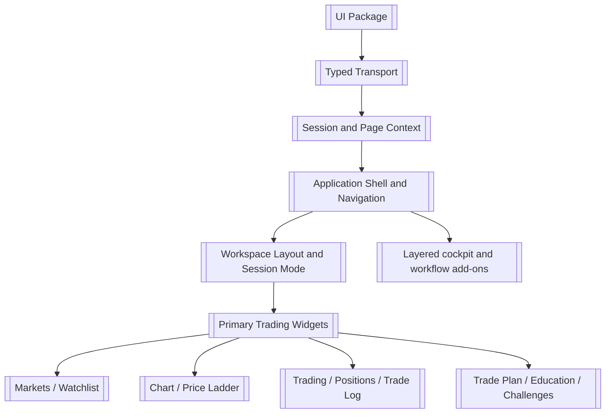
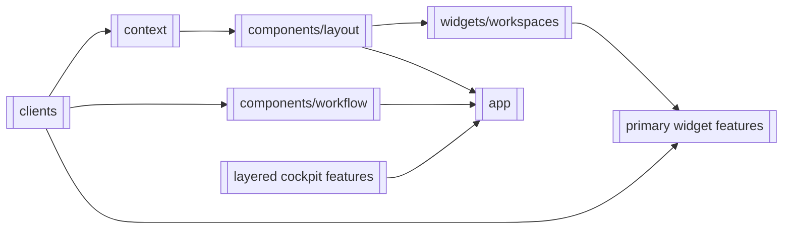
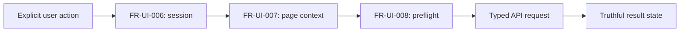

# UI

> **Package:** `app/ui/`
> **Status:** `In Progress` — 31 registered UI features (`FEAT-UI-07` withdrawn);
> 27 `Completed` and 4 `Pending` requirement coverage or focused-folder ownership.
> **Last updated:** `2026-09-04`

> This README is the package's **single source of truth** for requirements, final
> structure, implementation sequence, progress, verification evidence, and tests.
> Update this file before changing UI code.

---

## 1. Purpose and Boundary

### Purpose

UI is HaruQuantAI's independently governed Next.js presentation domain. It presents
typed API evidence, manages bounded interaction state, and submits explicit user
actions without becoming a business, policy, persistence, or broker authority.

### Owns

- Accessible pages, widgets, workflow presentation, navigation, and interaction state.
- Typed API clients and frontend validation kept in route-contract parity with API.
- Truthful loading, stale, empty, unavailable, unknown, and error presentation.
- Browser-session recovery and non-authoritative governed-action preflight.

### Does not own

- Trading, Risk, Strategy, Data, Indicators, Simulation, Analytics, Optimization,
  Research, Portfolio, or Agentic calculations and decisions.
- Authentication or authorization authority, durable state, credential resolution,
  provider readiness, broker sessions, or direct MT5 access.
- Invented quotes, fills, performance, readiness, recovery, or successful mutations.

### Shared contracts

Contract names, versions, and owners match `docs/PROJECT.md` and the Interfaces
(D-IFACE) contract family in `app/contracts/interfaces/`. The former monolithic
API registry was deleted with `app/services/api` and is not restored; the
boundary reconciliation is recorded in
`docs/dev/iface-ui-migration/phase-0-baseline-reconciliation.md`.

**Owned by this domain** — UI-only view and interaction contracts:

| Status    | Contract              | Version | Counterparty | Purpose                                     |
| --------- | --------------------- | ------- | ------------ | ------------------------------------------- |
| Completed | `InstrumentValue`   | `v1`  | UI features  | Labelled value with explicit freshness.     |
| Completed | `WarningItem`       | `v1`  | UI features  | Bounded warning presentation state.         |
| Completed | `WorkflowStage`     | `v1`  | UI routes    | State-gated workstation stage.              |
| Completed | `EmergencyStep`     | `v1`  | UI routes    | Emergency checklist presentation.           |
| Completed | `Alarm`             | `v1`  | UI routes    | Priority, root, and lifecycle presentation. |
| Completed | `QualificationView` | `v1`  | UI routes    | Qualification and remediation presentation. |

**Consumed from other domains** — referenced and validated, never redefined as owner
truth:

| Contract                                                                           | Version             | Owner                              | Used for                                   |
| ---------------------------------------------------------------------------------- | ------------------- | ---------------------------------- | ------------------------------------------ |
| `ApiResponse`, `ApiError`, `ApiMetadata`, `StreamEvent`, `RouteContract` | `v1`              | Interfaces (D-IFACE), planned      | Typed HTTP and stream transport.           |
| `GovernedRequestContext`, `PageContext`                                        | `v1`              | Interfaces (D-IFACE), planned      | Bounded route and governed-action context. |
| Registered domain response DTOs                                                    | Registered versions | Owning service domains through D-IFACE gateways | Truthful workflow and widget presentation. |

The `v1` envelope family above is the frozen contract the typed clients observe
today; the schemas in `src/clients/contracts.ts` remain its drift-checked mirror.
Record ownership formally moves from the deleted API domain to the Interfaces
domain when the `FEAT-IFACE-SERVE_API_EVENTS` transport feature lands,
preserving the observed semantics.

### Persisted state

UI owns no durable state and no migration manifest. Browser `sessionStorage` and
component/store state are non-authoritative display state; the backend boundary
remains the source of session and domain truth.

### Architectural Paradigm: Spatiotemporal Composability ("Everything is a Plugin")

HaruQuantAI UI is engineered around the principle of **Spatiotemporal Composability**, replacing traditional static, multi-page web application silos with a single unified composable canvas:

1. **Single-Page Composable Canvas**:
   - The application does not route between isolated, fragmented full-page views for separate tools.
   - The entire application interface is a single unified workstation viewport hosting dynamically composable **Workspaces**.

2. **"Everything is a Plugin / Widget"**:
   - Every functional capability (Markets, Watchlists, Charting, Price Ladder, Order Ticket, Simulator, Analytics Workbench, Research Workbench, Market Ticks, News, FX Market Hours, Sessions, Settings) is encapsulated as a standalone, pluggable **Widget** residing in `src/widgets/<widget>/`.
   - Widgets are self-contained presentation modules that register clear contracts, manage their own streaming subscriptions, and expose isolated visual boundaries.

3. **Spatial Composability**:
   - Workspaces provide a flexible 2D docking and tiling canvas powered by `Dockview`.
   - Users and automated presets can dynamically add, remove, dock, tab, split (horizontally/vertically), resize, minimize, or expand any widget within any workspace at runtime.
   - Blank workspaces can be populated with arbitrary combinations of widgets, and curated templates (e.g., *Default Trading*, *Market Analysis*, *Strategy Development*, *Simulation & Analytics*) serve as pre-composed spatial arrangements rather than fixed pages.

4. **Temporal Composability**:
   - Widgets asynchronously synchronize with independent time domains—such as real-time market quote streams, historical bar playback, backtest event schedules, or live simulation clocks.
   - State updates, quote ticks, and trade lifecycle events propagate across widgets without requiring page refreshes or coupling widget lifecycles.

### Four-level structure

| Code level                            | Represents                                                |
| ------------------------------------- | --------------------------------------------------------- |
| **Package**                     | UI domain                                                 |
| **Module folder**               | UI widget or documented support capability                |
| **File**                        | Page, component, client, contract, or focused interaction |
| **Component / function / type** | Functional requirement behaviour or UI contract           |

```text
app/ui
└── src/widgets/<widget>
    └── <focused-file>.tsx
        └── Component / Function / Type
```

### Leading document

`docs/dev/documentation.pdf` is the leading source for UI features. The trading
workspace and its widgets are the primary UI and are registered first
(`FEAT-UI-01`–`FEAT-UI-13`). Foundation modules (`FEAT-UI-14`–`FEAT-UI-17`) exist to
enable that primary UI. Every other surface, including the trading-cockpit features
traced in `docs/dev/trading-cockpit/`, is registered as an additive layer on top
(`FEAT-UI-18`–`FEAT-UI-24`) and never as the owner of a primary widget. The
focused `FEAT-UI-25` diagnostic widget isolates the MT5 snapshot presentation
path without replacing any primary widget.

### Package capability map



---

## 2. Final Package Structure

The tree records the target focused ownership of all registered UI features,
following the D-UI shape in `docs/dev/feature_implementation_pipeline.md` §4.8.
Entries marked *(target)* are registered destinations whose code has not yet moved.

```text
app/ui/
├── README.md
├── package.json
└── src/
    ├── widgets/workspaces/              # FEAT-UI-01
    ├── widgets/markets/                 # FEAT-UI-02
    ├── widgets/watchlists/              # FEAT-UI-03
    ├── widgets/chart/                   # FEAT-UI-04
    ├── widgets/price-ladder/            # FEAT-UI-05
    ├── widgets/trading/                 # FEAT-UI-06
    ├── widgets/trade-log/               # FEAT-UI-08
    ├── widgets/positions/               # FEAT-UI-09
    ├── widgets/trade-plan/              # FEAT-UI-10
    ├── widgets/education/               # FEAT-UI-11 (target)
    ├── widgets/challenges/              # FEAT-UI-12 (target)
    ├── widgets/system-settings/         # FEAT-UI-13
    ├── widgets/instrument-panels/       # FEAT-UI-19
    ├── widgets/planning/                # FEAT-UI-20
    ├── widgets/workflow-pages/          # FEAT-UI-21
    ├── widgets/emergency-ux/            # FEAT-UI-22
    ├── widgets/human-factors/           # FEAT-UI-23
    ├── widgets/training-ux/             # FEAT-UI-24
    ├── widgets/market-ticks/            # FEAT-UI-25
    ├── widgets/session-registry/        # FEAT-UI-26
    ├── widgets/simulator/               # FEAT-UI-27 and FEAT-UI-31
    ├── widgets/research/                # FEAT-UI-28
    ├── widgets/news/                    # FEAT-UI-29
    ├── widgets/market-hours/            # FEAT-UI-30
    ├── widgets/analytics/               # FEAT-UI-32
    ├── clients/                         # FEAT-UI-14 support: typed transport
    ├── context/                         # FEAT-UI-15 support: session/page/stream context
    ├── components/layout/               # FEAT-UI-16 nonvisual shell feature
    ├── app/                             # FEAT-UI-17 framework routes
    ├── components/workflow/             # FEAT-UI-18 nonvisual workflow feature
    ├── contracts/generated/             # support: generated wire types only
    ├── runtime/                         # support: UI composition boundary
    ├── workspaces/                      # support: workspace composition
    ├── types/                           # support: shared types
    ├── utils/                           # support: shared helpers
    └── mock/                            # support: test-only fixtures
```

### D-UI feature shape and identity

Widget-owning features migrate to the D-UI shape defined by
`docs/dev/feature_implementation_pipeline.md` §4.8: each
`src/widgets/<widget_slug>/` gains `README.md`, `manifest.ts`, `config.ts`,
`feature.tsx`, focused presentation modules, and a deliberate `index.ts`. The
existing `FEAT-UI-*` numeric identities are permanent runtime/configuration
identities and are kept; no feature-ID migration is approved, and `FEAT-UI-07`
stays withdrawn. Nonvisual features (`FEAT-UI-14`–`FEAT-UI-18`) adopt the same
identity, lifecycle, and removal rules through their owning migration phase,
with support code confined to the documented support folders above.

### Feature Registry

| Status    | Feature                                                 | Owning module                                                                                               | Public surface                                                                                                                                                                                                                                           | Requirements                                                                                            | Verification evidence                                                                                                                                                                                                                     |
| --------- | ------------------------------------------------------- | ----------------------------------------------------------------------------------------------------------- | -------------------------------------------------------------------------------------------------------------------------------------------------------------------------------------------------------------------------------------------------------- | ------------------------------------------------------------------------------------------------------- | ----------------------------------------------------------------------------------------------------------------------------------------------------------------------------------------------------------------------------------------- |
| Completed | `FEAT-UI-01` Workspace Layout and Session Mode        | `src/widgets/workspaces/`                                                                                | Workspace and widget layout state, workspace templates, docking layout trees, confirmation mode, account mode, provider-mode compatibility gate                                                                                                          | `FR-UI-001`–`FR-UI-029`; `FR-UI-195`–`FR-UI-199`; `FR-UI-200`–`FR-UI-205`; `FR-UI-208` | `src/widgets/workspaces/store.test.ts`; `dockLayout.test.ts`; `TemplatePicker.test.tsx`; `WorkspaceEmptyState.test.tsx`; `src/components/layout/DockingWorkspace.test.tsx`; `Header.test.tsx`; focused Trading control tests |
| Completed | `FEAT-UI-02` Markets Widget                           | `src/widgets/markets/`                                                                                   | `MarketsFeature` (D-UI lifecycle) wrapping `MarketsWidget`; `MARKETS_MANIFEST`; strict `config.ts`                                                                                                                                                     | `FR-UI-030`–`FR-UI-037`; `FR-UI-192`–`FR-UI-193`                                              | `src/widgets/markets/{MarketsWidget,feature}.test.tsx`; `manifest.test.ts`; `config.test.ts`                                                                                                                                           |
| Completed | `FEAT-UI-03` Watchlist Widget                         | `src/widgets/watchlists/`                                                                                | `WatchlistsFeature` (D-UI lifecycle) wrapping `WatchlistWidget`; `WATCHLISTS_MANIFEST`; strict `config.ts`                                                                                                                                             | `FR-UI-038`–`FR-UI-045`; `FR-UI-192`                                                             | `src/widgets/watchlists/{WatchlistWidget,feature}.test.tsx`; `manifest.test.ts`; `config.test.ts`                                                                                                                                     |
| Completed | `FEAT-UI-04` Charting Tools Widget                    | `src/widgets/chart/`                                                                                     | `ChartWidget`                                                                                                                                                                                                                                          | `FR-UI-046`–`FR-UI-054`; `FR-UI-194`                                                             | `src/widgets/chart/ChartWidget.test.tsx`                                                                                                                                                                                               |
| Completed | `FEAT-UI-05` Price Ladder Widget                      | `src/widgets/price-ladder/`                                                                              | `PriceLadderFeature` (D-UI lifecycle) wrapping `PriceLadderWidget`; `PRICE_LADDER_MANIFEST`; strict `config.ts`                                                                                                                                          | `FR-UI-055`–`FR-UI-062`                                                                            | `src/widgets/price-ladder/{PriceLadderWidget,feature,useDepthStream}.test.tsx`; `manifest.test.ts`; `config.test.ts`                                                                                                                 |
| Completed | `FEAT-UI-06` Trading Widget                           | `src/widgets/trading/`                                                                                   | `TradingFeature` (D-UI lifecycle) wrapping `TradingWidget` and `OrderTicket`; `TRADING_MANIFEST`; strict `config.ts`                                                                                                                                     | `FR-UI-063`–`FR-UI-072`; `FR-UI-147`; `FR-UI-225`–`FR-UI-233`                               | `src/widgets/trading/{OrderTicket,TradingWidget,feature}.test.tsx`; `manifest.test.ts`; `config.test.ts`; `src/widgets/price-ladder/PriceLadderWidget.test.tsx`                                                                   |
| Completed | `FEAT-UI-08` Trade Log Widget                         | `src/widgets/trade-log/`                                                                                | `TradeLogFeature` (D-UI lifecycle) wrapping `TradeLogWidget`; `TRADE_LOG_MANIFEST`; strict `config.ts`                                                                                                                                                   | `FR-UI-085`–`FR-UI-089`                                                                            | `src/widgets/trade-log/{TradeLogWidget,feature}.test.tsx`; `manifest.test.ts`; `config.test.ts`                                                                                                                                       |
| Completed | `FEAT-UI-09` Positions and Orders Widgets             | `src/widgets/positions/`                                                                                | `PositionsFeature` (D-UI lifecycle) wrapping `PositionsWidget`; `POSITIONS_MANIFEST`; strict `config.ts`                                                                                                                                                 | `FR-UI-090`–`FR-UI-098`                                                                            | `src/widgets/positions/{PositionsWidget,feature}.test.tsx`; `manifest.test.ts`; `config.test.ts`                                                                                                                                       |
| Completed | `FEAT-UI-10` Trade Plan Widget                        | `src/widgets/trade-plan/`                                                                               | `TradePlanFeature` (D-UI lifecycle) wrapping `TradePlanWidget`; `TRADE_PLAN_MANIFEST`; strict `config.ts`                                                                                                                                                | `FR-UI-099`–`FR-UI-104`                                                                            | `src/widgets/trade-plan/{TradePlanWidget,feature}.test.tsx`; `manifest.test.ts`; `config.test.ts`                                                                                                                                      |
| Pending   | `FEAT-UI-11` Education Resources Widget               | Target:`src/widgets/education/`; current: `src/widgets/training-ux/EducationWidget.tsx`               | `EducationWidget`                                                                                                                                                                                                                                      | `FR-UI-105`–`FR-UI-108`                                                                            | Pending evidence; blocked on an owning backend domain                                                                                                                                                                                     |
| Pending   | `FEAT-UI-12` Challenges and Challenge Dashboard       | Target:`src/widgets/challenges/`; current: `src/widgets/training-ux/ChallengesWidget.tsx`             | `ChallengesWidget`                                                                                                                                                                                                                                     | `FR-UI-109`–`FR-UI-116`                                                                            | Pending evidence; blocked on an owning backend domain                                                                                                                                                                                     |
| Completed | `FEAT-UI-13` System Settings                          | `src/widgets/system-settings/`                                                                           | `SystemSettingsFeature` (D-UI lifecycle), `SystemSettingsModal`; `SYSTEM_SETTINGS_MANIFEST`; strict `config.ts`                                                                                                                                          | `FR-UI-117`–`FR-UI-121`                                                                            | `src/widgets/system-settings/{system-settings-modal,feature}.test.tsx`; `manifest.test.ts`; `config.test.ts`                                                                                                                             |
| Completed | `FEAT-UI-14` Typed Backend Transport                  | `src/clients/`                                                                                            | `request`, `unwrapData`, `ApiClientError`, `openStream`, `apiClients`                                                                                                                                                                          | `FR-UI-122`–`FR-UI-126`                                                                            | `src/clients/request.test.ts`; `clients.test.ts`; `clients.contract.test.ts`                                                                                                                                                        |
| Pending   | `FEAT-UI-15` Session and Page Context                 | `src/context/`                                                                                            | Auth, page, governed-preflight, and stream context                                                                                                                                                                                                       | `FR-UI-127`–`FR-UI-131`                                                                            | `src/context/{auth,page,governed,streams}.test.ts(x)`; further evidence pending                                                                                                                                                         |
| Pending   | `FEAT-UI-16` Application Shell and Navigation         | `src/components/layout/`                                                                                  | `Header`, `Sidebar`, `WorkspaceGrid`, session clock, account metrics settings                                                                                                                                                                      | `FR-UI-132`–`FR-UI-137`; `FR-UI-207`; `FR-UI-209`–`FR-UI-211`                               | `src/components/layout/clock.test.ts`; `TimeCorrectionDialog.test.tsx`; `AccountMetricsMenu.test.tsx`; `Header.test.tsx`; `src/widgets/system-settings/system-settings-modal.test.tsx`; further evidence pending                  |
| Pending   | `FEAT-UI-17` Protected Routing and Access Gate        | `src/app/`                                                                                                | `AuthenticationPage`, `ProtectedLayout`, `WorkflowPage`                                                                                                                                                                                            | `FR-UI-138`–`FR-UI-141`                                                                            | `src/app/{authentication-page,protected-layout,pages.contract}.test.ts(x)`; further evidence pending                                                                                                                                    |
| Completed | `FEAT-UI-18` Domain Workflow Views                    | `src/components/workflow/`                                                                                | `AppShell` and non-Trading focused domain workflow views                                                                                                                                                                                               | `FR-UI-142`–`FR-UI-146`; `FR-UI-148`–`FR-UI-150`                                              | Focused non-Trading`src/components/workflow/*.test.tsx`                                                                                                                                                                                 |
| Completed | `FEAT-UI-19` Instrument Panels                        | `src/widgets/instrument-panels/`                                                                         | `InstrumentPanels`, `InstrumentValue`                                                                                                                                                                                                                | `FR-UI-151`–`FR-UI-156`                                                                            | `src/widgets/instrument-panels/components.test.tsx`                                                                                                                                                                                    |
| Completed | `FEAT-UI-20` Navigation, Planning, and Warning Panels | `src/widgets/planning/`                                                                                  | `PlanningPanels`, `WarningItem`                                                                                                                                                                                                                      | `FR-UI-157`–`FR-UI-161`                                                                            | `src/widgets/planning/components.test.tsx`                                                                                                                                                                                             |
| Completed | `FEAT-UI-21` Workflow Stage Pages                     | `src/widgets/workflow-pages/`                                                                            | `WorkflowStages`, `WorkflowStage`                                                                                                                                                                                                                     | `FR-UI-162`–`FR-UI-168`                                                                            | `src/widgets/workflow-pages/components.test.tsx`                                                                                                                                                                                       |
| Completed | `FEAT-UI-22` Emergency and Recovery UX                | `src/widgets/emergency-ux/`                                                                              | `EmergencyPanel`, `EmergencyStep`                                                                                                                                                                                                                    | `FR-UI-169`–`FR-UI-173`                                                                            | `src/widgets/emergency-ux/components.test.tsx`                                                                                                                                                                                         |
| Completed | `FEAT-UI-23` Human-Factors and Alarm Model            | `src/widgets/human-factors/`                                                                             | `AlarmModel`, `Alarm`                                                                                                                                                                                                                                | `FR-UI-174`–`FR-UI-179`                                                                            | `src/widgets/human-factors/components.test.tsx`                                                                                                                                                                                        |
| Completed | `FEAT-UI-24` Training, Replay, and Qualification UX   | `src/widgets/training-ux/`                                                                               | `TrainingPanel`, `QualificationView`                                                                                                                                                                                                                 | `FR-UI-180`–`FR-UI-185`                                                                            | `src/widgets/training-ux/components.test.tsx`                                                                                                                                                                                          |
| Completed | `FEAT-UI-25` MT5 Market Ticks Diagnostic Widget       | `src/widgets/market-ticks/`                                                                              | `MarketTicksFeature` (D-UI lifecycle) wrapping `MarketTicksTableWidget`; `MARKET_TICKS_MANIFEST`; strict `config.ts`                                                                                                                                    | `FR-UI-186`–`FR-UI-191`; `FR-UI-193`                                                             | `src/widgets/market-ticks/{MarketTicksTableWidget,useMarketSnapshots,feature}.test.ts(x)`; `manifest.test.ts`; `config.test.ts`                                                                                                                                            |
| Completed | `FEAT-UI-26` Trading Session Registry Widget          | `src/widgets/session-registry/`                                                                          | `SessionRegistryWidget`; typed create/list/default/start/stop/archive controls, SIM opening-account and verified-dataset configuration, stopped-only legacy completion, metadata inspection, durable lifecycle history, and safe live activity console | `FR-UI-212`–`FR-UI-224`                                                                            | `src/widgets/session-registry/SessionRegistryWidget.test.tsx`; typed client and backend integration tests                                                                                                                              |
| Completed | `FEAT-UI-27` Canonical Backtest Simulator Widget      | `src/widgets/simulator/`                                                                                 | `SimulatorWidget`; registered strategy picker with per-strategy parameters, market and execution configuration, background run control, ordered progress, and the Analytics-owned performance report                                                   | `FR-UI-234`–`FR-UI-240`                                                                            | `src/widgets/simulator/SimulatorWidget.test.tsx`; `src/clients/clients.contract.test.ts`                                                                                                                                             |
| Completed | `FEAT-UI-28` Research Workbench | `src/widgets/research/` | `ResearchDashboard`, `ResearchRunBuilder`, `ResearchWorkbench`, `ResearchStageNav`, `ResearchRunHeader`, `ResearchComparison`, `ResearchAutomation`, `ResearchArtifactDrawer`, `ResearchExpectancy`, `ResearchDrift`, and thirteen stage panels; deep-linkable run stages, server-derived stage status, ordered progress streaming, run history and comparison, artifact provenance, permission-gated expectancy governance, and the V2-only Features/Validation/Intelligence/Stress evidence views | `FR-UI-241`–`FR-UI-252` | `src/widgets/research/ResearchWorkbench.test.tsx`; `src/widgets/research/ResearchExpectancy.test.tsx`; `src/widgets/research/research-client.test.ts`; `src/widgets/research/v1-coverage.test.ts` |
| Completed | `FEAT-UI-29` News Online Feed Widget | `src/widgets/news/` | `NewsFeature` (D-UI lifecycle) wrapping `NewsWidget`; `NEWS_MANIFEST`; strict `config.ts`; `NewsCategory`, `NewsLanguage` through the feature barrel | `FR-UI-253`–`FR-UI-258` | `src/widgets/news/NewsWidget.test.tsx`; `feature.test.ts` |
| Completed | `FEAT-UI-30` FX Market Hours Widget | `src/widgets/market-hours/` | `MarketHoursFeature` (D-UI lifecycle) wrapping `MarketHoursWidget`; `MARKET_HOURS_MANIFEST`; `DEFAULT_MARKET_HOURS_CONFIG`, `POPULAR_FX_INSTRUMENTS` through the feature barrel | `FR-UI-259`–`FR-UI-264` | `src/widgets/market-hours/MarketHoursWidget.test.tsx`; `feature.test.ts` |
| Completed | `FEAT-UI-31` Simulation Workbench | `src/widgets/simulator/` | `SimulationWorkbench`, `SimulationHome`, `SimulationStatusBadge`, `SimulationRunBuilder` (eight ordered stages), `CanonicalRunMonitor`, `BatchRunMonitor`, `InteractiveSimulationWorkspace`, `SimulationSessionHeader`, `MarketViewport`, `ManualCommandPanel`, `SessionStatePanels`, `WhatIfPanel`, `SimulationRecoveryPanel`, `SimulationFinalizeDialog`, `SimulationPlaybackWorkspace`, `ScenarioPanel`, `ChecklistPanel`, `MissionPanel`, `PortfolioSimulationPanel`, `RunCataloguePanel`, `simulation-store`, `simulation-selectors` | `FR-UI-265`–`FR-UI-270`, `FR-UI-277` | `src/widgets/simulator/SimulationWorkbench.test.tsx`; `src/widgets/simulator/RunCataloguePanel.test.tsx`; `src/widgets/simulator/SimulationRunBuilder.test.tsx`; `src/widgets/simulator/CanonicalRunMonitor.test.tsx`; `src/widgets/simulator/BatchRunMonitor.test.tsx`; `src/widgets/simulator/SimulationHome.test.tsx`; `src/widgets/simulator/InteractiveSimulationWorkspace.test.tsx`; `src/widgets/simulator/ManualCommandPanel.test.tsx`; `src/widgets/simulator/SimulationRecoveryPanel.test.tsx`; `src/widgets/simulator/SimulationPlaybackWorkspace.test.tsx`; `src/widgets/simulator/ScenarioPanel.test.tsx`; `src/widgets/simulator/PortfolioSimulationPanel.test.tsx`; `src/clients/simulationWorkbench.test.ts` |
| Completed | `FEAT-UI-32` Analytics Workbench | `src/widgets/analytics/` | `AnalyticsWorkspace`, `AnalyticsNav`, `AnalyticsLibrary`, `OverviewPanel`, `AnalyticsEvidenceState`, `TradesPanel`, `TradeDetailPanel`, `AnalyticsArtifactDrawer`, `TimeSeriesChart`, `CalendarHeatmap`, `DistributionChart`, `RealismPanel`, `ProvenancePanel`, `ReturnsPanel`, `RiskPanel`, `DistributionPanel`, `PeriodsPanel`, `BenchmarkPanel`, `ChartsPanel`, `AnalyticsComparison`, `analytics-store`, `analytics-selectors` | `FR-UI-271`–`FR-UI-276`, `FR-UI-278` | `src/widgets/analytics/AnalyticsWorkspace.test.tsx`; `src/widgets/analytics/AnalyticsLibrary.test.tsx`; `src/widgets/analytics/TradesPanel.test.tsx`; `src/widgets/analytics/charts.test.tsx`; `src/widgets/analytics/evidence-context.test.tsx`; `src/widgets/analytics/advanced-panels.test.tsx`; `src/widgets/analytics/PeriodsPanel.test.tsx`; `src/widgets/analytics/AnalyticsComparison.test.tsx`; `src/clients/analyticsWorkbench.test.ts` |


**Primary UI.** `FEAT-UI-01`–`FEAT-UI-06` and `FEAT-UI-08`–`FEAT-UI-13` are the trading workspace and widgets
specified by `docs/dev/documentation.pdf`. `FEAT-UI-14`–`FEAT-UI-17` are the foundation
that enables them. `FEAT-UI-18`–`FEAT-UI-24` are additive layers and own no primary widget.

`FEAT-UI-02` consumes Markets orchestration and `FEAT-UI-03` consumes Account
Watchlists through focused Interfaces (D-IFACE) gateways; the former
`FEAT-API-11/12` owners were deleted with `app/services/api`. UI feature
identity remains independent from the backend feature registry.

**Blocked features.** `FEAT-UI-11` and `FEAT-UI-12` have no owning backend domain;
see Section 6. Listed-options and options-chain UI scope is withdrawn because the
owner trades CFDs, primarily forex through MT5; the retired identifiers are not reused.

**Non-feature support directories.** `src/types/` and `src/utils/` are documented
shared type and helper directories owning no feature behaviour. `src/mock/` is
test-only fixture data; production modules must not import it (see `NFR-UI-007`).
These directories are excluded from feature-count reconciliation.

### Module dependency diagram



### Structure rules

Shared data tables use the global `Be Vietnam Pro` font and the dense typography
contract in `src/index.css`: 11px regular body text in a 30px row with a 29px
calculated line height. Light mode uses `rgb(37, 50, 60)` for table-cell text;
dark mode retains the theme foreground token so the same component remains
legible on navy surfaces.

- Each registered feature owns one focused production module folder; framework route
  entries may remain in `src/app/` and delegate to their owning feature.
- Each file owns one focused page, component, contract, transport, or interaction.
- UI imports service capabilities only through typed API contracts.
- Shared `src/components/widgets/` ownership is prohibited; widgets reside in their
  registered feature folder.
- `FEAT-UI-*` features use the UI verification-evidence exception: they do not require
  separate numbered standalone usage programs. Production rendering is not evidence.

---

## 3. Workflows

### Status values

| Status              | Meaning                                                               |
| ------------------- | --------------------------------------------------------------------- |
| **Pending**   | Not implemented, not verified, or awaiting structural reconciliation. |
| **Partial**   | Some behavior exists but required evidence is incomplete.             |
| **Completed** | Implemented and verified by the required UI evidence.                 |

### Workflow scope values

| Scope                  | Meaning                                    |
| ---------------------- | ------------------------------------------ |
| **Internal**     | The workflow remains within UI.            |
| **Cross-domain** | UI exchanges typed boundary data with API. |

| Status    | Workflow ID   | Scope        | Workflow                   | Trigger / Input boundary | Final outcome / Output boundary           | Requirement sequence                                 |
| --------- | ------------- | ------------ | -------------------------- | ------------------------ | ----------------------------------------- | ---------------------------------------------------- |
| Completed | `WF-UI-001` | Cross-domain | Governed user action       | Explicit user action     | API result, warning, or preflight block   | `FR-UI-006 → FR-UI-007 → FR-UI-008 → FR-UI-021` |
| Completed | `WF-UI-002` | Cross-domain | Ordered stream consumption | Authenticated API stream | Validated events or authoritative refresh | `FR-UI-005 → FR-UI-009 → FR-UI-010`              |

### `WF-UI-001` — Governed User Action

**Scope:** `Cross-domain`

**System workflow:** Any registered `SYS-WF-*` requiring an operator action.

**Input boundary:** An authenticated user explicitly initiates an action in UI.

**Output boundary:** API receives one typed request, or UI displays a bounded preflight
block without claiming backend authorization.

1. `AuthProvider` recovers current session truth from API.
2. `PageContextProvider` supplies bounded, redacted route/action context.
3. `buildGovernedOptions` rejects incomplete or stale context.
4. The focused typed client submits the action and the owning view presents its result.

**Failure behaviour:** Expired session redirects to access; stale context blocks the
request; API rejection remains visible and is never converted into success.

**Integration test:** `src/context/auth.test.tsx`, `governed.test.ts`, and focused
workflow component tests.



### `WF-UI-002` — Ordered Stream Consumption

**Scope:** `Cross-domain`

**System workflow:** Any registered streaming workflow.

**Input boundary:** Authenticated API stream events.

**Output boundary:** Ordered UI events or an explicit gap/error followed by
authoritative state refresh.

1. `openStream` opens the typed transport.
2. `consumeStream` validates ordering and filters heartbeat frames.
3. Gaps and terminal events surface explicitly and trigger the registered recovery.
4. Disconnect aborts transport and releases UI resources.

**Integration test:** `src/clients/stream.test.ts` and
`src/context/streams.test.ts`.

---

---

## 4. Module and Requirement Specifications

Modules are ordered primary UI first, then foundation, then layered add-ons. The
`Usage / Test` column records UI verification evidence; the approved UI exception
replaces standalone usage programs with focused unit/component and appropriate
integration, contract, or browser evidence.

### 4.1 `src/widgets/workspaces/` — Workspace Layout and Session Mode

**Purpose:** Own non-authoritative workspace layout preference, order-confirmation mode, and account-mode presentation.

**Location:** `src/widgets/workspaces/`. Migrated from the former
`src/store/useTradingStore.ts` (trimmed to only the unrelated trading-engine
state - orders, positions, trade log, practice/challenge balances - which
remains out of this feature's scope) and `src/types/widget.ts` (deleted; its
contents moved into `contracts.ts`). `accountMode` is derived exclusively from
the authenticated identity's `runtime_profile` (`src/context/auth.tsx`) rather
than through `clients/settings`, which has no
workspace-related field; see the feature's own `README.md` for that gap.

### Files

| Status    | File                        | Responsibility                                               | Key exports                                                                             | Dependencies                                                                                                                     |
| --------- | --------------------------- | ------------------------------------------------------------ | --------------------------------------------------------------------------------------- | -------------------------------------------------------------------------------------------------------------------------------- |
| Completed | `contracts.ts`            | Workspace and widget layout contracts                        | `Workspace`, `Widget`, `WidgetType`, `AccountMode`                              | **Standard library:** None**Required third-party:** Zod**Local:** None                                         |
| Completed | `templates.ts`            | Workspace template catalog (FR-UI-195–FR-UI-197)            | `WORKSPACE_TEMPLATES`, `WorkspaceTemplate`, `findWorkspaceTemplate`               | **Standard library:** None**Required third-party:** None**Local:** contracts                                   |
| Completed | `dockLayout.ts`           | Docking layout tree factory and legacy migration (FR-UI-201) | `buildDockLayout`                                                                     | **Standard library:** None**Required third-party:** dockview-react (types only)**Local:** contracts            |
| Completed | `store.ts`                | Bounded layout, confirmation-mode, and account-mode state    | `useWorkspaceStore`, `selectOrderEntryDisabled`, `mapRuntimeProfileToAccountMode` | **Standard library:** localStorage**Required third-party:** Zustand**Local:** contracts, templates, dockLayout |
| Completed | `TemplatePicker.tsx`      | New-workspace template picker screen (FR-UI-195/196/198)     | `TemplatePicker` through the feature barrel                                           | **Standard library:** None**Required third-party:** None**Local:** store, templates                            |
| Completed | `WorkspaceEmptyState.tsx` | Explicit empty-workspace prompt (FR-UI-026/197)              | `WorkspaceEmptyState` through the feature barrel                                      | **Standard library:** None**Required third-party:** None**Local:** None                                        |
| Completed | `index.ts`                | Sole public surface for the feature                          | feature barrel                                                                          | **Standard library:** None**Required third-party:** None**Local:** store and contracts                         |

| Status    | Requirement ID | Responsibility                                                                                                                                                                                                                                                                                                                                                                                                | Component / Function / Type                           | Side Effects                 | Failure presentation                                                  | Usage / Test                                                                                 |
| --------- | -------------- | ------------------------------------------------------------------------------------------------------------------------------------------------------------------------------------------------------------------------------------------------------------------------------------------------------------------------------------------------------------------------------------------------------------- | ----------------------------------------------------- | ---------------------------- | --------------------------------------------------------------------- | -------------------------------------------------------------------------------------------- |
| Completed | `FR-UI-001`  | Provide a default workspace on first authenticated load presenting the new-workspace template picker screen pending choice.                                                                                                                                                                                                                                                   | `Workspace`                                         | Local persistence            | Default restored                                                      | `store.test.ts`                                                                            |
| Completed | `FR-UI-002`  | Allow creation of named workspaces up to a bounded maximum, rejecting creation beyond the limit explicitly.                                                                                                                                                                                                                                                                                                   | workspace actions                                     | Local persistence            | Limit message shown                                                   | `store.test.ts`                                                                            |
| Completed | `FR-UI-003`  | Default an unnamed new workspace to a deterministic incrementing name.                                                                                                                                                                                                                                                                                                                                        | workspace actions                                     | Local persistence            | Deterministic naming                                                  | `store.test.ts`                                                                            |
| Completed | `FR-UI-004`  | Allow renaming, duplicating, and deleting a workspace; deleting the last remaining workspace is rejected.                                                                                                                                                                                                                                                                                                     | workspace actions                                     | Local persistence            | Rejection explicit                                                    | `store.test.ts`                                                                            |
| Completed | `FR-UI-005`  | Allow a workspace to be designated the default opened on next session start.                                                                                                                                                                                                                                                                                                                                  | workspace actions                                     | Local persistence            | Default visible                                                       | `store.test.ts`                                                                            |
| Completed | `FR-UI-006`  | Support moving a widget by dragging its tab: dropping on a panel's centre docks it as a tab in that group, dropping on an edge splits the region in that direction, and the layout always fills the workspace with no gaps or overlaps.                                                                                                                                                                       | `DockingWorkspace`                                  | Local persistence            | Drop overlay visible                                                  | `DockingWorkspace.test.tsx`; live docking evidence                                         |
| Completed | `FR-UI-007`  | Provide a keyboard-operable path for layout moves: focused tabs switch with arrow keys and Alt+Arrow moves the active panel left/right/above/below; splitter pixel-resizing remains pointer-only and tracked as a follow-up.                                                                                                                                                                                  | `DockingWorkspace`                                  | Local persistence            | Keyboard path preserved                                               | `DockingWorkspace.test.tsx`                                                                |
| Completed | `FR-UI-008`  | Support expanding a widget's group to fill the workspace and restoring the prior layout through an explicit title-bar control or the equivalent double-click shortcut; the control visibly and accessibly switches between Expand and Restore.                                                                                                                                                                | `DockingWorkspace`                                  | Local persistence            | Prior layout retained                                                 | `DockingWorkspace.test.tsx`; `store.test.ts` (expand/contract state)                     |
| Completed | `FR-UI-009`  | Persist layout to browser-local storage only; layout is a client preference and never system state.                                                                                                                                                                                                                                                                                                           | store                                                 | Local persistence            | Non-authoritative                                                     | `store.test.ts`                                                                            |
| Completed | `FR-UI-010`  | Restore a corrupt or unreadable persisted layout to the default workspace rather than failing to render.                                                                                                                                                                                                                                                                                                      | store                                                 | Local persistence            | Default restored                                                      | `store.test.ts`                                                                            |
| Completed | `FR-UI-011`  | Provide an order-confirmation toggle that, when disabled, submits without the client-side confirmation dialog.                                                                                                                                                                                                                                                                                                | mode actions                                          | Local state mutation         | Mode always visible                                                   | `store.test.ts`                                                                            |
| Completed | `FR-UI-012`  | Default the toggle to confirmation-required on every new session; the setting is never inherited silently.                                                                                                                                                                                                                                                                                                    | mode actions                                          | Local state mutation         | Safe default                                                          | `store.test.ts`                                                                            |
| Completed | `FR-UI-013`  | Present the active confirmation mode persistently in the shell.                                                                                                                                                                                                                                                                                                                                               | mode actions                                          | None                         | Mode always visible                                                   | `Header.tsx` confirmation-mode toggle; `Header.test.tsx`                                 |
| Completed | `FR-UI-014`  | Treat the toggle as presentation only; it never suppresses or pre-satisfies API authorization, approval, idempotency, governance, or kill-switch enforcement.                                                                                                                                                                                                                                                 | mode actions                                          | None                         | API authority unchanged                                               | `store.test.ts`                                                                            |
| Completed | `FR-UI-015`  | Apply the toggle identically in simulation and live; the difference between modes is the environment switch, not a different order path.                                                                                                                                                                                                                                                                      | mode actions                                          | None                         | One order path                                                        | `store.test.ts`                                                                            |
| Completed | `FR-UI-016`  | Present the active account mode — sim, demo, or live — persistently, unambiguously, and colour-coded.                                                                                                                                                                                                                                                                                                       | mode actions                                          | None                         | Mode always visible                                                   | `Header.test.tsx` badge tests                                                              |
| Completed | `FR-UI-017`  | Elect the mode from the profile dropdown and persist it as the`ACCOUNT_MODE` system setting; the backend setting is authoritative for every session. Supersedes the previous never-client-elected rule by owner decision (2026-08-17).                                                                                                                                                                      | mode actions                                          | External API call            | Selection persisted                                                   | `Header.test.tsx`; `store.test.ts`                                                       |
| Completed | `FR-UI-018`  | Require an explicit operator action to change mode, apply it only once the backend has accepted it, and revert on refusal.                                                                                                                                                                                                                                                                                    | mode actions                                          | External API call            | Explicit action required                                              | `Header.test.tsx` (selection, persistence, and revert-on-refusal)                          |
| Completed | `FR-UI-019`  | Present simulated and live balances distinctly and never combine them in one total.                                                                                                                                                                                                                                                                                                                           | mode actions                                          | None                         | No combined total                                                     | `Header.tsx` (single balance figure per active mode)                                       |
| Completed | `FR-UI-203`  | Persist the elected account mode as the complete system-settings document under its observed version, so a mode change never erases another setting and a concurrent edit is refused.                                                                                                                                                                                                                         | mode actions                                          | External API call            | Full-document write                                                   | `Header.test.tsx` (full-document write assertion)                                          |
| Completed | `FR-UI-204`  | Route every governed order, cancellation, and account-state read on the active mode's route, and refuse to act at all while the mode is unresolved.                                                                                                                                                                                                                                                           | mode actions                                          | External API call            | Route follows mode                                                    | `PriceLadderWidget.tsx` route resolution; `store.test.ts`                                |
| Completed | `FR-UI-205`  | Colour-code the account mode identically in the profile dropdown and the header badge: sim green, demo amber, live red.                                                                                                                                                                                                                                                                                       | mode actions                                          | None                         | One palette, both places                                              | `Header.test.tsx`; `index.css` account-mode palette                                      |
| Completed | `FR-UI-206`  | Display the active provider account name above its authoritative environment in the Header. DEMO/LIVE consume MT5-authored account-profile evidence—including MT5's actual environment when it differs from the elected execution mode—while SIM consumes the explicit Simulator identity. Loading and unavailable states are visible, and the app-login username is never substituted for broker identity. | `Header`                                            | External API call            | Loading/unavailable explicit                                          | `Header.test.tsx`; `clients/trading.test.ts`                                             |
| Completed | `FR-UI-208`  | Disable every Trading mutation control and handler unless fresh provider-authored account mode exactly matches the selected system mode (`SIMULATION`/sim, `DEMO`/demo, `REAL`/live); unknown, unavailable, malformed, contest, or mismatched evidence fails closed while read-only presentation remains available.                                                                                     | mode compatibility state; Trading controls            | Local state mutation         | Persistent mismatch warning; actions disabled                         | `store.test.ts`; `Header.test.tsx`; `trading.test.tsx`; `PriceLadderWidget.test.tsx` |
| Completed | `FR-UI-209`  | Display the active account's provider-authored Balance, Profit, Margin, Free Margin, Margin Level, Leverage, and Equity in that order; unavailable values render as an explicit dash and never fall back to mock trading-store figures.                                                                                                                                                                       | `Header`                                            | External API call            | Loading and unavailable metrics remain explicit                       | `Header.test.tsx`; `clients/trading.test.ts`                                             |
| Completed | `FR-UI-210`  | Open an accessible account-metrics settings menu from the Header caret. Switch Profit between provider-currency Money and an internally calculated floating-return Percent (`profit / balance * 100`); zero, missing, or invalid balance renders unavailable. The preference is session-local.                                                                                                              | `AccountMetricsMenu`; `Header`                    | Local presentation state     | Escape/outside close; safe zero-balance handling                      | `AccountMetricsMenu.test.tsx`; `Header.test.tsx`                                         |
| Completed | `FR-UI-211`  | Present MT5 leverage as provider-owned and read-only. SIM leverage remains unavailable without an active simulation-session contract, and the Header cannot mutate a global or invented leverage value.                                                                                                                                                                                                       | `AccountMetricsMenu`; `Header`                    | None                         | Mode-specific explanation; control disabled                           | `AccountMetricsMenu.test.tsx`; `Header.test.tsx`                                         |
| Completed | `FR-UI-217`  | When creating a SIM session, require an initial account balance and leverage and accept a three-letter currency defaulting to USD. Hide and omit these controls for DEMO/LIVE because MT5 owns those values.                                                                                                                                                                                                  | `SessionRegistryWidget`; typed Trading client       | External API call            | Client validation and API rejection remain visible                    | `SessionRegistryWidget.test.tsx`; `clients/trading.test.ts`                              |
| Completed | `FR-UI-218`  | Display persisted SIM opening balance and leverage in session details and use the scoped active/default SIM account profile for Header metrics across reloads. Legacy unconfigured sessions remain explicitly unavailable.                                                                                                                                                                                    | `SessionRegistryWidget`; `Header`                 | External API read            | Unconfigured values render unavailable                                | `SessionRegistryWidget.test.tsx`; `Header.test.tsx`                                      |
| Completed | `FR-UI-219`  | Display the selected system mode and its active/default session name together as`MODE : SESSION`; when no scoped session exists, display `NO SESSION` without inventing an identity. Backend session-start admission remains authoritative and cannot be bypassed by the client.                                                                                                                          | `Header`                                            | External API read            | Loading, no-session, and mismatch states explicit                     | `Header.test.tsx`; `clients/trading.test.ts`                                             |
| Completed | `FR-UI-220`  | Require selection of a Data-verified dataset when creating SIM sessions, persist its exact lineage, and visibly mark the bound dataset active. DEMO/LIVE omit dataset configuration.                                                                                                                                                                                                                          | `SessionRegistryWidget`; typed Data/Trading clients | External API read/write      | Empty catalogue blocks SIM creation visibly                           | `SessionRegistryWidget.test.tsx`; `clients.contract.test.ts`                             |
| Completed | `FR-UI-221`  | Label the provider identity as Account Name and display the immutable SIM logical identity separately in`username_N` format; unavailable legacy values remain explicit.                                                                                                                                                                                                                                     | `SessionRegistryWidget`                             | External API read            | No invented fallback identity                                         | `SessionRegistryWidget.test.tsx`; Trading integration tests                                |
| Completed | `FR-UI-222`  | Present durable lifecycle events separately from a bounded live activity console with connection state, pause/resume, clear, and accessible log semantics. Explain that streamed redacted file logs are not duplicated in the database.                                                                                                                                                                       | `SessionRegistryWidget`; typed SSE client           | External stream              | Stream failure is visible without hiding lifecycle history            | `SessionRegistryWidget.test.tsx`; `test_session_activity_stream.py`                      |
| Completed | `FR-UI-223`  | Detect legacy SIM sessions missing Account Name, Simulation ID, or dataset lineage; direct the user to stop a running session, require explicit verified-dataset selection, and complete all three fields through one visible action.                                                                                                                                                                         | `SessionRegistryWidget`; typed Trading client       | External API read/write      | Running/incomplete/empty-catalogue states remain explicit and blocked | `SessionRegistryWidget.test.tsx`; Trading integration tests                                |
| Completed | `FR-UI-224`  | Present the authenticated username as the SIM Account Name in the Header and session details, the immutable`username_N` value as Simulation ID, and the independently editable registry label only as Session Name.                                                                                                                                                                                         | `Header`; `SessionRegistryWidget`                 | External API read            | Missing identity remains explicit and trading stays blocked           | `Header.test.tsx`; `SessionRegistryWidget.test.tsx`; Trading integration tests           |
| Completed | `FR-UI-225`  | Present the existing governed Trading controls as a responsive execution cockpit with a Sessions-style hero, account/position/order evidence cards, grouped execution/order/authority/target fields, explicit loading/error/disabled/result states, and a dedicated command bar without changing any mutation or validation behavior.                                                                         | `TradingWidget`                                     | Existing Trading client only | All safety gates and disabled conditions remain authoritative         | `src/widgets/trading/TradingWidget.test.tsx`; TypeScript typecheck                        |
| Removed   | `FR-UI-020`  | Balance reset control removed by owner decision (2026-08-16): no reset action is offered in the shell; the requirement is retired.                                                                                                                                                                                                                                                                            | none                                                  | None                         | No reset offered                                                      | Owner decision;`docs/CHANGELOG.md` [Unreleased]                                            |
| Completed | `FR-UI-021`  | Fail closed when mode is unknown: present as unknown, disable order entry, and name no route until resolved.                                                                                                                                                                                                                                                                                                  | mode actions                                          | None                         | Order entry disabled                                                  | `store.test.ts`; `Header.test.tsx`; `src/widgets/trading/OrderTicket.test.tsx`        |
| Completed | `FR-UI-022`  | Present the market-data delay applicable to the active mode where the API declares one.                                                                                                                                                                                                                                                                                                                       | mode actions                                          | External API call            | Unknown remains explicit                                              | `marketDataDelaySeconds` field, undefined until the API supplies one                       |
| Completed | `FR-UI-023`  | Present widget type and title from the registered widget-type set only.                                                                                                                                                                                                                                                                                                                                       | `WidgetType`                                        | None                         | Unknown type rejected                                                 | `store.test.ts`                                                                            |
| Completed | `FR-UI-024`  | Keep every widget inside the workspace bounds inherently: the docking layout always fills the container and cannot express out-of-bounds or overlapping regions.                                                                                                                                                                                                                                              | `DockingWorkspace`                                  | Local persistence            | No out-of-bounds state                                                | `dockLayout.test.ts`                                                                       |
| Completed | `FR-UI-025`  | Preserve widget identity across docking moves, duplication, and restore operations: panel ids equal widget ids and never change.                                                                                                                                                                                                                                                                              | `DockingWorkspace`                                  | Local persistence            | Stable identity                                                       | `dockLayout.test.ts`; `store.test.ts`                                                    |
| Completed | `FR-UI-026`  | Present an empty workspace explicitly rather than as a failed render.                                                                                                                                                                                                                                                                                                                                         | `Workspace`                                         | None                         | Empty state truthful                                                  | `store.test.ts`                                                                            |
| Completed | `FR-UI-027`  | Never persist account, credential, or order state to browser-local storage.                                                                                                                                                                                                                                                                                                                                   | store                                                 | Local persistence            | Layout keys only                                                      | `store.test.ts`                                                                            |
| Completed | `FR-UI-028`  | Expose workspace and mode state only through the feature barrel.                                                                                                                                                                                                                                                                                                                                              | `index.ts`                                          | None                         | No deep import                                                        | Consumer files import only from`widgets/workspaces`                                       |
| Completed | `FR-UI-029`  | Import no fixture data; every displayed value is API-sourced or a labelled client preference.                                                                                                                                                                                                                                                                                                                 | store                                                 | None                         | No fixture import                                                     | `store.test.ts`                                                                            |
| Completed | `FR-UI-195`  | Create a new workspace as pending its template choice: deterministically named, widget-free, and rendered as the template picker instead of the widget grid; creation stays bounded by FR-UI-002.                                                                                                                                                                                                             | `addWorkspace`, `TemplatePicker`                  | Local persistence            | Bounded creation kept                                                 | `store.test.ts`; `TemplatePicker.test.tsx`                                               |
| Completed | `FR-UI-196`  | Apply a content template to the active pending workspace by seeding the template's registered-widget preset, whose rectangle set reproduces the reference thumbnail's exact panel orientation (`public/templates/`, Dark/Light), and renaming the workspace to the template name.                                                                                                                           | `applyWorkspaceTemplate`                            | Local persistence            | Unknown template rejected                                             | `store.test.ts`; `TemplatePicker.test.tsx`; `dockLayout.test.ts`                       |
| Completed | `FR-UI-197`  | Apply the Blank template by leaving the workspace empty under its deterministic name and presenting the explicit empty-workspace prompt.                                                                                                                                                                                                                                                                      | `applyWorkspaceTemplate`, `WorkspaceEmptyState`   | Local persistence            | Empty state truthful                                                  | `store.test.ts`; `WorkspaceEmptyState.test.tsx`                                          |
| Completed | `FR-UI-198`  | Present every template as a labeled card control operable by pointer and keyboard.                                                                                                                                                                                                                                                                                                                            | `TemplatePicker`                                    | None                         | Full keyboard path                                                    | `TemplatePicker.test.tsx`                                                                  |
| Completed | `FR-UI-199`  | Reject an unregistered template id without any state change.                                                                                                                                                                                                                                                                                                                                                  | `applyWorkspaceTemplate`                            | None                         | No state change                                                       | `store.test.ts`                                                                            |
| Completed | `FR-UI-200`  | Support fluid pixel-level resizing of adjacent layout regions by dragging the splitter between them, with the drop landing at the exact pointer position.                                                                                                                                                                                                                                                     | `DockingWorkspace`                                  | Local persistence            | Continuous resize                                                     | Live docking evidence;`DockingWorkspace.test.tsx`                                          |
| Completed | `FR-UI-201`  | Persist the serialized docking layout per workspace, restore it on reload, and deterministically convert grid-rectangle layouts (and template presets) into proportional docking trees by a column-cluster then row-band partition, so side-by-side columns keep independent vertical splits.                                                                                                                 | `dockLayout.ts`, `setWorkspaceDockLayout`         | Local persistence            | Legacy layouts convert or fall back                                   | `dockLayout.test.ts`; `store.test.ts`                                                    |
| Completed | `FR-UI-202`  | Collapse layout regions vacated by a moved or closed widget and expand the remaining regions to refill the workspace automatically.                                                                                                                                                                                                                                                                           | `DockingWorkspace`                                  | Local persistence            | No gaps or dead regions                                               | Live docking evidence                                                                        |

### Configuration and Limits Manifest

| Status    | Setting / Limit           | Type       | Default | Required | Used by           | Description                     |
| --------- | ------------------------- | ---------- | ------- | -------- | ----------------- | ------------------------------- |
| Completed | `MAX_CUSTOM_WORKSPACES` | `number` | `10`  | Yes      | workspace actions | Bounded custom workspace count. |

### 4.2 `src/widgets/markets/` — Markets Widget

**Purpose:** Present the tradable instrument directory for the configured runtime source.

### Files

| Status    | File                  | Responsibility                                                                       | Key exports       | Dependencies                                                                                                                                                               |
| --------- | --------------------- | ------------------------------------------------------------------------------------ | ----------------- | -------------------------------------------------------------------------------------------------------------------------------------------------------------------------- |
| Completed | `MarketsWidget.tsx` | Bounded progressive market-directory presentation, with an optional watchlist filter | `MarketsWidget` | **Standard library:** browser APIs**Required third-party:** React**Local:** clients/data, clients/watchlists, widgets/workspaces, store/useTradingStore |
| Completed | `index.ts`          | Sole public surface for the feature                                                  | `MarketsWidget` | **Standard library:** None**Required third-party:** None**Local:** `MarketsWidget.tsx`                                                                 |

| Status    | Requirement ID | Responsibility                                                                                                                                                                                                                                                                                                                                                                                                                                                                                                                                                                                                                                                                                                                                                                        | Component / Function / Type | Side Effects                                         | Failure presentation             | Usage / Test                                    |
| --------- | -------------- | ------------------------------------------------------------------------------------------------------------------------------------------------------------------------------------------------------------------------------------------------------------------------------------------------------------------------------------------------------------------------------------------------------------------------------------------------------------------------------------------------------------------------------------------------------------------------------------------------------------------------------------------------------------------------------------------------------------------------------------------------------------------------------------- | --------------------------- | ---------------------------------------------------- | -------------------------------- | ----------------------------------------------- |
| Completed | `FR-UI-030`  | Present typed API market evidence without market calculation; format every populated symbol's annualized volatility as a percentage, ADR in pips, and range as a percentage of ADR, then present owner-supplied Bid as Last Price, convert raw spread into integer MT5 points using provider precision, show per-symbol whole-second Age from genuine TCP quote time, and preserve explicit live, stale, or not-live evidence from one authenticated snapshot stream. All sequential HTTP history/calculation batches must finish before a visible 10-second settling interval begins; streaming starts only after that interval and may update quote-only fields without replacing initialized technical evidence. Initial HTTP rows and invalid quote times retain unavailable Age. | `MarketsWidget`           | Sequential external API calls followed by one stream | Unavailable remains unavailable  | `src/widgets/markets/MarketsWidget.test.tsx` |
| Completed | `FR-UI-031`  | Use bounded batch reads and progressive rendering.                                                                                                                                                                                                                                                                                                                                                                                                                                                                                                                                                                                                                                                                                                                                    | `MarketsWidget`           | External API call; local state mutation              | Completed batches remain visible | `src/widgets/markets/MarketsWidget.test.tsx` |
| Completed | `FR-UI-032`  | Show explicit loading, error, formatting, and sort states.                                                                                                                                                                                                                                                                                                                                                                                                                                                                                                                                                                                                                                                                                                                            | `MarketsWidget`           | Local state mutation                                 | Em dash for unavailable legs     | `src/widgets/markets/MarketsWidget.test.tsx` |
| Completed | `FR-UI-033`  | Present the tradable instrument directory for the configured runtime source only.                                                                                                                                                                                                                                                                                                                                                                                                                                                                                                                                                                                                                                                                                                     | `MarketsWidget`           | External API call                                    | Non-tradable absent              | `src/widgets/markets/MarketsWidget.test.tsx` |
| Completed | `FR-UI-034`  | Offer filtering of the directory by asset class.                                                                                                                                                                                                                                                                                                                                                                                                                                                                                                                                                                                                                                                                                                                                      | `MarketsWidget`           | Local state mutation                                 | Empty filter truthful            | `src/widgets/markets/MarketsWidget.test.tsx` |
| Completed | `FR-UI-035`  | Offer sorting by symbol, change, and volume with a stable tiebreak.                                                                                                                                                                                                                                                                                                                                                                                                                                                                                                                                                                                                                                                                                                                   | `MarketsWidget`           | Local state mutation                                 | Deterministic ordering           | `src/widgets/markets/MarketsWidget.test.tsx` |
| Completed | `FR-UI-036`  | Offer a direct trade action per row that opens the order ticket pre-filled with that instrument while its text and accessible label present green live, yellow stale, or red not-live quote status without changing trading authority.                                                                                                                                                                                                                                                                                                                                                                                                                                                                                                                                                | `MarketsWidget`           | Local state mutation                                 | Ticket authority unchanged       | `src/widgets/markets/MarketsWidget.test.tsx` |
| Completed | `FR-UI-037`  | Offer per-row actions targeting the chart and price ladder surfaces at the selected instrument.                                                                                                                                                                                                                                                                                                                                                                                                                                                                                                                                                                                                                                                                                       | `MarketsWidget`           | Navigation                                           | Unavailable target disabled      | `src/widgets/markets/MarketsWidget.test.tsx` |

### Configuration and Limits Manifest

| Status    | Setting / Limit       | Type       | Default | Required | Used by         | Description                                                                                                         |
| --------- | --------------------- | ---------- | ------- | -------- | --------------- | ------------------------------------------------------------------------------------------------------------------- |
| Completed | `MARKETS_PAGE_SIZE` | `number` | `50`  | Yes      | directory fetch | Rows requested per page; matches the API's own default page size.                                                   |
| Completed | `MARKETS_MAX_PAGES` | `number` | `4`   | Yes      | directory fetch | Bounded page count (200 rows max) so the widget never walks the full broker catalogue regardless of`next_cursor`. |

### 4.3 `src/widgets/watchlists/` — Watchlist Widget

**Purpose:** Present watchlist selection and explicit CRUD interaction.

### Files

| Status    | File                    | Responsibility                                                                                                                   | Key exports                                                                                 | Dependencies                                                                                                                                                                               |
| --------- | ----------------------- | -------------------------------------------------------------------------------------------------------------------------------- | ------------------------------------------------------------------------------------------- | ------------------------------------------------------------------------------------------------------------------------------------------------------------------------------------------ |
| Completed | `WatchlistWidget.tsx` | Account watchlist interaction with source-backed symbol selection                                                                | `WatchlistWidget`                                                                         | **Standard library:** browser APIs**Required third-party:** React**Local:** clients/watchlists, clients/data, widgets/workspaces, store/useTradingStore, symbolUniverse |
| Completed | `symbolUniverse.ts`   | Load the complete provider symbol directory once into memory, rank bounded suggestions, and resolve exact provider-native values | `loadSymbolUniverse`, `resetSymbolUniverse`, `filterSymbols`, `resolveSourceSymbol` | **Standard library:** browser runtime**Required third-party:** None**Local:** clients/data                                                                               |
| Completed | `index.ts`            | Sole public surface for the feature                                                                                              | `WatchlistWidget`                                                                         | **Standard library:** None**Required third-party:** None**Local:** `WatchlistWidget.tsx`                                                                               |

| Status    | Requirement ID | Responsibility                                                                                                                                                                                                                                                                                                                                          | Component / Function / Type                                                             | Side Effects                             | Failure presentation                                                      | Usage / Test                                                                          |
| --------- | -------------- | ------------------------------------------------------------------------------------------------------------------------------------------------------------------------------------------------------------------------------------------------------------------------------------------------------------------------------------------------------- | --------------------------------------------------------------------------------------- | ---------------------------------------- | ------------------------------------------------------------------------- | ------------------------------------------------------------------------------------- |
| Completed | `FR-UI-038`  | Present lists and explicit default/current selection.                                                                                                                                                                                                                                                                                                   | `WatchlistWidget`                                                                     | External API call; local state mutation  | Empty/error state                                                         | `src/widgets/watchlists/WatchlistWidget.test.tsx`                                  |
| Completed | `FR-UI-039`  | Submit CRUD/item actions only after explicit user intent.                                                                                                                                                                                                                                                                                               | `WatchlistWidget`                                                                     | External API call                        | API rejection visible                                                     | `src/widgets/watchlists/WatchlistWidget.test.tsx`                                  |
| Completed | `FR-UI-040`  | Surface validation, authorization, conflict, and unavailable outcomes.                                                                                                                                                                                                                                                                                  | `WatchlistWidget`                                                                     | None                                     | Never invent success                                                      | `src/widgets/watchlists/WatchlistWidget.test.tsx`                                  |
| Completed | `FR-UI-041`  | Remove manual asset-class controls and display the backend-persisted class automatically derived from the selected connected-source symbol metadata.                                                                                                                                                                                                    | `WatchlistWidget`                                                                     | External API response                    | Missing class remains explicit as unavailable                             | `src/widgets/watchlists/WatchlistWidget.test.tsx`; `src/clients/clients.test.ts` |
| Completed | `FR-UI-042`  | Permit membership beyond the tradable set and mark an entry non-tradable only when its exact provider-native symbol is absent from the complete connected-source universe already held in memory.                                                                                                                                                       | `WatchlistWidget`                                                                     | In-memory source-universe read           | Loading or unavailable universe never produces a false non-tradable label | `src/widgets/watchlists/WatchlistWidget.test.tsx`                                  |
| Completed | `FR-UI-043`  | Rename, reorder, and delete lists and add or remove symbols through registered operations only. Symbol addition shall preload the connected source's complete symbol directory, offer prefix-first and substring suggestions, preserve the exact provider-native value, and fail closed unless the candidate uniquely matches that in-memory directory. | `WatchlistWidget`, `loadSymbolUniverse`, `filterSymbols`, `resolveSourceSymbol` | External API call; local in-memory cache | API rejection or unavailable symbol evidence visible                      | `src/widgets/watchlists/WatchlistWidget.test.tsx`                                  |
| Completed | `FR-UI-044`  | Sort rows by any displayed column with a stable tiebreak.                                                                                                                                                                                                                                                                                               | `WatchlistWidget`                                                                     | Local state mutation                     | Deterministic ordering                                                    | `src/widgets/watchlists/WatchlistWidget.test.tsx`                                  |
| Completed | `FR-UI-045`  | Present quote columns with freshness and an explicit unknown state.                                                                                                                                                                                                                                                                                     | `WatchlistWidget`                                                                     | External API call                        | Unknown remains explicit                                                  | `src/widgets/watchlists/WatchlistWidget.test.tsx`                                  |

### Configuration and Limits Manifest

| Status    | Setting / Limit                                   | Type       | Default           | Required | Used by                         | Description                                                                                                                                                       |
| --------- | ------------------------------------------------- | ---------- | ----------------- | -------- | ------------------------------- | ----------------------------------------------------------------------------------------------------------------------------------------------------------------- |
| Completed | `DIRECTORY_PAGE_SIZE` / `DIRECTORY_MAX_PAGES` | `number` | `50` / `4`    | Yes      | tradability + bulk-add-by-class | Same bounded/capped directory read as`MarketsWidget` (§4.2); never walks the full broker catalogue.                                                            |
| Completed | `QUOTE_STALE_AFTER_SECONDS`                     | `number` | `30`            | Yes      | freshness display               | Age past which a fetched quote renders`stale` rather than `current`.                                                                                          |
| Completed | `PAGE_SIZE` / `MAX_PAGES`                     | `number` | `200` / `100` | Yes      | source symbol preload           | Walk at most 20,000 source symbols through the existing bounded cursor route, sharing one in-flight load and retaining the completed directory in browser memory. |
| Completed | `MAX_SUGGESTIONS`                               | `number` | `50`            | Yes      | symbol autocomplete             | Bound the rendered prefix-first and substring-match suggestion list.                                                                                              |

Mutation and idempotency limits otherwise remain owned by the API contracts.

### 4.4 `src/widgets/chart/` — Charting Tools Widget

**Purpose:** Present price charts with Indicators-owned overlays and drawing tools.

### Files

| Status   | File                | Responsibility                                                          | Key exports     | Dependencies                                                                                                                      |
| -------- | ------------------- | ----------------------------------------------------------------------- | --------------- | --------------------------------------------------------------------------------------------------------------------------------- |
| Complete | `ChartWidget.tsx` | Price chart, timeframe selection, indicator overlays, and drawing tools | `ChartWidget` | **Standard library:** browser APIs**Required third-party:** React**Local:** clients/data and clients/indicators |
| Complete | `index.ts`        | Sole public surface for the feature                                     | `ChartWidget` | **Standard library:** None**Required third-party:** None**Local:** `ChartWidget.tsx`                          |

| Status    | Requirement ID | Responsibility                                                                                                                                                                                                                                                                                                                                                                                                                                                                              | Component / Function / Type                                                            | Side Effects                                   | Failure presentation                                                                         | Usage / Test                                |
| --------- | -------------- | ------------------------------------------------------------------------------------------------------------------------------------------------------------------------------------------------------------------------------------------------------------------------------------------------------------------------------------------------------------------------------------------------------------------------------------------------------------------------------------------- | -------------------------------------------------------------------------------------- | ---------------------------------------------- | -------------------------------------------------------------------------------------------- | ------------------------------------------- |
| Completed | `FR-UI-046`  | Present a price chart for a selected instrument and timeframe from Data-owned bars read through`GET /api/v1/data/bars`; after authoritative initialization, one-symbol MT5 TCP Bid ticks may update only the current bar's High, Low, and Close. Open, volume, timestamp, prior bars, and new-bar creation remain Data-owned.                                                                                                                                                             | `ChartWidget`, `apiClients.data.bars`, `apiClients.data.snapshotStream`          | External API call and stream                   | Unavailable history explicit; live disconnect preserves history                              | `src/widgets/chart/ChartWidget.test.tsx` |
| Completed | `FR-UI-047`  | Offer exactly Data's canonical timeframe manifest (`M1`–`MN1`) and preserve the selection per widget instance; a timeframe the broker cannot serve is never offered.                                                                                                                                                                                                                                                                                                                   | `ChartWidget`, `BAR_TIMEFRAMES`                                                    | Local state mutation                           | Unsupported timeframe absent                                                                 | `src/widgets/chart/ChartWidget.test.tsx` |
| Completed | `FR-UI-048`  | Discover indicators from the authenticated Indicators catalogue and overlay only Indicators-owned values; the widget performs no indicator arithmetic. EMA and RSI are chart-enabled, RSI panel timestamps share the chart's pan/zoom viewport, and other registered indicators remain visibly unavailable until they gain a series contract.                                                                                                                                               | `ChartWidget`, `apiClients.indicators.catalogue`, `apiClients.indicators.series` | External API call                              | No derived or mock series                                                                    | `src/widgets/chart/ChartWidget.test.tsx` |
| Completed | `FR-UI-049`  | Present each overlay with the parameters used to compute it.                                                                                                                                                                                                                                                                                                                                                                                                                                | `ChartWidget`                                                                        | None                                           | Parameters visible                                                                           | `src/widgets/chart/ChartWidget.test.tsx` |
| Completed | `FR-UI-050`  | Present an indicator as unavailable when history is insufficient rather than rendering a partial series as complete.                                                                                                                                                                                                                                                                                                                                                                        | `ChartWidget`                                                                        | None                                           | Warm-up gap explicit                                                                         | `src/widgets/chart/ChartWidget.test.tsx` |
| Completed | `FR-UI-051`  | Provide drawing tools whose annotations persist per instrument as a validated, versioned client-side preference.                                                                                                                                                                                                                                                                                                                                                                            | `ChartWidget`                                                                        | Local persistence                              | Malformed or unavailable browser storage fails open with empty non-authoritative annotations | `src/widgets/chart/ChartWidget.test.tsx` |
| Completed | `FR-UI-052`  | Provide chart appearance controls that mutate rendering state without refetching or replacing underlying Data-owned bars.                                                                                                                                                                                                                                                                                                                                                                   | `ChartWidget`                                                                        | Local state mutation                           | Data unchanged                                                                               | `src/widgets/chart/ChartWidget.test.tsx` |
| Completed | `FR-UI-053`  | Detect invalid slots and timeframe discontinuities, present the missing-bar count and visible gap region, and break continuous price and indicator paths rather than interpolating across it.                                                                                                                                                                                                                                                                                               | `ChartWidget`, `toChartBars`                                                       | None                                           | No interpolation                                                                             | `src/widgets/chart/ChartWidget.test.tsx` |
| Completed | `FR-UI-054`  | Remain responsive at the registered 1,000,000-bar maximum by indexing owner series once and degrading every render loop to the clipped viewport without dropping the latest bar.                                                                                                                                                                                                                                                                                                            | `ChartWidget`, `visibleBarRange`                                                   | None                                           | Latest bar retained                                                                          | `src/widgets/chart/ChartWidget.test.tsx` |
| Completed | `FR-UI-194`  | Complete every initial or configuration-driven bar read before a visible 10-second settling interval and live subscription. At a canonical timeframe boundary, after a hidden-page missed boundary, or upon a newer-bucket tick, abort live projection and resume only after the authoritative read contains the target bucket; while MT5 still returns the prior bucket, keep SSE closed and use bounded delayed bar retries without synthesizing a candle or repeating the initial delay. | `ChartWidget`, `barBucketStart`, `nextBarBoundary`, `applyTickToCurrentBar`    | Timers, external API calls, and one SSE stream | Historical bars remain visible; delayed or failed rollover is explicit                       | `src/widgets/chart/ChartWidget.test.tsx` |

### Configuration and Limits Manifest

| Status    | Key                                        | Type                     | Default | Operator Configurable | Used By             | Notes                                                                                                |
| --------- | ------------------------------------------ | ------------------------ | ------- | --------------------- | ------------------- | ---------------------------------------------------------------------------------------------------- |
| Completed | `haruquantai.chart.drawings.v1:{symbol}` | browser-local JSON array | `[]`  | Yes                   | drawing annotations | Versioned, instrument-scoped, validated client preference; never market-data or execution authority. |

Chart bar-count limits follow the registered Data contract; the current maximum is 1,000,000 bars.

### 4.5 `src/widgets/price-ladder/` — Price Ladder Widget

**Purpose:** Present real Depth-of-Market and ladder-initiated order interaction.

**Files:**

| Status    | File                      | Responsibility                                                                            | Key exports                                           | Dependencies                                                                                                                                                                                          |
| --------- | ------------------------- | ----------------------------------------------------------------------------------------- | ----------------------------------------------------- | ----------------------------------------------------------------------------------------------------------------------------------------------------------------------------------------------------- |
| Completed | `PriceLadderWidget.tsx` | Real depth presentation, real order submission/cancellation, and ladder order interaction | `PriceLadderWidget`                                 | **Standard library:** browser APIs**Required third-party:** React, lucide-react**Local:** `clients` (data/trading), `context` (governed), `workspaces`, `useDepthStream.ts` |
| Completed | `useDepthStream.ts`     | Real authenticated SSE Depth-of-Market consumption for one symbol                         | `useDepthStream`, `DepthBookView`, `DepthLevel` | **Standard library:** browser APIs**Required third-party:** React**Local:** `clients`                                                                                             |
| Completed | `index.ts`              | Sole public surface for the feature                                                       | `PriceLadderWidget`                                 | **Standard library:** None**Required third-party:** None**Local:** `PriceLadderWidget.tsx`                                                                                        |

| Status    | Requirement ID | Responsibility                                                                                                                                                                                                            | Component / Function / Type               | Side Effects         | Failure presentation                                                                                                          | Usage / Test                                                |
| --------- | -------------- | ------------------------------------------------------------------------------------------------------------------------------------------------------------------------------------------------------------------------- | ----------------------------------------- | -------------------- | ----------------------------------------------------------------------------------------------------------------------------- | ----------------------------------------------------------- |
| Completed | `FR-UI-055`  | Present bid and ask price levels with resting quantity for the selected instrument, sourced from the real`api.data.depth_stream` SSE feed.                                                                              | `PriceLadderWidget`; `useDepthStream` | External API call    | Unavailable depth explicit (connecting/disconnected/unavailable status; per-symbol book error surfaced, never a blank row)    | `PriceLadderWidget.test.tsx`; `useDepthStream.test.tsx` |
| Completed | `FR-UI-056`  | Present depth from the market-data feed only; the ladder row set is the real union of the book's own bid/ask price levels — nothing the feed does not provide is synthesized.                                            | `PriceLadderWidget`                     | None                 | No synthesized levels                                                                                                         | `PriceLadderWidget.test.tsx`                              |
| Completed | `FR-UI-057`  | Provide a configurable default order quantity and order type (MARKET/LIMIT) for ladder-initiated orders.                                                                                                                  | `PriceLadderWidget`                     | Local state mutation | Defaults visible                                                                                                              | `PriceLadderWidget.test.tsx`                              |
| Completed | `FR-UI-058`  | Open an order ticket pre-filled with the price level activated by the operator, handed off to the host via`onOpenTicket`; the ladder owns no ticket UI itself.                                                          | `PriceLadderWidget`                     | Local state mutation | Ticket authority unchanged                                                                                                    | `PriceLadderWidget.test.tsx`                              |
| Completed | `FR-UI-059`  | Present the operator's real working orders (from`TradingProjection.orders`) against their price levels.                                                                                                                 | `PriceLadderWidget`                     | External API call    | Unknown remains explicit (a refresh failure keeps the last known real orders rather than clearing to an invented empty state) | `PriceLadderWidget.test.tsx`                              |
| Completed | `FR-UI-060`  | Offer cancellation of an individual working order (gated until the order carries a real`broker_order_id`) and a separate bounded cancel-all action, both authorized through Risk's real preflight gate before mutation. | `PriceLadderWidget`                     | External API call    | API rejection visible; a declined preflight blocks the mutation call entirely                                                 | `PriceLadderWidget.test.tsx`                              |
| Completed | `FR-UI-061`  | Require explicit confirmation for cancel-all regardless of the active confirmation mode.                                                                                                                                  | `PriceLadderWidget`                     | External API call    | Confirmation always required                                                                                                  | `PriceLadderWidget.test.tsx`                              |
| Completed | `FR-UI-062`  | Provide a re-center action reachable by both keyboard (Spacebar) and pointer (button).                                                                                                                                    | `PriceLadderWidget`                     | Local state mutation | Keyboard path preserved                                                                                                       | `PriceLadderWidget.test.tsx`                              |

**Real backend dependencies added to support this feature:** `GET /api/v1/data/depth-stream` (FR-API-129); `POST /api/v1/trading/orders/preflight` (FR-API-130); `POST /api/v1/trading/orders/{order_id}/preflight` (FR-API-133); `POST /api/v1/trading/orders/cancel-all/preflight` (FR-API-131); `POST /api/v1/trading/orders/cancel-all` (FR-API-132); Risk's `review_manual_order`/`review_cancel_authorization` (FR-RISK-093/095).

**Known gap:** the widget accepts an `accountId` prop (mirroring the existing per-widget `symbol` config); depth still renders without one, but every order/cancel action stays disabled until a real Trading account is configured for that widget instance. No app-wide "current account" concept exists yet.

### Configuration and Limits Manifest

None; order limits follow the registered Trading contracts.

### 4.6 `src/widgets/trading/` — Trading Widget

**Purpose:** Present the authoritative Trading session and capture explicit CFD
orders, primarily forex orders routed through MT5, without becoming the source of
market, Risk, account, order, position, or execution truth.

The focused feature composes API-backed execution-session resolution, a private
authoritative order ticket, and the public `FEAT-UI-05` Price Ladder in one
responsive execution surface. The existing `trading` workspace type and sidebar
item remain its entry point; no separate page route is introduced. Standalone
Price Ladder widgets remain supported for saved-workspace compatibility.

Detailed position/order filtering and lifecycle presentation remains owned by
`FEAT-UI-09`. The Trading Widget may present a bounded session summary or compose
that feature through its public surface, but it must not create a second detailed
positions/orders implementation.

### Files

| Status    | File                  | Responsibility                                                         | Key exports       | Dependencies                                                                                                                                           |
| --------- | --------------------- | ---------------------------------------------------------------------- | ----------------- | ------------------------------------------------------------------------------------------------------------------------------------------------------ |
| Completed | `TradingWidget.tsx` | Trading session context plus order-ticket and Price Ladder composition | `TradingWidget` | **Standard library:** browser APIs**Required third-party:** React**Local:** clients/trading, workspaces, price-ladder public surface |
| Completed | `OrderTicket.tsx`   | CFD/forex order capture, confirmation, preflight, and submission       | Private component | **Standard library:** browser APIs**Required third-party:** React**Local:** clients/trading, typed market evidence                   |
| Completed | `index.ts`          | Sole public surface for the feature                                    | `TradingWidget` | **Standard library:** None**Required third-party:** None**Local:** `TradingWidget.tsx`                                             |

| Status    | Requirement ID | Responsibility                                                                                                                                                                                                                                                                                                                                                                                                                               | Component / Function / Type                               | Side Effects                                        | Failure presentation                                                                                                                  | Usage / Test                                                                                                   |
| --------- | -------------- | -------------------------------------------------------------------------------------------------------------------------------------------------------------------------------------------------------------------------------------------------------------------------------------------------------------------------------------------------------------------------------------------------------------------------------------------- | --------------------------------------------------------- | --------------------------------------------------- | ------------------------------------------------------------------------------------------------------------------------------------- | -------------------------------------------------------------------------------------------------------------- |
| Completed | `FR-UI-063`  | Present the API-sourced current bid/ask market and freshness for the selected provider-native CFD/forex symbol when the ticket opens.                                                                                                                                                                                                                                                                                                        | `OrderTicket`                                           | External API call                                   | Stale, unavailable, and unknown explicit                                                                                              | `OrderTicket.test.tsx`                                                                                       |
| Completed | `FR-UI-064`  | Require an explicit BUY or SELL side; no side is preselected.                                                                                                                                                                                                                                                                                                                                                                                | `OrderTicket`                                           | None                                                | Submission blocked                                                                                                                    | `OrderTicket.test.tsx`                                                                                       |
| Completed | `FR-UI-065`  | Offer only the Trading contract's registered MARKET, LIMIT, STOP, and STOP_LIMIT order types that the active route and instrument support.                                                                                                                                                                                                                                                                                                   | `OrderTicket`                                           | None                                                | Unsupported type absent                                                                                                               | `OrderTicket.test.tsx`                                                                                       |
| Completed | `FR-UI-066`  | Enable and require exactly the execution-price fields the selected order type needs, while presenting optional stop-loss and take-profit fields only when the verified contract supports them.                                                                                                                                                                                                                                               | `OrderTicket`                                           | Local state mutation                                | Inapplicable fields disabled                                                                                                          | `OrderTicket.test.tsx`                                                                                       |
| Completed | `FR-UI-067`  | Validate positive decimal quantity against the API-supplied quantity unit, minimum, maximum, and step; do not impose a futures-style integer quantity.                                                                                                                                                                                                                                                                                       | `OrderTicket`                                           | None                                                | Contract limit or step error shown                                                                                                    | `OrderTicket.test.tsx`                                                                                       |
| Completed | `FR-UI-068`  | Offer only registered time-in-force values supported for the selected route, instrument, and order type; preserve an omitted value when the authority owns a documented default.                                                                                                                                                                                                                                                             | `OrderTicket`                                           | None                                                | Unsupported instruction absent                                                                                                        | `OrderTicket.test.tsx`                                                                                       |
| Completed | `FR-UI-069`  | Validate ticket completeness and typed input only; API, Risk, Trading, and the execution authority remain solely responsible for acceptance.                                                                                                                                                                                                                                                                                                 | `OrderTicket`                                           | None                                                | Authoritative rejection visible                                                                                                       | `OrderTicket.test.tsx`                                                                                       |
| Completed | `FR-UI-070`  | Obtain a real Risk preflight decision, then submit exactly once through the registered Trading operation with its idempotency key; never retry a mutation automatically.                                                                                                                                                                                                                                                                     | `OrderTicket`                                           | External API call                                   | No submit without approval; no silent retry                                                                                           | `OrderTicket.test.tsx`                                                                                       |
| Completed | `FR-UI-071`  | Present the authoritative submission outcome with reasons and retryability; ambiguous or timed-out authority outcomes remain unknown until reconciled.                                                                                                                                                                                                                                                                                       | `OrderTicket`                                           | None                                                | Never invent success                                                                                                                  | `OrderTicket.test.tsx`                                                                                       |
| Completed | `FR-UI-072`  | Present the fully resolved order through the active confirmation mode while leaving all backend authorization, approval, idempotency, and kill-switch checks unchanged.                                                                                                                                                                                                                                                                      | `OrderTicket`                                           | Local state mutation                                | Confirmation retained when required                                                                                                   | `OrderTicket.test.tsx`                                                                                       |
| Completed | `FR-UI-147`  | Present API-authored Trading account/session context and governed submit, cancel, and close actions requiring explicit authoritative evidence.                                                                                                                                                                                                                                                                                               | `TradingWidget`                                         | External API call                                   | Loading, unavailable, preflight, and API rejection explicit                                                                           | `src/widgets/trading/TradingWidget.test.tsx`                                                                |
| Completed | `FR-UI-226`  | Present a compact cTrader-inspired order ticket that derives route and account from the selected mode's active/default execution session, selects an exact registered strategy while binding its version internally, and resolves symbols through the shared provider autocomplete; governance identifiers are generated or obtained internally and are never manual inputs.                                                                 | `TradingWidget`; `OrderTicket`                        | External API reads; local state mutation            | Missing mode, session, account reference, strategy catalogue, or exact symbol fails closed                                            | `TradingWidget.test.tsx`; `OrderTicket.test.tsx`                                                           |
| Completed | `FR-UI-227`  | Compose the public Price Ladder on the Trading widget's right-hand side using the same resolved route, account, and exact provider symbol as the order ticket; synchronize only exact provider-symbol selections and retain each feature's independent authority and failure behavior.                                                                                                                                                       | `TradingWidget`; `OrderTicket`; `PriceLadderWidget` | External API/stream reads; local state mutation     | Partial symbols never reach depth; unavailable depth remains explicit; mutation gates remain unchanged                                | `TradingWidget.test.tsx`; `OrderTicket.test.tsx`; `src/widgets/price-ladder/PriceLadderWidget.test.tsx` |
| Completed | `FR-UI-228`  | In the Trading composition, use the order ticket as the single visible symbol and order-entry surface and render only synchronized depth, working-order, status, and navigation presentation on the right; the standalone Price Ladder retains its complete controls.                                                                                                                                                                        | `TradingWidget`; `PriceLadderWidget`                  | External stream read; local presentation state      | Embedded duplicate controls are absent; standalone behavior unchanged                                                                 | `TradingWidget.test.tsx`; `src/widgets/price-ladder/PriceLadderWidget.test.tsx`                           |
| Completed | `FR-UI-229`  | Predict provider symbols in the Trading ticket with the same accessible combobox interaction used by Chart, including pointer and keyboard selection; only an exact provider-symbol selection may load trading evidence or synchronize the embedded Price Ladder.                                                                                                                                                                            | `OrderTicket`                                           | External API read; local presentation state         | Partial or unknown symbols remain local and fail closed                                                                               | `src/widgets/trading/OrderTicket.test.tsx`                                                                  |
| Completed | `FR-UI-230`  | Present Market orders with a compact cTrader-inspired quantity and protection panel beneath quote freshness. Stop-loss and take-profit are explicit opt-ins and reach submission only when enabled and contract-supported; unsupported margin, market-range, trailing-stop, break-even, and comment capabilities remain visibly disabled and never create invented execution data.                                                           | `OrderTicket`                                           | Local state mutation                                | Unsupported capabilities remain disabled; omitted protection stays null                                                               | `src/widgets/trading/OrderTicket.test.tsx`                                                                  |
| Completed | `FR-UI-231`  | Enable each complete Stop Loss or Take Profit column only after explicit selection and complete provider/account evidence. Treat Pips, Price, Balance, and Profit as one bidirectionally connected value set derived from side, current executable quote, quantity, account balance, provider pip/tick size, and direction-specific tick value; submit only its derived protection price and fail closed without verified calculator inputs. | `OrderTicket`; Trading typed client                     | External API reads; local deterministic calculation | Entire column disabled when unchecked or evidence incomplete; invalid direction/sign does not produce derived values                  | `src/widgets/trading/OrderTicket.test.tsx`; `src/clients/clients.contract.test.ts`                        |
| Completed | `FR-UI-232`  | Give Limit, Stop, and Stop-Limit tickets the Market ticket's explicitly enabled, bidirectionally connected Pips, Price, Balance, and Profit protection controls. Calculate Limit and Stop-Limit protection from the limit fill target, calculate Stop protection from the stop entry, and fail closed while the required pending entry is absent or invalid.                                                                                 | `OrderTicket`                                           | Local deterministic calculation                     | Pending protection uses the correct intended execution price; unchecked columns remain disabled; only derived prices reach submission | `src/widgets/trading/OrderTicket.test.tsx`                                                                  |
| Completed | `FR-UI-233`  | Populate the order ticket's Strategy dropdown from every exact registered Strategy version returned by the Strategy catalogue manifest, preserve explicit user selection, and bind the selected immutable strategy ID/version to governed submission.                                                                                                                                                                                        | `OrderTicket`                                           | External API read; local state mutation             | Empty or invalid catalogue entries never become options; no strategy is silently selected                                             | `src/widgets/trading/OrderTicket.test.tsx`                                                                  |

### Withdrawn scope

`FEAT-UI-07`, `FR-UI-073`–`FR-UI-079`, and `FR-UI-080`–`FR-UI-084` are retired
without reuse. They described futures/options ticket tabs and an options-chain grid,
which do not belong in the owner's CFD/forex MT5 workflow and have no authoritative
backend contract. The legacy `OptionsGridWidget`, options fixture, sidebar entry,
workspace type, template, and futures/options modal behavior remain implementation
cleanup for a separately approved coding task; they are not registered target scope.

### Configuration and Limits Manifest

- Mutation routes follow the configured gateway contract. `sim` binds every order
  to an explicit historical Simulation session and its replay cursor; `demo` uses
  current broker bars with virtual broker funds; `live` uses current broker bars
  and the real account selected by verified live MT5 credentials.
- Quantity unit, minimum, maximum, step, price tick, supported order types, and
  time-in-force values come from authoritative API/provider evidence.
- Position close remains unavailable unless authoritative governance references are
  supplied; the UI must not fabricate them because no dedicated close-position
  preflight route currently exists.
- Idempotency, approval lifetime, Risk policy, kill switch, and execution authority
  limits remain owned by their registered backend contracts.

### 4.8 `src/widgets/trade-log/` — Trade Log Widget

**Purpose:** Present executed orders for the current session with operator notes.

**Target location:** `src/widgets/trade-log/`; the widget currently resides in
`src/components/workflow/`.

### Files

| Status  | File                   | Responsibility                      | Key exports        | Dependencies                                                                                                  |
| ------- | ---------------------- | ----------------------------------- | ------------------ | ------------------------------------------------------------------------------------------------------------- |
| Pending | `TradeLogWidget.tsx` | Executed-order log and note capture | `TradeLogWidget` | **Standard library:** browser APIs**Required third-party:** React**Local:** clients/trading |
| Pending | `index.ts`           | Sole public surface for the feature | `TradeLogWidget` | **Standard library:** None**Required third-party:** None**Local:** `TradeLogWidget.tsx`   |

| Status  | Requirement ID | Responsibility                                                                                    | Component / Function / Type | Side Effects      | Failure presentation   | Usage / Test     |
| ------- | -------------- | ------------------------------------------------------------------------------------------------- | --------------------------- | ----------------- | ---------------------- | ---------------- |
| Pending | `FR-UI-085`  | Present executed orders for the current session in reverse chronological order.                   | `TradeLogWidget`          | External API call | Empty state truthful   | Pending evidence |
| Pending | `FR-UI-086`  | Exclude cancelled orders from the executed log while keeping them visible in orders presentation. | `TradeLogWidget`          | None              | No double counting     | Pending evidence |
| Pending | `FR-UI-087`  | Present each entry's instrument, side, quantity, price, and execution time.                       | `TradeLogWidget`          | None              | Missing field explicit | Pending evidence |
| Pending | `FR-UI-088`  | Allow an operator note to be attached to a log entry.                                             | `TradeLogWidget`          | External API call | Rejection visible      | Pending evidence |
| Pending | `FR-UI-089`  | State the log's retention boundary so an empty log is not read as no activity.                    | `TradeLogWidget`          | None              | Boundary stated        | Pending evidence |

### Configuration and Limits Manifest

None; retention is owned by the registered Trading contracts.

### 4.9 `src/widgets/positions/` — Positions and Orders Widgets

**Purpose:** Present open positions and order lifecycle without computing profit and loss.

**Target location:** `src/widgets/positions/`; the widget currently resides in
`src/components/workflow/`.

### Files

| Status  | File                    | Responsibility                                                     | Key exports         | Dependencies                                                                                                                        |
| ------- | ----------------------- | ------------------------------------------------------------------ | ------------------- | ----------------------------------------------------------------------------------------------------------------------------------- |
| Pending | `PositionsWidget.tsx` | Position and order presentation, filtering, and amendment hand-off | `PositionsWidget` | **Standard library:** browser APIs**Required third-party:** React**Local:** clients/trading and clients/portfolio |
| Pending | `index.ts`            | Sole public surface for the feature                                | `PositionsWidget` | **Standard library:** None**Required third-party:** None**Local:** `PositionsWidget.tsx`                        |

| Status  | Requirement ID | Responsibility                                                                              | Component / Function / Type | Side Effects         | Failure presentation     | Usage / Test     |
| ------- | -------------- | ------------------------------------------------------------------------------------------- | --------------------------- | -------------------- | ------------------------ | ---------------- |
| Pending | `FR-UI-090`  | Present open positions with instrument, quantity, average price, and current price.         | `PositionsWidget`         | External API call    | Empty state truthful     | Pending evidence |
| Pending | `FR-UI-091`  | Present API-supplied unrealized profit and loss per position and an account total.          | `PositionsWidget`         | External API call    | Unknown remains explicit | Pending evidence |
| Pending | `FR-UI-092`  | Compute no profit-and-loss value in UI; an unsupplied value presents as unknown.            | `PositionsWidget`         | None                 | No derived arithmetic    | Pending evidence |
| Pending | `FR-UI-093`  | Offer filtering and sorting over positions with a stable tiebreak.                          | `PositionsWidget`         | Local state mutation | Deterministic ordering   | Pending evidence |
| Pending | `FR-UI-094`  | Present orders with their lifecycle status.                                                 | orders presentation         | External API call    | Unknown status explicit  | Pending evidence |
| Pending | `FR-UI-095`  | Offer filtering of orders by working, filled, and cancelled, defaulting to all.             | orders presentation         | Local state mutation | Empty filter truthful    | Pending evidence |
| Pending | `FR-UI-096`  | Offer amendment of a working order through the order ticket, pre-filled with current terms. | orders presentation         | External API call    | API rejection visible    | Pending evidence |
| Pending | `FR-UI-097`  | Offer cancellation of a working order with an explicit confirmation.                        | orders presentation         | External API call    | Confirmation required    | Pending evidence |
| Pending | `FR-UI-098`  | Present positions and orders with freshness and mark them stale past declared tolerance.    | positions/orders            | None                 | Stale marked stale       | Pending evidence |

### Configuration and Limits Manifest

None; profit and loss is supplied by the owning domains through API.

### 4.10 `src/widgets/trade-plan/` — Trade Plan Widget

**Purpose:** Capture operator risk limits and objectives and present adherence without enforcing.

**Target location:** `src/widgets/trade-plan/`; the widget currently resides inside
`src/widgets/planning/`.

### Files

| Status  | File                    | Responsibility                                              | Key exports         | Dependencies                                                                                                 |
| ------- | ----------------------- | ----------------------------------------------------------- | ------------------- | ------------------------------------------------------------------------------------------------------------ |
| Pending | `TradePlanWidget.tsx` | Risk limit and objective capture and adherence presentation | `TradePlanWidget` | **Standard library:** browser APIs**Required third-party:** React**Local:** clients/risk   |
| Pending | `index.ts`            | Sole public surface for the feature                         | `TradePlanWidget` | **Standard library:** None**Required third-party:** None**Local:** `TradePlanWidget.tsx` |

| Status  | Requirement ID | Responsibility                                                                               | Component / Function / Type | Side Effects      | Failure presentation     | Usage / Test     |
| ------- | -------------- | -------------------------------------------------------------------------------------------- | --------------------------- | ----------------- | ------------------------ | ---------------- |
| Pending | `FR-UI-099`  | Capture an operator-defined risk limit and trading objective for the session.                | `TradePlanWidget`         | External API call | Rejection visible        | Pending evidence |
| Pending | `FR-UI-100`  | Present the active plan against observed session activity.                                   | `TradePlanWidget`         | External API call | Absent activity explicit | Pending evidence |
| Pending | `FR-UI-101`  | Allow the plan to be revised, retaining the prior version for review.                        | `TradePlanWidget`         | External API call | No silent overwrite      | Pending evidence |
| Pending | `FR-UI-102`  | Present plan adherence as comparison only; the widget enforces no limit and blocks no order. | `TradePlanWidget`         | None              | No enforcement claimed   | Pending evidence |
| Pending | `FR-UI-103`  | Direct all enforcement to Risk and present Risk's verdict rather than deriving one.          | `TradePlanWidget`         | External API call | No derived verdict       | Pending evidence |
| Pending | `FR-UI-104`  | Present an absent plan as absent rather than as an empty satisfied plan.                     | `TradePlanWidget`         | None              | Never infer compliance   | Pending evidence |

### Configuration and Limits Manifest

None; enforcement is owned by Risk.

### 4.11 `src/widgets/education/` — Education Resources Widget

**Purpose:** Present a catalogue of learning resources.

**Target location:** `src/widgets/education/`. Blocked: no service domain owns
learning content, and the widget currently reads fixture data from `src/mock/`.

### Files

| Status  | File                    | Responsibility                           | Key exports         | Dependencies                                                                                                                              |
| ------- | ----------------------- | ---------------------------------------- | ------------------- | ----------------------------------------------------------------------------------------------------------------------------------------- |
| Pending | `EducationWidget.tsx` | Learning-resource catalogue presentation | `EducationWidget` | **Standard library:** browser APIs**Required third-party:** React**Local:** fixture data pending an owning API contract |
| Pending | `index.ts`            | Sole public surface for the feature      | `EducationWidget` | **Standard library:** None**Required third-party:** None**Local:** `EducationWidget.tsx`                              |

| Status            | Requirement ID | Responsibility                                                                  | Component / Function / Type | Side Effects      | Failure presentation     | Usage / Test     |
| ----------------- | -------------- | ------------------------------------------------------------------------------- | --------------------------- | ----------------- | ------------------------ | ---------------- |
| Pending (blocked) | `FR-UI-105`  | Present a catalogue of learning resources grouped by topic.                     | `EducationWidget`         | External API call | No owning API contract   | Pending evidence |
| Pending (blocked) | `FR-UI-106`  | Open a selected resource without leaving the authenticated session unprotected. | `EducationWidget`         | Navigation        | Session gate retained    | Pending evidence |
| Pending (blocked) | `FR-UI-107`  | Present per-resource completion state where the owning source supplies it.      | `EducationWidget`         | None              | Unknown remains explicit | Pending evidence |
| Pending (blocked) | `FR-UI-108`  | Present an unavailable catalogue explicitly rather than as an empty catalogue.  | `EducationWidget`         | None              | Never infer emptiness    | Pending evidence |

### Configuration and Limits Manifest

None.

### 4.12 `src/widgets/challenges/` — Challenges and Challenge Dashboard

**Purpose:** Present challenge discovery, entry, and challenge-mode state.

**Target location:** `src/widgets/challenges/`. Blocked: no service domain owns
multi-participant challenges.

### Files

| Status  | File                     | Responsibility                                    | Key exports          | Dependencies                                                                                                                      |
| ------- | ------------------------ | ------------------------------------------------- | -------------------- | --------------------------------------------------------------------------------------------------------------------------------- |
| Pending | `ChallengesWidget.tsx` | Challenge discovery, entry, and mode presentation | `ChallengesWidget` | **Standard library:** browser APIs**Required third-party:** React**Local:** none pending an owning API contract |
| Pending | `index.ts`             | Sole public surface for the feature               | `ChallengesWidget` | **Standard library:** None**Required third-party:** None**Local:** `ChallengesWidget.tsx`                     |

| Status            | Requirement ID | Responsibility                                                                                      | Component / Function / Type | Side Effects         | Failure presentation           | Usage / Test     |
| ----------------- | -------------- | --------------------------------------------------------------------------------------------------- | --------------------------- | -------------------- | ------------------------------ | ---------------- |
| Pending (blocked) | `FR-UI-109`  | Present available public challenges with schedule and status.                                       | `ChallengesWidget`        | External API call    | No owning API contract         | Pending evidence |
| Pending (blocked) | `FR-UI-110`  | Join a public challenge with an operator-supplied display name.                                     | `ChallengesWidget`        | External API call    | Rejection visible              | Pending evidence |
| Pending (blocked) | `FR-UI-111`  | Join a private challenge with a supplied access code and explicit terms acceptance.                 | `ChallengesWidget`        | External API call    | Invalid code explicit          | Pending evidence |
| Pending (blocked) | `FR-UI-112`  | Present a challenge dashboard with entry requirements and standing.                                 | `ChallengesWidget`        | External API call    | Unknown standing explicit      | Pending evidence |
| Pending (blocked) | `FR-UI-113`  | Present challenge mode unambiguously and persistently in the shell.                                 | `ChallengesWidget`        | None                 | Mode always visible            | Pending evidence |
| Pending (blocked) | `FR-UI-114`  | Present challenge funds distinctly from practice funds and never combine them in one total.         | `ChallengesWidget`        | None                 | No combined total              | Pending evidence |
| Pending (blocked) | `FR-UI-115`  | Switch between challenge and practice modes only through an explicit confirmed action.              | `ChallengesWidget`        | Local state mutation | Confirmation required          | Pending evidence |
| Pending (blocked) | `FR-UI-116`  | Restrict the tradable instrument set to the challenge's defined set while challenge mode is active. | `ChallengesWidget`        | None                 | Out-of-scope instrument absent | Pending evidence |

### Configuration and Limits Manifest

None.

### 4.13 `src/widgets/system-settings/` — System Settings

**Purpose:** Present user and administrator-scoped settings derived from API authority.

**Target location:** `src/widgets/system-settings/`.

### Files

| Status    | File                        | Responsibility                              | Key exports             | Dependencies                                                                                                     |
| --------- | --------------------------- | ------------------------------------------- | ----------------------- | ---------------------------------------------------------------------------------------------------------------- |
| Completed | `SystemSettingsModal.tsx` | Scoped settings presentation and submission | `SystemSettingsModal` | **Standard library:** browser APIs**Required third-party:** React**Local:** clients/settings   |
| Completed | `contracts.ts`            | Widget contracts and prop interfaces        | `SystemSettingsModalProps` | **Standard library:** None**Required third-party:** None**Local:** None |
| Completed | `index.ts`                | Sole public surface for the feature         | `SystemSettingsModal` | **Standard library:** None**Required third-party:** None**Local:** `SystemSettingsModal.tsx`, `contracts.ts` |
| Completed | `system-settings-modal.test.tsx` | Settings modal unit test suite         | Test suite              | **Standard library:** None**Required third-party:** Vitest, RTL**Local:** `SystemSettingsModal.tsx` |

| Status  | Requirement ID | Responsibility                                                                                | Component / Function / Type | Side Effects      | Failure presentation        | Usage / Test     |
| ------- | -------------- | --------------------------------------------------------------------------------------------- | --------------------------- | ----------------- | --------------------------- | ---------------- |
| Pending | `FR-UI-117`  | Present user-scoped settings and, for authorized administrators only, system-scoped settings. | settings presentation       | External API call | Unauthorized section absent | Pending evidence |
| Pending | `FR-UI-118`  | Derive the editable set from API authority, never from a client-side role guess.              | settings presentation       | External API call | Read-only fallback          | Pending evidence |
| Pending | `FR-UI-119`  | Submit changes through the single registered settings operation.                              | settings presentation       | External API call | API rejection visible       | Pending evidence |
| Pending | `FR-UI-120`  | Present a rejected change with its reason and leave the prior value displayed.                | settings presentation       | None              | Never invent success        | Pending evidence |
| Pending | `FR-UI-121`  | Never render a credential, secret, or key value.                                              | settings presentation       | None              | Redacted placeholder        | Pending evidence |

### Configuration and Limits Manifest

None; scope and authority are owned by the registered settings operation.

### 4.14 `src/clients/` — Typed Backend Transport

**Purpose:** Provide one typed API transport and operation catalogue.

### Files

| Status    | File                              | Responsibility                                 | Key exports                                                     | Dependencies                                                                                                      |
| --------- | --------------------------------- | ---------------------------------------------- | --------------------------------------------------------------- | ----------------------------------------------------------------------------------------------------------------- |
| Completed | `contracts.ts`, `routes.ts`   | Validate envelopes and register API operations | schemas,`RouteContract` types                                 | **Standard library:** browser APIs**Required third-party:** Zod**Local:** None                  |
| Completed | `request.ts`, `stream.ts`     | HTTP and SSE transport                         | `request`, `unwrapData`, `ApiClientError`, `openStream` | **Standard library:** fetch, crypto**Required third-party:** Zod**Local:** contracts and routes |
| Completed | focused client files,`index.ts` | Map each API family and expose one catalogue   | `apiClients`                                                  | **Standard library:** None**Required third-party:** Zod**Local:** request and routes            |

| Status    | Requirement ID | Responsibility                                                      | Component / Function / Type | Side Effects      | Failure presentation  | Usage / Test                 |
| --------- | -------------- | ------------------------------------------------------------------- | --------------------------- | ----------------- | --------------------- | ---------------------------- |
| Completed | `FR-UI-122`  | Send validated typed requests with traceable IDs and bounded retry. | `request`                 | External API call | `ApiClientError`    | `request.test.ts`          |
| Completed | `FR-UI-123`  | Return data only from successful envelopes.                         | `unwrapData`              | None              | `ApiClientError`    | `request.test.ts`          |
| Completed | `FR-UI-124`  | Preserve bounded transport/contract failure evidence.               | `ApiClientError`          | None              | None                  | `request.test.ts`          |
| Completed | `FR-UI-125`  | Expose one typed catalogue for registered API operations.           | `apiClients`              | External API call | `ApiClientError`    | `clients.test.ts`          |
| Completed | `FR-UI-126`  | Enforce API route and Data-capability contract parity.              | route catalogue             | None              | Contract test failure | `clients.contract.test.ts` |

### Configuration and Limits Manifest

| Status    | Setting / Limit         | Type       | Default                   | Required              | Used by           | Description                                |
| --------- | ----------------------- | ---------- | ------------------------- | --------------------- | ----------------- | ------------------------------------------ |
| Completed | `NEXT_PUBLIC_API_URL` | `string` | Same origin               | Production deployment | request transport | Canonical API origin.                      |
| Completed | `BACKEND_URL`         | `string` | `http://127.0.0.1:8000` | Development only      | Next rewrite      | Local proxy target; not a broker endpoint. |

### 4.15 `src/context/` — Session and Page Context

**Purpose:** Coordinate non-authoritative browser session, page, preflight, and stream state.

### Files

| Status    | File                          | Responsibility                     | Key exports                         | Dependencies                                                                                                 |
| --------- | ----------------------------- | ---------------------------------- | ----------------------------------- | ------------------------------------------------------------------------------------------------------------ |
| Completed | `auth.tsx`                  | Recover and expose session state   | `AuthProvider`, `useAuth`       | **Standard library:** sessionStorage**Required third-party:** React**Local:** clients/auth |
| Completed | `page.tsx`, `governed.ts` | Bound context and preflight writes | page hooks,`buildGovernedOptions` | **Standard library:** crypto**Required third-party:** React**Local:** API contracts        |
| Completed | `streams.ts`, `errors.ts` | Ordered consumption and errors     | `consumeStream`, context errors   | **Standard library:** fetch streams**Required third-party:** Zod**Local:** clients/stream  |

| Status    | Requirement ID | Responsibility                                                                          | Component / Function / Type | Side Effects                            | Failure presentation       | Usage / Test         |
| --------- | -------------- | --------------------------------------------------------------------------------------- | --------------------------- | --------------------------------------- | -------------------------- | -------------------- |
| Completed | `FR-UI-127`  | Recover session and clear/redirect expired identity.                                    | `AuthProvider`            | External API call; local state mutation | `ApiClientError`         | `auth.test.tsx`    |
| Completed | `FR-UI-128`  | Register bounded redacted page/action context.                                          | `PageContextProvider`     | Local state mutation                    | `PageContextError`       | `page.test.ts`     |
| Completed | `FR-UI-129`  | Block incomplete or stale governed submissions.                                         | `buildGovernedOptions`    | None                                    | `GovernedPreflightError` | `governed.test.ts` |
| Completed | `FR-UI-130`  | Validate ordering, gaps, recovery, and cleanup.                                         | `consumeStream`           | External API call; local state mutation | `StreamGapError`         | `streams.test.ts`  |
| Pending   | `FR-UI-131`  | Surface a typed context, preflight, or stream-gap error rather than degrading silently. | context errors              | None                                    | Typed error propagated     | Pending evidence     |

### Configuration and Limits Manifest

| Status    | Setting / Limit                   | Type       | Default | Required | Used by                  | Description                                      |
| --------- | --------------------------------- | ---------- | ------- | -------- | ------------------------ | ------------------------------------------------ |
| Completed | `PREFLIGHT_WARNING_TTL_SECONDS` | `number` | `30`  | Yes      | `buildGovernedOptions` | Expiry blocks governed submission until refresh. |

### 4.16 `src/components/layout/` — Application Shell and Navigation

**Purpose:** Present the persistent shell, navigation, session clock, and layout host.

### Files

| Status    | File                                                               | Responsibility                                                                                                                                                                                | Key exports                          | Dependencies                                                                                                                                                            |
| --------- | ------------------------------------------------------------------ | --------------------------------------------------------------------------------------------------------------------------------------------------------------------------------------------- | ------------------------------------ | ----------------------------------------------------------------------------------------------------------------------------------------------------------------------- |
| Pending   | `Header.tsx`, `TimeCorrectionDialog.tsx`                       | Shell header, mode and confirmation indicators, interactive digital clock with session-local correction dialog, 1-Click switch, profile section with dropdown chevron                         | `Header`, `TimeCorrectionDialog` | **Standard library:** browser APIs**Required third-party:** React**Local:** clients, context, `ProfileDropdown`, widgets/workspaces, store         |
| Completed | `Sidebar.tsx`, `Sidebar.test.tsx`                               | Domain-grouped widget navigation, collapsible accordions, and collapsed flyout submenus                                                                                                       | `Sidebar`, `DOMAIN_GROUPS`           | **Standard library:** None**Required third-party:** React, Next**Local:** store, widgets/workspaces                                                    |
| Pending   | `WorkspaceGrid.tsx`                                              | Workspace content router: template picker, empty state, or docking host                                                                                                                       | `WorkspaceGrid`                    | **Standard library:** browser APIs**Required third-party:** React**Local:** widgets/workspaces, `DockingWorkspace`                                 |
| Completed | `DockingWorkspace.tsx`                                           | Dockview docking host: persistent workspace tabs above the canvas, fluid splitters, tab docking, edge splits, Expand/Restore grouping of all in-workspace widgets into a native tab bar, Alt+Arrow keyboard moves, layout persistence (FR-UI-006/007/008/024/200/202) | `DockingWorkspace`                 | **Standard library:** browser APIs**Required third-party:** React, dockview-react, dockview-core**Local:** widgets/workspaces, `WidgetContentHost` |
| Completed | `WidgetContentHost.tsx`                                          | Widget-type to widget-component rendering switch shared by layout hosts                                                                                                                       | `WidgetContentHost`                | **Standard library:** None**Required third-party:** React**Local:** widget features                                                                   |
| Completed | `ProfileDropdown.tsx`, `Header.test.tsx`                       | Header profile menu: account-mode selection (SIM/DEMO/LIVE), Settings/Logout actions, and open-menu stacking above expanded workspace widgets (FR-UI-011/013)                                  | `ProfileDropdown`                  | **Standard library:** browser APIs**Required third-party:** React**Local:** context, store                                                            |
| Completed | `clock.ts`, `clock.test.ts`, `TimeCorrectionDialog.test.tsx` | Session clock and drift presentation, digital-clock segment decomposition, and manual correction conversion                                                                                   | clock helpers                        | **Standard library:** Date**Required third-party:** React**Local:** clients/settings                                                                  |

| Status    | Requirement ID | Responsibility                                                                                                                                                                                                                                                                                                                                                                                   | Component / Function / Type                         | Side Effects                            | Failure presentation                                                            | Usage / Test                                                                                                                               |
| --------- | -------------- | ------------------------------------------------------------------------------------------------------------------------------------------------------------------------------------------------------------------------------------------------------------------------------------------------------------------------------------------------------------------------------------------------ | --------------------------------------------------- | --------------------------------------- | ------------------------------------------------------------------------------- | ------------------------------------------------------------------------------------------------------------------------------------------ |
| Pending   | `FR-UI-132`  | Present an accessible shell with skip-to-content, landmark regions, and a visible focus order.                                                                                                                                                                                                                                                                                                   | `Header`                                          | None                                    | Semantics preserved                                                             | Pending evidence                                                                                                                           |
| Completed | `FR-UI-133`  | Present navigation listing domain-grouped widgets and permitted controls with collapsible accordions.                                                                                                                                                                                                                                                                                            | `Sidebar`                                         | Navigation; workspace widget dispatch   | Disallowed route absent                                                         | `src/components/layout/Sidebar.test.tsx`                                                                                                   |
| Completed | `FR-UI-134`  | Present a session clock with active market timezone and an explicit drift indicator from the API readiness probe.                                                                                                                                                                                                                                                                                | clock helpers                                       | External API call                       | Unknown drift explicit                                                          | `clock.test.ts`                                                                                                                          |
| Pending   | `FR-UI-135`  | Present offline, stale, and service-unavailable states without hiding governed controls.                                                                                                                                                                                                                                                                                                         | `Header`                                          | None                                    | Controls remain visible                                                         | Pending evidence                                                                                                                           |
| Pending   | `FR-UI-136`  | Present the widget grid as a bounded responsive layout that reflows without loss of content.                                                                                                                                                                                                                                                                                                     | `WorkspaceGrid`                                   | None                                    | No content dropped                                                              | Pending evidence                                                                                                                           |
| Pending   | `FR-UI-137`  | Provide one error boundary reporting a correlation identifier and offering recovery without full reload.                                                                                                                                                                                                                                                                                         | `Header`                                          | Local state mutation                    | Correlation ID shown                                                            | Pending evidence                                                                                                                           |
| Completed | `FR-UI-207`  | Allow pointer or keyboard activation of the session clock to correct its displayed date/time and fixed UTC offset; persist the timezone through the registered settings operation while retaining manual time correction only for the active UI session. The correction dialog retains active-control focus across clock ticks, and System Settings refreshes persisted values on every opening. | `Header`, `TimeCorrectionDialog`, clock helpers | External API call; local state mutation | Rejected persistence retains the prior display; invalid input remains unapplied | `Header.test.tsx`; `TimeCorrectionDialog.test.tsx`; `clock.test.ts`; `src/widgets/system-settings/system-settings-modal.test.tsx` |

### Configuration and Limits Manifest

None.

### 4.17 `src/app/` — Protected Routing and Access Gate

**Purpose:** Compose access and protected workspace routes from UI public surfaces.

### Files

| Status    | File                                                                         | Responsibility                                  | Key exports           | Dependencies                                                                                                           |
| --------- | ---------------------------------------------------------------------------- | ----------------------------------------------- | --------------------- | ---------------------------------------------------------------------------------------------------------------------- |
| Completed | `authentication-page.tsx`, `protected-layout.tsx`, `workflow-page.tsx` | Access, session gate, and workspace composition | named page components | **Standard library:** None**Required third-party:** Next, React**Local:** clients, context, workflow |
| Completed | `page.tsx`, `login/page.tsx`                                                 | Framework route entries                         | default route exports | **Standard library:** None**Required third-party:** Next**Local:** owning UI features                |

| Status    | Requirement ID | Responsibility                                                                                       | Component / Function / Type | Side Effects                            | Failure presentation | Usage / Test                     |
| --------- | -------------- | ---------------------------------------------------------------------------------------------------- | --------------------------- | --------------------------------------- | -------------------- | -------------------------------- |
| Completed | `FR-UI-138`  | Render login/register and recover invalid sessions.                                                  | `AuthenticationPage`      | External API call; local state mutation | Visible auth error   | `authentication-page.test.tsx` |
| Completed | `FR-UI-139`  | Redirect unauthenticated users from protected routes.                                                | `ProtectedLayout`         | Navigation                              | Access route         | `protected-layout.test.tsx`    |
| Completed | `FR-UI-140`  | Compose routes only from UI public clients/context/features.                                         | `WorkflowPage`            | External API call                       | Typed boundary state | `pages.contract.test.ts`       |
| Pending   | `FR-UI-141`  | Never render a protected surface before session recovery resolves; show a determinate loading state. | `ProtectedLayout`         | None                                    | No premature render  | Pending evidence                 |

### Configuration and Limits Manifest

None.

### 4.18 `src/components/workflow/` — Domain Workflow Views

**Purpose:** Present API-authored workflow evidence without creating business truth.

### Files

| Status    | File                                                                           | Responsibility                                          | Key exports               | Dependencies                                                                                                      |
| --------- | ------------------------------------------------------------------------------ | ------------------------------------------------------- | ------------------------- | ----------------------------------------------------------------------------------------------------------------- |
| Completed | `shell.tsx`, non-Trading domain view files, `playback.tsx`, `whatIf.tsx` | Accessible shell and focused non-Trading workflow views | workflow component barrel | **Standard library:** browser APIs**Required third-party:** React**Local:** clients and context |

| Status    | Requirement ID | Responsibility                                                | Component / Function / Type | Side Effects         | Failure presentation            | Usage / Test            |
| --------- | -------------- | ------------------------------------------------------------- | --------------------------- | -------------------- | ------------------------------- | ----------------------- |
| Completed | `FR-UI-142`  | Render accessible shell and explicit unavailable states.      | `AppShell`                | Local state mutation | Visible boundary state          | `shell.test.tsx`      |
| Completed | `FR-UI-143`  | Present dashboard evidence with freshness.                    | `DashboardView`           | None                 | Visible stale/error state       | `dashboard.test.tsx`  |
| Completed | `FR-UI-144`  | Present registered Strategy catalogue/version evidence.       | `StrategyWorkspace`       | External API call    | Typed error state               | `strategies.test.tsx` |
| Completed | `FR-UI-145`  | Present Simulation requests/results without invented metrics. | `SimulationView`          | External API call    | Typed error state               | `simulation.test.tsx` |
| Completed | `FR-UI-146`  | Present read-only canonical Risk state.                       | `RiskView`                | External API call    | Explicit unknown/error state    | `risk.test.tsx`       |
| Completed | `FR-UI-148`  | Present registered Research evidence only through the superseding `FEAT-UI-28` workbench. | `ResearchDashboard` | External API call | Typed loading, empty, unavailable, and error states | `src/widgets/research/ResearchWorkbench.test.tsx`; `src/components/layout/WidgetContentHost.test.tsx` |
| Completed | `FR-UI-149`  | Present every Data capability in explicit UI states.          | `DataWorkspace`           | External API call    | Loading/error/empty state       | `data.test.tsx`       |
| Completed | `FR-UI-150`  | Never fabricate provider readiness or market evidence.        | workflow views              | None                 | Unavailable remains unavailable | workflow NFR tests      |

### Configuration and Limits Manifest

None; workflow views consume typed client/context policy.

### 4.19 `src/widgets/instrument-panels/` — Instrument Panels

**Purpose:** Present bounded instrument values with explicit freshness.

### Files

| Status    | File                                               | Responsibility                             | Key exports                               | Dependencies                                                                               |
| --------- | -------------------------------------------------- | ------------------------------------------ | ----------------------------------------- | ------------------------------------------------------------------------------------------ |
| Completed | `contracts.ts`, `components.tsx`, `index.ts` | Value contract and accessible presentation | `InstrumentValue`, `InstrumentPanels` | **Standard library:** None**Required third-party:** React**Local:** None |

| Status    | Requirement ID | Responsibility                                | Component / Function / Type | Side Effects | Failure presentation     | Usage / Test   |
| --------- | -------------- | --------------------------------------------- | --------------------------- | ------------ | ------------------------ | -------------- |
| Completed | `FR-UI-151`  | Present market instrument values.             | `InstrumentPanels`        | None         | Unknown remains explicit | component test |
| Completed | `FR-UI-152`  | Present portfolio instrument values.          | `InstrumentPanels`        | None         | Unknown remains explicit | component test |
| Completed | `FR-UI-153`  | Present trade instrument values.              | `InstrumentPanels`        | None         | Unknown remains explicit | component test |
| Completed | `FR-UI-154`  | Display current, stale, or unknown freshness. | `InstrumentValue`         | None         | No inferred freshness    | component test |
| Completed | `FR-UI-155`  | Never invent absent values.                   | `InstrumentPanels`        | None         | Placeholder state        | component test |
| Completed | `FR-UI-156`  | Keep instruments accessible and responsive.   | `InstrumentPanels`        | None         | Semantic list preserved  | component test |

### Configuration and Limits Manifest

None.

### 4.20 `src/widgets/planning/` — Navigation, Planning, and Warning Panels

**Purpose:** Present operating mode, plans, warnings, and acknowledgement state.

### Files

| Status    | File                                               | Responsibility              | Key exports                         | Dependencies                                                                               |
| --------- | -------------------------------------------------- | --------------------------- | ----------------------------------- | ------------------------------------------------------------------------------------------ |
| Completed | `contracts.ts`, `components.tsx`, `index.ts` | Warning contract and panels | `WarningItem`, `PlanningPanels` | **Standard library:** None**Required third-party:** React**Local:** None |

| Status    | Requirement ID | Responsibility                                               | Component / Function / Type | Side Effects | Failure presentation             | Usage / Test   |
| --------- | -------------- | ------------------------------------------------------------ | --------------------------- | ------------ | -------------------------------- | -------------- |
| Completed | `FR-UI-157`  | Present active operating mode.                               | `PlanningPanels`          | None         | Unknown text remains explicit    | component test |
| Completed | `FR-UI-158`  | Present planning information.                                | `PlanningPanels`          | None         | Empty state                      | component test |
| Completed | `FR-UI-159`  | Present severity-qualified warnings.                         | `WarningItem`             | None         | Invalid input rejected by typing | component test |
| Completed | `FR-UI-160`  | Present acknowledgement state without granting authority.    | `PlanningPanels`          | None         | Active remains active            | component test |
| Completed | `FR-UI-161`  | Expose critical warnings through accessible alert semantics. | `PlanningPanels`          | None         | Visible alert                    | component test |

### Configuration and Limits Manifest

None.

### 4.21 `src/widgets/workflow-pages/` — Workflow Stage Pages

**Purpose:** Gate and present the workstation's ordered trading stages.

### Files

| Status    | File                                                                                 | Responsibility                         | Key exports                           | Dependencies                                                                                                    |
| --------- | ------------------------------------------------------------------------------------ | -------------------------------------- | ------------------------------------- | --------------------------------------------------------------------------------------------------------------- |
| Completed | `contracts.ts`, `components.tsx`, `index.ts` | Stage contract and navigation | `WorkflowStage`, `WorkflowStages` | **Standard library:** None**Required third-party:** React**Local:** focused UI features |

| Status    | Requirement ID | Responsibility                                            | Component / Function / Type | Side Effects | Failure presentation      | Usage / Test   |
| --------- | -------------- | --------------------------------------------------------- | --------------------------- | ------------ | ------------------------- | -------------- |
| Completed | `FR-UI-162`  | Present pre-market stage.                                 | `WorkflowStages`          | Navigation   | Disabled when disallowed  | component test |
| Completed | `FR-UI-163`  | Present trade-planning stage.                             | `WorkflowStages`          | Navigation   | Disabled when disallowed  | component test |
| Completed | `FR-UI-164`  | Present execution stage.                                  | `WorkflowStages`          | Navigation   | Disabled when disallowed  | component test |
| Completed | `FR-UI-165`  | Present management stage.                                 | `WorkflowStages`          | Navigation   | Disabled when disallowed  | component test |
| Completed | `FR-UI-166`  | Present post-market stage.                                | `WorkflowStages`          | Navigation   | Disabled when disallowed  | component test |
| Completed | `FR-UI-167`  | Mark the current stage accessibly.                        | `WorkflowStages`          | None         | No false current stage    | component test |
| Completed | `FR-UI-168`  | Gate navigation using supplied authoritative eligibility. | `WorkflowStages`          | None         | Disallowed stage disabled | component test |

### Configuration and Limits Manifest

None.

### 4.22 `src/widgets/emergency-ux/` — Emergency and Recovery UX

**Purpose:** Present emergency state, checklist progress, and guarded acknowledgement.

### Files

| Status    | File                                               | Responsibility            | Key exports                           | Dependencies                                                                               |
| --------- | -------------------------------------------------- | ------------------------- | ------------------------------------- | ------------------------------------------------------------------------------------------ |
| Completed | `contracts.ts`, `components.tsx`, `index.ts` | Emergency steps and panel | `EmergencyStep`, `EmergencyPanel` | **Standard library:** None**Required third-party:** React**Local:** None |

| Status    | Requirement ID | Responsibility                                            | Component / Function / Type | Side Effects         | Failure presentation        | Usage / Test   |
| --------- | -------------- | --------------------------------------------------------- | --------------------------- | -------------------- | --------------------------- | -------------- |
| Completed | `FR-UI-169`  | Present whether emergency mode is active.                 | `EmergencyPanel`          | None                 | Inactive remains explicit   | component test |
| Completed | `FR-UI-170`  | Present ordered emergency checklist steps.                | `EmergencyStep`           | None                 | Incomplete remains explicit | component test |
| Completed | `FR-UI-171`  | Enable acknowledgement only during active emergency.      | `EmergencyPanel`          | Local state mutation | Disabled control            | component test |
| Completed | `FR-UI-172`  | Never claim recovery before supplied completion evidence. | `EmergencyPanel`          | None                 | Incomplete state retained   | component test |
| Completed | `FR-UI-173`  | Keep emergency controls keyboard accessible.              | `EmergencyPanel`          | None                 | Native button semantics     | component test |

### Configuration and Limits Manifest

None.

### 4.23 `src/widgets/human-factors/` — Human-Factors and Alarm Model

**Purpose:** Reduce alarm noise while preserving priority and lifecycle truth.

### Files

| Status    | File                                               | Responsibility                       | Key exports               | Dependencies                                                                              |
| --------- | -------------------------------------------------- | ------------------------------------ | ------------------------- | ----------------------------------------------------------------------------------------- |
| Completed | `contracts.ts`, `components.tsx`, `index.ts` | Alarm contract and root-grouped view | `Alarm`, `AlarmModel` | **Standard library:** Map**Required third-party:** React**Local:** None |

| Status    | Requirement ID | Responsibility                                               | Component / Function / Type | Side Effects | Failure presentation   | Usage / Test        |
| --------- | -------------- | ------------------------------------------------------------ | --------------------------- | ------------ | ---------------------- | ------------------- |
| Completed | `FR-UI-174`  | Order alarms by priority.                                    | `AlarmModel`              | None         | Deterministic ordering | component test      |
| Completed | `FR-UI-175`  | Group alarms by root cause.                                  | `AlarmModel`              | None         | One root presentation  | component test      |
| Completed | `FR-UI-176`  | Present active, acknowledged, and resolved lifecycle.        | `Alarm`                   | None         | State remains explicit | component test      |
| Completed | `FR-UI-177`  | Use accessible alert/status semantics.                       | `AlarmModel`              | None         | Visible semantic state | component test      |
| Completed | `FR-UI-178`  | Preserve freshness/unknown presentation at consuming views.  | `AlarmModel`              | None         | No inferred state      | component/NFR tests |
| Completed | `FR-UI-179`  | Prevent presentation flooding and duplicate submission cues. | `AlarmModel`              | None         | Root grouping retained | component/NFR tests |

### Configuration and Limits Manifest

None.

### 4.24 `src/widgets/training-ux/` — Training, Replay, and Qualification UX

**Purpose:** Present curriculum, replay/debrief, remediation, and qualification state.

### Files

| Status    | File                                               | Responsibility                            | Key exports                              | Dependencies                                                                               |
| --------- | -------------------------------------------------- | ----------------------------------------- | ---------------------------------------- | ------------------------------------------------------------------------------------------ |
| Completed | `contracts.ts`, `components.tsx`, `index.ts` | Qualification contract and training panel | `QualificationView`, `TrainingPanel` | **Standard library:** None**Required third-party:** React**Local:** None |

| Status    | Requirement ID | Responsibility                                                 | Component / Function / Type | Side Effects | Failure presentation     | Usage / Test          |
| --------- | -------------- | -------------------------------------------------------------- | --------------------------- | ------------ | ------------------------ | --------------------- |
| Completed | `FR-UI-180`  | Present curriculum version.                                    | `TrainingPanel`           | None         | Unknown explicit         | component test        |
| Completed | `FR-UI-181`  | Present training mode.                                         | `TrainingPanel`           | None         | No inferred mode         | component test        |
| Completed | `FR-UI-182`  | Present scenario/replay access through registered routes.      | workstation routes          | Navigation   | Protected route          | route/component tests |
| Completed | `FR-UI-183`  | Present debrief evidence without recalculation.                | `TrainingPanel`           | None         | Missing remains explicit | component test        |
| Completed | `FR-UI-184`  | Present required remediation actions.                          | `TrainingPanel`           | None         | Empty list truthful      | component test        |
| Completed | `FR-UI-185`  | Fail closed for ineligible, expired, or unknown qualification. | `QualificationView`       | None         | Non-qualified state      | component test        |

### Configuration and Limits Manifest

None.

---

### 4.25 `src/widgets/market-ticks/` — MT5 Market Ticks Diagnostic Widget

**Purpose:** Isolate the complete MT5 TCP-to-browser presentation path with a
playground-equivalent table while retaining HaruQuantAI's authenticated typed SSE
boundary.

| Status    | Requirement ID | Responsibility                                                                                                                                                                          | Component / Function / Type                                    | Side Effects                                     | Failure presentation              | Usage / Test                          |
| --------- | -------------- | --------------------------------------------------------------------------------------------------------------------------------------------------------------------------------------- | -------------------------------------------------------------- | ------------------------------------------------ | --------------------------------- | ------------------------------------- |
| Completed | `FR-UI-186`  | Read broker-native symbols from`MT5_SNAPSHOT_SYMBOLS`.                                                                                                                                | `useMarketSnapshots`                                         | Authenticated settings read                      | Missing configuration explicit    | hook test                             |
| Completed | `FR-UI-187`  | Consume only the typed authenticated snapshot stream and apply atomic events.                                                                                                           | `useMarketSnapshots`                                         | SSE read                                         | Transport failure explicit        | hook test                             |
| Completed | `FR-UI-188`  | Present source, sequence, gaps, quote values, spread, broker time, age, and freshness.                                                                                                  | `MarketTicksTableWidget`                                     | None                                             | Missing values remain unavailable | component test                        |
| Completed | `FR-UI-189`  | Present connecting, connected, disconnected, stale, clock-skew, empty, and unavailable states.                                                                                          | `MarketTicksTableWidget`                                     | None                                             | Explicit badges and alert         | component test                        |
| Completed | `FR-UI-190`  | Reconnect with bounded exponential backoff and release streams and timers on unmount.                                                                                                   | `useMarketSnapshots`                                         | Timer and abort lifecycle                        | Disconnected state                | hook test                             |
| Completed | `FR-UI-191`  | Register the diagnostic as an optional workspace widget without changing defaults.                                                                                                      | Workspace contracts, grid, sidebar                             | Workspace layout state                           | Registered-type validation        | workspace/component tests             |
| Completed | `FR-UI-192`  | Notify independently mounted Markets widgets after successful watchlist mutations so they reload authoritative symbols and replace their snapshot demand without a page refresh.        | `watchlistEvents.ts`; `WatchlistWidget`; `MarketsWidget` | Browser-local invalidation event without payload | Failed mutations emit no event    | Markets and Watchlist component tests |
| Completed | `FR-UI-193`  | Abort live MT5 snapshot streams when their widget unmounts or the browser document becomes hidden, and reconnect when visible without repeating Markets' initial historical-data phase. | `MarketsWidget`; `useMarketSnapshots`                      | SSE abort and visibility listener                | Paused state remains explicit     | Markets and Market Ticks hook tests   |

### Configuration and Limits Manifest

- Symbol authority: persisted non-secret `MT5_SNAPSHOT_SYMBOLS` system setting.
- Initial retry: 1 second; maximum retry: 10 seconds.
- Stale presentation threshold: 5 seconds, aligned with the Data snapshot owner.

---

### 4.26 `src/widgets/research/` — Research Workbench

**Purpose:** Present Research-owned experiment, run, comparison, automation,
expectancy, drift, artifact, provenance, and stage evidence without computing a
scientific conclusion in the browser. The URL owns experiment/run/stage
navigation; the local store owns display state only.

The executable V1 coverage authority is
`src/widgets/research/v1-coverage.test.ts`. It verifies that V1 Data, Core
Metric, Seasonality, Edge Profile, Scorecard, Automation, Discovery, Market
Structure, Unsupervised Structure, progressive prerequisites, saved runs,
comparison, and safe JSON/Markdown artifacts have a V2 destination. SQX import
remains Strategy/Data-owned; Monte Carlo remains Optimization/Simulation-owned.
Parquet export remains explicitly excluded because no safe Research artifact
type is registered.

The V2-only destinations are the Features, Validation, Intelligence, and Stress
stage views plus the Expectancy and Drift routes. Intelligence renders evidence
only when eligible point-in-time Data-owned sources exist. Stress evidence is
selected by registered scenario identifier and never accepts browser-authored
shock content.

| Status | Requirement ID | Responsibility | Component | Side Effects | Failure / Empty State | Test Evidence |
|---|---|---|---|---|---|---|
| Completed | `FR-UI-241` | Present a Research dashboard and experiment ledger with explicit loading, empty, unavailable, stale, and error states. | `ResearchDashboard`; `ResearchExperiments` | External API call | Typed evidence state | `ResearchWorkbench.test.tsx` |
| Completed | `FR-UI-242` | Submit browser-safe experiment and run requests without artifact roots, resource ceilings, canonical dataset objects, or other server-owned decisions. | `ResearchRunBuilder` | External API call | Validation and typed request failure | `research-client.test.ts`; `ResearchWorkbench.test.tsx` |
| Completed | `FR-UI-243` | Keep experiment, run, and stage identity in deep-linkable URL state and use local state only for drafts, filters, comparison selection, and stream display. | Research routes; `research-store.ts` | Navigation; display-only local state | Refresh restores the route | `ResearchWorkbench.test.tsx`; `v1-coverage.test.ts` |
| Completed | `FR-UI-244` | Present server-derived stage prerequisites, ordered progress, cancellation, and terminal run state without inferring completion. | `ResearchStageNav`; `ResearchRunHeader`; `ResearchRunStatus` | External API/SSE calls | Queued, running, partial, failed, cancelled, stale | `ResearchWorkbench.test.tsx`; `research-client.test.ts` |
| Completed | `FR-UI-245` | Render every Research stage through typed, schema-validated evidence and preserve warnings, unavailable reasons, sample counts, provenance, and uncertainty. | Thirteen Research stage panels | None beyond API reads | Distinct non-success evidence states | `ResearchWorkbench.test.tsx`; `research-client.test.ts` |
| Completed | `FR-UI-246` | Present bounded Research-authored market-structure geometry, seasonality, validation, scorecard, and snapshot evidence without frontend recomputation. | Stage panels | None | Legacy or absent evidence is explicitly not published | `ResearchWorkbench.test.tsx` |
| Completed | `FR-UI-247` | Present immutable run history and server-derived comparison, including failed and inconclusive runs. | `ResearchExperiments`; `ResearchComparison` | External API call | Empty/incompatible comparison state | `ResearchWorkbench.test.tsx` |
| Completed | `FR-UI-248` | Present automation batches with per-symbol state and retry while generating required idempotency keys for new expensive submissions. | `ResearchAutomation`; typed Research client | External API call | Partial, failed, cancelled, conflict | `research-client.test.ts`; `ResearchWorkbench.test.tsx` |
| Completed | `FR-UI-249` | Present safe Research artifacts with hashes, audit identity, and provenance; do not claim unsupported Parquet export. | `ResearchArtifactDrawer`; `ProvenancePanel` | Artifact link navigation | Missing/unavailable artifact evidence | `ResearchWorkbench.test.tsx`; `v1-coverage.test.ts` |
| Completed | `FR-UI-250` | Present point-in-time fundamental and sentiment evidence only when Research declares it applicable and eligible; preserve missingness and refusal reasons. | `IntelligencePanel` | External API call | Not applicable, unavailable, stale, or empty | `ResearchWorkbench.test.tsx` |
| Completed | `FR-UI-251` | Create draft expectancy only from explicit completed-run measurements and expose lifecycle transitions only to callers with `research:govern`; never decide the transition in the UI. | `ResearchExpectancy` | Governed external API call | Permission, eligibility, conflict, unavailable | `ResearchExpectancy.test.tsx`; `research-client.test.ts` |
| Completed | `FR-UI-252` | Present drift and registered stress evidence without enacting suspension or accepting browser-authored scenario magnitude, unit, rationale, or assumption reference. | `ResearchDrift`; `StressPanel` | External API call | No evidence, unavailable calibration, unknown scenario | `ResearchWorkbench.test.tsx`; `research-client.test.ts` |

---

### 4.27 `src/widgets/news/` — News Online Feed Widget

**Purpose:** Present real-time streaming financial and market news dynamically from
Dukascopy's Online News Applet feed within an isolated, sandboxed iframe container without
requiring backend ingestion.

### Files

| Status    | File                  | Responsibility                                                                                                   | Key exports                                                                                             | Dependencies                                                                                 |
| --------- | --------------------- | ---------------------------------------------------------------------------------------------------------------- | ------------------------------------------------------------------------------------------------------- | -------------------------------------------------------------------------------------------- |
| Completed | `contracts.ts`        | Category, language, filter, and widget configuration contracts                                                   | `NEWS_CATEGORIES`, `NEWS_LANGUAGES`, `CATEGORY_LABELS`, `LANGUAGE_LABELS`, `NewsWidgetProps`, etc.     | **Standard library:** None<br>**Required third-party:** None<br>**Local:** None              |
| Completed | `news.module.css`     | Dark CME/HaruQuantAI styling for toolbar, iframe embed, loader overlay, and footer                                | CSS module classes                                                                                      | **Standard library:** None<br>**Required third-party:** None<br>**Local:** None              |
| Completed | `NewsWidget.tsx`      | Focused widget component rendering isolated iframe with srcDoc and Dukascopy Online News applet                  | `NewsWidget`                                                                                            | **Standard library:** None<br>**Required third-party:** React, Lucide<br>**Local:** contracts |
| Completed | `index.ts`            | Sole public barrel export for the feature                                                                        | `NewsWidget`, contracts                                                                                 | **Standard library:** None<br>**Required third-party:** None<br>**Local:** contracts, component|

| Status    | Requirement ID | Responsibility                                                                                                                       | Component / Function / Type | Side Effects            | Failure presentation                                               | Usage / Test Evidence     |
| --------- | -------------- | ------------------------------------------------------------------------------------------------------------------------------------ | --------------------------- | ----------------------- | ------------------------------------------------------------------ | ------------------------- |
| Completed | `FR-UI-253`    | Render Dukascopy Online News feed in an isolated, sandboxed `iframe` with dark theme injection, avoiding SPA virtual DOM disruption. | `NewsWidget`                | Iframe script execution | Explicit loading spinner and fallback message                      | `NewsWidget.test.tsx`     |
| Completed | `FR-UI-254`    | Pass configured categories (`finance`, `forex`, `stocks`, `company_news`, `commodities`) to the Dukascopy applet parameters.        | `NewsWidget`                | Iframe configuration    | Non-empty category fallback                                        | `NewsWidget.test.tsx`     |
| Completed | `FR-UI-255`    | Support language selection across 22 supported languages defaulting to English (`en`).                                               | `NewsWidget`                | Iframe configuration    | Fallback to `en` on invalid choice                                 | `NewsWidget.test.tsx`     |
| Completed | `FR-UI-256`    | Provide an explicit live status badge and loading overlay during iframe initialization.                                              | `NewsWidget`                | Iframe reload           | Visual loading spinner during refresh                              | `NewsWidget.test.tsx`     |
| Completed | `FR-UI-257`    | Register the `news` widget type in workspace contracts, allowing docking, splitting, and persistence within workspace layouts.       | Workspace contracts, host   | Layout persistence      | Registered-type validation                                         | `NewsWidget.test.tsx`     |
| Completed | `FR-UI-258`    | Provide a standalone workstation page route (`/workstation/news`) with full-screen layout.                                           | `/workstation/news`         | Client routing          | Protected layout                                                   | `NewsWidget.test.tsx`     |

### Configuration and Limits Manifest

- External source: `https://freeserv-static.dukascopy.com/2.0/core.js`.
- Supported categories: `finance`, `forex`, `stocks`, `company_news`, `commodities`.
- Supported languages: 22 ISO language codes.

---

### 4.28 `src/widgets/market-hours/` — FX Market Hours Widget

**Purpose:** Present real-time trading session clocks and market data for the Asian, European,
and North American FX trading sessions, alongside hourly spreads, volatility, and volume indicators
dynamically from Dukascopy's FX Market Hours Applet within an isolated, sandboxed iframe container without
requiring backend ingestion.

### Files

| Status    | File                      | Responsibility                                                                                       | Key exports                                                                                       | Dependencies                                                                              |
| --------- | ------------------------- | ---------------------------------------------------------------------------------------------------- | ------------------------------------------------------------------------------------------------- | ----------------------------------------------------------------------------------------- |
| Completed | `contracts.ts`            | Widget configuration schemas, default CME dark themes, and popular FX instruments                   | `MarketHoursWidgetConfig`, `DEFAULT_MARKET_HOURS_CONFIG`, `POPULAR_FX_INSTRUMENTS`, etc.          | **Standard library:** None<br>**Required third-party:** None<br>**Local:** None           |
| Completed | `market-hours.module.css` | Dark CME/HaruQuantAI styling for toolbar, title, live sessions indicator, and iframe embed          | CSS module classes                                                                                | **Standard library:** None<br>**Required third-party:** None<br>**Local:** None           |
| Completed | `MarketHoursWidget.tsx`   | Focused widget component rendering isolated iframe with srcDoc and Dukascopy FX Market Hours applet | `MarketHoursWidget`                                                                               | **Standard library:** None<br>**Required third-party:** React, Lucide<br>**Local:** contracts|
| Completed | `index.ts`                | Sole public barrel export for the feature                                                            | `MarketHoursWidget`, contracts                                                                    | **Standard library:** None<br>**Required third-party:** None<br>**Local:** contracts, component|

| Status    | Requirement ID | Responsibility                                                                                                                       | Component / Function / Type | Side Effects            | Failure presentation                          | Usage / Test Evidence        |
| --------- | -------------- | ------------------------------------------------------------------------------------------------------------------------------------ | --------------------------- | ----------------------- | --------------------------------------------- | ---------------------------- |
| Completed | `FR-UI-259`    | Render Dukascopy FX Market Hours feed in an isolated, sandboxed `iframe` with dark theme parameter injection and CSS reset.         | `MarketHoursWidget`         | Iframe script execution | Explicit loading spinner and fallback message | `MarketHoursWidget.test.tsx` |
| Completed | `FR-UI-260`    | Support configurable instrument default (`EUR/USD`, etc.) and indicator display modes (`0` for spreads/volatility/volume).          | `MarketHoursWidget`         | Iframe configuration    | Default instrument fallback                   | `MarketHoursWidget.test.tsx` |
| Completed | `FR-UI-261`    | Provide customizable timezone offset configuration defaulting to UTC/GMT (`0`).                                                     | `MarketHoursWidget`         | Iframe configuration    | Fallback to `0` UTC                           | `MarketHoursWidget.test.tsx` |
| Completed | `FR-UI-262`    | Provide live status badge and loading overlay indicating external online data connectivity.                                          | `MarketHoursWidget`         | Iframe reload           | Visual loading spinner during initialization  | `MarketHoursWidget.test.tsx` |
| Completed | `FR-UI-263`    | Register the `market-hours` widget type in workspace contracts, allowing docking, splitting, and layout persistence.                | Workspace contracts, host   | Layout persistence      | Registered-type validation                    | `MarketHoursWidget.test.tsx` |
| Completed | `FR-UI-264`    | Provide a standalone workstation page route (`/workstation/market-hours`) with full-screen layout.                                   | `/workstation/market-hours` | Client routing          | Protected layout                              | `MarketHoursWidget.test.tsx` |
| Completed | `FR-UI-277`    | Render the historical simulation catalogue from the server run listing with explicit loading, empty, and refusal states, bounded paging, and an Analytics hand-off link per run; never present a placeholder in place of recorded evidence. | `RunCataloguePanel`, `SimulationHome` history mode | Server catalogue read | Server refusal and transport failure surface as an alert | `RunCataloguePanel.test.tsx`; `SimulationHome.test.tsx` |
| Completed | `FR-UI-278`    | Render an explicit unknown-section state for an unrecognized Analytics run segment instead of silently falling back to the overview tab. | `AnalyticsWorkspace` | Client state | Unknown segment states what is missing | `src/widgets/analytics-workbench/AnalyticsWorkspace.test.tsx` |

### Configuration and Limits Manifest

- External source: `https://freeserv-static.dukascopy.com/2.0/core.js`.
- Applet type: `fxmarkethours`.
- Supported market sessions: Asian (Tokyo/Sydney), European (London/Frankfurt), North American (New York).
- Supported indicators: Spreads, Volatility, Volume.

---

## 5. Package-Wide Requirements and Shared Configuration

| Status    | Requirement ID | Type            | Responsibility                                                                                                                                                                       | Verification                                                      |
| --------- | -------------- | --------------- | ------------------------------------------------------------------------------------------------------------------------------------------------------------------------------------ | ----------------------------------------------------------------- |
| Completed | `NFR-UI-001` | Freshness       | Stale, unavailable, and unknown evidence is explicit and cannot be presented as current governed evidence.                                                                           | `src/context/nfr.test.ts`                                       |
| Completed | `NFR-UI-002` | Accessibility   | Core workflows target WCAG 2.1 AA and keep critical controls keyboard reachable.                                                                                                     | `src/components/workflow/nfr.test.tsx`                          |
| Completed | `NFR-UI-003` | Testing         | Completed features have focused unit/component evidence; typed clients have API contract-parity evidence; cross-boundary workflows add integration/browser evidence where necessary. | Vitest suite and structural tests                                 |
| Completed | `NFR-UI-004` | Quality         | Format, typecheck, tests, contract checks, and production build are runnable in CI.                                                                                                  | TypeScript, Vitest, Next build                                    |
| Completed | `NFR-UI-005` | Security        | UI never exposes credentials, opens broker sessions, or directly connects to MT5.                                                                                                    | Boundary review and secret scan                                   |
| Completed | `NFR-UI-006` | Architecture    | UI contains presentation and interaction behavior only; API and service domains remain authoritative.                                                                                | Registry and import review                                        |
| Pending   | `NFR-UI-007` | Data provenance | No production module imports fixture data from`src/mock/`.                                                                                                                         | Import review; currently violated by four modules (see Section 6) |
| Pending   | `NFR-UI-008` | Data provenance | Every displayed value traces to a registered API operation or is labelled a client-side preference.                                                                                  | Registry and component review                                     |

### UI verification-evidence exception

Unlike service domains, `FEAT-UI-*` features do not require separate numbered
standalone usage programs. Production UI is not verification evidence. Completion
requires focused unit/component tests and integration, contract, or browser evidence
where a workflow crosses boundaries. This exception supersedes only the template's
usage-program rows and checklist items; every non-UI domain retains the repository-wide
standalone usage rule.

---

---

## 6. Open Decisions

Widget ownership is resolved in the Feature Registry and module sections. The
following owner choices remain unresolved.

| Decision                                     | Detail                                                                                                                                                                                                                                                                                                                                                                                                                                                                                                       |
| -------------------------------------------- | ------------------------------------------------------------------------------------------------------------------------------------------------------------------------------------------------------------------------------------------------------------------------------------------------------------------------------------------------------------------------------------------------------------------------------------------------------------------------------------------------------------ |
| No owning backend domain for two surfaces    | Learning content (`FEAT-UI-11`) and multi-participant challenges (`FEAT-UI-12`) have no owning service domain. `docs/PROJECT.md` retired documentation file I/O on the same ground. Each stays blocked until an owner is named or the scope is recorded as withdrawn.                                                                                                                                                                                                                                  |
| Fixture data reaches production modules      | `src/mock/` is imported by the retired `OptionsGridWidget.tsx`, `EducationWidget.tsx`, and `store/useTradingStore.ts` (`MarketsWidget.tsx` no longer imports it as of `FEAT-UI-02`). Those legacy/registered surfaces can display values with no API origin, against `NFR-UI-007` and `AGENTS.md` §3 "No Invented Data". The retired options implementation requires separately approved cleanup, and affected registered features cannot become `Completed` while they consume fixtures. |
| Remaining overlapping presentation paradigms | The owner resolved Trading action ownership by consolidating the former order-ticket/options targets and`TradingWidget` into primary `FEAT-UI-06`. Other primary widgets and layered cockpit features (`FEAT-UI-18`–`FEAT-UI-24`) still overlap in market-state presentation; whether those remaining surfaces converge or stay distinct is undecided.                                                                                                                                              |
| Five registered folders do not yet exist     | `FEAT-UI-08`–`FEAT-UI-12` register target paths whose code still resides in previous locations. Until the moves land, those features do not satisfy the one-feature-one-folder structure rule. `FEAT-UI-01`–`FEAT-UI-06` and `FEAT-UI-13` completed their moves and are no longer in this set.                                                                                                                                                             |

---

## 7. Tests and Definition of Done

### Test and usage locations

```text
app/ui/src/**/*.test.ts(x)             # Unit, component, NFR, and contract evidence
tests/ui/structural/                    # Repository ownership/registry evidence
```

There is intentionally no `tests/ui/usage/` directory under the approved UI evidence
exception.

### Commands

```powershell
Set-Location app/ui
npm test -- --run
npm run typecheck
npm run build

Set-Location ../..
uv run pytest -o addopts='' tests/ui/structural/test_feature_registry.py -q
uv run ruff check tests/ui/structural/test_feature_registry.py
uv run ruff format --check tests/ui/structural/test_feature_registry.py
```

### Required test levels

- **Unit/component:** Verify each completed `FR-UI-*` behavior and failure state.
- **Contract:** Verify typed API operation parity in both directions.
- **Integration/browser:** Required where route, session, stream, or governed-action
  collaboration cannot be established adequately by a focused component test.
- **Usage:** Exempt for UI only; production rendering is not evidence.

### Package completion checklist

- [ ] The final package tree matches Section 2. `FEAT-UI-08`–`FEAT-UI-12` still reside in their previous locations.
- [X] Completed module sections are arranged in dependency order.
- [ ] Every registered feature owns one focused folder. Pending the `FEAT-UI-08`–`FEAT-UI-12` moves.
- [X] Every completed functional requirement has focused automated evidence.
- [ ] Every registered functional requirement has focused automated evidence. 54 requirements remain `Pending`.
- [ ] No production module imports fixture data (`NFR-UI-007`).
- [X] Typed API clients have route-contract parity evidence.
- [X] UI owns no durable state, business calculation, authorization, or broker connection.
- [X] No UI usage program is required under the documented exception.
- [X] Widget-classification decisions are resolved in the owning feature descriptions.
- [X] Tests, typecheck, production build, structural reconciliation, and secret scan pass.

---

## 8. Change Process

For every future UI change:

```text
1. Update this README first.
2. Resolve or record any owner decision that would otherwise require guessing.
3. Add or change the workflow and FR-UI requirement.
4. Update the focused module, file responsibilities, exports, and dependencies.
5. Implement the smallest presentation or interaction change.
6. Add focused unit/component evidence and contract/integration/browser evidence as needed.
7. Run UI tests, typecheck, build, structural checks, and secret scan.
8. Mark a feature Completed only after structure and evidence both pass.
```

UI changes never authorize direct provider access, MT5 connections, service-domain
calculations, or unverified success presentation.
