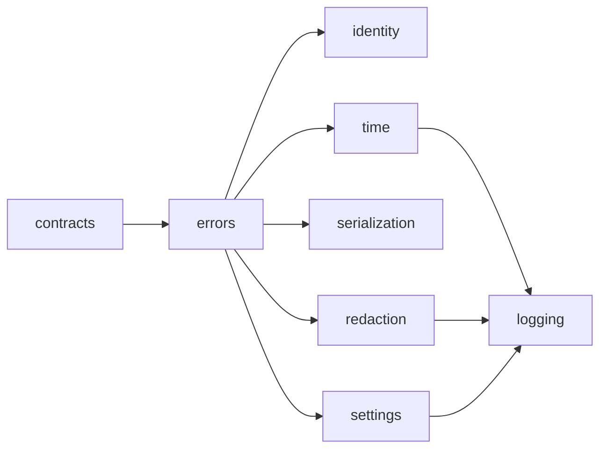

# Utils

> **Package:** `app/utils`
> **Status:** `Completed — verified implementation baseline`
> **Last updated:** `2026-07-20`

> This README is the package's single source of truth for requirements, final
> structure, implementation sequence, progress, usage examples, and tests.
> Update this file before changing the code.

---

## 1. Purpose and Boundary

### Purpose

Utils provides business-neutral cross-domain primitives. It owns shared context
and audit contracts, base errors, trace identifiers, UTC handling, canonical
serialization, secret redaction, runtime settings, and structured logging.
It makes no trading or domain decision.

### Owns

- `AuthContext v1` and `AuditEvent v1`.
- Shared base errors, error metadata, boundary-safe mapping, and injected event routing.
- Request, workflow, correlation, causation, and event identifiers.
- UTC clocks, timestamps, and freshness calculations.
- Deterministic canonical JSON serialization.
- Denylist-first secret redaction.
- Immutable runtime settings and the sole repository `.env` loading boundary.
- Import-safe structured logging with immutable bound context, a lazy approved
  default profile, and explicit override support for specialized routing.

### Does not own

- Domain contracts, domain result types, business validation, or business limits.
- Authentication, identity verification, permission enforcement, session state,
  or credential persistence; UI/API owns these capabilities and produces
  `AuthContext v1`.
- DataFrame, OHLC, OHLCV, market-data quality, conversion, comparison, chunking,
  repair, resampling, persistence, or cache behavior; Data owns these capabilities.
- Password hashing, credential encryption, key generation/storage/rotation,
  secret persistence, active-key selection, or credential-reference resolution.
  UI/API owns those application capabilities and externally provisioned key
  infrastructure owns encryption-key lifecycle.
- Safe-path abstractions; each filesystem-writing domain owns and validates its
  allowed roots and paths.
- Metrics exporters, health providers, public registries,
  generic validation façades, or wrapper response envelopes.
- Import-time configuration, filesystem writes, environment-file reads, network
  connections, compatibility aliases, or fallback modules.

### Shared contracts

| Status | Contract | Version | Producer | Consumers | Purpose |
|---|---|---|---|---|---|
| Completed | `AuthContext` | `v1` | UI/API | Data, Strategy, Risk, Trading, Simulation, Optimization, Research, Portfolio | Immutable authenticated principal and trace context. `principal_type` is exactly `USER` or `SERVICE_ACCOUNT`. |
| Completed | `AuditEvent` | `v1` | Every emitting domain | Data (direct persistence consumer); Risk and UI/API query persisted events only through Data-owned query contracts | Redacted, versioned trace record persisted by Data; each producer owns its payload meaning. |

`AuthContext v1` contains `contract_version`, `schema_id`, `principal_id`,
`principal_type`, roles, permissions, scopes, tenant/environment, request ID,
workflow ID, correlation ID, and UTC issue time. Missing or invalid context fails
closed at the receiving domain.

`AuditEvent v1` contains `contract_version`, `schema_id`, event ID, UTC timestamp,
domain, action, optional principal ID, request ID, correlation ID, optional causation
ID, and a redacted JSON-safe payload. Emission or persistence failure is surfaced.

### Capability-to-consumer evidence

Shared business-neutral capabilities have at least two explicit domain consumers.

| Retained capability | Named consuming domain READMEs |
|---|---|
| `AuthContext` / `AuditEvent` | Data, Strategy, Risk, Trading, Simulation, Optimization, Research, Portfolio, UI/API |
| Shared base errors | Brokers, Risk, Trading, Simulation, Analytics, Research, Portfolio, UI/API |
| Trace identifiers | Brokers, Data, Strategy, Trading, Simulation, Optimization, Analytics, UI/API |
| UTC time | Brokers, Data, Strategy, Risk, Trading, Simulation, Research, Portfolio |
| Canonical serialization | Strategy, Trading, Analytics, Optimization, Research |
| Secret redaction | Brokers, Data, Strategy, Risk, Trading, Simulation, Analytics, Optimization, Research, Portfolio, UI/API |
| Runtime settings | Data, Trading, Simulation, UI/API |
| Error metadata and injected routing | Brokers, Risk, Trading, Simulation, Analytics, Research, Portfolio, UI/API |
| Structured logging and specialized routing | Brokers, Risk, Trading, Data |

### Transferred ownership

Data owns the behavior previously proposed as shared DataFrame/OHLC helpers:

- UTC alignment of internal tabular market data.
- Bar and DataFrame record serialization.
- Deterministic DataFrame and OHLC/OHLCV comparison.
- OHLCV quality validation and evidence.
- Bounded ingestion chunking used by Data workflows.

These are private Data implementation capabilities. Raw DataFrames never become a
cross-domain contract. Generic sequence chunking is not part of Utils.

### Persisted state

Utils owns no durable business state, tables, artifacts, or migrations.

---

## 2. Final Package Structure

Folders are ordered from lowest to highest dependency.

```text
utils/
|-- __init__.py
|-- README.md
|-- contracts/
|   |-- __init__.py
|   |-- audit.py
|   `-- auth.py
|-- errors/
|   |-- __init__.py
|   |-- exceptions.py
|   |-- mapping.py
|   |-- metadata.py
|   `-- routing.py
|-- identity/
|   |-- __init__.py
|   `-- identifiers.py
|-- time/
|   |-- __init__.py
|   |-- clocks.py
|   `-- timestamps.py
|-- serialization/
|   |-- __init__.py
|   `-- canonical.py
|-- security/
|   |-- __init__.py
|   `-- redaction.py
|-- settings/
|   |-- __init__.py
|   |-- models.py
|   `-- loader.py
`-- logging/
    |-- __init__.py
    `-- logger.py
```

Package and feature `__init__.py` files expose only documented public names through
explicit `__all__` declarations. No optional heavy dependency is imported by Utils.



Standalone executable usage examples live under `tests/utils/usage/`. They are
ordinary programs with `main()` and `if __name__ == "__main__"` entry points, not
pytest tests. The eight numbered programs map one-to-one to `FEAT-UTIL-00` through
`FEAT-UTIL-07`; each calls every public operation or constructor in its feature
through `app.utils` using realistic, bounded, secret-safe inputs or genuine runtime
state. Pytest explicitly ignores these programs, and verification executes each
one directly with Python.

---

## 3. Workflows

| Status | Workflow ID | Scope | Workflow | Input boundary | Final outcome | Requirement sequence |
|---|---|---|---|---|---|---|
| Completed | `WF-UTL-001` | Cross-domain | Structured logging and redaction | Domain log record and explicit context | Redacted structured record reaches the configured sink | `FR-UTL-026` through `FR-UTL-033`, `FR-UTL-039` through `FR-UTL-041` |
| Completed | `WF-UTL-002` | Cross-domain | Shared settings bootstrap | Explicit mapping and environment | Immutable validated `RuntimeSettings` | `FR-UTL-022` through `FR-UTL-024` |
| Completed | `WF-UTL-003` | Cross-domain | Audit-event construction | Domain-owned action facts and trace context | Valid redacted `AuditEvent v1` ready for Data persistence | `FR-UTL-002`, `FR-UTL-003`, `FR-UTL-007`, `FR-UTL-008`, `FR-UTL-010`, `FR-UTL-011`, `FR-UTL-013` through `FR-UTL-021` |

### `WF-UTL-001` — Structured Logging and Redaction

1. The caller imports the global import-safe bound logger without side effects.
2. The caller supplies a structured, JSON-safe context.
3. Redaction runs before formatting or emission.
4. The first runtime bound-logger emission atomically activates the approved default
   profile; an explicit `configure_logging(...)` call replaces it only when a
   specialized profile is required.
5. Default queued delivery flushes and stops through the registered process-exit
   lifecycle; special entry points may synchronize or stop it explicitly through
   `flush_logging()` and `shutdown_logging()`.
6. Configuration or sink failure is surfaced without exposing the source payload.

### `WF-UTL-002` — Shared Settings Bootstrap

1. `AppSettings` loads the repository `.env` and process overrides at the shared
   Utils boundary; callers may supply explicit values without parsing files.
2. The loader validates supported deployment and runtime settings.
3. The loader returns an immutable settings object without mutating caller input.
Imports never read the environment, a file, or a secret store.

### `WF-UTL-003` — Audit-Event Construction

1. The emitting domain supplies its action, trace context, and payload meaning.
2. IDs and UTC timestamps are validated.
3. The payload is redacted and canonicalized.
4. A bounded `AuditEvent v1` is constructed.
5. Data persists the event through its owned audit-storage boundary.

---

## 4. Module and Requirement Specifications

This section is the implementation plan. The package-level `utils/__init__.py`
re-exports only the approved feature APIs below and is governed by
`NFR-UTL-001`, `NFR-UTL-003`, and `NFR-UTL-005`; it owns no independent
functional behavior.

### 4.1 `contracts/` — Shared Context and Audit Contracts

**Purpose:** Define the immutable authenticated principal, trace context, and redacted audit envelope shared across every domain.

**Module flow:** `untrusted trace/identity mapping → strict contract-field validation → immutable AuthContext / AuditEvent`

#### Files

| Status | File | Responsibility | Key exports | Dependencies |
|---|---|---|---|---|
| Completed | `audit.py` | Define the redacted audit envelope and common strict contract-field validation. | `AuditEvent` | **Standard library:** `collections.abc`, `datetime`, `json`, `math`, `re`, `types`, `typing`<br>**Required third-party:** `pydantic>=2.13.4`<br>**Local:** None |
| Completed | `auth.py` | Define immutable authenticated principal and trace context. | `AuthContext` | **Standard library:** `datetime`, `typing`<br>**Required third-party:** `pydantic>=2.13.4`<br>**Local:** `audit.py` → strict contract-field validation |
| Completed | `__init__.py` | Expose the supported shared-contract API. | `AuthContext`, `AuditEvent` | **Standard library:** None<br>**Required third-party:** None<br>**Local:** `audit.py`, `auth.py` → approved exports |

#### Functional requirements

| Status | Requirement ID | Responsibility | Class / Function / Method | Side Effects | Raises | Usage / Test |
|---|---|---|---|---|---|---|
| Completed | `FR-UTL-001` | Define immutable `AuthContext v1` with only `USER` and `SERVICE_ACCOUNT` principal types and complete trace context. | `AuthContext` | None | `ValidationError`: naive time, empty identity/trace field, or unsupported principal type | **Usage:** `tests/utils/usage/01_contracts.py::example_auth_context()`<br>**Unit:** `tests/utils/unit/test_auth.py::test_auth_context_rejects_naive_time()` |
| Completed | `FR-UTL-002` | Define immutable redacted `AuditEvent v1` with bounded JSON-safe payload. | `AuditEvent` | None | `ValidationError`: naive timestamp, empty identity/trace field, or unsafe payload | **Usage:** `tests/utils/usage/01_contracts.py::example_audit_event()`<br>**Unit:** `tests/utils/unit/test_audit.py::test_audit_event_requires_json_safe_payload()` |
| Completed | `FR-UTL-003` | Reject naive timestamps, empty identity/trace fields, unsupported principal types, and malformed schema identity. | Strict contract-field validation used by `AuditEvent` and `AuthContext` | None | `ValidationError`: naive time, empty field, unsupported principal type, or malformed schema identity | **Usage:** `tests/utils/usage/01_contracts.py::example_contract_validation()`<br>**Unit:** `tests/utils/unit/test_audit.py::test_contract_field_validation_rejects_malformed_schema()` |

### 4.2 `errors/` — Shared Errors, Metadata, and Routing

**Purpose:** Provide the minimal shared exception hierarchy, normalized metadata,
secret-safe boundary mapping, and explicit injected event routing every domain can use.

**Module flow:** `caught exception → deterministic shared base type → sanitized boundary evidence`

#### Files

| Status | File | Responsibility | Key exports | Dependencies |
|---|---|---|---|---|
| Completed | `exceptions.py` | Define the minimal shared exception hierarchy and domain-extension boundary. | `HaruQuantError`, `ConfigurationError`, `ValidationError`, `SecurityError`, `ExternalServiceError` | **Standard library:** `re`<br>**Required third-party:** None<br>**Local:** None |
| Completed | `mapping.py` | Convert caught exceptions to deterministic secret-safe shared error evidence. | `map_exception` | **Standard library:** None<br>**Required third-party:** None<br>**Local:** `exceptions.py` → shared base exceptions |
| Completed | `metadata.py` | Normalize symbolic error codes and provide immutable built-in metadata. | `ErrorMetadata`, `normalize_error_code`, `get_error_metadata` | **Standard library:** `dataclasses`, `re`<br>**Required third-party:** None<br>**Local:** `exceptions.py` → `ValidationError` |
| Completed | `routing.py` | Route a mapped error payload to an explicitly injected sink. | `ErrorSink`, `route_error_event` | **Standard library:** `collections.abc`, `typing`<br>**Required third-party:** None<br>**Local:** `mapping.py` → `map_exception` |
| Completed | `__init__.py` | Expose the supported shared-error API. | Shared exceptions, mapping, metadata, and routing exports | **Standard library:** None<br>**Required third-party:** None<br>**Local:** all error feature files → approved exports |

#### Functional requirements

| Status | Requirement ID | Responsibility | Class / Function / Method | Side Effects | Raises | Usage / Test |
|---|---|---|---|---|---|---|
| Completed | `FR-UTL-004` | Provide focused shared base exceptions without domain-specific policy. | `HaruQuantError`, `ConfigurationError`, `ValidationError`, `SecurityError`, `ExternalServiceError` | None | None | **Usage:** `tests/utils/usage/02_errors.py::example_typed_error_codes()`<br>**Unit:** `tests/utils/unit/test_exceptions.py::test_shared_exception_hierarchy()` |
| Completed | `FR-UTL-005` | Preserve deterministic code and sanitized detail while never returning a raw provider exception across a boundary. | `map_exception` | None | None | **Usage:** `tests/utils/usage/02_errors.py::example_exception_payload_mapping()`<br>**Unit:** `tests/utils/unit/test_mapping.py::test_map_exception_never_leaks_raw_provider_error()` |
| Completed | `FR-UTL-006` | Require domains to define their own codes and boundary mapping above the shared base hierarchy. | Shared exception extension contract | None | None | **Usage:** `tests/utils/usage/02_errors.py::example_exception_extension()`<br>**Unit:** `tests/utils/unit/test_exceptions.py::test_domains_extend_shared_base()` |
| Completed | `FR-UTL-034` | Normalize an error code and look up immutable safe metadata without a mutable registry. | `ErrorMetadata`, `normalize_error_code`, `get_error_metadata` | None | `ValidationError`: empty or malformed error code | **Usage:** `tests/utils/usage/02_errors.py::example_error_metadata()`<br>**Unit:** `tests/utils/unit/test_error_metadata.py::test_normalize_and_lookup_error_metadata()` |
| Completed | `FR-UTL-035` | Map an exception and synchronously deliver its safe payload to an explicitly injected sink. | `ErrorSink`, `route_error_event` | Caller-provided sink invocation | Sink exception is propagated | **Usage:** `tests/utils/usage/02_errors.py::example_route_error_event()`<br>**Unit:** `tests/utils/unit/test_error_routing.py::test_route_error_event_invokes_injected_sink()` |

### 4.3 `identity/` — Trace Identifiers

**Purpose:** Generate, validate, and deterministically derive secret-free trace identifiers used across every domain.

**Module flow:** `prefix/identity material → generation or validation → canonical secret-free identifier`

#### Files

| Status | File | Responsibility | Key exports | Dependencies |
|---|---|---|---|---|
| Completed | `identifiers.py` | Generate, validate, and deterministically derive secret-free identifiers. | `generate_id`, `validate_id`, `derive_stable_id` | **Standard library:** `hashlib`, `re`, `uuid`<br>**Required third-party:** None<br>**Local:** `errors/exceptions.py` → `ValidationError` |
| Completed | `__init__.py` | Expose the supported identity API. | `generate_id`, `validate_id`, `derive_stable_id` | **Standard library:** None<br>**Required third-party:** None<br>**Local:** `identifiers.py` → approved exports |

#### Functional requirements

| Status | Requirement ID | Responsibility | Class / Function / Method | Side Effects | Raises | Usage / Test |
|---|---|---|---|---|---|---|
| Completed | `FR-UTL-007` | Generate prefixed UUID4 identifiers without embedded secrets. | `generate_id` | Entropy read | `ValidationError`: unsupported prefix | **Usage:** `tests/utils/usage/03_identity.py::example_generate_id()`<br>**Unit:** `tests/utils/unit/test_identifiers.py::test_generate_id_is_prefixed_and_secret_free()` |
| Completed | `FR-UTL-008` | Validate supported prefixes and canonical identifier syntax. | `validate_id` | None | `ValidationError`: unsupported prefix or malformed identifier | **Usage:** `tests/utils/usage/03_identity.py::example_validate_id()`<br>**Unit:** `tests/utils/unit/test_identifiers.py::test_validate_id_rejects_malformed()` |
| Completed | `FR-UTL-009` | Derive deterministic `id`-prefixed SHA-256 identifiers from canonical caller-supplied identity material; stable IDs are never shared trace identifiers. | `derive_stable_id` | None | `ValidationError`: unsupported prefix or empty/non-canonical identity material | **Usage:** `tests/utils/usage/03_identity.py::example_derive_stable_id()`<br>**Unit:** `tests/utils/unit/test_identifiers.py::test_derive_stable_id_is_deterministic()` |

### 4.4 `time/` — UTC Clocks and Timestamps

**Purpose:** Provide the injectable clock boundary and canonical UTC timestamp parsing, formatting, and freshness evaluation.

**Module flow:** `injectable clock → aware UTC instant → parse/format/age/freshness result`

#### Files

| Status | File | Responsibility | Key exports | Dependencies |
|---|---|---|---|---|
| Completed | `clocks.py` | Define the injectable clock boundary and UTC system clock. | `Clock`, `SystemClock`, `utc_now` | **Standard library:** `datetime`, `typing`<br>**Required third-party:** None<br>**Local:** `errors/exceptions.py` → `ValidationError` |
| Completed | `timestamps.py` | Parse, format, age, and evaluate canonical UTC timestamps. | `parse_utc_timestamp`, `format_utc_timestamp`, `age_seconds`, `is_fresh` | **Standard library:** `datetime`, `decimal`<br>**Required third-party:** None<br>**Local:** `errors/exceptions.py` → `ValidationError` |
| Completed | `__init__.py` | Expose the supported time API. | All clock and timestamp exports above | **Standard library:** None<br>**Required third-party:** None<br>**Local:** `clocks.py`, `timestamps.py` → approved exports |

#### Functional requirements

| Status | Requirement ID | Responsibility | Class / Function / Method | Side Effects | Raises | Usage / Test |
|---|---|---|---|---|---|---|
| Completed | `FR-UTL-010` | Return aware UTC time from an injectable clock. | `Clock`, `SystemClock`, `utc_now` | Clock read | None | **Usage:** `tests/utils/usage/04_time.py::example_utc_now()`<br>**Unit:** `tests/utils/unit/test_clocks.py::test_system_clock_returns_aware_utc()` |
| Completed | `FR-UTL-011` | Parse and format UTC timestamps using canonical `Z` output. | `parse_utc_timestamp`, `format_utc_timestamp` | None | `ValidationError`: naive, non-UTC, or malformed timestamp | **Usage:** `tests/utils/usage/04_time.py::example_parse_format_timestamp()`<br>**Unit:** `tests/utils/unit/test_timestamps.py::test_format_uses_canonical_z_suffix()` |
| Completed | `FR-UTL-012` | Calculate non-negative age and explicit freshness against an injected instant. | `age_seconds`, `is_fresh` | None | `ValidationError`: naive or invalid reference instant | **Usage:** `tests/utils/usage/04_time.py::example_age_and_freshness()`<br>**Unit:** `tests/utils/unit/test_timestamps.py::test_age_seconds_is_non_negative()` |

### 4.5 `serialization/` — Canonical Serialization

**Purpose:** Convert supported values to deterministic JSON-safe data and produce canonical UTF-8 JSON with no hidden redaction.

**Module flow:** `supported value → JSON-safe conversion → stable sorted-key UTF-8 JSON`

#### Files

| Status | File | Responsibility | Key exports | Dependencies |
|---|---|---|---|---|
| Completed | `canonical.py` | Convert supported values to JSON-safe data and produce canonical UTF-8 JSON. | `to_json_safe`, `canonical_json` | **Standard library:** `collections.abc`, `dataclasses`, `datetime`, `decimal`, `enum`, `json`, `math`<br>**Required third-party:** None<br>**Local:** `errors/exceptions.py` → `ValidationError` |
| Completed | `__init__.py` | Expose the supported serialization API. | `to_json_safe`, `canonical_json` | **Standard library:** None<br>**Required third-party:** None<br>**Local:** `canonical.py` → approved exports |

#### Functional requirements

| Status | Requirement ID | Responsibility | Class / Function / Method | Side Effects | Raises | Usage / Test |
|---|---|---|---|---|---|---|
| Completed | `FR-UTL-013` | Convert supported datetimes, decimals, enums, dataclasses, mappings, and sequences to deterministic JSON-safe values. | `to_json_safe` | None | `ValidationError`: unsupported value type | **Usage:** `tests/utils/usage/05_serialization.py::example_to_json_safe()`<br>**Unit:** `tests/utils/unit/test_canonical.py::test_to_json_safe_converts_supported_types()` |
| Completed | `FR-UTL-014` | Produce stable UTF-8 JSON with sorted keys and no hidden redaction. | `canonical_json` | None | `ValidationError`: non-serializable value | **Usage:** `tests/utils/usage/05_serialization.py::example_canonical_json()`<br>**Unit:** `tests/utils/unit/test_canonical.py::test_canonical_json_sorts_keys()` |
| Completed | `FR-UTL-015` | Reject unsupported, cyclic, non-finite, or unsafe values deterministically. | Serialization validation used by `to_json_safe` and `canonical_json` | None | `ValidationError`: unsupported, cyclic, or non-finite value | **Usage:** `tests/utils/usage/05_serialization.py::example_reject_unsafe_value()`<br>**Unit:** `tests/utils/unit/test_canonical.py::test_serialization_rejects_cyclic_value()` |

### 4.6 `security/` — Secret Redaction

**Purpose:** Provide bounded denylist-first redaction for text and JSON-safe mappings.

**Module flow:** `redaction policy + text/mapping → denylist-first redaction → redacted value and diagnostics`

#### Files

| Status | File | Responsibility | Key exports | Dependencies |
|---|---|---|---|---|
| Completed | `redaction.py` | Define redaction policy/results and redact bounded text or JSON-safe mappings. | `RedactionPolicy`, `RedactionResult`, `is_sensitive_key`, `redact_text_value`, `redact_mapping_value` | **Standard library:** `collections.abc`, `dataclasses`, `math`, `re`<br>**Required third-party:** None<br>**Local:** `errors/exceptions.py` → `SecurityError`, `ValidationError` |
| Completed | `__init__.py` | Expose the supported secret-redaction API. | All security exports above | **Local:** `redaction.py` → approved exports |

#### Functional requirements

| Status | Requirement ID | Responsibility | Class / Function / Method | Side Effects | Raises | Usage / Test |
|---|---|---|---|---|---|---|
| Completed | `FR-UTL-016` | Define immutable denylist-first redaction policy with narrow reviewed field-path allowlists. | `RedactionPolicy` | None | `ValidationError`: malformed policy definition | **Usage:** `tests/utils/usage/06_security.py::example_redaction()`<br>**Unit:** `tests/utils/unit/test_redaction.py::test_redaction_policy_is_immutable()` |
| Completed | `FR-UTL-017` | Detect sensitive keys case-insensitively. | `is_sensitive_key` | None | None | **Usage:** `tests/utils/usage/06_security.py::example_key_classification()`<br>**Unit:** `tests/utils/unit/test_redaction.py::test_is_sensitive_key_is_case_insensitive()` |
| Completed | `FR-UTL-018` | Redact bounded text without mutating input. | `redact_text_value` | None | None | **Usage:** `tests/utils/usage/06_security.py::example_redaction()`<br>**Unit:** `tests/utils/unit/test_redaction.py::test_redact_text_value_does_not_mutate_input()` |
| Completed | `FR-UTL-019` | Recursively redact a JSON-safe mapping without mutating input. | `redact_mapping_value` | None | `ValidationError`: non-JSON-safe mapping | **Usage:** `tests/utils/usage/06_security.py::example_redaction()`<br>**Unit:** `tests/utils/unit/test_redaction.py::test_redact_mapping_value_is_recursive()` |
| Completed | `FR-UTL-020` | Return redacted paths and truncation diagnostics without secret values. | `RedactionResult` | None | None | **Usage:** `tests/utils/usage/06_security.py::example_redaction()`<br>**Unit:** `tests/utils/unit/test_redaction.py::test_redaction_result_omits_secret_values()` |
| Completed | `FR-UTL-021` | Reject policies that allow protected credential fields. | `RedactionPolicy` validation | None | `SecurityError`: policy allows a protected credential field | **Usage:** `tests/utils/usage/06_security.py::example_policy_validation()`<br>**Unit:** `tests/utils/unit/test_redaction.py::test_policy_rejects_protected_credential_field()` |

### 4.7 `settings/` — Runtime Settings

**Purpose:** Define immutable generic runtime/logging settings and provide the sole
repository `.env` loading base for typed domain settings.

**Module flow:** `explicit values + environment → strict validation → immutable RuntimeSettings`

#### Files

| Status | File | Responsibility | Key exports | Dependencies |
|---|---|---|---|---|
| Completed | `models.py` | Define the immutable central `.env` settings base plus generic runtime/logging settings and strict validation. | `AppSettings`, `RuntimeSettings`, `LoggingSettings` | **Standard library:** `pathlib`, `typing`<br>**Required third-party:** `pydantic`, `pydantic-settings`<br>**Local:** `errors/exceptions.py` → `ConfigurationError` |
| Completed | `loader.py` | Load supported runtime settings through `AppSettings` or an explicit mapping. | `load_settings` | **Standard library:** `collections.abc`<br>**Required third-party:** `pydantic`<br>**Local:** `models.py` → settings models; `errors/exceptions.py` → `ConfigurationError` |
| Completed | `__init__.py` | Expose the supported settings API. | Settings models and loader functions above | **Standard library:** None<br>**Required third-party:** None<br>**Local:** `models.py`, `loader.py` → approved exports |

#### Functional requirements

| Status | Requirement ID | Responsibility | Class / Function / Method | Side Effects | Raises | Usage / Test |
|---|---|---|---|---|---|---|
| Completed | `FR-UTL-022` | Define the immutable central settings base and generic runtime/logging settings, including the approved human-readable default logging profile. | `AppSettings`, `RuntimeSettings`, `LoggingSettings` | `.env`/environment read only when a settings instance is created | `ConfigurationError`: invalid generic setting value | **Usage:** `tests/utils/usage/07_settings.py::example_construct_configuration()`<br>**Unit:** `tests/utils/unit/test_models.py::test_default_logging_profile()` |
| Completed | `FR-UTL-023` | Load explicit values and centralized `.env`/process settings in documented precedence order only when called. | `AppSettings`, `load_settings` | Settings read | `ConfigurationError`: unsupported or invalid runtime value | **Usage:** `tests/utils/usage/07_settings.py::example_load_active_configuration()`<br>**Unit:** `tests/utils/unit/test_loader.py::test_load_settings_precedence_order()` |
| Completed | `FR-UTL-024` | Reject unknown, incompatible, or unsafe deployment/runtime values without partial mutation. | Settings-model validation | None | `ConfigurationError`: unknown, incompatible, or unsafe value | **Usage:** `tests/utils/usage/07_settings.py::example_environment_constraints()`, `example_validate_settings()`<br>**Unit:** `tests/utils/unit/test_models.py::test_settings_reject_unknown_value_without_mutation()` |

### 4.8 `logging/` — Structured Logging

**Purpose:** Provide import-safe logger access, lazy approved defaults, and explicit
redacted structured-handler overrides for specialized entry points.

**Module flow:** `runtime bound-logger call → lazy default or explicit override → redact → structured record → configured sink`

#### Files

| Status | File | Responsibility | Key exports | Dependencies |
|---|---|---|---|---|
| Completed | `logger.py` | Provide import-safe bound logger access, thread-safe lazy default activation, explicit override configuration and synchronization, source-aware human rendering, compressed rotation, color, lifecycle, and specialized routing. | `BoundLogger`, `logger`, `get_logger`, `configure_logging`, `flush_logging`, `shutdown_logging`, `RedactingFilter`, `StructuredFormatter` | **Standard library:** `atexit`, `collections.abc`, `copy`, `datetime`, `json`, `logging`, `logging.handlers`, `pathlib`, `queue`, `sys`, `threading`, `time`, `types`, `typing`, `zipfile`<br>**Required third-party:** None<br>**Local:** `errors/exceptions.py`; `time/timestamps.py`; `security/redaction.py`; `settings/loader.py` |
| Completed | `__init__.py` | Expose the supported logging API without configuring logging. | All logging exports above | **Standard library:** None<br>**Required third-party:** None<br>**Local:** `logger.py` → approved exports |

#### Functional requirements

| Status | Requirement ID | Responsibility | Class / Function / Method | Side Effects | Raises | Usage / Test |
|---|---|---|---|---|---|---|
| Completed | `FR-UTL-026` | Return stable child loggers without configuring handlers. | `get_logger` | None | None | **Usage:** `tests/utils/usage/08_logging.py::example_logger_access()`<br>**Unit:** `tests/utils/unit/test_logger.py::test_get_logger_configures_no_handlers()` |
| Completed | `FR-UTL-027` | Atomically install deduplicated console and optional bounded rotating-file handlers from the approved default before the first runtime bound-log emission; explicit `configure_logging` replaces the active profile only for a specialized override. | `BoundLogger`, `configure_logging` | Logging configuration; directory creation; optional file write on first runtime emission or explicit override | `ConfigurationError`: invalid logging settings or sink | **Usage:** `tests/utils/usage/08_logging.py::example_standard_levels()`<br>**Unit:** `tests/utils/unit/test_logger.py::test_first_bound_log_activates_default_profile()` |
| Completed | `FR-UTL-028` | Redact messages and structured context before formatting. | `RedactingFilter` | None | None | **Usage:** `tests/utils/usage/08_logging.py::example_logger_redaction()`<br>**Unit:** `tests/utils/unit/test_logger.py::test_redacting_filter_runs_before_formatting()` |
| Completed | `FR-UTL-029` | Emit JSON or source-aware human-readable records with UTC time, padded level, module, function, line, message, and trace IDs. Human records use `YYYY-MM-DD HH:MM:SS.mmm | LEVEL    | module:function:line - message`; default-console ANSI color is restricted to the level and message content. | `StructuredFormatter` | None | None | **Usage:** `tests/utils/usage/08_logging.py::example_standard_levels()`, `example_bound_context()`<br>**Unit:** `tests/utils/unit/test_logger.py::test_human_formatter_uses_source_aware_layout()`, `test_human_formatter_colors_only_level_and_message()` |
| Completed | `FR-UTL-030` | Surface sink failure through a bounded secret-safe fallback. | Logging failure handling in `configure_logging` | Fallback emission | None | **Usage:** `tests/utils/usage/08_logging.py::example_sink_failure()`<br>**Unit:** `tests/utils/unit/test_logger.py::test_sink_failure_uses_safe_fallback()` |
| Completed | `FR-UTL-031` | Prevent duplicate handler or queue-listener installation across concurrent first use and repeated explicit configuration calls. | Lazy activation and configuration idempotency | Logging configuration | None | **Usage:** `tests/utils/usage/08_logging.py::main()`<br>**Unit:** `tests/utils/unit/test_logger.py::test_first_bound_log_is_thread_safe()`, `test_configure_logging_is_idempotent()` |
| Completed | `FR-UTL-032` | Keep import free of handler registration, environment reads, and filesystem writes. | Module import contract | None | None | **Usage:** `tests/utils/usage/08_logging.py::example_import_safety()`<br>**Unit:** `tests/utils/unit/test_logger.py::test_import_registers_no_handlers()` |
| Completed | `FR-UTL-033` | Respect the shared `LOG_LEVEL` setting without redefining domain observability policy. | Logging level application in `configure_logging` | Logging configuration | None | **Usage:** `tests/utils/usage/08_logging.py::main()`<br>**Unit:** `tests/utils/unit/test_logger.py::test_configure_logging_applies_log_level()` |
| Completed | `FR-UTL-039` | Expose an import-safe global bound logger with standard levels, exception traceback capture, immutable context binding, and automatic approved-default activation on the first runtime emission. Import-time log attempts remain inert. | `BoundLogger`, `logger` | First runtime call may configure logging and create bounded sinks; every runtime call emits a log record | `ConfigurationError`: default sink cannot be configured | **Usage:** `tests/utils/usage/08_logging.py::example_standard_levels()`, `example_exception_logging()`, `example_bound_context()`<br>**Unit:** `tests/utils/unit/test_logger.py::test_first_bound_log_activates_default_profile()`, `test_import_time_bound_log_does_not_activate_defaults()`, `test_bound_logger_preserves_context()` |
| Completed | `FR-UTL-040` | Route access-context records to `access.log`, exact DEBUG records to `debug.log`, and ERROR-or-higher records to `errors.log`. | `configure_logging` specialized handlers | Explicit bounded file writes | `ConfigurationError`: unavailable directory or file sink | **Usage:** `tests/utils/usage/08_logging.py::example_specialized_routing()`<br>**Unit:** `tests/utils/unit/test_logger.py::test_specialized_log_routing()` |
| Completed | `FR-UTL-041` | Provide the approved lazy default profile: human-readable DEBUG stdout with ANSI color limited to level and message content, `data/logs`, 10 MB ZIP rotation, ten-day retention, ten backups, queued delivery, automatic process-exit cleanup, optional non-destructive synchronization, and deterministic explicit override/stop. | `LoggingSettings`, `BoundLogger`, `configure_logging`, `flush_logging`, `shutdown_logging` | First runtime bound-log emission or explicit override creates the directory, queue thread, and bounded files | `ConfigurationError`: invalid logging settings or sink | **Usage:** `tests/utils/usage/08_logging.py::main()`<br>**Unit:** `tests/utils/unit/test_logger.py::test_first_bound_log_activates_default_profile()`, `test_explicit_configuration_is_not_replaced_by_lazy_default()`, `test_human_formatter_colors_only_level_and_message()`, `test_flush_logging_synchronizes_delivery_without_shutdown()`, `test_zip_rollover_and_shutdown()` |

---

## 5. Package-Wide Requirements and Shared Configuration

### 5.1 Normative implementation policy

The following rules remove implementation ambiguity without adding public
capabilities beyond the Section 4 exports.

- Public function signatures are:
  - `map_exception(exception) -> dict[str, str]` returning exactly `code` and
    `detail`. Shared exception codes and details are uppercase symbolic tokens;
    unknown exceptions map to `INTERNAL_ERROR` / `UNEXPECTED_EXCEPTION` and no
    raw exception text crosses the boundary.
  - `generate_id(prefix) -> str`, `validate_id(value, *, expected_prefix=None)
    -> str`, and `derive_stable_id(prefix, identity_material) -> str`.
    Generated trace prefixes are exactly `req`, `wf`, `cor`, `cau`, and `evt`;
    they use lowercase canonical UUID4 syntax. Stable non-trace identifiers use
    prefix `id` plus the full lowercase SHA-256 hex digest. Canonical identity
    material is a non-empty, trimmed Unicode string of at most 4,096 UTF-8
    bytes.
  - `utc_now(clock=None) -> datetime`, `parse_utc_timestamp(value) -> datetime`,
    `format_utc_timestamp(value) -> str`, `age_seconds(value, *, reference) ->
    Decimal`, and `is_fresh(value, *, reference, max_age_seconds) -> bool`.
    Canonical output always has six fractional digits and a `Z` suffix. Future
    observed timestamps and negative freshness limits are rejected. Freshness
    is inclusive at the configured limit.
  - `to_json_safe(value) -> JsonValue` and `canonical_json(value) -> str`.
    Mapping keys must be strings; tuples become arrays; finite floats remain
    numbers; decimals become exact fixed-point strings; enums serialize through
    their values; aware UTC datetimes use canonical timestamp output; sets,
    bytes, naive/non-UTC datetimes, cycles, and non-finite numbers are rejected.
    Maximum nesting is 32 and maximum aggregate container items is 10,000.
  - `redact_text_value(value, policy=None) -> RedactionResult` and
    `redact_mapping_value(value, policy=None) -> RedactionResult`.
    `RedactionResult.value` holds the safe value; diagnostics contain paths and
    truncation flags only. Default replacement is `[REDACTED]`; maximum text is
    4,096 characters, mapping depth is 16, and aggregate items are 1,000.
  - `load_settings(explicit_values=None, environment=None) -> RuntimeSettings`.
    Precedence is explicit values, then the supplied mapping (or centralized
    `AppSettings` `.env`/process values when omitted), then documented defaults. Input keys are
    the exact uppercase setting names; unknown keys are rejected.
  - `normalize_error_code(code) -> str`, `get_error_metadata(code) ->
    ErrorMetadata`, and `route_error_event(exception, sink) -> dict[str, str]`.
    Metadata is immutable and built in; routing invokes only the supplied sink.
  - `get_logger(name) -> logging.Logger`, `configure_logging(settings=None,
    redaction_policy=None) -> None`, `flush_logging() -> None`, and
    `shutdown_logging() -> None`.
    `logger.bind(**context)` returns an immutable `BoundLogger`. The first runtime bound
    log call installs the approved colored stdout plus bounded `app.log`,
    `access.log`, `debug.log`, and `errors.log` handlers. Explicit
    `configure_logging(...)` is reserved for specialized overrides.
    `flush_logging()` synchronizes queued delivery without closing sinks;
    process exit or explicit shutdown performs the final flush and close.
- Shared exceptions accept a required uppercase symbolic `code` and optional
  uppercase symbolic `detail`. They never retain a wrapped provider exception.
- `AuditEvent` payloads are limited to 64 KiB of canonical UTF-8 JSON, depth 16,
  and 1,000 aggregate items. Producers redact before construction; the contract
  also rejects protected credential keys as a fail-closed boundary check.
- The default sensitive-key denylist is case-insensitive and contains
  `password`, `passwd`, `secret`, `token`, `api_key`, `apikey`, `authorization`,
  `credential`, `private_key`, `access_key`, and `client_secret`. Matching ignores
  case plus hyphen/underscore differences. Protected credential fields are
  `password`, `passwd`, `private_key`, `client_secret`, `api_key`, `apikey`, and
  `authorization`; they can never be allowlisted. Allowlists are exact dot-paths.
- Text redaction recognizes case-insensitive `key=value`, `key: value`, and
  `Bearer value` forms for the denylisted names. Truncation occurs only after
  redaction and never returns removed source text.
- `LoggingSettings` permits levels `CRITICAL`, `ERROR`, `WARNING`, `INFO`, and
  `DEBUG`; render is exactly `json` or `human`. Defaults are `DEBUG`, `human`,
  `data/logs`, 10,000,000 bytes, ten backups, ten retention days, ZIP
  compression, queued delivery, and level/message-only human console color. File size is
  1,024-100,000,000 bytes; backup count is 1-20; retention is 1-365 days.
  `LOG_COMPRESSION` is exactly `zip` or `none`; boolean environment values are
  exactly `true` or `false` (case-insensitive). Explicit configuration creates
  `LOG_DIRECTORY`; an optional standalone `LOG_FILE_PATH` still requires its
  parent to exist. Sink failure
  writes only the fixed bounded fallback `logging_configuration_failed` to
  standard error and raises `ConfigurationError`.
- Structured records contain UTC timestamp, level, logger, message, and redacted
  caller context as top-level fields. `app.log` receives all enabled records,
  `log_type=access` selects `access.log`, exact DEBUG selects `debug.log`, and
  ERROR or CRITICAL selects `errors.log`. Redaction runs before every sink.
- Utils owns the business-neutral Decimal representation policy: application
  Decimal context precision is at least 28, non-finite Decimal values are
  rejected at shared boundaries, and domain-specific quantization remains owned
  by the enforcing domain. Utils never mutates the process-global Decimal
  context.

| Status | Requirement ID | Type | Responsibility | Verification |
|---|---|---|---|---|
| Completed | `NFR-UTL-001` | Boundary | Other packages import only documented package or feature exports; no internal imports, aliases, or fallbacks. | Dependency tests |
| Completed | `NFR-UTL-002` | Security | Redaction occurs before logs, errors, audit payloads, or returned diagnostics; canonical serialization remains pure. | Secret-leak tests |
| Completed | `NFR-UTL-003` | Import safety | Imports perform no configuration, environment/file read, filesystem write, network call, handler registration, or client initialization. | Subprocess import tests |
| Completed | `NFR-UTL-004` | Determinism | Serialization, time calculations, validation, and stable-ID derivation are deterministic with explicit clock/entropy inputs. | Replay tests |
| Completed | `NFR-UTL-005` | Maintainability | Public signatures are typed and documented; files have one focused responsibility. | Ruff, mypy, and documentation review |
| Completed | `NFR-UTL-006` | Testing | Every requirement has a usage example and targeted unit test; collaborative workflows have integration tests; coverage is at least 80%. | Traceability and coverage audit |
| Completed | `NFR-UTL-007` | Persistence | Utils owns no durable business state or migration definition. | Ownership review |

| Status | Setting | Type | Default | Required | Consumers | Description |
|---|---|---|---|---|---|---|
| Completed | `ENVIRONMENT` | `str` | `dev` | Yes | All domains | Exactly `dev`, `test`, `staging`, or `production`. |
| Completed | `RUNTIME_PROFILE` | `str` | `research` | Yes | Strategy, Risk, Trading, Simulation, Portfolio, UI/API | Exactly `research`, `simulation`, `paper`, or `live`; route compatibility belongs to Trading. |
| Completed | UTC-first policy | policy | `Z`-suffixed ISO 8601 | Yes | All domains | Non-UTC cross-domain timestamps are rejected. |
| Completed | Trace-ID policy | policy | Prefixed UUID4 | Yes | All domains | Request, workflow, correlation, causation, and event IDs are secret-free strings. |
| Completed | Secret-redaction policy | policy | Denylist-first, case-insensitive | Yes | All domains | Applied before persistence or emission. |
| Completed | `LOG_LEVEL` | `str` | `DEBUG` | No | All domains | Applied by lazy default activation or an explicit specialized override. |
| Completed | `LOG_RENDER` | `str` | `human` | No | All domains | Exactly `json` or `human`; human output includes UTC millisecond time, padded level, caller module/function/line, and message. Applied by lazy default activation or an explicit override. |
| Completed | `LOG_DIRECTORY` | `Path` | `data/logs` | No | All domains | Created on first runtime bound-log emission, or by an earlier explicit override, for `app.log`, `access.log`, `debug.log`, and `errors.log`. |
| Completed | `LOG_MAX_BYTES` | `int` | `10000000` | No | All domains | Size threshold for rotating each configured file. |
| Completed | `LOG_BACKUP_COUNT` | `int` | `10` | No | All domains | Maximum compressed rotations retained per file in addition to age cleanup. |
| Completed | `LOG_RETENTION_DAYS` | `int` | `10` | No | All domains | Remove rotated files older than this during rollover. |
| Completed | `LOG_COMPRESSION` | `str` | `zip` | No | All domains | Exactly `zip` or `none` for rotated files. |
| Completed | `LOG_ENQUEUE` | `bool` | `true` | No | All domains | Deliver records through one in-process queue listener. |
| Completed | `LOG_COLORIZE` | `bool` | `true` | No | All domains | Apply ANSI level color to only the level and message portions of human stdout records; timestamps, separators, and caller locations remain plain. |
| Completed | Decimal representation policy | policy | Precision at least 28; finite exact values | Yes | Data, Risk, Trading, Simulation, Analytics | Utils owns the shared representation rule; each enforcing domain owns quantization. |

---

## 6. Open Decisions

No open decisions.

---

## 7. Tests and Definition of Done

### Test locations

```text
tests/utils/
|-- unit/
|-- integration/
`-- usage/
```

Feature-integration tests are assigned as follows:

- `tests/utils/integration/test_settings_bootstrap.py` verifies `WF-UTL-002`.
- `tests/utils/integration/test_structured_logging.py` verifies `WF-UTL-001`.
- `tests/utils/integration/test_audit_event_construction.py` verifies the
  Utils-owned construction portion of `WF-UTL-003`; Data's completed audit
  persistence boundary verifies the downstream handoff.

### Required validation

- Targeted tests for every changed capability.
- Import-side-effect checks for every package and feature module.
- Contract compatibility tests for `AuthContext v1` and `AuditEvent v1` producers
  and consumers.
- Secret-leak tests covering logging, errors, audit payloads, and diagnostics.
- Determinism tests for canonical JSON, stable IDs, and UTC calculations.
- Dependency checks proving DataFrame/OHLC, path, limit, business validation,
  permission, and domain-result behavior is absent from Utils.
- `uv run ruff check app/utils tests/utils`
- `uv run ruff format --check app/utils tests/utils`
- `uv run mypy app/utils tests/utils`
- Targeted `pytest` commands for the affected Utils test files.
- Direct execution of every `tests/utils/usage/[0-9][0-9]_*.py` program.
- Branch-aware coverage greater than 80% for every individual `app/utils/**/*.py`
  source file; aggregate coverage alone is insufficient.

When running examples from a source checkout that is not installed as a package,
set `PYTHONPATH` to the repository root before invoking each program directly.

### Definition of done

- [X] The final package tree exists exactly as specified. `app/utils/__init__.py:1`
- [X] Public exports contain only the retained shared surface; dotenv parsing and
  named-secret convenience helpers are not exported. `tests/utils/unit/test_boundaries.py:90`
- [X] Shared capabilities have documented consumers and secret redaction remains bounded to Utils. `app/utils/README.md:80`
- [X] Data owns all DataFrame/OHLC behavior and exposes no raw DataFrame contract. `tests/utils/unit/test_boundaries.py:94`
- [X] UI/API owns authentication and permission enforcement. `docs/PROJECT.md:125`
- [X] Utils imports and import-time log attempts have no side effects.
  `tests/utils/unit/test_logger.py:229`, `tests/utils/unit/test_logger.py:243`
- [X] No secret appears in logs, errors, audit records, or diagnostics.
  `tests/utils/integration/test_structured_logging.py:12`
- [X] The first runtime log call activates the source-aware default profile exactly
  once, explicit overrides remain intact, and queued output has deterministic
  synchronization and shutdown. `tests/utils/unit/test_logger.py:71`,
  `tests/utils/unit/test_logger.py:90`, `tests/utils/unit/test_logger.py:112`
- [X] Every requirement has a targeted unit test and directly executable usage example. `tests/utils/integration/test_usage_scripts.py:21`
- [X] Every individual Utils source file exceeds 80% branch-aware coverage. The
  verified minimum is 82.30% and aggregate coverage is 91.28% across 23 files.
- [X] Ruff, formatting, strict mypy, 100 targeted unit/integration tests, and all
  eight directly executed standalone usage programs pass.

Current implementation status: `Completed — verified implementation baseline`.
The 2026-07-20 gate is green: Ruff and formatting pass over 55 targeted files,
strict mypy passes over 55 files, 100 targeted tests pass, aggregate branch coverage
is 91.28%, every one of the 23 Utils source files exceeds 80% coverage (minimum
82.30%), and all eight feature-aligned usage programs execute successfully.

---

## 8. Usage Examples

### Shared context

```python
from datetime import datetime, timezone

from app.utils import AuthContext

context = AuthContext(
    contract_version="v1",
    schema_id="utils.auth_context.v1",
    principal_id="user-123",
    principal_type="USER",
    roles=("operator",),
    permissions=("backtest:run",),
    scopes=("portfolio:demo",),
    tenant_or_environment="dev",
    request_id="req-8be20911-572d-42f7-bc52-e6844f8d2125",
    workflow_id="wf-f4bccf77-6121-44e0-a480-17ae2043868d",
    correlation_id="cor-0d5ab3cf-4003-47ec-a797-f70db66418a4",
    issued_at=datetime.now(timezone.utc),
)
```

### Canonical serialization and redaction

```python
from app.utils import canonical_json, redact_mapping_value

safe_payload = redact_mapping_value(
    {"account": "demo", "api_token": "secret"},
).value
serialized = canonical_json(safe_payload)
```

### Default logging

```python
from app.utils import logger

logger.bind(request_id="req-example").info("dataset_ready")
```

The first runtime log call activates the approved default profile. Import-time log
attempts remain inert. Import
`configure_logging`, `flush_logging`, or `shutdown_logging` only in specialized
entry points that need a non-default profile or explicit lifecycle control.
