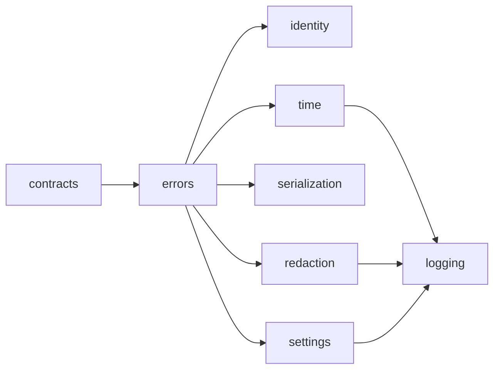

# Utils

> **Package:** `app/utils`
> **Status:** `Missing`
> **Last updated:** `2026-07-14`

> This README is the package's single source of truth for requirements, final
> structure, implementation sequence, progress, usage examples, and tests.
> Update this file before changing the code.

---

## 1. Purpose and Boundary

### Purpose

Utils provides the smallest business-neutral surface that is demonstrably shared
by multiple HaruQuantAI domains. It owns shared context and audit contracts, base
errors, trace identifiers, UTC handling, canonical serialization, redaction,
runtime settings, and structured logging. It makes no trading or domain decision.

### Owns

- `AuthContext v1` and `AuditEvent v1`.
- Shared base errors and boundary-safe error mapping primitives.
- Request, workflow, correlation, causation, and event identifiers.
- UTC clocks, timestamps, and freshness calculations.
- Deterministic canonical JSON serialization.
- Denylist-first secret redaction.
- Immutable runtime settings and explicit settings loading.
- Import-safe structured logging.
- Resolution of broker/provider secret references at the composition root; the
  resulting `BrokerConnectionConfig v1` schema remains Brokers-owned.

### Does not own

- Domain contracts, domain result types, business validation, or business limits.
- Authentication, credential verification, permission enforcement, or session
  state; UI/API owns these capabilities and produces `AuthContext v1`.
- DataFrame, OHLC, OHLCV, market-data quality, conversion, comparison, chunking,
  repair, resampling, persistence, or cache behavior; Data owns these capabilities.
- Encryption, secret-version selection, password hashing, or credential storage.
- Safe-path abstractions; each filesystem-writing domain owns and validates its
  allowed roots and paths.
- Metrics exporters, health providers, public registries,
  generic validation façades, or wrapper response envelopes.
- Import-time configuration, filesystem writes, environment-file reads, network
  connections, compatibility aliases, or fallback modules.

### Shared contracts

| Status | Contract | Version | Producer | Consumers | Purpose |
|---|---|---|---|---|---|
| Missing | `AuthContext` | `v1` | UI/API | Data, Strategy, Risk, Trading, Simulation, Optimization, Research, Portfolio | Immutable authenticated principal and trace context. `principal_type` is exactly `USER` or `SERVICE_ACCOUNT`. |
| Missing | `AuditEvent` | `v1` | Every emitting domain | Data, Risk, Trading, Research, Portfolio, UI/API | Redacted, versioned trace record persisted by Data; each producer owns its payload meaning. |

`AuthContext v1` contains `contract_version`, `schema_id`, `principal_id`,
`principal_type`, roles, permissions, scopes, tenant/environment, request ID,
workflow ID, correlation ID, and UTC issue time. Missing or invalid context fails
closed at the receiving domain.

`AuditEvent v1` contains `contract_version`, `schema_id`, event ID, UTC timestamp,
domain, action, optional principal ID, request ID, correlation ID, optional causation
ID, and a redacted JSON-safe payload. Emission or persistence failure is surfaced.

### Capability-to-consumer evidence

Every retained capability has at least two explicit domain consumers.

| Retained capability | Named consuming domain READMEs |
|---|---|
| `AuthContext` / `AuditEvent` | Data, Strategy, Risk, Trading, Simulation, Optimization, Research, Portfolio, UI/API |
| Shared base errors | Brokers, Risk, Trading, Simulation, Analytics, Research, Portfolio, UI/API |
| Trace identifiers | Brokers, Data, Strategy, Trading, Simulation, Optimization, Analytics, UI/API |
| UTC time | Brokers, Data, Strategy, Risk, Trading, Simulation, Research, Portfolio |
| Canonical serialization | Strategy, Trading, Analytics, Optimization, Research |
| Secret redaction | Brokers, Data, Strategy, Risk, Trading, Simulation, Analytics, Optimization, Research, Portfolio, UI/API |
| Runtime settings | Data, Trading, Simulation, UI/API |
| Structured logging | Brokers, Risk, Trading, Data |

### Transferred ownership

Data owns the behavior previously proposed as shared DataFrame/OHLC helpers:

- UTC alignment of internal tabular market data.
- Bar and DataFrame record serialization.
- Deterministic DataFrame and OHLC/OHLCV comparison.
- OHLCV quality validation and evidence.
- Bounded ingestion chunking used by Data workflows.

These are private Data implementation capabilities. Raw DataFrames never become a
cross-domain contract. Generic sequence chunking is not part of Utils.

### Persisted state

Utils owns no durable business state, tables, artifacts, or migrations.

---

## 2. Final Package Structure

Folders are ordered from lowest to highest dependency.

```text
utils/
|-- __init__.py
|-- README.md
|-- contracts/
|   |-- __init__.py
|   |-- audit.py
|   `-- auth.py
|-- errors/
|   |-- __init__.py
|   |-- exceptions.py
|   `-- mapping.py
|-- identity/
|   |-- __init__.py
|   `-- identifiers.py
|-- time/
|   |-- __init__.py
|   |-- clocks.py
|   `-- timestamps.py
|-- serialization/
|   |-- __init__.py
|   `-- canonical.py
|-- security/
|   |-- __init__.py
|   `-- redaction.py
|-- settings/
|   |-- __init__.py
|   |-- models.py
|   `-- loader.py
`-- logging/
    |-- __init__.py
    `-- logger.py
```

Package and feature `__init__.py` files expose only documented public names through
explicit `__all__` declarations. No optional heavy dependency is imported by Utils.



Usage examples live under `tests/utils/usage/`.

---

## 3. Workflows

| Status | Workflow ID | Scope | Workflow | Input boundary | Final outcome | Requirement sequence |
|---|---|---|---|---|---|---|
| Missing | `WF-UTL-001` | Cross-domain | Structured logging and redaction | Domain log record and explicit context | Redacted structured record reaches the configured sink | `FR-UTL-026` through `FR-UTL-033` |
| Missing | `WF-UTL-002` | Cross-domain | Shared settings bootstrap | Explicit mapping and environment | Immutable validated `RuntimeSettings` | `FR-UTL-022` through `FR-UTL-025` |
| Missing | `WF-UTL-003` | Cross-domain | Audit-event construction | Domain-owned action facts and trace context | Valid redacted `AuditEvent v1` ready for Data persistence | `FR-UTL-001`, `FR-UTL-017` through `FR-UTL-021` |

### `WF-UTL-001` — Structured Logging and Redaction

1. The caller obtains an import-safe named logger.
2. The caller supplies a structured, JSON-safe context.
3. Redaction runs before formatting or emission.
4. Explicit configuration selects console or bounded rotating-file output.
5. Configuration or sink failure is surfaced without exposing the source payload.

### `WF-UTL-002` — Shared Settings Bootstrap

1. The composition root supplies explicit values and environment input.
2. The loader validates the supported deployment and runtime settings.
3. The loader returns an immutable settings object without mutating caller input.
4. Broker secret references are resolved at the composition root and injected into
   a Brokers-owned `BrokerConnectionConfig v1` instance.

Imports never read the environment, a file, or a secret store.

### `WF-UTL-003` — Audit-Event Construction

1. The emitting domain supplies its action, trace context, and payload meaning.
2. IDs and UTC timestamps are validated.
3. The payload is redacted and canonicalized.
4. A bounded `AuditEvent v1` is constructed.
5. Data persists the event through its owned audit-storage boundary.

---

## 4. Module and Requirement Specifications

This section is the implementation plan. The package-level `utils/__init__.py`
re-exports only the approved feature APIs below and is governed by
`NFR-UTL-001`, `NFR-UTL-003`, and `NFR-UTL-005`; it owns no independent
functional behavior.

### 4.1 `contracts/` — Shared Context and Audit Contracts

**Purpose:** Define the immutable authenticated principal, trace context, and redacted audit envelope shared across every domain.

**Module flow:** `untrusted trace/identity mapping → strict contract-field validation → immutable AuthContext / AuditEvent`

#### Files

| Status | File | Responsibility | Key exports | Dependencies |
|---|---|---|---|---|
| Missing | `audit.py` | Define the redacted audit envelope and common strict contract-field validation. | `AuditEvent` | **Standard library:** `datetime`, `typing`<br>**Required third-party:** `pydantic>=2.13.4`<br>**Local:** None |
| Missing | `auth.py` | Define immutable authenticated principal and trace context. | `AuthContext` | **Standard library:** `datetime`, `enum`<br>**Required third-party:** `pydantic>=2.13.4`<br>**Local:** `audit.py` → strict contract-field validation |
| Missing | `__init__.py` | Expose the supported shared-contract API. | `AuthContext`, `AuditEvent` | **Standard library:** None<br>**Required third-party:** None<br>**Local:** `audit.py`, `auth.py` → approved exports |

#### Functional requirements

| Status | Requirement ID | Responsibility | Class / Function / Method | Side Effects | Raises | Usage / Test |
|---|---|---|---|---|---|---|
| Missing | `FR-UTL-001` | Define immutable `AuthContext v1` with only `USER` and `SERVICE_ACCOUNT` principal types and complete trace context. | `AuthContext` | None | `ValidationError`: naive time, empty identity/trace field, or unsupported principal type | **Usage:** `tests/utils/usage/test_usage_contracts.py::test_usage_auth_context()`<br>**Unit:** `tests/utils/unit/test_auth.py::test_auth_context_rejects_naive_time()` |
| Missing | `FR-UTL-002` | Define immutable redacted `AuditEvent v1` with bounded JSON-safe payload. | `AuditEvent` | None | `ValidationError`: naive timestamp, empty identity/trace field, or unsafe payload | **Usage:** `tests/utils/usage/test_usage_contracts.py::test_usage_audit_event()`<br>**Unit:** `tests/utils/unit/test_audit.py::test_audit_event_requires_json_safe_payload()` |
| Missing | `FR-UTL-003` | Reject naive timestamps, empty identity/trace fields, unsupported principal types, and malformed schema identity. | Strict contract-field validation used by `AuditEvent` and `AuthContext` | None | `ValidationError`: naive time, empty field, unsupported principal type, or malformed schema identity | **Usage:** `tests/utils/usage/test_usage_contracts.py::test_usage_contract_field_validation()`<br>**Unit:** `tests/utils/unit/test_audit.py::test_contract_field_validation_rejects_malformed_schema()` |

### 4.2 `errors/` — Shared Base Errors and Boundary Mapping

**Purpose:** Provide the minimal shared exception hierarchy and secret-safe boundary mapping every domain extends.

**Module flow:** `caught exception → deterministic shared base type → sanitized boundary evidence`

#### Files

| Status | File | Responsibility | Key exports | Dependencies |
|---|---|---|---|---|
| Missing | `exceptions.py` | Define the minimal shared exception hierarchy and domain-extension boundary. | `HaruQuantError`, `ConfigurationError`, `ValidationError`, `SecurityError`, `ExternalServiceError` | **Standard library:** None<br>**Required third-party:** None<br>**Local:** None |
| Missing | `mapping.py` | Convert caught exceptions to deterministic secret-safe shared error evidence. | `map_exception` | **Standard library:** `collections.abc`<br>**Required third-party:** None<br>**Local:** `exceptions.py` → shared base exceptions |
| Missing | `__init__.py` | Expose the supported shared-error API. | Shared exceptions and `map_exception` | **Standard library:** None<br>**Required third-party:** None<br>**Local:** `exceptions.py`, `mapping.py` → approved exports |

#### Functional requirements

| Status | Requirement ID | Responsibility | Class / Function / Method | Side Effects | Raises | Usage / Test |
|---|---|---|---|---|---|---|
| Missing | `FR-UTL-004` | Provide focused shared base exceptions without domain-specific policy. | `HaruQuantError`, `ConfigurationError`, `ValidationError`, `SecurityError`, `ExternalServiceError` | None | None | **Usage:** `tests/utils/usage/test_usage_errors.py::test_usage_shared_exceptions()`<br>**Unit:** `tests/utils/unit/test_exceptions.py::test_shared_exception_hierarchy()` |
| Missing | `FR-UTL-005` | Preserve deterministic code and sanitized detail while never returning a raw provider exception across a boundary. | `map_exception` | None | None | **Usage:** `tests/utils/usage/test_usage_errors.py::test_usage_map_exception()`<br>**Unit:** `tests/utils/unit/test_mapping.py::test_map_exception_never_leaks_raw_provider_error()` |
| Missing | `FR-UTL-006` | Require domains to define their own codes and boundary mapping above the shared base hierarchy. | Shared exception extension contract | None | None | **Usage:** `tests/utils/usage/test_usage_errors.py::test_usage_exception_extension()`<br>**Unit:** `tests/utils/unit/test_exceptions.py::test_domains_extend_shared_base()` |

### 4.3 `identity/` — Trace Identifiers

**Purpose:** Generate, validate, and deterministically derive secret-free trace identifiers used across every domain.

**Module flow:** `prefix/identity material → generation or validation → canonical secret-free identifier`

#### Files

| Status | File | Responsibility | Key exports | Dependencies |
|---|---|---|---|---|
| Missing | `identifiers.py` | Generate, validate, and deterministically derive secret-free identifiers. | `generate_id`, `validate_id`, `derive_stable_id` | **Standard library:** `hashlib`, `re`, `uuid`<br>**Required third-party:** None<br>**Local:** `errors/exceptions.py` → `ValidationError` |
| Missing | `__init__.py` | Expose the supported identity API. | `generate_id`, `validate_id`, `derive_stable_id` | **Standard library:** None<br>**Required third-party:** None<br>**Local:** `identifiers.py` → approved exports |

#### Functional requirements

| Status | Requirement ID | Responsibility | Class / Function / Method | Side Effects | Raises | Usage / Test |
|---|---|---|---|---|---|---|
| Missing | `FR-UTL-007` | Generate prefixed UUID4 identifiers without embedded secrets. | `generate_id` | Entropy read | `ValidationError`: unsupported prefix | **Usage:** `tests/utils/usage/test_usage_identity.py::test_usage_generate_id()`<br>**Unit:** `tests/utils/unit/test_identifiers.py::test_generate_id_is_prefixed_and_secret_free()` |
| Missing | `FR-UTL-008` | Validate supported prefixes and canonical identifier syntax. | `validate_id` | None | `ValidationError`: unsupported prefix or malformed identifier | **Usage:** `tests/utils/usage/test_usage_identity.py::test_usage_validate_id()`<br>**Unit:** `tests/utils/unit/test_identifiers.py::test_validate_id_rejects_malformed()` |
| Missing | `FR-UTL-009` | Derive deterministic SHA-256 identifiers from canonical, caller-supplied identity material. | `derive_stable_id` | None | `ValidationError`: empty or non-canonical identity material | **Usage:** `tests/utils/usage/test_usage_identity.py::test_usage_derive_stable_id()`<br>**Unit:** `tests/utils/unit/test_identifiers.py::test_derive_stable_id_is_deterministic()` |

### 4.4 `time/` — UTC Clocks and Timestamps

**Purpose:** Provide the injectable clock boundary and canonical UTC timestamp parsing, formatting, and freshness evaluation.

**Module flow:** `injectable clock → aware UTC instant → parse/format/age/freshness result`

#### Files

| Status | File | Responsibility | Key exports | Dependencies |
|---|---|---|---|---|
| Missing | `clocks.py` | Define the injectable clock boundary and UTC system clock. | `Clock`, `SystemClock`, `utc_now` | **Standard library:** `collections.abc`, `datetime`<br>**Required third-party:** None<br>**Local:** `errors/exceptions.py` → `ValidationError` |
| Missing | `timestamps.py` | Parse, format, age, and evaluate canonical UTC timestamps. | `parse_utc_timestamp`, `format_utc_timestamp`, `age_seconds`, `is_fresh` | **Standard library:** `datetime`, `decimal`<br>**Required third-party:** None<br>**Local:** `clocks.py` → `Clock`; `errors/exceptions.py` → `ValidationError` |
| Missing | `__init__.py` | Expose the supported time API. | All clock and timestamp exports above | **Standard library:** None<br>**Required third-party:** None<br>**Local:** `clocks.py`, `timestamps.py` → approved exports |

#### Functional requirements

| Status | Requirement ID | Responsibility | Class / Function / Method | Side Effects | Raises | Usage / Test |
|---|---|---|---|---|---|---|
| Missing | `FR-UTL-010` | Return aware UTC time from an injectable clock. | `Clock`, `SystemClock`, `utc_now` | Clock read | None | **Usage:** `tests/utils/usage/test_usage_time.py::test_usage_utc_now()`<br>**Unit:** `tests/utils/unit/test_clocks.py::test_system_clock_returns_aware_utc()` |
| Missing | `FR-UTL-011` | Parse and format UTC timestamps using canonical `Z` output. | `parse_utc_timestamp`, `format_utc_timestamp` | None | `ValidationError`: naive, non-UTC, or malformed timestamp | **Usage:** `tests/utils/usage/test_usage_time.py::test_usage_parse_format_timestamp()`<br>**Unit:** `tests/utils/unit/test_timestamps.py::test_format_uses_canonical_z_suffix()` |
| Missing | `FR-UTL-012` | Calculate non-negative age and explicit freshness against an injected instant. | `age_seconds`, `is_fresh` | None | `ValidationError`: naive or invalid reference instant | **Usage:** `tests/utils/usage/test_usage_time.py::test_usage_age_and_freshness()`<br>**Unit:** `tests/utils/unit/test_timestamps.py::test_age_seconds_is_non_negative()` |

### 4.5 `serialization/` — Canonical Serialization

**Purpose:** Convert supported values to deterministic JSON-safe data and produce canonical UTF-8 JSON with no hidden redaction.

**Module flow:** `supported value → JSON-safe conversion → stable sorted-key UTF-8 JSON`

#### Files

| Status | File | Responsibility | Key exports | Dependencies |
|---|---|---|---|---|
| Missing | `canonical.py` | Convert supported values to JSON-safe data and produce canonical UTF-8 JSON. | `to_json_safe`, `canonical_json` | **Standard library:** `dataclasses`, `datetime`, `decimal`, `enum`, `json`, `math`<br>**Required third-party:** None<br>**Local:** `errors/exceptions.py` → `ValidationError` |
| Missing | `__init__.py` | Expose the supported serialization API. | `to_json_safe`, `canonical_json` | **Standard library:** None<br>**Required third-party:** None<br>**Local:** `canonical.py` → approved exports |

#### Functional requirements

| Status | Requirement ID | Responsibility | Class / Function / Method | Side Effects | Raises | Usage / Test |
|---|---|---|---|---|---|---|
| Missing | `FR-UTL-013` | Convert supported datetimes, decimals, enums, dataclasses, mappings, and sequences to deterministic JSON-safe values. | `to_json_safe` | None | `ValidationError`: unsupported value type | **Usage:** `tests/utils/usage/test_usage_serialization.py::test_usage_to_json_safe()`<br>**Unit:** `tests/utils/unit/test_canonical.py::test_to_json_safe_converts_supported_types()` |
| Missing | `FR-UTL-014` | Produce stable UTF-8 JSON with sorted keys and no hidden redaction. | `canonical_json` | None | `ValidationError`: non-serializable value | **Usage:** `tests/utils/usage/test_usage_serialization.py::test_usage_canonical_json()`<br>**Unit:** `tests/utils/unit/test_canonical.py::test_canonical_json_sorts_keys()` |
| Missing | `FR-UTL-015` | Reject unsupported, cyclic, non-finite, or unsafe values deterministically. | Serialization validation used by `to_json_safe` and `canonical_json` | None | `ValidationError`: unsupported, cyclic, or non-finite value | **Usage:** `tests/utils/usage/test_usage_serialization.py::test_usage_serialization_rejects_unsafe()`<br>**Unit:** `tests/utils/unit/test_canonical.py::test_serialization_rejects_cyclic_value()` |

### 4.6 `security/` — Secret Redaction

**Purpose:** Define denylist-first redaction policy and redact bounded text or JSON-safe mappings without mutating input or leaking secrets.

**Module flow:** `redaction policy + text/mapping → denylist-first redaction → redacted value and diagnostics`

#### Files

| Status | File | Responsibility | Key exports | Dependencies |
|---|---|---|---|---|
| Missing | `redaction.py` | Define redaction policy/results and redact bounded text or JSON-safe mappings. | `RedactionPolicy`, `RedactionResult`, `is_sensitive_key`, `redact_text_value`, `redact_mapping_value` | **Standard library:** `collections.abc`, `dataclasses`, `re`<br>**Required third-party:** None<br>**Local:** `errors/exceptions.py` → `SecurityError`, `ValidationError` |
| Missing | `__init__.py` | Expose the supported redaction API. | All redaction exports above | **Standard library:** None<br>**Required third-party:** None<br>**Local:** `redaction.py` → approved exports |

#### Functional requirements

| Status | Requirement ID | Responsibility | Class / Function / Method | Side Effects | Raises | Usage / Test |
|---|---|---|---|---|---|---|
| Missing | `FR-UTL-016` | Define immutable denylist-first redaction policy with narrow reviewed field-path allowlists. | `RedactionPolicy` | None | `ValidationError`: malformed policy definition | **Usage:** `tests/utils/usage/test_usage_security.py::test_usage_redaction_policy()`<br>**Unit:** `tests/utils/unit/test_redaction.py::test_redaction_policy_is_immutable()` |
| Missing | `FR-UTL-017` | Detect sensitive keys case-insensitively. | `is_sensitive_key` | None | None | **Usage:** `tests/utils/usage/test_usage_security.py::test_usage_is_sensitive_key()`<br>**Unit:** `tests/utils/unit/test_redaction.py::test_is_sensitive_key_is_case_insensitive()` |
| Missing | `FR-UTL-018` | Redact bounded text without mutating input. | `redact_text_value` | None | None | **Usage:** `tests/utils/usage/test_usage_security.py::test_usage_redact_text_value()`<br>**Unit:** `tests/utils/unit/test_redaction.py::test_redact_text_value_does_not_mutate_input()` |
| Missing | `FR-UTL-019` | Recursively redact a JSON-safe mapping without mutating input. | `redact_mapping_value` | None | `ValidationError`: non-JSON-safe mapping | **Usage:** `tests/utils/usage/test_usage_security.py::test_usage_redact_mapping_value()`<br>**Unit:** `tests/utils/unit/test_redaction.py::test_redact_mapping_value_is_recursive()` |
| Missing | `FR-UTL-020` | Return redacted paths and truncation diagnostics without secret values. | `RedactionResult` | None | None | **Usage:** `tests/utils/usage/test_usage_security.py::test_usage_redaction_result()`<br>**Unit:** `tests/utils/unit/test_redaction.py::test_redaction_result_omits_secret_values()` |
| Missing | `FR-UTL-021` | Reject policies that allow protected credential fields. | `RedactionPolicy` validation | None | `SecurityError`: policy allows a protected credential field | **Usage:** `tests/utils/usage/test_usage_security.py::test_usage_policy_rejects_protected_fields()`<br>**Unit:** `tests/utils/unit/test_redaction.py::test_policy_rejects_protected_credential_field()` |

### 4.7 `settings/` — Runtime Settings

**Purpose:** Define immutable generic runtime/logging settings and load them, and resolve opaque secret references, only on explicit invocation.

**Module flow:** `explicit values + environment → strict validation → immutable RuntimeSettings / resolved secret`

#### Files

| Status | File | Responsibility | Key exports | Dependencies |
|---|---|---|---|---|
| Missing | `models.py` | Define immutable generic runtime/logging settings and their strict validation. | `RuntimeSettings`, `LoggingSettings` | **Standard library:** `enum`<br>**Required third-party:** `pydantic>=2.13.4`, `pydantic-settings>=2.14.2`<br>**Local:** `errors/exceptions.py` → `ConfigurationError` |
| Missing | `loader.py` | Load settings on explicit invocation and resolve opaque secret references through an injected source. | `load_settings`, `resolve_secret_reference` | **Standard library:** `collections.abc`, `os`<br>**Required third-party:** `pydantic-settings>=2.14.2`<br>**Local:** `models.py` → settings models; `errors/exceptions.py` → `ConfigurationError`, `SecurityError` |
| Missing | `__init__.py` | Expose the supported settings API. | Settings models and loader functions above | **Standard library:** None<br>**Required third-party:** None<br>**Local:** `models.py`, `loader.py` → approved exports |

#### Functional requirements

| Status | Requirement ID | Responsibility | Class / Function / Method | Side Effects | Raises | Usage / Test |
|---|---|---|---|---|---|---|
| Missing | `FR-UTL-022` | Define immutable generic runtime and logging settings. | `RuntimeSettings`, `LoggingSettings` | None | `ConfigurationError`: invalid setting value | **Usage:** `tests/utils/usage/test_usage_settings.py::test_usage_runtime_settings()`<br>**Unit:** `tests/utils/unit/test_models.py::test_runtime_settings_are_immutable()` |
| Missing | `FR-UTL-023` | Load explicit values and environment in documented precedence order only when called. | `load_settings` | Environment read | `ConfigurationError`: unsupported or invalid value | **Usage:** `tests/utils/usage/test_usage_settings.py::test_usage_load_settings()`<br>**Unit:** `tests/utils/unit/test_loader.py::test_load_settings_precedence_order()` |
| Missing | `FR-UTL-024` | Reject unknown, incompatible, or unsafe deployment/runtime values without partial mutation. | Settings-model validation | None | `ConfigurationError`: unknown, incompatible, or unsafe value | **Usage:** `tests/utils/usage/test_usage_settings.py::test_usage_settings_reject_unknown()`<br>**Unit:** `tests/utils/unit/test_models.py::test_settings_reject_unknown_value_without_mutation()` |
| Missing | `FR-UTL-025` | Resolve secret references at the composition root without logging or persisting secret material. | `resolve_secret_reference` | Explicit secret-source read | `SecurityError`, `ConfigurationError`: unresolved or unsafe secret reference | **Usage:** `tests/utils/usage/test_usage_settings.py::test_usage_resolve_secret_reference()`<br>**Unit:** `tests/utils/unit/test_loader.py::test_resolve_secret_reference_never_logs_secret()` |

### 4.8 `logging/` — Structured Logging

**Purpose:** Provide import-safe logger access and explicit redacted structured-handler configuration for every domain.

**Module flow:** `named logger + explicit LoggingSettings → redact → structured record → configured sink`

#### Files

| Status | File | Responsibility | Key exports | Dependencies |
|---|---|---|---|---|
| Missing | `logger.py` | Provide side-effect-free logger access and explicit redacted structured-handler configuration. | `get_logger`, `configure_logging`, `RedactingFilter`, `StructuredFormatter` | **Standard library:** `json`, `logging`, `logging.handlers`, `pathlib`<br>**Required third-party:** None<br>**Local:** `errors/exceptions.py`; `time/timestamps.py` → `format_utc_timestamp`; `security/redaction.py` → redaction functions; `settings/models.py` → `LoggingSettings` |
| Missing | `__init__.py` | Expose the supported logging API without configuring logging. | `get_logger`, `configure_logging`, `RedactingFilter`, `StructuredFormatter` | **Standard library:** None<br>**Required third-party:** None<br>**Local:** `logger.py` → approved exports |

#### Functional requirements

| Status | Requirement ID | Responsibility | Class / Function / Method | Side Effects | Raises | Usage / Test |
|---|---|---|---|---|---|---|
| Missing | `FR-UTL-026` | Return stable child loggers without configuring handlers. | `get_logger` | None | None | **Usage:** `tests/utils/usage/test_usage_logging.py::test_usage_get_logger()`<br>**Unit:** `tests/utils/unit/test_logger.py::test_get_logger_configures_no_handlers()` |
| Missing | `FR-UTL-027` | Configure deduplicated console and optional bounded rotating-file handlers only when called. | `configure_logging` | Logging configuration; optional file write | `ConfigurationError`: invalid logging settings or sink | **Usage:** `tests/utils/usage/test_usage_logging.py::test_usage_configure_logging()`<br>**Unit:** `tests/utils/unit/test_logger.py::test_configure_logging_adds_console_handler()` |
| Missing | `FR-UTL-028` | Redact messages and structured context before formatting. | `RedactingFilter` | None | None | **Usage:** `tests/utils/usage/test_usage_logging.py::test_usage_redacting_filter()`<br>**Unit:** `tests/utils/unit/test_logger.py::test_redacting_filter_runs_before_formatting()` |
| Missing | `FR-UTL-029` | Emit JSON or human-readable records with UTC time, level, logger, message, and trace IDs. | `StructuredFormatter` | None | None | **Usage:** `tests/utils/usage/test_usage_logging.py::test_usage_structured_formatter()`<br>**Unit:** `tests/utils/unit/test_logger.py::test_structured_formatter_includes_trace_ids()` |
| Missing | `FR-UTL-030` | Surface sink failure through a bounded secret-safe fallback. | Logging failure handling in `configure_logging` | Fallback emission | None | **Usage:** `tests/utils/usage/test_usage_logging.py::test_usage_sink_failure_fallback()`<br>**Unit:** `tests/utils/unit/test_logger.py::test_sink_failure_uses_safe_fallback()` |
| Missing | `FR-UTL-031` | Prevent duplicate handler installation across repeated configuration calls. | Configuration idempotency in `configure_logging` | Logging configuration | None | **Usage:** `tests/utils/usage/test_usage_logging.py::test_usage_configure_logging_idempotent()`<br>**Unit:** `tests/utils/unit/test_logger.py::test_configure_logging_is_idempotent()` |
| Missing | `FR-UTL-032` | Keep import free of handler registration, environment reads, and filesystem writes. | Module import contract | None | None | **Usage:** `tests/utils/usage/test_usage_logging.py::test_usage_import_is_side_effect_free()`<br>**Unit:** `tests/utils/unit/test_logger.py::test_import_registers_no_handlers()` |
| Missing | `FR-UTL-033` | Respect the shared `LOG_LEVEL` setting without redefining domain observability policy. | Logging level application in `configure_logging` | Logging configuration | None | **Usage:** `tests/utils/usage/test_usage_logging.py::test_usage_log_level_applied()`<br>**Unit:** `tests/utils/unit/test_logger.py::test_configure_logging_applies_log_level()` |

---

## 5. Package-Wide Requirements and Shared Configuration

| Status | Requirement ID | Type | Responsibility | Verification |
|---|---|---|---|---|
| Missing | `NFR-UTL-001` | Boundary | Other packages import only documented package or feature exports; no internal imports, aliases, or fallbacks. | Dependency tests |
| Missing | `NFR-UTL-002` | Security | Redaction occurs before logs, errors, audit payloads, or returned diagnostics; canonical serialization remains pure. | Secret-leak tests |
| Missing | `NFR-UTL-003` | Import safety | Imports perform no configuration, environment/file read, filesystem write, network call, handler registration, or client initialization. | Subprocess import tests |
| Missing | `NFR-UTL-004` | Determinism | Serialization, time calculations, validation, and stable-ID derivation are deterministic with explicit clock/entropy inputs. | Replay tests |
| Missing | `NFR-UTL-005` | Maintainability | Public signatures are typed and documented; files have one focused responsibility. | Ruff, mypy, and documentation review |
| Missing | `NFR-UTL-006` | Testing | Every requirement has a usage example and targeted unit test; collaborative workflows have integration tests; coverage is at least 80%. | Traceability and coverage audit |
| Missing | `NFR-UTL-007` | Persistence | Utils owns no durable business state or migration definition. | Ownership review |

| Status | Setting | Type | Default | Required | Consumers | Description |
|---|---|---|---|---|---|---|
| Missing | `ENVIRONMENT` | `str` | `dev` | Yes | All domains | Exactly `dev`, `test`, `staging`, or `production`. |
| Missing | `RUNTIME_PROFILE` | `str` | `research` | Yes | Strategy, Risk, Trading, Simulation, Portfolio, UI/API | Exactly `research`, `simulation`, `paper`, or `live`; route compatibility belongs to Trading. |
| Missing | UTC-first policy | policy | `Z`-suffixed ISO 8601 | Yes | All domains | Non-UTC cross-domain timestamps are rejected. |
| Missing | Trace-ID policy | policy | Prefixed UUID4 | Yes | All domains | Request, workflow, correlation, causation, and event IDs are secret-free strings. |
| Missing | Secret-redaction policy | policy | Denylist-first, case-insensitive | Yes | All domains | Applied before persistence or emission. |
| Missing | `LOG_LEVEL` | `str` | `INFO` | No | All domains | Used only after explicit logging configuration. |

---

## 6. Open Decisions

No open decisions.

---

## 7. Tests and Definition of Done

### Test locations

```text
tests/utils/
|-- unit/
|-- integration/
`-- usage/
```

### Required validation

- Targeted tests for every changed capability.
- Import-side-effect checks for every package and feature module.
- Contract compatibility tests for `AuthContext v1` and `AuditEvent v1` producers
  and consumers.
- Secret-leak tests covering logging, errors, audit payloads, and diagnostics.
- Determinism tests for canonical JSON, stable IDs, and UTC calculations.
- Dependency checks proving DataFrame/OHLC, path, limit, business validation,
  permission, and domain-result behavior is absent from Utils.
- `uv run ruff check app/utils tests/utils`
- `uv run ruff format --check app/utils tests/utils`
- `uv run mypy app/utils tests/utils`
- Targeted `pytest` commands for the affected Utils test files.

### Definition of done

- [ ] The final package tree exists exactly as specified.
- [ ] Public exports contain only the retained shared surface.
- [ ] Every retained capability has at least two domain README consumers.
- [ ] Data owns all DataFrame/OHLC behavior and exposes no raw DataFrame contract.
- [ ] UI/API owns authentication and permission enforcement.
- [ ] Utils imports have no side effects.
- [ ] No secret appears in logs, errors, audit records, or diagnostics.
- [ ] Every requirement has targeted tests and a usage example.
- [ ] Coverage is at least 80%.
- [ ] Ruff, formatting, mypy, and targeted tests pass.

---

## 8. Usage Examples

### Shared context

```python
from datetime import datetime, timezone

from app.utils import AuthContext

context = AuthContext(
    contract_version="v1",
    schema_id="utils.auth_context.v1",
    principal_id="user-123",
    principal_type="USER",
    roles=("operator",),
    permissions=("backtest:run",),
    scopes=("portfolio:demo",),
    tenant_or_environment="dev",
    request_id="req-8be20911-572d-42f7-bc52-e6844f8d2125",
    workflow_id="wf-f4bccf77-6121-44e0-a480-17ae2043868d",
    correlation_id="cor-0d5ab3cf-4003-47ec-a797-f70db66418a4",
    issued_at=datetime.now(timezone.utc),
)
```

### Canonical serialization and redaction

```python
from app.utils import canonical_json, redact_mapping_value

safe_payload = redact_mapping_value(
    {"account": "demo", "api_token": "secret"},
)
serialized = canonical_json(safe_payload)
```

### Explicit logging configuration

```python
from app.utils import LoggingSettings, configure_logging, get_logger

configure_logging(LoggingSettings(level="INFO", render="json"))
logger = get_logger("haruquant.data")
logger.info("dataset_ready", extra={"request_id": "req-example"})
```