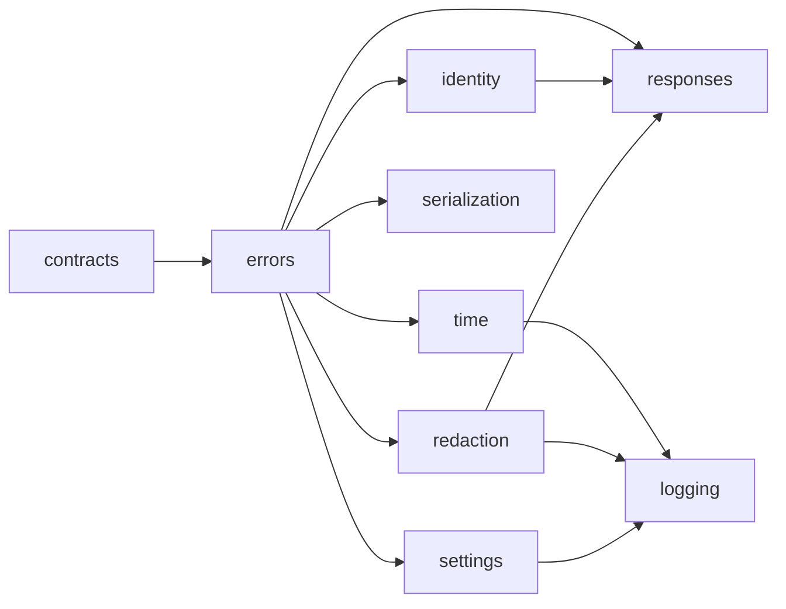

# Utils

> **Package:** `app/utils`
> **Status:** `Completed`
> **Last updated:** `2026-08-04`

> This README is the package's single source of truth for requirements, final
> structure, implementation sequence, progress, usage examples, and tests.
> Update this file before changing the code.

---

## 1. Purpose and Boundary

### Purpose

Utils provides business-neutral cross-domain primitives. It owns shared context
and audit contracts, base errors, trace identifiers, UTC handling, canonical
serialization, secret redaction, runtime settings, structured logging, and the
standard response contract for bounded public operations.
It makes no trading or domain decision.

### Owns

- `AuthContext v1`/`v2` and `AuditEvent v1`.
- Shared base errors, error metadata, boundary-safe mapping, and injected event routing.
- `StandardResponse v1`, structured response errors, required operation metadata,
  immutable error-definition catalogues, and monotonic execution timing.
- Request, workflow, correlation, causation, and event identifiers.
- UTC clocks, timestamps, and freshness calculations.
- Deterministic canonical JSON serialization.
- Denylist-first secret redaction.
- Immutable runtime settings and the sole repository `app/configs/env.json` loading boundary.
- Import-safe structured logging with immutable bound context, a lazy approved
  default profile, and explicit override support for specialized routing.

### Does not own

- Domain payload contracts, business outcomes, error-code policy, business
  validation, or business limits.
- Authentication, identity verification, permission enforcement, session state,
  or credential persistence; UI/API owns these capabilities and produces
  `AuthContext v2` for current API sessions while preserving v1 compatibility.
- DataFrame, OHLC, OHLCV, market-data quality, conversion, comparison, chunking,
  repair, resampling, persistence, or cache behavior; Data owns these capabilities.
- Password hashing, credential encryption, key generation/storage/rotation,
  secret persistence, active-key selection, or credential-reference resolution.
  UI/API owns those application capabilities and externally provisioned key
  infrastructure owns encryption-key lifecycle.
- Safe-path abstractions; each filesystem-writing domain owns and validates its
  allowed roots and paths.
- Metrics exporters, health providers, domain error registries,
  generic validation façades, or domain-specific wrapper response envelopes.
- Import-time configuration, filesystem writes, environment-file reads, network
  connections, compatibility aliases, or fallback modules.

### Shared contracts

| Status    | Contract                | Version        | Producer                       | Consumers                                                                                                          | Purpose                                                                                                                                            |
| --------- | ----------------------- | -------------- | ------------------------------ | ------------------------------------------------------------------------------------------------------------------ | -------------------------------------------------------------------------------------------------------------------------------------------------- |
| Completed | `AuthContext`         | `v1`, `v2` | UI/API                         | Data, Strategy, Risk, Trading, Simulation, Optimization, Research, Portfolio, Agentic                              | Immutable authenticated principal and trace context. Version 2 separates deployment tenancy from the bounded execution-safety runtime profile.     |
| Completed | `AuditEvent`          | `v1`         | Every emitting domain          | Data (direct persistence consumer); Risk and UI/API query persisted events only through Data-owned query contracts | Redacted, versioned trace record persisted by Data; each producer owns its payload meaning.                                                        |
| Completed | `StandardResponse[T]` | `v1`         | Every bounded public operation | Every internal or external caller of that operation                                                                | Immutable five-field function-level response preserving the raw result directly in`data` and prior envelope evidence in `metadata.extensions`. |

`AuthContext v1` contains `contract_version`, `schema_id`, `principal_id`,
`principal_type`, roles, permissions, scopes, tenant/environment, request ID,
workflow ID, correlation ID, and UTC issue time. Missing or invalid context fails
closed at the receiving domain. `AuthContext v2` adds the required independent
`runtime_profile` claim (`research`, `simulation`, `paper`, or `live`); Risk and
Trading consume that claim while deployment-tenancy consumers continue to use
`tenant_or_environment`.

`AuditEvent v1` contains `contract_version`, `schema_id`, event ID, UTC timestamp,
domain, action, optional principal ID, request ID, correlation ID, optional causation
ID, and a redacted JSON-safe payload. Emission or persistence failure is surfaced.

`StandardResponse v1` contains exactly `status`, `message`, `data`, `error`, and
`metadata`. A successful raw result is stored directly in `data`; it is never
embedded inside a synthetic `result`, `payload`, or legacy envelope. Existing
non-payload return evidence is preserved in `metadata.extensions`.

### Capability-to-consumer evidence

Shared business-neutral capabilities have at least two explicit domain consumers.

| Retained capability                                          | Named consuming domain READMEs                                                                           |
| ------------------------------------------------------------ | -------------------------------------------------------------------------------------------------------- |
| `AuthContext` / `AuditEvent`                             | Data, Strategy, Risk, Trading, Simulation, Optimization, Research, Portfolio, UI/API                     |
| Shared base errors                                           | Brokers, Risk, Trading, Simulation, Analytics, Research, Portfolio, UI/API                               |
| Trace identifiers                                            | Brokers, Data, Strategy, Trading, Simulation, Optimization, Analytics, UI/API                            |
| UTC time                                                     | Brokers, Data, Strategy, Risk, Trading, Simulation, Research, Portfolio                                  |
| Canonical serialization                                      | Strategy, Trading, Analytics, Optimization, Research                                                     |
| Secret redaction                                             | Brokers, Data, Strategy, Risk, Trading, Simulation, Analytics, Optimization, Research, Portfolio, UI/API |
| Runtime settings                                             | Data, Trading, Simulation, UI/API                                                                        |
| Error metadata and injected routing                          | Brokers, Risk, Trading, Simulation, Analytics, Research, Portfolio, UI/API                               |
| Standard operation responses and immutable error definitions | Every service domain and UI/API                                                                          |
| Structured logging and specialized routing                   | Brokers, Risk, Trading, Data                                                                             |

### Transferred ownership

Data owns the behavior previously proposed as shared DataFrame/OHLC helpers:

- UTC alignment of internal tabular market data.
- Bar and DataFrame record serialization.
- Deterministic DataFrame and OHLC/OHLCV comparison.
- OHLCV quality validation and evidence.
- Bounded ingestion chunking used by Data workflows.

These are private Data implementation capabilities. Raw DataFrames never become a
cross-domain contract. Generic sequence chunking is not part of Utils.

### Persisted state

Utils owns no durable business state, tables, artifacts, or migrations.

---

## 2. Final Package Structure

Folders are ordered from lowest to highest dependency.

### Feature Registry

| Status    | Feature                                                           | Owning module      | Public API and contracts                               | Requirements                        | Usage evidence                                          |
| --------- | ----------------------------------------------------------------- | ------------------ | ------------------------------------------------------ | ----------------------------------- | ------------------------------------------------------- |
| Completed | `FEAT-UTIL-00` Shared Authentication and Audit Contracts        | `contracts/`     | Exact declarations and contract fields: Section 4.1    | Section 4.1 functional requirements | `tests/utils/usage/features/01_contracts.py`          |
| Completed | `FEAT-UTIL-01` Error Mapping and Exception Normalization        | `errors/`        | Exact declarations: Section 4.2                        | Section 4.2 functional requirements | `tests/utils/usage/features/02_errors.py`             |
| Completed | `FEAT-UTIL-02` Prefixed and Deterministic Identity Generation   | `identity/`      | Exact declarations: Section 4.3                        | Section 4.3 functional requirements | `tests/utils/usage/features/03_identity.py`           |
| Completed | `FEAT-UTIL-03` Aware UTC Time and Timestamp Utilities           | `time/`          | Exact declarations: Section 4.4                        | Section 4.4 functional requirements | `tests/utils/usage/features/04_time.py`               |
| Completed | `FEAT-UTIL-04` Canonical JSON Serialization and Safe Conversion | `serialization/` | Exact declarations: Section 4.5                        | Section 4.5 functional requirements | `tests/utils/usage/features/05_serialization.py`      |
| Completed | `FEAT-UTIL-05` Sensitive Data Redaction                         | `security/`      | Exact declarations: Section 4.6                        | Section 4.6 functional requirements | `tests/utils/usage/features/06_security.py`           |
| Completed | `FEAT-UTIL-06` Precedence-Ordered Settings Loading              | `settings/`      | Exact declarations and settings contracts: Section 4.7 | Section 4.7 functional requirements | `tests/utils/usage/features/07_settings.py`           |
| Completed | `FEAT-UTIL-07` Non-Blocking Logging Configuration               | `logging/`       | Exact declarations and logging contracts: Section 4.8  | Section 4.8 functional requirements | `tests/utils/usage/features/08_logging.py`            |
| Completed | `FEAT-UTIL-08` Standard Operation Responses                     | `responses/`     | Exact declarations and response fields: Section 4.9    | Section 4.9 functional requirements | `tests/utils/usage/features/09_standard_responses.py` |

This table is the sole current registry for Utils. Detailed signatures, contract
fields, failure behavior, and evidence remain authoritative in the referenced
Section 4 feature specifications and are not duplicated in the changelog.
Runtime receiver-side schema validation accesses the internal authentication and
audit-event classes only through `get_auth_context_type` and
`get_audit_event_type`.

```text
utils/
|-- __init__.py
|-- README.md
|-- contracts/
|   |-- __init__.py
|   |-- audit.py
|   `-- auth.py
|-- errors/
|   |-- __init__.py
|   |-- catalog.py
|   |-- contracts.py
|   |-- exceptions.py
|   |-- mapping.py
|   |-- metadata.py
|   |-- routing.py
|   `-- validation.py
|-- identity/
|   |-- __init__.py
|   `-- identifiers.py
|-- time/
|   |-- __init__.py
|   |-- clocks.py
|   `-- timestamps.py
|-- serialization/
|   |-- __init__.py
|   `-- canonical.py
|-- security/
|   |-- __init__.py
|   `-- redaction.py
|-- settings/
|   |-- __init__.py
|   |-- models.py
|   `-- loader.py
|-- logging/
|   |-- __init__.py
|   `-- logger.py
`-- responses/
    |-- __init__.py
    |-- factories.py
    |-- models.py
    `-- timing.py
```

Package and feature `__init__.py` files expose only documented standalone
functions through explicit `__all__` declarations. Class-based implementations
and constants are not public operations. The package-root public API is exactly
the function list in `app/utils/__init__.py`; contract, error, settings, logging,
response, and redaction classes are implementation details and must be accessed
through their documented function factories/getters. No compatibility aliases
are retained for removed class or constant exports. `JsonValue` is an internal
type alias and is not exported.


```mermaid
flowchart LR
    C[contracts] --> E[errors]
    E --> I[identity]
    E --> T[time]
    E --> S[serialization]
    E --> R[redaction]
    E --> SET[settings]
    T --> L[logging]
    R --> L
    SET --> L
    E --> RESP[responses]
    I --> RESP
    R --> RESP
```

Standalone executable usage examples live under `tests/utils/usage/features/`. They are
ordinary programs with `main()` and `if __name__ == "__main__"` entry points, not
pytest tests. The nine numbered programs map one-to-one to `FEAT-UTIL-00` through
`FEAT-UTIL-08`, while `features.py` ties all nine features together into a single
sequential, homogeneous end-to-end domain pipeline. Pytest explicitly ignores these
programs, and verification executes each one directly with Python.

---

## 3. Workflows

> **Workflow Usage Evidence**: Each active workflow has one standalone executable
> program under [`tests/utils/usage/workflows/`](../../tests/utils/usage/workflows/).
> Every program labels its input boundary, each documented stage in comments and
> output, and its typed output boundary. Run all Utils workflows with
> `uv run python tests/utils/usage/workflows/run_all.py`.

### Workflow rank values

| Rank                 | Identifier     | Meaning                                   |
| -------------------- | -------------- | ----------------------------------------- |
| **Primary**    | `WF-UTL-PRI` | The workflow this domain exists to serve. |
| **Secondary**  | `WF-UTL-SEC` | The next most load-bearing workflow.      |
| **Tertiary**   | `WF-UTL-TER` | The third-ranked workflow.                |
| **Supporting** | `WF-UTL-0NN` | Every remaining registered workflow.      |

### Retired identifiers

`WF-UTL-001`, `WF-UTL-002`, and `WF-UTL-003` were absorbed into `WF-UTL-PRI`,
`WF-UTL-SEC`, and `WF-UTL-TER` respectively. Absorbed numbers are retired and are
never reused; new workflows continue from `WF-UTL-004`.

| Workflow ID    | Standalone program                                                                 |
| -------------- | ---------------------------------------------------------------------------------- |
| `WF-UTL-PRI` | `tests/utils/usage/workflows/wf_utl_pri_structured_logging_and_redaction.py`     |
| `WF-UTL-SEC` | `tests/utils/usage/workflows/wf_utl_sec_shared_settings_bootstrap.py`            |
| `WF-UTL-TER` | `tests/utils/usage/workflows/wf_utl_ter_audit_event_construction.py`             |
| `WF-UTL-004` | `tests/utils/usage/workflows/wf_utl_004_standard_operation_response_envelope.py` |
| `WF-UTL-005` | `tests/utils/usage/workflows/wf_utl_005_error_normalization_and_routing.py`      |
| `WF-UTL-006` | `tests/utils/usage/workflows/wf_utl_006_trace_identity_and_utc_time.py`          |
| `WF-UTL-007` | `tests/utils/usage/workflows/wf_utl_007_canonical_serialization_and_digest.py`   |

| Status    | Rank       | Workflow ID    | Scope        | Workflow                                   | Input boundary                              | Final outcome                                                           | Requirement sequence                                                                                                                                  |
| --------- | ---------- | -------------- | ------------ | ------------------------------------------ | ------------------------------------------- | ----------------------------------------------------------------------- | ----------------------------------------------------------------------------------------------------------------------------------------------------- |
| Completed | Primary    | `WF-UTL-PRI` | Cross-domain | Structured logging and redaction           | Domain log record and explicit context      | Redacted structured record reaches the configured sink                  | `FR-UTL-026` through `FR-UTL-033`, `FR-UTL-039` through `FR-UTL-041`                                                                          |
| Completed | Secondary  | `WF-UTL-SEC` | Cross-domain | Shared settings bootstrap                  | Explicit mapping and environment            | Immutable validated`RuntimeSettings`                                  | `FR-UTL-022` through `FR-UTL-024`                                                                                                                 |
| Completed | Tertiary   | `WF-UTL-TER` | Cross-domain | Audit-event construction                   | Domain-owned action facts and trace context | Valid redacted`AuditEvent v1` ready for Data persistence              | `FR-UTL-002`, `FR-UTL-003`, `FR-UTL-007`, `FR-UTL-008`, `FR-UTL-010`, `FR-UTL-011`, `FR-UTL-013` through `FR-UTL-021`, `FR-UTL-036` |
| Completed | Supporting | `WF-UTL-004` | Cross-domain | Standard operation response envelope       | Domain operation outcome and trace context  | Uniform`StandardResponse v1` success, error, or exception envelope    | `FR-UTL-034`, `FR-UTL-035`                                                                                                                        |
| Completed | Supporting | `WF-UTL-005` | Cross-domain | Error normalization, metadata, and routing | Raw exception or domain error code          | Canonical error code, resolved metadata, and one routed error event     | `FR-UTL-004` through `FR-UTL-006`, `FR-UTL-009`, `FR-UTL-012`                                                                                 |
| Completed | Supporting | `WF-UTL-006` | Cross-domain | Trace identity and UTC time discipline     | Caller-supplied identity seed or timestamp  | Validated trace identifier plus aware UTC instant and freshness verdict | `FR-UTL-001`, `FR-UTL-025`, `FR-UTL-037`                                                                                                        |
| Completed | Supporting | `WF-UTL-007` | Cross-domain | Canonical serialization and digest         | Arbitrary domain payload                    | Deterministic redacted canonical JSON and stable digest                 | `FR-UTL-036`, `FR-UTL-038`                                                                                                                        |

### `WF-UTL-PRI` — Structured Logging and Redaction

1. The caller imports the global import-safe bound logger without side effects —
   `utils.get_logger()`.
2. The caller supplies a structured, JSON-safe context — `utils.to_json_safe()`.
3. Redaction runs before formatting or emission — `utils.get_default_redaction_policy()`,
   `utils.is_sensitive_key()`, `utils.redact_mapping_value()`, `utils.redact_text_value()`.
4. The first runtime bound-logger emission atomically activates the approved default
   profile; an explicit call replaces it only when a specialized profile is
   required — `utils.configure_logging()`.
5. Default queued delivery flushes and stops through the registered process-exit
   lifecycle; special entry points may synchronize or stop it explicitly —
   `utils.flush_logging()`, `utils.shutdown_logging()`.
6. Configuration or sink failure is surfaced without exposing the source payload —
   `utils.exception_response()`.

### `WF-UTL-SEC` — Shared Settings Bootstrap

1. The loader reads the repository `app/configs/env.json` and process overrides at
   the shared Utils boundary; callers may supply explicit values without parsing
   files — `utils.load_settings()`.
2. The loader validates supported deployment and runtime settings —
   `utils.load_settings()`.
3. The loader returns an immutable settings object without mutating caller input —
   `utils.load_settings()`.
4. Consumers open a scoped view of the resolved settings where a domain needs one —
   `data.data_settings_context()`.

Imports never read the environment, a file, or a secret store.

### `WF-UTL-TER` — Audit-Event Construction

1. The emitting domain supplies its action, trace context, and payload meaning —
   `utils.create_auth_context()`.
2. IDs and UTC timestamps are validated — `utils.validate_id()`,
   `utils.parse_utc_timestamp()`.
3. The payload is redacted and canonicalized — `utils.redact_mapping_value()`,
   `utils.canonical_json()`.
4. A bounded `AuditEvent v1` is constructed — `utils.create_audit_event()`.
5. Data persists the event through its owned audit-storage boundary —
   `data.persist_audit_event()`.

### `WF-UTL-004` — Standard Operation Response Envelope

1. The operation records its aware UTC start instant — `utils.utc_now()`.
2. The caller assembles trace, version, and timing metadata for the envelope —
   `utils.build_response_metadata()`.
3. A completed operation returns its typed payload in a success envelope —
   `utils.success_response()`.
4. A known domain failure returns a canonical code and redacted detail —
   `utils.error_response()`.
5. An unexpected exception is converted without leaking the source payload —
   `utils.exception_response()`.
6. Elapsed duration is measured and attached to the envelope metadata —
   `utils.get_execution_ms()`.

**Failure behaviour:** an envelope is never returned without a canonical status; an
unmapped exception is reported as an internal error with the payload withheld.

### `WF-UTL-005` — Error Normalization, Metadata, and Routing

1. The shared catalog is loaded and structurally validated —
   `utils.get_common_error_catalog()`, `utils.validate_error_catalog()`.
2. A raw exception is mapped to its canonical domain error — `utils.map_exception()`.
3. The resulting code is normalized to canonical form — `utils.normalize_error_code()`.
4. A definition is required for the normalized code, failing closed when absent —
   `utils.require_error_definition()`.
5. Severity, retryability, and routing metadata are resolved —
   `utils.get_error_metadata()`.
6. One redacted error event is routed to the configured sink —
   `utils.route_error_event()`.

**Failure behaviour:** an unregistered code fails closed at
`utils.require_error_definition()` rather than being routed with invented metadata.

### `WF-UTL-006` — Trace Identity and UTC Time Discipline

1. A new correlation identifier is generated for an inbound operation —
   `utils.generate_id()`.
2. A deterministic identifier is derived where a stable key must survive replay —
   `utils.derive_stable_id()`.
3. Any caller-supplied identifier is validated before use — `utils.validate_id()`.
4. The current aware UTC instant is read from the single shared clock —
   `utils.utc_now()`.
5. Inbound and outbound timestamps are parsed and rendered canonically —
   `utils.parse_utc_timestamp()`, `utils.format_utc_timestamp()`.
6. Evidence freshness is evaluated against an explicit bound —
   `utils.is_fresh()`, `utils.age_seconds()`.

**Failure behaviour:** a naive timestamp or malformed identifier is rejected; no
default timezone is assumed and no identifier is silently regenerated.

### `WF-UTL-007` — Canonical Serialization and Digest

1. Arbitrary domain values are coerced to JSON-safe primitives —
   `utils.to_json_safe()`.
2. Sensitive keys are redacted before any bytes are produced —
   `utils.redact_mapping_value()`.
3. The payload is serialized with deterministic key order and separators —
   `utils.canonical_json()`.
4. A stable digest is computed over the canonical bytes for lineage and hash
   comparison — `utils.canonical_digest()`.

**Failure behaviour:** a value that cannot be canonicalized raises rather than being
coerced to a lossy string, so digests never disagree across processes.

---

## 4. Module and Requirement Specifications

This section is the implementation plan. The package-level `utils/__init__.py`
re-exports only the approved feature APIs below and is governed by
`NFR-UTL-001`, `NFR-UTL-003`, and `NFR-UTL-005`; it owns no independent
functional behavior.

### 4.1 `contracts/` — Shared Context and Audit Contracts

**Purpose:** Define the immutable authenticated principal, trace context, and redacted audit envelope shared across every domain.

**Module flow:** `untrusted trace/identity mapping → strict contract-field validation → immutable AuthContext / AuditEvent`

#### Files

| Status    | File            | Responsibility                                                                  | Key exports                                                                                                                                                                   | Dependencies                                                                                                                                                                              |
| --------- | --------------- | ------------------------------------------------------------------------------- | ----------------------------------------------------------------------------------------------------------------------------------------------------------------------------- | ----------------------------------------------------------------------------------------------------------------------------------------------------------------------------------------- |
| Completed | `audit.py`    | Define the redacted audit envelope and common strict contract-field validation. | `AuditEvent`, `create_audit_event`; module-level, not re-exported through `__init__.py`: `JsonValue`, `validate_non_empty`, `validate_utc`, `validate_trace_id` | **Standard library:** `collections.abc`, `datetime`, `json`, `math`, `re`, `types`, `typing`**Required third-party:** `pydantic>=2.13.4`**Local:** None |
| Completed | `auth.py`     | Define immutable authenticated principal and trace context.                     | Internal`AuthContext`; public `create_auth_context`, `get_auth_context_type`                                                                                            | **Standard library:** `datetime`, `typing`**Required third-party:** `pydantic>=2.13.4`**Local:** `audit.py` → strict contract-field validation                 |
| Completed | `__init__.py` | Expose the supported shared-contract API.                                       | `create_auth_context`, `get_auth_context_type`, `create_audit_event`, `get_audit_event_type`                                                                          | **Standard library:** None**Required third-party:** None**Local:** `audit.py`, `auth.py` → approved exports                                                        |

#### Functional requirements

| Status    | Requirement ID | Responsibility                                                                                                                                                                                                                  | Class / Function / Method                                                  | Side Effects | Raises                                                                                                                                                     | Usage / Test                                                                                                                                                                                                     |
| --------- | -------------- | ------------------------------------------------------------------------------------------------------------------------------------------------------------------------------------------------------------------------------- | -------------------------------------------------------------------------- | ------------ | ---------------------------------------------------------------------------------------------------------------------------------------------------------- | ---------------------------------------------------------------------------------------------------------------------------------------------------------------------------------------------------------------- |
| Completed | `FR-UTL-001` | Define immutable backward-compatible`AuthContext v1` and current `AuthContext v2`; v2 requires a bounded runtime profile separate from deployment tenancy. Only `USER` and `SERVICE_ACCOUNT` principal types are valid. | `create_auth_context`, `get_auth_context_type`                         | None         | `ValidationError`: version/schema mismatch, missing or invalid v2 runtime profile, naive time, empty identity/trace field, or unsupported principal type | **Usage:** `tests/utils/usage/features/01_contracts.py::fr_utils_001_auth_context()`**Unit:** `tests/utils/unit/test_auth.py::test_auth_context_v2_requires_separate_runtime_profile()`          |
| Completed | `FR-UTL-002` | Define immutable redacted`AuditEvent v1` with bounded JSON-safe payload. The class remains internal; callers construct it with the factory and may resolve its runtime type only through the getter.                          | `create_audit_event`, `get_audit_event_type`                           | None         | `ValidationError`: naive timestamp, empty identity/trace field, or unsafe payload                                                                        | **Usage:** `tests/utils/usage/features/01_contracts.py::fr_utils_002_audit_event()`**Unit:** `tests/utils/unit/test_audit.py::test_audit_event_requires_json_safe_payload()`                     |
| Completed | `FR-UTL-003` | Reject naive timestamps, empty identity/trace fields, unsupported principal types, and malformed schema identity.                                                                                                               | Strict contract-field validation used by`AuditEvent` and `AuthContext` | None         | `ValidationError`: naive time, empty field, unsupported principal type, or malformed schema identity                                                     | **Usage:** `tests/utils/usage/features/01_contracts.py::fr_utils_003_contract_validation()`**Unit:** `tests/utils/unit/test_audit.py::test_contract_field_validation_rejects_malformed_schema()` |

### 4.2 `errors/` — Shared Errors, Metadata, and Routing

**Purpose:** Provide the minimal shared exception hierarchy, normalized metadata,
secret-safe boundary mapping, and explicit injected event routing every domain can use.

**Module flow:** `caught exception → deterministic shared base type → sanitized boundary evidence`

#### Files

| Status    | File              | Responsibility                                                                | Key exports                                                                                                  | Dependencies                                                                                                                                                                                                         |
| --------- | ----------------- | ----------------------------------------------------------------------------- | ------------------------------------------------------------------------------------------------------------ | -------------------------------------------------------------------------------------------------------------------------------------------------------------------------------------------------------------------- |
| Completed | `catalog.py`    | Define the immutable business-neutral and root-system common error catalogue. | `COMMON_ERROR_CATALOG`, `get_common_error_catalog`                                                       | **Standard library:** `types`**Required third-party:** None**Local:** `contracts.py` → immutable error definitions                                                                            |
| Completed | `contracts.py`  | Define the common immutable error-definition shape without domain policy.     | `ErrorDefinition`, `ErrorSeverity`                                                                       | **Standard library:** `dataclasses`, `re`, `typing`**Required third-party:** None**Local:** None                                                                                             |
| Completed | `exceptions.py` | Define the minimal shared exception hierarchy and domain-extension boundary.  | `HaruQuantError`, `ConfigurationError`, `ValidationError`, `SecurityError`, `ExternalServiceError` | **Standard library:** `re`**Required third-party:** None**Local:** None                                                                                                                          |
| Completed | `mapping.py`    | Convert caught exceptions to deterministic secret-safe shared error evidence. | `map_exception`                                                                                            | **Standard library:** None**Required third-party:** None**Local:** `exceptions.py` → shared base exceptions                                                                                     |
| Completed | `metadata.py`   | Normalize symbolic error codes and provide immutable built-in metadata.       | `ErrorMetadata`, `normalize_error_code`, `get_error_metadata`                                          | **Standard library:** `dataclasses`, `re`**Required third-party:** None**Local:** `exceptions.py` → `ValidationError`                                                                     |
| Completed | `routing.py`    | Route a mapped error payload to an explicitly injected sink.                  | `ErrorSink`, `route_error_event`                                                                         | **Standard library:** `collections.abc`, `typing`**Required third-party:** None**Local:** `mapping.py` → `map_exception`                                                                  |
| Completed | `validation.py` | Validate immutable catalogues and require explicitly approved codes.          | `validate_error_catalog`, `require_error_definition`                                                     | **Standard library:** `collections.abc`, `types`**Required third-party:** None**Local:** `contracts.py`, `exceptions.py`, `metadata.py` → definitions, validation errors, normalization |
| Completed | `__init__.py`   | Expose the supported shared-error API.                                        | Mapping, metadata, routing, catalogue, and validation functions                                              | **Standard library:** None**Required third-party:** None**Local:** all error feature files → approved exports                                                                                     |

#### Functional requirements

| Status    | Requirement ID | Responsibility                                                                                                                                                                         | Class / Function / Method                                                                                    | Side Effects                    | Raises                                                                            | Usage / Test                                                                                                                                                                                                    |
| --------- | -------------- | -------------------------------------------------------------------------------------------------------------------------------------------------------------------------------------- | ------------------------------------------------------------------------------------------------------------ | ------------------------------- | --------------------------------------------------------------------------------- | --------------------------------------------------------------------------------------------------------------------------------------------------------------------------------------------------------------- |
| Completed | `FR-UTL-004` | Provide focused shared base exceptions without domain-specific policy.                                                                                                                 | `HaruQuantError`, `ConfigurationError`, `ValidationError`, `SecurityError`, `ExternalServiceError` | None                            | None                                                                              | **Usage:** `tests/utils/usage/features/02_errors.py::fr_utils_004_typed_error_codes()`**Unit:** `tests/utils/unit/test_exceptions.py::test_shared_exception_hierarchy()`                        |
| Completed | `FR-UTL-005` | Preserve deterministic code and sanitized detail while never returning a raw provider exception across a boundary.                                                                     | `map_exception`                                                                                            | None                            | None                                                                              | **Usage:** `tests/utils/usage/features/02_errors.py::fr_utils_005_exception_payload_mapping()`**Unit:** `tests/utils/unit/test_mapping.py::test_map_exception_never_leaks_raw_provider_error()` |
| Completed | `FR-UTL-006` | Require domains to define their own codes and boundary mapping above the shared base hierarchy.                                                                                        | Shared exception extension contract                                                                          | None                            | None                                                                              | **Usage:** `tests/utils/usage/features/02_errors.py::fr_utils_006_exception_extension()`**Unit:** `tests/utils/unit/test_exceptions.py::test_domains_extend_shared_base()`                      |
| Completed | `FR-UTL-034` | Normalize an error code and look up immutable safe metadata without a mutable registry.                                                                                                | `ErrorMetadata`, `normalize_error_code`, `get_error_metadata`                                          | None                            | `ValidationError`: empty or malformed error code                                | **Usage:** `tests/utils/usage/features/02_errors.py::fr_utils_034_error_metadata()`**Unit:** `tests/utils/unit/test_error_metadata.py::test_normalize_and_lookup_error_metadata()`              |
| Completed | `FR-UTL-035` | Map an exception and synchronously deliver its safe payload to an explicitly injected sink.                                                                                            | `ErrorSink`, `route_error_event`                                                                         | Caller-provided sink invocation | Sink exception is propagated                                                      | **Usage:** `tests/utils/usage/features/02_errors.py::fr_utils_035_route_error_event()`**Unit:** `tests/utils/unit/test_error_routing.py::test_route_error_event_invokes_injected_sink()`        |
| Completed | `FR-UTL-048` | Define immutable business-neutral and root-system error metadata, validate detached domain catalogues, and reject unapproved codes without importing service-domain policy into Utils. | `ErrorDefinition`, `COMMON_ERROR_CATALOG`, `validate_error_catalog`, `require_error_definition`      | None                            | `ValidationError`: empty, malformed, inconsistent, or unapproved catalogue/code | **Usage:** `tests/utils/usage/features/02_errors.py::fr_utils_048_error_catalogues()`**Unit:** `tests/utils/unit/test_error_catalog.py`                                                         |

### 4.3 `identity/` — Trace Identifiers

**Purpose:** Generate, validate, and deterministically derive secret-free trace identifiers used across every domain.

**Module flow:** `prefix/identity material → generation or validation → canonical secret-free identifier`

#### Files

| Status    | File               | Responsibility                                                            | Key exports                                                                                                                                                                | Dependencies                                                                                                                                                  |
| --------- | ------------------ | ------------------------------------------------------------------------- | -------------------------------------------------------------------------------------------------------------------------------------------------------------------------- | ------------------------------------------------------------------------------------------------------------------------------------------------------------- |
| Completed | `identifiers.py` | Generate, validate, and deterministically derive secret-free identifiers. | `generate_id`, `validate_id`, `derive_stable_id`; module-level, not re-exported through `__init__.py`: `SUPPORTED_TRACE_PREFIXES`, `SUPPORTED_STABLE_PREFIXES` | **Standard library:** `hashlib`, `re`, `uuid`**Required third-party:** None**Local:** `errors/exceptions.py` → `ValidationError` |
| Completed | `__init__.py`    | Expose the supported identity API.                                        | `generate_id`, `validate_id`, `derive_stable_id`                                                                                                                     | **Standard library:** None**Required third-party:** None**Local:** `identifiers.py` → approved exports                                   |

#### Functional requirements

| Status    | Requirement ID | Responsibility                                                                                                                                           | Class / Function / Method | Side Effects | Raises                                                                           | Usage / Test                                                                                                                                                                                       |
| --------- | -------------- | -------------------------------------------------------------------------------------------------------------------------------------------------------- | ------------------------- | ------------ | -------------------------------------------------------------------------------- | -------------------------------------------------------------------------------------------------------------------------------------------------------------------------------------------------- |
| Completed | `FR-UTL-007` | Generate prefixed UUID4 identifiers without embedded secrets.                                                                                            | `generate_id`           | Entropy read | `ValidationError`: unsupported prefix                                          | **Usage:** `tests/utils/usage/features/03_identity.py::fr_utils_007_generate_id()`**Unit:** `tests/utils/unit/test_identifiers.py::test_generate_id_is_prefixed_and_secret_free()` |
| Completed | `FR-UTL-008` | Validate supported prefixes and canonical identifier syntax.                                                                                             | `validate_id`           | None         | `ValidationError`: unsupported prefix or malformed identifier                  | **Usage:** `tests/utils/usage/features/03_identity.py::fr_utils_008_validate_id()`**Unit:** `tests/utils/unit/test_identifiers.py::test_validate_id_rejects_malformed()`           |
| Completed | `FR-UTL-009` | Derive deterministic`id`-prefixed SHA-256 identifiers from canonical caller-supplied identity material; stable IDs are never shared trace identifiers. | `derive_stable_id`      | None         | `ValidationError`: unsupported prefix or empty/non-canonical identity material | **Usage:** `tests/utils/usage/features/03_identity.py::fr_utils_009_derive_stable_id()`**Unit:** `tests/utils/unit/test_identifiers.py::test_derive_stable_id_is_deterministic()`  |

### 4.4 `time/` — UTC Clocks and Timestamps

**Purpose:** Provide the injectable clock boundary and canonical UTC timestamp parsing, formatting, and freshness evaluation.

**Module flow:** `injectable clock → aware UTC instant → parse/format/age/freshness result`

#### Files

| Status    | File              | Responsibility                                             | Key exports                                                                                   | Dependencies                                                                                                                                              |
| --------- | ----------------- | ---------------------------------------------------------- | --------------------------------------------------------------------------------------------- | --------------------------------------------------------------------------------------------------------------------------------------------------------- |
| Completed | `clocks.py`     | Define the injectable clock boundary and UTC system clock. | `Clock`, `SystemClock`, `utc_now`                                                       | **Standard library:** `datetime`, `typing`**Required third-party:** None**Local:** `errors/exceptions.py` → `ValidationError`  |
| Completed | `timestamps.py` | Parse, format, age, and evaluate canonical UTC timestamps. | `parse_utc_timestamp`, `format_utc_timestamp`, `age_seconds`, `is_fresh`              | **Standard library:** `datetime`, `decimal`**Required third-party:** None**Local:** `errors/exceptions.py` → `ValidationError` |
| Completed | `__init__.py`   | Expose the supported time API.                             | `utc_now`, `parse_utc_timestamp`, `format_utc_timestamp`, `age_seconds`, `is_fresh` | **Standard library:** None**Required third-party:** None**Local:** `clocks.py`, `timestamps.py` → approved exports                 |

#### Functional requirements

| Status    | Requirement ID | Responsibility                                                                 | Class / Function / Method                         | Side Effects | Raises                                                      | Usage / Test                                                                                                                                                                                    |
| --------- | -------------- | ------------------------------------------------------------------------------ | ------------------------------------------------- | ------------ | ----------------------------------------------------------- | ----------------------------------------------------------------------------------------------------------------------------------------------------------------------------------------------- |
| Completed | `FR-UTL-010` | Return aware UTC time from an injectable clock.                                | `Clock`, `SystemClock`, `utc_now`           | Clock read   | None                                                        | **Usage:** `tests/utils/usage/features/04_time.py::fr_utils_010_utc_now()`**Unit:** `tests/utils/unit/test_clocks.py::test_system_clock_returns_aware_utc()`                    |
| Completed | `FR-UTL-011` | Parse and format UTC timestamps using canonical`Z` output.                   | `parse_utc_timestamp`, `format_utc_timestamp` | None         | `ValidationError`: naive, non-UTC, or malformed timestamp | **Usage:** `tests/utils/usage/features/04_time.py::fr_utils_011_parse_format_timestamp()`**Unit:** `tests/utils/unit/test_timestamps.py::test_format_uses_canonical_z_suffix()` |
| Completed | `FR-UTL-012` | Calculate non-negative age and explicit freshness against an injected instant. | `age_seconds`, `is_fresh`                     | None         | `ValidationError`: naive or invalid reference instant     | **Usage:** `tests/utils/usage/features/04_time.py::fr_utils_012_age_and_freshness()`**Unit:** `tests/utils/unit/test_timestamps.py::test_age_seconds_is_non_negative()`         |

### 4.5 `serialization/` — Canonical Serialization

**Purpose:** Convert supported values to deterministic JSON-safe data and produce canonical UTF-8 JSON with no hidden redaction.

**Module flow:** `supported value → JSON-safe conversion → stable sorted-key UTF-8 JSON`

#### Files

| Status    | File             | Responsibility                                                                                                       | Key exports                                                                                                                      | Dependencies                                                                                                                                                                                                                               |
| --------- | ---------------- | -------------------------------------------------------------------------------------------------------------------- | -------------------------------------------------------------------------------------------------------------------------------- | ------------------------------------------------------------------------------------------------------------------------------------------------------------------------------------------------------------------------------------------ |
| Completed | `canonical.py` | Convert supported values to JSON-safe data, produce canonical UTF-8 JSON, and digest trusted structures of any size. | `to_json_safe`, `canonical_json`, `canonical_digest`; module-level, not re-exported through `__init__.py`: `JsonValue` | **Standard library:** `collections.abc`, `dataclasses`, `datetime`, `decimal`, `enum`, `hashlib`, `json`, `math`**Required third-party:** None**Local:** `errors/exceptions.py` → `ValidationError` |
| Completed | `__init__.py`  | Expose the supported serialization API.                                                                              | `to_json_safe`, `canonical_json`, `canonical_digest`                                                                       | **Standard library:** None**Required third-party:** None**Local:** `canonical.py` → approved exports                                                                                                                  |

#### Functional requirements

| Status    | Requirement ID | Responsibility                                                                                                                                                | Class / Function / Method                                               | Side Effects | Raises                                                        | Usage / Test                                                                                                                                                                                                         |
| --------- | -------------- | ------------------------------------------------------------------------------------------------------------------------------------------------------------- | ----------------------------------------------------------------------- | ------------ | ------------------------------------------------------------- | -------------------------------------------------------------------------------------------------------------------------------------------------------------------------------------------------------------------- |
| Completed | `FR-UTL-013` | Convert supported datetimes, decimals, enums, dataclasses, mappings, and sequences to deterministic JSON-safe values.                                         | `to_json_safe`                                                        | None         | `ValidationError`: unsupported value type                   | **Usage:** `tests/utils/usage/features/05_serialization.py::fr_utils_013_to_json_safe()`**Unit:** `tests/utils/unit/test_canonical.py::test_to_json_safe_converts_supported_types()`                 |
| Completed | `FR-UTL-014` | Produce stable UTF-8 JSON with sorted keys and no hidden redaction; an optional`max_items=None` lifts the untrusted-payload ceiling for trusted structures. | `canonical_json`                                                      | None         | `ValidationError`: non-serializable value                   | **Usage:** `tests/utils/usage/features/05_serialization.py::fr_utils_014_canonical_json()`**Unit:** `tests/utils/unit/test_canonical.py::test_canonical_json_sorts_keys()`                           |
| Completed | `FR-UTL-036` | Digest a trusted structure of any size, byte-identical to hashing its canonical JSON, without the untrusted-payload item ceiling.                             | `canonical_digest`                                                    | None         | `ValidationError`: non-serializable value                   | **Usage:** `tests/utils/usage/features/05_serialization.py::fr_utils_036_canonical_digest()`**Unit:** `tests/utils/unit/test_canonical.py::test_canonical_digest_matches_sha256_of_canonical_json()` |
| Completed | `FR-UTL-015` | Reject unsupported, cyclic, non-finite, or unsafe values deterministically.                                                                                   | Serialization validation used by`to_json_safe` and `canonical_json` | None         | `ValidationError`: unsupported, cyclic, or non-finite value | **Usage:** `tests/utils/usage/features/05_serialization.py::fr_utils_015_reject_unsafe_value()`**Unit:** `tests/utils/unit/test_canonical.py::test_serialization_rejects_cyclic_value()`             |

### 4.6 `security/` — Secret Redaction

**Purpose:** Provide bounded denylist-first redaction for text and JSON-safe mappings.

**Module flow:** `redaction policy + text/mapping → denylist-first redaction → redacted value and diagnostics`

#### Files

| Status    | File             | Responsibility                                                                 | Key exports                                                                                                                                       | Dependencies                                                                                                                                                                                              |
| --------- | ---------------- | ------------------------------------------------------------------------------ | ------------------------------------------------------------------------------------------------------------------------------------------------- | --------------------------------------------------------------------------------------------------------------------------------------------------------------------------------------------------------- |
| Completed | `redaction.py` | Define redaction policy/results and redact bounded text or JSON-safe mappings. | `RedactionPolicy`, `RedactionResult`, `get_default_redaction_policy`, `is_sensitive_key`, `redact_text_value`, `redact_mapping_value` | **Standard library:** `collections.abc`, `dataclasses`, `math`, `re`**Required third-party:** None**Local:** `errors/exceptions.py` → `SecurityError`, `ValidationError` |
| Completed | `__init__.py`  | Expose the supported secret-redaction API.                                     | `get_default_redaction_policy`, `is_sensitive_key`, `redact_mapping_value`, `redact_text_value`                                           | **Standard library:** None**Required third-party:** None**Local:** `redaction.py` → approved exports                                                                                 |

#### Functional requirements

| Status    | Requirement ID | Responsibility                                                                               | Class / Function / Method                             | Side Effects | Raises                                                        | Usage / Test                                                                                                                                                                                                                                                 |
| --------- | -------------- | -------------------------------------------------------------------------------------------- | ----------------------------------------------------- | ------------ | ------------------------------------------------------------- | ------------------------------------------------------------------------------------------------------------------------------------------------------------------------------------------------------------------------------------------------------------ |
| Completed | `FR-UTL-016` | Define immutable denylist-first redaction policy with narrow reviewed field-path allowlists. | `RedactionPolicy`, `get_default_redaction_policy` | None         | `ValidationError`: malformed policy definition              | **Usage:** `tests/utils/usage/features/06_security.py::fr_utils_016_redaction_policy()`**Unit:** `tests/utils/unit/test_redaction.py::test_redaction_policy_is_immutable()`                                                                  |
| Completed | `FR-UTL-017` | Detect sensitive keys case-insensitively, including normalized composite suffixes.           | `is_sensitive_key`                                  | None         | None                                                          | **Usage:** `tests/utils/usage/features/06_security.py::fr_utils_017_key_classification()`**Unit:** `tests/utils/unit/test_redaction.py::test_is_sensitive_key_is_case_insensitive()`, `test_is_sensitive_key_matches_composite_suffixes()` |
| Completed | `FR-UTL-018` | Redact bounded text without mutating input.                                                  | `redact_text_value`                                 | None         | None                                                          | **Usage:** `tests/utils/usage/features/06_security.py::fr_utils_018_redaction_text()`**Unit:** `tests/utils/unit/test_redaction.py::test_redact_text_value_does_not_mutate_input()`                                                          |
| Completed | `FR-UTL-019` | Recursively redact a JSON-safe mapping without mutating input.                               | `redact_mapping_value`                              | None         | `ValidationError`: non-JSON-safe mapping                    | **Usage:** `tests/utils/usage/features/06_security.py::fr_utils_019_redaction_mapping()`**Unit:** `tests/utils/unit/test_redaction.py::test_redact_mapping_value_is_recursive()`                                                             |
| Completed | `FR-UTL-020` | Return redacted paths and truncation diagnostics without secret values.                      | `RedactionResult`                                   | None         | None                                                          | **Usage:** `tests/utils/usage/features/06_security.py::fr_utils_020_redaction_result()`**Unit:** `tests/utils/unit/test_redaction.py::test_redaction_result_omits_secret_values()`                                                           |
| Completed | `FR-UTL-021` | Reject policies that allow protected credential fields.                                      | `RedactionPolicy` validation                        | None         | `SecurityError`: policy allows a protected credential field | **Usage:** `tests/utils/usage/features/06_security.py::fr_utils_021_policy_validation()`**Unit:** `tests/utils/unit/test_redaction.py::test_policy_rejects_protected_credential_field()`                                                     |

### 4.7 `settings/` — Runtime Settings

**Purpose:** Define immutable generic runtime/logging settings and provide the sole
repository `app/configs/env.json` loading base for typed domain settings.

**Module flow:** `explicit values + environment → strict validation → immutable RuntimeSettings`

#### Files

| Status    | File            | Responsibility                                                                                                                  | Key exports                                                                                                                                                                                            | Dependencies                                                                                                                                                                                     |
| --------- | --------------- | ------------------------------------------------------------------------------------------------------------------------------- | ------------------------------------------------------------------------------------------------------------------------------------------------------------------------------------------------------ | ------------------------------------------------------------------------------------------------------------------------------------------------------------------------------------------------ |
| Completed | `models.py`   | Define the immutable central`app/configs/env.json` settings base plus generic runtime/logging settings and strict validation. | `AppSettings`, `RuntimeSettings`, `LoggingSettings`; module-level, not re-exported through `__init__.py`: `LogLevel`, `LogRender`, `LogCompression`, `Environment`, `RuntimeProfile` | **Standard library:** `pathlib`, `typing`**Required third-party:** `pydantic`, `pydantic-settings`**Local:** `errors/exceptions.py` → `ConfigurationError`        |
| Completed | `loader.py`   | Load supported runtime settings through`AppSettings` or an explicit mapping, and expose broker-provider settings opaquely.    | `load_broker_provider_settings`, `load_settings`                                                                                                                                                   | **Standard library:** `collections.abc`**Required third-party:** `pydantic`**Local:** `models.py` → settings models; `errors/exceptions.py` → `ConfigurationError` |
| Completed | `__init__.py` | Expose the function-only supported settings API.                                                                                | `get_app_settings_model_config`, `get_app_settings_sources`, `load_broker_provider_settings`, `load_settings`                                                                                      | **Standard library:** None**Required third-party:** None**Local:** `loader.py` → approved exports                                                                           |

#### Functional requirements

| Status    | Requirement ID | Responsibility                                                                                                                                                                                              | Class / Function / Method                                 | Side Effects                                                                       | Raises                                                         | Usage / Test                                                                                                                                                                                                                                              |
| --------- | -------------- | ----------------------------------------------------------------------------------------------------------------------------------------------------------------------------------------------------------- | --------------------------------------------------------- | ---------------------------------------------------------------------------------- | -------------------------------------------------------------- | --------------------------------------------------------------------------------------------------------------------------------------------------------------------------------------------------------------------------------------------------------- |
| Completed | `FR-UTL-022` | Define the immutable central settings base and generic runtime/logging settings, including the approved human-readable default logging profile.                                                             | `AppSettings`, `RuntimeSettings`, `LoggingSettings` | `app/configs/env.json`/environment read only when a settings instance is created | `ConfigurationError`: invalid generic setting value          | **Usage:** `tests/utils/usage/features/07_settings.py::fr_utils_022_construct_configuration()`**Unit:** `tests/utils/unit/test_models.py::test_default_logging_profile()`                                                                 |
| Completed | `FR-UTL-023` | Load explicit values and centralized`app/configs/env.json`/process settings in documented precedence order only when called; expose broker-provider settings as an opaque value through the package root. | `load_broker_provider_settings`, `load_settings`      | Settings read                                                                      | `ConfigurationError`: unsupported or invalid runtime value   | **Usage:** `tests/utils/usage/features/07_settings.py::fr_utils_023_load_active_configuration()`, `fr_utils_023_load_broker_provider_configuration()`**Unit:** `tests/utils/unit/test_loader.py::test_load_settings_precedence_order()` |
| Completed | `FR-UTL-024` | Reject unknown, incompatible, or unsafe deployment/runtime values without partial mutation.                                                                                                                 | Settings-model validation                                 | None                                                                               | `ConfigurationError`: unknown, incompatible, or unsafe value | **Usage:** `tests/utils/usage/features/07_settings.py::fr_utils_024_environment_constraints()`, `fr_utils_024_validate_settings()`**Unit:** `tests/utils/unit/test_models.py::test_settings_reject_unknown_value_without_mutation()`    |

### 4.8 `logging/` — Structured Logging

**Purpose:** Provide import-safe logger access, lazy approved defaults, and explicit
redacted structured-handler overrides for specialized entry points.

The package-root public logging boundary is function-only: callers obtain an
opaque handle with `get_logger` and use `log_info` for structured emission;
`get_logger_name` and `get_logger_handler_count` expose required facts without
exporting the logger class.

**Module flow:** `runtime bound-logger call → lazy default or explicit override → redact → structured record → configured sink`

#### Files

| Status    | File            | Responsibility                                                                                                                                                                                                                   | Key exports                                                                                                                                               | Dependencies                                                                                                                                                                                                                                                                                                                                                                                                                                      |
| --------- | --------------- | -------------------------------------------------------------------------------------------------------------------------------------------------------------------------------------------------------------------------------- | --------------------------------------------------------------------------------------------------------------------------------------------------------- | ------------------------------------------------------------------------------------------------------------------------------------------------------------------------------------------------------------------------------------------------------------------------------------------------------------------------------------------------------------------------------------------------------------------------------------------------- |
| Completed | `logger.py`   | Provide import-safe bound logger access, thread-safe lazy default activation, explicit override configuration and synchronization, source-aware human rendering, compressed rotation, color, lifecycle, and specialized routing. | `BoundLogger`, `logger`, `get_logger`, `configure_logging`, `flush_logging`, `shutdown_logging`, `RedactingFilter`, `StructuredFormatter` | **Standard library:** `atexit`, `collections.abc`, `copy`, `datetime`, `json`, `logging`, `logging.handlers`, `pathlib`, `queue`, `sys`, `threading`, `time`, `types`, `typing`, `zipfile`**Required third-party:** None**Local:** `errors/exceptions.py`; `time/timestamps.py`; `security/redaction.py`; `settings/loader.py`; `settings/models.py` → `LoggingSettings` (type-only) |
| Completed | `__init__.py` | Expose the supported logging API without configuring logging.                                                                                                                                                                    | `get_logger`, `configure_logging`, `flush_logging`, `shutdown_logging`                                                                            | **Standard library:** None**Required third-party:** None**Local:** `logger.py` → approved exports                                                                                                                                                                                                                                                                                                                            |

#### Functional requirements

| Status    | Requirement ID | Responsibility                                                                                                                                                                                                                                                                                                                      | Class / Function / Method                                                                            | Side Effects                                                                                                  | Raises                                                     | Usage / Test                                                                                                                                                                                                                                                                                                                                                                                                   |
| --------- | -------------- | ----------------------------------------------------------------------------------------------------------------------------------------------------------------------------------------------------------------------------------------------------------------------------------------------------------------------------------- | ---------------------------------------------------------------------------------------------------- | ------------------------------------------------------------------------------------------------------------- | ---------------------------------------------------------- | -------------------------------------------------------------------------------------------------------------------------------------------------------------------------------------------------------------------------------------------------------------------------------------------------------------------------------------------------------------------------------------------------------------- |
| Completed | `FR-UTL-026` | Return stable child loggers without configuring handlers.                                                                                                                                                                                                                                                                           | `get_logger`                                                                                       | None                                                                                                          | None                                                       | **Usage:** `tests/utils/usage/features/08_logging.py::fr_utils_026_logger_access()`**Unit:** `tests/utils/unit/test_logger.py::test_get_logger_configures_no_handlers()`                                                                                                                                                                                                                       |
| Completed | `FR-UTL-027` | Atomically install deduplicated console and optional bounded rotating-file handlers from the approved default before the first runtime bound-log emission; explicit`configure_logging` replaces the active profile only for a specialized override.                                                                               | `BoundLogger`, `configure_logging`                                                               | Logging configuration; directory creation; optional file write on first runtime emission or explicit override | `ConfigurationError`: invalid logging settings or sink   | **Usage:** `tests/utils/usage/features/08_logging.py::fr_utils_027_standard_levels()`**Unit:** `tests/utils/unit/test_logger.py::test_first_bound_log_activates_default_profile()`                                                                                                                                                                                                             |
| Completed | `FR-UTL-028` | Redact messages and structured context before formatting.                                                                                                                                                                                                                                                                           | `RedactingFilter`                                                                                  | None                                                                                                          | None                                                       | **Usage:** `tests/utils/usage/features/08_logging.py::fr_utils_028_logger_redaction()`**Unit:** `tests/utils/unit/test_logger.py::test_redacting_filter_runs_before_formatting()`                                                                                                                                                                                                              |
| Completed | `FR-UTL-029`   | Emit either JSON records carrying UTC time, level, logger, message, and redacted trace context, or source-aware human-readable records that additionally carry padded level and caller module:function:line. Human records use `YYYY-MM-DD HH:MM:SS.mmm \| LEVEL \| module:function:line - message`; default-console ANSI color is restricted to the level and message content. | `StructuredFormatter`                                                                                | None                                                                                                          | None                                                       | **Usage:** `tests/utils/usage/features/08_logging.py::main()`**Unit:** `tests/utils/unit/test_logger.py::test_structured_formatter_includes_trace_ids()`, `test_human_formatter_uses_source_aware_layout()`                                                                                                                                                                                                    |
| Completed | `FR-UTL-030` | Surface sink failure through a bounded secret-safe fallback.                                                                                                                                                                                                                                                                        | Logging failure handling in`configure_logging`                                                     | Fallback emission                                                                                             | None                                                       | **Usage:** `tests/utils/usage/features/08_logging.py::fr_utils_041_sink_failure()`**Unit:** `tests/utils/unit/test_logger.py::test_sink_failure_uses_safe_fallback()`                                                                                                                                                                                                                          |
| Completed | `FR-UTL-031` | Prevent duplicate handler or queue-listener installation across concurrent first use and repeated explicit configuration calls.                                                                                                                                                                                                     | Lazy activation and configuration idempotency                                                        | Logging configuration                                                                                         | None                                                       | **Usage:** `tests/utils/usage/features/08_logging.py::main()`**Unit:** `tests/utils/unit/test_logger.py::test_first_bound_log_is_thread_safe()`, `test_configure_logging_is_idempotent()`                                                                                                                                                                                                    |
| Completed | `FR-UTL-032` | Keep import free of handler registration, environment reads, and filesystem writes.                                                                                                                                                                                                                                                 | Module import contract                                                                               | None                                                                                                          | None                                                       | **Usage:** `tests/utils/usage/features/08_logging.py::fr_utils_032_import_safety()`**Unit:** `tests/utils/unit/test_boundaries.py::test_utils_has_no_print_calls_or_import_time_log_emission()`                                                                                                                                                                                                |
| Completed | `FR-UTL-033` | Respect the shared`LOG_LEVEL` setting without redefining domain observability policy.                                                                                                                                                                                                                                             | Logging level application in`configure_logging`                                                    | Logging configuration                                                                                         | None                                                       | **Usage:** `tests/utils/usage/features/08_logging.py::main()`**Unit:** `tests/utils/unit/test_logger.py::test_configure_logging_applies_log_level()`                                                                                                                                                                                                                                           |
| Completed | `FR-UTL-039` | Expose an import-safe global bound logger with standard levels, exception traceback capture, immutable context binding, and automatic approved-default activation on the first runtime emission. Import-time log attempts remain inert.                                                                                             | `BoundLogger`, `logger`                                                                          | First runtime call may configure logging and create bounded sinks; every runtime call emits a log record      | `ConfigurationError`: default sink cannot be configured  | **Usage:** `tests/utils/usage/features/08_logging.py::fr_utils_027_standard_levels()`, `fr_utils_039_exception_logging()`, `fr_utils_039_bound_context()`**Unit:** `tests/utils/unit/test_logger.py::test_first_bound_log_activates_default_profile()`, `test_bound_logger_preserves_context()`                                                                                        |
| Completed | `FR-UTL-040` | Route access-context records to`access.log`, exact DEBUG records to `debug.log`, and ERROR-or-higher records to `errors.log`.                                                                                                                                                                                                 | `configure_logging` specialized handlers                                                           | Explicit bounded file writes                                                                                  | `ConfigurationError`: unavailable directory or file sink | **Usage:** `tests/utils/usage/features/08_logging.py::fr_utils_040_specialized_routing()`**Unit:** `tests/utils/unit/test_logger.py::test_specialized_log_routing()`                                                                                                                                                                                                                           |
| Completed | `FR-UTL-041` | Provide the approved lazy default profile: human-readable DEBUG stdout with ANSI color limited to level and message content,`data/logs`, 10 MB ZIP rotation, ten-day retention, ten backups, queued delivery, automatic process-exit cleanup, optional non-destructive synchronization, and deterministic explicit override/stop. | `LoggingSettings`, `BoundLogger`, `configure_logging`, `flush_logging`, `shutdown_logging` | First runtime bound-log emission or explicit override creates the directory, queue thread, and bounded files  | `ConfigurationError`: invalid logging settings or sink   | **Usage:** `tests/utils/usage/features/08_logging.py::main()`**Unit:** `tests/utils/unit/test_logger.py::test_first_bound_log_activates_default_profile()`, `test_explicit_configuration_is_not_replaced_by_lazy_default()`, `test_human_formatter_colors_only_level_and_message()`, `test_flush_logging_synchronizes_delivery_without_shutdown()`, `test_zip_rollover_and_shutdown()` |

### 4.9 `responses/` — Standard Operation Responses

**Purpose:** Define the single business-neutral response contract used by every
HaruQuantAI-owned public operation that accepts one bounded request and produces
one completed outcome.

**Module flow:** `raw operation result or caught failure + static operation facts + monotonic start → validated StandardResponse[T]`

#### Files

| Status    | File             | Responsibility                                                                                                                    | Key exports                                                                                                         | Dependencies                                                                                                                                                                                                                                                                                   |
| --------- | ---------------- | --------------------------------------------------------------------------------------------------------------------------------- | ------------------------------------------------------------------------------------------------------------------- | ---------------------------------------------------------------------------------------------------------------------------------------------------------------------------------------------------------------------------------------------------------------------------------------------- |
| Completed | `models.py`    | Define the exact immutable response, error, metadata, JSON-value, and risk-level contracts; redact and freeze extension evidence. | `StandardResponse`, `StandardError`, `ResponseMetadata`, `RiskLevel`, `JsonValue`                         | **Standard library:** `collections.abc`, `enum`, `math`, `re`, `types`, `typing`**Required third-party:** `pydantic>=2.13.4`**Local:** `errors/metadata.py`, `identity/identifiers.py`, `security/redaction.py` → code, trace, and redaction validation |
| Completed | `timing.py`    | Calculate one execution duration from a monotonic nanosecond start.                                                               | `get_execution_ms`                                                                                                | **Standard library:** `collections.abc`, `time`**Required third-party:** None**Local:** None                                                                                                                                                                             |
| Completed | `factories.py` | Build metadata and exclusive success/error responses, approve error codes, and safely normalize caught exceptions.                | `build_response_metadata`, `success_response`, `error_response`, `exception_response`                       | **Standard library:** `collections.abc`**Required third-party:** None**Local:** `errors/`, `responses/models.py`, `responses/timing.py` → catalogue approval, safe mapping, response construction                                                                   |
| Completed | `__init__.py`  | Expose the supported standard-response API.                                                                                       | `build_response_metadata`, `success_response`, `error_response`, `exception_response`, `get_execution_ms` | **Standard library:** None**Required third-party:** None**Local:** all response feature files → approved exports                                                                                                                                                            |

#### Canonical response contract

`StandardResponse[T]` serializes exactly five top-level fields:

```text
status: "success" | "error"
message: bounded non-empty string
data: T | None
error: StandardError | None
metadata: ResponseMetadata
```

The successful raw function result is assigned directly to `data`. Implementations
must not insert a `result`, `payload`, legacy envelope, or other artificial layer.
When replacing an existing envelope, its message maps to `message`, its primary
failure maps to `error`, and every remaining non-payload field maps losslessly to
stable keys inside `metadata.extensions`. Bare mappings that are themselves the
function's result remain intact in `data`.

An immutable `MappingProxyType` result retains its exact runtime identity in
`data`. JSON-mode serialization produces a detached JSON-safe mapping through the
shared bounded canonical converter; it does not replace or mutate the runtime
value. Every other result type continues through Pydantic's existing serializer.

Function-level `status="success"` means the operation completed and produced its
documented domain outcome. A valid domain rejection, blocked action, neutral
decision, pending reconciliation, or unknown broker outcome therefore remains in
the typed domain `data`; it is not converted into a function-level error.

Constructors, properties, dunder methods, private helpers, context-manager methods,
generators, async iterators, subscriptions, event streams, framework hooks,
externally prescribed protocols, runtime-resource factories, and response
infrastructure primitives are not bounded public operations under this rule.

#### Functional requirements

| Status    | Requirement ID | Responsibility                                                                                                                                                                                                            | Class / Function / Method                                             | Side Effects                                      | Raises                                                                                                                     | Usage / Test                                                                                                                                                                                                                                                                                                                 |
| --------- | -------------- | ------------------------------------------------------------------------------------------------------------------------------------------------------------------------------------------------------------------------- | --------------------------------------------------------------------- | ------------------------------------------------- | -------------------------------------------------------------------------------------------------------------------------- | ---------------------------------------------------------------------------------------------------------------------------------------------------------------------------------------------------------------------------------------------------------------------------------------------------------------------------- |
| Completed | `FR-UTL-042` | Define immutable generic`StandardResponse v1` with exactly `status`, `message`, `data`, `error`, and `metadata`.                                                                                              | `StandardResponse[T]`                                               | None                                              | Pydantic`ValidationError`: missing or extra top-level field, invalid status, or malformed value                          | **Usage:** `tests/utils/usage/features/09_standard_responses.py::fr_utils_042_through_047_standard_response()`**Unit:** `tests/utils/unit/test_response_models.py::test_standard_response_has_exact_top_level_shape_and_raw_data()`                                                                          |
| Completed | `FR-UTL-043` | Enforce exclusive success/error branches while allowing a successful operation to return`data=None`.                                                                                                                    | `StandardResponse[T]` model validation                              | None                                              | Pydantic`ValidationError`: success contains an error, or error lacks error evidence or contains data                     | **Usage:** `tests/utils/usage/features/09_standard_responses.py::fr_utils_042_through_047_standard_response()`**Unit:** `tests/utils/unit/test_response_models.py::test_success_response_allows_none_data()`, `test_error_response_requires_error_and_null_data()`                                         |
| Completed | `FR-UTL-044` | Require version/schema identity, operation/domain/risk identity, canonical trace IDs, rounded execution time, five side-effect declarations, and bounded extension metadata.                                              | `ResponseMetadata`                                                  | None                                              | Pydantic`ValidationError`: missing, malformed, unsafe, or contradictory metadata                                         | **Usage:** `tests/utils/usage/features/09_standard_responses.py::fr_utils_042_through_047_standard_response()`**Unit:** `tests/utils/unit/test_response_models.py::test_metadata_requires_all_side_effect_fields_and_rejects_conflicts()`, `test_metadata_extensions_preserve_fields_and_redact_secrets()` |
| Completed | `FR-UTL-045` | Define an exact two-field structured error containing an approved symbolic code and bounded redacted JSON-safe details.                                                                                                   | `StandardError`                                                     | None                                              | Pydantic`ValidationError`: malformed code/details or extra field                                                         | **Usage:** `tests/utils/usage/features/09_standard_responses.py::fr_utils_042_through_047_standard_response()`**Unit:** `tests/utils/unit/test_response_models.py::test_standard_error_rejects_malformed_shape_and_redacts_details()`                                                                        |
| Completed | `FR-UTL-046` | Calculate non-negative elapsed milliseconds from`time.perf_counter_ns()` and round to three decimal places.                                                                                                             | `get_execution_ms`                                                  | Monotonic clock read                              | `TypeError`: invalid clock values; `ValueError`: negative or future start                                              | **Usage:** `tests/utils/usage/features/09_standard_responses.py::fr_utils_042_through_047_standard_response()`**Unit:** `tests/utils/unit/test_response_timing.py`                                                                                                                                           |
| Completed | `FR-UTL-047` | Build metadata and success/error responses without wrapping the raw data, while requiring error codes to exist in the supplied catalogue.                                                                                 | `build_response_metadata`, `success_response`, `error_response` | Monotonic clock read during metadata construction | `ValidationError`: unapproved error code; model validation failures are propagated                                       | **Usage:** `tests/utils/usage/features/09_standard_responses.py::fr_utils_042_through_047_standard_response()`**Unit:** `tests/utils/unit/test_response_factories.py::test_success_factory_keeps_raw_result_without_embedding()`, `test_error_factory_requires_approved_error_code()`                      |
| Completed | `FR-UTL-049` | Convert approved shared/domain exceptions to structured errors and map unknown or unapproved exceptions to`INTERNAL_ERROR` without retaining raw exception text; cancellation and process-control exceptions propagate. | `exception_response`                                                | None                                              | `CancelledError`, `GeneratorExit`, `KeyboardInterrupt`, `SystemExit`, and model validation failures are propagated | **Usage:** `tests/utils/usage/features/09_standard_responses.py::fr_utils_042_through_047_standard_response()`**Unit:** `tests/utils/unit/test_response_factories.py::test_exception_factory_preserves_approved_code_and_hides_unknown_text()`, `test_exception_factory_propagates_process_control()`      |
| Completed | `FR-UTL-050` | Preserve an immutable mapping-proxy raw result by identity at runtime while emitting an equivalent detached JSON-safe mapping without changing serialization of other result types.                                       | `StandardResponse[T]` JSON serializer                               | JSON-safe detached representation only            | `ValidationError`: immutable mapping contents are unsupported, cyclic, unsafe, or exceed shared serialization bounds     | **Usage:** `tests/utils/usage/features/09_standard_responses.py::fr_utils_050_immutable_mapping_data()`**Unit:** `tests/utils/unit/test_response_factories.py::test_success_factory_serializes_mapping_proxy_without_replacing_raw_data()`                                                                   |

---

## 5. Package-Wide Requirements and Shared Configuration

### Persistence - Database

This section is the canonical current-state and target database specification for this domain. Executable schema remains owned by the domain migration manifest; applied migration-ledger steps describe the live database when they differ from this target. The domain-owned table namespace is `util_` (reserved).

#### Utils owns no tables — by design

`app/utils/` is the shared utility framework, imported by every domain. Giving it
write-ownership of state would invert the dependency direction of the whole system.
`docs/PROJECT.md` §5 has no Utils row for exactly that reason.

An earlier draft of this model defined seven `util_*` tables. **All are withdrawn.**
Each was either already owned elsewhere or actively harmful:

| Withdrawn | Why it is not needed |
|---|---|
| `util_logs` | `app/utils/logging/logger.py` writes through `_SafeRotatingFileHandler` to rotating files. A database log table would make the logger depend on Data, which depends on the logger — a cycle, and a poor fit for log volume. |
| `util_metrics` | Same dependency inversion. Operational metrics belong outside the transactional store. |
| `util_tasks` | Duplicates `data_update_jobs`, which already carries `next_run_at`, `interval_seconds`, `enabled`, `state`, `last_run_status`, `lease_owner`, `lease_expires_at`, and `recovery_state`. |
| `util_task_runs` | Duplicates `data_backfill_checkpoints`, which already records committed ranges, record counts, content hashes, and publication state per chunk. |
| `util_health_checks` | Health is computed on demand by `app/services/api/health/probes.py`. Storing a current-state snapshot invites serving a stale one. |
| `util_settings` | Bootstrap configuration is resolved from the central JSON/process sources and typed settings objects. Versioned, non-secret user and post-connection system settings share the UI/API-owned `api_settings` table; Utils remains stateless and cannot depend on Data. |
| `util_feature_flags` | No feature-flag mechanism exists in this system. The table described a capability that was never requested. |

Durable cross-domain audit is already `data_audit_events`.

The `util_` prefix stays **ratified but unused** (D1). Reserving it costs nothing and
avoids re-litigating namespace ownership if Utils ever does acquire state.

---

### 5.1 Normative implementation policy

The following rules remove implementation ambiguity without adding public
capabilities beyond the Section 4 exports.

- Public function signatures are:
  - `get_execution_ms(start_time, *, clock=time.perf_counter_ns) -> float`;
    `build_response_metadata(...) -> ResponseMetadata`;
    `success_response(data, *, message, metadata) -> StandardResponse[T]`;
    `error_response(*, code, details, message, metadata, catalog) -> StandardResponse[T]`; and `exception_response(exception, *, message, metadata, catalog, extensions=None) -> StandardResponse[T]`.
    The successful `data` argument is the raw result and is never embedded in
    another payload. Catalogue validation is mandatory on error construction.
  - `map_exception(exception) -> dict[str, str]` returning exactly `code` and
    `detail`. Shared exception codes and details are uppercase symbolic tokens;
    unknown exceptions map to `INTERNAL_ERROR` / `UNEXPECTED_EXCEPTION` and no
    raw exception text crosses the boundary.
  - `generate_id(prefix) -> str`, `validate_id(value, *, expected_prefix=None) -> str`, and `derive_stable_id(prefix, identity_material) -> str`.
    Generated trace prefixes are exactly `req`, `wf`, `cor`, `cau`, and `evt`;
    they use lowercase canonical UUID4 syntax. Stable non-trace identifiers use
    prefix `id` plus the full lowercase SHA-256 hex digest. Canonical identity
    material is a non-empty, trimmed Unicode string of at most 4,096 UTF-8
    bytes.
  - `utc_now(clock=None) -> datetime`, `parse_utc_timestamp(value) -> datetime`,
    `format_utc_timestamp(value) -> str`, `age_seconds(value, *, reference) -> Decimal`, and `is_fresh(value, *, reference, max_age_seconds) -> bool`.
    Canonical output always has six fractional digits and a `Z` suffix. Future
    observed timestamps and negative freshness limits are rejected. Freshness
    is inclusive at the configured limit.
  - `to_json_safe(value) -> JsonValue`, `canonical_json(value, *, max_items=10_000) -> str`,
    and `canonical_digest(value) -> str`. `canonical_digest` is byte-identical to
    `sha256(canonical_json(value))` where the latter succeeds, and additionally
    digests trusted structures beyond the item ceiling; `canonical_json(..., max_items=None)` serializes such structures to a string.
    Mapping keys must be strings; tuples become arrays; finite floats remain
    numbers; decimals become exact fixed-point strings; enums serialize through
    their values; aware UTC datetimes use canonical timestamp output; sets,
    bytes, naive/non-UTC datetimes, cycles, and non-finite numbers are rejected.
    Maximum nesting is 32 and maximum aggregate container items is 10,000.
  - `redact_text_value(value, policy=None) -> RedactionResult` and
    `redact_mapping_value(value, policy=None) -> RedactionResult`.
    `RedactionResult.value` holds the safe value; diagnostics contain paths and
    truncation flags only. Default replacement is `[REDACTED]`; maximum text is
    4,096 characters, mapping depth is 16, and aggregate items are 1,000.
  - `load_settings(explicit_values=None, environment=None) -> RuntimeSettings`.
    Precedence is explicit values, then the supplied mapping (or centralized
    `AppSettings` `app/configs/env.json`/process values when omitted), then documented defaults. Input keys are
    the exact uppercase setting names; unknown keys are rejected.
  - `get_app_settings_model_config() -> SettingsConfigDict` and
    `get_app_settings_sources(settings_cls, init_settings, env_settings, dotenv_settings, file_secret_settings) -> tuple[PydanticBaseSettingsSource, ...]`.
    Typed domain settings infrastructure consumes the central `AppSettings`
    configuration and source precedence exclusively through these getters.
  - `normalize_error_code(code) -> str`, `get_error_metadata(code) -> ErrorMetadata`, and `route_error_event(exception, sink) -> dict[str, str]`.
    Metadata is immutable and built in; routing invokes only the supplied sink.
  - `get_logger(name) -> logging.Logger`, `configure_logging(settings=None, redaction_policy=None) -> None`, `flush_logging() -> None`, and
    `shutdown_logging() -> None`.
    `logger.bind(**context)` returns an immutable `BoundLogger`. The first runtime bound
    log call installs the approved colored stdout plus bounded `app.log`,
    `access.log`, `debug.log`, and `errors.log` handlers. Explicit
    `configure_logging(...)` is reserved for specialized overrides.
    `flush_logging()` synchronizes queued delivery without closing sinks;
    process exit or explicit shutdown performs the final flush and close.
- Shared exceptions accept a required uppercase symbolic `code` and optional
  uppercase symbolic `detail`. They never retain a wrapped provider exception.
- `StandardResponse v1` has exactly five top-level fields. Its metadata carries
  `contract_version="v1"`, `schema_id="utils.standard_response.v1"`, operation
  identity, trace identity, monotonic duration, side-effect declarations, and
  redacted JSON-safe `extensions`. `RiskLevel` is exactly `none`, `low`,
  `medium`, `high`, or `critical`.
- `AuditEvent` payloads are limited to 64 KiB of canonical UTF-8 JSON, depth 16,
  and 1,000 aggregate items. Producers redact before construction; the contract
  also rejects protected credential keys as a fail-closed boundary check.
- The default sensitive-key denylist is case-insensitive and contains
  `password`, `passwd`, `secret`, `token`, `api_key`, `apikey`, `authorization`,
  `credential`, `private_key`, `access_key`, and `client_secret`. Matching ignores
  case plus hyphen/underscore differences, and additionally matches any key whose
  normalized form ends with a denylisted name, so composite keys such as
  `user_token` and `broker-api-key` are redacted while unrelated keys such as
  `accountid` and `tokenizer` are not. Protected credential fields are
  `password`, `passwd`, `private_key`, `client_secret`, `api_key`, `apikey`, and
  `authorization`; they can never be allowlisted. Allowlists are exact dot-paths.
- Text redaction recognizes case-insensitive `key=value`, `key: value`, and
  `Bearer value` forms for the denylisted names. Truncation occurs only after
  redaction and never returns removed source text.
- `LoggingSettings` permits levels `CRITICAL`, `ERROR`, `WARNING`, `INFO`, and
  `DEBUG`; render is exactly `json` or `human`. Defaults are `DEBUG`, `human`,
  `data/logs`, 10,000,000 bytes, ten backups, ten retention days, ZIP
  compression, queued delivery, and level/message-only human console color. File size is
  1,024-100,000,000 bytes; backup count is 1-20; retention is 1-365 days.
  `LOG_COMPRESSION` is exactly `zip` or `none`; boolean environment values are
  exactly `true` or `false` (case-insensitive). Explicit configuration creates
  `LOG_DIRECTORY`; an optional standalone `LOG_FILE_PATH` still requires its
  parent to exist. Sink failure
  writes only the fixed bounded fallback `logging_configuration_failed` to
  standard error and raises `ConfigurationError`.
- Structured records contain UTC timestamp, level, logger, message, and redacted
  caller context as top-level fields. `app.log` receives all enabled records,
  `log_type=access` selects `access.log`, exact DEBUG selects `debug.log`, and
  ERROR or CRITICAL selects `errors.log`. Redaction runs before every sink.
- Utils owns the business-neutral Decimal representation policy: application
  Decimal context precision is at least 28, non-finite Decimal values are
  rejected at shared boundaries, and domain-specific quantization remains owned
  by the enforcing domain. Utils never mutates the process-global Decimal
  context.

| Status    | Requirement ID  | Type            | Responsibility                                                                                                                                                                                                              | Verification                                                                                           |
| --------- | --------------- | --------------- | --------------------------------------------------------------------------------------------------------------------------------------------------------------------------------------------------------------------------- | ------------------------------------------------------------------------------------------------------ |
| Completed | `NFR-UTL-001` | Boundary        | Other packages import only documented package or feature exports; no internal imports, aliases, or fallbacks.                                                                                                               | Dependency tests                                                                                       |
| Completed | `NFR-UTL-002` | Security        | Redaction occurs before logs, errors, audit payloads, or returned diagnostics; canonical serialization remains pure.                                                                                                        | Secret-leak tests                                                                                      |
| Completed | `NFR-UTL-003` | Import safety   | Imports perform no configuration, environment/file read, filesystem write, network call, handler registration, or client initialization.                                                                                    | Subprocess import tests                                                                                |
| Completed | `NFR-UTL-004` | Determinism     | Serialization, time calculations, validation, and stable-ID derivation are deterministic with explicit clock/entropy inputs.                                                                                                | Replay tests                                                                                           |
| Completed | `NFR-UTL-005` | Maintainability | Public signatures are typed and documented; files have one focused responsibility.                                                                                                                                          | Ruff, mypy, and documentation review                                                                   |
| Completed | `NFR-UTL-006` | Testing         | Every requirement has a usage example and targeted unit test; every active workflow has one directly executable, stage-labelled workflow program; collaborative workflows have integration tests; coverage is at least 80%. | Traceability and coverage audit; three workflow programs and`tests/utils/usage/workflows/run_all.py` |
| Completed | `NFR-UTL-007` | Persistence     | Utils owns no durable business state or migration definition.                                                                                                                                                               | Ownership review                                                                                       |

| Status    | Setting                       | Type     | Default                                    | Required | Consumers                                              | Description                                                                                                                                                                                   |
| --------- | ----------------------------- | -------- | ------------------------------------------ | -------- | ------------------------------------------------------ | --------------------------------------------------------------------------------------------------------------------------------------------------------------------------------------------- |
| Completed | `ENVIRONMENT`               | `str`  | `dev`                                    | Yes      | All domains                                            | Exactly`dev`, `test`, `staging`, or `production`.                                                                                                                                     |
| Completed | `RUNTIME_PROFILE`           | `str`  | `research`                               | Yes      | Strategy, Risk, Trading, Simulation, Portfolio, UI/API | Exactly`research`, `simulation`, `paper`, or `live`; route compatibility belongs to Trading.                                                                                          |
| Completed | UTC-first policy              | policy   | `Z`-suffixed ISO 8601                    | Yes      | All domains                                            | Non-UTC cross-domain timestamps are rejected.                                                                                                                                                 |
| Completed | Trace-ID policy               | policy   | Prefixed UUID4                             | Yes      | All domains                                            | Request, workflow, correlation, causation, and event IDs are secret-free strings.                                                                                                             |
| Completed | Secret-redaction policy       | policy   | Denylist-first, case-insensitive           | Yes      | All domains                                            | Applied before persistence or emission.                                                                                                                                                       |
| Completed | `LOG_LEVEL`                 | `str`  | `DEBUG`                                  | No       | All domains                                            | Applied by lazy default activation or an explicit specialized override.                                                                                                                       |
| Completed | `LOG_RENDER`                | `str`  | `human`                                  | No       | All domains                                            | Exactly`json` or `human`; human output includes UTC millisecond time, padded level, caller module/function/line, and message. Applied by lazy default activation or an explicit override. |
| Completed | `LOG_DIRECTORY`             | `Path` | `data/logs`                              | No       | All domains                                            | Created on first runtime bound-log emission, or by an earlier explicit override, for`app.log`, `access.log`, `debug.log`, and `errors.log`.                                           |
| Completed | `LOG_MAX_BYTES`             | `int`  | `10000000`                               | No       | All domains                                            | Size threshold for rotating each configured file.                                                                                                                                             |
| Completed | `LOG_BACKUP_COUNT`          | `int`  | `10`                                     | No       | All domains                                            | Maximum compressed rotations retained per file in addition to age cleanup.                                                                                                                    |
| Completed | `LOG_RETENTION_DAYS`        | `int`  | `10`                                     | No       | All domains                                            | Remove rotated files older than this during rollover.                                                                                                                                         |
| Completed | `LOG_COMPRESSION`           | `str`  | `zip`                                    | No       | All domains                                            | Exactly`zip` or `none` for rotated files.                                                                                                                                                 |
| Completed | `LOG_ENQUEUE`               | `bool` | `true`                                   | No       | All domains                                            | Deliver records through one in-process queue listener.                                                                                                                                        |
| Completed | `LOG_COLORIZE`              | `bool` | `true`                                   | No       | All domains                                            | Apply ANSI level color to only the level and message portions of human stdout records; timestamps, separators, and caller locations remain plain.                                             |
| Completed | Decimal representation policy | policy   | Precision at least 28; finite exact values | Yes      | Data, Risk, Trading, Simulation, Analytics             | Utils owns the shared representation rule; each enforcing domain owns quantization.                                                                                                           |

---

## 6. Open Decisions

No open decisions.

---

## 7. Tests and Definition of Done

### Test locations

```text
tests/utils/
|-- unit/
|-- integration/
`-- usage/
```

Feature-integration tests are assigned as follows:

- `tests/utils/integration/test_settings_bootstrap.py` verifies `WF-UTL-002`.
- `tests/utils/integration/test_structured_logging.py` verifies `WF-UTL-001`.
- `tests/utils/integration/test_audit_event_construction.py` verifies steps 1-4 of
  `WF-UTL-003`, the Utils-owned construction, validation, redaction, and
  canonicalization portion. Step 5, Data persistence, is verified by the
  Data-owned `tests/data/integration/test_audit_event_handoff.py`.
- `tests/utils/integration/test_auth_context_compatibility.py` provides the
  producer-side compatibility evidence for `AuthContext v1`: fixed compatibility
  keys, the exact consumed field set, immutability, lossless round-trip
  reconstruction, and fail-closed rejection of version, schema, principal-type, or
  unknown-field drift. Consumer-side acceptance is proven inside each consuming
  domain's own suite.
- `tests/utils/integration/test_usage_scripts.py` executes all nine standalone
  usage programs directly and asserts their bounded expected output.
- `tests/utils/integration/test_import_safety.py` runs fresh-interpreter import
  safety proofs for `FR-UTL-032` and the import-inert portion of `FR-UTL-039`.
- `tests/utils/integration/test_consumer_isolation.py` scans audited-domain
  production and public evidence sources for deep `app.utils` imports or
  private-attribute mutation.

No test under `tests/utils/` imports `app.services`; the Utils suite is runnable in
isolation, matching the foundation-layer dependency direction in `docs/PROJECT.md`.

### Required validation

- Targeted tests for every changed capability.
- Import-side-effect checks for every package and feature module.
- Contract compatibility tests for `AuthContext v1` and `AuditEvent v1`.
  `tests/utils/integration/test_auth_context_compatibility.py` and
  `tests/utils/integration/test_audit_event_construction.py` own the producer side;
  consuming domains own consumer-side acceptance, and
  `tests/data/integration/test_audit_event_handoff.py` owns the Data persistence
  handoff.
- Secret-leak tests covering logging, errors, audit payloads, and diagnostics.
- Exact-shape, raw-data preservation, metadata, approved-code, exception-safety,
  and monotonic-timing tests for `StandardResponse v1`.
- Determinism tests for canonical JSON, stable IDs, and UTC calculations.
- Dependency checks proving DataFrame/OHLC, path, limit, business validation,
  permission, and domain-result behavior is absent from Utils.
- `uv run ruff check app/utils tests/utils`
- `uv run ruff format --check app/utils tests/utils`
- `uv run mypy app/utils tests/utils`
- Targeted `pytest` commands for the affected Utils test files.
- Direct execution of every `tests/utils/usage/[0-9][0-9]_*.py` program.
- Branch-aware coverage greater than 80% for every individual `app/utils/**/*.py`
  source file; aggregate coverage alone is insufficient.

When running examples from a source checkout that is not installed as a package,
set `PYTHONPATH` to the repository root before invoking each program directly.

### Definition of done

- [X] The final package tree exists exactly as specified. `app/utils/__init__.py:1`
- [X] Public exports contain only the retained shared surface; environment-file parsing and
  named-secret convenience helpers are not exported. `tests/utils/unit/test_boundaries.py:115`
- [X] Shared capabilities have documented consumers and secret redaction remains bounded to Utils. `app/utils/README.md:79`
- [X] Data owns all DataFrame/OHLC behavior and exposes no raw DataFrame contract. `tests/utils/unit/test_boundaries.py:119`
- [X] UI/API owns authentication and permission enforcement. `docs/PROJECT.md:288`
- [X] Utils imports and import-time log attempts have no side effects.
  `tests/utils/integration/test_import_safety.py:14`,
  `tests/utils/integration/test_import_safety.py:28`
- [X] No secret appears in logs, errors, audit records, or diagnostics.
  `tests/utils/integration/test_structured_logging.py:12`
- [X] The first runtime log call activates the source-aware default profile exactly
  once, explicit overrides remain intact, and queued output has deterministic
  synchronization and shutdown. `tests/utils/unit/test_logger.py:71`,
  `tests/utils/unit/test_logger.py:90`, `tests/utils/unit/test_logger.py:112`
- [X] Every requirement has a targeted unit test and directly executable usage example. `tests/utils/integration/test_usage_scripts.py:22`
- [X] `StandardResponse v1` preserves raw result identity without synthetic data
  nesting and preserves non-payload envelope evidence in redacted extensions.
  `tests/utils/unit/test_response_models.py:38`,
  `tests/utils/unit/test_response_factories.py:38`
- [X] Every individual Utils source file exceeds 80% branch-aware coverage. The
  verified minimum is 81% (`errors/contracts.py` and `errors/validation.py`) and
  aggregate coverage is 89.76% across 30 files.
- [X] `AuthContext v1` and `AuditEvent v1` each have producer-side contract
  compatibility evidence, and no Utils test depends on another domain.
  `tests/utils/integration/test_auth_context_compatibility.py:1`,
  `tests/utils/integration/test_audit_event_construction.py:1`
- [X] Ruff, formatting, strict mypy, 151 targeted unit/integration tests, and all
  nine directly executed standalone usage programs pass.

Current implementation status: `Completed — verified implementation baseline`.
The 2026-08-04 gate is green: Ruff and formatting pass over the Utils source and
test scope, strict mypy passes over 81 source/test files, 151 targeted tests pass,
aggregate branch coverage is 89.76%, every one of the 30 Utils source files exceeds
80% coverage (minimum 81%), and all nine feature-aligned usage programs execute
successfully.

---

## 8. Usage Examples

### Full-domain pipeline (`tests/utils/usage/features/features.py`)

The standalone program [`tests/utils/usage/features/features.py`](../../tests/utils/usage/features/features.py) ties all Utils features (`FEAT-UTIL-00` through `FEAT-UTIL-08`) together into one homogeneous, realistic operational sequence:
`Settings Bootstrap -> Logging Initialization -> Trace Identity & Clock -> Auth & Audit Contracts -> Payload Redaction -> Canonical Serialization & Digesting -> Error Normalization & Event Routing -> Standard Response Envelopes`. Run it directly with `uv run python tests/utils/usage/features/features.py`.

### Shared context

```python
from datetime import datetime, timezone

from app.utils import create_auth_context, generate_id

context = create_auth_context(
    contract_version="v1",
    schema_id="utils.auth_context.v1",
    principal_id="user-123",
    principal_type="USER",
    roles=("operator",),
    permissions=("backtest:run",),
    scopes=("portfolio:demo",),
    tenant_or_environment="dev",
    request_id=generate_id("req"),
    workflow_id=generate_id("wf"),
    correlation_id=generate_id("cor"),
    issued_at=datetime.now(timezone.utc),
)
```

### Canonical serialization and redaction

```python
from app.utils import canonical_json, redact_mapping_value

safe_payload = redact_mapping_value(
    {"account": "demo", "api_token": "secret"},
).value
serialized = canonical_json(safe_payload)
```

### Default logging

```python
from app.utils import logger

logger.bind(request_id="req-example").info("dataset_ready")
```

The first runtime log call activates the approved default profile. Import-time log
attempts remain inert. Import
`configure_logging`, `flush_logging`, or `shutdown_logging` only in specialized
entry points that need a non-default profile or explicit lifecycle control.
The runtime response class remains internal and is available for framework
introspection only through `get_standard_response_type`.
