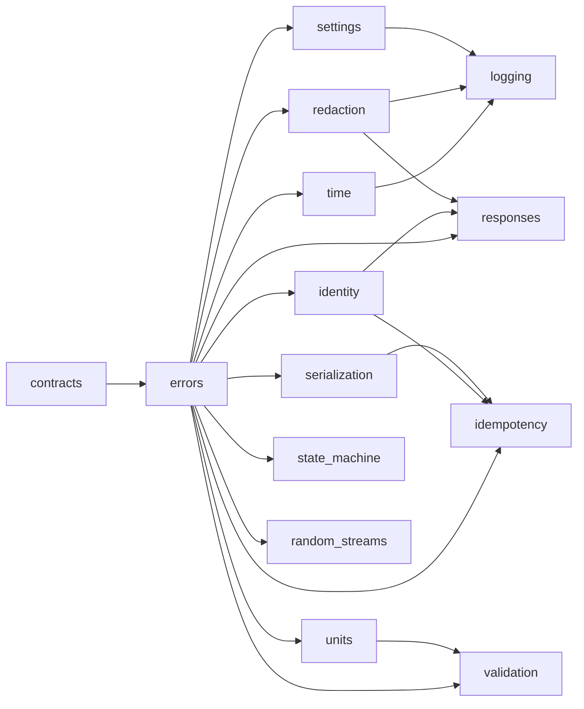

# Utils

> **Package:** `app/utils`
> **Status:** `Completed`
> **Last updated:** `2026-08-07`

> This README is the package's single source of truth for requirements, final
> structure, implementation sequence, progress, usage examples, and tests.
> Update this file before changing the code.

---

## 1. Purpose and Boundary

### Purpose

Utils provides business-neutral cross-domain primitives. It owns shared context
and audit contracts, base errors, trace identifiers, UTC handling, canonical
serialization, secret redaction, runtime settings, structured logging, and the
standard response contract for bounded public operations.
It makes no trading or domain decision.

### Owns

- `AuthContext v1`/`v2` and `AuditEvent v1`.
- Shared base errors, error metadata, boundary-safe mapping, and injected event routing.
- `StandardResponse v1`, structured response errors, required operation metadata,
  immutable error-definition catalogues, and monotonic execution timing.
- Request, workflow, correlation, causation, and event identifiers.
- UTC clocks, timestamps, and freshness calculations.
- Deterministic canonical JSON serialization.
- Denylist-first secret redaction.
- Immutable explicit/process bootstrap settings with no repository configuration-file source.
- Import-safe structured logging with immutable bound context, a lazy approved
  default profile, and explicit override support for specialized routing.
- Exact decimal unit primitives for money, price, quantity, percentage, basis
  points, ticks, points, lots/contracts/shares, and currency codes, including
  unit-mixing rejection.
- Generic state-machine primitives: transition results, allowed-transition
  validation, terminal-state handling, regression detection, and transition
  audit records.
- The single cross-domain validation-result taxonomy `PASS`, `WARN`, `BLOCK`,
  `FAIL`, `UNKNOWN` with structured reason codes, corrective actions, severity,
  and source-evidence references.
- Idempotency primitives: key generation, owner binding, TTL semantics, duplicate
  detection, and exactly-once economic-intent helpers.
- Deterministic seeded random streams for reproducible simulation draws.
- Versioned profile and version references (`ProfileRef`, `VersionRef`) with
  strict schema validation, immutable loaded representation, compatibility
  checks, and no-silent-fallback resolution.
- Event envelope sequencing metadata: source ID, source sequence, correlation and
  causation identifiers, deduplication key, integrity hash, and schema version.
- The business-neutral error and health taxonomy: transient, permanent,
  integrity, policy, data-stale, and unknown-state categories with retryability
  and operator-action metadata.

### Does not own

- Domain payload contracts, business outcomes, error-code policy, business
  validation, or business limits.
- Authentication, identity verification, permission enforcement, session state,
  or credential persistence; UI/API owns these capabilities and produces
  `AuthContext v2` for current API sessions while preserving v1 compatibility.
- DataFrame, OHLC, OHLCV, market-data quality, conversion, comparison, chunking,
  repair, resampling, persistence, or cache behavior; Data owns these capabilities.
- Password hashing, credential encryption, key generation/storage/rotation,
  secret persistence, active-key selection, or credential-reference resolution.
  UI/API owns those application capabilities and externally provisioned key
  infrastructure owns encryption-key lifecycle.
- Safe-path abstractions; each filesystem-writing domain owns and validates its
  allowed roots and paths.
- Metrics exporters, health providers, domain error registries,
  generic validation façades, or domain-specific wrapper response envelopes.
- Import-time configuration, filesystem writes, environment-file reads, network
  connections, compatibility aliases, or fallback modules.
- Database connection, transaction, write-lock, migration-ledger, backup,
  recovery, and outbox infrastructure. Data owns these under its documented
  `AGENTS.md` exemption at `app/services/data/persistence/`. Utils supplies the
  idempotency key contract that those mechanisms consume; it never opens a
  connection, begins a transaction, or persists an outbox record.
- Broker, market, risk, order, simulation, portfolio, scoring, or operational
  business semantics. Utils supplies the neutral shape; the owning domain
  supplies the meaning. A domain event type, a risk verdict, an order state, and
  a mission outcome are owned by Trading, Risk, Trading, and Simulator
  respectively even when they travel inside a Utils envelope.
- Domain quantization policy. Utils fixes the exact representation rule for a
  unit; the enforcing domain fixes tick size, lot step, and rounding direction.

### Shared contracts

| Status    | Contract                | Version        | Producer                       | Consumers                                                                                                          | Purpose                                                                                                                                            |
| --------- | ----------------------- | -------------- | ------------------------------ | ------------------------------------------------------------------------------------------------------------------ | -------------------------------------------------------------------------------------------------------------------------------------------------- |
| Completed | `AuthContext`         | `v1`, `v2` | UI/API                         | Data, Strategy, Risk, Trading, Simulation, Optimization, Research, Portfolio, Agentic                              | Immutable authenticated principal and trace context. Version 2 separates deployment tenancy from the bounded execution-safety runtime profile.     |
| Completed | `AuditEvent`          | `v1`         | Every emitting domain          | Data (direct persistence consumer); Risk and UI/API query persisted events only through Data-owned query contracts | Redacted, versioned trace record persisted by Data; each producer owns its payload meaning.                                                        |
| Completed | `StandardResponse[T]` | `v1`         | Every bounded public operation | Every internal or external caller of that operation                                                                | Immutable five-field function-level response preserving the raw result directly in`data` and prior envelope evidence in `metadata.extensions`. |
| Completed | `ProfileRef`          | `v1`         | Utils                          | Brokers, Data, Indicators, Strategy, Risk, Trading, Simulator, Analytics, Optimization, Research, Portfolio, UI/API | Versioned reference to a named configuration profile: profile kind, profile ID, version, and content hash.                                     |
| Completed | `VersionRef`          | `v1`         | Utils                          | Every domain that pins an evidence, policy, scenario, scoring, or strategy version                                 | Versioned reference to any immutable domain artifact: artifact kind, artifact ID, version, and content hash.                                   |
| Completed | `ExactUnit`           | `v1`         | Utils                          | Brokers, Data, Indicators, Risk, Trading, Simulator, Analytics, Portfolio, UI/API                                   | Exact decimal amount carrying its unit kind and, for monetary kinds, its ISO currency code.                                                     |
| Completed | `ValidationOutcome`   | `v1`         | Utils                          | Data, Indicators, Strategy, Risk, Trading, Simulator, Analytics, Portfolio, Agentic, UI/API                        | `PASS`/`WARN`/`BLOCK`/`FAIL`/`UNKNOWN` verdict with reason codes, severity, corrective actions, and evidence references.                       |
| Completed | `EventEnvelope`       | `v1`         | Utils                          | Brokers, Data, Strategy, Risk, Trading, Simulator, Analytics, Portfolio, UI/API                                     | Ordered, deduplicable event metadata wrapping a domain-owned payload whose meaning the producing domain retains.                               |
| Completed | `IdempotencyKey`      | `v1`         | Utils                          | Data, Trading, Portfolio, Simulator, UI/API                                                                        | Owner-bound, TTL-bearing exactly-once key for one economic intent.                                                                             |
| Completed | `TransitionResult`    | `v1`         | Utils                          | Strategy, Risk, Trading, Simulator, Portfolio, UI/API                                                              | Result of one attempted state transition: accepted, rejected, terminal, or regressed, with the audit record.                                    |
| Completed | `HealthState`         | `v1`         | Utils                          | Brokers, Data, Trading, Simulator, UI/API                                                                          | Category, retryability, operator action, and observation instant for one monitored dependency.                                                  |

#### Cross-domain contract transport

Every contract above crosses a domain boundary as a **validated JSON-safe
mapping**, never as an imported class. `AGENTS.md` §1 *Function-Only Public API
Surface* stands unchanged: `app/utils/__init__.py` exports only standalone
functions, and each contract is reached through a `build_*` constructor and a
`parse_*` validator pair. The frozen implementation type stays private to its
feature module.

Each mapping carries `contract_version` and `schema_id` as required top-level
keys. A consumer that receives an absent, unknown, or incompatible
`contract_version` **shall** reject the mapping and fail closed; it never applies
a default version, coerces an unknown field, or drops an unrecognized key
silently. Producers construct through the Utils constructor so that field
presence, exact-decimal representation, and redaction are enforced once.

This preserves determinism at the boundary at the cost of static typing across
it: `mypy --strict` verifies each domain's internal frozen type, and the
`parse_*` validators supply the runtime guarantee where the type is erased.

`AuthContext v1` contains `contract_version`, `schema_id`, `principal_id`,
`principal_type`, roles, permissions, scopes, tenant/environment, request ID,
workflow ID, correlation ID, and UTC issue time. Missing or invalid context fails
closed at the receiving domain. `AuthContext v2` adds the required independent
`runtime_profile` claim (`research`, `simulation`, `demo`, or `live`); Risk and
Trading consume that claim while deployment-tenancy consumers continue to use
`tenant_or_environment`.

`AuditEvent v1` contains `contract_version`, `schema_id`, event ID, UTC timestamp,
domain, action, optional principal ID, request ID, correlation ID, optional causation
ID, and a redacted JSON-safe payload. Emission or persistence failure is surfaced.

`StandardResponse v1` contains exactly `status`, `message`, `data`, `error`, and
`metadata`. A successful raw result is stored directly in `data`; it is never
embedded inside a synthetic `result`, `payload`, or legacy envelope. Existing
non-payload return evidence is preserved in `metadata.extensions`.

### Capability-to-consumer evidence

Shared business-neutral capabilities have at least two explicit domain consumers.

| Retained capability                                          | Named consuming domain READMEs                                                                           |
| ------------------------------------------------------------ | -------------------------------------------------------------------------------------------------------- |
| `AuthContext` / `AuditEvent`                             | Data, Strategy, Risk, Trading, Simulation, Optimization, Research, Portfolio, UI/API                     |
| Shared base errors                                           | Brokers, Risk, Trading, Simulation, Analytics, Research, Portfolio, UI/API                               |
| Trace identifiers                                            | Brokers, Data, Strategy, Trading, Simulation, Optimization, Analytics, UI/API                            |
| UTC time                                                     | Brokers, Data, Strategy, Risk, Trading, Simulation, Research, Portfolio                                  |
| Canonical serialization                                      | Strategy, Trading, Analytics, Optimization, Research                                                     |
| Secret redaction                                             | Brokers, Data, Strategy, Risk, Trading, Simulation, Analytics, Optimization, Research, Portfolio, UI/API |
| Runtime settings                                             | Data, Trading, Simulation, UI/API                                                                        |
| Error metadata and injected routing                          | Brokers, Risk, Trading, Simulation, Analytics, Research, Portfolio, UI/API                               |
| Standard operation responses and immutable error definitions | Every service domain and UI/API                                                                          |
| Structured logging and specialized routing                   | Brokers, Risk, Trading, Data                                                                             |
| Exact unit primitives                                        | Brokers, Data, Indicators, Risk, Trading, Simulator, Analytics, Portfolio, UI/API                        |
| State-machine primitives                                     | Strategy, Risk, Trading, Simulator, Portfolio, UI/API                                                    |
| Validation-result taxonomy                                   | Data, Indicators, Strategy, Risk, Trading, Simulator, Analytics, Portfolio, Agentic, UI/API              |
| Idempotency primitives                                       | Data, Trading, Portfolio, Simulator, UI/API                                                              |
| Deterministic seeded random streams                          | Simulator, Optimization, Research                                                                        |
| Profile and version references                               | Every domain that pins a versioned profile or immutable artifact                                         |
| Event envelope sequencing                                    | Brokers, Data, Strategy, Risk, Trading, Simulator, Analytics, Portfolio, UI/API                          |
| Error and health taxonomy                                    | Brokers, Data, Trading, Simulator, UI/API                                                                |

### Transferred ownership

Data owns the behavior previously proposed as shared DataFrame/OHLC helpers:

- UTC alignment of internal tabular market data.
- Bar and DataFrame record serialization.
- Deterministic DataFrame and OHLC/OHLCV comparison.
- OHLCV quality validation and evidence.
- Bounded ingestion chunking used by Data workflows.

These are private Data implementation capabilities. Raw DataFrames never become a
cross-domain contract. Generic sequence chunking is not part of Utils.

### Persisted state

Utils owns no durable business state, tables, artifacts, or migrations. This
remains true after the idempotency primitives are added: Utils defines the
`IdempotencyKey v1` shape, its owner binding, and its TTL and duplicate-detection
rules, while each state-owning domain persists its own reservation records in its
own table through Data-owned transaction infrastructure. Utils never reads or
writes `trading_idempotency`, `portfolio_idempotency`, `api_idempotency`, or
`data_backfill_checkpoints`.

---

## 2. Final Package Structure

Folders are ordered from lowest to highest dependency.

### Feature Registry

| Status    | Feature                                                           | Owning module      | Public API and contracts                               | Requirements                        | Usage evidence                                          |
| --------- | ----------------------------------------------------------------- | ------------------ | ------------------------------------------------------ | ----------------------------------- | ------------------------------------------------------- |
| Completed | `FEAT-UTIL-00` Shared Authentication and Audit Contracts        | `contracts/`     | Exact declarations and contract fields: Section 4.1    | Section 4.1 functional requirements | `tests/utils/usage/features/01_contracts.py`          |
| Completed | `FEAT-UTIL-01` Error Mapping and Exception Normalization        | `errors/`        | Exact declarations: Section 4.2                        | Section 4.2 functional requirements | `tests/utils/usage/features/02_errors.py`             |
| Completed | `FEAT-UTIL-02` Prefixed and Deterministic Identity Generation   | `identity/`      | Exact declarations: Section 4.3                        | Section 4.3 functional requirements | `tests/utils/usage/features/03_identity.py`           |
| Completed | `FEAT-UTIL-03` Aware UTC Time and Timestamp Utilities           | `time/`          | Exact declarations: Section 4.4                        | Section 4.4 functional requirements | `tests/utils/usage/features/04_time.py`               |
| Completed | `FEAT-UTIL-04` Canonical JSON Serialization and Safe Conversion | `serialization/` | Exact declarations: Section 4.5                        | Section 4.5 functional requirements | `tests/utils/usage/features/05_serialization.py`      |
| Completed | `FEAT-UTIL-05` Sensitive Data Redaction                         | `security/`      | Exact declarations: Section 4.6                        | Section 4.6 functional requirements | `tests/utils/usage/features/06_security.py`           |
| Completed | `FEAT-UTIL-06` Precedence-Ordered Settings Loading              | `settings/`      | Exact declarations and settings contracts: Section 4.7 | Section 4.7 functional requirements | `tests/utils/usage/features/07_settings.py`           |
| Completed | `FEAT-UTIL-07` Non-Blocking Logging Configuration               | `logging/`       | Exact declarations and logging contracts: Section 4.8  | Section 4.8 functional requirements | `tests/utils/usage/features/08_logging.py`            |
| Completed | `FEAT-UTIL-08` Standard Operation Responses                     | `responses/`     | Exact declarations and response fields: Section 4.9    | Section 4.9 functional requirements | `tests/utils/usage/features/09_standard_responses.py` |
| Completed | `FEAT-UTIL-09` Exact Unit Primitives                            | `units/`         | Exact declarations: Section 4.10                       | Section 4.10 functional requirements | `tests/utils/usage/features/10_units.py`              |
| Completed | `FEAT-UTIL-10` Generic State-Machine Primitives                 | `state_machine/` | Exact declarations: Section 4.11                       | Section 4.11 functional requirements | `tests/utils/usage/features/11_state_machine.py`      |
| Completed | `FEAT-UTIL-11` Validation Result Taxonomy                       | `validation/`    | Exact declarations: Section 4.12                       | Section 4.12 functional requirements | `tests/utils/usage/features/12_validation.py`         |
| Completed | `FEAT-UTIL-12` Idempotency Primitives                           | `idempotency/`   | Exact declarations: Section 4.13                       | Section 4.13 functional requirements | `tests/utils/usage/features/13_idempotency.py`        |
| Completed | `FEAT-UTIL-13` Deterministic Random Streams                     | `random_streams/` | Exact declarations: Section 4.14                      | Section 4.14 functional requirements | `tests/utils/usage/features/14_random_streams.py`     |
| Completed | `FEAT-UTIL-14` Unified Notification Service                     | `notifications/` | Exact declarations: Section 4.15                       | `FR-UTL-089` through `FR-UTL-096` | `tests/utils/usage/features/15_notifications.py`      |
| Completed | `FEAT-UTIL-15` Progress Tracking Models & Callbacks             | `progress/`      | Exact declarations: Section 4.16                       | `FR-UTL-097` and `FR-UTL-098`     | `tests/utils/usage/features/16_progress.py`           |

Sixteen features are registered: `FEAT-UTIL-00` through `FEAT-UTIL-15`. All
sixteen are `Completed`, package-root exported, and covered by exactly one
standalone numbered usage program. Shared validation exceptions remain private;
consumers construct them through the function-only `create_validation_error`
boundary when a shared exception instance is required.

This table is the sole current registry for Utils. Detailed signatures, contract
fields, failure behavior, and evidence remain authoritative in the referenced
Section 4 feature specifications and are not duplicated in the changelog.
Runtime receiver-side schema validation accesses the internal authentication and
audit-event classes only through `get_auth_context_type` and
`get_audit_event_type`.

```text
utils/
|-- __init__.py
|-- README.md
|-- contracts/
|   |-- __init__.py
|   |-- audit.py
|   `-- auth.py
|-- errors/
|   |-- __init__.py
|   |-- catalog.py
|   |-- contracts.py
|   |-- exceptions.py
|   |-- mapping.py
|   |-- metadata.py
|   |-- routing.py
|   `-- validation.py
|-- identity/
|   |-- __init__.py
|   `-- identifiers.py
|-- time/
|   |-- __init__.py
|   |-- clocks.py
|   `-- timestamps.py
|-- serialization/
|   |-- __init__.py
|   `-- canonical.py
|-- security/
|   |-- __init__.py
|   `-- redaction.py
|-- settings/
|   |-- __init__.py
|   |-- models.py
|   `-- loader.py
|-- logging/
|   |-- __init__.py
|   `-- logger.py
|-- responses/
|   |-- __init__.py
|   |-- factories.py
|   |-- models.py
|   `-- timing.py
|-- units/                  # FEAT-UTIL-09
|   |-- __init__.py
|   |-- kinds.py
|   |-- amounts.py
|   `-- conversion.py
|-- state_machine/          # FEAT-UTIL-10
|   |-- __init__.py
|   |-- transitions.py
|   `-- audit.py
|-- validation/             # FEAT-UTIL-11
|   |-- __init__.py
|   |-- outcomes.py
|   `-- reasons.py
|-- idempotency/            # FEAT-UTIL-12
|   |-- __init__.py
|   |-- keys.py
|   `-- reservations.py
|-- random_streams/         # FEAT-UTIL-13
    |-- __init__.py
|   `-- streams.py
|-- notifications/         # FEAT-UTIL-14
|   |-- __init__.py
|   |-- desktop.py
|   |-- email.py
|   |-- telegram.py
|   |-- sms.py
|   |-- manager.py
|   `-- templates.py
`-- progress/              # FEAT-UTIL-15
    |-- __init__.py
    `-- progress.py
```

The five target folders are approved but do not exist. They are created only when
their feature is implemented; no empty folder or stub module is added ahead of
the behavior. Each new folder hosts exactly one registered feature and exposes
its operations as standalone functions through the package root, matching the
existing nine.

Package and feature `__init__.py` files expose only documented standalone
functions through explicit `__all__` declarations. Exports resolve lazily through
`_EXPORTS` and `__getattr__` (PEP 562), ensuring that importing logger or runtime
does not eagerly load notifications or other downstream modules. Class-based
implementations and constants are not public operations. The package-root public
API is exactly the function list in `app/utils/__init__.py`; contract, error, settings,
logging, response, and redaction classes are implementation details and must be
accessed through their documented function factories/getters. No compatibility
aliases are retained for removed class or constant exports. `JsonValue` is an
internal type alias and is not exported.


```mermaid
flowchart LR
    C[contracts] --> E[errors]
    E --> I[identity]
    E --> T[time]
    E --> S[serialization]
    E --> R[redaction]
    E --> SET[settings]
    T --> L[logging]
    R --> L
    SET --> L
    E --> RESP[responses]
    I --> RESP
    R --> RESP
    E --> U[units]
    E --> SM[state_machine]
    E --> V[validation]
    U --> V
    E --> IDEM[idempotency]
    I --> IDEM
    S --> IDEM
    E --> RS[random_streams]
```

`units`, `state_machine`, `validation`, `idempotency`, and `random_streams` sit at
the same dependency level as the existing leaf features: each depends only on
`errors` and, where noted, on `identity` or `serialization`. None of them depends
on `logging`, `settings`, or `responses`, and none introduces a cycle.

Standalone executable usage examples live under `tests/utils/usage/features/`. They are
ordinary programs with `main()` and `if __name__ == "__main__"` entry points, not
pytest tests. Fifteen numbered programs map one-to-one to `FEAT-UTIL-00`
through `FEAT-UTIL-14`, and `features.py` ties all fifteen into a single
sequential, homogeneous end-to-end domain pipeline. Pytest explicitly ignores
these programs, and verification executes each one directly with Python.

---

## 3. Workflows

> **Workflow Usage Evidence**: Each active workflow has one standalone executable
> program under [`tests/utils/usage/workflows/`](../../tests/utils/usage/workflows/).
> Every program labels its input boundary, each documented stage in comments and
> output, and its typed output boundary. Run all Utils workflows with
> `uv run python tests/utils/usage/workflows/run_all.py`.

### Workflow rank values

| Rank                 | Identifier     | Meaning                                   |
| -------------------- | -------------- | ----------------------------------------- |
| **Primary**    | `WF-UTL-PRI` | The workflow this domain exists to serve. |
| **Secondary**  | `WF-UTL-SEC` | The next most load-bearing workflow.      |
| **Tertiary**   | `WF-UTL-TER` | The third-ranked workflow.                |
| **Supporting** | `WF-UTL-0NN` | Every remaining registered workflow.      |

### Retired identifiers

`WF-UTL-001`, `WF-UTL-002`, and `WF-UTL-003` were absorbed into `WF-UTL-PRI`,
`WF-UTL-SEC`, and `WF-UTL-TER` respectively. Absorbed numbers are retired and are
never reused; new workflows continue from `WF-UTL-004`.

| Workflow ID    | Standalone program                                                                 |
| -------------- | ---------------------------------------------------------------------------------- |
| `WF-UTL-PRI` | `tests/utils/usage/workflows/wf_utl_pri_structured_logging_and_redaction.py`     |
| `WF-UTL-SEC` | `tests/utils/usage/workflows/wf_utl_sec_shared_settings_bootstrap.py`            |
| `WF-UTL-TER` | `tests/utils/usage/workflows/wf_utl_ter_audit_event_construction.py`             |
| `WF-UTL-004` | `tests/utils/usage/workflows/wf_utl_004_standard_operation_response_envelope.py` |
| `WF-UTL-005` | `tests/utils/usage/workflows/wf_utl_005_error_normalization_and_routing.py`      |
| `WF-UTL-006` | `tests/utils/usage/workflows/wf_utl_006_trace_identity_and_utc_time.py`          |
| `WF-UTL-007` | `tests/utils/usage/workflows/wf_utl_007_canonical_serialization_and_digest.py`   |
| `WF-UTL-008` | Completed: `tests/utils/usage/workflows/wf_utl_008_operational_contract_envelope.py`   |
| `WF-UTL-009` | `tests/utils/usage/workflows/wf_utl_009_notification_orchestration.py`                |
| `WF-UTL-010` | `tests/utils/usage/workflows/wf_utl_010_main_operations.py`                          |

| Status    | Rank       | Workflow ID    | Scope        | Workflow                                   | Input boundary                              | Final outcome                                                           | Requirement sequence                                                                                                                                  |
| --------- | ---------- | -------------- | ------------ | ------------------------------------------ | ------------------------------------------- | ----------------------------------------------------------------------- | ----------------------------------------------------------------------------------------------------------------------------------------------------- |
| Completed | Primary    | `WF-UTL-PRI` | Cross-domain | Structured logging and redaction           | Domain log record and explicit context      | Redacted structured record reaches the configured sink                  | `FR-UTL-026` through `FR-UTL-033`, `FR-UTL-039` through `FR-UTL-041`                                                                          |
| Completed | Secondary  | `WF-UTL-SEC` | Cross-domain | Shared settings bootstrap                  | Explicit mapping and environment            | Immutable validated`RuntimeSettings`                                  | `FR-UTL-022` through `FR-UTL-024`                                                                                                                 |
| Completed | Tertiary   | `WF-UTL-TER` | Cross-domain | Audit-event construction                   | Domain-owned action facts and trace context | Valid redacted`AuditEvent v1` ready for Data persistence              | `FR-UTL-002`, `FR-UTL-003`, `FR-UTL-007`, `FR-UTL-008`, `FR-UTL-010`, `FR-UTL-011`, `FR-UTL-013` through `FR-UTL-021`, `FR-UTL-036` |
| Completed | Supporting | `WF-UTL-004` | Cross-domain | Standard operation response envelope       | Domain operation outcome and trace context  | Uniform`StandardResponse v1` success, error, or exception envelope    | `FR-UTL-034`, `FR-UTL-035`                                                                                                                        |
| Completed | Supporting | `WF-UTL-005` | Cross-domain | Error normalization, metadata, and routing | Raw exception or domain error code          | Canonical error code, resolved metadata, and one routed error event     | `FR-UTL-004` through `FR-UTL-006`, `FR-UTL-009`, `FR-UTL-012`                                                                                 |
| Completed | Supporting | `WF-UTL-006` | Cross-domain | Trace identity and UTC time discipline     | Caller-supplied identity seed or timestamp  | Validated trace identifier plus aware UTC instant and freshness verdict | `FR-UTL-001`, `FR-UTL-025`, `FR-UTL-037`                                                                                                        |
| Completed | Supporting | `WF-UTL-007` | Cross-domain | Canonical serialization and digest         | Arbitrary domain payload                    | Deterministic redacted canonical JSON and stable digest                 | `FR-UTL-036`, `FR-UTL-038`                                                                                                                        |
| Completed | Supporting | `WF-UTL-008` | Cross-domain | Operational contract envelope build and verify | Domain-owned facts plus profile/version refs and a unit-bearing amount | One validated JSON-safe contract mapping accepted by a consumer, or a fail-closed rejection naming the incompatible version | `FR-UTL-052` through `FR-UTL-055`, `FR-UTL-057` through `FR-UTL-060`, `FR-UTL-066`, `FR-UTL-067` |
| Completed | Supporting | `WF-UTL-009` | Cross-domain | Unified notification orchestration | Database-backed settings and caller message | Rate-limited delivery results or deterministic fail-closed rejection | `FR-UTL-089` through `FR-UTL-096` |
| Completed | Supporting | `WF-UTL-010` | Cross-domain | Main Utils operations | Legacy usage intent reconciled to current package-root operations | Nine-stage current-operation evidence plus explicit retired/reassigned exclusions | Existing requirements exercised by `FEAT-UTIL-00` through `FEAT-UTIL-14` |

### `WF-UTL-010` — Main Utils Operations

Status `Completed`. The standalone workflow preserves the logic of the legacy
all-in-one Utils demonstration using only current `app.utils` operations. Its nine
stages cover logging, errors, standard responses and canonical identity, redaction,
settings policy, validation outcomes, immutable event envelopes, authentication
context evidence, and real non-production notification delivery. Safe paths,
DataFrame combinations, OHLCV quality, mutable event buses, circuit breakers,
metrics, password hashing, encryption, and authorization policy are explicitly
excluded because those capabilities were removed from Utils or reassigned to their
current owning domains.

### `WF-UTL-008` — Operational Contract Envelope Build and Verify

Status `Completed`. Every workflow stage has executable evidence.

1. The producing domain resolves the profile and artifact versions its output is
   bound to — `utils.build_profile_ref()`, `utils.build_version_ref()`.
2. Monetary and quantity fields are constructed as exact unit-bearing amounts so
   that no float or bare `Decimal` enters the mapping —
   `utils.build_exact_unit()`.
3. Sequencing metadata is attached: source ID, monotonic source sequence,
   correlation and causation IDs, and a deterministic deduplication key —
   `utils.build_event_envelope()`.
4. The payload is redacted and canonicalized, and an integrity hash is computed
   over the canonical bytes — `utils.redact_mapping_value()`,
   `utils.canonical_json()`, `utils.canonical_digest()`.
5. The consuming domain validates the mapping against its declared
   `contract_version` and `schema_id` before reading any field —
   `utils.parse_event_envelope()`, `utils.parse_profile_ref()`.
6. A duplicate deduplication key is detected and the repeat delivery is
   suppressed without re-applying the economic effect —
   `utils.is_duplicate_event()`.

**Failure behaviour:** an absent, unknown, or incompatible `contract_version`
raises at step 5 and the consumer fails closed. A payload carrying a bare float
in a monetary field is rejected at step 2 rather than silently converted. An
out-of-order source sequence is surfaced to the consumer as a gap, never
reordered or dropped inside Utils.

### `WF-UTL-PRI` — Structured Logging and Redaction

1. The caller imports the global import-safe bound logger without side effects —
   `utils.get_logger()`.
2. The caller supplies a structured, JSON-safe context — `utils.to_json_safe()`.
3. Redaction runs before formatting or emission — `utils.get_default_redaction_policy()`,
   `utils.is_sensitive_key()`, `utils.redact_mapping_value()`, `utils.redact_text_value()`.
4. The first runtime bound-logger emission atomically activates the approved default
   profile; an explicit call replaces it only when a specialized profile is
   required — `utils.configure_logging()`.
5. Default queued delivery flushes and stops through the registered process-exit
   lifecycle; special entry points may synchronize or stop it explicitly —
   `utils.flush_logging()`, `utils.shutdown_logging()`.
6. Configuration or sink failure is surfaced without exposing the source payload —
   `utils.exception_response()`.

### `WF-UTL-SEC` — Shared Settings Bootstrap

1. The loader reads explicit values and externally provisioned process overrides at
   the shared Utils boundary; callers may supply explicit values without parsing
   files — `utils.load_settings()`.
2. The loader validates supported deployment and runtime settings —
   `utils.load_settings()`.
3. The loader returns an immutable settings object without mutating caller input —
   `utils.load_settings()`.
4. Consumers open a scoped view of the resolved settings where a domain needs one —
   `data.data_settings_context()`.

Imports never read the environment, a file, or a secret store.

### `WF-UTL-TER` — Audit-Event Construction

1. The emitting domain supplies its action, trace context, and payload meaning —
   `utils.create_auth_context()`.
2. IDs and UTC timestamps are validated — `utils.validate_id()`,
   `utils.parse_utc_timestamp()`.
3. The payload is redacted and canonicalized — `utils.redact_mapping_value()`,
   `utils.canonical_json()`.
4. A bounded `AuditEvent v1` is constructed — `utils.create_audit_event()`.
5. Data persists the event through its owned audit-storage boundary —
   `data.persist_audit_event()`.

### `WF-UTL-004` — Standard Operation Response Envelope

1. The operation records its aware UTC start instant — `utils.utc_now()`.
2. The caller assembles trace, version, and timing metadata for the envelope —
   `utils.build_response_metadata()`.
3. A completed operation returns its typed payload in a success envelope —
   `utils.success_response()`.
4. A known domain failure returns a canonical code and redacted detail —
   `utils.error_response()`.
5. An unexpected exception is converted without leaking the source payload —
   `utils.exception_response()`.
6. Elapsed duration is measured and attached to the envelope metadata —
   `utils.get_execution_ms()`.

**Failure behaviour:** an envelope is never returned without a canonical status; an
unmapped exception is reported as an internal error with the payload withheld.

### `WF-UTL-005` — Error Normalization, Metadata, and Routing

1. The shared catalog is loaded and structurally validated —
   `utils.get_common_error_catalog()`, `utils.validate_error_catalog()`.
2. A raw exception is mapped to its canonical domain error — `utils.map_exception()`.
3. The resulting code is normalized to canonical form — `utils.normalize_error_code()`.
4. A definition is required for the normalized code, failing closed when absent —
   `utils.require_error_definition()`.
5. Severity, retryability, and routing metadata are resolved —
   `utils.get_error_metadata()`.
6. One redacted error event is routed to the configured sink —
   `utils.route_error_event()`.

**Failure behaviour:** an unregistered code fails closed at
`utils.require_error_definition()` rather than being routed with invented metadata.

### `WF-UTL-006` — Trace Identity and UTC Time Discipline

1. A new correlation identifier is generated for an inbound operation —
   `utils.generate_id()`.
2. A deterministic identifier is derived where a stable key must survive replay —
   `utils.derive_stable_id()`.
3. Any caller-supplied identifier is validated before use — `utils.validate_id()`.
4. The current aware UTC instant is read from the single shared clock —
   `utils.utc_now()`.
5. Inbound and outbound timestamps are parsed and rendered canonically —
   `utils.parse_utc_timestamp()`, `utils.format_utc_timestamp()`.
6. Evidence freshness is evaluated against an explicit bound —
   `utils.is_fresh()`, `utils.age_seconds()`.

**Failure behaviour:** a naive timestamp or malformed identifier is rejected; no
default timezone is assumed and no identifier is silently regenerated.

### `WF-UTL-007` — Canonical Serialization and Digest

1. Arbitrary domain values are coerced to JSON-safe primitives —
   `utils.to_json_safe()`.
2. Sensitive keys are redacted before any bytes are produced —
   `utils.redact_mapping_value()`.
3. The payload is serialized with deterministic key order and separators —
   `utils.canonical_json()`.
4. A stable digest is computed over the canonical bytes for lineage and hash
   comparison — `utils.canonical_digest()`.

**Failure behaviour:** a value that cannot be canonicalized raises rather than being
coerced to a lossy string, so digests never disagree across processes.

---

## 4. Module and Requirement Specifications

This section is the implementation plan. The package-level `utils/__init__.py`
re-exports only the approved feature APIs below and is governed by
`NFR-UTL-001`, `NFR-UTL-003`, and `NFR-UTL-005`; it owns no independent
functional behavior.

### 4.1 `contracts/` — Shared Context and Audit Contracts

**Purpose:** Define the immutable authenticated principal, trace context, and redacted audit envelope shared across every domain.

**Module flow:** `untrusted trace/identity mapping → strict contract-field validation → immutable AuthContext / AuditEvent`

#### Files

| Status    | File            | Responsibility                                                                  | Key exports                                                                                                                                                                   | Dependencies                                                                                                                                                                              |
| --------- | --------------- | ------------------------------------------------------------------------------- | ----------------------------------------------------------------------------------------------------------------------------------------------------------------------------- | ----------------------------------------------------------------------------------------------------------------------------------------------------------------------------------------- |
| Completed | `audit.py`    | Define the redacted audit envelope and common strict contract-field validation. | `AuditEvent`, `create_audit_event`; module-level, not re-exported through `__init__.py`: `JsonValue`, `validate_non_empty`, `validate_utc`, `validate_trace_id` | **Standard library:** `collections.abc`, `datetime`, `json`, `math`, `re`, `types`, `typing`**Required third-party:** `pydantic>=2.13.4`**Local:** None |
| Completed | `auth.py`     | Define immutable authenticated principal and trace context.                     | Internal`AuthContext`; public `create_auth_context`, `get_auth_context_type`                                                                                            | **Standard library:** `datetime`, `typing`**Required third-party:** `pydantic>=2.13.4`**Local:** `audit.py` → strict contract-field validation                 |
| Completed | `__init__.py` | Expose the supported shared-contract API.                                       | `create_auth_context`, `get_auth_context_type`, `create_audit_event`, `get_audit_event_type`                                                                          | **Standard library:** None**Required third-party:** None**Local:** `audit.py`, `auth.py` → approved exports                                                        |

#### Functional requirements

| Status    | Requirement ID | Responsibility                                                                                                                                                                                                                  | Class / Function / Method                                                  | Side Effects | Raises                                                                                                                                                     | Usage / Test                                                                                                                                                                                                     |
| --------- | -------------- | ------------------------------------------------------------------------------------------------------------------------------------------------------------------------------------------------------------------------------- | -------------------------------------------------------------------------- | ------------ | ---------------------------------------------------------------------------------------------------------------------------------------------------------- | ---------------------------------------------------------------------------------------------------------------------------------------------------------------------------------------------------------------- |
| Completed | `FR-UTL-001` | Define immutable backward-compatible`AuthContext v1` and current `AuthContext v2`; v2 requires a bounded runtime profile separate from deployment tenancy. Only `USER` and `SERVICE_ACCOUNT` principal types are valid. | `create_auth_context`, `get_auth_context_type`                         | None         | `ValidationError`: version/schema mismatch, missing or invalid v2 runtime profile, naive time, empty identity/trace field, or unsupported principal type | **Usage:** `tests/utils/usage/features/01_contracts.py::fr_utils_001_auth_context()`**Unit:** `tests/utils/unit/test_auth.py::test_auth_context_v2_requires_separate_runtime_profile()`          |
| Completed | `FR-UTL-002` | Define immutable redacted`AuditEvent v1` with bounded JSON-safe payload. The class remains internal; callers construct it with the factory and may resolve its runtime type only through the getter.                          | `create_audit_event`, `get_audit_event_type`                           | None         | `ValidationError`: naive timestamp, empty identity/trace field, or unsafe payload                                                                        | **Usage:** `tests/utils/usage/features/01_contracts.py::fr_utils_002_audit_event()`**Unit:** `tests/utils/unit/test_audit.py::test_audit_event_requires_json_safe_payload()`                     |
| Completed | `FR-UTL-003` | Reject naive timestamps, empty identity/trace fields, unsupported principal types, and malformed schema identity.                                                                                                               | Strict contract-field validation used by`AuditEvent` and `AuthContext` | None         | `ValidationError`: naive time, empty field, unsupported principal type, or malformed schema identity                                                     | **Usage:** `tests/utils/usage/features/01_contracts.py::fr_utils_003_contract_validation()`**Unit:** `tests/utils/unit/test_audit.py::test_contract_field_validation_rejects_malformed_schema()` |
| Completed | `FR-UTL-058` | Build `EventEnvelope v1` as a JSON-safe mapping carrying `contract_version`, `schema_id`, event ID, source ID, monotonic source sequence, correlation ID, optional causation ID, deduplication key, integrity hash, aware UTC emission time, and the producer's opaque payload. The envelope shall not interpret, rename, or validate any payload field beyond JSON-safety and redaction. | `build_event_envelope`, `parse_event_envelope` | None | `ValidationError`: missing required key, non-monotonic sequence, naive time, unsafe payload, or unknown/incompatible `contract_version` | **Usage:** `tests/utils/usage/features/01_contracts.py::fr_utils_058_event_envelope()` **Unit:** `tests/utils/unit/test_event_envelope.py::test_envelope_requires_sequence_and_dedup_key()` |
| Completed | `FR-UTL-059` | Compute the envelope integrity hash as the canonical digest of the redacted canonical JSON of the envelope excluding the hash field itself, so that two processes derive byte-identical hashes for the same envelope. | `build_event_envelope` integrity hashing | None | `ValidationError`: payload cannot be canonicalized | **Usage:** `tests/utils/usage/features/01_contracts.py::fr_utils_059_envelope_integrity()` **Unit:** `tests/utils/unit/test_event_envelope.py::test_integrity_hash_excludes_itself_and_is_stable()` |
| Completed | `FR-UTL-060` | Return a duplicate verdict for an envelope whose deduplication key was already observed within the caller-supplied observation set, and report an ordering gap when a source sequence exceeds the expected successor. Utils shall neither store the observation set nor reorder, buffer, or discard an envelope. | `is_duplicate_event`, `find_sequence_gap` | None | `ValidationError`: malformed envelope or non-integer sequence | **Usage:** `tests/utils/usage/features/01_contracts.py::fr_utils_060_duplicate_and_gap()` **Unit:** `tests/utils/unit/test_event_envelope.py::test_duplicate_key_and_sequence_gap_are_reported()` |

### 4.2 `errors/` — Shared Errors, Metadata, and Routing

**Purpose:** Provide the minimal shared exception hierarchy, normalized metadata,
secret-safe boundary mapping, and explicit injected event routing every domain can use.

**Module flow:** `caught exception → deterministic shared base type → sanitized boundary evidence`

#### Files

| Status    | File              | Responsibility                                                                | Key exports                                                                                                  | Dependencies                                                                                                                                                                                                         |
| --------- | ----------------- | ----------------------------------------------------------------------------- | ------------------------------------------------------------------------------------------------------------ | -------------------------------------------------------------------------------------------------------------------------------------------------------------------------------------------------------------------- |
| Completed | `catalog.py`    | Define the immutable business-neutral and root-system common error catalogue. | `COMMON_ERROR_CATALOG`, `get_common_error_catalog`                                                       | **Standard library:** `types`**Required third-party:** None**Local:** `contracts.py` → immutable error definitions                                                                            |
| Completed | `contracts.py`  | Define the common immutable error-definition shape without domain policy.     | `ErrorDefinition`, `ErrorSeverity`                                                                       | **Standard library:** `dataclasses`, `re`, `typing`**Required third-party:** None**Local:** None                                                                                             |
| Completed | `exceptions.py` | Define the minimal shared exception hierarchy and domain-extension boundary.  | `HaruQuantError`, `ConfigurationError`, `ValidationError`, `SecurityError`, `ExternalServiceError` | **Standard library:** `re`**Required third-party:** None**Local:** None                                                                                                                          |
| Completed | `mapping.py`    | Convert caught exceptions to deterministic secret-safe shared error evidence. | `map_exception`                                                                                            | **Standard library:** None**Required third-party:** None**Local:** `exceptions.py` → shared base exceptions                                                                                     |
| Completed | `metadata.py`   | Normalize symbolic error codes and provide immutable built-in metadata.       | `ErrorMetadata`, `normalize_error_code`, `get_error_metadata`                                          | **Standard library:** `dataclasses`, `re`**Required third-party:** None**Local:** `exceptions.py` → `ValidationError`                                                                     |
| Completed | `routing.py`    | Route a mapped error payload to an explicitly injected sink.                  | `ErrorSink`, `route_error_event`                                                                         | **Standard library:** `collections.abc`, `typing`**Required third-party:** None**Local:** `mapping.py` → `map_exception`                                                                  |
| Completed | `validation.py` | Validate immutable catalogues and require explicitly approved codes.          | `validate_error_catalog`, `require_error_definition`                                                     | **Standard library:** `collections.abc`, `types`**Required third-party:** None**Local:** `contracts.py`, `exceptions.py`, `metadata.py` → definitions, validation errors, normalization |
| Completed | `__init__.py`   | Expose the supported shared-error API.                                        | Mapping, metadata, routing, catalogue, and validation functions                                              | **Standard library:** None**Required third-party:** None**Local:** all error feature files → approved exports                                                                                     |

#### Functional requirements

| Status    | Requirement ID | Responsibility                                                                                                                                                                         | Class / Function / Method                                                                                    | Side Effects                    | Raises                                                                            | Usage / Test                                                                                                                                                                                                    |
| --------- | -------------- | -------------------------------------------------------------------------------------------------------------------------------------------------------------------------------------- | ------------------------------------------------------------------------------------------------------------ | ------------------------------- | --------------------------------------------------------------------------------- | --------------------------------------------------------------------------------------------------------------------------------------------------------------------------------------------------------------- |
| Completed | `FR-UTL-004` | Provide focused shared base exceptions without domain-specific policy.                                                                                                                 | `HaruQuantError`, `ConfigurationError`, `ValidationError`, `SecurityError`, `ExternalServiceError` | None                            | None                                                                              | **Usage:** `tests/utils/usage/features/02_errors.py::fr_utils_004_typed_error_codes()`**Unit:** `tests/utils/unit/test_exceptions.py::test_shared_exception_hierarchy()`                        |
| Completed | `FR-UTL-005` | Preserve deterministic code and sanitized detail while never returning a raw provider exception across a boundary.                                                                     | `map_exception`                                                                                            | None                            | None                                                                              | **Usage:** `tests/utils/usage/features/02_errors.py::fr_utils_005_exception_payload_mapping()`**Unit:** `tests/utils/unit/test_mapping.py::test_map_exception_never_leaks_raw_provider_error()` |
| Completed | `FR-UTL-006` | Require domains to define their own codes and boundary mapping above the shared base hierarchy.                                                                                        | Shared exception extension contract                                                                          | None                            | None                                                                              | **Usage:** `tests/utils/usage/features/02_errors.py::fr_utils_006_exception_extension()`**Unit:** `tests/utils/unit/test_exceptions.py::test_domains_extend_shared_base()`                      |
| Completed | `FR-UTL-034` | Normalize an error code and look up immutable safe metadata without a mutable registry.                                                                                                | `ErrorMetadata`, `normalize_error_code`, `get_error_metadata`                                          | None                            | `ValidationError`: empty or malformed error code                                | **Usage:** `tests/utils/usage/features/02_errors.py::fr_utils_034_error_metadata()`**Unit:** `tests/utils/unit/test_error_metadata.py::test_normalize_and_lookup_error_metadata()`              |
| Completed | `FR-UTL-035` | Map an exception and synchronously deliver its safe payload to an explicitly injected sink.                                                                                            | `ErrorSink`, `route_error_event`                                                                         | Caller-provided sink invocation | Sink exception is propagated                                                      | **Usage:** `tests/utils/usage/features/02_errors.py::fr_utils_035_route_error_event()`**Unit:** `tests/utils/unit/test_error_routing.py::test_route_error_event_invokes_injected_sink()`        |
| Completed | `FR-UTL-048` | Define immutable business-neutral and root-system error metadata, validate detached domain catalogues, and reject unapproved codes without importing service-domain policy into Utils. | `ErrorDefinition`, `COMMON_ERROR_CATALOG`, `validate_error_catalog`, `require_error_definition`      | None                            | `ValidationError`: empty, malformed, inconsistent, or unapproved catalogue/code | **Usage:** `tests/utils/usage/features/02_errors.py::fr_utils_048_error_catalogues()`**Unit:** `tests/utils/unit/test_error_catalog.py`                                                         |
| Completed | `FR-UTL-062` | Classify every error definition into exactly one of the categories `TRANSIENT`, `PERMANENT`, `INTEGRITY`, `POLICY`, `DATA_STALE`, or `UNKNOWN_STATE`. An unclassified definition shall be rejected at catalogue validation rather than defaulted, so no caller infers retry behavior from an absent category. | Error category taxonomy in `contracts.py`, enforced by `validate_error_catalog` | None | `ValidationError`: definition carries no category or an unsupported category | **Usage:** `tests/utils/usage/features/02_errors.py::fr_utils_062_error_categories()` **Unit:** `tests/utils/unit/test_error_catalog.py::test_catalogue_rejects_uncategorized_definition()` |
| Completed | `FR-UTL-063` | Return retryability and operator-action metadata for a normalized code: whether the caller may retry, the minimum backoff class, and whether human action is required. `UNKNOWN_STATE` shall report retryable=false and operator action required, so an ambiguous broker or persistence outcome is never blindly resubmitted. | `get_error_metadata` retryability fields | None | `ValidationError`: unregistered code | **Usage:** `tests/utils/usage/features/02_errors.py::fr_utils_063_retryability()` **Unit:** `tests/utils/unit/test_error_metadata.py::test_unknown_state_is_not_retryable()` |
| Completed | `FR-UTL-064` | Build and parse `HealthState v1` as a JSON-safe mapping carrying dependency name, category, degraded/failed/unknown state, retryability, operator action, and aware UTC observation instant. A missing observation instant shall produce `UNKNOWN`, never `healthy`. | `build_health_state`, `parse_health_state` | None | `ValidationError`: missing dependency name, naive instant, or unsupported state | **Usage:** `tests/utils/usage/features/02_errors.py::fr_utils_064_health_state()` **Unit:** `tests/utils/unit/test_health_state.py::test_absent_observation_yields_unknown()` |

### 4.3 `identity/` — Trace Identifiers

**Purpose:** Generate, validate, and deterministically derive secret-free trace identifiers used across every domain.

**Module flow:** `prefix/identity material → generation or validation → canonical secret-free identifier`

#### Files

| Status    | File               | Responsibility                                                            | Key exports                                                                                                                                                                | Dependencies                                                                                                                                                  |
| --------- | ------------------ | ------------------------------------------------------------------------- | -------------------------------------------------------------------------------------------------------------------------------------------------------------------------- | ------------------------------------------------------------------------------------------------------------------------------------------------------------- |
| Completed | `identifiers.py` | Generate, validate, and deterministically derive secret-free identifiers. | `generate_id`, `validate_id`, `derive_stable_id`; module-level, not re-exported through `__init__.py`: `SUPPORTED_TRACE_PREFIXES`, `SUPPORTED_STABLE_PREFIXES` | **Standard library:** `hashlib`, `re`, `uuid`**Required third-party:** None**Local:** `errors/exceptions.py` → `ValidationError` |
| Completed | `__init__.py`    | Expose the supported identity API.                                        | `generate_id`, `validate_id`, `derive_stable_id`                                                                                                                     | **Standard library:** None**Required third-party:** None**Local:** `identifiers.py` → approved exports                                   |

#### Functional requirements

| Status    | Requirement ID | Responsibility                                                                                                                                           | Class / Function / Method | Side Effects | Raises                                                                           | Usage / Test                                                                                                                                                                                       |
| --------- | -------------- | -------------------------------------------------------------------------------------------------------------------------------------------------------- | ------------------------- | ------------ | -------------------------------------------------------------------------------- | -------------------------------------------------------------------------------------------------------------------------------------------------------------------------------------------------- |
| Completed | `FR-UTL-007` | Generate prefixed UUID4 identifiers without embedded secrets.                                                                                            | `generate_id`           | Entropy read | `ValidationError`: unsupported prefix                                          | **Usage:** `tests/utils/usage/features/03_identity.py::fr_utils_007_generate_id()`**Unit:** `tests/utils/unit/test_identifiers.py::test_generate_id_is_prefixed_and_secret_free()` |
| Completed | `FR-UTL-008` | Validate supported prefixes and canonical identifier syntax.                                                                                             | `validate_id`           | None         | `ValidationError`: unsupported prefix or malformed identifier                  | **Usage:** `tests/utils/usage/features/03_identity.py::fr_utils_008_validate_id()`**Unit:** `tests/utils/unit/test_identifiers.py::test_validate_id_rejects_malformed()`           |
| Completed | `FR-UTL-009` | Derive deterministic`id`-prefixed SHA-256 identifiers from canonical caller-supplied identity material; stable IDs are never shared trace identifiers. | `derive_stable_id`      | None         | `ValidationError`: unsupported prefix or empty/non-canonical identity material | **Usage:** `tests/utils/usage/features/03_identity.py::fr_utils_009_derive_stable_id()`**Unit:** `tests/utils/unit/test_identifiers.py::test_derive_stable_id_is_deterministic()`  |
| Completed | `FR-UTL-051` | Extend the supported generated-prefix set with the operational entity prefixes `ses` (session), `rpl` (replay), `scn` (scenario), `prf` (profile), `ord` (order), `fil` (fill), `led` (ledger entry), `ply` (player), and `brn` (branch). Prefixes remain a closed set; an unsupported prefix is rejected, never coerced. Existing trace prefixes `req`, `wf`, `cor`, `cau`, and `evt` are unchanged. | `generate_id`, `validate_id` extended prefix set | Entropy read | `ValidationError`: unsupported prefix | **Usage:** `tests/utils/usage/features/03_identity.py::fr_utils_051_operational_prefixes()` **Unit:** `tests/utils/unit/test_identifiers.py::test_operational_prefixes_are_supported_and_closed()` |

### 4.4 `time/` — UTC Clocks and Timestamps

**Purpose:** Provide the injectable clock boundary and canonical UTC timestamp parsing, formatting, and freshness evaluation.

**Module flow:** `injectable clock → aware UTC instant → parse/format/age/freshness result`

#### Files

| Status    | File              | Responsibility                                             | Key exports                                                                                   | Dependencies                                                                                                                                              |
| --------- | ----------------- | ---------------------------------------------------------- | --------------------------------------------------------------------------------------------- | --------------------------------------------------------------------------------------------------------------------------------------------------------- |
| Completed | `clocks.py`     | Define the injectable clock boundary and UTC system clock. | `Clock`, `SystemClock`, `utc_now`                                                       | **Standard library:** `datetime`, `typing`**Required third-party:** None**Local:** `errors/exceptions.py` → `ValidationError`  |
| Completed | `timestamps.py` | Parse, format, age, and evaluate canonical UTC timestamps. | `parse_utc_timestamp`, `format_utc_timestamp`, `age_seconds`, `is_fresh`              | **Standard library:** `datetime`, `decimal`**Required third-party:** None**Local:** `errors/exceptions.py` → `ValidationError` |
| Completed | `__init__.py`   | Expose the supported time API.                             | `utc_now`, `parse_utc_timestamp`, `format_utc_timestamp`, `age_seconds`, `is_fresh` | **Standard library:** None**Required third-party:** None**Local:** `clocks.py`, `timestamps.py` → approved exports                 |

#### Functional requirements

| Status    | Requirement ID | Responsibility                                                                 | Class / Function / Method                         | Side Effects | Raises                                                      | Usage / Test                                                                                                                                                                                    |
| --------- | -------------- | ------------------------------------------------------------------------------ | ------------------------------------------------- | ------------ | ----------------------------------------------------------- | ----------------------------------------------------------------------------------------------------------------------------------------------------------------------------------------------- |
| Completed | `FR-UTL-010` | Return aware UTC time from an injectable clock.                                | `Clock`, `SystemClock`, `utc_now`           | Clock read   | None                                                        | **Usage:** `tests/utils/usage/features/04_time.py::fr_utils_010_utc_now()`**Unit:** `tests/utils/unit/test_clocks.py::test_system_clock_returns_aware_utc()`                    |
| Completed | `FR-UTL-011` | Parse and format UTC timestamps using canonical`Z` output.                   | `parse_utc_timestamp`, `format_utc_timestamp` | None         | `ValidationError`: naive, non-UTC, or malformed timestamp | **Usage:** `tests/utils/usage/features/04_time.py::fr_utils_011_parse_format_timestamp()`**Unit:** `tests/utils/unit/test_timestamps.py::test_format_uses_canonical_z_suffix()` |
| Completed | `FR-UTL-012` | Calculate non-negative age and explicit freshness against an injected instant. | `age_seconds`, `is_fresh`                     | None         | `ValidationError`: naive or invalid reference instant     | **Usage:** `tests/utils/usage/features/04_time.py::fr_utils_012_age_and_freshness()`**Unit:** `tests/utils/unit/test_timestamps.py::test_age_seconds_is_non_negative()`         |
| Completed | `FR-UTL-055` | Define the closed set of time domains `MARKET_EVENT`, `BROKER_RECEIVE`, `CLIENT_RECEIVE`, `DISPLAY`, `PLAYER_ACTION`, `VENUE_ACCEPT`, `FILL`, `REPORT`, and `PROCESS`, and build a JSON-safe stamp binding an aware UTC instant to exactly one domain. A stamp shall not be compared against, or substituted for, a stamp of a different domain. | `build_time_stamp`, `parse_time_stamp`, `compare_time_stamps` | None | `ValidationError`: unsupported domain, naive instant, or cross-domain comparison | **Usage:** `tests/utils/usage/features/04_time.py::fr_utils_055_time_domains()` **Unit:** `tests/utils/unit/test_time_domains.py::test_cross_domain_comparison_is_rejected()` |
| Completed | `FR-UTL-056` | Convert an aware UTC instant to a caller-supplied venue-local zone and back without loss, returning both the local rendering and the originating UTC instant. Utils shall not hold a venue calendar; the caller supplies the zone, and Data owns which zone a venue uses. | `to_venue_local`, `from_venue_local` | None | `ValidationError`: naive instant, unknown zone key, or ambiguous local time without an explicit fold selection | **Usage:** `tests/utils/usage/features/04_time.py::fr_utils_056_venue_local()` **Unit:** `tests/utils/unit/test_time_domains.py::test_ambiguous_local_time_requires_explicit_fold()` |
| Completed | `FR-UTL-057` | Allocate strictly increasing monotonic sequence numbers within a caller-named scope from an injected counter, so that two events emitted inside the same aware UTC millisecond remain totally ordered. The allocator shall never reuse or decrease a value within a scope. | `next_sequence` | Counter read | `ValidationError`: empty scope name or non-monotonic injected counter | **Usage:** `tests/utils/usage/features/04_time.py::fr_utils_057_monotonic_sequence()` **Unit:** `tests/utils/unit/test_time_domains.py::test_sequence_is_strictly_increasing_within_scope()` |

### 4.5 `serialization/` — Canonical Serialization

**Purpose:** Convert supported values to deterministic JSON-safe data and produce canonical UTF-8 JSON with no hidden redaction.

**Module flow:** `supported value → JSON-safe conversion → stable sorted-key UTF-8 JSON`

#### Files

| Status    | File             | Responsibility                                                                                                       | Key exports                                                                                                                      | Dependencies                                                                                                                                                                                                                               |
| --------- | ---------------- | -------------------------------------------------------------------------------------------------------------------- | -------------------------------------------------------------------------------------------------------------------------------- | ------------------------------------------------------------------------------------------------------------------------------------------------------------------------------------------------------------------------------------------ |
| Completed | `canonical.py` | Convert supported values to JSON-safe data, produce canonical UTF-8 JSON, and digest trusted structures of any size. | `to_json_safe`, `canonical_json`, `canonical_digest`; module-level, not re-exported through `__init__.py`: `JsonValue` | **Standard library:** `collections.abc`, `dataclasses`, `datetime`, `decimal`, `enum`, `hashlib`, `json`, `math`**Required third-party:** None**Local:** `errors/exceptions.py` → `ValidationError` |
| Completed | `__init__.py`  | Expose the supported serialization API.                                                                              | `to_json_safe`, `canonical_json`, `canonical_digest`                                                                       | **Standard library:** None**Required third-party:** None**Local:** `canonical.py` → approved exports                                                                                                                  |

#### Functional requirements

| Status    | Requirement ID | Responsibility                                                                                                                                                | Class / Function / Method                                               | Side Effects | Raises                                                        | Usage / Test                                                                                                                                                                                                         |
| --------- | -------------- | ------------------------------------------------------------------------------------------------------------------------------------------------------------- | ----------------------------------------------------------------------- | ------------ | ------------------------------------------------------------- | -------------------------------------------------------------------------------------------------------------------------------------------------------------------------------------------------------------------- |
| Completed | `FR-UTL-013` | Convert supported datetimes, decimals, enums, dataclasses, mappings, and sequences to deterministic JSON-safe values.                                         | `to_json_safe`                                                        | None         | `ValidationError`: unsupported value type                   | **Usage:** `tests/utils/usage/features/05_serialization.py::fr_utils_013_to_json_safe()`**Unit:** `tests/utils/unit/test_canonical.py::test_to_json_safe_converts_supported_types()`                 |
| Completed | `FR-UTL-014` | Produce stable UTF-8 JSON with sorted keys and no hidden redaction; an optional`max_items=None` lifts the untrusted-payload ceiling for trusted structures. | `canonical_json`                                                      | None         | `ValidationError`: non-serializable value                   | **Usage:** `tests/utils/usage/features/05_serialization.py::fr_utils_014_canonical_json()`**Unit:** `tests/utils/unit/test_canonical.py::test_canonical_json_sorts_keys()`                           |
| Completed | `FR-UTL-036` | Digest a trusted structure of any size, byte-identical to hashing its canonical JSON, without the untrusted-payload item ceiling.                             | `canonical_digest`                                                    | None         | `ValidationError`: non-serializable value                   | **Usage:** `tests/utils/usage/features/05_serialization.py::fr_utils_036_canonical_digest()`**Unit:** `tests/utils/unit/test_canonical.py::test_canonical_digest_matches_sha256_of_canonical_json()` |
| Completed | `FR-UTL-015` | Reject unsupported, cyclic, non-finite, or unsafe values deterministically.                                                                                   | Serialization validation used by`to_json_safe` and `canonical_json` | None         | `ValidationError`: unsupported, cyclic, or non-finite value | **Usage:** `tests/utils/usage/features/05_serialization.py::fr_utils_015_reject_unsafe_value()`**Unit:** `tests/utils/unit/test_canonical.py::test_serialization_rejects_cyclic_value()`             |

### 4.6 `security/` — Secret Redaction

**Purpose:** Provide bounded denylist-first redaction for text and JSON-safe mappings.

**Module flow:** `redaction policy + text/mapping → denylist-first redaction → redacted value and diagnostics`

#### Files

| Status    | File             | Responsibility                                                                 | Key exports                                                                                                                                       | Dependencies                                                                                                                                                                                              |
| --------- | ---------------- | ------------------------------------------------------------------------------ | ------------------------------------------------------------------------------------------------------------------------------------------------- | --------------------------------------------------------------------------------------------------------------------------------------------------------------------------------------------------------- |
| Completed | `redaction.py` | Define redaction policy/results and redact bounded text or JSON-safe mappings. | `RedactionPolicy`, `RedactionResult`, `get_default_redaction_policy`, `is_sensitive_key`, `redact_text_value`, `redact_mapping_value` | **Standard library:** `collections.abc`, `dataclasses`, `math`, `re`**Required third-party:** None**Local:** `errors/exceptions.py` → `SecurityError`, `ValidationError` |
| Completed | `__init__.py`  | Expose the supported secret-redaction API.                                     | `get_default_redaction_policy`, `is_sensitive_key`, `redact_mapping_value`, `redact_text_value`                                           | **Standard library:** None**Required third-party:** None**Local:** `redaction.py` → approved exports                                                                                 |

#### Functional requirements

| Status    | Requirement ID | Responsibility                                                                               | Class / Function / Method                             | Side Effects | Raises                                                        | Usage / Test                                                                                                                                                                                                                                                 |
| --------- | -------------- | -------------------------------------------------------------------------------------------- | ----------------------------------------------------- | ------------ | ------------------------------------------------------------- | ------------------------------------------------------------------------------------------------------------------------------------------------------------------------------------------------------------------------------------------------------------ |
| Completed | `FR-UTL-016` | Define immutable denylist-first redaction policy with narrow reviewed field-path allowlists. | `RedactionPolicy`, `get_default_redaction_policy` | None         | `ValidationError`: malformed policy definition              | **Usage:** `tests/utils/usage/features/06_security.py::fr_utils_016_redaction_policy()`**Unit:** `tests/utils/unit/test_redaction.py::test_redaction_policy_is_immutable()`                                                                  |
| Completed | `FR-UTL-017` | Detect sensitive keys case-insensitively, including normalized composite suffixes.           | `is_sensitive_key`                                  | None         | None                                                          | **Usage:** `tests/utils/usage/features/06_security.py::fr_utils_017_key_classification()`**Unit:** `tests/utils/unit/test_redaction.py::test_is_sensitive_key_is_case_insensitive()`, `test_is_sensitive_key_matches_composite_suffixes()` |
| Completed | `FR-UTL-018` | Redact bounded text without mutating input.                                                  | `redact_text_value`                                 | None         | None                                                          | **Usage:** `tests/utils/usage/features/06_security.py::fr_utils_018_redaction_text()`**Unit:** `tests/utils/unit/test_redaction.py::test_redact_text_value_does_not_mutate_input()`                                                          |
| Completed | `FR-UTL-019` | Recursively redact a JSON-safe mapping without mutating input.                               | `redact_mapping_value`                              | None         | `ValidationError`: non-JSON-safe mapping                    | **Usage:** `tests/utils/usage/features/06_security.py::fr_utils_019_redaction_mapping()`**Unit:** `tests/utils/unit/test_redaction.py::test_redact_mapping_value_is_recursive()`                                                             |
| Completed | `FR-UTL-020` | Return redacted paths and truncation diagnostics without secret values.                      | `RedactionResult`                                   | None         | None                                                          | **Usage:** `tests/utils/usage/features/06_security.py::fr_utils_020_redaction_result()`**Unit:** `tests/utils/unit/test_redaction.py::test_redaction_result_omits_secret_values()`                                                           |
| Completed | `FR-UTL-021` | Reject policies that allow protected credential fields.                                      | `RedactionPolicy` validation                        | None         | `SecurityError`: policy allows a protected credential field | **Usage:** `tests/utils/usage/features/06_security.py::fr_utils_021_policy_validation()`**Unit:** `tests/utils/unit/test_redaction.py::test_policy_rejects_protected_credential_field()`                                                     |
| Completed | `FR-UTL-065` | Redact a cross-domain contract mapping before its integrity hash is computed, so that the hash covers the redacted form a consumer will actually receive and two processes cannot disagree because one redacted and the other did not. Broker account identifiers, credential fields, and player personal identifiers shall be redacted; contract version, schema identity, sequence, and reference fields shall not. | `redact_contract_mapping` | None | `SecurityError`: policy would allow a protected credential field; `ValidationError`: non-JSON-safe mapping | **Usage:** `tests/utils/usage/features/06_security.py::fr_utils_065_contract_redaction()` **Unit:** `tests/utils/unit/test_redaction.py::test_contract_redaction_preserves_version_and_reference_fields()` |

### 4.7 `settings/` — Runtime Settings

**Purpose:** Define immutable generic runtime/logging settings and provide the sole
explicit/process bootstrap base for typed domain settings.

**Module flow:** `explicit values + environment → strict validation → immutable RuntimeSettings`

#### Files

| Status    | File            | Responsibility                                                                                                                  | Key exports                                                                                                                                                                                            | Dependencies                                                                                                                                                                                     |
| --------- | --------------- | ------------------------------------------------------------------------------------------------------------------------------- | ------------------------------------------------------------------------------------------------------------------------------------------------------------------------------------------------------ | ------------------------------------------------------------------------------------------------------------------------------------------------------------------------------------------------ |
| Completed | `models.py`   | Define the immutable explicit/process bootstrap settings base plus generic runtime/logging settings and strict validation. | `AppSettings`, `RuntimeSettings`, `LoggingSettings`; module-level, not re-exported through `__init__.py`: `LogLevel`, `LogRender`, `LogCompression`, `Environment`, `RuntimeProfile` | **Standard library:** `pathlib`, `typing`**Required third-party:** `pydantic`, `pydantic-settings`**Local:** `errors/exceptions.py` → `ConfigurationError`        |
| Completed | `loader.py`   | Load supported runtime settings through`AppSettings` or an explicit mapping, and expose broker-provider settings opaquely.    | `load_broker_provider_settings`, `load_settings`                                                                                                                                                   | **Standard library:** `collections.abc`**Required third-party:** `pydantic`**Local:** `models.py` → settings models; `errors/exceptions.py` → `ConfigurationError` |
| Completed | `__init__.py` | Expose the function-only supported settings API.                                                                                | `get_app_settings_model_config`, `get_app_settings_sources`, `load_broker_provider_settings`, `load_settings`                                                                                      | **Standard library:** None**Required third-party:** None**Local:** `loader.py` → approved exports                                                                           |

#### Functional requirements

| Status    | Requirement ID | Responsibility                                                                                                                                                                                              | Class / Function / Method                                 | Side Effects                                                                       | Raises                                                         | Usage / Test                                                                                                                                                                                                                                              |
| --------- | -------------- | ----------------------------------------------------------------------------------------------------------------------------------------------------------------------------------------------------------- | --------------------------------------------------------- | ---------------------------------------------------------------------------------- | -------------------------------------------------------------- | --------------------------------------------------------------------------------------------------------------------------------------------------------------------------------------------------------------------------------------------------------- |
| Completed | `FR-UTL-022` | Define the immutable explicit/process bootstrap settings base and generic runtime/logging settings, including the safe human-readable `INFO` logging profile used before persistent settings are available. | `AppSettings`, `RuntimeSettings`, `LoggingSettings` | Explicit/process environment read only when a settings instance is created | `ConfigurationError`: invalid generic setting value | **Usage:** `tests/utils/usage/features/07_settings.py::fr_utils_022_construct_configuration()`**Unit:** `tests/utils/unit/test_models.py::test_default_logging_profile()` |
| Completed | `FR-UTL-023` | Load explicit values and externally provisioned process settings in documented precedence order only when called; expose explicitly injected broker-provider settings as an opaque value through the package root. UI/API may build that opaque value from its post-migration snapshot, but Utils owns no persistence or activation context. | `load_broker_provider_settings`, `load_settings` | Settings read | `ConfigurationError`: unsupported or invalid runtime value | **Usage:** `tests/utils/usage/features/07_settings.py::fr_utils_023_load_active_configuration()`, `fr_utils_023_load_broker_provider_configuration()`**Unit:** `tests/utils/unit/test_loader.py::test_load_settings_precedence_order()` |
| Completed | `FR-UTL-024` | Reject unknown, incompatible, or unsafe deployment/runtime values without partial mutation.                                                                                                                 | Settings-model validation                                 | None                                                                               | `ConfigurationError`: unknown, incompatible, or unsafe value | **Usage:** `tests/utils/usage/features/07_settings.py::fr_utils_024_environment_constraints()`, `fr_utils_024_validate_settings()`**Unit:** `tests/utils/unit/test_models.py::test_settings_reject_unknown_value_without_mutation()`    |
| Completed | `FR-UTL-052` | Build and parse `ProfileRef v1` as a JSON-safe mapping carrying profile kind, profile ID, version, and content hash. A reference shall identify a profile without embedding its contents, so that a consumer records exactly which profile governed a decision without importing the owning domain's schema. | `build_profile_ref`, `parse_profile_ref` | None | `ValidationError`: empty kind or ID, malformed version, or missing content hash | **Usage:** `tests/utils/usage/features/07_settings.py::fr_utils_052_profile_ref()` **Unit:** `tests/utils/unit/test_references.py::test_profile_ref_carries_hash_not_contents()` |
| Completed | `FR-UTL-053` | Build and parse `VersionRef v1` as a JSON-safe mapping carrying artifact kind, artifact ID, version, and content hash, for any immutable domain artifact including policy versions, scenario definitions, scoring profiles, datasets, and strategy versions. | `build_version_ref`, `parse_version_ref` | None | `ValidationError`: empty kind or ID, malformed version, or missing content hash | **Usage:** `tests/utils/usage/features/07_settings.py::fr_utils_053_version_ref()` **Unit:** `tests/utils/unit/test_references.py::test_version_ref_round_trips()` |
| Completed | `FR-UTL-054` | Load a versioned profile document under strict schema validation and return an immutable representation together with its resolved `ProfileRef`. A version the caller did not declare compatible, an unknown field, or an absent required field shall fail closed. No default profile, no partial load, and no silent field drop is permitted. | `load_profile_document` | Profile source read | `ConfigurationError`: unknown field, missing required field, or incompatible declared version | **Usage:** `tests/utils/usage/features/07_settings.py::fr_utils_054_profile_loading()` **Unit:** `tests/utils/unit/test_references.py::test_incompatible_profile_version_fails_closed()` |

### 4.8 `logging/` — Structured Logging

**Purpose:** Provide import-safe logger access, lazy approved defaults, and explicit
redacted structured-handler overrides for specialized entry points.

The package-root public logging boundary is function-only: callers obtain an
opaque handle with `get_logger` and use `log_info` for structured emission;
`get_logger_name` and `get_logger_handler_count` expose required facts without
exporting the logger class.

**Module flow:** `runtime bound-logger call → lazy default or explicit override → redact → structured record → configured sink`

#### Files

| Status    | File            | Responsibility                                                                                                                                                                                                                   | Key exports                                                                                                                                               | Dependencies                                                                                                                                                                                                                                                                                                                                                                                                                                      |
| --------- | --------------- | -------------------------------------------------------------------------------------------------------------------------------------------------------------------------------------------------------------------------------- | --------------------------------------------------------------------------------------------------------------------------------------------------------- | ------------------------------------------------------------------------------------------------------------------------------------------------------------------------------------------------------------------------------------------------------------------------------------------------------------------------------------------------------------------------------------------------------------------------------------------------- |
| Completed | `logger.py`   | Provide import-safe bound logger access, thread-safe lazy default activation, explicit override configuration and synchronization, source-aware human rendering, compressed rotation, color, lifecycle, and specialized routing. | `BoundLogger`, `logger`, `get_logger`, `configure_logging`, `flush_logging`, `shutdown_logging`, `RedactingFilter`, `StructuredFormatter` | **Standard library:** `atexit`, `collections.abc`, `copy`, `datetime`, `json`, `logging`, `logging.handlers`, `pathlib`, `queue`, `sys`, `threading`, `time`, `types`, `typing`, `zipfile`**Required third-party:** None**Local:** `errors/exceptions.py`; `time/timestamps.py`; `security/redaction.py`; `settings/loader.py`; `settings/models.py` → `LoggingSettings` (type-only) |
| Completed | `__init__.py` | Expose the supported logging API without configuring logging.                                                                                                                                                                    | `get_logger`, `configure_logging`, `flush_logging`, `shutdown_logging`                                                                            | **Standard library:** None**Required third-party:** None**Local:** `logger.py` → approved exports                                                                                                                                                                                                                                                                                                                            |

#### Functional requirements

| Status    | Requirement ID | Responsibility                                                                                                                                                                                                                                                                                                                      | Class / Function / Method                                                                            | Side Effects                                                                                                  | Raises                                                     | Usage / Test                                                                                                                                                                                                                                                                                                                                                                                                   |
| --------- | -------------- | ----------------------------------------------------------------------------------------------------------------------------------------------------------------------------------------------------------------------------------------------------------------------------------------------------------------------------------- | ---------------------------------------------------------------------------------------------------- | ------------------------------------------------------------------------------------------------------------- | ---------------------------------------------------------- | -------------------------------------------------------------------------------------------------------------------------------------------------------------------------------------------------------------------------------------------------------------------------------------------------------------------------------------------------------------------------------------------------------------- |
| Completed | `FR-UTL-026` | Return stable child loggers without configuring handlers.                                                                                                                                                                                                                                                                           | `get_logger`                                                                                       | None                                                                                                          | None                                                       | **Usage:** `tests/utils/usage/features/08_logging.py::fr_utils_026_logger_access()`**Unit:** `tests/utils/unit/test_logger.py::test_get_logger_configures_no_handlers()`                                                                                                                                                                                                                       |
| Completed | `FR-UTL-027` | Atomically install deduplicated console and optional bounded rotating-file handlers from the approved default before the first runtime bound-log emission; explicit`configure_logging` replaces the active profile only for a specialized override.                                                                               | `BoundLogger`, `configure_logging`                                                               | Logging configuration; directory creation; optional file write on first runtime emission or explicit override | `ConfigurationError`: invalid logging settings or sink   | **Usage:** `tests/utils/usage/features/08_logging.py::fr_utils_027_standard_levels()`**Unit:** `tests/utils/unit/test_logger.py::test_first_bound_log_activates_default_profile()`                                                                                                                                                                                                             |
| Completed | `FR-UTL-028` | Redact messages and structured context before formatting.                                                                                                                                                                                                                                                                           | `RedactingFilter`                                                                                  | None                                                                                                          | None                                                       | **Usage:** `tests/utils/usage/features/08_logging.py::fr_utils_028_logger_redaction()`**Unit:** `tests/utils/unit/test_logger.py::test_redacting_filter_runs_before_formatting()`                                                                                                                                                                                                              |
| Completed | `FR-UTL-029`   | Emit either JSON records carrying UTC time, level, logger, message, and redacted trace context, or source-aware human-readable records that additionally carry padded level and caller module:function:line. Human records use `YYYY-MM-DD HH:MM:SS.mmm \| LEVEL \| module:function:line - message`; default-console ANSI color is restricted to the level and message content. | `StructuredFormatter`                                                                                | None                                                                                                          | None                                                       | **Usage:** `tests/utils/usage/features/08_logging.py::main()`**Unit:** `tests/utils/unit/test_logger.py::test_structured_formatter_includes_trace_ids()`, `test_human_formatter_uses_source_aware_layout()`                                                                                                                                                                                                    |
| Completed | `FR-UTL-030` | Surface sink failure through a bounded secret-safe fallback.                                                                                                                                                                                                                                                                        | Logging failure handling in`configure_logging`                                                     | Fallback emission                                                                                             | None                                                       | **Usage:** `tests/utils/usage/features/08_logging.py::fr_utils_041_sink_failure()`**Unit:** `tests/utils/unit/test_logger.py::test_sink_failure_uses_safe_fallback()`                                                                                                                                                                                                                          |
| Completed | `FR-UTL-031` | Prevent duplicate handler or queue-listener installation across concurrent first use and repeated explicit configuration calls.                                                                                                                                                                                                     | Lazy activation and configuration idempotency                                                        | Logging configuration                                                                                         | None                                                       | **Usage:** `tests/utils/usage/features/08_logging.py::main()`**Unit:** `tests/utils/unit/test_logger.py::test_first_bound_log_is_thread_safe()`, `test_configure_logging_is_idempotent()`                                                                                                                                                                                                    |
| Completed | `FR-UTL-032` | Keep import free of handler registration, environment reads, and filesystem writes.                                                                                                                                                                                                                                                 | Module import contract                                                                               | None                                                                                                          | None                                                       | **Usage:** `tests/utils/usage/features/08_logging.py::fr_utils_032_import_safety()`**Unit:** `tests/utils/unit/test_boundaries.py::test_utils_has_no_print_calls_or_import_time_log_emission()`                                                                                                                                                                                                |
| Completed | `FR-UTL-033` | Respect the shared `LOG_LEVEL` setting injected through `configure_logging` without querying persistence or redefining domain observability policy. | Logging level application in `configure_logging` | Logging configuration | None | **Usage:** `tests/utils/usage/features/08_logging.py::main()`**Unit:** `tests/utils/unit/test_logger.py::test_configure_logging_applies_log_level()`**API unit:** `tests/api/unit/test_application.py::test_database_logging_level_is_activated()` |
| Completed | `FR-UTL-039` | Expose an import-safe global bound logger with standard levels, exception traceback capture, immutable context binding, and automatic approved-default activation on the first runtime emission. Import-time log attempts remain inert.                                                                                             | `BoundLogger`, `logger`                                                                          | First runtime call may configure logging and create bounded sinks; every runtime call emits a log record      | `ConfigurationError`: default sink cannot be configured  | **Usage:** `tests/utils/usage/features/08_logging.py::fr_utils_027_standard_levels()`, `fr_utils_039_exception_logging()`, `fr_utils_039_bound_context()`**Unit:** `tests/utils/unit/test_logger.py::test_first_bound_log_activates_default_profile()`, `test_bound_logger_preserves_context()`                                                                                        |
| Completed | `FR-UTL-040` | Route every record to `app.log`, records explicitly classified with `log_type="access"` to `access.log`, exact DEBUG records to `debug.log`, and ERROR-or-higher records to `errors.log`. API request telemetry is the canonical access-record producer. | `configure_logging` specialized handlers | Explicit bounded file writes | `ConfigurationError`: unavailable directory or file sink | **Usage:** `tests/utils/usage/features/08_logging.py::fr_utils_040_specialized_routing()` **Unit:** `tests/utils/unit/test_logger.py::test_specialized_log_routing()` **Integration:** `tests/api/integration/test_access_logging.py::test_api_request_reaches_general_and_access_logs()` |
| Completed | `FR-UTL-041` | Provide the approved lazy bootstrap profile: human-readable INFO stdout with ANSI color limited to level and message content, `data/logs`, 10 MB ZIP rotation, ten-day retention, ten backups, queued delivery, automatic process-exit cleanup, optional non-destructive synchronization, and deterministic explicit override/stop. | `LoggingSettings`, `BoundLogger`, `configure_logging`, `flush_logging`, `shutdown_logging` | First runtime bound-log emission or explicit override creates the directory, queue thread, and bounded files | `ConfigurationError`: invalid logging settings or sink | **Usage:** `tests/utils/usage/features/08_logging.py::main()`**Unit:** `tests/utils/unit/test_logger.py::test_first_bound_log_activates_default_profile()`, `test_explicit_configuration_is_not_replaced_by_lazy_default()`, `test_human_formatter_colors_only_level_and_message()`, `test_flush_logging_synchronizes_delivery_without_shutdown()`, `test_zip_rollover_and_shutdown()` |

| Completed | `FR-UTL-061` | Define the append-only audit sink interface every state-owning domain implements: accept one redacted `AuditEvent v1` or `EventEnvelope v1`, never update or delete a previously accepted record, and surface a persistence failure to the caller rather than dropping the record. Utils declares the interface and its obligations; it neither implements a sink nor persists a record. | `AuditSink` protocol; `route_audit_event` | Caller-provided sink invocation | Sink exception is propagated | **Usage:** `tests/utils/usage/features/08_logging.py::fr_utils_061_audit_sink()` **Unit:** `tests/utils/unit/test_audit_sink.py::test_sink_failure_is_surfaced_not_swallowed()` |

### 4.9 `responses/` — Standard Operation Responses

**Purpose:** Define the single business-neutral response contract used by every
HaruQuantAI-owned public operation that accepts one bounded request and produces
one completed outcome.

**Module flow:** `raw operation result or caught failure + static operation facts + monotonic start → validated StandardResponse[T]`

#### Files

| Status    | File             | Responsibility                                                                                                                    | Key exports                                                                                                         | Dependencies                                                                                                                                                                                                                                                                                   |
| --------- | ---------------- | --------------------------------------------------------------------------------------------------------------------------------- | ------------------------------------------------------------------------------------------------------------------- | ---------------------------------------------------------------------------------------------------------------------------------------------------------------------------------------------------------------------------------------------------------------------------------------------- |
| Completed | `models.py`    | Define the exact immutable response, error, metadata, JSON-value, and risk-level contracts; redact and freeze extension evidence. | `StandardResponse`, `StandardError`, `ResponseMetadata`, `RiskLevel`, `JsonValue`                         | **Standard library:** `collections.abc`, `enum`, `math`, `re`, `types`, `typing`**Required third-party:** `pydantic>=2.13.4`**Local:** `errors/metadata.py`, `identity/identifiers.py`, `security/redaction.py` → code, trace, and redaction validation |
| Completed | `timing.py`    | Calculate one execution duration from a monotonic nanosecond start.                                                               | `get_execution_ms`                                                                                                | **Standard library:** `collections.abc`, `time`**Required third-party:** None**Local:** None                                                                                                                                                                             |
| Completed | `factories.py` | Build metadata and exclusive success/error responses, approve error codes, and safely normalize caught exceptions.                | `build_response_metadata`, `success_response`, `error_response`, `exception_response`                       | **Standard library:** `collections.abc`**Required third-party:** None**Local:** `errors/`, `responses/models.py`, `responses/timing.py` → catalogue approval, safe mapping, response construction                                                                   |
| Completed | `__init__.py`  | Expose the supported standard-response API.                                                                                       | `build_response_metadata`, `success_response`, `error_response`, `exception_response`, `get_execution_ms` | **Standard library:** None**Required third-party:** None**Local:** all response feature files → approved exports                                                                                                                                                            |

#### Canonical response contract

`StandardResponse[T]` serializes exactly five top-level fields:

```text
status: "success" | "error"
message: bounded non-empty string
data: T | None
error: StandardError | None
metadata: ResponseMetadata
```

The successful raw function result is assigned directly to `data`. Implementations
must not insert a `result`, `payload`, legacy envelope, or other artificial layer.
When replacing an existing envelope, its message maps to `message`, its primary
failure maps to `error`, and every remaining non-payload field maps losslessly to
stable keys inside `metadata.extensions`. Bare mappings that are themselves the
function's result remain intact in `data`.

An immutable `MappingProxyType` result retains its exact runtime identity in
`data`. JSON-mode serialization produces a detached JSON-safe mapping through the
shared bounded canonical converter; it does not replace or mutate the runtime
value. Every other result type continues through Pydantic's existing serializer.

Function-level `status="success"` means the operation completed and produced its
documented domain outcome. A valid domain rejection, blocked action, neutral
decision, pending reconciliation, or unknown broker outcome therefore remains in
the typed domain `data`; it is not converted into a function-level error.

Constructors, properties, dunder methods, private helpers, context-manager methods,
generators, async iterators, subscriptions, event streams, framework hooks,
externally prescribed protocols, runtime-resource factories, and response
infrastructure primitives are not bounded public operations under this rule.

#### Functional requirements

| Status    | Requirement ID | Responsibility                                                                                                                                                                                                            | Class / Function / Method                                             | Side Effects                                      | Raises                                                                                                                     | Usage / Test                                                                                                                                                                                                                                                                                                                 |
| --------- | -------------- | ------------------------------------------------------------------------------------------------------------------------------------------------------------------------------------------------------------------------- | --------------------------------------------------------------------- | ------------------------------------------------- | -------------------------------------------------------------------------------------------------------------------------- | ---------------------------------------------------------------------------------------------------------------------------------------------------------------------------------------------------------------------------------------------------------------------------------------------------------------------------- |
| Completed | `FR-UTL-042` | Define immutable generic`StandardResponse v1` with exactly `status`, `message`, `data`, `error`, and `metadata`.                                                                                              | `StandardResponse[T]`                                               | None                                              | Pydantic`ValidationError`: missing or extra top-level field, invalid status, or malformed value                          | **Usage:** `tests/utils/usage/features/09_standard_responses.py::fr_utils_042_through_047_standard_response()`**Unit:** `tests/utils/unit/test_response_models.py::test_standard_response_has_exact_top_level_shape_and_raw_data()`                                                                          |
| Completed | `FR-UTL-043` | Enforce exclusive success/error branches while allowing a successful operation to return`data=None`.                                                                                                                    | `StandardResponse[T]` model validation                              | None                                              | Pydantic`ValidationError`: success contains an error, or error lacks error evidence or contains data                     | **Usage:** `tests/utils/usage/features/09_standard_responses.py::fr_utils_042_through_047_standard_response()`**Unit:** `tests/utils/unit/test_response_models.py::test_success_response_allows_none_data()`, `test_error_response_requires_error_and_null_data()`                                         |
| Completed | `FR-UTL-044` | Require version/schema identity, operation/domain/risk identity, canonical trace IDs, rounded execution time, five side-effect declarations, and bounded extension metadata.                                              | `ResponseMetadata`                                                  | None                                              | Pydantic`ValidationError`: missing, malformed, unsafe, or contradictory metadata                                         | **Usage:** `tests/utils/usage/features/09_standard_responses.py::fr_utils_042_through_047_standard_response()`**Unit:** `tests/utils/unit/test_response_models.py::test_metadata_requires_all_side_effect_fields_and_rejects_conflicts()`, `test_metadata_extensions_preserve_fields_and_redact_secrets()` |
| Completed | `FR-UTL-045` | Define an exact two-field structured error containing an approved symbolic code and bounded redacted JSON-safe details.                                                                                                   | `StandardError`                                                     | None                                              | Pydantic`ValidationError`: malformed code/details or extra field                                                         | **Usage:** `tests/utils/usage/features/09_standard_responses.py::fr_utils_042_through_047_standard_response()`**Unit:** `tests/utils/unit/test_response_models.py::test_standard_error_rejects_malformed_shape_and_redacts_details()`                                                                        |
| Completed | `FR-UTL-046` | Calculate non-negative elapsed milliseconds from`time.perf_counter_ns()` and round to three decimal places.                                                                                                             | `get_execution_ms`                                                  | Monotonic clock read                              | `TypeError`: invalid clock values; `ValueError`: negative or future start                                              | **Usage:** `tests/utils/usage/features/09_standard_responses.py::fr_utils_042_through_047_standard_response()`**Unit:** `tests/utils/unit/test_response_timing.py`                                                                                                                                           |
| Completed | `FR-UTL-047` | Build metadata and success/error responses without wrapping the raw data, while requiring error codes to exist in the supplied catalogue.                                                                                 | `build_response_metadata`, `success_response`, `error_response` | Monotonic clock read during metadata construction | `ValidationError`: unapproved error code; model validation failures are propagated                                       | **Usage:** `tests/utils/usage/features/09_standard_responses.py::fr_utils_042_through_047_standard_response()`**Unit:** `tests/utils/unit/test_response_factories.py::test_success_factory_keeps_raw_result_without_embedding()`, `test_error_factory_requires_approved_error_code()`                      |
| Completed | `FR-UTL-049` | Convert approved shared/domain exceptions to structured errors and map unknown or unapproved exceptions to`INTERNAL_ERROR` without retaining raw exception text; cancellation and process-control exceptions propagate. | `exception_response`                                                | None                                              | `CancelledError`, `GeneratorExit`, `KeyboardInterrupt`, `SystemExit`, and model validation failures are propagated | **Usage:** `tests/utils/usage/features/09_standard_responses.py::fr_utils_042_through_047_standard_response()`**Unit:** `tests/utils/unit/test_response_factories.py::test_exception_factory_preserves_approved_code_and_hides_unknown_text()`, `test_exception_factory_propagates_process_control()`      |
| Completed | `FR-UTL-050` | Preserve an immutable mapping-proxy raw result by identity at runtime while emitting an equivalent detached JSON-safe mapping without changing serialization of other result types.                                       | `StandardResponse[T]` JSON serializer                               | JSON-safe detached representation only            | `ValidationError`: immutable mapping contents are unsupported, cyclic, unsafe, or exceed shared serialization bounds     | **Usage:** `tests/utils/usage/features/09_standard_responses.py::fr_utils_050_immutable_mapping_data()`**Unit:** `tests/utils/unit/test_response_factories.py::test_success_factory_serializes_mapping_proxy_without_replacing_raw_data()`                                                                   |

### 4.10 `units/` — Exact Unit Primitives

**Status:** `Completed`. The feature implementation and direct usage evidence are present.

**Purpose:** Represent every monetary, price, quantity, and rate amount as an
exact decimal carrying its unit, so that a value cannot be added to, compared
with, or substituted for a value of a different unit anywhere in the system.

**Module flow:** `caller decimal + unit kind (+ currency) → strict construction → immutable ExactUnit → unit-checked arithmetic`

Ownership boundary: Utils owns the representation and the mixing prohibition.
The enforcing domain owns quantization policy — Brokers supplies tick size and
quantity step from the instrument profile, Risk applies round-down-to-step, and
Portfolio applies its rounding rule for postings. Utils supplies the quantizer
and never chooses the increment or the direction on the caller's behalf.

This feature is the canonical home for the fixed-precision account math currently
implemented inside Simulator (`app/services/simulator/accounting/`). Simulator
becomes a consumer; the arithmetic is not duplicated.

#### Files

| Status  | File            | Responsibility                                                                        | Key exports                                                                        | Dependencies                                                                                              |
| ------- | --------------- | ------------------------------------------------------------------------------------- | ---------------------------------------------------------------------------------- | --------------------------------------------------------------------------------------------------------- |
| Completed | `kinds.py`      | Define the closed unit-kind set and which kinds require a currency.                    | Internal `UnitKind`; public `get_supported_unit_kinds`, `unit_kind_requires_currency` | **Standard library:** `enum`, `types` **Required third-party:** None **Local:** `errors/exceptions.py` |
| Completed | `amounts.py`    | Define the immutable exact amount and its unit-checked arithmetic.                     | Internal `ExactUnit`; public `build_exact_unit`, `parse_exact_unit`, `add_exact`, `subtract_exact`, `scale_exact`, `compare_exact` | **Standard library:** `decimal`, `typing` **Required third-party:** None **Local:** `kinds.py`, `errors/exceptions.py` |
| Completed | `conversion.py` | Quantize an exact amount to a caller-supplied increment and rounding direction.        | `quantize_exact`, `get_max_decimal_places`                                          | **Standard library:** `decimal` **Required third-party:** None **Local:** `amounts.py`, `errors/exceptions.py` |
| Completed | `__init__.py`   | Expose the function-only unit API.                                                     | Construction, arithmetic, comparison, and quantization functions                    | **Standard library:** None **Required third-party:** None **Local:** feature files → approved exports  |

#### Functional requirements

| Status  | Requirement ID | Responsibility | Class / Function / Method | Side Effects | Raises | Usage / Test |
| ------- | -------------- | -------------- | ------------------------- | ------------ | ------ | ------------ |
| Completed | `FR-UTL-066` | Define the closed unit-kind set `MONEY`, `PRICE`, `QUANTITY`, `PERCENTAGE`, `BASIS_POINTS`, `TICKS`, `POINTS`, `LOTS`, `CONTRACTS`, and `SHARES`, and build an immutable `ExactUnit v1` from an exact `Decimal` and one kind. A `float` input shall be rejected rather than converted, so binary rounding never enters a financial value. | `build_exact_unit`, `get_supported_unit_kinds` | None | `ValidationError`: float input, non-finite decimal, or unsupported kind | **Usage:** `tests/utils/usage/features/10_units.py::fr_utils_066_build_amount()` **Unit:** `tests/utils/unit/test_units.py::test_float_input_is_rejected()` |
| Completed | `FR-UTL-067` | Reject any arithmetic or comparison between two amounts whose unit kinds differ, or whose currencies differ for monetary kinds. The rejection shall name both operands' units so the caller can locate the mixing site. | `add_exact`, `subtract_exact`, `compare_exact` | None | `ValidationError`: unit-kind mismatch or currency mismatch | **Usage:** `tests/utils/usage/features/10_units.py::fr_utils_067_reject_mixing()` **Unit:** `tests/utils/unit/test_units.py::test_money_plus_quantity_is_rejected()` |
| Completed | `FR-UTL-068` | Require a valid ISO 4217 currency code for every `MONEY` amount and forbid a currency on every non-monetary kind. A monetary amount without a currency shall be rejected at construction, never defaulted to a base currency. | `build_exact_unit` currency validation | None | `ValidationError`: missing currency on `MONEY`, or currency supplied on a non-monetary kind | **Usage:** `tests/utils/usage/features/10_units.py::fr_utils_068_currency_required()` **Unit:** `tests/utils/unit/test_units.py::test_money_without_currency_is_rejected()` |
| Completed | `FR-UTL-069` | Perform addition, subtraction, and scalar multiplication on exact amounts using `Decimal` arithmetic at the shared precision, preserving the operand unit in the result and rejecting a non-finite outcome. Division is not provided; a rate is constructed explicitly as its own kind. | `add_exact`, `subtract_exact`, `scale_exact` | None | `ValidationError`: non-finite result or non-exact scalar | **Usage:** `tests/utils/usage/features/10_units.py::fr_utils_069_arithmetic()` **Unit:** `tests/utils/unit/test_units.py::test_arithmetic_preserves_unit_and_precision()` |
| Completed | `FR-UTL-070` | Quantize an exact amount to a caller-supplied increment using an explicit rounding direction of `DOWN`, `UP`, or `HALF_EVEN`. The direction shall be a required argument with no default, so a sizing caller cannot accidentally round a quantity up past a venue step. | `quantize_exact` | None | `ValidationError`: non-positive increment, absent direction, or increment finer than the shared precision | **Usage:** `tests/utils/usage/features/10_units.py::fr_utils_070_quantize()` **Unit:** `tests/utils/unit/test_units.py::test_rounding_direction_is_required()` |

### 4.11 `state_machine/` — Generic State-Machine Primitives

**Status:** `Completed`. The feature implementation and direct usage evidence are present.

**Purpose:** Provide the neutral transition mechanics that order-, plan-,
session-, checklist-, alert-, and recovery-state machines all share, without
holding any domain's state names or business rules.

**Module flow:** `declared transition table + current state + attempted state → validated TransitionResult + audit record`

Ownership boundary: Utils owns the mechanics — is this edge declared, is this
state terminal, is this a regression, what does the audit record look like. Each
domain owns its own state names and the meaning of every transition. Trading owns
the order lifecycle, Strategy owns the trade-plan lifecycle, Simulator owns the
session, checklist, alert, and recovery lifecycles. Utils never enumerates them.

#### Files

| Status  | File               | Responsibility                                                                    | Key exports                                                                    | Dependencies                                                                            |
| ------- | ------------------ | --------------------------------------------------------------------------------- | ------------------------------------------------------------------------------ | ----------------------------------------------------------------------------------------- |
| Completed | `transitions.py` | Validate a declared transition table and evaluate one attempted transition.       | Internal `TransitionResult`; public `build_transition_table`, `attempt_transition`, `is_terminal_state` | **Standard library:** `types`, `typing` **Required third-party:** None **Local:** `errors/exceptions.py` |
| Completed | `audit.py`       | Build the immutable transition audit record for the owning domain to persist.     | `build_transition_record`                                                      | **Standard library:** `datetime` **Required third-party:** None **Local:** `transitions.py`, `identity/`, `time/` |
| Completed | `__init__.py`    | Expose the function-only state-machine API.                                        | Table construction, transition evaluation, terminal check, audit-record build  | **Standard library:** None **Required third-party:** None **Local:** feature files   |

#### Functional requirements

| Status  | Requirement ID | Responsibility | Class / Function / Method | Side Effects | Raises | Usage / Test |
| ------- | -------------- | -------------- | ------------------------- | ------------ | ------ | ------------ |
| Completed | `FR-UTL-071` | Build an immutable transition table from a caller-supplied mapping of source state to permitted target states plus an explicit terminal-state set. A table declaring an edge out of a terminal state, an unreachable state, or a duplicate edge shall be rejected at construction. | `build_transition_table` | None | `ValidationError`: edge out of a terminal state, unreachable state, empty table, or duplicate edge | **Usage:** `tests/utils/usage/features/11_state_machine.py::fr_utils_071_build_table()` **Unit:** `tests/utils/unit/test_state_machine.py::test_edge_out_of_terminal_state_is_rejected()` |
| Completed | `FR-UTL-072` | Evaluate one attempted transition against the table and return `TransitionResult v1` as `ACCEPTED`, `REJECTED_UNDECLARED_EDGE`, `REJECTED_TERMINAL`, or `REGRESSED`, together with the source state, target state, and reason code. The evaluation shall be pure: it never mutates caller state or performs the transition. | `attempt_transition` | None | `ValidationError`: unknown source or target state | **Usage:** `tests/utils/usage/features/11_state_machine.py::fr_utils_072_attempt()` **Unit:** `tests/utils/unit/test_state_machine.py::test_undeclared_edge_is_rejected_not_raised()` |
| Completed | `FR-UTL-073` | Report whether a state is terminal and reject any transition attempt whose source is terminal, so that a closed order, a secured session, or a revoked approval cannot be reopened by a late event. | `is_terminal_state`, terminal handling in `attempt_transition` | None | None | **Usage:** `tests/utils/usage/features/11_state_machine.py::fr_utils_073_terminal()` **Unit:** `tests/utils/unit/test_state_machine.py::test_terminal_state_blocks_further_transitions()` |
| Completed | `FR-UTL-074` | Detect regression when the attempted target has a lower declared rank than the current state and return `REGRESSED` rather than silently accepting it. Rank is supplied by the owning domain; Utils shall not infer ordering from state names. | Regression detection in `attempt_transition` | None | `ValidationError`: table declares ranks for some states and not others | **Usage:** `tests/utils/usage/features/11_state_machine.py::fr_utils_074_regression()` **Unit:** `tests/utils/unit/test_state_machine.py::test_regression_is_reported_not_accepted()` |
| Completed | `FR-UTL-075` | Build an immutable JSON-safe transition audit record carrying entity ID, source state, target state, outcome, reason code, actor reference, aware UTC instant, and monotonic sequence, for the owning domain to persist through its own append-only store. Utils shall not persist the record. | `build_transition_record` | None | `ValidationError`: missing entity ID, naive instant, or unknown outcome | **Usage:** `tests/utils/usage/features/11_state_machine.py::fr_utils_075_audit_record()` **Unit:** `tests/utils/unit/test_state_machine.py::test_audit_record_is_json_safe_and_complete()` |

### 4.12 `validation/` — Validation Result Taxonomy

**Status:** `Completed`. The feature implementation and direct usage evidence are present.

**Purpose:** Provide the one verdict shape every gate, check, and validator in the
system returns, so that a caller can combine results from Data quality, Risk
gates, checklist steps, and reconciliation without translating between shapes.

**Module flow:** `check outcome + reason code + evidence refs → immutable ValidationOutcome → strictest-wins combination`

This feature supersedes two divergent shapes:
`app/services/portfolio/allocation/service.py::ApprovalValidationResult` and
`app/services/risk/contracts/results.py::DecisionReuseValidationResult`. Neither
is canonical today. Both become consumers of `ValidationOutcome v1`, and their
existing fields map onto its reason-code and evidence-reference structure. This
is a caller migration, not a clean addition.

#### Files

| Status  | File           | Responsibility                                                              | Key exports                                                                  | Dependencies                                                                              |
| ------- | -------------- | --------------------------------------------------------------------------- | ---------------------------------------------------------------------------- | ------------------------------------------------------------------------------------------- |
| Completed | `outcomes.py`  | Define the immutable verdict and its strictest-wins combination.            | Internal `ValidationOutcome`; public `build_validation_outcome`, `parse_validation_outcome`, `combine_validation_outcomes` | **Standard library:** `enum`, `typing` **Required third-party:** None **Local:** `errors/exceptions.py`, `reasons.py` |
| Completed | `reasons.py`   | Define reason-code syntax, severity ranks, and corrective-action shape.     | `validate_reason_code`, `get_severity_rank`                                  | **Standard library:** `re` **Required third-party:** None **Local:** `errors/exceptions.py` |
| Completed | `__init__.py`  | Expose the function-only validation API.                                    | Construction, parsing, combination, reason-code validation                   | **Standard library:** None **Required third-party:** None **Local:** feature files     |

#### Functional requirements

| Status  | Requirement ID | Responsibility | Class / Function / Method | Side Effects | Raises | Usage / Test |
| ------- | -------------- | -------------- | ------------------------- | ------------ | ------ | ------------ |
| Completed | `FR-UTL-076` | Build `ValidationOutcome v1` carrying exactly one verdict from `PASS`, `WARN`, `BLOCK`, `FAIL`, or `UNKNOWN`, plus the check identity and aware UTC evaluation instant. `UNKNOWN` shall mean the check could not be evaluated and shall never be treated as `PASS` by any consumer. | `build_validation_outcome`, `parse_validation_outcome` | None | `ValidationError`: unsupported verdict, empty check identity, or naive instant | **Usage:** `tests/utils/usage/features/12_validation.py::fr_utils_076_build_outcome()` **Unit:** `tests/utils/unit/test_validation.py::test_unknown_is_not_pass()` |
| Completed | `FR-UTL-077` | Require at least one structured reason code on every non-`PASS` verdict, in canonical uppercase dotted form, together with a severity of `INFO`, `WARNING`, `ERROR`, or `CRITICAL`. A `BLOCK` or `FAIL` without a reason code shall be rejected, so no gate rejects an action without saying why. | `validate_reason_code`, `get_severity_rank` | None | `ValidationError`: missing reason code on a non-`PASS` verdict, or malformed code | **Usage:** `tests/utils/usage/features/12_validation.py::fr_utils_077_reason_codes()` **Unit:** `tests/utils/unit/test_validation.py::test_block_requires_reason_code()` |
| Completed | `FR-UTL-078` | Carry zero or more corrective actions and zero or more evidence references (`VersionRef v1` or dataset/record identifiers) on an outcome, so a rejected action can be explained and reproduced. Corrective actions shall be bounded, redacted text; they shall not embed a secret or a full payload. | Corrective-action and evidence fields in `build_validation_outcome` | None | `ValidationError`: unbounded action text or malformed evidence reference | **Usage:** `tests/utils/usage/features/12_validation.py::fr_utils_078_corrective_actions()` **Unit:** `tests/utils/unit/test_validation.py::test_evidence_references_are_validated()` |
| Completed | `FR-UTL-079` | Combine an ordered set of outcomes into one using strictest-wins precedence `FAIL` > `BLOCK` > `UNKNOWN` > `WARN` > `PASS`, preserving every contributing reason code. `UNKNOWN` shall outrank `WARN` so that an unevaluated check never hides behind a softer verdict. An empty input shall raise rather than return `PASS`. | `combine_validation_outcomes` | None | `ValidationError`: empty outcome set | **Usage:** `tests/utils/usage/features/12_validation.py::fr_utils_079_combine()` **Unit:** `tests/utils/unit/test_validation.py::test_unknown_outranks_warn_and_empty_set_raises()` |

### 4.13 `idempotency/` — Idempotency Primitives

**Status:** `Completed`. The feature implementation and direct usage evidence are present.

**Purpose:** Define one exactly-once key contract for economic intent so that
four independently-designed stores stop disagreeing about what a duplicate is.

**Module flow:** `canonical intent material + owner + TTL → deterministic IdempotencyKey → duplicate verdict for the owning store`

Ownership boundary — this is the resolution of a three-way split. Utils owns the
**key contract**: how a key is derived, who owns it, how long it lives, and what
counts as a duplicate. Data owns the **transaction, lock, and outbox
infrastructure** under its documented `AGENTS.md` exemption. Each state-owning
domain owns **its own reservation table**. Utils opens no connection and persists
nothing.

The four existing stores — `trading_idempotency`, `portfolio_idempotency`,
`api_idempotency`, and `data_backfill_checkpoints` — keep their tables and their
owners. They converge on this key derivation, this owner binding, and this TTL
rule, replacing four different key columns with one derivation. Migrating them is
a caller change in each owning domain, not a Utils change.

#### Files

| Status  | File                | Responsibility                                                                  | Key exports                                                              | Dependencies                                                                             |
| ------- | ------------------- | ------------------------------------------------------------------------------- | ------------------------------------------------------------------------ | ------------------------------------------------------------------------------------------ |
| Completed | `keys.py`           | Derive and validate owner-bound idempotency keys.                               | `derive_idempotency_key`, `parse_idempotency_key`, `get_key_owner`       | **Standard library:** `hashlib`, `re` **Required third-party:** None **Local:** `identity/`, `serialization/`, `errors/exceptions.py` |
| Completed | `reservations.py`   | Define TTL semantics and the duplicate verdict for an owning store.             | `build_reservation`, `evaluate_reservation`, `is_reservation_expired`     | **Standard library:** `datetime` **Required third-party:** None **Local:** `keys.py`, `time/`, `errors/exceptions.py` |
| Completed | `__init__.py`       | Expose the function-only idempotency API.                                       | Derivation, parsing, reservation construction and evaluation             | **Standard library:** None **Required third-party:** None **Local:** feature files    |

#### Functional requirements

| Status  | Requirement ID | Responsibility | Class / Function / Method | Side Effects | Raises | Usage / Test |
| ------- | -------------- | -------------- | ------------------------- | ------------ | ------ | ------------ |
| Completed | `FR-UTL-080` | Derive `IdempotencyKey v1` deterministically as a SHA-256 digest over the canonical JSON of the caller's economic-intent material, so that the same intent yields the same key in every process and a different intent never collides. The key shall not embed the intent contents or any secret. | `derive_idempotency_key` | None | `ValidationError`: empty intent material, non-canonicalizable material, or material containing a protected credential key | **Usage:** `tests/utils/usage/features/13_idempotency.py::fr_utils_080_derive_key()` **Unit:** `tests/utils/unit/test_idempotency.py::test_same_intent_yields_same_key_across_processes()` |
| Completed | `FR-UTL-081` | Bind every key to exactly one owning scope naming the domain and the store, and reject any evaluation that presents a key under a different owner. One domain shall not consume, expire, or release another domain's reservation. | `get_key_owner`, owner check in `evaluate_reservation` | None | `ValidationError`: owner mismatch or empty owner scope | **Usage:** `tests/utils/usage/features/13_idempotency.py::fr_utils_081_owner_binding()` **Unit:** `tests/utils/unit/test_idempotency.py::test_cross_owner_evaluation_is_rejected()` |
| Completed | `FR-UTL-082` | Carry an explicit TTL on every reservation and report expiry against an injected instant. A reservation with no TTL shall be rejected at construction; there is no unbounded default. An expired reservation shall report `EXPIRED`, distinct from both `NEW` and `DUPLICATE`. | `build_reservation`, `is_reservation_expired` | None | `ValidationError`: absent or non-positive TTL, or naive instant | **Usage:** `tests/utils/usage/features/13_idempotency.py::fr_utils_082_ttl()` **Unit:** `tests/utils/unit/test_idempotency.py::test_missing_ttl_is_rejected()` |
| Completed | `FR-UTL-083` | Return the duplicate verdict `NEW`, `DUPLICATE_IN_FLIGHT`, `DUPLICATE_COMPLETED`, or `EXPIRED` from the caller-supplied prior reservation state. `DUPLICATE_IN_FLIGHT` shall not be reported as completed, so a caller never assumes an outcome for an intent whose result is not yet known. | `evaluate_reservation` | None | `ValidationError`: malformed prior state | **Usage:** `tests/utils/usage/features/13_idempotency.py::fr_utils_083_duplicate_verdict()` **Unit:** `tests/utils/unit/test_idempotency.py::test_in_flight_duplicate_is_distinct_from_completed()` |
| Completed | `FR-UTL-084` | Declare the exactly-once obligation the owning store must satisfy: the reservation is committed in the same transaction as the economic effect, a `DUPLICATE_COMPLETED` verdict returns the recorded prior result rather than re-applying the effect, and a `DUPLICATE_IN_FLIGHT` verdict blocks rather than retries. Utils states and tests the contract; each owning domain proves it against its own store. | `evaluate_reservation` contract; exactly-once obligation | None | None | **Usage:** `tests/utils/usage/features/13_idempotency.py::fr_utils_084_exactly_once_contract()` **Unit:** `tests/utils/unit/test_idempotency.py::test_exactly_once_contract_is_documented_and_checked()` |

### 4.14 `random_streams/` — Deterministic Random Streams

**Status:** `Completed`. The feature implementation and direct usage evidence are present.

**Purpose:** Produce reproducible pseudo-random draws for simulated latency,
queue position, fill outcomes, and scenario triggers, so that a replay of the
same session with the same seed produces byte-identical results.

**Module flow:** `master seed + stream name → derived independent stream → reproducible draw + recorded seed identity`

#### Files

| Status  | File           | Responsibility                                                            | Key exports                                                                        | Dependencies                                                                          |
| ------- | -------------- | ------------------------------------------------------------------------- | ---------------------------------------------------------------------------------- | ----------------------------------------------------------------------------------------- |
| Completed | `streams.py`   | Derive named independent streams and produce reproducible bounded draws.  | Internal `RandomStream`; public `derive_random_stream`, `next_uniform`, `next_int`, `next_choice`, `get_stream_identity` | **Standard library:** `hashlib`, `random` **Required third-party:** None **Local:** `errors/exceptions.py`, `serialization/` |
| Completed | `__init__.py`  | Expose the function-only random-stream API.                                | Stream derivation, draw functions, identity accessor                               | **Standard library:** None **Required third-party:** None **Local:** `streams.py`      |

#### Functional requirements

| Status  | Requirement ID | Responsibility | Class / Function / Method | Side Effects | Raises | Usage / Test |
| ------- | -------------- | -------------- | ------------------------- | ------------ | ------ | ------------ |
| Completed | `FR-UTL-085` | Derive a named stream deterministically from a master seed and a stream name, so that the same pair always yields the same stream regardless of construction order or process. The stream shall never read process entropy, the system clock, or an environment value. | `derive_random_stream` | None | `ValidationError`: empty stream name or non-integer master seed | **Usage:** `tests/utils/usage/features/14_random_streams.py::fr_utils_085_derive_stream()` **Unit:** `tests/utils/unit/test_random_streams.py::test_derivation_is_deterministic_and_order_independent()` |
| Completed | `FR-UTL-086` | Produce bounded uniform, integer, and weighted-choice draws that reproduce exactly across processes and platforms for the same stream and draw index. Floating-point draws shall be returned as exact decimals at a declared precision so that a replay comparison is exact rather than approximate. | `next_uniform`, `next_int`, `next_choice` | Stream state advance | `ValidationError`: inverted bounds, empty choice set, or non-positive weight | **Usage:** `tests/utils/usage/features/14_random_streams.py::fr_utils_086_draws()` **Unit:** `tests/utils/unit/test_random_streams.py::test_draws_reproduce_exactly_across_processes()` |
| Completed | `FR-UTL-087` | Guarantee that two differently-named streams derived from one master seed are independent: consuming draws from one shall not change any draw from the other. This lets a scenario advance its latency stream without perturbing its fill stream. | Stream independence in `derive_random_stream` | None | None | **Usage:** `tests/utils/usage/features/14_random_streams.py::fr_utils_087_independence()` **Unit:** `tests/utils/unit/test_random_streams.py::test_streams_are_mutually_independent()` |
| Completed | `FR-UTL-088` | Return the stream identity — master seed, stream name, algorithm version, and current draw index — for the owning domain to record in its replay manifest. Changing the algorithm shall change the version so a replay against a different implementation is detected rather than silently diverging. | `get_stream_identity` | None | None | **Usage:** `tests/utils/usage/features/14_random_streams.py::fr_utils_088_stream_identity()` **Unit:** `tests/utils/unit/test_random_streams.py::test_algorithm_version_is_reported_for_replay()` |

---

### 4.15 `notifications/` — Unified Notification Service

`FEAT-UTIL-14` provides Desktop, SMTP email, Telegram Bot API, and Twilio SMS
adapters behind the function-only `app.utils` boundary: `build_desktop_notification_config`, `build_email_notification_config`, `build_notification_manager_config`, `build_sms_notification_config`, `build_telegram_notification_config`, `close_notification_manager`, `create_notification_manager`, `get_notification_manager_status`, `get_notification_template_names`, `register_notification_template`, `render_notification_template`, and `send_notification`. API-owned database-backed
settings and encrypted credentials are injected into opaque configuration builders;
Utils does not read database state. Built-ins cover trading, position, system,
connection, error, performance, market, news, risk, custom, and test messages.

- `FR-UTL-089`: build validated opaque configurations for every channel.
- `FR-UTL-090`: deliver OS-native desktop notifications on supported platforms.
- `FR-UTL-091`: deliver plain-text and HTML email with explicit SMTP TLS policy.
- `FR-UTL-092`: deliver escaped HTML messages to one or more Telegram chat IDs.
- `FR-UTL-093`: deliver bounded SMS messages through Twilio.
- `FR-UTL-094`: initialize engines once per thread-safe manager session.
- `FR-UTL-095`: enforce master/channel switches and per-channel rate limits.
- `FR-UTL-096`: provide built-in and session-local custom templates.

All outbound delivery is disabled by default. No adapter retries an uncertain
outcome, and status, exceptions, and logs exclude credentials and message payloads.
The feature and workflow usage programs are explicit real-operation evidence: they
run only in a verified non-production environment, resolve API-owned database
settings and encrypted credentials in memory, send one labelled test message per
enabled channel, and fail closed when any required switch or destination is absent.

---

### 4.16 `progress/` — Progress Tracking Models & Callbacks

`FEAT-UTIL-15` provides normalized progress dictionaries, step counters, and callback adapters for domain execution loops and UI progress streams: `create_progress_snapshot` and `make_progress_callback`.

- `FR-UTL-097`: calculate bounded percentages, complete flags, and status snapshots.
- `FR-UTL-098`: generate thread-safe step update callback functions for iterative loops.

## 5. Package-Wide Requirements and Shared Configuration

### Persistence - Database

This section is the canonical current-state and target database specification for this domain. Executable schema remains owned by the domain migration manifest; applied migration-ledger steps describe the live database when they differ from this target. The domain-owned table namespace is `util_` (reserved).

#### Utils owns no tables — by design

`app/utils/` is the shared utility framework, imported by every domain. Giving it
write-ownership of state would invert the dependency direction of the whole system.
`docs/PROJECT.md` §5 has no Utils row for exactly that reason.

An earlier draft of this model defined seven `util_*` tables. **All are withdrawn.**
Each was either already owned elsewhere or actively harmful:

| Withdrawn | Why it is not needed |
|---|---|
| `util_logs` | `app/utils/logging/logger.py` writes through `_SafeRotatingFileHandler` to rotating files. A database log table would make the logger depend on Data, which depends on the logger — a cycle, and a poor fit for log volume. |
| `util_metrics` | Same dependency inversion. Operational metrics belong outside the transactional store. |
| `util_tasks` | Duplicates `data_update_jobs`, which already carries `next_run_at`, `interval_seconds`, `enabled`, `state`, `last_run_status`, `lease_owner`, `lease_expires_at`, and `recovery_state`. |
| `util_task_runs` | Duplicates `data_backfill_checkpoints`, which already records committed ranges, record counts, content hashes, and publication state per chunk. |
| `util_health_checks` | Health is computed on demand by `app/services/api/health/probes.py`. Storing a current-state snapshot invites serving a stale one. |
| `util_settings` | Bootstrap configuration is resolved from explicit/process sources and typed settings objects. Versioned, non-secret user and post-connection system settings share the UI/API-owned `api_settings` table; Utils remains stateless and cannot depend on Data. |
| `util_feature_flags` | No feature-flag mechanism exists in this system. The table described a capability that was never requested. |

Durable cross-domain audit is already `data_audit_events`.

The `util_` prefix stays **ratified but unused** (D1). Reserving it costs nothing and
avoids re-litigating namespace ownership if Utils ever does acquire state.

---

### 5.1 Normative implementation policy

The following rules remove implementation ambiguity without adding public
capabilities beyond the Section 4 exports.

- Public function signatures are:
  - `get_execution_ms(start_time, *, clock=time.perf_counter_ns) -> float`;
    `build_response_metadata(...) -> ResponseMetadata`;
    `success_response(data, *, message, metadata) -> StandardResponse[T]`;
    `error_response(*, code, details, message, metadata, catalog) -> StandardResponse[T]`; and `exception_response(exception, *, message, metadata, catalog, extensions=None) -> StandardResponse[T]`.
    The successful `data` argument is the raw result and is never embedded in
    another payload. Catalogue validation is mandatory on error construction.
  - `map_exception(exception) -> dict[str, str]` returning exactly `code` and
    `detail`. Shared exception codes and details are uppercase symbolic tokens;
    unknown exceptions map to `INTERNAL_ERROR` / `UNEXPECTED_EXCEPTION` and no
    raw exception text crosses the boundary.
  - `generate_id(prefix) -> str`, `validate_id(value, *, expected_prefix=None) -> str`, and `derive_stable_id(prefix, identity_material) -> str`.
    Generated trace prefixes are exactly `req`, `wf`, `cor`, `cau`, and `evt`;
    they use lowercase canonical UUID4 syntax. Stable non-trace identifiers use
    prefix `id` plus the full lowercase SHA-256 hex digest. Canonical identity
    material is a non-empty, trimmed Unicode string of at most 4,096 UTF-8
    bytes.
  - `utc_now(clock=None) -> datetime`, `parse_utc_timestamp(value) -> datetime`,
    `format_utc_timestamp(value) -> str`, `age_seconds(value, *, reference) -> Decimal`, and `is_fresh(value, *, reference, max_age_seconds) -> bool`.
    Canonical output always has six fractional digits and a `Z` suffix. Future
    observed timestamps and negative freshness limits are rejected. Freshness
    is inclusive at the configured limit.
  - `to_json_safe(value) -> JsonValue`, `canonical_json(value, *, max_items=10_000) -> str`,
    and `canonical_digest(value) -> str`. `canonical_digest` is byte-identical to
    `sha256(canonical_json(value))` where the latter succeeds, and additionally
    digests trusted structures beyond the item ceiling; `canonical_json(..., max_items=None)` serializes such structures to a string.
    Mapping keys must be strings; tuples become arrays; finite floats remain
    numbers; decimals become exact fixed-point strings; enums serialize through
    their values; aware UTC datetimes use canonical timestamp output; sets,
    bytes, naive/non-UTC datetimes, cycles, and non-finite numbers are rejected.
    Maximum nesting is 32 and maximum aggregate container items is 10,000.
  - `redact_text_value(value, policy=None) -> RedactionResult` and
    `redact_mapping_value(value, policy=None) -> RedactionResult`.
    `RedactionResult.value` holds the safe value; diagnostics contain paths and
    truncation flags only. Default replacement is `[REDACTED]`; maximum text is
    4,096 characters, mapping depth is 16, and aggregate items are 1,000.
  - `load_settings(explicit_values=None, environment=None) -> RuntimeSettings`.
    Precedence is explicit values, then the supplied mapping (or centralized
    `AppSettings` process values when omitted), then documented defaults. Input keys are
    the exact uppercase setting names; unknown keys are rejected.
  - `get_app_settings_model_config() -> SettingsConfigDict` and
    `get_app_settings_sources(settings_cls, init_settings, env_settings, dotenv_settings, file_secret_settings) -> tuple[PydanticBaseSettingsSource, ...]`.
    Typed domain settings infrastructure consumes the central `AppSettings`
    configuration and source precedence exclusively through these getters.
  - `normalize_error_code(code) -> str`, `get_error_metadata(code) -> ErrorMetadata`, and `route_error_event(exception, sink) -> dict[str, str]`.
    Metadata is immutable and built in; routing invokes only the supplied sink.
  - `get_logger(name) -> logging.Logger`, `configure_logging(settings=None, redaction_policy=None) -> None`, `flush_logging() -> None`, and
    `shutdown_logging() -> None`.
    `logger.bind(**context)` returns an immutable `BoundLogger`. The first runtime bound
    log call installs the approved colored stdout plus bounded `app.log`,
    `access.log`, `debug.log`, and `errors.log` handlers. Explicit
    `configure_logging(...)` is reserved for specialized overrides.
    `flush_logging()` synchronizes queued delivery without closing sinks;
    process exit or explicit shutdown performs the final flush and close.
- Shared exceptions accept a required uppercase symbolic `code` and optional
  uppercase symbolic `detail`. They never retain a wrapped provider exception.
- `StandardResponse v1` has exactly five top-level fields. Its metadata carries
  `contract_version="v1"`, `schema_id="utils.standard_response.v1"`, operation
  identity, trace identity, monotonic duration, side-effect declarations, and
  redacted JSON-safe `extensions`. `RiskLevel` is exactly `none`, `low`,
  `medium`, `high`, or `critical`.
- `AuditEvent` payloads are limited to 64 KiB of canonical UTF-8 JSON, depth 16,
  and 1,000 aggregate items. Producers redact before construction; the contract
  also rejects protected credential keys as a fail-closed boundary check.
- The default sensitive-key denylist is case-insensitive and contains
  `password`, `passwd`, `secret`, `token`, `api_key`, `apikey`, `authorization`,
  `credential`, `private_key`, `access_key`, and `client_secret`. Matching ignores
  case plus hyphen/underscore differences, and additionally matches any key whose
  normalized form ends with a denylisted name, so composite keys such as
  `user_token` and `broker-api-key` are redacted while unrelated keys such as
  `accountid` and `tokenizer` are not. Protected credential fields are
  `password`, `passwd`, `private_key`, `client_secret`, `api_key`, `apikey`, and
  `authorization`; they can never be allowlisted. Allowlists are exact dot-paths.
- Text redaction recognizes case-insensitive `key=value`, `key: value`, and
  `Bearer value` forms for the denylisted names. Truncation occurs only after
  redaction and never returns removed source text.
- `LoggingSettings` permits levels `CRITICAL`, `ERROR`, `WARNING`, `INFO`, and
  `DEBUG`; render is exactly `json` or `human`. Defaults are `INFO`, `human`,
  `data/logs`, 10,000,000 bytes, ten backups, ten retention days, ZIP
  compression, queued delivery, and level/message-only human console color. File size is
  1,024-100,000,000 bytes; backup count is 1-20; retention is 1-365 days.
  `LOG_COMPRESSION` is exactly `zip` or `none`; boolean environment values are
  exactly `true` or `false` (case-insensitive). Explicit configuration creates
  `LOG_DIRECTORY`; an optional standalone `LOG_FILE_PATH` still requires its
  parent to exist. Sink failure
  writes only the fixed bounded fallback `logging_configuration_failed` to
  standard error and raises `ConfigurationError`.
- Structured records contain UTC timestamp, level, logger, message, and redacted
  caller context as top-level fields. `app.log` receives all enabled records,
  `log_type=access` selects `access.log`, exact DEBUG selects `debug.log`, and
  ERROR or CRITICAL selects `errors.log`. Redaction runs before every sink.
- Utils owns the business-neutral Decimal representation policy: application
  Decimal context precision is at least 28, non-finite Decimal values are
  rejected at shared boundaries, and domain-specific quantization remains owned
  by the enforcing domain. Utils never mutates the process-global Decimal
  context.

| Status    | Requirement ID  | Type            | Responsibility                                                                                                                                                                                                              | Verification                                                                                           |
| --------- | --------------- | --------------- | --------------------------------------------------------------------------------------------------------------------------------------------------------------------------------------------------------------------------- | ------------------------------------------------------------------------------------------------------ |
| Completed | `NFR-UTL-001` | Boundary        | Other packages import only documented package or feature exports; no internal imports, aliases, or fallbacks.                                                                                                               | Dependency tests                                                                                       |
| Completed | `NFR-UTL-002` | Security        | Redaction occurs before logs, errors, audit payloads, or returned diagnostics; canonical serialization remains pure.                                                                                                        | Secret-leak tests                                                                                      |
| Completed | `NFR-UTL-003` | Import safety   | Imports perform no configuration, environment/file read, filesystem write, network call, handler registration, or client initialization.                                                                                    | Subprocess import tests                                                                                |
| Completed | `NFR-UTL-004` | Determinism     | Serialization, time calculations, validation, and stable-ID derivation are deterministic with explicit clock/entropy inputs.                                                                                                | Replay tests                                                                                           |
| Completed | `NFR-UTL-005` | Maintainability | Public signatures are typed and documented; files have one focused responsibility.                                                                                                                                          | Ruff, mypy, and documentation review                                                                   |
| Completed | `NFR-UTL-006` | Testing         | Every requirement has a usage example and targeted unit test; every active workflow has one directly executable, stage-labelled workflow program; collaborative workflows have integration tests; coverage is at least 80%. | Traceability and coverage audit; three workflow programs and`tests/utils/usage/workflows/run_all.py` |
| Completed | `NFR-UTL-007` | Persistence     | Utils owns no durable business state or migration definition.                                                                                                                                                               | Ownership review                                                                                       |
| Completed | `NFR-UTL-008` | Boundary        | Every cross-domain contract crosses a domain boundary as a validated JSON-safe mapping carrying required `contract_version` and `schema_id` keys, reached through a `build_*`/`parse_*` function pair. Frozen implementation types remain private to their feature module and are never exported from `app/utils/__init__.py`. A consumer receiving an absent, unknown, or incompatible `contract_version` fails closed; no default version is applied and no unrecognized key is dropped silently. | Structural export test asserting zero class-like exports; per-contract round-trip and version-rejection tests |
| Completed | `NFR-UTL-009` | Determinism     | Unit arithmetic, quantization, key derivation, stream derivation, and every random draw are reproducible across processes and platforms for identical inputs. No primitive in `units/`, `idempotency/`, or `random_streams/` reads process entropy, the system clock, the environment, or a filesystem path. | Cross-process replay tests comparing byte-identical canonical output for the same seed and inputs |
| Completed | `NFR-UTL-010` | Exclusion       | Transaction, write-lock, migration-ledger, backup, recovery, and outbox infrastructure remain owned by Data at `app/services/data/persistence/`. Utils supplies only the idempotency key contract those mechanisms consume, and no Utils module opens a database connection, begins a transaction, or writes an outbox record. | Dependency test asserting no `sqlite3`, connection, or transaction import under `app/utils/` |

| Status    | Setting                       | Type     | Default                                    | Required | Consumers                                              | Description                                                                                                                                                                                   |
| --------- | ----------------------------- | -------- | ------------------------------------------ | -------- | ------------------------------------------------------ | --------------------------------------------------------------------------------------------------------------------------------------------------------------------------------------------- |
| Completed | `ENVIRONMENT`               | `str`  | `dev`                                    | Yes      | All domains                                            | Exactly`dev`, `test`, `staging`, or `production`.                                                                                                                                     |
| Completed | `RUNTIME_PROFILE`           | `str`  | `research`                               | Yes      | Strategy, Risk, Trading, Simulation, Portfolio, UI/API | Exactly`research`, `simulation`, `demo`, or `live`; route compatibility belongs to Trading.                                                                                          |
| Completed | UTC-first policy              | policy   | `Z`-suffixed ISO 8601                    | Yes      | All domains                                            | Non-UTC cross-domain timestamps are rejected.                                                                                                                                                 |
| Completed | Trace-ID policy               | policy   | Prefixed UUID4                             | Yes      | All domains                                            | Request, workflow, correlation, causation, and event IDs are secret-free strings.                                                                                                             |
| Completed | Secret-redaction policy       | policy   | Denylist-first, case-insensitive           | Yes      | All domains                                            | Applied before persistence or emission.                                                                                                                                                       |
| Completed | `LOG_LEVEL`                 | `str`  | `INFO`                                   | No       | All domains                                            | Applied by safe lazy bootstrap activation or an explicit specialized override; UI/API injects the validated global database value after migrations.                                           |
| Completed | `LOG_RENDER`                | `str`  | `human`                                  | No       | All domains                                            | Exactly`json` or `human`; human output includes UTC millisecond time, padded level, caller module/function/line, and message. Applied by lazy default activation or an explicit override. |
| Completed | `LOG_DIRECTORY`             | `Path` | `data/logs`                              | No       | All domains                                            | Created on first runtime bound-log emission, or by an earlier explicit override, for`app.log`, `access.log`, `debug.log`, and `errors.log`.                                           |
| Completed | `LOG_MAX_BYTES`             | `int`  | `10000000`                               | No       | All domains                                            | Size threshold for rotating each configured file.                                                                                                                                             |
| Completed | `LOG_BACKUP_COUNT`          | `int`  | `10`                                     | No       | All domains                                            | Maximum compressed rotations retained per file in addition to age cleanup.                                                                                                                    |
| Completed | `LOG_RETENTION_DAYS`        | `int`  | `10`                                     | No       | All domains                                            | Remove rotated files older than this during rollover.                                                                                                                                         |
| Completed | `LOG_COMPRESSION`           | `str`  | `zip`                                    | No       | All domains                                            | Exactly`zip` or `none` for rotated files.                                                                                                                                                 |
| Completed | `LOG_ENQUEUE`               | `bool` | `true`                                   | No       | All domains                                            | Deliver records through one in-process queue listener.                                                                                                                                        |
| Completed | `LOG_COLORIZE`              | `bool` | `true`                                   | No       | All domains                                            | Apply ANSI level color to only the level and message portions of human stdout records; timestamps, separators, and caller locations remain plain.                                             |
| Completed | Decimal representation policy | policy   | Precision at least 28; finite exact values | Yes      | Data, Risk, Trading, Simulation, Analytics             | Utils owns the shared representation rule; each enforcing domain owns quantization.                                                                                                           |
| Completed | Contract transport policy     | policy   | Validated JSON-safe mapping                | Yes      | All domains                                            | Cross-domain contracts travel as mappings with required`contract_version` and `schema_id`; unknown or incompatible versions fail closed. No universal default version exists.               |
| Completed | Unit-mixing policy            | policy   | Reject on kind or currency mismatch        | Yes      | Brokers, Data, Indicators, Risk, Trading, Simulator, Analytics, Portfolio, UI/API | Arithmetic and comparison across differing unit kinds or currencies is rejected. Utils owns the rule; there is no universal base currency.                                                     |
| Completed | Quantization direction        | policy   | No default — direction is required         | Yes      | Brokers, Risk, Trading, Simulator, Portfolio           | `quantize_exact` requires an explicit `DOWN`/`UP`/`HALF_EVEN` argument. Increment comes from the instrument profile owned by Brokers, never from Utils.                                    |
| Completed | `IDEMPOTENCY_DEFAULT_TTL_SECONDS` | `int` | No universal default                   | Yes      | Data, Trading, Portfolio, Simulator, UI/API            | Each owning store declares its own TTL; a reservation without an explicit TTL is rejected. Utils supplies no fallback value.                                                                   |
| Completed | `RANDOM_STREAM_ALGORITHM_VERSION` | `str` | `v1`                                   | Yes      | Simulator, Optimization, Research                      | Recorded in every replay manifest. A change to draw derivation requires a version bump so replays detect divergence instead of silently differing.                                             |

### Explicit exclusions

- **Transaction and outbox primitives.** The application programme proposed
  relocating transaction and outbox helpers into Utils. They stay in Data at
  `app/services/data/persistence/` under the documented `AGENTS.md` exemption.
  Utils owns the idempotency key contract only. Recorded as `NFR-UTL-010`.
- **Domain event meaning.** Utils owns `EventEnvelope v1` metadata and ordering.
  Trading, Portfolio, Simulator, and Analytics own their own event types and
  meanings. No domain event vocabulary is centralized here.
- **Domain state vocabularies.** Utils owns transition mechanics; it holds no
  order, plan, session, checklist, alert, or recovery state name.
- **Venue calendars and instrument increments.** Utils converts to a
  caller-supplied zone and quantizes to a caller-supplied increment. Data owns
  session calendars; Brokers owns tick size, quantity step, and contract
  multiplier.
- **Financial accounting.** Utils owns exact representation and arithmetic. It
  owns no ledger, posting, balance, valuation, or P&L behavior; Portfolio does.

---

## 6. Open Decisions

No open decisions.

---

## 7. Tests and Definition of Done

### Test locations

```text
tests/utils/
|-- unit/
|-- integration/
`-- usage/
```

Feature-integration tests are assigned as follows:

- `tests/utils/integration/test_settings_bootstrap.py` verifies `WF-UTL-SEC`.
- `tests/utils/integration/test_structured_logging.py` verifies `WF-UTL-PRI`.
- `tests/utils/integration/test_audit_event_construction.py` verifies steps 1-4 of
  `WF-UTL-TER`, the Utils-owned construction, validation, redaction, and
  canonicalization portion. Step 5, Data persistence, is verified by the
  Data-owned `tests/data/integration/test_audit_event_handoff.py`.
- `tests/utils/integration/test_auth_context_compatibility.py` provides the
  producer-side compatibility evidence for `AuthContext v1`: fixed compatibility
  keys, the exact consumed field set, immutability, lossless round-trip
  reconstruction, and fail-closed rejection of version, schema, principal-type, or
  unknown-field drift. Consumer-side acceptance is proven inside each consuming
  domain's own suite.
- `tests/utils/integration/test_usage_scripts.py` executes all fifteen numbered
  feature programs directly and asserts their bounded expected output.
- `tests/utils/integration/test_import_safety.py` runs fresh-interpreter import
  safety proofs for `FR-UTL-032` and the import-inert portion of `FR-UTL-039`.
- `tests/utils/integration/test_consumer_isolation.py` scans audited-domain
  production and public evidence sources for deep `app.utils` imports or
  private-attribute mutation.

Additional feature-integration evidence:

- `tests/utils/integration/test_contract_transport.py` verifies `NFR-UTL-008`:
  every `build_*`/`parse_*` pair round-trips, `app/utils/__init__.py` exports no
  class-like symbol, and an unknown or incompatible `contract_version` is
  rejected rather than defaulted.
- `tests/utils/integration/test_cross_process_determinism.py` verifies
  `NFR-UTL-009` by running unit arithmetic, key derivation, and seeded draws in a
  fresh interpreter and comparing byte-identical canonical output.
- `tests/utils/integration/test_persistence_exclusion.py` verifies `NFR-UTL-010`
  by asserting no `app/utils/**` module imports a database driver, connection,
  or transaction helper.
- `tests/utils/integration/test_operational_envelope_workflow.py` verifies
  `WF-UTL-008` end to end within Utils: reference resolution, exact-unit
  construction, envelope sequencing, redaction, hashing, consumer validation, and
  duplicate suppression.

No test under `tests/utils/` imports `app.services`; the Utils suite is runnable in
isolation, matching the foundation-layer dependency direction in `docs/PROJECT.md`.

### Required validation

- Targeted tests for every changed capability.
- Import-side-effect checks for every package and feature module.
- Contract compatibility tests for `AuthContext v1` and `AuditEvent v1`.
  `tests/utils/integration/test_auth_context_compatibility.py` and
  `tests/utils/integration/test_audit_event_construction.py` own the producer side;
  consuming domains own consumer-side acceptance, and
  `tests/data/integration/test_audit_event_handoff.py` owns the Data persistence
  handoff.
- Secret-leak tests covering logging, errors, audit payloads, and diagnostics.
- Exact-shape, raw-data preservation, metadata, approved-code, exception-safety,
  and monotonic-timing tests for `StandardResponse v1`.
- Determinism tests for canonical JSON, stable IDs, and UTC calculations.
- Cross-process determinism tests for exact unit arithmetic and quantization,
  idempotency key derivation, and seeded random draws.
- Unit-mixing rejection tests proving money, quantity, price, and tick amounts
  cannot be added, subtracted, or compared across kinds or currencies.
- Version-rejection tests for every cross-domain contract mapping, proving a
  missing, unknown, or incompatible `contract_version` fails closed.
- Structural export tests proving `app/utils/__init__.py` exposes only standalone
  functions after the five new features are added.
- Exactly-once contract tests for the idempotency verdicts, proving
  `DUPLICATE_IN_FLIGHT` is never reported as completed.
- Strictest-wins combination tests proving `UNKNOWN` outranks `WARN` and an empty
  outcome set raises rather than passing.
- Dependency checks proving DataFrame/OHLC, path, limit, business validation,
  permission, and domain-result behavior is absent from Utils.
- `uv run ruff check app/utils tests/utils`
- `uv run ruff format --check app/utils tests/utils`
- `uv run mypy app/utils tests/utils`
- Targeted `pytest` commands for the affected Utils test files.
- Direct execution of every `tests/utils/usage/[0-9][0-9]_*.py` program.
- Branch-aware coverage greater than 80% for every individual `app/utils/**/*.py`
  source file; aggregate coverage alone is insufficient.

When running examples from a source checkout that is not installed as a package,
set `PYTHONPATH` to the repository root before invoking each program directly.

### Definition of done

- [X] The final package tree exists exactly as specified. `app/utils/__init__.py:1`
- [X] Public exports contain only the retained shared surface; environment-file parsing and
  named-secret convenience helpers are not exported. `tests/utils/unit/test_boundaries.py:115`
- [X] Shared capabilities have documented consumers and secret redaction remains bounded to Utils. `app/utils/README.md:79`
- [X] Data owns all DataFrame/OHLC behavior and exposes no raw DataFrame contract. `tests/utils/unit/test_boundaries.py:119`
- [X] UI/API owns authentication and permission enforcement. `docs/PROJECT.md:288`
- [X] Utils imports and import-time log attempts have no side effects.
  `tests/utils/integration/test_import_safety.py:14`,
  `tests/utils/integration/test_import_safety.py:28`
- [X] No secret appears in logs, errors, audit records, or diagnostics.
  `tests/utils/integration/test_structured_logging.py:12`
- [X] The first runtime log call activates the source-aware default profile exactly
  once, explicit overrides remain intact, and queued output has deterministic
  synchronization and shutdown. `tests/utils/unit/test_logger.py:71`,
  `tests/utils/unit/test_logger.py:90`, `tests/utils/unit/test_logger.py:112`
- [X] Every requirement has a targeted unit test and directly executable usage example. `tests/utils/integration/test_usage_scripts.py:22`
- [X] `StandardResponse v1` preserves raw result identity without synthetic data
  nesting and preserves non-payload envelope evidence in redacted extensions.
  `tests/utils/unit/test_response_models.py:38`,
  `tests/utils/unit/test_response_factories.py:38`
- [X] Every individual Utils source file meets the 80% branch-aware coverage floor;
  the verified minimum is 80% (`units/kinds.py`) and aggregate coverage is 89.72%
  across 51 files. `tests/utils/unit/test_exceptions.py:22`
- [X] `AuthContext v1` and `AuditEvent v1` each have producer-side contract
  compatibility evidence, and no Utils test depends on another domain.
  `tests/utils/integration/test_auth_context_compatibility.py:1`,
  `tests/utils/integration/test_audit_event_construction.py:1`
- [X] Ruff, formatting, strict mypy, 146 unit tests, 36 integration tests, and all
  fifteen directly executed numbered feature programs pass.
  `tests/utils/integration/test_usage_scripts.py:22`
- [X] `units/` provides exact unit kinds, unit-mixing rejection, currency
  enforcement, and explicit-direction quantization. `app/utils/units/amounts.py:19`
- [X] `state_machine/` provides table validation, transition evaluation, terminal
  handling, regression detection, and audit records.
  `app/utils/state_machine/transitions.py:24`
- [X] `validation/` provides the five-verdict taxonomy and strictest-wins
  combination; consumer-domain result adoption remains owned by those domains.
  `app/utils/validation/outcomes.py:64`
- [X] `idempotency/` provides common key derivation, owner binding, TTL, and
  reservation verdicts; each persistent consumer retains its own store.
  `app/utils/idempotency/keys.py:16`
- [X] `random_streams/` provides order-independent derivation, reproducible draws,
  stream independence, and a recorded algorithm version.
  `app/utils/random_streams/streams.py:48`
- [X] Operational entity prefixes, `ProfileRef v1`, and `VersionRef v1` are
  available and version mismatches fail closed.
  `tests/utils/integration/test_contract_transport.py:17`
- [X] Time domains, venue-local conversion, and monotonic sequence allocation are
  available. `tests/utils/unit/test_time_domains.py:1`
- [X] `EventEnvelope v1` construction, integrity hashing, duplicate detection, and
  sequence-gap reporting are available.
  `tests/utils/integration/test_operational_envelope_workflow.py:1`
- [X] The append-only audit sink interface and failure surfacing are proven.
  `tests/utils/unit/test_audit_sink.py:1`
- [X] Error categories, retryability metadata, and `HealthState v1` are available,
  with `UNKNOWN_STATE` non-retryable. `tests/utils/unit/test_health_state.py:1`
- [X] Contract-mapping redaction runs before integrity hashing.
  `tests/utils/unit/test_event_envelope.py:1`
- [X] Numbered feature programs `01_contracts.py` through `14_random_streams.py`
  execute directly, and `features.py` covers all fifteen features.
  `tests/utils/integration/test_usage_scripts.py:22`
- [X] `WF-UTL-008` has its standalone stage-labelled workflow program. `tests/utils/usage/workflows/wf_utl_008_operational_contract_envelope.py:1`
- [X] `NFR-UTL-008`, `NFR-UTL-009`, and `NFR-UTL-010` have structural,
  cross-process determinism, and dependency evidence.
- [X] Every new source file exceeds 80% branch-aware coverage individually. `tests/utils/unit/test_phase0_edge_cases.py:1`

Current implementation status: `Completed — all fifteen Utils feature modules are
implemented, package-root exported, producer-side verified, and covered by one
numbered usage program each`.

The current gate includes the consumer-isolation guard, direct usage execution,
contract round trips, cross-process determinism, and targeted Utils tests. Utils
owns only shared primitives and function-only constructors; domain-owned policy,
persistence, and business-state migration remain outside this package.

The previous consumer-isolation baseline failure is repaired: audited Brokers and
Data paths import Utils operations exclusively through `app.utils`.

---

## 8. Usage Examples

### Full-domain pipeline (`tests/utils/usage/features/features.py`)

The standalone program [`tests/utils/usage/features/features.py`](../../tests/utils/usage/features/features.py) ties every implemented Utils feature (`FEAT-UTIL-00` through `FEAT-UTIL-14`) into the complete wrapper lifecycle around one explicitly injected, domain-owned operation. Its canonical 18 stages are:

1. Load and validate runtime settings.
2. Configure redacting non-blocking logging.
3. Generate and validate operation identifiers.
4. Establish aware UTC time, sequencing, and freshness.
5. Construct immutable authentication context.
6. Convert inputs into JSON-safe primitives.
7. Redact sensitive inputs.
8. Construct exact unit-bearing values.
9. Build and combine validation outcomes.
10. Derive and reserve the idempotency key.
11. Derive a deterministic random stream.
12. Execute an injected domain-owned operation.
13. Validate and record the resulting state transition.
14. Redact, serialize, and digest the outcome.
15. Construct audit and event envelopes.
16. Construct success and normalized failure responses.
17. Render and dispatch real non-production notifications.
18. Emit completion telemetry, flush logging, and shut down.

This full-domain evidence does not redefine `WF-UTL-PRI`: that workflow remains the focused structured-logging and redaction primary workflow. Stage 17 deliberately uses configured real non-production notification adapters and is therefore excluded from automated pytest execution. Run the full sequence directly with `uv run python tests/utils/usage/features/features.py` in an approved development environment.

### Shared context

```python
from datetime import datetime, timezone

from app.utils import create_auth_context, generate_id

context = create_auth_context(
    contract_version="v1",
    schema_id="utils.auth_context.v1",
    principal_id="user-123",
    principal_type="USER",
    roles=("operator",),
    permissions=("backtest:run",),
    scopes=("portfolio:demo",),
    tenant_or_environment="dev",
    request_id=generate_id("req"),
    workflow_id=generate_id("wf"),
    correlation_id=generate_id("cor"),
    issued_at=datetime.now(timezone.utc),
)
```

### Canonical serialization and redaction

```python
from app.utils import canonical_json, redact_mapping_value

safe_payload = redact_mapping_value(
    {"account": "demo", "api_token": "secret"},
).value
serialized = canonical_json(safe_payload)
```

### Default logging

```python
from app.utils import logger

logger.bind(request_id="req-example").info("dataset_ready")
```

The first runtime log call activates the approved default profile. Import-time log
attempts remain inert. Import
`configure_logging`, `flush_logging`, or `shutdown_logging` only in specialized
entry points that need a non-default profile or explicit lifecycle control.
The runtime response class remains internal and is available for framework
introspection only through `get_standard_response_type`.
