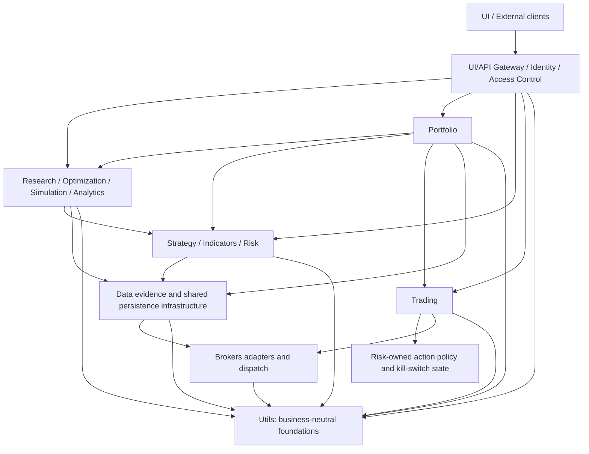

# HaruQuantAI System Architecture (Dense Reference)

## System Overview & Tech Stack

* **Architectural Pattern**: Modular monolith with service-oriented module boundaries. Aligns research, simulation, paper, and live environments while preventing any bypass of system controllers.
* **Production Stack Baseline**:
  * *Backend*: Python 3.14, managed with `uv`. FastAPI, Pydantic, Uvicorn (introduced once the API Gateway module lands).
  * *Frontend*: Next.js, React, TypeScript, Tailwind CSS, Radix UI (introduced once the UI module lands).
  * *Persistence*: SQLite (launch baseline). Each persistent domain owns its logical schemas and migration definitions; Data owns shared connections, locking, migration execution, and the immutable migration ledger.
  * *Data Science*: `pandas`, `numpy`, `scipy`, `scikit-learn`, `numba`, approved `pyarrow`/`fastparquet`.
  * *Broker Gate*: The Brokers domain owns provider-neutral adapter contracts and dispatch; MT5, cTrader, and Binance are adapter implementations selected by explicit configuration and readiness policy.
  * *Quality Gate*: `ruff` (lint + format), `mypy` (static types), `pytest` (tests/coverage), `pre-commit` (enforced hook chain).

* **Runtime Profiles** (separate from deployment `ENVIRONMENT`):
  * `research`: Data and feature exploration. Zero live broker mutations.
  * `simulation`: Historical backtests via the core trading path. Simulated side effects.
  * `paper`: Live paths executed against demo infrastructure. Paper side effects.
  * `live`: Real-capital transactions. Disabled by default; mandates all functional safety gates. Explicit toggle: `ALLOW_LIVE_MUTATIONS=false`.
* **Deployment Environments**: `ENVIRONMENT` is exactly one of `dev`, `test`, `staging`, or `production`. It never substitutes for `RUNTIME_PROFILE`.

---

## Current Implementation State

> This section tracks reality; the rest of this document describes the target architecture. Update it as modules land — see [docs/CHANGELOG.md](CHANGELOG.md) for history.

* Project scaffolded with `uv` (Python 3.14, `pyproject.toml`, `uv.lock`).
* Tooling configured: `ruff` (full rule set), `mypy`, `pytest`, `pre-commit` (hygiene checks, ruff, ruff-format, detect-secrets, mypy).
* Code present: `app/` package with implemented service modules under `app/services/`, including Trading as the surviving live-route runtime and broker-dispatch owner.
* The retired Live service has been folded into `app/services/trading/`; live execution remains a runtime route/mode, not a standalone service package.
* `app/services/api/README.md` defines the approved gateway/UI boundary, state ownership, and synchronous initial Simulation/Optimization surface; no API runtime code or `ui/` application package has landed yet.
* `app/services/portfolio/README.md` now defines the approved Portfolio target architecture; the package code is not yet implemented. Portfolio is the thirteenth domain and its status remains `Missing`.
* `app/utils/` is a partial implementation baseline for shared v1 contracts,
  errors, identifiers, UTC, canonical serialization, redaction/security helpers,
  settings, and structured logging.
* `app/services/brokers/` is a partial implementation baseline for canonical
  broker contracts, registry/factory, runtime safety, provider adapters, and its
  deterministic test adapter. Capability availability remains evidence-gated and
  fail-closed.
* `app/services/data/` has an implemented functional baseline containing immutable
  contracts, bounded SQLite/file/cache/audit persistence, explicit read-only sources
  and durable policy, historical/reference/context/FX access, deterministic
  transforms/alignment, synthetic generators, quality validation, recoverable
  scheduler jobs, internal feed status, immutable backup/restore manifests,
  licence-aware retention enforcement, and exactly 35 typed package-root operations.
  Retrieval and reference exports accept either their typed request or direct keyword
  arguments; standalone calls lazily compose MT5 read-only source, identity,
  migration, and calendar dependencies through the existing Brokers and Data
  boundaries. Explicit source/adapter injection remains supported.
  Its architecture status is `Completed`. `CAP-DATA-028` locates the behavior in
  fifteen approved capabilities: `contracts/`, `market_data/`,
  `local_datasets/`, `synthetic_data/`, `tick_derivation/`, `persistence/`,
  `quality/`, `transformation/`, `time_sessions/`, `sources/`,
  `economic_calendar/`, `realtime_feeds/`, `data_jobs/`, `evidence/`, and `audit/`.
  Exactly fifteen numbered standalone usage programs cover those owners, and removed
  horizontal packages have no compatibility shims. The correction changes ownership
  and file focus only; active requirements, public
  behaviour, contract versions, schema identifiers, error codes, and the frozen
  package-root API remain compatible.
* `app/services/indicators/` is a partial implementation baseline containing
  the immutable Core calculation boundary and 20 approved one-indicator-per-file
  implementations across trend, volatility, momentum, volume, and candles.
  Retrospective SMC/FVG/swing/BOS/CHoCH labels remain excluded to preserve the
  non-repainting contract.
* `app/services/strategy/` is implemented across contracts, diagnostics, registry,
  intents, replay/checkpoints, vectorized evaluation, event hooks, concrete signal
  evaluators, and all ten `WF-STRAT-*` workflows.
* `app/services/risk/` is implemented across contracts, configuration, snapshots,
  sizing, audit chaining, policy gates, regimes, approvals, decisions, scenarios, and
  reporting. Its status is `Partial`: kill-switch clearance must require a distinct
  authorized attestation principal, while the current implementation still requires
  the same principal.
* `app/services/trading/` is a partial implementation baseline across all 64
  functional and eight non-functional requirements, nine capability modules, and all
  fourteen documented workflows. It owns `OrderIntent v1`, `ExecutionReceipt v1`,
  `TradeRecord v1`, and `OperationalEvent v1`. Production live mutation remains
  disabled by default.
* Later agile phases reuse these completed domains and run compatibility/regression
  checks; they do not rebuild them. Current semantic-docstring/format cleanup is a
  separate repository-quality gate.
* `app/services/analytics/` is a partial implementation baseline across contracts,
  producer-neutral ledger adaptation, 60 cataloged metrics, report/allocation evidence,
  bounded dashboards, all active requirements, and all non-excluded workflows.
  Simulation imports no Analytics code; until Simulation publishes executable
  `PortfolioSimulationResult v1`, Analytics verifies `FR-SIM-033` through the exact
  README-backed producer fixture. Analytics derives its equity curve deterministically
  from the closed-trade ledger and has no open decisions.

---

## Folder Topology & Dependency Flow

### Workspace Directory Layout (Target)

* `app/services/api/`: FastAPI application, routes, middleware, authentication/session/credential boundary, API composition, and channel-neutral critical operational alert delivery. UI/API owns user/session/settings/encrypted-credential/HTTP-idempotency schemas on Data infrastructure and constructs Brokers-owned connection configuration.
* `app/`: Core domain modules (utils, brokers, data, indicators, strategy, risk, trading, simulator, analytics, optimization, research, portfolio, and API). Live-route execution is owned by Trading.
* `data/`: SQLite databases, migration tracking, cache/log dumps, market/research assets.
* `ui/`: Next.js frontend application environment.
* `tests/`: Unit, integration, usage, and system contract test suites.
* `scripts/`: DB initialization, migration runners, validation tools, operational utilities.
* `docs/`: Documented project truth.

### Module Boundary Pipeline

Dependencies follow authoritative contract ownership and remain acyclic; consumers use
public domain APIs and may not bypass Risk, Trading, Data, or Brokers boundaries:



---

## Technical Contracts & Envelopes

### Shared Utility Framework (`app/utils/`)

* **Public Export Rule**: `app/utils/__init__.py` exposes only the approved shared surface through an explicit `__all__`. No fallback imports, shims, duplicate modules, or single-consumer helpers are permitted.
* **Target Submodule Footprint**: shared `AuthContext` and `AuditEvent` contracts, shared base errors and immutable metadata, injected error routing, identity/trace IDs, UTC time, canonical serialization, redaction, centralized typed runtime settings, and structured logging with immutable bound context, explicit app/access/debug/error routing, compressed bounded rotation, queued delivery, and deterministic shutdown. `app.utils.AppSettings` is the sole repository `.env` loading boundary; domains inherit it for typed owned settings and never parse dotenv files or read process environment directly. Imports and import-time log attempts remain inert; the first runtime bound-log emission atomically activates the centralized default profile, while explicit logging configuration is reserved for specialized overrides. Runtime logging activation—not import—may create its configured sink directory. UI/API owns authentication, password hashing, credential encryption/persistence, active-key selection, credential-reference resolution, composition-root Brokers configuration, and permission enforcement; externally provisioned key infrastructure owns encryption-key generation/storage/rotation; Data owns normalized market contracts, cross-domain tabular processing, quality policy, and the only public detached OHLCV/spread and tick DataFrame projections from canonical `MarketDataset v1`; Indicators may privately project the same contract to pandas/NumPy for pure formula evaluation and owns its resulting tabular contract; each domain owns its paths, limits, validation, result types, and business contracts.
* **Contract Ownership Rule**: Domain contract modules own their own base contract behavior locally. They must not inherit from or import a centralized utility contract base.

### Domain Audit Event Shape

```json
{
  "contract_version": "v1",
  "schema_id": "utils.audit_event.v1",
  "event_id": "TEXT (Traceable string-safe UUID4)",
  "timestamp": "TEXT (UTC ISO string with 'Z')",
  "domain": "TEXT",
  "action": "TEXT",
  "principal_id": "TEXT | null",
  "request_id": "TEXT",
  "correlation_id": "TEXT",
  "causation_id": "TEXT | null",
  "payload": "MAPPING (Redacted JSON-safe payload)"
}
```

Required `AuditEvent v1` producers are Data, Strategy, Risk, Trading, Simulation,
Optimization, Research, Portfolio, and UI/API. Brokers emits technical logs only;
Indicators and Analytics are pure/read-only, so their governed callers audit actions.

### Shared Authentication Context

```json
{
  "contract_version": "v1",
  "schema_id": "utils.auth_context.v1",
  "principal_id": "TEXT",
  "principal_type": "USER | SERVICE_ACCOUNT",
  "roles": "ARRAY[TEXT]",
  "permissions": "ARRAY[TEXT]",
  "scopes": "ARRAY[TEXT]",
  "tenant_or_environment": "TEXT",
  "request_id": "TEXT",
  "workflow_id": "TEXT",
  "correlation_id": "TEXT",
  "issued_at": "TEXT (UTC timestamp)"
}
```

Registered domain contracts keep `contract_version` separate from namespaced `schema_id`; compatibility is never inferred by parsing the schema identifier.

### Data Domain Contract Boundary

- Data's canonical cross-domain schema identifiers are
  `data.market_dataset.v1`, `data.account_state_snapshot.v1`,
  `data.market_context_evidence.v1`, and `data.fx_conversion_evidence.v1`.
- Canonical Data contracts are exposed by `app.services.data.contracts`; pending
  feature-specific contracts remain in `app.services.data.models` only until their
  approved owning slices migrate.
- Data contract modules contain immutable schemas and deterministic validation only.
  They perform no source, broker, network, storage, cache, scheduling, or feed-runtime
  acquisition.
- Data market-data acquisition belongs in `app.services.data.retrieval`; normalized
  cross-domain evidence (market context, FX, account state) belongs in
  `app.services.data.evidence`; canonical/friendly identity, provider-symbol mapping,
  and source readiness/licence/promotion policy belong in
  `app.services.data.sources`.
- `MarketDataRequest.limit` is required to be positive, but OHLCV retrieval has no
  app-wide record-count ceiling. Tick and spread retrieval retain their governed
  limits; multi-million-record OHLCV ingestion remains the responsibility of the
  bounded, resumable Data Jobs backfill workflow.
- Detached OHLCV DataFrame projection preserves genuinely unavailable optional spread
  as float64 `NaN` and records `spread_unit=None`; supplied spread remains unit-bearing
  and finite. Missing spread is never replaced with zero or an assumed current quote.
- FEAT-DATA-05 owns tick derivation in two internal stages: eligible bar evidence is
  transformed by private Numba kernels into exact signed-64-bit fixed-point columns,
  then the public in-memory operation constructs canonical immutable `TickRecord`
  values at the Decimal boundary. Direct Parquet persistence consumes bounded columns
  without constructing a complete tick `MarketDataset`. A safe common internal scale
  preserves provider precision before output rounding; real ticks, seeded variable
  spreads, unsafe precision/ranges, and small batches use the exact legacy path.
  Simulation may later consume bounded columns through its own integration, but
  it does not own or duplicate tick generation.
- External broker/provider reads use injected Brokers `BrokerAdapter` read traits.
  Data owns no SDK session, credential resolution, connection lifecycle, or mutation
  capability; only Trading may invoke broker mutations.
- The research-only Dukascopy adapter uses BI5 hour files for raw ticks and the
  keyless `chart/json3` web-chart interface for BID candles. Brokers owns exact
  interface-specific symbol mapping (for example, canonical `EURUSD` to web-chart
  `EUR/USD`), bounded cursor pagination/retries, and provider-value mapping; it does
  not invent spread or locally synthesize OHLC from those ticks.
- Source composition is centralized in `app.services.data.sources.composition` and is the single
  gate on source availability. It dispatches on source kind: local artifact sources
  declared by `DATA_LOCAL_SOURCES` compose at `production` readiness with no
  credential, network, or promotion requirement; broker provider facades declared by
  `DATA_PROVIDER_SOURCES` compose at `staging` only when their Brokers-owned
  `*_ENABLED` flag is set, and reach `production` solely through evidence-based
  promotion. An identifier that is neither fails closed as `UNSUPPORTED_SOURCE`
  before any policy evaluation. Local artifacts live under `DATA_RAW_ROOT` and are
  named `{symbol}[_{timeframe}].{csv|parquet}`.
- Standalone Yahoo composition is credential-free but explicit: Data selects the
  Brokers-required `SANDBOX` profile, configures `AAPL` as the connectivity probe, and
  registers exact identity `AAPL` to `AAPL`. Brokers maps canonical bar timeframes such
  as `H1` to documented yfinance intervals such as `1h` without fallback guessing.
- Standalone Binance Spot public-read composition is also credential-free. Data uses
  the Brokers-required `LIVE` profile without account secrets, while Registry releases
  only symbol discovery, symbol metadata, and historical bars. Brokers maps canonical
  timeframes such as `H1` to Binance's exact case-sensitive `1h` interval and preserves
  both requested and provider timeframe provenance; unsupported intervals fail closed.
  Data keeps each asynchronous connect/read/disconnect sequence on one event loop, so
  no loop-bound HTTP client crosses calls through the synchronous facade.
- Availability inspection uses persisted manifests/indexes for local artifacts and one
  bounded canonical retrieval for network providers. Provider availability reports
  only the observed probe range and records whether its record limit was reached, so
  an unobserved remote history is never represented as complete.
- Foreign artifact admission is explicit. `load_dataset` requires a Data-written
  manifest and performs no hidden on-read conversion or migration. Externally
  produced CSV/Parquet enters canonical form only through `import_external_dataset`,
  which requires a caller-declared `ColumnMapping` and a named dialect fixing header
  style and delimiter. No governed field — `symbol`, `data_kind`, `timeframe`,
  `workflow_context`, `precision_policy` — is ever inferred from file contents; the
  import fails rather than guessing. The operation terminates in `save_dataset` and
  persists one `AuditEvent` recording external origin, so imported artifacts are
  thereafter indistinguishable from Data-authored output while their provenance
  remains auditable.
- Cache staleness is caller-declared and never silent. `MarketDataRequest.stale_cache_policy`
  admits `refresh` (expired entry is a miss), `fail_closed` (return `EMPTY_RESULT`
  without contacting any source, enabling deterministic offline replay), and
  `serve_stale` (return the expired entry with `cache_status="stale_warning"`).
  `serve_stale` is restricted to the `research` workflow context at contract
  validation; governed contexts never serve expired entries.
- Retrieval quality-failure behavior is a closed `reject | warn` contract, applied
  identically to fresh and cached datasets. `reject` is the default and raises
  `DATA_QUALITY_FAILED`; `warn` logs bounded evidence and returns the unchanged
  dataset with `quality_status="failed"` and its issues intact.
- High-level bar quality inspection discounts exact weekend closures and injected
  `SessionWindow` non-trading intervals. Unexplained weekday gaps remain critical;
  absent session evidence is explicitly disclosed as `calendar_unverified`.

Portfolio collaboration is contract-governed:

- Strategy owns immutable registration; Risk separately owns `StrategyOperationalEligibilityRequest/Decision v1`.
- Portfolio owns `PortfolioConstructionRequest/Result v1`, `ActivePortfolioAllocation v1`, and `PortfolioRebalancePlan v1`.
- Risk owns `AllocationReviewRequest`, `AllocationRiskDecision`, `AllocationBudgetActivationRequest`, and the authoritative risk-budget projection.
- Simulation owns `PortfolioBacktestRequestV1` / `PortfolioSimulationResult v1`; Analytics owns `PortfolioAllocationEvidence v1`; Data owns `FXConversionEvidence v1`.
- Simulation composes its historical loop through a typed receiver-owned dependency bundle. Its state store is constructed before its journal writer; one injected `SimTrader` instance supplies the asynchronous Trading sim-route callable. Canonical manifests hash `journal.jsonl`, `result.json`, and `report.md` and exclude the `manifest.json` envelope itself, preventing self-referential hashes.
- Trading owns `PortfolioRebalanceExecutionRequest v1` and remains the only route to broker mutations.
- Risk and Simulation requests carry self-contained receiver-owned projections using
  scalar values, ordered components, identifiers, versions, references, and hashes;
  they never embed or import Portfolio-owned contract types.

---

## Data Models & Schema Management

* **Data Layout Conventions**: Core cross-module database tracking identifiers must use `TEXT` format. SQLite boolean fields enforce strict `0` or `1` constraints. JSON text structures map to an explicit `*_json` suffix name.
* **Precision Standard**: Structural or broker-critical price, size, volume, and balance mathematics must bypass standard floating-point operations. Requires `decimal.Decimal` parsing to ensure transaction immutability.
* **Table Namespace Prefixes**: Each persistent domain uses an owner-specific namespace (for example `data_`, `api_`, `strategy_`, `risk_`, `trading_`, `sim_`, `optimization_`, `research_`, `portfolio_`, and `audit_`). Exact table names belong only in the owning domain README/migrations.
* **Migration Invariance**: Database tracking updates via additive structure migrations. Modifying applied structural migrations is prohibited without an explicit baseline reset approval.

---

## System Control Policies

### Validation Strategy

* Enforce absolute schema checking prior to triggering downstream system side effects.
* Fail closed immediately if tracking context data is missing or corrupted during risk checks, live trade execution, or security evaluation.
* Enforce exact field parsing for sensitive updates; reject unknown or unmapped properties.

### Error & Automatic Retry Paradigm

* Every error object crossing module borders must remain structured, fully trace-tagged, and redacted.
* **Blind Retry Ban**: Automated retries apply only to verified transient transport anomalies. Unknown broker state responses block automated processing; execution loops freeze until state validation completes.
* **Fail-Closed Baseline**: System stops operations instantly if it encounters active kill switches, validation failures, token expiration, or structural mismatch flags.
* **Kill-Switch Dual-Control Baseline**: Activation is immediate and unilateral for
  one authorized principal. Clearance requires a current scope/policy-bound
  `ApprovalAttestation` from a different authorized principal; same-principal
  clearance fails without changing canonical state. Trading resumes only after all
  applicable scopes are inactive and reconciliation succeeds.
* **Portfolio Activation Baseline**: Simulation-profile activation is automatic only within explicit simulation policy. Paper/live activation requires human approval plus current Risk authorization. Active kill switches block activation and rebalance.
* **Allocation Safety Baseline**: Capital weights are Portfolio metadata; Risk budgets are authoritative. Existing over-budget exposure creates a Risk-reviewed reduce-only plan, and the system never opens a position solely to match a target weight.

### Operational Logging Boundary

* Governed external I/O, persistence, lifecycle/state transitions, and classified
  failures emit bounded redacted start/outcome/failure evidence with request and
  correlation identifiers.
* Data functions, validators, deterministic transforms, and private helpers use the
  system logger with bounded redacted messages; imports themselves emit no log,
  telemetry, network, or persistence side effect.
* Logging dependencies are explicit and never carry raw provider/database exceptions
  or sensitive values across a public boundary.

### Critical Operational Alert Boundary

Critical operational alerts are a focused UI/API delivery boundary, not a Notification
domain and not an execution-control authority:

* The only approved triggers are a Risk-owned `KillSwitchState v1` transition to
  `active` and a Trading-owned critical `OperationalEvent v1` with
  `event_type="BROKER_STATE_UNKNOWN"` after the affected conflict scope is retry
  locked.
* UI/API validates the authoritative source, derives one deterministic
  `CriticalOperationalAlert v1`, and performs one delivery attempt through an injected
  channel-neutral idempotent sink. The alert identifier is derived from the trigger,
  source schema, and immutable source identity/version, and is the sink's idempotency
  key.
* Alert content uses fixed trigger-specific templates and bounded, allowlisted,
  redacted facts. Arbitrary source payload forwarding, secrets, provider objects, and
  private broker state are forbidden.
* The composition root passes Risk results and Trading events to UI/API-owned alert
  functions. Risk and Trading never import UI/API, so the code dependency remains
  one-way and acyclic.
* Construction or delivery failure produces a structured
  `CriticalAlertDeliveryResult` and a redacted error log. It never rolls back or clears
  Risk state, releases a Trading retry lock, changes execution truth, or permits a
  mutation.
* Provider-specific channels, generic notifications, automatic retry queues,
  acknowledgements, escalation policy, and UI/API-local mutable deduplication state are
  outside the initial target.

### Core Security Mandates

* Plaintext application passwords, live API keys, provider access configurations, and cryptographic seeds are classified as system secrets.
* Redact sensitive patterns from execution dumps, trace events, log lines, and metrics payloads case-insensitively before persistence.
* UI/API encrypts persisted credential material and selects from externally
  provisioned keys. It never generates, persists, or rotates encryption keys.

---

## Deployment Configuration Reference

| Target Group | Explicit Key Identifiers |
| --- | --- |
| **Application Environment** | `APP_NAME`, `ENVIRONMENT` (`dev`/`test`/`staging`/`production`), `API_HOST`, `API_PORT`, `UI_ORIGIN` |
| **System Persistence** | `DATABASE_URL`, `DATA_DIR`, `ARTIFACT_DIR`, `DATA_CACHE_PATH` |
| **Operational Protection** | `ALLOW_LIVE_MUTATIONS` (defaults to `false`), `RUNTIME_PROFILE`, `EXECUTION_ROUTE` |
| **Structured Logging** | `LOG_LEVEL`, `LOG_RENDER` |
| **Settings Loading** | Repository `.env` and process overrides are read only by typed classes inheriting `app.utils.AppSettings`; ordinary modules consume settings objects. |
| **Broker Integration** | Provider-neutral adapter selection/readiness plus adapter-specific settings; UI/API composition resolves credential references and injects Brokers-owned `BrokerConnectionConfig` instances. |

---

## Core System Quality Gates

CI runners validate module engineering standards via targeted verification commands:

```bash
# Linting & Formatting Check
uv run ruff check .
uv run ruff format --check .

# Static Type Verification
uv run mypy .

# Unit Testing & Coverage Gates
uv run pytest --cov=app --cov-fail-under=80
```
