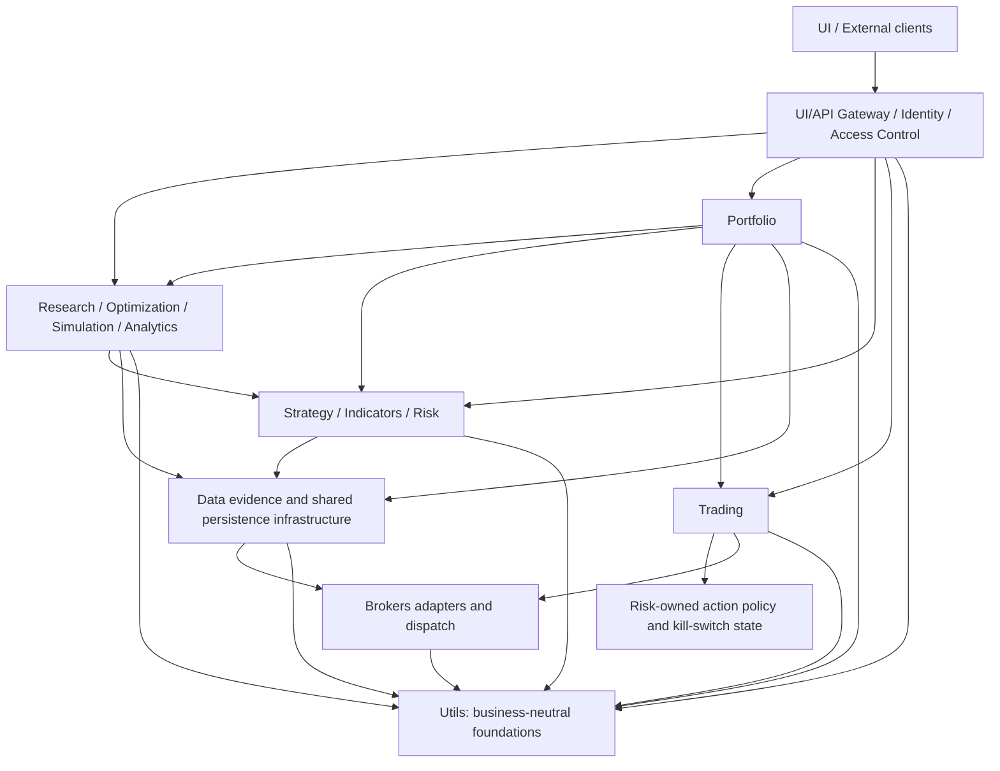

# HaruQuantAI System Architecture (Dense Reference)

## System Overview & Tech Stack

* **Architectural Pattern**: Modular monolith with service-oriented module boundaries. Aligns research, simulation, paper, and live environments while preventing any bypass of system controllers.
* **Production Stack Baseline**:
  * *Backend*: Python 3.14, managed with `uv`. FastAPI, Pydantic, Uvicorn (introduced once the API Gateway module lands).
  * *Frontend*: Next.js, React, TypeScript, Tailwind CSS, Radix UI (introduced once the UI module lands).
  * *Persistence*: SQLite (launch baseline). Each persistent domain owns its logical schemas and migration definitions; Data owns shared connections, locking, migration execution, and the immutable migration ledger.
  * *Data Science*: `pandas`, `numpy`, `scipy`, `scikit-learn`, `numba`, approved `pyarrow`/`fastparquet`.
  * *Broker Gate*: The Brokers domain owns provider-neutral adapter contracts and dispatch; MT5, cTrader, and Binance are adapter implementations selected by explicit configuration and readiness policy.
  * *Quality Gate*: `ruff` (lint + format), `mypy` (static types), `pytest` (tests/coverage), `pre-commit` (enforced hook chain).

* **Runtime Profiles** (separate from deployment `ENVIRONMENT`):
  * `research`: Data and feature exploration. Zero live broker mutations.
  * `simulation`: Historical backtests via the core trading path. Simulated side effects.
  * `paper`: Live paths executed against demo infrastructure. Paper side effects.
  * `live`: Real-capital transactions. Disabled by default; mandates all functional safety gates. Explicit toggle: `ALLOW_LIVE_MUTATIONS=false`.
* **Deployment Environments**: `ENVIRONMENT` is exactly one of `dev`, `test`, `staging`, or `production`. It never substitutes for `RUNTIME_PROFILE`.

---

## Current Implementation State

> This section tracks reality; the rest of this document describes the target architecture. Update it as modules land — see [docs/CHANGELOG.md](CHANGELOG.md) for history.

* Project scaffolded with `uv` (Python 3.14, `pyproject.toml`, `uv.lock`).
* Tooling configured: `ruff` (full rule set), `mypy`, `pytest`, `pre-commit` (hygiene checks, ruff, ruff-format, detect-secrets, mypy).
* Code present: `app/` package with implemented service modules under `app/services/`, including Trading as the surviving live-route runtime and broker-dispatch owner.
* The retired Live service has been folded into `app/services/trading/`; live execution remains a runtime route/mode, not a standalone service package.
* `app/services/api/README.md` defines the approved gateway/UI boundary, state ownership, and synchronous initial Simulation/Optimization surface; no API runtime code or `ui/` application package has landed yet.
* `app/services/portfolio/README.md` now defines the approved Portfolio target architecture; the package code is not yet implemented. Portfolio is the thirteenth domain and its status remains `Missing`.

---

## Folder Topology & Dependency Flow

### Workspace Directory Layout (Target)

* `app/services/api/`: FastAPI application, routes, middleware, authentication/session boundary, and API composition. UI/API owns user/session/settings/HTTP-idempotency schemas on Data infrastructure.
* `app/`: Core domain modules (utils, brokers, data, indicators, strategy, risk, trading, simulator, analytics, optimization, research, portfolio, and API). Live-route execution is owned by Trading.
* `data/`: SQLite databases, migration tracking, cache/log dumps, market/research assets.
* `ui/`: Next.js frontend application environment.
* `tests/`: Unit, integration, usage, and system contract test suites.
* `scripts/`: DB initialization, migration runners, validation tools, operational utilities.
* `docs/`: Documented project truth.

### Module Boundary Pipeline

Dependencies follow authoritative contract ownership and remain acyclic; consumers use
public domain APIs and may not bypass Risk, Trading, Data, or Brokers boundaries:



---

## Technical Contracts & Envelopes

### Shared Utility Framework (`app/utils/`)

* **Public Export Rule**: `app/utils/__init__.py` exposes only the approved shared surface through an explicit `__all__`. No fallback imports, shims, duplicate modules, or single-consumer helpers are permitted.
* **Target Submodule Footprint**: shared `AuthContext` and `AuditEvent` contracts, shared base errors, identity/trace IDs, UTC time, canonical serialization, redaction, runtime settings, and structured logging. UI/API owns authentication and permission enforcement; Data owns DataFrame/OHLC processing and quality; each domain owns its paths, limits, validation, result types, and business contracts.
* **Contract Ownership Rule**: Domain contract modules own their own base contract behavior locally. They must not inherit from or import a centralized utility contract base.

### Domain Audit Event Shape

```json
{
  "contract_version": "v1",
  "schema_id": "utils.audit_event.v1",
  "event_id": "TEXT (Traceable string-safe UUID4)",
  "timestamp": "TEXT (UTC ISO string with 'Z')",
  "domain": "TEXT",
  "action": "TEXT",
  "principal_id": "TEXT | null",
  "request_id": "TEXT",
  "correlation_id": "TEXT",
  "causation_id": "TEXT | null",
  "payload": "MAPPING (Redacted JSON-safe payload)"
}
```

### Shared Authentication Context

```json
{
  "contract_version": "v1",
  "schema_id": "utils.auth_context.v1",
  "principal_id": "TEXT",
  "principal_type": "USER | SERVICE_ACCOUNT",
  "roles": "ARRAY[TEXT]",
  "permissions": "ARRAY[TEXT]",
  "scopes": "ARRAY[TEXT]",
  "tenant_or_environment": "TEXT",
  "request_id": "TEXT",
  "workflow_id": "TEXT",
  "correlation_id": "TEXT",
  "issued_at": "TEXT (UTC timestamp)"
}
```

Registered domain contracts keep `contract_version` separate from namespaced `schema_id`; compatibility is never inferred by parsing the schema identifier.

Portfolio collaboration is contract-governed:

- Strategy owns immutable registration; Risk separately owns `StrategyOperationalEligibilityRequest/Decision v1`.
- Portfolio owns `PortfolioConstructionRequest/Result v1`, `ActivePortfolioAllocation v1`, and `PortfolioRebalancePlan v1`.
- Risk owns `AllocationReviewRequest`, `AllocationRiskDecision`, `AllocationBudgetActivationRequest`, and the authoritative risk-budget projection.
- Simulation owns `PortfolioBacktestRequestV1` / `PortfolioSimulationResult v1`; Analytics owns `PortfolioAllocationEvidence v1`; Data owns `FXConversionEvidence v1`.
- Trading owns `PortfolioRebalanceExecutionRequest v1` and remains the only route to broker mutations.

---

## Data Models & Schema Management

* **Data Layout Conventions**: Core cross-module database tracking identifiers must use `TEXT` format. SQLite boolean fields enforce strict `0` or `1` constraints. JSON text structures map to an explicit `*_json` suffix name.
* **Precision Standard**: Structural or broker-critical price, size, volume, and balance mathematics must bypass standard floating-point operations. Requires `decimal.Decimal` parsing to ensure transaction immutability.
* **Table Namespace Prefixes**: Each persistent domain uses an owner-specific namespace (for example `data_`, `api_`, `strategy_`, `risk_`, `trading_`, `sim_`, `optimization_`, `research_`, `portfolio_`, and `audit_`). Exact table names belong only in the owning domain README/migrations.
* **Migration Invariance**: Database tracking updates via additive structure migrations. Modifying applied structural migrations is prohibited without an explicit baseline reset approval.

---

## System Control Policies

### Validation Strategy

* Enforce absolute schema checking prior to triggering downstream system side effects.
* Fail closed immediately if tracking context data is missing or corrupted during risk checks, live trade execution, or security evaluation.
* Enforce exact field parsing for sensitive updates; reject unknown or unmapped properties.

### Error & Automatic Retry Paradigm

* Every error object crossing module borders must remain structured, fully trace-tagged, and redacted.
* **Blind Retry Ban**: Automated retries apply only to verified transient transport anomalies. Unknown broker state responses block automated processing; execution loops freeze until state validation completes.
* **Fail-Closed Baseline**: System stops operations instantly if it encounters active kill switches, validation failures, token expiration, or structural mismatch flags.
* **Portfolio Activation Baseline**: Simulation-profile activation is automatic only within explicit simulation policy. Paper/live activation requires human approval plus current Risk authorization. Active kill switches block activation and rebalance.
* **Allocation Safety Baseline**: Capital weights are Portfolio metadata; Risk budgets are authoritative. Existing over-budget exposure creates a Risk-reviewed reduce-only plan, and the system never opens a position solely to match a target weight.

### Core Security Mandates

* Plaintext application passwords, live API keys, provider access configurations, and cryptographic seeds are classified as system secrets.
* Redact sensitive patterns from execution dumps, trace events, log lines, and metrics payloads case-insensitively before persistence.

---

## Deployment Configuration Reference

| Target Group | Explicit Key Identifiers |
| --- | --- |
| **Application Environment** | `APP_NAME`, `ENVIRONMENT` (`dev`/`test`/`staging`/`production`), `API_HOST`, `API_PORT`, `UI_ORIGIN` |
| **System Persistence** | `DATABASE_URL`, `DATA_DIR`, `ARTIFACT_DIR`, `DATA_CACHE_PATH` |
| **Operational Protection** | `ALLOW_LIVE_MUTATIONS` (defaults to `false`), `RUNTIME_PROFILE`, `EXECUTION_ROUTE` |
| **Structured Logging** | `LOG_LEVEL`, `LOG_RENDER` |
| **Broker Integration** | Provider-neutral adapter selection/readiness plus adapter-specific MT5, cTrader, or Binance settings; secrets are resolved at the composition root and injected as Brokers-owned `BrokerConnectionConfig` instances. |

---

## Core System Quality Gates

CI runners validate module engineering standards via targeted verification commands:

```bash
# Linting & Formatting Check
uv run ruff check .
uv run ruff format --check .

# Static Type Verification
uv run mypy .

# Unit Testing & Coverage Gates
uv run pytest --cov=app --cov-fail-under=80
```
