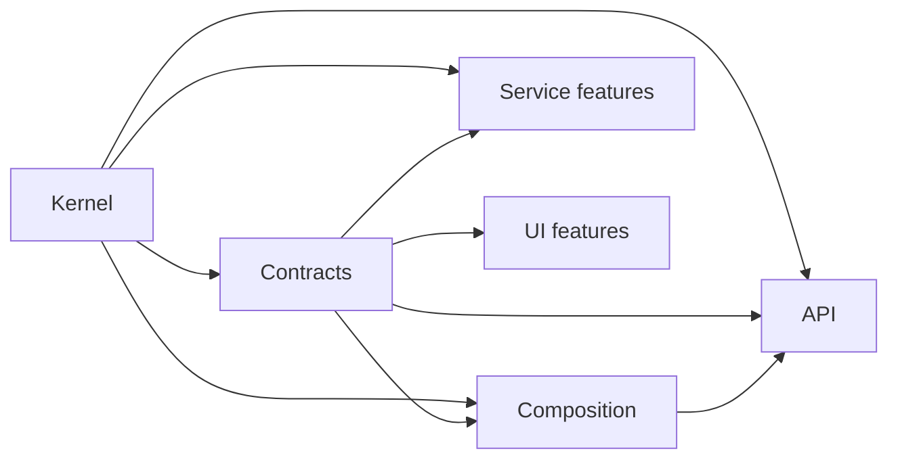

# HaruQuantAI Architecture

> **System:** HaruQuantAI — Strategy Research and Governed Trading Platform
> **Status:** Normative architecture aligned to the implemented composability foundation
> **Architecture version:** `2.0-code-aligned`
> **Last updated:** `2026-08-23`
> **System scope:** [PROJECT.md](PROJECT.md)
> **Implementation sequence:** [IMPLEMENTATION_ORDER.md](dev/IMPLEMENTATION_ORDER.md)
> **Feature workflow:** [Feature Implementation Pipeline](dev/feature_implementation_pipeline.md)

This document owns universal structural and runtime constraints. It does not duplicate product scope, domain feature registries, functional requirements, or feature-addition procedure.

## Agent Context Router

Read only the rows applicable to the task, together with `AGENTS.md`, the relevant `PROJECT.md` scope, and every affected owning README. Read this document end to end only for a system-wide architecture change.

| Task concern | Read here | Then read |
| --- | --- | --- |
| Import, package, or ownership boundary | §§1–4 | Owning shared/domain README §§1–3 |
| New or changed service/UI feature | §§5–7 | Owning README §§4–9 and feature pipeline |
| Capability, lifecycle, removal, or replacement | §6 | Kernel and Composition READMEs |
| Contract, API, event, or wire schema | §§7, 10 | Contracts and Interfaces/UI READMEs |
| Database, artifact, transaction, job, or worker | §§8–9 | Contracts, Workspace, and semantic owner READMEs |
| Plugin, connector, broker, risk, or trading boundary | §11 | Applicable domain README |
| Deployment, security, logging, failure, or performance | §§12–13 | `PROJECT.md` §§6, 9, 13, 15 and affected owners |
| Architecture conformance or governance | §§14–15 | `PROJECT.md` §§12, 15, 18 |

Stable specification labels retained here (`§10.1`, `§23.14`, and `§23.15`) are identifiers preserved from the consolidated specification, not this document's section numbers.

## 1. Purpose and authority

The implemented `app/kernel/`, `app/composition/`, `app/api/`, and initial removable features are the architectural baseline. The executable `FEAT-BROKER-FEED_MOCK → FEAT-DATA-RETRIEVE_BARS` slice and `FEAT-SYS-PERSIST_STORAGE` prove the substrate; they do not imply completion of product requirements with similar names.

Authority is assigned by subject:

| Subject | Sole authority |
| --- | --- |
| Contributor process and approval gates | `AGENTS.md` |
| Product boundary, cross-domain workflows, system NFRs, release gates | `PROJECT.md` |
| Universal package, import, runtime, isolation, and deployment constraints | This document |
| Shared-package implementation boundary | `app/kernel/README.md`, `app/contracts/README.md`, or `app/composition/README.md` |
| Domain feature IDs/statuses, FRs, semantics, state, and acceptance | Owning domain/UI README |
| Implemented public types and behavior | Source plus executable tests, within the target authority above |
| Feature addition/removal procedure | Feature Implementation Pipeline |
| Temporary delivery sequence | `IMPLEMENTATION_ORDER.md` |

For the implemented composability foundation, executable code plus architecture tests is evidence and documentation must match it. For missing product behavior, its topical documentation is the target until accepted implementation evidence exists.

## 2. Architectural drivers

| Driver | Required response |
| --- | --- |
| Spatiotemporal composability | Features declare capabilities, dependencies, config, conflicts, state, and lifecycle effects; reconciliation preserves unrelated branches. |
| Deletion safety | Feature packages are discoverable and physically removable without static domain registries or implementation imports. |
| Determinism | Immutable manifests pin inputs, providers, versions, hashes, configuration, and named RNG streams. |
| Local-first operation | Reference deployment is a modular monolith with local metadata and content-addressed artifacts. |
| Durable recovery | Staging, transactions, leases, fencing, checkpoints, idempotency, and reconciliation define commit boundaries. |
| Bounded isolation | Heavy, third-party, compiler, connector, plugin, and provider work runs in supervised processes with explicit budgets. |
| Operational safety | Broker, Risk, and Trading are disabled by default; mutation requires current authority and reconciliation. |
| Interface parity | UI, HTTP, CLI, MCP, and automation invoke the same application capabilities and contracts. |
| Hosted portability | Hosted mode changes infrastructure adapters, not domain packages or semantics. |

## 3. Universal invariants

1. `app/kernel/`, `app/contracts/`, `app/composition/`, and `app/api/` are shared modules, not business domains.
2. Kernel imports no application contracts, composition/API policy, or service implementation.
3. Contracts may import only the kernel capability-key primitive; Composition may import Kernel and Contracts; API may import Kernel, Contracts, and Composition.
4. Shared modules never import service implementations. A service/UI feature never imports another feature implementation.
5. Cross-feature calls resolve declared capabilities through `FeatureContext`; stable application callers use `app/api/` facades where applicable.
6. Each domain writes only its own state and artifacts. Cross-domain consistency uses contracts, immutable references, events, and orchestration.
7. Features receive no raw database handle, unrestricted path, provider SDK object, process global, or undeclared network/process authority.
8. Reversible effects belong to one `FeatureScope` and close exactly once in last-in-first-out order.
9. Missing capability produces explicit unavailability or declared degradation, never import failure, null substitution, or silent fallback.
10. Reproducible work pins contracts, providers, implementation/configuration hashes, inputs, and seeds.
11. Paper/demo/live mutation is fail-closed and cannot bypass Runtime Risk.
12. Every Python `__init__.py` is empty or docstring-only and causes no discovery, registration, I/O, task creation, or logging configuration.

## 4. Static module architecture

```text
HaruQuantAI/
├── docs/                         # system, architecture, delivery, and procedure authority
├── app/
│   ├── kernel/                   # independent composability primitives
│   ├── contracts/                # cross-boundary application/domain contracts
│   ├── composition/              # discovery, configuration, readiness, runtime policy
│   ├── api/                      # stable capability-aware facades/transport substrate
│   ├── services/<domain>/        # removable Python domain features
│   └── ui/src/features/          # removable React UI features
└── tests/                        # unit and cross-cutting verification
```

| Module | Owns | Must not contain |
| --- | --- | --- |
| Kernel | `CapabilityKey`, `FeatureSpec`, lifecycle/state protocols, context/scope, registry, graph, reconciler, event/task primitives, replacement models | Application DTOs, discovery/config-file policy, routes, SDKs, domain behavior |
| Contracts | DTOs, ports, commands, queries, results, events, errors, capability declarations, wire schemas | Runtime behavior, feature specs, adapters, persistence, SDKs, UI |
| Composition | Entry-point discovery, TOML policy, provider selection, readiness, watching, serialized runtime mutation, logging infrastructure | Kernel primitives, business policy, provider SDKs, persistence, hard-coded feature imports |
| API | Capability-aware facades, system diagnostics, shared transport substrate | Service imports or duplicated domain policy |

Arrows mean “is depended upon by”:


```mermaid
flowchart LR
    K[Kernel] --> C[Contracts]
    K --> O[Composition]
    C --> O
    K --> A[API]
    C --> A
    O --> A
    K --> S[Service features]
    C --> S
    C --> U[UI features]
```

Importing a package performs no network, database, filesystem, route, event, task, process, registry, or log-handler mutation. Optional SDKs remain inside their removable adapter boundary. Public cross-boundary types live only under Contracts; services contain implementations.

Composition's runtime orchestration is generic discovery, selection, activation, reconciliation, replacement, and reload serialization. It is distinct from the Orchestration domain's user-authored durable project graphs. API is business-neutral substrate; Interfaces owns product-facing transport semantics; UI owns presentation and interaction.

## 5. Feature architecture

The identity hierarchy is `Domain → Feature → Responsibility → FR behavior`. Feature is the runtime registration/removal unit; FR is a traceability and acceptance identity unless separately packaged as a feature.

```text
app/services/<domain>/
├── README.md
├── __init__.py
└── <feature>/
    ├── README.md
    ├── __init__.py
    ├── manifest.py
    ├── config.py
    ├── feature.py
    └── <focused-responsibility>.py
```

- Each installed Python feature registers one factory in `haruquantai.features`; domains and Composition have no static feature registry.
- `manifest.py` exposes the immutable `FeatureSpec`; `config.py` validates only declared keys; `feature.py` implements `mount(context, config)`.
- One feature owns one independently selectable capability set. Siblings communicate only through contracts and capabilities.
- Persistent state is declared in `FeatureSpec.state`; migrations/adapters stay with the feature while the domain remains semantic owner.
- A feature README mirrors implemented registration and evidence; its domain README remains the complete target registry.
- Domain support packages and persistence exceptions must satisfy the rules in `AGENTS.md` and the owning README.

UI uses `app/ui/src/features/<feature>/` with `README.md`, `manifest.ts`, `config.ts`, `feature.tsx`, and `index.ts`. UI features consume generated public contracts, own only interaction/presentation/client state, and retain unit/component/accessibility/integration/removal evidence under `tests/ui/`.

## 6. Capability and composition runtime

| Identity | Form | Purpose |
| --- | --- | --- |
| Feature ID | stable `FEAT-*` | Config, lifecycle, diagnostics, registration |
| Capability key | `<domain>.<name>@<major>` | Typed provider/consumer binding |
| FR ID | stable `FR-*` | Product behavior, acceptance, tests, traceability |

Dependencies are declared once in `FeatureSpec.requires`/`optional`. Required dependencies gate activation; optional dependencies require a named degradation path. An explicit `[providers]` choice wins; without one, exactly one compatible provider may bind automatically and ambiguity blocks the consumer. Required cycles are rejected before activation.

Activation is staged:

1. Discover the entry-point factory and validate `FeatureSpec`.
2. Resolve enabled state, config, conflicts, and provider view.
3. Create a staged `FeatureContext`/`FeatureScope`.
4. Mount and verify that the exact declared provider bundle was produced.
5. Atomically publish providers; partial mount failure closes the scope and publishes nothing.

Runtime states distinguish absence, dependency blocking, preparation, active operation, startup/runtime failure, stopping, and stopped state. Clients report actual `RuntimeStatus`; they do not infer state from the presence of an enum member.

Every reversible acquisition registers a sync/async cleanup callback. Scope close is idempotent, LIFO, continues independent callbacks after failure, and retains diagnostics. Durable data/external emissions are classified as staged, compensatable, irreversible, or retained owner records; they are never blindly deleted.

| Removal level | Required result |
| --- | --- |
| Configuration disable | Effects disappear, retained state remains, re-enable creates a clean generation. |
| Cold package absence | Explicit absence/dependency blocking; unrelated startup branches remain healthy. |
| Live retirement | Provider withdraws, scope closes, affected consumers remount/block in dependency order. |
| Transactional replacement | Compatible shadow generation validates and atomically swaps; any pre-commit failure retains the prior generation. |

Replacement requires an unchanged provided-capability set, exact shadow provider bundle, and optional health/quiesce/drain hooks. Pre-commit failure closes the shadow. After commit, consumer-remount or old-cleanup failure is reported as committed-but-degraded, never false rollback. Reload/replacement share one mutation lock. Production code evolution uses a new process/environment or versioned package identity, not unrestricted in-place Python reload.

## 7. Contract architecture

- Receivers semantically own commands/requests; producers own events/results; common envelopes belong to Contracts; composability primitives remain in Kernel.
- Contract definitions live under `app/contracts/<owner>/`; semantic ownership remains with the domain README.
- Consumers receive immutable DTOs, handles, and ports—not ORM entities, SDK objects, provider internals, or mutable foreign state.
- Additive compatible changes retain a major version. Breaking semantics/schemas require a new major, migration plan, and compatibility window.
- Capability major, schema/behavior version, provider identity, hashes, permissions, and tolerances are pinned separately where required.
- Wire schemas/clients are generated or compatibility-tested from the same contract source.
- Every request/event carries the applicable correlation, causation, workspace, actor, idempotency, schema, and timestamp metadata defined in Contracts.

The exact shared models, lifecycle state machines, serialization rules, constants, fixtures, and failure mappings are authoritative in [Contracts README](../app/contracts/README.md). Route semantics are authoritative in [Interfaces README](../app/services/interfaces/README.md).

## 8. Data and persistence architecture

Each durable entity and artifact family has exactly one semantic writer. Other domains use public capabilities or immutable IDs. A feature owns its state declaration and migrations; Workspace/Data provide storage infrastructure without acquiring business ownership.

- Metadata and small queryable state use transactional storage; large payloads use content-addressed artifacts.
- Artifact write is stage → hash/validate → atomically publish → commit metadata reference. Metadata never points to partial payloads.
- Transactional outbox/inbox or equivalent preserves state/event atomicity; idempotency keys bind actor, workspace, command, and canonical payload hash.
- Optimistic concurrency prevents lost updates. Leases carry fencing tokens; stale workers cannot commit.
- Deleted-feature state stays identifiable by owner/schema/version/hash and is opaque when no compatible owner is installed.
- Domain migrations are ordered, idempotent, backup-aware, and compatibility-gated; no domain migrates another domain's state.

Common physical fields, canonical values, artifact columns, lifecycle constraints, and persistence fault fixtures are owned by Contracts §§8, 15, and 23.12; domain-specific logical entities remain in each owner README.

## 9. Jobs and workers

Admission creates an immutable manifest, capability snapshot, idempotency record, durable job, and attempt. A supervisor grants a fenced lease; the worker receives only declared inputs, bounded resources, task-local temporary storage, scoped credentials, and named capability endpoints. Outputs/checkpoints are staged and committed only after hash/schema validation and current-fence verification.

Cancellation follows the declared drain/checkpoint/terminate policy. Retry/recovery never duplicates committed output. Worker death, timeout, or reassignment cannot terminate/deadlock the control plane or alter deterministic results.

## 10. Interfaces and UI

Interfaces and UI are separate adapter domains over the same application capabilities. Neither owns business policy or authoritative business state.

| Owner | Surface rule |
| --- | --- |
| Interfaces HTTP | Versioned `/api/v1`; idempotency and optimistic concurrency on mutations |
| Interfaces SSE | Replayable causal events with cursor and explicit resync on retention gaps |
| Interfaces CLI/MCP/automation | One-to-one application command/query mapping and schema translation; durable IDs only |
| UI | Typed rendering, navigation, layout, accessibility, focus, drafts, preferences, and confirmation |

All transport failures map to `ProblemDetails`; clients branch on stable codes. Missing Interfaces capability withdraws a gateway or returns `CAPABILITY_UNAVAILABLE`. Missing UI capability withdraws only its views/actions and renders explicit unavailable/degraded states for stale dependencies.

## 11. External extensions and governed trading

Trusted installed Python features may execute in-process under standard feature lifecycle ownership. Untrusted plugins, scripts, connectors, AI tools, compilers, native extensions, and heavy/provider work execute in deny-by-default supervised processes or containers with declared inputs, outputs, permissions, budgets, network/secrets policy, compatibility, and cleanup. Only public wire contracts and artifact handles cross isolation boundaries.

Broker adapters are isolated by provider, account, environment, and session generation. Credentials resolve only inside the authorized process and never enter manifests, events, logs, checkpoints, artifacts, or client payloads. Provider writes return accepted, rejected, or unknown receipts; unknown blocks blind retry and requires reconciliation.

Governed mutation follows `intent/manual plan → Trading readiness → Runtime Risk decision/authority → immediate authority recheck → dispatch once → receipt → reconciliation → journal/ledger`. Risk decides but never routes; Broker transports but never owns canonical Trading state; Trading owns logical operation/reconciliation but cannot mint Risk authority. Paper, demo, and live use this same path and remain disabled by default.

## 12. Deployment and security

| Shape | Runtime units | State/infrastructure |
| --- | --- | --- |
| Local reference | React/CLI/MCP client, loopback FastAPI control plane, supervised local workers/sandboxes, optional broker processes | One fenced writer, SQLite WAL, durable local queue, content-addressed artifacts |
| Hosted | Authenticated gateway/control plane, authenticated local/remote worker pools, isolated adapters | Workspace-isolated PostgreSQL/object storage/queue/events/telemetry |

Hosted mode adds identity, authorization, workspace isolation, scalable stores, and deployment adapters; it does not fork domain logic or contracts.

Trust boundaries require authentication/authorization, TLS off-loopback, bounded payloads, replay/idempotency control, lease/fence validation, task-scoped paths and credentials, archive/traversal defenses, resource/process limits, provider/account/environment isolation, and workspace isolation across every store and telemetry label. Secrets are references at rest and scoped handles in memory; secret values are forbidden in logs, traces, events, diagnostics, artifacts, manifests, checkpoints, and exports.

## 13. Determinism, observability, failure, and performance

### Determinism

A reproducible manifest pins exact strategy/data/catalogue/profile/plugin/config versions, contract/capability/provider/schema/implementation identities, named RNG seeds/checkpoint state, ordered input hashes, target versions, and relevant tolerance/resource policies. Missing or incompatible identity fails preflight; no similar provider is silently substituted.

### §10.1 — Native deterministic rerun

- Order/fill/trade count, type, side, state, and close reason: exact.
- Timestamps, event sequences, integer fields, and enum fields: exact.
- Prices and quantities: exact after instrument tick/step normalization.
- Money: absolute difference no greater than half the result-currency minor unit per component and one minor unit after aggregation.
- Ratios/metrics: absolute tolerance `1e-10` before configured display rounding unless decimal arithmetic defines exact equality.
- Artifact canonical hashes: exact.

### Observability and logging

Requests, commands, jobs, attempts, runs, lifecycle/dependency changes, effects, commits, operational decisions, and reconciliation emit causally linkable telemetry where applicable. Required dimensions include request, correlation, causation, reconciliation, workspace, component, job/run/task, strategy/result, provider generation, and trading operation IDs.

Logging is a Composition-owned infrastructure effect. The first delivery prerequisite adds `app/composition/logging.py`, invoked by `app/main.py`, for handlers, structured formatting, redaction, correlation context, retention integration, and deterministic cleanup. Emitting modules use `logging.getLogger(__name__)`; Kernel, Contracts, API, and services never import a logger singleton or depend on Composition merely to emit. Domain audit meaning stays with its domain.

### Failure containment

| Failure | Required outcome |
| --- | --- |
| Package/dependency absent or invalid | Explicit attributed absence/import/config failure; dependent branch inactive; liveness preserved |
| Activation/runtime/disposal failure | No partial publication; owner fails with stable reason; independent cleanup/branches continue |
| Missing capability | Stable unavailability/degradation; no null or hidden fallback |
| Worker/storage fault | Fence stale commits; quarantine/abort incomplete artifacts; retry by policy |
| Unknown broker outcome or missing Risk authority | Block mutation/retry and require reconciliation or new authority |
| Event gap | Explicit resync; never fabricate continuation |

### §23.14 — Mandatory property and fault corpus

Release runs at least 10,000 generated cases per property and records the seed for every failure. Properties cover OHLC invariants; no future-sample indicator use; idempotent normalized AST; insertion-order-stable serialization/hash; tick/step-normalized values; protection policy; ledger/quantity reconciliation; no pre-creation fill; rerun/resume/reassignment hashes; grammar-valid search; portfolio constraints; at-most-one idempotent API effect; and all-or-nothing visibility after a crash at every durable boundary.

### §23.15 — Performance benchmark corpus and procedure

Performance gates use the approved `RH-1` profile in Windows High Performance mode, plugged in, after one warm-up. Release builds disable assertions/profilers. Five identical-input runs are required; latency uses the merged request distribution, throughput/memory the median run, and peak memory the maximum private working set sampled every 100 ms. No antivirus exclusion or external network service is required.

The fixed corpora remain: `IFACE-100K`, `BAR-10M`, `TICK-10M`, `SEARCH-100K`, `OPT-10K`, `MC-10K`, `PORT-1K`, and `PROJECT-10K`. Exact deterministic generators, dimensions, and gates are owned by the applicable domain README normative sections and `PROJECT.md` NFR/release-gate sections.

## 14. Architecture verification

Architecture is executable policy. The repository gate is:

```powershell
uv run python scripts/ci_check.py
```

Static checks enforce the import directions in §§3–4, pure initializers, unique identities, entry-point/spec/package/document traceability, feature shape, and absence of private service imports or duplicated contracts. Contract checks enforce schema/wire/client round trips and producer-consumer compatibility. Composition checks cover disable/re-enable, cold start/removal, activation faults, live retirement/reinstall, dependency loss/replacement, cleanup leaks, deletion builds, and transactional replacement rollback.

System conformance covers all twelve `PROJECT.md` workflows, determinism/parity corpora, durability/security faults, performance gates, local/hosted equivalence, and governed-trading gates. A requirement is complete only with its owner-defined acceptance evidence.

## 15. Decisions and change governance

Ratified decisions are: four non-domain shared modules; Kernel-owned composability primitives; centralized physical contracts with distributed semantic ownership; vertical contract-first slices; Python entry-point discovery; local-first modular monolith; capability binding instead of service imports; one writer per domain state; content-addressed artifacts; process isolation for untrusted/heavy work; separate Interfaces/UI over one application contract; disabled-by-default operational trading; identical domain packages across deployment modes; and no ambient authority.

There are no unresolved architecture decisions. Unspecified behavior is unsupported and fails validation rather than being guessed.

An architectural change updates this document, affected system rules, owning shared/domain/feature READMEs, contracts and schemas, entry points/specs, migrations, tests, and fixtures as applicable. Sequence changes update `IMPLEMENTATION_ORDER.md`; procedure changes update the feature pipeline. The change is incomplete while diagrams, package paths, ownership, removal outcomes, or architecture tests disagree.

| Question | Authority |
| --- | --- |
| Complete product behavior and release gates | [PROJECT.md](PROJECT.md) |
| Shared contracts/constants/fixtures | [Contracts README](../app/contracts/README.md) |
| Kernel or Composition details | Owning shared-package README |
| Domain feature/FR target | Owning service/UI README |
| Delivery sequence | [IMPLEMENTATION_ORDER.md](dev/IMPLEMENTATION_ORDER.md) |
| Feature implementation/removal procedure | [Feature Implementation Pipeline](dev/feature_implementation_pipeline.md) |
| README shape | [README template](templates/README.md) |
