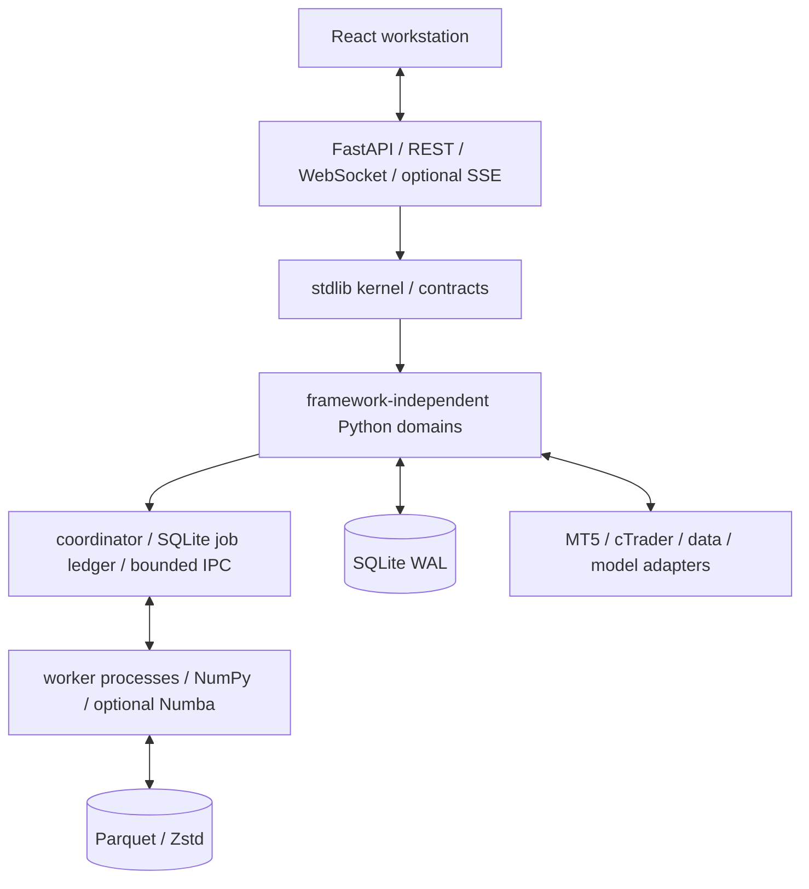

# Architecture

> **Status:** Normative target architecture. Product capabilities are `Missing` except the
> `Partial` UI foundation.
> **Baseline:** `1a99dd7`
> **Target stack:** React/TypeScript/Vite/Tailwind; Dockview; TanStack Table/Virtual;
> Lightweight Charts; optional Tauri v2; FastAPI/Pydantic/Uvicorn; framework-independent
> Python; NumPy/optional Numba; SQLite WAL; Parquet/PyArrow/Zstd.

This document owns universal structural, lifecycle, persistence, numerical, security, and runtime
constraints. [PROJECT.md](PROJECT.md) owns system scope; domain READMEs own feature semantics.
Reference-install Java/Electron/Jetty technology is evidence about that product, not target design.

---

## 1. Purpose, Authority, and Architectural Style

HaruQuantAI is a local-first modular monolith with isolated compute workers and optional external
adapters. The architecture keeps the interactive/API coordinator responsive, makes quantitative
outputs reproducible, traces durable artifacts to immutable inputs, and prevents presentation,
research, or agentic components from implicitly gaining live-trading authority.


```mermaid
flowchart TB
    UI["React workstation"]
    API["FastAPI / REST / WebSocket / optional SSE"]
    Kernel["stdlib kernel / contracts"]
    Domains["framework-independent Python domains"]
    Coordinator["coordinator / SQLite job ledger / bounded IPC"]
    Workers["worker processes / NumPy / optional Numba"]
    DB[("SQLite WAL")]
    PQ[("Parquet / Zstd")]
    External["MT5 / cTrader / data / model adapters"]
    UI <--> API
    API --> Kernel
    Kernel --> Domains
    Domains --> Coordinator
    Coordinator <--> Workers
    Domains <--> DB
    Workers <--> PQ
    Domains <--> External
```

The coordinator is not a compute worker. CPU-heavy simulation/search/scenario work runs in bounded
processes. Initial coordination uses bounded in-memory queues and process IPC; Redis or another
external broker is not an initial dependency.

---

## 2. Universal Invariants

1. Repository code/tests/documentation—not chat or reference-product files—are implementation truth.
2. `app/kernel/` uses only the Python standard library and contains no product logic.
3. Cross-domain DTOs, protocols, events, errors, and capability tokens live in
   `app/contracts/<domain>.py`; implementations never cross that boundary.
4. One feature module owns one cohesive capability and is independently removable.
5. `__init__.py` is empty or docstring-only; registration is explicit in `app/registry.py`.
6. All tasks, subscriptions, resources, and capability publications are scope-managed.
7. SQL/schema/transactions live only in `app/services/persistence/<domain>.py`; raw connections do
   not escape.
8. Durable results freeze data/config/code/template versions, environment profile, and seeds.
9. Missing, invalid, unavailable, undefined, not-applicable, and numeric zero remain distinct.
10. Price, quantity, currency, time, sample, direction, and precision units are explicit.
11. Live execution is disabled by default and requires distinct configuration, authorization,
    limits, audit, and environment identity.
12. No credential, token, private path, personal strategy, or private market payload enters logs,
    exports, model context, or client-readable settings.
13. Destructive database recovery is forbidden; migration/backup/restore are explicit operations.
14. Bounded queues, requests, uploads, tables, streams, worker resources, and search budgets are
    mandatory—no unbounded workload is accepted.
15. A reference observation may define an acceptance target but never changes feature status.

---

## 3. Static Module Architecture

```text
app/
|-- kernel/                         # standard-library composition/lifecycle/logging
|-- contracts/
|   `-- <domain>.py                # public DTOs/protocols/events/errors/tokens
|-- services/
|   |-- <domain>/
|   |   |-- README.md               # domain authority
|   |   |-- __init__.py             # empty or docstring-only
|   |   `-- <feature>.py            # cohesive removal unit
|   `-- persistence/
|       `-- <domain>.py             # schema, SQL, transactions
|-- registry.py                     # explicit composition
`-- ui/                             # React/TypeScript workstation
```

### Layer Ownership Rules

- **Kernel:** graph validation, lifecycle scopes, exact-type events, structured-logging primitives.
- **Contracts:** framework-neutral immutable public semantics; no service implementation imports.
- **Domain services:** policy/algorithms behind declared capabilities; no sibling implementation
  imports or import-time effects.
- **Persistence mechanics:** SQLite/Parquet catalog operations; semantics remain with the domain.
- **Gateway:** validation and protocol translation only; no quantitative/business calculations.
- **UI:** presentation and ephemeral view state only; server/domain state remains authoritative.
- **Workers:** execute immutable envelopes and publish bounded progress/results; they do not mutate
  coordinator-owned ledgers directly.
- **Adapters:** translate external protocols and capabilities; they do not decide strategy/risk.

### Shared Support Exceptions

Small standard-library value types may live in the kernel only when domain-neutral. Test helpers
remain under tests. NumPy, Numba, FastAPI, Pydantic, PyArrow, broker SDKs, and model clients stay
outside the kernel. Shared code is not a dumping ground: if it has business meaning, one domain
owns it and others consume its contract.

---

## 4. Feature Architecture and Canonical Module Anatomy

A feature module is the delivery, lifecycle, evidence, and physical-removal unit. Required
capabilities block startup with an attributed error. Optional capabilities gate only named
operations and expose availability. Failed start unwinds every acquired effect. Stop is idempotent
and bounded.

### Canonical Top-to-Bottom Structure

```python
"""One cohesive feature and its public purpose."""

from dataclasses import dataclass
from typing import Final

from app.kernel.logging import get_logger

logger = get_logger(__name__)


@dataclass(frozen=True, slots=True)
class ExampleConfig:
    """Validated immutable configuration."""

    operation_timeout_s: float


class ExampleService:
    """Implements the public protocol without importing peer implementations."""

    def __init__(self, config: ExampleConfig) -> None:
        self._config = config


SPEC: Final = FeatureSpec(
    feature_id="domain.example",
    requires=(REQUIRED_CAPABILITY,),
    provides=(PROVIDED_CAPABILITY,),
)


class ExampleFeature:
    """Acquires and releases all effects through its feature scope."""

    async def start(self, context: FeatureContext) -> None:
        service = ExampleService(ExampleConfig(operation_timeout_s=30.0))
        context.provide(PROVIDED_CAPABILITY, service)


def feature() -> Feature:
    """Return an unstarted feature instance."""
    return ExampleFeature()
```

The example is anatomy, not a prescribed product default.

# 1. Slotted immutable configuration

All settings are typed, finite, unit-labeled, validated before effects, and provenance-aware.
Secrets are references. Reference sample values never become defaults without approval.

# 2. Service class implementing public contract protocol

Services accept public protocols/value objects, remain framework-independent, expose typed stable
failures, and do not accept raw connections or unbounded iterables.

# 3. Immutable feature specification

`FeatureSpec` declares stable ID/version, required/provided and optional operation-gated
capabilities, startup constraints, and explicit registration identity. It contains no mutable
runtime state.

# 4. Feature lifecycle wiring implementing Feature protocol

Lifecycle code resolves required capabilities, acquires managed resources, publishes only after
successful setup, and cleans up in reverse order on failure/stop. Importing a module does nothing.

# 5. Zero-argument factory

The registry calls a zero-argument factory. Runtime configuration is resolved through the
composition context, not hidden global state or import-time environment reads.

---

## 5. Composition and Runtime Engine (`app/kernel`)

Application phases are `constructed -> starting -> running -> stopping -> stopped`. Startup
validates configuration, paths, schemas, feature graph, required capabilities, worker limits, and
ports before readiness. Shutdown rejects new admission, checkpoints/drains according to policy,
closes streams/adapters, joins workers, stops reverse dependency order, and closes stores.

### 5.1 Kahn's Algorithm and Reachability Validation

The registry validates unique feature IDs and capability providers, missing required capabilities,
contract-version compatibility, cycles, and reachability. Kahn's algorithm yields deterministic
startup layers with a stable feature-ID tie break. Any cycle or missing required provider prevents
effects. Optional dependencies never create an implicit startup edge unless a feature declares
one.

### 5.2 Two-Phase Startup and Staging

Each feature starts in a child scope. Resources/tasks/subscriptions/capabilities are staged until
the feature completes initialization. Failure closes that scope before another dependent starts.
The application publishes readiness only after every mandatory feature commits. Durable migrations
run before feature writes and use backup/compatibility policy.

### 5.3 Managed Resource Lifecycles (`FeatureContext`)

`FeatureContext` is the only effect gateway: provide/resolve capabilities, spawn managed tasks,
subscribe/publish events, and enter sync/async resources. Effects are attributable to feature and
released reverse acquisition order. Task exceptions are observed and reported; cancellation is
cooperative then bounded. No background task is fire-and-forget.

A durable job separately implements
`queued/running/pausing/paused/cancelling/cancelled/succeeded/failed/interrupted` with
compare-and-swap state versions, attempts, progress sequence, heartbeats, checkpoints, and audit
events. Worker/coordinator loss becomes `interrupted`; retry creates a new attempt. Partial
artifacts remain staged.

### 5.4 Exact-Type Event Bus (`EventBus`)

Events dispatch by exact declared type/version, not subclass surprise. Per-subscriber buffers and
failure policies are bounded. Ordering-sensitive events carry monotonic sequence. A slow/failing
subscriber cannot block the publisher indefinitely or alter the producing transaction. Cross-
process events are serialized versioned DTOs; replay/resync is explicit.

### 5.5 Structured Logging Subsystem (`app.kernel.logging`)

Services call `get_logger(__name__)` and never configure handlers. Records use bounded fields and
carry feature/run/job/attempt/worker/correlation IDs when available. Redaction removes secrets,
tokens, credentials, personal paths, raw strategy definitions, private data, and external payloads.
Tracebacks remain local. Logs are not an artifact database or event bus.

---

## 6. Testing and Verification Architecture

Every completed feature has configuration, behavior, boundary, unavailable, lifecycle,
persistence (when relevant), and physical-removal tests plus a deterministic offline example.
Cross-domain suites cover:

- artifact identity/lineage, SQLite migrations, crash-safe promotion, backup/restore;
- numerical hand-goldens, properties, accounting invariants, Python/NumPy/Numba equivalence;
- simulator total ordering, look-ahead prevention, gaps/same-event ambiguity, costs/rounding;
- job pause/resume/cancel, worker crash, backpressure, coordinator restart and checkpoints;
- API/OpenAPI, cursor pagination, idempotency, authorization, WebSocket resume/resync and slow
  consumers;
- UI accessibility, stable virtualized selection, layout migration, disconnect/error/mock states;
- path/archive/upload attacks, secret redaction, extension isolation, and live-mode denial;
- external adapter mapping/idempotency/reconciliation in fakes or approved sandboxes.

Focused edits use explicit tests with `uv run pytest --no-cov <paths>`. Complete qualification is
run once on the candidate:

```powershell
uv run python scripts/ci_check.py
```

It owns Ruff format/lint, strict Mypy, architecture checks, full tests, and coverage. Tests never
delete or reset active workspace databases; temporary isolated stores are mandatory.

---

## 7. Deployment and Runtime Execution

- **Browser/local service:** Vite-built client and loopback FastAPI/Uvicorn service.
- **Desktop:** optional Tauri v2 packages web assets and an allowlisted Python sidecar; sidecar
  arguments, health, shutdown, and update compatibility are supervised.
- **Headless:** CLI composes the same kernel/domains without presentation.
- **Remote:** future opt-in only after TLS/auth/authz/origin/audit/threat review.

FastAPI/Pydantic exposes versioned `/api/v1` REST/OpenAPI. Long work returns `202` and a job
receipt. Lists have stable cursor pagination and bounded limits. Errors use stable
`application/problem+json`-style fields and safe correlation IDs. WebSocket is primary for
bidirectional progress/control with protocol negotiation, sequence, heartbeat, bounded buffers,
resume cursor, snapshot/resync, and explicit slow-consumer close. SSE is optional one-way fallback
only after pinned-version support is verified. Disconnect never cancels a durable job.

SQLite WAL stores control metadata with foreign keys, busy timeout, short transactions,
monotonic transactional migrations, and no raw connection leakage. PyArrow Parquet/Zstd stores
large immutable ticks/bars/trades/equity/trials/scenarios. Writes stage under a contained root,
close, validate, hash, atomically promote, then catalog; orphan cleanup is reference-safe and
audited.

Internal instants are timezone-aware UTC; sessions retain IANA timezone/calendar version.
Prices/quantities carry tick/step/decimal metadata. Decimal arithmetic is used at financial
boundaries; arrays use documented floats. Rounding stage/mode is contractual. Parallel reductions
are deterministic or declare tolerance/platform metadata. Numba is acceleration, not semantics.

The simulator versions a total order across timestamp, symbol, market update, pending activation,
protection, callback, submission, fill, account update, and snapshot. Precision, bid/ask
construction, spread, slippage, commission, swap, minimum distance, volume, margin, currency,
gaps, and ambiguity are frozen inputs. Visibility windows prevent look-ahead.

The frontend uses React/TypeScript/Vite/Tailwind, Dockview, TanStack Table/Virtual, Lightweight
Charts, and typed API adapters. Server records are authoritative; client stores only bounded
cache/draft/view state. Layouts are versioned/migratable. Stable IDs survive virtualization and
stream updates. WCAG 2.2 AA, keyboard docking/table operation, focus restoration, announcements,
reduced motion, and non-color status are acceptance requirements.

External profiles declare capability, environment, mapping, timeout/retry/rate limit, health, and
secret references. Loopback is default. Remote bind, live execution, arbitrary extension loading,
and model-provider data sharing each require explicit opt-in and security review. Research, UI
mocks, and agentic tools cannot grant live authority.

Primary target-framework references are [FastAPI WebSockets](https://fastapi.tiangolo.com/advanced/websockets/),
[FastAPI SSE](https://fastapi.tiangolo.com/tutorial/server-sent-events/),
[Tauri sidecars](https://tauri-v2.netlify.app/develop/sidecar/),
[PyArrow Parquet](https://arrow.apache.org/docs/24.0/python/parquet.html),
[Tailwind with Vite](https://tailwindcss.com/docs/installation/using-vite?v=1.0.20), and
[Dockview](https://dockview.dev/). Implementations must pin and revalidate actual versions; this
document makes no claim about unspecified latest releases.
