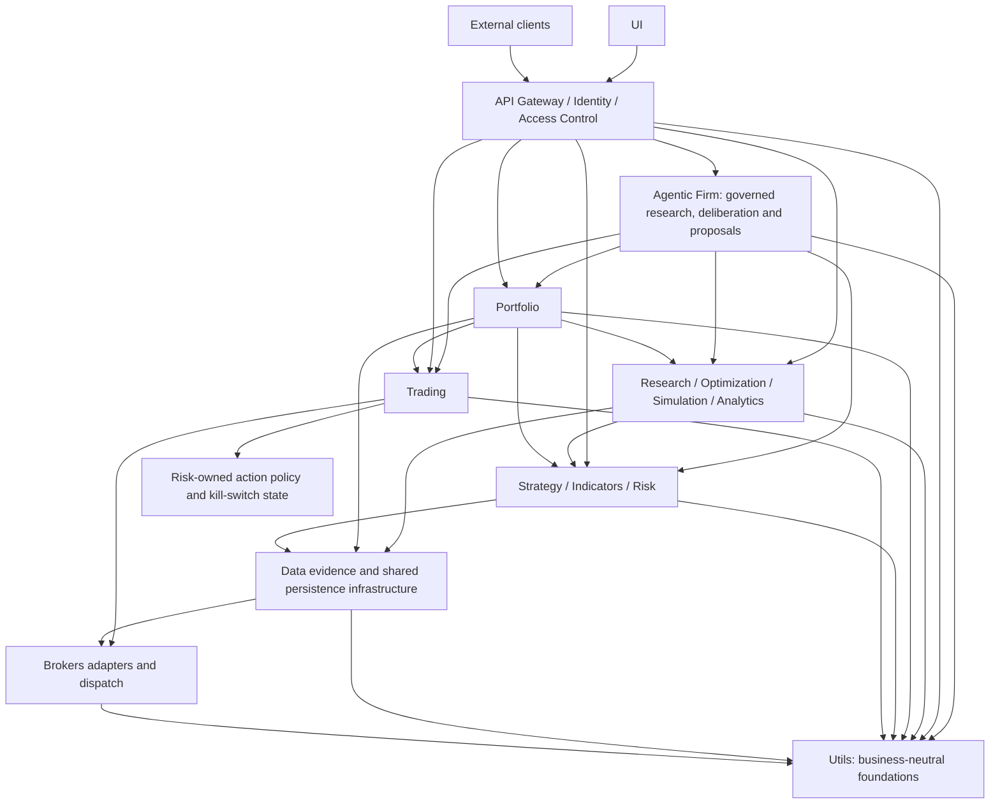

# HaruQuantAI System Architecture (Dense Reference)

## System Overview & Tech Stack

* **Architectural Pattern**: Modular monolith with service-oriented module boundaries. Aligns research, simulation, demo, and live environments while preventing any bypass of system controllers.
* **Production Stack Baseline**:
  * *Backend*: Python 3.14, managed with `uv`. FastAPI, Pydantic, Uvicorn (introduced once the API Gateway module lands).
  * *Frontend*: Next.js, React, TypeScript, Tailwind CSS, Radix UI (introduced once the UI module lands).
  * *Persistence*: SQLite (launch baseline). Each persistent domain owns its logical schemas and migration definitions; Data owns shared connections, locking, migration execution, and the immutable migration ledger.
  * *Execution Sessions*: Trading owns durable SIM/DEMO/LIVE session definitions and append-only lifecycle evidence. The database stores reconstructable identities, provider/credential references, dataset lineage, defaults, metadata, and lifecycle state; SIM definitions additionally store operator-authored opening balance, leverage, and account currency. The authenticated active/default session supplies the Header's session identity, and the active/default SIM session supplies its initial account profile while DEMO/LIVE metrics remain MT5-authored. A session may start only when its persisted mode equals the authoritative system `ACCOUNT_MODE` and platform compatibility also passes. Process-local broker sockets and runtime handles are deliberately excluded and recreated only after authority verification.
  * *Data Science*: `pandas`, `numpy`, `scipy`, `scikit-learn`, `numba`, approved `pyarrow`/`fastparquet`.
  * *Broker Gate*: The Brokers domain owns provider-neutral adapter contracts and dispatch; MT5, cTrader, and Binance are adapter implementations selected by explicit configuration and readiness policy.
  * *Quality Gate*: `ruff` (lint + format), `mypy` (static types), `pytest` (tests/coverage), `pre-commit` (enforced hook chain).

* **Runtime Profiles** (separate from deployment `ENVIRONMENT`):
  * `research`: Data and feature exploration. Zero live broker mutations.
  * `simulation`: Historical backtests via the core trading path. Simulated side effects.
  * `demo`: Live paths executed against demo infrastructure. Demo side effects.
  * `live`: Real-capital transactions. Disabled by default; mandates all functional safety gates. Explicit toggle: `ALLOW_LIVE_MUTATIONS=false`.
* **Deployment Environments**: `ENVIRONMENT` is exactly one of `dev`, `test`, `staging`, or `production`. It never substitutes for `RUNTIME_PROFILE`.

---

## Current Implementation State

> This section tracks reality; the rest of this document describes the target architecture. Update it as modules land — see [docs/CHANGELOG.md](CHANGELOG.md) for history.

* Project scaffolded with `uv` (Python 3.14, `pyproject.toml`, `uv.lock`).
* Tooling configured: `ruff` (full rule set), `mypy`, `pytest`, `pre-commit` (hygiene checks, ruff, ruff-format, detect-secrets, mypy).
* Code present: `app/` package with implemented service modules under `app/services/`, including Trading as the surviving live-route runtime and broker-dispatch owner.
* The retired Live service has been folded into `app/services/trading/`; live execution remains a runtime route/mode, not a standalone service package.
* Trading order request/intent v2 separates caller-approved fill policy from lifetime policy, binds both to a Brokers-owned provider-specification checksum, and forbids provider-derived intent defaults; explicitly profiled v1 conversion is labelled legacy and excluded from canonical parity.
* Trading builds approved request v2 values once from immutable Strategy/Risk lineage and exact provider-policy evidence. Simulation, demo, and live then use the same public action verbs, Brokers adapter boundary, and response classifier; Simulation omits only declared live transport and mutation-authorization safety gates and never receives a private mutation callback.
* Trading owns one route-neutral evaluation cycle with required injected deadline authority: demo/live compose it from monotonic wall time and Simulation supplies scheduler time, while timeout evidence and neutral outcomes retain one semantic shape.
* Brokers order request v2 preserves those two policy dimensions independently: MT5 maps them to `type_filling` and `type_time` through verified constants, and unsupported provider combinations fail before transport rather than falling back to symbol defaults.
* `app/services/api/README.md` defines the approved gateway/UI boundary and state ownership. Backend v1 exposes registered owner-backed operations, including server-side session identity recovery, an authenticated SSE bridge over Data-owned MT5 streams, Risk reads/commands, and Trading session plus governed submit/cancel/close routes. Trading mutations require complete authority evidence, idempotency, the configured demo/live route, and all owner-side safety gates; live remains disabled by default.
* Portfolio is implemented and `Completed`: `app.services.portfolio` is its sole
  public boundary, exposes standalone functions only, and coordinates genuine
  Data/Simulation evidence while keeping Risk approval and Trading execution in
  their owning domains. It publishes `PortfolioMarginView v1` and
  `PortfolioRiskHealth v1`, consumes Data-owned FX evidence without duplicating
  rates, and persists immutable valuation, margin, reconciliation, and lifecycle
  evidence under additive migration 003.
* Analytics is persistent only for immutable journal, adherence, behavior,
  emergency-response, and qualification evidence under additive migration 003;
  its existing calculations remain pure. Durable mutations are audit-event
  producers and corrections append rather than rewrite evidence.
* API owns `OperationalWorkstation v1` plus the authenticated workstation read and
  optimistic command routes; UI owns the accessible workstation presentation. Human
  API approval is attestation only; Risk-owned authorization remains authoritative,
  and owner handlers verify expected versions before mutation.
* Strategy domain persistence is implemented and `Completed`: `app/services/strategy//` owns seven persistent runtime tables (`strategy_definitions`, `strategy_versions`, `strategy_configs`, `strategy_state`, `strategy_checkpoints`, `strategy_signals`, `strategy_mutations`) backed by applied migrations `0001_strategy_domain` and `0002_strategy_seven_table_runtime`, plus operational-planning tables (`strategy_profiles`, `strategy_playbooks`, `strategy_setup_evaluations`, `strategy_plans`, `strategy_automation_policy`, `strategy_lifecycle`) defined by additive migration `0003_strategy_operational_planning`. Schema migrations flow through the Strategy migration manifest (`run_strategy_migrations`), private CRUD in `app/services/strategy/persistence/` constructs SQL statements and delegates transaction execution to `app.services.data`, feature operations outside `persistence/` provide production reachability, and database bootstrap/population (`scripts/strategy/populate_strategy_database.py`) is restricted to an explicitly selected non-production environment (`ENVIRONMENT=dev`).
* Indicators domain is implemented and `Completed`: `app/services/indicators/` is pure, stateless, and read-only with zero active database tables (retired via migration 002). Backend v1 exposes 3 authenticated read-only API routes (`/api/v1/indicators`, `/api/v1/indicators/capabilities`, `/api/v1/indicators/{indicator_id}`), and the Next.js UI frontend mounts `IndicatorWorkspace` in `WorkspaceGrid` and `Sidebar`.
* `app/agentic/README.md` defines the complete Agentic Firm target. The package now
  exists and Agentic status is `Partial`: `FEAT-AGT-01` implements the seven canonical
  provider-neutral contracts (`AgentTask`, `AgentMessage`, `AgentArtifact`,
  `AgentResult`, `AgentProvenance`, `BudgetUsage`, `WorkflowCheckpoint`) as immutable,
  strictly validated, JSON-safe models carrying stable identity, aware-UTC time,
  namespaced `agentic.*.v1` schema identity, trace lineage, and a canonical content
  hash. `AgentResult` separates `ok`, `refused`, and `failed`, admits only enumerated
  reason codes, and rejects deterministic execution fields. `FEAT-AGT-02` adds the immutable signed firm mandate, the evaluated role
  manifest, and the validated `RoleRegistry`: mandate and manifest integrity digests
  are recomputed rather than trusted, the composite instruction hash binds prompt and
  manifest so a mutated prompt fails closed before agent construction, wildcard scopes
  and the `controlled_mutation`/`critical` permission classes are unrepresentable, and
  no title confers capability beyond its manifest. The package root is a function-only
  public surface. `FEAT-AGT-03` implements provider-neutral `ModelProfile`
  pinning that rejects floating aliases and credential material, a governed
  `invoke_model` path that enforces profile bounds and refuses silent provider or
  model substitution, and upgrade gating where missing evidence is a failure rather
  than a default pass; `runtime/adk.py` is the sole construction site for a
  Google ADK object: ADK is imported lazily so the Agentic public API loads no
  provider module, the resolved credential reaches only the provider client and
  never a contract, log, or audit record, and an observed cost is derived from
  reported tokens rather than reported as a false zero that would defeat the
  per-call ceiling. `FEAT-AGT-04` adds durable orchestration: idempotent submission that
  persists its initial checkpoint before execution, expected-version guards,
  bounded routing, and terminal states that never resume under the same task
  identity. Following the Portfolio and Risk precedents, Agentic declares its
  additive `agentic_` schema and an injected store port and implements no database
  writer. `FEAT-AGT-05` enforces deny-by-default tool authorization across
  registration, eligibility, permission class, environment, scope, budget, and
  approval; it owns `ToolApprovalAttestation v1`, which adds the exact object hash,
  single-use nonce, and signature that the Risk-owned `ApprovalAttestation v1` does
  not carry, and it makes broker, order, kill-switch, override, and deployment
  capabilities structurally unregistrable rather than merely refused. `FEAT-AGT-06`
  assembles point-in-time context through ordered lookahead, trust, licensing,
  freshness, deduplication, and injection filters, returning trusted context and
  untrusted evidence in separate fields so retrieved text can never occupy an
  instruction slot; its four separated stores redact before persistence, append
  corrections rather than overwriting, and bound working memory by TTL and task.
  `FEAT-AGT-07` runs bounded deliberation: independent briefs are
  collected before any peer conclusion exists, so independence is structural rather
  than procedural; participants, rounds, and fan-out come from the versioned limits
  profile and are not raisable by a caller or a model; unresolved challenges are
  preserved as dissent; and consensus cannot be claimed while material dissent
  stands. A `DeliberationRecord` rejects authorization and position-size language
  outright, so agreement can never be converted into a decision.
  `FEAT-AGT-08` lands the first registered leaf agent package and
  establishes the pattern the remaining eleven follow: `prompt.md` is versioned data
  loaded and hash-verified against the enabled `RoleManifest` before construction,
  with line endings normalized so the digest is portable; `agent.py` embeds no prompt
  text, imports no ADK or provider object, and delegates to the injected runtime; and
  the typed output carries no numeric field, so a recomputed upstream metric cannot
  be expressed at all. `FEAT-AGT-11` adds the first governed tool adapters: every
  evidence call is authorized by the permission enforcement point before the
  receiver is reached, a denied call never falls through, and each result is
  bounded as untrusted input. Its output pack takes instrument, venue, timeframe,
  session, window, indicator versions, and quality status from the deterministic
  receivers rather than from the model, so a model cannot misreport which
  indicator definition was used; claims, confirmations, invalidations, and
  leakage notes are keyed alike, making a claim without all three conditions
  unrepresentable. `FEAT-AGT-12` applies the same separation to statistics: the
  analyst names a metric and the Analytics catalog supplies its formula and its
  minimum sample, so an estimator the catalog does not recognize — including a
  formula a model writes out in place of a name — is refused rather than
  accepted; findings, estimators, and uncertainty are keyed alike, so a point
  estimate with no interval cannot be expressed; and non-finite, under-sampled,
  hash-misaligned, or leakage-unsafe evidence is refused before the runtime is
  invoked, so the model is never shown data it would have to repair.
  `FEAT-AGT-13` turns specialist packs into falsifiable
  hypotheses and non-executable theses: a hypothesis without a rejection criterion
  cannot be constructed, a thesis rejects code, orders, prices, sizes, and
  approvals, and both take their evidence references from the packs actually
  supplied rather than from model output. Unresolved deliberation dissent forces a
  `contested` stance regardless of what a model declares, so agreement alone never
  promotes a proposal. `FEAT-AGT-14` adds the first Agentic feature that both
  persists and coordinates a receiver: a protocol is pre-registered and hashed
  before any run, so a falsification criterion rewritten afterwards yields a
  different digest and cannot be passed off as the one registered; the
  receiver's request is submitted unchanged and its result checked for binding
  rather than reconciled, with the package importing neither Simulation
  contract so there is no site at which one could be authored; and holdout is
  claimed once per protocol, enforced in-process before the receiver is called
  and durably by the ledger's primary key. `FEAT-AGT-16` is the first feature
  that writes to a filesystem: an authenticated human specification and a lease
  attesting to every isolation property gate generation before any model call;
  the artefact manifest carries files, digests, dependencies, tests,
  provenance, and complete search history, and is digested as a whole; and
  every declared path is validated on its raw text before parsing, then
  resolved and re-checked against the staging root so a symlink cannot carry a
  write outside the tree. Isolation itself is delegated: Agentic declares the
  sandbox port and refuses an under-attested lease, and binding a runtime that
  actually isolates remains the composition root's obligation.
  `FEAT-AGT-15` extends the same discipline to search: a plan is declared and
  hashed before any trial runs, so a budget widened afterwards is a different
  plan; the trial ledger requires attempted to equal completed plus failed with
  a reason per failure, so a sweep cannot report its survivors while dropping
  the trials that did not survive; robustness, stability, and overfit are read
  from deterministic Optimization operations rather than asserted, so a verdict
  cannot consist of a rank alone; and a sweep consuming holdout reserves it
  from the same `FEAT-AGT-14` ledger an experiment would, closing the path by
  which a thesis's single look could otherwise be spent twice.
  `FEAT-AGT-17` closes the loop by making acceptance arithmetic rather than
  judgement: the six evaluation-set kinds and the seven critique challenges are
  validated by set equality, so a missing poisoning set or an unaddressed
  leakage challenge is unrepresentable rather than merely weaker; the required
  action is computed from the gate outcomes and the margin before the model is
  invoked, and the verdict recomputes it and rejects disagreement, so a model
  cannot write `continue` over a failed gate; and a candidate beats its simpler
  baseline only when its margin strictly exceeds the measurement uncertainty
  plus its extra cost, with an exact tie going to the baseline. The feature
  decides and does not mutate: applying a disable or a retire is `FEAT-AGT-18`'s
  or a mandate re-issue's, and no versioned set or calibrated grader yet exists
  for any role, so the mechanism is verified and no role has been evaluated.
  `FEAT-AGT-18` gives artefacts a history that cannot be rewritten: a promotion
  packet's evidence fields are all required, so a packet assembled without a
  critique or without an approving human is unconstructable rather than merely
  thin; five deterministic gates read evidence the packet already carries and
  terminate promotion as `research_only`, which nothing reopens; and the
  transition ledger is keyed on the artefact digest rather than its identifier,
  so a materially changed artefact begins with an empty history and cannot
  inherit an approval granted to a different one. The current state is read
  from the ledger rather than supplied by the caller, so holding a valid packet
  does not let anyone skip a step, and demotion from `registered` needs neither
  packet nor approval. The feature records and does not register: nothing in it
  imports Strategy or the simulator, and reaching a receiver is `FEAT-AGT-22`'s.
  `FEAT-AGT-19` makes non-binding a property of the type rather than a claim in
  the prose: an allocation proposal defines no lot size, notional, quantity, or
  price field, so nothing in it could reach an execution path even if the object
  were mishandled; approval language is refused through `FEAT-AGT-07`'s single
  definition, extended only by the level-and-price vocabulary specific to an
  advisor; and every proposal expires, strictly, with an already-expired one
  unconstructable and an expired one never critiqued. Mandate scope is copied
  from what Risk returned rather than from the model, so a proposal cannot widen
  its own asset class; every evidence read must carry an observation instant,
  and an unreadable one counts as stale. The risk critique covers all eight
  kinds by set equality and emits no approval by absence — the advisory has no
  verdict, severity, or boolean a caller could read as consent. All five
  receiver operations are reached through an injected port, never by import.
  `FEAT-AGT-20` is the closest Agentic comes to a trade, and the boundary is
  the type rather than the prose: neither a trade proposal nor its receipt
  defines a price, quantity, lot size, notional, stop, target, order type,
  venue, or account field, and the receiver's own intake contract has nowhere
  to put one either. What is proposed — instrument, strategy identity,
  direction, horizon, evaluation scope — comes from the caller and evidence
  comes from the thesis, so the model writes the rationale, the invalidation,
  and the uncertainty and nothing more; only a `supported` thesis may be
  proposed, with `contested` excluded so a preserved conflict is not buried by
  trading on it. The handoff targets Strategy's `FEAT-STR-11` external-proposal
  intake, whose factory derives the request identity and idempotency key from a
  content digest and refuses a caller that supplies either, which is what makes
  "no privileged route" structural. A receipt carries Strategy's own status
  enumeration verbatim — the most favourable being `accepted_for_evaluation` —
  and records a produced intent by identity alone, never by content.
  `FEAT-AGT-21` makes observability and containment deterministic rather than
  best-effort: a trace covers all ten required span kinds by set equality or
  does not exist, so a run whose emitters stayed silent produces a refusal
  instead of a partial view that reads as complete, and an unlabelled or
  invented span never widens the contract. Redaction is inherited from the
  `FEAT-AGT-06` memory boundary and defined nowhere in the package, so the firm
  keeps one answer to what counts as a secret. Containment is a property of the
  incident kind through a fixed table rather than a judgement at the call site,
  applied through the normal cancellation path; a record whose action disagrees
  with its kind, a quarantine naming no role, a cancel naming one, or any
  containment without preserved evidence and a checkpoint are all
  unrepresentable, and one classified incident per kind per correlated run is
  enforced in the double and by a unique constraint in the durable table.
  Replay is isolated by the type — the environment is a literal `sandbox`,
  every reference is a content digest re-verified against the store, and an
  outcome reporting any attempted side effect is rejected. Quarantine records a
  decision; changing a role's registered state remains a governance manifest
  re-issue. `FEAT-AGT-22` closes the boundary with eight authenticated operator
  operations over a frozen dependency record in which every port is a required
  field, so a partially wired firm cannot be invoked at all. Every answer is a
  mapping of bounded strings rather than a domain object, which is what makes
  "no prompts, credentials, or provider internals" structural: there is no
  nested value a `ModelProfile` or an `AgentProvenance` could travel inside,
  and a forbidden-key rule closes the text route. Failures are mapped rather
  than raised, so no provider or receiver exception crosses the boundary.
  Disablement is checked before authentication for anything that creates or
  changes work, drains or cancels active runs by policy, writes over nothing,
  and leaves reads available so an operator can still learn why the firm
  stopped. Its safety-equivalence clause holds structurally: a test over every
  file in `app/agentic` asserts the domain names no kill-switch operation, no
  risk approval, no live gate, no order dispatch, and no broker SDK, so
  disabling a package that never held safety authority cannot weaken safety.
  `WF-AGT-005`'s planned `open_sandbox` and `stage_code_artifact` are
  deliberately not exported, because no isolation runtime exists to open.
  `FEAT-AGT-09` and `FEAT-AGT-10` complete the twenty-two once Data's
  point-in-time source evidence capability and `FEAT-RES-13` unblocked them. Both
  read a Research projection through an
  injected port rather than importing a receiver, so the chain stays
  Agentic to Research to Data. Applicability is the receiver's answer read
  before any model call, which is why a fundamental reading of an FX instrument
  under the issuer model is refused: Research's issuer model covers equity,
  corporate bonds, and funds, and FX has no issuer. Claims, assumptions,
  horizons, and falsifiers are parallel key sets, so a claim nobody can say how
  to falsify is unrepresentable; and the sentiment analyst runs `FEAT-AGT-06`'s
  injection classifier over every reference **before** the model is invoked,
  excluding and counting what it flags, so retrieved text occupies an evidence
  slot and never an instruction slot. All twenty-two features are implemented,
  and none of it has run for real: no live provider call, no bound sandbox
  runtime, no durable store, no evaluated role, no promoted artefact, no
  reviewed advisory, no evaluated proposal, and no source fetched.
  Google ADK 2.x is adopted behind a scoped `requests` override, documented in
  `pyproject.toml` with the condition for its removal. Its hybrid layout keeps ten shared control-plane features as focused root packages and places twelve role-bearing features under registered `agents/<department>/<agent_name>/` leaf packages with provider-neutral `agent.py`, integrity-checked `prompt.md`, feature schemas, and only specification-required optional files. Specialized leadership, market-intelligence, technical, quantitative, strategy/trader, experimentation, engineering, portfolio/risk-advisory, and operations roles may dynamically collaborate, simulate, optimize, code, and submit typed proposals. Google ADK 2.x is the selected runtime behind provider-neutral HaruQuantAI contracts. Agentic has no broker credential, direct broker route, risk approval, kill-switch authority, or execution authority; consequential proposals traverse the normal deterministic pipeline.
* `app/utils/` is a completed implementation baseline for shared v1 contracts,
  errors, identifiers, UTC, canonical serialization, redaction/security helpers,
  settings, and structured logging.
* `app/services/brokers/` is a completed implementation baseline for canonical
  broker contracts, immutable capability matrix, runtime factory/safety, provider adapters, and its
  deterministic test adapter. Capability availability remains evidence-gated and
  fail-closed.
* `app/services/data/` has an implemented functional baseline containing immutable
  contracts, bounded SQLite/file/cache/audit persistence, explicit read-only sources
  and durable policy, historical/reference/context/FX access, deterministic
  transforms/alignment, synthetic generators, quality validation, recoverable
  scheduler jobs, internal feed status, immutable backup/restore manifests,
  licence-aware retention enforcement, and a function-only package-root public
  boundary across eighteen focused features.
  Retrieval and reference exports accept either their typed request or direct keyword
  arguments; standalone calls lazily compose MT5 read-only source, identity,
  migration, and calendar dependencies through the existing Brokers and Data
  boundaries. Explicit source/adapter injection remains supported.
  Its existing package-local architecture and repository-wide package-root consumer
  boundary are implemented and verified. Data status is `Completed`, including
  `FEAT-DATA-11` database-first calendar retrieval, bounded resumable historical
  Forex Factory acquisition through credential-free Jina Reader, current-week CSV
  synchronization, normalized permanent event definitions and specifications,
  exact provider-value
  normalization, symbol-scoped restriction evidence, and governed SQLite coverage,
  plus point-in-time licensed source documents, structured observations,
  immutable revisions, verified-source manifests, and bounded projections for
  Research consumption.
  `CAP-DATA-028` locates the behavior in fourteen approved feature owners indexed by
  the Data package README. Contracts, persistence, migrations, and private `_shared/`
  construction adapters remain documented support directories rather than extra
  features. Exactly fourteen numbered standalone usage programs cover those owners,
  and removed
  horizontal packages have no compatibility shims. The correction changes ownership
  and file focus only; active requirements, public behaviour, contract versions,
  schema identifiers, error codes, and the explicit package-root API remain
  compatible.
* `app/services/indicators/` contains the completed immutable Core calculation
  boundary and 64 approved one-indicator-per-file implementations across its 14
  registered formula and transport features.
  It is stateless and read-only: migration `001_indicator_schema_v1`
  historically introduced three empty support tables, and immutable migration
  `002_remove_unused_indicator_support_schema` retired them through Data's
  authoritative executor. Indicators now owns no live tables or private
  persistence package.
  It also owns JSON-safe IndicatorSnapshot and LiquiditySnapshot transports,
  closed-input enforcement, and neutral operational measurements. Risk alone owns
  authoritative regime classification and tightening policy. Package promotion
  remains blocked while the current Data error catalogue cannot be validated by
  the Utils catalogue boundary during migration failure-path handling.
  Its package-root API, standalone usage programs, domain workflows, and its
  participation in `SYS-WF-001` and the virtual non-production `SYS-WF-002`
  teaching path pass. Genuine MT5 demo checks are explicit opt-in integration
  operations and are not a default verification claim.
  Retrospective SMC/FVG/swing/BOS/CHoCH labels remain excluded to preserve the
  non-repainting contract.
* `app/services/strategy/` is completed across contracts, diagnostics, registry,
  intents, replay/checkpoints, vectorized evaluation, event hooks, concrete signal
  evaluators, and receiver-owned external-proposal evaluation. It accepts approved
  Optimization-result projections without importing Optimization and emits a
  canonical `TradeIntent` only when the registered deterministic strategy
  independently supports the proposal.
* `app/services/risk/` is implemented across contracts, configuration, snapshots,
  sizing, audit chaining, policy gates, regimes, approvals, decisions, scenarios, and
  reporting. Its status is `Partial`: kill-switch clearance must require a distinct
  authorized attestation principal, while the current implementation still requires
  the same principal.
* `app/services/trading/` is a completed implementation baseline across all 64
  functional and eight non-functional requirements, nine capability modules, and all
  sixteen documented workflows. It owns `OrderIntent v1`, `ExecutionReceipt v1`,
  `TradeRecord v1`, and `OperationalEvent v1`. Production live mutation remains
  disabled by default.
* Later agile phases reuse these completed domains and run compatibility/regression
  checks; they do not rebuild them. Data docstring conformance is structurally
  enforced; remaining semantic-docstring/format cleanup is a separate
  repository-quality gate.
* `app/services/analytics/` is a completed read-only implementation across
  contracts, producer-neutral ledger and Data-owned benchmark adaptation, 60
  cataloged metrics, report/allocation evidence, bounded dashboards, all active
  requirements, and all non-excluded workflows. Simulation publishes executable
  `PortfolioSimulationResult v1`; producer-consumer compatibility and exact
  `FR-SIM-033` fixture parity are verified without reverse imports. Analytics
  derives its equity curve deterministically from the closed-trade ledger and has
  no open decisions.
* `app/services/optimization/` is completed across bounded parameter search,
  validation, scoring, robustness, evidence, and Data-backed relational state.
  Its complete checksummed manifest runs through Data's ledger, lock, and
  transactional migration boundary; its two current tables are reached through
  Optimization-owned CRUD builders. API surfaces advisory evidence only and
  cannot automatically adopt parameters or place trades.
* `app/services/research/` provides a completed sixteen-feature deterministic
  research baseline. In addition to bounded point-in-time intelligence,
  Research owns approved expectancy governance, performance-drift evidence, and
  cited stress-scenario evidence. Function-only injected adapters satisfy the
  Strategy exact-version, Risk `Decimal` override, and Optimization calibration
  consumer ports without reversing domain dependencies. Research artifact,
  expectancy projection/history, drift, and stress records use Research-owned
  five-file persistence support with Data-owned migration, ledger, lock, and
  transaction execution.

---

## Spatiotemporal Provider Architecture

### Units

The provider architecture decomposes runtime execution into nine distinct architectural units:

* **Kernel**: Business-neutral runtime machinery (`app/kernel/`) that discovers manifests, resolves dependencies, coordinates lifecycles, tracks health, and manages effect scopes without business domain knowledge.
* **Capability Specification**: Stable, versioned contract in `app/capabilities/<domain>/<capability>/v<N>.py` defining pure callable records or effectful protocols.
* **Provider**: Concrete implementation package of one or more capabilities. The provider is the fundamental unit of runtime removability and replacement.
* **Component**: An activated provider generation paired with its parsed configuration, allocated resources, and registered effect scope.
* **Feature**: Product capability owned by a business domain, comprising one or more cooperating providers.
* **Domain**: Business ownership and namespace boundary (`app/services/[DOMAIN]/`), exposing public functions and acting as a transitional compatibility façade.
* **Profile**: Operational readiness policy (`research`, `simulation`, `demo`, `live`) declaring required capabilities and degradation rules.
* **Composition Root**: Dedicated construction layer (`app/composition/`) that inspects profiles, instantiates selected providers, and injects capabilities.
* **Effect Scope**: Managed lifecycle boundary tracking background tasks, open sockets, event streams, file handles, and database transactions.

### Contract Shape

Capability contracts use a hybrid model based on effect classification:

* **Pure Capabilities**: Frozen dataclasses of callable types (e.g. `RsiCapability`, `WilliamsRCapability`). Pure functions take inputs, return outputs, and hold zero state or external handles.
* **Effectful Capabilities**: `typing.Protocol` interfaces (e.g. `NotificationDeliveryCapability`, `TickStreamCapability`). Effectful components own state, manage async/sync edge adapters, acquire system resources, and require formal lifecycle disposal.

### Identifiers

Components and contracts are identified by validated, immutable value objects:

* **`CapabilityId`**: `<domain>.<capability>.v<major>` (e.g., `indicator.rsi.v1`, `broker.market_data.v1`). Segments match `[a-z][a-z0-9_]*` with a positive integer major version.
* **`ProviderId`**: `<domain>.<capability>.<implementation>` (e.g., `indicator.rsi.numpy`, `broker.execution.mt5`).
* **`SemanticVersion`**: `<major>.<minor>.<patch>` representing contract or implementation versioning.

### Manifest

Every provider folder contains a static `manifest.toml` parsed with stdlib `tomllib` during filesystem discovery without executing or importing provider Python code:

* `provider_id`: Unique `ProviderId`.
* `provider_version`: `SemanticVersion`.
* `entry_point`: Factory function string (e.g., `"app.services.indicators.providers.rsi:create_rsi_provider"`).
* `provides`: List of `ProvidedCapability` records (`capability_id`, `contract_version`, `cardinality`).
* `requires` & `optional_requires`: List of `RequiredCapability` dependencies with supported major versions and `on_missing` policies (`fail_closed`, `degrade`, `skip`).
* `profiles`: Allowed runtime profiles (`research`, `simulation`, `demo`, `live`).
* `effect_classes`: Declared effects (`reversible_ephemeral`, `durable_compensatable`, `irreversible_external`).
* `lifecycle` & `reload`: Policies (`pure` vs `scoped`, `config_restart` vs `process_restart`).
* `state_retention`: Schema versioning, migration manifests, and purge authorization requirements.

### Resolution

Dependency resolution is deterministic and occurs at component activation:

* The resolver constructs a directed acyclic dependency graph across discovered manifests.
* Circular dependencies and version incompatibilities fail fast with detailed diagnostic chains.
* Missing required dependencies trigger declared `on_missing` behavior (`fail_closed` halts startup; `degrade` drops optional features; `skip` bypasses optional providers).
* The API Gateway synthesizes call-time `CAPABILITY_UNAVAILABLE` responses for absent capabilities so public HTTP/WebSocket routes maintain structural stability.

### Lifecycle

Components follow an explicit synchronous finite state machine:

$$\text{Discovered} \longrightarrow \text{Registered} \longrightarrow \text{Activating} \longrightarrow \text{Active} \longleftrightarrow \text{Quiescing} \longrightarrow \text{Quiesced} \longrightarrow \text{Disposed}$$

* **Activation**: Allocates resources, verifies environment readiness, and binds effect scopes.
* **Quiesce & Drain**: Signals components to reject new work and complete in-flight transactions.
* **Disposal**: Releases sockets, locks, and handles in reverse registration order.
* **Error**: Captures activation or runtime failures into structured health projections without crashing unaffected services.

### Composition

`app/composition/` is the sole assembly layer permitted to import concrete provider factories and instantiate runtime pipelines:

* Injects capability implementations directly into consumer constructors at startup.
* Prevents runtime service-locator anti-patterns and dynamic global lookups in high-frequency calculation loops.
* Manages generation leases, enabling atomic configuration reload and seamless provider replacement.

### Profiles

Runtime profiles define strict operational boundaries and readiness constraints:

* `research`: Focuses on data exploration and analysis; prohibits live broker sockets and external mutation.
* `simulation`: Executes reproducible backtests against historical tick ledgers with simulated fills and deterministic time.
* `demo`: Connects to non-production demo brokers with genuine transport isolation and mock risk approvals.
* `live`: Operates with real capital; enforces all mandatory safety gates, strict risk limits, verified credentials, and kill-switch readiness.

### State Retention

Provider uninstallation maintains database and state ledger integrity:

* **Uninstall $\neq$ Purge**: Removing or disabling a provider retains its historical database tables, schema records, and migration ledger entries.
* **Checksum Stability**: Applied migration checksums remain verifiable in the ledger, preventing database corruption when optional plugins are absent.
* **Purge Governance**: Dropping tables or destroying persisted provider assets requires explicit, separate administrative authorization.

### Removability Tiers

The system classifies removability into three functional tiers:

| Tier | Classification | Characteristics | Examples |
|---|---|---|---|
| **Tier A** | Pure Calculation | Zero dependencies, pure callable records, instant replacement, stateless. | RSI, Williams %R, ATR, MACD, mathematical transformations. |
| **Tier B** | Business Domain | Swappable implementations, managed effect scopes, protocol interfaces, configurable. | MT5 Broker, cTrader, Notification channels, Alpha research models. |
| **Tier C** | Core Infrastructure | Essential platform foundations, fail-closed safety, migration ledger, authorization. | SQLite connection pool, Risk Gate, Kill Switch, Kernel lifecycle. |

### Frontend Boundary

The Next.js UI interacts with providers exclusively through stable API routes:

* When a provider is absent or disabled, API endpoints return a standardized `CAPABILITY_UNAVAILABLE` payload with precise reason codes and missing dependency chains.
* UI components transition to graceful empty, degraded, or unavailable states without visual crashes or unhandled client exceptions.

### Workspace Directory Layout (Target)

* `app/services/api/`: FastAPI transport, authentication/session/credential boundary, route orchestration, runtime composition, and channel-neutral critical operational alert delivery. It may authorize, sequence public owner-domain operations, translate errors, and assemble boundary DTOs; it may not calculate market, indicator, trading, risk, strategy, analytics, research, or portfolio values. API owns user/session/unified user-and-system settings/encrypted-credential/HTTP-idempotency schemas on Data infrastructure and constructs Brokers-owned connection configuration. The Settings feature owns both externally provisioned pre-database bootstrap configuration and API-wide boundary limits, distinctly from its persisted post-migration settings routes. The non-feature `workstation/` namespace groups every focused page/widget gateway feature. Routes, feature adapters, persistence, schema migrations, configuration, and limit policy remain in their owning feature; only coherent support consumed by at least three registered features remains shared at the API domain level. The API package root contains only its public `__init__.py` production-Python boundary.
* `app/ui/`: Independent Next.js presentation domain owning pages, layouts, widgets, typed clients, session/page context, interaction state, accessibility, and explicit loading/empty/stale/unavailable/error presentation. Employs Spatiotemporal Composability ("everything is a plugin"): a single-page composable canvas hosting dynamic workspaces where all functional capabilities are modular widgets residing in `src/widgets/` that can be dynamically added, removed, docked, and split. UI depends on API contracts only and has no deterministic business-policy authority. `FEAT-UI-*` verification uses executable unit, component, integration, contract-parity, and browser evidence rather than standalone usage-example programs. Markets and Watchlists reside in focused `widgets/markets/` and `widgets/watchlists/` folders; other widgets live with their registered owning features.
* `app/agentic/`: Approved top-level orchestration domain with one focused owning module per registered feature. Ten shared infrastructure features remain root packages for portable contracts/governance, Google ADK adaptation, durable orchestration, permissions, context/memory, bounded deliberation, lifecycle, operations, and public API. Twelve role-bearing feature modules are leaf packages under the namespace-only `agents/<department>/<agent_name>/` hierarchy; each owns `agent.py`, `prompt.md`, schemas, README, and only its declared optional files. Agentic submits untrusted typed requests only and has no direct execution path.
* `app/`: Core domain modules (utils, brokers, data, indicators, strategy, risk, trading, simulator, analytics, optimization, research, portfolio, agentic, and API). Live-route execution is owned by Trading.
* `data/`: SQLite databases, migration tracking, cache/log dumps, market/research assets.
* `app/ui/`: Next.js frontend domain and deployable application environment.
* `tests/`: Unit, integration, usage, and system contract test suites.
* `scripts/`: DB initialization, migration runners, validation tools, operational utilities.
* `docs/`: Documented project truth.

### Module Boundary Pipeline

Dependencies follow authoritative contract ownership and remain acyclic; consumers use
public domain APIs and may not bypass Risk, Trading, Data, or Brokers boundaries:


```mermaid
flowchart TD
    UI["UI"] --> API["API Gateway / Identity / Access Control"]
    CLIENT["External clients"] --> API
    API --> AGENTIC["Agentic Firm: governed research, deliberation and proposals"]
    API --> ORCH["Research / Optimization / Simulation / Analytics"]
    AGENTIC --> ORCH
    AGENTIC --> DECIDE
    AGENTIC --> PORT
    AGENTIC --> TRADING
    AGENTIC --> UTILS
    API --> PORT["Portfolio"]
    API --> DECIDE["Strategy / Indicators / Risk"]
    API --> TRADING["Trading"]
    ORCH --> DECIDE
    ORCH --> DATA["Data evidence and shared persistence infrastructure"]
    PORT --> ORCH
    PORT --> DECIDE
    PORT --> TRADING
    PORT --> DATA
    DECIDE --> DATA
    TRADING --> RISK["Risk-owned action policy and kill-switch state"]
    TRADING --> BROKERS["Brokers adapters and dispatch"]
    DATA --> BROKERS
    API --> UTILS["Utils: business-neutral foundations"]
    ORCH --> UTILS
    PORT --> UTILS
    DECIDE --> UTILS
    TRADING --> UTILS
    DATA --> UTILS
    BROKERS --> UTILS
```

**Agentic boundary note.** Agentic reads public evidence from deterministic domains
and may submit receiver-owned requests to Strategy, Portfolio, Risk, and Trading.
Those edges are untrusted proposal/intake edges, not authority transfers. Each
receiver performs its complete validation and authorization, and only Trading may
reach Brokers. Agentic has no Brokers edge, credential, mandate override,
kill-switch authority, order tool, or direct execution route. Agent-authored code
reaches Indicators or Strategy only through the governed promotion and
receiver-registration workflow.

**Sim⇄live parity dependency note.** The approved parity programme fixes the
execution dependency direction `Simulation → Trading → Brokers` plus
`Simulation → Brokers`. Simulation is a read/factory consumer of Brokers: it
constructs and drives the Brokers-owned simulation broker channel through an
injected, structurally typed authority port, while every application mutation
operation remains Trading-only. Brokers imports no Simulation symbol, provider
translation stays in Brokers, and matching/accounting/scheduling/journaling stay in
Simulation. Specification evidence is split by observation time: Brokers owns the
typed current provider specification snapshot (current observation only) and Data
owns immutable effective-dated historical revisions; the graph stays acyclic.
The channel has one exact identity pair (`sim`, `simulation`), opens no socket,
requires no credential or endpoint, and delegates canonical connection lifecycle,
events, and run finalization through the injected authority. Its capability matrix
is an explicit intersection: anything not admitted returns
`BROKER_CAPABILITY_UNSUPPORTED`, never an empty synthetic success.
The current snapshot is implemented as `ProviderSpecificationSnapshot v1`
(`FEAT-BRK-18`, parity-programme Phase 4a): it binds execution/order/filling/
expiration/GTC modes, stops/freeze levels, directional volume limits,
calculation mode, margin and swap evidence, instrument scalars, and account
permission evidence to one provider/server/redacted-account/environment
observation with a canonical checksum, fails closed on missing provider
fields, keeps dynamic cost evidence as a separate typed reference, and
exposes no effective bounds.
Data implements the historical half of this boundary through `FEAT-DATA-02`:
canonical snapshot mappings are stored without a Brokers type dependency as
immutable checksummed revisions under half-open UTC effective intervals. A
successor closes the prior interval atomically; point-in-time and bounded reads
must prove complete coverage and never backdate a current observation without
explicit owner-supplied provenance (`FR-DATA-214`–`216`).
Simulation binds that history into `SimulationBacktestRequest` without
importing Data or Brokers types: immutable revision reference projections must
continuously cover the run interval and match its demo/live certification
target. V2 configuration identity also covers execution-model, independent
source/tick lineage, market-evidence class, point-in-time availability policy,
complete initial authority state, and terminal-close policy. The V2-native
async operation has no synchronous bridge, and execution-engine construction
requires non-empty effective provider-revision history so provider session and
order semantics cannot be bypassed.

### Agentic Runtime and Trust Boundaries

Google ADK 2.x provides the in-process graph, dynamic, collaborative, task, session,
artifact, evaluation, callback, and telemetry runtime behind `AdkRuntime`.
HaruQuantAI owns the stable task, message, result, deliberation, evidence, proposal,
checkpoint, permission, and model-profile contracts. No ADK or provider object
crosses the Agentic public API or becomes canonical persisted state.

The validated `RoleRegistry` resolves stable role IDs to registered leaf agent
packages, prompt and composite-instruction hashes, model profiles, schemas, tools,
evaluation state, and limits. A leaf `agent.py` produces a provider-neutral
definition only after its package-local `prompt.md` passes integrity validation.
Only `runtime/adk.py` may construct Google ADK objects.


```mermaid
flowchart LR
    OP["Authenticated operator"] --> UI2["UI"]
    UI2 --> API2["API"]
    API2 --> AP["Agentic public API"]
    AP --> POL["Mandate + permission enforcement"]
    POL --> WF["Durable HaruQuantAI workflow state"]
    WF --> REG["Validated RoleRegistry + package/prompt hashes"]
    REG --> AG["Registered agent.py + prompt.md packages"]
    AG --> ADK["AdkRuntime / Google ADK graph"]
    ADK --> MG["Provider-neutral ModelGateway"]
    MG --> LLM["Evaluated model providers"]
    ADK --> TOOLS["Typed Agentic tool adapters"]
    TOOLS --> DOM["Deterministic public domain APIs"]
    ADK --> MEM["Scoped evidence / experiment / audit / TTL memory"]
    ADK --> SB["Ephemeral code sandbox"]
    DOM --> PIPE["Strategy / Portfolio / Risk / Trading"]
    PIPE --> BRK["Brokers — Trading only"]
```

The Agentic worker is separately cancellable from the deterministic backend. The
code sandbox is an isolated per-run worker with no production credential and denied
network by default. Persistent Agentic stores use the repository migration ledger,
checksum, lock, transaction, retention, and recovery rules.

### Package-Root Export Gate & Public API Surface Rules

1. **Package-Root Export Gate**: `app/services/[DOMAIN]/__init__.py` is a domain's sole public boundary. Symbols not re-exported in `__init__.py` and declared in `__all__` are strictly internal. A domain may satisfy this gate eagerly, importing each public symbol at module level, or lazily, mapping each `__all__` name to its owning module and resolving it on first access through a PEP 562 module `__getattr__`. Both forms expose the same declared `__all__` surface. A lazy boundary must also keep an `if TYPE_CHECKING:` import block so type checking stays exact, and a boundary test that resolves every declared export so a broken export fails in CI rather than at first access. The owning package README records which form that domain uses.
2. **Domain-Root Imports Only**: Cross-domain consumers, usage examples, workflows, and integration tests must import strictly from `app.services.[DOMAIN]`. Deep imports (e.g., `from app.services.[DOMAIN].[submodule] import Name`) are prohibited.
3. **Function-Only Public Surface**: Public APIs expose only standalone functions (`def func(...)`). Classes and constants remain internal:
   - Constants are accessed via public getter functions (`get_...()`).
   - Classes are encapsulated internally; public functions delegate to internal class methods (`_func()`).

### Domain Persistence Layout

Data owns shared database connection, bounded transaction, locking, migration-ledger,
backup, and recovery infrastructure. Each persistent domain owns the meaning of its
records. CRUD shared by at least three registered features stays in one private
`app/services/[DOMAIN]/persistence/` support package; otherwise it stays in the
owning feature's private `persistence/` package. Either package contains exactly
`__init__.py`, `create.py`, `read.py`, `update.py`, and `delete.py`. Atomic
multi-statement operations are classified by domain effect and remain in one CRUD
module. Unsupported verbs retain an empty module, while immutable schema definitions
remain in the corresponding domain- or feature-local `migrations/` support package.
One composition entry point may aggregate feature manifests without changing their
domain, migration identifiers, checksums, statements, or order. Domain feature modules
retain authorization, validation, policy, orchestration, domain-model construction,
and public response behavior and call persistence only through the private package
boundary. Cross-domain persistence infrastructure is consumed only through
`app.services.data`; no domain opens SQLite connections or imports Data internals.
The infrastructure-owning `app/services/data/persistence/` package keeps the same
`create.py`, `read.py`, `update.py`, and `delete.py` CRUD naming convention, but is
exempt from the five-file limit because it also owns transactions, locks, migrations,
backups, recovery, approved paths, datasets, and cache orchestration. Data feature
modules construct domain intent only; all SQL record operations terminate at this
private persistence boundary.

---

## Technical Contracts & Envelopes

### Cross-Domain Capability Ownership

Canonical capability identity uses only the owning package's `FEAT-*` registry.
Cross-domain integration never creates a second feature namespace and never transfers
business authority:

- Data owns canonical market, timing, replay, and evidence transport facts.
- Indicators owns deterministic measurements; Risk owns policy interpretation.
- Strategy proposes; Risk authorizes; Trading executes; Brokers transports.
- Portfolio owns accounting state; Simulator owns simulated execution and replay state.
- Analytics owns scoring and reporting; Optimization and Research own advisory evidence.
- Agentic may explain or propose but cannot bypass deterministic owners.
- API orchestrates and UI presents without either becoming a business authority.

Provider absence, stale evidence, incompatible versions, or unknown state fails closed
at the consuming feature boundary.

### Shared Utility Framework (`app/utils/`)

application foundation contracts cross domain boundaries only as validated
JSON-safe `v1` mappings built and parsed by function pairs exported from
`app.utils`. Runtime implementation classes remain private. Utils owns exact-unit
representation, generic transition evaluation, validation-outcome combination,
idempotency-key semantics, and versioned deterministic random-stream derivation;
it owns no business state, transaction, outbox, migration, venue-calendar,
instrument-increment, or domain-event meaning. Missing or incompatible contract
versions fail closed, and random draws depend only on explicit seed, stream name,
algorithm version, and draw index.

* **Public Export Rule**: `app/utils/__init__.py` exposes only the approved shared surface through an explicit `__all__`. No fallback imports, shims, duplicate modules, or single-consumer helpers are permitted.
* **Target Submodule Footprint**: shared contracts, errors, IDs, time, canonical serialization, redaction, typed bootstrap settings, and structured logging. `AppSettings` accepts explicit values and process environment only; repository configuration files are not runtime sources. Logging starts with the Utils-owned safe `INFO` bootstrap profile; after API migrations, API reads the global document from `api_settings`, validates and activates `LOG_LEVEL`, translates only approved provider enablement/path values into an opaque Utils settings object, and installs it through Data's context-local public boundary for the complete API lifespan. Data, Brokers, and Utils never query API persistence. API owns versioned global non-secret settings in `api_settings`, AES-GCM encrypted write-only provider credentials in `api_credentials`, typed manifests, validation, active-key selection, and startup snapshots. Deployment infrastructure exclusively owns the bootstrap values needed before SQLite or decryption is available: environment/runtime safety controls, database/path configuration, API origin/bind configuration, JWT signing material, and credential-encryption keys. Database-backed changes activate after a controlled restart so composition roots can inject one coherent snapshot into owning domains.
* **Contract Ownership Rule**: Domain contract modules own their payload and business-outcome behavior locally. Utils owns only the shared five-field public-operation response envelope and business-neutral error-definition shape; domains do not inherit any other centralized contract base.

### Standard Public-Operation Response

Every HaruQuantAI-owned public operation that accepts one bounded request and
produces one completed outcome returns `StandardResponse[T]`, regardless of
whether the operation is registered as an AI tool. The envelope serializes exactly
`status`, `message`, `data`, `error`, and `metadata`.

- `data` is the raw result `T`; it is never nested in a synthetic result/payload
  object or legacy response envelope.
- Immutable mapping-proxy results retain their exact Python identity in `data`;
  JSON-mode output is a detached bounded JSON-safe mapping and does not mutate or
  replace that runtime value.
- Existing non-payload envelope fields are preserved losslessly under stable
  `metadata.extensions` keys.
- Top-level status reports function completion. Completed domain decisions such as
  rejection, blocking, neutral action, or uncertain execution truth remain typed
  domain data rather than being reclassified as function failure.
- Error details and extensions are bounded, redacted, and JSON-safe.
- Execution time derives from `time.perf_counter_ns()` and is expressed in
  non-negative milliseconds rounded to three decimal places.
- Simulation applies this boundary to validation, tick construction, accounting,
  execution, journaling, reporting, and backtest orchestration; raw Simulation
  results remain directly in `data`, while `SIM_*` failures remain in `error`.
- Constructors, properties, private helpers, streams/subscriptions, callbacks,
  externally prescribed protocol methods, runtime-resource factories, and response
  infrastructure primitives are outside the bounded-operation rule.

For Brokers, every bounded adapter, registry, subscription-control, and fake-control
operation uses this shared envelope. The raw provider-neutral DTO is stored directly
in `data`. Broker/profile identity, operation, UTC completion timestamp, environment,
adapter/provider versions, redacted provider metadata, and separated provider/adapter
latency are stable `metadata.extensions`; retryability, provider code/message,
capability, and legacy details are stable `error.details`. The asynchronous
`connection_events()` iterator and subscription `events()` iterator remain streams,
not completed-operation responses. Brokers owns one complete immutable
`BROKER_ERROR_CATALOG`; Utils owns only the catalogue shape and validation.

Utils owns the common system error catalogue and catalogue validation shape. Each
domain remains authoritative for its own immutable codes, descriptions, retry
policy, severity, and operator action. Higher-level composition may validate and
render a system-wide catalogue without making Utils depend on a service domain.

### Domain Audit Event Shape

```json
{
  "contract_version": "v1",
  "schema_id": "utils.audit_event.v1",
  "event_id": "TEXT (Traceable string-safe UUID4)",
  "timestamp": "TEXT (UTC ISO string with 'Z')",
  "domain": "TEXT",
  "action": "TEXT",
  "principal_id": "TEXT | null",
  "request_id": "TEXT",
  "correlation_id": "TEXT",
  "causation_id": "TEXT | null",
  "payload": "MAPPING (Redacted JSON-safe payload)"
}
```

Required `AuditEvent v1` producers are Data, Strategy, Risk, Trading, Simulation,
Optimization, Research, Portfolio, and API. Brokers emits technical logs only;
Indicators and Analytics are pure/read-only, so their governed callers audit actions.

### Shared Authentication Context

```json
{
  "contract_version": "v1",
  "schema_id": "utils.auth_context.v1",
  "principal_id": "TEXT",
  "principal_type": "USER | SERVICE_ACCOUNT",
  "roles": "ARRAY[TEXT]",
  "permissions": "ARRAY[TEXT]",
  "scopes": "ARRAY[TEXT]",
  "tenant_or_environment": "TEXT",
  "request_id": "TEXT",
  "workflow_id": "TEXT",
  "correlation_id": "TEXT",
  "issued_at": "TEXT (UTC timestamp)"
}
```

Registered domain contracts keep `contract_version` separate from namespaced `schema_id`; compatibility is never inferred by parsing the schema identifier.

### Data Domain Contract Boundary

- Data's canonical cross-domain schema identifiers are
  `data.market_dataset.v1`, `data.account_state_snapshot.v1`,
  `data.market_context_evidence.v1`, and `data.fx_conversion_evidence.v1`.
- Canonical shared Data contracts live in `app.services.data.contracts`;
  feature-specific contracts live in their registered feature folders. Under the
  Function-Only Public API Surface rule, `app.services.data` exposes standalone
  operations only, so public consumers import operations from
  `app.services.data` and contract types from `app.services.data.contracts` —
  the same split the Brokers domain uses.
- Data contract modules contain immutable schemas and deterministic validation only.
  They perform no source, broker, network, storage, cache, scheduling, or feed-runtime
  acquisition.
- Data market-data acquisition belongs in `app.services.data.market_data`; normalized
  cross-domain evidence (market context, FX, account state) belongs in
  `app.services.data.evidence`; canonical/friendly identity, provider-symbol mapping,
  and source readiness/licence/promotion policy belong in
  `app.services.data.sources`.
- Real-time market acquisition and subscription semantics belong in
  `app.services.data.market_events`. MT5 snapshot consumers acquire and release exact
  symbol demand through the Brokers package-root boundary. Brokers owns the bounded
  reference-counted union and revisioned bidirectional MQL5 TCP protocol; the EA
  publishes only the latest acknowledged complete set. An acknowledged empty union
  pauses EA quote reads and snapshot payloads immediately while a bounded heartbeat
  retains the control connection; non-empty acknowledged demand resumes publication.
  Data owns canonical mapping,
  freshness, filtering, sequencing, explicit gap/backpressure failure, and consumer
  cleanup. Live bar polling remains unsupported; genuine historical bars bootstrap
  charts. Chart snapshot ticks are ephemeral intrabar presentation: Bid may extend
  only the current authoritative bar's High, Low, and Close. A timeframe rollover
  always returns to the historical-bar boundary for the new bar and overlays. If
  MT5 still returns the prior bucket, the chart keeps SSE closed and performs
  bounded delayed authoritative reads rather than reconnecting on every tick. No
  client synthesizes or persists an OHLCV bar. The API route is only an authenticated
  SSE transport bridge.
- `MarketDataRequest.limit` is required to be positive, but OHLCV retrieval has no
  app-wide record-count ceiling. Tick and spread retrieval retain their governed
  limits; multi-million-record OHLCV ingestion remains the responsibility of the
  bounded, resumable Data Jobs backfill workflow.
- Detached OHLCV DataFrame projection preserves genuinely unavailable optional spread
  as float64 `NaN` and records `spread_unit=None`; supplied spread remains unit-bearing
  and finite. Missing spread is never replaced with zero or an assumed current quote.
- FEAT-DATA-05 owns tick derivation in two internal stages: eligible bar evidence is
  transformed by private Numba kernels into exact signed-64-bit fixed-point columns,
  then the public in-memory operation constructs canonical immutable `TickRecord`
  values at the Decimal boundary. Direct Parquet persistence consumes bounded columns
  without constructing a complete tick `MarketDataset`. A safe common internal scale
  preserves provider precision before output rounding; real ticks, seeded variable
  spreads, unsafe precision/ranges, and small batches use the exact legacy path.
  Simulation may later consume bounded columns through its own integration, but
  it does not own or duplicate tick generation.
- External broker/provider reads use injected Brokers `BrokerAdapter` read traits.
  Data owns no SDK session, credential resolution, connection lifecycle, or mutation
  capability; only Trading may invoke broker mutations.
- The research-only Dukascopy adapter uses BI5 hour files for raw ticks and the
  keyless `chart/json3` web-chart interface for BID candles. Brokers owns exact
  interface-specific symbol mapping (for example, canonical `EURUSD` to web-chart
  `EUR/USD`), bounded cursor pagination/retries, and provider-value mapping; it does
  not invent spread or locally synthesize OHLC from those ticks.
- Source composition is centralized in `app.services.data.sources.composition` and is the single
  gate on source availability. It dispatches on source kind: local artifact sources
  declared by `DATA_LOCAL_SOURCES` compose at `production` readiness with no
  credential, network, or promotion requirement; broker provider facades declared by
  `DATA_PROVIDER_SOURCES` compose at `staging` only when their Brokers-owned
  `*_ENABLED` flag is set, and reach `production` solely through evidence-based
  promotion. An identifier that is neither fails closed as `UNSUPPORTED_SOURCE`
  before any policy evaluation. Local artifacts live under `DATA_RAW_ROOT` and are
  named `{symbol}[_{timeframe}].{csv|parquet}`.
- Symbol tradability and analytical session labels are separate contracts. Data
  evaluates `MarketHours` only from ordered UTC windows supplied by a broker,
  an explicit `exchange-calendars==4.12` venue identifier, or an explicit
  revisioned weekly definition. cTrader remains the owner of parsing its full-symbol
  weekly schedule and broker holidays. Regional named sessions use `zoneinfo` for
  DST-aware analytics and carry no order-validation authority.
- Standalone Yahoo composition is credential-free but explicit: Data selects the
  Brokers-required `SANDBOX` profile, configures `AAPL` as the connectivity probe, and
  registers exact identity `AAPL` to `AAPL`. Brokers maps canonical bar timeframes such
  as `H1` to documented yfinance intervals such as `1h` without fallback guessing.
- Standalone Binance Spot public-read composition is also credential-free. Data uses
  the Brokers-required `LIVE` profile without account secrets, while Registry releases
  only symbol discovery, symbol metadata, and historical bars. Brokers maps canonical
  timeframes such as `H1` to Binance's exact case-sensitive `1h` interval and preserves
  both requested and provider timeframe provenance; unsupported intervals fail closed.
  Data keeps each asynchronous connect/read/disconnect sequence on one event loop, so
  no loop-bound HTTP client crosses calls through the synchronous facade.
- Availability inspection uses persisted manifests/indexes for local artifacts and one
  bounded canonical retrieval for network providers. Provider availability reports
  only the observed probe range and records whether its record limit was reached, so
  an unobserved remote history is never represented as complete.
- Foreign artifact admission is explicit. `load_dataset` requires a Data-written
  manifest and performs no hidden on-read conversion or migration. Externally
  produced CSV/Parquet enters canonical form only through `import_external_dataset`,
  which requires a caller-declared `ColumnMapping` and a named dialect fixing header
  style and delimiter. No governed field — `symbol`, `data_kind`, `timeframe`,
  `workflow_context`, `precision_policy` — is ever inferred from file contents; the
  import fails rather than guessing. The operation terminates in `save_dataset` and
  persists one `AuditEvent` recording external origin, so imported artifacts are
  thereafter indistinguishable from Data-authored output while their provenance
  remains auditable.
- Cache staleness is caller-declared and never silent. `MarketDataRequest.stale_cache_policy`
  admits `refresh` (expired entry is a miss), `fail_closed` (return `EMPTY_RESULT`
  without contacting any source, enabling deterministic offline replay), and
  `serve_stale` (return the expired entry with `cache_status="stale_warning"`).
  `serve_stale` is restricted to the `research` workflow context at contract
  validation; governed contexts never serve expired entries.
- Retrieval quality-failure behavior is a closed `reject | warn` contract, applied
  identically to fresh and cached datasets. `reject` is the default and raises
  `DATA_QUALITY_FAILED`; `warn` logs bounded evidence and returns the unchanged
  dataset with `quality_decision="rejected"` and its issues intact.
- Data quality evidence contract v2 reports a two-decimal percentage score from
  `0.00` through `100.00`, a descriptive grade (`perfect`, `excellent`, `good`,
  `degraded`, `poor`, `critical`, or `not_checked`), and a separate operational
  decision (`accepted`, `accepted_with_warnings`, `review_required`, `rejected`,
  or `not_evaluated`). Consumers gate on the decision and fail closed for
  `rejected` or `not_evaluated`; a grade alone never authorizes an operation.
- High-level bar quality inspection discounts exact weekend closures and injected
  `SessionWindow` non-trading intervals. Unexplained weekday gaps remain critical;
  absent session evidence is explicitly disclosed as `calendar_unverified`.

Portfolio collaboration is contract-governed:

- Strategy owns immutable registration and `TradePlan v1` planning lifecycle. A validated `READY_FOR_RISK` plan may deterministically project to the preserved `TradeIntent v1`; Risk separately owns approval, sizing, and `StrategyOperationalEligibilityRequest/Decision v1`.
- Strategy holds only a version-exact expectancy reference. Research remains the authoritative expectancy-profile provider; an absent, failed, stale, or mismatched provider yields `NOT_ELIGIBLE` and falls back to the normal risk-to-reward gate.
- Portfolio owns `PortfolioDefinition v1`, `PortfolioConstructionRequest/Result v1`, `ActivePortfolioAllocation v1`, and `PortfolioRebalancePlan v1`; immutable definitions are registered/read through the Portfolio root boundary and stored atomically with audit-outbox evidence.
- Risk owns `AllocationReviewRequest`, `AllocationRiskDecision`, `AllocationBudgetActivationRequest`, and the authoritative risk-budget projection.
- Simulation owns `PortfolioBacktestRequest` / `PortfolioSimulationResult v1`; Analytics owns `PortfolioAllocationEvidence v1`; Data owns `FXConversionEvidence v1`.
- Simulation composes its historical loop through a typed receiver-owned dependency bundle. Its state store is constructed before its journal writer; one injected `SimTrader` instance supplies the asynchronous Trading sim-route callable. Canonical manifests hash `journal.jsonl`, `result.json`, and `report.md` and exclude the `manifest.json` envelope itself, preventing self-referential hashes.
- Completed Simulation runs may be traversed through durable one-hour `sim_sessions` cursors. Frame delivery validates the finalized JSONL hash chain before exposure and emits raw causative journal events over SSE; no live engine is retained and no mutation/what-if operation is admitted.
- Simulator owns the complete immutable two-step schema manifest and exposes `run_simulator_migrations`; the runner delegates ledger verification, write locking, checksum validation, and transactional execution to Data. Required API startup applies/verifies this manifest before Simulator-backed routes become ready and fails closed on any unsuccessful migration response.
- Trading owns `PortfolioRebalanceExecutionRequest v1` and remains the only route to broker mutations.
- Risk and Simulation requests carry self-contained receiver-owned projections using
  scalar values, ordered components, identifiers, versions, references, and hashes;
  they never embed or import Portfolio-owned contract types.

---

## Data Models & Schema Management

* **Data Layout Conventions**: Core cross-module database tracking identifiers must use `TEXT` format. SQLite boolean fields enforce strict `0` or `1` constraints. JSON text structures map to an explicit `*_json` suffix name.
* **Precision Standard**: Structural or broker-critical price, size, volume, and balance mathematics must bypass standard floating-point operations. Requires `decimal.Decimal` parsing to ensure transaction immutability.
* **Authoritative Schema Model**: Each owning package README's `### Persistence - Database` section is authoritative for that domain's current and target table model, prefix ownership, domain indexes, and target-vs-live reconciliation. This document remains canonical for cross-domain relationships, universal column conventions, storage tiers, and shared SQLite/Parquet policy. Executable schema remains in owning-domain migration definitions.
* **Table Namespace Prefixes**: Each persistent domain uses an owner-specific singular-full-word namespace: `util_`, `broker_`, `data_`, `indicator_`, `strategy_`, `risk_`, `trading_`, `sim_`, `optimization_`, `research_`, `portfolio_`, `agentic_`, and `api_`. `sim_` is canonical for Simulator; its immutable manifest contains `sim_runs`, playback/secured `sim_sessions`, and hash-linked `sim_session_checkpoints`, while journals remain JSONL artifacts rather than tables. Analytics is read-only and has no current tables; its historical `analytics_` store is retired by complete-manifest migration step `002`. Exact current and target table names belong only in the owning domain README and migrations.
* **Target vs Current Divergence**: A new table must conform to its owning README model. An existing table that diverges is documented in that README with an adoption tier, not silently migrated away. Closing a divergence requires an additive migration or explicit baseline-reset approval.
* **Migration Invariance**: Database tracking updates via additive structure migrations. Modifying applied structural migrations is prohibited without an explicit baseline reset approval.
* **Migration Definition Location**: Immutable schema definitions live beside their owner in `app/services/<domain>/migrations/` or `app/services/<domain>/<feature>/migrations/`. A domain-level location requires at least three registered feature consumers; otherwise definitions are feature-local and a composition entry point aggregates the complete domain manifest. Migrations are schema evolution, not CRUD. Relocation is an import-path refactor, not a ledger risk: a step checksum is computed over its ordered SQL statements only, and the ledger keys on `(domain, migration_id)`, so neither module path nor file name is an input. A move must preserve the statement tuple byte-for-byte, including whitespace, and the literal `domain` and `migration_id` values.
* **Normalise vs Payload**: A field becomes a typed column only when it is filtered or joined on, enforceable by a `CHECK` constraint, or part of a unique key. Everything else is carried in a single `*_json` payload validated by `json_valid`, with frequently queried inner keys exposed as indexed generated columns rather than promoted to real columns. This keeps constraint enforcement where it earns its cost while allowing payload evolution without an additive migration.

---

## System Control Policies

### Validation Strategy

* Enforce absolute schema checking prior to triggering downstream system side effects.
* Fail closed immediately if tracking context data is missing or corrupted during risk checks, live trade execution, or security evaluation.
* Enforce exact field parsing for sensitive updates; reject unknown or unmapped properties.

### Error & Automatic Retry Paradigm

* Every error object crossing module borders must remain structured, fully trace-tagged, and redacted.
* **Blind Retry Ban**: Automated retries apply only to verified transient transport anomalies. Unknown broker state responses block automated processing; execution loops freeze until state validation completes.
* **Fail-Closed Baseline**: System stops operations instantly if it encounters active kill switches, validation failures, token expiration, or structural mismatch flags.
* **Kill-Switch Dual-Control Baseline**: Activation is immediate and unilateral for
  one authorized principal. Clearance requires a current scope/policy-bound
  `ApprovalAttestation` from a different authorized principal; same-principal
  clearance fails without changing canonical state. Trading resumes only after all
  applicable scopes are inactive and reconciliation succeeds.
* **Portfolio Activation Baseline**: Simulation-profile activation is automatic only within explicit simulation policy. Demo/live activation requires human approval plus current Risk authorization. Active kill switches block activation and rebalance.
* **Allocation Safety Baseline**: Capital weights are Portfolio metadata; Risk budgets are authoritative. Existing over-budget exposure creates a Risk-reviewed reduce-only plan, and the system never opens a position solely to match a target weight.

### Sim⇄Live Parity Failure Taxonomy

Parity-programme failures fall into exactly three classes:

1. **Mirrored domain failures** — the simulated provider outcome must mirror the
   target broker's verified behavior exactly (retcodes, state transitions,
   accounting); any verified divergence is a parity defect.
2. **Fail-closed Simulation-integrity failures** — where no verified provider
   evidence exists, Simulation fails closed and the affected path is excluded from
   the canonical envelope; it never substitutes an approximation, fallback, or
   invented default.
3. **Seeded/journalled infrastructure injections** — timeouts, unknown outcomes,
   disconnects, delivery gaps, and transport faults appear in simulation only
   through the explicitly seeded and journalled scenario/fault-injection engine;
   they are never produced spontaneously.

### Operational Logging Boundary

* Governed external I/O, persistence, lifecycle/state transitions, and classified
  failures emit bounded redacted start/outcome/failure evidence with request and
  correlation identifiers.
* Data functions, validators, deterministic transforms, and private helpers use the
  system logger with bounded redacted messages; imports themselves emit no log,
  telemetry, network, or persistence side effect.
* Logging dependencies are explicit and never carry raw provider/database exceptions
  or sensitive values across a public boundary.

### Critical Operational Alert Boundary

Critical operational alerts are a focused API delivery boundary, not a Notification
domain and not an execution-control authority:

* The only approved triggers are a Risk-owned `KillSwitchState v1` transition to
  `active` and a Trading-owned critical `OperationalEvent v1` with
  `event_type="BROKER_STATE_UNKNOWN"` after the affected conflict scope is retry
  locked.
* API validates the authoritative source, derives one deterministic
  `CriticalOperationalAlert v1`, and performs one delivery attempt through an injected
  channel-neutral idempotent sink. The alert identifier is derived from the trigger,
  source schema, and immutable source identity/version, and is the sink's idempotency
  key.
* Alert content uses fixed trigger-specific templates and bounded, allowlisted,
  redacted facts. Arbitrary source payload forwarding, secrets, provider objects, and
  private broker state are forbidden.
* The composition root passes Risk results and Trading events to API-owned alert
  functions. Risk and Trading never import API, so the code dependency remains
  one-way and acyclic.
* Construction or delivery failure produces a structured
  `CriticalAlertDeliveryResult` and a redacted error log. It never rolls back or clears
  Risk state, releases a Trading retry lock, changes execution truth, or permits a
  mutation.
* Provider-specific channels, generic notifications, automatic retry queues,
  acknowledgements, escalation policy, and API-local mutable deduplication state are
  outside the initial target.

### Core Security Mandates

* Plaintext application passwords, live API keys, provider access configurations, and cryptographic seeds are classified as system secrets.
* Redact sensitive patterns from execution dumps, trace events, log lines, and metrics payloads case-insensitively before persistence.
* API encrypts persisted credential material and selects from externally
  provisioned keys. It never generates, persists, or rotates encryption keys.

---

## Deployment Configuration Reference

| Target Group | Explicit Key Identifiers |
| --- | --- |
| **Application Environment** | `APP_NAME`, `ENVIRONMENT` (`dev`/`test`/`staging`/`production`), `API_HOST`, `API_PORT`, `UI_ORIGIN` |
| **System Persistence** | `DATABASE_URL`, `DATA_DIR`, `ARTIFACT_DIR`, `DATA_CACHE_PATH` |
| **Operational Protection** | `ALLOW_LIVE_MUTATIONS` (defaults to `false`), `RUNTIME_PROFILE`, `EXECUTION_ROUTE` |
| **Structured Logging** | `LOG_LEVEL`, `LOG_RENDER` |
| **Settings Loading** | Explicit values and process environment bootstrap only the values required before SQLite can open or credentials can decrypt. Logging uses safe `INFO` and providers remain disabled during that phase. After API migrations, API loads the versioned global document, activates `LOG_LEVEL`, and injects its validated provider enablement/path snapshot into Data/Brokers for the API lifespan; provider secrets remain encrypted in `api_credentials` and are never returned through read APIs. All database-backed changes require a controlled restart. |
| **Broker Integration** | Provider-neutral adapter selection/readiness plus adapter-specific settings; API composition resolves credential references and injects Brokers-owned `BrokerConnectionConfig` instances. |

---

## Core System Quality Gates

CI runners validate module engineering standards via targeted verification commands:

```bash
# Linting & Formatting Check
uv run ruff check .
uv run ruff format --check .

# Static Type Verification
uv run mypy .

# Unit Testing & Coverage Gates
uv run pytest --cov=app --cov-fail-under=80
```

## Database Architecture, Performance, and Reconciliation

The owning domain README is canonical for each domain's current and target tables. The following system-level material is canonical only for cross-domain relationships, universal storage conventions, shared performance policy, and cross-domain reconciliation.

> **AUTHORITATIVE — target schema model.** Canonical for cross-domain schema
> structure and the target table/column model. Current-state feature registries remain
> in each owning package `README.md`; executable schema remains in the owning domain's
> migration definitions. Divergences are recorded in
> [05_reconciliation.md](05_reconciliation.md). See [README.md](README.md) for the full
> authority statement.
**Target engine:** SQLite **3.37.0+** — the binding requirement is `STRICT` tables
(3.37.0). Generated columns need 3.31, `json_valid` 3.9, partial indexes 3.8,
`WITHOUT ROWID` 3.8.2, so `STRICT` sets the floor. Verified: the full DDL executes on
SQLite 3.37.2.
**Design basis:** `docs/ARCHITECTURE.md` L645–651 (Data Models & Schema Management).

---

## 0. Storage tiers — SQLite is not the data store

**No bulk numeric series is stored in SQLite.** The database holds system state and a
catalog of what exists elsewhere. Three tiers:

| Tier | Holds | Medium |
|---|---|---|
| **Broker (MT5)** | Live and historical market data, on demand | Remote API. Default source. Nothing persisted. |
| **Parquet** | Ranges pinned for reproducibility: bars, ticks, indicator outputs, research features, equity-curve points | Content-addressed `artifact-{sha256}`, flat layout, atomic temp-then-rename |
| **Sidecar manifest** | The authoritative record of each artifact — `StorageManifest` JSON written beside the file | One `.json` per artifact |
| **SQLite** | System state, decisions, orders, configuration — and a **rebuildable index** over the sidecar manifests | Single file + WAL |

Consequences that shape everything below:

- `data_ticks` and `data_candles` **do not exist as tables.** Their replacements are
  `data_datasets` (logical dataset registry) and `data_partition_files` (per-file
  manifest with SHA-256 and min/max timestamps).
- No `FOREIGN KEY` can point at a price row, because there are no price rows. Joins
  against market data happen in pandas/Arrow after a catalog-driven file selection.
- **The sidecar manifest is authoritative; the SQLite catalog is a derived index (D8).**
  `data_datasets` and `data_partition_files` may be dropped and rebuilt by rescanning
  the artifact tree. The reverse is not true — a lost sidecar is unrecoverable. That
  asymmetry is the reason for the ordering: a corrupt index is a rebuild, a corrupt
  manifest is data loss.
- Integrity between catalog and file is therefore checkable rather than assumed:
  `content_hash` + `verify_state` on `data_partition_files` are compared against the
  sidecar and the bytes, and an unverifiable partition fails closed rather than being
  read.
- Four domains that would otherwise hold 10⁷–10⁹ rows now hold hundreds:
  Data, Indicators, Research, Analytics.

---

## 1. Ownership model

The database is a **single SQLite file**, logically partitioned into 14 owner
namespaces. There is no shared mutable table: every table has exactly one owning
domain, and cross-domain reads occur through the owning domain's public API — never
through a foreign schema's tables directly.

| # | Domain | Prefix | Persists | Write pattern |
|---|--------|--------|----------|---------------|
| 1 | Utils | `util_` ¹ | **Nothing — stateless by design.** Prefix reserved, unused | — |
| 2 | Brokers | `broker_` ¹ | Symbol mapping plus redacted health, route-recovery, environment-permission, and event checkpoints | Bitemporal reference and bounded operational evidence |
| 3 | Data | `data_` | Symbols, sessions, providers, **Parquet catalog** | Catalog upsert |
| 4 | Indicators | `indicator_` ¹ | **Nothing — stateless by design.** Historical prefix reserved, unused | — |
| 5 | Strategy | `strategy_` | Definitions, versions, configs, checkpoints | Versioned immutable |
| 6 | Risk | `risk_` | Limits, policies, decisions, kill switches | **Hash-chained append** |
| 7 | Trading | `trading_` | Orders, fills, positions, transitions | **Event-sourced** |
| 8 | Simulator | `sim_` ² | Backtest runs, latency/slippage models; journal is JSONL, not a table | Append + projection |
| 9 | Analytics | `analytics_` ¹ (historical) | **Nothing — read-only by design.** | — |
| 10 | Optimization | `optimization_` | Jobs, trials, hyperparameter states | Append + checkpoint |
| 11 | Research | `research_` | Studies, artifacts, feature defs, regimes | Append + content-addressed |
| 12 | Portfolio | `portfolio_` | Allocations, cash, rebalances | Versioned + outbox |
| 13 | Agentic | `agentic_` | Agents, traces, tools, LLM costs, memory | **Append-only, high volume** |
| 14 | UI-API | `api_` | Accounts, RBAC, API keys, sessions, scoped user/system settings, audit | Versioned upsert + append audit |

¹ **Ratified (D1).** `util_`, `broker_`, `indicator_`, and `analytics_` follow the
singular-full-word convention of the existing prefixes and are recorded in
`docs/ARCHITECTURE.md`.

² **Resolved (D2).** `sim_` is canonical. The `simulation_runs` form in
`app/services/simulator/state/migrations.py` has never been applied to a database, so
aligning it is a code edit and a checksum recompute, not a ledger event.

---

## 2. Dependency direction

Arrows point from dependent to dependency. **The graph is acyclic.** No domain may
declare a foreign key into a domain that transitively depends on it.

```
                        ┌──────────────┐
                        │  1. Utils    │  (settings, logging, flags)
                        └──────┬───────┘
                               │  every domain reads; none writes back
   ┌───────────────────────────┼───────────────────────────┐
   │                           │                           │
┌──▼──────────┐         ┌──────▼──────┐            ┌───────▼──────┐
│ 2. Brokers  │────────▶│  3. Data    │◀───────────│  14. UI-API  │
│ symbol map  │  feeds  │  catalog    │            │ auth / RBAC  │
└──┬──────────┘         └──────┬──────┘            └───────┬──────┘
   │                           │                           │
   │                    ┌──────▼───────┐                   │
   │                    │4. Indicators │                   │
   │                    │ stateless calc│                  │
   │                    └──────┬───────┘                   │
   │                           │                           │
   │                    ┌──────▼───────┐                   │
   │                    │ 5. Strategy  │                   │
   │                    │  signals     │                   │
   │                    └──────┬───────┘                   │
   │                           │                           │
   │                    ┌──────▼───────┐                   │
   │                    │  6. Risk     │  ◀── approval gate │
   │                    │  admission   │      (mandatory)   │
   │                    └──────┬───────┘                   │
   │                           │                           │
   └───────────────────▶┌──────▼───────┐                   │
        execution        │ 7. Trading   │                   │
                         │ orders/fills │                   │
                         └──┬────────┬──┘                   │
                            │        │                      │
              ┌─────────────▼──┐  ┌──▼─────────────┐        │
              │ 8. Simulator   │  │ 12. Portfolio  │        │
              │ (mirrors 7)    │  │ allocation     │        │
              └─────────┬──────┘  └──┬─────────────┘        │
                        │            │                      │
                     ┌──▼────────────▼──┐                   │
                     │  9. Analytics    │                   │
                     │  metrics / PnL   │                   │
                     └──┬────────────┬──┘                   │
                        │            │                      │
        ┌───────────────▼──┐    ┌────▼──────────┐           │
        │ 10. Optimization │    │ 11. Research  │           │
        │ param search     │    │ features/regimes│         │
        └───────────────┬──┘    └────┬──────────┘           │
                        │            │                      │
                     ┌──▼────────────▼──┐                   │
                     │  13. Agentic     │◀──────────────────┘
                     │  AI orchestration│   governed tool calls only
                     └──────────────────┘
```

### Layer summary

| Layer | Domains | Role |
|---|---|---|
| **L0 Foundation** | Utils | Cross-cutting. Depended on by all; depends on none. |
| **L1 Ingress** | Brokers, Data | External world → canonical storage. |
| **L2 Derivation** | Indicators | Deterministic transforms of L1. Fully recomputable. |
| **L3 Decision** | Strategy, Risk | Intent generation and mandatory admission control. |
| **L4 Execution** | Trading, Simulator | Live and simulated order lifecycle. Simulator mirrors Trading's shape exactly; dependency direction is `Simulation → Trading → Brokers` plus `Simulation → Brokers` (read/factory only), and Brokers imports no Simulation symbol. |
| **L5 Aggregation** | Portfolio, Analytics | Position rollup and performance measurement. |
| **L6 Search** | Optimization, Research | Offline exploration over L5 outputs. |
| **L7 Orchestration** | Agentic | Reads everything through governed tools; writes only its own namespace. |
| **Perimeter** | UI-API | Authentication, RBAC, audit. Writes only `api_*`. |

### Indicators persistence history

Indicators owns no target or live database tables. Migration
`001_indicator_schema_v1` historically introduced `indicator_definitions`,
`indicator_param_sets`, and `indicator_materializations`; immutable migration
`002_remove_unused_indicator_support_schema` retired them after verifying that
all three were empty. Indicator identity and provenance cross domain boundaries
through versioned contracts and immutable value references, not database foreign
keys.

---

## 3. Key cross-domain relationships

Cross-domain foreign keys are declared **only where the child cannot be meaningfully
interpreted without the parent**. Everywhere else, the reference is a soft key
(`TEXT` id with no `REFERENCES` clause) so a domain can be archived independently.

### 3.1 Hard foreign keys (enforced, `ON DELETE RESTRICT`)

| Child | → Parent | Cardinality | Reason |
|---|---|---|---|
| `data_partition_files.dataset_id` | `data_datasets.dataset_id` | N:1 | A file without its dataset has no schema and no semantics. |
| `data_datasets.symbol_id` | `data_instruments.symbol_id` | N:1 | A price dataset without its instrument spec is uninterpretable. |
| `data_fetch_log.dataset_id` | `data_datasets.dataset_id` | N:1 | Materialisation must name where it landed. |
| `research_feature_materializations.feature_id` | `research_features.feature_id` | N:1 | Same. |
| `strategy_configs.version_id` | `strategy_versions.version_id` | N:1 | Config binds to exactly one code version. |
| `optimization_trials.job_id` | `optimization_jobs.job_id` | N:1 | Trials are scoped to a job. |
| `agentic_trace_spans.trace_id` | `agentic_traces.trace_id` | N:1 | Span tree integrity. |
| `api_api_keys.account_id` | `api_accounts.account_id` | N:1 | Credential must have an owner. |
| `api_role_bindings.role_id` | `api_roles.role_id` | N:1 | RBAC integrity. |

### 3.2 Soft references (no FK constraint; validated in application code)

| From | → To | Why soft |
|---|---|---|
| `trading_orders.strategy_version_id` | `strategy_versions` | Orders must survive strategy retirement for audit. |
| `trading_orders.risk_decision_id` | `risk_eligibility_decisions` | Risk records are hash-chained and may be archived separately. |
| `trading_orders.broker_account_id` | broker account identifier | Brokers persists no account table (D10); the id is an opaque provider value carried for audit. |
| Historical `analytics_metric_values.*` | any L4/L5 source | Retired; Analytics now computes from supplied versioned evidence. |
| `portfolio_cash_balances.account_id` | broker account identifier | Same — an opaque provider value, not a foreign key. |
| `agentic_llm_calls.agent_id` | `agentic_agents` | Cost records must survive agent deletion for billing. |
| `sim_*` → `data_*`, `strategy_*` | — | Simulation runs pin content hashes, not live rows. |
| `research_feature_materializations.dataset_id` | `data_datasets` | Same guard. |
| Historical `analytics_equity_curves.dataset_id` | `data_datasets` | Retired with the empty Analytics derived store. |
| `data_datasets.producer_ref` | Indicators contract identity / `research_features` | Same guard, inverted: Data must not reference downstream domains. |

**Design rule:** if the child is an immutable audit or financial record, the parent
reference is **always soft**. Deleting a strategy must never cascade into deleting
evidence that money moved.

---

## 4. The Risk gate

`Risk` is the only mandatory chokepoint in the graph.

```
strategy_signals ──▶ risk_eligibility_decisions ──▶ trading_orders
                            │
                            ├─▶ risk_limit_checks       (one row per limit evaluated)
                            ├─▶ risk_kill_switch_states (deny-by-default on trip)
                            └─▶ risk_audit_records      (hash-chained, append-only)
```

Schema-level enforcement:

- `trading_orders.risk_decision_id` is `NOT NULL`. An order row cannot physically
  exist without naming a risk decision.
- `trading_orders.runtime_profile` carries a `CHECK` constraint; combined with a
  partial unique index, `live` rows are structurally rejected unless the matching
  decision is present and unexpired.
- `risk_audit_records` chains `previous_hash` → `record_hash`, so a deleted or
  edited decision breaks the chain and is detectable.

This mirrors `app/services/risk/migrations/definitions.py` and is intentionally
unchanged from it.

---

## 5. Simulator ≡ Trading shape parity

`sim_*` execution tables are **column-for-column mirrors** of their `trading_*`
counterparts, differing only in prefix and the addition of `run_id`.

| Trading | Simulator |
|---|---|
| `trading_orders` | `sim_orders` (+ `run_id`) |
| `trading_positions` | `sim_positions` (+ `run_id`) |

**Rationale:** Analytics computes performance metrics from one shape. If backtest and
live rows diverge structurally, every metric needs two implementations and the two
drift apart — which is precisely how backtest overfitting hides. Parity is a
correctness control, not convenience.

**Programme-level parity model.** This table-level mirroring is the storage-shape
precursor of the approved sim⇄live parity programme, which extends parity from
schema shape to verified execution behavior. `sim`, `demo`, and `live` share one
Trading orchestration and differ only at an injected authority boundary. Claims are
bounded by a versioned **Parity Envelope** (v1 targets MT5 FX only) and mature
through a ladder: **L1** mutation-path convergence, **L2** evaluation-path
convergence, **L3** account/order semantics, **L4** execution realism. No
implementation phase may claim parity; only a completed **L5 certificate** may. The
single **L5-MT5-Operational** certificate uses verified demo evidence for deterministic
MT5 semantics shared by demo and live credential routes. It does not transfer empirical
spread, latency, fill, liquidity, slippage, calibration, or performance claims. A certificate is a revocable
lease that expires or invalidates when its bound build, contract, code/config
identity, specification, source/tick model, calibration validity, or detected drift
changes. Genuine bid/ask tick evidence is mandatory for path-sensitive parity;
derived OHLC paths are research-only unless a registered invariant is proven
path-independent. The system-level record lives in `docs/PROJECT.md` §3; owning package READMEs
retain the current contracts, requirements, public APIs, and evidence.

The published Envelope v2 instance is `l5-mt5-operational-btcusd-20260816-04`, issued from an
independent MT5 demo `BTCUSD` operational trace on 2026-08-16 and valid through 2027-08-14 unless a
registered build, contract, code/config, specification, source/tick-model, calibration-validity,
initial-authority, or drift trigger invalidates it. Its generated evidence remains outside source
control; documentation publishes only its identity, bounded semantics, validity, and exclusions.

---

## 6. Where the volume went

### 6.1 Series moved out of SQLite entirely

Each is now a Parquet dataset registered in `data_datasets` with one
`data_partition_files` row per `year=YYYY/month=MM` file.

| Former table | Domain | Est. rows/yr | Now | Catalog row |
|---|---|---|---|---|
| `data_ticks` | Data | 10⁹+ | Parquet, monthly | `data_datasets` (kind `tick`) |
| `data_candles` | Data | 10⁷–10⁸ | Parquet, monthly | `data_datasets` (kind `candle`) |
| `ind_outputs` | Indicators | 10⁸ | Recomputed on demand or stored by a consuming owner | No Indicators-owned catalogue table |
| `research_feature_values` | Research | 10⁸ | Parquet | `research_feature_materializations` |
| Analytics equity-curve points | Analytics | 10⁶ | Upstream supplied artifact/evidence | No Analytics table |

**Order of magnitude.** Ten symbols × ten years of M1 bars is ~37M SQLite rows, versus
~1,200 catalog rows plus 150–400 MB of Parquet. The catalog fits comfortably in page
cache; the bars never enter the database at all.

### 6.2 Series that remain in SQLite

These are system records, not market data. They stay because they are queried
relationally, written transactionally alongside other state, and are orders of
magnitude smaller.

| Table | Domain | Est. rows/yr | Retention |
|---|---|---|---|
| `trading_events` | Trading | 10⁶ | Never purged (regulatory) |
| `agentic_trace_spans` | Agentic | 10⁷ | TTL 12 months |
| `api_audit_log` | UI-API | 10⁶ | Never purged |

`agentic_trace_spans` is the one worth watching. If it becomes a size problem it
follows the same route out — append-only, time-ordered, never joined, which is exactly
the Parquet profile. Application logs and metrics are already outside the database
(rotating files), so they are not listed here at all.

---

## 7. Extensibility surface

Every domain that accepts user-defined configuration exposes exactly one
`*_json TEXT` column guarded by `CHECK(json_valid(...))`, per `ARCHITECTURE.md` L647:

| Table | Column | Holds |
|---|---|---|
| `broker_symbol_map` | — | Brokers holds no JSON payload; execution tuning lives in typed settings |
| `data_datasets` | `arrow_schema_json` | Parquet column names, Arrow types, nullability |
| `strategy_configs` | `inputs_json` | Strategy parameters |
| `risk_policies` | `rules_json` | Limit rule tree |
| `optimization_jobs` | `search_space_json` | Grid/genetic bounds |
| `research_features` | `spec_json` | Feature transform definition |
| `agentic_agents` | `manifest_json` | Role manifest, tool grants |

Hot keys are surfaced as indexed `GENERATED ALWAYS AS (json_extract(...)) VIRTUAL`
columns rather than being queried through `json_extract` at read time.

---

## 8. Universal conventions

Applied to every table in this proposal without exception.

| Concern | Rule |
|---|---|
| Identity | `TEXT` UUIDv7 for entities; monotonic `INTEGER` for append-only event logs. |
| Timestamps | ISO-8601 UTC `TEXT` (`2026-08-03T14:22:05.123456Z`). Lexicographic sort = chronological sort. |
| Audit | `created_at TEXT NOT NULL` and `updated_at TEXT NOT NULL` on **every** table with mutable state. No bulk-row tables remain in SQLite, so there is no volume-driven exemption. **Two exceptions**, both code-authoritative tables transcribed verbatim from live migrations and both stamping epoch nanoseconds instead: `data_migration_ledger` (`applied_at_ns`) and `data_write_locks` (`acquired_at_ns`, `expires_at_ns`). This model must not diverge from either. |
| Traceability | `request_id` and/or `correlation_id` on any table whose rows record a decision, a side-effecting mutation, an external interaction, or an audit event — 21 tables. Deliberately **not** on reference, configuration, or derived-output tables, where the identifiers would be noise. |
| Parquet refs | A table pointing at a materialised dataset carries `dataset_id` (soft ref to `data_datasets`), the `*_hash` of its inputs, a covered range, and a `state` in `building/ready/stale/invalidated/failed`. |
| Lifecycle | `state TEXT NOT NULL` + `CHECK (state IN (...))` on every stateful entity. |
| Booleans | `INTEGER NOT NULL CHECK (col IN (0,1))` per `ARCHITECTURE.md` L647. |
| Money | `TEXT` holding a `decimal.Decimal` string. **Never `REAL`.** Per `ARCHITECTURE.md` L648. |
| JSON | `TEXT` + `CHECK(json_valid(col))`, `*_json` suffix. |
| Normalise vs. payload | **The hybrid rule (D9).** A field becomes a typed column only if it is (i) filtered or joined on, (ii) enforceable by a `CHECK`, or (iii) part of a unique key. Everything else stays in one `*_json` payload. Hot inner keys are exposed as indexed `GENERATED ALWAYS AS (json_extract(...)) VIRTUAL` columns rather than promoted to real columns. This keeps constraint enforcement where it earns its cost, without requiring an additive migration for every new parameter under the immutable ledger. |
| Migration location | **Owner-local migration package (D12).** Use `app/services/<domain>/migrations/` only for manifests shared by at least three registered features; otherwise use the owning feature's `migrations/` and aggregate through Composition. Migrations are schema evolution, not CRUD. |
| Strictness | `STRICT` on all tables (matches `trading_*` and `agentic_*` precedent). |
| Soft delete | `deleted_at TEXT` (nullable) on config tables. Never on financial records. |

---

## 9. Next

- [01_entity_specs_core.md](01_entity_specs_core.md) — Utils, Brokers, Data, Indicators
- [02_entity_specs_execution.md](02_entity_specs_execution.md) — Strategy, Risk, Trading, Simulator
- [03_entity_specs_intelligence.md](03_entity_specs_intelligence.md) — Analytics, Optimization, Research, Portfolio, Agentic, UI-API
- [04_indexing_and_performance.md](04_indexing_and_performance.md) — Indexes, PRAGMAs, partitioning

> **AUTHORITATIVE — target schema model.** Canonical for cross-domain schema
> structure and the target table/column model. Current-state feature registries remain
> in each owning package `README.md`; executable schema remains in the owning domain's
> migration definitions. Divergences are recorded in
> [05_reconciliation.md](05_reconciliation.md). See [README.md](README.md) for the full
> authority statement.

---

## 1. Connection baseline

Applied on every connection open, before any statement.

```sql
PRAGMA journal_mode   = WAL;          -- readers never block the writer
PRAGMA synchronous    = NORMAL;       -- WAL-safe; FULL costs ~10x on ingest
PRAGMA foreign_keys   = ON;           -- OFF by default in SQLite; must be set per connection
PRAGMA busy_timeout   = 5000;         -- SQLITE_BUSY_TIMEOUT_SECONDS (AGENTS.md §5)
PRAGMA cache_size     = -262144;      -- 256 MB page cache (negative = KiB)
PRAGMA mmap_size      = 1073741824;   -- 1 GB memory-mapped I/O
PRAGMA temp_store     = MEMORY;
PRAGMA wal_autocheckpoint = 4000;     -- ~16 MB at 4 KiB pages
PRAGMA analysis_limit = 1000;         -- bounded ANALYZE
PRAGMA optimize;                      -- on connection CLOSE, not open
```

**Notes that matter.**

- `foreign_keys = ON` is per-connection and defaults **off**. Every `REFERENCES`
  clause in this design is inert on a connection that omits it. This is the single
  most commonly missed line in SQLite deployments.
- `synchronous = NORMAL` under WAL risks losing the last transaction on OS crash,
  not corruption. Because no bulk ingest passes through SQLite any more, there is
  little left to gain from `NORMAL`; use `FULL` on the `trading_*` and `risk_*` write
  path, where a lost fill is a real financial discrepancy rather than a re-fetchable
  row.
- `PRAGMA optimize` belongs on close. Running it on open adds latency to every
  connection for no benefit.

### Per-workload overrides

| Workload | Overrides |
|---|---|
| Catalog write | `synchronous=FULL` — volume is ~1 row per symbol-month, so durability is free |
| Live execution | `synchronous=FULL`, `busy_timeout=30000` |
| Backtest read | `query_only=ON` — bars come from Parquet, so SQLite serves catalog lookups only |
| Migration | `synchronous=FULL`, exclusive write lock (`AGENTS.md` §5) |

---

## 2. Artifact layout (the hypertable substitute)

> **Rewritten in Phase 4A to match `persistence/dataset_writer.py`.** An earlier
> version of this section specified Hive `year=`/`month=` partitioning, `zstd` level 3,
> and `DECIMAL(18,8)` prices. The shipped writer does none of those. Rather than change
> a working write path to match a document, the document now describes what ships — and
> one of the three turns out to be unnecessary anyway.

### 2.1 What the writer does

`save_market_data` writes **one artifact plus one sidecar manifest**, atomically:

```
temp file  →  fsync  →  sha256  →  os.replace()  →  manifest written  →  os.replace()
```

| Property | Value |
|---|---|
| Identity | `artifact-{sha256}` — content-addressed |
| Path | caller-supplied `relative_path`; **no directory partitioning** |
| Format | `parquet` or `csv` |
| Compression | pyarrow default |
| Prices | `Decimal` serialised to `str` |
| Sidecar | `StorageManifest` JSON beside the file |

### 2.2 Why directory partitioning is unnecessary here

Hive `year=`/`month=` layout exists so that a reader **without an index** can prune by
path. `idx_data_files_prune` on `(dataset_id, min_ts_utc, max_ts_utc)` does that job
strictly better: it prunes by the data's actual time range rather than by a filename,
and it works wherever the file sits.

With a catalog, partitioning by directory buys nothing and costs a rename convention
that the writer would have to enforce. The flat content-addressed layout is sufficient.

**What is lost:** an external tool pointed at the artifact tree — DuckDB, a bare
pyarrow dataset — cannot prune without consulting the catalog. That is the price of
this simplification and it is real.

### 2.3 Prices as strings

`Decimal → str` is **safe**: no float precision loss, which is the property that
matters for money (`ARCHITECTURE.md` L648). It costs numeric predicate pushdown on
price columns and some file size, since strings compress less well than a decimal
logical type.

The canonical policy remains decimal strings. A fixed Parquet `DECIMAL(18,8)` would
recover both properties but would also introduce a scale and overflow contract that
the current source and dataset schemas do not define. Native decimal logical types are
therefore excluded until bounded per-field precision and scale metadata is ratified;
this is an accepted predicate-pushdown trade-off, not an open schema-programme item.

### 2.4 Immutability

Content-addressing makes artifacts immutable by construction: a changed byte is a
changed hash, which is a different artifact. There is no `sealed` flag because there is
nothing to seal — an artifact is never rewritten in place. A repair produces a new
artifact and a `data_quality_events` row naming what it superseded.

### 2.5 Retention

| Dataset kind | Retention | Rationale |
|---|---|---|
| `tick`, `candle` | Indefinite | Expensive to re-source; brokers age out history |
| `indicator` | Purge after 6 months | Deterministically recomputable from bars plus `formula_hash` |
| `feature` | Purge on study conclusion | Regenerable from the feature spec |
| `equity_curve` | Retain with the run | Small, and reruns are expensive |

Purging sets `data_datasets.state = 'purged'` and deletes the files; the catalog row
survives so a later reader learns the data *existed* and how to rebuild it, rather than
silently finding nothing.

---

## 3. Market-data read paths

### 3.1 The two-step read

```sql
-- Step 1: which artifacts cover this range?  (SQLite, sub-millisecond)
SELECT f.relative_path, f.content_hash, f.format, f.verify_state
FROM data_partition_files f
JOIN data_datasets d ON d.dataset_id = f.dataset_id
WHERE d.dataset_kind = 'candle'
  AND d.symbol_id = ? AND d.timeframe = ?
  AND d.state = 'ready'
  AND f.max_ts_utc >= ? AND f.min_ts_utc <= ?
ORDER BY f.min_ts_utc;
```

Served by `idx_data_datasets_lookup` then `idx_data_files_prune`. The overlap predicate
is `f.max >= start AND f.min <= end` — standard interval intersection. Writing it as
`f.min_ts_utc BETWEEN ? AND ?` is the common bug: it drops the artifact that *starts*
before the window and extends into it.

```python
# Step 2: read only those artifacts
import pyarrow.dataset as ds
table = ds.dataset(paths, format="parquet").to_table(
    columns=["timestamp", "open", "high", "low", "close", "volume"],
)
```

Column projection still applies. Row-level time filtering happens after load, because
prices and timestamps are strings — see §2.3.

### 3.2 Live read (no catalog, no disk)

```
strategy → app.services.data → MT5 → in-memory records
```

Nothing is written. `data_fetch_log` records `served_from = 'broker'`,
`materialized = 0`. This is the default path for live and demo trading.

### 3.3 Integrity gate before every pinned read

```sql
SELECT COUNT(*) FROM data_partition_files
WHERE dataset_id = ? AND verify_state IN ('hash_mismatch','missing');
```

Non-zero blocks the read. `idx_data_files_bad` is partial and **empty in normal
operation**, so the check costs an empty-B-tree probe. Per `AGENTS.md` §3 Fail-Closed,
an unverifiable artifact is a blocking condition, not a warning.

### 3.4 Coverage question: "do I need to fetch?"

```sql
SELECT MIN(min_ts_utc) AS have_from, MAX(max_ts_utc) AS have_to,
       SUM(row_count) AS rows, COUNT(*) AS artifacts
FROM data_partition_files
WHERE dataset_id = ? AND verify_state <> 'missing';
```

One aggregate over a handful of rows answers what would otherwise need a `MIN`/`MAX`
over every stored bar.

### 3.5 Catalog rebuild

Because the sidecar manifests are authoritative (D8), the catalog is disposable:

```sql
DELETE FROM data_partition_files;
DELETE FROM data_datasets;
-- rescan the artifact tree, reading each StorageManifest sidecar
```

Every column except `verify_state` and `verified_at` is reconstructed from the
manifests; those two are index-local operational state and reset to `unverified`.
**A column that cannot be rebuilt this way must not be added to the catalog** — that
constraint is what keeps D8's guarantee true.

---

## 4. Execution pipeline query paths

Latency-critical. Every one of these must be an index seek.

### 4.1 Open orders for an account

```sql
SELECT * FROM trading_orders
WHERE account_id = ? AND symbol_id = ?
  AND state IN ('pending_new','new','partially_filled','pending_cancel');
```

Served by the partial index `idx_trading_orders_open`. The partial predicate keeps
the index at open-order cardinality (tens of rows) rather than total-order
cardinality (millions). A full index on `state` would be ~1000× larger and mostly
terminal rows nobody queries.

### 4.2 Closed-position history

```sql
SELECT * FROM trading_positions
WHERE account = ? AND symbol = ? ORDER BY exit_time DESC;
```

`idx_trading_positions_symbol_exit` supports account/symbol trade-history reads.
Open-position lookup is intentionally broker/runtime state and is not a database
query.

### 4.3 Risk admission check

```sql
SELECT * FROM risk_admission_decisions
WHERE decision_id = ? AND consumed_at IS NULL AND expires_at > ?;
```

PK seek plus two predicate filters. `idx_risk_admission_open` covers the sweep for
expiring unconsumed approvals.

### 4.4 Active policy resolution

```sql
SELECT * FROM risk_policies
WHERE scope_level = ? AND scope_key = ? AND runtime_profile = ? AND state = 'active';
```

`idx_risk_policy_active` is partial unique — one seek, guaranteed at most one row.
The uniqueness is the correctness property; the speed is a side effect.

### 4.5 Kill-switch check (runs before every order)

```sql
SELECT 1 FROM risk_kill_switches
WHERE state = 'tripped'
  AND ((scope_level='global')
    OR (scope_level='account'  AND scope_key = ?)
    OR (scope_level='strategy' AND scope_key = ?)
    OR (scope_level='symbol'   AND scope_key = ?))
LIMIT 1;
```

`idx_risk_kill_tripped` is partial on `state = 'tripped'`. In normal operation that
index is **empty**, so the check costs a single empty-B-tree probe — effectively
free. This is the design goal: the safety check that runs most often should cost
least when nothing is wrong.

### 4.6 Event append (optimistic concurrency)

```sql
INSERT INTO trading_events (event_seq, event_id, scope_key, aggregate_version, ...)
VALUES (NULL, ?, ?, ?, ...);
-- UNIQUE(scope_key, aggregate_version) raises SQLITE_CONSTRAINT on a concurrent writer
```

`event_seq INTEGER PRIMARY KEY` appends at the B-tree's right edge — the cheapest
insert SQLite offers, with no page splits mid-tree.

---

## 5. Full index catalogue

### 5.1 Catalog & time-ordered indexes

No `WITHOUT ROWID` bulk tables remain — the series they held are Parquet. What is left
is the catalog that finds those files, plus the system logs that stay in SQLite.

| Index | Table | Columns | Purpose |
|---|---|---|---|
| `idx_data_files_prune` | `data_partition_files` | `dataset_id, min_ts_utc, max_ts_utc` | **File selection by time range** — the hottest catalog query |
| `idx_data_files_hash` | `data_partition_files` | `content_hash` | Content-addressed lookup; detects duplicate artifacts |
| `idx_data_files_bad` | `data_partition_files` | `dataset_id` partial `verify_state IN ('hash_mismatch','missing')` | Integrity gate; empty when healthy |
| `idx_data_datasets_lookup` | `data_datasets` | `dataset_kind, symbol_id, timeframe` partial `state='ready'` | Dataset resolution |
| `idx_agentic_spans_bucket` | `agentic_trace_spans` | `bucket_month, agent_id` | Trace browse |
| `idx_api_audit_bucket` | `api_audit_log` | `bucket_month, actor_kind` | Audit browse |

`idx_data_files_prune` is the single most important index in the design. Every
market-data read begins with it, and it is what makes the catalog cheaper than a
directory walk.

### 5.2 Partial indexes (hot-subset only)

These carry most of the performance benefit. Each stays small because it indexes only
the rows anyone actually queries.

| Index | Predicate | Purpose |
|---|---|---|
| `idx_trading_orders_open` | `state IN (open states)` | Open-order sweep |
| `idx_trading_positions_account_exit` | closed-trade account history | Ordinary history index |
| `idx_risk_kill_tripped` | `state='active'` | Empty when healthy |
| `idx_risk_policy_active` | `state='active'` | **Unique** — one policy per scope |
| `idx_risk_admission_open` | `consumed_at IS NULL AND verdict IN (...)` | Unconsumed approvals |
| `idx_risk_checks_breach` | `passed=0` | Breach analysis |
| `idx_portfolio_alloc_active` | `is_active=1` | **Unique** — one allocation |
| `idx_agentic_ckpt_terminal` | `is_terminal=1` | **Unique** — no resume after terminal |
| `idx_agentic_spans_denied` | `outcome='refused'` | Denial audit |
| `idx_agentic_llm_breach` | `within_ceiling=0` | Budget breach |
| `idx_api_keys_lookup` | `revoked_at IS NULL` | Auth hot path |
| `idx_api_audit_denied` | `outcome='denied'` | Security monitoring |
| `idx_opt_trials_pending` | `state='pending'` | Trial dispatch |
| `idx_sim_runs_status` | `status` | Run lifecycle lookup |
| `idx_sim_sessions_expiry` | `status IN ('active','expired')` | Playback-session expiry and cleanup |

Six of these are **unique partial indexes enforcing a business invariant**. That is
their primary job; query acceleration is secondary.

### 5.3 Covering indexes

Where the index alone answers the query, avoiding a table lookup:

```sql
-- Historical only: retired with Analytics migration step 002.
-- idx_analytics_trades_cover on analytics_trade_analysis

-- Historical only: idx_equity_cover on analytics_equity_curves.
```

Verify with `EXPLAIN QUERY PLAN` — look for `USING COVERING INDEX`. Without that
phrase the extra columns are pure overhead and should be dropped.

### 5.4 Expression / generated-column indexes

```sql
-- date-truncated grouping without a scan
-- Historical only: idx_trades_day on analytics_trade_analysis.
```

The `substr(exit_at,1,10)` index works precisely because timestamps are ISO-8601
text — the first ten characters are the date. Epoch integers would need a
`date(ts,'unixepoch')` expression index instead.

---

## 6. JSON access pattern

**Never** filter on `json_extract` at read time on a large table:

`STORED` would duplicate the value in the table for a marginal gain; `VIRTUAL` plus
an index gives the seek without the duplication.

Promote a JSON key to a generated column when it is filtered or joined on. Leave it
in JSON when it is only ever read as part of the whole payload.

### 6.1 Indicators

Indicators owns no current table or index. The indexes introduced for the
legacy empty support schema by `001_indicator_schema_v1` were removed with
their tables by `002_remove_unused_indicator_support_schema`. Indicator
calculation performance is governed by in-memory vectorized execution and the
budgets documented in the owning Indicators README.

---

## 7. Write-path throughput

### 7.1 Parquet write, then catalog commit

Bulk writes no longer go through SQLite. The ordering is what matters:

```python
# 1. Write and fsync the Parquet file FIRST
manifest = save_market_data(request)      # writes artifact + sidecar atomically

# 2. THEN commit the catalog row in one transaction
conn.execute("BEGIN IMMEDIATE")
conn.execute("INSERT INTO data_partition_files (...) VALUES (...)", (..., manifest.content_hash, ...))
conn.execute("UPDATE data_datasets SET file_count=..., total_rows=..., "
             "max_ts_utc=..., updated_at=? WHERE dataset_id=?", (...))
conn.execute("COMMIT")
```

**Never the reverse.** A catalog row pointing at a file that does not exist is a
fail-closed read on the next query. An orphan file with no catalog row is invisible and
harmless, and a reconciliation sweep reclaims it. Write-then-record makes the failure
mode the recoverable one.

`os.replace` gives atomic visibility — a reader never sees a half-written Parquet at
the final path. Writing directly to `final_path` breaks that guarantee.

### 7.2 Catalog write volume

The catalog receives roughly one row per symbol-month. Ten symbols ingesting M1 bars
generate ~120 catalog inserts per year. At that rate every SQLite write-throughput
concern from the previous design disappears — `synchronous=FULL` everywhere costs
nothing measurable.

The transactions that still matter are `trading_*` and `risk_*`, which were never
bulk paths.

### 7.3 Single-writer discipline

SQLite permits one writer at a time. Under WAL, readers proceed concurrently. The
design assumes:

- One writer process per database file, coordinated by `data_write_locks`
  (`AGENTS.md` §5).
- Unlimited concurrent readers.
- Write batching at the application layer, not lock contention at the SQLite layer.

`busy_timeout` handles incidental contention. It is not a substitute for a
single-writer architecture — relying on it under sustained concurrent writes produces
retry storms.

---

## 8. Statistics and maintenance

```sql
-- Weekly, all tables
PRAGMA analysis_limit = 1000;
PRAGMA optimize;

-- Monthly — now cheap, since the database is state + catalog only
VACUUM;

-- Integrity, before backup
PRAGMA integrity_check;
PRAGMA foreign_key_check;
```

`VACUUM` was previously an outage on a multi-GB tick database. With bulk series in
Parquet the SQLite file should stay in the tens-to-hundreds of MB, so `VACUUM`
completes in seconds and can run on a normal maintenance window.

### Catalog rebuild

Because the sidecar manifests are authoritative (D8), the catalog is disposable:

```sql
DELETE FROM data_partition_files;
DELETE FROM data_datasets;
-- then rescan the artifact tree, reading each StorageManifest sidecar
```

A rebuild restores every column except `verify_state` and `verified_at`,
which are index-local operational state and reset to `unverified`. Treat a corrupt
catalog as a rebuild, never as data loss.

### Parquet-side maintenance

The catalog cannot detect drift on its own — it must be checked against the files:

```python
# Periodic sweep: does every catalog row still resolve, and does the hash match?
for row in conn.execute("SELECT file_id, relative_path, content_hash "
                        "FROM data_partition_files"):
    state = ("missing" if not os.path.exists(path)
             else "verified" if sha256_file(path) == row["content_hash"]
             else "hash_mismatch")
    conn.execute("UPDATE data_partition_files SET verify_state=?, verified_at=? "
                 "WHERE file_id=?", (state, now_iso(), row["file_id"]))
```

Every artifact is checked: content-addressing means none is expected to change. A
`hash_mismatch` should raise a `data_quality_events` row at `critical` and block reads
of that dataset until resolved.

Orphan reclamation is the other periodic job: an artifact written but never catalogued
(a crash between the two commits) is invisible to readers and reclaimable by comparing
the artifact tree against `data_partition_files`. `idx_data_files_hash` makes the
reverse check — a catalogued artifact that no longer exists — a single indexed lookup.

`PRAGMA foreign_key_check` is worth running in CI. It catches violations that
accumulated while `foreign_keys` was off on some connection.

---

## 9. Expected performance envelope

Indicative figures for a single-node deployment, NVMe SSD, 16 GB RAM. Measure before
relying on any of them.

| Operation | Scale | Target |
|---|---|---|
| Catalog file selection (SQLite) | ~12 rows | < 0.3 ms |
| Integrity gate (`idx_data_files_bad`) | 0 rows | < 0.05 ms |
| Coverage aggregate | ~120 rows | < 1 ms |
| Bar range read, 1 month Parquet | 43k rows | < 40 ms |
| Bar range read, 1 year Parquet | 370k rows | < 300 ms |
| Tick range read, 1 month Parquet | 10M rows | < 2 s |
| Live bar fetch from MT5 | 1k bars | 20–200 ms (network) |
| Open-order lookup | ~10 rows | < 0.5 ms |
| Kill-switch check | 0 rows | < 0.05 ms |
| Position lookup | 1 row | < 0.2 ms |
| Risk admission write | 1 row | < 2 ms (`synchronous=FULL`) |
| Parquet write, 1 symbol-month M1 | 43k rows | < 500 ms incl. fsync |

Parquet figures assume default compression, column projection to the OHLC columns, and warm
page cache. Cold-cache first reads are roughly 2–3× slower.

### When SQLite stops being the right answer

Migrate to Postgres/TimescaleDB when any of these hold:

1. Sustained concurrent writers > 1 (SQLite is fundamentally single-writer).
2. The **catalog** itself outgrows SQLite — which now needs ~10⁵ datasets to happen,
   since bulk rows left. Parquet volume is no longer a SQLite concern at all.
3. Cross-machine access is required (SQLite over a network filesystem is unsafe —
   file locking is unreliable on NFS/SMB).
4. Sub-millisecond p99 needed on concurrent mixed read/write.

Moving bulk series to Parquet pushes conditions 1 and 2 far out: SQLite now holds
system state and a small catalog, which is the workload it is genuinely best at.
Its zero network hop is a latency *advantage* over Postgres here, not a compromise.

---

## 10. Verification

```sql
-- Every listed index exists
SELECT name, tbl_name, partial FROM sqlite_master WHERE type='index' ORDER BY tbl_name;

-- No table scans on hot paths
EXPLAIN QUERY PLAN SELECT ...;   -- expect SEARCH, never SCAN

-- Index size audit (which indexes are worth their cost)
SELECT name, SUM(pgsize) AS bytes FROM dbstat WHERE name LIKE 'idx_%'
GROUP BY name ORDER BY bytes DESC;

-- Unused indexes: cross-check against query logs before dropping
```

`dbstat` requires the `SQLITE_ENABLE_DBSTAT_VTAB` compile option, present in most
CPython builds. If unavailable, fall back to file-size deltas around index creation.

> **AUTHORITATIVE — reconciliation record.** This document is the canonical record of
> divergence between the target model in this directory and the live schema. It records
> adoption tiers; it changes no code and executes no migration. Open decisions arising
> from it are recorded in [`docs/PROJECT.md`](../PROJECT.md) §12.

**Method.** Every `CREATE TABLE` in `app/` was extracted from source and compared
column-by-column against the 90 tables in this proposal. Figures below are machine-
generated, not estimated.

---

## 0. Corrections to earlier statements

Two things I asserted in Dry-Run Plan 1 were wrong. Both are corrected here.

| Claimed | Actual | Why it matters |
|---|---|---|
| "~48 tables live across 10 domains" | **69 tables across 11 prefixes** | The current manifest includes 23 Data tables after catalog activation, explicit Economic Calendar coverage, and normalized event definitions; the original grep also missed tables declared with bare `CREATE TABLE`. |
| Proposal is a clean greenfield target | **The live system already stores bulk data outside SQLite** | Simulator journals to append-only JSONL; Data writes CSV/Parquet artifacts with sidecar JSON manifests. The Parquet decision is not new architecture — it is *already the live pattern*, and the proposal partly reinvented it. |

The second point reframes the whole reconciliation. See §4.

---

## 0. Model completeness

**Closed.** The model now records **every table that ships**, in addition to its
target-only entries. Three passes were needed to get there, which is itself the
finding: a model asserting authority over the target schema was repeatedly missing
tables that already existed.

| Pass | Tables absorbed |
|---|---|
| Phase 3c | 13 Agentic + 4 Data research-source/runtime |
| Dry-Run Plan 9 | 8 Data operational + 4 API + `strategy_mutations` |

Current model size after Trading lifecycle completion: **98 tables**. The six historical
Analytics shapes remain documented but are not current target declarations. Of the
current tables, 54 have a code definition and the remainder are
explicitly labelled target-only in their domain sections.

Two categories are recorded rather than corrected, because the tables are applied and
cannot change without a baseline reset:

- **Nine tables carry no `created_at`.** Each records time in a purpose-specific way
  (`applied_at_ns`, `timestamp_ns`, `window_started_at`, `scheduled_at`). Listed in
  `verify_schema.py` with the column each uses instead.
- **Strategy seven-table schema reconciled.** All seven Strategy runtime tables (`strategy_definitions`, `strategy_versions`, `strategy_configs`, `strategy_state`, `strategy_checkpoints`, `strategy_signals`, `strategy_mutations`) are applied under migrations `0001_strategy_domain` and `0002_strategy_seven_table_runtime`. See [02](02_entity_specs_execution.md) Domain 5.
- **Indicators schema retired and reconciled.** Migration `001_indicator_schema_v1`
  historically introduced three empty support tables; immutable migration
  `002_remove_unused_indicator_support_schema` retired them transactionally.
  Indicators now owns zero target and live tables.

---

## 1. Headline numbers

| | Count |
|---|---|
| Live tables | **59** |
| Model tables (post-Phase 1, after Indicators retirement) | **83** |
| Same name in both | **19** |
| — of which additive (proposal is a superset) | **4** |
| — of which mixed (minor column loss) | **2** |
| — of which incompatible (rebuild required) | **13** |
| Live-only — **proposal gaps** | **40** |
| Proposal-only — new build | **68** |

**Overlap is 19 of 59 (32 %).** The proposal is not a refinement of the live schema;
it is largely a parallel design that rediscovered some of the same tables and missed
two thirds of what exists.

---

## 2. Same-name tables — column-level verdict

`live` / `prop` / `shared` are column counts.

| Table | Verdict | live | prop | shared | Live columns absent from proposal |
|---|---|---|---|---|---|
| `risk_audit_records` | **ADDITIVE** | 12 | 13 | 12 | — |
| `trading_events` | **ADDITIVE** | 7 | 12 | 7 | — |
| `trading_idempotency` | **ADDITIVE** | 6 | 8 | 6 | — |
| `trading_projections` | **ADDITIVE** | 4 | 6 | 4 | — |
| `api_idempotency` | MIXED | 6 | 10 | 4 | `scope_key`, `status_code` |
| `portfolio_audit_outbox` | **MATCH** | 11 | 11 | 11 | — |
| `strategy_configs` | **REBUILD** | 6 | 12 | 0 | `config_hash`, `config_json`, `policy_version`, `request_id`, `strategy_id`, `strategy_version` |
| `strategy_checkpoints` | **REBUILD** | 5 | 6 | 0 | `authorization_ref`, `checkpoint_id`, `checkpoint_json`, `checksum`, `request_id` |
| `strategy_versions` | **REBUILD** | 8 | 12 | 1 | `lifecycle_status`, `manifest_json`, `policy_json`, `record_hash`, `request_id`, `correlation_id`, `strategy_version` |
| `api_sessions` | **REBUILD** | 6 | 12 | 2 | `session_digest`, `csrf_digest`, `user_id`, `revoked_at` |
| `api_accounts` | **REBUILD** | 11 | 15 | 4 | `user_id`, `roles_json`, `permissions_json`, `scopes_json`, `environment`, `active`, `verified` |
| `portfolio_definitions` | **MATCH** | 8 | 8 | 8 | — |
| `portfolio_allocation_versions` | **MATCH** | 10 | 10 | 10 | — |
| `portfolio_rebalance_plans` | **MATCH** | 9 | 9 | 9 | — |
| `optimization_checkpoints` | **RECONCILED** | 9 | 9 | 9 | — |
| `agentic_memory_records` | **REBUILD** | 15 | 12 | 4 | `store_class`, `author_role_id`, `content_json`, `scope_json`, `retention_class`, `sensitivity`, `injection_status`, `redacted_paths_json` |
| `agentic_workflow_checkpoints` | **REBUILD** | 11 | 8 | 4 | `task_id`, `workflow_name`, `workflow_version`, `node_id`, `state_payload_hash`, `canonical_hash` |
| `research_artifacts` | **MATCH** | 10 | 10 | 2 | Executable migration and target model agree; production artifact writes persist traceable metadata through Data. |
| `data_migration_ledger` | **REBUILD** | 4 | 4 | 1 | `migration_id`, `checksum`, `applied_at_ns` |

> **Status: resolved in Phase 2.** The hybrid rule (D9) was applied to all 12 remaining
> REBUILD tables — `data_migration_ledger` was the thirteenth and Phase 1 closed it.
> **40 live columns were admitted, 26 rejected.** The model now carries the integrity
> hashes, traceability identifiers, and state fields the live tables had; it does not
> adopt payload blobs whose contents it normalises, nor columns that are renames.
> Divergence is narrowed, not closed: the *live* tables are unchanged and Tier C
> remains rejected.

### Optimization reconciliation — 2026-08-07

The complete Optimization manifest `001_optimization_schema_v1` was executed twice
against an isolated dev SQLite database through `run_optimization_migrations`: the
first call applied the checksummed step and the second was ledger-idempotent. The live
dev tables and current executable definitions agree: `optimization_results` has nine
columns plus `idx_optimization_results_repro`, and `optimization_checkpoints` has nine
columns including `created_at`, `updated_at`, `request_id`, and `correlation_id`.
The three normalized job/trial structures described as target-only in
`03_entity_specs_intelligence.md` remain unapplied by design; they are not current
Optimization-owned tables or registered persistence behavior.

### What the REBUILD rows have in common

Almost every one loses the same three things:

1. **A canonical/record hash** — `canonical_hash`, `record_hash`, `content_hash`,
   `checksum`, `reproducibility_hash`. The live schema hashes state so tampering and
   drift are detectable. The proposal has this on some tables and dropped it on others.
2. **A `*_json` payload column** — `config_json`, `manifest_json`, `allocation_json`,
   `plan_json`, `checkpoint_json`. The live design stores a validated contract blob and
   normalises only what it queries. The proposal normalised aggressively into typed
   columns.
3. **Request/correlation identifiers** — `request_id`, `correlation_id`. Present on
   nearly every live table; inconsistently applied in the proposal.

**The live pattern is better on points 1 and 3, and the disagreement on point 2 is a
genuine trade-off**, not an error on either side. Normalised columns give indexed
queries and `CHECK` constraints; a JSON blob gives schema evolution without a
migration. The live choice is the right one for a system under an *immutable* ledger,
because adding a field to a JSON payload needs no migration at all.

### `data_migration_ledger` is a special case

The proposal's version is **wrong and must be discarded**. I reproduced it from memory
rather than from source. Live columns are `migration_id`, `domain`, `checksum`,
`applied_at_ns`; the proposal invented `step_id`, `sequence`, `applied_at`. Per
`AGENTS.md` §5 this table governs every other migration — proposing a variant of it
was a mistake.

---

## 3. Proposal gaps — 49 live tables with no equivalent

These are **not** candidates for deletion. They are things the proposal failed to
account for, and each would have to be preserved or explicitly retired.

### Data (23 live, proposal has 0 of them)

`data_feeds` · `data_update_jobs` · `data_backfill_checkpoints` · `data_cache` ·
`data_source_state` · `data_source_attempts` · `data_audit_events` ·
`data_economic_events` · `data_economic_calendar_coverage` ·
`data_economic_event_definitions` · `data_research_sources` ·
`data_research_observations` · `data_verified_research_sources` ·
`data_runtime_records` · `data_instruments` · `data_brokers` ·
`data_sessions` · `data_session_elements` · `data_market_series` ·
`data_broker_stocks` · `data_stock_groups` · `data_stock_members` ·
`data_datasets` · `data_partition_files` ·
`data_fetch_log` · `data_quality_events` · `data_write_locks` ·
`data_migration_ledger`

This is the proposal's largest failure. It designed a Data domain around storing bars
— a thing the live system deliberately does not do — and consequently missed the
domain's real responsibilities: **streaming feed lifecycle** (`data_feeds` has 24
columns covering buffer depth, overflow policy, heartbeat, breaker state, drift),
**scheduled backfill with leases and resumable checkpoints**, **response caching**, and
**source readiness/circuit state**.

`data_write_locks` is required by `AGENTS.md` §5 (write-lock leases) and its absence
from the proposal is a correctness gap, not a stylistic one.

### Risk (7 live, proposal has 0 by name)

`risk_policy_versions` · `risk_eligibility_decisions` · `risk_allocation_decisions` ·
`risk_kill_switch_states` · `risk_approval_tokens` · `risk_decision_snapshots` ·
`risk_audit_records` *(the one overlap)*

The proposal renamed nearly all of these — see §5.

### Agentic (11 live absent)

`agentic_workflow_runs` · `agentic_lifecycle_transitions` · `agentic_promotion_packets` ·
`agentic_operations_traces` · `agentic_operations_incidents` · `agentic_operations_replays` ·
`agentic_evidence_claims` · `agentic_experiment_specs` · `agentic_experiment_runs` ·
`agentic_experiment_holdout_use` · `agentic_experiment_verdicts`

Note `agentic_experiment_holdout_use` — the live system **already implements** the
holdout-use ledger the proposal presented as a new idea in
`optimization_holdout_uses`. Same control, different domain, already shipped.

### Others (9)

`api_credentials` · `api_approvals` · `api_auth_failures` · `api_settings` ·
`portfolio_active_scopes` · `portfolio_construction_results` · `portfolio_idempotency` ·
`optimization_results` · `strategy_mutations` · `sim_runs` · `hq_runtime_records`

`hq_runtime_records` is a generic key-value runtime store with `namespace` /
`collection_name` / `partition_key` / `codec_kind` — a deliberate escape hatch the
proposal has no equivalent for.

---

## 4. The storage-architecture finding

**The live system already does what the Parquet revision asked for**, and does it
differently from the proposal.

| Concern | Live implementation | Proposal (docs 00–04) |
|---|---|---|
| Bulk market data | `dataset_writer.py` → CSV/Parquet artifact + **sidecar JSON manifest file** | Parquet + **SQLite catalog tables** |
| Manifest contract | `StorageManifest` (Pydantic, frozen): `artifact_id`, `relative_path`, `format`, `content_hash`, `schema_version`, `normalization_version`, `source_revision`, `row_count`, `start`, `end`, `license_metadata`, `provenance`, `created_at`, `request_id` | `data_datasets` + `data_partition_files` |
| Simulator journal | Append-only **JSONL**, `JOURNAL_FORMAT = "jsonl-v1"`; the migration file states a SQLite journal sidecar is *"an explicit Phase 1 exclusion"* | Model now defers to JSONL; its table was withdrawn |
| Artifact manifest | `research_artifacts`: strict relative-path manifest with content, atomicity, audit, request, and correlation evidence | Executable migration matches the target; `research_studies`, `research_hypothesis_tests`, `research_features`, `research_feature_materializations`, and `research_regimes` remain explicit target-only tables with no current migration. |
| Atomicity | temp file → `os.replace`, sha256 after write | Same pattern, independently arrived at |

Three consequences:

1. **`sim_timeline_events` directly contradicted a documented live exclusion.**
   Withdrawn in Phase 1 rather than reconciled.
2. **`StorageManifest` already carries 11 of the 14 fields proposed for
   `data_partition_files`.** Phase 1 adopted five of them; the model's genuine
   additions are `verify_state`, `verified_at`, and the dataset grouping. Phase 4A
   dropped `partition_year`, `partition_month`, `sealed`, and `row_group_count`: the
   shipped writer emits flat content-addressed artifacts, and a catalog that prunes by
   recorded time range makes directory partitioning redundant.
3. **The real design question is not "Parquet or SQLite" — it is "sidecar manifest or
   catalog table".** Live uses sidecars. That is decision **D8** below.

### Sidecar vs. catalog — the actual trade

| | Sidecar JSON (live) | SQLite catalog (proposal) |
|---|---|---|
| Self-describing on disk | Yes — copy the directory, keep the metadata | No — catalog and files can separate |
| Find files for a time range | Walk directory, read N manifests | One indexed query |
| Detect a missing/corrupt file | Only when you open it | `verify_state` sweep, indexed |
| Transactional with other state | No | Yes |
| Extra failure mode | None | Catalog row pointing at a missing file |

Neither is wrong. The defensible synthesis is **both**: keep the sidecar as the
authoritative record (self-describing, survives a database loss) and treat the SQLite
catalog as a **rebuildable index** over the sidecars. A corrupt catalog is then
recoverable by rescanning; a lost sidecar is not recoverable at all, which is the
right asymmetry.

---

## 5. Renames — same concept, different name

The proposal duplicated live concepts under new names. Adopting them would mean two
tables for one job.

| Proposal | Live equivalent | Recommendation |
|---|---|---|
| `risk_policies` | `risk_policy_versions` | Keep live name |
| `risk_kill_switch_states` | `risk_kill_switch_states` | Keep live name |
| `risk_eligibility_decisions` | `risk_eligibility_decisions` + `risk_allocation_decisions` | Live splits eligibility from allocation — that separation is deliberate; keep it |
| `optimization_holdout_uses` | `agentic_experiment_holdout_use` | Keep live; do not build a second holdout ledger |
| `optimization_jobs` / `optimization_trials` | `optimization_results` (`search_id`, `ranked_candidates_json`) | Live stores ranked candidates as JSON; proposal normalises to rows. Genuine trade-off — see §2 point 2 |
| `sim_runs` | `sim_runs` | **Partially applied inspected database:** the ledger contains conformant `sim_runs` from `001_simulator_state_v1`; later immutable steps add playback/secured `sim_sessions` and hash-linked `sim_session_checkpoints`. The complete three-step manifest is owned by `run_simulator_migrations`, and required API startup fails closed if any step cannot be verified or applied. |
| `agentic_traces` / `agentic_trace_spans` | `agentic_operations_traces` | Keep live name |
| `agentic_workflow_checkpoints` (proposal) | same name, different columns | Keep live |
| ~~`util_settings`~~ | `api_settings` + typed bootstrap settings | **Withdrawn.** Utils owns no tables; API owns unified non-secret user/system documents while externally provisioned process values bootstrap the database; see [01](01_entity_specs_core.md) Domain 1 |

---

## 6. Reconciliation plan

### Tier A — **conformed in Phase 3a & Risk Audit Remediation**

> `trading_events`, `trading_idempotency`, and `trading_projections` match the target model.
>
> The seven active Risk tables (`risk_policy_versions`, `risk_eligibility_decisions`,
> `risk_allocation_decisions`, `risk_kill_switch_states`, `risk_approval_tokens`,
> `risk_decision_snapshots`, `risk_audit_records`) were initially created under `risk-0001-initial-state`.
> Missing table constraints (`CHECK` constraints, JSON validity checks, `STRICT` mode, and partial index
> predicate `idx_risk_audit_decision`) were conformed by table rebuild migration `risk-0002-schema-constraints`.
> Three target tables (`risk_limits`, `risk_limit_checks`, `risk_exposure_snapshots`) remain target-only with no live implementation.

### Original framing — adopt as-is, additive migration, no ledger break (4 tables)

`trading_events`, `trading_idempotency`, `trading_projections`, `risk_audit_records`.

Every live column survives; the proposal only adds. `ALTER TABLE ADD COLUMN` with
defaults is additive and ledger-safe under `AGENTS.md` §5. **This is the only tier
that can proceed without a baseline reset.**

Suggested order: `trading_projections` → `trading_idempotency` → `trading_events` →
`risk_audit_records`. Each is one migration step with its own checksum.

**Identifier allocation.** These are additive changes to schema owned by *existing*
registered features, so they need new `FR-*` requirements under the existing
`FEAT-*`, not new feature IDs:

| Domain | Owning feature | Next free `FR-*` | Next free `FEAT-*` |
|---|---|---|---|
| Trading | `FEAT-TRD-02` State and Deterministic Projections | `FR-TRD-070` | `FEAT-TRD-10` |
| Risk | Risk audit chain | `FR-RISK-069` | `FEAT-RISK-16` |

Registration is three-part and lives outside this model: the `FR-*` text in the owning
package `README.md` Section 4.x, a row or amendment in that README's `### Feature
Registry`, and exactly one usage program at
`tests/<domain>/usage/features/NN_*.py`.

Highest currently allocated, for reference when planning later phases:

| Domain | `FR-` prefix | Highest | `FEAT-` highest |
|---|---|---|---|
| analytics | `FR-ANLT-` | 054 | 05 |
| api | `FR-API-` | 072 | 13 |
| brokers | `FR-BRK-` | 135 | 15 |
| data | `FR-DATA-` | 150 | 17 |
| indicators | `FR-INDI-` | 041 | 08 |
| optimization | `FR-OPT-` | 069 | 09 |
| portfolio | `FR-PORT-` | 040 | 08 |
| research | `FR-RES-` | 120 | 16 |
| risk | `FR-RISK-` | 068 | 15 |
| simulator | `FR-SIM-` | 090 | 09 |
| strategy | `FR-STR-` | 053 | 11 |
| trading | `FR-TRD-` | 069 | 09 |
| utils | `FR-UTL-` | 050 | — |
| agentic | *none registered* | — | 22 |

### Tier B — proposal-only, no live conflict (68 tables)

New tables collide with nothing and are additive by construction. But **do not build
all 71.** Sequence by whether the owning domain has a real gap:

> **Revised after D10.** An earlier version of this table named `broker_*` as priority 1
> and `analytics_*` as priority 5, on the assumption that both were gaps. `PROJECT.md`
> §5 records Brokers as deliberately stateless and Analytics as read-only. D10 upheld
> the first and overturned the second.

| Priority | Tables | Status | Why |
|---|---|---|---|
| — | ~~`util_*` (7)~~ | Withdrawn | Utils is the shared framework and owns no state |
| — | ~~`indicator_*` (3)~~ | **Retired** | Migration `002_remove_unused_indicator_support_schema` removed the empty support-only schema; Indicators is stateless and owns no target or live tables |
| — | ~~`analytics_*` (6)~~ | **Retired** | Empty derived tables had no production operation outside persistence; migration `002_retire_unused_analytics_derived_store` drops them transactionally and blocks if any row exists |
| 4 | Trading execution and closed-ledger tables | **Built; reconciled** | Orders remain an event projection and positions contain complete closed trades only. Migrations `003_execution_lifecycle` and `004_order_lifecycle_states` provide reachable append-only transition/fill/protection/ownership evidence and the complete order lifecycle. |
| 5 | `broker_symbol_map` (1) | **Built; reconciled (Phase 4E)** | Bitemporal reference data. The other four `broker_*` tables are **withdrawn**. `run_broker_migrations` is invoked during API startup and delegates ledger verification, checksum validation, write locking, and transactional execution to Data. `FEAT-BRK-00` (`instrument_profiles/`) owns current, reverse, and as-of identity reads; Registry owns mapping administration. Package-root functions preserve the sole external boundary. |
| 6 | Everything else | Deferred | Defer until a feature needs it |

### Tier C — rebuild, blocked (13 tables)

Each needs a baseline reset approval per `ARCHITECTURE.md` L650. **Recommendation:
do not pursue.** In every case the live table is either equivalent or better, and the
migration cost buys column naming.

**Reassessed after Phase 2.** With the hybrid rule applied, the model now carries what
made the live tables better — `canonical_hash`, `record_hash`, `request_id`,
`correlation_id`, `retention_class`, `injection_status`, and the workflow-node columns.
The residual differences are renames and payload-shape preferences, which do not
justify a baseline reset.

Exception worth considering: `api_accounts` / `api_sessions`. Live stores RBAC as
`roles_json` / `permissions_json` / `scopes_json` denormalised onto the account. The
proposal's `api_roles` / `api_permissions` / `api_role_bindings` normalisation is a
real improvement — role changes currently require rewriting every affected account
row, and there is no way to query "who holds this permission". That one is worth the
migration; the other twelve are not.

### Tier D — proposal defects to fix in these documents (5)

**Status: applied** (Dry-Run Plan 3, Phase 1).

| Fix | Reason | Outcome |
|---|---|---|
| Delete `sim_timeline_events` | Contradicts documented live exclusion (§4) | Withdrawn; rationale recorded in [02](02_entity_specs_execution.md) |
| Replace `data_migration_ledger` with the live definition | Model version was invented (§2) | Transcribed verbatim; code is authoritative |
| Add `data_write_locks` | Required by `AGENTS.md` §5 | Added from `locking.py` |
| Add `request_id` / `correlation_id` where they belong | Live convention | Applied to **21** tables, not all 81 — admitted only where a row records a decision, side-effecting mutation, external interaction, or audit event |
| Reconcile `data_partition_files` with `StorageManifest` | Reuse the live contract's fields | 5 fields adopted (`format`, `normalization_version`, `source_revision`, `provenance_json`, `request_id`); 3 rejected as duplicates |
| **D10 split** | Brokers vs Analytics persistence | Historical decision superseded: `broker_symbol_map` retained; empty `analytics_*` store retired by migration `002` |

Model size after Phase 1: **86 tables** (was 90).

### Phase 4 — status

The current model stands at **98 tables** after the historical Indicators and
Analytics support schemas were retired empty.

| Sub-phase | Status | Delivered |
|---|---|---|
| 4A | Shipped schema; application integration reactivated | Artifact catalogue (7 tables); the withdrawn conflicting `FR-DATA-154`–`160` allocation remains historical, while current `FEAT-DATA-02` uses `FR-DATA-161`–`167` |
| 4B | Historical schema retired | `indicator_*` support tables were introduced by migration `001_indicator_schema_v1` and retired empty by immutable migration `002_remove_unused_indicator_support_schema` |
| 4C | Historical schema retired | `analytics_*` tables were introduced by step `001` and retired empty by guarded step `002`; persistence feature/requirements withdrawn from the current registry |
| 4D | Shipped; reconciled | Trading event/order materialisation, an insert-only closed-position ledger, and migrations `003`–`004` lifecycle evidence tables with production CRUD reachability |
| 4E | Shipped; reconciled | `broker_symbol_map` (1) is owned by the Brokers support manifest, applied before API readiness, and reachable through validated package-root operations. `FEAT-BRK-00` owns instrument/venue profile evidence plus identity reads (`FR-BRK-142`–`144`, `147`); Registry owns mapping administration (`FR-BRK-141`, `145`–`146`). |

`trading_events` remains the write model. `trading_orders` is written atomically with
events; `trading_positions` accepts only validated complete closed-trade evidence.
The current executable Trading target includes `trading_events`,
`trading_idempotency`, `trading_orders`, `trading_positions`,
`trading_projections`, and migration-`003` transition, fill, protection, and
ownership evidence tables. The authoritative manifest retains immutable steps
`001_initial_trading_schema` and `002_closed_position_ledger`, followed by
`003_execution_lifecycle` and `004_order_lifecycle_states`.
Open positions and tick-valued unrealized PnL remain outside the database.
Trading holds current execution positions only in injected process memory under
the nine-state lifecycle; after restart, unresolved active-position evidence is
`UNKNOWN` and cannot increase exposure until route-authority reconciliation.

Two defects were found and fixed while closing, both of a kind worth naming.

The first: renaming `hq_runtime_records` to `data_runtime_records` updated the migration
but not the ten statements in `create.py`, `read.py`, and `update.py` that read the
table. Every one would have failed on first apply, for Trading, Risk, Portfolio,
Simulator, and Agentic alike, since all five persist through that store. Nothing in the
type system, the linter, or the test suite connects a SQL string constant to the
`CREATE TABLE` that backs it, so the omission was invisible until execution.
`verify_persistence_sql.py` now closes that gap and is proven against the bug itself.

The second is smaller but the same shape: the harness extracted index names with a
pattern that consumed `IF NOT EXISTS` as the name, so two partial unique indexes were
reported as `IF`. A check that prints a wrong name still passes, which is why it
survived several runs.

**Phase 6 completed.** Trading, Risk, Portfolio, Simulator, and Agentic now persist
their active durable state directly in domain-owned relational tables while Data
retains connection, lock, statement-plan, and transaction execution ownership. No
production domain writes `data_runtime_records`. Agentic uses eight owned tables for
workflow, memory records, lifecycle, traces, incidents, and replays; its evidence-claim
and experiment tables remain without production durable producers and were not
populated speculatively. Simulator's canonical journal remains partial JSONL with
group-commit durability and atomic filesystem publication; no database journal table
was introduced.
`portfolio_definitions` is now reached by the registered Portfolio definition
command and exact-version read operation. The production path is Portfolio public
API → repository → private Portfolio CRUD → Data transaction execution, with an
atomic audit-outbox write and conflict-safe immutable version semantics.

The development-only `api-0004` ledger orphan was repaired after an immutable backup
and exact-row verification. Complete-manifest migration requests now reject any applied
ID absent from code. The `data_migration_ledger.applied_at_ns` transcription error —
the model said `INTEGER`, the shipped column is `TEXT` with a 19-digit `GLOB` check —
is corrected in [01](01_entity_specs_core.md).

---

## 7. Recommendation

**Do not adopt this proposal wholesale.** Overlap is 32 %, and where the two disagree
the live schema is usually right — it is grounded in shipped features under an
immutable ledger; the proposal is grounded in a blank page.

Use it as three things instead:

1. **A historical gap list.** Its Phase 4 and Phase 6 persistence gaps have been
   reconciled; current state is governed by each owning package README and migration
   manifest.
2. **A design-control catalogue.** The `CHECK`-constraint patterns in
   [README](README.md) §"Design controls" apply to live tables regardless of whether
   the proposed tables are ever built.
3. **A record of the Tier C exception that was migrated** — normalized API RBAC in
   `api-0005`, with legacy account JSON claim columns retained only for immutable
   baseline compatibility.

Everything else should be retired rather than reconciled.

### Durable execution-session identity and observability

Trading owns durable SIM, DEMO, and LIVE session projections plus their append-only
lifecycle journal. Identity account names are read by API and handed to Trading;
SIM logical identifiers are transactionally allocated per principal as
`username_N`. Data owns the integrity-verified dataset catalogue and Trading stores
only an exact dataset ID/revision/hash binding. Simulator runtime handles remain
separate and reconstructible. API may expose an authenticated session-filtered SSE
view over configured, already-redacted application log files, but it cannot execute
terminal commands and never copies those lines into relational persistence.

### Notification configuration and delivery

`FEAT-UTIL-14` owns transport-neutral notification orchestration and Desktop,
SMTP, Telegram, and Twilio adapters. API-owned database-backed settings and
encrypted credential slots are injected as validated opaque configurations; Utils
never queries persistence. Delivery is disabled by default, governed by master and
channel switches plus per-channel rate limits, and exposes only secret-safe status.

### Utils full-domain wrapper lifecycle

The complete Utils pipeline is an 18-stage wrapper around an injected operation
owned by another domain: settings, logging, trace identity, UTC/freshness, auth,
JSON-safe conversion, redaction, exact units, validation, idempotency,
deterministic randomness, injected execution, state transition evidence,
canonical outcome integrity, audit/event contracts, response normalization,
real non-production notification delivery, and logging finalization. Utils owns
the wrapper primitives only; stage 12 preserves dependency inversion and does not
move business policy into Utils. The executable authority is
`tests/utils/usage/features/features.py`.

---

## 8. Decisions this raises

Decisions arising from this reconciliation — **D2, D4, D8, D9**, plus **D10** and
**D11** raised during an earlier architecture review — are recorded in [`docs/PROJECT.md`](../PROJECT.md) §12.
Per `AGENTS.md` §4 *Decision Hygiene*, this document holds no decision ledger.
