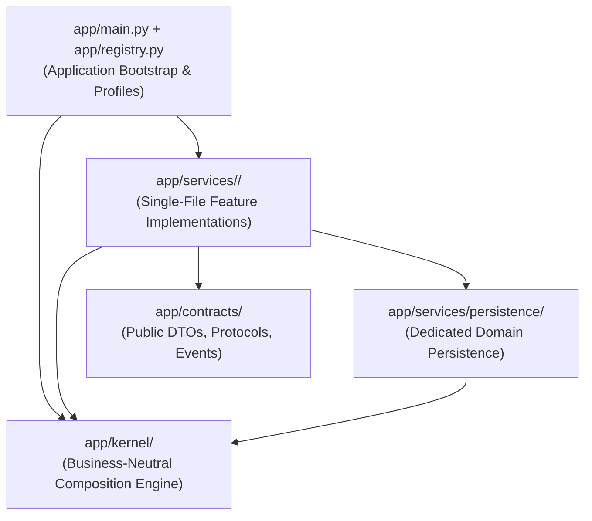
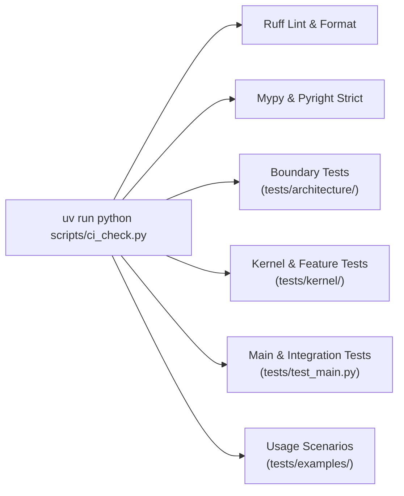

# Architecture

> **System:** Generic Modular Monolith Architecture
> **Status:** Normative target architecture; verified against kernel composition engine
> **Architecture revision:** `V1`
> **Last updated:** `2026-09-18`
> **System scope and acceptance:** [PROJECT.md](PROJECT.md)
> **Contributor procedure:** [Feature Implementation Pipeline](dev/feature_implementation_pipeline.md) and [Domain Implementation Audit](dev/domain_implementation_audit.md)

This document owns universal package, dependency, lifecycle, runtime, isolation, persistence,
and verification constraints. It defines the architectural rules that apply system-wide across all
present and future domains.

---

## 1. Purpose, Authority, and Architectural Style

The project is structured as a **simplified, business-neutral modular monolith**. It provides the
clean boundaries, physical isolation, and testability of microservices while retaining the operational
simplicity, deterministic execution, and zero-network overhead of a single Python runtime process.

Authority applies in this strict order:
1. `AGENTS.md` (Contributor principles and workflow rules).
2. `docs/PROJECT.md` (System purpose, cross-domain workflows, and global limits).
3. `docs/ARCHITECTURE.md` (This document: universal structural and runtime constraints).
4. Owning domain `README.md` files (Canonical current-state feature and requirement registry).
5. Public contracts (`app/contracts/<domain>.py`) and verified source-bound evidence.

Conflicts must be reported rather than silently resolved.

---

## 2. Universal Invariants

1. **Kernel and Contracts are business-neutral:** `app/kernel/` contains universal composition primitives; `app/contracts/` contains pure DTOs, protocols, versioned capability keys, events, and errors. Neither layer implements business logic or domain policy.
2. **Explicit composition and registration:** Application composition is declarative in `app/registry.py`. Features collaborate only through declared public contracts and capabilities resolved via `FeatureContext`.
3. **Single-file feature ownership:** Every backend feature lives in a single, cohesive module at `app/services/<domain>/<feature>.py`. Feature folders and split ownership are prohibited.
4. **Prohibition of inter-feature imports:** A feature module must never import another feature implementation, whether in the same domain or another domain.
5. **Pure initializers (`__init__.py`):** Every `__init__.py` file must be empty or docstring-only (AST-enforced). Package roots are not public API boundaries.
6. **Managed lifecycles and LIFO disposal:** All runtime effects (resources, background tasks, subscriptions) are managed by `FeatureContext`. Shutdown unwinds in reverse topological order (LIFO), with clean task cancellation and zero resource leaks.
7. **Fail-closed capability resolution:** Required capability absence raises `CapabilityUnavailableError`. Optional capability absence is handled at the exact call boundary. Silent fallbacks or mock substitutions are forbidden.
8. **Dedicated domain persistence:** Stateful features route all schema, parameterized SQL, and transactions through `app/services/persistence/<domain>.py`. Ad-hoc SQL in feature modules is prohibited.
9. **Zero-overhead structured logging:** Logging uses `from app.kernel.logging import get_logger`. Service features never configure handlers or global logging. Asynchronous writing and automatic secret/PII redaction are enforced.
10. **Fast, isolated unit testing:** Unit tests must be pure and isolated from real network/database I/O or sleeps, executing in under 100 ms.

---

## 3. Static Module Architecture

The codebase is organized into four distinct physical layers:


```mermaid
flowchart TD
    MAIN["app/main.py + app/registry.py<br/>(Application Bootstrap & Profiles)"]
    KERNEL["app/kernel/<br/>(Business-Neutral Composition Engine)"]
    CONTRACTS["app/contracts/<br/>(Public DTOs, Protocols, Events)"]
    SERVICES["app/services/<domain>/<br/>(Single-File Feature Implementations)"]
    PERSISTENCE["app/services/persistence/<br/>(Dedicated Domain Persistence)"]

    MAIN --> KERNEL
    MAIN --> SERVICES
    SERVICES --> KERNEL
    SERVICES --> CONTRACTS
    SERVICES --> PERSISTENCE
    PERSISTENCE --> KERNEL
```

### Layer Ownership Rules

| Package / File | Owns | Must Not Own |
|---|---|---|
| `app/kernel/` | Composition engine (`Bootstrapper`), `Capability[T]`, `FeatureSpec`, `Feature` protocol, `FeatureContext`, `EventBus`, and structured logging facade. | Domain DTOs, business policies, routes, or database schemas. |
| `app/contracts/` | Typed request/result DTOs, Protocols, versioned capability keys, domain event schemas, and domain error hierarchies. | Runtime implementations, persistence logic, I/O, or feature specs. |
| `app/registry.py` | Explicit feature factory registration and named role profile definitions. | Feature implementation logic or dynamic module scanning. |
| `app/main.py` | CLI parsing (`--profile`, `--enabled`, `--dry-run`), application bootstrap, and lifecycle runner. | Domain policies, business algorithms, or custom composition rules. |
| `app/services/<domain>/` | Cohesive single-file feature implementations (`<feature>.py`). | Cross-feature imports, package-level re-exports, or global logging setup. |
| `app/services/persistence/` | Dedicated domain database schemas, migrations, parameterized queries, and transactions. | Business policy, authorization, or feature orchestration. |

### Shared Support Exceptions

A domain-level helper or support module is permitted only when **at least three registered features** genuinely consume the same coherent capability, or when an explicit architecture exception is documented in the domain README. Support modules must never become a shadow feature registry or implementation owner.

---

## 4. Feature Architecture and Canonical Module Anatomy

Every feature is implemented as a single, cohesive file:

```text
app/services/<domain>/<feature_slug>.py
```

### Canonical Top-to-Bottom Structure

```python
"""Module docstring detailing purpose, boundaries, and API usage."""

from __future__ import annotations

from dataclasses import dataclass
from typing import TYPE_CHECKING, Any

from app.contracts.<domain> import <CAPABILITY>, <Protocol>, <Request>, <Result>
from app.kernel.feature import FeatureSpec
from app.kernel.logging import get_logger

if TYPE_CHECKING:
    from app.kernel.capability import Capability
    from app.kernel.context import FeatureContext

logger = get_logger(__name__)


# 1. Slotted immutable configuration
@dataclass(frozen=True, slots=True)
class <Feature>Config:
    """Runtime configuration for <feature>."""


# 2. Service class implementing public contract protocol
class <Feature>Service(<Protocol>):
    """Implement the public <feature> capability."""

    async def <operation>(self, request: <Request>) -> <Result>:
        """Perform public business operation."""
        ...


# 3. Immutable feature specification
SPEC = FeatureSpec(
    feature_id="<domain>.<feature_slug>",
    domain="<domain>",
    name="<Feature Name>",
    provides=frozenset({<CAPABILITY>}),
    requires=frozenset(),
    optional=frozenset(),
    conflicts=frozenset(),
    description="<Cohesive feature description>",
    state="stateless",
    config_keys=frozenset(),
)


# 4. Feature lifecycle wiring implementing Feature protocol
class <Feature>Feature:
    """Wire feature into composition lifecycle."""

    @property
    def spec(self) -> FeatureSpec:
        """Return immutable specification."""
        return SPEC

    async def start(self, ctx: FeatureContext) -> None:
        """Start feature, stage exports, and acquire resources."""
        service = <Feature>Service()
        ctx.provide(<CAPABILITY>, service)


# 5. Zero-argument factory
def feature() -> <Feature>Feature:
    """Return a new unmounted feature instance."""
    return <Feature>Feature()


__all__ = ["SPEC", "<Feature>Config", "<Feature>Feature", "<Feature>Service", "feature"]
```

---

## 5. Composition and Runtime Engine (`app/kernel`)

The kernel runtime provides deterministic, graph-validated composition without external dependency injection frameworks.

### 5.1 Kahn's Algorithm and Reachability Validation

The `Bootstrapper` inspects all registered features before executing any code:
1. **Graph Validation:** Verifies that all required capabilities exist, detects duplicate feature IDs, checks conflicting capability declarations, and enforces that capability versions match.
2. **Topological Sort:** Computes a valid execution sequence using Kahn's algorithm. If a cycle exists, startup fails immediately with `DependencyCycleError`.
3. **Dynamic Subset Pruning:** When a profile or `--enabled` list is specified, a DFS reachability traversal (`_is_reachable`) computes the minimal closure of required features, pruning unneeded components while ensuring all dependencies are satisfied.

### 5.2 Two-Phase Startup and Staging

To prevent partially started systems from exposing unstable state:
- **Phase 1 (Staging):** Features execute `start(ctx)` in topological order. Capabilities and resources are staged in a private staging dictionary inside `FeatureContext`.
- **Phase 2 (Publication):** Once all features succeed, capabilities are atomically committed to the active runtime container.
- **Rollback on Failure:** If any feature raises an exception during startup, `Bootstrapper` immediately halts and unwinds all already-started features in reverse order (LIFO).

### 5.3 Managed Resource Lifecycles (`FeatureContext`)

The `FeatureContext` supplies four core facilities to each feature:
- **Dependency Resolution:** `ctx.require(cap)` (fail-closed), `ctx.get(cap)` (optional), and `ctx.has(cap)`.
- **Export Staging:** `ctx.provide(cap, provider)` registers capabilities for atomic publication.
- **Managed Lifecycles:**
  - `ctx.enter_context(cm)`: Enters synchronous or asynchronous context managers, ensuring exit on shutdown.
  - `ctx.on_close(callback)`: Registers synchronous or asynchronous cleanup callbacks executed in LIFO order.
  - `ctx.spawn(coroutine, name=...)`: Spawns supervised asyncio background tasks tracked by the context, cancelled cleanly on shutdown with `asyncio.CancelledError` suppressed.
- **Scoped Event Bus:** `ctx.publish(event)` and `ctx.subscribe(event_type, handler)`.

### 5.4 Exact-Type Event Bus (`EventBus`)

- Exact-type event dispatch: Handlers subscribed to event class `E` receive only instances where `type(event) is E`.
- Snapshot isolation: Subscriber collections are snapshotted at dispatch time, ensuring handlers added or removed during dispatch do not affect the active broadcast.
- Idempotent disposal tokens: Subscribing returns a callable token that safely unsubscribes the handler.

### 5.5 Structured Logging Subsystem (`app.kernel.logging`)

- **Global Facade:** `logger = get_logger(__name__)` returns a structured logger with `.bind(**kwargs)`.
- **Zero Import Effects:** Importing the logging module creates no handlers, files, or background threads. Configuration occurs only when `configure_logging()` is called from `app/main.py`.
- **Asynchronous Non-Blocking Output:** Log records are pushed to an in-memory queue and processed by a dedicated worker task, isolating application logic from file I/O latency.
- **Security & Redaction:** Automatic redaction replaces sensitive keys (`api_key`, `token`, `password`, `secret`) and authorization patterns with `[REDACTED]`.
- **Crash Resilience:** Handles disk-full conditions and file locking gracefully; supports size-based rotation and zip compression.

---

## 6. Testing and Verification Architecture

The test suite enforces architectural invariants through automated tooling:


```mermaid
flowchart LR
    LINT["Ruff Lint & Format"]
    TYPE["Mypy & Pyright Strict"]
    ARCH["Boundary Tests<br/>(tests/architecture/)"]
    UNIT["Kernel & Feature Tests<br/>(tests/kernel/)"]
    CLI["Main & Integration Tests<br/>(tests/test_main.py)"]
    USAGE["Usage Scenarios<br/>(tests/examples/)"]

    CHECK["uv run python scripts/ci_check.py"]
    CHECK --> LINT
    CHECK --> TYPE
    CHECK --> ARCH
    CHECK --> UNIT
    CHECK --> CLI
    CHECK --> USAGE
```

1. **Boundary Testing (`tests/architecture/test_boundaries.py`):** Uses Python's `ast` module to verify that every `__init__.py` file in `app/` is strictly empty or docstring-only. Any import, assignment, or statement fails the build.
2. **Unified Check Suite (`scripts/ci_check.py`):** The authoritative gate that runs formatting, linting, strict typing, full unit test coverage, and execution of consolidated usage examples.
3. **Usage Demonstrations (`tests/examples/`):** Dedicated, standalone runnable scripts that verify end-to-end composition and logging without external infrastructure.

---

## 7. Deployment and Runtime Execution

- **Process Model:** Single-process Python 3.14+ runtime.
- **CLI Options:**
  - `--profile <name>`: Boots a named subset of features defined in `app/registry.py`.
  - `--enabled <f1,f2>`: Explicit feature selection.
  - `--log-level <DEBUG|INFO|...>`: Controls runtime logging threshold.
  - `--dry-run`: Validates topological resolution and exits without starting services.
  - `--status`: Inspects and prints active features and capabilities.
  - `--list-profiles`: Displays available named profiles.
- **Graceful Termination:** Listens for `SIGINT` (Ctrl+C) and `SIGTERM`, cleanly draining queues and executing LIFO teardown within bounded timeout windows.
