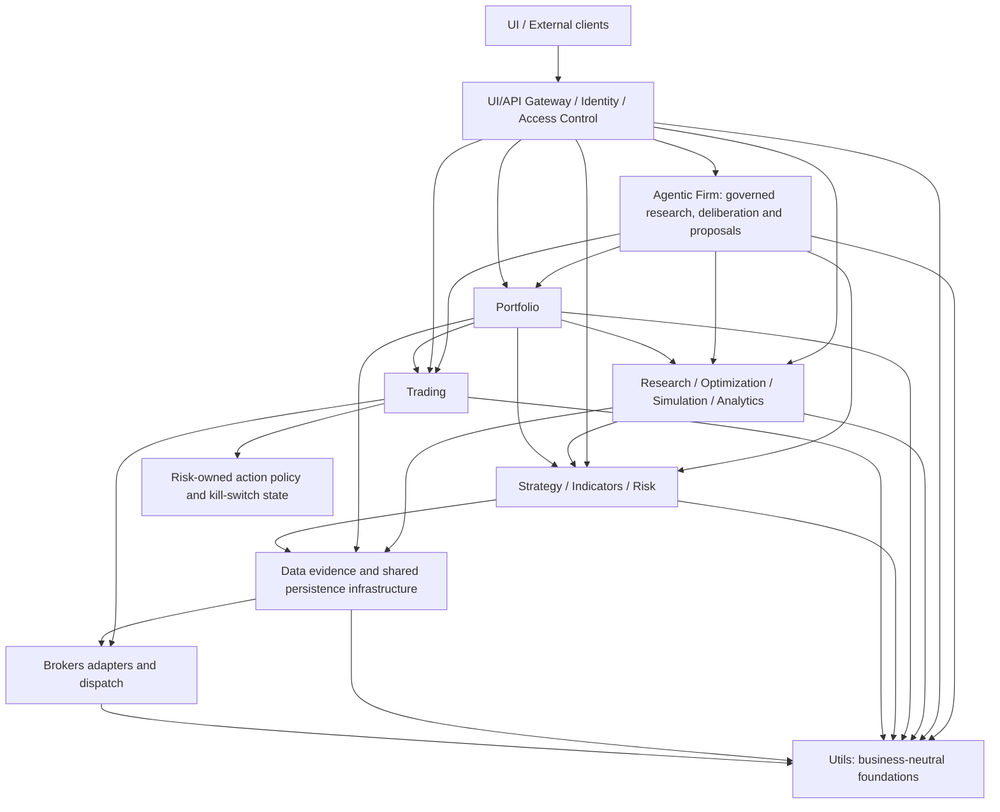
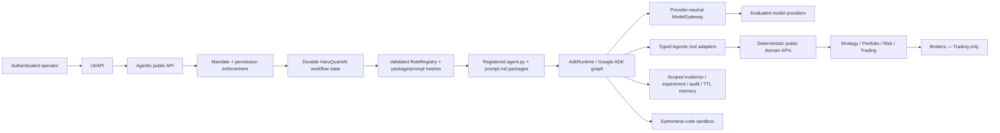

# HaruQuantAI System Architecture (Dense Reference)

## System Overview & Tech Stack

* **Architectural Pattern**: Modular monolith with service-oriented module boundaries. Aligns research, simulation, paper, and live environments while preventing any bypass of system controllers.
* **Production Stack Baseline**:
  * *Backend*: Python 3.14, managed with `uv`. FastAPI, Pydantic, Uvicorn (introduced once the API Gateway module lands).
  * *Frontend*: Next.js, React, TypeScript, Tailwind CSS, Radix UI (introduced once the UI module lands).
  * *Persistence*: SQLite (launch baseline). Each persistent domain owns its logical schemas and migration definitions; Data owns shared connections, locking, migration execution, and the immutable migration ledger.
  * *Data Science*: `pandas`, `numpy`, `scipy`, `scikit-learn`, `numba`, approved `pyarrow`/`fastparquet`.
  * *Broker Gate*: The Brokers domain owns provider-neutral adapter contracts and dispatch; MT5, cTrader, and Binance are adapter implementations selected by explicit configuration and readiness policy.
  * *Quality Gate*: `ruff` (lint + format), `mypy` (static types), `pytest` (tests/coverage), `pre-commit` (enforced hook chain).

* **Runtime Profiles** (separate from deployment `ENVIRONMENT`):
  * `research`: Data and feature exploration. Zero live broker mutations.
  * `simulation`: Historical backtests via the core trading path. Simulated side effects.
  * `paper`: Live paths executed against demo infrastructure. Paper side effects.
  * `live`: Real-capital transactions. Disabled by default; mandates all functional safety gates. Explicit toggle: `ALLOW_LIVE_MUTATIONS=false`.
* **Deployment Environments**: `ENVIRONMENT` is exactly one of `dev`, `test`, `staging`, or `production`. It never substitutes for `RUNTIME_PROFILE`.

---

## Current Implementation State

> This section tracks reality; the rest of this document describes the target architecture. Update it as modules land — see [docs/CHANGELOG.md](CHANGELOG.md) for history.

* Project scaffolded with `uv` (Python 3.14, `pyproject.toml`, `uv.lock`).
* Tooling configured: `ruff` (full rule set), `mypy`, `pytest`, `pre-commit` (hygiene checks, ruff, ruff-format, detect-secrets, mypy).
* Code present: `app/` package with implemented service modules under `app/services/`, including Trading as the surviving live-route runtime and broker-dispatch owner.
* The retired Live service has been folded into `app/services/trading/`; live execution remains a runtime route/mode, not a standalone service package.
* `app/services/api/README.md` defines the approved gateway/UI boundary and state ownership. Backend v1 has 21 registered owner-backed operations, a deterministic OpenAPI digest, and a validated three-source in-process composition graph. Unsupported Simulation, Risk, Trading mutation, Optimization, Portfolio, and Agentic HTTP families are explicitly absent, and no `ui/` application package has landed yet.
* Portfolio is implemented and `Completed`: `app.services.portfolio` is its sole
  public boundary, exposes standalone functions only, and coordinates genuine
  Data/Simulation evidence while keeping Risk approval and Trading execution in
  their owning domains.
* `app/agentic/README.md` defines the complete Agentic Firm target. The package now
  exists and Agentic status is `Partial`: `FEAT-AGT-01` implements the seven canonical
  provider-neutral contracts (`AgentTask`, `AgentMessage`, `AgentArtifact`,
  `AgentResult`, `AgentProvenance`, `BudgetUsage`, `WorkflowCheckpoint`) as immutable,
  strictly validated, JSON-safe models carrying stable identity, aware-UTC time,
  namespaced `agentic.*.v1` schema identity, trace lineage, and a canonical content
  hash. `AgentResult` separates `ok`, `refused`, and `failed`, admits only enumerated
  reason codes, and rejects deterministic execution fields. `FEAT-AGT-02` adds the immutable signed firm mandate, the evaluated role
  manifest, and the validated `RoleRegistry`: mandate and manifest integrity digests
  are recomputed rather than trusted, the composite instruction hash binds prompt and
  manifest so a mutated prompt fails closed before agent construction, wildcard scopes
  and the `controlled_mutation`/`critical` permission classes are unrepresentable, and
  no title confers capability beyond its manifest. The package root is a function-only
  public surface. `FEAT-AGT-03` implements provider-neutral `ModelProfile`
  pinning that rejects floating aliases and credential material, a governed
  `invoke_model` path that enforces profile bounds and refuses silent provider or
  model substitution, and upgrade gating where missing evidence is a failure rather
  than a default pass; `runtime/adk.py` is the sole construction site for a
  Google ADK object: ADK is imported lazily so the Agentic public API loads no
  provider module, the resolved credential reaches only the provider client and
  never a contract, log, or audit record, and an observed cost is derived from
  reported tokens rather than reported as a false zero that would defeat the
  per-call ceiling. `FEAT-AGT-04` adds durable orchestration: idempotent submission that
  persists its initial checkpoint before execution, expected-version guards,
  bounded routing, and terminal states that never resume under the same task
  identity. Following the Portfolio and Risk precedents, Agentic declares its
  additive `agentic_` schema and an injected store port and implements no database
  writer. `FEAT-AGT-05` enforces deny-by-default tool authorization across
  registration, eligibility, permission class, environment, scope, budget, and
  approval; it owns `ToolApprovalAttestation v1`, which adds the exact object hash,
  single-use nonce, and signature that the Risk-owned `ApprovalAttestation v1` does
  not carry, and it makes broker, order, kill-switch, override, and deployment
  capabilities structurally unregistrable rather than merely refused. `FEAT-AGT-06`
  assembles point-in-time context through ordered lookahead, trust, licensing,
  freshness, deduplication, and injection filters, returning trusted context and
  untrusted evidence in separate fields so retrieved text can never occupy an
  instruction slot; its four separated stores redact before persistence, append
  corrections rather than overwriting, and bound working memory by TTL and task.
  `FEAT-AGT-07` runs bounded deliberation: independent briefs are
  collected before any peer conclusion exists, so independence is structural rather
  than procedural; participants, rounds, and fan-out come from the versioned limits
  profile and are not raisable by a caller or a model; unresolved challenges are
  preserved as dissent; and consensus cannot be claimed while material dissent
  stands. A `DeliberationRecord` rejects authorization and position-size language
  outright, so agreement can never be converted into a decision.
  `FEAT-AGT-08` lands the first registered leaf agent package and
  establishes the pattern the remaining eleven follow: `prompt.md` is versioned data
  loaded and hash-verified against the enabled `RoleManifest` before construction,
  with line endings normalized so the digest is portable; `agent.py` embeds no prompt
  text, imports no ADK or provider object, and delegates to the injected runtime; and
  the typed output carries no numeric field, so a recomputed upstream metric cannot
  be expressed at all. `FEAT-AGT-11` adds the first governed tool adapters: every
  evidence call is authorized by the permission enforcement point before the
  receiver is reached, a denied call never falls through, and each result is
  bounded as untrusted input. Its output pack takes instrument, venue, timeframe,
  session, window, indicator versions, and quality status from the deterministic
  receivers rather than from the model, so a model cannot misreport which
  indicator definition was used; claims, confirmations, invalidations, and
  leakage notes are keyed alike, making a claim without all three conditions
  unrepresentable. `FEAT-AGT-12` applies the same separation to statistics: the
  analyst names a metric and the Analytics catalog supplies its formula and its
  minimum sample, so an estimator the catalog does not recognize — including a
  formula a model writes out in place of a name — is refused rather than
  accepted; findings, estimators, and uncertainty are keyed alike, so a point
  estimate with no interval cannot be expressed; and non-finite, under-sampled,
  hash-misaligned, or leakage-unsafe evidence is refused before the runtime is
  invoked, so the model is never shown data it would have to repair.
  `FEAT-AGT-13` turns specialist packs into falsifiable
  hypotheses and non-executable theses: a hypothesis without a rejection criterion
  cannot be constructed, a thesis rejects code, orders, prices, sizes, and
  approvals, and both take their evidence references from the packs actually
  supplied rather than from model output. Unresolved deliberation dissent forces a
  `contested` stance regardless of what a model declares, so agreement alone never
  promotes a proposal. `FEAT-AGT-14` adds the first Agentic feature that both
  persists and coordinates a receiver: a protocol is pre-registered and hashed
  before any run, so a falsification criterion rewritten afterwards yields a
  different digest and cannot be passed off as the one registered; the
  receiver's request is submitted unchanged and its result checked for binding
  rather than reconciled, with the package importing neither Simulation
  contract so there is no site at which one could be authored; and holdout is
  claimed once per protocol, enforced in-process before the receiver is called
  and durably by the ledger's primary key. `FEAT-AGT-16` is the first feature
  that writes to a filesystem: an authenticated human specification and a lease
  attesting to every isolation property gate generation before any model call;
  the artefact manifest carries files, digests, dependencies, tests,
  provenance, and complete search history, and is digested as a whole; and
  every declared path is validated on its raw text before parsing, then
  resolved and re-checked against the staging root so a symlink cannot carry a
  write outside the tree. Isolation itself is delegated: Agentic declares the
  sandbox port and refuses an under-attested lease, and binding a runtime that
  actually isolates remains the composition root's obligation.
  `FEAT-AGT-15` extends the same discipline to search: a plan is declared and
  hashed before any trial runs, so a budget widened afterwards is a different
  plan; the trial ledger requires attempted to equal completed plus failed with
  a reason per failure, so a sweep cannot report its survivors while dropping
  the trials that did not survive; robustness, stability, and overfit are read
  from deterministic Optimization operations rather than asserted, so a verdict
  cannot consist of a rank alone; and a sweep consuming holdout reserves it
  from the same `FEAT-AGT-14` ledger an experiment would, closing the path by
  which a thesis's single look could otherwise be spent twice.
  `FEAT-AGT-17` closes the loop by making acceptance arithmetic rather than
  judgement: the six evaluation-set kinds and the seven critique challenges are
  validated by set equality, so a missing poisoning set or an unaddressed
  leakage challenge is unrepresentable rather than merely weaker; the required
  action is computed from the gate outcomes and the margin before the model is
  invoked, and the verdict recomputes it and rejects disagreement, so a model
  cannot write `continue` over a failed gate; and a candidate beats its simpler
  baseline only when its margin strictly exceeds the measurement uncertainty
  plus its extra cost, with an exact tie going to the baseline. The feature
  decides and does not mutate: applying a disable or a retire is `FEAT-AGT-18`'s
  or a mandate re-issue's, and no versioned set or calibrated grader yet exists
  for any role, so the mechanism is verified and no role has been evaluated.
  `FEAT-AGT-18` gives artefacts a history that cannot be rewritten: a promotion
  packet's evidence fields are all required, so a packet assembled without a
  critique or without an approving human is unconstructable rather than merely
  thin; five deterministic gates read evidence the packet already carries and
  terminate promotion as `research_only`, which nothing reopens; and the
  transition ledger is keyed on the artefact digest rather than its identifier,
  so a materially changed artefact begins with an empty history and cannot
  inherit an approval granted to a different one. The current state is read
  from the ledger rather than supplied by the caller, so holding a valid packet
  does not let anyone skip a step, and demotion from `registered` needs neither
  packet nor approval. The feature records and does not register: nothing in it
  imports Strategy or the simulator, and reaching a receiver is `FEAT-AGT-22`'s.
  `FEAT-AGT-19` makes non-binding a property of the type rather than a claim in
  the prose: an allocation proposal defines no lot size, notional, quantity, or
  price field, so nothing in it could reach an execution path even if the object
  were mishandled; approval language is refused through `FEAT-AGT-07`'s single
  definition, extended only by the level-and-price vocabulary specific to an
  advisor; and every proposal expires, strictly, with an already-expired one
  unconstructable and an expired one never critiqued. Mandate scope is copied
  from what Risk returned rather than from the model, so a proposal cannot widen
  its own asset class; every evidence read must carry an observation instant,
  and an unreadable one counts as stale. The risk critique covers all eight
  kinds by set equality and emits no approval by absence — the advisory has no
  verdict, severity, or boolean a caller could read as consent. All five
  receiver operations are reached through an injected port, never by import.
  `FEAT-AGT-20` is the closest Agentic comes to a trade, and the boundary is
  the type rather than the prose: neither a trade proposal nor its receipt
  defines a price, quantity, lot size, notional, stop, target, order type,
  venue, or account field, and the receiver's own intake contract has nowhere
  to put one either. What is proposed — instrument, strategy identity,
  direction, horizon, evaluation scope — comes from the caller and evidence
  comes from the thesis, so the model writes the rationale, the invalidation,
  and the uncertainty and nothing more; only a `supported` thesis may be
  proposed, with `contested` excluded so a preserved conflict is not buried by
  trading on it. The handoff targets Strategy's `FEAT-STR-11` external-proposal
  intake, whose factory derives the request identity and idempotency key from a
  content digest and refuses a caller that supplies either, which is what makes
  "no privileged route" structural. A receipt carries Strategy's own status
  enumeration verbatim — the most favourable being `accepted_for_evaluation` —
  and records a produced intent by identity alone, never by content.
  `FEAT-AGT-21` makes observability and containment deterministic rather than
  best-effort: a trace covers all ten required span kinds by set equality or
  does not exist, so a run whose emitters stayed silent produces a refusal
  instead of a partial view that reads as complete, and an unlabelled or
  invented span never widens the contract. Redaction is inherited from the
  `FEAT-AGT-06` memory boundary and defined nowhere in the package, so the firm
  keeps one answer to what counts as a secret. Containment is a property of the
  incident kind through a fixed table rather than a judgement at the call site,
  applied through the normal cancellation path; a record whose action disagrees
  with its kind, a quarantine naming no role, a cancel naming one, or any
  containment without preserved evidence and a checkpoint are all
  unrepresentable, and one classified incident per kind per correlated run is
  enforced in the double and by a unique constraint in the durable table.
  Replay is isolated by the type — the environment is a literal `sandbox`,
  every reference is a content digest re-verified against the store, and an
  outcome reporting any attempted side effect is rejected. Quarantine records a
  decision; changing a role's registered state remains a governance manifest
  re-issue. `FEAT-AGT-22` closes the boundary with eight authenticated operator
  operations over a frozen dependency record in which every port is a required
  field, so a partially wired firm cannot be invoked at all. Every answer is a
  mapping of bounded strings rather than a domain object, which is what makes
  "no prompts, credentials, or provider internals" structural: there is no
  nested value a `ModelProfile` or an `AgentProvenance` could travel inside,
  and a forbidden-key rule closes the text route. Failures are mapped rather
  than raised, so no provider or receiver exception crosses the boundary.
  Disablement is checked before authentication for anything that creates or
  changes work, drains or cancels active runs by policy, writes over nothing,
  and leaves reads available so an operator can still learn why the firm
  stopped. Its safety-equivalence clause holds structurally: a test over every
  file in `app/agentic` asserts the domain names no kill-switch operation, no
  risk approval, no live gate, no order dispatch, and no broker SDK, so
  disabling a package that never held safety authority cannot weaken safety.
  `WF-AGT-005`'s planned `open_sandbox` and `stage_code_artifact` are
  deliberately not exported, because no isolation runtime exists to open.
  `FEAT-AGT-09` and `FEAT-AGT-10` complete the twenty-two once `FEAT-DATA-16`
  and `FEAT-RES-13` unblocked them. Both read a Research projection through an
  injected port rather than importing a receiver, so the chain stays
  Agentic to Research to Data. Applicability is the receiver's answer read
  before any model call, which is why a fundamental reading of an FX instrument
  under the issuer model is refused: Research's issuer model covers equity,
  corporate bonds, and funds, and FX has no issuer. Claims, assumptions,
  horizons, and falsifiers are parallel key sets, so a claim nobody can say how
  to falsify is unrepresentable; and the sentiment analyst runs `FEAT-AGT-06`'s
  injection classifier over every reference **before** the model is invoked,
  excluding and counting what it flags, so retrieved text occupies an evidence
  slot and never an instruction slot. All twenty-two features are implemented,
  and none of it has run for real: no live provider call, no bound sandbox
  runtime, no durable store, no evaluated role, no promoted artefact, no
  reviewed advisory, no evaluated proposal, and no source fetched.
  Google ADK 2.x is adopted behind a scoped `requests` override, documented in
  `pyproject.toml` with the condition for its removal. Its hybrid layout keeps ten shared control-plane features as focused root packages and places twelve role-bearing features under registered `agents/<department>/<agent_name>/` leaf packages with provider-neutral `agent.py`, integrity-checked `prompt.md`, feature schemas, and only specification-required optional files. Specialized leadership, market-intelligence, technical, quantitative, strategy/trader, experimentation, engineering, portfolio/risk-advisory, and operations roles may dynamically collaborate, simulate, optimize, code, and submit typed proposals. Google ADK 2.x is the selected runtime behind provider-neutral HaruQuantAI contracts. Agentic has no broker credential, direct broker route, risk approval, kill-switch authority, or execution authority; consequential proposals traverse the normal deterministic pipeline.
* `app/utils/` is a partial implementation baseline for shared v1 contracts,
  errors, identifiers, UTC, canonical serialization, redaction/security helpers,
  settings, and structured logging.
* `app/services/brokers/` is a partial implementation baseline for canonical
  broker contracts, registry/factory, runtime safety, provider adapters, and its
  deterministic test adapter. Capability availability remains evidence-gated and
  fail-closed.
* `app/services/data/` has an implemented functional baseline containing immutable
  contracts, bounded SQLite/file/cache/audit persistence, explicit read-only sources
  and durable policy, historical/reference/context/FX access, deterministic
  transforms/alignment, synthetic generators, quality validation, recoverable
  scheduler jobs, internal feed status, immutable backup/restore manifests,
  licence-aware retention enforcement, and a function-only package-root public
  boundary across sixteen focused features.
  Retrieval and reference exports accept either their typed request or direct keyword
  arguments; standalone calls lazily compose MT5 read-only source, identity,
  migration, and calendar dependencies through the existing Brokers and Data
  boundaries. Explicit source/adapter injection remains supported.
  Its existing package-local architecture and repository-wide package-root consumer
  boundary are implemented and verified. Data status is `Completed`, including
  `FEAT-DATA-11` licensed bounded Firecrawl calendar acquisition verified against
  all four declared portals, exact provider-value normalization, symbol-scoped
  restriction evidence, and approved-root/SQLite persistence, plus
  `FEAT-DATA-16` point-in-time licensed source documents, structured observations,
  immutable revisions, verified-source manifests, and bounded projections for
  Research consumption.
  `CAP-DATA-028` locates the behavior in
  sixteen approved capabilities: `contracts/`, `market_data/`,
  `local_datasets/`, `synthetic_data/`, `tick_derivation/`, `persistence/`,
  `quality/`, `transformation/`, `time_sessions/`, `sources/`,
  `economic_calendar/`, `realtime_feeds/`, `data_jobs/`, `evidence/`, `audit/`, and
  `research_sources/`. Exactly sixteen numbered standalone usage programs cover
  those owners, and removed
  horizontal packages have no compatibility shims. The correction changes ownership
  and file focus only; active requirements, public behaviour, contract versions,
  schema identifiers, error codes, and the explicit package-root API remain
  compatible.
* `app/services/indicators/` is a completed implementation containing the
  immutable Core calculation boundary and 20 approved one-indicator-per-file
  implementations across trend, volatility, momentum, volume, and candles.
  Its package-root API, standalone usage programs, domain workflows, and its
  participation in `SYS-WF-001` and the verified MT5 demo `SYS-WF-002` path pass.
  Retrospective SMC/FVG/swing/BOS/CHoCH labels remain excluded to preserve the
  non-repainting contract.
* `app/services/strategy/` is completed across contracts, diagnostics, registry,
  intents, replay/checkpoints, vectorized evaluation, event hooks, concrete signal
  evaluators, and receiver-owned external-proposal evaluation. It accepts approved
  Optimization-result projections without importing Optimization and emits a
  canonical `TradeIntent` only when the registered deterministic strategy
  independently supports the proposal.
* `app/services/risk/` is implemented across contracts, configuration, snapshots,
  sizing, audit chaining, policy gates, regimes, approvals, decisions, scenarios, and
  reporting. Its status is `Partial`: kill-switch clearance must require a distinct
  authorized attestation principal, while the current implementation still requires
  the same principal.
* `app/services/trading/` is a completed implementation baseline across all 64
  functional and eight non-functional requirements, nine capability modules, and all
  sixteen documented workflows. It owns `OrderIntent v1`, `ExecutionReceipt v1`,
  `TradeRecord v1`, and `OperationalEvent v1`. Production live mutation remains
  disabled by default.
* Later agile phases reuse these completed domains and run compatibility/regression
  checks; they do not rebuild them. Current semantic-docstring/format cleanup is a
  separate repository-quality gate.
* `app/services/analytics/` is a completed read-only implementation across
  contracts, producer-neutral ledger and Data-owned benchmark adaptation, 60
  cataloged metrics, report/allocation evidence, bounded dashboards, all active
  requirements, and all non-excluded workflows. Simulation publishes executable
  `PortfolioSimulationResult v1`; producer-consumer compatibility and exact
  `FR-SIM-033` fixture parity are verified without reverse imports. Analytics
  derives its equity curve deterministically from the closed-trade ledger and has
  no open decisions.
* `app/services/research/` provides a completed thirteen-feature deterministic
  research baseline. `FEAT-RES-13` projects bounded fundamental and deterministic
  sentiment evidence from eligible point-in-time Data records without exposing
  unrestricted source content or granting strategy/execution authority.

---

## Folder Topology & Dependency Flow

### Workspace Directory Layout (Target)

* `app/services/api/`: FastAPI application, routes, middleware, authentication/session/credential boundary, API composition, and channel-neutral critical operational alert delivery. Backend v1 exposes exactly 21 owner-backed operations and composes dashboard, audit-event, and Trading operational-event sources in-process. Simulation, Risk, Trading mutation, Optimization, Portfolio, and Agentic HTTP families remain excluded until exact public owner/runtime contracts exist. UI/API owns user/session/settings/encrypted-credential/HTTP-idempotency schemas on Data infrastructure and constructs Brokers-owned connection configuration.
* `app/agentic/`: Approved top-level orchestration domain with one focused owning module per registered feature. Ten shared infrastructure features remain root packages for portable contracts/governance, Google ADK adaptation, durable orchestration, permissions, context/memory, bounded deliberation, lifecycle, operations, and public API. Twelve role-bearing feature modules are leaf packages under the namespace-only `agents/<department>/<agent_name>/` hierarchy; each owns `agent.py`, `prompt.md`, schemas, README, and only its declared optional files. Agentic submits untrusted typed requests only and has no direct execution path.
* `app/`: Core domain modules (utils, brokers, data, indicators, strategy, risk, trading, simulator, analytics, optimization, research, portfolio, agentic, and API). Live-route execution is owned by Trading.
* `data/`: SQLite databases, migration tracking, cache/log dumps, market/research assets.
* `ui/`: Next.js frontend application environment.
* `tests/`: Unit, integration, usage, and system contract test suites.
* `scripts/`: DB initialization, migration runners, validation tools, operational utilities.
* `docs/`: Documented project truth.

### Module Boundary Pipeline

Dependencies follow authoritative contract ownership and remain acyclic; consumers use
public domain APIs and may not bypass Risk, Trading, Data, or Brokers boundaries:


```mermaid
flowchart TD
    CLIENT["UI / External clients"] --> API["UI/API Gateway / Identity / Access Control"]
    API --> AGENTIC["Agentic Firm: governed research, deliberation and proposals"]
    API --> ORCH["Research / Optimization / Simulation / Analytics"]
    AGENTIC --> ORCH
    AGENTIC --> DECIDE
    AGENTIC --> PORT
    AGENTIC --> TRADING
    AGENTIC --> UTILS
    API --> PORT["Portfolio"]
    API --> DECIDE["Strategy / Indicators / Risk"]
    API --> TRADING["Trading"]
    ORCH --> DECIDE
    ORCH --> DATA["Data evidence and shared persistence infrastructure"]
    PORT --> ORCH
    PORT --> DECIDE
    PORT --> TRADING
    PORT --> DATA
    DECIDE --> DATA
    TRADING --> RISK["Risk-owned action policy and kill-switch state"]
    TRADING --> BROKERS["Brokers adapters and dispatch"]
    DATA --> BROKERS
    API --> UTILS["Utils: business-neutral foundations"]
    ORCH --> UTILS
    PORT --> UTILS
    DECIDE --> UTILS
    TRADING --> UTILS
    DATA --> UTILS
    BROKERS --> UTILS
```

**Agentic boundary note.** Agentic reads public evidence from deterministic domains
and may submit receiver-owned requests to Strategy, Portfolio, Risk, and Trading.
Those edges are untrusted proposal/intake edges, not authority transfers. Each
receiver performs its complete validation and authorization, and only Trading may
reach Brokers. Agentic has no Brokers edge, credential, mandate override,
kill-switch authority, order tool, or direct execution route. Agent-authored code
reaches Indicators or Strategy only through the governed promotion and
receiver-registration workflow.

### Agentic Runtime and Trust Boundaries

Google ADK 2.x provides the in-process graph, dynamic, collaborative, task, session,
artifact, evaluation, callback, and telemetry runtime behind `AdkRuntime`.
HaruQuantAI owns the stable task, message, result, deliberation, evidence, proposal,
checkpoint, permission, and model-profile contracts. No ADK or provider object
crosses the Agentic public API or becomes canonical persisted state.

The validated `RoleRegistry` resolves stable role IDs to registered leaf agent
packages, prompt and composite-instruction hashes, model profiles, schemas, tools,
evaluation state, and limits. A leaf `agent.py` produces a provider-neutral
definition only after its package-local `prompt.md` passes integrity validation.
Only `runtime/adk.py` may construct Google ADK objects.


```mermaid
flowchart LR
    OP["Authenticated operator"] --> API2["UI/API"]
    API2 --> AP["Agentic public API"]
    AP --> POL["Mandate + permission enforcement"]
    POL --> WF["Durable HaruQuantAI workflow state"]
    WF --> REG["Validated RoleRegistry + package/prompt hashes"]
    REG --> AG["Registered agent.py + prompt.md packages"]
    AG --> ADK["AdkRuntime / Google ADK graph"]
    ADK --> MG["Provider-neutral ModelGateway"]
    MG --> LLM["Evaluated model providers"]
    ADK --> TOOLS["Typed Agentic tool adapters"]
    TOOLS --> DOM["Deterministic public domain APIs"]
    ADK --> MEM["Scoped evidence / experiment / audit / TTL memory"]
    ADK --> SB["Ephemeral code sandbox"]
    DOM --> PIPE["Strategy / Portfolio / Risk / Trading"]
    PIPE --> BRK["Brokers — Trading only"]
```

The Agentic worker is separately cancellable from the deterministic backend. The
code sandbox is an isolated per-run worker with no production credential and denied
network by default. Persistent Agentic stores use the repository migration ledger,
checksum, lock, transaction, retention, and recovery rules.

### Package-Root Export Gate & Public API Surface Rules

1. **Package-Root Export Gate**: `app/services/[DOMAIN]/__init__.py` is a domain's sole public boundary. Symbols not re-exported in `__init__.py` and declared in `__all__` are strictly internal.
2. **Domain-Root Imports Only**: Cross-domain consumers, usage examples, workflows, and integration tests must import strictly from `app.services.[DOMAIN]`. Deep imports (e.g., `from app.services.[DOMAIN].[submodule] import Name`) are prohibited.
3. **Function-Only Public Surface**: Public APIs expose only standalone functions (`def func(...)`). Classes and constants remain internal:
   - Constants are accessed via public getter functions (`get_...()`).
   - Classes are encapsulated internally; public functions delegate to internal class methods (`_func()`).

---

## Technical Contracts & Envelopes

### Shared Utility Framework (`app/utils/`)

* **Public Export Rule**: `app/utils/__init__.py` exposes only the approved shared surface through an explicit `__all__`. No fallback imports, shims, duplicate modules, or single-consumer helpers are permitted.
* **Target Submodule Footprint**: shared `AuthContext`, `AuditEvent`, and `StandardResponse[T]` contracts; shared base errors, immutable error definitions, catalogue validation, injected error routing, identity/trace IDs, UTC and monotonic duration handling, canonical serialization, redaction, centralized typed runtime settings, and structured logging with immutable bound context, explicit app/access/debug/error routing, compressed bounded rotation, queued delivery, and deterministic shutdown. Deployment tenancy/environment and the selected execution runtime profile are distinct authority dimensions; the current single `tenant_or_environment` claim cannot represent both Risk and Agentic admission semantics, and canonical API composition remains blocked until the split specified by `API-OD-004` is implemented. `app.utils.AppSettings` is the sole repository `app/configs/env.json` loading boundary; domains inherit it for typed owned settings and never parse environment files or read process environment directly. Imports and import-time log attempts remain inert; the first runtime bound-log emission atomically activates the centralized default profile, while explicit logging configuration is reserved for specialized overrides. Runtime logging activation—not import—may create its configured sink directory. UI/API owns authentication, password hashing, credential encryption/persistence, active-key selection, credential-reference resolution, composition-root Brokers configuration, and permission enforcement; externally provisioned key infrastructure owns encryption-key generation/storage/rotation; Data owns normalized market contracts, cross-domain tabular processing, quality policy, and the only public detached OHLCV/spread and tick DataFrame projections from canonical `MarketDataset v1`; Indicators may privately project the same contract to pandas/NumPy for pure formula evaluation and owns its resulting tabular contract; each domain owns its paths, limits, validation, typed payloads, business outcomes, and error-code policy.
* **Contract Ownership Rule**: Domain contract modules own their payload and business-outcome behavior locally. Utils owns only the shared five-field public-operation response envelope and business-neutral error-definition shape; domains do not inherit any other centralized contract base.

### Standard Public-Operation Response

Every HaruQuantAI-owned public operation that accepts one bounded request and
produces one completed outcome returns `StandardResponse[T]`, regardless of
whether the operation is registered as an AI tool. The envelope serializes exactly
`status`, `message`, `data`, `error`, and `metadata`.

- `data` is the raw result `T`; it is never nested in a synthetic result/payload
  object or legacy response envelope.
- Immutable mapping-proxy results retain their exact Python identity in `data`;
  JSON-mode output is a detached bounded JSON-safe mapping and does not mutate or
  replace that runtime value.
- Existing non-payload envelope fields are preserved losslessly under stable
  `metadata.extensions` keys.
- Top-level status reports function completion. Completed domain decisions such as
  rejection, blocking, neutral action, or uncertain execution truth remain typed
  domain data rather than being reclassified as function failure.
- Error details and extensions are bounded, redacted, and JSON-safe.
- Execution time derives from `time.perf_counter_ns()` and is expressed in
  non-negative milliseconds rounded to three decimal places.
- Simulation applies this boundary to validation, tick construction, accounting,
  execution, journaling, reporting, and backtest orchestration; raw Simulation
  results remain directly in `data`, while `SIM_*` failures remain in `error`.
- Constructors, properties, private helpers, streams/subscriptions, callbacks,
  externally prescribed protocol methods, runtime-resource factories, and response
  infrastructure primitives are outside the bounded-operation rule.

For Brokers, every bounded adapter, registry, subscription-control, and fake-control
operation uses this shared envelope. The raw provider-neutral DTO is stored directly
in `data`. Broker/profile identity, operation, UTC completion timestamp, environment,
adapter/provider versions, redacted provider metadata, and separated provider/adapter
latency are stable `metadata.extensions`; retryability, provider code/message,
capability, and legacy details are stable `error.details`. The asynchronous
`connection_events()` iterator and subscription `events()` iterator remain streams,
not completed-operation responses. Brokers owns one complete immutable
`BROKER_ERROR_CATALOG`; Utils owns only the catalogue shape and validation.

Utils owns the common system error catalogue and catalogue validation shape. Each
domain remains authoritative for its own immutable codes, descriptions, retry
policy, severity, and operator action. Higher-level composition may validate and
render a system-wide catalogue without making Utils depend on a service domain.

### Domain Audit Event Shape

```json
{
  "contract_version": "v1",
  "schema_id": "utils.audit_event.v1",
  "event_id": "TEXT (Traceable string-safe UUID4)",
  "timestamp": "TEXT (UTC ISO string with 'Z')",
  "domain": "TEXT",
  "action": "TEXT",
  "principal_id": "TEXT | null",
  "request_id": "TEXT",
  "correlation_id": "TEXT",
  "causation_id": "TEXT | null",
  "payload": "MAPPING (Redacted JSON-safe payload)"
}
```

Required `AuditEvent v1` producers are Data, Strategy, Risk, Trading, Simulation,
Optimization, Research, Portfolio, and UI/API. Brokers emits technical logs only;
Indicators and Analytics are pure/read-only, so their governed callers audit actions.

### Shared Authentication Context

```json
{
  "contract_version": "v1",
  "schema_id": "utils.auth_context.v1",
  "principal_id": "TEXT",
  "principal_type": "USER | SERVICE_ACCOUNT",
  "roles": "ARRAY[TEXT]",
  "permissions": "ARRAY[TEXT]",
  "scopes": "ARRAY[TEXT]",
  "tenant_or_environment": "TEXT",
  "request_id": "TEXT",
  "workflow_id": "TEXT",
  "correlation_id": "TEXT",
  "issued_at": "TEXT (UTC timestamp)"
}
```

Registered domain contracts keep `contract_version` separate from namespaced `schema_id`; compatibility is never inferred by parsing the schema identifier.

### Data Domain Contract Boundary

- Data's canonical cross-domain schema identifiers are
  `data.market_dataset.v1`, `data.account_state_snapshot.v1`,
  `data.market_context_evidence.v1`, and `data.fx_conversion_evidence.v1`.
- Canonical shared Data contracts live in `app.services.data.contracts`;
  feature-specific contracts live in their registered feature folders. Under the
  Function-Only Public API Surface rule, `app.services.data` exposes standalone
  operations only, so public consumers import operations from
  `app.services.data` and contract types from `app.services.data.contracts` —
  the same split the Brokers domain uses.
- Data contract modules contain immutable schemas and deterministic validation only.
  They perform no source, broker, network, storage, cache, scheduling, or feed-runtime
  acquisition.
- Data market-data acquisition belongs in `app.services.data.market_data`; normalized
  cross-domain evidence (market context, FX, account state) belongs in
  `app.services.data.evidence`; canonical/friendly identity, provider-symbol mapping,
  and source readiness/licence/promotion policy belong in
  `app.services.data.sources`.
- `MarketDataRequest.limit` is required to be positive, but OHLCV retrieval has no
  app-wide record-count ceiling. Tick and spread retrieval retain their governed
  limits; multi-million-record OHLCV ingestion remains the responsibility of the
  bounded, resumable Data Jobs backfill workflow.
- Detached OHLCV DataFrame projection preserves genuinely unavailable optional spread
  as float64 `NaN` and records `spread_unit=None`; supplied spread remains unit-bearing
  and finite. Missing spread is never replaced with zero or an assumed current quote.
- FEAT-DATA-05 owns tick derivation in two internal stages: eligible bar evidence is
  transformed by private Numba kernels into exact signed-64-bit fixed-point columns,
  then the public in-memory operation constructs canonical immutable `TickRecord`
  values at the Decimal boundary. Direct Parquet persistence consumes bounded columns
  without constructing a complete tick `MarketDataset`. A safe common internal scale
  preserves provider precision before output rounding; real ticks, seeded variable
  spreads, unsafe precision/ranges, and small batches use the exact legacy path.
  Simulation may later consume bounded columns through its own integration, but
  it does not own or duplicate tick generation.
- External broker/provider reads use injected Brokers `BrokerAdapter` read traits.
  Data owns no SDK session, credential resolution, connection lifecycle, or mutation
  capability; only Trading may invoke broker mutations.
- The research-only Dukascopy adapter uses BI5 hour files for raw ticks and the
  keyless `chart/json3` web-chart interface for BID candles. Brokers owns exact
  interface-specific symbol mapping (for example, canonical `EURUSD` to web-chart
  `EUR/USD`), bounded cursor pagination/retries, and provider-value mapping; it does
  not invent spread or locally synthesize OHLC from those ticks.
- Source composition is centralized in `app.services.data.sources.composition` and is the single
  gate on source availability. It dispatches on source kind: local artifact sources
  declared by `DATA_LOCAL_SOURCES` compose at `production` readiness with no
  credential, network, or promotion requirement; broker provider facades declared by
  `DATA_PROVIDER_SOURCES` compose at `staging` only when their Brokers-owned
  `*_ENABLED` flag is set, and reach `production` solely through evidence-based
  promotion. An identifier that is neither fails closed as `UNSUPPORTED_SOURCE`
  before any policy evaluation. Local artifacts live under `DATA_RAW_ROOT` and are
  named `{symbol}[_{timeframe}].{csv|parquet}`.
- Symbol tradability and analytical session labels are separate contracts. Data
  evaluates `MarketHours` only from ordered UTC windows supplied by a broker,
  an explicit `exchange-calendars==4.12` venue identifier, or an explicit
  revisioned weekly definition. cTrader remains the owner of parsing its full-symbol
  weekly schedule and broker holidays. Regional named sessions use `zoneinfo` for
  DST-aware analytics and carry no order-validation authority.
- Standalone Yahoo composition is credential-free but explicit: Data selects the
  Brokers-required `SANDBOX` profile, configures `AAPL` as the connectivity probe, and
  registers exact identity `AAPL` to `AAPL`. Brokers maps canonical bar timeframes such
  as `H1` to documented yfinance intervals such as `1h` without fallback guessing.
- Standalone Binance Spot public-read composition is also credential-free. Data uses
  the Brokers-required `LIVE` profile without account secrets, while Registry releases
  only symbol discovery, symbol metadata, and historical bars. Brokers maps canonical
  timeframes such as `H1` to Binance's exact case-sensitive `1h` interval and preserves
  both requested and provider timeframe provenance; unsupported intervals fail closed.
  Data keeps each asynchronous connect/read/disconnect sequence on one event loop, so
  no loop-bound HTTP client crosses calls through the synchronous facade.
- Availability inspection uses persisted manifests/indexes for local artifacts and one
  bounded canonical retrieval for network providers. Provider availability reports
  only the observed probe range and records whether its record limit was reached, so
  an unobserved remote history is never represented as complete.
- Foreign artifact admission is explicit. `load_dataset` requires a Data-written
  manifest and performs no hidden on-read conversion or migration. Externally
  produced CSV/Parquet enters canonical form only through `import_external_dataset`,
  which requires a caller-declared `ColumnMapping` and a named dialect fixing header
  style and delimiter. No governed field — `symbol`, `data_kind`, `timeframe`,
  `workflow_context`, `precision_policy` — is ever inferred from file contents; the
  import fails rather than guessing. The operation terminates in `save_dataset` and
  persists one `AuditEvent` recording external origin, so imported artifacts are
  thereafter indistinguishable from Data-authored output while their provenance
  remains auditable.
- Cache staleness is caller-declared and never silent. `MarketDataRequest.stale_cache_policy`
  admits `refresh` (expired entry is a miss), `fail_closed` (return `EMPTY_RESULT`
  without contacting any source, enabling deterministic offline replay), and
  `serve_stale` (return the expired entry with `cache_status="stale_warning"`).
  `serve_stale` is restricted to the `research` workflow context at contract
  validation; governed contexts never serve expired entries.
- Retrieval quality-failure behavior is a closed `reject | warn` contract, applied
  identically to fresh and cached datasets. `reject` is the default and raises
  `DATA_QUALITY_FAILED`; `warn` logs bounded evidence and returns the unchanged
  dataset with `quality_status="failed"` and its issues intact.
- High-level bar quality inspection discounts exact weekend closures and injected
  `SessionWindow` non-trading intervals. Unexplained weekday gaps remain critical;
  absent session evidence is explicitly disclosed as `calendar_unverified`.

Portfolio collaboration is contract-governed:

- Strategy owns immutable registration; Risk separately owns `StrategyOperationalEligibilityRequest/Decision v1`.
- Portfolio owns `PortfolioConstructionRequest/Result v1`, `ActivePortfolioAllocation v1`, and `PortfolioRebalancePlan v1`.
- Risk owns `AllocationReviewRequest`, `AllocationRiskDecision`, `AllocationBudgetActivationRequest`, and the authoritative risk-budget projection.
- Simulation owns `PortfolioBacktestRequestV1` / `PortfolioSimulationResult v1`; Analytics owns `PortfolioAllocationEvidence v1`; Data owns `FXConversionEvidence v1`.
- Simulation composes its historical loop through a typed receiver-owned dependency bundle. Its state store is constructed before its journal writer; one injected `SimTrader` instance supplies the asynchronous Trading sim-route callable. Canonical manifests hash `journal.jsonl`, `result.json`, and `report.md` and exclude the `manifest.json` envelope itself, preventing self-referential hashes.
- Trading owns `PortfolioRebalanceExecutionRequest v1` and remains the only route to broker mutations.
- Risk and Simulation requests carry self-contained receiver-owned projections using
  scalar values, ordered components, identifiers, versions, references, and hashes;
  they never embed or import Portfolio-owned contract types.

---

## Data Models & Schema Management

* **Data Layout Conventions**: Core cross-module database tracking identifiers must use `TEXT` format. SQLite boolean fields enforce strict `0` or `1` constraints. JSON text structures map to an explicit `*_json` suffix name.
* **Precision Standard**: Structural or broker-critical price, size, volume, and balance mathematics must bypass standard floating-point operations. Requires `decimal.Decimal` parsing to ensure transaction immutability.
* **Table Namespace Prefixes**: Each persistent domain uses an owner-specific namespace (for example `data_`, `api_`, `strategy_`, `risk_`, `trading_`, `sim_`, `optimization_`, `research_`, `portfolio_`, and `audit_`). Exact table names belong only in the owning domain README/migrations.
* **Migration Invariance**: Database tracking updates via additive structure migrations. Modifying applied structural migrations is prohibited without an explicit baseline reset approval.

---

## System Control Policies

### Validation Strategy

* Enforce absolute schema checking prior to triggering downstream system side effects.
* Fail closed immediately if tracking context data is missing or corrupted during risk checks, live trade execution, or security evaluation.
* Enforce exact field parsing for sensitive updates; reject unknown or unmapped properties.

### Error & Automatic Retry Paradigm

* Every error object crossing module borders must remain structured, fully trace-tagged, and redacted.
* **Blind Retry Ban**: Automated retries apply only to verified transient transport anomalies. Unknown broker state responses block automated processing; execution loops freeze until state validation completes.
* **Fail-Closed Baseline**: System stops operations instantly if it encounters active kill switches, validation failures, token expiration, or structural mismatch flags.
* **Kill-Switch Dual-Control Baseline**: Activation is immediate and unilateral for
  one authorized principal. Clearance requires a current scope/policy-bound
  `ApprovalAttestation` from a different authorized principal; same-principal
  clearance fails without changing canonical state. Trading resumes only after all
  applicable scopes are inactive and reconciliation succeeds.
* **Portfolio Activation Baseline**: Simulation-profile activation is automatic only within explicit simulation policy. Paper/live activation requires human approval plus current Risk authorization. Active kill switches block activation and rebalance.
* **Allocation Safety Baseline**: Capital weights are Portfolio metadata; Risk budgets are authoritative. Existing over-budget exposure creates a Risk-reviewed reduce-only plan, and the system never opens a position solely to match a target weight.

### Operational Logging Boundary

* Governed external I/O, persistence, lifecycle/state transitions, and classified
  failures emit bounded redacted start/outcome/failure evidence with request and
  correlation identifiers.
* Data functions, validators, deterministic transforms, and private helpers use the
  system logger with bounded redacted messages; imports themselves emit no log,
  telemetry, network, or persistence side effect.
* Logging dependencies are explicit and never carry raw provider/database exceptions
  or sensitive values across a public boundary.

### Critical Operational Alert Boundary

Critical operational alerts are a focused UI/API delivery boundary, not a Notification
domain and not an execution-control authority:

* The only approved triggers are a Risk-owned `KillSwitchState v1` transition to
  `active` and a Trading-owned critical `OperationalEvent v1` with
  `event_type="BROKER_STATE_UNKNOWN"` after the affected conflict scope is retry
  locked.
* UI/API validates the authoritative source, derives one deterministic
  `CriticalOperationalAlert v1`, and performs one delivery attempt through an injected
  channel-neutral idempotent sink. The alert identifier is derived from the trigger,
  source schema, and immutable source identity/version, and is the sink's idempotency
  key.
* Alert content uses fixed trigger-specific templates and bounded, allowlisted,
  redacted facts. Arbitrary source payload forwarding, secrets, provider objects, and
  private broker state are forbidden.
* The composition root passes Risk results and Trading events to UI/API-owned alert
  functions. Risk and Trading never import UI/API, so the code dependency remains
  one-way and acyclic.
* Construction or delivery failure produces a structured
  `CriticalAlertDeliveryResult` and a redacted error log. It never rolls back or clears
  Risk state, releases a Trading retry lock, changes execution truth, or permits a
  mutation.
* Provider-specific channels, generic notifications, automatic retry queues,
  acknowledgements, escalation policy, and UI/API-local mutable deduplication state are
  outside the initial target.

### Core Security Mandates

* Plaintext application passwords, live API keys, provider access configurations, and cryptographic seeds are classified as system secrets.
* Redact sensitive patterns from execution dumps, trace events, log lines, and metrics payloads case-insensitively before persistence.
* UI/API encrypts persisted credential material and selects from externally
  provisioned keys. It never generates, persists, or rotates encryption keys.

---

## Deployment Configuration Reference

| Target Group | Explicit Key Identifiers |
| --- | --- |
| **Application Environment** | `APP_NAME`, `ENVIRONMENT` (`dev`/`test`/`staging`/`production`), `API_HOST`, `API_PORT`, `UI_ORIGIN` |
| **System Persistence** | `DATABASE_URL`, `DATA_DIR`, `ARTIFACT_DIR`, `DATA_CACHE_PATH` |
| **Operational Protection** | `ALLOW_LIVE_MUTATIONS` (defaults to `false`), `RUNTIME_PROFILE`, `EXECUTION_ROUTE` |
| **Structured Logging** | `LOG_LEVEL`, `LOG_RENDER` |
| **Settings Loading** | Repository `app/configs/env.json` and process overrides are read only by typed classes inheriting `app.utils.AppSettings`; ordinary modules consume settings objects. |
| **Broker Integration** | Provider-neutral adapter selection/readiness plus adapter-specific settings; UI/API composition resolves credential references and injects Brokers-owned `BrokerConnectionConfig` instances. |

---

## Core System Quality Gates

CI runners validate module engineering standards via targeted verification commands:

```bash
# Linting & Formatting Check
uv run ruff check .
uv run ruff format --check .

# Static Type Verification
uv run mypy .

# Unit Testing & Coverage Gates
uv run pytest --cov=app --cov-fail-under=80
```
