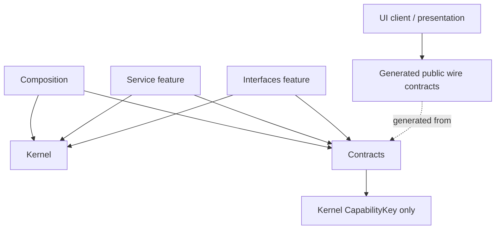

# HaruQuantAI Architecture

> **System:** HaruQuantAI V3 — Deterministic Research and Governed Trading
> **Status:** Normative target architecture; current evidence remains owner-scoped
> **Architecture revision:** `V3`
> **Last updated:** `2026-09-07`
> **System scope and acceptance:** [PROJECT.md](PROJECT.md)
> **Contributor procedure:** `AGENTS.md` and the
> [Feature Implementation Pipeline](dev/feature_implementation_pipeline.md)

This document owns universal package, dependency, lifecycle, runtime, isolation, persistence,
numerical, and deployment constraints. It does not duplicate the product scope, domain feature
registries, FRs, private schemas, algorithms, public method signatures, or acceptance status owned
by `PROJECT.md`, Contracts, and the owning package READMEs.

## 1. Purpose, authority, and style

HaruQuantAI is a local-first composable modular monolith. Focused features provide typed
capabilities, a single Composition runtime selects and reconciles providers, and supervised workers
isolate heavy or untrusted work. Optional hosted deployment changes infrastructure adapters and
process placement without changing domain ownership or semantics.

`AGENTS.md` owns contributor and safety rules; `PROJECT.md` owns system scope and
release; this document owns universal mechanics; shared and domain READMEs own package or feature
semantics; accepted source/tests prove implementation; the pipeline owns feature delivery; and the
[register](dev/Feature_Requirement_Traceability_Register.md) owns requirement identities
and applicability. Conflicts are reported rather than silently resolved.

## 2. Universal invariants

1. Kernel, Contracts, and Composition are shared, not business domains. Kernel is neutral,
   Contracts are pure, and Composition never statically imports feature code.
2. Installed entry points provide discovery. Features collaborate only through declared public
   contracts and capabilities resolved through `FeatureContext`.
3. Every state or artifact family has one semantic owner. Infrastructure can execute bounded owner
   operations without acquiring business ownership.
4. Every Python `__init__.py` is empty or docstring-only. Imports create no runtime effect.
5. Every reversible effect belongs to an owned scope. Cleanup is idempotent, LIFO, fault-tolerant,
   and diagnostic. Durable or external facts are staged, reconciled, compensated, or retained.
6. Missing, ambiguous, incompatible, or removed capabilities produce attributed unavailability or
   declared degradation, never null success or silent fallback.
7. Reproducible work pins every material source, contract, provider, configuration, policy,
   numerical, clock, sample, output, and seed identity.
8. Heavy loops use qualified typed kernels with no per-tick validation, SQL, pandas rows, capability
   lookup, network, SSE, or LLM work.
9. Composition owns feature reconciliation; Orchestration owns resource/job/worker control. Neither
   is a business owner.
10. Risk owns authority; Trading owns operational policy/lifecycle; Brokers owns provider truth;
    Simulator owns historical mechanics/results.
11. Interfaces, UI, and Agentic cannot acquire domain policy, authoritative state/time, secrets,
    approval, installation, or execution authority through adaptation or model output.
12. Public and persisted versions are explicit. Live use is disabled by default and cannot be
    enabled by migration, import, research, generation, installation, or recommendation.

## 3. Static module architecture

The stable top-level split is `docs/` for authority, `app/main.py` for bootstrap, `app/kernel/`,
`app/contracts/`, and `app/composition/` for shared infrastructure, `app/services/<domain>/` for
removable backend features, `app/ui/` for the workstation, and `tests/` for verification.

In this diagram, an arrow means the source may import the destination:


```mermaid
flowchart TD
    COMP["Composition"] --> K["Kernel"]
    COMP --> C["Contracts"]
    C --> CK["Kernel CapabilityKey only"]
    S["Service feature"] --> K
    S --> C
    I["Interfaces feature"] --> K
    I --> C
    UI["UI client / presentation"] --> G["Generated public wire contracts"]
    G -. "generated from" .-> C
```

| Package | Owns | Must not own |
| --- | --- | --- |
| Kernel | Capability keys, feature specs, context/scope, registry, graph, reconciler, events, and generic effects | Domain DTOs, configuration policy, routes, SDKs, or business state |
| Contracts | Requests, results, events, errors, ports, shared value semantics, and wire schemas | Runtime behavior, feature specs, adapters, persistence, or provider SDKs |
| Composition | Entry-point discovery, application configuration, provider selection, readiness, reconciliation, replacement, and logging infrastructure | Domain policy, user jobs, provider decisions, or semantic records |
| Services | Focused feature behavior and owner adapters | Shared-package forks, ambient authority, or another feature implementation |
| Interfaces | Authentication, wire translation, capability invocation, errors, and bounded events | Domain orchestration, formulas, parsers, raw tables, or invented authorization |
| UI | Presentation, interaction, layout, focus, accessibility, and local drafts | Backend policy, authoritative state/time, persistence, or provider transport |

`app/services/<domain>/` is the production home for domain behavior unless its owner documents an
explicit support-package exception. A domain-level shared support capability requires at least three
real feature consumers unless another ratified exception applies. Support folders never become a
second feature registry or business-policy owner.

## 4. Feature architecture

The identity hierarchy is `Domain → Feature → Responsibility → FR behavior`. A feature is the
registration, lifecycle, evidence, and physical-removal unit. An FR, file, class, algorithm variant,
role, widget component, test, or release gate is not automatically another feature.

```text
app/services/<domain>/
├── README.md
├── __init__.py
└── <feature>/
    ├── README.md
    ├── __init__.py
    ├── manifest.py
    ├── config.py
    ├── feature.py
    ├── <focused_domain_logic>.py
    ├── _persistence.py
    └── _usage.py
```

- The domain README is the complete target feature and FR registry. The feature README is the
  runtime-validated mirror for one installed implementation.
- `manifest.py` exposes one immutable `SPEC = FeatureSpec(...)` with stable identity, capability
  declarations, dependencies, conflicts, configuration keys, and optional state metadata.
- `config.py` accepts exactly the declared keys and validates types, limits, and combinations before
  effects. Feature settings and immutable operation inputs are different contracts.
- `feature.py` is the lifecycle adapter. It mounts with `FeatureContext`, resolves only declared
  capabilities, publishes only declared providers, and registers every effect with the scope.
- Focused logic modules own production behavior and never contain executable usage demonstrations.
- `_persistence.py` is optional and exists only when the feature defines database operations. It
  owns that code, routes access through public Workspace persistence contracts, and never receives
  a raw connection or absorbs policy, authorization, or orchestration.
- `_usage.py` is required and is the feature's sole executable usage owner. It may contain multiple
  bounded scenarios, but it imports production behavior rather than implementing business logic.
- State is optional. A stateless numerical feature omits `_persistence.py`. A stateful feature
  declares its namespace, schema, migration, and retention policy.
- Stable feature IDs survive package moves. Entry-point or factory renaming requires an explicit
  compatibility migration; a proposed path does not overrule a working accepted binding.

### UI feature variant

The UI remains Next.js, React, TypeScript, and Dockview. A UI feature owns capability and removal; a
widget is a visual contribution owned by one `FEAT-UI-*`; a workspace arranges widget instances.
Contributions use feature-owned widget folders and typed support. Existing paths move only through
explicit migration. UI support owns no business registry or policy. Layouts store presentation
identities, never raw business records, provider objects, or secrets; missing widgets restore as
diagnostics without discarding valid siblings.

## 5. Capability and lifecycle runtime

Stable `FEAT-*` IDs identify product owners; `<domain>.<capability>@<major>` keys bind consumers;
provider versions and generations identify implementations; schema, behavior, configuration, and
content hashes identify meaning. FR, NFR, workflow, and acceptance IDs are evidence identities, not
runtime registrations.

Required dependencies gate activation. Operation-gated dependencies affect only the operation that
needs them. An explicit provider choice wins; otherwise only a uniquely compatible provider may be
selected where the owner permits automatic selection. Ambiguity blocks. Loss of a selected
generation never silently selects another provider.

Activation is transactional:

1. Discover and validate the installed factory and immutable spec.
2. Resolve enabled state, strict configuration, conflicts, and dependency/provider view.
3. Create a staged `FeatureContext` and `FeatureScope`.
4. Mount and verify the exact declared capability bundle.
5. Publish providers atomically; any failure closes the staged scope and publishes nothing.

Runtime state distinguishes absent, invalid, dependency-blocked, preparing, active, failed,
stopping, and stopped conditions. Readiness reports actual state and reasons, not folder presence.

| Lifecycle event | Required result |
| --- | --- |
| Configuration disable | Withdraw providers, close effects, retain state by policy, and permit a clean later generation |
| Cold package absence | Attribute absence and block only dependents; unrelated branches remain healthy |
| Required provider loss | Stop admission and quiesce, drain, or block the dependency closure in order |
| Operation-gated provider loss | Refuse or degrade only the named operation |
| Reinstall | Bind compatible retained state or report explicit migration/incompatibility |
| Replacement | Stage and validate a shadow generation, then atomically switch under one mutation lock |

Replacement preserves the required provided-capability set. Pre-commit failure disposes the shadow
and retains the old generation. After commit, consumer-remount or old-cleanup failure is
`committed but degraded`, never a false rollback. Unrestricted in-place Python reload is not a
production evolution mechanism.

## 6. Contract and identity architecture

Commands and requests belong semantically to the receiver; events, results, and receipts belong to
the producer; common envelopes belong to Contracts. Contract placement does not transfer semantic
ownership.

- Public DTOs, protocols, events, stable failures, and wire schemas live under
  `app/contracts/<owner>/`. They are strict, typed, immutable where practical, and JSON-safe.
- New public Python wire records use the selected strict Pydantic v2 convention. Compatible existing
  dataclasses or ports remain until an explicit migration proves construction, equality, validation,
  serialization, failure, and producer-consumer compatibility.
- Consumers receive DTOs, immutable references, bounded handles, and ports—not ORM rows, raw SQL
  connections, provider SDK objects, pointers, unrestricted paths, or mutable foreign state.
- A request carries applicable actor, account, workspace, correlation, causation, expected revision,
  idempotency, schema, timestamp, authorization, and budget identity defined by its owner.
- Outcomes distinguish completion, queueing, invalidity, denial, refusal, conflict, partiality,
  unavailability, cancellation, infrastructure failure, and unknown external state.
- Additive compatible changes may retain a major only after proof. Breaking fields, meaning,
  failures, or sync/async behavior require a new major or explicit atomic migration and coexistence
  window.
- Capability major, DTO version, stored schema, provider generation, numerical policy, and human
  review hash are separate identities. One cannot substitute for another.
- Generated schemas and clients derive from canonical contracts and are never hand-edited semantic
  authorities.
- Contract modules perform no I/O, provider selection, retry, authorization, persistence, or
  lifecycle work. Ports describe behavior; providers implement it.

Content and semantic identity are distinct. Reviewed changes bind exact base/candidate hashes,
operation selection, and dependency closure; changed scope or source invalidates prior review.

## 7. Persistence and artifact architecture

Workspace owns bounded persistence and content-addressed custody; features own record meaning,
schemas, migrations, commands, and retention. Orchestration owns job/resource/worker/project state;
Data owns market/evidence state. Older Data-wide persistence authority and Workspace-owned business
tables are superseded and cannot operate as competing writers. The local target uses SQLite metadata
and immutable Parquet/Arrow artifacts; DuckDB is a reader, not a catalogue or owner. One fenced
writer controls a workspace and readers use bounded snapshots.

No feature receives a raw connection, unrestricted SQL, or arbitrary path. Persistence requests name
the owner namespace, operation, schema/migration identity, expected revision, and idempotency where
applicable. Infrastructure rejects undeclared namespace or table access.

Artifact publication admits finite staging, streams and validates parts, flushes through the
durability boundary, promotes immutable bytes, issues a custody receipt, and commits owner
metadata plus transactional event/outbox intent. Interrupted publication reconciles under its
original identity.

A pre-promotion failure publishes nothing. Promoted bytes without committed owner metadata are a
detectable orphan, not an accepted result. No committed record points to partial or mutable bytes.
Cross-owner publication uses staged receipts and reconciliation, not an invented distributed
transaction.

Applied migration identities and checksums are immutable. New schema steps are ordered, additive,
idempotent, transactional, write-locked, backup-aware, and ledger-verified. A feature migrates only
its own state. Unknown future schemas are read-only, explicitly migrated, or rejected. Cutover
requires owner mapping, counts, hashes, reference verification, fencing, rollback, and one writer.

Concurrency accepts only the expected revision. Idempotency binds the owner-defined actor,
workspace, operation, and canonical payload. Reuse for changed content conflicts. Leases carry
fences; stale workers cannot commit. Removal retains attributable namespace/schema/version/hash
state unless a separate authorized purge policy applies.

## 8. Jobs, workers, and numerical execution

Orchestration is the sole shared admission, reservation, job, attempt, lease, worker, and outbox
authority. It does not define numerical meaning or declare domain success.

Reservations cover CPU/native threads, memory, mappings, caches, buffers, disk, I/O, GPU, network,
and model cost. Parent/child budgets are hierarchical and retain control and
cancellation capacity.

An accepted job pins its owner, request, providers, configuration, finite resources, outputs,
idempotency, and checkpoint/cancellation policy. Its identity and enqueue intent commit before
acceptance. Large campaigns remain lazy durable plans.

Workers receive typed instructions and immutable artifact or shared-memory references, never
arbitrary closures, untrusted object graphs, raw connections, provider clients, or ambient secrets.
They validate runtime, permissions, lease, and fence before work. Output is accepted only after
owner, schema, hash, and current-fence validation.

Worker completion and domain outcome are distinct. Retry creates a linked attempt and preserves
cost, failures, and research exposure. Human waits release worker slots.

Strategy produces target-neutral plans from owner numerical descriptors. Simulator preflights the
explicit tick, resource, policy, and output choices, then binds qualified kernels once per admitted
run. Unsupported operations fail before execution; no object-mode fallback hides them. Compilation
caches pin topology, type, layout, code, contract, and provider identities.

Numba nopython is the initial numerical backend. Qualified Cython or C++ providers may satisfy
measured gaps through the same owner contracts; a benchmark comparator is not a product engine.

Data owns recorded observations; Simulator owns generated-tick and event-order semantics. New
intents cannot fill on their decision event. Equal-time groups, bar closure, chunking, continuation,
checkpoint, resume, and reassignment preserve causal order and lose or duplicate no event.

Native slices are bounded and poll control between slices. Acknowledgement is not quiescence; late
results are fenced. Remote workers are separately authenticated and qualified. Reductions use
logical order, never completion or network arrival order.

## 9. Interfaces, UI, and Agentic boundaries

The current ASGI/FastAPI/Uvicorn transport is retained. Interfaces authenticates, validates wire
data, resolves public capabilities, translates owner failures, and transports bounded events. It
contains no domain formula, parser, raw table access, or hidden workflow engine.

HTTP, CLI, MCP, and automation map to the same owner commands and requirements. Large work returns
an owner job reference. SSE is the selected resumable observation mechanism where specified; it
preserves identity, cursor, causation, and terminal references. Gaps require snapshot/resync;
disconnect never retries a mutation or cancels accepted work.

Widgets request bounded pages or projections and label exact, aggregated, sampled,
stale, partial, and unavailable values. Temporal context carries source/clock, timestamp, cursor,
freshness, gap, and replay state. Live, historical, playback, simulation, and job-event time never
silently mix. Rendering coalescence cannot reorder owner events. Unmount releases observation
resources without cancelling an owner job.

Every Agentic turn receives fresh authorized typed references, not raw DOM, database rows, secrets,
or unrestricted component state. Material facts refresh from deterministic owners; retrieved text
remains untrusted evidence.

Models and tools bind a current mandate, role, provider/model profile, schema, permissions, budget,
and generation. Deterministic policy validates each tool call. Model output cannot select its own
eligibility, expand budgets, bypass dissent, or invoke an operational receiver. Human actions are
typed and bound to exact objects, hashes, scope, and expiry.

Workspace owns transcripts; Agentic owns workflow/claim evidence; receivers own accepted domain
records. Transcript or Agentic removal never deletes those facts or deterministic safety controls.

## 10. Extensions and governed execution

Trusted installed features may perform lightweight in-process work under ordinary lifecycle rules.
Heavy native work uses admitted workers. Untrusted plugins, generated scripts, compilers, package
builds, hostile artifacts, and provider-facing tools use deny-by-default isolation with declared
inputs, outputs, paths, credentials, egress, resources, and cleanup.

Plugins owns quarantine, manifests, permissions, contributions, compatibility, and isolation leases.
Domain owners retain the meaning of contributed operations. A successful parse, build, test, or
installation does not establish trust, enablement, semantic qualification, role eligibility, or
trading authority. Unknown binary formats remain opaque; unrestricted deserialization is forbidden.

Historical and operational execution share owner-qualified policy meaning but not canonical state.
Simulator owns historical streams, matching, checkpoints, and results and consumes versioned Risk
and Trading policy descriptors. It cannot redefine those policies or grant operational approval;
historical work requires no live credential or per-tick service call.

Trading owns operational sessions, actions, journals, dispatch identity, and reconciliation. Risk
decides authority but never routes; Brokers reports provider truth but never creates canonical
Trading state. Operations are account, environment, session, route, and generation scoped.

The operational path is reviewed intent → provider/session readiness → current Risk decision →
immediate Trading recheck → one logical dispatch → receipt → reconciliation → journal. Unknown
outcomes block blind retry. Application idempotency does not prove exactly-once network execution.

Paper, demo, and live require independent qualification. Historical parity can prove shared policy
semantics under matched inputs, not real liquidity, latency, prices, or fills. Missing policy
lowering makes the affected route unavailable; it never enables an interpreter bypass.

## 11. Deployment and security

The local reference topology is one composed Python ASGI control plane, a separate Next.js client,
one fenced Workspace writer, SQLite metadata, immutable artifacts, bounded local workers and
sandboxes, and optional isolated broker processes. The current composed server remains one process;
multi-process deployment requires explicit Composition and writer-fencing evidence.

Electron and a headless container are distribution targets, not alternate business applications.
Optional hosting may add authenticated gateways, remote workers, PostgreSQL, object storage, queues,
events, and telemetry. These adapters preserve contracts, semantic owners, record identities,
authorization, and deterministic behavior. The local core does not require hosted services.

| Trust boundary | Required controls |
| --- | --- |
| Browser or automation → Interfaces | Authentication, scope, strict bounded input, schema compatibility, CSRF/session policy, revision, and idempotency |
| Interfaces → owner | Exact capability/generation resolution, current owner authorization, and unchanged receipt/error meaning |
| Controller → worker | Immutable work identity, finite reservation, allowed artifact/temp scope, and current lease/fence |
| Worker/model/plugin → external | Deny-by-default egress, selected provider/version, role/task permission, deadline/cost, and scoped credentials |
| Artifact → parser/compiler | Count, size, depth, framing, path, traversal, link/reparse/device, decompression, and hash defenses |
| Workspace/account → another | Independent authorization across stores, artifacts, queues, caches, events, logs, diagnostics, and model context |
| Package/provider/model replacement | Immutable identity, compatibility/eligibility evidence, atomic generation switch, and exact disposal |

Secrets remain opaque Workspace references in configuration, manifests, checkpoints, contracts, and
wire objects. Raw material is resolved only inside the authorized adapter and never enters UI,
Agentic context, logs, traces, events, artifacts, diagnostics, or exports. Redaction occurs before
persistence or exposure. Off-loopback access requires authenticated protected transport.

A storage or topology migration requires backup, counts, hashes, reference reconciliation,
workspace isolation, fencing, cutover, and rollback evidence. Deployment environment, runtime
profile, broker environment, and execution mode remain independent choices.

## 12. Determinism, observability, failure, and performance

A decision-grade manifest pins all material Strategy, data, Catalogue, account, policy, tick,
provider/runtime, sample, metric, output, resource, and random-stream identities. Material change
changes identity; completion order never determines randomness, reduction, ranking, or ties.

Discrete states, identities, order, time, normalized price/quantity, and canonical hashes compare
exactly under the selected policy. Money uses checked integer or Decimal quantization. Float64 uses
only owner-declared tolerances. Overflow or inadequate range rejects unless a qualified wider
implementation was selected in advance.

Composition owns logging setup, structured JSON formatting, correlation context, redaction,
diagnostic capture, and handler lifecycle. Console and file sinks run behind one lifecycle-owned,
bounded queue; producer threads never wait on sink I/O, and saturation drops the newest record with
an observable counter. Shutdown drains accepted records before closing owned sinks. Modules emit
with `logging.getLogger(__name__)`; services do not configure global logging or import Composition
merely to log. Owners define audit meaning; logs never become authorization or canonical state.

Telemetry is bounded, redacted, and causally links applicable request, workspace, account, job, run,
result, provider, and operational identities. Measurement separates queue, compilation, compute,
I/O, serialization, and rendering and accounts for the whole process group and native resources.

| Failure | Required containment |
| --- | --- |
| Missing package, invalid config, or ambiguous provider | Attribute absent/invalid/blocked state; unrelated branches remain healthy |
| Activation, disposal, or replacement fault | Publish no partial mount; continue independent cleanup; retain old authority before replacement commit and report true degradation after it |
| Worker, disk, or artifact fault | Fence stale writes, quarantine incomplete data, and reconcile under original identity |
| Missing execution dependency or event continuity | Refuse or resync from owner truth; never use reduced fidelity or fabricate continuity |
| Unknown broker effect or expired Risk authority | Stop dispatch/retry and reconcile or obtain new authority |
| Agentic limit or unqualified external input | Preserve costs/attempts and report refusal, opacity, unavailability, or unverified state |

Performance targets remain in `PROJECT.md` and owner requirements. Comparisons freeze workload,
method, outputs, hardware/runtime, build/cache, resources, repetitions, and statistics. They cannot
reduce fidelity or count a cache hit as fresh compute. Measurements remain distinct from targets.

## 13. Architecture verification and governance

Architecture is executable policy. Static checks cover import direction, pure initializers, unique
identities, entry-point/spec/config/README agreement, feature shape, contract purity, and absence of
private service imports. Contract tests cover schema, wire/client, and producer-consumer parity.

Lifecycle evidence covers clean and failed mount, dependency loss, disable/re-enable, replacement,
cold removal, reinstall, retained-state compatibility, and resource disposal. State and execution
evidence covers migrations, crashes, fencing, publication, recovery, explicit clocks/routes,
historical/operational ownership, unknown outcomes, and removal without hidden alternatives.

The configured repository gate is:

```powershell
uv run --frozen python scripts/ci_check.py
```

The command's presence is not evidence that it ran. Acceptance records exact paths, tests, inputs,
environment, versions, commands, exits, coverage, and review. Documentation checks cannot certify
lifecycle, broker safety, model quality, UI behavior, numerics, or performance.

Unresolved bindings and missing evidence belong in `PROJECT.md` §12 or the owner README, not
as competing architecture alternatives. An architecture change follows `PROJECT.md` §14 and updates
affected owners, contracts, manifests, configuration, migrations, generated artifacts, tests, and
diagrams together. Documentation alone does not change runtime acceptance.
