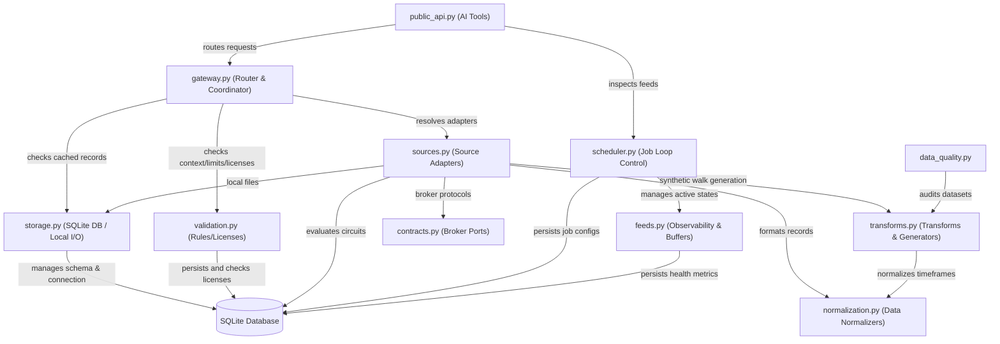
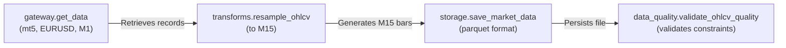
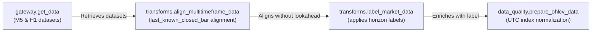
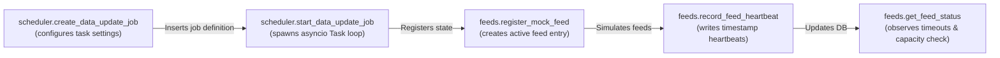

# Functionality Registry: `app/services/data`

## 1. Directory & File Mapping
Below is the directory map of the physical files in [app/services/data](file:///c:/Users/rharu/AppDev/HaruquantAI/app/services/data) along with their technical purpose and key import dependencies:

*   [__init__.py](file:///c:/Users/rharu/AppDev/HaruquantAI/app/services/data/__init__.py): Exposes official AI-facing tools and legacy support/compatibility functions, categorizing them via public classification mappings. 
    *   *Dependencies:* `gateway`, `public_api`, `scheduler`, `storage`, `transforms`, `validation`
*   [contracts.py](file:///c:/Users/rharu/AppDev/HaruquantAI/app/services/data/contracts.py): Establishes the boundary-layer type protocols (such as broker ports and adapters) and canonical Pydantic contracts for market entities (symbols, timeframes, bars, ticks, spreads, and slices).
    *   *Dependencies:* domain-local contract bases, `app.utils.logger`, `app.utils.normalization`, `pydantic`, `pandas`
*   [data_quality.py](file:///c:/Users/rharu/AppDev/HaruquantAI/app/services/data/data_quality.py): Diagnostics utility that inspects OHLCV-like tabular inputs to generate deterministic quality reports and issue logs without mutating data.
    *   *Dependencies:* `app.services.data.dataframe_tools`, `app.utils.logger`, `app.utils.normalization`, `app.utils.standard`
*   [dataframe_tools.py](file:///c:/Users/rharu/AppDev/HaruquantAI/app/services/data/dataframe_tools.py): Implements serialization, alignment, chunking, and parameter-grid generation helpers on copy-safe pandas DataFrames.
    *   *Dependencies:* `app.utils.normalization`, `app.utils.standard`, `pandas`, `numpy`
*   [errors.py](file:///c:/Users/rharu/AppDev/HaruquantAI/app/services/data/errors.py): Configures error payload wrappers that map service failures to redacted, deterministic boundary-facing error payloads.
    *   *Dependencies:* `app.utils.standard`, `app.utils.logger`, `app.utils.security`
*   [feeds.py](file:///c:/Users/rharu/AppDev/HaruquantAI/app/services/data/feeds.py): Manages real-time feed connectivity states, heartbeat checkups, reconnect backoff bounds, and buffer overflow recovery.
    *   *Dependencies:* `app.services.data.storage`, `app.services.trading.errors`, `app.utils.standard`, `app.utils.logger`
*   [gateway.py](file:///c:/Users/rharu/AppDev/HaruquantAI/app/services/data/gateway.py): Acts as the orchestrating router for historical, real-time, local, and synthetic data queries, managing cache lookups, rate limiting, and license validations.
    *   *Dependencies:* `app.services.data.models`, `app.services.data.normalization`, `app.services.data.sources`, `app.services.data.storage`, `app.services.data.transforms`, `app.services.data.validation`, `app.utils.standard`, `app.utils.logger`, `app.utils.normalization`
*   [models.py](file:///c:/Users/rharu/AppDev/HaruquantAI/app/services/data/models.py): Declares strict validation schemas (representing bars, ticks, spreads, symbol specification settings, quality summaries, and data lineages) using Pydantic.
    *   *Dependencies:* `pydantic`, `app.utils.normalization`
*   [normalization.py](file:///c:/Users/rharu/AppDev/HaruquantAI/app/services/data/normalization.py): Converts provider-specific dataframes, files (including MetaTrader 5 format), and raw mappings into normalized gateway records.
    *   *Dependencies:* `pandas`, `app.utils.logger`
*   [public_api.py](file:///c:/Users/rharu/AppDev/HaruquantAI/app/services/data/public_api.py): Implements standard AI-facing tool wrappers that encapsulate core functions with deterministic error envelopes.
    *   *Dependencies:* `app.services.data.gateway`, `app.services.data.scheduler`, `app.services.data.validation`, `app.services.data.errors`, `app.utils.logger`, `app.utils.standard`
*   [scheduler.py](file:///c:/Users/rharu/AppDev/HaruquantAI/app/services/data/scheduler.py): Performs scheduled data-update job management, startup/crash recovery routines, and asyncio background worker loops.
    *   *Dependencies:* `app.services.data.feeds`, `app.services.data.storage`, `app.services.data.validation`, `app.utils.standard`, `app.utils.logger`
*   [sources.py](file:///c:/Users/rharu/AppDev/HaruquantAI/app/services/data/sources.py): Implements local file-based, synthetic, and network-backed broker adapters (MT5, cTrader, Dukascopy, Binance, Yahoo) using circuit breaker protections.
    *   *Dependencies:* `app.services.data.contracts`, `app.services.data.storage`, `app.services.data.transforms`, `app.services.data.normalization`, `app.utils.standard`, `app.utils.logger`, `app.utils.security`, `pandas`
*   [storage.py](file:///c:/Users/rharu/AppDev/HaruquantAI/app/services/data/storage.py): Owns SQLite connection pooling, migrations, atomic file I/O operations, local directory sandboxing, and quarantine logic.
    *   *Dependencies:* `app.utils.standard`, `app.utils.logger`, `pandas`, `sqlite3`
*   [transforms.py](file:///c:/Users/rharu/AppDev/HaruquantAI/app/services/data/transforms.py): Houses mathematical transformations, resampling rules, tick-to-bar aggregation, multi-timeframe alignment, synthetic walk generation, and data labeling.
    *   *Dependencies:* `app.services.data.validation`, `app.utils.standard`, `app.utils.logger`, `numpy`, `pandas`
*   [validation.py](file:///c:/Users/rharu/AppDev/HaruquantAI/app/services/data/validation.py): Validates query limits, rounding digits, alignment steps, timezone profiles, environment readiness, and data licenses.
    *   *Dependencies:* `app.services.data.storage`, `app.utils.standard`, `app.utils.logger`

---

## 2. Global System Capabilities (Architecture Flowchart)
The flowchart below illustrates how components interact when routing data queries and managing background processes:

---

## 3. Comprehensive Functionality Inventory

| ID | Purpose / Business Logic (What it does) | Location (Module and file) | Function Signature | Side Effects / External Mutations |
| :--- | :--- | :--- | :--- | :--- |
| `FN-001` | Asserts connection readiness for a read-only broker connection. | `data/contracts.py` | `contracts.BrokerMarketDataPort.is_connected(self) -> bool` | None (Abstract Protocol Method) |
| `FN-002` | Opens a broker data session if required. | `data/contracts.py` | `contracts.BrokerMarketDataPort.connect(self) -> bool \| None` | Network connection attempts (Abstract Protocol Method) |
| `FN-003` | Fetches historical OHLCV bars from broker source. | `data/contracts.py` | `contracts.BrokerMarketDataPort.get_bars(self, *, symbol: str, timeframe: str, date_from: datetime, date_to: datetime) -> pd.DataFrame \| None` | Network retrieval (Abstract Protocol Method) |
| `FN-004` | Fetches historical ticks from broker source. | `data/contracts.py` | `contracts.BrokerMarketDataPort.get_ticks(self, *, symbol: str, start: datetime, end: datetime, as_dataframe: bool = True) -> pd.DataFrame \| None` | Network retrieval (Abstract Protocol Method) |
| `FN-005` | Checks if a data source adapter is ready and configured. | `data/contracts.py` | `contracts.SourceAdapterPort.is_ready(self) -> bool` | None (Abstract Protocol Method) |
| `FN-006` | Fetches normalized historical OHLCV data from an adapter. | `data/contracts.py` | `contracts.SourceAdapterPort.get_market_data(self, symbol: str, timeframe: str, start_time: datetime, end_time: datetime, *, request_id: str \| None = None) -> DataRecords` | Network or File I/O (Abstract Protocol Method) |
| `FN-007` | Fetches normalized historical tick data from an adapter. | `data/contracts.py` | `contracts.SourceAdapterPort.get_tick_data(self, symbol: str, start_time: datetime, end_time: datetime, *, request_id: str \| None = None) -> DataRecords` | Network or File I/O (Abstract Protocol Method) |
| `FN-008` | Returns a list of symbol identifiers discovered by the source. | `data/contracts.py` | `contracts.SourceAdapterPort.list_symbols(self, *, request_id: str \| None = None) -> list[str]` | Network or File I/O (Abstract Protocol Method) |
| `FN-009` | Returns normalized specification metadata for a symbol. | `data/contracts.py` | `contracts.SourceAdapterPort.get_symbol_metadata(self, symbol: str, *, request_id: str \| None = None) -> SymbolMetadataRecord` | Network or File I/O (Abstract Protocol Method) |
| `FN-010` | Enforces that minimum trade lot size does not exceed maximum lot size. | `data/contracts.py` | `contracts.Symbol.validate_lot_limits(self) -> Symbol` | None (Pydantic Model Validator) |
| `FN-011` | Validates that a timeframe string exists in the allowed set. | `data/contracts.py` | `contracts.Timeframe.validate_timeframe_name(cls, v: str) -> str` | None (Pydantic Field Validator) |
| `FN-012` | Constructs a validated `Timeframe` instance from its name. | `data/contracts.py` | `contracts.Timeframe.from_name(cls, name: str, **kwargs: Any) -> Timeframe` | None (Pure Classmethod Constructor) |
| `FN-013` | Normalizes and parses the bar's ISO timestamp. | `data/contracts.py` | `contracts.Bar.validate_time(cls, v: str) -> str` | None (Pydantic Field Validator) |
| `FN-014` | Asserts that a bar's timeframe name is allowed. | `data/contracts.py` | `contracts.Bar.validate_tf(cls, v: str) -> str` | None (Pydantic Field Validator) |
| `FN-015` | Enforces physical high/low constraints and bounds open/close values. | `data/contracts.py` | `contracts.Bar.validate_ohlc(self) -> Bar` | None (Pydantic Model Validator) |
| `FN-016` | Normalizes and parses a tick timestamp to ISO. | `data/contracts.py` | `contracts.Tick.validate_time(cls, v: str) -> str` | None (Pydantic Field Validator) |
| `FN-017` | Asserts bid/ask prices are consistent (ask >= bid). | `data/contracts.py` | `contracts.Tick.validate_tick_prices(self) -> Tick` | None (Pydantic Model Validator) |
| `FN-018` | Normalizes and parses a spread snapshot timestamp. | `data/contracts.py` | `contracts.Spread.validate_time(cls, v: str) -> str` | None (Pydantic Field Validator) |
| `FN-019` | Asserts spread bid/ask boundaries are consistent (ask >= bid). | `data/contracts.py` | `contracts.Spread.validate_spread_prices(self) -> Spread` | None (Pydantic Model Validator) |
| `FN-020` | Asserts a DataSlice timeframe is supported. | `data/contracts.py` | `contracts.DataSlice.validate_timeframe_name(cls, v: str) -> str` | None (Pydantic Field Validator) |
| `FN-021` | Parses and normalizes retrieve/normalize stamps on a DataSlice. | `data/contracts.py` | `contracts.DataSlice.validate_lineage_times(cls, v: str) -> str` | None (Pydantic Field Validator) |
| `FN-022` | Copies a dataframe and normalizes its timestamp column/index to UTC. | `data/data_quality.py` | `data_quality.prepare_ohlcv_data(dataframe: Any, *, timestamp_column: str \| None = None) -> Any` | None (Operates on copy) |
| `FN-023` | Analyzes dataframe and outputs deterministic metrics, penalties, and quality passes. | `data/data_quality.py` | `data_quality.inspect_ohlcv_quality(dataframe: Any, *, expected_symbol: str \| None = None, timestamp_column: str \| None = None, issue_limit: int = 100, sample_limit: int = 5, quality_pass_threshold: float = 90.0) -> dict[str, object]` | None (Operates on copy) |
| `FN-024` | Encapsulates dataframe quality inspections inside a standard response envelope. | `data/data_quality.py` | `data_quality.validate_ohlcv_quality(dataframe: Any, *, expected_symbol: str \| None = None, timeframe: str \| None = None, timestamp_column: str \| None = None, quality_pass_threshold: float = 90.0, request_id: str \| None = None) -> StandardResponse` | Emits info/warning/exception logs |
| `FN-025` | Aligns a dataframe copy's index or specific timestamp column to UTC Datetime. | `data/dataframe_tools.py` | `dataframe_tools.align_dataframe_datetime(dataframe: object, *, timestamp_column: str \| None = None) -> Any` | None (Operates on copy) |
| `FN-026` | Converts dataframe row records to JSON-serializable list of dictionaries. | `data/dataframe_tools.py` | `dataframe_tools.serialize_dataframe_records(dataframe: object, *, timestamp_columns: Sequence[str] = (), include_index: bool = False, index_name: str = "index") -> list[dict[str, object]]` | None (Pure Function) |
| `FN-027` | Transforms a bar dictionary into a JSON-safe record with a standardized UTC string. | `data/dataframe_tools.py` | `dataframe_tools.bar_to_record(bar: Mapping[str, object], *, timestamp_field: str = "timestamp") -> dict[str, object]` | None (Pure Function) |
| `FN-028` | Normalizes an iterable of bar mappings to a list of JSON-safe records. | `data/dataframe_tools.py` | `dataframe_tools.bars_to_records(bars: Iterable[Mapping[str, object]], *, timestamp_field: str = "timestamp") -> list[dict[str, object]]` | None (Pure Function) |
| `FN-029` | Segments a sequence into sub-lists containing at most `size` items. | `data/dataframe_tools.py` | `dataframe_tools.chunked(values: Sequence[T], *, size: int) -> list[list[T]]` | None (Pure Function) |
| `FN-030` | Resolves cartesian products of candidate parameter sequences. | `data/dataframe_tools.py` | `dataframe_tools.parameter_combinations(grid: Mapping[str, Sequence[object]]) -> list[dict[str, object]]` | None (Pure Function) |
| `FN-031` | Compares columns of aligned dataframes within numeric thresholds. | `data/dataframe_tools.py` | `dataframe_tools.compare_dataframes(left: object, right: object, *, columns: Sequence[str] \| None = None, tolerance: float = 0.0) -> dict[str, object]` | None (Pure Function) |
| `FN-032` | Compares open, high, low, close columns between aligned dataframes. | `data/dataframe_tools.py` | `dataframe_tools.compare_ohlc(left: object, right: object, *, tolerance: float = 0.0) -> dict[str, object]` | None (Pure Function) |
| `FN-033` | Compares OHLC and volume columns between aligned dataframes. | `data/dataframe_tools.py` | `dataframe_tools.compare_ohlcv(left: object, right: object, *, tolerance: float = 0.0) -> dict[str, object]` | None (Pure Function) |
| `FN-034` | Extracts column names from a DataFrame as string labels. | `data/dataframe_tools.py` | `dataframe_tools.dataframe_columns(dataframe: object) -> list[str]` | None (Pure Function) |
| `FN-035` | Yields JSON-safe row records from a DataFrame generator. | `data/dataframe_tools.py` | `dataframe_tools.iter_dataframe_records(dataframe: object) -> Iterable[dict[str, object]]` | None (Pure Function) |
| `FN-036` | Alias for `align_dataframe_datetime` normalizing datetime structures. | `data/dataframe_tools.py` | `dataframe_tools.align_dataframe_time_index(dataframe: object, *, timestamp_column: str \| None = None) -> Any` | None (Pure Function) |
| `FN-037` | Alias for `chunked` splitting sequence fields. | `data/dataframe_tools.py` | `dataframe_tools.chunk_sequence(values: Sequence[T], *, size: int) -> list[list[T]]` | None (Pure Function) |
| `FN-038` | Alias for `parameter_combinations` producing grid configurations. | `data/dataframe_tools.py` | `dataframe_tools.generate_parameter_combinations(grid: Mapping[str, Sequence[object]]) -> list[dict[str, object]]` | None (Pure Function) |
| `FN-039` | Maps exceptions to redacted boundary error payloads. | `data/errors.py` | `errors.to_data_error_payload(exception: BaseException, *, request_id: str \| None = None) -> ErrorPayload` | Emits boundary log alerts |
| `FN-040` | Computes exponential backoff reconnect delays with randomized jitter. | `data/feeds.py` | `feeds.compute_reconnect_delay(attempt: int, policy: ReconnectPolicy = DEFAULT_RECONNECT_POLICY) -> float` | None (Pure Function) |
| `FN-041` | Inspects if buffer depth stays within bounded capacity limit. | `data/feeds.py` | `feeds.check_feed_buffer_capacity(feed: dict[str, Any], capacity: int = DEFAULT_FEED_BUFFER_CAPACITY) -> bool` | None (Pure Function) |
| `FN-042` | Verifies whether the heartbeat of a feed has timed out. | `data/feeds.py` | `feeds.check_feed_heartbeat_timeout(feed: dict[str, Any], timeout_seconds: float = DEFAULT_HEARTBEAT_TIMEOUT_SECONDS, *, now: datetime \| None = None) -> bool` | None (Pure Function) |
| `FN-043` | Persists a feed heartbeat timestamp to DB and memory structures. | `data/feeds.py` | `feeds.record_feed_heartbeat(feed_id: str, *, request_id: str \| None = None) -> dict[str, Any]` | Modifies global `ACTIVE_FEEDS` dict; updates row in SQLite database |
| `FN-044` | Registers mock real-time feed records for testing or local monitoring. | `data/feeds.py` | `feeds.register_mock_feed(feed_id: str, source: str, symbol: str, data_kind: str, state: str = "connected", buffer_depth: int = 0, dropped_count: int = 0, gap_count: int = 0, reconnect_count: int = 0, circuit_breaker_state: str = "closed", last_error: str \| None = None) -> None` | Modifies global `ACTIVE_FEEDS` dict; inserts/replaces row in SQLite database |
| `FN-045` | Transitions state and updates counts in database when buffer capacity overflows. | `data/feeds.py` | `feeds.handle_feed_overflow(feed_id: str, policy: OverflowPolicy) -> dict[str, Any]` | Modifies global `ACTIVE_FEEDS` dict; updates state in SQLite database |
| `FN-046` | Checks health metrics, buffer capacities, and connection state indicators of feeds. | `data/feeds.py` | `feeds.get_feed_status(feed_id: str \| None = None, source: str \| None = None, symbol: str \| None = None, data_kind: str \| None = None, *, request_id: str \| None = None) -> list[dict[str, Any]] \| dict[str, Any]` | Reads global `ACTIVE_FEEDS` dict and SQLite database tables |
| `FN-047` | Consumes a token if available, tracking replenishment timestamp increments. | `data/gateway.py` | `gateway.TokenBucketLimiter.consume(self) -> bool` | Mutates rate-limiter token counters and timestamp state |
| `FN-048` | Asserts availability of a token from rate limiters, blocking upon exhaust. | `data/gateway.py` | `gateway.check_rate_limit(source: str) -> None` | Triggers token consumption state changes |
| `FN-049` | Single-source request router checking validation, licenses, and cache. | `data/gateway.py` | `gateway.execute_gateway_request(source: str, symbol: str, timeframe: str \| None, start_time: datetime, end_time: datetime, data_kind: str, stale_data_behavior: str = "refresh_and_return", workflow_context: str = "research", request_id: str \| None = None) -> list[dict[str, Any]]` | DB reads/writes (checks cache, updates cache); consumes rate-limit tokens |
| `FN-050` | Retrives list of normalized market data records for symbols. | `data/gateway.py` | `gateway.get_data(symbol: str, start_time: str, end_time: str, data_kind: str = "ohlcv", timeframe: str \| None = None, source: str = "csv", limit: int \| None = None, stale_data_behavior: str = "refresh_and_return", workflow_context: str = "research", request_id: str \| None = None) -> list[dict[str, Any]]` | DB reads/writes (checks cache, updates cache); consumes rate-limit tokens |
| `FN-051` | Retrieves records and encapsulates them with provenance metadata structures. | `data/gateway.py` | `gateway.get_data_with_metadata(symbol: str, start_time: str, end_time: str, data_kind: str = "ohlcv", timeframe: str \| None = None, source: str = "csv", limit: int \| None = None, stale_data_behavior: str = "refresh_and_return", workflow_context: str = "research", request_id: str \| None = None) -> tuple[list[dict[str, Any]], dict[str, Any]]` | DB reads/writes (checks cache, updates cache); consumes rate-limit tokens |
| `FN-052` | Retrieves metadata properties for a symbol from a source adapter. | `data/gateway.py` | `gateway.get_symbol_metadata(symbol: str, source: str = "csv", *, request_id: str \| None = None) -> dict[str, Any]` | None |
| `FN-053` | Retrieves lists of active symbols published by a source adapter. | `data/gateway.py` | `gateway.list_symbols(source: str = "csv", *, request_id: str \| None = None) -> list[str]` | None |
| `FN-054` | Evaluates cache availability, timestamps, record counts, and checks for gap sequences. | `data/gateway.py` | `gateway.get_data_availability(symbol: str, timeframe: str, source: str = "csv", *, request_id: str \| None = None) -> dict[str, Any]` | Reads SQLite database (`data_cache`) |
| `FN-055` | Parses and normalizes time ISO timestamps to UTC format. | `data/models.py` | `models.validate_utc_timestamp_helper(v: str) -> str` | None (Pure Function) |
| `FN-056` | Parses field values of an `OHLCVRecord` instance. | `data/models.py` | `models.OHLCVRecord.validate_utc_timestamp(cls, v: str) -> str` | None (Pydantic Field Validator) |
| `FN-057` | Enforces OHLC consistency order bounds on open, high, low, close. | `data/models.py` | `models.OHLCVRecord.validate_ohlc_order(self) -> OHLCVRecord` | None (Pydantic Model Validator) |
| `FN-058` | Parses field values of a `TickRecord` instance. | `data/models.py` | `models.TickRecord.validate_utc_timestamp(cls, v: str) -> str` | None (Pydantic Field Validator) |
| `FN-059` | Enforces quote requirements and checks bid/ask bounds (ask >= bid). | `data/models.py` | `models.TickRecord.validate_tick_constraints(self) -> TickRecord` | None (Pydantic Model Validator) |
| `FN-060` | Parses field values of a `SpreadRecord` instance. | `data/models.py` | `models.SpreadRecord.validate_utc_timestamp(cls, v: str) -> str` | None (Pydantic Field Validator) |
| `FN-061` | Verifies ask >= bid bounds on a spread instance. | `data/models.py` | `models.SpreadRecord.validate_spread_values(self) -> SpreadRecord` | None (Pydantic Model Validator) |
| `FN-062` | Maps source profiles to volume types (e.g. tick vs broker). | `data/normalization.py` | `normalization.resolve_volume_kind(source: str, data_kind: str) -> str` | None (Pure Function) |
| `FN-063` | Analyzes a record against prior timestamps and prices to log flags. | `data/normalization.py` | `normalization.build_data_quality_flags(record: dict[str, Any], *, previous_timestamp: str \| None = None) -> list[str]` | None (Pure Function) |
| `FN-064` | Aggregates flagged items and occurrences across record batches. | `data/normalization.py` | `normalization.summarize_data_quality(records: list[dict[str, Any]]) -> dict[str, Any]` | None (Pure Function) |
| `FN-065` | Returns UTC ISO strings for input provider datetime objects. | `data/normalization.py` | `normalization.normalize_timestamp_value(value: Any) -> str` | None (Pure Function) |
| `FN-066` | Formats dataframes to list of OHLCV mappings. | `data/normalization.py` | `normalization.bars_dataframe_to_records(df: pd.DataFrame, symbol: str, timeframe: str, source: str) -> list[dict[str, Any]]` | None (Pure Function) |
| `FN-067` | Formats dataframes to list of tick mappings. | `data/normalization.py` | `normalization.ticks_dataframe_to_records(df: pd.DataFrame, symbol: str, source: str) -> list[dict[str, Any]]` | None (Pure Function) |
| `FN-068` | Formats MT5 dataframes to tick mappings. | `data/normalization.py` | `normalization.mt5_ticks_dataframe_to_records(df: pd.DataFrame, symbol: str, source: str) -> list[dict[str, Any]]` | None (Pure Function) |
| `FN-069` | Converts raw text records from MT5 or generic file feeds to schema formats. | `data/normalization.py` | `normalization.normalize_file_records(records: list[dict[str, Any]], symbol: str, timeframe: str, source: str) -> list[dict[str, Any]]` | None (Pure Function) |
| `FN-070` | Standard tool interface wrapper fetching normalized dataset slices. | `data/public_api.py` | `public_api.get_data_tool(symbol: str, start_time: str, end_time: str, data_kind: str = "ohlcv", timeframe: str \| None = None, source: str = "csv", limit: int \| None = None, stale_data_behavior: str = "refresh_and_return", workflow_context: str = "research", *, request_id: str \| None = None) -> StandardResponse` | DB reads/writes (checks cache, updates cache); consumes rate-limit tokens |
| `FN-071` | Standard tool interface wrapper listing symbol IDs. | `data/public_api.py` | `public_api.list_symbols_tool(source: str = "csv", *, request_id: str \| None = None) -> StandardResponse` | None |
| `FN-072` | Standard tool interface wrapper fetching market calendar schedules. | `data/public_api.py` | `public_api.get_market_hours_tool(symbol: str, *, request_id: str \| None = None) -> StandardResponse` | None |
| `FN-073` | Standard tool interface wrapper inspecting real-time feeds status. | `data/public_api.py` | `public_api.get_feed_status_tool(feed_id: str \| None = None, source: str \| None = None, symbol: str \| None = None, data_kind: str \| None = None, *, request_id: str \| None = None) -> StandardResponse` | Reads SQLite database / active feeds memory |
| `FN-074` | Scans `data_jobs` and marks crashed job states to recovering. | `data/scheduler.py` | `scheduler.recover_crashed_jobs() -> int` | Updates rows in SQLite database (`data_jobs` state) |
| `FN-075` | Explicit recovery trigger executed during application startup. | `data/scheduler.py` | `scheduler.recover_data_jobs_on_startup() -> int` | Updates rows in SQLite database (`data_jobs` state) |
| `FN-076` | Persists a new scheduled task definition into the database. | `data/scheduler.py` | `scheduler.create_data_update_job(name: str, source: str, symbols: list[str], timeframes: list[str], data_kind: str, storage_format: str, storage_path: str, start_time: str \| None = None, end_time: str \| None = None, schedule: str \| None = None, enabled: bool = True, *, request_id: str \| None = None) -> dict[str, Any]` | Inserts row into SQLite database (`data_jobs`) |
| `FN-077` | Registers task loops and sets active jobs status settings to running. | `data/scheduler.py` | `scheduler.start_data_update_job(name: str, *, request_id: str \| None = None) -> dict[str, Any]` | Updates SQLite database; spawns background asyncio Task; updates job dictionary |
| `FN-078` | Cancels job execution loops and sets status settings to stopped. | `data/scheduler.py` | `scheduler.stop_data_update_job(name: str, *, request_id: str \| None = None) -> dict[str, Any]` | Updates SQLite database; cancels active background task |
| `FN-079` | Executes one instance run update cycle immediately in the background. | `data/scheduler.py` | `scheduler.run_data_update_job_once(name: str, *, request_id: str \| None = None) -> dict[str, Any]` | Updates SQLite database; spawns one-off background task |
| `FN-080` | Inspects state details of a registered background job. | `data/scheduler.py` | `scheduler.get_data_update_job_status(name: str, *, request_id: str \| None = None) -> dict[str, Any]` | Reads SQLite database (`data_jobs` table) |
| `FN-081` | Backward-compatible scheduler startup initialization alias. | `data/scheduler.py` | `scheduler.initialize_data_scheduler() -> int` | Updates rows in SQLite database (`data_jobs` state) |
| `FN-082` | Retrieves circuit breaker state records from the database. | `data/sources.py` | `sources.get_circuit_breaker(source: str) -> dict[str, Any]` | Reads SQLite database (`circuit_breakers`) |
| `FN-083` | Inserts or updates circuit breaker state records. | `data/sources.py` | `sources.update_circuit_breaker(source: str, state: str, failures_count: int, cooldown_expires: str \| None = None) -> None` | Inserts/replaces row in SQLite database (`circuit_breakers`) |
| `FN-084` | Blocks execution if source circuit breaker cooldown is active. | `data/sources.py` | `sources.check_circuit_breaker_barrier(source: str) -> None` | Reads and potentially updates circuit breaker state in SQLite database |
| `FN-085` | Initializes local directory directories and extensions of local file adapters. | `data/sources.py` | `sources.LocalFileAdapter.__init__(self, source: str, extension: str, paths: tuple[str, ...]) -> None` | None |
| `FN-086` | Confirms local files adapter is configured. | `data/sources.py` | `sources.LocalFileAdapter.is_ready(self) -> bool` | None (Pure Function) |
| `FN-087` | Fetches historical OHLCV data from local CSV/Parquet directories. | `data/sources.py` | `sources.LocalFileAdapter.get_market_data(self, symbol: str, timeframe: str, start_time: datetime, end_time: datetime, *, request_id: str \| None = None) -> list[dict[str, Any]]` | Reads local filesystem |
| `FN-088` | Fetches tick data from local files. | `data/sources.py` | `sources.LocalFileAdapter.get_tick_data(self, symbol: str, start_time: datetime, end_time: datetime, *, request_id: str \| None = None) -> list[dict[str, Any]]` | Reads local filesystem |
| `FN-089` | Scans configured directories to list discovered file symbol prefixes. | `data/sources.py` | `sources.LocalFileAdapter.list_symbols(self, *, request_id: str \| None = None) -> list[str]` | Reads local directories |
| `FN-090` | Retrieves source adapter metadata credentials details. | `data/sources.py` | `sources.LocalFileAdapter.get_symbol_metadata(self, symbol: str, *, request_id: str \| None = None) -> dict[str, Any]` | None |
| `FN-091` | Initializes standard CSV file adapter configurations. | `data/sources.py` | `sources.CSVAdapter.__init__(self) -> None` | None |
| `FN-092` | Initializes Parquet file adapter configurations. | `data/sources.py` | `sources.ParquetAdapter.__init__(self) -> None` | None |
| `FN-093` | Confirms synthetic generator adapter is ready. | `data/sources.py` | `sources.SyntheticAdapter.is_ready(self) -> bool` | None |
| `FN-094` | Generates synthetic market OHLCV bars using a GBM walk process. | `data/sources.py` | `sources.SyntheticAdapter.get_market_data(self, symbol: str, timeframe: str, start_time: datetime, end_time: datetime, *, request_id: str \| None = None) -> list[dict[str, Any]]` | None (Pure synthetic walk generation) |
| `FN-095` | Generates synthetic ticks using random walks. | `data/sources.py` | `sources.SyntheticAdapter.get_tick_data(self, symbol: str, start_time: datetime, end_time: datetime, *, request_id: str \| None = None) -> list[dict[str, Any]]` | None (Pure synthetic walk generation) |
| `FN-096` | Returns representative list of synthetic symbol identifiers. | `data/sources.py` | `sources.SyntheticAdapter.list_symbols(self, *, request_id: str \| None = None) -> list[str]` | None |
| `FN-097` | Retrieves specifications metadata details for synthetic source fields. | `data/sources.py` | `sources.SyntheticAdapter.get_symbol_metadata(self, symbol: str, *, request_id: str \| None = None) -> dict[str, Any]` | None |
| `FN-098` | Configures broker backing connections and error parameters. | `data/sources.py` | `sources.BrokerBackedAdapter.__init__(self, source: str, client_factory: BrokerMarketDataFactory, unavailable_message: str, error_code: str, symbols: list[str], metadata: dict[str, Any], *, mt5_tick_schema: bool = False) -> None` | None |
| `FN-099` | Asserts readiness state of broker sources. | `data/sources.py` | `sources.BrokerBackedAdapter.is_ready(self) -> bool` | None |
| `FN-100` | Fetches historical OHLCV data from broker client and normalizes. | `data/sources.py` | `sources.BrokerBackedAdapter.get_market_data(self, symbol: str, timeframe: str, start_time: datetime, end_time: datetime, *, request_id: str \| None = None) -> DataRecords` | Network calls to brokers; reads circuit breakers; potentially writes connection failures to circuit state |
| `FN-101` | Fetches ticks from broker client and normalizes. | `data/sources.py` | `sources.BrokerBackedAdapter.get_tick_data(self, symbol: str, start_time: datetime, end_time: datetime, *, request_id: str \| None = None) -> DataRecords` | Network calls to brokers; reads circuit breakers; potentially writes connection failures to circuit state |
| `FN-102` | Returns configured symbol registry lists of broker adapters. | `data/sources.py` | `sources.BrokerBackedAdapter.list_symbols(self, *, request_id: str \| None = None) -> list[str]` | None |
| `FN-103` | Retrieves specifications metadata profiles from broker mappings. | `data/sources.py` | `sources.BrokerBackedAdapter.get_symbol_metadata(self, symbol: str, *, request_id: str \| None = None) -> dict[str, Any]` | None |
| `FN-104` | Resolves a registered data source adapter instance by identifier name. | `data/sources.py` | `sources.get_data_source(source: str) -> SourceAdapterProtocol` | None |
| `FN-105` | Backward-compatible data source adapter resolver alias. | `data/sources.py` | `sources.get_source_adapter(source: str) -> SourceAdapterProtocol` | None |
| `FN-106` | Initializes MetaTrader 5 (MT5) gateway adapter instance. | `data/sources.py` | `sources.MT5Adapter.__init__(self) -> None` | None |
| `FN-107` | Retrieves spec metadata records, resolving asset classes for MT5 symbols. | `data/sources.py` | `sources.MT5Adapter.get_symbol_metadata(self, symbol: str, *, request_id: str \| None = None) -> dict[str, Any]` | None |
| `FN-108` | Initializes cTrader OpenAPI data source adapter. | `data/sources.py` | `sources.CTraderAdapter.__init__(self) -> None` | None |
| `FN-109` | Initializes Dukascopy data source adapter. | `data/sources.py` | `sources.DukascopyAdapter.__init__(self) -> None` | None |
| `FN-110` | Initializes Binance exchange adapter. | `data/sources.py` | `sources.BinanceAdapter.__init__(self) -> None` | None |
| `FN-111` | Initializes Yahoo Finance adapter. | `data/sources.py` | `sources.YahooAdapter.__init__(self) -> None` | None |
| `FN-112` | Ensures paths are inside approved data boundaries and match extensions (.csv, .parquet). | `data/storage.py` | `storage.validate_storage_path(path_str: str) -> Path` | None (Pure Validation) |
| `FN-113` | Lazily establishes connection config pools. Database initialize logic runs once. | `data/storage.py` | `storage.DatabaseHelper.__init__(self, db_path: str = DB_FILE_PATH) -> None` | None (Lazy setup, no immediate I/O) |
| `FN-114` | Connection pool manager context loop applying WAL configurations. | `data/storage.py` | `storage.DatabaseHelper.get_connection(self) -> Generator[sqlite3.Connection]` | Opens SQLite DB, starts transactions, triggers migrations |
| `FN-115` | Ensures core schema tables and incremental migrations run in order. | `data/storage.py` | `storage.DatabaseHelper.init_database(self) -> None` | Creates SQLite tables, inserts migration records |
| `FN-116` | Preferred accessor returning database helper singleton. | `data/storage.py` | `storage.get_db_helper() -> DatabaseHelper` | None |
| `FN-117` | Produces a unique deterministic cache signature hash string. | `data/storage.py` | `storage.generate_cache_key(source: str, symbol: str, timeframe: str, start_time: str, end_time: str, schema_version: str = DEFAULT_SCHEMA_VERSION, normalization_version: str = DEFAULT_NORMALIZATION_VERSION, raw_hash: str \| None = None) -> str` | None (Pure Function) |
| `FN-118` | Returns cached records, validating expiration timestamps. | `data/storage.py` | `storage.get_cached_data(key: str, stale_data_behavior: str, request_id: str \| None = None) -> dict[str, Any] \| None` | Reads SQLite database (`data_cache`) |
| `FN-119` | Computes a SHA256 signature hash of pre-normalized payloads. | `data/storage.py` | `storage.compute_raw_hash(records: list[dict[str, Any]]) -> str` | None (Pure Function) |
| `FN-120` | Stores dataset records in SQLite database, auditing updates/inserts/conflicts. | `data/storage.py` | `storage.set_cached_data(key: str, source: str, symbol: str, timeframe: str, start_time: str, end_time: str, records: list[dict[str, Any]], ttl_seconds: int, schema_version: str = DEFAULT_SCHEMA_VERSION, normalization_version: str = DEFAULT_NORMALIZATION_VERSION, raw_hash: str \| None = None, request_id: str \| None = None) -> PersistenceResult` | Writes SQLite database (`data_cache`) |
| `FN-121` | Inspects or deletes cache records. | `data/storage.py` | `storage.clear_data_cache(namespace: str, source_filter: str \| None = None, symbol_filter: str \| None = None, *, dry_run: bool = True, request_id: str \| None = None) -> dict[str, Any]` | Deletes rows in SQLite database (`data_cache`) |
| `FN-122` | Atomically writes data to local files (utilizes temporary file replace). | `data/storage.py` | `storage.save_market_data(records: list[dict[str, Any]], path_str: str, format_str: str = "parquet", *, overwrite: bool = False, include_metadata: bool = True, request_id: str \| None = None) -> dict[str, Any]` | Writes local filesystem (replaces target or quarantines corrupt files) |
| `FN-123` | Loads dataset from a CSV or Parquet file location inside storage paths. | `data/storage.py` | `storage.load_local_dataset(path_str: str, request_id: str \| None = None) -> list[dict[str, Any]]` | Reads local filesystem |
| `FN-124` | Loads and parses OHLCV bars from CSV files, validating open times increase. | `data/storage.py` | `storage.load_ohlcv_csv(path: str \| Path) -> tuple[Bar, ...]` | Reads local filesystem; triggers validation checks |
| `FN-125` | Translates a timeframe string to a pandas-compatible frequency tag. | `data/transforms.py` | `transforms.timeframe_to_pandas_freq(tf: str) -> str` | None (Pure Function) |
| `FN-126` | Translates a timeframe string to its duration in minutes. | `data/transforms.py` | `transforms.timeframe_to_minutes(tf: str) -> int` | None (Pure Function) |
| `FN-127` | Resamples historical datasets into larger target timeframes. | `data/transforms.py` | `transforms.resample_ohlcv(records: list[dict[str, Any]], target_timeframe: str, *, spread_policy: str = "average", request_id: str \| None = None) -> list[dict[str, Any]]` | None (Pure Function) |
| `FN-128` | Aligns multiple timeframes to target schedules using lookahead-free rules. | `data/transforms.py` | `transforms.align_multitimeframe_data(datasets: dict[str, list[dict[str, Any]]], target_timestamps: list[str], *, allow_lookahead: bool = False, alignment_method: str = "last_known_closed_bar", request_id: str \| None = None) -> dict[str, list[dict[str, Any]]]` | None (Pure Function) |
| `FN-129` | Groups and aggregates chronologically sorted tick records into OHLCV bars. | `data/transforms.py` | `transforms.aggregate_ticks_to_bars(ticks: list[dict[str, Any]], timeframe: str, *, repair: bool = False, request_id: str \| None = None) -> list[dict[str, Any]]` | None (Pure Function) |
| `FN-130` | Generates synthetic tick datasets using random walks. | `data/transforms.py` | `transforms.generate_synthetic_ticks(symbol: str, start_time: str, num_ticks: int, start_price: float, average_spread: float, volatility: float, *, volume_behavior: str = "random", seed: int \| None = None, request_id: str \| None = None) -> list[dict[str, Any]]` | None (Pure Function) |
| `FN-131` | Generates synthetic bar datasets using Geometric Brownian Motion. | `data/transforms.py` | `transforms.generate_synthetic_bars(symbol: str, timeframe: str, start_time: str, num_bars: int, start_price: float, drift: float, volatility: float, *, spread_behavior: str = "constant", volume_behavior: str = "random", method: str = "gbm", seed: int \| None = None, request_id: str \| None = None) -> list[dict[str, Any]]` | None (Pure Function) |
| `FN-132` | Evaluates forward price movements to label trend boundaries. | `data/transforms.py` | `transforms.label_market_data(records: list[dict[str, Any]], *, horizon: int, threshold: float, request_id: str \| None = None) -> list[dict[str, Any]]` | None (Pure Function) |
| `FN-133` | Asserts a query limit exceeds zero and falls under max bounds. | `data/validation.py` | `validation.validate_limit(limit: int \| None, max_allowed: int, default_value: int) -> int` | None (Pure Function) |
| `FN-134` | Round-normalizes numeric variables, returning strings or floats. | `data/validation.py` | `validation.normalize_numeric(value: NumericType, digits: int, workflow_context: str) -> str \| float` | None (Pure Function) |
| `FN-135` | Asserts a numeric value aligns with step sizes in risk/execution runs. | `data/validation.py` | `validation.validate_step_alignment(value: NumericType, step_size: NumericType, workflow_context: str) -> None` | None (Pure Function) |
| `FN-136` | Asserts that a timeframe tag exists in valid limits configurations. | `data/validation.py` | `validation.validate_timeframe(timeframe: str) -> str` | None (Pure Function) |
| `FN-137` | Asserts a workflow context is an approved context identifier. | `data/validation.py` | `validation.validate_workflow_context(workflow_context: str, request_id: str \| None = None) -> str` | None (Pure Function) |
| `FN-138` | Asserts a cache staleness policy matches approved parameters. | `data/validation.py` | `validation.validate_stale_data_behavior(stale_data_behavior: str, request_id: str \| None = None) -> str` | None (Pure Function) |
| `FN-139` | Asserts a timezone string constitutes a valid IANA zone profile. | `data/validation.py` | `validation.validate_timezone(tz_name: str) -> str` | None (Pure Function) |
| `FN-140` | Retrieves timezone-aware market trading schedules for a symbol. | `data/validation.py` | `validation.get_market_hours(symbol: str, request_id: str \| None = None) -> dict[str, Any]` | None |
| `FN-141` | Lists active sessions (Sydney, Tokyo, London, NY) inside timestamps. | `data/validation.py` | `validation.get_trading_sessions(start_time: datetime, end_time: datetime, request_id: str \| None = None) -> list[dict[str, Any]]` | None (Pure Function) |
| `FN-142` | Blocks execution if source readiness fails context constraints. | `data/validation.py` | `validation.validate_source_readiness(source: str, workflow_context: str, *, request_id: str \| None = None) -> str` | None (Pure Function) |
| `FN-143` | Persists license metadata properties into the database. | `data/validation.py` | `validation.register_license(source: str, symbol: str, license_type: str, *, redistribution_restricted: bool, attribution: str \| None = None, request_id: str \| None = None) -> None` | Inserts/replaces row in SQLite database (`data_licenses`) |
| `FN-144` | Verifies redistribution rules against active contexts. | `data/validation.py` | `validation.validate_license(source: str, symbol: str, workflow_context: str, request_id: str \| None = None) -> dict[str, Any]` | Reads SQLite database (`data_licenses`) |
| `FN-145` | Validates that a sequence of strategy bars is strictly monotonic. | `data/validation.py` | `validation.validate_bars(bars: Iterable[Bar]) -> tuple[Bar, ...]` | None (Pure Function) |

---

## 4. Reusable Composition Patterns

### Pattern 1: Historical Ingestion, Resampling, and Auditing Workflow
This workflow is used when a developer needs to retrieve high-resolution raw data (e.g., M1 bars) from a broker connection, resample it to a higher timeframe, save the output, and run a validation pass to ensure data quality.

### Pattern 2: Multi-Timeframe Strategy Alignment and Labeling Workflow
This pattern demonstrates how to retrieve historical data across multiple timeframes, align them to common target timestamps without lookahead bias, apply deterministic labels for model training, and prepare the dataset.

### Pattern 3: Background Update Scheduler and Feed Monitoring Loop
This pattern shows how background scheduler loops are configured and how real-time data feeds are registered and monitored for overflows and timeout diagnostics.

