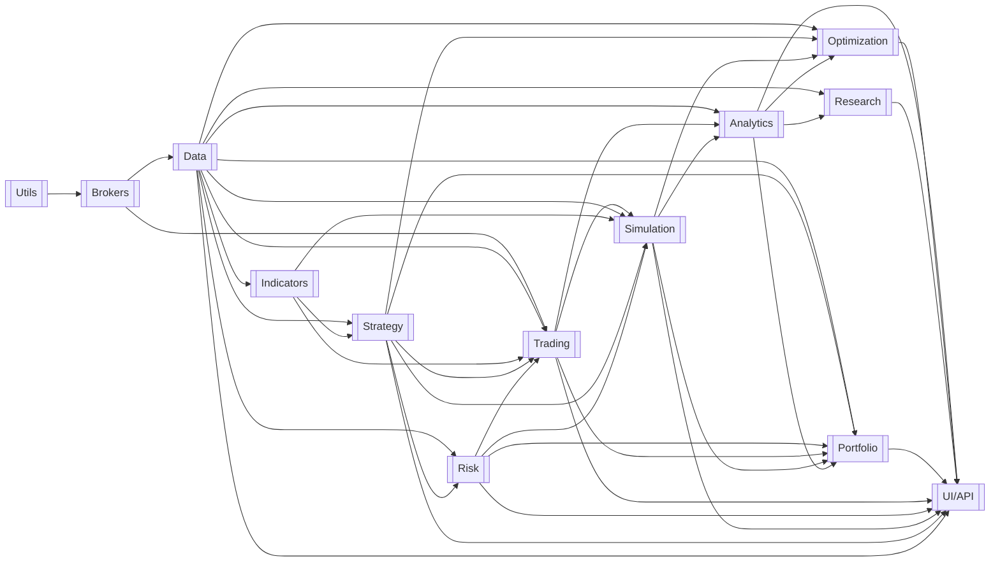
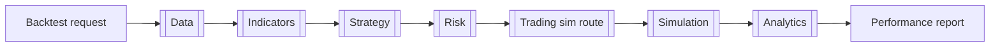
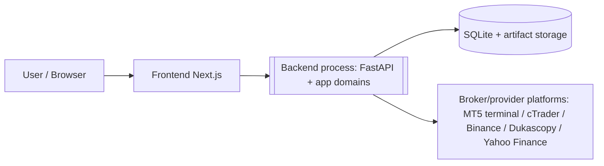

# HaruQuantAI

> **System path:** `HaruQuantAI/`
> **Status:** `Partial`
> **Last updated:** `2026-07-13`

> This document is the system-level source of truth.
> It defines how domains fit together, how cross-domain workflows operate, which rules apply system-wide, and how the complete system is verified.
>
> Domain internals belong in each domain's own `README.md`.
> Do not duplicate domain-level requirements, files, functions, or implementation details here.

---

## 1. System Purpose and Boundary

### Purpose

HaruQuantAI is an algorithmic trading platform that turns market data into governed trading outcomes. It acquires and normalizes market data, derives indicators, generates strategy signals, and forces every trading proposal through independent risk governance before execution. Approved actions are executed deterministically across paper and live routes (against a broker) and the sim route (against a simulated execution environment). Execution and simulation results are persisted by their owning domains and may be evaluated through read-only performance analytics. The system fails closed: if safety, context, or state cannot be proven, execution is blocked.

This document defines a clean-room rebuild: required product behavior and safety invariants are specified explicitly without preserving accidental legacy structure or compatibility surfaces.

### System owns

- Direct connectivity to external broker and market-data provider platforms (MT5, cTrader, Binance, Dukascopy, Yahoo Finance) behind a single canonical passthrough interface.
- Acquisition, normalization, and storage of trusted market and account data.
- Deterministic indicator computation and strategy signal generation.
- Risk governance of every trading proposal before any execution (the master gate).
- Formulation and dispatch of order intents across simulation, paper, and live routes, including reconciliation and emergency controls.
- Deterministic historical backtesting and parameter optimization.
- Performance analytics, reporting, and advisory research.
- Authenticated user and service access through a single UI/API boundary.

### System does not own

- Broker-side order matching, settlement, and custody of funds (owned by the broker platforms, reached through the Brokers domain's connections).
- Origination of market data (owned by external providers/broker feeds).
- Guarantees of strategy profitability or regulatory/compliance advice.
- Availability of external broker and market-data services.

### Primary users / actors

| Actor                  | Uses the system to                                                      |
| ---------------------- | ----------------------------------------------------------------------- |
| `Owner / Admin`      | Define policy, configuration, and governance settings                   |
| `Operator`           | Run, monitor, and intervene in trading operations (incl. kill switch)   |
| `Researcher`         | Explore data, test hypotheses, produce advisory insights                |
| `Strategy Developer` | Build, backtest, and optimize strategies                                |
| `Risk Manager`       | Set risk thresholds, review decisions, operate the kill switch          |
| `Read-only Viewer`   | Inspect dashboards, reports, and audit trails                           |
| `Service Account`    | Execute approved, read-only, allowlisted system plans                   |
| `Broker platform (MT5, cTrader, Binance)` | External counterparty: supplies data and account state, receives orders |

---

## 2. Domain Capability Map

This diagram shows the complete system and its domains at a glance.

```mermaid
flowchart TD
    SYSTEM[[HaruQuantAI]]

    SYSTEM --> UTILS[[Utils]]
    SYSTEM --> BROKER[[Brokers]]
    SYSTEM --> DATA[[Data]]
    SYSTEM --> IND[[Indicators]]
    SYSTEM --> STRAT[[Strategy]]
    SYSTEM --> RISK[[Risk]]
    SYSTEM --> TRADE[[Trading]]
    SYSTEM --> SIM[[Simulation]]
    SYSTEM --> ANA[[Analytics]]
    SYSTEM --> OPT[[Optimization]]
    SYSTEM --> RES[[Research]]
    SYSTEM --> PORT[[Portfolio]]
    SYSTEM --> UIAPI[[UI/API]]

    UTILS --> UTILS_CAP[Provide shared business-neutral infrastructure]
    BROKER --> BROKER_CAP[Provide direct passthrough connections to external broker and market-data provider platforms]
    DATA --> DATA_CAP[Provide trusted market and account data]
    IND --> IND_CAP[Compute deterministic indicator values]
    STRAT --> STRAT_CAP[Generate trading signals and trade intents]
    RISK --> RISK_CAP[Approve or reject every trading proposal]
    TRADE --> TRADE_CAP[Execute approved actions on sim, paper, and live routes]
    SIM --> SIM_CAP[Replay strategies deterministically over history]
    ANA --> ANA_CAP[Measure and report trading performance]
    OPT --> OPT_CAP[Search and validate strategy parameters]
    RES --> RES_CAP[Produce advisory insights from data]
    PORT --> PORT_CAP[Construct and govern multi-strategy portfolios]
    UIAPI --> UIAPI_CAP[Expose the system to users and clients]
```



### 2.1 Domain Registry

Domains are listed in dependency order, from lowest dependency to highest dependency.

#### 2.1.1 Utils

* **Package**: `app/utils`
* **Responsibility**: Provide business-neutral shared infrastructure to all other domains.
* **Inputs**: Raw log records, error conditions, audit payloads, and environment settings.
* **Outputs**: Structured logs, mapped errors, prefixed IDs, canonical JSON, shared context/audit contracts, redacted values, and loaded settings.
* **Owns**: Structured logging, UTC time policy and formatting, shared `AuthContext` and `AuditEvent` contracts, shared base errors, ID generation, canonical serialization, settings loading and secret resolution (including resolving broker secrets into injected `BrokerConnectionConfig` instances at the composition root), and redaction primitives.
* **Boundaries**: Owns no durable business state and makes no business decisions. Does not own strategy logic, risk rules, broker operations, persistence, or any domain contract base classes (domains own their own contracts locally).
* **Key Limits**: No business decisions; no durable business state; secret redaction is denylist-first and case-insensitive before any persistence or emission.
* **Documentation**: `app/utils/README.md`

#### 2.1.2 Brokers

* **Package**: `app/services/brokers`
* **Responsibility**: Provide a pure, thin passthrough layer over external broker/trading and market-data provider platform APIs — trading-capable platforms (MT5, cTrader, Binance Spot/Futures profiles) and read-only providers (Dukascopy, Yahoo Finance) — behind one canonical `BrokerAdapter` interface, with zero business logic. Every function in the system that requires a live connection to a broker or provider routes exclusively through this domain.
* **Inputs**: Canonical broker requests (market data reads, account state reads, order mutations, execution-state reads, subscriptions), `BrokerConnectionConfig` with caller-supplied environment and credentials (secrets resolved by the Utils settings layer and injected at the composition root).
* **Outputs**: Canonical DTOs preserving provider truth in `BrokerResult` / `BrokerError` envelopes, streaming subscription events and connection lifecycle events (canonical event DTOs), capability/feature-flag reports, connection/session status.
* **Owns**: Per-platform adapter implementations, the broker registry/factory (`create_broker_adapter`; adapter instances are created via the registry and owned by the caller), connection/session lifecycle mechanics (state machine, keep-alives, transport reconnects), translation of canonical requests into provider-specific API calls, canonical DTO and error mapping (unenriched), capability discovery, and transport-level flow control (rate-limit throttling, backpressure, circuit breaking).
* **Boundaries**: Pure passthrough with zero business logic — no business validation (structural/transport validation only), no risk checks, no decision-making, no data enrichment, no business retry/replay (transport-level flow control and connection recovery are permitted; mutations are never retried), and no state management beyond the live session (no durable state). Owns no credential vault and performs no credential persistence or database access — secrets arrive via injected `BrokerConnectionConfig` and live in memory only for the adapter lifecycle. Does not normalize into `MarketDataset` / `AccountStateSnapshot` (Data owns normalization) and never leaks raw SDK objects across its boundary. Only Trading may invoke mutation operations; Data's use is strictly read-only; Risk and all other domains have no Brokers dependency. The read/write split is enforced by capability-trait scoping (`MarketDataProvider`, `TradeExecutionProvider`, `AccountProvider`, `CalculationProvider`).
* **Key Limits**: Sole live-connectivity path to any broker/provider; connection, scope, or permission failure fails closed; mutations are never retried — uncertain outcomes return `BROKER_UNKNOWN_OUTCOME`; unsupported capabilities return `BROKER_CAPABILITY_UNSUPPORTED` deterministically, never a synthetic substitute.
* **Documentation**: `app/services/brokers/README.md`

#### 2.1.3 Data

* **Package**: `app/services/data`
* **Responsibility**: Acquire, normalize, store, and serve trusted market data and read-only broker/account state. All of Data's broker/provider access is read-only and flows through the Brokers domain's canonical `BrokerAdapter` (read capability traits).
* **Inputs**: Broker/provider reads via Brokers' `BrokerAdapter`, historical files, backfill commands.
* **Outputs**: Normalized bars/ticks (`MarketDataset`), account/broker state snapshots (`AccountStateSnapshot`), and storage state.
* **Owns**: Historical market and account data storage/persistence, durable audit storage, shared database infrastructure, connections, locking, SQLite migration execution framework, real-time feed handling, data-source selection and cross-provider fallback policy, provider alias mappings and canonical market identity, normalization of raw broker/provider reads into `MarketDataset` / `AccountStateSnapshot`, multi-timeframe alignment.
* **Boundaries**: Foundation layer with no trading decision logic. Does not own broker/provider connections, adapters, or sessions (Brokers owns these; secrets are resolved by the Utils settings layer), strategy logic, backtest engines, sizing formulas, order dispatch, or other domains' tables, artifact schemas, and migration definitions (each domain owns its tables, artifact schemas, and migration definitions, utilizing the shared execution framework). Never leaks raw DataFrames, sockets, DB sessions, or provider SDK objects across its boundary.
* **Key Limits**: Backfill chunks must be bounded and checkpointed; exclusive path-scoped write locks (`CONCURRENT_WRITE_LOCKED` on conflict); no-lookahead alignment by default; all broker/provider access is read-only and routed through Brokers.
* **Documentation**: `app/services/data/README.md`

#### 2.1.4 Indicators

* **Package**: `app/services/indicators`
* **Responsibility**: Compute deterministic, pure-function indicator values from normalized data.
* **Inputs**: Normalized datasets from Data, validated indicator parameters.
* **Outputs**: Indicator value series with `available_at` metadata (`IndicatorSeries`).
* **Owns**: The indicator formula library, parameter validation, indicator registry and capability matrix.
* **Boundaries**: Pure functions with no I/O on the calculation path. Does not own broker calls, order state, strategy lifecycle, caching, or data acquisition.
* **Key Limits**: Inputs must be normalized and non-empty; no-lookahead enforced via explicit `available_at` fields; fully deterministic.
* **Documentation**: `app/services/indicators/README.md`

#### 2.1.5 Strategy

* **Package**: `app/services/strategy`
* **Responsibility**: Turn market state and indicator values into canonical trading signals and trade intents when invoked by an approved runtime workflow.
* **Inputs**: Normalized datasets, indicator series, strategy parameters, lifecycle commands, `AccountStateSnapshot` from Data.
* **Outputs**: Canonical signals and `TradeIntent` proposals with metadata.
* **Owns**: Strategy registry and versioning, parameter schemas, strategy state checkpoints, deterministic strategy evaluation, and signal/intent generation.
* **Boundaries**: Emits proposals (which may include sizing proposals), never broker orders. Does not own live/paper runtime orchestration, risk enforcement, final position sizing approval (Risk owns the final approved size), order routing, official fills, or data normalization.
* **Key Limits**: Neutral signals emit no action; lookahead or clock-drift violations fail the batch atomically; account/broker state access is read-only `AccountStateSnapshot` from Data.
* **Documentation**: `app/services/strategy/README.md`

#### 2.1.6 Risk

* **Package**: `app/services/risk`
* **Responsibility**: Intercept every trading proposal and approve or reject it against safety limits, exposure, and governance policy — the master gate.
* **Inputs**: `TradeIntent` proposals from Strategy, account/broker state and `MarketContextEvidence` from Data, Risk-owned `ApprovalAttestation`, risk policies, and thresholds.
* **Outputs**: `RiskDecision` (approved intent with approval token, or structured rejection), `ActionPolicyVerdict`, kill-switch state, scenario analyses.
* **Owns**: Proposal interception, final approved/capped position size, safety limits, portfolio exposure and drawdown tracking, action-policy verdicts, approval-token issuance/validation and atomic pending-approval reservation, kill-switch policy/hierarchy/active state/clearance, lifecycle gates (research → full-live), and cryptographic audit chaining of decisions.
* **Boundaries**: Does not own data ingestion, strategy code, broker submission, or account state truth. Cannot execute anything itself.
* **Key Limits**: Missing thresholds or unverifiable broker state fail closed; live approval requires active broker state validation; strict payload size and structure limits; strict `Decimal` handling (`allow_inf_nan=False`, `ROUND_HALF_EVEN`).
* **Documentation**: `app/services/risk/README.md`

#### 2.1.7 Trading

* **Package**: `app/services/trading`
* **Responsibility**: Orchestrate live and paper evaluation workflows, convert approved risk decisions into deterministic order intents, and execute them on the selected route (`sim`, `paper`, `live`) with reconciliation, monitoring, and emergency controls.
* **Inputs**: Live/paper evaluation triggers, strategy references, route/profile configuration, runtime gate configuration, approved `RiskDecision`s with approval tokens, Risk-owned `ActionPolicyVerdict`s, and `KillSwitchState`.
* **Outputs**: `OrderIntent`s, execution receipts / `TradeRecord`s, reconciliation results, incident logs.
* **Owns**: Live/paper runtime orchestration, orders, fills, execution-state persistence, its own tables, schemas, and migration definitions, order intent formulation, client order IDs and idempotency, route-aware request packing, runtime gates, execution-broker/account/environment selection, broker dispatch after Risk clearance, reconciliation authority, execution monitoring, and emergency stop of in-flight execution.
* **Boundaries**: Trading may coordinate Data, Indicators, Strategy, and Risk during a live/paper evaluation, but it does not own their decisions or business logic. Its execution phase begins only after receiving an approved `RiskDecision` and compatible `ActionPolicyVerdict`; it executes exactly the approved size. It enforces Risk's active kill-switch hierarchy by blocking new dispatches and attempting only truthful cancellation of pending/cancellable work. It resumes only after authorized clearance and reconciliation. It does not own signal creation, risk/action policy, approval reservations, backtest orchestration, broker connections/adapters, or secret storage (Brokers owns connections and adapters; secrets are resolved by the Utils settings layer and injected via `BrokerConnectionConfig`). Only Trading may invoke `BrokerAdapter` mutation operations, and only for approved broker mutations; it may also use adapter reads needed for execution and reconciliation. Paper and live share the same execution path and differ only by the environment/credentials carried in the injected `BrokerConnectionConfig`. Trading cannot approve its own risk decisions.
* **Key Limits**: Live actions require valid approval tokens and volume constraints; `ALLOW_LIVE_MUTATIONS=false` blocks all live mutation by default; Decimal precision ≥ 28 digits with 8-decimal quantization; idempotency via SHA-256 over canonical JSON; broker operation timeout and check frequency limits; blind retries banned — unknown broker state freezes execution.
* **Documentation**: `app/services/trading/README.md`

#### 2.1.8 Simulation

* **Package**: `app/services/simulator`
* **Responsibility**: Orchestrate the historical backtest loop, replay strategies deterministically over historical data through the core trading path, and produce simulated fills, journals, and execution reports.
* **Inputs**: Historical datasets from Data, order intents via the Trading `sim` route, vetted strategy registry references, backtest configuration.
* **Outputs**: Simulated trades and journals (`SimulationResult`), artifact manifests, execution reports.
* **Owns**: Simulation results and artifacts persistence, its own tables, schemas, and migration definitions, orchestration of the historical backtest loop (`Data → Indicators → Strategy → Risk → Trading(sim) → Simulation fills`), backtest runtime, tick-based execution replay, simulated fill models and all simulated state (the broker analogue for the sim route, as MT5 owns state on the live route), artifact manifests.
* **Boundaries**: No live side effects; in-memory execution state (though final backtest results and artifacts may be persisted). Does not own live broker channels, live adapter code, or execution of arbitrary strategy code strings.
* **Key Limits**: Initial balance must be positive; only vetted registry references accepted (no raw code); deterministic replay required; boundary failures return structured `SIM_*` errors.
* **Documentation**: `app/services/simulator/README.md`

#### 2.1.9 Analytics

* **Package**: `app/services/analytics`
* **Responsibility**: Compute performance metrics and build reports from trade records, returns, and benchmarks — returning read-only, advisory reports only.
* **Inputs**: `TradeRecord`s from Trading, `SimulationResult`s from Simulation, benchmark data from Data, logs and returns.
* **Outputs**: `PerformanceReport`s, scorecards, dashboard payloads with caveat/warning metadata.
* **Owns**: Performance schemas, metric kernels, report builders, dashboard payloads, and caveat metadata catalogs.
* **Boundaries**: Strictly read-only with no side effects. Reports are returned to consumers and are not persisted by Analytics in the initial build. Analytics does not own live state mutation, broker execution, strategy promotion decisions, or arbitrary local file loading.
* **Key Limits**: Monetary math in `Decimal`; ratios in `float64` with documented tolerance; `Infinity` triggers structured validation errors; fails closed on missing FX conversions.
* **Documentation**: `app/services/analytics/README.md`

#### 2.1.10 Optimization

* **Package**: `app/services/optimization`
* **Responsibility**: Orchestrate repeated simulation runs to search strategy parameter spaces via simulation and validate robustness without ever placing trades.
* **Inputs**: Historical datasets, strategy registry references and parameter schemas, simulation results, search configuration.
* **Outputs**: Advisory optimized parameter sets with reproducibility hashes, walk-forward and overfit diagnostics, and search metadata without trade or Strategy-mutation authority.
* **Owns**: Checkpoints and optimization results persistence, its own tables, schemas, and migration definitions, orchestration of repeated simulation runs, parameter sweeps (grid/random/GA/Bayesian), walk-forward routines, overfit/robustness diagnostics, deterministic tie-breaking, atomic search checkpointing.
* **Boundaries**: Does not own live execution, automatic strategy promotion, or the shared database/migration execution framework. It owns only its optimization tables, artifact schemas, and migration definitions. Strict time-series splitting — no leakage.
* **Key Limits**: Parameter ranges must be explicitly bounded; omitted `dry_run` defaults to `True`; ties resolve deterministically via trade count and candidate hash; oversized payloads rejected.
* **Documentation**: `app/services/optimization/README.md`

#### 2.1.11 Research

* **Package**: `app/services/research`
* **Responsibility**: Provide a sandboxed, leakage-gated environment for data exploration and hypothesis evaluation, producing advisory reports only.
* **Inputs**: Datasets from Data, consumes Analytics public metric contracts.
* **Outputs**: Advisory `ResearchReport`s, insights, feature definitions, hypothesis evaluations.
* **Owns**: Research artifacts persistence, its own tables, schemas, and migration definitions, sandboxed analysis, feature engineering operations, deterministic historical labeling, leakage/bias validation, null-model and edge-discovery operations, statistical sign-off (bootstrapping/FDR).
* **Boundaries**: Read-only toward live systems. Does not own live mutations, risk decisions, strategy promotion, or roadmap/code selection. Advisory only.
* **Key Limits**: Non-deterministic routines require seed injection and output logs; persisted artifacts store SHA-256 config hashes; implicit/hidden data filling or dropping is forbidden (`CleaningConfig` explicit).
* **Documentation**: `app/services/research/README.md`

#### 2.1.12 Portfolio

* **Package**: `app/services/portfolio`
* **Responsibility**: Construct, simulation-validate, version, activate, and monitor deterministic multi-strategy portfolio allocations without approving risk or executing trades.
* **Inputs**: Registered Strategy references, Analytics-owned `PortfolioAllocationEvidence`, Data-owned `AccountStateSnapshot` / `FXConversionEvidence`, Simulation-owned portfolio results, Risk-owned eligibility/allocation decisions, and explicit construction/rebalance configuration.
* **Outputs**: `PortfolioConstructionResult`, `ActivePortfolioAllocation`, and `PortfolioRebalancePlan`; receiver-owned requests submitted to Risk, Simulation, and Trading.
* **Owns**: Portfolio definitions/objectives, deterministic fixed/equal/inverse-volatility construction, target capital-weight metadata and proposed risk-budget weights, proposal/version identity, activation state, drift detection, reduce-only rebalance planning, rollback-as-new-version, and Portfolio-owned schemas/migrations/artifacts. Risk owns the authoritative risk-budget projection.
* **Boundaries**: Never registers strategies, computes Analytics metrics, approves risk, determines final order size, directly mutates broker state, or imports provider SDKs. Portfolio submits Risk-owned review/budget requests and Trading-owned rebalance execution requests. It cannot activate an allocation without current Risk approval and required simulation evidence.
* **Key Limits**: No hidden numeric defaults; portfolio size, weight caps, evidence freshness, drift thresholds, schedules, and decision expiry are required profile values. Missing/stale evidence fails closed. Live/paper activation requires authenticated human approval plus Risk authorization.
* **Documentation**: `app/services/portfolio/README.md`

#### 2.1.13 UI/API

* **Package**: `app/services/api` (FastAPI gateway) + `ui/` (Next.js frontend) — one logical domain implemented by two deployable packages.
* **Responsibility**: Expose the system to users and clients through authenticated HTTP/WebSocket interfaces and frontend views, delegating logic to selected public domain APIs including Portfolio.
* **Inputs**: HTTP requests, WebSocket connections, client payloads, authenticated principals.
* **Outputs**: HTTP responses, WebSocket broadcasts, views/DTOs, `AuthContext` propagated to downstream domains.
* **Owns**: Routes, HTTP/WS wrappers, frontend views and client stores, auth/authz enforcement, DTO translation, preflight write safeguards, requests for kill-switch activation or clearance.
* **Boundaries**: Pure presentation/delegation layer with zero inline domain or calculation logic. Cannot bypass Risk or Trading gates.
* **Key Limits**: List endpoints paginated; endpoint timeouts; preflight warnings expire.
* **Documentation**: `app/services/api/README.md`

### 2.2 Domain ownership rule

Each responsibility must have one clear owning domain.

```text
One responsibility
→ one owning domain
→ one authoritative domain README
```

Other domains may consume the capability, but they must not duplicate its business logic.

---

## 3. Domain Dependency Diagram

An arrow points from the required domain to the domain that consumes it.



Utils is required by every domain; only the Utils → Brokers edge is drawn to keep the diagram readable.

### Dependency explanation

- **Utils** underpins everything (shared context/audit contracts, logging, base errors, IDs, UTC time, canonical serialization, settings, and redaction) and depends on nothing.
- **Brokers** needs only Utils (plus provider SDKs). It is the single live-connectivity path to every external broker and market-data provider platform: a pure passthrough exposing the canonical `BrokerAdapter` contract, with zero business logic of its own. Data consumes it read-only; only Trading may invoke its mutation operations; no other domain touches it.
- **Data** needs Utils and Brokers; it is the sole gateway to market data, storage, and normalized read-only broker/account state.
- **Indicators** consume normalized Data output. **Strategy** consumes Data and Indicators.
- **Risk** consumes Strategy proposals and Data account snapshots; it must be independent of Trading so that execution can never influence approval.
- **Trading** orchestrates live/paper evaluation by invoking the public APIs of Data, Indicators, Strategy, and Risk. It owns execution only after Risk approval and is the single execution owner for `sim`, `paper`, and `live` routes; broker mutations are dispatched through the Brokers domain's canonical `BrokerAdapter` (mutation operations are Trading-only).
- **Simulation** replays history through the Trading `sim` route, so it sits above Trading. Since it orchestrates the historical backtest loop, it depends directly on `Data`, `Indicators`, `Strategy`, `Risk`, and `Trading`.
- **Analytics** consumes trade records from Trading and Simulation plus benchmarks from Data, so it sits above both producers.
- **Optimization** consumes Data, Strategy, Simulation, and Analytics to drive bounded search and scoring. **Research** consumes Data and Analytics public metric contracts.
- **Portfolio** consumes Data, Strategy, Risk, Trading, Simulation, and Analytics contracts to construct and activate multi-strategy allocations after Risk activates the authoritative risk-budget projection. Risk/Trading/Simulation receive only their own receiver-owned request contracts, so none imports Portfolio and no cycle is introduced.
- **Optimization, Research, and Portfolio** share the highest computational level once their individual prerequisites are stable.
- **UI/API** is the highest-dependency domain: it presents and delegates to selected public domain APIs (including Portfolio) and owns nothing computational.

No circular dependencies exist. Analytics follows Trading and Simulation because it consumes their records: Trading owns `TradeRecord`, Simulation owns `SimulationResult`, and Analytics owns derived report schemas.

### Documentation (README) order

```text
1. Utils
2. Brokers
3. Data
4. Indicators
5. Strategy
6. Risk
7. Trading
8. Simulation
9. Analytics
10. Optimization, Research, and Portfolio (same level once individual prerequisites are stable)
11. UI/API
```

### Eventual implementation order

Same as the documentation order. Optimization, Research, and Portfolio may be implemented in parallel once their declared prerequisites are stable. UI/API is implemented last, thin slices earlier if operator visibility is needed.

---

## 4. Cross-Domain Workflows

This section documents only workflows involving two or more domains. Internal domain workflows belong in the relevant domain `README.md`.

### Status and scope

| Status              | Meaning                                    |
| ------------------- | ------------------------------------------ |
| **Missing**   | Not implemented or not verified            |
| **Partial**   | Partly implemented or tests are incomplete |
| **Completed** | Implemented, tested, and verified          |

The `Domains involved` chain lists core business participants only. Brokers is a
conditional provider participant when Data acquires broker-backed evidence and an
explicit participant when Trading dispatches `paper`/`live` mutations. Utils is shared
infrastructure for shared context/audit contracts, time, IDs, serialization, settings,
logging, and redaction and is implicit unless
a workflow step directly invokes a Utils-owned operation. Every core/conditional domain
documents its own boundary; implicit Utils use does not create a business-workflow step.

| Status  | Workflow ID    | Workflow                            | Trigger                                   | Domains involved                                                                      | Final outcome                                                       | Integration test                                          |
| ------- | -------------- | ----------------------------------- | ----------------------------------------- | ------------------------------------------------------------------------------------- | ------------------------------------------------------------------- | --------------------------------------------------------- |
| Missing | `SYS-WF-001` | Historical backtest                 | Backtest request                          | `Data → Indicators → Strategy → Risk → Trading(sim) → Simulation → Analytics` | Deterministic simulation result and performance report              | `tests/system/integration/test_backtest.py`             |
| Missing | `SYS-WF-002` | Signal to live execution            | Market data update / scheduled evaluation | `Data → Indicators → Strategy → Risk → Trading(live) → Brokers → Analytics`    | Approved order executed at broker, reconciled and recorded          | `tests/system/integration/test_signal_to_live.py`       |
| Missing | `SYS-WF-003` | Parameter optimization and approved adoption | Optimization request | `Data → Optimization → Strategy → Simulation → Analytics → Optimization → UI/API → Strategy` | Advisory optimization result and, only after explicit user approval, a new immutable Strategy configuration | `tests/system/integration/test_optimization.py` |
| Missing | `SYS-WF-004` | Research to strategy candidate      | Researcher hypothesis                     | `Data → Research → UI/API → Strategy`                                            | Reviewed strategy registration request entering Strategy validation | `tests/system/integration/test_research_to_strategy.py` |
| Missing | `SYS-WF-005` | Operator monitoring and kill switch | Operator action via UI/API                | `UI/API → Risk → Trading`                                                         | Kill switch engaged; all execution halted fail-closed               | `tests/system/integration/test_kill_switch.py`          |
| Missing | `SYS-WF-006` | Strategy operational eligibility   | Registered strategy eligibility request   | `UI/API → Risk → Portfolio/Trading`                                               | Versioned route/profile eligibility decision                        | `tests/system/integration/test_strategy_eligibility.py` |
| Missing | `SYS-WF-007` | Portfolio construction and activation | Portfolio construction request          | `Data → Strategy → Analytics → Portfolio → Simulation → Risk → Portfolio`         | Risk-approved active portfolio allocation                           | `tests/system/integration/test_portfolio_activation.py` |
| Missing | `SYS-WF-008` | Governed portfolio rebalance       | Drift or scheduled rebalance trigger       | `Data → Portfolio → Risk → Trading → Brokers → Analytics`                         | Approved reduce-only rebalance reconciled and measured              | `tests/system/integration/test_portfolio_rebalance.py`  |

---

### `SYS-WF-001` — Historical Backtest

**Purpose:** Evaluate a strategy against history through the same governed path used in live trading, producing a deterministic, reportable result.

**Actor / trigger:** Strategy Developer submits a backtest request (via UI/API once available).

**Input boundary:** Backtest configuration — strategy registry reference, parameters, symbol/timeframe, date range, initial balance.

**Output boundary:** `SimulationResult` (persisted by Simulation) with artifact manifest, plus an Analytics `PerformanceReport` (returned by Analytics).

**Domains and responsibilities:**

| Order | Domain         | Responsibility                                       | Input                      | Output                       |
| ----: | -------------- | ---------------------------------------------------- | -------------------------- | ---------------------------- |
|     1 | `Data`       | Serve normalized historical dataset                  | Backtest range request     | `MarketDataset`            |
|     2 | `Indicators` | Compute indicator series, no lookahead               | `MarketDataset`, params  | `IndicatorSeries`          |
|     3 | `Strategy`   | Generate signals and trade intents                   | Dataset + indicators       | `TradeIntent`s             |
|     4 | `Risk`       | Approve or reject each intent under sim policy       | `TradeIntent`, sim state | `RiskDecision`s            |
|     5 | `Trading`    | Pack approved decisions into sim-route order intents | Approved decisions         | `OrderIntent`s (route=sim) |
|     6 | `Simulation` | Replay execution, produce fills and journals         | History + intents          | `SimulationResult`         |
|     7 | `Analytics`  | Compute metrics and build the report                 | `SimulationResult`       | `PerformanceReport`        |

**Main flow:**

1. `Simulation` orchestrates the historical backtest loop by coordinating the execution across domains:
   a. Requests normalized historical dataset from `Data` for the requested range.
   b. Triggers `Indicators` to compute indicator series with `available_at` metadata.
   c. Invokes `Strategy` to produce canonical signals and `TradeIntent` proposals bar by bar.
   d. Submits proposals to `Risk` to evaluate each intent under simulation policy.
   e. Passes approved decisions to `Trading` to formulate deterministic sim-route order intents.
   f. Replays execution and produces simulated fills, journals, and a manifest.
2. `Analytics` computes performance metrics and returns the report.

**Failure behaviour:**

- Data gap or misalignment → workflow aborts with a structured data error; no partial results published.
- Lookahead/clock-drift violation in Strategy → atomic batch failure.
- Risk rejection → intent is dropped and recorded; the backtest continues (rejections are results, not errors).
- Simulation boundary failure → structured `SIM_*` error; artifacts from incomplete runs are not published.

**Success condition:** A reproducible `SimulationResult` (persisted by Simulation) is retrievable, and the `PerformanceReport` is returned by Analytics.

**Note:** Brokers is not part of the backtest loop itself. It participates only upstream, when Data acquires or backfills the historical datasets later served to this workflow; the backtest execution path never touches a live provider.

#### End-to-end workflow diagram



---

### `SYS-WF-002` — Signal to Live Execution

**Purpose:** Convert a live market signal into a governed, reconciled broker order — or a safe, audited refusal.

**Actor / trigger:** Live/paper market data update or scheduled strategy evaluation under an authenticated principal.

**Input boundary:** Current market state entering Data.

**Output boundary:** Broker execution receipt reconciled and recorded (or an audited rejection), visible to Analytics and UI/API.

**Domains and responsibilities:**

| Order | Domain         | Responsibility                                                                     | Input                        | Output                                      |
| ----: | -------------- | ---------------------------------------------------------------------------------- | ---------------------------- | ------------------------------------------- |
|     1 | `Data`       | Normalize live market state; supply account snapshot                               | Feed/broker reads            | `MarketDataset`, `AccountStateSnapshot` |
|     2 | `Indicators` | Derive current indicator values                                                    | Market state                 | `IndicatorSeries`                         |
|     3 | `Strategy`   | Emit signal /`TradeIntent`                                                       | State + indicators           | `TradeIntent`                             |
|     4 | `Risk`       | Validate approval attestation, market/account evidence, and action/risk policy      | Intent + snapshots + `MarketContextEvidence` + `ApprovalAttestation` | `RiskDecision` + `ActionPolicyVerdict` + approval token |
|     5 | `Trading`    | Validate Risk-owned verdicts/state, build idempotent order intent, dispatch, reconcile | Approved decision + action verdict + `KillSwitchState` | `OrderIntent`, `TradeRecord` |
|     6 | `Brokers`    | Passthrough dispatch of the packed order to the broker platform                    | Canonical mutation request via `BrokerAdapter` | `BrokerResult` (provider acknowledgement) |
|     7 | `Analytics`  | Compute and return metrics/reports from the persisted execution record             | `TradeRecord`              | Updated reports                             |

**Main flow:**

1. `Trading` owns the live/paper runtime loop and coordinates only through public domain APIs:
   a. Requests normalized live market state and a validated account snapshot from `Data`.
   b. Requests current indicator values from `Indicators`.
   c. Invokes `Strategy` with the market state, indicator series, strategy parameters, and read-only account snapshot.
   d. Receives either no action or a `TradeIntent`; neutral signals end the workflow.
   e. Submits the `TradeIntent` to `Risk` for independent multi-gate validation.
2. If Risk rejects the proposal, Trading records the rejection outcome and performs no mutation.
3. If Risk approves the proposal, it atomically reserves the scoped approval token and returns a compatible `ActionPolicyVerdict`. Trading validates both plus the applicable `KillSwitchState`, builds an idempotent `OrderIntent`, passes runtime gates (including `ALLOW_LIVE_MUTATIONS`), dispatches a canonical mutation request through the Brokers domain's `BrokerAdapter`, and reconciles the result.
4. Trading persists the `TradeRecord`. Analytics consumes it and returns updated metrics or reports. The complete chain is audit-logged with correlation IDs.

**Failure behaviour:**

- Unverifiable account state at Risk → fail closed, intent rejected, audit event emitted.
- Kill switch active → all proposals rejected instantly.
- `ALLOW_LIVE_MUTATIONS=false` or gate failure at Trading → no dispatch; incident logged.
- Unknown broker state after dispatch → no blind retry; execution freezes until reconciliation completes.

**Success condition:** Broker position/order state matches the approved intent, reconciliation confirms it, and an immutable audit chain links signal → decision → order → receipt.

#### End-to-end workflow diagram

```mermaid
sequenceDiagram
    participant T as Trading Runtime
    participant D as Data
    participant I as Indicators
    participant S as Strategy
    participant R as Risk
    participant B as Brokers domain
    participant X as Broker platform (MT5 / cTrader / Binance)
    participant A as Analytics

    T->>D: Request MarketDataset + AccountStateSnapshot
    D->>B: Read via BrokerAdapter (read traits)
    B->>X: Broker-specific API read
    X-->>B: Raw broker state
    B-->>D: Standardized raw response
    D-->>T: Normalized state + read-only snapshot
    T->>I: Compute indicators from MarketDataset
    I-->>T: IndicatorSeries
    T->>S: Evaluate strategy
    S-->>T: No action or TradeIntent
    T->>R: Submit TradeIntent
    R->>R: Independent multi-gate validation
    R-->>T: Rejection or approved RiskDecision
    alt Approved
        T->>B: place_order via BrokerAdapter (mutation, Trading-only)
        B->>X: Provider-specific order call
        X-->>B: Raw execution result
        B-->>T: BrokerResult (provider acknowledgement)
        T->>T: Reconcile and persist TradeRecord
        T->>A: TradeRecord
    else Rejected
        T->>T: Record rejection; no mutation
    end
```

---

### `SYS-WF-003` — Parameter Optimization

**Purpose:** Find robust strategy parameters through bounded, leakage-free search over deterministic simulations.

**Actor / trigger:** Strategy Developer submits an optimization request.

**Input boundary:** Strategy registry reference, bounded parameter ranges, search algorithm, data range.

**Output boundary:** Optimized parameter sets with reproducibility hashes and robustness diagnostics. No trades are ever placed.

**Domains and responsibilities:**

| Order | Domain           | Responsibility                                                  | Input                | Output                         |
| ----: | ---------------- | --------------------------------------------------------------- | -------------------- | ------------------------------ |
|     0 | `Data`         | Serve validated historical datasets for the search range        | Range request        | `MarketDataset`              |
|     1 | `Optimization` | Generate candidates, enforce time-series splits, checkpoint     | Search config        | Candidate parameter sets       |
|     2 | `Strategy`     | Validate parameters against schemas                             | Candidate params     | Validated strategy instances   |
|     3 | `Simulation`   | Run deterministic backtests per candidate (via SYS-WF-001 core) | `SimulationBacktestRequestV1` per candidate + history | `SimulationResult`s          |
|     4 | `Analytics`    | Score candidates with metric kernels                            | Results              | Scores (`PerformanceReport`) |
|     5 | `Optimization` | Rank, run overfit diagnostics, emit results                     | Scores               | Optimized params + diagnostics |
|     6 | `UI/API`       | Present the advisory result and capture an explicit user selection/approval | `OptimizationResult` | Approved `StrategyParameterUpdateRequest` or no action |
|     7 | `Strategy`     | Validate the approved request and create a new immutable configuration record | `StrategyParameterUpdateRequest` | `ValidatedStrategyConfig` or structured rejection |

**Main flow:** Optimization orchestrates the repeated simulation runs: candidate generation → per-candidate simulation (each candidate submitted as a `SimulationBacktestRequestV1` through Optimization's internal backtest-adapter port) → scoring (Optimization consumes Analytics' `PerformanceReport` contract; Analytics performs no optimization-specific orchestration) → deterministic ranking (ties broken by trade count then candidate hash) → walk-forward/overfit diagnostics → checkpointed advisory result. UI/API may then present the result for explicit user selection and approval. Only UI/API may submit the resulting Strategy-owned `StrategyParameterUpdateRequest`; Strategy validates it and creates a new immutable configuration record. Optimization never mutates Strategy state.

**Failure behaviour:** Unbounded ranges are rejected up front; oversized payloads are rejected (`OPT_PAYLOAD_TOO_LARGE`); a failed candidate run is recorded and skipped without corrupting checkpoints; leakage detection aborts the search. Missing user approval, an incompatible strategy version, invalid selected parameters, or an unauthorized update prevents adoption without invalidating the advisory optimization result.

**Success condition:** A reproducible advisory result set (identical given the same seed and inputs) with diagnostics. If adoption is requested, success additionally requires explicit user approval and a new immutable Strategy configuration; no step places a trade.

---

### `SYS-WF-004` — Research to Strategy Candidate

**Purpose:** Turn a researcher hypothesis into a reviewed, explicitly approved strategy registration request — without research evidence ever authorizing anything by itself.

**Actor / trigger:** Researcher submits a hypothesis / research request under an authenticated principal.

**Input boundary:** Research request (hypothesis, dataset references, study configuration) entering Research via UI/API.

**Output boundary:** A validated `StrategyRegistrationRequest` accepted or rejected by Strategy; the advisory `ResearchReport` that motivated it remains advisory only.

**Domains and responsibilities:**

| Order | Domain       | Responsibility                                                                | Input                                   | Output                              |
| ----: | ------------ | ------------------------------------------------------------------------------ | --------------------------------------- | ----------------------------------- |
|     1 | `Data`     | Serve research-ready normalized datasets                                       | Dataset request                         | `MarketDataset`                   |
|     2 | `Research` | Run leakage-gated studies; produce advisory evidence                           | Datasets + hypothesis                   | `ResearchReport` (advisory only)  |
|     3 | `UI/API`   | Present evidence for human review; collect explicit researcher/operator approval; submit the command | `ResearchReport` + human approval | `StrategyRegistrationRequest`     |
|     4 | `Strategy` | Validate and register (or reject) the immutable strategy candidate             | `StrategyRegistrationRequest`         | Registered immutable version or structured rejection |

**Main flow:**

1. `Data` serves research-ready datasets to `Research` (`WF-RES-001`).
2. `Research` runs its Edge Lab stages and publishes a leakage-gated, advisory `ResearchReport` (`advisory_only=True`).
3. `UI/API` presents the report; a human explicitly approves; UI/API constructs and submits `StrategyRegistrationRequest` referencing the report (`WF-API-005`/`WF-API-011`).
4. `Strategy` validates manifest, schema, hashes, provenance references, and principal, then registers one immutable version (`WF-STR-008`) or rejects (`WF-STR-009`).

**Failure behaviour:**

- Leakage-gate failure at Research → publication blocked; nothing reaches UI/API.
- Unauthorized or unapproved submission at UI/API → command never constructed; audit event emitted.
- Validation, authorization, or provenance failure at Strategy → structured rejection; no registry mutation.
- Strategy registration ends this workflow. Operational eligibility is a separate Risk-owned decision in `SYS-WF-006`; registration never implies permission to allocate capital or trade.

**Success condition:** A reviewed strategy candidate exists as one immutable Strategy registry version, with an audit chain linking dataset → report → human approval → registration.

---

### `SYS-WF-005` — Operator Monitoring and Kill Switch

**Purpose:** Let an authorized operator halt (or restore) all execution instantly and fail-closed.

**Actor / trigger:** Operator (or Risk Manager) action via UI/API.

**Input boundary:** Authenticated `KillSwitchCommand` entering Risk via UI/API.

**Output boundary:** Canonical `KillSwitchState` updated by Risk; Trading enforcement halts or blocks all execution; state visible in UI/API.

**Domains and responsibilities:**

| Order | Domain      | Responsibility                                                          | Input                                | Output                          |
| ----: | ----------- | ------------------------------------------------------------------------ | ------------------------------------ | ------------------------------- |
|     1 | `UI/API`  | Authenticate/authorize the operator; submit the command; display state  | Operator action                      | `KillSwitchCommand`           |
|     2 | `Risk`    | Validate the command; mutate and persist canonical kill-switch state; audit-chain the change | `KillSwitchCommand` + `AuthContext` | `KillSwitchState`             |
|     3 | `Trading` | Enforce active state: reject new proposals, stop/cancel in-flight execution per emergency controls | `KillSwitchState`                  | Halted execution; incident logs |

**Main flow:**

1. `UI/API` validates the operator principal and submits `KillSwitchCommand` (`WF-API-013`).
2. `Risk` authorizes, applies, persists, and audit-chains the canonical state change (`WF-RISK-009`, `WF-RISK-012`).
3. `Trading` observes the active state and halts: new proposals are rejected instantly, in-flight execution is stopped or canceled under emergency controls (`WF-TRD-007`), and safe shutdown proceeds where required (`WF-TRD-009`).
4. `UI/API` reflects the canonical state and audit trail.

**Failure behaviour:**

- Unauthorized or invalid command → rejected at Risk; no state change; audit event emitted.
- Missing or stale `KillSwitchState` at Trading → execution blocks (fail closed).
- Clearance follows the same authorized path; an active parent scope cannot be overridden by a child scope, and Trading resumes only after valid inactive state is observed at every applicable scope and reconciliation succeeds.

**Success condition:** Kill switch engaged: no new mutation is dispatched anywhere, in-flight execution is stopped or canceled, and the state change is audit-chained end to end.

---

### `SYS-WF-006` — Strategy Operational Eligibility

**Purpose:** Decide whether a registered immutable strategy version is operationally eligible for a specific runtime profile and execution route, without moving registration ownership out of Strategy.

**Actor / trigger:** An authorized operator requests eligibility review after Strategy registration, or Portfolio requests confirmation while preparing a construction request.

**Input boundary:** A `StrategyOperationalEligibilityRequest` entering Risk with the strategy/version reference, runtime profile, execution route, required evidence references, policy version, and approval context.

**Output boundary:** A persisted `StrategyOperationalEligibilityDecision` approving, conditioning, expiring, suspending, or rejecting that strategy/version for the stated scope.

**Domains and responsibilities:**

| Order | Domain | Responsibility | Input | Output |
| ----: | ------ | -------------- | ----- | ------ |
| 1 | `Strategy` | Own immutable registration truth and expose the referenced version | Strategy/version reference | Registered definition and provenance |
| 2 | `Data` | Supply fresh account, market-context, and FX evidence where required | Evidence request | Registered evidence contracts |
| 3 | `Risk` | Evaluate operational policy; persist and audit the decision | Eligibility request + registered strategy + evidence | `StrategyOperationalEligibilityDecision` |
| 4 | `Portfolio / Trading / UI/API` | Consume the decision; never infer eligibility from registration | Eligibility decision | Construction/execution gating and operator view |

**Main flow:** UI/API or Portfolio submits the Risk-owned request. Risk validates identity, registration reference, evidence freshness, policy compatibility, runtime profile, and route; records one scoped decision with expiry and conditions; Portfolio and Trading require a current approving decision before allocation activation or execution.

**Failure behaviour:** Missing registration, evidence, approval context, policy, or a current approving decision fails closed. Suspension or expiry blocks new and risk-increasing activity but never authorizes an automatic position increase or liquidation.

**Success condition:** Registration truth remains Strategy-owned while operational eligibility is explicit, scoped, current, auditable, and independently Risk-owned.

---

### `SYS-WF-007` — Multi-Strategy Portfolio Construction and Activation

**Purpose:** Construct, validate, Risk-review, and activate a governed allocation across multiple registered strategies.

**Actor / trigger:** An authorized operator submits a portfolio construction request through UI/API.

**Input boundary:** A `PortfolioConstructionRequest` entering Portfolio with strategy/version references, eligibility-decision references, construction method and parameters, account/base currency, evidence references, simulation policy, and requested runtime scope.

**Output boundary:** An immutable `PortfolioConstructionResult` and, only after successful simulation, explicit approval where required, and Risk authorization, a new `ActivePortfolioAllocation` version.

**Domains and responsibilities:**

| Order | Domain | Responsibility | Input | Output |
| ----: | ------ | -------------- | ----- | ------ |
| 1 | `UI/API` | Authenticate, collect explicit approval for paper/live activation, submit, and present status | Operator request | `PortfolioConstructionRequest` / approval evidence |
| 2 | `Strategy` | Supply immutable strategy definitions and parameter versions | Strategy references | Registered strategy truth |
| 3 | `Data / Analytics` | Supply fresh normalized evidence, including `FXConversionEvidence`, and portfolio allocation evidence | Evidence references | Validated evidence contracts |
| 4 | `Portfolio` | Validate eligibility; construct deterministic candidate weights; version result | Request + strategy/evidence references | `PortfolioConstructionResult` |
| 5 | `Simulation` | Run the portfolio backtest under simulation policy | `PortfolioBacktestRequestV1` | `PortfolioSimulationResult` |
| 6 | `Risk` | Approve, cap, condition, expire, or reject allocations; activate authoritative risk-budget projection | `AllocationReviewRequest` | `AllocationRiskDecision` / budget activation |
| 7 | `Portfolio` | Activate one immutable governed version after every gate succeeds | Approved result + current authorizations | `ActivePortfolioAllocation` |

**Main flow:** Portfolio accepts only registered strategy versions with current approving operational-eligibility decisions; resolves all required evidence; constructs weights using an approved method; sends a receiver-owned portfolio backtest request to Simulation; sends a receiver-owned allocation review request to Risk; and activates a new immutable allocation version only when every reference remains current. Simulation-profile activation is automatic within simulation policy. Paper/live activation additionally requires explicit human approval and Risk authorization.

**Failure behaviour:** Missing/stale evidence, strategy-version drift, eligibility expiry, failed simulation, Risk rejection, expired approval, active kill switch, or concurrent allocation-version change prevents activation. No numeric limit, weight, expiry, or schedule is inferred. Rollback creates a new governed version referencing the prior version; history is never rewritten.

**Success condition:** Exactly one active allocation version exists for the requested scope, with complete lineage from strategies and evidence through simulation, human approval where required, and Risk authorization.

---

### `SYS-WF-008` — Portfolio Drift Review and Rebalance

**Purpose:** Detect allocation drift and execute only a reviewed, authorized rebalance through the existing Risk → Trading → Brokers mutation chain.

**Actor / trigger:** A required rebalance schedule or configured drift threshold is reached for an active portfolio allocation.

**Input boundary:** Active allocation, fresh account/market/FX evidence, current strategy eligibility, and actual exposure entering Portfolio.

**Output boundary:** A versioned `PortfolioRebalancePlan` and, after Risk authorization, `PortfolioRebalanceExecutionRequest` outcomes recorded through Trading's canonical execution contracts.

**Domains and responsibilities:**

| Order | Domain | Responsibility | Input | Output |
| ----: | ------ | -------------- | ----- | ------ |
| 1 | `Data / Analytics` | Supply fresh exposure, valuation, FX, and performance evidence | Active allocation and evidence request | Registered evidence contracts |
| 2 | `Portfolio` | Compute drift and produce a deterministic, immutable plan | Target allocation + actual exposure | `PortfolioRebalancePlan` |
| 3 | `Risk` | Review the plan and authoritative risk-budget effect | `AllocationReviewRequest` | `AllocationRiskDecision` |
| 4 | `Trading` | Convert an authorized request into idempotent orders and reconcile | `PortfolioRebalanceExecutionRequest` | `TradeRecord / ExecutionReceipt` |
| 5 | `Brokers` | Perform paper/live mutations only when called by Trading | Canonical broker operations | Provider-truth results |

**Main flow:** Portfolio compares target and actual risk-budget exposure, creates a plan, and requests Risk review. After approval, Portfolio submits the Trading-owned execution request; Trading revalidates gates and dispatches through Brokers. Activation and rebalance apply to new or risk-increasing intents. Existing over-budget exposure produces a Risk-reviewed reduce-only plan; the system never opens a position solely to make actual holdings match a target weight.

**Failure behaviour:** Active kill switch, stale evidence, expired eligibility/decision, reconciliation uncertainty, or target-version change blocks activation or dispatch. Unknown broker outcomes remain unreconciled and are never treated as success.

**Success condition:** Approved reductions or reallocations are executed and reconciled against the same immutable allocation version, with no unauthorized increase and full audit lineage.

---

## 5. System Interfaces and Contracts

Document only contracts crossing domain or external-system boundaries.

| Status  | Contract / Event                       | Version | Contract owner   | Producer / Submitter                                   | Consumer                                                                                 | Purpose                                                                                  | Core schema / type                                                                            | Failure behaviour                                                                                              |
| ------- | -------------------------------------- | ------- | ---------------- | ------------------------------------------------------ | ---------------------------------------------------------------------------------------- | ---------------------------------------------------------------------------------------- | --------------------------------------------------------------------------------------------- | -------------------------------------------------------------------------------------------------------------- |
| Missing | `MarketDataset`                      | `v1` | `Data`         | `Data`                                               | `Indicators, Strategy, Trading, Simulation, Optimization, Research, Analytics, Portfolio, UI/API` (Risk consumes `MarketContextEvidence` / `AccountStateSnapshot` instead)                  | Normalized bars/ticks with alignment metadata                                            | symbol, timeframe, records,`available_at`, provenance                                       | Structured data error; consumers must not accept raw provider objects                                          |
| Missing | `AccountStateSnapshot`               | `v1` | `Data`         | `Data`                                               | `Strategy, Risk, Trading, Portfolio`                                                   | Read-only broker/account state for evaluation and validation                             | account, balances, positions, margin, snapshot time (UTC)                                     | Stale or unavailable snapshot causes dependent governed operations to fail closed                              |
| Missing | `FXConversionEvidence`               | `v1` | `Data`         | `Data`                                               | `Risk, Simulation, Analytics, Portfolio`                                               | Fresh, provenance-bound direct or synthesized FX conversion path for one amount/currency scope | source/target currencies, ordered rate legs, composite rate, `as_of`, freshness limit, path policy/version, provenance | Missing, stale, cyclic, disallowed, or unverifiable conversion path fails closed; consumers never synthesize rates |
| Missing | `MarketContextEvidence`              | `v1` | `Data`         | `Data`                                               | `Risk; Trading (orchestrator carrier only — never interprets it), UI/API (views)`      | Normalized market/session/calendar/liquidity evidence for fail-closed risk evaluation     | contract version, schema ID, session/calendar state, spread/liquidity/volatility/correlation/crisis evidence, timezone, `as_of`, provenance, missingness | Missing, stale, incompatible, or unavailable mandatory evidence causes Risk to reject the governed operation |
| Missing | `BrokerAdapter`                      | `v1` | `Brokers`      | `Brokers`                                            | `Data` (read-only), `Trading` (execution reads + mutations)                          | Canonical async passthrough protocol over every broker/provider platform, composed of capability traits (`MarketDataProvider`, `TradeExecutionProvider`, `AccountProvider`, `CalculationProvider`); resolved via `create_broker_adapter(broker_id, config)` | full standard operation set (connection, reads, subscriptions, mutations, calculations), feature-flag report | Unknown broker → `BROKER_UNKNOWN`; disconnected → `BROKER_NOT_CONNECTED`; unsupported → `BROKER_CAPABILITY_UNSUPPORTED`; fails closed — only Trading may invoke mutation operations |
| Missing | `BrokerResult` / `BrokerError`     | `v1` | `Brokers`      | `Brokers`                                            | `Data, Trading`                                                                        | Canonical result envelope and error taxonomy preserving provider truth                   | status, broker, operation, request ID, UTC timestamp, data, error, provider metadata, latency | Uncertain mutations return `BROKER_UNKNOWN_OUTCOME`; malformed provider payloads return `BROKER_RESPONSE_INVALID`; no fabricated success |
| Missing | `BrokerConnectionConfig`             | `v1` | `Brokers`      | Composition root (secrets resolved by `Utils` settings layer) | `Brokers`                                                                       | Explicit provider, account, environment, credentials, and transport tuning for one adapter session | broker ID, environment (`LIVE`/`DEMO`/`TESTNET`/`SANDBOX`), credentials/secret reference, timeouts, buffer sizes | Environment mismatch or invalid configuration → `BROKER_CONFIGURATION_INVALID`; no implicit default to `LIVE` |
| Missing | `IndicatorSeries`                    | `v1` | `Indicators`   | `Indicators`                                         | `Strategy; Trading, Simulation (as runtime/backtest orchestrators)`                    | Deterministic indicator values with availability metadata                                | indicator ID, parameter hash, values,`available_at`                                         | Invalid input returns a structured validation error; no partial series                                         |
| Missing | `TradeIntent`                        | `v1` | `Strategy`     | `Strategy`                                           | `Risk; Trading, Simulation (post-approval lineage only); UI/API (views)`               | Proposed trading action that is not yet executable                                       | intent ID, strategy version, symbol, direction, sizing proposal, validity                     | Malformed intent rejected; neutral signal produces no intent                                                   |
| Missing | `RiskDecision`                       | `v1` | `Risk`         | `Risk`                                               | `Trading, UI/API; Simulation (backtest loop orchestration)`                            | Independent approval or structured rejection                                             | decision ID, intent reference, verdict, approved size, approval token, expiry, limits applied | Missing or expired token causes Trading to refuse execution                                                    |
| Missing | `OrderIntent`                        | `v1` | `Trading`      | `Trading`                                            | `Simulation` for `sim`; `Brokers` via `BrokerAdapter` mutation operations for `paper/live`; `UI/API` (views) | Deterministic, idempotent executable order request                                       | client order ID, route, symbol, side, approved volume, idempotency hash                       | Duplicate hash deduplicated; gate failure causes no dispatch                                                   |
| Missing | `TradeRecord` / `ExecutionReceipt` | `v1` | `Trading`      | `Trading`                                            | `Analytics, Portfolio, UI/API`                                                         | Official execution and reconciliation outcome                                            | order reference, fills, prices, status, reconciliation state, trace IDs                       | Unreconciled records are explicitly flagged and never silently discarded                                       |
| Missing | `SimulationResult`                   | `v1` | `Simulation`   | `Simulation`                                         | `Analytics, Optimization, UI/API`                                                      | Deterministic backtest outcome                                                           | run ID, config hash, journals, fills, artifact manifest                                       | Structured`SIM_*` errors; incomplete runs are not published                                                  |
| Missing | `SimulationBacktestRequestV1`        | `v1` | `Simulation`   | `UI/API`; `Optimization` via its internal backtest-adapter port | `Simulation`                                                                           | Exact reference-based synchronous backtest request                    | contract version/schema ID, trace IDs, strategy/data references and versions, bounded parameters, FX symbols/timeframe/UTC range, positive initial balance, execution/Risk references and versions, `simulation` profile, `sim` route, config hash | Unknown fields, unsafe objects, incompatible versions/references, invalid UTC range/balance, or non-deterministic configuration are rejected before execution with structured `SIM_*` errors |
| Missing | `PerformanceReport`                  | `v1` | `Analytics`    | `Analytics`                                          | `UI/API, Research, Optimization, Portfolio`                                            | Read-only metrics, scorecards, and caveats                                               | contract version, schema ID, report ID, metric set, caveat metadata                           | Missing FX or benchmark data returns an explicit validation failure or caveat according to the metric contract |
| Missing | `DashboardPayload`                   | `v1` | `Analytics`    | `Analytics`                                          | `UI/API`                                                                               | Bounded, versioned chart/table projection of a validated `PerformanceReport` for presentation; no UI rendering logic | contract version, schema ID, chart/table sections, section statuses, warnings, units, truncation metadata | Non-finite values or exceeded point limits return a structured validation error; payload is never partially emitted |
| Missing | `OptimizationResult`                 | `v1` | `Optimization` | `Optimization`                                       | `UI/API`                                                                               | Advisory ranked parameter candidates and diagnostics                                     | search ID, reproducibility hash, ranked candidates, diagnostics                               | Invalid or unbounded input rejected before search                                                              |
| Missing | `StrategyParameterUpdateRequest`     | `v1` | `Strategy`     | `UI/API` after explicit user approval                | `Strategy`                                                                             | Request validation and registration of selected optimized parameters                     | strategy ID/version, selected parameter set, optimization result reference, principal, reason | Invalid parameters, unauthorized submitter, or incompatible strategy version rejects the request               |
| Missing | `ResearchReport`                     | `v1` | `Research`     | `Research`                                           | `UI/API`                                                                               | Advisory evidence and hypothesis results                                                 | report ID, hypothesis, evidence, seeds, configuration hash                                    | Leakage-gate failure blocks publication                                                                        |
| Missing | `StrategyRegistrationRequest`        | `v1` | `Strategy`     | `UI/API` after explicit researcher/operator approval | `Strategy`                                                                             | Request validation and registration of a research-derived strategy candidate             | candidate definition, parameters, signal specification, research report reference, principal  | Validation, authorization, registration, or leakage-evidence failure rejects the request                       |
| Missing | `StrategyOperationalEligibilityRequest` | `v1` | `Risk` | `UI/API, Portfolio` | `Risk` | Request a scoped operational decision for one registered strategy version | strategy/version, runtime profile, route, policy/evidence/approval references, requested scope | Missing registration/evidence/authorization, incompatible scope, or unknown fields rejects the request |
| Missing | `StrategyOperationalEligibilityDecision` | `v1` | `Risk` | `Risk` | `Portfolio, Trading, UI/API` | Authoritative approval, condition, suspension, expiry, or rejection for operational use | decision ID, strategy/version, scope, verdict, conditions, policy version, issue/expiry times, evidence lineage | Missing, stale, suspended, expired, or non-approving decision blocks allocation activation and execution |
| Missing | `PortfolioConstructionRequest`       | `v1` | `Portfolio` | `UI/API` | `Portfolio` | Request deterministic construction across multiple eligible strategy versions | portfolio/scope IDs, strategy and eligibility references, method/parameters, evidence references, account/base currency, simulation policy | Missing or duplicate strategies, invalid method/parameters, stale references, or unbounded request rejects construction |
| Missing | `PortfolioConstructionResult`        | `v1` | `Portfolio` | `Portfolio` | `Simulation, Risk, UI/API` | Immutable proposed allocation and complete construction lineage | result/version IDs, normalized capital weights, projected risk-budget weights, method/config hash, evidence/strategy lineage, status | Non-finite or invalid weights, incomplete lineage, or non-deterministic output is never published |
| Missing | `ActivePortfolioAllocation`          | `v1` | `Portfolio` | `Portfolio` | `Portfolio, UI/API` | Canonical immutable active allocation version and activation lineage | allocation/version/scope, strategy weights, authoritative risk-budget projection reference, approvals, activation/expiry times, predecessor | Failed gates or concurrent version conflict prevents activation; rollback creates a new version |
| Missing | `PortfolioRebalancePlan`             | `v1` | `Portfolio` | `Portfolio` | `Risk, UI/API` | Immutable drift assessment and proposed reduce/reallocate operations | allocation version, actual/target exposure, drift, proposed actions, reduce-only flags, evidence/config hashes | Stale evidence/version, active kill switch, or invalid increase marks the plan blocked and prevents submission |
| Missing | `AllocationReviewRequest`            | `v1` | `Risk` | `Portfolio` | `Risk` | Request independent Risk review of construction or rebalance | construction/plan reference, eligibility decisions, account/market/FX evidence, runtime scope, approval references | Missing, stale, incompatible, or unauthorized input rejects review |
| Missing | `AllocationRiskDecision`             | `v1` | `Risk` | `Risk` | `Portfolio, Trading, UI/API` | Approve, cap, condition, expire, or reject allocation/rebalance risk | decision ID, reviewed version, verdict, capped weights, risk-budget projection, conditions, issue/expiry times, policy/evidence lineage | Missing, expired, mismatched, or non-approving decision blocks activation and execution |
| Missing | `AllocationBudgetActivationRequest`  | `v1` | `Risk` | `Portfolio` | `Risk` | Activate the Risk-owned authoritative budget projection for an approved allocation version | allocation and decision references, scope, effective time, predecessor, trace IDs | Decision/version mismatch, kill switch, expiry, or concurrency conflict prevents activation |
| Missing | `PortfolioRebalanceExecutionRequest` | `v1` | `Trading` | `Portfolio` | `Trading` | Request idempotent execution of an authorized rebalance plan | plan/allocation/decision references, ordered actions, reduce-only flags, route, approval token, idempotency hash | Invalid/expired authorization, target drift, kill switch, or duplicate/mismatched hash prevents dispatch |
| Missing | `PortfolioBacktestRequestV1`         | `v1` | `Simulation` | `Portfolio` | `Simulation` | Deterministically simulate a complete portfolio allocation candidate | construction result, strategy/data/FX references, bounded UTC range, execution/Risk versions, seed, config hash, `simulation` profile/`sim` route | Unsafe objects, stale/incompatible references, invalid range, or non-deterministic configuration is rejected before execution |
| Missing | `PortfolioSimulationResult`          | `v1` | `Simulation` | `Simulation` | `Portfolio, Analytics, UI/API` | Deterministic portfolio-level backtest outcome and validation evidence | run/result IDs, construction reference, component and aggregate journals, risk-budget history, metrics/artifact manifest, config hash | Incomplete or unreconciled runs are not published |
| Missing | `PortfolioAllocationEvidence`        | `v1` | `Analytics` | `Analytics` | `Portfolio, Risk, UI/API` | Read-only portfolio/component performance, dependence, concentration, and caveat evidence | allocation/result references, measurement window, component/aggregate metrics, covariance/dependence evidence, caveats, FX lineage | Missing required sources/FX, non-finite metrics, or incompatible versions returns structured failure; no approval implied |
| Missing | `AuthContext`                        | `v1` | `Utils`        | `UI/API`                                             | `All governed domains`                                                                 | Shared authenticated principal and trace context                                         | principal ID, roles, scopes, request/correlation IDs, issued timestamp                        | Missing or invalid context causes the receiving domain to fail closed                                          |
| Missing | `ApprovalAttestation`                | `v1` | `Risk`         | `UI/API`                                             | `Risk`                                                                                 | Authenticated human approval evidence; never execution authority by itself               | principal, action, scope, policy reference/version, issue/expiry times, trace IDs              | Missing, expired, revoked, unauthorized, or scope-mismatched attestation is rejected by Risk                    |
| Missing | `ActionPolicyVerdict`                | `v1` | `Risk`         | `Risk`                                               | `Trading, UI/API`                                                                      | Risk-owned action classification and permission verdict bound to approval and scope       | verdict ID, action/scope, policy version, approval reference, allowed flag, expiry, reason, trace IDs | Missing, stale, incompatible, denied, or unreserved verdict blocks Trading dispatch                              |
| Missing | `AuditEvent` common envelope         | `v1` | `Utils`        | `Every domain`                                       | `Data` durable audit storage                                                           | Redacted trace record for governed actions; each emitting domain owns its payload fields | event ID, timestamp, domain, action, principal ID, correlation ID, redacted payload           | Emission or persistence failure is surfaced and never silently swallowed                                       |
| Missing | `AuditEventQuery` / `AuditEventPage` | `v1` | `Data`         | `UI/API, Risk`                                       | `Data`; query page returned to submitter                                                | Governed bounded access to durable Utils-owned audit envelopes                           | contract version, schema ID, UTC range, optional filters, opaque cursor, bounded limit; ordered events and next cursor | Unauthorized, malformed, unbounded, or storage-failed query returns a structured Data error; no raw store access |
| Missing | `KillSwitchCommand`                  | `v1` | `Risk`         | `UI/API`                                             | `Risk`                                                                                 | Request authorized activation or clearance of the kill switch                            | action, principal ID, reason, timestamp, correlation ID                                       | Authorization or validation failure rejects the command                                                        |
| Missing | `KillSwitchState`                    | `v1` | `Risk`         | `Risk`                                               | `Trading, UI/API`                                                                      | Canonical active/inactive governance state                                               | state ID, active flag, reason, updated timestamp, version                                     | Missing or stale state blocks execution                                                                        |

### Contract ownership rules

- **Commands and requests are owned by the receiving domain.**
- **Events and results are owned by the producing domain.**
- **Shared context and audit contracts are owned by the lowest common shared domain, normally Utils.**
- A submitting domain may create an instance of a command without owning its schema.
- A consumer-side dependency-inversion port (e.g., Optimization's `BacktestExecutionAdapter`) is internal to its defining domain and is not a cross-domain contract; its implementation submits registered contracts only.
- Registered domain contracts carry `contract_version` (compatibility, e.g. `v1`) separately from the namespaced `schema_id`; consumers never infer compatibility by parsing a schema identifier.
- UI/API's external client envelope family (`ApiResponse[T]`, `ApiError`, `ApiMetadata`, `StreamEvent[T]`, `RouteContract`, `GovernedRequestContext`, `PageContext`, all `v1`) is owned and authoritatively defined in the UI/API README. These contracts cross only the external HTTP/stream client boundary, never a domain-to-domain boundary, and are therefore documented there rather than in this table.
- Risk-internal result types (`PositionSizingResult`, `RegimeAssessment`, scenario results, and similar) never cross a domain boundary directly; their outcomes reach consumers only inside `RiskDecision v1` or UI/API views over Risk's documented APIs.
- `PortfolioPerformanceReport` remains Analytics-internal; cross-domain portfolio evidence uses the registered `PortfolioAllocationEvidence v1` contract. `StandardTradingEnvelope` is Trading-internal and UI/API adapts it into its external `ApiResponse` family.
- External connection/channel contracts are owned by the domain that provides and controls the resource.
- Consumers depend only on documented public contracts and must not redefine them.
- Raw provider or SDK objects (MT5 structures, raw provider DataFrames, sockets, DB sessions) must not cross domain boundaries. A contract owner may carry a validated, immutable, schema-documented tabular payload inside its own registered contract (e.g., `IndicatorSeries.values`) provided the owning README documents the exact column contract and the payload never wraps an unvalidated provider object; the concrete representation is the owner's documented decision.
- Changes to shared contracts must be reflected in every affected domain README.
- Backward-compatibility requirements must be stated when needed.

### Versioning and compatibility policy

- Every shared contract carries an explicit version; all contracts start at `v1`.
- The contract owner (per the ownership rules above) owns the version: receivers version commands/requests, producers version events/results, Utils versions shared envelopes.
- Additive changes (new optional fields with safe defaults) do not require a version bump.
- Breaking changes (removed/renamed fields, changed semantics, changed units or precision) require a new version.
- The owner must support the previous version until every consumer has migrated; the deprecation window is stated per contract at bump time.
- A version bump must update the contract table above, the owner's README, and every consumer README in the same change.

### Data ownership

Each persisted or long-lived state has exactly one owning domain. Data owns the shared database connection, locking, and migration execution infrastructure; each persistent domain owns its own tables, artifact schemas, and migration definitions. Only the owner writes; all cross-domain reads go through the owner's documented public contract — never direct table or file access.

| Status  | State / Store | Owning domain | Read access (via contract) | Write access | Notes |
| ------- | --- | --- | --- | --- | --- |
| Missing | Market/account data tables and historical storage | `Data` | All consuming domains via `MarketDataset` / `AccountStateSnapshot` | `Data` only | Includes provider alias mappings and alignment metadata |
| Missing | Data operational state: versioned cache entries/manifests, source readiness/capability/license/rate-limit/breaker state, update jobs/leases/idempotency/checkpoints, internal feed status, shared migration ledger and lock records | `Data` | Data policy/job/feed/migration APIs only (e.g., `get_feed_status`, migration results); never direct table access | `Data` only | Data-internal operational stores enumerated in the Data README's Persisted state table |
| Missing | Durable audit storage | `Data` (storage) | `UI/API` (audit views), `Risk` (decision chain verification) | Emitting domains via `AuditEvent` envelope; persistence by `Data` | Each emitting domain owns its payload fields |
| Missing | Orders, fills, execution state, idempotency reservations, `TradeRecord` tables | `Trading` | `Analytics`, `Portfolio`, `UI/API` via `TradeRecord` / `ExecutionReceipt` | `Trading` only | Reconciliation state, incident records, and idempotency reservations included; unreconciled records flagged |
| Missing | Strategy registry, parameter schemas, state checkpoints | `Strategy` | `Trading`, `Simulation`, `Optimization`, `Portfolio` via registry references | `Strategy` only | Registration only via approved `Strategy*Request` commands; registration is distinct from Risk-owned operational eligibility |
| Missing | Risk policies, kill-switch state, operational-eligibility and allocation decisions, active risk-budget projection, approval-token issuance/reservation state, decision audit chain | `Risk` | `Portfolio`, `Trading`, `UI/API` via registered Risk decisions and state contracts; token state via Risk validation results only | `Risk` only | Cryptographically chained; eligibility, budget projection, kill-switch state, and atomic approval-token reservation are canonical here |
| Missing | Portfolio definitions, construction results, active allocation versions, drift assessments, and rebalance plans | `Portfolio` | `Risk`, `Simulation`, `Trading`, `Analytics`, `UI/API` via registered Portfolio contracts or receiver-owned requests | `Portfolio` only | Immutable version history; rollback creates a new governed version and never rewrites history |
| Missing | Simulation results and artifacts | `Simulation` | `Analytics`, `Optimization`, `Portfolio`, `UI/API` via `SimulationResult` / `PortfolioSimulationResult` | `Simulation` only | Incomplete runs never published |
| Missing | Optimization checkpoints and results | `Optimization` | `UI/API` via `OptimizationResult` | `Optimization` only | Atomic checkpointing |
| Missing | Research artifacts | `Research` | `UI/API` via `ResearchReport` | `Research` only | SHA-256 config hashes stored with artifacts |
| Missing | Analytics persisted state | `Analytics` | — | — | None in the initial build; Analytics is read-only |
| Missing | Brokers persisted state | `Brokers` | — | — | None; Brokers is a stateless passthrough — technical session state is in-memory only, no credential persistence |
| Missing | User, session, and settings state | `UI/API` | UI/API public identity/settings contracts only | `UI/API` only | UI/API owns schemas, tables, migrations, and writes; Data supplies shared persistence infrastructure |
| Missing | API HTTP-idempotency records | `UI/API` | UI/API replay/conflict checks only | `UI/API` only | Scope is principal + method + canonical route + key; terminal replay-safe records retained at least 24 hours; domain execution idempotency remains domain-owned |

Rules:

- Every persisted state has exactly one owning domain.
- No domain writes to state it does not own.
- Cross-domain reads go through the owner's documented contract, not direct store access.

---

## 6. Shared Configuration and Limits Manifest

Only settings or limits shared across multiple domains belong here. Feature-specific limits belong in the owning domain README.

| Status  | Setting / Limit                     | Type               | Default                                       | Required    | Owner       | Used by                                           | Description                                                                                         |
| ------- | ----------------------------------- | ------------------ | --------------------------------------------- | ----------- | ----------- | ------------------------------------------------- | --------------------------------------------------------------------------------------------------- |
| Missing | `ENVIRONMENT`                     | `str`            | `dev`                                       | Yes         | `Utils`   | All domains                                       | Deployment posture: exactly `dev`, `test`, `staging`, or `production`; distinct from runtime profile and execution route |
| Missing | `RUNTIME_PROFILE`                 | `str`            | `research`                                  | Yes         | `Utils`   | Strategy, Risk, Trading, Simulation, Portfolio, UI/API | Active profile:`research`, `simulation`, `paper`, or `live`                            |
| Missing | `EXECUTION_ROUTE`                 | `str`            | `none`                                      | Conditional | `Trading` | Risk, Trading, Simulation, Portfolio, UI/API      | Active route:`none`, `sim`, `paper`, or `live`; must be compatible with `RUNTIME_PROFILE` |
| Missing | `ALLOW_LIVE_MUTATIONS`            | `bool`           | `false`                                     | Yes         | `Trading` | Risk, Trading, Portfolio, UI/API                  | Master live-trading enablement;`false` blocks all broker mutation regardless of approval          |
| Missing | `DATABASE_URL` / `DATA_DIR`     | `str`            | —                                            | Yes         | `Data`    | Data, Strategy, Risk, Trading, Simulation, Optimization, Research, Portfolio, UI/API | Shared connection and artifact-root configuration; each persistent domain owns its own tables/files |
| Missing | `MT5_ENABLED` (per-platform: `CTRADER_ENABLED`, `BINANCE_ENABLED`, …) | `bool` | `false` | Yes | `Brokers` | Brokers connections; Data reads, Trading dispatch | Per-platform broker connectivity toggle; disabled broker paths fail closed                          |
| Missing | UTC-first time policy               | policy             | `Z`-suffixed ISO 8601                       | Yes         | `Utils`   | All domains                                       | Cross-domain timestamps must be UTC; violations are validation errors                               |
| Missing | Correlation/trace ID format         | policy             | prefixed UUID4                                | Yes         | `Utils`   | All domains                                       | Cross-domain calls and audit events carry request, correlation, and causation identifiers           |
| Missing | Decimal precision standard          | policy             | precision ≥ 28; domain-specific quantization | Yes         | `Utils`   | Data, Risk, Trading, Simulation, Analytics        | Broker-critical price, size, and balance math uses`decimal.Decimal`                               |
| Missing | Secret redaction policy             | policy             | denylist-first, case-insensitive              | Yes         | `Utils`   | All domains                                       | Secrets must not appear in logs, errors, audit events, or returned diagnostics                       |
| Missing | `LOG_LEVEL`                         | `str`              | `INFO`                                        | No          | `Utils`   | All domains                                       | Shared structured-logging level                                                       |

### Runtime Profile and Execution Route Compatibility

| `RUNTIME_PROFILE` | Allowed `EXECUTION_ROUTE` |
| ------------------- | -------------------------- |
| `research`        | `none`                   |
| `simulation`      | `sim`                    |
| `paper`           | `paper`                  |
| `live`            | `live`                   |

An incompatible profile/route pair causes initialization to fail closed.

### Boundary-limit ownership

Payload size, nesting, timeout, pagination, and provider-specific limits are owned and documented by the receiving or enforcing domain. They are not duplicated as one global numerical policy in this document.

Rules:

- Each shared setting has exactly one owner responsible for its definition and validation.
- `Used by` lists every consuming domain.
- Feature-specific defaults and numerical limits belong in domain READMEs.
- Status changes to `Completed` only after implementation and verification exist.

---

## 7. System-Wide Requirements

| Status  | Requirement ID  | Type            | Responsibility                                                                                          | Verification      |
| ------- | --------------- | --------------- | ------------------------------------------------------------------------------------------------------- | ----------------- |
| Missing | `SYS-NFR-001` | Architecture    | Domains shall communicate only through documented public contracts; no internal imports across domains. | Dependency audit  |
| Missing | `SYS-NFR-002` | Maintainability | Each responsibility shall have exactly one owning domain.                                               | Ownership review  |
| Missing | `SYS-NFR-003` | Reliability     | The system shall fail closed: unverifiable safety, context, or broker state blocks execution.           | Integration test  |
| Missing | `SYS-NFR-004` | Security        | No secret shall appear in any log, error, audit event, or returned diagnostic.                           | Security test     |
| Missing | `SYS-NFR-005` | Determinism     | Historical processing and construction (Indicators, Simulation, Optimization, Portfolio) shall be deterministic and reproducible. | Replay test |
| Missing | `SYS-NFR-006` | Observability   | Every cross-domain action shall carry trace/correlation IDs and emit redacted audit events.             | Inspection / test |

---

## 8. External Systems

| Status  | External system               | Used by domains                                       | Purpose                                                                                              | Interaction type              | Failure behaviour                                                                                   |
| ------- | ----------------------------- | ----------------------------------------------------- | ---------------------------------------------------------------------------------------------------- | ----------------------------- | --------------------------------------------------------------------------------------------------- |
| Missing | `MetaTrader 5 (broker)`     | `Brokers (connection); Data (read via Brokers), Trading (write via Brokers)` | Market/account data and order execution                             | Read (Data) / Write (Trading), both through Brokers | Unknown state freezes execution; reads fail closed; no blind retries                   |
| Missing | `cTrader (broker)`          | `Brokers (connection); Data (read via Brokers), Trading (write via Brokers)` | Market/account data and order execution                             | Read (Data) / Write (Trading), both through Brokers | Same fail-closed behaviour as MT5                                                      |
| Missing | `Binance (exchange)`        | `Brokers (connection); Data (read via Brokers), Trading (write via Brokers)` | Market/account data and order execution (separate Spot / USD-M / Coin-M profiles) | Read (Data) / Write (Trading), both through Brokers | Same fail-closed behaviour as MT5                                                      |
| Missing | `Dukascopy (data provider)` | `Brokers (connection); Data (read via Brokers)`     | Historical market data (read-only provider)                                                          | Read only, through Brokers    | Trading/account operations return `BROKER_CAPABILITY_UNSUPPORTED`; no synthetic data                |
| Missing | `Yahoo Finance (data provider)` | `Brokers (connection); Data (read via Brokers)` | Historical market data (read-only provider)                                                          | Read only, through Brokers    | Trading/account operations return `BROKER_CAPABILITY_UNSUPPORTED`; no synthetic ticks               |
| Missing | `SQLite`                    | `Data, Strategy, Risk, Trading, Simulation, Optimization, Research, Portfolio, UI/API` | Shared relational persistence; Data owns connection, locking, and migration execution infrastructure | Read/Write                    | Write-lock conflicts are surfaced; each persistent domain owns its tables and migration definitions |

Provider-specific implementation details belong in the owning domain README.

---

## 9. Deployment and Runtime Topology

**Status:** `Missing` — planned topology; to be confirmed against the actual runtime as implementation proceeds.

**Runtime model:** Modular Python monolith plus a separate frontend. All domain packages (`app/utils`, `app/services/*`) run in-process behind the FastAPI gateway (`app/services/api`); the Trading live/paper runtime loop runs as a background worker inside the same process, activated by `RUNTIME_PROFILE`. The `ui/` Next.js frontend is a separate deployable. SQLite and the MT5 terminal are local to the host, which constrains the backend to a single instance.

| Runtime unit | Contains domains | Environment | Started by | Scaling / instances |
| --- | --- | --- | --- | --- |
| Backend process (FastAPI + `app/utils` + `app/services/*`) | Utils, Brokers, Data, Indicators, Strategy, Risk, Trading, Simulation, Analytics, Optimization, Research, Portfolio, API gateway | dev / paper / live | `uv run` (single entry point) | Single instance — SQLite write locking and one MT5 terminal per host |
| Trading runtime loop (background worker) | Trading orchestrating Data, Indicators, Strategy, Risk; dispatching via Brokers | paper / live only | Backend process, gated by `RUNTIME_PROFILE` / `EXECUTION_ROUTE` | Single instance |
| Frontend (`ui/`, Next.js) | UI views and client stores | dev / prod | `npm run` / hosted | Stateless; may scale independently |
| MT5 terminal | External broker gateway | paper / live | Operator | One per broker account |



Rules:

- Every domain must belong to at least one runtime unit.
- Environment-specific configuration differences belong in Section 6 or the owning domain README.
- If the topology diverges (e.g., the Trading runtime is split into its own process), update this section and re-verify Section 6 profile/route gating.

---

## 10. System Usage

`Missing` — to be completed once the UI/API entry points exist. Full-system usage examples will live in `tests/system/usage/`.

---

## 11. Verification

### Test locations

```text
tests/
├── [domain]/
│   ├── unit/
│   ├── integration/
│   └── usage/
└── system/
    ├── integration/              # Cross-domain workflows (SYS-WF-*)
    └── usage/                    # Complete system examples
```

### Commands

```bash
uv run pytest tests/[domain]/unit
uv run pytest tests/[domain]/integration
uv run pytest tests/system/integration
uv run pytest tests

uv run ruff check app
uv run ruff format --check app
uv run mypy app
```

### Verification rules

- Unit tests remain inside the owning domain.
- System integration tests verify collaboration across domains; every `SYS-WF-*` workflow must have at least one.
- Shared contracts must have producer–consumer compatibility tests when needed.

Detailed verification content: `Missing` (implementation has not begun).

---

## 12. Open Decisions

No open decisions.

---

## 13. System Definition of Done

The system is complete only when:

- [ ] Every domain has a clear responsibility and owner.
- [ ] Every domain has an up-to-date README.
- [ ] The Domain Registry matches the actual package structure.
- [ ] The Domain Dependency Diagram matches real imports and dependencies.
- [ ] No circular domain dependencies exist.
- [ ] Every important cross-domain workflow has status `Completed`.
- [ ] Every `SYS-WF-*` workflow has a passing system integration test.
- [ ] Shared contracts are documented, versioned, and tested.
- [ ] Every persisted state has a documented owning domain.
- [ ] The deployment topology matches how the system actually runs.
- [ ] Shared configuration and limits are implemented and verified.
- [ ] Every system-wide requirement has status `Completed`.
- [ ] External-system failures have documented handling.
- [ ] Full-system usage examples run successfully.
- [X] No unresolved `Open` decision affects completed work.
- [ ] Every resolved cross-domain choice is represented directly in authoritative requirements, contracts, workflows, or boundaries.
- [ ] No domain logic is duplicated across domains.
- [ ] All tests and quality checks pass.

Current status: `Missing` — implementation has not begun.

---

## 14. Change Process

For every system-level change:

```text
1. Update this document first.
2. Identify the owning domain or domains.
3. Update affected cross-domain workflows.
4. Update shared contracts when boundaries change.
5. Update shared configuration or limits when needed.
6. Update each affected domain README.
7. Implement the smallest change inside the owning domain.
8. Add or update domain tests.
9. Add or update system integration tests.
10. Change Status to Completed only after verification passes.
```

This keeps the system view, domain boundaries, workflows, contracts, configuration, implementation, and tests aligned.

---
