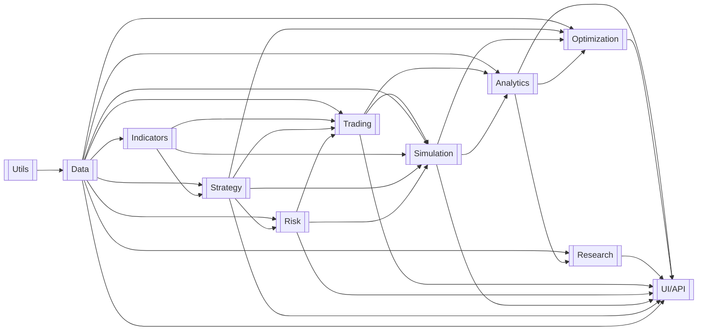
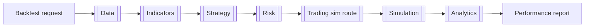
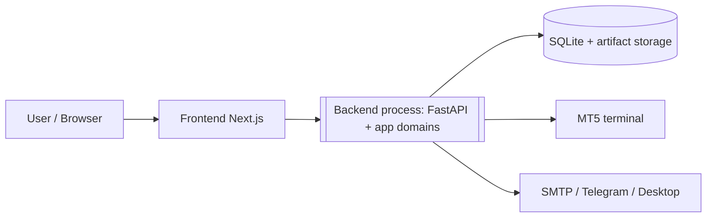

# HaruQuantAI

> **System path:** `HaruQuantAI/`
> **Status:** `Partial`
> **Last updated:** `2026-07-12`

> This document is the system-level source of truth.
> It defines how domains fit together, how cross-domain workflows operate, which rules apply system-wide, and how the complete system is verified.
>
> Domain internals belong in each domain's own `README.md`.
> Do not duplicate domain-level requirements, files, functions, or implementation details here.

---

## 1. System Purpose and Boundary

### Purpose

HaruQuantAI is an algorithmic trading platform that turns market data into governed trading outcomes. It acquires and normalizes market data, derives indicators, generates strategy signals, and forces every trading proposal through independent risk governance before execution. Approved actions are executed deterministically across paper and live routes (against a broker) and the sim route (against a simulated execution environment). Execution and simulation results are persisted by their owning domains and may be evaluated through read-only performance analytics. The system fails closed: if safety, context, or state cannot be proven, execution is blocked.

### System owns

- Acquisition, normalization, and storage of trusted market and account data.
- Deterministic indicator computation and strategy signal generation.
- Risk governance of every trading proposal before any execution (the master gate).
- Formulation and dispatch of order intents across simulation, paper, and live routes, including reconciliation and emergency controls.
- Deterministic historical backtesting and parameter optimization.
- Performance analytics, reporting, and advisory research.
- Authenticated user and service access through a single UI/API boundary.

### System does not own

- Broker-side order matching, settlement, and custody of funds (owned by the broker, reached via MT5).
- Origination of market data (owned by external providers/broker feeds).
- Guarantees of strategy profitability or regulatory/compliance advice.
- Availability of external services (broker terminal, notification channels).

### Primary users / actors

| Actor                  | Uses the system to                                                      |
| ---------------------- | ----------------------------------------------------------------------- |
| `Owner / Admin`      | Define policy, configuration, and governance settings                   |
| `Operator`           | Run, monitor, and intervene in trading operations (incl. kill switch)   |
| `Researcher`         | Explore data, test hypotheses, produce advisory insights                |
| `Strategy Developer` | Build, backtest, and optimize strategies                                |
| `Risk Manager`       | Set risk thresholds, review decisions, operate the kill switch          |
| `Read-only Viewer`   | Inspect dashboards, reports, and audit trails                           |
| `Service Account`    | Execute approved, read-only, allowlisted system plans                   |
| `Broker (MT5)`       | External counterparty: supplies data and account state, receives orders |

---

## 2. Domain Capability Map

This diagram shows the complete system and its domains at a glance.

```mermaid
flowchart TD
    SYSTEM[[HaruQuantAI]]

    SYSTEM --> UTILS[[Utils]]
    SYSTEM --> DATA[[Data]]
    SYSTEM --> IND[[Indicators]]
    SYSTEM --> STRAT[[Strategy]]
    SYSTEM --> RISK[[Risk]]
    SYSTEM --> TRADE[[Trading]]
    SYSTEM --> SIM[[Simulation]]
    SYSTEM --> ANA[[Analytics]]
    SYSTEM --> OPT[[Optimization]]
    SYSTEM --> RES[[Research]]
    SYSTEM --> UIAPI[[UI/API]]

    UTILS --> UTILS_CAP[Provide shared business-neutral infrastructure]
    DATA --> DATA_CAP[Provide trusted market and account data]
    IND --> IND_CAP[Compute deterministic indicator values]
    STRAT --> STRAT_CAP[Generate trading signals and trade intents]
    RISK --> RISK_CAP[Approve or reject every trading proposal]
    TRADE --> TRADE_CAP[Execute approved actions on sim, paper, and live routes]
    SIM --> SIM_CAP[Replay strategies deterministically over history]
    ANA --> ANA_CAP[Measure and report trading performance]
    OPT --> OPT_CAP[Search and validate strategy parameters]
    RES --> RES_CAP[Produce advisory insights from data]
    UIAPI --> UIAPI_CAP[Expose the system to users and clients]
```



### 2.1 Domain Registry

Domains are listed in dependency order, from lowest dependency to highest dependency.

#### 2.1.1 Utils

* **Package**: `app/utils`
* **Responsibility**: Provide business-neutral shared infrastructure to all other domains.
* **Inputs**: Raw log records, error conditions, event payloads, alert requests, metric samples, environment settings.
* **Outputs**: Structured logs, standard response envelopes, mapped errors, prefixed IDs, canonical JSON, routed notifications, health metrics, loaded settings.
* **Owns**: Structured logging, UTC time policy and formatting, standard tool response envelope, error taxonomy and mapping, ID generation, canonical serialization, notification routing (Email, Telegram, Desktop), observability/metrics export, settings loading, redaction/security primitives.
* **Boundaries**: Owns no durable business state and makes no business decisions. Does not own strategy logic, risk rules, broker operations, persistence, or any domain contract base classes (domains own their own contracts locally).
* **Key Limits**: No business decisions; no durable business state; secret redaction is denylist-first and case-insensitive before any persistence or emission.
* **Documentation**: `app/utils/README.md`

#### 2.1.2 Data

* **Package**: `app/data`
* **Responsibility**: Acquire, normalize, store, and serve trusted market data and read-only broker/account state. Data's public broker capability is read-only. Data owns the MT5 connection lifecycle and exposes a restricted `BrokerExecutionChannel` to Trading.
* **Inputs**: Provider feeds, broker reads (MT5), historical files, backfill commands.
* **Outputs**: Normalized bars/ticks (`MarketDataset`), account/broker state snapshots (`AccountStateSnapshot`), restricted `BrokerExecutionChannel`, and storage state.
* **Owns**: Historical market and account data storage/persistence, durable audit storage, shared database infrastructure, connections, locking, SQLite migration execution framework, real-time feed handling, provider alias mappings, read-only broker/account state adapters (MT5 isolated behind a facade), MT5 connection lifecycle and credential resolution (exposing a restricted `BrokerExecutionChannel` to Trading), multi-timeframe alignment.
* **Boundaries**: Foundation layer with no trading decision logic. Does not own strategy logic, backtest engines, sizing formulas, order dispatch, or other domains' tables, artifact schemas, and migration definitions (each domain owns its tables, artifact schemas, and migration definitions, utilizing the shared execution framework). Never leaks raw DataFrames, sockets, DB sessions, or provider SDK objects across its boundary. Only Trading may use the `BrokerExecutionChannel` for approved broker mutations.
* **Key Limits**: Backfill chunks must be bounded and checkpointed; exclusive path-scoped write locks (`CONCURRENT_WRITE_LOCKED` on conflict); no-lookahead alignment by default; public capability is read-only toward the broker.
* **Documentation**: `app/data/README.md`

#### 2.1.3 Indicators

* **Package**: `app/indicator`
* **Responsibility**: Compute deterministic, pure-function indicator values from normalized data.
* **Inputs**: Normalized datasets from Data, validated indicator parameters.
* **Outputs**: Indicator value series with `available_at` metadata (`IndicatorSeries`).
* **Owns**: The indicator formula library, parameter validation, indicator registry and capability matrix.
* **Boundaries**: Pure functions with no I/O on the calculation path. Does not own broker calls, order state, strategy lifecycle, caching, or data acquisition.
* **Key Limits**: Inputs must be normalized and non-empty; no-lookahead enforced via explicit `available_at` fields; fully deterministic.
* **Documentation**: `app/indicator/README.md`

#### 2.1.4 Strategy

* **Package**: `app/strategy`
* **Responsibility**: Turn market state and indicator values into canonical trading signals and trade intents when invoked by an approved runtime workflow.
* **Inputs**: Normalized datasets, indicator series, strategy parameters, lifecycle commands, `AccountStateSnapshot` from Data.
* **Outputs**: Canonical signals and `TradeIntent` proposals with metadata.
* **Owns**: Strategy registry and versioning, parameter schemas, strategy state checkpoints, deterministic strategy evaluation, and signal/intent generation.
* **Boundaries**: Emits proposals (which may include sizing proposals), never broker orders. Does not own live/paper runtime orchestration, risk enforcement, final position sizing approval (Risk owns the final approved size), order routing, official fills, or data normalization.
* **Key Limits**: Neutral signals emit no action; lookahead or clock-drift violations fail the batch atomically; account/broker state access is read-only `AccountStateSnapshot` from Data.
* **Documentation**: `app/strategy/README.md`

#### 2.1.5 Risk

* **Package**: `app/risk`
* **Responsibility**: Intercept every trading proposal and approve or reject it against safety limits, exposure, and governance policy — the master gate.
* **Inputs**: `TradeIntent` proposals from Strategy, account/broker state snapshots from Data, risk policies and thresholds.
* **Outputs**: `RiskDecision` (approved intent with approval token, or structured rejection), kill-switch state, scenario analyses.
* **Owns**: Proposal interception, final approved/capped position size, safety limits, portfolio exposure and drawdown tracking, kill-switch policy and active state, approval-token issuance and validation, lifecycle gates (research → full-live), cryptographic audit chaining of decisions.
* **Boundaries**: Does not own data ingestion, strategy code, broker submission, or account state truth. Cannot execute anything itself.
* **Key Limits**: Missing thresholds or unverifiable broker state fail closed; live approval requires active broker state validation; strict payload size and structure limits; strict `Decimal` handling (`allow_inf_nan=False`, `ROUND_HALF_EVEN`).
* **Documentation**: `app/risk/README.md`

#### 2.1.6 Trading

* **Package**: `app/trading`
* **Responsibility**: Orchestrate live and paper evaluation workflows, convert approved risk decisions into deterministic order intents, and execute them on the selected route (`sim`, `paper`, `live`) with reconciliation, monitoring, and emergency controls.
* **Inputs**: Live/paper evaluation triggers, strategy references, route/profile configuration, runtime gate configuration, and approved `RiskDecision`s with approval tokens.
* **Outputs**: `OrderIntent`s, execution receipts / `TradeRecord`s, reconciliation results, incident logs.
* **Owns**: Live/paper runtime orchestration, orders, fills, execution-state persistence, its own tables, schemas, and migration definitions, order intent formulation, client order IDs and idempotency, route-aware request packing, runtime gates, broker dispatch after Risk clearance, reconciliation authority, execution monitoring, and emergency stop of in-flight execution.
* **Boundaries**: Trading may coordinate Data, Indicators, Strategy, and Risk during a live/paper evaluation, but it does not own their decisions or business logic. Its execution phase begins only after receiving an approved `RiskDecision`; it executes exactly the approved size. It enforces the active kill-switch state by stopping or canceling execution. It does not own signal creation, risk policy, backtest orchestration, the MT5 connection lifecycle, or broker secret resolution. Data owns the connection lifecycle and exposes a restricted `BrokerExecutionChannel`; only Trading may use that channel for approved broker mutations. Paper and live share the same execution path and differ only by the credentials Data supplies. Trading cannot approve its own risk decisions.
* **Key Limits**: Live actions require valid approval tokens and volume constraints; `ALLOW_LIVE_MUTATIONS=false` blocks all live mutation by default; Decimal precision ≥ 28 digits with 8-decimal quantization; idempotency via SHA-256 over canonical JSON; broker operation timeout and check frequency limits; blind retries banned — unknown broker state freezes execution.
* **Documentation**: `app/trading/README.md`

#### 2.1.7 Simulation

* **Package**: `app/simulation`
* **Responsibility**: Orchestrate the historical backtest loop, replay strategies deterministically over historical data through the core trading path, and produce simulated fills, journals, and execution reports.
* **Inputs**: Historical datasets from Data, order intents via the Trading `sim` route, vetted strategy registry references, backtest configuration.
* **Outputs**: Simulated trades and journals (`SimulationResult`), artifact manifests, execution reports.
* **Owns**: Simulation results and artifacts persistence, its own tables, schemas, and migration definitions, orchestration of the historical backtest loop (`Data → Indicators → Strategy → Risk → Trading(sim) → Simulation fills`), backtest runtime, tick-based execution replay, simulated fill models and all simulated state (the broker analogue for the sim route, as MT5 owns state on the live route), artifact manifests.
* **Boundaries**: No live side effects; in-memory execution state (though final backtest results and artifacts may be persisted). Does not own live broker channels, live adapter code, or execution of arbitrary strategy code strings.
* **Key Limits**: Initial balance must be positive; only vetted registry references accepted (no raw code); deterministic replay required; boundary failures return structured `SIM_*` errors.
* **Documentation**: `app/simulation/README.md`

#### 2.1.8 Analytics

* **Package**: `app/analytics`
* **Responsibility**: Compute performance metrics and build reports from trade records, returns, and benchmarks — returning read-only, advisory reports only.
* **Inputs**: `TradeRecord`s from Trading, `SimulationResult`s from Simulation, benchmark data from Data, logs and returns.
* **Outputs**: `PerformanceReport`s, scorecards, dashboard payloads with caveat/warning metadata.
* **Owns**: Performance schemas, metric kernels, report builders, dashboard payloads, and caveat metadata catalogs.
* **Boundaries**: Strictly read-only with no side effects. Reports are returned to consumers and are not persisted by Analytics in the initial build. Analytics does not own live state mutation, broker execution, strategy promotion decisions, or arbitrary local file loading.
* **Key Limits**: Monetary math in `Decimal`; ratios in `float64` with documented tolerance; `Infinity` triggers structured validation errors; fails closed on missing FX conversions.
* **Documentation**: `app/analytics/README.md`

#### 2.1.9 Optimization

* **Package**: `app/optimization`
* **Responsibility**: Orchestrate repeated simulation runs to search strategy parameter spaces via simulation and validate robustness without ever placing trades.
* **Inputs**: Historical datasets, strategy registry references and parameter schemas, simulation results, search configuration.
* **Outputs**: Optimized parameter sets with reproducibility hashes, walk-forward and overfit diagnostics, search metadata (`places_trade=False`).
* **Owns**: Checkpoints and optimization results persistence, its own tables, schemas, and migration definitions, orchestration of repeated simulation runs, parameter sweeps (grid/random/GA/Bayesian), walk-forward routines, overfit/robustness diagnostics, deterministic tie-breaking, atomic search checkpointing.
* **Boundaries**: Does not own live execution, automatic strategy promotion, or the shared database/migration execution framework. It owns only its optimization tables, artifact schemas, and migration definitions. Strict time-series splitting — no leakage.
* **Key Limits**: Parameter ranges must be explicitly bounded; omitted `dry_run` defaults to `True`; ties resolve deterministically via trade count and candidate hash; oversized payloads rejected.
* **Documentation**: `app/optimization/README.md`

#### 2.1.10 Research

* **Package**: `app/research`
* **Responsibility**: Provide a sandboxed, leakage-gated environment for data exploration and hypothesis evaluation, producing advisory reports only.
* **Inputs**: Datasets from Data, consumes Analytics public metric contracts.
* **Outputs**: Advisory `ResearchReport`s, insights, feature definitions, hypothesis evaluations.
* **Owns**: Research artifacts persistence, its own tables, schemas, and migration definitions, sandboxed analysis, feature engineering tools, leakage/bias validation, null-model and edge-discovery wrappers, statistical sign-off (bootstrapping/FDR).
* **Boundaries**: Read-only toward live systems. Does not own live mutations, risk decisions, strategy promotion, or roadmap/code selection. Advisory only.
* **Key Limits**: Non-deterministic routines require seed injection and output logs; persisted artifacts store SHA-256 config hashes; implicit/hidden data filling or dropping is forbidden (`CleaningConfig` explicit).
* **Documentation**: `app/research/README.md`

#### 2.1.11 UI/API

* **Package**: `api/` (FastAPI gateway) + `ui/` (Next.js frontend) — one logical domain implemented by two deployable packages.
* **Responsibility**: Expose the system to users and clients through authenticated HTTP/WebSocket interfaces and frontend views, delegating logic to selected public domain APIs.
* **Inputs**: HTTP requests, WebSocket connections, client payloads, authenticated principals.
* **Outputs**: HTTP responses, WebSocket broadcasts, views/DTOs, `AuthContext` propagated to downstream domains.
* **Owns**: Routes, HTTP/WS wrappers, frontend views and client stores, auth/authz enforcement, DTO translation, preflight write safeguards, requests for kill-switch activation or clearance.
* **Boundaries**: Pure presentation/delegation layer with zero inline domain or calculation logic. Cannot bypass Risk or Trading gates.
* **Key Limits**: List endpoints paginated; endpoint timeouts; preflight warnings expire.
* **Documentation**: `api/README.md`

### 2.2 Domain ownership rule

Each responsibility must have one clear owning domain.

```text
One responsibility
→ one owning domain
→ one authoritative domain README
```

Other domains may consume the capability, but they must not duplicate its business logic.

---

## 3. Domain Dependency Diagram

An arrow points from the required domain to the domain that consumes it.



Utils is required by every domain; only the Utils → Data edge is drawn to keep the diagram readable.

### Dependency explanation

- **Utils** underpins everything (logging, errors, IDs, envelopes, settings, redaction) and depends on nothing.
- **Data** needs only Utils; it is the sole gateway to market data, storage, and read-only broker state.
- **Indicators** consume normalized Data output. **Strategy** consumes Data and Indicators.
- **Risk** consumes Strategy proposals and Data account snapshots; it must be independent of Trading so that execution can never influence approval.
- **Trading** orchestrates live/paper evaluation by invoking the public APIs of Data, Indicators, Strategy, and Risk. It owns execution only after Risk approval and is the single execution owner for `sim`, `paper`, and `live` routes.
- **Simulation** replays history through the Trading `sim` route, so it sits above Trading. Since it orchestrates the historical backtest loop, it depends directly on `Data`, `Indicators`, `Strategy`, `Risk`, and `Trading`.
- **Analytics** consumes trade records from Trading and Simulation plus benchmarks from Data, so it sits above both producers.
- **Optimization** consumes Data, Strategy, Simulation, and Analytics to drive bounded search and scoring. **Research** consumes Data and Analytics public metric contracts. The two share a level in presentation and UI/API access.
- **UI/API** is the highest-dependency domain: it presents and delegates to selected public domain APIs (including Data, Strategy, Risk, Trading, Simulation, Analytics, Optimization, and Research) and owns nothing computational.

No circular dependencies exist. Note: earlier V1 build-order documentation listed Analytics before Trading; dependency analysis places Analytics after Trading and Simulation because it consumes their records (confirmed by OD-2: Trading owns `TradeRecord`; Analytics owns derived report schemas).

### Documentation (README) order

```text
1. Utils
2. Data
3. Indicators
4. Strategy
5. Risk
6. Trading
7. Simulation
8. Analytics
9. Optimization and Research (same level, either order)
10. UI/API
```

### Eventual implementation order

Same as the documentation order. Optimization and Research may be implemented in parallel once Simulation and Analytics respectively are stable. UI/API is implemented last, thin slices earlier if operator visibility is needed.

---

## 4. Cross-Domain Workflows

This section documents only workflows involving two or more domains. Internal domain workflows belong in the relevant domain `README.md`.

### Status and scope

| Status              | Meaning                                    |
| ------------------- | ------------------------------------------ |
| **Missing**   | Not implemented or not verified            |
| **Partial**   | Partly implemented or tests are incomplete |
| **Completed** | Implemented, tested, and verified          |

| Status  | Workflow ID    | Workflow                            | Trigger                                   | Domains involved                                                                      | Final outcome                                                       | Integration test                                          |
| ------- | -------------- | ----------------------------------- | ----------------------------------------- | ------------------------------------------------------------------------------------- | ------------------------------------------------------------------- | --------------------------------------------------------- |
| Missing | `SYS-WF-001` | Historical backtest                 | Backtest request                          | `Data → Indicators → Strategy → Risk → Trading(sim) → Simulation → Analytics` | Deterministic simulation result and performance report              | `tests/system/integration/test_backtest.py`             |
| Missing | `SYS-WF-002` | Signal to live execution            | Market data update / scheduled evaluation | `Data → Indicators → Strategy → Risk → Trading(live) → Analytics`              | Approved order executed at broker, reconciled and recorded          | `tests/system/integration/test_signal_to_live.py`       |
| Missing | `SYS-WF-003` | Parameter optimization              | Optimization request                      | `Optimization → Strategy → Simulation → Analytics → Optimization`               | Bounded, reproducible optimized parameter set with diagnostics      | `tests/system/integration/test_optimization.py`         |
| Missing | `SYS-WF-004` | Research to strategy candidate      | Researcher hypothesis                     | `Data → Research → UI/API → Strategy`                                            | Reviewed strategy registration request entering Strategy validation | `tests/system/integration/test_research_to_strategy.py` |
| Missing | `SYS-WF-005` | Operator monitoring and kill switch | Operator action via UI/API                | `UI/API → Risk → Trading`                                                         | Kill switch engaged; all execution halted fail-closed               | `tests/system/integration/test_kill_switch.py`          |

---

### `SYS-WF-001` — Historical Backtest

**Purpose:** Evaluate a strategy against history through the same governed path used in live trading, producing a deterministic, reportable result.

**Actor / trigger:** Strategy Developer submits a backtest request (via UI/API once available).

**Input boundary:** Backtest configuration — strategy registry reference, parameters, symbol/timeframe, date range, initial balance.

**Output boundary:** `SimulationResult` (persisted by Simulation) with artifact manifest, plus an Analytics `PerformanceReport` (returned by Analytics).

**Domains and responsibilities:**

| Order | Domain         | Responsibility                                       | Input                      | Output                       |
| ----: | -------------- | ---------------------------------------------------- | -------------------------- | ---------------------------- |
|     1 | `Data`       | Serve normalized historical dataset                  | Backtest range request     | `MarketDataset`            |
|     2 | `Indicators` | Compute indicator series, no lookahead               | `MarketDataset`, params  | `IndicatorSeries`          |
|     3 | `Strategy`   | Generate signals and trade intents                   | Dataset + indicators       | `TradeIntent`s             |
|     4 | `Risk`       | Approve or reject each intent under sim policy       | `TradeIntent`, sim state | `RiskDecision`s            |
|     5 | `Trading`    | Pack approved decisions into sim-route order intents | Approved decisions         | `OrderIntent`s (route=sim) |
|     6 | `Simulation` | Replay execution, produce fills and journals         | History + intents          | `SimulationResult`         |
|     7 | `Analytics`  | Compute metrics and build the report                 | `SimulationResult`       | `PerformanceReport`        |

**Main flow:**

1. `Simulation` orchestrates the historical backtest loop by coordinating the execution across domains:
   a. Requests normalized historical dataset from `Data` for the requested range.
   b. Triggers `Indicators` to compute indicator series with `available_at` metadata.
   c. Invokes `Strategy` to produce canonical signals and `TradeIntent` proposals bar by bar.
   d. Submits proposals to `Risk` to evaluate each intent under simulation policy.
   e. Passes approved decisions to `Trading` to formulate deterministic sim-route order intents.
   f. Replays execution and produces simulated fills, journals, and a manifest.
2. `Analytics` computes performance metrics and returns the report.

**Failure behaviour:**

- Data gap or misalignment → workflow aborts with a structured data error; no partial results published.
- Lookahead/clock-drift violation in Strategy → atomic batch failure.
- Risk rejection → intent is dropped and recorded; the backtest continues (rejections are results, not errors).
- Simulation boundary failure → structured `SIM_*` error; artifacts from incomplete runs are not published.

**Success condition:** A reproducible `SimulationResult` (persisted by Simulation) is retrievable, and the `PerformanceReport` is returned by Analytics.

#### End-to-end workflow diagram



---

### `SYS-WF-002` — Signal to Live Execution

**Purpose:** Convert a live market signal into a governed, reconciled broker order — or a safe, audited refusal.

**Actor / trigger:** Live/paper market data update or scheduled strategy evaluation under an authenticated principal.

**Input boundary:** Current market state entering Data.

**Output boundary:** Broker execution receipt reconciled and recorded (or an audited rejection), visible to Analytics and UI/API.

**Domains and responsibilities:**

| Order | Domain         | Responsibility                                                                     | Input                        | Output                                      |
| ----: | -------------- | ---------------------------------------------------------------------------------- | ---------------------------- | ------------------------------------------- |
|     1 | `Data`       | Normalize live market state; supply account snapshot                               | Feed/broker reads            | `MarketDataset`, `AccountStateSnapshot` |
|     2 | `Indicators` | Derive current indicator values                                                    | Market state                 | `IndicatorSeries`                         |
|     3 | `Strategy`   | Emit signal /`TradeIntent`                                                       | State + indicators           | `TradeIntent`                             |
|     4 | `Risk`       | Multi-gate validation against live account state                                   | Intent + snapshot + policies | `RiskDecision` + approval token           |
|     5 | `Trading`    | Idempotent order intent, runtime gates, broker readiness, dispatch, reconciliation | Approved decision            | `OrderIntent`, `TradeRecord`            |
|     6 | `Analytics`  | Compute and return metrics/reports from the persisted execution record             | `TradeRecord`              | Updated reports                             |

**Main flow:**

1. `Trading` owns the live/paper runtime loop and coordinates only through public domain APIs:
   a. Requests normalized live market state and a validated account snapshot from `Data`.
   b. Requests current indicator values from `Indicators`.
   c. Invokes `Strategy` with the market state, indicator series, strategy parameters, and read-only account snapshot.
   d. Receives either no action or a `TradeIntent`; neutral signals end the workflow.
   e. Submits the `TradeIntent` to `Risk` for independent multi-gate validation.
2. If Risk rejects the proposal, Trading records the rejection outcome and performs no mutation.
3. If Risk approves the proposal, Trading begins the execution phase using the scoped approval token, builds an idempotent `OrderIntent`, passes runtime gates (including `ALLOW_LIVE_MUTATIONS`), dispatches through Data's restricted `BrokerExecutionChannel`, and reconciles the result.
4. Trading persists the `TradeRecord`. Analytics consumes it and returns updated metrics or reports. The complete chain is audit-logged with correlation IDs.

**Failure behaviour:**

- Unverifiable account state at Risk → fail closed, intent rejected, audit event emitted.
- Kill switch active → all proposals rejected instantly.
- `ALLOW_LIVE_MUTATIONS=false` or gate failure at Trading → no dispatch; incident logged.
- Unknown broker state after dispatch → no blind retry; execution freezes until reconciliation completes.

**Success condition:** Broker position/order state matches the approved intent, reconciliation confirms it, and an immutable audit chain links signal → decision → order → receipt.

#### End-to-end workflow diagram

```mermaid
sequenceDiagram
    participant T as Trading Runtime
    participant D as Data
    participant I as Indicators
    participant S as Strategy
    participant R as Risk
    participant B as Broker (MT5)
    participant A as Analytics

    T->>D: Request MarketDataset + AccountStateSnapshot
    D-->>T: Normalized state + read-only snapshot
    T->>I: Compute indicators from MarketDataset
    I-->>T: IndicatorSeries
    T->>S: Evaluate strategy
    S-->>T: No action or TradeIntent
    T->>R: Submit TradeIntent
    R->>R: Independent multi-gate validation
    R-->>T: Rejection or approved RiskDecision
    alt Approved
        T->>B: Order via BrokerExecutionChannel
        B-->>T: Execution receipt
        T->>T: Reconcile and persist TradeRecord
        T->>A: TradeRecord
    else Rejected
        T->>T: Record rejection; no mutation
    end
```

---

### `SYS-WF-003` — Parameter Optimization

**Purpose:** Find robust strategy parameters through bounded, leakage-free search over deterministic simulations.

**Actor / trigger:** Strategy Developer submits an optimization request.

**Input boundary:** Strategy registry reference, bounded parameter ranges, search algorithm, data range.

**Output boundary:** Optimized parameter sets with reproducibility hashes and robustness diagnostics. No trades are ever placed.

**Domains and responsibilities:**

| Order | Domain           | Responsibility                                                  | Input                | Output                         |
| ----: | ---------------- | --------------------------------------------------------------- | -------------------- | ------------------------------ |
|     1 | `Optimization` | Generate candidates, enforce time-series splits, checkpoint     | Search config        | Candidate parameter sets       |
|     2 | `Strategy`     | Validate parameters against schemas                             | Candidate params     | Validated strategy instances   |
|     3 | `Simulation`   | Run deterministic backtests per candidate (via SYS-WF-001 core) | Candidates + history | `SimulationResult`s          |
|     4 | `Analytics`    | Score candidates with metric kernels                            | Results              | Scores                         |
|     5 | `Optimization` | Rank, run overfit diagnostics, emit results                     | Scores               | Optimized params + diagnostics |

**Main flow:** Optimization orchestrates the repeated simulation runs: candidate generation → per-candidate simulation → scoring → deterministic ranking (ties broken by trade count then candidate hash) → walk-forward/overfit diagnostics → checkpointed results.

**Failure behaviour:** Unbounded ranges rejected up front; oversized payloads rejected (`OPT_PAYLOAD_TOO_LARGE`); a failed candidate run is recorded and skipped without corrupting checkpoints; leakage detection aborts the search.

**Success condition:** A reproducible result set (identical given the same seed and inputs) with diagnostics, and `places_trade=False` throughout.

---

`SYS-WF-004` (Research → UI/API review → Strategy registration request) and `SYS-WF-005` (Operator kill switch) are registered above and will be detailed when the participating domain READMEs are written. Both are `Missing`.

---

## 5. System Interfaces and Contracts

Document only contracts crossing domain or external-system boundaries.

| Status  | Contract / Event                       | Version | Contract owner   | Producer / Submitter                                   | Consumer                                                                                 | Purpose                                                                                  | Core schema / type                                                                            | Failure behaviour                                                                                              |
| ------- | -------------------------------------- | ------- | ---------------- | ------------------------------------------------------ | ---------------------------------------------------------------------------------------- | ---------------------------------------------------------------------------------------- | --------------------------------------------------------------------------------------------- | -------------------------------------------------------------------------------------------------------------- |
| Missing | `MarketDataset`                      | `v1` | `Data`         | `Data`                                               | `Indicators, Strategy, Simulation, Optimization, Research, Analytics`                  | Normalized bars/ticks with alignment metadata                                            | symbol, timeframe, records,`available_at`, provenance                                       | Structured data error; consumers must not accept raw provider objects                                          |
| Missing | `AccountStateSnapshot`               | `v1` | `Data`         | `Data`                                               | `Strategy, Risk, Trading`                                                              | Read-only broker/account state for evaluation and validation                             | account, balances, positions, margin, snapshot time (UTC)                                     | Stale or unavailable snapshot causes dependent governed operations to fail closed                              |
| Missing | `BrokerExecutionChannel`             | `v1` | `Data`         | `Data`                                               | `Trading`                                                                              | Restricted authenticated channel for approved broker mutations                           | scoped write interface bound to an authenticated MT5 connection                               | Connection, scope, or permission failure blocks mutations                                                      |
| Missing | `IndicatorSeries`                    | `v1` | `Indicators`   | `Indicators`                                         | `Strategy`                                                                             | Deterministic indicator values with availability metadata                                | indicator ID, parameter hash, values,`available_at`                                         | Invalid input returns a structured validation error; no partial series                                         |
| Missing | `TradeIntent`                        | `v1` | `Strategy`     | `Strategy`                                           | `Risk`                                                                                 | Proposed trading action that is not yet executable                                       | intent ID, strategy version, symbol, direction, sizing proposal, validity                     | Malformed intent rejected; neutral signal produces no intent                                                   |
| Missing | `RiskDecision`                       | `v1` | `Risk`         | `Risk`                                               | `Trading, UI/API`                                                                      | Independent approval or structured rejection                                             | decision ID, intent reference, verdict, approved size, approval token, expiry, limits applied | Missing or expired token causes Trading to refuse execution                                                    |
| Missing | `OrderIntent`                        | `v1` | `Trading`      | `Trading`                                            | `Simulation` for `sim`; broker through `BrokerExecutionChannel` for `paper/live` | Deterministic, idempotent executable order request                                       | client order ID, route, symbol, side, approved volume, idempotency hash                       | Duplicate hash deduplicated; gate failure causes no dispatch                                                   |
| Missing | `TradeRecord` / `ExecutionReceipt` | `v1` | `Trading`      | `Trading`                                            | `Analytics, UI/API`                                                                    | Official execution and reconciliation outcome                                            | order reference, fills, prices, status, reconciliation state, trace IDs                       | Unreconciled records are explicitly flagged and never silently discarded                                       |
| Missing | `SimulationResult`                   | `v1` | `Simulation`   | `Simulation`                                         | `Analytics, Optimization, UI/API`                                                      | Deterministic backtest outcome                                                           | run ID, config hash, journals, fills, artifact manifest                                       | Structured`SIM_*` errors; incomplete runs are not published                                                  |
| Missing | `PerformanceReport`                  | `v1` | `Analytics`    | `Analytics`                                          | `UI/API, Research, Optimization`                                                       | Read-only metrics, scorecards, and caveats                                               | report ID, metric set, caveat metadata, schema version                                        | Missing FX or benchmark data returns an explicit validation failure or caveat according to the metric contract |
| Missing | `OptimizationResult`                 | `v1` | `Optimization` | `Optimization`                                       | `UI/API`                                                                               | Advisory ranked parameter candidates and diagnostics                                     | search ID, reproducibility hash, ranked candidates, diagnostics                               | Invalid or unbounded input rejected before search                                                              |
| Missing | `StrategyParameterUpdateRequest`     | `v1` | `Strategy`     | `UI/API` after explicit user approval                | `Strategy`                                                                             | Request validation and registration of selected optimized parameters                     | strategy ID/version, selected parameter set, optimization result reference, principal, reason | Invalid parameters, unauthorized submitter, or incompatible strategy version rejects the request               |
| Missing | `ResearchReport`                     | `v1` | `Research`     | `Research`                                           | `UI/API`                                                                               | Advisory evidence and hypothesis results                                                 | report ID, hypothesis, evidence, seeds, configuration hash                                    | Leakage-gate failure blocks publication                                                                        |
| Missing | `StrategyRegistrationRequest`        | `v1` | `Strategy`     | `UI/API` after explicit researcher/operator approval | `Strategy`                                                                             | Request validation and registration of a research-derived strategy candidate             | candidate definition, parameters, signal specification, research report reference, principal  | Validation, authorization, registration, or leakage-evidence failure rejects the request                       |
| Missing | `AuthContext`                        | `v1` | `Utils`        | `UI/API`                                             | `All governed domains`                                                                 | Shared authenticated principal and trace context                                         | principal ID, roles, scopes, request/correlation IDs, issued timestamp                        | Missing or invalid context causes the receiving domain to fail closed                                          |
| Missing | `AuditEvent` common envelope         | `v1` | `Utils`        | `Every domain`                                       | `Data` durable audit storage                                                           | Redacted trace record for governed actions; each emitting domain owns its payload fields | event ID, timestamp, domain, action, principal ID, correlation ID, redacted payload           | Emission or persistence failure is surfaced and never silently swallowed                                       |
| Missing | `KillSwitchCommand`                  | `v1` | `Risk`         | `UI/API`                                             | `Risk`                                                                                 | Request authorized activation or clearance of the kill switch                            | action, principal ID, reason, timestamp, correlation ID                                       | Authorization or validation failure rejects the command                                                        |
| Missing | `KillSwitchState`                    | `v1` | `Risk`         | `Risk`                                               | `Trading, UI/API`                                                                      | Canonical active/inactive governance state                                               | state ID, active flag, reason, updated timestamp, version                                     | Missing or stale state blocks execution                                                                        |
| Missing | `StandardToolResponse`               | `v1` | `Utils`        | `All domains`                                        | `All internal callers`                                                                 | Uniform five-field response envelope where tool-style responses are required             | status, message, data, error, metadata                                                        | Non-conforming responses rejected at the relevant boundary                                                     |

### Contract ownership rules

- **Commands and requests are owned by the receiving domain.**
- **Events and results are owned by the producing domain.**
- **Shared context/envelope contracts are owned by the lowest common shared domain, normally Utils.**
- A submitting domain may create an instance of a command without owning its schema.
- External connection/channel contracts are owned by the domain that provides and controls the resource.
- Consumers depend only on documented public contracts and must not redefine them.
- Raw provider or SDK objects (MT5 structures, DataFrames, sockets, DB sessions) must not cross domain boundaries.
- Changes to shared contracts must be reflected in every affected domain README.
- Backward-compatibility requirements must be stated when needed.

### Versioning and compatibility policy

- Every shared contract carries an explicit version; all contracts start at `v1`.
- The contract owner (per the ownership rules above) owns the version: receivers version commands/requests, producers version events/results, Utils versions shared envelopes.
- Additive changes (new optional fields with safe defaults) do not require a version bump.
- Breaking changes (removed/renamed fields, changed semantics, changed units or precision) require a new version.
- The owner must support the previous version until every consumer has migrated; the deprecation window is stated per contract at bump time.
- A version bump must update the contract table above, the owner's README, and every consumer README in the same change.

### Data ownership

Each persisted or long-lived state has exactly one owning domain. Data owns the shared database connection, locking, and migration execution infrastructure (OD-8); each persistent domain owns its own tables, artifact schemas, and migration definitions. Only the owner writes; all cross-domain reads go through the owner's documented public contract — never direct table or file access.

| Status  | State / Store | Owning domain | Read access (via contract) | Write access | Notes |
| ------- | --- | --- | --- | --- | --- |
| Missing | Market/account data tables and historical storage | `Data` | All consuming domains via `MarketDataset` / `AccountStateSnapshot` | `Data` only | Includes provider alias mappings and alignment metadata |
| Missing | Durable audit storage | `Data` (storage) | `UI/API` (audit views), `Risk` (decision chain verification) | Emitting domains via `AuditEvent` envelope; persistence by `Data` | Each emitting domain owns its payload fields |
| Missing | Orders, fills, execution state, `TradeRecord` tables | `Trading` | `Analytics`, `UI/API` via `TradeRecord` / `ExecutionReceipt` | `Trading` only | Reconciliation state included; unreconciled records flagged |
| Missing | Strategy registry, parameter schemas, state checkpoints | `Strategy` | `Trading`, `Simulation`, `Optimization` via registry references | `Strategy` only | Registration only via approved `Strategy*Request` commands |
| Missing | Risk policies, kill-switch state, decision audit chain | `Risk` | `Trading`, `UI/API` via `KillSwitchState` / `RiskDecision` | `Risk` only | Cryptographically chained; kill-switch state is canonical here |
| Missing | Simulation results and artifacts | `Simulation` | `Analytics`, `Optimization`, `UI/API` via `SimulationResult` | `Simulation` only | Incomplete runs never published |
| Missing | Optimization checkpoints and results | `Optimization` | `UI/API` via `OptimizationResult` | `Optimization` only | Atomic checkpointing |
| Missing | Research artifacts | `Research` | `UI/API` via `ResearchReport` | `Research` only | SHA-256 config hashes stored with artifacts |
| Missing | Analytics persisted state | `Analytics` | — | — | None in the initial build; Analytics is read-only (OD-8) |

Rules:

- Every persisted state has exactly one owning domain.
- No domain writes to state it does not own.
- Cross-domain reads go through the owner's documented contract, not direct store access.

---

## 6. Shared Configuration and Limits Manifest

Only settings or limits shared across multiple domains belong here. Feature-specific limits belong in the owning domain README.

| Status  | Setting / Limit                     | Type               | Default                                       | Required    | Owner       | Used by                                           | Description                                                                                         |
| ------- | ----------------------------------- | ------------------ | --------------------------------------------- | ----------- | ----------- | ------------------------------------------------- | --------------------------------------------------------------------------------------------------- |
| Missing | `ENVIRONMENT`                     | `str`            | `dev`                                       | Yes         | `Utils`   | All domains                                       | Global environment; drives observability format and safety posture                                  |
| Missing | `RUNTIME_PROFILE`                 | `str`            | `research`                                  | Yes         | `Utils`   | Strategy, Risk, Trading, Simulation, UI/API       | Active profile:`research`, `simulation`, `paper`, or `live`                                 |
| Missing | `EXECUTION_ROUTE`                 | `str`            | `none`                                      | Conditional | `Trading` | Risk, Trading, Simulation, UI/API                 | Active route:`none`, `sim`, `paper`, or `live`; must be compatible with `RUNTIME_PROFILE` |
| Missing | `ALLOW_LIVE_MUTATIONS`            | `bool`           | `false`                                     | Yes         | `Trading` | Risk, Trading, UI/API                             | Master live-trading enablement;`false` blocks all broker mutation regardless of approval          |
| Missing | `DATABASE_URL` / `DATA_DIR`     | `str`            | —                                            | Yes         | `Data`    | Data, Trading, Simulation, Optimization, Research | Shared connection and artifact-root configuration; each persistent domain owns its own tables/files |
| Missing | `MT5_ENABLED`                     | `bool`           | `false`                                     | Yes         | `Data`    | Data reads, Trading dispatch                      | Broker connectivity toggle; disabled broker paths fail closed                                       |
| Missing | UTC-first time policy               | policy             | `Z`-suffixed ISO 8601                       | Yes         | `Utils`   | All domains                                       | Cross-domain timestamps must be UTC; violations are validation errors                               |
| Missing | Correlation/trace ID format         | policy             | prefixed UUID4/ULID                           | Yes         | `Utils`   | All domains                                       | Cross-domain calls and audit events carry request, correlation, and causation identifiers           |
| Missing | Decimal precision standard          | policy             | precision ≥ 28; domain-specific quantization | Yes         | `Utils`   | Data, Risk, Trading, Simulation, Analytics        | Broker-critical price, size, and balance math uses`decimal.Decimal`                               |
| Missing | Secret redaction policy             | policy             | denylist-first, case-insensitive              | Yes         | `Utils`   | All domains                                       | Secrets must not appear in logs, errors, events, metrics, or notifications                          |
| Missing | `LOG_LEVEL` / `METRICS_ENABLED` | `str` / `bool` | `INFO` / `false` | No | `Utils` | All domains | Shared observability configuration |

### Runtime Profile and Execution Route Compatibility

| `RUNTIME_PROFILE` | Allowed `EXECUTION_ROUTE` |
| ------------------- | -------------------------- |
| `research`        | `none`                   |
| `simulation`      | `sim`                    |
| `paper`           | `paper`                  |
| `live`            | `live`                   |

An incompatible profile/route pair causes initialization to fail closed.

### Boundary-limit ownership

Payload size, nesting, timeout, pagination, and provider-specific limits are owned and documented by the receiving or enforcing domain. They are not duplicated as one global numerical policy in this document.

Rules:

- Each shared setting has exactly one owner responsible for its definition and validation.
- `Used by` lists every consuming domain.
- Feature-specific defaults and numerical limits belong in domain READMEs.
- Status changes to `Completed` only after implementation and verification exist.

---

## 7. System-Wide Requirements

| Status  | Requirement ID  | Type            | Responsibility                                                                                          | Verification      |
| ------- | --------------- | --------------- | ------------------------------------------------------------------------------------------------------- | ----------------- |
| Missing | `SYS-NFR-001` | Architecture    | Domains shall communicate only through documented public contracts; no internal imports across domains. | Dependency audit  |
| Missing | `SYS-NFR-002` | Maintainability | Each responsibility shall have exactly one owning domain.                                               | Ownership review  |
| Missing | `SYS-NFR-003` | Reliability     | The system shall fail closed: unverifiable safety, context, or broker state blocks execution.           | Integration test  |
| Missing | `SYS-NFR-004` | Security        | No secret shall appear in any log, error, event, metric, or notification.                               | Security test     |
| Missing | `SYS-NFR-005` | Determinism     | Historical processing (Indicators, Simulation, Optimization) shall be deterministic and reproducible.   | Replay test       |
| Missing | `SYS-NFR-006` | Observability   | Every cross-domain action shall carry trace/correlation IDs and emit redacted audit events.             | Inspection / test |

---

## 8. External Systems

| Status  | External system               | Used by domains                                       | Purpose                                                                                              | Interaction type              | Failure behaviour                                                                                   |
| ------- | ----------------------------- | ----------------------------------------------------- | ---------------------------------------------------------------------------------------------------- | ----------------------------- | --------------------------------------------------------------------------------------------------- |
| Missing | `MetaTrader 5 (broker)`     | `Data (read), Trading (write)`                      | Market/account data and order execution                                                              | Read (Data) / Write (Trading) | Unknown state freezes execution; reads fail closed; no blind retries                                |
| Missing | `SQLite`                    | `Data, Trading, Simulation, Optimization, Research` | Shared relational persistence; Data owns connection, locking, and migration execution infrastructure | Read/Write                    | Write-lock conflicts are surfaced; each persistent domain owns its tables and migration definitions |
| Missing | `SMTP / Telegram / Desktop` | `Utils (router)`                                    | Alert and notification delivery                                                                      | Async                         | Delivery failure logged (`NOTIFICATION_FAILED`); never blocks trading paths                       |

Provider-specific implementation details belong in the owning domain README.

---

## 9. Deployment and Runtime Topology

**Status:** `Missing` — planned topology; to be confirmed against the actual runtime as implementation proceeds.

**Runtime model:** Modular Python monolith plus a separate frontend. All `app/*` domains run in-process behind the FastAPI gateway (`api/`); the Trading live/paper runtime loop runs as a background worker inside the same process, activated by `RUNTIME_PROFILE`. The `ui/` Next.js frontend is a separate deployable. SQLite and the MT5 terminal are local to the host, which constrains the backend to a single instance.

| Runtime unit | Contains domains | Environment | Started by | Scaling / instances |
| --- | --- | --- | --- | --- |
| Backend process (FastAPI + `app/*`) | Utils, Data, Indicators, Strategy, Risk, Trading, Simulation, Analytics, Optimization, Research, API gateway | dev / paper / live | `uv run` (single entry point) | Single instance — SQLite write locking and one MT5 terminal per host |
| Trading runtime loop (background worker) | Trading orchestrating Data, Indicators, Strategy, Risk | paper / live only | Backend process, gated by `RUNTIME_PROFILE` / `EXECUTION_ROUTE` | Single instance |
| Frontend (`ui/`, Next.js) | UI views and client stores | dev / prod | `npm run` / hosted | Stateless; may scale independently |
| MT5 terminal | External broker gateway | paper / live | Operator | One per broker account |



Rules:

- Every domain must belong to at least one runtime unit.
- Environment-specific configuration differences belong in Section 6 or the owning domain README.
- If the topology diverges (e.g., the Trading runtime is split into its own process), update this section and re-verify Section 6 profile/route gating.

---

## 10. System Usage

`Missing` — to be completed once the UI/API entry points exist. Full-system usage examples will live in `tests/system/usage/`.

---

## 11. Verification

### Test locations

```text
tests/
├── [domain]/
│   ├── unit/
│   ├── integration/
│   └── usage/
└── system/
    ├── integration/              # Cross-domain workflows (SYS-WF-*)
    └── usage/                    # Complete system examples
```

### Commands

```bash
uv run pytest tests/[domain]/unit
uv run pytest tests/[domain]/integration
uv run pytest tests/system/integration
uv run pytest tests

uv run ruff check app
uv run ruff format --check app
uv run mypy app
```

### Verification rules

- Unit tests remain inside the owning domain.
- System integration tests verify collaboration across domains; every `SYS-WF-*` workflow must have at least one.
- Shared contracts must have producer–consumer compatibility tests when needed.

Detailed verification content: `Missing` (implementation has not begun).

---

## Deferred Capabilities

To keep the initial eleven-domain build focused, all AI-driven elements are explicitly deferred:

* **AI Agent Actor**: Excluded from the initial system actors.
* **AI Provider APIs**: Deferred external API integration (conversational interface, sync/stream, fallback degradation).
* **AI Tool Interaction Contracts**: Consumers of `StandardToolResponse` are initially restricted to internal domains, excluding external AI layers.
* **AI Execution Constraints**: Initially, no broker-affecting actions can be drafted or planned by AI.

---

## 12. Open Decisions

| Status   | Decision                                                         | Affected domains                                                 | Options / Notes | ADR |
| -------- | ---------------------------------------------------------------- | ---------------------------------------------------------------- | --- | --- |
| Resolved | **OD-1: Conversation / AI-interface domain.**              | `UI/API, Research, Utils`                                      | **Deferred from the initial build.** Conversation belongs to a future AI-Agentic domain, introduced only after the system operates fully without AI. Not part of the 11-domain shape. | `docs/adr/0001-defer-ai-conversation-domain.md` |
| Resolved | **OD-2: `TradeRecord` schema ownership.**                | `Trading, Simulation, Analytics`                               | **Trading owns `TradeRecord`; Analytics owns derived report schemas.** Consistent with the rule that results are owned by their producer; Analytics remains after Trading/Simulation in dependency order. | `docs/adr/0002-traderecord-schema-ownership.md` |
| Resolved | **OD-3: MT5 access split.**                                | `Data, Trading, Utils`                                         | **Data owns the MT5 connection lifecycle and exposes a restricted BrokerExecutionChannel to Trading.** Only Trading may use that channel for approved broker mutations. Data's public broker capability is read-only. | `docs/adr/0003-mt5-access-split.md` |
| Resolved | **OD-4: Trading `sim` route vs Simulation boundary.**    | `Trading, Simulation`                                          | **Simulation consumes `OrderIntent`s and owns all fill/state logic** — the broker analogue for the sim route, exactly as MT5 owns its own state on the live route. Live and sim share identical trading operations and intents. | `docs/adr/0004-sim-route-simulation-boundary.md` |
| Resolved | **OD-5: Paper route ownership.**                           | `Data, Risk, Trading`                                          | **Paper is a Trading route flag using demo credentials supplied by Data.** Paper and live follow the identical execution path to MT5; the routing difference is credentials only. | `docs/adr/0005-paper-route-ownership.md` |
| Resolved | **OD-6: Live/paper runtime orchestration.**                | `Data, Indicators, Strategy, Risk, Trading`                    | **Trading owns runtime coordination; Strategy owns only strategy evaluation and proposal generation.** Trading execution begins only after an independent Risk approval. | `docs/adr/0006-live-paper-runtime-orchestration.md` |
| Resolved | **OD-7: Cross-domain contract ownership.**                 | `All domains`                                                  | **Commands/requests are owned by receivers; events/results by producers; shared contexts/envelopes by the lowest common shared domain.** Advisory Research/Optimization outputs reach Strategy only through explicit UI/API-approved Strategy commands. | `docs/adr/0007-cross-domain-contract-ownership.md` |
| Resolved | **OD-8: Persistence infrastructure and schema ownership.** | `Data, Trading, Simulation, Optimization, Research, Analytics` | **Data owns shared database connection, locking, and migration execution infrastructure. Persistent domains own their own tables, artifact schemas, and migration definitions. Analytics remains read-only and does not persist reports in the initial build.** | `docs/adr/0008-persistence-infrastructure-and-schema-ownership.md` |

Rules: `Open` means affected implementation must not proceed where guessing would be required. Domain-specific decisions belong in the relevant domain README. Every resolved cross-domain decision records its full rationale as an ADR in `docs/adr/` and links it here; resolved rows may be pruned from this table once linked, as the ADR preserves the history.

---

## 13. System Definition of Done

The system is complete only when:

- [ ] Every domain has a clear responsibility and owner.
- [ ] Every domain has an up-to-date README.
- [ ] The Domain Registry matches the actual package structure.
- [ ] The Domain Dependency Diagram matches real imports and dependencies.
- [ ] No circular domain dependencies exist.
- [ ] Every important cross-domain workflow has status `Completed`.
- [ ] Every `SYS-WF-*` workflow has a passing system integration test.
- [ ] Shared contracts are documented, versioned, and tested.
- [ ] Every persisted state has a documented owning domain.
- [ ] The deployment topology matches how the system actually runs.
- [ ] Shared configuration and limits are implemented and verified.
- [ ] Every system-wide requirement has status `Completed`.
- [ ] External-system failures have documented handling.
- [ ] Full-system usage examples run successfully.
- [ ] No unresolved `Open` decision affects completed work.
- [ ] Every resolved cross-domain decision has a linked ADR.
- [ ] No domain logic is duplicated across domains.
- [ ] All tests and quality checks pass.

Current status: `Missing` — implementation has not begun.

---

## 14. Change Process

For every system-level change:

```text
1. Update this document first.
2. Identify the owning domain or domains.
3. Update affected cross-domain workflows.
4. Update shared contracts when boundaries change.
5. Update shared configuration or limits when needed.
6. Update each affected domain README.
7. Implement the smallest change inside the owning domain.
8. Add or update domain tests.
9. Add or update system integration tests.
10. Change Status to Completed only after verification passes.
```

This keeps the system view, domain boundaries, workflows, contracts, configuration, implementation, and tests aligned.

---

# TODO: Move these to domain README after creation of domain READMEs

The following detailed numeric limits have been moved from the system-level PROJECT.md to be defined in their respective domain READMEs once created:

* **Data**:
  * Backfills capped at 10,000 records or 1 calendar day per chunk with per-chunk checkpoints.
* **Risk**:
  * Cross-boundary payload ceiling and structure constraints: payloads ≤ 1 MiB, nesting ≤ 10, lists ≤ 10,000.
* **Trading**:
  * Broker operation timeout 10 s, checks 5 s.
* **Optimization**:
  * Oversized payloads rejected with `OPT_PAYLOAD_TOO_LARGE` error.
* **UI/API**:
  * List endpoints paginated: cursor-based, default 50, max 200.
  * Endpoint timeouts: 30 s.
  * Preflight warnings expire after 30 s.