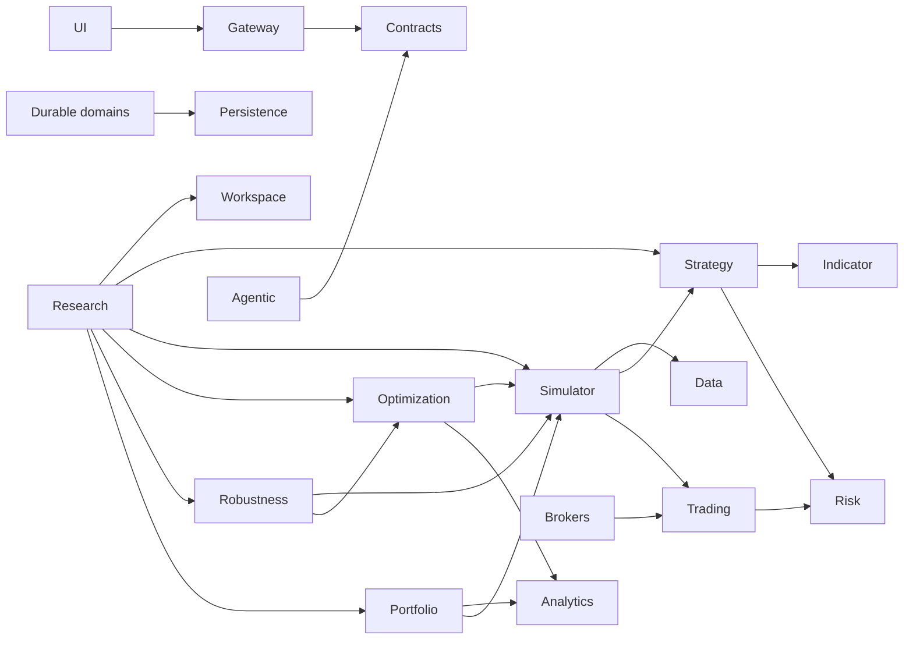
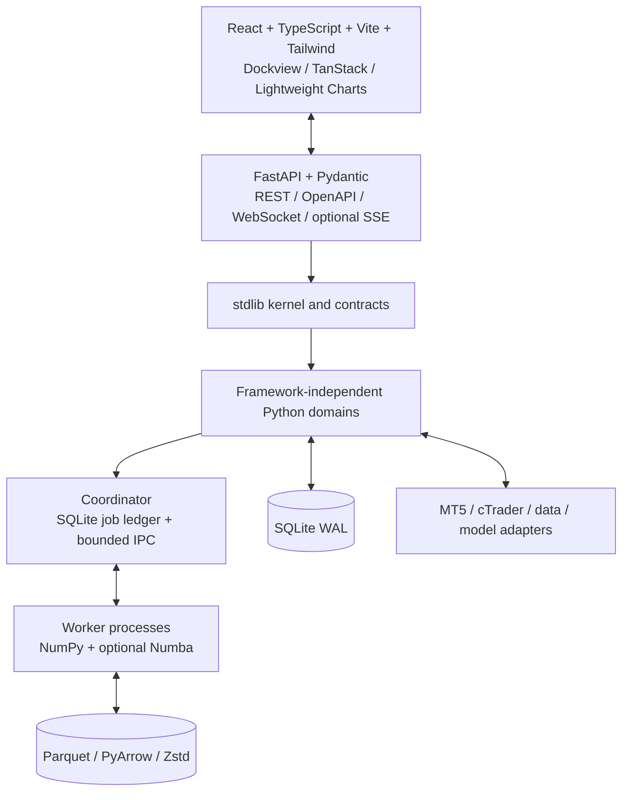

# HaruQuantAI

> **System Status:** `Missing` — specification complete; product implementation remains
> greenfield except the `Partial` UI foundation.
> **Reference Target:** StrategyQuant X build `144.2953`
> **Repository Baseline:** `1a99dd7`
> **Last Updated:** `2026-09-18`

This document is the system-level product authority. Domain behavior belongs in each
`app/services/<domain>/README.md`; universal structure and runtime constraints belong in
[ARCHITECTURE.md](ARCHITECTURE.md). Reference behavior and implementation status are independent.

---

## 1. System Purpose and Boundary

### Purpose

Build a local-first quantitative research workstation that creates, backtests, ranks, optimizes,
stress-tests, combines, and exports rule-based trading strategies with reproducible evidence.

### System owns

- An end-to-end research lifecycle from immutable market data through qualified strategy and
  portfolio artifacts.
- A deterministic Python quantitative core with durable jobs, lineage, metrics, and reports.
- A browser/optional desktop workstation exposing Builder, Improver, Retester, Optimizer, Results,
  Databanks, Data Manager, AlgoWizard, Portfolio tools, Custom Projects, and Extensions.
- Explicit simulation, demo, and live modes with live execution disabled by default.
- Typed external boundaries for market data, MetaTrader 5, cTrader, notifications, and optional
  model providers.

### System does not own

- Broker, exchange, data-provider, or model-provider availability and truth.
- Investment advice, guaranteed performance, or automatic acceptance of reference-product claims.
- Byte-for-byte compatibility with proprietary archives or source code unless separately verified.
- Pixel-identical native UI parity; current visual evidence is installed static resources.
- Authority to place live orders without separately implemented configuration, limits, and approval.

### Primary users / actors

| Actor | Goal | Authority boundary |
| --- | --- | --- |
| Quant researcher | Discover and validate strategies | Research/simulation by default |
| Strategy author | Edit rules, parameters, and exports | Structured model only; no arbitrary execution |
| Portfolio analyst | Combine strategies under constraints | Cannot activate live mode |
| Operator | Control jobs, recovery, settings, and diagnostics | Audited/idempotent mutations |
| Extension author | Add typed indicators, blocks, metrics, tasks, or views | Versioned contracts and isolation |
| Trading administrator | Configure demo/live profiles and approvals | Separate enablement and kill controls |
| AI-assisted user | Request explanations or proposals | Agentic output remains advisory |

---

## 2. Domain Capability Map

| Domain | Owns | Product status |
| --- | --- | --- |
| Workspace | Settings, jobs, scheduling, recovery, logs, notifications | Missing |
| Persistence | SQLite mechanics, artifacts, databanks, memberships, retention | Missing |
| Brokers | MT5/cTrader connectivity, capability discovery, translation, reconciliation | Missing |
| Data | Instruments, calendars, ticks/bars, import/providers, quality, datasets | Missing |
| Indicator | Series calculations, warm-up, cache, custom indicator contract | Missing |
| Strategy | Canonical model, authoring, grammar, generation/evolution, export | Missing |
| Risk | Sizing, protective levels, trailing, break-even, limits | Missing |
| Analytics | Metric registry, equity/drawdown/trades/periods, reports | Missing |
| Trading | Execution sessions, orders, positions, reconciliation, ledger | Missing |
| Simulator | Precision, event loop, matching, costs, account simulation | Missing |
| Optimization | Parameter spaces, studies, search, sequential/WF schedules | Missing |
| Robustness | Ordered cross-checks, Monte Carlo, WFM, verdicts | Missing |
| Portfolio | Definitions, weights, correlation, search, shared-capital results | Missing |
| Research | Versioned task graphs, routing, runs, automation | Missing |
| Gateway | REST/OpenAPI, WebSocket/SSE, DTO/auth/error boundary | Missing |
| UI | Research workstation and deterministic mock simulator | Partial |
| Agentic | Optional providers, context, tools, approvals, audit | Missing |

### 2.1 Domain Registry

Implementation status means repository evidence: `Missing` has no accepted product feature;
`Partial` has a coherent slice with incomplete acceptance; `Completed` requires implementation,
tests, usage evidence, registry, and qualification. An observed reference feature is never
`Completed` merely because it is documented.

Evidence confidence is separate: `Confirmed`, `High`, `Medium`, `Low`, or `Unverified`.
A finding is `Observed`, `Inferred`, or `Normative`. Normative choices describe HaruQuantAI,
not the reference implementation.

#### 2.1.1 Kernel (`app/kernel`)

The kernel is a standard-library-only composition and lifecycle mechanism. It owns feature graph
validation, `FeatureContext`/`FeatureScope`, exact-type events, structured logging primitives,
and deterministic startup/stop. It contains no product, transport, persistence, or quantitative
logic and depends on no third-party package.

#### 2.1.2 Contracts Layer (`app/contracts`)

Each domain has one public contract module containing immutable DTOs, protocols, capability keys,
events, and stable typed errors. Contracts are framework-independent and do not import service
implementations. Contract versions change when semantics or compatibility change; wire schemas,
artifact schemas, and capability versions remain explicitly distinguishable.

#### 2.1.3 Product Services Layer (`app/services/<domain>`)

Each feature module owns one coherent capability and its config, service, lifecycle, immutable
`SPEC`, and factory. Registration is explicit. Cross-domain collaboration resolves contracts via
`FeatureContext`; private implementation and sibling-feature imports are forbidden. Domain SQL
and transactions live only in `app/services/persistence/<domain>.py`.

### 2.2 Domain ownership rule

A semantic behavior has exactly one owner. Storage mechanics do not transfer ownership to
Persistence; transport does not transfer behavior to Gateway; presentation does not transfer
calculations to UI; orchestration does not transfer algorithms to Research. Removing one feature
withdraws only its declared capabilities and never silently purges retained state.

---

## 3. Domain Dependency Diagram


```mermaid
flowchart LR
    UI --> Gateway
    Gateway --> Contracts
    Research --> Workspace
    Research --> Strategy
    Research --> Simulator
    Research --> Optimization
    Research --> Robustness
    Research --> Portfolio
    Strategy --> Indicator
    Strategy --> Risk
    Simulator --> Data
    Simulator --> Strategy
    Simulator --> Trading
    Optimization --> Simulator
    Optimization --> Analytics
    Robustness --> Simulator
    Robustness --> Optimization
    Portfolio --> Analytics
    Portfolio --> Simulator
    Brokers --> Trading
    Trading --> Risk
    ProductDomains["Durable domains"] --> Persistence
    Agentic --> Contracts
```

Arrows denote public capability consumption, not Python source imports. Business cycles are split
by immutable DTOs/events and coordinator-owned workflow state. UI reaches business behavior only
through Gateway contracts; live adapters cannot be reached by research or agentic components
without Trading authorization.

---

## 4. Cross-Domain Workflows

### Status and scope

All target workflows below are `Missing` as integrated product behavior. The current UI simulates
many screens with deterministic local data and is `Partial`; it does not provide the engine.

| Workflow | Owners and handoffs | Required result |
| --- | --- | --- |
| Build and qualify | Data -> Strategy -> Simulator -> Analytics -> Persistence -> Robustness | Reproducible candidates, ranked databank, gate evidence |
| Retest | Persistence -> Simulator -> Analytics | New immutable result with precision/cost assumptions |
| Optimize / walk forward | Optimization -> Workspace workers -> Simulator -> Analytics | Complete trial/window ledger and selected artifacts |
| Robustness funnel | Robustness -> Simulator/Optimization -> Analytics | Ordered checks, early dismissal, explainable verdict |
| Portfolio composition/search | Portfolio -> Analytics/Simulator -> Persistence | Weighted shared-capital result and constraint evidence |
| Custom project | Research -> Workspace -> named domain capabilities | Versioned task attempts, routes, checkpoints, lineage |
| Export / deploy | Strategy -> Trading -> Brokers | Offline manifest bundle or separately approved execution |

### `SYS-WF-001` — Application Startup and Composition

1. Resolve application/workspace profile and validate paths, schema compatibility, ports, worker
   limits, and required capabilities.
2. Construct the explicit feature registry and validate unique providers, dependency reachability,
   contract versions, and cycles.
3. Start persistence and infrastructure, then product features, Gateway, and UI contributions in
   dependency order using staged scopes.
4. Publish readiness only when mandatory features started; optional capability absence remains
   operation-scoped and visible.
5. Restore durable job truth: orphaned running attempts become `interrupted`; no result is
   fabricated. Resume requires a valid checkpoint or a new attempt.

Acceptance: startup failure unwinds all acquired effects in reverse order, leaves durable truth
intact, and reports the responsible feature/capability without secrets.

### `SYS-WF-002` — Graceful Shutdown and Cleanup

1. Mark the application stopping and reject new work.
2. Notify clients and request cooperative job pause/cancel according to configured shutdown policy.
3. Flush progress/checkpoints, stop streams, close external adapters, and join bounded workers.
4. Stop features in reverse dependency order, withdraw capabilities, and close SQLite/artifact
   resources.
5. Emit the truthful final state. A timeout produces `interrupted`, never `succeeded`.

Acceptance: repeated stop is idempotent, no unmanaged process/task/subscription survives, and
restart recovery produces the same durable job/artifact graph.

### `SYS-WF-003` — Scoped Event Publication and Dispatch

Domain events are immutable, exact-type, versioned observations with UTC source/observed time,
producer, run/job/correlation identity, and monotonic sequence where ordering matters. Publication
never grants a subscriber mutation authority. Slow consumers have bounded buffers and an explicit
drop/disconnect/resync policy. WebSocket disconnect does not cancel a durable job.

For a build run: select frozen datasets and grammar -> generate candidate -> backtest with explicit
precision/costs -> calculate versioned metrics -> deduplicate/rank/admit -> execute ordered
robustness gates -> retain definition, lineage, inputs, seeds, ledger, metrics, verdicts, and
artifacts. Identical deterministic inputs must reproduce identities and ordering.

---

## 5. System Interfaces and Contracts

The shared artifact envelope contains:

```text
artifact_id, artifact_type, schema_version, created_at_utc,
content_hash, producer_feature, producer_version, run_id,
parents[], labels{}, payload_locator, payload_media_type
```

Canonical types include dataset manifest, strategy definition, compiled plan, order/trade ledger,
equity series, metric set, optimization study/trial, robustness verdict, portfolio
definition/result, research project/run, export bundle, and audit event.

### Contract rules

- DTOs use explicit units, timezone-aware UTC instants, instrument precision, currency, and schema
  versions. Invalid, undefined, unavailable, not-applicable, and zero are distinct.
- IDs are opaque; display names do not identify content. Canonical serialized hashes exclude
  presentation state.
- Long operations return durable job receipts. Mutations use authorization, idempotency and
  optimistic versions where retry/conflict is possible.
- Collections use stable cursor pagination, deterministic order, bounded limits, and validated
  filters. Whole-corpus JSON is forbidden.
- External paths, archives, templates, expressions, and tabular data are untrusted inputs.

### Versioning and compatibility policy

Public capabilities use `domain.name@major`; wire and artifact schemas carry their own versions.
Readers may migrate supported older versions forward. Unsupported newer schemas fail closed or
open read-only; automatic downgrade is forbidden. Export/import manifests record producer,
template/profile, config, and content hashes.

### Data ownership

Data owns normalized market semantics; Strategy owns definitions; Simulator owns event/fill
results; Trading owns execution state; Analytics owns metrics; Portfolio owns combinations;
Research owns task graphs; Workspace owns job truth. SQLite stores control metadata in WAL mode.
Large immutable columns use PyArrow Parquet with Zstd. Copying databank entries changes membership,
not immutable content identity.

---

## 6. Shared Configuration and Limits Manifest

| Area | Required configuration / limit | Rule |
| --- | --- | --- |
| API | bind host/port, request/upload/list limits, timeouts, origins | Loopback default; remote opt-in |
| Workers | process count, queue depth, memory/time, heartbeat, cancel grace | Positive and bounded |
| SQLite | path, busy timeout, WAL/checkpoint, backup policy | Validated contained path |
| Artifacts | root, staging, quota, partition/row-group/compression | Hash and atomic promotion |
| Simulation | precision, ambiguity/order profile, costs, account, seed | Frozen in result |
| Search | trial/population/generation/scenario budgets | No unbounded schedule |
| Streaming | protocol, heartbeat, buffer, replay window | Sequence/resync required |
| External adapters | environment, endpoint, timeout/retry/rate limit, secret references | Live disabled by default |
| Agentic | provider/model, context/output/token/cost/time budgets, allowed tools | Read-only default |

Bundled reference task values are examples, not target defaults. Defaults require product approval
and tests proving their units, bounds, and failure behavior.

---

## 7. System-Wide Requirements

| Status | ID | Observable requirement | Acceptance |
| --- | --- | --- | --- |
| Missing | SYS-001 | Every artifact has stable identity, type, schema, hash, lineage, and producer/run provenance. | Cross-run lineage test |
| Missing | SYS-002 | Every run freezes data/config/code/template versions and random seeds. | Reproduction fixture |
| Missing | SYS-003 | Jobs implement truthful queued/running/pausing/paused/cancelling/cancelled/succeeded/failed/interrupted states. | Exhaustive/fault tests |
| Missing | SYS-004 | Partial/cancelled outputs never appear complete. | Kill/cancel tests |
| Missing | SYS-005 | Numeric results declare units, scope, denominator, invalid behavior, rounding stage, and profile. | Golden metric fixtures |
| Missing | SYS-006 | Symbol/timeframe/sample/direction/precision/currency scopes never merge implicitly. | Projection-isolation tests |
| Missing | SYS-007 | Databank copy/move is transactional reference membership. | Transaction tests |
| Missing | SYS-008 | Robustness checks run configured order with retained early-dismiss reasons. | Funnel integration |
| Missing | SYS-009 | Extensions declare contract, permissions, determinism, limits, and isolation. | Compatibility/fault tests |
| Missing | SYS-010 | All untrusted files/archives/templates/expressions are validated before use. | Adversarial tests |
| Missing | SYS-011 | Gateway mutations are authorized, idempotent, correlated, and safely errored. | API contract tests |
| Partial | SYS-012 | UI primary surfaces are coherent, accessible, identity-stable, and honest about progress/mocks. | UI/a11y/E2E suites |
| Missing | SYS-013 | Research, UI mocks, and agentic output cannot enable or send live trades. | Negative authorization |
| Missing | SYS-014 | Agentic proposals cite inputs, validate to schemas, and require mutation approval. | Tool-policy tests |
| Missing | SYS-015 | Import/export is transactional, provenance-rich, contained, and non-executing. | Round-trip/security tests |

Non-functional requirements: deterministic results; isolated bounded workers; durable SQLite WAL
metadata and immutable Parquet artifacts; asynchronous responsive UI; virtualized/paginated scale;
WCAG 2.2 AA target; loopback/least-privilege/secret-redacted security; structured observability;
forward schema compatibility; browser plus optional Tauri sidecar portability.

Performance budgets are deliberately unset: representative small/medium/large fixtures must
establish latency, throughput, memory, artifact size, reconnect, and recovery targets on named
hardware before release.

---

## 8. External Systems

| System | Boundary and policy |
| --- | --- |
| Market-data providers | Capability/range discovery, bounded acquisition, normalized records, source provenance |
| MetaTrader 5 / cTrader | Adapter translation and reconciliation only; Trading owns intent/authorization |
| Filesystem | Contained staging, type/size/count limits, validation, atomic promotion |
| HTTP services | Explicit timeouts; safe bounded retry with jitter; circuit breaking; redacted errors |
| Notification transports | Best effort; failure never alters research outcome |
| Model providers | Optional structured tool boundary; never quantitative or live authority |

Credentials come from a secret provider, never project files, artifacts, logs, or client-readable
settings. No real broker connection/order is required for the research specification.

---

## 9. Deployment and Runtime Topology


```mermaid
flowchart TB
    UI["React + TypeScript + Vite + Tailwind<br/>Dockview / TanStack / Lightweight Charts"]
    API["FastAPI + Pydantic<br/>REST / OpenAPI / WebSocket / optional SSE"]
    Kernel["stdlib kernel and contracts"]
    Domains["Framework-independent Python domains"]
    Coord["Coordinator<br/>SQLite job ledger + bounded IPC"]
    Workers["Worker processes<br/>NumPy + optional Numba"]
    DB[("SQLite WAL")]
    PQ[("Parquet / PyArrow / Zstd")]
    Ext["MT5 / cTrader / data / model adapters"]

    UI <--> API
    API --> Kernel
    Kernel --> Domains
    Domains --> Coord
    Coord <--> Workers
    Domains <--> DB
    Workers <--> PQ
    Domains <--> Ext
```

Profiles are browser/local service, optional Tauri v2 desktop with allowlisted packaged Python
sidecar, and headless CLI. Remote service is future opt-in and requires TLS, authentication,
authorization, origin/host policy, audit, and threat review. Redis is not an initial dependency;
bounded in-memory queues and process IPC are used locally.

---

## 10. System Usage

### Programmatic Usage

Target usage resolves public capabilities from a started application scope, submits immutable
work, observes a durable receipt/stream, and reads cataloged artifacts. Callers never instantiate
private domain services or pass raw database connections. UI clients use versioned Gateway DTOs;
headless callers use the same contracts through composition.

### CLI Usage

The final command names are implementation-owned; required semantics are:

```powershell
# Validate configuration and feature graph without starting work
uv run python -m app --dry-run

# Run local browser/headless profile with bounded workers
uv run python -m app --profile local

# Inspect durable job/artifact status without mutating it
uv run python -m app status
```

Commands above are target contracts, not claims that the current greenfield CLI implements them.

### Usage Scenarios & Verification Examples

Each completed backend feature contributes one deterministic offline function under
`tests/examples/<domain>.py`. Cross-domain scenarios must cover: build/filter; coarse-to-tick
retest; Monte Carlo; walk-forward/WFM; optimization; portfolio composition; custom-project
routing; safe export; job pause/resume/cancel/recovery; and Gateway reconnect/resync. External,
credentialed, proprietary-format, or live scenarios use fakes/sandboxes and remain skipped until
their approved environments exist.

---

## 11. Verification

### Test locations

```text
tests/kernel/
tests/contracts/
tests/services/<domain>/<feature>/
tests/integration/
tests/security/
tests/examples/<domain>.py
app/ui/src/**/*.test.*
app/ui/e2e/
```

Focused development tests use explicit paths and `--no-cov`. Numerical code adds hand-calculated
goldens, property tests, scalar/NumPy/Numba equivalence, and accounting invariants. Stateful work
adds transition, crash, restart, backpressure, migration, and physical-removal tests. UI adds
component, accessibility, virtualization identity, stream recovery, layout migration, and visual
baselines.

### Authoritative Verification Command

```powershell
uv run python scripts/ci_check.py
```

This single candidate gate owns Ruff format/lint, strict Mypy, architecture checks, the complete
test suite, and the repository coverage floor. Documentation completion does not waive it.

---

## 12. Open Decisions

Source/evidence register used by all domain READMEs:

| ID | Source and method | Confidence / limitation |
| --- | --- | --- |
| E-L01 | `C:\SQX_144_2953_win_20260601\internal\plugins\`; static inventory of 193 plugin families | High topology; presence is not exercised behavior |
| E-L02 | `...\internal\web\` and `...\internal\ctemplate\`; UI/schema/template inspection | High topology/schema; no pixel/native runtime proof |
| E-L03 | `...\internal\plugins\Task*\task*.xml`; bundled task/config examples | High schema; numeric values are examples |
| E-L04 | `...\internal\libs\*.jar` and exposed Java snippets; manifests/packages/symbols/targeted behavior | Medium–High; reduced to testable contracts, no source copied |
| E-L05 | `StrategyQuantX.config` and `sqcli.config`; shipped runtime options | High file evidence; not active-runtime proof |
| E-L06 | `Extending_SQX.pdf`; one-page redirect to online codebase documentation | Confirmed; no substantive offline API guide |
| E-R01 | `app/ui/docs/coverage.json`, `parity.md`, `mock-contracts.md` | Confirmed baseline UI evidence |
| E-O01 | [Official program layout](https://strategyquant.com/doc/strategyquant/program-layout/) | High; may span builds |
| E-O02 | [Official programming introduction](https://strategyquant.com/doc/programming-for-sq/introduction-2/) and indicator guides | High public plugin/snippet/XML/template model |
| E-O03 | [Official data/precision guide](https://strategyquant.com/doc/strategyquant/data/) | High modes; edge ordering unverified |
| E-O04 | [Official cross-check guide](https://strategyquant.com/doc/strategyquant/cross-checks-automated-strategy-robustness-tests/) | High ordered funnel |
| E-O05 | [Official walk-forward matrix guide](https://strategyquant.com/doc/strategyquant/walk-forward-matrix/) | High; thresholds shown are examples |
| E-O06 | [Genetic options](https://strategyquant.com/doc/strategyquant/genetic-options/) and [ranking](https://strategyquant.com/doc/strategyquant/ranking-options/) | High concepts |
| E-O07 | [Databanks/files](https://strategyquant.com/doc/strategyquant/databanks-and-files/) and [similarity filtering](https://strategyquant.com/doc/strategyquant/builder-dismiss-similar-strategies-in-databank/) | High public behavior |
| E-O08 | [Custom-project concepts](https://strategyquant.com/doc/strategyquant/custom-projects-main-concepts/) | High |
| E-O09 | [Portfolio Composer](https://strategyquant.com/doc/strategyquant/portfolio-composer/) | High |
| E-O10 | [Download](https://strategyquant.com/download) and [what's new](https://strategyquant.com/whatsnew/) | Confirmed build 144.2953 / 20 May 2026 as retrieved 2026-09-18 |
| E-T01 | Owner-ratified target stack and topology | Confirmed normative decision; not reference behavior |

Open decisions include exact simulator ordering/ambiguity, remaining indicator initialization,
reference random distributions/tie rules, external SDK profiles, proprietary archive
interoperability, remote auth/deployment, quantitative performance budgets, and agentic providers.
Each owning README defines its closure test. Sensitive license/credential/personal/private-data
contents were excluded; no live external mutation was performed. Dynamic reference execution was
not needed for topology, and unresolved edge semantics remain explicitly unverified.

---

## 13. System Definition of Done

- [ ] All 17 domain registries reflect repository truth; UI may not promote mocks to backend truth.
- [ ] Every capability, artifact, metric, state transition, error, limit, and schema has one owner.
- [ ] All domain happy/invalid/boundary/unavailable/lifecycle/persistence/removal tests pass.
- [ ] Frozen-input deterministic scenarios reproduce identities and results.
- [ ] Job crash/pause/resume/cancel/restart and stream reconnect/backpressure are verified.
- [ ] Numerical goldens, accounting invariants, and accelerated equivalence pass.
- [ ] Security tests cover paths/archives/uploads, redaction, authorization, extensions, and live denial.
- [ ] Browser/headless/optional desktop packaging and shutdown/recovery are evidenced.
- [ ] Offline usage examples exist for every completed backend feature.
- [ ] `uv run python scripts/ci_check.py` passes.
- [ ] Documentation, walkthrough, migrations, and owner-approved commit are complete.

Current result: this specification is implementation-ready at the documented evidence strength;
the product itself is not complete.

---

## 14. Change Process

1. Research repository truth and the owning domain README before editing.
2. Update the implementation plan and preserve exact `ALLOWED_WRITE_PATHS`.
3. Obtain `APPROVED: EXECUTE`.
4. Change public contracts first, then one cohesive feature, persistence mechanics, registry,
   examples, and focused tests.
5. Validate removal and all affected consumers.
6. Run the authoritative candidate gate once implementation is complete.
7. Update the walkthrough with actual commands/results, residuals, status, and proposed commit.
8. Wait for owner authorization before any Git commit, merge, or remote operation.
