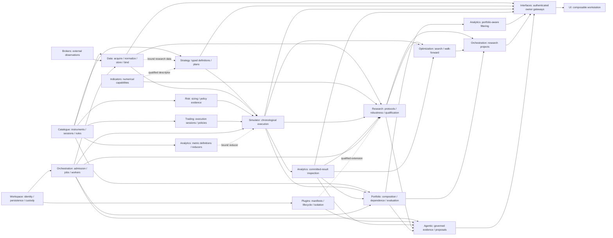
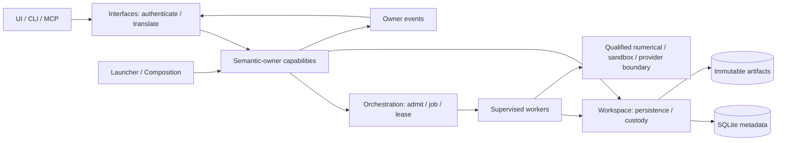

# HaruQuantAI

> **System path:** `HaruQuantAI/`
> **Status:** `Partial`
> **Last updated:** `2026-09-07`

> This document is the system-level source of truth for product scope, domain
> relationships, cross-domain workflows, system-wide requirements, and
> complete-system verification.
>
> [ARCHITECTURE.md](ARCHITECTURE.md) owns universal structural, runtime, and
> database constraints. Each owning package `README.md` is the canonical
> current-state registry for that package's features, functional requirements,
> public capabilities, state semantics, and acceptance evidence. `AGENTS.md`
> owns contributor and workflow rules, while
> [feature_implementation_pipeline.md](dev/feature_implementation_pipeline.md)
> owns the feature-delivery checklist.
>
> Do not duplicate domain-local requirements or implementation details here.
> Documentation, registration, and planned scope are not by themselves evidence
> of working behavior or runtime acceptance.

---

## 1. System Purpose and Boundary

### Purpose

HaruQuantAI is a local-first, deterministic platform for reproducible
quantitative research and separately governed trading integration. It enables
users to prepare and validate market data, author versioned strategies, run
chronological simulations and robustness or optimization studies, inspect
analytics, construct portfolios, automate bounded research, and export reviewed
artifacts. Chat Bot and specialist agents may explain verified evidence and
submit reviewable proposals, but deterministic domain owners remain authoritative
for accepted artifacts, numerical results, risk decisions, and execution.
Independently composable features and UI widgets can be enabled, replaced, or
removed without corrupting unrelated capabilities or retained evidence.
Paper, demo, or live activity requires a separately qualified operational
handoff; a successful research result does not imply profitability, Risk
approval, deployment, or live activation.

### System owns

- The complete research lifecycle from instrument and market-data preparation
  through strategy authoring, deterministic simulation, robustness testing,
  optimization, analytics, portfolio construction, and reviewed export.
- Immutable or versioned research artifacts, explicit lineage, reproducible
  numerical policies, complete attempt history, and truthful unavailable or
  inconclusive outcomes.
- Bounded project, job, worker, and Agentic workflows that operate through
  public owner capabilities, preserve evidence, and never acquire authority by
  inference.
- One governance model in which Risk owns risk authority, Trading owns shared
  execution-policy semantics, and simulators or broker adapters own only their
  route-specific mechanics.
- Local workspace custody and recovery, authenticated public interfaces, the
  user workstation, and safe lifecycle management for independently removable
  features and extensions.
- Explicitly configured and independently gated external-provider and
  operational integrations, with deterministic reconciliation, emergency
  controls, and fail-closed behavior.

### System does not own

- Market-data origination or external-service availability; broker-side order
  matching, settlement, custody, funding, deposits, or withdrawals.
- Guarantees of profitability, investment or regulatory advice, tax reporting,
  or broker statement production.
- Autonomous AI authority to approve risk, place or modify orders, clear a kill
  switch, deploy a strategy, or activate live trading.
- Arbitrary untrusted in-process execution, unrestricted host access, implicit
  cloud or model dependencies, unbounded work, or silent provider, precision,
  format, or execution-mode fallback.
- Copy or social trading, standalone learning or challenge backends, or exact
  reproduction of legacy user interfaces and plugin runtime interfaces.

### Primary users / actors

| Actor | Uses the system to |
| --- | --- |
| `Researcher / strategy developer` | Prepare data, define and evolve strategies, run reproducible experiments, and inspect evidence. |
| `Trading / risk operator` | Review risk, operate explicitly qualified trading routes, reconcile state, and invoke authorized emergency controls. |
| `Workspace administrator` | Recover workspaces, manage identities and settings, inspect health, and administer permitted providers, workers, and extensions. |
| `API / CLI / MCP client` | Invoke the same authenticated, permission-scoped owner operations exposed to the UI. |
| `Chat Bot / specialist agent` | Explain authorized evidence and submit attributed, reviewable proposals without acquiring owner authority. |
| `Admitted worker / sandbox` | Execute a finite immutable work descriptor, return verifiable outputs, and release its resources. |
| `External broker / data provider` | Supply observations or account state and, only through a qualified route, receive authorized execution requests. |

---

## 2. Domain Capability Map

The selected HaruQuantAI V3 scope contains **18 domains, 205 features, 575
owned functional requirements, and 276 feature-local non-functional
requirements**, as defined by the
[Feature–Requirement Traceability Register](dev/Feature_Requirement_Traceability_Register.md).
These are target-scope counts, not implementation or acceptance counts. Shared
requirements, catalogue entries, workflows, algorithms, roles, screens, and
tests do not become additional features merely because they are independently
traceable.


```mermaid
flowchart TD
    SYSTEM[[HaruQuantAI V3]]

    SYSTEM --> WS[[D-WS: Workspace]]
    SYSTEM --> CAT[[D-CAT: Catalogue]]
    SYSTEM --> BRK[[D-BRK: Brokers]]
    SYSTEM --> DATA[[D-DATA: Data]]
    SYSTEM --> IND[[D-IND: Indicators]]
    SYSTEM --> STRAT[[D-STRAT: Strategy]]
    SYSTEM --> RSK[[D-RSK: Risk]]
    SYSTEM --> TRD[[D-TRD: Trading]]
    SYSTEM --> ORCH[[D-ORCH: Orchestration]]
    SYSTEM --> SIM[[D-SIM: Simulator]]
    SYSTEM --> ANA[[D-ANA: Analytics]]
    SYSTEM --> RES[[D-RES: Research]]
    SYSTEM --> OPT[[D-OPT: Optimization]]
    SYSTEM --> POR[[D-POR: Portfolio]]
    SYSTEM --> PLUG[[D-PLUG: Plugins]]
    SYSTEM --> AGT[[D-AGT: Agentic]]
    SYSTEM --> IFACE[[D-IFACE: Interfaces]]
    SYSTEM --> UI[[D-UI: UI]]
```

### 2.1 Domain Registry

The registry follows the stable target decomposition and a broad capability
flow. It is not an instruction to complete whole domains sequentially: actual
dependencies are feature-level and the
[phased implementation plan](dev/Phased_Feature_Implementation_Plan.md)
controls delivery order. Each owning README is authoritative for its current
feature status and detailed scope.

| Domain | ID | Owning registry | Features | FRs | Local NFRs |
| --- | --- | --- | ---: | ---: | ---: |
| Workspace | `D-WS` | [README](../app/services/workspace/README.md) | 9 | 27 | 9 |
| Catalogue | `D-CAT` | [README](../app/services/catalogue/README.md) | 7 | 14 | 7 |
| Brokers | `D-BRK` | [README](../app/services/brokers/README.md) | 11 | 31 | 11 |
| Data | `D-DATA` | [README](../app/services/data/README.md) | 16 | 36 | 16 |
| Indicators | `D-IND` | [README](../app/services/indicators/README.md) | 7 | 21 | 14 |
| Strategy | `D-STRAT` | [README](../app/services/strategy/README.md) | 18 | 54 | 18 |
| Risk | `D-RSK` | [README](../app/services/risk/README.md) | 2 | 5 | 2 |
| Trading | `D-TRD` | [README](../app/services/trading/README.md) | 3 | 6 | 3 |
| Orchestration | `D-ORCH` | [README](../app/services/orchestration/README.md) | 8 | 26 | 9 |
| Simulator | `D-SIM` | [README](../app/services/simulator/README.md) | 7 | 23 | 8 |
| Analytics | `D-ANA` | [README](../app/services/analytics/README.md) | 11 | 34 | 11 |
| Research | `D-RES` | [README](../app/services/research/README.md) | 15 | 47 | 15 |
| Optimization | `D-OPT` | [README](../app/services/optimization/README.md) | 3 | 9 | 3 |
| Portfolio | `D-POR` | [README](../app/services/portfolio/README.md) | 7 | 20 | 7 |
| Plugins | `D-PLUG` | [README](../app/services/plugins/README.md) | 8 | 20 | 8 |
| Agentic | `D-AGT` | [README](../app/services/agentic/README.md) | 20 | 81 | 41 |
| Interfaces | `D-IFACE` | [README](../app/services/interfaces/README.md) | 15 | 32 | 30 |
| UI | `D-UI` | [README](../app/ui/README.md) | 38 | 89 | 64 |
| **Total** | **18 domains** | **18 registries** | **205** | **575** | **276** |

#### 2.1.1 Workspace — `D-WS`

- **Package / registry:** [`app/services/workspace/`](../app/services/workspace/README.md)
- **Responsibility:** Provide durable workspace identity, accounts, settings,
  artifact custody, and bounded persistence execution.
- **Inputs:** Authenticated workspace and account requests, owner migration and
  transaction commands, and staged artifact bytes.
- **Outputs:** Workspace, session, and settings revisions; custody receipts;
  scoped artifact grants; and recovery or diagnostic reports.
- **Owns:** Workspace lifecycle and writer fencing, bounded feature-owned
  persistence, immutable artifact custody, identities and sessions, secret
  references, settings, transcript retention, diagnostics, and distribution.
- **Boundaries:** Owns storage mechanics, not another domain's business schema,
  shared job lifecycle, metric formulas, or research decisions.
- **Key limits:** One fenced writer per workspace; bounded transactions and
  reference-aware retention; credentials remain opaque references.

#### 2.1.2 Catalogue — `D-CAT`

- **Package / registry:** [`app/services/catalogue/`](../app/services/catalogue/README.md)
- **Responsibility:** Version instrument identity, provider mappings, calendars,
  venue constraints, and conversion conventions.
- **Inputs:** Typed instrument, session, profile, and universe definitions plus
  point-in-time conversion observations.
- **Outputs:** Immutable instrument, calendar, mapping, cost, rule, and universe
  references plus causal conversion results.
- **Owns:** Stable identities and units, provider-symbol and broker-profile
  mappings, sessions, venue rules and costs, universes, currency conversion,
  and catalogue exchange.
- **Boundaries:** Does not fetch provider history, maintain broker connections,
  execute orders, calculate analytics, or repair source observations.
- **Key limits:** Explicit units, time zones, calendars, and as-of revisions; no
  future quote or silent symbol, provider, or profile substitution.

#### 2.1.3 Brokers — `D-BRK`

- **Package / registry:** [`app/services/brokers/`](../app/services/brokers/README.md)
- **Responsibility:** Expose explicitly selected external providers through
  bounded typed adapters with truthful capability and availability reporting.
- **Inputs:** Provider, account, and environment selections; opaque secret
  references; and authorized operation requests.
- **Outputs:** Provider-attributed observations, readiness, bounded receipts,
  and qualified operational outcomes where separately released.
- **Owns:** Selected provider adapters, provider resolution, connection behavior,
  and explicitly qualified market-feed extensions.
- **Boundaries:** Does not own historical-data publication, strategy meaning,
  Risk decisions, research qualification, or canonical Trading state.
- **Key limits:** Verify provider support, credentials, rate limits, and
  generation; reconcile unknown write outcomes before further exposure.

#### 2.1.4 Data — `D-DATA`

- **Package / registry:** [`app/services/data/`](../app/services/data/README.md)
- **Responsibility:** Acquire, normalize, version, inspect, retain, and bind
  trustworthy market and external evidence.
- **Inputs:** Authorized source artifacts or provider observations, Catalogue
  revisions, and explicit normalization, quality, and alignment policies.
- **Outputs:** Immutable dataset versions, quality and import receipts, causal
  bars or ticks, run bindings, and point-in-time evidence.
- **Owns:** Ingestion, normalization, storage, reference browsing, quality
  resolution, run-data binding, streaming, scenario generation, retention,
  connector synchronization, and supported external imports.
- **Boundaries:** Does not generate authoritative fills, calculate indicator
  formulas, own all application tables, or decide research qualification.
- **Key limits:** Immutable parts and bounded projected reads; preserve source
  ordering, missingness, availability, and recorded-versus-synthetic identity.

#### 2.1.5 Indicators — `D-IND`

- **Package / registry:** [`app/services/indicators/`](../app/services/indicators/README.md)
- **Responsibility:** Provide causal, versioned numerical indicators,
  transforms, candle patterns, and market-profile operations.
- **Inputs:** Typed buffers and masks, explicit parameters, input provenance,
  clocks, and incremental state.
- **Outputs:** Numerical results and owner-qualified native descriptors with
  warm-up, units, validity, and availability metadata.
- **Owns:** Trend, volatility, momentum, volume-flow, candle-pattern,
  market-profile, and general series-transform calculations.
- **Boundaries:** Does not retrieve data, author strategy policy, own
  executions, or grant research or trading approval.
- **Key limits:** No look-ahead; finite state; exact or declared Float64 policy;
  qualified native execution rather than silent object-mode fallback.

#### 2.1.6 Strategy — `D-STRAT`

- **Package / registry:** [`app/services/strategy/`](../app/services/strategy/README.md)
- **Responsibility:** Own typed strategy meaning, immutable revisions, reusable
  blocks and templates, compilation, exchange, and export.
- **Inputs:** Typed strategy drafts and patches, reviewed candidate hashes,
  catalogue and numerical descriptors, proposals, and exchange requests.
- **Outputs:** Validated revisions, target-neutral plans, diagnostics, intake
  receipts, and attributed generated artifacts.
- **Owns:** Strategy AST validation, block catalogues, chart bindings, revisions,
  reviewed patches, templates, search spaces, exits, architectures, indicator
  references, compilation, exchange, generation support, and proposal intake.
- **Boundaries:** Does not own indicator formulas, market data, fills, research
  qualification, portfolio approval, broker orders, or live deployment.
- **Key limits:** One native AST and dependency-safe patch acceptance; unknown
  executable semantics remain inspectable but unrunnable.

#### 2.1.7 Risk — `D-RSK`

- **Package / registry:** [`app/services/risk/`](../app/services/risk/README.md)
- **Responsibility:** Provide deterministic position sizing and authorized
  research-risk evidence while preserving Risk policy authority.
- **Inputs:** Pinned account, instrument, cost, and risk inputs plus authorized
  review requests and self-contained allocation evidence.
- **Outputs:** Legal size or rejection evidence and owner-authored risk
  projections; operational approval only through separately qualified policy.
- **Owns:** Position sizing on declared risk bases and legal quantity lattices,
  plus authorized read-only assessment of current risk evidence.
- **Boundaries:** Does not dispatch broker operations, schedule execution,
  construct portfolios, or delegate approval and kill-switch authority to AI.
- **Key limits:** Fail closed on stale, absent, non-finite, or mismatched inputs;
  checked arithmetic, legal quantities, and no advisory-as-approval.

#### 2.1.8 Trading — `D-TRD`

- **Package / registry:** [`app/services/trading/`](../app/services/trading/README.md)
- **Responsibility:** Own execution-session boundaries and shared
  execution-policy semantics while preserving existing Trading authority.
- **Inputs:** Explicit route, session, and profile references; Strategy intents;
  current Risk decisions; and selected execution-authority receipts.
- **Outputs:** Session and policy references, mature outcome projections, and,
  for qualified operations, canonical operational state and journals.
- **Owns:** Research-compatible execution sessions and account policies,
  deterministic execution and position-ownership rules, and authorized
  post-horizon outcome observation.
- **Boundaries:** Does not duplicate Simulator mechanics, Analytics formulas, or
  Research qualification and never grants itself Risk authority.
- **Key limits:** No implicit route selection, blind retry after unknown dispatch,
  or LLM in the execution path; preserve safety until explicitly reconciled.

#### 2.1.9 Orchestration — `D-ORCH`

- **Package / registry:** [`app/services/orchestration/`](../app/services/orchestration/README.md)
- **Responsibility:** Own finite resource admission, durable jobs and workers,
  and user-authored research-project execution.
- **Inputs:** Immutable work descriptors, capability snapshots, resource
  profiles, typed project graphs, and owner receipts.
- **Outputs:** Admission, lease, job, attempt, and checkpoint records; control
  evidence; project outcomes; and notification receipts.
- **Owns:** Project definitions and runs, jobs, local and remote workers,
  resource reservations, notifications, and bounded utility execution.
- **Boundaries:** Does not replace Composition lifecycle management, make domain
  numerical decisions, or hide domain workflows inside Interfaces.
- **Key limits:** One hierarchical resource ledger; lazy work generation;
  current-fence commitment; bounded loops, retries, queues, and waits.

#### 2.1.10 Simulator — `D-SIM`

- **Package / registry:** [`app/services/simulator/`](../app/services/simulator/README.md)
- **Responsibility:** Own historical tick construction, chronological execution
  mechanics, run-local state, and committed simulation results.
- **Inputs:** Compiled Strategy plans, immutable Data bindings, an explicit tick
  method, and owner-qualified Risk, Trading, and numerical policies.
- **Outputs:** Ordered tick, order, fill, and accounting evidence; checkpoints;
  and immutable complete or explicitly partial results.
- **Owns:** Engine configuration, recorded or generated tick methods, native tick
  execution, result commitment, exact evaluation reuse, perturbations, and
  point-in-time stock-selection simulation.
- **Boundaries:** Does not own Trading business policy, operational Risk
  authorization, metric definitions, research qualification, or broker authority.
- **Key limits:** Explicit ticks for every run, bounded native slices, no
  bar-only substitution, and no future-data leakage.

#### 2.1.11 Analytics — `D-ANA`

- **Package / registry:** [`app/services/analytics/`](../app/services/analytics/README.md)
- **Responsibility:** Turn accepted owner results into reproducible metrics,
  queries, comparisons, projections, and inspectable collections.
- **Inputs:** Committed result, ledger, and series references; versioned metric
  definitions; and authorized query or selection requests.
- **Outputs:** Metrics with units and undefined reasons, cursor pages, labelled
  display projections, comparisons, analyses, and reports.
- **Owns:** Canonical metrics, bounded result queries, databank membership, trade
  analysis, projections, result comparison and exchange, verified external
  ledgers, custom analysis access, and distribution analysis.
- **Boundaries:** Does not run simulations, mutate source results, choose
  research qualification, or own Portfolio dependence formulas.
- **Key limits:** Bounded pages and projections, no undefined-to-zero
  substitution, and no decision-grade metric changes through downsampling.

#### 2.1.12 Research — `D-RES`

- **Package / registry:** [`app/services/research/`](../app/services/research/README.md)
- **Responsibility:** Own campaigns, protocols, holdout scarcity, strategy
  generation, robustness, qualification, and neural research.
- **Inputs:** Falsifiable objectives, immutable candidate and data families,
  sample, cost, baseline, and budget policy, and owner-produced results.
- **Outputs:** Conserved attempt histories, protocol and holdout receipts,
  qualified or rejected research, model cards, and inference artifacts.
- **Owns:** Research protocols and campaigns, holdouts, strategy generation and
  evolution, ranking, robustness, qualification, and governed neural-data,
  training, validation, inference, and explanation workflows.
- **Boundaries:** Does not fabricate Simulator or Analytics evidence, own
  parameter-search mechanics, construct portfolios, or activate live trading.
- **Key limits:** Preregister finite work, protect final holdout evidence, retain
  failed, null, and refused trials, and fit only on training information.

#### 2.1.13 Optimization — `D-OPT`

- **Package / registry:** [`app/services/optimization/`](../app/services/optimization/README.md)
- **Responsibility:** Own bounded parameter search, walk-forward validation, and
  parameter-permutation mechanics.
- **Inputs:** Typed legal parameter spaces, immutable protocols and run settings,
  finite budgets, and explicit objective definitions.
- **Outputs:** Complete trial and fold histories, selected parameter candidates,
  search surfaces, and sensitivity evidence.
- **Owns:** Parameter permutation, bounded search, and walk-forward validation.
- **Boundaries:** Does not silently revise Strategy, allocate independent
  holdout looks, or implement another simulation or metric engine.
- **Key limits:** Count the exact legal lattice before allocation, evaluate
  lazily, retain losing trials, and prevent out-of-sample selection leakage.

#### 2.1.14 Portfolio — `D-POR`

- **Package / registry:** [`app/services/portfolio/`](../app/services/portfolio/README.md)
- **Responsibility:** Own composition, weighting, dependence analysis,
  portfolio search, and capital-aware evaluation.
- **Inputs:** Immutable constituent strategies or results, aligned returns, and
  explicit cash, weight, currency, calendar, and rebalance constraints.
- **Outputs:** Portfolio revisions, correlation and covariance evidence, weight
  proposals, combined results, and expiring risk projections.
- **Owns:** Correlation and risk analysis, portfolio composition and merging,
  portfolio search and simulation, and weight optimization.
- **Boundaries:** Does not issue Risk authority, place orders, or describe
  independent ledger summation as shared-capital simulation.
- **Key limits:** Distinguish aggregation from resimulation, never silently relax
  constraints, and keep undefined dependence unavailable.

#### 2.1.15 Plugins — `D-PLUG`

- **Package / registry:** [`app/services/plugins/`](../app/services/plugins/README.md)
- **Responsibility:** Own package and contribution lifecycle, compatibility,
  scoped resource authoring, and untrusted execution isolation.
- **Inputs:** Versioned manifests, immutable authorized resources, requested
  permissions, and compatibility evidence.
- **Outputs:** Validated contributions, exact disposer handles, isolation or
  build receipts, and lifecycle and compatibility reports.
- **Owns:** Manifests, package authoring, contribution registration, lifecycle,
  compatibility, sandbox permissions, isolated analysis, and result panels.
- **Boundaries:** Does not grant trading approval, own another domain's numerical
  meaning, or treat successful compilation as installation.
- **Key limits:** Deny by default; bound paths, egress, and resources; quarantine
  first; distinguish pre-commit rollback from post-commit degradation.

#### 2.1.16 Agentic — `D-AGT`

- **Package / registry:** [`app/services/agentic/`](../app/services/agentic/README.md)
- **Responsibility:** Provide governed Chat Bot and specialist reasoning,
  evidence-backed research assistance, and reviewable proposals.
- **Inputs:** Current mandates, eligible roles and models, authenticated typed
  context, exact owner evidence, and finite parent budgets.
- **Outputs:** Typed claims, attributed answers, dissent or refusals, reviewed
  research or strategy proposals, and audited receiver receipts.
- **Owns:** Mandates, traces and incidents, roles, tool and model governance,
  durable workflows, context and memory, evaluation, Chat Bot, claims,
  deliberation, synthesis, research design, proposals, and calibration.
- **Boundaries:** Does not create execution truth, hold broker credentials,
  approve Risk, clear kill switches, or autonomously deploy strategies.
- **Key limits:** Deterministic tool and role authorization, point-in-time
  grounding, bounded delegation, and no prose-triggered mutation or silent model
  substitution.

#### 2.1.17 Interfaces — `D-IFACE`

- **Package / registry:** [`app/services/interfaces/`](../app/services/interfaces/README.md)
- **Responsibility:** Expose authenticated, compatible HTTP and event gateways
  plus explicitly qualified CLI and MCP automation over public capabilities.
- **Inputs:** Wire requests, session credentials, idempotency and revision
  metadata, and stream cursors.
- **Outputs:** Stable API envelopes, translated owner receipts, resumable events,
  and explicit denied or unavailable outcomes.
- **Owns:** Transport, identity, market-reference, result, job, optimization,
  capability, portfolio, project, research, settings, simulation, strategy,
  Agentic, and permission-scoped automation gateways.
- **Boundaries:** Does not calculate domain results, parse domain files, write
  business tables, or privately orchestrate multi-step research.
- **Key limits:** Bounded transport work, authorization before dispatch,
  explicit capability absence, and compatible public contracts.

#### 2.1.18 UI — `D-UI`

- **Package / registry:** [`app/ui/`](../app/ui/README.md)
- **Responsibility:** Compose an accessible workstation from independently owned
  visual feature contributions.
- **Inputs:** Typed Interfaces projections, capability metadata, user gestures,
  safe layout state, and fresh per-turn context.
- **Outputs:** Accessible views, reviewed typed commands, layouts and drafts, and
  bounded observation or context contributions.
- **Owns:** The application shell and layout plus feature-owned workspaces,
  editors, builders, grids, charts, monitors, inspectors, result views, settings,
  Chat Bot, and research, simulation, analysis, and portfolio tools.
- **Boundaries:** Does not become business policy, market time, permission,
  strategy state, execution state, or metric authority.
- **Key limits:** Virtualized or paged views, precise widget removal, fresh
  context, and separate observer cleanup from cancellation of accepted work.

### 2.2 Domain ownership rule

```text
Product scope → one semantic domain owner → one feature/removal owner
             → one focused responsibility → stable requirements and evidence
```

Each product responsibility has one semantic domain owner, and each independently
removable capability has one feature owner. A feature may contain several
algorithms, roles, widgets, tests, or release gates when they contribute to that
single capability; those elements are not separate feature identities by default.
Other domains consume the capability through public contracts and must not
duplicate its business logic or import its private implementation.

`app/kernel/`, `app/contracts/`, and `app/composition/` are shared structural
packages, not product domains or alternative feature registries. Existing utility
behavior and product capabilities outside the selected register are not deleted
by omission; they require explicit owner-preserving reconciliation.

The selected IDs `D-RSK` and `D-POR`, the plural
`app/services/brokers/` package, and the singular `app/contracts/broker/`
namespace are intentional. Persisted identifiers and public namespaces are
compatibility-sensitive and must not be changed by blind renaming.

---

## 3. Domain Dependency Diagram

Arrows point **from a provider capability to its consumer**. They describe
public capability direction, not permission to import another service's
implementation. Exact activation and delivery order is feature-level; this
domain diagram is a readable projection and does not replace the complete
required-provider graph or the phased implementation plan.

A domain can provide a foundational capability through one feature and consume
a higher-level result through another. Analytics and Orchestration are therefore
split into role-specific nodes below so the diagram does not invent a circular
feature dependency or imply that an entire domain must be completed as one unit.


```mermaid
flowchart LR
    WS["Workspace: identity / persistence / custody"] --> OR0["Orchestration: admission / jobs / workers"]
    WS --> PLUG["Plugins: manifests / lifecycle / isolation"]

    CAT["Catalogue: instruments / sessions / rules"] --> DATA["Data: acquire / normalize / store / bind"]
    BRK["Brokers: external observations"] --> DATA
    OR0 --> DATA

    CAT --> STRAT["Strategy: typed definitions / plans"]
    DATA -. "bound research data" .-> STRAT
    IND["Indicators: numerical capabilities"] -. "qualified descriptor" .-> STRAT

    CAT --> RSK["Risk: sizing / policy evidence"]
    CAT --> TRD["Trading: execution sessions / policies"]
    STRAT --> SIM["Simulator: chronological execution"]
    DATA --> SIM
    RSK --> SIM
    TRD --> SIM
    OR0 --> SIM
    CAT --> ANA0["Analytics: metric definitions / reducers"]
    ANA0 -. "bound reducer" .-> SIM

    SIM --> ANA1["Analytics: committed-result inspection"]
    DATA --> RES["Research: protocols / robustness / qualification"]
    IND --> RES
    SIM --> RES
    ANA1 --> RES
    OR0 --> RES
    PLUG -. "qualified extension" .-> RES

    RES --> OPT["Optimization: search / walk-forward"]
    SIM --> OPT
    ANA1 --> OPT

    CAT --> POR["Portfolio: composition / dependence / evaluation"]
    SIM --> POR
    ANA1 --> POR
    OR0 --> POR
    POR --> ANA2["Analytics: portfolio-aware filtering"]

    RES --> OR1["Orchestration: research projects"]
    OPT --> OR1
    POR --> OR1

    OR0 --> AGT["Agentic: governed evidence / proposals"]
    PLUG --> AGT
    ANA1 --> AGT
    RES --> AGT
    POR --> AGT

    DATA --> IFACE["Interfaces: authenticated owner gateways"]
    STRAT --> IFACE
    SIM --> IFACE
    ANA1 --> IFACE
    ANA2 --> IFACE
    OR1 --> IFACE
    AGT --> IFACE
    IFACE --> UI["UI: composable workstation"]
```

Dashed edges represent descriptor, contribution, or operation-specific
integration rather than an unconditional activation dependency. UI and
Interfaces also deliver early vertical slices; their rightmost position shows
the external interaction boundary, not a requirement to postpone all of their
implementation until every upstream domain is complete.

The [traceability register](dev/Feature_Requirement_Traceability_Register.md)
contains the authoritative acyclic graph of **476 required feature-provider
edges** and a separate inventory of **233 operation-gated relationships**. The
[phased implementation plan](dev/Phased_Feature_Implementation_Plan.md) preserves
the required graph and identifies 38 operation-time relationships whose real
providers arrive in later phases. Provider absence blocks only the applicable
operation where specified; required dependencies cannot be weakened merely to
avoid a cycle or meet a delivery date.

Dependency rules:

- Cross-domain calls use declared public capabilities, receiver-owned requests,
  immutable evidence, or typed events. Private implementation imports and
  direct writes to another domain's state are prohibited.
- Required feature dependencies must remain acyclic and are validated before
  activation. A callback, event, or injected authority does not reverse static
  implementation dependency.
- Shared packages never import service implementations; application contracts
  remain outside removable feature packages; sibling features do not import
  one another's implementations.
- Composition owns feature discovery, activation, replacement, and lifecycle
  reconciliation. Orchestration owns product jobs, workers, resource admission,
  and user-authored project execution; neither substitutes for the other.
- Risk remains independent of Portfolio activation. Portfolio-aware assessment
  submits immutable, self-contained evidence through Risk's public boundary
  rather than creating a required `Portfolio → Risk` service dependency.
- Analytics may provide lower-level metric capabilities to Portfolio while a
  separate Analytics feature consumes Portfolio projections. These feature
  edges remain acyclic even though collapsing them into whole-domain nodes would
  appear bidirectional.

---

## 4. Cross-Domain Workflows

This section owns system-level sequencing, handoffs, outcomes, and failure boundaries. Feature-local
steps remain authoritative in the owning package READMEs, and the exact participant sets and
acceptance text remain traceable in the
[Feature–Requirement Traceability Register](dev/Feature_Requirement_Traceability_Register.md).
Workflow registration does not create another feature or transfer authority from a participating
domain to the workflow lead.

### 4.1 Status and canonical inventory

| Status | Meaning |
| --- | --- |
| `PENDING` | The workflow is specified, but complete end-to-end acceptance is not established. |
| `PARTIAL` | Some system evidence passes, but a required provider, interaction, failure path, or oracle is incomplete. |
| `ACCEPTED` | The complete outcome, required providers, failure/recovery paths, and named oracle pass against one commit. |

All 20 canonical workflows are currently `PENDING` in the traceability register. Seventeen have
participants from two or more domains. Three contain only Agentic participants and are retained here
as canonical cross-feature references; their internal recipes remain in the Agentic README.

| Scope | Workflow | Outcome | Lead | Gate | Domains | Acceptance |
| --- | --- | --- | --- | --- | --- | --- |
| Cross-domain | [`WF-WB-GENERATE_QUALIFY`](#wf-wb-generate-qualify) | Generate and qualify strategies | Research | `U5` | Research, UI, Data, Strategy, Simulator, Analytics | `ATW-WB-GENERATE_QUALIFY` |
| Cross-domain | [`WF-WB-RETEST`](#wf-wb-retest) | Retest robustness | Research | `U4` | Research, Simulator, Analytics, UI | `ATW-WB-RETEST` |
| Cross-domain | [`WF-WB-OPTIMIZE_PROMOTE`](#wf-wb-optimize-promote) | Optimize and explicitly promote | Optimization | `U6` | Optimization, Research, Simulator, Analytics, Strategy, UI | `ATW-WB-OPTIMIZE_PROMOTE` |
| Cross-domain | [`WF-WB-PORTFOLIO`](#wf-wb-portfolio) | Compose and evaluate a portfolio | Portfolio | `U7` | Portfolio, UI, Analytics | `ATW-WB-PORTFOLIO` |
| Cross-domain | [`WF-WB-PROJECT`](#wf-wb-project) | Automate a research project | Orchestration | `U8` | Orchestration, Research, Optimization, Portfolio, UI | `ATW-WB-PROJECT` |
| Cross-domain | [`WF-WB-EXTEND_ANALYSIS`](#wf-wb-extend-analysis) | Develop and install analysis safely | Plugins | `U9` | Plugins, Analytics, UI | `ATW-WB-EXTEND_ANALYSIS` |
| Cross-domain | [`WF-WB-CHAT_REVIEW`](#wf-wb-chat-review) | Review a real result through Chat Bot | Agentic | `U2` | Agentic, UI, Interfaces, Analytics, Workspace | `ATW-WB-CHAT_REVIEW` |
| Cross-domain | [`WF-WB-IDEA_TO_STRATEGY`](#wf-wb-idea-to-strategy) | Research idea to reviewed strategy | Agentic | `U3` | Agentic, Research, Strategy, Interfaces, UI, Simulator | `ATW-WB-IDEA_TO_STRATEGY` |
| Cross-domain | [`WF-AGT-ASSIST_OPERATOR`](#wf-agt-assist-operator) | Context-Aware Chat Bot | Agentic | `U2` | Agentic, UI, Interfaces, Workspace | `ATW-AGT-ASSIST_OPERATOR` |
| Cross-domain | [`WF-AGT-REVIEW_EVIDENCE`](#wf-agt-review-evidence) | Deterministic Evidence Review | Agentic | `U2` | Agentic, Analytics | `ATW-AGT-REVIEW_EVIDENCE` |
| Agentic-local | [`WF-AGT-RESEARCH_OBJECTIVE`](#agentic-local-workflows) | Adaptive Research Council | Agentic | `U4` | Agentic | `ATW-AGT-RESEARCH_OBJECTIVE` |
| Cross-domain | [`WF-AGT-DESIGN_RESEARCH`](#wf-agt-design-research) | Hypothesis to Receiver Request | Agentic | `U3` | Agentic, Research | `ATW-AGT-DESIGN_RESEARCH` |
| Cross-domain | [`WF-AGT-GOVERNED_SEARCH`](#wf-agt-governed-search) | Bounded Optimization Design | Agentic | `U6` | Agentic, Research, Optimization | `ATW-AGT-GOVERNED_SEARCH` |
| Cross-domain | [`WF-AGT-COMPOSE_STRATEGY_SPEC`](#wf-agt-compose-strategy-spec) | JSON DSL Candidate | Agentic | `U3` | Agentic, Strategy | `ATW-AGT-COMPOSE_STRATEGY_SPEC` |
| Cross-domain | [`WF-AGT-ADVISE_PORTFOLIO`](#wf-agt-advise-portfolio) | Portfolio and Risk Advisory | Agentic | `U7` | Agentic, Portfolio, Risk | `ATW-AGT-ADVISE_PORTFOLIO` |
| Cross-domain | [`WF-AGT-COMPOSE_STRATEGY_PROPOSAL`](#wf-agt-compose-strategy-proposal) | Strategy Proposal Handoff | Agentic | `U3` | Agentic, Strategy | `ATW-AGT-COMPOSE_STRATEGY_PROPOSAL` |
| Cross-domain | [`WF-AGT-AUTHOR_SANDBOX_ARTIFACT`](#wf-agt-author-sandbox-artifact) | Sandbox Code Fallback | Agentic | `U9` | Agentic, Plugins, Workspace | `ATW-AGT-AUTHOR_SANDBOX_ARTIFACT` |
| Agentic-local | [`WF-AGT-EVALUATE_PROFILE`](#agentic-local-workflows) | Profile and Topology Evaluation | Agentic | `U2` | Agentic | `ATW-AGT-EVALUATE_PROFILE` |
| Cross-domain | [`WF-AGT-CALIBRATE_OUTCOME`](#wf-agt-calibrate-outcome) | Post-Horizon Calibration | Agentic | `U8` | Agentic, Trading, Analytics | `ATW-AGT-CALIBRATE_OUTCOME` |
| Agentic-local | [`WF-AGT-RESPOND_INCIDENT`](#agentic-local-workflows) | Incident and Safe Recovery | Agentic | `U1` | Agentic | `ATW-AGT-RESPOND_INCIDENT` |

### 4.2 Cross-domain workflow contracts

The cards below define only the system contract: trigger, input, domain handoff, final oracle, and
failure behavior. Exact feature participants remain in the traceability register and owning READMEs.
Every listed test path is an intended acceptance location, not a claim that the file exists or passes.

<a id="wf-wb-generate-qualify"></a>
#### `WF-WB-GENERATE_QUALIFY` — Generate and qualify strategies

- **Lead / trigger:** [Research](../app/services/research/README.md#feat-res-run-research) when a
  researcher accepts a Builder plan.
- **Input:** Pinned candidate space, data, sample and cost profiles, seed, and finite budget.
- **Flow:** Research preregisters the campaign and protocol; Strategy validates the construction
  space; Orchestration admits bounded trials; Simulator and Analytics produce evidence; Research
  applies filters, robustness, and qualification; Analytics commits reviewed databank membership.
- **Success — `ATW-WB-GENERATE_QUALIFY`:** Every candidate has simulation, filter, and stage history,
  and only qualified committed result references enter the destination databank.
- **Failure:** Invalid grammar and exhausted budgets are counted outcomes; incomplete stages cannot
  become qualification or accepted membership.
- **System test:** `tests/system/integration/test_wf_wb_generate_qualify.py`.

<a id="wf-wb-retest"></a>
#### `WF-WB-RETEST` — Retest robustness

- **Lead / trigger:** [Research](../app/services/research/README.md#feat-res-test-robustness) when a
  researcher requests a Retester evaluation.
- **Input:** Immutable source population, baseline results, and an explicit effective override diff.
- **Flow:** Research resolves the ordered robustness plan; Simulator performs the requested reruns;
  Analytics performs paired comparisons; Research retains every stage outcome and qualification
  reason; Analytics applies the reviewed membership policy atomically.
- **Success — `ATW-WB-RETEST`:** Source hashes, ordered scenarios, paired metric deltas, cancellation,
  and complete pass/fail membership reasons are retained.
- **Failure:** Cancellation preserves partial evidence; a statistical reshuffle is never described as
  a chronological tick backtest.
- **System test:** `tests/system/integration/test_wf_wb_retest.py`.

<a id="wf-wb-optimize-promote"></a>
#### `WF-WB-OPTIMIZE_PROMOTE` — Optimize and explicitly promote

- **Lead / trigger:** [Optimization](../app/services/optimization/README.md#feat-opt-search-parameters)
  when a researcher starts a finite search and later reviews a candidate.
- **Input:** Legal parameter lattice, protocol, fit and out-of-sample windows, tick method, and budget.
- **Flow:** Optimization counts the legal space; Research binds holdout authority; Orchestration admits
  trials; Simulator and Analytics produce complete evidence; Optimization publishes all outcomes;
  Research qualifies independently; Strategy creates a new revision only after exact review.
- **Success — `ATW-WB-OPTIMIZE_PROMOTE`:** All trials and folds remain visible, the holdout stays
  protected, and promotion creates a reviewed new revision without changing the base.
- **Failure:** Undefined, pruned, and failed trials remain recorded; stale revisions or changed review
  scope conflict instead of overwriting the source.
- **System test:** `tests/system/integration/test_wf_wb_optimize_promote.py`.

<a id="wf-wb-portfolio"></a>
#### `WF-WB-PORTFOLIO` — Compose and evaluate a portfolio

- **Lead / trigger:** [Portfolio](../app/services/portfolio/README.md#feat-por-compose-portfolios) when
  a researcher composes or searches a portfolio.
- **Input:** Exact constituent versions, weights, cash, currency, calendar, sample, and rebalance policy.
- **Flow:** Portfolio validates compatibility and obtains aligned dependence evidence; Orchestration
  admits bounded search; fixed-ledger aggregation remains distinct from shared-capital Simulator
  execution; Portfolio stores the reviewed definition and Analytics exposes accepted collections.
- **Success — `ATW-WB-PORTFOLIO`:** Cash, currency, calendar, sample, size, weights, constituents,
  results, benchmark provenance, and aggregation-versus-resimulation mode are explicit.
- **Failure:** Missing constituents, infeasible constraints, or undefined dependence return diagnostics;
  no silent normalization, constraint relaxation, or live allocation occurs.
- **System test:** `tests/system/integration/test_wf_wb_portfolio.py`.

<a id="wf-wb-project"></a>
#### `WF-WB-PROJECT` — Automate a research project

- **Lead / trigger:** [Orchestration](../app/services/orchestration/README.md#feat-orch-run-projects)
  when an operator starts a reviewed project scope.
- **Input:** Pinned graph revision, whole/from-here/only selection, inputs, and finite resource bounds.
- **Flow:** Orchestration validates and persists the graph; each node invokes its semantic owner;
  accepted receipts attach to attempts; conditions use recorded snapshots; uncertain effects reconcile
  before retry; terminal lineage and authorized notifications are retained.
- **Success — `ATW-WB-PROJECT`:** Selection preview, typed graph, child receipts, retry attempts, crash
  recovery, and bidirectional lineage prove exactly one accepted effect per logical child action.
- **Failure:** Restart cannot duplicate an accepted effect; unsupported pause, unbounded loops, and
  stale inputs fail explicitly.
- **System test:** `tests/system/integration/test_wf_wb_project.py`.

<a id="wf-wb-extend-analysis"></a>
#### `WF-WB-EXTEND_ANALYSIS` — Develop and install analysis safely

- **Lead / trigger:** [Plugins](../app/services/plugins/README.md#feat-plug-manage-lifecycle) when a
  developer proposes an analysis package installation.
- **Input:** Authorized resource revision, manifest, selected toolchain, and permission proposal.
- **Flow:** Plugins validates the manifest and obtains an isolation lease; Workspace supplies artifact
  custody; isolated build and test produce hashes and diagnostics; a separate reviewed action enables
  contributions; Analytics exposes only permitted projections; removal disposes the exact generation.
- **Success — `ATW-WB-EXTEND_ANALYSIS`:** Build/test remains separate from install/enable, hostile panel
  behavior is contained, and uninstall preserves canonical results.
- **Failure:** Compilation grants no installation authority; pre-commit rollback and post-commit
  degradation remain distinct and attributable.
- **System test:** `tests/system/integration/test_wf_wb_extend_analysis.py`.

<a id="wf-wb-chat-review"></a>
#### `WF-WB-CHAT_REVIEW` — Review a real result through Chat Bot

- **Lead / trigger:** [Agentic](../app/services/agentic/README.md#feat-agt-assist-operator) when a user
  asks Chat Bot about a selected result.
- **Input:** Fresh typed widget context and the current authenticated conversation scope.
- **Flow:** UI captures references; Interfaces verifies identity, generation, TTL, and redaction;
  Agentic refreshes material facts from Analytics and produces attributed claims; Workspace stores the
  conversation separately from canonical result and claim evidence.
- **Success — `ATW-WB-CHAT_REVIEW`:** Even if the browser display is wrong, the answer refreshes owner
  truth, cites exact evidence, and preserves specialist attribution.
- **Failure:** Stale, denied, or missing evidence produces an unavailable or refused result, never a
  guessed fact derived from the browser display.
- **System test:** `tests/system/integration/test_wf_wb_chat_review.py`.

<a id="wf-wb-idea-to-strategy"></a>
#### `WF-WB-IDEA_TO_STRATEGY` — Research idea to reviewed strategy

- **Lead / trigger:** [Agentic](../app/services/agentic/README.md#feat-agt-compose-strategy-specs) when a
  user describes an idea and reviews a generated draft or patch.
- **Input:** Typed objective, explicit assumptions, allowed blocks, and exact base revision for patches.
- **Flow:** Agentic forms a falsifiable hypothesis and obtains Research identities; Strategy validates
  the typed strategy and supplies bounded repair diagnostics; UI presents the exact candidate and
  dependency closure; Strategy accepts a reviewed revision; simulation requires a separate command.
- **Success — `ATW-WB-IDEA_TO_STRATEGY`:** Assumptions, validation, repair, exact patch review, atomic
  revision acceptance, and separately authorized bounded simulation are all visible.
- **Failure:** Unsupported semantics return a structured gap; any candidate, base, or selection change
  invalidates review; saving grants no holdout, deployment, or live authority.
- **System test:** `tests/system/integration/test_wf_wb_idea_to_strategy.py`.

<a id="wf-agt-assist-operator"></a>
#### `WF-AGT-ASSIST_OPERATOR` — Context-Aware Chat Bot

- **Lead / trigger:** [Agentic](../app/services/agentic/README.md#feat-agt-assist-operator) when a user
  submits a Chat Bot turn.
- **Input:** Fresh verified context, mandate, eligible role and model, and finite request budget.
- **Flow:** Interfaces validates identity and Workspace scope; Agentic deterministically selects direct
  assistance or an eligible specialist; only governed tools and models run; one attributed terminal
  artifact returns through the public gateway.
- **Success — `ATW-AGT-ASSIST_OPERATOR`:** The reply preserves evidence, attribution, refusals, and the
  chosen route without allowing prose-triggered mutation.
- **Failure:** Stale context, denied routes, or provider loss remain explicit; closing the widget stops
  observation but does not cancel already accepted owner work.
- **System test:** `tests/system/integration/test_wf_agt_assist_operator.py`.

<a id="wf-agt-review-evidence"></a>
#### `WF-AGT-REVIEW_EVIDENCE` — Deterministic Evidence Review

- **Lead / trigger:** [Agentic](../app/services/agentic/README.md#feat-agt-run-workflows) when an
  authorized client requests review of exact evidence references.
- **Input:** Owner result or document references and a point-in-time cutoff.
- **Flow:** Agentic obtains authorized evidence through owner capabilities, separates facts and
  deterministic derivations from model inference, and produces synthesis that retains unsupported or
  contested findings.
- **Success — `ATW-AGT-REVIEW_EVIDENCE`:** Immutable owner evidence produces typed claims and a cited
  synthesis with preserved uncertainty.
- **Failure:** Missing mandatory evidence yields refusal; the model cannot recompute an owner metric or
  invent a citation.
- **System test:** `tests/system/integration/test_wf_agt_review_evidence.py`.

<a id="wf-agt-design-research"></a>
#### `WF-AGT-DESIGN_RESEARCH` — Hypothesis to Receiver Request

- **Lead / trigger:** [Agentic](../app/services/agentic/README.md#feat-agt-design-research) when a user
  requests a falsifiable experiment design.
- **Input:** Hypothesis scope, horizon, mechanism, evidence, and explicit assumptions.
- **Flow:** Agentic obtains Research campaign and family identities and composes protocol fields;
  Research validates the sample, costs, baseline, falsifier, and stopping rules; the governed handoff
  returns the exact candidate or receiver receipt without starting execution.
- **Success — `ATW-AGT-DESIGN_RESEARCH`:** The hypothesis, sample, costs, seed, baseline, falsifier,
  finite limits, owner schema, and separate execution authority are explicit.
- **Failure:** Missing material protocol fields are invalid; proposal composition cannot spend holdout
  evidence or authorize compute.
- **System test:** `tests/system/integration/test_wf_agt_design_research.py`.

<a id="wf-agt-governed-search"></a>
#### `WF-AGT-GOVERNED_SEARCH` — Bounded Optimization Design

- **Lead / trigger:** [Agentic](../app/services/agentic/README.md#feat-agt-govern-research-search) when a
  user requests a reviewed Optimization search.
- **Input:** Research identities, legal search request, holdout reservation, and remaining parent budget.
- **Flow:** Agentic verifies role, tool, action, and family accounting; Research reserves scarce
  information access; Optimization accepts the unchanged finite request; retries reconcile accepted
  attempts and actual usage; synthesis reports all relevant outcomes.
- **Success — `ATW-AGT-GOVERNED_SEARCH`:** Same-family variants, receiver retries, holdout receipts,
  accepted attempts, actual cost, and every outcome reconcile under one budget.
- **Failure:** Changing a model, prompt, or hash cannot reset consumed budget or restore an exposed
  out-of-sample set to untouched status.
- **System test:** `tests/system/integration/test_wf_agt_governed_search.py`.

<a id="wf-agt-compose-strategy-spec"></a>
#### `WF-AGT-COMPOSE_STRATEGY_SPEC` — JSON DSL Candidate

- **Lead / trigger:** [Agentic](../app/services/agentic/README.md#feat-agt-compose-strategy-specs) when a
  user requests typed strategy composition or a reviewed patch.
- **Input:** Registered Strategy catalogue, approved behavior, and revision-bound candidate scope.
- **Flow:** Agentic composes a typed research draft with assumptions; Strategy validates the complete
  language and reports unsupported expressions; exact review precedes owner intake; campaign,
  role/model/prompt, schema, and receiver lineage are retained.
- **Success — `ATW-AGT-COMPOSE_STRATEGY_SPEC`:** Research-draft status, support evidence, owner intake
  receipt, and any structured language gap are explicit.
- **Failure:** No arbitrary source fallback or new language dialect is silently introduced.
- **System test:** `tests/system/integration/test_wf_agt_compose_strategy_spec.py`.

<a id="wf-agt-advise-portfolio"></a>
#### `WF-AGT-ADVISE_PORTFOLIO` — Portfolio and Risk Advisory

- **Lead / trigger:** [Agentic](../app/services/agentic/README.md#feat-agt-advise-portfolio) when a user
  requests portfolio or risk advice.
- **Input:** Current authorized account, Portfolio, and Risk evidence with explicit expiry.
- **Flow:** Agentic refreshes owner evidence and obtains the required independent risk challenge;
  deliberation preserves dissent and uncertainty; any allowed handoff uses unchanged Portfolio or Risk
  receiver contracts.
- **Success — `ATW-AGT-ADVISE_PORTFOLIO`:** Fresh evidence and independent challenge produce a strictly
  expiring, non-binding advisory that cannot encode executable quantities or Risk approval.
- **Failure:** Expired evidence cannot be submitted; executable quantities, orders, approvals, and live
  allocation remain outside the advisory schema.
- **System test:** `tests/system/integration/test_wf_agt_advise_portfolio.py`.

<a id="wf-agt-compose-strategy-proposal"></a>
#### `WF-AGT-COMPOSE_STRATEGY_PROPOSAL` — Strategy Proposal Handoff

- **Lead / trigger:** [Agentic](../app/services/agentic/README.md#feat-agt-compose-strategy-proposals)
  when a specialist submits an authorized non-executable thesis.
- **Input:** Expiring behavior, scope, horizon, evidence candidate, and exact authorization.
- **Flow:** Agentic validates the unchanged candidate and capability lease; Strategy intake accepts,
  rejects, expires, or leaves it pending idempotently; Agentic records the actual receipt and state.
- **Success — `ATW-AGT-COMPOSE_STRATEGY_PROPOSAL`:** One exact intake, rejection, or expiry receipt is
  recorded without treating accepted intake as an accepted strategy, intent, order, or fill.
- **Failure:** Uncertain delivery reconciles before retry; no receipt status can be promoted into an
  execution claim.
- **System test:** `tests/system/integration/test_wf_agt_compose_strategy_proposal.py`.

<a id="wf-agt-author-sandbox-artifact"></a>
#### `WF-AGT-AUTHOR_SANDBOX_ARTIFACT` — Sandbox Code Fallback

- **Lead / trigger:** [Agentic](../app/services/agentic/README.md#feat-agt-author-sandbox-artifacts) when
  a user authorizes fallback after a receiver-validated language gap.
- **Input:** Exact validated gap, approved specification, and attested sandbox lease.
- **Flow:** Agentic proves the gap and authorizes bounded generation before any write; Plugins performs
  credential-free isolated staging, build, and tests; Workspace retains declared immutable artifacts;
  a provenance manifest and cleanup receipt return for separate owner intake.
- **Success — `ATW-AGT-AUTHOR_SANDBOX_ARTIFACT`:** Gap, specification, authorization, sandbox lease,
  generated files, dependencies, provenance, and cleanup are all bound without host import or deploy.
- **Failure:** Without a lease no generation or write occurs; local tests never grant installation,
  production import, network access, or deployment.
- **System test:** `tests/system/integration/test_wf_agt_author_sandbox_artifact.py`.

<a id="wf-agt-calibrate-outcome"></a>
#### `WF-AGT-CALIBRATE_OUTCOME` — Post-Horizon Calibration

- **Lead / trigger:** [Agentic](../app/services/agentic/README.md#feat-agt-calibrate-outcomes) when a
  forecast or recommendation reaches its observation horizon.
- **Input:** Immutable original claim, observation rule, and authorized mature outcome references.
- **Flow:** Trading or Analytics supplies owner-authored outcome evidence; Agentic matches the original
  scope and horizon without rewriting it, computes declared scores, and compares baselines or
  ablations; any proposed profile change remains independently reviewable and unapplied.
- **Success — `ATW-AGT-CALIBRATE_OUTCOME`:** Only mature matching outcomes contribute to deterministic
  scores, baseline comparison, and sample uncertainty; no change candidate self-applies.
- **Failure:** Open, ambiguous, or unmatched horizons remain unavailable; raw profit and loss alone is
  not evidence of incremental Agentic value.
- **System test:** `tests/system/integration/test_wf_agt_calibrate_outcome.py`.

<a id="agentic-local-workflows"></a>
### 4.3 Agentic-local canonical workflow references

These three registered workflows have only Agentic features in their explicit participant sets. Their
internal sequencing therefore belongs in the Agentic registry; a real cross-domain use still requires
the appropriate public capability and system integration evidence.

| Workflow | Authoritative recipe | Acceptance boundary |
| --- | --- | --- |
| `WF-AGT-RESEARCH_OBJECTIVE` | [Agentic README](../app/services/agentic/README.md#wf-agt-research-objective) | Bounded deterministic/specialist/council policy, blind first pass, correlation disclosure, preserved dissent, and no council eligibility without evaluated utility. |
| `WF-AGT-EVALUATE_PROFILE` | [Agentic README](../app/services/agentic/README.md#wf-agt-evaluate-profile) | Separate evaluation bootstrap, calibrated graders, baselines and ablations, no self-promotion, and fully pinned eligibility. |
| `WF-AGT-RESPOND_INCIDENT` | [Agentic README](../app/services/agentic/README.md#wf-agt-respond-incident) | Durable containment and revocation before callbacks, restart-safe denial, uncertain-effect reconciliation, and renewed authority before consequential replay. |

### 4.4 Retained system journeys and compatibility identities

Earlier project specifications used twelve `SYS-WF-*` identities for broad startup, manual, and
operational journeys. They remain compatibility and acceptance-coverage labels until explicitly
reconciled; they are not twelve more canonical workflows or feature identities. Several are covered by
the canonical workflows above, while the foundational and operational journeys remain independently
required by system scope.

| Compatibility identity | Current treatment | Required outcome | Target system test |
| --- | --- | --- | --- |
| `SYS-WF-001` — Workspace startup and recovery | Retained foundational journey | One fenced writer and truthful readiness or recovery state; no silent workspace replacement. | `tests/system/integration/test_workspace_startup.py` |
| `SYS-WF-002` — Catalogue and data onboarding | Retained foundational journey | Validated source, immutable published data version, conservation receipt, findings, and safe cancellation. | `tests/system/integration/test_data_onboarding.py` |
| `SYS-WF-003` — Manual strategy authoring | Retained; AI-assisted path also uses `WF-WB-IDEA_TO_STRATEGY` | Exact validated revision or complete diagnostics; saving never starts execution. | `tests/system/integration/test_strategy_authoring.py` |
| `SYS-WF-004` — Simulation and analysis | Retained manual workbench loop | Explicit ticks and policies, committed result, canonical metrics, and no operational authority. | `tests/system/integration/test_simulation_analysis.py` |
| `SYS-WF-005` — Code generation and target qualification | Retained target-specific journey | Versioned generated artifact plus independent compile and semantic-equivalence evidence for each target. | `tests/system/integration/test_codegen_parity.py` |
| `SYS-WF-006` — Automated research | Covered by generate/qualify, retest, and optimize/promote | Every accepted, rejected, failed, and partial attempt remains accounted for. | `tests/system/integration/test_research_factory.py` |
| `SYS-WF-007` — Portfolio construction | Covered by `WF-WB-PORTFOLIO` | Exact capital, weight, sample, and aggregation-versus-resimulation semantics. | `tests/system/integration/test_portfolio.py` |
| `SYS-WF-008` — Project orchestration | Covered by `WF-WB-PROJECT` | Bounded typed graph, idempotent child receipts, attempts, checkpoints, and recovery. | `tests/system/integration/test_project_orchestration.py` |
| `SYS-WF-009` — Plugin lifecycle | Covered by `WF-WB-EXTEND_ANALYSIS` | Isolated qualification, separate activation, exact removal, rollback/degradation, and retained data. | `tests/system/integration/test_plugin_lifecycle.py` |
| `SYS-WF-010` — Forward session admission | Retained operational release-gated journey | Explicit paper/demo/live authority, current identity, Risk, provider readiness, and qualification. | `tests/system/integration/test_operational_session.py` |
| `SYS-WF-011` — Governed executable action | Retained operational release-gated journey | Current route-applicable Risk and Trading gates, at most one logical dispatch, and actual receipt. | `tests/system/integration/test_governed_trading_action.py` |
| `SYS-WF-012` — Reconciliation and emergency control | Retained operational release-gated journey | Unknown outcomes fence unsafe action; reconciliation and kill-switch controls remain deterministic. | `tests/system/integration/test_trading_reconciliation_emergency.py` |

No stored workflow event, external contract, or evidence identity may be renumbered merely to make the
two inventories look uniform. Reconciliation must preserve aliases or provide an explicit versioned
migration and must never report historical labels as newly accepted behavior.

### 4.5 Workflow execution and verification rules

- Each workflow binds an immutable request, revision, capability/provider snapshot, and finite budget
  where applicable. A participant validates its own input and returns its own typed receipt.
- Cross-domain collaboration uses public capabilities, receiver-owned requests, or typed events. A
  workflow lead does not import private implementations or write another owner's state.
- Effects are staged before publication. Success returns a fully committed result; cancellation,
  refusal, unavailability, conflict, partial completion, and unknown external outcomes remain distinct.
- Retries use stable logical identity and reconcile uncertain effects before another consequential
  dispatch. Recovery cannot replay an external or owner action without valid current authority.
- Removing or disabling a required feature makes the dependent workflow explicitly unavailable while
  unrelated capabilities and retained evidence remain intact.
- Agentic output remains evidence, explanation, or a proposal. It cannot approve Risk, spend holdout
  access, install code, mutate a Strategy revision, or trigger execution without the receiver's
  separate validated command and authorization.
- A workflow becomes `ACCEPTED` only when its named oracle, required providers, failure and recovery
  paths, real UI interaction where applicable, and commit-bound system evidence all pass together.
- The target test paths in this section are acceptance locations. Missing files or passing lower-level
  tests cannot be reported as completed end-to-end evidence.

---

## 5. System Interfaces and Contracts

This section defines the system-wide rules for contracts that cross feature, domain, process, or
external-system boundaries. The implemented public symbol and capability inventory is owned by
[`app/contracts/README.md`](../app/contracts/README.md). Target bindings, domain semantics, and
provider acceptance remain in the owning package README; transport behavior remains in
[`app/services/interfaces/README.md`](../app/services/interfaces/README.md). A contract's presence
does not prove that a provider, consumer, or end-to-end workflow has been accepted.

### Contract authority model

Commands and requests belong to the receiver because the receiver validates and performs the
operation. Events, results, and receipts belong to the producer because the producer defines the
facts it can assert. Business-neutral envelopes and representation rules belong to Contracts.
Creating or serializing an instance never transfers schema ownership.

Public backend DTOs, ports, events, stable failures, and wire schemas live under `app/contracts/`.
Capability keys and lifecycle primitives remain Kernel-owned; provider discovery and application
selection remain Composition-owned. A `FeatureSpec` is lifecycle metadata, not a business DTO, and
an FR identifier is traceability metadata, not a runtime registration.

Generated clients and JSON schemas are deterministic derivatives of canonical Python contracts.
UI-local presentation types may adapt those contracts but do not become a competing backend schema
authority. Existing common `StandardResponse`/`ProblemDetails` records and Interfaces
`ApiResponse`/`ApiError`/`ApiMetadata`/`StreamEvent` records remain distinct, owned contract
families until an explicit compatibility migration reconciles them.

### Cross-boundary contract families

This table is a system index, not a duplicate symbol registry. Exact operations, fields, versions,
and evidence states come from the Contracts inventory and the semantic owner's README.

| Contract family | Semantic owner | Principal consumers | Boundary and failure rule |
| --- | --- | --- | --- |
| Capability identity, provider generation, lifecycle, and runtime readiness | Kernel / Composition | All admitted work | Resolve exact declared capabilities and active generations; missing, ambiguous, stale, or incompatible selection blocks only affected work. |
| Workspace identity, bounded persistence, artifact custody, access, and settings | Workspace | Stateful features and authorized clients | Use namespace-bound operations, immutable grants, and custody receipts; expose no raw connection, secret, or arbitrary host path. |
| Instruments, venues, provider mappings, sessions, rules, currencies, and universes | Catalogue | Brokers, Data, Strategy, Risk, Trading, Simulator, Analytics, and Portfolio | Pin identity, units, mapping, and as-of versions; reject ambiguity, stale rules, and unavailable conversion paths. |
| Provider sessions, market requests, observations, and execution receipts | Brokers | Data and authorized operational features | Preserve provider identity and attribution; raw SDK objects and unverifiable provider outcomes never cross the boundary. |
| Dataset bindings, manifests, parts, quality, replay, and evidence | Data | Indicators, Strategy, Simulator, Research, Analytics, and Portfolio | Preserve schema, counts, availability, timestamps, quality, and hashes; incomplete required coverage prevents admission. |
| Indicator definitions, bindings, values, state, and provenance | Indicators | Strategy, Simulator, Analytics, and UI | Bind input series, warm-up, numerical policy, and implementation identity; unavailable values remain typed and cannot become fabricated numbers. |
| HSL documents, revisions, patches, and target-neutral plans | Strategy | Human and Agentic authors, Simulator, Research, and exporters | Use canonical HSL `2.0.0`; stale-base review conflicts, and unsupported nodes cannot become executable success. |
| Risk policy, legal sizing, evidence, decisions, and operational authority | Risk | Trading, Simulator, Portfolio, and authorized reviewers | Return scoped, attributable decisions; advice, timeout, or absence of objection is never approval. |
| Execution policy, operational sessions, plans, dispatch, reconciliation, and journals | Trading | Interfaces, Risk, Orchestration, and Simulator policy binding | Pin route, account, mode, ownership, and position semantics; never substitute an environment or execution route implicitly. |
| Tick method, stream, historical run state, checkpoints, and committed results | Simulator | Research, Optimization, Portfolio, and Analytics | Declare recorded/generated method and completeness; partial, fenced, and final results remain distinguishable. |
| Metric definitions, results, pages, queries, and selections | Analytics | Research, Portfolio, Interfaces, and UI | Preserve units, formulas, sample basis, undefined reasons, snapshot cursors, and exact server-side selection. |
| Protocols, campaigns, attempts, holdouts, qualifications, and model evidence | Research | Human, Strategy, Optimization, Portfolio, and Agentic clients | Preserve canonical scarcity and attempt identities; retrying or renaming work cannot reset exposure or erase failed evidence. |
| Parameter spaces, trials, folds, and search outcomes | Optimization | Research and reviewed user workflows | Produce immutable trial evidence; selecting or promoting an outcome is a separate owner decision. |
| Portfolio definitions, dependence evidence, weights, searches, and references | Portfolio | Research, Risk, Analytics, Interfaces, and UI | Preserve immutable inputs and result references; submission to Risk is evidence, not authorization. |
| Resource admission, reservations, jobs, attempts, leases, projects, and outbox receipts | Orchestration | Every heavy-work owner | Enforce finite resources and current fencing; infrastructure completion is distinct from domain success. |
| Package manifests, contributions, compatibility, and isolation leases | Plugins | Composition, Interfaces, UI, and authorized development | Keep untrusted input quarantined; build success does not install, enable, authorize, or trust a package. |
| Roles, models, tools, claims, workflows, advisories, and evidence | Agentic | Interfaces and governed specialist workflows | Bind authority, budget, evidence, and provider generation; Agentic output grants no execution, secret, or approval authority. |
| Authenticated API/SSE projections and widget/context projections | Interfaces / UI by produced surface | Browser, CLI/MCP, automation, and human users | Authenticate, validate, bound, resume or resync; disconnecting observation never cancels accepted owner work. |

### Contract rules

- Every public contract has one semantic owner and one canonical definition.
- Features import public contracts, never another feature's implementation or private service types.
- An external connection or channel contract belongs to the domain that controls the resource and
  its lifecycle; consumers cannot redefine or bypass it.
- Consumers declare exact required or operation-gated capability keys and resolve providers through
  `FeatureContext`; they do not instantiate or select implementations.
- Public requests and results are strict and explicitly typed. Invalid, unavailable, unsupported,
  denied, refused, conflicting, partial, and complete outcomes remain distinguishable as applicable.
- Validation rejects malformed or unsupported values before provider side effects.
- Ports describe behavior only; they do not select, instantiate, retry, authorize, persist, or
  configure providers.
- Providers return declared results or failures. SDK objects, database rows, unrestricted paths,
  credentials, and private exceptions do not escape their owning boundary.
- Missing, stale, ambiguous, incompatible, or removed capabilities fail explicitly at the consumer
  boundary. No empty success, silent fallback, or undeclared provider substitution is permitted.
- Contract modules perform no I/O and create no runtime effects. Their `__init__.py` files remain
  empty or docstring-only.
- Changes update canonical definitions, inventories, schemas, generated clients, affected owner and
  consumer documentation, and compatibility tests together.

### Versioning and compatibility policy

- Runtime dependencies use exact capability keys with an explicit major, such as `domain.name@1`.
  Wire artifacts carry the schema or behavior identity defined by their canonical contract.
- A compatible additive change may remain within the current major only after producer and consumer
  compatibility is proved. New optional syntax must not change existing meaning or defaults.
- Removing or renaming a field, narrowing accepted input, changing output or failure semantics,
  or altering a wire-visible value is breaking and requires a new major or an explicit atomic
  migration.
- When coexistence is required, adapters and the migration window are explicit. The previous major
  remains supported until all providers, consumers, schemas, generated clients, persisted artifacts,
  and documented integrations have migrated and its removal policy permits retirement.
- A transitional alias is non-authoritative, points to the canonical value, states its removal
  condition, and remains only while verified supported consumers require it.
- Capability major, provider generation, HSL version, configuration hash, numerical-policy
  identity, persisted-schema version, and artifact hash are independent identities. Existing
  records remain bound to the versions that created them and are never reinterpreted under mutable
  current settings.

### Execution ownership

Historical and operational execution share selected Risk and Trading semantics but do not share one
execution authority.

| Responsibility | Sole semantic owner |
| --- | --- |
| Risk policy, legal sizing, safety decisions, and operational authorization | Risk |
| Shared action, position, ownership, and transition semantics | Trading |
| Operational sessions, dispatch, reconciliation, and execution journals | Trading |
| Historical tick ordering, run-local matching/account state, checkpoints, and result commitment | Simulator |
| External provider transport and provider-attributed observations or receipts | Brokers |
| Metric definitions and result interpretation | Analytics |
| Research acceptance, scarcity, and holdout policy | Research |

Historical admission pins the exact Strategy, Data, Catalogue, Risk, and Trading policy identities.
Simulator may execute qualified, pure representations of route-applicable Risk and Trading policy
inside its native loop. It does not obtain live authority, contact a broker, or resolve service
providers on every tick. Unsupported policy lowering blocks that operation or parity claim.

Paper, demo, and live operation use Trading's canonical operational state plus independently granted
Risk and execution authority. Historical state remains scoped to its Simulator run and never
overwrites operational accounts, positions, orders, or journals.

### Data ownership

Physical storage does not confer semantic ownership. Each feature owns its schema, migrations,
commands, retention, and business meaning. Workspace may execute constrained persistence and hold
immutable artifact bytes; Orchestration may coordinate jobs and receipts. Neither may reinterpret or
mutate another feature's records outside the owner's command contract.

| State or store family | Semantic writer | Infrastructure and read boundary | Retention and consistency rule |
| --- | --- | --- | --- |
| Workspace identities, accounts, sessions, settings, conversations, custody, and diagnostics | Owning Workspace feature | Workspace capabilities | Transcript expiry is separate from canonical evidence retention; secret values never enter ordinary records. |
| Persistence execution and migration receipts | Workspace infrastructure for the declaring feature | Namespace- and writer-fence-bound operation | The declaring feature retains schema and semantic ownership; raw database handles are not shared. |
| Admission, resource, job, attempt, worker lease, project, checkpoint, and outbox records | Owning Orchestration feature | Orchestration contracts; Workspace may execute storage | Desired state, worker acknowledgement, infrastructure status, and domain outcome remain distinct. |
| Instruments, sessions, rules, mappings, currencies, and universe revisions | Owning Catalogue feature | Catalogue capabilities | Historical versions remain resolvable; corrections create attributable revisions. |
| Broker sessions, observations, requests, and receipts | Owning Brokers feature | Broker contracts and authorized consumers | Provider attribution and uncertain external outcomes are retained until reconciled. |
| Dataset manifests, parts, quality, ingestion, replay, and evidence | Owning Data feature | Workspace custody; Data capabilities | Repairs and compaction publish new manifests; active readers of old versions remain valid. |
| Indicator working state, caches, and persisted artifacts | Owning Indicators feature | Indicator contracts and bounded feature state | No blanket indicator database; persist only state declared by the feature contract. |
| HSL documents, templates, patches, revisions, plans, exports, and proposals | Owning Strategy feature | Workspace persistence/custody; Strategy capabilities | Preserve review hashes and immutable lineage; an export invents no execution result. |
| Risk policy revisions, decisions, evidence, limits, and authority | Owning Risk feature | Risk capabilities | Only Risk issues or revokes Risk authority; unknown outcomes fail closed. |
| Operational sessions, plans, orders, deals, positions, reconciliation, and journals | Owning Trading feature | Trading capabilities | No historical or gateway writer; uncertain actions reconcile from owner/provider receipts. |
| Historical run state, checkpoints, output parts, and result manifests | Owning Simulator feature | Simulator capabilities and Workspace custody | Partial, fenced, failed, and accepted final states remain distinct. |
| Metric definitions, result records, databank membership, queries, and analyses | Owning Analytics feature | Analytics capabilities and admitted artifact reads | Membership removal does not delete the referenced result or source artifact. |
| Protocols, trials, attempts, holdouts, qualifications, and model evidence | Research or Optimization according to the producing boundary | Owner capabilities and Workspace custody | Preserve all attempts; observed holdout information is not refunded or hidden by deletion. |
| Portfolio definitions, dependence evidence, weights, searches, and result references | Owning Portfolio feature | Portfolio capabilities | A Risk submission is immutable evidence, not permission to write Risk state. |
| Package resources, contributions, lifecycle, compatibility, and isolation metadata | Owning Plugins feature | Plugins capabilities and Workspace custody | Removal does not imply purge; historical evidence stays readable or explicitly opaque. |
| Mandates, roles, claims, operations, workflows, advisories, and calibration evidence | Owning Agentic feature | Agentic capabilities; Workspace executes storage only | Canonical evidence outlives ephemeral context or expiring transcripts where policy requires. |
| API session, idempotency, stream cursor, UI draft, layout, and context state | Interfaces or UI for its own adapter/presentation state | Typed clients and approved scoped persistence | Contains no domain business truth, unrestricted provider object, or secret. |

Every long-lived record has one semantic owner. Other domains read or request mutation through that
owner's public capability; they do not write the underlying store directly.

Artifact publication follows:

1. The semantic owner stages bytes through Workspace artifact custody.
2. Workspace validates the schema declaration and byte count, flushes the content, and verifies its
   hash before atomically publishing the bytes and issuing a custody receipt.
3. The semantic owner commits its metadata reference only after validating that receipt.
4. A published orphan is safe to reconcile or collect under policy; metadata may never reference
   partial or unverified bytes.

Cross-owner publication is therefore a receipt-driven staged workflow, not an assumed distributed
database transaction. Query access to published artifacts does not grant metadata or write
authority.

---

## 6. Shared Configuration and Limits Manifest

This manifest contains only policy values that coordinate more than one domain. It does not invent
`config.py` names for values that have not yet been bound. Exact accepted keys, defaults, activation
semantics, and validation belong to the owning feature's strict configuration and manifest.

The table is normative policy, not implementation status. Its numerical targets require the
acceptance evidence named in the owning README and
[traceability register](dev/Feature_Requirement_Traceability_Register.md); a documented target is
not a measured pass. A stricter mandate, account, provider, operation, deployment, or user limit
always wins. Missing, zero, negative, unknown, or unbounded values never mean unlimited.

| Policy or limit | Type / unit | System baseline | Owning authority / consumers | Enforcement |
| --- | --- | --- | --- | --- |
| Application memory envelope | Bytes and fraction | At most 70% of effective physical or container memory; an explicit byte cap may lower it | Orchestration / all heavy-work owners | Count current use and reservations, native allocations, mappings, buffers, and unique shared pages; queue or refuse before allocation. |
| Memory pressure actions | Fraction of application envelope | At 85%, stop bulk admission and evict unpinned cache; at 95%, checkpoint, cancel, or reduce concurrency | Orchestration / all processes | Preserve the hard envelope and control responsiveness; Python heap alone is not total memory. |
| Effective CPU capacity | Effective logical CPUs | Respect quota and affinity; reserve two CPUs at four or more, one on smaller hosts where possible; serialize bulk work on a one-CPU host | Orchestration / numerical, query, model, and build owners | Admit the combined runnable-thread budget and preserve control-plane capacity. |
| Independent numerical worker threads | Threads per process | One compute thread per independent tick worker by default; larger budgets require admission | Orchestration / Simulator, Research, Optimization, and Portfolio | Count NumPy, BLAS, OpenMP, Numba, Arrow, query, and model threads; prevent nested all-core selection. |
| Ready work and input prefetch | Descriptor and chunk counts | At most 256 ready descriptors and two prefetched chunks per reader | Orchestration / job producers and Data readers | Keep remaining work as a lazy durable plan rather than unbounded futures or queues. |
| Input or output buffer | Bytes | At most 64 MiB per buffer by default, narrowed by event, time, and operation reservations | Orchestration and each worker owner | Account for every simultaneously live buffer and refuse allocation beyond the reservation. |
| Aggregate reusable cache | Fraction of application envelope | At most 20% | Orchestration with cache owners | Count pinned mappings; evict only unpinned cache, never authoritative evidence. |
| Concurrent cold compilation | Jobs per host | One admitted compilation by default | Orchestration / Strategy, Plugins, and native providers | Deduplicate equivalent work and preserve capacity for interactive and control operations. |
| Temporary disk | Bytes and free-space fraction | At most min(16 GiB, 25% of free space at admission); preserve at least 10% free | Orchestration / Data, workers, exports, compilers, and sandboxes | Recheck before writes and deny work before violating headroom; preserve attributable incomplete receipts. |
| Ordinary job progress | Publications per run | At most two per second by default | Orchestration / job producers, Interfaces, and UI | Coalesce ordinary progress; terminal, error, and bounded control signals remain immediate. |
| Native numerical slice | Events and duration | At most 65,536 events, further byte-bounded and adapted downward toward 100 ms | Simulator under Orchestration admission | Poll control at bounded boundaries and preserve the exact event and subphase on pause or output-full. |
| Result query page | Rows | At most 200 for the bounded workbench result/query contract | Analytics / Interfaces and UI | Reject oversized pages; bulk actions use server-resolved snapshot and selection tokens. |
| Visual update rate | Presentation batches | At most 10 per second per specified high-rate widget | UI with Interfaces observation | Coalesce presentation only; retain stale, gap, and resync truth and never delay owner control. |
| Network and host exposure | Authorized binding policy | Loopback by default; off-loopback requires authenticated policy and protected transport | Workspace / Interfaces and deployment | Reject unauthorized non-loopback configuration before listener startup; provide no insecure fallback. |
| Account and execution mode | Explicit scoped identity | Existing `ACCOUNT_MODE` values are `sim`, `demo`, and `live`; unresolved or conflicting context blocks mutation | Workspace identity and Trading / Risk, Brokers, Interfaces, and UI | Bind the selected account, route, environment, and runtime profile; consumers do not infer mode locally. |
| Operational route availability | Qualified policy | Historical SIM remains available independently; operational routes require an explicit qualified profile | Risk and Trading / Brokers and Interfaces | Installing or enabling a feature does not authorize PAPER, DEMO, or LIVE activity. |
| Live mutation authority | Scoped authorization, not a global bypass | No default authorization and no configuration value is sufficient by itself | Risk and Trading / Brokers, Interfaces, and UI | Require current operator/account/environment selection, qualified credentials, Risk authority, and every applicable execution gate. |

### Manifest rules

- Every shared setting or limit has one owning authority responsible for its schema, validation,
  activation behavior, versioning, and failure semantics.
- Consumers receive validated values through public configuration or capability boundaries. They do
  not reread environment variables, redefine defaults, or silently widen the owner's policy.
- Manifest, strict configuration, owner README, generated schema, and documented defaults must
  agree. Unknown keys, wrong types, incompatible combinations, and widening overrides fail before
  effects.
- Configuration snapshots and hashes are part of admitted-work identity wherever a change could
  alter results, authority, routing, resource use, or reproducibility.
- Dynamic changes state whether they are hot, apply only to new work, require draining, or require a
  restart. They never reinterpret work already admitted under an earlier snapshot.
- Exceeding a limit yields an attributable queue, refusal, partial result, checkpoint,
  cancellation, or resync outcome defined by the enforcing owner; it never silently drops work or
  publishes success.
- A status becomes completed only when implementation, boundary validation, failure behavior, and
  the named acceptance tests exist and pass.
- Feature-specific limits remain exclusively in the owning README and configuration. This
  includes Data storage layout, provider timeouts and rates, remote-worker leases, Agentic
  chat/mandate limits, conversation retention, and algorithm-specific numerical thresholds.

No fixed global worker count, per-worker memory allocation, generic call deadline, or cancellation
timeout applies to every workload. Orchestration derives concurrency from the shared host envelope;
receivers own narrower payload, timeout, pagination, checkpoint, and provider-specific limits.

Normalized discrete, money, and quantity values use exact representation. Float64 operations use
only their named versioned tolerance policy. Shared request and action envelopes also carry finite
byte, item, time, token, tool, storage, and cost bounds where applicable; their exact values remain
with the receiving owner.

---

## 7. System-Wide Requirements

This section indexes requirements that apply across multiple domains. The authoritative identities,
wording, governing feature, applicability set, and acceptance oracle live in the
[shared NFR register](dev/Feature_Requirement_Traceability_Register.md).
Feature FRs, local NFRs, and detailed catalogue obligations remain in their owning package README
and register entries.

Each shared requirement has one governing feature and may apply to many consumers. Repeating its ID
in feature documentation records applicability; it does not create another requirement, owner, or
implementation task. This section therefore uses the existing IDs instead of a parallel `SYS-NFR`
numbering scheme.

At this revision, the register contains 66 shared requirements and marks all 66 evidence states
`PENDING`. The register remains authoritative if those states change.

### Requirement family index

| Evidence | Requirement family | Count | System-wide obligation | Verification authority |
| --- | --- | ---: | --- | --- |
| PENDING | `NFR-P-001` through `NFR-P-016` | 16 | Pin comparable workloads; bound queries, transport, caches, UI, histories, and outputs; preserve tick fidelity and numerical policy; admit finite resources; measure complete runtime use; block confirmed regressions. | Matched benchmark manifests, bounded-memory/transport tests, numerical goldens, resource-pressure tests, and regression gates |
| PENDING | `NFR-R-001` through `NFR-R-005` | 5 | Publish no incomplete artifact reference; make mutations idempotent and version-aware; isolate capability loss; define recovery; keep UI layout failure separate from domain state. | Crash/fault injection, duplicate and concurrent mutation tests, capability-removal tests, checkpoint/restart tests, and UI recovery tests |
| PENDING | `NFR-S-001` through `NFR-S-006` | 6 | Enforce current least privilege; bound hostile inputs; contain formula/markup/output injection; protect secrets; audit consequential writes; authorize every artifact access. | Cross-account and permission tests, malicious-input corpus, redaction scans, audit reconstruction, and download/reference authorization tests |
| PENDING | `NFR-A-001` through `NFR-A-006` | 6 | Meet WCAG 2.2 AA; provide keyboard equivalence and predictable focus/errors; avoid color-only or 3D-only meaning; preserve locale semantics and stable identifiers. | Automated accessibility checks plus keyboard, focus, screen-reader, contrast, alternative-view, locale, time, unit, and translation tests |
| PENDING | `NFR-AGT-*` | 14 | Govern Agentic security, authority, reliability, reproducibility, observability, performance, data/model policy, evaluation, compatibility, removability, privacy, fresh chat context, and quality coverage. | Adversarial and injection suites, mandate/tool/model tests, replay and crash tests, evaluation matrices, calibration, physical removal, and offline feature evidence |
| PENDING | `PER-001` through `PER-012` | 12 | Use qualified native paths and shared admission; keep data and views bounded; prevent oversubscription; keep AI outside tick loops; preserve fidelity; distinguish performance modes and identify every speed claim. | Named BM workloads with exact hardware, runtime, method, source, count, output, cache state, cold/warm mode, and resource manifests |
| PENDING | `NFR-TRC-SHARED-INTEGRITY` | 1 | Keep simulated, hypothetical, imported, draft, evidence-supported, research-qualified, and operational states distinct; label performance truthfully and never imply investment advice or live approval. | UI, API, automation, report, export, and Agentic projection tests that preserve owner lifecycle and evidence labels |
| PENDING | `NFR-TRC-SHARED-BOUNDARIES` | 1 | Preserve one semantic owner, public capability collaboration, feature-local state, exact lifecycle scopes, and independent removal without shadow owners or private imports. | Architecture/import checks, provider-boundary tests, and physical feature/domain deletion builds |
| PENDING | `NFR-TRC-SHARED-CONFIG` | 1 | Keep manifest, strict configuration, README keys, defaults, and activation semantics aligned; reject unknown, invalid, unbounded, or widening values before effects. | Strict construction, unknown-key, default/parity, incompatible-combination, and failed-mount cleanup tests |
| PENDING | `NFR-TRC-SHARED-EVIDENCE` | 1 | Record contract, provider, composition, Interfaces, UI, and end-to-end evidence independently at the exact target commit; declarations alone certify nothing. | Feature acceptance manifests, generated-contract checks, real-provider integration, browser tests, and commit-bound end-to-end receipts |
| PENDING | `NFR-TRC-SHARED-IMPORTS` | 1 | Preserve imported original bytes and attribution; bound parsing and conversion; keep unknown semantics opaque or unavailable until version-qualified. | Format/version conformance, malicious archive/JSON/XML/binary/source corpora, conversion/loss reports, and semantic fixtures |
| PENDING | `NFR-TRC-SHARED-STORED-IDENTITY` | 1 | Separate content, semantic, graph-revision, provider-generation, configuration, and presentation identities; incompatible changes inherit no approval or holdout rights. | Hash, mutation, ordering, parameter, prompt, provider, selection, review-invalidation, and stale-reference tests |
| PENDING | `NFR-TRC-SHARED-SOAK` | 1 | Complete the versioned 24-hour Builder/Optimizer maximum-admitted-load workload without continuing memory, worker, task, handle, or resource growth. | Versioned soak report with workload fingerprint, attempt accounting, control budgets, cleanup, and post-shutdown baseline |

The two performance families are complementary. `NFR-P-*` defines product behavior and the feature
that governs each concern; `PER-*` defines the shared performance proof discipline. Meeting one
family does not waive the other where both are applicable.

### Safety and evidence invariants

- A receiver rechecks current principal/account/workspace scope, authorization, expected revision,
  provider generation, configuration identity, and unspent resource authority immediately before
  consequential work.
- Approval binds the exact object, content or candidate hash, operation, scope, actor, expiry, and
  expected version. Prose, a prompt, an earlier UI snapshot, or lack of objection is not authority.
- A refusal caused by policy is not infrastructure failure. Infrastructure completion is not domain
  success, Research qualification, Risk approval, or permission for operational execution.
- Mutating commands retain one logical idempotency identity across retries. Unknown external
  outcomes are reconciled from owner/provider receipts and never justify blind resubmission.
- Capability loss blocks or degrades only declared dependents. It never selects an undeclared
  substitute, deletes retained state, or disables unrelated healthy behavior.
- Partial, cancelled, failed, invalid, denied, unavailable, negative, and null outcomes remain
  attributable. They do not disappear from attempt counts or become successful empty results.
- Deterministic claims bind source data, Catalogue versions, Strategy revision, provider generation,
  configuration, policy, method, code/dependencies, seed/PRNG state, and admitted execution profile.
- Performance comparisons use the same named workload and required outputs. Implementations may not
  reduce fidelity, omit results, change data, or weaken policy to manufacture a speed improvement.
- Research scarcity, campaign identity, and holdout exposure are canonical across human, Builder,
  Optimization, and Agentic callers. Retry, deletion, renaming, or a new prompt/model does not
  refund observed information or reset an attempt.
- Every presentation of simulated or hypothetical performance identifies that status prominently
  in visual, accessible, serialized, exported, and Agentic output and does not present investment
  advice or imply live readiness.
- Reading retained data reauthorizes the current actor, account, workspace, source rights, and
  purpose. Prior access or physical possession of an artifact is not continuing authorization.
- Observability is structured, bounded, redacted, and causally linked. Telemetry supports diagnosis
  and audit but never becomes an unreviewed source of authorization or business truth.

### Applicability and completion rules

- The register's per-feature `Applicable shared NFRs` list is the exact applicability authority.
  A requirement does not automatically apply to every feature merely because it appears here.
- The governing feature owns the shared policy and acceptance oracle. Each applicable feature owns
  its local integration, failure behavior, and evidence against that oracle.
- A shared requirement becomes accepted only when its named `ATS-*` evidence passes at the target
  commit and all applicable feature evidence agrees. A README status, compiling contract, unit test,
  or one successful provider path is insufficient.
- Requirement evidence preserves environment, hardware, dependency, configuration, provider,
  dataset, policy, and commit identities needed to reproduce the result.
- New cross-domain requirements are added once to the shared register with one governor,
  applicability set, and acceptance oracle. Domain-local requirements remain with their owner.
- The register's original-ID crosswalk records source provenance only. It does not create duplicate
  runtime contracts, feature counts, acceptance claims, or implementation tasks.

---

## 8. External Systems

An external system is any provider, toolchain, delivery channel, worker, or host runtime outside
HaruQuantAI's lifecycle and trust boundary. This inventory states why each boundary exists and the
system-wide behavior expected when it is absent or uncertain. Exact adapters, supported operations,
versions, credentials, and current evidence status remain authoritative in the owning domain README.

Declaring or installing an adapter is not certification. Each use requires a qualification cell that
pins the provider and product, upstream and adapter versions, environment or account, permitted
operations, schema, symbol and time conventions, price-side and volume meaning, credential scope,
and accepted evidence. Qualification is scoped and expires or is revoked when a material assumption
changes. No external provider is required for mandatory bounded offline demonstrations or normal
unit tests.

| External boundary | Owning and consuming domains | System purpose and interaction | Unavailable, invalid, or uncertain behavior |
| --- | --- | --- | --- |
| MetaTrader 5, cTrader, and Binance endpoints or terminals | Brokers; consumed by Data and separately authorized operational workflows | Read provider observations through typed adapter sessions. Any execution route is independently owned and qualified by Trading. | Reject unqualified provider, version, account, instrument, history, or operation. Never switch provider, route, or environment silently; preserve an uncertain external outcome for reconciliation. |
| Dukascopy, Yahoo, Darwinex, Coinbase, Bitfinex, Poloniex, and contributed equity or futures feeds | Brokers; consumed principally by Data | Acquire bounded historical or current observations while preserving provider identity, timestamps, sequence, sides, units, and attribution. | Report unsupported or absent fields explicitly; never fabricate bid, ask, volume, ordering, or continuity. Rate, timeout, or coverage failure leaves the requested observation unavailable. |
| Governed news, document, and external indicator sources | Data; consumed by Indicators, Strategy, Research, Analytics, Agentic, and UI | Import point-in-time evidence or non-executable series with source, licence, revision, retrieval, and content identity. | Deny an unauthorized source or URL. Treat imported text as untrusted evidence, retain provenance, and never interpret an external series as executable strategy authority. |
| QuantDataManager export artifacts | Data | Import configured market-data artifacts into canonical, hashed Data-owned datasets. | Reject unsupported format, mapping, timestamp, or unit assumptions; do not publish a partial or ambiguously converted dataset. |
| StrategyQuant X archives and native exchange artifacts | Strategy and Analytics | Inspect strategy packages and external trade or equity ledgers, retaining original bytes and producing bounded normalized evidence when a version-specific decoder is verified. | Preserve unknown formats as opaque and unavailable. Never guess binary offsets, invoke a general Java deserializer, or claim semantic conversion from structural parsing alone. |
| MQL5 and Python research or compilation toolchains | Strategy; consumed by Plugins and governed export workflows | Generate, validate, and package target-specific source or artifacts from a reviewed target-neutral plan. | Missing or mismatched tooling produces an explicit unverified-target result. Generated or compiled output is never installed, enabled, or authorized for trading by generation success. |
| MQL4, EasyLanguage-compatible platforms, JForex, NinjaTrader, and other declared export toolchains | Strategy | Provide additional versioned export targets after syntax, semantics, runtime, and packaging have separate conformance evidence. | An unavailable compiler or unsupported target node fails that target only. No textual resemblance, legacy fixture, or successful file emission counts as target compatibility. |
| Model-provider APIs, SDKs, and optional Google ADK or network runtimes | Agentic; adapters discovered through Plugins and consumed by governed Agentic workflows | Invoke a selected model under pinned model, profile, schema, privacy, region, retention, tool, token, time, retry, and cost policy. | Use no silent model or provider fallback. Timeout, malformed output, budget exhaustion, or provider uncertainty returns a typed non-success; provider SDK objects never cross the Agentic boundary. |
| Imported extension packages and isolated build or test toolchains | Plugins; contributions may be consumed by Composition, Interfaces, UI, and domain features | Inspect, build, test, and qualify third-party contributions before any install or enable decision. | Quarantine untrusted input. Build success does not establish trust, compatibility, installation, enablement, permissions, or operational authority. |
| SMTP servers, webhook receivers, and configured message channels | Orchestration; consumed by approved notification workflows and Interfaces | Deliver durable notification intents through explicitly configured channels and record provider receipts or uncertainty. | Bound attempts and preserve the outbox identity. A timeout or ambiguous acknowledgement remains unknown and is reconciled before retry; the system never claims exactly-once external delivery. |
| Remote worker endpoints and optional hosted storage profiles | Orchestration and Workspace; consumed by heavy-work owners | Lease authenticated remote capacity and, where explicitly selected, store or retrieve bounded artifacts through a qualified hosted profile. | Fence stale leases, verify hashes and checkpoints, and reject unknown ownership or incompatible storage. Loss of a worker or store cannot convert incomplete domain work into success. |
| Electron desktop and container build or runtime platforms | Interfaces, UI, Workspace, and release tooling | Package the thin desktop wrapper or headless runtime from pinned sources, dependencies, manifests, and build evidence. | Missing native prerequisites or failed install, startup, shutdown, upgrade, or rollback checks blocks that distribution target. Packaging never embeds credentials, activates trading, or deletes retained user evidence. |

### External-boundary rules

- Credentials are Workspace-owned opaque references. Adapters resolve them only for the approved
  operation, never expose them through public contracts, and never write them to logs or artifacts.
- An adapter validates qualification, authorization, inputs, and permitted use before external I/O.
  Its sessions, tasks, subscriptions, and cleanup remain lifecycle-owned.
- Calls have finite time, payload, rate, concurrency, retry, and cost bounds. Retries are permitted
  only when safe under a stable logical identity; uncertain consequential writes require
  reconciliation before another attempt.
- Provider availability is not authorization. External operational targets default to a verified
  development, demo, testnet, or sandbox environment unless an owning policy explicitly admits a
  named live environment and the current operation passes all Risk and Trading gates.
- No caller may hide failure through cached success, an empty result, a different provider, a
  different account, or degraded semantics. Optional integrations fail only their dependent
  operation unless their owning workflow declares them mandatory.
- Imported data and artifacts preserve source identity, licence or permitted-use evidence, original
  bytes where required, retrieval time, schema and conversion identity, and content hashes.
- Normal tests use deterministic offline fakes or fixtures. Network, paid-provider, live-account,
  compiler, and native-runtime checks are separately marked integration or qualification evidence.
- Removing or disabling an adapter closes owned connections and tasks and prevents new use. It does
  not erase canonical Data publications, evidence, journals, or other owner-retained state.
- Provider-specific behavior and current acceptance status remain in the owning README. A
  historical pinned tool version, including a MetaEditor fixture, is evidence for that fixture only
  and is not a universal compatibility claim.
- SQLite, Arrow, Parquet, and DuckDB are internal storage or processing technologies, not external
  systems. A hosted database or object store becomes an external boundary only when an explicit
  deployment profile selects it.

---

## 9. Deployment and Runtime Topology

**Runtime model:** local-first composable modular monolith with a responsive control plane,
feature-owned state, immutable artifact custody, supervised workers, and separate isolation for
untrusted or provider-facing execution. Optional hosting and distribution replace infrastructure
adapters and process placement; they do not fork domain logic, contracts, record identity, or
semantic ownership.

The observed foundation is the `haruquantai` entry point in `app/main.py`. It constructs one
Composition runtime and serves the Interfaces ASGI application with Uvicorn, or emits composition
diagnostics in `--status` mode. The composed server currently remains one Python process;
`--workers` values above one and auto-reload are explicitly rejected for this runtime. The UI is a
separate Next.js/React workstation. Everything labelled as a target below still requires its owning
feature and release evidence before it can be reported as deployed.

| Runtime unit | Hosted responsibilities and domain placement | Local baseline / scaling | Evidence class |
| --- | --- | --- | --- |
| Launcher and Composition runtime | Non-domain discovery, configuration, provider selection, serialized reconciliation, diagnostics, and logging infrastructure | `haruquantai` / `app/main.py`; exactly one composition mutation authority for a workspace runtime | Observed foundation |
| Interfaces ASGI gateway | Interfaces authenticates and validates wire requests, resolves public capabilities, translates failures, and transports bounded API and event projections | Loopback Uvicorn-compatible control plane by default; one server process in the current composed runtime | Observed foundation; route readiness remains feature-scoped |
| Trusted backend capability instances | Workspace, Catalogue, Brokers, Data, Indicators, Strategy, Risk, Trading, Orchestration, Simulator, Analytics, Research, Optimization, Portfolio, Plugins, and Agentic | Lightweight trusted operations may execute in the composed process; capability instances and generations are selected by Composition | Ratified modular-monolith boundary; individual features retain their own status |
| Next.js/React workstation | UI widgets, layouts, typed clients, local presentation state, and safe workspace context | Separate `app/ui` development or production process; one or more independent browser clients | Observed foundation; widget readiness remains feature-scoped |
| Workspace persistence and artifact custody | Workspace executes namespace-bounded transactions for feature-owned schemas and publishes immutable artifacts for all authorized owners | One fenced writer per workspace; SQLite transactional metadata, content-addressed files, Parquet/Arrow bulk artifacts, and admitted DuckDB reads | Ratified local baseline; exact bindings remain Workspace-owned |
| Supervised numerical and query workers | Orchestration admits heavy Data, Indicators, Strategy, Simulator, Analytics, Research, Optimization, and Portfolio work | Bounded local process or thread pool; immutable inputs and staged outputs; scale only within admitted CPU, memory, I/O, and concurrency budgets | Ratified target; feature acceptance required |
| Agentic and model-provider execution | Agentic workflows over deterministic owner capabilities, with Plugins and Orchestration supplying governed tools and isolation | Separately cancellable, budgeted work; provider-specific isolation and no ambient broker or live credentials | Ratified target; provider qualification required |
| Package, compiler, script, and panel sandboxes | Plugins, Strategy, and Agentic build or inspect untrusted packages, generated source, target artifacts, and contributed panels | Ephemeral process or container per admitted lease with declared paths, inputs, outputs, credentials, egress, and cleanup | Ratified target; sandbox evidence required |
| Broker adapters and operational authority | Brokers owns provider sessions; Data consumes observations; Risk and Trading own separately enabled operational policy and dispatch | Isolated by provider, account, environment, session, and provider generation; one fenced operational authority per admitted account or route | Operation-gated target; disabled unless explicitly qualified and authorized |
| Optional remote workers and hosted infrastructure | The same semantic owners use authenticated worker, metadata, object-store, queue, event, and telemetry adapters | Workspace-isolated services may scale horizontally behind current leases, fencing, idempotency, and custody contracts | Optional target; not required for the local core |
| Desktop and headless distribution | Workspace distribution packages the UI/control plane as an Electron desktop target or the backend as a headless container target | Installation shape only; it does not create a new product domain or execution policy | Distribution target; build and lifecycle evidence required |


```mermaid
flowchart LR
    C["UI / CLI / MCP"] --> I["Interfaces: authenticate / translate"]
    I --> O["Semantic-owner capabilities"]
    L["Launcher / Composition"] --> O
    O --> J["Orchestration: admit / job / lease"]
    J --> W["Supervised workers"]
    O --> P["Workspace: persistence / custody"]
    W --> P
    P --> M[("SQLite metadata")]
    P --> A[("Immutable artifacts")]
    W --> X["Qualified numerical / sandbox / provider boundary"]
    O --> E["Owner events"]
    E --> I
```

The gateway has no direct business-database path. It invokes owner capabilities and projects owner
results or events. Workspace controls physical persistence and artifact custody without acquiring
the semantic ownership of feature records. Orchestration controls admission, jobs, and worker
leases without redefining the meaning or success of domain work.

### Deployment shapes

| Shape | Control plane and clients | Workers, state, and external boundaries | Required distinction |
| --- | --- | --- | --- |
| Local development | Loopback composed ASGI process, Next.js development client, and explicit configuration | Deterministic offline fixtures by default; local metadata/artifacts and bounded development workers | Development convenience cannot relax contracts, authority, cleanup, or safety gates. |
| Automated test | Isolated process or in-process harness appropriate to the test boundary | Temporary state, deterministic clocks/providers, and bounded worker or sandbox substitutes | A fake proves contract behavior, not external-provider or distribution qualification. |
| Local installed | Composed backend plus built web or Electron client | One fenced workspace writer, local artifacts, supervised workers, and explicitly selected adapters | Install, upgrade, rollback, restart, and shutdown evidence is required for the selected package. |
| Staging or qualification | Production-shaped authenticated boundary with only named test/demo providers and accounts | Qualified worker, storage, queue, sandbox, and provider profiles under representative limits | Staging does not imply live authority or production acceptance. |
| Production | Approved authenticated deployment exposing only capabilities admitted for that installation | Local or hosted infrastructure with monitoring, backup, recovery, fencing, and provider evidence | Production environment is not execution mode; research-only production is valid and live remains separately gated. |

### Topology rules

- Deployment environment (`dev`, `test`, `staging`, or `production`), runtime profile, broker
  environment, and execution mode are independent typed choices. None may silently infer another.
- Composition is the sole application feature-selection and reconciliation authority. Orchestration
  is the sole shared resource, job, and worker authority. Neither becomes a business-domain owner.
- Clients communicate through Interfaces contracts. Workers receive typed immutable plans and
  artifact references, never arbitrary Python closures, provider SDK clients, raw database handles,
  unrestricted host paths, or untrusted serialized object graphs.
- Worker completion and domain success are separate. Outputs are accepted only after schema, hash,
  authorization, ownership, and current-fence validation by the responsible boundaries.
- Local or hosted scaling preserves stable request, job, attempt, artifact, and business-record
  identities. Reordered completion, retry, failover, or process placement cannot change semantics.
- Historical runs use an injected owner-declared clock. Operational deadlines use their declared
  monotonic or wall-clock authority. Browser animation and queue arrival order are not business
  time.
- Untrusted code and provider-facing resources use deny-by-default paths, credentials, egress,
  process, time, memory, and cleanup controls. Trusted installation alone does not qualify a runtime
  operation or generated artifact.
- Closing a browser, widget, stream, or observer releases that observer's resources but does not
  cancel accepted owner work. Cancellation is a separate authenticated owner command.
- Shutdown stops admission, drains or fences active work according to policy, closes providers and
  subscriptions, flushes committed state and logs, and reports cleanup failure. Partial or uncertain
  effects remain recoverable and are never rewritten as success.
- A change to process isolation, persistence, storage, scaling, network exposure, or distribution
  updates this section, the universal architecture rules, affected owner READMEs, threat model,
  migration and rollback plan, and deployment evidence together.

---

## 10. System Usage

System usage begins with truthful composition readiness, then proceeds through Interfaces to the
semantic owner of each operation. Starting the process, opening the UI, or receiving an HTTP success
does not establish feature acceptance, profitable behavior, provider qualification, or operational
authority.

### Source-confirmed launcher and UI entry points

Run these commands from a checkout installed from its frozen lockfiles. The launcher help and status
commands below have been verified against this repository; that verification does not certify every
feature or external integration.

```powershell
# Inspect supported launcher arguments without starting the server.
uv run --frozen haruquantai --help

# Compose diagnostics and report current readiness without serving the API.
uv run --frozen haruquantai --status

# Start the current single-process control plane on loopback.
uv run --frozen haruquantai --host 127.0.0.1 --port 8000 --workers 1

# In a separate terminal, install locked UI dependencies and start the workstation.
Set-Location app/ui
npm ci
npm run dev
```

`--status` returns a diagnostic object with the selected profile, readiness, missing profile
capabilities, active features and capabilities, blocked features, dependency and runtime failures,
cleanup errors, replacement reports, and provider generations. A representative shape is:

```json
{
  "profile": "research",
  "is_ready": false,
  "missing_profile_capabilities": ["<capability@major>"],
  "active_features": [],
  "active_capabilities": [],
  "blocked_features": {},
  "runtime_failures": {},
  "cleanup_errors": {},
  "errors": {}
}
```

The exact values depend on the selected configuration and installed providers. `is_ready: false` is
a valid fail-closed result, not a launcher failure. Do not enable an unavailable or live provider to
make a readiness demonstration pass. A configuration can initialize or migrate scoped state, so use
an isolated non-production workspace when evaluating unfamiliar profiles.

### Minimal complete research loop

The canonical interactive system example is the manual research loop formed by `SYS-WF-001`
through `SYS-WF-004`. It is the target acceptance recipe below, not a claim that every current
feature or URL has already passed end-to-end acceptance.

1. Open an isolated workspace and confirm one fenced writer, the selected research profile, and
   truthful capability readiness.
2. In Data Manager, import a bounded deterministic tick fixture. Verify source identity, conserved
   count, schema, time and unit conventions, quality findings, content hash, and publication
   receipt.
3. In Strategy Studio, open or author a valid HSL document. Validate and explicitly accept one
   immutable Strategy revision; saving the revision must not start a run.
4. In the simulation workflow, select that exact revision and Data binding, a compatible recorded
   tick method, costs, initial account state, applicable Risk and Trading policy versions, output
   profile, seed where relevant, and finite resource budget.
5. Submit once. Retain the returned job, attempt, and run identities, disconnect the observer, then
   reconnect and resume observation without creating or cancelling work implicitly.
6. Inspect the committed result through Analytics. Confirm consumed ticks, execution evidence,
   artifact hashes, metric-definition versions, units, sample basis, and explicit unavailable
   fields.

The successful outcome is one accepted logical run with complete verified artifacts and linked
revisions. Repeating the same idempotent request with the same canonical payload does not create a
second run. Missing coverage, a stale revision, refused resource admission, or an unavailable policy
or kernel produces an owner-attributed non-success before unsupported execution. Simulation uses the
applicable Risk and Trading semantics but grants no broker or live-capital authority.

### Contextual Agentic assistance

From an accepted result, ask Chat Bot to explain a metric. The turn receives authorized, bounded
references rather than a raw UI or database dump. Its answer refreshes authoritative owner evidence,
identifies model and specialist provenance, distinguishes fact from inference, and exposes material
uncertainty.

A request to change the strategy produces only a reviewable HSL draft or patch. Applying it requires
an exact-base Strategy validation and acceptance command. Starting a simulation is another explicit
command. Paper, demo, or live admission is a separate operational journey with current Risk,
Trading, account, provider, environment, and human authority; it is never an implicit continuation
of chat.

### Usage and evidence rules

- Users and external clients enter through supported UI, CLI, MCP, API, or event contracts. They do
  not import service implementations, write business tables, or invoke worker internals directly.
- Advertised routes and payloads must come from accepted Interfaces contracts and generated schemas.
  Documentation must not invent a convenient URL, field, or success response for a target feature.
- Every service feature keeps its bounded executable scenarios in one required `_usage.py` module.
  Focused domain-logic modules contain production behavior only. Tests verify the scenarios but do
  not become a second usage implementation.
- UI usage is documented as an interactive workflow and verified with component and browser
  evidence. Closing a view releases observation resources without cancelling accepted owner work.
- Cross-domain system examples follow the Section 4 workflow identities and acceptance oracles.
  Target test paths are verification locations, not alternate product entry points.
- Examples use deterministic fixtures, isolated workspaces, fake or sandbox providers, and finite
  budgets by default. They never require paid services, production credentials, or live trading.
- Output examples label illustrative values and non-success states honestly. No example may invent a
  fill, performance result, provider response, evidence status, or readiness claim.

---

## 11. Verification

Verification is layered and commit-bound. Declaration, implementation, contract compatibility,
provider qualification, composition, transport, UI behavior, cross-domain completion, and release
acceptance are different evidence states. Passing a lower layer cannot certify a higher one, and a
planned test path, acceptance ID, generated schema, mock, screenshot, or README status is not a
passing result.

### 11.1 Evidence matrix

| Scope | Required proof | Governing evidence |
| --- | --- | --- |
| Owned FR and local NFR | Normal, boundary, invalid, unavailable, conflict, cancellation, and failure outcomes required by the owning oracle | Feature acceptance IDs, focused tests, and the owner README mapping |
| Public contract | Exact strict types, construction, validation, serialization, stable failures, versioning, and producer-consumer compatibility | Contract suites, generated-schema checks, and affected provider/consumer tests |
| Provider and Composition | Real discovery and registration, current generation, exact dependency closure, failed-mount rollback, replacement, loss, recovery, and cleanup | Provider integration, Composition, lifecycle, and removability evidence |
| State and publication | Namespace ownership, expected revision, idempotency, fencing, transactional publication, crash recovery, backup/restore, retention, and migration compatibility | Owner fault corpus plus Workspace persistence and artifact-custody tests |
| Interfaces and UI | Authenticated owner-backed request, strict wire behavior, accessibility, unavailable/degraded states, reconnect, and unchanged receipt semantics | Gateway and contract-parity tests plus component and browser traces; screenshots are supplementary |
| Cross-domain workflow | Every participant, handoff, owner receipt, failure, cancellation, recovery, and named Section 4 acceptance oracle | One or more system integration tests for each active `SYS-WF-*` identity |
| Numerical correctness | Independent causal or golden results, exact discrete state, declared numeric tolerances, chunk/resume parity, and schedule independence | Versioned reference/native, boundary, replay, and differential corpora |
| Resource and performance | Identical pinned workload, inputs, tick method, outputs, hardware, runtime, cache state, admitted budget, and statistical procedure | Section 7 benchmark manifests, resource-pressure results, regression gates, and retained measurements |
| Agentic behavior | Mandate and forbidden-tool negatives, prompt/output injection resistance, grounded claims, bounded tools and providers, privacy, loss, and independent evaluation | Frozen adversarial and evaluation corpora; Agentic output cannot grade or promote itself |
| Operational profile | Current Risk and Trading authority, account/provider/environment isolation, idempotent dispatch, reconciliation, emergency controls, and route removal | Independent paper, demo, or live profile gate; research or simulation acceptance is insufficient |
| Feature removal | Disable/re-enable, cold physical absence, dependency withdrawal, exact disposal, retained state, and unrelated-system continuity | Per-feature removal evidence; UI uses its corresponding widget-removal evidence |

### 11.2 Evidence locations

The current test tree uses these ownership boundaries:

```text
tests/kernel/                              # Business-neutral lifecycle primitives
tests/composition/                         # Discovery, readiness, replacement, and runtime
tests/contracts/                           # Public models, versions, generation, and parity
tests/services/<domain>/<feature_slug>/    # Feature and domain behavior
app/ui/src/**                              # Colocated focused UI component tests where appropriate
```

The following are required target evidence locations as their workflows and features become
eligible. Their mention here does not claim that the directories or tests already exist:

```text
tests/ui/                                  # Cross-widget, accessibility, browser, and removal
tests/system/integration/                  # Section 4 cross-domain workflow oracles
docs/dev/SQX/evidence/features/<FEAT-ID>/acceptance.json
```

The `tests/` tree owns automated verification, not public usage implementations. Every service
feature provides one required `_usage.py` module for its bounded executable scenarios; focused
domain-logic modules remain production-only. UI features document an interactive workflow in their
owning README. Tests invoke or observe those usage surfaces without creating a second product
implementation.

### 11.3 Change-scoped commands

During implementation and review, derive the affected set from tracked changes, staged changes, and
untracked paths. Run the smallest complete selection that covers changed owners, public contracts,
consumers, lifecycle boundaries, state, UI, and system workflows.

```powershell
# Focused feature or affected tests; suppress iterative coverage overhead.
uv run --frozen pytest --no-cov tests/services/<domain>/<feature_slug>/
uv run --frozen pytest --no-cov <affected_test_path> [<affected_test_path> ...]

# Change-scoped static checks.
uv run --frozen ruff format --check <changed_path> [<changed_path> ...]
uv run --frozen ruff check <changed_path> [<changed_path> ...]
uv run --frozen mypy <affected_python_path> [<affected_python_path> ...]

# Applicable repository boundary checks.
uv run --frozen python scripts/generate_contracts.py --check
uv run --frozen python scripts/architecture_check.py
uv run --frozen python scripts/validate_feature_docs.py
```

Run UI checks from `app/ui` when UI contracts or behavior are affected:

```powershell
npm run typecheck
npm run test
npm run build
npm run e2e
```

The complete repository and coverage gate belongs at the configured pre-commit, CI, or release
boundary, not inside every implementation loop:

```powershell
uv run --frozen python scripts/ci_check.py
```

That script is the checked-in authority for the combined Ruff, strict mypy, workflow-controller,
contract-generation, architecture, feature-documentation, pytest, and branch-coverage
checks. The current configured project coverage floor is 80 percent. A more specific owner or shared
requirement may impose a stronger threshold or additional evidence.

### 11.4 Evidence-record requirements

When a feature is accepted, its evidence manifest records separate contract, provider, Composition,
Interfaces, UI, and end-to-end states. A genuinely inapplicable layer is marked with a reason, not
silently omitted. The manifest includes:

- feature, requirement, acceptance-oracle, provider, capability, and configuration identities;
- tested source tree or commit and the relevant source, README, contract, schema, and fixture
  hashes;
- exact commands, exit codes, discovered and selected test counts, environment, and tool versions;
- normal, negative, failure, cancellation, cleanup, replacement, recovery, and removal outcomes;
- usage output, browser evidence, benchmark manifests, tolerances, and qualification scope where
  applicable; and
- deviations, unavailable evidence, open limitations, and the close-out receipt that binds the final
  accepted commit without placing a self-referential commit hash inside its own content.

Evidence is retained with the owner and remains reproducible from recorded inputs. A configured
command, zero-test discovery, skipped applicable case, mock-only provider test, document validator,
compiler exit code, or worker success cannot be promoted beyond what it directly proves.

### 11.5 Verification rules

- Unit tests isolate I/O and should not use real network, database waits, or sleeps. Investigate and
  isolate a unit test that exceeds roughly 100 ms rather than normalizing slow unit behavior.
- Integration tests use real public boundaries and managed lifecycle resources. They do not gain
  authority to import another feature implementation or mutate another owner's state.
- Contract changes update canonical types, generated artifacts, providers, consumers, wire parity,
  persisted compatibility, and version/migration tests together.
- Persistence tests inject failure at every material durable boundary and prove that incomplete or
  corrupt output is unpublished, fenced, recoverable, and never reported as success.
- Numerical tests use an independently reasoned oracle where correlated implementation errors are a
  risk. Exact fields remain exact; floating comparisons use only the declared policy and tolerance.
- Performance evidence reports measured values separately from targets and preserves required
  fidelity and outputs. Cache hits, reduced histories, thinned ticks, or omitted outputs cannot
  manufacture a pass.
- UI verification exercises keyboard, focus, semantics, contrast, reflow, nonvisual alternatives,
  loading, empty, stale, unavailable, unauthorized, error, reconnect, and exact disposal behavior
  where applicable.
- Agentic and security acceptance requires independent negative and adversarial evidence. Model
  agreement, self-critique, or a successful happy path cannot grant eligibility or authority.
- Operational release is independent and fail-closed. Removing Agentic must leave deterministic
  safety and operational controls intact; removing an authority withdraws only its admitted routes.
- Every applicable shared NFR passes its named `ATS-*` oracle at the target commit. Every active
  system workflow passes its Section 4 oracle. Neither is inferred from lower-level success.
- Record actual command output and exit status. Never claim a full suite, coverage result, provider
  qualification, benchmark, soak, browser run, or release gate that was not executed as described.
- Bare or unfiltered pytest, coverage, and the full CI script are not iterative development
  commands. Use bounded `--no-cov` selections during implementation and reserve full integration
  evidence for its configured gate.

---

## 12. Open Decisions

This section contains unresolved cross-domain bindings or missing external evidence that would
otherwise force an implementer to guess. These are not invitations to redesign settled ownership,
feature identities, contracts, workflows, or safety rules. Each row blocks only the named operation,
acceptance, or claim unless it is an explicit prerequisite of other work.

The detailed evidence labels and accountable features remain in the
[traceability register](dev/Feature_Requirement_Traceability_Register.md). Domain-local decisions
remain in the owning README. Ordinary implementation work, a pending test, or an unimplemented
feature is not by itself an open system decision.

| ID | Status | Unresolved binding or missing evidence | Affected scope | Required closure |
| --- | --- | --- | --- | --- |
| `OPEN-SYS-01` | Open | The register's source specification, the implementation plan's inspected specification, and the current normalized owner documents have not received a retained clause-level semantic reconciliation; different hashes alone neither prove nor disprove a difference. | Any obligation whose wording or scope differs across those sources | Compare clauses and record retained, covered, changed, or scope-affecting dispositions. Ratify affected owners without silently changing the 205 feature identities. |
| `OPEN-SYS-02` | Open | Exact public contract, provider, configuration, state, fixture, test, and current-path bindings remain incomplete for parts of the eighteen-domain target. | Each affected provider and production consumer | Select one compatible semantic owner; bind exact keys, versions, DTOs, operations, failures, config fields, namespaces, schemas, fixtures, aliases, and evidence in the existing feature scope. |
| `OPEN-SYS-03` | Open evidence | A rights-cleared full donor identity and behavior inventory is unavailable, including the claimed 572-class catalogue and wider legacy operational or UI registries. | Donor-parity, exhaustive migration, or complete legacy-coverage claims only | If such a claim is required, close `EVD-DONOR-01` with authorized manifests, hashes, behavior-level mappings, aliases, retirements, and reconciled counts. Donor absence does not block implementation of the ratified V3 scope and never authorizes fabricated behavior. |
| `OPEN-SYS-04` | Open evidence | Native lowering of all applicable Risk and Trading policies, compatibility between current contract generations, and the boundary between historical Simulator records and operational records lack complete independent parity evidence. | Shared execution-policy compatibility and affected simulation or operational profiles | Bind owner descriptors and kernels, state and receipt ownership, version adapters, exact discrete results, declared numeric tolerances, and first-divergence fixtures. Unsupported lowering remains unavailable. |
| `OPEN-SYS-05` | Open evidence | Production generated-tick algorithms and some external format, provider, source-rights, model, and export-toolchain qualification cells are not established. | Only each affected method, provider, import/export format, model path, or advertised target | Close the applicable `EVD-TICKS-01`, `EVD-SQX-01`, `EVD-PROVIDER-01`, `EVD-TARGET-01`, or `EVD-ML-01` record with versioned authorized fixtures and independent conformance evidence. Never infer framing, rights, semantics, provider support, or compiler success. |
| `OPEN-SYS-06` | Open evidence | Current hardware/runtime workload manifests and fresh performance, soak, browser, packaging, and distribution results have not been supplied by this document. | Measured performance and the affected release or distribution claims | Close `EVD-PERF-01`, freeze fixtures and budgets before measurement, run the applicable accepted suites, and retain actual pass/fail reports. Historical results remain labelled as historical evidence. |

### Decision rules

- `Open` means no implementation may guess the missing cross-domain choice. `Open evidence` means
  the owner may implement already-ratified behavior but cannot advertise the affected compatibility,
  provider, performance, parity, or release claim until the required evidence exists.
- Missing donor material is optional migration evidence under `AGENTS.md`. It cannot weaken or block
  the complete ratified V3 scope, become an alternate authority, or support an unverified parity
  claim.
- A binding is resolved by updating its authoritative requirement, contract, workflow,
  configuration, ownership rule, acceptance evidence, or explicit exclusion. Discussion alone does
  not close it.
- Domain-private algorithms, formulas, schemas, fixtures, and configuration choices stay in the
  owning README unless resolving them changes a public boundary used by multiple domains.
- Resolve only the affected operation. An unavailable optional provider, format, target, or
  qualification must not block unrelated capabilities or create a substitute implementation.
- Once a row is resolved, remove it from this section and any duplicated open-decision entries.
  Preserve necessary provenance in the owning change history or evidence receipt, not as a closed
  issue in this table.
- If new evidence shows that a row is not actually a choice, rewrite it as a concrete requirement or
  acceptance task and remove it here. This section is not a backlog, roadmap, or status dashboard.

---

## 13. System Definition of Done

Completion is assessed for an explicitly named release scope. Its acceptance record identifies the
target commit, feature and workflow set, release milestone, deployment shape, runtime profile,
external qualification cells, configuration, evidence corpus, and exclusions. A local research
release can be complete without certifying a later extension, hosted adapter, or operational
profile. Documentation completion, process startup, feature implementation, and release acceptance
remain different states.

The full ratified product target is complete only when all 18 domain registries, 205 feature slots,
575 owned FRs, 276 local NFRs, and applicable members of the 66-requirement shared register have
accepted owner-bound evidence. Historical or donor inventories are provenance and cannot replace
these denominators. A smaller release uses the same checklist for its declared subset and must not
describe excluded or unqualified scope as complete.

### Authority and scope

- [ ] Every included capability has exactly one semantic owner, one feature identity, and one owning
      README entry that matches its accepted implementation, status, requirements, and evidence.
- [ ] All included FRs, local NFRs, shared NFRs, catalogue entries, source mappings, and acceptance
      oracles are reconciled without dropped behavior, duplicate ownership, or inflated task counts.
- [ ] Every included package path, capability key and major, public contract, configuration field,
      state namespace, migration, fixture, test, and usage owner is bound to current repository
      truth.
- [ ] Scope exclusions, unavailable optional providers, deferred qualification, and unsupported
      operations are explicit and cannot be mistaken for implemented or accepted behavior.

### Architecture and composition

- [ ] The domain map, required and operation-gated capability graph, static import rules, and
      runtime provider graph agree; required dependencies are acyclic and no private feature import
      exists.
- [ ] Cross-domain collaboration uses public contracts and capabilities. No domain duplicates
      another owner's logic, writes another owner's state, or acquires authority through
      infrastructure.
- [ ] Every feature validates strict configuration, mounts without import-time effects, owns all
      runtime effects, compensates failed mounting, supports declared replacement, and disposes
      exactly on disablement or removal.
- [ ] Configuration disable/re-enable, dependency loss/recovery, repeated lifecycle, and cold
      physical removal prove bounded degradation, exact cleanup, unrelated-system continuity, and
      required state retention.

### Contracts, workflows, and state

- [ ] Shared contracts have one canonical versioned definition with passing generation,
      serialization, stable-failure, provider-consumer, wire, and persisted-compatibility evidence.
- [ ] Every included Section 4 workflow passes its named acceptance oracle through actual owner
      capabilities, required providers, recovery behavior, and browser interaction where applicable.
- [ ] Workspace fencing and custody plus feature-owned state, Orchestration jobs, idempotency,
      migrations, crash recovery, backup/restore, reconciliation, and retention pass fault tests.
- [ ] The Section 10 usage recipe and every included feature's designated usage demonstration run
      successfully with bounded secret-safe inputs and the documented non-success behavior.

### Correctness, safety, and user truth

- [ ] Historical runs pin data, Catalogue, Strategy, policy, implementation, tick method, costs,
      seed, resources, and outputs; causal ordering, numerical goldens, replay, resume, and required
      native/reference parity pass.
- [ ] Research preserves attempt, trial, cache, failure, holdout, review, and promotion identities.
      No retry, rename, deletion, model, or caller resets scarcity or inherited evidence.
- [ ] Interfaces and UI expose only owner truth, preserve partial and unavailable states, meet
      accessibility requirements, reconnect safely, and release observation resources without
      cancelling accepted work.
- [ ] Agentic behavior passes mandate, tool, injection, privacy, provenance, independent
      eligibility, and provider-loss gates. Model output remains evidence or a proposal and grants
      no approval, installation, secret, or execution authority.
- [ ] Simulated, hypothetical, imported, draft, evidence-supported, research-qualified, and
      operational states remain distinct in UI, API, automation, exports, reports, and Agentic
      output.

### Deployment and release evidence

- [ ] Shared configuration and limits are implemented by their named governors and enforced at every
      applicable producer, boundary, consumer, worker, UI, and external adapter.
- [ ] The selected topology matches the deployed processes, isolation, storage, clock, writer,
      worker, network, scaling, shutdown, backup, recovery, and rollback behavior.
- [ ] Every advertised external provider, format, model, toolchain, remote worker, hosted service,
      package, and distribution target has current scoped qualification and defined failure
      behavior.
- [ ] Applicable performance, resource, security, accessibility, cancellation, lifecycle, browser,
      packaging, and soak evidence passes on the recorded workload, hardware, runtime, and commit.
- [ ] Paper, demo, or live capability, when advertised, passes an independent operational release
      gate covering current Risk and Trading authority, route isolation, dispatch, reconciliation,
      unknown outcomes, emergency controls, audit, and removal. No other acceptance implies it.
- [ ] No Section 12 decision remains open for the accepted scope. Resolved outcomes are encoded in
      their authoritative requirements, contracts, workflows, configuration, boundaries, or
      exclusions, and obsolete open entries are removed.
- [ ] The complete applicable repository, UI, integration, acceptance, coverage, and release gates
      pass with actual retained outputs. Evidence manifests and close-out receipts bind the
      accepted commit without overstating skipped, unavailable, simulated, historical, or
      unmeasured evidence.
- [ ] `AGENTS.md`, this document, the universal architecture document, owning READMEs, generated
      artifacts, implementation, tests, evidence, and release notes agree at close-out.

### Current completion state

The full system is **not complete** at this revision. The domain registries contain pending and
not-revalidated feature evidence, all 66 shared requirements are pending, system workflow acceptance
is incomplete, and Section 12 contains open bindings or evidence. Passing foundation tests or
completing an individual domain does not change that system-level status.

---

## 14. Change Process

Change the topical authority first, then keep every affected projection synchronized through
acceptance. This document is updated for product scope, domain relationships, cross-domain
workflows, shared policy and NFRs, external boundaries, deployment topology, or system release
criteria. It is not updated for an isolated feature detail that leaves those system concerns
unchanged.

The atomic Planner → Executor → Reviewer process, task activation, owner gates, branch isolation,
commit and merge authority, Goal supervision, and quick-fix eligibility remain governed
exclusively by `AGENTS.md` and `.agents/protocol.toml`. This section adds no alternate workflow or
authorization.

### 14.1 Authority routing

| Changed concern | Update first | Reconcile before acceptance |
| --- | --- | --- |
| Shared contributor, safety, workflow, role, Git, or evidence law | `AGENTS.md` | Protocol, canonical prompts, pipeline guidance, and affected system or owner documents |
| Product boundary, domain index, cross-domain dependency or workflow, shared requirement, external system, topology, or release criterion | `docs/PROJECT.md` | Affected architecture rules, owner READMEs, contracts, configuration, implementation, tests, and evidence |
| Universal package, lifecycle, runtime, isolation, persistence, numerical, or deployment mechanics | `docs/ARCHITECTURE.md` | Project-level effects, owner READMEs, structural checks, implementation, and migration evidence |
| Feature responsibility, FRs, local NFRs, state semantics, retention, usage, or acceptance | Owning package README | Public contracts, manifest/configuration, implementation, consumers, tests, and feature evidence |
| Public DTO, protocol, event, error, capability behavior, or wire schema | Semantic owner's README and canonical `app/contracts/` definition | Contracts inventory, provider and consumer compatibility, generated artifacts, Interfaces/UI, and migration window |
| Temporary task plan, execution handoff, or review result | `.agents/task/` under the active protocol | Permanent authorities and accepted evidence; temporary journals never become product truth |

When a change touches several rows, satisfy every non-overlapping authority. Report a real conflict
before editing instead of silently choosing one source. Conversation history, a task journal, donor
material, generated output, or current implementation cannot overrule a permanent authority.

### 14.2 Required change record

Before implementation, the approved plan identifies:

- the exact problem, accepted outcome, Task identity, baseline, branch, and authorized paths;
- the semantic owner and every affected feature, FR, local NFR, shared NFR, workflow, catalogue
  entry, source mapping, release gate, and open decision;
- public contract, provider, consumer, capability-major, compatibility, and generated-artifact
  impact;
- required versus operation-gated dependency changes and the expected loss, removal, and recovery
  behavior;
- configuration keys, defaults, limits, environment/profile applicability, credentials, and
  external qualification impact;
- state ownership, schema, migration, idempotency, fencing, retention, backup, rollback, and
  destructive-action implications;
- runtime effects, resource budgets, cancellation, cleanup, replacement, UI/Interfaces, security,
  accessibility, numerical, performance, and observability impact;
- exact implementation order, change-scoped validation, independent review evidence, rollback, and
  remaining risks; and
- donor evidence used or unavailable. Donor absence does not reduce the complete ratified V3 scope
  or authorize a claim of legacy parity.

A new provider, algorithm, role, adapter, widget, format, test, workflow, release gate, or evidence
report is not automatically a new feature. Add a feature only when an explicitly approved,
independently removable responsibility is not already owned. Missing owned behavior cannot be hidden
as a future optional integration.

### 14.3 Implementation sequence

For an accepted system-level change:

1. Activate one atomic Task through the workflow in `AGENTS.md`; verify the clean baseline, Task
   branch, complete role prompt, scope, authority, and owner gate before reasoning or mutation.
2. Update the topical permanent specification and every affected owner before code. Preserve stable
   feature, requirement, workflow, capability, record, and evidence identities or define an explicit
   compatibility migration.
3. Update canonical public contracts and version policy when boundary semantics change. Regenerate
   derived schemas or clients; never hand-edit a derivative into a competing source of truth.
4. Implement the minimum complete behavior inside its owning feature. Use public capabilities for
   collaboration and lifecycle-owned facilities for tasks, subscriptions, resources, providers, and
   cleanup.
5. Apply state or external changes only through the declared owner and policy. Migrations are
   additive and transactional; external actions are bounded, authorized, idempotent where possible,
   and reconciled when outcomes are uncertain.
6. Update focused tests, executable usage documentation, consumer compatibility, composition,
   Interfaces/UI, workflow, failure, recovery, replacement, and physical-removal evidence as
   applicable.
7. Run the Section 11 change-scoped checks. Record exact commands, outputs, exits, selected tests,
   environment, fixtures, providers, limitations, and any evidence not obtained.
8. Have the Reviewer independently verify requirements, scope, implementation, state, safety,
   evidence truth, documentation consistency, rollback, and absence of unrelated changes.
9. After the valid commit gate, retain the implementation and merge receipts required by
   `AGENTS.md`. Do not push, rewrite history, or perform another unauthorized external action.
10. Reconcile accepted statuses and evidence at the final commit, remove any resolved Section 12
    entry, update release-visible change history, and clear temporary Task artifacts only through
    the protocol close-out.

Correction follows the same Task and same-role continuity required by `AGENTS.md`; it does not
create an informal patch path around review. A discovered unrelated issue is recorded separately
and is not silently added to the active scope.

### 14.4 Change-specific requirements

- A compatible additive contract change still requires producer-consumer proof. A breaking change
  requires a new major or explicit atomic migration, coexistence window, and removal condition.
- Dependency changes update the Section 3 graph, provider and consumer manifests, readiness,
  capability-loss behavior, removability tests, and any affected Section 4 workflow.
- Persistent-state changes update owner schemas, migrations, transaction and recovery behavior,
  backup/restore, retention, compatibility, and rollback evidence. Applied migration checksums are
  immutable.
- External-provider changes update Section 8 only when the system boundary changes; every advertised
  provider/version/environment/operation cell still requires separate current qualification.
- Topology changes update Section 9 and the universal architecture rules together, including
  isolation, writer and composition authority, clocks, storage, network exposure, scaling, shutdown,
  migration, recovery, and rollback.
- UI changes preserve one feature owner per widget and verify generated-contract parity,
  accessibility, temporal/spatial behavior, unavailable states, disposal, and removal.
- Numerical or performance changes retain independent correctness oracles and matched workloads.
  Never change fidelity, inputs, outputs, tolerances, or resource accounting to manufacture a pass.
- Risk, Trading, broker, Agentic, plugin, credential, live, destructive, or externally
  consequential changes require their separate explicit safety and authorization gates; ordinary
  Task approval does not broaden that authority.

### 14.5 Close-out truth

A documentation change allocates or clarifies obligations; it does not implement a feature, execute
a migration, qualify a provider, pass a workflow, or change runtime acceptance by itself. Status
moves only when Section 11 evidence proves the corresponding state at the accepted commit.

At close-out, repository truth must agree across `AGENTS.md`, this document, the universal
architecture document, owner READMEs, contracts, manifests, configuration, migrations, generated
artifacts, implementation, tests, evidence, and release notes. Any remaining mismatch is reported as
an explicit limitation or open decision, never hidden by a completion label.
