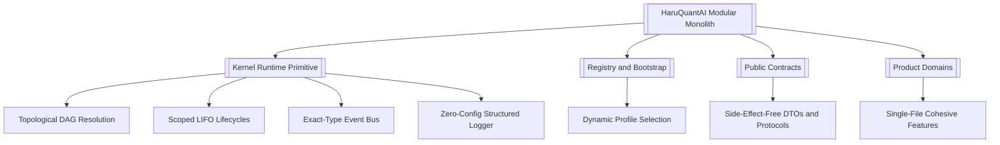
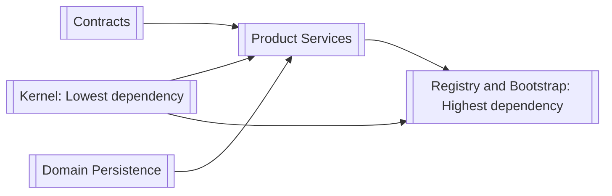
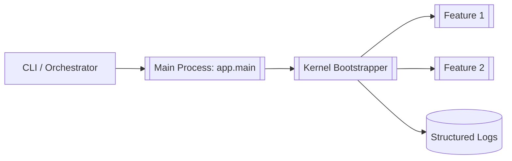

# HaruQuantAI

> **System path:** `.`
> **Status:** `Completed`
> **Last updated:** `2026-09-18`

> This document is the system-level source of truth.
> It defines how domains fit together, how cross-domain workflows operate, which rules apply system-wide, and how the complete system is verified.
>
> Domain internals belong in each domain's own `README.md`.
> Do not duplicate domain-level requirements, files, functions, or implementation details here.

---

## 1. System Purpose and Boundary

### Purpose

HaruQuantAI is a production-grade, business-neutral modular monolith starter. It provides a zero-dependency kernel (`app/kernel/`), pure typed public contracts (`app/contracts/`), single-file feature ownership (`app/services/`), explicit composition (`app/registry.py` and `app/main.py`), and authoritative build/audit pipelines (`docs/dev/`). The system enables engineering teams to rapidly bootstrap and scale maintainable domain-driven applications with mathematical dependency guarantees, structured logging, and automated architectural boundary enforcement.

### System owns

- **Core composition kernel:** Kahn's topological DAG resolution, cycle detection, reachability analysis, and two-phase startup staging.
- **Managed lifecycle and effects:** LIFO resource disposal, scoped task supervision, async context entering, and exact-type event dispatch.
- **Production structured logging:** Zero-configuration logging facade, asynchronous non-blocking log writer, automatic secret/PII redaction, and crash-resilient rotation.
- **Architectural boundary enforcement:** AST-verified docstring-only `__init__.py` files, strict single-file feature modules, and prohibition of cross-feature imports.
- **Authoritative build and audit pipelines:** Closed 26-control `FIP-*` pipeline and audit procedures ensuring complete requirement and acceptance traceability.

### System does not own

- **Domain-specific business logic:** Business capabilities, algorithms, and application semantics are owned strictly by individual product domains in `app/services/<domain>/`.
- **Third-party SDK and infrastructure lock-in:** The kernel runtime uses only Python standard library primitives and does not mandate specific third-party frameworks.
- **Unmanaged background concurrency:** Ad-hoc threads, unparented async tasks, and untracked global state are strictly prohibited.

### Primary users / actors

| Actor | Uses the system to |
|---|---|
| `Developer` | Scaffold and implement production features adhering to the 26 `FIP-*` delivery controls. |
| `Architect / Lead` | Perform read-only domain audits (`domain_implementation_audit.md`) and verify boundary invariants. |
| `System Operator / CI` | Execute the single unified check suite (`scripts/ci_check.py`) and bootstrap runtime profiles via CLI. |

---

## 2. Domain Capability Map

This diagram shows the complete system and its domains at a glance.


```mermaid
flowchart TD
    SYSTEM[[HaruQuantAI Modular Monolith]]

    SYSTEM --> KERNEL[[Kernel Runtime Primitive]]
    SYSTEM --> REGISTRY[[Registry and Bootstrap]]
    SYSTEM --> CONTRACTS[[Public Contracts]]
    SYSTEM --> DOMAINS[[Product Domains]]

    KERNEL --> C1[Topological DAG Resolution]
    KERNEL --> C2[Scoped LIFO Lifecycles]
    KERNEL --> C3[Exact-Type Event Bus]
    KERNEL --> C4[Zero-Config Structured Logger]
    REGISTRY --> C5[Dynamic Profile Selection]
    CONTRACTS --> C6[Side-Effect-Free DTOs and Protocols]
    DOMAINS --> C7[Single-File Cohesive Features]
```

### 2.1 Domain Registry

Domains are organized in strict dependency order, from lowest dependency to highest dependency.

#### 2.1.1 Kernel (`app/kernel`)

* **Package**: `app/kernel`
* **Responsibility**: Business-neutral composition, lifecycle, capability keys, event dispatch, and structured logging.
* **Inputs**: Registered feature factories, role profiles, runtime options, log records.
* **Outputs**: Validated runtime container, dependency injection context, structured log streams.
* **Owns**: `bootstrapper.py`, `capability.py`, `feature.py`, `context.py`, `events.py`, `logging.py`.
* **Boundaries**: Does not import domain contracts or domain services; business-neutral.
* **Key Limits**: Standard library only; single-process asyncio event loop.
* **Documentation**: `app/kernel/README.md`

#### 2.1.2 Contracts Layer (`app/contracts`)

* **Package**: `app/contracts`
* **Responsibility**: Public boundary specifications crossing domain or feature boundaries.
* **Inputs**: Domain data definitions, command structures, event payloads.
* **Outputs**: Pure DTOs, versioned capability keys, Protocol definitions, domain event schemas.
* **Owns**: `app/contracts/<domain>.py` modules.
* **Boundaries**: Pure signatures and data structures; no runtime side effects, no service imports, no I/O.
* **Key Limits**: Type definitions and immutable value objects only.
* **Documentation**: Per-domain contracts documented in domain READMEs.

#### 2.1.3 Product Services Layer (`app/services/<domain>`)

* **Package**: `app/services/<domain>`
* **Responsibility**: Cohesive domain feature implementations and dedicated persistence.
* **Inputs**: Public contract requests, context-injected capabilities, domain events.
* **Outputs**: Public contract results, state persistence, published domain events.
* **Owns**: Flat single-file features `app/services/<domain>/<feature>.py` and `app/services/persistence/<domain>.py`.
* **Boundaries**: Never imports sibling or cross-domain features; collaborates strictly through public capabilities.
* **Key Limits**: Lifecycle effects managed exclusively through `FeatureContext`.
* **Documentation**: `app/services/<domain>/README.md`

### 2.2 Domain ownership rule

Each responsibility must have one clear owning domain.

```text
One responsibility
→ one owning domain
→ one authoritative domain README
```

Other domains may consume the capability, but they must not duplicate its business logic.

---

## 3. Domain Dependency Diagram

This diagram shows the universal dependency hierarchy:


```mermaid
flowchart LR
    K[[Kernel: Lowest dependency]]
    C[[Contracts]]
    S[[Product Services]]
    P[[Domain Persistence]]
    R[[Registry and Bootstrap: Highest dependency]]

    K --> S
    C --> S
    P --> S
    S --> R
    K --> R
```

Rules:

- An arrow points from the required layer to the layer that consumes it.
- Circular domain dependencies are not allowed.
- Cross-domain communication must use documented public contracts or capabilities resolved via `FeatureContext`.
- A domain must not import another domain's internal files.

---

## 4. Cross-Domain Workflows

This section documents workflows involving system-wide lifecycle and cross-domain interaction.

### Status and scope

| Status | Meaning |
|---|---|
| **Missing** | Not completed or not verified |
| **Partial** | Partly completed or tests are incomplete |
| **Completed** | Completed, tested, and verified |

| Status | Workflow ID | Workflow | Trigger | Domains involved | Final outcome | Integration test |
|---|---|---|---|---|---|---|
| Completed | `SYS-WF-001` | Application Startup and Composition | CLI / Programmatic startup | `Main → Registry → Bootstrapper → Features` | All active capabilities staged and running | `tests/test_main.py` |
| Completed | `SYS-WF-002` | Graceful Shutdown and Cleanup | SIGINT / SIGTERM / Exit | `Main → Bootstrapper → FeatureContext` | All resources unwound in LIFO order | `tests/kernel/test_context.py` |
| Completed | `SYS-WF-003` | Scoped Event Publication and Dispatch | Feature event emission | `FeatureContext → EventBus → Subscribers` | Snapshot-isolated exact-type dispatch | `tests/kernel/test_events.py` |

---

### `SYS-WF-001` — Application Startup and Composition

**Purpose:** Validates feature dependency graph, executes topological sorting, stages exports, and publishes capabilities.

**Actor / trigger:** CLI invocation (`python -m app.main`) or programmatic async context manager entry.

**Input boundary:** Selected profile, explicit enabled set, and registered feature factories.

**Output boundary:** Fully initialized runtime container with active, verified capabilities.

**Domains and responsibilities:**

| Order | Layer / Component | Responsibility | Input | Output |
|---:|---|---|---|---|
| 1 | `app.main` | Parses options, configures logging | CLI arguments | `RuntimeOptions` |
| 2 | `app.registry` | Supplies feature factories for profile | Profile name | `tuple[Feature, ...]` |
| 3 | `app.kernel.bootstrapper` | Performs Kahn's topological sort & DFS reachability | Feature list | Execution plan |
| 4 | `app.kernel.context` | Stages exports and enters resources | Staging context | Active capabilities |

**Main flow:**

1. Application bootstrap requests feature list from `app/registry.py`.
2. `Bootstrapper` validates feature graph for duplicate IDs, missing dependencies, cycles, and conflicts.
3. Features are started sequentially in topological order.
4. Each feature registers its provided capabilities and managed resources in `FeatureContext`.
5. Upon successful startup of all features, capabilities are published atomically.

**Failure behaviour:**

- Dependency missing or cycle detected → `DependencyError` raised, startup aborted.
- Feature startup raises exception → Startup stops immediately, already-acquired resources unwound in reverse LIFO order.

**Success condition:**

All requested features active, capabilities published, and runtime ready for operation.

---

### `SYS-WF-002` — Graceful Shutdown and Cleanup

**Purpose:** Ensures zero resource leaks, clean cancellation of background tasks, and deterministic LIFO teardown.

**Actor / trigger:** Interruption signal (SIGINT/SIGTERM), application exit, or context manager exit.

**Input boundary:** Active `Bootstrapper` instance.

**Output boundary:** All spawned tasks cancelled, context managers exited, and event listeners disposed.

**Main flow:**

1. Application initiates shutdown via `runtime.close()`.
2. Features are closed in reverse topological order (LIFO).
3. For each feature, `FeatureContext.close()` executes registered `on_close` callbacks in LIFO order.
4. Spawned tasks are cancelled and awaited; `asyncio.CancelledError` is cleanly suppressed.
5. Context managers entered via `enter_context` are exited cleanly.

**Success condition:**

Zero unhandled exceptions, zero pending background tasks, clean shutdown log emitted.

---

### `SYS-WF-003` — Scoped Event Publication and Dispatch

**Purpose:** Decoupled, exact-type asynchronous communication across domain features without implementation coupling.

**Actor / trigger:** Feature calls `ctx.publish(event)`.

**Input boundary:** Typed event instance.

**Output boundary:** Synchronous or asynchronous invocation of registered handlers for the exact event type.

**Main flow:**

1. A feature publishes an event through its `FeatureContext`.
2. `EventBus` captures a snapshot of registered subscribers for `type(event)`.
3. Handlers are invoked concurrently; async handlers are awaited.
4. Handlers registered in closing scopes are automatically unsubscribed.

**Success condition:**

Target handlers executed with exact event payload; errors in handlers isolated and reported.

---

## 5. System Interfaces and Contracts

Document only contracts crossing domain or external-system boundaries.

| Status | Contract / Event | Version | Owner | Producer / Submitter | Consumer | Purpose | Schema / Type | Failure behaviour |
|---|---|---|---|---|---|---|---|---|
| Completed | `Capability[T]` | `v1` | `app/kernel` | Kernel | Features | Typed capability identifier | Slotted dataclass | `CapabilityUnavailableError` |
| Completed | `FeatureSpec` | `v1` | `app/kernel` | Kernel | Features | Feature specification metadata | Slotted dataclass | Graph validation error |
| Completed | `EventBus` | `v1` | `app/kernel` | Kernel | Features | Scoped event pub/sub | Generic class | Handler error isolation |

### Contract rules

- **Commands and requests are owned by the receiving domain.**
- **Events and results are owned by the producing domain.**
- **Shared context and runtime primitives are owned by `app/kernel`.**
- Consumers depend only on documented public contracts in `app/contracts/<domain>.py` and must not redefine them.
- Raw database connections, internal file paths, or private classes must never cross domain boundaries.

### Versioning and compatibility policy

- Every capability carries an explicit major version (`name@major`).
- Additive changes do not require a major version bump.
- Breaking changes require a new major version.
- Both versions must be supported during deprecation migration windows.

### Data ownership

| Status | State / Store | Owning domain | Read access | Write access | Notes |
|---|---|---|---|---|---|
| Completed | Runtime Container State | `app/kernel` | FeatureContext | Bootstrapper | In-memory dependency graph and capability table |
| Completed | Structured Log Streams | `app/kernel` | Log readers | Async Queue Writer | Application, error, and access log files |

Rules:

- Every persisted state has exactly one owning domain (`app/services/persistence/<domain>.py`).
- No domain writes to state it does not own.
- Cross-domain reads go through public contracts, not direct store access.

---

## 6. Shared Configuration and Limits Manifest

| Status | Setting / Limit | Type | Default | Required | Used by | Description |
|---|---|---|---|---|---|---|
| Completed | `--profile` | `str` | `None` | No | `app.main` | Named role profile selecting active feature subset. |
| Completed | `--enabled` | `str` | `None` | No | `app.main` | Comma-separated feature names to enable explicitly. |
| Completed | `--log-level` | `str` | `"INFO"` | No | `app.main` | Minimum severity level for structured logging. |
| Completed | `--dry-run` | `bool` | `False` | No | `app.main` | Validates composition graph and exits without execution. |
| Completed | `--status` | `bool` | `False` | No | `app.main` | Displays active features and capabilities. |

---

## 7. System-Wide Requirements

| Status | Requirement ID | Type | Responsibility | Verification |
|---|---|---|---|---|
| Completed | `SYS-NFR-001` | Architecture | All `__init__.py` files must be pure docstring-only (zero code, zero imports). | `tests/architecture/test_boundaries.py` |
| Completed | `SYS-NFR-002` | Architecture | Single-file feature ownership; zero inter-feature imports. | `domain_implementation_audit.md` (`FIP-04`, `FIP-06`) |
| Completed | `SYS-NFR-003` | Reliability | Two-phase composition staging; partial startup failure unwinds in LIFO order. | `tests/kernel/test_context.py` |
| Completed | `SYS-NFR-004` | Quality | Strict static typing across all modules (zero mypy and pyright errors). | `scripts/ci_check.py` |
| Completed | `SYS-NFR-005` | Observability | Zero-configuration logging facade with automatic secret redaction. | `tests/kernel/test_logging.py` |
| Completed | `SYS-NFR-006` | Testing | Minimum 80% test coverage floor; pure unit tests under 100 ms. | `scripts/ci_check.py` (Current: 98.30%) |

---

## 8. External Systems

| Status | External system | Used by domains | Purpose | Interaction type | Failure behaviour |
|---|---|---|---|---|---|
| Completed | Local Filesystem | `app/kernel/logging` | Structured log file emission and rotation | Asynchronous Write | Safe fallback to console on write error |

---

## 9. Deployment and Runtime Topology

Describe how the system runs in each environment:

**Runtime model:** Single-process modular monolith running on Python 3.14+ standard library asyncio.

| Runtime unit | Contains domains | Environment | Started by | Scaling / instances |
|---|---|---|---|---|
| Main Application Process | Kernel + Registered Features | Local / Server | `python -m app.main` | Single process per worker instance |


```mermaid
flowchart LR
    CLI[CLI / Orchestrator] --> APP[[Main Process: app.main]]
    APP --> KERNEL[[Kernel Bootstrapper]]
    KERNEL --> F1[[Feature 1]]
    KERNEL --> F2[[Feature 2]]
    KERNEL --> LOG[(Structured Logs)]
```

---

## 10. System Usage

### Programmatic Usage

```python
import asyncio
from app.kernel.bootstrapper import Bootstrapper
from app.registry import get_registered_features


async def main() -> None:
    features = get_registered_features(profile="full")
    async with Bootstrapper(features) as runtime:
        print(f"Active features: {runtime.active_features}")


if __name__ == "__main__":
    asyncio.run(main())
```

### CLI Usage

```powershell
# List available profiles
uv run python -m app.main --list-profiles

# Validate graph without starting (dry run)
uv run python -m app.main --dry-run

# Run full application with custom log level
uv run python -m app.main --profile full --log-level DEBUG

# Print active runtime status
uv run python -m app.main --status
```

### Usage Scenarios & Verification Examples

```powershell
# Run end-to-end composition scenario
uv run python -m tests.examples.composition

# Run structured logging demonstration
uv run python -m tests.examples.logging_usage
```

---

## 11. Verification

### Test locations

```text
tests/
├── kernel/                  # Composition and lifecycle tests
├── architecture/            # Boundary and purity tests
├── test_main.py             # CLI and application lifecycle tests
└── examples/                # Consolidated usage demonstrations
```

### Authoritative Verification Command

```powershell
uv run python scripts/ci_check.py
```

This single command executes:
1. `ruff check .` (Static analysis)
2. `ruff format --check .` (Code formatting)
3. `mypy` (Strict static typing)
4. `pytest tests --cov --cov-report=term-missing` (Unit tests and branch coverage)
5. `tests.examples.composition` (Runtime composition verification)
6. `tests.examples.logging_usage` (Logging subsystem verification)
7. `app.main` (CLI entrypoint smoke test)

---

## 12. Open Decisions

| Status | Decision | Affected domains | Options / missing evidence |
|---|---|---|---|
| None | All initial kernel and composition primitives completed | None | N/A |

---

## 13. System Definition of Done

The system is complete only when:

- [x] Every domain has a clear responsibility and owner.
- [x] The Domain Registry matches the actual package structure.
- [x] The Domain Dependency Diagram matches real imports and dependencies.
- [x] No circular domain dependencies exist.
- [x] Every important cross-domain workflow has status `Completed`.
- [x] Shared contracts are documented, versioned, and tested.
- [x] Every persisted state has a documented owning domain.
- [x] The deployment topology matches how the system actually runs.
- [x] Shared configuration and limits are implemented and verified.
- [x] Every system-wide requirement has status `Completed`.
- [x] External-system failures have documented handling.
- [x] Full-system usage examples run successfully.
- [x] No unresolved `Open` decision affects completed work.
- [x] No domain logic is duplicated across domains.
- [x] All tests and quality checks pass with coverage >= 80%.

---

## 14. Change Process

For every system-level change:

```text
1. Update this document first.
2. Identify the owning domain or domains.
3. Update affected cross-domain workflows.
4. Update shared contracts when boundaries change.
5. Update shared configuration or limits when needed.
6. Update each affected domain README.
7. Implement the smallest change inside the owning domain.
8. Add or update domain tests.
9. Add or update system integration tests.
10. Change Status to Completed only after verification passes.
```
