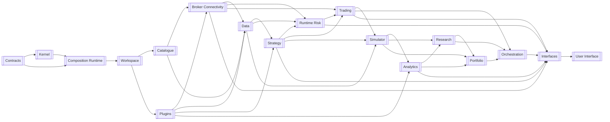
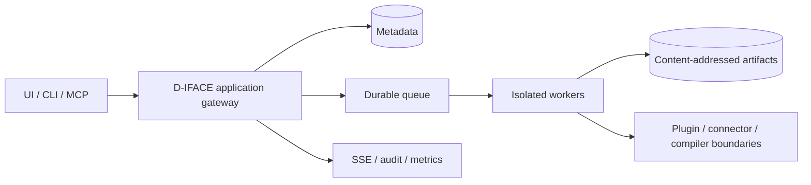

# HaruQuantAI — Strategy Research and Governed Trading Platform

> **Documentation root:** `docs/`
> **Status:** Product scope `Missing`; composability foundation `Implemented`
> **Last updated:** `2026-08-25`
> **Specification version:** `4.3-execution-parity`
> **Architecture:** [ARCHITECTURE.md](ARCHITECTURE.md)
> **Execution parity:** [EXECUTION_PARITY.md](EXECUTION_PARITY.md)
> **Implementation sequence:** [IMPLEMENTATION_ORDER.md](dev/IMPLEMENTATION_ORDER.md)

> This document is the system-level source of truth for product scope, domain relationships, cross-domain workflows, system-wide requirements, and complete-system verification.
> Each domain's `README.md` is the sole current target registry for that domain's feature IDs and statuses, functional requirements, domain-local workflows, public capability bundles, persisted-state model, acceptance evidence, and deletion behavior.
> `ARCHITECTURE.md` owns structural/runtime constraints. `EXECUTION_PARITY.md` owns the ratified one-Trading-lifecycle/multiple-execution-authorities rule. `IMPLEMENTATION_ORDER.md` schedules domain completion but is not a second FR registry.

---

## Agent Context Router

Start with this table; do not read this document end to end unless the task is system-wide. Always combine the selected system scope with `AGENTS.md`, the applicable `ARCHITECTURE.md` section, `EXECUTION_PARITY.md` when execution is involved, and every affected owning package README.

| Task concern | Read here | Then read |
| --- | --- | --- |
| Product boundary, actors, or domain ownership | §§1–2 | Affected domain/shared-package README |
| Cross-domain dependency or end-to-end workflow | §§3–4 | `ARCHITECTURE.md` §§3, 6–9, `EXECUTION_PARITY.md` where applicable, and participating READMEs |
| Public contract, state owner, or version policy | §5 | `app/contracts/README.md` and semantic owner README |
| System configuration or operational limit | §6 | `ARCHITECTURE.md` §§8–13 and affected owner README |
| System requirement or external integration | §§7–8 | Applicable contract and domain READMEs |
| Deployment, launcher, or complete-system usage | §§9–10 | `ARCHITECTURE.md` §§10–12 and Interfaces/UI READMEs |
| Verification, NFR, release, or completion decision | §§12–18 | `ARCHITECTURE.md` §§13–15 and `docs/dev/IMPLEMENTATION_ORDER.md` |
| Domain feature, FR, schema, fixture, constant, or algorithm | §2.1 only to locate the owner | Owning README; do not search this document for domain-private implementation detail |

Stable labels inherited from the consolidated specification (`§2`, `§4`–`§8`, `§10`, `§12`, `§15`–`§23`) live in the relevant shared-package or domain README under its normative specification section. The label is an identifier, not a section number in this file.

---

## 1. System Purpose and Boundary

### Purpose

HaruQuantAI is a deterministic, reproducible strategy-research and governed trading platform covering market/catalogue data, typed strategy authoring, Runtime Risk, one canonical Trading execution lifecycle, native simulation/paper authority, analytics, automated research, portfolios, project orchestration, isolated plugins, code generation, broker connectivity, optional demo/live execution, and human/automation interfaces.

Simulation is intentionally not an alternative trading implementation. Executable `SIM`, `PAPER`, `DEMO`, and `LIVE` actions share Runtime Risk and Trading business semantics; Simulator and Broker Connectivity provide route-specific execution-authority mechanics.

Runtime composition and physical removal occur at feature-package granularity. Responsibilities and FRs remain independently traceable product behaviors and become independently removable when packaged as separate features.

### System owns

- The complete local-first research lifecycle from data onboarding through strategy generation, Runtime Risk admission, Trading execution semantics, Simulator authority execution, analysis, code export, robustness research, portfolio construction, and automation.
- One Trading-owned application execution lifecycle with `SIM`, `PAPER`, `DEMO`, and `LIVE` contexts and explicit authority selection.
- Deterministic Simulator authority mechanics for historical/replay and forward-paper execution, preserving parity with the common Trading path.
- An optional, disabled-by-default broker-backed operational lifecycle from certified provider connection through Runtime Risk admission, Trading dispatch/reconciliation/protection/accounting, and safety interfaces.
- Three non-domain shared modules: `app/kernel/` for independent composability primitives, `app/contracts/` for cross-boundary application/domain contracts, and `app/composition/` for discovery/configuration/readiness/orchestration/runtime diagnostics. Product-facing gateways are removable Interfaces-domain features.
- Immutable/versioned domain artifacts, deterministic algorithms, explicit failure behavior, conformance fixtures, and independently gated release capabilities.

### System does not own

- Custody, deposits, withdrawals, copy/social trading, tax reporting, broker statement generation, or account funding.
- Exact reproduction of the AngularJS/Electron UI or in-process Java plugin ABI.
- Arbitrary untrusted in-process execution, undocumented vendor behavior, or implicit cloud/AI dependencies. Explicitly installed trusted Python feature distributions are part of the supported feature substrate.
- Autonomous AI authority to place, modify, cancel, or close an operational order.
- A second Simulator-owned canonical business order/position lifecycle or a second Simulator-owned executable risk governor.

### Already implemented foundation evidence

The repository implements the business-neutral composability substrate and whole-app contract-authoring foundation. Product `FEAT-*` status changes only when the owning feature's runtime specification, usage evidence, and acceptance tests pass. Ratifying/reconciling target documentation does not by itself mark a product feature implemented.

### Primary users / actors

| Actor | Uses the system to |
|---|---|
| Local researcher | Configure data, author strategies, run Risk/Trading-backed simulations, analyze, research, and export target code. |
| Trading operator | Operate explicitly enabled paper/demo/live sessions, review risk, monitor authority state, reconcile, and invoke authorized emergency controls. |
| Operator | Initialize/recover workspaces, administer capabilities, workers, plugins, broker profiles, diagnostics, and backups. |
| CLI/MCP/API client | Automate the same application commands and queries exposed to the UI. |
| Isolated worker | Execute admitted data, simulation, research, portfolio, codegen, connector, and plugin work. |

---

## 2. Domain Capability Map


```mermaid
flowchart TD
    SYSTEM[[HaruQuantAI]]
    SYSTEM --> WS[[D-WS: Workspace]]
    SYSTEM --> CAT[[D-CAT: Catalogue]]
    SYSTEM --> PLUG[[D-PLUG: Plugins]]
    SYSTEM --> DATA[[D-DATA: Data]]
    SYSTEM --> STRAT[[D-STRAT: Strategy]]
    SYSTEM --> RISK[[D-RISK: Runtime Risk]]
    SYSTEM --> TRD[[D-TRD: Trading]]
    SYSTEM --> SIM[[D-SIM: Simulator]]
    SYSTEM --> ANA[[D-ANA: Analytics]]
    SYSTEM --> RES[[D-RES: Research]]
    SYSTEM --> PORT[[D-PORT: Portfolio]]
    SYSTEM --> ORCH[[D-ORCH: Orchestration]]
    SYSTEM --> IFACE[[D-IFACE: Interfaces]]
    SYSTEM --> UI[[D-UI: User Interface]]
    SYSTEM --> BRK[[D-BRK: Broker Connectivity]]
```

### 2.1 Domain Registry

The owning README is the sole mutable feature/FR authority. Counts reconcile to 142 planned features.

| Domain | ID | Features | Authority |
| --- | --- | ---: | --- |
| Workspace | `D-WS` | 6 | [README](../app/services/workspace/README.md) |
| Catalogue | `D-CAT` | 7 | [README](../app/services/catalogue/README.md) |
| Plugins | `D-PLUG` | 7 | [README](../app/services/plugins/README.md) |
| Data | `D-DATA` | 14 | [README](../app/services/data/README.md) |
| Strategy | `D-STRAT` | 13 | [README](../app/services/strategy/README.md) |
| Simulator | `D-SIM` | 12 | [README](../app/services/simulator/README.md) |
| Analytics | `D-ANA` | 9 | [README](../app/services/analytics/README.md) |
| Research | `D-RES` | 13 | [README](../app/services/research/README.md) |
| Portfolio | `D-PORT` | 8 | [README](../app/services/portfolio/README.md) |
| Orchestration | `D-ORCH` | 7 | [README](../app/services/orchestration/README.md) |
| Interfaces | `D-IFACE` | 7 | [README](../app/services/interfaces/README.md) |
| User Interface | `D-UI` | 17 | [README](../app/ui/README.md) |
| Broker Connectivity | `D-BRK` | 7 | [README](../app/services/broker/README.md) |
| Runtime Risk | `D-RISK` | 7 | [README](../app/services/risk/README.md) |
| Trading | `D-TRD` | 8 | [README](../app/services/trading/README.md) |

### 2.2 Domain ownership rule

```text
One responsibility
-> one owning domain
-> one authoritative domain README
-> one feature-local implementation and acceptance mapping for each functional requirement
```

Runtime removal is feature-granular. A requirement is independently removable only when its owning boundary is a separate feature package.

The project document may summarize a domain or define cross-domain contracts/workflows, but it never restates a domain's mutable functional-requirement registry or private implementation structure.

Authority is topical rather than one linear precedence. This document decides system scope, cross-domain behavior, dependency direction, and shared semantic profiles. The owning domain README decides domain-local behavior and feature/FR ownership. `ARCHITECTURE.md` decides package/runtime constraints. `EXECUTION_PARITY.md` decides the Risk/Trading/execution-authority relationship. An implemented feature's manifest/contracts/migrations/tests are evidence; they do not silently mark an unaccepted target requirement implemented.

---

## 3. Domain Dependency Diagram

The diagram is the permitted **package-import and implementation-layer direction**. Arrows point from a lower implementation layer/provider contract toward the higher layer that may consume it. Runtime callbacks/events and optional providers may travel through versioned capability contracts without creating reverse implementation imports.


```mermaid
flowchart LR
    CTR[[Contracts]] --> K[[Kernel]]
    K --> C[[Composition Runtime]]
    CTR --> C
    C --> WS[[Workspace]]
    WS --> CAT[[Catalogue]]
    WS --> PLUG[[Plugins]]
    CAT --> BRK[[Broker Connectivity]]
    PLUG --> BRK
    CAT --> DATA[[Data]]
    PLUG --> DATA
    BRK --> DATA
    DATA --> STRAT[[Strategy]]
    PLUG --> STRAT
    DATA --> RISK[[Runtime Risk]]
    STRAT --> RISK
    BRK --> RISK
    STRAT --> TRD[[Trading]]
    BRK --> TRD
    RISK --> TRD
    DATA --> SIM[[Simulator]]
    STRAT --> SIM
    TRD --> SIM
    SIM --> ANA[[Analytics]]
    PLUG --> ANA
    ANA --> RES[[Research]]
    SIM --> RES
    RES --> PORT[[Portfolio]]
    ANA --> PORT
    SIM --> PORT
    PORT --> ORCH[[Orchestration]]
    RES --> ORCH
    TRD --> ORCH
    ORCH --> IFACE[[Interfaces]]
    ANA --> IFACE
    STRAT --> IFACE
    BRK --> IFACE
    RISK --> IFACE
    TRD --> IFACE
    IFACE --> UI[[User Interface]]
```

Rules:

- Runtime cross-domain behavior uses public capability contracts; private package imports and direct foreign-table writes are prohibited.
- `Runtime Risk -> Trading -> Simulator` is the implementation dependency core for parity execution. Simulator consumes Trading's canonical execution semantics; Trading never imports Simulator implementation.
- Simulator's authority feature may register an injected execution-authority provider consumed by Trading at runtime. That callback does not reverse package-import direction. The Simulator authority provider itself must not require the higher-level Simulator runner that consumes Trading, so the required feature-capability graph remains acyclic.
- Broker Connectivity similarly supplies external authority mechanics without owning Trading's business state machine.
- Portfolio is **not** a prerequisite of Runtime Risk. Portfolio-aware risk uses self-contained, versioned Portfolio evidence/projections submitted into Risk through public contracts; Risk does not require a live Portfolio capability to activate. This avoids `Risk -> Trading -> Simulator -> ... -> Portfolio -> Risk` dependency cycles.
- Optional integrations that would otherwise reverse an implementation arrow use receiver-owned requests, immutable evidence, typed events, or isolated provider extension points—not reverse private imports.
- Analytics operational-journal ingestion consumes versioned Trading/Risk/Broker events through registered contracts; it creates no reverse execution dependency.
- Circular required behavior dependencies are rejected before activation under `FR-KERN-REJECT_DEPENDENCY_CYCLES`.
- D-UI presents one Vite + React workstation canvas. Browser routes select workstation/workspace entry points; feature-owned widgets consume D-IFACE/public contracts, and explicit source/clock/cursor context coordinates temporal presentation without making UI authoritative for business time/state.

---

## 4. Cross-Domain Workflows

### Workflow status and scope

| Status | Meaning |
|---|---|
| `Missing` | Specified but not implemented or verified end to end. |
| `Partial` | Some participating capabilities exist, but the system outcome or acceptance evidence is incomplete. |
| `Implemented` | Complete cross-domain outcome, failure paths, and integration evidence pass. |
| `Implemented foundation` | Shared substrate behavior exists, but it does not complete a product workflow. |

| Status | Workflow ID | Workflow | Trigger | Domains involved | Final outcome | Integration test |
|---|---|---|---|---|---|---|
| Missing | `SYS-WF-001` | Workspace startup and capability reconciliation | Launcher start/open | `Workspace -> all enabled domains -> Interfaces -> UI` | Ready capability snapshot or diagnostic/no-workspace mode | `tests/system/integration/test_workspace_startup.py` |
| Missing | `SYS-WF-002` | Market catalogue and data onboarding | Import/sync request | `Catalogue -> Broker Connectivity where provider-backed -> Data -> Workspace -> Interfaces -> UI` | Committed immutable data version with findings | `tests/system/integration/test_data_onboarding.py` |
| Missing | `SYS-WF-003` | Strategy authoring and validation | Create/edit/import request | `Data + Catalogue + Plugins -> Strategy -> Interfaces -> UI` | Committed typed StrategyVersion or complete diagnostics | `tests/system/integration/test_strategy_authoring.py` |
| Missing | `SYS-WF-004` | Deterministic simulation and analysis | Simulation request | `Strategy + Data + Catalogue -> Runtime Risk -> Trading -> Simulator authority -> Simulator result commit -> Analytics -> Interfaces -> UI` | Reconciled committed result plus canonical execution evidence and queryable analytics | `tests/system/integration/test_simulation_analysis.py` |
| Missing | `SYS-WF-005` | Target code generation and execution parity | Codegen/parity request | `Strategy -> Runtime Risk + Trading -> Simulator/reference target -> Analytics -> Interfaces -> UI` | Deterministic deployment package and first-divergence/parity report | `tests/system/integration/test_codegen_parity.py` |
| Missing | `SYS-WF-006` | Automated research | Builder/retest/optimization request | `Strategy + Runtime Risk + Trading + Simulator + Analytics -> Research -> Interfaces -> UI` | Reproducible research run and accepted/rejected outputs | `tests/system/integration/test_research_factory.py` |
| Missing | `SYS-WF-007` | Portfolio construction and simulation | Portfolio request | `Analytics + Research + Simulator -> Portfolio -> Interfaces -> UI`; portfolio-aware execution evidence may later be submitted to Runtime Risk as self-contained input | Versioned portfolio and aggregate result/attribution | `tests/system/integration/test_portfolio.py` |
| Missing | `SYS-WF-008` | Project orchestration | Run project | `Orchestration -> owning domains -> Interfaces -> UI` | Durable task graph outcome, checkpoints, and causal history | `tests/system/integration/test_project_orchestration.py` |
| Missing | `SYS-WF-009` | Plugin lifecycle and contribution | Install/enable/replace/remove plugin | `Workspace -> Plugins -> consuming domain -> Interfaces -> UI` | Transactional capability change or complete rollback | `tests/system/integration/test_plugin_lifecycle.py` |
| Missing | `SYS-WF-010` | Forward trading session admission | Create/start paper, demo, or live session | `Workspace + Catalogue + Data + Runtime Risk -> Trading -> selected Simulator(PAPER)/Broker(DEMO/LIVE) authority -> Interfaces -> UI` | Explicitly bound active session or classified fail-closed state | `tests/system/integration/test_operational_session.py` |
| Missing | `SYS-WF-011` | Governed executable action | Strategy intent or authenticated manual plan | `Strategy + Data + Catalogue -> Runtime Risk -> Trading -> selected Simulator(SIM/PAPER) or Broker(DEMO/LIVE) authority -> Interfaces/UI where interactive` | Accepted/rejected/unknown operation with complete causal evidence | `tests/system/integration/test_governed_trading_action.py` |
| Missing | `SYS-WF-012` | Reconciliation and emergency control | Authority event/gap/unknown outcome or kill-switch command | `selected authority + Runtime Risk -> Trading -> Analytics + Interfaces -> UI` | Reconciled state or degraded/block state with bounded authorized recovery | `tests/system/integration/test_trading_reconciliation_emergency.py` |

### Workflow execution rule

Every workflow admits one immutable manifest/capability snapshot where applicable, calls only public domain capabilities, stages effects before commit, and returns either a fully committed result or the exact structured failure required by participating requirements. Detailed domain steps are defined only in domain READMEs.

For `SYS-WF-004`, the Simulation job/scheduler may exist before any individual trade action. Each executable action produced during the run still traverses Runtime Risk and Trading before the Simulator authority matches/fills it. There is no direct Strategy -> Simulator business-order bypass.

Each `SYS-WF-*` row is complete only when participating domain READMEs identify ordered public capabilities, input/output boundaries, success condition, domain-owned failure behavior, and the listed system test proves the complete outcome.

---

## 5. System Interfaces and Contracts

Every application/domain contract summarized here is physically defined in `app/contracts/`. Generic `CapabilityKey` and composability protocols are kernel primitives. Owner identifies semantic ownership/change authority, not a domain-local implementation location. Domain packages contain implementations/adapters only.

The complete planned inventory is maintained in `app/contracts/README.md`; owning domain READMEs define the semantic target. Ratified documentation does not change `Missing` runtime status without implementation and executable evidence.

| Status | Contract / Event | Version | Owner | Producer / Submitter | Consumer | Purpose | Failure behavior |
|---|---|---|---|---|---|---|---|
| Missing | `CapabilitySnapshot` | `v1` | Shared substrate | Composition engine | Every domain | Pin active features/providers/configuration for reproducibility | Missing/incompatible required providers reject admission. |
| Missing | `RunManifest` | `v1` | Simulator | Interfaces/Research/Portfolio | Simulator, Trading, Analytics | Pin Strategy/Data/settings/engine/seeds/capabilities including material Risk/Trading/authority provider identity | Invalid inputs create no queued work. |
| Missing | `StrategyVersion` | `v1` | Strategy | Interfaces/Research/importers | Risk, Trading, Simulator, Research, Portfolio, Codegen | Immutable typed Strategy contract | Unsupported/incomplete semantics fail validation. |
| Missing | `DataSeriesVersion` | `v1` | Data | importers/connectors | Strategy, Risk, Trading, Simulator, Research | Immutable normalized market/external series | Incomplete precision/coverage follows explicit policy. |
| Missing | Simulator authority records (`SimOrder`, `SimFill`, `SimPosition`) and result projections | `v1` | Simulator | Simulator authority | Trading, Simulator result commit/parity tooling | Truthful deterministic authority-side matching/fill/snapshot evidence; not canonical application Trading state | Missing/inconsistent authority evidence blocks reconciliation/result commit. |
| Missing | `Result` and metric artifacts | `v1` | Simulator / Analytics | Simulator / Analytics | Research, Portfolio, Interfaces | Reconciled simulation output and versioned interpretation | Unreconciled/staged output is never selectable. |
| Missing | `ProblemDetails` | `v1` | Interfaces | Every command/query adapter | UI/CLI/MCP/API clients | Stable validation/conflict/capability/failure responses | Unknown failures remain causal and never masquerade as success. |
| Missing | UI view models, commands, widget descriptors/instances, workspace templates/layouts, temporal contexts, extension lifecycle events | `v1` | User Interface | D-UI adapters over D-IFACE/public contracts | Feature-owned React widgets/support adapters | Type-safe spatial/temporal presentation without duplicating business policy | Unavailable/incompatible/time-gap states render explicit degraded/stale/resync states and disable unsafe commands. |
| Missing | `DomainEvent` | `v1` | Producing domain | All domains | Interfaces, audit, dependent workflows | Causal event publication/replay | Retention gaps emit resync markers. |
| Missing | `BrokerSessionRef` / broker operation receipts | `v1` | Broker Connectivity | Broker adapters | Data, Risk, Trading, Interfaces | External authority generation and accepted/rejected/unknown provider outcomes | Stale generation/uncertainty blocks unsafe retry. |
| Missing | `RiskDecision`, `RiskApprovalToken`, `RiskCapacityReservation` | `v1` | Runtime Risk | Risk | Trading, Interfaces, audit | Bind exact action/profile/evidence/approval/size/budget/validity/capacity for applicable route | Missing/expired/mismatched authority grants no mutation. |
| Missing | Portfolio allocation/projection evidence submitted for optional risk review | `v1` | Portfolio (producer), Runtime Risk (receiver command/result) | Portfolio/Interfaces/Orchestration | Runtime Risk | Self-contained immutable portfolio/allocation evidence without making Risk depend on a Portfolio runtime provider | Missing evidence blocks only portfolio-aware operation, not core Risk activation. |
| Missing | `TradingSession`, `TradingOperation`, canonical `TradingOrder`/`TradingDeal`/`TradingPositionProjection`, execution events | `v1` | Trading | Trading | Simulator, Risk, Analytics, Interfaces, audit | One canonical `SIM`/`PAPER`/`DEMO`/`LIVE` application execution lifecycle | Unknown authority outcomes remain unresolved; blind retry disabled. |

### Contract rules

- Commands/requests are semantically owned by receivers; events/results by producers; universally shared envelopes by `app/contracts/common/`; kernel composition primitives remain in `app/kernel/`.
- Consumers depend only on documented public contracts and never redefine them or pass raw provider/SDK objects.
- A provider implementing a receiver-owned port does not acquire ownership of the receiver's business lifecycle.
- Additive optional fields preserve `v1`; breaking semantic/schema changes require a new version and compatibility migration. Pre-implementation ratified contract corrections must still reconcile generated schemas/types before product implementation begins.
- Provider/behavior versions, schemas, implementation hashes, configuration hashes, and permissions are pinned in manifests.
- Physical application/domain contract definitions live under `app/contracts/<owner-namespace>/`; generated wire definitions remain below that namespace.

### Versioning and compatibility policy

- Application capability identifiers use `<domain>.<name>@<major>`; compatible additive changes retain major, breaking semantics/schema require a new major.
- A breaking change declares consumer migration/compatibility window. When continuity is required, the owner provides old/new majors concurrently or a documented boundary adapter.
- Persisted schemas/events/wire formats/provider profiles/reproducibility records retain explicit versions; unsupported future versions are migrated, read-only opened, or rejected—never guessed.
- A version change updates `app/contracts/README.md`, owning/consuming READMEs, affected capability keys/wire schemas, and producer-consumer compatibility tests coherently.
- Retired versions are removed only after consumers and persisted-state migration paths no longer require them.

### Data ownership

This table indexes system-level write authority and representative state families; it is not a second exhaustive schema catalogue.

| Status | State / Store summary | Owning domain | Read access | Write access | Notes |
|---|---|---|---|---|---|
| Missing | workspace, workspace_setting_versions, secret_refs, audit_events, jobs, job_commands, worker_leases, artifacts, artifact_refs, events, tombstones | Workspace | Public `D-WS` capabilities | Workspace only | Common persistence rules: Contracts README. |
| Missing | instruments, instrument_versions, brokers, broker_versions, sessions, session_versions, calendars, calendar_versions | Catalogue | Public `D-CAT` capabilities | Catalogue only | Instrument/rule identity authority. |
| Missing | plugins, plugin_versions, plugin_activations | Plugins | Public `D-PLUG` capabilities | Plugins only | Plugin lifecycle authority. |
| Missing | data_series, data_series_versions, quality_findings, external_indicator_series_versions | Data | Public `D-DATA` capabilities | Data only | Market/external evidence authority. |
| Missing | strategies, strategy_versions, strategy_charts, block_definitions, external indicator definitions, random/opposite maps, codegen runs/deployment packages | Strategy | Public `D-STRAT` capabilities | Strategy only | Typed strategy/codegen authority. |
| Missing | run_manifests, results, result_segments; Simulator authority orders/fills/positions; result trade projections | Simulator | Public `D-SIM` capabilities | Simulator only | `orders/fills/positions` are authority-scoped evidence; `trades` are result projections. They are not canonical Trading business state. |
| Missing | metric_definitions, metric_values, databanks/items/decisions, analysis artifacts, benchmark comparisons | Analytics | Public `D-ANA` capabilities | Analytics only | Interpretation/analysis authority. |
| Missing | research_runs, simulations, optimization_variants, WF windows, checkpoints | Research | Public `D-RES` capabilities | Research only | Research process authority. |
| Missing | portfolios, portfolio_versions/results, correlation matrices, portfolio search artifacts | Portfolio | Public `D-PORT` capabilities | Portfolio only | Risk receives self-contained submitted evidence; it never writes Portfolio state. |
| Missing | projects, project_versions/runs, task runs/attempts, variable assignments | Orchestration | Public `D-ORCH` capabilities | Orchestration only | Project/process authority. |
| Missing | No private business/client-state tables; durable commands write through owning-domain contracts. | Interfaces | Public `D-IFACE` capabilities | None | Future adapter-owned durable state requires explicit feature declaration. |
| Missing | Client-only drafts/navigation/focus/widget/layout/template/preferences/temporal cursors; no authoritative business state. | User Interface | D-UI widgets/support adapters | User Interface only | Presentation state only. |
| Missing | broker adapter profiles/sessions/transitions/receipts/certifications | Broker Connectivity | Public `D-BRK` capabilities | Broker Connectivity only | External provider truth; no canonical Trading business state. |
| Missing | risk profiles/decisions/tokens/capacity/kill-switch/audit | Runtime Risk | Public `D-RISK` capabilities | Risk only | Portfolio input is optional submitted evidence, not a required foreign store/provider. |
| Missing | trading sessions/operations/events, canonical orders/deals/positions, protections, journals, ledgers/valuations, reconciliation | Trading | Public `D-TRD` capabilities | Trading only | Canonical application execution state for all routes; Simulator/Broker authority evidence reconciles into it. |

---

## 6. Shared Configuration and Limits Manifest

| Status | Setting / Limit | Type | Default | Required | Used by | Description |
|---|---|---|---|---|---|---|
| Missing | `worker_count` | integer | `max(1, logical_cpu_count-1)`, cap 8 | Yes | Workspace, worker domains | Admission rejects unfulfillable resource requests. |
| Missing | `deterministic_worker_threads` | integer | `1` | Yes | Simulator, Research, Portfolio | Deterministic reference execution uses one thread per worker. |
| Missing | `core_worker_memory` | bytes | `4 GiB` | Yes | Worker domains | Supervisor terminates/quarantines work exceeding boundary. |
| Missing | `core_worker_temp_disk` | bytes | `10 GiB` | Yes | Worker domains | Staging fails without publishing partial committed output. |
| Missing | `isolated_call_deadline` | duration | `60 seconds` | Yes | Plugins, scripts, compilers | Timeout terminates isolated process and discards invalid staging. |
| Missing | `job_event_retention` | duration | `7 days` | Yes | Workspace, Interfaces | Expired SSE cursors receive resync marker. |
| Missing | `checkpoint_interval` | duration/count | `5 minutes or 10,000 candidates` | Yes | Research, Orchestration | First reached boundary triggers safe checkpoint. |
| Missing | `graceful_cancel_deadline` | duration | `30 seconds` | Yes | All workers | Supervisor terminates after bounded drain/checkpoint policy. |
| Missing | `operational_trading_enabled` | boolean | `false` | Yes | Workspace, Broker Connectivity, Runtime Risk, Trading, Interfaces | Disables forward `PAPER`, `DEMO`, and `LIVE` operational sessions unless explicitly enabled. It does not disable deterministic `SIM` research execution. |
| Missing | `live_trading_enabled` | boolean | `false` | Yes | Workspace, Broker Connectivity, Runtime Risk, Trading, Interfaces | `LIVE` unavailable until separately enabled and all certification/profile gates pass. |
| Missing | `default_trading_mode` | enum/none | `None` | Yes | Trading, Interfaces, Simulator orchestration | Execution context is explicit; there is no SIM/paper/demo/live fallback. |

Rules:

- Every shared setting/limit has one owning package and lists all consuming domains.
- Validation, normalization, and exact failure are mandatory.
- Feature-specific configuration remains exclusively in owning README/`config.py`.
- Implementation completion of Broker/Risk/Trading does not enable operational or live release profiles automatically.

---

## 7. System-Wide Requirements

| Status | Requirement ID | Type | Responsibility | Verification |
|---|---|---|---|---|
| Implemented foundation | `FR-KERN-DEFINE_REQUIREMENT_BEHAVIOR, FR-KERN-DEFINE_LIFECYCLE_CONTEXT, FR-KERN-DECLARE_BEHAVIOR_DEPENDENCIES, FR-KERN-REGISTER_FEATURE_MODULES, FR-KERN-DEFINE_RESPONSIBILITY_FILES, FR-KERN-IMPLEMENT_REQUIREMENT_FUNCTIONS, FR-KERN-DEPEND_PUBLIC_PORTS, FR-KERN-NAMESPACE_CAPABILITY_KEYS, FR-KERN-DECLARE_DEPENDENCY_RULES, FR-KERN-REEVALUATE_DEPENDENCIES, FR-KERN-DEFINE_SCOPE_HIERARCHY, FR-KERN-PASS_EFFECT_SCOPES, FR-KERN-REGISTER_EFFECT_REVERSALS, FR-KERN-REVERSE_EFFECTS_LIFO, FR-KERN-ROLLBACK_FAILED_ACTIVATION, FR-KERN-MANAGE_COMPONENT_LIFECYCLE, FR-KERN-COMMIT_CAPABILITY_SWAP, FR-KERN-QUIESCE_DEPENDENT_WORK, FR-KERN-REMOVE_DEPENDENT_COMPONENTS, FR-KERN-ISOLATE_DISPOSAL_FAILURES, FR-KERN-RECONCILE_DESIRED_STATE, FR-KERN-REPLACE_COMPONENTS_TRANSACTIONALLY, FR-KERN-PROVIDE_SCOPED_REGISTRARS, FR-KERN-DRAIN_REMOVED_BEHAVIORS, FR-KERN-CLASSIFY_COMPONENT_EFFECTS, FR-KERN-NAMESPACE_COMPONENT_STATE, FR-KERN-REGISTER_EXTENSION_POINTS, FR-KERN-EMIT_CAUSAL_EVENTS, FR-KERN-REJECT_DEPENDENCY_CYCLES, FR-KERN-PIN_CAPABILITY_SNAPSHOTS, FR-KERN-TEST_COMPONENT_REMOVAL, FR-KERN-VERIFY_EXACT_REMOVAL, FR-KERN-ROUTE_MULTIPLE_PROVIDERS` | Architecture | Code-aligned discovery, lifecycle, effects, dependency resolution, reconciliation, replacement, diagnostics, physical removal. | Repository architecture/composition/removal suite |
| Missing | `NFR-DET-001..009` | Determinism | Canonical reproducibility under pinned inputs, builds, providers, routes, and seeds. | Determinism corpus |
| Missing | `NFR-DUR-001..010` | Durability | Atomic commit, recovery, lease fencing, checkpoints, backups, retained compatibility metadata. | Fault/recovery corpus |
| Missing | `NFR-PERF-001..015` | Performance | Named latency, throughput, resource, benchmark gates. | Performance corpus |
| Missing | `NFR-ISO-001..010` | Isolation/security | Loopback/authentication, paths, secrets, processes, workspaces, deny-by-default permissions. | Isolation corpus |
| Implemented foundation | `NFR-OBS-001, NFR-OBS-005, NFR-OBS-009` | Observability | Composition-owned structured logging/rotation/redaction/correlation foundation; full product emission coverage remains pending. | Logging/schema/redaction/lifecycle tests |
| Missing | `NFR-OBS-002..004, NFR-OBS-006..008` | Observability | Stable product failures, metrics, differential reconstruction, causal events, distributed tracing. | Failure/metrics/reconstruction/trace corpora |
| Missing | `NFR-COMP-001..013` | Compatibility | API/schema/package/provider evolution, deletion builds, conformance. | Compatibility corpus |

---

## 8. External Systems

| Status | External system | Used by domains | Purpose | Interaction type | Failure behavior |
|---|---|---|---|---|---|
| Missing | MetaEditor 5.0.0.5836 / MT5 tester | Strategy, Trading, Simulator | Compile MQL5 and validate target execution parity | Isolated process/file adapter | Timeout/diagnostics/missing output/parity divergence fails artifact/gate. |
| Missing | Optional market-data providers | Data, Catalogue, Plugins, Broker Connectivity | Discover/match instruments and fetch paged/live history | Isolated connector/adapter | Checkpoint/throttle/diagnose incomplete pages; publish nothing incomplete. |
| Missing | MQL4, TradeStation/MultiCharts, JForex runtimes | Strategy, Trading, Simulator | Additional generated-target validation | Isolated adapter | Unsupported semantics fail capability validation before emission. |
| Missing | Optional AI provider | Research, Strategy | Bounded proposals only | Redacted external request | Failure/malformed output has no execution effect; explicit approval remains mandatory where required. |
| Missing | Authenticated remote workers/object store/PostgreSQL | Workspace and worker domains | Optional hosted/distributed execution | Internal authenticated protocols | Fenced leases/scoped credentials/resumable transfer/no stale commit. |
| Missing | MT5 terminal/broker account | Broker Connectivity, Trading, Risk | Certified account reads/events and optional demo/live authority | Fenced terminal adapter | Wrong account/environment/stale generation/missing permission/unknown outcome fails closed. |
| Missing | cTrader and Binance APIs | Broker Connectivity, Trading, Risk | Certified reads/events and released operations | Authenticated isolated adapter | Product/environment/capability mismatch rejects before dispatch. |

Rules:

- Provider-specific implementation detail remains in owning domain/adapter documentation.
- Every critical external dependency defines timeout, unavailability, malformed-response, partial-result, and unknown-outcome behavior where applicable.
- Native SDK/provider objects and credentials never cross the owning adapter boundary.

---

## 9. Deployment and Runtime Topology

**Runtime model:** local-first spatiotemporally composable modular monolith with isolated compute/plugin/compiler/connector processes; optional hosted metadata/object storage/queues/remote workers preserve the same contracts.

| Runtime unit | Contains domains | Environment | Started by | Scaling / instances |
|---|---|---|---|---|
| D-IFACE application gateway | Workspace application services and enabled domain capabilities | Desktop/hosted | Launcher/service manager | One writer/control authority per workspace |
| React client | User Interface | Desktop/browser | Launcher/user | One or more clients |
| Isolated workers | Data, Simulator, Research, Portfolio, Strategy Codegen | Desktop/hosted | Workspace supervisor | Bounded local/remote pool |
| Shared execution-policy capabilities | Runtime Risk, Trading | Desktop/hosted and callable by deterministic Simulator workers through public boundaries | Composition/Workspace supervisor | Capability-scoped; no broker mutation implied |
| Broker operational control | Broker Connectivity plus broker-backed Trading/Risk integrations | Desktop/hosted, disabled by default | Workspace supervisor/operator enablement | Fenced writer/authority coordinator per session/account |
| Broker adapter processes | Certified provider profiles | Demo/live/testnet/sandbox | Broker supervisor | Isolated by provider/account/environment/session generation |
| Plugin/connector/compiler/script sandboxes | Plugins plus contributed adapters | Desktop/hosted | Supervisors through scoped manifests | One or more isolated processes/containers |
| SQLite/WAL + artifact store | Domain-owned state through Workspace infrastructure | Desktop | Control plane | One local metadata store + content-addressed artifacts |
| PostgreSQL/object store/queue | Same logical owners | Optional hosted | Deployment platform | Workspace-isolated scalable services |


```mermaid
flowchart LR
    U[UI / CLI / MCP] --> IFACE[D-IFACE application gateway]
    IFACE --> META[(Metadata)]
    IFACE --> Q[Durable queue]
    Q --> W[Isolated workers]
    W --> ART[(Content-addressed artifacts)]
    W --> EXT[Plugin / connector / compiler boundaries]
    IFACE --> EVT[SSE / audit / metrics]
```

Rules:

- Every domain belongs to a named runtime unit and implementation remains deployable through composition boundaries.
- Environment-specific differences are explicit route/profile/config choices; they do not create alternate Trading business semantics.
- Deterministic Simulator time is injected into common execution behavior where required; wall-clock operational semantics are not hard-coded into Trading.
- Topology/process isolation/persistence/scaling changes update this section and `ARCHITECTURE.md` together.

---

## 10. System Usage

The composability runtime already has executable discovery/configuration/readiness/system diagnostics. Product gateways are owned by registered D-IFACE features and are not implemented by the shared foundation. Full product routes remain targets until their owner features pass.

The implemented foundation and incomplete product are different completion states. Documentation status, a running control plane, a complete Trading implementation, or a ready research profile never grants live-capital authority.

Representative target routes:

```http
GET /api/v1/system/readiness
POST /api/v1/simulations/preview
POST /api/v1/simulations
GET /api/v1/jobs/{id}
GET /api/v1/results/{id}
POST /api/v1/trading/sessions
POST /api/v1/trading/actions/preview
POST /api/v1/trading/actions
GET /api/v1/trading/operations/{id}
```

Simulation routes internally execute the same Runtime Risk/Trading semantics when they create executable actions; clients do not receive a privileged direct Simulator order path.

Service-feature usage belongs to the designated primary domain-logic module's executable harness. Feature-local automated tests belong under `tests/services/<domain>/<feature>/`; broader architecture/composition/interface/integration/system verification retains its documented location.

---

## 11. Delivery Model

### Implementation order vs release phases

`docs/dev/IMPLEMENTATION_ORDER.md` is the implementation dependency schedule: UI-first horizontal construction, then complete domains in dependency order, including full Runtime Risk -> Trading -> Simulator before Analytics/Research/Portfolio.

The phases below are **release capability gates**, not permission to implement a dependency late. A domain can be fully implemented earlier while a dangerous/optional capability remains disabled until a later release gate.

### Delivery phases

| Phase | Technical outcome | Exit dependency |
|---|---|---|
| 0 | Numerical, persistence, differential-comparison, composability, and fault-injection harness. | Independent golden fixtures/durable artifact model. |
| 1 | Trustworthy manual Strategy research loop using common Runtime Risk/Trading execution semantics, native Simulator authority, Analytics, and MQL5 parity. | Phase 0 gates. |
| 2 | Search, robustness, optimization, high-volume databank research factory. | Phase 1 execution/metric gates. |
| 3 | Custom Projects, CLI/MCP automation, portfolios, plugin panels, additional code targets. | Phase 2 deterministic/recovery gates. |
| 4 | Specialized engines, distributed workers, external connectors, AI assistance, optional hosted deployment. | Feature-specific parity/isolation/operability gates. |
| 5 | Optional broker-backed governed operations: certified provider authority, forward paper/demo/live release profiles, operational reconciliation/accounting, and safety interfaces. | Earlier phases plus separate operational security/sandbox-testnet/approval/kill-switch/unknown-outcome/recovery gates. |

Requirements in a later release phase remain normative for the complete product but do not imply the owning domain is implemented late.

### Explicit technical exclusions

- Custody, deposits, withdrawals, account funding, copy/social trading, tax reporting, broker statement generation.
- Broker-backed operational release is optional Phase 5, disabled by default. **Core Runtime Risk and Trading execution semantics are earlier shared research infrastructure and cannot be deferred to Phase 5.**
- Phase 5 cannot weaken/redefine Phase 1–4 simulation or common Trading semantics.
- Exact reproduction of AngularJS/Electron screens or in-process Java plugin ABI.
- Arbitrary in-process execution of user Java/Python/scripts/plugins/generated target code.
- Core research-loop dependency on vendor-hosted data/AI/update/cloud services.
- Unbounded project/search loops or silent downgrade of data precision, target capabilities, resources, missing execution authorities, or failed plugins.
- Performance claims without named corpus/hardware/measurement/retained result.

---

## 12. Verification

Contributor commands/procedures are owned by `AGENTS.md` and the [Feature Implementation Pipeline](dev/feature_implementation_pipeline.md). Complete repository gate:

```powershell
uv run python scripts/ci_check.py
```

### Verification rules

- Every domain FR has focused automated tests and maps to a named executable usage scenario; D-UI requirements map to documented interactive workflows plus separate UI tests.
- Every `SYS-WF-*` has a system integration test.
- Every installed feature has configuration-disable, dependency-change, repeated lifecycle, failure-containment, replacement where applicable, leak, and physical-removal tests.
- Shared contracts have producer-consumer compatibility tests; deterministic/parity claims use independent fixtures.
- Unified execution tests prove equivalent route-applicable `SIM`, `PAPER`, `DEMO`, and `LIVE` actions traverse the same Trading business/Risk gate categories/order and differ only through declared authority/time/safety mechanics.
- Release requires complete phase-specific gates/applicable NFRs, not documentation status.
- Each change identifies requirement/owner/contracts/dependency/state/effects/removal result before implementation.
- Focused checks may be used while iterating; completion requires the complete repository/applicable release gates.

### Composability verification matrix

| Category | Minimum proof |
| --- | --- |
| Requirement | Observable behavior, validation, stable failures, traceability to implementation/tests |
| Contract | Schema/serialization compatibility, declared dependencies only, neutral boundary types |
| Activation | Success from clean scope and compensation after partial-acquisition failures |
| Dependency | Required loss blocks/quiesces; optional loss follows named degradation; compatible return recovers deterministically |
| Effects | Before/after ledger equality, LIFO/idempotent disposal, bounded task/handler/process terminalization |
| Spatial removal | Configuration disable/re-enable and cold package/file/registration absence |
| Temporal removal | Reconciliation closes owner scope and remounts/blocks affected dependency closure while retaining declared durable state |
| Replacement | Compatible atomic swap plus rollback faults at pre-commit stages |
| Interfaces | Capability-aware HTTP/SSE/CLI/MCP/automation withdrawal and stable `CAPABILITY_UNAVAILABLE` |
| User Interface | Capability-aware view/action withdrawal, accessible fallback/focus, confirmation safety, unavailable/degraded presentation |
| Execution authority | Removing Simulator withdraws `SIM`/Simulator-backed `PAPER`; removing Broker withdraws `DEMO`/`LIVE`; neither creates an alternate Trading business path |

---

## 13. System Non-Functional Requirements

### §13.1 — Determinism (`NFR-DET`)

| ID | Requirement | Verification |
| --- | --- | --- |
| `NFR-DET-001` | Identical deterministic manifests shall produce identical canonical event, Trading operation/order/deal/position, Simulator authority/result, equity, and metric artifacts. | Repeat every golden fixture 10 times and compare hashes. |
| `NFR-DET-002` | Pause/resume and recover/retry shall produce the same committed output as uninterrupted execution. | Inject pause/worker death at every declared checkpoint. |
| `NFR-DET-003` | Worker scheduling shall not affect deterministic output. | Execute with 1, 2, 4, 8 workers. |
| `NFR-DET-004` | Every random operation shall use named independent RNG streams derived from manifest seed set. | Stream-order property tests/replay. |
| `NFR-DET-005` | Sorting/pagination shall use stable deterministic tie-breakers. | Repeated concurrent-insert query tests. |
| `NFR-DET-006` | Search, robustness, optimization, portfolio search, Stockpicker runs shall be reproducible from manifests/RNG/provider versions. | Repeat/checkpoint/resume Phase 2–4 golden runs. |
| `NFR-DET-007` | Distributed execution shall produce same canonical result as compatible local worker regardless of assignment/completion order. | Cross-worker hash matrix. |
| `NFR-DET-008` | Parallel reductions use deterministic partition/merge or declared stable tolerance. | Vary worker/core counts and compare aggregate artifacts. |
| `NFR-DET-009` | Deterministic Simulator time/deadline injection shall reproduce the same common Trading gate/operation timing without wall-clock dependence. | Re-run scheduler-time parity corpus under different host wall clocks. |

### §13.2 — Durability and recovery (`NFR-DUR`)

| ID | Requirement | Verification |
| --- | --- | --- |
| `NFR-DUR-001` | An acknowledged committed Strategy/Data/result/artifact/Trading journal record survives immediate process/machine restart. | Fault injection after commit boundaries. |
| `NFR-DUR-002` | Retried idempotent commands create at most one externally visible object/effect. | Drop responses after commit and retry. |
| `NFR-DUR-003` | Metadata never references missing committed artifact; orphan committed artifacts are detected/quarantined/reconciled. | Two-sided fault injection. |
| `NFR-DUR-004` | SQLite integrity/foreign keys pass after forced worker/API termination/storage-full recovery. | Crash matrix. |
| `NFR-DUR-005` | Backup restore reproduces referenced committed hashes and leaves jobs/operations in defined recoverable/terminal states. | Restore fixture. |
| `NFR-DUR-006` | Schema migration is resumable/rollback-safe and never partially exposes new schema. | Kill every migration step. |
| `NFR-DUR-007` | Project/research runs recover state, attempts, checkpoints, commands, outputs. | Restart state transitions. |
| `NFR-DUR-008` | Lease expiry/network partition/duplicate worker completion accepts at most one committed attempt. | Distributed fencing matrix. |
| `NFR-DUR-009` | Bulk databank/portfolio operations are transactional or resumable from journal. | Kill each batch. |
| `NFR-DUR-010` | Plugin upgrade/removal does not make persisted objects unreadable without explicit compatibility diagnostic/retained metadata. | Lifecycle compatibility corpus. |

### §13.3 — Performance (`NFR-PERF`)

Reference hardware `RH-1`: Windows 11 x64, 8 logical CPU cores, 32 GB RAM, NVMe SSD >=1 GB/s sequential read, no competing compute workload.

| ID | Requirement | Gate on RH-1 |
| --- | --- | --- |
| `NFR-PERF-001` | Noncompute API reads/validated metadata writes remain responsive. | p95 <=250 ms, p99 <=750 ms. |
| `NFR-PERF-002` | Control-plane responsiveness preserved while workers saturate assigned cores. | p95 health/status/job-command <=500 ms. |
| `NFR-PERF-003` | Workspace startup excluding explicit migration bounded. | readiness <=15 s for 10,000 strategies/100 runs. |
| `NFR-PERF-004` | First results-table page and indexed sort/filter bounded. | first <=2 s; subsequent <=1 s for 100k items. |
| `NFR-PERF-005` | Job commands acknowledge promptly. | <=1 s. |
| `NFR-PERF-006` | Cooperative pause/stop reaches safe boundary. | <=10 s bar/M1, <=30 s tick, or UI shows bound. |
| `NFR-PERF-007` | Event delivery near-real-time without flooding. | state p95 <=500 ms; <=10 progress events/s/job. |
| `NFR-PERF-008` | Preview/chart APIs use bounded memory. | API growth <=128 MB on largest fixture. |
| `NFR-PERF-009` | Backtest throughput baselined/regression-controlled rather than unsupported absolute claim. | release >=90% approved Phase 0 baseline. |
| `NFR-PERF-010` | Peak worker memory regression-controlled. | <=110% approved baseline. |
| `NFR-PERF-011` | Phase 2 batch throughput controlled per corpus. | >=90% approved baseline each corpus. |
| `NFR-PERF-012` | Project with 10k task attempts remains operable. | p95 history <=2 s, command <=1 s. |
| `NFR-PERF-013` | Portfolio matrix/aggregate APIs bounded. | 1k constituents: first view <=5 s within memory budget. |
| `NFR-PERF-014` | Distributed scaling claims name corpus/profile/topology/efficiency. | measured 1/2/4/8-worker curves. |
| `NFR-PERF-015` | Plugin/result-panel resource consumption independently limited. | adversarial plugin respects limits/API p95 <=2x gate. |

### §13.4 — Isolation and safety (`NFR-ISO`)

| ID | Requirement | Verification |
| --- | --- | --- |
| `NFR-ISO-001` | Worker crash/termination does not terminate/deadlock control plane. | repeated kill/fault tests. |
| `NFR-ISO-002` | Workers receive only declared input artifacts/task temp dir. | process/environment inspection. |
| `NFR-ISO-003` | External files/archive members protected against traversal/absolute/symlink/reparse/bomb/size-count escape. | malicious corpus. |
| `NFR-ISO-004` | Compiler/import subprocesses have timeout/output limits/controlled environment/cleanup. | hung/noisy/adversarial fixtures. |
| `NFR-ISO-005` | Session tokens/secrets never appear in logs/events/exports/diagnostics. | secret-seed scan. |
| `NFR-ISO-006` | Remote network access disabled in Phase 1 unless profile explicitly enables/specifies it. | bind/firewall tests. |
| `NFR-ISO-007` | Plugin/compiler/script/connector/AI/worker boundaries deny by default. | permission/escape corpus. |
| `NFR-ISO-008` | Secrets resolved only inside authorized adapter and never serialized into manifests/checkpoints/artifacts/client payloads. | canary scan. |
| `NFR-ISO-009` | Hosted workspaces isolated in authorization/metadata/artifacts/queues/caches/events/logs/metrics. | cross-workspace corpus. |
| `NFR-ISO-010` | Remote worker/connector protocols mutually authenticate and reject replay/expired credentials. | protocol replay/expiry/substitution tests. |

### §13.5 — Observability (`NFR-OBS`)

| ID | Requirement | Verification |
| --- | --- | --- |
| `NFR-OBS-001` | Logs structured and carry request/job/run/task/strategy/result/Trading operation IDs where applicable. | schema validation. |
| `NFR-OBS-002` | Every failure has stable code/stage/severity/retryability/diagnostic reference. | failure corpus. |
| `NFR-OBS-003` | Expose worker CPU/memory, queue depth, event rate, artifact I/O, backtest throughput, error counters. | metrics integration. |
| `NFR-OBS-004` | Differential failures retain smallest reproducible manifest/earliest divergent event context, including authority vs canonical Trading divergence. | injected mismatch. |
| `NFR-OBS-005` | Log retention/rotation configurable and retained diagnostic references not silently deleted. | retention simulation. |
| `NFR-OBS-006` | Project/task/research/portfolio/plugin/worker and execution transitions emit causally linked events. | lineage reconstruction. |
| `NFR-OBS-007` | Correlation context propagates across API/queue/worker/authority/connector/compiler/plugin/artifact commit. | trace continuity. |
| `NFR-OBS-008` | Operator metrics expose queue age/throughput/rejection/failure/checkpoint/retry/lease/resource saturation. | metrics/alert fixtures. |
| `NFR-OBS-009` | Sensitive parameters/secrets redacted before log/event/trace with stable diagnostic fingerprints. | redaction corpus. |

### §13.6 — Compatibility and maintainability (`NFR-COMP`)

| ID | Requirement | Verification |
| --- | --- | --- |
| `NFR-COMP-001` | Persisted schemas, metrics, engine profiles, blocks, emitters, events independently versioned. | compatibility matrix. |
| `NFR-COMP-002` | Newer app migrates/read-only opens/explicitly rejects future unsupported schema; never guesses. | future-version fixtures. |
| `NFR-COMP-003` | Windows paths support Unicode/spaces and no CWD dependency. | path corpus. |
| `NFR-COMP-004` | Domain/engine packages do not import UI/FastAPI; Trading does not import Simulator/Broker implementation. | architecture dependency tests. |
| `NFR-COMP-005` | Optimized kernels preserve implementation-independent canonical semantics/fixtures. | reference vs optimized golden suite. |
| `NFR-COMP-006` | Plugin/connector/authority contracts language/runtime-neutral at process boundaries and independently versioned. | conformance implementations. |
| `NFR-COMP-007` | Target adapters pin supported platform/compiler versions and isolate lowering/report parsing. | target matrix. |
| `NFR-COMP-008` | API/CLI/MCP/UI clients generated/tested from one authoritative application contract. | cross-interface suite. |
| `NFR-COMP-009` | Local/hosted deployment uses same domain/application packages with adapters at composition boundaries. | architecture/shared golden suite. |
| `NFR-COMP-010` | Execution-authority providers cannot redefine canonical Trading contracts or Risk decisions. | provider conformance/boundary tests. |
| `NFR-COMP-011` | Optional Portfolio-to-Risk interaction uses self-contained versioned evidence and creates no required runtime cycle. | activation/removal/dependency-graph tests. |
| `NFR-COMP-012` | Removing an authority provider withdraws only its declared routes and leaves unrelated execution routes/capabilities healthy. | physical-removal matrix. |
| `NFR-COMP-013` | Contract/generated-client inventory stays deterministic and source-backed after ratified cross-domain changes. | contract generation/check suite. |

---

## 14. Traceability Summary

Traceability is distributed to subject owners so this system document does not duplicate mutable feature/requirement lists.

| Trace set | Authority and reconciliation rule |
| --- | --- |
| 142 product features: 125 service + 17 UI | Fifteen owning domain/UI READMEs. `IMPLEMENTATION_ORDER.md` schedules domain completion but does not duplicate feature completion checkboxes. |
| 549 business `FR-*` requirements | Owning domain/UI README feature tables only. `IMPLEMENTATION_ORDER.md` intentionally does **not** contain an identical FR set. |
| 33 implemented `FR-KERN-*` guarantees | `app/kernel/README.md` and architecture/composition/removal tests. |
| 12 `SYS-WF-*` workflows | `PROJECT.md` §4 and named system integration tests. |
| 61 system `NFR-*` requirements | This document §13 and applicable release gates. |
| Contracts/constants/formulas/fixtures/parity semantics | Owning shared/domain READMEs plus `EXECUTION_PARITY.md`. |
| Baseline decisions | Local workspace; React/FastAPI; isolated compute; modular monolith; SQLite/WAL; immutable artifacts; canonical AST; reproducible manifests; acknowledged durability; deterministic mode; MQL5-first; adapter-only legacy compatibility; process-isolated plugins; functional UI/ABI parity; unified Trading execution. |
| Implementation-stage coverage | `IMPLEMENTATION_ORDER.md` Stage -> Domain -> Feature -> FR hierarchy; each domain README holds exact internal feature/FR order/evidence. |

Release reconciliation fails if an owner registry is incomplete, a feature/FR lacks acceptance evidence, a shared contract conflicts with its semantic owner, dependency graph becomes cyclic, or a system workflow/NFR/gate conflicts with domain behavior.

---

## 15. Release Acceptance Gates

### §15.1 — Gate applying to every phase

A phase or individually deployable later capability is releasable only when:

1. every in-scope `P0`/`P1` requirement passes acceptance or has approved traceable scope change;
2. every used semantic item resolves to owning README/architecture decision and passing fixture;
3. schemas/manifests/implementation versions/fixtures/benchmarks publish with build;
4. upgrade/fresh-install/backup-restore/crash-recovery/cancellation/retry suites pass affected components;
5. no stable capability depends on `Experimental` component;
6. failures/unsupported capabilities/compatibility gaps are visible and never silently downgraded;
7. every in-scope feature has validated `FeatureSpec`/README and lifecycle/dependency/failure/leak/replacement/removal evidence;
8. required capability graph is acyclic, providers are version/hash pinned, and prohibited implementation imports absent;
9. removal/replacement fault injection proves dependent-before-provider teardown, LIFO exactly-once recovery, sibling isolation, rollback;
10. applicable unified-execution invariants in `EXECUTION_PARITY.md` pass when the phase uses executable Strategy actions.

### §15.2 — Phase 0 gate

1. Independent time/numeric/indicator/order/metric/data/container fixtures pass.
2. Deterministic reruns produce identical canonical hashes.
3. Artifact commit/metadata recovery pass fault boundaries.
4. Differential comparison localizes first divergent event.
5. Reference hardware/benchmark corpora versioned.

### §15.3 — Phase 1 gate

1. every Phase 1 P0 requirement passes or approved scope change exists;
2. supported engine items implement pinned execution semantics and passing fixtures;
3. Phase 0 fixture families pass deterministic rerun;
4. crash/fault injection demonstrates no acknowledged loss/duplicate output;
5. Phase 1 metric catalogue passes hand-worked fixtures;
6. MQL5 source compiles in MetaEditor 5.0.0.5836 and passes parity gates;
7. API/event/data/container schemas versioned/published;
8. performance gates pass RH-1 and retain results;
9. Phase 1 UI workflows keyboard-operable/nonvisual chart data available;
10. loopback/port/headless/resource-profile startup passes;
11. MQL5 engine profile/deployment package/dependency validation/compile/parity pass;
12. **deterministic simulation proves Strategy -> Runtime Risk -> Trading -> Simulator authority -> Trading reconciliation -> Simulator result commit**, with no direct Simulator business-order bypass;
13. Simulator and a Trading authority conformance fixture produce the same canonical Trading state-machine/gate semantics for equivalent executable actions;
14. no stable workflow depends on Phase 2–5/Experimental capability.

### §15.4 — Phase 2 gate

1. Random generation produces only valid typed ASTs across release seed/property corpus.
2. Retest/robustness/optimization/Builder/Improver/genetic/walk-forward reproducible after pause/resume/checkpoint/worker reassignment.
3. Monte Carlo distributions/percentiles/optimization domains match independent fixtures.
4. Walk-forward proves no future/OOS access and stitched result reconciliation.
5. Databank concurrent admission/capacity/duplicate/rank/rejection/bulk operations transactional.
6. Phase 2 performance/memory gates pass bar/M1/tick/optimization/robustness corpora.
7. ATM/partial exits advertised only after required fixtures and common Trading protection ownership parity pass.
8. Block catalogue/style truth tables/fuzzy thresholds/random-group/opposite mappings pass fixture corpus.
9. External indicator import/alignment/no-look-ahead/multi-line/target fragments pass.
10. Benchmark normalization/trade analysis/chart trace/result similarity reconcile.
11. Walk-forward stability/score/run-stat and portfolio-fitness/correlation calculations match independent results.
12. ATM generation covers seven reference scenarios; ATM-only mutation preserves non-ATM subtree hash.

### §15.5 — Phase 3 gate

1. Stable Custom Project tasks pass direct-capability equivalence/lifecycle/cancellation/retry/recovery/bounded cycles.
2. Neural trainer remains disabled until leakage/determinism/resource/inference gates.
3. Portfolio fixtures reconcile cash/currencies/constituents/exposure/costs/constraints/attribution/metrics.
4. Markowitz/efficient-frontier/Sharpe/min-risk/VaR/CVaR/risk-free/drawdown objectives match independent fixtures.
5. Merge/split modes preserve lineage and pass fixtures.
6. Project/portfolio search resume equals uninterrupted selection/Pareto order.
7. UI/CLI/HTTP/MCP pass shared semantic suite.
8. Plugin contract/permission/crash/timeout/panel/upgrade/rollback/secret suites pass.
9. PseudoCode deterministic/complete; target packages validate dependencies cleanly.
10. Advertised target compilers/parity gates pass.
11. Portfolio-aware Runtime Risk integration accepts only self-contained versioned Portfolio evidence through the public receiver contract; removing Portfolio leaves core Risk/Trading healthy.

### §15.6 — Phase 4 capability gates

Phase 4 capabilities release independently only when specific gates pass:

- **Distributed workers:** authenticated/fenced leases, resumable/corrupt transfer safety, duplicate completion safety, local/remote canonical equivalence.
- **Hosted workspaces:** cross-workspace authorization/storage/queue/cache/event/log/metric/plugin isolation.
- **Data connectors:** mapping/throttling/cursor resume/overlap/dedup/revision/credential/outage/incomplete page tests.
- **Stockpicker:** historical universe/survivorship/timing/visibility/daily ambiguity/ranking/rebalance/fill/turnover/delisting/allocation/aggregate fixtures through unified execution path.
- **Volume Profile/TPO:** independent session/bin/value-area/TPO/source diagnostics.
- **AI assistance:** schema-valid proposals/bounded edits/provenance/redaction/explicit approval/non-AI operability.
- **Neural research:** leakage controls/deterministic dataset-model/bounded training/reproducible evaluation/promoted inference consumer tests.

### §15.7 — Phase 5 broker-backed governed-operations gate

Phase 5 is optional, disabled by default, and releasable only after applicable earlier gates plus:

1. Every enabled broker write has current adapter certification, authenticated sandbox/testnet evidence, rejection/duplicate/disconnect/timeout/unknown/permission/owner-approval evidence.
2. Live/demo/testnet/sandbox/paper identities/credentials/clients/caches/events/receipts/idempotency namespaces pass environment isolation.
3. Runtime Risk snapshot/sizing/precedence/token/capacity/eligibility/allocation/revalidation/kill-switch/audit fixtures pass independent/concurrent tests.
4. Trading proves at-most-once logical dispatch, pre-dispatch revalidation, no blind retry after unknown, authority reconciliation before active recovery, deterministic protection ownership.
5. Broker-backed `DEMO`/`LIVE` and Simulator-backed `PAPER` reuse the same canonical Trading business state/gate semantics as certified `SIM`, except declared route-specific safety/time/transport differences.
6. Operational ledger entries balance exactly and account/P&L/margin reconcile to canonical deals plus authority evidence.
7. UI/HTTP/CLI/MCP/automation pass one operational semantic/authorization suite; no direct adapter bypasses Risk/Trading.
8. Kill switch/unknown security state/stale evidence/lost generation/critical finding/missing protection produce fail-closed recovery behavior.
9. AI/plugin/Research/Analytics remain proposal/advisory only.
10. Live enablement is separate explicit deployment/owner decision after paper/demo certification; no default/migration turns it on.

---

## 16. Open Decisions

None. Unspecified behavior is unsupported and must fail capability validation rather than be guessed.

Only unresolved choices affecting more than one domain belong here. Domain-specific choices remain in owning README; resolved choices are active rules rather than retained decision history.

---

## 17. System Definition of Done

- [ ] All fifteen domain READMEs match implemented package structure/public exports and `EXECUTION_PARITY.md` where applicable.
- [ ] Dependency diagram matches permitted implementation imports and required capability graph contains no cycle.
- [ ] Every workflow/shared contract/state owner/external failure/configuration limit is implemented/verified.
- [ ] Deployment topology matches runtime units/isolation/state authorities/environment profiles.
- [ ] All 549 business FRs and 61 system NFRs plus operational gates pass; shared-foundation guarantees remain green.
- [ ] `SIM`, `PAPER`, `DEMO`, and `LIVE` share one canonical Trading lifecycle and Runtime Risk authority under their explicit profiles; Simulator/Broker differ only in authority mechanics/safety/time/transport.
- [ ] Simulator authority/result records cannot masquerade as canonical Trading state; canonical and authority evidence reconcile before complete result/operation claims.
- [ ] Portfolio-aware Risk interaction creates no hard Portfolio prerequisite or required dependency cycle.
- [ ] Deletion/live-removal tests prove capability loss rather than application breakage at all levels.
- [ ] No domain writes another domain's state or imports private implementation files.
- [ ] Full-system usage examples and quality gates pass.
- [ ] No unresolved decision/undocumented public behavior remains.

---

## 18. Change Process

1. Update this document only for system boundaries, cross-domain workflows, system NFRs, topology, dependency direction, or release gates.
2. Update `ARCHITECTURE.md` for universal structural/runtime constraints and `EXECUTION_PARITY.md` for unified execution ownership.
3. Update each affected owning README before code.
4. Update `IMPLEMENTATION_ORDER.md` only for cross-domain scheduling; do not duplicate domain FR registries there.
5. Reconcile `app/contracts/README.md`/physical schemas/generated clients when public contract semantics change.
6. Run inventory reconciliation, link validation, dependency-cycle checks, targeted removal/parity checks, and complete repository gate.
