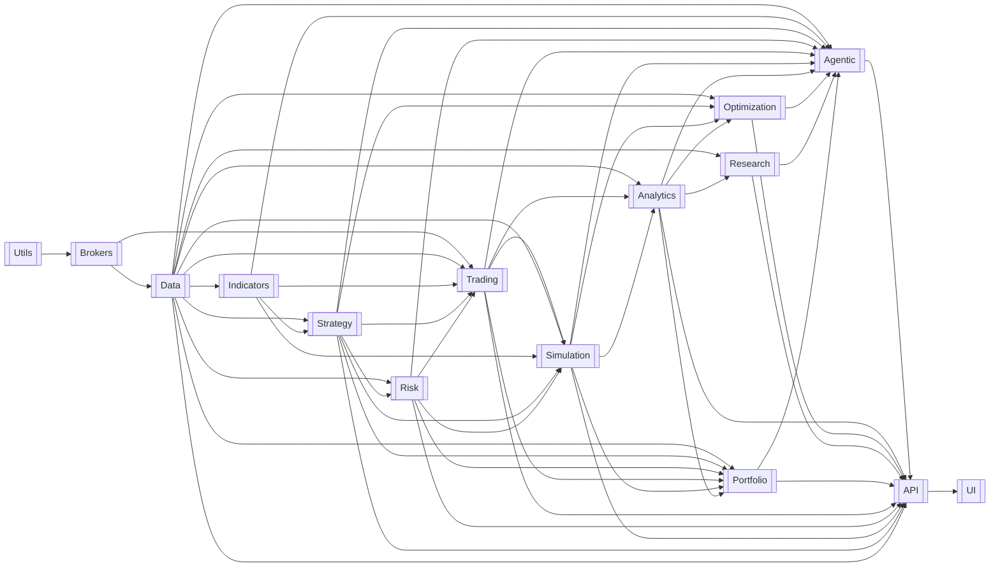
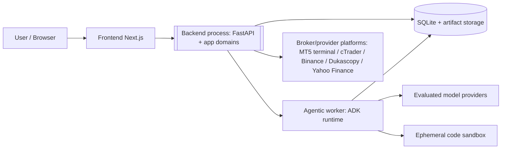

# HaruQuantAI

> **System path:** `HaruQuantAI/`
> **Status:** `In Progress` — of 232 registered application features, 220 are implemented and structurally reconciled (94.83%); 12 are `Pending` and none are `Partial`. Deployment, external-provider readiness, and separately registered system workflows remain distinct runtime concerns.
> **Last updated:** `2026-08-12`

> This document is the system-level source of truth.
> It defines how domains fit together, how cross-domain workflows operate, which rules apply system-wide, and how the complete system is verified.
>
> Domain internals belong in each domain's own `README.md`.
> Do not duplicate domain-level requirements, files, functions, or implementation details here.
> Each owning package README's `### Feature Registry` is the sole canonical
> current-state registry for that package's feature IDs, statuses, module
> ownership, public API, contracts, requirements, and usage evidence.
> `docs/CHANGELOG.md` records dated history and is not a current feature registry.

---

## 1. System Purpose and Boundary

### Purpose

HaruQuantAI is an algorithmic trading platform that turns market data into governed trading outcomes. It acquires and normalizes market data, derives indicators, generates strategy signals, and forces every trading proposal through independent risk governance before execution. Approved actions are executed deterministically across paper and live routes (against a broker) and the sim route (against a simulated execution environment). Execution and simulation results are persisted by their owning domains and may be evaluated through read-only performance analytics. The system fails closed: if safety, context, or state cannot be proven, execution is blocked.

This document defines the target system and the contract-governed continuation of
the existing implementation. Utils and Brokers are completed implementation
baselines. Data's functional baseline and owner-approved fourteen-feature focused
architecture are implemented by `CAP-DATA-028`. Later agile phases run
compatibility/regression gates and add only requirements that are not already
satisfied.

### Current delivered baseline

- `app/utils/` implements the shared v1 contracts, errors, identifiers, UTC,
  canonical serialization, redaction/security helpers, settings, and logging.
- `app/services/brokers/` is a completed implementation baseline. The canonical
  contracts, capability matrix, runtime safety, provider channels, and deterministic
  conformance kit implement `FEAT-BRK-00`-`FEAT-BRK-10`. MT5/cTrader execution-state,
  calculation, and mutation bodies are present; cTrader/Binance streams and
  cTrader market data are present; Dukascopy maps direct provider BID candles without local OHLC derivation.
  Release remains fail-closed: `capabilities/matrix.py` releases only the verified
  MT5 demo `check_order`, `place_order`, `cancel_order`, and `close_position`
  operations, and adapter instances downgrade those writes outside `demo`.
  All other implemented mutations remain `UNAVAILABLE`; no live-money write is
  completion evidence.
- `app/services/data/` implements its v1 contracts, normalized retrieval, storage,
  cache, audit persistence, transforms/alignment, synthetic generators,
  quality validation, scheduler jobs, feeds, source policy/composition, and
  public operations. The functional migration (`CAP-DATA-026`) and
  backup/restore/retention capability (`CAP-DATA-027`) are implemented, preserving
  active `FR-DATA-*` behaviour, contract versions, schema identifiers, error codes,
  and the explicit 207-name package-root API. Architectural acceptance of
  `CAP-DATA-026` was withdrawn because its horizontal module folders and ten
  usage programs do not satisfy one feature = one module folder = one usage program.
  `CAP-DATA-028` implements the approved fourteen-feature corrective target.
  Feature-owned contracts and behavior live in their focused owners, removed
  horizontal paths have no compatibility shims, and exactly fourteen numbered usage
  programs supply deterministic evidence. Data is `Completed`: package-local
  implementation, validation, the production-consumer package-root boundary,
  standalone usage evidence, and the approved MT5 demo-provider validation pass. The
  functional baseline includes series-level
  quality inspection (`CAP-DATA-023`), economic calendar scraping (`CAP-DATA-024`),
  and source composition, external artifact import, and stale-cache policy
  (`CAP-DATA-025`) and backup/restore/retention. The owner-authorized licensed
  economic-calendar path was verified on 2026-07-30 against ForexFactory,
  MetalsMine, EnergyExch, and CryptoCraft through Firecrawl. Non-MT5 broker-provider
  reads remain `UNAVAILABLE` until the Brokers catalogue records read-release
  evidence; that is not a Data defect.
- These domains are not rebuilt phase-by-phase. Data's applicable Google-style
  docstrings are structurally enforced; remaining repository-wide cleanup is tracked
  separately from functional domain completion.
- Indicators is built as one domain before Strategy, covering all approved
  Core, trend, volatility, momentum, volume, and candle-pattern indicators.
  Later roadmap allocations for those completed features become regression gates
  rather than duplicate builds.

### System owns

- Direct connectivity to external broker and market-data provider platforms (MT5, cTrader, Binance, Dukascopy, Yahoo Finance) behind a single canonical passthrough interface.
- Acquisition, normalization, and storage of trusted market and account data.
- Deterministic indicator computation and strategy signal generation.
- Risk governance of every trading proposal before any execution (the master gate).
- Formulation and dispatch of order intents across simulation, paper, and live routes, including reconciliation and emergency controls.
- Deterministic historical backtesting and parameter optimization.
- Performance analytics, reporting, and advisory research.
- Authenticated user and service access through the API, with user presentation owned by UI.

### System does not own

- Broker-side order matching, settlement, and custody of funds (owned by the broker platforms, reached through the Brokers domain's connections).
- Origination of market data (owned by external providers/broker feeds).
- Guarantees of strategy profitability or regulatory/compliance advice.
- Availability of external broker and market-data services.

### Primary users / actors

| Actor                                       | Uses the system to                                                      |
| ------------------------------------------- | ----------------------------------------------------------------------- |
| `Owner / Admin`                           | Define policy, configuration, and governance settings                   |
| `Operator`                                | Run, monitor, and intervene in trading operations (incl. kill switch)   |
| `Researcher`                              | Explore data, test hypotheses, produce advisory insights                |
| `Strategy Developer`                      | Build, backtest, and optimize strategies                                |
| `Risk Manager`                            | Set risk thresholds, review decisions, operate the kill switch          |
| `Read-only Viewer`                        | Inspect dashboards, reports, and audit trails                           |
| `Service Account`                         | Execute approved, read-only, allowlisted system plans                   |
| `Broker platform (MT5, cTrader, Binance)` | External counterparty: supplies data and account state, receives orders |

---

## 2. Domain Capability Map

This diagram shows the complete system and its domains at a glance.


```mermaid
flowchart TD
    SYSTEM[[HaruQuantAI]]

    SYSTEM --> UTILS[[Utils]]
    SYSTEM --> BROKER[[Brokers]]
    SYSTEM --> DATA[[Data]]
    SYSTEM --> IND[[Indicators]]
    SYSTEM --> STRAT[[Strategy]]
    SYSTEM --> RISK[[Risk]]
    SYSTEM --> TRADE[[Trading]]
    SYSTEM --> SIM[[Simulation]]
    SYSTEM --> ANA[[Analytics]]
    SYSTEM --> OPT[[Optimization]]
    SYSTEM --> RES[[Research]]
    SYSTEM --> PORT[[Portfolio]]
    SYSTEM --> AGENTIC[[Agentic]]
    SYSTEM --> API[[API]]
    SYSTEM --> UI[[UI]]

    UTILS --> UTILS_CAP[Provide shared business-neutral infrastructure]
    BROKER --> BROKER_CAP[Provide direct passthrough connections to external broker and market-data provider platforms]
    DATA --> DATA_CAP[Provide trusted market and account data]
    IND --> IND_CAP[Compute deterministic indicator values]
    STRAT --> STRAT_CAP[Generate trading signals and trade intents]
    RISK --> RISK_CAP[Approve or reject every trading proposal]
    TRADE --> TRADE_CAP[Execute approved actions on sim, paper, and live routes]
    SIM --> SIM_CAP[Replay strategies deterministically over history]
    ANA --> ANA_CAP[Measure and report trading performance]
    OPT --> OPT_CAP[Search and validate strategy parameters]
    RES --> RES_CAP[Produce advisory insights from data]
    PORT --> PORT_CAP[Construct and govern multi-strategy portfolios]
    AGENTIC --> AGENTIC_CAP[Operate a governed multi-agent research and proposal firm]
    API --> API_CAP[Orchestrate authenticated backend access]
    UI --> UI_CAP[Present the system to users]
```

### 2.1 Domain Registry

Domains are listed in dependency order, from lowest dependency to highest dependency.

#### 2.1.1 Utils

* **Package**: `app/utils`
* **Responsibility**: Provide business-neutral shared infrastructure to all other domains.
* **Inputs**: Raw log records, error conditions, audit payloads, bounded public-operation results, and environment settings.
* **Outputs**: Structured and specialized logs, mapped/routed errors, prefixed IDs, canonical JSON, shared context/audit/response contracts, redacted values, and loaded settings.
* **Owns**: Structured and bound-context logging, UTC time policy and formatting, monotonic execution-duration calculation, shared `AuthContext`, `AuditEvent`, and `StandardResponse[T]` contracts, shared base errors, immutable business-neutral error definitions and catalogue validation, injected error-event routing, ID generation, canonical serialization, explicit/process bootstrap settings models, and denylist-first redaction. Utils owns no repository configuration file or database state.
* **Boundaries**: Owns no durable business state and makes no business decisions. It owns the shared response envelope but not the typed domain payload, completed business outcome, or domain error-code policy carried through that envelope. It does not own authentication, identity verification, password hashing, credential encryption or persistence, credential-reference resolution, encryption-key generation/storage/rotation, active-key selection, strategy logic, risk rules, broker operations, persistence, or any other domain contract base classes. API's composition root owns the single-consumer credential-protection and resolution workflow.
* **Key Limits**: No business decisions; no durable business state; secret redaction is denylist-first and case-insensitive before any persistence or emission.
* **Documentation**: `app/utils/README.md`

#### 2.1.2 Brokers

* **Package**: `app/services/brokers`
* **Responsibility**: Provide a pure, thin passthrough layer over external broker/trading and market-data provider platform APIs — trading-capable platforms (MT5, cTrader, Binance Spot/Futures profiles) and read-only providers (Dukascopy, Yahoo Finance) — behind one canonical `BrokerAdapter` interface, with zero business logic. Every function in the system that requires a live connection to a broker or provider routes exclusively through this domain.
* **Inputs**: Canonical broker requests (market data reads, account state reads, order mutations, execution-state reads, subscriptions), `BrokerConnectionConfig` constructed by an approved composition root with caller-selected environment and API-resolved in-memory credentials. API remains the interactive application composition root; Data's package-root retrieval facade may privately construct a read-only configuration for standalone calls. Trading may receive an injected capability-scoped adapter but does not resolve secrets or mutate its configuration.
* **Outputs**: Canonical DTOs preserving provider truth in Utils-owned
  `StandardResponse[T]`, Brokers-owned response extensions and error codes,
  streaming subscription events and connection lifecycle events (canonical event
  DTOs), capability/feature-flag reports, and connection/session status.
* **Owns**: Per-platform adapter implementations, the broker registry/factory (`create_broker_adapter`; adapter instances are created via the registry and owned by the caller), connection/session lifecycle mechanics (state machine, keep-alives, transport reconnects), translation of provider-native symbol/request values into provider API calls, canonical DTO and error mapping (unenriched), capability discovery, and transport-level flow control (rate-limit throttling, bounded backpressure, and the adapter-local closed/open/half-open circuit breaker specified by the Brokers README).
* **Boundaries**: Pure passthrough with zero business logic — no business validation (structural/transport validation only), no risk checks, no decision-making, no data enrichment, no business retry/replay (transport-level flow control and connection recovery are permitted; mutations are never retried), and no state management beyond the live session (no durable state). Owns no credential vault and performs no credential persistence, encryption, or database access; approved composition roots resolve settings before constructing `BrokerConnectionConfig`, and only resolved secret values live in memory for the adapter lifecycle. Data owns canonical market identity, friendly names, and every provider/cross-provider alias mapping; Brokers accepts and reports exact provider-native symbol strings only and owns no alias resolution. Brokers does not normalize into `MarketDataset` / `AccountStateSnapshot` and never leaks raw SDK objects across its boundary. Only Trading may invoke application mutation operations; Data's use is strictly read-only; Simulation is a read/factory consumer that constructs and drives the Brokers-owned simulation broker channel through an injected, structurally typed authority port; Risk and all other domains have no Brokers dependency. The read/write split is enforced by capability-trait scoping (`MarketDataProvider`, `TradeExecutionProvider`, `AccountProvider`, `CalculationProvider`).
* **Key Limits**: Sole live-connectivity path to any broker/provider; connection, scope, or permission failure fails closed; mutations are never retried — uncertain outcomes return `BROKER_UNKNOWN_OUTCOME`; unsupported capabilities return `BROKER_CAPABILITY_UNSUPPORTED` deterministically; an open adapter-local transport circuit returns `BROKER_CIRCUIT_OPEN` without a provider call; no path returns a synthetic substitute.
* **Status**: `Completed`. Eleven focused Brokers features are implemented: instrument profiles, capability metadata, five direct provider channels, reconciliation, environment isolation, event normalization, and conformance. Provider release policy and production authorization remain separate runtime gates.
* **Documentation**: `app/services/brokers/README.md`

#### 2.1.3 Data

* **Package**: `app/services/data`
* **Responsibility**: Acquire, normalize, store, and serve trusted market data, read-only broker/account state, and governed point-in-time research-source documents. All broker/provider access is read-only and flows through the Brokers domain's canonical read capabilities.
* **Inputs**: Package-root retrieval arguments or typed Data requests, Broker/provider reads, historical files, admitted CSV/Parquet artifacts, backfill commands, and licensed filing/transcript/macro/news/approved alternative source records.
* **Outputs**: Normalized bars/ticks (`MarketDataset`), ordered one-second MT5 TCP latest-value snapshot events, account/broker state snapshots (`AccountStateSnapshot`), storage state, detached analytical projections, and opaque point-in-time research-source/query evidence values.
* **Owns**: Historical market and account data storage/persistence, durable audit storage, shared database infrastructure, connections, locking, SQLite migration execution framework, real-time acquisition cadence and feed handling, shared stream sequencing/fan-out/resume/backpressure policy, data-source selection and cross-provider fallback policy, every provider/cross-provider alias mapping plus canonical and friendly market identity, conversion of those identities to exact provider-native symbols before a Brokers call, normalization of raw broker/provider reads into `MarketDataset` / `AccountStateSnapshot`, multi-timeframe alignment, deterministic series-level market-data quality inspection producing scored issue, severity, and remediation evidence, and deterministic tick-series derivation from real bar or tick evidence under approved tick and spread models (distinct from GBM synthetic generation, which is fixtures-only and never reaches an official simulation run).
* **Boundaries**: Foundation layer with no trading decision logic. Brokers continues to own provider adapter implementations and connection/session mechanics. Data's package-root retrieval facade may privately and lazily compose a read-only adapter through the Brokers factory from Utils-loaded settings; manual adapter/source injection remains supported. Data does not expose that composition, invoke broker mutations, own strategy logic, backtest engines, sizing formulas, order dispatch, or other domains' tables, artifact schemas, and migration definitions (each domain owns its tables, artifact schemas, and migration definitions, utilizing the shared execution framework). Raw provider DataFrames, sockets, DB sessions, credentials, adapters, and provider SDK objects never cross its boundary. Data may explicitly project canonical bar or tick `MarketDataset` evidence into detached analytical DataFrames whose exact columns, missingness, units, and precision-loss boundaries are fixed in the Data README; the canonical dataset remains authoritative evidence.
* **Key Limits**: Backfill chunks must be bounded and checkpointed; exclusive path-scoped write locks (`CONCURRENT_WRITE_LOCKED` on conflict); no-lookahead alignment by default; all broker/provider access is read-only and routed through Brokers. MT5 live presentation accepts a global union of 1–200 exact actively demanded symbols from revisioned one-second MQL5 TCP snapshots and never claims intermediate-tick completeness. Data acquires/releases demand through Brokers; the gateway restores the union after reconnect and admits only the EA-acknowledged revision. The MT5 Python package remains limited to non-streaming control/history reads, and sampled snapshots are never presented as complete OHLCV bars. Quality evidence attached to a `MarketDataset` must be computed from the actual records; a constant or unexamined quality score is never emitted.
* **Market-time authority**: Data owns broker-independent market-hour evaluation. Brokers supplies provider-authored symbol sessions (including cTrader weekly intervals and holidays); exchange-traded instruments require an explicit exchange calendar identifier; providers without a session API may use only an explicit revisioned weekly definition. Named Sydney/Tokyo/London/New York sessions are analytical liquidity labels and never establish tradability or order authority.
* **Module structure**: All fourteen registered features are complete. Point-in-time source evidence is owned by `FEAT-DATA-09`, artifact/reference catalog operations by `FEAT-DATA-02`, runtime persistence adapters by `FEAT-DATA-13`, and replay packages by `FEAT-DATA-14`. Each registered feature owns exactly one folder and one standalone usage program. Historical interpretation remains owned by Research/Agentic.
* **Documentation**: `app/services/data/README.md`

#### 2.1.4 Indicators

Indicators owns deterministic measurements and versioned snapshot transports;
Risk remains the sole authoritative regime-classification and policy-modifier owner.
All twelve registered Indicators features are `Completed` against the calculable
portion of the target architecture in
`docs/dev/Indicators_Formula_Ownership_Specification_v1.0.md` (12 ownership-bounded
features, 64 registered formulas, and a richer `IndicatorSnapshot` publication
contract). The `volatility/` module (`IND-VOL-01`..`10`) and the `trend/` module
(`IND-TR-01`..`06`) are fully migrated; `structure/` (`IND-ST-01`..`07`, new module) is
fully migrated; `order_flow/` implements the complete calculable OHLCV subset — `IND-OF-03`
(CVD) and `IND-OF-04` (aggressive trade imbalance) are implemented, as a documented
OHLCV bar-sign proxy, because the remaining seven `IND-OF-*` indicators require L2
order-book/trade-event input the current `MarketDataset` contract does not carry (see
`app/services/indicators/order_flow/__init__.py`). `liquidity/`, `market_speed/`,
descriptive `regime/`, and `patterns/` are also migrated for every formula supported
by the canonical OHLCV contract. Book/trade-dependent formulas are explicitly outside
the current input contract rather than represented by unusable stubs.

* **Package**: `app/services/indicators`
* **Responsibility**: Compute deterministic, pure-function indicator values from normalized data.
* **Inputs**: One normalized `MarketDataset v1` from Data per calculation, plus validated indicator parameters.
* **Outputs**: `StandardResponse[IndicatorSeries]` with `available_at` metadata in the raw `data` field.
* **Owns**: The 64-formula registry, parameter validation, registry discovery, and capability matrix. Book/trade-dependent formulas remain outside the current canonical Data contract.
* **Boundaries**: Pure functions with no I/O on the calculation path. Does not own broker calls, order state, strategy lifecycle, caching, or data acquisition.
* **Key Limits**: Inputs must be normalized and non-empty; Indicators derives explicit causal `available_at` and source-window metadata, while the consuming/orchestrating domain enforces `decision_time`; calculations are fully deterministic.
* **Documentation**: `app/services/indicators/README.md`

#### 2.1.5 Strategy

* **Package**: `app/services/strategy`
* **Responsibility**: Turn market state and indicator values into canonical trading signals and trade intents when invoked by an approved runtime workflow, including deterministic evaluation of untrusted external research proposals.
* **Inputs**: Normalized datasets, indicator series, strategy parameters, lifecycle commands, `AccountStateSnapshot`, and receiver-owned `StrategyProposalEvaluationRequest`.
* **Outputs**: Utils `StandardResponse[T]` values carrying canonical signals, `TradeIntent` proposals, diagnostics, mutation outcomes, and `StrategyProposalEvaluationResult`.
* **Owns**: Strategy registry and versioning, parameter schemas, database persistence (`strategy_definitions`, `strategy_versions`, `strategy_configs`, `strategy_state`, `strategy_checkpoints`, `strategy_signals`, `strategy_mutations`) under migrations `0001_strategy_domain` and `0002_strategy_seven_table_runtime`, plus operational-planning tables (`strategy_profiles`, `strategy_playbooks`, `strategy_setup_evaluations`, `strategy_plans`, `strategy_automation_policy`, `strategy_lifecycle`) under additive migration `0003_strategy_operational_planning`, 7 built-in strategy evaluators (`naive-ma-trend`, `decomposing-trade`, `harriet-hedging`, `market-structure`, `random-walk`, `sqx-breakout-atr-trailing`, `white_fairy`), strategy state checkpoints, deterministic strategy evaluation, signal/intent generation, and operational-planning features organized into focused modules (`profiles/`, `playbooks/`, `setup_evaluation/`, `trade_plan/`, `operating_envelope/`, `management_plan/`, `automation/`, `lifecycle/`), plus the receiver-owned external-proposal evaluation boundary.
* **Boundaries**: Emits proposals (which may include sizing proposals), never broker orders. Does not own live/paper runtime orchestration, risk enforcement, final position sizing approval (Risk owns the final approved size), order routing, official fills, or data normalization.
* **Key Limits**: Neutral signals emit no action; lookahead or clock-drift violations fail the batch atomically; account/broker state access is read-only `AccountStateSnapshot` from Data.
* **Documentation**: `app/services/strategy/README.md`

#### 2.1.6 Risk

* **Package**: `app/services/risk`
* **Responsibility**: Intercept every trading proposal and approve or reject it against safety limits, exposure, and governance policy — the master gate.
* **Inputs**: `TradeIntent` proposals from Strategy, account/broker state and `MarketContextEvidence` from Data, Risk-owned `ApprovalAttestation`, risk policies, and thresholds.
* **Outputs**: Function-built `RiskDecision` (approved intent with approval token, or structured rejection), `ActionPolicyVerdict`, `KillSwitchState`, and advisory `ScenarioResult` values. The package root exports standalone functions only; contract classes, enum classes, and constants remain Risk-internal.
* **Owns**: Proposal interception, final approved/capped position size, safety limits, portfolio exposure and drawdown tracking, action-policy verdicts, approval-token issuance/validation and atomic pending-approval reservation, kill-switch policy/hierarchy/active state/clearance, lifecycle gates (research → full-live), and cryptographic audit chaining of decisions.
* **Boundaries**: Does not own data ingestion, strategy code, broker submission, or account state truth. Cannot execute anything itself.
* **Key Limits**: Missing thresholds or unverifiable broker state fail closed; live approval requires active broker state validation; strict payload size and structure limits; strict `Decimal` handling (`allow_inf_nan=False`, `ROUND_HALF_EVEN`).
* **Documentation**: `app/services/risk/README.md`

#### 2.1.7 Trading

* **Package**: `app/services/trading`
* **Responsibility**: Orchestrate live and paper evaluation workflows, convert approved risk decisions into deterministic order intents, and execute them on the selected route (`sim`, `paper`, `live`) with reconciliation, monitoring, and emergency controls.
* **Inputs**: Live/paper evaluation triggers, strategy references, route/profile configuration, runtime gate configuration, approved `RiskDecision`s with approval tokens, Risk-owned `ActionPolicyVerdict`s, and `KillSwitchState`.
* **Outputs**: Function-built `OrderIntent`s, execution receipts / `TradeRecord`s, reconciliation results, and `OperationalEvent` monitoring/incident evidence. The package root exports standalone functions only; DTO classes, enum classes, and constants remain Trading-internal.
* **Owns**: Live/paper runtime orchestration, broker-authoritative active order state, closed-position execution persistence, receipts and execution evidence, its own tables, schemas, and migration definitions, order intent formulation, client order IDs and idempotency, route-aware request packing, runtime gates, execution-broker/account/environment selection, broker dispatch after Risk clearance, reconciliation authority, execution monitoring, and emergency stop of in-flight execution. Trading does not persist tick-valued open positions or separate fill/order-transition projections.
* **Boundaries**: Trading may coordinate Data, Indicators, Strategy, and Risk during a live/paper evaluation, but it does not own their decisions or business logic. Its execution phase begins only after receiving an approved `RiskDecision` and compatible `ActionPolicyVerdict`; it executes exactly the approved size. It enforces Risk's active kill-switch hierarchy by blocking new dispatches and attempting only truthful cancellation of pending/cancellable work. It resumes only after authorized clearance and reconciliation. It does not own signal creation, risk/action policy, approval reservations, backtest orchestration, broker connections/adapters, or secret storage (Brokers owns connections and adapters; credentials are resolved by the API composition root and injected via `BrokerConnectionConfig`). Only Trading may invoke `BrokerAdapter` mutation operations, and only for approved broker mutations; it may also use adapter reads needed for execution and reconciliation. Paper and live share the same execution path and differ only by the environment/credentials carried in the injected `BrokerConnectionConfig`. Trading cannot approve its own risk decisions.
* **Key Limits**: Live actions require valid approval tokens and volume constraints; `ALLOW_LIVE_MUTATIONS=false` blocks all live mutation by default; Decimal precision ≥ 28 digits with 8-decimal quantization; idempotency via SHA-256 over canonical JSON; broker operation timeout and check frequency limits; blind retries banned — unknown broker state freezes execution.
* **Documentation**: `app/services/trading/README.md`

#### 2.1.8 Simulation

* **Package**: `app/services/simulator`
  * **Responsibility**: Orchestrate deterministic historical backtests and governed simulation missions with scenarios, execution realism, secured recovery, and simulated alert evidence.
* **Inputs**: Historical datasets from Data, order intents via the Trading `sim` route, vetted strategy registry references, backtest configuration.
  * **Outputs**: `StandardResponse[SimulationResult]`, `StandardResponse[PortfolioSimulationResult]`, `MissionDefinition v1`, `ReplayIdentity v1`, scenario/realism provider evidence, secured checkpoints, and simulated `AlertEvent v1` evidence.
  * **Owns**: Simulation results and artifacts persistence, its own tables/schemas/migrations, the historical backtest loop (`Data → Indicators → Strategy → Risk → Trading(sim) → Simulation fills`), simulation-only modes and actual-state checklists, scenario triggers and injected events, execution-realism models, canonical replay identity, secured-session recovery, and simulated alert lifecycle.
  * **Boundaries**: No live side effects. Ordinary live what-if state remains in memory; only explicitly secured durable sessions receive checkpoint recovery. Simulator does not own live broker channels/adapters — through the approved sim⇄live parity programme it consumes Brokers read/factory operations through the Brokers-owned simulation authority port, and Brokers imports no Simulation symbol — nor external alert delivery, or arbitrary strategy code execution.
* **Key Limits**: Initial balance must be positive; only vetted registry references accepted (no raw code); deterministic replay required; public operations return Utils-owned `StandardResponse[T]` with raw producer values in `data` and structured `SIM_*` errors in `error`. The synchronous public run receives an explicit Simulation-owned dependency bundle, uses the request as the sole request-id authority, and binds Trading's sim route to one injected `SimTrader.submit_order` instance. Official execution has no ambient clock, implicit execution model, inferred session calendar, or module-global active engine.
* **Documentation**: `app/services/simulator/README.md`

#### 2.1.9 Analytics

* **Package**: `app/services/analytics`
* **Responsibility**: Compute performance metrics and build reports from trade records, returns, and benchmarks — returning read-only, advisory reports only.
* **Inputs**: an Analytics receiver-defined versioned closed-trade ledger projection emitted by Trading or Simulation, plus a required initial balance and account currency; optional portfolio evidence from Simulation `PortfolioSimulationResult`; benchmark `MarketDataset` and `FXConversionEvidence` from Data. Analytics imports no producer implementation and never infers the ledger from incomplete `TradeRecord`, `ExecutionReceipt`, or raw-fill envelopes. The ledger is the sole primary evidence: Analytics derives the equity curve and every return series from it deterministically on a closed-trade basis, and reports drawdown labelled as such with intra-trade excursion reported separately from MAE.
* **Outputs**: `PerformanceReport`s, dashboard payloads, and `PortfolioAllocationEvidence` with caveat/warning metadata. Scorecards are deferred beyond the initial build; they depend on owner-approved diagnostic thresholds that do not exist, and Analytics owns no promotion-adjacent threshold. No scorecard contract is registered in §5.
* **Owns**: Performance schemas, metric kernels, report builders, dashboard payloads, and caveat metadata catalogs.
* **Boundaries**: Strictly read-only with no side effects. Reports are returned to consumers and are not persisted by Analytics in the initial build. Analytics does not own live state mutation, broker execution, strategy promotion decisions, or arbitrary local file loading.
* **Key Limits**: Monetary math in `Decimal`; ratios in `float64` with documented tolerance; `Infinity` triggers structured validation errors; fails closed on missing FX conversions.
* **Documentation**: `app/services/analytics/README.md`

#### 2.1.10 Optimization

* **Package**: `app/services/optimization`
* **Responsibility**: Orchestrate repeated simulation runs to search strategy parameter spaces via simulation and validate robustness without ever placing trades.
* **Inputs**: Historical datasets, strategy registry references and parameter schemas, simulation results, search configuration.
* **Outputs**: Advisory optimized parameter sets with reproducibility hashes, walk-forward and overfit diagnostics, and search metadata without trade or Strategy-mutation authority.
* **Owns**: Checkpoints and optimization results persistence, its own tables, schemas, and migration definitions, orchestration of repeated simulation runs, bounded grid and seeded random parameter sweeps in V1, walk-forward routines, overfit/robustness diagnostics, deterministic tie-breaking, and atomic search checkpointing. GA and Bayesian search remain outside V1 until separately specified and approved.
* **Boundaries**: Does not own live execution, automatic strategy promotion, or the shared database/migration execution framework. It owns only its optimization tables, artifact schemas, and migration definitions. Strict time-series splitting — no leakage.
* **Key Limits**: Parameter ranges must be explicitly bounded; omitted `dry_run` defaults to `True`; ties resolve deterministically via trade count and candidate hash; oversized payloads rejected.
* **Documentation**: `app/services/optimization/README.md`

#### 2.1.11 Research

* **Package**: `app/services/research`
* **Responsibility**: Provide a sandboxed, leakage-gated environment for data exploration and hypothesis evaluation, producing advisory reports and deterministic source-evidence projections only.
* **Inputs**: Datasets and eligible point-in-time `ResearchSourceDocument` and structured-observation evidence from Data; Analytics public metric contracts.
* **Outputs**: Advisory `ResearchReport`s, insights, feature definitions, hypothesis evaluations, and bounded `FundamentalSourceEvidence`/`SentimentSourceEvidence`.
* **Owns**: Research artifact persistence, its own tables/schemas/migrations, sandboxed analysis, feature engineering, deterministic historical labeling, leakage/bias validation, null models, edge discovery, statistical sign-off, deterministic fundamental/sentiment source-evidence preparation, approved-expectancy governance, drift evidence, and scenario/stress evidence packages. All 16 registered Research features are completed as recorded in the Research registry.
* **Boundaries**: Read-only toward live systems. Does not own live mutations, risk decisions, strategy promotion, or roadmap/code selection. Advisory only.
* **Key Limits**: Non-deterministic routines require seed injection and output logs; persisted artifacts store SHA-256 config hashes; implicit/hidden data filling or dropping is forbidden (`CleaningConfig` explicit).
* **Documentation**: `app/services/research/README.md`

#### 2.1.12 Portfolio

* **Package**: `app/services/portfolio`
* **Responsibility**: Construct, simulation-validate, version, activate, and monitor deterministic multi-strategy portfolio allocations without approving risk or executing trades.
* **Inputs**: Registered Strategy references, Analytics-owned `PortfolioAllocationEvidence`, Data-owned `AccountStateSnapshot` / `FXConversionEvidence`, Simulation-owned portfolio results, Risk-owned eligibility/allocation decisions, and explicit construction/rebalance configuration.
* **Outputs**: immutable `PortfolioDefinition` versions, `PortfolioConstructionResult`, `ActivePortfolioAllocation`, and `PortfolioRebalancePlan`; receiver-owned requests submitted to Risk, Simulation, and Trading.
* **Owns**: registered immutable Portfolio definitions/objectives, deterministic fixed/equal/inverse-volatility construction, target capital-weight metadata and proposed risk-budget weights, proposal/version identity, activation state, drift detection, reduce-only rebalance planning, rollback-as-new-version, the balanced double-entry ledger, and Portfolio-owned schemas/migrations/artifacts. Portfolio startup applies its complete checksummed manifest through Data's ledger, lock, and transactional migration boundary. Risk owns the authoritative risk-budget projection.
* **Boundaries**: `app.services.portfolio` is the sole public import boundary and exports standalone functions only; values and services remain opaque. Portfolio never registers strategies, computes Analytics metrics, approves risk, determines final order size, directly mutates broker state, or imports provider SDKs. Portfolio submits Risk-owned review/budget requests and Trading-owned rebalance execution requests. It cannot activate an allocation without current Risk approval and required simulation evidence.
* **Key Limits**: No hidden numeric defaults; portfolio size, weight caps, evidence freshness, drift thresholds, schedules, and decision expiry are required profile values. Missing/stale evidence fails closed. Live/paper activation requires authenticated human approval plus Risk authorization.
* **Documentation**: `app/services/portfolio/README.md`

#### 2.1.13 Agentic

* **Package**: `app/agentic`
* **Responsibility**: Operate a governed multi-agent trading firm whose specialized leadership, fundamental, sentiment, technical, quantitative, research, trader, experimentation, engineering, portfolio, risk-advisory, and operations roles dynamically collaborate to research, challenge, simulate, optimize, code, explain, and propose decisions.
* **Inputs**: Authenticated operator objectives; point-in-time Data evidence; Indicators, Research, Analytics, Simulation, Optimization, Strategy, Portfolio, Risk, and account-state public evidence; human-authored code specifications; receiver decisions and receipts.
* **Outputs**: Typed `AgentResult[T]`, evidence packs, `DeliberationRecord`, `Hypothesis`, `StrategyThesis`, `ExperimentSpec`, `SweepPlan`/`SweepVerdict`, staged `CodeArtifact`, `PromotionEvidencePacket`, `AllocationProposal`, `RiskAdvisory`, and `TradeProposal`.
* **Owns**: Agentic contracts and provenance; firm mandate and role registry; Google ADK composition behind provider-neutral adapters; durable workflow state; dynamic bounded deliberation; Agentic tool permissions; evidence context and memory; specialized capabilities; sandboxed code generation; Agentic evaluation, promotion evidence, lifecycle, observability, incidents, replay, and public operations.
* **Boundaries**: Agentic may submit an untrusted typed proposal into a receiver's normal public intake. It owns no source acquisition, canonical market fact, deterministic indicator or metric, strategy registration decision, portfolio activation, risk approval, order construction, trading state, execution, broker credential, broker mutation, kill-switch authority, or human authentication. Every consequential proposal passes through the complete deterministic Strategy, Portfolio, Risk, Trading, and Brokers pipeline applicable to that action.
* **Key Limits**: Deny by default; no direct Brokers dependency; no self-approval or mandate override; no model-selected permission or limit; generated code is never hot-loaded; discussion is bounded and preserves dissent; data-dependent roles refuse without governed point-in-time evidence; disabling Agentic leaves deterministic safety and already-approved trading behaviour available.
* **Status**: `Completed`. All 22 registered Agentic features are implemented. Provider availability, real-world evaluation, promotion, and cross-domain composition remain runtime evidence concerns and do not grant Agentic deterministic-domain authority.
* **Documentation**: `app/agentic/README.md`

#### 2.1.14 API

* **Package**: `app/services/api` — FastAPI gateway.
* **Status**: `Completed`. The registry contains 24 contiguous backend features, including the Indicators catalogue and chart-series boundary.
* **Responsibility**: Expose owner-domain capabilities through authenticated HTTP and SSE boundaries, enforce transport/security policy, compose runtime dependencies, and translate owner results into stable external contracts.
* **Inputs**: HTTP and SSE connections, client payloads, authenticated principals, and injected owner-domain public operations.
* **Outputs**: HTTP responses, SSE events, boundary DTOs, and validated `AuthContext` propagated to downstream domains.
* **Owns**: Routes, HTTP wrappers, authentication and authorization enforcement, password hashing, credential encryption/persistence, active-key selection, composition-root credential-reference resolution, DTO translation, operational telemetry transport, Prometheus exposition, clock-drift readiness diagnostics, and Settings-feature bootstrap configuration and API boundary limits.
* **Boundaries**: Transport, security, composition, sequencing, and DTO assembly only. API owns no trading, risk, strategy, analytics, research, portfolio, market-data, indicator, or presentation calculation. Boundary-owned identity/session/idempotency state remains permitted; every workstation-facing gateway capability resides in a focused child feature folder under the non-feature `workstation/` namespace. API-level support is shared only when at least three registered features consume it.
* **Key Limits**: List endpoints are bounded; endpoint deadlines apply; owner-domain errors remain authoritative and are translated without replacement policy.
* **Documentation**: `app/services/api/README.md`

#### 2.1.15 UI

* **Package**: `app/ui` — Next.js frontend.
* **Responsibility**: Present authenticated pages, widgets, workflows, warnings, and explicit unavailable states through the typed API boundary.
* **Inputs**: API responses and streams, authenticated user interaction, and bounded local presentation state.
* **Outputs**: Accessible pages, widgets, navigation, advisory preflight warnings, and typed API requests.
* **Owns**: Frontend pages, layouts, widgets, typed clients, session/page context, interaction state, accessibility, formatting, and loading/empty/stale/error presentation.
* **Boundaries**: UI never becomes authoritative for backend policy, safety, calculations, persistence, or execution. Client checks are advisory. `FEAT-UI-*` uses executable component/integration evidence instead of standalone usage programs. Markets and Watchlists reside in focused `src/features/markets/` and `src/features/watchlists/` folders.
* **Key Limits**: No invented evidence; unavailable values remain explicit; governed actions remain backend-authorized.
* **Documentation**: `app/ui/README.md`

### 2.2 Domain ownership rule

Each responsibility must have one clear owning domain.

```text
One responsibility
→ one owning domain
→ one authoritative domain README
```

Other domains may consume the capability, but they must not duplicate its business logic.

---

## 3. Domain Dependency Diagram

An arrow points from the required domain to the domain that consumes it.


```mermaid
flowchart LR
    UTILS[[Utils]]
    BROKER[[Brokers]]
    DATA[[Data]]
    IND[[Indicators]]
    STRAT[[Strategy]]
    RISK[[Risk]]
    TRADE[[Trading]]
    SIM[[Simulation]]
    ANA[[Analytics]]
    OPT[[Optimization]]
    RES[[Research]]
    PORT[[Portfolio]]
    AGENTIC[[Agentic]]
    API[[API]]
    UI[[UI]]

    UTILS --> BROKER
    BROKER --> DATA
    BROKER --> TRADE
    DATA --> IND
    DATA --> STRAT
    DATA --> RISK
    DATA --> TRADE
    IND --> TRADE
    STRAT --> TRADE
    DATA --> RES
    DATA --> OPT
    DATA --> ANA
    IND --> STRAT
    STRAT --> RISK
    STRAT --> OPT
    RISK --> TRADE
    TRADE --> SIM
    DATA --> SIM
    IND --> SIM
    STRAT --> SIM
    RISK --> SIM
    TRADE --> ANA
    SIM --> ANA
    SIM --> OPT
    ANA --> OPT
    ANA --> RES
    DATA --> PORT
    STRAT --> PORT
    RISK --> PORT
    TRADE --> PORT
    SIM --> PORT
    ANA --> PORT
    DATA --> AGENTIC
    IND --> AGENTIC
    STRAT --> AGENTIC
    RISK --> AGENTIC
    TRADE --> AGENTIC
    SIM --> AGENTIC
    ANA --> AGENTIC
    OPT --> AGENTIC
    RES --> AGENTIC
    PORT --> AGENTIC
    AGENTIC --> API
    ANA --> API
    OPT --> API
    RES --> API
    PORT --> API
    TRADE --> API
    RISK --> API
    SIM --> API
    STRAT --> API
    DATA --> API
    API --> UI
```

Utils is required by every domain; only the Utils → Brokers edge is drawn to keep the diagram readable.

### Dependency explanation

- **Utils** underpins everything (shared context/audit contracts, logging, base errors, IDs, UTC time, canonical serialization, settings, and redaction) and depends on nothing.
- **Brokers** needs only Utils (plus provider SDKs). It is the single live-connectivity path to every external broker and market-data provider platform: a pure passthrough exposing the canonical `BrokerAdapter` contract, with zero business logic of its own. Data consumes it read-only; only Trading may invoke its mutation operations; no other domain touches it.
- **Data** needs Utils and Brokers; it is the sole gateway to market data, storage, and normalized read-only broker/account state.
- **Indicators** consume normalized Data output. **Strategy** consumes Data and Indicators.
- **Risk** consumes Strategy proposals and Data account snapshots; it must be independent of Trading so that execution can never influence approval.
- **Trading** orchestrates live/paper evaluation by invoking the public APIs of Data, Indicators, Strategy, and Risk. It owns execution only after Risk approval and is the single execution owner for `sim`, `paper`, and `live` routes; broker mutations are dispatched through the Brokers domain's canonical `BrokerAdapter` (mutation operations are Trading-only).
- **Simulation** replays history through the Trading `sim` route, so it sits above Trading. Since it orchestrates the historical backtest loop, it depends directly on `Data`, `Indicators`, `Strategy`, `Risk`, and `Trading`. The sim⇄live parity programme additionally fixes the direction `Simulation → Trading → Brokers` plus `Simulation → Brokers`: Simulation is a read/factory consumer of Brokers (it constructs and drives the Brokers-owned simulation broker channel through an injected, structurally typed authority port), while all application mutation operations remain Trading-only. Brokers imports no Simulation symbol, and the dependency graph remains acyclic.
- **Specification evidence ownership** (parity programme): Brokers owns the typed *current* provider specification snapshot — current observation only, never inventing historical effective bounds. Data owns immutable effective-dated historical specification revisions with point-in-time reads and coverage proof. Simulation owns historical execution behavior and never interprets raw provider metadata or backdates current evidence.
- **Analytics** consumes an Analytics-owned closed-trade projection emitted by Trading or Simulation plus benchmarks from Data. It imports neither producer implementation; only `reports/allocation.py` waits for the Simulation-owned `PortfolioSimulationResult v1` producer fixture.
- **Optimization** consumes Data, Strategy, Simulation, and Analytics to drive bounded search and scoring. **Research** consumes Data and Analytics public metric contracts.
- **Portfolio** consumes Data, Strategy, Risk, Trading, Simulation, and Analytics contracts to construct and activate multi-strategy allocations after Risk activates the authoritative risk-budget projection. Risk/Trading/Simulation receive only their own receiver-owned request contracts, so none imports Portfolio and no cycle is introduced.
- **Optimization, Research, and Portfolio** share the highest computational level once their individual prerequisites are stable.
- **Agentic** consumes public evidence and request/result contracts from Data, Indicators, Strategy, Risk, Trading, Simulation, Analytics, Optimization, Research, and Portfolio. It may submit typed receiver-owned requests through their public APIs, but it has no Brokers dependency and receives no privileged execution route. Read and proposal edges do not transfer authority: deterministic receivers validate and decide in full.
- **API** is the highest-dependency backend boundary: it authenticates, orchestrates, and delegates to selected public domain APIs while owning nothing computational.
- **UI** depends only on API contracts and presents their results; it never imports service-domain implementation or becomes a deterministic-policy authority.

No circular dependencies exist. Simulation and Analytics may be implemented concurrently: Simulation imports no Analytics code, and Analytics consumes its receiver-owned ledger mapping rather than Simulation implementation types. The sequencing edge `Simulation FR-SIM-033 → Analytics reports/allocation.py` is an integration-order constraint, not a package dependency cycle.

### Sim⇄Live Parity Programme (system level)

`sim`, `paper`, and `live` use the same Trading orchestration and differ only at an injected
authority boundary. Simulation reproduces MT5 terminology, validation, state transitions,
retcodes, accounting, and provider-shaped evidence for every operation admitted by the active
**Parity Envelope** — a versioned, falsifiable certification matrix of provider, environment,
server/account mode, symbol specification revision, order operation, execution model,
market-evidence class, initial authority state, and evidence sources. `paper` names only the
explicitly declared non-production provider environment inside that envelope; it is not a
synonym for Simulation or live-account execution. Anything outside the matrix fails canonical
eligibility; it is never silently approximated.

Parity Envelope v1 targets **MT5 FX only**. cTrader, Binance, non-FX instruments, corporate
actions, exchange auctions, multi-account behavior, and any broker/account/build without
admitted evidence are excluded. Parity certifies execution behavior, not strategy
profitability or equality across different market histories.

**Maturity ladder.** No implementation phase may claim parity; only the corresponding
completed L5 certificate may make the bounded claim recorded in its immutable envelope:

| Rung | Claim |
|---|---|
| **L1 · Mutation-path convergence** | Equivalent business/risk gates and the same authority boundary are traversed; route-specific safety gates remain explicit |
| **L2 · Evaluation-path convergence** | Indicators, Strategy, and Risk evaluate incrementally against evolving point-in-time state using the same Trading cycle |
| **L3 · Account/order semantics** | Verified account, margin, order, deal, protection, and position behavior matches within the admitted matrix |
| **L4 · Execution realism** | Every stochastic component is calibrated from eligible evidence or excluded from canonical execution |
| **L5-Demo · Bounded demo certification** | Every common gate and the mandatory independent MT5-demo differential gate pass for the published demo envelope |
| **L5-Live · Bounded live certification** | Every common gate and the mandatory independent sanitized live-account differential gate pass for the published live envelope |

**L5-Demo and L5-Live are distinct certificates.** Demo evidence may certify sim-vs-demo only;
L5-Demo never implies L5-Live. A parity certificate is a revocable lease: build, contract,
code/config identity, specification, source/tick model, calibration validity, or detected-drift
changes invalidate the affected certificate, and an expired or invalidated certificate confers
no parity claim.

**Market-evidence observability** bounds every claim: genuine bid/ask ticks are required for
path-sensitive parity; a derived OHLC path is research-only unless a registered invariant is
proven path-independent. **Initial authority state** binds execution identity: a certified run
hashes balances, margin, positions, orders, protections, ownership, transaction watermark, and
accrued costs; the account interval is exclusive or every foreign/manual event is replayed.

**Failure taxonomy.** Parity failures fall into exactly three classes:

1. **Mirrored domain failures** — the simulated provider outcome must mirror the target
   broker's verified behavior exactly (retcodes, state transitions, accounting).
2. **Fail-closed Simulation-integrity failures** — when no verified provider evidence exists,
   Simulation fails closed and the affected path is excluded from the canonical envelope; it
   never invents an approximation.
3. **Seeded/journalled infrastructure injections** — timeouts, unknown outcomes, disconnects,
   and transport faults exist in simulation only through the explicitly seeded and journalled
   scenario/fault-injection engine.

Feature internals, requirement rows, and evidence remain authoritative in the owning package
READMEs (`app/services/simulator/README.md` and the Brokers/Data/Trading registries); the
executable programme is `docs/dev/sim-live-parity-implementation-plan.md`.

### Consolidated feature inventory

The owning package READMEs collectively register exactly 236 canonical `FEAT-*`
features. No secondary programme or work-package identifier namespace is active.

| Status | Count |
| --- | ---: |
| Completed | 220 |
| Pending | 16 |
| Partial | 0 |
| Missing | 0 |
| **Total** | **236** |

The sixteen `Pending` features are `FEAT-UI-05`–`FEAT-UI-13`, `FEAT-UI-15`,
`FEAT-UI-16`, and `FEAT-UI-17`, each awaiting requirement evidence or focused-folder
ownership recorded in `app/ui/README.md` — they are the primary trading workspace and
its enabling foundation, specified by `docs/dev/documentation.pdf` — plus the four
sim⇄live parity-programme Simulation features `FEAT-SIM-15` (Deterministic Execution
Scheduler), `FEAT-SIM-16` (Effective-Dated Calculation Model), `FEAT-SIM-17` (Empirical
Execution Calibration), and `FEAT-SIM-18` (Parity Comparison), registered as Pending in
`app/services/simulator/README.md`.

Feature descriptions, requirements, public APIs, persistence, and evidence remain
authoritative only in the owning package README; this section is the system-level
count and domain index.

### Documentation (README) order

```text
1. Utils
2. Brokers
3. Data
4. Indicators
5. Strategy
6. Risk
7. Trading
8. Simulation
9. Analytics
10. Optimization, Research, and Portfolio (same level once individual prerequisites are stable)
11. Agentic
12. API
13. UI
```

### Eventual implementation order

Same as the documentation order. Optimization, Research, and Portfolio may be implemented in parallel once their declared prerequisites are stable. API is implemented after its backend dependencies, and UI follows the stable API contracts; thin visibility slices may arrive earlier.

Agentic is implemented only after its complete end-state documentation and all
required deterministic seams are approved. Its code follows the canonical
`FEAT-AGT-01`–`22` registry. It remains last among computational domains because its
value and safety depend on the public evidence and enforcement contracts beneath it.

---

## 4. Cross-Domain Workflows

This section documents only workflows involving two or more domains. Internal domain workflows belong in the relevant domain `README.md`.

### Status and scope

| Status              | Meaning                                    |
| ------------------- | ------------------------------------------ |
| **Missing**   | Not implemented or not verified            |
| **Partial**   | Partly implemented or tests are incomplete |
| **Completed** | Implemented, tested, and verified          |

The `Domains involved` chain lists core business participants only. Brokers is a
conditional provider participant when Data acquires broker-backed evidence and an
explicit participant when Trading dispatches `paper`/`live` mutations. Utils is shared
infrastructure for shared context/audit contracts, time, IDs, serialization, settings,
logging, and redaction and is implicit unless
a workflow step directly invokes a Utils-owned operation. Every core/conditional domain
documents its own boundary; implicit Utils use does not create a business-workflow step.

| Status  | Workflow ID    | Workflow                                     | Trigger                                   | Domains involved                                                                                      | Final outcome                                                                                               | Integration test                                          |
| ------- | -------------- | -------------------------------------------- | ----------------------------------------- | ----------------------------------------------------------------------------------------------------- | ----------------------------------------------------------------------------------------------------------- | --------------------------------------------------------- |
| Completed | `SYS-WF-001` | Historical backtest                          | Backtest request                          | `Data → Indicators → Strategy → Risk → Trading(sim) → Simulation → Analytics`                 | Deterministic simulation result and performance report                                                      | `tests/system/integration/test_backtest.py`             |
| Completed | `SYS-WF-002` | Signal to live execution                     | Market data update / scheduled evaluation | `Data → Indicators → Strategy → Risk → Trading(paper/demo or live) → Brokers → Trading reconciliation → UI/API`; Analytics may run later from a complete closed-trade ledger | Approved order executed at broker, reconciled and recorded; unknown broker state is frozen and submitted for critical alert delivery | `tests/system/integration/test_signal_to_live.py`       |
| Completed | `SYS-WF-003` | Parameter optimization and approved adoption | Optimization request                      | `Data → Optimization → Strategy → Simulation → Analytics → Optimization → UI/API → Strategy` | Advisory result, authenticated explicit adoption, and a new immutable Strategy configuration | `tests/system/integration/test_optimization.py`         |
| Completed | `SYS-WF-004` | Research to strategy candidate               | Researcher hypothesis                     | `Data → Research → UI/API → Strategy`                                                            | Advisory `ResearchReport`, explicit human review, and accepted immutable Strategy registration | `tests/system/integration/test_research_to_strategy.py` |
| Completed | `SYS-WF-005` | Operator monitoring and kill switch          | Operator action via UI/API                | `UI/API → Risk → Trading → UI/API`                                                                | Kill switch engaged; all execution halted fail-closed; canonical activation submitted for critical alert delivery | `tests/system/integration/test_kill_switch.py`          |
| Completed | `SYS-WF-006` | Strategy operational eligibility             | Registered strategy eligibility request   | `Strategy/Data → UI/API/Portfolio → Risk → Portfolio/Trading/UI/API`                             | Versioned route/profile eligibility decision                                                                | `tests/system/integration/test_strategy_eligibility.py` |
| Completed | `SYS-WF-007` | Portfolio construction and activation        | Portfolio construction request            | `UI/API → Data/Strategy/Analytics → Portfolio → Simulation → Risk → Portfolio`                 | Risk-approved active portfolio allocation                                                                   | `tests/system/integration/test_portfolio_activation.py` |
| Completed | `SYS-WF-008` | Governed portfolio rebalance                 | Drift or scheduled rebalance trigger      | `Data → Portfolio → Risk → Trading → Brokers → Analytics`                                      | Approved reduce-only rebalance reconciled and measured                                                      | `tests/system/integration/test_portfolio_rebalance.py`  |
| Missing | `SYS-WF-009` | Agentic firm research council | Operator research or analysis request | `Data/Indicators/Research/Analytics/Simulation/Optimization → Agentic → UI/API` | `DeliberationRecord` and typed research output, or `insufficient_evidence` | `tests/system/integration/test_agentic_research_council.py` |
| Missing | `SYS-WF-010` | Agent-authored artefact promotion | Human-approved code specification | `Agentic (sandbox) → Simulation/Optimization → Agentic → UI/API (human sign-off) → Strategy/Indicators` | Signed `PromotionEvidencePacket v1` accepted by the receiver, or terminal `research_only` | `tests/system/integration/test_agentic_promotion.py` |
| Missing | `SYS-WF-011` | Agentic portfolio and risk council | Operator or scheduled advisory request | `Data/Analytics/Portfolio/Risk → Agentic → Portfolio/Risk/UI/API` | Non-binding `AllocationProposal` and `RiskAdvisory`; deterministic receiver decision remains authoritative | `tests/system/integration/test_agentic_advisory.py` |
| Missing | `SYS-WF-012` | Agentic trade proposal to deterministic pipeline | Approved Agentic thesis workflow | `Agentic → Strategy/Portfolio → Risk → Trading → Brokers` | Receiver rejection/expiry or normal deterministic execution and reconciliation; Agentic receives a proposal receipt, never a fill claim | `tests/system/integration/test_agentic_trade_proposal.py` |

---

### `SYS-WF-001` — Historical Backtest

**Purpose:** Evaluate a strategy against history through the same governed path used in live trading, producing a deterministic, reportable result.

**Actor / trigger:** Strategy Developer submits a backtest request (via UI/API once available).

**Input boundary:** Backtest configuration — strategy registry reference, parameters, symbol/timeframe, date range, initial balance.

**Output boundary:** `SimulationResult` (persisted by Simulation) with artifact manifest, plus an Analytics `PerformanceReport` (returned by Analytics).

**Domains and responsibilities:**

| Order | Domain         | Responsibility                                       | Input                      | Output                       |
| ----: | -------------- | ---------------------------------------------------- | -------------------------- | ---------------------------- |
|     1 | `Data`       | Serve normalized historical dataset                  | Backtest range request     | `MarketDataset`            |
|     2 | `Indicators` | Compute indicator series, no lookahead               | `MarketDataset`, params  | `StandardResponse[IndicatorSeries]` |
|     3 | `Strategy`   | Generate signals and trade intents                   | Dataset + indicators       | `TradeIntent`s             |
|     4 | `Risk`       | Approve or reject each intent under sim policy       | `TradeIntent`, sim state | `RiskDecision`s            |
|     5 | `Trading`    | Pack approved decisions into sim-route order intents | Approved decisions         | `OrderIntent`s (route=sim) |
|     6 | `Simulation` | Replay execution, produce fills and journals         | History + intents          | `SimulationResult`         |
|     7 | `Analytics`  | Compute metrics and build the report                 | `SimulationResult`       | `PerformanceReport`        |

**Main flow:**

1. `Simulation` orchestrates the historical backtest loop by coordinating the execution across domains:
   a. Requests normalized historical dataset from `Data` for the requested range.
   b. Triggers `Indicators` to compute indicator series with `available_at` metadata.
   c. Invokes `Strategy` to produce canonical signals and `TradeIntent` proposals bar by bar.
   d. Submits proposals to `Risk` to evaluate each intent under simulation policy.
   e. Passes approved decisions to `Trading` to formulate deterministic sim-route order intents.
   f. Replays execution and produces simulated fills, journals, and a manifest.
2. `Analytics` computes performance metrics and returns the report.

**Failure behaviour:**

- Data gap or misalignment → workflow aborts with a structured data error; no partial results published.
- Lookahead/clock-drift violation in Strategy → atomic batch failure.
- Risk rejection → intent is dropped and recorded; the backtest continues (rejections are results, not errors).
- Simulation boundary failure → structured `SIM_*` error; artifacts from incomplete runs are not published.

**Success condition:** A reproducible `SimulationResult` (persisted by Simulation) is retrievable, and the `PerformanceReport` is returned by Analytics.

**Note:** Brokers is not part of the backtest loop itself. It participates only upstream, when Data acquires or backfills the historical datasets later served to this workflow; the backtest execution path never touches a live provider.

#### End-to-end workflow diagram


```mermaid
flowchart LR
    A[Backtest request]
    B[[Data]]
    C[[Indicators]]
    D[[Strategy]]
    E[[Risk]]
    F[[Trading sim route]]
    G[[Simulation]]
    H[[Analytics]]
    I[Performance report]

    A --> B --> C --> D --> E --> F --> G --> H --> I
```

---

### `SYS-WF-002` — Signal to Live Execution

**Purpose:** Convert a live market signal into a governed, reconciled broker order — or a safe, audited refusal.

**Actor / trigger:** Live/paper market data update or scheduled strategy evaluation under an authenticated principal.

**Input boundary:** Current market state entering Data.

**Output boundary:** Broker execution receipt reconciled and recorded (or an audited rejection), visible to UI/API. Analytics is a later measurement consumer only after Trading or Simulation supplies a complete versioned closed-trade ledger; it never infers a ledger from an execution receipt, open order, raw fill, or incomplete `TradeRecord`. An unknown broker state remains frozen in Trading and produces critical operational evidence for channel-neutral UI/API alert delivery.

**Domains and responsibilities:**

| Order | Domain         | Responsibility                                                                         | Input                                                                   | Output                                                      |
| ----: | -------------- | -------------------------------------------------------------------------------------- | ----------------------------------------------------------------------- | ----------------------------------------------------------- |
|     1 | `Data`       | Normalize live market state; supply account snapshot                                   | Feed/broker reads                                                       | `MarketDataset`, `AccountStateSnapshot`                 |
|     2 | `Indicators` | Derive current indicator values                                                        | Market state                                                            | `StandardResponse[IndicatorSeries]`                       |
|     3 | `Strategy`   | Emit signal /`TradeIntent`                                                           | State + indicators                                                      | `TradeIntent`                                             |
|     4 | `Risk`       | Validate approval attestation, market/account evidence, and action/risk policy         | Intent + snapshots +`MarketContextEvidence` + `ApprovalAttestation` | `RiskDecision` + `ActionPolicyVerdict` + approval token |
|     5 | `Trading`    | Validate Risk-owned verdicts/state, build idempotent order intent, dispatch, reconcile | Approved decision + action verdict +`KillSwitchState`                 | `OrderIntent`, `TradeRecord`                            |
|     6 | `Brokers`    | Passthrough dispatch of the packed order to the broker platform                        | Canonical mutation request via`BrokerAdapter`                         | `StandardResponse` (provider acknowledgement)                 |
|     7 | `UI/API`     | Present the redacted reconciled Trading envelope and build/attempt channel-neutral critical alert delivery only for authoritative unknown-broker-state evidence | Reconciled Trading envelope or critical `BROKER_STATE_UNKNOWN` `OperationalEvent` | Order outcome or `CriticalOperationalAlert` + delivery result |
|     8 | `Analytics`  | Later, compute metrics/reports only from a complete versioned closed-trade ledger | Complete closed-trade ledger after position closure | Updated reports |

**Main flow:**

1. `Trading` owns the live/paper runtime loop and coordinates only through public domain APIs:
   a. Requests normalized live market state and a validated account snapshot from `Data`.
   b. Requests current indicator values from `Indicators`.
   c. Invokes `Strategy` with the market state, indicator series, strategy parameters, and read-only account snapshot.
   d. Receives either no action or a `TradeIntent`; neutral signals end the workflow.
   e. Submits the `TradeIntent` to `Risk` for independent multi-gate validation.
2. If Risk rejects the proposal, Trading records the rejection outcome and performs no mutation.
3. If Risk approves the proposal, it atomically reserves the scoped approval token and returns a compatible `ActionPolicyVerdict`. Trading validates both plus the applicable `KillSwitchState`, builds an idempotent `OrderIntent`, passes runtime gates (including `ALLOW_LIVE_MUTATIONS`), dispatches a canonical mutation request through the Brokers domain's `BrokerAdapter`, and reconciles the result.
4. Trading persists the execution receipt and reconciled execution truth, then returns a redacted envelope to UI/API. The immediate execution chain is audit-logged with correlation IDs.
5. Analytics may run later only after Trading publishes a complete versioned closed-trade ledger. An open/pending order, execution receipt, raw fill, or incomplete `TradeRecord` is not Analytics input.
6. When Trading first locks a conflict scope for an unknown broker state, it emits one critical `BROKER_STATE_UNKNOWN` `OperationalEvent`. UI/API derives a deterministic `CriticalOperationalAlert` from that event and performs one delivery attempt through its injected channel-neutral sink (`WF-API-014`).

**Failure behaviour:**

- Unverifiable account state at Risk → fail closed, intent rejected, audit event emitted.
- Kill switch active → all proposals rejected instantly.
- `ALLOW_LIVE_MUTATIONS=false` or gate failure at Trading → no dispatch; incident logged.
- Unknown broker state after dispatch → no blind retry; execution freezes until reconciliation completes; alert failure is surfaced but never releases the lock or changes execution truth.

**Success condition:** Broker position/order state matches the approved intent, reconciliation confirms it, and an immutable audit chain links signal → decision → order → receipt.

#### End-to-end workflow diagram

```mermaid
sequenceDiagram
    participant T as Trading Runtime
    participant D as Data
    participant I as Indicators
    participant S as Strategy
    participant R as Risk
    participant B as Brokers domain
    participant X as Broker platform (MT5 / cTrader / Binance)
    participant U as UI/API
    participant A as Analytics (later)

    T->>D: Request MarketDataset + AccountStateSnapshot
    D->>B: Read via BrokerAdapter (read traits)
    B->>X: Broker-specific API read
    X-->>B: Raw broker state
    B-->>D: Standardized raw response
    D-->>T: Normalized state + read-only snapshot
    T->>I: Compute indicators from MarketDataset
    I-->>T: StandardResponse[IndicatorSeries]
    T->>S: Evaluate strategy
    S-->>T: No action or TradeIntent
    T->>R: Submit TradeIntent
    R->>R: Independent multi-gate validation
    R-->>T: Rejection or approved RiskDecision
    alt Approved
        T->>B: place_order via BrokerAdapter (mutation, Trading-only)
        B->>X: Provider-specific order call
        X-->>B: Raw execution result
        B-->>T: StandardResponse (provider acknowledgement)
        T->>T: Reconcile and persist execution truth
        T-->>U: Redacted reconciled envelope
    else Rejected
        T->>T: Record rejection; no mutation
    end
    opt After a complete closed-trade ledger exists
        T-->>A: Versioned closed-trade ledger
    end
```

---

### `SYS-WF-003` — Parameter Optimization

**Purpose:** Find robust strategy parameters through bounded, leakage-free search over deterministic simulations.

**Actor / trigger:** Strategy Developer submits an optimization request.

**Input boundary:** Strategy registry reference, bounded parameter ranges, search algorithm, data range.

**Output boundary:** Optimized parameter sets with reproducibility hashes and robustness diagnostics. No trades are ever placed.

**Domains and responsibilities:**

| Order | Domain           | Responsibility                                                                | Input                                                   | Output                                                  |
| ----: | ---------------- | ----------------------------------------------------------------------------- | ------------------------------------------------------- | ------------------------------------------------------- |
|     0 | `Data`         | Serve validated historical datasets for the search range                      | Range request                                           | `MarketDataset`                                       |
|     1 | `Optimization` | Generate candidates, enforce time-series splits, checkpoint                   | Search config                                           | Candidate parameter sets                                |
|     2 | `Strategy`     | Validate parameters against schemas                                           | Candidate params                                        | Validated strategy instances                            |
|     3 | `Simulation`   | Run deterministic backtests per candidate (via SYS-WF-001 core)               | `SimulationBacktestRequestV1` per candidate + history | `SimulationResult`s                                   |
|     4 | `Analytics`    | Score candidates with metric kernels                                          | Results                                                 | Scores (`PerformanceReport`)                          |
|     5 | `Optimization` | Rank, run overfit diagnostics, emit results                                   | Scores                                                  | Optimized params + diagnostics                          |
|     6 | `UI/API`       | Present the advisory result and capture an explicit user selection/approval   | `OptimizationResult`                                  | Approved`StrategyParameterUpdateRequest` or no action |
|     7 | `Strategy`     | Validate the approved request and create a new immutable configuration record | `StrategyParameterUpdateRequest`                      | `ValidatedStrategyConfig` or structured rejection     |

**Main flow:** Optimization orchestrates the repeated simulation runs: candidate generation → per-candidate simulation (each candidate submitted as a `SimulationBacktestRequestV1` through Optimization's internal backtest-adapter port) → scoring (Optimization consumes Analytics' `PerformanceReport` contract; Analytics performs no optimization-specific orchestration) → deterministic ranking (ties broken by trade count then candidate hash) → walk-forward/overfit diagnostics → checkpointed advisory result. UI/API may then present the result for explicit user selection and approval. Only UI/API may submit the resulting Strategy-owned `StrategyParameterUpdateRequest`; Strategy validates it and creates a new immutable configuration record. Optimization never mutates Strategy state.

**Failure behaviour:** Unbounded ranges are rejected up front; oversized payloads are rejected (`OPT_PAYLOAD_TOO_LARGE`); a failed candidate run is recorded and skipped without corrupting checkpoints; leakage detection aborts the search. Missing user approval, an incompatible strategy version, invalid selected parameters, or an unauthorized update prevents adoption without invalidating the advisory optimization result.

**Success condition:** A reproducible advisory result set (identical given the same seed and inputs) with diagnostics. If adoption is requested, success additionally requires explicit user approval and a new immutable Strategy configuration; no step places a trade.

---

### `SYS-WF-004` — Research to Strategy Candidate

**Purpose:** Turn a researcher hypothesis into a reviewed, explicitly approved strategy registration request — without research evidence ever authorizing anything by itself.

**Actor / trigger:** Researcher submits a hypothesis / research request under an authenticated principal.

**Input boundary:** Research request (hypothesis, dataset references, study configuration) entering Research via UI/API.

**Output boundary:** A validated `StrategyRegistrationRequest` accepted or rejected by Strategy; the advisory `ResearchReport` that motivated it remains advisory only.

**Domains and responsibilities:**

| Order | Domain       | Responsibility                                                                                       | Input                               | Output                                               |
| ----: | ------------ | ---------------------------------------------------------------------------------------------------- | ----------------------------------- | ---------------------------------------------------- |
|     1 | `Data`     | Serve research-ready normalized datasets                                                             | Dataset request                     | `MarketDataset`                                    |
|     2 | `Research` | Run leakage-gated studies; produce advisory evidence                                                 | Datasets + hypothesis               | `ResearchReport` (advisory only)                   |
|     3 | `UI/API`   | Present evidence for human review; collect explicit researcher/operator approval; submit the command | `ResearchReport` + human approval | `StrategyRegistrationRequest`                      |
|     4 | `Strategy` | Validate and register (or reject) the immutable strategy candidate                                   | `StrategyRegistrationRequest`     | Registered immutable version or structured rejection |

**Main flow:**

1. `Data` serves research-ready datasets to `Research` (`WF-RES-001`).
2. `Research` runs its Edge Lab stages and publishes a leakage-gated, advisory `ResearchReport` (`advisory_only=True`).
3. `UI/API` presents the report; a human explicitly approves; UI/API constructs and submits `StrategyRegistrationRequest` referencing the report (`WF-API-005`/`WF-API-011`).
4. `Strategy` validates manifest, schema, hashes, provenance references, and principal, then registers one immutable version (`WF-STR-008`) or rejects (`WF-STR-009`).

**Failure behaviour:**

- Leakage-gate failure at Research → publication blocked; nothing reaches UI/API.
- Unauthorized or unapproved submission at UI/API → command never constructed; audit event emitted.
- Validation, authorization, or provenance failure at Strategy → structured rejection; no registry mutation.
- Strategy registration ends this workflow. Operational eligibility is a separate Risk-owned decision in `SYS-WF-006`; registration never implies permission to allocate capital or trade.

**Success condition:** A reviewed strategy candidate exists as one immutable Strategy registry version, with an audit chain linking dataset → report → human approval → registration.

---

### `SYS-WF-005` — Operator Monitoring and Kill Switch

**Purpose:** Let an authorized operator halt (or restore) all execution instantly and fail-closed.

**Actor / trigger:** One authorized operator (or Risk Manager) may activate via
UI/API. Clearance is initiated by one authorized command principal and attested by a
different authorized principal.

**Input boundary:** An authenticated, explicitly scoped `KillSwitchCommand` entering
Risk via UI/API. Activation requires one authorized `AuthContext` and remains
immediate. Clearance additionally requires a current matching `ApprovalAttestation`
whose authorized principal differs from the commanding `AuthContext`.

**Output boundary:** Canonical `KillSwitchState` updated by Risk; Trading enforcement halts or blocks all execution; state visible in UI/API; each confirmed activation is submitted for channel-neutral critical alert delivery.

**Domains and responsibilities:**

| Order | Domain      | Responsibility                                                                                                        | Input                                                             | Output                                                      |
| ----: | ----------- | --------------------------------------------------------------------------------------------------------------------- | ----------------------------------------------------------------- | ----------------------------------------------------------- |
|     1 | `UI/API`  | Authenticate/authorize the command principal; for clearance validate a distinct authorized attestation principal; submit the scoped command and display state | Operator action | `KillSwitchCommand` + conditional distinct-principal `ApprovalAttestation` |
|     2 | `Risk`    | Validate command scope/authority and distinct-principal clearance evidence; mutate and persist canonical kill-switch state; audit-chain the change | `KillSwitchCommand` + `AuthContext` + conditional attestation | `KillSwitchState` |
|     3 | `Trading` | Enforce active state: reject new proposals, stop/cancel in-flight execution per emergency controls                    | `KillSwitchState`                                               | Halted execution; incident logs                             |
|     4 | `UI/API`  | Build and attempt channel-neutral critical alert delivery after confirmed activation                                  | Active `KillSwitchState` + authenticated trace context          | `CriticalOperationalAlert` + delivery result                |

**Main flow:**

1. `UI/API` validates the operator principal and submits a `KillSwitchCommand` with exactly one target scope (`global`, `portfolio`, `strategy`, or `symbol`) (`WF-API-013`).
2. `Risk` accepts activation from one authorized `AuthContext` without waiting for a
   separate approval artifact so emergency stopping remains immediate. Clearance
   requires a current `ApprovalAttestation` bound to the same scope and policy and
   issued by a different authorized principal. Risk applies, persists, and
   audit-chains the canonical state change (`WF-RISK-009`, `WF-RISK-012`).
3. `Trading` observes the active state and halts: new proposals are rejected instantly, in-flight execution is stopped or canceled under emergency controls (`WF-TRD-007`), and safe shutdown proceeds where required (`WF-TRD-009`).
4. `UI/API` reflects the canonical state and audit trail. For an active returned state, it derives a deterministic `CriticalOperationalAlert` and performs one delivery attempt through its injected channel-neutral sink (`WF-API-014`).

**Failure behaviour:**

- Unauthorized or invalid command → rejected at Risk; no state change; audit event emitted.
- Same-principal clearance → rejected deterministically; active state remains unchanged.
- Missing or stale `KillSwitchState` at Trading → execution blocks (fail closed).
- An active or unknown parent scope cannot be overridden by a child scope. Trading resumes only after authorized clearance, valid inactive state at every applicable scope, and successful reconciliation.
- Alert construction or delivery failure is returned as structured operational evidence and logged, but never rolls back, clears, delays, or weakens the canonical Risk state or Trading enforcement.

**Success condition:** Kill switch engaged: no new mutation is dispatched anywhere, in-flight execution is stopped or canceled, the state change is audit-chained end to end, and alert delivery has been deterministically attempted without becoming execution authority.

---

### `SYS-WF-006` — Strategy Operational Eligibility

**Purpose:** Decide whether a registered immutable strategy version is operationally eligible for a specific runtime profile and execution route, without moving registration ownership out of Strategy.

**Actor / trigger:** An authorized operator requests eligibility review after Strategy registration, or Portfolio requests confirmation while preparing a construction request.

**Input boundary:** A `StrategyOperationalEligibilityRequest` entering Risk with the strategy/version reference, runtime profile, execution route, required evidence references, policy version, and approval context.

**Output boundary:** A persisted `StrategyOperationalEligibilityDecision` approving, conditioning, expiring, suspending, or rejecting that strategy/version for the stated scope.

**Domains and responsibilities:**

| Order | Domain                           | Responsibility                                                       | Input                                                | Output                                          |
| ----: | -------------------------------- | -------------------------------------------------------------------- | ---------------------------------------------------- | ----------------------------------------------- |
|     1 | `Strategy`                     | Own immutable registration truth and expose the referenced version   | Strategy/version reference                           | Registered definition and provenance            |
|     2 | `Data`                         | Supply fresh account, market-context, and FX evidence where required | Evidence request                                     | Registered evidence contracts                   |
|     3 | `Risk`                         | Evaluate operational policy; persist and audit the decision          | Eligibility request + registered strategy + evidence | `StrategyOperationalEligibilityDecision`      |
|     4 | `Portfolio / Trading / UI/API` | Consume the decision; never infer eligibility from registration      | Eligibility decision                                 | Construction/execution gating and operator view |

**Main flow:** UI/API or Portfolio submits the Risk-owned request. Risk validates identity, registration reference, evidence freshness, policy compatibility, runtime profile, and route; records one scoped decision with expiry and conditions; Portfolio and Trading require a current approving decision before allocation activation or execution.

**Failure behaviour:** Missing registration, evidence, approval context, policy, or a current approving decision fails closed. Suspension or expiry blocks new and risk-increasing activity but never authorizes an automatic position increase or liquidation.

**Success condition:** Registration truth remains Strategy-owned while operational eligibility is explicit, scoped, current, auditable, and independently Risk-owned.

---

### `SYS-WF-007` — Multi-Strategy Portfolio Construction and Activation

**Purpose:** Construct, validate, Risk-review, and activate a governed allocation across multiple registered strategies.

**Actor / trigger:** An authorized operator submits a portfolio construction request through UI/API.

**Input boundary:** A `PortfolioConstructionRequest` entering Portfolio with strategy/version references, eligibility-decision references, construction method and parameters, account/base currency, evidence references, simulation policy, and requested runtime scope.

**Output boundary:** An immutable `PortfolioConstructionResult` and, only after successful simulation, explicit approval where required, and Risk authorization, a new `ActivePortfolioAllocation` version.

**Domains and responsibilities:**

| Order | Domain               | Responsibility                                                                                         | Input                                                   | Output                                               |
| ----: | -------------------- | ------------------------------------------------------------------------------------------------------ | ------------------------------------------------------- | ---------------------------------------------------- |
|     1 | `UI/API`           | Authenticate, collect explicit approval for paper/live activation, submit, and present status          | Operator request                                        | `PortfolioConstructionRequest` / approval evidence |
|     2 | `Strategy`         | Supply immutable strategy definitions and parameter versions                                           | Strategy references                                     | Registered strategy truth                            |
|     3 | `Data / Analytics` | Supply fresh normalized evidence, including`FXConversionEvidence`, and portfolio allocation evidence | Evidence references                                     | Validated evidence contracts                         |
|     4 | `Portfolio`        | Validate eligibility; construct deterministic candidate weights; version result                        | Request + strategy/evidence references                  | `PortfolioConstructionResult`                      |
|     5 | `Simulation`       | Run the portfolio backtest under simulation policy                                                     | Self-contained`PortfolioBacktestRequestV1` projection | `PortfolioSimulationResult`                        |
|     6 | `Risk`             | Approve, cap, condition, expire, or reject allocations; activate authoritative risk-budget projection  | Self-contained`AllocationReviewRequest` projection    | `AllocationRiskDecision` / budget activation       |
|     7 | `Portfolio`        | Activate one immutable governed version after every gate succeeds                                      | Approved result + current authorizations                | `ActivePortfolioAllocation`                        |

**Main flow:** Portfolio accepts only registered strategy versions with current approving operational-eligibility decisions; resolves all required evidence; and constructs weights using an approved method. It submits receiver-owned, self-contained value projections to Simulation and Risk. Those projections carry required scalar values, ordered component/action values, immutable IDs, versions, evidence references, and hashes; they never embed or require an import of a Portfolio-owned contract type. Portfolio activates a new immutable allocation version only when every reference remains current. Simulation-profile activation is automatic within simulation policy. Paper/live activation additionally requires explicit human approval and Risk authorization.

**Failure behaviour:** Missing/stale evidence, strategy-version drift, eligibility expiry, failed simulation, Risk rejection, expired approval, active kill switch, or concurrent allocation-version change prevents activation. No numeric limit, weight, expiry, or schedule is inferred. Rollback creates a new governed version referencing the prior version; history is never rewritten.

**Success condition:** Exactly one active allocation version exists for the requested scope, with complete lineage from strategies and evidence through simulation, human approval where required, and Risk authorization.

---

### `SYS-WF-008` — Portfolio Drift Review and Rebalance

**Purpose:** Detect allocation drift and execute only a reviewed, authorized rebalance through the existing Risk → Trading → Brokers mutation chain.

**Actor / trigger:** A required rebalance schedule or configured drift threshold is reached for an active portfolio allocation.

**Input boundary:** Active allocation, fresh account/market/FX evidence, current strategy eligibility, and actual exposure entering Portfolio.

**Output boundary:** A versioned `PortfolioRebalancePlan` and, after Risk authorization, `PortfolioRebalanceExecutionRequest` outcomes recorded through Trading's canonical execution contracts.

**Domains and responsibilities:**

| Order | Domain               | Responsibility                                                                                     | Input                                  | Output                                                       |
| ----: | -------------------- | -------------------------------------------------------------------------------------------------- | -------------------------------------- | ------------------------------------------------------------ |
|     1 | `Data / Analytics` | Supply fresh exposure, valuation, FX, and performance evidence                                     | Active allocation and evidence request | Registered evidence contracts                                |
|     2 | `Portfolio`        | Compute drift and produce a deterministic, immutable plan                                          | Target allocation + actual exposure    | `PortfolioRebalancePlan`                                   |
|     3 | `Risk`             | Review a receiver-owned self-contained projection of the plan and authoritative risk-budget effect | `AllocationReviewRequest`            | `AllocationRiskDecision`                                   |
|     4 | `Trading`          | Resolve each authorized component reduction into idempotent orders and reconcile                    | `PortfolioRebalanceExecutionRequest` | Redacted reconciled execution facts                        |
|     5 | `Brokers`          | Perform paper/live mutations only when called by Trading                                           | Canonical broker operations            | Provider-truth results                                       |
|     6 | `Analytics`        | Validate and measure immutable redacted reconciled execution facts                                  | `PortfolioRebalanceMeasurementRequest` | `PortfolioRebalanceMeasurementEvidence`                  |

**Main flow:** Portfolio compares target and actual risk-budget exposure, creates a plan, and submits a receiver-owned self-contained projection to Risk. After approval, Portfolio submits the Trading-owned execution request; Trading resolves component reductions, revalidates gates, and dispatches through Brokers. Portfolio persists execution truth before projecting redacted hash-bound reconciled facts into the Analytics-owned measurement request and records the returned registered evidence reference. Activation gates new or risk-increasing intents; v1 rebalance handles existing over-budget exposure through a Risk-reviewed reduce-only plan and never opens a position solely to make actual holdings match a target weight.

**Failure behaviour:** Active kill switch, stale evidence, expired eligibility/decision, reconciliation uncertainty, or target-version change blocks activation or dispatch. Unknown broker outcomes remain unreconciled and are never treated as success. Analytics failure never rewrites or rolls back execution truth; the workflow returns a structured executed-but-unmeasured outcome and the read-only measurement may be recomputed deterministically from the same immutable execution records.

**Success condition:** Approved reductions or reallocations are executed, reconciled, and measured against the same immutable allocation version, with no unauthorized increase and full audit lineage.

---

### `SYS-WF-009` — Agentic Firm Research Council

**Trigger:** Authenticated operator research or analysis request.
**Domains:** `Data/Indicators/Research/Analytics/Simulation/Optimization → Agentic → UI/API`

1. Agentic validates the mandate, role/data readiness, identity, budgets, and task
   idempotency before persisting the initial checkpoint.
2. The deterministic planner selects evaluated roles and a bounded Google ADK
   workflow graph.
3. Relevant analysts produce independent point-in-time evidence briefs.
4. Proposer, challengers, and deterministic tools create claims, counterclaims,
   rebuttals, and evidence.
5. The synthesizer preserves supported conclusions, uncertainty, and dissent in a
   versioned `DeliberationRecord`.
6. UI/API presents the record and typed research output.

**Failure behaviour:**

- Missing or ineligible data, policy denial, unresolved material conflict, deadline,
  budget, or schema failure produces `refused` or `insufficient_evidence`.
- Provider/tool failure follows bounded retry and checkpoint recovery.
- Agentic unavailable rejects new Agentic work without weakening deterministic
  safety controls.

**Integration test:** `tests/system/integration/test_agentic_research_council.py`

---

### `SYS-WF-010` — Agent-Authored Artefact Promotion

**Trigger:** Human-approved code specification.
**Domains:** `Agentic (sandbox) → Simulation → Agentic (promotion) → UI/API (human sign-off) → Strategy/Indicators`

1. Agentic generates a `CodeArtifact` in an isolated sandbox with no network route and no credential access, writing only to the staging registry.
2. Agentic runs the ordered promotion gates: static analysis, purity and property tests, timestamp causality, temporal non-interference, frozen reference replay, mutation testing.
3. Simulation performs constrained evaluation and walk-forward validation under the target risk profile.
4. Agentic checks the lifetime search budget and out-of-sample consumption register.
5. The Robustness Critic produces a critique memo; Agentic assembles the evidence packet.
6. UI/API presents the artefact for human code review and signature.
7. On signature, the signed `PromotionEvidencePacket v1` is handed to Strategy or Indicators for registration.

**Failure behaviour:**

- Mechanical gate failure → bounded repair loop; counts against the search budget.
- **Leakage, search-budget or holdout-reuse failure → terminal `research_only`, no repair loop.**
- Incomplete evidence packet → `research_only`.
- Absent human signature → no handoff occurs.
- Generated code is never hot-loaded; registration is a deliberate release event.

**Integration test:** `tests/system/integration/test_agentic_promotion.py`

---

### `SYS-WF-011` — Agentic Portfolio and Risk Council

**Trigger:** Authenticated operator or scheduled advisory request.
**Domains:** `Data/Analytics/Portfolio/Risk → Agentic → Portfolio/Risk/UI/API`

1. Agentic retrieves current immutable allocation, analytics, account, mandate, and
   deterministic Risk evidence.
2. Portfolio, risk, compliance, and adversarial roles independently assess the
   evidence and preserve dissent.
3. Agentic emits a non-binding `AllocationProposal` and `RiskAdvisory`.
4. Portfolio and Risk validate any submitted receiver-owned request using their
   complete normal controls.

**Failure behaviour:** Missing, stale, incompatible, unauthorized, or out-of-scope
evidence refuses the council or receiver request. Agentic cannot approve, activate,
size, or bypass a rejection.

**Integration test:** `tests/system/integration/test_agentic_advisory.py`

---

### `SYS-WF-012` — Agentic Trade Proposal to Deterministic Pipeline

**Trigger:** An approved Agentic thesis workflow is authorized to submit a proposal.
**Domains:** `Agentic → Strategy/Portfolio → Risk → Trading → Brokers`

1. Agentic emits `TradeProposal v1` with evidence, uncertainty, horizon,
   invalidation, requested evaluation scope, and expiry but no broker-native fields.
2. The receiver treats it as untrusted input and runs normal Strategy and Portfolio
   validation.
3. Risk performs authoritative mandate, eligibility, limit, and action-policy
   evaluation.
4. Only an authenticated Trading request that passes every deterministic gate can
   reach Brokers.
5. Agentic receives a `TradeProposalReceipt`; execution truth remains owned by
   Trading/Brokers.

**Failure behaviour:** Rejection, expiry, kill switch, unavailable Risk/Trading,
idempotency conflict, or failed readiness prevents progression. Agentic never
represents a proposal receipt as an order or fill.

**Integration test:** `tests/system/integration/test_agentic_trade_proposal.py`

---

## 5. System Interfaces and Contracts

Document only contracts crossing domain or external-system boundaries.

| Status    | Contract / Event                           | Version | Contract owner   | Producer / Submitter                                                                     | Consumer                                                                                                                                                                         | Purpose                                                                                                                                                                                                                                                               | Core schema / type                                                                                                                                                                                                                                                                 | Failure behaviour                                                                                                                                                                             |
| --------- | ------------------------------------------ | ------- | ---------------- | ---------------------------------------------------------------------------------------- | -------------------------------------------------------------------------------------------------------------------------------------------------------------------------------- | --------------------------------------------------------------------------------------------------------------------------------------------------------------------------------------------------------------------------------------------------------------------- | ---------------------------------------------------------------------------------------------------------------------------------------------------------------------------------------------------------------------------------------------------------------------------------- | --------------------------------------------------------------------------------------------------------------------------------------------------------------------------------------------- |
| Missing | `AgentResult[T]` | `v1` | `Agentic` | `Agentic` | `Agentic, UI/API` | Uniform validated agent output carrying status, typed payload, deterministic reasons, provenance, and budget usage | status (`ok`/`refused`/`failed`), typed payload, reasons, `AgentProvenance`, `BudgetUsage` | Budget exhaustion returns `refused`; invalid schema after one repair returns `failed`; receivers accept only their own typed request contracts |
| Missing | `DeliberationRecord` | `v1` | `Agentic` | `Agentic` | `Research, UI/API` | Immutable evidence for dynamic bounded firm discussion | plan/topology, independent briefs, claims, counterclaims, tool evidence, rebuttals, dissent, synthesis, budgets, stop reason, provenance | Missing evidence, limits, or schema refuses publication; consensus grants no authority |
| Missing | `PromotionEvidencePacket` | `v1` | `Agentic` | `Agentic` | `Strategy, Indicators` | Complete evidence required for a receiver to consider an agent-authored artefact | specification, artefact/dependency hashes, SBOM, provenance, leakage/causality/search/holdout evidence, tests, simulation, critique, approval | Any missing element marks the artefact terminal `research_only`; receiver validation remains mandatory |
| Missing | `Hypothesis` / `ExperimentSpec` / `SweepPlan` | `v1` | `Agentic` | `Agentic` | `Research, Simulation, Optimization` | Falsifiable research, experiment, and bounded-search proposals | evidence and falsifier; immutable protocol/splits/costs/seeds; bounded space/budget/stop criteria | Embedded approval language is ignored; receiver validation failure rejects the request |
| Missing | `AllocationProposal` / `RiskAdvisory` | `v1` | `Agentic` | `Agentic` | `Portfolio, Risk, UI/API` | Non-binding portfolio recommendation and risk challenge | evidence refs, scope, proposed ranges, uncertainty, identified risks, constraints, dissent, expiry, `non_binding=true` | Missing/stale evidence or receiver rejection prevents adoption; no approval field exists |
| Missing | `TradeProposal` | `v1` | `Agentic` | `Agentic` | `Strategy, Portfolio` | Submit a research thesis for normal deterministic evaluation | proposal/task IDs, instrument, direction, horizon, thesis, invalidation, evidence, uncertainty, requested evaluation scope, expiry; no broker fields | Expired, invalid, unauthorized, or rejected proposals stop; receipt is not order/fill evidence |
| Completed | `StrategyProposalEvaluationRequest` / `StrategyProposalEvaluationResult` | `v1` | `Strategy` | `Agentic or other authenticated proposal source` | `Strategy; Agentic/UI/API receive result` | Receiver-owned boundary that converts an untrusted thesis into a deterministic Strategy evaluation | source proposal/hash, exact strategy/version, scope, expiry, evidence refs; result status/reasons, evaluated signal evidence, optional canonical `TradeIntent` | Proposal text/confidence/consensus cannot alter deterministic fields; absent matching current strategy signal emits no `TradeIntent` |
| Completed | `ResearchSourceDocument` / `ResearchSourcePage` / structured observations | `v1` | `Data` | `Data` | `Research; Agentic only through eligible bounded projections` | Point-in-time licensed filing, transcript, macro, news, or approved alternative-source evidence | source/license, asset/issuer/series scope, event/published/first-seen/available/retrieved times, immutable revisions, parser version, hashes, quality/trust/manipulation/injection, retention, provenance | Unknown availability, prohibited license, integrity, manipulation, injection, or scope makes evidence ineligible |
| Completed | `FundamentalSourceEvidence` / `SentimentSourceEvidence` | `v1` | `Research` | `Research` | `Agentic, UI/API` | Deterministic bounded source selection, coverage, and measurement evidence for specialized agents | source-document references, decision time, asset applicability, coverage, revisions, deterministic measurements, trust/injection, limitations, hash | Ineligible, insufficient, inapplicable, poisoned, or conflicting evidence is preserved/refused; no model opinion or execution field |
| Completed | `MarketDataset`                          | `v1`  | `Data`         | `Data`                                                                                 | `Indicators, Strategy, Trading, Simulation, Optimization, Research, Analytics, Portfolio, Agentic, UI/API` (Risk consumes `MarketContextEvidence` / `AccountStateSnapshot` instead) | Normalized bars/ticks with alignment metadata                                                                                                                                                                                                                         | symbol, timeframe, records,`available_at`, provenance                                                                                                                                                                                                                            | Structured data error; consumers must not accept raw provider objects                                                                                                                         |
| Completed | `AccountStateSnapshot`                   | `v1`  | `Data`         | `Data`                                                                                 | `Strategy, Risk, Trading, Portfolio, Agentic`                                                                                                                                  | Read-only broker/account state for evaluation and validation                                                                                                                                                                                                          | account, balances, positions, margin, snapshot time (UTC)                                                                                                                                                                                                                          | Stale or unavailable snapshot causes dependent governed operations to fail closed                                                                                                             |
| Completed | `FXConversionEvidence`                   | `v1`  | `Data`         | `Data`                                                                                 | `Risk, Simulation, Analytics, Portfolio`                                                                                                                                       | Fresh, provenance-bound direct or synthesized FX conversion path for one amount/currency scope                                                                                                                                                                        | source/target currencies, ordered rate legs, composite rate,`as_of`, freshness limit, path policy/version, provenance                                                                                                                                                            | Missing, stale, cyclic, disallowed, or unverifiable conversion path fails closed; consumers never synthesize rates                                                                            |
| Completed | `MarketContextEvidence`                  | `v1`  | `Data`         | `Data`                                                                                 | `Risk; Trading (orchestrator carrier only — never interprets it), UI/API (views)`                                                                                             | Normalized market/session/calendar/liquidity evidence for fail-closed risk evaluation                                                                                                                                                                                 | contract version, schema ID, session/calendar state, spread/liquidity/volatility/correlation/crisis evidence, timezone,`as_of`, provenance, missingness                                                                                                                          | Missing, stale, incompatible, or unavailable mandatory evidence causes Risk to reject the governed operation                                                                                  |
| Completed | `BrokerAdapter`                          | `v1`  | `Brokers`      | `Brokers`                                                                              | `Data` (read-only), `Trading` (execution reads + mutations)                                                                                                                  | Canonical async passthrough protocol over every broker/provider platform, composed of capability traits (`MarketDataProvider`, `TradeExecutionProvider`, `AccountProvider`, `CalculationProvider`); resolved via `create_broker_adapter(broker_id, config)` | full standard operation set (connection, reads, subscriptions, mutations, calculations), feature-flag report                                                                                                                                                                       | Unknown broker →`BROKER_UNKNOWN`; disconnected → `BROKER_NOT_CONNECTED`; unsupported → `BROKER_CAPABILITY_UNSUPPORTED`; fails closed — only Trading may invoke mutation operations  |
| Completed | `StandardResponse[T]` carrying Broker operations | `v1` | `Utils` | `Brokers` | `Data, Trading` | Shared bounded-operation envelope carrying raw Broker results and Brokers-owned extensions | top-level status/message/data/error/metadata; broker, operation, UTC timestamp, environment, adapter/provider versions, provider metadata, and separated latency under `metadata.extensions`; Broker-specific evidence under `error.details` | Uncertain mutations return `BROKER_UNKNOWN_OUTCOME`; malformed provider payloads return `BROKER_RESPONSE_INVALID`; no fabricated success |
| Completed | Broker error taxonomy / `BROKER_ERROR_CATALOG` | `v1` | `Brokers` | `Brokers` | `Data, Trading` | Complete immutable approved error-code catalogue and Broker-specific failure semantics | all 31 `BrokerErrorCode` values with description, retry policy, category, severity, and operator action | Unapproved or malformed codes fail response validation; expected Broker failures remain structured responses |
| Completed | `BrokerConnectionConfig`                 | `v1`  | `Brokers`      | UI/API composition root after credential-reference and provider-flag resolution          | `Brokers`                                                                                                                                                                      | Explicit provider, enablement, account, environment, resolved in-memory credentials, and transport tuning for one adapter session                                                                                                                                     | broker ID, environment (`LIVE`/`DEMO`/`TESTNET`/`SANDBOX`), required `provider_enabled`, `SecretStr` credential mapping, timeouts, buffer and circuit-breaker bounds                                                                                                   | Disabled provider, unresolved reference, environment mismatch, or invalid configuration →`BROKER_CONFIGURATION_INVALID`; references are never resolved inside Brokers                      |
| Completed | `IndicatorSeries`                        | `v1`  | `Indicators`   | `Indicators`                                                                           | `Strategy; Trading, Simulation, Research (as runtime/backtest/research orchestrators)`                                                                                          | Deterministic indicator values with availability metadata carried in `StandardResponse.data`                                                                                                                                                                            | indicator ID, parameter hash, values,`available_at`; outer status/message/error/metadata response fields are Utils-owned                                                                                                                                                    | Invalid input returns a structured `IND_*` response error; no partial series                                                                                                                  |
| Completed | `TradeIntent`                            | `v1`  | `Strategy`     | `Strategy`                                                                             | `Risk; Trading, Simulation (post-approval lineage only); UI/API (views)`                                                                                                       | Proposed trading action that is not yet executable                                                                                                                                                                                                                    | intent ID, strategy version, symbol, direction, sizing proposal, validity                                                                                                                                                                                                          | Malformed intent rejected; neutral signal produces no intent                                                                                                                                  |
| Completed | `StrategyMutationResult`                 | `v1`  | `Strategy`     | `Strategy`                                                                             | `UI/API, Risk, Portfolio`                                                                                                                                                      | Producer-owned result of registration or parameter-version mutation                                                                                                                                                                                                   | mutation ID/type/status, strategy ID/version, immutable record/config references and hashes, idempotency outcome, reason codes, UTC completion, trace IDs, audit reference                                                                                                         | Rejected/failed mutation returns structured Strategy error with no registry change; success is emitted only after atomic persistence                                                          |
| Completed | `RiskDecision`                           | `v1`  | `Risk`         | `Risk`                                                                                 | `Trading, UI/API; Simulation (backtest loop orchestration)`                                                                                                                    | Independent approval or structured rejection                                                                                                                                                                                                                          | decision ID, intent reference, verdict, approved size, approval token, expiry, limits applied                                                                                                                                                                                      | Missing or expired token causes Trading to refuse execution                                                                                                                                   |
| Completed | `ScenarioResult`                         | `v1`  | `Risk`         | `Risk`                                                                                 | No registered cross-domain consumer; current Risk callers only                                                                                                                | Advisory deterministic baseline/projected risk scenario evidence with no approval authority                                                                                                                                                                           | scenario ID, baseline/projected measures, assumptions, seed, policy/evidence lineage, warnings, UTC generation time, advisory-only flag                                                                                                                                            | Invalid, stale, non-finite, unbounded, or unverifiable evidence returns structured Risk failure and never implies approval                                                                    |
| Completed   | `OrderIntent`                            | `v1`  | `Trading`      | `Trading`                                                                              | `Simulation` for `sim`; `Brokers` via `BrokerAdapter` mutation operations for `paper/live`; `UI/API` (views)                                                         | Deterministic, idempotent executable order request                                                                                                                                                                                                                    | client order ID, route, symbol, side, approved volume, idempotency hash                                                                                                                                                                                                            | Duplicate hash deduplicated; gate failure causes no dispatch                                                                                                                                  |
| Completed   | `TradeRecord` / `ExecutionReceipt`     | `v1`  | `Trading`      | `Trading`                                                                              | `Portfolio, UI/API`; Analytics consumes only the separate complete versioned closed-trade ledger projection                                                                                                                                  | Official execution and reconciliation outcome                                                                                                                                                                                                                         | order reference, fills, prices, status, reconciliation state, trace IDs                                                                                                                                                                                                            | Unreconciled records are explicitly flagged and never silently discarded                                                                                                                      |
| Completed   | `OperationalEvent`                       | `v1`  | `Trading`      | `Trading`                                                                              | `UI/API`                                                                                                                                                                       | Redacted bounded execution health, dependency, staleness, timeout, latency, cost, and incident evidence, including critical retry-locked `BROKER_STATE_UNKNOWN` production                                                                                          | event ID/type/severity, route/session/order references, UTC timestamp, bounded measurements, trace IDs, redacted facts                                                                                                                                                             | Invalid/unredacted event or delivery failure returns structured Trading failure and never changes execution truth                                                                             |
| Completed   | `ExecutionEvidenceReport`                | `v1`  | `Trading`      | `Trading`                                                                              | `Analytics, Portfolio, UI/API`                                                                                                                                                 | Immutable stored execution, readiness, reconciliation, incident, warning, and unresolved-action evidence                                                                                                                                                              | `contract_version="v1"`, `schema_id="trading.execution_evidence_report.v1"`, exact stored evidence and trace metadata                                                                                                                                                          | Missing or inconsistent stored evidence fails closed; Trading never computes Analytics metrics                                                                                                |
| Completed   | `SimulationResult`                       | `v1`  | `Simulation`   | `Simulation`                                                                           | `Analytics, Optimization, UI/API`                                                                                                                                              | Deterministic backtest outcome                                                                                                                                                                                                                                        | run ID, config hash, journals, fills, closed-trade ledger, initial balance, account currency, artifact manifest                                                                                                                                                                                                                            | Structured`SIM_*` errors; incomplete runs are not published                                                                                                                                 |
| Completed   | `SimulationBacktestRequestV1`            | `v1`  | `Simulation`   | `UI/API`; `Optimization` via its internal backtest-adapter port                      | `Simulation`                                                                                                                                                                   | Exact reference-based synchronous backtest request                                                                                                                                                                                                                    | contract version/schema ID, trace IDs, strategy/data references and versions, bounded parameters, FX symbols/timeframe/UTC range, positive initial balance, execution/Risk references and versions,`simulation` profile, `sim` route, config hash                              | Unknown fields, unsafe objects, incompatible versions/references, invalid UTC range/balance, or non-deterministic configuration are rejected before execution with structured`SIM_*` errors |
| Pending     | `SimulationBacktestRequestV2`            | `v2`  | `Simulation`   | `UI/API`; `Optimization` via its internal backtest-adapter port                      | `Simulation`                                                                                                                                                                   | Reference-based backtest request with bound execution identity for parity-eligible canonical runs; `run_backtest_async` is the v2-native operation and the retained synchronous `run_backtest` bridge fails closed inside a running event loop                                                                                                            | every V1 execution-affecting field plus required execution-model reference/hash, separate source/tick lineage hashes, market-evidence class, decision-instant policy, provider-specification revision set, complete initial-authority-state hash, certification target (`demo`/`live`), explicit `close_open_positions_at_end`; config hash covers all execution-affecting fields and excludes trace IDs and itself | Missing execution-identity evidence, relabelled demo evidence as live, retroactive current snapshots, or running-loop sync misuse are rejected with structured `SIM_*` errors; V1/sync remain valid inside their declared deprecation window |
| Pending     | `ParityEnvelope` / parity certificate   | `v1`  | `Simulation`   | `Simulation`                                                                          | `Trading, Brokers, Data, UI/API (published scope only)`                                                                                                                        | Versioned falsifiable certification matrix bounding every sim⇄live parity claim; L5-Demo and L5-Live are distinct expiring certificates                                                                                                                               | scope (`demo`/`live`), provider/environment/server mode, admitted symbol/specification revisions and intervals, market-evidence class, initial-authority-state hash, operation/fill/time modes, calibration identities and holdout hashes, tolerances and aggregate economic-error budgets, ignored-field registry, issued-at/valid-through and invalidation triggers | Work outside the matrix fails canonical eligibility; certificate invalidates on build, contract, code/config identity, specification, source/tick model, calibration-validity, or detected-drift change; an invalidated certificate confers no parity claim |
| Completed | `PerformanceReport`                      | `v1`  | `Analytics`    | `Analytics`                                                                            | `UI/API, Research, Optimization, Portfolio`                                                                                                                                    | Read-only metric sections, caveats, quality flags, lineage, and hashes                                                                                                                                                                                                                            | contract version, schema ID, report ID, metric set, caveat metadata                                                                                                                                                                                                                | Missing FX or benchmark data returns an explicit validation failure or caveat according to the metric contract                                                                                |
| Completed | `DashboardPayload`                       | `v1`  | `Analytics`    | `Analytics`                                                                            | `UI/API`                                                                                                                                                                       | Bounded, versioned chart/table projection of a validated`PerformanceReport` for presentation; no UI rendering logic                                                                                                                                                 | contract version, schema ID, chart/table sections, section statuses, warnings, units, truncation metadata                                                                                                                                                                          | Non-finite values or exceeded point limits return a structured validation error; payload is never partially emitted                                                                           |
| Completed | `OptimizationResult`                     | `v1`  | `Optimization` | `Optimization`                                                                         | `UI/API`                                                                                                                                                                       | Advisory ranked parameter candidates and diagnostics                                                                                                                                                                                                                  | search ID, reproducibility hash, ranked candidates, diagnostics                                                                                                                                                                                                                    | Invalid or unbounded input rejected before search                                                                                                                                             |
| Completed | `StrategyParameterUpdateRequest`         | `v1`  | `Strategy`     | `UI/API` after explicit user approval                                                  | `Strategy`                                                                                                                                                                     | Request validation and registration of selected optimized parameters                                                                                                                                                                                                  | strategy ID/version, selected parameter set, optimization result reference, principal, reason                                                                                                                                                                                      | Invalid parameters, unauthorized submitter, or incompatible strategy version rejects the request                                                                                              |
| Completed | `ResearchReport`                         | `v1`  | `Research`     | `Research`                                                                             | `UI/API`                                                                                                                                                                       | Advisory evidence and hypothesis results                                                                                                                                                                                                                              | report ID, hypothesis, evidence, seeds, configuration hash                                                                                                                                                                                                                         | Leakage-gate failure blocks publication                                                                                                                                                       |
| Completed | `StrategyRegistrationRequest`            | `v1`  | `Strategy`     | `UI/API` after explicit researcher/operator approval                                   | `Strategy`                                                                                                                                                                     | Request validation and registration of a research-derived strategy candidate                                                                                                                                                                                          | candidate definition, parameters, signal specification, research report reference, principal                                                                                                                                                                                       | Validation, authorization, registration, or leakage-evidence failure rejects the request                                                                                                      |
| Completed | `StrategyOperationalEligibilityRequest`  | `v1`  | `Risk`         | `UI/API, Portfolio`                                                                    | `Risk`                                                                                                                                                                         | Request a scoped operational decision for one registered strategy version                                                                                                                                                                                             | strategy/version, runtime profile, route, policy/evidence/approval references, requested scope                                                                                                                                                                                     | Missing registration/evidence/authorization, incompatible scope, or unknown fields rejects the request                                                                                        |
| Completed | `StrategyOperationalEligibilityDecision` | `v1`  | `Risk`         | `Risk`                                                                                 | `Portfolio, Trading, UI/API`                                                                                                                                                   | Authoritative approval, condition, suspension, expiry, or rejection for operational use                                                                                                                                                                               | decision ID, strategy/version, scope, verdict, conditions, policy version, issue/expiry times, evidence lineage                                                                                                                                                                    | Missing, stale, suspended, expired, or non-approving decision blocks allocation activation and execution                                                                                      |
| Completed | `PortfolioConstructionRequest`           | `v1`  | `Portfolio`    | `UI/API`                                                                               | `Portfolio`                                                                                                                                                                    | Request deterministic construction across multiple eligible strategy versions                                                                                                                                                                                         | fixed schema identity; trace IDs; portfolio/version/scope; ordered exact Strategy and eligibility references; fixed/equal/inverse-volatility method; conditional fixed weights; complete evidence IDs/hashes/times; UTC measurement window; base currency; compatible runtime profile/route; simulation policy                                                                 | Missing or duplicate strategies, invalid method/parameters, stale references, unsafe objects, unknown fields, or unbounded request rejects construction                                                              |
| Completed | `PortfolioConstructionResult`            | `v1`  | `Portfolio`    | `Portfolio`                                                                            | `UI/API`                                                                                                                                                                       | Immutable proposed allocation and complete construction lineage                                                                                                                                                                                                       | result/portfolio/version/scope; ordered capital and proposed risk-budget weights; method; config/evidence/strategy/canonical hashes; constructed status; UTC creation and trace lineage                                                                                               | Non-finite or invalid weights, incomplete lineage, partial failure, or non-deterministic output is never published                                                                             |
| Completed | `ActivePortfolioAllocation`              | `v1`  | `Portfolio`    | `Portfolio`                                                                            | `Portfolio, UI/API`                                                                                                                                                            | Canonical immutable active allocation version and activation lineage                                                                                                                                                                                                  | allocation/portfolio/version/scope; construction and Simulation result references/hashes; ordered component weights; Risk decision and authoritative budget-projection reference; conditional human approval; activation/expiry; predecessor/rollback; idempotency/canonical/audit/trace lineage                  | Failed gates or compare-and-swap conflict prevents activation; rollback creates a new immutable version and moves only the active-scope pointer                                                   |
| Completed | `PortfolioRebalancePlan`                 | `v1`  | `Portfolio`    | `Portfolio`                                                                            | `UI/API`                                                                                                                                                                       | Immutable drift assessment and proposed reduce-only operations                                                                                                                                                                                                         | plan/version and allocation binding; ordered target/actual/drift observations; exact reduce-exposure actions only; block/status state; Risk/Trading/Analytics references; UTC evidence/config/canonical/trace lineage                                                                  | Stale evidence/version, active kill switch, expiry, invalid increase, or uncertainty blocks submission; under-target drift is advisory and never creates an opening action                       |
| Completed | `AllocationReviewRequest`                | `v1`  | `Risk`         | `Portfolio`                                                                            | `Risk`                                                                                                                                                                         | Request independent Risk review through a receiver-owned self-contained construction or rebalance projection                                                                                                                                                          | projection kind, portfolio/result/plan IDs and versions, ordered weights or actions, eligibility decisions, account/market/FX evidence references and hashes, runtime scope, approval references                                                                                   | Missing, stale, incompatible, non-self-contained, or unauthorized input rejects review; no Portfolio contract import is permitted                                                             |
| Completed | `AllocationRiskDecision`                 | `v1`  | `Risk`         | `Risk`                                                                                 | `Portfolio, Trading, UI/API`                                                                                                                                                   | Approve, cap, condition, expire, or reject allocation/rebalance risk                                                                                                                                                                                                  | decision ID, reviewed version, verdict, capped weights, risk-budget projection, conditions, issue/expiry times, policy/evidence lineage                                                                                                                                            | Missing, expired, mismatched, or non-approving decision blocks activation and execution                                                                                                       |
| Completed | `AllocationBudgetActivationRequest`      | `v1`  | `Risk`         | `Portfolio`                                                                            | `Risk`                                                                                                                                                                         | Activate the Risk-owned authoritative budget projection for an approved allocation version                                                                                                                                                                            | allocation and decision references, scope, effective time, predecessor, trace IDs                                                                                                                                                                                                  | Decision/version mismatch, kill switch, expiry, or concurrency conflict prevents activation                                                                                                   |
| Completed | `PortfolioRebalanceExecutionRequest`     | `v1`  | `Trading`      | `Portfolio`                                                                            | `Trading`                                                                                                                                                                      | Request idempotent execution of an authorized rebalance plan                                                                                                                                                                                                          | plan/allocation/decision references, ordered actions, reduce-only flags, route, approval token, idempotency hash                                                                                                                                                                   | Invalid/expired authorization, target drift, kill switch, or duplicate/mismatched hash prevents dispatch                                                                                      |
| Completed   | `PortfolioBacktestRequestV1`             | `v1`  | `Simulation`   | `Portfolio`                                                                            | `Simulation`                                                                                                                                                                   | Deterministically simulate a complete portfolio candidate through a receiver-owned self-contained projection                                                                                                                                                          | portfolio/result IDs and versions, ordered component allocations, strategy/data/FX references and hashes, bounded UTC range, execution/Risk versions, seed, config hash,`simulation` profile, `sim` route                                                                      | Unsafe objects, Portfolio contract instances, stale/incompatible references, invalid range, or non-deterministic configuration are rejected before execution                                  |
| Completed   | `PortfolioSimulationResult`              | `v1`  | `Simulation`   | `Simulation`                                                                           | `Portfolio, Analytics, UI/API`                                                                                                                                                 | Deterministic portfolio-level backtest outcome and validation evidence                                                                                                                                                                                                | separate version/schema identity; run/result/request/config/data/result hashes; engine/status; portfolio/construction identity; UTC measurement window; base currency; exact ordered reconciled component result rows; aggregate journal/metrics references; exact Risk-budget history rows; FX evidence IDs; artifact manifest                                                                                                                      | Incomplete or unreconciled runs, missing FX/Risk lineage, unsafe references, invalid windows/values, or malformed hashes are not published                                                                                                                                             |
| Completed | `PortfolioAllocationEvidence`            | `v1`  | `Analytics`    | `Analytics`                                                                            | `Portfolio, Risk, UI/API`                                                                                                                                                      | Read-only portfolio/component performance, dependence, concentration, and caveat evidence                                                                                                                                                                             | allocation/result references, measurement window, component/aggregate metrics, pairwise correlation/dependence evidence, caveats, FX lineage                                                                                                                                                 | Missing required sources/FX, non-finite metrics, or incompatible versions returns structured failure; no approval implied                                                                     |
| Completed | `PortfolioRebalanceMeasurementRequest`   | `v1`  | `Analytics`    | `Portfolio`                                                                            | `Analytics`                                                                                                                                                                    | Request deterministic post-trade measurement from immutable Trading truth                                                                                                                                                                                             | trace IDs; portfolio/allocation/plan identities and plan hash; Trading request/reference/hash; exact redacted successful execution facts; UTC request time                                                                                                                                    | Unredacted, unreconciled, mismatched, incomplete, unordered, or digest-conflicting facts reject measurement                                                                                    |
| Completed | `PortfolioRebalanceMeasurementEvidence`  | `v1`  | `Analytics`    | `Analytics`                                                                            | `Portfolio, UI/API`                                                                                                                                                            | Publish deterministic non-binding action and execution summary evidence                                                                                                                                                                                               | request/trace and portfolio/allocation/plan bindings; Trading request/reference/hash; ordered action measurements; bounded summary; UTC measurement time; canonical hash; `non_binding=true`                                                                                             | Incomplete, inconsistent, non-finite, or hash-conflicting output is not published                                                                                                              |
| Completed | `AuthContext`                            | `v1`  | `Utils`        | `UI/API`                                                                               | `All governed domains`                                                                                                                                                         | Shared authenticated principal and trace context                                                                                                                                                                                                                      | principal ID, roles, scopes, request/correlation IDs, issued timestamp                                                                                                                                                                                                             | Missing or invalid context causes the receiving domain to fail closed                                                                                                                         |
| Completed | `ApprovalAttestation`                    | `v1`  | `Risk`         | `UI/API`                                                                               | `Risk`                                                                                                                                                                         | Authenticated human approval evidence; never execution authority by itself                                                                                                                                                                                            | principal, action, scope, policy reference/version, issue/expiry times, trace IDs                                                                                                                                                                                                  | Missing, expired, revoked, unauthorized, or scope-mismatched attestation is rejected by Risk; kill-switch clearance also rejects the commanding principal's own attestation |
| Completed | `ActionPolicyVerdict`                    | `v1`  | `Risk`         | `Risk`                                                                                 | `Trading, UI/API`                                                                                                                                                              | Risk-owned action classification and permission verdict bound to approval and scope                                                                                                                                                                                   | verdict ID, action/scope, policy version, approval reference, allowed flag, expiry, reason, trace IDs                                                                                                                                                                              | Missing, stale, incompatible, denied, or unreserved verdict blocks Trading dispatch                                                                                                           |
| Completed | `AuditEvent` common envelope             | `v1`  | `Utils`        | `Data, Strategy, Risk, Trading, Simulation, Optimization, Research, Portfolio, Agentic, UI/API` | `Data` durable audit storage; Risk, Agentic, and UI/API query only through Data-owned query contracts                                                                           | Redacted trace record for governed actions or durable mutations; each emitting domain owns its payload fields                                                                                                                                                         | event ID, timestamp, domain, action, principal ID, correlation ID, redacted payload                                                                                                                                                                                                | Emission or persistence failure is surfaced; Brokers emits technical logs, while Indicators and Analytics remain pure/read-only                                                               |
| Completed | `StandardResponse[T]`                    | `v1`  | `Utils`        | Every HaruQuantAI-owned bounded public operation                                      | Internal callers and external-boundary adapters                                                                                                                                | Canonical function-level success/error response while preserving the producing domain's raw typed result and all prior non-payload return evidence                                                                                                                       | exactly `status`, `message`, `data`, `error`, `metadata`; raw `T` directly in `data`; error is exactly code/details; metadata carries version/schema, operation/domain/risk, trace, duration, side-effect flags, and redacted extensions                                               | Missing or extra fields, conflicting success/error branches, malformed metadata/error evidence, or unapproved error code fails validation; raw results are never nested in a synthetic payload |
| Completed | `AuditEventQuery` / `AuditEventPage`   | `v1`  | `Data`         | `UI/API, Risk`                                                                         | `Data`; query page returned to submitter                                                                                                                                       | Governed bounded access to durable Utils-owned audit envelopes                                                                                                                                                                                                        | contract version, schema ID, UTC range, optional filters, opaque cursor, bounded limit; ordered events and next cursor                                                                                                                                                             | Unauthorized, malformed, unbounded, or storage-failed query returns a structured Data error; no raw store access                                                                              |
| Completed | `KillSwitchCommand`                      | `v1`  | `Risk`         | `UI/API`                                                                               | `Risk`                                                                                                                                                                         | Request authorized activation or clearance at an explicit scope                                                                                                                                                                                                       | action; scope level`global`/`portfolio`/`strategy`/`symbol`; applicable IDs; reason; UTC time; request/workflow/correlation IDs. Principal authority is supplied separately in `AuthContext`; clearance additionally supplies a matching current `ApprovalAttestation` from a distinct authorized principal | Invalid scope/IDs or authorization rejects the command; clearance without matching current distinct-principal attestation fails closed |
| Completed | `KillSwitchState`                        | `v1`  | `Risk`         | `Risk`                                                                                 | `Trading, Portfolio, UI/API`                                                                                                                                                   | Canonical scoped active/inactive/unknown governance state                                                                                                                                                                                                             | state ID, scope level and IDs, state, reason, UTC update time, version                                                                                                                                                                                                             | Missing, stale, active, unknown, or active/unknown parent state blocks risk increase; recovery also requires Trading reconciliation                                                           |
| Completed | `CriticalOperationalAlert` / `CriticalAlertDeliveryResult` | `v1` | `UI/API` | `UI/API` | Injected channel-neutral delivery sink | Deterministic bounded critical alert and one-attempt delivery evidence for Risk kill-switch activation or Trading unknown broker state only | alert/source/trigger identity, critical severity, UTC occurrence/attempt time, bounded redacted template/facts, trace IDs, delivery status and redacted failure code | Invalid/non-authoritative source is rejected; delivery failure is visible but never changes Risk state, Trading locks, or execution truth |

### Contract ownership rules

- **Commands and requests are owned by the receiving domain.**
- **Events and typed result payloads are owned by the producing domain.**
- **Shared context and audit contracts are owned by the lowest common shared domain, normally Utils.**
- **The five-field function-level `StandardResponse[T]` envelope is owned by Utils; the producer still owns `T`, completed business-outcome semantics, domain error codes, and extension-field meaning.**
- **Utils owns the business-neutral error-definition shape and common system codes; each domain owns its immutable error catalogue, descriptions, retry policy, severity, operator action, and boundary mapping.**
- A submitting domain may create an instance of a command without owning its schema.
- Receiver-owned cross-domain requests may carry self-contained immutable value projections plus IDs, versions, references, and hashes from an upstream result. They must not embed an upstream domain's contract object when doing so would create a reverse import or dependency cycle.
- A consumer-side dependency-inversion port (e.g., Optimization's `BacktestExecutionAdapter`) is internal to its defining domain and is not a cross-domain contract; its implementation submits registered contracts only.
- Registered domain contracts carry `contract_version` (compatibility, e.g. `v1`) separately from the namespaced `schema_id`; consumers never infer compatibility by parsing a schema identifier.
- Data's canonical registered schema identifiers use the `data.*.v1` namespace:
  `data.market_dataset.v1`, `data.account_state_snapshot.v1`,
  `data.market_context_evidence.v1`, and `data.fx_conversion_evidence.v1`.
- A contract row may be `Completed` while its owning domain remains `Partial` or a
  provider capability remains gated; contract availability does not imply provider,
  network, credential, or production-readiness evidence.
- The registered `BrokerAdapter v1` contract includes its capability traits,
  canonical DTO/event family, subscription handle, and feature/capability report
  as nested public types. They are not separate cross-domain contract
  registrations. Utils-owned `StandardResponse v1`, the Brokers-owned error
  taxonomy, and `BrokerConnectionConfig v1` remain separately registered because
  they are independently exchanged at the boundary.
- API's external envelope family (`ApiResponse[T]`, `ApiError`, `ApiMetadata`, `StreamEvent[T]`, `RouteContract`, `GovernedRequestContext`, `PageContext`, all `v1`) is owned and authoritatively defined in the API README. UI owns its typed validators and presentation behavior in the UI README. These contracts cross only the external HTTP/stream client boundary, never a domain-to-domain boundary.
- Risk-internal result types (`PositionSizingResult`, `RegimeAssessment`, `RiskReport`, and similar) never cross a domain boundary directly; their outcomes reach consumers only inside `RiskDecision v1` or UI/API-owned client DTOs adapted from registered contracts. `ScenarioResult v1` remains a Risk-owned advisory value with no registered cross-domain consumer.
- `PortfolioPerformanceReport` remains Analytics-internal; cross-domain portfolio evidence uses the registered `PortfolioAllocationEvidence v1` contract. `StandardTradingEnvelope` is Trading-internal and UI/API adapts it into its external `ApiResponse` family.
- External connection/channel contracts are owned by the domain that provides and controls the resource.
- Consumers depend only on documented public contracts and must not redefine them.
- Raw provider or SDK objects (MT5 structures, raw provider DataFrames, sockets, DB sessions) must not cross domain boundaries. Data may return an explicitly requested detached analytical DataFrame derived solely from validated canonical `MarketDataset` bar or tick records when its README fixes the exact index, columns, dtype, missingness, unit metadata, and precision-loss boundary. A contract owner may also carry a validated, immutable, schema-documented tabular payload inside its own registered contract (e.g., `IndicatorSeries.values`) provided the owning README documents the exact column contract and the payload never wraps an unvalidated provider object; the concrete representation is the owner's documented decision.
- Changes to shared contracts must be reflected in every affected domain README.
- Bounded public-operation migrations must preserve the former raw payload directly
  in `data` and every former non-payload return field under stable
  `metadata.extensions` keys; nested legacy envelopes are prohibited.
- `AuditEvent v1` producers are exactly Data, Strategy, Risk, Trading, Simulation, Optimization, Research, Portfolio, and UI/API for governed actions or durable mutations. Brokers emits technical structured logs while its Data/Trading caller owns business audit evidence; Indicators and Analytics are pure/read-only and their governed callers own any required audit event.
- Backward-compatibility requirements must be stated when needed.

### Versioning and compatibility policy

- Every shared contract carries an explicit version; all contracts start at `v1`.
- The contract owner (per the ownership rules above) owns the version: receivers version commands/requests, producers version events/results, Utils versions shared envelopes.
- Additive changes (new optional fields with safe defaults) do not require a version bump.
- Breaking changes (removed/renamed fields, changed semantics, changed units or precision) require a new version.
- The owner must support the previous version until every consumer has migrated; the deprecation window is stated per contract at bump time.
- A version bump must update the contract table above, the owner's README, and every consumer README in the same change.

### Data ownership

Each persisted or long-lived state has exactly one owning domain. Data owns the shared database connection, locking, and migration execution infrastructure; each persistent domain owns its own tables, artifact schemas, and migration definitions. Only the owner writes; all cross-domain reads go through the owner's documented public contract — never direct table or file access.

| Status    | State / Store                                                                                                                                                                                                                       | Owning domain      | Read access (via contract)                                                                                                             | Write access                                                         | Notes                                                                                                                                                           |
| --------- | ----------------------------------------------------------------------------------------------------------------------------------------------------------------------------------------------------------------------------------- | ------------------ | -------------------------------------------------------------------------------------------------------------------------------------- | -------------------------------------------------------------------- | --------------------------------------------------------------------------------------------------------------------------------------------------------------- |
| Completed | Market/account data tables and historical storage                                                                                                                                                                                   | `Data`           | All consuming domains via`MarketDataset` / `AccountStateSnapshot`                                                                  | `Data` only                                                        | Includes provider alias mappings and alignment metadata                                                                                                         |
| Completed | Externally produced market-data artifacts admitted by explicit import                                                                                                                                                               | `Data`           | All consuming domains via`MarketDataset`                                                                                          | `Data` only                                                        | Third-party CSV/Parquet enters canonical manifest-backed form only through an explicit audited import that records external origin in provenance; never on read |
| Completed | Data operational state: versioned cache entries/manifests, source readiness/capability/license/rate-limit/breaker state, update jobs/leases/idempotency/checkpoints, internal feed status, shared migration ledger and lock records | `Data`           | Data policy/job/feed/migration APIs only (e.g.,`get_feed_status`, migration results); never direct table access                      | `Data` only                                                        | Data-internal operational stores enumerated in the Data README's Persisted state table                                                                          |
| Completed | Durable audit storage                                                                                                                                                                                                               | `Data` (storage) | `UI/API` (audit views), `Risk` (decision chain verification)                                                                       | Emitting domains via`AuditEvent` envelope; persistence by `Data` | Each emitting domain owns its payload fields                                                                                                                    |
| Completed   | Closed positions, receipts, execution evidence, idempotency reservations, and `TradeRecord` tables                                                                                                                                | `Trading`        | `Portfolio`, `UI/API` via `TradeRecord` / `ExecutionReceipt`; Analytics only through a complete versioned closed-trade ledger projection | `Trading` only                                                     | Active tick-valued positions remain broker/runtime state; reconciliation, incidents, and idempotency records are included; unreconciled records are flagged       |
| Completed | Strategy registry, parameter schemas, state checkpoints                                                                                                                                                                             | `Strategy`       | `Trading`, `Simulation`, `Optimization`, `Portfolio` via registry references                                                   | `Strategy` only                                                    | Registration only via approved`Strategy*Request` commands; registration is distinct from Risk-owned operational eligibility; schema definitions in `app/services/strategy/migrations/definitions.py`, executed through Data's migration infrastructure                                   |
| Completed | Risk policies, kill-switch state, operational-eligibility and allocation decisions, active risk-budget projection, approval-token issuance/reservation state, decision audit chain                                                  | `Risk`           | `Portfolio`, `Trading`, `UI/API` via registered Risk decisions and state contracts; token state via Risk validation results only | `Risk` only                                                        | Cryptographically chained; eligibility, budget projection, kill-switch state, and atomic approval-token reservation are canonical here                          |
| Completed | Portfolio definitions, construction results, active allocation versions, drift assessments, and rebalance plans                                                                                                                     | `Portfolio`      | `Risk`, `Simulation`, `Trading`, `Analytics`, `UI/API` via registered Portfolio contracts or receiver-owned requests         | `Portfolio` only                                                   | Immutable version history; rollback creates a new governed version and never rewrites history                                                                   |
| Completed   | Simulation results and artifacts                                                                                                                                                                                                    | `Simulation`     | `Analytics`, `Optimization`, `Portfolio`, `UI/API` via `SimulationResult` / `PortfolioSimulationResult`                    | `Simulation` only                                                  | Incomplete runs never published                                                                                                                                 |
| Completed | Optimization checkpoints and results                                                                                                                                                                                                | `Optimization`   | `UI/API` via `OptimizationResult`                                                                                                  | `Optimization` only                                                | Atomic checkpointing                                                                                                                                            |
| Completed | Research artifacts                                                                                                                                                                                                                  | `Research`       | `UI/API` via `ResearchReport`                                                                                                      | `Research` only                                                    | SHA-256 config hashes stored with artifacts                                                                                                                     |
| Completed | Artifact catalog: instrument, provider, and session reference data; logical dataset registry; per-artifact index over written files; fetch and quality-event logs | `Data` | All consuming domains via Data package-root catalog reads | `Data` only | Application-triggered operations synchronize explicit reference evidence, atomically index committed artifacts, append bounded fetch/quality evidence, rebuild from authoritative sidecars, and fail closed on hash mismatch |
| Completed | Indicator definitions, parameter sets, and materialisation references                                                                                                                                                              | `Indicators`     | `Strategy`, `Research`, `Agentic` via registered Indicators contracts                                                                  | `Indicators` only                                                   | Definitions and parameter sets are reference data; computed series are materialised to Parquet and referenced by `dataset_id`, never stored as rows. A formula change produces a new definition rather than rewriting history |
| Completed | Utils persisted state                                                                                                                                                                                                               | `Utils`          | —                                                                                                                                     | —                                                                   | Verified absence: `app/utils` is the shared utility framework imported by every domain, so owning writable state would invert the system dependency direction. Logging and metrics go to rotating files, scheduling is Data-owned, bootstrap configuration is resolved from typed settings, and UI/API owns post-connection scoped settings state |
| Completed | No durable Analytics state; reports, metrics, allocation evidence, and dashboard payloads are computed from supplied immutable evidence and returned through versioned contracts | `Analytics` | `UI/API`, Optimization, Portfolio, and Risk via Analytics report contracts | None | Historical empty `analytics_*` derived tables are retired by complete-manifest migration step `002`; the guard blocks retirement if any row exists |
| Completed | Brokers persisted state | `Brokers` | `broker_symbol_map`, `broker_health_history`, `broker_route_recovery`, `broker_environment_permissions`, `broker_event_checkpoints` | Bitemporal reference plus bounded operational checkpoints | Credentials, SDK/session objects, balances, orders, fills, positions, and raw provider payloads are never persisted. Health cannot authorize trading, permissions default deny, and recovery/event cursors cannot trigger command resubmission. |
| Completed | User, session, and unified user/system settings state | `UI/API` | UI/API public identity/settings contracts only | `UI/API` only | `api_settings` holds versioned secret-safe user/global documents and `api_credentials` holds encrypted write-only provider material; after migrations API injects validated provider enablement/path values into Data/Brokers for its lifespan, while pre-database and key bootstrap remains externally provisioned; Data supplies shared persistence infrastructure |
| Missing   | API HTTP-idempotency records                                                                                                                                                                                                        | `UI/API`         | UI/API replay/conflict checks only                                                                                                     | `UI/API` only                                                      | Scope is principal + method + canonical route + key; terminal replay-safe records retained at least 24 hours; domain execution idempotency remains domain-owned |

Rules:

- Every persisted state has exactly one owning domain.
- No domain writes to state it does not own.
- Cross-domain reads go through the owner's documented contract, not direct store access.

---

## 6. Shared Configuration and Limits Manifest

Only settings or limits shared across multiple domains belong here. Feature-specific limits belong in the owning domain README. `app.utils.AppSettings` accepts explicit values and externally provisioned process bootstrap only. UI/API owns post-connection global settings and encrypted credentials, loaded once by application composition and injected through public owner boundaries.

| Status    | Setting / Limit                                                              | Type               | Default                                       | Required    | Owner       | Used by                                                                              | Description                                                                                                                                                                                        |
| --------- | ---------------------------------------------------------------------------- | ------------------ | --------------------------------------------- | ----------- | ----------- | ------------------------------------------------------------------------------------ | -------------------------------------------------------------------------------------------------------------------------------------------------------------------------------------------------- |
| Completed | `ENVIRONMENT`                                                              | `str`            | `dev`                                       | Yes         | `Utils`   | All domains                                                                          | Deployment posture: exactly`dev`, `test`, `staging`, or `production`; distinct from runtime profile and execution route                                                                    |
| Completed | `RUNTIME_PROFILE`                                                          | `str`            | `research`                                  | Yes         | `Utils`   | Strategy, Risk, Trading, Simulation, Portfolio, UI/API                               | Active profile:`research`, `simulation`, `paper`, or `live`                                                                                                                                |
| Completed | `EXECUTION_ROUTE`                                                          | `str`            | `none`                                      | Conditional | `Trading` | Risk, Trading, Simulation, Portfolio, UI/API                                         | Active route:`none`, `sim`, `paper`, or `live`; must be compatible with `RUNTIME_PROFILE`                                                                                                |
| Completed | `ALLOW_LIVE_MUTATIONS`                                                     | `bool`           | `false`                                     | Yes         | `Trading` | Trading, Portfolio, UI/API                                                           | Master live-trading enablement;`false` blocks all broker mutation regardless of approval. Risk does not consume or redefine this Trading-owned execution gate.                                   |
| Completed | `DATABASE_URL` / `DATA_DIR`                                              | `str` / `Path` | None                                         | Conditional | `Data`    | Data, Strategy, Risk, Trading, Simulation, Optimization, Research, Portfolio, Agentic, UI/API | Shared connection and artifact-root configuration; persistence boundaries fail closed before work when the applicable value is absent, and each persistent domain owns its own tables/files. |
| Completed | `QUALITY_PROFILE`                                                          | `str`            | `standard`                                  | Yes         | `Data`    | Data, Indicators, Strategy, Trading, Simulation, Optimization, Research, Portfolio, Analytics, Agentic, UI/API | Series-level market-data quality strictness: exactly`strict`, `standard`, or `lenient`. Selects one frozen threshold set; individual thresholds are not separately tunable. Determines which detected issues are blocking, so it changes fail-closed behaviour for every `MarketDataset` consumer. |
| Missing   | `METRICS_ENABLED`                                                          | `bool`           | `false`                                     | No          | `UI/API`  | All emitting domains                                                                 | Master enablement for operational telemetry recording and the Prometheus exposition surface. Disabled by default; telemetry is never an input to a governed decision and its unavailability never blocks execution.                                                                              |
| Missing   | `AGENTIC_ENABLED`                                                          | `bool`           | `false`                                     | Yes         | `Agentic` | Agentic, UI/API                                                                       | Master Agentic enablement. `false` rejects new Agentic work and safely drains or cancels active work by the firm mandate without disabling deterministic safety controls. |
| Missing   | `AGENTIC_MANDATE_PATH`                                                     | `Path`           | None                                        | Conditional | `Agentic` | Agentic                                                                                | Required when Agentic is enabled; points to the signed/versioned firm mandate. Missing, expired, hash-mismatched, or incompatible mandate fails startup closed. |
| Missing   | `AGENTIC_MODEL_PROFILES`                                                   | `tuple[str, ...]` | `()`                                        | Conditional | `Agentic` | Agentic                                                                                | Evaluated provider-neutral model-profile IDs. Floating model aliases and silent fallback are prohibited. |
| Missing   | `AGENTIC_LIMITS_PROFILE`                                                   | `str`            | None                                        | Conditional | `Agentic` | Agentic                                                                                | Required versioned limits profile for workflow concurrency, fan-out, rounds, retries, deadlines, context/output size, tokens, tools, cost, storage, and lifetime search. No hidden numeric defaults. |
| Partial   | `MT5_ENABLED` (per-platform: `CTRADER_ENABLED`, `BINANCE_ENABLED`, …) | `bool`           | `false`                                     | Yes         | `Brokers` | Brokers connections; Data reads, Trading dispatch                                    | `BrokerConnectionConfig.provider_enabled` is implemented. UI/API composition-root loading remains pending. Data composes a provider source only when its flag is enabled and Data holds a descriptor for it; see `DATA_PROVIDER_SOURCES`                                |
| Completed | `DATA_PROVIDER_SOURCES`                                                    | `tuple[str, ...]` | `()`                                        | No          | `Data`    | Data source composition                                                              | Additional broker-backed provider source identifiers Data may compose as read-only sources, each gated by its `*_ENABLED` platform flag. Credential-free Binance Spot, Dukascopy, and Yahoo compose automatically when enabled; every provider registers at `staging` readiness and reaches `production` only through `WF-DATA-011` promotion. |
| Completed | `DATA_LOCAL_SOURCES`                                                       | `tuple[str, ...]` | `("csv", "parquet")`                        | No          | `Data`    | Data source composition                                                              | Local artifact source identifiers Data composes from `DATA_RAW_ROOT`. Local sources require no credentials, no network, and no promotion evidence, so they register at `production` readiness directly                                                                     |
| Completed | `DATA_RAW_ROOT`                                                            | `Path`           | `data/raw`                                  | No          | `Data`    | Data local sources, dataset import                                                   | Root for local market-data artifacts, resolved under `APPROVED_STORAGE_ROOTS`. Artifacts are named `{symbol}[_{timeframe}].{csv\|parquet}`                                                                                                                                 |
| Completed | UTC-first time policy                                                        | policy             | `Z`-suffixed ISO 8601                       | Yes         | `Utils`   | All domains                                                                          | Cross-domain timestamps must be UTC; violations are validation errors                                                                                                                              |
| Completed | Correlation/trace ID format                                                  | policy             | prefixed UUID4                                | Yes         | `Utils`   | All domains                                                                          | Cross-domain calls and audit events carry request, correlation, and causation identifiers                                                                                                          |
| Completed | Decimal precision standard                                                   | policy             | precision ≥ 28; domain-specific quantization | Yes         | `Utils`   | Data, Risk, Trading, Simulation, Analytics                                           | Broker-critical price, size, and balance math uses`decimal.Decimal`                                                                                                                              |
| Completed | Secret redaction policy                                                      | policy             | denylist-first, case-insensitive              | Yes         | `Utils`   | All domains                                                                          | Secrets must not appear in logs, errors, audit events, or returned diagnostics                                                                                                                     |
| Completed | `LOG_LEVEL`                                                                | `str`            | `INFO`                                      | No          | `Utils`   | All domains                                                                          | Safe pre-database bootstrap level; UI/API activates the validated global `api_settings` value after migrations and on controlled restart.                                                                                                                        |
| Completed | `LOG_RENDER`                                                               | `str`            | `human`                                     | No          | `Utils`   | All domains                                                                          | Shared structured-log rendering mode: exactly`json` or source-aware `human`; human records use UTC millisecond time, padded level, caller module/function/line, and message                    |
| Completed | `LOG_DIRECTORY`                                                            | `Path`           | `data/logs`                                 | No          | `Utils`   | All domains                                                                          | Directory created on first runtime bound-log emission or an earlier explicit override for app/access/debug/error logs                                                                              |
| Completed | `LOG_MAX_BYTES`                                                            | `int`            | `10000000`                                  | No          | `Utils`   | All domains                                                                          | Per-file rotating size threshold                                                                                                                                                                   |
| Completed | `LOG_BACKUP_COUNT`                                                         | `int`            | `10`                                        | No          | `Utils`   | All domains                                                                          | Maximum retained rotations per file in addition to age cleanup                                                                                                                                     |
| Completed | `LOG_RETENTION_DAYS`                                                       | `int`            | `10`                                        | No          | `Utils`   | All domains                                                                          | Rotated-file age retention applied during rollover                                                                                                                                                 |
| Completed | `LOG_COMPRESSION`                                                          | `str`            | `zip`                                       | No          | `Utils`   | All domains                                                                          | Rotated-log compression: exactly`zip` or `none`                                                                                                                                                |
| Completed | `LOG_ENQUEUE`                                                              | `bool`           | `true`                                      | No          | `Utils`   | All domains                                                                          | In-process queued logging with automatic process-exit cleanup and optional explicit synchronization/override lifecycle                                                                             |
| Completed | `LOG_COLORIZE`                                                             | `bool`           | `true`                                      | No          | `Utils`   | All domains                                                                          | ANSI level color on the stdout handler only                                                                                                                                                        |

### Runtime Profile and Execution Route Compatibility

| `RUNTIME_PROFILE` | Allowed`EXECUTION_ROUTE` |
| ------------------- | -------------------------- |
| `research`        | `none`                   |
| `simulation`      | `sim`                    |
| `paper`           | `paper`                  |
| `live`            | `live`                   |

The root App boundary validates this exact pairing through
`validate_runtime_configuration(...) -> StandardResponse[None]`. Unknown,
non-canonical, or incompatible values return the centrally registered
`SYSTEM_RUNTIME_ROUTE_INCOMPATIBLE` structured error without echoing the
submitted values.

An incompatible profile/route pair causes initialization to fail closed.

### Boundary-limit ownership

Payload size, nesting, timeout, pagination, and provider-specific limits are owned and documented by the receiving or enforcing domain. They are not duplicated as one global numerical policy in this document.

Rules:

- Each shared setting has exactly one owner responsible for its definition and validation.
- `Used by` lists every consuming domain.
- Feature-specific defaults and numerical limits belong in domain READMEs.
- Status changes to `Completed` only after implementation and verification exist.

---

## 7. System-Wide Requirements

| Status  | Requirement ID  | Type            | Responsibility                                                                                                                                                                                                                                                                                                                                                                                                                                                                                                                       | Verification                                                                       |
| ------- | --------------- | --------------- | ------------------------------------------------------------------------------------------------------------------------------------------------------------------------------------------------------------------------------------------------------------------------------------------------------------------------------------------------------------------------------------------------------------------------------------------------------------------------------------------------------------------------------------ | ---------------------------------------------------------------------------------- |
| Missing | `SYS-NFR-001` | Architecture    | Domains shall communicate only through documented public contracts; no internal imports across domains.                                                                                                                                                                                                                                                                                                                                                                                                                              | Dependency audit                                                                   |
| Missing | `SYS-NFR-002` | Maintainability | Each responsibility shall have exactly one owning domain.                                                                                                                                                                                                                                                                                                                                                                                                                                                                            | Ownership review                                                                   |
| Missing | `SYS-NFR-003` | Reliability     | The system shall fail closed: unverifiable safety, context, or broker state blocks execution.                                                                                                                                                                                                                                                                                                                                                                                                                                        | Integration test                                                                   |
| Missing | `SYS-NFR-004` | Security        | No secret shall appear in any log, error, audit event, or returned diagnostic.                                                                                                                                                                                                                                                                                                                                                                                                                                                       | Security test                                                                      |
| Missing | `SYS-NFR-005` | Determinism     | Historical processing and construction (Indicators, Simulation, Optimization, Portfolio) shall be deterministic and reproducible.                                                                                                                                                                                                                                                                                                                                                                                                    | Replay test                                                                        |
| Missing | `SYS-NFR-006` | Observability   | Every cross-domain action shall carry trace/correlation IDs. Governed actions and durable mutations shall emit redacted audit events through the explicit producer policy in Section 5.                                                                                                                                                                                                                                                                                                                                              | Inspection / test                                                                  |
| Missing | `P-SYS-001`   | Architecture    | Every domain exposes a stable, versioned public port (its documented public contract) to consumers; cross-domain communication occurs only through these ports with**no internal cross-domain imports**; every shared contract carries an explicit `contract_version` distinct from its namespaced `schema_id`, following the additive-vs-breaking rules in §5; and the domain dependency graph (§3) remains acyclic. Public seams are fixed from first implementation and later phases add implementations behind them. | Import/dependency audit; contract-version compatibility tests; acyclic-graph check |
| Missing | `P-SYS-002`   | Reliability     | `RUNTIME_PROFILE` and `EXECUTION_ROUTE` are validated as a compatible pair per the §6 compatibility table (`research`→`none`, `simulation`→`sim`, `paper`→`paper`, `live`→`live`); an incompatible pair fails closed at initialization.                                                                                                                                                                                                                                                                     | Initialization/config unit + integration tests                                     |
| Missing | `P-SYS-003`   | Configuration   | The shared configuration and limits manifest (§6) is implemented and validated: each shared setting has exactly one owning domain, typed loading occurs only via`app.utils.AppSettings`, and boundary-limit ownership is enforced by the owning/enforcing domain.                                                                                                                                                                                                                                                                 | Settings-load unit tests; ownership review                                         |
| Missing | `P-SYS-004`   | Portability     | The system starts and runs as a portable, self-contained modular monolith per §9: all domain packages run in-process behind the FastAPI gateway with the Trading runtime loop as a`RUNTIME_PROFILE`-gated background worker, started from a single documented entry point (`uv run`) with no new infrastructure dependency.                                                                                                                                                                                                     | Startup/topology integration test                                                  |
| Missing | `P-SYS-005`   | Verification    | Full-system usage examples and every`SYS-WF-*` integration test pass (§10–§11), and the System Definition of Done (§13) parity checklist is satisfiable, establishing parity with the target scope.                                                                                                                                                                                                                                                                                                                            | System usage +`tests/system/integration` suite                                   |
| Missing | `P-SYS-006`   | Release         | Production assurance and release hardening: all quality gates (`ruff`, `ruff format`, `mypy`, `pytest --cov-fail-under=80`, `pre-commit`) pass on the full tree and release evidence is captured.                                                                                                                                                                                                                                                                                                                          | CI quality-gate run; release checklist                                             |

---

> **Provisional requirements (`P-*`).** The `P-SYS-*` rows above remain authoritative system-level provisional requirements. A `P-<domain>-*` row is authoritative only while it remains in its owning domain README; superseded component-seam rows are removed when the owning Feature Registry and detailed specification absorb their responsibility.

## 8. External Systems

| Status  | External system                   | Used by domains                                                                          | Purpose                                                                                              | Interaction type                                    | Failure behaviour                                                                                               |
| ------- | --------------------------------- | ---------------------------------------------------------------------------------------- | ---------------------------------------------------------------------------------------------------- | --------------------------------------------------- | --------------------------------------------------------------------------------------------------------------- |
| Partial | `MetaTrader 5 (broker)`         | `Brokers (connection); Data (read via Brokers), Trading (write via Brokers)`           | Market/account data and order execution                                                              | Read (Data) / Write (Trading), both through Brokers | Broker connection and Trading mutation contracts/workflows exist; system-level composition and production deployment remain pending |
| Partial | `cTrader (broker)`              | `Brokers (connection); Data (read via Brokers), Trading (write via Brokers)`           | Market/account data and order execution                                                              | Read (Data) / Write (Trading), both through Brokers | Broker connection exists; unavailable capabilities remain fail-closed and Trading is pending                    |
| Partial | `Binance (exchange)`            | `Brokers (connection); Data (read via Brokers), Trading (write via Brokers)`           | Market/account data and order execution (separate Spot / USD-M / Coin-M profiles)                    | Read (Data) / Write (Trading), both through Brokers | Spot testnet/public-read evidence exists; authenticated mutations and Futures remain unavailable                |
| Partial | `Dukascopy (data provider)`     | `Brokers (connection); Data (read via Brokers)`                                        | Historical market data (read-only provider)                                                          | Read only, through Brokers                          | Adapter is implemented; the provider host is unreachable from the current evidence environment and fails closed |
| Partial | `Yahoo Finance (data provider)` | `Brokers (connection); Data (read via Brokers)`                                        | Historical market data (read-only provider)                                                          | Read only, through Brokers                          | Genuine bounded historical reads are implemented; unsupported operations remain deterministic                   |
| Missing | `LLM model providers`           | `Agentic through ModelGateway`                                                        | Structured reasoning for evaluated Agentic roles                                                      | HTTPS model/tool API through provider-neutral adapter | Missing credentials, quota, incompatible schema/tool capability, policy, privacy, or provider failure returns typed refusal; no silent substitution |
| Missing | `Google Agent Development Kit`  | `Agentic runtime adapter`                                                             | In-process graph, dynamic, collaborative, task, session, artifact, evaluation, and telemetry runtime  | Pinned Python library behind `AdkRuntime`            | Version incompatibility or failed regression blocks Agentic startup/upgrade; ADK/provider objects never cross the Agentic public API |
| Completed | `SQLite`                      | `Data, Strategy, Risk, Trading, Simulation, Optimization, Research, Portfolio, Agentic, UI/API` | Shared relational persistence; Data owns connection, locking, ledger verification, checksum validation, and transactional migration execution | Read/Write | Persistent domains own their schema manifests, README database specifications, reconciliation records, and CRUD boundaries |

Provider-specific implementation details belong in the owning domain README.

---

## 9. Deployment and Runtime Topology

**Status:** `Missing` — planned topology; to be confirmed against the actual runtime as implementation proceeds.

**Runtime model:** Modular Python backend plus isolated workers and a separate
frontend. Deterministic domains run behind the FastAPI gateway; Trading owns its
live/paper loop. Agentic orchestration runs in a separately controllable worker, and
generated code runs in an ephemeral sandbox worker with denied production
credentials and network. The `ui/` Next.js frontend is separate. SQLite and a local
MT5 terminal constrain the initial backend to a single writer/host; later scaling
requires a separately approved persistence topology.

| Runtime unit                                                  | Contains domains                                                                                                                 | Environment        | Started by                                                         | Scaling / instances                                                   |
| ------------------------------------------------------------- | -------------------------------------------------------------------------------------------------------------------------------- | ------------------ | ------------------------------------------------------------------ | --------------------------------------------------------------------- |
| Backend process (FastAPI +`app/utils` + `app/services/*`) | Utils, Brokers, Data, Indicators, Strategy, Risk, Trading, Simulation, Analytics, Optimization, Research, Portfolio, API gateway | dev / paper / live | `uv run` (single entry point)                                    | Single instance — SQLite write locking and one MT5 terminal per host |
| Trading runtime loop (background worker)                      | Trading orchestrating Data, Indicators, Strategy, Risk; dispatching via Brokers                                                  | paper / live only  | Backend process, gated by`RUNTIME_PROFILE` / `EXECUTION_ROUTE` | Single instance                                                       |
| Agentic worker                                                | `app/agentic` Google ADK adapter, workflows, agents, context, permissions, and operations                                        | dev / sandbox / paper / separately approved live proposal mode | Backend composition starts a separately cancellable worker, gated by `AGENTIC_ENABLED` and firm mandate | Bounded concurrency; no broker credential or direct broker route |
| Code sandbox worker                                           | Ephemeral approved toolchain and staged artefact output only                                                                      | sandbox only       | Agentic worker after authenticated specification and policy approval | Isolated per run; strict CPU/memory/disk/process/time/network limits |
| Frontend (`ui/`, Next.js)                                   | UI views and client stores                                                                                                       | dev / prod         | `npm run` / hosted                                               | Stateless; may scale independently                                    |
| MT5 terminal                                                  | External broker gateway                                                                                                          | paper / live       | Operator                                                           | One per broker account                                                |


```mermaid
flowchart LR
    U[User / Browser] --> FE[Frontend Next.js]
    FE --> BE[[Backend process: FastAPI + app domains]]
    BE --> DB[(SQLite + artifact storage)]
    BE --> AW[Agentic worker: ADK runtime]
    AW --> MP[Evaluated model providers]
    AW --> SB[Ephemeral code sandbox]
    AW --> DB
    BE --> MT5[Broker/provider platforms: MT5 terminal / cTrader / Binance / Dukascopy / Yahoo Finance]
```

Rules:

- Every domain must belong to at least one runtime unit.
- Environment-specific configuration differences belong in Section 6 or the owning domain README.
- If the topology diverges (e.g., the Trading runtime is split into its own process), update this section and re-verify Section 6 profile/route gating.

### 9.1 Domain Status

The audit matrix is the system-level record of per-domain conformance.

#### Audit rows

| Row | Audit object | Location |
| --- | --- | --- |
| 0. System | Cross-domain workflows `SYS-WF-001`–`012` | `tests/system/` |
| 1. Utils | Domain package | `app/utils` |
| 2. Brokers | Domain package | `app/services/brokers` |
| 3. Data | Domain package | `app/services/data` |
| 4. Indicators | Domain package | `app/services/indicators` |
| 5. Strategy | Domain package | `app/services/strategy` |
| 6. Risk | Domain package | `app/services/risk` |
| 7. Trading | Domain package | `app/services/trading` |
| 8. Simulator | Domain package | `app/services/simulator` |
| 9. Analytics | Domain package | `app/services/analytics` |
| 10. Optimization | Domain package | `app/services/optimization` |
| 11. Research | Domain package | `app/services/research` |
| 12. Portfolio | Domain package | `app/services/portfolio` |
| 13. Agentic | Orchestration domain package | `app/agentic` |
| 14. UI-API | Domain package | `app/services/api` |
| 15. UI | Frontend application (25 registered features, including the focused MT5 snapshot diagnostic widget) | `app/ui` |

#### Status legend

| Symbol | Meaning |
| :-: | --- |
| `[ ]` | Not yet assessed |
| `OK` | Conformant; evidence recorded |
| `~` | Partially conformant; deviation is documented and bounded |
| `X` | Non-conformant; remediation required |
| `?` | Static analysis inconclusive; requires manual resolution |
| `-` | Not applicable to this row |

#### Tier 1 — mechanical conformance


| Row | REG | TASK | GATE | FUNC | DEEP | ROOT | USE | WFE | UT | IT | COV | HYG | Evidence |
| --- | :-: | :-: | :-: | :-: | :-: | :-: | :-: | :-: | :-: | :-: | :-: | :-: | --- |
| 0. System | - | [ ] | - | - | - | - | [ ] | [ ] | [ ] | [ ] | - | - | |
| 1. Utils | OK | OK | OK | OK | OK | OK | OK | OK | OK | OK | OK | OK | REG `app/utils/README.md:196`; TASK `app/utils/README.md:1276`; GATE/FUNC `app/utils/__init__.py:117`, `tests/utils/unit/test_boundaries.py:230`; DEEP `tests/utils/integration/test_consumer_isolation.py:14`; ROOT `app/utils/__init__.py:1`; USE `tests/utils/integration/test_usage_scripts.py:28`; WFE `tests/utils/unit/test_workflow_usage_parity.py:36`; UT `tests/utils/unit/` (146 passed; slowest call 0.07s); IT `tests/utils/integration/` (36 passed); COV `app/utils/README.md:1298` (89.72% branch coverage; every file at least 80%); HYG `tests/utils/unit/test_boundaries.py:286` |
| 2. Brokers | OK | OK | OK | OK | OK | OK | OK | OK | OK | OK | OK | OK | REG/TASK `app/services/brokers/README.md`; GATE/FUNC/DEEP/ROOT `tests/brokers/unit/test_import_boundaries.py`; USE `tests/brokers/usage/features/`; WFE `tests/brokers/usage/workflows/run_all.py`; UT `tests/brokers/unit/`; IT `tests/brokers/integration/`; COV 89% with every file at least 80%; HYG `tests/brokers/unit/test_security.py` |
| 3. Data | OK | OK | OK | OK | OK | OK | OK | OK | [ ] | OK | OK | OK | REG/GATE/FUNC/ROOT `tests/data/structural/test_domain_audit.py`; TASK `app/services/data/README.md`; DEEP `tests/data/structural/test_import_graph.py`; USE `tests/data/integration/test_usage_scripts.py`; WFE `tests/data/structural/test_reclassified_repository_boundaries.py`; UT currently 732 passed and 2 failed because persistence-locking fixtures use a legacy 64-hex request identifier rejected by the shared UUID contract; IT `tests/data/integration/`; COV branch-aware Data tests plus all fourteen usage programs, 89% total and every file at least 80%; HYG `uv run ruff check app/services/data tests/data` and `tests/data/unit/test_standard_responses.py` |
| 4. Indicators | OK | OK | OK | OK | OK | OK | OK | OK | OK | OK | OK | OK | REG `app/services/indicators/README.md`; TASK `app/services/indicators/README.md`; GATE `app/services/indicators/__init__.py`; FUNC `app/services/indicators/__init__.py`; DEEP `tests/indicators/structural/test_import_boundaries.py`; ROOT `app/services/indicators/__init__.py`; USE `tests/indicators/integration/test_usage_scripts.py`; WFE `tests/indicators/usage/workflows/run_all.py`; UT `tests/indicators/unit/test_public_api.py`; IT `tests/indicators/integration/test_batch_calculation.py`; COV `app/services/indicators/README.md`; HYG `tests/indicators/structural/test_import_boundaries.py` |
| 5. Strategy | [ ] | [ ] | [ ] | [ ] | [ ] | [ ] | [ ] | [ ] | [ ] | [ ] | [ ] | [ ] | |
| 6. Risk | [ ] | [ ] | [ ] | [ ] | [ ] | [ ] | [ ] | [ ] | [ ] | [ ] | [ ] | [ ] | |
| 7. Trading | [ ] | [ ] | [ ] | [ ] | [ ] | [ ] | [ ] | [ ] | [ ] | [ ] | [ ] | [ ] | |
| 8. Simulator | OK | OK | OK | OK | OK | OK | OK | OK | OK | OK | OK | OK | REG/TASK/DOCS `app/services/simulator/README.md`; GATE/FUNC `app/services/simulator/__init__.py`; DEEP `tests/simulator/component/test_import_safety.py`; ROOT `app/services/simulator/`; USE `tests/simulator/integration/test_usage_scripts.py`; WFE `tests/simulator/unit/test_workflow_usage_parity.py`; UT `tests/simulator/unit/`; IT `tests/simulator/integration/`; COV 89.63% branch coverage with every file at least 80%; HYG targeted Ruff and import-safety checks |
| 9. Analytics | OK | OK | OK | OK | OK | OK | OK | OK | OK | OK | OK | OK | REG/TASK/DOCS `app/services/analytics/README.md`; GATE/FUNC `app/services/analytics/__init__.py`, `tests/analytics/unit/test_function_boundary.py`; DEEP `tests/analytics/integration/test_import_boundaries.py`; ROOT `app/services/analytics/`; USE `tests/analytics/integration/test_usage_scripts.py`; WFE `tests/analytics/component/test_workflow_usage_parity.py`; UT `tests/analytics/unit/`; IT `tests/analytics/integration/`; COV 87.81% branch coverage with every file at least 80%; HYG targeted Ruff and source scans |
| 10. Optimization | OK | OK | OK | OK | OK | OK | OK | OK | OK | OK | OK | OK | REG/TASK `app/services/optimization/README.md:127`; GATE/FUNC `app/services/optimization/__init__.py:136`; DEEP `app/services/api/composition/optimization_dependencies.py:24`; ROOT `app/services/optimization/`; USE `tests/optimization/integration/test_usage_scripts.py`; WFE `tests/optimization/unit/test_workflow_usage_parity.py`; UT `tests/optimization/unit/`; IT `tests/optimization/integration/`; COV 89.81% branch coverage with every file at least 80%; HYG targeted Ruff and source scans |
| 11. Research | [ ] | [ ] | [ ] | [ ] | [ ] | [ ] | [ ] | [ ] | [ ] | [ ] | [ ] | [ ] | |
| 12. Portfolio | [ ] | [ ] | [ ] | [ ] | [ ] | [ ] | [ ] | [ ] | [ ] | [ ] | [ ] | [ ] | |
| 13. Agentic | [ ] | [ ] | [ ] | [ ] | [ ] | [ ] | [ ] | [ ] | [ ] | [ ] | [ ] | [ ] | |
| 14. UI-API | [ ] | [ ] | [ ] | [ ] | [ ] | [ ] | [ ] | [ ] | [ ] | [ ] | [ ] | [ ] | |
| 15. UI | - | - | - | - | - | - | - | [ ] | [ ] | [ ] | - | - | |
| 17. Schema Model | - | - | - | - | - | - | - | - | - | - | - | - | |

Tier 1 dimension definitions:

| Code | Dimension | Rule source |
| --- | --- | --- |
| `REG` | Feature Registry reconciliation: README-registered `FEAT-[DOM]-NN` IDs equal production feature module folders, applying the documented Reconciliation Exclusions | `AGENTS.md` §1 |
| `GATE` | Package-Root Export Gate: `app/services/[DOMAIN]/__init__.py` declares a literal `__all__` and is the sole public boundary | `AGENTS.md` §1 |
| `FUNC` | Function-Only Public API Surface: every `__all__` entry resolves to a standalone function, not a class or constant | `AGENTS.md` §1 |
| `DEEP` | No Deep Cross-Domain Imports by production services, usage examples, workflow scripts, and integration tests | `AGENTS.md` §1 |
| `ROOT` | Root-file Rule: package root holds only explicitly permitted infrastructure; the API root production Python holds only `__init__.py`, while documentation and optional package metadata remain excluded from reconciliation | `AGENTS.md` §1 |
| `USE` | One numbered usage program per registered feature | `AGENTS.md` §2, Section 11 |
| `WFE` | One stage-labelled program per active `WF-[DOM]-NNN`, plus `run_all.py` | Section 11 |
| `UT` | Unit tests present in the owning domain | Section 11 |
| `IT` | Integration tests present | Section 11 |
| `COV` | Coverage at or above the 80% floor | `AGENTS.md` §2 |
| `HYG` | No bare `except`, no `print` in application code, no literal credential patterns | `AGENTS.md` §2, §3 |

#### Tier 2 — reviewed conformance

| Row | DB | SCHEMA | REACH | CONTRACT | LOG | SAFE | QUANT | NFR | DOCS | UI | Evidence |
| --- | :-: | :-: | :-: | :-: | :-: | :-: | :-: | :-: | :-: | :-: | --- |
| 0. System | - | - | - | [ ] | - | [ ] | [ ] | [ ] | [ ] | - | |
| 1. Utils | - | - | - | OK | OK | OK | OK | OK | OK | - | CONTRACT `tests/utils/integration/test_auth_context_compatibility.py:53`; LOG `tests/utils/integration/test_structured_logging.py:18`; SAFE `app/utils/settings/models.py:258`; QUANT `tests/utils/integration/test_cross_process_determinism.py:9`; NFR `tests/utils/integration/test_structured_logging.py:54`, `app/utils/README.md:1298`; DOCS `app/utils/README.md:1178`, `docs/ARCHITECTURE.md:518`, `docs/CHANGELOG.md:5` |
| 2. Brokers | OK | OK | OK | OK | OK | OK | OK | OK | OK | OK | DB/SCHEMA `app/services/brokers/migrations/definitions.py`, `app/services/brokers/README.md`; REACH `tests/brokers/unit/test_broker_channel_state.py`, `tests/brokers/unit/test_symbol_map_operations.py`; CONTRACT `tests/brokers/integration/test_operational_contract_transport.py`; LOG `tests/brokers/unit/test_observability.py`; SAFE `tests/brokers/unit/test_security.py`, `tests/brokers/unit/test_capability_policy.py`; QUANT `tests/brokers/unit/test_instrument_profiles.py`; NFR `tests/brokers/unit/test_performance.py`; DOCS `tests/brokers/unit/test_documentation_parity.py`, `app/services/brokers/README.md`; UI `app/services/api/workstation/dashboards/routes.py`, `app/ui/src/clients/dashboards.ts`, `app/ui/src/components/workflow/dashboard.tsx` |
| 3. Data | OK | OK | OK | OK | OK | OK | OK | OK | OK | OK | DB `tests/data/component/test_reclassified_slow_boundaries.py`, `tests/data/unit/test_persistence_migrations.py`; SCHEMA `tests/data/structural/test_schema_reconciliation.py`, `app/services/data/README.md`; REACH `tests/data/structural/test_catalog_table_reachability.py`; CONTRACT `tests/data/integration/test_contract_boundaries.py`; LOG `app/services/data/sources/composition.py`, `app/services/data/sources/broker_adapter.py`; SAFE `tests/data/unit/test_account_state.py`, `tests/data/unit/test_errors.py`; QUANT `tests/data/unit/test_synthetic.py`, `tests/data/component/test_tick_parquet.py`; NFR `tests/data/component/test_reclassified_slow_boundaries.py` and unit duration gate; DOCS `tests/data/structural/test_docstring_conformance.py`, `tests/data/structural/test_domain_audit.py`, `app/services/data/README.md`; UI `app/services/api/workstation/data/routes.py`, `app/ui/src/clients/data.ts`, `app/ui/src/components/workflow/data.tsx`, `app/ui/src/components/layout/WorkspaceGrid.tsx` |
| 4. Indicators | OK | OK | OK | OK | OK | OK | OK | OK | OK | OK | DB `app/services/indicators/migrations/definitions.py`, `app/services/api/composition/lifecycle.py`; SCHEMA `the owning package `README.md`; REACH zero current Indicators-owned tables after migration `002_remove_unused_indicator_support_schema`; CONTRACT `app/services/indicators/README.md`, `tests/indicators/unit/test_contracts.py`; LOG `app/services/indicators/migrations/definitions.py`, `app/services/indicators/core/registry.py`; SAFE `app/services/indicators/core/errors.py`, `tests/indicators/structural/test_import_boundaries.py`; QUANT `tests/indicators/unit/test_zigzag.py`, `app/services/indicators/README.md`; NFR `tests/indicators/unit/conftest.py`; DOCS `app/services/indicators/README.md`, `docs/ARCHITECTURE.md`, `docs/CHANGELOG.md`; UI `app/services/api/workstation/indicators/routes.py`, `app/ui/src/components/layout/WorkspaceGrid.tsx`, `app/ui/src/components/layout/Sidebar.tsx` |
| 5. Strategy | [ ] | [ ] | [ ] | [ ] | [ ] | [ ] | [ ] | [ ] | [ ] | [ ] | |
| 6. Risk | [ ] | [ ] | [ ] | [ ] | [ ] | [ ] | [ ] | [ ] | [ ] | [ ] | |
| 7. Trading | [ ] | [ ] | [ ] | [ ] | [ ] | [ ] | [ ] | [ ] | [ ] | [ ] | |
| 8. Simulator | OK | OK | OK | OK | OK | OK | OK | OK | OK | OK | DB `app/services/simulator/migrations/definitions.py`, `app/services/api/composition/lifecycle.py`; SCHEMA `the owning package `README.md`; REACH `app/services/simulator/state/runtime.py`, `app/services/simulator/state/sessions.py`; CONTRACT `tests/simulator/integration/test_contract_compatibility.py`; LOG/SAFE/QUANT `app/services/simulator/README.md`; NFR `tests/simulator/unit/conftest.py`; DOCS `app/services/simulator/README.md`, `docs/ARCHITECTURE.md`, `docs/CHANGELOG.md`; UI `app/services/api/workstation/simulation/routes.py`, `app/ui/src/components/workflow/simulation.tsx` |
| 9. Analytics | OK | OK | OK | OK | OK | OK | OK | OK | OK | OK | DB `app/services/analytics/migrations/definitions.py`, `app/services/api/composition/lifecycle.py`; SCHEMA `the owning package `README.md`; REACH zero current Analytics-owned tables after guarded migration step `002`; CONTRACT `tests/analytics/integration/test_upstream_fixture_parity.py`; LOG/SAFE/QUANT `app/services/analytics/README.md`; NFR `tests/analytics/unit/conftest.py`; DOCS `app/services/analytics/README.md`, `docs/ARCHITECTURE.md`, `docs/CHANGELOG.md`; UI `app/services/api/workstation/dashboards/routes.py`, `app/ui/src/clients/dashboards.ts`, `app/ui/src/components/workflow/dashboard.tsx` |
| 10. Optimization | OK | OK | OK | OK | OK | OK | OK | OK | OK | OK | DB `app/services/optimization/migrations/definitions.py`, `app/services/api/composition/lifecycle.py`; SCHEMA `the owning package `README.md`; REACH `app/services/optimization/persistence/`, `tests/optimization/integration/test_relational_persistence.py`; CONTRACT/LOG/SAFE/QUANT `app/services/optimization/README.md`, `tests/optimization/integration/test_nonfunctional.py`; NFR `tests/optimization/unit/` (122 passed; slowest call 0.02s in the final no-coverage run); DOCS `app/services/optimization/README.md`, `docs/ARCHITECTURE.md`, `docs/CHANGELOG.md`; UI `app/services/api/workstation/optimization/routes.py`, `app/ui/src/components/workflow/optimization.tsx` |
| 11. Research | [ ] | [ ] | [ ] | [ ] | [ ] | [ ] | [ ] | [ ] | [ ] | [ ] | |
| 12. Portfolio | [ ] | [ ] | [ ] | [ ] | [ ] | [ ] | [ ] | [ ] | [ ] | [ ] | |
| 13. Agentic | [ ] | [ ] | [ ] | [ ] | [ ] | [ ] | [ ] | [ ] | [ ] | [ ] | |
| 14. UI-API | [ ] | [ ] | [ ] | [ ] | [ ] | [ ] | [ ] | [ ] | [ ] | [ ] | |
| 15. UI | - | - | - | [ ] | [ ] | [ ] | - | [ ] | [ ] | [ ] | |
| 17. Schema Model | [ ] | [ ] | [ ] | - | - | - | - | [ ] | [ ] | - | |

Tier 2 dimension definitions:

| Code | Dimension | Rule source |
| --- | --- | --- |
| `DB` | Migrations run through the authoritative manifest with ledger verification, write locks, checksum validation, and transactional execution | `AGENTS.md` §5 |
| `SCHEMA` | Target-vs-live reconciliation is current; divergences between each owning README model and applied migrations are stated | `AGENTS.md` §4 |
| `REACH` | Every table declared by the current domain is traced from its CRUD SQL builder or executor to a production application operation outside `persistence/` | `AGENTS.md` §1, §5 |
| `CONTRACT` | Shared contracts are documented, owned, versioned, and covered by producer–consumer compatibility tests | Section 5 |
| `LOG` | `logger` used at workflow boundaries, public entry points, external interactions, state transitions, side effects, decisions, retries, and failures, with no secret exposure | `AGENTS.md` §2 |
| `SAFE` | Fail-closed under uncertainty, non-bypassable kill switch, no live action by default, environment boundaries enforced, credential hygiene | `AGENTS.md` §3 |
| `QUANT` | No lookahead bias, deterministic and seeded stochastic paths, reproducible backtests, no invented results, fills, or performance | `AGENTS.md` §3 |
| `NFR` | Declared performance and latency budgets met; unit tests within the 100 ms ceiling | `AGENTS.md` §1 |
| `DOCS` | Owning README, `docs/ARCHITECTURE.md`, and `docs/CHANGELOG.md` current; no resolved rows retained in `Open Decisions` | `AGENTS.md` §4 |
| `UI` | Domain capability reachable through the UI-API boundary and surfaced in the frontend | Section 5 |

#### Recording rules

- A cell moves off `[ ]` only when supported by evidence recorded in the row's
  `Evidence` column as `path:line`, per `AGENTS.md` §4 Checklist Evidence.
- `scripts/audit_check.py` output is advisory input, not evidence. A sweep run
  under an interpreter that failed to parse any source file is void.
- Tier 1 `-` cells are fixed by row kind. Tier 2 `-` cells record that the
  dimension does not apply to that audit object and require no evidence.
- This matrix records conformance. It does not restate feature status, which
  remains owned by the `### Feature Registry` of each package README.
- `REACH` evidence must record the complete chain from a declared table through
  its CRUD SQL builder or executor to a production caller outside `persistence/`
  and the owning domain application operation. SQL declarations, statement
  builders, CRUD exports, lifecycle-name mappings, or package-root `__all__`
  membership alone do not prove application use.
- Infrastructure tables, including migration ledgers and write locks, qualify
  only when the evidence reaches the production migration or lock workflow that
  invokes them. Test-only callers do not satisfy `REACH` without a corresponding
  production caller.

---

## 10. System Usage

`Missing` — to be completed once the UI/API entry points exist. Full-system usage examples will live in `tests/system/usage/`.

---

## 11. Verification

### Test locations

```text
tests/
├── [domain]/
│   ├── unit/
│   ├── integration/
│   └── usage/
└── system/
    ├── integration/              # Cross-domain workflows (SYS-WF-*)
    └── usage/                    # Complete system examples
```

### Commands

```bash
uv run pytest tests/[domain]/unit
uv run pytest tests/[domain]/integration
uv run pytest tests/system/integration
uv run pytest tests
uv run python tests/[domain]/usage/NN_[feature].py

uv run ruff check app
uv run ruff format --check app
uv run mypy app

uv run python scripts/audit_check.py
```

### Verification rules

- Unit tests remain inside the owning domain.
- Usage evidence is not pytest. Every registered feature has exactly one numbered
  standalone program under `tests/[domain]/usage/`; it calls every public operation
  and constructor in that feature through the documented public API with realistic,
  bounded, secret-safe data or genuine runtime state. Usage programs define
  `main()`, use a main guard, remain excluded from pytest collection, and are run
  directly with Python.
- Domain workflow evidence is additional to feature usage evidence. Every active
  `WF-[DOM]-NNN` has exactly one standalone, stage-labelled program under
  `tests/[domain]/usage/workflows/`, while retired workflows have none. Each domain
  provides `tests/[domain]/usage/workflows/run_all.py` to execute its complete
  active workflow inventory directly.
- System integration tests verify collaboration across domains; every `SYS-WF-*` workflow must have at least one.
- Shared contracts must have producer–consumer compatibility tests when needed.
- `scripts/audit_check.py` sweeps the Tier 1 architecture conformance dimensions
  recorded in Section 9.1. It is advisory and always exits 0; it never gates CI.

Detailed verification content: `Missing` (implementation has not begun).

---

## 12. Open Decisions

`Open Decisions` sections in this specification and domain/module READMEs are reserved
exclusively for unresolved owner choices. After a decision is made, remove the subject
from the section, express the outcome as an ordinary authoritative requirement,
contract, workflow, configuration rule, boundary, or explicit exclusion. The
changelog is not a decision ledger; only a release-visible effect may be summarized
under `Changed` during release aggregation. Do not create ADR, NDR, or other
standalone decision-record documents.

No open decisions.

---

## 13. System Definition of Done

The system is complete only when:

- [ ] Every domain has a clear responsibility and owner.
- [ ] Every domain has an up-to-date README.
- [ ] The Domain Registry matches the actual package structure.
- [ ] The Domain Dependency Diagram matches real imports and dependencies.
- [ ] No circular domain dependencies exist.
- [ ] Every important cross-domain workflow has status `Completed`.
- [ ] Every `SYS-WF-*` workflow has a passing system integration test.
- [ ] Shared contracts are documented, versioned, and tested.
- [ ] Every persisted state has a documented owning domain.
- [ ] The deployment topology matches how the system actually runs.
- [ ] Shared configuration and limits are implemented and verified.
- [ ] Every system-wide requirement has status `Completed`.
- [ ] External-system failures have documented handling.
- [ ] Full-system usage examples run successfully.
- [X] No unresolved `Open` decision affects completed work.
- [ ] Every resolved cross-domain choice is represented directly in authoritative requirements, contracts, workflows, or boundaries.
- [ ] No domain logic is duplicated across domains.
- [ ] All tests and quality checks pass.

Current status: `Missing` — the complete target system and system workflows are not
implemented. Utils, Brokers, and Data are completed domain implementation baselines;
the overall system remains missing independently of those domain statuses. Indicators and the
remaining domains are tracked independently, and current repository-wide
documentation-quality cleanup does not erase completed functional domain evidence.

---

## 14. Change Process

For every system-level change:

```text
1. Update this document first.
2. Identify the owning domain or domains.
3. Update affected cross-domain workflows.
4. Update shared contracts when boundaries change.
5. Update shared configuration or limits when needed.
6. Update each affected domain README.
7. Implement the smallest change inside the owning domain.
8. Add or update domain tests.
9. Add or update system integration tests.
10. Change Status to Completed only after verification passes.
```

This keeps the system view, domain boundaries, workflows, contracts, configuration, implementation, and tests aligned.

---
