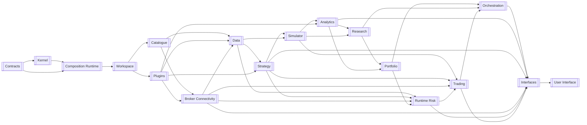
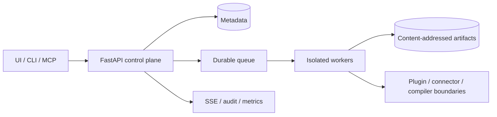

# HaruQuantAI — Strategy Research and Governed Trading Platform

> **Documentation root:** `docs/`
> **Status:** Product scope `Missing`; composability foundation `Implemented`
> **Last updated:** `2026-08-23`
> **Specification version:** `4.2-code-aligned`
> **Architecture:** [ARCHITECTURE.md](ARCHITECTURE.md)
> **Implementation sequence:** [IMPLEMENTATION_ORDER.md](dev/IMPLEMENTATION_ORDER.md)

> This document is the system-level source of truth for product scope, domain relationships, cross-domain workflows, system-wide requirements, and complete-system verification.
> Each domain's `README.md` is the sole current target registry for that domain's feature IDs and statuses, functional requirements, domain-local workflows, public capability bundles, persisted-state model, acceptance evidence, and deletion behavior.
> `ARCHITECTURE.md` owns structural and runtime constraints. Neither this document nor `ARCHITECTURE.md` creates a second domain feature registry.

---

## Agent Context Router

Start with this table; do not read this document end to end unless the task is system-wide. Always combine the selected system scope with `AGENTS.md`, the applicable `ARCHITECTURE.md` section, and every affected owning package README.

| Task concern | Read here | Then read |
| --- | --- | --- |
| Product boundary, actors, or domain ownership | §§1–2 | Affected domain/shared-package README |
| Cross-domain dependency or end-to-end workflow | §§3–4 | `ARCHITECTURE.md` §§3, 6–9 and participating READMEs |
| Public contract, state owner, or version policy | §5 | `app/contracts/README.md` and semantic owner README |
| System configuration or operational limit | §6 | `ARCHITECTURE.md` §§8–13 and affected owner README |
| System requirement or external integration | §§7–8 | Applicable contract and domain READMEs |
| Deployment, launcher, or complete-system usage | §§9–10 | `ARCHITECTURE.md` §§10–12 and Interfaces/UI READMEs |
| Verification, NFR, release, or completion decision | §§12–18 | `ARCHITECTURE.md` §§13–15 and `docs/dev/IMPLEMENTATION_ORDER.md` |
| Domain feature, FR, schema, fixture, constant, or algorithm | §2.1 only to locate the owner | Owning README §4/§5/§7/§9; do not search this document for domain internals |

Stable labels inherited from the consolidated specification (`§2`, `§4`–`§8`, `§10`, `§12`, `§15`–`§23`) now live in the relevant shared-package or domain README under its normative specification section. The label is an identifier, not a section number in this file.

---

## 1. System Purpose and Boundary

### Purpose

The system is a deterministic, reproducible strategy-research and governed trading platform covering market/catalogue data, typed strategy authoring, native simulation, analytics, automated research, portfolios, project orchestration, isolated plugins, code generation, broker connectivity, runtime risk, paper/demo/live trading, and human/automation interfaces. This self-contained documentation defines the product on the repository's implemented composability foundation. Runtime composition and physical removal occur at feature-package granularity. Responsibilities and FRs remain independently traceable product behaviors and become independently removable when packaged as separate features.

### System owns

- The complete local-first research lifecycle from data onboarding through strategy generation, simulation, analysis, code export, robustness research, portfolio construction, and automation.
- An optional, disabled-by-default operational lifecycle from certified broker connection through deterministic Runtime Risk admission, paper/demo/live dispatch, reconciliation, protection management, and operational accounting.
- Four non-domain shared modules: `app/kernel/` for independent composability primitives, `app/contracts/` for cross-boundary application/domain contracts, `app/composition/` for discovery/configuration/readiness/orchestration, and `app/api/` for capability-aware application interfaces.
- Immutable/versioned domain artifacts, deterministic algorithms, explicit failure behavior, conformance fixtures, and phase release gates.

### System does not own

- Custody, deposits, withdrawals, copy/social trading, tax reporting, broker statement generation, or account funding.
- Exact reproduction of the AngularJS/Electron UI or in-process Java plugin ABI.
- Arbitrary untrusted in-process execution, undocumented vendor behavior, or implicit cloud/AI dependencies. Explicitly installed trusted Python feature distributions are part of the supported feature substrate.
- Autonomous AI authority to place, modify, cancel, or close an operational order.

### Already implemented foundation evidence

The current repository includes three executable features that prove the substrate but do not, by themselves, complete the product feature or FR catalogue:

| Implemented feature | Capability | Role in the product |
|---|---|---|
| `FEAT-BROKER-FEED_MOCK` | `broker.market-data@1` | Deterministic root provider used to prove discovery, configuration, provider publication, and removal; it does not complete the governed Broker Connectivity domain. |
| `FEAT-DATA-RETRIEVE_BARS` | `data.historical-bars@1` requiring `broker.market-data@1` | Proves required dependency binding and a real provider→consumer vertical slice; it does not complete the historical ingestion/versioning requirements. |
| `FEAT-SYS-PERSIST_STORAGE` | `system.storage@1` | Proves retained state declarations and storage-provider lifecycle; it does not complete the Workspace domain. |

Their feature-local READMEs and runtime specifications remain authoritative for what they actually implement. Product statuses change only when the owning requirement's acceptance evidence passes.

### Primary users / actors

| Actor | Uses the system to |
|---|---|
| Local researcher | Configure data, author strategies, simulate, analyze, research, and export target code. |
| Trading operator | Operate explicitly enabled paper/demo/live sessions, review risk, monitor authority state, reconcile, and invoke authorized emergency controls. |
| Operator | Initialize/recover workspaces, administer capabilities, workers, plugins, broker profiles, diagnostics, and backups. |
| CLI/MCP/API client | Automate the same application commands and queries exposed to the UI. |
| Isolated worker | Execute admitted data, simulation, research, portfolio, codegen, connector, and plugin work. |

---

## 2. Domain Capability Map


```mermaid
flowchart TD
    SYSTEM[[HaruQuantAI]]
    SYSTEM --> WS[[D-WS: Workspace]]
    SYSTEM --> CAT[[D-CAT: Catalogue]]
    SYSTEM --> PLUG[[D-PLUG: Plugins]]
    SYSTEM --> DATA[[D-DATA: Data]]
    SYSTEM --> STRAT[[D-STRAT: Strategy]]
    SYSTEM --> SIM[[D-SIM: Simulator]]
    SYSTEM --> ANA[[D-ANA: Analytics]]
    SYSTEM --> RES[[D-RES: Research]]
    SYSTEM --> PORT[[D-PORT: Portfolio]]
    SYSTEM --> ORCH[[D-ORCH: Orchestration]]
    SYSTEM --> IFACE[[D-IFACE: Interfaces]]
    SYSTEM --> UI[[D-UI: User Interface]]
    SYSTEM --> BRK[[D-BRK: Broker Connectivity]]
    SYSTEM --> RISK[[D-RISK: Runtime Risk]]
    SYSTEM --> TRD[[D-TRD: Trading]]
```


---

### 2.1 Domain Registry

The owning README is the sole mutable feature/FR authority. Counts reconcile to 142 planned features.

| Domain | ID | Features | Authority |
| --- | --- | ---: | --- |
| Workspace | `D-WS` | 6 | [README](../app/services/workspace/README.md) |
| Catalogue | `D-CAT` | 7 | [README](../app/services/catalogue/README.md) |
| Plugins | `D-PLUG` | 7 | [README](../app/services/plugins/README.md) |
| Data | `D-DATA` | 14 | [README](../app/services/data/README.md) |
| Strategy | `D-STRAT` | 13 | [README](../app/services/strategy/README.md) |
| Simulator | `D-SIM` | 12 | [README](../app/services/simulator/README.md) |
| Analytics | `D-ANA` | 9 | [README](../app/services/analytics/README.md) |
| Research | `D-RES` | 13 | [README](../app/services/research/README.md) |
| Portfolio | `D-PORT` | 8 | [README](../app/services/portfolio/README.md) |
| Orchestration | `D-ORCH` | 7 | [README](../app/services/orchestration/README.md) |
| Interfaces | `D-IFACE` | 7 | [README](../app/services/interfaces/README.md) |
| User Interface | `D-UI` | 17 | [README](../app/ui/README.md) |
| Broker Connectivity | `D-BRK` | 7 | [README](../app/services/broker/README.md) |
| Runtime Risk | `D-RISK` | 7 | [README](../app/services/risk/README.md) |
| Trading | `D-TRD` | 8 | [README](../app/services/trading/README.md) |

---

### 2.2 Domain ownership rule

```text
One responsibility
→ one owning domain
→ one authoritative domain README
→ one feature-local implementation and acceptance mapping for each functional requirement
```

Runtime removal is feature-granular. A requirement is independently removable only when its owning boundary is a separate feature package.

The project document may summarize a domain or define a shared contract, but it never restates a domain's functional requirement row or private implementation structure.

Authority is topical rather than a single linear precedence. This document decides system scope, cross-domain behavior, dependency direction, and shared semantic profiles. The owning domain README decides domain-local behavior and feature/FR ownership. `ARCHITECTURE.md` decides package boundaries and runtime constraints. An implemented feature's `manifest.py`, contract definitions, migrations, and executable tests are evidence of current implementation; they do not silently mark an unaccepted target requirement `Implemented`.

---

## 3. Domain Dependency Diagram

The diagram is the permitted **package-import and implementation-layer direction**. Runtime requests, callbacks, events, and optional providers travel through versioned capability contracts and do not create reverse imports.


```mermaid
flowchart LR
    CTR[[Contracts]] --> K[[Kernel]]
    K --> C[[Composition Runtime]]
    CTR --> C
    C --> WS[[Workspace]]
    WS --> CAT[[Catalogue]]
    WS --> PLUG[[Plugins]]
    CAT --> DATA[[Data]]
    PLUG --> DATA
    CAT --> BRK[[Broker Connectivity]]
    PLUG --> BRK
    BRK --> DATA
    DATA --> STRAT[[Strategy]]
    PLUG --> STRAT
    STRAT --> SIM[[Simulator]]
    DATA --> SIM
    SIM --> ANA[[Analytics]]
    PLUG --> ANA
    ANA --> RES[[Research]]
    SIM --> RES
    RES --> PORT[[Portfolio]]
    ANA --> PORT
    DATA --> RISK[[Runtime Risk]]
    STRAT --> RISK
    BRK --> RISK
    PORT --> RISK
    SIM --> TRD[[Trading]]
    STRAT --> TRD
    BRK --> TRD
    RISK --> TRD
    PORT --> ORCH[[Orchestration]]
    RES --> ORCH
    TRD --> ORCH
    ORCH --> IFACE[[Interfaces]]
    ANA --> IFACE
    STRAT --> IFACE
    BRK --> IFACE
    RISK --> IFACE
    TRD --> IFACE
    IFACE --> UI[[User Interface]]
```

Rules:

- Arrows point from a permitted lower implementation layer to a consuming higher layer.
- Runtime cross-domain behavior uses public capability contracts; private package imports and direct foreign-table writes are prohibited.
- Optional integrations that would reverse an arrow are separate consumer-owned features or typed events, never reverse imports.
- Analytics operational-journal ingestion consumes versioned Trading/Risk/Broker events through registered contracts; it creates no reverse package import or execution dependency.
- Circular behavior dependencies are rejected before activation under `FR-KERN-REJECT_DEPENDENCY_CYCLES`.

---

## 4. Cross-Domain Workflows

### Workflow status and scope

| Status | Meaning |
|---|---|
| `Missing` | Specified but not implemented or verified end to end. |
| `Partial` | Some participating capabilities exist, but the system outcome or acceptance evidence is incomplete. |
| `Implemented` | The complete cross-domain outcome, failure paths, and integration evidence pass. |
| `Implemented foundation` | Shared substrate behavior exists, but it does not complete a product workflow. |

| Status | Workflow ID | Workflow | Trigger | Domains involved | Final outcome | Integration test |
|---|---|---|---|---|---|---|
| Missing | `SYS-WF-001` | Workspace startup and capability reconciliation | Launcher start/open | `Workspace → all enabled domains → Interfaces → UI` | Ready capability snapshot or diagnostic/no-workspace mode | `tests/system/integration/test_workspace_startup.py` |
| Missing | `SYS-WF-002` | Market catalogue and data onboarding | Import/sync request | `Catalogue → Data → Workspace → Interfaces → UI` | Committed immutable data version with findings | `tests/system/integration/test_data_onboarding.py` |
| Missing | `SYS-WF-003` | Strategy authoring and validation | Create/edit/import request | `Data + Catalogue + Plugins → Strategy → Interfaces → UI` | Committed typed StrategyVersion or complete diagnostics | `tests/system/integration/test_strategy_authoring.py` |
| Missing | `SYS-WF-004` | Deterministic simulation and analysis | Simulation request | `Strategy + Data + Catalogue → Simulator → Analytics → Interfaces → UI` | Reconciled committed result and queryable analytics | `tests/system/integration/test_simulation_analysis.py` |
| Missing | `SYS-WF-005` | Target code generation and parity | Codegen request | `Strategy → Simulator → Analytics → Interfaces → UI` | Deterministic deployment package and parity report | `tests/system/integration/test_codegen_parity.py` |
| Missing | `SYS-WF-006` | Automated research | Builder/retest/optimization request | `Strategy + Simulator + Analytics → Research → Interfaces → UI` | Reproducible research run and accepted/rejected outputs | `tests/system/integration/test_research_factory.py` |
| Missing | `SYS-WF-007` | Portfolio construction and simulation | Portfolio request | `Analytics + Research + Simulator → Portfolio → Interfaces → UI` | Versioned portfolio and aggregate result/attribution | `tests/system/integration/test_portfolio.py` |
| Missing | `SYS-WF-008` | Project orchestration | Run project | `Orchestration → owning domains → Interfaces → UI` | Durable task graph outcome, checkpoints, and causal history | `tests/system/integration/test_project_orchestration.py` |
| Missing | `SYS-WF-009` | Plugin lifecycle and contribution | Install/enable/replace/remove plugin | `Workspace → Plugins → consuming domain → Interfaces → UI` | Transactional capability change or complete rollback | `tests/system/integration/test_plugin_lifecycle.py` |
| Missing | `SYS-WF-010` | Operational session admission | Create/start paper, demo, or live session | `Workspace + Catalogue + Broker Connectivity + Runtime Risk → Trading → Interfaces → UI` | Explicitly bound active session or classified fail-closed state | `tests/system/integration/test_operational_session.py` |
| Missing | `SYS-WF-011` | Governed operational action | Strategy intent or authenticated manual plan | `Strategy + Data + Catalogue + Broker Connectivity → Runtime Risk → Trading → selected authority → Interfaces → UI` | Accepted/rejected/unknown operation with complete causal evidence | `tests/system/integration/test_governed_trading_action.py` |
| Missing | `SYS-WF-012` | Reconciliation and emergency control | Authority event/gap/unknown outcome or kill-switch command | `Broker Connectivity + Runtime Risk → Trading → Analytics + Interfaces → UI` | Reconciled state or degraded/block state with bounded authorized recovery | `tests/system/integration/test_trading_reconciliation_emergency.py` |

### Workflow execution rule

Every workflow admits one immutable manifest/capability snapshot, calls only public domain capabilities, stages effects before commit, and returns either a fully committed result or the exact structured failure required by the participating requirements. Detailed domain steps are defined only in domain READMEs.

Each `SYS-WF-*` row is complete only when the participating domain READMEs identify the ordered public capabilities, input/output boundaries, success condition, and domain-owned failure behavior, and the listed system integration test proves the complete outcome. `PROJECT.md` owns the trigger, domain sequence, and final system result without duplicating private domain steps.

---

## 5. System Interfaces and Contracts

Every application/domain contract in this section is physically defined in `app/contracts/`. The generic `CapabilityKey` and composability protocols are kernel primitives, not application contracts. The Owner column identifies semantic ownership and change authority, not a domain-local file location. No public cross-boundary contract definition may live under `app/services/`; domain packages contain implementations and adapters only. The planned contract inventory is maintained in `app/contracts/README.md`.

| Status | Contract / Event | Version | Owner | Producer / Submitter | Consumer | Purpose | Schema / Type | Failure behavior |
|---|---|---|---|---|---|---|---|---|
| Missing | `CapabilitySnapshot` | `v1` | Shared substrate | Composition engine | Every domain | Pin active features/providers/configuration for reproducible work | `app/contracts/` system models plus kernel `CapabilityKey`; Contracts README §§8, 15 | Missing/incompatible providers reject admission. |
| Missing | `RunManifest` | `v1` | Simulator | Interfaces/Research/Portfolio | Simulator, Analytics | Pin strategy, data, settings, profiles, seeds, capabilities, and outputs | `app/contracts/simulator/`; Contracts README §§8, 15 | Invalid inputs create no queued work. |
| Missing | `StrategyVersion` | `v1` | Strategy | Interfaces/Research/importers | Simulator, Research, Portfolio, Codegen | Immutable typed strategy contract | `app/contracts/strategy/`; Contracts README §§8, 15; Strategy README §17 | Unsupported or incomplete semantics fail validation. |
| Missing | `DataSeriesVersion` | `v1` | Data | importers/connectors | Strategy, Simulator, Research | Immutable normalized market/external series | `app/contracts/data/`; Contracts README §§8, 15; Data README §16 | Incomplete precision or coverage follows explicit policy. |
| Missing | `Result` and metric artifacts | `v1` | Simulator / Analytics | Simulator / Analytics | Research, Portfolio, Interfaces | Reconciled execution output and versioned interpretation | `app/contracts/simulator/` and `app/contracts/analytics/`; owner READMEs | Unreconciled/staged output is never selectable. |
| Missing | `ProblemDetails` | `v1` | Interfaces | Every command/query adapter | UI/CLI/MCP/API clients | Stable validation, conflict, capability, and failure responses | `app/contracts/common/`; Contracts README §§4.4, 15 | Unknown failures remain causal and never masquerade as success. |
| Missing | UI view models, commands, navigation, layout, and extension descriptors | `v1` | User Interface | D-UI adapters over D-IFACE/public domain contracts | React feature modules | Type-safe presentation data and interaction contracts without duplicating business policy | `app/contracts/ui/` | Incompatible or unavailable capabilities render explicit unavailable/degraded states and disable unsafe commands. |
| Missing | `DomainEvent` | `v1` | Producing domain | All domains | Interfaces, audit, dependent workflows | Causal event publication and replay | Base envelope in `app/contracts/common/`; payload in the producer namespace | Retention gaps emit resync markers. |
| Missing | `BrokerSessionRef` and `BrokerOperationReceipt` | `v1` | Broker Connectivity | Broker Connectivity adapters | Data, Risk, Trading, Interfaces | Bind authority generation and exact accepted/rejected/unknown provider outcomes | `app/contracts/broker/` | Stale generation or uncertainty blocks unsafe retry. |
| Missing | `RiskDecision`, `RiskApprovalToken`, and `RiskCapacityReservation` | `v1` | Runtime Risk | Risk | Trading, Interfaces, audit | Bind exact action, policy/evidence, approval, size, budget, validity, and capacity | `app/contracts/risk/` | Missing/expired/mismatched/consumed authority grants no mutation. |
| Missing | `TradingSession`, `TradingOperation`, and execution events | `v1` | Trading | Trading | Risk, Analytics, Interfaces, audit | Durable mode/route operation lifecycle and reconciled operational evidence | `app/contracts/trading/` | Unknown authority outcomes remain unresolved and blind retry is disabled. |

### Contract rules

- Commands/requests are semantically owned by receivers; events/results by producers; universally shared envelopes by `app/contracts/common/`; kernel composition primitives remain in `app/kernel/`.
- Consumers depend only on documented public contracts and never redefine them or pass raw provider/SDK objects.
- Additive optional fields preserve `v1`; breaking semantic/schema changes require a new version and compatibility migration.
- Provider and behavior versions, schemas, implementation hashes, configuration hashes, and permissions are pinned in manifests.
- The physical source of truth for application/domain contracts is `app/contracts/<owner-namespace>/`; generated wire definitions live below that namespace in `wire/`.

### Versioning and compatibility policy

- Application capability identifiers use `<domain>.<name>@<major>`; additive compatible changes retain the major version, while breaking semantics or schemas require a new major.
- A breaking change declares an explicit consumer migration and compatibility window. When continuity is required, the owner provides old and new majors concurrently or supplies a documented boundary adapter until every declared consumer migrates.
- Persisted schemas, events, wire formats, provider profiles, and reproducibility records retain their own explicit versions; unsupported future versions are migrated, opened read-only, or rejected explicitly—never guessed.
- A version change updates `app/contracts/README.md`, the owning and consuming domain READMEs, affected `FeatureSpec` capability keys, wire schemas, and producer-consumer compatibility tests in the same coherent change.
- Retired versions are removed only after their declared consumers and persisted-state migration paths no longer require them.

### Data ownership

This table indexes system-level write authority and representative state families; it is not a second exhaustive schema catalogue. The owning domain README is authoritative for the exact target entities, feature partition, retention, and migration ownership. An omitted entity inherits no writer: every entity must still have exactly one declared owning domain before implementation.

| Status | State / Store summary | Owning domain | Read access | Write access | Notes |
|---|---|---|---|---|---|
| Missing | workspace, workspace_setting_versions, secret_refs, audit_events, jobs, job_commands, worker_leases, artifacts, artifact_refs, events, tombstones | Workspace | Public `D-WS` capabilities | Workspace only | Logical schema: Workspace README; common physical rules: Contracts README §15. |
| Missing | instruments, instrument_versions, brokers, broker_versions, sessions, session_versions, calendars, calendar_versions | Catalogue | Public `D-CAT` capabilities | Catalogue only | Logical schema: Catalogue README; common physical rules: Contracts README §15. |
| Missing | plugins, plugin_versions, plugin_activations | Plugins | Public `D-PLUG` capabilities | Plugins only | Logical schema: Plugins README; common physical rules: Contracts README §15. |
| Missing | data_series, data_series_versions, quality_findings, external_indicator_series_versions | Data | Public `D-DATA` capabilities | Data only | Logical schema: Data README; common physical rules: Contracts README §15. |
| Missing | strategies, strategy_versions, strategy_charts, block_definitions, external_indicator_definitions, external_indicator_definition_versions, random_group_versions, opposite_map_versions, engine_profile_versions, codegen_runs, deployment_packages | Strategy | Public `D-STRAT` capabilities | Strategy only | Logical schema: Strategy README; common physical rules: Contracts README §15. |
| Missing | run_manifests, results, result_segments, orders, fills, positions, trades | Simulator | Public `D-SIM` capabilities | Simulator only | Logical schema: Simulator README; common physical rules: Contracts README §15. |
| Missing | metric_definitions, metric_values, databanks, databank_items, databank_decisions, analysis_artifacts, benchmark_comparisons | Analytics | Public `D-ANA` capabilities | Analytics only | Logical schema: Analytics README; common physical rules: Contracts README §15. |
| Missing | research_runs, simulations, optimization_variants, wf_windows, checkpoints | Research | Public `D-RES` capabilities | Research only | Logical schema: Research README; common physical rules: Contracts README §15. |
| Missing | portfolios, portfolio_versions, portfolio_results, correlation_matrices, portfolio_search_artifacts | Portfolio | Public `D-PORT` capabilities | Portfolio only | Logical schema: Portfolio README; common physical rules: Contracts README §15. |
| Missing | projects, project_versions, project_runs, task_runs, task_attempts, variable_assignments | Orchestration | Public `D-ORCH` capabilities | Orchestration only | Logical schema: Orchestration README; common physical rules: Contracts README §15. |
| Missing | No private business or client-state tables; durable commands are written through owning-domain contracts. | Interfaces | Public `D-IFACE` capabilities | None | D-IFACE currently owns no persisted store; any future adapter-owned durable state requires an explicit feature state declaration and migration/storage adapter. |
| Missing | Client-only drafts, navigation, focus, transient panel/window state, and user layout preferences; no authoritative business state. | User Interface | D-UI feature modules through `app/contracts/ui/` | User Interface only | Persisted client preferences, when enabled, are namespaced and migratable; server-owned entities remain read-only projections until submitted through public commands. |
| Missing | broker_adapter_profiles, broker_sessions, broker_session_transitions, broker_operation_receipts, broker_capability_certifications | Broker Connectivity | Public `D-BRK` capabilities | Broker Connectivity only | No credentials or canonical Trading business state. |
| Missing | risk_profile_versions, risk_decisions, risk_approval_tokens, risk_capacity_reservations, risk_kill_switch_state/events, risk_audit_records | Runtime Risk | Public `D-RISK` capabilities | Risk only | Effective-dated profiles and append-only authority/audit state. |
| Missing | trading_sessions, trading_operations/events, trading projections, protection sets, journal records, operational ledger/valuations, reconciliation runs/findings | Trading | Public `D-TRD` capabilities | Trading only | Provider evidence remains Broker Connectivity-owned; Trading's operational projections require reconciliation to that evidence. |

---

## 6. Shared Configuration and Limits Manifest

| Status | Setting / Limit | Type | Default | Required | Used by | Description |
|---|---|---|---|---|---|---|
| Missing | `worker_count` | integer | `max(1, logical_cpu_count-1)`, cap 8 | Yes | Workspace, all worker domains | Admission rejects unfulfillable resource requests. |
| Missing | `deterministic_worker_threads` | integer | `1` | Yes | Simulator, Research, Portfolio | Deterministic reference execution uses one thread per worker. |
| Missing | `core_worker_memory` | bytes | `4 GiB` | Yes | Worker domains | Supervisor terminates/quarantines work exceeding the declared boundary. |
| Missing | `core_worker_temp_disk` | bytes | `10 GiB` | Yes | Worker domains | Staging fails without publishing partial committed output. |
| Missing | `isolated_call_deadline` | duration | `60 seconds` | Yes | Plugins, scripts, compilers | Timeout terminates the isolated process and discards invalid staging. |
| Missing | `job_event_retention` | duration | `7 days` | Yes | Workspace, Interfaces | Expired SSE cursors receive a resync marker. |
| Missing | `checkpoint_interval` | duration/count | `5 minutes or 10,000 candidates` | Yes | Research, Orchestration | First reached boundary triggers a safe checkpoint. |
| Missing | `graceful_cancel_deadline` | duration | `30 seconds` | Yes | All workers | Supervisor terminates after the bounded drain/checkpoint policy. |
| Missing | `operational_trading_enabled` | boolean | `false` | Yes | Workspace, Broker Connectivity, Runtime Risk, Trading, Interfaces | Disables all paper/demo/live operational capabilities unless explicitly enabled. |
| Missing | `live_trading_enabled` | boolean | `false` | Yes | Workspace, Broker Connectivity, Runtime Risk, Trading, Interfaces | Live remains unavailable until separately enabled and all capability/profile gates pass. |
| Missing | `default_trading_mode` | enum/none | `None` | Yes | Trading, Interfaces | A mode is required per session; there is no live or demo fallback. |

Rules:

- Every shared setting or limit has one owning package and lists every consuming domain.
- Validation, normalization, and the exact failure when a limit is exceeded are mandatory.
- A row becomes `Implemented` only when its configuration schema and applicable boundary tests pass.
- Feature-specific configuration remains exclusively in the owning domain README and `config.py` rather than being duplicated here.

---

## 7. System-Wide Requirements

| Status | Requirement ID | Type | Responsibility | Verification |
|---|---|---|---|---|
| Implemented foundation | `FR-KERN-DEFINE_REQUIREMENT_BEHAVIOR, FR-KERN-DEFINE_LIFECYCLE_CONTEXT, FR-KERN-DECLARE_BEHAVIOR_DEPENDENCIES, FR-KERN-REGISTER_FEATURE_MODULES, FR-KERN-DEFINE_RESPONSIBILITY_FILES, FR-KERN-IMPLEMENT_REQUIREMENT_FUNCTIONS, FR-KERN-DEPEND_PUBLIC_PORTS, FR-KERN-NAMESPACE_CAPABILITY_KEYS, FR-KERN-DECLARE_DEPENDENCY_RULES, FR-KERN-REEVALUATE_DEPENDENCIES, FR-KERN-DEFINE_SCOPE_HIERARCHY, FR-KERN-PASS_EFFECT_SCOPES, FR-KERN-REGISTER_EFFECT_REVERSALS, FR-KERN-REVERSE_EFFECTS_LIFO, FR-KERN-ROLLBACK_FAILED_ACTIVATION, FR-KERN-MANAGE_COMPONENT_LIFECYCLE, FR-KERN-COMMIT_CAPABILITY_SWAP, FR-KERN-QUIESCE_DEPENDENT_WORK, FR-KERN-REMOVE_DEPENDENT_COMPONENTS, FR-KERN-ISOLATE_DISPOSAL_FAILURES, FR-KERN-RECONCILE_DESIRED_STATE, FR-KERN-REPLACE_COMPONENTS_TRANSACTIONALLY, FR-KERN-PROVIDE_SCOPED_REGISTRARS, FR-KERN-DRAIN_REMOVED_BEHAVIORS, FR-KERN-CLASSIFY_COMPONENT_EFFECTS, FR-KERN-NAMESPACE_COMPONENT_STATE, FR-KERN-REGISTER_EXTENSION_POINTS, FR-KERN-EMIT_CAUSAL_EVENTS, FR-KERN-REJECT_DEPENDENCY_CYCLES, FR-KERN-PIN_CAPABILITY_SNAPSHOTS, FR-KERN-TEST_COMPONENT_REMOVAL, FR-KERN-VERIFY_EXACT_REMOVAL, FR-KERN-ROUTE_MULTIPLE_PROVIDERS` | Architecture | Code-aligned discovery, lifecycle, effects, dependency resolution, reconciliation, replacement, diagnostics, and physical removal as specified in `ARCHITECTURE.md` §6 and the Kernel/Composition READMEs. | Repository architecture/composition/removal suite |
| Missing | `NFR-DET-001..009` | Determinism | Canonical reproducibility under pinned inputs, builds, providers, and seeds. | Determinism corpus |
| Missing | `NFR-DUR-001..010` | Durability | Atomic commit, recovery, lease fencing, checkpoints, backups, and retained compatibility metadata. | Fault/recovery corpus |
| Missing | `NFR-PERF-001..015` | Performance | Named latency, throughput, resource, and benchmark gates. | Performance corpus |
| Missing | `NFR-ISO-001..007` | Isolation/security | Loopback/authentication, paths, secrets, processes, workspaces, and deny-by-default permissions. | Isolation corpus |
| Missing | `NFR-OBS-001..007` | Observability | Structured causal events, logs, metrics, traces, lineage, and redaction. | Reconstruction test |
| Missing | `NFR-COMP-001..013` | Compatibility | API/schema/package/provider evolution, deletion builds, and conformance. | Compatibility corpus |

---

## 8. External Systems

| Status | External system | Used by domains | Purpose | Interaction type | Failure behavior |
|---|---|---|---|---|---|
| Missing | MetaEditor 5.0.0.5836 / MT5 tester | Strategy, Simulator | Compile MQL5 and validate target parity | Isolated process/file adapter | Timeout, diagnostics, missing output, or parity divergence fails the target artifact/gate. |
| Missing | Optional market-data providers | Data, Catalogue, Plugins | Discover/match instruments and fetch paged history | Isolated plugin/connector | Checkpoint, throttle, diagnose incomplete pages, publish nothing incomplete. |
| Missing | MQL4, TradeStation/MultiCharts, JForex runtimes | Strategy, Simulator | Additional generated-target validation | Isolated adapter | Unsupported semantics fail capability validation before emission. |
| Missing | Optional AI provider | Research, Strategy | Produce bounded proposals only | Redacted external request | Failure/malformed output has no effect; explicit approval remains mandatory. |
| Missing | Authenticated remote workers/object store/PostgreSQL | Workspace and worker domains | Optional hosted/distributed execution | Internal authenticated protocols | Fenced leases, scoped credentials, resumable transfer, no stale commit. |
| Missing | MT5 terminal/broker account | Broker Connectivity, Trading, Risk | Certified account reads/events and optional demo/live execution | Fenced terminal adapter | Wrong account/environment, stale generation, missing permission, or unknown outcome fails closed. |
| Missing | cTrader and Binance APIs | Broker Connectivity, Trading, Risk | Certified provider-profile reads/events and explicitly released operations | Authenticated isolated adapter | Product/environment/capability mismatch rejects before dispatch. |

Rules:

- Provider-specific implementation details remain in the owning domain README and adapter package; this section records only the system dependency and boundary behavior.
- Every critical external dependency defines timeout, unavailability, malformed-response, partial-result, and unknown-outcome behavior where applicable.
- Native SDK/provider objects and credentials never cross their owning adapter boundary.

---

## 9. Deployment and Runtime Topology

**Runtime model:** local-first spatiotemporally composable modular monolith with isolated compute/plugin/compiler/connector processes; optional hosted metadata, object storage, queues, and remote workers preserve the same contracts.

| Runtime unit | Contains domains | Environment | Started by | Scaling / instances |
|---|---|---|---|---|
| FastAPI control plane | Workspace application services and all enabled domain facades | Desktop/hosted | Launcher/service manager | One writer/control authority per workspace |
| React client | User Interface | Desktop/browser | Launcher/user | One or more clients |
| Isolated workers | Data, Simulator, Research, Portfolio, Strategy Codegen | Desktop/hosted | Workspace supervisor | Bounded local/remote pool |
| Operational control services | Broker Connectivity, Runtime Risk, Trading | Desktop/hosted, disabled by default | Workspace supervisor/operator enablement | One fenced writer/authority coordinator per trading session/account |
| Broker adapter processes | Certified provider profiles only | Demo/live/testnet/sandbox | Broker supervisor | Isolated by provider, account, environment, and session generation |
| Plugin/connector/compiler/script sandboxes | Plugins plus contributed adapters | Desktop/hosted | Supervisors through scoped manifests | One or more isolated processes/containers |
| SQLite/WAL + artifact store | Domain-owned state through Workspace infrastructure | Desktop | Control plane | One local metadata store and content-addressed artifacts |
| PostgreSQL/object store/queue | Same logical owners | Optional hosted | Deployment platform | Workspace-isolated scalable services |


```mermaid
flowchart LR
    U[UI / CLI / MCP] --> API[FastAPI control plane]
    API --> META[(Metadata)]
    API --> Q[Durable queue]
    Q --> W[Isolated workers]
    W --> ART[(Content-addressed artifacts)]
    W --> EXT[Plugin / connector / compiler boundaries]
    API --> EVT[SSE / audit / metrics]
```

Rules:

- Every domain belongs to at least one named runtime unit, and all implementation code remains deployable through the documented composition boundary.
- Environment-specific differences are explicit configuration/profile choices; they do not create alternate domain semantics.
- Topology, process isolation, persistence authority, and scaling changes update this section and `ARCHITECTURE.md` together.

---

## 10. System Usage

The composability runtime already has executable discovery, configuration, readiness, system diagnostics, and capability-aware facade entry points. The complete product launcher and the product routes listed below remain targets. The first complete product usage workflow must start the documented launcher, wait for readiness, create/open a workspace, and exercise the same application capabilities through `/api/v1`.

The implemented composability foundation and the incomplete product are different completion states. Until the product gates pass, only the non-production commands and safety constraints in the repository root `README.md` apply. Documentation status, a running control plane, or a ready research profile never grants live-trading authority.

```http
GET /api/v1/system/readiness
POST /api/v1/simulations/preview
POST /api/v1/simulations
GET /api/v1/jobs/{id}
GET /api/v1/results/{id}
POST /api/v1/trading/sessions
POST /api/v1/trading/actions/preview
POST /api/v1/trading/actions
GET /api/v1/trading/operations/{id}
```

Full-system usage is documented in this section and executed through the product launcher and public API. Service-feature usage lives in the designated primary domain-logic module's `if __name__ == "__main__":` harness; every core capability module documents its Python API and executable command. Usage examples never live under `tests/`. Feature-local automated tests belong in `tests/services/<domain>/<feature>/`; broader architecture, composition, API, integration, and system verification retain their documented test locations.

---


---

## 11. Delivery Model

### Delivery phases

| Phase | Technical outcome | Exit dependency |
| --- | --- | --- |
| 0 | Numerical, persistence, differential-comparison, and fault-injection harness. | Independent golden fixtures and durable artifact model. |
| 1 | Trustworthy manual strategy research loop and MQL5 parity path. | Phase 0 gates. |
| 2 | Search, robustness, optimization, and high-volume databank research factory. | Phase 1 engine and metric gates. |
| 3 | Custom Projects, CLI/MCP automation, portfolios, plugin panels, and additional code targets. | Phase 2 deterministic/recovery gates. |
| 4 | Specialized engines, distributed workers, external connectors, AI assistance, and optional hosted deployment. | Feature-specific parity, isolation, and operability gates. |
| 5 | Optional governed operations: broker certification, Runtime Risk, paper/demo/live Trading, reconciliation, operational accounting, and safety interfaces. | Phases 0–4 plus separate operational security, sandbox/testnet, owner-approval, kill-switch, unknown-outcome, and recovery gates. |

Requirements in a later phase are normative for the complete product but do not block an earlier phase release unless explicitly listed as a dependency.

### Explicit technical exclusions

- Custody, deposits, withdrawals, account funding, copy/social trading, tax reporting, and broker statement generation.
- Operational Trading is optional Phase 5 scope, disabled by default, and cannot weaken or redefine Phase 0–4 research/simulation semantics.
- Exact reproduction of the AngularJS/Electron screens or the in-process Java plugin ABI.
- Arbitrary in-process execution of user Java, Python, scripts, plugins, or generated target code.
- A core research-loop dependency on vendor-hosted data, AI, update, or cloud services.
- Unbounded project/search loops or silent downgrade of data precision, target capabilities, missing resources, or failed plugins.
- Performance claims without a named corpus, hardware profile, measurement procedure, and retained result.


---

## 12. Verification

Contributor commands and feature procedures are owned by `AGENTS.md` and the [Feature Implementation Pipeline](dev/feature_implementation_pipeline.md). The complete repository gate is:

```powershell
uv run python scripts/ci_check.py
```

### Verification rules

- Every domain functional requirement has focused automated tests and maps to a named scenario in its feature's executable usage harness. D-UI requirements map to a documented interactive workflow and separate UI verification tests.
- Every `SYS-WF-*` has a system integration test.
- Every installed feature has configuration-disable, dependency-change, repeated lifecycle, failure-containment, replacement where applicable, leak, and physical-removal tests. A domain deletion is the tested removal of all its feature packages.
- Shared contracts have producer-consumer compatibility tests; deterministic/parity claims use independent fixtures.
- Release requires the complete phase-specific gate and all applicable NFRs, not documentation status alone.
- Each change identifies its requirement, owning domain, public contracts, dependency view, persisted state, effects, and removal result before implementation.
- Authoritative requirements, public contracts, feature README, and `FeatureSpec` change with implementation; code is delivered as the smallest coherent feature slice through public capabilities and scoped operations.
- Focused checks may be used while iterating, but completion requires the complete repository gate and every applicable phase gate.

### Composability verification matrix

Every implemented feature supplies the applicable runtime proof; each FR supplies behavior/acceptance evidence through its owning feature:

| Category | Minimum proof |
| --- | --- |
| Requirement | Observable behavior, validation, stable failures, and traceability to focused implementation/tests inside its owning feature |
| Contract | Schema/serialization compatibility, declared dependencies only, and neutral boundary types |
| Activation | Success from a clean scope and compensation after every partial-acquisition failure |
| Dependency | Required loss blocks or quiesces; optional loss follows its named degradation/reload policy; compatible return recovers deterministically |
| Effects | Before/after ledger equality, LIFO and idempotent disposal, and bounded task/handler/process terminalization |
| Spatial removal | Configuration disable/re-enable and cold package/file/registration absence, including stale desired state |
| Temporal removal | Reconciliation closes the owner scope and remounts/blocks the affected dependency closure while retaining declared durable state |
| Replacement | Compatible atomic swap plus import/schema/config/health/drain/swap rollback faults |
| Interfaces | Capability-aware HTTP/SSE/CLI/MCP/automation withdrawal, transport parity, and stable `CAPABILITY_UNAVAILABLE` behavior |
| User Interface | Capability-aware view/action withdrawal, accessible fallback and focus behavior, confirmation safety, and stable unavailable/degraded presentation |

---


---

## 13. System Non-Functional Requirements

### §13.1 — Determinism (`NFR-DET`)

| ID | Requirement | Verification |
| --- | --- | --- |
| `NFR-DET-001` | Identical deterministic manifests shall produce identical canonical event, order, fill, trade, equity, and metric artifacts. | Repeat every golden fixture 10 times and compare hashes. |
| `NFR-DET-002` | Pause/resume and recover/retry shall produce the same committed output as uninterrupted execution. | Inject pause and worker death at every declared checkpoint. |
| `NFR-DET-003` | Worker scheduling shall not affect deterministic output. | Execute with 1, 2, 4, and 8 workers. |
| `NFR-DET-004` | Every random operation shall use named independent RNG streams derived from the manifest seed set. | Stream-order property tests and replay. |
| `NFR-DET-005` | Sorting and pagination shall use stable deterministic tie-breakers. | Repeated concurrent-insert query tests. |
| `NFR-DET-006` | Search, robustness, optimization, portfolio search, and Stockpicker runs shall be reproducible from manifests, named RNG states, and implementation versions. | Repeat and checkpoint/resume every Phase 2–4 golden run. |
| `NFR-DET-007` | Distributed execution shall produce the same canonical result as a compatible local worker regardless of assignment or completion order. | Cross-worker hash matrix. |
| `NFR-DET-008` | Parallel reductions shall use deterministic partitioning/merge order or a declared numerically stable tolerance contract. | Vary worker/core counts and compare aggregate artifacts. |

### §13.2 — Durability and recovery (`NFR-DUR`)

| ID | Requirement | Verification |
| --- | --- | --- |
| `NFR-DUR-001` | An acknowledged committed strategy, data version, result, or artifact shall survive immediate process and machine restart. | Fault injection after every commit boundary. |
| `NFR-DUR-002` | Retried idempotent commands shall create at most one externally visible object/effect. | Drop responses after commit and retry. |
| `NFR-DUR-003` | Metadata shall never reference a missing committed artifact; committed artifacts without metadata shall be detected and quarantined/reconciled. | Two-sided fault injection. |
| `NFR-DUR-004` | SQLite integrity and foreign-key checks shall pass after forced worker termination, API termination, and storage-full recovery. | Automated crash matrix. |
| `NFR-DUR-005` | Backup restore shall reproduce all referenced committed hashes and leave jobs in defined recoverable/terminal states. | Restore verification fixture. |
| `NFR-DUR-006` | Schema migration shall be resumable or rollback-safe and shall never partially expose a new schema. | Kill during every migration step. |
| `NFR-DUR-007` | Project and research runs shall recover durable state, attempts, checkpoints, commands, and committed outputs after control-plane restart. | Restart at every task/run state transition. |
| `NFR-DUR-008` | Lease expiry, network partition, or duplicate worker completion shall result in at most one accepted committed attempt. | Distributed fencing/fault matrix. |
| `NFR-DUR-009` | Bulk databank and portfolio operations shall be transactional or resumable from a persisted operation journal. | Kill after each operation batch. |
| `NFR-DUR-010` | Plugin upgrade/removal shall not make existing persisted objects unreadable without an explicit compatibility diagnostic and retained schema metadata. | Plugin lifecycle compatibility corpus. |

### §13.3 — Performance (`NFR-PERF`)

Reference hardware `RH-1`: Windows 11 x64, 8 logical CPU cores, 32 GB RAM, NVMe SSD with at least 1 GB/s sequential read, no competing compute workload.

| ID | Requirement | Gate on RH-1 |
| --- | --- | --- |
| `NFR-PERF-001` | Noncompute API reads/validated metadata writes shall remain responsive. | p95 ≤ 250 ms and p99 ≤ 750 ms for the API benchmark suite. |
| `NFR-PERF-002` | Control-plane responsiveness shall be preserved while workers saturate their assigned cores. | p95 health/status/job-command latency ≤ 500 ms. |
| `NFR-PERF-003` | Workspace startup excluding explicit migration shall be bounded. | Readiness ≤ 15 s for 10,000 strategies and 100 completed runs. |
| `NFR-PERF-004` | First results-table page and indexed sort/filter shall be bounded. | First page ≤ 2 s; subsequent sort/filter ≤ 1 s for 100,000 databank items. |
| `NFR-PERF-005` | Job commands shall acknowledge promptly. | Start/pause/resume/stop/cancel acknowledgement ≤ 1 s. |
| `NFR-PERF-006` | Cooperative pause/stop shall reach a safe boundary. | ≤ 10 s for bar/M1 fixtures; ≤ 30 s for tick fixtures, or UI shows next-bound estimate. |
| `NFR-PERF-007` | Event delivery shall be near-real-time without flooding the client. | State events p95 ≤ 500 ms; progress coalesced to at most 10 events/s/job. |
| `NFR-PERF-008` | Preview/chart APIs shall use bounded memory. | API process growth ≤ 128 MB while previewing/downsampling the largest fixture. |
| `NFR-PERF-009` | Backtest throughput shall be baselined and regression-controlled rather than assigned an unsupported absolute claim. | Record events/core-second for each golden precision; release ≥ 90% of approved Phase 0 baseline. |
| `NFR-PERF-010` | Peak worker memory shall be regression-controlled. | Release ≤ 110% of approved Phase 0 peak for each fixture. |
| `NFR-PERF-011` | Phase 2 batch throughput shall be regression-controlled separately for bar, M1, tick, optimization, and Monte Carlo corpora. | Release throughput ≥ 90% of the approved baseline for each corpus. |
| `NFR-PERF-012` | A project with 10,000 completed task attempts shall remain operable. | p95 run-history page/query ≤ 2 s and command acknowledgement ≤ 1 s on RH-1. |
| `NFR-PERF-013` | Portfolio matrix and aggregate-series APIs shall be bounded. | 1,000 constituents: first bounded view ≤ 5 s and API memory ≤ configured query budget. |
| `NFR-PERF-014` | Distributed scaling claims shall name corpus, worker profile, network/storage topology, and efficiency. | Each supported topology publishes measured 1/2/4/8-worker curves; no unmeasured claim becomes a gate. |
| `NFR-PERF-015` | Plugin/result-panel resource consumption shall be independently limited. | Adversarial plugin cannot exceed configured process/browser limits or degrade API p95 beyond 2× gate. |

### §13.4 — Isolation and safety (`NFR-ISO`)

| ID | Requirement | Verification |
| --- | --- | --- |
| `NFR-ISO-001` | Worker crash or forced termination shall not terminate or deadlock the control plane. | Repeated kill/fault tests. |
| `NFR-ISO-002` | Workers shall receive only declared input artifacts and a task-specific temporary directory. | Process/environment inspection test. |
| `NFR-ISO-003` | External files and archive members shall be protected against traversal, absolute paths, symlinks/reparse escape, archive bombs, and size/count limits. | Malicious corpus. |
| `NFR-ISO-004` | Compiler/import subprocesses shall have timeout, output limits, controlled environment, and complete cleanup. | Hung/noisy/adversarial subprocess fixtures. |
| `NFR-ISO-005` | Local-session tokens and configured secrets shall never appear in logs, events, exports, or diagnostic bundles. | Automated secret-seed scan. |
| `NFR-ISO-006` | Remote network access shall be disabled in Phase 1 unless a later deployment profile explicitly enables and specifies it. | Bind/interface and firewall integration tests. |
| `NFR-ISO-007` | Plugin, compiler, external-script, connector, AI, and distributed-worker boundaries shall use deny-by-default capabilities. | Permission matrix and escape corpus. |
| `NFR-ISO-008` | Secrets shall be resolved only inside the authorized adapter process and shall never be serialized into manifests, checkpoints, artifacts, or client payloads. | Canary-secret scan across all persisted/event outputs. |
| `NFR-ISO-009` | Hosted workspaces shall be isolated in authorization, metadata queries, artifact addressing, queues, caches, events, logs, and metrics labels. | Cross-workspace penetration corpus. |
| `NFR-ISO-010` | Remote worker and connector protocols shall authenticate both endpoints and reject replayed/expired credentials. | Protocol replay, expiry, and identity-substitution tests. |

### §13.5 — Observability (`NFR-OBS`)

| ID | Requirement | Verification |
| --- | --- | --- |
| `NFR-OBS-001` | Logs shall be structured and carry request, job, run, task, strategy, and result IDs where applicable. | Schema validation. |
| `NFR-OBS-002` | Every failure shall have stable error code, stage, severity, retryability, and diagnostic reference. | Failure-corpus review. |
| `NFR-OBS-003` | The system shall expose worker CPU/memory, queue depth, event rate, artifact I/O, backtest throughput, and error counters. | Metrics integration test. |
| `NFR-OBS-004` | Differential failures shall retain the smallest reproducible manifest and earliest divergent event context. | Injected mismatch test. |
| `NFR-OBS-005` | Log retention and rotation shall be configurable and shall not delete logs referenced by retained failure diagnostics without marking the reference expired. | Retention simulation. |
| `NFR-OBS-006` | Every project transition, task attempt, research-stage decision, portfolio selection, plugin action, and remote-worker commit shall emit a causally linked structured event. | End-to-end lineage reconstruction test. |
| `NFR-OBS-007` | Distributed traces shall propagate correlation context across API, queue, worker, connector/compiler/plugin subprocess, and artifact commit. | Trace-continuity integration test. |
| `NFR-OBS-008` | Operator metrics shall expose per-method queue age, throughput, rejection/failure rate, checkpoint age, retry count, lease expiry, and resource saturation. | Metrics schema and alert-fixture tests. |
| `NFR-OBS-009` | Sensitive parameters and secrets shall be redacted before log/event/trace emission while retaining stable diagnostic fingerprints. | Redaction corpus. |

### §13.6 — Compatibility and maintainability (`NFR-COMP`)

| ID | Requirement | Verification |
| --- | --- | --- |
| `NFR-COMP-001` | Persisted schemas, metric formulas, engine profiles, block definitions, emitters, and event payloads shall be independently versioned. | Compatibility matrix tests. |
| `NFR-COMP-002` | A newer application shall either migrate, read-only open, or explicitly reject a future/unsupported schema; it shall never guess. | Future-version fixtures. |
| `NFR-COMP-003` | Local Windows paths shall support Unicode and spaces and shall not rely on current working directory. | Path corpus tests. |
| `NFR-COMP-004` | Domain and engine packages shall not import UI or FastAPI modules. | Architecture dependency test. |
| `NFR-COMP-005` | Hot-loop kernels may use Numba/Rust/C++, but canonical semantics and fixtures shall remain implementation-independent. | Run the same golden suite against reference and optimized kernels. |
| `NFR-COMP-006` | Plugin and connector contracts shall be language/runtime-neutral at process boundaries and versioned independently from implementation packages. | Reference implementations in two runtimes pass the same conformance suite. |
| `NFR-COMP-007` | Target-platform adapters shall pin supported platform/compiler versions and isolate version-specific lowering or report parsing. | Compatibility matrix per target version. |
| `NFR-COMP-008` | API, CLI, MCP, and UI clients shall be generated or tested from one authoritative application contract. | Cross-interface semantic contract suite. |
| `NFR-COMP-009` | Phase 4 local and hosted deployments shall use the same domain/application packages with deployment adapters selected at composition boundaries. | Architecture test plus shared golden suite. |


---

## 14. Traceability Summary

Traceability is distributed to the subject owner so this system document does not duplicate mutable feature or requirement lists.

| Trace set | Authority and reconciliation rule |
| --- | --- |
| 142 product features: 125 service + 17 UI | The fifteen owning domain/UI READMEs; each final delivery checkbox appears exactly once in `IMPLEMENTATION_ORDER.md`. |
| 549 business `FR-*` requirements | Owning domain/UI README §4 tables; the implementation order contains the identical ID set. |
| 33 implemented `FR-KERN-*` guarantees | `app/kernel/README.md` §6.7 and repository architecture/composition/removal tests. |
| 12 `SYS-WF-*` workflows | `PROJECT.md` §4 and its named system integration tests. |
| 61 system `NFR-*` requirements | This document §13 and applicable release gates in §15. |
| Contracts, constants, formulas, fixtures, and parity semantics | Stable normative labels in the owning shared/domain READMEs, routed by the Agent Context Router. |
| Baseline decisions `BD-01..14` | Local workspace; React/FastAPI; isolated compute; modular monolith; SQLite/WAL; immutable artifacts; canonical AST; reproducible manifests; acknowledged durability; deterministic mode; MQL5-first codegen; adapter-only legacy compatibility; process-isolated plugins; functional rather than legacy UI/ABI parity. |
| Delivery-phase coverage | Exact feature/FR allocation and incremental UI slices in `IMPLEMENTATION_ORDER.md`; product completion remains governed by owner acceptance plus §15. |

A release reconciliation fails if any owner ID is absent from the implementation order, appears more than once as a final feature checkbox, lacks acceptance evidence, or conflicts with a system workflow/NFR/gate.

---
## 15. Release Acceptance Gates

### §15.1 — Gate applying to every phase

A phase or individually deployable later-phase capability is releasable only when:

1. every in-scope `P0` and `P1` requirement passes its automated/manual acceptance or has an approved, traceable scope change;
2. every used semantic item resolves to its owning README's stable normative label and has a passing fixture;
3. schemas, manifests, implementation versions, fixtures, and benchmark results are published with the build;
4. upgrade, fresh-install, backup/restore, crash recovery, cancellation, and retry suites pass for the affected components;
5. no stable capability depends on an `Experimental` component;
6. known failures, unsupported capabilities, and compatibility gaps are visible and never silently downgraded.
7. every in-scope implemented feature has a validated `FeatureSpec` and feature README and passes the applicable §6.21 lifecycle, dependency, failure, leak, replacement, and physical-removal tests; every FR has acceptance evidence in its owning feature;
8. the capability/dependency graph is acyclic for required bindings, every runtime provider used by a release manifest is version/hash pinned, and no prohibited cross-boundary implementation import exists;
9. removal and replacement fault injection proves dependent-before-provider teardown, LIFO exactly-once recovery, sibling failure isolation, and complete rollback from every pre-commit replacement stage.

### §15.2 — Phase 0 gate

1. Independent time, numeric, indicator, order, metric, data, and container fixtures pass.
2. Deterministic reruns produce identical canonical hashes.
3. Artifact commit and metadata recovery pass every declared fault-injection boundary.
4. Differential import/comparison can identify and localize the first divergent event.
5. Approved reference hardware and benchmark corpora are versioned.

### §15.3 — Phase 1 gate

1. every `P0` requirement passes automated acceptance or has an approved scope change;
2. every engine item used by a supported Phase 1 fixture implements §§15–18 and has an explicit passing fixture;
3. the complete Phase 0 fixture families in §12 pass native deterministic rerun;
4. crash/fault injection demonstrates no acknowledged loss or duplicate committed output;
5. the Phase 1 metric catalogue passes hand-worked fixtures;
6. MQL5 source compiles in MetaEditor 5.0.0.5836 and passes the stated parity gates;
7. API, event, data, and container schemas are versioned and published with the build;
8. performance gates pass on `RH-1` and results are stored as release artifacts;
9. all Phase 1 UI workflows are operable by keyboard and expose nonvisual chart data;
10. loopback/port/headless/resource-profile startup fixtures pass and non-loopback unauthenticated startup is impossible;
11. the MQL5 semantic engine profile, generated deployment/support package, clean-runtime dependency validation, compilation, and parity fixtures pass;
12. no stable workflow depends on a Phase 2–5 or `Experimental` component.

### §15.4 — Phase 2 gate

1. Random generation produces only valid typed ASTs across the release seed/property corpus.
2. Retest, robustness, optimization, Builder, Improver, genetic, and walk-forward runs are reproducible after pause/resume, checkpoint recovery, and worker reassignment.
3. Monte Carlo distributions/percentiles and optimization domains match independent fixtures.
4. Walk-forward calibration/selection proves absence of future or OOS data access and stitched results reconcile.
5. Databank concurrent admission, capacity, duplicate, rank, rejection, and pinned bulk-operation fixtures pass transactionally.
6. Phase 2 batch performance/memory regression gates pass for bar, M1, tick, optimization, and robustness corpora.
7. ATM and partial exits implement §18.7 and are advertised only after §§23.4 and 23.6 pass.
8. The normative supported-block catalogue, strategy-style truth tables, fuzzy thresholds, Random Group precedence/evolution policy, and opposite-block mappings pass their fixture corpus.
9. External-indicator import, alignment, no-look-ahead, multi-line typing, and target-fragment capability fixtures pass before external indicators are advertised.
10. Benchmark normalization, temporal trade analysis, chart-trace retention, and result-fingerprint similarity reconcile to their immutable source artifacts.
11. Walk-forward stability/score/run-stat formulas and candidate-plus-existing-portfolio fitness/correlation decisions match independent calculations.
12. ATM generation covers the seven reference scenario fixtures and ATM-only Improver mutation preserves the non-ATM subtree hash.

### §15.5 — Phase 3 gate

1. Every stable Custom Project task type passes direct-API equivalence, lifecycle, cancellation, retry, recovery, and bounded-cycle tests.
2. Neural Network Trainer implements §21.3 and remains disabled by default until its leakage, determinism, resource, and inference conformance gates pass.
3. Manual and automatic portfolio fixtures reconcile cash, currencies, constituents, exposure, costs, constraints, attribution, and aggregate metrics.
4. Markowitz return/covariance calculations, efficient-frontier membership, maximum-Sharpe/minimum-risk selections, VaR/CVaR, risk-free rate, and drawdown objectives match independent fixtures.
5. Every merge/split mode implements §21.9, preserves lineage, and is advertised only after its corresponding fixtures pass.
6. Project and portfolio search resume produces the same selected output or Pareto ordering as uninterrupted execution.
7. UI, CLI, HTTP, and MCP operations pass the shared semantic contract suite; MCP contains no independent business logic.
8. Plugin contract, permission, crash/timeout, panel sandbox, upgrade/rollback, and secret-redaction suites pass.
9. PseudoCode output is complete and deterministic; each advertised target package validates its dependencies on a clean runtime.
10. Each advertised MQL4, EasyLanguage/MultiCharts, or JForex target passes its own capability, compile/validation, identity-lowering, and parity gate; unsupported targets, including NinjaTrader absent approved evidence, are not advertised.

### §15.6 — Phase 4 capability gates

Phase 4 capabilities may release independently only when their specific gates pass:

- **Distributed workers:** authenticated/fenced leases, corrupt/resumable transfer, partition/duplicate-completion safety, and local/remote canonical equivalence.
- **Hosted workspaces:** cross-workspace authorization, storage, queue, cache, event, log, metric, and plugin-isolation corpus.
- **Data connectors:** mapping, throttling, cursor resume, overlap/deduplication, revision, credential, outage, and incomplete-page tests.
- **Stockpicker:** historical universe, survivorship, all evaluation timings and shift-0 visibility boundaries, daily-OHLC-only validation, pessimistic same-bar/protection behavior, ranking timestamp, rebalance, fill, turnover, delisting, allocation, and aggregate reconciliation fixtures.
- **Volume Profile/TPO:** independently computed session/bin/value-area/TPO fixtures and source-granularity diagnostics before blocks are enabled.
- **AI assistance:** schema-valid proposals, bounded edit permissions, provenance/redaction, explicit approval, and complete non-AI operability when disabled or unavailable.
- **Neural-network research:** §21.3 leakage controls, deterministic dataset/model artifacts, bounded training, reproducible evaluation, and promoted inference consumer tests.

### §15.7 — Phase 5 governed-operations gate

Phase 5 is optional, disabled by default, and releasable only after all applicable earlier-phase gates plus the following pass:

1. Every enabled broker write operation has current versioned adapter certification, authenticated sandbox/testnet evidence, rejection, duplicate, disconnect, timeout, unknown-outcome, permission, and explicit owner-approval evidence.
2. Live, demo, testnet, sandbox, and paper identities, credentials, clients, caches, events, receipts, and idempotency namespaces pass cross-environment isolation tests.
3. Runtime Risk snapshot, sizing, limit precedence, approval-token, capacity-reservation, eligibility/allocation, revalidation, kill-switch hierarchy/recovery, and audit-chain fixtures pass independent and concurrent tests.
4. Trading proves at-most-once logical dispatch, immediate pre-dispatch revalidation, no blind retry after unknown outcomes, authority reconciliation before active recovery, and deterministic protective-order ownership.
5. Operational ledger entries balance exactly and account/P&L/margin projections reconcile to deals, positions, fees, financing, FX, marks, and explicit provider differences.
6. UI, HTTP, CLI, MCP, and automation adapters pass one shared operational semantic and authorization suite; no transport or direct adapter path bypasses Risk or Trading.
7. Kill-switch activation, unknown security-critical state, stale evidence, lost authority generation, critical reconciliation finding, and missing protection each produce the documented fail-closed state and authorized recovery behavior.
8. AI, plugin, Research, and Analytics outputs remain proposal/advisory evidence and have no direct broker or Trading mutation authority.
9. Live enablement is a separate explicit deployment/owner decision after paper and demo certification; no configuration migration or default can turn it on.


---

## 16. Open Decisions

None. Unspecified behavior is unsupported and must fail capability validation rather than be guessed.

Only unresolved choices affecting more than one domain belong here. Domain-specific choices remain in the owning README; resolved choices are encoded as active rules rather than retained as decision history.

---

## 17. System Definition of Done

- [ ] All fifteen domain READMEs match implemented package structure and public exports.
- [ ] The dependency diagram matches permitted imports and contains no cycle.
- [ ] Every workflow, shared contract, state owner, external failure, and configuration limit is implemented and verified.
- [ ] The deployment topology matches the runtime units, isolation boundaries, state authorities, and environment profiles used by the implementation.
- [ ] All 549 business FRs and 61 system NFRs plus every operational NFR pass their tests and applicable phase gates; the code-aligned shared-foundation guarantees remain green.
- [ ] Deletion and live-removal tests prove capability loss rather than application breakage at all four levels.
- [ ] No domain writes another domain's state or imports its private files.
- [ ] Full-system usage examples run successfully and all quality checks pass.
- [ ] No unresolved decision or undocumented public behavior remains.

---


---

## 18. Change Process

1. Update this document only for system boundaries, cross-domain workflows, system NFRs, topology, or release gates.
2. Update `ARCHITECTURE.md` for universal structural/runtime constraints.
3. Update each affected owning README before code.
4. Update `IMPLEMENTATION_ORDER.md` for sequencing and the feature pipeline for procedure.
5. Run inventory reconciliation, link validation, targeted removal checks, and the complete repository gate.

---
