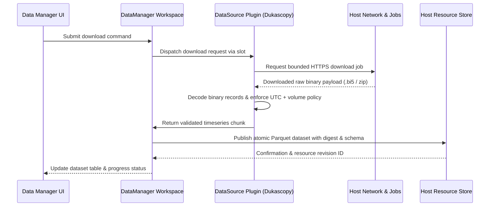

# HaruQuantAI project charter

> **System path:** `HARUQUANTAI_ROOT/`
> **Status:** Target charter at the host-shell baseline, 2026-09-29. A described capability is a target unless an owning README and verification evidence establish that it works.
> **Last updated:** 2026-09-29
> **Authority:** This document owns product scope, user research journeys, and system-level outcomes.
> [ARCHITECTURE.md](ARCHITECTURE.md) owns structural rules, runtime topology, and the Five Laws of Spatial Composability;
> [AGENTS.md](../AGENTS.md) owns contributor workflow and verification standards;
> the owning workspace, plugin, and host `README.md` files own local contracts and current implementation state.
> Donor observations live in the clean-room [evidence ledger](dev/evidence/reimplementation.json). Donor informs; specification owns.

---

## 1. System Purpose and Product Boundary

### Purpose

HaruQuantAI is a local-first quantitative research workstation. A user can prepare market data,
create and revise strategy rules, test them against historical market conditions, challenge their
robustness through parameter and stress studies, compare results in databanks, build portfolios,
automate bounded research flows, and export reviewed artifacts. The workstation makes the inputs,
assumptions, and limitations behind every result inspectable. Optional AI assistance can explain
evidence and propose edits; it cannot confer numerical, risk, or execution authority.

The product is a clean-room reimplementation informed by StrategyQuant X (SQX) build 144.2953.
**Donor informs; specification owns.** SQX artifacts and documentation guide the capabilities worth
studying. HaruQuantAI's contracts, algorithms, packaging, and acceptance criteria are independently
specified and tested. No SQX binary, source, file format, or result parity is claimed merely because
a similar screen or workflow exists.

### System owns

- Local-first quantitative research workflows and experiment repeatability.
- Canonical UTC market data acquisition, validation, and Parquet storage.
  MT5 also supports explicitly separate original broker-time acquisition labelled
  Exchange/Broker. It preserves raw coordinates without asserting UTC; missing
  broker clock policy does not block downloading. Historical normalization and
  UTC-dependent use require separate qualification.
- Strategy rule authoring, search-space generation, and algebraic node composition.
- Historical simulation, out-of-sample retesting, parameter optimization, and robustness challenges.
- Immutable result persistence, trade analysis, equity calculation, and databank management.
- Host runtime coordination, session authentication, dynamic catalog discovery, and shared resource custody.

### System does not own

- Broker custody, clearing, or financial settlement.
- Guarantees of trading profitability or automated live deployment without explicit separate qualification.
- Proprietary donor launcher binaries, runtime bytecode decryption, or exact SQX file format parity.
- Untrusted arbitrary in-process code execution or uncontained hostile extensions.

### Primary users / actors

| Actor | Uses the system to | Primary interface |
|---|---|---|
| `Strategy Researcher` | Formulate hypotheses, author rules, generate candidates, and evaluate robustness | Web Workstation / CLI |
| `Evidence Reviewer` | Inspect lineage, historical data revisions, parameter bounds, and failure records | Web Workstation / Databanks |
| `Extension Author` | Contribute indicators, data feeds, simulation engines, or custom project tasks | Plugin API / Python Modules |
| `Workstation Operator`| Administer local hardware reservations, database migrations, and headless automation flows | CLI / Host Settings |

---

## 2. Target Workstation Capability Map

The workstation is organized around **Workspaces** for interactive user workflows and **Plugins** for
focused contributions. The Five-Level Structural Hierarchy and the Five Laws of Spatial Composability
governing their boundaries are defined authoritatively in [ARCHITECTURE.md](ARCHITECTURE.md).

### 2.1 Workspace Capability Registry

Workspaces own interactive user workflows and expose declared extension slots.

| Workspace ID | Workspace Name | User Job & Target Outcome | Extension Slots Provided | Host Resources Ingested / Produced | Authoritative README |
|---|---|---|---|---|---|
| `workspace.data_manager` | Data Manager | Import, download, inspect, version, and clean market data, instruments, sessions, and quality policies | `data_source.acquisition@1.0.0`<br>`data_source.presentation@1.0.0` | Ingests: external feeds<br>Produces: `market_data` (Parquet) | [README.md](file:///c:/Users/rharu/AppDev/HaruQuantAI/app/workspace/DataManager/README.md) |
| `workspace.builder` | Builder | Compose declared building blocks under a pinned search space, data binding, and fitness policy | `building_block.indicator@1.0.0`<br>`building_block.order@1.0.0` | Ingests: `market_data`<br>Produces: `strategy`, `databank` | `app/ui/app/workspace/Builder/README.md` |
| `workspace.algo_wizard` | AlgoWizard | Author, visually edit, and inspect reviewable strategy documents, rule blocks, and parameter sets | `building_block.indicator@1.0.0`<br>`exporter.code@1.0.0` | Ingests: `strategy`<br>Produces: `strategy`, code exports | `app/ui/app/workspace/AlgoWizard/README.md` |
| `workspace.optimizer` | Optimizer | Run parameter studies, walk-forward analyses, matrix optimizations, and stress tests | `simulation.engine@1.0.0`<br>`analysis.robustness@1.0.0` | Ingests: `strategy`, `market_data`<br>Produces: `result`, `databank` | `app/ui/app/workspace/Optimizer/README.md` |
| `workspace.results` | Results & Databank | Present metrics, trades, equity, source definitions, and comparisons with units and provenance | `analysis.metric@1.0.0`<br>`analysis.view@1.0.0` | Ingests: `result`, `databank`<br>Produces: reports, views | `app/ui/app/workspace/Results/README.md` |
| `workspace.portfolio_master`| Portfolio Master | Combine referenced strategy/result evidence, assess cross-correlations, and allocate capital | `portfolio.allocator@1.0.0` | Ingests: `databank`<br>Produces: portfolio artifacts | `app/ui/app/workspace/PortfolioMaster/README.md` |
| `workspace.custom_projects` | Custom Projects | Compose finite research automation tasks with explicit inputs, outputs, conditions, and budgets | `project.task@1.0.0` | Ingests: research artifacts<br>Produces: batch runs | `app/ui/app/plugins/databank/CustomProjects/README.md` |

---

### 2.2 Plugin Extension Families

Plugins contribute focused quantitative capabilities, attaching exclusively to declared workspace slots.

| Extension Family | Target Directory | Owning Workspace | Capability Slot | Cohesive File Example | Responsibility |
|---|---|---|---|---|---|
| **Data Sources** | `app/plugin/DataSource/` | `workspace.data_manager` | `data_source.acquisition@1.0.0` | `dukascopy.py` | Connect to historical data feeds, decode binary archives, parse UTC bars/ticks |
| **Building Blocks** | `app/plugins/building_block/` | `workspace.builder`<br>`workspace.algo_wizard` | `building_block.indicator@1.0.0` | `rsi.py` | Technical indicators, moving averages, candle patterns, and entry/exit filters |
| **Simulation Engines**| `app/plugins/engine/` | `workspace.optimizer` | `simulation.engine@1.0.0` | `sq_native.py` | Evaluate trading rules against price series, model slippage, spread, and margin |
| **Performance Metrics**| `app/plugins/statistic/` | `workspace.results` | `analysis.metric@1.0.0` | `sharpe_ratio.py` | Compute statistical performance metrics (Sharpe, SQN, Max Drawdown, Win Rate) |
| **Code Exporters** | `app/plugins/exporter/` | `workspace.algo_wizard` | `exporter.code@1.0.0` | `mql4.py` | Lower strategy trees into native trading scripts (MQL4, MQL5, EasyLanguage, Python) |
| **Custom Tasks** | `app/plugins/project_task/`| `workspace.custom_projects` | `project.task@1.0.0` | `generate_task.py` | Execute discrete automated pipeline steps within project task graphs |

---

## 3. End-to-End User Workflows

A complete quantitative research journey proceeds through explicit, traceable steps across workspaces:

1. Select and inspect instrument and market-data versions, sessions, costs, time zones, and quality policy in **Data Manager**.
2. Author or generate a versioned strategy using declared building blocks and typed rule structures in **AlgoWizard** or **Builder**.
3. Run historical simulations with pinned data bindings, execution policies, seeds, and resource budgets in **Optimizer** or **Retester**.
4. Examine results and trade lists in a **Databank** without altering underlying immutable simulation outputs.
5. Retest and challenge candidates with walk-forward and stress tests, recording all attempts and exclusions.
6. Compose a portfolio in **Portfolio Master** or export reviewable code artifacts in **AlgoWizard**.
7. Bounded research workflows can be automated deterministically in **Custom Projects**.

### Workflow Registry

| Status | Workflow ID | Research Workflow | Trigger | Workspaces & Slots Involved | Delivered Research Artifact | Integration Test |
|---|---|---|---|---|---|---|
| Implemented | `SYS-WF-001` | Market Data Acquisition & Ingestion | User schedules data download | DataManager $\rightarrow$ `data_source.acquisition@1.0.0` | Canonical UTC Parquet data (`data/market/...`) | `tests/plugin/DataSource/test_dukascopy.py` |
| Target | `SYS-WF-002` | Automated Candidate Generation | User runs builder job | Builder $\rightarrow$ `building_block.indicator@1.0.0` | Pinned candidate strategies in databank | `tests/system/integration/test_builder_flow.py` |
| Target | `SYS-WF-003` | Multi-Period Simulation & Optimization | User triggers optimization | Optimizer $\rightarrow$ `simulation.engine@1.0.0` | Decision-grade backtest results with equity & trade logs | `tests/system/integration/test_optimization_flow.py` |
| Target | `SYS-WF-004` | Strategy Code Export | User exports strategy | AlgoWizard $\rightarrow$ `exporter.code@1.0.0` | Standalone script (MQL4/MQL5/Python) | `tests/system/integration/test_export_flow.py` |

---

### `SYS-WF-001` — Market Data Acquisition & Ingestion

**Purpose:** Acquire raw tick/bar data from an external provider (e.g. Dukascopy), validate integrity, convert to UTC canonical Parquet format, and register in the host data catalog.

**Actor / trigger:** Researcher clicks "Download" in Data Manager or runs CLI `--import`.

**Input boundary:** Symbol, provider identifier, date range, timeframe, and broker profile.

**Output boundary:** Atomic Parquet dataset stored at `data/market/<source>/<timeframe>/<symbol>.parquet` and metadata published to `host.resources`.

**Execution sequence:**


```mermaid
sequenceDiagram
    participant UI as Data Manager UI
    participant WS as DataManager Workspace
    participant P as DataSource Plugin (Dukascopy)
    participant H as Host Network & Jobs
    participant S as Host Resource Store

    UI->>WS: Submit download command
    WS->>P: Dispatch download request via slot
    P->>H: Request bounded HTTPS download job
    H-->>P: Downloaded raw binary payload (.bi5 / zip)
    P->>P: Decode binary records & enforce UTC + volume policy
    P->>WS: Return validated timeseries chunk
    WS->>S: Publish atomic Parquet dataset with digest & schema
    S-->>WS: Confirmation & resource revision ID
    WS-->>UI: Update dataset table & progress status
```

**Failure behaviour:**
- Provider network timeout $\rightarrow$ Adaptive backoff delay; seamless fallback to alternate CDN or direct download.
- Corrupt binary payload $\rightarrow$ Isolate corrupted hour/day, log diagnostic, skip without halting full job.
- Disk full / storage write failure $\rightarrow$ Rollback transaction, purge partial temporary files, retain prior dataset revision.

**Success condition:**
- File exists on disk with verified SHA-256 digest.
- Host resource store lists the dataset with accurate date range, bar count, and UTC timestamp bounds.

---

## 4. System-Wide Product Requirements

These requirements apply to every relevant workspace and plugin:

- **Truthful Outcomes:** Distinguish absent, invalid, unsupported, denied, queued, running, partial, failed, and complete states. A fixture or local simulation must be labelled as such. Missing providers report `UNAVAILABLE` rather than fabricated success.
- **Reproducibility:** A decision-grade output records material strategy AST, market data revision, plugin versions, parameter values, cost model, clock, execution method, numerical policy, sample, and random seed.
- **No Hidden Substitution:** A missing provider, unsupported export, lower data precision, altered test period, or unavailable plugin cannot silently become a different successful operation.
- **Evidence Preservation:** Retain attempt history and lineage needed to evaluate selection, robustness, and bias. Deleting a view or clearing a databank does not delete underlying simulation results or raw market data.
- **Bounded Operation:** Long-running research workflows have finite admission, cancellation, recovery, and resource limits. An automation flow cannot create unbounded work or erase intermediate failures.
- **Safety and Authority:** Live trading and irreversible external mutations are disabled by default and require distinct authorization and qualification. AI assistance or backtest results confer no execution or risk approval.
- **FR-DATA-001:** Data Manager shall expose explicit Dukascopy Tick and M1 acquisition with source provenance, bounded jobs, verified UTC market-file revisions, honest coverage, and unavailable states when storage or provider authority has not been qualified. Higher timeframes derive from M1 at read time; canonical history uses the approved Parquet schemas.

- **FR-DATA-002:** Data Manager shall inspect, export, edit, clone and transfer
  actual retained source data and definitions through host custody, using exact
  dataset identities and explicit revision checks. UI completion reflects durable
  publication; missing or unsupported operations fail explicitly.
- **FR-DATA-003:** Data Manager shall discover independently removable provider
  plugins through versioned capability slots. Removing an acquisition producer
  preserves host-owned resources and unrelated operations.
- **FR-DATA-SCRIPT-INTEGRATION:** The approved integration shall preserve the
  owner-written Dukascopy, Yahoo, Crypto, File Import, MT5, Tick Downloader,
  Darwinex, SQ Equity and SQ Futures source semantics. External Indicators and
  Data Manager catalogs shall use actual durable backend values. No mock data or
  independent SQX parity claim substitutes for qualification.

---

## 5. System State and Persistence Ownership

Persisted state is managed across three explicit levels under the rules in [ARCHITECTURE.md](ARCHITECTURE.md):

| State / Store | Owner Level | Owning Entity | Schema / Version | Read Access | Write Access | Storage Driver | Retention Policy | Notes |
|---|---|---|---|---|---|---|---|---|
| `host_settings` | Host | Host System | `host_settings@1` | Any authorized | Host only | SQLite (`haruquantai.db`) | Retain | Global application settings |
| `users` / `sessions` | Host | Host Security | `auth_sessions@1` | Authenticated | Host Auth only | SQLite (`haruquantai.db`) | Session expiry | Operator authentication records |
| `datamgr_datasets` | Workspace | `workspace.data_manager` | `datamgr_datasets@1` | DataManager & CLI | DataManager only | SQLite (`haruquantai.db`) | Retain | Registered dataset metadata |
| `datamgr_broker` | Workspace | `workspace.data_manager` | `datamgr_broker@1` | DataManager & CLI | DataManager only | SQLite (`haruquantai.db`) | Retain | Broker profiles and symbol postfixes |
| `[Workspace]_presets` | Workspace | `workspace.[workspace]` | `workspace_preset@1` | Owning workspace | Workspace only | JSON (`data/presets/`) | Retain | Search-space & workflow presets |
| `market_data` | Storage | Host Resource Custody | `haru.market.parquet@1` | Any authorized | Producer via Host | Parquet (`data/market/`) | Permanent | Canonical UTC market history |

---

## 6. External Systems and Providers

| External System | Target Adapter / Plugin | Interaction Type | Failure Policy |
|---|---|---|---|
| **Dukascopy Datafeed** | `plugin.data_manager.dukascopy` | HTTPS REST (direct & SQ CDN) | Exponential backoff, CDN failover, adaptive rate throttling |
| **StrategyQuant CDN** | `plugin.data_manager.dukascopy` | HTTPS pre-packaged daily ZIPs | Failover to direct Dukascopy on missing days/errors |
| **MetaTrader 4 / 5** | MT4/MT5 Exporters & Importers | File exchange / CSV / IPC | File lock retries, safe temp files, schema validation |
| **Interactive Brokers** | IB Live Data & Execution Plugin | Bounded Socket / Gateway | Auto-reconnect, heartbeats, fail closed on disconnect |
| **Yahoo Finance** | Yahoo Data Source Plugin | HTTPS REST | Rate limiting, error reporting, retry on 5xx |

---

## 7. System Definition of Done

The system or candidate release is complete only when:

- [ ] Every workspace has an up-to-date `README.md` documenting workflow, actions, slots, and optional persistence.
- [ ] Every concrete plugin complies with the single-file concept rule (**SC-01**).
- [ ] Every file represents a traced feature (`FEAT-*`) and every method represents a traced requirement (`FR-*`).
- [ ] Zero peer imports exist between workspaces or between plugins (**SC-02**, **SC-03**).
- [ ] Workspaces compile and remain interactive when zero plugins are installed.
- [ ] Shared resources are exchanged exclusively via host resource custody (`host.resources@1.0.0`).
- [ ] Database access uses host-managed SQLite schemas; zero ad-hoc SQL in plugins.
- [ ] Full two-terminal parity exists between React UI and CLI workflows.
- [ ] All architectural quality, candidate qualification, and package removal matrix checks pass.
- [ ] All resolved decisions are encoded in authoritative documentation; zero unresolved `Open` decisions block scope.

---

## 8. System Change Process

For every system modification:

```text
1. Update this Project Charter and ARCHITECTURE.md first if product boundaries or structural rules change.
2. Formulate an exact-path implementation plan under .agents/logs/<timestamp>_<task>/implementation-plan.md.
3. Obtain explicit owner approval (APPROVED: EXECUTE) before modifying any source code.
4. Update affected Workspace READMEs and Plugin READMEs.
5. Implement surgical changes strictly within ALLOWED_WRITE_PATHS.
6. Verify locally using change-scoped tests with --no-cov.
7. Run candidate qualification commands (scripts/ci_check.py, typechecks, builds).
8. Generate walkthrough.md summarizing changes, exact commands, and commit proposal.
9. Await explicit owner authorization before committing or merging.
```
