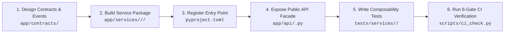

# Feature Implementation Pipeline & Architecture Checklist

This document defines the complete end-to-end engineering workflow, structure, lifecycle standards, and checklist for implementing new features within the **HaruQuantAI** composable architecture.

---

## Architectural Lifecycle Overview



---

## Phase 1: Planning & Contract Definition

> [!IMPORTANT]
> **Rule of Contract Purity**: Contracts and capability keys **MUST** live in `app/contracts/`. A service implementation must **never** define its own public contract, and one feature must **never** import another feature's internal modules directly.

### 1.1 Choose Domain and Descriptive Feature ID

- **Domain**: Choose exactly one domain:
  - `broker`: Broker integrations, market data feeds, order execution.
  - `data`: Data storage, bar aggregation, historical replay, normalization.
  - `risk`: Pre-trade risk checks, drawdown limits, leverage gates.
  - `strategy`: Signal generation, alpha models, indicators.
  - `execution`: Order routing, smart execution algorithms.
  - `portfolio`: Position sizing, rebalancing, exposure management.
  - `system`: Clock, metrics, persistence storage engine.
- **Feature ID**: Use the uppercase verb/adjective descriptive format:
  $$
  \text{FEAT-}<\text{DOMAIN}>-<\text{ACTION\_DESCRIPTIVE}>
  $$

  *(e.g., `FEAT-DATA-RETRIEVE_BARS`, `FEAT-BROKER-FEED_BINANCE`, `FEAT-RISK-MAX_DRAWDOWN`)*.

### 1.2 Define the Capability & Protocol in `app/contracts/`

Create or update `app/contracts/<domain>/<name>.py`:

```python
from collections.abc import Sequence
from dataclasses import dataclass
from typing import Protocol, runtime_checkable
from app.kernel.capability import CapabilityKey

@dataclass(frozen=True, slots=True)
class CustomRequest:
    symbol: str
    limit: int

@runtime_checkable
class CustomServiceContract(Protocol):
    """Abstract protocol for this capability."""

    async def execute_action(self, request: CustomRequest) -> Sequence[object]:
        ...

# Capability Key identifier format: '<domain>.<name>@<major_version>'
CUSTOM_CAPABILITY = CapabilityKey[CustomServiceContract](
    name="data.custom-service",
    major=1,
)
```

### 1.3 Define Typed Events (If emitting or subscribing)

In `app/contracts/events/<domain>.py`:

```python
from dataclasses import dataclass
from datetime import datetime

@dataclass(frozen=True, slots=True)
class CustomActionCompletedEvent:
    symbol: str
    items_count: int
    timestamp: datetime
```

---

## Phase 2: Feature Package Implementation

Create a new self-contained directory under `app/services/<domain>/<feature_slug>/`:

```text
app/services/<domain>/<feature_slug>/
├── __init__.py         <-- Docstring ONLY (ARCH-001-INIT-PURITY)
├── manifest.py         <-- FeatureSpec with capability declarations
├── config.py           <-- Strict immutable configuration dataclass
├── <domain_logic>.py   <-- Pure business logic implementation
├── feature.py          <-- Feature class & factory
└── README.md           <-- Documentation using Section 24 template
```

### 2.1 `__init__.py`

Must contain docstrings only:

```python
"""Feature package for custom service."""
```

### 2.2 `manifest.py`

Declare provided, required, and optional capability dependencies:

```python
from app.contracts.broker.market_data import BROKER_MARKET_DATA
from app.contracts.data.custom_service import CUSTOM_CAPABILITY
from app.kernel.feature import FeatureSpec

FEATURE_SPEC = FeatureSpec(
    feature_id="FEAT-DATA-CUSTOM_SERVICE",
    domain="data",
    description="Processes and delivers custom data analytics.",
    provides=frozenset({CUSTOM_CAPABILITY}),
    requires=frozenset({BROKER_MARKET_DATA}),
    optional=frozenset(),
)
```

### 2.3 `config.py`

Strictly validate all configuration properties:

```python
from dataclasses import dataclass

@dataclass(frozen=True, slots=True)
class CustomFeatureConfig:
    batch_size: int = 100
    timeout_seconds: float = 5.0

    def __post_init__(self) -> None:
        if self.batch_size <= 0:
            raise ValueError("batch_size must be positive")
```

### 2.4 `<domain_logic>.py` — Pure Capability Implementation Standard

The domain logic module implements the core business algorithms and operations. To ensure maximum readability, standalone inspectability, and maintainability, all capability logic files **MUST** include:

#### A. Comprehensive Module Header Docstring
Every core capability file must start with a descriptive header detailing:
- Module Title & Purpose
- Key Capabilities
- Python API Usage Examples
- CLI Usage Commands

```python
"""
Dukascopy & MT5 Historical Data Downloader & Parser
========================================================================
A high-performance standalone Python engine to pull historical Tick and M1
candle data directly from Dukascopy DataFeed and MT5 Data Center.

Key Capabilities:
-----------------
1. Dual-Source Acceleration:
   - MT5 Data Center Fast Download: Downloads pre-packaged yearly/monthly
     ZIP archives for instant bulk loading at millions of ticks/sec.
   - Direct Dukascopy DataFeed (.bi5): Downloads fine-grained hourly ticks
     and daily M1 candle files with LZMA decompression.
2. Robust Network & Rate Limiting:
   - Adaptive rate pacing and automated 503/429 backoff retry.
   - Thread-safe multi-worker parallel execution.
3. Symbol Metadata Auto-Detection:
   - Auto-detects decimal places and point multipliers for Forex Majors,
     Crosses, JPY pairs, Metals (Gold/Silver), Indices, Commodities, and Crypto.
4. Full Resampling & Export:
   - Resample M1 to M5, M15, M30, H1, H4, D1, W1, etc.
   - Export directly to Pandas DataFrame, CSV, Parquet (.parquet), or Feather (.feather).

Python API Usage:
-----------------
    from app.services.data.downloader.engine import download_m1, download_ticks, download_candles

    # 1. Download M1 Candles
    df_m1 = download_m1("EURUSD", start="2023-05-01", end="2023-05-05")

    # 2. Download Tick Data (using CDN acceleration or direct feed)
    df_ticks = download_ticks("EURUSD", start="2026-08-01", end="2026-08-05")

    # 3. Download and resample to any timeframe (e.g. H1, M15)
    df_h1 = download_candles("USDJPY", timeframe="H1", start="2023-01-01", end="2023-03-01")

CLI Usage:
----------
    python -m app.services.data.downloader.engine --symbol EURUSD --type m1 --start 2023-05-01 --end 2023-05-05 --output EURUSD_M1.csv
    python -m app.services.data.downloader.engine --symbol EURUSD --type tick --start 2026-08-01 --end 2026-08-05 --output EURUSD_ticks.parquet
    python -m app.services.data.downloader.engine --symbol USDJPY --timeframe H1 --start 2023-01-01 --end 2023-03-01 --output USDJPY_H1.csv
"""
```

#### B. Self-Test & Verification CLI Block (`if __name__ == "__main__":`)
At the end of `<domain_logic>.py`, provide an executable verification harness to benchmark, validate, and demonstrate the engine standalone:

```python
if __name__ == "__main__":
    import time

    print("=" * 80)
    print("MT5 Data Center X Native Binary Reader - Live Performance Test")
    print("=" * 80)

    # 1. Test Available Symbols Query
    print("\n[1] Querying Available Symbols from MT5 Data Center:")
    symbols_df = get_available_symbols()
    print(f"Total symbols found: {len(symbols_df)}")
    print(symbols_df.head(10).to_string(index=False))

    # 2. Test M1 Fast Read
    print("\n" + "-" * 80)
    print("[2] Loading EURUSD M1 (Full 7.31M History):")
    t0 = time.perf_counter()
    df_m1 = read_m1("EURUSD")
    elapsed_m1 = time.perf_counter() - t0
    rate_m1 = len(df_m1) / elapsed_m1
    print(f"Loaded {len(df_m1):,} M1 bars in {elapsed_m1:.3f} s ({rate_m1:,.0f} bars/sec)!")
    print("Head:")
    print(df_m1.head(3))
    print("Tail:")
    print(df_m1.tail(3))

    # 3. Test M1 Date-Filtered Read
    print("\n" + "-" * 80)
    print("[3] Loading EURUSD M1 (Date Filter: 2021-01-01 to 2021-01-05):")
    t0 = time.perf_counter()
    df_filtered = read_m1("EURUSD", start="2021-01-01", end="2021-01-05")
    elapsed_filt = time.perf_counter() - t0
    print(f"Loaded {len(df_filtered):,} filtered bars in {elapsed_filt:.3f} s!")
    print(df_filtered.head(3))

    # 4. Test Tick Read (first 1 million ticks)
    print("\n" + "-" * 80)
    print("[4] Loading EURUSD Ticks (First 1,000,000 ticks with real spread):")
    t0 = time.perf_counter()
    df_ticks = read_ticks("EURUSD", max_ticks=1_000_000)
    elapsed_ticks = time.perf_counter() - t0
    rate_ticks = len(df_ticks) / elapsed_ticks
    print(f"Loaded {len(df_ticks):,} ticks in {elapsed_ticks:.3f} s ({rate_ticks:,.0f} ticks/sec)!")
    print(df_ticks.head(3))

    print("\n" + "=" * 80)
    print("All tests passed successfully!")
    print("=" * 80)
```

---

### 2.5 `feature.py`

Mount the feature using `FeatureContext` for all runtime effects:

```python
from typing import override
from app.kernel.context import FeatureContext
from app.kernel.feature import Feature, FeatureSpec
from .manifest import FEATURE_SPEC
from .service import CustomServiceImpl

class CustomFeature(Feature):
    @property
    def spec(self) -> FeatureSpec:
        return FEATURE_SPEC

    @override
    async def mount(self, context: FeatureContext, config: object) -> None:
        # 1. Resolve required dependencies
        broker_data = context.require(BROKER_MARKET_DATA)

        # 2. Instantiate implementation
        service = CustomServiceImpl(broker_data=broker_data)

        # 3. Provide capability to registry
        context.provide(CUSTOM_CAPABILITY, service)

        # 4. Managed background tasks and event subscriptions
        # context.spawn(service.worker_loop(), name="worker")
        # context.listen(SomeEvent, service.on_event)

def create_feature() -> Feature:
    """Entry point factory."""
    return CustomFeature()
```

---

## Phase 3: Registration & Public API Exposure

### 3.1 Register Entry Point in `pyproject.toml`

Add the feature factory under `[project.entry-points."haruquantai.features"]`:

```toml
[project.entry-points."haruquantai.features"]
FEAT-DATA-CUSTOM_SERVICE = "app.services.data.custom_service.feature:create_feature"
```

### 3.2 Expose Capability on Public API Facade in `app/api/<domain>.py`

Add dynamic capability resolution and introspection methods:

```python
class DataAPI:
    def __init__(self, registry: ServiceRegistry) -> None:
        self._registry = registry

    @property
    def is_custom_service_available(self) -> bool:
        """Introspect capability presence."""
        return self._registry.is_available(CUSTOM_CAPABILITY)

    def get_custom_service(self) -> CustomServiceContract:
        """Resolve active capability or raise CapabilityUnavailableError."""
        return self._registry.require(CUSTOM_CAPABILITY)
```

---

## Phase 4: Composable Testing Suite

Create your test suite under `tests/services/<domain>/<feature_slug>/` covering the **4 Composability Categories**:

| Category                                    | Description                                                       | How to Test                                                                                          |
| ------------------------------------------- | ----------------------------------------------------------------- | ---------------------------------------------------------------------------------------------------- |
| **Category A: Contract Tests**        | Verifies business logic against contracts.                        | Use test doubles (dummy classes implementing`Protocol`), never real external services.             |
| **Category B: Dependency Loss**       | Tests behavior when required or optional capabilities are absent. | Mount feature into a`DefaultFeatureContext` with mock resolver returning `None`.                 |
| **Category C: Lifecycle Leaks**       | Ensures no memory leaks, dangling tasks, or unclosed listeners.   | Mount and unmount 50x in a loop; verify`scope.active_task_count == 0` and `listener_count == 0`. |
| **Category D: Physical Removability** | Confirms the app and other domains run if this folder is deleted. | Use test doubles in other domain tests so they never import this folder directly.                    |

---

## Phase 5: The 18-Point Definition of Done (DoD)

Before submitting your code, verify all 18 criteria:

- [ ] **1. Stable Feature ID**: Descriptive format `FEAT-<DOMAIN>-<VERB_ADJECTIVE>`.
- [ ] **2. Single Domain**: Belongs to exactly one business domain.
- [ ] **3. Cohesive Capability**: Provides one cohesive capability set.
- [ ] **4. Contract Separation**: All contracts live in `app/contracts/`, not inside the service directory.
- [ ] **5. Explicit Dependencies**: Required and optional capabilities are declared in `manifest.py`.
- [ ] **6. Zero Cross-Feature Imports**: Never imports from another `app/services/<other_domain>` package.
- [ ] **7. Pure Import Time**: No network calls, file creation, or database connections on import.
- [ ] **8. Contextual Effects**: All tasks, capabilities, and listeners are registered through `FeatureContext`.
- [ ] **9. Transactional Rollback**: If `mount()` throws an exception, all resources roll back cleanly.
- [ ] **10. Idempotent Unmount**: Calling unmount multiple times does not raise errors.
- [ ] **11. Required-Dependency Loss**: Fails gracefully with `CapabilityUnavailableError` when dependency is missing.
- [ ] **12. Optional-Dependency Loss**: Degrades gracefully to fallback behavior without crashing.
- [ ] **13. Persistent State Retention**: Uses `storage.partition("feature_id")` and documents retention rules.
- [ ] **14. Irreversible Action Safety**: Enforces idempotency keys and state reconciliation for real-world effects.
- [ ] **15. Zero-Feature Application Boot**: The application starts successfully even if this feature is disabled.
- [ ] **16. Introspectable API**: Public API checks availability dynamically rather than hardcoding imports.
- [ ] **17. Standard README**: `README.md` documents purpose, capabilities, state, and removal effects.
- [ ] **18. 6-Gate CI Gate Passes**: All automated quality checks pass.

---

## Phase 6: Automated CI Verification & Removal Verification

Run the 6-gate CI check and feature removal verification script:

```bash
# 1. Format and check lints
uv run ruff format .
uv run ruff check --fix .

# 2. Run the 6-Gate CI Check (Format, Lint, Mypy, Import Linter, AST Rules, Pytest >=80%)
uv run python scripts/ci_check.py

# 3. Verify physical removability of your new feature
uv run python scripts/verify_feature_removal.py FEAT-<DOMAIN>-<ACTION_NAME>
```

---

## Phase 7: High-Speed Test Selection & Multi-Core Scaling

When scaling to hundreds of features and thousands of tests, running full global test coverage on every single code tweak creates unnecessary lag. Follow these high-speed testing patterns:

### 1. Incremental Test Selection with `pytest-testmon` (Instant: 0.01s - 0.05s)
`pytest-testmon` automatically maps tests to executed source code lines. When you modify a file or function, it **only executes the exact tests touched by your change** and skips the rest:

```bash
# Run ONLY tests affected by your recent code edits (skips unchanged in 0.01s)
uv run pytest --no-cov --testmon
```

### 2. Feature-Scoped Execution (Instant: 0.05s)
During active feature development, target only your specific feature's test folder without global coverage tracing:

```bash
# Test only your active feature
uv run pytest --no-cov tests/services/data/historical_bars/

# Test an entire domain
uv run pytest --no-cov tests/services/data/
```

### 3. Last-Failed & Failed-First Iteration
Avoid re-running passing tests while debugging failures:

```bash
# Only run tests that failed on the previous run
uv run pytest --no-cov --lf

# Run failed tests first, then the rest
uv run pytest --no-cov --ff
```

### 4. Parallel Multi-Core Execution with `pytest-xdist`
Distribute tests across all available CPU cores:

```bash
# Run tests in parallel across all CPU cores
uv run pytest --no-cov -n auto
```

### Development vs CI Workflow Summary:

| Workflow Step | Recommended Command | Typical Duration | Purpose |
|---|---|---|---|
| **Inner Dev Loop** | `uv run pytest --no-cov --testmon` | **0.01s – 0.05s** | Instant feedback as you code. Only runs tests affected by your changes. |
| **Feature Focus** | `uv run pytest --no-cov tests/services/<domain>/<feat>/` | **0.05s – 0.10s** | Deep testing of a single feature in isolation. |
| **Debug Failures** | `uv run pytest --no-cov --lf` | **0.05s** | Rapid test-driven bug fixing. |
| **Full Pre-Commit Gate** | `uv run python scripts/ci_check.py` | **2.5s** | Comprehensive 6-gate validation with strict types, coverage, and AST rules. |
