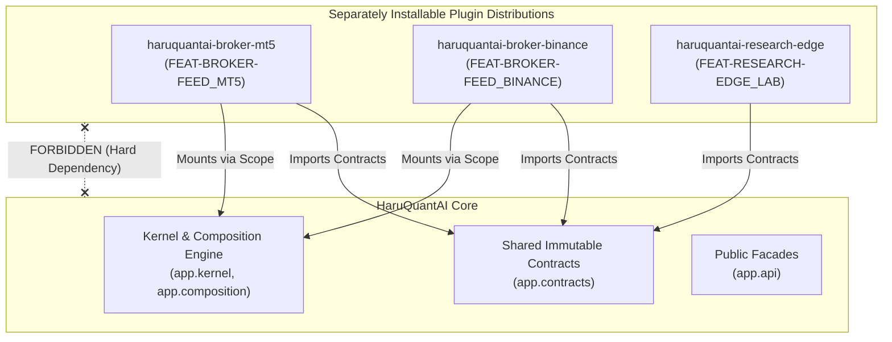

# External Plugin Packaging & Distribution Architecture

> **Specification:** Composable Plugin Packaging, Entry Points, and Diagnostic Separation
> **Phase:** 14 — Package External Plugins

---

## 1. Architectural Philosophy

HaruQuantAI is structured as an **extensible, capability-driven quantitative platform**. Core distributions contain the kernel runtime, public facades, and immutable contract definitions. Domain-specific integrations (e.g. proprietary brokers, data vendors, custom ML execution models) can be packaged as **separately installable Python distributions (wheels / packages)** without modifying the core repository.



### Dependency Direction Rules

1. **Plugin Distribution $\rightarrow$ Contracts & Kernel**: External plugins depend directly on `app.contracts` and `app.kernel` protocols.
2. **Core $\times$ Plugin Distributions**: The core application **must never** declare mandatory import or build dependencies on optional plugin distributions.
3. **Pluggable Registration**: Plugins register themselves using standard Python entry points under the `haruquantai.features` group.

---

## 2. Differentiating Dependency Types

HaruQuantAI explicitly separates **two distinct dependency layers** and diagnoses failures differently:

| Dependency Type | Example | Meaning | Failure Mode & Diagnosis |
|---|---|---|---|
| **Package Dependency** | `metatrader5`, `ccxt`, `numpy`, `torch` | Third-party Python libraries, C-extensions, or wheels installed in the environment | **Package Dependency Error:** `ModuleNotFoundError` during feature discovery. Diagnosed as missing wheel in `RuntimeStatus.package_dependency_errors`. |
| **Capability Dependency** | `broker.market-data@1`, `system.storage@1` | Runtime service provider dynamically registered by another active feature | **Capability Dependency Error:** Feature is syntactically valid and installed, but transitions to `BLOCKED` awaiting required capability in `RuntimeStatus.capability_dependency_errors`. |

### Diagnostic Diagnostic Matrix

```text
Feature State Matrix:
┌───────────────────────────────────────┬───────────────────────────────────────┐
│ Package Installed: YES                │ Package Installed: YES                │
│ Capability Available: YES             │ Capability Available: NO              │
│ Status: READY / ACTIVE                │ Status: BLOCKED (Waiting for Service) │
├───────────────────────────────────────┼───────────────────────────────────────┤
│ Package Installed: NO                 │ Package Installed: NO                 │
│ Capability Available: N/A             │ Capability Available: N/A             │
│ Status: FAILED_IMPORT (Missing Wheel) │ Status: FAILED_IMPORT (Missing Wheel) │
└───────────────────────────────────────┴───────────────────────────────────────┘
```

---

## 3. Packaging an External Plugin

### Directory Structure

```text
haruquantai-broker-binance/
├── pyproject.toml
├── README.md
└── haruquantai_broker_binance/
    ├── __init__.py                                 # Pure docstring only (ARCH-001)
    ├── manifest.py                                 # SPEC declaration
    ├── config.py                                   # Typed config with .from_dict()
    ├── feature.py                                  # BinanceBrokerFeature (mount/unmount)
    └── client.py                                   # Binance API client
```

### `pyproject.toml` Entry Point Configuration

```toml
[build-system]
requires = ["hatchling"]
build-backend = "hatchling.build"

[project]
name = "haruquantai-broker-binance"
version = "1.0.0"
description = "Binance exchange broker and market data adapter for HaruQuantAI"
requires-python = ">=3.14"
dependencies = [
    "haruquantai-core>=1.0.0",
    "ccxt>=4.0.0",
    "pydantic>=2.0.0",
]

[project.entry-points."haruquantai.features"]
FEAT-BROKER-FEED_BINANCE = "haruquantai_broker_binance.feature:create_feature"
```

### Feature Specification (`manifest.py`)

```python
"""Feature manifest for Binance broker plugin."""

from app.contracts.broker.execution import BROKER_EXECUTION
from app.contracts.broker.market_data import BROKER_MARKET_DATA
from app.kernel.capability import CapabilityKey
from app.kernel.feature import FeatureSpec
from haruquantai_broker_binance.config import BinanceBrokerConfig

SPEC = FeatureSpec(
    feature_id="FEAT-BROKER-FEED_BINANCE",
    domain="broker",
    description="Binance live and paper trading integration",
    provides=frozenset({BROKER_MARKET_DATA, BROKER_EXECUTION}),
    requires=frozenset(),
    optional=frozenset({
        CapabilityKey[object](name="system.metrics", major=1),
    }),
    config_type=BinanceBrokerConfig,
)
```

---

## 4. Lifecycle & Runtime Introspection

When a user enables an external plugin in `app.toml`:

```toml
[application]
profile = "live"

[features.FEAT-BROKER-FEED_BINANCE]
enabled = true
api_key = "ENV_BINANCE_API_KEY"
secret = "ENV_BINANCE_SECRET"
```

1. **Discovery**: `FeatureDiscoverer` scans entry points under group `haruquantai.features`.
2. **Package Validation**: If `ccxt` is missing, `DiscoveryResult.failed_imports` records the missing module without halting discovery of other features.
3. **Reconciliation**: `CompositionEngine` inspects the dependency DAG and mounts active features.
4. **Introspection**: `SystemAPI.inspect_feature("FEAT-BROKER-FEED_BINANCE")` reports package and capability diagnostics:

```python
info = api.system.inspect_feature("FEAT-BROKER-FEED_BINANCE")
if not info.is_active:
    if info.package_error:
        print(f"Missing Python package dependency: {info.package_error}")
    elif info.capability_error:
        print(f"Waiting for runtime capability: {info.capability_error}")
```
