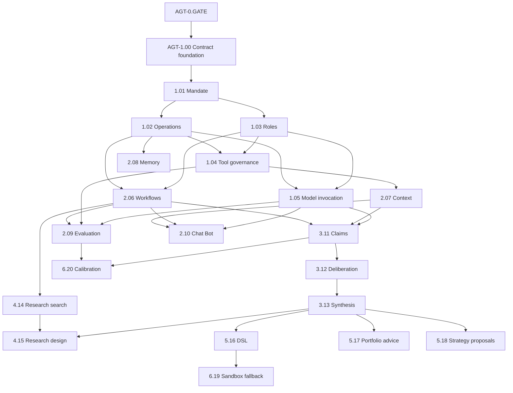

# Agentic Domain Rebuild Plan

> **Target domain:** `D-AGT` — `app/services/agentic/`  
> **Plan status:** `READY FOR OWNER REVIEW` — planning and sequencing only; production implementation remains unchecked  
> **Authoritative product specification:** `app/services/agentic/README.md`  
> **Implementation standard:** `docs/dev/feature_implementation_pipeline.md`  
> **Current repository baseline:** `068d8af0e5b4dfb8dece8e988e2960f41afdc75e`  
> **Pinned legacy donor candidate:** `d9c614f20939f76bc1d8020ea8837da29eb2a9da`  
> **Commit that removed the legacy tree:** `4fef8b614cba073180d4dc9bedf5ec0dc19b956a`  
> **Target:** 20 focused features, 22 built-in LLM role profiles, seven role families, and 12 governed workflows

This plan converts the approved Agentic architecture into execution-grade Tasks. It is deliberately more prescriptive than an ordinary roadmap so a lower-intelligence Executor can implement one bounded feature without inventing architecture, authority, contracts, state, provider behavior, or cross-domain semantics.

The current V3 README and current owner-domain contracts win over this plan if they are later ratified differently. The legacy `app/agentic/` implementation is behavioral evidence only. Its `Completed` labels are not current implementation evidence.

---

## 1. Objective and Completion State

The rebuild is complete only when:

- all 20 semantic `FEAT-AGT-*` packages exist directly under `app/services/agentic/` and independently pass discovery, activation, replacement, degradation, teardown, and physical-removal checks;
- all Agentic-owned public DTOs, protocols, capability keys, errors, and events live under the ratified `app/contracts/agentic/` boundary and contain no provider/framework objects;
- all 22 role profiles are immutable, hash-verified, eligibility-gated contributions owned by the correct feature and disposed by exact handle;
- **Chat Bot** (`chat_bot`) can use a newly captured bounded page/widget context, answer safe contextual questions, and return deterministically authorized specialist results in the same conversation;
- claim graphs, not unrestricted transcripts or hidden reasoning, are the canonical reasoning record;
- councils are adaptive escalations and remain disabled until evaluation/ablation proves value over deterministic and single-agent baselines;
- research campaigns preserve every attempt, failure, null result, amendment, degree of freedom, and holdout receipt across near-duplicate hypotheses;
- JSON Strategy/Indicator DSL is the primary generated artifact and source generation is an explicitly approved sandbox fallback;
- Agentic never owns or bypasses market truth, strategy acceptance, portfolio decisions, Risk approval, Trading authority, orders, fills, broker credentials, broker mutation, kill-switch clearing, or production deployment;
- removing one feature produces only its documented degraded state, and deleting the whole Agentic domain leaves deterministic startup and safety behavior intact;
- all feature, contract, interface, workflow, security, durability, evaluation, provider-replacement, state-retention, and removal evidence passes the current repository gate with coverage at or above the configured floor.

### Explicit non-goals

- Do not restore `app/agentic/` or its package-root facade.
- Do not bulk-copy the old agent hierarchy, shared `_settings.py`, `_limits.py`, or shared `persistence/` package.
- Do not make each named role a service feature.
- Do not duplicate receiver-owned Research, Simulation, Optimization, Strategy, Indicators, Portfolio, Risk, Trading, or Brokers contracts.
- Do not make Google ADK mandatory domain identity or canonical state.
- Do not implement HTTP/SSE/UI transport inside Agentic.
- Do not add a direct Agentic-to-Brokers capability edge.
- Do not mark any feature `Completed` from donor code, a plan, a prompt, or an unexecuted test.

---

## 2. Current Baseline and Mandatory Phase-0 Blockers

At baseline `068d8af0e5b4dfb8dece8e988e2960f41afdc75e`:

- `app/services/agentic/` contains only its authoritative README;
- `app/contracts/agentic/` does not yet exist;
- no Agentic entry points, feature manifests, state declarations, migrations, or V3 tests exist;
- the repository still declares `google-adk>=2.5.0` as a core dependency and its comment names the deleted `app/agentic/runtime/adk.py` path;
- the current Workspace, Plugins, Data, Analytics, and other domains expose real capability keys that do not always match the *proposed owner keys* written in the approved Agentic specification;
- the legacy source and test tree are recoverable from Git history at `d9c614f20939f76bc1d8020ea8837da29eb2a9da`, but have not yet been normalized into one-feature donor bundles;
- surviving `docs/dev/agentic_firm/` files still describe the retired path, numbered features, and agent-per-package model in places.

The following are **blocking specification gaps**, not implementation discretion:

1. exact Workspace/System owners for settings, authenticated principal, clock/IDs, secret references, durable SQL/migration execution, worker admission, retention, and artifact staging;
2. exact Plugins owners for role contributions, model-runtime providers, sandbox permission/isolation, and optional provider packaging;
3. exact read-only evidence keys and projections from Data, Catalogue, Indicators, Analytics, Research, Simulation, Optimization, Portfolio, Risk, Strategy, and Trading;
4. exact Research/Simulation/Optimization ownership of campaigns, protocols, searches, trials, holdouts, and results;
5. exact Strategy/Indicators JSON DSL schemas, candidate intake, Strategy proposal intake, Portfolio/Risk review, and outcome-reference contracts;
6. exact D-IFACE and UI companion feature IDs/contracts for Chat Bot transport, streaming, cancellation, session identity, and widget context contributions;
7. event contract location and dispatch modes, because the pipeline names `app/contracts/events/` while that package is not currently present;
8. the in-repository zero-argument factory symbol. Current feature entry points use `feature()`; Agentic must not mix `feature()` and `create_feature()` without a project-wide ratified change;
9. supported `StateDeclaration.retention_policy` vocabulary versus business-level TTL/metadata cleanup. Invented values such as `RETAIN_WITH_TTL_CLASSES` and `RETAIN_METADATA` are not allowed;
10. Chat Bot conversation-state ownership and whether it requires Agentic durable state or remains D-IFACE/Workspace session state;
11. eligibility bootstrap: the first role/model cannot require evidence generated only by a feature that itself requires an already eligible role/model;
12. optional-provider packaging for Google ADK and removal of stale dependency comments without breaking the deterministic test provider.

No production Agentic Task may begin until the blocker relevant to that Task is closed by an owner-approved specification change.

---

## 3. Authority and Execution Rules

### Authority order

1. Ratified current owner-domain README and public contracts.
2. `app/services/agentic/README.md`.
3. `docs/ARCHITECTURE.md`, `docs/PROJECT.md`, `AGENTS.md`, and the feature implementation pipeline.
4. This rebuild plan.
5. Pinned legacy donor source, tests, fixtures, usage, and supporting documents.

### Task atomicity

- One implementation Task owns exactly one focused `FEAT-AGT-*` feature, except the shared contract-foundation Task and explicitly named cross-domain companion Tasks.
- A Task may update its contract module, feature package, tests, entry point, import rules, authoritative README row/section, changelog, and exact migration artifacts.
- A Task may not opportunistically implement a sibling feature or missing receiver behavior.
- Any new behavior not already ratified becomes a separate `SPEC-GAP-*` documentation Task before implementation.
- Stateful schema changes are additive. Rollback disables the feature and preserves/tombstones committed state; it does not destructively down-migrate production evidence.

### Required implementation workflow for every feature

Every feature Task shall execute the following checklist in this order:

1. **Preflight and donor scope**
   - [ ] Confirm baseline commit, branch, Task ID, feature ID, owning README section, and exact allowed paths.
   - [ ] Verify the normalized donor bundle manifest and drift hash, or record `DONOR_UNAVAILABLE` truthfully.
   - [ ] Close every in-scope legacy behavior with `COVERED`, `ADAPT`, `MERGE`, `REPLACED_WITH_PARITY`, `ADD_TO_V3`, or narrowly justified `RETIRE_MECHANISM_ONLY`.
   - [ ] Confirm all external prerequisite capability IDs exist in current owner contracts; stop rather than inventing one.

2. **Public contract first**
   - [ ] Add/update exactly one primary capability module under `app/contracts/agentic/`.
   - [ ] Use strict frozen Pydantic v2 public models with `extra="forbid"`, explicit schema version, aware UTC times, bounded values, and canonical digests where integrity matters.
   - [ ] Define one runtime-checkable protocol with one primary action-named async method, a discriminated request union, and explicit success/refusal/failure union.
   - [ ] Define only genuinely required typed events using the Phase-0-ratified event location and dispatch mode.
   - [ ] Add contract construction, validation, serialization, immutability, compatibility, prohibited-field, and protocol tests before business implementation.

3. **Feature package and manifest**
   - [ ] Create the exact mandatory package files: pure `__init__.py`, `README.md`, `manifest.py`, `config.py`, `feature.py`, and focused responsibility modules.
   - [ ] Make `SPEC` immutable; ensure `provides`, `requires`, `optional`, `conflicts`, `config_keys`, and `state` match contracts and README exactly.
   - [ ] Use only the ratified zero-argument factory symbol and register it under `haruquantai.features`.
   - [ ] Add the feature package to the Import Linter/architecture feature boundary list.

4. **Strict configuration**
   - [ ] Parse only the documented keys; reject unknown, duplicate, mixed-form, wrong-type, widening, unbounded, or internally inconsistent values.
   - [ ] Keep secrets as opaque owner-domain references. Never read `.env` or process environment inside the feature.
   - [ ] Keep defaults conservative and unable to widen mandate, authority, budget, provider fallback, retention, or side effects.

5. **Focused business behavior**
   - [ ] Implement only the FRs owned by the feature.
   - [ ] Import sibling and external feature implementations nowhere; use public contract models/keys and `FeatureContext` capability resolution.
   - [ ] Keep deterministic rules outside prompts and model prose.
   - [ ] Reject missing, stale, incompatible, untrusted, poisoned, or unauthorized inputs with stable typed outcomes.

6. **Effects, persistence, and teardown**
   - [ ] Acquire capabilities with `context.require()`/`context.optional()` only when declared.
   - [ ] Use `context.spawn()` for managed tasks, `context.subscribe()` for exact subscriptions, context managers for clients/resources, and exact `register_callback()` disposers for contributions.
   - [ ] Prove failed mount leaves no provider, task, listener, client, callback, lease, role contribution, or staged file behind.
   - [ ] For durable state, own migrations and adapter inside the feature package; use the ratified persistence execution capability; define idempotency, expected-version rules, reconciliation, retention, export, recovery, and removal.

7. **Role artifacts when applicable**
   - [ ] Add package-local `roles/<role_id>/role.json` and `prompt.md` only for roles owned by the feature.
   - [ ] Normalize prompt bytes before hashing; bind manifest, prompt, composite instruction, schema, tools, model policy, and evaluation reference.
   - [ ] Register through `agentic.roles@1`, keep registration distinct from eligibility, and register the exact disposer with the feature scope.
   - [ ] Prove prompt or manifest mutation fails closed before model construction.

8. **Usage and documentation**
   - [ ] Give every core module comprehensive header documentation and precise symbol docstrings.
   - [ ] Put the single bounded executable usage harness in the designated primary module.
   - [ ] Run `uv run python -m app.services.agentic.<feature>.<primary_module_without_py>` and make it fail nonzero on invalid verification.
   - [ ] Create the feature README with the exact validator-required level-two sections and map every FR to a named usage scenario.

9. **Automated evidence**
   - [ ] Add focused config, contract, business, lifecycle, failure, persistence/concurrency, replacement, readiness, and removal tests as applicable.
   - [ ] Test required dependency absence/loss, every optional dependency absent/arrival/removal/recovery path, provider ambiguity/selection where applicable, configuration remount, failed shadow replacement, and cleanup idempotency.
   - [ ] Execute 100 enable/disable cycles through the shared lifecycle evidence where applicable.
   - [ ] Add D-IFACE/UI integration tests only in the owning companion Task, not inside Agentic business logic.

10. **Verification, legacy closeout, and commit**
    - [ ] Run targeted tests during implementation; do not run bare pytest or the full repository gate while iterating.
    - [ ] Run targeted Ruff, strict mypy, Import Linter, architecture, feature-doc validation, usage, and physical-removal checks before review.
    - [ ] Prove no application/test/build/runtime path imports `.migration`.
    - [ ] Port or supersede donor tests into V3 paths; delete the exact approved nonshared donor bundle before review and record restore provenance.
    - [ ] Update the domain README status only after runtime evidence passes.
    - [ ] Commit only the approved paths with the proposed atomic commit message.

---

## 4. Legacy Donor Intake and Migration Method

The donor candidate is the repository state immediately before the cleanup deletion:

```text
source commit: d9c614f20939f76bc1d8020ea8837da29eb2a9da
source root:   app/agentic/
test root:     tests/agentic/
removal commit:4fef8b614cba073180d4dc9bedf5ec0dc19b956a
```

### Normalized bundle layout

```text
.migration/agentic/<task-id>/
├── source-manifest.json
├── disposition.md
├── src/                 # only the approved donor files for this feature slice
├── tests/               # only relevant donor unit/integration cases
├── fixtures/            # minimal relevant fixtures
├── usage/               # relevant donor usage evidence
└── restore.txt           # commit/path commands needed to reconstruct the bundle
```

`source-manifest.json` must include donor repository, immutable commit, source/test tree SHA, every staged file and SHA-256, exclusions, shared-consumer flag, normalization date, and drift-check command. Raw donor roots remain read-only. No V3 code or test may import or execute the bundle.

### Legacy state disposition

| Legacy state group | V3 owner/disposition |
|---|---|
| workflow runs/checkpoints | import or adapt only into `FEAT-AGT-RUN_WORKFLOWS` after schema-level reconciliation |
| evidence claims | adapt into typed claim graphs owned by `FEAT-AGT-MANAGE_CLAIMS` |
| memory records | adapt into governed memory classes owned by `FEAT-AGT-MANAGE_MEMORY` |
| lifecycle transitions/promotion packets | archive as donor evidence or hand to the semantic artifact owner; do not import as Agentic authority |
| operations traces/incidents/replays | adapt into `FEAT-AGT-OPERATE_RUNS` with redaction and generation lineage |
| experiment specs/runs/verdicts | receiver-owned Research/Simulation truth; Agentic imports only approved campaign/search/receipt references |
| exact-`spec_hash` holdout use | superseded by campaign/family/dataset/holdout accounting; retain old receipt as historical evidence, not as sufficient new policy |

Legacy database import is never an implicit startup side effect. If local users need it, each stateful feature exposes an idempotent, audited, bounded import path or a feature-owned migration adapter. A cross-feature helper may orchestrate those public import operations but may not write feature tables directly.

---

## 5. Phase and Dependency Overview

### Phase summary

| Phase | Goal | Tasks | Exit condition |
|---:|---|---:|---|
| 0 | Close all ownership, contract, state, provider, interface, and donor-intake gaps | 12 | `AGT-0.GATE` passes; no production Task has an unresolved prerequisite |
| 1 | Establish contract foundation, mandate, operations, roles, tools, and model invocation | 6 | authority and controlled invocation foundation passes removal/replacement evidence |
| 2 | Deliver workflows, context, memory, evaluation, and Chat Bot coordination | 5 | durable bounded execution and operator-assistance substrate is available |
| 3 | Deliver claims, independent challenge, and synthesis | 3 | canonical reasoning/evidence path is complete |
| 4 | Deliver research-search governance and research design | 2 | campaign/family/holdout discipline and receiver candidates are complete |
| 5 | Deliver DSL, portfolio advisory, and Strategy proposal handoff | 3 | decision-support outputs reach only receiver-owned boundaries |
| 6 | Deliver sandbox fallback and outcome calibration | 2 | optional engineering fallback and post-horizon learning are governed |
| 7 | Integrate workflows, D-IFACE/UI, security, removal, documentation, and final CI | 6+ companion Tasks | all domain and system acceptance gates pass |

### Critical path and parallel work



Parallelism permitted after dependencies close:

- `OPERATE_RUNS` and `REGISTER_ROLES` may proceed in parallel after `ENFORCE_MANDATE`.
- `GOVERN_TOOL_CALLS` and `INVOKE_MODELS` may proceed in parallel after Operations + Roles.
- `RUN_WORKFLOWS`, `ASSEMBLE_CONTEXT`, and `MANAGE_MEMORY` may overlap when their exact prerequisites are complete.
- `EVALUATE_PROFILES` and `GOVERN_RESEARCH_SEARCH` may overlap after their separate prerequisites.
- `ASSIST_OPERATOR` contract/UI companion work may proceed in parallel, but final Chat Bot acceptance waits for the first specialist path.
- `COMPOSE_STRATEGY_SPECS`, `ADVISE_PORTFOLIO`, and `COMPOSE_STRATEGY_PROPOSALS` may proceed in parallel after synthesis and their receiver contracts exist.
- `AUTHOR_SANDBOX_ARTIFACTS` and `CALIBRATE_OUTCOMES` are independent once their prerequisites close.

### First deployable vertical slice

```text
ENFORCE_MANDATE
→ OPERATE_RUNS
→ REGISTER_ROLES
→ GOVERN_TOOL_CALLS
→ INVOKE_MODELS
→ RUN_WORKFLOWS
→ ASSEMBLE_CONTEXT
→ MANAGE_CLAIMS (Analytics Evidence Reviewer enabled first)
→ SYNTHESIZE_RESEARCH
→ ASSIST_OPERATOR
→ D-IFACE/UI Chat Bot companion
```

This slice delivers a read-only Chat Bot that explains bounded UI context and delegates deterministic evidence interpretation. It does not include strategy creation, portfolio advice, risk approval, Trading, Brokers, or source-code generation.

### Role delivery registry

| # | Role family | Display name | Role ID | Owning Task | Initial activation rule |
|---:|---|---|---|---|---|
| 1 | Operator Chat | Chat Bot | `chat_bot` | `AGT-2.10` | Enabled only after direct-answer and one specialist route pass evaluation |
| 2 | Coordinator/Planner | Research Planner | `research_planner` | `AGT-2.06` | May propose only bounded registered research graphs |
| 3 | Coordinator/Planner | Artifact Planner | `artifact_planner` | `AGT-2.06` | May propose only bounded DSL/sandbox graphs |
| 4 | Evidence Analyst | Analytics Evidence Reviewer | `analytics_evidence_reviewer` | `AGT-3.11` | First specialist enabled for the read-only vertical slice |
| 5 | Evidence Analyst | Fundamental Analyst | `fundamental_analyst` | `AGT-3.11` | Disabled until point-in-time/licensing/applicability evaluation passes |
| 6 | Evidence Analyst | Sentiment Analyst | `sentiment_analyst` | `AGT-3.11` | Disabled until source trust/injection/manipulation evaluation passes |
| 7 | Evidence Analyst | Technical and Market-Structure Analyst | `technical_structure_analyst` | `AGT-3.11` | Disabled until exact Data/Indicators binding evaluation passes |
| 8 | Evidence Analyst | Quantitative Analyst | `quantitative_analyst` | `AGT-3.11` | Disabled until deterministic estimator/leakage evaluation passes |
| 9 | Research Designer | Hypothesis Designer | `hypothesis_designer` | `AGT-4.15` | Requires campaign identity and supported claims |
| 10 | Research Designer | Experiment Designer | `experiment_designer` | `AGT-4.15` | Requires exact Research/Simulation receiver contract |
| 11 | Research Designer | Bounded Search Designer | `bounded_search_designer` | `AGT-4.15` | Requires search budget and exact Optimization contract |
| 12 | Independent Challenger | Causality Challenger | `causality_challenger` | `AGT-3.12` | Selected only when causality challenge policy requires it |
| 13 | Independent Challenger | Leakage Challenger | `leakage_challenger` | `AGT-3.12` | Selected for point-in-time, split, target, survivorship, or holdout risk |
| 14 | Independent Challenger | Robustness Challenger | `robustness_challenger` | `AGT-3.12` | Selected for regime, parameter, stress, or OOD risk |
| 15 | Independent Challenger | Risk Challenger | `risk_challenger` | `AGT-3.12` | Advisory only; never emits Risk approval |
| 16 | Independent Challenger | Compliance Challenger | `compliance_challenger` | `AGT-3.12` | Advisory only; checks mandate/firm/regulatory/data restrictions |
| 17 | Independent Challenger | Operations and Security Challenger | `operations_security_challenger` | `AGT-3.12` | Selected for provider, permission, sandbox, egress, recovery, or injection risk |
| 18 | Synthesizer | Research Synthesizer | `research_synthesizer` | `AGT-3.13` | Requires canonical claim graph; preserves dissent |
| 19 | Synthesizer | Portfolio Advisory Synthesizer | `portfolio_advisory_synthesizer` | `AGT-5.17` | Produces expiring non-binding advice only |
| 20 | Synthesizer | Strategy Proposal Synthesizer | `strategy_proposal_synthesizer` | `AGT-5.18` | Produces Strategy intake candidates only |
| 21 | Artifact Engineer | Strategy DSL Author | `strategy_dsl_author` | `AGT-5.16` | JSON DSL path only |
| 22 | Artifact Engineer | Sandbox Code Author | `sandbox_code_author` | `AGT-6.19` | Exceptional fallback after DSL-gap and sandbox approval |

No role is enabled merely because its files exist. Registration, mandate enablement, profile eligibility, conflict checks, evidence availability, workflow policy, budget, and user authorization all remain independently required.

### Workflow delivery registry

| Workflow ID | Implemented by | Primary integration Task | Required acceptance result |
|---|---|---|---|
| `WF-AGT-ASSIST_OPERATOR` | `ASSIST_OPERATOR`, `RUN_WORKFLOWS`, `ASSEMBLE_CONTEXT` | `AGT-7.01` + interface/UI companions | Chat Bot direct answer or same-conversation specialist answer |
| `WF-AGT-REVIEW_EVIDENCE` | `MANAGE_CLAIMS`, `SYNTHESIZE_RESEARCH` | `AGT-7.01` | Cited deterministic-evidence interpretation or refusal |
| `WF-AGT-RESEARCH_OBJECTIVE` | claims, deliberation, synthesis, workflows | `AGT-7.02` | Adaptive research result preserving uncertainty/dissent |
| `WF-AGT-DESIGN_RESEARCH` | research search + research design | `AGT-7.03` | Receiver-owned hypothesis/experiment candidate |
| `WF-AGT-GOVERNED_SEARCH` | research search + research design + Optimization boundary | `AGT-7.03` | All-trial campaign update and search interpretation |
| `WF-AGT-COMPOSE_STRATEGY_SPEC` | strategy-spec composition | `AGT-7.03` | Receiver-validated JSON DSL candidate or unsupported-expression report |
| `WF-AGT-ADVISE_PORTFOLIO` | advisory + claims/deliberation/synthesis | `AGT-7.03` | Expiring non-binding advisory or insufficient evidence |
| `WF-AGT-COMPOSE_STRATEGY_PROPOSAL` | proposal composition + Strategy intake | `AGT-7.03` | Strategy receipt/rejection/expiry only |
| `WF-AGT-AUTHOR_SANDBOX_ARTIFACT` | strategy specs + sandbox artifact authoring | `AGT-7.03` | Staged artifact manifest and cleanup evidence |
| `WF-AGT-EVALUATE_PROFILE` | profile evaluation | `AGT-2.09` + `AGT-7.02` | Deterministic eligibility/revocation evidence |
| `WF-AGT-CALIBRATE_OUTCOME` | outcome calibration | `AGT-7.03` | Calibration/value record and optional change candidate |
| `WF-AGT-RESPOND_INCIDENT` | operations + workflows/tool/model cleanup | `AGT-7.04`/`AGT-7.05` | Deterministic containment and side-effect-free replay eligibility |

Each workflow must prove idempotency, checkpoints where applicable, deadlines, bounded retry, backpressure, cancellation, terminal-state behavior, trace completeness, dependency removal, and receiver-owned authority.

---

## Detailed execution documents

- [Phase 0 — ownership, provider, interface, state, and donor readiness](agentic_rebuild/00_PHASE_ZERO.md)
- [Phase 1 — shared contracts and authority/invocation foundation](agentic_rebuild/01_FOUNDATION.md)
- [Phase 2 — workflows, context, memory, evaluation, and Chat Bot](agentic_rebuild/02_RUNTIME_CONTEXT_CHAT.md)
- [Phase 3 — claims, deliberation, and synthesis](agentic_rebuild/03_REASONING.md)
- [Phase 4 — research-search governance and research design](agentic_rebuild/04_RESEARCH.md)
- [Phase 5 — JSON DSL, portfolio advisory, and Strategy proposals](agentic_rebuild/05_DECISION_SUPPORT.md)
- [Phase 6 — sandbox fallback and outcome calibration](agentic_rebuild/06_SANDBOX_CALIBRATION.md)
- [Phase 7 — vertical slices, UI/interface companions, security, removal, and final CI](agentic_rebuild/07_INTEGRATION_ACCEPTANCE.md)

The downloadable single-file edition contains the same execution plan in one document; the repository splits it only for reviewability and atomic future updates.

---
## 12. Master Tracker

### Phase 0

| Status | Task | Deliverable |
|---|---|---|
| [ ] | `AGT-0.01` | Donor manifest and normalized bundles |
| [ ] | `AGT-0.02` | Internal contract/state/event/factory reconciliation |
| [ ] | `AGT-0.03` | Workspace/System prerequisites |
| [ ] | `AGT-0.04` | Plugins/model/sandbox boundaries |
| [ ] | `AGT-0.05` | Evidence capability registry |
| [ ] | `AGT-0.06` | Research/Simulation/Optimization ownership |
| [ ] | `AGT-0.07` | Strategy/Indicators/Portfolio/Risk ownership |
| [ ] | `AGT-0.08` | D-IFACE/UI Chat Bot contracts |
| [ ] | `AGT-0.09` | Evaluation bootstrap |
| [ ] | `AGT-0.10` | Tooling/config/dependency readiness |
| [ ] | `AGT-0.11` | Documentation authority migration |
| [ ] | `AGT-0.GATE` | Production implementation authorization |

### Production features

| Status | Task | Feature | Depends on | Proposed commit |
|---|---|---|---|---|
| [ ] | `AGT-1.00` | Public contract foundation | `AGT-0.GATE` | `feat(agentic): establish public contract foundation` |
| [ ] | `AGT-1.01` | `FEAT-AGT-ENFORCE_MANDATE` | `AGT-1.00` | `feat(agentic): implement mandate enforcement` |
| [ ] | `AGT-1.02` | `FEAT-AGT-OPERATE_RUNS` | `AGT-1.01` | `feat(agentic): implement operations, incidents, and replay validation` |
| [ ] | `AGT-1.03` | `FEAT-AGT-REGISTER_ROLES` | `AGT-1.01` | `feat(agentic): implement role contribution registry` |
| [ ] | `AGT-1.04` | `FEAT-AGT-GOVERN_TOOL_CALLS` | `AGT-1.02, AGT-1.03` | `feat(agentic): implement tool governance and human actions` |
| [ ] | `AGT-1.05` | `FEAT-AGT-INVOKE_MODELS` | `AGT-1.02, AGT-1.03` | `feat(agentic): implement provider-neutral model invocation` |
| [ ] | `AGT-2.06` | `FEAT-AGT-RUN_WORKFLOWS` | `AGT-1.02, AGT-1.03` | `feat(agentic): implement durable workflow orchestration` |
| [ ] | `AGT-2.07` | `FEAT-AGT-ASSEMBLE_CONTEXT` | `AGT-1.02, AGT-1.04` | `feat(agentic): implement point-in-time context assembly` |
| [ ] | `AGT-2.08` | `FEAT-AGT-MANAGE_MEMORY` | `AGT-1.02` | `feat(agentic): implement governed memory` |
| [ ] | `AGT-2.09` | `FEAT-AGT-EVALUATE_PROFILES` | `AGT-1.02, AGT-1.03, AGT-1.04, AGT-1.05, AGT-2.06` | `feat(agentic): implement profile and topology evaluation` |
| [ ] | `AGT-2.10` | `FEAT-AGT-ASSIST_OPERATOR` | `AGT-1.02, AGT-1.03, AGT-1.05, AGT-2.06, AGT-2.07` | `feat(agentic): implement website chat bot and specialist delegation` |
| [ ] | `AGT-3.11` | `FEAT-AGT-MANAGE_CLAIMS` | `AGT-1.02, AGT-1.03, AGT-1.05, AGT-2.06, AGT-2.07` | `feat(agentic): implement claim-and-evidence graph` |
| [ ] | `AGT-3.12` | `FEAT-AGT-DELIBERATE_RESEARCH` | `AGT-1.02, AGT-1.03, AGT-1.04, AGT-1.05, AGT-2.06, AGT-3.11` | `feat(agentic): implement independent challenge and deliberation` |
| [ ] | `AGT-3.13` | `FEAT-AGT-SYNTHESIZE_RESEARCH` | `AGT-1.02, AGT-1.03, AGT-1.05, AGT-3.11, AGT-3.12` | `feat(agentic): implement research synthesis` |
| [ ] | `AGT-4.14` | `FEAT-AGT-GOVERN_RESEARCH_SEARCH` | `AGT-1.02, AGT-2.06` | `feat(agentic): implement research campaign and search governance` |
| [ ] | `AGT-4.15` | `FEAT-AGT-DESIGN_RESEARCH` | `AGT-1.02, AGT-1.03, AGT-1.04, AGT-1.05, AGT-2.06, AGT-3.11, AGT-3.13, AGT-4.14` | `feat(agentic): implement falsifiable research design` |
| [ ] | `AGT-5.16` | `FEAT-AGT-COMPOSE_STRATEGY_SPECS` | `AGT-1.02, AGT-1.03, AGT-1.05, AGT-3.11, AGT-3.13, AGT-4.14` | `feat(agentic): implement json strategy and indicator dsl composition` |
| [ ] | `AGT-5.17` | `FEAT-AGT-ADVISE_PORTFOLIO` | `AGT-1.02, AGT-1.03, AGT-1.04, AGT-1.05, AGT-2.07, AGT-3.11, AGT-3.12, AGT-3.13` | `feat(agentic): implement portfolio and risk advisory` |
| [ ] | `AGT-5.18` | `FEAT-AGT-COMPOSE_STRATEGY_PROPOSALS` | `AGT-1.02, AGT-1.03, AGT-1.04, AGT-1.05, AGT-2.07, AGT-3.11, AGT-3.13` | `feat(agentic): implement strategy proposal composition and handoff` |
| [ ] | `AGT-6.19` | `FEAT-AGT-AUTHOR_SANDBOX_ARTIFACTS` | `AGT-1.02, AGT-1.03, AGT-1.04, AGT-1.05, AGT-2.06, AGT-5.16` | `feat(agentic): implement sandboxed source artifact fallback` |
| [ ] | `AGT-6.20` | `FEAT-AGT-CALIBRATE_OUTCOMES` | `AGT-1.02, AGT-2.09, AGT-3.11` | `feat(agentic): implement post-horizon outcome calibration` |

### Integration and companion work

| Status | Task | Deliverable |
|---|---|---|
| [ ] | `AGT-7.01` | First read-only Chat Bot vertical slice |
| [ ] | `AGT-X-IFACE-01` | D-IFACE Agentic/Chat Bot gateway |
| [ ] | `AGT-X-UI-01` | UI Chat Bot widget/context contributions |
| [ ] | `AGT-7.02` | Adaptive research/deliberation workflows |
| [ ] | `AGT-7.03` | Research/DSL/advisory/proposal/sandbox/calibration workflows |
| [ ] | `AGT-7.04` | Security and authority-negative suite |
| [ ] | `AGT-7.05` | Domain-wide durability/removal matrix |
| [ ] | `AGT-7.06` | Documentation reconciliation and final CI |

---

## 13. Final Definition of Done

- [ ] Every Phase-0 blocker is closed by the correct semantic owner.
- [ ] All 20 features meet the common delivery protocol and their feature-specific Task.
- [ ] All 22 roles are present, hash-verified, evaluated, eligible only where proven, and exactly disposable.
- [ ] All 12 workflows have executable integration evidence and documented stop/degradation behavior.
- [ ] Chat Bot uses fresh typed widget/page context, deterministic routing, same-conversation handoff, and no direct mutation authority.
- [ ] All stateful features own additive migrations, adapters, retention, recovery, export, legacy import, and removal behavior.
- [ ] No Agentic implementation imports a sibling feature implementation, receiver implementation, broker SDK, or provider framework object across the public boundary.
- [ ] All model/tool/receiver calls are bounded, authorized, attributable, and auditable.
- [ ] Claims, dissent, failures, nulls, variants, amendments, holdout use, and calibration evidence cannot be silently erased.
- [ ] JSON DSL is primary and sandbox code remains staging-only.
- [ ] Every feature passes targeted physical removal; full domain deletion preserves deterministic safety.
- [ ] Donor reconciliation is source/test complete or truthfully records unavailable evidence without parity claims.
- [ ] All READMEs, registries, contracts, manifests, configuration, workflows, NFRs, status, and changelog agree with runtime truth.
- [ ] `uv run python scripts/ci_check.py` passes once at final integration with branch coverage at or above the configured floor.
