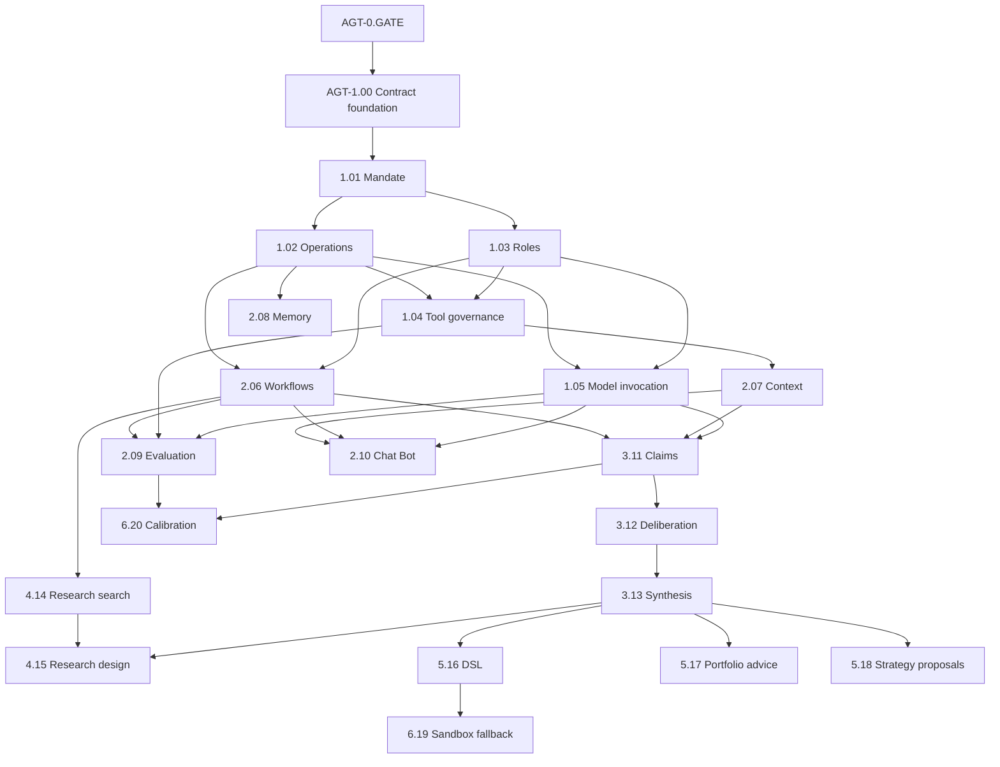

# Agentic Domain Rebuild Plan

> **Target domain:** `D-AGT` — `app/services/agentic/`
> **Plan status:** `READY FOR OWNER REVIEW` — planning and sequencing only; production implementation remains unchecked
> **Authoritative product specification:** `app/services/agentic/README.md`
> **Implementation standard:** `docs/dev/feature_implementation_pipeline.md`
> **Current repository baseline:** `068d8af0e5b4dfb8dece8e988e2960f41afdc75e`
> **Pinned legacy donor candidate:** `d9c614f20939f76bc1d8020ea8837da29eb2a9da`
> **Commit that removed the legacy tree:** `4fef8b614cba073180d4dc9bedf5ec0dc19b956a`
> **Target:** 20 focused features, 22 built-in LLM role profiles, seven role families, and 12 governed workflows

This plan converts the approved Agentic architecture into execution-grade Tasks. It is deliberately more prescriptive than an ordinary roadmap so a lower-intelligence Executor can implement one bounded feature without inventing architecture, authority, contracts, state, provider behavior, or cross-domain semantics.

The current V3 README and current owner-domain contracts win over this plan if they are later ratified differently. The legacy `app/agentic/` implementation is behavioral evidence only. Its `Completed` labels are not current implementation evidence.

---

## 1. Objective and Completion State

The rebuild is complete only when:

- all 20 semantic `FEAT-AGT-*` packages exist directly under `app/services/agentic/` and independently pass discovery, activation, replacement, degradation, teardown, and physical-removal checks;
- all Agentic-owned public DTOs, protocols, capability keys, errors, and events live under the ratified `app/contracts/agentic/` boundary and contain no provider/framework objects;
- all 22 role profiles are immutable, hash-verified, eligibility-gated contributions owned by the correct feature and disposed by exact handle;
- **Chat Bot** (`chat_bot`) can use a newly captured bounded page/widget context, answer safe contextual questions, and return deterministically authorized specialist results in the same conversation;
- claim graphs, not unrestricted transcripts or hidden reasoning, are the canonical reasoning record;
- councils are adaptive escalations and remain disabled until evaluation/ablation proves value over deterministic and single-agent baselines;
- research campaigns preserve every attempt, failure, null result, amendment, degree of freedom, and holdout receipt across near-duplicate hypotheses;
- JSON Strategy/Indicator DSL is the primary generated artifact and source generation is an explicitly approved sandbox fallback;
- Agentic never owns or bypasses market truth, strategy acceptance, portfolio decisions, Risk approval, Trading authority, orders, fills, broker credentials, broker mutation, kill-switch clearing, or production deployment;
- removing one feature produces only its documented degraded state, and deleting the whole Agentic domain leaves deterministic startup and safety behavior intact;
- all feature, contract, interface, workflow, security, durability, evaluation, provider-replacement, state-retention, and removal evidence passes the current repository gate with coverage at or above the configured floor.

### Explicit non-goals

- Do not restore `app/agentic/` or its package-root facade.
- Do not bulk-copy the old agent hierarchy, shared `_settings.py`, `_limits.py`, or shared `persistence/` package.
- Do not make each named role a service feature.
- Do not duplicate receiver-owned Research, Simulation, Optimization, Strategy, Indicators, Portfolio, Risk, Trading, or Brokers contracts.
- Do not make Google ADK mandatory domain identity or canonical state.
- Do not implement HTTP/SSE/UI transport inside Agentic.
- Do not add a direct Agentic-to-Brokers capability edge.
- Do not mark any feature `Completed` from donor code, a plan, a prompt, or an unexecuted test.

---

## 2. Current Baseline and Mandatory Phase-0 Blockers

At baseline `068d8af0e5b4dfb8dece8e988e2960f41afdc75e`:

- `app/services/agentic/` contains only its authoritative README;
- `app/contracts/agentic/` does not yet exist;
- no Agentic entry points, feature manifests, state declarations, migrations, or V3 tests exist;
- the repository still declares `google-adk>=2.5.0` as a core dependency and its comment names the deleted `app/agentic/runtime/adk.py` path;
- the current Workspace, Plugins, Data, Analytics, and other domains expose real capability keys that do not always match the *proposed owner keys* written in the approved Agentic specification;
- the legacy source and test tree are recoverable from Git history at `d9c614f20939f76bc1d8020ea8837da29eb2a9da`, but have not yet been normalized into one-feature donor bundles;
- surviving `docs/dev/agentic_firm/` files still describe the retired path, numbered features, and agent-per-package model in places.

The following are **blocking specification gaps**, not implementation discretion:

1. exact Workspace/System owners for settings, authenticated principal, clock/IDs, secret references, durable SQL/migration execution, worker admission, retention, and artifact staging;
2. exact Plugins owners for role contributions, model-runtime providers, sandbox permission/isolation, and optional provider packaging;
3. exact read-only evidence keys and projections from Data, Catalogue, Indicators, Analytics, Research, Simulation, Optimization, Portfolio, Risk, Strategy, and Trading;
4. exact Research/Simulation/Optimization ownership of campaigns, protocols, searches, trials, holdouts, and results;
5. exact Strategy/Indicators JSON DSL schemas, candidate intake, Strategy proposal intake, Portfolio/Risk review, and outcome-reference contracts;
6. exact D-IFACE and UI companion feature IDs/contracts for Chat Bot transport, streaming, cancellation, session identity, and widget context contributions;
7. event contract location and dispatch modes, because the pipeline names `app/contracts/events/` while that package is not currently present;
8. the in-repository zero-argument factory symbol. Current feature entry points use `feature()`; Agentic must not mix `feature()` and `create_feature()` without a project-wide ratified change;
9. supported `StateDeclaration.retention_policy` vocabulary versus business-level TTL/metadata cleanup. Invented values such as `RETAIN_WITH_TTL_CLASSES` and `RETAIN_METADATA` are not allowed;
10. Chat Bot conversation-state ownership and whether it requires Agentic durable state or remains D-IFACE/Workspace session state;
11. eligibility bootstrap: the first role/model cannot require evidence generated only by a feature that itself requires an already eligible role/model;
12. optional-provider packaging for Google ADK and removal of stale dependency comments without breaking the deterministic test provider.

No production Agentic Task may begin until the blocker relevant to that Task is closed by an owner-approved specification change.

---

## 3. Authority and Execution Rules

### Authority order

1. Ratified current owner-domain README and public contracts.
2. `app/services/agentic/README.md`.
3. `docs/ARCHITECTURE.md`, `docs/PROJECT.md`, `AGENTS.md`, and the feature implementation pipeline.
4. This rebuild plan.
5. Pinned legacy donor source, tests, fixtures, usage, and supporting documents.

### Task atomicity

- One implementation Task owns exactly one focused `FEAT-AGT-*` feature, except the shared contract-foundation Task and explicitly named cross-domain companion Tasks.
- A Task may update its contract module, feature package, tests, entry point, import rules, authoritative README row/section, changelog, and exact migration artifacts.
- A Task may not opportunistically implement a sibling feature or missing receiver behavior.
- Any new behavior not already ratified becomes a separate `SPEC-GAP-*` documentation Task before implementation.
- Stateful schema changes are additive. Rollback disables the feature and preserves/tombstones committed state; it does not destructively down-migrate production evidence.

### Required implementation workflow for every feature

Every feature Task shall execute the following checklist in this order:

1. **Preflight and donor scope**
   - [ ] Confirm baseline commit, branch, Task ID, feature ID, owning README section, and exact allowed paths.
   - [ ] Verify the normalized donor bundle manifest and drift hash, or record `DONOR_UNAVAILABLE` truthfully.
   - [ ] Close every in-scope legacy behavior with `COVERED`, `ADAPT`, `MERGE`, `REPLACED_WITH_PARITY`, `ADD_TO_V3`, or narrowly justified `RETIRE_MECHANISM_ONLY`.
   - [ ] Confirm all external prerequisite capability IDs exist in current owner contracts; stop rather than inventing one.

2. **Public contract first**
   - [ ] Add/update exactly one primary capability module under `app/contracts/agentic/`.
   - [ ] Use strict frozen Pydantic v2 public models with `extra="forbid"`, explicit schema version, aware UTC times, bounded values, and canonical digests where integrity matters.
   - [ ] Define one runtime-checkable protocol with one primary action-named async method, a discriminated request union, and explicit success/refusal/failure union.
   - [ ] Define only genuinely required typed events using the Phase-0-ratified event location and dispatch mode.
   - [ ] Add contract construction, validation, serialization, immutability, compatibility, prohibited-field, and protocol tests before business implementation.

3. **Feature package and manifest**
   - [ ] Create the exact mandatory package files: pure `__init__.py`, `README.md`, `manifest.py`, `config.py`, `feature.py`, and focused responsibility modules.
   - [ ] Make `SPEC` immutable; ensure `provides`, `requires`, `optional`, `conflicts`, `config_keys`, and `state` match contracts and README exactly.
   - [ ] Use only the ratified zero-argument factory symbol and register it under `haruquantai.features`.
   - [ ] Add the feature package to the Import Linter/architecture feature boundary list.

4. **Strict configuration**
   - [ ] Parse only the documented keys; reject unknown, duplicate, mixed-form, wrong-type, widening, unbounded, or internally inconsistent values.
   - [ ] Keep secrets as opaque owner-domain references. Never read `.env` or process environment inside the feature.
   - [ ] Keep defaults conservative and unable to widen mandate, authority, budget, provider fallback, retention, or side effects.

5. **Focused business behavior**
   - [ ] Implement only the FRs owned by the feature.
   - [ ] Import sibling and external feature implementations nowhere; use public contract models/keys and `FeatureContext` capability resolution.
   - [ ] Keep deterministic rules outside prompts and model prose.
   - [ ] Reject missing, stale, incompatible, untrusted, poisoned, or unauthorized inputs with stable typed outcomes.

6. **Effects, persistence, and teardown**
   - [ ] Acquire capabilities with `context.require()`/`context.optional()` only when declared.
   - [ ] Use `context.spawn()` for managed tasks, `context.subscribe()` for exact subscriptions, context managers for clients/resources, and exact `register_callback()` disposers for contributions.
   - [ ] Prove failed mount leaves no provider, task, listener, client, callback, lease, role contribution, or staged file behind.
   - [ ] For durable state, own migrations and adapter inside the feature package; use the ratified persistence execution capability; define idempotency, expected-version rules, reconciliation, retention, export, recovery, and removal.

7. **Role artifacts when applicable**
   - [ ] Add package-local `roles/<role_id>/role.json` and `prompt.md` only for roles owned by the feature.
   - [ ] Normalize prompt bytes before hashing; bind manifest, prompt, composite instruction, schema, tools, model policy, and evaluation reference.
   - [ ] Register through `agentic.roles@1`, keep registration distinct from eligibility, and register the exact disposer with the feature scope.
   - [ ] Prove prompt or manifest mutation fails closed before model construction.

8. **Usage and documentation**
   - [ ] Give every core module comprehensive header documentation and precise symbol docstrings.
   - [ ] Put the single bounded executable usage harness in the designated primary module.
   - [ ] Run `uv run python -m app.services.agentic.<feature>.<primary_module_without_py>` and make it fail nonzero on invalid verification.
   - [ ] Create the feature README with the exact validator-required level-two sections and map every FR to a named usage scenario.

9. **Automated evidence**
   - [ ] Add focused config, contract, business, lifecycle, failure, persistence/concurrency, replacement, readiness, and removal tests as applicable.
   - [ ] Test required dependency absence/loss, every optional dependency absent/arrival/removal/recovery path, provider ambiguity/selection where applicable, configuration remount, failed shadow replacement, and cleanup idempotency.
   - [ ] Execute 100 enable/disable cycles through the shared lifecycle evidence where applicable.
   - [ ] Add D-IFACE/UI integration tests only in the owning companion Task, not inside Agentic business logic.

10. **Verification, legacy closeout, and commit**
    - [ ] Run targeted tests during implementation; do not run bare pytest or the full repository gate while iterating.
    - [ ] Run targeted Ruff, strict mypy, Import Linter, architecture, feature-doc validation, usage, and physical-removal checks before review.
    - [ ] Prove no application/test/build/runtime path imports `.migration`.
    - [ ] Port or supersede donor tests into V3 paths; delete the exact approved nonshared donor bundle before review and record restore provenance.
    - [ ] Update the domain README status only after runtime evidence passes.
    - [ ] Commit only the approved paths with the proposed atomic commit message.

---

## 4. Legacy Donor Intake and Migration Method

The donor candidate is the repository state immediately before the cleanup deletion:

```text
source commit: d9c614f20939f76bc1d8020ea8837da29eb2a9da
source root:   app/agentic/
test root:     tests/agentic/
removal commit:4fef8b614cba073180d4dc9bedf5ec0dc19b956a
```

### Normalized bundle layout

```text
.migration/agentic/<task-id>/
├── source-manifest.json
├── disposition.md
├── src/                 # only the approved donor files for this feature slice
├── tests/               # only relevant donor unit/integration cases
├── fixtures/            # minimal relevant fixtures
├── usage/               # relevant donor usage evidence
└── restore.txt           # commit/path commands needed to reconstruct the bundle
```

`source-manifest.json` must include donor repository, immutable commit, source/test tree SHA, every staged file and SHA-256, exclusions, shared-consumer flag, normalization date, and drift-check command. Raw donor roots remain read-only. No V3 code or test may import or execute the bundle.

### Legacy state disposition

| Legacy state group | V3 owner/disposition |
|---|---|
| workflow runs/checkpoints | import or adapt only into `FEAT-AGT-RUN_WORKFLOWS` after schema-level reconciliation |
| evidence claims | adapt into typed claim graphs owned by `FEAT-AGT-MANAGE_CLAIMS` |
| memory records | adapt into governed memory classes owned by `FEAT-AGT-MANAGE_MEMORY` |
| lifecycle transitions/promotion packets | archive as donor evidence or hand to the semantic artifact owner; do not import as Agentic authority |
| operations traces/incidents/replays | adapt into `FEAT-AGT-OPERATE_RUNS` with redaction and generation lineage |
| experiment specs/runs/verdicts | receiver-owned Research/Simulation truth; Agentic imports only approved campaign/search/receipt references |
| exact-`spec_hash` holdout use | superseded by campaign/family/dataset/holdout accounting; retain old receipt as historical evidence, not as sufficient new policy |

Legacy database import is never an implicit startup side effect. If local users need it, each stateful feature exposes an idempotent, audited, bounded import path or a feature-owned migration adapter. A cross-feature helper may orchestrate those public import operations but may not write feature tables directly.

---

## 5. Phase and Dependency Overview

### Phase summary

| Phase | Goal | Tasks | Exit condition |
|---:|---|---:|---|
| 0 | Close all ownership, contract, state, provider, interface, and donor-intake gaps | 12 | `AGT-0.GATE` passes; no production Task has an unresolved prerequisite |
| 1 | Establish contract foundation, mandate, operations, roles, tools, and model invocation | 6 | authority and controlled invocation foundation passes removal/replacement evidence |
| 2 | Deliver workflows, context, memory, evaluation, and Chat Bot coordination | 5 | durable bounded execution and operator-assistance substrate is available |
| 3 | Deliver claims, independent challenge, and synthesis | 3 | canonical reasoning/evidence path is complete |
| 4 | Deliver research-search governance and research design | 2 | campaign/family/holdout discipline and receiver candidates are complete |
| 5 | Deliver DSL, portfolio advisory, and Strategy proposal handoff | 3 | decision-support outputs reach only receiver-owned boundaries |
| 6 | Deliver sandbox fallback and outcome calibration | 2 | optional engineering fallback and post-horizon learning are governed |
| 7 | Integrate workflows, D-IFACE/UI, security, removal, documentation, and final CI | 6+ companion Tasks | all domain and system acceptance gates pass |

### Critical path and parallel work



Parallelism permitted after dependencies close:

- `OPERATE_RUNS` and `REGISTER_ROLES` may proceed in parallel after `ENFORCE_MANDATE`.
- `GOVERN_TOOL_CALLS` and `INVOKE_MODELS` may proceed in parallel after Operations + Roles.
- `RUN_WORKFLOWS`, `ASSEMBLE_CONTEXT`, and `MANAGE_MEMORY` may overlap when their exact prerequisites are complete.
- `EVALUATE_PROFILES` and `GOVERN_RESEARCH_SEARCH` may overlap after their separate prerequisites.
- `ASSIST_OPERATOR` contract/UI companion work may proceed in parallel, but final Chat Bot acceptance waits for the first specialist path.
- `COMPOSE_STRATEGY_SPECS`, `ADVISE_PORTFOLIO`, and `COMPOSE_STRATEGY_PROPOSALS` may proceed in parallel after synthesis and their receiver contracts exist.
- `AUTHOR_SANDBOX_ARTIFACTS` and `CALIBRATE_OUTCOMES` are independent once their prerequisites close.

### First deployable vertical slice

```text
ENFORCE_MANDATE
→ OPERATE_RUNS
→ REGISTER_ROLES
→ GOVERN_TOOL_CALLS
→ INVOKE_MODELS
→ RUN_WORKFLOWS
→ ASSEMBLE_CONTEXT
→ MANAGE_CLAIMS (Analytics Evidence Reviewer enabled first)
→ SYNTHESIZE_RESEARCH
→ ASSIST_OPERATOR
→ D-IFACE/UI Chat Bot companion
```

This slice delivers a read-only Chat Bot that explains bounded UI context and delegates deterministic evidence interpretation. It does not include strategy creation, portfolio advice, risk approval, Trading, Brokers, or source-code generation.

### Role delivery registry

| # | Role family | Display name | Role ID | Owning Task | Initial activation rule |
|---:|---|---|---|---|---|
| 1 | Operator Chat | Chat Bot | `chat_bot` | `AGT-2.10` | Enabled only after direct-answer and one specialist route pass evaluation |
| 2 | Coordinator/Planner | Research Planner | `research_planner` | `AGT-2.06` | May propose only bounded registered research graphs |
| 3 | Coordinator/Planner | Artifact Planner | `artifact_planner` | `AGT-2.06` | May propose only bounded DSL/sandbox graphs |
| 4 | Evidence Analyst | Analytics Evidence Reviewer | `analytics_evidence_reviewer` | `AGT-3.11` | First specialist enabled for the read-only vertical slice |
| 5 | Evidence Analyst | Fundamental Analyst | `fundamental_analyst` | `AGT-3.11` | Disabled until point-in-time/licensing/applicability evaluation passes |
| 6 | Evidence Analyst | Sentiment Analyst | `sentiment_analyst` | `AGT-3.11` | Disabled until source trust/injection/manipulation evaluation passes |
| 7 | Evidence Analyst | Technical and Market-Structure Analyst | `technical_structure_analyst` | `AGT-3.11` | Disabled until exact Data/Indicators binding evaluation passes |
| 8 | Evidence Analyst | Quantitative Analyst | `quantitative_analyst` | `AGT-3.11` | Disabled until deterministic estimator/leakage evaluation passes |
| 9 | Research Designer | Hypothesis Designer | `hypothesis_designer` | `AGT-4.15` | Requires campaign identity and supported claims |
| 10 | Research Designer | Experiment Designer | `experiment_designer` | `AGT-4.15` | Requires exact Research/Simulation receiver contract |
| 11 | Research Designer | Bounded Search Designer | `bounded_search_designer` | `AGT-4.15` | Requires search budget and exact Optimization contract |
| 12 | Independent Challenger | Causality Challenger | `causality_challenger` | `AGT-3.12` | Selected only when causality challenge policy requires it |
| 13 | Independent Challenger | Leakage Challenger | `leakage_challenger` | `AGT-3.12` | Selected for point-in-time, split, target, survivorship, or holdout risk |
| 14 | Independent Challenger | Robustness Challenger | `robustness_challenger` | `AGT-3.12` | Selected for regime, parameter, stress, or OOD risk |
| 15 | Independent Challenger | Risk Challenger | `risk_challenger` | `AGT-3.12` | Advisory only; never emits Risk approval |
| 16 | Independent Challenger | Compliance Challenger | `compliance_challenger` | `AGT-3.12` | Advisory only; checks mandate/firm/regulatory/data restrictions |
| 17 | Independent Challenger | Operations and Security Challenger | `operations_security_challenger` | `AGT-3.12` | Selected for provider, permission, sandbox, egress, recovery, or injection risk |
| 18 | Synthesizer | Research Synthesizer | `research_synthesizer` | `AGT-3.13` | Requires canonical claim graph; preserves dissent |
| 19 | Synthesizer | Portfolio Advisory Synthesizer | `portfolio_advisory_synthesizer` | `AGT-5.17` | Produces expiring non-binding advice only |
| 20 | Synthesizer | Strategy Proposal Synthesizer | `strategy_proposal_synthesizer` | `AGT-5.18` | Produces Strategy intake candidates only |
| 21 | Artifact Engineer | Strategy DSL Author | `strategy_dsl_author` | `AGT-5.16` | JSON DSL path only |
| 22 | Artifact Engineer | Sandbox Code Author | `sandbox_code_author` | `AGT-6.19` | Exceptional fallback after DSL-gap and sandbox approval |

No role is enabled merely because its files exist. Registration, mandate enablement, profile eligibility, conflict checks, evidence availability, workflow policy, budget, and user authorization all remain independently required.

### Workflow delivery registry

| Workflow ID | Implemented by | Primary integration Task | Required acceptance result |
|---|---|---|---|
| `WF-AGT-ASSIST_OPERATOR` | `ASSIST_OPERATOR`, `RUN_WORKFLOWS`, `ASSEMBLE_CONTEXT` | `AGT-7.01` + interface/UI companions | Chat Bot direct answer or same-conversation specialist answer |
| `WF-AGT-REVIEW_EVIDENCE` | `MANAGE_CLAIMS`, `SYNTHESIZE_RESEARCH` | `AGT-7.01` | Cited deterministic-evidence interpretation or refusal |
| `WF-AGT-RESEARCH_OBJECTIVE` | claims, deliberation, synthesis, workflows | `AGT-7.02` | Adaptive research result preserving uncertainty/dissent |
| `WF-AGT-DESIGN_RESEARCH` | research search + research design | `AGT-7.03` | Receiver-owned hypothesis/experiment candidate |
| `WF-AGT-GOVERNED_SEARCH` | research search + research design + Optimization boundary | `AGT-7.03` | All-trial campaign update and search interpretation |
| `WF-AGT-COMPOSE_STRATEGY_SPEC` | strategy-spec composition | `AGT-7.03` | Receiver-validated JSON DSL candidate or unsupported-expression report |
| `WF-AGT-ADVISE_PORTFOLIO` | advisory + claims/deliberation/synthesis | `AGT-7.03` | Expiring non-binding advisory or insufficient evidence |
| `WF-AGT-COMPOSE_STRATEGY_PROPOSAL` | proposal composition + Strategy intake | `AGT-7.03` | Strategy receipt/rejection/expiry only |
| `WF-AGT-AUTHOR_SANDBOX_ARTIFACT` | strategy specs + sandbox artifact authoring | `AGT-7.03` | Staged artifact manifest and cleanup evidence |
| `WF-AGT-EVALUATE_PROFILE` | profile evaluation | `AGT-2.09` + `AGT-7.02` | Deterministic eligibility/revocation evidence |
| `WF-AGT-CALIBRATE_OUTCOME` | outcome calibration | `AGT-7.03` | Calibration/value record and optional change candidate |
| `WF-AGT-RESPOND_INCIDENT` | operations + workflows/tool/model cleanup | `AGT-7.04`/`AGT-7.05` | Deterministic containment and side-effect-free replay eligibility |

Each workflow must prove idempotency, checkpoints where applicable, deadlines, bounded retry, backpressure, cancellation, terminal-state behavior, trace completeness, dependency removal, and receiver-owned authority.

---

## 6. Phase 0 — Contract, Ownership, Provider, and Donor Readiness

### AGT-0.01 — Freeze baseline and normalize the legacy donor

**Type:** specification/intake/tooling Task; no Agentic production business behavior.

**Checklist**
- [ ] Record baseline `068d8af0e5b4dfb8dece8e988e2960f41afdc75e`, donor `d9c614f20939f76bc1d8020ea8837da29eb2a9da`, donor tree/test SHAs, and deletion commit `4fef8b614cba073180d4dc9bedf5ec0dc19b956a` in a tracked migration intake record.
- [ ] Extract `app/agentic/`, `tests/agentic/`, fixtures, usage programs, and relevant supporting docs into a read-only raw staging area, excluding caches, build outputs, secrets, local databases, and generated artifacts.
- [ ] Produce a complete source manifest and SHA-256 inventory; prove a second extraction is byte-identical.
- [ ] Split the raw tree into the 20 normalized feature/slice bundles listed in this plan, marking shared donor files and consumers.
- [ ] Update the legacy disposition matrix from specification-level to source/test-level evidence; do not claim parity yet.

**Expected changed paths**

- `docs/dev/agentic_migration/LEGACY_SOURCE_MANIFEST.md`
- `docs/dev/agentic_migration/legacy_source_manifest.json`
- `.migration/agentic/<task-id>/** (gitignored)`

**Proposed commit:** `docs(agentic): pin and inventory the legacy donor`

**Exit:** every stated decision is recorded in its semantic owner; no downstream Executor needs to guess.

### AGT-0.02 — Reconcile Agentic internal contracts, state, events, and factory conventions

**Type:** specification/intake/tooling Task; no Agentic production business behavior.

**Checklist**
- [ ] Compare the committed authoritative README, approved architecture artifacts, Kernel types, current feature examples, and validator behavior.
- [ ] Ratify the exact public contract file inventory, shared primitive ownership, naming conventions, failure union, canonical digest algorithm, and event location/dispatch modes.
- [ ] Use the current in-repository zero-argument entry-point factory convention `feature()` unless a separate project-wide architecture change is approved; update stale `create_feature` wording where it implies a required symbol.
- [ ] Translate every proposed retention phrase to supported `StateDeclaration` vocabulary. Use business TTL/byte cleanup inside the feature rather than inventing retention enums.
- [ ] Resolve whether deliberation, synthesis, and Chat Bot conversations require feature-owned durable state; make the feature registry, state table, feature sections, and future manifests agree.
- [ ] Ratify role artifact JSON schema, prompt normalization, composite hash, contribution handle, and eligibility-reference semantics.

**Expected changed paths**

- `app/services/agentic/README.md`
- `app/contracts/README.md`
- `docs/ARCHITECTURE.md`
- `docs/PROJECT.md`

**Proposed commit:** `docs(agentic): reconcile internal contract and state conventions`

**Exit:** every stated decision is recorded in its semantic owner; no downstream Executor needs to guess.

### AGT-0.03 — Ratify Workspace/System prerequisites

**Type:** specification/intake/tooling Task; no Agentic production business behavior.

**Checklist**
- [ ] Inventory current Workspace capability keys and operations; do not use proposed `workspace.settings@1`, `workspace.auth-context@1`, `workspace.persistence@1`, `workspace.worker-admission@1`, `workspace.retention@1`, `workspace.artifact-staging@1`, or `workspace.secret-resolution@1` until an owner defines or maps them.
- [ ] Select or specify exact owners for authenticated principal/session, workspace settings, clock/ID generation, opaque secret references, migrations/transactions, writer fencing, worker admission, retention/legal hold, artifact staging, and diagnostic/export storage.
- [ ] Define the minimum read/write operations Agentic stateful features need; avoid exposing raw SQLite connections or generic unrestricted SQL when a bounded transaction/migration port is required.
- [ ] Define startup/readiness behavior when Workspace capabilities are absent, removed, or replaced.
- [ ] Add owner-domain specification gaps as separate Workspace/System Tasks before the first consuming Agentic feature.

**Expected changed paths**

- `app/services/workspace/README.md`
- `app/contracts/workspace/**`
- `docs/PROJECT.md`
- `docs/ARCHITECTURE.md`

**Proposed commit:** `docs(workspace): ratify Agentic prerequisite capabilities`

**Exit:** every stated decision is recorded in its semantic owner; no downstream Executor needs to guess.

### AGT-0.04 — Ratify Plugins, model-provider, role-contribution, and sandbox boundaries

**Type:** specification/intake/tooling Task; no Agentic production business behavior.

**Checklist**
- [ ] Map the proposed role-contribution dependency to the current `plugins.register-contributions@1` contract or specify a narrower replacement; do not invent `plugins.contributions@1` locally.
- [ ] Define a provider-neutral model-runtime provider contract owned outside Agentic implementation and determine whether it belongs to Plugins or a separately installed provider distribution.
- [ ] Move Google ADK from domain identity to an optional provider. Prefer an optional dependency extra/separate provider package so the base HaruQuantAI install and deterministic Agentic tests do not require ADK.
- [ ] Map sandbox requirements to `plugins.sandbox-permissions@1`, `plugins.isolate-analysis@1`, Workspace isolation/staging, or define an owner gap if those contracts cannot attest all required properties.
- [ ] Define provider discovery, explicit selection, health, generation, replacement, cleanup, and unavailable behavior without provider types crossing contracts.

**Expected changed paths**

- `app/services/plugins/README.md`
- `app/contracts/plugins/**`
- `pyproject.toml`
- `uv.lock`
- `docs/dev/agentic_firm/14_google_adk_and_model_providers.md`

**Proposed commit:** `docs(plugins): ratify Agentic provider and sandbox boundaries`

**Exit:** every stated decision is recorded in its semantic owner; no downstream Executor needs to guess.

### AGT-0.05 — Ratify evidence and deterministic-calculation boundaries

**Type:** specification/intake/tooling Task; no Agentic production business behavior.

**Checklist**
- [ ] Inventory exact current Data, Catalogue, Indicators, Analytics, Research, Portfolio, Risk, Strategy, and Trading read capabilities relevant to Agentic workflows.
- [ ] Define small immutable evidence projections with owner identity, schema version, availability/observation time, data quality, lineage/content hash, applicability, freshness, and licensing/trust where applicable.
- [ ] Select exact capabilities for Analytics result interpretation, fundamental evidence, sentiment/news evidence, technical/indicator evidence, quantitative estimators, account/position evidence, and realized outcomes.
- [ ] Specify which missing evidence yields refusal and which yields explicit partial coverage for each role/workflow.
- [ ] Confirm no Agentic feature imports receiver implementations or reconstructs calculations from raw data when an owner result exists.

**Expected changed paths**

- `app/contracts/data/**`
- `app/contracts/catalogue/**`
- `app/contracts/indicator/**`
- `app/contracts/analytics/**`
- `app/contracts/research/**`
- `app/contracts/portfolio/**`
- `app/contracts/risk/**`
- `app/contracts/strategy/**`
- `app/contracts/trading/**`

**Proposed commit:** `docs(agentic): ratify deterministic evidence dependencies`

**Exit:** every stated decision is recorded in its semantic owner; no downstream Executor needs to guess.

### AGT-0.06 — Ratify Research, Simulation, Optimization, campaign, and holdout ownership

**Type:** specification/intake/tooling Task; no Agentic production business behavior.

**Checklist**
- [ ] Decide the canonical owner and exact contracts for research objectives, hypotheses/protocols, campaigns, dataset families, experiment requests/results, optimization searches/trials/results, holdout definitions, reservations, and consumption.
- [ ] Ensure Agentic `research-search` stores only its campaign/search accounting and owner receipts; it must not become a second Simulation/Optimization run ledger or authoritative holdout allocator.
- [ ] Define near-duplicate classification inputs and the cross-owner transaction/reconciliation used to prevent a rename or hash change from resetting scarcity.
- [ ] Define idempotency, concurrency, reservation expiry, consumed-budget behavior, multiple-testing metadata, and failure/null-result retention.
- [ ] Add receiver-domain specification Tasks before `GOVERN_RESEARCH_SEARCH` and `DESIGN_RESEARCH` if current contracts are insufficient.

**Expected changed paths**

- `app/services/research/README.md`
- `app/contracts/research/**`
- `app/services/simulator/README.md`
- `app/contracts/simulator/**`
- `app/services/optimization/README.md`
- `app/contracts/optimization/**`

**Proposed commit:** `docs(research): ratify Agentic research and holdout boundaries`

**Exit:** every stated decision is recorded in its semantic owner; no downstream Executor needs to guess.

### AGT-0.07 — Ratify Strategy, Indicators, Portfolio, Risk, and outcome boundaries

**Type:** specification/intake/tooling Task; no Agentic production business behavior.

**Checklist**
- [ ] Ratify JSON Strategy and Indicator DSL schemas, semantic validation, compilation, candidate intake, unsupported-expression result, and artifact ownership.
- [ ] Ratify Strategy proposal intake and receipt semantics; prove it cannot be interpreted as TradeIntent, Risk approval, order, or fill.
- [ ] Ratify current Portfolio/Analytics/account evidence and Portfolio/Risk review contracts used by non-binding advisory.
- [ ] Ratify matured outcome references and observation rules for Strategy, Simulation, Optimization, Portfolio, Risk, Trading, and Analytics calibration.
- [ ] Confirm Agentic has no direct Brokers dependency and all consequential paths remain Strategy → Risk → Trading → Brokers.

**Expected changed paths**

- `app/services/strategy/README.md`
- `app/contracts/strategy/**`
- `app/services/indicators/README.md`
- `app/contracts/indicator/**`
- `app/services/portfolio/README.md`
- `app/contracts/portfolio/**`
- `app/services/risk/README.md`
- `app/contracts/risk/**`

**Proposed commit:** `docs(agentic): ratify decision-support receiver boundaries`

**Exit:** every stated decision is recorded in its semantic owner; no downstream Executor needs to guess.

### AGT-0.08 — Ratify D-IFACE/UI Chat Bot companion features

**Type:** specification/intake/tooling Task; no Agentic production business behavior.

**Checklist**
- [ ] Define the D-IFACE feature ID, capability, authenticated chat-turn request/result, cancellation, conversation inspection, typed human-action endpoints, and bounded event-stream/replay cursor.
- [ ] Define `WorkspaceContextSnapshot` and `AssistantContextContribution` ownership, schemas, redaction rules, versioning, size limits, source widget identity, and exact contribution disposal.
- [ ] Define the UI Chat Bot widget manifest, lifecycle, focus/accessibility, loading/streaming/refusal/error/degraded states, specialist attribution, evidence links, and removal behavior.
- [ ] Decide conversation-state ownership: D-IFACE/Workspace session store versus an Agentic `operator_conversations` namespace. If Agentic state is required, use a supported purge-on-uninstall policy and explicit TTL.
- [ ] Prove removing a widget removes its future context contribution, removing Chat Bot leaves the UI usable, and removing D-IFACE does not remove internal Agentic capabilities.

**Expected changed paths**

- `app/services/interfaces/README.md or successor D-IFACE registry`
- `app/contracts/interfaces/**`
- `app/ui/README.md`
- `app/contracts/ui/**`
- `app/services/agentic/README.md`

**Proposed commit:** `docs(interfaces): specify Chat Bot transport and UI context`

**Exit:** every stated decision is recorded in its semantic owner; no downstream Executor needs to guess.

### AGT-0.09 — Ratify evaluation and eligibility bootstrap

**Type:** specification/intake/tooling Task; no Agentic production business behavior.

**Checklist**
- [ ] Define registered, enabled, bootstrap-evaluable, eligible, suspended, and revoked role/model/profile states without circular authority.
- [ ] Create a deterministic bootstrap provider/profile usable only for contract and evaluation harnesses, not production research or decision support.
- [ ] Define how the first real provider/profile receives owner-approved seed evaluation evidence before `EVALUATE_PROFILES` is active, and how the feature subsequently owns normal eligibility decisions.
- [ ] Define human rubric identity, deterministic grader ownership, model-grader calibration minimums, expiry/re-evaluation, emergency revocation, and council-ablation thresholds.
- [ ] Prove no profile can evaluate or promote itself in isolation and no bootstrap flag confers receiver or live-trading authority.

**Expected changed paths**

- `app/services/agentic/README.md`
- `docs/dev/agentic_firm/04_evaluation_standard.md`
- `docs/dev/agentic_firm/10_agent_standard.md`

**Proposed commit:** `docs(agentic): specify profile eligibility bootstrap`

**Exit:** every stated decision is recorded in its semantic owner; no downstream Executor needs to guess.

### AGT-0.10 — Prepare architecture tooling, registration, configuration, and dependency policy

**Type:** specification/intake/tooling Task; no Agentic production business behavior.

**Checklist**
- [ ] Add the planned Agentic feature package patterns to architecture-check, Import Linter, feature-documentation validation, discovery tests, and physical-removal tooling specifications.
- [ ] Reserve 20 stable entry-point names and require the current `feature()` factory convention.
- [ ] Define application configuration examples for feature enablement and explicit provider selection without a root Agentic settings module.
- [ ] Move or plan removal of unconditional Google ADK dependency according to P0.4; keep a deterministic model provider available to tests.
- [ ] Define Agentic profile-readiness expectations for offline/research/backtest/live without making optional Agentic capabilities mandatory for deterministic live safety.

**Expected changed paths**

- `pyproject.toml`
- `.importlinter`
- `scripts/architecture_check.py`
- `scripts/validate_feature_docs.py`
- `scripts/verify_feature_removal.py`
- `tests/composition/**`

**Proposed commit:** `build(agentic): prepare feature tooling and optional provider policy`

**Exit:** every stated decision is recorded in its semantic owner; no downstream Executor needs to guess.

### AGT-0.11 — Migrate documentation authority and retire stale architecture claims

**Type:** specification/intake/tooling Task; no Agentic production business behavior.

**Checklist**
- [ ] Update `docs/dev/agentic_firm/README.md` and all supporting files to point to `app/services/agentic/README.md` as authority.
- [ ] Replace the stale 22-numbered implementation plan with a pointer to this semantic feature plan and mark the old package/role hierarchy as donor evidence.
- [ ] Update `docs/PROJECT.md`, `docs/ARCHITECTURE.md`, `app/services/README.md`, `app/contracts/README.md`, and `docs/CHANGELOG.md` to remove claims that deleted Agentic code is implemented.
- [ ] Preserve supporting policy content where compatible; do not rewrite historical research findings merely to fit the new architecture.
- [ ] Add stable links among the authoritative README, this plan, the donor manifest, and the source-level disposition ledger.

**Expected changed paths**

- `docs/dev/agentic_firm/**`
- `docs/PROJECT.md`
- `docs/ARCHITECTURE.md`
- `app/services/README.md`
- `app/contracts/README.md`
- `docs/CHANGELOG.md`

**Proposed commit:** `docs(agentic): migrate documentation authority to focused features`

**Exit:** every stated decision is recorded in its semantic owner; no downstream Executor needs to guess.

### AGT-0.GATE — Phase-0 implementation authorization gate

All boxes must be checked before `AGT-1.00`:

- [ ] The exact 20-feature registry, capability IDs, contract files, factory symbol, event location, state declarations, and supported retention policies agree across the Agentic README, Contracts README, this plan, and tooling.
- [ ] Every proposed external capability key is replaced by an existing exact key or an accepted owner-domain specification Task.
- [ ] D-IFACE and UI Chat Bot companion contracts are accepted.
- [ ] Model provider and sandbox provider packaging are accepted; base tests need no paid/network provider.
- [ ] Eligibility bootstrap is non-circular, deterministic, and non-authoritative.
- [ ] Donor source/test bundles are pinned, hashed, scoped, and ready, or each affected Task records `DONOR_UNAVAILABLE`.
- [ ] State migration/import rules preserve evidence without reintroducing Agentic authority for receiver-owned records.
- [ ] Stale documentation and dependency comments no longer claim the deleted implementation is active.
- [ ] Architecture, import, documentation, and removal tools are ready to recognize the new packages.
- [ ] Owner explicitly authorizes production implementation.

**Proposed commit:** `docs(agentic): close rebuild phase-zero gates`

---

## 7. Phase 1 — Shared Contract Foundation

### AGT-1.00 — Establish the Agentic public contract foundation

**Goal:** create only the shared, business-neutral Agentic contract primitives needed by the 20 capability modules. This is not a mountable feature.

**Depends on:** `AGT-0.GATE`.

**Allowed paths**

```text
app/contracts/agentic/README.md
app/contracts/agentic/__init__.py
app/contracts/agentic/common.py
app/contracts/agentic/errors.py              # only if semantic errors add value
app/contracts/<ratified-event-location>/**   # only if P0.2 selects a shared event package
tests/contracts/agentic/test_common.py
tests/contracts/agentic/test_errors.py
app/contracts/README.md
```

**Implementation checklist**

- [ ] Create a pure `__init__.py` with no re-exports or registration.
- [ ] Define shared strict frozen records only when at least two capabilities need them: task/run/principal/scope identities, deadlines, budgets/usage, provenance, content/evidence references, warnings, refusal/failure, role/prompt/model references, checkpoints/terminal reasons, uncertainty, and reliability.
- [ ] Reuse current common types such as UUID/time/decimal/content-hash records rather than creating Agentic duplicates.
- [ ] Define canonical JSON/hash behavior once and test field-order, timezone, Decimal, collection-order, and mutation invariants.
- [ ] Keep credentials, provider clients, raw prompts, hidden reasoning, database rows, and receiver-owned result types out of shared contracts.
- [ ] Document the 20 capability modules as future owners without predeclaring unratified external keys.
- [ ] Add compatibility tests proving public construction/serialization/equality/immutability behavior.
- [ ] Run targeted Ruff, mypy, contracts tests, Import Linter, and architecture checks.

**Usage evidence:** contract modules are pure and need no feature usage harness; their behavior is demonstrated by each consuming feature’s primary-module harness.

**Proposed commit:** `feat(agentic): establish public contract foundation`

**Rollback:** revert the commit before any capability module depends on it. After use, breaking changes require a new major or an explicit compatibility migration.

---

## 8. Feature Implementation Tasks

The following sections are the authoritative Task order after Phase 0. Every Task also performs the common feature delivery protocol in §3. Feature-specific checklists below are additional and mandatory.

### AGT-1.01 — `FEAT-AGT-ENFORCE_MANDATE` — Mandate Enforcement

**Goal:** Validate the immutable Agentic operating envelope and answer exact scope, budget, environment, role, feature, and prohibited-authority questions. The stricter system, Risk, venue, or runtime rule always wins.

**Depends on:** `AGT-1.00`.
**Phase-0 blockers that must already be closed:** P0.3 Workspace settings/auth/clock ownership.
**Provides:** `agentic.mandate@1`.
**Internal required capabilities:** —.
**Optional capabilities:** —.
**External prerequisites:** `workspace.settings@1 (proposed owner key)`, `workspace.auth-context@1 (proposed owner key)`.
**State:** `None`.
**Role contributions:** —.
**Primary method:** `MandateEnforcement.enforce_mandate(request)`.
**Operations:** `VALIDATE`, `CHECK_SCOPE`, `INSPECT`.
**Success/domain outcomes:** `MandateAccepted`, `MandateScopeDecision`, `MandateView`.
**Events:** —.

**Normalized donor bundle inputs**

- `app/agentic/governance/models.py`
- `app/agentic/governance/registry.py`
- `tests/agentic/unit/test_governance.py`
- `tests/agentic/usage/02_governance.py`

The Planner must narrow globs to an exact file manifest before execution. `ADD_TO_V3` rows use donor material only as behavioral context and never as parity proof.

**Allowed production paths**

```text
app/contracts/agentic/mandate.py
app/services/agentic/enforce_mandate/README.md
app/services/agentic/enforce_mandate/__init__.py
app/services/agentic/enforce_mandate/manifest.py
app/services/agentic/enforce_mandate/config.py
app/services/agentic/enforce_mandate/feature.py
app/services/agentic/enforce_mandate/mandate_enforcement.py
tests/contracts/agentic/test_mandate.py
tests/services/agentic/enforce_mandate/**
pyproject.toml                     # exact entry point only
.importlinter                      # exact feature boundary only
app/services/agentic/README.md     # this feature status/evidence only
docs/CHANGELOG.md                  # accepted release-visible entry only
```

**Manifest and configuration**

- [ ] Create `app/contracts/agentic/mandate.py` with the exact capability key `agentic.mandate@1` and protocol/action shape ratified in Phase 0.
- [ ] Make `SPEC.feature_id == "FEAT-AGT-ENFORCE_MANDATE"`, `domain == "agentic"`, and match required/optional/state values above exactly.
- [ ] Accept exactly these feature configuration keys: `mandate_ref`, `require_signature`, `max_clock_skew_seconds`, `fail_closed_on_expiry`.
- [ ] Reject unknown and authority-widening configuration before any effect is acquired or provider is staged.
- [ ] Use the repository-standard `feature()` zero-argument factory and register one stable entry-point name.

**Feature-specific implementation steps**

- [ ] Model `FirmMandate` as a strict frozen value with immutable identity, schema version, issued/effective/expiry times, principal/deployment binding, enabled features and roles, asset/account/venue/environment scopes, budgets, approval classes, and structurally forbidden authorities.
- [ ] Canonicalize and recompute the mandate digest; verify the approved signature/integrity mechanism selected in P0.3 rather than trusting a caller-supplied hash.
- [ ] Implement `VALIDATE`, `CHECK_SCOPE`, and `INSPECT` through one discriminated request union and one explicit success/refusal/failure union.
- [ ] Return the narrowest applicable decision when Workspace/System, Risk, venue, or runtime rules are stricter; never widen from defaults.
- [ ] Expose no credential, broker, order, risk-approval, kill-switch, deployment, or production-registration field in any Agentic-owned contract.

**Owned functional requirements**

- [ ] **FR-AGT-VALIDATE_MANDATE** — Validate identity, signature/integrity digest, effective interval, objectives, asset/account/environment scopes, enabled features and roles, budgets, human-action classes, and prohibited authority. Side effects: Read-only configuration and authority evaluation. Evidence: Mandate construction, integrity, expiry, scope, and clock-skew tests.
- [ ] **FR-AGT-ENFORCE_AUTHORITY_BOUNDARY** — Deny any request that attempts to grant broker credentials, order construction, risk approval, kill-switch clearing, deployment, or receiver-domain authority to Agentic or a role. Side effects: None. Evidence: Unrepresentable-field and privilege-escalation negative tests.
- [ ] **FR-AGT-FAIL_CLOSED_ON_MANDATE** — Fail closed when the mandate is absent, expired, invalid, incompatible, or narrower than the requested action; never infer permissive defaults. Side effects: Readiness publication. Evidence: Startup/readiness, degraded-state, and removal tests.

**Mandatory focused tests**

- [ ] valid/invalid signature and digest.
- [ ] missing/expired/future mandate.
- [ ] clock skew.
- [ ] narrower scope wins.
- [ ] forbidden authority fields.
- [ ] removal blocks only Agentic.
- [ ] Contract immutability/serialization/compatibility and prohibited-field tests.
- [ ] Config defaults, valid boundary values, wrong types, unknown keys, and widening attempts.
- [ ] Mount with dependencies, missing required dependency, optional dependency lifecycle where applicable, staged-publication rollback, repeated close, 100 churn cycles, transactional replacement, runtime-task failure, readiness, and exact cleanup.
- [ ] Physical deletion: `uv run python scripts/verify_feature_removal.py --feature FEAT-AGT-ENFORCE_MANDATE`.

**Executable usage:** `uv run python -m app.services.agentic.enforce_mandate.mandate_enforcement`. The harness must cover at least one success and one fail-closed/declared-degraded scenario without network, credentials, live trading, or production mutation.

**Targeted verification before review**

```powershell
uv run python -m app.services.agentic.enforce_mandate.mandate_enforcement
uv run pytest --no-cov tests/contracts/agentic/test_mandate.py tests/services/agentic/enforce_mandate/
uv run ruff format --check app/contracts/agentic/mandate.py app/services/agentic/enforce_mandate tests/contracts/agentic/test_mandate.py tests/services/agentic/enforce_mandate
uv run ruff check app/contracts/agentic/mandate.py app/services/agentic/enforce_mandate tests/contracts/agentic/test_mandate.py tests/services/agentic/enforce_mandate
uv run mypy
uv run lint-imports
uv run python scripts/architecture_check.py
uv run python scripts/validate_feature_docs.py
uv run python scripts/verify_feature_removal.py --feature FEAT-AGT-ENFORCE_MANDATE
```

**Removal acceptance:** Reject all new Agentic work. Retained evidence stays readable through its owning capabilities; deterministic safety remains unchanged.

**Proposed commit:** `feat(agentic): implement mandate enforcement`

**Rollback:** disable/unregister the feature and revert the code/entry-point commit. Preserve any committed retained state and record a migration tombstone or compatibility reader; revoke/close all current-generation capabilities, tasks, subscriptions, leases, roles, clients, and staged resources.

### AGT-1.02 — `FEAT-AGT-OPERATE_RUNS` — Operations, Incidents, and Replay Validation

**Goal:** Record correlated redacted operational evidence, inspect traces, classify incidents, contain affected work, expose readiness/cost diagnostics, and validate side-effect-free replay references. This feature is deterministic and invokes no model.

**Depends on:** `AGT-1.01`.
**Phase-0 blockers that must already be closed:** P0.3 durable persistence and optional notification ownership; P0.2 event placement and state policy.
**Provides:** `agentic.operations@1`.
**Internal required capabilities:** `agentic.mandate@1`.
**Optional capabilities:** —.
**External prerequisites:** `workspace.persistence@1 (proposed owner key)`, `workspace.notifications@1 (optional proposed owner key)`.
**State:** namespace `agentic.operations`, schema version `1`, retention `RETAIN`.
**Role contributions:** —.
**Primary method:** `AgenticOperations.operate_agentic_runs(request)`.
**Operations:** `RECORD`, `INSPECT_TRACE`, `REPORT_INCIDENT`, `VALIDATE_REPLAY`, `INSPECT_READINESS`, `EXPORT`.
**Success/domain outcomes:** `OperationReceipt`, `AgenticRunTrace`, `IncidentRecord`, `ReplayValidation`, `AgenticReadinessView`, `OperationsExport`.
**Events:** `AgenticIncidentRaised`, `AgenticReadinessChanged`.

**Normalized donor bundle inputs**

- `app/agentic/operations/**`
- `app/agentic/migrations/operations.py`
- `tests/agentic/unit/test_operations.py`
- `tests/agentic/integration/test_incident_recovery.py`
- `tests/agentic/usage/21_operations.py`

The Planner must narrow globs to an exact file manifest before execution. `ADD_TO_V3` rows use donor material only as behavioral context and never as parity proof.

**Allowed production paths**

```text
app/contracts/agentic/operations.py
app/services/agentic/operate_runs/README.md
app/services/agentic/operate_runs/__init__.py
app/services/agentic/operate_runs/manifest.py
app/services/agentic/operate_runs/config.py
app/services/agentic/operate_runs/feature.py
app/services/agentic/operate_runs/run_operations.py
app/services/agentic/operate_runs/operation_models.py
app/services/agentic/operate_runs/incident_policy.py
app/services/agentic/operate_runs/replay_validation.py
app/services/agentic/operate_runs/migrations.py
app/services/agentic/operate_runs/_store.py
tests/contracts/agentic/test_operations.py
tests/services/agentic/operate_runs/**
pyproject.toml                     # exact entry point only
.importlinter                      # exact feature boundary only
app/services/agentic/README.md     # this feature status/evidence only
docs/CHANGELOG.md                  # accepted release-visible entry only
```

**Manifest and configuration**

- [ ] Create `app/contracts/agentic/operations.py` with the exact capability key `agentic.operations@1` and protocol/action shape ratified in Phase 0.
- [ ] Make `SPEC.feature_id == "FEAT-AGT-OPERATE_RUNS"`, `domain == "agentic"`, and match required/optional/state values above exactly.
- [ ] Accept exactly these feature configuration keys: `retention_days`, `max_trace_records`, `max_export_records`, `incident_dedup_window_seconds`, `replay_validation_only`.
- [ ] Reject unknown and authority-widening configuration before any effect is acquired or provider is staged.
- [ ] Use the repository-standard `feature()` zero-argument factory and register one stable entry-point name.

**Feature-specific implementation steps**

- [ ] Define append-only operational records for workflow, role, model, tool, lease, human action, handoff, policy, state transition, cost, refusal, failure, cleanup, incident, replay-validation, and readiness evidence.
- [ ] Redact before persistence; persist redaction metadata and source hashes, never credentials, raw unrestricted prompts, private provider objects, or hidden reasoning.
- [ ] Build a deterministic incident matrix that maps injection, poisoning, privilege, schema, drift, budget, runaway loop, provider, sandbox, and removal incidents to required containment.
- [ ] Validate replay references and provider/feature generations without executing external side effects; the result must say whether replay is eligible, not perform replay.
- [ ] Publish bounded readiness and incident events using the event location and dispatch mode ratified in P0.2.

**Owned functional requirements**

- [ ] **FR-AGT-RECORD_OPERATIONS** — Record workflow, role, model, tool, lease, handoff, policy, state-transition, cost, refusal, failure, and cleanup evidence with correlation and causation lineage after redaction. Side effects: Append-only persistence and observational event publication. Evidence: Trace completeness, redaction, ordering, and bounded-export tests.
- [ ] **FR-AGT-CONTAIN_INCIDENTS** — Classify injection, poisoning, privilege, schema, drift, budget, runaway-loop, provider, sandbox, and removal incidents and derive deterministic containment. Side effects: Workflow cancellation/revocation request, append-only incident write. Evidence: Incident matrix, idempotency, evidence-preservation, and containment tests.
- [ ] **FR-AGT-VALIDATE_REPLAY** — Validate immutable references, profile generations, prompts, tools, policies, data, and side-effect prohibition before any replay-capable composition root runs a replay. Side effects: Append-only replay-validation write; no external side effect. Evidence: Tamper, missing-reference, generation-drift, and no-side-effect tests.
- [ ] **FR-AGT-PUBLISH_AGENTIC_READINESS** — Publish capability-level readiness and removal/degradation reasons without exposing secrets or provider internals. Side effects: Readiness event publication. Evidence: Readiness transition and provider-removal tests.

**Mandatory focused tests**

- [ ] redaction before write.
- [ ] append-only ordering.
- [ ] incident deduplication and containment.
- [ ] replay validation executes nothing.
- [ ] readiness transitions.
- [ ] restart/export bounds.
- [ ] Contract immutability/serialization/compatibility and prohibited-field tests.
- [ ] Config defaults, valid boundary values, wrong types, unknown keys, and widening attempts.
- [ ] Mount with dependencies, missing required dependency, optional dependency lifecycle where applicable, staged-publication rollback, repeated close, 100 churn cycles, transactional replacement, runtime-task failure, readiness, and exact cleanup.
- [ ] Additive migration checksum/order, strict schema constraints, idempotent migration, transaction rollback, restart reconstruction, expected-version/uniqueness, retention/export/purge, legacy import, and removal-with-retained-state tests.
- [ ] Physical deletion: `uv run python scripts/verify_feature_removal.py --feature FEAT-AGT-OPERATE_RUNS`.

**Executable usage:** `uv run python -m app.services.agentic.operate_runs.run_operations`. The harness must cover at least one success and one fail-closed/declared-degraded scenario without network, credentials, live trading, or production mutation.

**Targeted verification before review**

```powershell
uv run python -m app.services.agentic.operate_runs.run_operations
uv run pytest --no-cov tests/contracts/agentic/test_operations.py tests/services/agentic/operate_runs/
uv run ruff format --check app/contracts/agentic/operations.py app/services/agentic/operate_runs tests/contracts/agentic/test_operations.py tests/services/agentic/operate_runs
uv run ruff check app/contracts/agentic/operations.py app/services/agentic/operate_runs tests/contracts/agentic/test_operations.py tests/services/agentic/operate_runs
uv run mypy
uv run lint-imports
uv run python scripts/architecture_check.py
uv run python scripts/validate_feature_docs.py
uv run python scripts/verify_feature_removal.py --feature FEAT-AGT-OPERATE_RUNS
```

**Removal acceptance:** Stop Agentic work that requires mandatory audit. Preserve retained traces/incidents. Cancel subscriptions and exact callbacks; do not affect deterministic-domain audit or safety.

**Proposed commit:** `feat(agentic): implement operations, incidents, and replay validation`

**Rollback:** disable/unregister the feature and revert the code/entry-point commit. Preserve any committed retained state and record a migration tombstone or compatibility reader; revoke/close all current-generation capabilities, tasks, subscriptions, leases, roles, clients, and staged resources.

### AGT-1.03 — `FEAT-AGT-REGISTER_ROLES` — Role Contribution Registry

**Goal:** Register, verify, resolve, list, enable, disable, and exactly dispose versioned role contributions and prompt artifacts. Registration does not grant eligibility or authority.

**Depends on:** `AGT-1.01`.
**Phase-0 blockers that must already be closed:** P0.4 Plugins contribution key and external-role packaging; P0.9 eligibility bootstrap.
**Provides:** `agentic.roles@1`.
**Internal required capabilities:** `agentic.mandate@1`.
**Optional capabilities:** `plugins.contributions@1 (proposed owner key)`.
**External prerequisites:** —.
**State:** `None`.
**Role contributions:** —.
**Primary method:** `RoleContributionRegistry.manage_role_contributions(request)`.
**Operations:** `REGISTER`, `UNREGISTER`, `RESOLVE`, `LIST`, `SET_ELIGIBILITY_REFERENCE`.
**Success/domain outcomes:** `RoleRegistrationReceipt`, `RoleRemovalReceipt`, `RoleResolution`, `RoleList`, `RoleEligibilityReferenceReceipt`.
**Events:** `RoleContributionRegistered`, `RoleContributionRemoved`, `RoleEligibilityReferenceChanged`.

**Normalized donor bundle inputs**

- `app/agentic/governance/**`
- `app/agentic/agents/**/prompt.md`
- `app/agentic/agents/**/agent.py`
- `tests/agentic/unit/test_governance.py`

The Planner must narrow globs to an exact file manifest before execution. `ADD_TO_V3` rows use donor material only as behavioral context and never as parity proof.

**Allowed production paths**

```text
app/contracts/agentic/roles.py
app/services/agentic/register_roles/README.md
app/services/agentic/register_roles/__init__.py
app/services/agentic/register_roles/manifest.py
app/services/agentic/register_roles/config.py
app/services/agentic/register_roles/feature.py
app/services/agentic/register_roles/role_registry.py
app/services/agentic/register_roles/role_artifacts.py
app/services/agentic/register_roles/contributions.py
tests/contracts/agentic/test_roles.py
tests/services/agentic/register_roles/**
pyproject.toml                     # exact entry point only
.importlinter                      # exact feature boundary only
app/services/agentic/README.md     # this feature status/evidence only
docs/CHANGELOG.md                  # accepted release-visible entry only
```

**Manifest and configuration**

- [ ] Create `app/contracts/agentic/roles.py` with the exact capability key `agentic.roles@1` and protocol/action shape ratified in Phase 0.
- [ ] Make `SPEC.feature_id == "FEAT-AGT-REGISTER_ROLES"`, `domain == "agentic"`, and match required/optional/state values above exactly.
- [ ] Accept exactly these feature configuration keys: `allow_external_contributions`, `require_profile_eligibility`, `prompt_hash_algorithm`, `max_registered_roles`, `accepted_role_schema_majors`.
- [ ] Reject unknown and authority-widening configuration before any effect is acquired or provider is staged.
- [ ] Use the repository-standard `feature()` zero-argument factory and register one stable entry-point name.

**Feature-specific implementation steps**

- [ ] Define `RoleManifest`, prompt artifact reference, model/tool policy references, supported task/asset classes, conflict classes, input/output schemas, refusal conditions, and evaluation reference.
- [ ] Normalize prompt line endings before hashing; recompute manifest, prompt, and composite-instruction digests at registration and resolution.
- [ ] Separate registration, enablement, and eligibility. Registration makes a role discoverable; it does not authorize invocation.
- [ ] Implement exact contribution handles/disposers. Never unregister by broad role-name scan.
- [ ] Support external role contributions only through the exact Plugins capability ratified in P0.4 and keep built-in roles package-local to their owning feature.

**Owned functional requirements**

- [ ] **FR-AGT-REGISTER_ROLE_CONTRIBUTIONS** — Register one immutable role manifest plus prompt artifact, schemas, model policy, tool declarations, limits, conflicts, refusals, and evaluation reference under a stable role ID/version. Side effects: In-memory contribution registration and exact disposer registration. Evidence: Uniqueness, schema, hash, exact-disposal, and import-time-safety tests.
- [ ] **FR-AGT-VERIFY_ROLE_ARTIFACTS** — Normalize prompt text, recompute prompt/manifest/composite digests, reject floating model aliases and undeclared tools, and prevent title-derived authority. Side effects: Read-only artifact access during mount or explicit registration. Evidence: Prompt tamper, line-ending, manifest-drift, and authority tests.
- [ ] **FR-AGT-RESOLVE_ELIGIBLE_ROLES** — Resolve only enabled, in-scope, non-conflicted roles carrying current eligibility evidence; missing evidence is not a default pass. Side effects: None. Evidence: Eligibility expiry/revocation, scope, account isolation, and deterministic ordering tests.

**Mandatory focused tests**

- [ ] prompt normalization and hash parity.
- [ ] duplicate identity/version.
- [ ] wildcards and forbidden authority.
- [ ] eligibility reference missing/expired.
- [ ] exact disposer.
- [ ] external contribution arrival/removal.
- [ ] Contract immutability/serialization/compatibility and prohibited-field tests.
- [ ] Config defaults, valid boundary values, wrong types, unknown keys, and widening attempts.
- [ ] Mount with dependencies, missing required dependency, optional dependency lifecycle where applicable, staged-publication rollback, repeated close, 100 churn cycles, transactional replacement, runtime-task failure, readiness, and exact cleanup.
- [ ] Physical deletion: `uv run python scripts/verify_feature_removal.py --feature FEAT-AGT-REGISTER_ROLES`.

**Executable usage:** `uv run python -m app.services.agentic.register_roles.role_registry`. The harness must cover at least one success and one fail-closed/declared-degraded scenario without network, credentials, live trading, or production mutation.

**Targeted verification before review**

```powershell
uv run python -m app.services.agentic.register_roles.role_registry
uv run pytest --no-cov tests/contracts/agentic/test_roles.py tests/services/agentic/register_roles/
uv run ruff format --check app/contracts/agentic/roles.py app/services/agentic/register_roles tests/contracts/agentic/test_roles.py tests/services/agentic/register_roles
uv run ruff check app/contracts/agentic/roles.py app/services/agentic/register_roles tests/contracts/agentic/test_roles.py tests/services/agentic/register_roles
uv run mypy
uv run lint-imports
uv run python scripts/architecture_check.py
uv run python scripts/validate_feature_docs.py
uv run python scripts/verify_feature_removal.py --feature FEAT-AGT-REGISTER_ROLES
```

**Removal acceptance:** Remove the role registry capability and exactly dispose all contributions registered through it. Model-dependent workflows become unready; retained operations/workflow evidence remains.

**Proposed commit:** `feat(agentic): implement role contribution registry`

**Rollback:** disable/unregister the feature and revert the code/entry-point commit. Preserve any committed retained state and record a migration tombstone or compatibility reader; revoke/close all current-generation capabilities, tasks, subscriptions, leases, roles, clients, and staged resources.

### AGT-1.04 — `FEAT-AGT-GOVERN_TOOL_CALLS` — Tool Governance and Human Actions

**Goal:** Register eligible Agentic tools, issue invocation-bound capability leases, bind typed human actions, authorize every call/retry/resume, and validate/redact tool results before model exposure.

**Depends on:** `AGT-1.02`, `AGT-1.03`.
**Phase-0 blockers that must already be closed:** P0.3 authenticated principal/human-action identity; P0.5 receiver tool descriptors and read/write classes.
**Provides:** `agentic.tool-governance@1`.
**Internal required capabilities:** `agentic.mandate@1`, `agentic.roles@1`, `agentic.operations@1`.
**Optional capabilities:** —.
**External prerequisites:** `workspace.auth-context@1 (proposed owner key)`, `receiver-owned public capability contracts`.
**State:** namespace `agentic.tool_governance`, schema version `1`, retention `RETAIN`.
**Role contributions:** —.
**Primary method:** `ToolCallGovernance.govern_tool_calls(request)`.
**Operations:** `REGISTER_TOOL`, `REQUEST_LEASE`, `AUTHORIZE_INVOCATION`, `FILTER_RESULT`, `REVOKE_LEASE`, `REQUEST_HUMAN_ACTION`, `DECIDE_HUMAN_ACTION`.
**Success/domain outcomes:** `ToolRegistrationReceipt`, `CapabilityLease`, `ToolAuthorizationDecision`, `FilteredToolResult`, `LeaseRevocationReceipt`, `HumanActionRequest`, `HumanActionDecision`.
**Events:** `CapabilityLeaseIssued`, `CapabilityLeaseRevoked`, `HumanActionRequested`, `HumanActionDecided`.

**Normalized donor bundle inputs**

- `app/agentic/permissions/**`
- `tests/agentic/unit/test_permissions.py`
- `tests/agentic/integration/test_tool_permissions.py`
- `tests/agentic/usage/05_permissions.py`

The Planner must narrow globs to an exact file manifest before execution. `ADD_TO_V3` rows use donor material only as behavioral context and never as parity proof.

**Allowed production paths**

```text
app/contracts/agentic/tool_governance.py
app/services/agentic/govern_tool_calls/README.md
app/services/agentic/govern_tool_calls/__init__.py
app/services/agentic/govern_tool_calls/manifest.py
app/services/agentic/govern_tool_calls/config.py
app/services/agentic/govern_tool_calls/feature.py
app/services/agentic/govern_tool_calls/tool_governance.py
app/services/agentic/govern_tool_calls/tool_registry.py
app/services/agentic/govern_tool_calls/capability_leases.py
app/services/agentic/govern_tool_calls/human_actions.py
app/services/agentic/govern_tool_calls/result_filter.py
app/services/agentic/govern_tool_calls/migrations.py
app/services/agentic/govern_tool_calls/_store.py
tests/contracts/agentic/test_tool_governance.py
tests/services/agentic/govern_tool_calls/**
pyproject.toml                     # exact entry point only
.importlinter                      # exact feature boundary only
app/services/agentic/README.md     # this feature status/evidence only
docs/CHANGELOG.md                  # accepted release-visible entry only
```

**Manifest and configuration**

- [ ] Create `app/contracts/agentic/tool_governance.py` with the exact capability key `agentic.tool-governance@1` and protocol/action shape ratified in Phase 0.
- [ ] Make `SPEC.feature_id == "FEAT-AGT-GOVERN_TOOL_CALLS"`, `domain == "agentic"`, and match required/optional/state values above exactly.
- [ ] Accept exactly these feature configuration keys: `default_lease_ttl_seconds`, `max_lease_ttl_seconds`, `max_calls_per_lease`, `result_max_bytes`, `allowed_permission_classes`, `human_action_required_classes`.
- [ ] Reject unknown and authority-widening configuration before any effect is acquired or provider is staged.
- [ ] Use the repository-standard `feature()` zero-argument factory and register one stable entry-point name.

**Feature-specific implementation steps**

- [ ] Define stable `ToolDescriptor` records with capability/version, request/result schemas, side-effect class, scope model, egress class, cost model, and approval policy.
- [ ] Issue capability leases binding principal, role, workflow/run, exact request hash, capability generation, scope, environment, side-effect class, egress, call/cost ceilings, issue/expiry, nonce, policy version, and exact human action when required.
- [ ] Reauthorize immediately before every invocation, retry, resumed call, or changed provider generation; a denial must prove the receiver was never invoked.
- [ ] Filter every returned result for schema, size, redaction, provenance, resource scope, injection classification, and observed cost before any model sees it.
- [ ] Make broker mutation, order, risk approval, kill-switch clear, mandate override, credential, unrestricted shell/network, and deployment tools structurally unregistrable.

**Owned functional requirements**

- [ ] **FR-AGT-REGISTER_AGENTIC_TOOLS** — Register only tools whose stable name/version, receiver capability, schemas, permission class, environments, side effects, idempotency, cost, timeout, and result trust are declared. Side effects: Contribution registration and exact disposal. Evidence: Forbidden-class, duplicate, incomplete declaration, and removal tests.
- [ ] **FR-AGT-ISSUE_CAPABILITY_LEASES** — Bind a lease to principal, role/version, workflow/run, exact request hash, receiver capability/version, scope, environment, call/cost ceilings, issue/expiry, nonce, policy, and optional human decision. Side effects: Append-only lease write and nonce reservation. Evidence: Forgery, replay, expiry, scope, budget, and object-mutation tests.
- [ ] **FR-AGT-ENFORCE_TOOL_INVOCATIONS** — Reauthorize immediately before every invocation, retry, and resumed call; a denied call never reaches the receiver. Side effects: Receiver call only after authorization; audit write. Evidence: No-fallthrough, retry, resume, revocation, and race tests.
- [ ] **FR-AGT-FILTER_TOOL_RESULTS** — Validate schema, resource scope, provenance, size, redaction, injection classification, and cost before a result enters model context. Side effects: Result filtering and audit write. Evidence: Poisoned, oversized, wrong-scope, secret-bearing, and malformed-result tests.
- [ ] **FR-AGT-BIND_TYPED_HUMAN_ACTIONS** — Represent clarification, scope amendment, tool, compute, holdout, staged-artifact, receiver-handoff, rejection, and cancellation as exact object-bound expiring single-use actions. Side effects: Human-action persistence and decision publication. Evidence: Action/object mismatch, replay, expiry, and identity tests.

**Mandatory focused tests**

- [ ] forged/replayed/expired approval.
- [ ] request hash mutation.
- [ ] retry/resume reauthorization.
- [ ] denied call never invoked.
- [ ] result injection/oversize/redaction.
- [ ] forbidden tool classes.
- [ ] lease revocation on removal.
- [ ] Contract immutability/serialization/compatibility and prohibited-field tests.
- [ ] Config defaults, valid boundary values, wrong types, unknown keys, and widening attempts.
- [ ] Mount with dependencies, missing required dependency, optional dependency lifecycle where applicable, staged-publication rollback, repeated close, 100 churn cycles, transactional replacement, runtime-task failure, readiness, and exact cleanup.
- [ ] Additive migration checksum/order, strict schema constraints, idempotent migration, transaction rollback, restart reconstruction, expected-version/uniqueness, retention/export/purge, legacy import, and removal-with-retained-state tests.
- [ ] Physical deletion: `uv run python scripts/verify_feature_removal.py --feature FEAT-AGT-GOVERN_TOOL_CALLS`.

**Executable usage:** `uv run python -m app.services.agentic.govern_tool_calls.tool_governance`. The harness must cover at least one success and one fail-closed/declared-degraded scenario without network, credentials, live trading, or production mutation.

**Targeted verification before review**

```powershell
uv run python -m app.services.agentic.govern_tool_calls.tool_governance
uv run pytest --no-cov tests/contracts/agentic/test_tool_governance.py tests/services/agentic/govern_tool_calls/
uv run ruff format --check app/contracts/agentic/tool_governance.py app/services/agentic/govern_tool_calls tests/contracts/agentic/test_tool_governance.py tests/services/agentic/govern_tool_calls
uv run ruff check app/contracts/agentic/tool_governance.py app/services/agentic/govern_tool_calls tests/contracts/agentic/test_tool_governance.py tests/services/agentic/govern_tool_calls
uv run mypy
uv run lint-imports
uv run python scripts/architecture_check.py
uv run python scripts/validate_feature_docs.py
uv run python scripts/verify_feature_removal.py --feature FEAT-AGT-GOVERN_TOOL_CALLS
```

**Removal acceptance:** Revoke every outstanding lease, dispose tool registrations, stop all new Agentic tool/receiver calls, and preserve used/denied/expired lease evidence.

**Proposed commit:** `feat(agentic): implement tool governance and human actions`

**Rollback:** disable/unregister the feature and revert the code/entry-point commit. Preserve any committed retained state and record a migration tombstone or compatibility reader; revoke/close all current-generation capabilities, tasks, subscriptions, leases, roles, clients, and staged resources.

### AGT-1.05 — `FEAT-AGT-INVOKE_MODELS` — Provider-Neutral Model Invocation

**Goal:** Execute one structured evaluated model invocation through a replaceable provider port while pinning role, prompt, profile, schemas, limits, privacy, region, and provenance. Silent substitution is prohibited.

**Depends on:** `AGT-1.02`, `AGT-1.03`.
**Phase-0 blockers that must already be closed:** P0.4 model-runtime provider contract and ADK packaging; P0.9 bootstrap evaluation policy.
**Provides:** `agentic.model-inference@1`.
**Internal required capabilities:** `agentic.mandate@1`, `agentic.roles@1`, `agentic.operations@1`.
**Optional capabilities:** —.
**External prerequisites:** `plugins.model-runtime@1 (proposed provider key)`, `workspace.secret-resolution@1 (composition-only opaque references)`.
**State:** `None`.
**Role contributions:** —.
**Primary method:** `ModelInference.invoke_model(request)`.
**Operations:** `INVOKE`.
**Success/domain outcomes:** `ModelInvocationSuccess`, `ModelInvocationRefusal`.
**Events:** `ModelInvocationStarted`, `ModelInvocationCompleted`, `ModelInvocationRefused`.

**Normalized donor bundle inputs**

- `app/agentic/runtime/**`
- `tests/agentic/unit/test_adk_runtime.py`
- `tests/agentic/integration/test_model_upgrade.py`
- `tests/agentic/usage/03_runtime.py`

The Planner must narrow globs to an exact file manifest before execution. `ADD_TO_V3` rows use donor material only as behavioral context and never as parity proof.

**Allowed production paths**

```text
app/contracts/agentic/model_inference.py
app/services/agentic/invoke_models/README.md
app/services/agentic/invoke_models/__init__.py
app/services/agentic/invoke_models/manifest.py
app/services/agentic/invoke_models/config.py
app/services/agentic/invoke_models/feature.py
app/services/agentic/invoke_models/model_inference.py
app/services/agentic/invoke_models/model_profiles.py
app/services/agentic/invoke_models/provider_port.py
app/services/agentic/invoke_models/fallback_policy.py
tests/contracts/agentic/test_model_inference.py
tests/services/agentic/invoke_models/**
pyproject.toml                     # exact entry point only
.importlinter                      # exact feature boundary only
app/services/agentic/README.md     # this feature status/evidence only
docs/CHANGELOG.md                  # accepted release-visible entry only
```

**Manifest and configuration**

- [ ] Create `app/contracts/agentic/model_inference.py` with the exact capability key `agentic.model-inference@1` and protocol/action shape ratified in Phase 0.
- [ ] Make `SPEC.feature_id == "FEAT-AGT-INVOKE_MODELS"`, `domain == "agentic"`, and match required/optional/state values above exactly.
- [ ] Accept exactly these feature configuration keys: `allowed_profile_ids`, `default_timeout_seconds`, `max_input_tokens`, `max_output_tokens`, `max_cost_per_call`, `allow_evaluated_fallbacks`.
- [ ] Reject unknown and authority-widening configuration before any effect is acquired or provider is staged.
- [ ] Use the repository-standard `feature()` zero-argument factory and register one stable entry-point name.

**Feature-specific implementation steps**

- [ ] Define a provider-neutral model-runtime port; keep provider/framework types, clients, credentials, and errors behind the adapter boundary.
- [ ] Pin provider, exact model identifier/version, prompt/role/schema/tool policy, privacy, region, retention, token/cost/latency ceilings, and evaluated fallback candidates.
- [ ] Validate structured output against the target schema and convert invalid, truncated, substituted, unsafe, or over-budget outcomes into typed refusal/failure.
- [ ] Supply a deterministic in-repository fake provider for tests and usage. Do not require network access or paid model calls in normal tests.
- [ ] Implement Google ADK only in the P0.4-approved optional provider package/extra; remove stale references to deleted `app/agentic/runtime/adk.py` and prohibit ADK objects in Agentic contracts/state.

**Owned functional requirements**

- [ ] **FR-AGT-PIN_MODEL_INVOCATIONS** — Pin provider, model, profile digest, role/version, prompt/composite hash, input/output schemas, context digest, tool declarations, region, retention, and timeout before invocation. Side effects: External model call through injected provider. Evidence: Profile pin, schema, privacy, region, and provenance tests.
- [ ] **FR-AGT-ENFORCE_MODEL_BUDGETS** — Enforce input/output token, latency, retry, and cost ceilings before and after each call and reconcile provider-reported usage. Side effects: Model call and operations write. Evidence: Preflight, overrun, missing-usage, non-finite-cost, and timeout tests.
- [ ] **FR-AGT-REFUSE_SILENT_MODEL_SUBSTITUTION** — Reject provider/model/profile drift; permit fallback only to an explicitly declared independently eligible profile for the same workflow risk class. Side effects: Optional evaluated fallback call. Evidence: Alias, drift, fallback equivalence, and provider-removal tests.
- [ ] **FR-AGT-CONTAIN_MODEL_OUTPUT** — Parse only the declared strict output schema, map invalid content to refusal/failure, and never expose provider objects or hidden reasoning as canonical output. Side effects: None beyond trace write. Evidence: Invalid-schema, extraneous-field, provider-leak, and hidden-reasoning tests.

**Mandatory focused tests**

- [ ] profile pin/floating alias.
- [ ] credential isolation.
- [ ] structured output validation.
- [ ] token/cost/timeout ceilings.
- [ ] silent substitution.
- [ ] explicit evaluated fallback.
- [ ] provider replacement/removal.
- [ ] Contract immutability/serialization/compatibility and prohibited-field tests.
- [ ] Config defaults, valid boundary values, wrong types, unknown keys, and widening attempts.
- [ ] Mount with dependencies, missing required dependency, optional dependency lifecycle where applicable, staged-publication rollback, repeated close, 100 churn cycles, transactional replacement, runtime-task failure, readiness, and exact cleanup.
- [ ] Physical deletion: `uv run python scripts/verify_feature_removal.py --feature FEAT-AGT-INVOKE_MODELS`.

**Executable usage:** `uv run python -m app.services.agentic.invoke_models.model_inference`. The harness must cover at least one success and one fail-closed/declared-degraded scenario without network, credentials, live trading, or production mutation.

**Targeted verification before review**

```powershell
uv run python -m app.services.agentic.invoke_models.model_inference
uv run pytest --no-cov tests/contracts/agentic/test_model_inference.py tests/services/agentic/invoke_models/
uv run ruff format --check app/contracts/agentic/model_inference.py app/services/agentic/invoke_models tests/contracts/agentic/test_model_inference.py tests/services/agentic/invoke_models
uv run ruff check app/contracts/agentic/model_inference.py app/services/agentic/invoke_models tests/contracts/agentic/test_model_inference.py tests/services/agentic/invoke_models
uv run mypy
uv run lint-imports
uv run python scripts/architecture_check.py
uv run python scripts/validate_feature_docs.py
uv run python scripts/verify_feature_removal.py --feature FEAT-AGT-INVOKE_MODELS
```

**Removal acceptance:** Refuse all new model-dependent work. Close provider clients through managed contexts; deterministic records and non-model capabilities remain.

**Proposed commit:** `feat(agentic): implement provider-neutral model invocation`

**Rollback:** disable/unregister the feature and revert the code/entry-point commit. Preserve any committed retained state and record a migration tombstone or compatibility reader; revoke/close all current-generation capabilities, tasks, subscriptions, leases, roles, clients, and staged resources.

### AGT-2.06 — `FEAT-AGT-RUN_WORKFLOWS` — Durable Workflow Orchestration

**Goal:** Submit, route, checkpoint, pause, resume, cancel, expire, reconcile, drain, and terminate bounded Agentic workflows while applying deterministic risk/value escalation and backpressure.

**Depends on:** `AGT-1.02`, `AGT-1.03`.
**Phase-0 blockers that must already be closed:** P0.3 durable persistence/worker-admission boundary; P0.2 terminal state/event conventions.
**Provides:** `agentic.workflows@1`.
**Internal required capabilities:** `agentic.mandate@1`, `agentic.roles@1`, `agentic.operations@1`.
**Optional capabilities:** `agentic.tool-governance@1`, `agentic.model-inference@1`, `agentic.context@1`, `agentic.memory@1`.
**External prerequisites:** `workspace.persistence@1 (proposed owner key)`, `workspace.worker-admission@1 (proposed owner key)`.
**State:** namespace `agentic.workflows`, schema version `1`, retention `RETAIN`.
**Role contributions:** `research_planner`, `artifact_planner`.
**Primary method:** `AgenticWorkflowRunner.run_agentic_workflows(request)`.
**Operations:** `SUBMIT`, `RESUME`, `CANCEL`, `EXPIRE`, `INSPECT`, `DRAIN`.
**Success/domain outcomes:** `WorkflowAccepted`, `WorkflowRun`, `WorkflowCancellationReceipt`, `WorkflowExpiryReceipt`, `WorkflowDrainReceipt`.
**Events:** `WorkflowStateChanged`, `WorkflowProgressed`, `WorkflowWaitingForHuman`, `WorkflowTerminated`.

**Normalized donor bundle inputs**

- `app/agentic/orchestration/**`
- `app/agentic/migrations/workflow.py`
- `tests/agentic/unit/test_orchestration.py`
- `tests/agentic/integration/test_durable_runtime.py`
- `tests/agentic/usage/04_orchestration.py`

The Planner must narrow globs to an exact file manifest before execution. `ADD_TO_V3` rows use donor material only as behavioral context and never as parity proof.

**Allowed production paths**

```text
app/contracts/agentic/workflows.py
app/services/agentic/run_workflows/README.md
app/services/agentic/run_workflows/__init__.py
app/services/agentic/run_workflows/manifest.py
app/services/agentic/run_workflows/config.py
app/services/agentic/run_workflows/feature.py
app/services/agentic/run_workflows/workflow_runtime.py
app/services/agentic/run_workflows/workflow_models.py
app/services/agentic/run_workflows/workflow_registry.py
app/services/agentic/run_workflows/routing.py
app/services/agentic/run_workflows/state_machine.py
app/services/agentic/run_workflows/migrations.py
app/services/agentic/run_workflows/_store.py
app/services/agentic/run_workflows/roles/research_planner/role.json
app/services/agentic/run_workflows/roles/research_planner/prompt.md
app/services/agentic/run_workflows/roles/artifact_planner/role.json
app/services/agentic/run_workflows/roles/artifact_planner/prompt.md
tests/contracts/agentic/test_workflows.py
tests/services/agentic/run_workflows/**
pyproject.toml                     # exact entry point only
.importlinter                      # exact feature boundary only
app/services/agentic/README.md     # this feature status/evidence only
docs/CHANGELOG.md                  # accepted release-visible entry only
```

**Manifest and configuration**

- [ ] Create `app/contracts/agentic/workflows.py` with the exact capability key `agentic.workflows@1` and protocol/action shape ratified in Phase 0.
- [ ] Make `SPEC.feature_id == "FEAT-AGT-RUN_WORKFLOWS"`, `domain == "agentic"`, and match required/optional/state values above exactly.
- [ ] Accept exactly these feature configuration keys: `max_active_runs`, `max_queue_depth`, `max_steps`, `max_fanout`, `max_retries`, `default_deadline_seconds`, `drain_timeout_seconds`.
- [ ] Reject unknown and authority-widening configuration before any effect is acquired or provider is staged.
- [ ] Use the repository-standard `feature()` zero-argument factory and register one stable entry-point name.

**Feature-specific implementation steps**

- [ ] Implement immutable workflow definitions, node/transition records, expected-version state transitions, idempotency keys, checkpoints, waits, budgets, deadlines, retries, cancellation, expiry, drain, and terminal reasons.
- [ ] Persist the initial checkpoint before starting asynchronous work; terminal runs never resume under the same run identity.
- [ ] Keep model, tool, context, and memory dependencies optional at feature mount but mandatory for workflow definitions that name them; expose precise readiness when they are missing.
- [ ] Implement deterministic adaptive escalation: deterministic baseline, one specialist, challenger when material, council only when unresolved value exceeds cost/risk.
- [ ] Register Research Planner and Artifact Planner role artifacts through `agentic.roles@1` with exact disposal; planners may propose bounded graphs but cannot widen limits or authorize receiver actions.
- [ ] Use `context.spawn()` for every managed run/worker and apply explicit queue depth and backpressure.

**Owned functional requirements**

- [ ] **FR-AGT-SUBMIT_WORKFLOWS** — Validate mandate, identity, idempotency, workflow/version, inputs, budgets, deadline, and required capability readiness; persist the initial run and checkpoint before execution. Side effects: Transactional persistence and admission reservation. Evidence: Idempotency, initial-commit, readiness, and queue-bound tests.
- [ ] **FR-AGT-CHECKPOINT_WORKFLOWS** — Persist expected-version checkpoints at declared boundaries and resume only the same workflow/node/profile generations with reconciled reservations. Side effects: Transactional checkpoint/write and managed task scheduling. Evidence: Crash, stale revision, changed graph, changed provider, and resume tests.
- [ ] **FR-AGT-BOUND_ADAPTIVE_ESCALATION** — Start with deterministic evidence, add one specialist only when interpretation is needed, add challenge on material uncertainty, and use councils only when policy/value warrants. Side effects: Model/tool calls through other capabilities. Evidence: Routing matrix, budget, materiality, no-unnecessary-council, and ablation tests.
- [ ] **FR-AGT-TERMINATE_WORKFLOWS** — Use explicit terminal states succeeded, refused, failed, cancelled, or expired; a terminal run never resumes under the same identity. Side effects: Transactional state transition and events. Evidence: State-machine, cancellation, deadline, drain, and terminal-resume tests.
- [ ] **FR-AGT-APPLY_BACKPRESSURE** — Bound active runs, queues, fan-out, loops, retries, provider/tool concurrency, and waits; overload is visible and never silently drops work. Side effects: Admission rejection or queued state. Evidence: Load, fairness, starvation, queue, and provider-concurrency tests.

**Mandatory focused tests**

- [ ] idempotent submit.
- [ ] initial checkpoint transaction.
- [ ] CAS conflict.
- [ ] restart/resume.
- [ ] bounded loop/fanout/retry.
- [ ] queue backpressure.
- [ ] cancellation/expiry/drain.
- [ ] optional dependency arrival/removal.
- [ ] planner authority negatives.
- [ ] Contract immutability/serialization/compatibility and prohibited-field tests.
- [ ] Config defaults, valid boundary values, wrong types, unknown keys, and widening attempts.
- [ ] Mount with dependencies, missing required dependency, optional dependency lifecycle where applicable, staged-publication rollback, repeated close, 100 churn cycles, transactional replacement, runtime-task failure, readiness, and exact cleanup.
- [ ] Additive migration checksum/order, strict schema constraints, idempotent migration, transaction rollback, restart reconstruction, expected-version/uniqueness, retention/export/purge, legacy import, and removal-with-retained-state tests.
- [ ] Role manifest/prompt/composite hash, schema/tool/profile binding, eligibility, prompt mutation, exact registration/disposal, and role-removal degradation tests.
- [ ] Physical deletion: `uv run python scripts/verify_feature_removal.py --feature FEAT-AGT-RUN_WORKFLOWS`.

**Executable usage:** `uv run python -m app.services.agentic.run_workflows.workflow_runtime`. The harness must cover at least one success and one fail-closed/declared-degraded scenario without network, credentials, live trading, or production mutation.

**Targeted verification before review**

```powershell
uv run python -m app.services.agentic.run_workflows.workflow_runtime
uv run pytest --no-cov tests/contracts/agentic/test_workflows.py tests/services/agentic/run_workflows/
uv run ruff format --check app/contracts/agentic/workflows.py app/services/agentic/run_workflows tests/contracts/agentic/test_workflows.py tests/services/agentic/run_workflows
uv run ruff check app/contracts/agentic/workflows.py app/services/agentic/run_workflows tests/contracts/agentic/test_workflows.py tests/services/agentic/run_workflows
uv run mypy
uv run lint-imports
uv run python scripts/architecture_check.py
uv run python scripts/validate_feature_docs.py
uv run python scripts/verify_feature_removal.py --feature FEAT-AGT-RUN_WORKFLOWS
```

**Removal acceptance:** Stop intake; deterministically cancel or drain active runs; checkpoint affected work; dispose role contributions and subscriptions; preserve terminal evidence.

**Proposed commit:** `feat(agentic): implement durable workflow orchestration`

**Rollback:** disable/unregister the feature and revert the code/entry-point commit. Preserve any committed retained state and record a migration tombstone or compatibility reader; revoke/close all current-generation capabilities, tasks, subscriptions, leases, roles, clients, and staged resources.

### AGT-2.07 — `FEAT-AGT-ASSEMBLE_CONTEXT` — Point-in-Time Context Assembly

**Goal:** Select bounded point-in-time evidence through scope, schema, availability, trust, licensing, freshness, revision, deduplication, contradiction, injection, relevance, and token-budget filters while structurally separating instructions from evidence.

**Depends on:** `AGT-1.02`, `AGT-1.04`.
**Phase-0 blockers that must already be closed:** P0.5 exact evidence capability registry; P0.8 WorkspaceContextSnapshot ownership.
**Provides:** `agentic.context@1`.
**Internal required capabilities:** `agentic.mandate@1`, `agentic.tool-governance@1`, `agentic.operations@1`.
**Optional capabilities:** —.
**External prerequisites:** `read-only evidence capabilities from owning domains`.
**State:** `None`.
**Role contributions:** —.
**Primary method:** `AgenticContextAssembly.assemble_agentic_context(request)`.
**Operations:** `ASSEMBLE`, `INSPECT_EXCLUSIONS`.
**Success/domain outcomes:** `AgenticContextBundle`, `ContextExclusionReport`.
**Events:** —.

**Normalized donor bundle inputs**

- `app/agentic/context_memory/context.py`
- `app/agentic/context_memory/models.py`
- `tests/agentic/unit/test_context_memory.py`
- `tests/agentic/integration/test_research_council.py`

The Planner must narrow globs to an exact file manifest before execution. `ADD_TO_V3` rows use donor material only as behavioral context and never as parity proof.

**Allowed production paths**

```text
app/contracts/agentic/context.py
app/services/agentic/assemble_context/README.md
app/services/agentic/assemble_context/__init__.py
app/services/agentic/assemble_context/manifest.py
app/services/agentic/assemble_context/config.py
app/services/agentic/assemble_context/feature.py
app/services/agentic/assemble_context/context_assembly.py
app/services/agentic/assemble_context/context_filters.py
app/services/agentic/assemble_context/context_budget.py
app/services/agentic/assemble_context/injection_classification.py
tests/contracts/agentic/test_context.py
tests/services/agentic/assemble_context/**
pyproject.toml                     # exact entry point only
.importlinter                      # exact feature boundary only
app/services/agentic/README.md     # this feature status/evidence only
docs/CHANGELOG.md                  # accepted release-visible entry only
```

**Manifest and configuration**

- [ ] Create `app/contracts/agentic/context.py` with the exact capability key `agentic.context@1` and protocol/action shape ratified in Phase 0.
- [ ] Make `SPEC.feature_id == "FEAT-AGT-ASSEMBLE_CONTEXT"`, `domain == "agentic"`, and match required/optional/state values above exactly.
- [ ] Accept exactly these feature configuration keys: `max_items`, `max_bytes`, `max_tokens`, `default_freshness_seconds`, `allowed_trust_levels`, `require_license`, `deduplication_algorithm`.
- [ ] Reject unknown and authority-widening configuration before any effect is acquired or provider is staged.
- [ ] Use the repository-standard `feature()` zero-argument factory and register one stable entry-point name.

**Feature-specific implementation steps**

- [ ] Define context requests that pin task, principal, objective, asset/account/session scope, observation time, availability cutoff, required/optional evidence classes, and output/token limits.
- [ ] Apply filters in a deterministic order: scope, schema compatibility, availability time, licensing, trust, freshness, revision, deduplication, contradiction, injection, relevance, redaction, and size.
- [ ] Represent trusted instructions and untrusted evidence in separate fields. Page text, memory, retrieved documents, and peer messages can never occupy an instruction slot.
- [ ] Treat UI page/widget context as orientation only; refresh material prices, metrics, states, and results from the owning capability before producing evidence claims.
- [ ] Return every exclusion with a stable reason; fail on missing required evidence and expose explicit partial coverage for optional evidence.

**Owned functional requirements**

- [ ] **FR-AGT-ASSEMBLE_POINT_IN_TIME_CONTEXT** — Select only evidence available at the task observation instant and bind owner, record/version, content hash, observed/available times, trust, licence, scope, and freshness. Side effects: Read-only receiver calls through governed tools. Evidence: Look-ahead, revision, licensing, scope, freshness, and missing-evidence tests.
- [ ] **FR-AGT-SEPARATE_EVIDENCE_FROM_INSTRUCTIONS** — Place system/role instructions, trusted task input, untrusted evidence, peer messages, and memory in structurally distinct fields; evidence can never occupy an instruction slot. Side effects: Deterministic filtering. Evidence: Prompt-, memory-, peer-, and tool-injection tests.
- [ ] **FR-AGT-REPORT_CONTEXT_EXCLUSIONS** — Return deterministic exclusion codes for stale, unlicensed, duplicate, irrelevant, poisoned, over-budget, wrong-scope, or incompatible evidence. Side effects: Operations evidence write. Evidence: Exclusion completeness, deterministic ordering, and partial-coverage tests.
- [ ] **FR-AGT-BOUND_CONTEXT_SIZE** — Apply stable item, byte, token, per-source, and priority limits without allowing a model or caller to widen them. Side effects: None. Evidence: Budget boundary, truncation, priority, and adversarial-volume tests.

**Mandatory focused tests**

- [ ] point-in-time cutoff.
- [ ] trust/license/freshness/revision.
- [ ] deduplication/contradiction.
- [ ] injection slot separation.
- [ ] UI orientation refresh.
- [ ] required vs optional evidence.
- [ ] token/byte limits.
- [ ] Contract immutability/serialization/compatibility and prohibited-field tests.
- [ ] Config defaults, valid boundary values, wrong types, unknown keys, and widening attempts.
- [ ] Mount with dependencies, missing required dependency, optional dependency lifecycle where applicable, staged-publication rollback, repeated close, 100 churn cycles, transactional replacement, runtime-task failure, readiness, and exact cleanup.
- [ ] Physical deletion: `uv run python scripts/verify_feature_removal.py --feature FEAT-AGT-ASSEMBLE_CONTEXT`.

**Executable usage:** `uv run python -m app.services.agentic.assemble_context.context_assembly`. The harness must cover at least one success and one fail-closed/declared-degraded scenario without network, credentials, live trading, or production mutation.

**Targeted verification before review**

```powershell
uv run python -m app.services.agentic.assemble_context.context_assembly
uv run pytest --no-cov tests/contracts/agentic/test_context.py tests/services/agentic/assemble_context/
uv run ruff format --check app/contracts/agentic/context.py app/services/agentic/assemble_context tests/contracts/agentic/test_context.py tests/services/agentic/assemble_context
uv run ruff check app/contracts/agentic/context.py app/services/agentic/assemble_context tests/contracts/agentic/test_context.py tests/services/agentic/assemble_context
uv run mypy
uv run lint-imports
uv run python scripts/architecture_check.py
uv run python scripts/validate_feature_docs.py
uv run python scripts/verify_feature_removal.py --feature FEAT-AGT-ASSEMBLE_CONTEXT
```

**Removal acceptance:** Evidence-dependent workflows refuse or expose declared partial coverage. No alternate acquisition or stale-cache fallback is invented.

**Proposed commit:** `feat(agentic): implement point-in-time context assembly`

**Rollback:** disable/unregister the feature and revert the code/entry-point commit. Preserve any committed retained state and record a migration tombstone or compatibility reader; revoke/close all current-generation capabilities, tasks, subscriptions, leases, roles, clients, and staged resources.

### AGT-2.08 — `FEAT-AGT-MANAGE_MEMORY` — Governed Memory

**Goal:** Accept memory candidates, classify state, redact, validate provenance/scope/freshness/sensitivity, deduplicate or supersede, promote eligible records, retrieve bounded task context, and enforce retention. Memory never becomes market or policy truth.

**Depends on:** `AGT-1.02`.
**Phase-0 blockers that must already be closed:** P0.3 persistence/retention boundary; P0.2 supported StateDeclaration retention enum.
**Provides:** `agentic.memory@1`.
**Internal required capabilities:** `agentic.mandate@1`, `agentic.operations@1`.
**Optional capabilities:** `agentic.context@1`.
**External prerequisites:** `workspace.persistence@1 (proposed owner key)`, `workspace.retention@1 (proposed owner key)`.
**State:** PROVISIONAL: namespace `agentic.memory`, schema version `1`; `StateDeclaration` retention must be translated to one Kernel-supported enum in AGT-0.02, while class TTL/purge remains business policy.
**Role contributions:** —.
**Primary method:** `AgenticMemory.manage_agentic_memory(request)`.
**Operations:** `SUBMIT_CANDIDATE`, `PROMOTE`, `RETRIEVE`, `SUPERSEDE`, `PURGE`, `EXPORT`.
**Success/domain outcomes:** `MemoryCandidateReceipt`, `MemoryPromotionDecision`, `MemoryQueryResult`, `MemorySupersessionReceipt`, `MemoryPurgeReceipt`, `MemoryExport`.
**Events:** `MemoryPromoted`, `MemorySuperseded`, `MemoryExpired`.

**Normalized donor bundle inputs**

- `app/agentic/context_memory/repository.py`
- `app/agentic/context_memory/runtime.py`
- `app/agentic/migrations/memory.py`
- `tests/agentic/unit/test_context_memory.py`
- `tests/agentic/integration/test_governed_memory.py`

The Planner must narrow globs to an exact file manifest before execution. `ADD_TO_V3` rows use donor material only as behavioral context and never as parity proof.

**Allowed production paths**

```text
app/contracts/agentic/memory.py
app/services/agentic/manage_memory/README.md
app/services/agentic/manage_memory/__init__.py
app/services/agentic/manage_memory/manifest.py
app/services/agentic/manage_memory/config.py
app/services/agentic/manage_memory/feature.py
app/services/agentic/manage_memory/memory_management.py
app/services/agentic/manage_memory/memory_models.py
app/services/agentic/manage_memory/promotion.py
app/services/agentic/manage_memory/retrieval.py
app/services/agentic/manage_memory/retention.py
app/services/agentic/manage_memory/migrations.py
app/services/agentic/manage_memory/_store.py
tests/contracts/agentic/test_memory.py
tests/services/agentic/manage_memory/**
pyproject.toml                     # exact entry point only
.importlinter                      # exact feature boundary only
app/services/agentic/README.md     # this feature status/evidence only
docs/CHANGELOG.md                  # accepted release-visible entry only
```

**Manifest and configuration**

- [ ] Create `app/contracts/agentic/memory.py` with the exact capability key `agentic.memory@1` and protocol/action shape ratified in Phase 0.
- [ ] Make `SPEC.feature_id == "FEAT-AGT-MANAGE_MEMORY"`, `domain == "agentic"`, and match required/optional/state values above exactly.
- [ ] Accept exactly these feature configuration keys: `working_ttl_seconds`, `episodic_retention_days`, `semantic_retention_days`, `audit_retention_days`, `max_records_per_task`, `promotion_min_trust`, `purge_batch_size`.
- [ ] Reject unknown and authority-widening configuration before any effect is acquired or provider is staged.
- [ ] Use the repository-standard `feature()` zero-argument factory and register one stable entry-point name.

**Feature-specific implementation steps**

- [ ] Separate workflow, working, episodic, validated-semantic, and operational-audit memory classes with explicit scope and retention behavior.
- [ ] Implement candidate submission and deterministic promotion gates for provenance, evidence, sensitivity, redaction, freshness, injection, deduplication, supersession, retention, and optional human action.
- [ ] Revalidate scope, authorization, freshness, and expiry at retrieval; memory alone cannot support a material market, risk, strategy, or trading claim.
- [ ] Append corrections through `supersedes`; never silently overwrite historical belief or outcome records.
- [ ] Use supported `StateDeclaration` retention vocabulary only. Working TTL and class-specific purge are business logic inside a retained namespace, not invented retention enum values.

**Owned functional requirements**

- [ ] **FR-AGT-CLASSIFY_MEMORY** — Separate workflow state, TTL working context, episodic outcomes, validated semantic memory, and immutable operational audit; reject unknown classes. Side effects: Candidate write. Evidence: Class separation, unknown class, and cross-class access tests.
- [ ] **FR-AGT-PROMOTE_MEMORY** — Require scope, provenance, redaction, trust, freshness, injection, sensitivity, deduplication, retention, and optional approval checks before reusable semantic promotion. Side effects: Transactional promotion write. Evidence: Poisoning, secret, stale, duplicate, approval, and authority tests.
- [ ] **FR-AGT-RETRIEVE_MEMORY** — Retrieve only bounded records authorized for the current task/account/user and revalidate freshness; remembered claims cannot substitute for authoritative evidence. Side effects: Bounded persistence read. Evidence: Scope isolation, freshness, ranking, limit, and no-evidence-authority tests.
- [ ] **FR-AGT-RETAIN_AND_PURGE_MEMORY** — Enforce class-specific TTL, retention, supersession, export, legal hold, and purge behavior; corrections append rather than rewrite history. Side effects: Transactional purge/supersession write. Evidence: TTL, legal hold, append-only correction, purge, and removal tests.

**Mandatory focused tests**

- [ ] memory class isolation.
- [ ] promotion gates.
- [ ] redaction before persist.
- [ ] scope/user/account isolation.
- [ ] memory-not-evidence.
- [ ] supersession.
- [ ] TTL/legal hold/purge.
- [ ] stateless degradation.
- [ ] Contract immutability/serialization/compatibility and prohibited-field tests.
- [ ] Config defaults, valid boundary values, wrong types, unknown keys, and widening attempts.
- [ ] Mount with dependencies, missing required dependency, optional dependency lifecycle where applicable, staged-publication rollback, repeated close, 100 churn cycles, transactional replacement, runtime-task failure, readiness, and exact cleanup.
- [ ] Additive migration checksum/order, strict schema constraints, idempotent migration, transaction rollback, restart reconstruction, expected-version/uniqueness, retention/export/purge, legacy import, and removal-with-retained-state tests.
- [ ] Physical deletion: `uv run python scripts/verify_feature_removal.py --feature FEAT-AGT-MANAGE_MEMORY`.

**Executable usage:** `uv run python -m app.services.agentic.manage_memory.memory_management`. The harness must cover at least one success and one fail-closed/declared-degraded scenario without network, credentials, live trading, or production mutation.

**Targeted verification before review**

```powershell
uv run python -m app.services.agentic.manage_memory.memory_management
uv run pytest --no-cov tests/contracts/agentic/test_memory.py tests/services/agentic/manage_memory/
uv run ruff format --check app/contracts/agentic/memory.py app/services/agentic/manage_memory tests/contracts/agentic/test_memory.py tests/services/agentic/manage_memory
uv run ruff check app/contracts/agentic/memory.py app/services/agentic/manage_memory tests/contracts/agentic/test_memory.py tests/services/agentic/manage_memory
uv run mypy
uv run lint-imports
uv run python scripts/architecture_check.py
uv run python scripts/validate_feature_docs.py
uv run python scripts/verify_feature_removal.py --feature FEAT-AGT-MANAGE_MEMORY
```

**Removal acceptance:** Operate statelessly where memory is optional; mark memory-required workflows unready; purge only records whose retention permits it and preserve mandated audit evidence.

**Proposed commit:** `feat(agentic): implement governed memory`

**Rollback:** disable/unregister the feature and revert the code/entry-point commit. Preserve any committed retained state and record a migration tombstone or compatibility reader; revoke/close all current-generation capabilities, tasks, subscriptions, leases, roles, clients, and staged resources.

### AGT-2.09 — `FEAT-AGT-EVALUATE_PROFILES` — Profile and Topology Evaluation

**Goal:** Evaluate roles, prompts, model profiles, tools, workflows, and council topologies against versioned contract, grounding, safety, reproducibility, economic, operational, regression, and ablation evidence, then issue deterministic eligibility decisions.

**Depends on:** `AGT-1.02`, `AGT-1.03`, `AGT-1.04`, `AGT-1.05`, `AGT-2.06`.
**Phase-0 blockers that must already be closed:** P0.9 bootstrap eligibility and grader authority; P0.5/P0.6 evaluation evidence owners.
**Provides:** `agentic.profile-evaluation@1`.
**Internal required capabilities:** `agentic.mandate@1`, `agentic.roles@1`, `agentic.model-inference@1`, `agentic.tool-governance@1`, `agentic.workflows@1`, `agentic.operations@1`.
**Optional capabilities:** —.
**External prerequisites:** `versioned evaluation datasets`, `human rubric evidence`, `deterministic graders`, `receiver-owned outcome evidence`.
**State:** namespace `agentic.profile_evaluation`, schema version `1`, retention `RETAIN`.
**Role contributions:** —.
**Primary method:** `AgenticProfileEvaluation.evaluate_agentic_profiles(request)`.
**Operations:** `EVALUATE`, `INSPECT_ELIGIBILITY`, `REVOKE_ELIGIBILITY`, `COMPARE_BASELINE`.
**Success/domain outcomes:** `ProfileEvaluationReport`, `EligibilityDecision`, `EligibilityRevocationReceipt`, `BaselineComparison`.
**Events:** `ProfileEligibilityChanged`.

**Normalized donor bundle inputs**

- `app/agentic/agents/operations/evaluation_manager/**`
- `app/agentic/runtime/upgrades.py`
- `tests/agentic/unit/test_evaluation_manager.py`
- `tests/agentic/integration/test_model_upgrade.py`
- `tests/agentic/usage/17_evaluation.py`

The Planner must narrow globs to an exact file manifest before execution. `ADD_TO_V3` rows use donor material only as behavioral context and never as parity proof.

**Allowed production paths**

```text
app/contracts/agentic/profile_evaluation.py
app/services/agentic/evaluate_profiles/README.md
app/services/agentic/evaluate_profiles/__init__.py
app/services/agentic/evaluate_profiles/manifest.py
app/services/agentic/evaluate_profiles/config.py
app/services/agentic/evaluate_profiles/feature.py
app/services/agentic/evaluate_profiles/profile_evaluation.py
app/services/agentic/evaluate_profiles/evaluation_models.py
app/services/agentic/evaluate_profiles/graders.py
app/services/agentic/evaluate_profiles/ablation.py
app/services/agentic/evaluate_profiles/eligibility.py
app/services/agentic/evaluate_profiles/migrations.py
app/services/agentic/evaluate_profiles/_store.py
tests/contracts/agentic/test_profile_evaluation.py
tests/services/agentic/evaluate_profiles/**
pyproject.toml                     # exact entry point only
.importlinter                      # exact feature boundary only
app/services/agentic/README.md     # this feature status/evidence only
docs/CHANGELOG.md                  # accepted release-visible entry only
```

**Manifest and configuration**

- [ ] Create `app/contracts/agentic/profile_evaluation.py` with the exact capability key `agentic.profile-evaluation@1` and protocol/action shape ratified in Phase 0.
- [ ] Make `SPEC.feature_id == "FEAT-AGT-EVALUATE_PROFILES"`, `domain == "agentic"`, and match required/optional/state values above exactly.
- [ ] Accept exactly these feature configuration keys: `evaluation_set_refs`, `grader_profile_refs`, `eligibility_ttl_seconds`, `minimum_contract_score`, `minimum_grounding_score`, `maximum_safety_failure_rate`, `maximum_cost_ratio`, `require_ablation`.
- [ ] Reject unknown and authority-widening configuration before any effect is acquired or provider is staged.
- [ ] Use the repository-standard `feature()` zero-argument factory and register one stable entry-point name.

**Feature-specific implementation steps**

- [ ] Define versioned evaluation plans, datasets, rubrics, deterministic graders, calibrated model graders, human labels, baseline comparisons, council ablations, and eligibility decisions.
- [ ] Cover contract reliability, grounding, tool correctness, safety, reasoning utility, reproducibility, economic value, latency, cost, retries, failure, and recovery.
- [ ] Implement deterministic-only, best-single-agent, full-council, each-role-removed, and no-peer-visibility comparisons.
- [ ] Apply P0.9 bootstrap rules so the first model/role can be evaluated without declaring itself eligible or creating a circular dependency.
- [ ] Eligibility, expiry, and revocation are deterministic records. This feature cannot edit role manifests, prompts, model profiles, permissions, or policies.

**Owned functional requirements**

- [ ] **FR-AGT-EVALUATE_PROFILES** — Evaluate strict-schema reliability, factual grounding, tool correctness, safety, reasoning utility, reproducibility, economic value, latency, cost, retries, and trace completeness on versioned sets. Side effects: Isolated model/tool/workflow calls and evidence persistence. Evidence: Golden, ambiguous, refusal, leakage, poisoning, privilege, regression, null, stress, and OOD tests.
- [ ] **FR-AGT-ABLATE_TOPOLOGIES** — Compare deterministic-only, best single-agent, full council, each-role-removed, and no-peer-visibility topologies under the same evidence and budgets. Side effects: Evaluation runs and ablation writes. Evidence: Ablation parity, uncertainty, cost, and correlation tests.
- [ ] **FR-AGT-DETERMINE_PROFILE_ELIGIBILITY** — Compute enable, continue, restrict, disable, or retire actions deterministically from required gates, uncertainty margin, cost, and expiry; model prose cannot override arithmetic. Side effects: Eligibility write and event publication. Evidence: Threshold, tie, expired evidence, safety veto, and disablement tests.
- [ ] **FR-AGT-CALIBRATE_GRADERS** — Bind deterministic and human graders to versions and calibration evidence; model graders cannot grade their own promotion in isolation. Side effects: Grader evidence write. Evidence: Self-grading, inter-rater, calibration drift, and version tests.

**Mandatory focused tests**

- [ ] evaluation-set completeness.
- [ ] deterministic grader truth.
- [ ] human agreement.
- [ ] model-grader calibration.
- [ ] self-grading refusal.
- [ ] baseline and ablation arithmetic.
- [ ] eligibility expiry/revocation.
- [ ] missing evidence.
- [ ] Contract immutability/serialization/compatibility and prohibited-field tests.
- [ ] Config defaults, valid boundary values, wrong types, unknown keys, and widening attempts.
- [ ] Mount with dependencies, missing required dependency, optional dependency lifecycle where applicable, staged-publication rollback, repeated close, 100 churn cycles, transactional replacement, runtime-task failure, readiness, and exact cleanup.
- [ ] Additive migration checksum/order, strict schema constraints, idempotent migration, transaction rollback, restart reconstruction, expected-version/uniqueness, retention/export/purge, legacy import, and removal-with-retained-state tests.
- [ ] Physical deletion: `uv run python scripts/verify_feature_removal.py --feature FEAT-AGT-EVALUATE_PROFILES`.

**Executable usage:** `uv run python -m app.services.agentic.evaluate_profiles.profile_evaluation`. The harness must cover at least one success and one fail-closed/declared-degraded scenario without network, credentials, live trading, or production mutation.

**Targeted verification before review**

```powershell
uv run python -m app.services.agentic.evaluate_profiles.profile_evaluation
uv run pytest --no-cov tests/contracts/agentic/test_profile_evaluation.py tests/services/agentic/evaluate_profiles/
uv run ruff format --check app/contracts/agentic/profile_evaluation.py app/services/agentic/evaluate_profiles tests/contracts/agentic/test_profile_evaluation.py tests/services/agentic/evaluate_profiles
uv run ruff check app/contracts/agentic/profile_evaluation.py app/services/agentic/evaluate_profiles tests/contracts/agentic/test_profile_evaluation.py tests/services/agentic/evaluate_profiles
uv run mypy
uv run lint-imports
uv run python scripts/architecture_check.py
uv run python scripts/validate_feature_docs.py
uv run python scripts/verify_feature_removal.py --feature FEAT-AGT-EVALUATE_PROFILES
```

**Removal acceptance:** Freeze new eligibility and profile changes; existing eligibility follows recorded expiry/revocation. Councils and changed profiles may become unready according to policy.

**Proposed commit:** `feat(agentic): implement profile and topology evaluation`

**Rollback:** disable/unregister the feature and revert the code/entry-point commit. Preserve any committed retained state and record a migration tombstone or compatibility reader; revoke/close all current-generation capabilities, tasks, subscriptions, leases, roles, clients, and staged resources.

### AGT-2.10 — `FEAT-AGT-ASSIST_OPERATOR` — Website Chat Bot and Specialist Delegation

**Goal:** Power the website Chat Bot: consume a fresh typed workspace/page/widget context snapshot, answer safe contextual questions, propose specialist routing, preserve one conversation across handoffs, and present one evidence-preserving answer.

**Depends on:** `AGT-1.02`, `AGT-1.03`, `AGT-1.05`, `AGT-2.06`, `AGT-2.07`.
**Phase-0 blockers that must already be closed:** P0.8 D-IFACE/UI companion contracts; P0.2 conversation state ownership.
**Provides:** `agentic.operator-assistance@1`.
**Internal required capabilities:** `agentic.mandate@1`, `agentic.roles@1`, `agentic.model-inference@1`, `agentic.workflows@1`, `agentic.operations@1`.
**Optional capabilities:** `agentic.context@1`, `agentic.memory@1`, `agentic.tool-governance@1`.
**External prerequisites:** `interfaces.operator-chat@1 (proposed D-IFACE key)`, `interfaces.workspace-context@1 (proposed D-IFACE key)`.
**State:** BLOCKED BY AGT-0.08: decide whether session/task conversation state is D-IFACE/Workspace-owned or an Agentic purge-on-uninstall namespace.
**Role contributions:** `chat_bot`.
**Primary method:** `OperatorAssistance.assist_operator(request)`.
**Operations:** `RESPOND`, `SUMMARIZE_SPECIALIST_RESULT`.
**Success/domain outcomes:** `OperatorAnswer`, `OperatorSpecialistAnswer`, `OperatorConversationSummary`.
**Events:** `OperatorTurnAccepted`, `WorkspaceContextValidated`, `SpecialistRouteProposed`, `SpecialistRouteAuthorized`, `SpecialistStarted`, `SpecialistCompleted`, `OperatorResponseDelta`, `OperatorTurnCompleted`, `OperatorTurnRefused`, `OperatorTurnFailed`.

**Normalized donor bundle inputs**

- `ADD_TO_V3: no direct donor Chat Bot feature`
- `behavioral clues only: app/agentic/public_api/** and executive-coordination specifications`

The Planner must narrow globs to an exact file manifest before execution. `ADD_TO_V3` rows use donor material only as behavioral context and never as parity proof.

**Allowed production paths**

```text
app/contracts/agentic/operator_assistance.py
app/services/agentic/assist_operator/README.md
app/services/agentic/assist_operator/__init__.py
app/services/agentic/assist_operator/manifest.py
app/services/agentic/assist_operator/config.py
app/services/agentic/assist_operator/feature.py
app/services/agentic/assist_operator/operator_assistance.py
app/services/agentic/assist_operator/specialist_routing.py
app/services/agentic/assist_operator/context_validation.py
app/services/agentic/assist_operator/roles/chat_bot/role.json
app/services/agentic/assist_operator/roles/chat_bot/prompt.md
tests/contracts/agentic/test_operator_assistance.py
tests/services/agentic/assist_operator/**
pyproject.toml                     # exact entry point only
.importlinter                      # exact feature boundary only
app/services/agentic/README.md     # this feature status/evidence only
docs/CHANGELOG.md                  # accepted release-visible entry only
```

**Manifest and configuration**

- [ ] Create `app/contracts/agentic/operator_assistance.py` with the exact capability key `agentic.operator-assistance@1` and protocol/action shape ratified in Phase 0.
- [ ] Make `SPEC.feature_id == "FEAT-AGT-ASSIST_OPERATOR"`, `domain == "agentic"`, and match required/optional/state values above exactly.
- [ ] Accept exactly these feature configuration keys: `max_message_chars`, `max_context_contributions`, `context_ttl_seconds`, `max_delegations_per_turn`, `allow_direct_ui_answers`, `allow_navigation_suggestions`, `streaming_enabled`.
- [ ] Reject unknown and authority-widening configuration before any effect is acquired or provider is staged.
- [ ] Use the repository-standard `feature()` zero-argument factory and register one stable entry-point name.

**Feature-specific implementation steps**

- [ ] Implement the exact public role identity `Chat Bot` / `chat_bot`; do not reintroduce CEO, Firm Coordinator, or Copilot as canonical aliases.
- [ ] Validate authenticated conversation scope and a fresh bounded `WorkspaceContextSnapshot` with route/page/widget identity, contribution versions, selected public entity references, filters, permissions, redaction metadata, and observation time.
- [ ] Reject raw DOM, secrets, private provider objects, arbitrary executable content, unknown contributions, cross-user snapshots, stale context, and oversize input.
- [ ] Answer directly only for safe UI explanation, navigation suggestion, public definitions, and summaries of already validated results.
- [ ] For specialist work, propose a route and let deterministic routing verify role eligibility, capability support, conflicts, evidence, user permission, budget, and readiness.
- [ ] Return specialist results in the same conversation with specialist attribution, evidence references, uncertainty, refusal/failure, partial coverage, and dissent intact.
- [ ] Expose no direct widget/settings, strategy, simulation, portfolio, risk, trading, order, or broker mutation command.

**Owned functional requirements**

- [ ] **FR-AGT-READ_WORKSPACE_CONTEXT** — Accept only a fresh bounded D-IFACE-validated workspace snapshot assembled from exact widget contributions; reject expired, tampered, wrong-session, wrong-account, oversized, or secret-bearing context. Side effects: Read-only request validation and operations evidence. Evidence: Freshness, hash, session, account, size, redaction, and widget-removal tests.
- [ ] **FR-AGT-ANSWER_CONTEXTUAL_QUESTIONS** — Answer UI meaning, definitions, navigation, and previously grounded-result questions directly when no authoritative refresh or specialist judgment is required. Side effects: Model call; no domain mutation. Evidence: Direct-answer classification, UI metadata, unsupported fact, and no-mutation tests.
- [ ] **FR-AGT-ROUTE_SPECIALIST_QUESTIONS** — Allow Chat Bot to propose a destination but require deterministic verification of role existence, eligibility, scope, permission, evidence readiness, conflict policy, and budget before handoff. Side effects: Workflow submission; optional specialist/model/tool calls through owning capabilities. Evidence: Routing matrix, unavailable specialist, conflict, permission, budget, and no-silent-substitution tests.
- [ ] **FR-AGT-PRESERVE_CHAT_HANDOFF_LINEAGE** — Return specialist output to the same conversation with role/version attribution, claim/evidence references, uncertainty, refusals, dissent, causation, and provenance intact. Side effects: Workflow/operations writes and stream publication. Evidence: Correlation, attribution, streaming order, cancellation, and specialist-failure tests.
- [ ] **FR-AGT-RESTRICT_CHAT_ACTIONS** — Initial Chat Bot verbs are read context, answer, explain, delegate, summarize, and suggest navigation. It cannot mutate widgets, settings, strategies, portfolios, risk, trading, brokers, holdouts, or deployment. Side effects: None beyond response. Evidence: Capability-negative, prompt-injection, authority, and physical-removal tests.

**Mandatory focused tests**

- [ ] fresh per-turn context.
- [ ] cross-user/stale/unknown widget rejection.
- [ ] direct answer vs delegation.
- [ ] disabled/conflicted specialist.
- [ ] same-conversation return.
- [ ] stream cancellation/backpressure.
- [ ] zero mutation authority.
- [ ] widget removal.
- [ ] Contract immutability/serialization/compatibility and prohibited-field tests.
- [ ] Config defaults, valid boundary values, wrong types, unknown keys, and widening attempts.
- [ ] Mount with dependencies, missing required dependency, optional dependency lifecycle where applicable, staged-publication rollback, repeated close, 100 churn cycles, transactional replacement, runtime-task failure, readiness, and exact cleanup.
- [ ] Additive migration checksum/order, strict schema constraints, idempotent migration, transaction rollback, restart reconstruction, expected-version/uniqueness, retention/export/purge, legacy import, and removal-with-retained-state tests.
- [ ] Role manifest/prompt/composite hash, schema/tool/profile binding, eligibility, prompt mutation, exact registration/disposal, and role-removal degradation tests.
- [ ] Physical deletion: `uv run python scripts/verify_feature_removal.py --feature FEAT-AGT-ASSIST_OPERATOR`.

**Executable usage:** `uv run python -m app.services.agentic.assist_operator.operator_assistance`. The harness must cover at least one success and one fail-closed/declared-degraded scenario without network, credentials, live trading, or production mutation.

**Targeted verification before review**

```powershell
uv run python -m app.services.agentic.assist_operator.operator_assistance
uv run pytest --no-cov tests/contracts/agentic/test_operator_assistance.py tests/services/agentic/assist_operator/
uv run ruff format --check app/contracts/agentic/operator_assistance.py app/services/agentic/assist_operator tests/contracts/agentic/test_operator_assistance.py tests/services/agentic/assist_operator
uv run ruff check app/contracts/agentic/operator_assistance.py app/services/agentic/assist_operator tests/contracts/agentic/test_operator_assistance.py tests/services/agentic/assist_operator
uv run mypy
uv run lint-imports
uv run python scripts/architecture_check.py
uv run python scripts/validate_feature_docs.py
uv run python scripts/verify_feature_removal.py --feature FEAT-AGT-ASSIST_OPERATOR
```

**Removal acceptance:** Stop new Chat Bot turns, cancel/drain active turns, unregister `chat_bot`, dispose streaming/context callbacks, and preserve workflow/specialist/evidence/audit records. Specialists remain available through other interfaces.

**Proposed commit:** `feat(agentic): implement website chat bot and specialist delegation`

**Rollback:** disable/unregister the feature and revert the code/entry-point commit. Preserve any committed retained state and record a migration tombstone or compatibility reader; revoke/close all current-generation capabilities, tasks, subscriptions, leases, roles, clients, and staged resources.

### AGT-3.11 — `FEAT-AGT-MANAGE_CLAIMS` — Claim-and-Evidence Graph

**Goal:** Create and maintain the canonical structured reasoning record: typed claims, evidence links, assumptions, falsifiers, contradictions, dependencies, uncertainty, validity intervals, forecasts, recommendations, and status propagation.

**Depends on:** `AGT-1.02`, `AGT-1.03`, `AGT-1.05`, `AGT-2.06`, `AGT-2.07`.
**Phase-0 blockers that must already be closed:** P0.5 canonical evidence references and derivation owners; P0.2 claim-state retention decision.
**Provides:** `agentic.claims@1`.
**Internal required capabilities:** `agentic.mandate@1`, `agentic.roles@1`, `agentic.model-inference@1`, `agentic.context@1`, `agentic.workflows@1`, `agentic.operations@1`.
**Optional capabilities:** —.
**External prerequisites:** `receiver-owned evidence references`, `receiver-owned deterministic derivation records`.
**State:** namespace `agentic.claims`, schema version `1`, retention `RETAIN`.
**Role contributions:** `analytics_evidence_reviewer`, `fundamental_analyst`, `sentiment_analyst`, `technical_structure_analyst`, `quantitative_analyst`.
**Primary method:** `AgenticClaimGraph.manage_claim_graphs(request)`.
**Operations:** `CREATE_GRAPH`, `APPEND_CLAIM`, `RELATE_CLAIMS`, `TRANSITION_CLAIM`, `ASSESS_RELIABILITY`, `INSPECT_GRAPH`.
**Success/domain outcomes:** `ClaimGraph`, `ClaimReceipt`, `ClaimRelationReceipt`, `ClaimStatusReceipt`, `ClaimReliabilityAssessment`, `ClaimGraphView`.
**Events:** `ClaimCreated`, `ClaimRelated`, `ClaimStatusChanged`, `ClaimExpired`.

**Normalized donor bundle inputs**

- `app/agentic/context_memory/models.py`
- `app/agentic/context_memory/repository.py`
- `app/agentic/agents/experimentation/simulation_interpreter/**`
- `app/agentic/agents/market_intelligence/**`
- `app/agentic/agents/market_analysis/**`
- `relevant analyst unit tests`

The Planner must narrow globs to an exact file manifest before execution. `ADD_TO_V3` rows use donor material only as behavioral context and never as parity proof.

**Allowed production paths**

```text
app/contracts/agentic/claims.py
app/services/agentic/manage_claims/README.md
app/services/agentic/manage_claims/__init__.py
app/services/agentic/manage_claims/manifest.py
app/services/agentic/manage_claims/config.py
app/services/agentic/manage_claims/feature.py
app/services/agentic/manage_claims/claim_graph.py
app/services/agentic/manage_claims/claim_models.py
app/services/agentic/manage_claims/relations.py
app/services/agentic/manage_claims/status_propagation.py
app/services/agentic/manage_claims/reliability.py
app/services/agentic/manage_claims/migrations.py
app/services/agentic/manage_claims/_store.py
app/services/agentic/manage_claims/roles/analytics_evidence_reviewer/role.json
app/services/agentic/manage_claims/roles/analytics_evidence_reviewer/prompt.md
app/services/agentic/manage_claims/roles/fundamental_analyst/role.json
app/services/agentic/manage_claims/roles/fundamental_analyst/prompt.md
app/services/agentic/manage_claims/roles/sentiment_analyst/role.json
app/services/agentic/manage_claims/roles/sentiment_analyst/prompt.md
app/services/agentic/manage_claims/roles/technical_structure_analyst/role.json
app/services/agentic/manage_claims/roles/technical_structure_analyst/prompt.md
app/services/agentic/manage_claims/roles/quantitative_analyst/role.json
app/services/agentic/manage_claims/roles/quantitative_analyst/prompt.md
tests/contracts/agentic/test_claims.py
tests/services/agentic/manage_claims/**
pyproject.toml                     # exact entry point only
.importlinter                      # exact feature boundary only
app/services/agentic/README.md     # this feature status/evidence only
docs/CHANGELOG.md                  # accepted release-visible entry only
```

**Manifest and configuration**

- [ ] Create `app/contracts/agentic/claims.py` with the exact capability key `agentic.claims@1` and protocol/action shape ratified in Phase 0.
- [ ] Make `SPEC.feature_id == "FEAT-AGT-MANAGE_CLAIMS"`, `domain == "agentic"`, and match required/optional/state values above exactly.
- [ ] Accept exactly these feature configuration keys: `max_claims_per_graph`, `max_relations_per_claim`, `default_claim_ttl_seconds`, `allowed_claim_types`, `status_propagation_mode`, `require_falsifier_for_forecasts`.
- [ ] Reject unknown and authority-widening configuration before any effect is acquired or provider is staged.
- [ ] Use the repository-standard `feature()` zero-argument factory and register one stable entry-point name.

**Feature-specific implementation steps**

- [ ] Implement graph identity, typed claims, evidence/derivation references, relations, status history, validity/expiry, assumptions, confounders, falsifiers, scope, author profile, and provenance.
- [ ] Keep `OBSERVED_FACT`, `DETERMINISTIC_DERIVATION`, `MODEL_INFERENCE`, `FORECAST`, and `RECOMMENDATION` structurally distinct and prevent model output from becoming a fact by declaration.
- [ ] Implement typed support, contradiction, derivation, dependency, invalidation, and supersession relations; reject cycles where dependency semantics require acyclicity.
- [ ] Propagate evidence revision/expiry/refutation through dependent claims with append-only status transitions.
- [ ] Compute reliability from evidence, statistical, epistemic, operational, and calibrated-profile dimensions; never use model self-confidence as authority.
- [ ] Register the five evidence-analyst roles and prove they interpret receiver-owned evidence without recomputing or replacing it.

**Owned functional requirements**

- [ ] **FR-AGT-CREATE_TYPED_CLAIMS** — Represent OBSERVED_FACT, DETERMINISTIC_DERIVATION, MODEL_INFERENCE, FORECAST, and RECOMMENDATION separately with validity, assumptions, confounders, uncertainty, provenance, and author. Side effects: Model call through specialist role and claim persistence. Evidence: Type, prohibited-promotion, required-field, and schema tests.
- [ ] **FR-AGT-LINK_CLAIM_EVIDENCE** — Bind every material claim to exact evidence/derivation references and content hashes; unsupported claims remain UNKNOWN or are refused. Side effects: Persistence write. Evidence: Missing evidence, tamper, duplicate, wrong-owner, and point-in-time tests.
- [ ] **FR-AGT-PROPAGATE_CLAIM_STATUS** — Apply SUPPORTED, CONTESTED, REFUTED, UNKNOWN, and EXPIRED transitions and propagate source revision/expiry/invalidation through dependent claims without rewriting history. Side effects: Append-only status write and events. Evidence: Transition, dependency cycle, expiry, correction, and revision tests.
- [ ] **FR-AGT-ASSESS_CLAIM_RELIABILITY** — Compute reliability from evidence coverage/quality, statistical, epistemic, operational, and historical calibration evidence; do not use model self-confidence as authority. Side effects: Deterministic assessment write. Evidence: Calibration, missing dimension, conflicting evidence, and deterministic-repeatability tests.

**Mandatory focused tests**

- [ ] claim type/status.
- [ ] fact-promotion prohibition.
- [ ] evidence tamper.
- [ ] relation cycles.
- [ ] expiry/revision propagation.
- [ ] deterministic reliability.
- [ ] no upstream recomputation.
- [ ] five role contributions.
- [ ] Contract immutability/serialization/compatibility and prohibited-field tests.
- [ ] Config defaults, valid boundary values, wrong types, unknown keys, and widening attempts.
- [ ] Mount with dependencies, missing required dependency, optional dependency lifecycle where applicable, staged-publication rollback, repeated close, 100 churn cycles, transactional replacement, runtime-task failure, readiness, and exact cleanup.
- [ ] Additive migration checksum/order, strict schema constraints, idempotent migration, transaction rollback, restart reconstruction, expected-version/uniqueness, retention/export/purge, legacy import, and removal-with-retained-state tests.
- [ ] Role manifest/prompt/composite hash, schema/tool/profile binding, eligibility, prompt mutation, exact registration/disposal, and role-removal degradation tests.
- [ ] Physical deletion: `uv run python scripts/verify_feature_removal.py --feature FEAT-AGT-MANAGE_CLAIMS`.

**Executable usage:** `uv run python -m app.services.agentic.manage_claims.claim_graph`. The harness must cover at least one success and one fail-closed/declared-degraded scenario without network, credentials, live trading, or production mutation.

**Targeted verification before review**

```powershell
uv run python -m app.services.agentic.manage_claims.claim_graph
uv run pytest --no-cov tests/contracts/agentic/test_claims.py tests/services/agentic/manage_claims/
uv run ruff format --check app/contracts/agentic/claims.py app/services/agentic/manage_claims tests/contracts/agentic/test_claims.py tests/services/agentic/manage_claims
uv run ruff check app/contracts/agentic/claims.py app/services/agentic/manage_claims tests/contracts/agentic/test_claims.py tests/services/agentic/manage_claims
uv run mypy
uv run lint-imports
uv run python scripts/architecture_check.py
uv run python scripts/validate_feature_docs.py
uv run python scripts/verify_feature_removal.py --feature FEAT-AGT-MANAGE_CLAIMS
```

**Removal acceptance:** Stop new structured reasoning. Preserve retained claim graphs for audit/export. No transcript fallback becomes canonical.

**Proposed commit:** `feat(agentic): implement claim-and-evidence graph`

**Rollback:** disable/unregister the feature and revert the code/entry-point commit. Preserve any committed retained state and record a migration tombstone or compatibility reader; revoke/close all current-generation capabilities, tasks, subscriptions, leases, roles, clients, and staged resources.

### AGT-3.12 — `FEAT-AGT-DELIBERATE_RESEARCH` — Independent Challenge and Deliberation

**Goal:** Run independent challenge, counterclaim, bounded rebuttal, deterministic evidence requests, dissent preservation, critic-correlation disclosure, and explicit stop conditions. Deliberation cannot authorize or size.

**Depends on:** `AGT-1.02`, `AGT-1.03`, `AGT-1.04`, `AGT-1.05`, `AGT-2.06`, `AGT-3.11`.
**Phase-0 blockers that must already be closed:** P0.9 independence/eligibility bootstrap; P0.5 deterministic challenge tools.
**Provides:** `agentic.deliberation@1`.
**Internal required capabilities:** `agentic.mandate@1`, `agentic.roles@1`, `agentic.model-inference@1`, `agentic.tool-governance@1`, `agentic.workflows@1`, `agentic.claims@1`, `agentic.operations@1`.
**Optional capabilities:** `deterministic challenge/evaluation tools`.
**External prerequisites:** —.
**State:** BLOCKED BY AGT-0.02: ratify whether deliberation is retained by this feature or only by workflow/claims/operations owners.
**Role contributions:** `causality_challenger`, `leakage_challenger`, `robustness_challenger`, `risk_challenger`, `compliance_challenger`, `operations_security_challenger`.
**Primary method:** `AgenticDeliberation.deliberate_research(request)`.
**Operations:** `START`, `CONTINUE`, `CANCEL`, `INSPECT`.
**Success/domain outcomes:** `DeliberationRecord`, `DeliberationCancellationReceipt`, `DeliberationView`.
**Events:** `DeliberationRoundStarted`, `ChallengeRecorded`, `DissentRecorded`, `DeliberationStopped`.

**Normalized donor bundle inputs**

- `app/agentic/deliberation/**`
- `tests/agentic/unit/test_deliberation.py`
- `tests/agentic/integration/test_research_council.py`
- `tests/agentic/usage/07_deliberation.py`

The Planner must narrow globs to an exact file manifest before execution. `ADD_TO_V3` rows use donor material only as behavioral context and never as parity proof.

**Allowed production paths**

```text
app/contracts/agentic/deliberation.py
app/services/agentic/deliberate_research/README.md
app/services/agentic/deliberate_research/__init__.py
app/services/agentic/deliberate_research/manifest.py
app/services/agentic/deliberate_research/config.py
app/services/agentic/deliberate_research/feature.py
app/services/agentic/deliberate_research/research_deliberation.py
app/services/agentic/deliberate_research/deliberation_models.py
app/services/agentic/deliberate_research/independence.py
app/services/agentic/deliberate_research/stop_conditions.py
app/services/agentic/deliberate_research/roles/causality_challenger/role.json
app/services/agentic/deliberate_research/roles/causality_challenger/prompt.md
app/services/agentic/deliberate_research/roles/leakage_challenger/role.json
app/services/agentic/deliberate_research/roles/leakage_challenger/prompt.md
app/services/agentic/deliberate_research/roles/robustness_challenger/role.json
app/services/agentic/deliberate_research/roles/robustness_challenger/prompt.md
app/services/agentic/deliberate_research/roles/risk_challenger/role.json
app/services/agentic/deliberate_research/roles/risk_challenger/prompt.md
app/services/agentic/deliberate_research/roles/compliance_challenger/role.json
app/services/agentic/deliberate_research/roles/compliance_challenger/prompt.md
app/services/agentic/deliberate_research/roles/operations_security_challenger/role.json
app/services/agentic/deliberate_research/roles/operations_security_challenger/prompt.md
tests/contracts/agentic/test_deliberation.py
tests/services/agentic/deliberate_research/**
pyproject.toml                     # exact entry point only
.importlinter                      # exact feature boundary only
app/services/agentic/README.md     # this feature status/evidence only
docs/CHANGELOG.md                  # accepted release-visible entry only
```

**Manifest and configuration**

- [ ] Create `app/contracts/agentic/deliberation.py` with the exact capability key `agentic.deliberation@1` and protocol/action shape ratified in Phase 0.
- [ ] Make `SPEC.feature_id == "FEAT-AGT-DELIBERATE_RESEARCH"`, `domain == "agentic"`, and match required/optional/state values above exactly.
- [ ] Accept exactly these feature configuration keys: `max_participants`, `max_rounds`, `max_counterclaims_per_claim`, `default_rebuttal_rounds`, `require_independent_first_pass`, `minimum_independence_score`.
- [ ] Reject unknown and authority-widening configuration before any effect is acquired or provider is staged.
- [ ] Use the repository-standard `feature()` zero-argument factory and register one stable entry-point name.

**Feature-specific implementation steps**

- [ ] Register six challenger profiles and select them by deterministic task/risk policy, not by a proposer or model voting for reviewers.
- [ ] Commit each challenger first-pass assessment after providing objective, evidence snapshot, and normalized claim IDs but before exposing proposer narrative.
- [ ] Record provider/model/prompt/context/evidence/decoding correlations; warn or refuse when the required independence level is not achieved.
- [ ] Persist/retain challenge, counterclaim, rebuttal, dissent, unresolved conflict, tool evidence, participants, rounds, budgets, and stop reason in the owner selected in P0.2.
- [ ] Stop on objective completion, insufficient evidence, material conflict, limits, deadline, budget, policy denial, incident, dependency removal, or cancellation.
- [ ] Reject authorization, position-size, order, fill, and risk-approval semantics from deliberation outputs.

**Owned functional requirements**

- [ ] **FR-AGT-COLLECT_INDEPENDENT_CHALLENGES** — Require challengers to assess objective, evidence, and normalized claim IDs before seeing proposer narrative; disclose shared provider/model/prompt/context/evidence correlation. Side effects: Model/tool calls and workflow writes. Evidence: Anchoring, visibility ordering, correlation, and independence-score tests.
- [ ] **FR-AGT-PRESERVE_DELIBERATION_DISSENT** — Persist counterclaims, unresolved challenges, minority dissent, insufficient evidence, and material disagreement; consensus cannot erase them or create authorization. Side effects: Claim/workflow/operations writes. Evidence: Dissent, majority-vote, authorization-language, and no-position-size tests.
- [ ] **FR-AGT-BOUND_DELIBERATION** — Enforce participants, roles, rounds, fan-out, deadlines, tools, tokens, cost, and stop conditions from deterministic profiles; callers/models cannot widen them. Side effects: Bounded model/tool calls. Evidence: Limit, runaway-loop, deadline, budget, and caller-override tests.
- [ ] **FR-AGT-STOP_LOW_VALUE_DELIBERATION** — Stop on objective completion, insufficient evidence, unresolved material conflict, deadline, budget, policy denial, incident, cancellation, or low expected value of another round. Side effects: Workflow transition. Evidence: Stop-condition and value-of-information tests.

**Mandatory focused tests**

- [ ] blind first pass.
- [ ] independence correlation.
- [ ] distinct-model policy.
- [ ] challenge mode coverage.
- [ ] dissent preservation.
- [ ] bounds/stop conditions.
- [ ] no authorization/size.
- [ ] mid-round removal.
- [ ] Contract immutability/serialization/compatibility and prohibited-field tests.
- [ ] Config defaults, valid boundary values, wrong types, unknown keys, and widening attempts.
- [ ] Mount with dependencies, missing required dependency, optional dependency lifecycle where applicable, staged-publication rollback, repeated close, 100 churn cycles, transactional replacement, runtime-task failure, readiness, and exact cleanup.
- [ ] Role manifest/prompt/composite hash, schema/tool/profile binding, eligibility, prompt mutation, exact registration/disposal, and role-removal degradation tests.
- [ ] Physical deletion: `uv run python scripts/verify_feature_removal.py --feature FEAT-AGT-DELIBERATE_RESEARCH`.

**Executable usage:** `uv run python -m app.services.agentic.deliberate_research.research_deliberation`. The harness must cover at least one success and one fail-closed/declared-degraded scenario without network, credentials, live trading, or production mutation.

**Targeted verification before review**

```powershell
uv run python -m app.services.agentic.deliberate_research.research_deliberation
uv run pytest --no-cov tests/contracts/agentic/test_deliberation.py tests/services/agentic/deliberate_research/
uv run ruff format --check app/contracts/agentic/deliberation.py app/services/agentic/deliberate_research tests/contracts/agentic/test_deliberation.py tests/services/agentic/deliberate_research
uv run ruff check app/contracts/agentic/deliberation.py app/services/agentic/deliberate_research tests/contracts/agentic/test_deliberation.py tests/services/agentic/deliberate_research
uv run mypy
uv run lint-imports
uv run python scripts/architecture_check.py
uv run python scripts/validate_feature_docs.py
uv run python scripts/verify_feature_removal.py --feature FEAT-AGT-DELIBERATE_RESEARCH
```

**Removal acceptance:** Single-specialist workflows may remain. Council/challenge-required workflows become unready; active deliberations stop at a checkpoint with dissent/evidence preserved.

**Proposed commit:** `feat(agentic): implement independent challenge and deliberation`

**Rollback:** disable/unregister the feature and revert the code/entry-point commit. Preserve any committed retained state and record a migration tombstone or compatibility reader; revoke/close all current-generation capabilities, tasks, subscriptions, leases, roles, clients, and staged resources.

### AGT-3.13 — `FEAT-AGT-SYNTHESIZE_RESEARCH` — Research Synthesis

**Goal:** Produce typed research and decision-support summaries from claim graphs and deliberation evidence while preserving contested/refuted claims, dissent, limitations, uncertainty, and insufficient-evidence outcomes.

**Depends on:** `AGT-1.02`, `AGT-1.03`, `AGT-1.05`, `AGT-3.11`, `AGT-3.12`.
**Phase-0 blockers that must already be closed:** P0.2 synthesis/claim binding contracts.
**Provides:** `agentic.synthesis@1`.
**Internal required capabilities:** `agentic.mandate@1`, `agentic.roles@1`, `agentic.model-inference@1`, `agentic.claims@1`, `agentic.deliberation@1`, `agentic.operations@1`.
**Optional capabilities:** —.
**External prerequisites:** —.
**State:** `None`.
**Role contributions:** `research_synthesizer`.
**Primary method:** `AgenticResearchSynthesis.synthesize_research(request)`.
**Operations:** `SYNTHESIZE`.
**Success/domain outcomes:** `ResearchSynthesis`, `ResearchInsufficientEvidence`.
**Events:** `ResearchSynthesisCompleted`.

**Normalized donor bundle inputs**

- `app/agentic/deliberation/**`
- `app/agentic/agents/strategy_desk/strategy_thesis_analyst/**`
- `tests/agentic/unit/test_deliberation.py`
- `tests/agentic/unit/test_strategy_thesis_analyst.py`

The Planner must narrow globs to an exact file manifest before execution. `ADD_TO_V3` rows use donor material only as behavioral context and never as parity proof.

**Allowed production paths**

```text
app/contracts/agentic/synthesis.py
app/services/agentic/synthesize_research/README.md
app/services/agentic/synthesize_research/__init__.py
app/services/agentic/synthesize_research/manifest.py
app/services/agentic/synthesize_research/config.py
app/services/agentic/synthesize_research/feature.py
app/services/agentic/synthesize_research/research_synthesis.py
app/services/agentic/synthesize_research/synthesis_validation.py
app/services/agentic/synthesize_research/roles/research_synthesizer/role.json
app/services/agentic/synthesize_research/roles/research_synthesizer/prompt.md
tests/contracts/agentic/test_synthesis.py
tests/services/agentic/synthesize_research/**
pyproject.toml                     # exact entry point only
.importlinter                      # exact feature boundary only
app/services/agentic/README.md     # this feature status/evidence only
docs/CHANGELOG.md                  # accepted release-visible entry only
```

**Manifest and configuration**

- [ ] Create `app/contracts/agentic/synthesis.py` with the exact capability key `agentic.synthesis@1` and protocol/action shape ratified in Phase 0.
- [ ] Make `SPEC.feature_id == "FEAT-AGT-SYNTHESIZE_RESEARCH"`, `domain == "agentic"`, and match required/optional/state values above exactly.
- [ ] Accept exactly these feature configuration keys: `max_summary_chars`, `require_dissent_section`, `require_uncertainty_breakdown`, `allow_partial_synthesis`, `max_cited_claims`.
- [ ] Reject unknown and authority-widening configuration before any effect is acquired or provider is staged.
- [ ] Use the repository-standard `feature()` zero-argument factory and register one stable entry-point name.

**Feature-specific implementation steps**

- [ ] Consume only canonical claim graphs and optional deliberation records; bind every cited claim/evidence/status to supplied records rather than model-created references.
- [ ] Separate supported conclusion, contested/refuted/unknown/expired claims, assumptions, uncertainty dimensions, invalidation, unanswered questions, partial coverage, and dissent.
- [ ] Force contested or insufficient-evidence disposition while material dissent remains unresolved.
- [ ] Reject uncited material claims and any code, broker, order, fill, risk approval, authoritative size, or kill-switch language.
- [ ] Register and exactly dispose the Research Synthesizer role artifact.

**Owned functional requirements**

- [ ] **FR-AGT-SYNTHESIZE_CLAIM_GRAPHS** — Build conclusions only from supplied claim/deliberation records and cite exact claim/evidence IDs; never invent evidence or silently recompute receiver results. Side effects: Model call and workflow/operations write. Evidence: Citation, omitted-claim, invented-evidence, and no-recomputation tests.
- [ ] **FR-AGT-PRESERVE_SYNTHESIS_UNCERTAINTY** — Separate evidence, statistical, epistemic, operational, and calibrated reliability; include contested/refuted claims, dissent, limitations, and open questions. Side effects: None beyond result write. Evidence: Uncertainty, dissent, contested-claim, and partial-coverage tests.
- [ ] **FR-AGT-REFUSE_UNSUPPORTED_SYNTHESIS** — Return insufficient evidence or refusal when minimum support, freshness, trust, or required challenge is absent; agreement alone cannot promote a recommendation. Side effects: Workflow terminal/refusal write. Evidence: Missing evidence, stale evidence, consensus-only, and required-challenge tests.

**Mandatory focused tests**

- [ ] claim/evidence binding.
- [ ] no invented citations.
- [ ] uncertainty and dissent.
- [ ] material dissent outcome.
- [ ] partial coverage.
- [ ] prohibited authority fields.
- [ ] role/provider removal.
- [ ] Contract immutability/serialization/compatibility and prohibited-field tests.
- [ ] Config defaults, valid boundary values, wrong types, unknown keys, and widening attempts.
- [ ] Mount with dependencies, missing required dependency, optional dependency lifecycle where applicable, staged-publication rollback, repeated close, 100 churn cycles, transactional replacement, runtime-task failure, readiness, and exact cleanup.
- [ ] Role manifest/prompt/composite hash, schema/tool/profile binding, eligibility, prompt mutation, exact registration/disposal, and role-removal degradation tests.
- [ ] Physical deletion: `uv run python scripts/verify_feature_removal.py --feature FEAT-AGT-SYNTHESIZE_RESEARCH`.

**Executable usage:** `uv run python -m app.services.agentic.synthesize_research.research_synthesis`. The harness must cover at least one success and one fail-closed/declared-degraded scenario without network, credentials, live trading, or production mutation.

**Targeted verification before review**

```powershell
uv run python -m app.services.agentic.synthesize_research.research_synthesis
uv run pytest --no-cov tests/contracts/agentic/test_synthesis.py tests/services/agentic/synthesize_research/
uv run ruff format --check app/contracts/agentic/synthesis.py app/services/agentic/synthesize_research tests/contracts/agentic/test_synthesis.py tests/services/agentic/synthesize_research
uv run ruff check app/contracts/agentic/synthesis.py app/services/agentic/synthesize_research tests/contracts/agentic/test_synthesis.py tests/services/agentic/synthesize_research
uv run mypy
uv run lint-imports
uv run python scripts/architecture_check.py
uv run python scripts/validate_feature_docs.py
uv run python scripts/verify_feature_removal.py --feature FEAT-AGT-SYNTHESIZE_RESEARCH
```

**Removal acceptance:** Claim graphs and deliberation remain auditable, but no new final Agentic synthesis is produced.

**Proposed commit:** `feat(agentic): implement research synthesis`

**Rollback:** disable/unregister the feature and revert the code/entry-point commit. Preserve any committed retained state and record a migration tombstone or compatibility reader; revoke/close all current-generation capabilities, tasks, subscriptions, leases, roles, clients, and staged resources.

### AGT-4.14 — `FEAT-AGT-GOVERN_RESEARCH_SEARCH` — Research Campaign and Search Governance

**Goal:** Pre-register Agentic-generated research campaigns; bind hypothesis families, dataset families, variants, failed attempts, amendments, search budgets, and holdout reservation receipts; prevent trivial hash changes from resetting search history.

**Depends on:** `AGT-1.02`, `AGT-2.06`.
**Phase-0 blockers that must already be closed:** P0.6 campaign, hypothesis-family, dataset-family, search and holdout ownership.
**Provides:** `agentic.research-search@1`.
**Internal required capabilities:** `agentic.mandate@1`, `agentic.workflows@1`, `agentic.operations@1`.
**Optional capabilities:** —.
**External prerequisites:** `research.campaigns@1 (proposed owner key)`, `research.holdout@1 (proposed owner key)`, `simulation.experiments@1 (proposed owner key)`, `optimization.search@1 (proposed owner key)`.
**State:** namespace `agentic.research_search`, schema version `1`, retention `RETAIN`.
**Role contributions:** —.
**Primary method:** `AgenticResearchSearchGovernance.govern_research_search(request)`.
**Operations:** `REGISTER_CAMPAIGN`, `REGISTER_FAMILY`, `REGISTER_VARIANT`, `RECORD_ATTEMPT`, `RESERVE_HOLDOUT`, `CLOSE_CAMPAIGN`, `INSPECT`.
**Success/domain outcomes:** `ResearchCampaign`, `HypothesisFamilyReceipt`, `ResearchVariantReceipt`, `ResearchAttemptReceipt`, `HoldoutReservationReceipt`, `CampaignClosureReceipt`, `ResearchSearchView`.
**Events:** `ResearchCampaignOpened`, `ResearchAttemptRecorded`, `HoldoutReserved`, `ResearchCampaignClosed`.

**Normalized donor bundle inputs**

- `app/agentic/agents/experimentation/experiment_designer/**`
- `app/agentic/agents/experimentation/optimization_coordinator/**`
- `app/agentic/migrations/experimentation.py`
- `tests/agentic/integration/test_experiment_coordination.py`
- `tests/agentic/integration/test_bounded_optimization.py`

The Planner must narrow globs to an exact file manifest before execution. `ADD_TO_V3` rows use donor material only as behavioral context and never as parity proof.

**Allowed production paths**

```text
app/contracts/agentic/research_search.py
app/services/agentic/govern_research_search/README.md
app/services/agentic/govern_research_search/__init__.py
app/services/agentic/govern_research_search/manifest.py
app/services/agentic/govern_research_search/config.py
app/services/agentic/govern_research_search/feature.py
app/services/agentic/govern_research_search/research_search_governance.py
app/services/agentic/govern_research_search/campaign_models.py
app/services/agentic/govern_research_search/near_duplicate.py
app/services/agentic/govern_research_search/budget_accounting.py
app/services/agentic/govern_research_search/holdout.py
app/services/agentic/govern_research_search/migrations.py
app/services/agentic/govern_research_search/_store.py
tests/contracts/agentic/test_research_search.py
tests/services/agentic/govern_research_search/**
pyproject.toml                     # exact entry point only
.importlinter                      # exact feature boundary only
app/services/agentic/README.md     # this feature status/evidence only
docs/CHANGELOG.md                  # accepted release-visible entry only
```

**Manifest and configuration**

- [ ] Create `app/contracts/agentic/research_search.py` with the exact capability key `agentic.research-search@1` and protocol/action shape ratified in Phase 0.
- [ ] Make `SPEC.feature_id == "FEAT-AGT-GOVERN_RESEARCH_SEARCH"`, `domain == "agentic"`, and match required/optional/state values above exactly.
- [ ] Accept exactly these feature configuration keys: `max_campaigns`, `max_variants_per_family`, `max_total_attempts`, `max_holdout_looks`, `near_duplicate_threshold`, `require_failure_reason`, `reservation_ttl_seconds`.
- [ ] Reject unknown and authority-widening configuration before any effect is acquired or provider is staged.
- [ ] Use the repository-standard `feature()` zero-argument factory and register one stable entry-point name.

**Feature-specific implementation steps**

- [ ] Register immutable research campaign, hypothesis-family, dataset-family, search-budget, and holdout identities before governed trials.
- [ ] Record every attempted variant, prompt/model/tool/profile lineage, parameter/feature change, amendment, completion/failure reason, and consumed budget.
- [ ] Enforce conservation: attempted equals completed plus failed; null and negative results remain visible.
- [ ] Classify near-duplicate hypotheses/specifications deterministically and charge them to the same family/campaign/holdout budget unless material independence is proven.
- [ ] Bind holdout reservation/consumption to campaign, hypothesis family, dataset family, holdout, request/protocol digest, principal, purpose, and expiry; rehashing or renaming cannot reset scarcity.
- [ ] Record multiple-testing, sequential-testing/alpha-spending, embargo/purge, economic-cost, and termination policies where applicable.

**Owned functional requirements**

- [ ] **FR-AGT-REGISTER_RESEARCH_CAMPAIGNS** — Bind research_campaign_id, hypothesis_family_id, dataset_family_id, search_budget_id, objective, owners, horizon, and pre-registration digest before generated variants run. Side effects: Transactional campaign/family write. Evidence: Identity, immutability, duplicate, and pre-registration tests.
- [ ] **FR-AGT-ACCOUNT_RESEARCH_VARIANTS** — Classify near-duplicate variants deterministically and charge attempts, parameter/feature/prompt/model changes, amendments, and researcher degrees of freedom to the appropriate family/campaign. Side effects: Variant and budget writes. Evidence: Trivial hash reset, similarity threshold, amendment, and budget reconciliation tests.
- [ ] **FR-AGT-PRESERVE_FAILED_ATTEMPTS** — Record every attempted/completed/failed/cancelled/invalid trial with reason; attempted must reconcile exactly to terminal attempt categories. Side effects: Append-only attempt write. Evidence: Hidden failure, reconciliation, null-result, and concurrent-attempt tests.
- [ ] **FR-AGT-GOVERN_HOLDOUT_REQUESTS** — Request authoritative holdout reservation/consumption from the receiver owner and bind receipts to campaign/family/dataset identities; local hashes never authorize reuse. Side effects: Receiver call through lease and receipt write. Evidence: Reuse, near-duplicate, expired reservation, race, and receiver-denial tests.

**Mandatory focused tests**

- [ ] campaign/family/dataset identities.
- [ ] all-attempt conservation.
- [ ] near-duplicate evasion.
- [ ] cross-hash holdout reuse.
- [ ] multiple testing/amendments.
- [ ] concurrent reservations.
- [ ] exhausted budget.
- [ ] restart/removal scarcity.
- [ ] Contract immutability/serialization/compatibility and prohibited-field tests.
- [ ] Config defaults, valid boundary values, wrong types, unknown keys, and widening attempts.
- [ ] Mount with dependencies, missing required dependency, optional dependency lifecycle where applicable, staged-publication rollback, repeated close, 100 churn cycles, transactional replacement, runtime-task failure, readiness, and exact cleanup.
- [ ] Additive migration checksum/order, strict schema constraints, idempotent migration, transaction rollback, restart reconstruction, expected-version/uniqueness, retention/export/purge, legacy import, and removal-with-retained-state tests.
- [ ] Physical deletion: `uv run python scripts/verify_feature_removal.py --feature FEAT-AGT-GOVERN_RESEARCH_SEARCH`.

**Executable usage:** `uv run python -m app.services.agentic.govern_research_search.research_search_governance`. The harness must cover at least one success and one fail-closed/declared-degraded scenario without network, credentials, live trading, or production mutation.

**Targeted verification before review**

```powershell
uv run python -m app.services.agentic.govern_research_search.research_search_governance
uv run pytest --no-cov tests/contracts/agentic/test_research_search.py tests/services/agentic/govern_research_search/
uv run ruff format --check app/contracts/agentic/research_search.py app/services/agentic/govern_research_search tests/contracts/agentic/test_research_search.py tests/services/agentic/govern_research_search
uv run ruff check app/contracts/agentic/research_search.py app/services/agentic/govern_research_search tests/contracts/agentic/test_research_search.py tests/services/agentic/govern_research_search
uv run mypy
uv run lint-imports
uv run python scripts/architecture_check.py
uv run python scripts/validate_feature_docs.py
uv run python scripts/verify_feature_removal.py --feature FEAT-AGT-GOVERN_RESEARCH_SEARCH
```

**Removal acceptance:** Block new Agentic-designed experiment/optimization work and holdout requests; preserve existing campaign, failure, search, and receipt evidence.

**Proposed commit:** `feat(agentic): implement research campaign and search governance`

**Rollback:** disable/unregister the feature and revert the code/entry-point commit. Preserve any committed retained state and record a migration tombstone or compatibility reader; revoke/close all current-generation capabilities, tasks, subscriptions, leases, roles, clients, and staged resources.

### AGT-4.15 — `FEAT-AGT-DESIGN_RESEARCH` — Falsifiable Research Design

**Goal:** Convert supported claims and synthesis into falsifiable hypotheses and receiver-owned experiment/search request candidates with immutable inputs, splits, embargo, costs, seeds, baselines, metrics, stop rules, uncertainty, and failure handling.

**Depends on:** `AGT-1.02`, `AGT-1.03`, `AGT-1.04`, `AGT-1.05`, `AGT-2.06`, `AGT-3.11`, `AGT-3.13`, `AGT-4.14`.
**Phase-0 blockers that must already be closed:** P0.6 Research/Simulation/Optimization request contracts.
**Provides:** `agentic.research-design@1`.
**Internal required capabilities:** `agentic.mandate@1`, `agentic.roles@1`, `agentic.model-inference@1`, `agentic.tool-governance@1`, `agentic.claims@1`, `agentic.synthesis@1`, `agentic.research-search@1`, `agentic.workflows@1`, `agentic.operations@1`.
**Optional capabilities:** —.
**External prerequisites:** `research.protocols@1 (proposed owner key)`, `simulation.experiments@1 (proposed owner key)`, `optimization.search@1 (proposed owner key)`.
**State:** `None`.
**Role contributions:** `hypothesis_designer`, `experiment_designer`, `bounded_search_designer`.
**Primary method:** `AgenticResearchDesign.design_research(request)`.
**Operations:** `DESIGN_HYPOTHESIS`, `DESIGN_EXPERIMENT`, `DESIGN_SEARCH`.
**Success/domain outcomes:** `HypothesisCandidate`, `ExperimentRequestCandidate`, `SearchRequestCandidate`.
**Events:** `ResearchDesignCompleted`.

**Normalized donor bundle inputs**

- `app/agentic/agents/strategy_desk/strategy_thesis_analyst/**`
- `app/agentic/agents/experimentation/experiment_designer/**`
- `app/agentic/agents/experimentation/optimization_coordinator/**`
- `corresponding unit/integration/usage tests`

The Planner must narrow globs to an exact file manifest before execution. `ADD_TO_V3` rows use donor material only as behavioral context and never as parity proof.

**Allowed production paths**

```text
app/contracts/agentic/research_design.py
app/services/agentic/design_research/README.md
app/services/agentic/design_research/__init__.py
app/services/agentic/design_research/manifest.py
app/services/agentic/design_research/config.py
app/services/agentic/design_research/feature.py
app/services/agentic/design_research/research_design.py
app/services/agentic/design_research/research_design_validation.py
app/services/agentic/design_research/receiver_mapping.py
app/services/agentic/design_research/roles/hypothesis_designer/role.json
app/services/agentic/design_research/roles/hypothesis_designer/prompt.md
app/services/agentic/design_research/roles/experiment_designer/role.json
app/services/agentic/design_research/roles/experiment_designer/prompt.md
app/services/agentic/design_research/roles/bounded_search_designer/role.json
app/services/agentic/design_research/roles/bounded_search_designer/prompt.md
tests/contracts/agentic/test_research_design.py
tests/services/agentic/design_research/**
pyproject.toml                     # exact entry point only
.importlinter                      # exact feature boundary only
app/services/agentic/README.md     # this feature status/evidence only
docs/CHANGELOG.md                  # accepted release-visible entry only
```

**Manifest and configuration**

- [ ] Create `app/contracts/agentic/research_design.py` with the exact capability key `agentic.research-design@1` and protocol/action shape ratified in Phase 0.
- [ ] Make `SPEC.feature_id == "FEAT-AGT-DESIGN_RESEARCH"`, `domain == "agentic"`, and match required/optional/state values above exactly.
- [ ] Accept exactly these feature configuration keys: `allowed_request_types`, `require_pre_registration`, `require_baseline`, `require_cost_model`, `require_embargo`, `max_design_iterations`.
- [ ] Reject unknown and authority-widening configuration before any effect is acquired or provider is staged.
- [ ] Use the repository-standard `feature()` zero-argument factory and register one stable entry-point name.

**Feature-specific implementation steps**

- [ ] Register Hypothesis Designer, Experiment Designer, and Bounded Search Designer role artifacts with exact eligibility and disposal.
- [ ] Compose falsifiable hypothesis candidates from supported claim graphs with mechanism, prerequisites, confounders, assumptions, horizon, rejection criterion, required data, leakage constraints, and campaign/family identity.
- [ ] Map experiment candidates to the exact Research/Simulation owner contract and include immutable inputs, splits, embargo, costs, seeds, baselines, metrics, stop rules, and evidence classes.
- [ ] Map search candidates to the exact Optimization owner contract and include declared space, objective, method, trial/search budget, early stop, robustness/stability/overfit criteria, and holdout policy.
- [ ] Submit candidates unchanged for receiver validation or return typed rejection; never duplicate receiver engines or alter results.

**Owned functional requirements**

- [ ] **FR-AGT-DESIGN_FALSIFIABLE_HYPOTHESES** — Require statement, asset/data scope, horizon, mechanism, evidence, prerequisites, confounders, falsifier, rejection criterion, and campaign/family binding. Side effects: Model call and workflow/operations write. Evidence: Falsifiability, missing criterion, scope, evidence, and prohibited-execution-field tests.
- [ ] **FR-AGT-COMPOSE_EXPERIMENT_REQUESTS** — Map a pre-registered hypothesis into the receiver-owned experiment schema with immutable inputs, time splits, embargo, costs, seeds, baseline, metrics, stop/failure rules, and evidence classes. Side effects: Receiver-schema validation; no execution unless separately authorized by workflow/tool governance. Evidence: Contract mapping, no-invented-field, tamper, and receiver-rejection tests.
- [ ] **FR-AGT-COMPOSE_SEARCH_REQUESTS** — Map an approved experiment into a bounded receiver-owned optimization request with parameter space, method, objective, trial budget, early stop, robustness evidence, and holdout policy. Side effects: Receiver-schema validation. Evidence: Unbounded space, hidden trial, objective, early-stop, and holdout tests.
- [ ] **FR-AGT-BIND_RESEARCH_PROTOCOLS** — Bind every candidate to claim graph, synthesis, campaign/family, dataset versions, policy/configuration, role/model/prompt, and receiver schema versions. Side effects: Provenance write. Evidence: Lineage completeness and changed-input tests.

**Mandatory focused tests**

- [ ] hypothesis completeness/falsifiability.
- [ ] exact receiver schema.
- [ ] experiment/search completeness.
- [ ] unsupported/contested/dissent refusal.
- [ ] budget/holdout refusal.
- [ ] unchanged receiver request/result.
- [ ] role removal.
- [ ] Contract immutability/serialization/compatibility and prohibited-field tests.
- [ ] Config defaults, valid boundary values, wrong types, unknown keys, and widening attempts.
- [ ] Mount with dependencies, missing required dependency, optional dependency lifecycle where applicable, staged-publication rollback, repeated close, 100 churn cycles, transactional replacement, runtime-task failure, readiness, and exact cleanup.
- [ ] Role manifest/prompt/composite hash, schema/tool/profile binding, eligibility, prompt mutation, exact registration/disposal, and role-removal degradation tests.
- [ ] Physical deletion: `uv run python scripts/verify_feature_removal.py --feature FEAT-AGT-DESIGN_RESEARCH`.

**Executable usage:** `uv run python -m app.services.agentic.design_research.research_design`. The harness must cover at least one success and one fail-closed/declared-degraded scenario without network, credentials, live trading, or production mutation.

**Targeted verification before review**

```powershell
uv run python -m app.services.agentic.design_research.research_design
uv run pytest --no-cov tests/contracts/agentic/test_research_design.py tests/services/agentic/design_research/
uv run ruff format --check app/contracts/agentic/research_design.py app/services/agentic/design_research tests/contracts/agentic/test_research_design.py tests/services/agentic/design_research
uv run ruff check app/contracts/agentic/research_design.py app/services/agentic/design_research tests/contracts/agentic/test_research_design.py tests/services/agentic/design_research
uv run mypy
uv run lint-imports
uv run python scripts/architecture_check.py
uv run python scripts/validate_feature_docs.py
uv run python scripts/verify_feature_removal.py --feature FEAT-AGT-DESIGN_RESEARCH
```

**Removal acceptance:** Retain interpretation/research records but stop new Agentic-designed hypotheses, experiments, and search requests.

**Proposed commit:** `feat(agentic): implement falsifiable research design`

**Rollback:** disable/unregister the feature and revert the code/entry-point commit. Preserve any committed retained state and record a migration tombstone or compatibility reader; revoke/close all current-generation capabilities, tasks, subscriptions, leases, roles, clients, and staged resources.

### AGT-5.16 — `FEAT-AGT-COMPOSE_STRATEGY_SPECS` — JSON Strategy and Indicator DSL Composition

**Goal:** Convert approved hypotheses and synthesis into receiver-owned JSON strategy/indicator DSL candidates, report unsupported expressions, and preserve evidence, constraints, test vectors, search history, and provenance. DSL is the default artifact path.

**Depends on:** `AGT-1.02`, `AGT-1.03`, `AGT-1.05`, `AGT-3.11`, `AGT-3.13`, `AGT-4.14`.
**Phase-0 blockers that must already be closed:** P0.7 Strategy/Indicators JSON DSL and candidate-intake contracts.
**Provides:** `agentic.strategy-specs@1`.
**Internal required capabilities:** `agentic.mandate@1`, `agentic.roles@1`, `agentic.model-inference@1`, `agentic.claims@1`, `agentic.synthesis@1`, `agentic.research-search@1`, `agentic.operations@1`.
**Optional capabilities:** —.
**External prerequisites:** `strategy.dsl@1 (proposed owner key)`, `indicators.dsl@1 (proposed owner key)`, `strategy.candidate-intake@1 (proposed owner key)`.
**State:** `None`.
**Role contributions:** `strategy_dsl_author`.
**Primary method:** `AgenticStrategySpecComposition.compose_strategy_specs(request)`.
**Operations:** `COMPOSE`, `VALIDATE_HANDOFF`.
**Success/domain outcomes:** `StrategySpecCandidate`, `StrategySpecHandoffReceipt`, `UnsupportedExpressionReport`.
**Events:** `StrategySpecComposed`.

**Normalized donor bundle inputs**

- `ADD_TO_V3 primary behavior`
- `behavioral clues only: strategy-thesis and coder donor bundles; do not reuse Python generation as the default`

The Planner must narrow globs to an exact file manifest before execution. `ADD_TO_V3` rows use donor material only as behavioral context and never as parity proof.

**Allowed production paths**

```text
app/contracts/agentic/strategy_specs.py
app/services/agentic/compose_strategy_specs/README.md
app/services/agentic/compose_strategy_specs/__init__.py
app/services/agentic/compose_strategy_specs/manifest.py
app/services/agentic/compose_strategy_specs/config.py
app/services/agentic/compose_strategy_specs/feature.py
app/services/agentic/compose_strategy_specs/strategy_spec_composition.py
app/services/agentic/compose_strategy_specs/dsl_mapping.py
app/services/agentic/compose_strategy_specs/dsl_validation.py
app/services/agentic/compose_strategy_specs/roles/strategy_dsl_author/role.json
app/services/agentic/compose_strategy_specs/roles/strategy_dsl_author/prompt.md
tests/contracts/agentic/test_strategy_specs.py
tests/services/agentic/compose_strategy_specs/**
pyproject.toml                     # exact entry point only
.importlinter                      # exact feature boundary only
app/services/agentic/README.md     # this feature status/evidence only
docs/CHANGELOG.md                  # accepted release-visible entry only
```

**Manifest and configuration**

- [ ] Create `app/contracts/agentic/strategy_specs.py` with the exact capability key `agentic.strategy-specs@1` and protocol/action shape ratified in Phase 0.
- [ ] Make `SPEC.feature_id == "FEAT-AGT-COMPOSE_STRATEGY_SPECS"`, `domain == "agentic"`, and match required/optional/state values above exactly.
- [ ] Accept exactly these feature configuration keys: `dsl_schema_major`, `max_nodes`, `max_parameters`, `require_test_vectors`, `allow_indicator_specs`, `unsupported_expression_policy`.
- [ ] Reject unknown and authority-widening configuration before any effect is acquired or provider is staged.
- [ ] Use the repository-standard `feature()` zero-argument factory and register one stable entry-point name.

**Feature-specific implementation steps**

- [ ] Register Strategy DSL Author and load the exact Strategy/Indicators schema capability selected in P0.7.
- [ ] Compose only declarative, schema-permitted building blocks, inputs, parameters, signals, state, entry/exit, management, constraints, and metadata.
- [ ] Run deterministic schema and semantic preflight validation after each model output; bound correction attempts and retain failed candidate evidence.
- [ ] Return `UnsupportedExpressionReport` when the DSL cannot express the requirement. Do not silently switch to source-code generation.
- [ ] Handoff a content-addressed candidate to the receiver; Strategy/Indicators owns semantic validation, compilation, registration, versioning, lifecycle, and production use.

**Owned functional requirements**

- [ ] **FR-AGT-COMPOSE_STRATEGY_DSL** — Produce only the receiver-owned schema using declared building blocks, parameters, data/indicator references, signal/exit/risk-request semantics, tests, and provenance; no arbitrary executable code. Side effects: Model call and schema validation. Evidence: Schema, unknown block, parameter, determinism, and prohibited-code tests.
- [ ] **FR-AGT-VALIDATE_DSL_HANDOFF** — Submit the candidate only through Strategy/Indicators validation/intake and treat receipt/rejection as authoritative; Agentic cannot compile, register, or promote it. Side effects: Receiver call through governed capability lease. Evidence: Receiver rejection, idempotency, no privileged route, and authority tests.
- [ ] **FR-AGT-REPORT_UNSUPPORTED_EXPRESSIONS** — Return an explicit structured DSL gap when the requirement cannot be represented; never silently encode custom semantics or switch to code. Side effects: None beyond result. Evidence: Unsupported-expression and no-silent-fallback tests.
- [ ] **FR-AGT-PRESERVE_DSL_PROVENANCE** — Bind the candidate to hypothesis, claims, campaign/search history, role/model/prompt, DSL schema/compiler versions, config, and test vectors. Side effects: Workflow/operations write. Evidence: Lineage, changed schema, search-history, and reproducibility tests.

**Mandatory focused tests**

- [ ] exact schema/version.
- [ ] deterministic validation.
- [ ] bounded correction.
- [ ] unsupported expression.
- [ ] no arbitrary code/broker/approval.
- [ ] receiver rejection/acceptance truth.
- [ ] role/removal.
- [ ] Contract immutability/serialization/compatibility and prohibited-field tests.
- [ ] Config defaults, valid boundary values, wrong types, unknown keys, and widening attempts.
- [ ] Mount with dependencies, missing required dependency, optional dependency lifecycle where applicable, staged-publication rollback, repeated close, 100 churn cycles, transactional replacement, runtime-task failure, readiness, and exact cleanup.
- [ ] Role manifest/prompt/composite hash, schema/tool/profile binding, eligibility, prompt mutation, exact registration/disposal, and role-removal degradation tests.
- [ ] Physical deletion: `uv run python scripts/verify_feature_removal.py --feature FEAT-AGT-COMPOSE_STRATEGY_SPECS`.

**Executable usage:** `uv run python -m app.services.agentic.compose_strategy_specs.strategy_spec_composition`. The harness must cover at least one success and one fail-closed/declared-degraded scenario without network, credentials, live trading, or production mutation.

**Targeted verification before review**

```powershell
uv run python -m app.services.agentic.compose_strategy_specs.strategy_spec_composition
uv run pytest --no-cov tests/contracts/agentic/test_strategy_specs.py tests/services/agentic/compose_strategy_specs/
uv run ruff format --check app/contracts/agentic/strategy_specs.py app/services/agentic/compose_strategy_specs tests/contracts/agentic/test_strategy_specs.py tests/services/agentic/compose_strategy_specs
uv run ruff check app/contracts/agentic/strategy_specs.py app/services/agentic/compose_strategy_specs tests/contracts/agentic/test_strategy_specs.py tests/services/agentic/compose_strategy_specs
uv run mypy
uv run lint-imports
uv run python scripts/architecture_check.py
uv run python scripts/validate_feature_docs.py
uv run python scripts/verify_feature_removal.py --feature FEAT-AGT-COMPOSE_STRATEGY_SPECS
```

**Removal acceptance:** Stop Agentic DSL authoring. Existing Strategy/Indicators definitions and accepted artifacts remain unaffected.

**Proposed commit:** `feat(agentic): implement json strategy and indicator dsl composition`

**Rollback:** disable/unregister the feature and revert the code/entry-point commit. Preserve any committed retained state and record a migration tombstone or compatibility reader; revoke/close all current-generation capabilities, tasks, subscriptions, leases, roles, clients, and staged resources.

### AGT-5.17 — `FEAT-AGT-ADVISE_PORTFOLIO` — Portfolio and Risk Advisory

**Goal:** Produce expiring non-binding allocation/risk advice and questions from current receiver evidence while preserving independent challenge and mandate, barrier, tail, concentration, liquidity, correlation, model, operational, and compliance concerns.

**Depends on:** `AGT-1.02`, `AGT-1.03`, `AGT-1.04`, `AGT-1.05`, `AGT-2.07`, `AGT-3.11`, `AGT-3.12`, `AGT-3.13`.
**Phase-0 blockers that must already be closed:** P0.7 Analytics/Portfolio/Risk/account evidence and review contracts.
**Provides:** `agentic.portfolio-advisory@1`.
**Internal required capabilities:** `agentic.mandate@1`, `agentic.roles@1`, `agentic.model-inference@1`, `agentic.tool-governance@1`, `agentic.context@1`, `agentic.claims@1`, `agentic.deliberation@1`, `agentic.synthesis@1`, `agentic.operations@1`.
**Optional capabilities:** —.
**External prerequisites:** `analytics.portfolio-evidence@1 (proposed owner key)`, `portfolio.evidence@1 (proposed owner key)`, `portfolio.review@1 (proposed owner key)`, `risk.evidence@1 (proposed owner key)`, `risk.review@1 (proposed owner key)`, `data.account-evidence@1 (proposed owner key)`.
**State:** `None`.
**Role contributions:** `portfolio_advisory_synthesizer`.
**Primary method:** `AgenticPortfolioAdvisory.advise_portfolio(request)`.
**Operations:** `ADVISE`.
**Success/domain outcomes:** `PortfolioAdvisory`, `PortfolioAdvisoryInsufficientEvidence`.
**Events:** `PortfolioAdvisoryCompleted`.

**Normalized donor bundle inputs**

- `app/agentic/agents/portfolio_risk_advisory/portfolio_risk_advisor/**`
- `tests/agentic/unit/test_portfolio_risk_advisor.py`
- `tests/agentic/integration/test_advisory_council.py`
- `tests/agentic/usage/19_advisory.py`

The Planner must narrow globs to an exact file manifest before execution. `ADD_TO_V3` rows use donor material only as behavioral context and never as parity proof.

**Allowed production paths**

```text
app/contracts/agentic/portfolio_advisory.py
app/services/agentic/advise_portfolio/README.md
app/services/agentic/advise_portfolio/__init__.py
app/services/agentic/advise_portfolio/manifest.py
app/services/agentic/advise_portfolio/config.py
app/services/agentic/advise_portfolio/feature.py
app/services/agentic/advise_portfolio/portfolio_advisory.py
app/services/agentic/advise_portfolio/advisory_validation.py
app/services/agentic/advise_portfolio/roles/portfolio_advisory_synthesizer/role.json
app/services/agentic/advise_portfolio/roles/portfolio_advisory_synthesizer/prompt.md
tests/contracts/agentic/test_portfolio_advisory.py
tests/services/agentic/advise_portfolio/**
pyproject.toml                     # exact entry point only
.importlinter                      # exact feature boundary only
app/services/agentic/README.md     # this feature status/evidence only
docs/CHANGELOG.md                  # accepted release-visible entry only
```

**Manifest and configuration**

- [ ] Create `app/contracts/agentic/portfolio_advisory.py` with the exact capability key `agentic.portfolio-advisory@1` and protocol/action shape ratified in Phase 0.
- [ ] Make `SPEC.feature_id == "FEAT-AGT-ADVISE_PORTFOLIO"`, `domain == "agentic"`, and match required/optional/state values above exactly.
- [ ] Accept exactly these feature configuration keys: `advisory_ttl_seconds`, `max_instruments`, `max_accounts`, `require_risk_challenge`, `require_current_account_snapshot`, `maximum_evidence_age_seconds`.
- [ ] Reject unknown and authority-widening configuration before any effect is acquired or provider is staged.
- [ ] Use the repository-standard `feature()` zero-argument factory and register one stable entry-point name.

**Feature-specific implementation steps**

- [ ] Register Portfolio Advisory Synthesizer and require current Portfolio, Risk, Analytics, account, mandate, and observation-time evidence.
- [ ] Use relevant evidence analysts and required Risk/Compliance challengers through existing capabilities rather than embedding duplicate prompts or logic.
- [ ] Produce expiring non-binding concerns, trade-offs, relative preferences or bounded ranges only where receiver contracts allow, uncertainty, evidence, questions, and dissent.
- [ ] Structurally prohibit lot size, quantity, notional, order, price, execution instruction, risk approval, verdict-by-absence, and kill-switch actions.
- [ ] Do not call Portfolio/Risk mutation paths. Any future receiver review uses exact public contracts and full owner validation.

**Owned functional requirements**

- [ ] **FR-AGT-ADVISE_PORTFOLIO_ALLOCATION** — Use current allocation, account, analytics, mandate, and risk evidence to produce non-binding weights/ranges, constraints, questions, uncertainty, evidence, and strict expiry without lot size, order, or approval fields. Side effects: Read-only receiver calls and model call. Evidence: Freshness, scope, no-execution-field, expiry, and non-binding tests.
- [ ] **FR-AGT-CHALLENGE_PORTFOLIO_RISK** — Cover mandate, barrier, tail, concentration, liquidity, correlation, leverage, operational, model, compliance, and data risks through independent challenge. Side effects: Model/tool calls via deliberation. Evidence: Risk-kind set equality, dissent, and no-approval tests.
- [ ] **FR-AGT-EXPIRE_PORTFOLIO_ADVICE** — Make every advisory strictly expiring; stale evidence or elapsed expiry prevents reuse or receiver submission. Side effects: None; receiver call denied when stale. Evidence: Already-expired, boundary-time, stale-source, and clock tests.
- [ ] **FR-AGT-PRESERVE_PORTFOLIO_AUTHORITY** — Any receiver request uses Portfolio/Risk-owned contracts and full normal controls; absence of criticism or low severity is never consent. Side effects: Optional receiver review call through lease. Evidence: Receiver rejection, missing authorization, and no implicit approval tests.

**Mandatory focused tests**

- [ ] fresh current evidence.
- [ ] non-binding schema.
- [ ] required challenge set equality.
- [ ] strict expiry.
- [ ] no approval/size/order.
- [ ] receiver authority.
- [ ] role/dependency removal.
- [ ] Contract immutability/serialization/compatibility and prohibited-field tests.
- [ ] Config defaults, valid boundary values, wrong types, unknown keys, and widening attempts.
- [ ] Mount with dependencies, missing required dependency, optional dependency lifecycle where applicable, staged-publication rollback, repeated close, 100 churn cycles, transactional replacement, runtime-task failure, readiness, and exact cleanup.
- [ ] Role manifest/prompt/composite hash, schema/tool/profile binding, eligibility, prompt mutation, exact registration/disposal, and role-removal degradation tests.
- [ ] Physical deletion: `uv run python scripts/verify_feature_removal.py --feature FEAT-AGT-ADVISE_PORTFOLIO`.

**Executable usage:** `uv run python -m app.services.agentic.advise_portfolio.portfolio_advisory`. The harness must cover at least one success and one fail-closed/declared-degraded scenario without network, credentials, live trading, or production mutation.

**Targeted verification before review**

```powershell
uv run python -m app.services.agentic.advise_portfolio.portfolio_advisory
uv run pytest --no-cov tests/contracts/agentic/test_portfolio_advisory.py tests/services/agentic/advise_portfolio/
uv run ruff format --check app/contracts/agentic/portfolio_advisory.py app/services/agentic/advise_portfolio tests/contracts/agentic/test_portfolio_advisory.py tests/services/agentic/advise_portfolio
uv run ruff check app/contracts/agentic/portfolio_advisory.py app/services/agentic/advise_portfolio tests/contracts/agentic/test_portfolio_advisory.py tests/services/agentic/advise_portfolio
uv run mypy
uv run lint-imports
uv run python scripts/architecture_check.py
uv run python scripts/validate_feature_docs.py
uv run python scripts/verify_feature_removal.py --feature FEAT-AGT-ADVISE_PORTFOLIO
```

**Removal acceptance:** Portfolio and Risk continue deterministically; Agentic no longer produces portfolio/risk advice. Existing advisory evidence remains in workflow/operations records.

**Proposed commit:** `feat(agentic): implement portfolio and risk advisory`

**Rollback:** disable/unregister the feature and revert the code/entry-point commit. Preserve any committed retained state and record a migration tombstone or compatibility reader; revoke/close all current-generation capabilities, tasks, subscriptions, leases, roles, clients, and staged resources.

### AGT-5.18 — `FEAT-AGT-COMPOSE_STRATEGY_PROPOSALS` — Strategy Proposal Composition and Handoff

**Goal:** Compose and optionally submit an untrusted Strategy-owned proposal carrying thesis, evidence, horizon, invalidation, uncertainty, evaluation scope, and expiry. It has no broker-native fields, approval, order, fill, or authoritative size.

**Depends on:** `AGT-1.02`, `AGT-1.03`, `AGT-1.04`, `AGT-1.05`, `AGT-2.07`, `AGT-3.11`, `AGT-3.13`.
**Phase-0 blockers that must already be closed:** P0.7 Strategy proposal-intake and receipt contracts.
**Provides:** `agentic.strategy-proposals@1`.
**Internal required capabilities:** `agentic.mandate@1`, `agentic.roles@1`, `agentic.model-inference@1`, `agentic.tool-governance@1`, `agentic.context@1`, `agentic.claims@1`, `agentic.synthesis@1`, `agentic.operations@1`.
**Optional capabilities:** —.
**External prerequisites:** `strategy.proposal-intake@1 (proposed owner key)`.
**State:** `None`.
**Role contributions:** `strategy_proposal_synthesizer`.
**Primary method:** `AgenticStrategyProposalComposition.compose_strategy_proposals(request)`.
**Operations:** `COMPOSE`, `SUBMIT`.
**Success/domain outcomes:** `StrategyProposalCandidate`, `StrategyProposalReceipt`.
**Events:** `StrategyProposalComposed`, `StrategyProposalSubmitted`.

**Normalized donor bundle inputs**

- `app/agentic/agents/strategy_desk/trader/**`
- `tests/agentic/unit/test_trader.py`
- `tests/agentic/integration/test_trade_proposal.py`
- `tests/agentic/usage/20_trade_proposals.py`

The Planner must narrow globs to an exact file manifest before execution. `ADD_TO_V3` rows use donor material only as behavioral context and never as parity proof.

**Allowed production paths**

```text
app/contracts/agentic/strategy_proposals.py
app/services/agentic/compose_strategy_proposals/README.md
app/services/agentic/compose_strategy_proposals/__init__.py
app/services/agentic/compose_strategy_proposals/manifest.py
app/services/agentic/compose_strategy_proposals/config.py
app/services/agentic/compose_strategy_proposals/feature.py
app/services/agentic/compose_strategy_proposals/strategy_proposal_composition.py
app/services/agentic/compose_strategy_proposals/proposal_validation.py
app/services/agentic/compose_strategy_proposals/receiver_handoff.py
app/services/agentic/compose_strategy_proposals/roles/strategy_proposal_synthesizer/role.json
app/services/agentic/compose_strategy_proposals/roles/strategy_proposal_synthesizer/prompt.md
tests/contracts/agentic/test_strategy_proposals.py
tests/services/agentic/compose_strategy_proposals/**
pyproject.toml                     # exact entry point only
.importlinter                      # exact feature boundary only
app/services/agentic/README.md     # this feature status/evidence only
docs/CHANGELOG.md                  # accepted release-visible entry only
```

**Manifest and configuration**

- [ ] Create `app/contracts/agentic/strategy_proposals.py` with the exact capability key `agentic.strategy-proposals@1` and protocol/action shape ratified in Phase 0.
- [ ] Make `SPEC.feature_id == "FEAT-AGT-COMPOSE_STRATEGY_PROPOSALS"`, `domain == "agentic"`, and match required/optional/state values above exactly.
- [ ] Accept exactly these feature configuration keys: `proposal_ttl_seconds`, `max_proposals_per_run`, `require_strategy_receipt`, `require_evidence_graph`, `allowed_evaluation_scopes`.
- [ ] Reject unknown and authority-widening configuration before any effect is acquired or provider is staged.
- [ ] Use the repository-standard `feature()` zero-argument factory and register one stable entry-point name.

**Feature-specific implementation steps**

- [ ] Register Strategy Proposal Synthesizer and compose the exact Strategy-owned intake request from supported thesis/synthesis evidence.
- [ ] Include scope/instrument, intended behavior or direction, horizon, invalidation, evidence, uncertainty, assumptions, requested evaluation, and strict expiry.
- [ ] Make broker-native fields, order type, price, lot, quantity, notional, risk approval, execution status, and fill unrepresentable.
- [ ] Submit unchanged through Strategy intake using a capability lease and receiver idempotency; import no Strategy implementation.
- [ ] Treat receiver receipt, rejection, or expiry as the complete Agentic outcome and never present it as strategy acceptance, TradeIntent, approval, order, or fill.

**Owned functional requirements**

- [ ] **FR-AGT-COMPOSE_STRATEGY_PROPOSALS** — Compose thesis, instrument/scope, direction or behavior, horizon, invalidation, evidence, uncertainty, requested evaluation scope, and expiry with no broker, order, fill, approval, price, quantity, lot, notional, or authoritative size fields. Side effects: Model call and schema validation. Evidence: Required field, prohibited field, expiry, and claim-lineage tests.
- [ ] **FR-AGT-SUBMIT_STRATEGY_PROPOSALS** — Map and submit only through Strategy-owned intake under a capability lease and normal identity, scope, freshness, idempotency, and validation rules. Side effects: Receiver call and operations write. Evidence: No privileged route, lease, idempotency, receiver rejection, and cross-domain import tests.
- [ ] **FR-AGT-RECORD_STRATEGY_RECEIPTS** — Treat Strategy receipt, rejection, or expiry as the complete Agentic outcome; never present it as intent, approval, order, or fill truth. Side effects: Workflow/operations write. Evidence: Outcome truth, rejection mapping, expiry, and no-order/fill tests.
- [ ] **FR-AGT-PRESERVE_STRATEGY_AUTHORITY** — Agentic cannot evaluate the strategy into a TradeIntent, approve it, register it, or call Risk/Trading/Brokers directly. Side effects: None. Evidence: Capability and import-negative tests.

**Mandatory focused tests**

- [ ] proposal completeness.
- [ ] prohibited execution fields.
- [ ] exact receiver mapping.
- [ ] lease/idempotency.
- [ ] receipt truth.
- [ ] expiry/stale/dissent/unavailable refusal.
- [ ] mid-handoff removal.
- [ ] Contract immutability/serialization/compatibility and prohibited-field tests.
- [ ] Config defaults, valid boundary values, wrong types, unknown keys, and widening attempts.
- [ ] Mount with dependencies, missing required dependency, optional dependency lifecycle where applicable, staged-publication rollback, repeated close, 100 churn cycles, transactional replacement, runtime-task failure, readiness, and exact cleanup.
- [ ] Role manifest/prompt/composite hash, schema/tool/profile binding, eligibility, prompt mutation, exact registration/disposal, and role-removal degradation tests.
- [ ] Physical deletion: `uv run python scripts/verify_feature_removal.py --feature FEAT-AGT-COMPOSE_STRATEGY_PROPOSALS`.

**Executable usage:** `uv run python -m app.services.agentic.compose_strategy_proposals.strategy_proposal_composition`. The harness must cover at least one success and one fail-closed/declared-degraded scenario without network, credentials, live trading, or production mutation.

**Targeted verification before review**

```powershell
uv run python -m app.services.agentic.compose_strategy_proposals.strategy_proposal_composition
uv run pytest --no-cov tests/contracts/agentic/test_strategy_proposals.py tests/services/agentic/compose_strategy_proposals/
uv run ruff format --check app/contracts/agentic/strategy_proposals.py app/services/agentic/compose_strategy_proposals tests/contracts/agentic/test_strategy_proposals.py tests/services/agentic/compose_strategy_proposals
uv run ruff check app/contracts/agentic/strategy_proposals.py app/services/agentic/compose_strategy_proposals tests/contracts/agentic/test_strategy_proposals.py tests/services/agentic/compose_strategy_proposals
uv run mypy
uv run lint-imports
uv run python scripts/architecture_check.py
uv run python scripts/validate_feature_docs.py
uv run python scripts/verify_feature_removal.py --feature FEAT-AGT-COMPOSE_STRATEGY_PROPOSALS
```

**Removal acceptance:** Stop Agentic strategy-proposal composition/submission. Research and deterministic Strategy/Trading continue unchanged.

**Proposed commit:** `feat(agentic): implement strategy proposal composition and handoff`

**Rollback:** disable/unregister the feature and revert the code/entry-point commit. Preserve any committed retained state and record a migration tombstone or compatibility reader; revoke/close all current-generation capabilities, tasks, subscriptions, leases, roles, clients, and staged resources.

### AGT-6.19 — `FEAT-AGT-AUTHOR_SANDBOX_ARTIFACTS` — Sandboxed Source Artifact Fallback

**Goal:** As an explicit fallback after a validated DSL gap, author and test source artifacts in an attested staging sandbox; capture files, hashes, dependencies, SBOM, tests, search history, provenance, and cleanup. Generated code is never hot-loaded.

**Depends on:** `AGT-1.02`, `AGT-1.03`, `AGT-1.04`, `AGT-1.05`, `AGT-2.06`, `AGT-5.16`.
**Phase-0 blockers that must already be closed:** P0.4 real sandbox/isolation provider; P0.7 DSL-gap proof contract; P0.2 hybrid retention representation.
**Provides:** `agentic.sandbox-artifacts@1`.
**Internal required capabilities:** `agentic.mandate@1`, `agentic.roles@1`, `agentic.model-inference@1`, `agentic.tool-governance@1`, `agentic.workflows@1`, `agentic.operations@1`, `agentic.strategy-specs@1`.
**Optional capabilities:** —.
**External prerequisites:** `plugins.sandbox@1 (proposed owner key)`, `workspace.artifact-staging@1 (proposed owner key)`, `workspace.static-analysis@1 (proposed owner key)`.
**State:** PROVISIONAL: namespace `agentic.sandbox_artifacts`, schema version `1`; retain metadata and clean bytes through business policy using a Kernel-supported state retention enum.
**Role contributions:** `sandbox_code_author`.
**Primary method:** `AgenticSandboxArtifactAuthoring.author_sandbox_artifacts(request)`.
**Operations:** `AUTHOR`, `INSPECT`, `CLEANUP`.
**Success/domain outcomes:** `SandboxArtifactReceipt`, `SandboxArtifactView`, `SandboxCleanupReceipt`.
**Events:** `SandboxArtifactStaged`, `SandboxArtifactCleaned`.

**Normalized donor bundle inputs**

- `app/agentic/agents/engineering/coder/**`
- `tests/agentic/unit/test_coder.py`
- `tests/agentic/integration/test_code_artifact.py`
- `tests/agentic/usage/16_coding.py`

The Planner must narrow globs to an exact file manifest before execution. `ADD_TO_V3` rows use donor material only as behavioral context and never as parity proof.

**Allowed production paths**

```text
app/contracts/agentic/sandbox_artifacts.py
app/services/agentic/author_sandbox_artifacts/README.md
app/services/agentic/author_sandbox_artifacts/__init__.py
app/services/agentic/author_sandbox_artifacts/manifest.py
app/services/agentic/author_sandbox_artifacts/config.py
app/services/agentic/author_sandbox_artifacts/feature.py
app/services/agentic/author_sandbox_artifacts/sandbox_artifact_authoring.py
app/services/agentic/author_sandbox_artifacts/dsl_gap_validation.py
app/services/agentic/author_sandbox_artifacts/sandbox_lease.py
app/services/agentic/author_sandbox_artifacts/artifact_manifest.py
app/services/agentic/author_sandbox_artifacts/cleanup.py
app/services/agentic/author_sandbox_artifacts/migrations.py
app/services/agentic/author_sandbox_artifacts/_store.py
app/services/agentic/author_sandbox_artifacts/roles/sandbox_code_author/role.json
app/services/agentic/author_sandbox_artifacts/roles/sandbox_code_author/prompt.md
tests/contracts/agentic/test_sandbox_artifacts.py
tests/services/agentic/author_sandbox_artifacts/**
pyproject.toml                     # exact entry point only
.importlinter                      # exact feature boundary only
app/services/agentic/README.md     # this feature status/evidence only
docs/CHANGELOG.md                  # accepted release-visible entry only
```

**Manifest and configuration**

- [ ] Create `app/contracts/agentic/sandbox_artifacts.py` with the exact capability key `agentic.sandbox-artifacts@1` and protocol/action shape ratified in Phase 0.
- [ ] Make `SPEC.feature_id == "FEAT-AGT-AUTHOR_SANDBOX_ARTIFACTS"`, `domain == "agentic"`, and match required/optional/state values above exactly.
- [ ] Accept exactly these feature configuration keys: `sandbox_profile_id`, `max_files`, `max_bytes`, `max_cpu_seconds`, `max_memory_mb`, `network_policy`, `allowed_languages`, `staging_retention_days`.
- [ ] Reject unknown and authority-widening configuration before any effect is acquired or provider is staged.
- [ ] Use the repository-standard `feature()` zero-argument factory and register one stable entry-point name.

**Feature-specific implementation steps**

- [ ] Require a validated DSL-gap report, authenticated exact code specification, typed human action where policy requires it, and a real attested sandbox lease.
- [ ] Bind the lease to ephemeral, credential-free, network-denied/allowlisted, CPU/memory/storage/time-bounded, staging-only execution.
- [ ] Validate every raw path before parsing and every resolved path after resolution; reject traversal, absolute/drive/UNC/device paths, reserved names, and symlink escape.
- [ ] Record files/digests, dependencies and sources, SBOM, tests/results, static analysis, prompt/model/tool lineage, complete search history, specification digest, and cleanup receipt.
- [ ] Never import, hot-load, register, deploy, or execute generated code in the production application. Output is staged for receiver/human review only.
- [ ] Retain audit metadata while cleaning ephemeral/staged bytes according to the P0.2 state decision and Workspace artifact policy.

**Owned functional requirements**

- [ ] **FR-AGT-PROVE_DSL_GAP** — Require a validated receiver-owned unsupported-expression report for the approved requirement before source generation can begin. Side effects: Read-only receipt validation. Evidence: Missing, changed, forged, expired, and overbroad gap tests.
- [ ] **FR-AGT-AUTHOR_SANDBOX_ARTIFACTS** — Require authenticated specification and a lease attesting ephemeral isolation, credential absence, staging-only writes, bounded resources, and denied or allowlisted egress before any model call or file write. Side effects: External model call and sandbox/staging writes. Evidence: Lease, symlink/path, credential, egress, resource, and pre-call gating tests.
- [ ] **FR-AGT-RECORD_ARTIFACT_MANIFEST** — Record every file path/hash, dependency/SBOM item, test/static-analysis result, prompt/model/tool provenance, complete search history, and aggregate manifest digest. Side effects: Metadata persistence. Evidence: Manifest completeness, tamper, path, dependency, and reproducibility tests.
- [ ] **FR-AGT-ENFORCE_STAGING_ONLY** — Never import, execute in the application process, register, deploy, or mutate the repository/production runtime directly; accepted use requires receiver-owned intake. Side effects: Sandbox execution only. Evidence: Import, repository write, runtime load, deployment, and receiver-boundary negative tests.
- [ ] **FR-AGT-CLEANUP_SANDBOX_ARTIFACTS** — Release sandbox resources and staged bytes according to owner retention while preserving required immutable metadata and cleanup evidence. Side effects: Resource cleanup and cleanup-record write. Evidence: Cancellation, failure, replacement, LIFO cleanup, and physical-removal tests.

**Mandatory focused tests**

- [ ] DSL-gap proof.
- [ ] lease/isolation attestation.
- [ ] credential/network/resource controls.
- [ ] path traversal/symlink attacks.
- [ ] SBOM/test/search history.
- [ ] no import/hot-load/deploy.
- [ ] timeout/cancel/cleanup.
- [ ] mid-generation removal.
- [ ] Contract immutability/serialization/compatibility and prohibited-field tests.
- [ ] Config defaults, valid boundary values, wrong types, unknown keys, and widening attempts.
- [ ] Mount with dependencies, missing required dependency, optional dependency lifecycle where applicable, staged-publication rollback, repeated close, 100 churn cycles, transactional replacement, runtime-task failure, readiness, and exact cleanup.
- [ ] Additive migration checksum/order, strict schema constraints, idempotent migration, transaction rollback, restart reconstruction, expected-version/uniqueness, retention/export/purge, legacy import, and removal-with-retained-state tests.
- [ ] Role manifest/prompt/composite hash, schema/tool/profile binding, eligibility, prompt mutation, exact registration/disposal, and role-removal degradation tests.
- [ ] Physical deletion: `uv run python scripts/verify_feature_removal.py --feature FEAT-AGT-AUTHOR_SANDBOX_ARTIFACTS`.

**Executable usage:** `uv run python -m app.services.agentic.author_sandbox_artifacts.sandbox_artifact_authoring`. The harness must cover at least one success and one fail-closed/declared-degraded scenario without network, credentials, live trading, or production mutation.

**Targeted verification before review**

```powershell
uv run python -m app.services.agentic.author_sandbox_artifacts.sandbox_artifact_authoring
uv run pytest --no-cov tests/contracts/agentic/test_sandbox_artifacts.py tests/services/agentic/author_sandbox_artifacts/
uv run ruff format --check app/contracts/agentic/sandbox_artifacts.py app/services/agentic/author_sandbox_artifacts tests/contracts/agentic/test_sandbox_artifacts.py tests/services/agentic/author_sandbox_artifacts
uv run ruff check app/contracts/agentic/sandbox_artifacts.py app/services/agentic/author_sandbox_artifacts tests/contracts/agentic/test_sandbox_artifacts.py tests/services/agentic/author_sandbox_artifacts
uv run mypy
uv run lint-imports
uv run python scripts/architecture_check.py
uv run python scripts/validate_feature_docs.py
uv run python scripts/verify_feature_removal.py --feature FEAT-AGT-AUTHOR_SANDBOX_ARTIFACTS
```

**Removal acceptance:** Revoke sandbox leases, stop generation, clean ephemeral resources, preserve immutable metadata required by retention, and leave DSL-first authoring available.

**Proposed commit:** `feat(agentic): implement sandboxed source artifact fallback`

**Rollback:** disable/unregister the feature and revert the code/entry-point commit. Preserve any committed retained state and record a migration tombstone or compatibility reader; revoke/close all current-generation capabilities, tasks, subscriptions, leases, roles, clients, and staged resources.

### AGT-6.20 — `FEAT-AGT-CALIBRATE_OUTCOMES` — Post-Horizon Outcome Calibration

**Goal:** Match forecasts and recommendations to later receiver-owned outcomes; score calibration/error/invalidation, compare baselines, attribute latency/cost/value to roles and topologies, and produce change candidates without self-modifying production.

**Depends on:** `AGT-1.02`, `AGT-2.09`, `AGT-3.11`.
**Phase-0 blockers that must already be closed:** P0.5/P0.6/P0.7 matured outcome reference contracts; P0.9 calibration-to-eligibility governance.
**Provides:** `agentic.outcome-calibration@1`.
**Internal required capabilities:** `agentic.mandate@1`, `agentic.claims@1`, `agentic.operations@1`, `agentic.profile-evaluation@1`.
**Optional capabilities:** —.
**External prerequisites:** receiver-owned outcome evidence from Data, Analytics, Simulation, Optimization, Strategy, Portfolio, Risk, and Trading.
**State:** namespace `agentic.outcome_calibration`, schema version `1`, retention `RETAIN`.
**Role contributions:** —.
**Primary method:** `AgenticOutcomeCalibration.calibrate_agentic_outcomes(request)`.
**Operations:** `CALIBRATE_FORECAST`, `CALIBRATE_RECOMMENDATION`, `INSPECT`.
**Success/domain outcomes:** `ForecastCalibrationResult`, `RecommendationCalibrationResult`, `OutcomeCalibrationView`.
**Events:** `OutcomeCalibrationCompleted`, `AgenticChangeCandidateCreated`.

**Normalized donor bundle inputs**

- `ADD_TO_V3 primary behavior`
- `behavioral clues only: evaluation-manager, operations and historic result/provenance tests`

The Planner must narrow globs to an exact file manifest before execution. `ADD_TO_V3` rows use donor material only as behavioral context and never as parity proof.

**Allowed production paths**

```text
app/contracts/agentic/outcome_calibration.py
app/services/agentic/calibrate_outcomes/README.md
app/services/agentic/calibrate_outcomes/__init__.py
app/services/agentic/calibrate_outcomes/manifest.py
app/services/agentic/calibrate_outcomes/config.py
app/services/agentic/calibrate_outcomes/feature.py
app/services/agentic/calibrate_outcomes/outcome_calibration.py
app/services/agentic/calibrate_outcomes/outcome_matching.py
app/services/agentic/calibrate_outcomes/scoring.py
app/services/agentic/calibrate_outcomes/value_attribution.py
app/services/agentic/calibrate_outcomes/change_candidates.py
app/services/agentic/calibrate_outcomes/migrations.py
app/services/agentic/calibrate_outcomes/_store.py
tests/contracts/agentic/test_outcome_calibration.py
tests/services/agentic/calibrate_outcomes/**
pyproject.toml                     # exact entry point only
.importlinter                      # exact feature boundary only
app/services/agentic/README.md     # this feature status/evidence only
docs/CHANGELOG.md                  # accepted release-visible entry only
```

**Manifest and configuration**

- [ ] Create `app/contracts/agentic/outcome_calibration.py` with the exact capability key `agentic.outcome-calibration@1` and protocol/action shape ratified in Phase 0.
- [ ] Make `SPEC.feature_id == "FEAT-AGT-CALIBRATE_OUTCOMES"`, `domain == "agentic"`, and match required/optional/state values above exactly.
- [ ] Accept exactly these feature configuration keys: `minimum_closed_horizon_count`, `calibration_window_days`, `baseline_refs`, `scoring_rules`, `attribution_method`, `change_candidate_threshold`.
- [ ] Reject unknown and authority-widening configuration before any effect is acquired or provider is staged.
- [ ] Use the repository-standard `feature()` zero-argument factory and register one stable entry-point name.

**Feature-specific implementation steps**

- [ ] Require forecasts/recommendations to have immutable target, probability or bounded distribution, horizon, observation rule, invalidation, expected regime, expected economic effect, and provenance before outcomes mature.
- [ ] Bind matured outcomes from authoritative owners, including direction/magnitude error, invalidation timing, realized costs/slippage where applicable, regime, receiver rejection/amendment, and deterministic/single-agent baselines.
- [ ] Compute appropriate deterministic calibration and utility metrics, including probability calibration, magnitude error, unsupported-claim rate, reversal rate, receiver-rejection rate, cost-adjusted value of information, latency, reliability, and incremental utility.
- [ ] Do not accept raw P&L as sufficient evidence of quality.
- [ ] Emit evidence-backed change candidates only; never mutate prompts, manifests, model profiles, permissions, mandates, thresholds, or eligibility directly.

**Owned functional requirements**

- [ ] **FR-AGT-MATCH_OUTCOMES** — Match forecast target/horizon/observation rule and recommendation expectations to authoritative later outcomes without hindsight rewriting of the original record. Side effects: Read-only receiver calls and outcome-link write. Evidence: Horizon, revision, unmatched, multiple candidate, and no-hindsight tests.
- [ ] **FR-AGT-SCORE_CALIBRATION** — Compute declared probabilistic/directional/magnitude/error, invalidation timing, receiver rejection/amendment, latency, and cost metrics with finite deterministic arithmetic. Side effects: Score persistence. Evidence: Brier/log-loss where configured, missing outcome, non-finite, and repeatability tests.
- [ ] **FR-AGT-ATTRIBUTE_INCREMENTAL_VALUE** — Compare deterministic and single-agent baselines and attribute uncertainty-adjusted incremental value/cost to roles, rounds, prompts, models, tools, and topology without using raw P&L alone. Side effects: Attribution persistence. Evidence: Baseline parity, luck/P&L counterexample, cost, ablation, and attribution tests.
- [ ] **FR-AGT-PROPOSE_PROFILE_CHANGES** — Emit candidate role/prompt/model/tool/topology changes with evidence; never modify mandates, permissions, thresholds, prompts, or eligibility directly. Side effects: Change-candidate write and event. Evidence: Self-modification, insufficient sample, missing evaluation, and promotion-boundary tests.

**Mandatory focused tests**

- [ ] pre-outcome immutability.
- [ ] horizon maturity.
- [ ] authoritative outcome binding.
- [ ] probability/distribution scoring.
- [ ] P&L-only refusal.
- [ ] baseline/cost/value attribution.
- [ ] regime/invalidation/rejection.
- [ ] no self-modification.
- [ ] restart/removal.
- [ ] Contract immutability/serialization/compatibility and prohibited-field tests.
- [ ] Config defaults, valid boundary values, wrong types, unknown keys, and widening attempts.
- [ ] Mount with dependencies, missing required dependency, optional dependency lifecycle where applicable, staged-publication rollback, repeated close, 100 churn cycles, transactional replacement, runtime-task failure, readiness, and exact cleanup.
- [ ] Additive migration checksum/order, strict schema constraints, idempotent migration, transaction rollback, restart reconstruction, expected-version/uniqueness, retention/export/purge, legacy import, and removal-with-retained-state tests.
- [ ] Physical deletion: `uv run python scripts/verify_feature_removal.py --feature FEAT-AGT-CALIBRATE_OUTCOMES`.

**Executable usage:** `uv run python -m app.services.agentic.calibrate_outcomes.outcome_calibration`. The harness must cover at least one success and one fail-closed/declared-degraded scenario without network, credentials, live trading, or production mutation.

**Targeted verification before review**

```powershell
uv run python -m app.services.agentic.calibrate_outcomes.outcome_calibration
uv run pytest --no-cov tests/contracts/agentic/test_outcome_calibration.py tests/services/agentic/calibrate_outcomes/
uv run ruff format --check app/contracts/agentic/outcome_calibration.py app/services/agentic/calibrate_outcomes tests/contracts/agentic/test_outcome_calibration.py tests/services/agentic/calibrate_outcomes
uv run ruff check app/contracts/agentic/outcome_calibration.py app/services/agentic/calibrate_outcomes tests/contracts/agentic/test_outcome_calibration.py tests/services/agentic/calibrate_outcomes
uv run mypy
uv run lint-imports
uv run python scripts/architecture_check.py
uv run python scripts/validate_feature_docs.py
uv run python scripts/verify_feature_removal.py --feature FEAT-AGT-CALIBRATE_OUTCOMES
```

**Removal acceptance:** Core Agentic work remains, but no new post-outcome calibration or evidence-backed change candidates are produced. Historical calibration evidence remains retained.

**Proposed commit:** `feat(agentic): implement post-horizon outcome calibration`

**Rollback:** disable/unregister the feature and revert the code/entry-point commit. Preserve any committed retained state and record a migration tombstone or compatibility reader; revoke/close all current-generation capabilities, tasks, subscriptions, leases, roles, clients, and staged resources.

---

## 9. Phase 7 — Vertical Slices, Companion Features, and Domain Completion

### AGT-7.01 — First read-only Chat Bot vertical slice

**Depends on:** `AGT-1.01`–`AGT-1.05`, `AGT-2.06`, `AGT-2.07`, `AGT-3.11`, `AGT-3.13`, `AGT-2.10`, and accepted D-IFACE/UI companion contracts.

- [ ] Compose mandate, operations, roles, tool governance, deterministic/evaluated model provider, workflows, context, claims, synthesis, and operator assistance through capability keys only.
- [ ] Enable initially only `chat_bot`, `analytics_evidence_reviewer`, and `research_synthesizer` role profiles.
- [ ] Demonstrate: user focuses a result widget, asks what it shows, Chat Bot explains safe metadata, then asks why the run performed poorly, Chat Bot delegates to Analytics Evidence Reviewer, authoritative Analytics evidence is fetched, claims are created, synthesis returns, and Chat Bot presents one attributed answer.
- [ ] Prove stale browser values cannot override Analytics truth.
- [ ] Prove missing Analytics capability yields typed unavailable/partial behavior rather than recomputation.
- [ ] Remove the result widget and prove its context contribution disappears on the next turn.
- [ ] Remove `ASSIST_OPERATOR` and prove UI/workstation remains usable.
- [ ] Remove the model provider and prove deterministic domains remain healthy and Chat Bot is explicitly unavailable.
- [ ] Record end-to-end latency, token/cost, trace, cancellation, and cleanup evidence.

**Proposed commit:** `test(agentic): verify the read-only Chat Bot vertical slice`

### AGT-X-IFACE-01 — D-IFACE Agentic and Chat Bot gateway companion

This is an Interfaces-domain feature Task, not an Agentic feature.

- [ ] Implement authenticated submit/inspect/cancel/human-action/trace/replay/quarantine/readiness/evidence-export operations required by the ratified interface contract.
- [ ] Implement Chat Bot turn submission, cancellation, conversation inspection, bounded streaming with sequence/cursor/resume, and stable `CAPABILITY_UNAVAILABLE` behavior.
- [ ] Resolve Agentic capability keys dynamically through `FeatureContext`; import no Agentic implementation.
- [ ] Apply transport rate/size limits, principal/session binding, request/correlation IDs, cancellation, backpressure, and redaction.
- [ ] Preserve provider/feature generation, specialist attribution, evidence references, refusal/failure, and dissent in wire mapping.
- [ ] Add interface README, usage harness, contract/wire parity, authentication, streaming, removal, and absence tests.

**Proposed commit:** `feat(interfaces): expose Agentic and Chat Bot capabilities`

### AGT-X-UI-01 — UI Chat Bot widget and context contribution companion

This is a UI-domain feature Task, not an Agentic feature.

- [ ] Add a removable widget named exactly **Chat Bot** under the UI feature ownership ratified in P0.8.
- [ ] Implement a typed context-contribution registry with exact disposer, contribution version, page/widget identity, selected public entity references, filters, timeframe/session/date, safe visible status/error codes, redaction metadata, and observation time.
- [ ] Never send full DOM, credentials, unrestricted screenshots, provider objects, or arbitrary executable content.
- [ ] Refresh the snapshot per message and discard contributions from unmounted widgets.
- [ ] Render loading, streamed answer, specialist routing, specialist attribution, evidence links, partial coverage, refusal, unavailable, unauthorized, stale, cancelled, error, and retry states accessibly.
- [ ] Chat Bot initially offers read context, answer, explain, delegate, summarize, and navigation suggestions only; no direct business or widget mutation.
- [ ] Add component, workspace, focus/keyboard, accessibility, context-disposal, temporal order/resume, interface parity, browser, and removal tests.

**Proposed commit:** `feat(ui): add contextual Chat Bot widget`

### AGT-7.02 — Adaptive research and deliberation workflows

**Depends on:** `MANAGE_CLAIMS`, `DELIBERATE_RESEARCH`, `SYNTHESIZE_RESEARCH`, relevant evidence capabilities, and `EVALUATE_PROFILES`.

- [ ] Verify deterministic-only, one-specialist, specialist-plus-challenger, and bounded-council paths.
- [ ] Prove escalation is caused by materiality/uncertainty/value policy, not by model request.
- [ ] Verify blind first pass, correlation disclosure, evidence requests through leases, bounded rebuttal, preserved dissent, and stop conditions.
- [ ] Run council ablation and keep councils disabled unless incremental uncertainty-adjusted benefit exceeds cost, latency, and failure surface.
- [ ] Verify no research result can authorize, size, register, or execute a trade.

**Proposed commit:** `test(agentic): verify adaptive research workflows`

### AGT-7.03 — Research design, search, DSL, advisory, proposal, sandbox, and calibration workflows

- [ ] Verify hypothesis → campaign/family registration → experiment request → receiver result → search request → all-trial ledger → holdout receipt → synthesis.
- [ ] Verify near-duplicate and renamed hypotheses consume the same approved family/holdout budget.
- [ ] Verify JSON DSL candidate → receiver validation/receipt and unsupported-expression → separately approved sandbox fallback.
- [ ] Verify portfolio advisory expires and remains non-binding with no executable quantity or approval.
- [ ] Verify Strategy proposal intake uses a capability lease and receipt never becomes TradeIntent/order/fill.
- [ ] Verify sandbox output remains staging-only and survives no feature-removal leak.
- [ ] Verify matured outcome calibration uses authoritative outcomes/baselines and produces only a change candidate.

**Proposed commit:** `test(agentic): verify governed decision-support workflows`

### AGT-7.04 — Security, threat-model, and authority-negative suite

- [ ] Prompt, memory, page/widget, peer, tool-result, and retrieved-document injection.
- [ ] Poisoned, contradictory, stale, revised, unlicensed, cross-account, cross-user, and out-of-scope evidence.
- [ ] Forged/replayed/expired/mutated human action and capability lease.
- [ ] Provider/model substitution, credential leakage, region/privacy mismatch, and output-schema smuggling.
- [ ] Role/prompt hash mutation, wildcard scope, conflict-of-interest, self-evaluation, and eligibility forgery.
- [ ] Research-budget/holdout evasion by rename, rehash, parameter tweak, family split, concurrent request, and restart.
- [ ] Sandbox path traversal, symlink escape, network/credential/resource violation, dependency-source spoofing, and cleanup failure.
- [ ] Static scan proving no Agentic contract/package names Brokers mutation capabilities, SDKs, order/fill types, kill-switch clear, Risk approval, or deployment operations.

**Proposed commit:** `test(agentic): add adversarial security and authority suite`

### AGT-7.05 — Complete removability, replacement, and durability matrix

- [ ] Run targeted physical-removal verification for all 20 features.
- [ ] Verify required-consumer blocking and optional-consumer remount for every graph edge.
- [ ] Verify transactional replacement success, shadow failure rollback, health failure, consumer remount, quiesce/drain, and degraded old-scope cleanup.
- [ ] Verify runtime task failure withdraws only the failed owner and affected consumers.
- [ ] Verify restart reconstruction for every stateful feature and no terminal workflow reopening.
- [ ] Verify entire `app/services/agentic/` deletion keeps `haruquantai --status`, composition, UI shell, and deterministic safety domains operational.
- [ ] Verify no stale roles, context contributions, leases, model clients, tasks, listeners, sandboxes, staged bytes, or provider-generation references survive removal.
- [ ] Verify retained state remains readable/exportable only through permitted owner paths and purge-on-uninstall state follows policy.

**Proposed commit:** `test(agentic): verify domain-wide durability and removability`

### AGT-7.06 — Documentation reconciliation and final release gate

- [ ] All 20 feature READMEs match runtime `FeatureSpec` and strict config keys.
- [ ] Agentic README feature/FR/workflow/status/state/role tables match implemented truth.
- [ ] `app/contracts/README.md`, `app/services/README.md`, `docs/PROJECT.md`, `docs/ARCHITECTURE.md`, supporting Agentic docs, D-IFACE/UI registries, and `docs/CHANGELOG.md` agree.
- [ ] All donor behaviors are closed at source/test level and normalized nonshared bundles are deleted with restore provenance.
- [ ] Every primary-module usage harness passes.
- [ ] Targeted Agentic tests are warning-free and deterministic.
- [ ] Run the complete repository gate once, after implementation and review fixes:

```powershell
uv run python scripts/ci_check.py
```

- [ ] Confirm project branch coverage remains at or above the configured 80% floor.
- [ ] Mark the Agentic domain `Completed` only after every feature, workflow, NFR, companion boundary, and removal gate is executable evidence.

**Proposed commit:** `docs(agentic): complete rebuild evidence and status`

---

## 10. Verification Strategy

### Fast task iteration

```powershell
git diff --name-only
git diff --cached --name-only
git status --short
uv run pytest --no-cov tests/contracts/agentic/test_<capability>.py tests/services/agentic/<feature>/
uv run pytest --no-cov --lf tests/services/agentic/<feature>/
uv run pytest --no-cov -n auto tests/contracts/agentic/test_<capability>.py tests/services/agentic/<feature>/
```

Do not use bare `pytest`, an unfiltered `uv run pytest`, coverage, or `scripts/ci_check.py` during implementation iteration.

### Individual pre-review checks

```powershell
uv run ruff format --check .
uv run ruff check .
uv run mypy
uv run lint-imports
uv run python scripts/architecture_check.py
uv run python scripts/validate_feature_docs.py
uv run pytest --no-cov <affected tests>
uv run python scripts/verify_feature_removal.py --feature FEAT-AGT-<ACTION>
```

### Final gate

```powershell
uv run python scripts/ci_check.py
```

Coverage is only final integration evidence. It does not replace lifecycle, dependency, failure, persistence, security, replacement, readiness, or physical-removal assertions.

---

## 11. Git, Review, and Rollback Policy

### Branch and review

- One branch/Task per feature, e.g. `feature/feat-agt-enforce-mandate`.
- Planner writes a complete path-bounded implementation handoff.
- Executor changes only approved paths and may not resolve specification gaps by invention.
- Reviewer verifies architecture, behavior, authority, tests, usage, cleanup, state, donor reconciliation, and deletion evidence before acceptance.
- Merge in dependency order. Parallel branches rebase onto the latest accepted provider commit before review.

### Commit policy

- One atomic accepted commit per focused feature where practicable.
- Separate owner-domain specification/companion changes when their semantic owner differs.
- Never combine unrelated cleanup, refactoring, dependency upgrades, or formatting sweeps with a feature Task.
- Commit messages listed in each Task are the default and may be refined without changing scope.

### Rollback policy

- Pre-publication activation failures close the new scope and leave no provider published.
- Pre-commit replacement failures retain the old provider generation.
- Post-commit consumer-remount/cleanup failure is reported as degraded; do not falsely claim rollback.
- Feature rollback disables/unregisters the feature and reverts code/config while preserving retained evidence.
- Additive migrations are not destructively reversed; use tombstones, compatibility readers, or a later approved migration.
- Revoke exact leases, contributions, subscriptions, model clients, tasks, and sandbox resources on rollback.
- Receiver-owned requests/results remain with the receiver and are not deleted by Agentic rollback.

---

## 12. Master Tracker

### Phase 0

| Status | Task | Deliverable |
|---|---|---|
| [ ] | `AGT-0.01` | Donor manifest and normalized bundles |
| [ ] | `AGT-0.02` | Internal contract/state/event/factory reconciliation |
| [ ] | `AGT-0.03` | Workspace/System prerequisites |
| [ ] | `AGT-0.04` | Plugins/model/sandbox boundaries |
| [ ] | `AGT-0.05` | Evidence capability registry |
| [ ] | `AGT-0.06` | Research/Simulation/Optimization ownership |
| [ ] | `AGT-0.07` | Strategy/Indicators/Portfolio/Risk ownership |
| [ ] | `AGT-0.08` | D-IFACE/UI Chat Bot contracts |
| [ ] | `AGT-0.09` | Evaluation bootstrap |
| [ ] | `AGT-0.10` | Tooling/config/dependency readiness |
| [ ] | `AGT-0.11` | Documentation authority migration |
| [ ] | `AGT-0.GATE` | Production implementation authorization |

### Production features

| Status | Task | Feature | Depends on | Proposed commit |
|---|---|---|---|---|
| [ ] | `AGT-1.00` | Public contract foundation | `AGT-0.GATE` | `feat(agentic): establish public contract foundation` |
| [ ] | `AGT-1.01` | `FEAT-AGT-ENFORCE_MANDATE` | `AGT-1.00` | `feat(agentic): implement mandate enforcement` |
| [ ] | `AGT-1.02` | `FEAT-AGT-OPERATE_RUNS` | `AGT-1.01` | `feat(agentic): implement operations, incidents, and replay validation` |
| [ ] | `AGT-1.03` | `FEAT-AGT-REGISTER_ROLES` | `AGT-1.01` | `feat(agentic): implement role contribution registry` |
| [ ] | `AGT-1.04` | `FEAT-AGT-GOVERN_TOOL_CALLS` | `AGT-1.02, AGT-1.03` | `feat(agentic): implement tool governance and human actions` |
| [ ] | `AGT-1.05` | `FEAT-AGT-INVOKE_MODELS` | `AGT-1.02, AGT-1.03` | `feat(agentic): implement provider-neutral model invocation` |
| [ ] | `AGT-2.06` | `FEAT-AGT-RUN_WORKFLOWS` | `AGT-1.02, AGT-1.03` | `feat(agentic): implement durable workflow orchestration` |
| [ ] | `AGT-2.07` | `FEAT-AGT-ASSEMBLE_CONTEXT` | `AGT-1.02, AGT-1.04` | `feat(agentic): implement point-in-time context assembly` |
| [ ] | `AGT-2.08` | `FEAT-AGT-MANAGE_MEMORY` | `AGT-1.02` | `feat(agentic): implement governed memory` |
| [ ] | `AGT-2.09` | `FEAT-AGT-EVALUATE_PROFILES` | `AGT-1.02, AGT-1.03, AGT-1.04, AGT-1.05, AGT-2.06` | `feat(agentic): implement profile and topology evaluation` |
| [ ] | `AGT-2.10` | `FEAT-AGT-ASSIST_OPERATOR` | `AGT-1.02, AGT-1.03, AGT-1.05, AGT-2.06, AGT-2.07` | `feat(agentic): implement website chat bot and specialist delegation` |
| [ ] | `AGT-3.11` | `FEAT-AGT-MANAGE_CLAIMS` | `AGT-1.02, AGT-1.03, AGT-1.05, AGT-2.06, AGT-2.07` | `feat(agentic): implement claim-and-evidence graph` |
| [ ] | `AGT-3.12` | `FEAT-AGT-DELIBERATE_RESEARCH` | `AGT-1.02, AGT-1.03, AGT-1.04, AGT-1.05, AGT-2.06, AGT-3.11` | `feat(agentic): implement independent challenge and deliberation` |
| [ ] | `AGT-3.13` | `FEAT-AGT-SYNTHESIZE_RESEARCH` | `AGT-1.02, AGT-1.03, AGT-1.05, AGT-3.11, AGT-3.12` | `feat(agentic): implement research synthesis` |
| [ ] | `AGT-4.14` | `FEAT-AGT-GOVERN_RESEARCH_SEARCH` | `AGT-1.02, AGT-2.06` | `feat(agentic): implement research campaign and search governance` |
| [ ] | `AGT-4.15` | `FEAT-AGT-DESIGN_RESEARCH` | `AGT-1.02, AGT-1.03, AGT-1.04, AGT-1.05, AGT-2.06, AGT-3.11, AGT-3.13, AGT-4.14` | `feat(agentic): implement falsifiable research design` |
| [ ] | `AGT-5.16` | `FEAT-AGT-COMPOSE_STRATEGY_SPECS` | `AGT-1.02, AGT-1.03, AGT-1.05, AGT-3.11, AGT-3.13, AGT-4.14` | `feat(agentic): implement json strategy and indicator dsl composition` |
| [ ] | `AGT-5.17` | `FEAT-AGT-ADVISE_PORTFOLIO` | `AGT-1.02, AGT-1.03, AGT-1.04, AGT-1.05, AGT-2.07, AGT-3.11, AGT-3.12, AGT-3.13` | `feat(agentic): implement portfolio and risk advisory` |
| [ ] | `AGT-5.18` | `FEAT-AGT-COMPOSE_STRATEGY_PROPOSALS` | `AGT-1.02, AGT-1.03, AGT-1.04, AGT-1.05, AGT-2.07, AGT-3.11, AGT-3.13` | `feat(agentic): implement strategy proposal composition and handoff` |
| [ ] | `AGT-6.19` | `FEAT-AGT-AUTHOR_SANDBOX_ARTIFACTS` | `AGT-1.02, AGT-1.03, AGT-1.04, AGT-1.05, AGT-2.06, AGT-5.16` | `feat(agentic): implement sandboxed source artifact fallback` |
| [ ] | `AGT-6.20` | `FEAT-AGT-CALIBRATE_OUTCOMES` | `AGT-1.02, AGT-2.09, AGT-3.11` | `feat(agentic): implement post-horizon outcome calibration` |


### Integration and companion work

| Status | Task | Deliverable |
|---|---|---|
| [ ] | `AGT-7.01` | First read-only Chat Bot vertical slice |
| [ ] | `AGT-X-IFACE-01` | D-IFACE Agentic/Chat Bot gateway |
| [ ] | `AGT-X-UI-01` | UI Chat Bot widget/context contributions |
| [ ] | `AGT-7.02` | Adaptive research/deliberation workflows |
| [ ] | `AGT-7.03` | Research/DSL/advisory/proposal/sandbox/calibration workflows |
| [ ] | `AGT-7.04` | Security and authority-negative suite |
| [ ] | `AGT-7.05` | Domain-wide durability/removal matrix |
| [ ] | `AGT-7.06` | Documentation reconciliation and final CI |

---

## 13. Final Definition of Done

- [ ] Every Phase-0 blocker is closed by the correct semantic owner.
- [ ] All 20 features meet the common delivery protocol and their feature-specific Task.
- [ ] All 22 roles are present, hash-verified, evaluated, eligible only where proven, and exactly disposable.
- [ ] All 12 workflows have executable integration evidence and documented stop/degradation behavior.
- [ ] Chat Bot uses fresh typed widget/page context, deterministic routing, same-conversation handoff, and no direct mutation authority.
- [ ] All stateful features own additive migrations, adapters, retention, recovery, export, legacy import, and removal behavior.
- [ ] No Agentic implementation imports a sibling feature implementation, receiver implementation, broker SDK, or provider framework object across the public boundary.
- [ ] All model/tool/receiver calls are bounded, authorized, attributable, and auditable.
- [ ] Claims, dissent, failures, nulls, variants, amendments, holdout use, and calibration evidence cannot be silently erased.
- [ ] JSON DSL is primary and sandbox code remains staging-only.
- [ ] Every feature passes targeted physical removal; full domain deletion preserves deterministic safety.
- [ ] Donor reconciliation is source/test complete or truthfully records unavailable evidence without parity claims.
- [ ] All READMEs, registries, contracts, manifests, configuration, workflows, NFRs, status, and changelog agree with runtime truth.
- [ ] `uv run python scripts/ci_check.py` passes once at final integration with branch coverage at or above the configured floor.
