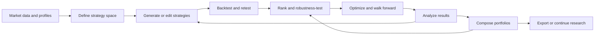
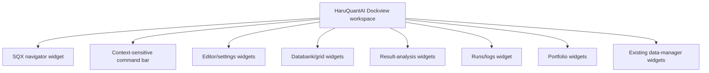
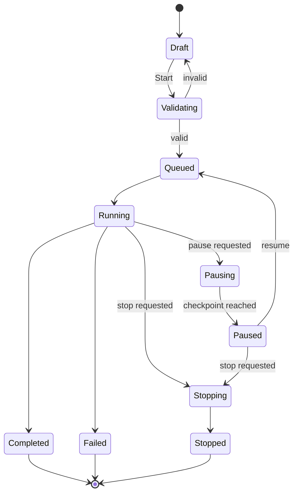
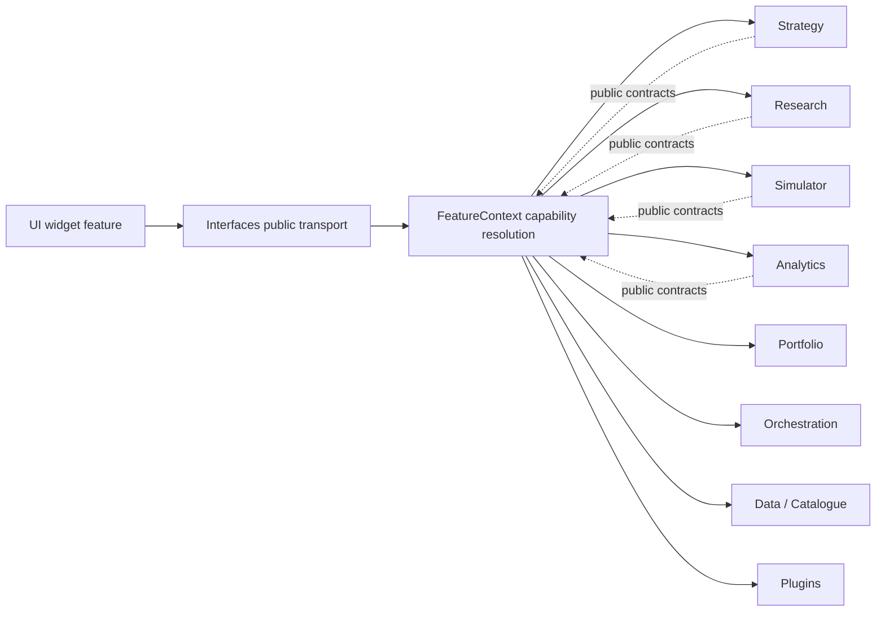
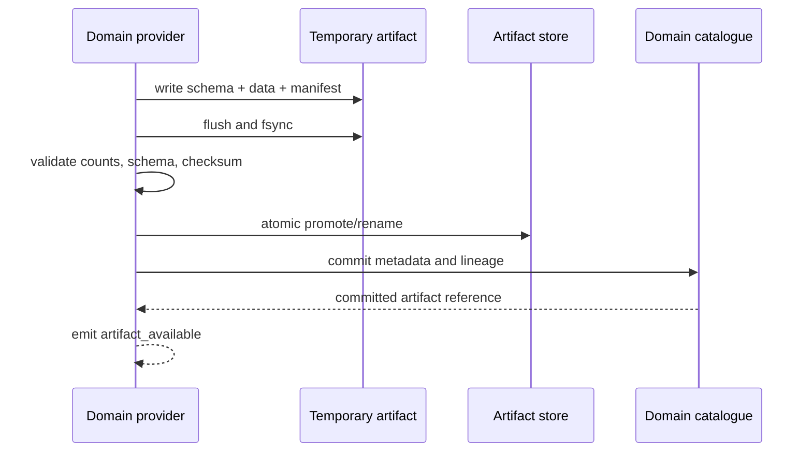

# StrategyQuant X Build 144 → HaruQuantAI

## UI reconstruction and build-ready product specification

| Field | Value |
|---|---|
| Document status | Implementation planning baseline |
| Evidence freeze | 2026-09-04 |
| Donor build inspected | StrategyQuant X Ultimate Build 144.2953 |
| Target | HaruQuantAI, brownfield integration |
| Target repository | `C:\Users\rharu\AppDev\HaruquantAI` |
| Intended readers | Product, architecture, backend, frontend, QA, and plugin developers |
| Scope | Strategy research workbench, data management, result analysis, portfolio construction, automation, and extension tooling |

> This is a clean-room product and interface specification derived from current public documentation, an installed licensed runtime, and HaruQuantAI's own contracts. It is not a request to copy StrategyQuant source code, proprietary algorithms, branding, private data, license checks, or binary formats.

---

## 1. Decision summary

HaruQuantAI should reproduce the **workflow grammar and user outcomes** of StrategyQuant X (SQX), not its legacy Angular/Electron/Java implementation. The result must be a family of independently owned Dockview widgets and domain plugins that happen to compose into an SQX-like workbench.

The primary product loop is:



### 1.1 Non-negotiable brownfield decisions

| Decision | Required treatment |
|---|---|
| Product surface | SQX becomes a first-class HaruQuantAI workbench assembled from dockable widgets; it is not a separate SPA hidden in an iframe. |
| Plugin architecture | Every independently deployable capability and every public widget has one declared feature owner, manifest, lifecycle, capability requirements, tests, and removal story. |
| Domain ownership | Strategy, Research, Simulator, Analytics, Portfolio, Orchestration, Data/Catalogue, Plugins, Workspace, Interfaces, and UI keep their existing boundaries. |
| Interfaces boundary | `app/services/interfaces` only authenticates, validates wire DTOs, resolves public capabilities, translates errors, and transports events. It must not calculate metrics, read domain tables, manipulate files, or contain research logic. |
| Backend runtime | Keep Python 3.14, Pydantic v2, Uvicorn, SQLite metadata, and Parquet/Arrow bulk artifacts. Do not create a parallel platform merely to imitate SQX. |
| HTTP framework | HaruQuantAI currently exposes a raw ASGI adapter. FastAPI may be adopted only through a separately approved transport migration; this feature does not require or authorize that migration. |
| Frontend runtime | Use the existing Next.js 15 + React 19 application and Dockview 7. Vite is a test/build dependency in the repository, not the application shell. |
| Styling | Use current design tokens and component conventions. Tailwind is not currently a dependency and is not required for parity. |
| Tables | First prove existing table primitives. Add TanStack Table/Virtual only if the grid spike demonstrates a material gap and dependency review approves it. |
| Charts | Reuse `lightweight-charts` for market/time-series views. Add one lazy-loaded analytical engine only for capabilities it cannot provide, especially heatmaps and 3D surfaces. |
| Streaming | Use idempotent HTTP commands plus resumable SSE for run progress, logs, and result availability. WebSockets are deferred unless a genuinely bidirectional interaction is demonstrated. |
| Layout persistence | Dockview layout is presentation state. It must never become the authoritative record of a project, strategy, run, databank, or portfolio. |
| Legacy `.sqx` | Treat as an imported Workspace artifact handled by an isolated importer plugin. Never decode it in Interfaces or mutate the original. |
| Existing data work | Reuse `data.browse-reference@1` and `data.import-quantdata@1`; do not rebuild QuantDataManager inside the SQX feature. |
| Numerical truth | The backend domain capability is authoritative for simulations, metrics, ranking, and portfolio math. The browser may format or downsample but may not recompute canonical values. |

### 1.2 What “parity” means

Parity has four levels:

1. **Workflow parity:** a user can complete the same research outcome.
2. **Information parity:** decisions can be made from equivalent controls, state, warnings, and outputs.
3. **Interaction parity:** navigation, docking, grids, keyboard access, progress, comparison, and drill-down feel coherent and efficient.
4. **Visual affinity:** familiar density and hierarchy without copying protected artwork, trade dress, or obsolete layout mechanics.

Pixel-for-pixel cloning, undocumented numerical equivalence, and binary compatibility with every historical SQX artifact are explicitly outside the initial definition of done.

---

## 2. Method, evidence, and confidence

### 2.1 Evidence legend

Every claim that could drive implementation uses one of these evidence grades:

| Tag | Meaning | Implementation use |
|---|---|---|
| `[L]` | Observed directly in the running licensed Build 144.2953 UI | Strong current-surface evidence, still subject to license/edition conditions |
| `[A]` | Found in the shipped Build 144.2953 static web assets/configuration | Strong inventory evidence; reachability and runtime behavior may still need live validation |
| `[R]` | Observed in the current HaruQuantAI repository | Brownfield implementation truth at the evidence freeze |
| `[D]` | Current official StrategyQuant documentation or changelog | Safe functional evidence; reconcile with current runtime where they differ |
| `[H]` | Historical official manual or extension guide | Useful superset or precedent, not proof of current default behavior |
| `[I]` | HaruQuantAI implementation inference or recommendation | A target decision, not a donor-product fact |
| `[U]` | Unresolved; needs an explicit runtime capture, sample file, or product decision | Must not silently become an acceptance criterion |

### 2.2 Research sources

The evidence pass used:

- The licensed application at `C:\StrategyQuantX144`, including the live UI and readable static web assets. No private strategy data, credentials, license material, or executable code was copied.
- HaruQuantAI's root `AGENTS.md`, contracts, manifests, feature registry, composition engine, Interfaces adapter, UI package manifest, widget contracts, and implemented data capabilities.
- Current official pages including [Download](https://strategyquant.com/download/), [What's new](https://strategyquant.com/whatsnew/), [Program layout](https://strategyquant.com/doc/strategyquant/program-layout/), [Builder](https://strategyquant.com/doc/strategyquant/builder/), [Builder layout](https://strategyquant.com/doc/strategyquant/builder-layout/), and [Portfolio Composer](https://strategyquant.com/doc/strategyquant/portfolio-composer/).
- Focused official documentation linked in the source index at the end of this document.

### 2.3 Evidence cautions

- The installed edition is **Ultimate** and the license can reveal controls that other editions hide. Edition gating must be represented as capabilities or entitlements, not hard-coded by label.
- Some shipped assets are shared across SQX, standalone QuantDataManager, hidden tools, and legacy views. Presence in a bundle does not prove a normal user can navigate to it.
- Text and configuration schemas show control inventory but do not establish proprietary algorithm semantics.
- Old documentation is sometimes more detailed than current pages. Historical-only controls are marked `[H]` and require validation before implementation.
- Build 144 is the current public final build at the evidence freeze: the official download page lists **144.2953, released 20 May 2026**. `[D]`

### 2.4 Confidence by area

| Area | Confidence | Reason |
|---|---:|---|
| Global shell and module navigation | High | Live observation plus shipped module registration |
| Builder/Retester/Optimizer setting taxonomy | High | Current shipped configuration plugins and official docs |
| Databank actions and Results tab registry | High | Current shipped menus/tab registrations plus docs |
| Data Manager grids, profiles, and sources | High | Current QDM shell, controllers, templates, and official pages |
| Portfolio Composer/Master workflows | High | Current assets and current documentation |
| AlgoWizard high-level flow | High | Live Build 144 observation |
| AlgoWizard detailed node semantics | Medium | Newer implementation is partly encapsulated; requires task-level captures |
| Proprietary generator/search algorithms | Low/unknown | Deliberately not reverse-engineered; implement from HaruQuantAI requirements |
| `.sqx` full-fidelity import/export | Unknown | Requires legal/product decision, fixtures, and isolated compatibility work |
| Neural Network Trainer and Grid Test | Low | Shipped/internal surfaces, not validated as supported product modules |

---

## 3. Product boundary and release baseline

### 3.1 Current donor baseline

The observed title is `StrategyQuant X Ultimate Build 144 ...`; the footer reports `Build 144.2953`. `[L]` The public release record matches it. `[D]`

Build 144 publicly adds the following material capabilities: custom HTML/JavaScript result-analysis plugins, Volume Profile/TPO analysis, a first MCP implementation, direct MT5 data import, an enhanced installer and Data Manager CLI, Trades by Close Type analysis, databank correlation through Custom Analysis, and additional Monte Carlo manipulation methods. `[D]`

Relevant immediately preceding changes are:

| Build | Evidence-backed change |
|---|---|
| 143 | AlgoWizard was rewritten with AI-assisted strategy creation. `[D]` |
| 142 | Portfolio Composer automatic weighting, direct databank correlation filtering, StockPicker open drawdown, VWAP, and processor-priority options. `[D]` |
| 141 | Portfolio Composer and Broker Profiles. `[D]` |

### 3.2 Donor implementation topology—not a target design

The installation contains an Electron/Chromium desktop shell, a Java runtime/backend, an older AngularJS web shell, a newer Vue-based Results implementation, AlgoWizard assets, Monaco editor assets, and several chart libraries. `[A]`

HaruQuantAI must **not** reproduce these implementation seams. In particular:

- no iframe-per-module shell;
- no global mutable web namespace;
- no direct browser-to-domain socket protocol;
- no static switch that becomes an undeclared plugin registry;
- no mixing of data access, simulation, and presentation in a controller;
- no acceptance test based on private SQX messages, classes, or file paths.

### 3.3 In-scope product surfaces

| Surface | Initial parity target | Notes |
|---|---|---|
| Getting Started | Functional affinity | HaruQuantAI onboarding and templates, not SQ branding |
| Builder | Full workflow | Strategy generation/evolution workbench |
| Retester | Full workflow | Batch reevaluation and robustness orchestration |
| Optimizer | Full workflow | Simple, sequential, WFO, and WFM orchestration |
| Databanks | Full workflow | Analytics-owned result membership, views, actions, and comparison |
| Results | Full decision parity | Overview, trades, equity, analyses, robustness, configuration, and code |
| Portfolio Master | Full workflow | Portfolio search/construction |
| Portfolio Composer | Full workflow | Manual and automatic weighting/evaluation |
| Data Manager | Integrate existing capabilities | Extend existing QDM-like slice rather than duplicate it |
| Custom Projects | Full workflow | Durable task graph and run history |
| AlgoWizard | Staged workflow | Visual strategy editing first; AI assistance behind a capability |
| Code Editor | Staged/advanced | Plugin and strategy-source editing with sandboxed compilation/testing |
| Grid Control | Operational view | Observe and control authorized jobs |
| Debug Console | Developer-only | Structured logs with redaction and permissions |
| SQ4Business | Conditional/deferred | Commercial packaging/export is a distinct product decision |
| Volume/Market Profile | Plugin-gated | Analytics/chart add-on |
| Neural Network Trainer | Deferred `[U]` | Requires supported-surface validation and domain contract |
| Grid Test | Internal only `[U]` | Do not expose without a product owner and security review |

---

## 4. Information architecture and global shell

### 4.1 Observed primary navigation

| Order | Module | Section | Condition |
|---:|---|---|---|
| 0 | Getting started | Primary | Default |
| 20 | Builder | Primary | Default |
| 30 | Retester | Primary | Default |
| 40 | Optimizer | Primary | Professional entitlement in shipped registration |
| 50 | Portfolio Master | Primary | Default |
| 51 | Portfolio Composer | Primary | Default |
| 10 | Data Manager | Secondary | Default |
| 20 | Custom Projects | Secondary | Professional entitlement in shipped registration |
| 31 | AlgoWizard | Secondary | Default |
| 50 | SQ 4 Business | Secondary | Hidden/edition-controlled registration; visible in the inspected license |

The top utility area exposes Debug Console, Code Editor, Grid Control, Volume & Market Profile Addon, and Settings. `[L][A]`

### 4.2 Target workbench composition

The SQX experience should be a saved **workspace template**, not a monolithic widget. `[I]`



Default template layout:

```text
┌──────────────────────────────── context command bar ────────────────────────────────┐
│ navigator │ editor / settings / task canvas                                         │
│           ├──────────────────────────────────────────────────────────────────────────┤
│           │ databank or result tabs                         │ inspector / run status │
└───────────┴─────────────────────────────────────────────────┴────────────────────────┘
```

Users may split, float, move, maximize, close, and reopen panels. Each panel must preserve its own transient UI state, while references to projects, strategies, runs, and artifacts remain stable domain IDs.

### 4.3 Observed shell chrome

- Collapsible left navigation with per-application progress badges. `[L][A]`
- Main content host with a conditional Results overlay in the donor implementation. `[A]`
- Footer links/status for Build, Documentation, Support, Report Bug / Suggest Feature, and About. `[L][A]`
- Settings menu for Configuration, Benchmark, Remote access, MCP Server, SMTP server, Language, Skin, Zoom/fullscreen, website/help/support, license update, About, Reload UI, and Exit. `[L][A]`

HaruQuantAI remains the outer shell. Contextual progress belongs in the global Jobs surface and relevant widget headers; donor footer/navigation items should map to host-owned commands instead of being duplicated inside the workspace.

### 4.4 Shell requirements

| ID | Requirement | Acceptance |
|---|---|---|
| SHELL-001 | Register each SQX-facing panel through a widget manifest. | No SQX component is reachable only by adding a case to `WidgetContentHost.tsx`; the manifest is the declared source of capabilities, placement, subscriptions, and effects. |
| SHELL-002 | Provide an “SQX Research” workspace template. | Opening the template creates the default dock arrangement without duplicating any domain object. |
| SHELL-003 | Support compact and expanded navigation. | Labels remain accessible by tooltip and screen reader when collapsed. |
| SHELL-004 | Show capability/entitlement gating before navigation. | Unavailable features are either omitted or shown with an actionable explanation; no dead module opens. |
| SHELL-005 | Provide global command discovery. | Search can find modules, commands, projects, runs, strategies, databanks, and help links the caller is authorized to see. |
| SHELL-006 | Surface long-running work globally. | Active, paused, queued, failed, and completed runs remain observable when their originating widget is closed. |
| SHELL-007 | Preserve keyboard and focus semantics across docks. | Tab order, focus restoration, Alt+Arrow docking shortcuts, escape behavior, and modal focus traps pass automated and manual accessibility checks. |
| SHELL-008 | Keep layout recovery safe. | A malformed or obsolete layout falls back to the SQX template; it never deletes projects or run state. |
| SHELL-009 | Provide contextual documentation and diagnostics. | Help opens the correct HaruQuantAI page; diagnostics export contains versions and redacted trace IDs, never secrets or private market data. |

### 4.5 Global settings inventory

Observed configuration categories are **Global, CPU, Performance, Memory, Databanks, Optimizations, and Troubleshooting**. `[A]`

| Category | Observed controls to represent | Target ownership |
|---|---|---|
| Global | sound, file chooser view/sort memory, MT5 netting control-order visibility, custom header/footer, default result view | Workspace/UI preferences, except trading semantics |
| CPU | all/single/reserved/custom core modes, maximum cores, high process priority | Orchestration resource policy |
| Performance | metric units, percent/pips display, separate computation controls | Analytics presentation plus domain metric policy |
| Memory | automatic/parallel/G1-like runtime choice in donor, maximum memory, discard unfilled pending orders, cleanup cadence | Do not clone JVM choices; expose HaruQuant resource/cache budgets instead |
| Databanks | automatic synchronization, store chart data | Analytics artifact policy |
| Optimizations | retain 3D optimization data | Research artifact-retention policy |
| Troubleshooting | browser GPU acceleration, memory protection threshold, debug logging | UI/runtime diagnostics; no invented CUDA compute toggle |

Additional dialogs expose remote access, MCP server details, SMTP settings/test, language, skin, zoom/fullscreen, license/about/support, reload, and exit. `[A]` HaruQuantAI should map only relevant outcomes to its settings and plugin system; license and desktop-exit behavior are host concerns.

Adjacent observed dialog controls are: `[L][A]`

- Remote access: allow/deny, server URL, and optional password.
- MCP Server: current server URL plus connection instructions for Claude Code/Desktop in the donor; target wording and clients are host-owned.
- SMTP: server, port, SSL, username, password, sender address, test recipient, Send Test, and Save.
- Appearance/onboarding: language, skin/theme, zoom/fullscreen, and intro-walkthrough preference.
- Volume/Market Profile: add-on/license information in the donor; target uses plugin capability discovery.

---

## 5. Shared research-workbench grammar

Builder, Retester, Optimizer, Portfolio Master, and Custom Projects share a recognizable project structure: a header, configuration cards, a bottom databank area, and top-level **Progress / Full settings / Results** modes. `[A]`

### 5.1 Run lifecycle



Every run must pin:

- capability and provider versions;
- input artifact IDs and content hashes;
- data-series version and broker/instrument/session profile versions;
- strategy/configuration revision;
- random seed or seed policy;
- metric/ranking definition versions;
- requested resource budget;
- caller, request ID, trace ID, and timestamps.

### 5.2 Shared engine panel

| Group | Functional inventory |
|---|---|
| Configuration | New/reset; load; save; save as; named presets; Forex, Futures, and StockPicker defaults where appropriate |
| Execution | Validate; start; pause; resume; stop; retry failed; run from checkpoint where supported |
| Telemetry | phase, elapsed, ETA, accepted/rejected counts, throughput, queue position, worker allocation, memory/cache pressure |
| Logs | structured severity, timestamp, phase, worker, strategy/run reference, search, filter, copy, clear local view, export redacted diagnostics |
| Progress views | numeric summary, time series, acceptance funnel, task-manager visual, worker/job view |
| Safety | unsaved-change warning, incompatible-config warning, stale-data warning, stop confirmation only when work cannot checkpoint safely |

### 5.3 Shared run requirements

| ID | Requirement | Acceptance |
|---|---|---|
| RUN-001 | Starting work creates an immutable run record before execution. | A returned run ID resolves after refresh and records pinned inputs and versions. |
| RUN-002 | Command submission is idempotent. | Replaying an identical start request with the same idempotency key never starts a second run. |
| RUN-003 | Progress is resumable. | Reconnecting with the last SSE cursor yields all subsequent events in order or an explicit resync instruction. |
| RUN-004 | Pause and stop are domain commands. | UI closure or SSE disconnect does not pause or stop work. |
| RUN-005 | Partial output is typed and visibly incomplete. | Consumers cannot mistake a preview/checkpoint for a committed final databank result. |
| RUN-006 | Configuration validation is capability-owned. | The browser displays domain errors at field and summary level; it does not reproduce calculation rules. |
| RUN-007 | Resource limits fail safely. | Exceeded budgets transition to a typed state with retained diagnostics and recoverable checkpoints where supported. |
| RUN-008 | Run deletion is governed. | Removing a run uses retention policy and reference checks; deleting a row in the UI cannot orphan shared artifacts. |
| RUN-009 | Reproducibility is inspectable. | “Reproduce run” shows changed/missing providers, data, and profiles before it creates a new run. |
| RUN-010 | Logs are redacted. | Secret values, authorization headers, private file paths, and raw credentials never appear in UI logs or exports. |

---

## 6. Builder

### 6.1 User outcome

Builder defines a strategy search space, generates candidates through random or evolutionary methods, backtests them, rejects invalid/weak candidates, and commits accepted strategies into an Analytics-owned databank. `[D][A]`

### 6.2 Full settings taxonomy

| Order | Tab | Required content |
|---:|---|---|
| 5 | What to build | strategy type, direction, symmetry, entry/exit architecture, search method, stop-loss/profit-target policy |
| 6 | Parts to improve | entry, order, exit, long/short branches, keep/replace/add behavior, advanced exits |
| 7 | Genetic options | generations, islands, population, decimation, fresh blood, deduplication, restart/stagnation policies |
| 10 | Data | engine, primary/additional charts, symbol/group, timeframe, date/sample bands, precision and costs |
| 20 | Trading options | session/range restrictions, maximum trades, reserved bars, gap behavior, chart-data retention |
| 30 | Building blocks | signal/indicator/order/exit catalog, enablement, weights, parameter distributions and external timeframes |
| 35 | ATM | named advanced trade-management exit rules and editor |
| 50 | Money management | starting capital, sizing method, and typed method properties |
| 60 | Cross checks | ordered robustness/retest pipeline |
| 70 | Ranking | databank limits, fitness, weighted criteria, custom analysis, rejection, similarity and correlation |
| 100 | Notes | project notes and provenance annotations |

### 6.3 Detailed control inventory

#### What to build

- Modes: simple strategy, multi-timeframe strategy, strategy from template, and improve existing strategy. `[A]`
- Direction: long and short, long only, short only; independent or symmetric entry/exit branches. `[A]`
- Architecture families observed in the donor include SQX signals, fuzzy logic, and legacy SQ3-style patterns. `[A]` HaruQuantAI should expose registered architectures, not donor brand labels. `[I]`
- Search method: random generation or genetic evolution. `[A]`
- Stop-loss and profit-target policies: required/optional/disabled, fixed distance, ATR-derived, indicator-derived, and parameter ranges. `[A]`
- Condition count, period ranges, maximum complexity, and template constraints must be validated by the Strategy domain.

#### Parts to improve

- Selectable long/short entry conditions, entry order, exit conditions, and exit order.
- Per-part behavior: retain, replace, randomize, or add; honor symmetry rules.
- Advanced exits can be preserved, replaced, or separately edited.

#### Genetic options

- Generation count, population per island, number of islands, initial population source, and source databank.
- Decimation and survival policy, fresh-blood percentage, duplicate elimination, weak-individual replacement cadence.
- Last-generation databank retention.
- Continuous evolution and restart after stagnation.
- Explicit seed policy and deterministic replay in HaruQuantAI.

#### Data

- Simulation engine/provider.
- Primary chart and zero or more additional charts, each with symbol/group and timeframe.
- Date range with reset-to-available action.
- In-sample, validation, and out-of-sample bands with named presets and a visual timeline.
- Precision/model selection, commission, swap, spread, slippage, and minimum-distance policy.
- Profile selectors must resolve versioned Data/Catalogue objects; controls must not embed cost formulas.

#### Trading options

- End-of-day and Friday close behavior.
- Allowed trading time range and session profile.
- Maximum simultaneous/total trades according to the selected simulator semantics.
- Reserved bars and warm-up requirements.
- Gap-handling policy.
- Retain chart data toggle as a result-artifact policy, not a UI cache toggle.

#### Building blocks

- Catalog sections for signals, indicators, stop/limit entries, exit types, and registered plugin nodes.
- Enable/disable, weight, parameter editor, allowed-values editor, parameter calibration, random-choice policy, save/load preset.
- Per-block external timeframe where supported.
- Search, filter by category/provider/compatibility, select all/none, and explain why an incompatible block is unavailable.

#### ATM and money management

- Define/edit named exit rules through the Strategy-owned ATM schema.
- Select initial capital, sizing method, and method-specific typed properties.
- Units, bounds, broker/instrument constraints, and compounding semantics must be explicit.
- Retester/Optimizer overrides never mutate the source Strategy revision.

#### Ranking and acceptance

- Maximum retained strategies and optional stop condition.
- Fitness target and ordered/weighted criteria with direction and normalization.
- Custom analysis stages and automatic rejection filters.
- Similarity/deduplication policy.
- Portfolio-correlation threshold and tie-break policy.
- Walk-forward and robustness qualification thresholds.

#### Cross-check pipeline

Observed ordering is:

1. Monte Carlo trade manipulation.
2. Monte Carlo retest.
3. What-if simulations.
4. Retest on additional markets.
5. Retest with higher precision.
6. Walk-Forward Matrix.
7. Walk-Forward Optimization.
8. Optimization Profile / System Parameter Permutation.
9. Sequential Optimization. `[A]`

The target must store this as an ordered, typed pipeline of plugin contributions; it must not encode display labels as execution behavior.

### 6.4 Builder requirements

| ID | Requirement | Acceptance |
|---|---|---|
| BLD-001 | Author a valid, versioned strategy-space specification. | Save produces a Strategy-owned revision and reopening it preserves all typed constraints. |
| BLD-002 | Resolve blocks from the public catalog. | Every node records provider/version; missing providers are reported before start. |
| BLD-003 | Preview the effective search space. | UI shows constrained parameters, estimated combinatorial scale, exclusions, and conflicts without claiming an exact runtime forecast. |
| BLD-004 | Support random and evolutionary generation providers. | Both conform to the same Research run contract and produce provenance-equivalent candidates. |
| BLD-005 | Apply backtest, rejection, ranking, and cross-check stages in declared order. | Run details show stage transitions and the reason each candidate was accepted or rejected. |
| BLD-006 | Deduplicate candidates by a documented canonical identity. | Equivalent ASTs are not stored twice unless the user explicitly retains distinct provenance. |
| BLD-007 | Commit accepted candidates atomically. | Databank membership references committed strategy/result artifacts only after the stage succeeds. |
| BLD-008 | Preserve run reproducibility. | Same compatible provider set, data versions, config, and seeds yields a replayable run; deviations are disclosed. |
| BLD-009 | Make rejection explainable. | The user can aggregate and drill into validation, simulation, filter, similarity, and resource rejection reasons. |
| BLD-010 | Never execute generated strategy code in the UI process. | All compilation/execution occurs in an authorized, isolated domain provider. |

---

## 7. Retester

Retester reevaluates selected strategies or a source databank against changed data, precision, costs, markets, robustness methods, or ranking rules without editing the source revisions. `[D][A]`

### 7.1 Settings

| Order | Tab | Difference from Builder |
|---:|---|---|
| 0 | What to retest | file/databank/source selection and selection scope |
| 10 | Data | same profile/date/sample concepts; may add alternate markets |
| 20 | Trading options | simulation restrictions and chart retention |
| 35 | ATM | override/retain advanced management policy |
| 50 | Money management | retain or override sizing/capital policy |
| 60 | Cross checks | selected robustness stages |
| 70 | Ranking | target databank/filter policy |
| 100 | Notes | run rationale and annotations |

### 7.2 Retester requirements

| ID | Requirement | Acceptance |
|---|---|---|
| RET-001 | Select strategies from artifact, databank, saved query, or explicit IDs. | The run records the resolved immutable strategy set, not only the mutable query. |
| RET-002 | Keep source strategies immutable. | Overrides produce run configuration or new revisions; the source hash is unchanged. |
| RET-003 | Batch against one or more data contexts. | Results identify the exact symbol, timeframe, sample, cost, and precision context. |
| RET-004 | Support automatic retest pipelines. | A saved ordered pipeline can be invoked from Builder, Databank, or Custom Projects through the same capability. |
| RET-005 | Compare baseline and retest outcomes. | Delta columns use canonical metric versions and distinguish missing/non-comparable values. |
| RET-006 | Route passed/failed results deterministically. | Membership rules and rejection reasons are committed atomically and visible in run history. |
| RET-007 | Allow cancellation at strategy/stage boundaries. | Completed items remain typed partial output; cancelled items are never labeled failed. |

---

## 8. Optimizer

Optimizer searches parameter combinations for an existing strategy using simple optimization, sequential optimization, Walk-Forward Optimization (WFO), or Walk-Forward Matrix (WFM). `[D][A]`

### 8.1 Configuration inventory

- Source: strategy file/artifact or databank selection.
- Method: simple, sequential, WFO, or WFM.
- Data and trading options share the versioned profile model.
- Date/sample and window/run configuration.
- Result scope: all, passing, or best candidates.
- Optional stable-area/stability filter.
- Parameter table: selected, parameter name, original value, start, stop, step, type, and calculated combinations.
- Automatic preset/distribution action.
- Ranking and notes.

### 8.2 Optimizer requirements

| ID | Requirement | Acceptance |
|---|---|---|
| OPT-001 | Derive optimizable parameters from a Strategy-owned revision. | Unsupported or dependent parameters are explained and cannot be silently coerced. |
| OPT-002 | Validate ranges and combination count before execution. | Empty, invalid, explosive, and precision-losing ranges produce actionable validation. |
| OPT-003 | Separate search method from simulation semantics. | Research chooses combinations; Simulator evaluates them through a versioned capability. |
| OPT-004 | Support simple, sequential, WFO, and WFM run plans. | Each plan has a typed schema and can be serialized, versioned, cloned, and diffed. |
| OPT-005 | Stream aggregate progress without flooding the client. | Events are coalesced; grid rows/results are fetched by page or artifact chunk. |
| OPT-006 | Retain enough surface data for selected visualizations. | Artifact policy declares whether full points, top-N, aggregates, or no 3D data are retained. |
| OPT-007 | Explain stability classification. | PASS/FAIL and stable regions link to versioned thresholds and underlying observations. |
| OPT-008 | Protect against overfitting presentation. | IS/OOS/validation are visually distinct and cannot be merged into a single unlabeled score. |
| OPT-009 | Promote an outcome through an explicit revision action. | Selecting an optimized configuration never overwrites the base strategy silently. |
| OPT-010 | Export reproducible optimization evidence. | Export contains plan, parameter grid, samples, metrics, provider versions, and artifact hashes. |

---

## 9. Databanks

A databank is an **Analytics-owned membership and query view over strategies and their results**, not a Workspace folder and not a table owned by Interfaces. `[I]`

### 9.1 Observed interaction inventory

- Multiple databank tabs with databank count, strategy count, record count, and selected count.
- Saved column views: Choose View and Manage Views.
- Sort, filter, select, multi-select, virtual scroll, resize/reorder/pin columns, and refresh/synchronize.
- Double-click a strategy to open Results.
- Load `.sqx` and save/export in product-supported formats.
- Delete selected, clear membership, move/copy between databanks, and create a databank.
- Retest selected.
- Rename strategies, edit parameters, set notes, select passed/failed, compare strategies, and run custom analysis.
- Filter by correlation.
- Merge strategies/portfolios, merge walk-forward results, split portfolios, and send to Portfolio Composer or Master.

### 9.2 Export inventory

Observed menu targets include SQ4/SQ3 strategy files, HTML, PDF, CSV, trade lists, MetaTrader 4, MetaTrader 5, MultiCharts/EasyLanguage, JForex, pseudocode, and XML. `[A]` Python and NinjaTrader are not evidenced as current built-in targets and must not be promised without a registered generator plugin.

### 9.3 Column model

Columns are dynamic plugin contributions organized into saved views. A historical official superset includes Generation, Fitness, Symbol, Timeframe, Net Profit, Trades, Win %, Profit Factor, Sharpe, R Expectancy, Annual %, Stability, Symmetry, Drawdown, Win/Loss, and Return/Drawdown. `[H]`

Target column descriptors must include:

```text
column_id, owner_feature, schema_version, label_key, value_type,
unit/format, nullable, sortable, filter_operators, aggregation,
precision, provenance_field, compatibility_predicate
```

### 9.4 Databank requirements

| ID | Requirement | Acceptance |
|---|---|---|
| DBK-001 | Create, rename, archive, clone, and delete databank definitions through Analytics capabilities. | Referential checks and governed-delete outcomes are explicit. |
| DBK-002 | Add/remove/copy/move members atomically. | Partial multi-item failure returns per-item typed outcomes and an overall transaction policy. |
| DBK-003 | Provide server-side cursor paging, sort, and filter. | One million rows remain navigable without loading all records into browser memory. |
| DBK-004 | Support dynamic typed columns and saved views. | Unknown/missing plugin columns degrade visibly and do not corrupt the saved view. |
| DBK-005 | Keep selection stable across pages. | Selection is identity-based; bulk action shows resolved count and exclusions before execution. |
| DBK-006 | Open Results by stable result ID. | Sorting/filtering cannot cause double-click to open a different row. |
| DBK-007 | Run comparison and custom analysis as jobs. | Expensive analysis uses idempotent commands and progress streams, not UI loops. |
| DBK-008 | Make correlation filtering explainable. | The retained member, removed member, coefficient/method, sample, threshold, and tie-break policy are inspectable. |
| DBK-009 | Export via registered target capabilities. | UI lists only compatible generators; export records target/version/options and output artifact. |
| DBK-010 | Isolate legacy import. | Raw `.sqx` becomes an immutable Workspace artifact; an importer plugin emits typed strategies/results plus a compatibility report. |

---

## 10. Results and strategy analysis

Results is a plugin-extensible analysis workspace over an immutable simulation/result bundle. It must support side-by-side panels and cross-filtering without letting a view redefine canonical metrics. `[I]`

### 10.1 Observed tab registry

The current shipped registry orders these views: `[A]`

| Order | View | Availability/context |
|---:|---|---|
| 0 | Walk-Forward Results | WFO/WFM result |
| 10 | Overview | General |
| 11 | Optimization profile | Optimization result |
| 11 | SP overview | StockPicker result |
| 12 | System Parameter Permutation | SPP result |
| 12 | Sequential Optimization Results | Sequential result |
| 20 | List of trades | Result with trades |
| 30 | Equity chart | General |
| 40 | Trade analysis | General |
| 50 | Trades on chart | Result with market series |
| 55 | Profile chart | Compatible profile data/add-on |
| 60 | Monte Carlo tests | Robustness result |
| 70 | Portfolio correlation | Multi-strategy result |
| 80 | Strategy config | General |
| 99 | Log | Portfolio Composer context |
| 99 | StockPicker log | StockPicker context |
| 99 | Explore | Conditional analysis |
| 100 | Source Code | Compatible generator target |
| 999 | Automatic computation simulations | Internal/derived computation view |
| 1000+ | User Result Analysis plugins | Dynamically contributed HTML/JS panels |

The target should not duplicate the numeric ordering. It should use manifest `placement` plus stable view IDs and deterministic tie-breaking. `[I]`

### 10.2 Overview

- Selectable report template.
- Headline result identity, strategy revision, run/sample/data context, warning badges, and provenance.
- Metric groups for performance, risk, trade distribution, stagnation, and robustness.
- Documented metrics include net profit, pips, annual return/CAGR, Sharpe, Profit Factor, Return/Drawdown, win rate, drawdown, expectancy, R Expectancy, SQN, trade count, and stagnation. `[D]`
- Export/print of a server-generated, versioned report artifact.

Requirements:

| ID | Requirement | Acceptance |
|---|---|---|
| RES-OV-001 | Render metric cards from typed metric descriptors. | Unit, period, sample, precision, null reason, definition version, and owner are inspectable. |
| RES-OV-002 | Distinguish canonical, derived, and presentation-only values. | A user cannot confuse an estimated UI aggregate with an authoritative stored metric. |
| RES-OV-003 | Warn on stale/incomplete results. | Partial, superseded, missing-artifact, and incompatible-plugin states are prominent and machine-testable. |
| RES-OV-004 | Support report templates as plugin contributions. | An unavailable template falls back safely without changing the underlying result. |

### 10.3 List of trades

Observed controls include data/direction/sample selectors, view management, export, and inclusion of expired orders. `[A]`

Minimum columns are identity, open/close timestamps, direction, symbol, quantity, entry/exit price, stop/target context, fees, swap, slippage, gross/net P&L, pips/points, bars/duration, exit reason, MAE, MFE, sample, and strategy/run references. Exact availability depends on the simulator schema.

| ID | Requirement | Acceptance |
|---|---|---|
| RES-TRD-001 | Page and filter trades server-side. | Large result sets do not require full download; cursor and filter state survive a refresh. |
| RES-TRD-002 | Preserve trade identity across grids and charts. | Selecting a row highlights the same trade in equity, market chart, and analysis panels. |
| RES-TRD-003 | Export the requested projection. | Export declares filters, columns, units, timezone, schema version, and result hash. |
| RES-TRD-004 | Explain missing values. | Unsupported MAE/MFE, absent tick path, and synthetic fills render as typed unavailability, not zero. |

### 10.4 Equity chart

Observed controls: `[A]`

- X-axis by trade or time.
- Optional benchmark symbol and normalization.
- Drawdown series in money, percent, pips, open money, open percent, or off.
- Volume as automatic, size, money, or off.
- Daily aggregation, ATR, trend overlay.
- Markers by daily or MAE/MFE mode, or off.
- Stagnation variants, point display, crosshair, and refresh.

Target behavior:

- `lightweight-charts` renders equity, balance, benchmark, price, volume, and synchronized crosshair/time ranges.
- The server returns canonical series or documented downsampled levels; the UI never derives trade accounting.
- Large series use level-of-detail chunks and worker-based decoding/downsampling.
- Every visible line has a unit, sample, legend state, and accessible summary.

### 10.5 Trade analysis

Observed period basis is open or close time. The yearly table includes Period, Net Profit, Profit Factor, number of trades, and win percentage. Up to twelve selectable chart panels can be configured. `[A]`

Required panel families are distribution by time, duration, direction, size, profit/loss, close type, consecutive outcomes, excursion, and other registered Analytics contributions. Build 144 specifically documents **Trades by Close Type**. `[D]`

### 10.6 Trades on chart

The view requires symbol selection, indicator visibility, grid/zoom controls, price/ticket/P&L annotations, previous/next trade navigation, OHLC inspection, indicator values, and a trade-detail panel. `[A]`

Market and trade series must share the exact timezone/calendar transform. When the backing market series is missing, the view offers an authorized data-resolution action rather than drawing against a similar series.

### 10.7 Walk-forward and optimization surfaces

#### Walk-Forward Matrix

- PASS/FAIL and score summary.
- Matrix of OOS percentage by run count, selected-cell detail, and metric selector.
- 3D point, bar, surface, and top views; stability and display options. `[A]`
- Target adds an accessible 2D heatmap/table as the primary representation; 3D is an optional linked view.

#### Optimization profile

- Totals for all, profitable, losing, and zero outcomes.
- Profitability, average performance, uniformity, top-profit, and standard-deviation checks.
- X/Y/Z parameter and metric selectors; point/bar/surface/top display.
- The donor view reports a first-500 display constraint and an optimization-profile-levels dialog. `[A]` The target should page/sample explicitly and disclose the sampling rule.

#### Sequential Optimization

- PASS/FAIL, sequence/step summary, selected parameters, and stable-area charts.

#### System Parameter Permutation

- Median properties, statistic selector, distribution/percentile views, and source-plan provenance.

### 10.8 Monte Carlo and robustness

- Test-method selector, scenario/simulation count, seed policy, and robustness thresholds.
- Summary percentiles and failure probability with compatible equity/drawdown distributions.
- Link each simulation family to the exact perturbation definition and baseline.
- Build 144 documents new manipulation methods including block randomization, parameter jitter, and degraded execution. `[D]` Implement equivalent concepts through registered Simulator/Research plugins; do not copy proprietary implementations.

### 10.9 Portfolio correlation

Observed controls include correlation basis, target measure, negative-correlation handling, empty-period handling, compute/stop/progress, a matrix, overlapping-trades analysis, details, and save. `[A]`

The result must pin return frequency, calendar alignment, missing-period policy, correlation method, sample, and version. Matrix cells drill into paired series and overlapping trades without silently changing the population.

### 10.10 Strategy configuration and source

- Configuration compares current and backtest-time settings, highlights differences, and offers an explicit Apply action. `[A]`
- Apply must create or update a Strategy-owned revision after optimistic-lock validation; it cannot mutate a result.
- Observed source targets are pseudocode, MetaTrader 4, MetaTrader 5, EasyLanguage/MultiCharts, and XML. `[A]`
- Each generator is a capability with a version, compatibility predicate, options schema, diagnostics, and output artifact.

### 10.11 Result-analysis plugin sandbox

Build 144 supports user-created HTML/JavaScript result-analysis tabs. `[D]` HaruQuantAI already plans plugin-owned result panels and must enforce:

| Control | Required policy |
|---|---|
| Isolation | Sandboxed frame or isolated renderer boundary; no same-origin privilege with the host |
| Data | Read-only, explicit result projection; no direct database, filesystem, or token access |
| Messaging | Versioned host bridge with allow-listed commands and payload validation |
| Network | Denied by default; allow-list requires explicit plugin permission |
| CSP | No unsafe host script execution; packaged assets and nonce/hash policy |
| Limits | CPU/time/memory/event-rate and result-size budgets |
| Lifecycle | Declare compatible result schemas, panel version, migration, disable, and uninstall behavior |
| Failure | Panel crash is contained; host offers diagnostics and reset without affecting the result |

### 10.12 Result workspace requirements

| ID | Requirement | Acceptance |
|---|---|---|
| RES-001 | Resolve visible tabs from result type and plugin compatibility. | A deterministic manifest query produces the same ordered view set for the same capability snapshot. |
| RES-002 | Synchronize selections across compatible panels. | Strategy, sample, trade, time range, and parameter selection use typed UI events, not hidden global state. |
| RES-003 | Keep metrics provenance visible. | Every decision-grade number can reveal definition, version, input result, and sample. |
| RES-004 | Support comparison. | Two or more compatible results can be aligned with explicit missing/incompatible values and no implicit currency conversion. |
| RES-005 | Scale series and grids. | Initial useful content meets the performance budget without materializing full trade/equity arrays in React state. |
| RES-006 | Provide accessible chart alternatives. | Each chart has keyboard focus, textual summary, data table/export, and non-color state cues. |
| RES-007 | Persist view state as presentation state. | Reopening restores panels/controls but cannot alter result content. |
| RES-008 | Export provenance-complete reports. | Generated report includes result hash, strategy revision, data/profile versions, metric definitions, and warnings. |
| RES-009 | Contain plugin failure. | A faulty custom panel cannot block built-in results or access unauthorized host data. |
| RES-010 | Avoid false precision. | Sampling, downsampling, approximation, and unavailable series are disclosed in UI and export. |

---

## 11. Portfolio Master and Portfolio Composer

### 11.1 Portfolio Composer

Observed commands are Load, Save, Save portfolio, Delete, Clear, Move up/down, and Add Buy & Hold. The primary grid contains strategies and weights. Configuration covers full/limited data, capital/leverage, money-management consistency, and automatic computation with model, fitness, simulation count, and risk-free assumptions. Results and a log are available. `[A][D]`

| ID | Requirement | Acceptance |
|---|---|---|
| PFC-001 | Add strategies/results by stable reference. | Duplicate, missing, incompatible-currency, overlapping-capital, and sample issues are explained before computation. |
| PFC-002 | Edit and normalize weights. | Raw and normalized weights are both visible; normalization policy is explicit and reproducible. |
| PFC-003 | Add a Buy & Hold benchmark. | Benchmark uses a pinned series, instrument profile, currency policy, and sample. |
| PFC-004 | Configure capital, leverage, and sizing consistency. | Validation is Portfolio-owned and prevents ambiguous mixing of strategy sizing semantics. |
| PFC-005 | Compute combined performance asynchronously. | A run ID, progress, result artifact, warnings, and provenance are persisted. |
| PFC-006 | Offer registered weighting/search models. | Model schema, objectives, constraints, risk-free input, provider version, and seed policy are recorded. |
| PFC-007 | Reorder for presentation without changing math. | Row order affects only display unless the selected model explicitly declares order sensitivity. |
| PFC-008 | Promote a composition to a versioned portfolio. | Save creates a Portfolio-owned revision; recomputation produces a new result. |

### 11.2 Portfolio Master

Portfolio Master searches candidate combinations through brute-force or genetic methods. Observed settings include genetic configuration, date/sample/reverse selection, minimum and maximum strategy counts, maximum portfolios, ranking, sector maximums, source/target databanks, selected-only scope, capital/money-management override, and correlation conditions. `[A]`

| ID | Requirement | Acceptance |
|---|---|---|
| PFM-001 | Resolve a candidate universe from an immutable databank query. | The run records exact result/strategy IDs after filters and selection are resolved. |
| PFM-002 | Apply typed eligibility constraints. | Strategy count, sector, symbol, sample, correlation, capital, and compatibility failures are itemized. |
| PFM-003 | Support brute-force and evolutionary search providers. | Both emit the same portfolio-candidate contract and provenance fields. |
| PFM-004 | Rank on registered portfolio metrics. | Objective, direction, weights, constraints, and metric versions are inspectable. |
| PFM-005 | Bound combinatorial work. | Estimate, budget, maximum candidates/results, and stop policy must be accepted before start. |
| PFM-006 | Commit selected candidates to a target databank or portfolio set. | Output membership is atomic and distinguishable from intermediate candidates. |
| PFM-007 | Analyze correlation with explicit alignment. | Frequency, missing periods, currencies, negative handling, and method are pinned. |
| PFM-008 | Preserve per-strategy and combined evidence. | Portfolio results link back to every constituent strategy result and weighting revision. |

---

## 12. Data Manager integration

Data Manager is not a new SQX-owned data subsystem. It is a workbench over existing and extended Data/Catalogue capabilities. HaruQuantAI already implements `data.browse-reference@1`, `data.import-quantdata@1`, and a transport slice under `observe-market-reference`. `[I]`

### 12.1 Ribbon and sources

Observed ribbon groups are Home (standalone QDM only), Data sources, Export, Tools, Instruments and Sessions, External indicators (SQX), Stock groups (SQX), and Broker profiles. `[A]`

Observed source plugins are Dukascopy, TickDownloader, Files, SQ Equity, SQ Futures, Darwinex, Crypto, Yahoo, and MT5. Crypto choices include Binance, Binance Coin-M, Binance USDT-M, Bitfinex, Poloniex, and Coinbase Pro. `[A]`

Target connectors must be independently permissioned plugins. A source appearing here is an inventory item, not authorization to implement or access it.

### 12.2 Data-series grid

Observed columns: `[A]`

| Column | Semantics |
|---|---|
| Symbol Name | User-facing series identity |
| Instrument | Catalogue instrument reference |
| Broker profile | Versioned costs/session/timezone profile |
| Underlying Symbol | Provider symbol mapping |
| Timeframe | Series aggregation |
| Timezone | Stored/display calendar context |
| Date from / Date to | Coverage bounds |
| Total Days | Coverage summary |
| Total Records | Stored observation count |
| Source | Connector/import lineage |
| Bar type | Time/tick/other supported aggregation |
| Data type | Forex/futures/stock/etc. classification |
| Hide | Presentation visibility |
| Progress/actions | Current job state and row commands |

The current HaruQuantAI transport already exposes capability discovery, series, instruments, brokers, symbols, bars, quotes, reference sync, quality, timezone clone, export, download/config, batch, and import under `/api/v1/data/*`. `[R]`

### 12.3 View, edit, and quality analysis

- View metadata and series statistics.
- Data tab with pageable observations.
- Chart tab with market-series visualization.
- Analyze quality tab covering gaps, spikes, invalid OHLC, timeline, and issue details.
- Edit, delete, hide/skip, refresh/synchronize, clone timezone, export, and provider-specific download/import.
- Quality fixes must be explicit transformations that produce lineage; viewing an issue must never alter data.

### 12.4 Instruments

Observed columns are Instrument, Description, Broker profile, Point value, Pip/Tick size, Pip/Tick step, Default spread, Default slippage, Commissions, Swap, Data type, Order size multiplier, and Order size step. The standalone QDM view omits commission and swap columns. `[A]`

Operations include add, clone, edit, mass edit, search/filter, import, and guarded delete. Sector, exchange, and country fields are also present in the current controller model. `[A]`

### 12.5 Sessions

The session list shows Session Name and Broker profile. A session contains ordered elements with Start day, Start time, End day, End time, and end-of-day/close flag (`SEOC` in the shipped grid), plus a Monday-to-Friday shortcut. `[A]`

### 12.6 Broker profiles

Observed broker columns are Name, Description, Postfix, Timezone, Customized stocks, Customized instruments, and Customized sessions. Standalone QDM omits customized stocks. `[A]`

Profiles support add/edit/clone/delete, stock lists where applicable, instruments, sessions, and XML import/export. Default/system profiles are protected. Timezone changes are constrained when stored data already uses a profile. `[A]`

### 12.7 Stock groups

The shipped stock-group grid includes Name, Count, Description, Number of symbols, Downloaded, Ready to use?, Data from, and Data to. `[A]` Operations include add/edit, edit stocks, CSV/XML exchange, update/download data, and guarded delete. System groups are protected.

### 12.8 External indicators

Observed operations include add/edit/delete, import, define a new format, recognize, and view. `[A]` In HaruQuantAI, imported indicators must become versioned Data/Strategy plugin artifacts with a compatibility and security report, never executable UI content.

### 12.9 Global transfer control

The donor exposes total transfer progress with pause all, continue all, stop all, and settings. `[A]` The target Jobs widget should show per-connector and aggregate state while keeping each command scoped and authorized.

### 12.10 Data requirements

| ID | Requirement | Acceptance |
|---|---|---|
| DAT-001 | Reuse the existing reference-data boundary. | SQX widgets call public data capabilities through Interfaces; no second instrument/broker/session store is created. |
| DAT-002 | Version data and profile inputs used by research. | A historical run remains resolvable after profiles or series are updated. |
| DAT-003 | Keep bulk bars out of SQLite. | SQLite stores metadata/lineage; Arrow/Parquet artifacts store bulk series under atomic commit rules. |
| DAT-004 | Validate source-specific configuration in the connector owner. | Interfaces never contains provider URLs, parsing logic, or credential handling. |
| DAT-005 | Make quality rules versioned. | Gaps/spikes/OHLC findings record rule, threshold, calendar, series version, and status. |
| DAT-006 | Make fixes non-destructive. | Repair creates a new artifact/version and lineage edge; original evidence remains retained by policy. |
| DAT-007 | Support pageable preview and chart levels. | Preview bounds and downsampling are declared; full files are not sent to the browser. |
| DAT-008 | Govern delete and clone. | Impact analysis covers runs, strategies, exports, aliases, and profiles before mutation. |
| DAT-009 | Protect credentials and licensed feeds. | Secrets remain in the platform secret facility; logs/events expose only redacted connector identities. |
| DAT-010 | Preserve import/export manifests. | Source, schema, timezone, delimiter/format, checksum, record counts, warnings, and output paths/artifacts are inspectable. |

---

## 13. Custom Projects

Custom Projects is a durable Orchestration-owned task graph, not a macro recorded in the browser. `[I]` The observed gallery offers new/open project cards and task/databank/strategy counts. The editor has a left task flow and shared configuration/results surfaces. `[A]`

### 13.1 Task-flow actions

- Add task; clone below or at end; rename; delete.
- Copy configuration from/to tasks; mass apply compatible configuration.
- Reorder; enable/disable.
- Run from here; run this only; run the whole project.
- Switch between visual and text flow representations where useful.

### 13.2 Observed task catalog

| Category | Task types |
|---|---|
| Research | Build, Optimize, Retest, Filtering, Automatic Retest, Automatic Portfolio Builder, Create Portfolio, Custom Analysis, Neural Network Trainer `[U]` |
| Configuration/data | Apply Mass Config, Update Data, Load Files, Save Files, Clear Databanks |
| Control flow | Wait, Stop/Start, Go To Task |
| Integration | External Script, Notification |
| Maintenance/observability | Delete File, Log Databank Stats |

### 13.3 Go To and conditions

Observed condition dimensions include cycle count, duration, activated/evaluated count, result count, and runtime. `[A]` The target must make loops finite by construction or require an explicit budget/stop condition.

### 13.4 Orchestration requirements

| ID | Requirement | Acceptance |
|---|---|---|
| PRJ-001 | Store a versioned typed task graph. | Nodes, edges, schemas, enabled state, capability versions, and UI coordinates are separately represented. |
| PRJ-002 | Validate before publish/run. | Missing capabilities, incompatible schemas, unreachable nodes, unbounded cycles, and invalid resource budgets are reported. |
| PRJ-003 | Separate project draft from run instance. | Editing a project after start never changes an active run. |
| PRJ-004 | Support run whole/from-here/only with explicit input resolution. | The planned node set and reused/skipped outputs are previewed before start. |
| PRJ-005 | Keep domain tasks delegated to their owners. | Build invokes Research, simulation invokes Simulator, portfolios invoke Portfolio, and data tasks invoke Data capabilities. |
| PRJ-006 | Make utility tasks sandboxed. | External scripts, file operations, and notifications require declared permissions, bounded inputs, redacted logs, and audited outcomes. |
| PRJ-007 | Preserve per-node attempts and artifacts. | Retry creates an attempt record and never overwrites prior diagnostics. |
| PRJ-008 | Implement condition evaluation deterministically. | Condition inputs and evaluation version are stored; branches are replayable. |
| PRJ-009 | Bound loops and budgets. | Cycle, time, result, compute, and storage limits can stop a project with a typed reason. |
| PRJ-010 | Support safe cloning and mass configuration. | Compatibility is schema-based; incompatible fields are listed and never silently dropped. |
| PRJ-011 | Expose run history and lineage. | Project → run → node attempt → domain run → artifact can be navigated in both directions. |
| PRJ-012 | Recover after restart. | Durable state resumes or terminates according to provider checkpoint policy; browser state is irrelevant. |

---

## 14. AlgoWizard

The observed Build 144 AlgoWizard (version 1.8.87 in the UI) exposes an Editor ribbon with New, Files, Examples, Undo, Redo, Source code, Backtest results, and AI Wizard. Its empty state offers New Strategy, Load from file, Random groups, and Custom blocks. `[L]`

Observed example cards include EMA Cross, Inside Bar Breakout, Grid Example 1, Range Breakout, Bearish Divergence, Trail Stop by EA, Trail Stop by Lowest, Buy Dips, Mean Reversion, and Breakout. `[L]` Target examples must be original HaruQuantAI templates with tested provenance and educational intent.

### 14.1 Target editor model

- Strategy AST is the source of truth.
- Canvas/tree/form/source representations are projections of the same versioned AST.
- Undo/redo is local edit history until save; saved revisions remain immutable/auditable.
- Nodes come from the registered Strategy block-catalog capability and plugin contributions, and carry typed ports, constraints, defaults, compatibility, help, and generator mappings.
- Invalid graphs remain editable but cannot run or generate code; validation explains exact nodes/edges.
- Backtest results launch a Simulator run against the current saved or explicitly snapshotted draft.
- AI assistance proposes a patch/diff with rationale and constraints. It never directly publishes, executes, or overwrites a strategy.

### 14.2 AlgoWizard requirements

| ID | Requirement | Acceptance |
|---|---|---|
| AW-001 | Create, load, edit, and version a typed strategy AST. | Visual and structured-source round trips preserve semantics for supported nodes. |
| AW-002 | Provide node discovery and insertion. | Search/category/provider filters and compatibility explanations work by keyboard and pointer. |
| AW-003 | Validate incrementally. | Errors identify node/port/path and block run/export only where necessary. |
| AW-004 | Support grouped/random/custom block constructs. | Each construct serializes to the public AST and records its plugin owner. |
| AW-005 | Generate preview/source through Strategy capabilities. | UI never embeds target-language generation rules. |
| AW-006 | Launch a backtest with a pinned draft snapshot. | Unsaved edits are either saved as a revision or explicitly snapshotted and identified in the result. |
| AW-007 | Make AI edits reviewable. | Proposal appears as a structured diff; accept/reject is granular and user-confirmed. |
| AW-008 | Protect proprietary and secret content. | AI requests show data-sharing scope and exclude credentials, private files, and strategy data outside the selected context. |
| AW-009 | Keep examples migration-safe. | Example schema and required providers are versioned; incompatible examples open read-only with a report. |
| AW-010 | Meet canvas accessibility needs. | A complete tree/form alternative supports all semantic edits without drag-only interaction. |

---

## 15. Code Editor and extension development

### 15.1 Observed surface

The shipped editor provides Create New; Save/Save As/Save All; Undo/Redo; Compile All/Compile/Fix Imports; Find in Files; Test Indicators; and Import/Export Extensions. It includes a searchable/collapsible navigator, open-file tabs and dirty state, split editing, locked standard snippets, and bottom log/search panels. Monaco assets are shipped. `[A]`

Observed categories include code, snippets, SQ, blocks, indicators, databank/trade columns, money management, Monte Carlo, and custom analysis. `[A]`

### 15.2 Indicator Tester

Observed actions are New, Load, Save, Save As, Add New Test, Start, Stop, refresh indicators, choose engine, reserve bars, choose test-data folder, get help, and download tests. `[A]`

Observed test-grid columns are Indicator, Test file name, Exists?, Test parameters, Decimals, Test result, and row action. The error grid is Time, SQ value, and Value from file. `[A]`

### 15.3 Target safety and ownership

- The editor is an advanced/developer widget contributed by Plugins/Strategy UI, dynamically loading Monaco only when opened.
- Files shown are plugin/workspace artifacts exposed by capabilities, never arbitrary host filesystem paths.
- Compile, fix imports, tests, and packaging execute in a sandboxed plugin toolchain with CPU, memory, time, filesystem, and network limits.
- Standard/built-in sources are read-only unless explicitly forked into a user plugin.
- Diagnostics use stable file/artifact IDs and ranges; saved outputs are immutable package artifacts.
- Installation is a separate signed/verified lifecycle action; a successful compilation does not auto-enable a plugin.

### 15.4 Requirements

| ID | Requirement | Acceptance |
|---|---|---|
| CED-001 | Browse only authorized plugin/workspace resources. | Path traversal and arbitrary drive access are rejected by the owning capability. |
| CED-002 | Preserve dirty state and conflict detection. | External revision changes produce a three-way compare; save never silently overwrites. |
| CED-003 | Compile/test asynchronously in isolation. | Resource limits, diagnostics, toolchain version, input hash, and output artifact are recorded. |
| CED-004 | Search without leaking other plugins. | Results are permission- and package-scoped with capped payloads. |
| CED-005 | Import extensions through quarantine. | Manifest/schema/signature/permission/compatibility scans complete before preview or install. |
| CED-006 | Export reproducible packages. | Package contains manifest, compatible contracts, resources, hashes, and build metadata; secrets are excluded. |
| CED-007 | Compare indicator values deterministically. | Engine/data/profile/version/decimal policy are pinned and discrepancies are pageable/exportable. |
| CED-008 | Keep compile logs safe. | Output is structured, bounded, redacted, and cannot inject host markup. |

---

## 16. Operational, developer, and conditional surfaces

### 16.1 Grid Control / Jobs

The observed Grid Control has Local Grid selection and refreshes roughly every three seconds. `[A]` Its grids are:

| State | Columns |
|---|---|
| In progress | Job ID, Job group ID, Type, Status, Created, Started, Run time, Progress |
| Waiting | Job ID, Job group ID, Type, Created |
| Finished | Job ID, Job group ID, Type, Created, Started, Duration, Status/error detail |

Target requirements:

- unify research, simulation, data, export, plugin-build, and portfolio jobs by public job reference;
- show local/remote worker pools only when an Orchestration capability declares them;
- use SSE rather than polling where supported, with a bounded snapshot fallback;
- authorize pause/stop/retry/inspect per job;
- separate user-facing failure reason from redacted diagnostics;
- never expose raw worker commands or secrets.

### 16.2 Debug Console

Developer-only structured event/log view with component, feature, request, trace, run/job, severity, and timestamp filters. Copy/export is redacted. Production default is off; retention and access are policy-controlled.

### 16.3 Benchmark

The donor settings menu exposes a Benchmark command, but its current detailed controls were not validated in the live pass. `[L][U]` HaruQuantAI should expose only a host-owned, reproducible performance diagnostic with named hardware/runtime/dataset and exportable measurements; it is not part of strategy performance analysis.

### 16.4 Volume and Market Profile

The inspected shell exposes a Volume & Market Profile Addon entry and a license/promotion popup. `[L][A]` Build 144 documents Volume Profile and TPO. `[D]` Target implementation is an Analytics/Strategy plugin set with chart layers, derived-series contracts, and compatibility flags—not a global license popup.

### 16.5 SQ4Business

This surface is hidden/edition-controlled in the shipped registration but visible for the inspected license. `[L][A]` Its source registers tabs General, EA Parameters, Trading Options, Resources, Build, and Progress. `[A]`

Observed inventory:

- General: logo (recommended 200×200), name, strategy file, copyright, link, version, EA comment, description.
- EA Parameters and Trading Options: show/hide/value policies.
- Resources: add, browse, delete.
- Build: MQL4/MQL5; unlocked, demo, fixed-size, date/account restrictions; account grid with use, name/number, demo-only, postfix, and valid-until.
- Progress: build jobs, start/pause/stop, log, output folder.

This is **not** part of core research parity. Shipping compiled/license-restricted trading artifacts requires a separate security, legal, signing, secrets, and commercial-entitlement design. Initial UI may show a capability-gated placeholder only after a product decision.

### 16.6 Getting Started

The observed home includes trial/license status, quick-start generation cards for Forex/Futures/StockPicker, advanced workflow cards, What's New, onboarding videos/steps, AlgoCloud/news/knowledge links, and support links. `[L]`

The current onboarding labels cover Platform Overview, Choose Your Market, Data Settings & Import, Using AI Strategy Templates, Generating Strategies, Robustness Testing Validation, Choosing Best Strategy, Deploying Strategy, and Portfolio Construction. Advanced workflow cards observed include Nasdaq breakout, Gold breakout, and GBPJPY breakout variants. `[L]`

The right-side resources include AlgoCloud, Latest News, Knowledge Base, and quick links to the manual, forum, YouTube, contact/support portal, roadmap, SQ Pilot, and Discord. `[L]`

HaruQuantAI should instead provide:

- environment/capability health;
- create/open research workspace;
- original market-specific starter templates;
- data-readiness and profile checks;
- recent projects/runs/results;
- documentation and risk disclosure;
- extension/plugin discovery;
- no donor news, license upsell, branding, or external community links by default.

### 16.7 Hidden/internal modules

Shipped assets reference Results overlay, Neural Network Trainer, Grid Test, Task Manager, and other development/test applications. `[A]` They are not parity commitments. A surface requires a named HaruQuantAI owner, public capability, threat model, manifest, tests, and product approval before exposure.

---

## 17. Modal, drawer, and confirmation registry

This registry is deliberately exhaustive to the current evidence ceiling. A target interaction may become a modal, side sheet, popover, full widget, or inline editor after accessibility review; matching the donor's overlay mechanism is not required.

### 17.1 Global and shell

| Interaction | Target purpose/state requirements |
|---|---|
| About | Host/build/plugin versions, legal notices, diagnostics copy |
| Configuration | Categorized platform and workbench settings with owner and restart effect |
| Remote access | Host-owned enablement, address, authentication, exposure warning, test |
| MCP Server | Host-owned endpoint/status/instructions; no raw secret display |
| SMTP | Notification-provider settings, SSL/TLS, secret reference, sender, test recipient/result |
| Settings | Language, theme/skin, zoom, onboarding preferences |
| Export format | Registered format, options schema, destination/artifact, overwrite policy |
| Start build | Effective configuration summary, estimate/budget, warnings, idempotent submit |
| Move databank | Source/target, resolved count, conflict policy, atomicity |
| Volume & Market Profile Addon | Capability status and plugin discovery; no donor licensing flow |
| Data subscription | Connector/entitlement status; host/plugin policy |
| Custom Project Notification | Channel, condition, recipient reference, template, test, secret-safe preview |
| Confirm / Error / Options | Reusable accessible primitives with typed severity and action |
| Update | Host/plugin update policy, version compatibility, changelog, restart plan |
| Promo | Omit from core product; plugin discovery may use host-approved catalog UI |
| AlgoWizard Examples | Searchable compatible template gallery with provenance |

### 17.2 Databank and Results

| Interaction | Key content |
|---|---|
| Rename databank | current/new name, conflict validation |
| Rename custom analysis | stable plugin ID plus display label |
| Filter by correlation | method, metric/series, period alignment, threshold, tie-break, preview |
| Rename selected strategies | pattern/template, sequence, collision preview, resolved IDs |
| Loading records | cancellable paging/import progress; no blocking spinner without state |
| New databank | name, description, schema/view, membership source |
| Merge strategies | selected revisions, conflict/leg rules, target strategy preview |
| Copy selected to Retester | resolved selection, target/new run config |
| Save | target artifact type, options, provenance, overwrite/version policy |
| Compare last settings of two strategies | aligned typed diff, missing/incompatible fields |
| Strategy parameters | typed parameter form, source revision, validation, new revision action |
| Run custom analysis over databank | plugin/version, options, population, estimate, output columns/artifact |
| Set note | note text, scope, author/time, audit policy |
| Optimization profile levels | thresholds/levels, preview, accessibility-safe palette |
| Correlation detail | pair identity, aligned series, method, sample, coefficient, caveats |
| Overlapping trades detail | paired trades, overlap rule, time alignment, export |
| Custom indicators platform prompt | required target/platform and compatibility explanation |
| Terminal configuration | export target settings; secrets stored by reference |
| Walk-forward display options | metric, axes, ranges, sampling, colors, 2D/3D mode |
| Create Result Analysis plugin | template, manifest, permissions, compatible schema, sandbox warning |
| New resources | resource type, name, immutable artifact upload/reference |
| Symbol differences | source/target mapping diff and explicit resolution |
| Resolve custom resources | missing plugin resources, compatibility choices, report |
| Resolve project resources | unresolved artifact/capability refs and substitution policy |

### 17.3 Builder and setting editors

| Interaction | Key content |
|---|---|
| Strategy accepted statistics | counts/rates by stage, time window, drill-down |
| Strategy dismissal statistics | typed reason funnel, stage, provider, examples |
| Total test times per elements | block/element cost distribution and caveats |
| How to add configuration | create/load/copy/preset choices |
| Text project flow | accessible textual graph/sequence |
| Visual project flow | node graph with keyboard alternative |
| Fitness evolution | generation/island series, chosen metric, sample/seed |
| Define / Modify exit | exit AST/rule form and validation |
| Correlation settings | method/alignment/threshold/negative/missing policy |
| Genetic settings | populations, islands, generations, selection/mutation/restart and seed |
| Commission settings | profile reference or typed rate/rules with units |
| Edit parameter / block | schema-driven form, allowed distribution and constraints |
| Edit possible options | included values/ranges and incompatibilities |
| Cross-check settings | plugin schema, position, budget, pass/fail policy |
| Add new log statistics | registered metric/aggregation/format |
| Automatic preset parameter distribution | proposed ranges with diff/accept |
| Configure automatic filter | predicate tree, sample, preview counts |
| Fit portfolio correlation | population, alignment, threshold, action |
| What-to-build additional settings | architecture/provider-specific schema |
| Calibrate indicators | data sample, method, bounds, preview and apply diff |

### 17.4 Custom Projects

| Interaction | Key content |
|---|---|
| Modify symbols bulk | resolved tasks, mapping, compatible fields, preview |
| Add / Rename project | identity, display name, description, concurrency/audit state |
| Copy config from tasks | source, compatible targets, field diff, exclusions |
| Copy config to tasks | target set, overwrite policy, validation report |
| Add / Rename task | type/capability, name, insertion point, default config |

### 17.5 Data Manager

| Group | Interactions evidenced |
|---|---|
| Core data | Clone timezone; Export data CSV; New file format; MT4 FXT/HST export; MT5 export; View data; Add BMF Futures Data; Delete data; Edit symbol |
| Stock groups | Add/edit Stock group; Edit stocks; import/export/update controls |
| Broker profiles | Add/edit broker profile; Edit broker stocks; import instruments/session XML |
| External indicators | Add; Edit; Delete; Import; New format; Recognize; View |
| Instruments | Clone; Add; Edit; Mass edit |
| Sessions | Clone; Session template; Session element; Monday–Friday generation |
| Crypto | Add/download source, exchange/symbol/timeframe/date choices |
| Darwinex | Add; Identify; disclaimer; download; import |
| Dukascopy | Add; Identify; CDN disclaimer; source disclaimer; download |
| Files | Add symbol; application import; import; new format; mass import |
| MT5 | Installation/account/path selection and import |
| SQ Equity | Add and conditions |
| SQ Futures | Add and conditions |
| TickDownloader | Import |
| Yahoo | Add and download |

Every provider disclaimer, credential, destination, and legal acknowledgement belongs to the connector or host permission boundary, not to a generic SQX modal.

### 17.6 Code Editor

| Interaction | Key content |
|---|---|
| Export extensions | packages, dependencies, manifest, destination, diagnostics |
| Import completed | scan/compatibility report and staged install action |
| Overwrite confirmation | immutable revision/fork options; explicit target |
| Modify indicator parameters | typed inputs, shift, defaults, units |
| Indicator tester errors | pageable Time / platform value / reference value rows |
| Indicator tester | configuration, engine, data folder/artifact, tests, progress |
| New test | indicators, test file, parameters, decimals |
| Clone | resource identity and destination package |
| Create new | registered template/type and package location |
| Find in files | scope, query/options, bounded results |
| New directory / New file / Rename file | package-scoped validated resource operation |

### 17.7 Portfolio and SQ4Business

- Buy and Hold Strategy: instrument/series, sample, capital, fees, rebalance/hold semantics, benchmark label.
- SQ4Business: Add Category, Confirm, File Picker, MetaTrader paths, Parameter Settings, Parameter Variables, and Welcome. `[A]` These remain deferred with the parent surface.

### 17.8 Overlay requirements

| ID | Requirement | Acceptance |
|---|---|---|
| MOD-001 | Use one accessible overlay foundation. | Focus trap/restore, escape policy, labeled title/description, scroll lock, and screen-reader announcements are tested. |
| MOD-002 | Preserve typed draft state. | Closing a destructive or long form warns on changes; a harmless chooser can dismiss safely. |
| MOD-003 | Keep domain validation authoritative. | Client validation improves latency; server capability errors remain visible at field and summary level. |
| MOD-004 | Make destructive scope concrete. | Confirmation names object type, count, dependencies, reversibility, and retained artifacts. |
| MOD-005 | Prevent nested-modal traps. | Resource selection and details use drawers/routes or replace the active layer with a back path. |
| MOD-006 | Support deep links where valuable. | Strategy/result/config detail can open as a docked panel; transient confirms are not URL state. |

---

## 18. Grid and table registry

### 18.1 Common grid contract

All decision-grade grids require:

- stable row IDs and schema-versioned column IDs;
- server-side cursor paging for unbounded collections;
- typed sort/filter operators and null semantics;
- keyboard navigation, range/multi-select, visible focus, and announced selection counts;
- column resize/reorder/pin/visibility and named view persistence;
- virtualized rows and, where necessary, columns;
- deterministic bulk-action resolution with exclusion preview;
- empty, loading, partial, stale, error, and permission-denied states;
- export of the server-resolved query, not only currently rendered rows;
- safe text rendering with no plugin HTML injection.

### 18.2 Major grids

| Grid | Core columns/shape | Scale strategy |
|---|---|---|
| Databank strategies | Dynamic metric/provenance columns | Cursor paging + virtual rows/columns + saved views |
| Trades | Typed trade schema | Cursor paging, query projection, downloadable Parquet/CSV artifact |
| Optimization combinations | parameter tuple, metrics, sample, state | Aggregates/top-N first, pageable full artifact |
| Walk-forward matrix | run count × OOS percentage, metric/status | Windowed matrix + accessible table |
| Correlation matrix | strategy × strategy coefficient/status | Tiled symmetric matrix, lazy pair details |
| Portfolio constituents | strategy/result, weight, capital/risk fields | Client editing for small set; server validation |
| Portfolio candidates | composition, metrics, rank, constraints | Cursor paging over committed candidates |
| Data series | QDM columns listed in §12.2 | Server paging/filter; progress events by stable row ID |
| Bars/quotes preview | time, OHLCV/tick fields, quality flags | Bounded window only; Arrow chunk or JSON page |
| Instruments | profile and trading metadata | Server filter/page; guarded batch edit |
| Broker profiles | identity/timezone/customization counts | Small catalog; optimistic locking |
| Sessions/elements | profile list plus ordered day/time elements | Small catalog; explicit order/version |
| Stock groups | identity/readiness/coverage/count | Server counts; member list paged |
| Indicator tests | indicator/file/parameters/decimals/result | Job-backed updates; error details paged |
| Jobs | IDs, group, type, timestamps, status/progress | SSE updates + snapshot/paging history |
| Project runs/node attempts | graph node, attempt, domain run, state, timestamps | Cursor history + lineage links |

### 18.3 Grid performance budgets

| Measure | Initial target |
|---|---:|
| First useful grid content on warm local data | p95 ≤ 1.0 s |
| Filter/sort response for indexed metadata query | p95 ≤ 750 ms |
| Scroll interaction | 55+ FPS on reference hardware for typical columns |
| Browser resident row objects | bounded window; never proportional to full collection |
| SSE row-update rate | coalesced to ≤ 10 visual batches/s/widget by default |
| Bulk selection | identity/query token; no client array of one million IDs |

These are proposed service objectives `[I]`; the implementation task must establish reference hardware, dataset fixtures, and measured baselines before treating them as release SLAs.

---

## 19. Chart and visualization registry

### 19.1 Donor evidence

Shipped assets reference a custom SQ4 stock chart, an equity chart implementation, Chart.js 2.8, ApexCharts, and newer Results views. Optimization and walk-forward surfaces include 3D point/bar/surface modes. `[A]` This diversity is evidence of needed chart types, not a reason to copy the library stack.

### 19.2 Target engine map

| Visualization | Default target | Notes |
|---|---|---|
| Candlestick/OHLC, volume, indicators, trade markers | Existing `lightweight-charts` 5.2 | Synchronized panes/crosshair/time scale; custom primitives where justified |
| Equity, balance, benchmark, drawdown, rolling metrics | `lightweight-charts` | Server-provided series, LOD chunks |
| Small distributions and categorical charts | Accessible SVG/canvas component | Avoid a heavyweight engine for simple bars/histograms |
| Year/month/time heatmaps | SVG/canvas heatmap | Keyboard/table alternative |
| Correlation matrix | Tiled canvas/SVG matrix | Symmetry-aware loading, pair drill-down |
| Walk-forward matrix | 2D heatmap/table primary | Accessible and analytically superior default |
| Optimization/WFM 3D | One lazy-loaded engine after spike | Candidate: Apache ECharts + `echarts-gl`, or Plotly.js; select one, not both |
| Volume Profile/TPO | Analytics-owned derived layers on market chart | Plugin-gated; validate performance and price-bin semantics |
| Project/task graph | Purpose-built accessible graph/canvas | Text/tree alternative is mandatory |

Do not adopt low-level Three.js as the default analytical API. If the 3D spike cannot meet bundle, accessibility, GPU stability, and interaction budgets, ship the 2D heatmap and table first.

### 19.3 Chart contract

Each series descriptor carries:

```text
series_id, result/artifact_id, schema_version, metric_id,
unit, currency, timezone/calendar, sample, aggregation,
point_count, level_of_detail, min/max, null policy,
provenance, generated_at, stale state
```

### 19.4 Chart requirements

| ID | Requirement | Acceptance |
|---|---|---|
| CHR-001 | Never compute canonical trading metrics in the chart component. | Chart transforms are limited to view coordinates, formatting, and declared visual LOD. |
| CHR-002 | Synchronize by typed domain coordinates. | Time, trade index, parameter tuple, and strategy pair are distinct selection types. |
| CHR-003 | Disclose sampling/downsampling. | Legend/details/export state exact, aggregated, sampled, or partial status. |
| CHR-004 | Provide accessible equivalents. | Keyboard navigation, summary, high-contrast palette, non-color encodings, and data table/export are available. |
| CHR-005 | Bound client work. | Decode/downsample occurs in a worker where needed; React state holds view windows, not full arrays. |
| CHR-006 | Handle timezone and gaps explicitly. | Trading sessions, missing bars, DST, and synthetic gaps are not visually conflated. |
| CHR-007 | Degrade without GPU acceleration. | Core 2D analyses remain functional; 3D can fall back to heatmap/table. |

---

## 20. End-to-end workflows

### 20.1 Generate and qualify strategies

1. User opens the SQX Research workspace template.
2. Data readiness resolves a versioned series, instrument, broker, session, and sample profile.
3. User creates or selects a Strategy-space revision and building-block set.
4. Builder validates capability availability, combinations, costs, budgets, and output databank.
5. Start submits one idempotent Research run; the UI observes progress over SSE.
6. Research requests Simulator evaluations, applies registered ranking/cross-check stages, and records rejection reasons.
7. Accepted results commit to an Analytics databank atomically.
8. Selecting a row opens Results; panels resolve through compatible plugin manifests.
9. User promotes a candidate to Retester, Optimizer, AlgoWizard, or portfolio work without copying hidden state.

### 20.2 Retest for robustness

1. Resolve source strategies from selected rows or a saved query.
2. Preview exact IDs, baseline results, alternate data contexts, methods, budgets, and target membership policy.
3. Run the ordered retest/cross-check plan.
4. Inspect pass/fail/rejection deltas and robustness panels.
5. Commit passing membership or a new result set; source strategies remain unchanged.

### 20.3 Optimize and promote

1. Select a strategy revision and optimizable parameters.
2. Define ranges and inspect combination scale.
3. Select Simple, Sequential, WFO, or WFM plus samples and retention policy.
4. Run and observe aggregates; fetch full points only on demand.
5. Inspect 2D matrix/profile and optional 3D views.
6. Promote a chosen parameter set to a new Strategy revision and optionally retest it.

### 20.4 Compose a portfolio

1. Send strategies/results from a databank to Portfolio Composer or define a Portfolio Master universe.
2. Resolve currency, calendar, capital, sizing, sample, and correlation compatibility.
3. Set weights manually or select a registered optimizer/search model.
4. Run Portfolio simulation and inspect combined equity, drawdown, composition, correlation, and constituent provenance.
5. Save a versioned portfolio and result; optionally add a benchmark or export a supported target.

### 20.5 Automate a research project

1. Create a project draft and add typed tasks.
2. Connect data, builder, retest, filter, optimize, portfolio, notification, and control-flow tasks.
3. Validate resources, capabilities, cycles, data contracts, permissions, and budgets.
4. Publish a project revision and start a run.
5. Observe node attempts and domain runs globally.
6. Retry or resume according to checkpoint rules; changes require a new project/run revision.
7. Navigate lineage from final portfolio back to every task, run, strategy, profile, and data artifact.

### 20.6 Extend analysis safely

1. Create/fork a plugin package from an approved template.
2. Declare result schema compatibility, panel contribution, permissions, and resources.
3. Edit and compile in the sandbox; run tests against synthetic fixtures.
4. Preview the panel with a read-only result projection.
5. Package, scan, install, and enable as separate audited actions.
6. A crash or uninstall removes only the contribution; underlying results and core views remain intact.

---

## 21. HaruQuantAI domain and capability map

### 21.1 Ownership matrix

| Product concern | Owning domain | Public capability families already declared in contracts |
|---|---|---|
| Strategy AST, block catalog, templates, chart config, versioning, code generation | Strategy | `strategy.define-ast`, `catalog-blocks`, `configure-charts`, `version-strategies`, `edit-templates`, `exchange-strategies`, `define-architectures`, `define-indicators`, `model-atm-exits`, `extend-plugin-nodes`, `generate-code`, `generate-mql5`, `generate-targets` |
| Generation, evolution, optimization, robustness, walk-forward, research budgets | Research | `research.run-research`, `test-robustness`, `optimize-parameters`, `validate-walk-forward`, `generate-strategies`, `evolve-strategies`, `accept-research`, `govern-research-budgets`, `research-stockpickers`, `assist-research-ai`, `research-neural-models`, `score-portfolio-fitness`, `monitor-market-drift` |
| Backtest engine, fills, costs, exits, indicators, result commit, perturbations | Simulator | `simulator.configure-engine`, `model-precision`, `simulate-orders`, `calculate-costs`, `manage-exits`, `run-indicators`, `commit-results`, `cache-evaluations`, `calculate-profiles`, `perturb-inputs`, `distribute-evaluations`, `simulate-stockpickers` |
| Databanks, result queries, metrics, trades, custom panels, correlation-style analysis | Analytics | `analytics.databank-membership`, `query-results`, `interpret-results`, `analyze-trades`, `exchange-results`, `bulk-databank`, `match-results`, `custom-panels`, `qualify-operations` |
| Portfolio composition, correlation, simulation, search, risk, optimization, merge | Portfolio | `portfolio.compose-portfolios`, `analyze-correlation`, `simulate-portfolios`, `search-portfolios`, `analyze-portfolio-risk`, `optimize-markowitz`, `merge-portfolios`, `extend-portfolio-methods` |
| Projects, tasks, conditions, utility/domain tasks, run history, training | Orchestration | `orchestration.define-projects`, `run-tasks`, `evaluate-conditions`, `run-domain-tasks`, `run-utility-tasks`, `track-run-history`, `train-networks` |
| Data series, quality, imports, instruments, brokers, sessions, profiles | Data/Catalogue | Existing `data.browse-reference@1`, `data.import-quantdata@1`, plus contract-owned extensions |
| Extension manifests, contributions, lifecycle, sandbox, result panels | Plugins | `plugins.declare-manifests`, `register-contributions`, `manage-lifecycle`, `sandbox-permissions`, `isolate-analysis`, `render-result-panels`, `maintain-compatibility` |
| Artifact identity, paths, layout/profile references where applicable | Workspace | Workspace public artifact/layout capabilities only |
| HTTP/SSE/OpenAPI/CLI/MCP translation | Interfaces | Cohesive transport features resolving the above capabilities |
| Docking, forms, tables, charts, commands, view state | UI features | Widget manifests requiring public capabilities |

Capability keys above are shown without version suffix where the contract family contains multiple/versioned operations. Implementation tasks must use the exact contract declarations in the repository, not copy strings from this planning table.

### 21.2 Current implementation reality

| State | Current truth |
|---|---|
| Implemented/reusable | Dockview workspace, React/Next shell, `lightweight-charts`, feature registry/composition, plugin runtime foundations, Interfaces raw ASGI/SSE patterns, `data.browse-reference@1`, `data.import-quantdata@1` |
| Contract planned but provider work remains | Most Strategy, Research, Simulator, Analytics, Portfolio, and Orchestration families required for SQX parity |
| UI work remains | SQX-specific manifests/widgets, shared research components, settings editors, databank/results/portfolio/project surfaces |
| Explicitly unresolved | Legacy `.sqx` semantics, commercial packaging, detailed AlgoWizard AI behavior, neural training surface, 3D engine choice |

This gap is important: **a declared contract is not an implemented service**. UI development must use contract fixtures/mocks only behind an explicit feature flag until a real provider passes its capability conformance tests.

#### Implementation-state audit at the evidence freeze

`Yes` means directly supported by repository evidence; `Partial` means some reusable work exists but the SQX path is not complete; `No` means absent for the required parity slice; `Unverified` means presence must not be inferred. `[R]`

| Capability area | Contract declared | Provider code | Entry point | Interfaces/gateway | UI wired | E2E verified | Notes |
|---|---|---|---|---|---|---|---|
| Reference data browsing/management | Yes | Yes | Yes | Yes | Partial | Partial/unverified for full QDM parity | Reuse `data.browse-reference@1` and `observe-market-reference`; reconcile Catalogue ownership |
| QDM v4.2 `.dat` import | Yes | Yes | Yes | Import route present | Partial/unverified | Provider tests exist; full UI E2E unverified | Narrow M1/tick format, not strategy `.sqx` |
| Strategy authoring/exchange/codegen | Yes | No for SQX parity | No required provider registration | No cohesive SQX gateway | No | No | Contracts are planning assets only |
| Simulator/backtest | Yes | No for SQX parity | No | No | No | No | Must precede decision-grade Results/Builder |
| Research Builder/Retester/Optimizer | Yes | No for SQX parity | No | No | No | No | Do not assign to Agentic or Interfaces |
| Analytics Databank/Results | Yes | No for SQX parity | No | No | No | No | Databanks are not Workspace-owned |
| Portfolio Composer/Master | Yes | No for SQX parity | No | No | No | No | Pending provider/gateway/UI work |
| Orchestration Custom Projects | Yes | No for SQX parity | No | No | No | No | Run/task graph provider required |
| Plugin manifests/sandbox/result panels | Yes | Partial folders | No plugin entry points observed | Unverified | No SQX panel host | No | Runtime activation must be proved, not assumed |
| Dockview workspace shell | UI contracts present | Yes | N/A | N/A | Yes | Partial | Static registration and layout-recovery gaps remain |

Repository drift to resolve in Phase 0:

- `docs/PROJECT.md` and parts of `docs/ARCHITECTURE.md` overstate completed domain services and refer to deleted `app/services/api`; current transport lives in `app/services/interfaces`.
- The Interfaces README describes seven registered features while `observe-market-reference` is an additional registered slice.
- Plugin implementation folders do not establish runtime availability without registered entry points and a composition/E2E check.
- Universal-storage documentation and the DuckDB-backed market-data-store implementation need one explicit authority and migration policy.

### 21.3 Dependency direction



Forbidden arrows include UI → database, Interfaces → domain tables/files, Research → Simulator implementation imports, Analytics → Strategy implementation imports, and plugin panels → host globals.

### 21.4 Feature registration

New providers follow repository truth:

- declare a `FeatureSpec` and manifest;
- register through the package entry-point mechanism in `pyproject.toml`;
- bind/resolve public capabilities through `ServiceRegistry`/`FeatureContext`;
- keep package `__init__.py` files empty;
- include a focused README, configuration schema, tests, health/degraded behavior, and uninstall/removal impact;
- fail closed with `CAPABILITY_UNAVAILABLE` when a required provider is absent.

The current reference points are `app/kernel/feature.py`, `app/kernel/registry.py`, `app/composition/engine.py`, and the existing feature entry points in `pyproject.toml`.

---

## 22. Proposed feature and widget decomposition

Names below are planning names, not pre-approved repository IDs.

### 22.1 Backend feature slices

| Proposed slice | Owner | Responsibility |
|---|---|---|
| strategy definition | Strategy | AST/revisions/validation/catalog/templates |
| strategy exchange | Strategy | clean import/export adapters and compatibility reports |
| strategy generators | Strategy | target code/pseudocode/XML artifacts |
| simulation engine | Simulator | deterministic evaluation and trade/result artifacts |
| research generation | Research | random/evolutionary candidate orchestration |
| research robustness | Research | cross-check plans and qualification |
| parameter optimization | Research | simple/sequential/WFO/WFM plans |
| result/databank service | Analytics | result query, membership, columns, comparisons, exports |
| trade/result analysis | Analytics | metric/series/panel projections |
| portfolio construction | Portfolio | composer, search, correlation, simulation, risk |
| project runner | Orchestration | versioned graphs, plans, node attempts, history |
| analysis panel runtime | Plugins | manifest, sandbox, bridge, lifecycle |
| data reference manager | Data/Catalogue | extend existing implementation only where contracts require |

### 22.2 Interfaces slices

Do not create one feature per route. Use a small number of cohesive boundary adapters that resolve domain capabilities. Existing `observe-market-reference` remains the data boundary. Contract gaps already identify concepts such as `interfaces.operate-research@1`, `interfaces.operate-portfolios@1`, and `interfaces.edit-projects@1`; exact names/scopes must be ratified through the repository contract process.

Likely cohesive adapters:

- strategy authoring/exchange;
- research and simulation operations;
- analytics/databank/result observation;
- portfolio operations;
- project authoring/runs;
- plugin development/lifecycle.

### 22.3 UI widget manifest catalog

| Widget type (proposal) | Natural owner | Required capabilities | Default placement |
|---|---|---|---|
| `sqx-navigator` | Workspace UI | capability discovery, recent resources | left |
| `strategy-editor` | Strategy UI | define/version/catalog/generate | center |
| `strategy-search-space` | Strategy/Research UI boundary owner | strategy definition + research validation | center |
| `research-settings` | Research UI | research plans, budgets | center |
| `run-monitor` | Orchestration UI | job/run observation and control | bottom/right |
| `databank-grid` | Analytics UI | membership/query/bulk operations | bottom/center |
| `result-overview` | Analytics UI | interpret/query results | center |
| `trade-list` | Analytics UI | analyze/query trades | bottom |
| `equity-chart` | Analytics UI | result series | center |
| `trade-analysis` | Analytics UI | analysis panels | center |
| `trades-on-chart` | Analytics + Data UI owner | result trades + market series | center |
| `robustness-results` | Research UI | robustness/WF/optimization results | center |
| `portfolio-composer` | Portfolio UI | compose/simulate/optimize | center |
| `portfolio-search` | Portfolio UI | search/correlation/risk | center |
| `project-editor` | Orchestration UI | define/validate projects | center |
| `project-runs` | Orchestration UI | run history/node attempts | bottom/right |
| `data-manager` | Data UI | existing browse/import/quality capabilities | center |
| `plugin-code-editor` | Plugins UI | authorized resources/build/test/lifecycle | center |
| `result-plugin-frame` | Plugins UI | render isolated analysis panel | center |

Before adding new widget-type strings, audit existing `WIDGET_TYPES` entries such as strategies, optimization, portfolio, data, and analytics. Reuse them only when ownership and lifecycle match; do not overload a generic type to bypass a manifest.

### 22.4 Widget manifest contract

The existing manifest model already supports feature ID, widget type/version, title/description, required/optional capabilities, placement/dimensions, commands, subscriptions (`sse`/`poll`), effects, accessibility, and removal. SQX work should extend this model only for demonstrated gaps such as typed cross-widget selection channels or layout-template contributions.

Manifests do **not** currently self-register. Until a separately tested registry refactor lands, every new widget type must be added consistently to `WIDGET_TYPES` and its Zod schema, `WidgetContentHost`, the sidebar/catalogue, and the SQX workspace template. Each step needs a provider-missing and plugin-removal test.

Each widget README must state:

- user outcome and non-goals;
- feature owner and capability dependencies;
- authoritative vs presentation state;
- commands/effects and authorization;
- event/subscription schemas;
- loading/empty/error/degraded states;
- performance/data-volume assumptions;
- accessibility contract;
- test fixtures and removal behavior.

---

## 23. Transport and API plan

### 23.1 Preserve the current envelope

Do not introduce an SQX-specific response wrapper. The current `app/contracts/interfaces/models.py` contract remains authoritative:

```text
ApiResponse
  status
  message
  data
  error
  metadata
  schema_version

ApiError
  code
  message
  details
  request_id
  trace_id
  retryable

ApiMetadata
  contract_version
  schema_id
  request_id
  route
  operation
  trace_id
  side_effect = none | read | write | governed_write | stream
  duration_ms
  timestamp
  stale / stale_reason
  next_cursor
  page_size
  idempotency_replayed
```

The stream envelope is `StreamEvent` with sequence, request/trace IDs, route, event type (`heartbeat`, `payload`, `error`), timestamp, payload/error, cursor, and schema version.

The existing typed client already uses cookies, CSRF for writes, request/trace/idempotency headers, Zod validation, a bounded GET retry, fetch-based SSE, `Last-Event-ID`, and abort handling. SQX features extend these patterns rather than create a second client.

### 23.2 Command/query/event rule

| Operation | Transport | Response |
|---|---|---|
| Small read/query | HTTP GET/POST query | Immediate typed page/resource |
| Small validated mutation | HTTP POST/PATCH/DELETE | Immediate committed resource/version or typed conflict |
| Long-running command | HTTP POST | `202 Accepted` with job/domain-run reference and replay metadata |
| Progress/log/result availability | SSE | Ordered resumable events; snapshot/resync path |
| Pause/resume/stop/retry | HTTP command | New desired/accepted state; observed state follows by SSE |
| Large export/download | HTTP command then artifact/download endpoint | Immutable artifact reference, checksum, expiry/access policy |
| Truly bidirectional session `[U]` | Separate contract decision | WebSocket only after security, lifecycle, client, and manifest support |

The current asynchronous job contract does not include a `PAUSED` state. Pause/resume parity therefore requires an explicit domain/wire evolution and compatibility tests; the UI must not infer paused state from lack of progress.

### 23.3 Proposed resource-oriented route families

These are route shapes for design review, not permission to bypass contract ratification.

| Route family | Representative operations | Resolved owner |
|---|---|---|
| `/api/v1/strategies` | list/create definitions; revisions; validate; diff; templates; compatible blocks | Strategy |
| `/api/v1/strategies/{id}/exports` | start code/format export; inspect artifact | Strategy |
| `/api/v1/research/plans` | create/version/validate Builder, Retester, optimization, robustness plans | Research |
| `/api/v1/research/runs` | start/list/inspect/reproduce | Research |
| `/api/v1/research/runs/{id}/commands` | pause/resume/stop/retry typed commands | Research/Orchestration boundary |
| `/api/v1/research/runs/{id}/events` | progress/log/accepted/rejected/result events | Research observation |
| `/api/v1/simulations/configurations` | validate/version effective simulation config | Simulator |
| `/api/v1/simulations/runs` | explicit backtest/retest evaluation command and result reference | Simulator |
| `/api/v1/databanks` | definitions, views, member queries and governed bulk operations | Analytics |
| `/api/v1/results` | metadata, metrics, series descriptors, compatible panels, comparisons | Analytics |
| `/api/v1/results/{id}/trades` | pageable/filterable trade query | Analytics |
| `/api/v1/results/{id}/series/{series_id}` | bounded LOD/chunk retrieval | Analytics |
| `/api/v1/portfolios` | definitions/revisions/constituents | Portfolio |
| `/api/v1/portfolio-runs` | compose/search/simulate/optimize/correlate | Portfolio |
| `/api/v1/projects` | graph definitions/revisions/validation | Orchestration |
| `/api/v1/project-runs` | plan/start/history/node attempts/commands/events | Orchestration |
| `/api/v1/plugins` | manifests, compatible contributions, staged lifecycle operations | Plugins |
| `/api/v1/data/*` | reuse current series/catalogue/bars/quality/import/export/batch boundary | Data/Catalogue |

Avoid action-heavy routes such as one endpoint for every ribbon button. Commands should use typed discriminated payloads only where they share ownership, authorization, lifecycle, and response semantics.

### 23.4 Query design

Collection queries need:

```text
cursor, page_size, stable_sort[], filter_expression,
projection/columns[], include[], snapshot_token,
capability/schema version
```

- `page_size` respects the current envelope limit (currently no more than 200).
- Sort includes a stable identity tie-breaker.
- Filter expressions are a versioned AST, never raw SQL or executable text.
- A snapshot token prevents page drift for mutable collections.
- Bulk selection can use a server-issued query-selection token plus explicit inclusions/exclusions.
- Expired cursors/tokens return a typed resync outcome.

### 23.5 Job/event payload minimum

| Event | Minimum data |
|---|---|
| accepted | job/run IDs, capability snapshot, queued state, submitted timestamp |
| phase_changed | phase ID/label, state, ordinal/total where known |
| progress | completed/total where meaningful, rate, ETA confidence, coalescing timestamp |
| item_outcome | item ID, accepted/rejected/failed/cancelled, reason code, result reference where committed |
| warning | typed code, scope, user-safe detail, action if any |
| log | severity, component/provider, phase, safe message, trace link |
| artifact_available | artifact ID, kind, schema, completeness, checksum/size metadata |
| terminal | final state, committed outputs, counts, warnings, failure/cancellation summary |
| resync_required | snapshot endpoint/token and reason |

### 23.6 Authentication, authorization, and mutation gates

- Cookie/session authentication and CSRF enforcement remain host responsibilities.
- Every mutation declares `write` or `governed_write`, requires request and trace IDs, and supports idempotency where replay is possible.
- Revision edits use an optimistic-concurrency token such as an ETag/revision ID.
- File/source connectors, notifications, scripts, remote access, MCP, code builds, and custom panels require scoped permissions.
- The recorded session/authentication enforcement gap (G2) must be closed before governed SQX writes ship.
- Interfaces receives secret **references** only where a domain request requires one; it never returns secret material to widgets.
- A provider removal or permission revocation must yield `CAPABILITY_UNAVAILABLE`/typed denial, not fallback to an untrusted implementation.

### 23.7 Interfaces prohibition checklist

An Interfaces feature must not:

- import a domain implementation package;
- open SQLite/DuckDB or issue SQL;
- read/write Parquet, `.sqx`, `.dat`, source code, reports, or arbitrary paths;
- calculate P&L, drawdown, correlation, fitness, fills, or ranking;
- generate strategies or target code;
- orchestrate multi-step research beyond translating one public capability request;
- own retention, migration, reconciliation, or business retry rules;
- trust plugin/browser HTML.

---

## 24. Persistence, artifacts, and object lifecycles

### 24.1 Storage responsibilities

| Data class | Storage pattern | Owner |
|---|---|---|
| Definitions, revisions, lifecycle state, configuration metadata, indexes, audit decisions | SQLite through domain-owned repositories/tables and shared storage discipline | Owning domain |
| Bars, ticks, equity curves, large trade ledgers, indicator output, parameter surfaces, Monte Carlo samples | Immutable Arrow/Parquet or another approved artifact schema | Owning Data/Simulator/Analytics/Research domain |
| Plugin/source packages, reports, exports, imported raw files | Workspace artifact store with content hash and permission metadata | Workspace plus producing/consuming domain |
| UI layout, panel sizes, transient filters | Browser/workspace presentation store | UI/Workspace presentation feature |
| Secrets | Existing secret facility/reference only | Host/Workspace security owner |

UI and Interfaces own no durable business data.

Repository documentation and implementation currently show a storage tension: universal-storage guidance and the DuckDB-backed market-data-store path are not fully reconciled. SQX must consume the Data capability and add no third storage pattern. Phase 0 must document the accepted storage authority, locking, migration, and backup rules.

### 24.2 Artifact publication protocol



If catalogue commit fails after promotion, reconciliation finds the unreferenced artifact. If writing/validation/promotion fails, no catalogue row points to partial data.

### 24.3 Required artifact manifest

```text
artifact_id, artifact_kind, owner_feature, schema_id/version,
content_hash, byte_size, record/point_count, created_at,
producer capability/provider/version, input artifact hashes,
strategy/config/project/portfolio revision refs as applicable,
series/profile/calendar/timezone/currency/precision context,
seed policy/value, completeness, warnings,
retention class, access scope
```

### 24.4 Object lifecycle table

| Object | Lifecycle | Immutability and deletion rule |
|---|---|---|
| Strategy definition/revision | draft → validated → published → superseded/archived | Published revision immutable; delete is governed by run/result/export references |
| Research plan/revision | draft → validated → published → superseded/archived | Run pins one revision; later edits never change it |
| Research run | accepted → queued → running → terminal; optional paused/checkpoint states after contract change | Inputs immutable; terminal state append-only; retention governs artifacts |
| Simulation configuration/result | draft/versioned config → evaluation → committed result → superseded/retained | Result immutable; correction creates a new result/version |
| Databank | active → archived → deleted | Definition mutable by revision/concurrency; membership operations audited; member artifacts remain independently owned |
| Databank view | draft/saved → updated → deleted | Presentation/query schema only; missing columns degrade safely |
| Metric definition/value | registered/versioned → computed → superseded | Values retain definition version and result hash |
| Portfolio definition/revision/result | draft → validated/published → simulated → archived | Definition revisions and results immutable once referenced |
| Project graph/revision | draft → validated → published → superseded/archived | Run pins graph revision and capability snapshot |
| Project/task run | planned → accepted/queued/running → terminal | Attempts append-only; retry creates a new attempt |
| Market series/version | ingesting → validated/available → superseded/quarantined/retired | Historical run references keep the exact version resolvable by policy |
| Import/export artifact | staged → scanned/validated → accepted/rejected → retained/expired | Raw import never mutates; derived objects link to report and hash |
| Plugin package/version | staged → scanned → installed → enabled/disabled → uninstalled | Capability withdrawal does not silently delete retained domain data |

### 24.5 Legacy files

- `data.import-quantdata@1` is for the version-pinned QuantDataManager v4.2 M1/tick `.dat` workflow already implemented. It is not a general strategy `.sqx` parser.
- Legacy strategy exchange is already shaped in contracts as `ExchangeStrategiesRequest(operation="IMPORT_LEGACY")` with a Workspace artifact ID.
- An isolated importer plugin scans and interprets the artifact, emits typed Strategy/Analytics objects, and produces a compatibility report listing imported, approximated, skipped, and unsupported elements.
- The original artifact is immutable. No donor executable/library is loaded into HaruQuantAI, and no license check is circumvented.
- Export compatibility is a separate capability per supported schema/version; round-trip equivalence must be fixture-tested.

### 24.6 Recovery and retention

- Every long run has a documented checkpoint boundary and restart policy: resume, retry stage, or fail safely.
- Cancellation stops future work, drains/terminates workers safely, labels completed outputs as partial or committed, and cleans temporary artifacts.
- Retention applies independently to logs, previews, checkpoints, committed results, raw imports, and exports.
- Removing a provider disables new resolution; it does not rewrite historical provenance or delete data outside an explicit governed removal plan.
- Backup/restore tests must cover metadata plus artifact consistency, not SQLite alone.

---

## 25. Frontend implementation plan

### 25.1 Current-stack truth

| Concern | Current target repository |
|---|---|
| Application | Next.js 15.1.x |
| UI runtime | React/ReactDOM 19 |
| Language | TypeScript |
| Docking | Dockview core/react 7.0.x |
| Charts | `lightweight-charts` 5.2.x |
| Icons | Lucide React |
| Runtime validation | Zod |
| Client state | Zustand available |
| Test tooling | Vitest/Vite tooling |
| Not currently present | Tailwind, TanStack Table/Virtual, Monaco package, ECharts, Plotly, Three.js |

Node 26 can be the validated runtime target if the repository/toolchain support it, but the production build remains Next.js. Any new dependency requires a measured spike, bundle/security/license review, owner, and removal plan.

### 25.2 State separation

| State | Location |
|---|---|
| Authoritative object/run/result | Domain service; queried by ID/version |
| Server collection snapshot/query | Typed request cache scoped to widget/resource |
| Cross-widget selection | Small typed UI event channel with stable IDs |
| Form draft | Widget-local state; save produces domain revision |
| Run progress | SSE-derived observer state; recoverable from snapshot |
| Layout/panel preferences | Dockview/UI persistence only |
| Secrets/files/data payloads | Never in layout params, localStorage, or Zustand |

### 25.3 Dockview work items

Current behavior deserves dedicated remediation tasks:

- new panels default around 580×440 instead of enforcing manifest dimensions;
- expand/restore can lose or flatten the prior split arrangement;
- an unknown/removed widget type can invalidate a saved layout rather than degrade one panel;
- widget params are opaque and need strict per-type validation/migration;
- static eager imports in `WidgetContentHost.tsx` are unsuitable for Monaco, 3D engines, large-grid code, and plugin frames.

Required fixes:

| ID | Requirement | Acceptance |
|---|---|---|
| UI-DCK-001 | Version and migrate each widget config and workspace template. | Old/unknown fields are handled deterministically with a visible recovery report. |
| UI-DCK-002 | Recover unknown widgets individually. | One removed plugin yields an “Unavailable widget” panel; the rest of the layout loads. |
| UI-DCK-003 | Enforce safe parameter schemas. | Only stable IDs and view preferences persist; payloads/secrets are rejected. |
| UI-DCK-004 | Respect manifest size/placement constraints. | First open and reset layout use declared dimensions and allowed positions. |
| UI-DCK-005 | Preserve expand/restore topology. | Automated round trip restores the exact previous split/floating structure. |
| UI-DCK-006 | Lazy-load heavy widgets. | Opening core shell does not download editor, 3D, or plugin-runtime bundles. |

### 25.4 Contextual commands

Do not recreate SQX's outer navigation rail inside a panel. HaruQuantAI remains the shell. Each owning widget can contribute context commands such as New, Load, Save, Validate, Start, Pause, Stop, Export, Compare, and Help. Commands resolve current selection and capability state; disabled controls expose a reason.

### 25.5 Shared component candidates

- `CapabilityGate` and degraded-state panel.
- `ResourcePicker` for strategy/result/databank/project/data/profile/artifact IDs.
- `RevisionBadge`, provenance popover, and diff viewer.
- Schema-driven field renderer with units/ranges/dependencies.
- `RunCommandBar`, progress summary, stage funnel, structured log.
- Virtual/cursor grid shell and named-view manager.
- Result panel host and typed cross-panel selection bus.
- Time/sample-band editor.
- Metric selector/formatter and warning badges.
- Artifact export/download control.
- Accessible matrix/heatmap and chart/table switcher.

Sharing a component does not transfer domain ownership. Domain-specific schemas and commands remain in their owning feature.

### 25.6 Proposed UI package shape

```text
app/ui/src/widgets/<cohesive-widget>/
  README.md
  manifest.ts
  config.ts
  feature.tsx
  index.ts
  components/
  hooks/
  contracts/
  __tests__/

app/ui/src/workspaces/templates/
  sqx-research-workspace.ts

app/ui/src/shared/research-ui/
  schema-fields/
  run-controls/
  grids/
  charts/
  provenance/
```

`shared/research-ui` contains presentation primitives only. It must not become a hidden business service or import domain feature internals.

### 25.7 React lifecycle rules

- React Strict Mode must not start two jobs, install two subscriptions, or duplicate writes.
- Effects are abortable and clean up SSE, observers, workers, chart instances, and timers.
- Start/write commands originate from explicit user actions and carry one generated idempotency key per logical intent.
- Widget unmount cancels observations only, not domain work.
- Reopen resolves a snapshot and resumes from the last safe cursor.
- Stale responses are discarded by resource/revision/request identity.

---

## 26. Backend implementation plan

### 26.1 Package pattern

```text
app/contracts/<domain>/
  models.py
  ports.py
  capabilities.py
  errors.py
  wire/
    schema.json

app/services/<domain>/<feature>/
  README.md
  manifest.py
  config.py
  feature.py
  <focused implementation modules>.py

app/services/interfaces/<cohesive-boundary>/
  README.md
  gateway.py
  manifest.py
  feature.py

tests/services/<domain>/<feature>/
tests/contracts/<domain>/
tests/architecture/
```

This is a pattern, not a mandate to create empty scaffolding. Add a slice only when it delivers a tested public capability.

### 26.2 Recommended delivery slice

Each backend feature should include:

1. Contract/schema tests and canonical fixtures.
2. Provider implementation behind public ports.
3. Domain repository/artifact handling with migrations and recovery.
4. Manifest, health, startup/shutdown, capability registration, and provider-removal behavior.
5. Focused unit/property/golden tests.
6. One cohesive Interfaces projection using current envelope/auth/idempotency/concurrency/SSE patterns.
7. UI integration only after fail-closed and degraded fixtures exist.

### 26.3 Numerical correctness gates

Simulator and Analytics work must establish golden fixtures for:

- no look-ahead and bar/tick availability;
- order timing, stop/limit gaps, partial/ambiguous fills, expiry, and netting/hedging policy;
- spread, slippage, commission, swap, minimum distance, and rounding;
- session calendars, holidays, DST, timezones, missing data, and reserved bars;
- long/short accounting, quantity/point value, currencies and conversions;
- equity/balance/open P&L/drawdown/stagnation;
- metric definitions and sample boundaries;
- deterministic random seeds and distributed evaluation ordering.

No UI parity claim can substitute for these domain tests.

### 26.4 Distributed work

`simulator.distribute-evaluations` and Orchestration worker concepts may support local or remote execution, but the first release should treat distribution as provider policy. Contracts need idempotent work units, leases/heartbeats, capability/version matching, cancellation, duplicate-result suppression, artifact upload, and deterministic aggregation. Grid Control observes these records; it does not schedule them itself.

---

## 27. Master functional traceability matrix

The module-specific requirements above define detailed behavior. This matrix binds the highest-risk user controls to ownership, records, persistence, failure modes, evidence, and a release test.

| FR ID | Screen/control and behavior | Owner / capability | Input → output record | Persistence owner | Failure/degraded state | Evidence | Acceptance test |
|---|---|---|---|---|---|---|---|
| FR-STR-001 | AlgoWizard/Builder saves validated AST revision | Strategy / define AST + version | draft AST → strategy revision | Strategy | invalid nodes; missing block provider; conflict | `[A][I]` | Round-trip fixture and optimistic-conflict test |
| FR-STR-002 | Block chooser resolves compatible nodes/parameters | Strategy / catalog blocks | context + filters → typed block descriptors | Strategy/Plugins | missing/disabled provider | `[A][I]` | Provider-removal and schema golden tests |
| FR-STR-003 | Source/export selector generates supported artifact | Strategy / generate target | revision + target/options → artifact + diagnostics | Strategy/Workspace | unsupported node/target; compile error | `[A][D]` | Golden export and incompatibility fixtures |
| FR-RES-001 | Builder Start launches reproducible run | Research / generate/evolve strategies | plan rev + pinned inputs → research run | Research | validation, budget, capability unavailable | `[A][D][I]` | Idempotent start and full provenance assertion |
| FR-RES-002 | Cross-check editor stores ordered plugin pipeline | Research / test robustness | pipeline draft → plan revision | Research | incompatible order/schema/provider | `[A][D]` | Serialization, reorder, removal, migration tests |
| FR-RES-003 | Optimizer validates parameter grid and runs method | Research / optimize parameters | strategy rev + plan → run/surface artifacts | Research | invalid range; too large; cancelled/partial | `[A][D]` | Method fixtures and bounded-combination test |
| FR-RES-004 | WFO/WFM classifies stability with provenance | Research / validate walk-forward | run outputs + policy → qualification artifact | Research | insufficient windows/data; incompatible metric | `[A][D]` | Golden matrix and threshold-boundary tests |
| FR-SIM-001 | Backtest evaluates one strategy/config/data context | Simulator / simulate orders | strategy + config + data versions → result bundle | Simulator | bad data/profile; engine error; cancelled | `[D][I]` | Deterministic no-lookahead/fill/cost suite |
| FR-SIM-002 | Retest applies perturbation/precision method | Simulator / perturb inputs/model precision | baseline + method/seed → scenario results | Simulator | unsupported precision/method; partial | `[A][D]` | Seed replay and perturbation provenance test |
| FR-ANA-001 | Databank query pages/sorts/filters dynamic columns | Analytics / query results | query + snapshot → result page | Analytics | expired cursor; missing column plugin; stale snapshot | `[A][D]` | 1M-row benchmark fixture and cursor correctness |
| FR-ANA-002 | Bulk move/copy/delete resolves stable population | Analytics / bulk databank | selection token + command → per-item outcomes | Analytics | conflicts; referenced item; partial policy | `[A][I]` | Page-independent selection and atomicity tests |
| FR-ANA-003 | Results Overview returns canonical metrics/provenance | Analytics / interpret results | result ID + projection → metric descriptors | Analytics | missing definition/artifact; incompatible version | `[A][D]` | Metric golden and null-reason tests |
| FR-ANA-004 | Trade list and charts share trade selection | Analytics / analyze trades | result/query/selection → trade page/series | Analytics | missing market series; too-large projection | `[A][D]` | Cross-panel identity and timezone tests |
| FR-ANA-005 | Correlation filter explains retained/removed pairs | Analytics / match/qualify results | population + policy → decision artifact | Analytics | insufficient overlap; undefined coefficient | `[A][D]` | Alignment/tie-break golden tests |
| FR-ANA-006 | Custom result panel receives read-only projection | Plugins + Analytics / render panel/custom panels | manifest + result projection → isolated panel session | Plugins | CSP/permission/schema/crash | `[A][D][I]` | Hostile panel and crash-containment tests |
| FR-POR-001 | Composer saves weighted portfolio revision | Portfolio / compose portfolios | constituents + weights/policy → portfolio rev | Portfolio | invalid sum/currency/sizing/sample | `[A][D]` | Normalization and conflict tests |
| FR-POR-002 | Composer simulates combined portfolio | Portfolio / simulate portfolios | portfolio rev + model → portfolio result | Portfolio | missing constituent result; budget/cancel | `[A][D]` | Constituent lineage and accounting fixtures |
| FR-POR-003 | Master searches constrained combinations | Portfolio / search portfolios | universe snapshot + constraints → candidates | Portfolio | combinatorial budget; no eligible candidates | `[A]` | Bound estimate, deterministic seed, stop tests |
| FR-ORC-001 | Project editor publishes validated graph | Orchestration / define projects | graph draft → project revision | Orchestration | cycle/schema/capability/permission error | `[A][D][I]` | Graph validation and migration fixtures |
| FR-ORC-002 | Run whole/from-here/only creates immutable plan | Orchestration / run tasks | project rev + start scope → project run | Orchestration | missing input; stale outputs; capability removed | `[A][D]` | Plan preview and post-edit isolation test |
| FR-ORC-003 | Go To/condition evaluates deterministically | Orchestration / evaluate conditions | condition + state snapshot → branch decision | Orchestration | unbounded loop; missing measure | `[A]` | Boundary/cycle/budget and replay tests |
| FR-DAT-001 | Data grid observes existing reference catalogue | Data/Catalogue / browse reference | cursor/filter → series/profile page | Data/Catalogue | stale/missing provider; quality warning | `[A][I]` | Existing capability conformance + UI contract test |
| FR-DAT-002 | Import QDM `.dat` through pinned importer | Data / import quantdata | Workspace artifact + options → series + report | Data/Workspace | wrong version/corrupt/path violation | `[I]` | v4.2 golden, corrupt, containment tests |
| FR-DAT-003 | Quality analysis creates versioned findings/fixes | Data / browse/quality capability | series version + rule set → findings/new version | Data | unsupported fix; conflict; partial | `[A][D][I]` | Gap/spike/OHLC rule and non-destructive repair tests |
| FR-PLG-001 | Extension import scans before installation | Plugins / lifecycle/sandbox | package artifact → scan report/staged version | Plugins/Workspace | signature/schema/permission/incompatibility | `[A][I]` | Malicious package and permission tests |
| FR-PLG-002 | Code compile/test runs outside browser/Interfaces | Plugins / isolate analysis | source package + toolchain → diagnostics/artifact | Plugins/Workspace | timeout/resource/network/filesystem denial | `[A][I]` | Sandbox escape and resource-limit tests |
| FR-IF-001 | Long command returns one job reference | Interfaces / cohesive operation | wire request → `ApiResponse<JobRef>` | None | auth/CSRF/schema/idempotency/capability error | `[I]` | Contract, auth, replay and fail-closed tests |
| FR-IF-002 | Progress SSE resumes after disconnect | Interfaces / observation | cursor + auth → ordered `StreamEvent`s | None | cursor expired; sequence gap; resync | `[I]` | Disconnect/replay/gap/expiry tests |
| FR-UI-001 | SQX template composes domain widgets | Workspace/UI manifests | template + IDs → Dockview layout | UI only | unknown widget/config migration | `[I]` | Layout round-trip and provider-removal E2E |
| FR-UI-002 | Databank/trade grids stay bounded | Analytics UI | query page/events → virtualized viewport | UI only | slow page; stale snapshot; stream burst | `[I]` | Defined 100k/1M benchmark and memory profile |
| FR-UI-003 | Charts disclose LOD and provide table fallback | Analytics UI | series descriptors/chunks → interactive view | UI only | GPU disabled; sampled/partial; missing series | `[A][I]` | Accessibility, fallback, and LOD-label tests |
| FR-UI-004 | Closing a widget never cancels domain work | All UI owners | unmount → observer cleanup only | UI only | reconnect/resync needed | `[I]` | Strict Mode/unmount/reopen E2E |

---

## 28. Non-functional requirements

### 28.1 Performance and scale

| ID | Requirement |
|---|---|
| NFR-P-001 | Establish named reference hardware and canonical small/medium/large fixtures before setting release thresholds. |
| NFR-P-002 | Keep query memory proportional to page/window, not collection size. |
| NFR-P-003 | Stream event summaries and fetch large artifacts by page/chunk; never emit a result matrix as thousands of per-cell SSE events. |
| NFR-P-004 | Cache by immutable IDs/hashes and capability versions; invalidate mutable catalogue queries explicitly. |
| NFR-P-005 | Lazy-load optional editor, 3D, plugin-frame, and advanced-analysis bundles. |
| NFR-P-006 | Record phase timing, queue delay, evaluation rate, artifact I/O, memory pressure, and error codes with trace/run IDs. |

### 28.2 Reliability

| ID | Requirement |
|---|---|
| NFR-R-001 | No catalogue entry points to a partial artifact. |
| NFR-R-002 | Retried commands cannot duplicate a run or governed mutation. |
| NFR-R-003 | Provider startup failure degrades only dependent features and produces actionable health data. |
| NFR-R-004 | Application restart preserves terminal history and either resumes or safely terminates active runs per policy. |
| NFR-R-005 | Layout corruption or plugin removal cannot corrupt domain data or prevent the rest of the workspace from loading. |

### 28.3 Security and privacy

| ID | Requirement |
|---|---|
| NFR-S-001 | Enforce least privilege for connectors, scripts, notifications, code builds, exports, remote access, MCP, and custom panels. |
| NFR-S-002 | Treat imported packages, HTML/JS, CSV, XML, strategy files, and logs as hostile input. |
| NFR-S-003 | Prevent formula injection in CSV-compatible exports and script/markup injection in grids/logs/reports. |
| NFR-S-004 | Keep credentials and secret values out of client state, event payloads, logs, traces, artifacts, and layout persistence. |
| NFR-S-005 | Audit governed writes with actor, request/trace, capability/provider, target revisions, decision, and outcome. |
| NFR-S-006 | Bind downloads to authorization, immutable artifact identity, content type/disposition, and bounded expiry where applicable. |

### 28.4 Accessibility and internationalization

| ID | Requirement |
|---|---|
| NFR-A-001 | Meet WCAG 2.2 AA for core workflows. |
| NFR-A-002 | All ribbon/toolbar, docking, graph, grid, tab, modal, and chart tasks have keyboard-complete operation. |
| NFR-A-003 | Focus survives asynchronous updates and returns predictably after panel/modal closure. |
| NFR-A-004 | State never depends on color alone; matrices/3D plots have 2D table alternatives. |
| NFR-A-005 | Units, currencies, dates, timezones, decimal separators, and metric labels are explicit and locale-safe. |
| NFR-A-006 | User content and translated labels do not become stable IDs, capability keys, or stored query fields. |

### 28.5 Financial/research integrity

- Prominently label simulated/hypothetical performance and avoid investment-advice language.
- Preserve IS/validation/OOS identity through every result, metric, grid, chart, and export.
- Disclose survivorship, data gaps, substitutions, benchmarks, and cost assumptions.
- Prevent silent use of future data, current profile values, or updated strategies in historical runs.
- Do not present optimizer or AI output as guaranteed, recommended, or live-trading-ready.

---

## 29. Delivery roadmap and exit gates

### Phase 0 — Ratify the platform seams

Deliver:

- implementation-state matrix for each required capability: contract declared, provider present, entry point registered, gateway mounted, UI wired, E2E verified;
- close or explicitly gate authentication/session issue G2;
- reconcile universal-storage guidance with the current DuckDB market-data path;
- correct documentation drift from deleted `app/services/api` to `app/services/interfaces`;
- reconcile Interfaces README registered-feature count with `observe-market-reference`;
- verify Plugins entry-point/runtime activation rather than inferring it from folders;
- approve pause/resume job-state evolution;
- approve evidence-based dependency spikes and target performance fixtures.

Exit gate: architecture tests, wire contracts, security boundary, storage authority, job lifecycle, and first vertical-slice ADRs are approved. No SQX governed write ships before this gate.

### Phase 1 — Read-only workbench and existing data reuse

Deliver:

- SQX workspace template, navigator, safe layout migrations, capability gates;
- existing Data Manager/reference/quality views using current data capabilities;
- read-only strategy/result/databank fixtures through ratified contracts;
- base cursor grid, provenance, metric formatting, equity/time-series components;
- run/job observer with synthetic SSE fixtures.

Exit gate: provider-removal, stale/error, layout recovery, large-grid, accessibility, and stream-reconnect tests pass without a production research provider.

### Phase 2 — Simulator and result truth

Deliver:

- strategy/config/data contracts sufficient for deterministic backtest;
- Simulator provider, result/trade/equity artifacts, Analytics query/metric provider;
- Overview, trade list, equity chart, trade analysis, trades-on-chart, config/source-compatible views;
- report/export baseline.

Exit gate: golden fill/cost/calendar/no-lookahead/metric tests pass; result provenance and artifact recovery are complete.

### Phase 3 — Retester and robustness

Deliver:

- Retester source resolution and batch evaluation;
- Monte Carlo/what-if/additional-market/higher-precision plugin pipeline;
- pass/fail routing, comparison, rejection explanations;
- robustness result panels.

Exit gate: deterministic seed replay, cancellation/partial results, ordered pipeline migration, and target membership tests pass.

### Phase 4 — Builder generation/evolution

Deliver:

- Strategy AST/catalog/templates/ATM and search-space editor;
- random/evolutionary Research providers, ranking, rejection, similarity/dedup;
- Builder progress/funnel/logs and committed Databank flow.

Exit gate: reproducibility, provider compatibility/removal, budget enforcement, atomic acceptance, and rejection explainability pass.

### Phase 5 — Optimization and walk-forward

Deliver:

- simple and sequential optimization;
- WFO/WFM and SPP plans/results;
- parameter grids, 2D heatmaps/profiles, stability rules;
- optional 3D engine only if the spike meets its gate.

Exit gate: method golden fixtures, IS/OOS integrity, retained-surface policy, sampling disclosure, and promotion-to-revision tests pass.

### Phase 6 — Portfolios

Deliver:

- Portfolio Composer manual weighting and simulation;
- correlation and risk analyses;
- Portfolio Master search and registered weighting/optimization methods;
- portfolio result panels and lineage.

Exit gate: currency/calendar/capital/sizing fixtures, combination budgets, correlation alignment, and constituent provenance pass.

### Phase 7 — Custom Projects

Deliver:

- typed project editor, complete core task catalog, validation, conditions/loops;
- durable project runner, node attempts, history, resume/retry;
- sandboxed utility tasks and notification integration.

Exit gate: crash recovery, graph/version immutability, bounded-loop, permission, retry, and lineage E2E tests pass.

### Phase 8 — AlgoWizard, plugin developer tools, and custom panels

Deliver:

- accessible visual/tree/form Strategy editor and original templates;
- AI patch proposal flow behind a capability and privacy gate;
- sandboxed Code Editor/Indicator Tester;
- custom Results panel SDK, CSP bridge, packaging/scanning/lifecycle.

Exit gate: AST round trip, Strict Mode, AI-review, sandbox escape, hostile panel, CSP, permission, and uninstall tests pass.

### Phase 9 — Compatibility and optional products

Candidates:

- isolated legacy `.sqx` importer/exporter based on approved fixtures and legal review;
- Volume Profile/TPO plugin pack;
- SQ4Business-like packaging after separate commercial/security design;
- neural research surface only after a supported contract and product owner;
- remote/distributed grid providers.

Exit gate is feature-specific. None blocks the core research workbench.

---

## 30. Verification matrix

| Layer | Mandatory checks |
|---|---|
| Contracts | JSON/schema golden tests, backward/forward compatibility, enum/state evolution, exact error mapping |
| Architecture | no private cross-feature imports; manifest/entry-point discovery; fail-closed removal; lifecycle cleanup; empty `__init__.py` policy |
| Interfaces | authentication, CSRF, authorization, request/trace IDs, idempotency replay, optimistic concurrency, page/cursor limits, envelope validation |
| SSE | disconnect/reconnect, `Last-Event-ID`, duplicate, out-of-order, sequence gap, expired cursor, resync, heartbeat, terminal/error, abort cleanup |
| Persistence | migrations, locks, crash during write/promote/catalogue commit, orphan reconciliation, backup/restore, governed delete, retention |
| Simulator | deterministic fills/costs/rounding, no look-ahead, DST/timezone/calendar, gaps, netting/hedging, seed replay, distributed duplicate suppression |
| Analytics | metric golden fixtures, null/undefined semantics, sample alignment, correlation, trade analysis, export projection/round trip |
| Research | search-space validation, dedup identity, ranking/rejection, stage order, budgets, cancellation/partial, WFO/WFM/optimization fixtures |
| Portfolio | weight normalization, capital/leverage/sizing, currencies, calendars, benchmark, correlation, constituent lineage |
| Orchestration | graph validation, cycles/budgets, whole/from-here/only plans, condition replay, retries, crash recovery, utility permissions |
| UI lifecycle | React Strict Mode one logical start/subscription, abort/unmount/reopen, stale response, provider removal/degradation |
| Dockview | version migrations, corrupt layouts, unknown widget, plugin uninstall, dimensions, float/split/maximize, expand/restore, keyboard docking |
| Grids | stable identity, cursor drift, sort/filter/nulls, selection across pages, bulk tokens, saved views, 100k–1M fixtures, memory/scroll metrics |
| Charts | LOD correctness/disclosure, synchronized selections, timezone/gaps, GPU-off fallback, accessible summaries/tables, export |
| Plugins | CSP, hostile HTML/JS, postMessage validation, navigation/download/network blocking, secret isolation, quotas, crash/uninstall |
| Accessibility | ribbons, tabs, grids, modals, focus restore, live announcements, contrast, zoom/reflow, graph alternative, correlation/3D alternative |
| Build | Python 3.14 checks; Node 26 compatibility; Next production build; typecheck; focused unit/integration tests; Playwright critical workflows |

### 30.1 Critical Playwright workflows

1. Recover an old layout, open the SQX template, and handle a missing optional provider.
2. Inspect data readiness, choose a versioned series/profile, and open quality findings.
3. Edit/save/validate a Strategy revision and launch a deterministic backtest.
4. Disconnect/reconnect mid-run and verify no duplicate command or missed terminal event.
5. Query a large databank, select across pages, retest, inspect rejection reasons, and open the correct result.
6. Optimize a strategy, inspect a matrix/profile, and promote a new revision without overwriting the base.
7. Compose and save a portfolio with correlation/sample warnings.
8. Publish/run a project, retry one node, restart the host, and verify lineage/history.
9. Load a hostile custom analysis plugin and confirm isolation while built-in Results continues working.
10. Complete every core workflow by keyboard with chart/table alternatives.

---

## 31. Risks, open decisions, and explicit non-claims

### 31.1 Primary risks

| Risk | Consequence | Mitigation/gate |
|---|---|---|
| Contracts mistaken for implementations | UI built against nonexistent behavior | Phase 0 six-state implementation matrix and conformance tests |
| Simulator semantic drift | Attractive but wrong research results | Golden numerical suite before Builder/Optimizer |
| Interfaces becomes a service layer | Boundary erosion and untestable ownership | Architecture imports/tests and transport-only review checklist |
| Bulk data reaches browser/SQLite | Memory, latency, corruption | Cursor/chunk/Parquet contracts and benchmarks |
| Plugin HTML/code escapes | Secret/data/host compromise | Separate sandbox, CSP bridge, hostile fixtures, default-deny permissions |
| Layout stores domain payload | stale/secret/irrecoverable state | Strict widget config schemas and stable IDs only |
| Legacy import scope expands silently | Legal, compatibility, maintenance risk | Isolated plugin, fixtures, compatibility report, explicit formats |
| Optimization encourages overfitting | Misleading decisions | sample integrity, robustness evidence, warnings, reproducible configs |
| Optional chart/editor dependencies dominate bundle | Slow core UX and supply-chain risk | lazy-load spikes, one engine per gap, removal plan |
| Documentation/code drift | Wrong paths and false status | repository-truth audit as Phase 0 gate |

### 31.2 Decisions still required

1. Exact minimum viable Strategy AST and supported execution semantics.
2. Which declared capability families receive first provider implementations and in what slices.
3. Whether FastAPI migration is a platform initiative; SQX does not decide it.
4. Pause/resume/checkpoint wire states and backward compatibility.
5. Canonical storage authority where current documentation and DuckDB implementation differ.
6. Grid primitive: extend existing implementation or approve TanStack after a benchmark spike.
7. 3D engine: ECharts GL, Plotly, or no 3D initial release.
8. Monaco/package toolchain dependency and sandbox technology.
9. Supported code-export targets and licensing/toolchain requirements.
10. Approved legacy `.sqx` versions and fidelity target.
11. AI provider/data-sharing/retention policy for AlgoWizard.
12. Commercial scope of SQ4Business, remote grid, MCP, notifications, and data connectors.

### 31.3 Explicit non-claims

This specification does **not** claim:

- pixel-perfect or literally complete discovery of every licensed/hidden SQX path;
- that presence in a shipped asset proves a control works in every Build 144 edition;
- that historical documentation describes current defaults;
- that Strategy, Research, Simulator, Analytics, Portfolio, Orchestration, or Plugins providers are currently production-ready in HaruQuantAI;
- arbitrary `.dat` compatibility beyond the pinned importer, or `.sqx` compatibility before fixture work;
- a general CUDA research toggle—the observed GPU option concerns browser acceleration/memory protection;
- Python or NinjaTrader as current SQX built-in code targets;
- TradeStation/TrueData or other data sources not separately evidenced here;
- “convert to Parquet” as a donor command—Parquet is a target persistence decision;
- a direct `app/services/api`/FastAPI service hierarchy;
- a WebSocket requirement;
- any fixed port, private default data, user strategy, credential, or proprietary algorithm;
- measured performance until the reference fixtures/hardware benchmark is run.

---

## 32. Definition of done

The core SQX workbench is done only when:

- the workspace is composed from independently owned, manifest-declared widgets;
- every visible control resolves a public capability or is presentation-only and labeled as such;
- Strategy/Research/Simulator/Analytics/Portfolio/Orchestration/Data/Plugins ownership matches §21;
- Interfaces contains transport translation only and fails closed when providers disappear;
- deterministic simulation and canonical metric golden suites pass;
- long-running commands are idempotent, recoverable, observable through resumable SSE, and provenance-complete;
- definitions, plans, runs, results, portfolios, projects, data versions, and artifacts follow the lifecycles in §24;
- Databank/trade/result grids and charts meet measured scale budgets without whole-dataset client loading;
- Dockview layouts migrate and recover from corrupt/unknown/removed widgets without domain-data impact;
- accessibility tests cover keyboard, focus, announcements, tables, charts, matrices, and task graphs;
- plugin/code/custom-panel boundaries pass hostile-input and secret-isolation tests;
- critical end-to-end workflows in §30.1 pass on Python 3.14 and the approved Node/Next production toolchain;
- documentation states actual provider/entry-point/gateway/UI/E2E status and contains no placeholder or unsupported parity claim.

---

## 33. Official source index

### Release and orientation

- [StrategyQuant X download and current build](https://strategyquant.com/download/)
- [What's new in StrategyQuant](https://strategyquant.com/whatsnew/)
- [Build 143 AlgoWizard/AI article](https://strategyquant.com/blog/strategyquant-build-143-ai-that-builds-your-trading-strategies/)
- [Build 142 article](https://strategyquant.com/blog/strategyquant-build-142-whats-new/)
- [Program layout](https://strategyquant.com/doc/strategyquant/program-layout/)
- [Settings](https://strategyquant.com/doc/strategyquant/settings/)

### Builder, testing, and optimization

- [Builder](https://strategyquant.com/doc/strategyquant/builder/)
- [Builder layout](https://strategyquant.com/doc/strategyquant/builder-layout/)
- [Data settings](https://strategyquant.com/doc/strategyquant/data/)
- [Trading options](https://strategyquant.com/doc/strategyquant/trading-options/)
- [Building blocks](https://strategyquant.com/doc/strategyquant/building-blocks/)
- [Cross checks and robustness tests](https://strategyquant.com/doc/strategyquant/cross-checks-robustness-tests/)
- [Ranking options](https://strategyquant.com/doc/strategyquant/ranking-options/)
- [Automatic Retest](https://strategyquant.com/doc/strategyquant/automatic-retest/)
- [Simple Optimization](https://strategyquant.com/doc/strategyquant/simple-optimization/)
- [Walk-Forward Optimization](https://strategyquant.com/doc/strategyquant/walk-forward-optimization/)
- [Walk-Forward Matrix](https://strategyquant.com/doc/strategyquant/walk-forward-matrix/)
- [Sequential Optimization](https://strategyquant.com/doc/strategyquant/sequential-optimization/)

### Databanks and Results

- [Databank](https://strategyquant.com/doc/strategyquant/databank/)
- [Results Overview](https://strategyquant.com/doc/strategyquant/results-overview/)
- [Strategy analysis metrics](https://strategyquant.com/doc/strategyquant/strategy-analysis-metrics/)
- [List of trades](https://strategyquant.com/doc/strategyquant/results-list-of-trades/)
- [Equity chart](https://strategyquant.com/doc/strategyquant/results-equity-chart/)
- [Trade analysis](https://strategyquant.com/doc/strategyquant/results-trade-analysis/)
- [Strategy correlation](https://strategyquant.com/doc/strategyquant/results-strategy-correlation/)
- [Trades on chart](https://strategyquant.com/doc/strategyquant/results-trades-on-chart/)
- [Strategy config](https://strategyquant.com/doc/strategyquant/results-strategy-config/)
- [Source code](https://strategyquant.com/doc/strategyquant/results-source-code/)
- [Correlation filter programming example](https://strategyquant.com/doc/programming-for-sq/filter-by-correlation-plugin-example/)

### Portfolios, projects, AI, and extensions

- [Portfolio Composer](https://strategyquant.com/doc/strategyquant/portfolio-composer/)
- [Custom Projects introduction](https://strategyquant.com/doc/strategyquant/introduction-to-custom-projects/)
- [Custom Projects concepts](https://strategyquant.com/doc/strategyquant/custom-projects-main-concepts/)
- [Go To task](https://strategyquant.com/doc/strategyquant/go-to-task/)
- [SQ AI introduction](https://strategyquant.com/blog/sq-ai-introduction/)
- [Custom blocks](https://strategyquant.com/doc/strategyquant/custom-blocks/)
- [Historical Extending SQX guide (PDF)](https://strategyquant.com/wp-content/uploads/2018/12/Extending_SQX.pdf)
- [Historical StrategyQuant Help (PDF)](https://strategyquant.com/downloads/StrategyQuant_Help.pdf)

### Data Manager

- [QuantDataManager](https://strategyquant.com/quantdatamanager/)
- [QuantDataManager what's new](https://strategyquant.com/quantdatamanager/whats-new/)
- [Broker Profiles](https://strategyquant.com/doc/strategyquant/broker-profiles/)
- [Historical data quality discussion](https://strategyquant.com/blog/historical-data-sources-quality-data-means-quality-backtest/)
- [Data Manager CLI](https://strategyquant.com/doc/cli-command-line/data-manage-data/)
- [Import to MetaTrader 5](https://strategyquant.com/doc/quantdatamanager/how-to-import-data-to-metatrader-5/)
- [Memory configuration](https://strategyquant.com/doc/strategyquant/starting-sq-with-more-memory/)

### Local evidence anchors

The implementation team may reproduce the evidence pass from the licensed installation without copying code:

- `C:\StrategyQuantX144\internal\web\SQUANT\index.html` — shell/module preload topology.
- `C:\StrategyQuantX144\internal\web\QDM\index.html` — standalone Data Manager shell.
- `C:\StrategyQuantX144\internal\web\common\Batch1\libs.js` — shipped registrations, labels, grids, dialogs, and controller behavior.
- `C:\StrategyQuantX144\internal\web\GRIDCONTROL\layout\LayoutCtrl.js` — job-grid columns and refresh behavior.
- `C:\StrategyQuantX144\internal\electron\StrategyQuantX_ui.exe` — desktop shell version metadata only.

Static assets are implementation evidence `[A]`, not reusable source. Runtime screenshots/captures should be stored only if they exclude private data and license/credential details and comply with project policy.

---

## 34. Handoff checklist for the first implementation task

Before coding the first vertical slice, its owner must answer:

1. What exact user outcome is delivered end to end?
2. Which capability contract/version is authoritative?
3. Is a provider present, registered, gateway-mounted, UI-wired, and E2E-verified?
4. Which inputs/revisions/artifacts are pinned, and who owns persistence?
5. What are the command, response, event, idempotency, concurrency, and cancellation semantics?
6. What happens if the provider/plugin/data/artifact disappears or is incompatible?
7. What numerical, schema, migration, security, scale, accessibility, and lifecycle fixtures prove the slice?
8. How is the feature disabled/uninstalled without corrupting retained data or layouts?
9. Which evidence tags support the product behavior, and which details remain `[U]`?
10. Does the implementation preserve HaruQuantAI as the shell and Interfaces as a strict bridge?

Only then should a focused feature task move from planning to implementation.
