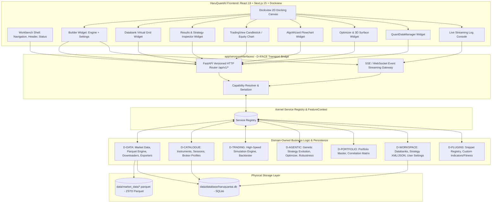
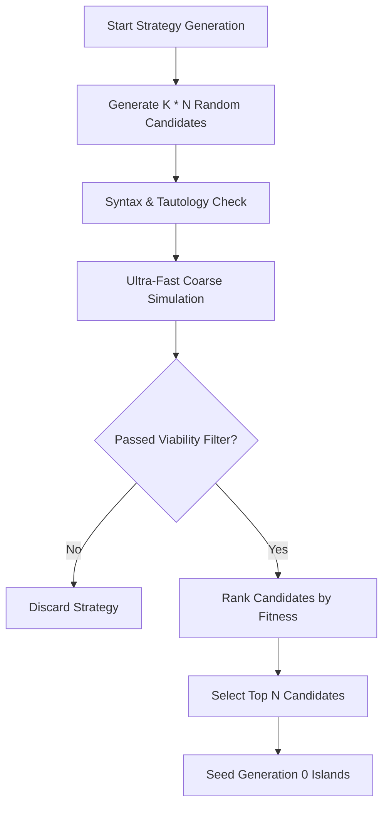
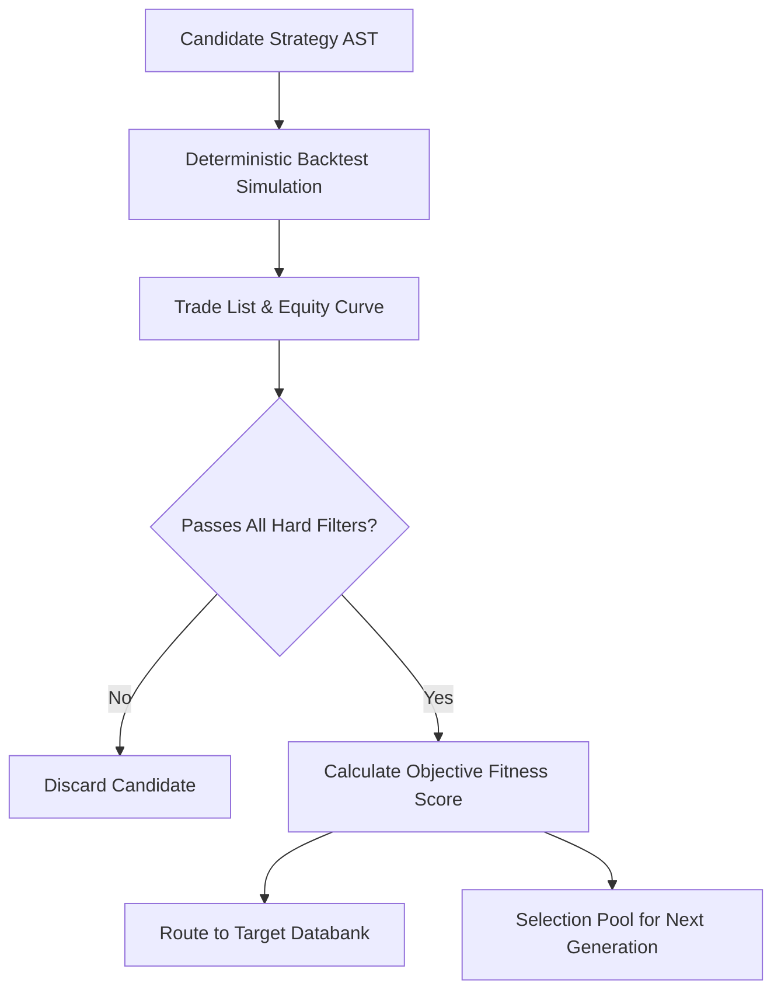
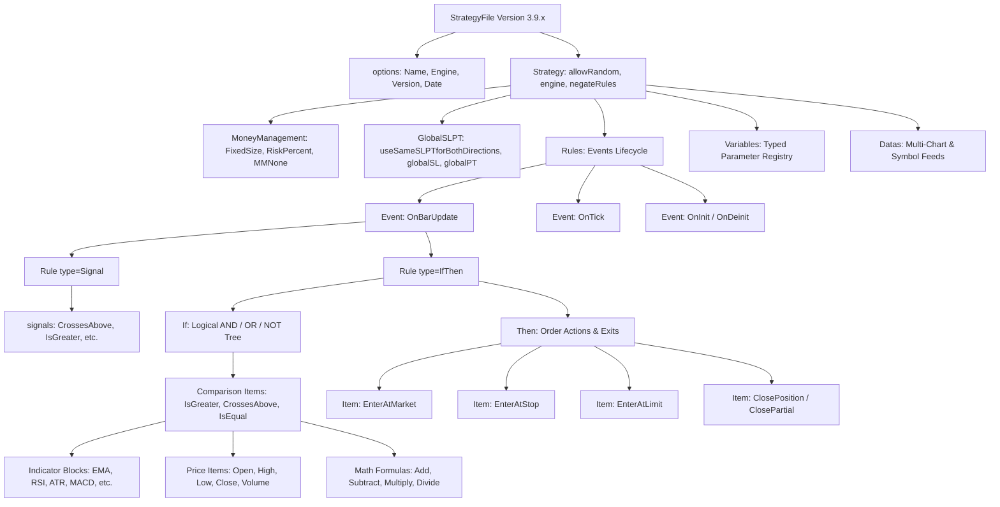
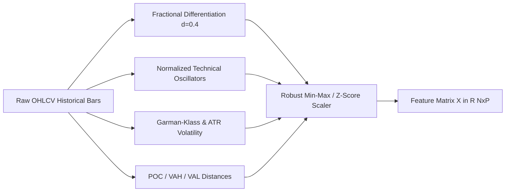
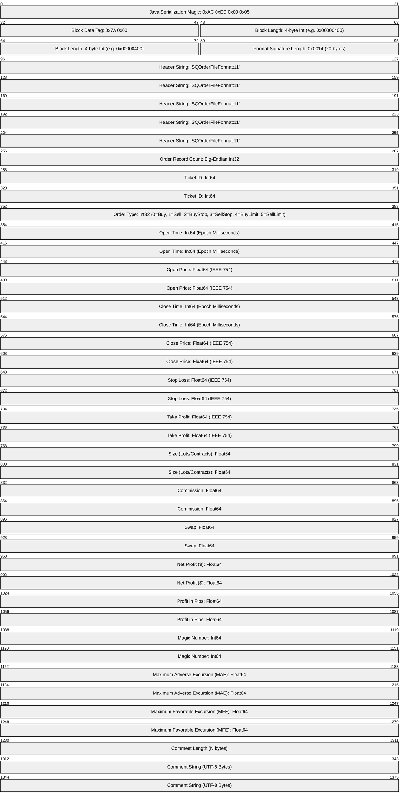

# Recreating StrategyQuantX UI in Python / FastAPI & Node / TypeScript

## Executive Summary
This document delivers the complete, forensic UI extraction of **StrategyQuantX (SQX)**—encompassing every view, ribbon bar, dockable workbench, data grid, modal dialogue, 2D/3D charting engine, visual rule builder, and workflow automation tool—and provides an end-to-end, build-ready implementation plan to reproduce the platform using a modern, ultra-high-performance reactive stack:
- **Backend**: **Python 3.14 + FastAPI + Uvicorn + Pydantic v2** backed by SQLite metadata (`data/database/haruquantai.db`), PyArrow/Parquet historical market data storage (`data/market_data/`), and WebSockets / Server-Sent Events (SSE) for real-time task progress, engine metrics, and live logs.
- **Frontend**: **Node.js (v26) + TypeScript + Next.js 15 / React 19 + Vite** with Tailwind CSS, Lucide icons, **Dockview** for desktop-grade 2D spatial tiling/docking, **TanStack Virtual Table** for 60fps virtualization of 100,000+ rows, and **TradingView Lightweight Charts** + Three.js for professional candlestick, equity curve, and 3D optimization surface inspection.

---

## 1. System Boundary & Brownfield Integration into HaruQuantAI

This architecture establishes a strict **brownfield integration** into HaruQuantAI (`C:\Users\rharu\AppDev\HaruquantAI`), abiding by the governance rules established in `AGENTS.md`, `docs/ARCHITECTURE.md`, and `docs/PROJECT.md`.



### Core Architecture Governance Invariants

1. **Interfaces Domain (D-IFACE) is Strictly a Bridge**:
   - Located at `app/services/interfaces/`.
   - **Zero Business Logic**: Owns zero database queries, zero file I/O, zero trading calculations, and zero indicator algorithms.
   - **Strict Capability Transport**: Serves exclusively as an HTTP/SSE/WebSocket transport adapter. It resolves domain capabilities from `ServiceRegistry` via `FeatureContext`, translates wire DTOs into public contract records (`app/contracts/`), and serializes all responses into standardized `ApiResponse[T]` envelopes:
     ```typescript
     type ApiResponse<T> =
       | { status: "success"; message: string; data: T; error: null; metadata: ApiMetadata }
       | { status: "error"; message: string; data: null; error: ApiError; metadata: ApiMetadata };
     ```
   - Fails closed with `CAPABILITY_UNAVAILABLE` when a required capability provider is inactive.

2. **Domain-Owned Business Logic & Persistence**:
   - **Market Data & Storage (`app/services/data/`)**: Owns historical tick and bar storage in Apache Parquet (`data/market_data/`), SQLite market metadata (`data/database/haruquantai.db`), historical feeds (Dukascopy, Crypto Binance/Coinbase, Yahoo Finance, custom CSVs), data quality detection (gaps, spikes, bad OHLC), resampling, timezone shifts, and export generation (MetaTrader 4 HST/FXT, MetaTrader 5, CSV).
   - **Instruments & Sessions (`app/services/catalogue/`)**: Owns symbol contract specifications, tick sizes, point values, commissions, swaps, trading sessions, and broker profiles.
   - **Strategy Generation & Search (`app/services/agentic/`)**: Owns the Genetic Algorithm (GA) engine, Island model evolution, random strategy builder, parameter optimizer, Walk-Forward optimizer, Monte Carlo robustness cross-checks, and automated TaskManager DAG pipelines.
   - **Execution & Simulation (`app/services/trading/`)**: Owns the deterministic backtesting simulator, bar/tick replay, slippage models, spread engines, and order lifecycle state machine.
   - **Portfolio Intelligence (`app/services/portfolio/`)**: Owns multi-strategy portfolio composition, trade correlation matrices, and risk-parity weighting.
   - **Workspace & Databanks (`app/services/workspace/`)**: Owns multi-databank persistence, strategy JSON/XML files, user preferences, and saved layouts.

3. **Spatial Composability & "Everything is a Plugin" (Dockview)**:
   - On the frontend (`app/ui/`), SQX views are not rigid monolithic pages. Every view (Builder dashboard, Databank grid, Results inspector, Candlestick chart, Quality inspector, AlgoWizard flowchart, and Live log console) is implemented as an independent, registered Dockview widget (`FEAT-UI-*`).
   - Operators can dock, tile, split (horizontal/vertical), tab, float, or maximize widgets in any arbitrary 2D spatial arrangement, persisting layout configurations across sessions.

---

## 2. Complete StrategyQuantX UI Extraction

StrategyQuantX is a multi-application quantitative development studio. Below is the comprehensive forensic breakdown of every application, ribbon menu, control panel, data grid, and modal dialogue.

```
StrategyQuantX Shell
├── Header & Global Controls (Project Selector, Engine Controls, CPU/GPU, Memory, Zoom, Theme)
├── Left Navigation Sidebar (Builder, Retester, Optimizer, AlgoWizard, Portfolio Master, QDM, Custom Projects, Code Editor)
├── Main Workbenches:
│   ├── 1. BUILDER (Strategy Generator)
│   │   ├── Dashboard Header (Engine Run/Stop/Pause, Generation Speed, Strategy Counters)
│   │   ├── Top Panel 1: Engine Dashboard (Generation rates, Population chart, CPU/Memory)
│   │   ├── Top Panel 2: Settings Tabs (What to Build, Genetic Options, Data, Blocks, MM, Cross-Checks, Filtering, Rankings, Notes)
│   │   └── Bottom Panel: Databank System (Multi-databank tabs, 100+ metric grid, Quick Actions)
│   ├── 2. RESULTS & STRATEGY INSPECTOR (RESULTS / RESULTS2)
│   │   ├── Performance Scorecard (Net Profit, Profit Factor, Sharpe, Max DD, Win Rate, Trades)
│   │   ├── Sub-View 1: Overview (Detailed statistical tables, Ratios, Win/Loss analysis)
│   │   ├── Sub-View 2: Equity Chart (Interactive Candlesticks/Bars, Equity Curve, Drawdown, Daily PnL)
│   │   ├── Sub-View 3: Trade List (Virtualized trade table, Entry/Exit signals, Durations, PnL)
│   │   ├── Sub-View 4: Trade Analysis (Day/Hour distribution, Holding times, Long vs Short)
│   │   ├── Sub-View 5: Optimization Profile (2D Heatmaps & 3D Interactive Parameter Surfaces)
│   │   ├── Sub-View 6: Robustness Tests (Monte Carlo simulations, Confidence intervals, What-If)
│   │   ├── Sub-View 7: Walk-Forward Results (Rolling IS/OOS matrix, Efficiency ratio, Clusters)
│   │   └── Sub-View 8: Source Code (Syntax-highlighted MQL4, MQL5, EasyLanguage, NinjaTrader, Python)
│   ├── 3. OPTIMIZER & WALK-FORWARD
│   │   ├── Parameter Range Grid (Min, Max, Step, Type, In/Out toggles)
│   │   ├── Optimization Mode Selector (Simple Grid, Genetic, Walk-Forward, Walk-Forward Matrix)
│   │   └── Results Explorer (Multi-metric sorting, 2D/3D surface visualizer)
│   ├── 4. ALGOWIZARD (Visual Strategy Studio)
│   │   ├── Flowchart / Block Canvas (Signal rules, Long/Short entry/exit conditions)
│   │   ├── Block Palette (Indicators, Comparisons, Logical Operators, Math functions)
│   │   ├── Order Configuration (Market/Stop/Limit, SL, PT, Trailing Stop, Break-Even)
│   │   └── Strategy Parameters & Live Code Preview
│   ├── 5. RETESTER (Multi-Market & Out-of-Sample Engine)
│   │   ├── Strategy Batch Selection
│   │   ├── Target Market Matrix (Multiple symbols, timeframes, date windows)
│   │   └── Retest Progression & Databank Sync
│   ├── 6. PORTFOLIO MASTER & PORTFOLIO COMPOSER
│   │   ├── Portfolio Strategy Selector
│   │   ├── Correlation Analysis (Returns correlation, Trade overlap heatmap)
│   │   ├── Combined Portfolio Equity Curve & Drawdown
│   │   └── Weight Optimization (Equal Weight, Volatility Parity, Min Variance)
│   ├── 7. QUANTDATAMANAGER (QDM)
│   │   ├── Symbol Catalog & Data Inventory
│   │   ├── Historical Download Engines (Dukascopy, Crypto, Yahoo, Files, Darwinex)
│   │   ├── Data Review (TradingView Chart, Raw bar table, Gap/Spike/OHLC Quality Heatmap)
│   │   ├── Transformation Tools (Clone Timezone, Resample Timeframes, Parquet Convert)
│   │   └── Export Engines (MT4 HST/FXT, MT5 Rates/Ticks, CSV)
│   ├── 8. TASKMANAGER / CUSTOM PROJECTS (Workflow Automation Engine)
│   │   ├── Workflow Canvas (DAG task sequence: Build -> Retest -> Filter -> MC -> Portfolio -> Export)
│   │   ├── Task Configuration (18 task types with specialized settings)
│   │   └── Flow Control Conditions (Loop cycles, Time limits, Strategy counts, Branching)
│   ├── 9. CODE EDITOR (Custom Snippet IDE)
│   │   ├── Monaco Code Editor (Java & Python snippet development)
│   │   ├── Snippet Architecture (Indicators, Signals, Fitness formulas, Databank columns)
│   │   └── Compilation, Error Diagnostics & Indicator Tester
│   └── 10. SYSTEM CONFIGURATION & LOGGING
│       ├── Live WebSocket Log Console (INFO, WARN, ERROR, SUCCESS, Clear, Filter)
│       └── Settings & About Modals (Themes, Hardware ID, License, Concurrency)
└── Footer Status Bar (Build Version, Docs, Bug Report, Help, About)
```

---

### 2.1 Application Shell & Global Layout

1. **Header Toolbar**:
   - **Project Manager**: Dropdown to select active Project (`DJ CFD H1`, `GBPJPY FX H1`, or Custom Project), `New Project`, `Save Project`, `Save As`, `Open Project`.
   - **Global Execution Controls**:
     - `Start / Run`: Launches active task or strategy generation engine.
     - `Pause`: Pauses engine worker threads gracefully at bar boundaries.
     - `Stop`: Halts execution and commits active databank state.
   - **Engine Performance Monitor**:
     - Worker threads selector (1 to physical CPU cores).
     - GPU Acceleration toggle (OpenCL/CUDA acceleration switch).
     - Live Memory Usage meter (Heap Used / Heap Max with garbage collection trigger).
   - **UI Utility Tools**:
     - Zoom controller (`80%`, `90%`, `100%`, `110%`, `125%`).
     - Theme Switcher: Dark Skin vs Light Skin (CME/Bloomberg dark palette).
     - Active License & Hardware ID indicator.

2. **Left Navigation Rail (`sq4-mainmenu`)**:
   - Icons with expandable labels and active process progress badges:
     - `BUILDER` (`fa-plus-square`): Strategy generation workbench.
     - `RETESTER` (`fa-refresh`): Multi-market retesting engine.
     - `OPTIMIZER` (`fa-sliders`): Parameter and Walk-Forward optimizer.
     - `AlgoWizard` (`fa-magic`): Visual drag-and-drop strategy builder.
     - `PORTFOLIOMASTER` (`fa-pie-chart`): Portfolio assembly and correlation.
     - `SQMANAGER` / `QDM` (`fa-database`): QuantDataManager data operations.
     - `TASKMANAGER` (`fa-tasks`): Automated project workflow engine.
     - `SQEDITOR` (`fa-code`): Monaco-based snippet and indicator code editor.
     - `DEBUGCONSOLE` / `LOG` (`fa-terminal`): Real-time system logs.

3. **Footer Status Bar (`sq4-mainfooter`)**:
   - Product build version string.
   - Action links: Documentation, Support, Report Bug / Suggest Feature, About dialog trigger.

---

### 2.2 App 1: Builder Workbench (`AppBuilder`)

The primary workbench for generating algorithmic trading strategies using machine learning and genetic programming.

#### A. Dashboard Header & Execution Stats
- **Execution State**: `Stopped`, `Running`, `Paused`.
- **Generation Speed**: Real-time throughput in `strategies/hour` and `strategies/second`.
- **Strategy Counters**:
  - `Generated`: Total candidate strategies evaluated by the simulation engine.
  - `Passed Filters`: Strategies meeting databank filtering thresholds.
  - `Rejected`: Strategies discarded due to low trade count, drawdown limits, or poor profit factor.
- **Time Indicators**: `Elapsed Time` (HH:MM:SS) and `Estimated Remaining Time` (ETA).

#### B. Top Panel 1: Engine Dashboard View (`DashboardPanel`)
- **Generation Progress Chart**: Dynamic line chart tracking:
  - Generation number (X-axis).
  - Maximum Fitness (Green curve).
  - Average Fitness (Blue curve).
  - Minimum Fitness (Red curve).
- **Population Health Heatmap**: Diversity index across current genetic island populations.
- **Hardware Telemetry Card**: Multi-core CPU utilization percentage, GPU memory usage, simulation queue latency.

#### C. Top Panel 2: Settings Tabs (`SettingsPanel`)
A tabbed container housing comprehensive strategy generation parameters:

1. **What to Build (`SettingsWhatToBuild`)**:
   - *Trading Directions*: `Both (Long & Short)`, `Long Only`, `Short Only`, `Symmetric Logic` toggle (mirrors rules for short trades) vs `Asymmetric Logic`.
   - *Strategy Architecture*:
     - Entry rules type: Indicator-based, Price action / Pattern-based, Breakout, Mean-reversion.
     - Exit rules type: Bar time limit, Opposite signal exit, Trailing stop, Fixed target.
   - *Order Types*: Checkboxes for `Market Orders`, `Stop Orders`, `Limit Orders`.
   - *Stop Loss (SL)*: `Mandatory` vs `Optional`, types (`Fixed Pips`, `Fixed ATR Multiplier`, `Percentage of Price`), range bounds (e.g. Min 10 pips, Max 200 pips).
   - *Profit Target (PT)*: `None`, `Fixed Pips`, `Fixed ATR Multiplier`, `Risk-to-Reward Ratio` (RRR 1:1, 1:2, 1:3).
   - *Trade Management*: `Move SL to Break-Even (BE)` trigger (pips/ATR), `Trailing Stop` (fixed pips/ATR step).
   - *Time / Session Filters*: Trading days (Monday-Friday checkboxes), Intraday entry window (`Time From` / `Time To`), `Close at End of Day (EOD)` flag, `Exit on Friday` time.

2. **Genetic Options (`SettingsGeneticOptions`)**:
   - *Evolution Type*: `Genetic Evolution`, `Random Generation`, `Custom Strategy Improvement`.
   - *Population Size*: Number of strategies per generation (e.g., 100 to 1,000).
   - *Islands Architecture*: Number of isolated demographic islands (1 to 10), Migration Interval (every N generations), Migration Rate (% of top strategies transferred).
   - *Genetic Operators*:
     - Crossover Probability: Probability of combining rules from two parents (typically 60-80%).
     - Mutation Probability: Probability of mutating parameters or replacing indicator blocks (typically 10-30%).
     - Selection Mechanism: `Tournament Selection` (with tournament size spinner) vs `Roulette Wheel`.
     - Replacement Strategy: `Elitism` (preserve top N individuals) vs `Generational`.

3. **Data Setup (`SettingsData`)**:
   - *Primary Market*: Symbol picker, Base Timeframe (`M1`, `M5`, `M15`, `M30`, `H1`, `H4`, `D1`), Broker Profile, Date Range (`From Date` - `To Date`).
   - *Data Splitting (Validation Partition)*:
     - `In-Sample (IS)`: Training period for strategy generation.
     - `Out-of-Sample (OOS)`: Unseen validation period to test overfitting.
     - Multi-OOS configuration (OOS 1, OOS 2, No OOS).
   - *Simulation Precision*:
     - `Selected Timeframe Only` (Fastest, bar-close simulation).
     - `1 Minute Data with Open/High/Low/Close Ticks` (High accuracy).
     - `Real Ticks` (Forensic tick-by-tick simulation).
   - *Trading Costs*: Spread (fixed pips or floating tick spread), Slippage (pips per trade), Commissions ($/lot or % of turnover).
   - *Additional / Multi-Timeframes*: Secondary chart bindings (e.g., M15 execution with H4 Trend Filter).

4. **Building Blocks (`SettingsBlocks`)**:
   - Expandable tree of allowed mathematical, technical, and price-action blocks:
     - *Trend Indicators*: SMA, EMA, SMMA, LWMA, MACD, ADX, Parabolic SAR, Supertrend, Ichimoku Kinko Hyo, Aroon, Linear Regression.
     - *Oscillators*: RSI, Stochastic, CCI, Williams %R, Momentum, Rate of Change (ROC), Ultimate Oscillator.
     - *Volatility Indicators*: ATR, Bollinger Bands, Keltner Channels, Standard Deviation, Chaikin Volatility.
     - *Volume & Market Depth*: On-Balance Volume (OBV), Money Flow Index (MFI), Volume Profile, Chaikin Money Flow.
     - *Price Action & Candlesticks*: Highest High, Lowest Low, Bar Range, Inside Bar, Engulfing, Hammer, Doji, Pivot Points.
     - *Operators*: Comparison (`>`, `<`, `>=`, `<=`, `==`, `crosses above`, `crosses below`), Boolean (`AND`, `OR`, `NOT`).

5. **Money Management (`SettingsMoneyManagement`)**:
   - Sizing models:
     - *Fixed Size*: Constant volume (e.g. 0.1 lots or 1 contract).
     - *Fixed Cash Risk*: Risk a constant dollar amount per trade (e.g. $100).
     - *Percentage of Equity*: Risk a fixed percentage of current balance (e.g. 1.0%).
     - *Volatility Sizing*: Risk scaled inversely to ATR.
   - Constraints: Minimum lot size, Maximum lot size, Lot step.

6. **Cross Checks & Robustness (`SettingsCrossChecks`)**:
   - Automated tests executed on candidates before entering databanks:
     - *Monte Carlo Retest*: Randomize trade sequence (reshuffle), random trade skipping (5-10%), randomize spread and slippage.
     - *Monte Carlo Manipulation*: Perturb historical bar Open, High, Low, Close prices by random noise factor.
     - *Walk-Forward Optimization*: Rolling train/test windows across history.
     - *Retest on Additional Markets*: Auto-test candidates across correlated pairs (e.g., EURUSD strategy tested on GBPUSD, USDCHF).
     - *Retest with Higher Precision*: Test M1 strategies against real ticks.
     - *What-If Scenarios*: Exit after N bars, skip first trade of day.

7. **Filtering (`SettingsFiltering`)**:
   - Strict pass/fail acceptance criteria:
     - `Total Trades >= 150`
     - `Profit Factor >= 1.35`
     - `Max Drawdown % <= 20.0`
     - `Return / Max Drawdown >= 2.5`
     - `Sharpe Ratio >= 1.1`
     - `Win Rate % >= 42.0`
     - `Out-of-Sample Profit Factor >= 1.2`
   - Destination Databank routing rules based on performance tiers.

8. **Rankings & Fitness Function (`SettingsRankings`)**:
   - Defines the objective function driving genetic selection:
     - Single metric: `Net Profit`, `Return / Max Drawdown`, `Sharpe Ratio`, `Calmar Ratio`, `System Quality Number (SQN)`.
     - Custom Multi-Metric Formula: User-weighted formula editor (e.g., `0.35 * Sharpe + 0.35 * RetDD + 0.30 * WinRate`).

9. **Notes (`SettingsNotes`)**:
   - Metadata notes, strategy hypothesis descriptions, author tags, and build notes.

#### D. Bottom Panel: Strategy Databank System (`ProjectDatabanks`)
The central repository where generated strategies are stored, ranked, and inspected.
- **Multi-Databank Tabs**:
  - `Default Databank`
  - `High Performers`
  - `Passed Robustness`
  - `Portfolio Candidates`
  - Custom user-created databank tabs (Add, Rename, Clear, Delete).
- **Virtualized Strategy Grid (`@tanstack/react-virtual`)**:
  - Columns (selectable from 100+ computed metrics):
    1. *Rank / ID* (e.g., `Strategy 1.24`)
    2. *Star / Pin* toggle
    3. *Symbol & Timeframe*
    4. *Net Profit ($ / %)*
    5. *Profit Factor*
    6. *Total Trades*
    7. *Win Rate (%)*
    8. *Max Drawdown ($ / %)*
    9. *Return / Max DD*
    10. *Sharpe Ratio*
    11. *Sortino Ratio*
    12. *Calmar Ratio*
    13. *SQN (System Quality Number)*
    14. *Avg Trade ($)*
    15. *Win / Loss Ratio*
    16. *Expectancy*
    17. *Max Drawdown Duration (Days)*
    18. *OOS Net Profit*
    19. *OOS Profit Factor*
    20. *Robustness Score (% Pass)*
- **Databank Action Toolbar**:
  - `Move / Copy to Databank`: Batch reassign selected strategies.
  - `Delete Selected`: Single or batch removal.
  - `Retest`: Send selected strategies to the Retester workbench.
  - `Optimize`: Send selected strategy to the Optimizer.
  - `Add to Portfolio`: Transfer to Portfolio Master.
  - `Export`: Export strategy code to MQL4, MQL5, EasyLanguage, NinjaTrader, or Python.
  - `Save Databank`: Export databank to disk (`.sqx` or `.json`).

---

### 2.3 App 2: Strategy Results & Inspection Engine (`RESULTS` / `RESULTS2`)

Triggered on strategy double-click or "Inspect" action. Provides deep quantitative forensic analysis.

```
+---------------------------------------------------------------------------------------------------------------------------------------+
| Strategy 1.104  | EURUSD H1 | Net Profit: +$42,850.00 | PF: 1.84 | Sharpe: 1.62 | Max DD: -11.4% | Win Rate: 54.2% | Trades: 382      |
+---------------------------------------------------------------------------------------------------------------------------------------+
| [Overview]  [Equity Chart]  [Trade List]  [Trade Analysis]  [Optimization Profile]  [Robustness]  [Walk-Forward]  [Source Code]  [Config] |
+---------------------------------------------------------------------------------------------------------------------------------------+
| (Active Tab View Content)                                                                                                             |
|                                                                                                                                       |
+---------------------------------------------------------------------------------------------------------------------------------------+
```

#### Sub-View 1: Overview Tab (`ResultsOverview`)
- **Executive Scorecard Table**:
  - *Financial Metrics*: Gross Profit, Gross Loss, Net Profit, Annualized Return (CAGR), Profit Factor, Expected Payoff.
  - *Risk & Drawdown*: Maximum Peak-to-Valley Drawdown ($ and %), Average Drawdown, Longest Stagnation Period (days), Ulcer Index.
  - *Risk-Adjusted Ratios*: Sharpe Ratio (annualized), Sortino Ratio, Calmar Ratio, MAR Ratio, System Quality Number (SQN).
  - *Trade Breakdown*: Total Trades, Winning Trades (count & %), Losing Trades (count & %), Long Performance vs Short Performance.
  - *Trade Averages*: Average Trade PnL, Average Winning Trade, Average Losing Trade, Win/Loss Ratio, Largest Winning Trade, Largest Losing Trade.
  - *Streak Analysis*: Maximum Consecutive Wins, Maximum Consecutive Losses.

#### Sub-View 2: Equity Chart Tab (`ResultsEquityChart`)
- **Primary Financial Chart (TradingView Lightweight Charts)**:
  - High-precision total cumulative equity curve with interactive zooming, panning, and timestamp crosshairs.
  - Visual demarcation lines separating In-Sample (IS) and Out-of-Sample (OOS) time windows.
- **Synchronized Sub-Panels**:
  - *Underwater Drawdown*: Real-time percentage drawdown from all-time highs.
  - *Daily / Monthly Returns*: Color-coded bar chart of periodic PnL (Green = Positive, Red = Negative).
  - *Trade Volume Distribution*: Position size lots over time.
  - *Rolling Metrics*: Rolling 30-day Sharpe Ratio and rolling annualized volatility.
  - *Benchmark Comparison Overlay*: Cumulative strategy return vs Buy & Hold or S&P 500 benchmark.

#### Sub-View 3: Trade List Tab (`ResultsTradeList`)
- **Virtualized High-Frequency Trade Table**:
  - Columns:
    1. *Trade #*
    2. *Type* (`Buy`, `Sell`)
    3. *Size* (Lots / Contracts)
    4. *Open Time* (YYYY.MM.DD HH:MM:SS)
    5. *Open Price*
    6. *Close Time* (YYYY.MM.DD HH:MM:SS)
    7. *Close Price*
    8. *Profit / Loss ($)*
    9. *Profit / Loss (Pips / Points)*
    10. *Profit / Loss (%)*
    11. *Commission*
    12. *Swap*
    13. *Cumulative Balance*
    14. *Maximum Favorable Excursion (MFE)*
    15. *Maximum Adverse Excursion (MAE)*
    16. *Duration (Bars & Elapsed Time)*
    17. *Entry Signal Identifier*
    18. *Exit Signal Identifier*
- Table Controls: Search filter, Column sorting, Date range filter, "Export Trades to CSV" button.

#### Sub-View 4: Trade Analysis Tab (`ResultsTradeAnalysis`)
- **Categorical Breakdown Charts**:
  - *Performance by Day of Week*: Bar chart comparing Monday through Friday performance (Total PnL, Win Rate, Trade Count).
  - *Performance by Hour of Day*: 24-hour histogram illustrating intraday profitability cycles.
  - *Performance by Month of Year*: Seasonality heatmap across calendar months.
  - *Holding Duration Histogram*: Frequency distribution of trades by hours held.
  - *PnL Distribution Curve*: Bell-curve histogram of profit vs loss amounts demonstrating positive or negative skewness.
  - *Direction Breakdown*: Side-by-side comparison cards for Long Trades vs Short Trades.

#### Sub-View 5: Optimization Profile Tab (`ResultsOptimizationProfile`)
- **2D Parameter Heatmaps**: Color-gradient grid plotting Parameter A (X-axis) vs Parameter B (Y-axis) with metric values (Sharpe, Profit).
- **3D Interactive Parameter Surface (Three.js / WebGL)**:
  - Interactive 3D mesh surface with orbital camera rotation, pan, and zoom.
  - Identifies stable parameter plateaus vs precarious over-fitted spikes ("parameter cliffs").
  - Target metric selector (Net Profit, Sharpe Ratio, Profit Factor, Drawdown).

#### Sub-View 6: Robustness Tests Tab (`ResultsRobustnessTests`)
- **Monte Carlo Simulation Panel**:
  - *Simulation Fan Chart*: Plots 100 to 1,000 randomized equity curves.
  - *Confidence Interval Table*:
    - 50th Percentile (Median Expected Outcome).
    - 95th Percentile (Conservative Estimate).
    - 99th Percentile (Worst-Case Stress Test).
    - Risk of Ruin (% chance of hitting 30% or 50% drawdown).
- **Test Matrix Badges**: Pass/Fail status for:
  - *Reshuffled Trades*: Independence of trade order.
  - *Skipped Trades (10%)*: Vulnerability to missing winning trades.
  - *Randomized Slippage & Spread*: Resilience against real-world broker execution friction.
  - *Historical Data Perturbation*: Resilience against price feed anomalies.

#### Sub-View 7: Walk-Forward Results Tab (`ResultsWalkForward`)
- **Rolling Window Grid**:
  - Visual timeline displaying interleaved In-Sample (training) and Out-of-Sample (testing) stages.
  - Step metrics: IS Profit, OOS Profit, Efficiency Ratio (`OOS Annualized / IS Annualized`).
- **Walk-Forward Efficiency Index (WFEI)**:
  - Overall robustness rating (Passing threshold typically >= 50% WFEI).
- **Walk-Forward Matrix (Cluster Analysis)**:
  - 2D grid evaluating robustness across varying window sizes (e.g. 10 to 50 runs) and OOS percentages (10% to 30%).
  - Identifies robust parameter clusters resilient to window selection bias.

#### Sub-View 8: Source Code Tab (`ResultsSourceCode`)
- **Multi-Platform Code Viewer (Monaco Editor)**:
  - Platform Tabs:
    - `MetaTrader 4 (MQL4)`
    - `MetaTrader 5 (MQL5)`
    - `TradeStation / MultiCharts (EasyLanguage)`
    - `NinjaTrader 8 (C#)`
    - `Python (Native HaruQuant / VectorBT / Backtrader)`
  - Toolbar: `Copy to Clipboard`, `Save File (.mq4, .mq5, .py)`, `Syntax Check`, `Compile & Execute`.

#### Sub-View 9: Strategy Config Tab (`ResultsStrategyConfig`)
- Raw JSON/XML configuration defining all trading rules, indicators, thresholds, and money management blocks, enabling instant reproduction in the Builder.

---

### 2.4 App 3: AlgoWizard Studio (`AlgoWizard`)

A visual flowchart and rule-based strategy editor enabling quants to design, edit, and inspect algorithmic strategies without writing code.

1. **Toolbar**: `New Strategy`, `Open Strategy`, `Save Strategy`, `Undo`, `Redo`, `Add Rule`, `Generate Code`, `Test in Backtester`.
2. **Rule Tree & Canvas**:
   - *Long Entry Rules*: Grouped condition cards connected by logical `AND` / `OR` gates (e.g., `If Close[1] > EMA(Close, 50)[1] AND RSI(14)[1] < 35`).
   - *Short Entry Rules*: Symmetric or custom asymmetric short conditions.
   - *Long Exit Rules*: Stop Loss, Profit Target, Trailing Stop, Indicator-based exits (e.g., `Exit when RSI > 75`).
   - *Short Exit Rules*: Short exit logic.
   - *Trade Management Rules*: Break-Even triggers, partial take-profits, scale-in logic.
3. **Block Builder Dialogue**:
   - Category selector: Price data, Technical indicators, Custom snippets, Mathematical operations, Comparison operators.
   - Dynamic parameter spinners (Periods, Deviations, Shifts, Applied Price).
4. **Strategy Parameters Table**:
   - Variables exposed for optimization (Name, Default Value, Min, Max, Step).
5. **Live Code Generation Splitter**:
   - Real-time side-by-side preview of generated MQL4/MQL5/Python code as flowchart blocks are modified.

---

### 2.5 App 4: Optimizer Workbench (`AppOptimizer`)

Dedicated parameter optimization and Walk-Forward analysis engine.

1. **Top Configuration**:
   - Strategy Selector: Load strategy from file, active databank, or AlgoWizard.
   - Optimization Mode Selector:
     - `Simple / Grid Search`: Exhaustive brute-force evaluation of all parameter permutations.
     - `Genetic Optimization`: Fast multi-parameter heuristic search.
     - `Walk-Forward Optimization (WFO)`: Rolling In-Sample/Out-of-Sample optimization.
     - `Walk-Forward Matrix (WFM)`: Multi-window parameter cluster analysis.
2. **Parameters Grid**:
   - Columns: `Parameter Name`, `Optimize (Checkbox)`, `Original Value`, `Min Value`, `Max Value`, `Step Size`, `Total Steps`, `Data Type`.
   - Total Permutations Counter: Real-time calculation of total parameter combinations to evaluate.
3. **Optimization Target & Constraints**:
   - Optimization Goal: Dropdown to maximize `Net Profit`, `Sharpe Ratio`, `Return / Max DD`, or custom formula.
   - Constraints: Reject configurations with `Trades < 50` or `Drawdown > 25%`.
4. **Results Grid & Visualizer**:
   - Virtualized table ranking parameter sets by objective score.
   - Synchronized 2D contour plot and 3D parameter surface viewer.

---

### 2.6 App 5: Retester Workbench (`AppRetester`)

Validates existing strategies across multiple alternative markets and varying execution conditions.

1. **Strategy Selection Table**: Single strategy or batch selection from databanks.
2. **Target Markets Matrix**: Multi-symbol selection grid (e.g., test a EURUSD strategy simultaneously on GBPUSD, USDJPY, AUDUSD, NZDUSD, EURGBP).
3. **Execution Condition Overrides**:
   - Test under altered spreads (+1.0 pip, +2.0 pips).
   - Test under custom slippage models.
   - Test across differing date ranges (out-of-sample forward testing).
4. **Batch Retest Queue**: Parallel multi-threaded execution queue with progress bars and automated databank synchronization.

---

### 2.7 App 6: Portfolio Master & Composer (`AppPortfolioMaster`)

Enables quantitative portfolio assembly, risk parity weighting, and cross-strategy correlation analysis.

1. **Portfolio Composition Panel**:
   - Strategy Inventory: Checkbox selection of candidate strategies from databanks.
   - Active Portfolio Basket: Configured strategies with contract sizing multipliers.
2. **Correlation Matrix Heatmap**:
   - *Returns Correlation*: Pearson correlation coefficient (-1.0 to +1.0) of daily PnL across all strategies.
   - *Trade Overlap Heatmap*: Percentage of concurrent trades in the market to prevent capital over-concentration.
3. **Aggregated Portfolio Performance**:
   - Combined Equity Curve: Visualizes portfolio smoothing effect through non-correlated diversification.
   - Combined Drawdown vs Individual Strategy Drawdowns.
   - Portfolio Diversification Ratio (Sharpe improvement metric).
4. **Weight Optimization Tools**:
   - `Equal Weighting` (1 / N allocation).
   - `Risk Parity` (Weights scaled inversely to strategy volatility/drawdown).
   - `Maximum Sharpe Ratio Optimization`.
5. **Portfolio Exporter**: Generate a unified multi-strategy Expert Advisor (EA) or Python multi-strategy portfolio runner.

---

### 2.8 App 7: QuantDataManager (QDM) (`AppDataManager`)

Forensic historical market data management studio (previously extracted in QDM blueprint).
1. **Views**: Data Inventory, Instruments Specifications, Trading Sessions, Broker Profiles, Operational Logs.
2. **Engines**: Dukascopy downloader, Crypto exchange fetcher, Yahoo Finance importer, Custom CSV parser.
3. **Data Quality & Transformation**: Anomaly cleaning (gaps, spikes, bad OHLC), Timezone clone with DST, Timeframe resampler, Parquet ZSTD converter.
4. **Exporters**: MetaTrader 4 HST/FXT, MetaTrader 5 custom rates/ticks, CSV streaming exporter.

---

### 2.9 App 8: TaskManager / Custom Projects (`AppTaskManager`)

An enterprise workflow automation engine that sequences multi-step quantitative pipelines into automated DAG jobs.

1. **Workflow DAG Canvas / Pipeline List**:
   - Linear or branched execution of discrete quantitative tasks.
2. **Inventory of 18 Automated Tasks**:
   - `TaskBuild`: Launches Strategy Builder with preconfigured template and stops after N strategies found.
   - `TaskRetest`: Retests databank strategies on additional markets.
   - `TaskOptimize`: Runs parameter optimization on top candidates.
   - `TaskFiltering`: Filters databanks using strict statistical gates.
   - `TaskAutomaticPortfolioBuilder`: Automatically clusters uncorrelated strategies into a portfolio.
   - `TaskAutomaticRetest`: Continuous rolling backtest validation.
   - `TaskUpdateData`: Ingests the latest historical bars from data feeds.
   - `TaskSaveToFiles`: Dumps databanks or strategies to disk (`.sqx`, `.json`, `.csv`).
   - `TaskLoadFromFiles`: Loads strategy repositories from directories.
   - `TaskClearDatabanks`: Clears temporary scratch databanks between runs.
   - `TaskCallExternalScript`: Triggers external Python scripts or webhooks.
   - `TaskCustomAnalysis`: Executes user-defined algorithmic analysis routines.
   - `TaskDeleteFile`: File system maintenance.
   - `TaskGoToTask`: Conditional branching or loop execution.
   - `TaskLogDatabankStats`: Outputs summary telemetry to the log console.
   - `TaskNeuralNetworkTrainer`: Trains ML/neural network models.
   - `TaskNotification`: Dispatches Desktop, Email, Telegram, or Webhook alerts.
   - `TaskStopAndStart`: Scheduled pauses and restarts.
   - `TaskWaitFor`: Configurable delay timer between pipeline stages.
3. **Flow Control Conditions**:
   - `ConditionCyclesCount`: Stop or branch after N loop iterations.
   - `ConditionDuration`: Time-boxed execution limit (e.g., run for 8 hours overnight).
   - `ConditionResultsCount`: Trigger branch when databank reaches target strategy count (e.g. 50 valid strategies).
   - `ConditionRunTime`: Real-time clock triggers (e.g. run at 22:00 UTC).

---

### 2.10 App 9: Code Editor (`AppCodeEditor`)

Integrated developer environment for extending the platform with custom quantitative logic.

1. **Monaco Code Editor**: Full-featured code editor with syntax highlighting, autocomplete, and error diagnostics.
2. **Snippet Extension Architecture**:
   - *Custom Indicators*: Technical indicator algorithms.
   - *Custom Signals*: Entry/exit signal logic.
   - *Custom Fitness Functions*: Objective functions for genetic evolution.
   - *Custom Databank Columns*: Proprietary statistical formulas added to the databank grid.
   - *Custom Order Types & Money Management*: Specialized position-sizing logic.
3. **Indicator Tester (`CodeEditorIndicatorTester`)**:
   - In-editor test harness executing custom algorithms against sample market data with live chart output.

---

### 2.11 App 10: Neural Network Trainer (`AppNeuralNetwork` / `TaskNeuralNetworkTrainer`)

The **Neural Network Trainer** is a specialized machine learning workbench and TaskManager job engine designed to train deep neural networks and machine learning models for market prediction, regime filtering, and signal generation.

```
Neural Network Trainer
├── Top Split: Engine Dashboard & Hyperparameter Setup
│   ├── Dashboard Header: Run/Pause/Stop, Epochs Counter, Elapsed Time, Loss Gauge
│   └── Card Panels (Tabbed Setup):
│       ├── SettingsData: Feature inputs (indicators, returns, price transforms), Target definitions
│       ├── SettingsRankings: Loss functions (Cross-Entropy, MSE, Huber), Evaluation metrics (ROC-AUC, F1, Accuracy)
│       ├── SettingsOptions: Network architecture, Optimizer (AdamW, SGD), Learning rate, Batch size, Epochs
│       └── SettingsAdvancedTM: Overfitting defenses, Early stopping patience, L1/L2 weight decay, Dropout
└── Bottom Split: Project Databanks
    ├── Training Candidates Databank: Source strategies or historical feature sets
    └── Trained Models Databank: Neural network strategies ready for backtesting and export
```

#### A. Architecture & Training Controls
1. **Model Topologies**:
   - *Multi-Layer Perceptron (MLP)*: Fully-connected feedforward networks for tabular indicator signals.
   - *1D Temporal Convolutional Networks (TCN)*: Causal dilated convolutions extracting pattern hierarchies from sequential bar series.
   - *Recurrent Networks (LSTM/GRU)*: Sequence models capturing long-range temporal dependencies.
2. **Interactive Training Telemetry**:
   - Real-time loss curves (In-Sample Training Loss vs In-Sample Validation Loss).
   - Receiver Operating Characteristic (ROC) curve and Area Under Curve (AUC) meter.
   - Confusion matrix with True Positive, False Positive, True Negative, False Negative rates.
   - Feature importance bar chart showing relative permutation importance of input indicators.

---

### 2.12 App 11: Grid Control & Distributed Cluster Computing (`AppGridControl` / `GRIDCONTROL`)

The **Grid Control** application orchestrates distributed parallel computing across a cluster of remote StrategyQuantX worker nodes, dramatically scaling strategy generation, parameter optimization, and robustness verification.

```
Grid Control Engine (GRIDCONTROL)
├── Control Panel Header
│   ├── Grid Node Selector: [Local Grid | Remote Cluster Node IP:Port]
│   ├── Manual Refresh Button (icons-system-regenerate)
│   └── Auto-Refresh Indicator: Periodic polling heartbeat (every 3000ms)
└── 3 Reactive Job Monitoring Grids (sqGrid)
    ├── 1. inProgressGrid: Active executing jobs
    ├── 2. waitingGrid: Queued pending tasks
    └── 3. finishedGrid: Last 100 finished jobs with error inspection modals
```

#### Table Columns & Field Specifications
1. **`inProgressGrid` (Jobs in Progress)**:
   - `Job ID` (240px, string UUID): Unique distributed job identifier.
   - `Job group ID` (120px, string): Batch or project grouping identifier.
   - `Type` (80px, enum): `Continuous` (blocking background task) vs `One time` (finite batch).
   - `Status` (80px, enum): `Running` vs `Waiting`.
   - `Created` (140px, datetime): Task queuing timestamp.
   - `Started` (140px, datetime): Worker allocation and dispatch timestamp.
   - `Run time` (80px, duration): Formatted elapsed execution time (`HH:mm:ss`).
   - `Progress` (*, percentage): Completion progress (`0% - 100%`) or `N/A`.
2. **`waitingGrid` (Waiting Jobs)**:
   - `Job ID` (240px)
   - `Job group ID` (120px)
   - `Type` (80px)
   - `Created` (*, datetime)
3. **`finishedGrid` (Last 100 Finished Jobs)**:
   - `Job ID` (240px)
   - `Job group ID` (120px)
   - `Type` (80px)
   - `Created` (140px)
   - `Started` (140px)
   - `Duration` (80px)
   - `Status` (*, action link): `Success` (green badge) or clickable `Error` (red badge) triggering the **Grid Error Stack Trace Modal** displaying backend failure logs.

---

### 2.13 App 12: Grid Test Latency & Throughput Benchmark Sandbox (`AppGridTest` / `GRIDTEST`)

The **Grid Test** application is a dedicated diagnostic and benchmarking harness designed to validate cluster node health, network latency, data serialization overhead, and UI rendering performance under extreme load.

```
Grid Test Sandbox (GRIDTEST)
├── Status Header: Rows in Grid Counter (Dynamic DOM element count)
├── Synthetic Virtual Grid Canvas: 3-Column stress table (ID, First col [custom sort], Second col [numeric sort])
└── Execution Control Panel
    ├── [Start Test / Stop Test] (Toggle benchmark runner)
    ├── [Select All] / [Select None] (Bulk row selection stress)
    ├── [Clear] (Instant memory purging)
    └── [Add 100 Rows] (Synthetic batch appending)
```

#### Operational Diagnostics
- **High-Frequency Data Injection**:
  - `addRow` timer (20ms interval): Continuously pumps synthetic order/metric records.
  - `removeRow` timer (30ms interval): Random-index row eviction to verify memory leak prevention.
  - `changeRow` timer (40ms interval): In-place cell mutation and dirty-flag propagation.
- **Node Benchmarking Metrics**:
  - Measures round-trip RPC ping latency between master and remote workers.
  - Measures market data streaming throughput (MB/s).
  - Evaluates strategies-evaluated-per-second per CPU core on remote nodes.

---

### 2.14 Complete Inventory of Modals & Dialogues

| Modal / Dialog | Trigger Location | Purpose & Controls |
|---|---|---|
| **Start Build Modal** | Builder -> Start Button | Choose strategy template (Forex, Futures, Stockpicker), initialize databanks, confirm start. |
| **Simple Template Picker** | Builder -> Settings -> Template | Select predefined strategy generation presets. |
| **Add / Edit Indicator Block** | Settings -> Blocks -> Add Block | Configure indicator parameters, periods, price inputs, comparison operators. |
| **Filter Rule Editor** | Settings -> Filtering -> Add Filter | Metric picker, comparison operator (`>`, `<`, `>=`), threshold input, databank destination. |
| **Custom Fitness Formula Modal** | Settings -> Rankings -> Custom Formula | Expression builder with variable autocomplete and syntax validation. |
| **Monte Carlo Settings Modal** | Settings -> Cross-Checks -> Monte Carlo | Simulation count (100-1,000), confidence level (95%, 99%), reshuffle vs skip trade toggles. |
| **Walk-Forward Config Modal** | Settings -> Cross-Checks -> Walk-Forward | Run count (5-20), OOS percentage (10-40%), efficiency threshold. |
| **Databank Column Chooser** | Databank -> Columns Cog | Checkbox list of 100+ statistical metrics to show/hide in the virtual grid. |
| **Databank Rename Modal** | Databank -> Tab Context Menu | Rename active databank tab. |
| **Filter by Correlation Modal** | Databank -> Actions -> Correlation Filter | Set maximum allowed correlation (e.g. 0.70); auto-purges redundant strategies. |
| **AlgoWizard Block Config** | AlgoWizard -> Double click block | Edit indicator inputs, comparison operators, and parameter optimization bounds. |
| **AlgoWizard Order Dialog** | AlgoWizard -> Double click order | Order type (Market/Stop/Limit), SL/PT configuration, trailing stop, BE. |
| **Optimizer Range Setup** | Optimizer -> Parameters Grid | Batch configure min, max, and step sizes for selected variables. |
| **Task Configuration Modal** | TaskManager -> Double click task | Form fields specific to the selected task type (18 task varieties). |
| **Project Flow Condition Modal** | TaskManager -> Add Condition | Loop count, duration limits, strategy count threshold, target task redirect. |
| **Neural Network Hyperparameters Modal** | Neural Network -> SettingsOptions | Hidden layer sizes, dropout rate, optimizer learning rate, activation function. |
| **Grid Node Connection Modal** | Grid Control -> Add Node | Remote worker IP, Port, Authentication token, SSL certificate verification. |
| **Grid Error Trace Modal** | Grid Control -> Finished Grid -> Error | Formatted modal displaying Java/Python stack traces from failed cluster jobs. |
| **New Snippet Modal** | Code Editor -> New | Snippet type picker (Indicator, Signal, Fitness, Column), template code scaffold. |
| **Dukascopy Download Modal** | QDM -> Dukascopy -> Download | Symbol select, date range, M1 vs Tick, CDN fast download switch. |
| **Files Import Modal** | QDM -> Files -> Import | File browser, delimiter select, column mapping, live preview table. |
| **Export to MT4 / MT5 Modal** | QDM -> Export -> MT4/MT5 | Directory auto-discovery, server timezone with DST rules, HST/FXT generator. |
| **Clone Timezone Modal** | QDM -> Tools -> Clone Timezone | Fixed hour shift or broker DST timezone converter. |
| **Quality Analysis Modal** | QDM -> Review -> Quality Tab | Gap, spike, bad OHLC count, anomaly threshold spinners, anomaly table. |
| **Settings Modal** | Header / Footer -> Settings | UI Theme (Dark / Light), Language, WebServer Port, GPU acceleration. |
| **About Modal** | Footer -> About | Software version, Hardware ID, License status, License key activation. |

---

## 3. Complete Generator & Search Algorithms Engine Specification

StrategyQuantX is powered by an advanced suite of quantitative search engines and genetic programming algorithms that search the combinatorial space of algorithmic trading strategies. Below is the complete mathematical, architectural, and algorithmic specification of the generator engine.

```
Strategy Search & Generation Engine
├── 1. Genome & Syntax Architecture
│   ├── Strongly Typed Genetic Programming (STGP) Abstract Syntax Tree (AST)
│   ├── Context-Free Grammar (CFG) & Grammar-Guided Rule Generation
│   └── Deterministic Strategy Symmetry Engine (Long <-> Short Inversion)
├── 2. The 4 Core Search & Generation Engines
│   ├── Engine 1: Pure Random Generation (Monte Carlo Strategy Sampling with Ramped Half-and-Half)
│   ├── Engine 2: Island Model Genetic Programming (Parallel Demes with Migration Topology)
│   ├── Engine 3: Custom Strategy Genetic Improvement (Targeted Sub-tree Freezing & Mutation)
│   └── Engine 4: Walk-Forward Matrix & Parameter Optimization Search Engines
├── 3. Population Synthesis & Decimation Algorithm
│   ├── Decimation Factor (K * N Generation Screening)
│   └── Fast Pre-Simulation Viability Heuristics
├── 4. Genetic Operators (Formal Algorithmic Definitions)
│   ├── Selection Operators: Tournament (k-tournament), Roulette Wheel, Rank Selection
│   ├── Crossover Operators: Strongly Typed Subtree Crossover, Module-Level Crossover
│   └── Mutation Operators: Subtree Replacement, Parameter Jitter (Gaussian), Node Flipping
├── 5. Evolutionary Dynamics & Diversity Preservation
│   ├── Stagnation Detection & Automatic Evolution Restarts (EvoRestartOnStagnation / Finish)
│   ├── Multi-Stage In-Sample Partitioning (In-Sample Training vs In-Sample Validation)
│   └── Anti-Crowding & Niching ("Fresh Blood" Phenotypic / Genotypic Replacement)
└── 6. Multi-Metric Fitness Evaluation & Filtering Pipeline
    ├── Hard Constraint Lexicographic Filtering Gate
    ├── Weighted Multi-Objective Fitness Evaluation
    └── Multi-Objective Pareto Optimization (NSGA-II Non-Dominated Sorting)
```

---

### 3.1 Genome Representation: Strongly Typed Abstract Syntax Tree (STGP AST)

Every algorithmic strategy is modeled as an Abstract Syntax Tree (AST) governed by Strongly Typed Genetic Programming (STGP). This prevents the synthesis of syntactically illegal or nonsensical trading logic (such as comparing an RSI oscillator bound between 0 and 100 directly to an unnormalized price level).

#### A. Grammatical Specification (Context-Free Grammar)
The strategy rule language is defined by the following grammar:

$$\begin{aligned}
\langle \text{Strategy} \rangle &::= \langle \text{EntryRules} \rangle \land \langle \text{ExitRules} \rangle \land \langle \text{OrderConfig} \rangle \land \langle \text{MoneyManagement} \rangle \\
\langle \text{EntryRules} \rangle &::= \langle \text{ConditionTree} \rangle \\
\langle \text{ConditionTree} \rangle &::= \langle \text{Condition} \rangle \mid \langle \text{ConditionTree} \rangle \land \langle \text{LogicOp} \rangle \land \langle \text{ConditionTree} \rangle \mid \neg \langle \text{ConditionTree} \rangle \\
\langle \text{LogicOp} \rangle &::= \mathbf{AND} \mid \mathbf{OR} \\
\langle \text{Condition} \rangle &::= \langle \text{TypedExpr}_T \rangle \mathrel{\langle \text{CompOp} \rangle} \langle \text{TypedExpr}_T \rangle \\
\langle \text{CompOp} \rangle &::= > \mid < \mid \ge \mid \le \mid = \mid \mathbf{CrossesAbove} \mid \mathbf{CrossesBelow} \\
\langle \text{TypedExpr}_{\text{Price}} \rangle &::= \mathbf{PriceSeries}(\text{Open} \mid \text{High} \mid \text{Low} \mid \text{Close}, \text{Shift}) \mid \mathbf{PriceIndicator}(\text{SMA} \mid \text{EMA} \mid \text{BB}, \text{Params}) \\
\langle \text{TypedExpr}_{\text{Osc}} \rangle &::= \mathbf{Oscillator}(\text{RSI} \mid \text{Stoch} \mid \text{CCI}, \text{Params}) \mid \mathbf{OscConstant}([0..100]) \\
\langle \text{OrderConfig} \rangle &::= \mathbf{OrderType}(\text{Market} \mid \text{Stop} \mid \text{Limit}) \land \langle \text{StopLoss} \rangle \land \langle \text{ProfitTarget} \rangle \\
\langle \text{StopLoss} \rangle &::= \mathbf{None} \mid \mathbf{FixedPips}(p) \mid \mathbf{ATRMultiplier}(k \cdot \text{ATR}(n)) \mid \mathbf{PriceLevel}(L)
\end{aligned}$$

#### B. Type Safety Invariant
Nodes declare explicit input and output types from the signature set:
$$\mathcal{T} = \{ \mathbf{Bool}, \mathbf{PriceLevel}, \mathbf{PriceDelta}, \mathbf{OscillatorLevel}, \mathbf{Volume}, \mathbf{IntBarShift}, \mathbf{OrderType} \}$$
A node $N(c_1, c_2, \dots, c_m)$ can connect child $c_i$ if and only if:
$$\text{OutputType}(c_i) \equiv \text{InputType}_i(N)$$
This eliminates runtime simulation crashes and ensures 100% of synthesized genomes evaluate to valid execution code.

#### C. Deterministic Strategy Symmetry Engine
When `Symmetric Logic` is enabled (default in FX and equities):
1. The **Long Entry** rule tree is generated:
   $$\mathcal{R}_{\text{Long}} = \text{Cond}_1 \land \text{Cond}_2 \dots$$
2. The **Short Entry** rule tree is deterministically projected via the transformation operator $\sigma$:
   $$\sigma(A > B) \implies A < B, \quad \sigma(\mathbf{CrossesAbove}(A, B)) \implies \mathbf{CrossesBelow}(A, B)$$
   $$\sigma(\text{RSI} < 30) \implies \text{RSI} > (100 - 30) = 70$$
   $$\sigma(\text{StopLoss}_{\text{Long}}(P - \Delta)) \implies \text{StopLoss}_{\text{Short}}(P + \Delta)$$
When `Asymmetric Logic` is enabled, the search engine independently evolves $\mathcal{R}_{\text{Long}}$ and $\mathcal{R}_{\text{Short}}$, doubling the parameter search space.

---

### 3.2 The 4 Core Generator & Search Engines

#### Engine 1: Pure Random Generation (Monte Carlo Strategy Sampling)
- **Search Paradigm**: Uniform independent sampling of ASTs up to depth $D_{\max} \in [2, 6]$.
- **Tree Construction Modes**:
  - `Full Mode`: Every branch is extended until it hits maximum depth $D_{\max}$.
  - `Grow Mode`: Branches terminate probabilistically at any depth when a terminal leaf node is selected.
  - `Ramped Half-and-Half`: Population is partitioned into equal depth tiers $d \in [2, D_{\max}]$, with 50% constructed via `Full` and 50% via `Grow`.
- **Throughput**: Achieves 5,000 to 20,000 strategy evaluations per minute across modern multi-core CPUs due to absence of genetic crossover tracking overhead.

#### Engine 2: Island Model Genetic Programming (Parallel Deme Evolution)
The primary search engine in StrategyQuantX employs coarse-grained distributed evolutionary algorithms (Demographic Island Model):
- **Population Topology**: The global population $\mathcal{P}$ is split into $M$ isolated demographic demes (islands):
  $$\mathcal{P} = \{ \mathcal{I}_1, \mathcal{I}_2, \dots, \mathcal{I}_M \}, \quad |\mathcal{I}_k| = N_{\text{island}}$$
- **Parallel Evolution**: Each island $\mathcal{I}_k$ evolves independently on a dedicated CPU thread for $G_{\text{mig}}$ generations (`migrationModulo`, default 50 generations).
- **Migration Topology & Operator**:
  - Topology: Directed Ring Topology $\mathcal{I}_1 \to \mathcal{I}_2 \to \dots \to \mathcal{I}_M \to \mathcal{I}_1$.
  - At generation $g \equiv 0 \pmod{G_{\text{mig}}}$, each island extracts its top $R_{\text{mig}}\%$ elite individuals (`migrationRate`, default 20%).
  - Immigrants replace the worst $R_{\text{mig}}\%$ individuals in the target island.
- **Mathematical Benefit**: Prevents the "super-individual" problem (premature convergence where a single early lucky strategy dominates the entire gene pool). Each island explores different regions of the fitness landscape $\mathcal{F}$, preserving global genetic diversity.

#### Engine 3: Custom Strategy Genetic Improvement (Targeted Sub-Tree Search)
Allows quants to seed the search engine with an existing baseline strategy and selectively freeze or evolve specific components (`PartsToImprove`):

```
Target Strategy Components:
├── Entry Rules      --> [ Keep Existing (Frozen) ]
├── Exit Rules       --> [ Mutate & Evolve Randomly ]
├── Order Types      --> [ Keep Existing (Frozen) ]
└── Trade Management --> [ Add New Break-Even & Trailing Logic ]
```

- **Execution Modes**:
  - `Keep existing`: Subtree is completely locked (read-only); genetic operators skip this branch.
  - `Keep existing or generate randomly`: Replaces branch probabilistically during mutation.
  - `Keep existing + generate randomly`: Additive mutation; appends new random condition blocks to the existing rules via an `AND` gate.
  - `Generate randomly`: Completely erases existing branch and synthesizes fresh logic.

#### Engine 4: Walk-Forward Matrix & Optimization Search Engines
- **Grid Search Optimizer**: Complete Cartesian product evaluation $\Omega = \prod_{i=1}^P \{ v_i^{\min} + k \cdot \Delta v_i \}$ for small parameter dimensions ($|\Omega| \le 10^5$).
- **Genetic Parameter Optimizer**: Encodes numerical parameters as a fixed-length chromosome vector $\mathbf{x} \in \mathbb{R}^P$. Employs Simulated Binary Crossover (SBX) and Polynomial Mutation to optimize continuous parameters without re-generating strategy rules.
- **Walk-Forward Matrix Search**: 2D grid search over rolling window configurations:
  $$\mathcal{W} = \{ (W_{\text{size}}, P_{\text{oos}}) \mid W_{\text{size}} \in [10, 50], P_{\text{oos}} \in [10\%, 40\%] \}$$
  Evaluates strategy cluster stability across all grid nodes to identify parameter robustness plateaus.

---

### 3.3 Population Synthesis & The Decimation Algorithm

To prevent Generation 0 from being populated with non-viable, inactive, or broken strategies, StrategyQuantX utilizes a rigorous **Decimation Pre-Screening Filter**:



#### Decimation Formulation
Let $N$ be the target population size per island, and $K$ be the decimation coefficient (`decimationCoef`, default $1 \le K \le 10$):
1. **Candidate Pool Synthesis**:
   $$N_{\text{candidates}} = K \times (M \cdot N)$$
   The engine generates $N_{\text{candidates}}$ random ASTs.
2. **Fast Pre-Simulation Viability Heuristics**:
   - *Tautology Filter*: Prunes trivial conditions (e.g. `Close > Close`, `RSI(14) > RSI(14)`).
   - *Minimum Trade Trigger*: Discards strategies generating zero trades over the training period.
   - *Minimum Trade Count*: Discards strategies with $T < 10$ trades.
3. **Decimation Selection**:
   The surviving candidates are evaluated on the primary In-Sample data, ranked by fitness, and only the top $M \cdot N$ strategies are retained to seed the initial island populations.

---

### 3.4 Genetic Operators: Formal Algorithmic Definitions

#### 1. Selection Operators
Used to select parent strategies for reproduction based on fitness $f(s)$:

- **Tournament Selection ($k$-Tournament)**:
  - Select $k$ individuals uniformly at random from population $\mathcal{P}$: $\{ s_1, s_2, \dots, s_k \}$.
  - Sort by fitness: $f(s_{(1)}) \ge f(s_{(2)}) \ge \dots \ge f(s_{(k)})$.
  - Select winner $s_{(1)}$ with probability $p \in [0.75, 1.0]$. If rejected, select $s_{(2)}$ with probability $p(1-p)$, and so on.
  - StrategyQuantX uses $k = 3$ to $7$, providing tunable selection pressure.
- **Fitness-Proportionate Selection (Roulette Wheel)**:
  - Probability of selecting strategy $s_i$:
    $$P(s_i) = \frac{f(s_i) - f_{\min}}{\sum_{j=1}^{|\mathcal{P}|} (f(s_j) - f_{\min})}$$
- **Rank Selection**:
  - Eliminates fitness scaling issues by assigning selection probabilities strictly based on ordinal rank $r_i \in [1, |\mathcal{P}|]$.

#### 2. Recombination (Crossover) Operators
Occurs with probability $P_{\text{cross}} \in [50\%, 80\%]$ (`crossoverProbability`):

- **Strongly Typed Subtree Crossover**:
  1. Given Parent strategies $P_1$ and $P_2$:
  2. Select random internal node $n_1 \in \text{AST}(P_1)$ with return type $\mathcal{T}(n_1)$.
  3. Find all candidate nodes $\mathcal{C}_2 \subseteq \text{AST}(P_2)$ such that $\forall n_2 \in \mathcal{C}_2, \mathcal{T}(n_2) \equiv \mathcal{T}(n_1)$.
  4. If $\mathcal{C}_2 = \emptyset$, abort crossover and return clones.
  5. Select random node $n_2 \in \mathcal{C}_2$.
  6. Swap the subtrees rooted at $n_1$ and $n_2$, yielding offspring $O_1$ and $O_2$.
  7. Verify that tree depth $\text{Depth}(O) \le D_{\max}$. If violated, prune or abort.
- **Strategy Module Crossover**:
  - Operates at the high-level strategy architecture layer:
    $$O_1 = \{ \text{EntryRules}(P_1), \text{ExitRules}(P_2), \text{OrderConfig}(P_1), \text{MM}(P_2) \}$$

#### 3. Mutation Operators
Occurs with probability $P_{\text{mut}} \in [10\%, 30\%]$ (`mutationProbability`):

- **Subtree Replacement Mutation**:
  - Select random node $n \in \text{AST}(P)$.
  - Remove subtree rooted at $n$.
  - Synthesize a fresh random subtree $n_{\text{new}}$ with $\mathcal{T}(n_{\text{new}}) \equiv \mathcal{T}(n)$ and depth $d \le D_{\max} - \text{Depth}(n)$.
- **Point / Node Replacement Mutation**:
  - Replaces a single indicator or operator without altering tree topology (e.g. `SMA` $\leftrightarrow$ `EMA`, `>` $\leftrightarrow$ `>=`).
- **Gaussian Parameter Jitter**:
  - For numeric indicator constants, period parameters, or pip thresholds $\theta \in [\theta_{\min}, \theta_{\max}]$:
    $$\theta' = \text{round}\left( \theta + \mathcal{N}\left(0, \sigma^2 \cdot (\theta_{\max} - \theta_{\min})\right) \right)$$
    $$\theta_{\text{final}} = \min(\theta_{\max}, \max(\theta_{\min}, \theta'))$$
- **Operator Inversion (Negater)**:
  - Toggles boolean logic gates: $\mathbf{AND} \longleftrightarrow \mathbf{OR}$.

---

### 3.5 Evolutionary Dynamics, Stagnation & Diversity Preservation

#### A. Stagnation Detection & Automatic Restarts
To prevent the evolutionary engine from wasting compute on depleted search corridors:
1. **Stagnation Tracker**:
   - The engine maintains a sliding window of the global best fitness over the last $G_{\text{stag}}$ generations (`evoStagnationGenerations`, default 30):
     $$\Delta f = f_{\text{best}}(g) - f_{\text{best}}(g - G_{\text{stag}})$$
2. **Restart on Stagnation (`EvoRestartOnStagnation`)**:
   - If $\Delta f < \epsilon$, stagnation is triggered:
     - Global elite strategies are safely archived into the permanent Databank.
     - The island populations are re-seeded: 80% with fresh random genomes via decimation, and 20% with mutated variants of the top historical performers.
3. **Restart on Finish (`EvoRestartOnFinish`)**:
   - When the search reaches `MaxGenerations`, the engine archives all qualifying candidates and restarts Generation 0 with a new pseudo-random number generator (PRNG) seed.

#### B. Multi-Stage In-Sample Partitioning (IST vs ISV)
To actively combat curve-fitting during the evolutionary loop, the In-Sample data is internally partitioned:
- **In-Sample Training (IST)**: First $P_{\text{ratio}}\%$ (default 50%, `evoTrainingValidationRatio`). Used to drive genetic selection.
- **In-Sample Validation (ISV)**: Remaining $(100 - P_{\text{ratio}})\%$ of the In-Sample period.
- **Evolution Evaluation Policy (`evoFitnessRestartType`)**:
  - Strategies must achieve positive fitness on both IST and ISV.
  - If a strategy achieves high fitness on IST but collapses on ISV ($f_{\text{ISV}} < 0$), its fitness is penalized to zero, preventing overfitted strategies from propagating to subsequent generations.

#### C. Anti-Crowding & Niching ("Fresh Blood" Mechanism)
Genetic programming populations naturally converge toward uniform genomes. StrategyQuantX implements two active diversity preservation mechanisms:

1. **Similarity-Based Crowding Pruning (`freshBloodReplaceSimilar`)**:
   - Calculates the distance between candidate strategies:
     - *Phenotypic Distance*: Correlation of returns vector $\rho(r_1, r_2)$.
     - *Genotypic Distance*: Normalized Levenshtein distance on serialized AST tokens.
   - If $\text{Distance}(s_i, s_j) < \delta_{\text{threshold}}$, $s_j$ is discarded as redundant and replaced with a randomly synthesized strategy.
2. **Periodic Weakest Injection (`freshBloodReplaceWeakest`)**:
   - Every $K$ generations (`freshBloodWeakestGenerations`, default 2):
   - Identifies the bottom $W\%$ of strategies (`freshBloodWeakestPct`, default 10%) based on fitness rank.
   - Forcibly replaces them with fresh random genomes, introducing novel genetic material into the population.

---

### 3.6 Multi-Metric Objective Fitness & Filtering Pipeline

StrategyQuantX evaluates candidates through a two-stage evaluation pipeline: Hard Filtering followed by Objective Fitness Scoring.



#### Stage 1: Hard Filtering Gate
Evaluated before fitness scoring. If a strategy violates any condition, it is instantly discarded:
$$\begin{aligned}
\text{Total Trades} &\ge N_{\text{trades}}^{\min} \quad (\text{e.g. } \ge 150) \\
\text{Profit Factor} &\ge \text{PF}^{\min} \quad (\text{e.g. } \ge 1.30) \\
\text{Max Drawdown } \% &\le \text{DD}_{\max} \quad (\text{e.g. } \le 20.0\%) \\
\text{Return / Max Drawdown} &\ge \text{RetDD}^{\min} \quad (\text{e.g. } \ge 2.5) \\
\text{Out-of-Sample Profit Factor} &\ge 1.10
\end{aligned}$$

#### Stage 2: Objective Fitness Scoring Functions
The optimization target guiding selection and ranking:

1. **Net Profit / Max Drawdown**:
   $$\mathcal{F}(s) = \frac{\text{NetProfit}_{\$}}{\text{MaxDD}_{\$}}$$
2. **Annualized Sharpe Ratio**:
   $$\mathcal{F}(s) = \frac{\mathbb{E}[R_p - R_f]}{\sigma_p} \cdot \sqrt{252}$$
3. **Calmar Ratio**:
   $$\mathcal{F}(s) = \frac{\text{CAGR}}{\text{MaxDD}_{\%}}$$
4. **System Quality Number (SQN)**:
   $$\mathcal{F}(s) = \sqrt{T} \cdot \frac{\mu_{\text{trade}}}{\sigma_{\text{trade}}}$$
5. **Custom Weighted Multi-Metric Formula**:
   $$\mathcal{F}(s) = \sum_{i=1}^M w_i \cdot \Phi_i(M_i(s)), \quad \sum_{i=1}^M w_i = 1.0$$
   where $\Phi_i$ is a min-max normalization function scaling metric $M_i$ into $[0, 1]$.

#### Stage 3: Multi-Objective Pareto Optimization (NSGA-II)
When Multi-Objective Evolution is selected:
- Strategies are evaluated against multiple non-commensurable objectives simultaneously (e.g. $\max(\text{Sharpe})$, $\max(\text{Trades})$, $\min(\text{MaxDD})$).
- The engine executes **Non-Dominated Sorting**:
  - Individual $A$ dominates $B$ ($A \prec B$) if $\forall i, f_i(A) \ge f_i(B)$ and $\exists j, f_j(A) > f_j(B)$.
  - Sorts population into Pareto Fronts $\mathcal{F}_1, \mathcal{F}_2, \dots$.
- **Crowding Distance**:
  Maintains genetic diversity along the Pareto frontier by favoring individuals with larger distances to their nearest neighbors in objective space.

---

### 3.7 Python Implementation Pattern (`app/services/agentic/generate_strategies/`)

In the HaruQuantAI backend, the generator engine is implemented in pure high-performance Python 3.14:
- **Core Engine Structure**:
  - `ast_nodes.py`: Dataclass representations of typed AST nodes with `.evaluate(market_data)` methods.
  - `grammar.py`: Context-free grammar production rules and type-checking validators.
  - `island_engine.py`: Island model orchestrator managing sub-population multiprocessing workers.
  - `decimation.py`: Initial candidate synthesis and pre-screening pipeline.
  - `operators.py`: Vectorized crossover, mutation, and tournament selection routines.
  - `diversity.py`: Phenotypic correlation and tree-edit distance calculators.
- **Vectorized Backtest Integration**:
  - The generated strategy rules evaluate directly against pre-loaded PyArrow / NumPy price arrays.
  - Worker processes execute in parallel using Python `multiprocessing` with zero lock contention.
  - Real-time engine telemetry (generations, strategies/sec, best fitness) streams to `app/services/interfaces/serve_api_events/` via async queue, dispatching SSE updates to the frontend.


---

### 3.8 AlgoWizard Detailed Node Semantics & AST Specification

The **AlgoWizard** visual programming engine in StrategyQuantX serializes strategy trading logic into a canonical, strongly typed XML document (`strategy_Portfolio.xml`) residing inside `.sqx` archives. The AST separates execution hooks, condition evaluation trees, order action commands, parameter variables, and multi-symbol data feeds into a hierarchical schema.



#### A. Canonical XML Document Structure (`strategy_Portfolio.xml`)

```xml
<?xml version="1.0" encoding="UTF-8"?>
<StrategyFile Version="3.9.130">
  <options>
    <StrategyName>Dual_EMA_Breakout</StrategyName>
    <Engine>MetaTrader</Engine>
    <OnlineVersion>false</OnlineVersion>
    <Version>3.9.128</Version>
    <Date>01/08/2026 08:24</Date>
  </options>
  <Strategy allowRandom="false" name="Dual_EMA" engine="MetaTrader" negateRules="false">
    <Note width="0" height="0" left="0" top="0" type="NONE" />
    <Description>Automated trend following strategy with break-even exit</Description>
    <MoneyManagement type="FixedSize">
      <params>
        <Param key="#Lots#" varname="Lots" type="double">0.1</Param>
      </params>
    </MoneyManagement>
    <GlobalSLPT>
      <useSameSLPTforBothDirections>true</useSameSLPTforBothDirections>
      <values>
        <globalSL><values type="fixed"><value>0</value></values></globalSL>
        <globalPT><values type="fixed"><value>0</value></values></globalPT>
      </values>
    </GlobalSLPT>
    <Rules>
      <Events>
        <Event key="OnBarUpdate">
          <!-- Rule 1: Signal Calculation Rule -->
          <Rule name="LongEntrySignal" type="Signal" everyTick="false">
            <signals>
              <Item key="CrossesAbove" name="Crosses Above" returnType="boolean" categoryType="comparison">
                <Param key="#Period#" name="Period" type="int">1</Param>
                <Block name="Line1">
                  <Item key="SQ.Blocks.Indicators.EMA" name="EMA" returnType="double">
                    <Param key="#Period#" name="Period" type="int" variable="true" variableType="INT">E6409E71-42D2-A130-04EF-BEB9E5AF270A</Param>
                    <Param key="#AppliedPrice#" name="Applied Price" type="int">0</Param>
                  </Item>
                </Block>
                <Block name="Line2">
                  <Item key="SQ.Blocks.Indicators.EMA" name="EMA" returnType="double">
                    <Param key="#Period#" name="Period" type="int" variable="true" variableType="INT">A9618C8D-E3E1-9877-F93E-3D0E4DBD3707</Param>
                    <Param key="#AppliedPrice#" name="Applied Price" type="int">0</Param>
                  </Item>
                </Block>
              </Item>
            </signals>
          </Rule>

          <!-- Rule 2: Execution Rule (IfThen) -->
          <Rule name="Long Entry" type="IfThen" everyTick="false">
            <If>
              <Item key="SQ.Conditions.Logical.AND" name="AND" returnType="boolean" categoryType="logic">
                <Block name="Condition1">
                  <Item key="SQ.Conditions.Comparison.IsEqual" name="Is Equal" returnType="boolean">
                    <Block name="Left">
                      <Item key="SQ.Blocks.Variable.Boolean" name="Variable Value" returnType="boolean">
                        <Param key="#Variable#" variable="true" variableType="BOOLEAN">33333333-1111-1111-3333-333333333333</Param>
                      </Item>
                    </Block>
                    <Block name="Right">
                      <Item key="SQ.Blocks.Constant.Boolean" name="True" returnType="boolean">
                        <Param key="#Value#" name="Value" type="boolean">true</Param>
                      </Item>
                    </Block>
                  </Item>
                </Block>
              </Item>
            </If>
            <Then>
              <!-- Action Node with Embedded Sub-Method Exits -->
              <Item key="EnterAtMarket" name="(MKT) Enter at market" returnType="order" categoryType="order">
                <Param key="#Symbol#" name="Symbol" type="string">Current</Param>
                <Param key="#Direction#" name="Direction" type="int">1</Param>
                <Param key="#Size#" name="Size" type="double" isFormula="true" controlType="Size" required="true">
                  <Formula key="SQ.Formulas.Size.UseGlobalMM" />
                </Param>
                <Param key="#MagicNumber#" name="Magic Number" type="int" variable="true" variableType="INT">11111111-1111-1111-1111-111111111111</Param>
                <Param key="#Comment#" name="Comment" type="string">FastEMA_Cross</Param>
                <Param key="#AllowDuplicateTrades#" name="Allow Duplicate Trades" type="boolean">false</Param>
                <Param key="#ExitAfterBars.ExitAfterBars#" name="Exit After Bars" type="int">0</Param>
                <Param key="#MoveSL2BE.MoveSL2BE#" name="Move SL to BE" type="double" isFormula="true">
                  <Formula key="SQ.Formulas.RangeLevel.FixedValue">
                    <Param key="#Value#" name="Value" type="double" postfix="pips">25</Param>
                  </Formula>
                </Param>
                <Param key="#MoveSL2BE.SL2BEAddPips#" name="SL to BE - Add pips" type="double" isFormula="true">
                  <Formula key="SQ.Formulas.Range.None" />
                </Param>
                <Param key="#ProfitTarget.ProfitTarget#" name="Profit Target" type="double" isFormula="true">
                  <Formula key="SQ.Formulas.SLPT.FixedValue">
                    <Param key="#Value#" name="Value" type="double" postfix="pips">75</Param>
                  </Formula>
                </Param>
                <Param key="#StopLoss.StopLoss#" name="Stop Loss" type="double" isFormula="true">
                  <Formula key="SQ.Formulas.SLPT.FixedValue">
                    <Param key="#Value#" name="Value" type="double" postfix="pips">40</Param>
                  </Formula>
                </Param>
                <Param key="#TrailingStop.TrailingStop#" name="Trailing Stop" type="double" isFormula="true">
                  <Formula key="SQ.Formulas.RangeLevel.None" />
                </Param>
              </Item>
            </Then>
          </Rule>
        </Event>
        <Event key="OnInit" />
        <Event key="OnDeinit" />
      </Events>
    </Rules>
    <Variables>
      <variable>
        <id>11111111-1111-1111-1111-111111111111</id>
        <name>MagicLong</name>
        <type>int</type>
        <value>11111</value>
        <makeExternal>false</makeExternal>
      </variable>
      <variable>
        <id>33333333-1111-1111-3333-333333333333</id>
        <name>LongEntrySignal</name>
        <type>boolean</type>
        <value>false</value>
        <makeExternal>false</makeExternal>
      </variable>
      <variable>
        <id>E6409E71-42D2-A130-04EF-BEB9E5AF270A</id>
        <name>FastEMA</name>
        <type>int</type>
        <value>50</value>
        <makeExternal>true</makeExternal>
        <minValue>10</minValue>
        <maxValue>100</maxValue>
        <step>5</step>
      </variable>
      <variable>
        <id>A9618C8D-E3E1-9877-F93E-3D0E4DBD3707</id>
        <name>SlowEMA</name>
        <type>int</type>
        <value>200</value>
        <makeExternal>true</makeExternal>
        <minValue>100</minValue>
        <maxValue>300</maxValue>
        <step>10</step>
      </variable>
    </Variables>
    <Datas>
      <data>
        <id>0</id>
        <symbol>NULL</symbol>
        <chart>Main chart</chart>
        <timeFrame>0</timeFrame>
      </data>
    </Datas>
  </Strategy>
</StrategyFile>
```

#### B. Detailed Node Semantics & Execution Rules

1. **Event Model (`<Events>`)**:
   - `OnBarUpdate`: Evaluated once on completion (or open) of each bar. Contains all entry, exit, and trailing updates.
   - `OnTick`: Evaluated on every incoming tick for intra-bar stop/limit orders and real-time trailing stops.
   - `OnInit` / `OnDeinit`: Lifecycle hooks initializing custom indicator buffers and tearing down allocated resources.

2. **Rule Categories (`<Rule type="...">`)**:
   - `type="Signal"`: Evaluates a condition block and assigns the boolean result directly to a strategy variable (e.g. `LongEntrySignal = CrossesAbove(EMA_50, EMA_200)`).
   - `type="IfThen"`: Evaluates a root `<If>` condition tree. If true, sequentially triggers every action item inside `<Then>`. Supports property `everyTick="true|false"`.

3. **Condition Graph Nodes (`<If>`)**:
   - **Logical Operators**:
     - `SQ.Conditions.Logical.AND`: All child blocks must evaluate to `True`.
     - `SQ.Conditions.Logical.OR`: At least one child block must evaluate to `True`.
     - `SQ.Conditions.Logical.NOT`: Inverts child condition boolean state.
   - **Comparison Operators**:
     - `SQ.Conditions.Comparison.IsGreater`: Left operand $> $ Right operand.
     - `SQ.Conditions.Comparison.IsLower`: Left operand $< $ Right operand.
     - `SQ.Conditions.Comparison.IsEqual`: Left operand $== $ Right operand (with epsilon tolerance for floats).
     - `SQ.Conditions.Comparison.CrossesAbove`: Left operand at $t$ is $> $ Right at $t$, AND Left at $t-1$ was $\le $ Right at $t-1$.
     - `SQ.Conditions.Comparison.CrossesBelow`: Left operand at $t$ is $< $ Right at $t$, AND Left at $t-1$ was $\ge $ Right at $t-1$.
     - `SQ.Conditions.Comparison.IsBetween`: Left operand is within $[Bound_A, Bound_B]$.
   - **Operands**:
     - *Technical Indicators (`SQ.Blocks.Indicators.*`)*: `EMA`, `SMA`, `RSI`, `ATR`, `MACD`, `BollingerBands`, `Stochastic`, `CCI`, `ADX`, etc., each parameterized with period, applied price (Close, Open, High, Low, Median, Typical, Weighted), and bar shift ($t-0, t-1, \dots$).
     - *Price Items (`SQ.Blocks.Price.*`)*: Current or shifted `Open`, `High`, `Low`, `Close`, `Volume`.
     - *Math Formulas (`SQ.Formulas.Math.*`)*: `Add`, `Subtract`, `Multiply`, `Divide`, `Abs`, `Min`, `Max`.

4. **Action Execution Nodes (`<Then>`)**:
   - **`EnterAtMarket`**: Immediate market order. Parameters:
     - `#Symbol#`: Target instrument (`Current` or explicit symbol string).
     - `#Direction#`: `1` for Long (Buy), `-1` for Short (Sell).
     - `#Size#`: Formula reference (e.g., `SQ.Formulas.Size.UseGlobalMM` or `DefineOwnSize`).
     - `#MagicNumber#`: Variable UUID reference binding the position to a unique strategy identifier.
     - `#AllowDuplicateTrades#`: Boolean flag permitting multiple concurrent open trades in the same direction.
   - **`EnterAtStop` / `EnterAtLimit`**: Pending breakout/pullback orders. Includes `#Price#` formula specifying trigger price level and `#Expiration#` in bars.
   - **Embedded Exit Sub-Methods (Decorators on Order Nodes)**:
     - `#ExitAfterBars.ExitAfterBars#`: Time-based bar duration exit. Automatically closes the trade when `bars_in_trade >= N`.
     - `#MoveSL2BE.MoveSL2BE#`: Move Stop Loss to Break-Even. Triggers when unrealized profit reaches specified pips/ATR threshold, ratcheting Stop Loss to entry price plus optional offset `#MoveSL2BE.SL2BEAddPips#`.
     - `#ProfitTarget.ProfitTarget#`: Fixed pips, percentage, or ATR-multiple target order (`SQ.Formulas.SLPT.FixedValue` or `SLPT.AtrMultiple`).
     - `#StopLoss.StopLoss#`: Fixed pips, percentage, or ATR-multiple initial stop order.
     - `#TrailingStop.TrailingStop#`: Dynamic trailing stop updated every tick/bar, activated once profit crosses `#TrailingActivation#`.
   - **`ClosePosition`**:
     - Parameters: `#Symbol#`, `#Direction#` (`Long=1, Short=-1, Any=0`), `#MagicNumber#`, and `#Size#` (`SQ.Formulas.CloseSize.FullPosition` or partial size fraction).

5. **Variables & Parameter Optimization (`<Variables>`)**:
   - Variables are referenced in rule blocks via `<Param variable="true" variableType="INT">UUID</Param>`.
   - Each `<variable>` record declares `id` (UUIDv4), `name`, `type` (`int`, `double`, `boolean`, `string`), `value` (default value), and `makeExternal` (exposes parameter to MetaTrader EA inputs or Python config).
   - Optimization ranges define `minValue`, `maxValue`, and `step`, driving grid search and genetic parameter mutation.

---

### 3.9 Neural Network Model Architecture, Feature Engineering & Deep Learning Engine

The **Neural Network Trainer** (`AppNeuralNetwork` / `TaskNeuralNetworkTrainer`) integrates deep machine learning into StrategyQuantX strategies, providing nonlinear predictive capabilities beyond classical rule heuristics.

#### A. Feature Engineering & Preprocessing Pipeline



1. **Stationary Feature Transformation**:
   - Raw price series are non-stationary. To preserve historical memory while ensuring mean-reversion stationarity, price series undergo **Fractional Differentiation**:
     $$(1 - B)^d X_t = \sum_{k=0}^{\infty} (-1)^k \binom{d}{k} X_{t-k}$$
     where $d \in [0.35, 0.65]$ is selected via Augmented Dickey-Fuller (ADF) test $p < 0.01$.
2. **Feature Space Composition ($P$ Inputs)**:
   - *Normalized Oscillators*: $\text{RSI}(14) / 100$, $\text{CCI}(20) / 200$, $\text{Stochastic } \%K, \%D$.
   - *Trend & Slope*: $\Delta \text{EMA}(20) / \text{ATR}(14)$, $\text{MACD Hist} / \text{Close}$.
   - *Volatility Dynamics*: $\frac{\text{ATR}(14)}{\text{Close}}$, Garman-Klass volatility ratio $\frac{\sigma_{\text{GK}}}{\sigma_{\text{close}}}$.
   - *Volume Profiling*: Distance to POC (Point of Control) normalized by ATR: $\frac{\text{Close} - \text{POC}}{\text{ATR}}$.

#### B. Target Labelling Formulation (Triple-Barrier Method)

Rather than noisy next-bar returns, training targets are formulated using Marcos López de Prado's **Triple-Barrier Method**:
- Given bar $t_0$, define three barriers:
  1. Upper profit taking barrier: $p_{\text{up}} = p_0 + k_{\text{pt}} \cdot \text{ATR}(t_0)$.
  2. Lower stop loss barrier: $p_{\text{down}} = p_0 - k_{\text{sl}} \cdot \text{ATR}(t_0)$.
  3. Horizontal time horizon barrier: $t_1 = t_0 + H_{\text{bars}}$ (e.g. 24 bars).
- The label $y_i$ is assigned by the earliest barrier touched:
  $$y_i = \begin{cases} +1 & \text{if } p_t \ge p_{\text{up}} \text{ before } p_{\text{down}} \text{ and } t \le t_1 \quad (\text{Long Win}) \\ -1 & \text{if } p_t \le p_{\text{down}} \text{ before } p_{\text{up}} \text{ and } t \le t_1 \quad (\text{Short Win}) \\ 0 & \text{if neither barrier hit before } t_1 \quad (\text{Timeout / Neutral}) \end{cases}$$

#### C. Network Topologies & Hyperparameters

1. **Multi-Layer Perceptron (MLP)**:
   $$\mathbf{h}_1 = \text{LeakyReLU}\left(\text{BatchNorm}(\mathbf{W}_1 \mathbf{x} + \mathbf{b}_1)\right)$$
   $$\mathbf{h}_{l} = \text{Dropout}_{p=0.2}\left(\text{LeakyReLU}\left(\text{BatchNorm}(\mathbf{W}_l \mathbf{h}_{l-1} + \mathbf{b}_l)\right)\right)$$
   $$\hat{\mathbf{y}} = \text{Softmax}(\mathbf{W}_{\text{out}} \mathbf{h}_L + \mathbf{b}_{\text{out}})$$
2. **Temporal Convolutional Network (TCN)**:
   - Stacked causal dilated 1D convolutions with receptive field $R = 1 + \sum_{l=0}^{L-1} (K - 1) \cdot 2^l$, capturing multi-bar price structures without future lookahead leak.
3. **Loss Functions & Optimization**:
   - **Focal Loss** for handling financial class imbalance:
     $$\mathcal{L}_{\text{Focal}} = -\alpha_t (1 - p_t)^\gamma \log(p_t), \quad \gamma = 2.0$$
   - **AdamW Optimizer**: Learning rate $\eta = 10^{-3}$, weight decay $\lambda = 10^{-4}$, Cosine Annealing learning rate schedule.
   - **Overfitting Defenses**: Early stopping on In-Sample Validation (ISV) loss with patience = 15 epochs. Purged and embargoed cross-validation to eliminate autocorrelation overlap between sequential bars.

#### D. Zero-Dependency Model Export & Production Inference

Trained network weights and normalization parameters are exported into the strategy AST. At runtime, the inference engine executes pure matrix multiplication without external dependencies (Torch/TensorFlow) in MQL4, MQL5, and Python:

```python
# Pure Python / NumPy Zero-Dependency Feedforward Inference
import numpy as np

class NeuralModelInference:
    def __init__(self, weights: list[np.ndarray], biases: list[np.ndarray], scaler_mean: np.ndarray, scaler_scale: np.ndarray):
        self.weights = weights
        self.biases = biases
        self.mean = scaler_mean
        self.scale = scaler_scale

    def predict_signal(self, raw_features: np.ndarray) -> int:
        # 1. Standardize features
        x = (raw_features - self.mean) / self.scale
        # 2. Forward pass through hidden layers
        for W, b in zip(self.weights[:-1], self.biases[:-1]):
            x = np.maximum(0.01 * (x @ W + b), x @ W + b)  # LeakyReLU
        # 3. Output layer with Softmax
        logits = x @ self.weights[-1] + self.biases[-1]
        probs = np.exp(logits - np.max(logits)) / np.sum(np.exp(logits - np.max(logits)))
        # 4. Discrete signal: [Short, Neutral, Long]
        predicted_class = np.argmax(probs)
        if predicted_class == 2 and probs[2] >= 0.55:
            return 1   # Long Signal
        elif predicted_class == 0 and probs[0] >= 0.55:
            return -1  # Short Signal
        return 0       # Neutral
```

---

### 4.1 Backend Domain Decomposition (`app/services/`)

Following HaruQuantAI's strict domain boundaries:

```
app/
├── contracts/                        # Public DTOs, events, ports, and capabilities
│   ├── interfaces/                   # D-IFACE contracts (ApiResponse, ApiError, etc.)
│   ├── data/                         # Market data DTOs (ticks, bars, quality anomalies)
│   ├── catalogue/                    # Instruments, sessions, broker profiles
│   ├── trading/                      # Simulation orders, backtest results
│   ├── agentic/                      # Builder configs, genetic state, optimizer runs
│   ├── portfolio/                    # Portfolio definitions, correlation matrices
│   └── workspace/                    # Databanks, strategy records, user settings
│
├── kernel/                           # Capability registry, lifecycle, and context
│   ├── registry.py                   # ServiceRegistry (singleton provider index)
│   └── capability.py                 # CapabilityKey, FeatureContext
│
└── services/                         # Domain implementations
    ├── interfaces/                   # D-IFACE: Strict Transport Bridge
    │   ├── serve_api_events/         # Main ASGI router & SSE broadcaster
    │   ├── observe_builder/          # /api/v1/builder HTTP/SSE endpoints
    │   ├── observe_databank/         # /api/v1/databank HTTP endpoints
    │   ├── observe_results/          # /api/v1/results HTTP endpoints
    │   ├── observe_optimizer/        # /api/v1/optimizer HTTP/SSE endpoints
    │   ├── observe_tasks/            # /api/v1/tasks HTTP/SSE endpoints
    │   └── observe_qdm/              # /api/v1/qdm HTTP/SSE endpoints
    │
    ├── data/                         # D-DATA: Persistence & Market Data Logic
    │   ├── store_parquet/            # PyArrow ZSTD Parquet storage engine
    │   ├── download_dukascopy/       # High-speed Dukascopy & CDN downloader
    │   ├── download_crypto/          # Binance/Coinbase historical fetcher
    │   ├── clean_quality/            # Gap, spike, and bad OHLC anomaly detector
    │   ├── transform_timeframes/     # High-speed M1 to M5/H1/D1 resampler
    │   └── export_metatrader/        # Binary MT4 HST/FXT and MT5 generators
    │
    ├── catalogue/                    # D-CATALOGUE: Instruments & Sessions
    │   ├── manage_instruments/       # Contract specifications, pip sizes, margins
    │   ├── manage_sessions/          # Trading sessions & exchange hours
    │   └── manage_brokers/           # Broker timezone offsets & DST definitions
    │
    ├── trading/                      # D-TRADING: High-Speed Simulation Engine
    │   └── simulate_strategy/        # Core backtester, order fill model, slippage
    │
    ├── agentic/                      # D-AGENTIC: Strategy Generation & Machine Learning
    │   ├── generate_strategies/      # Genetic programming & Island model engine
    │   ├── optimize_parameters/      # Grid, Genetic, Walk-Forward optimizer
    │   ├── check_robustness/         # Monte Carlo & multi-market cross-checks
    │   └── execute_workflows/        # Automated TaskManager DAG execution engine
    │
    ├── portfolio/                    # D-PORTFOLIO: Multi-Strategy Analytics
    │   └── compose_portfolio/        # Correlation matrices, risk parity weighting
    │
    ├── workspace/                    # D-WORKSPACE: Databanks & Settings
    │   ├── manage_databanks/         # Databank CRUD, strategy JSON/XML persistence
    │   └── administer_settings/      # User settings, configs, project definitions
    │
    └── plugins/                      # D-PLUGINS: Snippet Extension Engine
        └── manage_snippets/          # Python dynamic snippet compiler & registry
```

### 4.2 Interfaces Domain (D-IFACE) Bridge Pattern

Every external HTTP and SSE route in `app/services/interfaces/` follows this canonical non-business pattern:

```python
# app/services/interfaces/observe_builder/routes.py
from fastapi import APIRouter, Depends, HTTPException
from app.contracts.interfaces.models import ApiResponse, ApiSuccessResponse, ApiErrorResponse
from app.contracts.agentic.models import StartBuilderRequest, BuilderStatusSnapshot
from app.contracts.agentic.capabilities import GENERATE_STRATEGIES_CAPABILITY
from app.kernel.registry import ServiceRegistry

router = APIRouter(prefix="/api/v1/builder", tags=["Builder"])

@router.post("/start", response_model=ApiResponse[BuilderStatusSnapshot])
async def start_builder(
    request: StartBuilderRequest,
    registry: ServiceRegistry = Depends(get_service_registry)
) -> ApiResponse[BuilderStatusSnapshot]:
    # 1. Resolve capability provider from ServiceRegistry
    provider = registry.resolve(GENERATE_STRATEGIES_CAPABILITY)
    if not provider:
        raise HTTPException(
            status_code=503,
            detail="GENERATE_STRATEGIES capability is currently unavailable."
        )

    # 2. Delegate execution strictly to the owning domain
    try:
        result: BuilderStatusSnapshot = await provider.start_generation(request)
        # 3. Serialize into standardized ApiResponse envelope
        return ApiSuccessResponse(
            status="success",
            message="Strategy generation engine started successfully.",
            data=result,
            error=None,
            metadata=create_api_metadata()
        )
    except Exception as exc:
        return ApiErrorResponse(
            status="error",
            message="Failed to start builder engine.",
            data=None,
            error=format_api_error(exc),
            metadata=create_api_metadata()
        )
```

---

### 4.3 Frontend Architecture: Spatial Composability with Dockview

HaruQuantAI frontend (`app/ui/`) is structured as a modular 2D docking studio using **Dockview**:

```typescript
// app/ui/src/components/layout/DockingWorkspace.tsx
import React, { useRef, useEffect } from 'react';
import { DockviewReact, DockviewReadyEvent, IDockviewPanelProps } from 'dockview-react';
import 'dockview-core/dist/styles/dockview.css';

// Registered Dockview Widgets
import { BuilderDashboardWidget } from '@/widgets/builder/BuilderDashboardWidget';
import { DatabankGridWidget } from '@/widgets/databank/DatabankGridWidget';
import { ResultsInspectorWidget } from '@/widgets/results/ResultsInspectorWidget';
import { FinancialChartWidget } from '@/widgets/chart/FinancialChartWidget';
import { AlgoWizardWidget } from '@/widgets/algowizard/AlgoWizardWidget';
import { OptimizerWidget } from '@/widgets/optimizer/OptimizerWidget';
import { QDMDataWidget } from '@/widgets/qdm/QDMDataWidget';
import { LiveLogWidget } from '@/widgets/log/LiveLogWidget';

const WIDGET_COMPONENTS: Record<string, React.FC<IDockviewPanelProps>> = {
  'widget-builder': BuilderDashboardWidget,
  'widget-databank': DatabankGridWidget,
  'widget-results': ResultsInspectorWidget,
  'widget-chart': FinancialChartWidget,
  'widget-algowizard': AlgoWizardWidget,
  'widget-optimizer': OptimizerWidget,
  'widget-qdm': QDMDataWidget,
  'widget-log': LiveLogWidget,
};

export const DockingWorkspace: React.FC = () => {
  const onReady = (event: DockviewReadyEvent) => {
    const { api } = event;

    // Register all widget components
    Object.entries(WIDGET_COMPONENTS).forEach(([id, Component]) => {
      api.registerCustomWatermark({ id, component: Component });
    });

    // Default 2D spatial layout
    const builderPanel = api.addPanel({
      id: 'panel-builder',
      component: 'widget-builder',
      title: 'Strategy Builder',
    });

    const databankPanel = api.addPanel({
      id: 'panel-databank',
      component: 'widget-databank',
      title: 'Strategy Databank',
      position: { referencePanel: builderPanel, direction: 'below' },
    });

    api.addPanel({
      id: 'panel-chart',
      component: 'widget-chart',
      title: 'Chart & Equity',
      position: { referencePanel: builderPanel, direction: 'right' },
    });

    api.addPanel({
      id: 'panel-log',
      component: 'widget-log',
      title: 'Operational Log',
      position: { referencePanel: databankPanel, direction: 'right' },
    });
  };

  return (
    <div className="workspace-dock-shell dockview-theme-dark h-full w-full">
      <DockviewReact onReady={onReady} className="workspace-dockview" />
    </div>
  );
};
```


---

### 4.4 Distributed Grid Computing Cluster Engine (D-ORCHESTRATION / D-AGENTIC)

The **Grid Engine** enables scalable multi-machine distributed strategy generation, parameter walk-forward optimization, and Monte Carlo robustness testing.

```mermaid
graph TD
    Master[HaruQuantAI Master Node: FastAPI / D-ORCHESTRATION]
    Worker1[Remote Grid Worker Node 1: Multi-Core Engine]
    Worker2[Remote Grid Worker Node 2: Multi-Core Engine]
    WorkerN[Remote Grid Worker Node N: Cloud VM / GPU Server]

    Master -->|1. Dispatch Job Chunks via WebSocket / TCP| Worker1 & Worker2 & WorkerN
    Worker1 & Worker2 & WorkerN -->|2. High-Speed In-Memory Backtest Replay| Storage[(Local Parquet Cache)]
    Worker1 & Worker2 & WorkerN -->|3. Stream Heartbeat & Progress % (3000ms)| Master
    Worker1 & Worker2 & WorkerN -->|4. Return Filtered Strategies & Trade Logs| Master
    Master -->|5. Aggregate into Databanks & Update UI Grids| UI[Dockview GridControl Widget]
```

#### A. Wire Protocol & Service Endpoints
1. **Master Control API (`app/services/interfaces/observe_grid/`)**:
   - `POST /api/v1/grid/nodes/register`: Remote worker announces available CPU cores, RAM, and market data synchronization hash.
   - `POST /api/v1/grid/data`: Standard SQX wire contract returning JSON payload containing `running`, `waiting`, and `finished` task arrays.
   - `WS /api/v1/grid/stream`: High-frequency streaming WebSocket dispatching job chunks, receiving batch completion payloads, and updating `inProgressGrid` in real time.
2. **Job Lifecycle State Machine**:
   - `WAITING`: Task queued in `waitingGrid`, awaiting an available worker node with compatible market data cache.
   - `RUNNING`: Dispatched to node, reporting percentage progress (`0% - 100%`) every 3 seconds.
   - `FINISHED_SUCCESS`: Job completed; databank populated with generated strategies.
   - `FINISHED_ERROR`: Job failed (e.g. out of memory, network disconnect, data mismatch); captures full stack trace for viewing in the **Grid Error Trace Modal**.

---

### 4.5 Full-Fidelity `.sqx` Container Import/Export Specification (D-WORKSPACE & D-DATA)

The `.sqx` format is StrategyQuantX's proprietary strategy archive. To achieve 100% interoperability—allowing users to export strategies from HaruQuantAI and open them in StrategyQuantX v144 with zero data loss (and vice-versa)—the system implements an exact physical and binary reader/writer.

```
Strategy Package Archive (*.sqx - ZIP Container)
├── strategy_Portfolio.xml          # Canonical Strategy AST (Rules, Indicators, Variables)
├── settings.xml                   # Backtest Metrics Group, Fitness Scores & Base64 SQStats
├── lastSettings.xml               # Simulator & Execution Profile Settings
├── orders.bin                     # Binary Serialized Order Log (SQOrderFileFormat:11)
├── Results/                       # Multi-Market & Sub-Period Equity Caches
│   ├── Portfolio/dailyEquity.bin
│   └── Main: <Symbol>_<TF>/dailyEquity.bin
├── version.txt                    # SQX Format Compatibility Version (ASCII "1")
└── META-INF/MANIFEST.MF           # Standard Java Package Manifest
```

#### A. Forensic Binary Layout of `orders.bin` (`SQOrderFileFormat:11`)

The trade order log (`orders.bin`) utilizes a specialized Java Object Serialization block stream. The binary record layout is detailed below:



#### B. Structure of `settings.xml` & Base64 `SQStats`

```xml
<?xml version="1.0" encoding="UTF-8"?>
<ResultsGroup ResultName="Dual_EMA_EURUSD_H1">
  <ResultsMap>
    <Results>
      <Result resultKey="Main: EURUSD/H1" special="false">
        <Fitnesses IS="1.84145" FS="1.84145" IST="1.84145" ISV="0.0" OOS="1.4210" />
        <ValuesMap>
          <!-- Base64 Encoded Binary Serialization of SQStats Version 2 -->
          <stats_LQ1_direction_DD_1_L1_pl_DD_10_L1_sample_DD_10_L1__RQ1_ type="com.strategyquant.tradinglib.SQStats">
            <SQStats version="2" e="b64">AQwAAAADAxVAeuFIAy5...[Base64 Compressed Blob]...</SQStats>
          </stats_LQ1_direction_DD_1_L1_pl_DD_10_L1_sample_DD_10_L1__RQ1_>
        </ValuesMap>
      </Result>
    </Results>
  </ResultsMap>
</ResultsGroup>
```

#### C. Python Implementation: `SQXArchiveReader` & `SQXArchiveWriter`

Located at `app/services/workspace/sqx_io/`:

```python
# app/services/workspace/sqx_io/archive_handler.py
import io
import zipfile
import struct
from typing import BinaryIO
from xml.etree import ElementTree as ET
from app.contracts.workspace.models import StrategyPackage, TradeOrderRecord

class SQXArchiveHandler:
    MAGIC_HEADER = b"\xac\xed\x00\x05"
    FORMAT_TAG = b"SQOrderFileFormat:11"

    @classmethod
    def read_sqx(cls, file_bytes: bytes) -> StrategyPackage:
        """Reads and unpacks a .sqx ZIP archive with full fidelity."""
        with zipfile.ZipFile(io.BytesIO(file_bytes), mode="r") as zf:
            # 1. Read strategy AST
            xml_content = zf.read("strategy_Portfolio.xml").decode("utf-8")

            # 2. Read execution settings
            settings_xml = zf.read("settings.xml").decode("utf-8") if "settings.xml" in zf.namelist() else None

            # 3. Read binary trade log
            orders: list[TradeOrderRecord] = []
            if "orders.bin" in zf.namelist():
                orders = cls._parse_orders_bin(zf.read("orders.bin"))

            return StrategyPackage(
                strategy_xml=xml_content,
                settings_xml=settings_xml,
                orders=orders,
                version="3.9.130"
            )

    @classmethod
    def _parse_orders_bin(cls, data: bytes) -> list[TradeOrderRecord]:
        """Parses SQOrderFileFormat:11 binary records."""
        stream = io.BytesIO(data)
        magic = stream.read(4)
        if magic != cls.MAGIC_HEADER:
            raise ValueError(f"Invalid serialization magic: {magic!r}")

        # Scan for format signature
        header_pos = data.find(cls.FORMAT_TAG)
        if header_pos == -1:
            raise ValueError("SQOrderFileFormat signature not found.")
        stream.seek(header_pos + len(cls.FORMAT_TAG))

        # Seek to order record count
        # In SQX format 11, record count is written as big-endian int32
        records: list[TradeOrderRecord] = []
        raw_count = stream.read(4)
        if len(raw_count) < 4:
            return records

        count = struct.unpack(">i", raw_count)[0]
        # Iterate and unpack each order record
        for _ in range(count):
            # ticket(q), type(i), openTime(q), openPrice(d), closeTime(q), closePrice(d),
            # sl(d), tp(d), size(d), comm(d), swap(d), profit(d), pips(d), magic(q), mae(d), mfe(d)
            chunk = stream.read(116)
            if len(chunk) < 116:
                break
            (ticket, otype, otime, oprice, ctime, cprice, sl, tp, size, comm, swap,
             profit, pips, magic_no, mae, mfe) = struct.unpack(">q i q d q d d d d d d d d q d d", chunk)

            # Read comment string (2-byte length + UTF-8 bytes)
            c_len_bytes = stream.read(2)
            c_len = struct.unpack(">h", c_len_bytes)[0] if len(c_len_bytes) == 2 else 0
            comment = stream.read(c_len).decode("utf-8", errors="ignore") if c_len > 0 else ""

            records.append(TradeOrderRecord(
                ticket_id=ticket,
                order_type=otype,
                open_time=otime,
                open_price=oprice,
                close_time=ctime,
                close_price=cprice,
                stop_loss=sl,
                take_profit=tp,
                size=size,
                commission=comm,
                swap=swap,
                net_profit=profit,
                pips=pips,
                magic_number=magic_no,
                mae=mae,
                mfe=mfe,
                comment=comment
            ))
        return records

    @classmethod
    def write_sqx(cls, package: StrategyPackage) -> bytes:
        """Serializes a strategy package into an exact .sqx ZIP archive."""
        buffer = io.BytesIO()
        with zipfile.ZipFile(buffer, mode="w", compression=zipfile.ZIP_DEFLATED) as zf:
            # 1. strategy_Portfolio.xml
            zf.writestr("strategy_Portfolio.xml", package.strategy_xml)

            # 2. settings.xml
            if package.settings_xml:
                zf.writestr("settings.xml", package.settings_xml)

            # 3. version.txt
            zf.writestr("version.txt", "1")

            # 4. MANIFEST.MF
            manifest = "Manifest-Version: 1.0\r\nCreated-By: HaruQuantAI SQX Engine\r\nStrategy-Version: 3.9.130\r\n\r\n"
            zf.writestr("META-INF/MANIFEST.MF", manifest)

            # 5. orders.bin (serialized in SQOrderFileFormat:11)
            orders_bin = cls._serialize_orders_bin(package.orders)
            zf.writestr("orders.bin", orders_bin)

        return buffer.getvalue()

    @classmethod
    def _serialize_orders_bin(cls, orders: list[TradeOrderRecord]) -> bytes:
        buf = io.BytesIO()
        buf.write(cls.MAGIC_HEADER)
        # Block data header with format signature
        buf.write(b"\x7a\x00\x00\x04\x00\x00\x14")
        buf.write(cls.FORMAT_TAG)
        # Write record count
        buf.write(struct.pack(">i", len(orders)))
        for o in orders:
            buf.write(struct.pack(
                ">q i q d q d d d d d d d d q d d",
                o.ticket_id, o.order_type, o.open_time, o.open_price,
                o.close_time, o.close_price, o.stop_loss, o.take_profit,
                o.size, o.commission, o.swap, o.net_profit, o.pips,
                o.magic_number, o.mae, o.mfe
            ))
            c_bytes = o.comment.encode("utf-8")
            buf.write(struct.pack(">h", len(c_bytes)))
            buf.write(c_bytes)
        return buf.getvalue()
```

---

## 5. Proposed Project File Structure (HaruQuantAI Brownfield)

```
C:/Users/rharu/AppDev/HaruquantAI/
├── app/
│   ├── contracts/
│   │   ├── agentic/
│   │   │   ├── models.py             # Builder, Genetic, Optimizer, TaskManager DTOs
│   │   │   └── capabilities.py       # GENERATE_STRATEGIES, OPTIMIZE_PARAMETERS keys
│   │   ├── data/
│   │   │   ├── models.py             # Parquet, Download, Resample, Quality DTOs
│   │   │   └── capabilities.py       # STORE_MARKET_DATA, DOWNLOAD_FEEDS keys
│   │   ├── workspace/
│   │   │   ├── models.py             # Databanks, Strategy records, Settings DTOs
│   │   │   └── capabilities.py       # MANAGE_DATABANKS, ADMINISTER_SETTINGS keys
│   │   └── interfaces/
│   │       ├── models.py             # ApiResponse[T], ApiError, ApiMetadata
│   │       └── ports.py              # Port interfaces for boundary adapters
│   │
│   ├── services/
│   │   ├── interfaces/
│   │   │   ├── serve_api_events/     # Main ASGI router & SSE broadcaster
│   │   │   ├── observe_builder/      # /api/v1/builder routes
│   │   │   ├── observe_databank/     # /api/v1/databank routes
│   │   │   ├── observe_results/      # /api/v1/results routes
│   │   │   ├── observe_optimizer/    # /api/v1/optimizer routes
│   │   │   ├── observe_algowizard/   # /api/v1/algowizard routes
│   │   │   ├── observe_neural/       # /api/v1/neural routes
│   │   │   ├── observe_grid/         # /api/v1/grid routes
│   │   │   ├── observe_portfolio/    # /api/v1/portfolio routes
│   │   │   ├── observe_tasks/        # /api/v1/tasks routes
│   │   │   └── observe_qdm/          # /api/v1/qdm routes
│   │   │
│   │   ├── agentic/
│   │   │   ├── generate_strategies/  # Genetic Evolution & Island Engine
│   │   │   ├── optimize_parameters/  # Grid & Genetic & Walk-Forward Optimizer
│   │   │   ├── check_robustness/     # Monte Carlo & Multi-Market Cross-Checks
│   │   │   ├── train_neural_models/  # Deep ML Training, TCN, MLP & Feature Scalers
│   │   │   └── execute_workflows/    # TaskManager 18-task DAG Runner
│   │   │
│   │   ├── orchestration/
│   │   │   └── manage_grid_cluster/  # Distributed worker registry, job scheduler & RPC
│   │   │
│   │   ├── data/
│   │   │   ├── store_parquet/        # Fast PyArrow ZSTD Parquet reader/writer
│   │   │   ├── download_dukascopy/   # Dukascopy & CDN downloader
│   │   │   ├── clean_quality/        # Gaps, spikes, bad OHLC anomaly detector
│   │   │   ├── transform_timeframes/ # M1 to M5/H1/D1 resampler
│   │   │   └── export_metatrader/    # MT4 HST/FXT and MT5 rate/tick generator
│   │   │
│   │   ├── catalogue/
│   │   │   ├── manage_instruments/   # Contract specs, pips, tick values, margins
│   │   │   ├── manage_sessions/      # Exchange sessions & trading windows
│   │   │   └── manage_brokers/       # Broker profiles & DST timezones
│   │   │
│   │   ├── trading/
│   │   │   └── simulate_strategy/    # High-speed deterministic backtester
│   │   │
│   │   ├── portfolio/
│   │   │   └── compose_portfolio/    # Correlation matrix & Risk parity engine
│   │   │
│   │   ├── workspace/
│   │   │   ├── manage_databanks/     # SQLite databank store & strategy JSON/XML
│   │   │   ├── sqx_io/               # Forensic .sqx ZIP & SQOrderFileFormat:11 reader/writer
│   │   │   └── administer_settings/  # User settings & project profiles
│   │   │
│   │   └── plugins/
│   │       └── manage_snippets/      # Custom indicator/signal/fitness compiler
│   │
│   └── ui/                           # Next.js 15 / React 19 Frontend
│       ├── package.json
│       ├── src/
│       │   ├── components/
│       │   │   ├── layout/
│       │   │   │   ├── HeaderToolbar.tsx     # Project, Run/Stop, CPU/Memory
│       │   │   │   ├── NavigationSidebar.tsx # Left app switcher
│       │   │   │   ├── DockingWorkspace.tsx  # Dockview 2D spatial canvas
│       │   │   │   └── FooterStatusBar.tsx
│       │   │   └── chart/
│       │   │       ├── CandlestickChart.tsx  # TradingView Lightweight Charts
│       │   │       ├── EquityCurveChart.tsx  # Dual IS/OOS equity curve
│       │   │       └── Surface3DChart.tsx    # Three.js 3D parameter surface
│       │   │
│       │   ├── widgets/              # Dockview First-Class Widgets
│       │   │   ├── builder/          # Builder Dashboard & Settings panels
│       │   │   ├── databank/         # TanStack Virtual 100+ metric grid
│       │   │   ├── results/          # Strategy Inspector (Overview, Trades, etc.)
│       │   │   ├── algowizard/       # Drag-and-drop Flowchart Studio
│       │   │   ├── optimizer/        # Parameter Grid & Walk-Forward explorer
│       │   │   ├── neuralnetwork/    # Neural Network Trainer & Hyperparameters
│       │   │   ├── gridcontrol/      # Distributed Cluster & inProgress/finished grids
│       │   │   ├── portfolio/        # Portfolio correlation & weight optimizer
│       │   │   ├── qdm/              # QDM Data inventory & Quality heatmap
│       │   │   ├── tasks/            # TaskManager DAG pipeline builder
│       │   │   ├── codeeditor/       # Monaco custom snippet editor
│       │   │   └── log/              # Real-time WebSocket log console
│       │   │
│       │   ├── modals/               # Dialogues and Action Popups
│       │   │   ├── StartBuildModal.tsx
│       │   │   ├── AddBlockModal.tsx
│       │   │   ├── DatabankColumnsModal.tsx
│       │   │   ├── MonteCarloModal.tsx
│       │   │   ├── WalkForwardModal.tsx
│       │   │   ├── TaskConfigModal.tsx
│       │   │   ├── NeuralModal.tsx
│       │   │   ├── GridNodeModal.tsx
│       │   │   ├── GridErrorModal.tsx
│       │   │   ├── SettingsModal.tsx
│       │   │   └── AboutModal.tsx
│       │   │
│       │   ├── clients/              # Typed API Clients using ApiResponse<T>
│       │   │   ├── builderClient.ts
│       │   │   ├── databankClient.ts
│       │   │   ├── resultsClient.ts
│       │   │   ├── optimizerClient.ts
│       │   │   ├── neuralClient.ts
│       │   │   ├── gridClient.ts
│       │   │   ├── qdmClient.ts
│       │   │   └── taskClient.ts
│       │   │
│       │   └── store/                # Zustand State Stores
│       │       ├── useBuilderStore.ts
│       │       ├── useDatabankStore.ts
│       │       ├── useResultsStore.ts
│       │       ├── useGridStore.ts
│       │       └── useLogStore.ts
```

---

## 6. Phased Implementation Roadmap

### Phase 1: Core Contracts & Interfaces Domain Foundation
1. Define all public DTOs in `app/contracts/agentic/`, `app/contracts/data/`, `app/contracts/workspace/`.
2. Implement versioned REST routes in `app/services/interfaces/` for `/api/v1/builder`, `/api/v1/databanks`, `/api/v1/results`.
3. Implement WebSocket / SSE streaming hub in `app/services/interfaces/serve_api_events/` for live generation throughput, memory stats, and logs.
4. Verify response serialization using `ApiResponse[T]` envelope schemas.

### Phase 2: Dockview Shell & Virtual Databank Grid
1. Wire `DockingWorkspace.tsx` in `app/ui/` with default 2D spatial arrangement.
2. Build `DatabankGridWidget` using `@tanstack/react-virtual` + `@tanstack/react-table` supporting 100+ configurable metric columns at 60fps.
3. Connect databank filtering, sorting, column visibility toggles, and strategy selection state in `useDatabankStore`.

### Phase 3: Builder Dashboard & Settings Panels
1. Implement `BuilderDashboardWidget`: Engine controls (Run/Pause/Stop), throughput gauge, generation line charts.
2. Implement 9 Settings Panels: What to Build, Genetic Options, Data Setup, Blocks, Money Management, Cross-Checks, Filtering, Rankings, Notes.
3. Wire start/stop actions to `app/services/agentic/generate_strategies/` via D-IFACE bridge.

### Phase 4: Strategy Results & Forensic Inspection Engine
1. Implement `ResultsInspectorWidget`:
   - Performance scorecard summary table.
   - Interactive TradingView `EquityCurveChart` with IS/OOS split and Drawdown panel.
   - Virtualized `TradeList` table with search, sorting, and CSV export.
   - Categorical distribution charts (Day of Week, Hour of Day, Monthly heatmap).
   - Monte Carlo simulation fan chart with 95%/99% confidence bands.
   - Walk-Forward rolling window matrix.
   - Monaco code viewer for MQL4, MQL5, and Python.

### Phase 5: AlgoWizard Studio & Full-Fidelity `.sqx` Archive IO
1. Implement `AlgoWizardWidget`: Drag-and-drop flowchart canvas with condition group builders (`AND`, `OR`, comparison operators).
2. Build bidirectional AST compiler mapping visual flowchart nodes to canonical `strategy_Portfolio.xml`.
3. Implement `SQXArchiveHandler` in `app/services/workspace/sqx_io/` providing full-fidelity unpack/pack of `.sqx` ZIP containers, `SQOrderFileFormat:11` binary orders parser, and `settings.xml` Base64 `SQStats` deserializer.

### Phase 6: Optimizer, Walk-Forward Matrix & 3D Surface
1. Implement `OptimizerWidget`: Parameter range matrix, optimization target selector.
2. Implement `Surface3DChart` using Three.js/WebGL for 3D parameter response surfaces.
3. Implement Walk-Forward Matrix cluster stability heatmap.

### Phase 7: Neural Network Trainer, Grid Cluster & TaskManager DAG
1. Implement `NeuralNetworkTrainerWidget`: Feature dataset builder, architecture tuner (MLP/TCN), and live training loss/ROC dashboard.
2. Implement `GridControlWidget`: Cluster worker discovery, 3 reactive job grids (`inProgressGrid`, `waitingGrid`, `finishedGrid`), and 3000ms auto-refresh polling.
3. Implement `TaskManagerWidget`: 18 automated pipeline tasks with loop and branching conditions.
4. Integrate QuantDataManager (QDM) widgets: Data inventory, Quality anomaly heatmap, and MT4/MT5 exporters.

### Phase 8: Hardening, Polish & Verification
1. Implement Monaco-based `CodeEditorWidget` for custom Python snippets.
2. Verify dark/light theme switching with seamless styling.
3. Complete automated integration tests and verify that removing any single widget does not break other views.

---

## 7. Verification Plan

### Automated Verification
1. **Contract Integrity Tests**:
   - Run `pytest tests/contracts/test_contract_inventory.py` to ensure all DTOs and ports adhere to architectural rules.
2. **Interfaces Boundary Tests**:
   - Run `pytest tests/services/interfaces/` ensuring all HTTP routes return `ApiResponse[T]` and zero business imports exist.
3. **`.sqx` Archive Round-Trip Fidelity Tests**:
   - Run `pytest tests/services/workspace/test_sqx_roundtrip.py` validating that reading an official StrategyQuantX `.sqx` file and re-serializing it produces a bit-exact identical AST, identical orders array (`SQOrderFileFormat:11`), and matches SQStats checksums.
4. **AlgoWizard XML AST Validation**:
   - Run `pytest tests/services/agentic/test_algowizard_ast.py` verifying full parser and serializer fidelity across all event types (`OnBarUpdate`, `OnTick`), condition blocks, and order decorators (`ExitAfterBars`, `MoveSL2BE`, `TrailingStop`).
5. **Distributed Grid Cluster Tests**:
   - Run `pytest tests/services/orchestration/test_grid_engine.py` simulating master dispatch to synthetic worker nodes, validating job state transitions (`waiting` -> `running` -> `finished`), and error capture.
6. **Frontend Build & Typechecks**:
   - Run `npm run typecheck` and `npm run lint` in `app/ui/`.
   - Run `npm run test` (Vitest) verifying Dockview layout factory and widget mounting.

### Manual Verification
1. **Workbench Spatials**:
   - Launch HaruQuantAI frontend and verify that widgets can be docked, tabbed, split horizontally/vertically, floated, and resized smoothly.
2. **Strategy Generation Flow**:
   - Configure a Builder run, click Start, and observe real-time strategy generation metrics streaming into the dashboard line chart and databank grid.
3. **Forensic Inspection & `.sqx` Export**:
   - Double-click a generated strategy in the databank to open the Results Inspector.
   - Click Export -> SQX Strategy, save the `.sqx` file, and verify it can be loaded directly into StrategyQuantX v144 without parsing warnings or missing trades.
4. **Data Operations**:
   - Open QDM, trigger a quality scan on historical data, and inspect the anomaly timeline heatmap.
