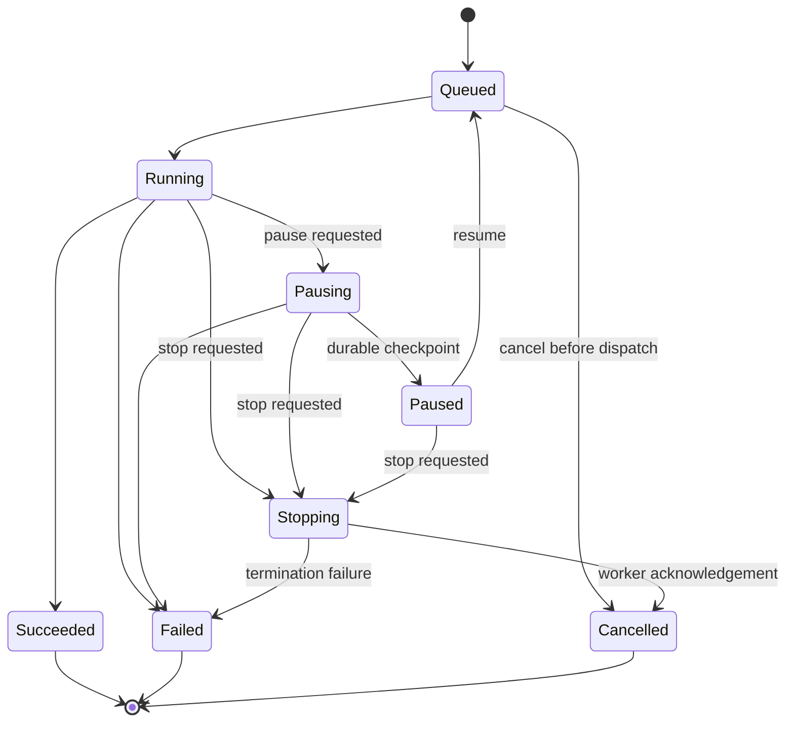
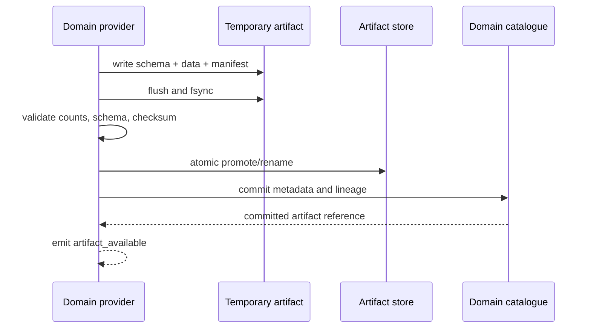

# HaruQuantAI — Unified Deterministic and Agentic Specification

Product, architecture and implementation specification

| Field | Value |
|---|---|
| Specification version | 2.1 |
| Revised | 2026-09-05 |
| Current amendment | Tick execution for every backtest; native numerical backends and application-wide performance/resource gates |
| Status | Adopted development specification; implementation progress is tracked separately |
| Product | HaruQuantAI V3 |
| Repository | HaruQuantAI V3 repository |
| Architecture | Spatial Composability, temporal lifecycle cleanup, focused features, and domain ownership |
| Delivery procedure | `docs/dev/feature_implementation_pipeline.md` |
| Audience | Product, architecture, domain implementation, UI, QA, and extension development |
| Scope | Data preparation; strategy definition, generation, testing and optimization; results; portfolios; research automation; Chat Bot; specialist agents; governed AI strategy creation; evidence, evaluation and calibration; extensions; neural research; distributed execution; native exchange and packaging |

This document defines what HaruQuantAI will build and the contracts by which it will be verified. Requirements, controls, algorithms, and later-phase features are development commitments. They describe intended behavior and do not assert that provider code, integrations, tests, or performance targets are already complete.

Every feature is implemented through the project feature pipeline. Domain READMEs and versioned public contracts govern integration. A contract mismatch must be resolved in the owning domain before implementation; it must not be hidden in a widget or transport adapter. This specification supplies product requirements and delivery order without overriding repository governance.

All feature and control inventories are normative unless explicitly marked **Excluded**. **Core** means required for the core release. **Extension** means a committed later delivery that users can enable independently; it does not mean an undecided suggestion. A capability gate governs availability, and an acceptance gate governs readiness. Neither substitutes for implementation.

Navigation: [Delivery roadmap](#29-single-delivery-roadmap-and-exit-gates) · [Tick execution and performance](#56-tick-execution-and-application-performance) · [Reconciliation decisions](#41-deterministic-and-agentic-reconciliation-decisions) · [Agentic features](#43-agentic-focused-feature-registry) · [Agent roster](#44-built-in-agent-roster-and-deterministic-domain-mapping) · [Chat Bot and strategy creation](#47-chat-bot-and-ai-assisted-strategy-creation) · [Implementation tasks](#52-complete-agentic-feature-implementation-tasks) · [Source coverage](#55-source-coverage-authority-and-final-handoff)

Reading guide: product decisions and scope are in §§1–3; workbenches in §§4–20; ownership and integration in §§21–28; the single delivery roadmap and acceptance gates in §§29–35; deterministic engine details in §§36–40; reconciliation and shared contracts in §§41–42; Agentic features, roles, schemas and workflows in §§43–46; Chat Bot in §47; reasoning, state and runtime policy in §§48–50; complete Agentic implementation tasks in §§51–53; migration and source coverage in §§54–55; mandatory tick execution, native numerical architecture, resource budgets, benchmarks and focused performance tasks in §56.

The product combines deterministic research code with AI reasoning through public capability contracts. Chat Bot helps explain results, design research and create strategies. Each specialist uses the domain that owns the requested capability, and every accepted strategy, numerical result, risk decision and execution state retains its deterministic owner. Milestones U1–U3 introduce useful AI immediately after the prerequisites it needs. Every backtest uses its explicitly selected recorded/generated tick method. Strategy bar clocks do not reduce execution to bars. The native tick engine and shared application resource controls are core U1–U2 deliverables, with measurable gates in §56.

---

## 1. Product direction

HaruQuantAI will provide a composable strategy research workbench with an integrated Chat Bot and specialist AI workflows. Users will prepare market data, define strategies, generate candidates, test and qualify them, optimize parameters, analyze results, construct portfolios, and automate the complete research process. Each capability and widget has a focused owner and can be enabled or removed through the platform lifecycle.

The main workflow is iterative: prepare data → define a strategy space → generate or edit strategies → simulate → qualify and optimize → inspect results → compose portfolios → export or continue research. Results retain lineage back to every strategy revision, configuration, provider, and data version. A failed qualification returns the strategy to research with recorded reasons.

### 1.1 Architectural decisions

| Concern | Adopted decision |
|---|---|
| Product surface | A “HaruQuantAI Research” Dockview workspace template composed of public widgets within the existing application shell. |
| Feature boundaries | One feature per module folder; one owner per public capability and widget. Required dependencies, optional integrations, state, lifecycle effects, and removal behavior are declared. |
| Domain ownership | Follow the ownership matrix in §21 and reconcile exact identifiers with repository contracts in Milestone U0. |
| Interfaces | `app/services/interfaces` authenticates, validates wire DTOs, resolves public capabilities, maps errors, and transports events. It owns no domain calculations, files, tables, or workflows. |
| Backend | Use the repository-supported Python runtime, Pydantic models, Uvicorn, and the existing ASGI transport. Runtime versions come from the repository lockfiles. |
| Frontend | Extend the existing Next.js, React, TypeScript, and Dockview application using the repository-supported versions. |
| Storage | SQLite owns transactional metadata; immutable Parquet/Arrow artifacts hold bulk numerical data. Workspace holds content-addressed artifact custody. DuckDB is an analytical query engine over published artifacts, not a second authoritative metadata catalogue. |
| Tables | Implement a shared cursor-grid presentation layer with TanStack Table and TanStack Virtual, preserving current component and accessibility conventions. Validate it against the scale budgets before release. |
| Charts | Use the existing lightweight-charts integration for time series, accessible SVG/canvas for simple charts and matrices, and lazy-loaded Plotly.js for advanced statistical and 3D views in Milestone U10. |
| Editor | Use a lazy-loaded Monaco editor in Milestone U9. Compile and test in isolated server workers; the browser edits authorized source artifacts. |
| Streaming | Idempotent HTTP commands plus resumable SSE. No second event protocol is required for the specified workflows. |
| Numerical authority | Simulator owns execution truth; Analytics owns metric definitions and values; Research consumes them for search and qualification. |
| Native compute | CPython application services with Numba nopython kernels and typed arrays for expensive numerical loops; qualified Cython/C++ implementations address measured gaps through the same owner contracts (§56). |
| Tick execution | Every backtest consumes an explicitly selected versioned tick stream; recorded/generated evidence and strategy decision clocks remain distinct. No silent bar-only or reduced-fidelity fallback (§56.2). |
| Resource control | One Orchestration resource ledger bounds CPU, native/shared memory, workers/threads, I/O, disk, GPU and AI work across foreground and background operations (§56.10). |
| Strategy authority | HSL v2 is the sole native Strategy JSON AST. Forms, trees, canvas, AI drafts/patches and generated code use its shared catalogue, validation and compilation contracts (§§37, 42.7). |
| Exchange | Native JSON and the versioned HaruQuantAI bundle in §38 are the development baseline. Format adapters consume immutable artifacts and emit explicit conversion reports. |
| Layout | Persist stable resource IDs and presentation settings only. Layout changes never alter strategy, run, databank, or portfolio records. |
| Data reuse | Reuse the public data browsing, catalogue, import, quality, and export capabilities. Extend their owning features without introducing a second data manager. |
| Live use | Research qualification and source export do not activate trading. Any live handoff uses the existing Trading/Risk lifecycle and authorization contracts. |

### 1.2 Product success criteria

Users can complete each end-to-end workflow in §20, inspect the inputs and reasons behind every decision-grade result, recover long-running work after disconnection, and customize their workspace without affecting domain state. Core workflows remain usable with keyboard navigation, accessible chart alternatives, and unavailable-provider explanations.

The product has its own names, schemas, numerical policies, design tokens, and release criteria. Completion is measured against this specification and verified HaruQuantAI behavior.

---

## 2. Adopted decisions and change control

### 2.1 Closed product and engineering decisions

| ID | Decision | Accountable owner | Delivery / proof |
|---|---|---|---|
| DEC-001 | Use the typed JSON strategy AST and descriptor catalogue in §37, beginning with closed-bar rules and market/stop/limit orders. | Strategy | Milestone U2; schema, semantic, and round-trip fixtures. |
| DEC-002 | Deliver contracts and functioning providers before production UI commands; fixture-backed UI is visibly marked as demo data. | Each domain | Every phase; six-stage implementation register in §21.2. |
| DEC-003 | Retain ASGI and the existing API envelope; implement cohesive capability gateways. | Interfaces | Milestone U0; contract and boundary tests. |
| DEC-004 | Introduce explicit pausing, paused, stopping, and terminal cancellation semantics; checkpoint support is advertised per provider. | Orchestration / Interfaces | Milestone U0; wire migration and state-transition tests. |
| DEC-005 | Make SQLite metadata plus immutable numerical artifacts authoritative; migrate any competing metadata path with audited counts, hashes, reference checks, and rollback. | Data / Workspace | Milestone U0 design; complete applicable migration before the first affected write. |
| DEC-006 | Use TanStack Table/Virtual for the shared bounded grid; apply the specified performance and accessibility release gates. | UI | Milestone U1; 10k/100k/1M-row measurements. |
| DEC-007 | Keep 2D analysis complete in core; add Plotly.js statistical/3D views as an independently loaded extension. | Analytics UI | Milestone U10; GPU-off fallback, accessibility, bundle and memory checks. |
| DEC-008 | Use Monaco with isolated worker-based Python and target toolchains. Builds have no authority to install or enable an extension. | Plugins | Milestone U9; hostile-input, resource-limit, and reproducible-build fixtures. |
| DEC-009 | Deliver native JSON and pseudocode in Milestone U2, MQL5 and Python research exports in Milestone U9, and MQL4, EasyLanguage, JForex, NinjaTrader, and XML exchange adapters in Milestone U13. | Strategy | Per-target compatibility, compile where applicable, and semantic fixtures. |
| DEC-010 | Make the native bundle the portable strategy/result format. External formats are isolated versioned adapters and are never the internal storage schema. | Strategy / Workspace | Milestone U2 baseline; Milestone U13 adapter conformance. |
| DEC-011 | Chat Bot delegates new HSL drafts and revision patches to the Strategy DSL Author. Strategy validates the exact candidate; the user reviews and accepts it before a new revision is saved. | Agentic / Strategy | U2 contextual Chat Bot; U3 draft/patch creation and bounded research; full Studio U9. |
| DEC-012 | Use an authenticated local process pool first; add authenticated remote workers with leases, deterministic aggregation, and resource limits. | Orchestration | Milestone U2 local; Milestone U12 remote; duplicate completion and failure-recovery tests. |
| DEC-013 | Deliver neural research after deterministic simulation and research automation, using MLP then causal TCN, followed by recurrent providers. | Research | Milestone U11; leakage tests, baseline comparison, model cards, and inference vectors. |
| DEC-014 | Deliver advanced search and portfolio providers after the baseline operators, with the same lineage and acceptance contracts. | Research / Portfolio | Milestones U7 and U10; deterministic traces, constraints, and numerical fixtures. |
| DEC-015 | Deliver Strategy Packager as a separate extension; packaging is never a live deployment action. | Strategy / Plugins | Milestone U13; target validation, package integrity, resource restrictions, and audit. |
| DEC-016 | Use a manifest-backed lazy widget registry, per-widget schema migrations, and recovery of unavailable panels. | UI | Milestone U1; registration, removal, and layout recovery tests. |
| DEC-017 | Reuse the configured broker/data providers; deliver additional source adapters under their own versioned permissions and acceptance suites. | Data / Brokers | Milestone U1 reuse; Milestone U13 extensions. |

### 2.2 Requirement and progress rules

- Requirement IDs are stable. A feature task lists the exact IDs it implements and the tests and usage examples that prove them.
- Requirements are commitments; unchecked delivery checkboxes mean pending work. Do not equate a declaration, folder, mock, or passing schema test with a functioning feature.
- Register contract, provider, entry point, composition health, Interfaces route, UI wiring, and end-to-end evidence separately. A backend-only feature uses an explicit “not applicable” explanation for UI evidence.
- User-selectable parameters remain configurable. Their allowed values and defaults are specified in the owning schema; configurability is not an open product decision.
- Numerical and performance limits are targets until measured. A failing target requires an implementation fix or an explicit, versioned specification change, with impact recorded.
- Use the repository feature pipeline for contract ratification and implementation. New dependencies and migrations are validation work for the chosen design, not a return to an undecided options list.
- Scope changes update the relevant requirement, decision, domain README, roadmap entry, and acceptance test together. Historical runs continue to reference their original policy versions.

### 2.3 Excluded from this specification

Automatic live-trading activation; arbitrary host filesystem access from widgets; execution of untrusted code in the application process; an alternative SPA or HTTP framework migration; unbounded research jobs; and unadvertised format or target-language compatibility are excluded. Generic platform licensing, app-store promotion, and unrelated desktop shell controls remain host responsibilities.

---

## 3. Product scope and release boundaries

| Surface | HaruQuantAI responsibility | Delivery |
|---|---|---|
| Getting Started | Capability health, data readiness, original examples, recent work, and documentation. | Core, Milestone U1 |
| Builder | Typed strategy spaces, random/evolutionary generation, seeded improvement, qualification and result routing. | Core, Milestone U5 |
| Retester | Batch reevaluation, changed data/cost/precision contexts, robustness and baseline comparison. | Core, Milestone U4 |
| Optimizer | Discrete and sequential optimization, walk-forward optimization/matrices, and parameter permutation. | Core, Milestone U6 |
| Databanks | Versioned result membership, query, views, comparison, tagging and bulk actions. | Core, Milestone U2 |
| Results | Overview, trades, equity, analysis, configuration, provenance and compatible source/export views. | Core, Milestone U2; advanced panels Milestone U10 |
| Portfolio Builder | Candidate universe, constrained combination search and ranking. | Core, Milestone U7 |
| Portfolio Composer | Manual/automatic weights, combined evaluation, correlation and risk. | Core, Milestone U7; advanced providers Milestone U10 |
| Data Manager | Existing and extended Data/Catalogue workflows. | Core, Milestone U1; additional adapters Milestone U13 |
| Research Projects | Durable typed task graphs, conditions, budgets, attempts and history. | Core, Milestone U8 |
| Strategy Studio | HSL JSON/tree/form editing in U2; AI draft/patch review in U3; full visual canvas and advanced reusable templates in U9. | Core |
| Chat Bot and specialist workflows | Contextual UI help and deterministic evidence review U2; research design/strategy creation U3; challenge, search, portfolio advice, memory, calibration and sandbox through U9. | Core; each route gated by its real dependencies |
| Code Editor and Indicator Tester | Authorized source editing, sandboxed builds/tests, reproducible extensions. | Core, Milestone U9 |
| Jobs and Workers | Unified progress and control; local workers first, remote pools later. | Core observation Milestones U1–U2; remote Milestone U12 |
| Debug Console | Permissioned, redacted diagnostics. | Core, developer surface |
| Volume and Market Profile | Volume Profile/TPO derived layers and analysis. | Extension, Milestone U10 |
| Neural Research | Features, labels, training, diagnostics, model cards and portable inference. | Extension, Milestone U11 |
| Strategy Packager | Metadata, resources, target builds and declared distribution restrictions. | Extension, Milestone U13 |
| Performance Lab | Tick-engine/native comparisons, Data/Indicators/Analytics/search/portfolio/AI/UI workloads, mixed-load and lifecycle diagnostics. | Core gates U0–U2; extend at each dependent milestone (§56) |

The core release includes Milestones U0–U9. Milestones U10–U13 are committed extensions with separate acceptance gates. Extensions are independently installable and removable; they must not introduce mandatory dependencies into core workflows.

UI labels are presentation text. Stored objects use stable IDs such as `research-workspace`, `strategy-editor`, `portfolio-search`, and versioned capability references.

---

## 4. Information architecture and global shell

### 4.1 Navigation and workspace composition

The primary research navigation contains Getting Started, Builder, Retester, Optimizer, Databanks, Results, Portfolio Builder, and Portfolio Composer. Context navigation opens Data Manager, Research Projects, Strategy Studio, Chat Bot and authorized extension tools. Jobs, diagnostics, settings, help, and command discovery are host-level utilities.

### 4.2 Default workspace template

| Region | Default contents | Persisted presentation state |
|---|---|---|
| Left | Research navigator and authorized recent objects. | Compact/expanded mode and selected resource ID. |
| Center | Active settings, strategy editor, project canvas, or result analysis. | Widget type/version, resource IDs, and view preferences. |
| Bottom | Databank, trade grid, or run history. | Query/view ID, selected stable IDs or selection token. |
| Right | Inspector, provenance, run status and the optional Chat Bot dock. | Current resource, expanded groups and scoped conversation reference. |
| Host command area | Commands supplied by the focused widget and active selection. | Presentation preferences only. |

Users can split, float, move, maximize, close, and reopen panels. Stable domain IDs reconnect reopened panels to existing projects, strategies, runs, and artifacts.

### 4.3 Shell and execution header

Context headers show project/workbench identity, run state, elapsed time, throughput, queue position, accepted/rejected counts, and resource budget. CPU, memory, worker count, and provider health come from authorized operational telemetry. Capability health controls availability.

The existing shell owns application version, help/support, theme, language, zoom, fullscreen, and diagnostics export. Research widgets contribute contextual commands without duplicating those host functions.

### 4.4 Shell requirements

| ID | Requirement | Acceptance |
|---|---|---|
| SHELL-001 | Register each research panel through a widget manifest. | No research component is reachable only by adding a case to `WidgetContentHost.tsx`; the manifest is the declared source of capabilities, placement, subscriptions, and effects. |
| SHELL-002 | Provide an “HaruQuantAI Research” workspace template. | Opening the template creates the default dock arrangement without duplicating any domain object. |
| SHELL-003 | Support compact and expanded navigation. | Labels remain accessible by tooltip and screen reader when collapsed. |
| SHELL-004 | Show capability/entitlement gating before navigation. | Unavailable features are either omitted or shown with an actionable explanation; no dead module opens. |
| SHELL-005 | Provide global command discovery. | Search can find modules, commands, projects, runs, strategies, databanks, and help links the caller is authorized to see. |
| SHELL-006 | Surface long-running work globally. | Active, paused, queued, failed, and completed runs remain observable when their originating widget is closed. |
| SHELL-007 | Preserve keyboard and focus semantics across docks. | Tab order, focus restoration, Alt+Arrow docking shortcuts, escape behavior, and modal focus traps pass automated and manual accessibility checks. |
| SHELL-008 | Keep layout recovery safe. | A malformed or obsolete layout falls back to the Research template; it never deletes projects or run state. |
| SHELL-009 | Provide contextual documentation and diagnostics. | Help opens the correct HaruQuantAI page; diagnostics export contains versions and redacted trace IDs, never secrets or private market data. |

### 4.5 Global settings

| Category | Required controls | Owner |
|---|---|---|
| General | Sound, picker view/sort memory, default result view, custom report header/footer. | Workspace/UI preferences. |
| CPU | All/single/reserved/custom core allocation; maximum cores; constrained process priority. | Orchestration resource policy. |
| Performance | Resource profile, execution backend readiness, selected tick method, measured workload budgets and diagnostics; display units remain separate presentation settings. | Orchestration/Simulator/owning providers; formatting through UI/Analytics descriptors. |
| Memory | Worker/cache/artifact-buffer budgets, retention of unfilled orders, cleanup cadence. | Orchestration and owning result providers. |
| Databanks | Synchronization, saved views, chart-data retention. | Analytics and artifact policy. |
| Optimization | Retain full surfaces, top-N, aggregates, or selected visualizations. | Research artifact policy. |
| Diagnostics | Browser rendering health, memory thresholds and scoped debug logging. | UI/runtime diagnostics. |

Host integrations expose remote access status/configuration, MCP endpoint/status and connection instructions, notification providers, theme, language, zoom/fullscreen, and onboarding preferences. Provider settings use secret references. SMTP configuration includes server, port, TLS mode, username reference, credential reference, sender, test recipient, test result, and save. A test notification is an explicit authorized user action.

Browser rendering acceleration is a UI setting. Compute acceleration is advertised by a worker provider with its own numerical and resource policy.

## 5. Shared research-workbench grammar

Builder, Retester, Optimizer, Portfolio Builder, and Research Projects share a recognizable project structure: a header, configuration cards, a bottom databank area, and top-level **Progress / Full settings / Results** modes.

### 5.1 Run lifecycle

These states describe deterministic research runs and shared execution jobs. Agentic reasoning outcomes and human/resource waits have the separate domain projection in §42.4; a correct refusal must not be displayed as successful research.

The plan draft is editable; the accepted run pins an immutable plan revision. Validate the effective configuration before accepting a start command. Persist the accepted run and enqueue intent atomically so a restart cannot lose accepted work.



Canonical wire states are `QUEUED`, `RUNNING`, `PAUSING`, `PAUSED`, `STOPPING`, `SUCCEEDED`, `FAILED`, and `CANCELLED`. Rejected preflight returns validation errors without an executable run. Infrastructure failure can terminate any nonterminal state as `FAILED` with a reason; a restart may recover only according to the recorded provider checkpoint policy.

Commands use optimistic state versions. Repeated commands are idempotent; racing completion and stop are resolved by one authoritative terminal transition. Pause support is declared by the provider. A provider without a safe checkpoint rejects pause with a typed unsupported-operation error. Resume continues the same paused run; retry of terminal work creates a linked new run or node attempt. Stop records `CANCELLED` with a reason such as `USER_STOP`, retaining already committed outputs with their completeness labels.

Every run pins capability/provider/runtime versions; input IDs and content hashes; selected tick method/configuration/source coverage and stream identity for simulations; native backend and resource/output profiles; data, instrument, broker, session and calendar versions; strategy/configuration revision; seed and derivation policy; metric/ranking definitions; resource limits; actor, request and trace IDs; and timestamps. Checkpoints additionally pin operator state, completed work IDs, PRNG state, and aggregation policy.

### 5.2 Shared engine panel

| Group | Functional inventory |
|---|---|
| Configuration | New/reset; load; save; save as; named presets; Forex, Futures, and Equity Strategy defaults where appropriate |
| Execution | Validate; start; pause; resume; stop; retry failed; run from checkpoint where supported |
| Telemetry | phase, elapsed, ETA, accepted/rejected counts, throughput, queue position, worker allocation, memory/cache pressure |
| Logs | structured severity, timestamp, phase, worker, strategy/run reference, search, filter, copy, clear local view, export redacted diagnostics |
| Progress views | numeric summary, time series, acceptance funnel, task-manager visual, worker/job view |
| Safety | unsaved-change warning, incompatible-config warning, stale-data warning, stop confirmation only when work cannot checkpoint safely |

### 5.3 Shared run requirements

| ID | Requirement | Acceptance |
|---|---|---|
| RUN-001 | Starting work creates a durable run with immutable inputs before execution. | A returned run ID resolves after refresh and records pinned inputs and versions. |
| RUN-002 | Command submission is idempotent. | Replaying an identical start request with the same idempotency key never starts a second run. |
| RUN-003 | Progress is resumable. | Reconnecting with the last SSE cursor yields all subsequent events in order or an explicit resync instruction. |
| RUN-004 | Pause and stop are domain commands. | UI closure or SSE disconnect does not pause or stop work. |
| RUN-005 | Partial output is typed and visibly incomplete. | Consumers cannot mistake a preview/checkpoint for a committed final databank result. |
| RUN-006 | Configuration validation is capability-owned. | The browser displays domain errors at field and summary level; it does not reproduce calculation rules. |
| RUN-007 | Resource limits fail safely. | Exceeded budgets transition to a typed state with retained diagnostics and recoverable checkpoints where supported. |
| RUN-008 | Run deletion is governed. | Removing a run uses retention policy and reference checks; deleting a row in the UI cannot orphan shared artifacts. |
| RUN-009 | Reproducibility is inspectable. | “Reproduce run” shows changed/missing providers, data, and profiles before it creates a new run. |
| RUN-010 | Logs are redacted. | Secret values, authorization headers, private file paths, and raw credentials never appear in UI logs or exports. |

---

## 6. Builder

### 6.1 User outcome

Builder defines a strategy search space, generates candidates through random or evolutionary methods, backtests them, rejects invalid/weak candidates, and commits accepted strategies into an Analytics-owned databank.

### 6.2 Full settings taxonomy

| Order | Tab | Required content |
|---:|---|---|
| 5 | What to build | strategy type, direction, symmetry, entry/exit architecture, search method, stop-loss/profit-target policy |
| 6 | Parts to improve | entry, order, exit, long/short branches, keep/replace/add behavior, advanced exits |
| 7 | Genetic options | generations, islands, population, decimation, fresh blood, deduplication, restart/stagnation policies |
| 10 | Data | engine, primary/additional charts, symbol/group, timeframe, date/sample bands, precision and costs |
| 20 | Trading options | session/range restrictions, maximum trades, reserved bars, gap behavior, chart-data retention |
| 30 | Building blocks | signal/indicator/order/exit catalog, enablement, weights, parameter distributions and external timeframes |
| 35 | ATM | named advanced trade-management exit rules and editor |
| 50 | Money management | starting capital, sizing method, and typed method properties |
| 60 | Cross checks | ordered robustness/retest pipeline |
| 70 | Ranking | databank limits, fitness, weighted criteria, custom analysis, rejection, similarity and correlation |
| 100 | Notes | project notes and provenance annotations |

### 6.3 Detailed control inventory

#### What to build

- Modes: simple strategy, multi-timeframe strategy, strategy from template, and improve existing strategy.
- Direction: long and short, long only, short only; independent or symmetric entry/exit branches.
- Architecture providers: deterministic rule/signal strategies in core; fuzzy-score and pattern-template architectures in Milestone U10. Every architecture uses registered descriptors, typed parameters, explicit evaluation semantics, and the same Strategy validation pipeline.
- Search method: random generation or genetic evolution.
- Stop-loss and profit-target policies: required/optional/disabled, fixed distance, ATR-derived, indicator-derived, and parameter ranges.
- Condition count, period ranges, maximum complexity, and template constraints must be validated by the Strategy domain.

#### Parts to improve

- Selectable long/short entry conditions, entry order, exit conditions, and exit order.
- Per-part behavior: retain, replace, randomize, or add; honor symmetry rules.
- Advanced exits can be preserved, replaced, or separately edited.

#### Genetic options

- Generation count, population per island, number of islands, initial population source, and source databank.
- Decimation and survival policy, fresh-blood percentage, duplicate elimination, weak-individual replacement cadence.
- Last-generation databank retention.
- Continuous evolution and restart after stagnation.
- Explicit seed policy and deterministic replay in HaruQuantAI.

#### Data

- Simulation engine/provider.
- Primary chart and zero or more additional charts, each with symbol/group and timeframe.
- Date range with reset-to-available action.
- In-sample, validation, and out-of-sample bands with named presets and a visual timeline.
- Required tick-method/profile selection with recorded/generated evidence, source coverage, configuration/seed and event-count/resource estimate (§56.2); commission, swap, spread, slippage and minimum-distance policy remain explicit.
- Profile selectors must resolve versioned Data/Catalogue objects; controls must not embed cost formulas.

#### Trading options

- End-of-day and Friday close behavior.
- Allowed trading time range and session profile.
- Maximum simultaneous/total trades according to the selected simulator semantics.
- Reserved bars and warm-up requirements.
- Gap-handling policy.
- Retain chart data toggle as a result-artifact policy, not a UI cache toggle.

#### Building blocks

- Catalog sections for signals, indicators, stop/limit entries, exit types, and registered plugin nodes.
- Enable/disable, weight, parameter editor, allowed-values editor, parameter calibration, random-choice policy, save/load preset.
- Per-block external timeframe where supported.
- Search, filter by category/provider/compatibility, select all/none, and explain why an incompatible block is unavailable.

#### ATM and money management

- Define/edit named exit rules through the Strategy-owned ATM schema.
- Select initial capital, sizing method, and method-specific typed properties.
- Units, bounds, broker/instrument constraints, and compounding semantics must be explicit.
- Retester/Optimizer overrides never mutate the source Strategy revision.

#### Ranking and acceptance

- Maximum retained strategies and optional stop condition.
- Fitness target and ordered/weighted criteria with direction and normalization.
- Custom analysis stages and automatic rejection filters.
- Similarity/deduplication policy.
- Portfolio-correlation threshold and tie-break policy.
- Walk-forward and robustness qualification thresholds.

#### Cross-check pipeline

The default ordered cross-check template is:

1. Monte Carlo trade manipulation.
2. Monte Carlo retest.
3. What-if simulations.
4. Retest on additional markets.
5. Retest with an explicitly selected higher-fidelity tick method or profile; retain both method identities and results.
6. Walk-Forward Matrix.
7. Walk-Forward Optimization.
8. Optimization Profile / System Parameter Permutation.
9. Sequential Optimization.

Store the template as an ordered typed pipeline of plugin contributions. A stage whose provider is unavailable blocks that plan until explicitly removed or replaced. The Milestone U4 template includes the implemented robustness stages; Milestone U6 adds walk-forward and parameter-analysis stages. Display labels never determine execution behavior.

### 6.4 Builder requirements

| ID | Requirement | Acceptance |
|---|---|---|
| BLD-001 | Author a valid, versioned strategy-space specification. | Save produces a Strategy-owned revision and reopening it preserves all typed constraints. |
| BLD-002 | Resolve blocks from the public catalog. | Every node records provider/version; missing providers are reported before start. |
| BLD-003 | Preview the effective search space. | UI shows constrained parameters, estimated combinatorial scale, exclusions, and conflicts without claiming an exact runtime forecast. |
| BLD-004 | Support random and evolutionary generation providers. | Both conform to the same Research run contract and produce provenance-equivalent candidates. |
| BLD-005 | Apply backtest, rejection, ranking, and cross-check stages in declared order. | Run details show stage transitions and the reason each candidate was accepted or rejected. |
| BLD-006 | Deduplicate candidates by a documented canonical identity. | Keep one semantic Strategy candidate per population/output context; retain distinct operator/parent provenance as lineage edges, and distinct evaluations as separate result records. |
| BLD-007 | Commit accepted candidates atomically. | Databank membership references committed strategy/result artifacts only after the stage succeeds. |
| BLD-008 | Preserve run reproducibility. | Same compatible provider set, data versions, config, and seeds yields a replayable run; deviations are disclosed. |
| BLD-009 | Make rejection explainable. | The user can aggregate and drill into validation, simulation, filter, similarity, and resource rejection reasons. |
| BLD-010 | Never execute generated strategy code in the UI process. | All compilation/execution occurs in an authorized, isolated domain provider. |

### 6.5 Sizing providers and effective configuration

| Sizing method | Required inputs | Delivery |
|---|---|---|
| Fixed units | Quantity, instrument unit, minimum/maximum and size step. | Core |
| Fixed currency risk | Risk amount, loss-distance model, costs, point value and account currency conversion. | Core |
| Balance-percent risk | Recorded balance basis, percentage, stop/loss-distance model and legal size constraints. | Core |
| Equity-percent risk | Equity snapshot policy including open P&L, percentage, stop/loss-distance model and legal size constraints. | Core |
| Equity instrument sizing by price | Allocation amount/percentage, executable price, multiplier, whole/fractional units and cash policy. | Core |
| Volatility-target sizing | Training-fitted volatility estimate, target, window, leverage/size caps and rebalance clock. | Milestone U10 extension |

The Risk-owned sizing capability calculates canonical size from the Strategy-selected method and pinned run context. Strategy validates references and parameters; Simulator applies that size under the execution profile. A risk-distance method without a valid finite loss-distance input fails validation. Round to the legal size lattice and record any clamp/rejection; do not silently change the configured risk basis.

Save notes as structured plan metadata: hypothesis, rationale, author, created/changed timestamps, tags and links. Resolve templates, block distributions, method defaults and overrides into one effective immutable configuration before run acceptance. Reopening, cloning and diffing must preserve that effective meaning.

---

## 7. Retester

Retester reevaluates selected strategies or a source databank against changed data, precision, costs, markets, robustness methods, or ranking rules without editing the source revisions.

### 7.1 Settings

| Order | Tab | Difference from Builder |
|---:|---|---|
| 0 | What to retest | file/databank/source selection and selection scope |
| 10 | Data | same profile/date/sample concepts; may add alternate markets |
| 20 | Trading options | simulation restrictions and chart retention |
| 35 | ATM | override/retain advanced management policy |
| 50 | Money management | retain or override sizing/capital policy |
| 60 | Cross checks | selected robustness stages |
| 70 | Ranking | target databank/filter policy |
| 100 | Notes | run rationale and annotations |

### 7.2 Retester requirements

| ID | Requirement | Acceptance |
|---|---|---|
| RET-001 | Select strategies from artifact, databank, saved query, or explicit IDs. | The run records the resolved immutable strategy set, not only the mutable query. |
| RET-002 | Keep source strategies immutable. | Overrides produce run configuration or new revisions; the source hash is unchanged. |
| RET-003 | Batch against one or more data contexts. | Results identify the exact symbol, timeframe, sample, cost, and precision context. |
| RET-004 | Support automatic retest pipelines. | A saved ordered pipeline can be invoked from Builder, Databank, or Research Projects through the same capability. |
| RET-005 | Compare baseline and retest outcomes. | Delta columns use canonical metric versions and distinguish missing/non-comparable values. |
| RET-006 | Route passed/failed results deterministically. | Membership rules and rejection reasons are committed atomically and visible in run history. |
| RET-007 | Allow cancellation at strategy/stage boundaries. | Completed items remain typed partial output; cancelled items are never labeled failed. |

---

## 8. Optimizer

Optimizer searches parameter combinations for an existing strategy using simple optimization, sequential optimization, Walk-Forward Optimization (WFO), or Walk-Forward Matrix (WFM).

### 8.1 Configuration inventory

- Source: strategy file/artifact or databank selection.
- Method: simple, sequential, WFO, or WFM.
- Data and trading options share the versioned profile model.
- Date/sample and window/run configuration.
- Result scope: all, passing, or best candidates.
- Optional stable-area/stability filter.
- Parameter table: selected, parameter name, original value, start, stop, step, type, and calculated combinations.
- Automatic preset/distribution action.
- Ranking and notes.

### 8.2 Optimizer requirements

| ID | Requirement | Acceptance |
|---|---|---|
| OPT-001 | Derive optimizable parameters from a Strategy-owned revision. | Unsupported or dependent parameters are explained and cannot be silently coerced. |
| OPT-002 | Validate ranges and combination count before execution. | Empty, invalid, explosive, and precision-losing ranges produce actionable validation. |
| OPT-003 | Separate search method from simulation semantics. | Research chooses combinations; Simulator evaluates them through a versioned capability. |
| OPT-004 | Support simple, sequential, WFO, and WFM run plans. | Each plan has a typed schema and can be serialized, versioned, cloned, and diffed. |
| OPT-005 | Stream aggregate progress without flooding the client. | Events are coalesced; grid rows/results are fetched by page or artifact chunk. |
| OPT-006 | Retain enough surface data for selected visualizations. | Artifact policy declares whether full points, top-N, aggregates, or no 3D data are retained. |
| OPT-007 | Explain stability classification. | PASS/FAIL and stable regions link to versioned thresholds and underlying observations. |
| OPT-008 | Protect against overfitting presentation. | IS/OOS/validation are visually distinct and cannot be merged into a single unlabeled score. |
| OPT-009 | Promote an outcome through an explicit revision action. | Selecting an optimized configuration never overwrites the base strategy silently. |
| OPT-010 | Export reproducible optimization evidence. | Export contains plan, parameter grid, samples, metrics, provider versions, and artifact hashes. |

---

## 9. Databanks

A databank is an **Analytics-owned membership and query view over strategies and their results**, not a Workspace folder and not a table owned by Interfaces.

### 9.1 Required interaction inventory

- Multiple databank tabs with databank count, strategy count, record count, and selected count.
- Saved column views: Choose View and Manage Views.
- Sort, filter, select, multi-select, virtual scroll, resize/reorder/pin columns, and refresh/synchronize.
- Double-click a strategy to open Results.
- Import native JSON/bundles or a supported installed format adapter; export through registered target capabilities.
- Delete selected, clear membership, move/copy between databanks, and create a databank.
- Retest selected.
- Rename strategies, edit parameters, set notes, select passed/failed, compare strategies, and run custom analysis.
- Filter by correlation.
- Merge strategies/portfolios, merge walk-forward results, split portfolios, and send to Portfolio Composer or Portfolio Builder.

### 9.2 Export and action catalogue

Native strategy JSON, native bundles, pseudocode, HTML/PDF reports, CSV trade/result projections, and Parquet numerical artifacts form the core exchange set. Target code generators follow DEC-009. The UI lists only installed, compatible providers and reports unsupported nodes before starting an export.

Databank actions include inspect, compare, retest, optimize, edit a new revision, duplicate, move/copy membership, tag, pin/review, delete, export, generate code, and hand off to portfolio or project workflows. Selection is resolved against a snapshot. No action operates on an implicit set of currently rendered rows.

### 9.3 Column model

Columns are registered Analytics contributions organized into saved views. The catalogue includes generation/island/fitness; symbol/timeframe/engine; net/gross profit and gross loss; trades, average trade, win/loss rate, payoff and streaks; profit factor, Sharpe, Sortino, Calmar/MAR, system quality number (SQN), R expectancy and return/drawdown; maximum/average drawdown and duration; CAGR, periodic consistency, long/short and sample breakdowns; robustness, stability, correlation and custom metrics; review/pin state, tags, created/updated timestamps, and source plan/run/provider. Each definition states units, sample, direction, null behavior, aggregation, formula version, and provenance. This is the available catalogue; saved views select a smaller visible set.

Target column descriptors must include:

```text
column_id, owner_feature, schema_version, label_key, value_type,
unit/format, nullable, sortable, filter_operators, aggregation,
precision, provenance_field, compatibility_predicate
```

### 9.4 Databank requirements

| ID | Requirement | Acceptance |
|---|---|---|
| DBK-001 | Create, rename, archive, clone, and delete databank definitions through Analytics capabilities. | Referential checks and governed-delete outcomes are explicit. |
| DBK-002 | Add/remove/copy/move members with explicit atomicity. | Default bulk operations are all-or-nothing against a snapshot; an explicitly selected per-item mode returns typed outcomes. Each membership move is atomic across source and destination, with no half-move. |
| DBK-003 | Provide server-side cursor paging, sort, and filter. | One million rows remain navigable without loading all records into browser memory. |
| DBK-004 | Support dynamic typed columns and saved views. | Unknown/missing plugin columns degrade visibly and do not corrupt the saved view. |
| DBK-005 | Keep selection stable across pages. | Selection is identity-based; bulk action shows resolved count and exclusions before execution. |
| DBK-006 | Open Results by stable result ID. | Sorting/filtering cannot cause double-click to open a different row. |
| DBK-007 | Run comparison and custom analysis as jobs. | Expensive analysis uses idempotent commands and progress streams, not UI loops. |
| DBK-008 | Make correlation filtering explainable. | The retained member, removed member, coefficient/method, sample, threshold, and tie-break policy are inspectable. |
| DBK-009 | Export via registered target capabilities. | UI lists only compatible generators; export records target/version/options and output artifact. |
| DBK-010 | Isolate format import. | Raw input becomes an immutable Workspace artifact; the format adapter emits typed strategies/results plus the conversion report in §38. |

---

## 10. Results and strategy analysis

Results is a plugin-extensible analysis workspace over an immutable simulation/result bundle. It must support side-by-side panels and cross-filtering without letting a view redefine canonical metrics.

### 10.1 Required panel registry

The registry includes the following compatible views. Numeric order is a local presentation default; stable view IDs and manifest placement determine registration.

| Order | View | Availability/context |
|---:|---|---|
| 0 | Walk-Forward Results | WFO/WFM result |
| 10 | Overview | General |
| 11 | Optimization profile | Optimization result |
| 11 | Equity strategy overview | Equity Strategy result |
| 12 | System Parameter Permutation | SPP result |
| 12 | Sequential Optimization Results | Sequential result |
| 20 | List of trades | Result with trades |
| 30 | Equity chart | General |
| 40 | Trade analysis | General |
| 50 | Trades on chart | Result with market series |
| 55 | Profile chart | Compatible profile data/add-on |
| 60 | Monte Carlo tests | Robustness result |
| 70 | Portfolio correlation | Multi-strategy result |
| 80 | Strategy config | General |
| 99 | Log | Portfolio Composer context |
| 99 | Equity Strategy log | Equity Strategy context |
| 99 | Explore | Conditional analysis |
| 100 | Source Code | Compatible generator target |
| 999 | Automatic computation simulations | Internal/derived computation view |
| 1000+ | User Result Analysis plugins | Dynamically contributed HTML/JS panels |

Resolve ordering through manifest placement with a stable-ID tie-break. A plugin can contribute a view without editing a global switch.

### 10.2 Overview

- Selectable report template.
- Headline result identity, strategy revision, run/sample/data context, warning badges, and provenance.
- Metric groups for performance, risk, trade distribution, stagnation, and robustness.
- Registered metrics include net/gross profit/loss, pips, CAGR, Sharpe, Sortino, Calmar/MAR, Profit Factor, Return/Drawdown, win rate, expectancy, R Expectancy, SQN, trade count, stagnation, average/largest win/loss, consecutive outcomes, exposure, long/short contribution, and sample comparisons. Advanced risk metrics, including Ulcer Index, follow Milestone U10.
- Export/print of a server-generated, versioned report artifact.

Requirements:

| ID | Requirement | Acceptance |
|---|---|---|
| RES-OV-001 | Render metric cards from typed metric descriptors. | Unit, period, sample, precision, null reason, definition version, and owner are inspectable. |
| RES-OV-002 | Distinguish canonical, derived, and presentation-only values. | A user cannot confuse an estimated UI aggregate with an authoritative stored metric. |
| RES-OV-003 | Warn on stale/incomplete results. | Partial, superseded, missing-artifact, and incompatible-plugin states are prominent and machine-testable. |
| RES-OV-004 | Support report templates as plugin contributions. | An unavailable template falls back safely without changing the underlying result. |

### 10.3 List of trades

Required controls include data/direction/sample selectors, view management, export, and inclusion of expired orders.

Minimum columns are identity, open/close timestamps, direction, symbol, quantity, entry/exit price, stop/target context, fees, swap, slippage, gross/net P&L, pips/points, bars/duration, exit reason, MAE, MFE, sample, and strategy/run references. Exact availability depends on the simulator schema.

| ID | Requirement | Acceptance |
|---|---|---|
| RES-TRD-001 | Page and filter trades server-side. | Large result sets do not require full download; cursor and filter state survive a refresh. |
| RES-TRD-002 | Preserve trade identity across grids and charts. | Selecting a row highlights the same trade in equity, market chart, and analysis panels. |
| RES-TRD-003 | Export the requested projection. | Export declares filters, columns, units, timezone, schema version, and result hash. |
| RES-TRD-004 | Explain missing values. | Unsupported MAE/MFE, absent tick path, and synthetic fills render as typed unavailability, not zero. |

### 10.4 Equity chart

Required controls:

- X-axis by trade or time.
- Optional benchmark symbol and normalization.
- Drawdown series in money, percent, pips, open money, open percent, or off.
- Volume as automatic, size, money, or off.
- Daily aggregation, ATR, trend overlay.
- Markers by daily or MAE/MFE mode, or off.
- Stagnation variants, point display, crosshair, and refresh.

Required behavior:

- `lightweight-charts` renders equity, balance, benchmark, price, volume, and synchronized crosshair/time ranges.
- The server returns canonical series or documented downsampled levels; the UI never derives trade accounting.
- Large series use level-of-detail chunks and worker-based decoding/downsampling.
- Every visible line has a unit, sample, legend state, and accessible summary.

### 10.5 Trade analysis

Selectable period basis is open or close time. The yearly table includes Period, Net Profit, Profit Factor, number of trades, and win percentage. Up to twelve selectable chart panels can be configured.

Built-in panel families cover weekday, hour/session, month/year, duration, direction, size, entry/exit rule, close type, profit/loss, consecutive outcomes, excursion, symbol/timeframe, and parameter bucket. Each panel uses a registered Analytics projection. Milestone U10 adds box/violin distributions, percentile fan charts, risk-of-ruin scenarios, and sensitivity panels with method and sampling metadata.

### 10.6 Trades on chart

The view requires symbol selection, indicator visibility, grid/zoom controls, price/ticket/P&L annotations, previous/next trade navigation, OHLC inspection, indicator values, and a trade-detail panel.

Market and trade series must share the exact timezone/calendar transform. When the backing market series is missing, the view offers an authorized data-resolution action rather than drawing against a similar series.

### 10.7 Walk-forward and optimization surfaces

#### Walk-Forward Matrix

- PASS/FAIL and score summary.
- Matrix of OOS percentage by run count, selected-cell detail, and metric selector.
- 3D point, bar, surface, and top views; stability and display options.
- Use an accessible 2D heatmap/table as the primary representation; Milestone U10 adds the linked 3D view.

#### Optimization profile

- Totals for all, profitable, losing, and zero outcomes.
- Profitability, average performance, uniformity, top-profit, and standard-deviation checks.
- X/Y/Z parameter and metric selectors; point/bar/surface/top display.
- Page or sample parameter surfaces explicitly and disclose the rule, point count, retained population, and omitted points. Support stable-area levels, plateau/cliff inspection, linked hover/focus details, and export. No arbitrary display cap may be presented as the full search population.

#### Sequential Optimization

- PASS/FAIL, sequence/step summary, selected parameters, and stable-area charts.

#### System Parameter Permutation

- Median properties, statistic selector, distribution/percentile views, and source-plan provenance.

### 10.8 Monte Carlo and robustness

- Test-method selector, scenario/simulation count, seed policy, and robustness thresholds.
- Summary percentiles and failure probability with compatible equity/drawdown distributions.
- Link each simulation family to the exact perturbation definition and baseline.
- Implement trade reshuffling, block resampling, skipped trades, parameter jitter, price/data perturbation, spread/slippage stress, and degraded execution as versioned methods. Each declares whether it manipulates a ledger or reruns execution, the valid units, seed, sample count, and limitations. Percentile direction follows the metric; a high percentile is not universally conservative.

### 10.9 Portfolio correlation

Required controls include correlation basis, target measure, negative-correlation handling, empty-period handling, compute/stop/progress, a matrix, overlapping-trades analysis, details, and save.

The result must pin return frequency, calendar alignment, missing-period policy, correlation method, sample, and version. Matrix cells drill into paired series and overlapping trades without silently changing the population.

### 10.10 Strategy configuration and source

- Configuration compares current and backtest-time settings, highlights differences, and offers an explicit Apply action.
- Apply must create or update a Strategy-owned revision after optimistic-lock validation; it cannot mutate a result.
- Source targets follow DEC-009 and the generator compatibility contract in §37.6.
- Each generator is a capability with a version, compatibility predicate, options schema, diagnostics, and output artifact.

### 10.11 Result-analysis plugin sandbox

HaruQuantAI supports plugin-owned HTML/JavaScript result panels through the following mandatory boundary:

| Control | Required policy |
|---|---|
| Isolation | Sandboxed frame or isolated renderer boundary; no same-origin privilege with the host |
| Data | Read-only, explicit result projection; no direct database, filesystem, or token access |
| Messaging | Versioned host bridge with allow-listed commands and payload validation |
| Network | Denied by default; allow-list requires explicit plugin permission |
| CSP | No unsafe host script execution; packaged assets and nonce/hash policy |
| Limits | CPU/time/memory/event-rate and result-size budgets |
| Lifecycle | Declare compatible result schemas, panel version, migration, disable, and uninstall behavior |
| Failure | Panel crash is contained; host offers diagnostics and reset without affecting the result |

### 10.12 Result workspace requirements

| ID | Requirement | Acceptance |
|---|---|---|
| RES-001 | Resolve visible tabs from result type and plugin compatibility. | A deterministic manifest query produces the same ordered view set for the same capability snapshot. |
| RES-002 | Synchronize selections across compatible panels. | Strategy, sample, trade, time range, and parameter selection use typed UI events, not hidden global state. |
| RES-003 | Keep metrics provenance visible. | Every decision-grade number can reveal definition, version, input result, and sample. |
| RES-004 | Support comparison. | Two or more compatible results can be aligned with explicit missing/incompatible values and no implicit currency conversion. |
| RES-005 | Scale series and grids. | Initial useful content meets the performance budget without materializing full trade/equity arrays in React state. |
| RES-006 | Provide accessible chart alternatives. | Each chart has keyboard focus, textual summary, data table/export, and non-color state cues. |
| RES-007 | Persist view state as presentation state. | Reopening restores panels/controls but cannot alter result content. |
| RES-008 | Export provenance-complete reports. | Generated report includes result hash, strategy revision, data/profile versions, metric definitions, and warnings. |
| RES-009 | Contain plugin failure. | A faulty custom panel cannot block built-in results or access unauthorized host data. |
| RES-010 | Avoid false precision. | Sampling, downsampling, approximation, and unavailable series are disclosed in UI and export. |

### 10.13 Expanded result composition

The default scorecard shows strategy/revision/run/sample status, net profit, return/drawdown, Sharpe, trade count, win rate, profit factor, maximum drawdown, CAGR, SQN, sample comparison, and robustness status. Every value links to its definition and input context.

Series contributions include balance/equity, drawdown, benchmark, long/short contribution, sample/window markers, periodic returns, rolling Sharpe and volatility, and user-selected reference series. No benchmark is hard-coded. All overlays declare calendar, resampling, currency, timezone, alignment, missing-data, and normalization policies.

Trade projections add order/position IDs, entry/exit signal IDs, return in money/pips/percent/R, cumulative balance/equity, and bars held when Simulator supplies them. Walk-forward views include anchored/rolling timelines, per-window parameter transitions, aggregate and worst-window metrics, registered efficiency ratios, and stability clusters. The configuration panel includes read-only raw JSON alongside a typed revision diff.

### 10.14 Metric definition baseline

All registered metrics have a formula/version, units, sample, denominator, required inputs and typed undefined cases. Implement the following baseline through Analytics and reuse any matching existing contract definitions. A different convention receives a distinct definition/version and label.

| Metric | Adopted calculation context |
|---|---|
| Net profit | Sum authoritative realized trade cashflows including commission/swap and execution costs exactly once. Do not subtract slippage again when it is already reflected in fills. Open P&L and cash deposits/withdrawals are separate fields. |
| Profit factor | Gross positive net-trade P&L divided by absolute gross negative net-trade P&L on the same sample. No losses produces a typed undefined ratio with its reason, not an invented finite value. |
| Drawdown | For the selected equity or balance series, running peak minus current value; percentage divides by the corresponding positive peak. Maximum is the largest decline; duration and recovery use explicit timestamp/calendar rules. Label equity versus balance drawdown distinctly. |
| CAGR | Positive start/end capital, adjusted for external cashflows under the versioned return convention; annualization uses the recorded elapsed-year basis. Unsupported cashflow history or nonpositive values is undefined. |
| Sharpe | Mean excess periodic return divided by sample standard deviation, multiplied by the square root of recorded periods per year. Pin return frequency/calendar, risk-free input and currency; fewer than two valid periods or zero variance is undefined. |
| Calmar | CAGR divided by positive maximum equity drawdown fraction over the same declared window. Zero drawdown or undefined CAGR is undefined. |
| SQN | Square root of trade count times mean R-multiple divided by sample standard deviation of R-multiples. Missing initial risk, fewer than two valid trades or zero variance is undefined; money-based variants use a distinct metric ID. |
| Return/drawdown | Net profit divided by positive maximum drawdown in matching currency and sample, distinct from CAGR/drawdown. |
| Correlation | Pearson on aligned periodic returns in core; pin frequency, currency, calendar, zero/missing-period policy and minimum overlap. Fewer than two pairs or zero variance is undefined. Additional methods use separate registered descriptors. |

Sortino, MAR, Ulcer Index, consistency, stability, expectancy, excursion and custom metrics must register equally explicit definitions before their columns are enabled. Percentiles and risk-of-ruin scenarios carry their population/method and assumptions. Metric formatting never changes the stored value, and a dash or zero cannot hide an undefined result.

---

## 11. Portfolio Builder and Portfolio Composer

### 11.1 Portfolio Composer

Required commands are Load, Save, Save portfolio, Delete, Clear, Move up/down, and Add Buy & Hold. The primary grid contains strategies and weights. Configuration covers full/limited data, capital/leverage, money-management consistency, and automatic computation with model, fitness, simulation count, and risk-free assumptions. Results and a log are available.

| ID | Requirement | Acceptance |
|---|---|---|
| PFC-001 | Add strategies/results by stable reference. | Duplicate, missing, incompatible-currency, overlapping-capital, and sample issues are explained before computation. |
| PFC-002 | Edit and normalize weights. | Raw and normalized weights are both visible; normalization policy is explicit and reproducible. |
| PFC-003 | Add a Buy & Hold benchmark. | Benchmark uses a pinned series, instrument profile, currency policy, and sample. |
| PFC-004 | Configure capital, leverage, and sizing consistency. | Validation is Portfolio-owned and prevents ambiguous mixing of strategy sizing semantics. |
| PFC-005 | Compute combined performance asynchronously. | A run ID, progress, result artifact, warnings, and provenance are persisted. |
| PFC-006 | Offer registered weighting/search models. | Model schema, objectives, constraints, risk-free input, provider version, and seed policy are recorded. |
| PFC-007 | Reorder for presentation without changing math. | Row order affects only display unless the selected model explicitly declares order sensitivity. |
| PFC-008 | Promote a composition to a versioned portfolio. | Save creates a Portfolio-owned revision; recomputation produces a new result. |

### 11.2 Portfolio Builder

Portfolio Builder searches candidate combinations through brute-force or genetic methods. Required settings include genetic configuration, date/sample/reverse selection, minimum and maximum strategy counts, maximum portfolios, ranking, sector maximums, source/target databanks, selected-only scope, capital/money-management override, and correlation conditions.

| ID | Requirement | Acceptance |
|---|---|---|
| PFM-001 | Resolve a candidate universe from an immutable databank query. | The run records exact result/strategy IDs after filters and selection are resolved. |
| PFM-002 | Apply typed eligibility constraints. | Strategy count, sector, symbol, sample, correlation, capital, and compatibility failures are itemized. |
| PFM-003 | Support brute-force and evolutionary search providers. | Both emit the same portfolio-candidate contract and provenance fields. |
| PFM-004 | Rank on registered portfolio metrics. | Objective, direction, weights, constraints, and metric versions are inspectable. |
| PFM-005 | Bound combinatorial work. | Estimate, budget, maximum candidates/results, and stop policy must be accepted before start. |
| PFM-006 | Commit selected candidates to a target databank or portfolio set. | Output membership is atomic and distinguishable from intermediate candidates. |
| PFM-007 | Analyze correlation with explicit alignment. | Frequency, missing periods, currencies, negative handling, and method are pinned. |
| PFM-008 | Preserve per-strategy and combined evidence. | Portfolio results link back to every constituent strategy result and weighting revision. |

### 11.3 Portfolio methods and constraints

Core methods are manual, equal-weight, metric-proportional, and inverse-volatility allocation; bounded brute-force and evolutionary combination search share the same candidate contract. Milestone U10 adds risk parity, minimum variance, maximum Sharpe, and constrained Markowitz providers. Metric-proportional weights require a declared nonnegative transformation and a fallback for zero total score. An infeasible constraint set returns diagnostics, never silent relaxation.

Record minimum/maximum weights, cash treatment, gross/net exposure, turnover, leverage, symbol/sector/group caps, rebalance frequency, costs, estimation window, covariance method, risk-free input, and currency policy. Show before/after weights and metrics, contribution, concentration, exposure, and scenarios. Aggregation must distinguish replaying fixed historical ledgers from resimulating shared capital and execution constraints.

Diversification ratio is a separate metric from Sharpe change. Its long-only definition is `sum(weight_i * volatility_i) / sqrt(wᵀ covariance w)` over one aligned return window. Zero portfolio volatility is a typed undefined value. Extended short/cash conventions require a separate definition version. Exports preserve constituent revisions and do not imply one executable portfolio strategy unless the target explicitly supports it.

---

## 12. Data Manager integration

Data Manager presents the existing Data/Catalogue capabilities for browsing, import, export, quality, profiles, and transfer jobs. It owns no independent store.

### 12.1 Sources and actions

The workbench exposes sources, import/export, instruments, sessions, broker profiles, equity groups, external indicator series, quality, and transfer control. Core reuses configured broker/data adapters, including the MT5, cTrader, and Binance routes where their public capabilities are available. File import supports versioned delimited, Arrow/Parquet, and registered tick/bar formats.

Milestone U13 delivers independently permissioned adapters for Dukascopy, Darwinex, Yahoo, Coinbase, Bitfinex, and Poloniex, plus equity/futures feeds and external tick-file formats through registered provider schemas. Each connector must prove availability, supported instruments/history, schema, rate limits, rights, and failure behavior before activation. The capability catalogue is authoritative for actual runtime support; a planned connector is never displayed as connected.

Every source configuration uses a pinned format/provider version, secret references where needed, exact symbol mapping, timezone/calendar policy, and an ingestion report. Browse, import, download/update, export, clone/merge, batch actions, quality inspection, and non-destructive repair are public domain operations.

### 12.2 Data-series grid

Required columns:

| Column | Semantics |
|---|---|
| Symbol Name | User-facing series identity |
| Instrument | Catalogue instrument reference |
| Broker profile | Versioned costs/session/timezone profile |
| Underlying Symbol | Provider symbol mapping |
| Timeframe | Series aggregation |
| Timezone | Stored/display calendar context |
| Date from / Date to | Coverage bounds |
| Total Days | Coverage summary |
| Total Records | Stored observation count |
| Source | Connector/import lineage |
| Bar type | Time/tick/other supported aggregation |
| Data type | Forex/futures/stock/etc. classification |
| Hide | Presentation visibility |
| Progress/actions | Current job state and row commands |

The Data boundary must expose capability discovery, series, instruments, brokers, symbols, bars, quotes, reference sync, quality, timezone clone, export, download/config, batch, and import under the established `/api/v1/data/*` route family. Milestone U0 records which operations are already complete before extension work begins.

### 12.3 View, edit, and quality analysis

- View metadata and series statistics.
- Data tab with pageable observations.
- Chart tab with market-series visualization.
- Analyze quality tab covering gaps, spikes, invalid OHLC, timeline, and issue details.
- Edit, delete, hide/skip, refresh/synchronize, clone timezone, export, and provider-specific download/import.
- Quality fixes must be explicit transformations that produce lineage; viewing an issue must never alter data.

### 12.4 Instruments

Instrument columns are Instrument, Description, Broker profile, Point value, Pip/Tick size, Pip/Tick step, Default spread, Default slippage, Commissions, Swap, Data type, Order size multiplier, and Order size step.

Operations include add, clone, edit, mass edit, search/filter, import, and guarded delete. Instrument metadata also includes sector, exchange, and country.

### 12.5 Sessions

The session list shows Session Name and Broker profile. A session contains ordered elements with Start day, Start time, End day, End time, and end-of-day/close flag (`SEOC` in the session schema), plus a Monday-to-Friday shortcut.

### 12.6 Broker profiles

Broker profile columns are Name, Description, Symbol postfix/mapping, Timezone, Customized equities, Customized instruments, and Customized sessions.

Profiles support add/edit/clone/delete, stock lists where applicable, instruments, sessions, and XML import/export. Default/system profiles are protected. Timezone changes are constrained when stored data already uses a profile.

### 12.7 Equity groups

The equity-group grid includes Name, Count, Description, Number of symbols, Downloaded, Ready to use?, Data from, and Data to. Operations include add/edit, edit stocks, CSV/XML exchange, update/download data, and guarded delete. System groups are protected.

### 12.8 External indicators

Required operations include add/edit/delete, import, define a new format, recognize, and view. In HaruQuantAI, imported indicators must become versioned Data/Strategy plugin artifacts with a compatibility and security report, never executable UI content.

### 12.9 Global transfer control

The Jobs widget shows per-connector and aggregate transfer progress with pause/resume/stop controls and settings. Bulk commands resolve the authorized job set, report unsupported transitions per item, and retain resumable checkpoints where the connector supports them.

### 12.10 Data requirements

| ID | Requirement | Acceptance |
|---|---|---|
| DAT-001 | Reuse the existing reference-data boundary. | Research widgets call public data capabilities through Interfaces; no second instrument/broker/session store is created. |
| DAT-002 | Version data and profile inputs used by research. | A historical run remains resolvable after profiles or series are updated. |
| DAT-003 | Keep bulk bars and ticks out of SQLite. | SQLite stores metadata/lineage; appendable immutable Arrow/Parquet artifacts and bounded readers store/process bulk series under atomic commit and resource rules (§56.7). |
| DAT-004 | Validate source-specific configuration in the connector owner. | Interfaces never contains provider URLs, parsing logic, or credential handling. |
| DAT-005 | Make quality rules versioned. | Gaps/spikes/OHLC findings record rule, threshold, calendar, series version, and status. |
| DAT-006 | Make fixes non-destructive. | Repair creates a new artifact/version and lineage edge; original evidence remains retained by policy. |
| DAT-007 | Support pageable preview and chart levels. | Preview bounds and downsampling are declared; full files are not sent to the browser. |
| DAT-008 | Govern delete and clone. | Impact analysis covers runs, strategies, exports, aliases, and profiles before mutation. |
| DAT-009 | Protect credentials and licensed feeds. | Secrets remain in the platform secret facility; logs/events expose only redacted connector identities. |
| DAT-010 | Preserve import/export manifests. | Source, schema, timezone, delimiter/format, checksum, record counts, warnings, and output paths/artifacts are inspectable. |

---

## 13. Research Projects

Research Projects uses a durable Orchestration-owned task graph. Its task catalogue includes versioned Agentic workflow adapters with typed inputs/results, permission and budget envelopes, ancestry checks and explicit refusal/partial-result branches (§42.10). It never embeds unrestricted prompts as executable graph logic. Its gallery offers new/open project cards and task/databank/strategy counts. The editor has a task flow and shared configuration/results surfaces. Domain tasks include import/load, generation, retest, robustness, optimization, walk-forward, filtering, sorting, membership move/copy/merge, portfolio construction, export, and installed neural providers.

### 13.1 Task-flow actions

- Add task; clone below or at end; rename; delete.
- Copy configuration from/to tasks; mass apply compatible configuration.
- Reorder; enable/disable.
- Run from here; run this only; run the whole project.
- Switch between visual and text flow representations where useful.

### 13.2 Required task catalogue

| Category | Task types |
|---|---|
| Research | Build, Optimize, Retest, Filtering, Automatic Retest, Automatic Portfolio Builder, Create Portfolio, Custom Analysis, Neural Network Trainer |
| Configuration/data | Apply Mass Config, Update Data, Load Files, Save Files, Clear Databanks |
| Control flow | Wait, Stop/Start, Go To Task |
| Integration | Sandboxed Script/Plugin Task, Notification |
| Maintenance/observability | Delete File, Log Databank Stats |

### 13.3 Go To and conditions

Supported condition inputs include cycle count, duration, activated/evaluated count, result count, and runtime. The implementation must make loops finite by construction or require an explicit budget/stop condition.

### 13.4 Orchestration requirements

| ID | Requirement | Acceptance |
|---|---|---|
| PRJ-001 | Store a versioned typed task graph. | Nodes, edges, schemas, enabled state, capability versions, and UI coordinates are separately represented. |
| PRJ-002 | Validate before publish/run. | Missing capabilities, incompatible schemas, unreachable nodes, unbounded cycles, and invalid resource budgets are reported. |
| PRJ-003 | Separate project draft from run instance. | Editing a project after start never changes an active run. |
| PRJ-004 | Support run whole/from-here/only with explicit input resolution. | The planned node set and reused/skipped outputs are previewed before start. |
| PRJ-005 | Keep domain tasks delegated to their owners. | Build invokes Research, simulation invokes Simulator, portfolios invoke Portfolio, and data tasks invoke Data capabilities. |
| PRJ-006 | Make utility tasks sandboxed. | External scripts, file operations, and notifications require declared permissions, bounded inputs, redacted logs, and audited outcomes. |
| PRJ-007 | Preserve per-node attempts and artifacts. | Retry creates an attempt record and never overwrites prior diagnostics. |
| PRJ-008 | Implement condition evaluation deterministically. | Condition inputs and evaluation version are stored; branches are replayable. |
| PRJ-009 | Bound loops and budgets. | Cycle, time, result, compute, and storage limits can stop a project with a typed reason. |
| PRJ-010 | Support safe cloning and mass configuration. | Compatibility is schema-based; incompatible fields are listed and never silently dropped. |
| PRJ-011 | Expose run history and lineage. | Project → run → node attempt → domain run → artifact can be navigated in both directions. |
| PRJ-012 | Recover after restart. | Durable state resumes or terminates according to provider checkpoint policy; browser state is irrelevant. |

### 13.5 Notification delivery

Core project notifications support in-app and configured SMTP providers. Milestone U13 adds webhook and message-channel adapters. Each task pins a channel, resolved recipient references, condition, template, and delivery policy. Notification dispatch uses a durable outbox with an idempotency key; retry cannot silently send duplicate messages. No arbitrary expression or script executes in the browser condition editor.

---

## 14. Strategy Studio

Strategy Studio is the native visual, tree, form, and JSON editor for the versioned Strategy AST. Commands include New, Open, Examples, Save, Undo, Redo, Validate, Source Preview, Backtest, and AI Assistance. Empty-state choices are New Strategy, Import Native File, Template, Random Group, and Custom Block.

Original tested examples cover EMA crossover, inside-bar breakout, range breakout, divergence, trailing stops, buy-the-dip, and mean reversion. Examples are educational fixtures with explicit data, clock, costs, and limitations. They do not encode deployment approval.

### 14.1 Target editor model

- Strategy AST is the source of truth.
- Canvas/tree/form/source representations are projections of the same versioned AST.
- Undo/redo is local edit history until save; saved revisions remain immutable/auditable.
- Nodes come from the registered Strategy block-catalog capability and plugin contributions, and carry typed ports, constraints, defaults, compatibility, help, and generator mappings.
- Invalid graphs remain editable but cannot run or generate code; validation explains exact nodes/edges.
- Backtest results launch a Simulator run against the current saved or explicitly snapshotted draft.
- AI assistance in U3 uses Chat Bot and the Strategy DSL Author to produce an HSL draft or a base-revision-bound patch with assumptions, rationale and diagnostics. Strategy owns review/acceptance; §47 specifies the complete conversation and handoff. It never directly publishes, executes or overwrites a strategy.

### 14.2 Strategy Studio requirements

| ID | Requirement | Acceptance |
|---|---|---|
| STU-001 | Create, load, edit, and version a typed strategy AST. | Visual and structured-source round trips preserve semantics for supported nodes. |
| STU-002 | Provide node discovery and insertion. | Search/category/provider filters and compatibility explanations work by keyboard and pointer. |
| STU-003 | Validate incrementally. | Errors identify node/port/path and block run/export only where necessary. |
| STU-004 | Support grouped/random/custom block constructs. | Each construct serializes to the public AST and records its plugin owner. |
| STU-005 | Generate preview/source through Strategy capabilities. | UI never embeds target-language generation rules. |
| STU-006 | Launch a backtest with a pinned draft snapshot. | Unsaved edits are either saved as a revision or explicitly snapshotted and identified in the result. |
| STU-007 | Make AI edits reviewable. | Proposal appears as a structured diff; accept/reject is granular and user-confirmed. |
| STU-008 | Protect proprietary and secret content. | AI requests show data-sharing scope and exclude credentials, private files, and strategy data outside the selected context. |
| STU-009 | Keep examples migration-safe. | Example schema and required providers are versioned; incompatible examples open read-only with a report. |
| STU-010 | Meet canvas accessibility needs. | A complete tree/form alternative supports all semantic edits without drag-only interaction. |

---

## 15. Code Editor and extension development

### 15.1 Required surface

The editor provides Create New; Save/Save As/Save All; Undo/Redo; Compile All/Compile/Fix Imports; Find in Files; Test Indicators; and Import/Export Extensions. It includes a searchable/collapsible navigator, open-file tabs and dirty state, split editing, locked standard snippets, and bottom log/search panels. Monaco is loaded only when the editor opens.

The resource catalogue contains strategy source, snippets, blocks, indicators, databank/trade columns, sizing, Monte Carlo methods, and custom analysis. Python is the native extension language; target-language files are handled by registered toolchains.

### 15.2 Indicator Tester

Required actions are New, Load, Save, Save As, Add New Test, Start, Stop, refresh indicators, choose engine, reserve bars, choose test-data folder, get help, and download tests.

Required test-grid columns are Indicator, Test file name, Exists?, Test parameters, Decimals, Test result, and row action. The error grid is Time, Provider value, and Value from file.

### 15.3 Isolation and ownership

- The editor is an advanced/developer widget owned by Plugins UI, dynamically loading Monaco only when opened and resolving Strategy operations through public capabilities.
- Files shown are plugin/workspace artifacts exposed by capabilities, never arbitrary host filesystem paths.
- Compile, fix imports, tests, and packaging execute in a sandboxed plugin toolchain with CPU, memory, time, filesystem, and network limits.
- Standard/built-in sources are read-only unless explicitly forked into a user plugin.
- Diagnostics use stable file/artifact IDs and ranges; saved outputs are immutable package artifacts.
- Installation is a separate signed/verified lifecycle action; a successful compilation does not auto-enable a plugin.

### 15.4 Requirements

| ID | Requirement | Acceptance |
|---|---|---|
| CED-001 | Browse only authorized plugin/workspace resources. | Path traversal and arbitrary drive access are rejected by the owning capability. |
| CED-002 | Preserve dirty state and conflict detection. | External revision changes produce a three-way compare; save never silently overwrites. |
| CED-003 | Compile/test asynchronously in isolation. | Resource limits, diagnostics, toolchain version, input hash, and output artifact are recorded. |
| CED-004 | Search without leaking other plugins. | Results are permission- and package-scoped with capped payloads. |
| CED-005 | Import extensions through quarantine. | Manifest/schema/signature/permission/compatibility scans complete before preview or install. |
| CED-006 | Export reproducible packages. | Package contains manifest, compatible contracts, resources, hashes, and build metadata; secrets are excluded. |
| CED-007 | Compare indicator values deterministically. | Engine/data/profile/version/decimal policy are pinned and discrepancies are pageable/exportable. |
| CED-008 | Keep compile logs safe. | Output is structured, bounded, redacted, and cannot inject host markup. |

---

## 16. Operational and extension surfaces

### 16.1 Jobs and Workers

| Job group | Columns |
|---|---|
| Active | Job ID, group ID, type, state, created/started time, runtime, progress, worker pool, and permitted actions. |
| Queued | Job ID, group ID, type, created time, priority/budget class, queue position when known. |
| Terminal | Job ID, group ID, type, created/started/finished time, duration, terminal state, reason, and committed output references. |

Unify research, simulation, data, export, plugin-build, portfolio, project, and training jobs by public references. Use resumable SSE with bounded snapshot fallback. Unknown progress is “unknown,” never a guessed percentage. Continuous work still has a finite run budget. Local/remote pools are visible only when a provider is installed and the caller can inspect them. The view observes scheduler records and submits authorized commands; it never owns scheduling.

### 16.2 Debug Console

Provide developer-only structured logs/events filtered by component, feature, request, trace, run/job, severity, and timestamp. Export is bounded and redacted. Production debug collection is disabled by default and controlled by retention and access policy.

### 16.3 Performance Lab

Provide the complete §56.13 workload catalogue: native tick simulation, Data, Indicators, Analytics, research/optimization, Portfolio, Agentic, UI, mixed load, lifecycle and extension benchmarks. Pin seeds, actual event/work counts, data/strategy/output identities, reference hardware/runtime and resource profiles. Report compilation, loading, generation, compute, output and end-to-end costs separately. §40 defines worker diagnostics; §56.14 makes performance and correctness release gates.

### 16.4 Volume and Market Profile

Milestone U10 delivers an Analytics-owned Volume Profile/TPO extension with market-chart layers and an Indicators-owned reusable calculation capability where the domain contracts require it. Pin source type, volume meaning, tick/price bins, session boundaries, value-area percentage, point-of-control tie policy, TPO interval, missing data, and algorithm version. Tick-volume and exchange-volume results are labeled distinctly. Golden fixtures cover empty sessions, ties, gaps, boundaries, and bin conservation.

### 16.5 Strategy Packager

Milestone U13 delivers a separate packaging feature with General, Parameters, Trading Options, Resources, Build, and Progress views.

- General: package name, version, description, logo resource, author/copyright, support link, strategy revision, and output comment.
- Parameters: expose/hide/read-only policies, categories, names, types, defaults, ranges, and target mappings. Hidden source parameters are not a security control.
- Trading options: target-supported configuration and execution restrictions validated against the strategy revision.
- Resources: add/remove authorized immutable resources with hashes and target compatibility.
- Build: registered target/version, reproducible toolchain, unrestricted/demo/fixed-size/expiry/account-restriction options only where a target enforces them; account rules reference authorized identities and validity periods.
- Progress: jobs, logs, start/pause/stop where supported, diagnostics, output artifacts and integrity metadata.

Each package declares exactly which restrictions the target can enforce; unsupported combinations fail validation. Protect signing credentials through secret references, isolate build workers, sign/verify outputs according to host policy, and never imply that an exported artifact has been deployed or approved for live use.

### 16.6 Getting Started

Show environment/capability health, create/open workspace actions, original market-specific templates, data and profile readiness, recent projects/runs/results, documentation, research limitations, and plugin discovery. The guided flow covers platform orientation, market/data selection, strategy definition, generation, validation, result selection, portfolios, and an explicit handoff to the existing trading lifecycle.

### 16.7 Availability and lifecycle

Advanced diagnostics, Neural Research, remote workers, and Strategy Packager use the same owner/manifest/permissions/health/removal requirements as core features. A scheduled feature appears in development tracking; a runtime widget appears only when an operational provider or an explicitly labeled demo fixture exists.

---

## 17. Modal, drawer, and confirmation registry

This registry defines required interactions. Use inline editors for small edits, drawers for context-preserving detail, full widgets for sustained work, and modals for focused decisions or destructive confirmation. All forms use the same domain validation and accessibility contracts.

### 17.1 Global and shell

| Interaction | Target purpose/state requirements |
|---|---|
| About | Host/build/plugin versions, legal notices, diagnostics copy |
| Configuration | Categorized platform and workbench settings with owner and restart effect |
| Remote access | Host-owned enablement, address, authentication, exposure warning, test |
| MCP Server | Host-owned endpoint/status/instructions; no raw secret display |
| SMTP | Notification-provider settings, SSL/TLS, secret reference, sender, test recipient/result |
| Settings | Language, theme/skin, zoom, onboarding preferences |
| Export format | Registered format, options schema, destination/artifact, overwrite policy |
| Start build | Effective configuration summary, estimate/budget, warnings, idempotent submit |
| Move databank | Source/target, resolved count, conflict policy, atomicity |
| Volume & Market Profile Addon | Capability status and plugin discovery; host-owned entitlement flow |
| Data subscription | Connector/entitlement status; host/plugin policy |
| Research Project Notification | Channel, condition, recipient reference, template, test, secret-safe preview |
| Confirm / Error / Options | Reusable accessible primitives with typed severity and action |
| Update | Host/plugin update policy, version compatibility, changelog, restart plan |
| Plugin discovery | Host catalogue showing compatible installed/available capabilities, permissions, and lifecycle status |
| Strategy Studio Examples | Searchable compatible template gallery with provenance |

### 17.2 Databank and Results

| Interaction | Key content |
|---|---|
| Rename databank | current/new name, conflict validation |
| Rename custom analysis | stable plugin ID plus display label |
| Filter by correlation | method, metric/series, period alignment, threshold, tie-break, preview |
| Rename selected strategies | pattern/template, sequence, collision preview, resolved IDs |
| Loading records | cancellable paging/import progress; no blocking spinner without state |
| New databank | name, description, schema/view, membership source |
| Merge strategies | selected revisions, conflict/leg rules, target strategy preview |
| Copy selected to Retester | resolved selection, target/new run config |
| Save | target artifact type, options, provenance, overwrite/version policy |
| Compare last settings of two strategies | aligned typed diff, missing/incompatible fields |
| Strategy parameters | typed parameter form, source revision, validation, new revision action |
| Run custom analysis over databank | plugin/version, options, population, estimate, output columns/artifact |
| Set note | note text, scope, author/time, audit policy |
| Optimization profile levels | thresholds/levels, preview, accessibility-safe palette |
| Correlation detail | pair identity, aligned series, method, sample, coefficient, caveats |
| Overlapping trades detail | paired trades, overlap rule, time alignment, export |
| Custom indicators platform prompt | required target/platform and compatibility explanation |
| Terminal configuration | export target settings; secrets stored by reference |
| Walk-forward display options | metric, axes, ranges, sampling, colors, 2D/3D mode |
| Create Result Analysis plugin | template, manifest, permissions, compatible schema, sandbox warning |
| New resources | resource type, name, immutable artifact upload/reference |
| Symbol differences | source/target mapping diff and explicit resolution |
| Resolve custom resources | missing plugin resources, compatibility choices, report |
| Resolve project resources | unresolved artifact/capability refs and substitution policy |

### 17.3 Builder and setting editors

| Interaction | Key content |
|---|---|
| Strategy accepted statistics | counts/rates by stage, time window, drill-down |
| Strategy dismissal statistics | typed reason funnel, stage, provider, examples |
| Total test times per elements | block/element cost distribution and caveats |
| How to add configuration | create/load/copy/preset choices |
| Text project flow | accessible textual graph/sequence |
| Visual project flow | node graph with keyboard alternative |
| Fitness evolution | generation/island series, chosen metric, sample/seed |
| Define / Modify exit | exit AST/rule form and validation |
| Correlation settings | method/alignment/threshold/negative/missing policy |
| Genetic settings | populations, islands, generations, selection/mutation/restart and seed |
| Commission settings | profile reference or typed rate/rules with units |
| Edit parameter / block | schema-driven form, allowed distribution and constraints |
| Edit possible options | included values/ranges and incompatibilities |
| Cross-check settings | plugin schema, position, budget, pass/fail policy |
| Add new log statistics | registered metric/aggregation/format |
| Automatic preset parameter distribution | generated ranges with diff/accept |
| Configure automatic filter | predicate tree, sample, preview counts |
| Fit portfolio correlation | population, alignment, threshold, action |
| What-to-build additional settings | architecture/provider-specific schema |
| Calibrate indicators | data sample, method, bounds, preview and apply diff |

### 17.4 Research Projects

| Interaction | Key content |
|---|---|
| Modify symbols bulk | resolved tasks, mapping, compatible fields, preview |
| Add / Rename project | identity, display name, description, concurrency/audit state |
| Copy config from tasks | source, compatible targets, field diff, exclusions |
| Copy config to tasks | target set, overwrite policy, validation report |
| Add / Rename task | type/capability, name, insertion point, default config |

### 17.5 Data Manager

| Group | Required interactions |
|---|---|
| Core data | Metadata/edit symbol; view observations/chart; import format; batch import; CSV/Parquet/Arrow export; clone timezone; download/update; lineage-aware merge; guarded delete. |
| Equity groups | Add/edit group and members; import/export membership; readiness/coverage; update data. |
| Broker profiles | Add/edit/clone; symbols/instruments/sessions; import/export supported profile schemas. |
| External indicators | Add/edit/delete; import; format definition; recognition preview; view typed series. |
| Instruments | Add, clone, edit, mass edit and impact preview. |
| Sessions | Clone, template, ordered interval editor, weekday generation, timezone/calendar validation. |
| Provider configuration | Adapter-specific symbols, exchange/feed, timeframe/date bounds, authentication references, availability and permitted use. |
| Terminal import/export | Authorized terminal/account/resource reference, target format, paths represented by scoped resource IDs, validation report. |
| Quality | Gap/duplicate/outlier/OHLC findings, timeline, rules, repair preview and new-version action. |

Provider credentials, terms acknowledgements, and source-specific validation belong to the owning connector. Generic UI renders that provider's schema and typed outcomes.

### 17.6 Code Editor

| Interaction | Key content |
|---|---|
| Export extensions | packages, dependencies, manifest, destination, diagnostics |
| Import completed | scan/compatibility report and staged install action |
| Overwrite confirmation | immutable revision/fork options; explicit target |
| Modify indicator parameters | typed inputs, shift, defaults, units |
| Indicator tester errors | pageable Time / platform value / reference value rows |
| Indicator tester | configuration, engine, data folder/artifact, tests, progress |
| New test | indicators, test file, parameters, decimals |
| Clone | resource identity and destination package |
| Create new | registered template/type and package location |
| Find in files | scope, query/options, bounded results |
| New directory / New file / Rename file | package-scoped validated resource operation |

### 17.7 Portfolio, packaging, and advanced controls

- Buy and Hold: instrument/series, sample, capital, fees, hold/rebalance policy, currency and benchmark label.
- Strategy Packager: categories, resource picker, target configuration, exposed parameters, restrictions, package preview, and build confirmation.
- Columns/filter editor: column presets and typed acceptance conditions with metric metadata.
- Strategy properties: metadata, tags, revision identity, parameter values, and conflict report.
- Chart settings: overlays, axes, samples, units, alignment, LOD, and accessible display modes.
- Task properties: capability/version, schema, inputs/outputs, attempts, conditions and resource limits.
- Worker administration: authenticated registration, capabilities, capacity, drain/quarantine, and diagnostics in Milestone U12.

Every long operation returns a job reference and remains observable after its drawer or modal closes.

### 17.8 Overlay requirements

| ID | Requirement | Acceptance |
|---|---|---|
| MOD-001 | Use one accessible overlay foundation. | Focus trap/restore, escape policy, labeled title/description, scroll lock, and screen-reader announcements are tested. |
| MOD-002 | Preserve typed draft state. | Closing a destructive or long form warns on changes; a harmless chooser can dismiss safely. |
| MOD-003 | Keep domain validation authoritative. | Client validation improves latency; server capability errors remain visible at field and summary level. |
| MOD-004 | Make destructive scope concrete. | Confirmation names object type, count, dependencies, reversibility, and retained artifacts. |
| MOD-005 | Prevent nested-modal traps. | Resource selection and details use drawers/routes or replace the active layer with a back path. |
| MOD-006 | Support deep links where valuable. | Strategy/result/config detail can open as a docked panel; transient confirms are not URL state. |

---

## 18. Grid and table registry

### 18.1 Common grid contract

All decision-grade grids require:

- stable row IDs and schema-versioned column IDs;
- server-side cursor paging for unbounded collections;
- typed sort/filter operators and null semantics;
- keyboard navigation, range/multi-select, visible focus, and announced selection counts;
- column resize/reorder/pin/visibility and named view persistence;
- virtualized rows and, where necessary, columns;
- deterministic bulk-action resolution with exclusion preview;
- empty, loading, partial, stale, error, and permission-denied states;
- export of the server-resolved query, not only currently rendered rows;
- safe text rendering with no plugin HTML injection.

### 18.2 Major grids

| Grid | Core columns/shape | Scale strategy |
|---|---|---|
| Databank strategies | Dynamic metric/provenance columns | Cursor paging + virtual rows/columns + saved views |
| Trades | Typed trade schema | Cursor paging, query projection, downloadable Parquet/CSV artifact |
| Optimization combinations | parameter tuple, metrics, sample, state | Aggregates/top-N first, pageable full artifact |
| Walk-forward matrix | run count × OOS percentage, metric/status | Windowed matrix + accessible table |
| Correlation matrix | strategy × strategy coefficient/status | Tiled symmetric matrix, lazy pair details |
| Portfolio constituents | strategy/result, weight, capital/risk fields | Client editing for small set; server validation |
| Portfolio candidates | composition, metrics, rank, constraints | Cursor paging over committed candidates |
| Data series | Data-series columns listed in §12.2 | Server paging/filter; progress events by stable row ID |
| Bars/quotes preview | time, OHLCV/tick fields, quality flags | Bounded window only; Arrow chunk or JSON page |
| Instruments | profile and trading metadata | Server filter/page; guarded batch edit |
| Broker profiles | identity/timezone/customization counts | Small catalog; optimistic locking |
| Sessions/elements | profile list plus ordered day/time elements | Small catalog; explicit order/version |
| Equity groups | identity/readiness/coverage/count | Server counts; member list paged |
| Indicator tests | indicator/file/parameters/decimals/result | Job-backed updates; error details paged |
| Jobs | IDs, group, type, timestamps, status/progress | SSE updates + snapshot/paging history |
| Project runs/node attempts | graph node, attempt, domain run, state, timestamps | Cursor history + lineage links |

### 18.3 Grid performance budgets

| Measure | Initial target |
|---|---:|
| First useful grid content on warm local data | p95 ≤ 1.0 s |
| Filter/sort response for indexed metadata query | p95 ≤ 750 ms |
| Scroll interaction | 55+ FPS on reference hardware for typical columns |
| Browser resident row objects | bounded window; never proportional to full collection |
| SSE row-update rate | coalesced to ≤ 10 visual batches/s/widget by default |
| Bulk selection | identity/query token; no client array of one million IDs |

These are release acceptance targets. Milestone U0 records reference hardware/browser/runtime; Milestone U1 measures the fixed fixtures and commits the reports. Until those measurements exist, documentation must state “target, not yet measured.” Failed targets require an implementation correction or a recorded specification change.

---

## 19. Chart and visualization registry

### 19.1 Visualization baseline

Keep numerical series and metrics backend-authoritative. Use complete accessible 2D analysis in core, with advanced statistical and 3D views supplied by the Milestone U10 extension.

### 19.2 Engine map

| Visualization | Implementation | Requirements |
|---|---|---|
| Candlestick/OHLC, volume, indicators, trade markers | Existing lightweight-charts integration | Synchronized panes, crosshair and time scale; declared primitives. |
| Equity, balance, benchmark, drawdown, rolling metrics | lightweight-charts | Server series and LOD chunks. |
| Small bars, histograms and heatmaps | Accessible SVG/canvas primitives | Keyboard focus, descriptions and table/export. |
| Correlation matrix | Tiled canvas/SVG | Symmetry-aware loading and pair detail. |
| Walk-forward and optimization matrix | 2D heatmap and table | Complete point access, sampling disclosure, stable selection. |
| Advanced distributions and 3D | Lazy-loaded Plotly.js, Milestone U10 | Pan/zoom/reset, focus detail, legend, export and GPU-off fallback. |
| Volume Profile/TPO | Derived Analytics layers on market charts, Milestone U10 | Versioned bin/session/volume semantics. |
| Project task graph | Accessible purpose-built graph/canvas | Complete text/tree alternative. |

The advanced engine is not loaded by the core shell. GPU or extension failure leaves the 2D table/heatmap usable and cannot affect canonical result data.

### 19.3 Chart contract

Each series descriptor carries:

```text
series_id, result/artifact_id, schema_version, metric_id,
unit, currency, timezone/calendar, sample, aggregation,
point_count, level_of_detail, min/max, null policy,
provenance, generated_at, stale state
```

### 19.4 Chart requirements

| ID | Requirement | Acceptance |
|---|---|---|
| CHR-001 | Never compute canonical trading metrics in the chart component. | Chart transforms are limited to view coordinates, formatting, and declared visual LOD. |
| CHR-002 | Synchronize by typed domain coordinates. | Time, trade index, parameter tuple, and strategy pair are distinct selection types. |
| CHR-003 | Disclose sampling/downsampling. | Legend/details/export state exact, aggregated, sampled, or partial status. |
| CHR-004 | Provide accessible equivalents. | Keyboard navigation, summary, high-contrast palette, non-color encodings, and data table/export are available. |
| CHR-005 | Bound client work. | Decode/downsample occurs in a worker where needed; React state holds view windows, not full arrays. |
| CHR-006 | Handle timezone and gaps explicitly. | Trading sessions, missing bars, DST, and synthetic gaps are not visually conflated. |
| CHR-007 | Degrade without GPU acceleration. | Core 2D analyses remain functional; 3D can fall back to heatmap/table. |

---

## 20. End-to-end workflows

### 20.1 Generate and qualify strategies

1. User opens the HaruQuantAI Research workspace template.
2. Data readiness resolves a versioned series, instrument, broker, session, and sample profile.
3. User creates or selects a Strategy-space revision and building-block set.
4. Builder validates capability availability, combinations, costs, budgets, and output databank.
5. Start submits one idempotent Research run; the UI observes progress over SSE.
6. Research requests Simulator evaluations, applies registered ranking/cross-check stages, and records rejection reasons.
7. Accepted results commit to an Analytics databank atomically.
8. Selecting a row opens Results; panels resolve through compatible plugin manifests.
9. User promotes a candidate to Retester, Optimizer, Strategy Studio, or portfolio work without copying hidden state.

### 20.2 Retest for robustness

1. Resolve source strategies from selected rows or a saved query.
2. Preview exact IDs, baseline results, alternate data contexts, methods, budgets, and target membership policy.
3. Run the ordered retest/cross-check plan.
4. Inspect pass/fail/rejection deltas and robustness panels.
5. Commit passing membership or a new result set; source strategies remain unchanged.

### 20.3 Optimize and promote

1. Select a strategy revision and optimizable parameters.
2. Define ranges and inspect combination scale.
3. Select Simple, Sequential, WFO, or WFM plus samples and retention policy.
4. Run and observe aggregates; fetch full points only on demand.
5. Inspect 2D matrix/profile and optional 3D views.
6. Promote a chosen parameter set to a new Strategy revision and optionally retest it.

### 20.4 Compose a portfolio

1. Send strategies/results from a databank to Portfolio Composer or define a Portfolio Builder universe.
2. Resolve currency, calendar, capital, sizing, sample, and correlation compatibility.
3. Set weights manually or select a registered optimizer/search model.
4. Run Portfolio simulation and inspect combined equity, drawdown, composition, correlation, and constituent provenance.
5. Save a versioned portfolio and result; optionally add a benchmark or export a supported target.

### 20.5 Automate a research project

1. Create a project draft and add typed tasks.
2. Connect data, builder, retest, filter, optimize, portfolio, notification, and control-flow tasks.
3. Validate resources, capabilities, cycles, data contracts, permissions, and budgets.
4. Publish a project revision and start a run.
5. Observe node attempts and domain runs globally.
6. Retry or resume according to checkpoint rules; changes require a new project/run revision.
7. Navigate lineage from final portfolio back to every task, run, strategy, profile, and data artifact.

### 20.6 Extend analysis safely

1. Create/fork a plugin package from an approved template.
2. Declare result schema compatibility, panel contribution, permissions, and resources.
3. Edit and compile in the sandbox; run tests against synthetic fixtures.
4. Preview the panel with a read-only result projection.
5. Package, scan, install, and enable as separate audited actions.
6. A crash or uninstall removes only the contribution; underlying results and core views remain intact.

---

### 20.11 Chat Bot evidence review

Open a real Results widget, ask what its controls mean, then ask about the selected run. Capture fresh context, resolve the authorized run, obtain Analytics/Simulator evidence, route to the eligible reviewer, create version-pinned claims and return an attributed synthesis in the same conversation. Missing or stale evidence yields the declared typed outcome. Closing Chat Bot removes observations only; the deterministic result remains available.

### 20.12 Research idea to reviewed strategy

Capture a user idea and explicit assumptions, register its Research lineage, obtain the HSL schema/catalogue, compose and deterministically validate a draft, review the exact candidate, save through Strategy and start a separately authorized bounded backtest. Return actual result evidence to Chat Bot. Optimize, qualify, request holdout use and add to a portfolio only through each owner's subsequent contract. §47 specifies every review, retry and failure boundary.

---

## 21. HaruQuantAI domain and capability map

### 21.1 Ownership matrix

| Product concern | Owning domain | Required public capability families |
|---|---|---|
| Strategy AST, block catalog, templates, chart config, versioning, code generation | Strategy | `strategy.define-ast`, `catalog-blocks`, `configure-charts`, `version-strategies`, `edit-templates`, `exchange-strategies`, `define-architectures`, `define-indicators`, `model-atm-exits`, `extend-plugin-nodes`, `compile-strategies`, `generate-code`, `generate-mql5`, `generate-targets` |
| Generation, evolution, research protocols/qualification, campaigns, holdouts and budgets | Research | `research.run-research`, `test-robustness`, `generate-strategies`, `evolve-strategies`, `accept-research`, `govern-research-budgets`, campaign/protocol/holdout operations, neural and research-fitness operations |
| Parameter search, trial/result ledger, sequential optimization and WFO/WFM mechanics | Optimization | Owner-ratified optimization search/inspect/record/validate contracts; existing `optimize-parameters` and `validate-walk-forward` providers are mapped here in U0 (REC-002). |
| Chat Bot, model reasoning, roles, claims, research design, candidate authoring, evaluation and calibration | Agentic | The 20 exact `agentic.*@1` capabilities in §43; deterministic receivers retain authority. |
| Tick-method modeling, native backtest engine, fills, costs, exits, indicator execution, result commit and perturbations | Simulator | `simulator.configure-engine`, `model-precision`, `simulate-orders`, `calculate-costs`, `manage-exits`, `run-indicators`, `commit-results`, `cache-evaluations`, `calculate-profiles`, `perturb-inputs`, `distribute-evaluations`, `simulate-stockpickers` |
| Databanks, result queries, metrics, trades, custom panels, correlation-style analysis | Analytics | `analytics.databank-membership`, `query-results`, `interpret-results`, `analyze-trades`, `exchange-results`, `bulk-databank`, `match-results`, `custom-panels`, `qualify-operations` |
| Portfolio composition, correlation, simulation, search, risk, optimization, merge | Portfolio | `portfolio.compose-portfolios`, `analyze-correlation`, `simulate-portfolios`, `search-portfolios`, `analyze-portfolio-risk`, `optimize-markowitz`, `merge-portfolios`, `extend-portfolio-methods` |
| Projects, tasks, conditions, utility/domain tasks, run history, training | Orchestration | `orchestration.define-projects`, `run-tasks`, `evaluate-conditions`, `run-domain-tasks`, `run-utility-tasks`, `track-run-history`, `train-networks` |
| Data series, quality, imports, instruments, brokers, sessions, profiles | Data/Catalogue | Existing public reference-data browsing/import contracts and their domain-owned extensions |
| Indicator algorithms, incremental state and qualified native indicator kernels | Indicators | Existing owner public numerical contracts, extended with typed native descriptors in U0 (§56.4) |
| Risk/Trading policies and their simulation-shared pure calculations | Risk / Trading according to current owner contracts | Qualified simulation numerical ports preserve the existing policies; no live broker authority is embedded in native kernels |
| Extension manifests, contributions, lifecycle, sandbox, result panels | Plugins | `plugins.declare-manifests`, `register-contributions`, `manage-lifecycle`, `sandbox-permissions`, `isolate-analysis`, `render-result-panels`, `maintain-compatibility` |
| Artifact identity, paths, layout/profile references where applicable | Workspace | Workspace public artifact/layout capabilities only |
| HTTP/SSE/OpenAPI/CLI/MCP translation | Interfaces | Cohesive transport features resolving the above capabilities |
| Docking, forms, tables, charts, commands, view state | UI features | Widget manifests requiring public capabilities |

Capability keys above are shown without version suffix where the contract family contains multiple/versioned operations. Implementation tasks must use the exact contract declarations in the repository, not copy strings from this planning table.

### 21.2 Implementation-state register

This specification does not certify the state of a checkout. Milestone U0 must inspect the target commit and record each required capability using the following fields:

| Field | Evidence required |
|---|---|
| Contract | Exact capability key/version, DTOs, ports, errors, and schema tests. |
| Provider | Functional implementation and focused behavior tests. |
| Registration and composition | Entry point, manifest, activation, capability resolution, health, and removal tests. |
| Interfaces | Mounted gateway, transport/auth/error/stream contracts and integration tests. |
| UI | Manifest, registry entry, typed client, capability gate, lifecycle and accessibility tests. |
| End-to-end | A real provider workflow with pinned fixtures and inspectable outputs. |

Record `complete`, `partial`, `absent`, or `not applicable` with a reason, commit, paths, and test evidence. Use the current data/UI/platform implementation as reuse candidates; validate them before relying on their behavior. Demo fixtures remain explicitly flagged and cannot be promoted as production results.

Milestone U0 also reconciles documentation paths, feature counts, registered providers, runtime versions, storage authority and migration needs, authentication/session enforcement, job-state schemas, and layout registration. Corrections are tracked as implementation tasks under their owning domains.

### 21.3 Dependency and responsibility rules

UI widgets call typed Interfaces transports. Interfaces resolves public capabilities through the composition context. Domain features call other domains through declared versioned public ports, and own their own repositories and lifecycle state. Workspace provides artifact custody; Plugins provides extension registration, permission and isolation facilities.

Strategy owns HSL AST, templates, semantic descriptors, target-neutral compilation and code generation. Research owns generation, campaign/holdout governance, robustness and qualification policy. Optimization owns parameter-search execution, trial/result truth and WFO/WFM mechanics; Research orchestrates their use and applies research qualification. Simulator owns research evaluation, execution models and perturbation semantics; it consumes the existing Trading/Risk/Indicators contracts where the repository delegates shared primitives to them. Trading retains live/simulation orchestration responsibilities defined by its contracts. This work must not create competing order or risk models. Risk-owned sizing and limits are referenced by version from strategies and runs.

Analytics owns metric definitions, result interpretation and databank membership. Portfolio owns portfolio math, covariance/correlation providers, weighting and constrained composition. Analytics correlation filtering consumes the shared public correlation provider and retains the decision artifact; it does not implement a second formula. Orchestration owns shared durable project/job scheduling, execution attempts and workers. Agentic owns reasoning workflow/node/checkpoint semantics and uses that shared job infrastructure (§42.4). Research retains canonical protocol/campaign/holdout/qualification state; Agentic stores authored-attempt lineage and receiver receipts. Agentic owns governed LLM reasoning, specialist routing and candidate composition, not numerical research engines.

Forbidden dependencies include UI → database, Interfaces → domain tables/files, Research → private Simulator implementation, Analytics → private Strategy implementation, and extension panels → host globals. Each widget has one accountable owner even when it consumes multiple capabilities.

### 21.4 Feature registration

New providers follow repository truth:

- declare a `FeatureSpec` and manifest;
- register through the package entry-point mechanism in `pyproject.toml`;
- bind/resolve public capabilities through `ServiceRegistry`/`FeatureContext`;
- keep package `__init__.py` files empty;
- provide all four mandatory files: `README.md`, `manifest.py`, `config.py`, and `feature.py`; include focused tests, health/degraded behavior, state ownership and uninstall/removal impact;
- fail closed with `CAPABILITY_UNAVAILABLE` when a required provider is absent.

The current reference points are `app/kernel/feature.py`, `app/kernel/registry.py`, `app/composition/engine.py`, and the existing feature entry points in `pyproject.toml`.

### 21.5 Mandatory feature contents

| File | Required role |
|---|---|
| `manifest.py` | One immutable `SPEC = FeatureSpec(...)`; identity, provides/requires/optional, conflicts, exact config keys, and an optional durable-state declaration. No behavioral initialization. |
| `config.py` | Strict validation of the exact accepted configuration keys, types, bounds, defaults and cross-field constraints. Unknown keys fail validation. |
| `feature.py` | Lifecycle entry point; resolve declared capabilities, register owned providers, acquire scoped effects, report health, and release acquired resources on disposal. |
| `README.md` | Feature purpose, IDs/FRs/workflows, files, exports, capabilities, configuration, durable state, usage examples, tests, actual status and removal behavior. |

The same configuration keys and defaults must agree across manifest, config and README. A provider with durable state declares namespace, schema version and retention. State migrations preserve history. Removing a feature closes its timers, subscriptions, workers and other scoped effects, withdraws capabilities safely, and follows declared retention instead of deleting unrelated state.

---

## 22. Feature and widget decomposition

The following slices are the required logical decomposition. Milestone U0 maps them to exact repository feature IDs without duplicating an existing owner. Feature IDs and package spellings are registered through the feature pipeline; the listed responsibilities are fixed.

### 22.1 Backend feature slices

| Required slice | Owner | Responsibility |
|---|---|---|
| strategy definition | Strategy | AST/revisions/validation/catalog/templates |
| strategy exchange | Strategy | native exchange, isolated format adapters and conversion reports |
| strategy compiler | Strategy | FEAT-STRAT-COMPILE_STRATEGIES: immutable target-neutral HSL execution plans; simulation does not depend on source codegen |
| strategy generators | Strategy | target code/pseudocode/XML artifacts |
| simulation engine | Simulator | recorded/generated tick methods, native ordered execution, bounded state/checkpoints and trade/result artifacts (§56) |
| research generation | Research | random/evolutionary candidate orchestration |
| research robustness | Research | cross-check plans and qualification |
| parameter optimization | Optimization | simple/sequential searches, trial/result ledger and WFO/WFM mechanics; Research owns protocol/qualification |
| Agentic focused features | Agentic | 20 feature packages, exact contracts, roles, lifecycle, state and tasks in §§43–52 |
| shared research governance | Research | campaign/family/dataset identity, budgets, protocol and authoritative holdout operations for every client |
| result/databank service | Analytics | result query, membership, columns, comparisons, exports |
| trade/result analysis | Analytics | metric/series/panel projections |
| portfolio construction | Portfolio | composer, search, correlation, simulation, risk |
| project runner | Orchestration | versioned graphs, plans, node attempts, history |
| analysis panel runtime | Plugins | manifest, sandbox, bridge, lifecycle |
| data reference manager | Data/Catalogue | extend existing implementation only where contracts require |
| shared resource admission | Orchestration | extend existing job admission with CPU/native memory/I/O/device/model reservations and fair bounded scheduling |
| native numerical providers | Existing numerical owners | compiled operations, exact numerical policy, bounded buffers and provider lifetime; preserve focused feature ownership |

### 22.2 Interfaces slices

Use cohesive boundary features for strategy authoring/exchange, research/simulation operations, Analytics databanks/results, Portfolio operations, project authoring/runs, and plugin development/lifecycle. Reuse the existing data boundary. Register each through the same public contract and lifecycle pipeline; never create one feature per ribbon command or route.

Each adapter resolves only its declared domain capabilities and translates typed requests/responses/events. It starts no private background business workflow and owns no durable domain state.

### 22.3 UI widget manifest catalog

| Widget type | Accountable UI owner | Required capabilities | Default placement |
|---|---|---|---|
| `research-navigator` | Workspace UI | capability discovery, recent resources | left |
| `strategy-editor` | Strategy UI | define/version/catalog/generate | center |
| `strategy-search-space` | Research UI | strategy definition + research validation | center |
| `research-settings` | Research UI | research plans, budgets | center |
| `run-monitor` | Orchestration UI | job/run observation and control | bottom/right |
| `databank-grid` | Analytics UI | membership/query/bulk operations | bottom/center |
| `result-overview` | Analytics UI | interpret/query results | center |
| `trade-list` | Analytics UI | analyze/query trades | bottom |
| `equity-chart` | Analytics UI | result series | center |
| `trade-analysis` | Analytics UI | analysis panels | center |
| `trades-on-chart` | Analytics UI | result trades + market series | center |
| `robustness-results` | Research UI | robustness/WF/optimization results | center |
| `portfolio-composer` | Portfolio UI | compose/simulate/optimize | center |
| `portfolio-search` | Portfolio UI | search/correlation/risk | center |
| `project-editor` | Orchestration UI | define/validate projects | center |
| `project-runs` | Orchestration UI | run history/node attempts | bottom/right |
| `data-manager` | Data UI | existing browse/import/quality capabilities | center |
| `plugin-code-editor` | Plugins UI | authorized resources/build/test/lifecycle | center |
| `result-plugin-frame` | Plugins UI | render isolated analysis panel | center |
| `chat-bot` | Agentic UI companion | authenticated chat gateway, context contributions and capability readiness | right |
| `agentic-run-inspector` | Agentic UI companion | workflow, claims, operations, costs and receiver references | center/right |

Before adding new widget-type strings, audit existing `WIDGET_TYPES` entries such as strategies, optimization, portfolio, data, and analytics. Reuse them only when ownership and lifecycle match; do not overload a generic type to bypass a manifest.

### 22.4 Widget manifest and registry contract

Each widget declares feature ID, type/version, title/description, required/optional capabilities, placement/dimensions, commands, subscriptions, effects, accessibility, config schema/migrations and removal behavior. Typed selection channels and workspace templates are registered contributions with their own versioned contracts.

Milestone U1 implements a manifest-backed lazy registry. The host, type validator, catalogue/sidebar and workspace templates consume the same registrations. Migrate existing static entries into that registry with persisted-type aliases where needed. A transitional static mapping is an internal migration step, not the completed architecture.

Each widget README states user outcome, owner, capability dependencies, authoritative versus presentation state, commands and permissions, event schemas, loading/empty/error/degraded states, data-volume budgets, accessibility, fixtures and removal behavior. Missing or revoked providers fail closed with a usable unavailable-state panel. No widget can become reachable solely by adding a case to a rendering switch.

---

## 23. Transport and API plan

### 23.1 Preserve the current envelope

Use the repository API envelope in `app/contracts/interfaces/models.py`. The following fields are required integration semantics; Milestone U0 reconciles exact schema versions and migrations:

```text
ApiResponse
  status
  message
  data
  error
  metadata
  schema_version

ApiError
  code
  message
  details
  request_id
  trace_id
  retryable

ApiMetadata
  contract_version
  schema_id
  request_id
  route
  operation
  trace_id
  side_effect = none | read | write | governed_write | stream
  duration_ms
  timestamp
  stale / stale_reason
  next_cursor
  page_size
  idempotency_replayed
```

The stream envelope is `StreamEvent` with sequence, request/trace IDs, route, event type (`heartbeat`, `payload`, `error`), timestamp, payload/error, cursor, and schema version.

Extend the shared typed client with cookie/session authentication, CSRF for writes, request/trace/idempotency headers, Zod validation, bounded safe-read retry, fetch-based SSE, `Last-Event-ID`, and abort cleanup. Verify existing support before extending it; do not create a second client.

### 23.2 Command/query/event rule

| Operation | Transport | Response |
|---|---|---|
| Small read/query | HTTP GET/POST query | Immediate typed page/resource |
| Small validated mutation | HTTP POST/PATCH/DELETE | Immediate committed resource/version or typed conflict |
| Long-running command | HTTP POST | `202 Accepted` with job/domain-run reference and replay metadata |
| Progress/log/result availability | SSE | Ordered resumable events; snapshot/resync path |
| Pause/resume/stop/retry | HTTP command | New desired/accepted state; specified state follows by SSE |
| Large export/download | HTTP command then artifact/download endpoint | Immutable artifact reference, checksum, expiry/access policy |
| Worker control | Authenticated HTTP commands plus SSE/snapshots | Versioned leases, desired state, heartbeats and completion records; no browser-to-worker channel |

Milestone U0 evolves the job/domain wire schemas to the canonical states in §5.1 and supplies compatibility mappings for existing clients. Pause is an acknowledged checkpoint transition; absence of progress is never evidence of a paused job.

### 23.3 Resource-oriented route families

Use these route families for the corresponding public resource owners. Preserve existing compatible routes, register concrete endpoints through the repository contract process, and supply versioned aliases/migrations where a route changes.

| Route family | Representative operations | Resolved owner |
|---|---|---|
| `/api/v1/strategies` | list/create definitions; revisions; validate; diff; templates; compatible blocks | Strategy |
| `/api/v1/strategies/{id}/exports` | start code/format export; inspect artifact | Strategy |
| `/api/v1/research/plans` | create/version/validate Builder, Retester, robustness and optimization-qualification protocols | Research |
| `/api/v1/optimization/searches` | validate/submit/inspect bounded search, trials, folds and results | Optimization |
| `/api/v1/agentic/conversations` | create/inspect scoped conversation; submit/cancel turns; inspect events | Workspace conversation store / Agentic through Interfaces |
| `/api/v1/agentic/runs` | submit/inspect/cancel reasoning workflows, claims, traces, readiness and exports | Agentic |
| `/api/v1/agentic/human-actions` | inspect/decide exact object-bound requests | Agentic tool governance |
| `/api/v1/research/runs` | start/list/inspect/reproduce | Research |
| `/api/v1/research/runs/{id}/commands` | pause/resume/stop/retry typed commands | Research/Orchestration boundary |
| `/api/v1/research/runs/{id}/events` | progress/log/accepted/rejected/result events | Research observation |
| `/api/v1/simulations/configurations` | validate/version effective simulation config | Simulator |
| `/api/v1/simulations/runs` | explicit backtest/retest evaluation command and result reference | Simulator |
| `/api/v1/databanks` | definitions, views, member queries and governed bulk operations | Analytics |
| `/api/v1/results` | metadata, metrics, series descriptors, compatible panels, comparisons | Analytics |
| `/api/v1/results/{id}/trades` | pageable/filterable trade query | Analytics |
| `/api/v1/results/{id}/series/{series_id}` | bounded LOD/chunk retrieval | Analytics |
| `/api/v1/portfolios` | definitions/revisions/constituents | Portfolio |
| `/api/v1/portfolio-runs` | compose/search/simulate/optimize/correlate | Portfolio |
| `/api/v1/projects` | graph definitions/revisions/validation | Orchestration |
| `/api/v1/project-runs` | plan/start/history/node attempts/commands/events | Orchestration |
| `/api/v1/plugins` | manifests, compatible contributions, staged lifecycle operations | Plugins |
| `/api/v1/data/*` | reuse current series/catalogue/bars/quality/import/export/batch boundary | Data/Catalogue |

Avoid action-heavy routes such as one endpoint for every ribbon button. Commands uses typed discriminated payloads only where they share ownership, authorization, lifecycle, and response semantics.

### 23.4 Query design

Collection queries need:

```text
cursor, page_size, stable_sort[], filter_expression,
projection/columns[], include[], snapshot_token,
capability/schema version
```

- Collection `page_size` is at most 200. Larger artifacts use bounded chunk/download contracts, not an exception to paging.
- Sort includes a stable identity tie-breaker.
- Filter expressions are a versioned AST, never raw SQL or executable text.
- A snapshot token prevents page drift for mutable collections.
- Bulk selection can use a server-issued query-selection token plus explicit inclusions/exclusions.
- Expired cursors/tokens return a typed resync outcome.

### 23.5 Job/event payload minimum

| Event | Minimum data |
|---|---|
| accepted | job/run IDs, capability snapshot, queued state, submitted timestamp |
| phase_changed | phase ID/label, state, ordinal/total where known |
| progress | completed/total where meaningful, rate, ETA confidence, coalescing timestamp |
| item_outcome | item ID, accepted/rejected/failed/cancelled, reason code, result reference where committed |
| warning | typed code, scope, user-safe detail, action if any |
| log | severity, component/provider, phase, safe message, trace link |
| artifact_available | artifact ID, kind, schema, completeness, checksum/size metadata |
| terminal | final state, committed outputs, counts, warnings, failure/cancellation summary |
| resync_required | snapshot endpoint/token and reason |

### 23.6 Authentication, authorization, and mutation gates

- Cookie/session authentication and CSRF enforcement remain host responsibilities.
- Every mutation declares `write` or `governed_write`, requires request and trace IDs, and supports idempotency where replay is possible.
- Revision edits use an optimistic-concurrency token such as an ETag/revision ID.
- File/source connectors, notifications, scripts, remote access, MCP, code builds, and custom panels require scoped permissions.
- Authentication, session, authorization, and CSRF enforcement must pass their acceptance suites before any governed research write ships.
- Interfaces receives secret **references** only where a domain request requires one; it never returns secret material to widgets.
- A provider removal or permission revocation must yield `CAPABILITY_UNAVAILABLE`/typed denial, not fallback to an untrusted implementation.

### 23.7 Interfaces prohibition checklist

An Interfaces feature must not:

- import a domain implementation package;
- open SQLite/DuckDB or issue SQL;
- parse or write numerical artifacts, import containers, source code, reports, or arbitrary filesystem paths;
- calculate P&L, drawdown, correlation, fitness, fills, or ranking;
- generate strategies or target code;
- orchestrate multi-step research beyond translating one public capability request;
- own retention, migration, reconciliation, or business retry rules;
- trust plugin/browser HTML.

---

## 24. Persistence, artifacts, and object lifecycles

### 24.1 Storage responsibilities

| Data class | Storage pattern | Owner |
|---|---|---|
| Definitions, revisions, lifecycle state, configuration metadata, indexes, audit decisions | SQLite through domain-owned repositories/tables and shared storage discipline | Owning domain |
| Bars, ticks, equity curves, large trade ledgers, indicator output, parameter surfaces, Monte Carlo samples | Immutable Arrow/Parquet or another approved artifact schema | Owning Data/Simulator/Analytics/Research domain |
| Plugin/source packages, reports, exports, imported raw files | Workspace artifact store with content hash and permission metadata | Workspace plus producing/consuming domain |
| UI layout, panel sizes, transient filters | Browser/workspace presentation store | UI/Workspace presentation feature |
| Secrets | Existing secret facility/reference only | Host/Workspace security owner |
| Agentic graphs, workflows, leases, evaluation/search/calibration evidence | Feature-local SQLite namespaces through bounded persistence; immutable payloads in artifact custody | Nine Agentic stateful owners in §49 |
| Conversation/session content | Scoped bounded Workspace session storage with TTL and redacted content | Workspace; Interfaces translates requests only |

UI and Interfaces own no durable business data. Workspace owns conversation/session persistence; Agentic workflow/claims/operations owners retain canonical reasoning and handoff evidence separately.

SQLite is the transactional metadata authority. DuckDB can query immutable numerical artifacts and maintain rebuildable analytical caches. Milestone U0 inventories any existing competing catalogue, defines the cutover and rollback, and proves locking, migration and backup rules. Consumers use Data/Workspace public capabilities throughout; they never depend on a storage engine directly.

### 24.2 Artifact publication protocol



If catalogue commit fails after promotion, reconciliation finds the unreferenced artifact. If writing/validation/promotion fails, no catalogue row points to partial data.

### 24.3 Required artifact manifest

```text
artifact_id, artifact_kind, owner_feature, schema_id/version,
content_hash, byte_size, record/point_count, created_at,
producer capability/provider/version, input artifact hashes,
strategy/config/project/portfolio revision refs as applicable,
series/profile/calendar/timezone/currency/precision context,
seed policy/value, completeness, warnings,
retention class, access scope
```

### 24.4 Object lifecycle table

| Object | Lifecycle | Immutability and deletion rule |
|---|---|---|
| Strategy definition/revision | draft → validated → published → superseded/archived | Published revision immutable; delete is governed by run/result/export references |
| Research plan/revision | draft → validated → published → superseded/archived | Run pins one revision; later edits never change it |
| Research run | Lifecycle in §5.1; checkpoint support declared by provider | Inputs immutable; terminal state append-only; retention governs artifacts |
| Simulation configuration/result | draft/versioned config → evaluation → committed result → superseded/retained | Result immutable; correction creates a new result/version |
| Databank | active → archived → deleted | Definition mutable by revision/concurrency; membership operations audited; member artifacts remain independently owned |
| Databank view | draft/saved → updated → deleted | Presentation/query schema only; missing columns degrade safely |
| Metric definition/value | registered/versioned → computed → superseded | Values retain definition version and result hash |
| Portfolio definition/revision/result | draft → validated/published → simulated → archived | Definition revisions and results immutable once referenced |
| Project graph/revision | draft → validated → published → superseded/archived | Run pins graph revision and capability snapshot |
| Project/task run | planned → accepted/queued/running → terminal | Attempts append-only; retry creates a new attempt |
| Market series/version | ingesting → validated/available → superseded/quarantined/retired | Historical run references keep the exact version resolvable by policy |
| Import/export artifact | staged → scanned/validated → accepted/rejected → retained/expired | Raw import never mutates; derived objects link to report and hash |
| Plugin package/version | staged → scanned → installed → enabled/disabled → uninstalled | Capability withdrawal does not silently delete retained domain data |

### 24.5 Native exchange and format adapters

- Strategy definitions use native versioned JSON; portable collections use the bundle contract in §38.
- Existing tick/bar file import remains a Data capability with its own supported format/version matrix. It is distinct from strategy/result exchange.
- Import commands accept authorized Workspace artifact IDs. An isolated adapter inspects input, converts supported fields, and emits Strategy/Analytics objects plus a durable conversion report.
- Original inputs remain immutable. Unsupported sections are reported and preserved as opaque artifacts where permitted; they are never executed or treated as understood data.
- Native bundle round trips preserve semantic identity. External adapter fidelity is stated per format/version/entity kind and proved by fixtures before the capability advertises support.

### 24.6 Recovery and retention

- Every long run has a documented checkpoint boundary and restart policy: resume, retry stage, or fail safely.
- Cancellation stops future work, drains/terminates workers safely, labels completed outputs as partial or committed, and cleans temporary artifacts.
- Retention applies independently to logs, previews, checkpoints, committed results, raw imports, and exports.
- Removing a provider disables new resolution; it does not rewrite historical provenance or delete data outside an explicit governed removal plan.
- Backup/restore tests must cover metadata plus artifact consistency, not SQLite alone.

---

## 25. Frontend implementation plan

### 25.1 Runtime and dependency baseline

| Concern | Adopted implementation |
|---|---|
| Application / UI runtime | Existing Next.js and React application; supported versions from repository lockfiles. |
| Language / validation | TypeScript and Zod. |
| Docking | Existing Dockview integration, evolved to the manifest registry. |
| Market/time-series charts | Existing lightweight-charts integration. |
| UI conventions | Existing design tokens, CSS/component conventions and Lucide icons. |
| Small presentation state | Existing state primitives, including Zustand where appropriate. |
| Large grids | TanStack Table and TanStack Virtual, Milestone U1. |
| Advanced source editing | Monaco, independently loaded in Milestone U9. |
| Advanced statistical/3D charts | Plotly.js, independently loaded in Milestone U10. |
| Test/build | Repository-approved Vitest tooling, typecheck, Next production build and Playwright. |

Milestone U0 records exact runtime versions and dependency compatibility; installation includes license, security, bundle, worker/CSP and removal validation. This task does not change the styling system or application framework.

### 25.2 State separation

| State | Location |
|---|---|
| Authoritative object/run/result | Domain service; queried by ID/version |
| Server collection snapshot/query | Typed request cache scoped to widget/resource |
| Cross-widget selection | Small typed UI event channel with stable IDs |
| Form draft | Widget-local state; save produces domain revision |
| Run progress | SSE-derived observer state; recoverable from snapshot |
| Layout/panel preferences | Dockview/UI persistence only |
| Secrets/files/data payloads | Never in layout params, localStorage, or Zustand |

### 25.3 Dockview work items

The host implementation must satisfy the following invariants: enforce manifest dimensions; preserve split/floating topology across maximize/restore; recover unknown widgets individually; validate and migrate each widget's parameters; and load heavyweight panels on demand. Milestone U0 identifies the concrete gaps at the target commit and Milestone U1 closes them.

Required fixes:

| ID | Requirement | Acceptance |
|---|---|---|
| UI-DCK-001 | Version and migrate each widget config and workspace template. | Old/unknown fields are handled deterministically with a visible recovery report. |
| UI-DCK-002 | Recover unknown widgets individually. | One removed plugin yields an “Unavailable widget” panel; the rest of the layout loads. |
| UI-DCK-003 | Enforce safe parameter schemas. | Only stable IDs and view preferences persist; payloads/secrets are rejected. |
| UI-DCK-004 | Respect manifest size/placement constraints. | First open and reset layout use declared dimensions and allowed positions. |
| UI-DCK-005 | Preserve expand/restore topology. | Automated round trip restores the exact previous split/floating structure. |
| UI-DCK-006 | Lazy-load heavy widgets. | Opening core shell does not download editor, 3D, or plugin-runtime bundles. |

### 25.4 Contextual commands

Keep outer navigation in the application shell. HaruQuantAI remains the shell. Each owning widget contributes context commands such as New, Load, Save, Validate, Start, Pause, Stop, Export, Compare, and Help. Commands resolve current selection and capability state; disabled controls expose a reason.

### 25.5 Required shared presentation components

- `CapabilityGate` and degraded-state panel.
- `ResourcePicker` for strategy/result/databank/project/data/profile/artifact IDs.
- `RevisionBadge`, provenance popover, and diff viewer.
- Schema-driven field renderer with units/ranges/dependencies.
- `RunCommandBar`, progress summary, stage funnel, structured log.
- Virtual/cursor grid shell and named-view manager.
- Result panel host and typed cross-panel selection bus.
- Time/sample-band editor.
- Metric selector/formatter and warning badges.
- Artifact export/download control.
- Accessible matrix/heatmap and chart/table switcher.

Sharing a component does not transfer domain ownership. Domain-specific schemas and commands remain in their owning feature.

### 25.6 UI package pattern

```text
app/ui/src/widgets/<cohesive-widget>/
  README.md
  manifest.ts
  config.ts
  feature.tsx
  index.ts
  components/
  hooks/
  contracts/
  __tests__/

app/ui/src/workspaces/templates/
  research-workspace.ts

app/ui/src/shared/research-ui/
  schema-fields/
  run-controls/
  grids/
  charts/
  provenance/
```

`shared/research-ui` contains presentation primitives only. It must not become a hidden business service or import domain feature internals.

### 25.7 React lifecycle rules

- React Strict Mode must not start two jobs, install two subscriptions, or duplicate writes.
- Effects are abortable and clean up SSE, observers, workers, chart instances, and timers.
- Start/write commands originate from explicit user actions and carry one generated idempotency key per logical intent.
- Widget unmount cancels observations only, not domain work.
- Reopen resolves a snapshot and resumes from the last safe cursor.
- Stale responses are discarded by resource/revision/request identity.

---

## 26. Backend implementation plan

### 26.1 Package pattern

```text
app/contracts/<domain>/
  <capability>.py  # action protocol, key and strict request/result records
  common.py        # genuinely shared contract primitives only
  errors.py        # only if needed by the owner
  wire/
    schema.json

app/services/<domain>/<feature>/
  README.md
  manifest.py
  config.py
  feature.py
  <focused implementation modules>.py

app/services/interfaces/<cohesive-boundary>/
  README.md
  gateway.py
  manifest.py
  config.py
  feature.py

tests/services/<domain>/<feature>/
tests/contracts/<domain>/
tests/architecture/
```

This is a pattern, not a mandate to create empty scaffolding. Add a slice only when it delivers a tested public capability.

### 26.2 Mandatory delivery slice

Each backend feature includes:

1. Contract/schema tests and canonical fixtures.
2. Provider implementation behind public ports.
3. Domain repository/artifact handling with migrations and recovery.
4. Manifest, health, startup/shutdown, capability registration, and provider-removal behavior.
5. Focused unit/property/golden tests.
6. One cohesive Interfaces projection using current envelope/auth/idempotency/concurrency/SSE patterns.
7. UI integration only after fail-closed and degraded fixtures exist.

### 26.3 Numerical correctness gates

Simulator and Analytics work must establish golden fixtures for:

- no look-ahead and bar/tick availability;
- order timing, stop/limit gaps, partial/ambiguous fills, expiry, and netting/hedging policy;
- spread, slippage, commission, swap, minimum distance, and rounding;
- session calendars, holidays, DST, timezones, missing data, and reserved bars;
- long/short accounting, quantity/point value, currencies and conversions;
- equity/balance/open P&L/drawdown/stagnation;
- metric definitions and sample boundaries;
- deterministic random seeds and distributed evaluation ordering.

A complete UI does not establish numerical correctness. These domain tests must pass before results are labeled decision-grade.

### 26.4 Execution workers

Milestone U2 uses a bounded local process pool behind Orchestration and Simulator public contracts. Milestone U12 extends the same work-unit protocol to authenticated remote workers. Work units pin input hashes, capabilities, runtime/numerical versions, seed, leases, attempts, limits, cancellation and output schemas. Duplicate completion is suppressed before publication; aggregation order is deterministic. The Jobs view observes those records and never schedules work itself.

---

## 27. Master functional traceability matrix

The module-specific requirements above define detailed behavior. This matrix binds the highest-risk user controls to ownership, records, persistence, failure modes, and a release test.

| FR ID | Screen/control and behavior | Owner / capability | Input → output record | Persistence owner | Failure/degraded state | Acceptance test |
|---|---|---|---|---|---|---|
| FR-STR-001 | Strategy Studio/Builder saves validated AST revision | Strategy / define AST + version | draft AST → strategy revision | Strategy | invalid nodes; missing block provider; conflict | Round-trip fixture and optimistic-conflict test |
| FR-STR-002 | Block chooser resolves compatible nodes/parameters | Strategy / catalog blocks | context + filters → typed block descriptors | Strategy/Plugins | missing/disabled provider | Provider-removal and schema golden tests |
| FR-STR-003 | Source/export selector generates supported artifact | Strategy / generate target | revision + target/options → artifact + diagnostics | Strategy/Workspace | unsupported node/target; compile error | Golden export and incompatibility fixtures |
| FR-RES-001 | Builder Start launches reproducible run | Research / generate/evolve strategies | plan rev + pinned inputs → research run | Research | validation, budget, capability unavailable | Idempotent start and full provenance assertion |
| FR-RES-002 | Cross-check editor stores ordered plugin pipeline | Research / test robustness | pipeline draft → plan revision | Research | incompatible order/schema/provider | Serialization, reorder, removal, migration tests |
| FR-RES-003 | Optimizer validates parameter grid and runs method | Optimization / parameter search | strategy rev + plan → run/surface artifacts | Optimization | invalid range; too large; cancelled/partial | Method fixtures and bounded-combination test |
| FR-RES-004 | WFO/WFM classifies stability with provenance | Research / validate walk-forward | run outputs + policy → qualification artifact | Research | insufficient windows/data; incompatible metric | Golden matrix and threshold-boundary tests |
| FR-SIM-001 | Backtest evaluates one strategy/config/data context | Simulator / simulate orders | strategy + config + data versions → result bundle | Simulator | bad data/profile; engine error; cancelled | Deterministic no-lookahead/fill/cost suite |
| FR-SIM-002 | Retest applies perturbation/precision method | Simulator / perturb inputs/model precision | baseline + method/seed → scenario results | Simulator | unsupported precision/method; partial | Seed replay and perturbation provenance test |
| FR-ANA-001 | Databank query pages/sorts/filters dynamic columns | Analytics / query results | query + snapshot → result page | Analytics | expired cursor; missing column plugin; stale snapshot | 1M-row benchmark fixture and cursor correctness |
| FR-ANA-002 | Bulk move/copy/delete resolves stable population | Analytics / bulk databank | selection token + command → per-item outcomes | Analytics | conflicts; referenced item; partial policy | Page-independent selection and atomicity tests |
| FR-ANA-003 | Results Overview returns canonical metrics/provenance | Analytics / interpret results | result ID + projection → metric descriptors | Analytics | missing definition/artifact; incompatible version | Metric golden and null-reason tests |
| FR-ANA-004 | Trade list and charts share trade selection | Analytics / analyze trades | result/query/selection → trade page/series | Analytics | missing market series; too-large projection | Cross-panel identity and timezone tests |
| FR-ANA-005 | Correlation filter explains retained/removed pairs | Analytics / match/qualify results | population + policy → decision artifact | Analytics | insufficient overlap; undefined coefficient | Alignment/tie-break golden tests |
| FR-ANA-006 | Custom result panel receives read-only projection | Plugins + Analytics / render panel/custom panels | manifest + result projection → isolated panel session | Plugins | CSP/permission/schema/crash | Hostile panel and crash-containment tests |
| FR-POR-001 | Composer saves weighted portfolio revision | Portfolio / compose portfolios | constituents + weights/policy → portfolio rev | Portfolio | invalid sum/currency/sizing/sample | Normalization and conflict tests |
| FR-POR-002 | Composer simulates combined portfolio | Portfolio / simulate portfolios | portfolio rev + model → portfolio result | Portfolio | missing constituent result; budget/cancel | Constituent lineage and accounting fixtures |
| FR-POR-003 | Portfolio Builder searches constrained combinations | Portfolio / search portfolios | universe snapshot + constraints → candidates | Portfolio | combinatorial budget; no eligible candidates | Bound estimate, deterministic seed, stop tests |
| FR-ORC-001 | Project editor publishes validated graph | Orchestration / define projects | graph draft → project revision | Orchestration | cycle/schema/capability/permission error | Graph validation and migration fixtures |
| FR-ORC-002 | Run whole/from-here/only creates immutable plan | Orchestration / run tasks | project rev + start scope → project run | Orchestration | missing input; stale outputs; capability removed | Plan preview and post-edit isolation test |
| FR-ORC-003 | Go To/condition evaluates deterministically | Orchestration / evaluate conditions | condition + state snapshot → branch decision | Orchestration | unbounded loop; missing measure | Boundary/cycle/budget and replay tests |
| FR-DAT-001 | Data grid observes existing reference catalogue | Data/Catalogue / browse reference | cursor/filter → series/profile page | Data/Catalogue | stale/missing provider; quality warning | Existing capability conformance + UI contract test |
| FR-DAT-002 | Import a supported market-data file through its pinned adapter | Data / versioned file import | Workspace artifact + options → series + report | Data/Workspace | wrong version/corrupt/path violation | Supported-format golden, corrupt-input and containment tests |
| FR-DAT-003 | Quality analysis creates versioned findings/fixes | Data / browse/quality capability | series version + rule set → findings/new version | Data | unsupported fix; conflict; partial | Gap/spike/OHLC rule and non-destructive repair tests |
| FR-PLG-001 | Extension import scans before installation | Plugins / lifecycle/sandbox | package artifact → scan report/staged version | Plugins/Workspace | signature/schema/permission/incompatibility | Malicious package and permission tests |
| FR-PLG-002 | Code compile/test runs outside browser/Interfaces | Plugins / isolate analysis | source package + toolchain → diagnostics/artifact | Plugins/Workspace | timeout/resource/network/filesystem denial | Sandbox escape and resource-limit tests |
| FR-IF-001 | Long command returns one job reference | Interfaces / cohesive operation | wire request → `ApiResponse<JobRef>` | None | auth/CSRF/schema/idempotency/capability error | Contract, auth, replay and fail-closed tests |
| FR-IF-002 | Progress SSE resumes after disconnect | Interfaces / observation | cursor + auth → ordered `StreamEvent`s | None | cursor expired; sequence gap; resync | Disconnect/replay/gap/expiry tests |
| FR-UI-001 | Research template composes domain widgets | Workspace/UI manifests | template + IDs → Dockview layout | UI only | unknown widget/config migration | Layout round-trip and provider-removal E2E |
| FR-UI-002 | Databank/trade grids stay bounded | Analytics UI | query page/events → virtualized viewport | UI only | slow page; stale snapshot; stream burst | Defined 100k/1M benchmark and memory profile |
| FR-UI-003 | Charts disclose LOD and provide table fallback | Analytics UI | series descriptors/chunks → interactive view | UI only | GPU disabled; sampled/partial; missing series | Accessibility, fallback, and LOD-label tests |
| FR-UI-004 | Closing a widget never cancels domain work | All UI owners | unmount → observer cleanup only | UI only | reconnect/resync needed | Strict Mode/unmount/reopen E2E |

---

## 28. Non-functional requirements

### 28.1 Performance and scale

| ID | Requirement |
|---|---|
| NFR-P-001 | Establish named reference hardware and canonical small/medium/large fixtures before setting release thresholds. |
| NFR-P-002 | Keep query memory proportional to page/window, not collection size. |
| NFR-P-003 | Stream event summaries and fetch large artifacts by page/chunk; never emit a result matrix as thousands of per-cell SSE events. |
| NFR-P-004 | Cache by immutable IDs/hashes and capability versions; invalidate mutable catalogue queries explicitly. |
| NFR-P-005 | Lazy-load optional editor, 3D, plugin-frame, and advanced-analysis bundles. |
| NFR-P-006 | Record phase timing, queue delay, evaluation rate, artifact I/O, memory pressure, and error codes with trace/run IDs. |
| NFR-P-007 | All simulations execute selected-method ticks through the qualified native event engine; never silently substitute bars or reduce event coverage. |
| NFR-P-008 | Compile expensive numerical loops using the owner-qualified Numba/native backend; production capability claims cannot hide an interpreter fallback. |
| NFR-P-009 | Admit every heavy foreground/background/AI operation through shared CPU, memory, thread, I/O, disk and device limits. |
| NFR-P-010 | Stream histories, generated ticks, search descriptors and outputs in bounded chunks with restart-equivalent state. |
| NFR-P-011 | Reuse compatible numerical inputs/plans without changing campaign, tick-method, sample, authorization or result identity. |
| NFR-P-012 | Preserve exact money/order semantics and declared floating tolerances across native implementations and parallel schedules. |
| NFR-P-013 | Meet mixed-load interaction/cancellation gates while admitted bulk work runs; control and optional research cannot share an unbounded queue. |
| NFR-P-014 | Measure native/process-group memory, copies, serialization, compilation, storage and model cost, not only Python heap or isolated compute. |
| NFR-P-015 | Pin the §56.13 fixtures and §56.14 targets; confirmed performance regressions block the affected release. |
| NFR-P-016 | Native code, caches, mappings, threads and workers obey feature generation, removal, retention and runtime-compatibility contracts. |

### 28.2 Reliability

| ID | Requirement |
|---|---|
| NFR-R-001 | No catalogue entry points to a partial artifact. |
| NFR-R-002 | Retried commands cannot duplicate a run or governed mutation. |
| NFR-R-003 | Provider startup failure degrades only dependent features and produces actionable health data. |
| NFR-R-004 | Application restart preserves terminal history and either resumes or safely terminates active runs per policy. |
| NFR-R-005 | Layout corruption or plugin removal cannot corrupt domain data or prevent the rest of the workspace from loading. |

### 28.3 Security and privacy

| ID | Requirement |
|---|---|
| NFR-S-001 | Enforce least privilege for connectors, scripts, notifications, code builds, exports, remote access, MCP, and custom panels. |
| NFR-S-002 | Treat imported packages, HTML/JS, CSV, XML, strategy files, and logs as hostile input. |
| NFR-S-003 | Prevent formula injection in CSV-compatible exports and script/markup injection in grids/logs/reports. |
| NFR-S-004 | Keep credentials and secret values out of client state, event payloads, logs, traces, artifacts, and layout persistence. |
| NFR-S-005 | Audit governed writes with actor, request/trace, capability/provider, target revisions, decision, and outcome. |
| NFR-S-006 | Bind downloads to authorization, immutable artifact identity, content type/disposition, and bounded expiry where applicable. |

### 28.4 Accessibility and internationalization

| ID | Requirement |
|---|---|
| NFR-A-001 | Meet WCAG 2.2 AA for core workflows. |
| NFR-A-002 | All ribbon/toolbar, docking, graph, grid, tab, modal, and chart tasks have keyboard-complete operation. |
| NFR-A-003 | Focus survives asynchronous updates and returns predictably after panel/modal closure. |
| NFR-A-004 | State never depends on color alone; matrices/3D plots have 2D table alternatives. |
| NFR-A-005 | Units, currencies, dates, timezones, decimal separators, and metric labels are explicit and locale-safe. |
| NFR-A-006 | User content and translated labels do not become stable IDs, capability keys, or stored query fields. |

### 28.5 Financial/research integrity

- Prominently label simulated/hypothetical performance and avoid investment-advice language.
- Preserve IS/validation/OOS identity through every result, metric, grid, chart, and export.
- Disclose survivorship, data gaps, substitutions, benchmarks, and cost assumptions.
- Prevent silent use of future data, current profile values, or updated strategies in historical runs.
- Optimizer and AI output is research evidence. Qualification follows recorded policies, and live-use readiness comes only from the existing Trading/Risk lifecycle.

---

## 29. Single delivery roadmap and exit gates

This is the authoritative sequence for the integrated deterministic and Agentic programme. U-numbering replaces the two source roadmaps; AGT task IDs retain identity only. U0 freezes contracts for all scopes; later receiver implementation gates only the operations that need it. It describes capability dependencies, not a replacement for the repository-wide domain implementation order. A phase starts only after its required providers and platform gates are verified. Work within a phase follows `docs/dev/feature_implementation_pipeline.md`; a completed domain feature is reused instead of rebuilt. All checkboxes below begin pending. The mandatory PERF-00–PERF-16 tasks in §56.15 extend these same milestones; performance is verified when a feature first ships, not deferred until core closure.

### Milestone U0 — Integration baseline and contracts

- [ ] Pin the target commit and record the six-stage implementation evidence in §21.2.
- [ ] Map required features to current domain contracts/READMEs and exact capability IDs; correct stale paths, counts and status claims.
- [ ] Specify and test the Strategy/Simulator/Analytics contracts needed for the first deterministic strategy.
- [ ] Complete authentication/session/authorization/CSRF enforcement and fail-closed transport tests.
- [ ] Ratify and migrate the run states, command idempotency, optimistic concurrency, checkpoints and SSE replay contract.
- [ ] Establish SQLite metadata and immutable artifact authority; document and validate any catalogue migration, cutover, reconciliation, backup and rollback.
- [ ] Record supported Python/Node/browser/runtime versions, reference hardware, numerical policy, and fixed performance datasets.
- [ ] Complete PERF-00: bind selected tick-method manifests, native numerical/state descriptors, exact scaled arithmetic, shared resource/output profiles and benchmark records. Probe the pinned Windows Python/Numba/LLVM/toolchain compatibility.
- [ ] Freeze the fixture/comparator design and resource/control budgets for PERF-15; record the procedure and deadline for pinning absolute workload time budgets before scale acceptance.
- [ ] Register the chosen UI dependencies, lifecycle rules and bundle budgets through the repository process.
- [ ] Apply all reconciliation decisions in §41; bind exact platform/receiver contracts, HSL v2, shared jobs, Workspace conversations, state/event conventions and eligibility bootstrap.
- [ ] Close AGT-0.01–AGT-0.11 and AGT-0.GATE under §51; verify source/donor provenance without copying historical status claims.

Exit: contracts, ownership, authentication, storage authority, recovery semantics, tick/native/resource records and benchmark fixtures are testable and recorded; exact runtime support and numerical owner boundaries are resolved. No affected governed write ships before its migration and security gates pass.

### Milestone U1 — Composable shell, data reuse and read-only views

- [ ] Implement the manifest-backed lazy registry, safe widget config migrations, per-panel recovery, dimensions and topology-preserving maximize/restore.
- [ ] Deliver the HaruQuantAI Research template, navigator, command discovery, capability health and Getting Started.
- [ ] Wire existing Data/Catalogue browsing, data/profile readiness, preview and quality views through public Interfaces capabilities.
- [ ] Deliver shared cursor grids, named views, provenance, metric formatting, basic chart/table components and bounded selection tokens.
- [ ] Deliver Jobs observation, reconnect/resync handling and explicitly labeled demo fixtures for unimplemented providers.
- [ ] Measure 10k/100k/1M-row grids and high-churn operations on the reference environment.
- [ ] Deliver AGT-1.00 and AGT-1.01–AGT-1.05: public contracts, mandate, operations, role registry, tool governance and replaceable model invocation.
- [ ] Implement shared local job admission and the deterministic evaluation provider; pin bootstrap profiles and optional real-provider packaging. No specialist is eligible solely because it is registered.
- [ ] Deliver PERF-01/PERF-02 and the U1 portions of PERF-09/PERF-12/PERF-13/PERF-16: shared resource admission, bounded tick-data I/O, native-safe worker infrastructure, responsive controls, AI limits and admitted maintenance.
- [ ] Measure Data/UI/native-memory behavior under representative background load using PERF-15; expose queue/capacity reasons and cold/warming provider states.

Exit: real data reuse and fixture-only status are distinguishable; missing providers, stale/error states, layout recovery, accessibility, grid budgets and SSE cleanup pass.

### Milestone U2 — Deterministic results and the first Chat Bot slice

- [ ] Implement canonical HSL v2 AST, typed catalogue, parameters/charts/data bindings, validation, revisioning, tree/form/JSON editing and explicit conversion of the EMA-crossover fixture.
- [ ] Implement Strategy-owned target-neutral compilation with exact block/kernel/numeric/clock versions and source-node mapping; Simulator and codegen consume the same immutable plan.
- [ ] Deliver PERF-03–PERF-08 in dependency order: selected recorded/generated tick methods, reusable typed HSL plans, incremental Indicators, exact native numerical helpers and the compiled tick/order/exit engine with bounded chunk/checkpoint state. Strategy bar-close/open/tick clocks remain distinct from execution ticks.
- [ ] Deliver qualified Analytics reducers, output profiles and local native process workers; fulfill numerical-equivalence, C++ comparison, full-run, 20-year, cancellation and mixed-load gates in §56.14. Complete U2 PERF-09/PERF-12/PERF-15/PERF-16 acceptance.
- [ ] Publish immutable result/trade/equity artifacts and Analytics metric/query providers.
- [ ] Implement databank membership and stable bulk operations; Overview, Trades, Equity, Trade Analysis, Trades on Chart, configuration and provenance panels.
- [ ] Deliver native HSL JSON/bundle exchange, pseudocode, CSV/Parquet exports, HTML/PDF reports and recovery/retention behavior.
- [ ] Deliver AGT-2.06, AGT-2.07 and AGT-2.09: bounded reasoning workflows on shared jobs, point-in-time context and non-circular profile evaluation.
- [ ] Deliver AGT-3.11, AGT-3.13 and AGT-2.10: claim graphs, synthesis with optional challenge, and Chat Bot. Enable only the evaluated Chat Bot, Analytics Evidence Reviewer and Research Synthesizer needed by this slice.
- [ ] Complete AGT-X-IFACE-01, AGT-X-UI-01 and INT-CONVERSATION-01 for fresh context, session storage, streaming, cancellation and same-conversation evidence review. Pass AGT-7.01 now, not at the end of Agentic development.

Exit: edit → save → selected-method tick backtest → inspect → native export/import succeeds through real providers. Numerical goldens, no-lookahead, native equivalence, atomic publication, metric null rules, provenance and applicable §56.14 performance/resource gates pass; no bar-only or interpreter fallback is advertised as supported native execution.

### Milestone U3 — AI research design and strategy creation

- [ ] Deliver Research-owned minimal campaign/family/dataset registration, protocol validation, budget and authoritative holdout controls shared by every caller.
- [ ] Deliver AGT-4.14 with governed receiver calls and receipt reconciliation; full optimization execution is optional until U6.
- [ ] Deliver AGT-4.15 hypothesis/experiment design, AGT-5.16 HSL draft/patch composition and AGT-5.18 Strategy proposal intake for research evaluation. Enable only the operations whose receivers exist.
- [ ] Deliver the §47 strategy creation/revision review cards, typed clarification, bounded diagnostic repair, optimistic concurrency and explicit acceptance/save receipts.
- [ ] Support user ideas as unvalidated research drafts; empirical support and qualification remain separate evidence classes.
- [ ] Run the full idea → reviewed Strategy version → separately authorized deterministic backtest → evidence interpretation workflow.
- [ ] Prove that no accepted draft starts a job, consumes a holdout, approves risk or activates trading implicitly.
- [ ] Apply PERF-10/PERF-12 admission to AI research requests: estimate actual tick work/output cost, preserve method identity and reuse the deterministic engine without per-tick model calls.

Exit: Chat Bot helps create and revise real strategies using the exact manual-editor HSL contracts. Failed candidates/repairs remain visible; campaign identity and authorization survive retry/restart. Search requests requiring an unavailable Optimization receiver return typed unavailable.

### Milestone U4 — Retester and robustness

- [ ] Resolve immutable source populations and effective override configurations.
- [ ] Implement bounded batch reevaluation with additional markets/timeframes, explicitly selected tick methods/profiles and changed costs; every simulation retains the tick execution contract.
- [ ] Apply PERF-10 to resampling/retest batches and measure tick work, output cost, memory and cancellation without reducing fidelity.
- [ ] Deliver trade reshuffle/block resampling/skip methods, what-if scenarios, input/parameter perturbation and degraded execution with explicit method semantics.
- [ ] Deliver ordered cross-check plans, pass/fail routing, baseline deltas, rejection explanations and robustness panels.
- [ ] Verify cancellation, partial-output labels, seed replay, method applicability and checkpoint recovery.
- [ ] Deliver AGT-3.12 independent challenge and evaluated analyst/challenger roles whose evidence providers are ready. Exercise AGT-7.02 single-specialist, required-challenge and bounded-council paths. Councils remain disabled unless ablation passes.

Exit: each method has deterministic fixtures and disclosure of what it can test; no source revision changes and no partial output is mistaken for final qualification.

### Milestone U5 — Builder and baseline search

- [ ] Deliver Strategy-space definitions, templates, advanced exits, seeded part improvement and search-space preview.
- [ ] Implement deterministic random construction, Full/Grow/ramped initialization, tournament selection, typed crossover/mutation and parameter resampling.
- [ ] Implement islands/ring migration, decimation, elites, stagnation/restarts, fresh blood, canonical deduplication and lineage.
- [ ] Deliver hard acceptance, scalar/weighted ranking, sealed sample policy, budget enforcement and atomic databank commitment.
- [ ] Deliver fitness/funnel/rejection logs, generation/island telemetry and inspectable operator traces.
- [ ] Connect AI-designed research spaces to the same Builder operators, immutable candidate lineage, campaign/holdout budget and all-attempt ledger; models never implement an alternate generator engine.
- [ ] Complete PERF-10 Builder batching: lazy genomes, reusable native parameter buffers, shared immutable inputs, bounded queues and actual tick-strategy evaluation throughput.

Exit: fixed-seed traces, immutable parents, type-valid children, bounded work, duplicate policy, provider removal and replay tests pass. No throughput claim is made without a measured fixture.

### Milestone U6 — Optimization and walk-forward

- [ ] Implement bounded Cartesian and discrete evolutionary parameter search, sequential optimization and parameter permutation.
- [ ] Implement rolling/anchored WFO and WFM with explicit windows, costs, fold isolation and aggregation.
- [ ] Deliver parameter grids, stable-area classifications, 2D surfaces/matrices, sampling/retention policy and window/efficiency analysis.
- [ ] Promote a selected result into a new Strategy revision and retest through the existing workflow.
- [ ] Deliver Optimization-owned search/trial/result contracts and the Bounded Search Designer operation. Pass WF-AGT-GOVERNED_SEARCH against real receiver trials, including failed/null/cancelled attempts and shared holdout accounting.
- [ ] Complete PERF-10 optimization gates: no whole-Cartesian allocation or JIT per ordinary parameter trial; preserve fold isolation, tick-method fidelity and resource/interactive targets under load.

Exit: cardinality, precision, window boundaries, no-leakage, stable-area and promotion fixtures pass; outer OOS is not reused as the inner optimizer fitness sample.

### Milestone U7 — Portfolios

- [ ] Deliver Composer with manual/equal/metric-proportional/inverse-volatility weights, explicit normalization, benchmark and capital/sizing policies.
- [ ] Deliver Portfolio Builder universe snapshots, eligibility constraints, bounded brute-force/evolutionary search and result routing.
- [ ] Implement aligned correlation/covariance, contribution, exposure, concentration and combined evaluation with constituent lineage.
- [ ] Save immutable portfolio revisions/results and compare before/after compositions.
- [ ] Deliver AGT-5.17 portfolio/risk advisory with current evidence, required independent challenge, strict expiry and normal receiver review; preserve non-binding output and no execution authority.
- [ ] Deliver PERF-11 blocked covariance/correlation, admitted solver threads/tiled outputs and chronological tick simulation for portfolios sharing capital or risk; measure BM-PORT-01.

Exit: currency/calendar/cash/weight/cost fixtures, correlation null rules, infeasible constraints, combination budgets and constituent provenance pass.

### Milestone U8 — Research Projects and durable automation

- [ ] Deliver typed graph editing, task catalogue, accessible text view, configuration copy/mass edit and immutable revisions.
- [ ] Implement whole/from-here/only planning, typed conditions, bounded loops, run history, node attempts, retry and checkpoints.
- [ ] Wire domain tasks to their owners and safe file/plugin utilities to scoped capabilities.
- [ ] Deliver in-app/SMTP notifications with explicit recipient references and idempotent outbox delivery.
- [ ] Verify restart, missing inputs, reused output hashes, capability withdrawal and full artifact lineage.
- [ ] Deliver AGT-2.08 governed memory and AGT-6.20 matured-outcome calibration, including deterministic baselines, cost/value attribution and non-self-applying change candidates.
- [ ] Compose Agentic workflow steps within Research Projects through declared public task adapters; retain one scheduler and separate semantic run IDs.
- [ ] Verify PERF-12/PERF-13 hierarchical reservations across nested projects, memory/calibration, report/export and background maintenance; child calls cannot bypass or duplicate capacity accounting.

Exit: a multi-stage project recovers after failure without duplicate business work or messages and preserves exact inputs and branch decisions.

### Milestone U9 — Full Strategy Studio, sandbox authoring and core closure

- [ ] Complete the visual canvas, keyboard-equivalent tree/form operations, grouped/random/custom blocks and symmetry preview.
- [ ] Extend the U3 AI authoring/review flow to the full visual canvas and advanced template/catalogue operations; retain the same HSL and authority boundary.
- [ ] Deliver AGT-6.19 source fallback only after a receiver-validated DSL gap and attested sandbox permission; preserve staged bytes, SBOM, tests and cleanup evidence.
- [ ] Deliver Monaco, resource navigation/diff/search, sandboxed Python/target builds, Indicator Tester and immutable extension packages.
- [ ] Deliver custom result-panel SDK, isolated host bridge, permission/CSP enforcement, quotas and plugin lifecycle.
- [ ] Deliver MQL5 and Python research code generators with node compatibility reports and semantic fixtures.
- [ ] Complete core security, accessibility, performance, restore/removal and end-to-end release checks.
- [ ] Close the full core §56.14 gate register and native package/runtime matrix, including performance qualification for any sandbox-produced extension used in the numerical engine. Record unresolved advertised capability failures as incomplete.
- [ ] Close AGT-7.03–AGT-7.06 across all 20 features and 12 workflows; security/removal checks have also been run at each earlier slice. Verify whole-Agentic deletion leaves deterministic startup and safety intact.

Exit: all core workflows and §32 core criteria pass. AI acceptance cannot run or deploy code; hostile plugins cannot escape the boundary; exports prove their advertised semantics.

### Milestone U10 — Advanced research and analysis extensions

- [ ] Deliver roulette/rank selectors, real-valued crossover/mutation, Pareto/NSGA-II search, phenotype/structure diversity diagnostics, fuzzy-score and pattern architectures.
- [ ] Deliver cross-sectional equity-strategy ranking over versioned group snapshots, with explicit ranking/rebalance/eligibility/position and capital policies, plus volatility-target sizing and partial-close/scale actions.
- [ ] Deliver isolated live indicator previews in the Code Editor using authorized historical/replay data and the same indicator evaluation contracts.
- [ ] Deliver risk-parity, minimum-variance, maximum-Sharpe and constrained portfolio optimization plus diversification metrics and scenarios.
- [ ] Deliver advanced statistical/3D Plotly views with accessible 2D alternatives and fitness/diversity diagnostics.
- [ ] Deliver Volume Profile/TPO and typed derived-series contracts.
- [ ] Apply PERF-14/PERF-15 to advanced numerical providers and large views: profile before selecting native/GPU acceleration, declare approximation, and preserve global budgets and numerical gates.

Exit: each provider passes the shared deterministic, numerical, scale, permission and removal gates; dependency loading remains isolated from core.

### Milestone U11 — Neural Research

- [ ] Deliver fitted feature pipelines, triple-barrier/regression labels, train-only preprocessing and purged/embargoed time-series folds.
- [ ] Deliver MLP, causal TCN, then LSTM/GRU providers; bounded tuning, checkpoint/resume and model cards.
- [ ] Deliver class support, loss/metric curves, ROC/PR/calibration, importance and threshold analysis with applicability checks.
- [ ] Deliver native model bundles, Python inference and target-supported MQL5 inference; compare golden vectors and Simulator results with simple baselines.
- [ ] Enforce PERF-12/PERF-14 training/inference CPU/RAM/VRAM and transfer reservations; measure contention with the native tick engine and never silently change its precision.

Exit: leakage probes, causal inputs, reproducibility classification, deterministic baseline reruns, resource cleanup and advertised inference parity pass.

### Milestone U12 — Remote workers and operational diagnostics

- [ ] Implement authenticated registration, capability/numerical matching, leases, heartbeat, drain/quarantine and capacity limits.
- [ ] Implement content-addressed input caching, output publication, duplicate arbitration, retries, cancellation and deterministic reduction.
- [ ] Deliver authorized worker administration and pool telemetry in Jobs and Workers.
- [ ] Measure transfer, queue, cache, evaluation and retry/recovery behavior separately from UI rendering.
- [ ] Extend PERF-16 generation/cache compatibility and PERF-15 shared resource accounting to remote pools; record local versus remote end-to-end benefit, including input transfer and output publication.

Exit: worker loss, stale lease, duplicate completion, incompatible runtimes, cancellation and artifact-failure scenarios preserve one accepted result per work unit.

### Milestone U13 — Exchange, connector and packaging extensions

- [ ] Deliver the additional code/exchange targets in DEC-009 and per-format adapter matrices under §38.
- [ ] Deliver additional market-data adapters with versioned schema, permissions, quality, rate-limit and failure tests.
- [ ] Deliver webhook/message-channel notifications and authorized external integrations through host/connector contracts.
- [ ] Deliver Strategy Packager metadata/resources/restrictions, reproducible target builds and package verification.
- [ ] Deliver target-supported portfolio/model exports with constituent and inference compatibility reports.
- [ ] Qualify connector/download, decompression, export/build and packaging workloads under PERF-13/PERF-15 resource and responsiveness gates before advertising support.

Exit: only proved format/provider/target combinations are advertised; lossy conversions are explicit; packaging and export never bypass Trading/Risk deployment controls.

---

## 30. Verification matrix

| Layer | Mandatory checks |
|---|---|
| Contracts | JSON/schema golden tests, backward/forward compatibility, enum/state evolution, exact error mapping |
| Architecture | no private cross-feature imports; manifest/entry-point discovery; fail-closed removal; lifecycle cleanup; empty `__init__.py` policy |
| Interfaces | authentication, CSRF, authorization, request/trace IDs, idempotency replay, optimistic concurrency, page/cursor limits, envelope validation |
| SSE | disconnect/reconnect, `Last-Event-ID`, duplicate, out-of-order, sequence gap, expired cursor, resync, heartbeat, terminal/error, abort cleanup |
| Persistence | migrations, locks, crash during write/promote/catalogue commit, orphan reconciliation, backup/restore, governed delete, retention |
| Simulator | deterministic fills/costs/rounding, no look-ahead, DST/timezone/calendar, gaps, netting/hedging, seed replay, distributed duplicate suppression |
| Analytics | metric golden fixtures, null/undefined semantics, sample alignment, correlation, trade analysis, export projection/round trip |
| Research / Optimization | campaign/family/holdout conservation; search-space validation, dedup identity, ranking/rejection, stage order, budgets, cancellation/partial, WFO/WFM and trial-ledger fixtures |
| Agentic | role/profile eligibility, strict output schemas, claim/evidence binding, typed leases/actions, bounded workflows, shared-job reconciliation, no receiver authority and provider removal |
| Chat Bot | fresh scoped context, deterministic routing, same-conversation attribution, draft/patch review, concurrency conflict, stream recovery and zero prose-triggered mutation |
| Portfolio | weight normalization, capital/leverage/sizing, currencies, calendars, benchmark, correlation, constituent lineage |
| Orchestration | graph validation, cycles/budgets, whole/from-here/only plans, condition replay, retries, crash recovery, utility permissions |
| UI lifecycle | React Strict Mode one logical start/subscription, abort/unmount/reopen, stale response, provider removal/degradation |
| Dockview | version migrations, corrupt layouts, unknown widget, plugin uninstall, dimensions, float/split/maximize, expand/restore, keyboard docking |
| Grids | stable identity, cursor drift, sort/filter/nulls, selection across pages, bulk tokens, saved views, 100k–1M fixtures, memory/scroll metrics |
| Charts | LOD correctness/disclosure, synchronized selections, timezone/gaps, GPU-off fallback, accessible summaries/tables, export |
| Plugins | CSP, hostile HTML/JS, postMessage validation, navigation/download/network blocking, secret isolation, quotas, crash/uninstall |
| Accessibility | ribbons, tabs, grids, modals, focus restore, live announcements, contrast, zoom/reflow, graph alternative, correlation/3D alternative |
| Build | Repository-pinned Python/Node checks; Next production build; Ruff, mypy and typecheck; focused unit/integration and Playwright workflows; coverage required by the feature pipeline |
| Native tick performance | All selected-method events, reference/native numerical equivalence, C++ comparator, compile/load/compute/output timings and 20-year fixtures (§56) |
| Application resources | Native/shared memory, aggregate thread capacity, disk/VRAM/model limits, mixed-load controls, cancellation, cache/provider cleanup and confirmed regression gates |

### 30.1 Critical Playwright workflows

1. Recover an old layout, open the Research template, and handle a missing optional provider.
2. Inspect data readiness, choose a versioned series/profile, and open quality findings.
3. Edit/save/validate a Strategy revision and launch a deterministic backtest.
4. Disconnect/reconnect mid-run and verify no duplicate command or missed terminal event.
5. Query a large databank, select across pages, retest, inspect rejection reasons, and open the correct result.
6. Optimize a strategy, inspect a matrix/profile, and promote a new revision without overwriting the base.
7. Compose and save a portfolio with correlation/sample warnings.
8. Publish/run a project, retry one node, restart the host, and verify lineage/history.
9. Load a hostile custom analysis plugin and confirm isolation while built-in Results continues working.
10. Complete every core workflow by keyboard with chart/table alternatives.
11. Ask Chat Bot about a selected real result; verify refreshed owner evidence, attribution, context expiry and unavailable-specialist behavior.
12. Create and revise an HSL strategy through chat; inspect assumptions/diagnostics, accept the exact review, run a separately authorized backtest and verify no implicit execution.
13. Retry/restart an AI research workflow around a receiver commit; verify one accepted trial, shared campaign/holdout accounting and no duplicated mutation.
14. Run an admitted tick campaign while browsing/charting, importing data and using Chat Bot; verify visible capacity estimates, bounded resource use, responsive cancellation and unchanged tick-method/output semantics.

### 30.2 Specialized acceptance suites

| Area | Required checks |
|---|---|
| Search operators | Fixed seeds; configured selection probabilities; type-compatible crossover; immutable parents; bounded mutations; deterministic ring migration; decimation/refill; restart and canonical dedup traces. |
| Native Strategy | Canonical hashing; stable references; descriptor validation; symmetry; clocks; numeric/missing-value policies; order/exit fixtures; JSON/tree/canvas equivalence. |
| Artifact exchange | Manifest/member hashes; schema/version migration; native round trip; opaque-member preservation; malformed archive/JSON/XML/binary inputs; unknown format and unsupported code target. |
| Advanced Portfolio | Constraint feasibility, covariance inputs, weight/cash conventions, objective definitions, optimizer convergence status and deterministic fallback. |
| Neural Research | Train-only fit; overlap purge/embargo; causal tensors; class support; baseline comparison; checkpoint recovery; inference vectors and model cards. |
| Distributed execution | Lease expiry/fencing, retries, duplicate completion, drain/quarantine, cancellation, incompatible worker, output publication failure and deterministic reduction. |
| Packaging | Parameter/target mapping, resources, restrictions, integrity/signature verification, reproducible builds and no implicit live deployment. |

### 30.3 Manual release verification

Run the critical workflows with real providers and fixed datasets, inspect the reasons and lineage behind outcomes, and complete equivalent keyboard flows. Verify stop/resume/retry, host restart, unavailable extensions, missing artifacts, and large result sets. Check native export/import in core; check every advertised external target and format in its extension release. Exercise sustained grid churn and worker failures separately. For neural release, inspect fold boundaries and inference agreement rather than relying only on a training score.

---

## 31. Delivery risks and required controls

| Risk | Required control | Owner / gate |
|---|---|---|
| Contracts or mocks mistaken for implemented behavior | Maintain the six-stage implementation register; label demo fixtures; require real-provider end-to-end evidence. | Each domain, every phase. |
| Incorrect simulation or metrics | Golden numerical fixtures, explicit policy versions, no-lookahead and sample-boundary tests. | Simulator / Analytics, Milestone U2 onward. |
| Tick volume or other heavy work overwhelms the application | Native event execution, bounded buffers/lazy work, one resource ledger and mixed-load release gates (§56). | All numerical/platform/UI/AI owners, U1–U2 onward. |
| Acceleration changes fills, precision or evidence class | Selected-method identity, strict native arithmetic, ordered state and differential oracle/comparator fixtures. | Simulator / numerical owners, U2 onward. |
| Conflicting ownership | Map exact contracts before coding; prohibit private cross-domain imports and competing execution/metric models. | Architecture / domain owners, Milestone U0 and each feature. |
| Interfaces accumulates business logic | Import/storage boundary tests; gateway review against §23.7. | Interfaces, every feature. |
| Bulk data overloads browser or metadata store | Cursor/LOD/chunk contracts, immutable numerical artifacts and measured scale budgets. | Data / Analytics / UI, Milestones U1–U2 onward. |
| Worker or plugin escapes isolation | Least privilege, default-deny network, process isolation, resource limits, hostile-input and cleanup suites. | Plugins / Orchestration, each extension. |
| Lost/duplicated work after failure | Idempotent commands, atomic enqueue/outbox, checkpoints, leases/fencing and one accepted result per work unit. | Orchestration / domain owners. |
| Layout corrupts business state | Strict ID-only presentation schema and per-panel recovery. | UI, Milestone U1. |
| Overfitting or temporal leakage | Separate search/validation/sealed OOS; record all selection exposure; fitted transforms use training data only. | Research, Milestones U4–U11. |
| Misleading format/export fidelity | Advertise only tested cells; persist conversion losses and unsupported constructs. | Strategy / Workspace, Milestones U2, U9, U13. |
| Dependency or GPU failure blocks core | Lazy extension boundaries, 2D alternatives, bundle and removal tests. | UI / Plugins, Milestones U9–U10. |
| Storage migration loses lineage | Count/hash/reference reconciliation, backup/restore, staged cutover and tested rollback. | Data / Workspace, before affected writes. |
| Planned work presented as completed | Specification status and delivery status remain separate; progress requires commit/test evidence. | Feature owners and reviewers. |

Implementation discoveries are handled as defects, contract-integration tasks, or explicit specification changes under §2.2.

---

## 32. Definition of done

The core HaruQuantAI research workbench is done only when:

- the workspace is composed from independently owned, manifest-declared widgets;
- every visible control resolves a public capability or is presentation-only and labeled as such;
- Strategy/Research/Optimization/Simulator/Analytics/Portfolio/Orchestration/Data/Plugins/Agentic ownership matches §§21 and 42;
- Interfaces contains transport translation only and fails closed when providers disappear;
- all 20 Agentic features, 22 roles and 12 workflows have the delivery and eligibility evidence required by §§43–53, with intentional disabled states distinguished from missing implementation;
- Chat Bot explains real evidence and creates reviewable HSL candidates through the same deterministic contracts as the manual editor;
- shared campaigns, budgets, holdouts, job hierarchy and receiver receipts reconcile across human, Builder and AI clients;
- removing Agentic preserves deterministic startup, accepted strategies, numerical results and all Risk/Trading controls;
- deterministic simulation and canonical metric golden suites pass;
- every backtest consumes its explicitly selected recorded/generated tick method, with native numerical equivalence and complete event/provenance accounting;
- applicable §56.14 gates pass for native tick execution and Data/Indicators/Analytics/research/optimization/Portfolio/Agentic/UI workloads, including bounded native memory, responsive controls and cancellation under mixed load;
- long-running commands are idempotent, recoverable, observable through resumable SSE, and provenance-complete;
- definitions, plans, runs, results, portfolios, projects, data versions, and artifacts follow the lifecycles in §24;
- Databank/trade/result grids and charts meet measured scale budgets without whole-dataset client loading;
- Dockview layouts migrate and recover from corrupt/unknown/removed widgets without domain-data impact;
- accessibility tests cover keyboard, focus, announcements, tables, charts, matrices, and task graphs;
- plugin/code/custom-panel boundaries pass hostile-input and secret-isolation tests;
- critical end-to-end workflows in §30.1 pass on the repository-pinned Python and Node/Next production toolchain;
- documentation states actual provider/entry-point/composition/gateway/UI/E2E status; all core delivery checkboxes have evidence, and no placeholder or unproved support claim remains.

The complete extended specification is done when Milestones U10–U13 also pass their feature-specific gates, the capability acceptance register in §35 is complete, and every advertised extension passes installation/removal, compatibility and retained-data tests. A core release does not mark later work complete.

---

## 33. Internal authority and implementation references

| Reference | Use |
|---|---|
| Root `AGENTS.md` and applicable repository instructions | Task governance and required workflow. |
| `docs/dev/feature_implementation_pipeline.md` | Feature specification, contracts, implementation, verification, documentation and handoff. |
| Domain READMEs and `app/contracts/<domain>/` | Ownership, public capabilities/DTOs/ports/errors, FR mapping and actual domain status. |
| Project architecture and implementation-order documents | Cross-domain dependency direction and integration schedule. |
| `app/kernel/feature.py`, `app/kernel/registry.py`, `app/composition/engine.py` | Feature specification, capability resolution and composition lifecycle. |
| `pyproject.toml` and runtime/dependency lockfiles | Entry points, supported runtimes, packages and quality commands. |
| `app/contracts/interfaces/models.py` and Interfaces README | Standard transport envelope and mounted feature contracts. |
| UI widget manifests, schemas, registry and workspace templates | Presentation lifecycle, persisted state, placement and capability gates. |
| Feature-owned tests, usage examples and ADRs | Executable acceptance evidence and recorded implementation decisions. |

Resolve paths against the Milestone U0 target commit and update this index if the repository has moved them. Exact current code and contract declarations must be read before implementation. This index identifies authority; it does not claim a fresh repository audit.

---

## 34. First implementation task and handoff

The first task is Milestone U0 integration baseline and contract readiness. Its output is a concrete feature-pipeline plan tied to a target commit and exact contract owners. It does not begin by building every screen.

- [ ] Read repository governance, the feature pipeline, relevant domain READMEs and public contracts.
- [ ] Record current capability/provider/registration/composition/Interfaces/UI/end-to-end evidence.
- [ ] Map every workbench and Agentic requirement to its existing or new focused feature without creating a shadow owner; apply REC-001–REC-026.
- [ ] Complete the Agentic prerequisite tasks in §51 and contract binding register in §42.3; distinguish historical source baselines from the current target checkout.
- [ ] Specify the first real vertical workflow: HSL EMA-crossover revision → pinned data/profile → deterministic backtest → result/metrics → databank → native export/import → Chat Bot evidence interpretation.
- [ ] Specify the immediately following U3 workflow: user idea → Research campaign/protocol → HSL candidate → deterministic validation → exact user review → Strategy revision → separately authorized backtest.
- [ ] Resolve and implement the prerequisite authentication, run-state, storage and widget-registry changes in their owning features.
- [ ] Supply typed contracts, canonical fixtures, resource limits, failure states, lineage and removal behavior for each slice.
- [ ] List tests, usage examples, quality commands, documentation updates and commit-level acceptance evidence under the existing pipeline.

Every subsequent handoff states the delivered user outcome, stable requirement IDs, exact capability versions, persistence owner, input/output revisions, command/event/idempotency/concurrency/checkpoint semantics, degraded states, fixtures and removal behavior. The next task starts from that verified state; a missing provider is not bypassed in UI or Interfaces.

---

## 35. Capability acceptance and delivery register

This register makes advanced requirements explicit and links them to one delivery owner. Features start **Pending** and are independently deployable when complete. Detailed controls in §§4–20 and contracts in §§36–40 remain binding.

| Requirement group | Committed output | Owner | Milestone | Acceptance evidence |
|---|---|---|---:|---|
| GEN-001–GEN-010 | Native grammar, random/seeded/evolutionary providers, operators, fitness, diversity, budgets and reproducibility. | Research / Strategy | U5–U6, U10 | Operator traces, property/golden tests, lineage and sample-isolation checks. |
| AST-001–AST-010 | JSON AST, catalogue, numeric/clock/order semantics, editor projections and target generation. | Strategy / Simulator | U2, U9–U10 | Semantic fixtures, canonical round trips and per-target reports. |
| XCH-001–XCH-010 | Native manifests/bundles, safe exchange, migrations, opaque data and conversion reports. | Strategy / Workspace | U2, U13 | Security corpus, hashes, migration and compatibility matrix. |
| NRL-001–NRL-010 | Fitted features, labels, causal models, temporal validation, training jobs and portable inference. | Research | U11 | Leakage probes, deterministic baseline, model card and inference vectors. |
| WRK-001–WRK-010 | Local/remote work units, leases/fencing, deterministic aggregation and worker diagnostics. | Orchestration | U2, U12 | Crash/duplicate/cancel/drain tests and reproducible benchmarks. |
| EXT-001 | Statistical/3D panels and complete accessible fallback. | Analytics UI | U10 | Visual/data QA, bundle, GPU-off and removal checks. |
| EXT-002 | Volume Profile/TPO with typed derived-series layers. | Analytics / Indicators | U10 | Bin/session/tie fixtures and conservation tests. |
| EXT-003 | Advanced portfolio weighting and diversification measures. | Portfolio | U10 | Constraints, covariance, objective and accounting goldens. |
| EXT-004 | Strategy Packager and target-supported restrictions/resources. | Strategy / Plugins | U13 | Reproducible builds, integrity and restriction compatibility. |
| EXT-005 | Additional data connectors and external file adapters. | Data / Brokers | U13 | Versioned availability/format/quality/permission tests. |
| EXT-006 | Chat Bot and specialist-assisted HSL drafts/patches with scoped context and exact review. | Agentic / Strategy | U2–U3 | Context boundary, review, conflict and validation tests. |
| EXT-007 | Code Editor, Python extensions, indicator live-preview sandbox and test workbench. | Plugins / Indicators | U9–U10 | Isolated builds, golden indicator comparison, resource cleanup. |
| EXT-008 | In-app/SMTP notifications, then webhook/message-channel adapters. | Orchestration / connector owners | U8, U13 | Idempotent delivery, recipient scope and redacted audit. |

The complete Agentic feature/role/workflow/FR/NFR acceptance register is §§43–53. It adds to this workbench register; every Agentic feature remains core scope through U9 even when a role is intentionally disabled by eligibility or source availability.

Record feature ID, target commit, status, test report, usage example and README link alongside each group during implementation. Shared implementation does not waive a requirement or transfer ownership. An extension's absence at runtime produces a clear availability state; it does not delete its saved references or historical artifacts.

---

## 36. Generator and search engine contracts

### 36.1 Strategy genome and provider boundary

The genome is the native typed Strategy AST: entry rules, exit rules, order configuration, sizing/risk references, parameters and data bindings. Boolean conditions compose through ordered AND/OR/NOT nodes; comparisons connect compatible typed expressions. Market, stop and limit intents carry versioned execution and exit policies.

Strategy supplies HSL node descriptors, grammar constraints, canonicalization, validation, compilation, template expansion, symmetry and immutable revisions. Research supplies generation and qualification policy; Optimization owns parameter-search mechanics and trial/result truth. Simulator evaluates strategies and perturbations. Analytics computes metrics. Portfolio supplies portfolio objectives. Orchestration schedules bounded evaluations and checkpoints. These remain public capability calls.

Port types include Boolean, PriceLevel, PriceDelta, OscillatorLevel, Volume, IntegerBarShift, Duration, SymbolRef, Direction, Size and OrderIntent. Every node records schema/provider version, types, units, parameter bounds, evaluation clock, lookback, missing-data policy, determinism, symmetry and code-target support. Type validity does not replace data-context or execution preflight.

### 36.2 Core search providers

| Provider | Required behavior | Delivery |
|---|---|---|
| Random construction | Sample valid trees using Full, Grow or ramped half-and-half initialization, weighted enabled blocks, bounds, node/depth/lookback limits and pinned seeds. | Milestone U5 |
| Island evolution | Evolve populations with selection, elites, structural/parameter crossover and mutation, ring migration, decimation, fresh blood and bounded restart. | Milestone U5 |
| Seeded improvement | Lock, retain-or-regenerate, retain-and-extend, or regenerate explicitly selected subgraphs; preserve immutable parents and symmetry rules. | Milestone U5 |
| Parameter search | Exact bounded Cartesian enumeration and discrete evolutionary search over typed parameter indexes; sequential, WFO/WFM and permutation plans consume the same evaluation contract. | Milestone U6 |
| Advanced search | Roulette/rank selection, real-valued operators, Pareto/NSGA-II selection and advanced diversity policies. | Milestone U10 |

Full initialization extends valid nonterminal branches to the sampled depth; Grow permits a terminal at any valid depth; ramped half-and-half divides requested candidates deterministically across depth tiers and the two policies. If a grammar cannot reach a requested depth or size, report the unsatisfied constraint rather than looping without a bound.

Seeded improvement stores subtree IDs, operation, probability where applicable, combination operator and constraints. Locked subtrees cannot be changed by crossover, mutation, mirroring or parameter search unless the selected edit explicitly unlocks them.

### 36.3 Initial configuration schema and defaults

These are HaruQuantAI development defaults for a bounded research template. They are not measured throughput claims or assertions of profitable settings. The validator also checks the combined compute/memory/data budget, so an individually valid field can still produce an invalid plan.

| Field | Allowed values / constraints | Initial default |
|---|---|---:|
| `max_generations` | Integer 1–100,000, also constrained by run budgets. | 50 |
| `population_per_island` | Integer 5–50,000. | 100 |
| `island_count` | Integer 1–100. | 4 |
| `initialization` | `full`, `grow`, `ramped_half_and_half`. | `ramped_half_and_half` |
| `min_depth`, `max_depth` | Positive integers; min ≤ max; node descriptors must support the interval. | 2, 6 |
| `max_nodes` | Positive integer with per-node resource preflight. | 128 |
| `crossover_probability` | Probability in [0,1], applied before mutation. | 0.70 |
| `mutation_probability` | Probability in [0,1], independently applied to the resulting child. | 0.20 |
| `crossover_points` | 1 or 2; two points require disjoint compatible subtrees. | 1 |
| `tournament_size` | Integer 2–7, at most the eligible population. | 3 |
| `tournament_best_probability` | Probability in (0,1]. | 0.80 |
| `elite_count` | Integer 0..population−1. | 1 |
| `migration_interval` | Positive generation count. | 5 |
| `migration_rate` | Fraction [0,0.20]; zero disables migration. | 0.10 |
| `decimation_coefficient` | Integer 1–10. | 2 |
| `fresh_blood_fraction` | Fraction [0,0.30], subject to elite and population constraints. | 0.10 |
| `fresh_blood_interval` | Positive generation count; fraction zero disables. | 5 |
| `stagnation_generations` | Integer ≥3. | 10 |
| `stagnation_tolerance` | Nonnegative value in normalized objective units. | 1e-8 |
| `restart_on_stagnation` | Boolean. | true |
| `restart_on_finish` | Boolean; all restarts share the original run budget. | false |
| `max_restarts` | Nonnegative integer. | 2 |
| `max_evaluations` | Positive count including rejected evaluations and initialization. | 100,000 |
| `max_wall_seconds` | Positive integer; stop at safe cancellation boundaries. | 3,600 |
| `seed` | Explicit unsigned integer; UI can generate one before submission and displays it. | Required, no hidden default |
| `source_population` | Empty or an immutable resolved set of compatible Strategy revisions. | Empty |

The plan also requires selected data/profile/sample contexts, enabled node catalogue, fitness definition, destination policy, resource allocation, result retention and any qualification filters. Probability values are stored as fractions, with percent formatting only in UI. Maximum generations, elapsed time, evaluation count, storage, memory and restart limits are all independently enforced.

### 36.4 Selection, crossover and mutation

The baseline uses versioned Mersenne Twister random streams with complete state in checkpoints. Seed derivation is SHA-256 over a canonical length-prefixed tuple of master seed, run-purpose key, generation, island, candidate, operator and attempt. Interpret the first 128 hash bits as an unsigned big-endian seed; pin the PRNG implementation/version, state serialization and this derivation policy in the run manifest. Worker completion order never supplies randomness.

Tournament sampling is without replacement. Sort the sampled candidates by valid normalized fitness, then canonical hash. Select the best with probability p, the next with p(1−p), continuing until the final member receives the remaining mass. Elites are copied unchanged. Missing/undefined fitness is ineligible, and negative finite fitness remains valid after the declared direction/normalization step.

For crossover, select parent nodes by the seeded operator stream, build the compatible set using type, unit, clock, context, lock state and parameter constraints, and copy/swap immutable subtrees. Enforce depth, node count, lookback and provider limits, then rerun schema, graph, data-context and simulator preflight. Two-point crossover uses non-overlapping paths. An empty compatible set produces a recorded no-op or bounded retry according to the plan, never an invalid child.

Baseline mutations are subtree replacement, node/operator replacement, logical inversion, bounded parameter resampling and discrete-step changes. All honor locks, types, units, ranges and parameter dependencies. Module-level crossover can exchange entry/exit/order/sizing components only where the architecture descriptor declares compatibility.

Milestone U10 adds rank and roulette selection, discrete-uniform/arithmetic/SBX real-parameter crossover, Gaussian and polynomial mutation. Roulette records the nonnegative fitness transform g and uses `g(f_i)/sum(g(f))`; all-zero transformed scores use uniform selection with a warning. Rank selection pins the rank-weight formula. Real operators record bounds, step, precision, distribution parameters and validation behavior.

For Gaussian mutation, use a recorded σ and apply:

\[
\theta' = \operatorname{snap}\bigl(\operatorname{clip}(\theta+\mathcal N(0,\sigma^2(b-a)^2),a,b),\mathrm{step}\bigr).
\]

Snap to the legal parameter lattice anchored at a, using nearest value with ties toward the lower index, then validate the result; clipping must not create a value outside that lattice. SBX/polynomial operators pin distribution indexes and their versioned equations in the provider README and golden fixtures before activation. No fallback to another operator is implicit.

### 36.5 Decimation and population initialization

For M islands, population N and coefficient K, initialization targets `K × M × N` **unique filter-passing, fully evaluated candidates**, ranks that pool, then selects M×N survivors. K does not count raw AST attempts or incomplete simulations. Maximum attempts/evaluations/time still cap the process; failure to fill the pool returns `INSUFFICIENT_ELIGIBLE_CANDIDATES` with counts and reasons.

The ordered baseline pipeline is grammar construction → schema/type/static checks → data/simulator preflight → authoritative simulation → canonical metrics → hard filters → deduplication → ranking → deterministic island allocation. Equivalent ASTs can be rejected before expensive evaluation using a safe context-specific cache. Any lower-fidelity screening simulation uses an explicitly selected, separately named tick method/profile through the same tick engine; it never substitutes for the final protocol-selected method. Static rejection and post-hoc statistical analyses remain distinct from completed backtests (§56.1).

Reject undefined nodes, invalid lookbacks, known impossible constraints and zero-trade candidates. User-configured minimum-trade and performance thresholds are stored in the plan with sample and metric versions. Do not invent universal qualification thresholds.

Allocate seed survivors by deterministic round-robin over the ranked list, retaining their complete source lineage. Failure to populate an island cannot be repaired by silently duplicating candidates.

### 36.6 Evolution, migration, restarts and diversity

Each generation uses the same recorded order: preserve elites → generate/evaluate eligible offspring → rank/select population → apply scheduled migration → replace duplicates/refill → apply scheduled fresh blood → checkpoint and evaluate termination/stagnation. Every refill uses bounded attempts and the remaining run budget.

Migration uses a directed ring. At each cadence, snapshot all island populations, take the top `floor(N × rate)` eligible members from each source, and simultaneously offer them to the next island, wrapping the final island to the first. Zero migrants means no migration; no hidden minimum applies. Each receiver replaces up to that count of its weakest non-elite members, rejecting duplicate or incompatible migrants. Arrival order cannot influence replacement.

Canonical AST identity includes semantic structure, bound parameter values, data-binding meaning, architecture and node/provider versions; it excludes display names, notes, UI coordinates and arbitrary generated IDs. Resolve references canonically before hashing. Keep one semantic candidate per population/output context and retain additional parent/operator provenance as lineage edges. Distinct data/configuration evaluations remain distinct results, even when their strategy hash matches.

Fresh blood replaces the weakest non-elite fraction on schedule with independently seeded valid candidates. Default stagnation measures best normalized training fitness against its value G generations earlier; improvement ≤ tolerance triggers restart when enabled and below `max_restarts`. Restart preserves elites and regenerates every non-elite slot. There is no hidden 80/20 reseeding rule. Finish restarts are separate and consume the same finite run budget.

Milestone U10 adds phenotype diversity from aligned return vectors and structure diversity from canonical AST tokens/tree distance. Record method, sampling, alignment, missing policy, threshold and tie-break. Correlation filtering is distinct from identity deduplication. Raw display JSON text distance is not a semantic identity.

### 36.7 Samples, hard filters and fitness

Plans explicitly select non-overlapping chronological training, validation and final test/OOS boundaries as half-open time intervals. A template can derive initial 60%/20%/20% time spans, but the effective timestamps, timezone, warm-up and usable coverage are displayed and pinned before start. Warm-up data supplies past context only and is excluded from scored observations. No outer-test result enters parent selection, optimization, preprocessing fit or threshold tuning.

Validation can be used for search qualification only when recorded as development data. Final test/OOS is sealed from adaptive selection. Repeated inspection or tuning after observing it is recorded as test exposure and invalidates the claim of an untouched holdout for that experiment. A new qualification uses a new independent holdout or explicitly reports the limitation. Insufficient history produces a validation failure, not overlapping partitions.

Hard eligibility rules precede ranking. Each rule records metric ID/version, sample, operator, threshold, units and null policy; an undefined required metric fails with a reason. Failed candidates never receive a passing label solely because they have a high fitness score. All failures are queryable by stage, rule and reason.

Core scalar objectives include net profit/max drawdown, Sharpe, Calmar, SQN and a weighted normalized metric formula. Analytics definitions pin return interval, risk-free input, annualization, dispersion convention, currency, sample and zero/undefined cases. Research consumes these values. Weighted fitness is:

\[
F(s)=\sum_{i=1}^{m} w_i\Phi_i(M_i(s)),\qquad w_i\ge0,\quad\sum_i w_i=1.
\]

Each Φ includes objective direction and a versioned normalization fitted to the declared development sample. A raw Sharpe, currency P&L and drawdown percentage are not added without normalization.

Milestone U10 implements Pareto/NSGA-II selection: normalize objective direction, compute non-dominated fronts, then crowding distance with a stable hash tie-break. Dominance requires no worse value on every objective and a strictly better value on at least one. Undefined objectives are ineligible, and equal/zero-range objective columns contribute zero crowding span. The run stores objective definitions, fronts and selection decisions.

### 36.8 Parameter optimization and walk-forward semantics

Build legal value sets from typed bounds and step, using integer lattice indexes to avoid floating cardinality errors. Estimate the exact Cartesian product with arbitrary-precision counts before allocating work. Discrete crossover swaps one or more declared contiguous index intervals; mutation resamples a legal gene index. Dependent parameters are resolved by the Strategy schema, never silently coerced.

Sequential optimization records parameter order, prior fixed values, objective, number of passes and stop tolerance. Its baseline is coordinate search: enumerate each parameter's legal values with the other values fixed, accept the best eligible tuple with a stable tie-break, continue in recorded order and repeat until the pass/tolerance/budget limit. WFO records training/test lengths, step, rolling or anchored mode, selection policy, warm-up, costs, and per-window chosen revision. WFM evaluates a bounded grid of those window plans, not an unbounded search over displayed cells. System Parameter Permutation records its population, sampling policy, seed, metric statistics and retention.

Each fold fits/selects on its training/development interval and evaluates the succeeding OOS interval. Define overlap resolution before aggregation: retain the earliest eligible out-of-sample prediction for each timestamp in the baseline, with no double counting. All alternative aggregation policies are named/versioned. Stability tests use explicit neighborhood and threshold rules; a displayed plateau is not itself a qualification test. Promotion always creates a new Strategy revision followed by the declared retest policy.

### 36.9 Reproducibility and acceptance

Every candidate links provider/catalogue versions, parent IDs, operators and seed derivation, generation/island/member indexes, input data/profile/precision/cost versions, filters, metric definitions, objective/tie-breaks, worker/numerical fingerprint, checkpoint and final outcome. Exact replay requires the same compatible runtime and numerical policy; a changed runtime produces a separately identified comparison run.

| ID | Requirement | Acceptance |
|---|---|---|
| GEN-001 | Validate typed grammar and resource-constrained search spaces. | Invalid graphs/contexts reject with node/path reasons; bounded-attempt fixtures terminate. |
| GEN-002 | Provide deterministic random, seeded and evolutionary construction. | Fixed-seed golden population and lineage traces. |
| GEN-003 | Preserve immutable parents and locked subgraphs. | Property tests across every operator and symmetry transform. |
| GEN-004 | Implement explicit decimation, selection and ranking. | Passing-count, cardinality, tournament and tie-break goldens. |
| GEN-005 | Implement deterministic islands, migration, fresh blood and restarts. | Small-population traces, boundary rates, elite and budget tests. |
| GEN-006 | Separate semantic deduplication from phenotype similarity. | Canonical identity, provenance retention and correlation-policy fixtures. |
| GEN-007 | Keep hard filters and sample policies independent of fitness. | Null/failed rules cannot pass; sealed-OOS and no-leakage tests. |
| GEN-008 | Pin numerical metrics, weighted and multi-objective policies. | Objective normalization/front/crowding fixtures and undefined handling. |
| GEN-009 | Bound parameter/WFO/WFM work and preserve promotion history. | Lattice/cardinality/window/overlap and immutable revision tests. |
| GEN-010 | Recover and replay without worker-order influence. | Checkpoint, seed-state, cancellation, duplicate and deterministic-reduction tests. |

---

## 37. Native Strategy AST and execution semantics

### 37.1 Canonical document model

Native strategy authoring uses HSL v2 JSON with typed Pydantic models and generated wire schemas (§42.7). The term “Strategy AST” denotes this same language, not a second representation. The AST contains identity/revision, architecture and semantic-policy versions, catalogue requirements, data bindings, parameter registry, variables, lifecycle events, rules, actions, sizing/risk references, exit policies, notes and provenance. UI layout is a separate optional presentation artifact.

| Element | Required fields and meaning |
|---|---|
| Strategy | Schema version, stable strategy/revision IDs, architecture descriptor, catalogue/provider requirements and semantic policy. |
| Data binding | Stable ID, instrument/symbol reference, timeframe, source/calendar policy; run resolution adds exact data/profile versions. |
| Parameter | Stable ID, name, type/unit, value, default, optimizable/external flags, legal bounds/step/options and dependencies. |
| Variable | Stable ID, type, initial value, scope and update policy; references are validated before execution. |
| Event | HSL `ON_INIT`, `ON_BAR_CLOSE`, `ON_BAR_OPEN`, `ON_TICK`, `ON_POSITION_OPENED`, `ON_POSITION_CLOSED`, `ON_DEINIT`; execution requires a registered supported clock/event provider. Init/deinit have no order effect. |
| Rule | Stable rule ID, HSL event, direction, deterministic priority and ordered statement roots. Typed IF/IF_ELSE, signal/variable assignment and action nodes preserve evaluation order. |
| Expression node | Stable node ID, closed HSL node discriminator, block ID/version, typed inputs/arguments, chart/parameter/variable references and source mapping. |
| Order intent | Symbol/binding, direction, sizing reference, position policy, execution timing and supported exit decorators. |
| Template construct | Named typed slot; `random`, `same`, `mirror` or `negate` transformation and deterministic expansion policy. |

Fuzzy-score rules arrive through the Milestone U10 architecture extension with an explicit membership/aggregation/threshold contract. Unknown nodes remain representable for read-only inspection with their opaque payload but cannot validate for execution or generation.

### 37.2 Legacy conversion and minimal semantic fixture

The following compact v1 JSON is retained solely as an explicit conversion/golden-behavior fixture for a long EMA crossover with fixed unit sizing. It is not the HSL v2 authoring wire schema. U2 must convert it into the root-document/node-store HSL model in §42.7 and prove equivalent signals, exits and results. Its binding resolves to synthetic test data; it contains both referenced parameters and an explicit exit. Reference and native conversion tests consume the same explicitly pinned tick fixture; any historical bar-only result is not reused as an equivalent tick result. These are development fixture values, not recommended trading settings. Production schemas add immutable revision hashes and complete provider/data manifests when saving and running.

```json
{
  "schema_version": 1,
  "strategy_id": "fixture-ema-cross",
  "architecture": "rule_signal_v1",
  "semantic_policy": "hqa_numeric_clock_v1",
  "data_bindings": [
    {"id": "main", "instrument_ref": "fixture-instrument", "timeframe": "H1"}
  ],
  "parameters": [
    {"id": "fast", "type": "integer", "value": 10, "min": 2, "max": 20, "step": 1, "optimizable": true},
    {"id": "slow", "type": "integer", "value": 30, "min": 21, "max": 60, "step": 1, "optimizable": true}
  ],
  "constraints": [{"kind": "parameter_less_than", "left": "fast", "right": "slow"}],
  "sizing": {"kind": "fixed_units", "value": "1"},
  "position_policy": {"mode": "single_position", "scope": "strategy_and_instrument"},
  "events": [{
    "id": "bar-evaluation",
    "event": "evaluate",
    "clock": "bar_close",
    "rules": [
      {
        "id": "enter-long",
        "kind": "if_then",
        "condition": {
          "node": "crosses_above", "version": 1,
          "inputs": [
            {"node": "ema", "version": 1, "binding": "main", "price": "close", "period_ref": "fast", "shift": 0},
            {"node": "ema", "version": 1, "binding": "main", "price": "close", "period_ref": "slow", "shift": 0}
          ]
        },
        "actions": [{"node": "enter_market", "version": 1, "binding": "main", "direction": "long", "size_ref": "strategy_sizing"}]
      },
      {
        "id": "exit-long",
        "kind": "if_then",
        "condition": {
          "node": "crosses_below", "version": 1,
          "inputs": [
            {"node": "ema", "version": 1, "binding": "main", "price": "close", "period_ref": "fast", "shift": 0},
            {"node": "ema", "version": 1, "binding": "main", "price": "close", "period_ref": "slow", "shift": 0}
          ]
        },
        "actions": [{"node": "close_position", "version": 1, "binding": "main", "direction": "long", "scope": "own_strategy", "quantity": "all"}]
      }
    ]
  }]
}
```

Each AST node receives a stable node ID on creation/import; the compact fixture omits those generated IDs for readability. Deterministic fixture expansion assigns IDs by canonical rule/input path before schema validation. Catalogue keys shown here are native semantic IDs. Map them to exact registered provider keys during contract implementation; the meaning and required fields cannot be dropped during that mapping.

### 37.3 Types, identity and validation

Validation runs in four stages: schema → graph/type/unit/reference → data-context → Simulator execution preflight. Report every error with stable node/parameter/path ID, code, reason and suggested correction. Validate cyclic expression graphs, duplicate IDs, missing references, incompatible units, invalid range/step, unsupported clock/node/target, data history, numeric domains and risk/profile constraints.

Canonical serialization preserves semantic ordering and normalizes typed values/references. The content hash identifies the complete canonical definition; a separate semantic hash excludes presentation-only notes/labels/coordinates and incidental identity/time metadata. Initial semantic normalization preserves ordered expression evaluation; no commutative reordering is assumed. Neither hash resets campaign or holdout history. Published revisions remain immutable. A semantic change creates a new revision; metadata changes follow their own audited revision policy. Unknown fields are rejected in executable schemas or preserved in explicitly declared extension payloads, never silently discarded.

### 37.4 Numeric and Boolean policy

The initial policy is `hqa_numeric_clock_v1`:

| Semantic | Adopted definition |
|---|---|
| Money/prices/quantity | Decimal semantics with instrument/currency precision at public boundaries; native kernels use qualified exact scaled representations with overflow/range checks (§56.5). Order prices and sizes follow the versioned venue/simulator tick and size rules. Indicator precision remains separately defined. |
| Continuous indicator values | Float64, with the numerical runtime fingerprint pinned. Equality uses `abs(a-b) ≤ atol + rtol × max(abs(a),abs(b))`; initial `atol=1e-10`, `rtol=1e-9`, overridable only by a versioned typed descriptor. |
| Greater/less | Strictly outside the declared equality band; inclusive comparisons combine strict comparison and equality. Decimal exact types use their declared quantization, not float tolerance. |
| Crosses above | Previous left is strictly less than previous right and current left is strictly greater, after applying the operand comparison policy. |
| Crosses below | Previous left is strictly greater than previous right and current left is strictly less. |
| Touch/cross behavior | Equality on either sample produces no strict cross. A separate `touch_then_cross` descriptor can implement inclusive-prior behavior; it is never an undocumented mode switch. |
| Missing/NaN/infinite input | Emit typed unavailable/invalid state; no true signal or usable numeric score is fabricated. Infinity is not a valid trading value. |
| AND/OR/NOT | Ordered short-circuit evaluation with true/false/unknown semantics: false dominates AND, true dominates OR, NOT unknown stays unknown. A rule fires only on true. |
| Arithmetic | Units must be compatible; division by zero, invalid log/root and overflow produce typed unavailable values and diagnostics. |

A numeric-policy change creates a new version and new results. Fixtures cover equality-band boundaries, opposite signs, large/small values, missing inputs and exact decimal values.

### 37.5 Event clocks, data availability and indicators

All backtests execute the explicitly selected recorded/generated tick stream (§56.2). Strategy decision clocks are separate subscriptions: `ON_TICK`, `ON_BAR_OPEN` or `ON_BAR_CLOSE` as defined by HSL and the method's supported-node matrix. A bar-close strategy still processes execution-state changes, protective exits and valuation on eligible ticks between decisions.

At `bar_close`, shift 0 means the just-completed bar; shift 1 is its predecessor. An additional timeframe exposes only bars whose close/availability timestamp is no later than the decision timestamp. All timeframes closing at a boundary become visible as one deterministic snapshot before rule evaluation and before observations belonging to the next half-open interval are consumed. Future data, complete future source bars used by a generator and later revisions are inaccessible to the strategy.

For each eligible market event, update the quote/trade view → process previously active orders/exits → update accounting and causal indicators/state → evaluate the subscribed rules → enqueue new intents for a later eligible execution event. Timer and position callbacks use the pinned ordering in §56.2. An intent cannot fill against a tick already consumed by its decision; bar-close decisions cannot use that bar's earlier extrema for a new fill.

Recorded-data-only nodes reject incompatible generated methods; tick-dependent nodes execute only on the event classes their registered method provides. Both recorded and generated core methods execute through the same native engine, retaining distinct evidence labels. `initialize` allocates declared state without an order side effect; `dispose` releases state/effects. Run policy, rather than a hidden disposal callback, decides final position handling.

Core indicators include EMA/SMA and the catalogued RSI/ATR primitives needed by templates and exits. EMA uses a simple mean of the first N valid closed values as its seed, then α=2/(N+1); no pre-seed value is usable. The initial ATR descriptor seeds the mean of N valid true ranges and then applies Wilder smoothing; the initial RSI descriptor seeds N gains/losses and uses the same smoothing. True range requires the prior available close. RSI is 50 when both smoothed gain and loss are zero, 100 when only loss is zero, and 0 when only gain is zero. Golden fixtures pin these policies. Reuse existing Indicators contracts where present; any different seed convention is a separately versioned descriptor. Gaps, adjusted data, sessions and warm-up requirements are explicit. The comparison fixture starts only after both series have two usable aligned values.

### 37.6 Orders, exits and target generation

| Action/policy | Required semantics |
|---|---|
| Market entry | Submit at the decision clock; fill at the next eligible tick quote with declared bid/ask, spread, slippage, fees and volume constraints. No fill at an already consumed event. |
| Stop entry | Trigger on the declared executable side; gaps fill at the first eligible executable price, subject to slippage and precision model. |
| Limit entry | Fill only at the limit or better on the declared executable side, subject to liquidity/volume policy. No silent adverse-price fill beyond the limit. |
| Pending validity | Store `valid_for_bars` against a named clock; creation bar is zero, expiry is after processing the Nth subsequent completed main bar. Zero is invalid; indefinite requires an explicit bounded run/session policy. |
| Replace pending | `replace_existing` and matching scope are explicit. Replacement is an idempotent cancel/replace event with history. |
| Duplicate positions | Strategy/instrument ownership and netting/hedging mode are pinned; default one position per strategy/instrument. Rejected duplicate intents are recorded. |
| Stop loss / profit target | Disabled, fixed distance, percent, ATR distance, formula or absolute level. Pin units, trigger side, activation, rounding and position scope. |
| Same-bar collision | Process the selected recorded/generated tick sequence and pinned order priority. A generated path retains its modeled-evidence label; no independent adverse-first OHLC shortcut overrides that path. Input without a supported selected tick method fails preflight. |
| Break-even / trailing | Activation, added offset, update clock and price source are declared; protective levels ratchet and never widen automatically. Newly computed bar-close levels apply from the next eligible event. |
| Time exit | Count holding bars from fill context; after N completed holding bars, submit close for the next executable event. Pin session/end-of-day/Friday behavior. |
| Partial close / scale in/out | Milestone U10 action providers; reference owned positions explicitly, round requested quantity down to the legal size step, reject zero/over-close, and preserve per-fill fees/lineage. |
| Direction/reversal | Named enums `long`, `short`, `any`, with `any` valid only for appropriate selectors. Explicit reversal closes matching owned positions before a separately validated entry. |

Price rounding and same-event order priority are part of the Simulator profile and tested at each target. A source generator cannot invent different units, fill clocks or position rules. Store target/provider/compiler version, parameter mapping, node support, semantic policy, warnings and output hash. Unsupported constructs stop generation or produce a clearly partial diagnostic preview, never executable success.

Delivery targets: native JSON and pseudocode in Milestone U2; MQL5 and Python research code in Milestone U9; MQL4, EasyLanguage, JForex, NinjaTrader and XML exchange in Milestone U13. Native JSON remains authoritative. Each advertised target passes source snapshots, target parsing/compile where applicable, golden indicator/signal vectors and execution-policy checks. Lack of a compatible toolchain produces `UNVERIFIED_TARGET`, not a supported release claim. Research Python export does not imply a live broker adapter.

### 37.7 Symmetry, editor and AI patch contract

Symmetry is a Strategy-owned transformation. Opposite comparisons, directions and price offsets use descriptor-supplied mappings. Oscillator thresholds and indicator-specific opposites use the node's declared transform; no universal subtraction or numeric-negation rule is assumed. Show the generated opposite branch before saving it. Independent long/short branches have separate complexity and resource estimates.

Strategy Studio exposes long entry/exit, short entry/exit and other event sections; rule/group insertion, negate, duplicate, delete, undo/redo and validation; typed catalogue insertion; a full keyboard tree/form alternative; parameter promotion from literals; an inspector for units/defaults/optimizable/external flags/bounds/formulas; raw read-only import diagnostics; source and backtest companions; and symmetry previews. Views and undo/redo must preserve supported semantics across round trips.

In U3, AI requests go through Chat Bot or the Agentic public authoring capability with the selected strategy revision, a fresh bounded widget/page context, the HSL catalogue and user instruction (§47). New creation returns an HSL draft; revision returns a typed patch. Credentials and unselected private content are excluded. Record provider/model/prompt-policy versions, allowed context classes and retention policy. Default request handling does not retain raw private strategy context in application logs. Revision responses are typed HSL patches with rationale and affected paths, previewed against the pinned base revision; new-definition responses receive the equivalent complete-draft review. Accept/reject is granular. Apply requires optimistic concurrency and full Strategy validation; it creates a new revision and never starts a run, installs code or deploys trading. Provider failure leaves the manual editor fully usable.

### 37.8 Acceptance

| ID | Requirement | Acceptance |
|---|---|---|
| AST-001 | Native JSON and registered typed descriptors define strategy meaning. | Schema and catalogue goldens; no UI-only semantic fields. |
| AST-002 | Preserve stable references, variables, parameters and bindings. | Duplicate/missing reference, bound and dependency tests. |
| AST-003 | Validate schema, types, context and execution separately. | Exact node/path errors and blocked execution of invalid/unknown nodes. |
| AST-004 | Make numeric, missing-value and Boolean semantics explicit. | Comparison/equality/crossover and unknown-state boundary fixtures. |
| AST-005 | Enforce declared clocks and data availability. | Closed-bar/tick/multitimeframe/no-lookahead tests. |
| AST-006 | Define orders, protective/time exits and position policies. | Gap, collision, expiry, rounding, duplicate and partial-close fixtures. |
| AST-007 | Keep canonical identity and revision history. | Semantic round trips, metadata independence and optimistic conflicts. |
| AST-008 | Provide complete accessible editor operations and symmetry. | Canvas/tree/JSON equivalence, undo/redo and descriptor mirror tests. |
| AST-009 | Export only verified target semantics. | Per-target matrix, compilation and signal/execution fixtures. |
| AST-010 | Apply AI suggestions only as reviewed validated patches. | Scope/privacy, malformed patch, conflict, accept/reject and no-execution tests. |
| AST-011 | Keep decision clocks distinct from tick-method execution. | Every-caller tick preflight, evidence-class, intrabar execution and chunk/event-order fixtures (§56). |
| AST-012 | Lower HSL into reusable qualified native plans without changing meaning. | Source-mapped native/parameter/cache/overflow and reference-equivalence tests (§56). |

---

## 38. Native artifacts, exchange and migration

### 38.1 Supported native forms

HaruQuantAI writes HSL v2 strategy definitions as `.hsl.json`, other plan definitions as their own versioned JSON, and portable collections as `.hqa.zip`. Earlier JSON and proposed `.hqs` inputs require explicit versioned adapters with conversion reports. The archive is an interchange envelope, not an executable container and not the primary database. File extensions are hints; inspect the bounded manifest and schema before selecting an adapter.

| Bundle kind | Required logical contents | Additional declared contents |
|---|---|---|
| Strategy | `manifest.json`, one or more `strategies/<id>/strategy.hsl.json`. | Templates, source previews, notes and display-only editor layouts. |
| Research result | Manifest, strategy/configuration revision snapshots, run metadata and result descriptors. | Trade/equity/indicator/parameter/robustness Parquet or Arrow artifacts, reports and logs. |
| Portfolio | Manifest, portfolio revision, constituent references/snapshots and composition policy. | Combined/constituent results, covariance/correlation, weights and analysis. |
| Project | Manifest, project graph revision, typed node configuration and declared resource references. | Selected run history, outputs and original source artifacts. |
| Model | Manifest, model graph/operator version, feature/preprocessing/label metadata and model card. | Weights, inference vectors, diagnostics, code export and training checkpoints where authorized. |
| Extension/package | Manifest, feature/plugin metadata, declared source/resources and toolchain metadata. | Build outputs and integrity/signature metadata through the separate Plugins lifecycle. |

Optional members are explicit in the manifest and have their own kind, schema/version, byte count and hash. A definition-only strategy has no fabricated result files. A result bundle with external data references states which input artifacts must be resolved separately. “Self-contained” is used only when every required dependency is included or is a versioned runtime capability named in the manifest.

### 38.2 Manifest and hashing contract

Required fields are bundle ID, schema version, kind, creator feature/capability/provider version, created timestamp, member list, entity/revision references, dependency catalogue, data/profile/numerical/seed context, lineage, completeness, warnings, access classification and retention policy. Each member declares a safe relative path, logical role, content type, schema version, uncompressed size and SHA-256 hash.

The member list excludes `manifest.json` itself to avoid recursive hashes. A canonical manifest-content hash is computed without its own hash/signature fields. The transfer/artifact store also records SHA-256 of the complete archive bytes outside the archive. Canonical JSON uses a documented encoding, ordering and numeric policy; semantic AST hashing remains distinct from byte hashing. Signature verification follows the host package-trust policy and never supplies permission to execute imported content.

### 38.3 Import pipeline and atomic publication

1. Resolve an authorized immutable Workspace artifact ID and validate size/type policy.
2. Inspect archive or standalone JSON in a quarantined bounded worker; detect kind/schema/version without executing content.
3. Validate member paths, sizes, hashes, schema dependencies, references and permissions.
4. Parse supported typed entities and prepare migrations; preserve allowed unknown payloads as opaque artifacts with diagnostics.
5. Run Strategy/Analytics/Portfolio/model validation under the owning public capabilities. An unsupported executable node remains blocked even when other metadata imports successfully.
6. Preview exact new/reused/conflicting entities, missing resources, losses and required providers.
7. Commit accepted entities and artifact references through the owning domain's idempotent transaction protocol. Publish committed availability only after consistency checks.
8. Persist the conversion/import report and link every derived entity to the immutable original hash.

Never mutate the original. Identity collisions use explicit reuse-by-hash, new revision, fork or rejection policies; an imported display name never overwrites an unrelated object. Large jobs support cancellation before commit and label partial inspected output. Cross-domain imports use staged commits and a coordinator record; failure leaves no active entity pointing at an uncommitted artifact, and reconciliation handles retained staged objects.

### 38.4 Schema migration and compatibility levels

| Level | Required guarantee | Acceptance |
|---|---|---|
| Inspect | Identify and inventory a declared format/version safely. | Hostile/truncated/unknown-input tests and bounded resource use. |
| Definition import | Convert supported definitions to valid native entities. | AST/configuration semantic fixtures and explicit losses. |
| Result import | Convert supported typed ledgers/series/metrics with provenance. | Counts, units, timestamps, currency, sample and numerical cross-checks; externally supplied metrics remain attributed. |
| Native round trip | Export/import native entities with equivalent semantic hashes and dependencies. | Original versus reconstructed AST, plans, portfolios, results and inference vectors. |
| External semantic export | Produce a declared external schema/target with verified supported behavior. | Registered target validator/compiler and semantic fixture matrix. |

Implement forward schema migrations as immutable derived revisions with input/output hashes and a migration report. Backward export fails when required semantics cannot be represented, unless the user explicitly accepts a diagnostic-only lossy export. Unknown-member retention is byte-preserving where allowed; it is not proof those bytes have been understood or validated for execution.

Core delivers inspection, native definition/result import and native round trips. Milestone U13 adds external adapters to specific tested compatibility cells. Broader support is advertised only after its own fixtures pass; there is no universal binary-layout assumption, fixed-record-size parser or automatic full-fidelity claim.

### 38.5 External format adapter boundary

Each adapter declares format name/signature, version range, entity kinds, permission requirements, supported fields, unknown-field handling, limits, losses, generator mappings, verification status and stable provider version. Adapter input and output are authorized artifact references and typed DTOs. Interfaces never opens archives or implements a parser. Workspace provides custody; Strategy owns strategy meaning, Data owns market series conversion, Analytics owns imported result interpretation and Plugins owns executable package review.

If a format carries binary streams, dispatch from a verified format/version descriptor and bounded lengths. Unknown framing is opaque. Do not load arbitrary objects through language-runtime deserialization, execute embedded scripts, fetch remote entities, or guess field widths or order. Protected or inaccessible payloads return a typed unsupported/restricted result through the existing permission boundary.

Imported metrics preserve their originating definition and verification state. Compute HaruQuantAI metrics as separate values from a validated underlying ledger; never relabel another definition as equivalent without proof. Imported strategies require native semantic validation and a new HaruQuantAI simulation before receiving native qualification status.

### 38.6 Hostile-input and completeness corpus

The fixture corpus includes minimal/complex/multitimeframe strategies, variables/templates/plugin nodes, no-trade and partial results, retest/robustness/optimization/WFO/WFM, portfolios, projects, models, multiple schema versions, non-ASCII names, missing resources and deliberately malformed files. Keep fixtures synthetic or explicitly authorized and content-hashed.

Mandatory abuse cases: path traversal and absolute paths; alternate separators; duplicate/case-colliding names; symlinks; nested archives; decompression/member/count/ratio limits; bad CRC/hash; deep or oversized JSON/XML; duplicate IDs; unknown fields/versions; disabled XML entities/DTD/network resolution; unknown/truncated binary framing; impossible counts; NaN/infinity/overflow; timeouts; cancellation; secret leakage; and cleanup after failed publication. Check semantics rather than relying solely on text equality.

### 38.7 Required conversion report

Every exchange returns a durable report with input/output hashes; detected format/kind/schema; parsed, preserved, skipped and unsupported members; created/reused/forked entities and revisions; missing dependencies; permission decisions; approximation/loss explanations; code-target limitations; verification level; counts; warnings; actor/request/trace; and final status. A lossy result is never labeled lossless or fully compatible. A report is itself an immutable Workspace artifact linked to the exchange job.

### 38.8 Acceptance

| ID | Requirement | Acceptance |
|---|---|---|
| XCH-001 | Use native JSON and typed manifest bundles. | Per-kind schema and required-member fixtures. |
| XCH-002 | Hash members, canonical manifests and transfers correctly. | Corruption detection and no recursive-hash ambiguity. |
| XCH-003 | Preserve original inputs and exact provenance. | Byte/hash checks and immutable lineage tests. |
| XCH-004 | Isolate format parsing from UI/Interfaces. | Architecture, permission and resource-containment tests. |
| XCH-005 | Stage and atomically expose consistent imported entities. | Crash/duplicate/cancel/cross-domain reconciliation tests. |
| XCH-006 | Resolve conflicts explicitly without name-based overwrite. | Reuse/fork/new-revision/conflict fixtures. |
| XCH-007 | Migrate schemas with explicit loss and opaque handling. | Multiple-version and unknown-member fixtures. |
| XCH-008 | Advertise only verified compatibility cells. | Native semantic round trips and per-adapter/target matrix. |
| XCH-009 | Reject hostile or unsupported payloads safely. | Complete bounded archive/JSON/XML/binary security corpus. |
| XCH-010 | Produce a durable truthful exchange report. | Per-member/entity/status assertions including partial and lossy cases. |

---

## 39. Neural Research workbench

Neural Research is a committed Milestone U11 Research feature family. Users can define causal feature/label pipelines, train and compare models, inspect validation evidence, and embed a verified inference node in a strategy. Installation is optional for a running workspace; development of the specified family is scheduled work.

### 39.1 Dataset and fitted feature pipeline

| Feature family | Required transforms | Recorded context |
|---|---|---|
| Price/stationarity | Returns, log returns and fractional differencing. | Price adjustment, lookback, d, truncation, missing-data and fit window. |
| Oscillators | Normalized RSI, CCI and stochastic values. | Indicator/provider/version, scale and warm-up. |
| Trend | EMA slope/ATR and MACD histogram/price. | Timeframe alignment, zero denominator and availability. |
| Volatility | ATR/close, realized volatility and Garman–Klass feature provider. | Session/OHLC assumptions, estimator definition and sample. |
| Volume/profile | Volume features and ATR-normalized distance to POC/VAH/VAL. | Feed volume meaning, profile/bin/session policy and capability availability. |
| Context | Symbol/session/regime and spread/cost state. | Stable categorical mappings and observable-at-decision-time provenance. |

Every preprocessing step is a fitted versioned artifact with ordered inputs, units, feature names, fit window and missing-value policy. Fit scalers, imputers, encoders, feature selection and transform hyperparameters on training history only; validation/test reuse those fitted objects. Fit operations reject future/OOS timestamps. A zero-variance feature is flagged and either excluded or mapped by an explicit constant-feature policy.

Fractional differencing uses `(1−B)^d X_t = sum((-1)^k * binomial(d,k) * X_(t−k))`, with recorded finite truncation/weight tolerance. The initial experiment template uses d=0.4 and a bounded search interval 0.35–0.65; stationarity diagnostics are reported, not treated as proof of predictive usefulness. All future values remain excluded from inputs.

### 39.2 Label contracts

Deliver directional triple-barrier classification and forward-return regression labelers. Classification snapshots p0 and ATR at decision time t0, defines upper/lower price levels `p0 + k_pt × ATR(t0)` and `p0 − k_sl × ATR(t0)`, and evaluates the first future touch up to a recorded H-bar horizon. Upper/lower/timeout map to named `long`, `short`, `neutral` labels, with class order included in every model package.

Pin price side, volatility snapshot, horizon clock and inclusivity, gaps, session-close rules, costs, missing data and class mapping. If both barriers fall inside one unresolved OHLC bar, classify that example as ambiguous and exclude it from fit with a reason count; a tick-resolved labeler can disambiguate by recorded event order. Missing horizon coverage is unavailable, not neutral. Regression records horizon, price/return convention, costs and unavailable policy. This label construction is preprocessing; every resulting strategy-validation backtest still uses the selected tick engine in §56.

The initial experiment template uses H=24 bars and positive user-visible barrier multipliers. A valid run requires explicit multipliers; no hidden risk or return threshold is assumed. Future observations are used only to construct labels and never to compute features at t0.

### 39.3 Models and training configuration

Implement MLP first, causal TCN second, then LSTM/GRU providers under the same fit/predict/checkpoint contract. Each declares tasks, input tensor shapes/dtypes, maximum sequence length, parameter count, causal receptive field, losses, supported devices and reproducibility class.

| Component | Required implementation |
|---|---|
| MLP | Affine layers, Leaky-ReLU, optional layer/batch normalization and dropout; task-specific output. |
| TCN | Causal convolutions, declared kernels/dilations/repeats/residual blocks; no future padding. |
| LSTM/GRU | Ordered causal sequences; explicit hidden-state initialization, reset, truncation and inference-state persistence. |
| Classification output | Binary/multiclass logits with recorded sigmoid/softmax and class order. |
| Regression output | Typed continuous target with inverse-transform and unit policy. |
| Losses | Cross entropy, focal loss and task-appropriate regression losses; class weights fitted to training support. |
| Optimizers | AdamW and SGD-family providers with pinned schedules/state. |
| Regularization | Dropout, weight decay, early stopping and validation-selected checkpoints. |

Provide a named reproducible CPU MLP experiment template with Leaky-ReLU slope 0.01, dropout 0.2, AdamW learning rate 1e-3, weight decay 1e-4, maximum 100 epochs and early-stopping patience 15. Focal loss exposes γ with template value 2 when selected; it is not forced on every classification task. Architecture widths, sequence length, batch size, resource budget and seed are explicit configuration. These are development experiment defaults, not expected market performance.

MLP layers apply the recorded normalization, activation and dropout order. Softmax subtracts the maximum logit before exponentiation. TCN receptive field is calculated from the actual graph, including every kernel/dilation/repeat; the simple single-convolution-per-level expression `1 + sum((K−1)×2^l)` is used only for a graph that satisfies that structure. Inference tests perturb future inputs and prove past predictions unchanged.

Use an isolated server ML runtime, with the exact library/operator/device versions recorded in the provider package. The browser renders control/diagnostics only. Deterministic CPU baselines must rerun exactly within declared numerical tolerances. Device/provider paths that cannot guarantee deterministic execution are explicitly marked and evaluated under a recorded repeatability protocol; they are not advertised as exact replay.

### 39.4 Temporal validation and selection

Use time-ordered training/validation folds plus a final untouched test/OOS interval. Purge training examples whose feature/label information interval overlaps the evaluation interval, and apply an explicit embargo length derived from the longest applicable information horizon. Record actual timestamps, overlap rules and excluded counts. Hyperparameter tuning and feature selection use only development folds.

Calibration and decision thresholds fit on a designated development segment; final OOS remains sealed under §36.7. Compare models with simple baselines: class-frequency/neutral prediction for classification, a simple prior/zero-return baseline for regression, and the relevant deterministic Strategy baseline in Simulator. Report predictive metrics separately from simulated net performance, trading costs and risk. Model acceptance requires both its declared statistical criteria and strategy-level qualification; neither is universal profit evidence.

### 39.5 Workbench and diagnostics

Deliver dataset/binding selection, feature editor, label/class-support preview, architecture/layer inspector, parameter count/receptive field, training controls, seed/resources, checkpoint/resume, early-stopping state, loss/metric curves and per-fold timeline. Show ROC/PR/AUC only for applicable labels and sufficient class support; include confusion matrix, calibration, threshold sensitivity and sample counts.

Provide permutation importance and a separately registered SHAP explanation provider with bounded background/sample data, declared assumptions and training-only reference selection. Show unavailable states for unsupported models or inadequate data. Importance is an explanation of the model, not a causal claim. Produce a model card with purpose, inputs/labels, data coverage, preprocessing, training/validation/test exposure, baseline comparisons, limitations, numerical reproducibility and supported export targets.

### 39.6 Portable inference and strategy integration

The native model bundle contains the versioned graph/operator set, ordered feature definitions and preprocessing, tensor shapes/dtypes, weights, activation/output semantics, class order, threshold policy, numerical tolerances, provider/runtime fingerprints, model card and golden test vectors. Load only declared safe tensor/graph formats; arbitrary object deserialization is prohibited.

Deliver Python inference and MQL5 inference for advertised supported graphs, with additional targets in Milestone U13. A target with unsupported operators remains unavailable for that model. Exported predictions must match authoritative inference on normal, boundary, missing/invalid and sequence-reset vectors within the recorded tolerances; then test the resulting signal inside Simulator.

The initial classification decision template chooses the highest-probability directional class only if it exceeds the recorded threshold 0.55; otherwise it emits neutral. Ties emit neutral. Class order, threshold and probability/calibration semantics live in the package, not hard-coded source constants. The user can choose another validated policy as a new revision. An inference node references immutable model and preprocessing hashes and obeys the same clocks, missing-data and no-lookahead rules as any other Strategy node.

### 39.7 Ownership, jobs and acceptance

Research owns features, labels, model/training plans and qualification; Data supplies immutable observations; Indicators supplies registered transforms; Simulator evaluates strategies; Analytics supplies metrics/diagnostics; Strategy owns inference-node integration and code generation; Orchestration owns training job leases/checkpoints; Plugins provides runtime isolation; Interfaces and UI retain transport/presentation roles.

| ID | Requirement | Acceptance |
|---|---|---|
| NRL-001 | Version datasets, ordered features and fitted preprocessing. | Train-only fit and immutable artifact/lineage tests. |
| NRL-002 | Define labels and ambiguity/missing rules. | Barrier/horizon/session/collision/regression fixtures. |
| NRL-003 | Provide bounded typed MLP/TCN/LSTM/GRU providers. | Shape/parameter/resource validation and safe runtime tests. |
| NRL-004 | Prevent temporal leakage and future-padding access. | Purge/embargo/causality/feature-availability probes. |
| NRL-005 | Record seeds, runtime and reproducibility class. | Deterministic CPU reruns and disclosed repeatability results. |
| NRL-006 | Recover training checkpoints and terminate resources safely. | Restart/cancel/resume and incompatible checkpoint tests. |
| NRL-007 | Report applicable metrics, support, calibration and explanations. | Undefined-class/small-sample/provider-missing cases. |
| NRL-008 | Compare against simple baselines and issue model cards. | Reproducible comparisons, test exposure and limitation fields. |
| NRL-009 | Export only proven inference behavior. | Per-target/operator matrix and golden vector agreement. |
| NRL-010 | Integrate models through versioned Strategy nodes. | Full feature → prediction → signal → simulation lineage and clock tests. |

---

## 40. Workers, job control and performance diagnostics

### 40.1 Unified job and worker records

Jobs and Workers presents one normalized lifecycle from §5.1 for domain work. Job rows include ID/group/type, plan/run/attempt reference, state, created/started/finished timestamps, elapsed time, progress with unknown state, priority/resource class, pool/worker, reason and output references. Permission determines available inspect/pause/resume/stop/retry actions.

Worker records include stable ID, authenticated principal/transport identity, runtime and numerical fingerprint, provider/capability versions, CPU/memory/device capacity, supported operations, active leases, heartbeat, state, drain/quarantine reason and labels. No secret or arbitrary worker command appears in a layout, log or event.

Worker states are `REGISTERED`, `HEALTHY`, `DRAINING`, `OFFLINE`, and `QUARANTINED`. Registration requires authentication and compatibility validation. Healthy workers receive compatible leases. Draining workers receive no new leases and finish/cancel existing work under policy. Offline/quarantined workers cannot accept work. Return to healthy requires the recorded health/compatibility checks; quarantine release is an authorized action.

### 40.2 Local execution and isolation

Milestone U2 delivers a spawn-safe bounded local process pool with the same work-unit and artifact contracts later used remotely. The native tick engine, shared buffers, global memory/thread admission and cancellation slices follow §56. Worker concurrency and all inner native-library threads share the resource ledger to prevent nested oversubscription. Isolate simulation and compilation/training according to their trust and resource requirements; untrusted extension builds do not share the application process or unrestricted credentials.

Each work unit records a stable logical ID, domain run, attempt, capability/provider/runtime/numerical versions, immutable input hashes, deterministic child seed, requested output schema, resource budget, deadline, lease token and cancellation/checkpoint policy. Cache keys include all semantic inputs and provider versions. Mutable global random state or current profile values never enter a historical evaluation.

### 40.3 Remote worker protocol

Milestone U12 extends this contract to authenticated remote providers using HTTP control and SSE/snapshots. Worker registration, lease acquisition, heartbeat, checkpoint, completion/failure and authorized control are versioned Orchestration capabilities. UI talks to Interfaces, never directly to a worker endpoint.

1. Resolve compatible immutable work from an accepted domain plan and issue a lease with monotonically increasing fencing token, attempt and expiry.
2. Transfer or reuse inputs by content hash; verify them before execution. Cache only authorized artifacts, with bounded eviction and access scope.
3. Execute with the pinned seed/runtime and resource limits; report bounded progress/heartbeat and durable checkpoints.
4. Write output to staging, verify schema/count/hash, and publish immutable artifact custody.
5. Submit completion with logical work ID, attempt, fencing token and output references.
6. Atomically accept at most one valid completion for the active logical work unit; late or stale attempts cannot replace it. Reconcile unreferenced outputs through retention policy.
7. Aggregate accepted results in deterministic logical order, independent of arrival order, then publish the domain result/databank decision.

The initial remote pool defaults are a heartbeat every 5 seconds, a 30-second lease, and at most two retry attempts after the initial attempt. Configuration is versioned and validated against work duration/checkpoint policy. Only valid authenticated heartbeats renew an active lease. Network partitions can produce duplicate computation but not duplicate accepted outputs. Timeout/retry exhaustion is a typed failure, with the original attempt history retained.

### 40.4 Cancellation, recovery and deterministic reduction

Stop prevents new dispatch and sends desired cancellation to active leases. Workers acknowledge at advertised safe boundaries, publish no final result after a revoked/fenced lease, and release resources. Grace-period expiry terminates local processes or revokes remote authority; late outputs remain unaccepted. Record partial committed outputs separately from final qualification.

A domain pause completes only after all relevant work is quiescent or durably checkpointed according to its provider policy. Resume validates checkpoint input hashes, provider/runtime versions and numerical compatibility before continuing. Incompatible checkpoints fail with an explicit restart-from-input option that creates a linked run.

Reduction pins logical order and numerical summation policy. Cache hits, retries and worker count changes cannot alter candidate identity, seed derivation, filter ordering or tie-breaks. If cross-runtime arithmetic is not equivalent within the declared policy, workers belong to separate compatibility pools and their results cannot silently mix in an exact-replay run.

### 40.5 Grid performance harness

The UI benchmark is developer tooling. Use fixed-seed synthetic operation streams against 10k, 100k and 1M logical-row fixtures with realistic column types and widths. The browser holds only the cursor/virtualized window; the logical dataset resides behind the query fixture/provider.

Exercise insert/remove/update, select all/none/range, clear view, batched additions, custom/numeric/null sort, filter, column resize/reorder/pin, keyboard focus, cross-page bulk selection, click/double-click and export. The default churn stream schedules inserts every 20 ms, removals every 30 ms and updates every 40 ms, coalesced to at most 10 visual batches per second; simulated clocks make the operation order replayable.

Measure frame-time p50/p95/p99, long tasks, memory, resident row objects, DOM count, query latency, update latency and selection correctness. Record the dataset hash, seed, operation count, browser/runtime, hardware and configuration. Stop/unmount must leave no timers, listeners, observers, workers or pending requests; repeated mount/unmount and heap profiles verify leak behavior. Removing rows alone is not evidence that memory has been reclaimed.

### 40.6 Simulation and distributed benchmarks

Benchmark simulation using the selected tick method, exact source/emitted/consumed event counts, strategy/node set, data span, output profile, warm-up, code/data/result-cache state, worker/thread count and numerical policy. Include §56.13 native and 20-year workloads plus all-domain and mixed-load suites; §56.14 supplies binding acceptance gates. Report tick-strategy evaluations and completed/accepted/cache-hit trials separately. Record queue delay, compilation, load/decode/generation, native compute, publication, copy/I/O, total native memory and end-to-end time. Do not report a speed number without that fixture and its equivalence evidence.

Distributed diagnostics additionally measure network round-trip, serialization/transfer throughput, input cache reuse, per-worker efficiency, lease renewals/expiry, retry/cancellation latency and accepted-result arbitration. Use synthetic or explicitly authorized artifacts and bounded network/resource budgets. Grid-rendering FPS and worker-compute performance are different results with separate reports.

### 40.7 Acceptance

| ID | Requirement | Acceptance |
|---|---|---|
| WRK-001 | Unify job states and authorized control. | State/version/race/unknown-progress and permission tests. |
| WRK-002 | Run bounded local processes behind public capabilities. | Resource, nested-concurrency and isolation tests. |
| WRK-003 | Pin immutable work inputs, seeds and runtime compatibility. | Hash/cache/seed and incompatible-worker tests. |
| WRK-004 | Authenticate worker registration and lease renewal. | Unauthorized/revoked/principal and heartbeat tests. |
| WRK-005 | Fence attempts and accept one logical completion. | Expiry, partition, late output, duplicate and atomic arbitration tests. |
| WRK-006 | Publish verified artifacts before domain commitment. | Transfer/corruption/staging/catalogue failure and reconciliation tests. |
| WRK-007 | Recover checkpointed work with bounded retries. | Restart, exhausted attempts and incompatible-checkpoint fixtures. |
| WRK-008 | Cancel, pause, drain and quarantine safely. | Acknowledgement, grace expiry, resource release and no-new-lease tests. |
| WRK-009 | Aggregate deterministically across worker schedules. | Reordered completions, cache hits, retries and compatible pool replay. |
| WRK-010 | Measure rendering and compute with reproducible harnesses. | Committed benchmark metadata/reports, scale budgets and leak profiles. |

---

## 41. Deterministic and Agentic reconciliation decisions

These decisions integrate the Research Workbench and the Agentic rebuild into one development programme. They resolve source-plan conflicts and govern the integrated task cards below. They are product and architecture commitments, not claims that repository contracts or providers have already been implemented. U0 translates them into the owning READMEs and public contracts before affected code is written.

“An agent works with a domain” means a role uses declared, versioned public capabilities of that deterministic domain through governed workflow steps. It does not mean private imports, SQL access, unrestricted tools, a duplicate engine, or moving the domain into Agentic. The Research Planner and Research Designer roles use Research; the DSL Author uses Strategy; evidence reviewers use Analytics, Simulator, Data and Indicators; portfolio specialists use Portfolio and Risk evidence.

### 41.1 Closed reconciliation register

| ID | Overlap or conflict | Adopted resolution | Implementation consequence |
|---|---|---|---|
| REC-001 | Separate workbench and Agentic roadmaps delay useful AI and disagree about order. | §29 is the single release sequence U0–U13. Original AGT task IDs remain stable identifiers, not release phases. | Foundations start in U1; contextual Chat Bot ships with deterministic results in U2; research design and strategy creation assistance follow in U3. |
| REC-002 | The workbench places parameter optimization in Research; the Agentic plan names an Optimization domain. | Research owns objectives, protocols, generation, qualification, campaigns and holdout policy. Optimization owns parameter-search execution, trial accounting, optimizer results and WFO/WFM search mechanics. | Move the workbench parameter-optimization implementation slice to Optimization. Research consumes its public results and owns the final research decision. U0 maps existing providers without creating a parallel engine. |
| REC-003 | Sources alternate between Simulation and Simulator. | Simulator is the deterministic domain/package name. Simulation describes its activity and may remain in established transport routes. | Use `app/contracts/simulator/` and `app/services/simulator/`; migrate proposed `simulation.*` keys to owner-ratified `simulator.*` contracts. |
| REC-004 | A generic JSON AST and an HSL plan could create competing languages. | HaruQuant Strategy Language (HSL) v2 is the canonical JSON Strategy AST. Strategy owns language, validation, versions and target-neutral compilation. | Human editing, Research generation and AI composition share the same schema, block catalogue, diagnostics and compiler. Existing v1 documents use explicit conversion reports. |
| REC-005 | HSL leaves bar-close versus bar-open behavior undecided. | Add explicit `ON_BAR_CLOSE`; shift 0 sees the just-completed bar. Keep `ON_BAR_OPEN` and its distinct observability rules. | Preserve §37 numerical and execution semantics; never silently map a close decision to an open decision or change shifts. |
| REC-006 | One hash was being used for identity, deduplication and research independence. | Store separate canonical content and semantic hashes. Neither proves an independent hypothesis or renewed holdout access. | Ordered rules and short-circuit behavior remain ordered. Initial semantic normalization does not reorder expressions. Research family/holdout accounting remains separate. |
| REC-007 | Native file extensions differ across plans. | Write standalone HSL as `.hsl.json`; use `.hqa.zip` for the shared HaruQuantAI bundle. | Previously proposed `.hqs` and earlier native JSON forms are explicit import adapters where supported, not alternate native schemas. Bundle schema version and HSL language major are independent. |
| REC-008 | Agentic workflows and Orchestration both describe scheduling and runs. | Agentic owns reasoning graphs, node decisions, waits and reasoning checkpoints. Orchestration owns shared job admission, queue capacity, execution attempts, workers and cancellation transport. | One shared job system hosts Agentic workflow work units and deterministic child jobs. Agentic retains receiver references and never recreates simulator or optimizer run truth. |
| REC-009 | Agentic terminal outcomes differ from the workbench run enum. | Keep domain outcomes `SUCCEEDED`, `REFUSED`, `FAILED`, `CANCELLED`, `EXPIRED` and project them separately onto the shared job lifecycle. | A refused workflow may have a successfully completed worker job. The UI always shows both semantic outcome and infrastructure status; §42 defines the mapping. |
| REC-010 | The first read-only slice omits deliberation, but synthesis declares it required. | Deliberation is optional at synthesis mount and mandatory only for workflows whose versioned policy requires challenge. | Direct evidence review works without councils. Missing required challenge returns insufficient evidence. No silent downgrade of a challenge-required workflow. |
| REC-011 | Chat Bot declares its inbound Interfaces gateway as an external runtime prerequisite. | UI and Interfaces depend on Agentic capabilities. Agentic consumes public context DTOs and verified identity, with no reverse dependency on an HTTP gateway. | Removing website transport leaves internal Agentic clients usable; there is no gateway/Agentic dependency cycle. |
| REC-012 | Conversation state has competing possible owners. | Workspace owns bounded conversation/session storage. Interfaces validates and translates chat transport. Agentic workflows retain turn/run/handoff references and canonical outcome artifacts. | `ASSIST_OPERATOR` has no private conversation tables. Chat transcript expiry cannot erase retained claims, receipts, decisions or audit records. |
| REC-013 | Deliberation and synthesis state is unspecified. | Both own no separate durable namespace. Their immutable typed outputs are stored through Agentic workflow artifact operations and Workspace custody; Claims owns claim/status history. | Operations stores bounded audit metadata and references, not the sole copy of full evidence. No cross-feature table writes. |
| REC-014 | Memory and sandbox state use unsupported retention labels. | Use Kernel-supported `RETAIN` for their durable evidence namespaces. Feature business rules apply TTL, legal hold and byte cleanup. | Do not introduce invented `StateDeclaration` enum values. Working/chat/staged bytes have explicit expiry while referenced evidence metadata remains retained. |
| REC-015 | Several features call receivers without declaring tool governance. | Every Agentic feature that directly invokes a governed receiver declares `agentic.tool-governance@1`. | Research search, Strategy DSL handoff and outcome calibration add that dependency. Optional per-workflow ports are checked immediately before use. |
| REC-016 | Search governance can become a second campaign or holdout authority. | Research owns canonical campaigns, hypothesis families, dataset families, search policy and authoritative holdout allocation for all clients. | Agentic stores its authored variants, costs, request attempts and exact owner receipts. Renaming a chat, role, model, strategy or campaign cannot reset shared scarcity. |
| REC-017 | The source shorthand says attempted equals completed plus failed, omitting other outcomes and active attempts. | Count accepted attempts as active plus completed, failed, cancelled, invalid and refused; at closure active is zero. Pre-admission denials are separately retained. | Reservations, retries, terminal categories and cumulative costs reconcile under concurrency and restart. Null/negative results remain completed trials. |
| REC-018 | Full optimization dependencies could delay strategy drafting. | Research campaign/protocol/holdout foundations arrive in U3; Optimization execution arrives in U6. Receiver ports not used by an operation are optional at mount. | U3 supports hypothesis design, bounded backtests and HSL candidates; `DESIGN_SEARCH`/governed optimization refuse until Optimization is ready. No mock search results. |
| REC-019 | Provider protocol ownership differs between sources. | Agentic public contracts own the provider-neutral model-runtime protocol. Plugins owns discovery/contribution and adapter lifecycle; an optional provider distribution implements the protocol. | Credentials resolve inside the selected adapter through Workspace references. ADK is optional; no paid/network provider is required by ordinary tests. |
| REC-020 | Eligibility bootstrap risks requiring already eligible models to evaluate the first model. | Provide a deterministic test provider and an evaluation-only restricted state. Seed evidence is independently reviewed and bound to exact role/prompt/model/schema versions. | Bootstrap cannot serve user research. Production eligibility is issued by deterministic evaluation policy; subjects cannot approve themselves. |
| REC-021 | Chat creation assistance could be interpreted as direct strategy mutation. | Chat Bot delegates to the Strategy DSL Author. The specialist returns a draft or patch; Strategy validates it and the user reviews the exact candidate before acceptance. | Saving, starting a backtest, requesting a holdout and any downstream promotion are distinct owner commands. Initial Chat Bot verbs remain read, answer, explain, delegate, summarize and suggest navigation. |
| REC-022 | A global prohibition on “order fields” would make strategy DSL impossible. | Declarative entry/exit/sizing nodes are permitted only inside the receiver-owned HSL document. Live orders, TradeIntent, risk approvals and execution commands remain absent from Agentic-owned action/proposal schemas. | A DSL node describing a market entry is an unevaluated program definition. It cannot be submitted to Trading or Brokers as an order. |
| REC-023 | Claims of no Trading dependency conflict with outcome and context reads. | Agentic may consume read-only, owner-authored Trading evidence through governed projections where declared. It has no Trading command or Brokers capability edge. | Calibration may read matured execution outcomes without obtaining raw broker credentials, SDK objects or execution permissions. |
| REC-024 | Thresholds, prompts or mandates could be changed by calibration output. | Calibration emits an immutable change candidate. Human/owner review and independent evaluation precede any new effective version. | Historic decisions and approvals remain bound to their original versions. There is no self-modifying production policy. |
| REC-025 | Older plans contain unverified keys, factories, baseline statuses and approval-stage language. | Product semantics here are decided. U0 binds exact current contracts, `feature()` entry points, event placement and supported state declarations. Source baseline SHAs are historical evidence only. | Reuse compatible current ports; otherwise deliver a path-bounded owner contract task. A new key in this document is not evidence that a callable provider exists. Documentation integration does not authorize production deployment. |
| REC-026 | A raw transcript can conflict with privacy and evidence retention. | Conversation content is minimized, scoped and expiring. Canonical structured artifacts and redacted provenance have their own retained ownership. | Do not log unrestricted private strategy text, secrets or hidden model reasoning. Evidence references are reauthorized whenever opened or exported. |
| REC-027 | Earlier bar-clock wording and unresolved OHLC fills could imply bar-only backtests. | Every backtest uses its selected recorded/generated tick method. Strategy decision clocks are separate; fills and execution state follow the tick stream. | §§6/29/37/40/56 and all Research/Optimization/Portfolio/AI callers use the same rule; no hidden fidelity reduction. |
| REC-028 | Benchmarks and HSL plans alone do not deliver native numerical speed. | CPython services compose Numba nopython kernels, typed HSL instruction/state buffers and owner-qualified numerical helpers; Cython/C++ addresses measured gaps. | Required core U2 numerical/equivalence/comparator gates; no advertised interpreter fallback. |
| REC-029 | Independent caches, workers, queries and model jobs can exhaust the host. | Extend one Orchestration resource ledger across CPU, native/shared memory, threads, storage, I/O, GPU and AI work with bounded queues. | U1 foundations; mixed-load and lifecycle gates at each feature release (§56). |
| REC-030 | Faster arithmetic or lower output retention can change trading results. | Preserve exact scaled money semantics, ordered tick state and owner metric definitions; output profiles alter retention only. | Differential oracle/native comparisons, overflow guards, tick-count reconciliation and explicit replay/availability rules. |

### 41.2 Meaning of completion

The integrated specification preserves the deterministic workbench requirements and all 20 Agentic features, 22 built-in roles, 12 workflows, 81 functional requirements and 14 non-functional requirements from the authoritative Agentic documents. Legacy Agentic feature and FR-range mappings remain in §54. Implementation status starts unchecked and must be established at the target commit through §21.2.

Source documents remain provenance. Their older release numbering, candidate-registry status, competing ownership options and historical completion claims do not form a second implementation plan. A future change to this reconciliation updates its decision row, affected owner contracts, task dependencies, tests and release placement together.

---

## 42. Shared deterministic and Agentic integration contracts

### 42.1 Cross-domain command and evidence boundary

Every workflow step carries authenticated principal and workspace/account scope, parent workflow and task references, request/correlation/causation IDs, the target capability and schema version, immutable input references, expected revision where applicable, deadline, budget, idempotency key and exact policy/configuration digests. A model proposes typed content; deterministic code constructs and verifies the execution envelope.

The normal receiver path is: validate request → check mandate and current permissions → reserve budget → verify exact lease and receiver generation → invoke the public receiver → persist its receipt/reference → filter the result → interpret it. Before retrying an uncertain call, inspect the receiver using the original idempotency key. Never assume an absent response means the work did not occur.

A receiver independently checks identity, authorization, schema, revisions, resource scope, readiness, data eligibility and its own business policy. Agentic permission cannot override those checks. Human input already authorizing an unchanged bounded research operation is represented as a scoped authorization record; repeat confirmation is required only when policy requires a distinct action or the scope/object materially changes.

### 42.2 Deterministic owners and receiver surfaces

| Owner | Canonical inputs and outputs | Agentic use | Release dependency |
|---|---|---|---|
| Research | Research objective, hypothesis/protocol, campaign/family/dataset identity, qualification policy, research budget, holdout reservation/consumption and experiment-intake receipts | Design candidates, register authored variants, request bounded research, inspect qualification evidence | Minimal campaign/protocol/holdout foundation U3; generation U5; advanced project composition U8 |
| Strategy | HSL schema/catalogue, draft, patch preview, validation diagnostics, compiled plan, immutable version and candidate/proposal intake receipts | Compose and validate HSL candidates; submit reviewed candidates; inspect accepted versions | Deterministic authoring U2; AI composition U3 |
| Simulator | Versioned run specification, engine/precision/cost profiles, execution journal, immutable result and completeness manifest | Submit authorized research simulations; inspect actual run/results | U2; robustness execution providers U4 |
| Optimization | Search-space/method/objective/budget specification, trial attempts, WFO/WFM folds and immutable search result | Compose search requests and explain trial/robustness evidence | U6 |
| Analytics | Versioned metrics, trade/equity analysis, statistical estimators, interpretation-ready result projections | Explain results and statistical evidence; use exact formula/data versions | U2 onward |
| Data/Catalogue | Governed documents and market data, timestamps, revisions, licensing/trust, instruments/calendars and data-quality reports | Retrieve eligible point-in-time evidence; never acquire undeclared sources or fill missing facts with model output | U1 onward, source-specific readiness |
| Indicators | Registered deterministic indicator definitions/kernels and versioned output evidence | Interpret technical evidence; compose only supported declarative definitions through owner validation | U2 baseline; later catalogued providers |
| Portfolio | Constituents, weighting/search constraints, covariance, combined simulation and allocation-review receipts | Explain portfolios and submit expiring non-binding advice | U7 |
| Risk | Current mandate/limits, admissibility and risk-review evidence; economic approvals and size decisions | Identify risk questions and read authorized evidence | Read prerequisites U0; advisory integration U7 |
| Trading | Versioned read-only outcome projections, with account scope and observation horizon | Post-horizon evidence and operations explanation | Only when the read port is ready; no write dependency |
| Orchestration | Job admission, execution attempts, workers, cancellation, checkpoints and project graph runs | Execute bounded reasoning work units and deterministic child jobs through one scheduler | Local foundation U1–U2; full projects U8 |
| Workspace | Principal/session verification, settings, opaque secret refs, clock/IDs, bounded transactions/migrations, immutable artifact custody, conversations and retention | Supply infrastructure without exposing raw SQL, host paths or credentials to roles | U0–U2 |
| Plugins | Exact contribution lifecycle, provider selection, sandbox permission and isolation | Install/replace eligible role/model/sandbox adapters under platform controls | Model adapter U1; sandbox U9 |
| Interfaces/UI | Authenticated commands, DTO validation, SSE, context capture, rendering, user review and navigation | Present typed Agentic artifacts and invoke public owners | Chat Bot U2; strategy candidate review U3 |

Research remains the point of entry for a research objective even when its deterministic workflow calls Simulator or Optimization. A role can use read-only evidence from several domains without acquiring their mutation capabilities. The agent roster in §44 gives the exact role-to-domain mapping.

### 42.3 Contract binding register and companion tasks

U0 creates a contract binding register with: semantic operation, owner, exact contract module/key/major, current status and commit, selected provider, required/optional classification, scope and permission class, idempotency/reconciliation operation, result/evidence schema, event source, removal outcome and acceptance task. Unverified source-plan key spellings below are target names to bind in this register, not runtime discovery results.

| Integration task | Owner | Required delivered boundary |
|---|---|---|
| INT-PLATFORM-01 | Workspace | Verified identity/session, clock/IDs, settings and secret references; bounded persistence, migrations, writer fencing and artifact custody. |
| INT-JOBS-01 | Orchestration | Shared admission/job/work-unit contracts consumed by Agentic; cancel/inspect/reconcile commands and parent-child lineage. |
| INT-MODEL-01 | Agentic contracts / Plugins | `ModelRuntimeProvider` public protocol, explicit provider selection, deterministic test adapter, optional external adapter packaging and exact disposal. |
| INT-EVIDENCE-01 | Evidence owner per row above | Immutable authorized evidence projection and lookup/revision/expiry operations; no generic unrestricted data tool. |
| INT-RESEARCH-01 | Research | Canonical campaign/family/variant registration, pre-registered protocol, budget and atomic holdout operations shared by human, Builder and AI callers. |
| INT-OPTIMIZATION-01 | Optimization | Parameter-search/trial/result and WFO/WFM contracts; map existing Research optimizer providers without duplicated truth. |
| INT-STRATEGY-01 | Strategy | HSL v2 schema, semantic validation, compiler and reviewed candidate/patch acceptance; explicit v1 compatibility. |
| INT-ADVISORY-01 | Portfolio / Risk | Read evidence and non-binding review requests with strict expiry; each owner retains its decisions. |
| INT-OUTCOME-01 | Analytics / receiver owners | Matured outcome references, immutable observation rule, matching/revision policy and deterministic graders. |
| AGT-X-IFACE-01 | Interfaces | `FEAT-IFACE-AGENTIC_GATEWAY`: chat/run/action/inspection gateway and resumable SSE. Target `interfaces.operator-chat@1`; bind exact current naming in U0. |
| AGT-X-UI-01 | UI | `FEAT-UI-CHAT_BOT`, widget type `chat-bot`, plus exact `ChatContextContribution` lifecycle. |
| INT-CONVERSATION-01 | Workspace | Scoped conversation/turn store, retention/export/deletion operations and idempotent turn acceptance; Interfaces never writes tables. |
| INT-SANDBOX-01 | Plugins / Workspace | Attested isolation, bounded staging and static-analysis execution; no unrestricted host process or filesystem capability. |
| INT-TICKS-01 | Simulator / Data | TickMethodSpec, TickStreamManifest, recorded/generated evidence, source ordering, bounded streams and event-state/checkpoint contracts; PERF-00/PERF-02/PERF-03. |
| INT-NATIVE-01 | Strategy / Simulator / numerical owners | Typed operation/state/native-plan and exact arithmetic descriptors, provider generation pins, output-profile/reducer compatibility and reference equivalence; PERF-04–PERF-08. |
| INT-RESOURCES-01 | Orchestration / all heavy-work owners | Extend INT-JOBS-01 with ExecutionResourceProfile, hierarchical ResourceReservation and observed CPU/native/shared memory/I/O/device/model use; PERF-01/PERF-09–PERF-13. |

The interface and UI feature IDs above are selected target identities for the unified programme. If an equivalent current feature already owns the capability, U0 records that reuse and a stable traceability alias instead of creating a duplicate feature.

### 42.4 Run hierarchy, states and recovery

A conversation contains turns. A turn references an Agentic workflow run. A workflow references bounded node attempts and child domain runs. Each child domain run references its shared job/work-unit execution. `conversation_id`, `turn_id`, `agentic_run_id`, `node_attempt_id`, `domain_run_id`, `job_id` and receiver receipt IDs are distinct. Request and causation lineage connect them; none is overloaded as another owner's primary key.

Agentic state is `QUEUED`, `RUNNING`, `PAUSING`, `PAUSED`, `WAITING_FOR_HUMAN`, `WAITING_FOR_RESOURCE`, `STOPPING`, or one terminal outcome. Pause succeeds only at a declared safe checkpoint. A human wait has a deadline and holds no worker slot. Deadlines continue during a wait unless a new explicitly authorized workflow revision changes them.

| Agentic semantic outcome | Shared job projection | Required display/record |
|---|---|---|
| `SUCCEEDED` | `SUCCEEDED` after committed output | Result references, completeness and costs |
| `REFUSED` | `SUCCEEDED` when the refusal was correctly produced | `domain_outcome=REFUSED`, typed policy/evidence reason; never a successful research conclusion |
| `FAILED` | `FAILED` for the failed operation | Failure class, checkpoint and uncertain receiver effects |
| `CANCELLED` | `CANCELLED` for cancelled active work; already completed child jobs remain completed | Requested versus acknowledged cancellation and accepted child receipts |
| `EXPIRED` | `CANCELLED` for outstanding work with deadline reason | `domain_outcome=EXPIRED`; retain outputs completed before expiry under their own completeness |
| Waiting / paused | No active worker job is required; completed node jobs keep their actual states | Workflow state plus wait/checkpoint identity; do not fabricate a running job |

Terminal workflow identities never resume. A rerun creates a new run and records parent/source lineage. Infrastructure retries keep the same receiver idempotency key for the same logical call, create new attempt records, and reauthorize leases. A changed request gets a new object hash and authorization; an identical retry cannot consume a second holdout or publish duplicate accepted results.

Orchestration delivers bounded at-least-once work with idempotent acceptance, not a claim of exactly-once external execution. Persist the receiver request intent before dispatch. If the worker crashes after the receiver commits, reconcile by the original key before any new submission. Outbox publication and event cursors recover after transaction boundaries. Provider-generation changes invalidate old leases and require compatible checkpoint validation; they never silently replace the model, compiler or numerical runtime of a historical run.

### 42.5 Evidence and artifact identity

An evidence reference binds owner, capability major, record/revision, content hash, data/strategy/run/configuration versions, observed time, available time, effective period, source revision, scope, completeness and trust/licensing/quality metadata where applicable. The owner signs or otherwise supplies verifiable integrity through its approved mechanism; a browser or model cannot assert provenance by supplying a hash string alone.

Workspace stores immutable bytes. The producing domain owns their meaning, metadata and authorized lookup. Agentic graphs contain references and typed interpretations, not copies presented as authoritative numerical results. Re-evaluate permission and freshness at use time. Historical as-of reasoning and present-time advice have different freshness policies; a historical source is eligible only if it was available at the pinned cutoff.

### 42.6 Bound user actions and receiver receipts

`APPROVE_RECEIVER_HANDOFF` permits the exact candidate intake named by its object hash. It does not mean accepted strategy, passed research qualification, Risk approval or live activation. A Strategy intake `ACCEPTED` receipt means the receiver accepted that intake operation; the receipt must identify the resulting draft/revision and its actual lifecycle state. The UI may say “Draft saved” only after the authoritative save receipt exists.

The initial strategy creation flow previews a draft, assumptions and deterministic diagnostics. A user action accepts the exact patch/draft using the expected base revision. Strategy validates and creates the new immutable revision. A separate bounded simulation command starts a backtest. Existing session authorization may cover that command; the system must not turn every safe read or previously authorized retry into another confirmation prompt.

---

### 42.7 One HSL authoring and execution contract

The language identity is `hsl`, version `2.0.0`; the canonical schema is `hsl://schema/strategy/2.0.0`. This is a target contract decision. U0 verifies and updates the current Strategy contract major and explicit compatibility adapters before implementation. Agentic contract major 1, HSL major 2 and bundle major 1 are independent version axes.

| HSL element | Adopted representation and owner |
|---|---|
| Document | Root language/schema identity, strategy identity, architecture, charts, parameters, variables, ordered rules, policies, node store and display metadata; strict draft and canonical variants |
| Charts | Exactly one `PRIMARY`, ordered `SECONDARY` and `ORDER_TARGET` references; Catalogue/Data versions, session/calendar, timeframe, nonnegative shift and warm-up |
| Types | `HslTypeRef` with explicit scalar kind, unit, nullable state and series item type; no free-form operator strings |
| Nodes | Closed `VALUE`, `EXPRESSION`, `CONDITION`, `STATEMENT`, `ACTION` discriminators; stable node identity and registry-backed block ID/version, typed inputs and arguments |
| Parameters / variables | External/search parameters with finite domains and bindings; runtime variables with separate state/update rules |
| Rules / policies | Ordered event statement roots, direction, deterministic priority, money-management references, exits/ATM and trading constraints; explicit `ON_BAR_CLOSE` and `ON_BAR_OPEN` |
| Identity | Canonical `content_hash` and `semantic_hash` computed by Strategy; drafts do not assert their own canonical hashes |
| Definition / catalogue | DEFINE_AST owns syntax/types/normalization; CATALOG_BLOCKS owns block records, parameter domains and insertion compatibility |
| Validation / compilation | VERSION_STRATEGIES owns full validation/version acceptance; `FEAT-STRAT-COMPILE_STRATEGIES` provides `strategy.compile-strategies@1` and owns target-neutral binding/lowering |
| Execution / export | Simulator consumes the immutable compiled plan; code generators lower that same plan into advertised targets. Removing codegen never disables native simulation. |
| Indicator boundary | Strategy owns declarative references and registered HSL block semantics; Indicators owns canonical numerical definitions/kernels. A new indicator definition uses its receiver's public validation/intake. |

The compiler plan binds document and semantic hashes, block/kernel versions, symbol/calendar/data requirements, numeric and clock policies, ordered execution stages, state requirements, diagnostics and source-node mapping. It cannot execute network or arbitrary source operations. Unsupported nodes, clocks or targets fail explicitly. The same source-node mapping is used by the editor, AI patch review, pseudocode, simulation trace and export diagnostics.

§37.2 retains the earlier compact EMA document solely as a conversion/golden-behavior fixture. It is not an alternative production authoring schema. U0/U2 supply its explicit v1-to-HSL conversion fixture with no loss of parameters, ordering, entry/exit behavior or numerical policy. The HSL plan's full A–Z roadmap remains supporting dependency material; this document adopts its relevant language/compiler/Agentic interfaces and schedules the workbench's complete functionality under §29. It does not reinstate external-product branding or a second release plan.

### 42.8 Public schema consistency decisions

The record inventories in §45 are mandatory semantic field inventories. U0 encodes their exact bounded types, discriminators and compatibility tests in public contracts; they are not generated executable JSON schemas in this Markdown document.

- `ChatContextContribution` is the single UI context type. “Assistant context contribution” is descriptive wording only.
- `ToolManifest` is the single registered tool descriptor. Leases include receiver generation, request hash, permission/side-effect/egress scope and immutable granted ceilings. Remaining usage is a ledger projection, not an editable signed grant.
- `SynthesisRequest.deliberation_ref` is optional when the selected policy does not require challenge. Absence never satisfies a required challenge gate.
- Agentic workflow operations include explicit `PAUSE`, `RECORD_OUTPUT` and `INSPECT_OUTPUT` in addition to submit/resume/cancel/expire/inspect/drain. Persist typed immutable output manifests through the workflow owner and Workspace custody. Add corresponding request/result unions and contract tests in AGT-1.00/AGT-2.06.
- Deterministic operations carry provenance with the actor, feature/policy/configuration and receipt references. Role/model/prompt fields are absent with `producer_kind=DETERMINISTIC`, not filled with invented model identities. Early pre-admission failures may omit an unallocated run reference and return request/correlation identity instead.
- Claim content is immutable. Status is an append-only history with a current read projection and is excluded from the original claim content digest. Appending claims/relations creates a new graph revision and digest. All synthesis, challenge and evidence requests pin the exact graph revision.
- Operational records are append-only and deduplicated by operation identity and sequence. Export limit or retention policy cannot silently truncate a canonical reasoning artifact into a different asserted result.
- `ResearchCampaign` in Agentic is a projection/composition record with mandatory Research owner reference and receipt. `HypothesisFamily` likewise references the canonical Research family. Agentic similarity scoring informs a request; Research's deterministic policy makes the shared family/budget decision.
- `ResearchAttempt` includes active/accepted admission followed by one terminal category: `COMPLETED`, `FAILED`, `CANCELLED`, `INVALID` or `REFUSED`. Store pre-admission denials separately; keep all receiver retries and usage as linked call attempts.
- Structured authoring distinguishes `research_draft`, `evidence_supported` and `qualified` evidence classes. A draft can encode unvalidated user assumptions; it cannot claim economic support or pass a stronger downstream gate by doing so.

---
### 42.9 Incident containment without dependency cycles

OPERATE_RUNS records a deterministic incident/containment decision and changes its mandatory readiness projection. Tool governance checks that projection before lease issuance and every invocation; model invocation and workflows check it before new work. Typed incident events trigger scoped revocation, cancellation and quarantine in the feature that owns the affected resource. Each consumer declares and disposes its subscriptions; Operations does not import or directly call later sibling implementations.

Control delivery is durable or recoverable from the Operations incident sequence. A missed event cannot make a subsequent invocation permissible: the mandatory current readiness/generation check still denies it. Workflows reconcile active receiver requests, retain uncertain effects and produce containment acknowledgements. The integration suite kills the event consumer between decision and acknowledgement to prove that restart cannot lose the containment decision or re-enable a revoked lease.

### 42.10 Work-unit and workflow composition

A Research Project can contain a typed `AgenticWorkflowTask` with workflow/version, pinned input artifact/schema, mandate/scope, budget, allowed outputs and required result class. Agentic can submit a typed Research/Simulator/Optimization child request through the same job infrastructure. Both directions carry an ancestry chain and a bounded nesting depth; reject recursive self-submission or an ancestor cycle before admission.

The parent owner records the returned result and its receipt. A stateless composer or synthesizer returns its artifact to that parent; it does not require a hidden write into workflow or another feature's tables. All nine durable Agentic namespaces declare the bounded Workspace persistence execution port in their manifests. Shared orchestration infrastructure never owns Research qualification, Agentic claim semantics or receiver truth.

---

## 43. Agentic focused feature registry

All rows are committed implementation scope, with implementation evidence unchecked. Required/optional external ports are bound in U0 using §42.3. The release column is controlled by §29. The feature cards in §52 supply exact protocols, files, configuration, FRs, tests, usage, cleanup and rollback.

| Feature / package | Capability | Release | Durable state |
|---|---|---|---|
| `FEAT-AGT-ENFORCE_MANDATE` / `enforce_mandate/` | `agentic.mandate@1` | U1 | `None`. |
| `FEAT-AGT-OPERATE_RUNS` / `operate_runs/` | `agentic.operations@1` | U1 | namespace `agentic.operations`, schema version `1`, retention `RETAIN`. |
| `FEAT-AGT-REGISTER_ROLES` / `register_roles/` | `agentic.roles@1` | U1 | `None`. |
| `FEAT-AGT-GOVERN_TOOL_CALLS` / `govern_tool_calls/` | `agentic.tool-governance@1` | U1 | namespace `agentic.tool_governance`, schema version `1`, retention `RETAIN`. |
| `FEAT-AGT-INVOKE_MODELS` / `invoke_models/` | `agentic.model-inference@1` | U1 | `None`. |
| `FEAT-AGT-RUN_WORKFLOWS` / `run_workflows/` | `agentic.workflows@1` | U2 | namespace `agentic.workflows`, schema version `1`, retention `RETAIN`. |
| `FEAT-AGT-ASSEMBLE_CONTEXT` / `assemble_context/` | `agentic.context@1` | U2 | `None`. |
| `FEAT-AGT-MANAGE_MEMORY` / `manage_memory/` | `agentic.memory@1` | U8 | namespace `agentic.memory`, schema version `1`, retention `RETAIN`; feature business rules enforce class TTL, purge and legal holds (REC-014). |
| `FEAT-AGT-EVALUATE_PROFILES` / `evaluate_profiles/` | `agentic.profile-evaluation@1` | U2 | namespace `agentic.profile_evaluation`, schema version `1`, retention `RETAIN`. |
| `FEAT-AGT-ASSIST_OPERATOR` / `assist_operator/` | `agentic.operator-assistance@1` | U2 | `None`; turn/workflow/handoff outputs use workflow artifacts and Workspace conversation storage. |
| `FEAT-AGT-MANAGE_CLAIMS` / `manage_claims/` | `agentic.claims@1` | U2 baseline; U4 specialist expansion | namespace `agentic.claims`, schema version `1`, retention `RETAIN`. |
| `FEAT-AGT-DELIBERATE_RESEARCH` / `deliberate_research/` | `agentic.deliberation@1` | U4 | `None`; immutable deliberation outputs are retained through workflow artifact operations, Claims and Workspace custody (REC-013). |
| `FEAT-AGT-SYNTHESIZE_RESEARCH` / `synthesize_research/` | `agentic.synthesis@1` | U2; challenge-required paths U4 | `None`. |
| `FEAT-AGT-GOVERN_RESEARCH_SEARCH` / `govern_research_search/` | `agentic.research-search@1` | U3; optimization U6 | namespace `agentic.research_search`, schema version `1`, retention `RETAIN`. |
| `FEAT-AGT-DESIGN_RESEARCH` / `design_research/` | `agentic.research-design@1` | U3 hypothesis/experiment; U6 search | `None`. |
| `FEAT-AGT-COMPOSE_STRATEGY_SPECS` / `compose_strategy_specs/` | `agentic.strategy-specs@1` | U3 | `None`. |
| `FEAT-AGT-ADVISE_PORTFOLIO` / `advise_portfolio/` | `agentic.portfolio-advisory@1` | U7 | `None`. |
| `FEAT-AGT-COMPOSE_STRATEGY_PROPOSALS` / `compose_strategy_proposals/` | `agentic.strategy-proposals@1` | U3 research intake | `None`. |
| `FEAT-AGT-AUTHOR_SANDBOX_ARTIFACTS` / `author_sandbox_artifacts/` | `agentic.sandbox-artifacts@1` | U9 | namespace `agentic.sandbox_artifacts`, schema version `1`, retention `RETAIN`; Workspace staging-byte cleanup follows business TTL while metadata remains retained (REC-014). |
| `FEAT-AGT-CALIBRATE_OUTCOMES` / `calibrate_outcomes/` | `agentic.outcome-calibration@1` | U8 | namespace `agentic.outcome_calibration`, schema version `1`, retention `RETAIN`. |

### 43.1 Internal dependency matrix

Every directly consumed capability must be declared in the manifest. External targets, including persistence, are additional manifest dependencies; a prose prerequisite is not sufficient. Optional at mount means operation readiness is checked before use. It never means permission to fabricate a result.

| Feature | Required Agentic capabilities | Optional capabilities | Task prerequisites |
|---|---|---|---|
| `FEAT-AGT-ENFORCE_MANDATE` | —. | —. | `AGT-1.00`. |
| `FEAT-AGT-OPERATE_RUNS` | `agentic.mandate@1`. | —. | `AGT-1.01`. |
| `FEAT-AGT-REGISTER_ROLES` | `agentic.mandate@1`. | `plugins.register-contributions@1 (target owner contract; bind in U0)`. | `AGT-1.01`. |
| `FEAT-AGT-GOVERN_TOOL_CALLS` | `agentic.mandate@1`, `agentic.roles@1`, `agentic.operations@1`. | —. | `AGT-1.02`, `AGT-1.03`. |
| `FEAT-AGT-INVOKE_MODELS` | `agentic.mandate@1`, `agentic.roles@1`, `agentic.operations@1`. | —. | `AGT-1.02`, `AGT-1.03`. |
| `FEAT-AGT-RUN_WORKFLOWS` | `agentic.mandate@1`, `agentic.roles@1`, `agentic.operations@1`. | `agentic.tool-governance@1`, `agentic.model-inference@1`, `agentic.context@1`, `agentic.memory@1`. | `AGT-1.02`, `AGT-1.03`. |
| `FEAT-AGT-ASSEMBLE_CONTEXT` | `agentic.mandate@1`, `agentic.tool-governance@1`, `agentic.operations@1`. | —. | `AGT-1.02`, `AGT-1.04`. |
| `FEAT-AGT-MANAGE_MEMORY` | `agentic.mandate@1`, `agentic.operations@1`. | `agentic.context@1`. | `AGT-1.02`. |
| `FEAT-AGT-EVALUATE_PROFILES` | `agentic.mandate@1`, `agentic.roles@1`, `agentic.model-inference@1`, `agentic.tool-governance@1`, `agentic.workflows@1`, `agentic.operations@1`. | —. | `AGT-1.02`, `AGT-1.03`, `AGT-1.04`, `AGT-1.05`, `AGT-2.06`. |
| `FEAT-AGT-ASSIST_OPERATOR` | `agentic.mandate@1`, `agentic.roles@1`, `agentic.model-inference@1`, `agentic.workflows@1`, `agentic.operations@1`. | `agentic.context@1`, `agentic.memory@1`, `agentic.tool-governance@1`. | `AGT-1.02`, `AGT-1.03`, `AGT-1.05`, `AGT-2.06`, `AGT-2.07`. |
| `FEAT-AGT-MANAGE_CLAIMS` | `agentic.mandate@1`, `agentic.roles@1`, `agentic.model-inference@1`, `agentic.context@1`, `agentic.workflows@1`, `agentic.operations@1`. | —. | `AGT-1.02`, `AGT-1.03`, `AGT-1.05`, `AGT-2.06`, `AGT-2.07`. |
| `FEAT-AGT-DELIBERATE_RESEARCH` | `agentic.mandate@1`, `agentic.roles@1`, `agentic.model-inference@1`, `agentic.tool-governance@1`, `agentic.workflows@1`, `agentic.claims@1`, `agentic.operations@1`. | `deterministic challenge/evaluation tools`. | `AGT-1.02`, `AGT-1.03`, `AGT-1.04`, `AGT-1.05`, `AGT-2.06`, `AGT-3.11`. |
| `FEAT-AGT-SYNTHESIZE_RESEARCH` | `agentic.mandate@1`, `agentic.roles@1`, `agentic.model-inference@1`, `agentic.claims@1`, `agentic.operations@1`. | `agentic.deliberation@1`; required at operation time when the workflow challenge policy demands it. | `AGT-1.02`, `AGT-1.03`, `AGT-1.05`, `AGT-3.11`. |
| `FEAT-AGT-GOVERN_RESEARCH_SEARCH` | `agentic.mandate@1`, `agentic.workflows@1`, `agentic.operations@1`, `agentic.tool-governance@1`. | —. | `AGT-1.02`, `AGT-2.06`, `AGT-1.04`. |
| `FEAT-AGT-DESIGN_RESEARCH` | `agentic.mandate@1`, `agentic.roles@1`, `agentic.model-inference@1`, `agentic.tool-governance@1`, `agentic.claims@1`, `agentic.synthesis@1`, `agentic.research-search@1`, `agentic.workflows@1`, `agentic.operations@1`. | —. | `AGT-1.02`, `AGT-1.03`, `AGT-1.04`, `AGT-1.05`, `AGT-2.06`, `AGT-3.11`, `AGT-3.13`, `AGT-4.14`. |
| `FEAT-AGT-COMPOSE_STRATEGY_SPECS` | `agentic.mandate@1`, `agentic.roles@1`, `agentic.model-inference@1`, `agentic.claims@1`, `agentic.synthesis@1`, `agentic.research-search@1`, `agentic.operations@1`, `agentic.tool-governance@1`. | —. | `AGT-1.02`, `AGT-1.03`, `AGT-1.05`, `AGT-3.11`, `AGT-3.13`, `AGT-4.14`, `AGT-1.04`. |
| `FEAT-AGT-ADVISE_PORTFOLIO` | `agentic.mandate@1`, `agentic.roles@1`, `agentic.model-inference@1`, `agentic.tool-governance@1`, `agentic.context@1`, `agentic.claims@1`, `agentic.deliberation@1`, `agentic.synthesis@1`, `agentic.operations@1`. | —. | `AGT-1.02`, `AGT-1.03`, `AGT-1.04`, `AGT-1.05`, `AGT-2.07`, `AGT-3.11`, `AGT-3.12`, `AGT-3.13`. |
| `FEAT-AGT-COMPOSE_STRATEGY_PROPOSALS` | `agentic.mandate@1`, `agentic.roles@1`, `agentic.model-inference@1`, `agentic.tool-governance@1`, `agentic.context@1`, `agentic.claims@1`, `agentic.synthesis@1`, `agentic.operations@1`. | —. | `AGT-1.02`, `AGT-1.03`, `AGT-1.04`, `AGT-1.05`, `AGT-2.07`, `AGT-3.11`, `AGT-3.13`. |
| `FEAT-AGT-AUTHOR_SANDBOX_ARTIFACTS` | `agentic.mandate@1`, `agentic.roles@1`, `agentic.model-inference@1`, `agentic.tool-governance@1`, `agentic.workflows@1`, `agentic.operations@1`, `agentic.strategy-specs@1`. | —. | `AGT-1.02`, `AGT-1.03`, `AGT-1.04`, `AGT-1.05`, `AGT-2.06`, `AGT-5.16`. |
| `FEAT-AGT-CALIBRATE_OUTCOMES` | `agentic.mandate@1`, `agentic.claims@1`, `agentic.operations@1`, `agentic.profile-evaluation@1`, `agentic.tool-governance@1`. | —. | `AGT-1.02`, `AGT-2.09`, `AGT-3.11`, `AGT-1.04`. |

The mount graph remains acyclic. Workflow definitions use declared optional capability keys and resolve specialized workflow steps at execution; RUN_WORKFLOWS never imports or requires all specialist implementations to mount. Eligibility evaluation uses restricted evaluation-only subjects without creating a registry/model/evaluation startup cycle.

---


## 44. Built-in agent roster and deterministic domain mapping

The workforce contains 22 versioned role profiles in seven families. Roles are invoked on demand by focused capabilities; they are not 22 permanent services. Each row names the role's feature owner, deterministic dependencies, allowed output and delivery gate. A role can be registered while disabled. Registration, mandate enablement, supported task/scope, evaluated eligibility, evidence readiness, conflict policy, permission and remaining budget must all pass before invocation.

| Family | Role ID / display name | Owning feature | Deterministic domains and tools | Permitted result | First delivery gate |
|---|---|---|---|---|---|
| Operator Chat | `chat_bot` — Chat Bot | ASSIST_OPERATOR | UI/Interfaces orientation; Workspace session; Agentic deterministic router | Safe explanation or attributed specialist answer in the same conversation | U2; direct-answer and evidence-review evaluations |
| Coordinator/Planner | `research_planner` — Research Planner | RUN_WORKFLOWS | Research objective/protocol catalogue; Orchestration admission; owner capability readiness | Bounded registered research workflow proposal | U3; graph validation and budget tests |
| Coordinator/Planner | `artifact_planner` — Artifact Planner | RUN_WORKFLOWS | Strategy schema/catalogue/validation; Plugins and Workspace only for gated fallback | Bounded authoring workflow proposal | U3 DSL; U9 sandbox |
| Evidence Analyst | `analytics_evidence_reviewer` — Analytics Evidence Reviewer | MANAGE_CLAIMS | Analytics metric/trade/equity projections; Simulator immutable result/configuration | Cited performance interpretation and limits | U2; no metric recomputation or invented attribution |
| Evidence Analyst | `fundamental_analyst` — Fundamental Analyst | MANAGE_CLAIMS | Data governed filings/transcripts/macro/issuer evidence; Catalogue applicability | Point-in-time fundamental claims with assumptions/horizon/falsifiers | U4 when the required source and licensing evidence exists |
| Evidence Analyst | `sentiment_analyst` — Sentiment Analyst | MANAGE_CLAIMS | Data governed text/news/social evidence and revision/trust metadata | Coverage, polarity and event interpretation separated from unsupported narrative | U4 after injection/manipulation/source tests |
| Evidence Analyst | `technical_structure_analyst` — Technical and Market-Structure Analyst | MANAGE_CLAIMS | Data, Catalogue and Indicators versions; Analytics derived evidence | Pattern/regime interpretation with confirmation and invalidation | U4; exact instrument/timeframe/session binding |
| Evidence Analyst | `quantitative_analyst` — Quantitative Analyst | MANAGE_CLAIMS | Analytics estimators; Research protocol/sample policy; Optimization evidence when available | Statistical interpretation with estimator, sample, interval and testing exposure | U4 basic statistics; U6 optimizer evidence |
| Research Designer | `hypothesis_designer` — Hypothesis Designer | DESIGN_RESEARCH | Research campaign/family and hypothesis/protocol validation | Falsifiable hypothesis candidate | U3; explicit assumptions and rejection criterion |
| Research Designer | `experiment_designer` — Experiment Designer | DESIGN_RESEARCH | Research protocol; Simulator run-spec schema; Data versions; Analytics metric definitions | Bounded experiment request candidate | U3; split/cost/seed/baseline completeness |
| Research Designer | `bounded_search_designer` — Bounded Search Designer | DESIGN_RESEARCH | Research budgets/holdouts; Optimization search schema and trial ledger | Bounded search request candidate | U6; no unbounded or winner-only search |
| Independent Challenger | `causality_challenger` — Causality Challenger | DELIBERATE_RESEARCH | Research design; Analytics estimator and counterfactual evidence | Independent mechanism/confounder counterclaims | U4; blind first pass |
| Independent Challenger | `leakage_challenger` — Leakage Challenger | DELIBERATE_RESEARCH | Data availability/revisions; Research splits/embargo/holdouts; Simulator bindings | Leakage challenge and required deterministic checks | U4; all temporal evidence gates |
| Independent Challenger | `robustness_challenger` — Robustness Challenger | DELIBERATE_RESEARCH | Research robustness qualification; Simulator perturbations; Optimization stability evidence | Regime/parameter/stress/OOD challenges | U4 robustness; U6 search stability |
| Independent Challenger | `risk_challenger` — Risk Challenger | DELIBERATE_RESEARCH | Risk read evidence; Portfolio exposure; Analytics risk measurements | Advisory risk questions and dissent | U4 registration; U7 portfolio integration |
| Independent Challenger | `compliance_challenger` — Compliance Challenger | DELIBERATE_RESEARCH | Mandate/policy versions; Data licences and restrictions; authorized owner evidence | Advisory restrictions/applicability questions | U4; no approval or legal-policy invention |
| Independent Challenger | `operations_security_challenger` — Operations and Security Challenger | DELIBERATE_RESEARCH | Operations/readiness; Plugins isolation and Workspace permission attestations | Provider/injection/egress/recovery challenge | U4; U9 sandbox suite |
| Synthesizer | `research_synthesizer` — Research Synthesizer | SYNTHESIZE_RESEARCH | Canonical Claims; owner evidence; Deliberation when required | Cited synthesis preserving dissent and uncertainty | U2 evidence review; U4 challenge-required paths |
| Synthesizer | `portfolio_advisory_synthesizer` — Portfolio Advisory Synthesizer | ADVISE_PORTFOLIO | Portfolio, Risk, Analytics and current authorized account evidence | Strictly expiring non-binding advice | U7; independent risk challenge |
| Synthesizer | `strategy_proposal_synthesizer` — Strategy Proposal Synthesizer | COMPOSE_STRATEGY_PROPOSALS | Strategy proposal intake; Research/Analytics evidence | Untrusted thesis/evaluation candidate and receiver receipt | U3 research intake; downstream lifecycle remains separate |
| Artifact Engineer | `strategy_dsl_author` — Strategy DSL Author | COMPOSE_STRATEGY_SPECS | Strategy HSL schema/catalogue/diagnostics/intake; Indicators-owned definitions | HSL draft or reviewed patch, tests, provenance or structured DSL gap | U3; same validator as manual authoring |
| Artifact Engineer | `sandbox_code_author` — Sandbox Code Author | AUTHOR_SANDBOX_ARTIFACTS | Strategy DSL-gap validation; Plugins isolation; Workspace staging/static analysis | Staged artifact manifest, checks and cleanup evidence | U9; attested sandbox and exact authorization |

No generic “Research AI Agent” service is added alongside this roster. Research work is performed by the planner, designers, relevant analysts, challengers and synthesizer through their existing owning features. Bull/bear and constructive/adversarial stances are task modes, not extra hidden roles.

### 44.1 Role artifacts and eligibility

Each role-bearing feature owns `roles/<role_id>/role.json` and `prompt.md`. Normalize prompt line endings and encoding, recompute prompt and manifest hashes, and bind the composite instruction, input/output schemas, declared tools, exact model profile, limits, conflict classes, refusal codes and evaluation reference. Mutation or floating provider/model identity fails closed before model construction. Registration returns an exact handle whose disposer is attached to the feature scope.

Eligibility states are `REGISTERED_DISABLED`, `EVALUATION_ONLY`, `ELIGIBLE`, `RESTRICTED`, `SUSPENDED` and `REVOKED`. Mandate enablement is independent of eligibility. Evaluation-only calls run in a separate purpose-limited workflow with fixtures and cannot produce user research, receiver handoffs or production profile promotion. Eligibility decisions name the subject digest, permitted task classes, evidence, effective interval, constraints and policy version. Any material change invalidates inherited eligibility.

### 44.2 Role-specific evidence rules

Fundamental analysis checks whether issuer or macro evidence applies to the requested asset; absent/inapplicable evidence produces a refusal or explicitly permitted partial scope. Sentiment separates source coverage, measured polarity, event classification and narrative inference. Text preprocessing and source filtering do not make retrieved instructions trusted.

Technical output binds instrument, venue, timeframe, session, observation interval, indicator/kernel versions and quality. Quantitative output names the deterministic estimator, sample size, missingness, uncertainty, multiple-testing exposure, assumptions and limitations. Non-finite, insufficient, misaligned or leakage-unsafe inputs are not imputed by a language model. Performance reviewers can explain recorded cost, exposure or regime evidence; they cannot claim a causal explanation merely from a losing equity curve.

Every challenger records the initial independent assessment before seeing proposer narrative. Shared provider/model/prompt/context/data/tool results are disclosed as correlation. A different role title is not proof of independent evidence. Synthesis preserves supported, contested, refuted, unknown and expired claim distinctions and records unresolved material dissent.

---

## 45. Agentic public contract and record inventory

### 45.1 Agentic-owned physical contract modules

All public definitions live under `app/contracts/agentic/`. `app/services/agentic/` implements them and does not re-export substitute models.

| Module | Capability key | Protocol | Primary async method | Request union / operation | Success or domain outcome | Streaming |
|---|---|---|---|---|---|---|
| `mandate.py` | `agentic.mandate@1` | `MandateEnforcement` | `enforce_mandate(request)` | `VALIDATE`, `CHECK_SCOPE`, `INSPECT` | `MandateAccepted`, `MandateScopeDecision`, `MandateView` plus shared refusal/failure | — |
| `operations.py` | `agentic.operations@1` | `AgenticOperations` | `operate_agentic_runs(request)` | `RECORD`, `INSPECT_TRACE`, `REPORT_INCIDENT`, `VALIDATE_REPLAY`, `INSPECT_READINESS`, `EXPORT` | `OperationReceipt`, `AgenticRunTrace`, `IncidentRecord`, `ReplayValidation`, `AgenticReadinessView`, `OperationsExport` plus shared refusal/failure | `AgenticIncidentRaised`, `AgenticReadinessChanged` |
| `roles.py` | `agentic.roles@1` | `RoleContributionRegistry` | `manage_role_contributions(request)` | `REGISTER`, `UNREGISTER`, `RESOLVE`, `LIST`, `SET_ELIGIBILITY_REFERENCE` | `RoleRegistrationReceipt`, `RoleRemovalReceipt`, `RoleResolution`, `RoleList`, `RoleEligibilityReferenceReceipt` plus shared refusal/failure | `RoleContributionRegistered`, `RoleContributionRemoved`, `RoleEligibilityReferenceChanged` |
| `tool_governance.py` | `agentic.tool-governance@1` | `ToolCallGovernance` | `govern_tool_calls(request)` | `REGISTER_TOOL`, `REQUEST_LEASE`, `AUTHORIZE_INVOCATION`, `FILTER_RESULT`, `REVOKE_LEASE`, `REQUEST_HUMAN_ACTION`, `DECIDE_HUMAN_ACTION` | `ToolRegistrationReceipt`, `CapabilityLease`, `ToolAuthorizationDecision`, `FilteredToolResult`, `LeaseRevocationReceipt`, `HumanActionRequest`, `HumanActionDecision` plus shared refusal/failure | `CapabilityLeaseIssued`, `CapabilityLeaseRevoked`, `HumanActionRequested`, `HumanActionDecided` |
| `model_inference.py` | `agentic.model-inference@1` | `ModelInference` | `invoke_model(request)` | `INVOKE` | `ModelInvocationSuccess`, `ModelInvocationRefusal` plus shared refusal/failure | `ModelInvocationStarted`, `ModelInvocationCompleted`, `ModelInvocationRefused` |
| `workflows.py` | `agentic.workflows@1` | `AgenticWorkflowRunner` | `run_agentic_workflows(request)` | `SUBMIT`, `PAUSE`, `RECORD_OUTPUT`, `INSPECT_OUTPUT`, `RESUME`, `CANCEL`, `EXPIRE`, `INSPECT`, `DRAIN` | `WorkflowAccepted`, `WorkflowRun`, `WorkflowCancellationReceipt`, `WorkflowExpiryReceipt`, `WorkflowDrainReceipt` plus shared refusal/failure | `WorkflowStateChanged`, `WorkflowProgressed`, `WorkflowWaitingForHuman`, `WorkflowTerminated` |
| `context.py` | `agentic.context@1` | `AgenticContextAssembly` | `assemble_agentic_context(request)` | `ASSEMBLE`, `INSPECT_EXCLUSIONS` | `AgenticContextBundle`, `ContextExclusionReport` plus shared refusal/failure | — |
| `memory.py` | `agentic.memory@1` | `AgenticMemory` | `manage_agentic_memory(request)` | `SUBMIT_CANDIDATE`, `PROMOTE`, `RETRIEVE`, `SUPERSEDE`, `PURGE`, `EXPORT` | `MemoryCandidateReceipt`, `MemoryPromotionDecision`, `MemoryQueryResult`, `MemorySupersessionReceipt`, `MemoryPurgeReceipt`, `MemoryExport` plus shared refusal/failure | `MemoryPromoted`, `MemorySuperseded`, `MemoryExpired` |
| `profile_evaluation.py` | `agentic.profile-evaluation@1` | `AgenticProfileEvaluation` | `evaluate_agentic_profiles(request)` | `EVALUATE`, `INSPECT_ELIGIBILITY`, `REVOKE_ELIGIBILITY`, `COMPARE_BASELINE` | `ProfileEvaluationReport`, `EligibilityDecision`, `EligibilityRevocationReceipt`, `BaselineComparison` plus shared refusal/failure | `ProfileEligibilityChanged` |
| `operator_assistance.py` | `agentic.operator-assistance@1` | `OperatorAssistance` | `assist_operator(request)` | `RESPOND`, `SUMMARIZE_SPECIALIST_RESULT` | `OperatorAnswer`, `OperatorSpecialistAnswer`, `OperatorConversationSummary` plus shared refusal/failure | `OperatorTurnAccepted`, `WorkspaceContextValidated`, `SpecialistRouteProposed`, `SpecialistRouteAuthorized`, `SpecialistStarted`, `SpecialistCompleted`, `OperatorResponseDelta`, `OperatorTurnCompleted`, `OperatorTurnRefused`, `OperatorTurnFailed` |
| `claims.py` | `agentic.claims@1` | `AgenticClaimGraph` | `manage_claim_graphs(request)` | `CREATE_GRAPH`, `APPEND_CLAIM`, `RELATE_CLAIMS`, `TRANSITION_CLAIM`, `ASSESS_RELIABILITY`, `INSPECT_GRAPH` | `ClaimGraph`, `ClaimReceipt`, `ClaimRelationReceipt`, `ClaimStatusReceipt`, `ClaimReliabilityAssessment`, `ClaimGraphView` plus shared refusal/failure | `ClaimCreated`, `ClaimRelated`, `ClaimStatusChanged`, `ClaimExpired` |
| `deliberation.py` | `agentic.deliberation@1` | `AgenticDeliberation` | `deliberate_research(request)` | `START`, `CONTINUE`, `CANCEL`, `INSPECT` | `DeliberationRecord`, `DeliberationCancellationReceipt`, `DeliberationView` plus shared refusal/failure | `DeliberationRoundStarted`, `ChallengeRecorded`, `DissentRecorded`, `DeliberationStopped` |
| `synthesis.py` | `agentic.synthesis@1` | `AgenticResearchSynthesis` | `synthesize_research(request)` | `SYNTHESIZE` | `ResearchSynthesis`, `ResearchInsufficientEvidence` plus shared refusal/failure | `ResearchSynthesisCompleted` |
| `research_search.py` | `agentic.research-search@1` | `AgenticResearchSearchGovernance` | `govern_research_search(request)` | `REGISTER_CAMPAIGN`, `REGISTER_FAMILY`, `REGISTER_VARIANT`, `RECORD_ATTEMPT`, `RESERVE_HOLDOUT`, `CLOSE_CAMPAIGN`, `INSPECT` | `ResearchCampaign`, `HypothesisFamilyReceipt`, `ResearchVariantReceipt`, `ResearchAttemptReceipt`, `HoldoutReservationReceipt`, `CampaignClosureReceipt`, `ResearchSearchView` plus shared refusal/failure | `ResearchCampaignOpened`, `ResearchAttemptRecorded`, `HoldoutReserved`, `ResearchCampaignClosed` |
| `research_design.py` | `agentic.research-design@1` | `AgenticResearchDesign` | `design_research(request)` | `DESIGN_HYPOTHESIS`, `DESIGN_EXPERIMENT`, `DESIGN_SEARCH` | `HypothesisCandidate`, `ExperimentRequestCandidate`, `SearchRequestCandidate` plus shared refusal/failure | `ResearchDesignCompleted` |
| `strategy_specs.py` | `agentic.strategy-specs@1` | `AgenticStrategySpecComposition` | `compose_strategy_specs(request)` | `COMPOSE`, `VALIDATE_HANDOFF` | `StrategySpecCandidate`, `StrategySpecHandoffReceipt`, `UnsupportedExpressionReport` plus shared refusal/failure | `StrategySpecComposed` |
| `portfolio_advisory.py` | `agentic.portfolio-advisory@1` | `AgenticPortfolioAdvisory` | `advise_portfolio(request)` | `ADVISE` | `PortfolioAdvisory`, `PortfolioAdvisoryInsufficientEvidence` plus shared refusal/failure | `PortfolioAdvisoryCompleted` |
| `strategy_proposals.py` | `agentic.strategy-proposals@1` | `AgenticStrategyProposalComposition` | `compose_strategy_proposals(request)` | `COMPOSE`, `SUBMIT` | `StrategyProposalCandidate`, `StrategyProposalReceipt` plus shared refusal/failure | `StrategyProposalComposed`, `StrategyProposalSubmitted` |
| `sandbox_artifacts.py` | `agentic.sandbox-artifacts@1` | `AgenticSandboxArtifactAuthoring` | `author_sandbox_artifacts(request)` | `AUTHOR`, `INSPECT`, `CLEANUP` | `SandboxArtifactReceipt`, `SandboxArtifactView`, `SandboxCleanupReceipt` plus shared refusal/failure | `SandboxArtifactStaged`, `SandboxArtifactCleaned` |
| `outcome_calibration.py` | `agentic.outcome-calibration@1` | `AgenticOutcomeCalibration` | `calibrate_agentic_outcomes(request)` | `CALIBRATE_FORECAST`, `CALIBRATE_RECOMMENDATION`, `INSPECT` | `ForecastCalibrationResult`, `RecommendationCalibrationResult`, `OutcomeCalibrationView` plus shared refusal/failure | `OutcomeCalibrationCompleted`, `AgenticChangeCandidateCreated` |


Apply §42.8 schema consistency rules to every record below, including deterministic provenance, immutable graph revisions, usage projections and draft evidence classes. Every protocol exposes exactly one primary asynchronous request/response method named for its capability action. Multiple operations use a strict discriminator. Streaming is added only where live progress is semantically required and never exposes hidden chain-of-thought.

### 45.2 Shared Agentic records

All records are strict frozen Pydantic v2 models with unknown fields forbidden, aware UTC timestamps, finite numeric values, JSON-safe data, and `schema_version: Literal[1] = 1`.

| Record | Exact v1 field inventory |
|---|---|
| `AgenticRunRef` | `task_id`, `run_id`, `workflow_id`, `workflow_version`, `request_id`, `correlation_id`, `schema_version` |
| `RoleRef` | `role_id`, `role_version`, `owning_feature_id`, `profile_digest`, `schema_version` |
| `EvidenceRef` | `owner_domain`, `capability_id`, `record_id`, `record_version`, `content_hash`, `observed_at`, `available_at`, `schema_version` |
| `BudgetEnvelope` | `max_input_tokens`, `max_output_tokens`, `max_model_calls`, `max_tool_calls`, `max_cost`, `deadline_at`, `schema_version` |
| `BudgetUsage` | `reserved_input_tokens`, `observed_input_tokens`, `observed_output_tokens`, `model_calls`, `tool_calls`, `observed_cost`, `elapsed_ms`, `schema_version` |
| `UncertaintyBreakdown` | `evidence`, `statistical`, `epistemic`, `operational`, `calibrated_reliability`, `basis_refs`, `schema_version` |
| `AgenticProvenance` | `run`, `role`, `model_profile_id`, `model_profile_digest`, `prompt_hash`, `composite_instruction_hash`, `tool_lease_ids`, `evidence_refs`, `policy_digests`, `config_digest`, `created_at`, `schema_version` |
| `AgenticFailure` | `outcome=FAILURE`, `code`, `detail`, `retryable`, `run_ref`, `provenance`, `schema_version` |
| `AgenticRefusal` | `outcome=REFUSED`, `reason_code`, `detail`, `missing_or_denied_capabilities`, `evidence_refs`, `run_ref`, `provenance`, `schema_version` |

### 45.3 Capability-specific record inventory

#### `agentic.mandate@1` — Mandate Enforcement

| Record | Exact v1 field inventory / shape |
|---|---|
| `FirmMandate` | `mandate_id`, `version`, `issuer`, `issued_at`, `effective_at`, `expires_at`, `objectives`, `asset_scopes`, `account_scopes`, `environments`, `enabled_features`, `enabled_roles`, `budgets`, `human_action_policy`, `prohibited_authority`, `fallback_policy`, `policy_refs`, `integrity_digest`, `signature_ref`, `schema_version` |
| `MandateRequest` | Discriminated union of `ValidateMandateRequest`, `CheckMandateScopeRequest`, and `InspectMandateRequest`. |
| `MandateAccepted` | `outcome=ACCEPTED`, `mandate_ref`, `effective_limits`, `integrity_digest`, `checked_at`, `schema_version` |
| `MandateScopeDecision` | `outcome=ALLOWED\|DENIED`, requested feature/role/environment/scope/budget, `reason_codes`, `effective_limits`, `checked_at`, `schema_version` |

#### `agentic.operations@1` — Operations, Incidents, and Replay Validation

| Record | Exact v1 field inventory / shape |
|---|---|
| `OperationsRequest` | Union of `RecordOperationRequest`, `InspectRunTraceRequest`, `ReportIncidentRequest`, `ValidateReplayRequest`, `InspectAgenticReadinessRequest`, and `ExportOperationsRequest`. |
| `OperationRecord` | `record_id`, `kind`, `run_ref`, `role_ref`, `capability_id`, `provider_generation`, `causation_id`, `payload_digest`, `redacted_paths`, `usage`, `occurred_at`, `schema_version` |
| `AgenticRunTrace` | `trace_id`, `run_ref`, ordered `records`, `observed_usage`, `redacted_paths`, `assembled_at`, `content_hash`, `schema_version` |
| `IncidentRecord` | `incident_id`, `run_ref`, `kind`, `trigger`, `containment`, `affected_leases`, `affected_roles`, `checkpoint_ref`, `preserved_evidence`, `detected_at`, `schema_version` |
| `ReplayValidation` | `replay_id`, `source_run`, `verified_references`, `provider_generations`, `side_effects_permitted=false`, `eligible`, `reason_codes`, `checked_at`, `schema_version` |

#### `agentic.roles@1` — Role Contribution Registry

| Record | Exact v1 field inventory / shape |
|---|---|
| `RoleManifest` | `role_id`, `role_version`, `display_name`, `family`, `owning_feature_id`, `supported_operations`, `asset_scopes`, `languages`, `input_schema_ids`, `output_schema_ids`, `prompt_artifact_ref`, `prompt_hash`, `manifest_hash`, `composite_instruction_hash`, `model_policy`, `tool_ids`, `context_classes`, `memory_classes`, `limits_profile_ref`, `conflict_classes`, `refusal_codes`, `evaluation_profile_ref`, `schema_version` |
| `RoleRegistryRequest` | Union of `RegisterRoleRequest`, `UnregisterRoleRequest`, `ResolveRoleRequest`, `ListRolesRequest`, and `SetRoleEligibilityReferenceRequest`. |
| `RoleResolution` | `outcome=RESOLVED`, `role`, `eligibility_ref`, `effective_limits`, `registered_at`, `schema_version` |
| `RoleRegistrationReceipt` | `role`, `registration_id`, `artifact_digests`, `registered_at`, `schema_version` |

#### `agentic.tool-governance@1` — Tool Governance and Human Actions

| Record | Exact v1 field inventory / shape |
|---|---|
| `ToolManifest` | `tool_id`, `tool_version`, `owning_feature_id`, `receiver_capability_id`, `request_schema_id`, `result_schema_id`, `permission_class`, `environments`, `side_effect_class`, `idempotency_policy`, `timeout_seconds`, `cost_policy`, `result_trust`, `schema_version` |
| `CapabilityLease` | `lease_id`, `principal_id`, `role`, `run_ref`, `tool_id`, `receiver_capability_id`, `object_hash`, `scope`, `environment`, `side_effect_class`, immutable granted call/cost ceilings, receiver generation, permission and egress scope, `issued_at`, `expires_at`, `nonce`, `policy_version`, `human_action_ref`, `signature_ref`, `schema_version` |
| `HumanActionRequest` | `action_id`, `action_type`, `principal_id`, `object_hash`, `scope`, `environment`, `requested_at`, `expires_at`, `nonce`, `policy_version`, `schema_version` |
| `HumanActionDecision` | `action_id`, `decision=APPROVED\|REJECTED\|CANCELLED`, `decided_by`, `decided_at`, `signature_ref`, `schema_version` |
| `ToolGovernanceRequest` | Union of tool registration, lease request, invocation authorization, result filtering, revocation, and human-action operations. |
| `ToolAuthorizationDecision` | `outcome=ALLOWED\|DENIED`, `lease_id`, `invocation_id`, `reason_codes`, `remaining_calls`, `remaining_cost`, `checked_at`, `schema_version` |
| `FilteredToolResult` | `invocation_id`, `tool_id`, `result_ref`, `result_digest`, `redacted_paths`, `injection_classification`, `observed_cost`, `schema_version` |

#### `agentic.model-inference@1` — Provider-Neutral Model Invocation

| Record | Exact v1 field inventory / shape |
|---|---|
| `ModelProfile` | `profile_id`, `version`, `provider_id`, `model_id`, `provider_generation`, `supported_input_schema_ids`, `supported_output_schema_ids`, `tool_policy`, `privacy_class`, `regions`, `retention_policy`, `token_limits`, `cost_policy`, `timeout_seconds`, `fallback_profile_ids`, `evaluation_ref`, `profile_digest`, `schema_version` |
| `ModelInvocationRequest` | `operation=INVOKE`, `run_ref`, `role`, `profile_id`, `prompt_artifact_ref`, `prompt_hash`, `composite_instruction_hash`, `trusted_input`, `untrusted_evidence`, `tool_declarations`, `expected_output_schema_id`, `budget`, `schema_version` |
| `ModelInvocationSuccess` | `outcome=SUCCESS`, `typed_output`, `reported_provider_id`, `reported_model_id`, `provider_generation`, `usage`, `provenance`, `schema_version` |
| `ModelInvocationRefusal` | `outcome=REFUSED`, `reason_code`, `detail`, `usage`, `provenance`, `schema_version` |

#### `agentic.workflows@1` — Durable Workflow Orchestration

| Record | Exact v1 field inventory / shape |
|---|---|
| `WorkflowDefinition` | `workflow_id`, `version`, `request_schema_ids`, `required_capabilities`, `optional_capabilities`, `eligible_roles`, `routing_policy`, `limits`, `checkpoint_nodes`, `human_action_nodes`, `terminal_states`, `drain_policy`, `definition_digest`, `schema_version` |
| `WorkflowRequest` | Union of `SubmitWorkflowRequest`, `PauseWorkflowRequest`, `RecordWorkflowOutputRequest`, `InspectWorkflowOutputRequest`, `ResumeWorkflowRequest`, `CancelWorkflowRequest`, `ExpireWorkflowRequest`, `InspectWorkflowRequest`, and `DrainWorkflowRequest`. |
| `WorkflowRun` | `run_ref`, `state`, `current_node`, `sequence`, `revision`, `attempts`, `idempotency_key`, `budget`, `usage`, `deadline_at`, `terminal_reason`, `created_at`, `updated_at`, `schema_version` |
| `WorkflowCheckpoint` | `checkpoint_id`, `run_ref`, `node_id`, `sequence`, `expected_revision`, `state_payload_digest`, `provider_generations`, `reservation_refs`, `created_at`, `schema_version` |

#### `agentic.context@1` — Point-in-Time Context Assembly

| Record | Exact v1 field inventory / shape |
|---|---|
| `ContextAssemblyRequest` | `operation=ASSEMBLE`, `run_ref`, `observation_at`, `scope`, `required_evidence_classes`, `candidate_refs`, `freshness_policy`, `trust_policy`, `license_policy`, `budget`, `schema_version` |
| `AgenticContextBundle` | `bundle_id`, `run_ref`, `trusted_task_input`, `eligible_evidence`, `peer_messages`, `memory_records`, `excluded`, `coverage`, `captured_at`, `content_hash`, `schema_version` |
| `ContextExclusion` | `candidate_ref`, `reason_code`, `detail`, `checked_at`, `schema_version` |
| `ContextCoverage` | `requested_classes`, `covered_classes`, `missing_classes`, `partial`, `schema_version` |

#### `agentic.memory@1` — Governed Memory

| Record | Exact v1 field inventory / shape |
|---|---|
| `MemoryCandidate` | `candidate_id`, `memory_class`, `task_id`, `author`, `content`, `scope`, `source_evidence_refs`, `sensitivity`, `retention_class`, `expires_at`, `supersedes`, `content_hash`, `schema_version` |
| `MemoryRequest` | Union of candidate submission, promotion, retrieval, supersession, purge, and export operations. |
| `MemoryRecord` | `record_id`, all validated candidate fields, `redacted_paths`, `injection_classification`, `promotion_decision_ref`, `promoted_at`, `content_hash`, `schema_version` |
| `MemoryPromotionDecision` | `outcome=PROMOTED\|REJECTED`, `candidate_id`, `reason_codes`, `record_ref`, `decided_at`, `schema_version` |
| `MemoryQueryResult` | `query_id`, `records`, `excluded`, `checked_at`, `schema_version` |

#### `agentic.profile-evaluation@1` — Profile and Topology Evaluation

| Record | Exact v1 field inventory / shape |
|---|---|
| `EvaluationPlan` | `plan_id`, `subject_type`, `subject_ref`, `baseline_refs`, `evaluation_set_refs`, `grader_refs`, `dimensions`, `thresholds`, `ablation_topologies`, `budget`, `plan_digest`, `schema_version` |
| `ProfileEvaluationRequest` | Union of `EvaluateProfileRequest`, `InspectEligibilityRequest`, `RevokeEligibilityRequest`, and `CompareBaselineRequest`. |
| `ProfileEvaluationReport` | `evaluation_id`, `plan_ref`, dimension scores/evidence, safety failures, grader calibration, uncertainty, cost/latency, ablations, `content_hash`, `schema_version` |
| `EligibilityDecision` | `subject_ref`, `action=ENABLE\|CONTINUE\|RESTRICT\|DISABLE\|RETIRE`, `effective_at`, `expires_at`, `reason_codes`, `evidence_refs`, `policy_version`, `schema_version` |
| `AblationResult` | `topology_id`, `removed_roles`, `peer_visibility`, `utility`, `uncertainty`, `latency`, `cost`, `failure_surface`, `schema_version` |

#### `agentic.operator-assistance@1` — Website Chat Bot and Specialist Delegation

| Record | Exact v1 field inventory / shape |
|---|---|
| `OperatorAssistanceRequest` | Union of `RespondToOperatorRequest` and `SummarizeSpecialistResultRequest`. |
| `RespondToOperatorRequest` | `operation=RESPOND`, `conversation_id`, `turn_id`, `principal_id`, `message`, `workspace_context`, `prior_turn_refs`, `response_mode`, `budget`, `schema_version` |
| `SpecialistHandoffRequest` | `handoff_id`, `conversation_id`, `source_turn_id`, `objective`, `proposed_role_id`, `workflow_id`, `workspace_context_ref`, `evidence_requirements`, `budget`, `schema_version` |
| `SpecialistAttribution` | `role`, `workflow_id`, `run_ref`, `result_ref`, `claim_refs`, `evidence_refs`, `contributed_at`, `schema_version` |
| `OperatorAnswer` | `outcome=ANSWERED`, `conversation_id`, `turn_id`, `answer_markdown`, `answer_kind`, `evidence_refs`, `specialist_attributions`, `navigation_suggestions`, `uncertainty`, `provenance`, `schema_version` |
| `OperatorSpecialistAnswer` | `outcome=SPECIALIST_ANSWER`, OperatorAnswer fields plus `handoff_receipt`, `schema_version` |

#### `agentic.claims@1` — Claim-and-Evidence Graph

| Record | Exact v1 field inventory / shape |
|---|---|
| `Claim` | `claim_id`, `graph_id`, `claim_type`, `statement`, `asset_scope`, `observation_horizon`, `valid_from`, `valid_to`, `evidence_refs`, `derivation_refs`, `assumptions`, `confounders`, `falsifier`, `uncertainty`, `author`, `status`, `created_at`, `content_hash`, `schema_version` |
| `ClaimRelation` | `relation_id`, `graph_id`, `source_claim_id`, `target_claim_id`, `relation_type=SUPPORTS\|CONTRADICTS\|DEPENDS_ON\|REFINES\|SUPERSEDES`, `created_at`, `schema_version` |
| `ClaimGraphRequest` | Union of graph creation, claim append, relation, status transition, reliability assessment, and inspection operations. |
| `ClaimGraph` | `graph_id`, `graph_revision`, `objective`, ordered claim/relation refs, `root_claim_ids`, `created_at`, `content_hash`, `schema_version` |
| `ClaimReliabilityAssessment` | `claim_id`, evidence/statistical/epistemic/operational dimensions, `calibrated_reliability`, `basis_refs`, `assessed_at`, `schema_version` |

#### `agentic.deliberation@1` — Independent Challenge and Deliberation

| Record | Exact v1 field inventory / shape |
|---|---|
| `DeliberationPlan` | `plan_id`, `run_ref`, `claim_graph_ref`, `participants`, `challenge_modes`, `round_limit`, `fanout_limit`, `deadline_at`, `budget`, `peer_visibility_policy`, `stop_conditions`, `plan_digest`, `schema_version` |
| `Challenge` | `challenge_id`, `claim_id`, `challenger`, `mode`, `counterclaim`, `evidence_refs`, `independence_score`, `correlation_factors`, `created_at`, `schema_version` |
| `Dissent` | `dissent_id`, `claim_ids`, `author`, `materiality`, `statement`, `evidence_refs`, `resolved=false\|true`, `resolution_ref`, `created_at`, `schema_version` |
| `DeliberationRequest` | Union of start, continue, cancel, and inspect operations. |
| `DeliberationRecord` | `record_id`, `plan`, independent briefs, challenges, rebuttals, tool evidence, dissent, rounds, usage, `stop_reason`, `content_hash`, `schema_version` |

#### `agentic.synthesis@1` — Research Synthesis

| Record | Exact v1 field inventory / shape |
|---|---|
| `SynthesisRequest` | `operation=SYNTHESIZE`, `run_ref`, `claim_graph_ref`, optional `deliberation_ref` under workflow challenge policy, `requested_output_type`, `minimum_support_policy`, `budget`, `schema_version` |
| `ResearchSynthesis` | `outcome=SYNTHESIZED`, `synthesis_id`, supported conclusions, contested/refuted/unknown claims, dissent, limitations, open questions, uncertainty, evidence/claim refs, `provenance`, `content_hash`, `schema_version` |
| `ResearchInsufficientEvidence` | `outcome=INSUFFICIENT_EVIDENCE`, missing evidence/challenge classes, contested material claims, reason codes, provenance, schema_version |

#### `agentic.research-search@1` — Research Campaign and Search Governance

| Record | Exact v1 field inventory / shape |
|---|---|
| `ResearchCampaign` | `campaign_id`, `research_owner_ref`, `registration_receipt_ref`, `objective`, `owner`, `hypothesis_family_ids`, `dataset_family_ids`, `search_budget_id`, `opened_at`, `status`, `pre_registration_digest`, `schema_version` |
| `HypothesisFamily` | `family_id`, `research_family_ref`, `campaign_id`, `canonical_statement`, `mechanism_class`, `asset_scope`, `similarity_policy`, `created_at`, `content_hash`, `schema_version` |
| `ResearchVariant` | `variant_id`, `family_id`, `spec_digest`, `parameter_changes`, `feature_changes`, `prompt_profile_changes`, `model_profile_changes`, `near_duplicate_score`, `charged_budget`, `created_at`, `schema_version` |
| `ResearchAttempt` | `attempt_id`, `variant_id`, `status=ACCEPTED\|ACTIVE\|COMPLETED\|FAILED\|CANCELLED\|INVALID\|REFUSED`, `reason_code`, `receiver_request_ref`, `receiver_result_ref`, `started_at`, `completed_at`, `schema_version` |
| `HoldoutReservationReceipt` | `reservation_id`, campaign/family/dataset/search identities, `receiver_policy_ref`, `status`, `reserved_at`, `expires_at`, `consumed_at`, `schema_version` |
| `ResearchSearchRequest` | Union of campaign/family/variant/attempt/holdout/closure/inspection operations. |

#### `agentic.research-design@1` — Falsifiable Research Design

| Record | Exact v1 field inventory / shape |
|---|---|
| `HypothesisCandidate` | `candidate_id`, `campaign_id`, `family_id`, `statement`, `asset_scope`, `horizon`, `mechanism`, `evidence_refs`, `prerequisites`, `confounders`, `falsifier`, `rejection_criterion`, `uncertainty`, `provenance`, `content_hash`, `schema_version` |
| `ExperimentRequestCandidate` | `candidate_id`, `hypothesis_ref`, `receiver_schema_id`, immutable input refs, time splits, embargo, cost/seed/baseline/metric refs, stop/failure rules, evidence classes, `request_digest`, `schema_version` |
| `SearchRequestCandidate` | `candidate_id`, `experiment_ref`, `receiver_schema_id`, parameter space, method, objective, trial budget, early stop, robustness requirements, holdout receipt ref, `request_digest`, `schema_version` |
| `ResearchDesignRequest` | Union of hypothesis, experiment, and search design operations. |

#### `agentic.strategy-specs@1` — JSON Strategy and Indicator DSL Composition

| Record | Exact v1 field inventory / shape |
|---|---|
| `StrategySpecRequest` | Union of `ComposeStrategySpecRequest` and `ValidateStrategySpecHandoffRequest`. |
| `StrategySpecCandidate` | `candidate_id`, `artifact_type=STRATEGY\|INDICATOR`, `receiver_schema_id`, `dsl_document`, `hypothesis_ref`, `claim_graph_ref`, `campaign_ref`, `test_vectors`, `constraints`, `provenance`, `content_hash`, `schema_version` |
| `UnsupportedExpressionReport` | `report_id`, `requirement_ref`, `unsupported_semantics`, `attempted_dsl_constructs`, `receiver_validator_ref`, `materiality`, `content_hash`, `schema_version` |
| `StrategySpecHandoffReceipt` | `receipt_id`, `candidate_id`, `receiver`, `status=ACCEPTED\|REJECTED\|PENDING`, `receiver_record_ref`, `reason_codes`, `received_at`, `schema_version` |

#### `agentic.portfolio-advisory@1` — Portfolio and Risk Advisory

| Record | Exact v1 field inventory / shape |
|---|---|
| `PortfolioAdvisoryRequest` | `operation=ADVISE`, `run_ref`, account/portfolio/evidence refs, `requested_scope`, `observation_at`, `expires_at`, `budget`, `schema_version` |
| `PortfolioAdvisory` | `outcome=ADVISORY`, `advisory_id`, non-binding weight/range suggestions, constraints, risk questions, evidence refs, dissent, uncertainty, `expires_at`, `provenance`, `content_hash`, `schema_version` |
| `RiskQuestion` | `question_id`, `risk_kind`, `statement`, `evidence_refs`, `materiality`, `schema_version` |
| `PortfolioAdvisoryInsufficientEvidence` | `outcome=INSUFFICIENT_EVIDENCE`, missing/stale scope, reason codes, provenance, schema_version |

#### `agentic.strategy-proposals@1` — Strategy Proposal Composition and Handoff

| Record | Exact v1 field inventory / shape |
|---|---|
| `StrategyProposalRequest` | Union of `ComposeStrategyProposalRequest` and `SubmitStrategyProposalRequest`. |
| `StrategyProposalCandidate` | `candidate_id`, `instrument_or_scope`, `direction_or_behavior`, `thesis`, `horizon`, `invalidation`, `claim/evidence refs`, `uncertainty`, `requested_evaluation_scope`, `expires_at`, `provenance`, `content_hash`, `schema_version`; no execution fields. |
| `StrategyProposalReceipt` | `receipt_id`, `candidate_id`, `receiver`, `status=ACCEPTED\|REJECTED\|EXPIRED\|PENDING`, `receiver_request_ref`, `reason_codes`, `received_at`, `schema_version` |

#### `agentic.sandbox-artifacts@1` — Sandboxed Source Artifact Fallback

| Record | Exact v1 field inventory / shape |
|---|---|
| `DslGapProof` | `proof_id`, `requirement_ref`, `unsupported_expression_report_ref`, `receiver_validator_ref`, `approved_scope`, `content_hash`, `schema_version` |
| `SandboxLeaseEvidence` | `lease_ref`, isolation profile, resource ceilings, credential absence, egress policy, staging root, issue/expiry, attestation digest, schema_version |
| `SandboxArtifactRequest` | Union of author, inspect, and cleanup operations. |
| `SandboxArtifactManifest` | `artifact_id`, specification ref, files/path/hash/size, dependencies/SBOM, tests/static checks, search history, provenance, sandbox lease ref, aggregate digest, created_at, schema_version |
| `SandboxArtifactReceipt` | `receipt_id`, `artifact_ref`, staging owner/ref, status, cleanup_due_at, created_at, schema_version |

#### `agentic.outcome-calibration@1` — Post-Horizon Outcome Calibration

| Record | Exact v1 field inventory / shape |
|---|---|
| `OutcomeObservation` | `observation_id`, `source_claim_or_advisory_ref`, `target`, `horizon_closed_at`, `receiver_outcome_refs`, `regime_ref`, `cost/slippage refs`, `content_hash`, `schema_version` |
| `OutcomeCalibrationRequest` | Union of forecast calibration, recommendation calibration, and inspection operations. |
| `CalibrationScore` | `score_id`, `subject_ref`, `scoring_rule`, `sample_count`, `score`, `uncertainty`, `window`, `baseline_refs`, `calculated_at`, `schema_version` |
| `ValueAttribution` | `attribution_id`, `subject_ref`, role/round/prompt/model/tool/topology contributions, `incremental_utility`, `incremental_cost`, `uncertainty`, `schema_version` |
| `AgenticChangeCandidate` | `candidate_id`, `change_type`, `target_ref`, `proposed_version`, `evidence_refs`, `expected_effect`, `required_evaluation_plan`, `created_at`, `schema_version` |


### 45.4 Consumed interface context contracts

The website context is not owned by Agentic. D-UI owns exact widget contribution registration/disposal; D-IFACE owns the validated wire snapshot consumed by `FEAT-AGT-ASSIST_OPERATOR`.

| Contract | Semantic owner | Exact v1 fields / rule |
|---|---|---|
| `ChatContextContribution` | UI | `contribution_id`, `widget_id`, `widget_type`, `widget_title`, `focus_rank`, typed `entity_refs`, typed `selection`, typed `filters`, `visible_error_codes`, safe label metadata, `captured_at`, `expires_at`, `content_hash`, `schema_version`. No DOM, secret, provider object, private implementation state, or executable instruction field. |
| `WorkspaceContextSnapshot` | D-IFACE/UI boundary | `workspace_id`, `page_id`, `route`, `active_widget_id`, ordered contributions, permission/account projection, `captured_at`, `expires_at`, `redacted_paths`, `content_hash`, `schema_version`. Rebuilt for every message. |
| `OperatorChatTransportRequest` | D-IFACE | Authenticated principal, conversation/turn identity, message, workspace snapshot, requested response mode, idempotency key, request/correlation IDs. |
| `OperatorChatStreamEvent` | D-IFACE | Stable envelope for accepted/context-validated/route/specialist/progress/delta/completed/refused/failed events. No hidden reasoning. |

Page context tells Chat Bot what the user is viewing. Material market, strategy, simulation, analytics, portfolio, risk, trading, or account facts are refreshed through the owning domain before assertion.

### 45.5 Receiver-owned contracts

The following semantics remain outside Agentic. §§41–42 settle ownership; U0 binds exact runtime keys in the owning README before any consuming manifest. Target keys do not authorize duplicate contracts.

| Owner | Receiver-owned semantics |
|---|---|
| Workspace | Authentication/context references, settings, persistence execution, secrets, artifact staging, conversation/session storage and retention. |
| Orchestration | Shared worker admission, jobs, execution attempts, cancellation and work-unit infrastructure. |
| Data/Catalogue | Point-in-time evidence, source licensing/trust/revision, instruments, venues, sessions, account evidence. |
| Indicators/Analytics | Deterministic calculations, metric formulas, interpretation-ready evidence. |
| Research | Canonical research campaign/protocol/holdout policy where owned; data leakage rules. |
| Simulator | Experiment/simulation request, journal, run, manifest, and result truth. |
| Optimization | Search request, every trial/failure, robustness, overfit, and result truth. |
| Strategy/Indicators | JSON DSL schema, semantic validation, compilation, candidate intake, registry, and lifecycle. |
| Strategy | Untrusted proposal intake and receipt. |
| Portfolio | Current allocation evidence and review/decision contracts. |
| Risk | Current mandate/limits/decision evidence and all economic approval. |
| Trading | Read-only outcome/evidence projections may be consumed through governed ports. No Agentic Trading command authority. |
| Brokers | No Agentic capability dependency. Execution remains downstream of normal Strategy → Risk → Trading → Brokers controls. |
| D-IFACE/UI | Chat transport, workspace snapshot, presentation, specialist attribution rendering, and future confirmed UI command execution. |

---


## 46. Governed workflow registry

| Status | Workflow ID | Name | Input boundary | Core path | Final Agentic outcome |
|---|---|---|---|---|---|
| Pending evidence | `WF-AGT-ASSIST_OPERATOR` | Context-Aware Chat Bot | Authenticated user message plus fresh workspace snapshot. | mandate → validate snapshot → Chat Bot → direct answer or deterministic route → specialist/workflow → Chat Bot presentation | Chat Bot answer, same-conversation specialist answer, or typed refusal. |
| Pending evidence | `WF-AGT-REVIEW_EVIDENCE` | Deterministic Evidence Review | Completed versioned evidence from an owning domain. | mandate → workflow → context → one evidence analyst → claims → synthesis | Cited interpretation or refusal. |
| Pending evidence | `WF-AGT-RESEARCH_OBJECTIVE` | Adaptive Research Council | Authenticated bounded research objective. | mandate → context → analyst(s) → claims → optional challenger/council → synthesis | Claim graph and research synthesis. |
| Pending evidence | `WF-AGT-DESIGN_RESEARCH` | Hypothesis to Receiver Request | Supported synthesis and campaign registration. | synthesis → campaign/family → designer → receiver-schema validation → optional human action | Receiver-owned hypothesis/experiment/search request candidate. |
| Pending evidence | `WF-AGT-GOVERNED_SEARCH` | Bounded Optimization Design | Approved experiment and remaining search budget. | campaign budget → search design → holdout reservation where needed → Optimization → preserve every receipt → synthesis | Search receipt, preserved trials/failures, interpretation, and campaign update. |
| Pending evidence | `WF-AGT-COMPOSE_STRATEGY_SPEC` | JSON DSL Candidate | Reviewed user objective or hypothesis, explicit research_draft/evidence_supported policy, and receiver HSL schema. | claims/synthesis → DSL author → receiver validator/intake → receipt | Strategy/indicator candidate receipt or structured DSL gap. |
| Pending evidence | `WF-AGT-ADVISE_PORTFOLIO` | Portfolio and Risk Advisory | Current allocation/account/analytics/risk evidence. | context → claims → independent risk challenge → advisory synthesis → optional receiver review | Expiring non-binding advisory or insufficient evidence. |
| Pending evidence | `WF-AGT-COMPOSE_STRATEGY_PROPOSAL` | Strategy Proposal Handoff | Supported synthesis with valid evidence and expiry. | synthesis → proposal composer → capability lease → Strategy intake → receipt | Strategy intake receipt, rejection, or expiry. |
| Pending evidence | `WF-AGT-AUTHOR_SANDBOX_ARTIFACT` | Sandbox Code Fallback | Authenticated specification plus receiver-validated DSL gap. | gap proof → human/policy gate → sandbox lease → generation/tests → manifest → staging → cleanup | Staged immutable artifact record or refusal. |
| Pending evidence | `WF-AGT-EVALUATE_PROFILE` | Profile and Topology Evaluation | Evaluation plan and subject version. | isolated evaluation → deterministic/human grading → baseline/ablation → eligibility arithmetic | Eligibility decision and ablation evidence. |
| Pending evidence | `WF-AGT-CALIBRATE_OUTCOME` | Post-Horizon Calibration | Closed-horizon forecast/recommendation plus authoritative outcome. | match outcome → score → baseline comparison → attribution → candidate/no-change | Calibration/value evidence and optional change candidate. |
| Pending evidence | `WF-AGT-RESPOND_INCIDENT` | Incident and Safe Recovery | Detected timeout, injection, policy, schema, drift, budget, provider, sandbox, or removal event. | classify → revoke/cancel/quarantine → preserve checkpoint/evidence → validate replay → publish readiness | Contained incident and safe terminal/resume eligibility. |


### 46.1 Chat Bot routing examples

| User question and active context | Expected route |
|---|---|
| “What does this button do?” on a widget with safe control metadata | Chat Bot answers directly. |
| “Why did this backtest lose money?” with a selected run reference | Analytics Evidence Reviewer; authoritative Analytics/Simulator evidence is refreshed. |
| “Is this statistically meaningful?” | Quantitative Analyst. |
| “What does this divergence mean?” | Technical and Market-Structure Analyst. |
| “What current text evidence could explain this move?” | Sentiment Analyst through governed point-in-time evidence. |
| “Could this contain look-ahead bias?” | Leakage Challenger. |
| “Turn this idea into a testable hypothesis.” | Hypothesis Designer. |
| “Create a bounded backtest protocol.” | Experiment Designer. |
| “Build this as JSON strategy DSL.” | Strategy DSL Author. |
| “Investigate from several perspectives.” | Research Planner; adaptive council only if materiality/uncertainty warrants. |

Chat Bot never calls a specialist merely because its model named one. The deterministic router validates registration, eligibility, scope, permissions, evidence readiness, conflict/account isolation, and remaining budgets.

### 46.2 Common workflow guarantees

Every workflow supports:

- idempotent submission and receiver idempotency;
- initial committed state before execution;
- expected-version checkpoints;
- explicit deadlines and terminal reasons;
- bounded fan-out, rounds, loops, retries, queues, tokens, tools, cost, compute, and storage;
- cancellation, expiry, human-action waits, backpressure, drain, and crash-safe resume;
- exact provider/role/prompt/tool/policy/configuration/evidence generations;
- capability-specific degradation and removal behavior;
- no hidden side-effect retry;
- preserved failed/null/contested evidence.

---

### 46.3 Dependency-based workflow release mapping

| Workflow | Release gate |
|---|---|
| `WF-AGT-ASSIST_OPERATOR` | U2 |
| `WF-AGT-REVIEW_EVIDENCE` | U2 |
| `WF-AGT-RESEARCH_OBJECTIVE` | U4; simpler evidence route U2 |
| `WF-AGT-DESIGN_RESEARCH` | U3 hypothesis/experiment |
| `WF-AGT-GOVERNED_SEARCH` | U6 |
| `WF-AGT-COMPOSE_STRATEGY_SPEC` | U3 |
| `WF-AGT-ADVISE_PORTFOLIO` | U7 |
| `WF-AGT-COMPOSE_STRATEGY_PROPOSAL` | U3 research intake |
| `WF-AGT-AUTHOR_SANDBOX_ARTIFACT` | U9 |
| `WF-AGT-EVALUATE_PROFILE` | U2, then every new profile/version |
| `WF-AGT-CALIBRATE_OUTCOME` | U8 with matured outcomes |
| `WF-AGT-RESPOND_INCIDENT` | U1 foundation; every enabled workflow thereafter |

Research and artifact planners propose bounded registered graphs. Deterministic admission checks dependencies and budgets. A candidate-design outcome is separate from authorization to start its proposed computation; context explanation and output generation never imply receiver acceptance.

---


## 47. Chat Bot and AI-assisted strategy creation

### 47.1 Product surface and ownership

The website widget and actual agent are named **Chat Bot**, role ID `chat_bot`. The removable UI widget owns presentation, focus and context contribution collection. Interfaces authenticates turns and transports typed requests/events. `FEAT-AGT-ASSIST_OPERATOR` owns conversational coordination and specialist routing. Workspace owns scoped conversation storage. Specialists and deterministic domains remain usable independently of the widget.

The first release supports read context, answer, explain, delegate, summarize and suggest navigation. It includes meaningful evidence review, not just a help-text bot. The next delivery increment adds specialist-assisted research design and strategy drafting through the same conversation. The Chat Bot itself gains no generic mutation tool.

### 47.2 Context captured for each turn

Each mounted widget registers one exact `ChatContextContribution` and disposes it on unmount. The bounded record contains widget type/title/version, stable entity references, selected rows/chart points, active filters, timeframe/session/date range, safe labels/status/error codes, observation/expiry times, hash and schema version. It contains neither DOM nor private component state, screenshots, credentials, arbitrary commands or unrestricted data rows.

Every message captures a new `WorkspaceContextSnapshot`. Interfaces verifies session, principal, account, workspace, contribution registration/generation, schema, size, timestamps, hash integrity and redaction metadata. UI context identifies what the user is viewing. Material prices, metrics, strategy revisions, run outcomes, portfolio facts and account state are refreshed from the owning domain before being asserted. A removed widget cannot contribute to the next turn; navigation during an active turn does not silently rewrite that turn's pinned context.

### 47.3 Conversation behavior

A conversation is scoped to a verified principal, workspace and permitted account scope. Turns carry monotonic sequence and idempotency keys; only one mutating turn-state writer owns a revision. The system supports inspecting prior permitted turns, reconnecting streams, cancelling the current turn and starting a new conversation. Historical messages are labelled with their original context and evidence time. They are not automatically current facts or memory.

Workspace stores bounded redacted transcript content with an explicit retention class. Default unpinned conversations expire after 30 days; a configured shorter policy wins, and retention holds apply through Workspace. Active run/turn references and canonical artifacts follow their own retention. Deleting conversation text does not remove Research holdout receipts, claims, accepted Strategy revisions or operational audit. Pinned/exported research artifacts are deliberate owner operations, not an indefinite transcript-retention flag.

### 47.4 Direct answer versus specialist route

A deterministic classifier/router verifies the proposed task class against registered workflows, roles, current eligibility, scope, permissions, account isolation, evidence readiness, conflicts and available budget. Direct answers cover UI definitions, declared control meaning, navigation suggestions and summaries of already validated results. A material domain claim requires an owner refresh and the appropriate specialist or deterministic response path.

A denied route reports the reason and any independently authorized lower-capability action. It never silently changes a requested specialist/model or invents missing data. Return the specialist output in the same conversation with role/version attribution, claim/evidence links, uncertainty, limitations, partial coverage, refusal and dissent intact.

### 47.5 Strategy creation and revision workflow

1. The user supplies an idea or requests a change to a selected Strategy revision. Capture the current authorized selection and exact base revision.
2. The planner/DSL specialist extracts intended signal, chart/instrument, direction, clock, session/timezone, entry/exit behavior, sizing-policy reference and unresolved assumptions. Safe defaults are displayed. Material ambiguity that changes semantics becomes a typed clarification; it is not silently guessed.
3. Retrieve the exact HSL schema, relevant block descriptors, units, parameter domains and target compatibility through Strategy public contracts. Retrieve bounded relevant catalogue entries rather than injecting the full catalogue into every prompt.
4. Register Research campaign/family and authored-attempt lineage for generated research candidates. A user-authored draft need not have demonstrated profitability; its assumptions are explicitly unvalidated and its lifecycle remains a research draft.
5. `strategy_dsl_author` emits a full HSL draft for new creation, or a base-revision-bound patch for revision. The result includes assumptions, affected paths, explanation, test vectors and provenance. It contains no arbitrary source code or live execution instruction.
6. Strategy runs schema, graph/reference/type/unit, semantic, catalogue and target preflight validation. Bounded repair uses stable diagnostic codes/paths; every failed candidate and repair is retained in authored-attempt history. Unsupported semantics return `UnsupportedExpressionReport`.
7. The UI displays a review card with before/after or new-definition preview, entry/exit/sizing/session summary, warnings, diagnostics, changed paths, base revision, candidate hash and costs. The user can inspect in the manual tree/form editor, reject, or accept the selected compatible changes.
8. Acceptance invokes the Strategy-owned command with exact object hash, expected revision, user identity and idempotency key. The receiver reruns validation, commits the new version and returns its real receipt. A conflict requires a new preview against the new base; no automatic overwrite.
9. A separate user-authorized “Backtest” action sends a pinned Simulator/Research request with dataset, cost, split, seed and compute-budget references. Chat Bot can delegate the interpretation after the actual result arrives.
10. Qualification, optimization, holdout use, portfolio inclusion, exports and downstream activation use their own deterministic owner gates. Candidate acceptance never confers those outcomes.

For initial authoring, use `research_draft` evidence classification: the user objective is an explicit assumption, the claim graph records unsupported empirical claims as `UNKNOWN`, and drafting can succeed without claiming that the idea works. A performance recommendation, research qualification or consequential handoff requires the stronger evidence and challenge policy for that workflow. This resolves the otherwise circular requirement to have supported empirical results before a strategy can be written and tested.

### 47.6 Patch contract

A patch binds `candidate_id`, `base_strategy_id`, `base_revision`, `base_content_hash`, HSL major, catalogue/compiler/numeric-policy versions, ordered typed operations, affected node/path IDs, assumptions, diagnostics, test vectors, campaign/attempt references and provenance. The receiver applies the patch in an isolated draft transaction. Caller-supplied canonical hashes are never accepted as proof.

Granular acceptance must preserve graph dependencies: an accepted action cannot reference a rejected node/parameter change. Strategy previews the selected operation closure and validates the complete resulting document. The final review hash changes if selections or assumptions change. Undo/redo operates on draft editing history; it does not mutate published historical revisions or accepted receiver receipts.

### 47.7 UI states, streaming and accessibility

Render idle, submitting, context validation, specialist routing, queued, working, waiting for clarification/review, streaming, partial, completed, refused, unavailable, unauthorized, stale, cancelled and failed states. Show who contributed, which evidence/time was used, and the actual receiver outcome. “Draft ready”, “Draft saved”, “Backtest queued” and “Backtest completed” are different states backed by different records.

Streams use the existing SSE envelope and sequence/cursor contract. A response delta is provisional presentation; only a validated completed artifact is canonical. Deltas cannot trigger commands. Escape/sanitize Markdown and links; model content cannot supply executable UI actions. Candidate action controls bind server-validated typed action records, not parsed prose.

Use a keyboard-accessible composer, labelled send/cancel actions, predictable focus and a restrained live region. Announce phase changes and completion without reading every streamed token. Evidence links resolve authorization on opening. Reconnect resumes from a cursor or loads a snapshot on expiry. Closing the widget aborts its subscriptions, not an accepted research job; explicit cancellation follows the owning workflow contract.

### 47.8 Initial limits and acceptance

The standard local research profile starts with 16,000 message characters, 32 context contributions, 128 KiB total snapshot bytes, 30-second snapshot TTL, four delegated specialist calls per turn and two candidate repair attempts. Queues, model context, output size and monetary budgets remain bounded by the selected evaluated profile and the stricter mandate. A provider with a smaller limit wins. Cost-bearing calls require an explicit finite cost envelope; absence is not unlimited permission. These are implementation defaults, not measured service-level claims.

Required acceptance covers safe UI explanation; explanation of a real completed run; same-conversation specialist return; ambiguous strategy creation; valid draft and invalid block; bounded repair; patch conflict; changed selection; provider timeout; stale/cross-account context; widget removal; stream resume/cancellation; denied budget; a holdout request requiring a distinct action; and rejection of model instructions to mutate or execute. The manual editor and deterministic workbench remain usable when Chat Bot or its provider is removed.

---

## 48. Evidence, reasoning, research and memory policy

These are adopted operating rules for the features and workflows above. Capability and storage ownership is settled by §§41–42; model reasoning never replaces these deterministic rules.

### 48.1 Adaptive reasoning and council escalation

The default execution ladder is:

Start with deterministic evidence; invoke one specialist when interpretation is required; add an independent challenger for material uncertainty; permit a bounded council only for unresolved high-value disagreement.

#### Escalation inputs

Escalation is a deterministic decision over:

- task type and receiver destination;
- materiality of the possible downstream action;
- evidence coverage and freshness;
- number and severity of contradictions;
- novelty or out-of-distribution evidence;
- forecast uncertainty;
- requested use of holdout, optimization, staging, or live-adjacent handoff;
- expected value of additional information;
- remaining time, tool, token, cost, and human-attention budgets;
- profile eligibility and independence quality.

The model may provide evidence for these fields but cannot enlarge limits or choose an undeclared topology.

#### Independence protocol

For a material challenge:

1. The challenger receives the objective, evidence snapshot, normalized claim IDs, and challenge mode.
2. It does not initially receive the proposer’s narrative or conclusion.
3. It produces an independent claim assessment.
4. Only then may it receive the proposal for targeted rebuttal.
5. The record stores correlation factors: provider, base model, prompt family, evidence overlap, context ordering, and tool-result overlap.
6. Weak independence is surfaced; it is never represented as two independent confirmations.

#### Stop conditions

A workflow stops on:

- objective completion;
- sufficient deterministic evidence;
- insufficient evidence;
- material unresolved dissent;
- deadline or budget exhaustion;
- policy or authorization denial;
- provider or tool unavailability;
- schema failure after the permitted repair attempt;
- incident or quarantine;
- operator cancellation;
- feature removal or incompatible replacement.

More discussion is not the automatic remedy for uncertainty.

---

### 48.2 Canonical claim-and-evidence graph

#### Reasoning record

The primary reasoning artifact is a structured graph. Conversation text is optional display evidence, not the canonical truth.

A material claim includes:

```text
claim_id
claim_type
statement
asset / instrument / venue scope
observation and forecast horizons
valid_from / valid_until
source evidence references
availability timestamps
source trust / license / revision
assumptions
confounders
falsifier
supporting claim IDs
contradicting claim IDs
dependency claim IDs
uncertainty components
status
role / prompt / model / tool provenance
content hash
```

#### Claim types

At minimum:

- `OBSERVED_FACT`
- `DETERMINISTIC_DERIVATION`
- `MODEL_INFERENCE`
- `FORECAST`
- `RECOMMENDATION`

A model must not emit an inference in a field reserved for an observed fact or deterministic derivation.

#### Claim states

At minimum:

- `SUPPORTED`
- `CONTESTED`
- `REFUTED`
- `UNKNOWN`
- `EXPIRED`

Evidence expiry, revision, or invalidation propagates to dependent claims. A synthesis cannot silently omit a material contested or refuted dependency.

#### Uncertainty model

The graph separates:

- **evidence uncertainty** — coverage, freshness, trust, applicability, conflict;
- **statistical uncertainty** — sample, estimator, interval, multiple testing;
- **epistemic uncertainty** — competing explanations and unknown mechanism;
- **operational uncertainty** — timing, provider, data delay, execution assumptions;
- **profile calibration** — observed historical reliability on comparable tasks.

A displayed reliability score is computed from deterministic rules and calibrated evidence. Model self-confidence is preserved only as non-authoritative metadata when useful.

#### No hidden-reasoning dependency

Canonical state stores:

- claims and relations;
- evidence and tool references;
- counterclaims and dissent;
- typed summaries and decisions;
- provenance and terminal reasons.

It does not require or treat unrestricted hidden chain-of-thought as a product artifact.

---

### 48.3 Research-search and anti-overfitting model

#### Identity hierarchy

Agentic-side research accounting binds work to:

```text
research_campaign_id
hypothesis_family_id
dataset_family_id
search_budget_id
receiver_holdout_id
```

A changed string or content hash is not automatically a new independent hypothesis.

#### Near-duplicate handling

A deterministic similarity and lineage policy classifies whether a new candidate is:

- the same hypothesis family;
- a parameter variant;
- a feature variant;
- a prompt/model-assisted restatement;
- a materially independent hypothesis.

Unless material independence is proven, the candidate consumes the same campaign and search budget.

#### Trial accounting

The record must include:

- every proposed variant;
- every attempted receiver call;
- every completed, failed, cancelled, invalid, and refused trial;
- all parameter and feature variants;
- all model, prompt, and tool versions;
- all data revisions and split definitions;
- every holdout reservation request and receipt;
- every manual amendment;
- multiple-testing and sequential-testing policy;
- total researcher degrees of freedom.

Negative and null results are retained. They cannot be deleted merely because they do not support promotion.

#### Receiver authority

Agentic controls only its own search-generation budget and request ledger. The owning Research, Simulator, or Optimization capability remains authoritative for:

- canonical protocol validity;
- dataset and split eligibility;
- holdout availability and consumption;
- run execution;
- trial results;
- robustness and overfit calculations;
- journals and artifact manifests.

Agentic records receiver receipts and references; it does not recreate result truth.

---

### 48.4 Strategy and artifact authoring

#### Default path: JSON DSL

A reviewed research objective supplies claims and hypotheses; the specialist composes a receiver-owned HSL candidate; Strategy/Indicators validates and compiles it; Simulator/Optimization supplies evidence; the receiver owns the resulting lifecycle.

Agentic owns the composition record and provenance. Strategy or Indicators owns the DSL schema, semantic validation, compiler, canonical version, registry, activation, demotion, and retirement.

#### Code fallback

Arbitrary source-code generation is permitted only when:

- an approved requirement cannot be expressed by the current DSL;
- the gap is recorded explicitly;
- a typed human specification identifies the exact desired artifact;
- a real sandbox lease attests to isolation;
- the role, model, tools, dependencies, egress, resources, and outputs are bounded.

The sandbox must provide:

- ephemeral isolation;
- no production credentials;
- network denial or exact egress allowlist;
- CPU, memory, storage, process, and time ceilings;
- staging-only writes;
- path and symlink containment;
- dependency and SBOM capture;
- static analysis and tests;
- content hashes and full provenance;
- explicit cleanup and lease revocation.

Generated code is never imported directly into the running application and never gains production authority by passing its own tests.

---

### 48.5 Tool, approval, and model governance

#### Capability lease

Every governed tool invocation requires a lease binding:

```text
principal and role version
workflow and run
capability key and provider generation
exact request/object hash
resource, asset, account, and environment scope
permission and side-effect class
allowed egress
tool/call/cost/time limits
issue and expiry time
single-use or bounded-use nonce
policy version
human action reference when required
```

Authorization is checked:

1. when the lease is issued;
2. immediately before each call;
3. on every retry;
4. after resume from a checkpoint;
5. after return, before the result enters model context.

Returned data is schema-validated, bounded, redacted, scope-checked, provenance-tagged, and injection-classified.

#### Permission classes

The permission enum encodes these fixed semantic classes:

- read governed evidence;
- invoke deterministic computation;
- write task-scoped working state;
- write isolated staging artifacts;
- submit an untrusted receiver request;
- controlled mutation — never granted to a role;
- critical authority — structurally absent from Agentic.

#### Typed human actions

Human interaction uses explicit operations such as:

- `CLARIFY_OBJECTIVE`
- `AMEND_RESEARCH_SCOPE`
- `APPROVE_TOOL_CALL`
- `APPROVE_COMPUTE_BUDGET`
- `APPROVE_HOLDOUT_USE`
- `APPROVE_STAGED_ARTIFACT`
- `APPROVE_RECEIVER_HANDOFF`
- `REJECT`
- `CANCEL`

An action decision binds the exact object hash, action, principal, scope, environment, policy version, expiry, and nonce. A material change creates a new object and invalidates the prior decision.

#### Model profile

A model profile pins:

- provider and exact model identity;
- provider-adapter version;
- region and data-processing constraints;
- credential reference, never credential value;
- context and output limits;
- structured-output and tool-call behavior;
- retention/training-use policy;
- latency, cost, quota, and retry policy;
- evaluated fallback set;
- eligibility evidence and rollback target.

Silent substitution and floating production aliases are prohibited.

---

### 48.6 Memory model

#### State classes

| Class | Purpose | Trust rule |
|---|---|---|
| Workflow state | Durable run position, waits, reservations, and checkpoints. | Authoritative only for Agentic workflow progress. |
| Working context | Short-lived task summaries and coordination state. | Task-scoped, TTL-bound, disposable. |
| Episodic outcome memory | What was proposed, received, and later observed. | Context only; source evidence must remain referenced. |
| Validated semantic memory | Approved reusable knowledge derived from evidence. | Must be promoted through provenance, freshness, redaction, and review rules. |
| Operational audit | Calls, policy, approvals, incidents, cost, and lineage. | Immutable/append-only according to policy. |

#### Memory promotion

Memory promotion validates scope and author, evidence/provenance, sensitivity/redaction, freshness/retention, injection/poisoning, deduplication/supersession and any required approval before creating the promoted record.

Memory cannot grant permission, create approval, change a mandate, alter thresholds, activate a model, promote an artifact, or become market truth.

#### State locality

There is no shared `app/services/agentic/persistence/` CRUD package. Each stateful feature owns:

- its `StateDeclaration`;
- namespace and schema version;
- migrations;
- codecs and storage adapter;
- retention and export behavior;
- reconciliation and recovery;
- explicit purge behavior;
- removal tests.

Database execution is reached through the repository-approved persistence capability rather than a hidden cross-feature writer.

---

### 48.7 Outcome calibration and continuous improvement

#### Scoreable output

Decision-relevant outputs must include the applicable fields:

- target variable or event;
- bounded probability/distribution or explicit uncertainty class;
- forecast horizon;
- observation rule;
- invalidation condition;
- expected regime and economic effect;
- baseline expectation.

#### Calibration evidence

After the horizon closes, the calibration capability records:

- observed outcome and source;
- direction and magnitude error;
- probabilistic calibration error where applicable;
- invalidation timing;
- receiver rejection or amendment;
- strategy/portfolio outcome where relevant;
- deterministic and single-agent baseline outcomes;
- workflow cost and latency;
- role/challenge contribution to any changed conclusion.

#### No self-modifying production policy

Calibration may produce a **candidate** role, prompt, threshold, topology, or model-profile version. It cannot directly modify production prompts, permissions, limits, mandates, or eligibility. Every candidate re-enters evaluation and promotion.

---


### 48.15 Shared research scarcity and promotion

Research registers a canonical campaign before the first generated variant. A campaign references hypothesis families, dataset families, evaluation/selection policy, allowed searches, sample definitions, total search/compute budget and holdout identities. Human Builder, scripted Research Project and Agentic callers use the same registry and scarcity checks.

Near-duplicate classification uses normalized hypothesis mechanism, instrument/horizon/universe, lineage, HSL semantic fingerprint, feature/parameter changes and declared data families. Exact duplicates join the same family. Material independence requires a recorded deterministic classification under a versioned policy; when evidence is insufficient, share the existing budget conservatively. A model cannot self-declare independence. Reclassification records an amendment and preserves already charged usage and holdout exposure.

Before a receiver call, reserve the exact authorized budget/holdout use with expected revision and idempotency key. Research atomically decides reservation and consumption. Reserve/dispatch/reconcile is a documented saga across owners: an unknown receiver outcome keeps the reservation pending until checked; cancellation does not refund already consumed information or actual compute. Expiry releases only unused reservation capacity under the owner policy. A failed or refused run that exposed holdout information still consumes the applicable look.

Attempt conservation is `accepted_attempts = active + completed + failed + cancelled + invalid + refused`. At campaign closure, active is zero. Null and economically negative outcomes are completed evidence, not discarded failures. Pre-admission denials, provider retries, schema repairs, prompt/model variants, manual amendments and researcher degrees of freedom are retained separately and reconciled with their proper cost/search counters. Infrastructure retry of the same logical trial cannot create another accepted trial or hide additional actual cost.

Research qualification uses Simulator/Optimization/Analytics evidence and the sealed sample rules in §§6–8 and §36. Agentic may explain a failed gate or propose a new research draft. It cannot change a frozen metric, choose a more favorable holdout after seeing results, relabel validation as unseen OOS, suppress a failed trial, or reset a budget by changing the strategy hash.

### 48.16 Policy-bound autonomy

Routine operation can be automated under a pre-authorized mandate and typed workflow policy. Human authorization is attached to exact scope, environment, allowed capabilities, spend and expiry. New sensitive grants, scope changes, holdout access, artifact promotion and deployments follow their distinct owner gates. There is no requirement that an LLM approve a trade or that a person click before each already approved deterministic operational step.

Deterministic Strategy, Portfolio, Risk, Trading and Brokers retain any existing automated execution path. This specification adds candidate and evidence support; it neither implements a new live execution route nor grants Agentic any live authority. An unavailable Agentic provider cannot weaken deterministic controls or become a reason to skip them.

---

## 49. Agentic persisted-state ownership

Each stateful feature declares its own `StateDeclaration`, migration manifest, adapter, indexes, constraints, retention, recovery, export, and deletion behavior. No shared `app/services/agentic/persistence/` package is permitted. Database execution uses the approved persistence capability; feature packages own semantics and migrations, not raw shared CRUD.

| Namespace | Table / record set | Primary key | Required invariant | Core contents | Retention |
|---|---|---|---|---|---|
| `agentic.operations` | `agentic_operation_records` | `record_id` | `run_id, sequence` unique; append-only | Operational record metadata and redacted digests | Retain |
| `agentic.operations` | `agentic_incidents` | `incident_id` | `run_id, correlation_id, kind` unique | Incident, containment, affected resources, preserved evidence | Retain |
| `agentic.operations` | `agentic_replay_validations` | `replay_id` | Immutable source run/reference digest set | Replay eligibility and no-side-effect validation | Retain |
| `agentic.tool_governance` | `agentic_tool_manifests` | `tool_id, tool_version` | Manifest digest unique | Registered tool declarations and disposer lineage | Retain while referenced |
| `agentic.tool_governance` | `agentic_capability_leases` | `lease_id` | `nonce` unique; object hash immutable | Lease scope, budgets, expiry, revocation | Retain |
| `agentic.tool_governance` | `agentic_tool_invocations` | `invocation_id` | `lease_id, sequence` unique | Authorization, receiver call, filtered result digest, usage | Retain |
| `agentic.tool_governance` | `agentic_human_actions` | `action_id` | `nonce` unique; one terminal decision | Typed action request/decision/signature | Retain |
| `agentic.workflows` | `agentic_workflow_runs` | `run_id` | `idempotency_key` unique; revision CAS | Workflow identity, state, budgets, usage, deadline, terminal reason | Retain |
| `agentic.workflows` | `agentic_workflow_checkpoints` | `checkpoint_id` | `run_id, sequence` unique | Node/version/state digest/provider generations/reservations | Retain |
| `agentic.workflows` | `agentic_workflow_waits` | `wait_id` | One active wait per run/node/action | Human/action/resource wait and expiry | Retain |
| `agentic.memory` | `agentic_memory_candidates` | `candidate_id` | Content hash + task scoped dedup | Unpromoted candidate, classification, decision | TTL or retain by class |
| `agentic.memory` | `agentic_memory_records` | `record_id` | Content hash + scope/version; immutable | Promoted/working/episodic/audit memory and redaction | Class-specific |
| `agentic.memory` | `agentic_memory_supersessions` | `supersession_id` | Acyclic old→new relation | Append-only correction/supersession | Retain |
| `agentic.profile_evaluation` | `agentic_profile_evaluations` | `evaluation_id` | Plan + subject version unique where policy requires | Dimension evidence, graders, safety, cost, latency | Retain |
| `agentic.profile_evaluation` | `agentic_profile_eligibility` | `subject_type, subject_id, subject_version, sequence` | Append-only; one current effective decision | Eligibility action, evidence, issue/expiry/revocation | Retain |
| `agentic.profile_evaluation` | `agentic_ablation_results` | `ablation_id` | Plan/topology unique | Utility, uncertainty, cost, latency, failure surface | Retain |
| `agentic.claims` | `agentic_claim_graphs` | `graph_id` | Graph revision/content digest immutable | Graph identity, revision and root claims | Retain |
| `agentic.claims` | `agentic_claims` | `claim_id` | Claim content hash immutable | Typed claim, scope, validity, uncertainty, provenance | Retain |
| `agentic.claims` | `agentic_claim_relations` | `relation_id` | `graph_id, source, target, type` unique | Support/contradiction/dependency/refinement/supersession | Retain |
| `agentic.claims` | `agentic_claim_status_history` | `transition_id` | `claim_id, sequence` unique | Append-only supported/contested/refuted/unknown/expired transitions | Retain |
| `agentic.research_search` | `agentic_research_campaigns` | `campaign_id` | Pre-registration digest immutable | Objective, owners, family/dataset/search identities, status | Retain |
| `agentic.research_search` | `agentic_hypothesis_families` | `family_id` | Canonical statement/mechanism/scope digest unique per campaign | Near-duplicate policy and family identity | Retain |
| `agentic.research_search` | `agentic_research_variants` | `variant_id` | Spec digest plus family unique | Parameter/feature/prompt/model changes and charged budget | Retain |
| `agentic.research_search` | `agentic_research_attempts` | `attempt_id` | One terminal status; receiver refs immutable | Every complete/failed/cancelled/invalid attempt | Retain |
| `agentic.research_search` | `agentic_holdout_reservations` | `reservation_id` | Receiver receipt unique; one consumption transition | Canonical Research campaign/family/dataset and receipt binding; local status is reconciled from owner reservation/consumption | Retain |
| `agentic.sandbox_artifacts` | `agentic_sandbox_artifact_records` | `artifact_id` | Aggregate manifest digest unique | Specification, lease, files, SBOM, tests, provenance, staging ref | Retain metadata |
| `agentic.sandbox_artifacts` | `agentic_sandbox_cleanup_records` | `cleanup_id` | One terminal cleanup per artifact generation | Cleanup result, retained/deleted refs, completed time | Retain |
| `agentic.outcome_calibration` | `agentic_outcome_links` | `observation_id` | Original subject + outcome window unique by rule | Forecast/recommendation to authoritative outcome linkage | Retain |
| `agentic.outcome_calibration` | `agentic_calibration_scores` | `score_id` | Subject/scoring rule/window/version unique | Scores, samples, uncertainty, baselines | Retain |
| `agentic.outcome_calibration` | `agentic_value_attributions` | `attribution_id` | Evaluation window/topology unique | Role/round/model/tool/topology value and cost attribution | Retain |
| `agentic.outcome_calibration` | `agentic_change_candidates` | `candidate_id` | Target proposed version digest unique | Evidence-backed non-self-applying change proposal | Retain |


### State rules

- Conversation tables belong to Workspace; deliberation/synthesis/operator assistance own no separate tables. Full immutable workflow output manifests and referenced payloads are retained by RUN_WORKFLOWS through Workspace custody (REC-012/REC-013). Add `agentic_workflow_outputs`, keyed by output ID and immutable digest with run/node/schema/retention/access references, to the workflow namespace.

All durable tables are strict and use aware UTC text timestamps or the repository's approved timestamp representation.
- Append-only evidence omits mutable overwrite semantics; corrections append superseding records.
- Every decision/external interaction records request and correlation identity.
- Decimal cost/score values never use binary floating-point persistence.
- State keys are content-/version-/generation-aware so approvals, eligibility, and history do not carry across material changes.
- Working memory is TTL-bound; audit, claims, research search, eligibility, incidents, and calibration are retained according to policy.
- Feature removal preserves retained records and removes only allowed ephemeral/TTL/staged resources.

---


## 50. Agentic runtime profiles, evaluation and non-functional requirements

### 50.1 Domain-Wide Configuration and Runtime Profiles

There is no root `_settings.py` or `_limits.py`. Each feature accepts only the keys listed in its section and manifest. Composition supplies validated configuration. Secrets remain opaque Workspace references and are resolved only inside the provider adapter that requires them.

Runtime-profile rules:

| Profile | Agentic behavior |
|---|---|
| `research` | Read-only evidence, analysis, research design, DSL candidates, evaluation, sandbox staging where explicitly allowed; research drafts/campaign state are allowed through authorized owner commands; simulation execution uses the governed simulation profile and no live mutation is allowed. |
| `simulation` | May submit governed receiver-owned simulation/optimization requests under budgets and holdout policy; no live broker mutation. |
| `demo` | May inspect demo evidence and submit Strategy-owned proposal candidates when mandate/human-action/receiver policy allows; no Agentic execution authority. |
| `live` | Agentic remains advisory/candidate-only. It cannot approve risk, create orders, dispatch trades, clear kill switches, or hold credentials. |

Deployment environment (`dev`, `test`, `staging`, `production`) does not substitute for runtime profile. The mandate and the stricter system/Risk/receiver policy jointly determine allowed work.

---

### 50.2 Non-Functional Requirements

| Status | Requirement ID | Responsibility | Verification |
|---|---|---|---|
| Pending evidence | `NFR-AGT-SECURITY` | Least privilege, secret isolation, prompt/tool/memory injection containment, signed/object-bound human actions, sandbox/egress controls, and fail-closed behavior are release gates. | Domain security/reliability/evaluation/removal suites and CI gates. |
| Pending evidence | `NFR-AGT-AUTHORITY` | No Agentic feature or role can approve risk, construct orders, hold broker credentials, clear kill switches, deploy artifacts, or bypass receiver validation. | Domain security/reliability/evaluation/removal suites and CI gates. |
| Pending evidence | `NFR-AGT-RELIABILITY` | Durable state, idempotency, expected-version transitions, deadlines, bounded retries, backpressure, cancellation, drain, and crash-safe resume are mandatory. | Domain security/reliability/evaluation/removal suites and CI gates. |
| Pending evidence | `NFR-AGT-REPRODUCIBILITY` | Every result records model/profile/provider generation, prompt and role artifacts, tool leases, evidence/data/policy/configuration versions, seeds, budgets, and code/dependency hashes where relevant. | Domain security/reliability/evaluation/removal suites and CI gates. |
| Pending evidence | `NFR-AGT-OBSERVABILITY` | Traces, costs, policy decisions, incidents, state transitions, cleanup, and failures are correlated and redacted without persisting unrestricted sensitive content or hidden reasoning. | Domain security/reliability/evaluation/removal suites and CI gates. |
| Pending evidence | `NFR-AGT-PERFORMANCE` | Every workflow and feature declares latency, concurrency, queue, fan-out, token, tool, cost, storage, and output limits; overload applies deterministic backpressure. Shared native/model/tool resource admission and mixed-load gates are mandatory (§56). | Domain security/reliability/evaluation/removal suites, BM-APP-01 and CI gates. |
| Pending evidence | `NFR-AGT-DATA_GOVERNANCE` | Point-in-time lineage, licensing, availability, revisions, trust, retention, deletion, poisoning, account isolation, and evidence ownership are enforced. | Domain security/reliability/evaluation/removal suites and CI gates. |
| Pending evidence | `NFR-AGT-MODEL_GOVERNANCE` | Provider/model changes are explicit, pinned, evaluated, reversible, and never silently substituted in governed workflows. | Domain security/reliability/evaluation/removal suites and CI gates. |
| Pending evidence | `NFR-AGT-EVALUATION` | Feature behavior, roles, prompts, tools, providers, workflows, and council topologies use versioned safety, grounding, regression, economic, ablation, null, stress, and OOD evidence. | Domain security/reliability/evaluation/removal suites and CI gates. |
| Pending evidence | `NFR-AGT-COMPATIBILITY` | Public contracts are provider/framework-neutral, strict, additive within a major, and migrated explicitly across breaking majors. | Domain security/reliability/evaluation/removal suites and CI gates. |
| Pending evidence | `NFR-AGT-REMOVABILITY` | Every feature proves exact disposer cleanup, task/subscription/lease revocation, retained-state behavior, degraded readiness, replacement, and physical package deletion. | Domain security/reliability/evaluation/removal suites and CI gates. |
| Pending evidence | `NFR-AGT-PRIVACY` | Context, memory, tools, provider calls, logs, and exports apply purpose limitation, minimization, redaction, region, retention, and account/user scope. | Domain security/reliability/evaluation/removal suites and CI gates. |
| Pending evidence | `NFR-AGT-CHAT_CONTEXT` | Every Chat Bot turn validates a newly captured workspace snapshot; removed widgets, changed routes, expired context, and stale browser-projected values cannot remain authoritative. | Domain security/reliability/evaluation/removal suites and CI gates. |
| Pending evidence | `NFR-AGT-COVERAGE` | Implemented Agentic code maintains at least 80% coverage, warning-free tests, strict mypy, Ruff compliance, and one executable primary-module usage demonstration per feature. | Domain security/reliability/evaluation/removal suites and CI gates. |


---


### 50.3 Evaluation gates and budget profiles

Every released profile has a versioned evaluation set and a signed or owner-verified eligibility decision. Required corpus classes include gold cases, ambiguous objectives, unsupported expressions, refusal cases, null/negative outcomes, data leakage, stale/revised evidence, prompt/tool/memory/peer injection, privilege escalation, provider drift, regression, stress and out-of-distribution examples.

Contract/authority hard gates require zero forbidden receiver invocations, zero unauthorized promotion/execution, zero secret leakage and complete provenance for accepted outputs in the certification corpus. Statistical quality thresholds are explicit fields in the evaluated profile and are assessed with sample size and uncertainty; they are not inferred from a model's self-confidence. Missing mandatory evaluation evidence means ineligible. A passing finite corpus is acceptance evidence, not a guarantee that every future answer will be correct.

Compare deterministic-only, best-single-agent, full-council, each-role-removed and no-peer-visibility variants on the same evidence snapshots and budgets. Council enablement requires a recorded positive uncertainty-adjusted incremental utility after model/tool/compute cost, latency and added failure surface. No demonstrated improvement leaves the council disabled while simpler eligible routes remain available. Expiry, incident-triggered suspension, model/prompt/schema drift and explicit revocation are deterministic.

Versioned limits profiles bind maximum active work, queue depth, node steps, fan-out, rounds, repairs, retries, time, input/output tokens, model/tool calls, cost, artifact bytes and evidence size. Zero/unavailable budget denies the relevant operation. A nested specialist receives only the unspent authorized sub-budget; it cannot mint another total budget. Record reserved, observed and reconciled usage. Missing provider usage reserves the worst permitted charge until resolved rather than reporting zero cost.

### 50.4 Provider removal, failure and replay

A deterministic provider supports offline contract, usage and integration tests. Real-provider qualification is a separate explicitly configured evaluation run. Pin provider/model/profile identity, adapter generation, prompt/role/schema versions, region, retention/training-use policy and eligible fallbacks. Do not encode live provider prices, current model aliases or library versions as timeless claims; implementation reads approved lockfiles and provider configuration.

Cancellation, timeout, invalid structured output, non-finite usage or provider substitution produces typed outcomes and exact cleanup. Replayed recorded outputs may validate historical reasoning without model re-invocation. A new model call is a new attempt whose output need not be byte-identical; provenance distinguishes deterministic reconstruction from stochastic rerun. Neither mode replays receiver side effects without fresh authority and idempotency reconciliation.

---

## 51. Implementation protocol and prerequisite tasks

The original AGT task IDs below are retained for traceability. U0 and §§41–42 settle product choices; these tasks verify the current repository and encode those choices in the semantic owners. They are not requests to reopen already adopted choices. All implementation evidence remains unchecked.

### 51.1 Authority and Execution Rules

#### Authority order

1. User-authorized product scope and adopted reconciliation decisions; propagate any required changes through the owning README/contract process before code.
2. Ratified current owner-domain README and public contracts.
3. `app/services/agentic/README.md`.
4. `docs/ARCHITECTURE.md`, `docs/PROJECT.md`, `AGENTS.md`, and the feature implementation pipeline.
5. This integrated implementation plan.
6. Pinned legacy donor source, tests, fixtures, usage, and supporting documents.

#### Task atomicity

- One implementation Task owns exactly one focused `FEAT-AGT-*` feature, except the shared contract-foundation Task and explicitly named cross-domain companion Tasks.
- A Task may update its contract module, feature package, tests, entry point, import rules, authoritative README row/section, changelog, and exact migration artifacts.
- A Task may not opportunistically implement a sibling feature or missing receiver behavior.
- Any new behavior not already ratified becomes a separate `SPEC-GAP-*` documentation Task before implementation.
- Stateful schema changes are additive. Rollback disables the feature and preserves/tombstones committed state; it does not destructively down-migrate production evidence.

#### Required implementation workflow for every feature

Every feature Task shall execute the following checklist in this order:

1. **Preflight and donor scope**
   - [ ] Confirm baseline commit, branch, Task ID, feature ID, owning README section, and exact allowed paths.
   - [ ] Verify the normalized donor bundle manifest and drift hash, or record `DONOR_UNAVAILABLE` truthfully.
   - [ ] Close every in-scope legacy behavior with `COVERED`, `ADAPT`, `MERGE`, `REPLACED_WITH_PARITY`, `ADD_TO_V3`, or narrowly justified `RETIRE_MECHANISM_ONLY`.
   - [ ] Confirm all external prerequisite capability IDs exist in current owner contracts; stop rather than inventing one.

2. **Public contract first**
   - [ ] Add/update exactly one primary capability module under `app/contracts/agentic/`.
   - [ ] Use strict frozen Pydantic v2 public models with `extra="forbid"`, explicit schema version, aware UTC times, bounded values, and canonical digests where integrity matters.
   - [ ] Define one runtime-checkable protocol with one primary action-named async method, a discriminated request union, and explicit success/refusal/failure union.
   - [ ] Define only genuinely required typed events using the U0-ratified event location and dispatch mode.
   - [ ] Add contract construction, validation, serialization, immutability, compatibility, prohibited-field, and protocol tests before business implementation.

3. **Feature package and manifest**
   - [ ] Create the exact mandatory package files: pure `__init__.py`, `README.md`, `manifest.py`, `config.py`, `feature.py`, and focused responsibility modules.
   - [ ] Make `SPEC` immutable; ensure `provides`, `requires`, `optional`, `conflicts`, `config_keys`, and `state` match contracts and README exactly.
   - [ ] Use only the ratified zero-argument factory symbol and register it under `haruquantai.features`.
   - [ ] Add the feature package to the Import Linter/architecture feature boundary list.

4. **Strict configuration**
   - [ ] Parse only the documented keys; reject unknown, duplicate, mixed-form, wrong-type, widening, unbounded, or internally inconsistent values.
   - [ ] Keep secrets as opaque owner-domain references. Never read `.env` or process environment inside the feature.
   - [ ] Keep defaults conservative and unable to widen mandate, authority, budget, provider fallback, retention, or side effects.

5. **Focused business behavior**
   - [ ] Implement only the FRs owned by the feature.
   - [ ] Import sibling and external feature implementations nowhere; use public contract models/keys and `FeatureContext` capability resolution.
   - [ ] Keep deterministic rules outside prompts and model prose.
   - [ ] Reject missing, stale, incompatible, untrusted, poisoned, or unauthorized inputs with stable typed outcomes.

6. **Effects, persistence, and teardown**
   - [ ] Acquire capabilities with `context.require()`/`context.optional()` only when declared.
   - [ ] Use `context.spawn()` for managed tasks, `context.subscribe()` for exact subscriptions, context managers for clients/resources, and exact `register_callback()` disposers for contributions.
   - [ ] Prove failed mount leaves no provider, task, listener, client, callback, lease, role contribution, or staged file behind.
   - [ ] For durable state, own migrations and adapter inside the feature package; use the ratified persistence execution capability; define idempotency, expected-version rules, reconciliation, retention, export, recovery, and removal.

7. **Role artifacts when applicable**
   - [ ] Add package-local `roles/<role_id>/role.json` and `prompt.md` only for roles owned by the feature.
   - [ ] Normalize prompt bytes before hashing; bind manifest, prompt, composite instruction, schema, tools, model policy, and evaluation reference.
   - [ ] Register through `agentic.roles@1`, keep registration distinct from eligibility, and register the exact disposer with the feature scope.
   - [ ] Prove prompt or manifest mutation fails closed before model construction.

8. **Usage and documentation**
   - [ ] Give every core module comprehensive header documentation and precise symbol docstrings.
   - [ ] Put the single bounded executable usage harness in the designated primary module.
   - [ ] Run `uv run python -m app.services.agentic.<feature>.<primary_module_without_py>` and make it fail nonzero on invalid verification.
   - [ ] Create the feature README with the exact validator-required level-two sections and map every FR to a named usage scenario.

9. **Automated evidence**
   - [ ] Add focused config, contract, business, lifecycle, failure, persistence/concurrency, replacement, readiness, and removal tests as applicable.
   - [ ] Test required dependency absence/loss, every optional dependency absent/arrival/removal/recovery path, provider ambiguity/selection where applicable, configuration remount, failed shadow replacement, and cleanup idempotency.
   - [ ] Execute 100 enable/disable cycles through the shared lifecycle evidence where applicable.
   - [ ] Add D-IFACE/UI integration tests only in the owning companion Task, not inside Agentic business logic.

10. **Verification, legacy closeout, and commit**
    - [ ] Run targeted tests during implementation; do not run bare pytest or the full repository gate while iterating.
    - [ ] Run targeted Ruff, strict mypy, Import Linter, architecture, feature-doc validation, usage, and physical-removal checks before review.
    - [ ] Prove no application/test/build/runtime path imports `.migration`.
    - [ ] Port or supersede donor tests into V3 paths; delete the exact approved nonshared donor bundle before review and record restore provenance.
    - [ ] Update the domain README status only after runtime evidence passes.
    - [ ] Commit only the approved paths with the proposed atomic commit message.

---

### 51.2 Legacy Donor Intake and Migration Method

The source plan identifies this historical donor candidate; verify the repository and commit availability before any source intake:

```text
source commit: d9c614f20939f76bc1d8020ea8837da29eb2a9da
source root:   app/agentic/
test root:     tests/agentic/
removal commit:4fef8b614cba073180d4dc9bedf5ec0dc19b956a
```

#### Normalized bundle layout

```text
.migration/agentic/<task-id>/
├── source-manifest.json
├── disposition.md
├── src/                 # only the approved donor files for this feature slice
├── tests/               # only relevant donor unit/integration cases
├── fixtures/            # minimal relevant fixtures
├── usage/               # relevant donor usage evidence
└── restore.txt           # commit/path commands needed to reconstruct the bundle
```

`source-manifest.json` must include donor repository, immutable commit, source/test tree SHA, every staged file and SHA-256, exclusions, shared-consumer flag, normalization date, and drift-check command. Raw donor roots remain read-only. No V3 application/test/build path may import or execute the bundle. Source inspection is migration evidence only.

#### Legacy state disposition

| Legacy state group | V3 owner/disposition |
|---|---|
| workflow runs/checkpoints | import or adapt only into `FEAT-AGT-RUN_WORKFLOWS` after schema-level reconciliation |
| evidence claims | adapt into typed claim graphs owned by `FEAT-AGT-MANAGE_CLAIMS` |
| memory records | adapt into governed memory classes owned by `FEAT-AGT-MANAGE_MEMORY` |
| lifecycle transitions/promotion packets | archive as donor evidence or hand to the semantic artifact owner; do not import as Agentic authority |
| operations traces/incidents/replays | adapt into `FEAT-AGT-OPERATE_RUNS` with redaction and generation lineage |
| experiment specs/runs/verdicts | receiver-owned Research/Simulator truth; Agentic imports only approved campaign/search/receipt references |
| exact-`spec_hash` holdout use | superseded by campaign/family/dataset/holdout accounting; retain old receipt as historical evidence, not as sufficient new policy |

Legacy database import is never an implicit startup side effect. If local users need it, each stateful feature exposes an idempotent, audited, bounded import path or a feature-owned migration adapter. A cross-feature helper may orchestrate those public import operations but may not write feature tables directly.

---

### 51.3 U0 — Contract, Ownership, Provider, and Donor Readiness

#### AGT-0.01 — Freeze baseline and normalize the legacy donor

**Type:** specification/intake/tooling Task; no Agentic production business behavior.

**Checklist**
- [ ] Record the current target baseline and compare the historical plan baseline `068d8af0e5b4dfb8dece8e988e2960f41afdc75e`; verify donor `d9c614f20939f76bc1d8020ea8837da29eb2a9da`, donor tree/test SHAs, and deletion commit `4fef8b614cba073180d4dc9bedf5ec0dc19b956a` in a tracked migration intake record.
- [ ] Extract `app/agentic/`, `tests/agentic/`, fixtures, usage programs, and relevant supporting docs into a read-only raw staging area, excluding caches, build outputs, secrets, local databases, and generated artifacts.
- [ ] Produce a complete source manifest and SHA-256 inventory; prove a second extraction is byte-identical.
- [ ] Split the raw tree into the 20 normalized feature/slice bundles listed in this plan, marking shared donor files and consumers.
- [ ] Update the legacy disposition matrix from specification-level to source/test-level evidence; do not claim parity yet.

**Expected changed paths**

- `docs/dev/agentic_migration/LEGACY_SOURCE_MANIFEST.md`
- `docs/dev/agentic_migration/legacy_source_manifest.json`
- `.migration/agentic/<task-id>/** (gitignored)`

**Commit scope:** `docs(agentic): pin and inventory the legacy donor`

**Exit:** every stated decision is recorded in its semantic owner; no downstream Executor needs to guess.

#### AGT-0.02 — Reconcile Agentic internal contracts, state, events, and factory conventions

**Type:** specification/intake/tooling Task; no Agentic production business behavior.

**Checklist**
- [ ] Compare the committed authoritative README, approved architecture artifacts, Kernel types, current feature examples, and validator behavior.
- [ ] Ratify the exact public contract file inventory, shared primitive ownership, naming conventions, failure union, canonical digest algorithm, and event location/dispatch modes.
- [ ] Use the current in-repository zero-argument entry-point factory convention `feature()` unless a separate project-wide architecture change is approved; update stale `feature` wording where it implies a required symbol.
- [ ] Translate every proposed retention phrase to supported `StateDeclaration` vocabulary. Use business TTL/byte cleanup inside the feature rather than inventing retention enums.
- [ ] Implement REC-012–REC-014: Workspace owns conversation storage; deliberation/synthesis use workflow artifact storage; memory/sandbox durable namespaces use RETAIN plus business TTL. Make registry, state tables and manifests agree.
- [ ] Ratify role artifact JSON schema, prompt normalization, composite hash, contribution handle, and eligibility-reference semantics.

**Expected changed paths**

- `app/services/agentic/README.md`
- `app/contracts/README.md`
- `docs/ARCHITECTURE.md`
- `docs/PROJECT.md`

**Commit scope:** `docs(agentic): reconcile internal contract and state conventions`

**Exit:** every stated decision is recorded in its semantic owner; no downstream Executor needs to guess.

#### AGT-0.03 — Ratify Workspace/System prerequisites

**Type:** specification/intake/tooling Task; no Agentic production business behavior.

**Checklist**
- [ ] Inventory current Workspace capability keys and operations; do not use proposed `workspace.settings@1`, `workspace.auth-context@1`, `workspace.persistence@1`, `orchestration.worker-admission@1`, `workspace.retention@1`, `workspace.artifact-staging@1`, or `workspace.secret-resolution@1` until an owner defines or maps them.
- [ ] Bind the selected Workspace owners for principal/session, settings, clock/IDs, opaque secret references, bounded persistence/migrations, fencing, retention and artifacts; bind shared worker admission in Orchestration under INT-JOBS-01. Do not reopen semantic ownership or copy infrastructure into Agentic.
- [ ] Define the minimum read/write operations Agentic stateful features need; avoid exposing raw SQLite connections or generic unrestricted SQL when a bounded transaction/migration port is required.
- [ ] Define startup/readiness behavior when Workspace capabilities are absent, removed, or replaced.
- [ ] Add owner-domain specification gaps as separate Workspace/System Tasks before the first consuming Agentic feature.

**Expected changed paths**

- `app/services/workspace/README.md`
- `app/contracts/workspace/**`
- `docs/PROJECT.md`
- `docs/ARCHITECTURE.md`

**Commit scope:** `docs(workspace): ratify Agentic prerequisite capabilities`

**Exit:** every stated decision is recorded in its semantic owner; no downstream Executor needs to guess.

#### AGT-0.04 — Ratify Plugins, model-provider, role-contribution, and sandbox boundaries

**Type:** specification/intake/tooling Task; no Agentic production business behavior.

**Checklist**
- [ ] Bind role contributions to the existing compatible `plugins.register-contributions@1` owner contract; any missing behavior is an explicit Plugins contract task, never a locally invented alias.
- [ ] Define the provider-neutral model-runtime protocol in Agentic public contracts, outside service implementation, and use the public ModelRuntimeProvider protocol and Plugins-owned adapter discovery/lifecycle selected in REC-019.
- [ ] Move Google ADK from domain identity to an optional provider. Prefer an optional dependency extra/separate provider package so the base HaruQuantAI install and deterministic Agentic tests do not require ADK.
- [ ] Map sandbox requirements to `plugins.sandbox-permissions@1`, `plugins.isolate-analysis@1`, Workspace isolation/staging, or define an owner gap if those contracts cannot attest all required properties.
- [ ] Define provider discovery, explicit selection, health, generation, replacement, cleanup, and unavailable behavior without provider types crossing contracts.

**Expected changed paths**

- `app/services/plugins/README.md`
- `app/contracts/plugins/**`
- `pyproject.toml`
- `uv.lock`
- `docs/dev/agentic_firm/14_google_adk_and_model_providers.md`

**Commit scope:** `docs(plugins): ratify Agentic provider and sandbox boundaries`

**Exit:** every stated decision is recorded in its semantic owner; no downstream Executor needs to guess.

#### AGT-0.05 — Ratify evidence and deterministic-calculation boundaries

**Type:** specification/intake/tooling Task; no Agentic production business behavior.

**Checklist**
- [ ] Inventory exact current Data, Catalogue, Indicators, Analytics, Research, Portfolio, Risk, Strategy, and Trading read capabilities relevant to Agentic workflows.
- [ ] Define small immutable evidence projections with owner identity, schema version, availability/observation time, data quality, lineage/content hash, applicability, freshness, and licensing/trust where applicable.
- [ ] Select exact capabilities for Analytics result interpretation, fundamental evidence, sentiment/news evidence, technical/indicator evidence, quantitative estimators, account/position evidence, and realized outcomes.
- [ ] Specify which missing evidence yields refusal and which yields explicit partial coverage for each role/workflow.
- [ ] Confirm no Agentic feature imports receiver implementations or reconstructs calculations from raw data when an owner result exists.

**Expected changed paths**

- `app/contracts/data/**`
- `app/contracts/catalogue/**`
- `app/contracts/indicator/**`
- `app/contracts/analytics/**`
- `app/contracts/research/**`
- `app/contracts/portfolio/**`
- `app/contracts/risk/**`
- `app/contracts/strategy/**`
- `app/contracts/trading/**`

**Commit scope:** `docs(agentic): ratify deterministic evidence dependencies`

**Exit:** every stated decision is recorded in its semantic owner; no downstream Executor needs to guess.

#### AGT-0.06 — Ratify Research, Simulator, Optimization, campaign, and holdout ownership

**Type:** specification/intake/tooling Task; no Agentic production business behavior.

**Checklist**
- [ ] Encode REC-002/REC-016: Research owns objectives, protocols, campaigns/families and holdouts; Simulator owns simulation runs/results; Optimization owns search/trials/results. Bind their exact contracts and receipts.
- [ ] Ensure Agentic `research-search` stores only its campaign/search accounting and owner receipts; it must not become a second Simulator/Optimization run ledger or authoritative holdout allocator.
- [ ] Define near-duplicate classification inputs and the cross-owner transaction/reconciliation used to prevent a rename or hash change from resetting scarcity.
- [ ] Define idempotency, concurrency, reservation expiry, consumed-budget behavior, multiple-testing metadata, and failure/null-result retention.
- [ ] Add receiver-domain specification Tasks before `GOVERN_RESEARCH_SEARCH` and `DESIGN_RESEARCH` if current contracts are insufficient.

**Expected changed paths**

- `app/services/research/README.md`
- `app/contracts/research/**`
- `app/services/simulator/README.md`
- `app/contracts/simulator/**`
- `app/services/optimization/README.md`
- `app/contracts/optimization/**`

**Commit scope:** `docs(research): ratify Agentic research and holdout boundaries`

**Exit:** every stated decision is recorded in its semantic owner; no downstream Executor needs to guess.

#### AGT-0.07 — Ratify Strategy, Indicators, Portfolio, Risk, and outcome boundaries

**Type:** specification/intake/tooling Task; no Agentic production business behavior.

**Checklist**
- [ ] Ratify JSON Strategy and Indicator DSL schemas, semantic validation, compilation, candidate intake, unsupported-expression result, and artifact ownership.
- [ ] Ratify Strategy proposal intake and receipt semantics; prove it cannot be interpreted as TradeIntent, Risk approval, order, or fill.
- [ ] Ratify current Portfolio/Analytics/account evidence and Portfolio/Risk review contracts used by non-binding advisory.
- [ ] Ratify matured outcome references and observation rules for Strategy, Simulator, Optimization, Portfolio, Risk, Trading, and Analytics calibration.
- [ ] Confirm Agentic has no direct Brokers dependency and all consequential paths remain Strategy → Risk → Trading → Brokers.

**Expected changed paths**

- `app/services/strategy/README.md`
- `app/contracts/strategy/**`
- `app/services/indicators/README.md`
- `app/contracts/indicator/**`
- `app/services/portfolio/README.md`
- `app/contracts/portfolio/**`
- `app/services/risk/README.md`
- `app/contracts/risk/**`

**Commit scope:** `docs(agentic): ratify decision-support receiver boundaries`

**Exit:** every stated decision is recorded in its semantic owner; no downstream Executor needs to guess.

#### AGT-0.08 — Ratify D-IFACE/UI Chat Bot companion features

**Type:** specification/intake/tooling Task; no Agentic production business behavior.

**Checklist**
- [ ] Define the D-IFACE feature ID, capability, authenticated chat-turn request/result, cancellation, conversation inspection, typed human-action endpoints, and bounded event-stream/replay cursor.
- [ ] Define `WorkspaceContextSnapshot` and `ChatContextContribution` ownership, schemas, redaction rules, versioning, size limits, source widget identity, and exact contribution disposal.
- [ ] Define the UI Chat Bot widget manifest, lifecycle, focus/accessibility, loading/streaming/refusal/error/degraded states, specialist attribution, evidence links, and removal behavior.
- [ ] Implement Workspace-owned conversation/session storage with explicit TTL; Interfaces only translates, and ASSIST_OPERATOR has no private conversation namespace (REC-012).
- [ ] Prove removing a widget removes its future context contribution, removing Chat Bot leaves the UI usable, and removing D-IFACE does not remove internal Agentic capabilities.

**Expected changed paths**

- `app/services/interfaces/README.md or successor D-IFACE registry`
- `app/contracts/interfaces/**`
- `app/ui/README.md`
- `app/contracts/ui/**`
- `app/services/agentic/README.md`

**Commit scope:** `docs(interfaces): specify Chat Bot transport and UI context`

**Exit:** every stated decision is recorded in its semantic owner; no downstream Executor needs to guess.

#### AGT-0.09 — Ratify evaluation and eligibility bootstrap

**Type:** specification/intake/tooling Task; no Agentic production business behavior.

**Checklist**
- [ ] Define registered, enabled, bootstrap-evaluable, eligible, suspended, and revoked role/model/profile states without circular authority.
- [ ] Create a deterministic bootstrap provider/profile usable only for contract and evaluation harnesses, not production research or decision support.
- [ ] Define how the first real provider/profile receives owner-approved seed evaluation evidence before `EVALUATE_PROFILES` is active, and how the feature subsequently owns normal eligibility decisions.
- [ ] Define human rubric identity, deterministic grader ownership, model-grader calibration minimums, expiry/re-evaluation, emergency revocation, and council-ablation thresholds.
- [ ] Prove no profile can evaluate or promote itself in isolation and no bootstrap flag confers receiver or live-trading authority.

**Expected changed paths**

- `app/services/agentic/README.md`
- `docs/dev/agentic_firm/04_evaluation_standard.md`
- `docs/dev/agentic_firm/10_agent_standard.md`

**Commit scope:** `docs(agentic): specify profile eligibility bootstrap`

**Exit:** every stated decision is recorded in its semantic owner; no downstream Executor needs to guess.

#### AGT-0.10 — Prepare architecture tooling, registration, configuration, and dependency policy

**Type:** specification/intake/tooling Task; no Agentic production business behavior.

**Checklist**
- [ ] Add the planned Agentic feature package patterns to architecture-check, Import Linter, feature-documentation validation, discovery tests, and physical-removal tooling specifications.
- [ ] Reserve 20 stable entry-point names and require the current `feature()` factory convention.
- [ ] Define application configuration examples for feature enablement and explicit provider selection without a root Agentic settings module.
- [ ] Move or plan removal of unconditional Google ADK dependency according to AGT-0.04; keep a deterministic model provider available to tests.
- [ ] Define Agentic profile-readiness expectations for offline/research/backtest/live without making optional Agentic capabilities mandatory for deterministic live safety.

**Expected changed paths**

- `pyproject.toml`
- `.importlinter`
- `scripts/architecture_check.py`
- `scripts/validate_feature_docs.py`
- `scripts/verify_feature_removal.py`
- `tests/composition/**`

**Commit scope:** `build(agentic): prepare feature tooling and optional provider policy`

**Exit:** every stated decision is recorded in its semantic owner; no downstream Executor needs to guess.

#### AGT-0.11 — Migrate documentation authority and retire stale architecture claims

**Type:** specification/intake/tooling Task; no Agentic production business behavior.

**Checklist**
- [ ] Update `docs/dev/agentic_firm/README.md` and all supporting files to point to `app/services/agentic/README.md` as authority.
- [ ] Replace the stale 22-numbered implementation plan with a pointer to this semantic feature plan and mark the old package/role hierarchy as donor evidence.
- [ ] Update `docs/PROJECT.md`, `docs/ARCHITECTURE.md`, `app/services/README.md`, `app/contracts/README.md`, and `docs/CHANGELOG.md` to remove claims that deleted Agentic code is implemented.
- [ ] Preserve supporting policy content where compatible; do not rewrite historical research findings merely to fit the new architecture.
- [ ] Add stable links among the authoritative README, this plan, the donor manifest, and the source-level disposition ledger.

**Expected changed paths**

- `docs/dev/agentic_firm/**`
- `docs/PROJECT.md`
- `docs/ARCHITECTURE.md`
- `app/services/README.md`
- `app/contracts/README.md`
- `docs/CHANGELOG.md`

**Commit scope:** `docs(agentic): migrate documentation authority to focused features`

**Exit:** every stated decision is recorded in its semantic owner; no downstream Executor needs to guess.

#### AGT-0.GATE — U0 implementation authorization gate

All boxes must be checked before `AGT-1.00`; a later receiver provider may remain pending if its contract is frozen and only its consuming operation remains unavailable:

- [ ] The exact 20-feature registry, capability IDs, contract files, factory symbol, event location, state declarations, and supported retention policies agree across the Agentic README, Contracts README, this plan, and tooling.
- [ ] Every proposed external capability key is replaced by an existing exact key or an accepted owner-domain specification Task.
- [ ] D-IFACE and UI Chat Bot companion contracts are accepted.
- [ ] Model provider and sandbox provider packaging are accepted; base tests need no paid/network provider.
- [ ] Eligibility bootstrap is non-circular, deterministic, and non-authoritative.
- [ ] Donor source/test bundles are pinned, hashed, scoped, and ready, or each affected Task records `DONOR_UNAVAILABLE`.
- [ ] State migration/import rules preserve evidence without reintroducing Agentic authority for receiver-owned records.
- [ ] Stale documentation and dependency comments no longer claim the deleted implementation is active.
- [ ] Architecture, import, documentation, and removal tools are ready to recognize the new packages.
- [ ] Owner explicitly authorizes production implementation.

**Commit scope:** `docs(agentic): close rebuild phase-zero gates`

---

### 51.4 Shared contract foundation

#### AGT-1.00 — Establish the Agentic public contract foundation

**Goal:** create only the shared, business-neutral Agentic contract primitives needed by the 20 capability modules. This is not a mountable feature.

**Depends on:** `AGT-0.GATE`.

**Allowed paths**

```text
app/contracts/agentic/README.md
app/contracts/agentic/__init__.py
app/contracts/agentic/common.py
app/contracts/agentic/errors.py              # only if semantic errors add value
app/contracts/<ratified-event-location>/**   # only if AGT-0.02 selects a shared event package
tests/contracts/agentic/test_common.py
tests/contracts/agentic/test_errors.py
app/contracts/README.md
```

**Implementation checklist**

- [ ] Create a pure `__init__.py` with no re-exports or registration.
- [ ] Apply the complete shared-record inventory and consistency rules in §§42.8/45. Define shared strict frozen records only when at least two capabilities need them: task/run/principal/scope identities, deadlines, budgets/usage, provenance, content/evidence references, warnings, refusal/failure, role/prompt/model references, checkpoints/terminal reasons, uncertainty, and reliability.
- [ ] Reuse current common types such as UUID/time/decimal/content-hash records rather than creating Agentic duplicates.
- [ ] Define canonical JSON/hash behavior once and test field-order, timezone, Decimal, collection-order, and mutation invariants.
- [ ] Keep credentials, provider clients, raw prompts, hidden reasoning, database rows, and receiver-owned result types out of shared contracts.
- [ ] Document the 20 capability modules as future owners without predeclaring unratified external keys.
- [ ] Add compatibility tests proving public construction/serialization/equality/immutability behavior.
- [ ] Run targeted Ruff, mypy, contracts tests, Import Linter, and architecture checks.

**Usage evidence:** contract modules are pure and need no feature usage harness; their behavior is demonstrated by each consuming feature’s primary-module harness.

**Commit scope:** `feat(agentic): establish public contract foundation`

**Rollback:** revert the commit before any capability module depends on it. After use, breaking changes require a new major or an explicit compatibility migration.

---


## 52. Complete Agentic feature implementation tasks

Each card is one focused implementation task. Execute the common protocol in §51 and the task-specific checklist. §§41–42 are incorporated into these cards, including required permission dependencies, state ownership, HSL, shared jobs and operation-level readiness. Do not treat an AGT task prefix as a separate release phase; §29 controls delivery.

### 52.1 AGT-1.01 — `FEAT-AGT-ENFORCE_MANDATE` — Mandate Enforcement

**Unified delivery:** U1; all prerequisites apply.

**Goal:** Validate the immutable Agentic operating envelope and answer exact scope, budget, environment, role, feature, and prohibited-authority questions. The stricter system, Risk, venue, or runtime rule always wins.

**Depends on:** `AGT-1.00`.
**U0 blockers that must already be closed:** AGT-0.03 Workspace settings/auth/clock ownership.
**Provides:** `agentic.mandate@1`.
**Internal required capabilities:** —.
**Optional capabilities:** —.
**External prerequisites:** `workspace.settings@1 (target owner contract; bind in U0)`, `workspace.auth-context@1 (target owner contract; bind in U0)`.
**State:** `None`.
**Role contributions:** —.
**Primary method:** `MandateEnforcement.enforce_mandate(request)`.
**Operations:** `VALIDATE`, `CHECK_SCOPE`, `INSPECT`.
**Success/domain outcomes:** `MandateAccepted`, `MandateScopeDecision`, `MandateView`.
**Events:** —.

**Normalized donor bundle inputs**

- `app/agentic/governance/models.py`
- `app/agentic/governance/registry.py`
- `tests/agentic/unit/test_governance.py`
- `tests/agentic/usage/02_governance.py`

The Planner must narrow globs to an exact file manifest before execution. `ADD_TO_V3` rows use donor material only as behavioral context and never as parity proof.

**Allowed production paths**

```text
app/contracts/agentic/mandate.py
app/services/agentic/enforce_mandate/README.md
app/services/agentic/enforce_mandate/__init__.py
app/services/agentic/enforce_mandate/manifest.py
app/services/agentic/enforce_mandate/config.py
app/services/agentic/enforce_mandate/feature.py
app/services/agentic/enforce_mandate/mandate_enforcement.py
tests/contracts/agentic/test_mandate.py
tests/services/agentic/enforce_mandate/**
pyproject.toml                     # exact entry point only
.importlinter                      # exact feature boundary only
app/services/agentic/README.md     # this feature status/evidence only
docs/CHANGELOG.md                  # accepted release-visible entry only
```

**Manifest and configuration**

- [ ] Create `app/contracts/agentic/mandate.py` with the exact capability key `agentic.mandate@1` and protocol/action shape ratified in U0.
- [ ] Make `SPEC.feature_id == "FEAT-AGT-ENFORCE_MANDATE"`, `domain == "agentic"`, and match required/optional/state values above exactly.
- [ ] Accept exactly these feature configuration keys: `mandate_ref`, `require_signature`, `max_clock_skew_seconds`, `fail_closed_on_expiry`.
- [ ] Reject unknown and authority-widening configuration before any effect is acquired or provider is staged.
- [ ] Use the repository-standard `feature()` zero-argument factory and register one stable entry-point name.

**Feature-specific implementation steps**

- [ ] Model `FirmMandate` as a strict frozen value with immutable identity, schema version, issued/effective/expiry times, principal/deployment binding, enabled features and roles, asset/account/venue/environment scopes, budgets, approval classes, and structurally forbidden authorities.
- [ ] Canonicalize and recompute the mandate digest; verify the approved signature/integrity mechanism selected in AGT-0.03 rather than trusting a caller-supplied hash.
- [ ] Implement `VALIDATE`, `CHECK_SCOPE`, and `INSPECT` through one discriminated request union and one explicit success/refusal/failure union.
- [ ] Return the narrowest applicable decision when Workspace/System, Risk, venue, or runtime rules are stricter; never widen from defaults.
- [ ] Expose no credential, broker, order, risk-approval, kill-switch, deployment, or production-registration field in any Agentic-owned contract.

**Owned functional requirements**

- [ ] **FR-AGT-VALIDATE_MANDATE** — Validate identity, signature/integrity digest, effective interval, objectives, asset/account/environment scopes, enabled features and roles, budgets, human-action classes, and prohibited authority. Side effects: Read-only configuration and authority evaluation. Evidence: Mandate construction, integrity, expiry, scope, and clock-skew tests.
- [ ] **FR-AGT-ENFORCE_AUTHORITY_BOUNDARY** — Deny any request that attempts to grant broker credentials, order construction, risk approval, kill-switch clearing, deployment, or receiver-domain authority to Agentic or a role. Side effects: None. Evidence: Unrepresentable-field and privilege-escalation negative tests.
- [ ] **FR-AGT-FAIL_CLOSED_ON_MANDATE** — Fail closed when the mandate is absent, expired, invalid, incompatible, or narrower than the requested action; never infer permissive defaults. Side effects: Readiness publication. Evidence: Startup/readiness, degraded-state, and removal tests.

**Mandatory focused tests**

- [ ] valid/invalid signature and digest.
- [ ] missing/expired/future mandate.
- [ ] clock skew.
- [ ] narrower scope wins.
- [ ] forbidden authority fields.
- [ ] removal blocks only Agentic.
- [ ] Contract immutability/serialization/compatibility and prohibited-field tests.
- [ ] Config defaults, valid boundary values, wrong types, unknown keys, and widening attempts.
- [ ] Mount with dependencies, missing required dependency, optional dependency lifecycle where applicable, staged-publication rollback, repeated close, 100 churn cycles, transactional replacement, runtime-task failure, readiness, and exact cleanup.
- [ ] Physical deletion: `uv run python scripts/verify_feature_removal.py --feature FEAT-AGT-ENFORCE_MANDATE`.

**Executable usage:** `uv run python -m app.services.agentic.enforce_mandate.mandate_enforcement`. The harness must cover at least one success and one fail-closed/declared-degraded scenario without network, credentials, live trading, or production mutation.

**Targeted verification before review**

```powershell
uv run python -m app.services.agentic.enforce_mandate.mandate_enforcement
uv run pytest --no-cov tests/contracts/agentic/test_mandate.py tests/services/agentic/enforce_mandate/
uv run ruff format --check app/contracts/agentic/mandate.py app/services/agentic/enforce_mandate tests/contracts/agentic/test_mandate.py tests/services/agentic/enforce_mandate
uv run ruff check app/contracts/agentic/mandate.py app/services/agentic/enforce_mandate tests/contracts/agentic/test_mandate.py tests/services/agentic/enforce_mandate
uv run mypy
uv run lint-imports
uv run python scripts/architecture_check.py
uv run python scripts/validate_feature_docs.py
uv run python scripts/verify_feature_removal.py --feature FEAT-AGT-ENFORCE_MANDATE
```

**Removal acceptance:** Reject all new Agentic work. Retained evidence stays readable through its owning capabilities; deterministic safety remains unchanged.

**Commit scope:** `feat(agentic): implement mandate enforcement`

**Rollback:** disable/unregister the feature and revert the code/entry-point commit. Preserve any committed retained state and record a migration tombstone or compatibility reader; revoke/close all current-generation capabilities, tasks, subscriptions, leases, roles, clients, and staged resources.

### 52.2 AGT-1.02 — `FEAT-AGT-OPERATE_RUNS` — Operations, Incidents, and Replay Validation

**Unified delivery:** U1; all prerequisites apply.

**Goal:** Record correlated redacted operational evidence, inspect traces, classify incidents, contain affected work, expose readiness/cost diagnostics, and validate side-effect-free replay references. This feature is deterministic and invokes no model.

**Depends on:** `AGT-1.01`.
**U0 blockers that must already be closed:** AGT-0.03 durable persistence and optional notification ownership; AGT-0.02 event placement and state policy.
**Provides:** `agentic.operations@1`.
**Internal required capabilities:** `agentic.mandate@1`.
**Optional capabilities:** —.
**External prerequisites:** `workspace.persistence@1 (target owner contract; bind in U0)`, `workspace.notifications@1 (optional target owner contract; bind in U0)`.
**State:** namespace `agentic.operations`, schema version `1`, retention `RETAIN`.
**Role contributions:** —.
**Primary method:** `AgenticOperations.operate_agentic_runs(request)`.
**Operations:** `RECORD`, `INSPECT_TRACE`, `REPORT_INCIDENT`, `VALIDATE_REPLAY`, `INSPECT_READINESS`, `EXPORT`.
**Success/domain outcomes:** `OperationReceipt`, `AgenticRunTrace`, `IncidentRecord`, `ReplayValidation`, `AgenticReadinessView`, `OperationsExport`.
**Events:** `AgenticIncidentRaised`, `AgenticReadinessChanged`.

**Normalized donor bundle inputs**

- `app/agentic/operations/**`
- `app/agentic/migrations/operations.py`
- `tests/agentic/unit/test_operations.py`
- `tests/agentic/integration/test_incident_recovery.py`
- `tests/agentic/usage/21_operations.py`

The Planner must narrow globs to an exact file manifest before execution. `ADD_TO_V3` rows use donor material only as behavioral context and never as parity proof.

**Allowed production paths**

```text
app/contracts/agentic/operations.py
app/services/agentic/operate_runs/README.md
app/services/agentic/operate_runs/__init__.py
app/services/agentic/operate_runs/manifest.py
app/services/agentic/operate_runs/config.py
app/services/agentic/operate_runs/feature.py
app/services/agentic/operate_runs/run_operations.py
app/services/agentic/operate_runs/operation_models.py
app/services/agentic/operate_runs/incident_policy.py
app/services/agentic/operate_runs/replay_validation.py
app/services/agentic/operate_runs/migrations.py
app/services/agentic/operate_runs/_store.py
tests/contracts/agentic/test_operations.py
tests/services/agentic/operate_runs/**
pyproject.toml                     # exact entry point only
.importlinter                      # exact feature boundary only
app/services/agentic/README.md     # this feature status/evidence only
docs/CHANGELOG.md                  # accepted release-visible entry only
```

**Manifest and configuration**

- [ ] Create `app/contracts/agentic/operations.py` with the exact capability key `agentic.operations@1` and protocol/action shape ratified in U0.
- [ ] Make `SPEC.feature_id == "FEAT-AGT-OPERATE_RUNS"`, `domain == "agentic"`, and match required/optional/state values above exactly.
- [ ] Accept exactly these feature configuration keys: `retention_days`, `max_trace_records`, `max_export_records`, `incident_dedup_window_seconds`, `replay_validation_only`.
- [ ] Reject unknown and authority-widening configuration before any effect is acquired or provider is staged.
- [ ] Use the repository-standard `feature()` zero-argument factory and register one stable entry-point name.

**Feature-specific implementation steps**

- [ ] Define append-only operational records for workflow, role, model, tool, lease, human action, handoff, policy, state transition, cost, refusal, failure, cleanup, incident, replay-validation, and readiness evidence.
- [ ] Redact before persistence; persist redaction metadata and source hashes, never credentials, raw unrestricted prompts, private provider objects, or hidden reasoning.
- [ ] Build a deterministic incident matrix that maps injection, poisoning, privilege, schema, drift, budget, runaway loop, provider, sandbox, and removal incidents to required containment.
- [ ] Validate replay references and provider/feature generations without executing external side effects; the result must say whether replay is eligible, not perform replay.
- [ ] Publish bounded readiness and incident events using the event location and dispatch mode ratified in AGT-0.02.

**Owned functional requirements**

- [ ] **FR-AGT-RECORD_OPERATIONS** — Record workflow, role, model, tool, lease, handoff, policy, state-transition, cost, refusal, failure, and cleanup evidence with correlation and causation lineage after redaction. Side effects: Append-only persistence and observational event publication. Evidence: Trace completeness, redaction, ordering, and bounded-export tests.
- [ ] **FR-AGT-CONTAIN_INCIDENTS** — Classify injection, poisoning, privilege, schema, drift, budget, runaway-loop, provider, sandbox, and removal incidents and derive deterministic containment. Side effects: Workflow cancellation/revocation request, append-only incident write. Evidence: Incident matrix, idempotency, evidence-preservation, and containment tests.
- [ ] **FR-AGT-VALIDATE_REPLAY** — Validate immutable references, profile generations, prompts, tools, policies, data, and side-effect prohibition before any replay-capable composition root runs a replay. Side effects: Append-only replay-validation write; no external side effect. Evidence: Tamper, missing-reference, generation-drift, and no-side-effect tests.
- [ ] **FR-AGT-PUBLISH_AGENTIC_READINESS** — Publish capability-level readiness and removal/degradation reasons without exposing secrets or provider internals. Side effects: Readiness event publication. Evidence: Readiness transition and provider-removal tests.

**Mandatory focused tests**

- [ ] redaction before write.
- [ ] append-only ordering.
- [ ] incident deduplication and containment.
- [ ] replay validation executes nothing.
- [ ] readiness transitions.
- [ ] restart/export bounds.
- [ ] Contract immutability/serialization/compatibility and prohibited-field tests.
- [ ] Config defaults, valid boundary values, wrong types, unknown keys, and widening attempts.
- [ ] Mount with dependencies, missing required dependency, optional dependency lifecycle where applicable, staged-publication rollback, repeated close, 100 churn cycles, transactional replacement, runtime-task failure, readiness, and exact cleanup.
- [ ] Additive migration checksum/order, strict schema constraints, idempotent migration, transaction rollback, restart reconstruction, expected-version/uniqueness, retention/export/purge, legacy import, and removal-with-retained-state tests.
- [ ] Physical deletion: `uv run python scripts/verify_feature_removal.py --feature FEAT-AGT-OPERATE_RUNS`.

**Executable usage:** `uv run python -m app.services.agentic.operate_runs.run_operations`. The harness must cover at least one success and one fail-closed/declared-degraded scenario without network, credentials, live trading, or production mutation.

**Targeted verification before review**

```powershell
uv run python -m app.services.agentic.operate_runs.run_operations
uv run pytest --no-cov tests/contracts/agentic/test_operations.py tests/services/agentic/operate_runs/
uv run ruff format --check app/contracts/agentic/operations.py app/services/agentic/operate_runs tests/contracts/agentic/test_operations.py tests/services/agentic/operate_runs
uv run ruff check app/contracts/agentic/operations.py app/services/agentic/operate_runs tests/contracts/agentic/test_operations.py tests/services/agentic/operate_runs
uv run mypy
uv run lint-imports
uv run python scripts/architecture_check.py
uv run python scripts/validate_feature_docs.py
uv run python scripts/verify_feature_removal.py --feature FEAT-AGT-OPERATE_RUNS
```

**Removal acceptance:** Stop Agentic work that requires mandatory audit. Preserve retained traces/incidents. Cancel subscriptions and exact callbacks; do not affect deterministic-domain audit or safety.

**Commit scope:** `feat(agentic): implement operations, incidents, and replay validation`

**Rollback:** disable/unregister the feature and revert the code/entry-point commit. Preserve any committed retained state and record a migration tombstone or compatibility reader; revoke/close all current-generation capabilities, tasks, subscriptions, leases, roles, clients, and staged resources.

### 52.3 AGT-1.03 — `FEAT-AGT-REGISTER_ROLES` — Role Contribution Registry

**Unified delivery:** U1; all prerequisites apply.

**Goal:** Register, verify, resolve, list, enable, disable, and exactly dispose versioned role contributions and prompt artifacts. Registration does not grant eligibility or authority.

**Depends on:** `AGT-1.01`.
**U0 blockers that must already be closed:** AGT-0.04 Plugins contribution key and external-role packaging; AGT-0.09 eligibility bootstrap.
**Provides:** `agentic.roles@1`.
**Internal required capabilities:** `agentic.mandate@1`.
**Optional capabilities:** `plugins.register-contributions@1 (target owner contract; bind in U0)`.
**External prerequisites:** —.
**State:** `None`.
**Role contributions:** —.
**Primary method:** `RoleContributionRegistry.manage_role_contributions(request)`.
**Operations:** `REGISTER`, `UNREGISTER`, `RESOLVE`, `LIST`, `SET_ELIGIBILITY_REFERENCE`.
**Success/domain outcomes:** `RoleRegistrationReceipt`, `RoleRemovalReceipt`, `RoleResolution`, `RoleList`, `RoleEligibilityReferenceReceipt`.
**Events:** `RoleContributionRegistered`, `RoleContributionRemoved`, `RoleEligibilityReferenceChanged`.

**Normalized donor bundle inputs**

- `app/agentic/governance/**`
- `app/agentic/agents/**/prompt.md`
- `app/agentic/agents/**/agent.py`
- `tests/agentic/unit/test_governance.py`

The Planner must narrow globs to an exact file manifest before execution. `ADD_TO_V3` rows use donor material only as behavioral context and never as parity proof.

**Allowed production paths**

```text
app/contracts/agentic/roles.py
app/services/agentic/register_roles/README.md
app/services/agentic/register_roles/__init__.py
app/services/agentic/register_roles/manifest.py
app/services/agentic/register_roles/config.py
app/services/agentic/register_roles/feature.py
app/services/agentic/register_roles/role_registry.py
app/services/agentic/register_roles/role_artifacts.py
app/services/agentic/register_roles/contributions.py
tests/contracts/agentic/test_roles.py
tests/services/agentic/register_roles/**
pyproject.toml                     # exact entry point only
.importlinter                      # exact feature boundary only
app/services/agentic/README.md     # this feature status/evidence only
docs/CHANGELOG.md                  # accepted release-visible entry only
```

**Manifest and configuration**

- [ ] Create `app/contracts/agentic/roles.py` with the exact capability key `agentic.roles@1` and protocol/action shape ratified in U0.
- [ ] Make `SPEC.feature_id == "FEAT-AGT-REGISTER_ROLES"`, `domain == "agentic"`, and match required/optional/state values above exactly.
- [ ] Accept exactly these feature configuration keys: `allow_external_contributions`, `require_profile_eligibility`, `prompt_hash_algorithm`, `max_registered_roles`, `accepted_role_schema_majors`.
- [ ] Reject unknown and authority-widening configuration before any effect is acquired or provider is staged.
- [ ] Use the repository-standard `feature()` zero-argument factory and register one stable entry-point name.

**Feature-specific implementation steps**

- [ ] Define `RoleManifest`, prompt artifact reference, model/tool policy references, supported task/asset classes, conflict classes, input/output schemas, refusal conditions, and evaluation reference.
- [ ] Normalize prompt line endings before hashing; recompute manifest, prompt, and composite-instruction digests at registration and resolution.
- [ ] Separate registration, enablement, and eligibility. Registration makes a role discoverable; it does not authorize invocation.
- [ ] Implement exact contribution handles/disposers. Never unregister by broad role-name scan.
- [ ] Support external role contributions only through the exact Plugins capability ratified in AGT-0.04 and keep built-in roles package-local to their owning feature.

**Owned functional requirements**

- [ ] **FR-AGT-REGISTER_ROLE_CONTRIBUTIONS** — Register one immutable role manifest plus prompt artifact, schemas, model policy, tool declarations, limits, conflicts, refusals, and evaluation reference under a stable role ID/version. Side effects: In-memory contribution registration and exact disposer registration. Evidence: Uniqueness, schema, hash, exact-disposal, and import-time-safety tests.
- [ ] **FR-AGT-VERIFY_ROLE_ARTIFACTS** — Normalize prompt text, recompute prompt/manifest/composite digests, reject floating model aliases and undeclared tools, and prevent title-derived authority. Side effects: Read-only artifact access during mount or explicit registration. Evidence: Prompt tamper, line-ending, manifest-drift, and authority tests.
- [ ] **FR-AGT-RESOLVE_ELIGIBLE_ROLES** — Resolve only enabled, in-scope, non-conflicted roles carrying current eligibility evidence; missing evidence is not a default pass. Side effects: None. Evidence: Eligibility expiry/revocation, scope, account isolation, and deterministic ordering tests.

**Mandatory focused tests**

- [ ] prompt normalization and hash parity.
- [ ] duplicate identity/version.
- [ ] wildcards and forbidden authority.
- [ ] eligibility reference missing/expired.
- [ ] exact disposer.
- [ ] external contribution arrival/removal.
- [ ] Contract immutability/serialization/compatibility and prohibited-field tests.
- [ ] Config defaults, valid boundary values, wrong types, unknown keys, and widening attempts.
- [ ] Mount with dependencies, missing required dependency, optional dependency lifecycle where applicable, staged-publication rollback, repeated close, 100 churn cycles, transactional replacement, runtime-task failure, readiness, and exact cleanup.
- [ ] Physical deletion: `uv run python scripts/verify_feature_removal.py --feature FEAT-AGT-REGISTER_ROLES`.

**Executable usage:** `uv run python -m app.services.agentic.register_roles.role_registry`. The harness must cover at least one success and one fail-closed/declared-degraded scenario without network, credentials, live trading, or production mutation.

**Targeted verification before review**

```powershell
uv run python -m app.services.agentic.register_roles.role_registry
uv run pytest --no-cov tests/contracts/agentic/test_roles.py tests/services/agentic/register_roles/
uv run ruff format --check app/contracts/agentic/roles.py app/services/agentic/register_roles tests/contracts/agentic/test_roles.py tests/services/agentic/register_roles
uv run ruff check app/contracts/agentic/roles.py app/services/agentic/register_roles tests/contracts/agentic/test_roles.py tests/services/agentic/register_roles
uv run mypy
uv run lint-imports
uv run python scripts/architecture_check.py
uv run python scripts/validate_feature_docs.py
uv run python scripts/verify_feature_removal.py --feature FEAT-AGT-REGISTER_ROLES
```

**Removal acceptance:** Remove the role registry capability and exactly dispose all contributions registered through it. Model-dependent workflows become unready; retained operations/workflow evidence remains.

**Commit scope:** `feat(agentic): implement role contribution registry`

**Rollback:** disable/unregister the feature and revert the code/entry-point commit. Preserve any committed retained state and record a migration tombstone or compatibility reader; revoke/close all current-generation capabilities, tasks, subscriptions, leases, roles, clients, and staged resources.

### 52.4 AGT-1.04 — `FEAT-AGT-GOVERN_TOOL_CALLS` — Tool Governance and Human Actions

**Unified delivery:** U1; all prerequisites apply.

**Goal:** Register eligible Agentic tools, issue invocation-bound capability leases, bind typed human actions, authorize every call/retry/resume, and validate/redact tool results before model exposure.

**Depends on:** `AGT-1.02`, `AGT-1.03`.
**U0 blockers that must already be closed:** AGT-0.03 authenticated principal/human-action identity; AGT-0.05 receiver tool descriptors and read/write classes.
**Provides:** `agentic.tool-governance@1`.
**Internal required capabilities:** `agentic.mandate@1`, `agentic.roles@1`, `agentic.operations@1`.
**Optional capabilities:** —.
**External prerequisites:** `workspace.auth-context@1 (target owner contract; bind in U0)`, `receiver-owned public capability contracts`; `workspace.persistence@1` (target bounded persistence port; bind in U0).
**State:** namespace `agentic.tool_governance`, schema version `1`, retention `RETAIN`.
**Role contributions:** —.
**Primary method:** `ToolCallGovernance.govern_tool_calls(request)`.
**Operations:** `REGISTER_TOOL`, `REQUEST_LEASE`, `AUTHORIZE_INVOCATION`, `FILTER_RESULT`, `REVOKE_LEASE`, `REQUEST_HUMAN_ACTION`, `DECIDE_HUMAN_ACTION`.
**Success/domain outcomes:** `ToolRegistrationReceipt`, `CapabilityLease`, `ToolAuthorizationDecision`, `FilteredToolResult`, `LeaseRevocationReceipt`, `HumanActionRequest`, `HumanActionDecision`.
**Events:** `CapabilityLeaseIssued`, `CapabilityLeaseRevoked`, `HumanActionRequested`, `HumanActionDecided`.

**Normalized donor bundle inputs**

- `app/agentic/permissions/**`
- `tests/agentic/unit/test_permissions.py`
- `tests/agentic/integration/test_tool_permissions.py`
- `tests/agentic/usage/05_permissions.py`

The Planner must narrow globs to an exact file manifest before execution. `ADD_TO_V3` rows use donor material only as behavioral context and never as parity proof.

**Allowed production paths**

```text
app/contracts/agentic/tool_governance.py
app/services/agentic/govern_tool_calls/README.md
app/services/agentic/govern_tool_calls/__init__.py
app/services/agentic/govern_tool_calls/manifest.py
app/services/agentic/govern_tool_calls/config.py
app/services/agentic/govern_tool_calls/feature.py
app/services/agentic/govern_tool_calls/tool_governance.py
app/services/agentic/govern_tool_calls/tool_registry.py
app/services/agentic/govern_tool_calls/capability_leases.py
app/services/agentic/govern_tool_calls/human_actions.py
app/services/agentic/govern_tool_calls/result_filter.py
app/services/agentic/govern_tool_calls/migrations.py
app/services/agentic/govern_tool_calls/_store.py
tests/contracts/agentic/test_tool_governance.py
tests/services/agentic/govern_tool_calls/**
pyproject.toml                     # exact entry point only
.importlinter                      # exact feature boundary only
app/services/agentic/README.md     # this feature status/evidence only
docs/CHANGELOG.md                  # accepted release-visible entry only
```

**Manifest and configuration**

- [ ] Create `app/contracts/agentic/tool_governance.py` with the exact capability key `agentic.tool-governance@1` and protocol/action shape ratified in U0.
- [ ] Make `SPEC.feature_id == "FEAT-AGT-GOVERN_TOOL_CALLS"`, `domain == "agentic"`, and match required/optional/state values above exactly.
- [ ] Accept exactly these feature configuration keys: `default_lease_ttl_seconds`, `max_lease_ttl_seconds`, `max_calls_per_lease`, `result_max_bytes`, `allowed_permission_classes`, `human_action_required_classes`.
- [ ] Reject unknown and authority-widening configuration before any effect is acquired or provider is staged.
- [ ] Use the repository-standard `feature()` zero-argument factory and register one stable entry-point name.

**Feature-specific implementation steps**

- [ ] Define stable `ToolManifest` records with capability/version, request/result schemas, side-effect class, scope model, egress class, cost model, and approval policy.
- [ ] Issue capability leases binding principal, role, workflow/run, exact request hash, capability generation, scope, environment, side-effect class, egress, call/cost ceilings, issue/expiry, nonce, policy version, and exact human action when required.
- [ ] Reauthorize immediately before every invocation, retry, resumed call, or changed provider generation; a denial must prove the receiver was never invoked.
- [ ] Filter every returned result for schema, size, redaction, provenance, resource scope, injection classification, and observed cost before any model sees it.
- [ ] Make broker mutation, order, risk approval, kill-switch clear, mandate override, credential, unrestricted shell/network, and deployment tools structurally unregistrable.

**Owned functional requirements**

- [ ] **FR-AGT-REGISTER_AGENTIC_TOOLS** — Register only tools whose stable name/version, receiver capability, schemas, permission class, environments, side effects, idempotency, cost, timeout, and result trust are declared. Side effects: Contribution registration and exact disposal. Evidence: Forbidden-class, duplicate, incomplete declaration, and removal tests.
- [ ] **FR-AGT-ISSUE_CAPABILITY_LEASES** — Bind a lease to principal, role/version, workflow/run, exact request hash, receiver capability/version, scope, environment, call/cost ceilings, issue/expiry, nonce, policy, and optional human decision. Side effects: Append-only lease write and nonce reservation. Evidence: Forgery, replay, expiry, scope, budget, and object-mutation tests.
- [ ] **FR-AGT-ENFORCE_TOOL_INVOCATIONS** — Reauthorize immediately before every invocation, retry, and resumed call; a denied call never reaches the receiver. Side effects: Receiver call only after authorization; audit write. Evidence: No-fallthrough, retry, resume, revocation, and race tests.
- [ ] **FR-AGT-FILTER_TOOL_RESULTS** — Validate schema, resource scope, provenance, size, redaction, injection classification, and cost before a result enters model context. Side effects: Result filtering and audit write. Evidence: Poisoned, oversized, wrong-scope, secret-bearing, and malformed-result tests.
- [ ] **FR-AGT-BIND_TYPED_HUMAN_ACTIONS** — Represent clarification, scope amendment, tool, compute, holdout, staged-artifact, receiver-handoff, rejection, and cancellation as exact object-bound expiring single-use actions. Side effects: Human-action persistence and decision publication. Evidence: Action/object mismatch, replay, expiry, and identity tests.

**Mandatory focused tests**

- [ ] forged/replayed/expired approval.
- [ ] request hash mutation.
- [ ] retry/resume reauthorization.
- [ ] denied call never invoked.
- [ ] result injection/oversize/redaction.
- [ ] forbidden tool classes.
- [ ] lease revocation on removal.
- [ ] Contract immutability/serialization/compatibility and prohibited-field tests.
- [ ] Config defaults, valid boundary values, wrong types, unknown keys, and widening attempts.
- [ ] Mount with dependencies, missing required dependency, optional dependency lifecycle where applicable, staged-publication rollback, repeated close, 100 churn cycles, transactional replacement, runtime-task failure, readiness, and exact cleanup.
- [ ] Additive migration checksum/order, strict schema constraints, idempotent migration, transaction rollback, restart reconstruction, expected-version/uniqueness, retention/export/purge, legacy import, and removal-with-retained-state tests.
- [ ] Physical deletion: `uv run python scripts/verify_feature_removal.py --feature FEAT-AGT-GOVERN_TOOL_CALLS`.

**Executable usage:** `uv run python -m app.services.agentic.govern_tool_calls.tool_governance`. The harness must cover at least one success and one fail-closed/declared-degraded scenario without network, credentials, live trading, or production mutation.

**Targeted verification before review**

```powershell
uv run python -m app.services.agentic.govern_tool_calls.tool_governance
uv run pytest --no-cov tests/contracts/agentic/test_tool_governance.py tests/services/agentic/govern_tool_calls/
uv run ruff format --check app/contracts/agentic/tool_governance.py app/services/agentic/govern_tool_calls tests/contracts/agentic/test_tool_governance.py tests/services/agentic/govern_tool_calls
uv run ruff check app/contracts/agentic/tool_governance.py app/services/agentic/govern_tool_calls tests/contracts/agentic/test_tool_governance.py tests/services/agentic/govern_tool_calls
uv run mypy
uv run lint-imports
uv run python scripts/architecture_check.py
uv run python scripts/validate_feature_docs.py
uv run python scripts/verify_feature_removal.py --feature FEAT-AGT-GOVERN_TOOL_CALLS
```

**Removal acceptance:** Revoke every outstanding lease, dispose tool registrations, stop all new Agentic tool/receiver calls, and preserve used/denied/expired lease evidence.

**Commit scope:** `feat(agentic): implement tool governance and human actions`

**Rollback:** disable/unregister the feature and revert the code/entry-point commit. Preserve any committed retained state and record a migration tombstone or compatibility reader; revoke/close all current-generation capabilities, tasks, subscriptions, leases, roles, clients, and staged resources.

### 52.5 AGT-1.05 — `FEAT-AGT-INVOKE_MODELS` — Provider-Neutral Model Invocation

**Unified delivery:** U1; all prerequisites apply.

**Goal:** Execute one structured evaluated model invocation through a replaceable provider port while pinning role, prompt, profile, schemas, limits, privacy, region, and provenance. Silent substitution is prohibited.

**Depends on:** `AGT-1.02`, `AGT-1.03`.
**U0 blockers that must already be closed:** AGT-0.04 model-runtime provider contract and ADK packaging; AGT-0.09 bootstrap evaluation policy.
**Provides:** `agentic.model-inference@1`.
**Internal required capabilities:** `agentic.mandate@1`, `agentic.roles@1`, `agentic.operations@1`.
**Optional capabilities:** —.
**External prerequisites:** Agentic-owned `ModelRuntimeProvider` public protocol, with adapter discovery/selection through Plugins (REC-019), `workspace.secret-resolution@1 (composition-only opaque references)`.
**State:** `None`.
**Role contributions:** —.
**Primary method:** `ModelInference.invoke_model(request)`.
**Operations:** `INVOKE`.
**Success/domain outcomes:** `ModelInvocationSuccess`, `ModelInvocationRefusal`.
**Events:** `ModelInvocationStarted`, `ModelInvocationCompleted`, `ModelInvocationRefused`.

**Normalized donor bundle inputs**

- `app/agentic/runtime/**`
- `tests/agentic/unit/test_adk_runtime.py`
- `tests/agentic/integration/test_model_upgrade.py`
- `tests/agentic/usage/03_runtime.py`

The Planner must narrow globs to an exact file manifest before execution. `ADD_TO_V3` rows use donor material only as behavioral context and never as parity proof.

**Allowed production paths**

```text
app/contracts/agentic/model_inference.py
app/services/agentic/invoke_models/README.md
app/services/agentic/invoke_models/__init__.py
app/services/agentic/invoke_models/manifest.py
app/services/agentic/invoke_models/config.py
app/services/agentic/invoke_models/feature.py
app/services/agentic/invoke_models/model_inference.py
app/services/agentic/invoke_models/model_profiles.py
app/services/agentic/invoke_models/provider_port.py
app/services/agentic/invoke_models/fallback_policy.py
tests/contracts/agentic/test_model_inference.py
tests/services/agentic/invoke_models/**
pyproject.toml                     # exact entry point only
.importlinter                      # exact feature boundary only
app/services/agentic/README.md     # this feature status/evidence only
docs/CHANGELOG.md                  # accepted release-visible entry only
```

**Manifest and configuration**

- [ ] Create `app/contracts/agentic/model_inference.py` with the exact capability key `agentic.model-inference@1` and protocol/action shape ratified in U0.
- [ ] Make `SPEC.feature_id == "FEAT-AGT-INVOKE_MODELS"`, `domain == "agentic"`, and match required/optional/state values above exactly.
- [ ] Accept exactly these feature configuration keys: `allowed_profile_ids`, `default_timeout_seconds`, `max_input_tokens`, `max_output_tokens`, `max_cost_per_call`, `allow_evaluated_fallbacks`.
- [ ] Reject unknown and authority-widening configuration before any effect is acquired or provider is staged.
- [ ] Use the repository-standard `feature()` zero-argument factory and register one stable entry-point name.

**Feature-specific implementation steps**

- [ ] Define a provider-neutral model-runtime port; keep provider/framework types, clients, credentials, and errors behind the adapter boundary.
- [ ] Pin provider, exact model identifier/version, prompt/role/schema/tool policy, privacy, region, retention, token/cost/latency ceilings, and evaluated fallback candidates.
- [ ] Validate structured output against the target schema and convert invalid, truncated, substituted, unsafe, or over-budget outcomes into typed refusal/failure.
- [ ] Supply a deterministic in-repository fake provider for tests and usage. Do not require network access or paid model calls in normal tests.
- [ ] Implement Google ADK only in the AGT-0.04-approved optional provider package/extra; remove stale references to deleted `app/agentic/runtime/adk.py` and prohibit ADK objects in Agentic contracts/state.

**Owned functional requirements**

- [ ] **FR-AGT-PIN_MODEL_INVOCATIONS** — Pin provider, model, profile digest, role/version, prompt/composite hash, input/output schemas, context digest, tool declarations, region, retention, and timeout before invocation. Side effects: External model call through injected provider. Evidence: Profile pin, schema, privacy, region, and provenance tests.
- [ ] **FR-AGT-ENFORCE_MODEL_BUDGETS** — Enforce input/output token, latency, retry, and cost ceilings before and after each call and reconcile provider-reported usage. Side effects: Model call and operations write. Evidence: Preflight, overrun, missing-usage, non-finite-cost, and timeout tests.
- [ ] **FR-AGT-REFUSE_SILENT_MODEL_SUBSTITUTION** — Reject provider/model/profile drift; permit fallback only to an explicitly declared independently eligible profile for the same workflow risk class. Side effects: Optional evaluated fallback call. Evidence: Alias, drift, fallback equivalence, and provider-removal tests.
- [ ] **FR-AGT-CONTAIN_MODEL_OUTPUT** — Parse only the declared strict output schema, map invalid content to refusal/failure, and never expose provider objects or hidden reasoning as canonical output. Side effects: None beyond trace write. Evidence: Invalid-schema, extraneous-field, provider-leak, and hidden-reasoning tests.

**Mandatory focused tests**

- [ ] profile pin/floating alias.
- [ ] credential isolation.
- [ ] structured output validation.
- [ ] token/cost/timeout ceilings.
- [ ] silent substitution.
- [ ] explicit evaluated fallback.
- [ ] provider replacement/removal.
- [ ] Contract immutability/serialization/compatibility and prohibited-field tests.
- [ ] Config defaults, valid boundary values, wrong types, unknown keys, and widening attempts.
- [ ] Mount with dependencies, missing required dependency, optional dependency lifecycle where applicable, staged-publication rollback, repeated close, 100 churn cycles, transactional replacement, runtime-task failure, readiness, and exact cleanup.
- [ ] Physical deletion: `uv run python scripts/verify_feature_removal.py --feature FEAT-AGT-INVOKE_MODELS`.

**Executable usage:** `uv run python -m app.services.agentic.invoke_models.model_inference`. The harness must cover at least one success and one fail-closed/declared-degraded scenario without network, credentials, live trading, or production mutation.

**Targeted verification before review**

```powershell
uv run python -m app.services.agentic.invoke_models.model_inference
uv run pytest --no-cov tests/contracts/agentic/test_model_inference.py tests/services/agentic/invoke_models/
uv run ruff format --check app/contracts/agentic/model_inference.py app/services/agentic/invoke_models tests/contracts/agentic/test_model_inference.py tests/services/agentic/invoke_models
uv run ruff check app/contracts/agentic/model_inference.py app/services/agentic/invoke_models tests/contracts/agentic/test_model_inference.py tests/services/agentic/invoke_models
uv run mypy
uv run lint-imports
uv run python scripts/architecture_check.py
uv run python scripts/validate_feature_docs.py
uv run python scripts/verify_feature_removal.py --feature FEAT-AGT-INVOKE_MODELS
```

**Removal acceptance:** Refuse all new model-dependent work. Close provider clients through managed contexts; deterministic records and non-model capabilities remain.

**Commit scope:** `feat(agentic): implement provider-neutral model invocation`

**Rollback:** disable/unregister the feature and revert the code/entry-point commit. Preserve any committed retained state and record a migration tombstone or compatibility reader; revoke/close all current-generation capabilities, tasks, subscriptions, leases, roles, clients, and staged resources.

### 52.6 AGT-2.06 — `FEAT-AGT-RUN_WORKFLOWS` — Durable Workflow Orchestration

**Unified delivery:** U2; all prerequisites apply.

**Goal:** Submit, route, checkpoint, pause, resume, cancel, expire, reconcile, drain, and terminate bounded Agentic workflows while applying deterministic risk/value escalation and backpressure.

**Depends on:** `AGT-1.02`, `AGT-1.03`.
**U0 blockers that must already be closed:** AGT-0.03 durable persistence/worker-admission boundary; AGT-0.02 terminal state/event conventions.
**Provides:** `agentic.workflows@1`.
**Internal required capabilities:** `agentic.mandate@1`, `agentic.roles@1`, `agentic.operations@1`.
**Optional capabilities:** `agentic.tool-governance@1`, `agentic.model-inference@1`, `agentic.context@1`, `agentic.memory@1`.
**External prerequisites:** `workspace.persistence@1 (target owner contract; bind in U0)`, `orchestration.worker-admission@1 (target owner contract; bind in U0)`.
**State:** namespace `agentic.workflows`, schema version `1`, retention `RETAIN`.
**Role contributions:** `research_planner`, `artifact_planner`.
**Primary method:** `AgenticWorkflowRunner.run_agentic_workflows(request)`.
**Operations:** `SUBMIT`, `PAUSE`, `RECORD_OUTPUT`, `INSPECT_OUTPUT`, `RESUME`, `CANCEL`, `EXPIRE`, `INSPECT`, `DRAIN`.
**Success/domain outcomes:** `WorkflowAccepted`, `WorkflowRun`, `WorkflowCancellationReceipt`, `WorkflowExpiryReceipt`, `WorkflowDrainReceipt`.
**Events:** `WorkflowStateChanged`, `WorkflowProgressed`, `WorkflowWaitingForHuman`, `WorkflowTerminated`.

**Normalized donor bundle inputs**

- `app/agentic/orchestration/**`
- `app/agentic/migrations/workflow.py`
- `tests/agentic/unit/test_orchestration.py`
- `tests/agentic/integration/test_durable_runtime.py`
- `tests/agentic/usage/04_orchestration.py`

The Planner must narrow globs to an exact file manifest before execution. `ADD_TO_V3` rows use donor material only as behavioral context and never as parity proof.

**Allowed production paths**

```text
app/contracts/agentic/workflows.py
app/services/agentic/run_workflows/README.md
app/services/agentic/run_workflows/__init__.py
app/services/agentic/run_workflows/manifest.py
app/services/agentic/run_workflows/config.py
app/services/agentic/run_workflows/feature.py
app/services/agentic/run_workflows/workflow_runtime.py
app/services/agentic/run_workflows/workflow_models.py
app/services/agentic/run_workflows/workflow_registry.py
app/services/agentic/run_workflows/routing.py
app/services/agentic/run_workflows/state_machine.py
app/services/agentic/run_workflows/migrations.py
app/services/agentic/run_workflows/_store.py
app/services/agentic/run_workflows/roles/research_planner/role.json
app/services/agentic/run_workflows/roles/research_planner/prompt.md
app/services/agentic/run_workflows/roles/artifact_planner/role.json
app/services/agentic/run_workflows/roles/artifact_planner/prompt.md
tests/contracts/agentic/test_workflows.py
tests/services/agentic/run_workflows/**
pyproject.toml                     # exact entry point only
.importlinter                      # exact feature boundary only
app/services/agentic/README.md     # this feature status/evidence only
docs/CHANGELOG.md                  # accepted release-visible entry only
```

**Manifest and configuration**

- [ ] Create `app/contracts/agentic/workflows.py` with the exact capability key `agentic.workflows@1` and protocol/action shape ratified in U0.
- [ ] Make `SPEC.feature_id == "FEAT-AGT-RUN_WORKFLOWS"`, `domain == "agentic"`, and match required/optional/state values above exactly.
- [ ] Accept exactly these feature configuration keys: `max_active_runs`, `max_queue_depth`, `max_steps`, `max_fanout`, `max_retries`, `default_deadline_seconds`, `drain_timeout_seconds`.
- [ ] Reject unknown and authority-widening configuration before any effect is acquired or provider is staged.
- [ ] Use the repository-standard `feature()` zero-argument factory and register one stable entry-point name.

**Feature-specific implementation steps**

- [ ] Implement immutable workflow definitions, node/transition records, expected-version state transitions, idempotency keys, checkpoints, waits, budgets, deadlines, retries, cancellation, expiry, drain, and terminal reasons.
- [ ] Persist the initial checkpoint before starting asynchronous work; terminal runs never resume under the same run identity.
- [ ] Keep model, tool, context, and memory dependencies optional at feature mount but mandatory for workflow definitions that name them; expose precise readiness when they are missing.
- [ ] Implement deterministic adaptive escalation: deterministic baseline, one specialist, challenger when material, council only when unresolved value exceeds cost/risk.
- [ ] Register Research Planner and Artifact Planner role artifacts through `agentic.roles@1` with exact disposal; planners may propose bounded graphs but cannot widen limits or authorize receiver actions.
- [ ] Use Orchestration public job/admission ports for worker execution; use `context.spawn()` only for feature-owned supervisors/observers. Apply queue depth/backpressure and keep reasoning checkpoints in Agentic.
- [ ] Implement explicit PAUSE plus RECORD_OUTPUT/INSPECT_OUTPUT operations, immutable output manifests and authorized Workspace artifact custody; never make Operations digests the only copy of a result.

**Owned functional requirements**

- [ ] **FR-AGT-SUBMIT_WORKFLOWS** — Validate mandate, identity, idempotency, workflow/version, inputs, budgets, deadline, and required capability readiness; persist the initial run and checkpoint before execution. Side effects: Transactional persistence and admission reservation. Evidence: Idempotency, initial-commit, readiness, and queue-bound tests.
- [ ] **FR-AGT-CHECKPOINT_WORKFLOWS** — Persist expected-version checkpoints at declared boundaries and resume only the same workflow/node/profile generations with reconciled reservations. Side effects: Transactional checkpoint/write and managed task scheduling. Evidence: Crash, stale revision, changed graph, changed provider, and resume tests.
- [ ] **FR-AGT-BOUND_ADAPTIVE_ESCALATION** — Start with deterministic evidence, add one specialist only when interpretation is needed, add challenge on material uncertainty, and use councils only when policy/value warrants. Side effects: Model/tool calls through other capabilities. Evidence: Routing matrix, budget, materiality, no-unnecessary-council, and ablation tests.
- [ ] **FR-AGT-TERMINATE_WORKFLOWS** — Use explicit terminal states succeeded, refused, failed, cancelled, or expired; a terminal run never resumes under the same identity. Side effects: Transactional state transition and events. Evidence: State-machine, cancellation, deadline, drain, and terminal-resume tests.
- [ ] **FR-AGT-APPLY_BACKPRESSURE** — Bound active runs, queues, fan-out, loops, retries, provider/tool concurrency, and waits; overload is visible and never silently drops work. Side effects: Admission rejection or queued state. Evidence: Load, fairness, starvation, queue, and provider-concurrency tests.

**Mandatory focused tests**

- [ ] idempotent submit.
- [ ] initial checkpoint transaction.
- [ ] CAS conflict.
- [ ] restart/resume.
- [ ] bounded loop/fanout/retry.
- [ ] queue backpressure.
- [ ] cancellation/expiry/drain.
- [ ] optional dependency arrival/removal.
- [ ] planner authority negatives.
- [ ] Contract immutability/serialization/compatibility and prohibited-field tests.
- [ ] Config defaults, valid boundary values, wrong types, unknown keys, and widening attempts.
- [ ] Mount with dependencies, missing required dependency, optional dependency lifecycle where applicable, staged-publication rollback, repeated close, 100 churn cycles, transactional replacement, runtime-task failure, readiness, and exact cleanup.
- [ ] Additive migration checksum/order, strict schema constraints, idempotent migration, transaction rollback, restart reconstruction, expected-version/uniqueness, retention/export/purge, legacy import, and removal-with-retained-state tests.
- [ ] Role manifest/prompt/composite hash, schema/tool/profile binding, eligibility, prompt mutation, exact registration/disposal, and role-removal degradation tests.
- [ ] Physical deletion: `uv run python scripts/verify_feature_removal.py --feature FEAT-AGT-RUN_WORKFLOWS`.

**Executable usage:** `uv run python -m app.services.agentic.run_workflows.workflow_runtime`. The harness must cover at least one success and one fail-closed/declared-degraded scenario without network, credentials, live trading, or production mutation.

**Targeted verification before review**

```powershell
uv run python -m app.services.agentic.run_workflows.workflow_runtime
uv run pytest --no-cov tests/contracts/agentic/test_workflows.py tests/services/agentic/run_workflows/
uv run ruff format --check app/contracts/agentic/workflows.py app/services/agentic/run_workflows tests/contracts/agentic/test_workflows.py tests/services/agentic/run_workflows
uv run ruff check app/contracts/agentic/workflows.py app/services/agentic/run_workflows tests/contracts/agentic/test_workflows.py tests/services/agentic/run_workflows
uv run mypy
uv run lint-imports
uv run python scripts/architecture_check.py
uv run python scripts/validate_feature_docs.py
uv run python scripts/verify_feature_removal.py --feature FEAT-AGT-RUN_WORKFLOWS
```

**Removal acceptance:** Stop intake; deterministically cancel or drain active runs; checkpoint affected work; dispose role contributions and subscriptions; preserve terminal evidence.

**Commit scope:** `feat(agentic): implement durable workflow orchestration`

**Rollback:** disable/unregister the feature and revert the code/entry-point commit. Preserve any committed retained state and record a migration tombstone or compatibility reader; revoke/close all current-generation capabilities, tasks, subscriptions, leases, roles, clients, and staged resources.

### 52.7 AGT-2.07 — `FEAT-AGT-ASSEMBLE_CONTEXT` — Point-in-Time Context Assembly

**Unified delivery:** U2; all prerequisites apply.

**Goal:** Select bounded point-in-time evidence through scope, schema, availability, trust, licensing, freshness, revision, deduplication, contradiction, injection, relevance, and token-budget filters while structurally separating instructions from evidence.

**Depends on:** `AGT-1.02`, `AGT-1.04`.
**U0 blockers that must already be closed:** AGT-0.05 exact evidence capability registry; AGT-0.08 WorkspaceContextSnapshot ownership.
**Provides:** `agentic.context@1`.
**Internal required capabilities:** `agentic.mandate@1`, `agentic.tool-governance@1`, `agentic.operations@1`.
**Optional capabilities:** —.
**External prerequisites:** `read-only evidence capabilities from owning domains`.
**State:** `None`.
**Role contributions:** —.
**Primary method:** `AgenticContextAssembly.assemble_agentic_context(request)`.
**Operations:** `ASSEMBLE`, `INSPECT_EXCLUSIONS`.
**Success/domain outcomes:** `AgenticContextBundle`, `ContextExclusionReport`.
**Events:** —.

**Normalized donor bundle inputs**

- `app/agentic/context_memory/context.py`
- `app/agentic/context_memory/models.py`
- `tests/agentic/unit/test_context_memory.py`
- `tests/agentic/integration/test_research_council.py`

The Planner must narrow globs to an exact file manifest before execution. `ADD_TO_V3` rows use donor material only as behavioral context and never as parity proof.

**Allowed production paths**

```text
app/contracts/agentic/context.py
app/services/agentic/assemble_context/README.md
app/services/agentic/assemble_context/__init__.py
app/services/agentic/assemble_context/manifest.py
app/services/agentic/assemble_context/config.py
app/services/agentic/assemble_context/feature.py
app/services/agentic/assemble_context/context_assembly.py
app/services/agentic/assemble_context/context_filters.py
app/services/agentic/assemble_context/context_budget.py
app/services/agentic/assemble_context/injection_classification.py
tests/contracts/agentic/test_context.py
tests/services/agentic/assemble_context/**
pyproject.toml                     # exact entry point only
.importlinter                      # exact feature boundary only
app/services/agentic/README.md     # this feature status/evidence only
docs/CHANGELOG.md                  # accepted release-visible entry only
```

**Manifest and configuration**

- [ ] Create `app/contracts/agentic/context.py` with the exact capability key `agentic.context@1` and protocol/action shape ratified in U0.
- [ ] Make `SPEC.feature_id == "FEAT-AGT-ASSEMBLE_CONTEXT"`, `domain == "agentic"`, and match required/optional/state values above exactly.
- [ ] Accept exactly these feature configuration keys: `max_items`, `max_bytes`, `max_tokens`, `default_freshness_seconds`, `allowed_trust_levels`, `require_license`, `deduplication_algorithm`.
- [ ] Reject unknown and authority-widening configuration before any effect is acquired or provider is staged.
- [ ] Use the repository-standard `feature()` zero-argument factory and register one stable entry-point name.

**Feature-specific implementation steps**

- [ ] Define context requests that pin task, principal, objective, asset/account/session scope, observation time, availability cutoff, required/optional evidence classes, and output/token limits.
- [ ] Apply filters in a deterministic order: scope, schema compatibility, availability time, licensing, trust, freshness, revision, deduplication, contradiction, injection, relevance, redaction, and size.
- [ ] Represent trusted instructions and untrusted evidence in separate fields. Page text, memory, retrieved documents, and peer messages can never occupy an instruction slot.
- [ ] Treat UI page/widget context as orientation only; refresh material prices, metrics, states, and results from the owning capability before producing evidence claims.
- [ ] Return every exclusion with a stable reason; fail on missing required evidence and expose explicit partial coverage for optional evidence.

**Owned functional requirements**

- [ ] **FR-AGT-ASSEMBLE_POINT_IN_TIME_CONTEXT** — Select only evidence available at the task observation instant and bind owner, record/version, content hash, observed/available times, trust, licence, scope, and freshness. Side effects: Read-only receiver calls through governed tools. Evidence: Look-ahead, revision, licensing, scope, freshness, and missing-evidence tests.
- [ ] **FR-AGT-SEPARATE_EVIDENCE_FROM_INSTRUCTIONS** — Place system/role instructions, trusted task input, untrusted evidence, peer messages, and memory in structurally distinct fields; evidence can never occupy an instruction slot. Side effects: Deterministic filtering. Evidence: Prompt-, memory-, peer-, and tool-injection tests.
- [ ] **FR-AGT-REPORT_CONTEXT_EXCLUSIONS** — Return deterministic exclusion codes for stale, unlicensed, duplicate, irrelevant, poisoned, over-budget, wrong-scope, or incompatible evidence. Side effects: Operations evidence write. Evidence: Exclusion completeness, deterministic ordering, and partial-coverage tests.
- [ ] **FR-AGT-BOUND_CONTEXT_SIZE** — Apply stable item, byte, token, per-source, and priority limits without allowing a model or caller to widen them. Side effects: None. Evidence: Budget boundary, truncation, priority, and adversarial-volume tests.

**Mandatory focused tests**

- [ ] point-in-time cutoff.
- [ ] trust/license/freshness/revision.
- [ ] deduplication/contradiction.
- [ ] injection slot separation.
- [ ] UI orientation refresh.
- [ ] required vs optional evidence.
- [ ] token/byte limits.
- [ ] Contract immutability/serialization/compatibility and prohibited-field tests.
- [ ] Config defaults, valid boundary values, wrong types, unknown keys, and widening attempts.
- [ ] Mount with dependencies, missing required dependency, optional dependency lifecycle where applicable, staged-publication rollback, repeated close, 100 churn cycles, transactional replacement, runtime-task failure, readiness, and exact cleanup.
- [ ] Physical deletion: `uv run python scripts/verify_feature_removal.py --feature FEAT-AGT-ASSEMBLE_CONTEXT`.

**Executable usage:** `uv run python -m app.services.agentic.assemble_context.context_assembly`. The harness must cover at least one success and one fail-closed/declared-degraded scenario without network, credentials, live trading, or production mutation.

**Targeted verification before review**

```powershell
uv run python -m app.services.agentic.assemble_context.context_assembly
uv run pytest --no-cov tests/contracts/agentic/test_context.py tests/services/agentic/assemble_context/
uv run ruff format --check app/contracts/agentic/context.py app/services/agentic/assemble_context tests/contracts/agentic/test_context.py tests/services/agentic/assemble_context
uv run ruff check app/contracts/agentic/context.py app/services/agentic/assemble_context tests/contracts/agentic/test_context.py tests/services/agentic/assemble_context
uv run mypy
uv run lint-imports
uv run python scripts/architecture_check.py
uv run python scripts/validate_feature_docs.py
uv run python scripts/verify_feature_removal.py --feature FEAT-AGT-ASSEMBLE_CONTEXT
```

**Removal acceptance:** Evidence-dependent workflows refuse or expose declared partial coverage. No alternate acquisition or stale-cache fallback is invented.

**Commit scope:** `feat(agentic): implement point-in-time context assembly`

**Rollback:** disable/unregister the feature and revert the code/entry-point commit. Preserve any committed retained state and record a migration tombstone or compatibility reader; revoke/close all current-generation capabilities, tasks, subscriptions, leases, roles, clients, and staged resources.

### 52.8 AGT-2.08 — `FEAT-AGT-MANAGE_MEMORY` — Governed Memory

**Unified delivery:** U8; all prerequisites apply.

**Goal:** Accept memory candidates, classify state, redact, validate provenance/scope/freshness/sensitivity, deduplicate or supersede, promote eligible records, retrieve bounded task context, and enforce retention. Memory never becomes market or policy truth.

**Depends on:** `AGT-1.02`.
**U0 blockers that must already be closed:** AGT-0.03 persistence/retention boundary; AGT-0.02 supported StateDeclaration retention enum.
**Provides:** `agentic.memory@1`.
**Internal required capabilities:** `agentic.mandate@1`, `agentic.operations@1`.
**Optional capabilities:** `agentic.context@1`.
**External prerequisites:** `workspace.persistence@1 (target owner contract; bind in U0)`, `workspace.retention@1 (target owner contract; bind in U0)`.
**State:** namespace `agentic.memory`, schema version `1`, retention `RETAIN`; feature business rules enforce class TTL, purge and legal holds (REC-014).
**Role contributions:** —.
**Primary method:** `AgenticMemory.manage_agentic_memory(request)`.
**Operations:** `SUBMIT_CANDIDATE`, `PROMOTE`, `RETRIEVE`, `SUPERSEDE`, `PURGE`, `EXPORT`.
**Success/domain outcomes:** `MemoryCandidateReceipt`, `MemoryPromotionDecision`, `MemoryQueryResult`, `MemorySupersessionReceipt`, `MemoryPurgeReceipt`, `MemoryExport`.
**Events:** `MemoryPromoted`, `MemorySuperseded`, `MemoryExpired`.

**Normalized donor bundle inputs**

- `app/agentic/context_memory/repository.py`
- `app/agentic/context_memory/runtime.py`
- `app/agentic/migrations/memory.py`
- `tests/agentic/unit/test_context_memory.py`
- `tests/agentic/integration/test_governed_memory.py`

The Planner must narrow globs to an exact file manifest before execution. `ADD_TO_V3` rows use donor material only as behavioral context and never as parity proof.

**Allowed production paths**

```text
app/contracts/agentic/memory.py
app/services/agentic/manage_memory/README.md
app/services/agentic/manage_memory/__init__.py
app/services/agentic/manage_memory/manifest.py
app/services/agentic/manage_memory/config.py
app/services/agentic/manage_memory/feature.py
app/services/agentic/manage_memory/memory_management.py
app/services/agentic/manage_memory/memory_models.py
app/services/agentic/manage_memory/promotion.py
app/services/agentic/manage_memory/retrieval.py
app/services/agentic/manage_memory/retention.py
app/services/agentic/manage_memory/migrations.py
app/services/agentic/manage_memory/_store.py
tests/contracts/agentic/test_memory.py
tests/services/agentic/manage_memory/**
pyproject.toml                     # exact entry point only
.importlinter                      # exact feature boundary only
app/services/agentic/README.md     # this feature status/evidence only
docs/CHANGELOG.md                  # accepted release-visible entry only
```

**Manifest and configuration**

- [ ] Create `app/contracts/agentic/memory.py` with the exact capability key `agentic.memory@1` and protocol/action shape ratified in U0.
- [ ] Make `SPEC.feature_id == "FEAT-AGT-MANAGE_MEMORY"`, `domain == "agentic"`, and match required/optional/state values above exactly.
- [ ] Accept exactly these feature configuration keys: `working_ttl_seconds`, `episodic_retention_days`, `semantic_retention_days`, `audit_retention_days`, `max_records_per_task`, `promotion_min_trust`, `purge_batch_size`.
- [ ] Reject unknown and authority-widening configuration before any effect is acquired or provider is staged.
- [ ] Use the repository-standard `feature()` zero-argument factory and register one stable entry-point name.

**Feature-specific implementation steps**

- [ ] Separate workflow, working, episodic, validated-semantic, and operational-audit memory classes with explicit scope and retention behavior.
- [ ] Implement candidate submission and deterministic promotion gates for provenance, evidence, sensitivity, redaction, freshness, injection, deduplication, supersession, retention, and optional human action.
- [ ] Revalidate scope, authorization, freshness, and expiry at retrieval; memory alone cannot support a material market, risk, strategy, or trading claim.
- [ ] Append corrections through `supersedes`; never silently overwrite historical belief or outcome records.
- [ ] Use supported `StateDeclaration` retention vocabulary only. Working TTL and class-specific purge are business logic inside a retained namespace, not invented retention enum values.

**Owned functional requirements**

- [ ] **FR-AGT-CLASSIFY_MEMORY** — Separate workflow state, TTL working context, episodic outcomes, validated semantic memory, and immutable operational audit; reject unknown classes. Side effects: Candidate write. Evidence: Class separation, unknown class, and cross-class access tests.
- [ ] **FR-AGT-PROMOTE_MEMORY** — Require scope, provenance, redaction, trust, freshness, injection, sensitivity, deduplication, retention, and optional approval checks before reusable semantic promotion. Side effects: Transactional promotion write. Evidence: Poisoning, secret, stale, duplicate, approval, and authority tests.
- [ ] **FR-AGT-RETRIEVE_MEMORY** — Retrieve only bounded records authorized for the current task/account/user and revalidate freshness; remembered claims cannot substitute for authoritative evidence. Side effects: Bounded persistence read. Evidence: Scope isolation, freshness, ranking, limit, and no-evidence-authority tests.
- [ ] **FR-AGT-RETAIN_AND_PURGE_MEMORY** — Enforce class-specific TTL, retention, supersession, export, legal hold, and purge behavior; corrections append rather than rewrite history. Side effects: Transactional purge/supersession write. Evidence: TTL, legal hold, append-only correction, purge, and removal tests.

**Mandatory focused tests**

- [ ] memory class isolation.
- [ ] promotion gates.
- [ ] redaction before persist.
- [ ] scope/user/account isolation.
- [ ] memory-not-evidence.
- [ ] supersession.
- [ ] TTL/legal hold/purge.
- [ ] stateless degradation.
- [ ] Contract immutability/serialization/compatibility and prohibited-field tests.
- [ ] Config defaults, valid boundary values, wrong types, unknown keys, and widening attempts.
- [ ] Mount with dependencies, missing required dependency, optional dependency lifecycle where applicable, staged-publication rollback, repeated close, 100 churn cycles, transactional replacement, runtime-task failure, readiness, and exact cleanup.
- [ ] Additive migration checksum/order, strict schema constraints, idempotent migration, transaction rollback, restart reconstruction, expected-version/uniqueness, retention/export/purge, legacy import, and removal-with-retained-state tests.
- [ ] Physical deletion: `uv run python scripts/verify_feature_removal.py --feature FEAT-AGT-MANAGE_MEMORY`.

**Executable usage:** `uv run python -m app.services.agentic.manage_memory.memory_management`. The harness must cover at least one success and one fail-closed/declared-degraded scenario without network, credentials, live trading, or production mutation.

**Targeted verification before review**

```powershell
uv run python -m app.services.agentic.manage_memory.memory_management
uv run pytest --no-cov tests/contracts/agentic/test_memory.py tests/services/agentic/manage_memory/
uv run ruff format --check app/contracts/agentic/memory.py app/services/agentic/manage_memory tests/contracts/agentic/test_memory.py tests/services/agentic/manage_memory
uv run ruff check app/contracts/agentic/memory.py app/services/agentic/manage_memory tests/contracts/agentic/test_memory.py tests/services/agentic/manage_memory
uv run mypy
uv run lint-imports
uv run python scripts/architecture_check.py
uv run python scripts/validate_feature_docs.py
uv run python scripts/verify_feature_removal.py --feature FEAT-AGT-MANAGE_MEMORY
```

**Removal acceptance:** Operate statelessly where memory is optional; mark memory-required workflows unready; purge only records whose retention permits it and preserve mandated audit evidence.

**Commit scope:** `feat(agentic): implement governed memory`

**Rollback:** disable/unregister the feature and revert the code/entry-point commit. Preserve any committed retained state and record a migration tombstone or compatibility reader; revoke/close all current-generation capabilities, tasks, subscriptions, leases, roles, clients, and staged resources.

### 52.9 AGT-2.09 — `FEAT-AGT-EVALUATE_PROFILES` — Profile and Topology Evaluation

**Unified delivery:** U2; all prerequisites apply.

**Goal:** Evaluate roles, prompts, model profiles, tools, workflows, and council topologies against versioned contract, grounding, safety, reproducibility, economic, operational, regression, and ablation evidence, then issue deterministic eligibility decisions.

**Depends on:** `AGT-1.02`, `AGT-1.03`, `AGT-1.04`, `AGT-1.05`, `AGT-2.06`.
**U0 blockers that must already be closed:** AGT-0.09 bootstrap eligibility and grader authority; AGT-0.05/AGT-0.06 evaluation evidence owners.
**Provides:** `agentic.profile-evaluation@1`.
**Internal required capabilities:** `agentic.mandate@1`, `agentic.roles@1`, `agentic.model-inference@1`, `agentic.tool-governance@1`, `agentic.workflows@1`, `agentic.operations@1`.
**Optional capabilities:** —.
**External prerequisites:** `versioned evaluation datasets`, `human rubric evidence`, `deterministic graders`, `receiver-owned outcome evidence`; `workspace.persistence@1` (target bounded persistence port; bind in U0).
**State:** namespace `agentic.profile_evaluation`, schema version `1`, retention `RETAIN`.
**Role contributions:** —.
**Primary method:** `AgenticProfileEvaluation.evaluate_agentic_profiles(request)`.
**Operations:** `EVALUATE`, `INSPECT_ELIGIBILITY`, `REVOKE_ELIGIBILITY`, `COMPARE_BASELINE`.
**Success/domain outcomes:** `ProfileEvaluationReport`, `EligibilityDecision`, `EligibilityRevocationReceipt`, `BaselineComparison`.
**Events:** `ProfileEligibilityChanged`.

**Normalized donor bundle inputs**

- `app/agentic/agents/operations/evaluation_manager/**`
- `app/agentic/runtime/upgrades.py`
- `tests/agentic/unit/test_evaluation_manager.py`
- `tests/agentic/integration/test_model_upgrade.py`
- `tests/agentic/usage/17_evaluation.py`

The Planner must narrow globs to an exact file manifest before execution. `ADD_TO_V3` rows use donor material only as behavioral context and never as parity proof.

**Allowed production paths**

```text
app/contracts/agentic/profile_evaluation.py
app/services/agentic/evaluate_profiles/README.md
app/services/agentic/evaluate_profiles/__init__.py
app/services/agentic/evaluate_profiles/manifest.py
app/services/agentic/evaluate_profiles/config.py
app/services/agentic/evaluate_profiles/feature.py
app/services/agentic/evaluate_profiles/profile_evaluation.py
app/services/agentic/evaluate_profiles/evaluation_models.py
app/services/agentic/evaluate_profiles/graders.py
app/services/agentic/evaluate_profiles/ablation.py
app/services/agentic/evaluate_profiles/eligibility.py
app/services/agentic/evaluate_profiles/migrations.py
app/services/agentic/evaluate_profiles/_store.py
tests/contracts/agentic/test_profile_evaluation.py
tests/services/agentic/evaluate_profiles/**
pyproject.toml                     # exact entry point only
.importlinter                      # exact feature boundary only
app/services/agentic/README.md     # this feature status/evidence only
docs/CHANGELOG.md                  # accepted release-visible entry only
```

**Manifest and configuration**

- [ ] Create `app/contracts/agentic/profile_evaluation.py` with the exact capability key `agentic.profile-evaluation@1` and protocol/action shape ratified in U0.
- [ ] Make `SPEC.feature_id == "FEAT-AGT-EVALUATE_PROFILES"`, `domain == "agentic"`, and match required/optional/state values above exactly.
- [ ] Accept exactly these feature configuration keys: `evaluation_set_refs`, `grader_profile_refs`, `eligibility_ttl_seconds`, `minimum_contract_score`, `minimum_grounding_score`, `maximum_safety_failure_rate`, `maximum_cost_ratio`, `require_ablation`.
- [ ] Reject unknown and authority-widening configuration before any effect is acquired or provider is staged.
- [ ] Use the repository-standard `feature()` zero-argument factory and register one stable entry-point name.

**Feature-specific implementation steps**

- [ ] Define versioned evaluation plans, datasets, rubrics, deterministic graders, calibrated model graders, human labels, baseline comparisons, council ablations, and eligibility decisions.
- [ ] Cover contract reliability, grounding, tool correctness, safety, reasoning utility, reproducibility, economic value, latency, cost, retries, failure, and recovery.
- [ ] Implement deterministic-only, best-single-agent, full-council, each-role-removed, and no-peer-visibility comparisons.
- [ ] Apply AGT-0.09 bootstrap rules so the first model/role can be evaluated without declaring itself eligible or creating a circular dependency.
- [ ] Eligibility, expiry, and revocation are deterministic records. This feature cannot edit role manifests, prompts, model profiles, permissions, or policies.

**Owned functional requirements**

- [ ] **FR-AGT-EVALUATE_PROFILES** — Evaluate strict-schema reliability, factual grounding, tool correctness, safety, reasoning utility, reproducibility, economic value, latency, cost, retries, and trace completeness on versioned sets. Side effects: Isolated model/tool/workflow calls and evidence persistence. Evidence: Golden, ambiguous, refusal, leakage, poisoning, privilege, regression, null, stress, and OOD tests.
- [ ] **FR-AGT-ABLATE_TOPOLOGIES** — Compare deterministic-only, best single-agent, full council, each-role-removed, and no-peer-visibility topologies under the same evidence and budgets. Side effects: Evaluation runs and ablation writes. Evidence: Ablation parity, uncertainty, cost, and correlation tests.
- [ ] **FR-AGT-DETERMINE_PROFILE_ELIGIBILITY** — Compute enable, continue, restrict, disable, or retire actions deterministically from required gates, uncertainty margin, cost, and expiry; model prose cannot override arithmetic. Side effects: Eligibility write and event publication. Evidence: Threshold, tie, expired evidence, safety veto, and disablement tests.
- [ ] **FR-AGT-CALIBRATE_GRADERS** — Bind deterministic and human graders to versions and calibration evidence; model graders cannot grade their own promotion in isolation. Side effects: Grader evidence write. Evidence: Self-grading, inter-rater, calibration drift, and version tests.

**Mandatory focused tests**

- [ ] evaluation-set completeness.
- [ ] deterministic grader truth.
- [ ] human agreement.
- [ ] model-grader calibration.
- [ ] self-grading refusal.
- [ ] baseline and ablation arithmetic.
- [ ] eligibility expiry/revocation.
- [ ] missing evidence.
- [ ] Contract immutability/serialization/compatibility and prohibited-field tests.
- [ ] Config defaults, valid boundary values, wrong types, unknown keys, and widening attempts.
- [ ] Mount with dependencies, missing required dependency, optional dependency lifecycle where applicable, staged-publication rollback, repeated close, 100 churn cycles, transactional replacement, runtime-task failure, readiness, and exact cleanup.
- [ ] Additive migration checksum/order, strict schema constraints, idempotent migration, transaction rollback, restart reconstruction, expected-version/uniqueness, retention/export/purge, legacy import, and removal-with-retained-state tests.
- [ ] Physical deletion: `uv run python scripts/verify_feature_removal.py --feature FEAT-AGT-EVALUATE_PROFILES`.

**Executable usage:** `uv run python -m app.services.agentic.evaluate_profiles.profile_evaluation`. The harness must cover at least one success and one fail-closed/declared-degraded scenario without network, credentials, live trading, or production mutation.

**Targeted verification before review**

```powershell
uv run python -m app.services.agentic.evaluate_profiles.profile_evaluation
uv run pytest --no-cov tests/contracts/agentic/test_profile_evaluation.py tests/services/agentic/evaluate_profiles/
uv run ruff format --check app/contracts/agentic/profile_evaluation.py app/services/agentic/evaluate_profiles tests/contracts/agentic/test_profile_evaluation.py tests/services/agentic/evaluate_profiles
uv run ruff check app/contracts/agentic/profile_evaluation.py app/services/agentic/evaluate_profiles tests/contracts/agentic/test_profile_evaluation.py tests/services/agentic/evaluate_profiles
uv run mypy
uv run lint-imports
uv run python scripts/architecture_check.py
uv run python scripts/validate_feature_docs.py
uv run python scripts/verify_feature_removal.py --feature FEAT-AGT-EVALUATE_PROFILES
```

**Removal acceptance:** Freeze new eligibility and profile changes; existing eligibility follows recorded expiry/revocation. Councils and changed profiles may become unready according to policy.

**Commit scope:** `feat(agentic): implement profile and topology evaluation`

**Rollback:** disable/unregister the feature and revert the code/entry-point commit. Preserve any committed retained state and record a migration tombstone or compatibility reader; revoke/close all current-generation capabilities, tasks, subscriptions, leases, roles, clients, and staged resources.

### 52.10 AGT-2.10 — `FEAT-AGT-ASSIST_OPERATOR` — Website Chat Bot and Specialist Delegation

**Unified delivery:** U2; all prerequisites apply.

**Goal:** Power the website Chat Bot: consume a fresh typed workspace/page/widget context snapshot, answer safe contextual questions, propose specialist routing, preserve one conversation across handoffs, and present one evidence-preserving answer.

**Depends on:** `AGT-1.02`, `AGT-1.03`, `AGT-1.05`, `AGT-2.06`, `AGT-2.07`.
**U0 blockers that must already be closed:** AGT-0.08 D-IFACE/UI companion contracts; AGT-0.02 conversation state ownership.
**Provides:** `agentic.operator-assistance@1`.
**Internal required capabilities:** `agentic.mandate@1`, `agentic.roles@1`, `agentic.model-inference@1`, `agentic.workflows@1`, `agentic.operations@1`.
**Optional capabilities:** `agentic.context@1`, `agentic.memory@1`, `agentic.tool-governance@1`.
**External prerequisites:** Public UI/Interfaces context DTOs and verified Workspace identity/session references; no runtime dependency on an Interfaces gateway. Conversation persistence is Workspace-owned (REC-011/REC-012).
**State:** `None`; turn/workflow/handoff outputs use workflow artifacts and Workspace conversation storage.
**Role contributions:** `chat_bot`.
**Primary method:** `OperatorAssistance.assist_operator(request)`.
**Operations:** `RESPOND`, `SUMMARIZE_SPECIALIST_RESULT`.
**Success/domain outcomes:** `OperatorAnswer`, `OperatorSpecialistAnswer`, `OperatorConversationSummary`.
**Events:** `OperatorTurnAccepted`, `WorkspaceContextValidated`, `SpecialistRouteProposed`, `SpecialistRouteAuthorized`, `SpecialistStarted`, `SpecialistCompleted`, `OperatorResponseDelta`, `OperatorTurnCompleted`, `OperatorTurnRefused`, `OperatorTurnFailed`.

**Normalized donor bundle inputs**

- `ADD_TO_V3: no direct donor Chat Bot feature`
- `behavioral clues only: app/agentic/public_api/** and executive-coordination specifications`

The Planner must narrow globs to an exact file manifest before execution. `ADD_TO_V3` rows use donor material only as behavioral context and never as parity proof.

**Allowed production paths**

```text
app/contracts/agentic/operator_assistance.py
app/services/agentic/assist_operator/README.md
app/services/agentic/assist_operator/__init__.py
app/services/agentic/assist_operator/manifest.py
app/services/agentic/assist_operator/config.py
app/services/agentic/assist_operator/feature.py
app/services/agentic/assist_operator/operator_assistance.py
app/services/agentic/assist_operator/specialist_routing.py
app/services/agentic/assist_operator/context_validation.py
app/services/agentic/assist_operator/roles/chat_bot/role.json
app/services/agentic/assist_operator/roles/chat_bot/prompt.md
tests/contracts/agentic/test_operator_assistance.py
tests/services/agentic/assist_operator/**
pyproject.toml                     # exact entry point only
.importlinter                      # exact feature boundary only
app/services/agentic/README.md     # this feature status/evidence only
docs/CHANGELOG.md                  # accepted release-visible entry only
```

**Manifest and configuration**

- [ ] Create `app/contracts/agentic/operator_assistance.py` with the exact capability key `agentic.operator-assistance@1` and protocol/action shape ratified in U0.
- [ ] Make `SPEC.feature_id == "FEAT-AGT-ASSIST_OPERATOR"`, `domain == "agentic"`, and match required/optional/state values above exactly.
- [ ] Accept exactly these feature configuration keys: `max_message_chars`, `max_context_contributions`, `context_ttl_seconds`, `max_delegations_per_turn`, `allow_direct_ui_answers`, `allow_navigation_suggestions`, `streaming_enabled`, `max_context_bytes`.
- [ ] Reject unknown and authority-widening configuration before any effect is acquired or provider is staged.
- [ ] Use the repository-standard `feature()` zero-argument factory and register one stable entry-point name.

**Feature-specific implementation steps**

- [ ] Implement the exact public role identity `Chat Bot` / `chat_bot`; do not reintroduce CEO, Firm Coordinator, or Copilot as canonical aliases.
- [ ] Validate authenticated conversation scope and a fresh bounded `WorkspaceContextSnapshot` with route/page/widget identity, contribution versions, selected public entity references, filters, permissions, redaction metadata, and observation time.
- [ ] Reject raw DOM, secrets, private provider objects, arbitrary executable content, unknown contributions, cross-user snapshots, stale context, and oversize input.
- [ ] Answer directly only for safe UI explanation, navigation suggestion, public definitions, and summaries of already validated results.
- [ ] For specialist work, propose a route and let deterministic routing verify role eligibility, capability support, conflicts, evidence, user permission, budget, and readiness.
- [ ] Return specialist results in the same conversation with specialist attribution, evidence references, uncertainty, refusal/failure, partial coverage, and dissent intact.
- [ ] Expose no direct widget/settings, strategy, simulation, portfolio, risk, trading, order, or broker mutation command.

**Owned functional requirements**

- [ ] **FR-AGT-READ_WORKSPACE_CONTEXT** — Accept only a fresh bounded D-IFACE-validated workspace snapshot assembled from exact widget contributions; reject expired, tampered, wrong-session, wrong-account, oversized, or secret-bearing context. Side effects: Read-only request validation and operations evidence. Evidence: Freshness, hash, session, account, size, redaction, and widget-removal tests.
- [ ] **FR-AGT-ANSWER_CONTEXTUAL_QUESTIONS** — Answer UI meaning, definitions, navigation, and previously grounded-result questions directly when no authoritative refresh or specialist judgment is required. Side effects: Model call; no domain mutation. Evidence: Direct-answer classification, UI metadata, unsupported fact, and no-mutation tests.
- [ ] **FR-AGT-ROUTE_SPECIALIST_QUESTIONS** — Allow Chat Bot to propose a destination but require deterministic verification of role existence, eligibility, scope, permission, evidence readiness, conflict policy, and budget before handoff. Side effects: Workflow submission; optional specialist/model/tool calls through owning capabilities. Evidence: Routing matrix, unavailable specialist, conflict, permission, budget, and no-silent-substitution tests.
- [ ] **FR-AGT-PRESERVE_CHAT_HANDOFF_LINEAGE** — Return specialist output to the same conversation with role/version attribution, claim/evidence references, uncertainty, refusals, dissent, causation, and provenance intact. Side effects: Workflow/operations writes and stream publication. Evidence: Correlation, attribution, streaming order, cancellation, and specialist-failure tests.
- [ ] **FR-AGT-RESTRICT_CHAT_ACTIONS** — Initial Chat Bot verbs are read context, answer, explain, delegate, summarize, and suggest navigation. It cannot mutate widgets, settings, strategies, portfolios, risk, trading, brokers, holdouts, or deployment. Side effects: None beyond response. Evidence: Capability-negative, prompt-injection, authority, and physical-removal tests.

**Mandatory focused tests**

- [ ] fresh per-turn context.
- [ ] cross-user/stale/unknown widget rejection.
- [ ] direct answer vs delegation.
- [ ] disabled/conflicted specialist.
- [ ] same-conversation return.
- [ ] stream cancellation/backpressure.
- [ ] zero mutation authority.
- [ ] widget removal.
- [ ] Contract immutability/serialization/compatibility and prohibited-field tests.
- [ ] Config defaults, valid boundary values, wrong types, unknown keys, and widening attempts.
- [ ] Mount with dependencies, missing required dependency, optional dependency lifecycle where applicable, staged-publication rollback, repeated close, 100 churn cycles, transactional replacement, runtime-task failure, readiness, and exact cleanup.
- [ ] Prove Workspace-owned conversation persistence and workflow-owned output retention through public ports; this stateless feature declares no private migration or table.
- [ ] Role manifest/prompt/composite hash, schema/tool/profile binding, eligibility, prompt mutation, exact registration/disposal, and role-removal degradation tests.
- [ ] Physical deletion: `uv run python scripts/verify_feature_removal.py --feature FEAT-AGT-ASSIST_OPERATOR`.

**Executable usage:** `uv run python -m app.services.agentic.assist_operator.operator_assistance`. The harness must cover at least one success and one fail-closed/declared-degraded scenario without network, credentials, live trading, or production mutation.

**Targeted verification before review**

```powershell
uv run python -m app.services.agentic.assist_operator.operator_assistance
uv run pytest --no-cov tests/contracts/agentic/test_operator_assistance.py tests/services/agentic/assist_operator/
uv run ruff format --check app/contracts/agentic/operator_assistance.py app/services/agentic/assist_operator tests/contracts/agentic/test_operator_assistance.py tests/services/agentic/assist_operator
uv run ruff check app/contracts/agentic/operator_assistance.py app/services/agentic/assist_operator tests/contracts/agentic/test_operator_assistance.py tests/services/agentic/assist_operator
uv run mypy
uv run lint-imports
uv run python scripts/architecture_check.py
uv run python scripts/validate_feature_docs.py
uv run python scripts/verify_feature_removal.py --feature FEAT-AGT-ASSIST_OPERATOR
```

**Removal acceptance:** Stop new Chat Bot turns, cancel/drain active turns, unregister `chat_bot`, dispose streaming/context callbacks, and preserve workflow/specialist/evidence/audit records. Specialists remain available through other interfaces.

**Commit scope:** `feat(agentic): implement website chat bot and specialist delegation`

**Rollback:** disable/unregister the feature and revert the code/entry-point commit. Preserve any committed retained state and record a migration tombstone or compatibility reader; revoke/close all current-generation capabilities, tasks, subscriptions, leases, roles, clients, and staged resources.

### 52.11 AGT-3.11 — `FEAT-AGT-MANAGE_CLAIMS` — Claim-and-Evidence Graph

**Unified delivery:** U2 baseline; U4 specialist expansion; all prerequisites apply.

**Goal:** Create and maintain the canonical structured reasoning record: typed claims, evidence links, assumptions, falsifiers, contradictions, dependencies, uncertainty, validity intervals, forecasts, recommendations, and status propagation.

**Depends on:** `AGT-1.02`, `AGT-1.03`, `AGT-1.05`, `AGT-2.06`, `AGT-2.07`.
**U0 blockers that must already be closed:** AGT-0.05 canonical evidence references and derivation owners; AGT-0.02 claim-state retention decision.
**Provides:** `agentic.claims@1`.
**Internal required capabilities:** `agentic.mandate@1`, `agentic.roles@1`, `agentic.model-inference@1`, `agentic.context@1`, `agentic.workflows@1`, `agentic.operations@1`.
**Optional capabilities:** —.
**External prerequisites:** `receiver-owned evidence references`, `receiver-owned deterministic derivation records`; `workspace.persistence@1` (target bounded persistence port; bind in U0).
**State:** namespace `agentic.claims`, schema version `1`, retention `RETAIN`.
**Role contributions:** `analytics_evidence_reviewer`, `fundamental_analyst`, `sentiment_analyst`, `technical_structure_analyst`, `quantitative_analyst`.
**Primary method:** `AgenticClaimGraph.manage_claim_graphs(request)`.
**Operations:** `CREATE_GRAPH`, `APPEND_CLAIM`, `RELATE_CLAIMS`, `TRANSITION_CLAIM`, `ASSESS_RELIABILITY`, `INSPECT_GRAPH`.
**Success/domain outcomes:** `ClaimGraph`, `ClaimReceipt`, `ClaimRelationReceipt`, `ClaimStatusReceipt`, `ClaimReliabilityAssessment`, `ClaimGraphView`.
**Events:** `ClaimCreated`, `ClaimRelated`, `ClaimStatusChanged`, `ClaimExpired`.

**Normalized donor bundle inputs**

- `app/agentic/context_memory/models.py`
- `app/agentic/context_memory/repository.py`
- `app/agentic/agents/experimentation/simulation_interpreter/**`
- `app/agentic/agents/market_intelligence/**`
- `app/agentic/agents/market_analysis/**`
- `relevant analyst unit tests`

The Planner must narrow globs to an exact file manifest before execution. `ADD_TO_V3` rows use donor material only as behavioral context and never as parity proof.

**Allowed production paths**

```text
app/contracts/agentic/claims.py
app/services/agentic/manage_claims/README.md
app/services/agentic/manage_claims/__init__.py
app/services/agentic/manage_claims/manifest.py
app/services/agentic/manage_claims/config.py
app/services/agentic/manage_claims/feature.py
app/services/agentic/manage_claims/claim_graph.py
app/services/agentic/manage_claims/claim_models.py
app/services/agentic/manage_claims/relations.py
app/services/agentic/manage_claims/status_propagation.py
app/services/agentic/manage_claims/reliability.py
app/services/agentic/manage_claims/migrations.py
app/services/agentic/manage_claims/_store.py
app/services/agentic/manage_claims/roles/analytics_evidence_reviewer/role.json
app/services/agentic/manage_claims/roles/analytics_evidence_reviewer/prompt.md
app/services/agentic/manage_claims/roles/fundamental_analyst/role.json
app/services/agentic/manage_claims/roles/fundamental_analyst/prompt.md
app/services/agentic/manage_claims/roles/sentiment_analyst/role.json
app/services/agentic/manage_claims/roles/sentiment_analyst/prompt.md
app/services/agentic/manage_claims/roles/technical_structure_analyst/role.json
app/services/agentic/manage_claims/roles/technical_structure_analyst/prompt.md
app/services/agentic/manage_claims/roles/quantitative_analyst/role.json
app/services/agentic/manage_claims/roles/quantitative_analyst/prompt.md
tests/contracts/agentic/test_claims.py
tests/services/agentic/manage_claims/**
pyproject.toml                     # exact entry point only
.importlinter                      # exact feature boundary only
app/services/agentic/README.md     # this feature status/evidence only
docs/CHANGELOG.md                  # accepted release-visible entry only
```

**Manifest and configuration**

- [ ] Create `app/contracts/agentic/claims.py` with the exact capability key `agentic.claims@1` and protocol/action shape ratified in U0.
- [ ] Make `SPEC.feature_id == "FEAT-AGT-MANAGE_CLAIMS"`, `domain == "agentic"`, and match required/optional/state values above exactly.
- [ ] Accept exactly these feature configuration keys: `max_claims_per_graph`, `max_relations_per_claim`, `default_claim_ttl_seconds`, `allowed_claim_types`, `status_propagation_mode`, `require_falsifier_for_forecasts`.
- [ ] Reject unknown and authority-widening configuration before any effect is acquired or provider is staged.
- [ ] Use the repository-standard `feature()` zero-argument factory and register one stable entry-point name.

**Feature-specific implementation steps**

- [ ] Implement graph identity, typed claims, evidence/derivation references, relations, status history, validity/expiry, assumptions, confounders, falsifiers, scope, author profile, and provenance.
- [ ] Keep `OBSERVED_FACT`, `DETERMINISTIC_DERIVATION`, `MODEL_INFERENCE`, `FORECAST`, and `RECOMMENDATION` structurally distinct and prevent model output from becoming a fact by declaration.
- [ ] Implement typed support, contradiction, derivation, dependency, invalidation, and supersession relations; reject cycles where dependency semantics require acyclicity.
- [ ] Propagate evidence revision/expiry/refutation through dependent claims with append-only status transitions.
- [ ] Compute reliability from evidence, statistical, epistemic, operational, and calibrated-profile dimensions; never use model self-confidence as authority.
- [ ] Register the five evidence-analyst roles and prove they interpret receiver-owned evidence without recomputing or replacing it.

**Owned functional requirements**

- [ ] **FR-AGT-CREATE_TYPED_CLAIMS** — Represent OBSERVED_FACT, DETERMINISTIC_DERIVATION, MODEL_INFERENCE, FORECAST, and RECOMMENDATION separately with validity, assumptions, confounders, uncertainty, provenance, and author. Side effects: Model call through specialist role and claim persistence. Evidence: Type, prohibited-promotion, required-field, and schema tests.
- [ ] **FR-AGT-LINK_CLAIM_EVIDENCE** — Bind every material claim to exact evidence/derivation references and content hashes; unsupported claims remain UNKNOWN or are refused. Side effects: Persistence write. Evidence: Missing evidence, tamper, duplicate, wrong-owner, and point-in-time tests.
- [ ] **FR-AGT-PROPAGATE_CLAIM_STATUS** — Apply SUPPORTED, CONTESTED, REFUTED, UNKNOWN, and EXPIRED transitions and propagate source revision/expiry/invalidation through dependent claims without rewriting history. Side effects: Append-only status write and events. Evidence: Transition, dependency cycle, expiry, correction, and revision tests.
- [ ] **FR-AGT-ASSESS_CLAIM_RELIABILITY** — Compute reliability from evidence coverage/quality, statistical, epistemic, operational, and historical calibration evidence; do not use model self-confidence as authority. Side effects: Deterministic assessment write. Evidence: Calibration, missing dimension, conflicting evidence, and deterministic-repeatability tests.

**Mandatory focused tests**

- [ ] claim type/status.
- [ ] fact-promotion prohibition.
- [ ] evidence tamper.
- [ ] relation cycles.
- [ ] expiry/revision propagation.
- [ ] deterministic reliability.
- [ ] no upstream recomputation.
- [ ] five role contributions.
- [ ] Contract immutability/serialization/compatibility and prohibited-field tests.
- [ ] Config defaults, valid boundary values, wrong types, unknown keys, and widening attempts.
- [ ] Mount with dependencies, missing required dependency, optional dependency lifecycle where applicable, staged-publication rollback, repeated close, 100 churn cycles, transactional replacement, runtime-task failure, readiness, and exact cleanup.
- [ ] Additive migration checksum/order, strict schema constraints, idempotent migration, transaction rollback, restart reconstruction, expected-version/uniqueness, retention/export/purge, legacy import, and removal-with-retained-state tests.
- [ ] Role manifest/prompt/composite hash, schema/tool/profile binding, eligibility, prompt mutation, exact registration/disposal, and role-removal degradation tests.
- [ ] Physical deletion: `uv run python scripts/verify_feature_removal.py --feature FEAT-AGT-MANAGE_CLAIMS`.

**Executable usage:** `uv run python -m app.services.agentic.manage_claims.claim_graph`. The harness must cover at least one success and one fail-closed/declared-degraded scenario without network, credentials, live trading, or production mutation.

**Targeted verification before review**

```powershell
uv run python -m app.services.agentic.manage_claims.claim_graph
uv run pytest --no-cov tests/contracts/agentic/test_claims.py tests/services/agentic/manage_claims/
uv run ruff format --check app/contracts/agentic/claims.py app/services/agentic/manage_claims tests/contracts/agentic/test_claims.py tests/services/agentic/manage_claims
uv run ruff check app/contracts/agentic/claims.py app/services/agentic/manage_claims tests/contracts/agentic/test_claims.py tests/services/agentic/manage_claims
uv run mypy
uv run lint-imports
uv run python scripts/architecture_check.py
uv run python scripts/validate_feature_docs.py
uv run python scripts/verify_feature_removal.py --feature FEAT-AGT-MANAGE_CLAIMS
```

**Removal acceptance:** Stop new structured reasoning. Preserve retained claim graphs for audit/export. No transcript fallback becomes canonical.

**Commit scope:** `feat(agentic): implement claim-and-evidence graph`

**Rollback:** disable/unregister the feature and revert the code/entry-point commit. Preserve any committed retained state and record a migration tombstone or compatibility reader; revoke/close all current-generation capabilities, tasks, subscriptions, leases, roles, clients, and staged resources.

### 52.12 AGT-3.12 — `FEAT-AGT-DELIBERATE_RESEARCH` — Independent Challenge and Deliberation

**Unified delivery:** U4; all prerequisites apply.

**Goal:** Run independent challenge, counterclaim, bounded rebuttal, deterministic evidence requests, dissent preservation, critic-correlation disclosure, and explicit stop conditions. Deliberation cannot authorize or size.

**Depends on:** `AGT-1.02`, `AGT-1.03`, `AGT-1.04`, `AGT-1.05`, `AGT-2.06`, `AGT-3.11`.
**U0 blockers that must already be closed:** AGT-0.09 independence/eligibility bootstrap; AGT-0.05 deterministic challenge tools.
**Provides:** `agentic.deliberation@1`.
**Internal required capabilities:** `agentic.mandate@1`, `agentic.roles@1`, `agentic.model-inference@1`, `agentic.tool-governance@1`, `agentic.workflows@1`, `agentic.claims@1`, `agentic.operations@1`.
**Optional capabilities:** `deterministic challenge/evaluation tools`.
**External prerequisites:** —.
**State:** `None`; immutable deliberation outputs are retained through workflow artifact operations, Claims and Workspace custody (REC-013).
**Role contributions:** `causality_challenger`, `leakage_challenger`, `robustness_challenger`, `risk_challenger`, `compliance_challenger`, `operations_security_challenger`.
**Primary method:** `AgenticDeliberation.deliberate_research(request)`.
**Operations:** `START`, `CONTINUE`, `CANCEL`, `INSPECT`.
**Success/domain outcomes:** `DeliberationRecord`, `DeliberationCancellationReceipt`, `DeliberationView`.
**Events:** `DeliberationRoundStarted`, `ChallengeRecorded`, `DissentRecorded`, `DeliberationStopped`.

**Normalized donor bundle inputs**

- `app/agentic/deliberation/**`
- `tests/agentic/unit/test_deliberation.py`
- `tests/agentic/integration/test_research_council.py`
- `tests/agentic/usage/07_deliberation.py`

The Planner must narrow globs to an exact file manifest before execution. `ADD_TO_V3` rows use donor material only as behavioral context and never as parity proof.

**Allowed production paths**

```text
app/contracts/agentic/deliberation.py
app/services/agentic/deliberate_research/README.md
app/services/agentic/deliberate_research/__init__.py
app/services/agentic/deliberate_research/manifest.py
app/services/agentic/deliberate_research/config.py
app/services/agentic/deliberate_research/feature.py
app/services/agentic/deliberate_research/research_deliberation.py
app/services/agentic/deliberate_research/deliberation_models.py
app/services/agentic/deliberate_research/independence.py
app/services/agentic/deliberate_research/stop_conditions.py
app/services/agentic/deliberate_research/roles/causality_challenger/role.json
app/services/agentic/deliberate_research/roles/causality_challenger/prompt.md
app/services/agentic/deliberate_research/roles/leakage_challenger/role.json
app/services/agentic/deliberate_research/roles/leakage_challenger/prompt.md
app/services/agentic/deliberate_research/roles/robustness_challenger/role.json
app/services/agentic/deliberate_research/roles/robustness_challenger/prompt.md
app/services/agentic/deliberate_research/roles/risk_challenger/role.json
app/services/agentic/deliberate_research/roles/risk_challenger/prompt.md
app/services/agentic/deliberate_research/roles/compliance_challenger/role.json
app/services/agentic/deliberate_research/roles/compliance_challenger/prompt.md
app/services/agentic/deliberate_research/roles/operations_security_challenger/role.json
app/services/agentic/deliberate_research/roles/operations_security_challenger/prompt.md
tests/contracts/agentic/test_deliberation.py
tests/services/agentic/deliberate_research/**
pyproject.toml                     # exact entry point only
.importlinter                      # exact feature boundary only
app/services/agentic/README.md     # this feature status/evidence only
docs/CHANGELOG.md                  # accepted release-visible entry only
```

**Manifest and configuration**

- [ ] Create `app/contracts/agentic/deliberation.py` with the exact capability key `agentic.deliberation@1` and protocol/action shape ratified in U0.
- [ ] Make `SPEC.feature_id == "FEAT-AGT-DELIBERATE_RESEARCH"`, `domain == "agentic"`, and match required/optional/state values above exactly.
- [ ] Accept exactly these feature configuration keys: `max_participants`, `max_rounds`, `max_counterclaims_per_claim`, `default_rebuttal_rounds`, `require_independent_first_pass`, `minimum_independence_score`.
- [ ] Reject unknown and authority-widening configuration before any effect is acquired or provider is staged.
- [ ] Use the repository-standard `feature()` zero-argument factory and register one stable entry-point name.

**Feature-specific implementation steps**

- [ ] Register six challenger profiles and select them by deterministic task/risk policy, not by a proposer or model voting for reviewers.
- [ ] Commit each challenger first-pass assessment after providing objective, evidence snapshot, and normalized claim IDs but before exposing proposer narrative.
- [ ] Record provider/model/prompt/context/evidence/decoding correlations; warn or refuse when the required independence level is not achieved.
- [ ] Persist/retain challenge, counterclaim, rebuttal, dissent, unresolved conflict, tool evidence, participants, rounds, budgets, and stop reason through the workflow/Claims owners specified by REC-013.
- [ ] Stop on objective completion, insufficient evidence, material conflict, limits, deadline, budget, policy denial, incident, dependency removal, or cancellation.
- [ ] Reject authorization, position-size, order, fill, and risk-approval semantics from deliberation outputs.

**Owned functional requirements**

- [ ] **FR-AGT-COLLECT_INDEPENDENT_CHALLENGES** — Require challengers to assess objective, evidence, and normalized claim IDs before seeing proposer narrative; disclose shared provider/model/prompt/context/evidence correlation. Side effects: Model/tool calls and workflow writes. Evidence: Anchoring, visibility ordering, correlation, and independence-score tests.
- [ ] **FR-AGT-PRESERVE_DELIBERATION_DISSENT** — Persist counterclaims, unresolved challenges, minority dissent, insufficient evidence, and material disagreement; consensus cannot erase them or create authorization. Side effects: Claim/workflow/operations writes. Evidence: Dissent, majority-vote, authorization-language, and no-position-size tests.
- [ ] **FR-AGT-BOUND_DELIBERATION** — Enforce participants, roles, rounds, fan-out, deadlines, tools, tokens, cost, and stop conditions from deterministic profiles; callers/models cannot widen them. Side effects: Bounded model/tool calls. Evidence: Limit, runaway-loop, deadline, budget, and caller-override tests.
- [ ] **FR-AGT-STOP_LOW_VALUE_DELIBERATION** — Stop on objective completion, insufficient evidence, unresolved material conflict, deadline, budget, policy denial, incident, cancellation, or low expected value of another round. Side effects: Workflow transition. Evidence: Stop-condition and value-of-information tests.

**Mandatory focused tests**

- [ ] blind first pass.
- [ ] independence correlation.
- [ ] distinct-model policy.
- [ ] challenge mode coverage.
- [ ] dissent preservation.
- [ ] bounds/stop conditions.
- [ ] no authorization/size.
- [ ] mid-round removal.
- [ ] Contract immutability/serialization/compatibility and prohibited-field tests.
- [ ] Config defaults, valid boundary values, wrong types, unknown keys, and widening attempts.
- [ ] Mount with dependencies, missing required dependency, optional dependency lifecycle where applicable, staged-publication rollback, repeated close, 100 churn cycles, transactional replacement, runtime-task failure, readiness, and exact cleanup.
- [ ] Role manifest/prompt/composite hash, schema/tool/profile binding, eligibility, prompt mutation, exact registration/disposal, and role-removal degradation tests.
- [ ] Physical deletion: `uv run python scripts/verify_feature_removal.py --feature FEAT-AGT-DELIBERATE_RESEARCH`.

**Executable usage:** `uv run python -m app.services.agentic.deliberate_research.research_deliberation`. The harness must cover at least one success and one fail-closed/declared-degraded scenario without network, credentials, live trading, or production mutation.

**Targeted verification before review**

```powershell
uv run python -m app.services.agentic.deliberate_research.research_deliberation
uv run pytest --no-cov tests/contracts/agentic/test_deliberation.py tests/services/agentic/deliberate_research/
uv run ruff format --check app/contracts/agentic/deliberation.py app/services/agentic/deliberate_research tests/contracts/agentic/test_deliberation.py tests/services/agentic/deliberate_research
uv run ruff check app/contracts/agentic/deliberation.py app/services/agentic/deliberate_research tests/contracts/agentic/test_deliberation.py tests/services/agentic/deliberate_research
uv run mypy
uv run lint-imports
uv run python scripts/architecture_check.py
uv run python scripts/validate_feature_docs.py
uv run python scripts/verify_feature_removal.py --feature FEAT-AGT-DELIBERATE_RESEARCH
```

**Removal acceptance:** Single-specialist workflows may remain. Council/challenge-required workflows become unready; active deliberations stop at a checkpoint with dissent/evidence preserved.

**Commit scope:** `feat(agentic): implement independent challenge and deliberation`

**Rollback:** disable/unregister the feature and revert the code/entry-point commit. Preserve any committed retained state and record a migration tombstone or compatibility reader; revoke/close all current-generation capabilities, tasks, subscriptions, leases, roles, clients, and staged resources.

### 52.13 AGT-3.13 — `FEAT-AGT-SYNTHESIZE_RESEARCH` — Research Synthesis

**Unified delivery:** U2; challenge-required paths U4; all prerequisites apply.

**Goal:** Produce typed research and decision-support summaries from claim graphs and deliberation evidence while preserving contested/refuted claims, dissent, limitations, uncertainty, and insufficient-evidence outcomes.

**Depends on:** `AGT-1.02`, `AGT-1.03`, `AGT-1.05`, `AGT-3.11`.
**U0 blockers that must already be closed:** AGT-0.02 synthesis/claim binding contracts.
**Provides:** `agentic.synthesis@1`.
**Internal required capabilities:** `agentic.mandate@1`, `agentic.roles@1`, `agentic.model-inference@1`, `agentic.claims@1`, `agentic.operations@1`.
**Optional capabilities:** `agentic.deliberation@1`; required at operation time when the workflow challenge policy demands it.
**External prerequisites:** —.
**State:** `None`.
**Role contributions:** `research_synthesizer`.
**Primary method:** `AgenticResearchSynthesis.synthesize_research(request)`.
**Operations:** `SYNTHESIZE`.
**Success/domain outcomes:** `ResearchSynthesis`, `ResearchInsufficientEvidence`.
**Events:** `ResearchSynthesisCompleted`.

**Normalized donor bundle inputs**

- `app/agentic/deliberation/**`
- `app/agentic/agents/strategy_desk/strategy_thesis_analyst/**`
- `tests/agentic/unit/test_deliberation.py`
- `tests/agentic/unit/test_strategy_thesis_analyst.py`

The Planner must narrow globs to an exact file manifest before execution. `ADD_TO_V3` rows use donor material only as behavioral context and never as parity proof.

**Allowed production paths**

```text
app/contracts/agentic/synthesis.py
app/services/agentic/synthesize_research/README.md
app/services/agentic/synthesize_research/__init__.py
app/services/agentic/synthesize_research/manifest.py
app/services/agentic/synthesize_research/config.py
app/services/agentic/synthesize_research/feature.py
app/services/agentic/synthesize_research/research_synthesis.py
app/services/agentic/synthesize_research/synthesis_validation.py
app/services/agentic/synthesize_research/roles/research_synthesizer/role.json
app/services/agentic/synthesize_research/roles/research_synthesizer/prompt.md
tests/contracts/agentic/test_synthesis.py
tests/services/agentic/synthesize_research/**
pyproject.toml                     # exact entry point only
.importlinter                      # exact feature boundary only
app/services/agentic/README.md     # this feature status/evidence only
docs/CHANGELOG.md                  # accepted release-visible entry only
```

**Manifest and configuration**

- [ ] Create `app/contracts/agentic/synthesis.py` with the exact capability key `agentic.synthesis@1` and protocol/action shape ratified in U0.
- [ ] Make `SPEC.feature_id == "FEAT-AGT-SYNTHESIZE_RESEARCH"`, `domain == "agentic"`, and match required/optional/state values above exactly.
- [ ] Accept exactly these feature configuration keys: `max_summary_chars`, `require_dissent_section`, `require_uncertainty_breakdown`, `allow_partial_synthesis`, `max_cited_claims`.
- [ ] Reject unknown and authority-widening configuration before any effect is acquired or provider is staged.
- [ ] Use the repository-standard `feature()` zero-argument factory and register one stable entry-point name.

**Feature-specific implementation steps**

- [ ] Consume only canonical version-pinned claim graphs and optional deliberation records under REC-010; bind every cited claim/evidence/status to supplied records rather than model-created references.
- [ ] Separate supported conclusion, contested/refuted/unknown/expired claims, assumptions, uncertainty dimensions, invalidation, unanswered questions, partial coverage, and dissent.
- [ ] Force contested or insufficient-evidence disposition while material dissent remains unresolved.
- [ ] Reject uncited material claims and any code, broker, order, fill, risk approval, authoritative size, or kill-switch language.
- [ ] Register and exactly dispose the Research Synthesizer role artifact.

**Owned functional requirements**

- [ ] **FR-AGT-SYNTHESIZE_CLAIM_GRAPHS** — Build conclusions only from supplied claim/deliberation records and cite exact claim/evidence IDs; never invent evidence or silently recompute receiver results. Side effects: Model call and workflow/operations write. Evidence: Citation, omitted-claim, invented-evidence, and no-recomputation tests.
- [ ] **FR-AGT-PRESERVE_SYNTHESIS_UNCERTAINTY** — Separate evidence, statistical, epistemic, operational, and calibrated reliability; include contested/refuted claims, dissent, limitations, and open questions. Side effects: None beyond result write. Evidence: Uncertainty, dissent, contested-claim, and partial-coverage tests.
- [ ] **FR-AGT-REFUSE_UNSUPPORTED_SYNTHESIS** — Return insufficient evidence or refusal when minimum support, freshness, trust, or required challenge is absent; agreement alone cannot promote a recommendation. Side effects: Workflow terminal/refusal write. Evidence: Missing evidence, stale evidence, consensus-only, and required-challenge tests.

**Mandatory focused tests**

- [ ] claim/evidence binding.
- [ ] no invented citations.
- [ ] uncertainty and dissent.
- [ ] material dissent outcome.
- [ ] partial coverage.
- [ ] prohibited authority fields.
- [ ] role/provider removal.
- [ ] Contract immutability/serialization/compatibility and prohibited-field tests.
- [ ] Config defaults, valid boundary values, wrong types, unknown keys, and widening attempts.
- [ ] Mount with dependencies, missing required dependency, optional dependency lifecycle where applicable, staged-publication rollback, repeated close, 100 churn cycles, transactional replacement, runtime-task failure, readiness, and exact cleanup.
- [ ] Role manifest/prompt/composite hash, schema/tool/profile binding, eligibility, prompt mutation, exact registration/disposal, and role-removal degradation tests.
- [ ] Physical deletion: `uv run python scripts/verify_feature_removal.py --feature FEAT-AGT-SYNTHESIZE_RESEARCH`.

**Executable usage:** `uv run python -m app.services.agentic.synthesize_research.research_synthesis`. The harness must cover at least one success and one fail-closed/declared-degraded scenario without network, credentials, live trading, or production mutation.

**Targeted verification before review**

```powershell
uv run python -m app.services.agentic.synthesize_research.research_synthesis
uv run pytest --no-cov tests/contracts/agentic/test_synthesis.py tests/services/agentic/synthesize_research/
uv run ruff format --check app/contracts/agentic/synthesis.py app/services/agentic/synthesize_research tests/contracts/agentic/test_synthesis.py tests/services/agentic/synthesize_research
uv run ruff check app/contracts/agentic/synthesis.py app/services/agentic/synthesize_research tests/contracts/agentic/test_synthesis.py tests/services/agentic/synthesize_research
uv run mypy
uv run lint-imports
uv run python scripts/architecture_check.py
uv run python scripts/validate_feature_docs.py
uv run python scripts/verify_feature_removal.py --feature FEAT-AGT-SYNTHESIZE_RESEARCH
```

**Removal acceptance:** Claim graphs and deliberation remain auditable, but no new final Agentic synthesis is produced.

**Commit scope:** `feat(agentic): implement research synthesis`

**Rollback:** disable/unregister the feature and revert the code/entry-point commit. Preserve any committed retained state and record a migration tombstone or compatibility reader; revoke/close all current-generation capabilities, tasks, subscriptions, leases, roles, clients, and staged resources.

### 52.14 AGT-4.14 — `FEAT-AGT-GOVERN_RESEARCH_SEARCH` — Research Campaign and Search Governance

**Unified delivery:** U3; optimization U6; all prerequisites apply.

**Goal:** Pre-register Agentic-generated research campaigns; bind hypothesis families, dataset families, variants, failed attempts, amendments, search budgets, and holdout reservation receipts; prevent trivial hash changes from resetting search history.

**Depends on:** `AGT-1.02`, `AGT-2.06`, `AGT-1.04`.
**U0 blockers that must already be closed:** AGT-0.06 campaign, hypothesis-family, dataset-family, search and holdout ownership.
**Provides:** `agentic.research-search@1`.
**Internal required capabilities:** `agentic.mandate@1`, `agentic.workflows@1`, `agentic.operations@1`, `agentic.tool-governance@1`.
**Optional capabilities:** —.
**External prerequisites:** `research.campaigns@1 (target owner contract; bind in U0)`, `research.holdout@1 (target owner contract; bind in U0)`, `simulator.experiments@1` (optional at mount; mandatory for simulation operations), `optimization.search@1` (optional at mount; mandatory for search operations from U6); `workspace.persistence@1` (target bounded persistence port; bind in U0).
**State:** namespace `agentic.research_search`, schema version `1`, retention `RETAIN`.
**Role contributions:** —.
**Primary method:** `AgenticResearchSearchGovernance.govern_research_search(request)`.
**Operations:** `REGISTER_CAMPAIGN`, `REGISTER_FAMILY`, `REGISTER_VARIANT`, `RECORD_ATTEMPT`, `RESERVE_HOLDOUT`, `CLOSE_CAMPAIGN`, `INSPECT`.
**Success/domain outcomes:** `ResearchCampaign`, `HypothesisFamilyReceipt`, `ResearchVariantReceipt`, `ResearchAttemptReceipt`, `HoldoutReservationReceipt`, `CampaignClosureReceipt`, `ResearchSearchView`.
**Events:** `ResearchCampaignOpened`, `ResearchAttemptRecorded`, `HoldoutReserved`, `ResearchCampaignClosed`.

**Normalized donor bundle inputs**

- `app/agentic/agents/experimentation/experiment_designer/**`
- `app/agentic/agents/experimentation/optimization_coordinator/**`
- `app/agentic/migrations/experimentation.py`
- `tests/agentic/integration/test_experiment_coordination.py`
- `tests/agentic/integration/test_bounded_optimization.py`

The Planner must narrow globs to an exact file manifest before execution. `ADD_TO_V3` rows use donor material only as behavioral context and never as parity proof.

**Allowed production paths**

```text
app/contracts/agentic/research_search.py
app/services/agentic/govern_research_search/README.md
app/services/agentic/govern_research_search/__init__.py
app/services/agentic/govern_research_search/manifest.py
app/services/agentic/govern_research_search/config.py
app/services/agentic/govern_research_search/feature.py
app/services/agentic/govern_research_search/research_search_governance.py
app/services/agentic/govern_research_search/campaign_models.py
app/services/agentic/govern_research_search/near_duplicate.py
app/services/agentic/govern_research_search/budget_accounting.py
app/services/agentic/govern_research_search/holdout.py
app/services/agentic/govern_research_search/migrations.py
app/services/agentic/govern_research_search/_store.py
tests/contracts/agentic/test_research_search.py
tests/services/agentic/govern_research_search/**
pyproject.toml                     # exact entry point only
.importlinter                      # exact feature boundary only
app/services/agentic/README.md     # this feature status/evidence only
docs/CHANGELOG.md                  # accepted release-visible entry only
```

**Manifest and configuration**

- [ ] Create `app/contracts/agentic/research_search.py` with the exact capability key `agentic.research-search@1` and protocol/action shape ratified in U0.
- [ ] Make `SPEC.feature_id == "FEAT-AGT-GOVERN_RESEARCH_SEARCH"`, `domain == "agentic"`, and match required/optional/state values above exactly.
- [ ] Accept exactly these feature configuration keys: `max_campaigns`, `max_variants_per_family`, `max_total_attempts`, `max_holdout_looks`, `near_duplicate_threshold`, `require_failure_reason`, `reservation_ttl_seconds`.
- [ ] Reject unknown and authority-widening configuration before any effect is acquired or provider is staged.
- [ ] Use the repository-standard `feature()` zero-argument factory and register one stable entry-point name.

**Feature-specific implementation steps**

- [ ] Obtain canonical Research campaign, hypothesis-family, dataset-family, search-budget and holdout identities before governed trials; persist Agentic projections with mandatory owner references and receipts.
- [ ] Record every attempted variant, prompt/model/tool/profile lineage, parameter/feature change, amendment, completion/failure reason, and consumed budget.
- [ ] Enforce REC-017 conservation: accepted attempts equal active plus completed, failed, cancelled, invalid and refused; active is zero at closure. Retain pre-admission denials separately. Null and negative results remain visible.
- [ ] Classify near-duplicate hypotheses/specifications deterministically and charge them to the same family/campaign/holdout budget unless material independence is proven.
- [ ] Bind holdout reservation/consumption to campaign, hypothesis family, dataset family, holdout, request/protocol digest, principal, purpose, and expiry; rehashing or renaming cannot reset scarcity.
- [ ] Record multiple-testing, sequential-testing/alpha-spending, embargo/purge, economic-cost, and termination policies where applicable.

**Owned functional requirements**

- [ ] **FR-AGT-REGISTER_RESEARCH_CAMPAIGNS** — Bind research_campaign_id, hypothesis_family_id, dataset_family_id, search_budget_id, objective, owners, horizon, and pre-registration digest before generated variants run. Side effects: Transactional campaign/family write. Evidence: Identity, immutability, duplicate, and pre-registration tests.
- [ ] **FR-AGT-ACCOUNT_RESEARCH_VARIANTS** — Classify near-duplicate variants deterministically and charge attempts, parameter/feature/prompt/model changes, amendments, and researcher degrees of freedom to the appropriate family/campaign. Side effects: Variant and budget writes. Evidence: Trivial hash reset, similarity threshold, amendment, and budget reconciliation tests.
- [ ] **FR-AGT-PRESERVE_FAILED_ATTEMPTS** — Record every attempted/completed/failed/cancelled/invalid trial with reason; attempted must reconcile exactly to terminal attempt categories. Side effects: Append-only attempt write. Evidence: Hidden failure, reconciliation, null-result, and concurrent-attempt tests.
- [ ] **FR-AGT-GOVERN_HOLDOUT_REQUESTS** — Request authoritative holdout reservation/consumption from the receiver owner and bind receipts to campaign/family/dataset identities; local hashes never authorize reuse. Side effects: Receiver call through lease and receipt write. Evidence: Reuse, near-duplicate, expired reservation, race, and receiver-denial tests.

**Mandatory focused tests**

- [ ] campaign/family/dataset identities.
- [ ] all-attempt conservation.
- [ ] near-duplicate evasion.
- [ ] cross-hash holdout reuse.
- [ ] multiple testing/amendments.
- [ ] concurrent reservations.
- [ ] exhausted budget.
- [ ] restart/removal scarcity.
- [ ] Contract immutability/serialization/compatibility and prohibited-field tests.
- [ ] Config defaults, valid boundary values, wrong types, unknown keys, and widening attempts.
- [ ] Mount with dependencies, missing required dependency, optional dependency lifecycle where applicable, staged-publication rollback, repeated close, 100 churn cycles, transactional replacement, runtime-task failure, readiness, and exact cleanup.
- [ ] Additive migration checksum/order, strict schema constraints, idempotent migration, transaction rollback, restart reconstruction, expected-version/uniqueness, retention/export/purge, legacy import, and removal-with-retained-state tests.
- [ ] Physical deletion: `uv run python scripts/verify_feature_removal.py --feature FEAT-AGT-GOVERN_RESEARCH_SEARCH`.

**Executable usage:** `uv run python -m app.services.agentic.govern_research_search.research_search_governance`. The harness must cover at least one success and one fail-closed/declared-degraded scenario without network, credentials, live trading, or production mutation.

**Targeted verification before review**

```powershell
uv run python -m app.services.agentic.govern_research_search.research_search_governance
uv run pytest --no-cov tests/contracts/agentic/test_research_search.py tests/services/agentic/govern_research_search/
uv run ruff format --check app/contracts/agentic/research_search.py app/services/agentic/govern_research_search tests/contracts/agentic/test_research_search.py tests/services/agentic/govern_research_search
uv run ruff check app/contracts/agentic/research_search.py app/services/agentic/govern_research_search tests/contracts/agentic/test_research_search.py tests/services/agentic/govern_research_search
uv run mypy
uv run lint-imports
uv run python scripts/architecture_check.py
uv run python scripts/validate_feature_docs.py
uv run python scripts/verify_feature_removal.py --feature FEAT-AGT-GOVERN_RESEARCH_SEARCH
```

**Removal acceptance:** Block new Agentic-designed experiment/optimization work and holdout requests; preserve existing campaign, failure, search, and receipt evidence.

**Commit scope:** `feat(agentic): implement research campaign and search governance`

**Rollback:** disable/unregister the feature and revert the code/entry-point commit. Preserve any committed retained state and record a migration tombstone or compatibility reader; revoke/close all current-generation capabilities, tasks, subscriptions, leases, roles, clients, and staged resources.

### 52.15 AGT-4.15 — `FEAT-AGT-DESIGN_RESEARCH` — Falsifiable Research Design

**Unified delivery:** U3 hypothesis/experiment; U6 search; all prerequisites apply.

**Goal:** Convert reviewed objectives, explicitly unvalidated research assumptions and supported claims under the selected evidence class into falsifiable hypotheses and receiver-owned experiment/search request candidates with immutable inputs, splits, embargo, costs, seeds, baselines, metrics, stop rules, uncertainty, and failure handling.

**Depends on:** `AGT-1.02`, `AGT-1.03`, `AGT-1.04`, `AGT-1.05`, `AGT-2.06`, `AGT-3.11`, `AGT-3.13`, `AGT-4.14`.
**U0 blockers that must already be closed:** AGT-0.06 Research/Simulator/Optimization request contracts.
**Provides:** `agentic.research-design@1`.
**Internal required capabilities:** `agentic.mandate@1`, `agentic.roles@1`, `agentic.model-inference@1`, `agentic.tool-governance@1`, `agentic.claims@1`, `agentic.synthesis@1`, `agentic.research-search@1`, `agentic.workflows@1`, `agentic.operations@1`.
**Optional capabilities:** —.
**External prerequisites:** `research.protocols@1 (target owner contract; bind in U0)`, `simulator.experiments@1` (optional at mount; mandatory for simulation operations), `optimization.search@1` (optional at mount; mandatory for search operations from U6).
**State:** `None`.
**Role contributions:** `hypothesis_designer`, `experiment_designer`, `bounded_search_designer`.
**Primary method:** `AgenticResearchDesign.design_research(request)`.
**Operations:** `DESIGN_HYPOTHESIS`, `DESIGN_EXPERIMENT`, `DESIGN_SEARCH`.
**Success/domain outcomes:** `HypothesisCandidate`, `ExperimentRequestCandidate`, `SearchRequestCandidate`.
**Events:** `ResearchDesignCompleted`.

**Normalized donor bundle inputs**

- `app/agentic/agents/strategy_desk/strategy_thesis_analyst/**`
- `app/agentic/agents/experimentation/experiment_designer/**`
- `app/agentic/agents/experimentation/optimization_coordinator/**`
- `corresponding unit/integration/usage tests`

The Planner must narrow globs to an exact file manifest before execution. `ADD_TO_V3` rows use donor material only as behavioral context and never as parity proof.

**Allowed production paths**

```text
app/contracts/agentic/research_design.py
app/services/agentic/design_research/README.md
app/services/agentic/design_research/__init__.py
app/services/agentic/design_research/manifest.py
app/services/agentic/design_research/config.py
app/services/agentic/design_research/feature.py
app/services/agentic/design_research/research_design.py
app/services/agentic/design_research/research_design_validation.py
app/services/agentic/design_research/receiver_mapping.py
app/services/agentic/design_research/roles/hypothesis_designer/role.json
app/services/agentic/design_research/roles/hypothesis_designer/prompt.md
app/services/agentic/design_research/roles/experiment_designer/role.json
app/services/agentic/design_research/roles/experiment_designer/prompt.md
app/services/agentic/design_research/roles/bounded_search_designer/role.json
app/services/agentic/design_research/roles/bounded_search_designer/prompt.md
tests/contracts/agentic/test_research_design.py
tests/services/agentic/design_research/**
pyproject.toml                     # exact entry point only
.importlinter                      # exact feature boundary only
app/services/agentic/README.md     # this feature status/evidence only
docs/CHANGELOG.md                  # accepted release-visible entry only
```

**Manifest and configuration**

- [ ] Create `app/contracts/agentic/research_design.py` with the exact capability key `agentic.research-design@1` and protocol/action shape ratified in U0.
- [ ] Make `SPEC.feature_id == "FEAT-AGT-DESIGN_RESEARCH"`, `domain == "agentic"`, and match required/optional/state values above exactly.
- [ ] Accept exactly these feature configuration keys: `allowed_request_types`, `require_pre_registration`, `require_baseline`, `require_cost_model`, `require_embargo`, `max_design_iterations`.
- [ ] Reject unknown and authority-widening configuration before any effect is acquired or provider is staged.
- [ ] Use the repository-standard `feature()` zero-argument factory and register one stable entry-point name.

**Feature-specific implementation steps**

- [ ] Register Hypothesis Designer, Experiment Designer, and Bounded Search Designer role artifacts with exact eligibility and disposal.
- [ ] Compose falsifiable hypothesis candidates from version-pinned claim graphs, including clearly labelled unvalidated assumptions for research_draft workflows with mechanism, prerequisites, confounders, assumptions, horizon, rejection criterion, required data, leakage constraints, and campaign/family identity.
- [ ] Map experiment candidates to the exact Research/Simulator owner contract and include immutable inputs, splits, embargo, costs, seeds, baselines, metrics, stop rules, and evidence classes.
- [ ] Map search candidates to the exact Optimization owner contract and include declared space, objective, method, trial/search budget, early stop, robustness/stability/overfit criteria, and holdout policy.
- [ ] Submit candidates unchanged for receiver validation or return typed rejection; never duplicate receiver engines or alter results.

**Owned functional requirements**

- [ ] **FR-AGT-DESIGN_FALSIFIABLE_HYPOTHESES** — Require statement, asset/data scope, horizon, mechanism, evidence, prerequisites, confounders, falsifier, rejection criterion, and campaign/family binding. Side effects: Model call and workflow/operations write. Evidence: Falsifiability, missing criterion, scope, evidence, and prohibited-execution-field tests.
- [ ] **FR-AGT-COMPOSE_EXPERIMENT_REQUESTS** — Map a pre-registered hypothesis into the receiver-owned experiment schema with immutable inputs, time splits, embargo, costs, seeds, baseline, metrics, stop/failure rules, and evidence classes. Side effects: Receiver-schema validation; no execution unless separately authorized by workflow/tool governance. Evidence: Contract mapping, no-invented-field, tamper, and receiver-rejection tests.
- [ ] **FR-AGT-COMPOSE_SEARCH_REQUESTS** — Map an approved experiment into a bounded receiver-owned optimization request with parameter space, method, objective, trial budget, early stop, robustness evidence, and holdout policy. Side effects: Receiver-schema validation. Evidence: Unbounded space, hidden trial, objective, early-stop, and holdout tests.
- [ ] **FR-AGT-BIND_RESEARCH_PROTOCOLS** — Bind every candidate to claim graph, synthesis, campaign/family, dataset versions, policy/configuration, role/model/prompt, and receiver schema versions. Side effects: Provenance write. Evidence: Lineage completeness and changed-input tests.

**Mandatory focused tests**

- [ ] hypothesis completeness/falsifiability.
- [ ] exact receiver schema.
- [ ] experiment/search completeness.
- [ ] unsupported/contested/dissent refusal.
- [ ] budget/holdout refusal.
- [ ] unchanged receiver request/result.
- [ ] role removal.
- [ ] Contract immutability/serialization/compatibility and prohibited-field tests.
- [ ] Config defaults, valid boundary values, wrong types, unknown keys, and widening attempts.
- [ ] Mount with dependencies, missing required dependency, optional dependency lifecycle where applicable, staged-publication rollback, repeated close, 100 churn cycles, transactional replacement, runtime-task failure, readiness, and exact cleanup.
- [ ] Role manifest/prompt/composite hash, schema/tool/profile binding, eligibility, prompt mutation, exact registration/disposal, and role-removal degradation tests.
- [ ] Physical deletion: `uv run python scripts/verify_feature_removal.py --feature FEAT-AGT-DESIGN_RESEARCH`.

**Executable usage:** `uv run python -m app.services.agentic.design_research.research_design`. The harness must cover at least one success and one fail-closed/declared-degraded scenario without network, credentials, live trading, or production mutation.

**Targeted verification before review**

```powershell
uv run python -m app.services.agentic.design_research.research_design
uv run pytest --no-cov tests/contracts/agentic/test_research_design.py tests/services/agentic/design_research/
uv run ruff format --check app/contracts/agentic/research_design.py app/services/agentic/design_research tests/contracts/agentic/test_research_design.py tests/services/agentic/design_research
uv run ruff check app/contracts/agentic/research_design.py app/services/agentic/design_research tests/contracts/agentic/test_research_design.py tests/services/agentic/design_research
uv run mypy
uv run lint-imports
uv run python scripts/architecture_check.py
uv run python scripts/validate_feature_docs.py
uv run python scripts/verify_feature_removal.py --feature FEAT-AGT-DESIGN_RESEARCH
```

**Removal acceptance:** Retain interpretation/research records but stop new Agentic-designed hypotheses, experiments, and search requests.

**Commit scope:** `feat(agentic): implement falsifiable research design`

**Rollback:** disable/unregister the feature and revert the code/entry-point commit. Preserve any committed retained state and record a migration tombstone or compatibility reader; revoke/close all current-generation capabilities, tasks, subscriptions, leases, roles, clients, and staged resources.

### 52.16 AGT-5.16 — `FEAT-AGT-COMPOSE_STRATEGY_SPECS` — JSON Strategy and Indicator DSL Composition

**Unified delivery:** U3; all prerequisites apply.

**Goal:** Convert reviewed user objectives/research hypotheses and typed synthesis into receiver-owned JSON strategy/indicator DSL candidates, report unsupported expressions, and preserve evidence, constraints, test vectors, search history, and provenance. DSL is the default artifact path.

**Depends on:** `AGT-1.02`, `AGT-1.03`, `AGT-1.05`, `AGT-3.11`, `AGT-3.13`, `AGT-4.14`, `AGT-1.04`.
**U0 blockers that must already be closed:** AGT-0.07 Strategy/Indicators JSON DSL and candidate-intake contracts.
**Provides:** `agentic.strategy-specs@1`.
**Internal required capabilities:** `agentic.mandate@1`, `agentic.roles@1`, `agentic.model-inference@1`, `agentic.claims@1`, `agentic.synthesis@1`, `agentic.research-search@1`, `agentic.operations@1`, `agentic.tool-governance@1`.
**Optional capabilities:** —.
**External prerequisites:** `strategy.dsl@1 (target owner contract; bind in U0)`, `indicators.dsl@1 (target owner contract; bind in U0)`, `strategy.candidate-intake@1 (target owner contract; bind in U0)`.
**State:** `None`.
**Role contributions:** `strategy_dsl_author`.
**Primary method:** `AgenticStrategySpecComposition.compose_strategy_specs(request)`.
**Operations:** `COMPOSE`, `VALIDATE_HANDOFF`.
**Success/domain outcomes:** `StrategySpecCandidate`, `StrategySpecHandoffReceipt`, `UnsupportedExpressionReport`.
**Events:** `StrategySpecComposed`.

**Normalized donor bundle inputs**

- `ADD_TO_V3 primary behavior`
- `behavioral clues only: strategy-thesis and coder donor bundles; do not reuse Python generation as the default`

The Planner must narrow globs to an exact file manifest before execution. `ADD_TO_V3` rows use donor material only as behavioral context and never as parity proof.

**Allowed production paths**

```text
app/contracts/agentic/strategy_specs.py
app/services/agentic/compose_strategy_specs/README.md
app/services/agentic/compose_strategy_specs/__init__.py
app/services/agentic/compose_strategy_specs/manifest.py
app/services/agentic/compose_strategy_specs/config.py
app/services/agentic/compose_strategy_specs/feature.py
app/services/agentic/compose_strategy_specs/strategy_spec_composition.py
app/services/agentic/compose_strategy_specs/dsl_mapping.py
app/services/agentic/compose_strategy_specs/dsl_validation.py
app/services/agentic/compose_strategy_specs/roles/strategy_dsl_author/role.json
app/services/agentic/compose_strategy_specs/roles/strategy_dsl_author/prompt.md
tests/contracts/agentic/test_strategy_specs.py
tests/services/agentic/compose_strategy_specs/**
pyproject.toml                     # exact entry point only
.importlinter                      # exact feature boundary only
app/services/agentic/README.md     # this feature status/evidence only
docs/CHANGELOG.md                  # accepted release-visible entry only
```

**Manifest and configuration**

- [ ] Create `app/contracts/agentic/strategy_specs.py` with the exact capability key `agentic.strategy-specs@1` and protocol/action shape ratified in U0.
- [ ] Make `SPEC.feature_id == "FEAT-AGT-COMPOSE_STRATEGY_SPECS"`, `domain == "agentic"`, and match required/optional/state values above exactly.
- [ ] Accept exactly these feature configuration keys: `dsl_schema_major` (initial value 2), `max_nodes`, `max_parameters`, `require_test_vectors`, `allow_indicator_specs`, `unsupported_expression_policy`.
- [ ] Reject unknown and authority-widening configuration before any effect is acquired or provider is staged.
- [ ] Use the repository-standard `feature()` zero-argument factory and register one stable entry-point name.

**Feature-specific implementation steps**

- [ ] Register Strategy DSL Author and load the canonical HSL v2/Indicators schema capability selected in AGT-0.07. Apply research_draft versus evidence_supported/qualified policy from §47.5 so drafting never asserts unearned empirical support.
- [ ] Implement new drafts and base-revision-bound patches, granular dependency-safe review and exact user acceptance before Strategy saves a new revision (§47.6).
- [ ] Compose only declarative, schema-permitted building blocks, inputs, parameters, signals, state, entry/exit, management, constraints, and metadata.
- [ ] Run deterministic schema and semantic preflight validation after each model output; bound correction attempts and retain failed candidate evidence.
- [ ] Return `UnsupportedExpressionReport` when the DSL cannot express the requirement. Do not silently switch to source-code generation.
- [ ] Handoff a content-addressed candidate to the receiver; Strategy/Indicators owns semantic validation, compilation, registration, versioning, lifecycle, and production use.

**Owned functional requirements**

- [ ] **FR-AGT-COMPOSE_STRATEGY_DSL** — Produce only the receiver-owned schema using declared building blocks, parameters, data/indicator references, signal/exit/risk-request semantics, tests, and provenance; no arbitrary executable code. Side effects: Model call and schema validation. Evidence: Schema, unknown block, parameter, determinism, and prohibited-code tests.
- [ ] **FR-AGT-VALIDATE_DSL_HANDOFF** — Submit the candidate only through Strategy/Indicators validation/intake and treat receipt/rejection as authoritative; Agentic cannot compile, register, or promote it. Side effects: Receiver call through governed capability lease. Evidence: Receiver rejection, idempotency, no privileged route, and authority tests.
- [ ] **FR-AGT-REPORT_UNSUPPORTED_EXPRESSIONS** — Return an explicit structured DSL gap when the requirement cannot be represented; never silently encode custom semantics or switch to code. Side effects: None beyond result. Evidence: Unsupported-expression and no-silent-fallback tests.
- [ ] **FR-AGT-PRESERVE_DSL_PROVENANCE** — Bind the candidate to hypothesis, claims, campaign/search history, role/model/prompt, DSL schema/compiler versions, config, and test vectors. Side effects: Workflow/operations write. Evidence: Lineage, changed schema, search-history, and reproducibility tests.

**Mandatory focused tests**

- [ ] exact schema/version.
- [ ] deterministic validation.
- [ ] bounded correction.
- [ ] unsupported expression.
- [ ] no arbitrary code/broker/approval.
- [ ] receiver rejection/acceptance truth.
- [ ] role/removal.
- [ ] Contract immutability/serialization/compatibility and prohibited-field tests.
- [ ] Config defaults, valid boundary values, wrong types, unknown keys, and widening attempts.
- [ ] Mount with dependencies, missing required dependency, optional dependency lifecycle where applicable, staged-publication rollback, repeated close, 100 churn cycles, transactional replacement, runtime-task failure, readiness, and exact cleanup.
- [ ] Role manifest/prompt/composite hash, schema/tool/profile binding, eligibility, prompt mutation, exact registration/disposal, and role-removal degradation tests.
- [ ] Physical deletion: `uv run python scripts/verify_feature_removal.py --feature FEAT-AGT-COMPOSE_STRATEGY_SPECS`.

**Executable usage:** `uv run python -m app.services.agentic.compose_strategy_specs.strategy_spec_composition`. The harness must cover at least one success and one fail-closed/declared-degraded scenario without network, credentials, live trading, or production mutation.

**Targeted verification before review**

```powershell
uv run python -m app.services.agentic.compose_strategy_specs.strategy_spec_composition
uv run pytest --no-cov tests/contracts/agentic/test_strategy_specs.py tests/services/agentic/compose_strategy_specs/
uv run ruff format --check app/contracts/agentic/strategy_specs.py app/services/agentic/compose_strategy_specs tests/contracts/agentic/test_strategy_specs.py tests/services/agentic/compose_strategy_specs
uv run ruff check app/contracts/agentic/strategy_specs.py app/services/agentic/compose_strategy_specs tests/contracts/agentic/test_strategy_specs.py tests/services/agentic/compose_strategy_specs
uv run mypy
uv run lint-imports
uv run python scripts/architecture_check.py
uv run python scripts/validate_feature_docs.py
uv run python scripts/verify_feature_removal.py --feature FEAT-AGT-COMPOSE_STRATEGY_SPECS
```

**Removal acceptance:** Stop Agentic DSL authoring. Existing Strategy/Indicators definitions and accepted artifacts remain unaffected.

**Commit scope:** `feat(agentic): implement json strategy and indicator dsl composition`

**Rollback:** disable/unregister the feature and revert the code/entry-point commit. Preserve any committed retained state and record a migration tombstone or compatibility reader; revoke/close all current-generation capabilities, tasks, subscriptions, leases, roles, clients, and staged resources.

### 52.17 AGT-5.17 — `FEAT-AGT-ADVISE_PORTFOLIO` — Portfolio and Risk Advisory

**Unified delivery:** U7; all prerequisites apply.

**Goal:** Produce expiring non-binding allocation/risk advice and questions from current receiver evidence while preserving independent challenge and mandate, barrier, tail, concentration, liquidity, correlation, model, operational, and compliance concerns.

**Depends on:** `AGT-1.02`, `AGT-1.03`, `AGT-1.04`, `AGT-1.05`, `AGT-2.07`, `AGT-3.11`, `AGT-3.12`, `AGT-3.13`.
**U0 blockers that must already be closed:** AGT-0.07 Analytics/Portfolio/Risk/account evidence and review contracts.
**Provides:** `agentic.portfolio-advisory@1`.
**Internal required capabilities:** `agentic.mandate@1`, `agentic.roles@1`, `agentic.model-inference@1`, `agentic.tool-governance@1`, `agentic.context@1`, `agentic.claims@1`, `agentic.deliberation@1`, `agentic.synthesis@1`, `agentic.operations@1`.
**Optional capabilities:** —.
**External prerequisites:** `analytics.portfolio-evidence@1 (target owner contract; bind in U0)`, `portfolio.evidence@1 (target owner contract; bind in U0)`, `portfolio.review@1 (target owner contract; bind in U0)`, `risk.evidence@1 (target owner contract; bind in U0)`, `risk.review@1 (target owner contract; bind in U0)`, `data.account-evidence@1 (target owner contract; bind in U0)`.
**State:** `None`.
**Role contributions:** `portfolio_advisory_synthesizer`.
**Primary method:** `AgenticPortfolioAdvisory.advise_portfolio(request)`.
**Operations:** `ADVISE`.
**Success/domain outcomes:** `PortfolioAdvisory`, `PortfolioAdvisoryInsufficientEvidence`.
**Events:** `PortfolioAdvisoryCompleted`.

**Normalized donor bundle inputs**

- `app/agentic/agents/portfolio_risk_advisory/portfolio_risk_advisor/**`
- `tests/agentic/unit/test_portfolio_risk_advisor.py`
- `tests/agentic/integration/test_advisory_council.py`
- `tests/agentic/usage/19_advisory.py`

The Planner must narrow globs to an exact file manifest before execution. `ADD_TO_V3` rows use donor material only as behavioral context and never as parity proof.

**Allowed production paths**

```text
app/contracts/agentic/portfolio_advisory.py
app/services/agentic/advise_portfolio/README.md
app/services/agentic/advise_portfolio/__init__.py
app/services/agentic/advise_portfolio/manifest.py
app/services/agentic/advise_portfolio/config.py
app/services/agentic/advise_portfolio/feature.py
app/services/agentic/advise_portfolio/portfolio_advisory.py
app/services/agentic/advise_portfolio/advisory_validation.py
app/services/agentic/advise_portfolio/roles/portfolio_advisory_synthesizer/role.json
app/services/agentic/advise_portfolio/roles/portfolio_advisory_synthesizer/prompt.md
tests/contracts/agentic/test_portfolio_advisory.py
tests/services/agentic/advise_portfolio/**
pyproject.toml                     # exact entry point only
.importlinter                      # exact feature boundary only
app/services/agentic/README.md     # this feature status/evidence only
docs/CHANGELOG.md                  # accepted release-visible entry only
```

**Manifest and configuration**

- [ ] Create `app/contracts/agentic/portfolio_advisory.py` with the exact capability key `agentic.portfolio-advisory@1` and protocol/action shape ratified in U0.
- [ ] Make `SPEC.feature_id == "FEAT-AGT-ADVISE_PORTFOLIO"`, `domain == "agentic"`, and match required/optional/state values above exactly.
- [ ] Accept exactly these feature configuration keys: `advisory_ttl_seconds`, `max_instruments`, `max_accounts`, `require_risk_challenge`, `require_current_account_snapshot`, `maximum_evidence_age_seconds`.
- [ ] Reject unknown and authority-widening configuration before any effect is acquired or provider is staged.
- [ ] Use the repository-standard `feature()` zero-argument factory and register one stable entry-point name.

**Feature-specific implementation steps**

- [ ] Register Portfolio Advisory Synthesizer and require current Portfolio, Risk, Analytics, account, mandate, and observation-time evidence.
- [ ] Use relevant evidence analysts and required Risk/Compliance challengers through existing capabilities rather than embedding duplicate prompts or logic.
- [ ] Produce expiring non-binding concerns, trade-offs, relative preferences or bounded ranges only where receiver contracts allow, uncertainty, evidence, questions, and dissent.
- [ ] Structurally prohibit lot size, quantity, notional, order, price, execution instruction, risk approval, verdict-by-absence, and kill-switch actions.
- [ ] Do not call Portfolio/Risk mutation paths. Any future receiver review uses exact public contracts and full owner validation.

**Owned functional requirements**

- [ ] **FR-AGT-ADVISE_PORTFOLIO_ALLOCATION** — Use current allocation, account, analytics, mandate, and risk evidence to produce non-binding weights/ranges, constraints, questions, uncertainty, evidence, and strict expiry without lot size, order, or approval fields. Side effects: Read-only receiver calls and model call. Evidence: Freshness, scope, no-execution-field, expiry, and non-binding tests.
- [ ] **FR-AGT-CHALLENGE_PORTFOLIO_RISK** — Cover mandate, barrier, tail, concentration, liquidity, correlation, leverage, operational, model, compliance, and data risks through independent challenge. Side effects: Model/tool calls via deliberation. Evidence: Risk-kind set equality, dissent, and no-approval tests.
- [ ] **FR-AGT-EXPIRE_PORTFOLIO_ADVICE** — Make every advisory strictly expiring; stale evidence or elapsed expiry prevents reuse or receiver submission. Side effects: None; receiver call denied when stale. Evidence: Already-expired, boundary-time, stale-source, and clock tests.
- [ ] **FR-AGT-PRESERVE_PORTFOLIO_AUTHORITY** — Any receiver request uses Portfolio/Risk-owned contracts and full normal controls; absence of criticism or low severity is never consent. Side effects: Optional receiver review call through lease. Evidence: Receiver rejection, missing authorization, and no implicit approval tests.

**Mandatory focused tests**

- [ ] fresh current evidence.
- [ ] non-binding schema.
- [ ] required challenge set equality.
- [ ] strict expiry.
- [ ] no approval/size/order.
- [ ] receiver authority.
- [ ] role/dependency removal.
- [ ] Contract immutability/serialization/compatibility and prohibited-field tests.
- [ ] Config defaults, valid boundary values, wrong types, unknown keys, and widening attempts.
- [ ] Mount with dependencies, missing required dependency, optional dependency lifecycle where applicable, staged-publication rollback, repeated close, 100 churn cycles, transactional replacement, runtime-task failure, readiness, and exact cleanup.
- [ ] Role manifest/prompt/composite hash, schema/tool/profile binding, eligibility, prompt mutation, exact registration/disposal, and role-removal degradation tests.
- [ ] Physical deletion: `uv run python scripts/verify_feature_removal.py --feature FEAT-AGT-ADVISE_PORTFOLIO`.

**Executable usage:** `uv run python -m app.services.agentic.advise_portfolio.portfolio_advisory`. The harness must cover at least one success and one fail-closed/declared-degraded scenario without network, credentials, live trading, or production mutation.

**Targeted verification before review**

```powershell
uv run python -m app.services.agentic.advise_portfolio.portfolio_advisory
uv run pytest --no-cov tests/contracts/agentic/test_portfolio_advisory.py tests/services/agentic/advise_portfolio/
uv run ruff format --check app/contracts/agentic/portfolio_advisory.py app/services/agentic/advise_portfolio tests/contracts/agentic/test_portfolio_advisory.py tests/services/agentic/advise_portfolio
uv run ruff check app/contracts/agentic/portfolio_advisory.py app/services/agentic/advise_portfolio tests/contracts/agentic/test_portfolio_advisory.py tests/services/agentic/advise_portfolio
uv run mypy
uv run lint-imports
uv run python scripts/architecture_check.py
uv run python scripts/validate_feature_docs.py
uv run python scripts/verify_feature_removal.py --feature FEAT-AGT-ADVISE_PORTFOLIO
```

**Removal acceptance:** Portfolio and Risk continue deterministically; Agentic no longer produces portfolio/risk advice. Existing advisory evidence remains in workflow/operations records.

**Commit scope:** `feat(agentic): implement portfolio and risk advisory`

**Rollback:** disable/unregister the feature and revert the code/entry-point commit. Preserve any committed retained state and record a migration tombstone or compatibility reader; revoke/close all current-generation capabilities, tasks, subscriptions, leases, roles, clients, and staged resources.

### 52.18 AGT-5.18 — `FEAT-AGT-COMPOSE_STRATEGY_PROPOSALS` — Strategy Proposal Composition and Handoff

**Unified delivery:** U3 research intake; all prerequisites apply.

**Goal:** Compose and optionally submit an untrusted Strategy-owned proposal carrying thesis, evidence, horizon, invalidation, uncertainty, evaluation scope, and expiry. It has no broker-native fields, approval, order, fill, or authoritative size.

**Depends on:** `AGT-1.02`, `AGT-1.03`, `AGT-1.04`, `AGT-1.05`, `AGT-2.07`, `AGT-3.11`, `AGT-3.13`.
**U0 blockers that must already be closed:** AGT-0.07 Strategy proposal-intake and receipt contracts.
**Provides:** `agentic.strategy-proposals@1`.
**Internal required capabilities:** `agentic.mandate@1`, `agentic.roles@1`, `agentic.model-inference@1`, `agentic.tool-governance@1`, `agentic.context@1`, `agentic.claims@1`, `agentic.synthesis@1`, `agentic.operations@1`.
**Optional capabilities:** —.
**External prerequisites:** `strategy.proposal-intake@1 (target owner contract; bind in U0)`.
**State:** `None`.
**Role contributions:** `strategy_proposal_synthesizer`.
**Primary method:** `AgenticStrategyProposalComposition.compose_strategy_proposals(request)`.
**Operations:** `COMPOSE`, `SUBMIT`.
**Success/domain outcomes:** `StrategyProposalCandidate`, `StrategyProposalReceipt`.
**Events:** `StrategyProposalComposed`, `StrategyProposalSubmitted`.

**Normalized donor bundle inputs**

- `app/agentic/agents/strategy_desk/trader/**`
- `tests/agentic/unit/test_trader.py`
- `tests/agentic/integration/test_trade_proposal.py`
- `tests/agentic/usage/20_trade_proposals.py`

The Planner must narrow globs to an exact file manifest before execution. `ADD_TO_V3` rows use donor material only as behavioral context and never as parity proof.

**Allowed production paths**

```text
app/contracts/agentic/strategy_proposals.py
app/services/agentic/compose_strategy_proposals/README.md
app/services/agentic/compose_strategy_proposals/__init__.py
app/services/agentic/compose_strategy_proposals/manifest.py
app/services/agentic/compose_strategy_proposals/config.py
app/services/agentic/compose_strategy_proposals/feature.py
app/services/agentic/compose_strategy_proposals/strategy_proposal_composition.py
app/services/agentic/compose_strategy_proposals/proposal_validation.py
app/services/agentic/compose_strategy_proposals/receiver_handoff.py
app/services/agentic/compose_strategy_proposals/roles/strategy_proposal_synthesizer/role.json
app/services/agentic/compose_strategy_proposals/roles/strategy_proposal_synthesizer/prompt.md
tests/contracts/agentic/test_strategy_proposals.py
tests/services/agentic/compose_strategy_proposals/**
pyproject.toml                     # exact entry point only
.importlinter                      # exact feature boundary only
app/services/agentic/README.md     # this feature status/evidence only
docs/CHANGELOG.md                  # accepted release-visible entry only
```

**Manifest and configuration**

- [ ] Create `app/contracts/agentic/strategy_proposals.py` with the exact capability key `agentic.strategy-proposals@1` and protocol/action shape ratified in U0.
- [ ] Make `SPEC.feature_id == "FEAT-AGT-COMPOSE_STRATEGY_PROPOSALS"`, `domain == "agentic"`, and match required/optional/state values above exactly.
- [ ] Accept exactly these feature configuration keys: `proposal_ttl_seconds`, `max_proposals_per_run`, `require_strategy_receipt`, `require_evidence_graph`, `allowed_evaluation_scopes`.
- [ ] Reject unknown and authority-widening configuration before any effect is acquired or provider is staged.
- [ ] Use the repository-standard `feature()` zero-argument factory and register one stable entry-point name.

**Feature-specific implementation steps**

- [ ] Register Strategy Proposal Synthesizer and compose the exact Strategy-owned intake request from supported thesis/synthesis evidence.
- [ ] Include scope/instrument, intended behavior or direction, horizon, invalidation, evidence, uncertainty, assumptions, requested evaluation, and strict expiry.
- [ ] Make broker-native fields, order type, price, lot, quantity, notional, risk approval, execution status, and fill unrepresentable.
- [ ] Submit unchanged through Strategy intake using a capability lease and receiver idempotency; import no Strategy implementation.
- [ ] Treat receiver receipt, rejection, or expiry as the complete Agentic outcome and never present it as strategy acceptance, TradeIntent, approval, order, or fill.

**Owned functional requirements**

- [ ] **FR-AGT-COMPOSE_STRATEGY_PROPOSALS** — Compose thesis, instrument/scope, direction or behavior, horizon, invalidation, evidence, uncertainty, requested evaluation scope, and expiry with no broker, order, fill, approval, price, quantity, lot, notional, or authoritative size fields. Side effects: Model call and schema validation. Evidence: Required field, prohibited field, expiry, and claim-lineage tests.
- [ ] **FR-AGT-SUBMIT_STRATEGY_PROPOSALS** — Map and submit only through Strategy-owned intake under a capability lease and normal identity, scope, freshness, idempotency, and validation rules. Side effects: Receiver call and operations write. Evidence: No privileged route, lease, idempotency, receiver rejection, and cross-domain import tests.
- [ ] **FR-AGT-RECORD_STRATEGY_RECEIPTS** — Treat Strategy receipt, rejection, or expiry as the complete Agentic outcome; never present it as intent, approval, order, or fill truth. Side effects: Workflow/operations write. Evidence: Outcome truth, rejection mapping, expiry, and no-order/fill tests.
- [ ] **FR-AGT-PRESERVE_STRATEGY_AUTHORITY** — Agentic cannot evaluate the strategy into a TradeIntent, approve it, register it, or call Risk/Trading/Brokers directly. Side effects: None. Evidence: Capability and import-negative tests.

**Mandatory focused tests**

- [ ] proposal completeness.
- [ ] prohibited execution fields.
- [ ] exact receiver mapping.
- [ ] lease/idempotency.
- [ ] receipt truth.
- [ ] expiry/stale/dissent/unavailable refusal.
- [ ] mid-handoff removal.
- [ ] Contract immutability/serialization/compatibility and prohibited-field tests.
- [ ] Config defaults, valid boundary values, wrong types, unknown keys, and widening attempts.
- [ ] Mount with dependencies, missing required dependency, optional dependency lifecycle where applicable, staged-publication rollback, repeated close, 100 churn cycles, transactional replacement, runtime-task failure, readiness, and exact cleanup.
- [ ] Role manifest/prompt/composite hash, schema/tool/profile binding, eligibility, prompt mutation, exact registration/disposal, and role-removal degradation tests.
- [ ] Physical deletion: `uv run python scripts/verify_feature_removal.py --feature FEAT-AGT-COMPOSE_STRATEGY_PROPOSALS`.

**Executable usage:** `uv run python -m app.services.agentic.compose_strategy_proposals.strategy_proposal_composition`. The harness must cover at least one success and one fail-closed/declared-degraded scenario without network, credentials, live trading, or production mutation.

**Targeted verification before review**

```powershell
uv run python -m app.services.agentic.compose_strategy_proposals.strategy_proposal_composition
uv run pytest --no-cov tests/contracts/agentic/test_strategy_proposals.py tests/services/agentic/compose_strategy_proposals/
uv run ruff format --check app/contracts/agentic/strategy_proposals.py app/services/agentic/compose_strategy_proposals tests/contracts/agentic/test_strategy_proposals.py tests/services/agentic/compose_strategy_proposals
uv run ruff check app/contracts/agentic/strategy_proposals.py app/services/agentic/compose_strategy_proposals tests/contracts/agentic/test_strategy_proposals.py tests/services/agentic/compose_strategy_proposals
uv run mypy
uv run lint-imports
uv run python scripts/architecture_check.py
uv run python scripts/validate_feature_docs.py
uv run python scripts/verify_feature_removal.py --feature FEAT-AGT-COMPOSE_STRATEGY_PROPOSALS
```

**Removal acceptance:** Stop Agentic strategy-proposal composition/submission. Research and deterministic Strategy/Trading continue unchanged.

**Commit scope:** `feat(agentic): implement strategy proposal composition and handoff`

**Rollback:** disable/unregister the feature and revert the code/entry-point commit. Preserve any committed retained state and record a migration tombstone or compatibility reader; revoke/close all current-generation capabilities, tasks, subscriptions, leases, roles, clients, and staged resources.

### 52.19 AGT-6.19 — `FEAT-AGT-AUTHOR_SANDBOX_ARTIFACTS` — Sandboxed Source Artifact Fallback

**Unified delivery:** U9; all prerequisites apply.

**Goal:** As an explicit fallback after a validated DSL gap, author and test source artifacts in an attested staging sandbox; capture files, hashes, dependencies, SBOM, tests, search history, provenance, and cleanup. Generated code is never hot-loaded.

**Depends on:** `AGT-1.02`, `AGT-1.03`, `AGT-1.04`, `AGT-1.05`, `AGT-2.06`, `AGT-5.16`.
**U0 blockers that must already be closed:** AGT-0.04 real sandbox/isolation provider; AGT-0.07 DSL-gap proof contract; AGT-0.02 hybrid retention representation.
**Provides:** `agentic.sandbox-artifacts@1`.
**Internal required capabilities:** `agentic.mandate@1`, `agentic.roles@1`, `agentic.model-inference@1`, `agentic.tool-governance@1`, `agentic.workflows@1`, `agentic.operations@1`, `agentic.strategy-specs@1`.
**Optional capabilities:** —.
**External prerequisites:** `plugins.sandbox-permissions@1`, `plugins.isolate-analysis@1` (extend owner attestation contract if required), `workspace.artifact-staging@1 (target owner contract; bind in U0)`, `workspace.static-analysis@1 (target owner contract; bind in U0)`; `workspace.persistence@1` (target bounded persistence port; bind in U0).
**State:** namespace `agentic.sandbox_artifacts`, schema version `1`, retention `RETAIN`; Workspace staging-byte cleanup follows business TTL while metadata remains retained (REC-014).
**Role contributions:** `sandbox_code_author`.
**Primary method:** `AgenticSandboxArtifactAuthoring.author_sandbox_artifacts(request)`.
**Operations:** `AUTHOR`, `INSPECT`, `CLEANUP`.
**Success/domain outcomes:** `SandboxArtifactReceipt`, `SandboxArtifactView`, `SandboxCleanupReceipt`.
**Events:** `SandboxArtifactStaged`, `SandboxArtifactCleaned`.

**Normalized donor bundle inputs**

- `app/agentic/agents/engineering/coder/**`
- `tests/agentic/unit/test_coder.py`
- `tests/agentic/integration/test_code_artifact.py`
- `tests/agentic/usage/16_coding.py`

The Planner must narrow globs to an exact file manifest before execution. `ADD_TO_V3` rows use donor material only as behavioral context and never as parity proof.

**Allowed production paths**

```text
app/contracts/agentic/sandbox_artifacts.py
app/services/agentic/author_sandbox_artifacts/README.md
app/services/agentic/author_sandbox_artifacts/__init__.py
app/services/agentic/author_sandbox_artifacts/manifest.py
app/services/agentic/author_sandbox_artifacts/config.py
app/services/agentic/author_sandbox_artifacts/feature.py
app/services/agentic/author_sandbox_artifacts/sandbox_artifact_authoring.py
app/services/agentic/author_sandbox_artifacts/dsl_gap_validation.py
app/services/agentic/author_sandbox_artifacts/sandbox_lease.py
app/services/agentic/author_sandbox_artifacts/artifact_manifest.py
app/services/agentic/author_sandbox_artifacts/cleanup.py
app/services/agentic/author_sandbox_artifacts/migrations.py
app/services/agentic/author_sandbox_artifacts/_store.py
app/services/agentic/author_sandbox_artifacts/roles/sandbox_code_author/role.json
app/services/agentic/author_sandbox_artifacts/roles/sandbox_code_author/prompt.md
tests/contracts/agentic/test_sandbox_artifacts.py
tests/services/agentic/author_sandbox_artifacts/**
pyproject.toml                     # exact entry point only
.importlinter                      # exact feature boundary only
app/services/agentic/README.md     # this feature status/evidence only
docs/CHANGELOG.md                  # accepted release-visible entry only
```

**Manifest and configuration**

- [ ] Create `app/contracts/agentic/sandbox_artifacts.py` with the exact capability key `agentic.sandbox-artifacts@1` and protocol/action shape ratified in U0.
- [ ] Make `SPEC.feature_id == "FEAT-AGT-AUTHOR_SANDBOX_ARTIFACTS"`, `domain == "agentic"`, and match required/optional/state values above exactly.
- [ ] Accept exactly these feature configuration keys: `sandbox_profile_id`, `max_files`, `max_bytes`, `max_cpu_seconds`, `max_memory_mb`, `network_policy`, `allowed_languages`, `staging_retention_days`.
- [ ] Reject unknown and authority-widening configuration before any effect is acquired or provider is staged.
- [ ] Use the repository-standard `feature()` zero-argument factory and register one stable entry-point name.

**Feature-specific implementation steps**

- [ ] Require a validated DSL-gap report, authenticated exact code specification, typed human action where policy requires it, and a real attested sandbox lease.
- [ ] Bind the lease to ephemeral, credential-free, network-denied/allowlisted, CPU/memory/storage/time-bounded, staging-only execution.
- [ ] Validate every raw path before parsing and every resolved path after resolution; reject traversal, absolute/drive/UNC/device paths, reserved names, and symlink escape.
- [ ] Record files/digests, dependencies and sources, SBOM, tests/results, static analysis, prompt/model/tool lineage, complete search history, specification digest, and cleanup receipt.
- [ ] Never import, hot-load, register, deploy, or execute generated code in the production application. Output is staged for receiver/human review only.
- [ ] Retain audit metadata while cleaning ephemeral/staged bytes according to the AGT-0.02 state decision and Workspace artifact policy.

**Owned functional requirements**

- [ ] **FR-AGT-PROVE_DSL_GAP** — Require a validated receiver-owned unsupported-expression report for the approved requirement before source generation can begin. Side effects: Read-only receipt validation. Evidence: Missing, changed, forged, expired, and overbroad gap tests.
- [ ] **FR-AGT-AUTHOR_SANDBOX_ARTIFACTS** — Require authenticated specification and a lease attesting ephemeral isolation, credential absence, staging-only writes, bounded resources, and denied or allowlisted egress before any model call or file write. Side effects: External model call and sandbox/staging writes. Evidence: Lease, symlink/path, credential, egress, resource, and pre-call gating tests.
- [ ] **FR-AGT-RECORD_ARTIFACT_MANIFEST** — Record every file path/hash, dependency/SBOM item, test/static-analysis result, prompt/model/tool provenance, complete search history, and aggregate manifest digest. Side effects: Metadata persistence. Evidence: Manifest completeness, tamper, path, dependency, and reproducibility tests.
- [ ] **FR-AGT-ENFORCE_STAGING_ONLY** — Never import, execute in the application process, register, deploy, or mutate the repository/production runtime directly; accepted use requires receiver-owned intake. Side effects: Sandbox execution only. Evidence: Import, repository write, runtime load, deployment, and receiver-boundary negative tests.
- [ ] **FR-AGT-CLEANUP_SANDBOX_ARTIFACTS** — Release sandbox resources and staged bytes according to owner retention while preserving required immutable metadata and cleanup evidence. Side effects: Resource cleanup and cleanup-record write. Evidence: Cancellation, failure, replacement, LIFO cleanup, and physical-removal tests.

**Mandatory focused tests**

- [ ] DSL-gap proof.
- [ ] lease/isolation attestation.
- [ ] credential/network/resource controls.
- [ ] path traversal/symlink attacks.
- [ ] SBOM/test/search history.
- [ ] no import/hot-load/deploy.
- [ ] timeout/cancel/cleanup.
- [ ] mid-generation removal.
- [ ] Contract immutability/serialization/compatibility and prohibited-field tests.
- [ ] Config defaults, valid boundary values, wrong types, unknown keys, and widening attempts.
- [ ] Mount with dependencies, missing required dependency, optional dependency lifecycle where applicable, staged-publication rollback, repeated close, 100 churn cycles, transactional replacement, runtime-task failure, readiness, and exact cleanup.
- [ ] Additive migration checksum/order, strict schema constraints, idempotent migration, transaction rollback, restart reconstruction, expected-version/uniqueness, retention/export/purge, legacy import, and removal-with-retained-state tests.
- [ ] Role manifest/prompt/composite hash, schema/tool/profile binding, eligibility, prompt mutation, exact registration/disposal, and role-removal degradation tests.
- [ ] Physical deletion: `uv run python scripts/verify_feature_removal.py --feature FEAT-AGT-AUTHOR_SANDBOX_ARTIFACTS`.

**Executable usage:** `uv run python -m app.services.agentic.author_sandbox_artifacts.sandbox_artifact_authoring`. The harness must cover at least one success and one fail-closed/declared-degraded scenario without network, credentials, live trading, or production mutation.

**Targeted verification before review**

```powershell
uv run python -m app.services.agentic.author_sandbox_artifacts.sandbox_artifact_authoring
uv run pytest --no-cov tests/contracts/agentic/test_sandbox_artifacts.py tests/services/agentic/author_sandbox_artifacts/
uv run ruff format --check app/contracts/agentic/sandbox_artifacts.py app/services/agentic/author_sandbox_artifacts tests/contracts/agentic/test_sandbox_artifacts.py tests/services/agentic/author_sandbox_artifacts
uv run ruff check app/contracts/agentic/sandbox_artifacts.py app/services/agentic/author_sandbox_artifacts tests/contracts/agentic/test_sandbox_artifacts.py tests/services/agentic/author_sandbox_artifacts
uv run mypy
uv run lint-imports
uv run python scripts/architecture_check.py
uv run python scripts/validate_feature_docs.py
uv run python scripts/verify_feature_removal.py --feature FEAT-AGT-AUTHOR_SANDBOX_ARTIFACTS
```

**Removal acceptance:** Revoke sandbox leases, stop generation, clean ephemeral resources, preserve immutable metadata required by retention, and leave DSL-first authoring available.

**Commit scope:** `feat(agentic): implement sandboxed source artifact fallback`

**Rollback:** disable/unregister the feature and revert the code/entry-point commit. Preserve any committed retained state and record a migration tombstone or compatibility reader; revoke/close all current-generation capabilities, tasks, subscriptions, leases, roles, clients, and staged resources.

### 52.20 AGT-6.20 — `FEAT-AGT-CALIBRATE_OUTCOMES` — Post-Horizon Outcome Calibration

**Unified delivery:** U8; all prerequisites apply.

**Goal:** Match forecasts and recommendations to later receiver-owned outcomes; score calibration/error/invalidation, compare baselines, attribute latency/cost/value to roles and topologies, and produce change candidates without self-modifying production.

**Depends on:** `AGT-1.02`, `AGT-2.09`, `AGT-3.11`, `AGT-1.04`.
**U0 blockers that must already be closed:** AGT-0.05/AGT-0.06/AGT-0.07 matured outcome reference contracts; AGT-0.09 calibration-to-eligibility governance.
**Provides:** `agentic.outcome-calibration@1`.
**Internal required capabilities:** `agentic.mandate@1`, `agentic.claims@1`, `agentic.operations@1`, `agentic.profile-evaluation@1`, `agentic.tool-governance@1`.
**Optional capabilities:** —.
**External prerequisites:** receiver-owned outcome evidence from Data, Analytics, Simulator, Optimization, Strategy, Portfolio, Risk, and Trading; `workspace.persistence@1` (target bounded persistence port; bind in U0).
**State:** namespace `agentic.outcome_calibration`, schema version `1`, retention `RETAIN`.
**Role contributions:** —.
**Primary method:** `AgenticOutcomeCalibration.calibrate_agentic_outcomes(request)`.
**Operations:** `CALIBRATE_FORECAST`, `CALIBRATE_RECOMMENDATION`, `INSPECT`.
**Success/domain outcomes:** `ForecastCalibrationResult`, `RecommendationCalibrationResult`, `OutcomeCalibrationView`.
**Events:** `OutcomeCalibrationCompleted`, `AgenticChangeCandidateCreated`.

**Normalized donor bundle inputs**

- `ADD_TO_V3 primary behavior`
- `behavioral clues only: evaluation-manager, operations and historic result/provenance tests`

The Planner must narrow globs to an exact file manifest before execution. `ADD_TO_V3` rows use donor material only as behavioral context and never as parity proof.

**Allowed production paths**

```text
app/contracts/agentic/outcome_calibration.py
app/services/agentic/calibrate_outcomes/README.md
app/services/agentic/calibrate_outcomes/__init__.py
app/services/agentic/calibrate_outcomes/manifest.py
app/services/agentic/calibrate_outcomes/config.py
app/services/agentic/calibrate_outcomes/feature.py
app/services/agentic/calibrate_outcomes/outcome_calibration.py
app/services/agentic/calibrate_outcomes/outcome_matching.py
app/services/agentic/calibrate_outcomes/scoring.py
app/services/agentic/calibrate_outcomes/value_attribution.py
app/services/agentic/calibrate_outcomes/change_candidates.py
app/services/agentic/calibrate_outcomes/migrations.py
app/services/agentic/calibrate_outcomes/_store.py
tests/contracts/agentic/test_outcome_calibration.py
tests/services/agentic/calibrate_outcomes/**
pyproject.toml                     # exact entry point only
.importlinter                      # exact feature boundary only
app/services/agentic/README.md     # this feature status/evidence only
docs/CHANGELOG.md                  # accepted release-visible entry only
```

**Manifest and configuration**

- [ ] Create `app/contracts/agentic/outcome_calibration.py` with the exact capability key `agentic.outcome-calibration@1` and protocol/action shape ratified in U0.
- [ ] Make `SPEC.feature_id == "FEAT-AGT-CALIBRATE_OUTCOMES"`, `domain == "agentic"`, and match required/optional/state values above exactly.
- [ ] Accept exactly these feature configuration keys: `minimum_closed_horizon_count`, `calibration_window_days`, `baseline_refs`, `scoring_rules`, `attribution_method`, `change_candidate_threshold`.
- [ ] Reject unknown and authority-widening configuration before any effect is acquired or provider is staged.
- [ ] Use the repository-standard `feature()` zero-argument factory and register one stable entry-point name.

**Feature-specific implementation steps**

- [ ] Require forecasts/recommendations to have immutable target, probability or bounded distribution, horizon, observation rule, invalidation, expected regime, expected economic effect, and provenance before outcomes mature.
- [ ] Bind matured outcomes from authoritative owners, including direction/magnitude error, invalidation timing, realized costs/slippage where applicable, regime, receiver rejection/amendment, and deterministic/single-agent baselines.
- [ ] Compute appropriate deterministic calibration and utility metrics, including probability calibration, magnitude error, unsupported-claim rate, reversal rate, receiver-rejection rate, cost-adjusted value of information, latency, reliability, and incremental utility.
- [ ] Do not accept raw P&L as sufficient evidence of quality.
- [ ] Emit evidence-backed change candidates only; never mutate prompts, manifests, model profiles, permissions, mandates, thresholds, or eligibility directly.

**Owned functional requirements**

- [ ] **FR-AGT-MATCH_OUTCOMES** — Match forecast target/horizon/observation rule and recommendation expectations to authoritative later outcomes without hindsight rewriting of the original record. Side effects: Read-only receiver calls and outcome-link write. Evidence: Horizon, revision, unmatched, multiple candidate, and no-hindsight tests.
- [ ] **FR-AGT-SCORE_CALIBRATION** — Compute declared probabilistic/directional/magnitude/error, invalidation timing, receiver rejection/amendment, latency, and cost metrics with finite deterministic arithmetic. Side effects: Score persistence. Evidence: Brier/log-loss where configured, missing outcome, non-finite, and repeatability tests.
- [ ] **FR-AGT-ATTRIBUTE_INCREMENTAL_VALUE** — Compare deterministic and single-agent baselines and attribute uncertainty-adjusted incremental value/cost to roles, rounds, prompts, models, tools, and topology without using raw P&L alone. Side effects: Attribution persistence. Evidence: Baseline parity, luck/P&L counterexample, cost, ablation, and attribution tests.
- [ ] **FR-AGT-PROPOSE_PROFILE_CHANGES** — Emit candidate role/prompt/model/tool/topology changes with evidence; never modify mandates, permissions, thresholds, prompts, or eligibility directly. Side effects: Change-candidate write and event. Evidence: Self-modification, insufficient sample, missing evaluation, and promotion-boundary tests.

**Mandatory focused tests**

- [ ] pre-outcome immutability.
- [ ] horizon maturity.
- [ ] authoritative outcome binding.
- [ ] probability/distribution scoring.
- [ ] P&L-only refusal.
- [ ] baseline/cost/value attribution.
- [ ] regime/invalidation/rejection.
- [ ] no self-modification.
- [ ] restart/removal.
- [ ] Contract immutability/serialization/compatibility and prohibited-field tests.
- [ ] Config defaults, valid boundary values, wrong types, unknown keys, and widening attempts.
- [ ] Mount with dependencies, missing required dependency, optional dependency lifecycle where applicable, staged-publication rollback, repeated close, 100 churn cycles, transactional replacement, runtime-task failure, readiness, and exact cleanup.
- [ ] Additive migration checksum/order, strict schema constraints, idempotent migration, transaction rollback, restart reconstruction, expected-version/uniqueness, retention/export/purge, legacy import, and removal-with-retained-state tests.
- [ ] Physical deletion: `uv run python scripts/verify_feature_removal.py --feature FEAT-AGT-CALIBRATE_OUTCOMES`.

**Executable usage:** `uv run python -m app.services.agentic.calibrate_outcomes.outcome_calibration`. The harness must cover at least one success and one fail-closed/declared-degraded scenario without network, credentials, live trading, or production mutation.

**Targeted verification before review**

```powershell
uv run python -m app.services.agentic.calibrate_outcomes.outcome_calibration
uv run pytest --no-cov tests/contracts/agentic/test_outcome_calibration.py tests/services/agentic/calibrate_outcomes/
uv run ruff format --check app/contracts/agentic/outcome_calibration.py app/services/agentic/calibrate_outcomes tests/contracts/agentic/test_outcome_calibration.py tests/services/agentic/calibrate_outcomes
uv run ruff check app/contracts/agentic/outcome_calibration.py app/services/agentic/calibrate_outcomes tests/contracts/agentic/test_outcome_calibration.py tests/services/agentic/calibrate_outcomes
uv run mypy
uv run lint-imports
uv run python scripts/architecture_check.py
uv run python scripts/validate_feature_docs.py
uv run python scripts/verify_feature_removal.py --feature FEAT-AGT-CALIBRATE_OUTCOMES
```

**Removal acceptance:** Core Agentic work remains, but no new post-outcome calibration or evidence-backed change candidates are produced. Historical calibration evidence remains retained.

**Commit scope:** `feat(agentic): implement post-horizon outcome calibration`

**Rollback:** disable/unregister the feature and revert the code/entry-point commit. Preserve any committed retained state and record a migration tombstone or compatibility reader; revoke/close all current-generation capabilities, tasks, subscriptions, leases, roles, clients, and staged resources.

---


## 53. Integration tasks, verification and rollback

Integration tests are delivered with each usable slice. AGT-7.01 runs in U2, not after every later feature. AGT-7.03 closes per workflow as U3–U9 receivers become available; AGT-7.04/7.05 apply at every release and cumulatively at U9.

### 53.1 Vertical slices, companion features and domain completion

#### AGT-7.01 — First read-only Chat Bot vertical slice

**Depends on:** `AGT-1.01`–`AGT-1.05`, `AGT-2.09`, `AGT-2.06`, `AGT-2.07`, `AGT-3.11`, `AGT-3.13`, `AGT-2.10`, and accepted D-IFACE/UI companion contracts.

- [ ] Compose mandate, operations, roles, tool governance, deterministic/evaluated model provider, workflows, context, claims, synthesis, and operator assistance through capability keys only.
- [ ] Enable initially only `chat_bot`, `analytics_evidence_reviewer`, and `research_synthesizer` role profiles.
- [ ] Demonstrate: user focuses a result widget, asks what it shows, Chat Bot explains safe metadata, then asks why the run performed poorly, Chat Bot delegates to Analytics Evidence Reviewer, authoritative Analytics evidence is fetched, claims are created, synthesis returns, and Chat Bot presents one attributed answer.
- [ ] Prove stale browser values cannot override Analytics truth.
- [ ] Prove missing Analytics capability yields typed unavailable/partial behavior rather than recomputation.
- [ ] Remove the result widget and prove its context contribution disappears on the next turn.
- [ ] Remove `ASSIST_OPERATOR` and prove UI/workstation remains usable.
- [ ] Remove the model provider and prove deterministic domains remain healthy and Chat Bot is explicitly unavailable.
- [ ] Record end-to-end latency, token/cost, trace, cancellation, and cleanup evidence.

**Commit scope:** `test(agentic): verify the read-only Chat Bot vertical slice`

#### AGT-X-IFACE-01 — D-IFACE Agentic and Chat Bot gateway companion

This is an Interfaces-domain feature Task, not an Agentic feature.

- [ ] Implement authenticated submit/inspect/cancel/human-action/trace/replay/quarantine/readiness/evidence-export operations required by the ratified interface contract.
- [ ] Implement Chat Bot turn submission, cancellation, conversation inspection, bounded streaming with sequence/cursor/resume, and stable `CAPABILITY_UNAVAILABLE` behavior.
- [ ] Resolve Agentic capability keys dynamically through `FeatureContext`; import no Agentic implementation.
- [ ] Apply transport rate/size limits, principal/session binding, request/correlation IDs, cancellation, backpressure, and redaction.
- [ ] Preserve provider/feature generation, specialist attribution, evidence references, refusal/failure, and dissent in wire mapping.
- [ ] Add interface README, usage harness, contract/wire parity, authentication, streaming, removal, and absence tests.

**Commit scope:** `feat(interfaces): expose Agentic and Chat Bot capabilities`

#### AGT-X-UI-01 — UI Chat Bot widget and context contribution companion

This is a UI-domain feature Task, not an Agentic feature.

- [ ] Add a removable widget named exactly **Chat Bot** under the UI feature ownership ratified in AGT-0.08.
- [ ] Implement a typed context-contribution registry with exact disposer, contribution version, page/widget identity, selected public entity references, filters, timeframe/session/date, safe visible status/error codes, redaction metadata, and observation time.
- [ ] Never send full DOM, credentials, unrestricted screenshots, provider objects, or arbitrary executable content.
- [ ] Refresh the snapshot per message and discard contributions from unmounted widgets.
- [ ] Render loading, streamed answer, specialist routing, specialist attribution, evidence links, partial coverage, refusal, unavailable, unauthorized, stale, cancelled, error, and retry states accessibly.
- [ ] Chat Bot initially offers read context, answer, explain, delegate, summarize, and navigation suggestions only; no direct business or widget mutation.
- [ ] Add component, workspace, focus/keyboard, accessibility, context-disposal, temporal order/resume, interface parity, browser, and removal tests.

**Commit scope:** `feat(ui): add contextual Chat Bot widget`

#### AGT-7.02 — Adaptive research and deliberation workflows

**Depends on:** `MANAGE_CLAIMS`, `DELIBERATE_RESEARCH`, `SYNTHESIZE_RESEARCH`, relevant evidence capabilities, and `EVALUATE_PROFILES`.

- [ ] Verify deterministic-only, one-specialist, specialist-plus-challenger, and bounded-council paths.
- [ ] Prove escalation is caused by materiality/uncertainty/value policy, not by model request.
- [ ] Verify blind first pass, correlation disclosure, evidence requests through leases, bounded rebuttal, preserved dissent, and stop conditions.
- [ ] Run council ablation and keep councils disabled unless incremental uncertainty-adjusted benefit exceeds cost, latency, and failure surface.
- [ ] Verify no research result can authorize, size, register, or execute a trade.

**Commit scope:** `test(agentic): verify adaptive research workflows`

#### AGT-7.03 — Research design, search, DSL, advisory, proposal, sandbox, and calibration workflows

- [ ] Verify hypothesis → campaign/family registration → experiment request → receiver result → search request → all-trial ledger → holdout receipt → synthesis.
- [ ] Verify near-duplicate and renamed hypotheses consume the same approved family/holdout budget.
- [ ] Verify JSON DSL candidate → receiver validation/receipt and unsupported-expression → separately approved sandbox fallback.
- [ ] Verify portfolio advisory expires and remains non-binding with no executable quantity or approval.
- [ ] Verify Strategy proposal intake uses a capability lease and receipt never becomes TradeIntent/order/fill.
- [ ] Verify sandbox output remains staging-only and survives no feature-removal leak.
- [ ] Verify matured outcome calibration uses authoritative outcomes/baselines and produces only a change candidate.

**Commit scope:** `test(agentic): verify governed decision-support workflows`

#### AGT-7.04 — Security, threat-model, and authority-negative suite

- [ ] Prompt, memory, page/widget, peer, tool-result, and retrieved-document injection.
- [ ] Poisoned, contradictory, stale, revised, unlicensed, cross-account, cross-user, and out-of-scope evidence.
- [ ] Forged/replayed/expired/mutated human action and capability lease.
- [ ] Provider/model substitution, credential leakage, region/privacy mismatch, and output-schema smuggling.
- [ ] Role/prompt hash mutation, wildcard scope, conflict-of-interest, self-evaluation, and eligibility forgery.
- [ ] Research-budget/holdout evasion by rename, rehash, parameter tweak, family split, concurrent request, and restart.
- [ ] Sandbox path traversal, symlink escape, network/credential/resource violation, dependency-source spoofing, and cleanup failure.
- [ ] Static scan proving no Agentic contract/package imports or exposes Brokers mutation capabilities, SDK objects, executable order/fill types, kill-switch clear, Risk approval or deployment operations. Receiver-owned declarative HSL nodes and read-only outcome projections follow REC-022/REC-023.

**Commit scope:** `test(agentic): add adversarial security and authority suite`

#### AGT-7.05 — Complete removability, replacement, and durability matrix

- [ ] Run targeted physical-removal verification for all 20 features.
- [ ] Verify required-consumer blocking and optional-consumer remount for every graph edge.
- [ ] Verify transactional replacement success, shadow failure rollback, health failure, consumer remount, quiesce/drain, and degraded old-scope cleanup.
- [ ] Verify runtime task failure withdraws only the failed owner and affected consumers.
- [ ] Verify restart reconstruction for every stateful feature and no terminal workflow reopening.
- [ ] Verify entire `app/services/agentic/` deletion keeps `haruquantai --status`, composition, UI shell, and deterministic safety domains operational.
- [ ] Verify no stale roles, context contributions, leases, model clients, tasks, listeners, sandboxes, staged bytes, or provider-generation references survive removal.
- [ ] Verify retained state remains readable/exportable only through permitted owner paths and purge-on-uninstall state follows policy.

**Commit scope:** `test(agentic): verify domain-wide durability and removability`

#### AGT-7.06 — Documentation reconciliation and final release gate

- [ ] All 20 feature READMEs match runtime `FeatureSpec` and strict config keys.
- [ ] Agentic README feature/FR/workflow/status/state/role tables match implemented truth.
- [ ] `app/contracts/README.md`, `app/services/README.md`, `docs/PROJECT.md`, `docs/ARCHITECTURE.md`, supporting Agentic docs, D-IFACE/UI registries, and `docs/CHANGELOG.md` agree.
- [ ] All donor behaviors are closed at source/test level and normalized nonshared bundles are deleted with restore provenance.
- [ ] Every primary-module usage harness passes.
- [ ] Targeted Agentic tests are warning-free and deterministic.
- [ ] Run the complete repository gate once, after implementation and review fixes:

```powershell
uv run python scripts/ci_check.py
```

- [ ] Confirm project branch coverage remains at or above the configured 80% floor.
- [ ] Mark the Agentic domain `Completed` only after every feature, workflow, NFR, companion boundary, and removal gate is executable evidence.

**Commit scope:** `docs(agentic): complete rebuild evidence and status`

---

### 53.2 Verification Strategy

#### Fast task iteration

```powershell
git diff --name-only
git diff --cached --name-only
git status --short
uv run pytest --no-cov tests/contracts/agentic/test_<capability>.py tests/services/agentic/<feature>/
uv run pytest --no-cov --lf tests/services/agentic/<feature>/
uv run pytest --no-cov -n auto tests/contracts/agentic/test_<capability>.py tests/services/agentic/<feature>/
```

Do not use bare `pytest`, an unfiltered `uv run pytest`, coverage, or `scripts/ci_check.py` during implementation iteration.

#### Individual pre-review checks

```powershell
uv run ruff format --check .
uv run ruff check .
uv run mypy
uv run lint-imports
uv run python scripts/architecture_check.py
uv run python scripts/validate_feature_docs.py
uv run pytest --no-cov <affected tests>
uv run python scripts/verify_feature_removal.py --feature FEAT-AGT-<ACTION>
```

#### Final gate

```powershell
uv run python scripts/ci_check.py
```

Coverage is only final integration evidence. It does not replace lifecycle, dependency, failure, persistence, security, replacement, readiness, or physical-removal assertions.

---

### 53.3 Git, Review, and Rollback Policy

#### Branch and review

- One branch/Task per feature, e.g. `feature/feat-agt-enforce-mandate`.
- Planner writes a complete path-bounded implementation handoff.
- Executor changes only approved paths and may not resolve specification gaps by invention.
- Reviewer verifies architecture, behavior, authority, tests, usage, cleanup, state, donor reconciliation, and deletion evidence before acceptance.
- Merge in dependency order. Parallel branches rebase onto the latest accepted provider commit before review.

#### Commit policy

- One atomic accepted commit per focused feature where practicable.
- Separate owner-domain specification/companion changes when their semantic owner differs.
- Never combine unrelated cleanup, refactoring, dependency upgrades, or formatting sweeps with a feature Task.
- Commit messages listed in each Task are the default and may be refined without changing scope.

#### Rollback policy

- Pre-publication activation failures close the new scope and leave no provider published.
- Pre-commit replacement failures retain the old provider generation.
- Post-commit consumer-remount/cleanup failure is reported as degraded; do not falsely claim rollback.
- Feature rollback disables/unregisters the feature and reverts code/config while preserving retained evidence.
- Additive migrations are not destructively reversed; use tombstones, compatibility readers, or a later approved migration.
- Revoke exact leases, contributions, subscriptions, model clients, tasks, and sandbox resources on rollback.
- Receiver-owned requests/results remain with the receiver and are not deleted by Agentic rollback.

---

### 53.4 Final Definition of Done

- [ ] Every U0 blocker is closed by the correct semantic owner.
- [ ] All 20 features meet the common delivery protocol and their feature-specific Task.
- [ ] All 22 roles are present, hash-verified, evaluated, eligible only where proven, and exactly disposable.
- [ ] All 12 workflows have executable integration evidence and documented stop/degradation behavior.
- [ ] Chat Bot uses fresh typed widget/page context, deterministic routing, same-conversation handoff, and no direct mutation authority.
- [ ] All stateful features own additive migrations, adapters, retention, recovery, export, legacy import, and removal behavior.
- [ ] No Agentic implementation imports a sibling feature implementation, receiver implementation, broker SDK, or provider framework object across the public boundary.
- [ ] All model/tool/receiver calls are bounded, authorized, attributable, and auditable.
- [ ] Claims, dissent, failures, nulls, variants, amendments, holdout use, and calibration evidence cannot be silently erased.
- [ ] JSON DSL is primary and sandbox code remains staging-only.
- [ ] Every feature passes targeted physical removal; full domain deletion preserves deterministic safety.
- [ ] Donor reconciliation is source/test complete or truthfully records unavailable evidence without parity claims.
- [ ] All READMEs, registries, contracts, manifests, configuration, workflows, NFRs, status, and changelog agree with runtime truth.
- [ ] `uv run python scripts/ci_check.py` passes once at final integration with branch coverage at or above the configured floor.


## 54. Legacy behavior and migration traceability

The following is a specification-level behavior mapping. Disposition labels identify implementation targets, not completed source-code parity. Historical feature numbers and import paths occur only to make migration auditable; they are never the current production registry. The complete current registry is §43. Source/test intake remains a separate verified U0 task.

### 54.1 Disposition vocabulary

This matrix uses the repository’s current legacy-migration outcomes.

| Outcome | Meaning here |
|---|---|
| `COVERED` | Current V3 foundation or a current owner already provides the product behavior; no Agentic implementation is needed. |
| `ADAPT` | Preserve the behavior but reshape it into the new Agentic feature/contract/state boundary. |
| `MERGE` | Preserve the behavior inside another focused capability or role contribution rather than as a standalone feature. |
| `REPLACED_WITH_PARITY` | Move the behavior to the correct V3 owner or mechanism while preserving the product outcome. |
| `ADD_TO_V3` | New approved behavior absent or materially insufficient in the donor specification. |
| `RETIRE_MECHANISM_ONLY` | Remove an obsolete implementation mechanism only after another named target preserves the product behavior. |

No product behavior is silently dropped.

---

### 54.2 Legacy 22-feature disposition

| Legacy feature | Legacy responsibility | Primary disposition | New target(s) | Preserved behavior | Structural change |
|---|---|---|---|---|---|
| `FEAT-AGT-01` | Canonical Agentic Contracts and Provenance | `REPLACED_WITH_PARITY` | `app/contracts/agentic/`; provenance requirements distributed across all 20 features | Strict immutable tasks/results/provenance/budgets/checkpoints; no invented deterministic fields | Contracts are not a mountable feature; no package-root re-exports. |
| `FEAT-AGT-02` | Firm Governance, Roster, and Authority | `ADAPT` | `FEAT-AGT-ENFORCE_MANDATE`; `FEAT-AGT-REGISTER_ROLES` | Immutable mandate, no implicit title authority, prompt/profile integrity, role eligibility | Split mandate policy from role-contribution registry; named agents cease to define package boundaries. |
| `FEAT-AGT-03` | Google ADK Runtime and Provider-Neutral Models | `ADAPT` + `RETIRE_MECHANISM_ONLY` | `FEAT-AGT-INVOKE_MODELS`; external replaceable runtime provider | Exact model/profile pinning, no silent fallback, provider-neutral public boundary, upgrade gates | Retire Google ADK as domain identity; ADK becomes one provider behind an Agentic-owned runtime protocol. |
| `FEAT-AGT-04` | Durable Task and Workflow Orchestration | `ADAPT` | `FEAT-AGT-RUN_WORKFLOWS` | Idempotent submit, checkpoints, bounded routing/retry/fan-out, cancellation, expiry, crash-safe resume | One removable feature with feature-local state; no shared persistence package or giant dependency bundle. |
| `FEAT-AGT-05` | Tool Registry, Permissions, and Approvals | `ADAPT` | `FEAT-AGT-GOVERN_TOOL_CALLS` | Deny-default tools, approval binding, nonce/replay defense, forbidden critical capabilities | Generalize approval attestation into invocation-bound capability leases and typed human actions; recheck every call/retry/resume. |
| `FEAT-AGT-06` | Evidence Context and Governed Memory | `ADAPT` | `FEAT-AGT-ASSEMBLE_CONTEXT`; `FEAT-AGT-MANAGE_MEMORY`; `FEAT-AGT-MANAGE_CLAIMS` | Point-in-time eligibility, trust/licensing/freshness, injection separation, memory retention/scope | Split context selection, memory lifecycle, and canonical claim evidence into distinct owners. |
| `FEAT-AGT-07` | Dynamic Deliberation and Synthesis | `ADAPT` | `FEAT-AGT-DELIBERATE_RESEARCH`; `FEAT-AGT-SYNTHESIZE_RESEARCH`; `FEAT-AGT-MANAGE_CLAIMS` | Independent briefs, bounded debate, counterclaims, dissent, insufficient evidence, no authorization by consensus | Claim graph becomes primary record; challenge and synthesis become independently removable capabilities. |
| `FEAT-AGT-08` | Analytics Interpretation | `MERGE` | Evidence Analyst role contribution consumed by `FEAT-AGT-MANAGE_CLAIMS` and `FEAT-AGT-SYNTHESIZE_RESEARCH` | Interpret deterministic evidence without recomputation; facts/inferences/recommendations separated; refuse missing evidence | No dedicated “simulation interpreter” feature/package; first deployment remains an offline evidence-review workflow. |
| `FEAT-AGT-09` | Fundamental Research | `MERGE` | Fundamental Evidence Analyst profile contribution | Point-in-time licensed issuer/macro evidence, applicability/refusal, assumptions/horizon/falsifiers | Role data and evaluation, not a service feature. Data/Research remain evidence owners. |
| `FEAT-AGT-10` | News and Sentiment Research | `MERGE` | Sentiment Evidence Analyst profile contribution | Governed source trust, revision, manipulation/injection controls, coverage/polarity/event separation | Role contribution; no separate service implementation or source acquisition. |
| `FEAT-AGT-11` | Technical and Market-Structure Research | `MERGE` | Technical/Structure Evidence Analyst profile contribution | Canonical Data/Indicators interpretation, binding to timeframe/session/version/quality, confirmation/invalidation | Role contribution; no alternate indicator calculation or sibling feature package. |
| `FEAT-AGT-12` | Quantitative Research | `MERGE` | Quantitative Evidence Analyst profile contribution | Deterministic calculations, estimator/sample/uncertainty disclosure, leakage and invalid-data refusal | Role contribution; Analytics/Research own formulas and result truth. |
| `FEAT-AGT-13` | Hypothesis and Strategy Thesis Development | `ADAPT` | `FEAT-AGT-MANAGE_CLAIMS`; `FEAT-AGT-DESIGN_RESEARCH`; `FEAT-AGT-COMPOSE_STRATEGY_SPECS` | Falsifiability, mechanism, prerequisites, confounders, rejection criteria, preserved conflict, no execution authority | Receiver-owned hypothesis/protocol/DSL contracts replace Agentic duplicates; thesis becomes structured claims and candidate requests. |
| `FEAT-AGT-14` | Experiment and Simulator Coordination | `ADAPT` | `FEAT-AGT-GOVERN_RESEARCH_SEARCH`; `FEAT-AGT-DESIGN_RESEARCH`; `FEAT-AGT-RUN_WORKFLOWS` | Pre-registration, immutable inputs/splits/costs/seeds/stops, receiver-bound run IDs, holdout labeling | Research/Simulator own canonical protocol and results; Agentic owns its search/request ledger only. |
| `FEAT-AGT-15` | Optimization Coordination | `ADAPT` | `FEAT-AGT-GOVERN_RESEARCH_SEARCH`; `FEAT-AGT-DESIGN_RESEARCH`; `FEAT-AGT-RUN_WORKFLOWS` | Bounded spaces/budgets, all attempts/failures, robustness/overfit focus, no winner-only reporting | Optimization owns search/trial/result truth; Agentic preserves requests, receipts, and interpretation. |
| `FEAT-AGT-16` | Governed Code Generation and Sandbox | `ADAPT` | `FEAT-AGT-COMPOSE_STRATEGY_SPECS`; `FEAT-AGT-AUTHOR_SANDBOX_ARTIFACTS` | Authenticated specification, isolation, staging-only writes, files/dependencies/tests/hashes/provenance | JSON DSL becomes primary. Arbitrary code is an exceptional fallback using Plugins/Workspace sandbox authority. |
| `FEAT-AGT-17` | Evaluation, Critique, and Economic Acceptance | `ADAPT` | `FEAT-AGT-EVALUATE_PROFILES`; feature-local evaluation suites; `FEAT-AGT-DELIBERATE_RESEARCH` | Safety/grounding/tool/reproducibility/economic evaluation, adversarial critique, ablation, disable/retire recommendation | Remove the standing Evaluation Manager agent as authority; deterministic eligibility plus calibrated human/model grading. |
| `FEAT-AGT-18` | Artefact Promotion and Lifecycle | `REPLACED_WITH_PARITY` | Strategy/Indicators/other artifact-owner lifecycle; Agentic evidence supplied by strategy-spec, sandbox, evaluation, and workflow features | Complete evidence packet, non-skippable gates, material-change identity, terminal research-only outcome | Agentic no longer owns registration, activation, demotion, or retirement. The semantic owner does. |
| `FEAT-AGT-19` | Portfolio and Risk Advisory | `ADAPT` | `FEAT-AGT-ADVISE_PORTFOLIO` | Current evidence, independent risk challenge, expiring non-binding proposals, no approval | One advisory capability consumes role profiles; Portfolio/Risk own request and decision contracts. |
| `FEAT-AGT-20` | Trade Proposal Handoff | `ADAPT` | `FEAT-AGT-COMPOSE_STRATEGY_PROPOSALS` | Evidence, thesis, horizon, invalidation, uncertainty, expiry; receipt is not order/fill | Rename away from “trader”; Strategy owns proposal schema/intake/receipt. Agentic has no Trading command or Brokers dependency; authorized read-only Trading projections follow REC-023. |
| `FEAT-AGT-21` | Observability, Incidents, and Operational Control | `ADAPT` | `FEAT-AGT-OPERATE_RUNS` | Correlated redacted telemetry, deterministic containment, evidence preservation, side-effect-free replay validation | Operational control is an early foundational feature; exact lease/contribution/task cleanup integrates with FeatureScope. |
| `FEAT-AGT-22` | Public Agentic API and Operator Control | `REPLACED_WITH_PARITY` | D-IFACE/API Agentic gateway outside `app/services/agentic/`; new `FEAT-AGT-ASSIST_OPERATOR` behind that gateway | Authenticated submit/inspect/cancel/human action/replay/quarantine/audit/disablement semantics; operator-facing coordination concept | Transport and authentication leave Agentic. Context-aware Chat Bot behavior becomes a focused Agentic capability; no `AgenticDependencies` mega-bundle or direct implementation imports. |

---

### 54.3 Legacy FR-range disposition

| Legacy requirement range | Donor behavior | Disposition | New owner / target |
|---|---|---|---|
| `FR-AGENTIC-001`–`003` | Strict contracts, result states, identity/time/lineage/hash | `REPLACED_WITH_PARITY` | `app/contracts/agentic/` plus every producing feature |
| `FR-AGENTIC-004`–`006` | Mandate, roster validation, no implicit title authority | `ADAPT` | `ENFORCE_MANDATE`, `REGISTER_ROLES` |
| `FR-AGENTIC-007`–`009` | Provider-neutral runtime, model profiles, upgrade gates | `ADAPT` | `INVOKE_MODELS`, `EVALUATE_PROFILES`, external runtime provider |
| `FR-AGENTIC-010`–`012` | Durable bounded workflows and terminal state machine | `ADAPT` | `RUN_WORKFLOWS` |
| `FR-AGENTIC-013`–`015` | Deny-default tools, attestations, forbidden critical capabilities | `ADAPT` | `GOVERN_TOOL_CALLS` |
| `FR-AGENTIC-016` | Context eligibility | `ADAPT` | `ASSEMBLE_CONTEXT` |
| `FR-AGENTIC-017` | Memory separation and retention | `ADAPT` | `MANAGE_MEMORY`; research/claims/operations each own their state |
| `FR-AGENTIC-018` | Memory/evidence cannot alter instruction or authority | `ADAPT` | `ASSEMBLE_CONTEXT`, `MANAGE_MEMORY`, `GOVERN_TOOL_CALLS` |
| `FR-AGENTIC-019`–`021` | Independent bounded deliberation and dissent | `ADAPT` | `MANAGE_CLAIMS`, `DELIBERATE_RESEARCH`, `SYNTHESIZE_RESEARCH` |
| `FR-AGENTIC-022`–`024` | Deterministic evidence interpretation | `MERGE` | Evidence Analyst contribution + `MANAGE_CLAIMS`/`SYNTHESIZE_RESEARCH` |
| `FR-AGENTIC-025`–`027` | Fundamental research | `MERGE` | Fundamental role profile + context/claims |
| `FR-AGENTIC-028`–`030` | Sentiment research | `MERGE` | Sentiment role profile + context/claims |
| `FR-AGENTIC-031`–`033` | Technical/structure interpretation | `MERGE` | Technical/Structure role profile + context/claims |
| `FR-AGENTIC-034`–`036` | Quantitative interpretation | `MERGE` | Quantitative role profile + context/claims |
| `FR-AGENTIC-037`–`039` | Falsifiable hypotheses and non-executable thesis | `ADAPT` | Claims, Research-owned candidate protocol, Strategy-owned DSL candidate |
| `FR-AGENTIC-040`–`042` | Experiment design, Simulator coordination, run-bound verdicts | `ADAPT` | `GOVERN_RESEARCH_SEARCH`, `DESIGN_RESEARCH`, `RUN_WORKFLOWS`; Simulator owns truth |
| `FR-AGENTIC-043`–`045` | Bounded optimization, all trials, robustness verdict | `ADAPT` | `GOVERN_RESEARCH_SEARCH`, `DESIGN_RESEARCH`, `RUN_WORKFLOWS`; Optimization owns truth |
| `FR-AGENTIC-046`–`048` | Isolated code generation, provenance, staging-only | `ADAPT` | DSL-first `COMPOSE_STRATEGY_SPECS`; fallback `AUTHOR_SANDBOX_ARTIFACTS` |
| `FR-AGENTIC-049`–`051` | Evaluation, critique, baseline/economic acceptance | `ADAPT` | `EVALUATE_PROFILES`, feature-local suites, deliberation |
| `FR-AGENTIC-052`–`054` | Promotion packet and artifact lifecycle | `REPLACED_WITH_PARITY` | Strategy/Indicators/other artifact owner; Agentic supplies evidence only |
| `FR-AGENTIC-055`–`057` | Portfolio/risk advice and receiver rejection | `ADAPT` | `ADVISE_PORTFOLIO`; Portfolio/Risk contracts authoritative |
| `FR-AGENTIC-058`–`060` | Trade proposal and receiver receipt | `ADAPT` | `COMPOSE_STRATEGY_PROPOSALS`; Strategy owns intake/receipt |
| `FR-AGENTIC-061`–`063` | Trace, incidents, containment, replay | `ADAPT` | `OPERATE_RUNS` |
| `FR-AGENTIC-064`–`066` | Authenticated public operations and safe disablement | `REPLACED_WITH_PARITY` | D-IFACE/API gateway plus each feature’s quiesce/drain/removal contract |
| `FR-AGENTIC-067`–`072` | Shared migration layout and relational persistence details | `ADAPT` + `RETIRE_MECHANISM_ONLY` | Per-stateful-feature migrations/adapters; retire shared Agentic migrations/CRUD layout |

---

### 54.4 Legacy contract disposition

#### Agentic-owned in V3

| Legacy contract | Disposition | V3 direction |
|---|---|---|
| `AgentTask` | `ADAPT` | Agentic-owned strict request union for submit/inspect/cancel or separate workflow request records as the protocol design requires. |
| `AgentMessage` | `ADAPT` | Narrow typed communication/evidence record; unrestricted chat is not canonical. |
| Operator chat request/result and specialist-routing request | `ADD_TO_V3` | Agentic-owned strict conversational contracts for `FEAT-AGT-ASSIST_OPERATOR`; chat text is presentation/workflow input, not the canonical reasoning record. |
| Workspace/page/widget context contribution and snapshot | `ADD_TO_V3` | UI/D-IFACE-owned bounded context contracts consumed as orientation; domain-owned evidence remains authoritative. |
| `AgentArtifact` | `ADAPT` | Agentic artifact/provenance reference only; semantic artifacts use receiver-owned contracts. |
| `AgentResult[T]` | `ADAPT` | Explicit success/refusal/failure union following current capability-contract convention. |
| `AgentProvenance` | `ADAPT` | Expanded to include provider generation, role/prompt/profile, evidence snapshot, tool leases, policy/configuration, and correlation. |
| `BudgetUsage` | `ADAPT` | Separate declared, reserved, observed, and reconciled usage. |
| `WorkflowCheckpoint` | `ADAPT` | Owned by `RUN_WORKFLOWS`; exact workflow/node/version/generation binding. |
| `DeliberationRecord` | `ADAPT` | Split into claim graph, challenge/dissent record, and synthesis record. |
| `ToolApprovalAttestation` | `ADAPT` | Generalized into capability lease plus typed human-action decision; receiver approval remains distinct. |
| `RiskAdvisory` | `ADAPT` | Agentic-owned non-binding advisory is acceptable if it cannot encode approval. |
| `CodeArtifact` | `ADAPT` | Agentic owns authoring record/manifest; staged bytes and accepted artifact use Workspace/Plugins/semantic-owner contracts. |
| `AgenticTrace` / `IncidentRecord` / replay records | `ADAPT` | Owned by `OPERATE_RUNS`, with redaction and immutable reference validation. |

#### Receiver-owned in V3

| Legacy Agentic contract | Disposition | Correct owner |
|---|---|---|
| `Hypothesis` | `REPLACED_WITH_PARITY` | Research where it owns the research protocol; Agentic may own only a pre-contract draft or use the receiver contract directly. |
| `ExperimentSpec` | `REPLACED_WITH_PARITY` | Simulator/Research according to the final domain registry. |
| `SweepPlan` | `REPLACED_WITH_PARITY` | Optimization. |
| `PromotionEvidencePacket` | `REPLACED_WITH_PARITY` | The artifact-owning Strategy/Indicators lifecycle; Agentic contributes referenced evidence. |
| `AllocationProposal` | `REPLACED_WITH_PARITY` for receiver request; Agentic may retain an advisory record | Portfolio owns any actionable review request. |
| `TradeProposal` | `REPLACED_WITH_PARITY` | Strategy owns proposal intake. |
| `TradeProposalReceipt` | `REPLACED_WITH_PARITY` | Strategy owns receipt/status; D-IFACE may project it. |

No V3 Agentic contract may duplicate a receiver-owned request/result under a different name merely to preserve a donor import path.

---

### 54.5 Legacy persisted-state disposition

| Legacy state/table group | Disposition | V3 owner and change |
|---|---|---|
| `agentic_workflow_runs`, `agentic_workflow_checkpoints` | `ADAPT` | `RUN_WORKFLOWS`; feature-local state declaration, migrations, adapter, retention, expected-version/idempotency constraints. |
| `agentic_evidence_claims` | `ADAPT` | `MANAGE_CLAIMS`; expand from flat claims to typed graph nodes, relations, status history, expiry, uncertainty, and provenance. |
| `agentic_memory_records` | `ADAPT` | `MANAGE_MEMORY`; separate candidate/promotion/record behavior, TTL working state, episodic/semantic classes, redaction, supersession. |
| `agentic_lifecycle_transitions` | `REPLACED_WITH_PARITY` | Artifact owner’s lifecycle; Agentic retains only its evidence and receiver receipts. |
| `agentic_promotion_packets` | `REPLACED_WITH_PARITY` | Receiver-owned promotion packet or evidence bundle; Agentic cannot record authoritative registered/active state. |
| `agentic_operations_traces`, incidents, replays | `ADAPT` | `OPERATE_RUNS`; retain redacted correlated evidence and exact feature/provider generations. |
| `agentic_experiment_specs` | `REPLACED_WITH_PARITY` | Research/Simulator owns canonical protocol; Agentic research-search state stores references and generated-variant lineage. |
| `agentic_experiment_runs` | `REPLACED_WITH_PARITY` | Simulator owns run truth; Agentic stores receipt/reference only. |
| `agentic_experiment_holdout_use` keyed only by `spec_hash` | `ADAPT` | Receiver owns authoritative holdout; Agentic tracks campaign/hypothesis-family/dataset/search identities and reservation receipts, preventing trivial hash reset. |
| `agentic_experiment_verdicts` | `REPLACED_WITH_PARITY` | Simulator/Research result truth; Agentic synthesis/claims reference it. |
| Target-only agent/model/tool registry tables | `MERGE` | Role artifacts remain immutable contributions; evaluation owns eligibility evidence; tool governance owns leases; operations owns call evidence. Add tables only when required by behavior, not to mirror the old plan. |
| Shared `app/agentic/persistence/` CRUD | `RETIRE_MECHANISM_ONLY` | Every stateful feature owns migrations and adapter; database execution flows through the approved persistence capability. |

---

### 54.6 New V3 behavior absent or materially insufficient in the donor

| New behavior | Outcome | Adopted owner |
|---|---|---|
| Context-aware website **Chat Bot** (`chat_bot`) with same-conversation specialist delegation, refreshed per-widget context, deterministic routing verification, and no direct business mutation | `ADD_TO_V3` | `FEAT-AGT-ASSIST_OPERATOR`; D-IFACE/API and UI companion features |
| Semantic action feature IDs and direct `app/services/agentic/<feature>/` packages | `ADD_TO_V3` | Domain architecture / all features |
| Roles as removable contributions rather than feature packages | `ADD_TO_V3` | `REGISTER_ROLES` |
| Exact FeatureContext/FeatureScope effect ownership and cleanup | `ADD_TO_V3` | Every effectful feature |
| Claim graph as canonical reasoning record with relation and expiry propagation | `ADD_TO_V3` | `MANAGE_CLAIMS` |
| Deterministic risk/value escalation from baseline to specialist to challenger to council | `ADD_TO_V3` | `RUN_WORKFLOWS` |
| Independence-quality/correlation disclosure for critics | `ADD_TO_V3` | `DELIBERATE_RESEARCH` |
| Campaign/hypothesis-family/dataset-level search accounting | `ADD_TO_V3` | `GOVERN_RESEARCH_SEARCH` plus receiver owner |
| Near-duplicate hypothesis classification and researcher-degrees-of-freedom accounting | `ADD_TO_V3` | `GOVERN_RESEARCH_SEARCH` |
| JSON strategy/indicator DSL as the primary generated artifact | `ADD_TO_V3` | `COMPOSE_STRATEGY_SPECS`; Strategy/Indicators own schema/compiler |
| Post-horizon forecast/recommendation calibration | `ADD_TO_V3` | `CALIBRATE_OUTCOMES` |
| Deterministic reliability score derived from evidence and calibration, not model self-confidence | `ADD_TO_V3` | Claims, synthesis, calibration |
| Memory-candidate promotion before reusable semantic memory | `ADD_TO_V3` | `MANAGE_MEMORY` |
| D-IFACE separation from Agentic service implementation | `ADD_TO_V3` | Interfaces/API owner |
| Provider-generation-aware removal and replacement evidence | `ADD_TO_V3` | Model invocation, operations, composition |
| No shared domain settings/limits file; exact feature-local configuration | `ADD_TO_V3` | Every feature |
| Per-feature state ownership rather than domain CRUD/migration aggregation | `ADD_TO_V3` | Every stateful feature |

---

### 54.7 Supporting-document disposition

| Document | Disposition | Required update |
|---|---|---|
| `docs/dev/agentic_firm/README.md` | `ADAPT` | Point authority to `app/services/agentic/README.md`; mark legacy feature numbers retired; update document map. |
| `01_constitution.md` | `ADAPT` | Preserve constitutional laws; update canonical path and semantic feature references. |
| `02_firm_mandate_spec.md` | `ADAPT` | Align runtime profiles and feature/role IDs; separate Agentic mandate from Risk/system authority. |
| `03_risk_policy.md` | `ADAPT` | Retain advisory-only boundary; point all actionable contracts to Risk/Strategy/Portfolio owners. |
| `04_evaluation_standard.md` | `ADAPT` | Preserve evaluation and ablation; add outcome calibration, independence quality, and feature-local evaluation ownership. |
| `05_implementation_plan.md` | `REPLACED_WITH_PARITY` | Replace numbered 22-feature order with the approved semantic dependency waves and current feature pipeline. |
| `06_acceptance_criteria.md` | `ADAPT` | Re-key acceptance to new FR/NFR IDs, physical removal, provider replacement, role contributions, claims, search, and calibration. |
| `07_agent_permissions.md` | `ADAPT` | Replace one-time tool authorization with capability leases and typed human actions checked per invocation. |
| `08_strategy_lifecycle.md` | `REPLACED_WITH_PARITY` | Strategy/Indicators own lifecycle; retain Agentic evidence-assembly requirements only. |
| `09_coder_agent_governance.md` | `ADAPT` | Make JSON DSL primary; source generation an explicit sandboxed fallback. |
| `10_agent_standard.md` | `ADAPT` + `RETIRE_MECHANISM_ONLY` | Replace agent-leaf feature-package standard with role-contribution artifact standard. |
| `11_tool_standard.md` | `ADAPT` | Align tools to capability leases, exact receiver contracts, result filtering, and FeatureScope cleanup. |
| `12_orchestration_runtime.md` | `ADAPT` | Retain durable graph semantics; make ADK one replaceable provider and add adaptive escalation/removal behavior. |
| `13_firm_organization_and_deliberation.md` | `ADAPT` | Keep firm organization for operator comprehension; remove package mapping; use seven role families, the **Chat Bot** operator profile, and challenge modes. |
| `14_google_adk_and_model_providers.md` | `ADAPT` | Reframe ADK as optional provider; reverify current version only during implementation; no provider-specific canonical state. |
| `15_memory_context_and_evidence.md` | `ADAPT` | Split context, memory, claims, campaigns, and operations; add promotion and calibration. |
| `16_security_threat_model.md` | `ADAPT` | Preserve threats; add provider-generation, claim-graph, near-duplicate search, capability-lease, and role-contribution attacks. |
| `17_observability_and_operations.md` | `ADAPT` | Align to `OPERATE_RUNS`, exact feature/provider generations, lease revocation, and removal. |
| `18_data_readiness_standard.md` | `ADAPT` | Preserve point-in-time rules; express prerequisites as exact receiver capability contracts. |
| `research/01_research_report.md` | `COVERED` as evidence | Preserve unchanged as research evidence; update only stale authority references if necessary without rewriting findings. |

---

### 54.8 Legacy workflow disposition

| Legacy workflow | Disposition | V3 workflow target |
|---|---|---|
| `WF-AGT-PRI` Firm research council | `ADAPT` | `WF-AGT-RESEARCH_OBJECTIVE`; council becomes escalation, not default. |
| `WF-AGT-002` Interpret deterministic evidence | `ADAPT` | `WF-AGT-REVIEW_EVIDENCE`; first deployable slice. |
| `WF-AGT-003` Hypothesis to experiment | `ADAPT` | `WF-AGT-DESIGN_RESEARCH`; receiver-owned request/result contracts. |
| `WF-AGT-004` Bounded optimization | `ADAPT` | `WF-AGT-GOVERNED_SEARCH`; campaign/hypothesis-family accounting added. |
| `WF-AGT-005` Author code artifact | `ADAPT` | `WF-AGT-COMPOSE_STRATEGY_SPEC` first; `WF-AGT-AUTHOR_SANDBOX_ARTIFACT` only for DSL gaps. |
| `WF-AGT-SEC` Promote artifact | `REPLACED_WITH_PARITY` | Receiver-owned Strategy/Indicators lifecycle; Agentic supplies evidence and candidate only. |
| `WF-AGT-TER` Portfolio and risk council | `ADAPT` | `WF-AGT-ADVISE_PORTFOLIO`; non-binding, expiring, receiver-controlled. |
| `WF-AGT-008` Submit trade proposal | `ADAPT` | `WF-AGT-COMPOSE_STRATEGY_PROPOSAL`; Strategy intake only. |
| `WF-AGT-009` Model upgrade | `ADAPT` | `WF-AGT-EVALUATE_PROFILE`; explicit provider/profile eligibility and rollback. |
| `WF-AGT-010` Incident and recovery | `ADAPT` | `WF-AGT-RESPOND_INCIDENT`; exact lease/task/contribution cleanup. |
| `WF-AGT-011` Governed memory | `ADAPT` | Memory candidate/promotion/retrieval operations under `MANAGE_MEMORY`. |
| `WF-AGT-012` Tool permission | `ADAPT` | Per-invocation capability lease and typed human-action workflow. |
| No donor equivalent | `ADD_TO_V3` | `WF-AGT-ASSIST_OPERATOR` for context-aware Chat Bot conversation and specialist delegation. |
| No donor equivalent | `ADD_TO_V3` | `WF-AGT-CALIBRATE_OUTCOME`. |

---


## 55. Source coverage, authority and final handoff

### 55.1 Source coverage and access limit

This specification integrates the supplied HaruQuantAI workbench with the produced Agentic architecture, amendment, authoritative README and detailed implementation plan dated 2026-09-03. The shared conversation at [the referenced Agentic thread](https://chatgpt.com/s/t_6a9c59d1cf2c8191a5a7b0d95704452f) could not be opened directly. Prior-context retrieval recovered relevant conversation decisions and document references; the substantive reconciliation uses the retrieved produced documents themselves. This is not a claim that every message or any unpublished decision in that thread was read.

No current repository audit, production implementation, numerical backtest, model evaluation, deployment or live-trading operation was performed by this documentation merge. The version 2.1 amendment incorporates the user's explicit all-backtests-use-ticks requirement and application-wide performance direction. Its native/backend/resource designs and benchmark ratios are adopted development choices, with no measured performance claim. Technical implementation references appear beside the relevant §56 decisions. Source baseline commits are historical provenance and must be compared with the actual target checkout in U0. Exact runtime keys, generated schemas and supported factories/retention vocabulary are verified in the owning repository before code.

| Source artifact | SHA-256 of reviewed input | Coverage / disposition |
|---|---|---|
| `HaruQuantAI_Research_Workbench.md` | `9a2b97c3dbab5f874bf2feb993a5186d292e6ad80defd451a8cd49f99d9ba6ef` | All 40 sections and stable requirement IDs retained; ownership, HSL, AI, lifecycle, roadmap and acceptance reconciled in place. |
| `AGENTIC_REBUILD_PLAN.md` | `5794e677310c1903428c8280027b2145d21c47cb7dfaf3c9dd15332f372a59fc` | All 20 task cards, 81 FRs, common protocol, 12 prerequisite/gate tasks, contract foundation and 8 companion/integration task IDs incorporated; release order replaced by §29. |
| `23_authoritative_agentic_readme.md` | `d3b321bf2de071c78cad55027d7c4526e08113f9ee5d26d3c4998901f50861df` | 20 features, 22 roles, 12 workflows, full public record inventory, 9 durable namespaces and 14 NFRs integrated; FR prose verified identical to the task plan before merging. |
| `19_domain_architecture_decision_record.md` | `ad094e1387d85399aefa935d28cb0c6bcb31aa6c5646b0c8ce54b5469d69ee53` | Approved domain boundaries and reasoning/search/memory/provider rules incorporated; earlier open implementation choices resolved in §41. |
| `20_candidate_feature_registry.md` | `a0626af94f386ae612528e35545e0b58613fc12c45d631858ddd7a4ce8df9140` | All feature/role/workflow identities reconciled to the authoritative README and §43; earlier candidate numbering/waves superseded. |
| `21_legacy_disposition_matrix.md` | `37709fd9d7a3a692adc5a773de76141f9011b3132fe1fc13c40882fe1f62f2ab` | All 22 legacy feature mappings, FR-AGENTIC-001–072 ranges, contracts, state groups, supporting-document and workflow dispositions incorporated in §54. |
| `22_operator_chat_amendment.md` | `63630f238d7ebe2409ef184b24f480cd76129e3d461c841a8ce154968d817ac2` | Naming, context, routing, same-conversation return, action limits, memory boundary and removal behavior integrated in §§44/47 and task AGT-2.10. |
| `Agentic_Detailed_Rebuild_Plan.zip` | `ad11716d519e0f189fa0ea095bc1313aaa3172c427706a79c8474d0c458d8de5` | All eight phase detail files were compared against the assembled plan: their substantive lines are present there; duplicate copies are not repeated. |
| `Agentic_Rebuild_Architecture_Bundle.zip` | `4aa3691323a6f9b45536da7ae6b3557bda26cf520c012476b042d63fb01ec0a8` | Four numbered architecture/amendment files are byte-identical to the individually retrieved copies; checksum files are provenance, not extra requirements. |
| `STRATEGY_BUILDER_HSL_IMPLEMENTATION_PLAN.md` | `1d22ad6040a7528eeceb47db1c5596d20c03843a515f50f473400b73fe651e34` | Related dependency source reviewed for language/contract ownership, v1/v2 compatibility, compiler, chart/clock/hash semantics and natural-language workflow Y. Relevant decisions adopted in §§37/42.7/47; unrelated A–Z scheduling is not a second roadmap. |
| `README.md` | `6eb6df4abde23dcf6f994012bab0f5034b2eb7fe308f6b370254bdcc8a357758` | Legacy donor specification; requirement rows inspected against the produced disposition matrix. Completion labels and deleted package structure are not current implementation evidence. |

### 55.2 Requirement and task traceability

- Workbench IDs remain stable across §§4–40. DEC-011 and related delivery placements now cover Chat Bot and U3 HSL draft/patch creation; no original workbench capability is silently removed.
- All 81 `FR-AGT-*` requirements from the authoritative task cards appear in §52 with side effects, acceptance evidence, files, strict configuration and cleanup.
- All 14 `NFR-AGT-*` requirements appear in §50. All 20 `FEAT-AGT-*` features, 22 built-in role IDs and 12 governed workflow IDs remain accounted for in §§43–46.
- AGT-0.01–AGT-0.11, AGT-0.GATE, AGT-1.00, all 20 feature task IDs and the eight AGT-7/AGT-X companion/integration task IDs remain mapped. Their numbering does not override U0–U13.
- REC-001–REC-030, INT-* companion tasks and PERF-00–PERF-16 close integration choices and expose receiver work explicitly. They do not certify that the affected current contracts exist.
- Legacy `FR-AGENTIC-001`–`072` and numbered feature IDs are traceability aliases to current owners in §54, never duplicate current features or inherited completion evidence.
- Version 2.1 adds TCK-001–TCK-008, PER-001–PER-012, NFR-P-007–NFR-P-016, AST-011–AST-012, PERF-00–PERF-16 and PERF-G01–PERF-G12. §56 maps them to tick semantics, domain owners, implementation dependencies, workloads and measurable release gates.

### 55.3 First reviewable implementation handoff

Create a U0 contract/ownership handoff pinned to the target commit. Include the binding register in §42.3, the six-stage evidence register in §21.2, affected owner README changes, generated-schema expectations, HSL v1 compatibility fixtures, shared job/semantic outcome mapping, conversation retention, feature-state declarations, receiver leases/receipts and non-circular eligibility bootstrap.

Then deliver U1 foundations and the U2 deterministic strategy/result/Chat Bot vertical slice. Complete PERF-00 contract/budget/fixture binding first; U1 includes shared resource admission and streaming data, and U2 includes native tick execution, owner numerical kernels and the corresponding §56.14 benchmarks. Immediately follow with U3 research design and HSL strategy creation/revision through user review and deterministic owner validation. Later research, optimization, portfolio, memory, calibration and sandbox work attaches to these same contracts as its deterministic receivers become ready. Each release carries its own acceptance evidence; the document's size does not turn the programme into one implementation task.

---

## 56. Tick execution and application performance

### 56.1 Adopted scope and execution rule

All backtests execute through the Simulator's ordered tick-event engine using an explicitly selected, versioned tick method. This applies to individual strategy tests, Builder evaluations, Retester simulations, parameter trials, walk-forward windows, portfolio simulations and AI-requested simulations. A chart timeframe describes aggregation and strategy decisions; it does not select a bar-only execution engine. An M1 strategy still receives tick-based fills, protective exits, position valuation and execution-state updates.

Recorded ticks and generated ticks are different evidence classes. Both run through the same execution contract, and neither may silently replace the other to meet a speed or resource target. Changing a tick method, its configuration, source coverage or generation seed creates a different evaluation identity and requires the normal research protocol checks. The user selects the method through the versioned Simulator profile; an omitted method is a validation error. A saved, explicitly selected profile can supply that choice on later runs.

Trade reshuffling, covariance estimation, historical-result aggregation and other statistical operations remain their named analytical operations. They do not become new backtests or fabricate tick-level execution evidence. A research screening stage that performs a simulation also follows the selected tick contract; static rejection before simulation remains permitted and accounted for.

Performance is a requirement for every resource-intensive feature. Data ingestion, validation, aggregation, indicators, strategy compilation, simulation, metric calculation, research generation, optimization, portfolio analysis, AI calls, indexing, exports, compaction, UI rendering and remote transfers share finite resource limits. The implementation preserves Spatial Composability, focused features, lifecycle cleanup and deterministic ownership. There is no new Performance domain and no second job scheduler.

These are adopted implementation requirements and engineering targets. No benchmark in this section has been run by this documentation update. Native numerical speed is the objective; application-wide parity with another product is established only by an equivalent measured workload.

### 56.2 Tick methods and event contract

Simulator owns tick-method semantics, generation algorithms, compatibility and execution profiles. Data owns recorded observations, source quality, instrument metadata, sessions and immutable input artifacts. A tick generator consumes Data's public artifacts and emits the Simulator event schema; it does not become a competing market-data catalogue.

| Method family | Required behavior | Evidence and restrictions |
|---|---|---|
| Recorded-tick replay | Replay the eligible recorded quote/trade observations in their canonical source order, preserving equal-time events, bid/ask sides, flags and gaps. | Label `RECORDED`; pin actual coverage and any normalization. A last-trade-only feed cannot silently become a bid/ask feed. |
| Generated-tick replay | Generate a deterministic ordered stream from the selected source and registered algorithm, with an explicit path, density, timing, quote/spread and seed policy. | Label `GENERATED` with the method ID/version. The generated path is a modeling assumption, including when its source is real M1 bars. |

Both families are core U2 requirements. U0 inventories existing tick-method providers and binds their exact IDs. The production generator chosen for U2 must have a complete algorithm specification and goldens before its implementation begins. That specification fixes path construction, price quantization, event density, timestamp placement, source-bar alignment, missing-volume handling, spread construction, gaps, session boundaries and end-of-series behavior. A vaguely named “every tick” option is insufficient. This document commits to selectable methods without inventing a previously approved generator or forcing an unrequested default on the user.

The benchmark-only `fixture_tick_stream_v1` generator in §56.13 produces repeatable load and edge cases; it is not offered as a production market model. Additional production generators use the same contract and advertise their own supported node/clock matrix.

`TickMethodSpec` is a strict, frozen, versioned owner record. It includes `method_id`, `method_version`, `family`, source schema and coverage requirements, deterministic algorithm/configuration hash, seed and derivation policy where applicable, output schema, price-side/volume semantics, timestamp resolution, ordering and gap policy, supported HSL clocks and data requirements, event-count estimator with exact/estimated classification, resource estimate, and reproducibility classification. An algorithm specification artifact is mandatory for generated methods.

`TickStreamManifest` binds source artifact hashes and partitions, source and available timestamps, symbol/session/calendar versions, selected method/configuration, seed, coverage/quality flags, exact emitted count when known, event schema, ordering descriptor and stream hash. Streaming generation finalizes its actual count/hash at completion; an estimate never masquerades as an observed count. A cancellation publishes partial coverage explicitly.

Hot-path buffers use typed columns: integer UTC timestamps at the declared resolution; stable symbol and source identifiers; source sequence; bid/ask/last price atoms; quantity/volume fields with declared meaning; event flags; and validity masks. Optional fields have explicit absence. No NaN price, Python object, per-tick JSON document or repeated run-provenance blob belongs in this representation. Header metadata supplies common versions, units and identity.

Event ordering follows these rules:

1. Preserve each source's exact eligible sequence. Use a pinned cross-source ordering rule for equal timestamps; report that tie rule when the sources do not provide a common venue sequence. Do not deduplicate by timestamp or sort away meaningful quote updates.
2. Bar intervals are half-open. At a boundary time, finalize observations strictly before that boundary, make all timeframes closing there visible together, and execute the applicable bar-close rules before consuming observations belonging to the next interval. No future OHLC value or later source correction is exposed to the strategy.
3. For each market event, update the eligible quote/trade view, execute already-active orders and protective exits against the declared executable side, update accounting and causal indicator/state inputs, then evaluate the subscribed strategy clocks in the pinned order. Position callbacks are ordered, bounded events. New intents cannot fill against a market observation already consumed by their decision.
4. Bar-open rules use the declared first eligible observation of the new bar. `ON_TICK` rules run on every eligible event in the method's advertised event class. Bar-close rules run only when their bars close. A sparse decision clock never suppresses execution-state processing between decisions.
5. Session, swap, expiry and other timer events are merged deterministically with market events. They cannot create a tradable quote in a gap. Stale-quote validity and valuation during gaps remain explicit policies.

Generated events expose only their current/past path prefix to strategies. A generator may use a completed historical bar to construct an offline modeled path; the full bar and its extrema are not thereby available to a strategy before the modeled bar closes. Nodes requiring recorded microstructure or genuine trade volume reject incompatible generated methods. Synthetic order paths resolve fills according to that path and retain the modeled-evidence label.

Every event is accounted for. Conditional skipping of an inactive calculation is permitted only when its versioned dependency analysis proves it cannot affect state, execution or required output. Dropping feed events, thinning ticks, shortening history, simplifying fills or substituting an OHLC collision heuristic to reach a performance target is prohibited. Display downsampling affects presentation only.

### 56.3 Python application and native numerical execution

CPython remains the application runtime. Numba in nopython mode is the initial backend for supported numerical loops and typed HSL execution. NumPy supplies typed numerical buffers; existing qualified native array/linear-algebra libraries remain available through their owning domains. Cython or C++ is the defined escalation for a measured bottleneck or unsupported numerical operation that prevents a required feature from meeting its gate. The replacement implements the same owner contract and must pass the same equivalence and lifecycle checks.

Numba compiles compatible numerical code to machine code; it does not automatically accelerate arbitrary Python application objects or every library call. Its recommended numerical execution mode avoids the interpreter inside the compiled function. This supports the selected implementation boundary. [Numba guide](https://numba.readthedocs.io/en/stable/user/5minguide.html)

| Work | Execution boundary |
|---|---|
| UI/API, authorization, manifests, HSL validation, plan construction, research decisions, job admission and AI coordination | Python or the existing frontend runtime, outside numerical loops. |
| Tick generation/normalization where computationally significant, indicator updates, HSL evaluation, fills, exits, accounting and streaming statistics | Typed native loops reached through domain-owned compiled providers. |
| Large filters, joins, projections and artifact queries | Bounded native columnar/query operations with admission, thread and spill budgets. |
| Independent simulations and trials | Shared Orchestration process workers using the native backend. |
| Neural training or sufficiently large independent matrix/batch work | A qualified CPU/GPU provider with explicit resource and numerical contracts; GPU use is not a prerequisite for core tick execution. |

The complete event loop and its frequently called helpers must compile; wrapping one arithmetic helper while calling it from a Python loop for every tick does not satisfy this requirement. Production kernels do not create Pydantic models, traverse Python dictionaries, use pandas row iteration, invoke the capability resolver, write SQL, emit SSE, call an LLM or log a string for each tick. Boundary validation occurs once per plan/chunk; necessary per-event numerical, order and risk checks still execute in native code.

Required kernels use explicit typed signatures and `@njit`/nopython compilation, `fastmath=False`, and approved cache settings. Release of the GIL is enabled only for kernels whose implementation and lifetime rules permit it. Compilation failure is a typed unsupported-backend/plan outcome; no silent object-mode or Python fallback is allowed in an advertised high-performance run. A small Python/Decimal reference evaluator is retained for tests and bounded diagnostics with its own execution-class label, not as an automatic production fallback.

Cython can generate compiled C/C++ extension modules while retaining a Python-facing interface. Any adopted extension pins its ABI/toolchain and is packaged for the supported Windows runtime before release. [Cython overview](https://docs.cython.org/en/latest/src/quickstart/overview.html)

### 56.4 HSL lowering, numerical providers and composability

Strategy continues to own the canonical HSL v2 AST and target-neutral compiled plan. Simulator owns lowering that plan into its native execution backend. Indicators owns indicator algorithms; Analytics owns metric definitions and compiled reducers; Risk and Trading retain the policies and pure calculations assigned to them by current owner contracts. Simulator composes their supported simulation calculations without cloning their business rules or obtaining live execution authority.

U0 adds a compiled-operation descriptor to the relevant public numerical contracts. It identifies operation/schema versions, input/output types and units, state layout, numerical semantics, available clock/tick methods, required history, native implementation fingerprint, supported backend, deterministic error behavior and provider generation. Provider-native callables or buffers are resolved through the approved composition boundary and never obtained through private cross-feature imports. Public wire DTOs remain separate from internal native buffers.

Bind these selected record names to exact owner contracts in U0: `TickMethodSpec` and `TickStreamManifest` in Simulator with Data source references; `NativeOperationDescriptor` in each numerical owner's public contract; `NativeExecutionPlan` in Simulator referencing Strategy's target-neutral plan; `ExecutionResourceProfile` and `ResourceReservation` in Orchestration; and `ExecutionOutputProfile` in the Simulator/Analytics output contract. Each has a schema version, immutable identity/hash, validation and compatibility rules. Benchmark case/report records belong to developer tooling, not an additional runtime capability. Extend compatible existing records rather than exposing duplicate wire concepts.

For the initial backend, lower validated HSL into typed instruction and operand arrays, constants, parameter slots, state slots and event subscriptions. Implement the evaluator as a compiled dispatch loop with native operation kernels. Preserve ordered branches, short-circuit/unknown behavior, source-node diagnostics, state transitions and exact time availability. A validated program is data to this evaluator; it must not cause arbitrary source execution or a fresh compiler invocation for each candidate.

Ordinary parameter changes reuse a compatible compiled kernel and change typed parameter buffers. Topology, type, layout, operation or numerical-policy changes invalidate the appropriate plan/cache. Specializing or fusing a proven hot instruction sequence is permitted only after profiling, with compile-time cost, cache growth and behavioral equivalence measured. Source-code generation for export remains a separate capability and is not required for native backtests.

At admission, pin immutable plans, numerical provider generations and resource reservations. Resolve capabilities once at a bounded execution boundary, then invoke the approved native operations inside the worker. Removal stops new admission and requests drain/cancellation of affected work. Active work cannot pick up a replacement provider halfway through a stream. Shared buffers, compiled artifacts and native function handles remain alive until their last authorized user exits; disposal then releases exactly the owning generation's resources. A backend package may require process recycling to release compiled code safely, and this behavior is declared and tested.

A kernel must preserve the effective Risk/Trading checks required by the simulation profile. Moving a check out of a tick loop is legal only if it is invariant for that plan or has an equivalent native implementation at each required event. No per-tick live broker call or Agentic approval is introduced into simulation.

### 56.5 Numerical representation and equivalence

The Decimal semantics of §37.4 remain authoritative at public boundaries. Native price, quantity and currency calculations use typed integer atoms with explicit instrument/quantity/currency scales where an exact bounded representation is valid. Scale conversion, tick/size normalization, fees, swap, FX conversion, rounding points and rounding direction are specified by the owning numerical descriptor. An int64 value is not a license to overflow an intermediate product.

Preflight proves range bounds for intermediate calculations; runtime arithmetic checks any bounds dependent on evolving equity, exposure or quantity. Overflow or a nonrepresentable scale produces a typed diagnostic or selects a separately qualified wider native implementation before the run. It must not wrap, silently reduce precision, change to binary float for exact money or continue with an altered result. A required unsupported instrument/profile blocks release of that advertised combination until its native provider is implemented.

Indicator values and applicable estimators use the Float64 policy, missingness and tolerances in §37.4. Keep exact integer/Decimal comparisons distinct from float equality bands. Preserve specified seed, summation, branch and reduction order. Approximate algorithms, GPU arithmetic or different tolerances require a named numerical policy and their own result identity; they cannot be slipped into an exact profile.

Fast-math transformations can relax numerical rules and change results; therefore the core backend disables them. [Numba numerical optimization guidance](https://numba.readthedocs.io/en/stable/user/performance-tips.html)

Differential fixtures compare reference and native event traces, orders, fills, cash, positions, equity extrema, indicators and metrics. Exact fields must match exactly; only declared floating outputs use their specified tolerances. Cover boundary prices, negative values, scale changes, very large notional values, zero/invalid denominators, NaN masks, ties, gaps, simultaneous symbols, spread changes, expiry, swap, same-timestamp sequences and chunk boundaries. Matching only final net profit is insufficient.

### 56.6 Streaming, chunking and state

Histories are processed in bounded chunks; twenty years of recorded or generated ticks are never required in RAM as one array. Maintain separate read/decode/generate, native-compute and output buffers with bounded prefetch and backpressure. Generated streams can feed native chunks directly, and materialization is an explicit reusable-artifact policy. Large result series and traces are appended to staged immutable artifact parts instead of accumulated in Python lists.

A native chunk invocation accepts typed plan/input/state/output buffers and a bounded work limit. It returns consumed-event count, output count, state, typed status and bounded diagnostic counters. `OUTPUT_FULL` or a work-limit return preserves the precise next event/subphase; retrying the chunk cannot duplicate a fill or lose an event. Progress uses consumed events and declared totals/estimates, not chart bars mislabeled as ticks.

Chunks are transport units, not strategy resets. Carry open orders/positions, cash and exposure, rolling indicator state, partially formed bars, cross-symbol merge cursors, last valid quotes, timer queues, pending callbacks/intents, numerical accumulators, PRNG state, source/generator cursor and event subphase across chunks. Warm-up occurs once per declared independent evaluation window, with the exact fold boundary policy; never at every file or chunk boundary.

A resumable checkpoint includes that state plus plan/data/method/provider/runtime hashes, stream offsets and committed output-part identities. Checkpoints cannot pickle unrestricted provider objects or raw pointers. Restore reconstructs qualified native state only after validation. Equal-time event groups can span chunks; the cursor/subphase preserves ordering without prematurely publishing a partial bar snapshot.

No Python callback is required for each tick. The worker polls cancellation, leases and provider readiness between bounded native slices. Default slice size is at most 65,536 input events, further bounded by bytes and observed execution time; adapt downward toward a 100 ms slice budget. Complex plans must demonstrate the cancellation gate in §56.14 and cannot justify seconds of uninterruptible work by choosing a large chunk. A native diagnostic buffer records representative first failures and exact category counts; mandatory order/fill and accounting evidence remains complete.

### 56.7 Data, storage and query efficiency

Data owns a partitioned immutable tick/bar dataset over Parquet, initially Zstandard level 3, sorted/indexed for its declared symbol/time access pattern. This is the selected development baseline, not a claim of optimal compression for every feed. Append creates new closed partitions/parts and atomically publishes a manifest; it does not rewrite twenty years of history. Corrections create new versions with lineage. Compaction is a separately admitted maintenance job and does not invalidate readers of the old manifest.

Target approximately 128 MiB uncompressed row groups as an initial writer setting, subject to the global buffer budget and measured query/import behavior. Avoid a file per tiny batch; use bounded staging and close partitions under an explicit size/time policy. U1 benchmarks compression ratio, compressed bytes, decode throughput, projected time-range reads and append/compaction cost using representative tick data. A changed codec/level/partition profile is versioned, migrates explicitly and keeps old readers supported.

Use column projection, time/symbol partition pruning and row-group statistics where applicable. A request for one instrument/date range cannot materialize every instrument/year first. Validate source batches vectorially or in native loops, with ordered checks across partition boundaries and bounded quality diagnostics. Download/import/export concurrency obeys the same CPU, network and storage budgets as research.

Parquet is compressed storage, not an immediately executable zero-copy numerical array. Decode selected columns into bounded buffers. Read-only Arrow IPC or validated memory-mapped arrays may serve as an evictable execution cache when repeated runs justify the extra disk space. Arrow buffers and mappings can support views without copying in suitable cases; conversion, null handling, decompression and dtype changes must still be measured and charged. [Arrow memory interfaces](https://arrow.apache.org/docs/python/memory.html), [Parquet guidance](https://arrow.apache.org/docs/python/parquet.html)

SQLite retains transactional metadata and owner-managed indexes with short, batched transactions and bounded busy/retry policy. Avoid one transaction per tick, result point or progress event. Large analytical reads use the published numerical artifacts through Data/Analytics/Workspace contracts. DuckDB queries receive explicit per-query/concurrent thread, memory and temporary-disk budgets; its internal memory setting is not treated as a whole-process memory guarantee. Exact nonstreaming sorts/joins reserve or spill under that budget, or return a typed capacity outcome.

Workspace owns artifact custody and reference-based retention. Decompression, serialization, hashing, export rendering, backups, index builds and compaction are included in resource estimates and measurements. Streaming checksums and publication manifests avoid repeated full-file reads when an already trusted immutable hash is available. Cached artifacts remain scoped to authorized data and are never a route around current access checks.

### 56.8 Indicators, analytics and output cost

Indicators maintain incremental state for eligible event/timeframe updates. EMA, Wilder RSI/ATR, rolling sums and similar supported primitives use constant-size or bounded rolling state and avoid recomputing their complete history at every tick. Algorithms requiring a larger window or logarithmic work declare that complexity. A node on H1 closed bars updates on those bars; a tick-dependent node updates on its eligible ticks. Both preserve the same availability/seed rules as the reference implementation.

Deduplicate equivalent indicator subgraphs within a plan and reuse compatible immutable outputs across runs only when input, availability, method, parameters, seed and numerical versions match. Precomputation must remain causal and respect fold/holdout access. Keep the cache bounded: allocating a complete ticks × indicators × parameter-combinations tensor is prohibited without an explicit estimate and admitted capacity.

Analytics exposes compiled or qualified native streaming reducers for equity extrema, drawdown, exposure, counts and other exact incremental metrics. Simulator invokes the owner-authored reducer contract or publishes the necessary event facts; it does not define a competing metric formula. Metrics whose definitions require sorting or retained histories use bounded artifacts and an admitted later calculation. Tick-path excursions and risk metrics cannot be computed from display-downsampled equity.

Every evaluation selects an output profile before admission:

| Output profile | Required retained information | Use |
|---|---|---|
| Research summary | Input/method/version manifest, exact counters and supported canonical reducers, completeness and trial receipt; configured bounded diagnostic samples. | Large candidate batches when the research protocol permits this retention. |
| Review | Summary plus complete required order/fill/trade ledger and the declared equity/indicator series or sufficient exact replay references. | Retester, result inspection and qualification according to the protocol. |
| Diagnostic trace | Review plus the explicitly bounded detailed event trace. | Numerical debugging and selected benchmark fixtures. |

These profiles change storage, not execution fidelity or mandatory metric calculations. If a metric or qualification gate needs data omitted by the chosen profile, admission rejects the combination or schedules a linked exact replay under normal authorization and budget rules. A replay does not erase the prior trial or consume a new holdout implicitly. Explain retained/derivable/unavailable results in Results and exports; do not fabricate missing MAE/MFE or per-tick history.

Trade/result exports use streaming writers and bounded buffers. Query indexes and chart LOD are derived artifacts with numerical source provenance. LOD computations preserve declared extrema/aggregation semantics and do not replace the exact source used by Analytics.

### 56.9 Research, optimization and portfolios

Research and Optimization perform static HSL/schema/type checks and safe duplicate detection before allocating simulation resources. Zero-trade or poor-performance rejection requires actual available evidence; it cannot be inferred without executing the relevant plan. Every request and attempt remains represented in the campaign/trial accounting defined in §§42/48, including cache reuse, invalid input, refusal, failure, cancellation and pruning.

Submit bounded batches of independent candidates, parameter trials, robustness paths and independently initialized folds. Batch size is an admission decision based on predicted compute, shared input reuse, candidate state, output size, deadline and cancellation response. Generate work lazily and bound queued descriptors; do not allocate a Cartesian product or every genome/result in RAM. Keep parameters as data so an ordinary trial does not trigger another JIT compilation.

Share immutable inputs and compatible calculations across a batch. A shared read-only stream may feed several independent strategy states where the backend proves equivalence and cache benefit; record the resulting tick-strategy evaluation count separately from source tick count. Batch fusion cannot share cash, mutable indicators, PRNG streams or order state between independent trials accidentally.

Parallelize across independent evaluations first. A single account/portfolio's chronological state remains ordered. Symbols sharing cash, risk limits, cross-symbol signals or positions cannot be simulated independently and combined as if the interactions had occurred. WFO folds use their specified warm-up, train/validation boundaries and independent fitted state; scheduling order never changes sample access or selection decisions.

Pruning is allowed only by a versioned protocol rule with the appropriate mathematical/statistical basis. A stopped candidate is `PRUNED` or a mapped incomplete outcome in the owner contract, with consumed work and reason, not a completed backtest. It cannot supply complete metrics or a qualification claim. Approximate analyses must have a separately named policy; exact backtests keep every selected-method event.

Portfolio correlation/covariance and optimization reserve matrix dimensions and algorithm complexity before execution. Use blocked native linear algebra, shared aligned inputs, symmetry where mathematically valid, bounded solver threads and tiled result artifacts. Pairwise missingness, weighting and currency/calendar semantics remain unchanged. An approximate covariance, shortlist or search is declared in its own method, never silently substituted when a dense exact request is too large. Portfolio simulations with interacting capital use the same chronological tick engine.

### 56.10 Global resource admission and concurrency

Orchestration extends its existing admission system with one hierarchical resource ledger. Resource reservations apply to every heavy operation, including tools called by agents, database queries, source compilation and maintenance. Agentic's workflow budgets and Research's trial/holdout budgets remain their owners' authorities; they reference the same admitted execution so child calls cannot spend the parent's capacity again.

Each admitted operation declares CPU worker/thread slots, estimated private/native/shared memory, data/decode/cache buffers, output and temporary bytes, I/O/network class, GPU/VRAM when relevant, queue capacity, deadline, cancellation/checkpoint policy and model/provider limits where applicable. An unknown event count or output size carries an explicit estimate, confidence/range and hard cap. Expansion of a generated tick stream or a search space is bounded before and during execution. Exceeding an estimate requires an owner-controlled reservation increase or a typed capacity stop; it does not switch precision or drop output silently.

The initial workstation resource profile is:

| Setting | Adopted default and enforcement |
|---|---|
| Host memory envelope | At most 70% of effective physical/container memory for the application process group and its native allocations, additionally limited by an explicit byte cap when configured. Admission subtracts existing usage and reservations; external memory pressure can reduce available capacity. |
| Memory pressure | At 85% of the application envelope stop admitting bulk work and evict unused caches. At 95% request bounded checkpoint/cancellation or reduce concurrency; enforce the hard envelope with the supported process/OS mechanism. |
| CPU capacity | Start from effective CPU quota/affinity. Reserve two logical CPUs on hosts with at least four; reserve one on smaller hosts where possible. A one-CPU host serializes bulk work and preserves control responsiveness through bounded slices. |
| Numerical worker threads | One compute thread per process for independent tick-trial batches by default. Explicit BLAS/Numba/Arrow/query thread reservations replace that default for an admitted operation. |
| Queue | At most 256 ready descriptors and two prefetched input chunks per active reader by default. Remaining campaign work stays as lazy durable plans, not thousands of live futures. |
| Chunk bytes | At most 64 MiB per input/output buffer by default, also limited by event count, per-worker reservation and the native slice time target. All simultaneously live buffers count. |
| Shared cache | At most 20% of the application memory envelope, evictable when unpinned; execution mappings and pinned pages are accounted separately and cannot escape the total envelope. |
| Compile concurrency | One native/source compilation job per host by default, within shared CPU/memory admission. |
| Temporary disk | An explicit finite byte reservation; the workstation default ceiling is the smaller of 16 GiB and 25% of free space at profile initialization. Preserve at least 10% free disk while operating and recheck available space before new writes. |
| Progress | At most two ordinary compute-progress publications per second per run by default, with immediate bounded terminal/error/control events. UI rendering remains within §18.3. |
| Local AI/model work | Charged to the same CPU/RAM/GPU envelope, with the feature's finite provider/token/cost limits. Hosted calls have separately bounded network/concurrency/token budgets. |

These defaults are configurable through validated owner profiles and are not separate environment-variable escape hatches. Insufficient capacity produces a visible queue/capacity reason and resource estimate. The UI may offer an explicit smaller workload or authorized profile change; it cannot secretly choose a cheaper tick method. A resource profile defines the exact setting keys in the owning `config.py`, manifest and README during U0/U1 binding.

Process private/native allocations plus unique resident shared pages, active mappings, decoding, cache and output buffers fit within the effective envelope. Avoid double-counting shared pages in admission estimates while also measuring actual host pressure; summing worker RSS alone is not a reliable measure of unique shared memory. OS/container limits are a last boundary, not the only estimator. Python heap-only tools do not cover NumPy, compiler, Arrow, query or device memory.

Outer workers and inner libraries never independently select “all cores.” Reserve their combined runnable compute capacity, set supported library thread limits before work starts, and measure actual runnable threads/CPU. One global admission decision chooses either many single-threaded evaluations or fewer multithreaded operations. Python `async` handles waiting and transport; it does not supply CPU acceleration for the event loop.

Use explicit process-spawn-safe workers on the supported Windows environment: importable entry points, no import-time work, small descriptors, and shared-memory/mapped-artifact handles instead of pickled full histories. Read-only sharing requires enforced mapping permissions where available and validation at the worker boundary. Close mappings and release all handles before deleting/replacing their underlying files; Windows cleanup behavior is part of release acceptance. [Python shared-memory lifecycle](https://docs.python.org/3/library/multiprocessing.shared_memory.html)

Interactive metadata queries and cancellation/control traffic have reserved service capacity. Bulk research, imports, exports and compaction use fair queues with bounded aging to avoid starvation; only safe boundaries allow preemption. If live Trading/Brokers capabilities are active, their declared safety-critical capacity and deadlines take priority over optional research/AI work under the owning policy. Research cannot disable risk checks, broker serialization rules or emergency controls to improve throughput.

### 56.11 Compilation and data-cache lifecycle

Keep three distinct caches: compiled numerical kernels/plans, authorized decoded/derived input artifacts, and exact evaluation results. Each has a byte/count limit, admission cost, eviction rule, compatibility key and owner. A result cache hit still passes current authorization and Research accounting; it does not create a fresh experiment or new evidence.

Kernel keys include native backend/toolchain versions, CPU target/features, OS/ABI, numerical policy, operation/provider generations, instruction/state layout and explicit dependency hashes. Parameters that do not affect the compiled specialization remain runtime inputs; the result key still includes their values. Data keys include source versions, tick method/configuration/seed, symbol/session/calendar transformations, time range, availability policy and indicator definitions. Result keys add strategy semantics, all effective parameters, costs, initial state, metric definitions, output profile and compatible runtime fingerprint.

Numba's built-in disk cache is only one implementation mechanism. Its documented treatment of globals and cross-file dependencies requires application-level dependency/version keys and invalidation; cached code does not authorize use of stale numerical providers. Pass changing values explicitly instead of relying on mutable globals. [Numba cache behavior](https://numba.readthedocs.io/en/stable/developer/caching.html)

Compilation occurs in admitted workers or a bounded warm-up phase after activation, never at module import or in an HTTP request handler. Startup advertises `WARMING`/the owner-mapped readiness reason while necessary kernels compile; it does not freeze the application shell. Measure empty-cache cold compilation, process startup with reusable disk cache, warm execution and exact result-cache hits separately.

Use atomic writes and a bounded single-writer/locking policy for compiled caches. Corrupt or incompatible entries are discarded and safely rebuilt under budget. Do not import executable caches from untrusted exchange bundles. Referenced compiled functions and mapped arrays cannot be evicted while active; feature removal cancels/drains users and releases pins before reclamation. Long-lived compiler memory is measured, and a declared bounded worker-recycling policy reclaims it without losing accepted work.

### 56.12 AI, UI and background work

Chat Bot and agents submit coarse deterministic work through typed owner capabilities. An agent can request a tick backtest and later inspect its result, but no LLM is invoked in the market-event loop. Strategy creation produces validated HSL; generated source follows its existing sandbox path and must qualify as a numerical provider before an advertised native execution route uses it.

Limit per-turn and per-workflow context, tool fan-out, concurrent provider calls, tokens, retries, deadlines and cost using §§47/50 and shared admission. Refresh scoped owner projections; do not insert millions of ticks into prompts. Summaries, queries and evidence references are bounded. Reuse permissible immutable context through authorized caches, with freshness and policy checks; inference-response caching must not replay stale evidence or a prior authorization. Smaller eligible roles/profiles and councils follow the existing evaluation and escalation policy, not an untested cost shortcut.

Hosted-model time, queueing, tokens, tool time and deterministic CPU are reported separately. Local model inference/training competes for the same CPU/memory/device resources and can queue behind user controls or required deterministic work. GPU use includes model weights, batches, transfer buffers and VRAM headroom; it does not reserve only the input tensor. Cancellation propagates to delegated owner jobs through the existing job hierarchy and reconciles any already accepted result.

Interfaces returns bounded DTOs or job handles promptly. JSON encoding, large schema validation, file decompression and report rendering cannot block the transport event loop. Heavy operations become admitted jobs; changing an endpoint to `async` is not evidence of nonblocking CPU work. Query deadlines, page sizes, bounded connections and resumable downloads are explicit.

UI keeps only visible windows and selected summaries in React state. Use server-side filtering/sorting, chart LOD and workers for substantial decoding/layout where appropriate. Abort stale queries, deduplicate subscriptions and stop off-screen polling where the view contract permits it. Mount/unmount releases workers, timers, listeners, buffers and requests. Preserve §18.3 targets while a bulk tick campaign runs; an idle-dashboard benchmark alone is insufficient.

Indexing, compression, backups, reports, export packages, model evaluation and historical downloads are first-class admitted work with cancellation and maintenance priority. Provider rate limits and broker-specific serialized access remain effective. Scheduled maintenance cannot launch its own unbounded executors or fill the disk outside the reservation ledger.

### 56.13 Reproducible workload catalogue

U0 commits fixture definitions and target hardware metadata; U1/U2 implement the executable harnesses with the corresponding providers. Fixtures are versioned synthetic streams or authorized immutable source datasets with hashes. The primary reference class is Windows x86-64, at least eight physical CPU cores, 32 GiB RAM and local NVMe storage; the exact CPU, logical count, memory speed, storage, OS, power mode, Python/Numba/LLVM/native-library/compiler versions and thread limits are pinned in the report. A secondary eight-logical-CPU/16-GiB profile verifies constrained operation. Results from different classes are not merged into a single speed claim.

| Fixture ID | Workload and scale | Measurements |
|---|---|---|
| `BM-TICK-01` | One-symbol deterministic stream: 1 million smoke, 10 million normal and 100 million scale events; closed-bar EMA entry plus tick-level stops, costs and valuation. | Native execution, full order/fill equivalence, event counts, memory and cold/warm timing. |
| `BM-TICK-02` | Same event scales with `ON_TICK` decisions, at least 12 active numerical nodes, pending orders, trailing exits and high trade turnover. | Branch/state/output cost; no omitted-event or low-output shortcut. |
| `BM-TICK-03` | Eight-symbol merged stream, equal timestamps/gaps, cross-symbol decisions and shared capital; at least 100 million total events for scale. | Merge cost, chronological equivalence, cross-symbol state and bounded memory. |
| `BM-TICK-20Y` | Twenty calendar years, M1 strategy bars, using each advertised tick method and the exact corresponding input artifacts/coverage. | Actual source/emitted ticks, tick-strategy evaluations, wall time, load/generation/compute/output breakdown, memory and method evidence class. |
| `BM-DATA-01` | Tick import/append, cross-partition validation, time-range projection, correction and compaction over data larger than the memory envelope. | Compressed size, bytes read/written, decode/encode rate, peak process-group memory and interrupt/recovery behavior. |
| `BM-IND-01` | Tick and multi-timeframe indicators with repeated parameter sets and cold/warm caches. | Updates/s by operation, cache bytes/hits, copy volume, causal equivalence and complexity versus history length. |
| `BM-SEARCH-01` | A finite campaign of at least 1,000 parameter/candidate requests and multi-fold optimization; use the same declared tick fixtures and output profiles. | Completed/invalid/pruned/cancelled/cache-hit counts, tick-strategy evaluations, trials/s, compile count, queue and shared-data reuse. |
| `BM-ANA-01` | 1 million result rows, 10 million trade rows, tick-sensitive reducers and bounded series queries. | Query and reducer throughput, indexes, spill, serialization, output bytes and null/metric equivalence. |
| `BM-PORT-01` | 100 and 1,000 strategy aligned correlation/covariance plus a bounded portfolio search and interacting-capital tick simulation. | Matrix size/precision, solver threads, peak memory, UI tiles and exact-versus-declared-approximate classification. |
| `BM-APP-01` | Bulk tick research while browsing, sorting and charting, cancelling a job, importing data and running bounded Chat Bot tool calls. | Interactive p95/p99, control latency, thread/CPU contention, memory/disk pressure, fairness and model/tool cost. |
| `BM-LIFE-01` | At least 30 minutes of representative sustained work and 20 open/close or provider activation/removal cycles after warm-up. | Memory slope, unreleased mappings/workers/handles, cache limits, restart/checkpoint equivalence and abandoned reservations. |
| `BM-EXT-01` | Each later neural/GPU/remote/connector/package capability at its declared supported scale. | Device/transfer/build/download cost, capability-specific correctness, shared-budget enforcement and removal. |

`fixture_tick_stream_v1` has a published counter-based deterministic generator with fixed seeds, bounded quantized prices, explicit spreads, source sequence and configurable gaps/equal-time bursts. Its parameters, generator source hash and expected stream hashes are committed before collecting measurements. The stream contains nontrivial positions and fills so “no trading occurred” is not an accidental fast path. The 20-year fixture does not estimate ticks by multiplying bar count by an unspecified density. Missing recorded coverage is reported as incomplete; a generated fixture is not evidence of recorded-tick throughput or market realism.

Use a small independently implemented Python/Decimal oracle for correctness fixtures and an optimized C++ numerical comparator for `BM-TICK-01`–`03`. The C++ comparator is benchmark-only, implements the same documented work/outputs, and does not become a second production engine. It uses the same numerical policy, thread count, data buffers and output obligations. Keep compiler optimization flags and CPU target in its manifest; disabling difficult fills, cost logic, required reducers or error checks invalidates the comparison.

For a full-run comparator, use the same Python admission/I/O/artifact harness and replace only the numerical backend with the qualified C++ comparator. This exposes Python/native boundary and application overhead without giving one side a different workload. Commercial-product comparisons are optional evidence with identical data, tick method/fill/cost semantics, strategy and hardware; no unavailable proprietary internal implementation is assumed.

Report first compilation, process start/cache load, data read/decode/generation, warm compute, result publication and total wall time. Report exact result-cache hits separately and exclude them from fresh-simulation throughput. Warm data and warm machine-code state are separate flags. Include all repetitions, median, p95, variation and errors; use at least five measured normal/scale repetitions after warm-up and paired ordering for native comparisons. Long 20-year runs use at least three repeats; a percentile requiring more observations is marked unavailable rather than inferred from three samples.

Event throughput is consumed eligible market events per compute second for one run. Batch throughput additionally reports tick-strategy evaluations, unique source events, completed trials and whole-campaign wall time. Trade/metric/output counts accompany every measurement. Simulation seconds and I/O-inclusive seconds are never interchanged. Hashing and verification work is either inside the timing or reported as an explicit additional phase for both implementations.

### 56.14 Performance gates and regression policy

The following are adopted release targets, not measured results. U0 records the exact fixtures/hardware, finite resource/work caps, control budgets and target-record schema. The U2 prototype establishes actual tick counts and workload costs; absolute per-fixture wall-time/compile budgets are then frozen before scale tuning and acceptance measurements. An empty target blocks the affected performance gate. Budget changes require a recorded reason and impact, not retrospective editing to turn a failed report green. The native comparison below supplies an immediate, concrete parity objective without inventing a universal number of seconds for twenty years.

| Gate | Acceptance target | First enforcing milestone |
|---|---|---|
| `PERF-G01` Numerical equivalence | Exact discrete/money/order/fill fields and declared float tolerances pass all oracle, native and chunk/restart fixtures; zero silent precision changes. | U2 and every numerical change. |
| `PERF-G02` Native kernel objective | Warm median compute time at most 1.5× the qualified C++ comparator for each `BM-TICK-01`–`03` fixture at identical thread count; measurements include all required tick work. | U2 core release; extend coverage with new nodes. |
| `PERF-G03` Full-run overhead | Warm median full-run time at most 2.0× the same-harness C++ comparator for the selected comparable output profiles; cold startup/compile has its own explicit budget. | U2. |
| `PERF-G04` Long-history scale | Complete every advertised `BM-TICK-20Y` method within its pinned wall-time and memory budget; 10× input at fixed state/output rate grows compute wall time by at most 12× on the scale harness. | U2; repeat for U4–U7 consumers. |
| `PERF-G05` Bounded memory | Stay inside the global and operation reservations with data larger than RAM; fixed-state streaming working memory does not grow with total history except explicitly retained, admitted outputs/cache. | U1 onward. |
| `PERF-G06` Responsive application | Preserve §18.3 grid targets under `BM-APP-01`; warm local metadata/control acknowledgement p95 ≤ 250 ms, p99 ≤ 1 s; heavy requests return job handles. Indexed grid filters retain their separate 750 ms budget. | U1 foundation; full mixed-load gate U2. |
| `PERF-G07` Cancellation | Accepted cancellation reaches quiescence p95 ≤ 2 s for core local numerical work; no accepted final result after effective cancellation/fencing. Measure acknowledgement separately from quiescence and checkpoint persistence. | U2. |
| `PERF-G08` Bulk scaling | Report throughput and efficiency at 1, 2, 4 and the admitted maximum worker count wherever each count fits the profile. Choose the configuration with the best valid throughput under memory/interaction limits; extra workers that worsen service cannot be the default. | U2, U5–U7 and U12. |
| `PERF-G09` Sustained lifecycle | `BM-LIFE-01` returns scoped handles/reservations/workers to baseline; retained cache/code growth is bounded by the declared cap and recycling policy, with no unexplained continuing native-memory growth. | U1 onward. |
| `PERF-G10` Regression | Flag >10% lower median throughput, >10% greater median elapsed time, or >10% greater peak unique memory on a matched normal/scale fixture; a confirmed repeat blocks the affected release until corrected or the versioned budget change is recorded. | Each affected feature gate after its baseline. |
| `PERF-G11` AI and background contention | Enforce declared model/tool/cost/fan-out and I/O limits while `BM-APP-01` meets interaction/control gates; no child-job or maintenance bypass. | U2–U3; extend U8/U11. |
| `PERF-G12` Runtime support | Pinned Windows/runtime/compiler/native packages install and execute qualified kernels; unsupported profiles fail before bulk admission, without an interpreter fallback claim. | U0 compatibility probe; U2 release. |

The 1.5×/2.0× ratios are engineering acceptance choices for the specified comparator, not claims about all Java/C++ programs or a guarantee about every possible HSL strategy. A fixture without a qualified comparator cannot report that parity gate as passed. A missing absolute time, disk, output or model budget likewise cannot be labeled accepted. Keep slow/unsupported operation coverage visible in the catalogue until its provider meets the gate.

Benchmark reports include `benchmark_id/version`, source/stream/strategy hashes, tick method and counts, output profile/counts, runtime/provider/CPU fingerprints, resource profile, cold/warm/cache classification, repetition timings, stage costs, memory/native/device/copy/I/O counters, equivalence evidence, target values and pass/fail reason. Initial evidence belongs in the existing repository performance/test tooling; U0 chooses exact paths through the feature pipeline and does not create a parallel workflow.

Use monotonic high-resolution timing at chunk and stage boundaries. Profile Python coordination separately from native kernels; compiler signature/diagnostic inspection confirms the executed backend. Combine process-group/OS memory and thread sampling with native allocator, buffer, cache and device counters where supported. Python allocation tracing alone is explicitly insufficient. Collect the final speed measurements without an intrusive profiler, report instrumentation overhead, and retain representative profiles as diagnostic artifacts. CPU/I/O wait and queue time must remain distinguishable before choosing the next optimization.

PR checks run affected correctness and bounded performance smoke fixtures. Matched dedicated runners execute normal/scale comparisons for numerical/resource changes; long-history, mixed-load and soak gates run before the affected release. Do not compare noisy shared-runner timings as if they were dedicated-runner measurements. Repeat a regression only to resolve noise or a concrete defect; retain both observations. No release passes by reducing tick count, output obligations, strategy complexity or method fidelity in the benchmark manifest.

### 56.15 Focused implementation tasks and dependencies

The tasks below extend the owning features through `docs/dev/feature_implementation_pipeline.md`. Their numeric IDs preserve traceability; §29 remains the release order. During U0 the Planner maps each task to the exact existing feature folder, public contract, tests, usage and owner README. Add a separate feature only when it provides a genuinely separate public capability; do not create a giant acceleration package that imports private implementations from all domains. Every code-bearing feature follows the mandatory manifest/config/feature/business-file structure and existing quality/removal gates.

| Task | Owner and deliverable | Required predecessors | Delivery |
|---|---|---|---|
| `PERF-00` | Architecture/domain owners: native/tick/resource contracts, numerical representation, hardware/fixture/budget register and runtime compatibility probe. | U0 current-repository and contract inventory. | U0 |
| `PERF-01` | Orchestration: hierarchical CPU/RAM/I/O/device admission, fair queues, native-library thread limits and observed-use reconciliation. | PERF-00 | U1 |
| `PERF-02` | Data/Workspace: bounded tick readers, appendable partition manifests, decode/mapping ownership, cache and streaming publication. | PERF-00, PERF-01 | U1 |
| `PERF-03` | Simulator: selected recorded/generated tick methods, strict method manifests, deterministic merge/generation and exact event accounting. | PERF-00, PERF-02 | U2 |
| `PERF-04` | Strategy: typed HSL plan/operation/state descriptors and reusable parameter/instruction buffers, with source-node diagnostics. | PERF-00 | U2 |
| `PERF-05` | Indicators: qualified incremental/native kernels and causal method/timeframe compatibility. | PERF-00, PERF-02, PERF-04 | U2 |
| `PERF-06` | Simulator: compiled event/order/exit engine, bounded slices, checkpoint state and deterministic native composition. | PERF-01, PERF-03, PERF-04, PERF-05, PERF-07 | U2 |
| `PERF-07` | Relevant numerical owners: exact scaled arithmetic, cost/sizing/risk calculations, overflow guards and native descriptors. | PERF-00, PERF-04 | U2 |
| `PERF-08` | Analytics/Simulator/Workspace: owner-authored native reducers, output profiles, staged ledgers/series and bounded query/index paths. | PERF-02, PERF-06 | U2 |
| `PERF-09` | Interfaces/UI: bounded transport serialization, responsiveness, query cancellation, visualization windows and reserved controls. | PERF-00, PERF-01; full mixed-load verification also needs PERF-08. | U1 foundation; U2 integration |
| `PERF-10` | Research/Optimization: lazy batch generation, native parameter reuse, shared immutable inputs and complete work/trial accounting. | PERF-01, PERF-06, PERF-08 and the relevant Research/Optimization receiver. | U3 admission; U4–U6 batch/optimization gates |
| `PERF-11` | Portfolio/Analytics: blocked matrices, bounded solvers, tiled results and interacting-capital tick simulation. | PERF-08, PERF-10 and Portfolio receiver contracts. | U7 |
| `PERF-12` | Agentic: shared reservations for tools/local models, bounded context and provider work, separate timing/cost attribution. | PERF-00, PERF-01 and the corresponding Agentic role/tool/workflow foundations. | U1 foundation; U2–U3 calls; U8 memory/calibration |
| `PERF-13` | Workspace/Data/Orchestration: admitted compaction, export, backup, indexing and download workloads with disk recovery. | PERF-01, PERF-02 | U1 infrastructure; each operation before release |
| `PERF-14` | Affected Simulator/Indicators/Analytics/Portfolio/Research or other numerical owner: profiled Cython/C++ or GPU extension where required, CPU compatibility and numerical qualification. | PERF-00, PERF-01, PERF-15 harness plus the affected owner implementation. | Native escalation before any blocked core gate; GPU-specific work U10–U11 |
| `PERF-15` | Domain test tooling: independent oracle, C++ comparator, full workload catalogue, stage profiling and regression reports. | PERF-00 for harness; corresponding delivered providers for each executable fixture. | U0 harness design; U1/U2 executable gates; all later milestones |
| `PERF-16` | Orchestration/Plugins: native worker packaging, generation pins, cache invalidation, process recycling and removal/recovery. | PERF-00, PERF-01; U2 runtime checks also need PERF-06. | U1 infrastructure; U2 local release; U12 remote extension |

Each task adds the following concrete acceptance work to its feature handoff:

- [ ] List exact files/contracts/configuration keys and the owning state/cache/artifact namespace; preserve existing feature identity where extending it.
- [ ] State input scale, time/memory complexity, compilation behavior, output/temporary size, concurrency and cancellation boundary.
- [ ] Implement the typed capacity/unavailable/overflow outcomes and user-visible reason mapping; forbid silent method/precision/backend changes.
- [ ] Include a representative success usage and a meaningful overload, incompatibility or cancellation usage without production accounts or paid models.
- [ ] Supply the relevant equivalence, native-memory, tick-count, thread, I/O, latency and removal evidence from the named fixtures.
- [ ] Update the owner README and public capability compatibility matrix, including the exact supported tick methods, numerical backends and resource profiles.

`PERF-00` may establish contracts before dependent production receivers exist; executable readiness remains gated. `PERF-15` depends on providers only for running their tests, so production providers do not depend on the benchmark runner as a runtime capability. Optional native replacements implement existing owner ports and do not add a dependency cycle.

### 56.16 Requirement coverage and completion

| ID | Binding requirement | Acceptance evidence |
|---|---|---|
| TCK-001 | Every backtest names and uses a registered tick method. | Preflight, manifest and all-caller integration fixtures. |
| TCK-002 | Recorded/generated evidence classes and actual coverage remain explicit. | Result/UI/export and missing-input tests. |
| TCK-003 | Strategy clocks are independent of tick execution frequency. | M1/H1 rules with intra-bar exits and tick valuation goldens. |
| TCK-004 | Equal-time, cross-symbol, timer and gap ordering is deterministic. | Ordered-event and availability fixtures. |
| TCK-005 | Full execution state persists across slices, partitions and restart. | Differential chunk sizes, output-full, checkpoint and recovery tests. |
| TCK-006 | No hidden tick thinning, OHLC substitution or history reduction. | Stream/input/consumed count reconciliation and profile identity checks. |
| TCK-007 | Native arithmetic preserves the published numerical policy. | Exact money/discrete and tolerance-bound floating oracle comparisons. |
| TCK-008 | Native providers preserve domain ownership and removal behavior. | Contract imports, generation pins, drain and resource-release evidence. |
| PER-001 | Expensive event loops execute in qualified native code. | Compiled-signature coverage, profiler trace and PERF-G02. |
| PER-002 | All heavy work uses shared finite resource admission. | Mixed-load, nested-job and maintenance budget tests. |
| PER-003 | Histories, search spaces, outputs and UI views remain bounded in memory. | Larger-than-RAM streams, lazy-work and viewport measurements. |
| PER-004 | Data append/query/compression and cache lifecycle have measured budgets. | BM-DATA-01 and cache/removal artifacts. |
| PER-005 | Numerical reuse preserves input, method, parameter and sample identity. | Causal cache invalidation, cross-fold and result-accounting tests. |
| PER-006 | Worker/library concurrency cannot oversubscribe independently. | Actual thread/CPU/memory measurements under mixed load. |
| PER-007 | AI work stays outside tick loops and within shared model/tool limits. | Call traces, bounded prompts, cost/latency and job hierarchy tests. |
| PER-008 | UI/control responsiveness survives admitted bulk work. | PERF-G06/G07 under BM-APP-01. |
| PER-009 | Research/optimization/portfolio scale without changing execution fidelity. | BM-SEARCH-01/BM-PORT-01 and trial/output reconciliation. |
| PER-010 | Cold, warm, cache-hit, kernel and end-to-end performance are distinct. | Complete benchmark records and equivalent comparator manifests. |
| PER-011 | Required performance regressions block affected releases. | Pinned targets, matched-runner reports and recorded disposition. |
| PER-012 | Speed claims identify hardware, event count, method, strategy and outputs. | No unmeasured or incomparable result marked passed. |

Core completion now requires U1 resource/data foundations and U2 native tick execution, numerical equivalence, full-run measurement and mixed-load responsiveness. Research, optimization, portfolios and Agentic features inherit these contracts as soon as they call the engine. Later GPU, remote workers and optional source backends extend the same measured system; they cannot defer an unmet core performance obligation to a later phase.

The first implementation handoff is PERF-00 at the actual target commit, followed by PERF-01/PERF-02 and the U2 native-provider tasks in dependency order. Publish the U2 benchmark evidence before advertising fast large-history execution or enabling large default search workloads.
