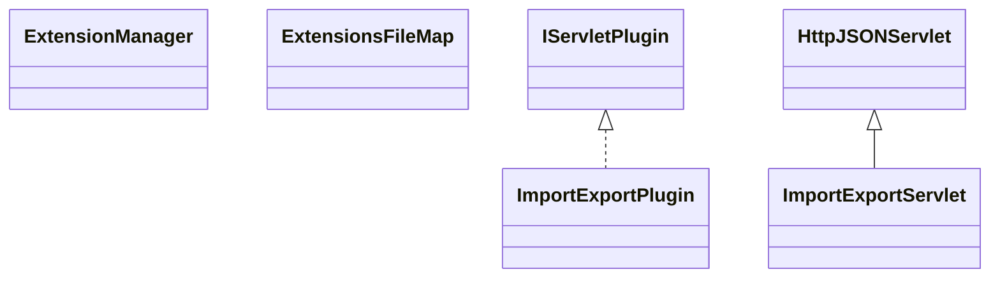

# CodeEditorImportExport.jar

[Group index](README.md) | [All archives](../README.md)

## Scope and provenance

- **Donor:** `SQX_145_REFERENCE_ROOT/internal/plugins/CodeEditorImportExport/CodeEditorImportExport.jar`.
- **SHA-256:** `64d2f79b52a571d08aa90f0e56071bbc5fe1bfee5b30865bab8f18b1822ba990`; accessed 2026-10-06; captured `2026-10-06T18:54:51.906614+00:00`.
- **Classes:** 5 raw entries; 5 unique entry names. Duplicate occurrence indices are zero-based.
- **Inspection:** read-only ZIP hashing and class-file structural parsing; signatures/descriptors, modifiers, hierarchy and references only. Bytecode bodies are hashed, not published.
- **Allocation:** proposed `FEAT-AUTHORING-CODE-EDITOR-IMPORT-EXPORT`, P07; [roadmap](../../sqx-full-application-roadmap.md). Domain README registration remains required.
- **Repository:** `01067f00031428613c6394064ca1bcadc1ba00ee`; review state unreviewed. Download label 145-dev1; installed build/activation and runtime equivalence unverified.
- **Limit:** every class/member is inventoried; declaration coverage does not establish consumed calls, defaults, formulas, failure semantics or algorithm parity.
- **Archive/resource index:** [142.json](../../../evidence/sqx145/archives/145/142.json).

## Complete member declarations

Member shards contain exact JVM names/descriptors, access flags, generic signatures, throws types, declared fields/methods, superclass/interfaces and referenced class names. All classes, nested/synthetic members and overloads are retained. Code length/hash is structural evidence, not a normalized algorithm comparison.

- [001.json](../../../evidence/sqx145/members/142/001.json) — SHA-256 `ca1433954b46658c71903080d139c2877440b0aeb1437174903886bae96f4c36`.

## Focused structural diagram

Up to twelve non-nested classes; arrows show declared inheritance/interfaces only. External type names are not evidence of an available body or an executed dependency.

## Class inventory

| Archive entry | Occurrence | Class SHA-256 | Fields | Methods |
| --- | ---: | --- | ---: | ---: |
| `com/strategyquant/plugin/CodeEditor/impl/ImportExport/ExtensionManager$1.class` | 0 | `ed79060eab94c8d07b7808f35984e6c095d8cd58a58ea020bb42eefcee4181a7` | 0 | 2 |
| `com/strategyquant/plugin/CodeEditor/impl/ImportExport/ExtensionManager.class` | 0 | `fe24f23f20d8080e98a213ade09e6e49c54295c5211eeb587feb2dded8482959` | 12 | 14 |
| `com/strategyquant/plugin/CodeEditor/impl/ImportExport/ExtensionsFileMap.class` | 0 | `a8c467b50e1d8a566e67b6385eb633601469a6f24a143cc0a7cebacd858e4c6f` | 16 | 7 |
| `com/strategyquant/plugin/CodeEditor/impl/ImportExport/ImportExportPlugin.class` | 0 | `f2118236667a18b440cd89711e43a6b42a0e7ad22ca1ee09731f6943ca2604e8` | 1 | 5 |
| `com/strategyquant/plugin/CodeEditor/impl/ImportExport/ImportExportServlet.class` | 0 | `6444184acf21d342c255d74fa3730c2128cb2e788f4747631f4c93a3686d1798` | 19 | 12 |
